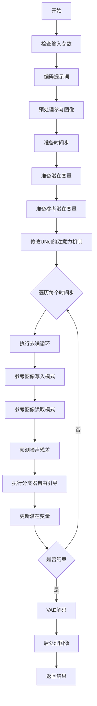
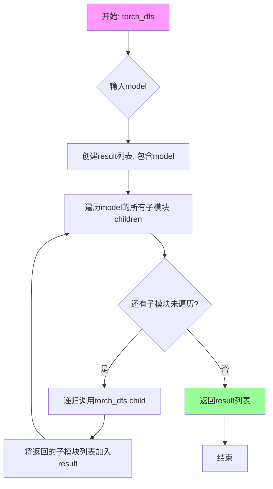
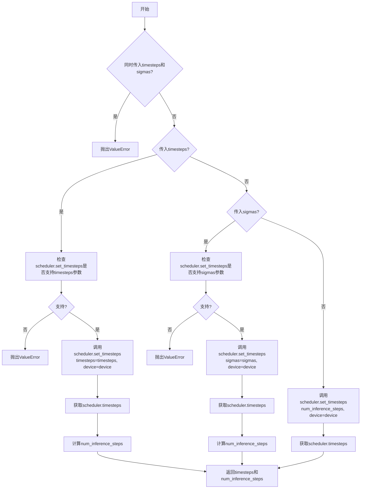
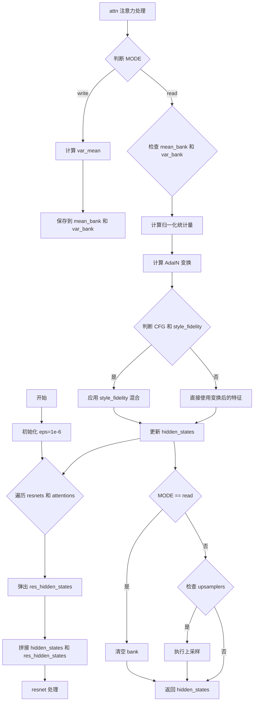
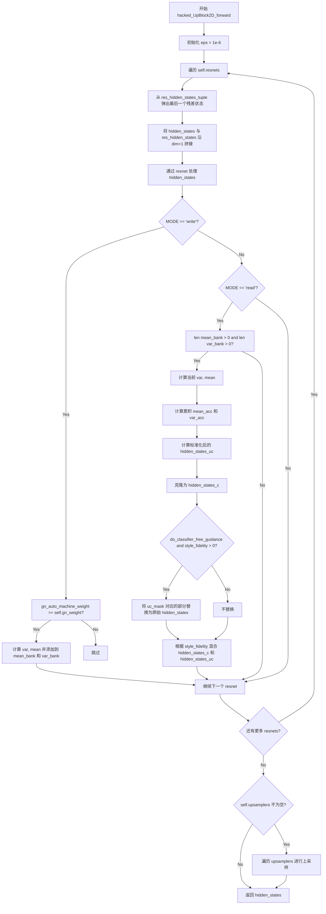
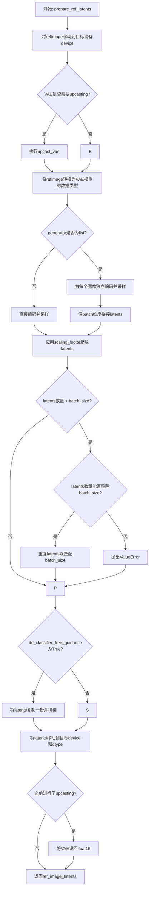
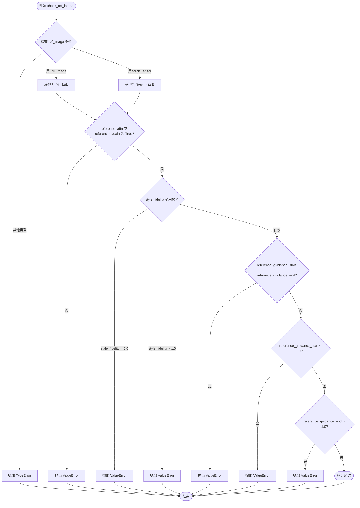
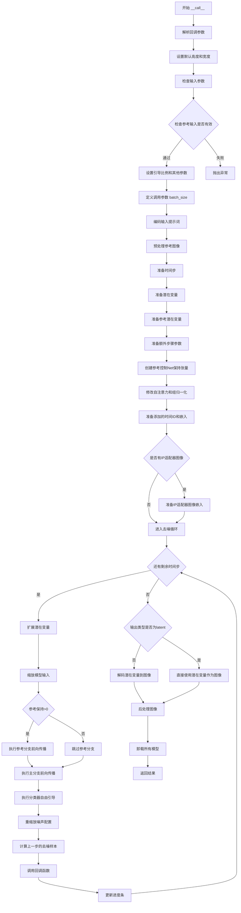

# `diffusers\examples\community\stable_diffusion_xl_reference.py` 详细设计文档

这是一个基于StableDiffusionXLPipeline的参考控制（Reference Control）Pipeline，通过参考图像来引导图像生成过程，实现风格迁移和内容保真度控制。

## 整体流程



## 类结构

```
StableDiffusionXLPipeline (基类)
└── StableDiffusionXLReferencePipeline (继承类)
    ├── prepare_ref_latents (方法)
    ├── prepare_ref_image (方法)
    ├── check_ref_inputs (方法)
    └── __call__ (主方法)
```

## 全局变量及字段


### `XLA_AVAILABLE`
    
Flag indicating whether PyTorch XLA is available for TPU support

类型：`bool`
    


### `logger`
    
Logger instance for the module to log warnings and errors

类型：`logging.Logger`
    


### `EXAMPLE_DOC_STRING`
    
Documentation string containing example usage for the pipeline

类型：`str`
    


### `MODE`
    
Mode flag controlling whether to write reference features to bank or read from it during denoising

类型：`str`
    


### `uc_mask`
    
Boolean mask tensor for distinguishing unconditional and conditional inputs in classifier-free guidance

类型：`torch.Tensor`
    


### `reference_keeps`
    
List of floats determining the reference guidance weight at each timestep based on start/end parameters

类型：`List[float]`
    


### `attn_modules`
    
List of transformer blocks containing attention modules for applying reference attention control

类型：`List[BasicTransformerBlock]`
    


### `gn_modules`
    
List of UNet modules (mid block and up/down blocks) for applying group normalization reference control

类型：`List[torch.nn.Module]`
    


### `StableDiffusionXLReferencePipeline._guidance_scale`
    
Guidance scale for classifier-free diffusion guidance, controlling text-to-image alignment

类型：`float`
    


### `StableDiffusionXLReferencePipeline._guidance_rescale`
    
Rescale factor for noise configuration to fix overexposure issues

类型：`float`
    


### `StableDiffusionXLReferencePipeline._clip_skip`
    
Number of layers to skip in CLIP text encoder for hidden state extraction

类型：`Optional[int]`
    


### `StableDiffusionXLReferencePipeline._cross_attention_kwargs`
    
Keyword arguments dictionary for cross-attention processor customization

类型：`Optional[Dict[str, Any]]`
    


### `StableDiffusionXLReferencePipeline._denoising_end`
    
Fraction of denoising process to complete before prematurely terminating generation

类型：`Optional[float]`
    


### `StableDiffusionXLReferencePipeline._interrupt`
    
Flag indicating whether to interrupt the denoising process when set to True

类型：`bool`
    


### `StableDiffusionXLReferencePipeline._num_timesteps`
    
Total number of denoising timesteps for the current generation cycle

类型：`int`
    
    

## 全局函数及方法


### `torch_dfs`

这是一个递归函数，用于深度优先遍历（DFS）PyTorch神经网络模型的所有子模块。它接受一个`torch.nn.Module`对象作为输入，通过递归方式访问模型的每个子模块，并返回一个包含原始模型及其所有子模块的列表，常用于获取模型内部结构以便进行操作或修改。

参数：

- `model`：`torch.nn.Module`，要遍历的PyTorch神经网络模型

返回值：`List[torch.nn.Module]`，返回包含输入模型及其所有子模块的列表

#### 流程图



#### 带注释源码

```python
def torch_dfs(model: torch.nn.Module):
    """
    深度优先遍历PyTorch模型的所有子模块
    
    Args:
        model: torch.nnModule实例，需要遍历的模型
        
    Returns:
        List包含模型本身及其所有子模块
    """
    # 1. 将当前模型添加到结果列表
    result = [model]
    
    # 2. 遍历当前模型的所有直接子模块
    for child in model.children():
        # 3. 递归遍历每个子模块，并将结果合并到result中
        result += torch_dfs(child)
    
    # 4. 返回包含所有模块的列表
    return result
```


### `rescale_noise_cfg`

该函数根据论文"Common Diffusion Noise Schedules and Sample Steps are Flawed"的研究结果（第3.4节），对噪声预测配置进行重新缩放，以修复过度曝光问题并避免生成"平淡"的图像。

参数：

- `noise_cfg`：`torch.Tensor`，噪声预测配置张量，需要重新缩放的噪声配置
- `noise_pred_text`：`torch.Tensor`，文本条件下的噪声预测，用于计算标准差参考
- `guidance_rescale`：`float`， Guidance rescale 因子，默认为0.0，用于控制重新缩放的强度

返回值：`torch.Tensor`，重新缩放后的噪声预测配置

#### 流程图

```mermaid
flowchart TD
    A[开始] --> B[计算noise_pred_text的标准差 std_text]
    B --> C[计算noise_cfg的标准差 std_cfg]
    C --> D[计算重新缩放的噪声预测<br/>noise_pred_rescaled = noise_cfg \* (std_text / std_cfg)]
    D --> E[根据guidance_rescale混合原始和重新缩放的结果<br/>noise_cfg = guidance_rescale \* noise_pred_rescaled + (1 - guidance_rescale) \* noise_cfg]
    E --> F[返回重新缩放后的noise_cfg]
```

#### 带注释源码

```python
def rescale_noise_cfg(noise_cfg, noise_pred_text, guidance_rescale=0.0):
    """
    Rescale `noise_cfg` according to `guidance_rescale`. Based on findings of [Common Diffusion Noise Schedules and
    Sample Steps are Flawed](https://huggingface.co/papers/2305.08891). See Section 3.4
    """
    # 计算文本条件噪声预测的标准差，保留维度用于广播
    std_text = noise_pred_text.std(dim=list(range(1, noise_pred_text.ndim)), keepdim=True)
    
    # 计算噪声配置的标准差，保留维度用于广播
    std_cfg = noise_cfg.std(dim=list(range(1, noise_cfg.ndim)), keepdim=True)
    
    # 根据文本噪声的标准差重新缩放噪声配置（修复过度曝光）
    noise_pred_rescaled = noise_cfg * (std_text / std_cfg)
    
    # 通过guidance_rescale因子混合原始结果和重新缩放后的结果，避免生成"平淡"的图像
    noise_cfg = guidance_rescale * noise_pred_rescaled + (1 - guidance_rescale) * noise_cfg
    
    return noise_cfg
```


### `retrieve_timesteps`

该函数是Stable Diffusion XL参考pipeline中的一个工具函数，用于调用调度器（scheduler）的`set_timesteps`方法并从调度器中检索时间步。它处理自定义时间步和sigmas，并返回时间步调度和推理步数。

参数：

- `scheduler`：`SchedulerMixin`，用于获取时间步的调度器
- `num_inference_steps`：`Optional[int]`，生成样本时使用的扩散步数。如果使用此参数，`timesteps`必须为`None`
- `device`：`Optional[Union[str, torch.device]]`，时间步要移动到的设备。如果为`None`，时间步不会移动
- `timesteps`：`Optional[List[int]]`，用于覆盖调度器时间步间隔策略的自定义时间步。如果传入`timesteps`，则`num_inference_steps`和`sigmas`必须为`None`
- `sigmas`：`Optional[List[float]]`，用于覆盖调度器时间步间隔策略的自定义sigmas。如果传入`sigmas`，则`num_inference_steps`和`timesteps`必须为`None`
- `**kwargs`：任意关键字参数，将传递给`scheduler.set_timesteps`

返回值：`Tuple[torch.Tensor, int]`，第一个元素是调度器的时间步调度，第二个元素是推理步数

#### 流程图



#### 带注释源码

```python
def retrieve_timesteps(
    scheduler,
    num_inference_steps: Optional[int] = None,
    device: Optional[Union[str, torch.device]] = None,
    timesteps: Optional[List[int]] = None,
    sigmas: Optional[List[float]] = None,
    **kwargs,
):
    r"""
    调用调度器的`set_timesteps`方法并从调度器中检索时间步。处理自定义时间步。
    任何kwargs都将传递给`scheduler.set_timesteps`。

    Args:
        scheduler (`SchedulerMixin`):
            用于获取时间步的调度器。
        num_inference_steps (`int`):
            生成样本时使用的扩散步数。如果使用此参数，`timesteps`必须为`None`。
        device (`str` or `torch.device`, *optional*):
            时间步要移动到的设备。如果为`None`，时间步不会移动。
        timesteps (`List[int]`, *optional*):
            用于覆盖调度器时间步间隔策略的自定义时间步。
        sigmas (`List[float]`, *optional*):
            用于覆盖调度器时间步间隔策略的自定义sigmas。

    Returns:
        `Tuple[torch.Tensor, int]`: 元组，第一个元素是调度器的时间步调度，第二个元素是推理步数。
    """
    # 校验：timesteps和sigmas不能同时传入
    if timesteps is not None and sigmas is not None:
        raise ValueError("Only one of `timesteps` or `sigmas` can be passed. Please choose one to set custom values")
    
    # 分支处理：根据传入的参数类型执行不同的逻辑
    if timesteps is not None:
        # 检查调度器的set_timesteps方法是否支持timesteps参数
        accepts_timesteps = "timesteps" in set(inspect.signature(scheduler.set_timesteps).parameters.keys())
        if not accepts_timesteps:
            raise ValueError(
                f"The current scheduler class {scheduler.__class__}'s `set_timesteps` does not support custom"
                f" timestep schedules. Please check whether you are using the correct scheduler."
            )
        # 调用set_timesteps设置自定义时间步
        scheduler.set_timesteps(timesteps=timesteps, device=device, **kwargs)
        # 从调度器获取时间步
        timesteps = scheduler.timesteps
        # 计算推理步数
        num_inference_steps = len(timesteps)
    elif sigmas is not None:
        # 检查调度器的set_timesteps方法是否支持sigmas参数
        accept_sigmas = "sigmas" in set(inspect.signature(scheduler.set_timesteps).parameters.keys())
        if not accept_sigmas:
            raise ValueError(
                f"The current scheduler class {scheduler.__class__}'s `set_timesteps` does not support custom"
                f" sigmas schedules. Please check whether you are using the correct scheduler."
            )
        # 调用set_timesteps设置自定义sigmas
        scheduler.set_timesteps(sigmas=sigmas, device=device, **kwargs)
        # 从调度器获取时间步
        timesteps = scheduler.timesteps
        # 计算推理步数
        num_inference_steps = len(timesteps)
    else:
        # 默认情况：使用num_inference_steps设置时间步
        scheduler.set_timesteps(num_inference_steps, device=device, **kwargs)
        # 从调度器获取时间步
        timesteps = scheduler.timesteps
    
    # 返回时间步和推理步数
    return timesteps, num_inference_steps
```


### `hacked_basic_transformer_inner_forward`

该函数是一个在 `__call__` 方法内部定义的闭包，用于替换 `BasicTransformerBlock` 的前向传播逻辑。它实现了基于参考图像的自适应注意力机制，通过维护一个 `bank` 存储参考层的隐藏状态，在"读"模式下将参考特征融合到当前层的自注意力计算中，从而实现风格迁移和内容保真度的平衡。

参数：

- `self`：`BasicTransformerBlock`，通过 `__get__` 方法绑定的模块实例，包含了 `bank`（存储参考隐藏状态）、`attn_weight`（注意力权重）等自定义属性
- `hidden_states`：`torch.Tensor`，输入的隐藏状态张量，形状为 `(batch, channel, height, width)`
- `attention_mask`：`Optional[torch.Tensor]`，自注意力的掩码张量，用于屏蔽某些位置的注意力计算
- `encoder_hidden_states`：`Optional[torch.Tensor]`，编码器的隐藏状态，当 `only_cross_attention` 为 False 时用于自注意力，为 True 时用于交叉注意力
- `encoder_attention_mask`：`Optional[torch.Tensor]`，编码器注意力的掩码张量
- `timestep`：`Optional[torch.LongTensor]`，扩散过程的时间步，用于自适应层归一化
- `cross_attention_kwargs`：`Dict[str, Any]`，交叉注意力的额外关键字参数字典
- `class_labels`：`Optional[torch.LongTensor]`，类别标签，用于自适应层归一化零

返回值：`torch.Tensor`，处理后的隐藏状态张量

#### 流程图

```mermaid
flowchart TD
    A[开始: hidden_states输入] --> B{use_ada_layer_norm?}
    B -->|True| C[使用自适应层归一化 norm1]
    B -->|False| D{use_ada_layer_norm_zero?}
    D -->|True| E[自适应层归一化零+门控]
    D -->|False| F[标准层归一化 norm1]
    C --> G{only_cross_attention?}
    E --> G
    F --> G
    
    G -->|True| H[attn1: 自注意力或交叉注意力]
    G -->|False| I{MODE == write?}
    I -->|Yes| J[bank.append复制隐藏状态]
    J --> K[attn1: 自注意力计算]
    I -->|No| L{MODE == read?}
    L -->|Yes| M{attention_auto_machine_weight > attn_weight?}
    M -->|Yes| N[拼接bank中的参考状态]
    N --> O[attn1_uc: 无条件注意力]
    O --> P{style_fidelity > 0?}
    P -->|Yes| Q[attn1_c: 有条件注意力]
    Q --> R[融合: style_fidelity * attn1_c + (1-style_fidelity) * attn1_uc]
    P -->|No| S[attn_output = attn1_uc]
    M -->|No| T[标准attn1计算]
    L -->|No| T
    S --> U[清空bank]
    T --> U
    R --> U
    H --> V[残差连接: hidden_states + attn_output]
    
    V --> W{use_ada_layer_norm_zero?}
    W -->|Yes| X[应用门控: gate_msa * attn_output]
    W -->|No| Y
    
    Y --> Z{attn2存在?}
    Z -->|Yes| AA[归一化: norm2]
    AA --> AB[attn2: 交叉注意力]
    AB --> AC[残差连接]
    Z -->|No| AD
    
    AC --> AD[Feed-Forward准备]
    AD --> AE[norm3归一化]
    AE --> AF{use_ada_layer_norm_zero?}
    AF -->|Yes| AG[缩放+偏移]
    AG --> AH[ff: 前馈网络]
    AF -->|No| AI[ff: 前馈网络]
    AH --> AJ[残差连接]
    AI --> AJ
    
    AJ --> AK[返回: hidden_states]
```

#### 带注释源码

```python
def hacked_basic_transformer_inner_forward(
    self,
    hidden_states: torch.Tensor,
    attention_mask: Optional[torch.Tensor] = None,
    encoder_hidden_states: Optional[torch.Tensor] = None,
    encoder_attention_mask: Optional[torch.Tensor] = None,
    timestep: Optional[torch.LongTensor] = None,
    cross_attention_kwargs: Dict[str, Any] = None,
    class_labels: Optional[torch.LongTensor] = None,
):
    """
    自定义的BasicTransformerBlock前向传播，实现基于参考图像的注意力机制。
    
    该函数通过维护一个bank来存储参考层的隐藏状态，在读模式下将参考特征
    融合到当前层的自注意力计算中，支持style_fidelity参数控制内容保真度。
    """
    # 1. 归一化层 - 根据配置选择不同的归一化方式
    if self.use_ada_layer_norm:
        # 自适应层归一化
        norm_hidden_states = self.norm1(hidden_states, timestep)
    elif self.use_ada_layer_norm_zero:
        # 自适应层归一化零（带门控和变换参数）
        norm_hidden_states, gate_msa, shift_mlp, scale_mlp, gate_mlp = self.norm1(
            hidden_states, timestep, class_labels, hidden_dtype=hidden_states.dtype
        )
    else:
        # 标准层归一化
        norm_hidden_states = self.norm1(hidden_states)

    # 2. 自注意力计算 (Self-Attention)
    cross_attention_kwargs = cross_attention_kwargs if cross_attention_kwargs is not None else {}
    if self.only_cross_attention:
        # 仅交叉注意力模式
        attn_output = self.attn1(
            norm_hidden_states,
            encoder_hidden_states=encoder_hidden_states if self.only_cross_attention else None,
            attention_mask=attention_mask,
            **cross_attention_kwargs,
        )
    else:
        if MODE == "write":
            # 写入模式：将当前层的隐藏状态克隆存储到bank中，供后续读取使用
            self.bank.append(norm_hidden_states.detach().clone())
            attn_output = self.attn1(
                norm_hidden_states,
                encoder_hidden_states=encoder_hidden_states if self.only_cross_attention else None,
                attention_mask=attention_mask,
                **cross_attention_kwargs,
            )
        if MODE == "read":
            # 读取模式：将参考bank中的特征融合到注意力计算中
            if attention_auto_machine_weight > self.attn_weight:
                # 将bank中的所有参考状态与当前状态拼接，实现跨层注意力
                attn_output_uc = self.attn1(
                    norm_hidden_states,
                    encoder_hidden_states=torch.cat([norm_hidden_states] + self.bank, dim=1),
                    # attention_mask=attention_mask,  # 拼接后mask失效
                    **cross_attention_kwargs,
                )
                attn_output_c = attn_output_uc.clone()
                # 如果启用无分类器引导且style_fidelity>0，分别处理条件/无条件部分
                if do_classifier_free_guidance and style_fidelity > 0:
                    attn_output_c[uc_mask] = self.attn1(
                        norm_hidden_states[uc_mask],
                        encoder_hidden_states=norm_hidden_states[uc_mask],
                        **cross_attention_kwargs,
                    )
                # 根据style_fidelity混合条件和无条件注意力输出
                attn_output = style_fidelity * attn_output_c + (1.0 - style_fidelity) * attn_output_uc
                self.bank.clear()  # 读取完后清空bank
            else:
                # 如果注意力权重不足，回退到标准注意力计算
                attn_output = self.attn1(
                    norm_hidden_states,
                    encoder_hidden_states=encoder_hidden_states if self.only_cross_attention else None,
                    attention_mask=attention_mask,
                    **cross_attention_kwargs,
                )
    
    # 3. 应用门控（如果使用AdaLN-Zero）
    if self.use_ada_layer_norm_zero:
        attn_output = gate_msa.unsqueeze(1) * attn_output
    
    # 4. 残差连接
    hidden_states = attn_output + hidden_states

    # 5. 交叉注意力 (Cross-Attention) - 如果存在attn2
    if self.attn2 is not None:
        # 根据配置选择归一化方式
        norm_hidden_states = (
            self.norm2(hidden_states, timestep) if self.use_ada_layer_norm else self.norm2(hidden_states)
        )

        # 执行交叉注意力，将文本/图像编码融入特征
        attn_output = self.attn2(
            norm_hidden_states,
            encoder_hidden_states=encoder_hidden_states,
            attention_mask=encoder_attention_mask,
            **cross_attention_kwargs,
        )
        hidden_states = attn_output + hidden_states

    # 6. 前馈网络 (Feed-Forward)
    norm_hidden_states = self.norm3(hidden_states)

    if self.use_ada_layer_norm_zero:
        # 应用AdaLN-Zero的缩放和偏移
        norm_hidden_states = norm_hidden_states * (1 + scale_mlp[:, None]) + shift_mlp[:, None]

    ff_output = self.ff(norm_hidden_states)

    if self.use_ada_layer_norm_zero:
        ff_output = gate_mlp.unsqueeze(1) * ff_output

    hidden_states = ff_output + hidden_states

    return hidden_states
```


### `hacked_mid_forward`

该函数是 StableDiffusionXLReferencePipeline 中的一个核心方法，通过替换 UNet 中间块的前向传播实现自适应实例归一化（AdaIN）风格迁移。在"write"模式下捕获并存储特征的均值和方差，在"read"模式下利用存储的统计信息对特征进行归一化调整，以实现参考图像风格的迁移。

参数：

- `self`：被替换的 UNet 中间块模块（`torch.nn.Module`），包含 `original_forward`、`mean_bank`、`var_bank`、`gn_weight` 等属性
- `*args`：可变位置参数，传递给原始的 `original_forward` 方法，通常包含隐藏状态、时间步等
- `**kwargs`：可变关键字参数，传递给原始的 `original_forward` 方法

返回值：`torch.Tensor`，经过 AdaIN 风格迁移处理后的特征张量

#### 流程图

```mermaid
flowchart TD
    A[开始: hacked_mid_forward] --> B[设置 eps = 1e-6]
    B --> C[调用 self.original_forward 获得输出 x]
    C --> D{MODE == 'write'?}
    D -->|Yes| E{gn_auto_machine_weight >= self.gn_weight?}
    E -->|Yes| F[计算 x 的方差和均值]
    F --> G[将 mean 和 var 存入 self.mean_bank 和 self.var_bank]
    E -->|No| H[跳过存储]
    D -->|No| I{MODE == 'read'?}
    I -->|Yes| J{mean_bank 和 var_bank 非空?}
    J -->|Yes| K[计算当前 x 的统计信息]
    K --> L[计算累积均值和方差]
    L --> M[执行 AdaIN 归一化: x_uc = (((x - mean) / std) * std_acc) + mean_acc]
    M --> N{do_classifier_free_guidance 且 style_fidelity > 0?}
    N -->|Yes| O[将 x_c 的无条件部分替换为原始 x]
    N -->|No| P[保持 x_c 不变]
    O --> Q[混合: x = style_fidelity * x_c + (1 - style_fidelity) * x_uc]
    P --> Q
    Q --> R[清空 mean_bank 和 var_bank]
    J -->|No| S[跳过处理]
    I -->|No| T[直接返回 x]
    R --> T
    H --> T
    S --> T
    T --> U[结束: 返回处理后的 x]
```

#### 带注释源码

```python
def hacked_mid_forward(self, *args, **kwargs):
    """
    在 UNet 中间块上执行 AdaIN 风格迁移的自定义前向传播。
    
    工作原理：
    - write 模式：捕获并存储特征的统计信息（均值、方差）
    - read 模式：利用存储的统计信息对特征进行归一化处理，实现风格迁移
    """
    # 用于防止除零的小常数
    eps = 1e-6
    
    # 调用原始的中间块前向传播，获取输出特征
    x = self.original_forward(*args, **kwargs)
    
    # === WRITE 模式：存储统计信息 ===
    if MODE == "write":
        # 判断是否满足应用 AdaIN 的权重条件
        if gn_auto_machine_weight >= self.gn_weight:
            # 计算当前特征的方差和均值，dim=(2,3) 对应空间维度
            var, mean = torch.var_mean(x, dim=(2, 3), keepdim=True, correction=0)
            # 将统计信息存储到银行中，供后续 read 模式使用
            self.mean_bank.append(mean)
            self.var_bank.append(var)
    
    # === READ 模式：应用 AdaIN 风格迁移 ===
    if MODE == "read":
        # 检查是否有存储的统计信息
        if len(self.mean_bank) > 0 and len(self.var_bank) > 0:
            # 计算当前特征的统计信息
            var, mean = torch.var_mean(x, dim=(2, 3), keepdim=True, correction=0)
            # 计算标准差（防止负数方差）
            std = torch.maximum(var, torch.zeros_like(var) + eps) ** 0.5
            
            # 计算累积的均值和方差（所有存储值的平均）
            mean_acc = sum(self.mean_bank) / float(len(self.mean_bank))
            var_acc = sum(self.var_bank) / float(len(self.var_bank))
            # 计算累积的标准差
            std_acc = torch.maximum(var_acc, torch.zeros_like(var_acc) + eps) ** 0.5
            
            # 执行 AdaIN 归一化：将特征分布转换为参考特征的分布
            x_uc = (((x - mean) / std) * std_acc) + mean_acc
            
            # 克隆用于条件和无条件部分的处理
            x_c = x_uc.clone()
            
            # 如果使用无分类器引导且风格保真度大于0
            # 则保留无条件部分（uc_mask 对应的部分）的原始特征
            if do_classifier_free_guidance and style_fidelity > 0:
                x_c[uc_mask] = x[uc_mask]
            
            # 根据风格保真度混合条件和无条件结果
            # style_fidelity=1.0: 更多参考特征
            # style_fidelity=0.0: 更多原始生成特征
            x = style_fidelity * x_c + (1.0 - style_fidelity) * x_uc
        
        # 处理完成后清空银行，准备下一个推理步骤
        self.mean_bank = []
        self.var_bank = []
    
    # 返回处理后的特征
    return x
```


### `hack_CrossAttnDownBlock2D_forward`

该函数是 `CrossAttnDownBlock2D` 的自定义前向传播方法，用于实现基于 AdaIN（自适应实例归一化）的参考图像特征注入。它通过在去噪过程中"写入"参考图像的统计信息（均值和方差），然后在后续步骤中"读取"这些信息来调整隐藏状态的特征分布，从而实现风格迁移效果。

参数：

- `self`：`CrossAttnDownBlock2D` 实例，通过 `__get__` 方法绑定的方法
- `hidden_states`：`torch.Tensor`，输入的隐藏状态张量
- `temb`：`Optional[torch.Tensor]`，时间嵌入向量
- `encoder_hidden_states`：`Optional[torch.Tensor]`，编码器的隐藏状态，用于交叉注意力
- `attention_mask`：`Optional[torch.Tensor]`，注意力掩码（代码中未使用）
- `cross_attention_kwargs`：`Optional[Dict[str, Any]]`，交叉注意力的额外关键字参数
- `encoder_attention_mask`：`Optional[torch.Tensor]`，编码器的注意力掩码

返回值：`Tuple[torch.Tensor, Tuple[torch.Tensor, ...]]`，返回最终的隐藏状态和所有中间输出状态的元组

#### 流程图

```mermaid
flowchart TD
    A[开始] --> B[初始化输出状态为空元组]
    B --> C{遍历 resnets 和 attentions}
    C -->|每次迭代| D[resnet 处理 hidden_states]
    D --> E[attn 处理 hidden_states]
    E --> F{MODE == 'write'}
    F -->|是| G{gn_auto_machine_weight >= gn_weight}
    G -->|是| H[计算 var_mean 并存入 mean_bank/var_bank]
    G -->|否| I[跳过存储]
    F -->|否| J{MODE == 'read'}
    J -->|是| K{mean_bank 和 var_bank 不为空}
    K -->|是| L[计算归一化统计量]
    L --> M[计算 AdaIN 后的 hidden_states_uc]
    M --> N{do_classifier_free_guidance 且 style_fidelity > 0}
    N -->|是| O[替换 uc_mask 对应的 hidden_states_c]
    N -->|否| P[跳过替换]
    O --> Q[混合 style_fidelity * hidden_states_c + (1-style_fidelity) * hidden_states_uc]
    P --> Q
    Q --> R[添加到输出状态]
    K -->|否| R
    J -->|否| R
    I --> R
    R --> S[将 hidden_states 加入输出状态]
    S --> C
    C -->|遍历完成| T{downsamplers 不为空}
    T -->|是| U[对每个 downsampler 处理]
    U --> V[添加最终 hidden_states 到输出状态]
    T -->|否| W[返回 hidden_states 和 output_states]
    V --> W
```

#### 带注释源码

```python
def hack_CrossAttnDownBlock2D_forward(
    self,
    hidden_states: torch.Tensor,
    temb: Optional[torch.Tensor] = None,
    encoder_hidden_states: Optional[torch.Tensor] = None,
    attention_mask: Optional[torch.Tensor] = None,
    cross_attention_kwargs: Optional[Dict[str, Any]] = None,
    encoder_attention_mask: Optional[torch.Tensor] = None,
):
    eps = 1e-6  # 防止除零的小常数

    # TODO(Patrick, William) - attention mask is not used
    output_states = ()  # 初始化输出状态元组

    # 遍历所有的 resnet 和 attention 模块
    for i, (resnet, attn) in enumerate(zip(self.resnets, self.attentions)):
        # 1. ResNet 处理
        hidden_states = resnet(hidden_states, temb)
        
        # 2. Attention 处理
        hidden_states = attn(
            hidden_states,
            encoder_hidden_states=encoder_hidden_states,
            cross_attention_kwargs=cross_attention_kwargs,
            attention_mask=attention_mask,
            encoder_attention_mask=encoder_attention_mask,
            return_dict=False,
        )[0]
        
        # 3. 写入模式：存储统计信息用于 AdaIN
        if MODE == "write":
            if gn_auto_machine_weight >= self.gn_weight:
                # 计算隐藏状态的方差和均值
                var, mean = torch.var_mean(hidden_states, dim=(2, 3), keepdim=True, correction=0)
                self.mean_bank.append([mean])
                self.var_bank.append([var])
        
        # 4. 读取模式：应用 AdaIN 进行特征迁移
        if MODE == "read":
            if len(self.mean_bank) > 0 and len(self.var_bank) > 0:
                # 计算当前 hidden_states 的统计量
                var, mean = torch.var_mean(hidden_states, dim=(2, 3), keepdim=True, correction=0)
                std = torch.maximum(var, torch.zeros_like(var) + eps) ** 0.5
                
                # 计算累积的统计量（从 bank 中取出当前层的）
                mean_acc = sum(self.mean_bank[i]) / float(len(self.mean_bank[i]))
                var_acc = sum(self.var_bank[i]) / float(len(self.var_bank[i]))
                std_acc = torch.maximum(var_acc, torch.zeros_like(var_acc) + eps) ** 0.5
                
                # 应用 AdaIN 归一化
                hidden_states_uc = (((hidden_states - mean) / std) * std_acc) + mean_acc
                hidden_states_c = hidden_states_uc.clone()
                
                # 如果使用 classifier-free guidance 且 style_fidelity > 0
                # 保留原始条件部分的特征
                if do_classifier_free_guidance and style_fidelity > 0:
                    hidden_states_c[uc_mask] = hidden_states[uc_mask]
                
                # 根据 style_fidelity 混合条件和非条件结果
                hidden_states = style_fidelity * hidden_states_c + (1.0 - style_fidelity) * hidden_states_uc

        # 将当前 hidden_states 添加到输出状态
        output_states = output_states + (hidden_states,)

    # 读取模式结束后清空 bank
    if MODE == "read":
        self.mean_bank = []
        self.var_bank = []

    # 5. 如果有下采样器，进行下采样
    if self.downsamplers is not None:
        for downsampler in self.downsamplers:
            hidden_states = downsampler(hidden_states)

        output_states = output_states + (hidden_states,)

    return hidden_states, output_states
```


### `hacked_DownBlock2D_forward`

该函数是 `DownBlock2D` 类的修改版前向传播方法，用于实现参考图像的自适应实例归一化（AdaIN）功能。它在"写入模式"下计算并保存每个残差块输出特征的均值和方差统计量，在"读取模式"下将这些统计量应用于目标特征，从而实现风格迁移效果。

参数：

- `hidden_states`：`torch.Tensor`，输入的隐藏状态张量
- `temb`：`Optional[torch.Tensor]`，时间嵌入向量，默认为 None
- `*args`：可变位置参数，用于兼容其他参数
- `**kwargs`：可变关键字参数，用于兼容其他参数

返回值：`Tuple[torch.Tensor, torch.Tensor]`，返回处理后的隐藏状态和输出状态元组

#### 流程图

```mermaid
flowchart TD
    A[开始 hacked_DownBlock2D_forward] --> B[初始化 eps = 1e-6]
    B --> C[初始化 output_states = ()]
    C --> D[遍历 self.resnets 列表]
    D --> E[调用 resnet 处理 hidden_states]
    E --> F{MODE == 'write'?}
    F -->|Yes| G{gn_auto_machine_weight >= gn_weight?}
    G -->|Yes| H[计算 var, mean]
    H --> I[将 mean, var 添加到 mean_bank, var_bank]
    G -->|No| J[跳过统计量保存]
    F -->|No| K{MODE == 'read'?}
    K -->|Yes| L{len mean_bank > 0?}
    L -->|Yes| M[计算当前 var, mean]
    M --> N[计算 std]
    N --> O[计算 mean_acc, var_acc]
    O --> P[计算 std_acc]
    P --> Q[应用 AdaIN 归一化]
    Q --> R{do_classifier_free_guidance and style_fidelity > 0?}
    R -->|Yes| S[替换 uncond 部分]
    R -->|No| T[混合 style_fidelity]
    S --> U[更新 hidden_states]
    T --> U
    L -->|No| V[跳过归一化]
    K -->|No| W[继续下一个 resnet]
    U --> W
    V --> W
    W --> X[将 hidden_states 加入 output_states]
    X --> Y{还有更多 resnets?}
    Y -->|Yes| E
    Y -->|No| Z{MODE == 'read'?}
    Z -->|Yes| AA[清空 mean_bank, var_bank]
    Z -->|No| BB{downsamplers is not None?}
    AA --> BB
    BB -->|Yes| CC[应用 downsamplers]
    CC --> DD[将结果加入 output_states]
    DD --> EE[返回 hidden_states, output_states]
    BB -->|No| EE
```

#### 带注释源码

```python
def hacked_DownBlock2D_forward(self, hidden_states, temb=None, *args, **kwargs):
    """
    修改后的 DownBlock2D 前向传播，实现参考图像的 AdaIN 风格迁移
    
    参数:
        hidden_states: 输入的隐藏状态张量
        temb: 时间嵌入向量
        *args, **kwargs: 额外的位置和关键字参数
    
    返回:
        hidden_states: 处理后的隐藏状态
        output_states: 包含所有中间状态的元组
    """
    eps = 1e-6  # 防止除零的小常数

    output_states = ()  # 初始化输出状态元组

    # 遍历所有的残差网络块
    for i, resnet in enumerate(self.resnets):
        # 通过残差块处理隐藏状态
        hidden_states = resnet(hidden_states, temb)

        # 写入模式：保存统计量用于后续 AdaIN 处理
        if MODE == "write":
            if gn_auto_machine_weight >= self.gn_weight:
                # 计算隐藏状态的方差和均值 (按空间维度)
                var, mean = torch.var_mean(hidden_states, dim=(2, 3), keepdim=True, correction=0)
                # 保存到模块的银行列表中，供后续读取使用
                self.mean_bank.append([mean])
                self.var_bank.append([var])
        
        # 读取模式：应用之前保存的 AdaIN 统计量
        if MODE == "read":
            if len(self.mean_bank) > 0 and len(self.var_bank) > 0:
                # 计算当前隐藏状态的统计量
                var, mean = torch.var_mean(hidden_states, dim=(2, 3), keepdim=True, correction=0)
                std = torch.maximum(var, torch.zeros_like(var) + eps) ** 0.5
                
                # 计算累积统计量（所有保存的统计量的平均值）
                mean_acc = sum(self.mean_bank[i]) / float(len(self.mean_bank[i]))
                var_acc = sum(self.var_bank[i]) / float(len(self.var_bank[i]))
                std_acc = torch.maximum(var_acc, torch.zeros_like(var_acc) + eps) ** 0.5
                
                # 应用 AdaIN 归一化：将目标特征的统计量替换为参考特征的统计量
                hidden_states_uc = (((hidden_states - mean) / std) * std_acc) + mean_acc
                hidden_states_c = hidden_states_uc.clone()
                
                # 如果使用无分类器引导且有风格保真度要求，保留条件部分的原始特征
                if do_classifier_free_guidance and style_fidelity > 0:
                    hidden_states_c[uc_mask] = hidden_states[uc_mask]
                
                # 根据风格保真度混合条件和无条件结果
                hidden_states = style_fidelity * hidden_states_c + (1.0 - style_fidelity) * hidden_states_uc

        # 将当前隐藏状态添加到输出元组
        output_states = output_states + (hidden_states,)

    # 读取模式结束后清空银行列表，释放内存
    if MODE == "read":
        self.mean_bank = []
        self.var_bank = []

    # 如果有下采样器，应用下采样
    if self.downsamplers is not None:
        for downsampler in self.downsamplers:
            hidden_states = downsampler(hidden_states)

        output_states = output_states + (hidden_states,)

    return hidden_states, output_states
```


### `hack_CrossAttnUpBlock2D_forward`

该函数是用于替换 `CrossAttnUpBlock2D` 模块原始 `forward` 方法的钩子函数。它在扩散模型的解码（upsampling）阶段应用自适应实例归一化（AdaIN）技术，通过在"写入"阶段保存特征统计信息（均值和方差），并在"读取"阶段将这些统计信息应用于当前特征，从而实现对参考图像风格的控制。

参数：

- `self`：`CrossAttnUpBlock2D`，被替换的原始模块实例
- `hidden_states`：`torch.Tensor`，当前层的隐藏状态张量
- `res_hidden_states_tuple`：`Tuple[torch.Tensor, ...]`，残差连接的隐藏状态元组
- `temb`：`Optional[torch.Tensor]`，(可选) 时间嵌入向量
- `encoder_hidden_states`：`Optional[torch.Tensor]`，(可选) 编码器隐藏状态，用于交叉注意力
- `cross_attention_kwargs`：`Optional[Dict[str, Any]]`，(可选) 交叉注意力关键字参数
- `upsample_size`：`Optional[int]`，(可选) 上采样尺寸
- `attention_mask`：`Optional[torch.Tensor]`，(可选) 注意力掩码
- `encoder_attention_mask`：`Optional[torch.Tensor]`，(可选) 编码器注意力掩码

返回值：`torch.Tensor`，处理后的隐藏状态张量

#### 流程图



#### 带注释源码

```python
def hack_CrossAttnUpBlock2D_forward(
    self,
    hidden_states: torch.Tensor,  # 当前隐藏状态
    res_hidden_states_tuple: Tuple[torch.Tensor, ...],  # 残差隐藏状态元组
    temb: Optional[torch.Tensor] = None,  # 时间嵌入
    encoder_hidden_states: Optional[torch.Tensor] = None,  # 编码器隐藏状态
    cross_attention_kwargs: Optional[Dict[str, Any]] = None,  # 交叉注意力参数
    upsample_size: Optional[int] = None,  # 上采样尺寸
    attention_mask: Optional[torch.Tensor] = None,  # 注意力掩码
    encoder_attention_mask: Optional[torch.Tensor] = None,  # 编码器注意力掩码
):
    eps = 1e-6  # 防止除零的小常数
    # TODO(Patrick, William) - attention mask is not used
    
    # 遍历每个 ResNet 和 Attention 模块
    for i, (resnet, attn) in enumerate(zip(self.resnets, self.attentions)):
        # 弹出当前残差隐藏状态（从元组末尾取出）
        res_hidden_states = res_hidden_states_tuple[-1]
        res_hidden_states_tuple = res_hidden_states_tuple[:-1]
        
        # 沿通道维度拼接隐藏状态和残差状态
        hidden_states = torch.cat([hidden_states, res_hidden_states], dim=1)
        
        # ResNet 处理
        hidden_states = resnet(hidden_states, temb)
        
        # Attention 处理
        hidden_states = attn(
            hidden_states,
            encoder_hidden_states=encoder_hidden_states,
            cross_attention_kwargs=cross_attention_kwargs,
            attention_mask=attention_mask,
            encoder_attention_mask=encoder_attention_mask,
            return_dict=False,
        )[0]

        # 写入模式：保存特征统计信息
        if MODE == "write":
            if gn_auto_machine_weight >= self.gn_weight:
                # 计算隐藏状态的方差和均值（沿空间维度）
                var, mean = torch.var_mean(hidden_states, dim=(2, 3), keepdim=True, correction=0)
                # 保存到模块的银行（bank）中供后续使用
                self.mean_bank.append([mean])
                self.var_bank.append([var])
        
        # 读取模式：应用 AdaIN 风格迁移
        if MODE == "read":
            if len(self.mean_bank) > 0 and len(self.var_bank) > 0:
                # 当前特征的统计量
                var, mean = torch.var_mean(hidden_states, dim=(2, 3), keepdim=True, correction=0)
                std = torch.maximum(var, torch.zeros_like(var) + eps) ** 0.5
                
                # 累积的统计量（来自参考图像）
                mean_acc = sum(self.mean_bank[i]) / float(len(self.mean_bank[i]))
                var_acc = sum(self.var_bank[i]) / float(len(self.var_bank[i]))
                std_acc = torch.maximum(var_acc, torch.zeros_like(var_acc) + eps) ** 0.5
                
                # AdaIN 变换：将当前特征的统计量替换为参考特征的统计量
                hidden_states_uc = (((hidden_states - mean) / std) * std_acc) + mean_acc
                hidden_states_c = hidden_states_uc.clone()
                
                # 如果使用 CFG 且风格保真度大于0，保留部分原始特征
                if do_classifier_free_guidance and style_fidelity > 0:
                    hidden_states_c[uc_mask] = hidden_states[uc_mask]
                
                # 根据风格保真度混合条件和非条件特征
                hidden_states = style_fidelity * hidden_states_c + (1.0 - style_fidelity) * hidden_states_uc

    # 读取模式结束后清空银行
    if MODE == "read":
        self.mean_bank = []
        self.var_bank = []

    # 如果有上采样器，执行上采样
    if self.upsamplers is not None:
        for upsampler in self.upsamplers:
            hidden_states = upsampler(hidden_states, upsample_size)

    return hidden_states
```


### `hacked_UpBlock2D_forward`

该函数是针对 UpBlock2D 的前向传播的"破解"（hack）版本，主要用于实现基于 Group Normalization 的 AdaIN（Adaptive Instance Normalization）参考控制机制。在上采样块中捕获中间特征的均值和方差，然后在后续步骤中根据参考图像的特征统计信息对隐藏状态进行规范化处理，以实现风格迁移效果。

参数：

- `self`：`UpBlock2D`，UpBlock2D 模块实例本身
- `hidden_states`：`torch.Tensor`，输入的隐藏状态张量
- `res_hidden_states_tuple`：`Tuple[torch.Tensor, ...]`，残差隐藏状态的元组，包含来自解码器跳跃连接的特征
- `temb`：`Optional[torch.Tensor]`（可选），时间嵌入向量，用于条件生成
- `upsample_size`：`Optional[int]`（可选），上采样尺寸，如果使用上采样层
- `*args, **kwargs`：可变位置参数和关键字参数，用于传递额外的参数

返回值：`torch.Tensor`，处理后的隐藏状态张量

#### 流程图



#### 带注释源码

```python
def hacked_UpBlock2D_forward(
    self, hidden_states, res_hidden_states_tuple, temb=None, upsample_size=None, *args, **kwargs
):
    """
    破解的 UpBlock2D 前向传播，实现基于 AdaIN 的参考控制。
    
    工作原理：
    - MODE='write': 捕获并存储当前特征的均值和方差到 bank 中
    - MODE='read': 使用存储的统计信息对特征进行规范化，实现风格迁移
    """
    eps = 1e-6  # 防止除零的小常数
    
    # 遍历上采样块中的所有残差网络
    for i, resnet in enumerate(self.resnets):
        # 从残差状态元组中弹出最后一个元素（跳跃连接特征）
        res_hidden_states = res_hidden_states_tuple[-1]
        res_hidden_states_tuple = res_hidden_states_tuple[:-1]
        
        # 将当前隐藏状态与残差状态在通道维度(dim=1)上拼接
        hidden_states = torch.cat([hidden_states, res_hidden_states], dim=1)
        
        # 通过残差网络处理
        hidden_states = resnet(hidden_states, temb)

        # 写入模式：存储特征统计信息用于后续参考
        if MODE == "write":
            if gn_auto_machine_weight >= self.gn_weight:
                # 计算特征的空间方差和均值 (dim=2,3 对应 H, W)
                var, mean = torch.var_mean(hidden_states, dim=(2, 3), keepdim=True, correction=0)
                # 保存均值和方差到模块的 bank 中
                self.mean_bank.append([mean])
                self.var_bank.append([var])
        
        # 读取模式：使用存储的统计信息进行 AdaIN 规范化
        if MODE == "read":
            if len(self.mean_bank) > 0 and len(self.var_bank) > 0:
                # 计算当前特征统计
                var, mean = torch.var_mean(hidden_states, dim=(2, 3), keepdim=True, correction=0)
                # 计算标准差
                std = torch.maximum(var, torch.zeros_like(var) + eps) ** 0.5
                
                # 计算累积统计（来自写入模式存储的所有特征）
                mean_acc = sum(self.mean_bank[i]) / float(len(self.mean_bank[i]))
                var_acc = sum(self.var_bank[i]) / float(len(self.var_bank[i]))
                std_acc = torch.maximum(var_acc, torch.zeros_like(var_acc) + eps) ** 0.5
                
                # 使用 AdaIN 公式: (x - mean) / std * ref_std + ref_mean
                hidden_states_uc = (((hidden_states - mean) / std) * std_acc) + mean_acc
                
                # 克隆用于有条件和无条件分支
                hidden_states_c = hidden_states_uc.clone()
                
                # 如果使用 classifier-free guidance 且 style_fidelity > 0
                # 将无条件部分的特征替换为原始特征（保留更多原始细节）
                if do_classifier_free_guidance and style_fidelity > 0:
                    hidden_states_c[uc_mask] = hidden_states[uc_mask]
                
                # 根据 style_fidelity 混合条件和无条件结果
                # style_fidelity=1.0: 更多参考图像风格
                # style_fidelity=0.0: 更多原始提示词
                hidden_states = style_fidelity * hidden_states_c + (1.0 - style_fidelity) * hidden_states_uc

    # 读取模式结束后清空 bank，为下一个 forward pass 准备
    if MODE == "read":
        self.mean_bank = []
        self.var_bank = []

    # 如果有上采样器，进行上采样
    if self.upsamplers is not None:
        for upsampler in self.upsamplers:
            hidden_states = upsampler(hidden_states, upsample_size)

    return hidden_states
```


### `StableDiffusionXLReferencePipeline.prepare_ref_latents`

该方法负责将参考图像（ref_image）编码到VAE的潜在空间，并根据批次大小和分类器自由引导（CFG）标志对潜在表示进行必要的处理和复制，以便后续在图像生成过程中使用参考图像的条件信息。

参数：

- `self`：`StableDiffusionXLReferencePipeline` 实例本身
- `refimage`：`torch.Tensor` 或 `PIL.Image.Image`，参考图像输入，用于提供风格或内容参考
- `batch_size`：`int`，目标批次大小，用于决定需要生成的潜在向量数量
- `dtype`：`torch.dtype`，目标数据类型，用于潜在向量的数据类型转换
- `device`：`torch.device`，目标设备，用于将潜在向量移动到指定设备
- `generator`：`torch.Generator` 或 `List[torch.Generator]`，随机生成器，用于潜在向量采样的随机性控制
- `do_classifier_free_guidance`：`bool`，是否启用分类器自由引导，若为True则复制潜在向量以同时处理条件和非条件输入

返回值：`torch.Tensor`，编码并处理后的参考图像潜在表示，形状为 `(batch_size * 2, ...)` 当启用CFG时，否则为 `(batch_size, ...)`

#### 流程图



#### 带注释源码

```python
def prepare_ref_latents(
    self,
    refimage,  # 参考图像输入
    batch_size,  # 目标批次大小
    dtype,  # 目标数据类型
    device,  # 目标设备
    generator,  # 随机生成器
    do_classifier_free_guidance  # 是否启用分类器自由引导
):
    # 1. 将参考图像移动到目标设备
    refimage = refimage.to(device=device)

    # 2. 检查VAE是否需要强制upcasting（当VAE为float16且配置要求强制upcast时）
    needs_upcasting = self.vae.dtype == torch.float16 and self.vae.config.force_upcast
    if needs_upcasting:
        # 执行upcast以避免float16下的溢出问题
        self.upcast_vae()
        # 将refimage转换为VAE后处理参数的数据类型
        refimage = refimage.to(next(iter(self.vae.post_quant_conv.parameters())).dtype)

    # 3. 确保refimage与VAE的数据类型一致
    if refimage.dtype != self.vae.dtype:
        refimage = refimage.to(dtype=self.vae.dtype)

    # 4. 使用VAE编码器将参考图像编码到潜在空间
    # 如果有多个生成器，则为每个图像独立采样
    if isinstance(generator, list):
        ref_image_latents = [
            self.vae.encode(refimage[i : i + 1]).latent_dist.sample(generator=generator[i])
            for i in range(batch_size)
        ]
        # 沿batch维度拼接所有latents
        ref_image_latents = torch.cat(ref_image_latents, dim=0)
    else:
        # 使用单个生成器进行编码和采样
        ref_image_latents = self.vae.encode(refimage).latent_dist.sample(generator=generator)

    # 5. 应用VAE的缩放因子（通常用于将latents从图像空间转换到潜在空间）
    ref_image_latents = self.vae.config.scaling_factor * ref_image_latents

    # 6. 如果latents数量少于目标batch_size，则重复latents以匹配批次大小
    # 这在单张参考图像需要生成多张图像时使用（MPS友好的方法）
    if ref_image_latents.shape[0] < batch_size:
        # 验证batch_size可以被ref_image_latents的数量整除
        if not batch_size % ref_image_latents.shape[0] == 0:
            raise ValueError(
                "The passed images and the required batch size don't match. Images are supposed to be duplicated"
                f" to a total batch size of {batch_size}, but {ref_image_latents.shape[0]} images were passed."
                " Make sure the number of images that you pass is divisible by the total requested batch size."
            )
        # 整数除法计算重复次数
        ref_image_latents = ref_image_latents.repeat(batch_size // ref_image_latents.shape[0], 1, 1, 1)

    # 7. 如果启用分类器自由引导，则复制latents用于同时处理条件和非条件输入
    # 这样可以在一次前向传播中同时计算带引导和不带引导的结果
    ref_image_latents = torch.cat([ref_image_latents] * 2) if do_classifier_free_guidance else ref_image_latents

    # 8. 确保latents与后续模型输入的设备和数据类型一致，避免设备不匹配错误
    ref_image_latents = ref_image_latents.to(device=device, dtype=dtype)

    # 9. 如果之前进行了upcasting，将VAE设回float16以节省显存
    if needs_upcasting:
        self.vae.to(dtype=torch.float16)

    # 10. 返回处理后的参考图像latents
    return ref_image_latents
```


### `StableDiffusionXLReferencePipeline.prepare_ref_image`

该方法负责将输入的参考图像（支持 PIL.Image 或 torch.Tensor 格式）进行预处理，包括格式转换、尺寸调整、批次复制等操作，使其符合 Stable Diffusion XL 模型的输入要求。

参数：

- `self`：类实例隐含参数
- `image`：`Union[PIL.Image.Image, torch.Tensor, List[PIL.Image.Image], List[torch.Tensor]]`，待处理的参考图像输入
- `width`：`int`，目标输出图像宽度（像素）
- `height`：`int`，目标输出图像高度（像素）
- `batch_size`：`int`，生成过程的批次大小
- `num_images_per_prompt`：`int`，每个提示词生成的图像数量
- `device`：`torch.device`，图像张量要迁移到的目标设备
- `dtype`：`torch.dtype`，图像张量的目标数据类型
- `do_classifier_free_guidance`：`bool`，是否启用无分类器自由引导（CFD），默认为 False
- `guess_mode`：`bool`，猜测模式标识，默认为 False

返回值：`torch.Tensor`，处理完成后的图像张量，维度为 (batch_size, channels, height, width)

#### 流程图

```mermaid
flowchart TD
    A[开始 prepare_ref_image] --> B{image 是否为 torch.Tensor?}
    B -->|否| C{image 是否为 PIL.Image?}
    B -->|是| G[直接使用 image]
    C -->|是| D[遍历图像列表]
    C -->|否| E[异常: 不支持的类型]
    D --> D1[图像转为 RGB 模式]
    D1 --> D2[调整图像大小到 width x height]
    D2 --> D3[转换为 numpy 数组]
    D3 --> D4[归一化到 [0,1] 范围]
    D4 --> D5[归一化到 [-1,1] 范围]
    D5 --> D6[维度重排: HWC -> CHW]
    D6 --> D7[转换为 torch.Tensor]
    D7 --> H
    G --> H
    H[获取 image_batch_size] --> I{batch_size == 1?}
    I -->|是| J[repeat_by = batch_size]
    I -->|否| K[repeat_by = num_images_per_prompt]
    J --> L[使用 repeat_interleave 复制图像]
    K --> L
    L --> M[将图像移到指定 device 和 dtype]
    M --> N{do_classifier_free_guidance 且非 guess_mode?}
    N -->|是| O[图像复制一份拼接]
    N -->|否| P[返回处理后的图像]
    O --> P
```

#### 带注释源码

```python
def prepare_ref_image(
    self,
    image,
    width,
    height,
    batch_size,
    num_images_per_prompt,
    device,
    dtype,
    do_classifier_free_guidance=False,
    guess_mode=False,
):
    """
    准备参考图像以用于Stable Diffusion XL Reference pipeline。
    
    该方法执行以下转换:
    1. PIL Image -> numpy array -> torch.Tensor
    2. 图像尺寸调整到目标 width x height
    3. 像素值归一化到 [-1, 1]
    4. 图像批次复制以匹配批量大小
    
    Args:
        image: 输入图像，支持 PIL.Image.Image、torch.Tensor 或其列表
        width: 目标宽度（像素）
        height: 目标高度（像素）
        batch_size: 批次大小
        num_images_per_prompt: 每个提示词生成的图像数量
        device: 目标设备
        dtype: 目标数据类型
        do_classifier_free_guidance: 是否启用无分类器引导
        guess_mode: 猜测模式标志
    
    Returns:
        处理后的 torch.Tensor 图像，维度 (batch, channels, height, width)
    """
    # 检查输入是否为 torch.Tensor，若不是则进行类型转换
    if not isinstance(image, torch.Tensor):
        # 如果是单个 PIL Image，转换为列表以便统一处理
        if isinstance(image, PIL.Image.Image):
            image = [image]

        # 处理 PIL Image 列表
        if isinstance(image[0], PIL.Image.Image):
            images = []

            for image_ in image:
                # 转换为 RGB 模式（确保3通道）
                image_ = image_.convert("RGB")
                # 调整图像大小到目标尺寸，使用 Lanczos 重采样
                image_ = image_.resize((width, height), resample=PIL_INTERPOLATION["lanczos"])
                # 转换为 numpy 数组
                image_ = np.array(image_)
                # 添加批次维度: (H, W, C) -> (1, H, W, C)
                image_ = image_[None, :]
                images.append(image_)

            # 合并所有图像: (N, H, W, C)
            image = images
            # 沿批次维度拼接: (N, H, W, C)
            image = np.concatenate(image, axis=0)
            # 转换为 float32 并归一化到 [0, 1]
            image = np.array(image).astype(np.float32) / 255.0
            # 归一化到 [-1, 1] 范围: (image - 0.5) / 0.5
            image = (image - 0.5) / 0.5
            # 维度重排: (N, H, W, C) -> (N, C, H, W)
            image = image.transpose(0, 3, 1, 2)
            # 转换为 PyTorch 张量
            image = torch.from_numpy(image)

        # 处理已经是 torch.Tensor 的列表
        elif isinstance(image[0], torch.Tensor):
            # 在批次维度上堆叠
            image = torch.stack(image, dim=0)

    # 获取输入图像的批次大小
    image_batch_size = image.shape[0]

    # 确定图像复制次数
    if image_batch_size == 1:
        # 单张图像时，复制 batch_size 次
        repeat_by = batch_size
    else:
        # 多张图像时，按 num_images_per_prompt 复制
        repeat_by = num_images_per_prompt

    # 沿批次维度复制图像
    image = image.repeat_interleave(repeat_by, dim=0)

    # 将图像移到指定设备和数据类型
    image = image.to(device=device, dtype=dtype)

    # 如果启用 CFG 且非 guess_mode，复制图像用于无条件引导
    if do_classifier_free_guidance and not guess_mode:
        image = torch.cat([image] * 2)

    return image
```


### `StableDiffusionXLReferencePipeline.check_ref_inputs`

该方法用于验证 Stable Diffusion XL 参考管线的所有输入参数是否符合预期，包括 ref_image 的类型检查、reference_attn 和 reference_adain 至少一个为 True、style_fidelity 在 [0,1] 范围内、以及 reference_guidance_start 和 reference_guidance_end 的合理范围。

参数：

- `self`：`StableDiffusionXLReferencePipeline`，隐式参数，指向当前管线实例
- `ref_image`：`Union[torch.Tensor, PIL.Image.Image]`，参考图像输入，必须为 PIL 图像或 PyTorch 张量
- `reference_guidance_start`：`float`，参考引导起始时间步，范围应在 [0, 1)
- `reference_guidance_end`：`float`，参考引导结束时间步，范围应在 (0, 1]
- `style_fidelity`：`float`，风格保真度参数，控制参考图像对生成结果的影响程度，范围应在 [0, 1]
- `reference_attn`：`bool`，是否使用参考注意力机制
- `reference_adain`：`bool`，是否使用参考自适应实例归一化（AdaIN）

返回值：`None`，该方法不返回任何值，仅通过抛出异常来处理无效输入

#### 流程图



#### 带注释源码

```python
def check_ref_inputs(
    self,
    ref_image,                      # 参考图像：PIL.Image.Image 或 torch.Tensor
    reference_guidance_start,       # 参考引导起始点：float，范围 [0, 1)
    reference_guidance_end,         # 参考引导结束点：float，范围 (0, 1]
    style_fidelity,                 # 风格保真度：float，范围 [0, 1]
    reference_attn,                # 是否使用参考注意力：bool
    reference_adain,                # 是否使用参考 AdaIN：bool
):
    """
    验证参考管线输入参数的有效性。
    
    检查项：
    1. ref_image 必须是 PIL.Image.Image 或 torch.Tensor 类型
    2. reference_attn 和 reference_adain 至少有一个为 True
    3. style_fidelity 必须在 [0.0, 1.0] 范围内
    4. reference_guidance_start 必须小于 reference_guidance_end
    5. reference_guidance_start 必须 >= 0.0
    6. reference_guidance_end 必须 <= 1.0
    """
    
    # 检查 ref_image 是否为 PIL 图像
    ref_image_is_pil = isinstance(ref_image, PIL.Image.Image)
    # 检查 ref_image 是否为 PyTorch 张量
    ref_image_is_tensor = isinstance(ref_image, torch.Tensor)

    # 如果既不是 PIL 图像也不是张量，抛出类型错误
    if not ref_image_is_pil and not ref_image_is_tensor:
        raise TypeError(
            f"ref image must be passed and be one of PIL image or torch tensor, but is {type(ref_image)}"
        )

    # 至少需要启用一种参考控制机制
    if not reference_attn and not reference_adain:
        raise ValueError("`reference_attn` or `reference_adain` must be True.")

    # style_fidelity 必须 >= 0.0
    if style_fidelity < 0.0:
        raise ValueError(f"style fidelity: {style_fidelity} can't be smaller than 0.")
    # style_fidelity 必须 <= 1.0
    if style_fidelity > 1.0:
        raise ValueError(f"style fidelity: {style_fidelity} can't be larger than 1.0.")

    # reference_guidance_start 必须小于 reference_guidance_end
    if reference_guidance_start >= reference_guidance_end:
        raise ValueError(
            f"reference guidance start: {reference_guidance_start} cannot be larger or equal to reference guidance end: {reference_guidance_end}."
        )
    # reference_guidance_start 必须 >= 0.0
    if reference_guidance_start < 0.0:
        raise ValueError(f"reference guidance start: {reference_guidance_start} can't be smaller than 0.")
    # reference_guidance_end 必须 <= 1.0
    if reference_guidance_end > 1.0:
        raise ValueError(f"reference guidance end: {reference_guidance_end} can't be larger than 1.0.")
```


### `StableDiffusionXLReferencePipeline.__call__`

这是Stable Diffusion XL Reference Pipeline的核心推理方法，通过接收参考图像并利用参考注意力（reference_attn）和自适应实例归一化（reference_adain）技术，将参考图像的风格迁移到生成的图像上。

参数：

- `prompt`：`Union[str, List[str]]`，用于引导图像生成的文本提示。如果未定义，则必须传递`prompt_embeds`。
- `prompt_2`：`Optional[Union[str, List[str]]]`，发送给`tokenizer_2`和`text_encoder_2`的提示词。如果未定义，则`prompt`同时用于两个文本编码器。
- `ref_image`：`Union[torch.Tensor, PIL.Image.Image]`，参考控制输入条件，用于指导Unet生成。
- `height`：`Optional[int]`，生成图像的高度（像素），默认为`self.unet.config.sample_size * self.vae_scale_factor`。
- `width`：`Optional[int]`，生成图像的宽度（像素），默认为`self.unet.config.sample_size * self.vae_scale_factor`。
- `num_inference_steps`：`int`，去噪步数，默认为50。
- `timesteps`：`List[int]`，自定义时间步，用于支持`timesteps`参数的调度器。
- `sigmas`：`List[float]`，自定义sigma值，用于支持`sigmas`参数的调度器。
- `denoising_end`：`Optional[float]`，指定总去噪过程的分数（0.0到1.0）后提前终止。
- `guidance_scale`：`float`，分类器自由扩散引导（CFG）中的引导比例，默认为5.0。
- `negative_prompt`：`Optional[Union[str, List[str]]]`，不用于引导图像生成的负面提示。
- `negative_prompt_2`：`Optional[Union[str, List[str]]]`，发送给`tokenizer_2`和`text_encoder_2`的负面提示。
- `num_images_per_prompt`：`Optional[int]`，每个提示生成的图像数量，默认为1。
- `eta`：`float`，DDIM论文中的ETA参数，默认为0.0。
- `generator`：`Optional[Union[torch.Generator, List[torch.Generator]]]`，随机生成器，用于确保可重复性。
- `latents`：`Optional[torch.Tensor]`，预生成的噪声潜在向量。
- `prompt_embeds`：`Optional[torch.Tensor]`，预生成的文本嵌入。
- `negative_prompt_embeds`：`Optional[torch.Tensor]`，预生成的负面文本嵌入。
- `pooled_prompt_embeds`：`Optional[torch.Tensor]`，预生成的池化文本嵌入。
- `negative_pooled_prompt_embeds`：`Optional[torch.Tensor]`，预生成的负面池化文本嵌入。
- `ip_adapter_image`：`Optional[PipelineImageInput]`，IP适配器的可选图像输入。
- `ip_adapter_image_embeds`：`Optional[List[torch.Tensor]]`，IP适配器的预生成图像嵌入列表。
- `output_type`：`str`，生成图像的输出格式，默认为"pil"。
- `return_dict`：`bool`，是否返回`StableDiffusionXLPipelineOutput`，默认为True。
- `cross_attention_kwargs`：`Optional[Dict[str, Any]]`，传递给注意力处理器的 kwargs 字典。
- `guidance_rescale`：`float`，引导重缩放因子，默认为0.0。
- `original_size`：`Optional[Tuple[int, int]]`，原始尺寸，默认为(1024, 1024)。
- `crops_coords_top_left`：`Tuple[int, int]`，裁剪坐标左上角，默认为(0, 0)。
- `target_size`：`Optional[Tuple[int, int]]`，目标尺寸，默认为(1024, 1024)。
- `negative_original_size`：`Optional[Tuple[int, int]]`，负面条件原始尺寸。
- `negative_crops_coords_top_left`：`Tuple[int, int]`，负面条件裁剪坐标左上角。
- `negative_target_size`：`Optional[Tuple[int, int]]`，负面条件目标尺寸。
- `clip_skip`：`Optional[int]`，跳过的CLIP层数。
- `callback_on_step_end`：`Optional[Union[Callable, PipelineCallback, MultiPipelineCallbacks]]`，每步结束时调用的回调函数。
- `callback_on_step_end_tensor_inputs`：`List[str]`，回调函数张量输入列表，默认为["latents"]。
- `attention_auto_machine_weight`：`float`，参考查询自注意力上下文权重，默认为1.0。
- `gn_auto_machine_weight`：`float`，参考adain权重，默认为1.0。
- `reference_guidance_start`：`float`，参考控制Net开始应用的总步数百分比，默认为0.0。
- `reference_guidance_end`：`float`，参考控制Net停止应用的总步数百分比，默认为1.0。
- `style_fidelity`：`float`，参考uncond_xt的风格保真度，默认为0.5。
- `reference_attn`：`bool`，是否使用参考查询作为自注意力的上下文，默认为True。
- `reference_adain`：`bool`，是否使用参考adain，默认为True。

返回值：`StableDiffusionXLPipelineOutput`或`tuple`，如果`return_dict`为True，则返回`StableDiffusionXLPipelineOutput`，否则返回元组，第一个元素是生成的图像列表。

#### 流程图



#### 带注释源码

```python
@torch.no_grad()
@replace_example_docstring(EXAMPLE_DOC_STRING)
def __call__(
    self,
    prompt: Union[str, List[str]] = None,
    prompt_2: Optional[Union[str, List[str]]] = None,
    ref_image: Union[torch.Tensor, PIL.Image.Image] = None,
    height: Optional[int] = None,
    width: Optional[int] = None,
    num_inference_steps: int = 50,
    timesteps: List[int] = None,
    sigmas: List[float] = None,
    denoising_end: Optional[float] = None,
    guidance_scale: float = 5.0,
    negative_prompt: Optional[Union[str, List[str]]] = None,
    negative_prompt_2: Optional[Union[str, List[str]]] = None,
    num_images_per_prompt: Optional[int] = 1,
    eta: float = 0.0,
    generator: Optional[Union[torch.Generator, List[torch.Generator]]] = None,
    latents: Optional[torch.Tensor] = None,
    prompt_embeds: Optional[torch.Tensor] = None,
    negative_prompt_embeds: Optional[torch.Tensor] = None,
    pooled_prompt_embeds: Optional[torch.Tensor] = None,
    negative_pooled_prompt_embeds: Optional[torch.Tensor] = None,
    ip_adapter_image: Optional[PipelineImageInput] = None,
    ip_adapter_image_embeds: Optional[List[torch.Tensor]] = None,
    output_type: str | None = "pil",
    return_dict: bool = True,
    cross_attention_kwargs: Optional[Dict[str, Any]] = None,
    guidance_rescale: float = 0.0,
    original_size: Optional[Tuple[int, int]] = None,
    crops_coords_top_left: Tuple[int, int] = (0, 0),
    target_size: Optional[Tuple[int, int]] = None,
    negative_original_size: Optional[Tuple[int, int]] = None,
    negative_crops_coords_top_left: Tuple[int, int] = (0, 0),
    negative_target_size: Optional[Tuple[int, int]] = None,
    clip_skip: Optional[int] = None,
    callback_on_step_end: Optional[
        Union[Callable[[int, int, Dict], None], PipelineCallback, MultiPipelineCallbacks]
    ] = None,
    callback_on_step_end_tensor_inputs: List[str] = ["latents"],
    attention_auto_machine_weight: float = 1.0,
    gn_auto_machine_weight: float = 1.0,
    reference_guidance_start: float = 0.0,
    reference_guidance_end: float = 1.0,
    style_fidelity: float = 0.5,
    reference_attn: bool = True,
    reference_adain: bool = True,
    **kwargs,
):
    r"""
    Function invoked when calling the pipeline for generation.

    Args:
        prompt (`str` or `List[str]`, *optional*):
            The prompt or prompts to guide the image generation. If not defined, one has to pass `prompt_embeds`.
            instead.
        prompt_2 (`str` or `List[str]`, *optional*):
            The prompt or prompts to be sent to the `tokenizer_2` and `text_encoder_2`. If not defined, `prompt` is
            used in both text-encoders
        ref_image (`torch.Tensor`, `PIL.Image.Image`):
            The Reference Control input condition. Reference Control uses this input condition to generate guidance to Unet. If
            the type is specified as `Torch.Tensor`, it is passed to Reference Control as is. `PIL.Image.Image` can
            also be accepted as an image.
        height (`int`, *optional*, defaults to self.unet.config.sample_size * self.vae_scale_factor):
            The height in pixels of the generated image. This is set to 1024 by default for the best results.
            Anything below 512 pixels won't work well for
            [stabilityai/stable-diffusion-xl-base-1.0](https://huggingface.co/stabilityai/stable-diffusion-xl-base-1.0)
            and checkpoints that are not specifically fine-tuned on low resolutions.
        width (`int`, *optional*, defaults to self.unet.config.sample_size * self.vae_scale_factor):
            The width in pixels of the generated image. This is set to 1024 by default for the best results.
            Anything below 512 pixels won't work well for
            [stabilityai/stable-diffusion-xl-base-1.0](https://huggingface.co/stabilityai/stable-diffusion-xl-base-1.0)
            and checkpoints that are not specifically fine-tuned on low resolutions.
        num_inference_steps (`int`, *optional*, defaults to 50):
            The number of denoising steps. More denoising steps usually lead to a higher quality image at the
            expense of slower inference.
        timesteps (`List[int]`, *optional*):
            Custom timesteps to use for the denoising process with schedulers which support a `timesteps` argument
            in their `set_timesteps` method. If not defined, the default behavior when `num_inference_steps` is
            passed will be used. Must be in descending order.
        sigmas (`List[float]`, *optional*):
            Custom sigmas to use for the denoising process with schedulers which support a `sigmas` argument in
            their `set_timesteps` method. If not defined, the default behavior when `num_inference_steps` is passed
            will be used.
        denoising_end (`float`, *optional*):
            When specified, determines the fraction (between 0.0 and 1.0) of the total denoising process to be
            completed before it is intentionally prematurely terminated. As a result, the returned sample will
            still retain a substantial amount of noise as determined by the discrete timesteps selected by the
            scheduler. The denoising_end parameter should ideally be utilized when this pipeline forms a part of a
            "Mixture of Denoisers" multi-pipeline setup, as elaborated in [**Refining the Image
            Output**](https://huggingface.co/docs/diffusers/api/pipelines/stable_diffusion/stable_diffusion_xl#refining-the-image-output)
        guidance_scale (`float`, *optional*, defaults to 5.0):
            Guidance scale as defined in [Classifier-Free Diffusion Guidance](https://huggingface.co/papers/2207.12598).
            `guidance_scale` is defined as `w` of equation 2. of [Imagen
            Paper](https://huggingface.co/papers/2205.11487). Guidance scale is enabled by setting `guidance_scale >
            1`. Higher guidance scale encourages to generate images that are closely linked to the text `prompt`,
            usually at the expense of lower image quality.
        negative_prompt (`str` or `List[str]`, *optional*):
            The prompt or prompts not to guide the image generation. If not defined, one has to pass
            `negative_prompt_embeds` instead. Ignored when not using guidance (i.e., ignored if `guidance_scale` is
            less than `1`).
        negative_prompt_2 (`str` or `List[str]`, *optional*):
            The prompt or prompts not to guide the image generation to be sent to `tokenizer_2` and
            `text_encoder_2`. If not defined, `negative_prompt` is used in both text-encoders
        num_images_per_prompt (`int`, *optional*, defaults to 1):
            The number of images to generate per prompt.
        eta (`float`, *optional*, defaults to 0.0):
            Corresponds to parameter eta (η) in the DDIM paper: https://huggingface.co/papers/2010.02502. Only applies to
            [`schedulers.DDIMScheduler`], will be ignored for others.
        generator (`torch.Generator` or `List[torch.Generator]`, *optional*):
            One or a list of [torch generator(s)](https://pytorch.org/docs/stable/generated/torch.Generator.html)
            to make generation deterministic.
        latents (`torch.Tensor`, *optional*):
            Pre-generated noisy latents, sampled from a Gaussian distribution, to be used as inputs for image
            generation. Can be used to tweak the same generation with different prompts. If not provided, a latents
            tensor will be generated by sampling using the supplied random `generator`.
        prompt_embeds (`torch.Tensor`, *optional*):
            Pre-generated text embeddings. Can be used to easily tweak text inputs, *e.g.* prompt weighting. If not
            provided, text embeddings will be generated from `prompt` input argument.
        negative_prompt_embeds (`torch.Tensor`, *optional*):
            Pre-generated negative text embeddings. Can be used to easily tweak text inputs, *e.g.* prompt
            weighting. If not provided, negative_prompt_embeds will be generated from `negative_prompt` input
            argument.
        pooled_prompt_embeds (`torch.Tensor`, *optional*):
            Pre-generated pooled text embeddings. Can be used to easily tweak text inputs, *e.g.* prompt weighting.
            If not provided, pooled text embeddings will be generated from `prompt` input argument.
        negative_pooled_prompt_embeds (`torch.Tensor`, *optional*):
            Pre-generated negative pooled text embeddings. Can be used to easily tweak text inputs, *e.g.* prompt
            weighting. If not provided, pooled negative_prompt_embeds will be generated from `negative_prompt`
            input argument.
        ip_adapter_image: (`PipelineImageInput`, *optional*): Optional image input to work with IP Adapters.
        ip_adapter_image_embeds (`List[torch.Tensor]`, *optional*):
            Pre-generated image embeddings for IP-Adapter. It should be a list of length same as number of
            IP-adapters. Each element should be a tensor of shape `(batch_size, num_images, emb_dim)`. It should
            contain the negative image embedding if `do_classifier_free_guidance` is set to `True`. If not
            provided, embeddings are computed from the `ip_adapter_image` input argument.
        output_type (`str`, *optional*, defaults to `"pil"`):
            The output format of the generate image. Choose between
            [PIL](https://pillow.readthedocs.io/en/stable/): `PIL.Image.Image` or `np.array`.
        return_dict (`bool`, *optional*, defaults to `True`):
            Whether or not to return a [`~pipelines.stable_diffusion_xl.StableDiffusionXLPipelineOutput`] instead
            of a plain tuple.
        cross_attention_kwargs (`dict`, *optional*):
            A kwargs dictionary that if specified is passed along to the `AttentionProcessor` as defined under
            `self.processor` in
            [diffusers.models.attention_processor](https://github.com/huggingface/diffusers/blob/main/src/diffusers/models/attention_processor.py).
        guidance_rescale (`float`, *optional*, defaults to 0.0):
            Guidance rescale factor proposed by [Common Diffusion Noise Schedules and Sample Steps are
            Flawed](https://huggingface.co/papers/2305.08891) `guidance_scale` is defined as `φ` in equation 16. of
            [Common Diffusion Noise Schedules and Sample Steps are Flawed](https://huggingface.co/papers/2305.08891).
            Guidance rescale factor should fix overexposure when using zero terminal SNR.
        original_size (`Tuple[int]`, *optional*, defaults to (1024, 1024)):
            If `original_size` is not the same as `target_size` the image will appear to be down- or upsampled.
            `original_size` defaults to `(height, width)` if not specified. Part of SDXL's micro-conditioning as
            explained in section 2.2 of
            [https://huggingface.co/papers/2307.01952](https://huggingface.co/papers/2307.01952).
        crops_coords_top_left (`Tuple[int]`, *optional*, defaults to (0, 0)):
            `crops_coords_top_left` can be used to generate an image that appears to be "cropped" from the position
            `crops_coords_top_left` downwards. Favorable, well-centered images are usually achieved by setting
            `crops_coords_top_left` to (0, 0). Part of SDXL's micro-conditioning as explained in section 2.2 of
            [https://huggingface.co/papers/2307.01952](https://huggingface.co/papers/2307.01952).
        target_size (`Tuple[int]`, *optional*, defaults to (1024, 1024)):
            For most cases, `target_size` should be set to the desired height and width of the generated image. If
            not specified it will default to `(height, width)`. Part of SDXL's micro-conditioning as explained in
            section 2.2 of [https://huggingface.co/papers/2307.01952](https://huggingface.co/papers/2307.01952).
        negative_original_size (`Tuple[int]`, *optional*, defaults to (1024, 1024)):
            To negatively condition the generation process based on a specific image resolution. Part of SDXL's
            micro-conditioning as explained in section 2.2 of
            [https://huggingface.co/papers/2307.01952](https://huggingface.co/papers/2307.01952). For more
            information, refer to this issue thread: https://github.com/huggingface/diffusers/issues/4208.
        negative_crops_coords_top_left (`Tuple[int]`, *optional*, defaults to (0, 0)):
            To negatively condition the generation process based on a specific crop coordinates. Part of SDXL's
            micro-conditioning as explained in section 2.2 of
            [https://huggingface.co/papers/2307.01952](https://huggingface.co/papers/2307.01952). For more
            information, refer to this issue thread: https://github.com/huggingface/diffusers/issues/4208.
        negative_target_size (`Tuple[int]`, *optional*, defaults to (1024, 1024)):
            To negatively condition the generation process based on a target image resolution. It should be as same
            as the `target_size` for most cases. Part of SDXL's micro-conditioning as explained in section 2.2 of
            [https://huggingface.co/papers/2307.01952](https://huggingface.co/papers/2307.01952). For more
            information, refer to this issue thread: https://github.com/huggingface/diffusers/issues/4208.
        callback_on_step_end (`Callable`, `PipelineCallback`, `MultiPipelineCallbacks`, *optional*):
            A function or a subclass of `PipelineCallback` or `MultiPipelineCallbacks` that is called at the end of
            each denoising step during the inference. with the following arguments: `callback_on_step_end(self:
            DiffusionPipeline, step: int, timestep: int, callback_kwargs: Dict)`. `callback_kwargs` will include a
            list of all tensors as specified by `callback_on_step_end_tensor_inputs`.
        callback_on_step_end_tensor_inputs (`List`, *optional*):
            The list of tensor inputs for the `callback_on_step_end` function. The tensors specified in the list
            will be passed as `callback_kwargs` argument. You will only be able to include variables listed in the
            `._callback_tensor_inputs` attribute of your pipeline class.
        attention_auto_machine_weight (`float`):
            Weight of using reference query for self attention's context.
            If attention_auto_machine_weight=1.0, use reference query for all self attention's context.
        gn_auto_machine_weight (`float`):
            Weight of using reference adain. If gn_auto_machine_weight=2.0, use all reference adain plugins.
        reference_guidance_start (`float`, *optional*, defaults to 0.0):
            The percentage of total steps at which the reference ControlNet starts applying.
        reference_guidance_end (`float`, *optional*, defaults to 1.0):
            The percentage of total steps at which the reference ControlNet stops applying.
        style_fidelity (`float`):
            style fidelity of ref_uncond_xt. If style_fidelity=1.0, control more important,
            elif style_fidelity=0.0, prompt more important, else balanced.
        reference_attn (`bool`):
            Whether to use reference query for self attention's context.
        reference_adain (`bool`):
            Whether to use reference adain.

    Examples:

    Returns:
        [`~pipelines.stable_diffusion_xl.StableDiffusionXLPipelineOutput`] or `tuple`:
        [`~pipelines.stable_diffusion_xl.StableDiffusionXLPipelineOutput`] if `return_dict` is True, otherwise a
        `tuple`. When returning a tuple, the first element is a list with the generated images.
    """

    # 解析旧版回调参数，兼容旧代码
    callback = kwargs.pop("callback", None)
    callback_steps = kwargs.pop("callback_steps", None)

    if callback is not None:
        deprecate(
            "callback",
            "1.0.0",
            "Passing `callback` as an input argument to `__call__` is deprecated, consider use `callback_on_step_end`",
        )
    if callback_steps is not None:
        deprecate(
            "callback_steps",
            "1.0.0",
            "Passing `callback_steps` as an input argument to `__call__` is deprecated, consider use `callback_on_step_end`",
        )

    # 处理回调类型，检查并设置回调的张量输入
    if isinstance(callback_on_step_end, (PipelineCallback, MultiPipelineCallbacks)):
        callback_on_step_end_tensor_inputs = callback_on_step_end.tensor_inputs

    # 0. Default height and width to unet
    # 设置默认高度和宽度
    height = height or self.default_sample_size * self.vae_scale_factor
    width = width or self.default_sample_size * self.vae_scale_factor

    # 设置默认的原始尺寸和目标尺寸
    original_size = original_size or (height, width)
    target_size = target_size or (height, width)

    # 1. Check inputs. Raise error if not correct
    # 检查输入参数是否正确
    self.check_inputs(
        prompt,
        prompt_2,
        height,
        width,
        callback_steps,
        negative_prompt,
        negative_prompt_2,
        prompt_embeds,
        negative_prompt_embeds,
        pooled_prompt_embeds,
        negative_pooled_prompt_embeds,
        ip_adapter_image,
        ip_adapter_image_embeds,
        callback_on_step_end_tensor_inputs,
    )

    # 检查参考图像输入参数
    self.check_ref_inputs(
        ref_image,
        reference_guidance_start,
        reference_guidance_end,
        style_fidelity,
        reference_attn,
        reference_adain,
    )

    # 设置内部属性
    self._guidance_scale = guidance_scale
    self._guidance_rescale = guidance_rescale
    self._clip_skip = clip_skip
    self._cross_attention_kwargs = cross_attention_kwargs
    self._denoising_end = denoising_end
    self._interrupt = False

    # 2. Define call parameters
    # 根据提示词类型确定批次大小
    if prompt is not None and isinstance(prompt, str):
        batch_size = 1
    elif prompt is not None and isinstance(prompt, list):
        batch_size = len(prompt)
    else:
        batch_size = prompt_embeds.shape[0]

    # 获取执行设备
    device = self._execution_device

    # 3. Encode input prompt
    # 获取Lora缩放因子
    lora_scale = (
        self.cross_attention_kwargs.get("scale", None) if self.cross_attention_kwargs is not None else None
    )

    # 编码提示词获取文本嵌入
    (
        prompt_embeds,
        negative_prompt_embeds,
        pooled_prompt_embeds,
        negative_pooled_prompt_embeds,
    ) = self.encode_prompt(
        prompt=prompt,
        prompt_2=prompt_2,
        device=device,
        num_images_per_prompt=num_images_per_prompt,
        do_classifier_free_guidance=self.do_classifier_free_guidance,
        negative_prompt=negative_prompt,
        negative_prompt_2=negative_prompt_2,
        prompt_embeds=prompt_embeds,
        negative_prompt_embeds=negative_prompt_embeds,
        pooled_prompt_embeds=pooled_prompt_embeds,
        negative_pooled_prompt_embeds=negative_pooled_prompt_embeds,
        lora_scale=lora_scale,
        clip_skip=self.clip_skip,
    )

    # 4. Preprocess reference image
    # 预处理参考图像
    ref_image = self.prepare_ref_image(
        image=ref_image,
        width=width,
        height=height,
        batch_size=batch_size * num_images_per_prompt,
        num_images_per_prompt=num_images_per_prompt,
        device=device,
        dtype=prompt_embeds.dtype,
    )

    # 5. Prepare timesteps
    # 准备时间步
    timesteps, num_inference_steps = retrieve_timesteps(
        self.scheduler, num_inference_steps, device, timesteps, sigmas
    )

    # 6. Prepare latent variables
    # 准备潜在变量
    num_channels_latents = self.unet.config.in_channels
    latents = self.prepare_latents(
        batch_size * num_images_per_prompt,
        num_channels_latents,
        height,
        width,
        prompt_embeds.dtype,
        device,
        generator,
        latents,
    )

    # 7. Prepare reference latent variables
    # 准备参考潜在变量
    ref_image_latents = self.prepare_ref_latents(
        ref_image,
        batch_size * num_images_per_prompt,
        prompt_embeds.dtype,
        device,
        generator,
        self.do_classifier_free_guidance,
    )

    # 8. Prepare extra step kwargs. TODO: Logic should ideally just be moved out of the pipeline
    # 准备额外步骤参数
    extra_step_kwargs = self.prepare_extra_step_kwargs(generator, eta)

    # 8.1 Create tensor stating which reference controlnets to keep
    # 创建参考控制Net保持张量
    reference_keeps = []
    for i in range(len(timesteps)):
        reference_keep = 1.0 - float(
            i / len(timesteps) < reference_guidance_start or (i + 1) / len(timesteps) > reference_guidance_end
        )
        reference_keeps.append(reference_keep)

    # 8.2 Modify self attention and group norm
    # 设置分类器自由引导掩码
    MODE = "write"
    uc_mask = (
        torch.Tensor([1] * batch_size * num_images_per_prompt + [0] * batch_size * num_images_per_prompt)
        .type_as(ref_image_latents)
        .bool()
    )

    do_classifier_free_guidance = self.do_classifier_free_guidance

    # 定义修改后的BasicTransformerBlock前向传播函数（用于参考注意力）
    def hacked_basic_transformer_inner_forward(
        self,
        hidden_states: torch.Tensor,
        attention_mask: Optional[torch.Tensor] = None,
        encoder_hidden_states: Optional[torch.Tensor] = None,
        encoder_attention_mask: Optional[torch.Tensor] = None,
        timestep: Optional[torch.LongTensor] = None,
        cross_attention_kwargs: Dict[str, Any] = None,
        class_labels: Optional[torch.LongTensor] = None,
    ):
        # 根据是否使用ada_layer_norm进行归一化
        if self.use_ada_layer_norm:
            norm_hidden_states = self.norm1(hidden_states, timestep)
        elif self.use_ada_layer_norm_zero:
            norm_hidden_states, gate_msa, shift_mlp, scale_mlp, gate_mlp = self.norm1(
                hidden_states, timestep, class_labels, hidden_dtype=hidden_states.dtype
            )
        else:
            norm_hidden_states = self.norm1(hidden_states)

        # 1. Self-Attention
        cross_attention_kwargs = cross_attention_kwargs if cross_attention_kwargs is not None else {}
        if self.only_cross_attention:
            attn_output = self.attn1(
                norm_hidden_states,
                encoder_hidden_states=encoder_hidden_states if self.only_cross_attention else None,
                attention_mask=attention_mask,
                **cross_attention_kwargs,
            )
        else:
            if MODE == "write":
                # 保存hidden_states到bank用于后续读取
                self.bank.append(norm_hidden_states.detach().clone())
                attn_output = self.attn1(
                    norm_hidden_states,
                    encoder_hidden_states=encoder_hidden_states if self.only_cross_attention else None,
                    attention_mask=attention_mask,
                    **cross_attention_kwargs,
                )
            if MODE == "read":
                if attention_auto_machine_weight > self.attn_weight:
                    # 使用参考特征进行注意力计算
                    attn_output_uc = self.attn1(
                        norm_hidden_states,
                        encoder_hidden_states=torch.cat([norm_hidden_states] + self.bank, dim=1),
                        # attention_mask=attention_mask,
                        **cross_attention_kwargs,
                    )
                    attn_output_c = attn_output_uc.clone()
                    if do_classifier_free_guidance and style_fidelity > 0:
                        # 在无分类器引导下混合特征
                        attn_output_c[uc_mask] = self.attn1(
                            norm_hidden_states[uc_mask],
                            encoder_hidden_states=norm_hidden_states[uc_mask],
                            **cross_attention_kwargs,
                        )
                    # 根据style_fidelity混合条件和无条件输出
                    attn_output = style_fidelity * attn_output_c + (1.0 - style_fidelity) * attn_output_uc
                    self.bank.clear()
                else:
                    attn_output = self.attn1(
                        norm_hidden_states,
                        encoder_hidden_states=encoder_hidden_states if self.only_cross_attention else None,
                        attention_mask=attention_mask,
                        **cross_attention_kwargs,
                    )
        if self.use_ada_layer_norm_zero:
            attn_output = gate_msa.unsqueeze(1) * attn_output
        hidden_states = attn_output + hidden_states

        # 2. Cross-Attention
        if self.attn2 is not None:
            norm_hidden_states = (
                self.norm2(hidden_states, timestep) if self.use_ada_layer_norm else self.norm2(hidden_states)
            )

            attn_output = self.attn2(
                norm_hidden_states,
                encoder_hidden_states=encoder_hidden_states,
                attention_mask=encoder_attention_mask,
                **cross_attention_kwargs,
            )
            hidden_states = attn_output + hidden_states

        # 3. Feed-forward
        norm_hidden_states = self.norm3(hidden_states)

        if self.use_ada_layer_norm_zero:
            norm_hidden_states = norm_hidden_states * (1 + scale_mlp[:, None]) + shift_mlp[:, None]

        ff_output = self.ff(norm_hidden_states)

        if self.use_ada_layer_norm_zero:
            ff_output = gate_mlp.unsqueeze(1) * ff_output

        hidden_states = ff_output + hidden_states

        return hidden_states

    # 定义修改后的中间块前向传播函数（用于参考ADAIN）
    def hacked_mid_forward(self, *args, **kwargs):
        eps = 1e-6
        x = self.original_forward(*args, **kwargs)
        if MODE == "write":
            if gn_auto_machine_weight >= self.gn_weight:
                # 计算并保存均值和方差
                var, mean = torch.var_mean(x, dim=(2, 3), keepdim=True, correction=0)
                self.mean_bank.append(mean)
                self.var_bank.append(var)
        if MODE == "read":
            if len(self.mean_bank) > 0 and len(self.var_bank) > 0:
                var, mean = torch.var_mean(x, dim=(2, 3), keepdim=True, correction=0)
                std = torch.maximum(var, torch.zeros_like(var) + eps) ** 0.5
                mean_acc = sum(self.mean_bank) / float(len(self.mean_bank))
                var_acc = sum(self.var_bank) / float(len(self.var_bank))
                std_acc = torch.maximum(var_acc, torch.zeros_like(var_acc) + eps) ** 0.5
                # 应用自适应实例归一化
                x_uc = (((x - mean) / std) * std_acc) + mean_acc
                x_c = x_uc.clone()
                if do_classifier_free_guidance and style_fidelity > 0:
                    x_c[uc_mask] = x[uc_mask]
                x = style_fidelity * x_c + (1.0 - style_fidelity) * x_uc
            self.mean_bank = []
            self.var_bank = []
        return x

    # 定义修改后的下采样块前向传播函数（用于参考ADAIN）
    def hack_CrossAttnDownBlock2D_forward(
        self,
        hidden_states: torch.Tensor,
        temb: Optional[torch.Tensor] = None,
        encoder_hidden_states: Optional[torch.Tensor] = None,
        attention_mask: Optional[torch.Tensor] = None,
        cross_attention_kwargs: Optional[Dict[str, Any]] = None,
        encoder_attention_mask: Optional[torch.Tensor] = None,
    ):
        eps = 1e-6
        output_states = ()

        for i, (resnet, attn) in enumerate(zip(self.resnets, self.attentions)):
            hidden_states = resnet(hidden_states, temb)
            hidden_states = attn(
                hidden_states,
                encoder_hidden_states=encoder_hidden_states,
                cross_attention_kwargs=cross_attention_kwargs,
                attention_mask=attention_mask,
                encoder_attention_mask=encoder_attention_mask,
                return_dict=False,
            )[0]
            if MODE == "write":
                if gn_auto_machine_weight >= self.gn_weight:
                    var, mean = torch.var_mean(hidden_states, dim=(2, 3), keepdim=True, correction=0)
                    self.mean_bank.append([mean])
                    self.var_bank.append([var])
            if MODE == "read":
                if len(self.mean_bank) > 0 and len(self.var_bank) > 0:
                    var, mean = torch.var_mean(hidden_states, dim=(2, 3), keepdim=True, correction=0)
                    std = torch.maximum(var, torch.zeros_like(var) + eps) ** 0.5
                    mean_acc = sum(self.mean_bank[i]) / float(len(self.mean_bank[i]))
                    var_acc = sum(self.var_bank[i]) / float(len(self.var_bank[i]))
                    std_acc = torch.maximum(var_acc, torch.zeros_like(var_acc) + eps) ** 0.5
                    hidden_states_uc = (((hidden_states - mean) / std) * std_acc) + mean_acc
                    hidden_states_c = hidden_states_uc.clone()
                    if do_classifier_free_guidance and style_fidelity > 0:
                        hidden_states_c[uc_mask] = hidden_states[uc_mask]
                    hidden_states = style_fidelity * hidden_states_c + (1.0 - style_fidelity) * hidden_states_uc

            output_states = output_states + (hidden_states,)

        if MODE == "read":
            self.mean_bank = []
            self.var_bank = []

        if self.downsamplers is not None:
            for downsampler in self.downsamplers:
                hidden_states = downsampler(hidden_states)

            output_states = output_states + (hidden_states,)

        return hidden_states, output_states

    # 定义修改后的下采样块前向传播函数（无注意力）
    def hacked_DownBlock2D_forward(self, hidden_states, temb=None, *args, **kwargs):
        eps = 1e-6
        output_states = ()

        for i, resnet in enumerate(self.resnets):
            hidden_states = resnet(hidden_states, temb)

            if MODE == "write":
                if gn_auto_machine_weight >= self.gn_weight:
                    var, mean = torch.var_mean(hidden_states, dim=(2, 3), keepdim=True, correction=0)
                    self.mean_bank.append([mean])
                    self.var_bank.append([var])
            if MODE == "read":
                if len(self.mean_bank) > 0 and len(self.var_bank) > 0:
                    var, mean = torch.var_mean(hidden_states, dim=(2, 3), keepdim=True, correction=0)
                    std = torch.maximum(var, torch.zeros_like(var) + eps) ** 0.5
                    mean_acc = sum(self.mean_bank[i]) / float(len(self.mean_bank[i]))
                    var_acc = sum(self.var_bank[i]) / float(len(self.var_bank[i]))
                    std_acc = torch.maximum(var_acc, torch.zeros_like(var_acc) + eps) ** 0.5
                    hidden_states_uc = (((hidden_states - mean) / std) * std_acc) + mean_acc
                    hidden_states_c = hidden_states_uc.clone()
                    if do_classifier_free_guidance and style_fidelity > 0:
                        hidden_states_c[uc_mask] = hidden_states[uc_mask]
                    hidden_states = style_fidelity * hidden_states_c + (1.0 - style_fidelity) * hidden_states_uc

            output_states = output_states + (hidden_states,)

        if MODE == "read":
            self.mean_bank = []
            self.var_bank = []

        if self.downsamplers is not None:
            for downsampler in self.downsamplers:
                hidden_states = downsampler(hidden_states)

            output_states = output_states + (hidden_states,)

        return hidden_states, output_states

    # 定义修改后的上采样块前向传播函数（带注意力）
    def hacked_CrossAttnUpBlock2D_forward(
        self,
        hidden_states: torch.Tensor,
        res_hidden_states_tuple: Tuple[torch.Tensor, ...],
        temb: Optional[torch.Tensor] = None,
        encoder_hidden_states: Optional[torch.Tensor] = None,
        cross_attention_kwargs: Optional[Dict[str, Any]] = None,
        upsample_size: Optional[int] = None,
        attention_mask: Optional[torch.Tensor] = None,
        encoder_attention_mask: Optional[torch.Tensor] = None,
    ):
        eps = 1e-6
        for i, (resnet, attn) in enumerate(zip(self.resnets, self.attentions)):
            # pop res hidden states
            res_hidden_states = res_hidden_states_tuple[-1]
            res_hidden_states_tuple = res_hidden_states_tuple[:-1]
            hidden_states = torch.cat([hidden_states, res_hidden_states], dim=1)
            hidden_states = resnet(hidden_states, temb)
            hidden_states = attn(
                hidden_states,
                encoder_hidden_states=encoder_hidden_states,
                cross_attention_kwargs=cross_attention_kwargs,
                attention_mask=attention_mask,
                encoder_attention_mask=encoder_attention_mask,
                return_dict=False,
            )[0]

            if MODE == "write":
                if gn_auto_machine_weight >= self.gn_weight:
                    var, mean = torch.var_mean(hidden_states, dim=(2, 3), keepdim=True, correction=0)
                    self.mean_bank.append([mean])
                    self.var_bank.append([var])
            if MODE == "read":
                if len(self.mean_bank) > 0 and len(self.var_bank) > 0:
                    var, mean = torch.var_mean(hidden_states, dim=(2, 3), keepdim=True, correction=0)
                    std = torch.maximum(var, torch.zeros_like(var) + eps) ** 0.5
                    mean_acc = sum(self.mean_bank[i]) / float(len(self.mean_bank[i]))
                    var_acc = sum(self.var_bank[i]) / float(len(self.var_bank[i]))
                    std_acc = torch.maximum(var_acc, torch.zeros_like(var_acc) + eps) ** 0.5
                    hidden_states_uc = (((hidden_states - mean) / std) * std_acc) + mean_acc
                    hidden_states_c = hidden_states_uc.clone()
                    if do_classifier_free_guidance and style_fidelity > 0:
                        hidden_states_c[uc_mask] = hidden_states[uc_mask]
                    hidden_states = style_fidelity * hidden_states_c + (1.0 - style_fidelity) * hidden_states_uc

        if MODE == "read":
            self.mean_bank = []
            self.var_bank = []

        if self.upsamplers is not None:
            for upsampler in self.upsamplers:
                hidden_states = upsampler(hidden_states, upsample_size)

        return hidden_states

    # 定义修改后的上采样块前向传播函数（无注意力）
    def hacked_UpBlock2D_forward(
        self, hidden_states, res_hidden_states_tuple, temb=None, upsample_size=None, *args, **kwargs
    ):
        eps = 1e-6
        for i, resnet in enumerate(self.resnets):
            # pop res hidden states
            res_hidden_states = res_hidden_states_tuple[-1]
            res_hidden_states_tuple = res_hidden_states_tuple[:-1]
            hidden_states = torch.cat([hidden_states, res_hidden_states], dim=1)
            hidden_states = resnet(hidden_states, temb)

            if MODE == "write":
                if gn_auto_machine_weight >= self.gn_weight:
                    var, mean = torch.var_mean(hidden_states, dim=(2, 3), keepdim=True, correction=0)
                    self.mean_bank.append([mean])
                    self.var_bank.append([var])
            if MODE == "read":
                if len(self.mean_bank) > 0 and len(self.var_bank) > 0:
                    var, mean = torch.var_mean(hidden_states, dim=(2, 3), keepdim=True, correction=0)
                    std = torch.maximum(var, torch.zeros_like(var) + eps) ** 0.5
                    mean_acc = sum(self.mean_bank[i]) / float(len(self.mean_bank[i]))
                    var_acc = sum(self.var_bank[i]) / float(len(self.var_bank[i]))
                    std_acc = torch.maximum(var_acc, torch.zeros_like(var_acc) + eps) ** 0.5
                    hidden_states_uc = (((hidden_states - mean) / std) * std_acc) + mean_acc
                    hidden_states_c = hidden_states_uc.clone()
                    if do_classifier_free_guidance and style_fidelity > 0:
                        hidden_states_c[uc_mask] = hidden_states[uc_mask]
                    hidden_states = style_fidelity * hidden_states_c + (1.0 - style_fidelity) * hidden_states_uc

        if MODE == "read":
            self.mean_bank = []
            self.var_bank = []

        if self.upsamplers is not None:
            for upsampler in self.upsamplers:
                hidden_states = upsampler(hidden_states, upsample_size)

        return hidden_states

    # 如果启用参考注意力，则修改UNet的transformer块
    if reference_attn:
        # 获取所有BasicTransformerBlock
        attn_modules = [module for module in torch_dfs(self.unet) if isinstance(module, BasicTransformerBlock)]
        # 按归一化层维度排序
        attn_modules = sorted(attn_modules, key=lambda x: -x.norm1.normalized_shape[0])

        for i, module in enumerate(attn_modules):
            # 保存原始前向传播函数
            module._original_inner_forward = module.forward
            # 替换为修改后的函数
            module.forward = hacked_basic_transformer_inner_forward.__get__(module, BasicTransformerBlock)
            module.bank = []
            module.attn_weight = float(i) / float(len(attn_modules))

    # 如果启用参考ADAIN，则修改UNet的中间块和上下采样块
    if reference_adain:
        gn_modules = [self.unet.mid_block]
        self.unet.mid_block.gn_weight = 0

        down_blocks = self.unet.down_blocks
        for w, module in enumerate(down_blocks):
            module.gn_weight = 1.0 - float(w) / float(len(down_blocks))
            gn_modules.append(module)

        up_blocks = self.unet.up_blocks
        for w, module in enumerate(up_blocks):
            module.gn_weight = float(w) / float(len(up_blocks))
            gn_modules.append(module)

        for i, module in enumerate(gn_modules):
            if getattr(module, "original_forward", None) is None:
                module.original_forward = module.forward
            if i == 0:
                # mid_block
                module.forward = hacked_mid_forward.__get__(module, torch.nn.Module)
            elif isinstance(module, CrossAttnDownBlock2D):
                module.forward = hack_CrossAttnDownBlock2D_forward.__get__(module, CrossAttnDownBlock2D)
            elif isinstance(module, DownBlock2D):
                module.forward = hacked_DownBlock2D_forward.__get__(module, DownBlock2D)
            elif isinstance(module, CrossAttnUpBlock2D):
                module.forward = hacked_CrossAttnUpBlock2D_forward.__get__(module, CrossAttnUpBlock2D)
            elif isinstance(module, UpBlock2D):
                module.forward = hacked_UpBlock2D_forward.__get__(module, UpBlock2D)
            module.mean_bank = []
            module.var_bank = []
            module.gn_weight *= 2

    # 9. Prepare added time ids & embeddings
    # 准备添加的时间ID和嵌入
    add_text_embeds = pooled_prompt_embeds
    if self.text_encoder_2 is None:
        text_encoder_projection_dim = int(pooled_prompt_embeds.shape[-1])
    else:
        text_encoder_projection_dim = self.text_encoder_2.config.projection_dim

    # 获取添加的时间ID
    add_time_ids = self._get_add_time_ids(
        original_size,
        crops_coords_top_left,
        target_size,
        dtype=prompt_embeds.dtype,
        text_encoder_projection_dim=text_encoder_projection_dim,
    )
    if negative_original_size is not None and negative_target_size is not None:
        negative_add_time_ids = self._get_add_time_ids(
            negative_original_size,
            negative_crops_coords_top_left,
            negative_target_size,
            dtype=prompt_embeds.dtype,
            text_encoder_projection_dim=text_encoder_projection_dim,
        )
    else:
        negative_add_time_ids = add_time_ids

    # 如果使用分类器自由引导，则拼接负面和正面嵌入
    if self.do_classifier_free_guidance:
        prompt_embeds = torch.cat([negative_prompt_embeds, prompt_embeds], dim=0)
        add_text_embeds = torch.cat([negative_pooled_prompt_embeds, add_text_embeds], dim=0)
        add_time_ids = torch.cat([negative_add_time_ids, add_time_ids], dim=0)

    # 将嵌入移动到设备上
    prompt_embeds = prompt_embeds.to(device)
    add_text_embeds = add_text_embeds.to(device)
    add_time_ids = add_time_ids.to(device).repeat(batch_size * num_images_per_prompt, 1)

    # 如果有IP适配器图像，则准备IP适配器图像嵌入
    if ip_adapter_image is not None or ip_adapter_image_embeds is not None:
        image_embeds = self.prepare_ip_adapter_image_embeds(
            ip_adapter_image,
            ip_adapter_image_embeds,
            device,
            batch_size * num_images_per_prompt,
            self.do_classifier_free_guidance,
        )

    # 10. Denoising loop
    # 准备预热步数
    num_warmup_steps = max(len(timesteps) - num_inference_steps * self.scheduler.order, 0)

    # 10.1 Apply denoising_end
    # 如果指定了denoising_end，则调整时间步
    if (
        self.denoising_end is not None
        and isinstance(self.denoising_end, float)
        self.denoising_end > 0
        and self.denoising_end < 1
    ):
        discrete_timestep_cutoff = int(
            round(
                self.scheduler.config.num_train_timesteps
                - (self.denoising_end * self.scheduler.config.num_train_timesteps)
            )
        )
        num_inference_steps = len(list(filter(lambda ts: ts >= discrete_timestep_cutoff, timesteps)))
        timesteps = timesteps[:num_inference_steps]

    # 11. Optionally get Guidance Scale Embedding
    # 获取引导比例嵌入
    timestep_cond = None
    if self.unet.config.time_cond_proj_dim is not None:
        guidance_scale_tensor = torch.tensor(self.guidance_scale - 1).repeat(batch_size * num_images_per_prompt)
        timestep_cond = self.get_guidance_scale_embedding(
            guidance_scale_tensor, embedding_dim=self.unet.config.time_cond_proj_dim
        ).to(device=device, dtype=latents.dtype)

    self._num_timesteps = len(timesteps)
    # 开始去噪循环
    with self.progress_bar(total=num_inference_steps) as progress_bar:
        for i, t in enumerate(timesteps):
            if self.interrupt:
                continue

            # expand the latents if we are doing classifier free guidance
            # 如果使用分类器自由引导，则扩展潜在变量
            latent_model_input = torch.cat([latents] * 2) if self.do_classifier_free_guidance else latents

            # 缩放模型输入
            latent_model_input = self.scheduler.scale_model_input(latent_model_input, t)

            # 准备额外条件参数
            added_cond_kwargs = {"text_embeds": add_text_embeds, "time_ids": add_time_ids}
            if ip_adapter_image is not None or ip_adapter_image_embeds is not None:
                added_cond_kwargs["image_embeds"] = image_embeds

            # ref only part
            # 如果参考控制Net保持启用，则执行参考分支
            if reference_keeps[i] > 0:
                # 生成噪声并添加到参考图像潜在变量
                noise = randn_tensor(
                    ref_image_latents.shape, generator=generator, device=device, dtype=ref_image_latents.dtype
                )
                ref_xt = self.scheduler.add_noise(
                    ref_image_latents,
                    noise,
                    t.reshape(
                        1,
                    ),
                )
                ref_xt = self.scheduler.scale_model_input(ref_xt, t)

                # 设置模式为写入，保存参考特征
                MODE = "write"
                self.unet(
                    ref_xt,
                    t,
                    encoder_hidden_states=prompt_embeds,
                    cross_attention_kwargs=cross_attention_kwargs,
                    added_cond_kwargs=added_cond_kwargs,
                    return_dict=False,
                )

            # predict the noise residual
            # 预测噪声残差
            MODE = "read"
            noise_pred = self.unet(
                latent_model_input,
                t,
                encoder_hidden_states=prompt_embeds,
                timestep_cond=timestep_cond,
                cross_attention_kwargs=self.cross_attention_kwargs,
                added_cond_kwargs=added_cond_kwargs,
                return_dict=False,
            )[0]

            # perform guidance
            # 执行分类器自由引导
            if self.do_classifier_free_guidance:
                noise_pred_uncond, noise_pred_text = noise_pred.chunk(2)
                noise_pred = noise_pred_uncond + self.guidance_scale * (noise_pred_text - noise_pred_uncond)

            # 如果需要重缩放噪声配置
            if self.do_classifier_free_guidance and self.guidance_rescale > 0.0:
                # Based on 3.4. in https://huggingface.co/papers/2305.08891
                noise_pred = rescale_noise_cfg(noise_pred, noise_pred_text, guidance_rescale=self.guidance_rescale)

            # compute the previous noisy sample x_t -> x_t-1
            # 计算上一步的去噪样本
            latents_dtype = latents.dtype
            latents = self.scheduler.step(noise_pred, t, latents, **extra_step_kwargs, return_dict=False)[0]
            if latents.dtype != latents_dtype:
                if torch.backends.mps.is_available():
                    # some platforms (eg. apple mps) misbehave due to a pytorch bug: https://github.com/pytorch/pytorch/pull/99272
                    latents = latents.to(latents_dtype)

            # 如果有回调函数，则调用
            if callback_on_step_end is not None:
                callback_kwargs = {}
                for k in callback_on_step_end_tensor_inputs:
                    callback_kwargs[k] = locals()[k]
                callback_outputs = callback_on_step_end(self, i, t, callback_kwargs)

                # 更新返回值
                latents = callback_outputs.pop("latents", latents)
                prompt_embeds = callback_outputs.pop("prompt_embeds", prompt_embeds)
                negative_prompt_embeds = callback_outputs.pop("negative_prompt_embeds", negative_prompt_embeds)
                add_text_embeds = callback_outputs.pop("add_text_embeds", add_text_embeds)
                negative_pooled_prompt_embeds = callback_outputs.pop(
                    "negative_pooled_prompt_embeds", negative_pooled_prompt_embeds
                )
                add_time_ids = callback_outputs.pop("add_time_ids", add_time_ids)
                negative_add_time_ids = callback_outputs.pop("negative_add_time_ids", negative_add_time_ids)

            # call the callback, if provided
            # 调用旧版回调函数
            if i == len(timesteps) - 1 or ((i + 1) > num_warmup_steps and (i + 1) % self.scheduler.order == 0):
                progress_bar.update()
                if callback is not None and i % callback_steps == 0:
                    step_idx = i // getattr(self.scheduler, "order", 1)
                    callback(step_idx, t, latents)

            # 如果使用XLA，则标记步骤
            if XLA_AVAILABLE:
                xm.mark_step()

    # 如果输出类型不是latent，则解码潜在变量
    if not output_type == "latent":
        # make sure the VAE is in float32 mode, as it overflows in float16
        # 确保VAE在float32模式
        needs_upcasting = self.vae.dtype == torch.float16 and self.vae.config.force_upcast

        if needs_upcasting:
            self.upcast_vae()
            latents = latents.to(next(iter(self.vae.post_quant_conv.parameters())).dtype)
        elif latents.dtype != self.vae.dtype:
            if torch.backends.mps.is_available():
                # some platforms (eg. apple mps) misbehave due to a pytorch bug: https://github.com/pytorch/pytorch/pull/99272
                self.vae = self.vae.to(latents.dtype)

        # unscale/denormalize the latents
        # 反归一化潜在变量
        has_latents_mean = hasattr(self.vae.config, "latents_mean") and self.vae.config.latents_mean is not None
        has_latents_std = hasattr(self.vae.config, "latents_std") and self.vae.config.latents_std is not None
        if has_latents_mean and has_latents_std:
            latents_mean = (
                torch.tensor(self.vae.config.latents_mean).view(1, 4, 1, 1).to(latents.device, latents.dtype)
            )
            latents_std = (
                torch.tensor(self.vae.config.latents_std).view(1, 4, 1, 1).to(latents.device, latents.dtype)
            )
            latents = latents * latents_std / self.vae.config.scaling_factor + latents_mean
        else:
            latents = latents / self.vae.config.scaling_factor

        # 解码潜在变量为图像
        image = self.vae.decode(latents, return_dict=False)[0]

        # cast back to fp16 if needed
        if needs_upcasting:
            self.vae.to(dtype=torch.float16)
    else:
        image = latents

    # 如果输出类型不是latent，则应用后处理
    if not output_type == "latent":
        # apply watermark if available
        # 应用水印
        if self.watermark is not None:
            image = self.watermark.apply_watermark(image)

        # 后处理图像
        image = self.image_processor.postprocess(image, output_type=output_type)

    # Offload all models
    # 卸载所有模型
    self.maybe_free_model_hooks()

    if not return_dict:
        return (image,)

    return StableDiffusionXLPipelineOutput(images=image)
```

## 关键组件


### StableDiffusionXLReferencePipeline

主pipeline类，继承自StableDiffusionXLPipeline，用于基于参考图像的SDXL风格迁移生成，支持参考注意力(Reference Attention)和参考AdaIN两种风格控制机制。

### prepare_ref_latents

将参考图像编码到latent空间，包含VAE编码、类型转换、batch复制等处理，为后续参考图像引导准备latent变量。

### prepare_ref_image

负责将PIL图像或张量形式的参考图像进行预处理，包括尺寸调整、归一化、batch复制等操作，转换为pipeline需要的张量格式。

### check_ref_inputs

验证参考图像输入参数的有效性，包括图像类型检查、引导参数范围验证、style_fidelity范围检查等。

### reference_attn (参考注意力机制)

通过修改BasicTransformerBlock的forward方法，将参考图像的特征注入到自注意力层，实现风格迁移的细粒度控制。

### reference_adain (参考AdaIN机制)

通过修改UNet的down_block、mid_block和up_block的forward方法，使用自适应实例归一化将参考图像的风格统计信息注入到特征图中。

### style_fidelity

控制参考图像风格与文本提示的平衡权重，值越大越偏向参考图像风格，值越小越偏向文本描述。

### reference_guidance_start/end

控制参考引导在去噪过程中的生效时间范围，允许在特定的时间步区间内应用风格控制。

### 张量索引与惰性加载

在reference_attn和reference_adain中实现，使用bank机制存储中间状态，按需读取和计算，避免重复计算。

### 反量化支持

在VAE处理中使用upcast机制，将float16转换为float32进行计算后再转回float16，防止精度溢出。

### 量化策略

通过guidance_rescale参数实现噪声配置的重缩放，解决过度曝光问题，基于Common Diffusion Noise Schedules论文的方法。

## 问题及建议


### 已知问题

- **Monkey Patching风险**：代码使用`module.forward = hacked_xxx.__get__()`方式直接替换原始forward方法，这种动态修改行为的方式容易导致意外冲突，难以追踪bug，且与diffusers库的未来版本可能不兼容
- **全局状态污染**：MODE变量作为全局状态在"write"和"read"模式间切换，增加了代码的理解难度和线程不安全性
- **代码重复**：多个block的hacked forward函数（CrossAttnDownBlock2D、DownBlock2D、CrossAttnUpBlock2D、UpBlock2D）包含大量相似逻辑，平均值/方差计算和特征混合代码重复多次
- **内联函数过长**：`__call__`方法内部定义了6个大型辅助函数（hacked_basic_transformer_inner_forward、hacked_mid_forward等），每个都超过100行代码，导致__call__方法极其臃肿
- **类型提示不完整**：部分变量如`reference_keeps`、`lora_scale`、`extra_step_kwargs`等缺少类型注解
- **Magic Numbers**：代码中多处使用硬编码数值如`eps = 1e-6`、`0.0`、`1.0`等，应该提取为常量或配置参数

### 优化建议

- **重构为Pipeline Hook机制**：将reference_attn和reference_adain的实现从monkey patching改为基于diffusers的AttentionProcessor或自定义模块的插件系统
- **提取共享逻辑**：将多个block forward函数中的共同逻辑（均值/方差计算、特征混合）抽象为独立方法如`_apply_style_transfer`
- **移除全局MODE状态**：将MODE作为参数传递或使用上下文管理器（context manager）管理状态
- **代码分层**：将__call__中的预处理、推理、后处理逻辑拆分为私有方法如`_prepare_reference_control()`、`_run_denoising_loop()`
- **添加混合精度支持**：使用torch.cuda.amp.autocast包装推理循环以提升性能
- **添加进度条自定义**：当前使用默认progress_bar，可考虑支持自定义回调或更细粒度的进度控制
- **错误边界增强**：对NaN/Inf值进行检测，在debug模式下可选择抛出异常
- **缓存优化**：对于不随每次推理变化的计算（如reference_keeps数组），可在初始化时预计算


## 其它


### 设计目标与约束

本pipeline的设计目标是实现基于Stable Diffusion XL的参考图像控制功能，允许用户通过提供参考图像来引导图像生成过程，使生成的图像在风格或内容上参考给定图像。核心约束包括：1) 仅支持Stable Diffusion XL系列模型；2) 参考控制仅在denoising过程中生效；3) 需要足够的GPU显存（建议16GB以上）处理高分辨率图像；4) 参考图像的分辨率会影响最终效果，建议使用与目标分辨率相近的图像。

### 错误处理与异常设计

代码中包含多处参数校验：check_ref_inputs方法验证ref_image类型（必须是PIL.Image或torch.Tensor）、reference_attn和reference_adain至少一个为True、style_fidelity在[0,1]范围内、reference_guidance_start和reference_guidance_end的有效范围（0≤start<end≤1）。retrieve_timesteps方法检查timesteps和sigmas的互斥性以及scheduler是否支持自定义参数。batch_size不匹配时会抛出ValueError。GPU内存不足、模型加载失败等运行时错误由底层diffusers库处理。

### 数据流与状态机

Pipeline的核心状态转换包括：1) 初始化状态：加载预训练模型和调度器；2) 输入预处理：将ref_image和prompt编码为embeddings；3) 参考图像处理：将ref_image编码为latents并复制以支持classifier-free guidance；4) 去噪循环：迭代执行"写入模式"（保存参考特征到bank）和"读取模式"（将参考特征应用到当前hidden states）；5) VAE解码：将最终latents解码为图像；6) 后处理：应用水印（如有）并转换为输出格式。MODE变量（"write"/"read"）控制当前处于特征保存还是特征应用阶段。

### 外部依赖与接口契约

主要依赖包括：diffusers库（StableDiffusionXLPipeline、调度器、图像处理工具）、torch、numpy、PIL、transformers（文本编码器）。输入接口契约：ref_image支持PIL.Image或torch.Tensor；prompt支持字符串或字符串列表；其他参数遵循StableDiffusionXLPipeline标准接口。输出返回StableDiffusionXLPipelineOutput或tuple（图像列表）。模型需要从"stabilityai/stable-diffusion-xl-base-1.0"或兼容权重加载。

### 性能考虑与优化空间

1) 内存优化：参考latents的重复使用避免重复编码；2) 计算优化：通过attention_auto_machine_weight和gn_auto_machine_weight控制参考特征的参与程度；3) 混合精度：支持fp16推理（通过torch_dtype=torch.float16）；4) XLA支持：集成torch_xla以加速TPU训练。潜在优化空间包括：实现更高效的bank管理机制减少内存占用、支持批量处理多个参考图像、添加GPU显存不足时的降级策略。

### 安全性考虑

代码本身不直接处理敏感数据，但需要注意：1) 生成内容可能受版权保护；2) 参考图像可能包含隐私信息，建议在使用前进行适当处理；3) 模型权重来源需可信，避免使用未验证的checkpoint；4) 生成的图像应遵守相关法律法规和平台使用条款。

### 配置参数详解

关键参数包括：reference_attn（启用参考自注意力）、reference_adain（启用参考自适应实例归一化）、style_fidelity（0-1之间，控制风格参考强度，值越高越接近参考风格）、reference_guidance_start/end（0-1之间，控制参考控制生效的 timesteps 比例）、attention_auto_machine_weight和gn_auto_machine_weight（控制特征应用强度）。这些参数需要根据具体使用场景调优以达到最佳效果。

### 使用示例与测试用例

代码中包含EXAMPL_DOC_STRING展示了基本用法：加载参考图像、配置UniPCMultistepScheduler、调用pipeline生成图像。测试用例应覆盖：1) 不同类型输入（PIL.Image vs Tensor）；2) 各种参数组合；3) 边界条件（空prompt、单/多图像生成）；4) 不同调度器兼容性；5) 混合精度与全精度对比；6) 显存占用测试。

### 版本兼容性与依赖要求

需要Python 3.8+、PyTorch 2.0+、diffusers 0.21.0+（支持SDXL）。建议使用transformers 4.30+以获得最佳兼容性。代码使用了is_torch_xla_available()检查TPU支持，对XLA版本无硬性要求。不同版本的diffusers可能导致API变化，建议锁定依赖版本。

### 资源管理与内存优化

Pipeline在处理完成后调用maybe_free_model_hooks()释放模型权重。VAE在fp16推理时可能需要临时切换到fp32（通过upcast_vae()），处理完后切回fp16以节省显存。参考latents在denoising循环中被重复使用，bank中存储的特征会在读取后清空以避免内存泄漏。对于超大图像处理，可考虑使用VAE分块解码。

### 并发与异步处理

当前实现为同步执行，不支持真正的异步并发。但可通过以下方式提升吞吐量：1) 使用torch.compile加速推理；2) 批处理多个prompt；3) 预加载模型到多个GPU实现并行生成。注意：同一pipeline实例不支持多线程并发调用，需要创建多个实例或使用进程池。

### 监控与日志

代码使用diffusers的logging模块记录信息（logger = logging.get_logger(__name__)）。可通过设置环境变量DIFFUSERS_VERBOSITY控制日志级别。关键监控点包括：去噪步数进度（progress_bar）、各阶段耗时、GPU显存使用情况。可通过callback_on_step_end在每个去噪步骤结束后注入自定义监控逻辑。

    