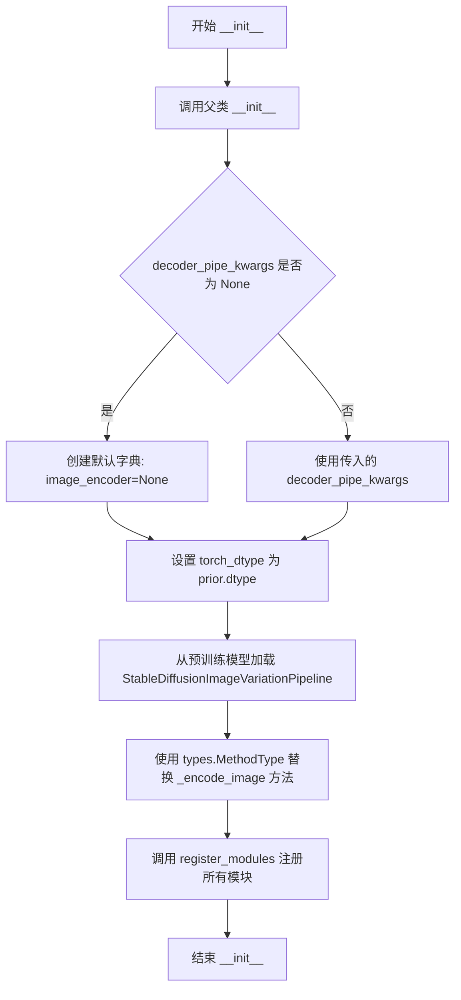
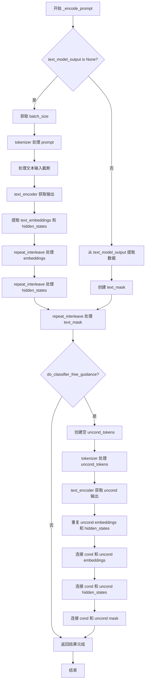
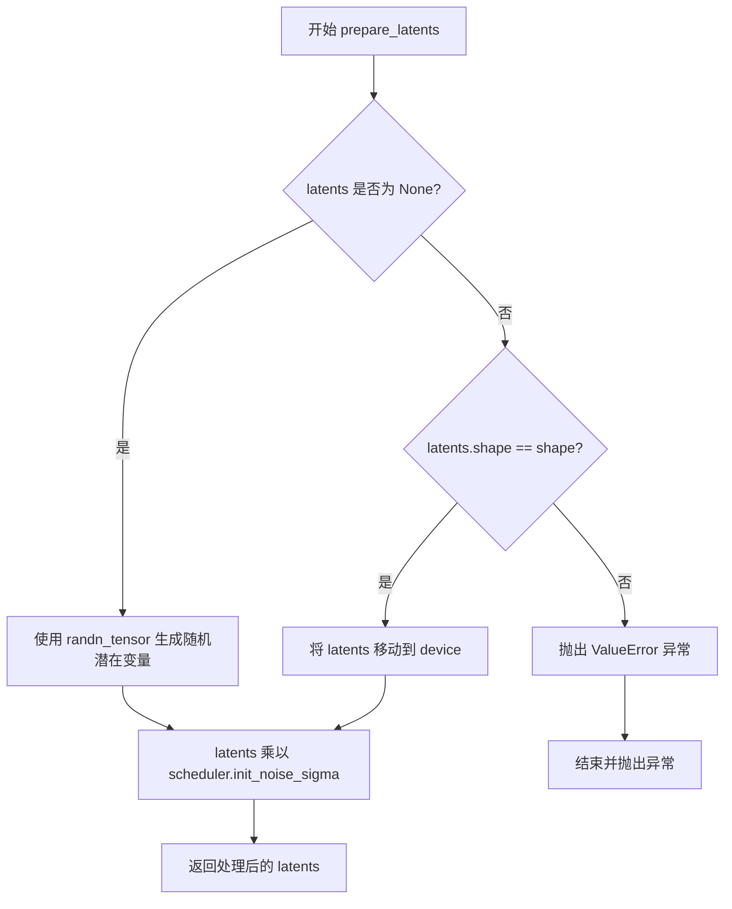

# `diffusers\examples\community\stable_unclip.py` 详细设计文档

这是一个结合了Prior Transformer和Stable Diffusion图像变化pipeline的图像生成pipeline，支持从文本提示生成图像变体。它使用两阶段生成过程：首先通过Prior Transformer将文本嵌入转换为图像嵌入，然后通过Stable Diffusion decoder将图像嵌入解码为最终图像。

## 整体流程

```mermaid
graph TD
    A[开始: 输入prompt] --> B{检查prompt类型}
    B -- str --> C[batch_size=1]
    B -- list --> D[batch_size=len(prompt)]
    B -- 其它 --> E[抛出ValueError]
    C --> F[_encode_prompt: 编码文本]
    D --> F
    F --> G[准备Prior latents]
    G --> H{迭代prior推理步骤}
    H -- i=0 to N-1 --> I[执行Prior前向传播]
    I --> J{是否使用CFG}
    J -- 是 --> K[应用Classifier-Free Guidance]
    J -- 否 --> L[跳过CFG]
    K --> M[Scheduler步进]
    L --> M
    M --> N{是否最后一步}
    N -- 否 --> H
    N -- 是 --> O[后处理latents]
    O --> P[获取image_embeddings]
    P --> Q[调用decoder_pipe生成最终图像]
    Q --> R[返回图像输出]
```

## 类结构

```
DiffusionPipeline (基类)
└── StableUnCLIPPipeline
    ├── 模块: PriorTransformer (prior)
    ├── 模块: CLIPTokenizer (tokenizer)
    ├── 模块: CLIPTextModelWithProjection (text_encoder)
    ├── 模块: UnCLIPScheduler (prior_scheduler)
    └── 模块: StableDiffusionImageVariationPipeline (decoder_pipe)
```

## 全局变量及字段


### `logger`
    
日志记录器，用于输出警告和信息

类型：`logging.Logger`
    


### `StableUnCLIPPipeline.decoder_pipe`
    
解码器pipeline，用于从image embeddings生成最终图像

类型：`StableDiffusionImageVariationPipeline`
    


### `StableUnCLIPPipeline.prior`
    
Prior Transformer模型，用于文本到图像嵌入的转换

类型：`PriorTransformer`
    


### `StableUnCLIPPipeline.tokenizer`
    
CLIP分词器，用于文本编码

类型：`CLIPTokenizer`
    


### `StableUnCLIPPipeline.text_encoder`
    
CLIP文本编码器

类型：`CLIPTextModelWithProjection`
    


### `StableUnCLIPPipeline.prior_scheduler`
    
Prior调度器

类型：`UnCLIPScheduler`
    
    

## 全局函数及方法


### `_encode_image`

该全局函数用于将输入图像编码为图像嵌入向量（image_embeddings），支持根据 `num_images_per_prompt` 参数复制嵌入向量以生成多张图像，并实现了 classifier-free guidance 所需的无条件嵌入向量拼接逻辑。

参数：

- `self`：在类方法绑定时使用，指向 `StableDiffusionImageVariationPipeline` 实例
- `image`：`torch.Tensor`，输入的图像张量，直接作为图像嵌入使用
- `device`：`torch.device`，指定计算设备（CPU/CUDA）
- `num_images_per_prompt`：`int`，每个提示词生成的图像数量，用于复制图像嵌入
- `do_classifier_free_guidance`：`bool`，是否启用 classifier-free guidance

返回值：`torch.Tensor`，处理后的图像嵌入向量，形状为 `(batch_size * num_images_per_prompt * (1 + do_classifier_free_guidance), seq_len, embedding_dim)`

#### 流程图

```mermaid
graph TD
    A[开始 _encode_image] --> B[将图像张量移动到指定设备]
    B --> C[将输入图像作为图像嵌入向量]
    C --> D[在维度1添加单维度: unsqueeze(1)]
    D --> E[获取图像嵌入形状: bs_embed, seq_len, _]
    E --> F[根据num_images_per_prompt复制图像嵌入]
    F --> G{do_classifier_free_guidance?}
    G -->|是| H[创建零张量uncond_embeddings]
    H --> I[拼接uncond_embeddings和image_embeddings]
    I --> J[返回处理后的image_embeddings]
    G -->|否| J
```

#### 带注释源码

```python
def _encode_image(self, image, device, num_images_per_prompt, do_classifier_free_guidance):
    # 将输入图像张量移动到指定的计算设备（CPU/CUDA）
    image = image.to(device=device)
    
    # 直接将输入图像作为图像嵌入向量使用（跳过编码器）
    image_embeddings = image  # take image as image_embeddings
    
    # 在维度1添加单维度，使形状从 (batch, dim) 变为 (batch, 1, dim)
    image_embeddings = image_embeddings.unsqueeze(1)

    # 获取当前图像嵌入的形状信息
    # bs_embed: 批量大小
    # seq_len: 序列长度
    # _: 嵌入维度
    bs_embed, seq_len, _ = image_embeddings.shape
    
    # 复制图像嵌入向量以匹配每个提示词生成的图像数量
    # repeat(1, num_images_per_prompt, 1) 在序列维度复制
    image_embeddings = image_embeddings.repeat(1, num_images_per_prompt, 1)
    
    # 重新整形为 (batch_size * num_images_per_prompt, seq_len, -1)
    image_embeddings = image_embeddings.view(bs_embed * num_images_per_prompt, seq_len, -1)

    # 如果启用 classifier-free guidance
    if do_classifier_free_guidance:
        # 创建与 image_embeddings 形状相同的零张量作为无条件嵌入
        uncond_embeddings = torch.zeros_like(image_embeddings)

        # 为了避免两次前向传播，将无条件嵌入和条件嵌入拼接在一起
        # 拼接后形状: (batch_size * num_images_per_prompt * 2, seq_len, -1)
        # 前半部分为无条件嵌入，后半部分为条件嵌入
        image_embeddings = torch.cat([uncond_embeddings, image_embeddings])

    # 返回处理后的图像嵌入向量
    return image_embeddings
```


### `StableUnCLIPPipeline.__init__`

该方法是 `StableUnCLIPPipeline` 类的构造函数，用于初始化 Stable UnCLIP 扩散管道。它接收先验模型（prior）、文本编码器、tokenizer 和调度器等核心组件，并从预训练模型加载图像变体解码器管道，同时替换其图像编码方法以支持图像嵌入输入。

参数：

- `self`：隐式参数，StableUnCLIPPipeline 实例本身
- `prior`：`PriorTransformer` 类型，先验 Transformer 模型，用于将文本嵌入转换为图像嵌入
- `tokenizer`：`CLIPTokenizer` 类型，CLIP 分词器，用于将文本转换为 token ID
- `text_encoder`：`CLIPTextModelWithProjection` 类型，带投影的 CLIP 文本编码器，用于生成文本嵌入
- `prior_scheduler`：`UnCLIPScheduler` 类型，先验模型的调度器，用于控制去噪过程
- `decoder_pipe_kwargs`：`Optional[dict]` 类型，可选的解码器管道参数字典，用于配置解码器加载

返回值：无（`__init__` 方法不返回任何值）

#### 流程图



#### 带注释源码

```
def __init__(
    self,
    prior: PriorTransformer,
    tokenizer: CLIPTokenizer,
    text_encoder: CLIPTextModelWithProjection,
    prior_scheduler: UnCLIPScheduler,
    decoder_pipe_kwargs: Optional[dict] = None,
):
    """
    初始化 StableUnCLIPPipeline
    
    参数:
        prior: PriorTransformer 模型，用于从文本嵌入预测图像嵌入
        tokenizer: CLIP 分词器，处理文本输入
        text_encoder: CLIP 文本编码器，生成文本嵌入
        prior_scheduler: 先验模型调度器
        decoder_pipe_kwargs: 可选的解码器管道配置参数
    """
    # 调用父类 DiffusionPipeline 的初始化方法
    super().__init__()

    # 处理 decoder_pipe_kwargs，如果为 None 则创建默认字典
    # 默认设置 image_encoder 为 None，因为使用图像嵌入而非原始图像
    decoder_pipe_kwargs = {"image_encoder": None} if decoder_pipe_kwargs is None else decoder_pipe_kwargs

    # 确保 torch_dtype 设置为 prior 的数据类型，以保持数据类型一致
    decoder_pipe_kwargs["torch_dtype"] = decoder_pipe_kwargs.get("torch_dtype", None) or prior.dtype

    # 从预训练模型加载 StableDiffusionImageVariationPipeline
    # 使用 lambdalabs/sd-image-variations-diffusers 权重
    self.decoder_pipe = StableDiffusionImageVariationPipeline.from_pretrained(
        "lambdalabs/sd-image-variations-diffusers", **decoder_pipe_kwargs
    )

    # 替换解码器管道的 _encode_image 方法
    # 使用自定义的 _encode_image 函数，支持直接传入图像嵌入而非原始图像
    # types.MethodType 用于将函数绑定到对象作为方法
    self.decoder_pipe._encode_image = types.MethodType(_encode_image, self.decoder_pipe)

    # 注册所有模块到管道中，便于后续访问和管理
    self.register_modules(
        prior=prior,
        tokenizer=tokenizer,
        text_encoder=text_encoder,
        prior_scheduler=prior_scheduler,
    )
```


### `StableUnCLIPPipeline._encode_prompt`

该方法负责将文本提示编码为文本嵌入向量（text embeddings）和文本编码器隐藏状态（text encoder hidden states），支持分类器-free引导（classifier-free guidance），并处理批量生成和注意力掩码。

参数：

- `prompt`：`Optional[Union[str, List[str]]]`，输入的文本提示，可以是单个字符串或字符串列表
- `device`：`torch.device`，执行计算的设备（如cuda或cpu）
- `num_images_per_prompt`：`int`，每个提示生成的图像数量，用于批量处理
- `do_classifier_free_guidance`：`bool`，是否启用分类器-free引导技术
- `text_model_output`：`Optional[Union[CLIPTextModelOutput, Tuple]]`，可选的预计算文本模型输出，用于避免重复计算
- `text_attention_mask`：`Optional[torch.Tensor]`，可选的预计算注意力掩码

返回值：`Tuple[torch.Tensor, torch.Tensor, torch.Tensor]`，包含三个元素的元组：
- `text_embeddings`：文本嵌入向量，类型为torch.Tensor
- `text_encoder_hidden_states`：文本编码器的隐藏状态，类型为torch.Tensor
- `text_mask`：文本注意力掩码，类型为torch.Tensor

#### 流程图



#### 带注释源码

```python
def _encode_prompt(
    self,
    prompt,  # Optional[Union[str, List[str]]]，输入的文本提示
    device,  # torch.device，计算设备
    num_images_per_prompt,  # int，每个提示生成的图像数量
    do_classifier_free_guidance,  # bool，是否启用分类器-free引导
    text_model_output: Optional[Union[CLIPTextModelOutput, Tuple]] = None,  # 可选的预计算文本输出
    text_attention_mask: Optional[torch.Tensor] = None,  # 可选的注意力掩码
):
    # 如果没有提供预计算的文本模型输出，则需要从头计算
    if text_model_output is None:
        # 确定批次大小：如果是列表则取长度，否则默认为1
        batch_size = len(prompt) if isinstance(prompt, list) else 1
        
        # 使用tokenizer将文本提示转换为模型输入格式
        text_inputs = self.tokenizer(
            prompt,
            padding="max_length",  # 填充到最大长度
            max_length=self.tokenizer.model_max_length,  # 使用模型最大长度
            return_tensors="pt",  # 返回PyTorch张量
        )
        
        # 获取输入ID和注意力掩码
        text_input_ids = text_inputs.input_ids
        text_mask = text_inputs.attention_mask.bool().to(device)  # 转换为布尔掩码并移动到设备

        # 检查是否超过模型最大长度限制，如果是则截断并警告
        if text_input_ids.shape[-1] > self.tokenizer.model_max_length:
            # 解码被截断的部分用于日志警告
            removed_text = self.tokenizer.batch_decode(text_input_ids[:, self.tokenizer.model_max_length:])
            logger.warning(
                "The following part of your input was truncated because CLIP can only handle sequences up to"
                f" {self.tokenizer.model_max_length} tokens: {removed_text}"
            )
            # 截断到最大长度
            text_input_ids = text_input_ids[:, : self.tokenizer.model_max_length]

        # 将输入IDs移动到设备并通过文本编码器获取输出
        text_encoder_output = self.text_encoder(text_input_ids.to(device))

        # 提取文本嵌入和最后隐藏状态
        text_embeddings = text_encoder_output.text_embeds
        text_encoder_hidden_states = text_encoder_output.last_hidden_state

    else:
        # 如果提供了预计算的输出，直接提取数据
        batch_size = text_model_output[0].shape[0]  # 从第一个输出元素获取批次大小
        text_embeddings, text_encoder_hidden_states = text_model_output[0], text_model_output[1]
        text_mask = text_attention_mask  # 使用提供的注意力掩码

    # 对嵌入向量和隐藏状态进行批量扩展，以匹配每个提示生成的图像数量
    text_embeddings = text_embeddings.repeat_interleave(num_images_per_prompt, dim=0)
    text_encoder_hidden_states = text_encoder_hidden_states.repeat_interleave(num_images_per_prompt, dim=0)
    text_mask = text_mask.repeat_interleave(num_images_per_prompt, dim=0)

    # 如果启用分类器-free引导，需要生成无条件嵌入
    if do_classifier_free_guidance:
        # 创建空字符串列表作为无条件输入
        uncond_tokens = [""] * batch_size

        # 对无条件输入进行tokenize处理
        uncond_input = self.tokenizer(
            uncond_tokens,
            padding="max_length",
            max_length=self.tokenizer.model_max_length,
            truncation=True,
            return_tensors="pt",
        )
        
        # 获取无条件输入的注意力掩码并移动到设备
        uncond_text_mask = uncond_input.attention_mask.bool().to(device)
        
        # 通过文本编码器获取无条件嵌入
        uncond_embeddings_text_encoder_output = self.text_encoder(uncond_input.input_ids.to(device))

        # 提取无条件嵌入和隐藏状态
        uncond_embeddings = uncond_embeddings_text_encoder_output.text_embeds
        uncond_text_encoder_hidden_states = uncond_embeddings_text_encoder_output.last_hidden_state

        # 复制无条件嵌入以匹配每个提示生成的图像数量
        seq_len = uncond_embeddings.shape[1]
        uncond_embeddings = uncond_embeddings.repeat(1, num_images_per_prompt)
        uncond_embeddings = uncond_embeddings.view(batch_size * num_images_per_prompt, seq_len)

        # 复制无条件隐藏状态
        seq_len = uncond_text_encoder_hidden_states.shape[1]
        uncond_text_encoder_hidden_states = uncond_text_encoder_hidden_states.repeat(1, num_images_per_prompt, 1)
        uncond_text_encoder_hidden_states = uncond_text_encoder_hidden_states.view(
            batch_size * num_images_per_prompt, seq_len, -1
        )
        
        # 复制无条件注意力掩码
        uncond_text_mask = uncond_text_mask.repeat_interleave(num_images_per_prompt, dim=0)

        # 分类器-free引导：将无条件嵌入和条件嵌入连接起来
        # 这样可以在单次前向传播中同时计算有条件和无条件的结果
        text_embeddings = torch.cat([uncond_embeddings, text_embeddings])
        text_encoder_hidden_states = torch.cat([uncond_text_encoder_hidden_states, text_encoder_hidden_states])

        # 连接注意力掩码
        text_mask = torch.cat([uncond_text_mask, text_mask])

    # 返回文本嵌入、隐藏状态和注意力掩码的元组
    return text_embeddings, text_encoder_hidden_states, text_mask
```


### `StableUnCLIPPipeline._execution_device`

该属性方法用于确定管道模型执行所在的设备。当启用顺序 CPU 卸载（sequential CPU offload）后，执行设备只能通过 Accelerate 的模块钩子来推断。方法首先检查当前设备是否为"meta"设备或先验模型是否具有钩子，若不满足条件则直接返回管道的基本设备；否则遍历先验模型的所有模块，查找并返回钩子中指定的执行设备。

参数：

- `self`：`StableUnCLIPPipeline` 实例，隐式参数，指向当前管道对象本身

返回值：`torch.device`，表示管道模型实际执行所在的设备对象

#### 流程图

```mermaid
flowchart TD
    A[开始: 获取 _execution_device] --> B{self.device != meta 或<br/>not hasattr(self.prior, '_hf_hook')}
    B -->|是| C[返回 self.device]
    B -->|否| D[遍历 self.prior.modules]
    D --> E{当前模块有 _hf_hook 且<br/>execution_device 不为 None}
    E -->|是| F[返回 torch.device(module._hf_hook.execution_device)]
    E -->|否| G{还有更多模块?}
    G -->|是| D
    G -->|否| H[返回 self.device]
    
    style A fill:#f9f,stroke:#333
    style C fill:#9f9,stroke:#333
    style F fill:#9f9,stroke:#333
    style H fill:#9f9,stroke:#333
```

#### 带注释源码

```python
@property
def _execution_device(self):
    r"""
    Returns the device on which the pipeline's models will be executed. After calling
    `pipeline.enable_sequential_cpu_offload()` the execution device can only be inferred from Accelerate's module
    hooks.
    """
    # 首先检查管道设备是否为 'meta' 设备，或者先验模型是否没有配置加速钩子
    # meta 设备是一种特殊的 PyTorch 设备类型，通常用于延迟加载模型
    # 如果满足任一条件，直接返回管道的默认设备
    if self.device != torch.device("meta") or not hasattr(self.prior, "_hf_hook"):
        return self.device
    
    # 当启用了顺序 CPU 卸载时，需要遍历先验模型的所有模块
    # 查找配置了加速钩子的模块，并从钩子中获取实际的执行设备
    for module in self.prior.modules():
        # 检查当前模块是否具有 _hf_hook 属性（加速钩子）
        # 并且钩子中是否配置了 execution_device
        if (
            hasattr(module, "_hf_hook")
            and hasattr(module._hf_hook, "execution_device")
            and module._hf_hook.execution_device is not None
        ):
            # 找到有效的执行设备，将其转换为 torch.device 并返回
            return torch.device(module._hf_hook.execution_device)
    
    # 如果遍历完所有模块都没有找到配置了钩子的模块
    # 则回退返回管道的默认设备
    return self.device
```


### `StableUnCLIPPipeline.prepare_latents`

该方法用于在 Stable UnCLIP 图像生成流水线中准备初始潜在变量（latents）。如果调用者未提供预计算的潜在变量，则使用随机张量（基于给定形状、生成器、设备和数据类型）进行初始化；如果提供了潜在变量，则验证其形状是否符合预期，并将其移动到指定设备。最后，根据调度器的初始噪声 sigma 对潜在变量进行缩放，以适配去噪过程的初始状态。

参数：

- `shape`：`tuple` 或 `torch.Size`，期望的潜在变量张量的形状
- `dtype`：`torch.dtype`，潜在变量的数据类型（如 `torch.float32`）
- `device`：`torch.device`，潜在变量要存放的目标设备（如 CPU 或 CUDA 设备）
- `generator`：`torch.Generator` 或 `None`，用于生成随机潜在变量时的随机数生成器，可确保结果可复现
- `latents`：`torch.Tensor` 或 `None`，可选的预计算潜在变量张量；若为 `None`，则随机生成
- `scheduler`：调度器对象（需具有 `init_noise_sigma` 属性），用于获取初始噪声缩放因子

返回值：`torch.Tensor`，处理（生成）后的潜在变量张量，已根据调度器的初始噪声 sigma 进行缩放

#### 流程图



#### 带注释源码

```python
def prepare_latents(self, shape, dtype, device, generator, latents, scheduler):
    """
    准备用于去噪过程的潜在变量张量。
    
    参数:
        shape: 期望的潜在变量形状 (batch_size, embedding_dim, ...)
        dtype: 潜在变量的数据类型
        device: 潜在变量要放置的设备
        generator: 可选的随机数生成器，用于可复现的随机潜在变量生成
        latents: 可选的预计算潜在变量，如果为 None 则随机生成
        scheduler: 调度器，用于获取 init_noise_sigma 进行初始噪声缩放
    
    返回:
        处理后的潜在变量张量
    """
    # 如果未提供潜在变量，则使用 randn_tensor 生成随机潜在变量
    # 这确保了每次调用都能获得随机初始噪声
    if latents is None:
        latents = randn_tensor(shape, generator=generator, device=device, dtype=dtype)
    else:
        # 验证提供的潜在变量形状是否与预期形状匹配
        # 这是为了避免因形状不匹配导致的后续计算错误
        if latents.shape != shape:
            raise ValueError(f"Unexpected latents shape, got {latents.shape}, expected {shape}")
        # 将潜在变量移动到指定的设备上
        latents = latents.to(device)

    # 根据调度器的初始噪声 sigma 对潜在变量进行缩放
    # 这是为了让潜在变量与调度器的噪声计划相匹配
    # scheduler.init_noise_sigma 通常在去噪过程开始时为 1.0，
    # 但某些调度器可能会使用不同的值
    latents = latents * scheduler.init_noise_sigma
    return latents
```


### `StableUnCLIPPipeline.to`

该方法用于将管道的解码器组件和父类组件迁移到指定的计算设备（CPU/GPU），以确保推理过程在正确的设备上执行。

参数：

- `torch_device`：`Optional[Union[str, torch.device]]`，目标设备标识，可以是字符串形式（如 "cuda"、"cpu"）、torch.device 对象，或为 None（此时不执行设备迁移）

返回值：`None`，无返回值（方法直接修改对象内部状态）

#### 流程图

```mermaid
flowchart TD
    A[开始 to 方法] --> B{torch_device 是否为 None?}
    B -- 是 --> C[不做任何设备迁移]
    C --> D[方法结束]
    B -- 否 --> E[调用 self.decoder_pipe.to torch_device]
    E --> F[调用 super().to torch_device]
    F --> D
```

#### 带注释源码

```
def to(self, torch_device: Optional[Union[str, torch.device]] = None):
    """
    将管道移动到指定设备
    
    参数:
        torch_device: 目标设备，可以是字符串、torch.device 或 None
    """
    # 将解码器管道（StableDiffusionImageVariationPipeline）移动到目标设备
    self.decoder_pipe.to(torch_device)
    
    # 调用父类（DiffusionPipeline）的 to 方法，将其余组件移动到目标设备
    super().to(torch_device)
```


### `StableUnCLIPPipeline.__call__`

该方法是StableUnCLIPPipeline的核心调用接口，接收文本提示或预计算的文本嵌入，通过两阶段扩散过程（先验模型生成图像嵌入，解码器将图像嵌入解码为最终图像）实现文本到图像的生成，支持无分类器自由引导（Classifier-Free Guidance）以提升生成质量。

参数：

- `prompt`：`Optional[Union[str, List[str]]]`，输入的文本提示，可以是单个字符串或字符串列表，用于指导图像生成内容
- `height`：`Optional[int]`，生成图像的高度（像素），传递给解码器
- `width`：`Optional[int]`，生成图像的宽度（像素），传递给解码器
- `num_images_per_prompt`：`int = 1`，每个文本提示生成的图像数量，用于批量生成
- `prior_num_inference_steps`：`int = 25`，先验模型（Prior）的去噪推理步数，决定图像嵌入的质量
- `generator`：`torch.Generator | None = None`，PyTorch随机数生成器，用于控制生成过程的可Reproducibility
- `prior_latents`：`Optional[torch.Tensor] = None`，先验模型的初始潜在向量，若为None则随机生成
- `text_model_output`：`Optional[Union[CLIPTextModelOutput, Tuple]] = None`，预计算的文本模型输出（包含文本嵌入），用于避免重复编码
- `text_attention_mask`：`Optional[torch.Tensor] = None`，文本注意力掩码，与预计算的文本输出配合使用
- `prior_guidance_scale`：`float = 4.0`，先验模型的无分类器引导尺度，值越大生成的图像嵌入越符合文本描述
- `decoder_guidance_scale`：`float = 8.0`，解码器的无分类器引导尺度，控制最终图像与文本的对齐程度
- `decoder_num_inference_steps`：`int = 50`，解码器的去噪推理步数，影响最终图像的细节质量
- `decoder_num_images_per_prompt`：`Optional[int] = 1`，解码器端每个提示生成的图像数量
- `decoder_eta`：`float = 0.0`，解码器的ETA参数（DDIMscheduler的噪声系数），0.0表示纯DDIM采样
- `output_type`：`str | None = "pil"`，输出格式，可选"pil"（PIL图像）、"numpy"（numpy数组）或None（DiffusionPipeline输出格式）
- `return_dict`：`bool = True`，是否返回字典格式的输出，若为False则返回元组

返回值：`Union[StableDiffusionPipelineOutput, Tuple]`，返回生成结果，若return_dict为True返回包含images和nsfw_content_detected的字典，否则返回元组

#### 流程图

```mermaid
flowchart TD
    A[开始 __call__] --> B{检查 prompt 是否存在}
    B -->|是| C{判断 prompt 类型}
    C -->|str| D[batch_size = 1]
    C -->|list| E[batch_size = len(prompt)]
    C -->|其他| F[抛出 ValueError]
    B -->|否| G[从 text_model_output 获取 batch_size]
    D --> H[获取执行设备 device]
    E --> H
    G --> H
    H --> I[计算 batch_size = batch_size * num_images_per_prompt]
    I --> J[计算 do_classifier_free_guidance]
    J --> K[调用 _encode_prompt 编码文本]
    K --> L[设置先验调度器时间步]
    L --> M[准备先验潜在向量]
    M --> N[遍历先验时间步]
    N --> O{是否使用引导}
    O -->|是| P[扩展潜在向量]
    O -->|否| Q[直接使用 prior_latents]
    P --> R[调用 prior 模型预测图像嵌入]
    Q --> R
    R --> S{是否使用引导}
    S -->|是| T[计算引导后的图像嵌入]
    S -->|否| U[直接使用预测的图像嵌入]
    T --> V[调度器.step 更新潜在向量]
    U --> V
    V --> W{是否还有下一个时间步}
    W -->|是| N
    W -->|否| X[后处理先验潜在向量]
    X --> Y[获取图像嵌入 image_embeddings]
    Y --> Z[调用 decoder_pipe 生成最终图像]
    Z --> AA[返回输出结果]
```

#### 带注释源码

```python
@torch.no_grad()
def __call__(
    self,
    prompt: Optional[Union[str, List[str]]] = None,
    height: Optional[int] = None,
    width: Optional[int] = None,
    num_images_per_prompt: int = 1,
    prior_num_inference_steps: int = 25,
    generator: torch.Generator | None = None,
    prior_latents: Optional[torch.Tensor] = None,
    text_model_output: Optional[Union[CLIPTextModelOutput, Tuple]] = None,
    text_attention_mask: Optional[torch.Tensor] = None,
    prior_guidance_scale: float = 4.0,
    decoder_guidance_scale: float = 8.0,
    decoder_num_inference_steps: int = 50,
    decoder_num_images_per_prompt: Optional[int] = 1,
    decoder_eta: float = 0.0,
    output_type: str | None = "pil",
    return_dict: bool = True,
):
    # 步骤1：验证并处理输入的prompt，确定批次大小
    if prompt is not None:
        if isinstance(prompt, str):
            batch_size = 1  # 单个字符串prompt，批次大小为1
        elif isinstance(prompt, list):
            batch_size = len(prompt)  # 字符串列表，取列表长度作为批次大小
        else:
            raise ValueError(f"`prompt` has to be of type `str` or `list` but is {type(prompt)}")
    else:
        # 如果没有提供prompt，则从预计算的text_model_output中获取批次大小
        batch_size = text_model_output[0].shape[0]

    # 步骤2：获取执行设备（支持CPU卸载后的设备推理）
    device = self._execution_device

    # 步骤3：根据每个提示生成的图像数量扩展批次大小
    batch_size = batch_size * num_images_per_prompt

    # 步骤4：判断是否启用无分类器自由引导（CFG）
    # 当引导尺度大于1.0时启用CFG，需要同时生成条件和非条件输出
    do_classifier_free_guidance = prior_guidance_scale > 1.0 or decoder_guidance_scale > 1.0

    # 步骤5：编码文本提示为文本嵌入
    # 如果提供了预计算的text_model_output，则跳过编码直接使用
    text_embeddings, text_encoder_hidden_states, text_mask = self._encode_prompt(
        prompt, device, num_images_per_prompt, do_classifier_free_guidance, 
        text_model_output, text_attention_mask
    )

    # ==================== 先验模型（Prior）处理阶段 ====================
    
    # 步骤6：设置先验调度器的推理步数
    self.prior_scheduler.set_timesteps(prior_num_inference_steps, device=device)
    prior_timesteps_tensor = self.prior_scheduler.timesteps  # 获取时间步张量

    # 步骤7：获取先验模型的嵌入维度配置
    embedding_dim = self.prior.config.embedding_dim

    # 步骤8：准备先验模型的初始潜在向量
    # 调用prepare_latents方法，如果未提供latents则随机生成，否则使用提供的
    prior_latents = self.prepare_latents(
        (batch_size, embedding_dim),  # 潜在向量形状：[batch_size, embedding_dim]
        text_embeddings.dtype,  # 数据类型与文本嵌入一致
        device,  # 计算设备
        generator,  # 随机数生成器（用于可Reproducibility）
        prior_latents,  # 可选的预提供潜在向量
        self.prior_scheduler,  # 调度器（用于获取初始噪声sigma）
    )

    # 步骤9：迭代执行先验模型的去噪过程
    for i, t in enumerate(self.progress_bar(prior_timesteps_tensor)):
        # 步骤9.1：如果启用CFG，复制潜在向量以同时处理条件和非条件情况
        latent_model_input = torch.cat([prior_latents] * 2) if do_classifier_free_guidance else prior_latents

        # 步骤9.2：调用先验模型预测图像嵌入
        # 先验模型接收：潜在向量、时间步、文本嵌入、文本隐藏状态、注意力掩码
        predicted_image_embedding = self.prior(
            latent_model_input,
            timestep=t,
            proj_embedding=text_embeddings,  # 投影后的文本嵌入
            encoder_hidden_states=text_encoder_hidden_states,  # 文本编码器隐藏状态
            attention_mask=text_mask,  # 文本注意力掩码
        ).predicted_image_embedding  # 提取预测的图像嵌入

        # 步骤9.3：如果启用CFG，应用无分类器引导
        if do_classifier_free_guidance:
            # 将预测的图像嵌入分割为非条件部分和条件部分
            predicted_image_embedding_uncond, predicted_image_embedding_text = predicted_image_embedding.chunk(2)
            # 应用引导公式：uncond + scale * (text - uncond)
            predicted_image_embedding = predicted_image_embedding_uncond + prior_guidance_scale * (
                predicted_image_embedding_text - predicted_image_embedding_uncond
            )

        # 步骤9.4：确定前一个时间步（用于调度器计算）
        if i + 1 == prior_timesteps_tensor.shape[0]:
            prev_timestep = None  # 最后一步没有前一个时间步
        else:
            prev_timestep = prior_timesteps_tensor[i + 1]

        # 步骤9.5：调度器执行单步去噪
        # 使用预测的图像嵌入更新潜在向量
        prior_latents = self.prior_scheduler.step(
            predicted_image_embedding,
            timestep=t,
            sample=prior_latents,  # 当前潜在向量
            generator=generator,  # 随机生成器
            prev_timestep=prev_timestep,  # 前一个时间步
        ).prev_sample  # 获取去噪后的潜在向量

    # 步骤10：后处理先验潜在向量
    # 调用先验模型的post_process_latents方法进行最终处理
    prior_latents = self.prior.post_process_latents(prior_latents)

    # 步骤11：获取最终的图像嵌入（作为解码器的输入）
    image_embeddings = prior_latents

    # ==================== 解码器（Decoder）处理阶段 ====================
    
    # 步骤12：调用解码器管道生成最终图像
    # 将图像嵌入解码为实际图像
    output = self.decoder_pipe(
        image=image_embeddings,  # 图像嵌入（来自先验模型）
        height=height,  # 输出图像高度
        width=width,  # 输出图像宽度
        num_inference_steps=decoder_num_inference_steps,  # 解码器推理步数
        guidance_scale=decoder_guidance_scale,  # 解码器引导尺度
        generator=generator,  # 随机生成器
        output_type=output_type,  # 输出格式（pil/numpy）
        return_dict=return_dict,  # 是否返回字典格式
        num_images_per_prompt=decoder_num_images_per_prompt,  # 每个提示生成的图像数
        eta=decoder_eta,  # DDIM噪声系数
    )
    
    # 步骤13：返回生成结果
    return output
```

## 关键组件


### 张量索引与惰性加载

在prepare_latents方法中实现，使用randn_tensor生成随机潜在向量，支持延迟初始化。当latents为None时使用随机张量，否则验证形状后转移到目标设备。prior_latents的后处理通过post_process_latents方法完成，实现潜在空间的索引操作和形状调整。

### 反量化支持

通过torch_dtype参数管理模型精度，支持从prior.dtype获取默认精度。_encode_image中直接使用输入的image作为image_embeddings并进行unsqueeze和repeat操作，实现特征的复制和维度扩展。text_embeddings和hidden states通过repeat_interleave进行批量索引扩展。

### 量化策略

在__init__中通过decoder_pipe_kwargs["torch_dtype"] = decoder_pipe_kwargs.get("torch_dtype", None) or prior.dtype实现 dtype 传递。_encode_prompt中处理text_model_output为None或已量化的情况，支持Tuple和CLIPTextModelOutput两种输出格式，允许外部传入预计算的text_embeddings和text_encoder_hidden_states。

### 图像编码替换机制

使用types.MethodType动态替换decoder_pipe的_encode_image方法，将原始图像直接作为image_embeddings使用，支持MPS友好的tensor复制和拼接策略，实现无条件嵌入的零张量生成。

### 分类器自由引导

在prior和decoder两个阶段均支持guidance，通过prior_guidance_scale和decoder_guidance_scale参数控制。预测的embedding被chunk分割为无条件部分和条件部分，使用classifier-free guidance公式进行组合，支持双向前向传播的批量执行。

### 调度器集成

通过UnCLIPScheduler管理prior的去噪步骤，使用set_timesteps设置推理步数，通过step方法执行单步去噪并返回prev_sample。调度器的init_noise_sigma用于初始化潜在空间的噪声水平。

### 管道组合架构

组合PriorTransformer和StableDiffusionImageVariationPipeline两个独立管道，prior阶段生成图像embedding，decoder阶段将embedding解码为最终图像。输出通过pipeline的return_dict和output_type参数控制格式。


## 问题及建议


### 已知问题

- **硬编码模型路径**：第48行 `"lambdalabs/sd-image-variations-diffusers"` 被硬编码在代码中，降低了代码的灵活性和可配置性。
- **Monkey Patching 方式不规范**：第50行使用 `types.MethodType` 动态替换 `_encode_image` 方法，这种侵入式修改难以追踪和调试，不利于代码维护。
- **类型注解不一致**：混用了 Python 3.10+ 的联合类型语法（如 `generator: torch.Generator | None`）和旧版 `Optional` 语法（如 `text_model_output: Optional[Union[CLIPTextModelOutput, Tuple]]`），影响代码一致性。
- **参数验证缺失**：未对关键输入参数（如 `height`、`width`、`num_images_per_prompt`、`prior_num_inference_steps` 等）进行合法性校验，可能导致运行时错误。
- **重复代码模式**：`_encode_prompt` 方法中存在大量重复的 embedding 复制和形状变换逻辑，可以提取为独立函数以提高可读性和可维护性。
- **设备管理隐式依赖**：依赖 `_execution_device` 属性的隐式逻辑确定执行设备，增加了代码理解难度，且未在初始化时明确设备分配策略。
- **缺少错误处理**：对 `from_pretrained` 可能抛出的异常（如模型下载失败、版本不兼容等）未做捕获和处理。
- **调度器灵活性不足**：`prior_scheduler` 被直接使用而未提供替换接口，限制了自定义调度策略的能力。

### 优化建议

- **参数化模型路径**：将 decoder 模型路径提取为构造函数参数，支持自定义模型。
- **消除 Monkey Patching**：考虑继承 `StableDiffusionImageVariationPipeline` 或使用组合模式，明确扩展行为而非动态替换方法。
- **统一类型注解风格**：统一使用 `Optional` 和 `Union` 语法，或统一使用 Python 3.10+ 的联合类型语法。
- **增加参数校验**：在 `__call__` 方法入口添加参数合法性校验（如正整数检查、非空检查等），并抛出明确的 `ValueError`。
- **提取复用逻辑**：将 embedding 的复制、拼接等操作封装为私有方法（如 `_repeat_embeddings`、`_concatenate_uncond_embeddings` 等）。
- **显式设备管理**：在构造函数中接受 `device` 参数，或提供明确的方法来设置执行设备，减少隐式依赖。
- **添加异常处理**：对模型加载和推理过程添加 try-except 块，捕获并处理可能的异常情况。
- **增强调度器配置**：允许在构造函数中传入自定义的 `prior_scheduler`，或在 `__call__` 中支持运行时替换。

## 其它


### 设计目标与约束

本Pipeline实现了一个基于UNCLIP架构的文本到图像生成系统，通过两阶段过程（prior和decoder）将文本提示转换为图像。设计目标包括：支持classifier-free guidance以提升生成质量，支持批量生成以提高效率，支持图像变体生成（通过替换_encode_image方法）。约束条件包括：依赖transformers和diffusers库，需要CUDA设备支持，文本长度受tokenizer.model_max_length限制（通常为77或128），生成的图像分辨率受decoder限制。

### 错误处理与异常设计

代码中包含以下错误处理：1）ValueError用于验证prompt类型（str或list）；2）ValueError用于验证latents形状匹配；3）logger.warning用于提示文本被截断；4）潜在的DeviceError通过_execution_device属性处理（处理meta设备和accelerate的hook）。建议增加的错误处理包括：检查模型加载失败、GPU内存不足处理、scheduler配置错误、图像嵌入维度不匹配、输入验证（height/width有效性）等场景。

### 数据流与状态机

数据流如下：1）输入阶段：prompt→tokenizer→text_encoder获取text_embeddings；2）Prior阶段：text_embeddings + random_latents → PriorTransformer → image_embeddings（迭代denoising）；3）Decoder阶段：image_embeddings → StableDiffusionImageVariationPipeline → 最终图像输出。状态机包括：初始化状态（models loaded）→ 编码状态（text embeddings computed）→ Prior推理状态（image embeddings生成）→ Decoder推理状态（最终图像生成）→ 返回状态。

### 外部依赖与接口契约

核心依赖包括：1）torch（张量计算）；2）transformers（CLIPTextModelWithProjection, CLIPTokenizer）；3）diffusers（PriorTransformer, DiffusionPipeline, UnCLIPScheduler, StableDiffusionImageVariationPipeline）；4）lambdalabs/sd-image-variations-diffusers（预训练decoder模型）。接口契约：__call__方法接收prompt/图像嵌入，返回图像；_encode_prompt返回(text_embeddings, text_encoder_hidden_states, text_mask)三元组；prepare_latents返回标准化的随机张量；decoder_pipe接收image_embeddings生成最终图像。

### 性能考虑与资源管理

性能优化点：1）classifier-free guidance通过concatenation避免两次forward pass；2）repeat_interleave和repeat方法用于批量处理；3）torch.no_grad()装饰器禁用梯度计算。建议的优化：1）支持accelerate的sequential_cpu_offload；2）支持xformers内存优化；3）考虑使用torch.compile加速；4）批处理大小受GPU内存限制，建议添加内存检测；5）prior和decoder可并行预加载到不同设备。

### 安全性考虑

当前代码安全性考虑：1）无用户输入持久化；2）模型来源验证（huggingface hub）。建议增加：1）输入内容过滤（prompt审查）；2）输出图像NSFW检测；3）模型下载的完整性校验；4）敏感信息处理（日志中的文本截断需注意）。

### 兼容性考虑

兼容性要求：1）Python版本需支持typing的新联合类型语法（Python 3.10+）；2）PyTorch版本需支持device相关API；3）diffusers库版本兼容性（API可能变化）；4）transformers库版本兼容性。建议：1）添加版本检测；2）使用try-except处理API变更；3）支持CPU fallback（虽性能较差）。

### 配置与参数说明

主要配置参数：1）prior_num_inference_steps（默认25）：prior去噪步数；2）decoder_num_inference_steps（默认50）：decoder去噪步数；3）prior_guidance_scale（默认4.0）：prior阶段guidance权重；4）decoder_guidance_scale（默认8.0）：decoder阶段guidance权重；5）num_images_per_prompt：每个prompt生成的图像数量；6）output_type（默认"pil"）：输出格式（pil/numpy/pt）；7）decoder_num_images_per_prompt：decoder批量大小。

### 测试策略建议

建议的测试用例：1）单元测试：_encode_prompt返回形状验证、prepare_latents形状和类型验证；2）集成测试：完整pipeline运行（可使用小模型或mock）；3）参数测试：各种guidance_scale组合、batch_size边界；4）错误测试：无效prompt类型、形状不匹配、设备不匹配；5）回归测试：确保修改不破坏现有功能。

    