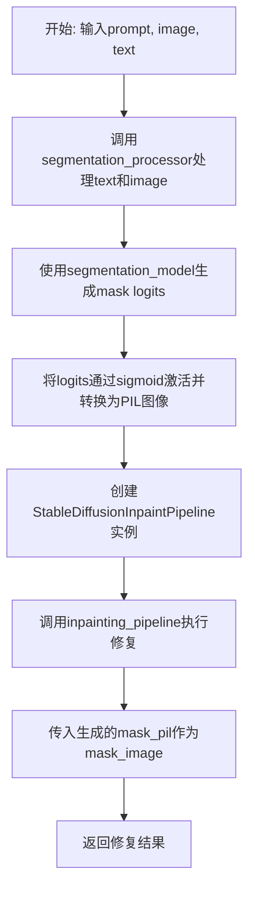
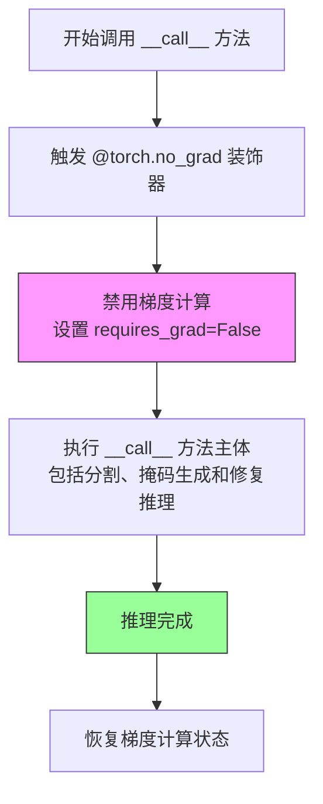
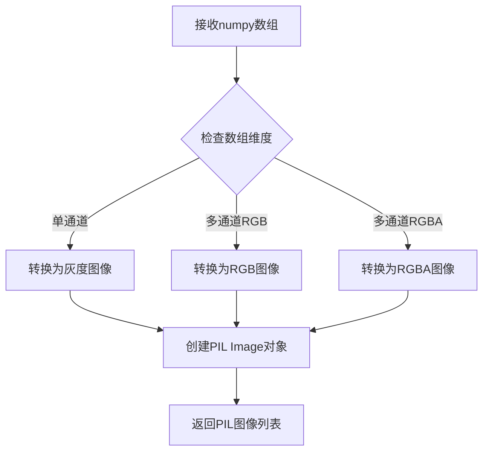
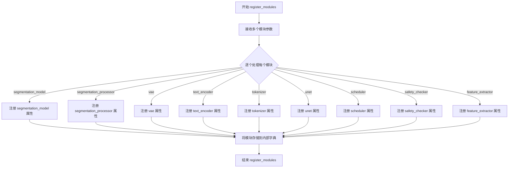
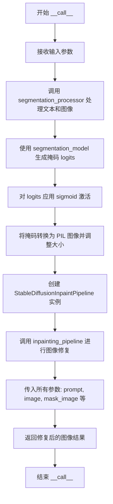

# `diffusers\examples\community\text_inpainting.py` 详细设计文档

基于文本的图像修复管道（TextInpainting），使用CLIPSeg模型从文本描述生成掩码，然后调用Stable Diffusion图像修复管道完成基于文本引导的图像修复任务。该管道继承自DiffusionPipeline，支持常见的扩散模型参数配置，如推理步数、引导系数、负提示等。

## 整体流程



## 类结构

```
DiffusionPipeline (基类)
└── TextInpainting (主类)
    ├── StableDiffusionMixin (混入类)
    └── 依赖组件:
        ├── CLIPSegForImageSegmentation (分割模型)
        ├── CLIPSegProcessor (分割处理器)
        ├── AutoencoderKL (VAE)
        ├── CLIPTextModel (文本编码器)
        ├── CLIPTokenizer (分词器)
        ├── UNet2DConditionModel (去噪U-Net)
        ├── SchedulerMixin (调度器)
        ├── StableDiffusionSafetyChecker (安全检查器)
        └── CLIPImageProcessor (特征提取器)
```

## 全局变量及字段


### `logger`
    
模块级日志记录器，用于输出警告和信息

类型：`logging.Logger`
    


### `TextInpainting.segmentation_model`
    
CLIPSeg分割模型，用于从文本生成掩码

类型：`CLIPSegForImageSegmentation`
    


### `TextInpainting.segmentation_processor`
    
CLIPSeg处理器，用于处理文本和图像输入

类型：`CLIPSegProcessor`
    


### `TextInpainting.vae`
    
变分自编码器，用于图像的编码和解码

类型：`AutoencoderKL`
    


### `TextInpainting.text_encoder`
    
冻结的文本编码器，将文本转换为嵌入向量

类型：`CLIPTextModel`
    


### `TextInpainting.tokenizer`
    
CLIP分词器，对文本进行分词

类型：`CLIPTokenizer`
    


### `TextInpainting.unet`
    
条件U-Net架构，用于去噪图像潜在表示

类型：`UNet2DConditionModel`
    


### `TextInpainting.scheduler`
    
噪声调度器，控制去噪过程中的噪声调度

类型：`Union[DDIMScheduler, PNDMScheduler, LMSDiscreteScheduler]`
    


### `TextInpainting.safety_checker`
    
安全检查器，过滤不安全内容

类型：`StableDiffusionSafetyChecker`
    


### `TextInpainting.feature_extractor`
    
特征提取器，用于安全检查

类型：`CLIPImageProcessor`
    
    

## 全局函数及方法


### `torch.no_grad`

`torch.no_grad` 是 PyTorch 的一个装饰器，用于在推理阶段禁用梯度计算，从而节省显存并提升推理速度。

参数：
- 该装饰器本身无参数，但它会影响被装饰函数的行为，使其内部的张量操作不记录计算图。

返回值：`no_grad` 装饰器返回的是一个上下文管理器或函数装饰器，执行后会临时禁用梯度计算。

#### 流程图



#### 带注释源码

```python
# 在 __call__ 方法上使用 @torch.no_grad 装饰器
# 作用：禁用该方法内部所有张量操作的梯度计算
# 目的：在推理阶段节省显存、提高推理速度
@torch.no_grad()
def __call__(
    self,
    prompt: Union[str, List[str]],
    image: Union[torch.Tensor, PIL.Image.Image],
    text: str,
    height: int = 512,
    width: int = 512,
    num_inference_steps: int = 50,
    guidance_scale: float = 7.5,
    negative_prompt: Optional[Union[str, List[str]]] = None,
    num_images_per_prompt: Optional[int] = 1,
    eta: float = 0.0,
    generator: torch.Generator | None = None,
    latents: Optional[torch.Tensor] = None,
    output_type: str | None = "pil",
    return_dict: bool = True,
    callback: Optional[Callable[[int, int, torch.Tensor], None]] = None,
    callback_steps: int = 1,
    **kwargs,
):
    """
    Pipeline for text based inpainting using Stable Diffusion.
    ...
    """
    
    # 使用分割模型根据文本生成掩码
    inputs = self.segmentation_processor(
        text=[text], images=[image], padding="max_length", return_tensors="pt"
    ).to(self.device)
    outputs = self.segmentation_model(**inputs)  # 此处不计算梯度
    mask = torch.sigmoid(outputs.logits).cpu().detach().unsqueeze(-1).numpy()
    mask_pil = self.numpy_to_pil(mask)[0].resize(image.size)

    # 创建并运行修复管道（同样不计算梯度）
    inpainting_pipeline = StableDiffusionInpaintPipeline(
        vae=self.vae,
        text_encoder=self.text_encoder,
        tokenizer=self.tokenizer,
        unet=self.unet,
        scheduler=self.scheduler,
        safety_checker=self.safety_checker,
        feature_extractor=self.feature_extractor,
    )
    return inpainting_pipeline(...)  # 推理过程不记录梯度
```


### `numpy_to_pil` (继承方法)

将numpy数组转换为PIL图像。该方法是继承自父类 `DiffusionPipeline` 的工具方法，用于在图像处理流程中将深度学习模型输出的numpy数组格式转换为PIL图像对象，以便进行后续的图像操作和pipeline调用。

参数：

-  `images`：`numpy.ndarray`，需要转换的numpy数组，通常是图像数据（如生成的mask或图像）

返回值：`List[PIL.Image.Image]`，返回PIL图像列表，每个元素对应输入数组中的一幅图像

#### 流程图



#### 带注释源码

```
# 该方法继承自 DiffusionPipeline 基类
# 具体实现位于 diffusers 库中，以下为调用逻辑示意

def numpy_to_pil(images):
    """
    将numpy数组转换为PIL图像
    
    Args:
        images: numpy.ndarray - 输入的图像数据数组
        
    Returns:
        List[PIL.Image.Image] - PIL图像列表
    """
    if isinstance(images, torch.Tensor):
        # 如果是PyTorch张量，先转换为numpy数组
        images = images.cpu().detach().numpy()
    
    # 处理图像通道和数值范围
    if images.ndim == 2:
        # 灰度图像
        images = images.astype(np.uint8)
        return [Image.fromarray(images, mode='L')]
    elif images.ndim == 3:
        # 获取通道数
        n_channels = images.shape[2]
        # 确保数值在0-255范围
        if images.max() <= 1.0:
            images = (images * 255).astype(np.uint8)
        
        # 根据通道数确定图像模式
        if n_channels == 1:
            images = images.squeeze(2)
            return [Image.fromarray(images, mode='L')]
        elif n_channels == 3:
            return [Image.fromarray(images, mode='RGB')]
        elif n_channels == 4:
            return [Image.fromarray(images, mode='RGBA')]
    
    raise ValueError(f"Unsupported image format with shape {images.shape}")
```


### `register_modules`

该方法是继承自 `DiffusionPipeline` 父类的核心方法，用于将所有子模块（模型、处理器、调度器等）注册到管道中，使其可以通过管道的属性直接访问，同时支持管道的保存和加载功能。

参数：

- `segmentation_model`：`CLIPSegForImageSegmentation`，CLIPSeg 分割模型，用于根据文本生成掩码
- `segmentation_processor`：`CLIPSegProcessor`，CLIPSeg 处理器，用于处理图像和文本特征
- `vae`：`AutoencoderKL`，变分自编码器，用于图像的编码和解码
- `text_encoder`：`CLIPTextModel`，冻结的文本编码器，将文本提示转换为嵌入向量
- `tokenizer`：`CLIPTokenizer`，CLIP 分词器，用于对文本进行分词
- `unet`：`UNet2DConditionModel`，条件 U-Net 网络，用于去噪潜在表示
- `scheduler`：`Union[DDIMScheduler, PNDMScheduler, LMSDiscreteScheduler]`，调度器，用于控制去噪过程
- `safety_checker`：`StableDiffusionSafetyChecker`，安全检查器，用于过滤不安全内容
- `feature_extractor`：`CLIPImageProcessor`，特征提取器，用于提取图像特征供安全检查器使用

返回值：`None`，该方法直接将模块注册到管道实例，不返回任何值

#### 流程图



#### 带注释源码

```python
# 在 TextInpainting 类的 __init__ 方法中调用 register_modules
self.register_modules(
    segmentation_model=segmentation_model,          # CLIPSeg 分割模型实例
    segmentation_processor=segmentation_processor,  # CLIPSeg 处理器实例
    vae=vae,                                         # VAE 模型实例
    text_encoder=text_encoder,                      # 文本编码器实例
    tokenizer=tokenizer,                            # 分词器实例
    unet=unet,                                       # UNet 模型实例
    scheduler=scheduler,                            # 调度器实例
    safety_checker=safety_checker,                  # 安全检查器实例
    feature_extractor=feature_extractor,            # 特征提取器实例
)
```

> **说明**：`register_modules` 方法定义在 `DiffusionPipeline` 基类中（通常在 `diffusers/pipelines/pipeline_utils.py`），它通过 Python 的可变参数机制接收关键字参数，并将每个模块存储到管道的内部配置中，使管道具备保存/加载能力，同时允许通过 `self.vae`、`self.unet` 等方式直接访问各个组件。


### `TextInpainting.__init__`

初始化文本修复管道，配置各个核心组件（分割模型、VAE、文本编码器、UNet、调度器、安全检查器等），检查调度器配置并注册所有模块。

参数：

- `segmentation_model`：`CLIPSegForImageSegmentation`，用于根据文本生成掩码的CLIPSeg分割模型
- `segmentation_processor`：`CLIPSegProcessor`，CLIPSeg处理器，用于提取图像和文本特征
- `vae`：`AutoencoderKL`，变分自编码器，用于编码和解码图像到潜在表示
- `text_encoder`：`CLIPTextModel`，冻结的文本编码器，Stable Diffusion使用CLIP的文本部分
- `tokenizer`：`CLIPTokenizer`，CLIP分词器，用于将文本转换为token
- `unet`：`UNet2DConditionModel`，条件U-Net架构，用于去噪潜在表示
- `scheduler`：`Union[DDIMScheduler, PNDMScheduler, LMSDiscreteScheduler]`，调度器，用于与UNet一起去噪图像潜在表示
- `safety_checker`：`StableDiffusionSafetyChecker`，安全检查器，用于估计生成图像是否包含有害内容
- `feature_extractor`：`CLIPImageProcessor`，特征提取器，用于从生成的图像中提取特征供安全检查器使用

返回值：无（`None`），该方法为构造函数，仅初始化对象状态不返回任何值

#### 流程图

```mermaid
flowchart TD
    A[开始 __init__] --> B[调用 super().__init__]
    B --> C{scheduler.config.steps_offset != 1?}
    C -->|是| D[发出过时警告并修正steps_offset为1]
    C -->|否| E{scheduler.config.skip_prk_steps == False?}
    D --> E
    E -->|是| F[发出警告并设置skip_prk_steps为True]
    E -->|否| G{safety_checker is None?}
    F --> G
    G -->|是| H[发出安全警告]
    G -->|否| I[注册所有模块]
    H --> I
    I --> J[结束 __init__]
```

#### 带注释源码

```python
def __init__(
    self,
    segmentation_model: CLIPSegForImageSegmentation,
    segmentation_processor: CLIPSegProcessor,
    vae: AutoencoderKL,
    text_encoder: CLIPTextModel,
    tokenizer: CLIPTokenizer,
    unet: UNet2DConditionModel,
    scheduler: Union[DDIMScheduler, PNDMScheduler, LMSDiscreteScheduler],
    safety_checker: StableDiffusionSafetyChecker,
    feature_extractor: CLIPImageProcessor,
):
    """
    初始化TextInpainting管道
    
    参数:
        segmentation_model: CLIPSeg模型，用于从文本生成掩码
        segmentation_processor: CLIPSeg处理器
        vae: 变分自编码器模型
        text_encoder: CLIP文本编码器
        tokenizer: CLIP分词器
        unet: 条件U-Net去噪模型
        scheduler: 噪声调度器
        safety_checker: 安全检查器
        feature_extractor: CLIP图像处理器
    """
    # 调用父类DiffusionPipeline的初始化方法
    super().__init__()

    # 检查调度器的steps_offset配置是否为1（默认值）
    # 如果不为1，说明配置过时，可能导致错误结果
    if scheduler is not None and getattr(scheduler.config, "steps_offset", 1) != 1:
        deprecation_message = (
            f"The configuration file of this scheduler: {scheduler} is outdated. `steps_offset`"
            f" should be set to 1 instead of {scheduler.config.steps_offset}. Please make sure "
            "to update the config accordingly as leaving `steps_offset` might led to incorrect results"
            " in future versions. If you have downloaded this checkpoint from the Hugging Face Hub,"
            " it would be very nice if you could open a Pull request for the `scheduler/scheduler_config.json`"
            " file"
        )
        # 发出过时警告
        deprecate("steps_offset!=1", "1.0.0", deprecation_message, standard_warn=False)
        # 创建新配置并将steps_offset设为1
        new_config = dict(scheduler.config)
        new_config["steps_offset"] = 1
        scheduler._internal_dict = FrozenDict(new_config)

    # 检查调度器的skip_prk_steps配置是否被显式设置为False
    # 如果是，应该设置为True以避免错误结果
    if scheduler is not None and getattr(scheduler.config, "skip_prk_steps", True) is False:
        deprecation_message = (
            f"The configuration file of this scheduler: {scheduler} has not set the configuration"
            " `skip_prk_steps`. `skip_prk_steps` should be set to True in the configuration file. Please make"
            " sure to update the config accordingly as not setting `skip_prk_steps` in the config might lead to"
            " incorrect results in future versions. If you have downloaded this checkpoint from the Hugging Face"
            " Hub, it would be very nice if you could open a Pull request for the"
            " `scheduler/scheduler_config.json` file"
        )
        deprecate("skip_prk_steps not set", "1.0.0", deprecation_message, standard_warn=False)
        new_config = dict(scheduler.config)
        new_config["skip_prk_steps"] = True
        scheduler._internal_dict = FrozenDict(new_config)

    # 如果safety_checker为None，发出警告提示安全风险
    if safety_checker is None:
        logger.warning(
            f"You have disabled the safety checker for {self.__class__} by passing `safety_checker=None`. Ensure"
            " that you abide to the conditions of the Stable Diffusion license and do not expose unfiltered"
            " results in services or applications open to the public. Both the diffusers team and Hugging Face"
            " strongly recommend to keep the safety filter enabled in all public facing circumstances, disabling"
            " it only for use-cases that involve analyzing network behavior or auditing its results. For more"
            " information, please have a look at https://github.com/huggingface/diffusers/pull/254 ."
        )

    # 将所有模块注册到管道中，使其可通过self属性访问
    self.register_modules(
        segmentation_model=segmentation_model,
        segmentation_processor=segmentation_processor,
        vae=vae,
        text_encoder=text_encoder,
        tokenizer=tokenizer,
        unet=unet,
        scheduler=scheduler,
        safety_checker=safety_checker,
        feature_extractor=feature_extractor,
    )
```


### `TextInpainting.__call__`

执行文本引导的图像修复的主推理方法。该方法首先使用CLIPSeg模型根据文本描述生成掩码，然后调用Stable Diffusion Inpainting Pipeline对图像进行修复。

参数：

- `prompt`：`Union[str, List[str]]`，引导图像生成的提示词
- `image`：`Union[torch.Tensor, PIL.Image.Image]` ，需要修复的输入图像
- `text`：`str`，用于生成掩码的文本描述
- `height`：`int`（默认512），生成图像的高度（像素）
- `width`：`int`（默认512），生成图像的宽度（像素）
- `num_inference_steps`：`int`（默认50），去噪步数
- `guidance_scale`：`float`（默认7.5），分类器自由扩散引导比例
- `negative_prompt`：`Optional[Union[str, List[str]]]`，不引导图像生成的负面提示词
- `num_images_per_prompt`：`Optional[int]`（默认1），每个提示词生成的图像数量
- `eta`：`float`（默认0.0），DDIM论文中的eta参数
- `generator`：`torch.Generator | None`，用于使生成具有确定性的随机生成器
- `latents`：`Optional[torch.Tensor]`，预生成的噪声潜在向量
- `output_type`：`str | None`（默认"pil"），生成图像的输出格式
- `return_dict`：`bool`（默认True），是否返回StableDiffusionPipelineOutput
- `callback`：`Optional[Callable[[int, int, torch.Tensor], None]]`，推理过程中每步调用的回调函数
- `callback_steps`：`int`（默认1），回调函数被调用的频率

返回值：`StableDiffusionInpaintPipelineOutput` 或 `tuple`，返回生成的图像列表和NSFW内容标记列表（当return_dict为False时返回元组）

#### 流程图



#### 带注释源码

```python
@torch.no_grad()
def __call__(
    self,
    prompt: Union[str, List[str]],                          # 引导图像生成的提示词
    image: Union[torch.Tensor, PIL.Image.Image],           # 需要修复的输入图像
    text: str,                                              # 用于生成掩码的文本
    height: int = 512,                                      # 输出图像高度
    width: int = 512,                                       # 输出图像宽度
    num_inference_steps: int = 50,                         # 去噪推理步数
    guidance_scale: float = 7.5,                            # CFG引导强度
    negative_prompt: Optional[Union[str, List[str]]] = None, # 负面提示词
    num_images_per_prompt: Optional[int] = 1,              # 每提示词生成图像数
    eta: float = 0.0,                                       # DDIM eta参数
    generator: torch.Generator | None = None,              # 随机生成器
    latents: Optional[torch.Tensor] = None,                 # 预定义潜在向量
    output_type: str | None = "pil",                       # 输出格式
    return_dict: bool = True,                               # 是否返回字典格式
    callback: Optional[Callable[[int, int, torch.Tensor], None]] = None, # 回调函数
    callback_steps: int = 1,                                # 回调步长
    **kwargs,
):
    """
    执行文本引导图像修复的主推理方法
    """
    
    # ============ 步骤1: 使用CLIPSeg生成掩码 ============
    # 将文本和图像传入分割处理器
    inputs = self.segmentation_processor(
        text=[text],           # 将文本包装为列表
        images=[image],        # 将图像包装为列表
        padding="max_length",  # 填充到最大长度
        return_tensors="pt"    # 返回PyTorch张量
    ).to(self.device)          # 移动到计算设备
    
    # 通过分割模型获取logits输出
    outputs = self.segmentation_model(**inputs)
    
    # 应用sigmoid激活函数将logits转换为0-1范围的掩码
    mask = torch.sigmoid(outputs.logits).cpu().detach().unsqueeze(-1).numpy()
    
    # 将numpy数组转换为PIL图像并调整到与原图相同尺寸
    mask_pil = self.numpy_to_pil(mask)[0].resize(image.size)
    
    # ============ 步骤2: 创建并调用修复管道 ============
    # 实例化图像修复管道（复用已有的模型组件）
    inpainting_pipeline = StableDiffusionInpaintPipeline(
        vae=self.vae,
        text_encoder=self.text_encoder,
        tokenizer=self.tokenizer,
        unet=self.unet,
        scheduler=self.scheduler,
        safety_checker=self.safety_checker,
        feature_extractor=self.feature_extractor,
    )
    
    # 调用修复管道进行推理，传入所有必要参数
    return inpainting_pipeline(
        prompt=prompt,                   # 图像生成提示词
        image=image,                     # 待修复的原图
        mask_image=mask_pil,             # 生成的掩码图像
        height=height,                   # 输出高度
        width=width,                     # 输出宽度
        num_inference_steps=num_inference_steps,   # 推理步数
        guidance_scale=guidance_scale,   # 引导比例
        negative_prompt=negative_prompt, # 负面提示词
        num_images_per_prompt=num_images_per_prompt, # 每提示词图像数
        eta=eta,                         # DDIM参数
        generator=generator,             # 随机生成器
        latents=latents,                 # 预定义潜在向量
        output_type=output_type,         # 输出类型
        return_dict=return_dict,         # 返回格式
        callback=callback,               # 回调函数
        callback_steps=callback_steps,   # 回调步长
    )
```

## 关键组件


### TextInpainting管道

基于Stable Diffusion的文本引导修复管道，使用CLIPSeg模型从文本描述生成掩码，然后调用Inpainting pipeline进行图像修复。

### CLIPSeg分割模型

负责根据文本输入生成二值掩码，将文本语义转换为空间注意力区域。

### 图像修复管道

封装StableDiffusionInpaintPipeline执行实际的图像修复和生成。

### 变分自编码器(VAE)

AutoencoderKL模型，负责图像在潜在空间与像素空间之间的编码和解码转换。

### CLIP文本编码器

CLIPTextModel和CLIPTokenizer组合，将文本提示转换为模型可理解的嵌入向量。

### 条件U-Net架构

UNet2DConditionModel，负责在去噪过程中根据条件信息逐步生成潜在表示。

### 调度器

支持DDIMScheduler、PNDMScheduler和LMSDiscreteScheduler，用于控制去噪采样过程。

### 安全检查器

StableDiffusionSafetyChecker和CLIPImageProcessor组合，用于检测和过滤潜在的不安全生成内容。


## 问题及建议


### 已知问题

-   **每次调用都重新创建 Inpainting Pipeline 对象**：在 `__call__` 方法内部每次推理都会实例化一个新的 `StableDiffusionInpaintPipeline`，导致额外的内存分配和初始化开销，影响性能和响应时间。
-   **设备管理不一致**：代码中使用了 `.to(self.device)` 将分割模型的输入移到设备上，但没有显式定义 `self.device` 属性，依赖于父类的隐式实现，可能导致设备不匹配问题。
-   **mask 处理流程冗余**：mask 数据经过多次类型转换（torch tensor → numpy → PIL Image → resize），增加了不必要的计算开销和内存复制。
- **参数验证缺失**：没有对输入参数（如 `prompt`、`image`、`text`）进行有效性验证，可能导致运行时错误或难以调试的问题。
- **kwargs 未使用**：接收 `**kwargs` 参数但未使用或未记录，可能隐藏潜在的参数传递错误。
- **混合类型标注风格**：部分参数使用了 Python 3.10+ 的联合类型语法（如 `torch.Generator | None`），而其他部分仍使用 `Union` 和 `Optional`，风格不统一。
- **缺少资源清理**：创建的 `StableDiffusionInpaintPipeline` 实例在使用后没有显式的资源释放机制，可能导致资源泄漏。
- **scheduler 配置修改风险**：直接修改 `scheduler._internal_dict` 是非公共 API 调用，可能在未来的 diffusers 版本中失效。

### 优化建议

-   **优化 Pipeline 创建**：在 `__init__` 方法中预先创建并缓存 `StableDiffusionInpaintPipeline` 实例，或使用单例模式复用 pipeline 对象。
-   **统一设备管理**：在 `__init__` 中明确定义并缓存 `self.device`，并在所有模型输入输出中使用统一的设备管理策略。
-   **简化 mask 处理**：考虑在 GPU 上直接进行 mask 的 resize 和预处理，减少不必要的数据类型转换和设备间数据传输。
-   **添加输入验证**：在方法开始时添加参数验证逻辑，确保 `prompt`、`image`、`text` 等必要参数的有效性。
-   **移除未使用的 kwargs**：删除 `**kwargs` 或明确记录允许的额外参数。
-   **统一类型标注**：统一使用 `Union` 或 Python 3.10+ 的联合类型语法，保持代码风格一致。
-   **使用公共 API**：避免直接修改 `_internal_dict`，考虑使用 `scheduler.config` 的公共更新方法或创建新的 scheduler 实例。
-   **添加错误处理**：为关键操作（如模型推理、图像处理）添加 try-except 块和适当的异常处理。


## 其它


### 设计目标与约束

设计目标：
- 实现基于文本描述的图像修复（Text-based Image Inpainting）功能
- 通过CLIPSeg模型将文本提示转换为分割掩码
- 结合Stable Diffusion生成能力完成图像修复

设计约束：
- 输入图像尺寸默认限制为512x512像素
- 支持的调度器仅限DDIMScheduler、PNDMScheduler和LMSDiscreteScheduler
- 必须使用CLIPSeg模型进行文本到掩码的转换
- 依赖Hugging Face diffusers库和transformers库

### 错误处理与异常设计

1. 调度器配置检查：
   - 检测steps_offset不等于1的情况，输出警告并自动修正
   - 检测skip_prk_steps未设置的情况，自动设置为True
   
2. 安全检查器警告：
   - 当safety_checker设为None时，输出警告提示潜在的法律和安全风险
   
3. 输入验证：
   - prompt和text参数类型检查
   - 图像格式兼容性检查（PIL.Image或torch.Tensor）
   
4. 异常传播：
   - 底层StableDiffusionInpaintPipeline的异常会直接向上传播

### 数据流与状态机

数据流：
1. 输入阶段：接收prompt（图像生成提示）、image（原图）、text（掩码生成文本）
2. 掩码生成阶段：CLIPSegProcessor处理text和image → CLIPSegForImageSegmentation推理 → Sigmoid激活 → 转换为PIL图像
3. 修复阶段：构建StableDiffusionInpaintPipeline → 执行inpainting → 返回结果

状态转换：
- IDLE → SEGMENTATION_PROCESSING → INPAINTING_PROCESSING → COMPLETED
- 错误状态：SEGMENTATION_ERROR、INPAINTING_ERROR

### 外部依赖与接口契约

外部依赖：
- transformers库：CLIPSegForImageSegmentation、CLIPSegProcessor、CLIPTextModel、CLIPTokenizer、CLIPImageProcessor
- diffusers库：DiffusionPipeline、StableDiffusionMixin、AutoencoderKL、UNet2DConditionModel、StableDiffusionInpaintPipeline、StableDiffusionSafetyChecker、DDIMScheduler/LMSDiscreteScheduler/PNDMScheduler
- PIL库：PIL.Image图像处理
- torch库：PyTorch张量运算

接口契约：
- __call__方法接受Union[str, List[str]]类型的prompt
- image参数接受Union[torch.Tensor, PIL.Image.Image]
- text参数为str类型
- 返回值默认为StableDiffusionPipelineOutput或tuple

### 配置与初始化流程

初始化流程：
1. 检查scheduler配置的steps_offset和skip_prk_steps参数
2. 如果safety_checker为None，输出警告
3. 调用register_modules注册所有子模块

### 性能考虑与资源需求

- GPU内存需求：至少8GB（模型包含VAE、UNet、Text Encoder、CLIPSeg等大模型）
- 推理时间：取决于num_inference_steps（默认50步）和图像尺寸
- 优化建议：
  - 可考虑缓存inpainting_pipeline实例避免重复创建
  - 可使用torch.cuda.empty_cache()清理中间显存
  - 可调整num_inference_steps平衡质量和速度

### 安全性考虑

- 内置StableDiffusionSafetyChecker进行NSFW内容检测
- 警告用户关闭安全检查器可能违反Stable Diffusion许可协议
- 建议仅在内部网络或审计场景下禁用安全检查

### 使用示例与调用方式

```python
from diffusers import DiffusionPipeline
pipeline = DiffusionPipeline.from_pretrained("runwayml/stable-diffusion-inpainting")
text_inpainting = TextInpainting(
    segmentation_model=clipseg_model,
    segmentation_processor=clipseg_processor,
    vae=pipeline.vae,
    text_encoder=pipeline.text_encoder,
    tokenizer=pipeline.tokenizer,
    unet=pipeline.unet,
    scheduler=pipeline.scheduler,
    safety_checker=pipeline.safety_checker,
    feature_extractor=pipeline.feature_extractor
)
result = text_inpainting(
    prompt="a cat sitting on a bench",
    image=input_image,
    text="dog"
)
```

### 版本兼容性与更新历史

- 依赖diffusers>=0.14.0版本
- 依赖transformers库支持CLIPSeg模型
- 调度器兼容DDIMScheduler、LMSDiscreteScheduler、PNDMScheduler

### 测试策略

- 单元测试：各模块独立功能测试
- 集成测试：完整pipeline端到端测试
- 性能测试：不同参数配置下的推理时间测试
- 安全测试：NSFW内容检测验证

    