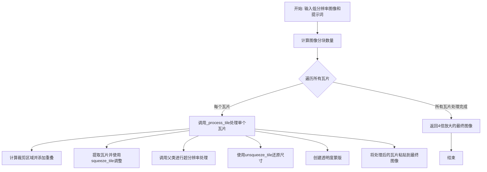
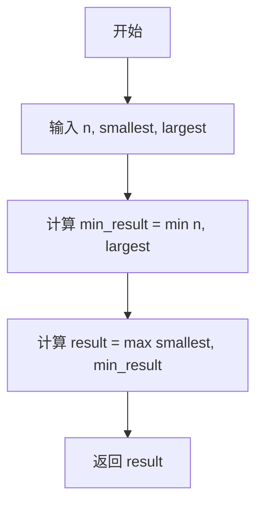
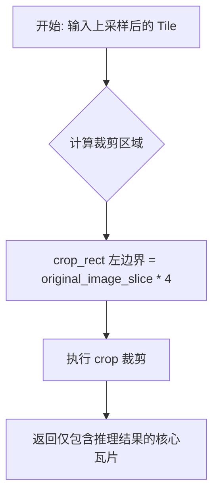
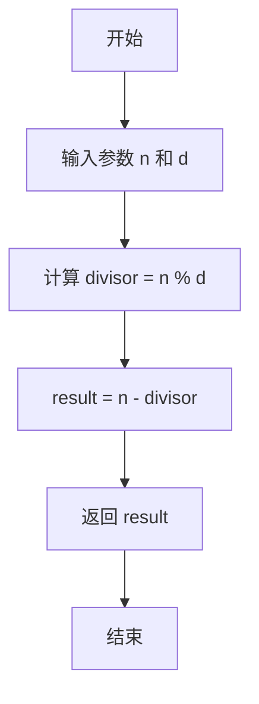
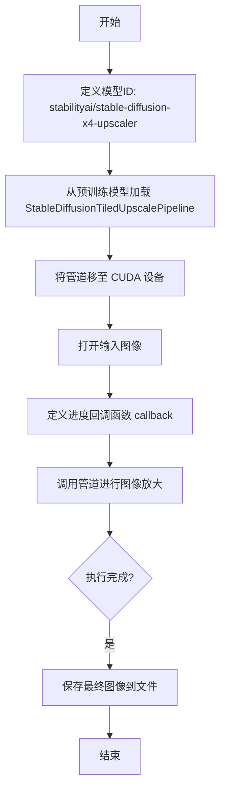
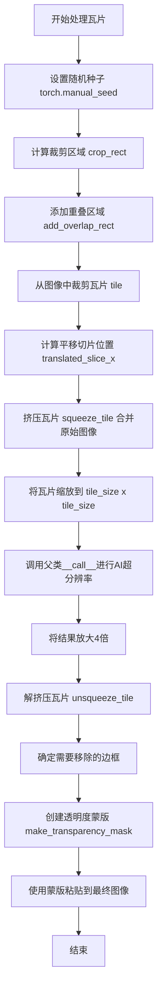

# `diffusers\examples\community\tiled_upscaling.py` 详细设计文档

该代码实现了一个基于Stable Diffusion 2的平铺式图像超分辨率管道，通过将大图像分割成重叠的小块分别进行上采样，然后使用透明度蒙版无缝合并，以内存换计算的方式实现超大图像的高质量上采样。

## 整体流程



## 类结构

```
StableDiffusionUpscalePipeline (基类, 来自diffusers)
└── StableDiffusionTiledUpscalePipeline (自定义实现)
```

## 全局变量及字段


### `model_id`
    
模型标识符字符串，用于指定要加载的预训练模型

类型：`str`
    


### `pipe`
    
Stable Diffusion平铺升级管道实例，用于执行图像的超分辨率处理

类型：`StableDiffusionTiledUpscalePipeline`
    


### `image`
    
输入的PIL图像，待被上采样到4倍分辨率

类型：`PIL.Image.Image`
    


### `callback`
    
进度回调函数，用于在每个瓦片处理完成后报告进度并保存中间图像

类型：`Callable[[dict], None]`
    


### `final_image`
    
最终输出的4倍分辨率图像，已保存到磁盘

类型：`PIL.Image.Image`
    


### `StableDiffusionTiledUpscalePipeline.vae`
    
变分自编码器，用于编码和解码图像

类型：`AutoencoderKL`
    


### `StableDiffusionTiledUpscalePipeline.text_encoder`
    
冻结的文本编码器，用于将文本提示转换为向量表示

类型：`CLIPTextModel`
    


### `StableDiffusionTiledUpscalePipeline.tokenizer`
    
CLIP分词器，用于将文本输入拆分为token序列

类型：`CLIPTokenizer`
    


### `StableDiffusionTiledUpscalePipeline.unet`
    
条件U-Net去噪网络，用于在潜在空间中逐步去除噪声

类型：`UNet2DConditionModel`
    


### `StableDiffusionTiledUpscalePipeline.low_res_scheduler`
    
低分辨率图像噪声调度器，用于在低分辨率条件图上添加噪声

类型：`DDPMScheduler`
    


### `StableDiffusionTiledUpscalePipeline.scheduler`
    
主去噪调度器，控制去噪过程的噪声调度策略

类型：`Union[DDIMScheduler, PNDMScheduler, LMSDiscreteScheduler]`
    


### `StableDiffusionTiledUpscalePipeline.max_noise_level`
    
最大噪声级别，用于限制噪声的最大强度

类型：`int`
    
    

## 全局函数及方法


### `make_transparency_mask`

创建透明度渐变蒙版函数，用于在图像拼接时创建平滑的边缘渐变效果，帮助消除 tile 之间的接缝，使拼接区域更加自然。

参数：

- `size`：`Tuple[int, int]`，目标蒙版的尺寸 (宽, 高)
- `overlap_pixels`：`int`，重叠像素数量，用于创建渐变过渡区域
- `remove_borders`：`List[str]`，可选参数，指定要移除的边框列表，可选值包括 "l"（左）、"r"（右）、"t"（上）、"b"（下）

返回值：`np.ndarray`，返回 uint8 类型的二维 NumPy 数组，值为 0-255，其中 255 表示不透明，0 表示完全透明，形成从边缘向中心的线性渐变

#### 流程图

```mermaid
flowchart TD
    A[开始] --> B[计算基础蒙版尺寸<br/>size_x = size[0] - overlap_pixels * 2<br/>size_y = size[1] - overlap_pixels * 2]
    B --> C{检查 remove_borders<br/>包含 'l' 或 'r'}
    C -->|是| D[size_x += overlap_pixels]
    C -->|否| E{检查 remove_borders<br/>包含 't' 或 'b'}
    D --> E
    E -->|是| F[size_y += overlap_pixels]
    E -->|否| G[创建基础蒙版<br/>np.ones 全部为 255]
    F --> G
    G --> H[添加线性渐变边缘<br/>np.pad 使用 linear_ramp 模式]
    H --> I{根据 remove_borders 裁剪蒙版}
    I -->|包含 'l'| J[裁剪左侧]
    I -->|包含 'r'| K[裁剪右侧]
    I -->|包含 't'| L[裁剪顶部]
    I -->|包含 'b'| M[裁剪底部]
    J --> N[返回蒙版数组]
    K --> N
    L --> N
    M --> N
```

#### 带注释源码

```python
def make_transparency_mask(size, overlap_pixels, remove_borders=[]):
    """
    创建透明度渐变蒙版，用于图像拼接时的平滑过渡
    
    参数:
        size: 元组 (width, height)，蒙版的最终尺寸
        overlap_pixels: 重叠像素数量，定义渐变区域的宽度
        remove_borders: 可选列表，指定要移除的边框 ['l','r','t','b']
    
    返回:
        numpy 数组，uint8 类型，0-255 范围，255 为不透明，0 为完全透明
    """
    
    # 计算基础蒙版尺寸（减去重叠区域）
    size_x = size[0] - overlap_pixels * 2
    size_y = size[1] - overlap_pixels * 2
    
    # 根据需要移除的边框调整尺寸
    # 如果要移除左边或右边，增加宽度
    for letter in ["l", "r"]:
        if letter in remove_borders:
            size_x += overlap_pixels
    # 如果要移除顶部或底部，增加高度
    for letter in ["t", "b"]:
        if letter in remove_borders:
            size_y += overlap_pixels
    
    # 创建基础蒙版（全白=不透明）
    mask = np.ones((size_y, size_x), dtype=np.uint8) * 255
    
    # 使用线性渐变填充重叠区域边缘
    # linear_ramp 模式从边缘的 255 渐变到末端的 0
    # pad_width 定义每个方向的填充宽度
    mask = np.pad(mask, mode="linear_ramp", pad_width=overlap_pixels, end_values=0)
    
    # 根据 remove_borders 裁剪蒙版
    # 移除左边：保留右侧部分
    if "l" in remove_borders:
        mask = mask[:, overlap_pixels : mask.shape[1]]
    # 移除右边：保留左侧部分
    if "r" in remove_borders:
        mask = mask[:, 0 : mask.shape[1] - overlap_pixels]
    # 移除顶部：保留底部部分
    if "t" in remove_borders:
        mask = mask[overlap_pixels : mask.shape[0], :]
    # 移除底部：保留顶部部分
    if "b" in remove_borders:
        mask = mask[0 : mask.shape[0] - overlap_pixels, :]
    
    return mask
```


### `clamp`

该函数用于将数值限制在最小值和最大值之间的范围内，确保返回值不会超出指定的边界。

参数：

- `n`：需要被限制的数值
- `smallest`：允许的最小值
- `largest`：允许的最大值

返回值：`数值类型`，返回限制在 [smallest, largest] 范围内的数值

#### 流程图



#### 带注释源码

```python
def clamp(n, smallest, largest):
    """
    将数值 n 限制在 [smallest, largest] 范围内
    
    参数:
        n: 需要被限制的数值
        smallest: 允许的最小值
        largest: 允许的最大值
    
    返回:
        限制后的数值，确保在 [smallest, largest] 范围内
    """
    return max(smallest, min(n, largest))
    # 首先使用 min(n, largest) 确保 n 不超过最大值
    # 然后使用 max(smallest, ...) 确保结果不低于最小值
```


### `clamp_rect`

限制矩形坐标在指定范围内，确保矩形的四个顶点坐标（x1, y1, x2, y2）都不会超过指定的最小值和最大值边界。

参数：

- `rect`：`List[int]`，矩形的坐标列表 [x1, y1, x2, y2]，其中 (x1, y1) 为左上角坐标，(x2, y2) 为右下角坐标
- `min`：`List[int]`，最小边界值 [min_x, min_y]，用于限制坐标的最小值
- `max`：`List[int]`，最大边界值 [max_x, max_y]，用于限制坐标的最大值

返回值：`Tuple[int, int, int, int]`，返回限制后的矩形坐标元组 (x1, y1, x2, y2)，确保所有坐标值都在 min 和 max 指定的范围内

#### 流程图

```mermaid
flowchart TD
    A[开始 clamp_rect] --> B[获取 rect[0] x1坐标]
    B --> C[调用 clamp rect[0], min[0], max[0]]
    C --> D[获取 rect[1] y1坐标]
    D --> E[调用 clamp rect[1], min[1], max[1]]
    E --> F[获取 rect[2] x2坐标]
    F --> G[调用 clamp rect[2], min[0], max[0]]
    G --> H[获取 rect[3] y2坐标]
    H --> I[调用 clamp rect[3], min[1], max[1]]
    I --> J[组装结果为元组]
    J --> K[返回限制后的矩形坐标]
```

#### 带注释源码

```python
def clamp_rect(rect: [int], min: [int], max: [int]):
    """
    限制矩形坐标在指定范围内。
    
    该函数将矩形坐标 (x1, y1, x2, y2) 限制在由 min 和 max 定义的边界框内，
    确保矩形不会超出图像或其他指定区域的边界。
    
    参数:
        rect: 矩形坐标列表 [x1, y1, x2, x2]，其中 x1<x2, y1<y2
        min: 最小边界 [min_x, min_y]
        max: 最大边界 [max_x, max_y]
    
    返回:
        限制后的矩形坐标元组 (x1, y1, x2, y2)
    """
    return (
        clamp(rect[0], min[0], max[0]),  # 限制左上角 x 坐标在 [min_x, max_x] 范围内
        clamp(rect[1], min[1], max[1]),  # 限制左上角 y 坐标在 [min_y, max_y] 范围内
        clamp(rect[2], min[0], max[0]),  # 限制右下角 x 坐标在 [min_x, max_x] 范围内
        clamp(rect[3], min[1], max[1]),  # 限制右下角 y 坐标在 [min_y, max_y] 范围内
    )
```

#### 依赖函数 `clamp`

```python
def clamp(n, smallest, largest):
    """
    将数值 n 限制在 [smallest, largest] 范围内。
    
    参数:
        n: 要限制的数值
        smallest: 最小值
        largest: 最大值
    
    返回:
        限制后的数值
    """
    return max(smallest, min(n, largest))
```


### `add_overlap_rect`

该函数用于扩展矩形的边界，通过在上下左右四个方向上增加指定的 `overlap` 像素值，同时确保扩展后的矩形不会超出图像的边界范围（通过 `clamp_rect` 进行边界限制）。

参数：

- `rect`：`List[int]`，输入的矩形坐标，格式为 `[x_min, y_min, x_max, y_max]`。
- `overlap`：`int`，需要在每个方向上扩展的像素数量。
- `image_size`：`List[int]`，图像的尺寸 `[宽, 高]`，用于限制矩形的最大边界。

返回值：`List[int]`，返回扩展并 clamping 后的矩形坐标 `[x_min, y_min, x_max, y_max]`。

#### 流程图

```mermaid
graph TD
    A([开始 add_overlap_rect]) --> B[将 rect 转换为可变列表]
    B --> C[rect[0] -= overlap]
    C --> D[rect[1] -= overlap]
    D --> E[rect[2] += overlap]
    E --> F[rect[3] += overlap]
    F --> G{调用 clamp_rect}
    G -->|限制坐标范围| H[返回新的矩形列表]
    H --> I([结束])
```

#### 带注释源码

```python
def add_overlap_rect(rect: [int], overlap: int, image_size: [int]):
    """
    为矩形添加重叠区域并限制边界。
    
    参数:
        rect: 原始矩形坐标 [x1, y1, x2, y2]。
        overlap: 重叠像素值。
        image_size: 图像尺寸 [宽, 高]。
    
    返回:
        扩展并限制后的矩形列表。
    """
    # 将输入的矩形（元组或不可变序列）转换为可变列表，以便修改
    rect = list(rect)
    
    # 扩展左边界 (x_min)
    rect[0] -= overlap
    # 扩展上边界 (y_min)
    rect[1] -= overlap
    # 扩展右边界 (x_max)
    rect[2] += overlap
    # 扩展下边界 (y_max)
    rect[3] += overlap
    
    # 调用 clamp_rect 确保矩形坐标不会超出 [0, 0] 到 [image_size[0], image_size[1]] 的范围
    rect = clamp_rect(rect, [0, 0], [image_size[0], image_size[1]])
    
    return rect
```


### `squeeze_tile`

该函数用于在图像超分辨率处理过程中，将原始图像的切片与处理后的瓦片合并，生成一个"压缩"的输入图像供模型使用。通过在瓦片左侧保留一部分原始图像上下文，可以减少边界伪影并保持图像的连贯性。

参数：

- `tile`：`PIL.Image.Image`，当前的处理瓦片（tile），即经过模型处理后的图像块
- `original_image`：`PIL.Image.Image`，原始输入图像，即待放大的低分辨率图像
- `original_slice`：`int`，从原始图像左侧保留的切片宽度（像素数），用于保持图像上下文
- `slice_x`：`int`，从原始图像中裁剪切片时的起始x坐标位置

返回值：`PIL.Image.Image`，合并后的新图像，宽度为瓦片宽度加上原始切片宽度，高度与瓦片高度相同

#### 流程图

```mermaid
flowchart TD
    A[开始: squeeze_tile] --> B[创建新图像<br/>宽度: tile.width + original_slice<br/>高度: tile.height]
    B --> C[调整original_image大小<br/>到tile的尺寸]
    C --> D[裁剪original_image<br/>从slice_x开始<br/>宽度为original_slice]
    D --> E[将裁剪的图像<br/>粘贴到新图像左侧<br/>位置: (0, 0)]
    E --> F[将tile粘贴到新图像右侧<br/>位置: (original_slice, 0)]
    F --> G[返回结果图像]
```

#### 带注释源码

```python
def squeeze_tile(tile, original_image, original_slice, slice_x):
    """
    压缩瓦片以保留原始图像切片。
    
    该函数创建一个新的图像，将原始图像的切片（左侧部分）与处理后的瓦片
    （右侧部分）合并。这样可以让模型在处理瓦片时看到一些原始图像的上下文，
    有助于减少边界伪影。
    
    参数:
        tile: 当前的处理瓦片图像（经过模型处理后的图像块）
        original_image: 原始输入的低分辨率图像
        original_slice: 从原始图像左侧保留的切片宽度（像素）
        slice_x: 从原始图像裁剪时的起始x坐标
    
    返回:
        合并后的新图像，宽度为瓦片宽度 + original_slice，高度与瓦片相同
    """
    
    # 创建一个新的RGB图像，宽度为瓦片宽度加上原始切片宽度，高度与瓦片高度相同
    # 这样新图像的左侧可以容纳原始图像切片，右侧容纳处理后的瓦片
    result = Image.new("RGB", (tile.size[0] + original_slice, tile.size[1]))
    
    # 将原始图像调整到与瓦片相同的尺寸，然后从中裁剪出指定的部分
    # 裁剪区域：从slice_x开始，宽度为original_slice，高度为瓦片高度
    # 这部分代表原始图像在当前瓦片位置对应的上下文区域
    original_slice_image = original_image.resize(
        (tile.size[0], tile.size[1]),  # 调整原始图像到瓦片尺寸
        Image.BICUBIC  # 使用双三次插值进行高质量缩放
    ).crop(
        (slice_x, 0, slice_x + original_slice, tile.size[1])  # 裁剪左侧切片
    )
    
    # 将裁剪出的原始图像切片粘贴到结果图像的左侧（从坐标0,0开始）
    result.paste(original_slice_image, (0, 0))
    
    # 将处理后的瓦片粘贴到结果图像的右侧（从original_slice位置开始）
    # 这样瓦片就紧邻原始切片，两者共同构成完整的输入图像
    result.paste(tile, (original_slice, 0))
    
    # 返回合并后的图像，这个图像将被用于模型推理
    return result
```


### `unsqueeze_tile`

**描述**：该函数用于从经过 4 倍上采样后的瓦片中裁剪出核心的推理结果部分。在 `squeeze_tile` 操作中，原始图像的切片被拼接到瓦片左侧并一起进行了上采样。`unsqueeze_tile` 的作用正是去除这部分拼接带来的“上下文填充”，还原出纯粹的上采样后的 AI 推理瓦片，从而消除拼接痕迹。

参数：

- `tile`：`PIL.Image.Image`，输入的图像对象。实际上是经过 `squeeze_tile` 处理并上采样 4 倍后的图像，包含了原始图像上下文和推理结果。
- `original_image_slice`：`int`，在 `squeeze_tile` 步骤中预留的原始图像切片的宽度（低分辨率像素值）。

返回值：`PIL.Image.Image`，裁剪后的图像，即去掉左侧原始图像上下文后的纯粹的上采样推理瓦片。

#### 流程图



#### 带注释源码

```python
def unsqueeze_tile(tile, original_image_slice):
    """
    从上采样后的瓦片中移除原始图像上下文，还原纯净的上采样瓦片。

    Args:
        tile (PIL.Image.Image): 经过了 4x 上采样的完整瓦片（包含拼接的原始图像部分）。
        original_image_slice (int): 原始图像切片的宽度（低分辨率下的像素值）。

    Returns:
        PIL.Image.Image: 裁剪后的纯推理瓦片。
    """
    # 计算裁剪矩形。
    # 由于输入的 tile 已经被放大了 4 倍 (Stable Diffusion Upscale 是 4x),
    # 所以原本的 original_image_slice 宽度也需要乘以 4。
    # 左上角坐标：(original_image_slice * 4, 0)
    # 右下角坐标：(tile.size[0], tile.size[1]) - 即保留右侧全部内容
    crop_rect = (original_image_slice * 4, 0, tile.size[0], tile.size[1])
    
    # 使用 PIL 的 crop 方法进行区域裁剪，去除左侧的原始图像上下文
    tile = tile.crop(crop_rect)
    
    return tile
```


### `next_divisible`

该函数用于计算在给定数字 `n` 之前（包含 `n` 本身）最后一个能够被 `d` 整除的数。通过计算 `n` 对 `d` 的余数，然后用 `n` 减去该余数得到结果。

参数：

- `n`：`int`，起始数字，计算从该数字向下第一个可被整除的数
- `d`：`int`，除数，用于判断整除的唯一标准

返回值：`int`，返回不大于 `n` 且能被 `d` 整除的最大整数

#### 流程图



#### 带注释源码

```python
def next_divisible(n, d):
    """
    计算下一个可被整除的数。
    
    该函数找出不大于 n 的、能够被 d 整除的最大整数。
    原理：n % d 得到余数，n 减去余数即为下一个可被整除的数。
    当 n 本身可被 d 整除时（余数为0），直接返回 n。
    
    参数:
        n: 起始数字，类型为整数
        d: 除数，类型为整数，不能为0
    
    返回:
        不大于 n 且能被 d 整除的最大整数
    """
    # 计算 n 除以 d 的余数
    divisor = n % d
    
    # n 减去余数，得到向下取整的可整除数
    # 例如：next_divisible(17, 5) -> 17 % 5 = 2 -> 17 - 2 = 15
    # 例如：next_divisible(20, 5) -> 20 % 5 = 0 -> 20 - 0 = 20
    return n - divisor
```


### `main`

主函数，用于演示 Stable Diffusion 瓷砖放大管道的使用方法。该函数加载预训练的 Stable Diffusion x4 放大模型，将图像放大 4 倍，并保存结果图像。

参数： 无

返回值：`None`，无返回值。该函数执行完成后会将放大后的图像保存到文件系统中。

#### 流程图



#### 带注释源码

```python
def main():
    """
    主函数，用于演示管道用法。
    加载预训练的 Stable Diffusion x4 放大模型，
    对输入图像进行 4 倍放大，并保存结果。
    """
    # 定义模型标识符，使用 Stability AI 的 Stable Diffusion x4 放大器
    model_id = "stabilityai/stable-diffusion-x4-upscaler"
    
    # 从预训练模型加载管道，使用 FP16 变体以提高推理速度
    # torch_dtype 指定为 float16 以利用 GPU 加速
    pipe = StableDiffusionTiledUpscalePipeline.from_pretrained(
        model_id, 
        variant="fp16", 
        torch_dtype=torch.float16
    )
    
    # 将模型移至 CUDA 设备以利用 GPU 进行推理
    pipe = pipe.to("cuda")
    
    # 打开待放大的输入图像
    image = Image.open("../../docs/source/imgs/diffusers_library.jpg")

    # 定义回调函数，用于在管道执行过程中显示进度
    # 参数 obj 包含进度信息和当前处理的图像
    def callback(obj):
        # 打印当前进度百分比
        print(f"progress: {obj['progress']:.4f}")
        # 将当前处理的图像保存为进度文件
        obj["image"].save("diffusers_library_progress.jpg")

    # 调用管道执行图像放大任务
    # prompt: 文本提示，指导图像生成风格（黑色字体，白色背景，矢量风格）
    # noise_level: 噪声级别，控制放大过程中的细节保留程度
    # callback: 进度回调函数
    final_image = pipe(
        image=image, 
        prompt="Black font, white background, vector", 
        noise_level=40, 
        callback=callback
    )
    
    # 保存最终的放大图像
    final_image.save("diffusers_library.jpg")
```


### `StableDiffusionTiledUpscalePipeline.__init__`

该方法是 `StableDiffusionTiledUpscalePipeline` 类的构造函数，负责初始化基于瓦片（tile）的Stable Diffusion图像超分辨率管道。它继承自 `StableDiffusionUpscalePipeline`，通过调用父类构造函数来设置VAE、文本编码器、分词器、U-Net和调度器等核心组件。

参数：

- `vae`：`AutoencoderKL`，Variational Auto-Encoder (VAE) 模型，用于编码和解码图像与潜在表示
- `text_encoder`：`CLIPTextModel`，冻结的文本编码器，Stable Diffusion使用CLIP的文本部分
- `tokenizer`：`CLIPTokenizer`，CLIPTokenizer类的分词器
- `unet`：`UNet2DConditionModel`，条件U-Net架构，用于对编码的图像潜在表示进行去噪
- `low_res_scheduler`：`DDPMScheduler`，用于向低分辨率条件图像添加初始噪声的调度器
- `scheduler`：`Union[DDIMScheduler, PNDMScheduler, LMSDiscreteScheduler]`，与U-Net结合使用以对编码图像潜在表示进行去噪的调度器
- `max_noise_level`：`int`，最大噪声级别，默认为350

返回值：`None`，构造函数不返回任何值

#### 流程图

```mermaid
graph TD
    A[开始 __init__] --> B[接收参数: vae, text_encoder, tokenizer, unet, low_res_scheduler, scheduler, max_noise_level]
    B --> C[调用 super().__init__ 传递所有参数]
    C --> D[父类 StableDiffusionUpscalePipeline 初始化完成]
    D --> E[结束 __init__]
    
    style A fill:#f9f,stroke:#333
    style E fill:#9f9,stroke:#333
```

#### 带注释源码

```python
def __init__(
    self,
    vae: AutoencoderKL,
    text_encoder: CLIPTextModel,
    tokenizer: CLIPTokenizer,
    unet: UNet2DConditionModel,
    low_res_scheduler: DDPMScheduler,
    scheduler: Union[DDIMScheduler, PNDMScheduler, LMSDiscreteScheduler],
    max_noise_level: int = 350,
):
    """
    初始化 StableDiffusionTiledUpscalePipeline 实例。
    
    该构造函数继承自 StableDiffusionUpscalePipeline，接收所有必要的组件
    用于基于瓦片的图像超分辨率处理。
    
    参数:
        vae: AutoencoderKL - VAE模型，用于图像编码/解码
        text_encoder: CLIPTextModel - CLIP文本编码器
        tokenizer: CLIPTokenizer - CLIP分词器
        unet: UNet2DConditionModel - 条件U-Net去噪模型
        low_res_scheduler: DDPMScheduler - 低分辨率图像噪声调度器
        scheduler: Union[DDIMScheduler, PNDMScheduler, LMSDiscreteScheduler] - 主去噪调度器
        max_noise_level: int - 最大噪声级别，默认350
    
    返回:
        None
    """
    # 调用父类 StableDiffusionUpscalePipeline 的 __init__ 方法
    # 传递所有接收到的参数，完成基础组件的初始化
    super().__init__(
        vae=vae,
        text_encoder=text_encoder,
        tokenizer=tokenizer,
        unet=unet,
        low_res_scheduler=low_res_scheduler,
        scheduler=scheduler,
        max_noise_level=max_noise_level,
    )
```


### `StableDiffusionTiledUpscalePipeline._process_tile`

该方法是平铺升级管道的核心处理函数，负责对单个瓦片进行图像超分辨率处理。它通过裁剪图像瓦片、应用Stable Diffusion模型进行4倍放大，然后使用透明度蒙版将处理后的瓦片无缝融合到最终的高分辨率图像中，以实现超大图像的生成同时控制显存占用。

参数：

- `original_image_slice`：`int`，原始图像切片像素数量，用于在瓦片边缘保留原始图像信息以减少模糊
- `x`：`int`，瓦片的x坐标索引
- `y`：`int`，瓦片的y坐标索引
- `tile_size`：`int`，瓦片的边长大小（处理前）
- `tile_border`：`int`，瓦片周围的重叠像素数量，用于减少拼接痕迹
- `image`：`PIL.Image.Image`，输入的要放大的原始图像
- `final_image`：`PIL.Image.Image`，输出的4倍放大图像（方法内直接修改此对象）
- `**kwargs`：可变关键字参数，传递给父类`StableDiffusionUpscalePipeline.__call__`的参数（如prompt、num_inference_steps等）

返回值：`None`，该方法无返回值，结果通过修改`final_image`参数输出

#### 流程图



#### 带注释源码

```python
def _process_tile(self, original_image_slice, x, y, tile_size, tile_border, image, final_image, **kwargs):
    """
    处理单个瓦片的超分辨率放大
    
    参数:
        original_image_slice: 原始图像切片大小
        x, y: 瓦片在网格中的坐标
        tile_size: 瓦片基础尺寸
        tile_border: 重叠区域大小
        image: 输入图像
        final_image: 输出图像（就地修改）
        **kwargs: 传递给父类pipeline的参数
    """
    # 设置随机种子以确保可重复性
    torch.manual_seed(0)
    
    # 计算当前瓦片的裁剪区域（考虑边界情况）
    # crop_rect = (left, top, right, bottom)
    crop_rect = (
        min(image.size[0] - (tile_size + original_image_slice), x * tile_size),
        min(image.size[1] - (tile_size + original_image_slice), y * tile_size),
        min(image.size[0], (x + 1) * tile_size),
        min(image.size[1], (y + 1) * tile_size),
    )
    
    # 扩展裁剪区域以包含重叠部分
    crop_rect_with_overlap = add_overlap_rect(crop_rect, tile_border, image.size)
    
    # 从原始图像中裁剪出当前瓦片
    tile = image.crop(crop_rect_with_overlap)
    
    # 计算平移后的切片X坐标，用于后续合并原始图像信息
    translated_slice_x = ((crop_rect[0] + ((crop_rect[2] - crop_rect[0]) / 2)) / image.size[0]) * tile.size[0]
    translated_slice_x = translated_slice_x - (original_image_slice / 2)
    translated_slice_x = max(0, translated_slice_x)
    
    # 挤压瓦片：将原始图像切片与瓦片合并
    # 这样可以在边缘保留更多原始图像信息
    to_input = squeeze_tile(tile, image, original_image_slice, translated_slice_x)
    orig_input_size = to_input.size
    
    # 缩放输入到标准瓦片大小以适配模型
    to_input = to_input.resize((tile_size, tile_size), Image.BICUBIC)
    
    # 调用父类pipeline进行AI超分辨率处理
    # 这是实际的Stable Diffusion推理过程
    upscaled_tile = super(StableDiffusionTiledUpscalePipeline, self).__call__(image=to_input, **kwargs).images[0]
    
    # 将输出放大4倍（恢复到包含重叠的区域大小）
    upscaled_tile = upscaled_tile.resize((orig_input_size[0] * 4, orig_input_size[1] * 4), Image.BICUBIC)
    
    # 解挤压：移除之前添加的原始图像切片部分
    upscaled_tile = unsqueeze_tile(upscaled_tile, original_image_slice)
    
    # 再次放大到最终瓦片尺寸（包含重叠）
    upscaled_tile = upscaled_tile.resize((tile.size[0] * 4, tile.size[1] * 4), Image.BICUBIC)
    
    # 确定需要移除的边框（边缘瓦片不需要透明过渡）
    remove_borders = []
    if x == 0:
        remove_borders.append("l")  # 左
    elif crop_rect[2] == image.size[0]:
        remove_borders.append("r")  # 右
    if y == 0:
        remove_borders.append("t")  # 上
    elif crop_rect[3] == image.size[1]:
        remove_borders.append("b")  # 下
    
    # 创建透明度蒙版，用于边缘平滑过渡
    # 蒙版宽度也要乘以4因为输出图像放大了4倍
    transparency_mask = Image.fromarray(
        make_transparency_mask(
            (upscaled_tile.size[0], upscaled_tile.size[1]), tile_border * 4, remove_borders=remove_borders
        ),
        mode="L",
    )
    
    # 将处理好的瓦片粘贴到最终图像的对应位置
    # 使用透明度蒙版实现无缝拼接
    final_image.paste(
        upscaled_tile, (crop_rect_with_overlap[0] * 4, crop_rect_with_overlap[1] * 4), transparency_mask
    )
```


### `StableDiffusionTiledUpscalePipeline.__call__`

这是一个基于瓦片（tile）分块处理的文本引导图像超分辨率管道，利用 Stable Diffusion 2 将图像放大 4 倍。该方法通过将大图像分割成多个重叠的小瓦片分别进行处理，最后拼接合成完整的高分辨率图像，从而在有限的 GPU 内存下实现超大图像的上采样。

参数：

- `prompt`：`Union[str, List[str]]`，引导图像生成的文本提示
- `image`：`Union[PIL.Image.Image, List[PIL.Image.Image]]`，待放大的输入图像
- `num_inference_steps`：`int`，去噪步数，默认为 75
- `guidance_scale`：`float`，分类器-free 扩散引导比例，默认为 9.0
- `noise_level`：`int`，噪声等级，默认为 50
- `negative_prompt`：`Optional[Union[str, List[str]]]`，负面提示词，用于引导图像生成
- `num_images_per_prompt`：`Optional[int]`，每个提示词生成的图像数量，默认为 1
- `eta`：`float`，DDIM 论文中的 eta 参数，默认为 0.0
- `generator`：`torch.Generator | None`，随机数生成器，用于可重复的生成
- `latents`：`Optional[torch.Tensor]`，预生成的噪声潜在向量
- `callback`：`Optional[Callable[[int, int, torch.Tensor], None]]`，回调函数，用于显示进度
- `callback_steps`：`int`，回调函数调用间隔，默认为 1
- `tile_size`：`int`，瓦片大小，默认为 128
- `tile_border`：`int`，瓦片重叠像素数，默认为 32
- `original_image_slice`：`int`，原始图像切片大小，默认为 32

返回值：`PIL.Image.Image`，放大 4 倍后的图像

#### 流程图

```mermaid
flowchart TD
    A[开始 __call__] --> B[创建空白最终图像 4x 大小]
    B --> C[计算 X 方向瓦片数量 tcx]
    C --> D[计算 Y 方向瓦片数量 tcy]
    D --> E[计算总瓦片数 total_tile_count]
    E --> F[初始化当前计数 current_count = 0]
    F --> G[外层循环: y in range(tcy)]
    G --> H[内层循环: x in range(tcx)]
    H --> I[调用 _process_tile 处理单个瓦片]
    I --> I1[设置随机种子 torch.manual_seed(0)]
    I1 --> I2[计算裁剪区域 crop_rect]
    I2 --> I3[添加重叠区域 add_overlap_rect]
    I3 --> I4[裁剪瓦片图像]
    I4 --> I5[挤压瓦片 squeeze_tile]
    I5 --> I6[调整瓦片大小到 tile_size]
    I6 --> I7[调用父类 __call__ 进行上采样]
    I7 --> I8[放大 4 倍并unsqueeze]
    I8 --> I9[创建透明度蒙版]
    I9 --> I10[将处理好的瓦片粘贴到最终图像]
    I10 --> J[current_count += 1]
    J --> K{回调函数是否存在?}
    K -->|是| L[调用回调函数, 传入进度和图像]
    K -->|否| M[继续]
    L --> M
    M --> N{内层循环完成?}
    N -->|否| H
    N -->|是| O{外层循环完成?}
    O -->|否| G
    O -->|是| P[返回最终图像]
    P --> Q[结束]
```

#### 带注释源码

```python
@torch.no_grad()
def __call__(
    self,
    prompt: Union[str, List[str]],
    image: Union[PIL.Image.Image, List[PIL.Image.Image]],
    num_inference_steps: int = 75,
    guidance_scale: float = 9.0,
    noise_level: int = 50,
    negative_prompt: Optional[Union[str, List[str]]] = None,
    num_images_per_prompt: Optional[int] = 1,
    eta: float = 0.0,
    generator: torch.Generator | None = None,
    latents: Optional[torch.Tensor] = None,
    callback: Optional[Callable[[int, int, torch.Tensor], None]] = None,
    callback_steps: int = 1,
    tile_size: int = 128,
    tile_border: int = 32,
    original_image_slice: int = 32,
):
    r"""
    Function invoked when calling the pipeline for generation.

    Args:
        prompt (`str` or `List[str]`):
            The prompt or prompts to guide the image generation.
        image (`PIL.Image.Image` or List[`PIL.Image.Image`] or `torch.Tensor`):
            `Image`, or tensor representing an image batch which will be upscaled. *
        num_inference_steps (`int`, *optional*, defaults to 50):
            The number of denoising steps. More denoising steps usually lead to a higher quality image at the
            expense of slower inference.
        guidance_scale (`float`, *optional*, defaults to 7.5):
            Guidance scale as defined in [Classifier-Free Diffusion Guidance](https://huggingface.co/papers/2207.12598).
            `guidance_scale` is defined as `w` of equation 2. of [Imagen
            Paper](https://huggingface.co/papers/2205.11487). Guidance scale is enabled by setting `guidance_scale >
            1`. Higher guidance scale encourages to generate images that are closely linked to the text `prompt`,
            usually at the expense of lower image quality.
        negative_prompt (`str` or `List[str]`, *optional*):
            The prompt or prompts not to guide the image generation. Ignored when not using guidance (i.e., ignored
            if `guidance_scale` is less than `1`).
        num_images_per_prompt (`int`, *optional*, defaults to 1):
            The number of images to generate per prompt.
        eta (`float`, *optional*, defaults to 0.0):
            Corresponds to parameter eta (η) in the DDIM paper: https://huggingface.co/papers/2010.02502. Only applies to
            [`schedulers.DDIMScheduler`], will be ignored for others.
        generator (`torch.Generator`, *optional*):
            A [torch generator](https://pytorch.org/docs/stable/generated/torch.Generator.html) to make generation
            deterministic.
        latents (`torch.Tensor`, *optional*):
            Pre-generated noisy latents, sampled from a Gaussian distribution, to be used as inputs for image
            generation. Can be used to tweak the same generation with different prompts. If not provided, a latents
            tensor will be generated by sampling using the supplied random `generator`.
        tile_size (`int`, *optional*):
            The size of the tiles. Too big can result in an OOM-error.
        tile_border (`int`, *optional*):
            The number of pixels around a tile to consider (bigger means less seams, too big can lead to an OOM-error).
        original_image_slice (`int`, *optional*):
            The amount of pixels of the original image to calculate with the current tile (bigger means more depth
            is preserved, less blur occurs in the final image, too big can lead to an OOM-error or loss in detail).
        callback (`Callable`, *optional*):
            A function that take a callback function with a single argument, a dict,
            that contains the (partially) processed image under "image",
            as well as the progress (0 to 1, where 1 is completed) under "progress".

    Returns: A PIL.Image that is 4 times larger than the original input image.

    """

    # 创建空白的目标图像，大小为原图的 4 倍
    final_image = Image.new("RGB", (image.size[0] * 4, image.size[1] * 4))
    
    # 计算 X 和 Y 方向上需要的瓦片数量（向上取整）
    tcx = math.ceil(image.size[0] / tile_size)
    tcy = math.ceil(image.size[1] / tile_size)
    
    # 计算总瓦片数
    total_tile_count = tcx * tcy
    
    # 当前已处理的瓦片计数
    current_count = 0
    
    # 遍历所有瓦片位置
    for y in range(tcy):
        for x in range(tcx):
            # 处理单个瓦片
            self._process_tile(
                original_image_slice,
                x,
                y,
                tile_size,
                tile_border,
                image,
                final_image,
                prompt=prompt,
                num_inference_steps=num_inference_steps,
                guidance_scale=guidance_scale,
                noise_level=noise_level,
                negative_prompt=negative_prompt,
                num_images_per_prompt=num_images_per_prompt,
                eta=eta,
                generator=generator,
                latents=latents,
            )
            
            # 更新已处理瓦片计数
            current_count += 1
            
            # 如果提供了回调函数，则调用它报告进度
            if callback is not None:
                callback({"progress": current_count / total_tile_count, "image": final_image})
    
    # 返回最终的放大图像
    return final_image
```

## 关键组件


### StableDiffusionTiledUpscalePipeline类

继承自StableDiffusionUpscalePipeline的平铺超分辨率管道类，通过将大图像分割为小Tile进行处理来实现内存优化，从而支持生成超大型图像。

### _process_tile方法

核心Tile处理方法，执行图像切分、重叠区域处理、Tile放大、边界裁剪和透明度遮罩应用等操作，将每个Tile区域独立进行4倍超分辨率处理。

### make_transparency_mask函数

生成用于Tile边缘融合的线性渐变透明度遮罩，支持指定重叠像素数和可选的边框移除（左右上下），确保Tile之间平滑过渡消除接缝。

### squeeze_tile函数

将带有重叠区域的Tile图像压缩回原始尺寸，通过重采样和裁剪操作保留原始图像的上下文信息用于超分辨率处理。

### unsqueeze_tile函数

从放大的Tile中恢复并裁剪出与原始Tile对应的区域，通过逆向操作提取最终的Tile内容。

### 辅助函数组

包括clamp（数值范围限制）、clamp_rect（矩形坐标限制）、add_overlap_rect（扩展矩形边界）、next_divisible（向下取整除法）等工具函数，用于坐标计算和边界处理。

### 超分辨率参数配置

包含tile_size（Tile尺寸）、tile_border（重叠边界）、original_image_slice（原始图像切片）等关键参数，控制Tile划分策略和内存与计算资源的平衡。

### 回调机制

通过callback函数支持进度报告，允许在处理每个Tile后获取当前进度和中间结果图像，实现处理过程的实时监控和可视化。

## 问题及建议


### 已知问题

-   **硬编码随机种子**：在 `_process_tile` 方法中使用 `torch.manual_seed(0)`，导致每次处理瓦片时使用相同的随机种子，可能在瓦片边界产生重复的伪影和视觉一致性问题。
-   **潜在的张量重用问题**：在循环处理瓦片时，`latents` 和 `generator` 参数被重复传递给底层 pipeline，可能导致潜在的状态污染和不确定的生成结果。
-   **缺少多图像批处理支持**：虽然类型提示支持 `List[PIL.Image.Image]`，但实际代码未对批量图像进行适当处理，仅处理单个图像。
-   **回调机制不完整**：回调仅在每个瓦片完成后调用，无法反映底层 pipeline 内部的推理步骤进度，无法真正展示去噪过程。
-   **缺乏错误处理**：瓦片处理过程中没有任何异常捕获机制，单个瓦片失败将导致整个上采样流程中断。
-   **类型提示不一致**：部分函数（如 `clamp_rect`、`add_overlap_rect`）使用 `[int]` 而非标准的 `List[int]` 进行类型标注。
-   **魔法数字缺乏解释**：代码中多处使用硬编码数值（如 `*4`、`350`、`4`），缺乏常量定义和注释说明其含义。
-   **图像质量可能的退化**：多次使用 `Image.BICUBIC` 进行缩放和裁剪操作，可能引入累积的质量损失。
-   **内存效率优化不足**：所有上采样后的瓦片都保留在内存中直到最后才写入最终图像，未能及时释放中间结果的内存。

### 优化建议

-   **动态随机种子管理**：为每个瓦片分配基于位置的唯一种子，或允许用户通过参数控制种子生成策略，以确保瓦片间的多样性和一致性。
-   **正确的潜在向量和生成器管理**：为每个瓦片独立生成 latents，或实现状态保存/恢复机制以确保可重复性。
-   **实现批量处理逻辑**：添加对多图像输入的完整支持，包括批量编码、批量去噪和结果组合。
-   **细粒度进度回调**：修改底层 pipeline 调用以支持逐步回调，使进度报告能够反映实际的去噪步骤。
-   **添加容错和恢复机制**：为瓦片处理添加 try-except 块，实现部分失败时的优雅降级或跳过策略。
-   **统一类型提示规范**：使用一致的 typing 导入方式（`from typing import List`），并为所有公共接口补充完整文档字符串。
-   **提取魔法数字为常量**：定义有意义的常量（如 `UPSAMPLE_FACTOR = 4`、`DEFAULT_MAX_NOISE_LEVEL = 350`）以提高代码可读性和可维护性。
-   **考虑质量优化**：评估使用 `Image.LANCZOS` 替代 `Image.BICUBIC` 进行关键缩放操作的可行性，或实现更高效的超分辨率方法。
-   **内存优化策略**：实现流式处理模式，在每个瓦片写入最终图像后立即释放相关内存资源。

## 其它


### 设计目标与约束

本项目的设计目标是实现一种基于Stable Diffusion 2的平铺式图像超分辨率放大 pipeline，通过将大图像分割成较小的tiles分别进行处理并合并，有效解决超大图像放大时的内存溢出（OOM）问题，同时保持较高的图像质量和深度信息。设计约束包括：必须继承自 StableDiffusionUpscalePipeline 以复用其核心逻辑；tile_size、tile_border 和 original_image_slice 三个参数需要在内存占用和图像质量之间取得平衡；单次推理仅支持4倍放大；依赖 PyTorch、Diffusers、NumPy 和 PIL 等库。

### 错误处理与异常设计

代码中的错误处理主要体现在以下几个方面：图像尺寸边界检查通过 clamp_rect 和 add_overlap_rect 函数实现，确保裁剪区域不会超出图像范围；tile 尺寸计算使用 min 函数防止越界；PIL.Image 的 resize 和 crop 操作在超出边界时会自动处理，但代码通过手动计算 crop_rect 进行了主动防护。潜在的异常情况包括：输入图像尺寸小于 tile_size 可能导致计算错误；tile_border 过大时可能产生负数坐标；内存不足时可能抛出 OutOfMemoryError。建议增加输入参数的有效性验证，如检查 tile_size > 0、tile_border >= 0、original_image_slice > 0 等约束条件。

### 数据流与状态机

整体数据流如下：输入原始图像和文本提示 → 根据 tile_size 计算需要分割的行列数 → 遍历每个 tile 位置 → 调用 _process_tile 处理单个 tile → 将处理后的 tile 合并到最终图像中 → 返回4倍放大的完整图像。在 _process_tile 内部的状态流：计算当前 tile 的裁剪区域（含重叠）→ 执行 squeeze_tile 调整尺寸 → 调整到标准 tile_size 进行超分辨率处理 → 执行 unsqueeze_tile 恢复原始比例 → 应用透明度蒙版去除边界 → 粘贴到最终图像对应位置。状态机主要由双层循环控制（y 行遍历 × x 列遍历），每个 tile 处理过程包含初始化、推理、合成三个状态。

### 外部依赖与接口契约

主要外部依赖包括：diffusers 库提供 StableDiffusionUpscalePipeline、AutoencoderKL、UNet2DConditionModel；transformers 库提供 CLIPTextModel 和 CLIPTokenizer；torch 提供张量运算和模型设备管理；PIL/Pillow 提供图像处理；NumPy 提供数值计算和数组操作；math 提供数学运算函数。接口契约方面：__call__ 方法接受 prompt（str 或 List[str]）、image（PIL.Image.Image）、num_inference_steps（默认75）、guidance_scale（默认9.0）、noise_level（默认50）等参数；返回 4 倍放大后的 PIL.Image 对象；callback 函数接收包含 progress（0-1）和 image（当前结果）的字典。

### 性能考虑与优化建议

当前实现存在以下性能瓶颈：每个 tile 都调用一次完整的父类 __call__ 方法，重复进行文本编码和 VAE 编码，效率较低；torch.manual_seed(0) 在每次 tile 处理时重置随机种子，可能影响生成多样性；未使用 batch 处理多个 tiles；图像 resize 操作次数较多（squeeze、unsqueeze 过程中有多次 BICUBIC 插值）。优化建议：考虑缓存文本编码结果供所有 tiles 共享；实现 tile 之间的重叠区域融合算法以减少接缝；支持半精度（FP16）推理以加速；可考虑使用 xFormers 或 Flash Attention 优化注意力计算；对于连续 tile 处理可复用 VAE 和文本编码的中间结果。

### 安全性考虑

当前代码未包含明显的安全漏洞，但存在以下潜在风险：模型加载来自 HuggingFace Hub，需要确保模型来源可信以防止恶意模型注入；callback 函数可以访问生成的图像，可能用于泄露用户数据；未对 prompt 进行内容过滤或安全审查；生成的图像可能涉及版权或敏感内容。建议在生产环境中添加 prompt 过滤机制、对模型来源进行校验、对 callback 数据进行脱敏处理。

### 版本兼容性

代码依赖以下主要版本：PyTorch（建议 1.12+ 以支持 torch.float16）；Diffusers 库（需要包含 StableDiffusionUpscalePipeline 的版本）；Transformers（需要支持 CLIPTextModel 和 CLIPTokenizer 的版本）；NumPy（常用版本即可）；Pillow（常用版本）。需要注意的是，StableDiffusionUpscalePipeline 的 API 在不同版本的 diffusers 中可能存在细微差异，如 scheduler 的配置方式、回调参数格式等。代码中使用的 variant="fp16" 需要 GPU 支持。

### 配置管理

当前代码中的可配置参数包括：tile_size（默认128）- 控制每个 tile 的大小；tile_border（默认32）- 控制 tile 边缘重叠像素数；original_image_slice（默认32）- 控制保留原始图像信息的像素宽度；num_inference_steps（默认75）- 去噪步数；guidance_scale（默认9.0）- 引导 scale；noise_level（默认50）- 噪声等级。这些参数通过 __call__ 方法的默认参数暴露，建议在生产环境中将这些参数提取到独立的配置文件或环境变量中，以便根据不同的硬件配置和需求进行调整，同时提供预设配置（如"低内存模式"、"高质量模式"等）。

### 资源管理

资源管理方面存在以下考量：GPU 显存是主要瓶颈，tile_size 和 tile_border 的增大都会显著增加显存占用；代码未实现显存释放机制，建议在处理完所有 tiles 后显式调用 torch.cuda.empty_cache() 清理缓存；每个 tile 处理时都会生成新的 latents，未实现 latents 缓存和复用；文本编码器和 VAE 在父类中初始化，建议在多图处理时复用同一个 pipeline 实例以避免重复加载模型。当前实现中 generator 参数被所有 tiles 共享，可能导致随机性问题。

    