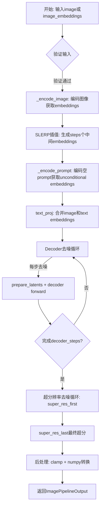
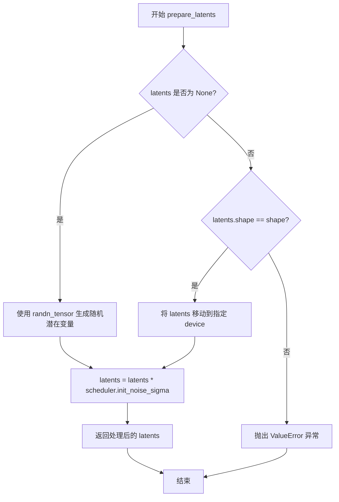
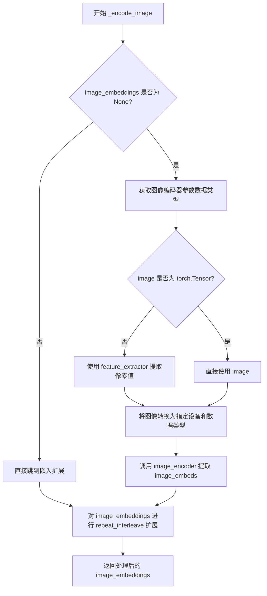
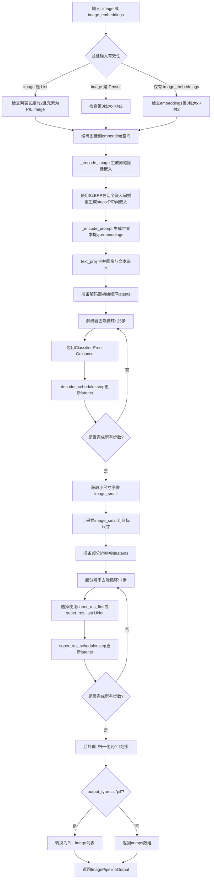

# `diffusers\examples\community\unclip_image_interpolation.py` 详细设计文档

这是一个基于unCLIP的图像插值pipeline，通过CLIP图像编码器提取两张输入图像的特征嵌入，使用球面线性插值(SLERP)在图像嵌入空间中进行插值生成过渡图像，再经由条件扩散解码器进行去噪生成小图，最后通过两级超分辨率网络逐步提升图像分辨率，最终输出高质量的插值图像序列。

## 整体流程



## 类结构

```
DiffusionPipeline (基类)
└── UnCLIPImageInterpolationPipeline (主类)
```

## 全局变量及字段


### `logger`
    
Logger instance for the module, used to record runtime information and warnings.

类型：`logging.Logger`
    


### `slerp`
    
Spherical linear interpolation (slerp) function that interpolates between two vectors on a unit sphere.

类型：`function`
    


### `UnCLIPImageInterpolationPipeline.decoder`
    
Decoder UNet model that converts latent embeddings into images.

类型：`UNet2DConditionModel`
    


### `UnCLIPImageInterpolationPipeline.text_proj`
    
Utility class that prepares and combines text and image embeddings before passing to the decoder.

类型：`UnCLIPTextProjModel`
    


### `UnCLIPImageInterpolationPipeline.text_encoder`
    
Frozen text encoder based on CLIP, used to produce text embeddings.

类型：`CLIPTextModelWithProjection`
    


### `UnCLIPImageInterpolationPipeline.tokenizer`
    
Tokenizer that converts raw text strings into token IDs for the text encoder.

类型：`CLIPTokenizer`
    


### `UnCLIPImageInterpolationPipeline.feature_extractor`
    
Feature extractor that transforms images into pixel values for the image encoder.

类型：`CLIPImageProcessor`
    


### `UnCLIPImageInterpolationPipeline.image_encoder`
    
Frozen CLIP vision encoder that generates image embeddings from visual features.

类型：`CLIPVisionModelWithProjection`
    


### `UnCLIPImageInterpolationPipeline.super_res_first`
    
First super‑resolution UNet used in the earlier stages of the upsampling process.

类型：`UNet2DModel`
    


### `UnCLIPImageInterpolationPipeline.super_res_last`
    
Last super‑resolution UNet used in the final stage of the upsampling process.

类型：`UNet2DModel`
    


### `UnCLIPImageInterpolationPipeline.decoder_scheduler`
    
Scheduler that manages denoising steps for the decoder.

类型：`UnCLIPScheduler`
    


### `UnCLIPImageInterpolationPipeline.super_res_scheduler`
    
Scheduler that manages denoising steps for the super‑resolution model.

类型：`UnCLIPScheduler`
    
    

## 全局函数及方法


### `slerp`

球面线性插值（Spherical Linear Interpolation）函数，用于在两个高维向量之间进行球面上的平滑过渡，常用于图像嵌入向量之间的插值生成中间状态。

参数：

- `val`：`float` 或 `torch.Tensor`，插值系数，取值范围通常在 [0, 1] 之间，0 表示完全返回 low，1 表示完全返回 high
- `low`：`torch.Tensor`，起始向量，作为插值的起点
- `high`：`torch.Tensor`，目标向量，作为插值的终点

返回值：`torch.Tensor`，返回 low 和 high 之间的球面线性插值结果向量

#### 流程图

```mermaid
flowchart TD
    A[开始] --> B[归一化 low 向量: low_norm = low / torch.norm(low)]
    B --> C[归一化 high 向量: high_norm = high / torch.norm(high)]
    C --> D[计算夹角 omega: omega = torch.acos(low_norm * high_norm)]
    D --> E[计算 sin 值: so = torch.sin(omega)]
    E --> F[计算第一项: (1-val) * omega 的正弦加权]
    F --> G[计算第二项: val * omega 的正弦加权]
    G --> H[组合结果: res = 第一项 * low + 第二项 * high]
    H --> I[返回插值结果]
```

#### 带注释源码

```python
def slerp(val, low, high):
    """
    Find the interpolation point between the 'low' and 'high' values for the given 'val'. 
    See https://en.wikipedia.org/wiki/Slerp for more details on the topic.
    
    球面线性插值（Spherical Linear Interpolation）是一种在球面上两点之间找到插值点的方法。
    与普通线性插值不同，Slerp 保持恒定的角速度，特别适用于归一化向量空间（如图像嵌入）。
    
    参数:
        val: 插值参数，标量或张量，范围 [0, 1]
        low: 起始归一化向量
        high: 目标归一化向量
    
    返回:
        插值后的向量，与输入向量形状相同
    """
    # Step 1: 归一化输入向量，确保它们在单位球面上
    low_norm = low / torch.norm(low)
    high_norm = high / torch.norm(high)
    
    # Step 2: 计算两个归一化向量之间的夹角（弧度）
    # dot product of normalized vectors = cos(theta)
    omega = torch.acos((low_norm * high_norm))
    
    # Step 3: 计算夹角的正弦值，用于归一化插值权重
    so = torch.sin(omega)
    
    # Step 4: 应用 Slerp 公式
    # (sin((1-t)*θ) / sin(θ)) * A + (sin(t*θ) / sin(θ)) * B
    # 第一项控制接近起点的权重，第二项控制接近目标的权重
    res = (torch.sin((1.0 - val) * omega) / so) * low + (torch.sin(val * omega) / so) * high
    
    return res
```


### `UnCLIPImageInterpolationPipeline.__init__`

该方法是 `UnCLIPImageInterpolationPipeline` 类的构造函数，负责初始化图像插值管道所需的所有模型组件和调度器，并通过父类的注册机制将这些组件注册到管道中。

参数：

- `decoder`：`UNet2DConditionModel`，用于将图像嵌入解码为图像的解码器模型
- `text_encoder`：`CLIPTextModelWithProjection`，冻结的文本编码器，用于将文本转换为嵌入向量
- `tokenizer`：`CLIPTokenizer`，用于将文本分词为token的CLIP分词器
- `text_proj`：`UnCLIPTextProjModel`，用于准备和组合嵌入向量的文本投影模型
- `feature_extractor`：`CLIPImageProcessor`，从生成的图像中提取特征的图像处理器
- `image_encoder`：`CLIPVisionModelWithProjection`，冻结的CLIP图像编码器，用于提取图像嵌入
- `super_res_first`：`UNet2DModel`，超分辨率UNet，用于除最后一步外的所有超分辨率扩散步骤
- `super_res_last`：`UNet2DModel`，超分辨率UNet，用于超分辨率扩散的最后一步
- `decoder_scheduler`：`UnCLIPScheduler`，解码器去噪过程中使用的调度器
- `super_res_scheduler`：`UnCLIPScheduler`，超分辨率去噪过程中使用的调度器

返回值：`None`，该方法为构造函数，不返回任何值

#### 流程图

```mermaid
graph TD
    A[开始 __init__] --> B[调用 super().__init__ 初始化基类]
    B --> C{使用 register_modules 注册各个模块}
    C --> D[注册 decoder]
    C --> E[注册 text_encoder]
    C --> F[注册 tokenizer]
    C --> G[注册 text_proj]
    C --> H[注册 feature_extractor]
    C --> I[注册 image_encoder]
    C --> J[注册 super_res_first]
    C --> K[注册 super_res_last]
    C --> L[注册 decoder_scheduler]
    C --> M[注册 super_res_scheduler]
    D --> N[结束初始化]
    E --> N
    F --> N
    G --> N
    H --> N
    I --> N
    J --> N
    K --> N
    L --> N
    M --> N
```

#### 带注释源码

```python
# 复制自 diffusers.pipelines.unclip.pipeline_unclip_image_variation.UnCLIPImageVariationPipeline.__init__
def __init__(
    self,
    decoder: UNet2DConditionModel,                    # 解码器UNet模型，用于图像生成
    text_encoder: CLIPTextModelWithProjection,        # CLIP文本编码器
    tokenizer: CLIPTokenizer,                         # CLIP分词器
    text_proj: UnCLIPTextProjModel,                   # 文本投影模型
    feature_extractor: CLIPImageProcessor,            # 图像特征提取器
    image_encoder: CLIPVisionModelWithProjection,     # CLIP图像编码器
    super_res_first: UNet2DModel,                     # 超分辨率UNet（第一阶段）
    super_res_last: UNet2DModel,                       # 超分辨率UNet（最后阶段）
    decoder_scheduler: UnCLIPScheduler,                # 解码器调度器
    super_res_scheduler: UnCLIPScheduler,              # 超分辨率调度器
):
    """
    初始化函数构造函数
    
    参数:
        decoder: UNet2DConditionModel - 条件UNet解码器模型
        text_encoder: CLIPTextModelWithProjection - CLIP文本编码器模型
        tokenizer: CLIPTokenizer - 文本分词器
        text_proj: UnCLIPTextProjModel - 文本嵌入投影模型
        feature_extractor: CLIPImageProcessor - 图像特征提取处理器
        image_encoder: CLIPVisionModelWithProjection - CLIP视觉编码器模型
        super_res_first: UNet2DModel - 超分辨率UNet（第一阶段）
        super_res_last: UNet2DModel - 超分辨率UNet（最后阶段）
        decoder_scheduler: UnCLIPScheduler - 解码器噪声调度器
        super_res_scheduler: UnCLIPScheduler - 超分辨率噪声调度器
    """
    # 调用父类DiffusionPipeline的初始化方法
    # 父类初始化会设置一些基础属性如ExecutionDevice等
    super().__init__()

    # 通过register_modules方法将所有模型组件注册到pipeline中
    # 这使得pipeline能够统一管理这些组件的设备和状态
    self.register_modules(
        decoder=decoder,                               # 注册解码器
        text_encoder=text_encoder,                     # 注册文本编码器
        tokenizer=tokenizer,                           # 注册分词器
        text_proj=text_proj,                           # 注册文本投影模型
        feature_extractor=feature_extractor,           # 注册特征提取器
        image_encoder=image_encoder,                   # 注册图像编码器
        super_res_first=super_res_first,               # 注册超分辨率UNet（首）
        super_res_last=super_res_last,                 # 注册超分辨率UNet（尾）
        decoder_scheduler=decoder_scheduler,           # 注册解码器调度器
        super_res_scheduler=super_res_scheduler,       # 注册超分辨率调度器
    )
```


### `UnCLIPImageInterpolationPipeline.prepare_latents`

该方法用于准备扩散模型的初始潜在变量（latents）。如果未提供预定义的潜在变量，则使用随机张量生成；否则验证提供的潜在变量形状是否符合预期，并将其移动到指定设备。最后，根据调度器的初始噪声sigma对潜在变量进行缩放，以适配去噪过程的起始点。

参数：

- `self`：`UnCLIPImageInterpolationPipeline` 实例本身，代表当前 pipelines 对象
- `shape`：`torch.Size` 或 `Tuple[int, ...]`，期望的潜在变量张量的形状，通常为 (batch_size, channels, height, width)
- `dtype`：`torch.dtype`，潜在变量的数据类型，用于确定生成随机数的类型
- `device`：`torch.device`，潜在变量应放置的计算设备（如 CPU 或 CUDA 设备）
- `generator`：`Optional[torch.Generator]`，可选的随机数生成器，用于确保生成过程的可重复性
- `latents`：`Optional[torch.Tensor]`，可选的预先生成的潜在变量张量，如果为 None，则生成随机潜在变量
- `scheduler`：`UnCLIPScheduler`，调度器实例，用于获取初始噪声 sigma 值

返回值：`torch.Tensor`，处理后的潜在变量张量，已根据调度器的 init_noise_sigma 进行缩放

#### 流程图



#### 带注释源码

```python
# Copied from diffusers.pipelines.unclip.pipeline_unclip.UnCLIPPipeline.prepare_latents
def prepare_latents(self, shape, dtype, device, generator, latents, scheduler):
    """
    准备扩散模型的初始潜在变量。
    
    该方法负责初始化或验证潜在变量张量，确保其符合模型输入要求，
    并根据调度器的配置进行初始噪声缩放。
    
    参数:
        shape (torch.Size 或 Tuple[int, ...]): 潜在变量的目标形状
        dtype (torch.dtype): 潜在变量的数据类型
        device (torch.device): 计算设备
        generator (Optional[torch.Generator]): 随机数生成器
        latents (Optional[torch.Tensor]): 预定义的潜在变量
        scheduler (UnCLIPScheduler): 调度器，用于获取初始噪声sigma
    
    返回:
        torch.Tensor: 处理后的潜在变量
    """
    # 如果未提供潜在变量，则使用 randn_tensor 生成随机潜在变量
    # randn_tensor 生成服从标准正态分布的随机张量
    if latents is None:
        latents = randn_tensor(shape, generator=generator, device=device, dtype=dtype)
    else:
        # 如果提供了潜在变量，验证其形状是否与预期形状匹配
        if latents.shape != shape:
            raise ValueError(f"Unexpected latents shape, got {latents.shape}, expected {shape}")
        # 将潜在变量移动到指定的计算设备
        latents = latents.to(device)

    # 使用调度器的初始噪声 sigma 对潜在变量进行缩放
    # 这确保了潜在变量的噪声水平与去噪过程的起始点相匹配
    # scheduler.init_noise_sigma 通常在扩散过程开始时设置为较大的值
    latents = latents * scheduler.init_noise_sigma
    return latents
```


### `UnCLIPImageInterpolationPipeline._encode_prompt`

该方法用于将文本提示（prompt）编码为文本嵌入向量和隐藏状态，并支持无分类器指导（Classifier-Free Guidance）所需的负样本嵌入生成。它是 unCLIP 图像插值 pipeline 的核心组成部分，负责为后续的图像生成过程准备文本条件信息。

参数：

- `prompt`：`Union[str, List[str]]`，要编码的文本提示，可以是单个字符串或字符串列表
- `device`：`torch.device`，用于运行文本编码器的设备
- `num_images_per_prompt`：`int`，每个提示词要生成的图像数量，用于重复嵌入向量
- `do_classifier_free_guidance`：`bool`，是否启用无分类器指导，若为 true 则生成负样本嵌入

返回值：`Tuple[torch.Tensor, torch.Tensor, torch.Tensor]`，返回一个包含三个元素的元组：

- `prompt_embeds`：`torch.Tensor`，文本嵌入向量，形状为 (batch_size * num_images_per_prompt, embedding_dim)
- `text_encoder_hidden_states`：`torch.Tensor`，文本编码器的最后隐藏状态，形状为 (batch_size * num_images_per_prompt, seq_len, hidden_dim)
- `text_mask`：`torch.Tensor`，文本注意力掩码，形状为 (batch_size * num_images_per_prompt, seq_len)

#### 流程图

```mermaid
flowchart TD
    A[开始 _encode_prompt] --> B{判断 prompt 是否为列表}
    B -->|是| C[batch_size = len(prompt)]
    B -->|否| D[batch_size = 1]
    C --> E[调用 tokenizer 编码 prompt]
    D --> E
    E --> F[获取 text_input_ids 和 attention_mask]
    F --> G[将输入传入 text_encoder 获取输出]
    G --> H[提取 text_embeds 和 last_hidden_state]
    H --> I[repeat_interleave 重复嵌入 num_images_per_prompt 次]
    I --> J{do_classifier_free_guidance?}
    J -->|否| K[返回 prompt_embeds, text_encoder_hidden_states, text_mask]
    J -->|是| L[创建空字符串列表 uncond_tokens]
    L --> M[调用 tokenizer 编码 uncond_tokens]
    M --> N[获取负样本嵌入]
    N --> O[repeat 重复负样本嵌入]
    O --> P[连接负样本与正样本嵌入]
    P --> Q[连接负样本与正样本隐藏状态]
    Q --> R[连接负样本与正样本掩码]
    R --> K
```

#### 带注释源码

```python
def _encode_prompt(self, prompt, device, num_images_per_prompt, do_classifier_free_guidance):
    """
    Encode text prompt into embeddings for image generation.
    
    This method handles both conditional and unconditional (classifier-free guidance) 
    text embeddings generation. It tokenizes the input prompts, passes them through 
    the text encoder, and prepares the embeddings for the decoder model.
    
    Args:
        prompt: The text prompt(s) to encode. Can be a single string or a list of strings.
        device: The device to run the text encoder on.
        num_images_per_prompt: Number of images to generate per prompt.
        do_classifier_free_guidance: Whether to use classifier-free guidance.
    
    Returns:
        A tuple of (prompt_embeds, text_encoder_hidden_states, text_mask).
    """
    # Determine batch size from prompt
    # If prompt is a list, use its length as batch size; otherwise default to 1
    batch_size = len(prompt) if isinstance(prompt, list) else 1

    # Tokenize the prompt(s) using the CLIP tokenizer
    # padding="max_length" ensures all sequences are padded to the same length
    # return_tensors="pt" returns PyTorch tensors
    text_inputs = self.tokenizer(
        prompt,
        padding="max_length",
        max_length=self.tokenizer.model_max_length,
        return_tensors="pt",
    )
    # Extract token IDs and create attention mask
    text_input_ids = text_inputs.input_ids
    # Convert attention mask to boolean and move to target device
    text_mask = text_inputs.attention_mask.bool().to(device)
    
    # Pass token IDs through the text encoder model
    # text_encoder_output contains text_embeds and last_hidden_state
    text_encoder_output = self.text_encoder(text_input_ids.to(device))

    # Extract text embeddings (pooled output) and hidden states
    prompt_embeds = text_encoder_output.text_embeds
    text_encoder_hidden_states = text_encoder_output.last_hidden_state

    # Repeat embeddings for each image to generate per prompt
    # This ensures each generated image has its own text embedding
    prompt_embeds = prompt_embeds.repeat_interleave(num_images_per_prompt, dim=0)
    text_encoder_hidden_states = text_encoder_hidden_states.repeat_interleave(num_images_per_prompt, dim=0)
    text_mask = text_mask.repeat_interleave(num_images_per_prompt, dim=0)

    # Handle classifier-free guidance
    if do_classifier_free_guidance:
        # Create empty prompts for unconditional generation
        uncond_tokens = [""] * batch_size

        # Get the sequence length from the tokenized input
        max_length = text_input_ids.shape[-1]
        
        # Tokenize the unconditional (empty) prompts
        uncond_input = self.tokenizer(
            uncond_tokens,
            padding="max_length",
            max_length=max_length,
            truncation=True,
            return_tensors="pt",
        )
        # Convert attention mask to boolean and move to device
        uncond_text_mask = uncond_input.attention_mask.bool().to(device)
        
        # Get embeddings for unconditional prompts
        negative_prompt_embeds_text_encoder_output = self.text_encoder(uncond_input.input_ids.to(device))

        # Extract unconditional embeddings and hidden states
        negative_prompt_embeds = negative_prompt_embeds_text_encoder_output.text_embeds
        uncond_text_encoder_hidden_states = negative_prompt_embeds_text_encoder_output.last_hidden_state

        # Duplicate unconditional embeddings for each generation per prompt
        # Using reshape method for MPS compatibility
        seq_len = negative_prompt_embeds.shape[1]
        negative_prompt_embeds = negative_prompt_embeds.repeat(1, num_images_per_prompt)
        negative_prompt_embeds = negative_prompt_embeds.view(batch_size * num_images_per_prompt, seq_len)

        # Similarly process hidden states
        seq_len = uncond_text_encoder_hidden_states.shape[1]
        uncond_text_encoder_hidden_states = uncond_text_encoder_hidden_states.repeat(1, num_images_per_prompt, 1)
        uncond_text_encoder_hidden_states = uncond_text_encoder_hidden_states.view(
            batch_size * num_images_per_prompt, seq_len, -1
        )
        # Repeat attention mask
        uncond_text_mask = uncond_text_mask.repeat_interleave(num_images_per_prompt, dim=0)

        # Concatenate unconditional and conditional embeddings
        # This allows single forward pass for both cases (classifier-free guidance)
        prompt_embeds = torch.cat([negative_prompt_embeds, prompt_embeds])
        text_encoder_hidden_states = torch.cat([uncond_text_encoder_hidden_states, text_encoder_hidden_states])

        # Concatenate attention masks
        text_mask = torch.cat([uncond_text_mask, text_mask])

    # Return the encoded prompts and attention masks
    return prompt_embeds, text_encoder_hidden_states, text_mask
```


### `UnCLIPImageInterpolationPipeline._encode_image`

该方法负责将输入图像编码为图像嵌入向量（image embeddings），供后续的图像插值处理使用。如果调用方已经预计算了图像嵌入，则直接使用；否则通过CLIP图像编码器对图像进行特征提取和编码。

参数：

- `self`：`UnCLIPImageInterpolationPipeline` 实例本身，包含图像编码器等组件
- `image`：`Union[PIL.Image.Image, torch.Tensor]`，输入图像，可以是 PIL 图像或 PyTorch 张量
- `device`：`torch.device`，指定运行设备（CPU/CUDA）
- `num_images_per_prompt`：`int`，每个提示词生成的图像数量，用于扩展嵌入维度
- `image_embeddings`：`Optional[torch.Tensor]`，可选的预计算图像嵌入向量，如果为 None 则通过图像编码器计算

返回值：`torch.Tensor`，编码后的图像嵌入向量，形状为 (batch_size, embedding_dim)

#### 流程图



#### 带注释源码

```python
def _encode_image(self, image, device, num_images_per_prompt, image_embeddings: Optional[torch.Tensor] = None):
    """
    编码输入图像为图像嵌入向量
    
    参数:
        image: 输入图像 (PIL.Image 或 torch.Tensor)
        device: 计算设备
        num_images_per_prompt: 每个提示词生成的图像数量
        image_embeddings: 可选的预计算图像嵌入
    
    返回:
        torch.Tensor: 编码后的图像嵌入向量
    """
    # 获取图像编码器的参数数据类型，用于确保输入数据类型一致
    dtype = next(self.image_encoder.parameters()).dtype

    # 如果未提供预计算的图像嵌入，则需要从图像编码
    if image_embeddings is None:
        # 如果输入不是张量，则使用特征提取器处理
        if not isinstance(image, torch.Tensor):
            # 调用 CLIP 特征提取器将 PIL 图像转换为像素值张量
            image = self.feature_extractor(images=image, return_tensors="pt").pixel_values

        # 将图像移动到指定设备并转换为正确的 dtype
        image = image.to(device=device, dtype=dtype)
        
        # 使用 CLIP 图像编码器提取图像嵌入向量
        # image_embeds 形状: (batch_size, embedding_dim)
        image_embeddings = self.image_encoder(image).image_embeds

    # 根据 num_images_per_prompt 扩展图像嵌入维度
    # 例如: (2, 768) -> (2 * num_images_per_prompt, 768)
    image_embeddings = image_embeddings.repeat_interleave(num_images_per_prompt, dim=0)

    return image_embeddings
```


### `UnCLIPImageInterpolationPipeline.__call__`

该函数是 UnCLIP 图像插值 pipeline 的主入口，接收两张输入图像或预计算的图像嵌入，在图像嵌入空间中使用球面线性插值（SLERP）生成中间插值帧，然后通过条件扩散解码器将嵌入解码为低分辨率图像，最后经过超分辨率网络增强得到最终的高质量插值图像序列。

参数：

- `image`：`Optional[Union[List[PIL.Image.Image], torch.Tensor]]`，输入的图像列表（仅支持包含两张 PIL 图像的列表）或符合 CLIPImageProcessor 配置的 torch.Tensor，用于生成图像嵌入。若传入 image_embeddings，则可置为 None
- `steps`：`int`，生成的插值图像数量，默认为 5
- `decoder_num_inference_steps`：`int`，解码器去噪扩散的步数，步数越多图像质量越高但推理速度越慢，默认为 25
- `super_res_num_inference_steps`：`int`，超分辨率扩散的步数，用于提升最终图像的分辨率和细节质量，默认为 7
- `generator`：`Optional[Union[torch.Generator, List[torch.Generator]]]`，用于确保生成结果可复现的 torch 随机生成器
- `image_embeddings`：`Optional[torch.Tensor]`，预计算的图像嵌入向量，可直接从图像编码器获取，适用于图像插值任务，当传入此参数时 image 可置为 None
- `decoder_latents`：`Optional[torch.Tensor]`，预生成的可选噪声潜在向量，作为解码器的输入
- `super_res_latents`：`Optional[torch.Tensor]`，预生成的可选噪声潜在向量，作为超分辨率网络的输入
- `decoder_guidance_scale`：`float`，分类器自由引导（Classifier-Free Guidance）的权重参数，值越大生成的图像与文本/图像提示越相关，默认为 8.0（文档中误标为 4.0）
- `output_type`：`str | None`，输出图像的格式，可选择 "pil" 返回 PIL.Image 对象或返回 numpy 数组，默认为 "pil"
- `return_dict`：`bool`，是否返回包含图像的 ImagePipelineOutput 字典对象而非元组，默认为 True

返回值：`Union[ImagePipelineOutput, Tuple]`，返回生成的图像序列，若 return_dict 为 True 则返回 ImagePipelineOutput 对象（包含 images 字段），否则返回元组

#### 流程图



#### 带注释源码

```python
@torch.no_grad()
def __call__(
    self,
    image: Optional[Union[List[PIL.Image.Image], torch.Tensor]] = None,
    steps: int = 5,
    decoder_num_inference_steps: int = 25,
    super_res_num_inference_steps: int = 7,
    generator: Optional[Union[torch.Generator, List[torch.Generator]]] = None,
    image_embeddings: Optional[torch.Tensor] = None,
    decoder_latents: Optional[torch.Tensor] = None,
    super_res_latents: Optional[torch.Tensor] = None,
    decoder_guidance_scale: float = 8.0,
    output_type: str | None = "pil",
    return_dict: bool = True,
):
    """
    Pipeline主调用函数，用于生成图像插值结果
    """
    # 批处理大小等于插值步数，每个step生成一张图像
    batch_size = steps

    # 获取执行设备
    device = self._execution_device

    # ==================== 输入验证阶段 ====================
    # 验证image或image_embeddings的有效性
    if isinstance(image, List):
        # 验证列表长度为2（仅支持两张图像的插值）
        if len(image) != 2:
            raise AssertionError(
                f"Expected 'image' List to be of size 2, but passed 'image' length is {len(image)}"
            )
        # 验证列表元素为PIL图像类型
        elif not (isinstance(image[0], PIL.Image.Image) and isinstance(image[0], PIL.Image.Image)):
            raise AssertionError(
                f"Expected 'image' List to contain PIL.Image.Image, but passed 'image' contents are {type(image[0])} and {type(image[1])}"
            )
    elif isinstance(image, torch.Tensor):
        # 验证tensor第0维为2
        if image.shape[0] != 2:
            raise AssertionError(
                f"Expected 'image' to be torch.Tensor of shape 2 in 0th dimension, but passed 'image' size is {image.shape[0]}"
            )
    elif isinstance(image_embeddings, torch.Tensor):
        # 验证预计算的embeddings第0维为2
        if image_embeddings.shape[0] != 2:
            raise AssertionError(
                f"Expected 'image_embeddings' to be torch.Tensor of shape 2 in 0th dimension, but passed 'image_embeddings' shape is {image_embeddings.shape[0]}"
            )
    else:
        # 必须提供image或image_embeddings之一
        raise AssertionError(
            f"Expected 'image' or 'image_embeddings' to be not None with types List[PIL.Image] or torch.Tensor respectively. Received {type(image)} and {type(image_embeddings)} respectively"
        )

    # ==================== 图像编码阶段 ====================
    # 编码图像或使用提供的image_embeddings生成原始嵌入
    original_image_embeddings = self._encode_image(
        image=image, device=device, num_images_per_prompt=1, image_embeddings=image_embeddings
    )

    # ==================== SLERP插值阶段 ====================
    # 使用球面线性插值(SLERP)在两个图像嵌入之间生成steps个中间嵌入
    image_embeddings = []

    for interp_step in torch.linspace(0, 1, steps):
        # 对每一步计算两个嵌入之间的插值点
        temp_image_embeddings = slerp(
            interp_step, original_image_embeddings[0], original_image_embeddings[1]
        ).unsqueeze(0)  # 添加batch维度
        image_embeddings.append(temp_image_embeddings)

    # 拼接所有插值嵌入为一个tensor
    image_embeddings = torch.cat(image_embeddings).to(device)

    # ==================== 提示编码阶段 ====================
    # 判断是否启用分类器自由引导
    do_classifier_free_guidance = decoder_guidance_scale > 1.0

    # 使用空字符串作为提示（因为这是图像变体/插值任务，不需要文本提示）
    prompt_embeds, text_encoder_hidden_states, text_mask = self._encode_prompt(
        prompt=["" for i in range(steps)],
        device=device,
        num_images_per_prompt=1,
        do_classifier_free_guidance=do_classifier_free_guidance,
    )

    # ==================== 文本投影阶段 ====================
    # 将图像嵌入与文本嵌入结合，生成用于解码器的条件嵌入
    text_encoder_hidden_states, additive_clip_time_embeddings = self.text_proj(
        image_embeddings=image_embeddings,
        prompt_embeds=prompt_embeds,
        text_encoder_hidden_states=text_encoder_hidden_states,
        do_classifier_free_guidance=do_classifier_free_guidance,
    )

    # ==================== 解码器Mask处理 ====================
    # 处理MPS设备的bool tensor padding兼容性问题
    if device.type == "mps":
        # MPS: 将bool转为int进行pad后再转回bool
        text_mask = text_mask.type(torch.int)
        decoder_text_mask = F.pad(text_mask, (self.text_proj.clip_extra_context_tokens, 0), value=1)
        decoder_text_mask = decoder_text_mask.type(torch.bool)
    else:
        # 标准设备直接pad，填充True
        decoder_text_mask = F.pad(text_mask, (self.text_proj.clip_extra_context_tokens, 0), value=True)

    # ==================== 解码器去噪阶段 ====================
    # 设置解码器scheduler的timesteps
    self.decoder_scheduler.set_timesteps(decoder_num_inference_steps, device=device)
    decoder_timesteps_tensor = self.decoder_scheduler.timesteps

    # 获取解码器配置参数
    num_channels_latents = self.decoder.config.in_channels
    height = self.decoder.config.sample_size
    width = self.decoder.config.sample_size

    # 准备解码器初始latents（噪声）
    decoder_latents = self.prepare_latents(
        (1, num_channels_latents, height, width),
        text_encoder_hidden_states.dtype,
        device,
        generator,
        decoder_latents,
        self.decoder_scheduler,
    )
    # 重复latents以匹配batch_size，保持所有插值帧使用相同噪声
    decoder_latents = decoder_latents.repeat((batch_size, 1, 1, 1))

    # 遍历每个去噪 timestep
    for i, t in enumerate(self.progress_bar(decoder_timesteps_tensor)):
        # 分类器自由引导：扩展latents为两份（条件+无条件）
        latent_model_input = torch.cat([decoder_latents] * 2) if do_classifier_free_guidance else decoder_latents

        # UNet前向传播预测噪声
        noise_pred = self.decoder(
            sample=latent_model_input,
            timestep=t,
            encoder_hidden_hidden_states=text_encoder_hidden_states,
            class_labels=additive_clip_time_embeddings,
            attention_mask=decoder_text_mask,
        ).sample

        # 应用分类器自由引导
        if do_classifier_free_guidance:
            # 分离条件和无条件预测
            noise_pred_uncond, noise_pred_text = noise_pred.chunk(2)
            # 分离预测值和方差
            noise_pred_uncond, _ = noise_pred_uncond.split(latent_model_input.shape[1], dim=1)
            noise_pred_text, predicted_variance = noise_pred_text.split(latent_model_input.shape[1], dim=1)
            # 加权组合引导
            noise_pred = noise_pred_uncond + decoder_guidance_scale * (noise_pred_text - noise_pred_uncond)
            # 拼接预测值和方差
            noise_pred = torch.cat([noise_pred, predicted_variance], dim=1)

        # 计算前一个timestep
        if i + 1 == decoder_timesteps_tensor.shape[0]:
            prev_timestep = None
        else:
            prev_timestep = decoder_timesteps_tensor[i + 1]

        # 使用scheduler更新latents
        decoder_latents = self.decoder_scheduler.step(
            noise_pred, t, decoder_latents, prev_timestep=prev_timestep, generator=generator
        ).prev_sample

    # 限制latents值范围
    decoder_latents = decoder_latents.clamp(-1, 1)

    # 解码完成，获取小尺寸图像
    image_small = decoder_latents

    # ==================== 超分辨率阶段 ====================
    # 设置超分辨率scheduler
    self.super_res_scheduler.set_timesteps(super_res_num_inference_steps, device=device)
    super_res_timesteps_tensor = self.super_res_scheduler.timesteps

    # 获取超分辨率网络配置
    channels = self.super_res_first.config.in_channels // 2
    height = self.super_res_first.config.sample_size
    width = self.super_res_first.config.sample_size

    # 准备超分辨率初始latents
    super_res_latents = self.prepare_latents(
        (batch_size, channels, height, width),
        image_small.dtype,
        device,
        generator,
        super_res_latents,
        self.super_res_scheduler,
    )

    # 上采样小图像到目标尺寸
    if device.type == "mps":
        # MPS设备不支持某些插值模式
        image_upscaled = F.interpolate(image_small, size=[height, width])
    else:
        # 使用双三次插值并处理antialias参数兼容性
        interpolate_antialias = {}
        if "antialias" in inspect.signature(F.interpolate).parameters:
            interpolate_antialias["antialias"] = True

        image_upscaled = F.interpolate(
            image_small, size=[height, width], mode="bicubic", align_corners=False, **interpolate_antialias
        )

    # 超分辨率去噪循环（无分类器引导）
    for i, t in enumerate(self.progress_bar(super_res_timesteps_tensor)):
        # 最后一步使用super_res_last，其他步骤使用super_res_first
        if i == super_res_timesteps_tensor.shape[0] - 1:
            unet = self.super_res_last
        else:
            unet = self.super_res_first

        # 拼接上采样图像和latents作为输入
        latent_model_input = torch.cat([super_res_latents, image_upscaled], dim=1)

        # 超分辨率UNet预测
        noise_pred = unet(
            sample=latent_model_input,
            timestep=t,
        ).sample

        # 计算前一个timestep
        if i + 1 == super_res_timesteps_tensor.shape[0]:
            prev_timestep = None
        else:
            prev_timestep = super_res_timesteps_tensor[i + 1]

        # 使用scheduler更新latents
        super_res_latents = self.super_res_scheduler.step(
            noise_pred, t, super_res_latents, prev_timestep=prev_timestep, generator=generator
        ).prev_sample

    # 获取最终图像
    image = super_res_latents

    # ==================== 后处理阶段 ====================
    # 将图像从[-1,1]归一化到[0,1]
    image = image * 0.5 + 0.5
    image = image.clamp(0, 1)
    # 转换为numpy数组，格式为NHWC
    image = image.cpu().permute(0, 2, 3, 1).float().numpy()

    # 根据output_type转换格式
    if output_type == "pil":
        image = self.numpy_to_pil(image)

    # ==================== 返回结果 ====================
    if not return_dict:
        return (image,)

    return ImagePipelineOutput(images=image)
```

## 关键组件


### 张量索引与惰性加载

使用 `torch.linspace(0, 1, steps)` 生成插值权重，并通过 `slerp` 函数在原始图像的两个embedding之间进行球面线性插值，实现多张中间图像的按需生成，避免一次性加载所有插值结果。

### 反量化支持

通过两阶段解码流程将latent空间的数据反量化回像素空间：第一阶段使用 `UNet2DConditionModel` 解码器将条件latent转换为小尺寸图像（`image_small = decoder_latents`），第二阶段使用超分辨率UNet（`super_res_first` 和 `super_res_last`）进行上采样，最终输出可视化图像。

### 图像embedding编码

`_encode_image` 方法支持两种输入模式：直接传入PIL图像或预计算的图像embedding。当传入PIL图像时，通过 `feature_extractor` 提取特征并使用 `image_encoder` 生成embedding，支持重复采样以匹配 `num_images_per_prompt`。

### 文本提示处理与条件嵌入

`_encode_prompt` 方法处理空文本提示以支持无分类器引导（Classifier-Free Guidance），通过 `text_proj` 将图像embedding与文本embedding结合生成条件输入，包含正向和负向embedding的拼接逻辑。

### 解码器调度与去噪循环

使用 `UnCLIPScheduler` 作为解码器调度器，在去噪循环中通过 `scheduler.step()` 方法逐步从噪声latent恢复清晰图像，支持自定义推理步骤数（`decoder_num_inference_steps`）和指导强度（`decoder_guidance_scale`）。

### 超分辨率处理

双阶段超分辨率架构：使用 `super_res_first` UNet处理前N-1个步骤，最后一步切换到 `super_res_last` UNet。在MPS设备上有特殊处理，使用双线性插值替代抗锯齿插值。

### MPS设备兼容性

对Apple MPS设备进行特殊处理：文本掩码从bool类型转换为int类型以避免MPS上的panic问题，超分辨率插值使用简化模式（`F.interpolate(image_small, size=[height, width])`）避免MPS不支持的某些插值参数。

### 潜在技术债务

代码中存在类型检查错误（第189行 `isinstance(image[0], PIL.Image.Image) and isinstance(image[0], PIL.Image.Image)` 应为 `isinstance(image[1], PIL.Image.Image)`），且大量复制自其他Pipeline的方法（如 `_encode_prompt`、`prepare_latents`）可通过继承或mixin重构减少代码冗余。


## 问题及建议


### 已知问题

- **类型提示不一致**：在 `__call__` 方法中使用 `str | None` 语法（Python 3.10+），但同时从 `typing` 导入 `Optional` 和 `Union`，存在版本兼容性问题。
- **文档与实现不符**：`decoder_guidance_scale` 参数的文档说明默认值为 4.0，但实际代码中默认值为 8.0，会导致用户困惑。
- **使用 Assert 进行参数验证**：代码中使用 `AssertionError` 进行输入验证，这在生产环境中是不推荐的做法，应该使用带有明确错误信息的 `ValueError`。
- **SLERP 边缘情况未处理**：`slerp` 函数在向量方向相反（omega 接近 π）时，`so`（sin(omega)）接近 0，会导致除零错误或数值不稳定。
- **MPS 设备特殊处理**：存在多处针对 Apple Silicon (MPS) 的 hack，如 `text_mask` 的类型转换，且注释表明 "MPS does not support many interpolations"，增加了代码复杂度。
- **内存使用效率低**：在循环中创建 `image_embeddings` 列表后再进行 `torch.cat` 拼接，可以预分配张量以减少内存碎片和复制开销。
- **缺少错误处理**：模型推理过程没有 try-except 包装，如果出现 CUDA OOM 或其他推理错误，堆栈信息不够友好。
- **重复代码模式**：`_encode_prompt` 和 `_encode_image` 方法中有大量重复的张量复制逻辑（repeat/repeat_interleave），可以抽象为工具函数。

### 优化建议

- 统一类型提示风格，使用 `Optional[str]` 替代 `str | None`，或明确要求 Python 3.10+ 环境。
- 修正文档中的 `decoder_guidance_scale` 默认值为 8.0，或将实现改为 4.0 以匹配文档。
- 将所有 `AssertionError` 替换为 `ValueError` 并提供描述性错误消息。
- 在 `slerp` 函数中添加 epsilon 保护或使用归一化向量的夹角计算，避免除零错误。
- 将 MPS 设备特定逻辑提取为独立的辅助方法或配置类，提高代码可读性。
- 预分配 `image_embeddings` 张量：使用 `torch.zeros(steps, ...)` 然后逐个赋值，避免列表拼接。
- 在关键推理步骤添加异常处理和日志记录，特别是 CUDA 内存不足的情况。
- 提取张量重复操作为通用函数，如 `repeat_embeddings(tensor, num_images_per_prompt, batch_size)`。
- 考虑添加配置对象封装硬编码的超参数（如 steps、num_inference_steps），提高可配置性。
- 添加资源清理机制（如 `__del__` 或 context manager），确保 GPU 内存释放。

## 其它


### 设计目标与约束

本pipeline的设计目标是实现基于unCLIP架构的图像插值功能，能够在两张输入图像之间生成平滑过渡的图像序列。核心约束包括：1) 依赖diffusers库的DiffusionPipeline基类实现；2) 必须使用CLIP模型进行图像编码；3)  decoder和super_res两个UNet模型协同完成图像生成；4) 插值步骤数（steps）决定了输出图像的数量；5) 支持MPS设备但存在特定限制。

### 错误处理与异常设计

代码中的错误处理主要通过断言（AssertionError）实现，涵盖以下场景：1) image参数类型和数量校验（必须为2个PIL.Image或shape为2的Tensor）；2) image_embeddings的shape校验；3) latents shape一致性检查；4) 设备类型判断（MPS需要特殊处理bool tensor）。主要问题是没有自定义异常类，所有错误均使用通用AssertionError，不利于调用方精准捕获和处理异常。改进方向是定义自定义异常类如ImageInterpolationError，并区分不同类型的输入错误。

### 数据流与状态机

数据流遵循以下主要路径：1) 输入验证阶段：接收image或image_embeddings；2) 图像编码阶段：调用_encode_image生成图像embedding；3) 插值计算阶段：使用slerp函数在两个embedding间生成steps个中间embedding；4) 文本编码阶段：调用_encode_prompt生成空prompt的embeddings；5) 文本投影阶段：text_proj结合image_embeddings和prompt_embeds；6) 主去噪循环：decoder对latents进行去噪；7) 超分辨率阶段：super_res_first和super_res_last两阶段上采样；8) 后处理阶段：图像值域转换和格式输出。状态机由scheduler的timesteps控制，每个pipeline调用经历初始化→编码→去噪→上采样→输出五个主要状态。

### 外部依赖与接口契约

核心依赖包括：1) transformers库：CLIPTextModelWithProjection、CLIPTokenizer、CLIPImageProcessor、CLIPVisionModelWithProjection；2) diffusers库：DiffusionPipeline、UNet2DConditionModel、UNet2DModel、UnCLIPScheduler、UnCLIPTextProjModel；3) PIL库：PIL.Image；4) torch库：torch.nn.functional、randn_tensor。接口契约方面：__call__方法接受可选的image或image_embeddings参数；steps参数控制插值数量；decoder_num_inference_steps和super_res_num_inference_steps分别控制两个阶段的去噪步数；generator控制随机性；输出支持pil和numpy array两种格式；return_dict控制返回值结构。

### 性能考量与优化建议

当前实现存在以下性能瓶颈和优化空间：1) 图像embedding编码在循环外执行一次即可，但当前实现正确；2) decoder去噪循环中对每个timestep都进行classifier-free guidance的chunk操作，可优化；3) super_res阶段每次迭代都创建latent_model_input的cat，可预分配；4) MPS设备特殊处理引入了额外分支判断；5) 缺少批处理优化和多GPU推理支持。建议：1) 使用torch.compile加速推理；2) 启用xformers优化attention计算；3) 考虑使用torch.inference_mode替代torch.no_grad；4) 对重复计算进行缓存；5) 添加推理进度条自定义回调支持。

### 安全性考虑

当前代码安全性考量有限，主要涉及：1) 输入验证防止异常shape导致显存爆炸；2) generator参数支持确定性生成；3) 图像值域clamp防止数值溢出。缺失的安全措施包括：1) 无输入长度限制（steps参数无上限）；2) 无显存使用上限保护；3) 无恶意图像输入的防护；4) 模型加载无签名验证。建议添加：1) steps参数最大值限制（如100）；2) 显存预算检查；3) 图像尺寸限制。

### 配置与可扩展性设计

当前设计可扩展性体现在：1) 继承DiffusionPipeline便于集成到diffusers生态；2) scheduler可替换为其他DDPM类scheduler；3) register_modules支持模块热替换。不足之处：1) 硬编码了特定模型架构（UNet2DConditionModel和UNet2DModel）；2) text_proj逻辑内联不可配置；3) slerp插值方法固定。建议：1) 将插值方法抽象为策略模式；2) 添加配置类管理各组件参数；3) 支持自定义后处理pipeline。

### 版本兼容性说明

本代码适配diffusers库v0.x版本系列，需注意：1) UNet2DConditionModel和UNet2DModel的config.in_channels属性必须存在；2) ImagePipelineOutput为标准输出格式；3) scheduler的step方法返回.prev_sample；4) CLIPImageProcessor可能随版本变化返回不同格式。建议在文档中明确依赖版本范围，并提供版本检测逻辑。

    