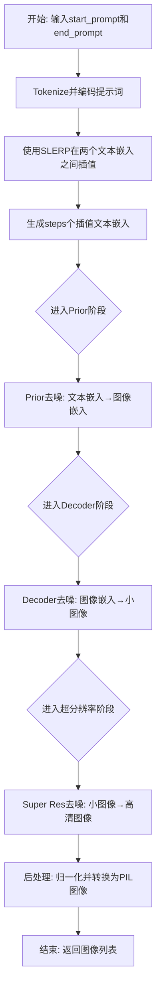
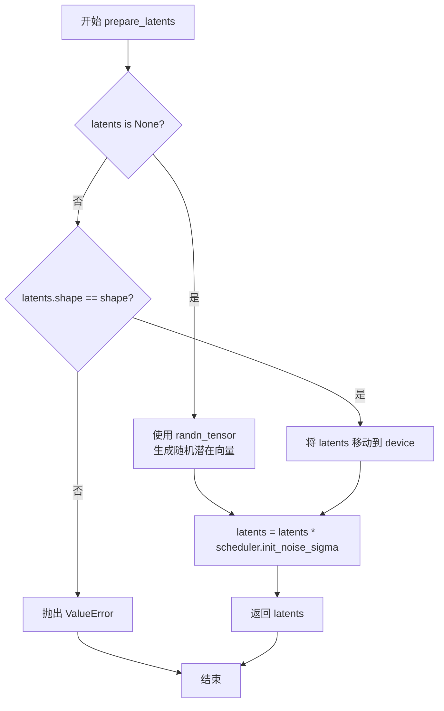
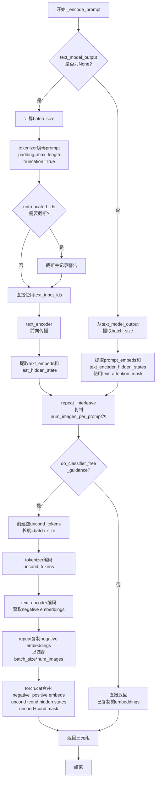
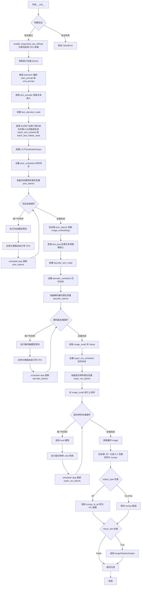

# `diffusers\examples\community\unclip_text_interpolation.py` 详细设计文档

这是一个基于DiffusionPipeline的UnCLIP文本插值管道，通过SLERP（球面线性插值）在两个文本提示的CLIP嵌入之间进行平滑过渡，生成一系列渐变的图像。管道包含Prior（先验模型）、Decoder（解码器）和Super Resolution（超分辨率）三个阶段。

## 整体流程



## 类结构

```
DiffusionPipeline (基类)
└── UnCLIPTextInterpolationPipeline (主类)
```

## 全局变量及字段


### `logger`
    
Logger instance for the module to track runtime information and warnings

类型：`logging.Logger`
    


### `slerp`
    
Performs spherical linear interpolation between two vectors for smooth transitions

类型：`function`
    


### `UnCLIPTextInterpolationPipeline.prior`
    
The canonical unCLIP prior model to approximate image embedding from text embedding

类型：`PriorTransformer`
    


### `UnCLIPTextInterpolationPipeline.decoder`
    
The decoder UNet to invert the image embedding into an image

类型：`UNet2DConditionModel`
    


### `UnCLIPTextInterpolationPipeline.text_proj`
    
Utility class to prepare and combine embeddings before passing to decoder

类型：`UnCLIPTextProjModel`
    


### `UnCLIPTextInterpolationPipeline.text_encoder`
    
Frozen text-encoder model for encoding text prompts into embeddings

类型：`CLIPTextModelWithProjection`
    


### `UnCLIPTextInterpolationPipeline.tokenizer`
    
Tokenizer for converting text prompts to token IDs for the text encoder

类型：`CLIPTokenizer`
    


### `UnCLIPTextInterpolationPipeline.super_res_first`
    
Super resolution UNet used in all but the last step of the super resolution diffusion process

类型：`UNet2DModel`
    


### `UnCLIPTextInterpolationPipeline.super_res_last`
    
Super resolution UNet used in the last step of the super resolution diffusion process

类型：`UNet2DModel`
    


### `UnCLIPTextInterpolationPipeline.prior_scheduler`
    
Scheduler for the prior denoising process, a modified DDPMScheduler

类型：`UnCLIPScheduler`
    


### `UnCLIPTextInterpolationPipeline.decoder_scheduler`
    
Scheduler for the decoder denoising process, a modified DDPMScheduler

类型：`UnCLIPScheduler`
    


### `UnCLIPTextInterpolationPipeline.super_res_scheduler`
    
Scheduler for the super resolution denoising process, a modified DDPMScheduler

类型：`UnCLIPScheduler`
    
    

## 全局函数及方法


### `slerp`

该函数实现了球面线性插值（Spherical Linear Interpolation，简称SLERP），用于在两个向量之间进行平滑插值，常用于在CLIP文本嵌入空间中进行 prompt-to-prompt 插值。

参数：

- `val`：`float` 或 `torch.Tensor`，插值参数，范围通常在 0 到 1 之间，表示从 low 到 high 的插值比例
- `low`：`torch.Tensor`，起始向量/嵌入，表示插值的起点
- `high`：`torch.Tensor`，结束向量/嵌入，表示插值的终点

返回值：`torch.Tensor`，返回 low 和 high 之间的球面线性插值结果

#### 流程图

```mermaid
flowchart TD
    A[开始 slerp] --> B[归一化 low 向量<br>low_norm = low / torch.norm(low)]
    B --> C[归一化 high 向量<br>high_norm = high / torch.norm(high)]
    C --> D[计算夹角 omega<br>omega = torch.acos(low_norm * high_norm)]
    D --> E[计算 sin omega<br>so = torch.sin(omega)]
    E --> F[计算第一项<br>term1 = torch.sin((1.0 - val) * omega) / so * low]
    F --> G[计算第二项<br>term2 = torch.sin(val * omega) / so * high]
    G --> H[合并结果<br>res = term1 + term2]
    H --> I[返回插值结果]
```

#### 带注释源码

```python
def slerp(val, low, high):
    """
    Find the interpolation point between the 'low' and 'high' values for the given 'val'. 
    See https://en.wikipedia.org/wiki/Slerp for more details on the topic.
    
    SLERP (Spherical Linear Interpolation) 用于在球面空间中进行平滑插值，
    相比普通线性插值能更好地保持向量方向的一致性，常用于计算机图形学
    和机器学习中的嵌入空间插值。
    
    Args:
        val: 插值参数，0 返回 low，1 返回 high，0.5 返回中间点
        low: 起始向量/嵌入
        high: 结束向量/嵌入
    
    Returns:
        球面线性插值结果向量
    """
    # 第一步：将 low 向量归一化到单位球面
    # 通过除以向量的 L2 范数，使向量的长度为 1
    low_norm = low / torch.norm(low)
    
    # 第二步：将 high 向量归一化到单位球面
    high_norm = high / torch.norm(high)
    
    # 第三步：计算两个归一化向量之间的夹角 omega
    # 使用反余弦函数计算夹角，范围在 [0, pi] 之间
    # low_norm * high_norm 计算两个向量的点积（因为都已归一化）
    omega = torch.acos((low_norm * high_norm))
    
    # 第四步：计算 sin(omega)，用于后续的插值权重计算
    # 当 omega 接近 0 时，sin(omega) 也接近 0，需要特殊处理
    so = torch.sin(omega)
    
    # 第五步：计算球面线性插值结果
    # SLERP 公式：
    # slerp(val, low, high) = [sin((1-val)*omega) / sin(omega)] * low + [sin(val*omega) / sin(omega)] * high
    # 第一项：从 low 方向向 high 方向旋转的权重
    res = (torch.sin((1.0 - val) * omega) / so) * low + (torch.sin(val * omega) / so) * high
    
    # 返回插值结果
    return res
```


### `UnCLIPTextInterpolationPipeline.__init__`

该方法是 `UnCLIPTextInterpolationPipeline` 类的构造函数，用于初始化基于 UnCLIP 的文本插值管线。它接收多个神经网络组件（如 prior、decoder、text_encoder 等）以及调度器作为参数，并通过 `register_modules` 方法将它们注册到管线中，以便在后续的图像生成过程中使用。

参数：

- `prior`：`PriorTransformer`，负责将文本嵌入近似为图像嵌入的规范 unCLIP 先验模型
- `decoder`：`UNet2DConditionModel`，用于将图像嵌入反转为图像的解码器
- `text_encoder`：`CLIPTextModelWithProjection`，冻结的文本编码器，用于将文本提示转换为嵌入向量
- `tokenizer`：`CLIPTokenizer`，用于对文本提示进行分词的 CLIP 分词器
- `text_proj`：`UnCLIPTextProjModel`，用于在将嵌入传递给解码器之前进行准备和组合的实用类
- `super_res_first`：`UNet2DModel`，超分辨率 UNet，用于除最后一步外的所有超分辨率扩散步骤
- `super_res_last`：`UNet2DModel`，超分辨率 UNet，用于超分辨率扩散过程的最后一步
- `prior_scheduler`：`UnCLIPScheduler`，先验去噪过程中使用的调度器（修改后的 DDPMScheduler）
- `decoder_scheduler`：`UnCLIPScheduler`，解码器去噪过程中使用的调度器（修改后的 DDPMScheduler）
- `super_res_scheduler`：`UnCLIPScheduler`，超分辨率去噪过程中使用的调度器（修改后的 DDPMScheduler）

返回值：无（`None`），构造函数不返回任何值

#### 流程图

```mermaid
flowchart TD
    A[开始 __init__] --> B[调用 super().__init__]
    B --> C[调用 self.register_modules 注册所有模块]
    C --> D[结束 __init__]
    
    C --> C1[prior]
    C --> C2[decoder]
    C --> C3[text_encoder]
    C --> C4[tokenizer]
    C --> C5[text_proj]
    C --> C6[super_res_first]
    C --> C7[super_res_last]
    C --> C8[prior_scheduler]
    C --> C9[decoder_scheduler]
    C --> C10[super_res_scheduler]
```

#### 带注释源码

```python
def __init__(
    self,
    prior: PriorTransformer,
    decoder: UNet2DConditionModel,
    text_encoder: CLIPTextModelWithProjection,
    tokenizer: CLIPTokenizer,
    text_proj: UnCLIPTextProjModel,
    super_res_first: UNet2DModel,
    super_res_last: UNet2DModel,
    prior_scheduler: UnCLIPScheduler,
    decoder_scheduler: UnCLIPScheduler,
    super_res_scheduler: UnCLIPScheduler,
):
    """
    初始化 UnCLIPTextInterpolationPipeline 实例。
    
    参数:
        prior: PriorTransformer 实例，用于从文本嵌入预测图像嵌入
        decoder: UNet2DConditionModel 实例，用于从图像嵌入生成图像
        text_encoder: CLIPTextModelWithProjection 实例，用于编码文本
        tokenizer: CLIPTokenizer 实例，用于分词文本输入
        text_proj: UnCLIPTextProjModel 实例，用于处理文本嵌入投影
        super_res_first: UNet2DModel 实例，初期超分辨率网络
        super_res_last: UNet2DModel 实例，最终超分辨率网络
        prior_scheduler: UnCLIPScheduler 实例，先验去噪调度器
        decoder_scheduler: UnCLIPScheduler 实例，解码器去噪调度器
        super_res_scheduler: UnCLIPScheduler 实例，超分辨率去噪调度器
    """
    # 调用父类 DiffusionPipeline 的初始化方法
    # 负责设置管线的基本结构和配置
    super().__init__()

    # 将所有传入的模块注册到当前管线实例中
    # register_modules 是 DiffusionPipeline 提供的标准方法
    # 用于将各个组件存储为实例属性，以便后续调用
    self.register_modules(
        prior=prior,
        decoder=decoder,
        text_encoder=text_encoder,
        tokenizer=tokenizer,
        text_proj=text_proj,
        super_res_first=super_res_first,
        super_res_last=super_res_last,
        prior_scheduler=prior_scheduler,
        decoder_scheduler=decoder_scheduler,
        super_res_scheduler=super_res_scheduler,
    )
```


### `UnCLIPTextInterpolationPipeline.prepare_latents`

该方法用于准备扩散模型的潜在向量（latents），负责初始化或验证潜在向量，并根据调度器的初始噪声 sigma 进行缩放。

参数：

- `shape`：`tuple` 或 `int`，要生成的潜在向量的形状
- `dtype`：`torch.dtype`，潜在向量的数据类型（如 `torch.float32`）
- `device`：`torch.device`，潜在向量所在的设备（如 CPU 或 CUDA 设备）
- `generator`：`torch.Generator` 或 `Optional[Union[torch.Generator, List[torch.Generator]]]`，可选的随机数生成器，用于确保生成的可重复性
- `latents`：`torch.Tensor` 或 `None`，可选的预生成潜在向量，如果为 `None` 则随机生成
- `scheduler`：`UnCLIPScheduler`，调度器对象，包含 `init_noise_sigma` 属性用于缩放潜在向量

返回值：`torch.Tensor`，准备好的潜在向量

#### 流程图



#### 带注释源码

```python
# Copied from diffusers.pipelines.unclip.pipeline_unclip.UnCLIPPipeline.prepare_latents
def prepare_latents(self, shape, dtype, device, generator, latents, scheduler):
    """
    准备扩散过程的潜在向量（latents）。
    
    如果未提供 latents，则使用 randn_tensor 生成随机潜在向量；
    如果提供了 latents，则验证其形状并移动到指定设备。
    最后根据调度器的 init_noise_sigma 进行缩放。
    
    参数:
        shape: 期望的潜在向量形状
        dtype: 潜在向量的数据类型
        device: 潜在向量应放置的设备
        generator: 可选的随机生成器，用于可重复的随机生成
        latents: 可选的预生成潜在向量，为 None 时将随机生成
        scheduler: 调度器，提供 init_noise_sigma 用于缩放
    
    返回:
        准备好的潜在向量张量
    """
    # 如果没有提供 latents，则随机生成
    if latents is None:
        # 使用 randn_tensor 生成指定形状、类型、设备的随机张量
        latents = randn_tensor(shape, generator=generator, device=device, dtype=dtype)
    else:
        # 验证提供的 latents 形状是否与期望形状匹配
        if latents.shape != shape:
            raise ValueError(f"Unexpected latents shape, got {latents.shape}, expected {shape}")
        # 将已有 latents 移动到指定设备
        latents = latents.to(device)

    # 使用调度器的初始噪声 sigma 缩放潜在向量
    # 这是扩散模型标准处理，用于控制初始噪声水平
    latents = latents * scheduler.init_noise_sigma
    
    # 返回准备好的潜在向量
    return latents
```


### `UnCLIPTextInterpolationPipeline._encode_prompt`

该方法负责将文本提示（prompt）编码为CLIP文本嵌入向量，支持分类器自由引导（Classifier-Free Guidance），并处理批量图像生成时的嵌入复制与条件/无条件嵌入的拼接。

参数：

- `self`：类的实例本身，包含tokenizer和text_encoder等组件
- `prompt`：`Union[str, List[str]]`，要编码的文本提示，可以是单个字符串或字符串列表
- `device`：`torch.device`，执行计算的设备（CPU或GPU）
- `num_images_per_prompt`：`int`，每个提示要生成的图像数量，用于复制嵌入向量
- `do_classifier_free_guidance`：`bool`，是否启用分类器自由引导 guidance
- `text_model_output`：`Optional[Union[CLIPTextModelOutput, Tuple]]`，可选的预计算文本模型输出，如果为None则重新编码prompt
- `text_attention_mask`：`Optional[torch.Tensor]`：可选的预计算注意力掩码，与text_model_output配合使用

返回值：`Tuple[torch.Tensor, torch.Tensor, torch.Tensor]`，返回三元组包括：

- `prompt_embeds`：文本嵌入向量，维度为(batch_size * num_images_per_prompt, embedding_dim)
- `text_encoder_hidden_states`：文本编码器的隐藏状态，维度为(batch_size * num_images_per_prompt, seq_len, hidden_dim)
- `text_mask`：注意力掩码布尔张量，维度为(batch_size * num_images_per_prompt, seq_len)

#### 流程图



#### 带注释源码

```python
def _encode_prompt(
    self,
    prompt,  # Union[str, List[str]]: 输入的文本提示
    device,  # torch.device: 计算设备
    num_images_per_prompt,  # int: 每个提示生成的图像数量
    do_classifier_free_guidance,  # bool: 是否启用CFG
    text_model_output: Optional[Union[CLIPTextModelOutput, Tuple]] = None,  # 可选的预计算输出
    text_attention_mask: Optional[torch.Tensor] = None,  # 可选的注意力掩码
):
    # 如果没有提供预计算的文本模型输出，则需要重新编码prompt
    if text_model_output is None:
        # 确定批次大小：如果是列表则取长度，否则默认为1
        batch_size = len(prompt) if isinstance(prompt, list) else 1
        
        # 使用tokenizer将prompt转换为模型输入格式
        text_inputs = self.tokenizer(
            prompt,
            padding="max_length",  # 填充到最大长度
            max_length=self.tokenizer.model_max_length,  # 使用模型最大长度
            truncation=True,  # 启用截断
            return_tensors="pt",  # 返回PyTorch张量
        )
        text_input_ids = text_inputs.input_ids  # 输入token IDs
        text_mask = text_inputs.attention_mask.bool().to(device)  # 注意力掩码

        # 获取未截断的输入（用于检测是否被截断）
        untruncated_ids = self.tokenizer(prompt, padding="longest", return_tensors="pt").input_ids

        # 检查是否发生了截断，并记录警告
        if untruncated_ids.shape[-1] >= text_input_ids.shape[-1] and not torch.equal(
            text_input_ids, untruncated_ids
        ):
            # 解码被截断的部分
            removed_text = self.tokenizer.batch_decode(
                untruncated_ids[:, self.tokenizer.model_max_length - 1 : -1]
            )
            logger.warning(
                "The following part of your input was truncated because CLIP can only handle sequences up to"
                f" {self.tokenizer.model_max_length} tokens: {removed_text}"
            )
            # 截断到模型最大长度
            text_input_ids = text_input_ids[:, : self.tokenizer.model_max_length]

        # 通过文本编码器获取嵌入
        text_encoder_output = self.text_encoder(text_input_ids.to(device))

        # 提取文本嵌入和最后的隐藏状态
        prompt_embeds = text_encoder_output.text_embeds
        text_encoder_hidden_states = text_encoder_output.last_hidden_state

    else:
        # 使用预计算的文本模型输出
        batch_size = text_model_output[0].shape[0]
        prompt_embeds, text_encoder_hidden_states = text_model_output[0], text_model_output[1]
        text_mask = text_attention_mask

    # 为每个提示复制嵌入向量num_images_per_prompt次
    prompt_embeds = prompt_embeds.repeat_interleave(num_images_per_prompt, dim=0)
    text_encoder_hidden_states = text_encoder_hidden_states.repeat_interleave(num_images_per_prompt, dim=0)
    text_mask = text_mask.repeat_interleave(num_images_per_prompt, dim=0)

    # 如果启用分类器自由引导（CFG）
    if do_classifier_free_guidance:
        # 创建空的无条件tokens（用于无分类器引导）
        uncond_tokens = [""] * batch_size

        # 对无条件tokens进行编码
        uncond_input = self.tokenizer(
            uncond_tokens,
            padding="max_length",
            max_length=self.tokenizer.model_max_length,
            truncation=True,
            return_tensors="pt",
        )
        uncond_text_mask = uncond_input.attention_mask.bool().to(device)
        
        # 获取无条件（负面）文本嵌入
        negative_prompt_embeds_text_encoder_output = self.text_encoder(uncond_input.input_ids.to(device))

        negative_prompt_embeds = negative_prompt_embeds_text_encoder_output.text_embeds
        uncond_text_encoder_hidden_states = negative_prompt_embeds_text_encoder_output.last_hidden_state

        # 复制无条件嵌入以匹配批量大小和每提示图像数
        seq_len = negative_prompt_embeds.shape[1]
        negative_prompt_embeds = negative_prompt_embeds.repeat(1, num_images_per_prompt)
        negative_prompt_embeds = negative_prompt_embeds.view(batch_size * num_images_per_prompt, seq_len)

        seq_len = uncond_text_encoder_hidden_states.shape[1]
        uncond_text_encoder_hidden_states = uncond_text_encoder_hidden_states.repeat(1, num_images_per_prompt, 1)
        uncond_text_encoder_hidden_states = uncond_text_encoder_hidden_states.view(
            batch_size * num_images_per_prompt, seq_len, -1
        )
        uncond_text_mask = uncond_text_mask.repeat_interleave(num_images_per_prompt, dim=0)

        # 拼接无条件嵌入和条件嵌入（用于单次前向传播的CFG）
        prompt_embeds = torch.cat([negative_prompt_embeds, prompt_embeds])
        text_encoder_hidden_states = torch.cat([uncond_text_encoder_hidden_states, text_encoder_hidden_states])
        text_mask = torch.cat([uncond_text_mask, text_mask])

    # 返回编码后的prompt嵌入、隐藏状态和注意力掩码
    return prompt_embeds, text_encoder_hidden_states, text_mask
```


### `UnCLIPTextInterpolationPipeline.__call__`

该方法是 `UnCLIPTextInterpolationPipeline` 管道的主入口，用于在两个文本提示之间进行插值生成图像。它使用 SLERP（球面线性插值）在两个提示的 CLIP 文本嵌入之间进行插值，然后通过 UnCLIP 的先验模型、解码器和超分辨率模型生成最终的高质量图像。

参数：

- `start_prompt`：`str`，图像生成插值的起始提示词
- `end_prompt`：`str`，图像生成插值的结束提示词
- `steps`：`int`（可选，默认值 5），从 start_prompt 到 end_prompt 插值的步数，管道返回的图像数量与此值相同
- `prior_num_inference_steps`：`int`（可选，默认值 25），先验模型的去噪步数
- `decoder_num_inference_steps`：`int`（可选，默认值 25），解码器的去噪步数
- `super_res_num_inference_steps`：`int`（可选，默认值 7），超分辨率的去噪步数
- `generator`：`Optional[Union[torch.Generator, List[torch.Generator]]]`，用于生成确定性结果的 torch 生成器
- `prior_guidance_scale`：`float`（可选，默认值 4.0），先验模型的分类器自由引导系数
- `decoder_guidance_scale`：`float`（可选，默认值 8.0），解码器的分类器自由引导系数
- `enable_sequential_cpu_offload`：`bool`（可选，默认值 True），是否使用 accelerate 将所有模型卸载到 CPU 以节省内存
- `gpu_id`：`int`（可选，默认值 0），传递给 enable_sequential_cpu_offload 的 gpu_id
- `output_type`：`str | None`（可选，默认值 "pil"），生成图像的输出格式，可选 "pil" 或 "np.array"
- `return_dict`：`bool`（可选，默认值 True），是否返回 `ImagePipelineOutput` 而不是元组

返回值：`ImagePipelineOutput`，包含生成的图像列表，如果 `return_dict` 为 False 则返回元组 `(image,)`

#### 流程图



#### 带注释源码

```python
@torch.no_grad()
def __call__(
    self,
    start_prompt: str,
    end_prompt: str,
    steps: int = 5,
    prior_num_inference_steps: int = 25,
    decoder_num_inference_steps: int = 25,
    super_res_num_inference_steps: int = 7,
    generator: Optional[Union[torch.Generator, List[torch.Generator]]] = None,
    prior_guidance_scale: float = 4.0,
    decoder_guidance_scale: float = 8.0,
    enable_sequential_cpu_offload=True,
    gpu_id=0,
    output_type: str | None = "pil",
    return_dict: bool = True,
):
    """
    Function invoked when calling the pipeline for generation.

    Args:
        start_prompt (`str`):
            The prompt to start the image generation interpolation from.
        end_prompt (`str`):
            The prompt to end the image generation interpolation at.
        steps (`int`, *optional*, defaults to 5):
            The number of steps over which to interpolate from start_prompt to end_prompt. The pipeline returns
            the same number of images as this value.
        prior_num_inference_steps (`int`, *optional*, defaults to 25):
            The number of denoising steps for the prior. More denoising steps usually lead to a higher quality
            image at the expense of slower inference.
        decoder_num_inference_steps (`int`, *optional*, defaults to 25):
            The number of denoising steps for the decoder. More denoising steps usually lead to a higher quality
            image at the expense of slower inference.
        super_res_num_inference_steps (`int`, *optional*, defaults to 7):
            The number of denoising steps for super resolution. More denoising steps usually lead to a higher
            quality image at the expense of slower inference.
        generator (`torch.Generator` or `List[torch.Generator]`, *optional*):
            One or a list of [torch generator(s)](https://pytorch.org/docs/stable/generated/torch.Generator.html)
            to make generation deterministic.
        prior_guidance_scale (`float`, *optional*, defaults to 4.0):
            Guidance scale as defined in [Classifier-Free Diffusion Guidance](https://huggingface.co/papers/2207.12598).
            `guidance_scale` is defined as `w` of equation 2. of [Imagen
            Paper](https://huggingface.co/papers/2205.11487). Guidance scale is enabled by setting `guidance_scale >
            1`. Higher guidance scale encourages to generate images that are closely linked to the text `prompt`,
            usually at the expense of lower image quality.
        decoder_guidance_scale (`float`, *optional*, defaults to 4.0):
            Guidance scale as defined in [Classifier-Free Diffusion Guidance](https://huggingface.co/papers/2207.12598).
            `guidance_scale` is defined as `w` of equation 2. of [Imagen
            Paper](https://huggingface.co/papers/2205.11487). Guidance scale is enabled by setting `guidance_scale >
            1`. Higher guidance scale encourages to generate images that are closely linked to the text `prompt`,
            usually at the expense of lower image quality.
        output_type (`str`, *optional*, defaults to `"pil"`):
            The output format of the generated image. Choose between
            [PIL](https://pillow.readthedocs.io/en/stable/): `PIL.Image.Image` or `np.array`.
        enable_sequential_cpu_offload (`bool`, *optional*, defaults to `True`):
            If True, offloads all models to CPU using accelerate, significantly reducing memory usage. When called, the pipeline's
            models have their state dicts saved to CPU and then are moved to a `torch.device('meta') and loaded to GPU only
            when their specific submodule has its `forward` method called.
        gpu_id (`int`, *optional*, defaults to `0`):
            The gpu_id to be passed to enable_sequential_cpu_offload. Only works when enable_sequential_cpu_offload is set to True.
        return_dict (`bool`, *optional*, defaults to `True`):
            Whether or not to return a [`~pipelines.ImagePipelineOutput`] instead of a plain tuple.
    """

    # 参数类型检查：确保 start_prompt 和 end_prompt 都是字符串类型
    if not isinstance(start_prompt, str) or not isinstance(end_prompt, str):
        raise ValueError(
            f"`start_prompt` and `end_prompt` should be of type `str` but got {type(start_prompt)} and"
            f" {type(end_prompt)} instead"
        )

    # 如果启用 CPU 卸载，则将所有模型移至 CPU 以节省显存
    if enable_sequential_cpu_offload:
        self.enable_sequential_cpu_offload(gpu_id=gpu_id)

    # 获取执行设备（通常是 GPU）
    device = self._execution_device

    # ===== 第一阶段：文本编码和 SLERP 插值 =====

    # 将提示词转换为嵌入向量
    inputs = self.tokenizer(
        [start_prompt, end_prompt],
        padding="max_length",
        truncation=True,
        max_length=self.tokenizer.model_max_length,
        return_tensors="pt",
    )
    inputs.to(device)  # 将输入移至设备
    text_model_output = self.text_encoder(**inputs)  # 获取文本编码器输出

    # 创建文本注意力掩码，用于后续处理
    text_attention_mask = torch.max(inputs.attention_mask[0], inputs.attention_mask[1])
    text_attention_mask = torch.cat([text_attention_mask.unsqueeze(0)] * steps).to(device)

    # 使用 SLERP 在起始和结束提示的文本嵌入之间进行插值
    batch_text_embeds = []
    batch_last_hidden_state = []

    for interp_val in torch.linspace(0, 1, steps):
        # 对 text_embeds 进行球面线性插值
        text_embeds = slerp(interp_val, text_model_output.text_embeds[0], text_model_output.text_embeds[1])
        # 对 last_hidden_state 进行球面线性插值
        last_hidden_state = slerp(
            interp_val, text_model_output.last_hidden_state[0], text_model_output.last_hidden_state[1]
        )
        batch_text_embeds.append(text_embeds.unsqueeze(0))
        batch_last_hidden_state.append(last_hidden_state.unsqueeze(0))

    # 拼接所有插值结果
    batch_text_embeds = torch.cat(batch_text_embeds)
    batch_last_hidden_state = torch.cat(batch_last_hidden_state)

    # 构建 CLIPTextModelOutput 对象
    text_model_output = CLIPTextModelOutput(
        text_embeds=batch_text_embeds, last_hidden_state=batch_last_hidden_state
    )

    batch_size = text_model_output[0].shape[0]

    # 判断是否使用分类器自由引导 (CFG)
    do_classifier_free_guidance = prior_guidance_scale > 1.0 or decoder_guidance_scale > 1.0

    # 对提示嵌入进行编码处理
    prompt_embeds, text_encoder_hidden_states, text_mask = self._encode_prompt(
        prompt=None,
        device=device,
        num_images_per_prompt=1,
        do_classifier_free_guidance=do_classifier_free_guidance,
        text_model_output=text_model_output,
        text_attention_mask=text_attention_mask,
    )

    # ===== 第二阶段：先验模型 (Prior) 去噪 =====

    # 设置先验调度器的时间步
    self.prior_scheduler.set_timesteps(prior_num_inference_steps, device=device)
    prior_timesteps_tensor = self.prior_scheduler.timesteps

    # 获取先验模型的嵌入维度
    embedding_dim = self.prior.config.embedding_dim

    # 准备先验模型的潜在变量
    prior_latents = self.prepare_latents(
        (batch_size, embedding_dim),
        prompt_embeds.dtype,
        device,
        generator,
        None,
        self.prior_scheduler,
    )

    # 先验模型去噪循环
    for i, t in enumerate(self.progress_bar(prior_timesteps_tensor)):
        # 如果使用 CFG，则扩展潜在变量（concatenate conditional 和 unconditional）
        latent_model_input = torch.cat([prior_latents] * 2) if do_classifier_free_guidance else prior_latents

        # 先验模型预测图像嵌入
        predicted_image_embedding = self.prior(
            latent_model_input,
            timestep=t,
            proj_embedding=prompt_embeds,
            encoder_hidden_states=text_encoder_hidden_states,
            attention_mask=text_mask,
        ).predicted_image_embedding

        # 应用分类器自由引导
        if do_classifier_free_guidance:
            predicted_image_embedding_uncond, predicted_image_embedding_text = predicted_image_embedding.chunk(2)
            predicted_image_embedding = predicted_image_embedding_uncond + prior_guidance_scale * (
                predicted_image_embedding_text - predicted_image_embedding_uncond
            )

        # 计算前一个时间步
        if i + 1 == prior_timesteps_tensor.shape[0]:
            prev_timestep = None
        else:
            prev_timestep = prior_timesteps_tensor[i + 1]

        # 调度器更新：预测 -> 去噪
        prior_latents = self.prior_scheduler.step(
            predicted_image_embedding,
            timestep=t,
            sample=prior_latents,
            generator=generator,
            prev_timestep=prev_timestep,
        ).prev_sample

    # 后处理先验潜在变量
    prior_latents = self.prior.post_process_latents(prior_latents)

    # 获取图像嵌入
    image_embeddings = prior_latents

    # ===== 第三阶段：解码器 (Decoder) 去噪 =====

    # 使用 text_proj 处理文本和图像嵌入
    text_encoder_hidden_states, additive_clip_time_embeddings = self.text_proj(
        image_embeddings=image_embeddings,
        prompt_embeds=prompt_embeds,
        text_encoder_hidden_states=text_encoder_hidden_states,
        do_classifier_free_guidance=do_classifier_free_guidance,
    )

    # 处理 MPS 设备的特殊兼容性问题
    if device.type == "mps":
        # MPS: 当对 bool 张量填充时会 panic，所以转换为 int 张量后再转换回来
        text_mask = text_mask.type(torch.int)
        decoder_text_mask = F.pad(text_mask, (self.text_proj.clip_extra_context_tokens, 0), value=1)
        decoder_text_mask = decoder_text_mask.type(torch.bool)
    else:
        decoder_text_mask = F.pad(text_mask, (self.text_proj.clip_extra_context_tokens, 0), value=True)

    # 设置解码器调度器的时间步
    self.decoder_scheduler.set_timesteps(decoder_num_inference_steps, device=device)
    decoder_timesteps_tensor = self.decoder_scheduler.timesteps

    # 获取解码器配置参数
    num_channels_latents = self.decoder.config.in_channels
    height = self.decoder.config.sample_size
    width = self.decoder.config.sample_size

    # 准备解码器的潜在变量
    decoder_latents = self.prepare_latents(
        (batch_size, num_channels_latents, height, width),
        text_encoder_hidden_states.dtype,
        device,
        generator,
        None,
        self.decoder_scheduler,
    )

    # 解码器去噪循环
    for i, t in enumerate(self.progress_bar(decoder_timesteps_tensor)):
        # 如果使用 CFG，则扩展潜在变量
        latent_model_input = torch.cat([decoder_latents] * 2) if do_classifier_free_guidance else decoder_latents

        # 解码器预测噪声
        noise_pred = self.decoder(
            sample=latent_model_input,
            timestep=t,
            encoder_hidden_states=text_encoder_hidden_states,
            class_labels=additive_clip_time_embeddings,
            attention_mask=decoder_text_mask,
        ).sample

        # 应用分类器自由引导
        if do_classifier_free_guidance:
            noise_pred_uncond, noise_pred_text = noise_pred.chunk(2)
            noise_pred_uncond, _ = noise_pred_uncond.split(latent_model_input.shape[1], dim=1)
            noise_pred_text, predicted_variance = noise_pred_text.split(latent_model_input.shape[1], dim=1)
            noise_pred = noise_pred_uncond + decoder_guidance_scale * (noise_pred_text - noise_pred_uncond)
            noise_pred = torch.cat([noise_pred, predicted_variance], dim=1)

        # 计算前一个时间步
        if i + 1 == decoder_timesteps_tensor.shape[0]:
            prev_timestep = None
        else:
            prev_timestep = decoder_timesteps_tensor[i + 1]

        # 调度器更新
        decoder_latents = self.decoder_scheduler.step(
            noise_pred, t, decoder_latents, prev_timestep=prev_timestep, generator=generator
        ).prev_sample

    # 将解码器输出 clamp 到 [-1, 1] 范围
    decoder_latents = decoder_latents.clamp(-1, 1)

    # 获取小尺寸图像
    image_small = decoder_latents

    # ===== 第四阶段：超分辨率 (Super Resolution) 去噪 =====

    # 设置超分辨率调度器的时间步
    self.super_res_scheduler.set_timesteps(super_res_num_inference_steps, device=device)
    super_res_timesteps_tensor = self.super_res_scheduler.timesteps

    # 获取超分辨率模型配置
    channels = self.super_res_first.config.in_channels // 2
    height = self.super_res_first.config.sample_size
    width = self.super_res_first.config.sample_size

    # 准备超分辨率潜在变量
    super_res_latents = self.prepare_latents(
        (batch_size, channels, height, width),
        image_small.dtype,
        device,
        generator,
        None,
        self.super_res_scheduler,
    )

    # 对小尺寸图像进行上采样
    if device.type == "mps":
        # MPS 不支持许多插值方法
        image_upscaled = F.interpolate(image_small, size=[height, width])
    else:
        interpolate_antialias = {}
        if "antialias" in inspect.signature(F.interpolate).parameters:
            interpolate_antialias["antialias"] = True

        image_upscaled = F.interpolate(
            image_small, size=[height, width], mode="bicubic", align_corners=False, **interpolate_antialias
        )

    # 超分辨率去噪循环
    for i, t in enumerate(self.progress_bar(super_res_timesteps_tensor)):
        # 选择使用哪个超分辨率模型（最后一个步骤使用 super_res_last，其他使用 super_res_first）
        if i == super_res_timesteps_tensor.shape[0] - 1:
            unet = self.super_res_last
        else:
            unet = self.super_res_first

        # 拼接超分辨率潜在变量和上采样图像
        latent_model_input = torch.cat([super_res_latents, image_upscaled], dim=1)

        # 超分辨率模型预测
        noise_pred = unet(
            sample=latent_model_input,
            timestep=t,
        ).sample

        # 计算前一个时间步
        if i + 1 == super_res_timesteps_tensor.shape[0]:
            prev_timestep = None
        else:
            prev_timestep = super_res_timesteps_tensor[i + 1]

        # 调度器更新
        super_res_latents = self.super_res_scheduler.step(
            noise_pred, t, super_res_latents, prev_timestep=prev_timestep, generator=generator
        ).prev_sample

    # 获取最终图像
    image = super_res_latents

    # ===== 第五阶段：后处理 =====

    # 将图像从 [-1, 1] 归一化到 [0, 1]
    image = image * 0.5 + 0.5
    image = image.clamp(0, 1)
    # 转换为 numpy 数组并调整维度顺序 (N, C, H, W) -> (N, H, W, C)
    image = image.cpu().permute(0, 2, 3, 1).float().numpy()

    # 根据 output_type 转换为对应格式
    if output_type == "pil":
        image = self.numpy_to_pil(image)

    # 根据 return_dict 返回结果
    if not return_dict:
        return (image,)

    return ImagePipelineOutput(images=image)
```

## 关键组件


### 文本嵌入球面线性插值 (slerp)

使用球面线性插值（Spherical Linear Interpolation）在两个文本嵌入向量之间进行平滑过渡，实现从起始提示到结束提示的语义渐变。

### UnCLIPTextInterpolationPipeline 类

基于diffusers的UnCLIP管道，继承自DiffusionPipeline，实现从起始文本提示到结束文本提示的图像生成插值。

### 文本嵌入插值组件

在CLIP文本模型的输出嵌入（text_embeds）和隐藏状态（last_hidden_state）上应用slerp插值，生成中间过渡的文本表示，支持语义平滑过渡。

### Prior变换器 (PriorTransformer)

将文本嵌入近似转换为图像嵌入的canonical unCLIP prior模型，是去噪过程的第一阶段。

### Decoder解码器 (UNet2DConditionModel)

基于条件UNet的解码器，将图像嵌入反向转换为图像，是去噪过程的第二阶段。

### 超分辨率双UNet模型 (super_res_first, super_res_last)

两阶段超分辨率网络：super_res_first用于除最后一步外的所有步骤，super_res_last用于最后一步，提升图像分辨率。

### CLIP文本编码器 (CLIPTextModelWithProjection)

冻结的文本编码器，将文本提示转换为文本嵌入和隐藏状态表示。

### 文本投影模型 (UnCLIPTextProjModel)

utility类，准备并组合嵌入后传递给解码器，添加CLIP时间嵌入。

### 调度器组件 (prior_scheduler, decoder_scheduler, super_res_scheduler)

三个UnCLIPScheduler实例，分别用于prior去噪、decoder去噪和超分辨率去噪过程，本质是修改后的DDPMScheduler。

### 分类器自由引导 (Classifier-Free Guidance)

在prior和decoder阶段通过guidance_scale参数启用，通过在无条件嵌入和条件嵌入之间进行插值来提高生成图像与文本的对齐度。

### 潜在图像嵌入后处理 (post_process_latents)

对prior输出的潜在表示进行后处理，生成最终的图像嵌入。

### MPS设备兼容性处理

针对MPS设备的特殊处理：bool张量填充会导致panic，因此将其转换为int张量后再填充，然后转回bool类型。

### CPU卸载支持 (enable_sequential_cpu_offload)

通过accelerate库实现模型到CPU的顺序卸载，显著降低显存使用，支持指定gpu_id。


## 问题及建议


### 已知问题

- **重复代码过多**：大量方法（如`prepare_latents`、`_encode_prompt`）直接复制自`UnCLIPPipeline`，未进行抽象复用，导致代码冗余和维护困难
- **硬编码的GPU设备处理**：`enable_sequential_cpu_offload(gpu_id=gpu_id)`使用单一GPU ID，不支持多GPU分布式场景，且`_execution_device`属性未明确定义
- **输入验证不足**：未对`steps`、`prior_num_inference_steps`等参数进行正整数校验，也未处理空字符串或仅包含空格的prompt
- **MPS设备兼容性hack不完整**：仅对text_mask做类型转换处理，但decoder_text_mask创建后未对MPS做完整验证，可能导致其他张量操作在MPS上失败
- **slerp数值稳定性问题**：当两个嵌入向量方向相反或相同时，`torch.acos`可能返回NaN；未对输入向量做归一化有效性检查
- **缺少进度回调机制**：推理过程中使用`self.progress_bar`但未提供回调接口，无法让外部代码获取中间结果进行监控或早停
- **未释放的中间张量**：大量的中间计算结果（如`batch_text_embeds`、`prior_latents`等）未显式删除，大批量生成时可能导致显存峰值较高

### 优化建议

- **提取公共基类或Mixin**：将`prepare_latents`、`_encode_prompt`等通用方法提取到共享的Pipeline基类或Mixin中，消除代码重复
- **完善设备管理**：添加多GPU支持，通过`torch.cuda.device_count()`动态判断；使用`self.device`代替隐式的`_execution_device`
- **增强输入验证**：在`__call__`入口处添加参数校验，如`steps > 0`、`num_inference_steps > 0`、prompt非空等
- **改进slerp稳定性**：添加向量有效性检查和处理：当`omega`接近0或π时使用线性插值；或使用`torch.clamp`限制输入范围
- **添加推理回调支持**：参考diffusers其他pipeline的实现，添加`callback_on_step_end`参数，允许用户干预或获取中间状态
- **显式内存管理**：在关键步骤后添加`torch.cuda.empty_cache()`或使用`del`释放不再需要的中间变量
- **类型提示增强**：将`output_type`改为`Literal["pil", "np", "pt"]`类型；为复杂方法的返回值添加更精确的泛型标注
- **配置对象化**：将大量独立参数封装为配置类（如`InterpolationConfig`、`DenoisingConfig`），提高API可读性和可扩展性

## 其它


### 设计目标与约束

本pipeline的设计目标是实现基于UnCLIP/Dall-E架构的文本提示插值功能，通过在两个文本提示的CLIP embedding之间进行球面线性插值（slerp），生成一系列语义平滑过渡的图像。核心约束包括：1）仅支持字符串类型的start_prompt和end_prompt；2）插值步数steps必须为正整数；3）各阶段去噪步数需根据质量与速度权衡设置；4）依赖diffusers库的核心组件（prior、decoder、super_res）以及transformers库的CLIP模型。

### 错误处理与异常设计

1. **输入验证**：在`__call__`方法入口处检查start_prompt和end_prompt是否为字符串类型，若不是则抛出ValueError；2. **latents形状检查**：在`prepare_latents`方法中验证传入的latents形状是否与预期shape匹配，不匹配则抛出ValueError；3. ** tokenizer截断警告**：当输入文本超过CLIP最大token长度时，通过logger.warning记录被截断的文本内容；4. **设备兼容性处理**：MPS设备特殊处理（bool转int再转bool），避免panic；5. **梯度禁用**：使用`@torch.no_grad()`装饰器确保推理过程中不计算梯度。

### 数据流与状态机

整体数据流分为五个主要阶段：
1. **文本编码阶段**：将start_prompt和end_prompt通过CLIP tokenizer编码为token ids，再通过text_encoder生成text_embeds和last_hidden_state；
2. **embedding插值阶段**：使用slerp函数在两个文本embedding之间进行steps步球面线性插值，生成batch_size个中间embedding；
3. **Prior去噪阶段**：将插值后的text embedding通过prior transformer去噪，生成image_embeddings；
4. **Decoder解码阶段**：将image_embeddings通过text_proj处理后送入UNet2DConditionModel解码为小尺寸图像；
5. **超分辨率阶段**：通过两阶段UNet（super_res_first和super_res_last）将小图像超分为最终高分辨率图像。

状态转移由各scheduler的timesteps控制，每个阶段内部为迭代式去噪状态机。

### 外部依赖与接口契约

本pipeline依赖以下外部组件：
1. **transformers库**：CLIPTextModelWithProjection（文本编码器）、CLIPTokenizer（分词器）、CLIPTextModelOutput（输出结构）；
2. **diffusers库**：DiffusionPipeline（基类）、PriorTransformer（prior模型）、UNet2DConditionModel（条件解码器）、UNet2DModel（超分模型）、UnCLIPScheduler（调度器）、UnCLIPTextProjModel（文本投影）、ImagePipelineOutput（输出封装）；
3. **PyTorch**：torch.nn.functional、randn_tensor（随机张量生成）；
4. **inspect模块**：用于检查F.interpolate函数签名中的antialias参数。

各模块通过`register_modules`注册，pipeline内部各组件通过self属性访问。

### 性能考虑与优化建议

1. **CPU offload**：提供enable_sequential_cpu_offload参数，可将模型权重卸载至CPU以节省显存；
2. **梯度禁用**：推理时使用`@torch.no_grad()`避免存储中间激活值；
3. **批处理优化**：通过repeat_interleave和repeat操作批量处理多张图像生成；
4. **MPS兼容性hack**：针对MPS设备的特殊处理可能导致性能损失，建议后续优化；
5. **调度器缓存**：timesteps_tensor预先计算并缓存，避免重复计算。

### 安全性考虑

1. **无用户输入执行代码风险**：pipeline仅进行图像生成，不执行用户提供的代码；
2. **prompt长度限制**：通过tokenizer的max_length和truncation参数限制输入长度，防止资源耗尽；
3. **guidance_scale限制**：未显式限制guidance_scale参数，但过大值可能导致生成质量下降或内存溢出。

### 配置与参数说明

关键配置参数包括：
- **steps**：插值步数，决定生成图像数量；
- **prior_num_inference_steps/decoder_num_inference_steps/super_res_num_inference_steps**：各阶段去噪步数，影响生成质量与速度；
- **prior_guidance_scale/decoder_guidance_scale**：分类器自由引导强度；
- **output_type**：输出格式（"pil"或numpy数组）；
- **enable_sequential_cpu_offload**：是否启用CPU卸载；
- **gpu_id**：指定GPU设备ID。

    