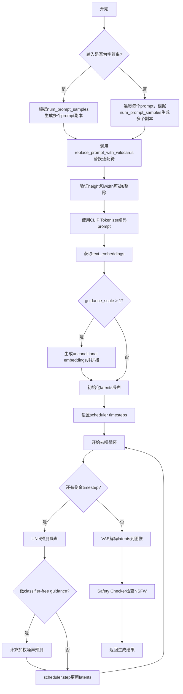
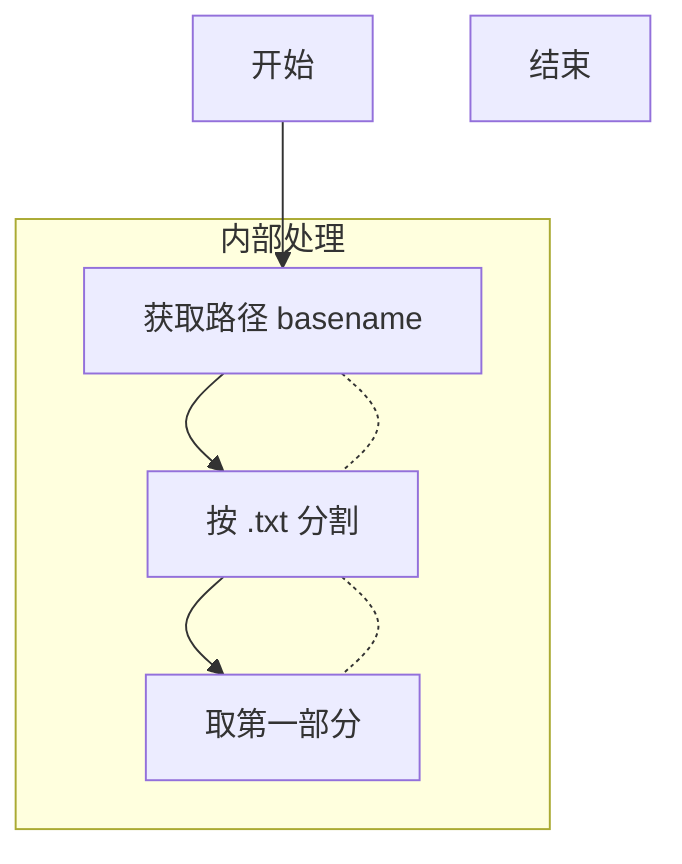
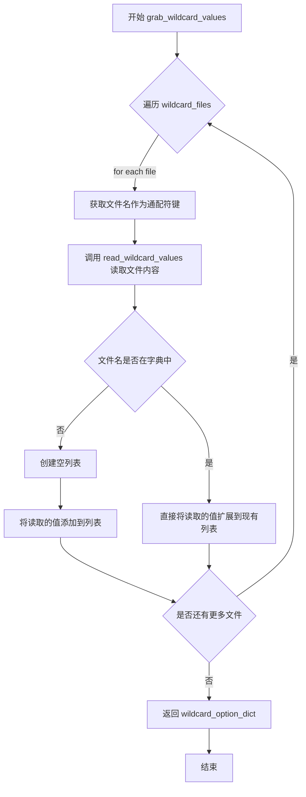
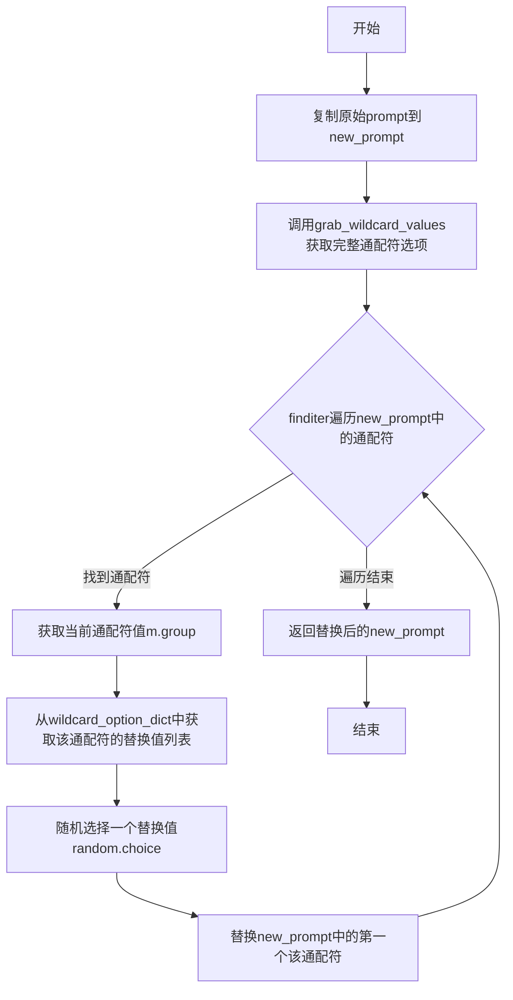

# `diffusers\examples\community\wildcard_stable_diffusion.py` 详细设计文档

这是一个基于Stable Diffusion的文本到图像生成Pipeline，通过支持prompt中的通配符（如__animal__）实现多样化生成。用户可以通过字典或文本文件定义通配符的可选值，Pipeline会在每次推理时随机替换通配符，从而用单个prompt产生多组不同的图像。

## 整体流程



## 类结构

```
DiffusionPipeline (基类)
└── WildcardStableDiffusionPipeline (主类)
    ├── StableDiffusionMixin (混入类)
    └── WildcardStableDiffusionOutput (输出数据类)
        └── StableDiffusionPipelineOutput

辅助函数:
├── get_filename
├── read_wildcard_values
├── grab_wildcard_values
└── replace_prompt_with_wildcards
```

## 全局变量及字段


### `logger`
    
Logger instance for the module, used to log warnings and deprecation messages.

类型：`logging.Logger`
    


### `global_re_wildcard`
    
Compiled regular expression pattern to match wildcard placeholders in format __word__.

类型：`re.Pattern`
    


### `WildcardStableDiffusionOutput.images`
    
Generated images returned by the pipeline, either as PIL Images or numpy arrays.

类型：`List[PIL.Image] | np.ndarray`
    


### `WildcardStableDiffusionOutput.nsfw_content_detected`
    
Boolean flags indicating whether each generated image was detected as potentially unsafe content.

类型：`List[bool]`
    


### `WildcardStableDiffusionOutput.prompts`
    
List of prompts used for generation, including resolved wildcard values.

类型：`List[str]`
    


### `WildcardStableDiffusionPipeline.vae`
    
Variational Auto-Encoder model for encoding images to latent space and decoding latents back to images.

类型：`AutoencoderKL`
    


### `WildcardStableDiffusionPipeline.text_encoder`
    
Frozen CLIP text encoder model that converts text prompts into embedding vectors.

类型：`CLIPTextModel`
    


### `WildcardStableDiffusionPipeline.tokenizer`
    
CLIP tokenizer for converting text prompts into token IDs for the text encoder.

类型：`CLIPTokenizer`
    


### `WildcardStableDiffusionPipeline.unet`
    
Conditional U-Net model that denoises latent representations guided by text embeddings.

类型：`UNet2DConditionModel`
    


### `WildcardStableDiffusionPipeline.scheduler`
    
Denoising scheduler that controls the diffusion process steps and noise scheduling.

类型：`Union[DDIMScheduler, PNDMScheduler, LMSDiscreteScheduler]`
    


### `WildcardStableDiffusionPipeline.safety_checker`
    
Safety checker model that detects and filters potentially harmful or NSFW generated content.

类型：`StableDiffusionSafetyChecker`
    


### `WildcardStableDiffusionPipeline.feature_extractor`
    
CLIP image processor that extracts features from images for the safety checker.

类型：`CLIPImageProcessor`
    
    

## 全局函数及方法


### `get_filename`

该函数用于从给定的文件路径中提取文件名，去除 `.txt` 扩展名后返回。注意：该实现在 Windows 系统上可能无法正常工作。

参数：

- `path`：`str`，要处理的完整文件路径

返回值：`str`，提取出的文件名（不含 `.txt` 扩展名）

#### 流程图



#### 带注释源码

```python
def get_filename(path: str):
    """
    从文件路径中提取文件名（不含 .txt 扩展名）
    
    Args:
        path: 文件的完整路径
        
    Returns:
        文件名字符串（不含 .txt 扩展名）
    """
    # 使用 os.path.basename 获取路径的最后一部分（即文件名）
    # 然后使用 split(".txt")[0] 分割并取第一部分，移除 .txt 扩展名
    # 注意：此实现假设文件扩展名总是 .txt
    return os.path.basename(path).split(".txt")[0]
```


### `read_wildcard_values`

该函数用于从指定的文本文件中读取所有行内容，并将其作为字符串列表返回，常用于加载通配符替换的值列表。

参数：

- `path`：`str`，要读取的文本文件路径

返回值：`List[str]`，文件中所有行的列表（不包含换行符）

#### 流程图

```mermaid
flowchart TD
    A[开始] --> B[打开文件 path<br/>encoding='utf8']
    B --> C[读取文件内容<br/>f.read]
    C --> D[按行分割<br/>splitlines]
    D --> E[返回行列表<br/>List[str]]
    E --> F[结束]
```

#### 带注释源码

```
def read_wildcard_values(path: str):
    """
    读取指定路径的文本文件并返回所有行的列表
    
    参数:
        path: str - 要读取的文本文件路径
        
    返回:
        List[str] - 文件中所有行的列表
    """
    # 使用 UTF-8 编码打开文件
    with open(path, encoding="utf8") as f:
        # 读取文件内容并按行分割，返回行列表
        return f.read().splitlines()
```


### `grab_wildcard_values`

该函数用于从指定的通配符文件中读取替换值，并将这些值存储到字典中返回。它遍历所有的通配符文件，读取文件内容并将其添加到字典的对应键下，最终返回更新后的字典。

参数：

- `wildcard_option_dict`：`Dict[str, List[str]]`，默认值 `{}`，用于存储通配符选项的字典，键为通配符名称，值为可能的替换值列表
- `wildcard_files`：`List[str]`，默认值 `[]`，包含通配符文件路径的列表，每个文件包含一类通配符的替换值

返回值：`Dict[str, List[str]]`，返回更新后的通配符选项字典，包含从文件中读取的所有替换值

#### 流程图



#### 带注释源码

```python
def grab_wildcard_values(wildcard_option_dict: Dict[str, List[str]] = {}, wildcard_files: List[str] = []):
    """
    从通配符文件中读取替换值并存储到字典中
    
    参数:
        wildcard_option_dict: 存储通配符选项的字典，键为通配符名称，值为替换值列表
        wildcard_files: 通配符文件路径列表
    
    返回:
        更新后的通配符选项字典
    """
    # 遍历所有提供的通配符文件路径
    for wildcard_file in wildcard_files:
        # 获取文件名作为通配符的键名（去除.txt后缀）
        filename = get_filename(wildcard_file)
        # 读取文件中的所有行作为替换值
        read_values = read_wildcard_values(wildcard_file)
        
        # 如果该通配符名称尚未存在于字典中，初始化为空列表
        if filename not in wildcard_option_dict:
            wildcard_option_dict[filename] = []
        
        # 将读取的替换值添加到对应通配符的列表中
        wildcard_option_dict[filename].extend(read_values)
    
    # 返回包含所有通配符选项的字典
    return wildcard_option_dict
```


### `replace_prompt_with_wildcards`

该函数用于将提示词中的通配符（如 `__animal__`）随机替换为指定选项字典或文件中的实际值，支持从字典和文件两种方式获取通配符的可能取值。

参数：

- `prompt`：`str`，输入的提示词，可能包含通配符（如 `"A __animal__ sitting on a __object__"`）
- `wildcard_option_dict`：`Dict[str, List[str]] = {}`，字典类型，通配符选项字典，key 为通配符名称（不含双下划线），value 为可能的替换值列表
- `wildcard_files`：`List[str] = []`，列表类型，通配符文件路径列表，每个文件包含一个通配符的可能取值，每行一个值

返回值：`str`，返回替换了所有通配符后的新提示词

#### 流程图



#### 带注释源码

```python
def replace_prompt_with_wildcards(
    prompt: str, wildcard_option_dict: Dict[str, List[str]] = {}, wildcard_files: List[str] = []
):
    """
    将提示词中的通配符替换为随机选择的值
    
    Args:
        prompt: 包含通配符的提示词，如 "__animal__ sitting on a __object__"
        wildcard_option_dict: 通配符选项字典，如 {"animal": ["dog", "cat"], "object": ["chair", "bench"]}
        wildcard_files: 通配符文件路径列表，如 ["animal.txt", "object.txt"]
    
    Returns:
        替换了所有通配符的新提示词
    """
    new_prompt = prompt  # 复制原始prompt，避免直接修改输入

    # 获取通配符选项：合并字典参数和文件参数中的所有通配符值
    wildcard_option_dict = grab_wildcard_values(wildcard_option_dict, wildcard_files)

    # 使用正则表达式遍历提示词中所有的通配符（格式为 __xxx__）
    for m in global_re_wildcard.finditer(new_prompt):
        wildcard_value = m.group()  # 获取匹配的通配符，如 "__animal__"
        # 去掉首尾的双下划线获取key，如 "animal"
        replace_value = random.choice(wildcard_option_dict[wildcard_value.strip("__")])
        # 替换第一个匹配到的通配符（使用 replace 的第三个参数 1 确保只替换一次）
        new_prompt = new_prompt.replace(wildcard_value, replace_value, 1)

    return new_prompt
```


### `WildcardStableDiffusionPipeline.__init__`

该方法是 `WildcardStableDiffusionPipeline` 类的构造函数，负责初始化管道所需的各种组件（如 VAE、文本编码器、tokenizer、UNet、调度器、安全检查器和特征提取器），并进行配置校验和模块注册。

参数：

- `vae`：`AutoencoderKL`，Variational Auto-Encoder (VAE) 模型，用于将图像编码和解码到潜在表示
- `text_encoder`：`CLIPTextModel`，冻结的文本编码器，Stable Diffusion 使用 CLIP 的文本部分
- `tokenizer`：`CLIPTokenizer`，CLIPTokenizer 类的分词器
- `unet`：`UNet2DConditionModel`，条件 U-Net 架构，用于对编码的图像潜在表示进行去噪
- `scheduler`：`Union[DDIMScheduler, PNDMScheduler, LMSDiscreteScheduler]`，与 unet 结合使用以对编码图像潜在表示进行去噪的调度器
- `safety_checker`：`StableDiffusionSafetyChecker`，分类模块，用于估计生成的图像是否可能被认为是冒犯性或有害的
- `feature_extractor`：`CLIPImageProcessor`，用于从生成的图像中提取特征作为 safety_checker 的输入

返回值：`None`，无返回值（构造函数）

#### 流程图

```mermaid
flowchart TD
    A[__init__ 开始] --> B[调用 super().__init__]
    B --> C{scheduler.config.steps_offset != 1?}
    C -->|是| D[生成弃用警告消息]
    D --> E[更新 scheduler 配置 steps_offset 为 1]
    E --> F{safety_checker is None?}
    C -->|否| F
    F -->|是| G[记录警告: 安全检查器已禁用]
    F -->|否| H[继续]
    G --> H
    H --> I[调用 self.register_modules 注册所有模块]
    I --> J[__init__ 结束]
```

#### 带注释源码

```python
def __init__(
    self,
    vae: AutoencoderKL,
    text_encoder: CLIPTextModel,
    tokenizer: CLIPTokenizer,
    unet: UNet2DConditionModel,
    scheduler: Union[DDIMScheduler, PNDMScheduler, LMSDiscreteScheduler],
    safety_checker: StableDiffusionSafetyChecker,
    feature_extractor: CLIPImageProcessor,
):
    # 调用父类 DiffusionPipeline 和 StableDiffusionMixin 的初始化方法
    super().__init__()

    # 检查调度器的 steps_offset 配置是否为 1
    # 如果不是 1，说明配置文件已过时，需要更新配置以避免错误结果
    if scheduler is not None and getattr(scheduler.config, "steps_offset", 1) != 1:
        # 生成弃用警告消息，提醒用户配置文件已过时
        deprecation_message = (
            f"The configuration file of this scheduler: {scheduler} is outdated. `steps_offset`"
            f" should be set to 1 instead of {scheduler.config.steps_offset}. Please make sure "
            "to update the config accordingly as leaving `steps_offset` might led to incorrect results"
            " in future versions. If you have downloaded this checkpoint from the Hugging Face Hub,"
            " it would be very nice if you could open a Pull request for the `scheduler/scheduler_config.json`"
            " file"
        )
        # 调用 deprecate 函数记录弃用警告
        deprecate("steps_offset!=1", "1.0.0", deprecation_message, standard_warn=False)
        
        # 创建新的配置字典，将 steps_offset 设置为 1
        new_config = dict(scheduler.config)
        new_config["steps_offset"] = 1
        # 更新调度器的内部字典
        scheduler._internal_dict = FrozenDict(new_config)

    # 如果 safety_checker 为 None，发出警告提醒用户注意许可证和公共使用场景
    if safety_checker is None:
        logger.warning(
            f"You have disabled the safety checker for {self.__class__} by passing `safety_checker=None`. Ensure"
            " that you abide to the conditions of the Stable Diffusion license and do not expose unfiltered"
            " results in services or applications open to the public. Both the diffusers team and Hugging Face"
            " strongly recommend to keep the safety filter enabled in all public facing circumstances, disabling"
            " it only for use-cases that involve analyzing network behavior or auditing its results. For more"
            " information, please have a look at https://github.com/huggingface/diffusers/pull/254 ."
        )

    # 使用 register_modules 方法注册所有组件
    # 这使得所有模块可以通过管道对象访问
    self.register_modules(
        vae=vae,
        text_encoder=text_encoder,
        tokenizer=tokenizer,
        unet=unet,
        scheduler=scheduler,
        safety_checker=safety_checker,
        feature_extractor=feature_extractor,
    )
```


### `WildcardStableDiffusionPipeline.__call__`

该方法是 `WildcardStableDiffusionPipeline` 类的核心调用方法，用于通过 Stable Diffusion 模型生成图像。该方法在标准 Stable Diffusion 流程基础上增加了通配符（wildcard）替换功能，允许在 prompt 中使用 `__wildcard__` 语法，并从字典或文本文件中随机选择替换值，从而实现多样化的图像生成。

参数：

- `prompt`：`Union[str, List[str]]`，引导图像生成的提示词或提示词列表
- `height`：`int`（可选，默认值 512），生成图像的高度（像素）
- `width`：`int`（可选，默认值 512），生成图像的宽度（像素）
- `num_inference_steps`：`int`（可选，默认值 50），去噪步数，越多通常图像质量越高但推理越慢
- `guidance_scale`：`float`（可选，默认值 7.5），Classifier-Free Diffusion Guidance 中的引导权重，值越大越贴近文本提示
- `negative_prompt`：`Optional[Union[str, List[str]]]`，不引导图像生成的负面提示词
- `num_images_per_prompt`：`Optional[int]`（默认值 1），每个提示词生成的图像数量
- `eta`：`float`（可选，默认值 0.0），DDIM 论文中的 eta 参数，仅对 DDIMScheduler 有效
- `generator`：`torch.Generator | None`，用于生成确定性结果的 PyTorch 随机数生成器
- `latents`：`Optional[torch.Tensor]`，预先生成的噪声潜在向量
- `output_type`：`str | None`（默认值 "pil"），输出格式，可选 "pil" 或 "np"
- `return_dict`：`bool`（可选，默认值 True），是否返回 StableDiffusionPipelineOutput 而非元组
- `callback`：`Optional[Callable[[int, int, torch.Tensor], None]]`，每步推理时调用的回调函数
- `callback_steps`：`int`（可选，默认值 1），回调函数被调用的频率
- `wildcard_option_dict`：`Dict[str, List[str]]`，字典类型，通配符名称到替换值列表的映射，如 {"animal": ["dog", "cat"]}
- `wildcard_files`：`List[str]`，包含通配符替换值的文本文件路径列表
- `num_prompt_samples`：`Optional[int]`（默认值 1），每个提示词进行通配符替换采样的次数

返回值：`WildcardStableDiffusionOutput` 或 `tuple`，包含生成的图像列表、NSFW 内容检测布尔值列表以及处理后的提示词列表

#### 流程图

```mermaid
flowchart TD
    A[开始 __call__] --> B{判断 prompt 类型}
    B -->|str| C[对 prompt 进行 num_prompt_samples 次通配符替换]
    B -->|list| D[对每个 prompt 进行 num_prompt_samples 次通配符替换]
    B -->|其他| E[抛出 ValueError 异常]
    C --> F[计算 batch_size]
    D --> F
    F --> G{验证 height 和 width 是否能被 8 整除}
    G -->|否| H[抛出 ValueError 异常]
    G -->|是| I{验证 callback_steps 是否为正整数]
    I -->|否| J[抛出 ValueError 异常]
    I -->|是| K[使用 tokenizer 将 prompt 转换为 token]
    K --> L[截断过长的 token 并记录警告]
    L --> M[使用 text_encoder 获取文本嵌入向量]
    M --> N{判断是否需要 Classifier-Free Guidance}
    N -->|是| O[获取 negative_prompt 的无条件嵌入]
    N -->|否| P[跳过无条件嵌入处理]
    O --> Q[复制文本嵌入以匹配 num_images_per_prompt]
    P --> Q
    Q --> R[根据设备类型生成初始噪声 latents]
    R --> S[设置 scheduler 的 timesteps]
    S --> T[使用 init_noise_sigma 缩放初始噪声]
    T --> U[开始去噪循环: for each timestep]
    U --> V[扩展 latents 用于 classifier-free guidance]
    V --> W[使用 scheduler 缩放 model input]
    W --> X[使用 UNet 预测噪声残差]
    X --> Y{是否进行 guidance}
    Y -->|是| Z[执行 classifier-free guidance 计算]
    Y -->|否| AA[直接使用预测噪声]
    Z --> AB[使用 scheduler.step 计算上一步的 latents]
    AA --> AB
    AB --> AC{检查是否需要调用 callback}
    AC -->|是| AD[调用 callback 函数]
    AC -->|否| AE[继续下一步循环]
    AD --> AE
    AE --> U
    U -->|循环结束| AF[使用 VAE decode latents 到图像空间]
    AF --> AG[归一化图像到 [0, 1] 范围]
    AG --> AH[转换为 float32 并 permute 维度]
    AH --> AI{检查 safety_checker 是否存在}
    AI -->|是| AJ[运行 safety_checker 检测 NSFW 内容]
    AI -->|否| AK[设置 has_nsfw_concept 为 None]
    AJ --> AL
    AK --> AL
    AL --> AM{判断 output_type}
    AM -->|pil| AN[将 numpy 数组转换为 PIL Image]
    AM -->|其他| AO[保持 numpy 数组格式]
    AN --> AP
    AO --> AP
    AP --> AQ{判断 return_dict}
    AQ -->|是| AR[返回 WildcardStableDiffusionOutput 对象]
    AQ -->|否| AS[返回 tuple 元组]
    AR --> AT[结束]
    AS --> AT
```

#### 带注释源码

```python
@torch.no_grad()
def __call__(
    self,
    prompt: Union[str, List[str]],                    # 引导图像生成的提示词
    height: int = 512,                                 # 生成图像的高度，默认 512 像素
    width: int = 512,                                  # 生成图像的宽度，默认 512 像素
    num_inference_steps: int = 50,                    # 去噪推理步数，默认 50 步
    guidance_scale: float = 7.5,                       # guidance 引导权重，默认 7.5
    negative_prompt: Optional[Union[str, List[str]]] = None,  # 负面提示词
    num_images_per_prompt: Optional[int] = 1,         # 每个提示词生成图像数
    eta: float = 0.0,                                  # DDIM eta 参数
    generator: torch.Generator | None = None,         # 随机数生成器
    latents: Optional[torch.Tensor] = None,           # 预生成噪声 latents
    output_type: str | None = "pil",                  # 输出格式，默认 PIL
    return_dict: bool = True,                          # 是否返回 dict 对象
    callback: Optional[Callable[[int, int, torch.Tensor], None]] = None,  # 回调函数
    callback_steps: int = 1,                          # 回调函数调用频率
    wildcard_option_dict: Dict[str, List[str]] = {},  # 通配符替换字典
    wildcard_files: List[str] = [],                   # 通配符文件列表
    num_prompt_samples: Optional[int] = 1,            # 提示词采样次数
    **kwargs,                                         # 其他关键字参数
):
    # Step 1: 处理通配符替换
    # 如果 prompt 是字符串，则对其进行 num_prompt_samples 次通配符替换
    if isinstance(prompt, str):
        prompt = [
            replace_prompt_with_wildcards(prompt, wildcard_option_dict, wildcard_files)
            for i in range(num_prompt_samples)
        ]
        batch_size = len(prompt)
    # 如果 prompt 是列表，则对每个元素进行 num_prompt_samples 次替换
    elif isinstance(prompt, list):
        prompt_list = []
        for p in prompt:
            for i in range(num_prompt_samples):
                prompt_list.append(replace_prompt_with_wildcards(p, wildcard_option_dict, wildcard_files))
        prompt = prompt_list
        batch_size = len(prompt)
    else:
        raise ValueError(f"`prompt` has to be of type `str` or `list` but is {type(prompt)}")

    # Step 2: 验证图像尺寸
    # height 和 width 必须能被 8 整除（因为 VAE 编码器会将图像缩小 8 倍）
    if height % 8 != 0 or width % 8 != 0:
        raise ValueError(f"`height` and `width` have to be divisible by 8 but are {height} and {width}.")

    # Step 3: 验证 callback_steps 参数
    if (callback_steps is None) or (
        callback_steps is not None and (not isinstance(callback_steps, int) or callback_steps <= 0)
    ):
        raise ValueError(
            f"`callback_steps` has to be a positive integer but is {callback_steps} of type"
            f" {type(callback_steps)}."
        )

    # Step 4: 获取提示词文本嵌入
    # 使用 tokenizer 将 prompt 转换为 token IDs
    text_inputs = self.tokenizer(
        prompt,
        padding="max_length",
        max_length=self.tokenizer.model_max_length,
        return_tensors="pt",
    )
    text_input_ids = text_inputs.input_ids

    # Step 5: 处理超过最大长度的 token
    if text_input_ids.shape[-1] > self.tokenizer.model_max_length:
        removed_text = self.tokenizer.batch_decode(text_input_ids[:, self.tokenizer.model_max_length :])
        logger.warning(
            "The following part of your input was truncated because CLIP can only handle sequences up to"
            f" {self.tokenizer.model_max_length} tokens: {removed_text}"
        )
        text_input_ids = text_input_ids[:, : self.tokenizer.model_max_length]
    
    # 使用 text_encoder 获取文本嵌入向量
    text_embeddings = self.text_encoder(text_input_ids.to(self.device))[0]

    # Step 6: 复制文本嵌入以匹配每个提示词生成的图像数量
    bs_embed, seq_len, _ = text_embeddings.shape
    text_embeddings = text_embeddings.repeat(1, num_images_per_prompt, 1)
    text_embeddings = text_embeddings.view(bs_embed * num_images_per_prompt, seq_len, -1)

    # Step 7: 判断是否使用 Classifier-Free Guidance
    do_classifier_free_guidance = guidance_scale > 1.0
    
    # Step 8: 获取无条件嵌入（用于 classifier-free guidance）
    if do_classifier_free_guidance:
        uncond_tokens: List[str]
        if negative_prompt is None:
            uncond_tokens = [""] * batch_size
        elif type(prompt) is not type(negative_prompt):
            raise TypeError(
                f"`negative_prompt` should be the same type to `prompt`, but got {type(negative_prompt)} !="
                f" {type(prompt)}."
            )
        elif isinstance(negative_prompt, str):
            uncond_tokens = [negative_prompt]
        elif batch_size != len(negative_prompt):
            raise ValueError(
                f"`negative_prompt`: {negative_prompt} has batch size {len(negative_prompt)}, but `prompt`:"
                f" {prompt} has batch size {batch_size}. Please make sure that passed `negative_prompt` matches"
                " the batch size of `prompt`."
            )
        else:
            uncond_tokens = negative_prompt

        max_length = text_input_ids.shape[-1]
        uncond_input = self.tokenizer(
            uncond_tokens,
            padding="max_length",
            max_length=max_length,
            truncation=True,
            return_tensors="pt",
        )
        uncond_embeddings = self.text_encoder(uncond_input.input_ids.to(self.device))[0]

        # 复制无条件嵌入以匹配 num_images_per_prompt
        seq_len = uncond_embeddings.shape[1]
        uncond_embeddings = uncond_embeddings.repeat(1, num_images_per_prompt, 1)
        uncond_embeddings = uncond_embeddings.view(batch_size * num_images_per_prompt, seq_len, -1)

        # 拼接无条件嵌入和文本嵌入以避免两次前向传播
        text_embeddings = torch.cat([uncond_embeddings, text_embeddings])

    # Step 9: 初始化 latents（噪声潜在向量）
    latents_shape = (batch_size * num_images_per_prompt, self.unet.config.in_channels, height // 8, width // 8)
    latents_dtype = text_embeddings.dtype
    if latents is None:
        # 针对 mps 设备的特殊处理（Apple Silicon）
        if self.device.type == "mps":
            latents = torch.randn(latents_shape, generator=generator, device="cpu", dtype=latents_dtype).to(
                self.device
            )
        else:
            latents = torch.randn(latents_shape, generator=generator, device=self.device, dtype=latents_dtype)
    else:
        if latents.shape != latents_shape:
            raise ValueError(f"Unexpected latents shape, got {latents.shape}, expected {latents_shape}")
        latents = latents.to(self.device)

    # Step 10: 设置 scheduler 的 timesteps
    self.scheduler.set_timesteps(num_inference_steps)

    # 将 timesteps 移动到正确的设备上
    timesteps_tensor = self.scheduler.timesteps.to(self.device)

    # Step 11: 使用 scheduler 的初始噪声标准差缩放 latents
    latents = latents * self.scheduler.init_noise_sigma

    # Step 12: 准备 scheduler step 的额外参数
    accepts_eta = "eta" in set(inspect.signature(self.scheduler.step).parameters.keys())
    extra_step_kwargs = {}
    if accepts_eta:
        extra_step_kwargs["eta"] = eta

    # Step 13: 去噪循环
    for i, t in enumerate(self.progress_bar(timesteps_tensor)):
        # 扩展 latents 用于 classifier-free guidance
        latent_model_input = torch.cat([latents] * 2) if do_classifier_free_guidance else latents
        latent_model_input = self.scheduler.scale_model_input(latent_model_input, t)

        # 使用 UNet 预测噪声残差
        noise_pred = self.unet(latent_model_input, t, encoder_hidden_states=text_embeddings).sample

        # 执行 classifier-free guidance
        if do_classifier_free_guidance:
            noise_pred_uncond, noise_pred_text = noise_pred.chunk(2)
            noise_pred = noise_pred_uncond + guidance_scale * (noise_pred_text - noise_pred_uncond)

        # 使用 scheduler 计算上一步的 latents
        latents = self.scheduler.step(noise_pred, t, latents, **extra_step_kwargs).prev_sample

        # 调用回调函数（如果提供）
        if callback is not None and i % callback_steps == 0:
            step_idx = i // getattr(self.scheduler, "order", 1)
            callback(step_idx, t, latents)

    # Step 14: 使用 VAE 将 latents 解码为图像
    latents = 1 / 0.18215 * latents
    image = self.vae.decode(latents).sample

    # Step 15: 归一化图像到 [0, 1] 范围
    image = (image / 2 + 0.5).clamp(0, 1)

    # Step 16: 转换为 float32 格式的 numpy 数组
    image = image.cpu().permute(0, 2, 3, 1).float().numpy()

    # Step 17: 运行 safety checker（如果启用）
    if self.safety_checker is not None:
        safety_checker_input = self.feature_extractor(self.numpy_to_pil(image), return_tensors="pt").to(
            self.device
        )
        image, has_nsfw_concept = self.safety_checker(
            images=image, clip_input=safety_checker_input.pixel_values.to(text_embeddings.dtype)
        )
    else:
        has_nsfw_concept = None

    # Step 18: 根据 output_type 转换图像格式
    if output_type == "pil":
        image = self.numpy_to_pil(image)

    # Step 19: 返回结果
    if not return_dict:
        return (image, has_nsfw_concept)

    return WildcardStableDiffusionOutput(images=image, nsfw_content_detected=has_nsfw_concept, prompts=prompt)
```


## 关键组件


### 张量索引与惰性加载

代码实现了针对不同设备的张量生成策略：对于MPS设备，使用CPU生成随机张量后转移到设备；对于CUDA设备，直接在目标设备生成张量。同时支持用户预提供的latents，实现惰性加载模式。

### 动态Prompt扩展与批量采样

通过`replace_prompt_with_wildcards`函数和`num_prompt_samples`参数实现动态prompt扩展，允许对单个prompt进行多次采样并替换wildcard占位符，支持从文件或字典中获取替换值。

### 分类器自由引导实现

代码实现了CFG（Classifier-Free Guidance）机制，通过拼接无条件embeddings和文本embeddings，在单次前向传播中完成引导生成，无需两次独立推理。

### 安全检查器集成

集成了`StableDiffusionSafetyChecker`对生成图像进行NSFW检测，通过`feature_extractor`提取图像特征并检查潜在有害内容，支持可配置的安全过滤开关。

### 调度器兼容性处理

通过`inspect.signature`动态检测调度器参数，支持DDIMScheduler的eta参数和其他调度器的不同签名，确保多调度器环境下的兼容性。

### 渐进式去噪循环

实现了标准的Diffusion去噪流程：初始化噪声 -> 迭代预测噪声残差 -> 执行分类器引导 -> 计算上一步样本 -> 调用回调函数。

### 图像后处理与格式转换

完成VAE解码后进行图像标准化（归一化到0-1范围）、格式转换（从tensor转numpy再转PIL）、以及数据类型转换（确保float32兼容性）。


## 问题及建议


### 已知问题

-   **文件读取缺少异常处理**：`read_wildcard_values`函数未处理文件不存在或读取失败的情况，会直接抛出异常导致程序中断。
-   **Wildcard键值不存在会导致运行时错误**：`replace_prompt_with_wildcards`函数在替换时，如果wildcard键在`wildcard_option_dict`或对应文件中不存在，会抛出`KeyError`异常，缺乏优雅的错误处理和用户提示。
-   **可变默认参数反模式**：`__call__`方法中`wildcard_option_dict: Dict[str, List[str]] = {}`和`wildcard_files: List[str] = []`使用可变对象作为默认参数，这是Python中常见的反模式，可能导致意外的行为和难以调试的bug。
-   **`get_filename`函数存在平台兼容性缺陷**：注释明确指出"this doesn't work on Windows"，但代码中仍使用`os.path.basename(path).split(".txt")[0]`，该实现对文件名中包含多个".txt"的情况处理不当。
-   **缺少负向提示的wildcard支持**：仅对正向`prompt`实现了wildcard替换功能，但`negative_prompt`同样可能需要wildcard替换，当前实现未考虑这一点。
-   **文件内容未缓存**：每次调用pipeline时都会重新读取`wildcard_files`的内容，对于大文件或频繁调用场景，会造成不必要的I/O开销。
-   **Prompt截断警告不够明确**：仅在日志中警告被截断的文本内容，但没有向调用者提供被截断的具体信息，无法让用户得知哪些wildcard被丢弃。
-   **缺少输入验证**：未验证`wildcard_files`路径的有效性，也未检查`num_prompt_samples`是否为正整数。

### 优化建议

-   **添加文件异常处理**：在`read_wildcard_values`中添加try-except块，捕获`FileNotFoundError`等异常并提供有意义的错误信息。
-   **实现wildcard存在性检查**：在替换前验证所有wildcard键是否存在于字典或文件中，不存在时抛出自定义异常或使用默认值。
-   **修复可变默认参数**：将默认参数改为`None`，在方法体内初始化为空字典/列表。
-   **修复跨平台文件名提取**：使用`os.path.splitext(os.path.basename(path))[0]`替代当前实现，或直接使用`pathlib.Path`。
-   **支持negative_prompt的wildcard**：扩展`replace_prompt_with_wildcards`函数以支持对负向提示的替换。
-   **添加文件内容缓存机制**：在pipeline初始化时或首次调用时读取并缓存wildcard文件内容，避免重复读取。
-   **改进prompt截断处理**：将被截断的文本信息包含在返回的`WildcardStableDiffusionOutput`中，或提供回调机制通知用户。
-   **添加全面的输入验证**：在方法开始时验证所有输入参数的有效性，包括文件路径存在性、数值范围等。
-   **考虑添加异步I/O**：对于大文件或网络文件系统，考虑使用异步读取提升性能。
-   **添加类型注解完善度**：为部分缺少返回类型注解的函数添加类型提示，提高代码可维护性。


## 其它


### 设计目标与约束

本pipeline的设计目标是在Stable Diffusion文本到图像生成能力的基础上，添加动态prompt增强功能，允许用户使用wildcard语法（双下划线包裹的单词如__animal__）在prompt中定义占位符，并通过wildcard_option_dict参数或外部txt文件提供替换值，从而实现prompt的自动化变体生成，提升生成多样性和创意表达效率。设计约束包括：必须继承自DiffusionPipeline和StableDiffusionMixin以保持与diffusers库的兼容性；不支持Windows文件路径处理（get_filename函数依赖Unix风格路径分隔符）；仅支持DDIMScheduler、LMSDiscreteScheduler和PNDMScheduler三种调度器；batch处理时negative_prompt必须与prompt类型和batch_size匹配；图像分辨率必须能被8整除；callback_steps必须为正整数。

### 错误处理与异常设计

代码包含多个显式的错误检查和异常抛出场景。ValueError用于处理无效参数值，包括：prompt类型不是str或list、height或width不能被8整除、callback_steps不是正整数、latents形状不匹配预期、negative_prompt与prompt类型不一致或batch_size不匹配。TypeError用于negative_prompt类型与prompt类型不匹配的情况。文件读取使用UTF-8编码，当wildcard文件不存在或格式错误时，read_wildcard_values函数会抛出FileNotFoundError或UnicodeDecodeError。日志警告用于：safety_checker被禁用、CLIPTokenizer截断输入文本、scheduler配置中steps_offset不等于1。潜在的未处理异常包括：wildcard_option_dict中不存在对应的key时会导致KeyError，以及当wildcard文件为空时random.choice可能产生意外行为。

### 数据流与状态机

Pipeline的核心数据流遵循以下路径：首先接收原始prompt字符串或列表，以及wildcard配置参数；然后通过replace_prompt_with_wildcards函数解析并替换wildcard占位符，生成多个变体prompt；若num_prompt_samples大于1，则对每个原始prompt进行重复采样；接着将处理后的prompt列表进行batch化处理；通过CLIPTokenizer将文本转换为token ids，再由CLIPTextModel编码为text_embeddings；根据guidance_scale决定是否执行classifier-free guidance，若执行则需生成对应的unconditional embeddings；初始化或复用latents作为噪声输入；按照scheduler设定的时间步进行去噪循环，每个时间步执行UNet2DConditionModel预测噪声、计算guidance、scheduler.step更新latents；去噪完成后通过VAE decode将latents解码为图像；最后通过StableDiffusionSafetyChecker进行安全性检查，并根据output_type决定返回PIL.Image或numpy数组。整个过程是单向顺序执行，无显式状态机，但内部维护了prompt处理状态、embedding计算状态和去噪迭代状态。

### 外部依赖与接口契约

本pipeline依赖以下核心外部库和模型。transformers库提供CLIPTextModel、CLIPTokenizer和CLIPImageProcessor，用于文本编码和图像特征提取。diffusers库提供AutoencoderKL（VAE）、UNet2DConditionModel（U-Net）、DDIMScheduler/LMSDiscreteScheduler/PNDMScheduler（调度器）、StableDiffusionSafetyChecker（安全检查器）、DiffusionPipeline和StableDiffusionMixin基类、FrozenDict配置工具。PyTorch库提供张量运算和随机数生成。接口契约方面：from_pretrained方法接受标准的diffusers模型路径或本地目录；__call__方法的prompt参数支持str或List[str]类型；wildcard_option_dict参数接收Dict[str, List[str]]类型，key为wildcard名称（不含双下划线），value为替换值列表；wildcard_files参数接收List[str]类型，每项为txt文件路径；返回值为WildcardStableDiffusionOutput对象，包含images（生成的图像列表）、nsfw_content_detected（安全检查结果列表）和prompts（处理后的prompt列表）三个字段。

### 性能考虑与优化建议

当前实现存在多个性能优化空间。去噪循环中使用torch.no_grad()装饰器避免梯度计算是正确的做法，但text_embeddings和uncond_embeddings的重复创建可以通过预分配内存优化。在处理多个wildcard变体时，当前实现为每个变体单独编码文本，对于大量变体场景，可以考虑批量编码后通过索引选择。random.choice每次调用都会访问wildcard_option_dict，可以预先缓存已读取的文件内容。generator参数用于确定性生成，但当前实现中latents初始化时未充分利用generator的随机状态进行更细粒度的控制。GPU内存方面，text_embeddings的重复操作（repeat和view）会占用额外显存，对于大规模batch处理可以考虑使用in-place操作。此外，当前代码未利用PyTorch的compile或torchserve等部署优化技术，生产环境部署时可考虑使用。

### 安全性考虑

代码包含基本的安全检查机制，通过StableDiffusionSafetyChecker对生成的图像进行NSFW内容检测，并在safety_checker为None时发出警告。然而，存在以下安全风险：wildcard文件内容未经安全过滤，用户可能通过自定义wildcard文件注入恶意内容；wildcard替换是随机选择而非内容审核，可能生成意外的不当prompt组合；未对用户提供的wildcard_option_dict进行长度限制或内容验证，恶意构造的超大列表可能导致内存溢出；negative_prompt参数虽然提供了内容控制能力，但未强制要求或提供默认值。建议在生产环境中增加：wildcard内容的预定义白名单机制、prompt长度和复杂度的限制、生成内容的二次审核流程、以及用户输入的sanitization处理。

### 版本兼容性

代码依赖的库版本要求如下：transformers库需要支持CLIPTextModel、CLIPTokenizer和CLIPImageProcessor的版本；diffusers库需要包含DiffusionPipeline基类、StableDiffusionMixin、AutoencoderKL、UNet2DConditionModel以及三种调度器的版本；PyTorch版本需支持torch.randn的generator参数和mps设备类型。代码中使用了Python 3.10+的联合类型语法（torch.Generator | None和str | None），需要Python 3.10及以上版本。scheduler配置更新使用了_internal_dict属性，这是diffusers库的内部API，可能在不同版本间发生变化。FrozenDict的导入和使用也依赖于diffusers的具体实现。兼容性问题可能出现在：diffusers库版本升级导致的API变化、transformers库CLIP模型版本更新、以及PyTorch版本更新带来的设备支持变化（如mps支持）。

### 测试策略建议

建议补充以下测试用例以确保代码质量。单元测试应覆盖：get_filename函数的路径解析和Windows兼容性边界情况；read_wildcard_values的文件不存在、空文件、多行内容等场景；grab_wildcard_values的字典合并逻辑；replace_prompt_with_wildcards的占位符替换、嵌套wildcard、重复wildcard等场景。集成测试应覆盖：WildcardStableDiffusionPipeline的完整生成流程，包括单prompt和多prompt变体；不同scheduler的兼容性；safety_checker启用和禁用两种模式；callback函数的调用频率和参数正确性；各种output_type的返回格式。性能测试应覆盖：大批量wildcard变体的生成时间；GPU显存占用；不同分辨率下的推理速度。边界测试应覆盖：wildcard_option_dict为空或key不存在的情况；height/width不能被8整除的错误处理；callback_steps为0或负数的错误处理；negative_prompt与prompt不匹配的错误处理。


    