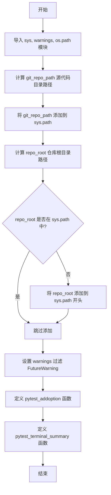
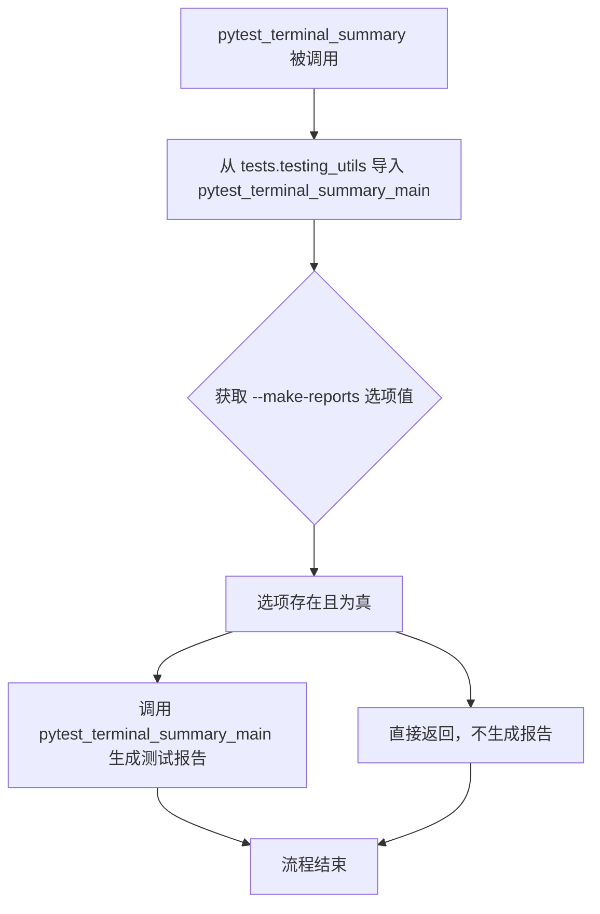

```mermaid
flowchart TD
    A[开始: pytest_addoption] --> B[接收 parser 参数]
    B --> C[动态导入: from tests.testing_utils import pytest_addoption_shared]
    C --> D[调用: pytest_addoption_shared&#40;parser&#41;]
    D --> E[结束]
    
    C -.-> F[模块加载检查]
    F -->|模块不存在| G[抛出 ImportError]
    
    D --> H[注册自定义命令行选项]
    H --> I[选项被 pytest 识别]
```

# `diffusers\examples\conftest.py` 详细设计文档

这是 HuggingFace Transformers 项目的 pytest 配置文件，主要功能是设置 Python 路径以便导入项目源码、配置 pytest 命令行选项、过滤 FutureWarning 警告，并生成测试终端摘要报告。

## 整体流程



## 类结构

```
无类层次结构 - 该文件为纯模块文件，仅包含全局函数和变量
```

## 全局变量及字段


### `git_repo_path`
    
指向项目 src 目录的绝对路径，用于后续导入模块

类型：`str`
    


### `repo_root`
    
指向项目根目录的绝对路径，用于路径配置

类型：`str`
    


    

## 全局函数及方法


### `pytest_addoption`

这是 pytest 的配置钩子函数，用于在 pytest 初始化时添加自定义命令行选项。该函数从 `tests.testing_utils` 模块导入 `pytest_addoption_shared` 函数并调用它，以注册项目中定义的自定义测试选项。

参数：

- `parser`：`pytest.Parser`，pytest 自动传入的参数解析器对象，用于注册新的命令行选项

返回值：`None`，无返回值，该函数仅执行副作用（注册命令行选项）

#### 流程图



#### 带注释源码

```python
def pytest_addoption(parser):
    """
    pytest 钩子函数：在 pytest 配置阶段添加自定义命令行选项
    
    该函数是 pytest 的配置钩子，会在 pytest 初始化时被自动调用。
    它负责注册项目自定义的测试命令行选项。
    
    参数:
        parser: pytest 的参数解析器对象，用于注册新的命令行选项
               类型通常为 pytest 的 Parser 或 ArgumentParser 实例
    
    返回值:
        None: 该函数不返回任何值，通过修改 parser 对象来注册选项
    
    副作用:
        - 导入 tests.testing_utils 模块
        - 调用 pytest_addoption_shared 函数注册自定义选项
    """
    # 动态导入 pytest_addoption_shared 函数
    # 这是为了避免在模块加载时就依赖 testing_utils，确保测试框架的灵活性
    from tests.testing_utils import pytest_addoption_shared

    # 调用共享的选项注册函数，将 parser 传递给它
    # pytest_addoption_shared 会在 parser 上注册各种自定义选项
    # 如 --make-reports, --run_slow 等项目特定的命令行参数
    pytest_addoption_shared(parser)
```


### `pytest_terminal_summary`

该函数是 pytest 的钩子函数，在所有测试执行完成后被调用，用于获取测试报告生成选项并调用相应的报告生成逻辑。

参数：

- `terminalreporter`：`TerminalReporter` 类型，pytest 提供的终端报告对象，包含测试运行结果和配置信息

返回值：`None`，该函数没有返回值，仅执行副作用操作（生成报告文件）

#### 流程图



#### 带注释源码

```python
def pytest_terminal_summary(terminalreporter):
    """
    pytest 钩子函数：在测试结束时生成摘要报告
    
    参数:
        terminalreporter: pytest 的终端报告对象，包含测试结果和配置信息
    """
    # 从项目测试工具模块导入主报告生成函数
    # 延迟导入可以避免循环依赖问题
    from tests.testing_utils import pytest_terminal_summary_main

    # 获取命令行选项 --make-reports 的值
    # 该选项控制是否生成测试报告文件
    make_reports = terminalreporter.config.getoption("--make-reports")
    
    # 仅当用户明确指定了 --make-reports 选项时才生成报告
    if make_reports:
        # 调用主函数生成测试报告，传递 terminalreporter 和选项值作为 ID
        pytest_terminal_summary_main(terminalreporter, id=make_reports)
```

---

## 文件整体运行流程

此文件是 pytest 配置文件（`conftest.py` 或测试目录入口），在测试运行前自动执行。主要流程如下：

1. **路径配置**：设置项目源码路径和测试目录路径到 `sys.path`
2. **警告过滤**：忽略 `FutureWarning` 以减少测试输出噪音
3. **添加命令行选项**：通过 `pytest_addoption` 添加自定义选项（如 `--make-reports`）
4. **测试结束钩子**：通过 `pytest_terminal_summary` 在测试完成后生成报告

---

## 全局变量详情

| 变量名 | 类型 | 描述 |
|--------|------|------|
| `git_repo_path` | `str` | 项目 src 目录的绝对路径，用于将源码添加到 Python 路径 |
| `repo_root` | 测试根目录的绝对路径，用于模块导入 | `str` |

---

## 关键组件信息

| 组件名称 | 描述 |
|----------|------|
| `pytest_addoption` | pytest 钩子，用于添加自定义命令行选项 |
| `pytest_terminal_summary` | pytest 钩子，测试结束后生成摘要报告 |
| `pytest_terminal_summary_main` | 从 `tests.testing_utils` 导入的实际报告生成逻辑 |

---

## 潜在技术债务与优化空间

1. **硬编码路径依赖**：项目路径通过 `dirname(__file__)` 多次调用计算，可提取为统一配置
2. **延迟导入风险**：`pytest_terminal_summary_main` 的导入在函数内部，若模块不存在会延迟到测试结束才发现错误
3. **缺少错误处理**：没有对 `getoption` 返回 `None` 或导入失败的情况做异常处理
4. **重复路径添加逻辑**：路径添加到 `sys.path` 的逻辑可以封装为独立函数以提高可读性

---

## 其它项目

### 设计目标与约束

- **目标**：支持多仓库检出环境，允许在不同 checkout 间切换测试而无需重新安装
- **约束**：依赖 `tests.testing_utils` 模块中的 `pytest_terminal_summary_main` 函数

### 错误处理与异常设计

- 若 `tests.testing_utils` 模块不存在或未定义 `pytest_terminal_summary_main`，导入时会抛出 `ImportError`
- 若未提供 `--make-reports` 选项，`getoption` 返回 `None`，条件判断为 `False`，跳过报告生成

### 外部依赖与接口契约

- **依赖**：`pytest` 框架、测试工具模块 `tests.testing_utils`
- **接口**：遵循 pytest 钩子规范，接收 `terminalreporter` 参数

## 关键组件


### 路径配置模块

负责设置 Python 导入路径，允许在多个仓库checkout之间切换而无需重新安装，確保测试可以正确导入源代码模块。

### pytest_addoption 函数

添加自定义命令行选项，调用 `testing_utils` 模块中的共享配置函数，用于定义测试运行时的可选参数。

### pytest_terminal_summary 函数

在测试结束时生成总结报告，根据 `--make-reports` 选项决定是否调用主函数生成测试报告，用于收集和展示测试结果。

### sys.path 动态修改逻辑

通过将源代码目录和仓库根目录插入 Python 路径，使测试能够导入项目模块，支持多仓库环境下的测试执行。

### FutureWarning 警告过滤

在测试环境中忽略 FutureWarning 警告，因为测试需要验证当前功能行为，无法立即处理尚未成为标准警告的弃用提示。


## 问题及建议


### 已知问题

- **路径计算可读性差**：使用多层嵌套的 `abspath(join(dirname(dirname(dirname(__file__))), "src")))` 方式计算路径，代码可读性差，难以理解和维护
- **缺少错误处理**：动态导入 `from tests.testing_utils import pytest_addoption_shared` 和 `pytest_terminal_summary_main` 时没有 try-except 捕获 ImportError，如果模块不存在会导致测试无法运行
- **路径逻辑脆弱**：依赖特定的目录结构（需要恰好三层父目录才能到达 src 目录），当目录结构变化时容易出错
- **重复的路径检查**：`repo_root not in sys.path` 检查后再 `sys.path.insert(0, repo_root)`，逻辑可以简化
- **缺少文档注释**：整个文件没有模块级或函数级文档字符串，难以理解配置意图
- **硬编码路径**：路径计算逻辑硬编码，缺乏灵活性，无法适应不同的项目结构

### 优化建议

- **提取路径计算逻辑**：将复杂的路径计算封装为独立的辅助函数，并添加清晰的注释和文档
- **添加错误处理**：对动态导入使用 try-except 包装，提供友好的错误信息或回退方案
- **使用环境变量**：考虑使用环境变量或配置文件来指定项目根路径，增加灵活性
- **简化路径检查逻辑**：使用 `set` 数据结构或直接使用 `sys.path.insert(0, ...)` 而无需预先检查
- **添加文档字符串**：为模块和关键函数添加 docstring，说明配置的目的和用途
- **验证目录存在性**：在添加路径前验证目录是否存在，避免将无效路径添加到 sys.path

## 其它


### 设计目标与约束

本代码作为pytest的conftest.py文件，其核心设计目标是确保测试环境正确配置，使得测试能够在多个仓库副本间切换时无需重新安装开发依赖。主要约束包括：必须维护sys.path的正确性以确保模块导入正常；需要保持与pytest框架的兼容性；需要支持自定义报告生成功能。

### 错误处理与异常设计

代码中的错误处理主要体现在路径处理方面。当repo_root不在sys.path中时才进行插入操作，避免重复路径导致的潜在问题。对于模块导入失败的情况，通过try-except机制处理（虽然在此代码中未显式体现，但pytest_addoption_shared和pytest_terminal_summary_main的导入失败会导致测试框架本身的错误）。路径处理使用abspath确保绝对路径，避免相对路径带来的歧义。

### 外部依赖与接口契约

本文件依赖于以下外部组件：pytest框架（提供parser和terminalreporter对象）、tests.testing_utils模块中的pytest_addoption_shared和pytest_terminal_summary_main函数。接口契约方面：pytest_addoption函数接收parser对象并调用共享选项添加逻辑；pytest_terminal_summary函数接收terminalreporter对象并根据--make-reports选项决定是否生成报告。

### 性能考虑

代码在性能方面做了优化：使用sys.path.insert(1, ...)和sys.path.insert(0, ...)进行路径插入时检查了重复性，避免重复插入导致后续import操作变慢。FutureWarning的过滤避免了测试输出中的冗余警告信息，减少了终端输出的开销。

### 安全性考虑

代码主要涉及路径操作和模块导入，安全性考虑包括：使用abspath防止路径遍历攻击；通过显式检查sys.path内容避免任意代码执行风险；路径计算基于__file__而非用户输入，相对安全。

### 测试策略

此文件本身的测试策略较为特殊：由于是pytest配置文件，其功能验证需要通过实际运行pytest来测试。测试时需要验证：多仓库环境下路径配置正确性；自定义pytest选项是否生效；报告生成功能是否正常工作。

### 版本兼容性

代码使用了Python标准库模块（sys、warnings、os.path）和pytest公共API，兼容性较好。需要注意的是FutureWarning的处理方式可能在不同Python版本间有所差异，以及tests.testing_utils模块的存在性和接口稳定性需要与主代码库同步维护。

### 配置管理

配置管理主要通过以下方式实现：通过--make-reports选项控制报告生成行为；通过环境变量和路径配置实现多仓库支持；FutureWarning的过滤策略是硬编码的，如需动态配置可考虑添加pytest标记。

### 部署相关

部署时需要确保：测试目录结构符合预期（tests/testing_utils.py存在）；Python环境已安装pytest；如需自定义报告功能，需要正确配置--make-reports参数。该文件通常随代码库一起分发，无需单独部署。


    