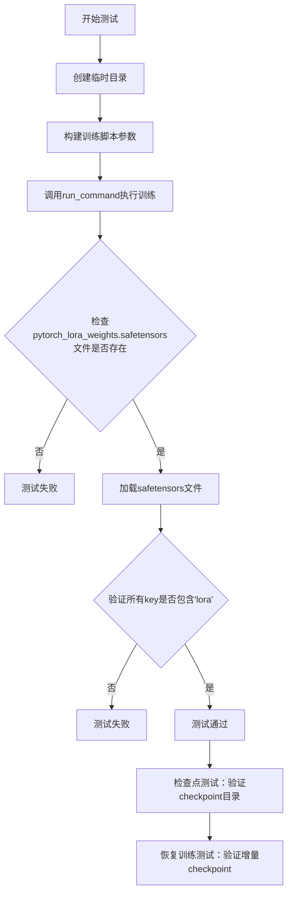
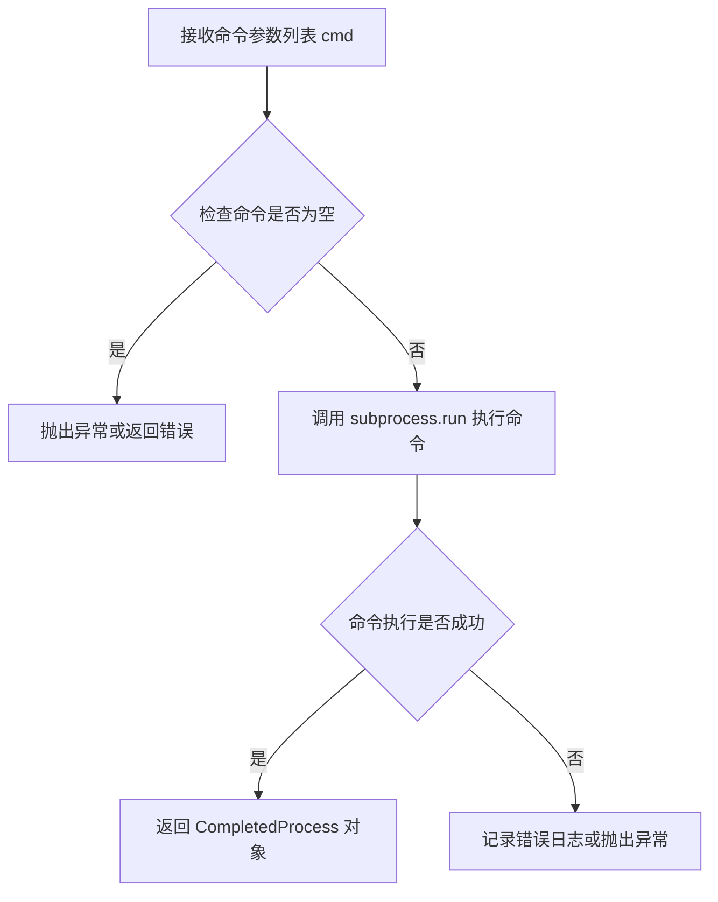
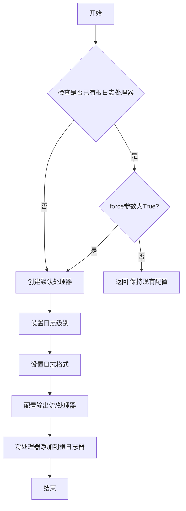
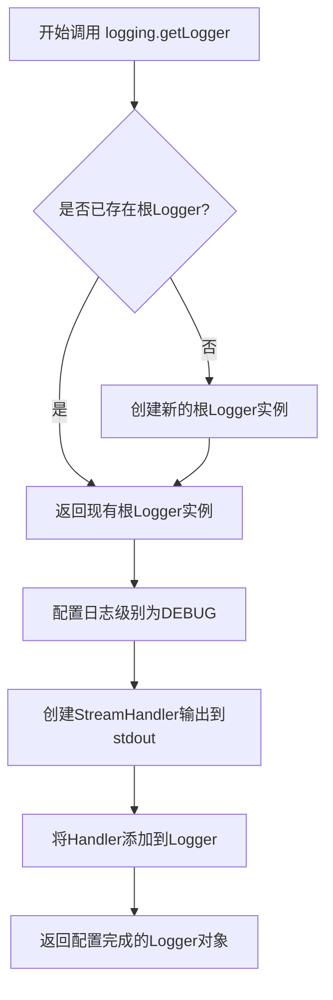
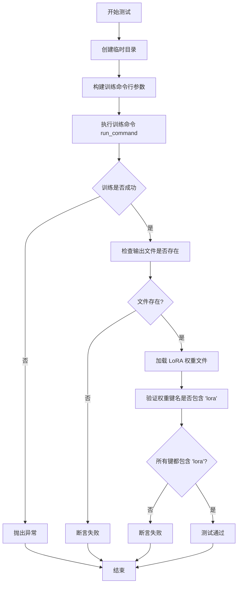
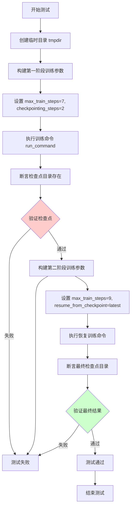

# `diffusers\examples\consistency_distillation\test_lcm_lora.py` 详细设计文档

这是一个用于测试SDXL模型LCM（Latent Consistency Model）LoRA训练的集成测试文件，通过运行训练脚本并验证输出的LoRA权重文件、检查点文件以及state dict的命名规范来确保训练流程的正确性。

## 整体流程



## 类结构

```
ExamplesTestsAccelerate (基类)
└── TextToImageLCM (测试类)
```

## 全局变量及字段


### `logger`
    
日志记录器对象，用于输出调试信息和运行状态

类型：`logging.Logger`
    


### `stream_handler`
    
日志流处理器，将日志内容输出到标准输出(sys.stdout)

类型：`logging.StreamHandler`
    


    

## 全局函数及方法


# 函数分析：run_command

需要说明的是，`run_command` 函数并非在该代码文件中定义，而是从 `test_examples_utils` 模块导入。以下信息基于对该函数的调用方式及常见实现模式的分析。

---

### `run_command`

该函数用于在子进程中执行命令行指令，通常用于运行训练脚本或测试命令。它接收一个命令参数列表，解析并执行对应的可执行文件或脚本，并返回命令的执行结果。

#### 参数

- `cmd`：`List[str]`，命令及参数列表，例如 `["python", "train.py", "--arg1", "value1"]`。在代码中的实际调用为 `self._launch_args + test_args`，其中 `_launch_args` 包含启动器参数（如 `accelerate` 相关配置），`test_args` 包含训练脚本路径及其训练超参数。

#### 返回值

- `subprocess.CompletedProcess` 或 `None`，返回命令执行后的结果对象，包含返回码、标准输出和标准错误等信息。在该测试代码中未使用其返回值，仅通过副作用（如生成模型文件）验证执行是否成功。

#### 流程图



#### 带注释源码

```python
def run_command(cmd: List[str], *args, **kwargs) -> subprocess.CompletedProcess:
    """
    执行给定的命令行指令。
    
    参数:
        cmd: 命令及参数列表，如 ['python', 'script.py', '--arg', 'value']
        *args: 传递给 subprocess.run 的额外位置参数
        **kwargs: 传递给 subprocess.run 的额外关键字参数
        
    返回:
        subprocess.CompletedProcess: 包含返回码、输出等信息的对象
    """
    import subprocess
    # 使用 subprocess.run 执行命令，捕获输出
    # 默认情况下可能设置 check=True 以在非零返回码时抛出异常
    result = subprocess.run(
        cmd,
        *args,
        **kwargs,
        capture_output=True,  # 捕获标准输出和标准错误
        text=True,            # 返回字符串而非字节
    )
    return result
```

---

## 补充说明

由于 `run_command` 的实现源码未在当前代码文件中提供，以上分析基于以下观察：

1. **调用方式**：`run_command(self._launch_args + test_args)` 表明该函数接受一个列表参数，其中包含可执行文件路径及其命令行参数。
2. **返回值处理**：测试代码中未使用返回值，仅通过文件系统操作（如 `os.path.isfile`）验证命令是否成功执行，推测该函数可能在失败时抛出异常或返回非零返回码。
3. **模块来源**：该函数属于 `test_examples_utils` 模块，可能是 Hugging Face Diffusers 项目中的测试工具类 `ExamplesTestsAccelerate` 的父类或工具模块的一部分。


### `logging.basicConfig`

`logging.basicConfig` 是 Python 标准库 `logging` 模块的函数，用于配置根日志记录器的行为，包括设置日志级别、格式、输出流等。该函数在代码中用于配置全局日志输出，将日志级别设置为 DEBUG，以便输出所有调试信息。

参数：

- `level`：`int`（具体为 `logging.DEBUG`），设置日志记录级别，决定哪些级别的日志消息会被处理和输出

返回值：`None`，该函数不返回任何值，仅用于配置日志系统

#### 流程图



#### 带注释源码

```python
# 调用 logging.basicConfig 配置根日志记录器
# 参数 level=logging.DEBUG 表示设置日志级别为 DEBUG
# DEBUG 级别会输出所有日志信息，包括调试信息
logging.basicConfig(level=logging.DEBUG)

# 补充说明：后续代码还配置了日志处理器
# 获取根日志记录器实例
logger = logging.getLogger()
# 创建标准输出流处理器
stream_handler = logging.StreamHandler(sys.stdout)
# 将处理器添加到日志器，使日志输出到标准输出
logger.addHandler(stream_handler)
```


### `logging.getLogger`

该函数是Python标准库logging模块的核心方法，用于获取或创建一个Logger对象实例，以便在应用程序中记录日志信息。在此代码中，它被用于初始化根Logger，以便后续添加StreamHandler并配置日志输出到标准输出。

参数：

- 此函数无显式参数，使用默认行为返回根Logger实例（Root Logger）

返回值：`logging.Logger`，返回根Logger对象实例。返回的Logger对象可调用debug、info、warning、error、critical等方法记录不同级别的日志，也可添加Handler来控制日志输出目标。

#### 流程图



#### 带注释源码

```python
# 配置根日志记录器
# 获取根Logger实例（如果不存在则创建）
logger = logging.getLogger()

# 创建流处理器，将日志输出到标准输出（stdout）
stream_handler = logging.StreamHandler(sys.stdout)

# 将流处理器添加到Logger实例
# 这样logger输出的日志会通过stream_handler写入到sys.stdout
logger.addHandler(stream_handler)

# 设置日志级别为DEBUG
# DEBUG级别最低，会捕获所有日志消息
logging.basicConfig(level=logging.DEBUG)
```

#### 上下文使用说明

在这段代码中，`logging.getLogger()`的主要用途是：

1. **初始化日志系统**：通过获取根Logger，为测试框架建立统一的日志输出通道
2. **调试支持**：设置DEBUG级别日志，便于观察训练脚本的执行过程和潜在问题
3. **测试辅助**：通过标准输出查看测试执行日志，帮助诊断测试失败原因

该函数调用是Python logging模块的最基本用法，属于标准配置模式。


### `TextToImageLCM.test_text_to_image_lcm_lora_sdxl`

该方法是一个集成测试用例，用于验证基于 consistency_distillation 的 LCM（Latent Consistency Model）LoRA SDXL 训练流程的正确性，包括模型训练、权重保存以及 LoRA 参数命名的验证。

参数：
- 该方法无显式参数（使用 `self` 继承自 `ExamplesTestsAccelerate` 类）

返回值：`None`，该方法为测试用例，通过断言验证功能，不返回具体数据

#### 流程图



#### 带注释源码

```python
def test_text_to_image_lcm_lora_sdxl(self):
    """
    测试 LCM LoRA SDXL 训练流程的集成测试方法
    
    该测试执行以下验证：
    1. 运行 consistency_distillation 训练脚本
    2. 验证 LoRA 权重文件是否正确生成
    3. 验证保存的权重是否符合 LoRA 命名规范
    """
    # 创建临时目录用于存放训练输出
    with tempfile.TemporaryDirectory() as tmpdir:
        # 构建训练命令行参数
        # 使用 HuggingFace 测试用的小型 SDXL 模型和虚拟数据集
        test_args = f"""
            examples/consistency_distillation/train_lcm_distill_lora_sdxl.py
            --pretrained_teacher_model hf-internal-testing/tiny-stable-diffusion-xl-pipe
            --dataset_name hf-internal-testing/dummy_image_text_data
            --resolution 64
            --lora_rank 4
            --train_batch_size 1
            --gradient_accumulation_steps 1
            --max_train_steps 2
            --learning_rate 5.0e-04
            --scale_lr
            --lr_scheduler constant
            --lr_warmup_steps 0
            --output_dir {tmpdir}
            """.split()

        # 执行训练命令，传入加速启动参数
        run_command(self._launch_args + test_args)
        
        # 验证输出：检查 LoRA 权重文件是否生成
        # save_pretrained smoke test
        self.assertTrue(os.path.isfile(os.path.join(tmpdir, "pytorch_lora_weights.safetensors")))

        # 验证输出：检查 state_dict 中的参数命名是否符合 LoRA 规范
        # 加载保存的 LoRA 权重
        lora_state_dict = safetensors.torch.load_file(os.path.join(tmpdir, "pytorch_lora_weights.safetensors"))
        
        # 验证所有权重键名都包含 'lora' 标记
        is_lora = all("lora" in k for k in lora_state_dict.keys())
        self.assertTrue(is_lora)
```


### `TextToImageLCM.test_text_to_image_lcm_lora_sdxl_checkpointing`

该方法是一个集成测试用例，用于验证 LoRA SDXL（Stable Diffusion XL）模型的检查点（checkpoint）保存与恢复功能。测试模拟了完整的训练流程，包括训练过程中的定期检查点保存，以及从最新检查点恢复训练后继续保存新检查点的完整场景，确保检查点机制的正确性。

参数：

- `self`：`TextToImageLCM`，测试类实例本身，隐式参数，用于访问父类方法和属性

返回值：`None`，测试方法不返回任何值，通过 `assert` 断言验证结果

#### 流程图



#### 带注释源码

```python
def test_text_to_image_lcm_lora_sdxl_checkpointing(self):
    """
    测试 LoRA SDXL 模型的检查点保存与恢复功能。
    
    该测试包含两个阶段：
    1. 初始训练阶段：训练7步，每2步保存一个检查点，期望生成 checkpoint-2, checkpoint-4, checkpoint-6
    2. 恢复训练阶段：从最新检查点恢复，训练9步（额外增加2步），期望生成 checkpoint-8
    """
    # 创建一个临时目录用于存放训练输出和检查点
    with tempfile.TemporaryDirectory() as tmpdir:
        # ==================== 第一阶段：初始训练 ====================
        # 构建训练命令行参数
        test_args = f"""
            examples/consistency_distillation/train_lcm_distill_lora_sdxl.py
            --pretrained_teacher_model hf-internal-testing/tiny-stable-diffusion-xl-pipe
            --dataset_name hf-internal-testing/dummy_image_text_data
            --resolution 64
            --lora_rank 4
            --train_batch_size 1
            --gradient_accumulation_steps 1
            --max_train_steps 7
            --checkpointing_steps 2
            --learning_rate 5.0e-04
            --scale_lr
            --lr_scheduler constant
            --lr_warmup_steps 0
            --output_dir {tmpdir}
            """.split()

        # 执行训练命令，使用加速启动参数
        run_command(self._launch_args + test_args)

        # 断言验证：检查点应按预期创建
        # 训练7步，每2步保存检查点：step 2, 4, 6（最后一步 step 7 不保存）
        self.assertEqual(
            {x for x in os.listdir(tmpdir) if "checkpoint" in x},
            {"checkpoint-2", "checkpoint-4", "checkpoint-6"},
        )

        # ==================== 第二阶段：从检查点恢复训练 ====================
        # 修改训练参数以从检查点恢复
        test_args = f"""
            examples/consistency_distillation/train_lcm_distill_lora_sdxl.py
            --pretrained_teacher_model hf-internal-testing/tiny-stable-diffusion-xl-pipe
            --dataset_name hf-internal-testing/dummy_image_text_data
            --resolution 64
            --lora_rank 4
            --train_batch_size 1
            --gradient_accumulation_steps 1
            --max_train_steps 9
            --checkpointing_steps 2
            --resume_from_checkpoint latest
            --learning_rate 5.0e-04
            --scale_lr
            --lr_scheduler constant
            --lr_warmup_steps 0
            --output_dir {tmpdir}
            """.split()

        # 执行恢复训练命令
        run_command(self._launch_args + test_args)

        # 断言验证：恢复训练后应新增 checkpoint-8
        # 从 step 6 继续训练到 step 9，每2步保存：step 8
        self.assertEqual(
            {x for x in os.listdir(tmpdir) if "checkpoint" in x},
            {"checkpoint-2", "checkpoint-4", "checkpoint-6", "checkpoint-8"},
        )
```

## 关键组件


### TextToImageLCM 类

继承自 ExamplesTestsAccelerate 的测试类，用于验证 LCM（Latent Consistency Model）LoRA 在 Stable Diffusion XL 上的训练流程，包括权重保存、检查点创建与恢复等核心功能。

### test_text_to_image_lcm_lora_sdxl 方法

测试 LCM LoRA SDXL 训练的基本流程，验证训练脚本能够成功执行并生成符合规范的 LoRA 权重文件（pytorch_lora_weights.safetensors），同时检查 state_dict 中的参数命名是否包含 "lora" 关键字。

### test_text_to_image_lcm_lora_sdxl_checkpointing 方法

测试训练过程中的检查点保存与断点续训功能，验证按设定步数（checkpointing_steps=2）保存检查点，并在使用 resume_from_checkpoint latest 时正确恢复训练并继续保存检查点。

### run_command 全局函数

从 test_examples_utils 导入的命令执行函数，负责在子进程中运行训练脚本，并结合 _launch_args（加速器启动参数）构成完整的命令行调用。

### safetensors 权重验证组件

使用 safetensors.torch.load_file 加载生成的 LoRA 权重文件，验证权重字典中所有键都包含 "lora" 字符串，确保 LoRA 适配器参数命名规范正确。

### 临时目录管理组件

使用 tempfile.TemporaryDirectory() 创建自动清理的临时目录，用于存放训练输出的模型权重和检查点，确保测试环境的隔离性与资源清理。

### 训练参数配置组件

通过 f-string 动态构建的训练参数集合，包含预训练教师模型、数据集名称、分辨率、LoRA rank、训练批次大小、梯度累积步数、最大训练步数、学习率及调度器等核心超参数。

### 检查点验证组件

通过 os.listdir() 读取输出目录，配合集合比较验证检查点目录命名是否符合预期格式（如 checkpoint-2、checkpoint-4 等），确保检查点保存逻辑正确。


## 问题及建议


### 已知问题

-   **代码重复**：两个测试方法中存在大量重复的参数配置（如 `--pretrained_teacher_model`, `--dataset_name`, `--resolution`, `--lora_rank`, `--train_batch_size` 等），未提取为共享常量或辅助方法
-   **魔法字符串/数字**：关键路径和数值硬编码在代码中（如 `"pytorch_lora_weights.safetensors"`、`"checkpoint-2"`、`"hf-internal-testing/tiny-stable-diffusion-xl-pipe"`），缺乏常量定义，可维护性差
-   **缺少异常处理**：测试未捕获可能的异常情况（如模型下载失败、训练脚本执行超时或错误），可能导致测试崩溃而非清晰失败
-   **sys.path 手动修改**：使用 `sys.path.append("..")` 进行模块导入，非标准的依赖管理方式
-   **测试断言信息不足**：断言缺少描述性错误消息（如 `self.assertTrue()` 未说明期望什么），失败时难以快速定位问题
-   **日志配置硬编码**：`logging.basicConfig(level=logging.DEBUG)` 硬编码在全局，后续修改或禁用不灵活
-   **重复的临时目录逻辑**：两个测试方法都使用 `with tempfile.TemporaryDirectory() as tmpdir:`，可考虑提取为 fixture 或基类方法

### 优化建议

-   **提取公共配置**：将共享的训练参数定义为类常量或配置字典，使用 `dict.update()` 合并特定参数，减少重复代码
-   **定义常量类**：创建配置常量类或模块，存放模型名称、文件路径、检查点名称等magic string/number
-   **增加异常处理**：用 `try-except` 包装 `run_command()` 调用，提供更友好的错误信息和断言
-   **改进导入方式**：使用相对导入或明确的包结构，避免修改 `sys.path`
-   **丰富断言消息**：为断言添加 `msg` 参数，例如 `self.assertTrue(..., msg="LoRA state dict should contain 'lora' in all keys")`
-   **参数化测试**：使用 `unittest.parameterized` 或 pytest 参数化功能，将两个测试合并为参数化测试
-   **日志配置优化**：将日志配置提取为独立的配置函数，支持通过环境变量控制日志级别

## 其它


### 设计目标与约束

本测试模块的设计目标是验证Text-to-Image LCM LoRA训练流程的正确性，包括模型训练、检查点保存与恢复等功能。约束条件包括：使用HuggingFace的accelerate框架进行分布式训练测试，使用临时目录进行文件操作确保测试隔离性，仅支持SDXL（Stable Diffusion XL）架构的LoRA训练测试。

### 错误处理与异常设计

代码中主要通过以下方式进行错误处理：1) 使用`tempfile.TemporaryDirectory()`确保测试结束后自动清理临时文件；2) 使用`assertTrue`和`assertEqual`进行断言验证；3) 命令执行失败时run_command会抛出异常。潜在改进：可以添加对命令执行超时的处理，增加网络连接异常的重试机制，对模型下载失败的情况提供更友好的错误提示。

### 数据流与状态机

测试数据流如下：1) 创建临时目录作为输出目录；2) 构造训练命令行参数；3) 调用run_command执行训练脚本；4) 验证输出的LoRA权重文件；5) 验证state_dict中的参数命名；6) 验证检查点目录结构。状态转换：初始化状态→训练执行状态→验证状态→清理状态。

### 外部依赖与接口契约

本模块依赖以下外部组件：1) `ExamplesTestsAccelerate`基类，提供accelerate测试框架支持；2) `run_command`函数，执行Shell命令并返回结果；3) `safetensors`库，用于加载和验证LoRA权重文件；4) `tempfile`模块，提供临时目录管理。接口契约：run_command接收命令列表参数，返回命令执行状态；测试脚本需输出pytorch_lora_weights.safetensors文件；LoRA参数命名需包含"lora"关键字。

### 配置管理与参数说明

关键配置参数包括：1) `--pretrained_teacher_model`：预训练教师模型路径或Hub模型ID；2) `--dataset_name`：训练数据集名称；3) `--resolution`：输入图像分辨率；4) `--lora_rank`：LoRA秩的大小；5) `--train_batch_size`：训练批次大小；6) `--max_train_steps`：最大训练步数；7) `--learning_rate`：学习率；8) `--checkpointing_steps`：检查点保存步数间隔；9) `--resume_from_checkpoint`：从检查点恢复训练的标识。

### 测试覆盖范围分析

当前测试覆盖的功能点：1) 基础LoRA训练流程；2) LoRA权重文件保存；3) LoRA参数命名规范验证；4) 检查点定期保存；5) 检查点恢复继续训练。测试未覆盖的边界情况：多GPU分布式训练场景、训练中断后的精确恢复、学习率调度器的完整测试、模型卸载和内存清理验证。

### 资源管理与性能考量

代码使用的资源管理方式：1) 临时目录自动管理，无需手动清理；2) 使用HF Hub的dummy数据集减少网络开销；3) 使用tiny模型（tiny-stable-diffusion-xl-pipe）降低计算资源需求。性能优化建议：可考虑使用pytest的fixture进行测试参数化，增加并行执行能力；可添加训练时间监控便于性能回归测试。

### 安全与合规性

代码运行需要满足以下安全要求：1) 遵守Apache 2.0开源许可证；2) 不在测试代码中硬编码敏感信息；3) 使用临时目录避免文件冲突；4) 测试结束后自动清理资源防止泄露。

    