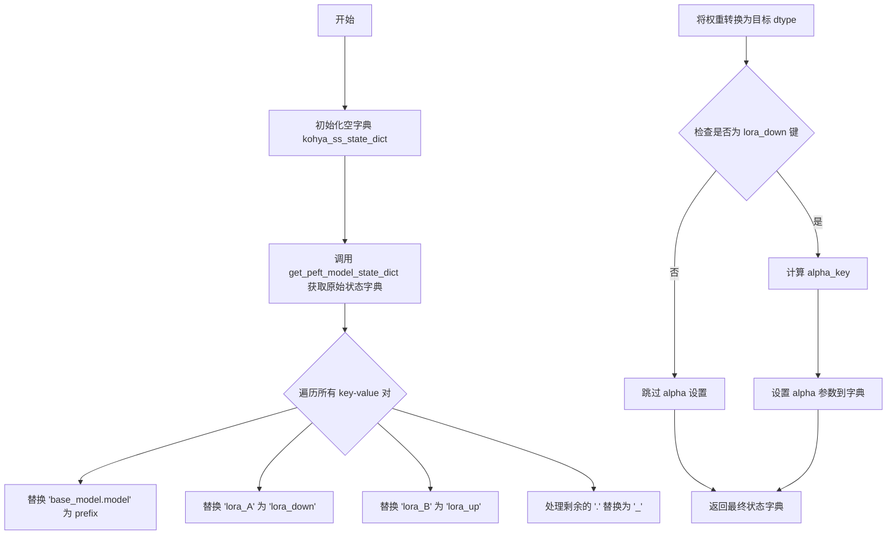
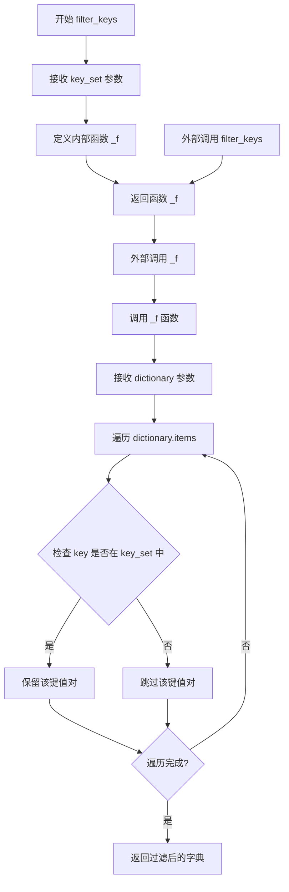
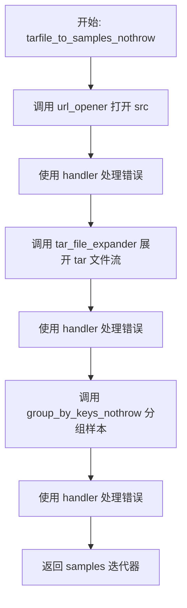
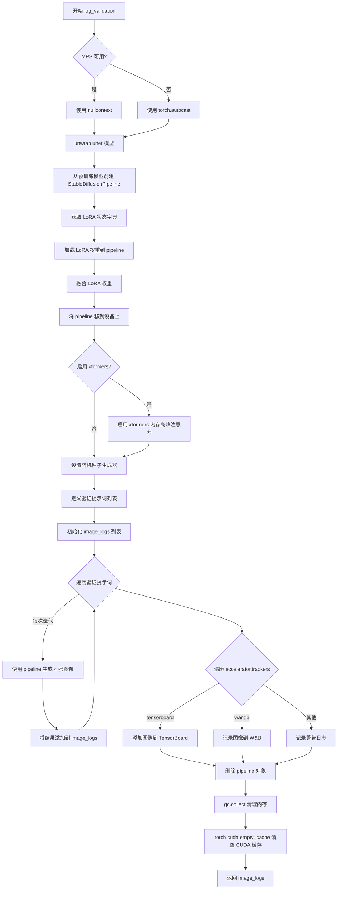
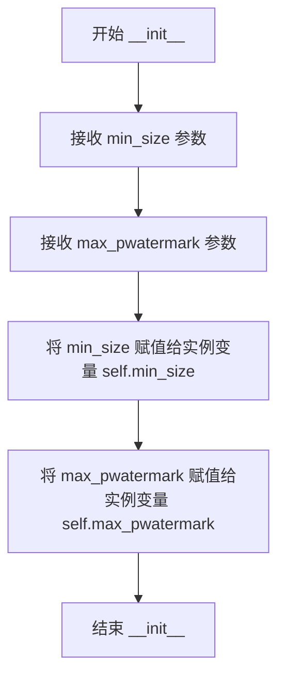
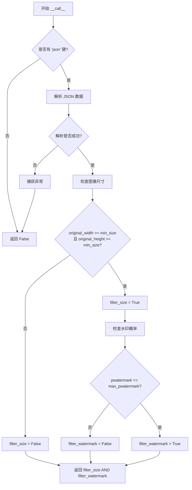
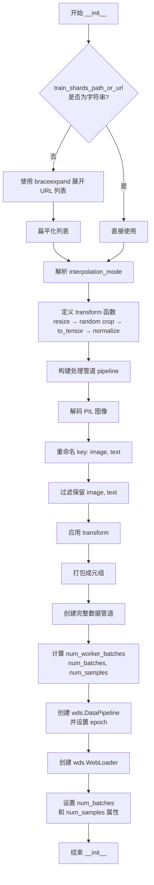

```mermaid
flowchart TD
    A[开始 main] --> B{检查 wandb 和 hub_token 配置}
    B -->|冲突| C[抛出 ValueError]
    B -->|正常| D[创建 Accelerator 加速器]
    D --> E[配置日志和随机种子]
    F[创建输出目录] --> G
    E --> G[加载 DDPMScheduler 噪声调度器]
    G --> H[创建 DDIMSolver ODE 求解器]
    H --> I[加载 Tokenizer 和 Text Encoder]
    I --> J[加载 VAE 和 Teacher U-Net]
    J --> K[冻结教师模型参数]
    K --> L[创建 Student U-Net 并添加 LoRA]
    L --> M[配置混合精度和设备放置]
    M --> N[注册 Checkpoint 保存/加载钩子]
    N --> O[启用 xformers 和梯度检查点]
    O --> P[创建优化器 AdamW]
    P --> Q[创建 SDText2ImageDataset 数据集]
    Q --> R[创建 LR 调度器]
    R --> S[使用 Accelerator 准备模型]
    S --> T[初始化 trackers 记录器]
    T --> U[加载 Checkpoint 如需恢复训练]
    U --> V[进入训练 Epoch 循环]
    V --> W{训练步骤循环}
    W --> X[1. 加载图像并编码为 Latents]
    X --> Y[2. 采样随机时间步]
    Y --> Z[3. 计算边界缩放系数]
    Z --> AA[4. 添加噪声到 Latents]
    AA --> AB[5. 采样 guidance scale w]
    AB --> AC[6. 获取提示词嵌入]
    AC --> AD[7. 学生模型预测]
    AD --> AE[8. 教师模型 CFG 预测 + ODE 求解]
    AE --> AF[9. 目标模型预测]
    AF --> AG[10. 计算 MSE/Huber 损失]
    AG --> AH[11. 反向传播和参数更新]
    AH --> AI{sync_gradients 检查}
    AI -->|是| AJ[更新进度条和全局步数]
    AI -->|否| W
    AJ --> AK{检查 Checkpoint 保存}
    AK -->|是| AL[保存 Checkpoint]
    AK -->|否| AM{检查 Validation}
    AL --> AM
    AM -->|是| AN[运行 log_validation 验证]
    AM -->|否| AO{检查是否达到最大步数}
    AN --> AO
    AO -->|否| W
    AO -->|是| AP[等待所有进程完成]
    AP --> AQ[保存最终模型和 LoRA 权重]
    AQ --> AR{检查 push_to_hub}
    AR -->|是| AS[上传到 HuggingFace Hub]
    AR -->|否| AT[结束训练]
    AS --> AT
```

# `diffusers\examples\consistency_distillation\train_lcm_distill_lora_sd_wds.py` 详细设计文档

这是一个用于将预训练的Stable Diffusion模型蒸馏为Latent Consistency Model (LCM) LoRA的训练脚本，通过LCM蒸馏技术实现快速图像生成。

## 整体流程

```mermaid
graph TD
    A[开始: parse_args()] --> B[初始化Accelerator]
    B --> C[加载预训练模型: tokenizer, text_encoder, vae, teacher_unet]
    C --> D[创建学生UNet并添加LoRA]
    D --> E[创建SDText2ImageDataset数据集]
    E --> F[创建优化器和学习率调度器]
    F --> G{训练循环: for epoch in range(num_epochs)}
    G --> H[采样噪声和时间步]
    H --> I[前向传播: 学生UNet预测]
    I --> J[教师模型预测: teacher_unet]
    J --> K[计算CFG估计和ODE求解]
    K --> L[计算损失: MSE或Huber]
    L --> M[反向传播和参数更新]
    M --> N{检查点保存和验证}
    N --> O[训练完成: 保存模型和LoRA权重]
```

## 类结构

```
全局函数和常量
├── get_module_kohya_state_dict (辅助函数)
├── filter_keys (辅助函数)
├── group_by_keys_nothrow (辅助函数)
├── tarfile_to_samples_nothrow (辅助函数)
├── WebdatasetFilter (数据过滤类)
├── SDText2ImageDataset (数据集类)
├── log_validation (验证函数)
├── guidance_scale_embedding (嵌入函数)
├── append_dims (张量维度处理)
├── scalings_for_boundary_conditions (边界条件缩放)
├── get_predicted_original_sample (预测原样本)
├── get_predicted_noise (预测噪声)
├── extract_into_tensor (张量提取)
├── DDIMSolver (DDIM求解器类)
├── update_ema (EMA更新)
├── import_model_class_from_model_name_or_path (模型导入)
├── parse_args (参数解析)
├── encode_prompt (提示编码)
└── main (主训练函数)
```

## 全局变量及字段


### `MAX_SEQ_LENGTH`
    
最大序列长度(77)

类型：`int`
    


### `logger`
    
用于记录训练过程中日志信息的日志记录器

类型：`logging.Logger`
    


### `noise_scheduler`
    
DDPM噪声调度器,用于生成训练所需的噪声时间步

类型：`DDPMScheduler`
    


### `alpha_schedule`
    
Alpha噪声调度值,用于扩散模型的噪声预测

类型：`torch.Tensor`
    


### `sigma_schedule`
    
Sigma噪声调度值,用于扩散模型的噪声预测

类型：`torch.Tensor`
    


### `solver`
    
DDIM求解器,用于加速扩散模型的采样过程

类型：`DDIMSolver`
    


### `tokenizer`
    
文本分词器,用于将文本转换为模型可处理的token序列

类型：`AutoTokenizer`
    


### `text_encoder`
    
CLIP文本编码器,将文本提示编码为向量表示

类型：`CLIPTextModel`
    


### `vae`
    
变分自编码器,用于将图像编码到潜在空间或从潜在空间解码

类型：`AutoencoderKL`
    


### `teacher_unet`
    
教师UNet模型,用于提供蒸馏训练的目标输出

类型：`UNet2DConditionModel`
    


### `unet`
    
学生UNet模型,带有LoRA适配器进行高效微调

类型：`UNet2DConditionModel (with LoRA)`
    


### `optimizer`
    
优化器,用于更新模型参数以最小化损失函数

类型：`torch.optim.Optimizer`
    


### `lr_scheduler`
    
学习率调度器,用于动态调整训练过程中的学习率

类型：`_LRScheduler`
    


### `train_dataloader`
    
训练数据加载器,用于批量加载和预处理训练数据

类型：`DataLoader`
    


### `WebdatasetFilter.min_size`
    
最小图像尺寸阈值,用于过滤过小的图像

类型：`int`
    


### `WebdatasetFilter.max_pwatermark`
    
最大水印概率阈值,用于过滤水印过多的图像

类型：`float`
    


### `SDText2ImageDataset._train_dataset`
    
训练数据集管道,封装了数据加载和预处理流程

类型：`wds.DataPipeline`
    


### `SDText2ImageDataset._train_dataloader`
    
WebLoader训练数据加载器,支持分布式训练数据加载

类型：`wds.WebLoader`
    


### `DDIMSolver.ddim_timesteps`
    
DDIM采样使用的时间步序列

类型：`torch.Tensor`
    


### `DDIMSolver.ddim_alpha_cumprods`
    
累积alpha乘积值,用于计算DDIM采样系数

类型：`torch.Tensor`
    


### `DDIMSolver.ddim_alpha_cumprods_prev`
    
前一步的累积alpha乘积值,用于DDIM反向采样

类型：`torch.Tensor`
    
    

## 全局函数及方法


### `get_module_kohya_state_dict`

该函数用于将 PEFT 模型的 LoRA 状态字典转换为 Kohya 格式的状态字典。它通过替换键名中的特定字符串（如将 "lora_A" 替换为 "lora_down"，"lora_B" 替换为 "lora_up"）来实现格式转换，同时处理 alpha 参数，并确保权重数据类型正确。

参数：

- `module`：`torch.nn.Module`，需要转换的 PEFT 模型模块
- `prefix`：`str`，键名前缀，用于替换 "base_model.model" 部分
- `dtype`：`torch.dtype`，目标数据类型，用于转换权重的精度
- `adapter_name`：`str`（默认值："default"），适配器名称，用于获取对应的 PEFT 配置

返回值：`Dict[str, torch.Tensor]`，返回转换后的 Kohya 格式状态字典

#### 流程图



#### 带注释源码

```python
def get_module_kohya_state_dict(module, prefix: str, dtype: torch.dtype, adapter_name: str = "default"):
    """
    将 PEFT 模型的 LoRA 状态字典转换为 Kohya 格式
    
    参数:
        module: PEFT 模型模块
        prefix: 键名前缀
        dtype: 目标数据类型
        adapter_name: 适配器名称，默认为 "default"
    
    返回:
        转换后的 Kohya 格式状态字典
    """
    # 初始化用于存储 Kohya 格式状态字典的容器
    kohya_ss_state_dict = {}
    
    # 获取 PEFT 模型的状态字典，指定适配器名称
    peft_state_dict = get_peft_model_state_dict(module, adapter_name=adapter_name)
    
    # 遍历 PEFT 状态字典中的每个键值对
    for peft_key, weight in peft_state_dict.items():
        # 1. 将 "base_model.model" 替换为指定的前缀（如 "lora_unet"）
        kohya_key = peft_key.replace("base_model.model", prefix)
        
        # 2. 将 "lora_A" 替换为 "lora_down"（Kohya 格式的下采样矩阵）
        kohya_key = kohya_key.replace("lora_A", "lora_down")
        
        # 3. 将 "lora_B" 替换为 "lora_up"（Kohya 格式的上采样矩阵）
        kohya_key = kohya_key.replace("lora_B", "lora_up")
        
        # 4. 处理剩余的 '.' 替换为 '_'
        # count(".") - 2 表示保留前两个 '.'，其余的替换为 '_'
        # 这样可以保持如 "lora_unet.up_blocks.0.attentions.0.proj_in.lora_up.weight" 的层次结构
        if kohya_key.count(".") > 2:
            kohya_key = kohya_key.replace(".", "_", kohya_key.count(".") - 2)
        
        # 将权重转换为目标数据类型并存储
        kohya_ss_state_dict[kohya_key] = weight.to(dtype)

        # 设置 LoRA 的 alpha 参数
        # 仅对 lora_down 键设置 alpha（每个 LoRA 层只需设置一次）
        if "lora_down" in kohya_key:
            # 构建 alpha 参数的键名，格式如 "lora_unet.up_blocks.0.attentions.0.proj_in.alpha"
            alpha_key = f"{kohya_key.split('.')[0]}.alpha"
            # 从 PEFT 配置中获取 lora_alpha 值，转换为指定数据类型并存储
            kohya_ss_state_dict[alpha_key] = torch.tensor(module.peft_config[adapter_name].lora_alpha).to(dtype)

    return kohya_ss_state_dict
```


### `filter_keys(key_set)`

这是一个高阶函数，用于创建一个字典过滤器。它接受一个键集合作为参数，返回一个内部函数，该内部函数可以过滤字典，只保留指定键集合中的键值对。

参数：

- `key_set`：`set`，需要保留的键集合，用于过滤字典中的键值对

返回值：`function`，返回一个内部函数 `_f`，该函数接受一个字典参数 `dictionary`，返回只包含 `key_set` 中键的新字典

#### 流程图



#### 带注释源码

```python
def filter_keys(key_set):
    """
    创建一个字典过滤器函数，用于过滤只保留指定键集合中的键值对。
    
    这是一个高阶函数，接收一个键集合作为参数，返回一个内部函数。
    内部函数会对输入的字典进行过滤，只保留 key_set 中存在的键。
    
    参数:
        key_set (set): 一个集合，包含需要保留的键
        
    返回:
        function: 一个内部函数 _f，接收字典参数并返回过滤后的字典
    """
    # 定义内部函数 _f，用于实际过滤字典
    def _f(dictionary):
        # 字典推导式：遍历字典项，只保留 key 在 key_set 中的键值对
        return {k: v for k, v in dictionary.items() if k in key_set}

    # 返回内部函数 _f，这样外部可以调用返回的函数来进行字典过滤
    return _f
```


### `group_by_keys_nothrow`

这是一个生成器函数，用于将 webdataset 格式的键值对（来自多个 tar 文件）按照文件名前缀（key）分组组合成完整的样本数据。

参数：

- `data`：迭代器，包含来自 tar 文件的样本字典，每个字典包含 `"fname"` 和 `"data"` 键
- `keys`：函数，用于将文件名拆分为前缀和后缀（默认为 `base_plus_ext`）
- `lcase`：布尔值，是否将后缀转换为小写（默认为 `True`）
- `suffixes`：集合或 None，指定要保留的后缀列表，None 表示保留所有后缀
- `handler`：错误处理函数，用于处理读取错误（默认为 `None`）

返回值：生成器（Generator），生成合并后的样本字典，每个字典包含 `"__key__"` 和 `"__url__"` 以及各后缀对应的数据

#### 流程图

```mermaid
flowchart TD
    A[开始遍历 data] --> B{当前样本为空?}
    B -->|是| C[取下一个 filesample]
    B -->|否| D{前缀 != 当前样本的 __key__ 或 后缀已存在?}
    C --> E[断言 filesample 是 dict]
    E --> F[获取 fname 和 value]
    F --> G[使用 keys 函数拆分 prefix 和 suffix]
    G --> H{prefix 为 None?}
    H -->|是| C
    H -->|否| I{lcase 为 True?}
    I -->|是| J[suffix = suffix.lower]
    I -->|否| K
    J --> K
    K --> L{current_sample 为空 或<br/>prefix != current_sample.__key__<br/>或 suffix in current_sample?}
    L -->|是| M{current_sample 有效?}
    L -->|否| O
    M -->|是| N[yield current_sample]
    M -->|否| P
    N --> P
    P --> Q[创建新 current_sample]
    Q --> O
    O --> R{suffixes 为 None 或<br/>suffix in suffixes?}
    R -->|是| S[current_sample[suffix] = value]
    R -->|否| C
    S --> C
    T[遍历结束] --> U{current_sample 有效?}
    U -->|是| V[yield current_sample]
    U -->|否| W[结束]
    V --> W
```

#### 带注释源码

```python
def group_by_keys_nothrow(data, keys=base_plus_ext, lcase=True, suffixes=None, handler=None):
    """Return function over iterator that groups key, value pairs into samples.

    :param keys: function that splits the key into key and extension (base_plus_ext) :param lcase: convert suffixes to
    lower case (Default value = True)
    """
    # 初始化当前样本为 None
    current_sample = None
    
    # 遍历输入数据中的每个文件样本
    for filesample in data:
        # 断言每个样本必须是字典类型
        assert isinstance(filesample, dict)
        
        # 从样本中提取文件名和数据值
        fname, value = filesample["fname"], filesample["data"]
        
        # 使用 keys 函数将文件名拆分为前缀和后缀
        prefix, suffix = keys(fname)
        
        # 如果前缀为 None，跳过当前样本
        if prefix is None:
            continue
        
        # 如果 lcase 为 True，将后缀转换为小写
        if lcase:
            suffix = suffix.lower()
        
        # 检查是否需要创建新样本：
        # 1. current_sample 为空，或
        # 2. 当前前缀与当前样本的 __key__ 不匹配，或
        # 3. 后缀已存在于当前样本中（避免重复）
        if current_sample is None or prefix != current_sample["__key__"] or suffix in current_sample:
            # 如果当前样本有效，则yield它
            if valid_sample(current_sample):
                yield current_sample
            
            # 创建新的样本字典
            current_sample = {"__key__": prefix, "__url__": filesample["__url__"]}
        
        # 如果 suffixes 为 None（保留所有后缀）或当前后缀在允许列表中
        if suffixes is None or suffix in suffixes:
            # 将数据值添加到当前样本中
            current_sample[suffix] = value
    
    # 遍历结束后，如果最后一个样本有效，则yield它
    if valid_sample(current_sample):
        yield current_sample
```


### `tarfile_to_samples_nothrow`

该函数是一个用于处理 WebDataset 格式数据的辅助函数，它打开 tar 归档文件并将其内容转换为样本迭代器，同时使用传入的错误处理 handler 来处理读取过程中的异常，避免因单个文件损坏而导致整个数据管道失败。

参数：

- `src`：任意，表示 tar 文件的路径或 URL，用于指定数据来源
- `handler`：可调用对象，默认为 `wds.warn_and_continue`，用于处理读取过程中的错误和异常

返回值：`迭代器`，返回从 tar 文件中解析出的样本字典迭代器

#### 流程图



#### 带注释源码

```python
def tarfile_to_samples_nothrow(src, handler=wds.warn_and_continue):
    # NOTE this is a re-impl of the webdataset impl with group_by_keys that doesn't throw
    # 说明：这是 webdataset 库中 group_by_keys 函数的重新实现版本，
    # 特点是当遇到错误时不会抛出异常，而是通过 handler 处理错误并继续执行
    
    # 第一步：使用 url_opener 打开源（可能是本地文件或远程 URL）
    # 参数 src: tar 文件路径或 URL
    # 参数 handler: 错误处理函数，默认为 wds.warn_and_continue（警告并继续）
    streams = url_opener(src, handler=handler)
    
    # 第二步：使用 tar_file_expander 将打开的流展开为文件迭代器
    # 这个函数会逐个读取 tar 包中的文件条目
    files = tar_file_expander(streams, handler=handler)
    
    # 第三步：使用 group_by_keys_nothrow 将文件按键分组为样本
    # 该函数是 webdataset 的核心组件，负责将同属一个样本的多个文件（如图片、json、txt等）组合在一起
    # _nothrow 后缀表示这个版本不会抛出异常
    samples = group_by_keys_nothrow(files, handler=handler)
    
    # 返回样本迭代器，供下游数据处理管道使用
    return samples
```


### `log_validation`

该函数用于在训练过程中运行验证，通过加载训练好的 LoRA 权重到 Stable Diffusion pipeline 中，使用预定义的验证提示词生成图像，并将生成的图像记录到 TensorBoard 或 Weights & Biases 等跟踪器中。

参数：

- `vae`：`AutoencoderKL`，用于将图像编码/解码到潜在空间的 VAE 模型
- `unet`：`UNet2DConditionModel`，经过 LoRA 微调的学生 UNet 模型
- `args`：`argparse.Namespace`，包含所有训练配置参数的命名空间
- `accelerator`：`Accelerator`，HuggingFace Accelerate 库提供的分布式训练加速器
- `weight_dtype`：`torch.dtype`，模型权重的数据类型（float32/float16/bfloat16）
- `step`：`int`，当前训练步数，用于在日志中标记图像

返回值：`List[Dict]`，包含验证提示词和对应生成的图像的字典列表

#### 流程图



#### 带注释源码

```python
def log_validation(vae, unet, args, accelerator, weight_dtype, step):
    """
    在训练过程中运行验证，生成图像并记录到跟踪器
    
    参数:
        vae: VAE模型，用于图像编解码
        unet: 经过LoRA微调的UNet模型
        args: 包含预训练模型路径等配置
        accelerator: Accelerate加速器对象
        weight_dtype: 计算精度类型
        step: 当前训练步数
    """
    logger.info("Running validation... ")
    
    # 根据设备类型选择自动混合精度上下文
    # MPS设备使用nullcontext，其他设备使用torch.autocast
    if torch.backends.mps.is_available():
        autocast_ctx = nullcontext()
    else:
        autocast_ctx = torch.autocast(accelerator.device.type, dtype=weight_dtype)

    # 从accelerator中获取原始的unet模型（去除封装）
    unet = accelerator.unwrap_model(unet)
    
    # 创建Stable Diffusion pipeline
    pipeline = StableDiffusionPipeline.from_pretrained(
        args.pretrained_teacher_model,
        vae=vae,
        scheduler=LCMScheduler.from_pretrained(args.pretrained_teacher_model, subfolder="scheduler"),
        revision=args.revision,
        torch_dtype=weight_dtype,
        safety_checker=None,  # 禁用安全检查器以加快推理
    )
    pipeline.set_progress_bar_config(disable=True)

    # 获取LoRA状态字典并加载到pipeline
    lora_state_dict = get_module_kohya_state_dict(unet, "lora_unet", weight_dtype)
    pipeline.load_lora_weights(lora_state_dict)
    pipeline.fuse_lora()  # 融合LoRA权重以提高推理效率

    # 将pipeline移到指定设备
    pipeline = pipeline.to(accelerator.device, dtype=weight_dtype)
    
    # 可选启用xformers以提高内存效率
    if args.enable_xformers_memory_efficient_attention:
        pipeline.enable_xformers_memory_efficient_attention()

    # 设置随机生成器以确保可重复性
    if args.seed is None:
        generator = None
    else:
        generator = torch.Generator(device=accelerator.device).manual_seed(args.seed)

    # 预定义的验证提示词列表
    validation_prompts = [
        "portrait photo of a girl, photograph, highly detailed face, depth of field, moody light, golden hour, style by Dan Winters, Russell James, Steve McCurry, centered, extremely detailed, Nikon D850, award winning photography",
        "Self-portrait oil painting, a beautiful cyborg with golden hair, 8k",
        "Astronaut in a jungle, cold color palette, muted colors, detailed, 8k",
        "A photo of beautiful mountain with realistic sunset and blue lake, highly detailed, masterpiece",
    ]

    image_logs = []  # 存储验证结果

    # 遍历每个验证提示词生成图像
    for _, prompt in enumerate(validation_prompts):
        images = []
        with autocast_ctx:
            # 使用LCM pipeline进行推理（4步，较少步数加快验证）
            images = pipeline(
                prompt=prompt,
                num_inference_steps=4,  # LCM通常只需4步
                num_images_per_prompt=4,  # 每个提示词生成4张图像
                generator=generator,
                guidance_scale=1.0,  # LCM不需要Classifier-Free Guidance
            ).images
        # 保存验证结果
        image_logs.append({"validation_prompt": prompt, "images": images})

    # 根据跟踪器类型记录图像
    for tracker in accelerator.trackers:
        if tracker.name == "tensorboard":
            # TensorBoard记录方式：堆叠图像数组
            for log in image_logs:
                images = log["images"]
                validation_prompt = log["validation_prompt"]
                formatted_images = []
                for image in images:
                    formatted_images.append(np.asarray(image))
                
                formatted_images = np.stack(formatted_images)
                tracker.writer.add_images(validation_prompt, formatted_images, step, dataformats="NHWC")
        
        elif tracker.name == "wandb":
            # W&B记录方式：使用wandb.Image封装
            formatted_images = []
            for log in image_logs:
                images = log["images"]
                validation_prompt = log["validation_prompt"]
                for image in images:
                    image = wandb.Image(image, caption=validation_prompt)
                    formatted_images.append(image)
            
            tracker.log({"validation": formatted_images})
        
        else:
            logger.warning(f"image logging not implemented for {tracker.name}")

    # 清理资源
    del pipeline
    gc.collect()
    torch.cuda.empty_cache()

    return image_logs
```


### `guidance_scale_embedding`

该函数用于生成给定指导尺度（guidance scale）的正弦-余弦位置编码嵌入向量，常见于潜一致性模型（LCM）等扩散模型中，用于将指导尺度映射到高维嵌入空间以辅助条件生成。

参数：

- `w`：`torch.Tensor`，一维张量，表示要生成嵌入向量的指导尺度值（timesteps）
- `embedding_dim`：`int`，嵌入向量的维度，默认为 512
- `dtype`：`torch.dtype`，生成嵌入的数据类型，默认为 torch.float32

返回值：`torch.Tensor`，形状为 `(len(w), embedding_dim)` 的嵌入向量

#### 流程图

```mermaid
flowchart TD
    A[开始: 输入w, embedding_dim, dtype] --> B{检查w是一维张量}
    B -->|否| C[抛出断言错误]
    B -->|是| D[将w乘以1000.0进行缩放]
    D --> E[计算半维长度: half_dim = embedding_dim // 2]
    E --> F[计算基础频率: emb = log10000 / half_dim-1]
    F --> G[生成频率序列: exp.arangehalf_dim * -emb]
    G --> H[将w与频率进行外积运算]
    H --> I[分别计算sin和cos并拼接]
    I --> J{embedding_dim是否为奇数?}
    J -->|是| K[在末尾填充一个零]
    J -->|否| L[直接返回结果]
    K --> L
    L --> M[返回形状为w.shape[0], embedding_dim的嵌入张量]
```

#### 带注释源码

```python
# From LatentConsistencyModel.get_guidance_scale_embedding
def guidance_scale_embedding(w, embedding_dim=512, dtype=torch.float32):
    """
    See https://github.com/google-research/vdm/blob/dc27b98a554f65cdc654b800da5aa1846545d41b/model_vdm.py#L298

    Args:
        timesteps (`torch.Tensor`):
            generate embedding vectors at these timesteps
        embedding_dim (`int`, *optional*, defaults to 512):
            dimension of the embeddings to generate
        dtype:
            data type of the generated embeddings

    Returns:
        `torch.Tensor`: Embedding vectors with shape `(len(timesteps), embedding_dim)`
    """
    # 断言确保输入w是一维张量
    assert len(w.shape) == 1
    # 将指导尺度值放大1000倍以匹配原始论文中的数值范围
    w = w * 1000.0

    # 计算嵌入维度的一半（正弦和余弦各占一半）
    half_dim = embedding_dim // 2
    # 计算对数空间中的频率基础值，使用10000的自然对数
    emb = torch.log(torch.tensor(10000.0)) / (half_dim - 1)
    # 生成从0到half_dim-1的指数衰减频率序列
    emb = torch.exp(torch.arange(half_dim, dtype=dtype) * -emb)
    # 将w与频率进行外积运算，扩展到二维
    emb = w.to(dtype)[:, None] * emb[None, :]
    # 沿最后一维拼接sin和cos结果，形成完整的位置编码
    emb = torch.cat([torch.sin(emb), torch.cos(emb)], dim=1)
    # 如果嵌入维度为奇数，需要在最后填充一个零以达到指定维度
    if embedding_dim % 2 == 1:  # zero pad
        emb = torch.nn.functional.pad(emb, (0, 1))
    # 最终断言确保输出形状正确
    assert emb.shape == (w.shape[0], embedding_dim)
    return emb
```


### `append_dims`

该函数用于将维度追加到张量的末尾，直到张量达到目标维度数。在扩散模型（LCM）的训练过程中，用于确保缩放系数（c_skip, c_out）与噪声预测张量具有相同的维度，以便进行元素级运算。

参数：

- `x`：`torch.Tensor`，输入的张量，需要扩展维度的张量
- `target_dims`：`int`，目标维度数，期望张量达到的总维度数

返回值：`torch.Tensor`，扩展维度后的张量，其维度数等于 target_dims

#### 流程图

```mermaid
flowchart TD
    A[开始: append_dims] --> B[接收输入: x, target_dims]
    B --> C{计算需要添加的维度数<br/>dims_to_append = target_dims - x.ndim}
    C --> D{dims_to_append < 0?}
    D -->|是| E[抛出 ValueError:<br/>输入维度已超过目标维度]
    D -->|否| F{返回扩展后的张量<br/>x[(...,) + (None,) * dims_to_append]}
    F --> G[结束: 返回扩展后的张量]
```

#### 带注释源码

```python
def append_dims(x, target_dims):
    """Appends dimensions to the end of a tensor until it has target_dims dimensions."""
    # 计算需要追加的维度数量：目标维度减去输入张量的当前维度数
    dims_to_append = target_dims - x.ndim
    
    # 如果目标维度小于当前维度，说明参数错误，抛出异常
    # 这防止了用户传入过小的 target_dims 值
    if dims_to_append < 0:
        raise ValueError(f"input has {x.ndim} dims but target_dims is {target_dims}, which is less")
    
    # 使用索引技巧扩展维度：
    # (...,) 保持原有维度不变
    # (None,) * dims_to_append 在末尾添加指定数量的新维度（大小为1的维度）
    # 这允许张量通过广播机制与更高维度的张量进行运算
    return x[(...,) + (None,) * dims_to_append]
```


### `scalings_for_boundary_conditions`

该函数用于计算Latent Consistency Model (LCM) 中的边界缩放系数（boundary condition scalings）。它根据给定的时间步长计算两个关键的缩放因子：`c_skip`（用于跳过中间步骤的计算）和`c_out`（用于输出预测），这两个系数在LCM的蒸馏过程中用于调整模型的预测结果。

参数：

- `timestep`：`torch.Tensor`，时间步长张量，通常是DDIM调度器中的离散时间步
- `sigma_data`：`float`，可选，默认值为0.5，数据噪声标准差参数，用于控制缩放曲线的形状
- `timestep_scaling`：`float`，可选，默认值为10.0，时间步长缩放因子，用于将原始时间步长转换到合适的数值范围

返回值：`tuple`，返回两个张量元组 `(c_skip, c_out)`：
- `c_skip`：`torch.Tensor`，跳过系数，用于将模型输出与原始输入加权混合
- `c_out`：`torch.Tensor`，输出系数，用于缩放预测的原始样本

#### 流程图

```mermaid
flowchart TD
    A[开始] --> B[输入: timestep, sigma_data, timestep_scaling]
    B --> C[scaled_timestep = timestep_scaling × timestep]
    C --> D[计算 c_skip = σ² / s² + σ²]
    D --> E[计算 c_out = s / √(s² + σ²)]
    E --> F[返回 c_skip, c_out]
    
    style A fill:#f9f,stroke:#333
    style F fill:#9f9,stroke:#333
```

#### 带注释源码

```python
# From LCMScheduler.get_scalings_for_boundary_condition_discrete
def scalings_for_boundary_conditions(timestep, sigma_data=0.5, timestep_scaling=10.0):
    """
    计算LCM边界条件缩放系数。
    
    该函数实现了LCMScheduler中用于计算边界条件缩放的离散版本公式。
    这些缩放系数用于LCM蒸馏过程中调整学生模型的预测结果。
    
    Args:
        timestep: 时间步长张量，通常是DDIM调度器中的离散时间步
        sigma_data: 数据噪声标准差，默认值为0.5，对应SD模型的标准噪声水平
        timestep_scaling: 时间步长缩放因子，默认值为10.0，用于放大时间步长以减少近似误差
    
    Returns:
        c_skip: 跳过系数，用于混合原始输入和预测输出
        c_out: 输出系数，用于缩放预测的原始样本
    """
    # 将时间步长乘以缩放因子，转换到合适的数值范围
    scaled_timestep = timestep_scaling * timestep
    
    # 计算c_skip系数：sigma_data² / (scaled_timestep² + sigma_data²)
    # 当scaled_timestep较大时，c_skip接近0，保留更多原始预测
    # 当scaled_timestep较小时，c_skip接近1，保留更多原始输入
    c_skip = sigma_data**2 / (scaled_timestep**2 + sigma_data**2)
    
    # 计算c_out系数：scaled_timestep / √(scaled_timestep² + sigma_data²)
    # 这个系数用于缩放预测的原始样本
    c_out = scaled_timestep / (scaled_timestep**2 + sigma_data**2) ** 0.5
    
    # 返回两个缩放系数
    return c_skip, c_out
```


### `get_predicted_original_sample`

该函数是扩散模型推理过程中的核心计算函数，用于根据模型输出、时间步和噪声调度参数预测原始样本（pred_x_0）。它支持三种预测类型（epsilon、sample、v_prediction），通过不同的数学公式从带噪样本中恢复干净样本，是LCM（Latent Consistency Model）调度器和DDIM调度器中的关键步骤。

参数：

- `model_output`：`torch.Tensor`，模型（通常是UNet）的输出预测值
- `timesteps`：`torch.Tensor`，当前扩散过程的时间步，用于从调度参数中索引对应的值
- `sample`：`torch.Tensor`，当前带噪的样本（latent）
- `prediction_type`：`str`，预测类型，支持"epsilon"（预测噪声）、"sample"（直接预测原始样本）、"v_prediction"（v预测）三种模式
- `alphas`：`torch.Tensor`，Alpha值序列（噪声调度参数），通常为累积alpha的平方根
- `sigmas`：`torch.Tensor`，Sigma值序列（噪声调度参数），通常为(1-累积alpha)的平方根

返回值：`torch.Tensor`，预测的原始样本（pred_x_0），即去噪后的潜在表示

#### 流程图

```mermaid
flowchart TD
    A[开始: get_predicted_original_sample] --> B[提取alphas对应timesteps的值]
    B --> C[提取sigmas对应timesteps的值]
    C --> D{判断prediction_type}
    
    D -->|epsilon| E[计算: pred_x_0 = (sample - sigmas × model_output) / alphas]
    D -->|sample| F[计算: pred_x_0 = model_output]
    D -->|v_prediction| G[计算: pred_x_0 = alphas × sample - sigmas × model_output]
    D -->|其他| H[抛出ValueError异常]
    
    E --> I[返回pred_x_0]
    F --> I
    G --> I
    H --> J[结束]
    
    I --> J
```

#### 带注释源码

```python
# Compare LCMScheduler.step, Step 4
def get_predicted_original_sample(model_output, timesteps, sample, prediction_type, alphas, sigmas):
    """
    根据模型输出和时间步预测原始样本（x_0）
    
    该函数实现了扩散模型中从带噪样本恢复原始样本的核心逻辑。
    支持三种预测类型：
    - epsilon: 预测噪声，需要通过数学变换得到原始样本
    - sample: 直接预测原始样本
    - v_prediction: 预测v值，需要特定公式转换
    
    参数:
        model_output: 模型预测值（噪声、原始样本或v值，取决于prediction_type）
        timesteps: 当前时间步张量，用于从alphas和sigmas中索引对应值
        sample: 当前带噪的潜在表示
        prediction_type: 预测类型字符串
        alphas: 噪声调度alpha参数
        sigmas: 噪声调度sigma参数
    
    返回:
        pred_x_0: 预测的原始样本
    """
    # 从alphas中提取与timesteps对应的值，并reshape为与sample兼容的形状
    alphas = extract_into_tensor(alphas, timesteps, sample.shape)
    # 从sigmas中提取与timesteps对应的值，并reshape为与sample兼容的形状
    sigmas = extract_into_tensor(sigmas, timesteps, sample.shape)
    
    # 根据prediction_type采用不同的计算公式
    if prediction_type == "epsilon":
        # epsilon预测：原始样本 = (带噪样本 - sigma × 噪声预测) / alpha
        # 这是DDPM标准公式的反向推导
        pred_x_0 = (sample - sigmas * model_output) / alphas
    elif prediction_type == "sample":
        # sample预测：模型直接输出就是原始样本
        pred_x_0 = model_output
    elif prediction_type == "v_prediction":
        # v_prediction预测：基于v值的预测公式
        # v = alpha * x_0 - sigma * epsilon
        # 因此 x_0 = alpha * sample - sigma * model_output
        pred_x_0 = alphas * sample - sigmas * model_output
    else:
        # 不支持的预测类型，抛出异常
        raise ValueError(
            f"Prediction type {prediction_type} is not supported; currently, `epsilon`, `sample`, and `v_prediction`"
            f" are supported."
        )

    return pred_x_0
```


### `get_predicted_noise`

该函数是扩散模型推理中的核心工具函数，用于根据模型输出、当前时间步和噪声调度参数预测原始噪声。在 DDIM（Denoising Diffusion Implicit Models）采样过程中，根据不同的预测类型（epsilon、sample 或 v_prediction）采用不同的数学公式计算预测噪声。

参数：

- `model_output`：`torch.Tensor`，扩散模型在给定时间步的原始输出
- `timesteps`：`torch.Tensor`，当前扩散过程的时间步张量，用于从噪声调度中检索对应的 alpha 和 sigma 值
- `sample`：`torch.Tensor`，当前带噪声的样本（latent），形状为 (batch, channels, height, width)
- `prediction_type`：`str`，预测类型标识符，可选值为 "epsilon"（直接预测噪声）、"sample"（预测原始样本）、"v_prediction"（预测 v 值）
- `alphas`：`torch.Tensor`，累积 alpha 值数组，用于计算预测噪声
- `sigmas`：`torch.Tensor`，累积 sigma 值数组，用于计算预测噪声

返回值：`torch.Tensor`，根据预测类型计算得到的预测噪声张量

#### 流程图

```mermaid
flowchart TD
    A[开始: get_predicted_noise] --> B[提取 alpha 值: extract_into_tensor]
    B --> C[提取 sigma 值: extract_into_tensor]
    C --> D{prediction_type == 'epsilon'?}

    D -->|是| E[pred_epsilon = model_output]
    D -->|否| F{prediction_type == 'sample'?}

    F -->|是| G[pred_epsilon = (sample - alphas × model_output) / sigmas]
    F -->|否| H{prediction_type == 'v_prediction'?}

    H -->|是| I[pred_epsilon = alphas × model_output + sigmas × sample]
    H -->|否| J[抛出 ValueError: 不支持的预测类型]

    E --> K[返回 pred_epsilon]
    G --> K
    I --> K
```

#### 带注释源码

```python
# Based on step 4 in DDIMScheduler.step
def get_predicted_noise(model_output, timesteps, sample, prediction_type, alphas, sigmas):
    """
    根据模型输出和扩散调度参数预测原始噪声。
    
    该函数实现扩散模型推理中的逆向过程计算，根据不同的预测类型
    将模型输出转换为预测的噪声 epsilon。
    
    Args:
        model_output: 扩散模型在当前时间步的原始输出
        timesteps: 当前扩散过程的时间步
        sample: 当前带噪声的样本
        prediction_type: 预测类型 ('epsilon', 'sample', 或 'v_prediction')
        alphas: 累积 alpha 值
        sigmas: 累积 sigma 值
    
    Returns:
        pred_epsilon: 预测的噪声
    """
    # 从噪声调度数组中提取与当前 timesteps 对应的 alpha 值
    # 使用 gather 操作根据时间步索引获取对应的 alpha 系数
    alphas = extract_into_tensor(alphas, timesteps, sample.shape)
    
    # 同样方式提取对应的 sigma 值
    sigmas = extract_into_tensor(sigmas, timesteps, sample.shape)
    
    # 根据预测类型采用不同的噪声计算公式
    if prediction_type == "epsilon":
        # epsilon 预测：模型直接输出噪声
        # 公式: pred_epsilon = model_output
        pred_epsilon = model_output
        
    elif prediction_type == "sample":
        # sample 预测：模型输出的是原始样本 x_0
        # 逆推噪声: epsilon = (x_t - alpha * x_0) / sigma
        pred_epsilon = (sample - alphas * model_output) / sigmas
        
    elif prediction_type == "v_prediction":
        # v_prediction：模型预测的是 v 值 (velocity)
        # 转换公式: epsilon = alpha * v + sigma * x_t
        pred_epsilon = alphas * model_output + sigmas * sample
        
    else:
        # 不支持的预测类型，抛出详细错误信息
        raise ValueError(
            f"Prediction type {prediction_type} is not supported; currently, `epsilon`, `sample`, and `v_prediction`"
            f" are supported."
        )

    return pred_epsilon
```


### `extract_into_tensor`

该函数是扩散模型中的关键张量索引提取工具，通过gather操作从噪声调度参数张量中按时间步索引提取相应值，并reshape为可广播的多维张量格式，主要用于计算预测原始样本和预测噪声。

参数：

- `a`：`torch.Tensor`，输入的张量，通常是噪声调度相关的累积参数（如alphas_cumprod或sigmas）
- `t`：`torch.Tensor`，时间步长索引张量，包含要提取的索引位置
- `x_shape`：`tuple`，目标张量的形状，用于确定输出的reshape格式（通常为latent的shape）

返回值：`torch.Tensor`，返回gather后的结果张量，形状为 (b, *((1,) * (len(x_shape) - 1)))，其中b是批量大小，后续维度为1以便于广播操作

#### 流程图

```mermaid
flowchart TD
    A[开始: extract_into_tensor] --> B[获取批量大小 b = t.shape[0]]
    B --> C[执行 gather 操作: a.gather -1, t]
    C --> D[计算需要扩展的维度数量: len x_shape - 1]
    D --> E[reshape 输出: b, 1, 1, ...]
    E --> F[返回结果张量]
    
    subgraph "示例: x_shape = (b, 4, 32, 32)"
        B1[输入: a shape, t shape, x_shape]
        B2[输出: b, 1, 1, 1]
    end
```

#### 带注释源码

```python
def extract_into_tensor(a, t, x_shape):
    """
    从张量a中按索引t提取值，并reshape为适合与x_shape进行广播的格式。
    
    这个函数在扩散模型的采样过程中用于从预计算的噪声调度参数
    (如alphas_cumprod, sigmas)中提取与当前时间步对应的值。
    
    Args:
        a: 噪声调度参数张量，通常是1D或2D张量，最后一维表示不同时间步的值
        t: 时间步索引张量，指定要从a中提取哪些时间步的值
        x_shape: 目标张量形状，用于确定输出需要扩展到的维度数
    
    Returns:
        提取后的张量，形状为(b, 1, 1, ..., 1)，便于与x_shape广播计算
    """
    # 解包t的批量维度，获取批量大小b
    # t.shape = (b,) 或 (b,)，*_ 捕获剩余未使用的维度
    b, *_ = t.shape
    
    # 在最后一个维度(-1)上使用gather操作
    # a: 通常是形状为 (seq_len,) 或 (1, seq_len) 的张量
    # t: 形状为 (b,) 的索引张量
    # out: 形状为 (b,) 的输出，包含从a中t索引位置提取的值
    out = a.gather(-1, t)
    
    # 将输出reshape为 (b, 1, 1, ..., 1)
    # 其中1的个数 = len(x_shape) - 1
    # 这样可以通过广播与原始latent张量进行逐元素运算
    # 例如: (b, 1, 1, 1) * (b, 4, 32, 32) = (b, 4, 32, 32)
    return out.reshape(b, *((1,) * (len(x_shape) - 1)))
```


### `update_ema`

使用指数移动平均（EMA）将目标参数逐步向源参数更新，常用于模型蒸馏中保持教师模型参数的移动平均值。

参数：

- `target_params`：`Iterable[torch.Tensor]`，目标参数序列，通常是 EMA 副本
- `source_params`：`Iterable[torch.Tensor]`，源参数序列，通常是当前训练的网络参数
- `rate`：`float`，EMA 衰减率，值越接近 1 表示更新越缓慢（默认值：0.99）

返回值：`None`，该函数直接修改 `target_params` 中的张量值，无返回值

#### 流程图

```mermaid
flowchart TD
    A[开始 update_ema] --> B{遍历 target_params 和 source_params}
    B -->|对每一对参数| C[获取目标张量 targ 和源张量 src]
    C --> D[targ.detach: 分离张量避免反向传播]
    D --> E[targ.mul_(rate): 将目标张量乘以 rate]
    E --> F[targ.add_(src, alpha=1-rate): 加上源张量乘以 (1-rate)]
    F --> G{是否还有更多参数对?}
    G -->|是| C
    G -->|否| H[结束]
```

#### 带注释源码

```python
@torch.no_grad()
def update_ema(target_params, source_params, rate=0.99):
    """
    使用指数移动平均（EMA）将目标参数逐步向源参数更新。
    常用于模型蒸馏中维持教师模型的参数移动平均值。

    :param target_params: 目标参数序列
    :param source_params: 源参数序列
    :param rate: EMA 速率，值越接近 1 表示更新越缓慢
    """
    # 遍历目标参数和源参数序列，使用 zip 将对应位置的参数配对
    for targ, src in zip(target_params, source_params):
        # targ.detach(): 分离张量以切断梯度计算图，避免反向传播
        # .mul_(rate): 将分离后的目标张量乘以 rate（保留原有信息的比例）
        # .add_(src, alpha=1-rate): 加上源张量乘以 (1-rate)（融入新信息的比例）
        # 整体公式: target = target * rate + source * (1 - rate)
        targ.detach().mul_(rate).add_(src, alpha=1 - rate)
```


### `import_model_class_from_model_name_or_path`

该函数是一个动态模型类导入工具，用于根据预训练模型的配置文件自动识别并返回对应类型的文本编码器类（如CLIPTextModel或CLIPTextModelWithProjection），从而实现对不同架构文本编码器的灵活支持。

参数：

- `pretrained_model_name_or_path`：`str`，预训练模型的名称或路径，用于定位模型配置文件
- `revision`：`str`，指定要加载的模型版本/提交哈希
- `subfolder`：`str`，模型在仓库中的子文件夹路径，默认为 "text_encoder"

返回值：`type`，返回对应的文本编码器类（CLIPTextModel 或 CLIPTextModelWithProjection）

#### 流程图

```mermaid
flowchart TD
    A[开始] --> B[调用 PretrainedConfig.from_pretrained 加载配置文件]
    B --> C[从配置中获取 architectures[0]]
    C --> D{判断 model_class}
    D -->|"CLIPTextModel"| E[导入 CLIPTextModel]
    D -->|"CLIPTextModelWithProjection"| F[导入 CLIPTextModelWithProjection]
    D -->|其他| G[抛出 ValueError 异常]
    E --> H[返回 CLIPTextModel 类]
    F --> I[返回 CLIPTextModelWithProjection 类]
```

#### 带注释源码

```python
def import_model_class_from_model_name_or_path(
    pretrained_model_name_or_path: str, revision: str, subfolder: str = "text_encoder"
):
    """
    根据预训练模型路径动态导入文本编码器类
    
    Args:
        pretrained_model_name_or_path: 预训练模型的名称或本地路径
        revision: 模型版本号或提交哈希
        subfolder: 模型子目录，默认为 "text_encoder"
    
    Returns:
        对应的文本编码器类（CLIPTextModel 或 CLIPTextModelWithProjection）
    """
    # 加载预训练模型的配置文件
    text_encoder_config = PretrainedConfig.from_pretrained(
        pretrained_model_name_or_path, subfolder=subfolder, revision=revision
    )
    
    # 从配置中获取模型架构名称
    model_class = text_encoder_config.architectures[0]

    # 根据架构名称动态返回对应的类
    if model_class == "CLIPTextModel":
        from transformers import CLIPTextModel

        return CLIPTextModel
    elif model_class == "CLIPTextModelWithProjection":
        from transformers import CLIPTextModelWithProjection

        return CLIPTextModelWithProjection
    else:
        # 不支持的架构抛出异常
        raise ValueError(f"{model_class} is not supported.")
```


### `parse_args`

该函数是训练脚本的命令行参数解析器，使用 `argparse` 模块定义并解析模型加载、训练配置、优化器设置、验证设置、混合精度、分布式训练等大量命令行参数，并进行环境变量和参数值的校验，最终返回包含所有解析后参数的 `Namespace` 对象。

参数：
- 无（该函数不接受任何输入参数）

返回值：`args`（`argparse.Namespace` 类型），包含所有解析后的命令行参数对象

#### 流程图

```mermaid
flowchart TD
    A[开始 parse_args] --> B[创建 ArgumentParser 对象]
    B --> C[添加模型检查点加载参数]
    C --> D[添加训练参数: 通用训练、日志、 checkpoint、图像处理、数据加载器、批量大小与训练步数、学习率、优化器等]
    D --> E[添加扩散训练参数: 空提示词比例]
    E --> F[添加 LCD 特异参数: w_min, w_max, DDIM 步数, 损失类型, Huber 参数, LoRA 参数等]
    F --> G[添加混合精度参数]
    G --> H[添加训练优化参数]
    H --> I[添加分布式训练参数]
    I --> J[添加验证参数]
    J --> K[添加 HuggingFace Hub 参数]
    K --> L[添加 Accelerate 参数]
    L --> M[调用 parser.parse_args 解析命令行参数]
    M --> N{检查 LOCAL_RANK 环境变量}
    N -->|env_local_rank != -1| O[更新 args.local_rank]
    N -->|env_local_rank == -1| P{检查 proportion_empty_prompts 范围}
    O --> P
    P -->|不在 [0, 1] 范围| Q[抛出 ValueError]
    P -->|在 [0, 1] 范围| R[返回 args 对象]
    Q --> R
```

#### 带注释源码

```python
def parse_args():
    """
    解析命令行参数并返回包含所有配置选项的 Namespace 对象。
    
    该函数使用 argparse 定义了训练脚本的所有可配置参数，
    包括模型路径、训练超参数、优化器设置、验证配置等。
    """
    # 创建 ArgumentParser 实例，设置脚本描述
    parser = argparse.ArgumentParser(description="Simple example of a training script.")
    
    # ----------Model Checkpoint Loading Arguments----------
    # 添加模型检查点加载相关的命令行参数
    parser.add_argument(
        "--pretrained_teacher_model",
        type=str,
        default=None,
        required=True,
        help="Path to pretrained LDM teacher model or model identifier from huggingface.co/models.",
    )
    parser.add_argument(
        "--pretrained_vae_model_name_or_path",
        type=str,
        default=None,
        help="Path to pretrained VAE model with better numerical stability.",
    )
    parser.add_argument(
        "--teacher_revision",
        type=str,
        default=None,
        required=False,
        help="Revision of pretrained LDM teacher model identifier from huggingface.co/models.",
    )
    parser.add_argument(
        "--revision",
        type=str,
        default=None,
        required=False,
        help="Revision of pretrained LDM model identifier from huggingface.co/models.",
    )
    
    # ----------Training Arguments----------
    # 添加训练相关参数，包括输出目录、缓存目录、随机种子、日志等
    parser.add_argument(
        "--output_dir",
        type=str,
        default="lcm-xl-distilled",
        help="The output directory where the model predictions and checkpoints will be written.",
    )
    parser.add_argument(
        "--cache_dir",
        type=str,
        default=None,
        help="The directory where the downloaded models and datasets will be stored.",
    )
    parser.add_argument("--seed", type=int, default=None, help="A seed for reproducible training.")
    
    # ----Logging----
    parser.add_argument(
        "--logging_dir",
        type=str,
        default="logs",
        help="[TensorBoard] log directory. Will default to *output_dir/runs/**CURRENT_DATETIME_HOSTNAME***.",
    )
    parser.add_argument(
        "--report_to",
        type=str,
        default="tensorboard",
        help='The integration to report the results and logs to. Supported platforms are "tensorboard", "wandb" and "comet_ml".',
    )
    
    # ----Checkpointing----
    parser.add_argument(
        "--checkpointing_steps",
        type=int,
        default=500,
        help="Save a checkpoint of the training state every X updates.",
    )
    parser.add_argument(
        "--checkpoints_total_limit",
        type=int,
        default=None,
        help="Max number of checkpoints to store.",
    )
    parser.add_argument(
        "--resume_from_checkpoint",
        type=str,
        default=None,
        help="Whether training should be resumed from a previous checkpoint.",
    )
    
    # ----Image Processing----
    parser.add_argument(
        "--train_shards_path_or_url",
        type=str,
        default=None,
        help="The name of the Dataset to train on.",
    )
    parser.add_argument(
        "--resolution",
        type=int,
        default=512,
        help="The resolution for input images.",
    )
    parser.add_argument(
        "--interpolation_type",
        type=str,
        default="bilinear",
        help="The interpolation function used when resizing images.",
    )
    parser.add_argument(
        "--center_crop",
        default=False,
        action="store_true",
        help="Whether to center crop the input images to the resolution.",
    )
    parser.add_argument(
        "--random_flip",
        action="store_true",
        help="whether to randomly flip images horizontally",
    )
    
    # ----Dataloader----
    parser.add_argument(
        "--dataloader_num_workers",
        type=int,
        default=0,
        help="Number of subprocesses to use for data loading.",
    )
    
    # ----Batch Size and Training Steps----
    parser.add_argument(
        "--train_batch_size", type=int, default=16, help="Batch size (per device) for the training dataloader."
    )
    parser.add_argument("--num_train_epochs", type=int, default=100)
    parser.add_argument(
        "--max_train_steps",
        type=int,
        default=None,
        help="Total number of training steps to perform.",
    )
    parser.add_argument(
        "--max_train_samples",
        type=int,
        default=None,
        help="For debugging purposes or quicker training, truncate the number of training examples.",
    )
    
    # ----Learning Rate----
    parser.add_argument(
        "--learning_rate",
        type=float,
        default=1e-4,
        help="Initial learning rate (after the potential warmup period) to use.",
    )
    parser.add_argument(
        "--scale_lr",
        action="store_true",
        default=False,
        help="Scale the learning rate by the number of GPUs, gradient accumulation steps, and batch size.",
    )
    parser.add_argument(
        "--lr_scheduler",
        type=str,
        default="constant",
        help='The scheduler type to use. Choose between ["linear", "cosine", "cosine_with_restarts", "polynomial", "constant", "constant_with_warmup"]',
    )
    parser.add_argument(
        "--lr_warmup_steps", type=int, default=500, help="Number of steps for the warmup in the lr scheduler."
    )
    parser.add_argument(
        "--gradient_accumulation_steps",
        type=int,
        default=1,
        help="Number of updates steps to accumulate before performing a backward/update pass.",
    )
    
    # ----Optimizer (Adam)----
    parser.add_argument(
        "--use_8bit_adam", action="store_true", help="Whether or not to use 8-bit Adam from bitsandbytes."
    )
    parser.add_argument("--adam_beta1", type=float, default=0.9, help="The beta1 parameter for the Adam optimizer.")
    parser.add_argument("--adam_beta2", type=float, default=0.999, help="The beta2 parameter for the Adam optimizer.")
    parser.add_argument("--adam_weight_decay", type=float, default=1e-2, help="Weight decay to use.")
    parser.add_argument("--adam_epsilon", type=float, default=1e-08, help="Epsilon value for the Adam optimizer")
    parser.add_argument("--max_grad_norm", default=1.0, type=float, help="Max gradient norm.")
    
    # ----Diffusion Training Arguments----
    parser.add_argument(
        "--proportion_empty_prompts",
        type=float,
        default=0,
        help="Proportion of image prompts to be replaced with empty strings.",
    )
    
    # ----Latent Consistency Distillation (LCD) Specific Arguments----
    parser.add_argument(
        "--w_min",
        type=float,
        default=5.0,
        required=False,
        help="The minimum guidance scale value for guidance scale sampling.",
    )
    parser.add_argument(
        "--w_max",
        type=float,
        default=15.0,
        required=False,
        help="The maximum guidance scale value for guidance scale sampling.",
    )
    parser.add_argument(
        "--num_ddim_timesteps",
        type=int,
        default=50,
        help="The number of timesteps to use for DDIM sampling.",
    )
    parser.add_argument(
        "--loss_type",
        type=str,
        default="l2",
        choices=["l2", "huber"],
        help="The type of loss to use for the LCD loss.",
    )
    parser.add_argument(
        "--huber_c",
        type=float,
        default=0.001,
        help="The huber loss parameter. Only used if `--loss_type=huber`.",
    )
    parser.add_argument(
        "--lora_rank",
        type=int,
        default=64,
        help="The rank of the LoRA projection matrix.",
    )
    parser.add_argument(
        "--lora_alpha",
        type=int,
        default=64,
        help="The value of the LoRA alpha parameter.",
    )
    parser.add_argument(
        "--lora_dropout",
        type=float,
        default=0.0,
        help="The dropout probability for the dropout layer added before applying the LoRA.",
    )
    parser.add_argument(
        "--lora_target_modules",
        type=str,
        default=None,
        help="A comma-separated string of target module keys to add LoRA to.",
    )
    parser.add_argument(
        "--vae_encode_batch_size",
        type=int,
        default=32,
        required=False,
        help="The batch size used when encoding images to latents using the VAE.",
    )
    parser.add_argument(
        "--timestep_scaling_factor",
        type=float,
        default=10.0,
        help="The multiplicative timestep scaling factor used when calculating the boundary scalings for LCM.",
    )
    
    # ----Mixed Precision----
    parser.add_argument(
        "--mixed_precision",
        type=str,
        default=None,
        choices=["no", "fp16", "bf16"],
        help="Whether to use mixed precision. Choose between fp16 and bf16.",
    )
    parser.add_argument(
        "--allow_tf32",
        action="store_true",
        help="Whether or not to allow TF32 on Ampere GPUs.",
    )
    parser.add_argument(
        "--cast_teacher_unet",
        action="store_true",
        help="Whether to cast the teacher U-Net to the precision specified by `--mixed_precision`.",
    )
    
    # ----Training Optimizations----
    parser.add_argument(
        "--enable_xformers_memory_efficient_attention", action="store_true", help="Whether or not to use xformers."
    )
    parser.add_argument(
        "--gradient_checkpointing",
        action="store_true",
        help="Whether or not to use gradient checkpointing to save memory.",
    )
    
    # ----Distributed Training----
    parser.add_argument("--local_rank", type=int, default=-1, help="For distributed training: local_rank")
    
    # ----------Validation Arguments----------
    parser.add_argument(
        "--validation_steps",
        type=int,
        default=200,
        help="Run validation every X steps.",
    )
    
    # ----------Huggingface Hub Arguments-----------
    parser.add_argument("--push_to_hub", action="store_true", help="Whether or not to push the model to the Hub.")
    parser.add_argument("--hub_token", type=str, default=None, help="The token to use to push to the Model Hub.")
    parser.add_argument(
        "--hub_model_id",
        type=str,
        default=None,
        help="The name of the repository to keep in sync with the local `output_dir`.",
    )
    
    # ----------Accelerate Arguments----------
    parser.add_argument(
        "--tracker_project_name",
        type=str,
        default="text2image-fine-tune",
        help="The `project_name` argument passed to Accelerator.init_trackers.",
    )

    # 解析命令行参数为 Namespace 对象
    args = parser.parse_args()
    
    # 检查环境变量 LOCAL_RANK，如果存在则覆盖 args.local_rank
    # 这是为了兼容通过 torchrun 或 accelerate launch 启动时的自动传递
    env_local_rank = int(os.environ.get("LOCAL_RANK", -1))
    if env_local_rank != -1 and env_local_rank != args.local_rank:
        args.local_rank = env_local_rank

    # 验证 proportion_empty_prompts 参数必须在 [0, 1] 范围内
    if args.proportion_empty_prompts < 0 or args.proportion_empty_prompts > 1:
        raise ValueError("`--proportion_empty_prompts` must be in the range [0, 1].")

    # 返回解析后的参数对象，供 main() 函数使用
    return args
```


### `encode_prompt`

描述：该函数是文本到图像扩散模型训练流程中的关键组成部分，负责将原始的文本提示（prompts）批次转换为高维的文本嵌入向量（Text Embeddings）。它在训练阶段实现了一个重要的策略——**空提示替换**（Empty Prompt Replacement），即根据 `proportion_empty_prompts` 参数随机将部分文本提示替换为空字符串，以此来模拟无分类器引导（Classifier-free Guidance）训练中的无条件生成。此外，它还能处理数据集中存在的多条描述（list 或 array 形式），在训练时随机选取，推理时选取第一条。

参数：

- `prompt_batch`：`Union[List[str], List[List[str]], List[np.ndarray]]`，输入的提示批次。通常是字符串列表，也可能是一个包含多个候选描述的列表。
- `text_encoder`：`torch.nn.Module`，预训练的文本编码器模型（例如 `CLIPTextModel`），用于将 token IDs 转换为嵌入向量。
- `tokenizer`：`transformers.PreTrainedTokenizer`，与 `text_encoder` 配套的分词器，负责将文本分割并转换为 token IDs。
- `proportion_empty_prompts`：`float`，浮点数，取值范围 [0, 1]。表示在当前批次中，文本提示被随机替换为空字符串（""）的比例。这有助于模型学习无条件生成。
- `is_train`：`bool`，布尔值，标记当前是否处于训练模式。如果为 `True`，当提示为列表时，会随机选择其中的元素；如果为 `False`（推理时），则固定选择第一个元素以确保一致性。

返回值：`torch.Tensor`，返回的文本嵌入向量。形状通常为 `(batch_size, sequence_length, hidden_size)`（例如 `(batch_size, 77, 768)`），直接用于 U-Net 的条件注入。

#### 流程图

```mermaid
flowchart TD
    A([开始: 输入 prompt_batch]) --> B[初始化空列表 captions]
    B --> C{遍历 prompt_batch 中的 caption}
    C --> D{随机数 < proportion_empty_prompts?}
    D -- 是 --> E[添加空字符串 "" 到 captions]
    D -- 否 --> F{检查 caption 类型}
    F -- str --> G[添加原始字符串到 captions]
    F -- list 或 np.ndarray --> H{is_train == True?}
    H -- 是 --> I[随机选择 random.choice(caption)]
    H -- 否 --> J[选择第一个元素 caption[0]]
    I --> G
    J --> G
    G --> C
    C --> K[结束遍历]
    K --> L[使用 tokenizer 处理 captions 列表]
    L --> M[提取 input_ids 并移至 text_encoder 设备]
    M --> N[执行 text_encoder.forward]
    N --> O[提取隐藏状态 text_encoder(...)[0]]
    O --> P([返回 prompt_embeds])
```

#### 带注释源码

```python
def encode_prompt(prompt_batch, text_encoder, tokenizer, proportion_empty_prompts, is_train=True):
    """
    将文本提示批次编码为文本嵌入向量。

    参数:
        prompt_batch: 输入的提示批次。
        text_encoder: 预训练的文本编码器。
        tokenizer: 预训练的分词器。
        proportion_empty_prompts: 替换为空提示的比例。
        is_train: 是否处于训练模式。

    返回:
        prompt_embeds: 编码后的文本嵌入。
    """
    captions = []
    # 1. 预处理提示批次，处理空提示替换和多样性选择
    for caption in prompt_batch:
        # 如果随机值小于设定比例，替换为空字符串（用于模拟无分类器引导）
        if random.random() < proportion_empty_prompts:
            captions.append("")
        elif isinstance(caption, str):
            # 如果是单个字符串，直接添加
            captions.append(caption)
        elif isinstance(caption, (list, np.ndarray)):
            # 如果是一个列表/数组（可能包含多个描述），根据模式选择
            # 训练时随机选一个增加多样性，推理/验证时选第一个保证稳定
            captions.append(random.choice(caption) if is_train else caption[0])

    # 2. 编码阶段：禁用梯度以节省显存
    with torch.no_grad():
        # 使用 tokenizer 将文本转换为 token IDs
        text_inputs = tokenizer(
            captions,
            padding="max_length",           # 填充到分词器支持的最大长度
            max_length=tokenizer.model_max_length, # 通常为 77
            truncation=True,                # 截断超长文本
            return_tensors="pt",            # 返回 PyTorch 张量
        )
        text_input_ids = text_inputs.input_ids
        
        # 将 token IDs 移动到编码器所在的设备上（CPU/GPU）
        # 调用编码器前向传播，通常返回 tuple，最后一个或第一个元素是隐藏状态
        # [0] 索引取隐藏状态而非 pooler output
        prompt_embeds = text_encoder(text_input_ids.to(text_encoder.device))[0]

    return prompt_embeds
```


### `main(args)`

`main(args)` 是 LCM-LoRA（Latent Consistency Model LoRA）蒸馏训练的核心入口函数，负责加载模型、构建数据集、执行蒸馏训练循环、验证以及保存最终模型。该函数实现了将预训练的 Stable Diffusion 教师模型（Teacher U-Net）蒸馏为带有 LoRA 的学生模型（Student U-Net），通过预测 CFG 增强的原始样本和噪声来加速推理。

参数：

- `args`：`argparse.Namespace`，通过 `parse_args()` 解析的命令行参数对象，包含模型路径、训练超参数、数据配置等所有训练配置。

返回值：`None`，无返回值，函数执行完成后直接结束。

#### 流程图



#### 带注释源码

```python
def main(args):
    """
    LCM-LoRA 蒸馏训练主函数
    
    执行流程：
    1. 初始化 Accelerator 分布式训练环境
    2. 加载预训练的 Stable Diffusion 教师模型组件
    3. 创建带 LoRA 的学生 U-Net 模型
    4. 构建数据管道和优化器
    5. 执行多 epoch 训练循环，包含蒸馏损失计算
    6. 定期保存 Checkpoint 和进行验证
    7. 保存最终模型权重
    """
    
    # ----------环境检查----------
    # 检查 wandb 和 hub_token 不能同时使用（安全考虑）
    if args.report_to == "wandb" and args.hub_token is not None:
        raise ValueError(
            "You cannot use both --report_to=wandb and --hub_token due to a security risk of exposing your token."
            " Please use `hf auth login` to authenticate with the Hub."
        )

    # ----------Accelerator 初始化----------
    # 创建日志目录
    logging_dir = Path(args.output_dir, args.logging_dir)
    
    # 配置 Accelerator 项目设置
    accelerator_project_config = ProjectConfiguration(
        project_dir=args.output_dir, 
        logging_dir=logging_dir
    )
    
    # 初始化分布式训练加速器
    # split_batches=True 对 webdataset 很重要，确保 lr 调度正确
    accelerator = Accelerator(
        gradient_accumulation_steps=args.gradient_accumulation_steps,
        mixed_precision=args.mixed_precision,
        log_with=args.report_to,
        project_config=accelerator_project_config,
        split_batches=True,
    )

    # ----------日志配置----------
    # 配置基础日志格式
    logging.basicConfig(
        format="%(asctime)s - %(levelname)s - %(name)s - %(message)s",
        datefmt="%m/%d/%Y %H:%M:%S",
        level=logging.INFO,
    )
    logger.info(accelerator.state, main_process_only=False)
    
    # 主进程设置详细日志，子进程设置错误日志
    if accelerator.is_local_main_process:
        transformers.utils.logging.set_verbosity_warning()
        diffusers.utils.logging.set_verbosity_info()
    else:
        transformers.utils.logging.set_verbosity_error()
        diffusers.utils.logging.set_verbosity_error()

    # 设置随机种子确保可复现性
    if args.seed is not None:
        set_seed(args.seed)

    # ----------创建输出目录----------
    if accelerator.is_main_process:
        if args.output_dir is not None:
            os.makedirs(args.output_dir, exist_ok=True)
        
        # 如果需要推送到 Hub，创建仓库
        if args.push_to_hub:
            repo_id = create_repo(
                repo_id=args.hub_model_id or Path(args.output_dir).name,
                exist_ok=True,
                token=args.hub_token,
                private=True,
            ).repo_id

    # ----------1. 创建噪声调度器----------
    # DDPMScheduler 计算 alpha 和 sigma 噪声调度
    noise_scheduler = DDPMScheduler.from_pretrained(
        args.pretrained_teacher_model, 
        subfolder="scheduler", 
        revision=args.teacher_revision
    )
    
    # 计算 alpha 和 sigma 调度（用于蒸馏计算）
    alpha_schedule = torch.sqrt(noise_scheduler.alphas_cumprod)
    sigma_schedule = torch.sqrt(1 - noise_scheduler.alphas_cumprod)
    
    # 初始化 DDIM ODE 求解器用于蒸馏
    solver = DDIMSolver(
        noise_scheduler.alphas_cumprod.numpy(),
        timesteps=noise_scheduler.config.num_train_timesteps,
        ddim_timesteps=args.num_ddim_timesteps,
    )

    # ----------2. 加载 Tokenizer----------
    tokenizer = AutoTokenizer.from_pretrained(
        args.pretrained_teacher_model, 
        subfolder="tokenizer", 
        revision=args.teacher_revision, 
        use_fast=False
    )

    # ----------3. 加载 Text Encoder----------
    text_encoder = CLIPTextModel.from_pretrained(
        args.pretrained_teacher_model, 
        subfolder="text_encoder", 
        revision=args.teacher_revision
    )

    # ----------4. 加载 VAE----------
    vae = AutoencoderKL.from_pretrained(
        args.pretrained_teacher_model,
        subfolder="vae",
        revision=args.teacher_revision,
    )

    # ----------5. 加载 Teacher U-Net----------
    teacher_unet = UNet2DConditionModel.from_pretrained(
        args.pretrained_teacher_model, 
        subfolder="unet", 
        revision=args.teacher_revision
    )

    # ----------6. 冻结教师模型参数----------
    # 教师模型仅用于推理，不参与梯度计算
    vae.requires_grad_(False)
    text_encoder.requires_grad_(False)
    teacher_unet.requires_grad_(False)

    # ----------7. 创建 Student U-Net----------
    unet = UNet2DConditionModel.from_pretrained(
        args.pretrained_teacher_model, 
        subfolder="unet", 
        revision=args.teacher_revision
    )
    unet.train()  # 设置为训练模式

    # 检查学生模型数据类型
    low_precision_error_string = (
        " Please make sure to always have all model weights in full float32 precision when starting training - even if"
        " doing mixed precision training, copy of the weights should still be float32."
    )
    if accelerator.unwrap_model(unet).dtype != torch.float32:
        raise ValueError(
            f"Controlnet loaded as datatype {accelerator.unwrap_model(unet).dtype}. {low_precision_error_string}"
        )

    # ----------8. 添加 LoRA 到学生 U-Net----------
    # 只更新 LoRA 投影矩阵，大幅减少可训练参数量
    if args.lora_target_modules is not None:
        lora_target_modules = [module_key.strip() for module_key in args.lora_target_modules.split(",")]
    else:
        # 默认目标模块列表（包含注意力机制和卷积层）
        lora_target_modules = [
            "to_q", "to_k", "to_v", "to_out.0",
            "proj_in", "proj_out",
            "ff.net.0.proj", "ff.net.2",
            "conv1", "conv2", "conv_shortcut",
            "downsamplers.0.conv", "upsamplers.0.conv",
            "time_emb_proj",
        ]
    
    lora_config = LoraConfig(
        r=args.lora_rank,
        target_modules=lora_target_modules,
        lora_alpha=args.lora_alpha,
        lora_dropout=args.lora_dropout,
    )
    unet = get_peft_model(unet, lora_config)

    # ----------9. 混合精度和设备配置----------
    # 确定权重数据类型
    weight_dtype = torch.float32
    if accelerator.mixed_precision == "fp16":
        weight_dtype = torch.float16
    elif accelerator.mixed_precision == "bf16":
        weight_dtype = torch.bfloat16

    # 将模型移动到设备并转换数据类型
    vae.to(accelerator.device)
    if args.pretrained_vae_model_name_or_path is not None:
        vae.to(dtype=weight_dtype)
    text_encoder.to(accelerator.device, dtype=weight_dtype)
    
    teacher_unet.to(accelerator.device)
    if args.cast_teacher_unet:
        teacher_unet.to(dtype=weight_dtype)

    # 将噪声调度和 ODE 求解器也移动到设备
    alpha_schedule = alpha_schedule.to(accelerator.device)
    sigma_schedule = sigma_schedule.to(accelerator.device)
    solver = solver.to(accelerator.device)

    # ----------10. Checkpoint 保存/加载钩子----------
    # 注册自定义的模型保存和加载钩子
    if version.parse(accelerate.__version__) >= version.parse("0.16.0"):
        
        def save_model_hook(models, weights, output_dir):
            """保存模型状态的钩子函数"""
            if accelerator.is_main_process:
                unet_ = accelerator.unwrap_model(unet)
                # 保存 LoRA 权重
                lora_state_dict = get_peft_model_state_dict(unet_, adapter_name="default")
                StableDiffusionPipeline.save_lora_weights(
                    os.path.join(output_dir, "unet_lora"), 
                    lora_state_dict
                )
                # 保存完整 PEFT 模型
                unet_.save_pretrained(output_dir)
                
                # 弹出权重避免重复保存
                for _, model in enumerate(models):
                    weights.pop()

        def load_model_hook(models, input_dir):
            """加载模型状态的钩子函数"""
            unet_ = accelerator.unwrap_model(unet)
            unet_.load_adapter(input_dir, "default", is_trainable=True)
            
            for _ in range(len(models)):
                models.pop()

        accelerator.register_save_state_pre_hook(save_model_hook)
        accelerator.register_load_state_pre_hook(load_model_hook)

    # ----------11. 优化配置----------
    # 启用 xformers 内存高效注意力
    if args.enable_xformers_memory_efficient_attention:
        if is_xformers_available():
            import xformers
            xformers_version = version.parse(xformers.__version__)
            if xformers_version == version.parse("0.0.16"):
                logger.warning(
                    "xFormers 0.0.16 cannot be used for training..."
                )
            unet.enable_xformers_memory_efficient_attention()
            teacher_unet.enable_xformers_memory_efficient_attention()
        else:
            raise ValueError("xformers is not available.")

    # 启用 TF32 加速（Ampere GPU）
    if args.allow_tf32:
        torch.backends.cuda.matmul.allow_tf32 = True

    # 启用梯度检查点节省显存
    if args.gradient_checkpointing:
        unet.enable_gradient_checkpointing()

    # ----------12. 创建优化器----------
    # 选择 8-bit Adam 或标准 AdamW
    if args.use_8bit_adam:
        try:
            import bitsandbytes as bnb
            optimizer_class = bnb.optim.AdamW8bit
        except ImportError:
            raise ImportError("To use 8-bit Adam, please install bitsandbytes.")
    else:
        optimizer_class = torch.optim.AdamW

    optimizer = optimizer_class(
        unet.parameters(),
        lr=args.learning_rate,
        betas=(args.adam_beta1, args.adam_beta2),
        weight_decay=args.adam_weight_decay,
        eps=args.adam_epsilon,
    )

    # ----------13. 创建数据集----------
    def compute_embeddings(prompt_batch, proportion_empty_prompts, text_encoder, tokenizer, is_train=True):
        """计算文本提示词的嵌入向量"""
        prompt_embeds = encode_prompt(
            prompt_batch, text_encoder, tokenizer, 
            proportion_empty_prompts, is_train
        )
        return {"prompt_embeds": prompt_embeds}

    # 创建 SD 文本到图像数据集
    dataset = SDText2ImageDataset(
        train_shards_path_or_url=args.train_shards_path_or_url,
        num_train_examples=args.max_train_samples,
        per_gpu_batch_size=args.train_batch_size,
        global_batch_size=args.train_batch_size * accelerator.num_processes,
        num_workers=args.dataloader_num_workers,
        resolution=args.resolution,
        interpolation_type=args.interpolation_type,
        shuffle_buffer_size=1000,
        pin_memory=True,
        persistent_workers=True,
    )
    train_dataloader = dataset.train_dataloader

    # 预创建嵌入计算函数（固定部分参数）
    compute_embeddings_fn = functools.partial(
        compute_embeddings,
        proportion_empty_prompts=0,
        text_encoder=text_encoder,
        tokenizer=tokenizer,
    )

    # ----------14. 创建 LR 调度器----------
    overrode_max_train_steps = False
    num_update_steps_per_epoch = math.ceil(
        train_dataloader.num_batches / args.gradient_accumulation_steps
    )
    if args.max_train_steps is None:
        args.max_train_steps = args.num_train_epochs * num_update_steps_per_epoch
        overrode_max_train_steps = True

    lr_scheduler = get_scheduler(
        args.lr_scheduler,
        optimizer=optimizer,
        num_warmup_steps=args.lr_warmup_steps,
        num_training_steps=args.max_train_steps,
    )

    # ----------15. 准备训练----------
    # 使用 Accelerator 准备所有模型和优化器
    unet, optimizer, lr_scheduler = accelerator.prepare(
        unet, optimizer, lr_scheduler
    )

    # 重新计算训练步数（数据加载器可能变化）
    num_update_steps_per_epoch = math.ceil(
        train_dataloader.num_batches / args.gradient_accumulation_steps
    )
    if overrode_max_train_steps:
        args.max_train_steps = args.num_train_epochs * num_update_steps_per_epoch
    args.num_train_epochs = math.ceil(args.max_train_steps / num_update_steps_per_epoch)

    # 初始化 trackers
    if accelerator.is_main_process:
        tracker_config = dict(vars(args))
        accelerator.init_trackers(args.tracker_project_name, config=tracker_config)

    # 预计算空提示词的嵌入（用于 CFG）
    uncond_input_ids = tokenizer(
        [""] * args.train_batch_size, 
        return_tensors="pt", 
        padding="max_length", 
        max_length=77
    ).input_ids.to(accelerator.device)
    uncond_prompt_embeds = text_encoder(uncond_input_ids)[0]

    # 自动混合精度上下文
    if torch.backends.mps.is_available():
        autocast_ctx = nullcontext()
    else:
        autocast_ctx = torch.autocast(accelerator.device.type)

    # ----------16. 训练循环----------
    total_batch_size = (
        args.train_batch_size * accelerator.num_processes * 
        args.gradient_accumulation_steps
    )

    logger.info("***** Running training *****")
    logger.info(f"  Num batches each epoch = {train_dataloader.num_batches}")
    logger.info(f"  Num Epochs = {args.num_train_epochs}")
    logger.info(f"  Instantaneous batch size per device = {args.train_batch_size}")
    logger.info(f"  Total train batch size = {total_batch_size}")
    logger.info(f"  Gradient Accumulation steps = {args.gradient_accumulation_steps}")
    logger.info(f"  Total optimization steps = {args.max_train_steps}")
    
    global_step = 0
    first_epoch = 0

    # 从 Checkpoint 恢复训练
    if args.resume_from_checkpoint:
        if args.resume_from_checkpoint != "latest":
            path = os.path.basename(args.resume_from_checkpoint)
        else:
            dirs = os.listdir(args.output_dir)
            dirs = [d for d in dirs if d.startswith("checkpoint")]
            dirs = sorted(dirs, key=lambda x: int(x.split("-")[1]))
            path = dirs[-1] if len(dirs) > 0 else None

        if path is None:
            accelerator.print(f"Checkpoint does not exist. Starting new training.")
            args.resume_from_checkpoint = None
            initial_global_step = 0
        else:
            accelerator.print(f"Resuming from checkpoint {path}")
            accelerator.load_state(os.path.join(args.output_dir, path))
            global_step = int(path.split("-")[1])
            initial_global_step = global_step
            first_epoch = global_step // num_update_steps_per_epoch
    else:
        initial_global_step = 0

    # 进度条
    progress_bar = tqdm(
        range(0, args.max_train_steps),
        initial=initial_global_step,
        desc="Steps",
        disable=not accelerator.is_local_main_process,
    )

    # ==========核心训练循环==========
    for epoch in range(first_epoch, args.num_train_epochs):
        for step, batch in enumerate(train_dataloader):
            with accelerator.accumulate(unet):
                # -----1. 加载和处理图像与文本-----
                image, text = batch
                image = image.to(accelerator.device, non_blocking=True)
                encoded_text = compute_embeddings_fn(text)

                # VAE 编码像素值到 latent 空间
                pixel_values = image.to(dtype=weight_dtype)
                if vae.dtype != weight_dtype:
                    vae.to(dtype=weight_dtype)

                # 分批编码避免 OOM
                latents = []
                for i in range(0, pixel_values.shape[0], args.vae_encode_batch_size):
                    latents.append(
                        vae.encode(
                            pixel_values[i : i + args.vae_encode_batch_size]
                        ).latent_dist.sample()
                    )
                latents = torch.cat(latents, dim=0)

                # 缩放 latents
                latents = latents * vae.config.scaling_factor
                latents = latents.to(weight_dtype)
                bsz = latents.shape[0]

                # -----2. 采样随机时间步-----
                # 从 DDIM 求解器时间步中无偏采样
                topk = noise_scheduler.config.num_train_timesteps // args.num_ddim_timesteps
                index = torch.randint(
                    0, args.num_ddim_timesteps, (bsz,), device=latents.device
                ).long()
                start_timesteps = solver.ddim_timesteps[index]
                timesteps = start_timesteps - topk
                timesteps = torch.where(
                    timesteps < 0, torch.zeros_like(timesteps), timesteps
                )

                # -----3. 获取边界缩放系数-----
                c_skip_start, c_out_start = scalings_for_boundary_conditions(
                    start_timesteps, 
                    timestep_scaling=args.timestep_scaling_factor
                )
                c_skip_start, c_out_start = [
                    append_dims(x, latents.ndim) 
                    for x in [c_skip_start, c_out_start]
                ]
                c_skip, c_out = scalings_for_boundary_conditions(
                    timesteps, 
                    timestep_scaling=args.timestep_scaling_factor
                )
                c_skip, c_out = [
                    append_dims(x, latents.ndim) 
                    for x in [c_skip, c_out]
                ]

                # -----4. 前向扩散过程-----
                noise = torch.randn_like(latents)
                noisy_model_input = noise_scheduler.add_noise(
                    latents, noise, start_timesteps
                )

                # -----5. 采样 guidance scale w-----
                w = (args.w_max - args.w_min) * torch.rand((bsz,)) + args.w_min
                w = w.reshape(bsz, 1, 1, 1)
                w = w.to(device=latents.device, dtype=latents.dtype)

                # -----6. 准备 prompt embeds-----
                prompt_embeds = encoded_text.pop("prompt_embeds")

                # -----7. 学生模型预测-----
                # 在线 LCM 预测 z_{t_{n+k}}
                noise_pred = unet(
                    noisy_model_input,
                    start_timesteps,
                    timestep_cond=None,
                    encoder_hidden_states=prompt_embeds.float(),
                    added_cond_kwargs=encoded_text,
                ).sample

                pred_x_0 = get_predicted_original_sample(
                    noise_pred,
                    start_timesteps,
                    noisy_model_input,
                    noise_scheduler.config.prediction_type,
                    alpha_schedule,
                    sigma_schedule,
                )

                model_pred = c_skip_start * noisy_model_input + c_out_start * pred_x_0

                # -----8. 教师模型 CFG 预测 + ODE 求解-----
                with torch.no_grad():
                    with autocast_ctx:
                        # 条件预测
                        cond_teacher_output = teacher_unet(
                            noisy_model_input.to(weight_dtype),
                            start_timesteps,
                            encoder_hidden_states=prompt_embeds.to(weight_dtype),
                        ).sample
                        cond_pred_x0 = get_predicted_original_sample(
                            cond_teacher_output,
                            start_timesteps,
                            noisy_model_input,
                            noise_scheduler.config.prediction_type,
                            alpha_schedule,
                            sigma_schedule,
                        )
                        cond_pred_noise = get_predicted_noise(
                            cond_teacher_output,
                            start_timesteps,
                            noisy_model_input,
                            noise_scheduler.config.prediction_type,
                            alpha_schedule,
                            sigma_schedule,
                        )

                        # 无条件预测
                        uncond_teacher_output = teacher_unet(
                            noisy_model_input.to(weight_dtype),
                            start_timesteps,
                            encoder_hidden_states=uncond_prompt_embeds.to(weight_dtype),
                        ).sample
                        uncond_pred_x0 = get_predicted_original_sample(
                            uncond_teacher_output,
                            start_timesteps,
                            noisy_model_input,
                            noise_scheduler.config.prediction_type,
                            alpha_schedule,
                            sigma_schedule,
                        )
                        uncond_pred_noise = get_predicted_noise(
                            uncond_teacher_output,
                            start_timesteps,
                            noisy_model_input,
                            noise_scheduler.config.prediction_type,
                            alpha_schedule,
                            sigma_schedule,
                        )

                        # CFG 估计 x_0 和 eps_0
                        pred_x0 = cond_pred_x0 + w * (cond_pred_x0 - uncond_pred_x0)
                        pred_noise = cond_pred_noise + w * (cond_pred_noise - uncond_pred_noise)
                        
                        # DDIM 一步求解下一步 x_prev
                        x_prev = solver.ddim_step(pred_x0, pred_noise, index)

                # -----9. 目标 LCM 预测-----
                with torch.no_grad():
                    with autocast_ctx:
                        target_noise_pred = unet(
                            x_prev.float(),
                            timesteps,
                            timestep_cond=None,
                            encoder_hidden_states=prompt_embeds.float(),
                        ).sample
                    pred_x_0 = get_predicted_original_sample(
                        target_noise_pred,
                        timesteps,
                        x_prev,
                        noise_scheduler.config.prediction_type,
                        alpha_schedule,
                        sigma_schedule,
                    )
                    target = c_skip * x_prev + c_out * pred_x_0

                # -----10. 计算损失-----
                if args.loss_type == "l2":
                    loss = F.mse_loss(
                        model_pred.float(), 
                        target.float(), 
                        reduction="mean"
                    )
                elif args.loss_type == "huber":
                    loss = torch.mean(
                        torch.sqrt(
                            (model_pred.float() - target.float()) ** 2 + args.huber_c**2
                        ) - args.huber_c
                    )

                # -----11. 反向传播-----
                accelerator.backward(loss)
                if accelerator.sync_gradients:
                    accelerator.clip_grad_norm_(unet.parameters(), args.max_grad_norm)
                optimizer.step()
                lr_scheduler.step()
                optimizer.zero_grad(set_to_none=True)

            # -----检查优化步骤并保存-----
            if accelerator.sync_gradients:
                progress_bar.update(1)
                global_step += 1

                if accelerator.is_main_process:
                    # 保存 Checkpoint
                    if global_step % args.checkpointing_steps == 0:
                        # 清理旧 Checkpoint
                        if args.checkpoints_total_limit is not None:
                            checkpoints = os.listdir(args.output_dir)
                            checkpoints = [d for d in checkpoints if d.startswith("checkpoint")]
                            checkpoints = sorted(checkpoints, key=lambda x: int(x.split("-")[1]))
                            
                            if len(checkpoints) >= args.checkpoints_total_limit:
                                num_to_remove = len(checkpoints) - args.checkpoints_total_limit + 1
                                removing_checkpoints = checkpoints[0:num_to_remove]
                                
                                for removing_checkpoint in removing_checkpoints:
                                    shutil.rmtree(
                                        os.path.join(args.output_dir, removing_checkpoint)
                                    )

                        save_path = os.path.join(args.output_dir, f"checkpoint-{global_step}")
                        accelerator.save_state(save_path)
                        logger.info(f"Saved state to {save_path}")

                    # 运行验证
                    if global_step % args.validation_steps == 0:
                        log_validation(
                            vae, unet, args, accelerator, 
                            weight_dtype, global_step
                        )

                # 记录日志
                logs = {
                    "loss": loss.detach().item(), 
                    "lr": lr_scheduler.get_last_lr()[0]
                }
                progress_bar.set_postfix(**logs)
                accelerator.log(logs, step=global_step)

                # 检查是否完成训练
                if global_step >= args.max_train_steps:
                    break

    # ----------保存最终模型----------
    accelerator.wait_for_everyone()
    if accelerator.is_main_process:
        unet = accelerator.unwrap_model(unet)
        unet.save_pretrained(args.output_dir)
        
        # 保存 LoRA 权重
        lora_state_dict = get_peft_model_state_dict(unet, adapter_name="default")
        StableDiffusionPipeline.save_lora_weights(
            os.path.join(args.output_dir, "unet_lora"), 
            lora_state_dict
        )

        # 推送到 Hub
        if args.push_to_hub:
            upload_folder(
                repo_id=repo_id,
                folder_path=args.output_dir,
                commit_message="End of training",
                ignore_patterns=["step_*", "epoch_*"],
            )

    accelerator.end_training()
```


### `WebdatasetFilter.__init__`

这是 `WebdatasetFilter` 类的构造函数，用于初始化数据集过滤器，设置过滤图像的最小尺寸阈值和最大水印概率阈值。

参数：

- `min_size`：`int`，默认值1024，用于过滤图像的最小尺寸阈值（宽度和高度都必须大于等于此值）
- `max_pwatermark`：`float`，默认值0.5，用于过滤的最大水印概率阈值（图像的水印概率必须小于等于此值）

返回值：`None`，构造函数不返回任何值

#### 流程图



#### 带注释源码

```python
def __init__(self, min_size=1024, max_pwatermark=0.5):
    """
    初始化 WebdatasetFilter 过滤器
    
    Args:
        min_size: 最小尺寸阈值，默认为1024像素。
                  用于过滤尺寸过小的图像
        max_pwatermark: 最大水印概率阈值，默认为0.5。
                        用于过滤水印概率过高的图像
    """
    # 将传入的 min_size 参数存储为实例变量
    # 用于后续 __call__ 方法中过滤尺寸过小的图像
    self.min_size = min_size
    
    # 将传入的 max_pwatermark 参数存储为实例变量
    # 用于后续 __call__ 方法中过滤水印概率过高的图像
    self.max_pwatermark = max_pwatermark
```


### `WebdatasetFilter.__call__`

该方法是WebdatasetFilter类的可调用接口，用于过滤WebDataset样本。它解析样本中的JSON元数据，根据图像尺寸和水印阈值条件判断样本是否保留。

参数：

- `x`：`Dict`，WebDataset样本数据，通常是一个包含"json"键的字典，该键存储JSON格式的元数据（如图像尺寸、水印信息等）

返回值：`bool`，返回True表示样本通过过滤条件（图像尺寸≥min_size且水印概率≤max_pwatermark），返回False表示样本被过滤掉

#### 流程图



#### 带注释源码

```python
def __call__(self, x):
    """
    过滤WebDataset样本的可调用接口
    
    参数:
        x: WebDataset样本，通常包含'json'键存储元数据
        
    返回:
        bool: 样本是否通过过滤
    """
    try:
        # 检查样本中是否包含JSON元数据
        if "json" in x:
            # 解析JSON元数据
            x_json = json.loads(x["json"])
            
            # 检查图像尺寸是否满足最小要求
            # 使用get方法获取尺寸，若不存在或为None则默认为0
            # 使用or 0.0处理浮点数0被Python判断为False的情况
            filter_size = (x_json.get("original_width", 0.0) or 0.0) >= self.min_size and x_json.get(
                "original_height", 0
            ) >= self.min_size
            
            # 检查水印概率是否低于阈值
            # pwatermark表示图像包含水印的概率，值越小表示越干净
            # 若不存在则默认为1.0（假设有水印）
            filter_watermark = (x_json.get("pwatermark", 1.0) or 1.0) <= self.max_pwatermark
            
            # 同时满足尺寸和水印条件才保留样本
            return filter_size and filter_watermark
        else:
            # 没有JSON元数据的样本直接过滤掉
            return False
    except Exception:
        # 任何异常（JSON解析失败、类型错误等）都返回False过滤掉样本
        return False
```


### `SDText2ImageDataset.__init__`

该方法是 `SDText2ImageDataset` 类的构造函数，用于初始化一个基于 WebDataset 的文本到图像训练数据集。它接收训练数据路径、批处理大小、分辨率等参数，构建数据处理管道（包括图像解码、重命名、过滤、转换和批处理），并创建可迭代的数据加载器供训练循环使用。

参数：

- `train_shards_path_or_url`：`Union[str, List[str]]`，训练数据的 shard 路径或 URL，可以是单个字符串或字符串列表，支持 braceexpand 语法
- `num_train_examples`：`int`，训练样本的总数，用于计算 worker 批次数
- `per_gpu_batch_size`：`int`，每个 GPU 的批处理大小
- `global_batch_size`：`int`，全局批处理大小（所有 GPU 的总和）
- `num_workers`：`int`，数据加载的 worker 进程数
- `resolution`：`int = 512`，图像的目标分辨率，默认为 512
- `interpolation_type`：`str = "bilinear"`，图像插值类型，默认为双线性插值
- `shuffle_buffer_size`：`int = 1000`，shuffle 缓冲区大小，默认为 1000
- `pin_memory`：`bool = False`，是否使用固定内存以加速 CPU 到 GPU 的数据传输
- `persistent_workers`：`bool = False`，是否保持 worker 进程存活，避免每个 epoch 重新创建 worker

返回值：无（`__init__` 方法不返回任何值，通过类属性 `train_dataset` 和 `train_dataloader` 访问数据）

#### 流程图



#### 带注释源码

```python
def __init__(
    self,
    train_shards_path_or_url: Union[str, List[str]],
    num_train_examples: int,
    per_gpu_batch_size: int,
    global_batch_size: int,
    num_workers: int,
    resolution: int = 512,
    interpolation_type: str = "bilinear",
    shuffle_buffer_size: int = 1000,
    pin_memory: bool = False,
    persistent_workers: bool = False,
):
    # 如果 train_shards_path_or_url 不是字符串（是列表），则使用 braceexpand 展开每个 URL
    # braceexpand 用于处理 {a,b,c} 这样的通配符语法
    if not isinstance(train_shards_path_or_url, str):
        train_shards_path_or_url = [list(braceexpand(urls)) for urls in train_shards_path_or_url]
        # 使用 itertools.chain.from_iterable 扁平化嵌套列表
        train_shards_path_or_url = list(itertools.chain.from_iterable(train_shards_path_or_url))

    # 解析插值模式字符串（如 "bilinear", "bicubic" 等）为 PyTorch 的 interpolation mode
    interpolation_mode = resolve_interpolation_mode(interpolation_type)

    # 定义图像转换函数，用于预处理每个样本
    def transform(example):
        # 获取图像
        image = example["image"]
        # 调整图像大小到目标分辨率
        image = TF.resize(image, resolution, interpolation=interpolation_mode)

        # 获取随机裁剪参数并裁剪图像
        c_top, c_left, _, _ = transforms.RandomCrop.get_params(image, output_size=(resolution, resolution))
        image = TF.crop(image, c_top, c_left, resolution, resolution)
        # 转换为张量 [0, 1] -> [0, 1]
        image = TF.to_tensor(image)
        # 归一化到 [-1, 1]
        image = TF.normalize(image, [0.5], [0.5])

        # 将处理后的图像存回 example
        example["image"] = image
        return example

    # 构建数据处理管道（processing pipeline）
    processing_pipeline = [
        wds.decode("pil", handler=wds.ignore_and_continue),  # 解码为 PIL 图像
        wds.rename(image="jpg;png;jpeg;webp", text="text;txt;caption", handler=wds.warn_and_continue),  # 重命名 key
        wds.map(filter_keys({"image", "text"})),  # 过滤只保留 image 和 text
        wds.map(transform),  # 应用图像转换
        wds.to_tuple("image", "text"),  # 打包成 (image, text) 元组
    ]

    # 创建完整的训练数据管道
    pipeline = [
        wds.ResampledShards(train_shards_path_or_url),  # 读取 shard URLs
        tarfile_to_samples_nothrow,  # 将 tar 文件转换为样本
        wds.shuffle(shuffle_buffer_size),  # 打乱数据
        *processing_pipeline,  # 展开处理管道
        wds.batched(per_gpu_batch_size, partial=False, collation_fn=default_collate),  # 批处理
    ]

    # 计算每个 worker 的批次数：一个 worker 处理所有样本需要的批次数
    num_worker_batches = math.ceil(num_train_examples / (global_batch_size * num_workers))
    # 总批次数 = worker 批次数 × worker 数量
    num_batches = num_worker_batches * num_workers
    # 总样本数 = 批次数 × 全局批处理大小
    num_samples = num_batches * global_batch_size

    # 创建训练数据集，使用 with_epoch 设置每个 worker 的 epoch 大小
    self._train_dataset = wds.DataPipeline(*pipeline).with_epoch(num_worker_batches)
    # 创建 WebLoader，用于多进程数据加载
    self._train_dataloader = wds.WebLoader(
        self._train_dataset,
        batch_size=None,  # 已经在管道中完成了批处理
        shuffle=False,  # 不在 DataLoader 级别 shuffle（管道已处理）
        num_workers=num_workers,
        pin_memory=pin_memory,
        persistent_workers=persistent_workers,
    )
    # 将元数据添加到 dataloader 实例，方便外部访问
    self._train_dataloader.num_batches = num_batches
    self._train_dataloader.num_samples = num_samples
```


### `SDText2ImageDataset.train_dataset`

这是一个属性方法，用于返回训练数据集的DataPipeline对象，供训练循环使用。

参数：无（这是property装饰的getter方法不接受额外参数）

返回值：`wds.DataPipeline`，返回训练数据集的WebDataset DataPipeline对象，用于迭代获取训练样本。

#### 流程图

```mermaid
flowchart TD
    A[调用train_dataset属性] --> B{检查缓存}
    B -->|是| C[直接返回self._train_dataset]
    B -->|否| D[通过__init__初始化时创建]
    C --> E[返回训练数据集Pipeline]
    D --> E
```

#### 带注释源码

```python
@property
def train_dataset(self):
    """
    返回训练数据集的DataPipeline对象。
    
    该属性提供了对内部训练数据集的只读访问。
    数据集是通过WebDataset构建的，包含数据加载、预处理和批处理管道。
    
    返回:
        wds.DataPipeline: 训练数据集的DataPipeline对象，可用于迭代获取训练样本
    """
    return self._train_dataset
```


### `SDText2ImageDataset.train_dataloader`

获取训练数据加载器（DataLoader）的属性方法，用于在训练循环中迭代访问批次的训练数据。

参数： 无

返回值：`webdataset.WebLoader`，返回配置好的WebLoader实例，用于批量加载预处理后的图像和文本数据。

#### 流程图

```mermaid
flowchart TD
    A[访问 train_dataloader 属性] --> B{检查缓存}
    B -->|是| C[返回 _train_dataloader]
    B -->|否| D[创建新的 WebLoader]
    C --> E[训练循环使用]
    D --> E
    
    style A fill:#f9f,stroke:#333
    style C fill:#9f9,stroke:#333
    style E fill:#9ff,stroke:#333
```

#### 带注释源码

```python
@property
def train_dataloader(self):
    """
    属性方法：返回训练数据的DataLoader对象
    
    说明：
    - 这是一个只读属性，通过@property装饰器实现
    - 返回在__init__中初始化的self._train_dataloader
    - WebLoader封装了webdataset的数据加载逻辑，支持分布式训练
    - 数据加载器已经配置了num_workers、pin_memory等参数
    - 包含num_batches和num_samples元数据，用于训练步数计算
    
    返回：
        wds.WebLoader: 配置好的WebLoader实例，可直接用于训练循环
    """
    return self._train_dataloader
```

#### 相关上下文信息

该属性返回的`_train_dataloader`在`__init__`中初始化时配置如下：

| 配置项 | 值 | 说明 |
|--------|-----|------|
| `batch_size` | `None` | 批处理大小由内部的`wds.batched()`控制 |
| `shuffle` | `False` | shuffle已在pipeline中通过`wds.shuffle()`处理 |
| `num_workers` | `num_workers`参数 | 数据加载的子进程数量 |
| `pin_memory` | `True` | 固定内存以加速GPU数据传输 |
| `persistent_workers` | `True` | 保持worker进程存活，避免每个epoch重启 |
| `num_batches` | 计算值 | 每个epoch的总批次数 |
| `num_samples` | 计算值 | 总样本数 |


### `DDIMSolver.__init__`

该方法是 `DDIMSolver` 类的构造函数，用于初始化 DDIM（Denoising Diffusion Implicit Models）采样求解器。它根据传入的累积 alpha 值和时间步参数，计算并存储用于 DDIM 采样过程的离散时间步序列及其对应的累积 alpha 值。

参数：

- `alpha_cumprods`：`numpy.ndarray`，累积 alpha 值数组，通常是从噪声调度器中获取的 `alphas_cumprod`，用于计算采样过程中的噪声衰减系数
- `timesteps`：`int`，总的时间步数，默认为 1000，对应于扩散模型训练时的总步数
- `ddim_timesteps`：`int`，DDIM 采样时使用的步数，默认为 50，用于指定 DDIM 采样过程中需要采样的离散时间点数量

返回值：`None`，该方法为构造函数，不返回任何值，仅初始化实例属性

#### 流程图

```mermaid
flowchart TD
    A[开始 __init__] --> B[计算 step_ratio = timesteps // ddim_timesteps]
    B --> C[生成 ddim_timesteps 数组: (np.arange(1, ddim_timesteps + 1) * step_ratio).round().astype(np.int64) - 1]
    C --> D[根据 ddim_timesteps 索引获取 ddim_alpha_cumprods]
    D --> E[构建 ddim_alpha_cumprods_prev: [alpha_cumprods[0]] + alpha_cumprods[ddim_timesteps[:-1]].tolist()]
    E --> F[将 numpy 数组转换为 PyTorch Long 张量: ddim_timesteps]
    F --> G[将 numpy 数组转换为 PyTorch 张量: ddim_alpha_cumprods]
    G --> H[将 numpy 数组转换为 PyTorch 张量: ddim_alpha_cumprods_prev]
    H --> I[结束 __init__]
```

#### 带注释源码

```python
def __init__(self, alpha_cumprods, timesteps=1000, ddim_timesteps=50):
    # DDIM sampling parameters
    # 计算步长比率，用于将完整的 timesteps 映射到 ddim_timesteps 个离散采样点
    step_ratio = timesteps // ddim_timesteps
    
    # 生成 DDIM 采样的时间步索引序列
    # 例如: timesteps=1000, ddim_timesteps=50 时
    # 生成 [999, 979, 959, ..., 19] 这样的递减序列
    self.ddim_timesteps = (np.arange(1, ddim_timesteps + 1) * step_ratio).round().astype(np.int64) - 1
    
    # 根据生成的时间步索引，从累积 alpha 值数组中提取对应的值
    # 这些值将用于计算每一步的采样系数
    self.ddim_alpha_cumprods = alpha_cumprods[self.ddim_timesteps]
    
    # 构建前一个时间步的累积 alpha 值数组
    # 第一个元素使用 alpha_cumprods[0]（即 alpha_cumprod at t=0）
    # 后续元素使用 ddim_timesteps[:-1] 对应的值（跳过最后一个，因为它是最后一步）
    self.ddim_alpha_cumprods_prev = np.asarray(
        [alpha_cumprods[0]] + alpha_cumprods[self.ddim_timesteps[:-1]].tolist()
    )
    
    # convert to torch tensors
    # 将所有 numpy 数组转换为 PyTorch Long 张量，以便在 GPU 上进行计算
    self.ddim_timesteps = torch.from_numpy(self.ddim_timesteps).long()
    self.ddim_alpha_cumprods = torch.from_numpy(self.ddim_alpha_cumprods)
    self.ddim_alpha_cumprods_prev = torch.from_numpy(self.ddim_alpha_cumprods_prev)
```


### DDIMSolver.to

将 DDIM 求解器的内部张量（时间步累积 alpha 值）移动到指定设备（CPU/GPU），支持模型在不同设备间迁移。

参数：

- `device`：`torch.device`，目标设备，用于将内部张量移动到该设备上

返回值：`DDIMSolver`，返回自身，支持链式调用

#### 流程图

```mermaid
flowchart TD
    A[开始 to 方法] --> B[接收 device 参数]
    B --> C[ddim_timesteps.to(device)]
    C --> D[ddim_alpha_cumprods.to(device)]
    D --> E[ddim_alpha_cumprods_prev.to(device)]
    E --> F[返回 self]
    F --> G[结束]
```

#### 带注释源码

```python
def to(self, device):
    """
    将求解器的内部张量移动到指定设备。
    
    参数:
        device: torch.device, 目标设备 (如 torch.device('cuda') 或 torch.device('cpu'))
    
    返回:
        DDIMSolver: 返回自身实例，支持链式调用
    """
    # 将 DDIM 时间步张量移动到目标设备
    self.ddim_timesteps = self.ddim_timesteps.to(device)
    # 将累积 alpha 值张量移动到目标设备
    self.ddim_alpha_cumprods = self.ddim_alpha_cumprods.to(device)
    # 将前一个累积 alpha 值张量移动到目标设备
    self.ddim_alpha_cumprods_prev = self.ddim_alpha_cumprods_prev.to(device)
    # 返回自身，支持链式调用
    return self
```


### DDIMSolver.ddim_step

该方法是DDIM（Denoising Diffusion Implicit Models）采样器的单步推理方法，基于预测的原始样本（pred_x0）和预测的噪声（pred_noise），结合累积alpha值计算前一个时间步的样本。

参数：
- `pred_x0`：`torch.Tensor`，预测的原始样本（denoised sample）
- `pred_noise`：`torch.Tensor`，预测的噪声（predicted noise）
- `timestep_index`：`torch.Tensor` 或 `int`，DDIM时间步索引

返回值：`torch.Tensor`，前一个时间步的样本（x_prev）

#### 流程图

```mermaid
flowchart TD
    A[开始 ddim_step] --> B[获取前一时刻的累积alpha值]
    B --> C[alpha_cumprod_prev = extract_into_tensor<br/>self.ddim_alpha_cumprods_prev<br/>timestep_index<br/>pred_x0.shape]
    C --> D[计算方向向量]
    D --> E[dir_xt = sqrt<br/>(1.0 - alpha_cumprod_prev)<br/>* pred_noise]
    E --> F[计算前一时刻样本]
    F --> G[x_prev = sqrt<br/>(alpha_cumprod_prev)<br/>* pred_x0 + dir_xt]
    G --> H[返回 x_prev]
```

#### 带注释源码

```python
def ddim_step(self, pred_x0, pred_noise, timestep_index):
    """
    执行DDIM采样器的单步推理
    
    参数:
        pred_x0: 预测的原始样本（去噪后的样本）
        pred_noise: 预测的噪声
        timestep_index: DDIM时间步索引
    
    返回:
        x_prev: 前一个时间步的样本
    """
    # 从累积alpha值数组中提取当前时间步对应的前一时步alpha值
    # 使用extract_into_tensor确保tensor形状正确
    alpha_cumprod_prev = extract_into_tensor(
        self.ddim_alpha_cumprods_prev, 
        timestep_index, 
        pred_x0.shape
    )
    
    # 计算方向向量：基于预测噪声和(1-alpha)项
    # 这代表了从当前样本到前一样本的移动方向
    dir_xt = (1.0 - alpha_cumprod_prev).sqrt() * pred_noise
    
    # 计算前一时刻的样本：
    # x_prev = sqrt(alpha_cumprod_prev) * pred_x0 + dir_xt
    # 这结合了去噪样本的缩放版本和噪声方向
    x_prev = alpha_cumprod_prev.sqrt() * pred_x0 + dir_xt
    
    return x_prev
```

## 关键组件


### WebdatasetFilter

Web数据集过滤器，用于过滤掉尺寸过小或水印过高的样本，确保训练数据质量。

### SDText2ImageDataset

基于WebDataset的文本到图像训练数据集，支持分布式训练和数据预处理流水线。

### group_by_keys_nothrow

WebDataset键分组函数，将文件样本按照键和扩展名组合成样本，处理边缘情况不抛出异常。

### tarfile_to_samples_nothrow

Tar文件转样本生成器，实现自定义的WebDataset tar文件展开逻辑。

### DDIMSolver

DDIM ODE求解器，用于LCM蒸馏中的多步推理，实现反向扩散过程的数值求解。

### log_validation

验证函数，在训练过程中定期运行推理，生成样本图像并记录到TensorBoard或WandB。

### encode_prompt

文本提示编码函数，将文本批量转换为文本嵌入向量，支持空提示比例控制。

### get_module_kohya_state_dict

LoRA模型状态字典转换函数，将PEFT格式的LoRA权重转换为Kohya格式以支持LoRA权重保存和加载。

### get_predicted_original_sample

预测原始样本计算函数，根据模型输出、噪声调度器和预测类型计算去噪后的原始样本。

### get_predicted_noise

预测噪声计算函数，根据模型输出和调度器参数计算预测的噪声分量。

### scalings_for_boundary_conditions

边界条件缩放计算函数，用于LCM算法中计算c_skip和c_out缩放系数，实现 timestep 缩放。

### guidance_scale_embedding

指导尺度嵌入生成函数，用于将连续指导尺度值映射到高维嵌入向量。

### update_ema

指数移动平均更新函数，用于将目标参数向源参数更新，实现模型参数的滑动平均。

### main

主训练函数，包含完整的LCM-LoRA蒸馏训练流程：数据加载、模型初始化、训练循环、验证和模型保存。

### parse_args

命令行参数解析函数，定义所有训练超参数和配置选项。

### extract_into_tensor

张量提取函数，用于从调度器参数中根据时间步索引提取对应值并reshape。

### append_dims

维度扩展函数，用于在张量末尾扩展维度以匹配目标维度数。


## 问题及建议


### 已知问题

-   **严重Bug - log_validation函数提前返回**：在`log_validation`函数中，`return image_logs`语句被错误地放在了`for tracker in accelerator.trackers:`循环内部，导致每个validation step只会验证第一个prompt就返回，而不是验证所有prompts。
-   **VAE dtype切换开销**：在训练循环内部，`vae.to(dtype=weight_dtype)`在每个batch中都被调用（如果vae.dtype != weight_dtype），这会导致不必要的设备间数据传输和性能开销。
-   **未使用的参数**：函数参数`is_train`在`compute_embeddings`和`encode_prompt`中定义但未被使用。
-   **潜在空指针风险**：当`args.resume_from_checkpoint`设置为"latest"且没有checkpoint存在时，`dirs[-1]`访问会导致IndexError。
-   **LoRA target_modules默认值硬编码**：lora_target_modules的默认列表硬编码在main函数中，而不是通过LoraConfig的默认行为。
- **TF32警告缺失**：代码允许TF32但没有检查CUDA版本和GPU兼容性就直接启用。

### 优化建议

-   **修复log_validation提前返回**：将`return image_logs`语句移到for循环外部，确保所有prompts都被验证。
-   **优化VAE dtype处理**：在训练开始前确保VAE使用正确的dtype，或者在训练循环外只进行一次dtype切换。
-   **移除未使用参数**：删除`compute_embeddings`和`encode_prompt`中未使用的`is_train`参数。
-   **改进checkpoint恢复逻辑**：在访问`dirs[-1]`前检查`len(dirs) > 0`，或使用try-except捕获IndexError。
-   **模块化LoRA配置**：将lora_target_modules的默认值移到LoraConfig初始化或配置文件中，提高可维护性。
-   **添加TF32兼容性检查**：在启用TF32前检查`torch.cuda.is_available()`和CUDA版本。
-   **缓存uncond_prompt_embeds**：考虑将其移到训练循环内动态计算以支持变化的batch size，或明确文档说明batch size必须是固定的。
-   **提取硬编码值**：将`shuffle_buffer_size=1000`、`MAX_SEQ_LENGTH=77`等硬编码值提取为命令行参数或配置文件。
-   **添加错误处理**：为`vae.encode`、`pipeline(...)`等可能失败的操作添加更完善的异常处理。


## 其它


### 设计目标与约束

本代码实现 Latent Consistency Model (LCM) 的 LoRA 蒸馏训练，旨在将 Stable Diffusion 的多步推理过程蒸馏为少步甚至单步推理。核心目标包括：通过 LoRA 技术实现高效的知识迁移，保持生成质量的同时大幅降低推理延迟。性能约束方面，训练过程需支持多 GPU 分布式加速 (Accelerator)、混合精度训练 (FP16/BF16)、梯度累积以及 xformers 内存优化。数据约束要求输入图像分辨率统一为 512x512，使用 WebDataset 格式的 tar 文件进行大规模分布式数据加载。模型约束规定学生网络 (student unet) 采用 LoRA 微调，仅更新 LoRA 投影矩阵，冻结 VAE、文本编码器和教师网络 (teacher unet)。训练约束包括最大训练步数、验证间隔、checkpoint 保存策略等，均可通过命令行参数配置。

### 错误处理与异常设计

代码采用多层次的错误处理机制。在数据加载层，WebdatasetFilter 类通过 try-except 捕获 JSON 解析异常，返回 False 进行样本过滤；tarfile_to_samples_nothrow 使用 wds.warn_and_continue handler 处理损坏的 tar 文件。在模型加载层，import_model_class_from_model_name_or_path 捕获模型架构解析错误，validate_min_version 检查 diffusers 最低版本依赖。在训练循环层，使用 accelerator.accumulate 上下文管理器处理梯度同步异常，checkpoint 保存前检查 checkpoints_total_limit 防止磁盘空间耗尽。验证阶段通过 try-except 包装图像生成过程，确保单次验证失败不影响整体训练流程。参数校验在 parse_args 中完成，包括 proportion_empty_prompts 范围检查 [0, 1]、xformers 可用性检查、accelerate 版本兼容性检查等。

### 数据流与状态机

训练数据流经过以下阶段：原始图像 → WebDataset 读取 → PIL 解码 → 图像预处理 (Resize、RandomCrop、归一化) → VAE 编码为潜在向量 → 文本编码器生成 prompt_embeds → 训练步执行。训练循环状态机包含：初始化状态 (模型加载、Optimizer/LR Scheduler 准备、Accelerator 准备)、数据加载状态 (从 DataLoader 获取 batch)、前向传播状态 (教师/学生网络推理)、损失计算状态 (LCM 蒸馏损失或 Huber 损失)、反向传播状态 (梯度计算与更新)、检查点状态 (定期保存模型权重与训练状态)、验证状态 (推理生成样本用于质量监控)。每个状态转换由全局步数 global_step 控制，验证与 checkpoint 保存均需满足 accelerator.sync_gradients 条件确保多 GPU 同步。

### 外部依赖与接口契约

核心依赖包括：diffusers (≥0.37.0.dev0) 提供 StableDiffusionPipeline、UNet2DConditionModel、AutoencoderKL、DDPMScheduler、LCMScheduler 等模型与调度器；transformers 提供 CLIPTextModel、AutoTokenizer；peft 提供 LoraConfig、get_peft_model、get_peft_model_state_dict；accelerate (≥0.16.0) 提供分布式训练与混合精度支持；webdataset 提供大规模数据集加载；xformers (≥0.0.17 推荐) 提供内存高效注意力机制；bitsandbytes (可选) 提供 8-bit Adam 优化器。外部模型通过 HuggingFace Hub 接口加载，需指定 pretrained_teacher_model 路径、revision、subfolder (vae/unet/tokenizer/text_encoder/scheduler)。LoRA 权重保存遵循 StableDiffusionPipeline.save_lora_weights 格式，checkpoint 保存遵循 Accelerator.save_state 格式，可通过 resume_from_checkpoint 恢复训练。

### 配置管理与超参数设计

超参数通过 argparse 统一管理，分为模型配置类 (pretrained_teacher_model、lora_rank、lora_alpha、lora_target_modules)、训练配置类 (train_batch_size、learning_rate、num_train_epochs、max_train_steps、gradient_accumulation_steps)、优化配置类 (lr_scheduler、lr_warmup_steps、adam_beta1/2、adam_weight_decay、use_8bit_adam)、数据配置类 (train_shards_path_or_url、resolution、interpolation_type、dataloader_num_workers)、验证配置类 (validation_steps、num_inference_steps)、日志与保存配置类 (output_dir、logging_dir、report_to、checkpointing_steps、checkpoints_total_limit)。LCM 特有参数包括 w_min/w_max (引导尺度采样范围)、num_ddim_timesteps (DDIM 步数)、timestep_scaling_factor (时间步缩放因子)、loss_type (l2/huber)。参数默认值遵循 LCM 论文推荐值，可通过命令行覆盖。

### 资源管理与清理

GPU 资源管理通过以下机制实现：VAE 在 float32 与 weight_dtype 之间动态切换以避免 NaN 损失；使用 torch.cuda.empty_cache() 与 gc.collect() 在验证后释放显存；WebLoader 设置 pin_memory=True、persistent_workers=True 优化数据加载；VAE 编码采用 vae_encode_batch_size 分批处理避免 OOM；xformers 内存高效注意力显著降低推理显存占用。模型状态管理方面，冻结参数使用 requires_grad_(False)，LoRA 仅更新 adapter 参数。Checkpoint 清理遵循 checkpoints_total_limit 策略，自动删除旧 checkpoint 释放磁盘空间。Accelerator.wait_for_everyone() 确保分布式训练中所有进程同步后再保存最终模型，防止文件损坏。
    