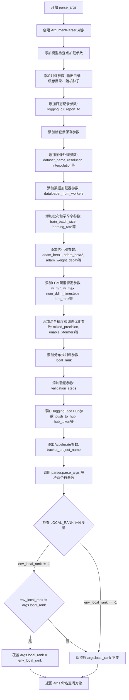
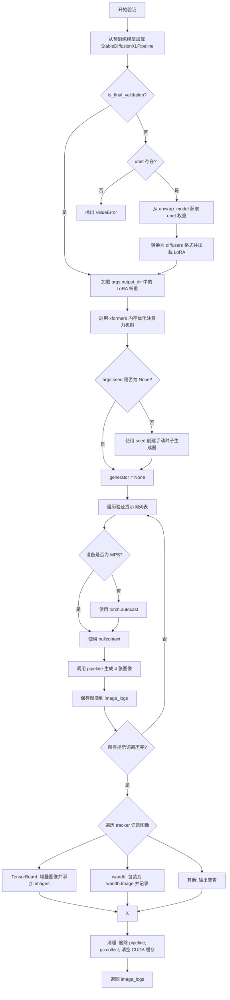
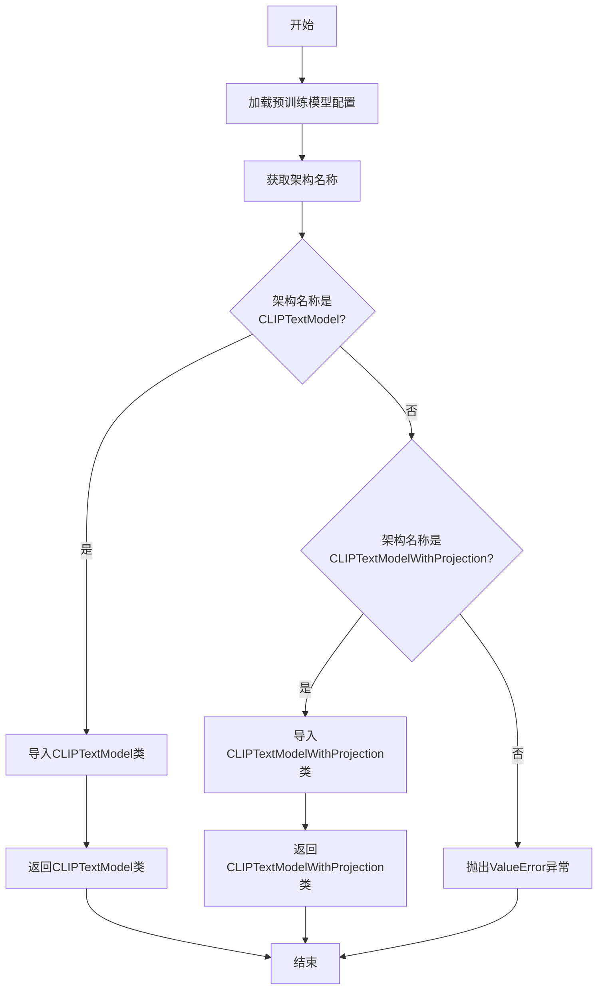
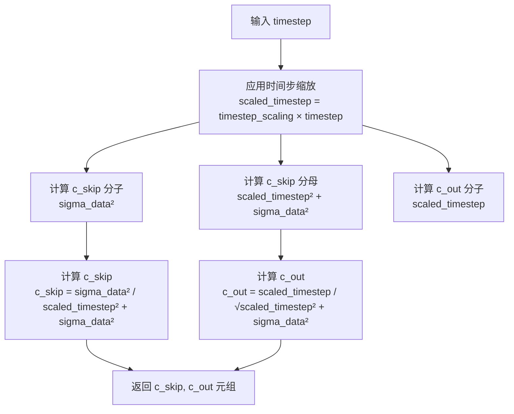
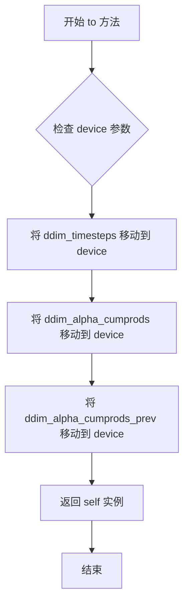

# `diffusers\examples\consistency_distillation\train_lcm_distill_lora_sdxl.py` 详细设计文档

这是一个用于 Stable Diffusion XL (SDXL) 的 Latent Consistency Model (LCM) 提炼训练脚本。代码通过加载预训练的 SDXL 教师模型，并结合 LoRA 技术，在自定义数据集上训练一个学生 UNet 模型，旨在实现极快速的少步（low-step）图像生成。

## 整体流程

```mermaid
graph TD
    Start[启动训练] --> ParseArgs[解析命令行参数]
    ParseArgs --> InitAccel[初始化 Accelerator & 日志]
    InitAccel --> LoadModels[加载 Teacher 模型: UNet, VAE, TextEncoder]
    LoadModels --> CreateStudent[创建 Student UNet 并添加 LoRA]
    CreateStudent --> LoadData[加载与预处理数据集]
    LoadData --> TrainingLoop[进入训练循环]
    TrainingLoop --> SampleTimesteps[采样 DDIM 时间步]
    SampleTimesteps --> AddNoise[对 Latent 加噪 (Forward Diffusion)]
    AddNoise --> StudentForward[Student 模型前向传播 (带 LoRA)]
    StudentForward --> TeacherForward[Teacher 模型前向传播 (关闭 LoRA, 计算 CFG)]
    TeacherForward --> ODESolver[DDIM Solver 计算下一时刻 x_prev]
    ODESolver --> ComputeTarget[计算目标一致性向量]
    ComputeTarget --> ComputeLoss[计算 MSE/Huber 损失]
    ComputeLoss --> Backward[反向传播与参数更新]
    Backward --> Checkpointing{是否保存检查点?}
    Checkpointing -- 是 --> SaveCheckpoint[保存 LoRA 权重]
    Checkpointing -- 否 --> Validation{是否验证?}
    Validation -- 是 --> LogValidation[运行验证生成图像]
    Validation -- 否 --> NextStep[下一轮训练]
    LogValidation --> NextStep
    NextStep --> TrainingLoop
    TrainingLoop -.-> End[训练结束保存模型]
```

## 类结构

```
Script: train_lcm_sdxl.py (主训练脚本)
├── Class: DDIMSolver (DDIM 求解器，用于蒸馏过程中的ODE模拟)
│   ├── Fields: ddim_timesteps, ddim_alpha_cumprods, ddim_alpha_cumprods_prev
│   └── Methods: to(), ddim_step()
└── Functions (全局函数)
    ├── parse_args() (命令行参数解析)
    ├── log_validation() (推理与验证逻辑)
    ├── encode_prompt() (文本编码)
    ├── import_model_class_from_model_name_or_path() (模型类导入)
    ├── main() (核心训练流程)
    └── 辅助函数: append_dims, scalings_for_boundary_conditions, get_predicted_original_sample, get_predicted_noise, extract_into_tensor
```

## 全局变量及字段


### `logger`
    
日志记录器，用于输出训练过程中的日志信息

类型：`logging.Logger`
    


### `DATASET_NAME_MAPPING`
    
数据集列名映射配置，定义了数据集图像和文本列的名称

类型：`dict`
    


### `DDIMSolver.ddim_timesteps`
    
DDIM采样的时间步索引

类型：`torch.Tensor`
    


### `DDIMSolver.ddim_alpha_cumprods`
    
累积alpha值，用于DDIM采样计算

类型：`torch.Tensor`
    


### `DDIMSolver.ddim_alpha_cumprods_prev`
    
前一步的累积alpha值，用于DDIM采样计算

类型：`torch.Tensor`
    
    

## 全局函数及方法


### `parse_args`

该函数是训练脚本的参数解析入口，通过argparse库定义并收集所有命令行参数，包括模型检查点加载、训练配置、日志记录、验证设置、HuggingFace Hub集成等大量参数，并处理分布式训练中的local_rank环境变量覆盖逻辑。

参数：该函数无直接参数，通过`sys.argv`获取命令行输入。

返回值：`argparse.Namespace`，返回包含所有解析后命令行参数的命名空间对象。

#### 流程图



#### 带注释源码

```python
def parse_args():
    """
    解析命令行参数并返回配置对象。
    
    该函数定义并收集训练脚本所需的所有命令行参数，包括：
    - 模型检查点加载参数
    - 训练超参数（学习率、批次大小、训练轮数等）
    - 图像处理和数据集配置
    - LoRA (Low-Rank Adaptation) 蒸馏参数
    - 混合精度和内存优化选项
    - 分布式训练配置
    - 验证和模型推送设置
    
    Returns:
        argparse.Namespace: 包含所有解析后命令行参数的命名空间对象
    """
    # 创建参数解析器，描述文本用于帮助信息
    parser = argparse.ArgumentParser(description="Simple example of a training script.")
    
    # ========================================
    # 模型检查点加载参数
    # ========================================
    parser.add_argument(
        "--pretrained_teacher_model",
        type=str,
        default=None,
        required=True,
        help="Path to pretrained LDM teacher model or model identifier from huggingface.co/models.",
    )
    parser.add_argument(
        "--pretrained_vae_model_name_or_path",
        type=str,
        default=None,
        help="Path to pretrained VAE model with better numerical stability.",
    )
    parser.add_argument(
        "--teacher_revision",
        type=str,
        default=None,
        required=False,
        help="Revision of pretrained LDM teacher model identifier.",
    )
    parser.add_argument(
        "--revision",
        type=str,
        default=None,
        required=False,
        help="Revision of pretrained LDM model identifier.",
    )
    
    # ========================================
    # 训练参数 - 通用
    # ========================================
    parser.add_argument(
        "--output_dir",
        type=str,
        default="lcm-xl-distilled",
        help="The output directory where the model predictions and checkpoints will be written.",
    )
    parser.add_argument(
        "--cache_dir",
        type=str,
        default=None,
        help="The directory where the downloaded models and datasets will be stored.",
    )
    parser.add_argument("--seed", type=int, default=None, help="A seed for reproducible training.")
    
    # ========================================
    # 日志记录参数
    # ========================================
    parser.add_argument(
        "--logging_dir",
        type=str,
        default="logs",
        help="TensorBoard log directory.",
    )
    parser.add_argument(
        "--report_to",
        type=str,
        default="tensorboard",
        help='The integration to report the results and logs to. Supported platforms are "tensorboard", "wandb" and "comet_ml".',
    )
    
    # ========================================
    # 检查点保存参数
    # ========================================
    parser.add_argument(
        "--checkpointing_steps",
        type=int,
        default=500,
        help="Save a checkpoint of the training state every X updates.",
    )
    parser.add_argument(
        "--checkpoints_total_limit",
        type=int,
        default=None,
        help="Max number of checkpoints to store.",
    )
    parser.add_argument(
        "--resume_from_checkpoint",
        type=str,
        default=None,
        help="Whether training should be resumed from a previous checkpoint.",
    )
    
    # ========================================
    # 图像处理参数
    # ========================================
    parser.add_argument(
        "--dataset_name",
        type=str,
        default=None,
        help="The name of the Dataset to train on.",
    )
    parser.add_argument(
        "--dataset_config_name",
        type=str,
        default=None,
        help="The config of the Dataset.",
    )
    parser.add_argument(
        "--train_data_dir",
        type=str,
        default=None,
        help="A folder containing the training data.",
    )
    parser.add_argument(
        "--image_column", 
        type=str, 
        default="image", 
        help="The column of the dataset containing an image."
    )
    parser.add_argument(
        "--caption_column",
        type=str,
        default="text",
        help="The column of the dataset containing a caption.",
    )
    parser.add_argument(
        "--resolution",
        type=int,
        default=1024,
        help="The resolution for input images.",
    )
    parser.add_argument(
        "--interpolation_type",
        type=str,
        default="bilinear",
        help="The interpolation function used when resizing images.",
    )
    parser.add_argument(
        "--center_crop",
        default=False,
        action="store_true",
        help="Whether to center crop the input images.",
    )
    parser.add_argument(
        "--random_flip",
        action="store_true",
        help="Whether to randomly flip images horizontally.",
    )
    parser.add_argument(
        "--encode_batch_size",
        type=int,
        default=8,
        help="Batch size for VAE encoding of the images.",
    )
    
    # ========================================
    # DataLoader 参数
    # ========================================
    parser.add_argument(
        "--dataloader_num_workers",
        type=int,
        default=0,
        help="Number of subprocesses to use for data loading.",
    )
    
    # ========================================
    # 批次和训练步数参数
    # ========================================
    parser.add_argument(
        "--train_batch_size", 
        type=int, 
        default=16, 
        help="Batch size (per device) for the training dataloader."
    )
    parser.add_argument("--num_train_epochs", type=int, default=100)
    parser.add_argument(
        "--max_train_steps",
        type=int,
        default=None,
        help="Total number of training steps to perform.",
    )
    parser.add_argument(
        "--max_train_samples",
        type=int,
        default=None,
        help="Truncate the number of training examples.",
    )
    
    # ========================================
    # 学习率参数
    # ========================================
    parser.add_argument(
        "--learning_rate",
        type=float,
        default=1e-6,
        help="Initial learning rate.",
    )
    parser.add_argument(
        "--scale_lr",
        action="store_true",
        default=False,
        help="Scale the learning rate by number of GPUs, gradient accumulation steps, and batch size.",
    )
    parser.add_argument(
        "--lr_scheduler",
        type=str,
        default="constant",
        help='The scheduler type to use. Choose between "linear", "cosine", "cosine_with_restarts", "polynomial", "constant", "constant_with_warmup".',
    )
    parser.add_argument(
        "--lr_warmup_steps", 
        type=int, 
        default=500, 
        help="Number of steps for the warmup in the lr scheduler."
    )
    parser.add_argument(
        "--gradient_accumulation_steps",
        type=int,
        default=1,
        help="Number of updates steps to accumulate before performing a backward/update pass.",
    )
    
    # ========================================
    # Adam 优化器参数
    # ========================================
    parser.add_argument(
        "--use_8bit_adam", 
        action="store_true", 
        help="Whether to use 8-bit Adam from bitsandbytes."
    )
    parser.add_argument("--adam_beta1", type=float, default=0.9, help="The beta1 parameter for the Adam optimizer.")
    parser.add_argument("--adam_beta2", type=float, default=0.999, help="The beta2 parameter for the Adam optimizer.")
    parser.add_argument("--adam_weight_decay", type=float, default=1e-2, help="Weight decay to use.")
    parser.add_argument("--adam_epsilon", type=float, default=1e-08, help="Epsilon value for the Adam optimizer")
    parser.add_argument("--max_grad_norm", default=1.0, type=float, help="Max gradient norm.")
    
    # ========================================
    # Latent Consistency Distillation (LCD) 特定参数
    # ========================================
    parser.add_argument(
        "--w_min",
        type=float,
        default=3.0,
        required=False,
        help="The minimum guidance scale value for guidance scale sampling.",
    )
    parser.add_argument(
        "--w_max",
        type=float,
        default=15.0,
        required=False,
        help="The maximum guidance scale value for guidance scale sampling.",
    )
    parser.add_argument(
        "--num_ddim_timesteps",
        type=int,
        default=50,
        help="The number of timesteps to use for DDIM sampling.",
    )
    parser.add_argument(
        "--loss_type",
        type=str,
        default="l2",
        choices=["l2", "huber"],
        help="The type of loss to use for the LCD loss.",
    )
    parser.add_argument(
        "--huber_c",
        type=float,
        default=0.001,
        help="The huber loss parameter.",
    )
    parser.add_argument(
        "--lora_rank",
        type=int,
        default=64,
        help="The rank of the LoRA projection matrix.",
    )
    parser.add_argument(
        "--lora_alpha",
        type=int,
        default=64,
        help="The value of the LoRA alpha parameter.",
    )
    parser.add_argument(
        "--lora_dropout",
        type=float,
        default=0.0,
        help="The dropout probability for the dropout layer before applying LoRA.",
    )
    parser.add_argument(
        "--lora_target_modules",
        type=str,
        default=None,
        help="A comma-separated string of target module keys to add LoRA to.",
    )
    parser.add_argument(
        "--vae_encode_batch_size",
        type=int,
        default=8,
        required=False,
        help="The batch size used when encoding images to latents using the VAE.",
    )
    parser.add_argument(
        "--timestep_scaling_factor",
        type=float,
        default=10.0,
        help="The multiplicative timestep scaling factor used for LCM boundary scalings.",
    )
    
    # ========================================
    # 混合精度参数
    # ========================================
    parser.add_argument(
        "--mixed_precision",
        type=str,
        default=None,
        choices=["no", "fp16", "bf16"],
        help="Whether to use mixed precision. Choose between fp16 and bf16.",
    )
    parser.add_argument(
        "--allow_tf32",
        action="store_true",
        help="Whether or not to allow TF32 on Ampere GPUs for faster training.",
    )
    
    # ========================================
    # 训练优化参数
    # ========================================
    parser.add_argument(
        "--enable_xformers_memory_efficient_attention", 
        action="store_true", 
        help="Whether or not to use xformers."
    )
    parser.add_argument(
        "--gradient_checkpointing",
        action="store_true",
        help="Whether or not to use gradient checkpointing to save memory.",
    )
    
    # ========================================
    # 分布式训练参数
    # ========================================
    parser.add_argument("--local_rank", type=int, default=-1, help="For distributed training: local_rank")
    
    # ========================================
    # 验证参数
    # ========================================
    parser.add_argument(
        "--validation_steps",
        type=int,
        default=200,
        help="Run validation every X steps.",
    )
    
    # ========================================
    # HuggingFace Hub 参数
    # ========================================
    parser.add_argument("--push_to_hub", action="store_true", help="Whether or not to push the model to the Hub.")
    parser.add_argument("--hub_token", type=str, default=None, help="The token to use to push to the Model Hub.")
    parser.add_argument(
        "--hub_model_id",
        type=str,
        default=None,
        help="The name of the repository to keep in sync with the local output_dir.",
    )
    
    # ========================================
    # Accelerate 参数
    # ========================================
    parser.add_argument(
        "--tracker_project_name",
        type=str,
        default="text2image-fine-tune",
        help="The project_name argument passed to Accelerator.init_trackers.",
    )

    # 解析命令行参数（默认使用 sys.argv）
    args = parser.parse_args()
    
    # 检查环境变量 LOCAL_RANK，用于分布式训练场景
    # 如果环境变量中设置了 LOCAL_RANK 且与命令行参数不同，则使用环境变量中的值
    # 这确保了在使用 torchrun 或 accelerate launch 时能够正确传递 local_rank
    env_local_rank = int(os.environ.get("LOCAL_RANK", -1))
    if env_local_rank != -1 and env_local_rank != args.local_rank:
        args.local_rank = env_local_rank

    return args
```


### `log_validation`

该函数用于在训练过程中执行验证，通过加载预训练的 Stable Diffusion XL pipeline 并使用 LoRA 权重进行推理，生成验证图像并记录到 TensorBoard 或 wandb 等跟踪工具中。

参数：

- `vae`：`AutoencoderKL`，变分自编码器模型，用于将图像编码为潜在表示
- `args`：命令行参数对象，包含预训练模型路径、输出目录、xformers 启用状态等配置
- `accelerator`：Accelerator 对象，用于分布式训练和设备管理
- `weight_dtype`：torch.dtype，推理时使用的权重数据类型（fp16/bf16/fp32）
- `step`：int，当前的训练步数，用于日志记录
- `unet`：UNet2DConditionModel，可选，学生 UNet 模型（中间验证时必需）
- `is_final_validation`：bool，标志位，区分最终验证和中间验证

返回值：`list`，包含验证提示词和对应生成的图像列表，每项为 `{"validation_prompt": str, "images": list}` 格式

#### 流程图



#### 带注释源码

```python
def log_validation(vae, args, accelerator, weight_dtype, step, unet=None, is_final_validation=False):
    """
    执行验证流程：加载 LoRA 权重，运行推理，生成验证图像并记录到跟踪工具
    
    参数:
        vae: 变分自编码器模型
        args: 训练参数配置对象
        accelerator: HuggingFace Accelerate 分布式训练加速器
        weight_dtype: 推理使用的权重数据类型
        step: 当前训练步数
        unet: 学生 UNet 模型（中间验证时需要）
        is_final_validation: 是否为最终验证（影响权重加载来源）
    """
    logger.info("Running validation... ")

    # 1. 从预训练模型加载 Stable Diffusion XL Pipeline
    pipeline = StableDiffusionXLPipeline.from_pretrained(
        args.pretrained_teacher_model,  # 预训练教师模型路径
        vae=vae,                         # 传入 VAE 模型
        scheduler=LCMScheduler.from_pretrained(args.pretrained_teacher_model, subfolder="scheduler"),
        revision=args.revision,           # 模型版本
        torch_dtype=weight_dtype,        # 权重精度类型
    ).to(accelerator.device)             # 移动到加速器设备
    
    # 禁用进度条显示
    pipeline.set_progress_bar_config(disable=True)

    # 2. 确定 LoRA 权重加载来源
    to_load = None
    if not is_final_validation:
        # 中间验证：需要提供 unet 参数
        if unet is None:
            raise ValueError("Must provide a `unet` when doing intermediate validation.")
        
        # 从 accelerator 中解包并获取 unet 的 LoRA 权重
        unet = accelerator.unwrap_model(unet)
        state_dict = convert_state_dict_to_diffusers(get_peft_model_state_dict(unet))
        to_load = state_dict  # 加载在线学生权重
    else:
        # 最终验证：从输出目录加载已保存的权重
        to_load = args.output_dir

    # 3. 加载 LoRA 权重并融合
    pipeline.load_lora_weights(to_load)
    pipeline.fuse_lora()

    # 4. 可选：启用 xformers 高效注意力机制
    if args.enable_xformers_memory_efficient_attention:
        pipeline.enable_xformers_memory_efficient_attention()

    # 5. 设置随机种子生成器
    if args.seed is None:
        generator = None
    else:
        generator = torch.Generator(device=accelerator.device).manual_seed(args.seed)

    # 6. 定义验证提示词列表
    validation_prompts = [
        "cute sundar pichai character",
        "robotic cat with wings",
        "a photo of yoda",
        "a cute creature with blue eyes",
    ]

    image_logs = []

    # 7. 遍历每个提示词进行推理
    for _, prompt in enumerate(validation_prompts):
        images = []
        
        # 根据设备类型选择自动混合精度上下文
        if torch.backends.mps.is_available():
            autocast_ctx = nullcontext()  # MPS 设备不使用 autocast
        else:
            autocast_ctx = torch.autocast(accelerator.device.type, dtype=weight_dtype)

        # 执行推理：4 步采样，每提示生成 4 张图像
        with autocast_ctx:
            images = pipeline(
                prompt=prompt,
                num_inference_steps=4,      # LCM 推理步数较少
                num_images_per_prompt=4,   # 批量生成数量
                generator=generator,      # 随机性控制
                guidance_scale=0.0,        # LCM 不需要 classifier-free guidance
            ).images
        
        # 记录结果
        image_logs.append({"validation_prompt": prompt, "images": images})

    # 8. 将图像记录到各个跟踪器
    for tracker in accelerator.trackers:
        if tracker.name == "tensorboard":
            # TensorBoard 记录逻辑
            for log in image_logs:
                images = log["images"]
                validation_prompt = log["validation_prompt"]
                formatted_images = []
                for image in images:
                    formatted_images.append(np.asarray(image))

                formatted_images = np.stack(formatted_images)

                tracker.writer.add_images(validation_prompt, formatted_images, step, dataformats="NHWC")
        
        elif tracker.name == "wandb":
            # wandb 记录逻辑
            formatted_images = []

            for log in image_logs:
                images = log["images"]
                validation_prompt = log["validation_prompt"]
                for image in images:
                    image = wandb.Image(image, caption=validation_prompt)
                    formatted_images.append(image)
            
            # 区分验证和测试日志名称
            logger_name = "test" if is_final_validation else "validation"
            tracker.log({logger_name: formatted_images})
        
        else:
            logger.warning(f"image logging not implemented for {tracker.name}")

    # 9. 清理 GPU 资源
    del pipeline
    gc.collect()
    torch.cuda.empty_cache()

    # 10. 返回验证结果日志
    return image_logs
```


### `encode_prompt`

该函数用于将文本提示（prompt）批量编码为文本嵌入向量（text embeddings），支持多文本编码器（SDXL 通常有两个文本编码器），并将不同编码器的输出在特征维度上进行拼接，同时返回池化后的嵌入向量供后续模型使用。

参数：

- `prompt_batch`：`List[str] | List[List[str]] | List[np.ndarray]`，待编码的文本提示列表，可以是单个字符串，也可以是多个候选 caption 的列表/数组（训练时随机选择，推理时取第一个）
- `text_encoders`：`List[CLIPTextModel]`，文本编码器列表，通常包含两个编码器（如 CLIPTextModel 和 CLIPTextModelWithProjection）
- `tokenizers`：`List[AutoTokenizer]`，与文本编码器对应的 tokenizer 列表
- `is_train`：`bool`，是否处于训练模式（训练时从多个 caption 中随机选择，推理时取第一个）

返回值：`Tuple[torch.Tensor, torch.Tensor]`

- 第一个返回值为 `prompt_embeds`：`torch.Tensor`，形状为 `(batch_size, seq_len, hidden_dim)` 的拼接后文本嵌入
- 第二个返回值为 `pooled_prompt_embeds`：`torch.Tensor`，形状为 `(batch_size, hidden_dim)` 的池化文本嵌入

#### 流程图

```mermaid
flowchart TD
    A[开始: encode_prompt] --> B[初始化空列表 prompt_embeds_list 和 captions]
    B --> C{遍历 prompt_batch 中的每个 caption}
    C -->|caption 是字符串| D[直接添加到 captions]
    C -->|caption 是列表或数组| E{is_train?}
    E -->|True| F[random.choice 随机选择一个 caption]
    E -->|False| G[取 caption[0] 第一个元素]
    F --> D
    G --> D
    D --> C1{是否还有 caption 未处理?}
    C1 -->|是| C
    C1 -->|否| H[进入 torch.no_grad 上下文]
    
    H --> I[遍历 tokenizers 和 text_encoders 配对]
    I --> J[tokenizer 对 captions 进行编码: padding, max_length, truncation, return_tensors='pt']
    J --> K[text_encoder 编码 text_input_ids, output_hidden_states=True]
    K --> L[获取 pooled_prompt_embeds = prompt_embeds[0]]
    L --> M[获取倒数第二层隐藏状态: prompt_embeds = prompt_embeds.hidden_states[-2]]
    M --> N[重塑 prompt_embeds: view(bs_embed, seq_len, -1)]
    N --> O[添加 prompt_embeds 到列表]
    O --> I1{是否还有 encoder 未处理?}
    I1 -->|是| I
    I1 -->|否| P[torch.concat 合并所有 prompt_embeds, dim=-1]
    
    P --> Q[pooled_prompt_embeds.view 展开为二维]
    Q --> R[返回 prompt_embeds 和 pooled_prompt_embeds]
```

#### 带注释源码

```python
def encode_prompt(prompt_batch, text_encoders, tokenizers, is_train=True):
    """
    将文本提示批量编码为文本嵌入向量，支持多文本编码器（SDXL 有两个编码器）。
    
    参数:
        prompt_batch: 待编码的文本提示列表，支持字符串或多个候选caption的列表/数组
        text_encoders: 文本编码器列表（通常为2个）
        tokenizers: 对应的tokenizer列表
        is_train: 训练模式标志，训练时随机选择caption，推理时取第一个
    
    返回:
        prompt_embeds: 拼接后的文本嵌入 (batch_size, seq_len, hidden_dim)
        pooled_prompt_embeds: 池化后的文本嵌入 (batch_size, hidden_dim)
    """
    prompt_embeds_list = []  # 用于存储每个编码器的输出

    captions = []
    # 处理输入的caption列表，统一为字符串列表
    for caption in prompt_batch:
        if isinstance(caption, str):
            captions.append(caption)
        elif isinstance(caption, (list, np.ndarray)):
            # 如果有多个caption，训练时随机选一个，推理时取第一个
            captions.append(random.choice(caption) if is_train else caption[0])

    # 使用torch.no_grad()禁用梯度计算，减少显存占用
    with torch.no_grad():
        # 遍历所有文本编码器（SDXL有两个：text_encoder和text_encoder_2）
        for tokenizer, text_encoder in zip(tokenizers, text_encoders):
            # 使用tokenizer将文本转换为token IDs
            text_inputs = tokenizer(
                captions,
                padding="max_length",          # 填充到最大长度
                max_length=tokenizer.model_max_length,  # 使用模型的最大长度
                truncation=True,               # 截断超长文本
                return_tensors="pt",           # 返回PyTorch张量
            )
            text_input_ids = text_inputs.input_ids
            
            # 使用文本编码器获取嵌入，output_hidden_states=True返回所有隐藏层
            prompt_embeds = text_encoder(
                text_input_ids.to(text_encoder.device),  # 移动到编码器设备
                output_hidden_states=True,
            )

            # 获取池化输出（通常为最后一个隐藏状态的CLS token或平均池化）
            pooled_prompt_embeds = prompt_embeds[0]
            # 获取倒数第二层隐藏状态（SDXL中-2层通常是无classifier-free guidance的优质表示）
            prompt_embeds = prompt_embeds.hidden_states[-2]
            
            bs_embed, seq_len, _ = prompt_embeds.shape  # batch size, sequence length, hidden dim
            # 重新调整形状以确保正确维度
            prompt_embeds = prompt_embeds.view(bs_embed, seq_len, -1)
            prompt_embeds_list.append(prompt_embeds)

    # 沿特征维度拼接所有编码器的输出
    prompt_embeds = torch.concat(prompt_embeds_list, dim=-1)
    # 池化后的嵌入也展开为(batch_size, -1)
    pooled_prompt_embeds = pooled_prompt_embeds.view(bs_embed, -1)
    
    return prompt_embeds, pooled_prompt_embeds
```


### `main`

这是脚本的核心入口函数，负责执行 Stable Diffusion XL (SDXL) 的 Latent Consistency Model (LCM) 蒸馏训练。它初始化分布式训练环境，加载教师模型（VAE、文本编码器），配置并加载学生 UNet（含 LoRA），处理数据集，执行包含噪声预测、CFG（Classifier-Free Guidance）蒸馏、DDIM ODE 求解和反向传播的完整训练循环，并最终保存 LoRA 权重。

参数：
-  `args`：`argparse.Namespace`，包含所有训练配置参数，如模型路径（`pretrained_teacher_model`）、输出目录、学习率（`learning_rate`）、批量大小、LoRA 配置（`lora_rank`）、蒸馏参数（`num_ddim_timesteps`）等。

返回值：`None`，该函数直接运行训练流程并在训练结束时保存模型权重，不返回任何值。

#### 流程图

```mermaid
flowchart TD
    A[Start: Parse Args] --> B[Init Accelerator & Logging]
    B --> C[Load Components]
    C --> C1[Noise Scheduler & DDIM Solver]
    C --> C2[Tokenizers & Text Encoders]
    C --> C3[VAE]
    C --> C4[Student UNet + LoRA]
    C --> C5[Dataset & DataLoader]
    C --> C6[Optimizer & LR Scheduler]
    C --> Training Loop
    Training Loop --> D[For each batch: Encode Text & Images]
    D --> E[Sample Timesteps & Noise]
    E --> F[Student Prediction]
    F --> G[Teacher Prediction (with LoRA disabled)]
    G --> H[CFG Estimate & DDIM Solver Step]
    H --> I[Target Prediction]
    I --> J[Calculate Loss (MSE/Huber)]
    J --> K[Backward & Optimizer Step]
    K --> L{Checkpointing/Validation?}
    L -->|Yes| M[Save Checkpoint / Run Validation]
    L -->|No| N{End of Training?}
    M --> N
    N -->|No| D
    N -->|Yes| O[Save Final LoRA Weights]
    O --> P[End]
```

#### 带注释源码

```python
def main(args):
    # 1. 验证与初始化设置
    if args.report_to == "wandb" and args.hub_token is not None:
        raise ValueError("Security risk: Cannot use both wandb and hub_token.")

    # 设置日志输出目录
    logging_dir = Path(args.output_dir, args.logging_dir)
    accelerator_project_config = ProjectConfiguration(project_dir=args.output_dir, logging_dir=logging_dir)

    # 初始化 Accelerator，用于管理分布式训练、混合精度和设备放置
    accelerator = Accelerator(
        gradient_accumulation_steps=args.gradient_accumulation_steps,
        mixed_precision=args.mixed_precision,
        log_with=args.report_to,
        project_config=accelerator_project_config,
        split_batches=True,
    )

    # 配置日志记录器
    logging.basicConfig(...)
    logger.info(accelerator.state, main_process_only=False)
    # 设置Transformers和Diffusers的日志级别
    if accelerator.is_local_main_process:
        transformers.utils.logging.set_verbosity_warning()
        diffusers.utils.logging.set_verbosity_info()
    else:
        transformers.utils.logging.set_verbosity_error()
        diffusers.utils.logging.set_verbosity_error()

    # 设置随机种子以保证可复现性
    if args.seed is not None:
        set_seed(args.seed)

    # 处理输出目录和Hub仓库创建
    if accelerator.is_main_process:
        if args.output_dir is not None:
            os.makedirs(args.output_dir, exist_ok=True)
        if args.push_to_hub:
            repo_id = create_repo(...).repo_id

    # 2. 创建噪声调度器 (DDPMScheduler) 并准备 alpha/sigma schedule
    noise_scheduler = DDPMScheduler.from_pretrained(...)
    alpha_schedule = torch.sqrt(noise_scheduler.alphas_cumprod)
    sigma_schedule = torch.sqrt(1 - noise_scheduler.alphas_cumprod)
    # 初始化 DDIM ODE 求解器用于蒸馏
    solver = DDIMSolver(...)

    # 3. 加载 SDXL 的 Tokenizers 和 Text Encoders
    tokenizer_one = AutoTokenizer.from_pretrained(...)
    tokenizer_two = AutoTokenizer.from_pretrained(...)
    text_encoder_one = text_encoder_cls_one.from_pretrained(...)
    text_encoder_two = text_encoder_cls_two.from_pretrained(...)

    # 4. 加载 VAE
    vae = AutoencoderKL.from_pretrained(...)

    # 5. 冻结教师模型参数
    vae.requires_grad_(False)
    text_encoder_one.requires_grad_(False)
    text_encoder_two.requires_grad_(False)

    # 6. 加载学生 UNet (教师结构)
    unet = UNet2DConditionModel.from_pretrained(...)
    unet.requires_grad_(False)

    # 7. 确定混合精度数据类型 (weight_dtype)
    weight_dtype = torch.float32
    if accelerator.mixed_precision == "fp16":
        weight_dtype = torch.float16
    elif accelerator.mixed_precision == "bf16":
        weight_dtype = torch.bfloat16

    # 将模型移动到设备并转换类型
    unet.to(accelerator.device, dtype=weight_dtype)
    vae.to(accelerator.device, dtype=torch.float32) # VAE通常保持fp32以防NaN
    text_encoder_one.to(accelerator.device, dtype=weight_dtype)
    text_encoder_two.to(accelerator.device, dtype=weight_dtype)

    # 8. 为学生 UNet 添加 LoRA (仅更新 LoRA 参数)
    if args.lora_target_modules is not None:
        lora_target_modules = ...
    else:
        lora_target_modules = [...] # 默认模块列表
    lora_config = LoraConfig(...)
    unet.add_adapter(lora_config)

    # 将调度器和求解器也移至设备
    alpha_schedule = alpha_schedule.to(accelerator.device)
    sigma_schedule = sigma_schedule.to(accelerator.device)
    solver = solver.to(accelerator.device)

    # 9. 注册模型保存和加载的 Hooks (用于Checkpoint)
    def save_model_hook(...): ...
    def load_model_hook(...): ...
    accelerator.register_save_state_pre_hook(save_model_hook)
    accelerator.register_load_state_pre_hook(load_model_hook)

    # 10. 开启性能优化 (xformers, TF32, Gradient Checkpointing)
    if args.enable_xformers_memory_efficient_attention:
        unet.enable_xformers_memory_efficient_attention()
    if args.allow_tf32:
        torch.backends.cuda.matmul.allow_tf32 = True
    if args.gradient_checkpointing:
        unet.enable_gradient_checkpointing()

    # 11. 构建优化器 (AdamW 或 8-bit Adam)
    if args.use_8bit_adam:
        import bitsandbytes as bnb
        optimizer_class = bnb.optim.AdamW8bit
    else:
        optimizer_class = torch.optim.AdamW
    
    params_to_optimize = filter(lambda p: p.requires_grad, unet.parameters())
    optimizer = optimizer_class(params_to_optimize, ...)

    # 12. 加载和处理数据集
    if args.dataset_name is not None:
        dataset = load_dataset(...)
    else:
        dataset = load_dataset("imagefolder", ...)
    
    # 定义图像预处理流程 (Resize, Crop, Flip, Normalize)
    def preprocess_train(examples): ...
    
    # 创建 DataLoader
    train_dataloader = torch.utils.data.DataLoader(...)

    # 13. 定义文本嵌入计算函数
    def compute_embeddings(...): ...
    text_encoders = [text_encoder_one, text_encoder_two]
    tokenizers = [tokenizer_one, tokenizer_two]
    compute_embeddings_fn = functools.partial(compute_embeddings, ...)

    # 14. 构建学习率调度器
    lr_scheduler = get_scheduler(...)

    # 15. 使用 Accelerator 准备所有组件
    unet, optimizer, train_dataloader, lr_scheduler = accelerator.prepare(...)

    # 16. 训练循环
    total_batch_size = args.train_batch_size * accelerator.num_processes * args.gradient_accumulation_steps
    logger.info("***** Running training *****")
    ...
    global_step = 0
    unet.train()
    
    for epoch in range(first_epoch, args.num_train_epochs):
        for step, batch in enumerate(train_dataloader):
            with accelerator.accumulate(unet):
                # --- 训练步骤详情 ---
                # 1. 编码文本和图像
                encoded_text = compute_embeddings_fn(...)
                latents = vae.encode(pixel_values).latent_dist.sample() * vae.config.scaling_factor
                
                # 2. 采样时间步 (DDIM timesteps)
                bsz = latents.shape[0]
                index = torch.randint(...)
                start_timesteps = solver.ddim_timesteps[index]
                timesteps = start_timesteps - topk
                
                # 3. 计算边界缩放系数 (c_skip, c_out)
                c_skip_start, c_out_start = scalings_for_boundary_conditions(...)
                
                # 4. 加噪 (Forward process)
                noise = torch.randn_like(latents)
                noisy_model_input = noise_scheduler.add_noise(latents, noise, start_timesteps)
                
                # 5. 采样 guidance scale w
                w = ...
                
                # 6. 学生模型预测 (在线)
                noise_pred_student = unet(...).sample
                pred_x_0_student = get_predicted_original_sample(...)
                model_pred = c_skip_start * noisy_model_input + c_out_start * pred_x_0_student
                
                # 7. 教师模型预测 (关闭 LoRA，使用 CFG)
                accelerator.unwrap_model(unet).disable_adapters()
                with torch.no_grad():
                    # Conditional & Unconditional prediction
                    cond_teacher_output = unet(...).sample
                    uncond_teacher_output = unet(...).sample
                    
                    # 计算 CFG 估计
                    pred_x0 = cond_pred_x0 + w * (cond_pred_x0 - uncond_pred_x0)
                    pred_noise = ...
                    
                    # 8. DDIM 求解器步进
                    x_prev = solver.ddim_step(pred_x0, pred_noise, index)
                
                # 重新开启 LoRA
                accelerator.unwrap_model(unet).enable_adapters()
                
                # 9. 获取目标预测 (Target)
                with torch.no_grad():
                    target_noise_pred = unet(x_prev, ...).sample
                    pred_x_0_target = get_predicted_original_sample(...)
                    target = c_skip * x_prev + c_out * pred_x_0_target
                
                # 10. 计算损失
                if args.loss_type == "l2":
                    loss = F.mse_loss(model_pred.float(), target.float(), reduction="mean")
                elif args.loss_type == "huber":
                    loss = torch.mean(...)
                
                # 11. 反向传播
                accelerator.backward(loss)
                if accelerator.sync_gradients:
                    accelerator.clip_grad_norm_(...)
                optimizer.step()
                lr_scheduler.step()
                optimizer.zero_grad(set_to_none=True)
                
                # 12. 检查点保存与验证
                if accelerator.sync_gradients:
                    progress_bar.update(1)
                    global_step += 1
                    if global_step % args.checkpointing_steps == 0:
                        accelerator.save_state(...)
                    if global_step % args.validation_steps == 0:
                        log_validation(...)

    # 17. 最终保存
    accelerator.wait_for_everyone()
    if accelerator.is_main_process:
        # 保存 LoRA 权重
        unet_lora_state_dict = convert_state_dict_to_diffusers(get_peft_model_state_dict(unet))
        StableDiffusionXLPipeline.save_lora_weights(args.output_dir, unet_lora_layers=unet_lora_state_dict)
        
        if args.push_to_hub:
            upload_folder(...)
            
        # 最终推理验证
        log_validation(..., is_final_validation=True)
        
    accelerator.end_training()
```


### `import_model_class_from_model_name_or_path`

该函数根据预训练模型的配置信息，动态导入并返回对应的文本编码器类（CLIPTextModel 或 CLIPTextModelWithProjection），用于后续加载模型权重。

参数：

- `pretrained_model_name_or_path`：`str`，预训练模型的名称或路径，用于定位模型配置文件
- `revision`：`str`，模型的版本号，用于指定从模型仓库拉取特定版本
- `subfolder`：`str`，子文件夹路径，默认为 "text_encoder"，用于定位配置文件的子目录

返回值：`type`，返回对应的文本编码器类（CLIPTextModel 或 CLIPTextModelWithProjection）

#### 流程图



#### 带注释源码

```python
def import_model_class_from_model_name_or_path(
    pretrained_model_name_or_path: str, revision: str, subfolder: str = "text_encoder"
):
    """
    根据预训练模型配置动态导入文本编码器类
    
    参数:
        pretrained_model_name_or_path: 预训练模型的名称或HuggingFace模型ID
        revision: 模型版本号
        subfolder: 配置文件的子文件夹路径，默认为"text_encoder"
    
    返回:
        对应的文本编码器类（CLIPTextModel或CLIPTextModelWithProjection）
    """
    
    # 从预训练模型路径加载文本编码器的配置文件
    # PretrainedConfig是HuggingFace Transformers库的基础配置类
    text_encoder_config = PretrainedConfig.from_pretrained(
        pretrained_model_name_or_path,  # 模型路径或ID
        subfolder=subfolder,             # 子文件夹路径
        revision=revision               # 版本号
    )
    
    # 从配置中获取模型架构名称
    # 配置文件中的architectures字段指定了模型类别
    model_class = text_encoder_config.architectures[0]

    # 根据架构名称动态导入并返回对应的模型类
    if model_class == "CLIPTextModel":
        # 标准CLIP文本编码器
        from transformers import CLIPTextModel

        return CLIPTextModel
    elif model_class == "CLIPTextModelWithProjection":
        # 带投影层的CLIP文本编码器，用于SDXL等高级模型
        from transformers import CLIPTextModelWithProjection

        return CLIPTextModelWithProjection
    else:
        # 不支持的架构类型，抛出异常
        raise ValueError(f"{model_class} is not supported.")
```


### `append_dims`

该函数用于将输入张量的维度扩展到目标维度数，通过在张量末尾添加新的维度（维度大小为1）来实现。这一操作在扩散模型中常用于将一维的时间步嵌入（timestep embeddings）广播（broadcast）到与中间特征张量相同的维度，以便进行逐元素的计算。

参数：

-  `x`：`torch.Tensor`，输入的PyTorch张量
-  `target_dims`：`int`，目标维度数

返回值：`torch.Tensor`，返回扩展后的张量，其维度数量等于 `target_dims`

#### 流程图

```mermaid
flowchart TD
    A[开始] --> B[计算需要添加的维度数量<br/>dims_to_append = target_dims - x.ndim]
    B --> C{dims_to_append < 0?}
    C -->|是| D[抛出ValueError异常<br/>输入维度不足]
    C -->|否| E{使用切片扩展维度<br/>x[(...,) + (None,) * dims_to_append]}
    E --> F[返回扩展后的张量]
    D --> G[结束]
    F --> G
```

#### 带注释源码

```python
def append_dims(x, target_dims):
    """
    Appends dimensions to the end of a tensor until it has target_dims dimensions.
    
    这个函数用于扩展张量的维度。在扩散模型的训练过程中，
    某些参数（如c_skip和c_out缩放因子）需要与中间特征张量
    进行逐元素运算，但由于它们的初始维度可能不同（如1维vs 4维），
    需要先将低维张量扩展到与高维张量相同的维度数。
    
    参数:
        x: 输入的PyTorch张量
        target_dims: 目标维度数
    
    返回:
        扩展后的张量
    """
    # 计算需要添加的维度数量
    dims_to_append = target_dims - x.ndim
    
    # 如果目标维度数小于输入张量的维度，抛出错误
    if dims_to_append < 0:
        raise ValueError(f"input has {x.ndim} dims but target_dims is {target_dims}, which is less")
    
    # 使用PyTorch的高级索引来扩展维度
    # (...,) 表示保留所有现有维度
    # (None,) * dims_to_append 在末尾添加指定数量的新维度，每个维度大小为1
    # 例如：如果x.shape = (batch,), dims_to_append = 3
    # 则 x[(...,) + (None,) * 3] 的形状为 (batch, 1, 1, 1)
    return x[(...,) + (None,) * dims_to_append]
```


### `scalings_for_boundary_conditions`

该函数是 LCM（Latent Consistency Model）Scheduler 的核心组成部分，用于计算边界条件的缩放因子。它根据给定的时间步计算两个关键系数：`c_skip`（跳过系数）和 `c_out`（输出系数），这两个系数在 LCM 蒸馏训练中用于调整模型预测，帮助模型更好地学习从噪声到清晰样本的映射关系。

**参数：**

- `timestep`：`torch.Tensor` 或 `float`，当前扩散过程的时间步，表示模型需要进行去噪的步骤
- `sigma_data`：`float`（默认值 0.5），数据噪声水平参数，控制模型对原始数据的保真度，通常设置为数据集的自然噪声水平
- `timestep_scaling`：`float`（默认值 10.0），时间步缩放因子，用于放大时间步的影响以减少边界条件近似误差

**返回值：** `Tuple[torch.Tensor, torch.Tensor]`，返回两个张量——`c_skip`（跳过系数）和 `c_out`（输出系数）。`c_skip` 用于控制模型对原始输入的保留程度，`c_out` 用于缩放模型的预测输出，两者结合用于计算 LCM 的目标预测值

#### 流程图



#### 带注释源码

```python
# From LCMScheduler.get_scalings_for_boundary_condition_discrete
def scalings_for_boundary_conditions(timestep, sigma_data=0.5, timestep_scaling=10.0):
    """
    计算 LCM 边界条件的缩放因子。
    
    该函数实现了 LCM 论文中的边界条件缩放逻辑，用于在蒸馏训练中
    计算模型预测的目标值。通过调整 c_skip 和 c_out 两个系数，
    可以让模型在不同的时间步获得更好的预测效果。
    
    参数:
        timestep: 当前的时间步，可以是单个值或张量
        sigma_data: 数据噪声水平参数，默认值为 0.5
        timestep_scaling: 时间步缩放因子，默认值为 10.0
    
    返回:
        c_skip: 跳过系数，控制对原始输入的保留程度
        c_out: 输出系数，控制预测输出的缩放
    """
    # 将时间步乘以缩放因子以获得缩放后的时间步
    scaled_timestep = timestep_scaling * timestep
    
    # 计算 c_skip：sigma_data 的平方除以 (缩放时间步的平方 + sigma_data 的平方)
    # 这个系数在时间步较大时接近 0，在时间步较小时接近 1
    c_skip = sigma_data**2 / (scaled_timestep**2 + sigma_data**2)
    
    # 计算 c_out：缩放后的时间步除以 (缩放时间步的平方 + sigma_data 的平方) 的平方根
    # 这个系数在时间步较大时较大，在时间步较小时较小
    c_out = scaled_timestep / (scaled_timestep**2 + sigma_data**2) ** 0.5
    
    # 返回两个系数用于后续计算 LCM 目标
    return c_skip, c_out
```


### `get_predicted_original_sample`

根据不同的预测类型（epsilon、sample、v_prediction），从模型输出和当前噪声样本中预测原始的干净样本（x_0）。这是扩散模型逆向推理过程中的关键步骤，用于从噪声预测重构原始数据。

参数：

- `model_output`：`torch.Tensor`，模型输出，通常是噪声预测（epsilon）、样本预测或v-prediction
- `timesteps`：`torch.Tensor`，当前的时间步张量，用于从alphas和sigmas中提取对应的值
- `sample`：`torch.Tensor`，当前的噪声样本（noisy latent）
- `prediction_type`：`str`，预测类型，支持"epsilon"、"sample"或"v_prediction"
- `alphas`：`torch.Tensor`，累积alpha值，用于去噪计算
- `sigmas`：`torch.Tensor`，累积sigma值，用于去噪计算

返回值：`torch.Tensor`，预测的原始干净样本（pred_x_0）

#### 流程图

```mermaid
flowchart TD
    A[开始: get_predicted_original_sample] --> B[使用extract_into_tensor提取alphas对应timesteps的值]
    B --> C[使用extract_into_tensor提取sigmas对应timesteps的值]
    C --> D{判断prediction_type}
    
    D -->|"epsilon"| E[计算: pred_x_0 = (sample - sigmas × model_output) / alphas]
    D -->|"sample"| F[设置: pred_x_0 = model_output]
    D -->|"v_prediction"| G[计算: pred_x_0 = alphas × sample - sigmas × model_output]
    D -->|其他| H[抛出ValueError异常]
    
    E --> I[返回 pred_x_0]
    F --> I
    G --> I
    H --> I
    
    I[结束: 返回预测的原始样本]
```

#### 带注释源码

```python
# Compare LCMScheduler.step, Step 4
def get_predicted_original_sample(model_output, timesteps, sample, prediction_type, alphas, sigmas):
    """
    根据预测类型从模型输出中预测原始样本x_0
    
    参数:
        model_output: 模型输出（噪声预测、样本预测或v-prediction）
        timesteps: 当前时间步
        sample: 当前噪声样本
        prediction_type: 预测类型 ("epsilon", "sample", "v_prediction")
        alphas: 累积alpha值
        sigmas: 累积sigma值
    
    返回:
        pred_x_0: 预测的原始干净样本
    """
    # 从alphas中提取与当前timesteps对应的值，并reshape以匹配sample的维度
    alphas = extract_into_tensor(alphas, timesteps, sample.shape)
    # 从sigmas中提取与当前timesteps对应的值，并reshape以匹配sample的维度
    sigmas = extract_into_tensor(sigmas, timesteps, sample.shape)
    
    # 根据prediction_type计算预测的原始样本x_0
    if prediction_type == "epsilon":
        # 噪声预测类型：x_0 = (x_t - σ * ε) / α
        pred_x_0 = (sample - sigmas * model_output) / alphas
    elif prediction_type == "sample":
        # 样本预测类型：模型直接输出x_0
        pred_x_0 = model_output
    elif prediction_type == "v_prediction":
        # v-prediction类型：x_0 = α * x_t - σ * v
        pred_x_0 = alphas * sample - sigmas * model_output
    else:
        # 不支持的预测类型，抛出错误
        raise ValueError(
            f"Prediction type {prediction_type} is not supported; currently, `epsilon`, `sample`, and `v_prediction`"
            f" are supported."
        )

    return pred_x_0
```


### `get_predicted_noise`

该函数是扩散模型推理（尤其是 DDIM 采样）中的核心数学工具。它负责将 UNet 模型的输出（可能是噪声、原始样本或速度向量）根据当前的预测类型（`prediction_type`）和噪声调度参数（alpha, sigma）逆向转换为标准的噪声预测（epsilon）。这使得模型能够计算去噪步骤中的下一步样本。

参数：

- `model_output`：`torch.Tensor`，UNet 模型的输出，具体的含义取决于 `prediction_type`（当为 epsilon 时是预测噪声，当为 sample 时是预测样本，当为 v_prediction 时是预测速度向量）。
- `timesteps`：`torch.Tensor`，当前扩散过程的时间步，通常是一维张量。
- `sample`：`torch.Tensor`，当前带有噪声的潜在表示（latent）或图像。
- `prediction_type`：`str`，模型预测的类型，支持 "epsilon"（直接预测噪声）、"sample"（预测原始干净样本）、"v_prediction"（预测速度向量）。
- `alphas`：`torch.Tensor`，扩散过程的 alpha 累积乘积的平方根（或相关调度值），用于缩放。
- `sigmas`：`torch.Tensor`，扩散过程的 (1 - alpha) 累积乘积的平方根（或相关调度值），用于缩放。

返回值：`torch.Tensor`，返回计算得出的预测噪声（epsilon）。

#### 流程图

```mermaid
graph TD
    A([开始 get_predicted_noise]) --> B[输入: model_output, timesteps, sample, prediction_type, alphas, sigmas]
    B --> C[使用 extract_into_tensor 从 alphas 和 sigmas 中提取对应 timesteps 的值]
    C --> D{判断 prediction_type}
    D -->|epsilon| E[直接令 pred_epsilon = model_output]
    D -->|sample| F[计算: pred_epsilon = (sample - alphas * model_output) / sigmas]
    D -->|v_prediction| G[计算: pred_epsilon = alphas * model_output + sigmas * sample]
    D -->|其他| H[抛出 ValueError 异常]
    E --> I([返回 pred_epsilon])
    F --> I
    G --> I
    H --> I
```

#### 带注释源码

```python
# Based on step 4 in DDIMScheduler.step
def get_predicted_noise(model_output, timesteps, sample, prediction_type, alphas, sigmas):
    """
    根据不同的 prediction_type 计算预测的噪声 (epsilon)。

    参数:
        model_output: UNet 的输出。
        timesteps: 当前时间步。
        sample: 当前的噪声样本。
        prediction_type: 预测类型 ('epsilon', 'sample', 'v_prediction')。
        alphas: Alpha 调度张量。
        sigmas: Sigma 调度张量。

    返回:
        预测的噪声张量。
    """
    # 1. 从调度表中提取当前时间步对应的 alpha 和 sigma 值
    alphas = extract_into_tensor(alphas, timesteps, sample.shape)
    sigmas = extract_into_tensor(sigmas, timesteps, sample.shape)
    
    # 2. 根据预测类型进行逆向计算
    if prediction_type == "epsilon":
        # 如果模型直接预测噪声，则直接输出
        pred_epsilon = model_output
    elif prediction_type == "sample":
        # 如果模型预测的是原始样本 (x_0)，则根据公式反推噪声
        # 公式来源: x_0 = (x_t - sigma * epsilon) / alpha
        # 推导: epsilon = (x_t - alpha * x_0) / sigma
        pred_epsilon = (sample - alphas * model_output) / sigmas
    elif prediction_type == "v_prediction":
        # 如果模型预测的是速度 v，根据 v-prediction 公式反推噪声
        # 公式来源: v = alpha * epsilon - sigma * x_0
        # 推导: epsilon = alpha * v + sigma * x_t
        pred_epsilon = alphas * model_output + sigmas * sample
    else:
        raise ValueError(
            f"Prediction type {prediction_type} is not supported; currently, `epsilon`, `sample`, and `v_prediction`"
            f" are supported."
        )

    return pred_epsilon
```


### `extract_into_tensor`

该函数是一个工具函数，用于从一维张量中根据索引提取对应的值，并将其reshape为与目标张量形状兼容的多维张量，常用于扩散模型中根据时间步索引提取对应的噪声调度参数。

参数：

- `a`：`torch.Tensor`，输入的一维张量，通常是累积alpha值（如alpha_cumprod）
- `t`：`torch.Tensor`，包含时间步索引的张量，形状为 (batch_size, ...)
- `x_shape`：`tuple` 或 `int`，目标张量的形状，用于确定输出张量的维度

返回值：`torch.Tensor`，从a中根据索引t提取的值，并reshape为 (batch_size, 1, ...) 的形状

#### 流程图

```mermaid
flowchart TD
    A[开始] --> B[获取batch_size b = t.shape[0]]
    B --> C[使用gather从a的最后一维根据索引t收集值]
    C --> D[计算需要扩展的维度数目: len(x_shape - 1]
    D --> E[reshape为 (b, 1, 1, ...)]
    F[返回reshaped张量] --> E
```

#### 带注释源码

```python
def extract_into_tensor(a, t, x_shape):
    """
    从一维张量a中根据索引t提取值，并reshape为与x_shape兼容的形状。
    
    参数:
        a: 一维张量，如累积alpha值
        t: 时间步索引张量
        x_shape: 目标张量形状
    
    返回:
        提取后的张量，形状为 (batch_size, 1, ...)
    """
    # 获取batch大小，*_ 表示忽略剩余维度
    b, *_ = t.shape
    
    # 使用gather在最后一维(-1)根据索引t收集a中的值
    # a: [N] -> gather -> [b]
    out = a.gather(-1, t)
    
    # 将输出reshape为 (b, 1, 1, ...) 以匹配x_shape的维度
    # 例如：如果x_shape是 (b, 4, 64, 64)，则reshape为 (b, 1, 1, 1)
    return out.reshape(b, *((1,) * (len(x_shape) - 1)))
```


### `DDIMSolver.to`

将DDIM求解器的内部张量移动到指定设备（CPU/GPU），确保所有相关张量在同一设备上运行，以便进行设备一致的计算。

参数：

- `device`：`torch.device`，目标设备，用于指定张量应该移动到的计算设备（如cuda:0、cpu等）

返回值：`DDIMSolver`，返回自身实例，支持链式调用

#### 流程图



#### 带注释源码

```python
def to(self, device):
    """
    将DDIMSolver的所有内部张量移动到指定设备
    
    参数:
        device: torch.device, 目标设备（如 torch.device('cuda:0') 或 torch.device('cpu')）
    
    返回:
        DDIMSolver: 返回自身实例，支持链式调用
    """
    # 将DDIM时间步张量移动到目标设备
    self.ddim_timesteps = self.ddim_timesteps.to(device)
    
    # 将累积Alpha值张量移动到目标设备
    self.ddim_alpha_cumprods = self.ddim_alpha_cumprods.to(device)
    
    # 将前一时刻的累积Alpha值张量移动到目标设备
    self.ddim_alpha_cumprods_prev = self.ddim_alpha_cumprods_prev.to(device)
    
    # 返回自身实例，以便支持链式调用（如 solver.to(device).ddim_step(...)）
    return self
```


### `DDIMSolver.ddim_step`

该方法是 DDIM（Denoising Diffusion Implicit Models）求解器的核心采样步骤，实现了从一个扩散时间步到前一个时间步的转换。根据预测的原样本（pred_x0）和预测的噪声（pred_noise），结合 DDIM 的累积alpha值，计算并返回前一个时间步的样本（x_prev）。

参数：

- `self`：`DDIMSolver` 类实例，隐式参数
- `pred_x0`：`torch.Tensor`，模型预测的原始样本（x₀），即从当前噪声样本恢复出的原始数据
- `pred_noise`：`torch.Tensor`，模型预测的噪声（ε），即扩散过程中添加的噪声
- `timestep_index`：`torch.Tensor` 或 `int`，当前扩散过程中的时间步索引，用于从预计算的 alpha 累积乘积数组中查找对应值

返回值：`torch.Tensor`，返回前一个时间步的样本（x_prev），即 DDIM 采样过程中从 x_t 推导出的 x_{t-k}

#### 流程图

```mermaid
flowchart TD
    A[开始 ddim_step] --> B[根据 timestep_index 提取 alpha_cumprod_prev]
    B --> C[计算方向向量 dir_xt = sqrt(1 - alpha_cumprod_prev) * pred_noise]
    C --> D[计算前一个样本 x_prev = sqrt(alpha_cumprod_prev) * pred_x0 + dir_xt]
    D --> E[返回 x_prev]
```

#### 带注释源码

```python
def ddim_step(self, pred_x0, pred_noise, timestep_index):
    """
    执行一次 DDIM 采样步骤。
    
    参数:
        pred_x0 (torch.Tensor): 模型预测的原始样本 x₀
        pred_noise (torch.Tensor): 模型预测的噪声 ε
        timestep_index (torch.Tensor/int): 时间步索引
    
    返回:
        torch.Tensor: 前一个时间步的样本 x_{t-k}
    """
    
    # 第1步：根据时间步索引从预计算的累积alpha数组中提取前一时刻的alpha值
    # self.ddim_alpha_cumprods_prev 存储了 DDIM 采样链中每个时间步对应的 alpha_cumprod 值
    alpha_cumprod_prev = extract_into_tensor(
        self.ddim_alpha_cumprods_prev,  # 预计算的累积alpha数组
        timestep_index,                 # 当前时间步索引
        pred_x0.shape                   # 用于 reshape 输出形状
    )
    
    # 第2步：计算采样方向向量 dir_xt
    # 这对应 DDIM 公式中的方向项：direction = (1 - αₜ₋₁)⁰·⁵ * ε₀
    # 其中 ε₀ 是预测的噪声，αₜ₋₁ 是前一时刻的累积alpha值
    dir_xt = (1.0 - alpha_cumprod_prev).sqrt() * pred_noise
    
    # 第3步：计算前一个时间步的样本 x_{t-k}
    # DDIM 核心公式：x_{t-k} = √αₜ₋₁ * x₀ + direction
    # 其中 x₀ 是预测的原始样本，√αₜ₋₁ * x₀ 表示从原始样本重建的部分
    x_prev = alpha_cumprod_prev.sqrt() * pred_x0 + dir_xt
    
    # 返回前一个时间步的样本，用于下一次迭代
    return x_prev


def extract_into_tensor(a, t, x_shape):
    """
    辅助函数：从 tensor a 中根据索引 t 提取值，并 reshape 到与 x_shape 兼容的形状。
    用于处理批量数据和多维张量的索引提取。
    """
    b, *_ = t.shape  # 提取批量大小
    out = a.gather(-1, t)  # 在最后一维根据索引 t 收集值
    # 重塑输出形状为 (batch_size, 1, 1, ...) 以匹配输入张量的维度
    return out.reshape(b, *((1,) * (len(x_shape) - 1)))
```

## 关键组件


### DDIMSolver

DDIM采样求解器类，用于在潜在一致性模型(LCM)蒸馏过程中执行DDIM ODE求解，实现快速少步推理。

### log_validation

验证函数，在训练过程中定期运行，使用验证提示生成图像并记录到tensorboard或wandb，支持中间验证和最终验证。

### scalings_for_boundary_conditions

计算LCM边界条件所需的c_skip和c_out缩放系数，用于平衡原始样本预测和噪声预测的贡献。

### get_predicted_original_sample

根据预测类型(epsilon/sample/v_prediction)从模型输出计算预测的原始样本x_0，支持多种扩散模型预测方式。

### get_predicted_noise

根据预测类型从模型输出计算预测的噪声epsilon，支持epsilon、sample和v_prediction三种预测类型。

### extract_into_tensor

张量索引工具函数，从查找表中根据时间步索引提取对应值并reshape到目标维度，用于高效获取批次特定的噪声调度参数。

### encode_prompt

SDXL文本编码函数，接收批量提示词和双文本编码器，返回拼接的提示词嵌入和池化后的文本嵌入。

### main

主训练函数，协调整个LCM-LoRA蒸馏流程：加载模型、配置LoRA、数据预处理、训练循环、验证和模型保存。

### compute_embeddings

SDXL时间ID和文本嵌入计算函数，生成UNet所需的文本条件和时间条件嵌入。

### 训练优化组件

包括梯度累积、混合精度训练(fp16/bf16)、xformers高效注意力、梯度检查点和8位Adam优化器，用于在大规模训练中降低显存占用和提升训练速度。

### LoRA配置与适配

通过PEFT库为UNet添加LoRA适配器，仅更新低秩矩阵实现高效微调，支持自定义目标模块和可调节的alpha/rank参数。

### 噪声调度与扩散

使用DDPMScheduler计算alpha_cumprod噪声调度，结合自定义DDIM求解器实现多步一致性蒸馏训练。

### 检查点管理

支持训练状态保存与恢复、checkpoint数量限制、自动加载最新检查点等功能，确保长时间训练的可靠性。

### 数据预处理管道

图像Resize、Crop、Flip和Normalize转换，支持中心裁剪和随机裁剪模式，处理SDXL所需的多尺寸条件信息。


## 问题及建议


### 已知问题

- **严重Bug - 缩进错误**: `log_validation`函数中的`return image_logs`语句位于for循环内部（位于`for tracker in accelerator.trackers:`循环内），导致函数在处理完第一个tracker后就返回，只会对第一个tracker进行日志记录，其他tracker的验证结果会被丢弃。

- **DDIMSolver初始化逻辑问题**: `ddim_alpha_cumprods_prev`的计算中使用了`alpha_cumprods[0]`，这可能不是正确的初始值，应该是`alpha_cumprods[self.ddim_timesteps[0] - 1]`或类似的逻辑来确保正确的递推关系。

- **缺失的梯度禁用**: 在计算教师模型预测时（步骤8和9），虽然使用了`torch.no_grad()`，但未显式禁用梯度计算，可能导致不必要的内存占用。

- **硬编码的验证提示**: `validation_prompts`列表在函数内部硬编码，无法通过命令行参数自定义，降低了灵活性。

- **LoRA权重保存格式问题**: 代码中`save_model_hook`只保存了LoRA权重，但如果需要恢复完整训练状态，可能缺少完整的优化器状态和调度器状态的保存逻辑。

- **数据类型转换风险**: 在多处进行`.to(unet.dtype)`、`.to(weight_dtype)`等类型转换，但没有进行类型兼容性检查，可能在不同配置下导致运行时错误。

- **缺少对空数据集的处理**: 如果训练数据集为空，代码没有显式检查和处理，可能导致后续训练循环出现问题。

- **内存泄漏风险**: 在`log_validation`函数中，虽然进行了`del pipeline`和`gc.collect()`，但如果验证过程中发生异常，可能导致GPU内存未正确释放。

### 优化建议

- **修复log_validation函数的缩进**: 将`return image_logs`语句移到for循环外部，确保所有tracker都能正确处理。

- **提取魔法数字和硬编码值**: 将关键参数如`validation_prompts`、`lora_target_modules`默认值等提取为配置常量或命令行参数。

- **优化梯度计算**: 在教师模型推理部分使用`torch.no_grad()`配合`torch.autocast`的上下文管理器，确保不会意外创建梯度图。

- **增强错误处理**: 添加更多异常捕获和边界检查，特别是在文件加载、数据集处理、设备迁移等关键路径上。

- **模块化重构**: 将`main()`函数拆分为更小的独立函数，如`setup_models()`、`create_dataloader()`、`training_step()`等，提高代码可读性和可维护性。

- **添加类型注解**: 为关键函数添加类型注解，提高代码的可读性和IDE支持。

- **性能优化**: 考虑使用`torch.compile`（如果PyTorch版本支持）、优化VAE编码的批处理逻辑、减少不必要的数据复制。

- **增加日志记录**: 在关键步骤添加更详细的日志，特别是在异常情况下，帮助调试和监控训练过程。


## 其它


### 设计目标与约束

本脚本的设计目标是实现Stable Diffusion XL (SDXL)模型的Latent Consistency Model (LCM) 蒸馏，并通过LoRA技术进行高效微调。核心约束包括：1) 仅支持SDXL架构的模型蒸馏；2) 训练过程需要至少16GB显存的GPU；3) 依赖Python 3.8+和PyTorch 2.0+环境；4) 使用accelerate库进行分布式训练支持；5) 模型权重必须符合Apache 2.0许可。

### 错误处理与异常设计

代码在多个关键位置包含错误处理机制：1) 参数解析阶段使用argparse的required参数确保必要参数存在；2) 模型加载阶段对xformers可用性进行版本检查，提示用户升级；3) 8bit Adam优化器缺失时抛出ImportError并提供安装指引；4) 数据集列名验证检查image_column和caption_column是否存在；5) checkpoint恢复时验证路径有效性；6) wandb和hub_token同时使用时会因安全风险抛出ValueError；7) 混合精度训练时验证模型数据类型是否符合float32要求。

### 数据流与状态机

训练数据流分为以下阶段：1) 数据加载阶段：从HuggingFace Hub或本地目录加载图像和文本数据；2) 预处理阶段：图像进行resize、crop、flip和归一化，文本进行tokenize；3) VAE编码阶段：将像素值编码为latent表示；4) 噪声调度阶段：按照DDIM时间步调度添加噪声；5) 前向传播阶段：学生模型预测噪声和原始样本；6) 教师模型推理阶段：禁用adapters进行教师预测；7) ODE求解阶段：使用DDIM求解器预测下一步；8) 损失计算阶段：计算学生与目标之间的MSE或Huber损失；9) 反向传播阶段：更新LoRA权重。状态机包含训练状态、验证状态、checkpoint保存状态和最终推理状态。

### 外部依赖与接口契约

主要外部依赖包括：diffusers>=0.37.0.dev0提供UNet2DConditionModel、LCMScheduler等组件；transformers提供文本编码器和分词器；peft提供LoRA配置和状态字典处理；accelerate提供分布式训练抽象；datasets支持数据集加载；huggingface_hub支持模型推送。接口契约方面：pretrained_teacher_model必须指向有效的SDXL模型路径；dataset_name或train_data_dir必须提供一个有效的数据源；输出目录用于存储checkpoint和最终模型；支持TensorBoard和WandB两种日志后端。

### 性能考量与优化空间

代码包含多项性能优化：1) xformers Memory Efficient Attention减少注意力计算显存；2) gradient_checkpointing以计算换显存；3) VAE分批编码避免OOM；4) 混合精度训练(fp16/bf16)减少显存占用；5) TF32加速Ampere架构GPU矩阵运算；6) 8bit Adam减少优化器状态显存。潜在优化方向：1) 可添加DeepSpeed ZeRO支持进一步减少显存；2) 可实现梯度累积的异步执行；3) 可加入FlashAttention作为xformers的替代选项；4) 可添加推理阶段的ONNX导出支持；5) 可实现多模态数据集的流式加载。

### 配置参数详解

关键训练参数包括：train_batch_size默认16影响梯度计算频率；learning_rate默认1e-6需根据LoRA rank调整；num_ddim_timesteps默认50决定ODE求解精度；lora_rank默认64影响可训练参数量；w_min/w_max(3.0/15.0)控制CFG采样范围；loss_type支持l2和huber两种选择；gradient_accumulation_steps允许大batch训练；max_train_steps定义总训练步数。模型参数方面：timestep_scaling_factor默认10.0影响边界条件缩放；huber_c默认0.001仅在huber loss时生效。

### 安全性考虑

代码包含以下安全实践：1) hub_token和wandb不能同时使用防止token泄露；2) 模型保存时仅保存LoRA权重而非完整模型；3) 使用torch.no_grad()保护推理阶段梯度计算；4) 参数验证确保数值稳定性。注意事项：1) 训练时需确保网络访问HuggingFace Hub；2) 本地训练需保护checkpoint目录访问权限；3) 推送模型到Hub需使用有效的access token。

### 环境要求与安装依赖

运行环境的Python版本需≥3.8；PyTorch版本需≥2.0以支持bf16和TF32；CUDA版本需≥11.0以支持完整功能；推荐使用NVIDIA Ampere或更新架构GPU以获得最佳性能。必需安装的Python包包括：diffusers、transformers、accelerate、peft、datasets、huggingface_hub、bitsandbytes(可选8bit优化)、xformers(可选高效注意力)、wandb(可选日志记录)。

### 版本兼容性与迁移指南

代码针对diffusers 0.37.0.dev0设计，使用accelerate>=0.16.0的save_state/load_state钩子功能。迁移注意事项：1) 旧版本accelerate需手动实现checkpoint保存逻辑；2) 不同版本的DDPMScheduler可能影响噪声调度；3) LoRA状态字典格式在不同peft版本间可能有差异；4) xformers 0.0.16存在训练兼容性问题需升级。


    