# `diffusers\examples\consistency_distillation\train_lcm_distill_lora_sdxl_wds.py` 详细设计文档

这是一个用于Stable Diffusion XL (SDXL) 模型的LoRA训练脚本，采用Latent Consistency Distillation (LCD) 蒸馏技术，通过WebDataset加载大规模图像数据，使用Peft库实现LoRA微调，Accelerate库支持分布式训练，最终产出可用于快速推理的LoRA权重文件。

## 整体流程

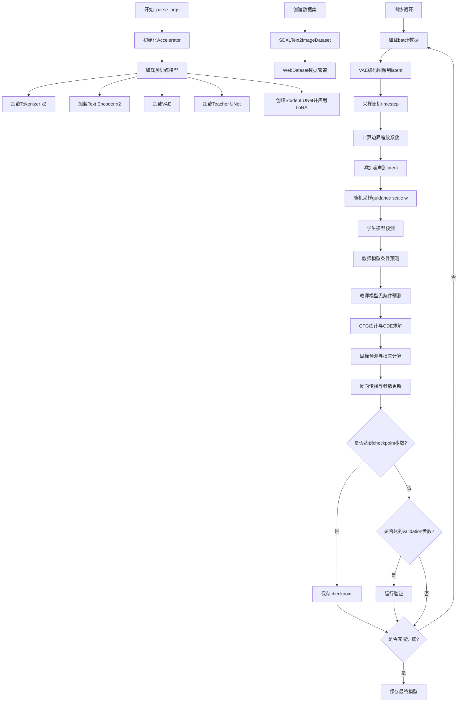

## 类结构

```
全局变量与函数
├── 全局常量 (MAX_SEQ_LENGTH, WDS_JSON_*, MIN_SIZE)
├── 工具函数
│   ├── get_module_kohya_state_dict
│   ├── filter_keys
│   ├── group_by_keys_nothrow
│   ├── tarfile_to_samples_nothrow
│   ├── log_validation
│   ├── append_dims
│   ├── scalings_for_boundary_conditions
│   ├── get_predicted_original_sample
│   ├── get_predicted_noise
│   ├── extract_into_tensor
│   ├── import_model_class_from_model_name_or_path
│   ├── parse_args
│   └── encode_prompt
├── WebdatasetFilter (数据过滤类)
├── SDXLText2ImageDataset (数据集类)
└── DDIMSolver (ODE求解器类)
```

## 全局变量及字段


### `MAX_SEQ_LENGTH`
    
最大序列长度(77)

类型：`int`
    


### `WDS_JSON_WIDTH`
    
JSON中宽度字段名

类型：`str`
    


### `WDS_JSON_HEIGHT`
    
JSON中高度字段名

类型：`str`
    


### `MIN_SIZE`
    
最小图像尺寸(700)

类型：`int`
    


### `logger`
    
日志记录器

类型：`logging.Logger`
    


### `WebdatasetFilter.min_size`
    
最小图像尺寸阈值

类型：`int`
    


### `WebdatasetFilter.max_pwatermark`
    
最大水印概率阈值

类型：`float`
    


### `SDXLText2ImageDataset._train_dataset`
    
训练数据集

类型：`wds.DataPipeline`
    


### `SDXLText2ImageDataset._train_dataloader`
    
训练数据加载器

类型：`wds.WebLoader`
    


### `DDIMSolver.ddim_timesteps`
    
DDIM时间步

类型：`torch.Tensor`
    


### `DDIMSolver.ddim_alpha_cumprods`
    
累积alpha值

类型：`torch.Tensor`
    


### `DDIMSolver.ddim_alpha_cumprods_prev`
    
前一步累积alpha值

类型：`torch.Tensor`
    
    

## 全局函数及方法


### `get_module_kohya_state_dict`

该函数用于将PEFT库生成的状态字典转换为Kohya格式，主要实现LoRA权重的键名映射（将`base_model.model`替换为指定前缀，`lora_A`替换为`lora_down`，`lora_B`替换为`lora_up`），同时设置alpha参数，并将权重转换为指定的数据类型。

参数：

- `module`：`torch.nn.Module`，PEFT模型实例（通常是添加了LoRA的UNet或Text Encoder）
- `prefix`：`str`，Kohya格式中模型权重的前缀（如"lora_unet"或"lora_te"）
- `dtype`：`torch.dtype`，目标数据类型（如torch.float16）
- `adapter_name`：`str`，PEFT适配器名称，默认为"default"

返回值：`Dict[str, torch.Tensor]`，转换后的Kohya格式状态字典

#### 流程图

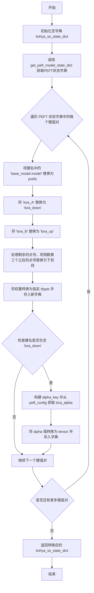

#### 带注释源码

```python
def get_module_kohya_state_dict(module, prefix: str, dtype: torch.dtype, adapter_name: str = "default"):
    """
    将PEFT模型的状态字典转换为Kohya格式
    
    参数:
        module: PEFT模型实例（如添加了LoRA的UNet）
        prefix: Kohya格式的前缀（如"lora_unet"）
        dtype: 目标数据类型
        adapter_name: PEFT适配器名称
    
    返回:
        转换后的Kohya格式状态字典
    """
    # 初始化用于存储Kohya格式状态字典的变量
    kohya_ss_state_dict = {}
    
    # 获取PEFT模型的状态字典
    peft_state_dict = get_peft_model_state_dict(module, adapter_name=adapter_name)
    
    # 遍历PEFT状态字典中的每个键值对
    for peft_key, weight in peft_state_dict.items():
        # 1. 将键名中的 'base_model.model' 替换为指定的前缀
        # 例如: "base_model.model.unet.blocks.0.lora_A.weight" -> "lora_unet.unet.blocks.0.lora_A.weight"
        kohya_key = peft_key.replace("base_model.model", prefix)
        
        # 2. 将 'lora_A' 替换为 'lora_down'（Kohya格式使用不同的命名）
        kohya_key = kohya_key.replace("lora_A", "lora_down")
        
        # 3. 将 'lora_B' 替换为 'lora_up'（Kohya格式使用不同的命名）
        kohya_key = kohya_key.replace("lora_B", "lora_up")
        
        # 4. 处理剩余的点号
        # Kohya格式使用下划线代替点号，但只替换倒数第三个之后的点号
        # 这样做是为了保持某些层级结构的正确性
        if kohya_key.count(".") > 2:
            # 计算需要替换的点号数量（总数量减去2）
            dots_to_replace = kohya_key.count(".") - 2
            kohya_key = kohya_key.replace(".", "_", dots_to_replace)
        
        # 将权重转换为指定的数据类型并存储到新字典中
        kohya_ss_state_dict[kohya_key] = weight.to(dtype)
        
        # 5. 设置alpha参数
        # 只有在处理lora_down权重时才设置alpha（每个LoRA层只需设置一次）
        if "lora_down" in kohya_key:
            # 构建alpha键名: 取第一部分加上.alpha后缀
            # 例如: "lora_unet_unet_blocks_0_lora_down.weight" -> "lora_unet.alpha"
            alpha_key = f"{kohya_key.split('.')[0]}.alpha"
            
            # 从peft_config中获取lora_alpha值，转换为指定数据类型的tensor
            kohya_ss_state_dict[alpha_key] = torch.tensor(
                module.peft_config[adapter_name].lora_alpha
            ).to(dtype)
    
    return kohya_ss_state_dict
```


### `filter_keys(key_set)`

该函数是一个高阶函数，用于创建键过滤函数。它接收一个键集合作为参数，返回一个内部函数，该内部函数接受字典并返回只包含指定键的新字典。这种设计模式常用于数据处理管道中，以筛选和保留所需的字段。

参数：

- `key_set`：`set`，包含需要保留的键的集合

返回值：`function`，返回一个内部函数 `_f`，该函数接收字典类型参数 `dictionary`，返回只包含 `key_set` 中存在的键的新字典

#### 流程图

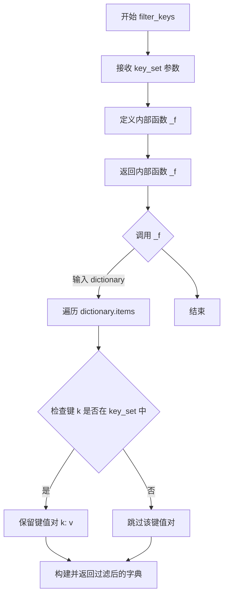

#### 带注释源码

```python
def filter_keys(key_set):
    """
    创建一个键过滤函数，用于从字典中提取指定的键。
    
    这是一个高阶函数，接收一个键集合作为参数，
    返回一个可以应用于字典的过滤函数。
    
    参数:
        key_set (set): 包含需要保留的键的集合
        
    返回:
        function: 返回一个内部函数 _f，该函数接收字典并返回过滤后的字典
    """
    def _f(dictionary):
        """
        内部过滤函数，从字典中提取指定键。
        
        参数:
            dictionary (dict): 输入的原始字典
            
        返回:
            dict: 只包含 key_set 中键的新字典
        """
        # 使用字典推导式过滤，只保留 key_set 中存在的键值对
        return {k: v for k, v in dictionary.items() if k in key_set}

    # 返回内部函数，供后续调用
    return _f
```

#### 使用示例

在代码中，该函数被用于 webdataset 数据处理管道：

```python
# 在 SDXLText2ImageDataset 中
processing_pipeline = [
    wds.decode("pil", handler=wds.ignore_and_continue),
    wds.rename(
        image="jpg;png;jpeg;webp", text="text;txt;caption", orig_size="json", handler=wds.warn_and_continue
    ),
    wds.map(filter_keys({"image", "text", "orig_size"})),  # 只保留这三个字段
    wds.map_dict(orig_size=get_orig_size),
    wds.map(transform),
    wds.to_tuple("image", "text", "orig_size", "crop_coords"),
]
```

这种设计允许数据处理管道灵活地过滤和保留数据集中的特定字段，确保只有必要的字段被传递到后续处理步骤。


### `group_by_keys_nothrow`

该函数是一个生成器函数，用于将迭代器中的键值对按前缀（key）分组为样本。它是 webdataset 库的核心函数之一，负责将 Tar 文件中的文件样本合并为完整的 WebDataset 样本格式，支持按文件名前缀和后缀进行分组。

参数：

- `data`：迭代器（Iterator），待处理的键值对迭代器，每个元素为包含 `"fname"` 和 `"data"` 字段的字典
- `keys`：函数（Callable，可选），键提取函数，默认值为 `base_plus_ext`，用于将文件名分割为前缀和后缀
- `lcase`：布尔值（可选，默认 `True`），是否将后缀转换为小写
- `suffixes`：集合或列表（可选），允许的后缀列表，如果为 `None` 则接受所有后缀
- `handler`：函数（可选），错误处理函数，用于处理迭代过程中的异常

返回值：生成器（Generator），生成按前缀分组后的样本字典

#### 流程图

```mermaid
flowchart TD
    A[开始] --> B[初始化 current_sample = None]
    B --> C{遍历 data 中的 filesample}
    C --> D[提取 fname 和 value]
    D --> E[调用 keys(fname) 获取 prefix 和 suffix]
    E --> F{prefix is None?}
    F -->|Yes| C
    F -->|No| G{lcase is True?}
    G -->|Yes| H[suffix = suffix.lower()]
    G -->|No| I
    H --> I
    I{current_sample 为空 或<br/>prefix != current_sample.__key__<br/>或 suffix 已在 current_sample 中?}
    I -->|Yes| J{valid_sample(current_sample)?}
    J -->|Yes| K[yield current_sample]
    J -->|No| L[current_sample = 新字典]
    K --> L
    L --> M{后缀过滤:<br/>suffixes is None 或<br/>suffix in suffixes?}
    M -->|Yes| N[current_sample[suffix] = value]
    M -->|No| C
    N --> C
    C -->|迭代结束| O{valid_sample(current_sample)?}
    O -->|Yes| P[yield current_sample]
    O -->|No| Q[结束]
    P --> Q
```

#### 带注释源码

```python
def group_by_keys_nothrow(data, keys=base_plus_ext, lcase=True, suffixes=None, handler=None):
    """Return function over iterator that groups key, value pairs into samples.

    :param keys: function that splits the key into key and extension (base_plus_ext)
    :param lcase: convert suffixes to lower case (Default value = True)
    """
    # current_sample 用于缓存当前正在构建的样本
    current_sample = None
    
    # 遍历输入数据中的每个文件样本
    for filesample in data:
        # 确保每个样本是字典类型
        assert isinstance(filesample, dict)
        
        # 从文件样本中提取文件名和数据
        fname, value = filesample["fname"], filesample["data"]
        
        # 使用 keys 函数将文件名分割为前缀和后缀
        prefix, suffix = keys(fname)
        
        # 如果前缀为空，跳过该样本
        if prefix is None:
            continue
        
        # 根据 lcase 参数决定是否将后缀转换为小写
        if lcase:
            suffix = suffix.lower()
        
        # FIXME: webdataset 版本会在 suffix 已存在于 current_sample 时抛出异常
        # 但在 LAION400m 数据集中可能出现一种罕见情况：
        # 一个 tar 文件的结尾与下一个 tar 文件的开头具有相同的前缀
        # 因为在数据集中前缀在不同的 tar 文件之间不唯一
        # 检查是否需要开始一个新样本：
        # 1. 当前没有样本
        # 2. 当前文件前缀与前一个样本的 key 不匹配
        # 3. 当前后缀已存在于当前样本中（可能是不同文件的相同后缀）
        if current_sample is None or prefix != current_sample["__key__"] or suffix in current_sample:
            # 如果存在有效的当前样本，则 yield 出去
            if valid_sample(current_sample):
                yield current_sample
            
            # 创建新的样本字典
            current_sample = {"__key__": prefix, "__url__": filesample["__url__"]}
        
        # 如果后缀过滤器为 None（接受所有后缀）或当前后缀在允许列表中
        if suffixes is None or suffix in suffixes:
            # 将数据添加到当前样本中
            current_sample[suffix] = value
    
    # 迭代完成后，如果还有未 yield 的有效样本，则 yield 出去
    if valid_sample(current_sample):
        yield current_sample
```


### `tarfile_to_samples_nothrow`

该函数是一个从tar文件生成样本的辅助函数，它重新实现了webdataset的group_by_keys功能，但不会抛出异常。函数接受tar文件源路径和错误处理函数，返回一个生成器，用于逐个产出样本。

参数：

- `src`：tar文件源路径，可以是本地文件路径或URL
- `handler`：错误处理函数，默认为`wds.warn_and_continue`，用于处理打开或读取tar文件时可能发生的错误

返回值：生成器（generator），逐个产出从tar文件中分组的样本字典

#### 流程图

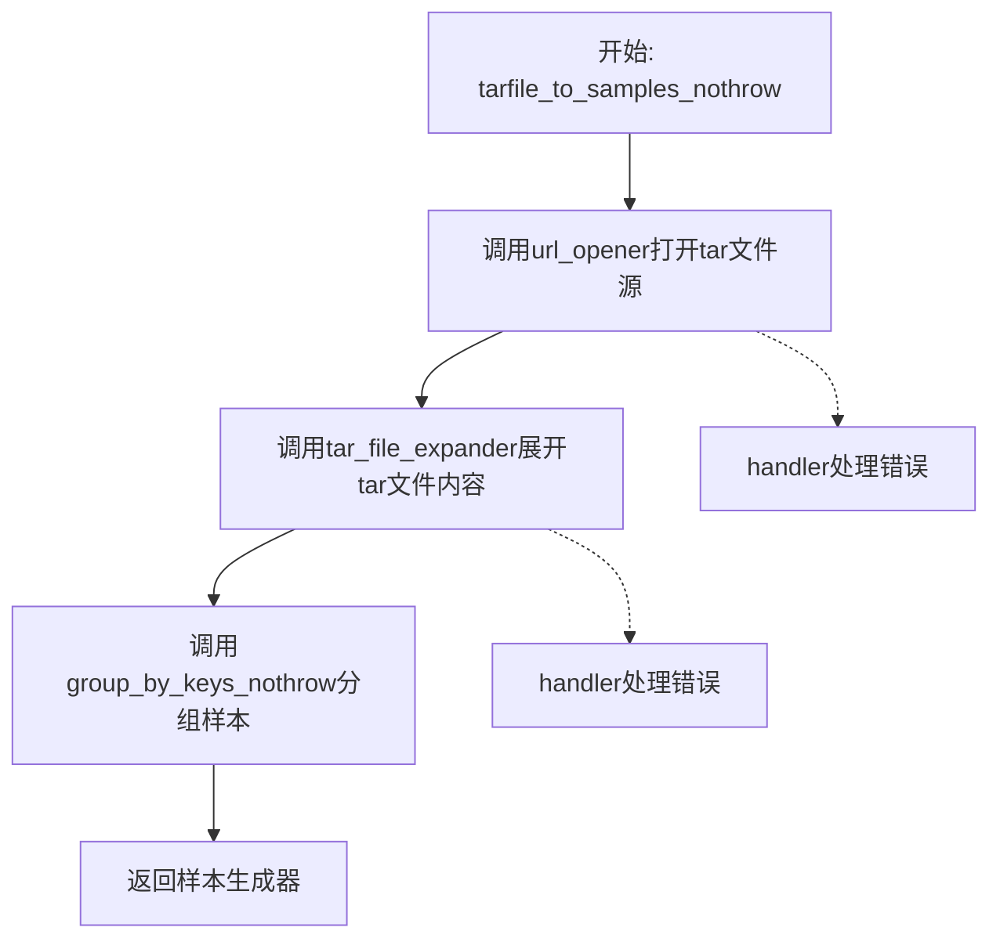

#### 带注释源码

```python
def tarfile_to_samples_nothrow(src, handler=wds.warn_and_continue):
    # NOTE this is a re-impl of the webdataset impl with group_by_keys that doesn't throw
    # 重新实现webdataset的group_by_keys，但不会抛出异常
    
    # 1. 使用url_opener打开tar文件源，返回文件流
    # src: tar文件路径或URL
    # handler: 错误处理函数，默认为wds.warn_and_continue（警告并继续）
    streams = url_opener(src, handler=handler)
    
    # 2. 使用tar_file_expander将tar文件流展开为文件样本
    # 每个文件样本是一个字典，包含'fname'（文件名）和'data'（文件数据）
    files = tar_file_expander(streams, handler=handler)
    
    # 3. 使用group_by_keys_nothrow将文件样本分组为完整的样本
    # group_by_keys_nothrow会根据文件名的前缀和后缀将相关文件组合成一个样本
    # 例如：image.jpg, image.json, image.txt会被组合成一个样本
    samples = group_by_keys_nothrow(files, handler=handler)
    
    # 4. 返回样本生成器
    # 调用者可以使用for循环逐个获取样本
    return samples
```


### `log_validation`

验证函数，用于在训练过程中运行模型验证。该函数加载训练好的LoRA权重到StableDiffusionXLPipeline中，使用预定义的验证提示词生成图像，并将生成的图像记录到TensorBoard或WandB等跟踪器中。

参数：

- `vae`：`AutoencoderKL`，预训练的VAE模型，用于编码和解码图像
- `unet`：`UNet2DConditionModel`，带有LoRA适配器的UNet学生模型
- `args`：`argparse.Namespace`，包含所有训练参数的配置对象
- `accelerator`：`Accelerator`，HuggingFace Accelerate库提供的分布式训练加速器
- `weight_dtype`：`torch.dtype`，用于混合精度训练的数据类型（fp16或bf16）
- `step`：`int`，当前训练的步数，用于记录日志

返回值：`List[Dict]`，验证日志列表，每个字典包含`validation_prompt`（验证提示词）和`images`（生成的图像列表）

#### 流程图

```mermaid
flowchart TD
    A[开始验证] --> B{检查MPS是否可用}
    B -->|是| C[创建nullcontext]
    B -->|否| D[创建torch.autocast上下文]
    C --> E[unwrap UNet模型]
    D --> E
    E --> F[从预训练模型加载StableDiffusionXLPipeline]
    F --> G[加载VAE和LCMScheduler]
    G --> H[将Pipeline移到加速器设备]
    H --> I[获取LoRA状态字典并加载]
    I --> J[融合LoRA权重]
    J --> K{启用xformers?}
    K -->|是| L[启用xformers高效注意力]
    K -->|否| M[跳过]
    L --> M
    M --> N{args.seed是否存在?}
    N -->|是| O[创建随机数生成器]
    N -->|否| P[generator设为None]
    O --> Q
    P --> Q
    Q[定义验证提示词列表] --> R[初始化image_logs为空列表]
    R --> S[遍历验证提示词]
    S --> T{当前索引 < 列表长度?}
    T -->|是| U[在autocast上下文中调用pipeline生成图像]
    U --> V[将生成的图像添加到image_logs]
    V --> W[继续遍历]
    W --> T
    T -->|否| X{遍历跟踪器]
    X --> Y{TensorBoard跟踪器?}
    Y -->|是| Z[格式化图像为numpy数组]
    Z --> AA[使用tracker记录图像]
    Y -->|否| BB{WandB跟踪器?}
    BB -->|是| CC[将图像转换为wandb.Image]
    CC --> DD[使用tracker记录图像]
    BB -->|否| EE[记录警告信息]
    AA --> FF[删除pipeline释放显存]
    DD --> FF
    EE --> FF
    FF --> GG[垃圾回收和清空CUDA缓存]
    GG --> HH[返回image_logs]
```

#### 带注释源码

```python
def log_validation(vae, unet, args, accelerator, weight_dtype, step):
    """
    运行验证流程：使用训练好的LoRA权重生成验证图像并记录到跟踪器
    
    参数:
        vae: 预训练的VAE模型
        unet: 带有LoRA的UNet学生模型
        args: 训练参数
        accelerator: Accelerate加速器
        weight_dtype: 权重数据类型
        step: 当前训练步数
    返回:
        image_logs: 验证图像日志列表
    """
    logger.info("Running validation... ")
    
    # 根据设备类型选择自动混合精度上下文
    # MPS设备不支持和autocast，需要使用nullcontext
    if torch.backends.mps.is_available():
        autocast_ctx = nullcontext()
    else:
        autocast_ctx = torch.autocast(accelerator.device.type, dtype=weight_dtype)

    # 解包accelerator中的UNet模型，获取原始模型对象
    unet = accelerator.unwrap_model(unet)
    
    # 从预训练模型构建Stable Diffusion XL Pipeline
    pipeline = StableDiffusionXLPipeline.from_pretrained(
        args.pretrained_teacher_model,  # 预训练教师模型路径
        vae=vae,                         # 传入VAE模型
        # 使用LCMScheduler作为推理调度器
        scheduler=LCMScheduler.from_pretrained(args.pretrained_teacher_model, subfolder="scheduler"),
        revision=args.revision,          # 模型版本
        torch_dtype=weight_dtype,        # 数据类型
    )
    
    # 将Pipeline移到加速器设备上
    pipeline = pipeline.to(accelerator.device)
    # 禁用进度条显示
    pipeline.set_progress_bar_config(disable=True)

    # 获取LoRA状态字典，转换为Kohya格式
    lora_state_dict = get_module_kohya_state_dict(unet, "lora_unet", weight_dtype)
    
    # 加载LoRA权重到Pipeline
    pipeline.load_lora_weights(lora_state_dict)
    
    # 融合LoRA权重以提高推理效率
    pipeline.fuse_lora()

    # 如果启用xformers，启用高效注意力机制
    if args.enable_xformers_memory_efficient_attention:
        pipeline.enable_xformers_memory_efficient_attention()

    # 设置随机种子以确保可重复性
    if args.seed is None:
        generator = None
    else:
        generator = torch.Generator(device=accelerator.device).manual_seed(args.seed)

    # 定义验证用的提示词列表（包含人物、画作、风景等多样化的场景）
    validation_prompts = [
        "portrait photo of a girl, photograph, highly detailed face, depth of field, moody light, golden hour, style by Dan Winters, Russell James, Steve McCurry, centered, extremely detailed, Nikon D850, award winning photography",
        "Self-portrait oil painting, a beautiful cyborg with golden hair, 8k",
        "Astronaut in a jungle, cold color palette, muted colors, detailed, 8k",
        "A photo of beautiful mountain with realistic sunset and blue lake, highly detailed, masterpiece",
    ]

    # 初始化图像日志列表
    image_logs = []

    # 遍历每个验证提示词生成图像
    for _, prompt in enumerate(validation_prompts):
        images = []
        # 使用自动混合精度上下文进行推理
        with autocast_ctx:
            # 调用Pipeline生成图像
            images = pipeline(
                prompt=prompt,                    # 提示词
                num_inference_steps=4,            # 推理步数（较少步数用于快速验证）
                num_images_per_prompt=4,          # 每个提示词生成的图像数量
                generator=generator,              # 随机数生成器
                guidance_scale=0.0,                # 无分类器引导（LCM不需要）
            ).images
        
        # 记录提示词和生成的图像
        image_logs.append({"validation_prompt": prompt, "images": images})

    # 遍历所有跟踪器记录图像
    for tracker in accelerator.trackers:
        if tracker.name == "tensorboard":
            # TensorBoard记录方式
            for log in image_logs:
                images = log["images"]
                validation_prompt = log["validation_prompt"]
                formatted_images = []
                for image in images:
                    formatted_images.append(np.asarray(image))

                formatted_images = np.stack(formatted_images)
                # 添加图像到TensorBoard
                tracker.writer.add_images(validation_prompt, formatted_images, step, dataformats="NHWC")
        
        elif tracker.name == "wandb":
            # WandB记录方式
            formatted_images = []

            for log in image_logs:
                images = log["images"]
                validation_prompt = log["validation_prompt"]
                for image in images:
                    # 将PIL图像转换为wandb.Image并添加标题
                    image = wandb.Image(image, caption=validation_prompt)
                    formatted_images.append(image)

            # 记录到WandB
            tracker.log({"validation": formatted_images})
        else:
            # 其他跟踪器给出警告
            logger.warning(f"image logging not implemented for {tracker.name}")

    # 清理：删除pipeline并释放GPU内存
    del pipeline
    gc.collect()
    torch.cuda.empty_cache()

    # 返回图像日志供后续处理
    return image_logs
```


### `append_dims`

扩展张量维度到目标维度数，在张量末尾添加大小为1的维度。

参数：

- `x`：`torch.Tensor`，输入张量
- `target_dims`：`int`，目标维度数

返回值：`torch.Tensor`，扩展后的张量

#### 流程图

```mermaid
flowchart TD
    A[开始] --> B[计算 dims_to_append = target_dims - x.ndim]
    B --> C{dims_to_append < 0?}
    C -->|是| D[抛出 ValueError 异常]
    C -->|否| E[返回 x[(...,) + (None,) * dims_to_append]]
    D --> F[结束]
    E --> F
```

#### 带注释源码

```python
def append_dims(x, target_dims):
    """Appends dimensions to the end of a tensor until it has target_dims dimensions.
    
    这个函数用于扩展张量的维度，使其达到目标维度数。在扩散模型中，
    通常需要将不同形状的张量对齐到相同的维度数，以便进行元素级运算。
    
    参数:
        x: 输入的张量
        target_dims: 目标维度数
    
    返回:
        扩展后的张量，其维度数为 target_dims
    """
    # 计算需要追加的维度数量
    # 例如：如果 x 是 2D 张量 (ndim=2)，target_dims=4，则 dims_to_append=2
    dims_to_append = target_dims - x.ndim
    
    # 如果目标维度数小于输入张量的维度数，抛出错误
    # 这防止了对已经具有足够维度的张量进行降维操作
    if dims_to_append < 0:
        raise ValueError(f"input has {x.ndim} dims but target_dims is {target_dims}, which is less")
    
    # 使用切片和 None 进行维度扩展
    # (...,) 表示保留所有现有维度
    # (None,) * dims_to_append 会在末尾添加指定数量的新维度，每个维度大小为 1
    # 例如：x[..., None, None] 会在 x 末尾添加两个维度
    return x[(...,) + (None,) * dims_to_append]
```


### `scalings_for_boundary_conditions`

该函数用于计算 LCM（Latent Consistency Model）训练中的边界缩放因子（c_skip 和 c_out），通过给定的时间步、数据方差参数和时间步缩放因子，计算模型在边界条件下的跳过系数和输出系数，用于调整学生模型对原始样本的预测，是 LCM 蒸馏训练中计算目标变量的关键数学工具。

参数：

- `timestep`：数值类型（int/float/tensor），当前扩散过程的时间步
- `sigma_data`：float，默认值 0.5，数据标准差参数，控制噪声水平的基准
- `timestep_scaling`：float，默认值 10.0，时间步缩放因子，用于放大时间步的影响

返回值：tuple[float, float]，返回 (c_skip, c_out) 元组，其中 c_skip 是跳过系数（用于加权原始输入），c_out 是输出系数（用于加权预测的原始样本）

#### 流程图

```mermaid
flowchart TD
    A[开始: scalings_for_boundary_conditions] --> B[输入: timestep, sigma_data, timestep_scaling]
    B --> C[计算: scaled_timestep = timestep_scaling × timestep]
    C --> D[计算: c_skip = σ²_data / scaled_timestep² + σ²_data]
    D --> E[计算: c_out = scaled_timestep / √scaled_timestep² + σ²_data]
    E --> F[返回: (c_skip, c_out)]
    
    style A fill:#e1f5fe
    style F fill:#e8f5e8
```

#### 带注释源码

```python
# From LCMScheduler.get_scalings_for_boundary_condition_discrete
def scalings_for_boundary_conditions(timestep, sigma_data=0.5, timestep_scaling=10.0):
    """
    计算 LCM 训练中边界条件的缩放因子。
    
    该函数实现了 LCM 论文中描述的边界缩放计算，用于在 LCM 蒸馏过程中
    计算学生模型的训练目标。通过对时间步进行缩放，可以调整模型在不同
    噪声水平下的学习焦点。
    
    参数:
        timestep: 当前扩散过程的时间步，可以是标量或张量
        sigma_data: 数据标准差参数，默认0.5，代表原始数据的噪声水平
        timestep_scaling: 时间步缩放因子，默认10.0，用于放大时间步的影响
    
    返回:
        c_skip: 跳过系数，用于保留部分原始输入信息
        c_out: 输出系数，用于缩放预测的原始样本
    """
    # 对时间步进行缩放，使其具有更大的数值范围
    # 这有助于在计算中保持数值稳定性
    scaled_timestep = timestep_scaling * timestep
    
    # 计算 c_skip：skip 系数
    # 公式: σ_data² / (scaled_timestep² + σ_data²)
    # 当 timestep 很大时，c_skip 趋近于 0
    # 当 timestep 很小时，c_skip 趋近于 1
    c_skip = sigma_data**2 / (scaled_timestep**2 + sigma_data**2)
    
    # 计算 c_out：output 系数
    # 公式: scaled_timestep / √(scaled_timestep² + σ_data²)
    # 当 timestep 很大时，c_out 趋近于 1
    # 当 timestep 很小时，c_out 趋近于 0
    c_out = scaled_timestep / (scaled_timestep**2 + sigma_data**2) ** 0.5
    
    return c_skip, c_out
```


### `get_predicted_original_sample`

该函数是 Latent Consistency Distillation (LCD) 训练流程中的核心组件，用于根据模型输出、时间步和噪声调度参数预测原始样本 $x_0$。它支持三种预测类型（epsilon、sample、v_prediction），通过逆向推导计算去噪目标，是蒸馏算法中计算目标值的关键步骤。

参数：

- `model_output`：`torch.Tensor`，模型的输出（预测的噪声、样本或速度向量）
- `timesteps`：`torch.Tensor`，当前的时间步索引，用于从调度表中提取对应的 alpha 和 sigma 值
- `sample`：`torch.Tensor`，当前的样本（通常为加噪后的潜在表示 $z_t$）
- `prediction_type`：`str`，预测类型，可选值为 "epsilon"（预测噪声）、"sample"（直接预测样本）、"v_prediction"（预测速度）
- `alphas`：`torch.Tensor`，Alpha 值数组（噪声调度的累积乘积 $\sqrt{\bar{\alpha}_t}$）
- `sigmas`：`torch.Tensor`，Sigma 值数组（噪声调度的累积乘积 $\sqrt{1 - \bar{\alpha}_t}$）

返回值：`torch.Tensor`，预测的原始样本 $pred\_x_0$（即去噪目标 $x_0$）

#### 流程图

```mermaid
flowchart TD
    A[开始: get_predicted_original_sample] --> B[提取 Alpha 值: extract_into_tensor]
    B --> C[提取 Sigma 值: extract_into_tensor]
    C --> D{判断 prediction_type}
    D -->|epsilon| E[计算: pred_x_0 = (sample - sigmas * model_output) / alphas]
    D -->|sample| F[计算: pred_x_0 = model_output]
    D -->|v_prediction| G[计算: pred_x_0 = alphas * sample - sigmas * model_output]
    D -->|其他| H[抛出 ValueError 异常]
    E --> I[返回 pred_x_0]
    F --> I
    G --> I
    H --> I
```

#### 带注释源码

```python
# Compare LCMScheduler.step, Step 4
def get_predicted_original_sample(model_output, timesteps, sample, prediction_type, alphas, sigmas):
    """
    根据模型输出预测原始样本（去噪目标 x_0）
    
    参数:
        model_output: 模型预测的噪声/样本/速度
        timesteps: 当前时间步
        sample: 当前加噪样本 z_t
        prediction_type: 预测类型 (epsilon/sample/v_prediction)
        alphas: alpha 调度值
        sigmas: sigma 调度值
    
    返回:
        pred_x_0: 预测的原始样本 x_0
    """
    # 从调度表中提取与当前时间步对应的 alpha 和 sigma 值
    # 使用 gather 操作根据 timesteps 索引从数组中获取对应值
    alphas = extract_into_tensor(alphas, timesteps, sample.shape)
    sigmas = extract_into_tensor(sigmas, timesteps, sample.shape)
    
    # 根据 prediction_type 计算预测的原始样本 x_0
    if prediction_type == "epsilon":
        # epsilon 预测：x_0 = (z_t - σ_t * ε_t) / α_t
        # 将预测噪声 ε 反向推导为原始样本
        pred_x_0 = (sample - sigmas * model_output) / alphas
    elif prediction_type == "sample":
        # sample 预测：模型直接输出 x_0，无需转换
        pred_x_0 = model_output
    elif prediction_type == "v_prediction":
        # v_prediction 预测：x_0 = α_t * z_t - σ_t * v_t
        # 其中 v 是速度向量（噪声与样本的线性组合）
        pred_x_0 = alphas * sample - sigmas * model_output
    else:
        # 不支持的预测类型，抛出错误
        raise ValueError(
            f"Prediction type {prediction_type} is not supported; currently, `epsilon`, `sample`, and `v_prediction`"
            f" are supported."
        )

    return pred_x_0


def extract_into_tensor(a, t, x_shape):
    """
    从调度表中提取与时间步对应的值，并reshape为与输入相同维度
    
    参数:
        a: 调度表数组 (alphas 或 sigmas)
        t: 时间步索引张量
        x_shape: 目标张量的形状
    
    返回:
        重塑后的调度值张量
    """
    # 获取 batch 大小
    b, *_ = t.shape
    # 使用 gather 根据时间步索引从调度表获取值
    out = a.gather(-1, t)
    # 重塑为与 x_shape 兼容的形状
    # 例如: (batch_size, 1, 1, 1) 以便与 4D 图像张量广播
    return out.reshape(b, *((1,) * (len(x_shape) - 1)))
```


### `get_predicted_noise`

该函数根据模型输出和不同的预测类型（epsilon、sample、v_prediction）计算预测的噪声。在扩散模型的采样过程中，它将模型对当前 timestep 的预测转换为噪声预测，用于 DDIM 调度器的反向扩散步骤。

参数：

- `model_output`：`torch.Tensor`，模型（通常是 U-Net）的输出，根据 prediction_type 可以是预测的噪声、样本或 v-prediction
- `timesteps`：`torch.Tensor`，当前的时间步张量，用于从 alphas 和 sigmas 中提取对应的值
- `sample`：`torch.Tensor`，当前的样本（带噪声的潜变量），用于确定输出形状和计算
- `prediction_type`：`str`，预测类型，支持 "epsilon"（直接预测噪声）、"sample"（预测原始样本）、"v_prediction"（v-prediction）
- `alphas`：`torch.Tensor`，alpha 值序列（累积乘积的平方根），用于噪声计算
- `sigmas`：`torch.Tensor`，sigma 值序列（1 - alpha_cumprod 的平方根），用于噪声计算

返回值：`torch.Tensor`，预测的噪声张量，形状与 sample 相同

#### 流程图

```mermaid
flowchart TD
    A[开始 get_predicted_noise] --> B[使用 extract_into_tensor 提取 alphas]
    C[开始 get_predicted_noise] --> D[使用 extract_into_tensor 提取 sigmas]
    B --> E{判断 prediction_type}
    D --> E
    E -->|epsilon| F[pred_epsilon = model_output]
    E -->|sample| G[pred_epsilon = (sample - alphas * model_output) / sigmas]
    E -->|v_prediction| H[pred_epsilon = alphas * model_output + sigmas * sample]
    F --> I[返回 pred_epsilon]
    G --> I
    H --> I
    E -->|其他| J[抛出 ValueError 异常]
```

#### 带注释源码

```python
def get_predicted_noise(model_output, timesteps, sample, prediction_type, alphas, sigmas):
    """
    根据模型输出和预测类型计算预测的噪声。
    
    参数:
        model_output: 模型对当前 timestep 的输出，可以是噪声、样本或 v-prediction
        timesteps: 当前时间步张量
        sample: 当前的噪声样本（潜变量）
        prediction_type: 预测类型，'epsilon', 'sample', 或 'v_prediction'
        alphas: alpha 值序列（sqrt(alphas_cumprod)）
        sigmas: sigma 值序列（sqrt(1 - alphas_cumprod)）
    
    返回:
        预测的噪声张量
    """
    # 从 alphas 序列中提取与当前 timesteps 对应的值，并调整形状以匹配 sample
    alphas = extract_into_tensor(alphas, timesteps, sample.shape)
    # 从 sigmas 序列中提取与当前 timesteps 对应的值，并调整形状以匹配 sample
    sigmas = extract_into_tensor(sigmas, timesteps, sample.shape)
    
    # 根据 prediction_type 计算预测的噪声
    if prediction_type == "epsilon":
        # epsilon 预测：模型直接输出噪声
        pred_epsilon = model_output
    elif prediction_type == "sample":
        # sample 预测：模型输出原始样本 x_0，需要反推噪声
        # 推导: x_t = alpha * x_0 + sigma * epsilon
        # => epsilon = (x_t - alpha * x_0) / sigma
        pred_epsilon = (sample - alphas * model_output) / sigmas
    elif prediction_type == "v_prediction":
        # v-prediction：模型输出 v = alpha * epsilon - sigma * x_0
        # 需要反推 epsilon: epsilon = (v + sigma * x_0) / alpha
        pred_epsilon = alphas * model_output + sigmas * sample
    else:
        # 不支持的预测类型，抛出异常
        raise ValueError(
            f"Prediction type {prediction_type} is not supported; currently, `epsilon`, `sample`, and `v_prediction`"
            f" are supported."
        )

    return pred_epsilon


def extract_into_tensor(a, t, x_shape):
    """从张量 a 中根据索引 t 提取值，并调整形状以匹配目标维度"""
    # 获取 batch 大小
    b, *_ = t.shape
    # 使用 gather 在最后一个维度上收集索引 t 对应的值
    out = a.gather(-1, t)
    # 调整输出形状：batch 维度 + (1,) * (x_shape 维度数 - 1)
    # 这样可以将 1D 张量广播到与 x_shape 相同的维度数
    return out.reshape(b, *((1,) * (len(x_shape) - 1)))
```


### `extract_into_tensor`

该函数用于从给定的一维张量（查找表）中根据索引张量提取相应位置的值，并将输出重塑为与目标张量形状相匹配的维度格式，通常用于扩散模型中的噪声调度参数提取。

参数：

- `a`：`torch.Tensor`，一维张量，作为查找表（例如噪声调度中的alpha或sigma值）
- `t`：`torch.Tensor`，整数索引张量，指定从张量`a`中提取哪些位置的值，其batch维度决定了输出数量
- `x_shape`：`tuple` 或 `int`，目标张量的形状，用于确定输出需要扩展到的维度数量

返回值：`torch.Tensor`，从`a`中按索引提取的值，并被重塑为`(batch_size, 1, ...)`的形式以匹配`x_shape`的维度结构

#### 流程图

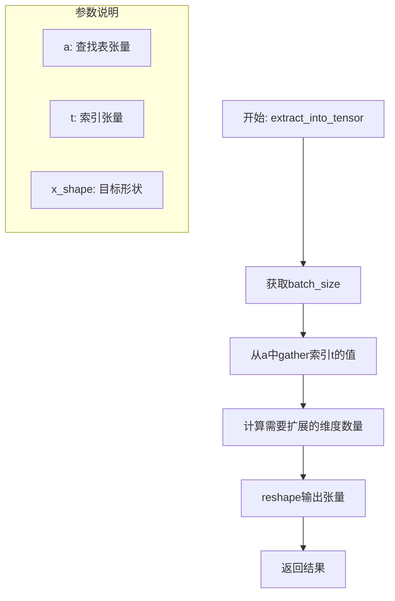

#### 带注释源码

```python
def extract_into_tensor(a, t, x_shape):
    """
    从张量a中按索引t提取值，并重塑为匹配x_shape维度的格式
    
    参数:
        a: 一维张量，例如噪声调度中的alpha_cumprod值
        t: 索引张量，指定要提取的位置
        x_shape: 目标张量形状，用于确定输出维度
    
    返回:
        重塑后的张量，batch维度保留，其余维度扩展为1
    """
    # 获取batch大小，从索引张量t的形状中提取第一维
    b, *_ = t.shape
    
    # 使用gather操作沿最后一维(-1)从a中收集索引为t的值
    # 这相当于执行 a[t] 的操作，但能正确处理多维索引情况
    out = a.gather(-1, t)
    
    # 计算需要添加的维度数量：目标维度减去当前维度
    # 然后将输出reshape为 (batch_size, 1, 1, ...) 格式
    # 这样可以广播到与x_shape相同的维度数
    return out.reshape(b, *((1,) * (len(x_shape) - 1)))
```

#### 设计目的与约束

此函数主要用于扩散模型（如DDIM、LCM调度器）中，根据当前时间步索引从预计算的噪声调度表中提取相应的alpha和sigma值。设计约束包括：

- 输入张量`a`必须是一维的查找表
- 索引张量`t`的dtype必须是整数类型（用于gather操作）
- 输出维度与`x_shape`保持一致，以便后续计算中的广播操作


### `import_model_class_from_model_name_or_path`

该函数根据预训练模型的名称或路径，加载文本编码器的配置并动态导入对应的文本编码器类（如 `CLIPTextModel` 或 `CLIPTextModelWithProjection`），用于后续加载预训练的文本编码器模型。

参数：

- `pretrained_model_name_or_path`：`str`，预训练模型的名称或路径，用于定位模型
- `revision`：`str`，模型的 Git revision 版本号，用于加载特定版本的模型
- `subfolder`：`str`，默认为 `"text_encoder"`，模型子文件夹路径，用于定位子目录中的配置

返回值：`type`，返回文本编码器类（`CLIPTextModel` 或 `CLIPTextModelWithProjection`），可用于后续实例化模型

#### 流程图

```mermaid
flowchart TD
    A[开始: import_model_class_from_model_name_or_path] --> B[加载 PretrainedConfig]
    B --> C[从配置中获取 architectures[0]]
    C --> D{判断 model_class 类型}
    D -->|CLIPTextModel| E[导入 CLIPTextModel 类]
    D -->|CLIPTextModelWithProjection| F[导入 CLIPTextModelWithProjection 类]
    D -->|其他类型| G[抛出 ValueError 异常]
    E --> H[返回 CLIPTextModel 类]
    F --> I[返回 CLIPTextModelWithProjection 类]
    G --> J[结束: 异常处理]
    H --> K[结束: 成功返回]
    I --> K
```

#### 带注释源码

```python
def import_model_class_from_model_name_or_path(
    pretrained_model_name_or_path: str, revision: str, subfolder: str = "text_encoder"
):
    """
    根据预训练模型路径或名称，动态导入对应的文本编码器类。

    参数:
        pretrained_model_name_or_path: 预训练模型名称或本地路径
        revision: Git revision 版本号
        subfolder: 模型子文件夹，默认为 "text_encoder"

    返回:
        文本编码器类 (CLIPTextModel 或 CLIPTextModelWithProjection)
    """
    # 1. 从预训练模型路径加载 PretrainedConfig 配置对象
    text_encoder_config = PretrainedConfig.from_pretrained(
        pretrained_model_name_or_path, subfolder=subfolder, revision=revision
    )
    
    # 2. 从配置中获取第一个架构名称（通常为列表的第一个元素）
    model_class = text_encoder_config.architectures[0]

    # 3. 根据架构名称条件分支，选择导入对应的文本编码器类
    if model_class == "CLIPTextModel":
        # 导入 transformers 库中的 CLIPTextModel 类
        from transformers import CLIPTextModel

        return CLIPTextModel
    elif model_class == "CLIPTextModelWithProjection":
        # 导入 transformers 库中的 CLIPTextModelWithProjection 类
        from transformers import CLIPTextModelWithProjection

        return CLIPTextModelWithProjection
    else:
        # 如果遇到不支持的模型架构，抛出 ValueError 异常
        raise ValueError(f"{model_class} is not supported.")
```


### `parse_args()`

该函数是命令行参数解析器，用于定义和收集训练脚本的所有配置参数，包括模型路径、训练超参数、数据处理设置、分布式训练配置等，并返回包含所有参数的命名空间对象。

参数：
- 该函数无参数

返回值：`argparse.Namespace`，返回一个封装所有命令行参数的命名空间对象，后续可通过`args.参数名`访问

#### 流程图

```mermaid
flowchart TD
    A[开始 parse_args] --> B[创建 ArgumentParser]
    B --> C[添加模型检查点加载参数]
    C --> D[添加训练通用参数]
    D --> E[添加日志记录参数]
    E --> F[添加检查点保存参数]
    F --> G[添加图像处理参数]
    G --> H[添加数据加载器参数]
    H --> I[添加批次和学习步骤参数]
    I --> J[添加学习率调度器参数]
    J --> K[添加优化器参数]
    K --> L[添加扩散训练参数]
    L --> M[添加LCD特定参数]
    M --> N[添加LoRA参数]
    N --> O[添加混合精度参数]
    O --> P[添加训练优化参数]
    P --> Q[添加分布式训练参数]
    Q --> R[添加验证参数]
    R --> S[添加Hub相关参数]
    S --> T[添加Accelerate参数]
    T --> U[调用 parser.parse_args]
    U --> V{检查 LOCAL_RANK 环境变量}
    V -->|env_local_rank != -1| W[更新 args.local_rank]
    V -->|env_local_rank == -1| X[保持原值]
    W --> Y{验证 proportion_empty_prompts}
    Y -->|在 [0,1] 范围内| Z[返回 args]
    Y -->|不在范围内| AA[抛出 ValueError]
    X --> Z
```

#### 带注释源码

```python
def parse_args():
    """
    解析命令行参数并返回包含所有配置选项的命名空间对象
    
    该函数定义了训练脚本的所有可配置参数，包括：
    - 模型检查点加载参数
    - 训练超参数
    - 数据处理配置
    - 优化器设置
    - 分布式训练选项
    - 验证和日志配置
    """
    # 创建ArgumentParser实例，设置描述信息
    parser = argparse.ArgumentParser(description="Simple example of a training script.")
    
    # ----------Model Checkpoint Loading Arguments----------
    # 添加预训练教师模型路径参数（必填）
    parser.add_argument(
        "--pretrained_teacher_model",
        type=str,
        default=None,
        required=True,
        help="Path to pretrained LDM teacher model or model identifier from huggingface.co/models.",
    )
    # 添加预训练VAE模型路径参数（可选）
    parser.add_argument(
        "--pretrained_vae_model_name_or_path",
        type=str,
        default=None,
        help="Path to pretrained VAE model with better numerical stability. More details: https://github.com/huggingface/diffusers/pull/4038.",
    )
    # 添加教师模型版本参数
    parser.add_argument(
        "--teacher_revision",
        type=str,
        default=None,
        required=False,
        help="Revision of pretrained LDM teacher model identifier from huggingface.co/models.",
    )
    # 添加模型版本参数
    parser.add_argument(
        "--revision",
        type=str,
        default=None,
        required=False,
        help="Revision of pretrained LDM model identifier from huggingface.co/models.",
    )
    
    # ----------Training Arguments----------
    # ----General Training Arguments----
    # 添加输出目录参数
    parser.add_argument(
        "--output_dir",
        type=str,
        default="lcm-xl-distilled",
        help="The output directory where the model predictions and checkpoints will be written.",
    )
    # 添加缓存目录参数
    parser.add_argument(
        "--cache_dir",
        type=str,
        default=None,
        help="The directory where the downloaded models and datasets will be stored.",
    )
    # 添加随机种子参数
    parser.add_argument("--seed", type=int, default=None, help="A seed for reproducible training.")
    
    # ----Logging----
    # 添加日志目录参数
    parser.add_argument(
        "--logging_dir",
        type=str,
        default="logs",
        help=(
            "[TensorBoard](https://www.tensorflow.org/tensorboard) log directory. Will default to"
            " *output_dir/runs/**CURRENT_DATETIME_HOSTNAME***."
        ),
    )
    # 添加报告工具参数
    parser.add_argument(
        "--report_to",
        type=str,
        default="tensorboard",
        help=(
            'The integration to report the results and logs to. Supported platforms are `"tensorboard"`'
            ' (default), `"wandb"` and `"comet_ml"`. Use `"all"` to report to all integrations.'
        ),
    )
    
    # ----Checkpointing----
    # 添加检查点保存步数参数
    parser.add_argument(
        "--checkpointing_steps",
        type=int,
        default=500,
        help=(
            "Save a checkpoint of the training state every X updates. These checkpoints are only suitable for resuming"
            " training using `--resume_from_checkpoint`."
        ),
    )
    # 添加最大检查点数量限制参数
    parser.add_argument(
        "--checkpoints_total_limit",
        type=int,
        default=None,
        help=("Max number of checkpoints to store."),
    )
    # 添加从检查点恢复训练参数
    parser.add_argument(
        "--resume_from_checkpoint",
        type=str,
        default=None,
        help=(
            "Whether training should be resumed from a previous checkpoint. Use a path saved by"
            ' `--checkpointing_steps`, or `"latest"` to automatically select the last available checkpoint.'
        ),
    )
    
    # ----Image Processing----
    # 添加训练数据路径参数
    parser.add_argument(
        "--train_shards_path_or_url",
        type=str,
        default=None,
        help=(
            "The name of the Dataset (from the HuggingFace hub) to train on (could be your own, possibly private,"
            " dataset). It can also be a path pointing to a local copy of a dataset in your filesystem,"
            " or to a folder containing files that 🤗 Datasets can understand."
        ),
    )
    # 添加图像分辨率参数
    parser.add_argument(
        "--resolution",
        type=int,
        default=1024,
        help=(
            "The resolution for input images, all the images in the train/validation dataset will be resized to this"
            " resolution"
        ),
    )
    # 添加插值类型参数
    parser.add_argument(
        "--interpolation_type",
        type=str,
        default="bilinear",
        help=(
            "The interpolation function used when resizing images to the desired resolution. Choose between `bilinear`,"
            " `bicubic`, `box`, `nearest`, `nearest_exact`, `hamming`, and `lanczos`."
        ),
    )
    # 添加固定裁剪参数
    parser.add_argument(
        "--use_fix_crop_and_size",
        action="store_true",
        help="Whether or not to use the fixed crop and size for the teacher model.",
        default=False,
    )
    # 添加中心裁剪参数
    parser.add_argument(
        "--center_crop",
        default=False,
        action="store_true",
        help=(
            "Whether to center crop the input images to the resolution. If not set, the images will be randomly"
            " cropped. The images will be resized to the resolution first before cropping."
        ),
    )
    # 添加随机翻转参数
    parser.add_argument(
        "--random_flip",
        action="store_true",
        help="whether to randomly flip images horizontally",
    )
    
    # ----Dataloader----
    # 添加数据加载工作进程数参数
    parser.add_argument(
        "--dataloader_num_workers",
        type=int,
        default=0,
        help=(
            "Number of subprocesses to use for data loading. 0 means that the data will be loaded in the main process."
        ),
    )
    
    # ----Batch Size and Training Steps----
    # 添加训练批次大小参数
    parser.add_argument(
        "--train_batch_size", type=int, default=16, help="Batch size (per device) for the training dataloader."
    )
    # 添加训练轮数参数
    parser.add_argument("--num_train_epochs", type=int, default=100)
    # 添加最大训练步数参数
    parser.add_argument(
        "--max_train_steps",
        type=int,
        default=None,
        help="Total number of training steps to perform.  If provided, overrides num_train_epochs.",
    )
    # 添加最大训练样本数参数
    parser.add_argument(
        "--max_train_samples",
        type=int,
        default=None,
        help=(
            "For debugging purposes or quicker training, truncate the number of training examples to this "
            "value if set."
        ),
    )
    
    # ----Learning Rate----
    # 添加学习率参数
    parser.add_argument(
        "--learning_rate",
        type=float,
        default=1e-4,
        help="Initial learning rate (after the potential warmup period) to use.",
    )
    # 添加学习率缩放参数
    parser.add_argument(
        "--scale_lr",
        action="store_true",
        default=False,
        help="Scale the learning rate by the number of GPUs, gradient accumulation steps, and batch size.",
    )
    # 添加学习率调度器类型参数
    parser.add_argument(
        "--lr_scheduler",
        type=str,
        default="constant",
        help=(
            'The scheduler type to use. Choose between ["linear", "cosine", "cosine_with_restarts", "polynomial",'
            ' "constant", "constant_with_warmup"]'
        ),
    )
    # 添加学习率预热步数参数
    parser.add_argument(
        "--lr_warmup_steps", type=int, default=500, help="Number of steps for the warmup in the lr scheduler."
    )
    # 添加梯度累积步数参数
    parser.add_argument(
        "--gradient_accumulation_steps",
        type=int,
        default=1,
        help="Number of updates steps to accumulate before performing a backward/update pass.",
    )
    
    # ----Optimizer (Adam)----
    # 添加8位Adam优化器参数
    parser.add_argument(
        "--use_8bit_adam", action="store_true", help="Whether or not to use 8-bit Adam from bitsandbytes."
    )
    # 添加Adam beta1参数
    parser.add_argument("--adam_beta1", type=float, default=0.9, help="The beta1 parameter for the Adam optimizer.")
    # 添加Adam beta2参数
    parser.add_argument("--adam_beta2", type=float, default=0.999, help="The beta2 parameter for the Adam optimizer.")
    # 添加权重衰减参数
    parser.add_argument("--adam_weight_decay", type=float, default=1e-2, help="Weight decay to use.")
    # 添加Adam epsilon参数
    parser.add_argument("--adam_epsilon", type=float, default=1e-08, help="Epsilon value for the Adam optimizer")
    # 添加梯度裁剪参数
    parser.add_argument("--max_grad_norm", default=1.0, type=float, help="Max gradient norm.")
    
    # ----Diffusion Training Arguments----
    # 添加空提示比例参数
    parser.add_argument(
        "--proportion_empty_prompts",
        type=float,
        default=0,
        help="Proportion of image prompts to be replaced with empty strings. Defaults to 0 (no prompt replacement).",
    )
    
    # ----Latent Consistency Distillation (LCD) Specific Arguments----
    # 添加最小guidance scale参数
    parser.add_argument(
        "--w_min",
        type=float,
        default=3.0,
        required=False,
        help=(
            "The minimum guidance scale value for guidance scale sampling. Note that we are using the Imagen CFG"
            " formulation rather than the LCM formulation, which means all guidance scales have 1 added to them as"
            " compared to the original paper."
        ),
    )
    # 添加最大guidance scale参数
    parser.add_argument(
        "--w_max",
        type=float,
        default=15.0,
        required=False,
        help=(
            "The maximum guidance scale value for guidance scale sampling. Note that we are using the Imagen CFG"
            " formulation rather than the LCM formulation, which means all guidance scales have 1 added to them as"
            " compared to the original paper."
        ),
    )
    # 添加DDIM timesteps数量参数
    parser.add_argument(
        "--num_ddim_timesteps",
        type=int,
        default=50,
        help="The number of timesteps to use for DDIM sampling.",
    )
    # 添加损失类型参数
    parser.add_argument(
        "--loss_type",
        type=str,
        default="l2",
        choices=["luber"],
        help="The type of loss to use for the LCD loss.",
    )
    # 添加Huber损失c参数
    parser.add_argument(
        "--huber_c",
        type=float,
        default=0.001,
        help="The huber loss parameter. Only used if `--loss_type=huber`.",
    )
    # 添加LoRA rank参数
    parser.add_argument(
        "--lora_rank",
        type=int,
        default=64,
        help="The rank of the LoRA projection matrix.",
    )
    # 添加LoRA alpha参数
    parser.add_argument(
        "--lora_alpha",
        type=int,
        default=64,
        help=(
            "The value of the LoRA alpha parameter, which controls the scaling factor in front of the LoRA weight"
            " update delta_W. No scaling will be performed if this value is equal to `lora_rank`."
        ),
    )
    # 添加LoRA dropout参数
    parser.add_argument(
        "--lora_dropout",
        type=float,
        default=0.0,
        help="The dropout probability for the dropout layer added before applying the LoRA to each layer input.",
    )
    # 添加LoRA目标模块参数
    parser.add_argument(
        "--lora_target_modules",
        type=str,
        default=None,
        help=(
            "A comma-separated string of target module keys to add LoRA to. If not set, a default list of modules will"
            " be used. By default, LoRA will be applied to all conv and linear layers."
        ),
    )
    # 添加VAE编码批次大小参数
    parser.add_argument(
        "--vae_encode_batch_size",
        type=int,
        default=8,
        required=False,
        help=(
            "The batch size used when encoding (and decoding) images to latents (and vice versa) using the VAE."
            " Encoding or decoding the whole batch at once may run into OOM issues."
        ),
    )
    # 添加timestep缩放因子参数
    parser.add_argument(
        "--timestep_scaling_factor",
        type=float,
        default=10.0,
        help=(
            "The multiplicative timestep scaling factor used when calculating the boundary scalings for LCM. The"
            " higher the scaling is, the lower the approximation error, but the default value of 10.0 should typically"
            " suffice."
        ),
    )
    
    # ----Mixed Precision----
    # 添加混合精度参数
    parser.add_argument(
        "--mixed_precision",
        type=str,
        default=None,
        choices=["no", "fp16", "bf16"],
        help=(
            "Whether to use mixed precision. Choose between fp16 and bf16 (bfloat16). Bf16 requires PyTorch >="
            " 1.10.and an Nvidia Ampere GPU.  Default to the value of accelerate config of the current system or the"
            " flag passed with the `accelerate.launch` command. Use this argument to override the accelerate config."
        ),
    )
    # 添加TF32允许参数
    parser.add_argument(
        "--allow_tf32",
        action="store_true",
        help=(
            "Whether or not to allow TF32 on Ampere GPUs. Can be used to speed up training. For more information, see"
            " https://pytorch.org/docs/stable/notes/cuda.html#tensorfloat-32-tf32-on-ampere-devices"
        ),
    )
    # 添加教师UNet类型转换参数
    parser.add_argument(
        "--cast_teacher_unet",
        action="store_true",
        help="Whether to cast the teacher U-Net to the precision specified by `--mixed_precision`.",
    )
    
    # ----Training Optimizations----
    # 添加xformers高效注意力参数
    parser.add_argument(
        "--enable_xformers_memory_efficient_attention", action="store_true", help="Whether or not to use xformers."
    )
    # 添加梯度检查点参数
    parser.add_argument(
        "--gradient_checkpointing",
        action="store_true",
        help="Whether or not to use gradient checkpointing to save memory at the expense of slower backward pass.",
    )
    
    # ----Distributed Training----
    # 添加本地进程排名参数
    parser.add_argument("--local_rank", type=int, default=-1, help="For distributed training: local_rank")
    
    # ----------Validation Arguments----------
    # 添加验证步数参数
    parser.add_argument(
        "--validation_steps",
        type=int,
        default=200,
        help="Run validation every X steps.",
    )
    
    # ----------Huggingface Hub Arguments-----------
    # 添加推送到Hub参数
    parser.add_argument("--push_to_hub", action="store_true", help="Whether or not to push the model to the Hub.")
    # 添加Hub token参数
    parser.add_argument("--hub_token", type=str, default=None, help="The token to use to push to the Model Hub.")
    # 添加Hub模型ID参数
    parser.add_argument(
        "--hub_model_id",
        type=str,
        default=None,
        help="The name of the repository to keep in sync with the local `output_dir`.",
    )
    
    # ----------Accelerate Arguments----------
    # 添加tracker项目名称参数
    parser.add_argument(
        "--tracker_project_name",
        type=str,
        default="text2image-fine-tune",
        help=(
            "The `project_name` argument passed to Accelerator.init_trackers for"
            " more information see https://huggingface.co/docs/accelerate/v0.17.0/en/package_reference/accelerator#accelerate.Accelerator"
        ),
    )

    # 解析命令行参数为Namespace对象
    args = parser.parse_args()
    
    # 检查环境变量LOCAL_RANK，如果存在则覆盖命令行参数
    env_local_rank = int(os.environ.get("LOCAL_RANK", -1))
    if env_local_rank != -1 and env_local_rank != args.local_rank:
        args.local_rank = env_local_rank

    # 验证proportion_empty_prompts参数是否在有效范围内
    if args.proportion_empty_prompts < 0 or args.proportion_empty_prompts > 1:
        raise ValueError("`--proportion_empty_prompts` must be in the range [0, 1].")

    # 返回解析后的参数对象
    return args
```


### `encode_prompt`

该函数用于将文本提示（prompts）编码为文本嵌入（text embeddings），支持空提示比例控制、多文本编码器集成以及SD-XL模型的特定嵌入提取逻辑。它分别返回用于UNet的提示嵌入和用于额外条件的池化提示嵌入。

参数：

- `prompt_batch`：`Union[List[str], List[List[str]], List[np.ndarray]]`，待编码的文本提示批次，可以是字符串、字符串列表或numpy数组
- `text_encoders`：`List[PreTrainedModel]`，文本编码器列表，通常包含两个编码器（CLIP Text Encoder和CLIP Text Encoder with Projection）
- `tokenizers`：`List[PreTrainedTokenizer]`，与文本编码器对应的分词器列表
- `proportion_empty_prompts`：`float`，空提示（空字符串）的比例，范围[0, 1]，用于无分类器自由引导训练
- `is_train`：`bool`，训练模式标志，为True时从多个提示中随机选择，为False时选择第一个

返回值：`Tuple[torch.Tensor, torch.Tensor]`，包含两个张量——`prompt_embeds`为拼接后的提示嵌入（形状：[batch_size, seq_len, hidden_dim*num_encoders]），`pooled_prompt_embeds`为最后一个编码器的池化嵌入（形状：[batch_size, pool_dim]）

#### 流程图

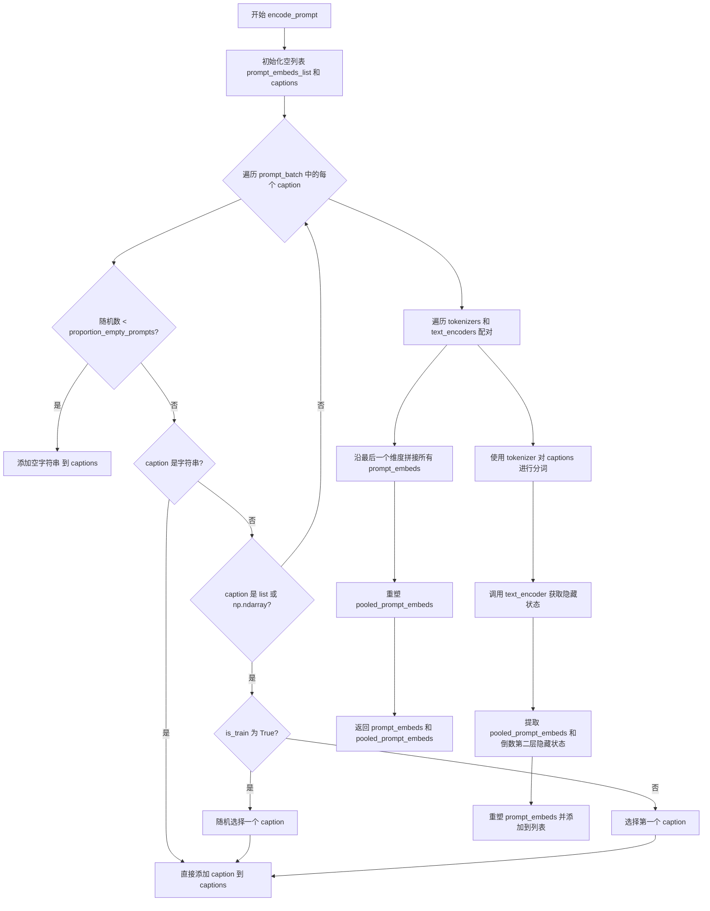

#### 带注释源码

```python
def encode_prompt(prompt_batch, text_encoders, tokenizers, proportion_empty_prompts, is_train=True):
    """
    将文本提示编码为文本嵌入向量
    
    参数:
        prompt_batch: 待编码的文本提示批次
        text_encoders: 文本编码器列表（支持多个编码器）
        tokenizers: 分词器列表
        proportion_empty_prompts: 空提示的比例（用于 classifier-free guidance）
        is_train: 是否为训练模式
    
    返回:
        prompt_embeds: 提示嵌入张量
        pooled_prompt_embeds: 池化后的提示嵌入
    """
    prompt_embeds_list = []  # 存储每个编码器产生的嵌入

    captions = []
    # 处理提示批次：根据 proportion_empty_prompts 决定是否替换为空字符串
    for caption in prompt_batch:
        if random.random() < proportion_empty_prompts:
            # 按比例替换为空字符串（无条件引导）
            captions.append("")
        elif isinstance(caption, str):
            # 直接添加字符串提示
            captions.append(caption)
        elif isinstance(caption, (list, np.ndarray)):
            # 对于多个提示：训练时随机选择，推理时选择第一个
            captions.append(random.choice(caption) if is_train else caption[0])

    # 使用 torch.no_grad() 禁用梯度计算，减少内存占用
    with torch.no_grad():
        # 遍历所有文本编码器（SD-XL 有两个编码器）
        for tokenizer, text_encoder in zip(tokenizers, text_encoders):
            # 使用分词器将文本转换为token ID
            text_inputs = tokenizer(
                captions,
                padding="max_length",           # 填充到最大长度
                max_length=tokenizer.model_max_length,  # 最大序列长度
                truncation=True,                # 截断超长文本
                return_tensors="pt",            # 返回PyTorch张量
            )
            text_input_ids = text_inputs.input_ids
            
            # 通过文本编码器获取嵌入，启用隐藏状态输出
            prompt_embeds = text_encoder(
                text_input_ids.to(text_encoder.device),
                output_hidden_states=True,
            )

            # 获取池化输出（最后一个编码器的pooled输出用于额外条件）
            pooled_prompt_embeds = prompt_embeds[0]
            # 获取倒数第二层的隐藏状态（SD-XL特定设计）
            prompt_embeds = prompt_embeds.hidden_states[-2]
            
            bs_embed, seq_len, _ = prompt_embeds.shape
            # 重塑嵌入形状以备后续拼接
            prompt_embeds = prompt_embeds.view(bs_embed, seq_len, -1)
            prompt_embeds_list.append(prompt_embeds)

    # 沿最后一个维度拼接所有编码器的输出
    prompt_embeds = torch.concat(prompt_embeds_list, dim=-1)
    # 重塑池化嵌入
    pooled_prompt_embeds = pooled_prompt_embeds.view(bs_embed, -1)
    
    return prompt_embeds, pooled_prompt_embeds
```


### `main(args)`

该函数是 Latent Consistency Distillation (LCD) 训练的主入口函数，负责加载模型、配置训练环境、构建数据管道、执行蒸馏训练循环，并在训练完成后保存最终的 LoRA 权重和推理管道。

参数：

- `args`：`argparse.Namespace`，通过 `parse_args()` 解析得到的命令行参数对象，包含模型路径、训练超参数、数据配置等所有训练配置

返回值：`None`，函数执行完成后不返回任何值

#### 流程图

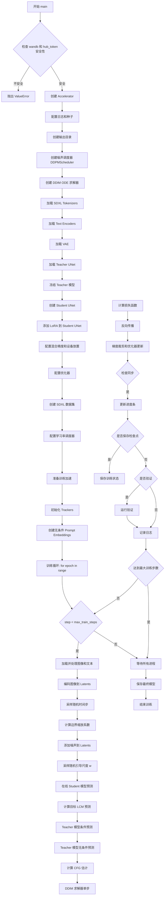

#### 带注释源码

```python
def main(args):
    # 1. 安全检查：确保不同时使用 wandb 和 hub_token
    if args.report_to == "wandb" and args.hub_token is not None:
        raise ValueError(
            "You cannot use both --report_to=wandb and --hub_token due to a security risk of exposing your token."
            " Please use `hf auth login` to authenticate with the Hub."
        )

    # 2. 构建日志输出目录
    logging_dir = Path(args.output_dir, args.logging_dir)

    # 3. 配置 Accelerator 项目设置
    accelerator_project_config = ProjectConfiguration(project_dir=args.output_dir, logging_dir=logging_dir)

    # 4. 初始化分布式训练 Accelerator
    accelerator = Accelerator(
        gradient_accumulation_steps=args.gradient_accumulation_steps,
        mixed_precision=args.mixed_precision,
        log_with=args.report_to,
        project_config=accelerator_project_config,
        split_batches=True,  # 使用 webdataset 时必须设为 True 以获得正确的 lr 调度步数
    )

    # 5. 配置日志格式
    logging.basicConfig(
        format="%(asctime)s - %(levelname)s - %(name)s - %(message)s",
        datefmt="%m/%d/%Y %H:%M:%S",
        level=logging.INFO,
    )
    logger.info(accelerator.state, main_process_only=False)
    if accelerator.is_local_main_process:
        transformers.utils.logging.set_verbosity_warning()
        diffusers.utils.logging.set_verbosity_info()
    else:
        transformers.utils.logging.set_verbosity_error()
        diffusers.utils.logging.set_verbosity_error()

    # 6. 设置随机种子以确保可重复性
    if args.seed is not None:
        set_seed(args.seed)

    # 7. 处理仓库创建（如果是主进程且需要推送到 Hub）
    if accelerator.is_main_process:
        if args.output_dir is not None:
            os.makedirs(args.output_dir, exist_ok=True)

        if args.push_to_hub:
            repo_id = create_repo(
                repo_id=args.hub_model_id or Path(args.output_dir).name,
                exist_ok=True,
                token=args.hub_token,
                private=True,
            ).repo_id

    # 8. 创建噪声调度器并计算 alpha 和 sigma 噪声调度
    noise_scheduler = DDPMScheduler.from_pretrained(
        args.pretrained_teacher_model, subfolder="scheduler", revision=args.teacher_revision
    )

    # 计算 alpha 和 sigma 调度（基于 alpha bars）
    alpha_schedule = torch.sqrt(noise_scheduler.alphas_cumprod)
    sigma_schedule = torch.sqrt(1 - noise_scheduler.alphas_cumprod)
    
    # 9. 初始化 DDIM ODE 求解器用于蒸馏
    solver = DDIMSolver(
        noise_scheduler.alphas_cumprod.numpy(),
        timesteps=noise_scheduler.config.num_train_timesteps,
        ddim_timesteps=args.num_ddim_timesteps,
    )

    # 10. 加载 SDXL 的两个 Tokenizers
    tokenizer_one = AutoTokenizer.from_pretrained(
        args.pretrained_teacher_model, subfolder="tokenizer", revision=args.teacher_revision, use_fast=False
    )
    tokenizer_two = AutoTokenizer.from_pretrained(
        args.pretrained_teacher_model, subfolder="tokenizer_2", revision=args.teacher_revision, use_fast=False
    )

    # 11. 加载 Text Encoders
    text_encoder_cls_one = import_model_class_from_model_name_or_path(
        args.pretrained_teacher_model, args.teacher_revision
    )
    text_encoder_cls_two = import_model_class_from_model_name_or_path(
        args.pretrained_teacher_model, args.teacher_revision, subfolder="text_encoder_2"
    )

    text_encoder_one = text_encoder_cls_one.from_pretrained(
        args.pretrained_teacher_model, subfolder="text_encoder", revision=args.teacher_revision
    )
    text_encoder_two = text_encoder_cls_two.from_pretrained(
        args.pretrained_teacher_model, subfolder="text_encoder_2", revision=args.teacher_revision
    )

    # 12. 加载 VAE（使用指定的 VAE 或默认的 teacher VAE）
    vae_path = (
        args.pretrained_teacher_model
        if args.pretrained_vae_model_name_or_path is None
        else args.pretrained_vae_model_name_or_path
    )
    vae = AutoencoderKL.from_pretrained(
        vae_path,
        subfolder="vae" if args.pretrained_vae_model_name_or_path is None else None,
        revision=args.teacher_revision,
    )

    # 13. 加载 Teacher UNet
    teacher_unet = UNet2DConditionModel.from_pretrained(
        args.pretrained_teacher_model, subfolder="unet", revision=args.teacher_revision
    )

    # 14. 冻结 Teacher 模型（VAE、Text Encoders、UNet）
    vae.requires_grad_(False)
    text_encoder_one.requires_grad_(False)
    text_encoder_two.requires_grad_(False)
    teacher_unet.requires_grad_(False)

    # 15. 创建 Student UNet（在线学习模型）
    unet = UNet2DConditionModel.from_pretrained(
        args.pretrained_teacher_model, subfolder="unet", revision=args.teacher_revision
    )
    unet.train()

    # 16. 检查学生模型权重精度
    if accelerator.unwrap_model(unet).dtype != torch.float32:
        raise ValueError(
            f"Controlnet loaded as datatype {accelerator.unwrap_model(unet).dtype}. "
            "Please make sure to always have all model weights in full float32 precision when starting training."
        )

    # 17. 为 Student UNet 添加 LoRA（仅更新 LoRA 投影矩阵）
    if args.lora_target_modules is not None:
        lora_target_modules = [module_key.strip() for module_key in args.lora_target_modules.split(",")]
    else:
        lora_target_modules = [
            "to_q", "to_k", "to_v", "to_out.0", "proj_in", "proj_out",
            "ff.net.0.proj", "ff.net.2", "conv1", "conv2", "conv_shortcut",
            "downsamplers.0.conv", "upsamplers.0.conv", "time_emb_proj",
        ]
    lora_config = LoraConfig(
        r=args.lora_rank,
        target_modules=lora_target_modules,
        lora_alpha=args.lora_alpha,
        lora_dropout=args.lora_dropout,
    )
    unet = get_peft_model(unet, lora_config)

    # 18. 配置混合精度权重数据类型
    weight_dtype = torch.float32
    if accelerator.mixed_precision == "fp16":
        weight_dtype = torch.float16
    elif accelerator.mixed_precision == "bf16":
        weight_dtype = torch.bfloat16

    # 19. 将模型移动到设备并转换数据类型
    vae.to(accelerator.device)
    if args.pretrained_vae_model_name_or_path is not None:
        vae.to(dtype=weight_dtype)
    text_encoder_one.to(accelerator.device, dtype=weight_dtype)
    text_encoder_two.to(accelerator.device, dtype=weight_dtype)

    teacher_unet.to(accelerator.device)
    if args.cast_teacher_unet:
        teacher_unet.to(dtype=weight_dtype)

    # 20. 将噪声调度和求解器移动到设备
    alpha_schedule = alpha_schedule.to(accelerator.device)
    sigma_schedule = sigma_schedule.to(accelerator.device)
    solver = solver.to(accelerator.device)

    # 21. 配置检查点保存和加载钩子
    if version.parse(accelerate.__version__) >= version.parse("0.16.0"):
        def save_model_hook(models, weights, output_dir):
            if accelerator.is_main_process:
                unet_ = accelerator.unwrap_model(unet)
                lora_state_dict = get_peft_model_state_dict(unet_, adapter_name="default")
                StableDiffusionXLPipeline.save_lora_weights(os.path.join(output_dir, "unet_lora"), lora_state_dict)
                unet_.save_pretrained(output_dir)
                weights.pop()

        def load_model_hook(models, input_dir):
            unet_ = accelerator.unwrap_model(unet)
            unet_.load_adapter(input_dir, "default", is_trainable=True)
            models.pop()

        accelerator.register_save_state_pre_hook(save_model_hook)
        accelerator.register_load_state_pre_hook(load_model_hook)

    # 22. 启用 xformers 内存高效注意力（如适用）
    if args.enable_xformers_memory_efficient_attention:
        if is_xformers_available():
            import xformers
            xformers_version = version.parse(xformers.__version__)
            if xformers_version == version.parse("0.0.16"):
                logger.warning(
                    "xFormers 0.0.16 cannot be used for training in some GPUs."
                )
            unet.enable_xformers_memory_efficient_attention()
            teacher_unet.enable_xformers_memory_efficient_attention()
        else:
            raise ValueError("xformers is not available.")

    # 23. 启用 TF32 以加速 Ampere GPU 训练
    if args.allow_tf32:
        torch.backends.cuda.matmul.allow_tf32 = True

    # 24. 启用梯度检查点以节省内存
    if args.gradient_checkpointing:
        unet.enable_gradient_checkpointing()

    # 25. 选择优化器（8-bit Adam 或标准 AdamW）
    if args.use_8bit_adam:
        try:
            import bitsandbytes as bnb
        except ImportError:
            raise ImportError("To use 8-bit Adam, please install the bitsandbytes library.")
        optimizer_class = bnb.optim.AdamW8bit
    else:
        optimizer_class = torch.optim.AdamW

    # 26. 创建优化器
    optimizer = optimizer_class(
        unet.parameters(),
        lr=args.learning_rate,
        betas=(args.adam_beta1, args.adam_beta2),
        weight_decay=args.adam_weight_decay,
        eps=args.adam_epsilon,
    )

    # 27. 定义嵌入计算函数
    def compute_embeddings(
        prompt_batch, original_sizes, crop_coords, proportion_empty_prompts, text_encoders, tokenizers, is_train=True
    ):
        target_size = (args.resolution, args.resolution)
        original_sizes = list(map(list, zip(*original_sizes)))
        crops_coords_top_left = list(map(list, zip(*crop_coords)))

        original_sizes = torch.tensor(original_sizes, dtype=torch.long)
        crops_coords_top_left = torch.tensor(crops_coords_top_left, dtype=torch.long)

        # 编码文本 prompts
        prompt_embeds, pooled_prompt_embeds = encode_prompt(
            prompt_batch, text_encoders, tokenizers, proportion_empty_prompts, is_train
        )
        add_text_embeds = pooled_prompt_embeds

        # 计算额外的时间 IDs（用于 SDXL）
        add_time_ids = list(target_size)
        add_time_ids = torch.tensor([add_time_ids])
        add_time_ids = add_time_ids.repeat(len(prompt_batch), 1)
        add_time_ids = torch.cat([original_sizes, crops_coords_top_left, add_time_ids], dim=-1)
        add_time_ids = add_time_ids.to(accelerator.device, dtype=prompt_embeds.dtype)

        prompt_embeds = prompt_embeds.to(accelerator.device)
        add_text_embeds = add_text_embeds.to(accelerator.device)
        unet_added_cond_kwargs = {"text_embeds": add_text_embeds, "time_ids": add_time_ids}

        return {"prompt_embeds": prompt_embeds, **unet_added_cond_kwargs}

    # 28. 创建数据集
    dataset = SDXLText2ImageDataset(
        train_shards_path_or_url=args.train_shards_path_or_url,
        num_train_examples=args.max_train_samples,
        per_gpu_batch_size=args.train_batch_size,
        global_batch_size=args.train_batch_size * accelerator.num_processes,
        num_workers=args.dataloader_num_workers,
        resolution=args.resolution,
        interpolation_type=args.interpolation_type,
        shuffle_buffer_size=1000,
        pin_memory=True,
        persistent_workers=True,
        use_fix_crop_and_size=args.use_fix_crop_and_size,
    )
    train_dataloader = dataset.train_dataloader

    # 29. 准备文本编码器和分词器
    text_encoders = [text_encoder_one, text_encoder_two]
    tokenizers = [tokenizer_one, tokenizer_two]

    # 30. 创建嵌入计算的偏函数
    compute_embeddings_fn = functools.partial(
        compute_embeddings,
        proportion_empty_prompts=0,
        text_encoders=text_encoders,
        tokenizers=tokenizers,
    )

    # 31. 创建学习率调度器
    overrode_max_train_steps = False
    num_update_steps_per_epoch = math.ceil(train_dataloader.num_batches / args.gradient_accumulation_steps)
    if args.max_train_steps is None:
        args.max_train_steps = args.num_train_epochs * num_update_steps_per_epoch
        overrode_max_train_steps = True

    if args.scale_lr:
        args.learning_rate = (
            args.learning_rate * args.gradient_accumulation_steps * args.train_batch_size * accelerator.num_processes
        )

    lr_scheduler = get_scheduler(
        args.lr_scheduler,
        optimizer=optimizer,
        num_warmup_steps=args.lr_warmup_steps,
        num_training_steps=args.max_train_steps,
    )

    # 32. 准备训练（使用 Accelerator 包装模型和优化器）
    unet, optimizer, lr_scheduler = accelerator.prepare(unet, optimizer, lr_scheduler)

    # 33. 重新计算训练步骤数
    num_update_steps_per_epoch = math.ceil(train_dataloader.num_batches / args.gradient_accumulation_steps)
    if overrode_max_train_steps:
        args.max_train_steps = args.num_train_epochs * num_update_steps_per_epoch
    args.num_train_epochs = math.ceil(args.max_train_steps / num_update_steps_per_epoch)

    # 34. 初始化 Trackers
    if accelerator.is_main_process:
        tracker_config = dict(vars(args))
        accelerator.init_trackers(args.tracker_project_name, config=tracker_config)

    # 35. 创建无条件 Embeddings（用于 Classifier-Free Guidance）
    uncond_prompt_embeds = torch.zeros(args.train_batch_size, 77, 2048).to(accelerator.device)
    uncond_pooled_prompt_embeds = torch.zeros(args.train_batch_size, 1280).to(accelerator.device)

    # 36. 训练循环
    total_batch_size = args.train_batch_size * accelerator.num_processes * args.gradient_accumulation_steps

    logger.info("***** Running training *****")
    logger.info(f"  Num batches each epoch = {train_dataloader.num_batches}")
    logger.info(f"  Num Epochs = {args.num_train_epochs}")
    logger.info(f"  Instantaneous batch size per device = {args.train_batch_size}")
    logger.info(f"  Total train batch size = {total_batch_size}")
    logger.info(f"  Gradient Accumulation steps = {args.gradient_accumulation_steps}")
    logger.info(f"  Total optimization steps = {args.max_train_steps}")
    global_step = 0
    first_epoch = 0

    # 37. 从检查点恢复训练（如指定）
    if args.resume_from_checkpoint:
        if args.resume_from_checkpoint != "latest":
            path = os.path.basename(args.resume_from_checkpoint)
        else:
            dirs = os.listdir(args.output_dir)
            dirs = [d for d in dirs if d.startswith("checkpoint")]
            dirs = sorted(dirs, key=lambda x: int(x.split("-")[1]))
            path = dirs[-1] if len(dirs) > 0 else None

        if path is None:
            accelerator.print(f"Checkpoint '{args.resume_from_checkpoint}' does not exist. Starting new training.")
            args.resume_from_checkpoint = None
            initial_global_step = 0
        else:
            accelerator.print(f"Resuming from checkpoint {path}")
            accelerator.load_state(os.path.join(args.output_dir, path))
            global_step = int(path.split("-")[1])
            initial_global_step = global_step
            first_epoch = global_step // num_update_steps_per_epoch
    else:
        initial_global_step = 0

    # 38. 创建进度条
    progress_bar = tqdm(
        range(0, args.max_train_steps),
        initial=initial_global_step,
        desc="Steps",
        disable=not accelerator.is_local_main_process,
    )

    # 39. 核心训练循环
    for epoch in range(first_epoch, args.num_train_epochs):
        for step, batch in enumerate(train_dataloader):
            with accelerator.accumulate(unet):
                # 步骤 1: 加载和处理图像、文本和微条件
                image, text, orig_size, crop_coords = batch

                image = image.to(accelerator.device, non_blocking=True)
                encoded_text = compute_embeddings_fn(text, orig_size, crop_coords)

                # 步骤 2: 使用 VAE 编码像素值到潜在空间
                if args.pretrained_vae_model_name_or_path is not None:
                    pixel_values = image.to(dtype=weight_dtype)
                    if vae.dtype != weight_dtype:
                        vae.to(dtype=weight_dtype)
                else:
                    pixel_values = image

                latents = []
                for i in range(0, pixel_values.shape[0], args.vae_encode_batch_size):
                    latents.append(vae.encode(pixel_values[i : i + args.vae_encode_batch_size]).latent_dist.sample())
                latents = torch.cat(latents, dim=0)

                latents = latents * vae.config.scaling_factor
                if args.pretrained_vae_model_name_or_path is None:
                    latents = latents.to(weight_dtype)
                bsz = latents.shape[0]

                # 步骤 3: 为每张图像采样随机时间步
                topk = noise_scheduler.config.num_train_timesteps // args.num_ddim_timesteps
                index = torch.randint(0, args.num_ddim_timesteps, (bsz,), device=latents.device).long()
                start_timesteps = solver.ddim_timesteps[index]
                timesteps = start_timesteps - topk
                timesteps = torch.where(timesteps < 0, torch.zeros_like(timesteps), timesteps)

                # 步骤 4: 获取边界缩放系数
                c_skip_start, c_out_start = scalings_for_boundary_conditions(
                    start_timesteps, timestep_scaling=args.timestep_scaling_factor
                )
                c_skip_start, c_out_start = [append_dims(x, latents.ndim) for x in [c_skip_start, c_out_start]]
                c_skip, c_out = scalings_for_boundary_conditions(
                    timesteps, timestep_scaling=args.timestep_scaling_factor
                )
                c_skip, c_out = [append_dims(x, latents.ndim) for x in [c_skip, c_out]]

                # 步骤 5: 采样噪声并添加到 latents（前向扩散过程）
                noise = torch.randn_like(latents)
                noisy_model_input = noise_scheduler.add_noise(latents, noise, start_timesteps)

                # 步骤 6: 采样随机引导尺度 w
                w = (args.w_max - args.w_min) * torch.rand((bsz,)) + args.w_min
                w = w.reshape(bsz, 1, 1, 1)
                w = w.to(device=latents.device, dtype=latents.dtype)

                # 步骤 7: 获取在线 Student 模型预测
                prompt_embeds = encoded_text.pop("prompt_embeds")

                noise_pred = unet(
                    noisy_model_input,
                    start_timesteps,
                    timestep_cond=None,
                    encoder_hidden_states=prompt_embeds.float(),
                    added_cond_kwargs=encoded_text,
                ).sample

                pred_x_0 = get_predicted_original_sample(
                    noise_pred,
                    start_timesteps,
                    noisy_model_input,
                    noise_scheduler.config.prediction_type,
                    alpha_schedule,
                    sigma_schedule,
                )

                model_pred = c_skip_start * noisy_model_input + c_out_start * pred_x_0

                # 步骤 8: 获取 Teacher 模型预测用于 CFG 估计
                with torch.no_grad():
                    if torch.backends.mps.is_available() or "playground" in args.pretrained_teacher_model:
                        autocast_ctx = nullcontext()
                    else:
                        autocast_ctx = torch.autocast(accelerator.device.type)

                    with autocast_ctx:
                        # 8.1 条件 Teacher 预测
                        cond_teacher_output = teacher_unet(
                            noisy_model_input.to(weight_dtype),
                            start_timesteps,
                            encoder_hidden_states=prompt_embeds.to(weight_dtype),
                            added_cond_kwargs={k: v.to(weight_dtype) for k, v in encoded_text.items()},
                        ).sample
                        cond_pred_x0 = get_predicted_original_sample(
                            cond_teacher_output,
                            start_timesteps,
                            noisy_model_input,
                            noise_scheduler.config.prediction_type,
                            alpha_schedule,
                            sigma_schedule,
                        )
                        cond_pred_noise = get_predicted_noise(
                            cond_teacher_output,
                            start_timesteps,
                            noisy_model_input,
                            noise_scheduler.config.prediction_type,
                            alpha_schedule,
                            sigma_schedule,
                        )

                        # 8.2 无条件 Teacher 预测
                        uncond_added_conditions = copy.deepcopy(encoded_text)
                        uncond_added_conditions["text_embeds"] = uncond_pooled_prompt_embeds
                        uncond_teacher_output = teacher_unet(
                            noisy_model_input.to(weight_dtype),
                            start_timesteps,
                            encoder_hidden_states=uncond_prompt_embeds.to(weight_dtype),
                            added_cond_kwargs={k: v.to(weight_dtype) for k, v in uncond_added_conditions.items()},
                        ).sample
                        uncond_pred_x0 = get_predicted_original_sample(
                            uncond_teacher_output,
                            start_timesteps,
                            noisy_model_input,
                            noise_scheduler.config.prediction_type,
                            alpha_schedule,
                            sigma_schedule,
                        )
                        uncond_pred_noise = get_predicted_noise(
                            uncond_teacher_output,
                            start_timesteps,
                            noisy_model_input,
                            noise_scheduler.config.prediction_type,
                            alpha_schedule,
                            sigma_schedule,
                        )

                        # 8.3 计算 CFG 估计
                        pred_x0 = cond_pred_x0 + w * (cond_pred_x0 - uncond_pred_x0)
                        pred_noise = cond_pred_noise + w * (cond_pred_noise - uncond_pred_noise)
                        
                        # 8.4 DDIM 求解器单步
                        x_prev = solver.ddim_step(pred_x0, pred_noise, index)

                # 步骤 9: 获取目标 LCM 预测
                with torch.no_grad():
                    if torch.backends.mps.is_available():
                        autocast_ctx = nullcontext()
                    else:
                        autocast_ctx = torch.autocast(accelerator.device.type, dtype=weight_dtype)

                    with autocast_ctx:
                        target_noise_pred = unet(
                            x_prev.float(),
                            timesteps,
                            timestep_cond=None,
                            encoder_hidden_states=prompt_embeds.float(),
                            added_cond_kwargs=encoded_text,
                        ).sample
                    pred_x_0 = get_predicted_original_sample(
                        target_noise_pred,
                        timesteps,
                        x_prev,
                        noise_scheduler.config.prediction_type,
                        alpha_schedule,
                        sigma_schedule,
                    )
                    target = c_skip * x_prev + c_out * pred_x_0

                # 步骤 10: 计算损失函数
                if args.loss_type == "l2":
                    loss = F.mse_loss(model_pred.float(), target.float(), reduction="mean")
                elif args.loss_type == "huber":
                    loss = torch.mean(
                        torch.sqrt((model_pred.float() - target.float()) ** 2 + args.huber_c**2) - args.huber_c
                    )

                # 步骤 11: 反向传播
                accelerator.backward(loss)
                if accelerator.sync_gradients:
                    accelerator.clip_grad_norm_(unet.parameters(), args.max_grad_norm)
                optimizer.step()
                lr_scheduler.step()
                optimizer.zero_grad(set_to_none=True)

            # 步骤 12: 检查同步并更新进度
            if accelerator.sync_gradients:
                progress_bar.update(1)
                global_step += 1

                # 步骤 13: 检查点保存
                if accelerator.is_main_process:
                    if global_step % args.checkpointing_steps == 0:
                        # 检查并删除旧检查点
                        if args.checkpoints_total_limit is not None:
                            checkpoints = os.listdir(args.output_dir)
                            checkpoints = [d for d in checkpoints if d.startswith("checkpoint")]
                            checkpoints = sorted(checkpoints, key=lambda x: int(x.split("-")[1]))

                            if len(checkpoints) >= args.checkpoints_total_limit:
                                num_to_remove = len(checkpoints) - args.checkpoints_total_limit + 1
                                removing_checkpoints = checkpoints[0:num_to_remove]

                                for removing_checkpoint in removing_checkpoints:
                                    removing_checkpoint = os.path.join(args.output_dir, removing_checkpoint)
                                    shutil.rmtree(removing_checkpoint)

                        save_path = os.path.join(args.output_dir, f"checkpoint-{global_step}")
                        accelerator.save_state(save_path)
                        logger.info(f"Saved state to {save_path}")

                    # 步骤 14: 验证
                    if global_step % args.validation_steps == 0:
                        log_validation(vae, unet, args, accelerator, weight_dtype, global_step)

                # 步骤 15: 记录日志
                logs = {"loss": loss.detach().item(), "lr": lr_scheduler.get_last_lr()[0]}
                progress_bar.set_postfix(**logs)
                accelerator.log(logs, step=global_step)

                if global_step >= args.max_train_steps:
                    break

    # 40. 训练完成，保存最终模型
    accelerator.wait_for_everyone()
    if accelerator.is_main_process:
        unet = accelerator.unwrap_model(unet)
        unet.save_pretrained(args.output_dir)
        lora_state_dict = get_peft_model_state_dict(unet, adapter_name="default")
        StableDiffusionXLPipeline.save_lora_weights(os.path.join(args.output_dir, "unet_lora"), lora_state_dict)

        if args.push_to_hub:
            upload_folder(
                repo_id=repo_id,
                folder_path=args.output_dir,
                commit_message="End of training",
                ignore_patterns=["step_*", "epoch_*"],
            )

    accelerator.end_training()
```


### `WebdatasetFilter.__init__`

这是 `WebdatasetFilter` 类的构造函数，用于初始化图像过滤器的最小尺寸和水印概率阈值参数。

参数：

- `min_size`：`int`，最小尺寸阈值，用于过滤过小的图像（默认值为 1024）
- `max_pwatermark`：`float`，最大水印概率阈值，用于过滤水印过多的图像（默认值为 0.5）

返回值：`None`，构造函数不返回任何值，仅初始化实例属性

#### 流程图

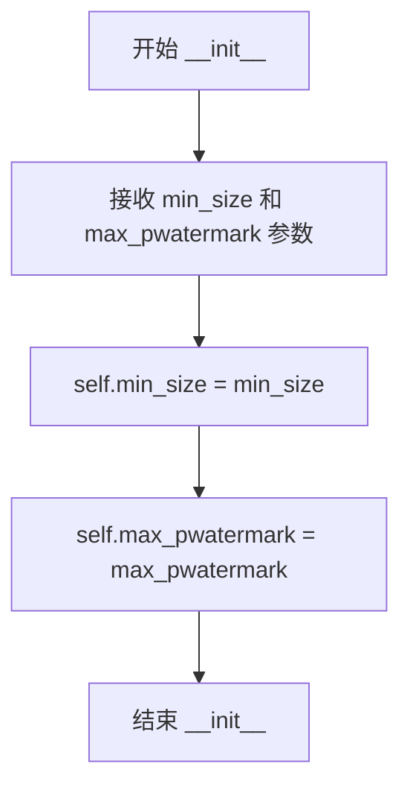

#### 带注释源码

```python
def __init__(self, min_size=1024, max_pwatermark=0.5):
    """
    初始化 WebdatasetFilter 过滤器
    
    参数:
        min_size: 最小尺寸阈值,小于此尺寸的图像将被过滤掉
        max_pwatermark: 最大水印概率阈值,高于此水印概率的图像将被过滤掉
    """
    # 将传入的 min_size 参数存储为实例属性
    self.min_size = min_size
    # 将传入的 max_pwatermark 参数存储为实例属性
    self.max_pwatermark = max_pwatermark
```


### `WebdatasetFilter.__call__`

该方法是 WebdatasetFilter 类的核心过滤逻辑，用于对 WebDataset 中的样本进行过滤。它解析样本中的 JSON 元数据，检查图像尺寸是否满足最小要求且水印概率是否低于阈值，只有同时满足两个条件的样本才会被保留。

参数：

- `x`：`Dict`，WebDataset 样本字典，必须包含 "json" 字段存储图像元数据（如宽度、高度、水印概率等）

返回值：`bool`，如果样本通过过滤条件返回 True，否则返回 False

#### 流程图

```mermaid
flowchart TD
    A[开始: 接收样本 x] --> B{检查 'json' 是否在 x 中}
    B -->|否| F[返回 False]
    B -->|是| C[解析 x['json'] 为 JSON 对象]
    C --> D{解析成功?}
    D -->|否| F
    D -->|是| E[获取图像宽度和高度]
    E --> G{宽度 >= min_size 且 高度 >= min_size?}
    G -->|否| I[filter_size = False]
    G -->|是| H[filter_size = True]
    H --> J[获取水印概率 pwatermark]
    J --> K{pwatermark <= max_pwatermark?}
    K -->|否| L[filter_watermark = False]
    K -->|是| M[filter_watermark = True]
    I --> N[返回 filter_size and filter_watermark]
    L --> N
    M --> N
    N --> O[返回最终结果]
    
    style A fill:#f9f,color:#333
    style O fill:#9f9,color:#333
    style F fill:#f99,color:#333
```

#### 带注释源码

```python
def __call__(self, x):
    """
    过滤 WebDataset 样本的调用接口
    
    参数:
        x: WebDataset 样本字典，必须包含 "json" 字段存储图像元数据
        
    返回:
        bool: 样本是否通过过滤
    """
    try:
        # 检查样本是否包含 JSON 元数据字段
        if "json" in x:
            # 解析 JSON 元数据字符串为字典
            x_json = json.loads(x["json"])
            
            # 检查图像尺寸：宽度和高度都必须大于等于最小尺寸阈值
            # 使用 or 0.0 处理 JSON 字段缺失或为 None 的情况
            filter_size = (x_json.get(WDS_JSON_WIDTH, 0.0) or 0.0) >= self.min_size and x_json.get(
                WDS_JSON_HEIGHT, 0
            ) >= self.min_size
            
            # 检查水印概率：必须小于等于最大水印阈值
            # 使用 or 0.0 处理字段缺失或为 None 的情况
            filter_watermark = (x_json.get("pwatermark", 0.0) or 0.0) <= self.max_pwatermark
            
            # 返回尺寸和水印过滤的组合结果（必须同时满足）
            return filter_size and filter_watermark
        else:
            # 样本无 JSON 元数据时直接过滤掉
            return False
    except Exception:
        # 解析失败或任何异常都返回 False（过滤掉异常样本）
        return False
```


### `SDXLText2ImageDataset.__init__`

初始化SDXL文本到图像数据集类，构建基于WebDataset的数据加载管道，包括数据分片处理、图像预处理（resize、crop、normalize）、批处理配置，以及DataLoader的创建。

参数：

- `train_shards_path_or_url`：`Union[str, List[str]]`，训练数据分片的路径或URL列表，支持单个路径或多个URL（可使用braceexpand语法）
- `num_train_examples`：`int`，训练样本总数，用于计算worker批次数量
- `per_gpu_batch_size`：`int`，每个GPU的批处理大小
- `global_batch_size`：`int`，全局批处理大小（per_gpu_batch_size * num_processes）
- `num_workers`：`int`，数据加载器使用的工作进程数
- `resolution`：`int`，图像目标分辨率，默认为1024
- `interpolation_type`：`str`，图像缩放使用的插值方式，默认为"bilinear"
- `shuffle_buffer_size`：`int`，数据 shuffle 缓冲区大小，默认为1000
- `pin_memory`：`bool`，是否使用 pinned memory 加速数据传输，默认为False
- `persistent_workers`：`bool`，是否保持工作进程存活，默认为False
- `use_fix_crop_and_size`：`bool`，是否使用固定裁剪坐标，默认为False

返回值：`None`，无返回值（构造函数）

#### 流程图

```mermaid
flowchart TD
    A[开始] --> B{判断 train_shards_path_or_url 类型}
    B -->|str| C[直接使用路径]
    B -->|List| D[对每个URL调用braceexpand]
    D --> E[使用itertools.chain.flatten展平列表]
    E --> C
    C --> F[定义 get_orig_size 函数]
    F --> G[解析 interpolation_mode]
    G --> H[定义 transform 函数]
    H --> I[图像 resize 到指定分辨率]
    I --> J[RandomCrop 获取裁剪坐标]
    J --> K[执行裁剪操作]
    K --> L[转换为tensor并归一化]
    L --> M[设置 crop_coords]
    M --> N[创建处理管道 processing_pipeline]
    N --> O[decode PIL图像]
    O --> P[重命名字段]
    P --> Q[过滤保留字段]
    Q --> R[映射 orig_size]
    R --> S[应用 transform]
    S --> T[打包成元组]
    T --> U[构建完整训练管道]
    U --> V[添加 ResampledShards]
    V --> W[tarfile_to_samples]
    W --> X[WebdatasetFilter 过滤]
    X --> Y[shuffle 缓冲区]
    Y --> Z[processing_pipeline]
    Z --> AA[wds.batched 批处理]
    AA --> AB[计算 num_worker_batches]
    AB --> AC[创建 DataPipeline with_epoch]
    AC --> AD[创建 WebLoader]
    AD --> AE[设置 num_batches 和 num_samples]
    AE --> AF[赋值给实例属性]
    AF --> AG[结束]
```

#### 带注释源码

```python
def __init__(
    self,
    train_shards_path_or_url: Union[str, List[str]],
    num_train_examples: int,
    per_gpu_batch_size: int,
    global_batch_size: int,
    num_workers: int,
    resolution: int = 1024,
    interpolation_type: str = "bilinear",
    shuffle_buffer_size: int = 1000,
    pin_memory: bool = False,
    persistent_workers: bool = False,
    use_fix_crop_and_size: bool = False,
):
    # 处理数据分片路径或URL，支持字符串或列表
    # 如果是列表，使用braceexpand展开URL模式，并展平为单一列表
    if not isinstance(train_shards_path_or_url, str):
        # 对每个URL列表调用braceexpand进行展开
        train_shards_path_or_url = [list(braceexpand(urls)) for urls in train_shards_path_or_url]
        # 使用itertools.chain.from_iterable扁平化嵌套列表
        train_shards_path_or_url = list(itertools.chain.from_iterable(train_shards_path_or_url))

    # 定义获取原始图像尺寸的内部函数
    def get_orig_size(json):
        # 如果使用固定裁剪，返回固定分辨率；否则从JSON元数据读取
        if use_fix_crop_and_size:
            return (resolution, resolution)
        else:
            return (int(json.get(WDS_JSON_WIDTH, 0.0)), int(json.get(WDS_JSON_HEIGHT, 0.0)))

    # 解析插值模式（字符串转换为torchvision的插值枚举）
    interpolation_mode = resolve_interpolation_mode(interpolation_type)

    # 定义图像变换函数：resize -> random crop -> tensor转换 -> normalize
    def transform(example):
        # 1. 获取图像并resize到指定分辨率
        image = example["image"]
        image = TF.resize(image, resolution, interpolation=interpolation_mode)

        # 2. 获取随机裁剪坐标并执行裁剪
        c_top, c_left, _, _ = transforms.RandomCrop.get_params(image, output_size=(resolution, resolution))
        image = TF.crop(image, c_top, c_left, resolution, resolution)
        
        # 3. 转换为tensor并归一化到[-1, 1]
        image = TF.to_tensor(image)
        image = TF.normalize(image, [0.5], [0.5])

        # 4. 更新example中的image和crop_coords字段
        example["image"] = image
        # 如果未使用固定裁剪，记录实际裁剪坐标；否则使用(0,0)
        example["crop_coords"] = (c_top, c_left) if not use_fix_crop_and_size else (0, 0)
        return example

    # 构建数据处理管道（按顺序执行）：
    # 1. 解码PIL图像
    # 2. 重命名字段：image支持多种格式，text支持多种格式，orig_size从json读取
    # 3. 过滤保留image, text, orig_size字段
    # 4. 映射orig_size字段（调用get_orig_size）
    # 5. 应用图像变换
    # 6. 打包为元组
    processing_pipeline = [
        wds.decode("pil", handler=wds.ignore_and_continue),
        wds.rename(
            image="jpg;png;jpeg;webp", text="text;txt;caption", orig_size="json", handler=wds.warn_and_continue
        ),
        wds.map(filter_keys({"image", "text", "orig_size"})),
        wds.map_dict(orig_size=get_orig_size),
        wds.map(transform),
        wds.to_tuple("image", "text", "orig_size", "crop_coords"),
    ]

    # 构建完整训练数据管道：
    # 1. ResampledShards：处理分片URL
    # 2. tarfile_to_samples：从tar文件生成样本
    # 3. select：使用WebdatasetFilter过滤
    # 4. shuffle：打乱数据
    # 5. processing_pipeline：处理管道
    # 6. batched：批处理
    pipeline = [
        wds.ResampledShards(train_shards_path_or_url),
        tarfile_to_samples_nothrow,
        wds.select(WebdatasetFilter(min_size=MIN_SIZE)),
        wds.shuffle(shuffle_buffer_size),
        *processing_pipeline,
        wds.batched(per_gpu_batch_size, partial=False, collation_fn=default_collate),
    ]

    # 计算每个worker的批次数量：总样本数 / (全局batch_size * worker数)
    num_worker_batches = math.ceil(num_train_examples / (global_batch_size * num_workers))
    # 总批次 = worker批次 * worker数
    num_batches = num_worker_batches * num_workers
    # 总样本数 = 批次 * 全局batch_size
    num_samples = num_batches * global_batch_size

    # 创建训练数据集（每个worker迭代num_worker_batches个epoch）
    self._train_dataset = wds.DataPipeline(*pipeline).with_epoch(num_worker_batches)
    
    # 创建WebLoader数据加载器
    self._train_dataloader = wds.WebLoader(
        self._train_dataset,
        batch_size=None,  # 已在pipeline中batched设置
        shuffle=False,
        num_workers=num_workers,
        pin_memory=pin_memory,
        persistent_workers=persistent_workers,
    )
    
    # 为dataloader添加元数据属性，方便外部访问
    self._train_dataloader.num_batches = num_batches
    self._train_dataloader.num_samples = num_samples
```


### `SDXLText2ImageDataset.train_dataset`

获取训练数据集的只读属性，返回用于训练的数据管道实例。

参数：

- 该属性无显式参数（`self` 为隐式实例引用）

返回值：`webdataset.DataPipeline`，返回配置好的 WebDataset 训练数据管道，可用于迭代获取训练样本。

#### 流程图

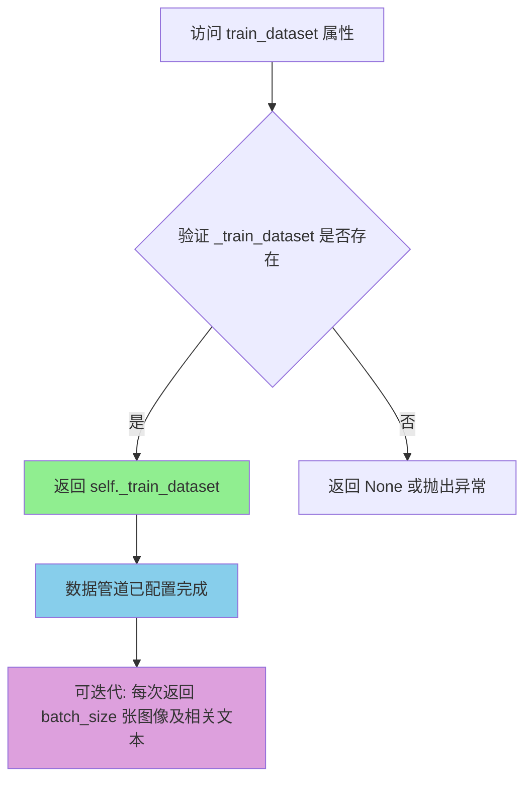

#### 带注释源码

```python
@property
def train_dataset(self):
    """
    属性 getter: 获取训练数据集实例
    
    该属性返回在 __init__ 中初始化的 WebDataset 数据管道对象。
    返回的数据管道已经过完整的处理流程配置，包括：
    - 数据分片加载 (ResampledShards)
    - Tar 文件解析 (tarfile_to_samples_nothrow)
    - 数据过滤 (WebdatasetFilter)
    - 数据增强和变换 (transform)
    - 批处理 (wds.batched)
    
    Returns:
        webdataset.DataPipeline: 配置好的训练数据管道对象
        该对象可以直接用于迭代，每次迭代返回一个批次的数据
    """
    return self._train_dataset
```


### `SDXLText2ImageDataset.train_dataloader`

这是 `SDXLText2ImageDataset` 类的属性 getter，用于获取训练数据的数据加载器。

参数： 无

返回值：`wds.WebLoader`，返回配置好的 WebLoader 实例，用于在训练循环中迭代获取批量数据。

#### 流程图

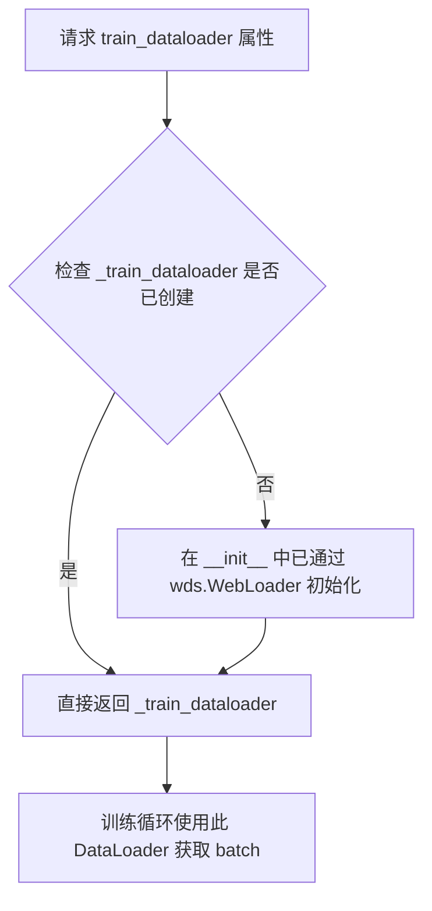

#### 带注释源码

```python
@property
def train_dataloader(self):
    """
    Property getter for the training dataloader.

    Returns:
        wds.WebLoader: The webdataset-based DataLoader for training.
    """
    return self._train_dataloader
```


### DDIMSolver.__init__

该方法是DDIM（Denoising Diffusion Implicit Models）求解器的初始化方法，负责根据给定的累积alpha值和时间步长配置，计算并构建DDIM采样所需的时间步序列、累积alpha值及其前一步值，同时将这些数据转换为PyTorch张量以便后续计算使用。

参数：

- `alpha_cumprods`：`numpy.ndarray`，累积alpha值数组，通常为扩散模型的噪声调度参数
- `timesteps`：`int`，扩散模型的总训练时间步数，默认为1000
- `ddim_timesteps`：`int`，DDIM采样时使用的时间步数量，默认为50

返回值：`None`，该方法为构造函数，不返回任何值，仅初始化对象属性

#### 流程图

```mermaid
flowchart TD
    A[开始 __init__] --> B[计算步长比例: step_ratio = timesteps // ddim_timesteps]
    B --> C[生成DDIM时间步序列: np.arange(1, ddim_timesteps + 1) * step_ratio]
    C --> D[round取整后减1: ddim_timesteps]
    D --> E[根据时间步索引获取累积alpha值: ddim_alpha_cumprods]
    E --> F[计算前一步累积alpha: ddim_alpha_cumprods_prev]
    F --> G[转换为PyTorch Long张量: ddim_timesteps]
    G --> H[转换为PyTorch张量: ddim_alpha_cumprods]
    H --> I[转换为PyTorch张量: ddim_alpha_cumprods_prev]
    I --> J[结束]
```

#### 带注释源码

```python
class DDIMSolver:
    def __init__(self, alpha_cumprods, timesteps=1000, ddim_timesteps=50):
        # DDIM采样参数计算
        # 计算步长比例，用于将完整时间步映射到DDIM采样时间步
        # 例如：timesteps=1000, ddim_timesteps=50 时，step_ratio=20
        step_ratio = timesteps // ddim_timesteps

        # 生成DDIM采样使用的时间步序列
        # 从1到ddim_timesteps的序列乘以步长比例，然后四舍五入并减1
        # 例如：ddim_timesteps=50, step_ratio=20 时
        # 结果为 [19, 39, 59, ..., 979] 共50个时间步
        self.ddim_timesteps = (np.arange(1, ddim_timesteps + 1) * step_ratio).round().astype(np.int64) - 1
        
        # 根据DDIM时间步索引从完整累积alpha数组中提取对应的值
        # alpha_cumprods通常是长度为timesteps的数组
        self.ddim_alpha_cumprods = alpha_cumprods[self.ddim_timesteps]
        
        # 计算前一个时间步的累积alpha值
        # 构造方式：第一个元素使用完整的第一个累积alpha值，
        # 后续元素使用DDIM时间步中除最后一个外的所有值
        # 这种构造方式确保了DDIM采样的连续性
        self.ddim_alpha_cumprods_prev = np.asarray(
            [alpha_cumprods[0]] + alpha_cumprods[self.ddim_timesteps[:-1]].tolist()
        )
        
        # 将numpy数组转换为PyTorch张量，以便在GPU上进行后续计算
        # 转换为long类型以匹配PyTorch的时间步索引格式
        self.ddim_timesteps = torch.from_numpy(self.ddim_timesteps).long()
        self.ddim_alpha_cumprods = torch.from_numpy(self.ddim_alpha_cumprods)
        self.ddim_alpha_cumprods_prev = torch.from_numpy(self.ddim_alpha_cumprods_prev)
```


### `DDIMSolver.to(device)`

将 DDIMSolver 内部的所有张量（时间步累积 alpha 值和前一步累积 alpha 值）移动到指定的设备上，以便在目标设备上进行 DDIM 采样计算。

参数：

- `device`：`torch.device` 或 `str`，目标设备（例如 'cuda' 或 'cpu'）

返回值：`DDIMSolver`，返回自身实例，便于链式调用

#### 流程图

```mermaid
flowchart TD
    A[开始 to 方法] --> B{检查 device 类型}
    B -->|torch.device| C[直接使用 device]
    B -->|str| D[转换为 torch.device]
    D --> C
    C --> E[ddim_timesteps.to(device)]
    E --> F[ddim_alpha_cumprods.to(device)]
    F --> G[ddim_alpha_cumprods_prev.to(device)]
    G --> H[返回 self 实例]
    H --> I[结束]
```

#### 带注释源码

```python
def to(self, device):
    """
    将 DDIMSolver 内部的所有张量移动到指定设备上
    
    参数:
        device: 目标设备，可以是 torch.device 对象或字符串 ('cuda', 'cpu' 等)
    
    返回:
        DDIMSolver: 返回自身实例，支持链式调用
    """
    # 将时间步张量移动到目标设备
    self.ddim_timesteps = self.ddim_timesteps.to(device)
    # 将累积 alpha 值张量移动到目标设备
    self.ddim_alpha_cumprods = self.ddim_alpha_cumprods.to(device)
    # 将前一步的累积 alpha 值张量移动到目标设备
    self.ddim_alpha_cumprods_prev = self.ddim_alpha_cumprods_prev.to(device)
    # 返回自身以支持链式调用
    return self
```


### DDIMSolver.ddim_step

单步 DDIM（Denoising Diffusion Implicit Models）求解器，用于在扩散模型的逆向过程中根据预测的原始样本和噪声计算前一个时间步的样本。

参数：

- `pred_x0`：`torch.Tensor`，预测的原始样本（denoised sample），即从当前噪声状态预测出的无噪声原始图像
- `pred_noise`：`torch.Tensor`，预测的噪声（predicted noise），即扩散逆向过程中预测的噪声分量
- `timestep_index`：`torch.Tensor` 或 `int`，当前时间步索引，用于从预计算的 alpha 累积乘积数组中提取对应的时间步参数

返回值：`torch.Tensor`，前一个时间步的样本（x_{t-1}），即根据 DDIM 采样公式计算得到的上一时刻的潜在表示

#### 流程图

```mermaid
flowchart TD
    A[开始 ddim_step] --> B[提取 alpha_cumprod_prev]
    B --> C{使用 extract_into_tensor}
    C --> D[从 ddim_alpha_cumprods_prev 中根据 timestep_index 获取对应的时间步累积alpha值]
    D --> E[计算方向向量 dir_xt]
    E --> F[dir_xt = sqrt(1 - alpha_cumprod_prev) × pred_noise]
    F --> G[计算前一个样本 x_prev]
    G --> H[x_prev = sqrt(alpha_cumprod_prev) × pred_x0 + dir_xt]
    H --> I[返回 x_prev]
```

#### 带注释源码

```python
def ddim_step(self, pred_x0, pred_noise, timestep_index):
    """
    执行单步 DDIM 采样
    
    参数:
        pred_x0: 预测的原始样本（从噪声预测的清晰图像）
        pred_noise: 预测的噪声分量
        timestep_index: 当前时间步索引
    
    返回:
        x_prev: 前一个时间步的样本
    """
    # 从预计算的 alpha 累积乘积数组中提取前一个时间步的 alpha 值
    # 使用 extract_into_tensor 函数根据 timestep_index 获取对应的时间步参数
    alpha_cumprod_prev = extract_into_tensor(
        self.ddim_alpha_cumprods_prev,  # 预计算的 alpha 累积乘积数组（前一个时间步）
        timestep_index,                # 当前时间步索引
        pred_x0.shape                   # 输出形状，用于 reshape
    )
    
    # 计算指向 xt 的方向向量
    # 这是 DDIM 采样公式中的核心部分：dir_xt = sqrt(1 - alpha_cumprod_prev) * noise
    dir_xt = (1.0 - alpha_cumprod_prev).sqrt() * pred_noise
    
    # 计算前一个时间步的样本 x_prev
    # DDIM 采样公式：x_prev = sqrt(alpha_cumprod_prev) * pred_x0 + dir_xt
    # 其中 sqrt(alpha_cumprod_prev) 相当于系数 c_skip（保留原始信息的权重）
    # dir_xt 是指向目标样本的方向向量
    x_prev = alpha_cumprod_prev.sqrt() * pred_x0 + dir_xt
    
    return x_prev
```

#### 关键实现细节

1. **DDIM 采样公式**：该方法实现了 DDIM 论文中的采样公式，将预测的原始样本 `pred_x0` 和预测的噪声 `pred_noise` 结合起来计算前一个时间步的样本

2. **预计算参数**：`ddim_alpha_cumprods_prev` 在类的 `__init__` 方法中预先计算，存储了每个 DDIM 时间步对应的前一个时间步的 alpha 累积乘积值

3. **与标准 DDPM 的区别**：DDIM 使用确定性采样路径，不引入额外的随机性，这使得采样过程更加高效且可重现

## 关键组件


### 张量索引与数据类型转换

代码中使用 `weight_dtype` 变量管理混合精度训练，支持 fp16、bf16 和 fp32 三种精度，通过 `latents.to(weight_dtype)` 和 `vae.to(dtype=weight_dtype)` 进行张量类型转换，确保不同组件使用一致的数值精度。

### 惰性加载与批量处理

VAE 编码采用分批处理策略，使用 `for i in range(0, pixel_values.shape[0], args.vae_encode_batch_size)` 循环将大批次图像分块编码，避免 OOM 问题。数据加载使用 WebDataset 的惰性迭代器，通过 `wds.DataPipeline` 和 `wds.WebLoader` 实现流式数据处理。

### 反量化支持

代码通过 `accelerator.unwrap_model(unet)` 获取模型原始精度，结合 `torch.autocast` 上下文管理器实现自动类型转换。教师模型和学生模型都支持通过 `args.cast_teacher_unet` 参数选择性地转换为目标精度权重。

### 量化策略 (LoRA)

使用 `LoraConfig` 配置 LoRA 量化参数，包括 `r` (rank)、`lora_alpha`、`lora_dropout` 和目标模块列表。`get_peft_model(unet, lora_config)` 将量化后的低秩适配器注入到 UNet 模型中，仅更新 LoRA 投影矩阵参数。

### 内存优化策略

集成 xFormers 内存高效注意力机制 (`enable_xformers_memory_efficient_attention`)、梯度检查点 (`gradient_checkpointing`) 和 8-bit Adam 优化器，显著降低训练显存占用。TF32 计算支持进一步提升 Ampere GPU 训练速度。


## 问题及建议


### 已知问题

-   **`log_validation` 函数存在缩进错误**：`for tracker in accelerator.trackers:` 循环内部包含 `return` 语句，导致验证循环只执行一次就提前返回，且 `del pipeline` 等清理代码会被重复执行
-   **未使用的函数和变量**：定义了 `tarfile_to_samples_nothrow`、`group_by_keys_nothrow` 函数但从未调用；导入了 `LCMScheduler` 但未在训练中使用；`MAX_SEQ_LENGTH` 常量定义后未使用
-   **硬编码配置**：图像最小尺寸 `MIN_SIZE = 700`、最大水印阈值 `max_pwatermark=0.5`、验证提示词等均为硬编码，缺乏灵活性
- **数据加载配置不合理**：默认 `dataloader_num_workers=0` 导致数据加载可能成为性能瓶颈
- **缺失输入验证**：未检查 `pretrained_teacher_model` 路径是否存在、`train_shards_path_or_url` 是否有效
- **异常处理过于宽泛**：`WebdatasetFilter.__call__` 使用 `except Exception` 捕获所有异常，可能隐藏潜在问题
- **内存泄漏风险**：验证时每次都创建新的 `StableDiffusionXLPipeline` 实例而未复用，可能导致显存累积
- **代码重复**：`get_predicted_original_sample` 和 `get_predicted_noise` 函数存在大量重复的索引和形状处理逻辑

### 优化建议

-   修复 `log_validation` 函数的缩进，将 `return image_logs` 移到循环外部
-   移除未使用的函数和导入以减少代码复杂度
-   将硬编码的配置值提取为命令行参数或配置文件
-   增加数据加载器 workers 数量的默认值或添加自动检测逻辑
-   添加模型路径和数据集路径的存在性检查
-   使用更具体的异常类型替代宽泛的 `except Exception`
-   实现 pipeline 缓存机制或使用 `pipeline.to("cpu")` 后再创建新实例
-   提取 `extract_into_tensor` 调用到独立函数中以减少 `get_predicted_original_sample` 和 `get_predicted_noise` 的重复代码
-   添加类型注解和文档字符串以提升代码可维护性

## 其它


### 设计目标与约束

本代码实现SDXL（Stable Diffusion XL）模型的LCM（Latent Consistency Models）蒸馏训练流程，旨在将大型教师模型的知识迁移到轻量级的学生LoRA模型，实现快速推理。核心目标是将原本需要多步推理的SDXL模型蒸馏为仅需4步即可生成高质量图像的LCM模型。设计约束包括：1）必须使用SDXL架构的预训练模型作为教师；2）学生模型采用LoRA结构进行知识蒸馏；3）训练过程需要支持分布式加速（Accelerate）；4）必须兼容WebDataset格式的训练数据。

### 错误处理与异常设计

代码中的错误处理主要包含以下几个方面：1）使用`try-except`块捕获数据处理异常（如WebdatasetFilter中的JSON解析失败）；2）通过`handler`参数使用`wds.warn_and_continue`和`wds.ignore_and_continue`处理webdataset迭代过程中的错误；3）在参数验证阶段检查`proportion_empty_prompts`是否在[0,1]范围内；4）对关键依赖（如xformers、bitsandbytes）进行可用性检查并抛出明确的ImportError；5）使用`accelerator.wait_for_everyone()`确保分布式环境下的同步操作。

### 数据流与状态机

训练流程的状态机包含以下主要状态：初始化阶段（模型加载、配置）→ 数据准备阶段（数据集创建、embedding预计算）→ 训练循环阶段（每个epoch遍历dataloader）→ 验证阶段（定期执行）→ 保存阶段（checkpoint和最终模型保存）。数据流：原始图像 → VAE编码为latents → 添加噪声（forward diffusion）→ 学生网络预测 → 教师网络条件/无条件预测 → CFG组合 → DDIM求解器步骤 → 目标计算 → 损失反向传播。

### 外部依赖与接口契约

主要依赖包括：1）diffusers库（StableDiffusionXLPipeline、UNet2DConditionModel、AutoencoderKL、DDPMScheduler、LCMScheduler）；2）transformers库（AutoTokenizer、PretrainedConfig）；3）peft库（LoraConfig、get_peft_model）；4）accelerate库（Accelerator、混合精度、分布式训练）；5）webdataset（大规模数据加载）；6）xformers（高效注意力机制，可选）。接口契约：输入需要提供`--pretrained_teacher_model`（必填）、`--train_shards_path_or_url`（训练数据路径），输出为保存到`--output_dir`的LoRA权重和完整模型。

### 性能考虑与优化空间

代码包含多项性能优化：1）使用gradient_checkpointing减少显存占用；2）xformers_memory_efficient_attention加速注意力计算；3）TF32 Ampere GPU加速；4）VAE分批编码避免OOM；5）8-bit Adam减少优化器显存；6）WebLoader的persistent_workers减少数据加载开销。优化空间：1）可添加FlashAttention支持；2）可实现DeepSpeed ZeRO优化；3）可添加梯度累积的混合精度支持；4）可实现教师模型的EMA（指数移动平均）；5）可添加更细粒度的验证图像生成策略。

### 安全性考虑

代码中的安全措施包括：1）不支持同时使用wandb报告和hub_token（防止token泄露）；2）仅在主进程创建输出目录；3）模型保存时分离权重避免重复保存；4）使用`torch.no_grad()`减少不必要梯度计算。潜在安全风险：1）训练过程中模型权重以明文保存，应考虑加密存储；2）hub_token通过命令行传入存在泄露风险，建议使用环境变量。

### 配置参数详细说明

关键训练参数：1）`--lora_rank`（默认64）：LoRA矩阵的秩，决定模型容量与参数量平衡；2）`--lora_alpha`（默认64）：LoRA缩放因子；3）`--w_min`和`--w_max`（默认3.0和15.0）：CFG采样范围；4）`--num_ddim_timesteps`（默认50）：DDIM求解器步数；5）`--timestep_scaling_factor`（默认10.0）：时间步缩放因子，影响边界条件近似精度；6）`--loss_type`（默认l2）：可选择huber loss提高鲁棒性。

### 环境要求

运行要求：1）Python 3.8+；2）PyTorch 1.10+（支持BF16需2.0+）；3）CUDA 11.0+（支持TF32需Ampere架构GPU）；4）diffusers 0.37.0.dev0+；5）transformers、accelerate、peft、webdataset、xformers（可选）；6）显存建议16GB以上（FP16训练）。

### 版本兼容性说明

代码针对以下版本优化：1）diffusers >= 0.37.0.dev0（使用`check_min_version`验证）；2）accelerate >= 0.16.0（使用自定义save/load hooks）；3）xformers >= 0.0.17（0.0.16版本存在训练问题）；4）webdataset（支持braceexpand扩展）。


    