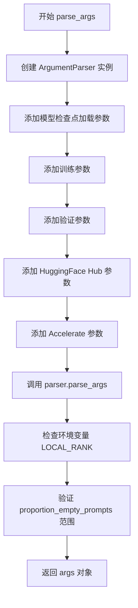
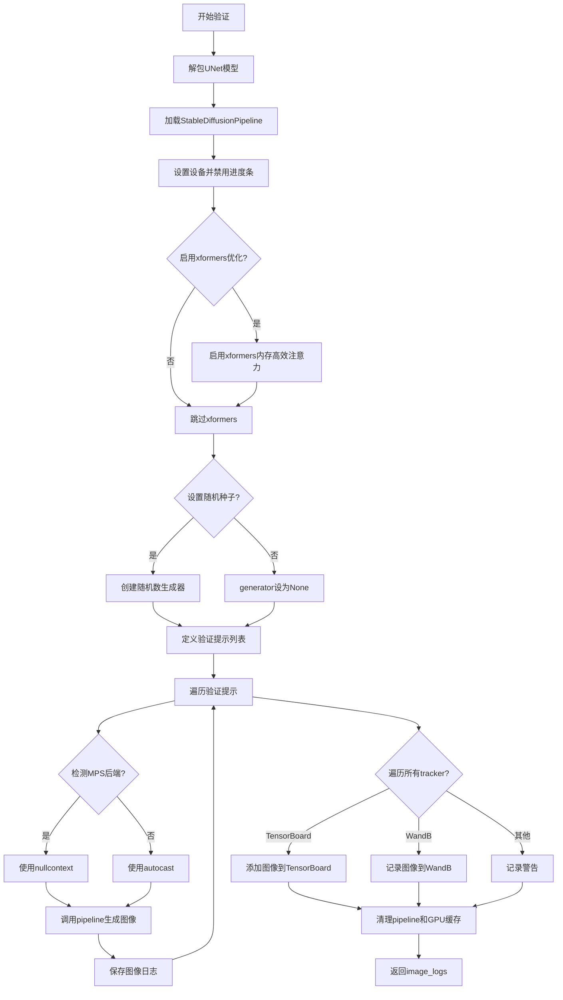
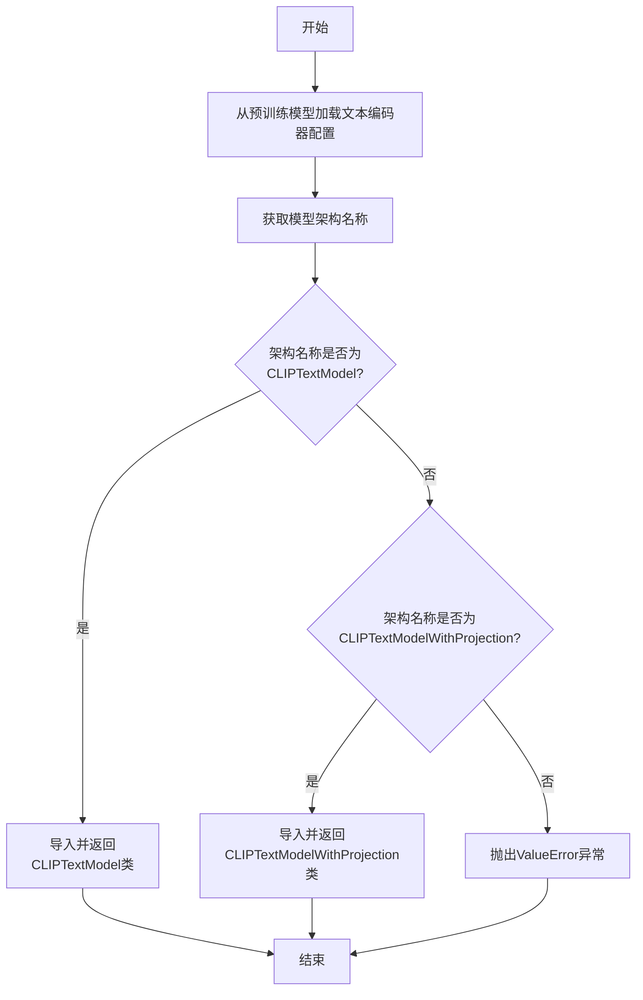
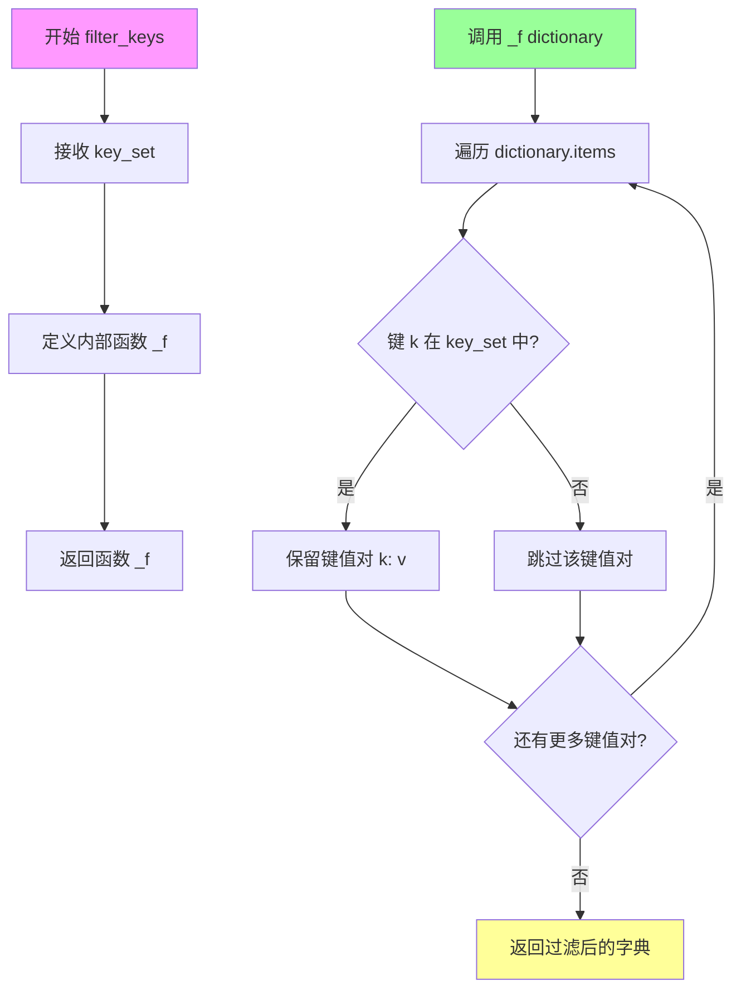
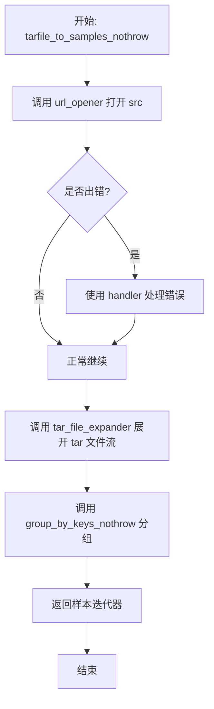
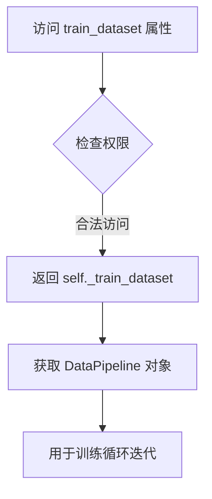
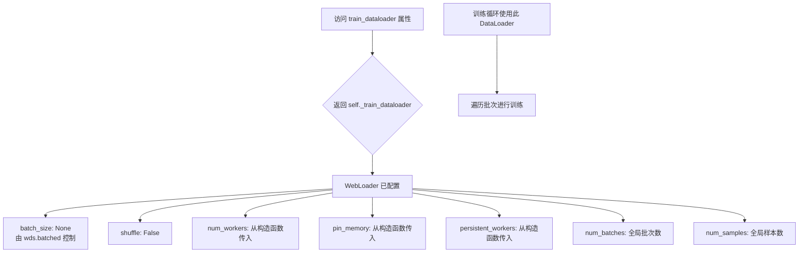
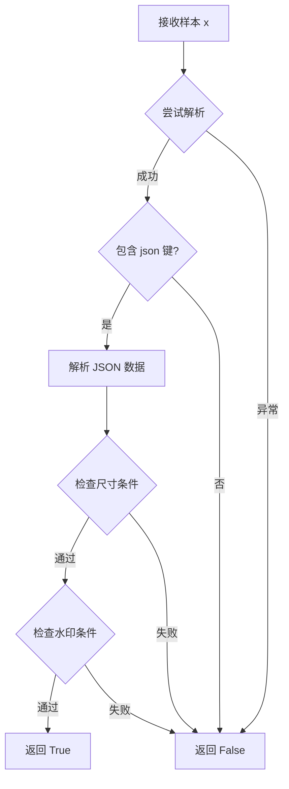

```mermaid
flowchart TD
    A[开始] --> B[检查wandb和hub_token配置]
    B --> C[初始化Accelerator分布式训练环境]
    C --> D[配置日志和随机种子]
    D --> E{是否需要创建Hub仓库}
    E -->|是| F[创建Hub仓库]
    E -->|否| G[跳过]
    F --> G
    G --> H[加载噪声调度器DDPMScheduler]
    H --> I[初始化DDIMSolver求解器]
    I --> J[加载tokenizer和text_encoder]
    J --> K[加载VAE模型]
    K --> L[加载teacher_unet模型]
    L --> M[冻结teacher模型参数]
    M --> N[创建student_unet在线模型]
    N --> O[创建target_unet目标模型]
    O --> P[配置混合精度和设备放置]
    P --> Q[注册模型保存/加载钩子]
    Q --> R[启用xformers优化]
    R --> S[配置TF32和梯度检查点]
    S --> T[创建AdamW优化器]
    T --> U[创建SDText2ImageDataset数据集]
    U --> V[配置学习率调度器]
    V --> W[使用accelerator准备模型和优化器]
    W --> X[初始化训练 trackers]
    X --> Y[创建unconditional prompt embeddings]
    Y --> Z{是否有checkpoint可恢复}
    Z -->|是| AA[加载checkpoint]
    Z -->|否| AB[从头开始训练]
    AA --> AC[开始训练循环]
    AB --> AC
    AC --> AD[遍历每个epoch]
    AD --> AE[遍历每个batch]
    AE --> AF[加载和处理图像和文本]
    AF --> AG[编码图像到latent空间]
    AG --> AH[采样随机timestep]
    AH --> AI[计算边界缩放系数]
    AI --> AJ[添加噪声到latent]
    AJ --> AK[采样guidance scale并嵌入]
    AK --> AL[获取student模型预测]
    AL --> AM[获取teacher模型CFG预测]
    AM --> AN[获取target模型预测]
    AN --> AO[计算loss损失]
    AO --> AP[反向传播更新student模型]
    AP --> AQ{是否同步梯度}
    AQ -->|是| AR[执行EMA更新到target_unet]
    AQ -->|否| AW[跳过EMA]
    AR --> AS{是否需要保存checkpoint}
    AS -->|是| AT[保存训练状态]
    AS -->|否| AU[跳过保存]
    AT --> AV{是否需要验证}
    AV -->|是| AX[运行验证]
    AV -->|否| AY[跳过验证]
    AX --> AW
    AY --> AW
    AW --> AZ[记录训练日志]
    AZ --> BA{是否达到最大训练步数}
    BA -->|否| AE
    BA -->|是| BB[保存最终模型]
    BB --> AC[结束训练]
```

# `diffusers\examples\consistency_distillation\train_lcm_distill_sd_wds.py` 详细设计文档

这是一个用于训练 Latent Consistency Model (LCM) 的脚本，旨在通过一致性蒸馏将 Stable Diffusion 模型从多步推理蒸馏为少步推理。脚本包含了数据加载、模型初始化、DDIM 求解器逻辑、教师-学生训练循环、EMA 更新以及验证流程。

## 整体流程

```mermaid
graph TD
Start[启动训练] --> Init[初始化: Accelerator, 模型(VAE, TextEncoder, UNet), 数据集]
Init --> TrainLoop[遍历 Epochs]
TrainLoop --> BatchLoop[遍历 Batch]
BatchLoop --> DataProc[数据预处理: Resize, Crop, VAE Encode]
DataProc --> SampleTimesteps[采样 DDIM 时间步 t 和 t+k]
SampleTimesteps --> StudentForward[学生 UNet 前向: 预测 x_0 (LCM Output)]
StudentForward --> TeacherForward[教师 UNet 前向 (带CFG): 预测 refined x_0 和 noise]
TeacherForward --> ODESolver[DDIM 求解器: 基于 refined 预测计算 x_prev]
ODESolver --> TargetForward[目标 UNet 前向: 基于 x_prev 预测目标 x_0]
TargetForward --> LossCalc[计算损失: MSE/Huber Loss (Student vs Target)]
LossCalc --> Backward[反向传播与参数更新]
Backward --> EMA[EMA 更新目标模型参数]
EMA --> Checkpoint[检查点保存 & 验证]
Checkpoint --> CheckEnd{是否结束?}
CheckEnd -- 否 --> BatchLoop
CheckEnd -- 是 --> End[结束训练]
```

## 类结构

```
train_lcm (主模块)
├── SDText2ImageDataset (数据集处理类)
├── WebdatasetFilter (数据过滤类)
└── DDIMSolver (ODE 求解器类)
```

## 全局变量及字段


### `MAX_SEQ_LENGTH`
    
SD文本编码器最大序列长度，默认77

类型：`int`
    


### `logger`
    
模块级日志记录器，用于输出训练过程中的日志信息

类型：`logging.Logger`
    


### `is_wandb_available`
    
检查wandb库是否可用的函数，返回布尔值

类型：`function`
    


### `SDText2ImageDataset._train_dataset`
    
WebDataset训练数据集管道对象

类型：`wds.DataPipeline`
    


### `SDText2ImageDataset._train_dataloader`
    
WebDataset训练数据加载器，提供批量数据迭代

类型：`wds.WebLoader`
    


### `WebdatasetFilter.min_size`
    
最小图像尺寸过滤阈值，单位像素

类型：`int`
    


### `WebdatasetFilter.max_pwatermark`
    
最大水印概率过滤阈值，低于该值才保留

类型：`float`
    


### `DDIMSolver.ddim_timesteps`
    
DDIM采样时间步序列张量

类型：`torch.Tensor`
    


### `DDIMSolver.ddim_alpha_cumprods`
    
DDIM累积alpha值张量

类型：`torch.Tensor`
    


### `DDIMSolver.ddim_alpha_cumprods_prev`
    
DDIM前一步累积alpha值张量

类型：`torch.Tensor`
    
    

## 全局函数及方法


### `parse_args`

该函数是训练脚本的命令行参数解析器，使用 Python 的 `argparse` 模块定义并解析所有训练相关的命令行参数，包括模型路径、训练超参数、优化器设置、验证配置等，并进行环境变量覆盖和参数校验，最后返回包含所有解析参数的命名空间对象。

参数：该函数无显式输入参数（通过 `argparse` 在函数内部创建和解析）

返回值：`args`，`argparse.Namespace` 类型，包含所有命令行解析后的参数对象

#### 流程图



#### 带注释源码

```python
def parse_args():
    """
    解析命令行参数并返回包含所有训练配置的配置对象
    
    Returns:
        argparse.Namespace: 包含所有命令行参数的对象
    """
    # 创建参数解析器，设置描述信息
    parser = argparse.ArgumentParser(description="Simple example of a training script.")
    
    # ----------Model Checkpoint Loading Arguments----------
    # 添加模型检查点加载相关参数
    parser.add_argument(
        "--pretrained_teacher_model",
        type=str,
        default=None,
        required=True,
        help="Path to pretrained LDM teacher model or model identifier from huggingface.co/models.",
    )
    parser.add_argument(
        "--pretrained_vae_model_name_or_path",
        type=str,
        default=None,
        help="Path to pretrained VAE model with better numerical stability.",
    )
    parser.add_argument(
        "--teacher_revision",
        type=str,
        default=None,
        required=False,
        help="Revision of pretrained LDM teacher model identifier from huggingface.co/models.",
    )
    parser.add_argument(
        "--revision",
        type=str,
        default=None,
        required=False,
        help="Revision of pretrained LDM model identifier from huggingface.co/models.",
    )
    
    # ----------Training Arguments----------
    # ----General Training Arguments----
    parser.add_argument(
        "--output_dir",
        type=str,
        default="lcm-xl-distilled",
        help="The output directory where the model predictions and checkpoints will be written.",
    )
    parser.add_argument(
        "--cache_dir",
        type=str,
        default=None,
        help="The directory where the downloaded models and datasets will be stored.",
    )
    parser.add_argument("--seed", type=int, default=None, help="A seed for reproducible training.")
    
    # ----Logging----
    parser.add_argument(
        "--logging_dir",
        type=str,
        default="logs",
        help="[TensorBoard] log directory. Will default to *output_dir/runs/**CURRENT_DATETIME_HOSTNAME***.",
    )
    parser.add_argument(
        "--report_to",
        type=str,
        default="tensorboard",
        help='The integration to report the results and logs to. Supported platforms are "tensorboard", "wandb" and "comet_ml".',
    )
    
    # ----Checkpointing----
    parser.add_argument(
        "--checkpointing_steps",
        type=int,
        default=500,
        help="Save a checkpoint of the training state every X updates.",
    )
    parser.add_argument(
        "--checkpoints_total_limit",
        type=int,
        default=None,
        help="Max number of checkpoints to store.",
    )
    parser.add_argument(
        "--resume_from_checkpoint",
        type=str,
        default=None,
        help="Whether training should be resumed from a previous checkpoint.",
    )
    
    # ----Image Processing----
    parser.add_argument(
        "--train_shards_path_or_url",
        type=str,
        default=None,
        help="The name of the Dataset to train on.",
    )
    parser.add_argument(
        "--resolution",
        type=int,
        default=512,
        help="The resolution for input images.",
    )
    parser.add_argument(
        "--interpolation_type",
        type=str,
        default="bilinear",
        help="The interpolation function used when resizing images.",
    )
    parser.add_argument(
        "--center_crop",
        default=False,
        action="store_true",
        help="Whether to center crop the input images to the resolution.",
    )
    parser.add_argument(
        "--random_flip",
        action="store_true",
        help="whether to randomly flip images horizontally",
    )
    
    # ----Dataloader----
    parser.add_argument(
        "--dataloader_num_workers",
        type=int,
        default=0,
        help="Number of subprocesses to use for data loading.",
    )
    
    # ----Batch Size and Training Steps----
    parser.add_argument(
        "--train_batch_size", type=int, default=16, help="Batch size (per device) for the training dataloader."
    )
    parser.add_argument("--num_train_epochs", type=int, default=100)
    parser.add_argument(
        "--max_train_steps",
        type=int,
        default=None,
        help="Total number of training steps to perform.",
    )
    parser.add_argument(
        "--max_train_samples",
        type=int,
        default=None,
        help="For debugging purposes or quicker training, truncate the number of training examples.",
    )
    
    # ----Learning Rate----
    parser.add_argument(
        "--learning_rate",
        type=float,
        default=1e-4,
        help="Initial learning rate (after the potential warmup period) to use.",
    )
    parser.add_argument(
        "--scale_lr",
        action="store_true",
        default=False,
        help="Scale the learning rate by the number of GPUs, gradient accumulation steps, and batch size.",
    )
    parser.add_argument(
        "--lr_scheduler",
        type=str,
        default="constant",
        help='The scheduler type to use. Choose between ["linear", "cosine", "cosine_with_restarts", "polynomial", "constant", "constant_with_warmup"]',
    )
    parser.add_argument(
        "--lr_warmup_steps", type=int, default=500, help="Number of steps for the warmup in the lr scheduler."
    )
    parser.add_argument(
        "--gradient_accumulation_steps",
        type=int,
        default=1,
        help="Number of updates steps to accumulate before performing a backward/update pass.",
    )
    
    # ----Optimizer (Adam)----
    parser.add_argument(
        "--use_8bit_adam", action="store_true", help="Whether or not to use 8-bit Adam from bitsandbytes."
    )
    parser.add_argument("--adam_beta1", type=float, default=0.9, help="The beta1 parameter for the Adam optimizer.")
    parser.add_argument("--adam_beta2", type=float, default=0.999, help="The beta2 parameter for the Adam optimizer.")
    parser.add_argument("--adam_weight_decay", type=float, default=1e-2, help="Weight decay to use.")
    parser.add_argument("--adam_epsilon", type=float, default=1e-08, help="Epsilon value for the Adam optimizer")
    parser.add_argument("--max_grad_norm", default=1.0, type=float, help="Max gradient norm.")
    
    # ----Diffusion Training Arguments----
    parser.add_argument(
        "--proportion_empty_prompts",
        type=float,
        default=0,
        help="Proportion of image prompts to be replaced with empty strings.",
    )
    
    # ----Latent Consistency Distillation (LCD) Specific Arguments----
    parser.add_argument(
        "--w_min",
        type=float,
        default=5.0,
        required=False,
        help="The minimum guidance scale value for guidance scale sampling.",
    )
    parser.add_argument(
        "--w_max",
        type=float,
        default=15.0,
        required=False,
        help="The maximum guidance scale value for guidance scale sampling.",
    )
    parser.add_argument(
        "--num_ddim_timesteps",
        type=int,
        default=50,
        help="The number of timesteps to use for DDIM sampling.",
    )
    parser.add_argument(
        "--loss_type",
        type=str,
        default="l2",
        choices=["l2", "huber"],
        help="The type of loss to use for the LCD loss.",
    )
    parser.add_argument(
        "--huber_c",
        type=float,
        default=0.001,
        help="The huber loss parameter. Only used if `--loss_type=huber`.",
    )
    parser.add_argument(
        "--unet_time_cond_proj_dim",
        type=int,
        default=256,
        help="The dimension of the guidance scale embedding in the U-Net.",
    )
    parser.add_argument(
        "--vae_encode_batch_size",
        type=int,
        default=32,
        required=False,
        help="The batch size used when encoding images to latents.",
    )
    parser.add_argument(
        "--timestep_scaling_factor",
        type=float,
        default=10.0,
        help="The multiplicative timestep scaling factor used when calculating the boundary scalings for LCM.",
    )
    
    # ----Exponential Moving Average (EMA)----
    parser.add_argument(
        "--ema_decay",
        type=float,
        default=0.95,
        required=False,
        help="The exponential moving average (EMA) rate or decay factor.",
    )
    
    # ----Mixed Precision----
    parser.add_argument(
        "--mixed_precision",
        type=str,
        default=None,
        choices=["no", "fp16", "bf16"],
        help="Whether to use mixed precision. Choose between fp16 and bf16.",
    )
    parser.add_argument(
        "--allow_tf32",
        action="store_true",
        help="Whether or not to allow TF32 on Ampere GPUs.",
    )
    parser.add_argument(
        "--cast_teacher_unet",
        action="store_true",
        help="Whether to cast the teacher U-Net to the precision specified by `--mixed_precision`.",
    )
    
    # ----Training Optimizations----
    parser.add_argument(
        "--enable_xformers_memory_efficient_attention", action="store_true", help="Whether or not to use xformers."
    )
    parser.add_argument(
        "--gradient_checkpointing",
        action="store_true",
        help="Whether or not to use gradient checkpointing to save memory.",
    )
    
    # ----Distributed Training----
    parser.add_argument("--local_rank", type=int, default=-1, help="For distributed training: local_rank")
    
    # ----------Validation Arguments----------
    parser.add_argument(
        "--validation_steps",
        type=int,
        default=200,
        help="Run validation every X steps.",
    )
    
    # ----------Huggingface Hub Arguments-----------
    parser.add_argument("--push_to_hub", action="store_true", help="Whether or not to push the model to the Hub.")
    parser.add_argument("--hub_token", type=str, default=None, help="The token to use to push to the Model Hub.")
    parser.add_argument(
        "--hub_model_id",
        type=str,
        default=None,
        help="The name of the repository to keep in sync with the local `output_dir`.",
    )
    
    # ----------Accelerate Arguments----------
    parser.add_argument(
        "--tracker_project_name",
        type=str,
        default="text2image-fine-tune",
        help="The `project_name` argument passed to Accelerator.init_trackers.",
    )

    # 解析所有命令行参数
    args = parser.parse_args()
    
    # 检查环境变量 LOCAL_RANK，如果存在则覆盖 args.local_rank
    # 这允许通过环境变量指定分布式训练的本地排名
    env_local_rank = int(os.environ.get("LOCAL_RANK", -1))
    if env_local_rank != -1 and env_local_rank != args.local_rank:
        args.local_rank = env_local_rank

    # 验证 proportion_empty_prompts 参数必须在 [0, 1] 范围内
    if args.proportion_empty_prompts < 0 or args.proportion_empty_prompts > 1:
        raise ValueError("`--proportion_empty_prompts` must be in the range [0, 1].")

    # 返回解析后的参数对象
    return args
```


### main

这是Stable Diffusion模型训练的主入口函数，负责协调整个LCM（Latent Consistency Model）蒸馏训练流程，包括模型加载、分布式训练设置、数据处理、噪声调度、师生模型训练、EMA更新、检查点保存和验证等核心步骤。

参数：

- `args`：`argparse.Namespace`，包含所有训练配置参数的命令行参数对象

返回值：`None`，该函数执行训练流程，不返回任何值

#### 流程图



#### 带注释源码

```python
def main(args):
    """
    主训练函数，执行LCM蒸馏训练的全部流程
    
    参数:
        args: 包含所有训练配置的命令行参数对象
    """
    
    # ========== 阶段1: 初始化和环境配置 ==========
    
    # 检查安全性：不能同时使用wandb和hub_token
    if args.report_to == "wandb" and args.hub_token is not None:
        raise ValueError(
            "You cannot use both --report_to=wandb and --hub_token due to a security risk of exposing your token."
            " Please use `hf auth login` to authenticate with the Hub."
        )

    # 创建日志目录
    logging_dir = Path(args.output_dir, args.logging_dir)

    # 配置Accelerator项目参数
    accelerator_project_config = ProjectConfiguration(project_dir=args.output_dir, logging_dir=logging_dir)

    # 初始化分布式训练 Accelerator
    accelerator = Accelerator(
        gradient_accumulation_steps=args.gradient_accumulation_steps,
        mixed_precision=args.mixed_precision,
        log_with=args.report_to,
        project_config=accelerator_project_config,
        # 使用webdataset时必须设置为True，以确保lr调度的步数正确
        split_batches=True,
    )

    # 配置日志格式
    logging.basicConfig(
        format="%(asctime)s - %(levelname)s - %(name)s - %(message)s",
        datefmt="%m/%d/%Y %H:%M:%S",
        level=logging.INFO,
    )
    logger.info(accelerator.state, main_process_only=False)
    
    # 根据进程类型设置日志级别
    if accelerator.is_local_main_process:
        transformers.utils.logging.set_verbosity_warning()
        diffusers.utils.logging.set_verbosity_info()
    else:
        transformers.utils.logging.set_verbosity_error()
        diffusers.utils.logging.set_verbosity_error()

    # 设置随机种子以确保可重复训练
    if args.seed is not None:
        set_seed(args.seed)

    # 处理仓库创建（如果是主进程）
    if accelerator.is_main_process:
        if args.output_dir is not None:
            os.makedirs(args.output_dir, exist_ok=True)

        if args.push_to_hub:
            repo_id = create_repo(
                repo_id=args.hub_model_id or Path(args.output_dir).name,
                exist_ok=True,
                token=args.hub_token,
                private=True,
            ).repo_id

    # ========== 阶段2: 模型加载 ==========
    
    # 创建噪声调度器
    noise_scheduler = DDPMScheduler.from_pretrained(
        args.pretrained_teacher_model, subfolder="scheduler", revision=args.teacher_revision
    )

    # 计算alpha和sigma噪声调度
    alpha_schedule = torch.sqrt(noise_scheduler.alphas_cumprod)
    sigma_schedule = torch.sqrt(1 - noise_scheduler.alphas_cumprod)
    
    # 初始化DDIM ODE求解器用于蒸馏
    solver = DDIMSolver(
        noise_scheduler.alphas_cumprod.numpy(),
        timesteps=noise_scheduler.config.num_train_timesteps,
        ddim_timesteps=args.num_ddim_timesteps,
    )

    # 加载tokenizer
    tokenizer = AutoTokenizer.from_pretrained(
        args.pretrained_teacher_model, subfolder="tokenizer", revision=args.teacher_revision, use_fast=False
    )

    # 加载text encoder
    text_encoder = CLIPTextModel.from_pretrained(
        args.pretrained_teacher_model, subfolder="text_encoder", revision=args.teacher_revision
    )

    # 加载VAE
    vae = AutoencoderKL.from_pretrained(
        args.pretrained_teacher_model,
        subfolder="vae",
        revision=args.teacher_revision,
    )

    # 加载teacher U-Net
    teacher_unet = UNet2DConditionModel.from_pretrained(
        args.pretrained_teacher_model, subfolder="unet", revision=args.teacher_revision
    )

    # ========== 阶段3: 模型冻结和初始化 ==========
    
    # 冻结teacher模型参数
    vae.requires_grad_(False)
    text_encoder.requires_grad_(False)
    teacher_unet.requires_grad_(False)

    # 创建在线student U-Net（将通过反向传播更新）
    time_cond_proj_dim = (
        teacher_unet.config.time_cond_proj_dim
        if teacher_unet.config.time_cond_proj_dim is not None
        else args.unet_time_cond_proj_dim
    )
    unet = UNet2DConditionModel.from_config(teacher_unet.config, time_cond_proj_dim=time_cond_proj_dim)
    # 从teacher加载权重
    unet.load_state_dict(teacher_unet.state_dict(), strict=False)
    unet.train()

    # 创建目标student U-Net（通过EMA更新）
    target_unet = UNet2DConditionModel.from_config(unet.config)
    target_unet.load_state_dict(unet.state_dict())
    target_unet.train()
    target_unet.requires_grad_(False)

    # ========== 阶段4: 混合精度和设备配置 ==========
    
    low_precision_error_string = (
        " Please make sure to always have all model weights in full float32 precision when starting training - even if"
        " doing mixed precision training, copy of the weights should still be float32."
    )

    if accelerator.unwrap_model(unet).dtype != torch.float32:
        raise ValueError(
            f"Controlnet loaded as datatype {accelerator.unwrap_model(unet).dtype}. {low_precision_error_string}"
        )

    # 确定权重数据类型
    weight_dtype = torch.float32
    if accelerator.mixed_precision == "fp16":
        weight_dtype = torch.float16
    elif accelerator.mixed_precision == "bf16":
        weight_dtype = torch.bfloat16

    # 将模型移动到设备并转换数据类型
    vae.to(accelerator.device)
    if args.pretrained_vae_model_name_or_path is not None:
        vae.to(dtype=weight_dtype)
    text_encoder.to(accelerator.device, dtype=weight_dtype)
    target_unet.to(accelerator.device)
    teacher_unet.to(accelerator.device)
    if args.cast_teacher_unet:
        teacher_unet.to(dtype=weight_dtype)

    # 将噪声调度移到设备
    alpha_schedule = alpha_schedule.to(accelerator.device)
    sigma_schedule = sigma_schedule.to(accelerator.device)
    solver = solver.to(accelerator.device)

    # ========== 阶段5: 保存/加载钩子 ==========
    
    if version.parse(accelerate.__version__) >= version.parse("0.16.0"):
        def save_model_hook(models, weights, output_dir):
            if accelerator.is_main_process:
                target_unet.save_pretrained(os.path.join(output_dir, "unet_target"))
                for i, model in enumerate(models):
                    model.save_pretrained(os.path.join(output_dir, "unet"))
                    weights.pop()

        def load_model_hook(models, input_dir):
            load_model = UNet2DConditionModel.from_pretrained(os.path.join(input_dir, "unet_target"))
            target_unet.load_state_dict(load_model.state_dict())
            target_unet.to(accelerator.device)
            del load_model

            for i in range(len(models)):
                model = models.pop()
                load_model = UNet2DConditionModel.from_pretrained(input_dir, subfolder="unet")
                model.register_to_config(**load_model.config)
                model.load_state_dict(load_model.state_dict())
                del load_model

        accelerator.register_save_state_pre_hook(save_model_hook)
        accelerator.register_load_state_pre_hook(load_model_hook)

    # ========== 阶段6: 优化配置 ==========
    
    # 启用xformers内存高效注意力
    if args.enable_xformers_memory_efficient_attention:
        if is_xformers_available():
            import xformers

            xformers_version = version.parse(xformers.__version__)
            if xformers_version == version.parse("0.0.16"):
                logger.warning(
                    "xFormers 0.0.16 cannot be used for training in some GPUs..."
                )
            unet.enable_xformers_memory_efficient_attention()
            teacher_unet.enable_xformers_memory_efficient_attention()
            target_unet.enable_xformers_memory_efficient_attention()
        else:
            raise ValueError("xformers is not available.")

    # 启用TF32加速
    if args.allow_tf32:
        torch.backends.cuda.matmul.allow_tf32 = True

    # 启用梯度检查点以节省内存
    if args.gradient_checkpointing:
        unet.enable_gradient_checkpointing()

    # ========== 阶段7: 优化器和数据集 ==========
    
    # 选择优化器类
    if args.use_8bit_adam:
        try:
            import bitsandbytes as bnb
        except ImportError:
            raise ImportError(
                "To use 8-bit Adam, please install the bitsandbytes library: `pip install bitsandbytes`."
            )

        optimizer_class = bnb.optim.AdamW8bit
    else:
        optimizer_class = torch.optim.AdamW

    # 创建优化器
    optimizer = optimizer_class(
        unet.parameters(),
        lr=args.learning_rate,
        betas=(args.adam_beta1, args.adam_beta2),
        weight_decay=args.adam_weight_decay,
        eps=args.adam_epsilon,
    )

    # 计算embedding的辅助函数
    def compute_embeddings(prompt_batch, proportion_empty_prompts, text_encoder, tokenizer, is_train=True):
        prompt_embeds = encode_prompt(prompt_batch, text_encoder, tokenizer, proportion_empty_prompts, is_train)
        return {"prompt_embeds": prompt_embeds}

    # 创建数据集
    dataset = SDText2ImageDataset(
        train_shards_path_or_url=args.train_shards_path_or_url,
        num_train_examples=args.max_train_samples,
        per_gpu_batch_size=args.train_batch_size,
        global_batch_size=args.train_batch_size * accelerator.num_processes,
        num_workers=args.dataloader_num_workers,
        resolution=args.resolution,
        interpolation_type=args.interpolation_type,
        shuffle_buffer_size=1000,
        pin_memory=True,
        persistent_workers=True,
    )
    train_dataloader = dataset.train_dataloader

    # 创建compute_embeddings的部分应用函数
    compute_embeddings_fn = functools.partial(
        compute_embeddings,
        proportion_empty_prompts=0,
        text_encoder=text_encoder,
        tokenizer=tokenizer,
    )

    # ========== 阶段8: 学习率调度器 ==========
    
    overrode_max_train_steps = False
    num_update_steps_per_epoch = math.ceil(train_dataloader.num_batches / args.gradient_accumulation_steps)
    if args.max_train_steps is None:
        args.max_train_steps = args.num_train_epochs * num_update_steps_per_epoch
        overrode_max_train_steps = True

    lr_scheduler = get_scheduler(
        args.lr_scheduler,
        optimizer=optimizer,
        num_warmup_steps=args.lr_warmup_steps,
        num_training_steps=args.max_train_steps,
    )

    # ========== 阶段9: 准备训练 ==========
    
    unet, optimizer, lr_scheduler = accelerator.prepare(unet, optimizer, lr_scheduler)

    # 重新计算训练步数
    num_update_steps_per_epoch = math.ceil(train_dataloader.num_batches / args.gradient_accumulation_steps)
    if overrode_max_train_steps:
        args.max_train_steps = args.num_train_epochs * num_update_steps_per_epoch
    args.num_train_epochs = math.ceil(args.max_train_steps / num_update_steps_per_epoch)

    # 初始化trackers
    if accelerator.is_main_process:
        tracker_config = dict(vars(args))
        accelerator.init_trackers(args.tracker_project_name, config=tracker_config)

    # 创建unconditional prompt embeddings (用于CFG)
    uncond_input_ids = tokenizer(
        [""] * args.train_batch_size, return_tensors="pt", padding="max_length", max_length=77
    ).input_ids.to(accelerator.device)
    uncond_prompt_embeds = text_encoder(uncond_input_ids)[0]

    # ========== 阶段10: 训练循环 ==========
    
    total_batch_size = args.train_batch_size * accelerator.num_processes * args.gradient_accumulation_steps

    logger.info("***** Running training *****")
    logger.info(f"  Num batches each epoch = {train_dataloader.num_batches}")
    logger.info(f"  Num Epochs = {args.num_train_epochs}")
    logger.info(f"  Instantaneous batch size per device = {args.train_batch_size}")
    logger.info(f"  Total train batch size = {total_batch_size}")
    logger.info(f"  Gradient Accumulation steps = {args.gradient_accumulation_steps}")
    logger.info(f"  Total optimization steps = {args.max_train_steps}")
    global_step = 0
    first_epoch = 0

    # 尝试从checkpoint恢复
    if args.resume_from_checkpoint:
        if args.resume_from_checkpoint != "latest":
            path = os.path.basename(args.resume_from_checkpoint)
        else:
            dirs = os.listdir(args.output_dir)
            dirs = [d for d in dirs if d.startswith("checkpoint")]
            dirs = sorted(dirs, key=lambda x: int(x.split("-")[1]))
            path = dirs[-1] if len(dirs) > 0 else None

        if path is None:
            accelerator.print(f"Checkpoint does not exist. Starting new training run.")
            args.resume_from_checkpoint = None
            initial_global_step = 0
        else:
            accelerator.print(f"Resuming from checkpoint {path}")
            accelerator.load_state(os.path.join(args.output_dir, path))
            global_step = int(path.split("-")[1])
            initial_global_step = global_step
            first_epoch = global_step // num_update_steps_per_epoch
    else:
        initial_global_step = 0

    # 创建进度条
    progress_bar = tqdm(
        range(0, args.max_train_steps),
        initial=initial_global_step,
        desc="Steps",
        disable=not accelerator.is_local_main_process,
    )

    # 外层epoch循环
    for epoch in range(first_epoch, args.num_train_epochs):
        # 内层batch循环
        for step, batch in enumerate(train_dataloader):
            with accelerator.accumulate(unet):
                # 1. 加载和处理图像和文本
                image, text = batch

                image = image.to(accelerator.device, non_blocking=True)
                encoded_text = compute_embeddings_fn(text)

                pixel_values = image.to(dtype=weight_dtype)
                if vae.dtype != weight_dtype:
                    vae.to(dtype=weight_dtype)

                # 2. 编码图像到latent空间
                latents = []
                for i in range(0, pixel_values.shape[0], args.vae_encode_batch_size):
                    latents.append(vae.encode(pixel_values[i : i + args.vae_encode_batch_size]).latent_dist.sample())
                latents = torch.cat(latents, dim=0)

                latents = latents * vae.config.scaling_factor
                latents = latents.to(weight_dtype)
                bsz = latents.shape[0]

                # 3. 采样随机timestep
                topk = noise_scheduler.config.num_train_timesteps // args.num_ddim_timesteps
                index = torch.randint(0, args.num_ddim_timesteps, (bsz,), device=latents.device).long()
                start_timesteps = solver.ddim_timesteps[index]
                timesteps = start_timesteps - topk
                timesteps = torch.where(timesteps < 0, torch.zeros_like(timesteps), timesteps)

                # 4. 获取边界缩放系数
                c_skip_start, c_out_start = scalings_for_boundary_conditions(
                    start_timesteps, timestep_scaling=args.timestep_scaling_factor
                )
                c_skip_start, c_out_start = [append_dims(x, latents.ndim) for x in [c_skip_start, c_out_start]]
                c_skip, c_out = scalings_for_boundary_conditions(
                    timesteps, timestep_scaling=args.timestep_scaling_factor
                )
                c_skip, c_out = [append_dims(x, latents.ndim) for x in [c_skip, c_out]]

                # 5. 添加噪声（前向扩散过程）
                noise = torch.randn_like(latents)
                noisy_model_input = noise_scheduler.add_noise(latents, noise, start_timesteps)

                # 6. 采样guidance scale并嵌入
                w = (args.w_max - args.w_min) * torch.rand((bsz,)) + args.w_min
                w_embedding = guidance_scale_embedding(w, embedding_dim=time_cond_proj_dim)
                w = w.reshape(bsz, 1, 1, 1)
                w = w.to(device=latents.device, dtype=latents.dtype)
                w_embedding = w_embedding.to(device=latents.device, dtype=latents.dtype)

                # 7. 获取student模型预测
                prompt_embeds = encoded_text.pop("prompt_embeds")

                noise_pred = unet(
                    noisy_model_input,
                    start_timesteps,
                    timestep_cond=w_embedding,
                    encoder_hidden_states=prompt_embeds.float(),
                    added_cond_kwargs=encoded_text,
                ).sample

                pred_x_0 = get_predicted_original_sample(
                    noise_pred,
                    start_timesteps,
                    noisy_model_input,
                    noise_scheduler.config.prediction_type,
                    alpha_schedule,
                    sigma_schedule,
                )

                model_pred = c_skip_start * noisy_model_input + c_out_start * pred_x_0

                # 8. 获取teacher模型CFG预测
                with torch.no_grad():
                    if torch.backends.mps.is_available():
                        autocast_ctx = nullcontext()
                    else:
                        autocast_ctx = torch.autocast(accelerator.device.type)

                    with autocast_ctx:
                        # 条件预测
                        cond_teacher_output = teacher_unet(
                            noisy_model_input.to(weight_dtype),
                            start_timesteps,
                            encoder_hidden_states=prompt_embeds.to(weight_dtype),
                        ).sample
                        cond_pred_x0 = get_predicted_original_sample(
                            cond_teacher_output,
                            start_timesteps,
                            noisy_model_input,
                            noise_scheduler.config.prediction_type,
                            alpha_schedule,
                            sigma_schedule,
                        )
                        cond_pred_noise = get_predicted_noise(
                            cond_teacher_output,
                            start_timesteps,
                            noisy_model_input,
                            noise_scheduler.config.prediction_type,
                            alpha_schedule,
                            sigma_schedule,
                        )

                        # 无条件预测
                        uncond_teacher_output = teacher_unet(
                            noisy_model_input.to(weight_dtype),
                            start_timesteps,
                            encoder_hidden_states=uncond_prompt_embeds.to(weight_dtype),
                        ).sample
                        uncond_pred_x0 = get_predicted_original_sample(
                            uncond_teacher_output,
                            start_timesteps,
                            noisy_model_input,
                            noise_scheduler.config.prediction_type,
                            alpha_schedule,
                            sigma_schedule,
                        )
                        uncond_pred_noise = get_predicted_noise(
                            uncond_teacher_output,
                            start_timesteps,
                            noisy_model_input,
                            noise_scheduler.config.prediction_type,
                            alpha_schedule,
                            sigma_schedule,
                        )

                        # 应用CFG
                        pred_x0 = cond_pred_x0 + w * (cond_pred_x0 - uncond_pred_x0)
                        pred_noise = cond_pred_noise + w * (cond_pred_noise - uncond_pred_noise)
                        
                        # ODE求解器单步
                        x_prev = solver.ddim_step(pred_x0, pred_noise, index)

                # 9. 获取target模型预测
                with torch.no_grad():
                    if torch.backends.mps.is_available():
                        autocast_ctx = nullcontext()
                    else:
                        autocast_ctx = torch.autocast(accelerator.device.type, dtype=weight_dtype)

                    with autocast_ctx:
                        target_noise_pred = target_unet(
                            x_prev.float(),
                            timesteps,
                            timestep_cond=w_embedding,
                            encoder_hidden_states=prompt_embeds.float(),
                        ).sample
                    pred_x_0 = get_predicted_original_sample(
                        target_noise_pred,
                        timesteps,
                        x_prev,
                        noise_scheduler.config.prediction_type,
                        alpha_schedule,
                        sigma_schedule,
                    )
                    target = c_skip * x_prev + c_out * pred_x_0

                # 10. 计算loss
                if args.loss_type == "l2":
                    loss = F.mse_loss(model_pred.float(), target.float(), reduction="mean")
                elif args.loss_type == "huber":
                    loss = torch.mean(
                        torch.sqrt((model_pred.float() - target.float()) ** 2 + args.huber_c**2) - args.huber_c
                    )

                # 11. 反向传播
                accelerator.backward(loss)
                if accelerator.sync_gradients:
                    accelerator.clip_grad_norm_(unet.parameters(), args.max_grad_norm)
                optimizer.step()
                lr_scheduler.step()
                optimizer.zero_grad(set_to_none=True)

            # 12. EMA更新
            if accelerator.sync_gradients:
                update_ema(target_unet.parameters(), unet.parameters(), args.ema_decay)
                progress_bar.update(1)
                global_step += 1

                if accelerator.is_main_process:
                    # 保存checkpoint
                    if global_step % args.checkpointing_steps == 0:
                        if args.checkpoints_total_limit is not None:
                            checkpoints = os.listdir(args.output_dir)
                            checkpoints = [d for d in checkpoints if d.startswith("checkpoint")]
                            checkpoints = sorted(checkpoints, key=lambda x: int(x.split("-")[1]))

                            if len(checkpoints) >= args.checkpoints_total_limit:
                                num_to_remove = len(checkpoints) - args.checkpoints_total_limit + 1
                                removing_checkpoints = checkpoints[0:num_to_remove]

                                for removing_checkpoint in removing_checkpoints:
                                    removing_checkpoint = os.path.join(args.output_dir, removing_checkpoint)
                                    shutil.rmtree(removing_checkpoint)

                        save_path = os.path.join(args.output_dir, f"checkpoint-{global_step}")
                        accelerator.save_state(save_path)
                        logger.info(f"Saved state to {save_path}")

                    # 验证
                    if global_step % args.validation_steps == 0:
                        log_validation(vae, target_unet, args, accelerator, weight_dtype, global_step, "target")
                        log_validation(vae, unet, args, accelerator, weight_dtype, global_step, "online")

            # 记录日志
            logs = {"loss": loss.detach().item(), "lr": lr_scheduler.get_last_lr()[0]}
            progress_bar.set_postfix(**logs)
            accelerator.log(logs, step=global_step)

            if global_step >= args.max_train_steps:
                break

    # ========== 阶段11: 保存最终模型 ==========
    
    accelerator.wait_for_everyone()
    if accelerator.is_main_process:
        unet = accelerator.unwrap_model(unet)
        unet.save_pretrained(os.path.join(args.output_dir, "unet"))

        target_unet = accelerator.unwrap_model(target_unet)
        target_unet.save_pretrained(os.path.join(args.output_dir, "unet_target"))

        if args.push_to_hub:
            upload_folder(
                repo_id=repo_id,
                folder_path=args.output_dir,
                commit_message="End of training",
                ignore_patterns=["step_*", "epoch_*"],
            )

    accelerator.end_training()
```


### `encode_prompt`

该函数用于将一批文本提示（prompt）编码为文本嵌入向量（prompt embeddings），支持训练时随机替换部分提示为空字符串（无条件生成），以及处理单字符串或字符串列表/数组形式的caption。

参数：

- `prompt_batch`：`Union[List[str], List[List[str]], List[np.ndarray]]`，待编码的提示词批次，每个元素可以是单个字符串或多个字符串（caption候选列表）
- `text_encoder`：`CLIPTextModel`，HuggingFace Transformers的CLIP文本编码器模型，用于将token IDs转换为文本嵌入
- `tokenizer`：`AutoTokenizer`，与text_encoder配套的tokenizer，负责将文本分词并转换为token IDs
- `proportion_empty_prompts`：`float`，训练时空提示词（空字符串）的比例，范围[0, 1]，用于 classifier-free guidance
- `is_train`：`bool`，是否处于训练模式，训练时从多个caption中随机选择一个，验证时取第一个

返回值：`torch.Tensor`，形状为`(batch_size, seq_len, hidden_size)`的文本嵌入向量，供UNet在条件扩散过程中使用

#### 流程图

```mermaid
flowchart TD
    A[开始 encode_prompt] --> B[初始化空列表 captions]
    B --> C{遍历 prompt_batch 中的每个 caption}
    C --> D{random.random < proportion_empty_prompts?}
    D -->|是| E[添加空字符串 '' 到 captions]
    D -->|否| F{isinstance caption, str?}
    F -->|是| G[直接添加 caption 到 captions]
    F -->|否| H{isinstance caption, list 或 np.ndarray?}
    H -->|是| I{is_train?}
    H -->|否| J[跳过/处理异常]
    I -->|是| K[random.choice 随机选择一个 caption]
    I -->|否| L[选择 caption[0] 第一个]
    K --> M[添加选中的 caption 到 captions]
    L --> M
    M --> C
    C --> N{所有 caption 处理完毕?}
    N -->|否| C
    N -->|是| O[调用 tokenizer 编码 captions]
    O --> P[提取 input_ids]
    P --> Q[text_encoder 编码 input_ids]
    Q --> R[提取嵌入向量 prompt_embeds]
    R --> S[返回 prompt_embeds]
```

#### 带注释源码

```python
def encode_prompt(prompt_batch, text_encoder, tokenizer, proportion_empty_prompts, is_train=True):
    """
    将一批文本提示编码为文本嵌入向量。

    参数:
        prompt_batch: 待编码的提示词批次，每个元素可以是字符串或字符串列表
        text_encoder: CLIP文本编码器模型
        tokenizer: 分词器
        proportion_empty_prompts: 空提示词的比例，用于无条件和有条件训练的混合
        is_train: 是否训练模式（训练时随机选择caption）
    """
    captions = []
    for caption in prompt_batch:
        # 根据 proportion_empty_prompts 概率决定是否使用空字符串（无条件生成）
        if random.random() < proportion_empty_prompts:
            captions.append("")
        # 如果是单个字符串，直接使用
        elif isinstance(caption, str):
            captions.append(caption)
        # 如果是多个caption（列表或数组），根据模式选择
        elif isinstance(caption, (list, np.ndarray)):
            # 训练时随机选择一个caption，验证时取第一个
            captions.append(random.choice(caption) if is_train else caption[0])

    # 使用torch.no_grad()上下文管理器禁用梯度计算，减少显存占用
    with torch.no_grad():
        # 使用tokenizer将文本转换为token IDs
        text_inputs = tokenizer(
            captions,
            padding="max_length",           # 填充到最大长度
            max_length=tokenizer.model_max_length,  # 最大长度（通常为77）
            truncation=True,                 # 截断超长文本
            return_tensors="pt",            # 返回PyTorch张量
        )
        # 获取input_ids张量
        text_input_ids = text_inputs.input_ids
        # 将input_ids传入text_encoder获取嵌入向量
        # text_encoder返回元组(outputs, ...)，取第一个元素为嵌入
        prompt_embeds = text_encoder(text_input_ids.to(text_encoder.device))[0]

    return prompt_embeds
```


### `log_validation`

该函数用于在训练过程中运行验证，生成并记录模型在特定验证提示下的图像，支持 TensorBoard 和 WandB 两种日志记录方式。

参数：

- `vae`：`AutoencoderKL`，变分自编码器模型，用于将图像编码为潜在表示
- `unet`：`UNet2DConditionModel`，去噪 UNet 模型，用于生成图像
- `args`：命名空间，包含预训练模型路径、xformers 优化、随机种子等配置参数
- `accelerator`：`Accelerator`，HuggingFace Accelerate 库提供的分布式训练加速器
- `weight_dtype`：`torch.dtype`，模型权重的数据类型（float32/float16/bfloat16）
- `step`：`int`，当前训练步数，用于日志记录
- `name`：`str`（默认值为 `"target"`），验证名称标识，用于区分目标模型和在线模型

返回值：`list[dict]`，返回包含验证提示和生成图像的日志列表，每个元素为 `{"validation_prompt": str, "images": list[PIL.Image]}`

#### 流程图



#### 带注释源码

```
def log_validation(vae, unet, args, accelerator, weight_dtype, step, name="target"):
    """
    运行验证流程，生成模型样本图像并记录到日志系统
    
    参数:
        vae: 变分自编码器模型
        unet: 去噪UNet模型
        args: 包含所有训练和模型配置的命令行参数
        accelerator: Accelerate分布式训练对象
        weight_dtype: 模型权重精度类型
        step: 当前训练步数
        name: 验证名称标识符，区分target和online模型
    """
    logger.info("Running validation... ")

    # 从accelerator中获取解包后的UNet模型
    unet = accelerator.unwrap_model(unet)
    
    # 使用预训练模型构建Stable Diffusion pipeline
    # 从teacher model加载配置，并替换vae和unet为当前训练模型
    pipeline = StableDiffusionPipeline.from_pretrained(
        args.pretrained_teacher_model,
        vae=vae,
        unet=unet,
        # 从teacher model加载LCM调度器
        scheduler=LCMScheduler.from_pretrained(args.pretrained_teacher_model, subfolder="scheduler"),
        revision=args.revision,
        torch_dtype=weight_dtype,
    )
    
    # 将pipeline移动到accelerator设备上
    pipeline = pipeline.to(accelerator.device)
    
    # 禁用pipeline的进度条显示
    pipeline.set_progress_bar_config(disable=True)

    # 如果启用xformers，优化内存使用
    if args.enable_xformers_memory_efficient_attention:
        pipeline.enable_xformers_memory_efficient_attention()

    # 根据是否设置种子来决定随机数生成器
    if args.seed is None:
        generator = None
    else:
        # 为每个验证创建确定性生成器
        generator = torch.Generator(device=accelerator.device).manual_seed(args.seed)

    # 定义用于验证的固定提示词列表
    validation_prompts = [
        "portrait photo of a girl, photograph, highly detailed face, depth of field, moody light, golden hour, style by Dan Winters, Russell James, Steve McCurry, centered, extremely detailed, Nikon D850, award winning photography",
        "Self-portrait oil painting, a beautiful cyborg with golden hair, 8k",
        "Astronaut in a jungle, cold color palette, muted colors, detailed, 8k",
        "A photo of beautiful mountain with realistic sunset and blue lake, highly detailed, masterpiece",
    ]

    # 存储所有验证结果
    image_logs = []

    # 遍历每个验证提示生成图像
    for _, prompt in enumerate(validation_prompts):
        images = []
        
        # 处理MPS后端的特殊情况（苹果芯片）
        if torch.backends.mps.is_available():
            autocast_ctx = nullcontext()
        else:
            # 为其他设备启用自动混合精度
            autocast_ctx = torch.autocast(accelerator.device.type)

        # 在适当的上文管理器中运行推理
        with autocast_ctx:
            images = pipeline(
                prompt=prompt,
                num_inference_steps=4,  # 使用较少的推理步数加速验证
                num_images_per_prompt=4,  # 每个提示生成4张图像
                generator=generator,
            ).images
        
        # 保存当前提示的图像日志
        image_logs.append({"validation_prompt": prompt, "images": images})

    # 根据tracker类型记录图像
    for tracker in accelerator.trackers:
        if tracker.name == "tensorboard":
            # TensorBoard日志记录
            for log in image_logs:
                images = log["images"]
                validation_prompt = log["validation_prompt"]
                formatted_images = []
                for image in images:
                    formatted_images.append(np.asarray(image))

                formatted_images = np.stack(formatted_images)

                # 添加图像到TensorBoard，格式为NHWC
                tracker.writer.add_images(validation_prompt, formatted_images, step, dataformats="NHWC")
        
        elif tracker.name == "wandb":
            # WandB日志记录
            formatted_images = []

            for log in image_logs:
                images = log["images"]
                validation_prompt = log["validation_prompt"]
                for image in images:
                    # 封装为WandB Image对象
                    image = wandb.Image(image, caption=validation_prompt)
                    formatted_images.append(image)

            # 记录验证图像到WandB
            tracker.log({f"validation/{name}": formatted_images})
        
        else:
            # 未知tracker类型记录警告
            logger.warning(f"image logging not implemented for {tracker.name}")

    # 清理资源：删除pipeline并释放GPU内存
    del pipeline
    gc.collect()
    torch.cuda.empty_cache()

    # 返回所有验证图像日志
    return image_logs
```


### `update_ema`

该函数实现指数移动平均（EMA）算法，用于在模型训练过程中将目标模型的参数平滑地更新为源模型参数的加权平均值，常用于蒸馏训练中维护目标（教师）模型的高质量参数。

参数：

- `target_params`：迭代器（Iterator of `torch.Tensor`），目标参数序列，通常是目标/教师模型的参数，会被原地修改
- `source_params`：迭代器（Iterator of `torch.Tensor`），源参数序列，通常是学生/在线模型的参数
- `rate`：浮点数（float），默认值为 `0.99`，EMA 衰减率，值越接近 1 表示更新越慢，参数变化越平滑

返回值：`None`，该函数无返回值，直接在原地修改 `target_params` 中的张量数值

#### 流程图

```mermaid
flowchart TD
    A[开始 update_ema] --> B{遍历 target_params 和 source_params}
    B -->|对每对参数| C[获取目标参数 targ 和源参数 src]
    C --> D[对 targ 执行 detach 分离梯度]
    E[targ.detach()] --> F[乘以 rate 衰减系数]
    F --> G[使用 alpha=1-rate 对 src 进行加权累加]
    G --> H{targ = rate * targ + (1-rate) * src}
    H --> B
    B -->|遍历结束| I[结束]
```

#### 带注释源码

```python
@torch.no_grad()  # 禁用梯度计算，减少内存占用
def update_ema(target_params, source_params, rate=0.99):
    """
    Update target parameters to be closer to those of source parameters using
    an exponential moving average.

    :param target_params: the target parameter sequence.
    :param source_params: the source parameter sequence.
    :param rate: the EMA rate (closer to 1 means slower).
    """
    # 使用 zip 将目标参数和源参数一一配对遍历
    for targ, src in zip(target_params, source_params):
        # targ.detach(): 分离目标参数的计算图，确保不更新源模型
        # .mul_(rate): 原地乘以 rate 衰减系数
        # .add_(src, alpha=1 - rate): 原地加上 src * (1-rate)
        # 等价于: targ = rate * targ.detach() + (1-rate) * src
        targ.detach().mul_(rate).add_(src, alpha=1 - rate)
```

---

**设计说明**：

1. **原地操作**：使用 `mul_()` 和 `add_()` 原地修改张量，避免额外内存分配
2. **梯度分离**：通过 `detach()` 确保 EMA 更新不参与梯度计算
3. **参数配对**：使用 `zip()` 假设两个迭代器的参数顺序一致
4. **典型用途**：在 Latent Consistency Model（LCM）蒸馏训练中，每隔若干步骤更新 `target_unet` 参数


### `import_model_class_from_model_name_or_path`

该函数根据预训练模型的名称或路径以及配置信息，动态加载并返回对应的文本编码器类（CLIPTextModel 或 CLIPTextModelWithProjection），用于支持不同版本的 Stable Diffusion 模型。

参数：

- `pretrained_model_name_or_path`：`str`，预训练模型的名称（如 "runwayml/stable-diffusion-v1-5"）或本地路径
- `revision`：`str`，模型版本修订号（用于从 Hub 获取特定版本）
- `subfolder`：`str`，模型子文件夹路径，默认为 "text_encoder"（指定文本编码器所在的子目录）

返回值：`type`，返回对应的文本编码器类（CLIPTextModel 或 CLIPTextModelWithProjection）

#### 流程图



#### 带注释源码

```python
def import_model_class_from_model_name_or_path(
    pretrained_model_name_or_path: str, revision: str, subfolder: str = "text_encoder"
):
    """
    根据预训练模型配置动态导入文本编码器类。
    
    该函数首先从预训练模型路径加载文本编码器的配置文件，
    然后根据配置文件中的架构信息，返回对应的文本编码器类。
    这使得代码能够支持不同版本的 Stable Diffusion 模型（SD 1.x 和 SD 2.x）。
    
    参数:
        pretrained_model_name_or_path: 预训练模型的名称或本地路径
        revision: 模型版本修订号
        subfolder: 模型子文件夹路径，默认为 "text_encoder"
    
    返回:
        对应的文本编码器类 (CLIPTextModel 或 CLIPTextModelWithProjection)
    
    异常:
        ValueError: 当架构类型不被支持时抛出
    """
    # 从预训练模型加载文本编码器配置
    # PretrainedConfig 是 Hugging Face Transformers 库中的配置类
    # 用于加载模型的配置文件（config.json）
    text_encoder_config = PretrainedConfig.from_pretrained(
        pretrained_model_name_or_path, subfolder=subfolder, revision=revision
    )
    
    # 从配置中获取模型架构名称
    # 配置文件中的 "architectures" 字段指定了模型的实际类名
    # SD 1.x 使用 "CLIPTextModel"，SD 2.x 使用 "CLIPTextModelWithProjection"
    model_class = text_encoder_config.architectures[0]

    # 根据架构名称动态返回对应的文本编码器类
    if model_class == "CLIPTextModel":
        # SD 1.x 系列使用的文本编码器
        from transformers import CLIPTextModel

        return CLIPTextModel
    elif model_class == "CLIPTextModelWithProjection":
        # SD 2.x 系列使用的文本编码器（带投影层）
        from transformers import CLIPTextModelWithProjection

        return CLIPTextModelWithProjection
    else:
        # 不支持的架构类型，抛出异常
        raise ValueError(f"{model_class} is not supported.")
```


### `guidance_scale_embedding`

该函数用于生成引导比例（guidance scale）的正弦位置嵌入（Sinusoidal Positional Embedding），常用于扩散模型（如LCM、Stable Diffusion）中，将引导比例值映射到高维向量空间，以便U-Net的时序条件（timestep conditioning）模块能够处理。

参数：

- `w`：`torch.Tensor`，1D张量，表示需要生成嵌入向量的引导比例值（guidance scale values）
- `embedding_dim`：`int`，可选，默认值为512，表示生成嵌入向量的维度
- `dtype`：`torch.dtype`，可选，默认值为`torch.float32`，生成嵌入向量的数据类型

返回值：`torch.Tensor`，形状为`(len(w), embedding_dim)`的嵌入向量张量

#### 流程图

```mermaid
flowchart TD
    A[开始: 输入 w, embedding_dim, dtype] --> B{验证 w 是一维张量}
    B -->|否| C[抛出断言错误]
    B -->|是| D[将 w 乘以 1000.0 进行缩放]
    D --> E[计算半维 embedding_dim // 2]
    E --> F[计算频率因子: log(10000.0) / (half_dim - 1)]
    F --> G[生成频率指数: exp(-arange(half_dim) * 频率因子)]
    G --> H[将 w 与频率因子相乘: w[:, None] * G[None, :]]
    H --> I[拼接 sin 和 cos: concat[sin(emb), cos(emb)]]
    I --> J{embedding_dim 是否为奇数?}
    J -->|是| K[在末尾填充零: pad emb with 1 zero]
    J -->|否| L[跳过填充]
    K --> M[验证输出形状为 (w.shape[0], embedding_dim)]
    L --> M
    M --> N[返回嵌入向量]
```

#### 带注释源码

```python
# From LatentConsistencyModel.get_guidance_scale_embedding
def guidance_scale_embedding(w, embedding_dim=512, dtype=torch.float32):
    """
    See https://github.comgithub.com/google-research/vdm/blob/dc27b98a554f65cdc654b800da5aa1846545d41b/model_vdm.py#L298

    Args:
        timesteps (`torch.Tensor`):
            generate embedding vectors at these timesteps
        embedding_dim (`int`, *optional*, defaults to 512):
            dimension of the embeddings to generate
        dtype:
            data type of the generated embeddings

    Returns:
        `torch.Tensor`: Embedding vectors with shape `(len(timesteps), embedding_dim)`
    """
    # 验证输入 w 是一维张量，确保形状正确
    assert len(w.shape) == 1
    # 将引导比例值放大1000倍，以匹配扩散模型中timestep的尺度
    w = w * 1000.0

    # 计算嵌入维度的一半（因为sin和cos各占一半）
    half_dim = embedding_dim // 2
    # 计算频率因子：log(10000) / (half_dim - 1)，用于生成不同频率的正弦波
    emb = torch.log(torch.tensor(10000.0)) / (half_dim - 1)
    # 生成频率指数：exp(-emb * i)，i从0到half_dim-1
    emb = torch.exp(torch.arange(half_dim, dtype=dtype) * -emb)
    # 将w与频率指数相乘，得到加权的频率值
    # w[:, None] 将w扩展为列向量，emb[None, :] 将emb扩展为行向量
    # 结果形状: (len(w), half_dim)
    emb = w.to(dtype)[:, None] * emb[None, :]
    # 拼接sin和cos的结果，得到完整的正弦位置嵌入
    # 形状: (len(w), half_dim * 2) = (len(w), embedding_dim 或 embedding_dim-1)
    emb = torch.cat([torch.sin(emb), torch.cos(emb)], dim=1)
    # 如果embedding_dim是奇数，需要在最后填充一个零，以匹配所需的维度
    if embedding_dim % 2 == 1:  # zero pad
        emb = torch.nn.functional.pad(emb, (0, 1))
    # 最终验证输出形状是否正确
    assert emb.shape == (w.shape[0], embedding_dim)
    return emb
```


### `append_dims`

该函数用于将输入张量的维度扩展到目标维度数，通过在张量末尾添加大小为1的维度来实现，常用于深度学习模型中不同形状张量之间的维度对齐。

参数：

- `x`：`torch.Tensor`，输入的张量
- `target_dims`：`int`，目标维度数

返回值：`torch.Tensor`，扩展后的张量，其维度数等于 `target_dims`

#### 流程图

```mermaid
flowchart TD
    A[开始: append_dims] --> B[计算需要添加的维度数<br/>dims_to_append = target_dims - x.ndim]
    B --> C{检查dims_to_append是否小于0}
    C -->|是| D[抛出ValueError异常<br/>输入维度大于目标维度]
    C -->|否| E[使用切片扩展维度<br/>x[(...,) + (None,) * dims_to_append]
    E --> F[返回扩展后的张量]
    D --> G[结束]
    F --> G
```

#### 带注释源码

```python
def append_dims(x, target_dims):
    """
    Appends dimensions to the end of a tensor until it has target_dims dimensions.
    
    该函数用于将输入张量的维度扩展到指定的目标维度数。它通过在张量末尾添加
    大小为1的维度来实现，这在深度学习中常用于对齐不同形状的张量，例如在
    扩散模型中处理skip scaling系数时。
    
    参数:
        x (torch.Tensor): 输入的张量
        target_dims (int): 目标维度数
        
    返回:
        torch.Tensor: 扩展后的张量，其维度数等于target_dims
        
    示例:
        >>> x = torch.tensor([1, 2, 3])  # shape: (3,)
        >>> append_dims(x, 4).shape
        torch.Size([3, 1, 1, 1])
    """
    # 计算需要添加的维度数量
    dims_to_append = target_dims - x.ndim
    
    # 如果目标维度小于当前维度，抛出错误
    if dims_to_append < 0:
        raise ValueError(f"input has {x.ndim} dims but target_dims is {target_dims}, which is less")
    
    # 使用省略号和None进行维度扩展
    # ... 保持原有维度不变
    # (None,) * dims_to_append 在末尾添加dims_to_append个大小为1的维度
    return x[(...,) + (None,) * dims_to_append]
```


### `scalings_for_boundary_conditions`

该函数用于计算Latent Consistency Model (LCM) 中的边界条件缩放因子，根据给定的时间步计算跳过的系数(c_skip)和输出的系数(c_out)，这是LCM蒸馏训练中用于连接教师模型和学生模型预测的关键计算。

参数：

- `timestep`：`torch.Tensor`，输入的时间步张量，通常是扩散过程中的时间步
- `sigma_data`：`float`，默认值为0.5，数据噪声标准差参数，用于控制缩放曲线的形状
- `timestep_scaling`：`float`，默认值为10.0，时间步缩放因子，用于调整时间步的尺度

返回值：`Tuple[torch.Tensor, torch.Tensor]`，返回两个张量——c_skip（跳过系数）和c_out（输出系数），用于在LCM训练中组合教师和学生的预测结果

#### 流程图

```mermaid
flowchart TD
    A[输入: timestep] --> B[应用时间步缩放: scaled_timestep = timestep_scaling × timestep]
    B --> C[计算c_skip: c_skip = σ² / scaled_timestep² + σ²]
    C --> D[计算c_out: c_out = scaled_timestep / √(scaled_timestep² + σ²)]
    D --> E[返回: c_skip和c_out]
```

#### 带注释源码

```python
# From LCMScheduler.get_scalings_for_boundary_condition_discrete
def scalings_for_boundary_conditions(timestep, sigma_data=0.5, timestep_scaling=10.0):
    """
    计算LCM边界条件缩放因子
    
    该函数实现了LCM论文中的边界条件缩放逻辑，用于在蒸馏训练中
    将教师模型的预测与学生模型的预测进行线性组合。
    
    参数:
        timestep: 输入的时间步张量
        sigma_data: 数据噪声标准差，默认0.5
        timestep_scaling: 时间步缩放因子，默认10.0
        
    返回:
        c_skip: 跳过系数，用于保留原始输入的比例
        c_out: 输出系数，用于混合预测结果的比例
    """
    # 第一步：对时间步进行缩放
    # 将时间步乘以缩放因子，以获得更好的数值范围
    scaled_timestep = timestep_scaling * timestep
    
    # 第二步：计算c_skip（跳过系数）
    # 这个系数决定了在最终预测中保留多少原始输入信息
    # 公式来源：LCM论文中的边界条件处理
    c_skip = sigma_data**2 / (scaled_timestep**2 + sigma_data**2)
    
    # 第三步：计算c_out（输出系数）
    # 这个系数用于缩放预测的原始样本
    # 使用平方根来归一化输出
    c_out = scaled_timestep / (scaled_timestep**2 + sigma_data**2) ** 0.5
    
    # 返回两个缩放系数
    return c_skip, c_out
```


### `get_predicted_original_sample`

该函数是扩散模型推理过程中的核心组件，负责根据模型输出、时间步和当前噪声样本，预测原始干净样本（x_0）。函数支持三种预测类型（epsilon、sample、v_prediction），通过不同的数学公式将模型输出反推为原始样本，是LCM（Latent Consistency Model）等蒸馏训练方法中的关键计算步骤。

参数：

- `model_output`：`torch.Tensor`，模型（通常是UNet）的输出，取决于预测类型，可能是噪声预测或速度预测
- `timesteps`：`torch.Tensor`，当前扩散过程的时间步，用于从预计算的alpha和sigma调度中提取相应值
- `sample`：`torch.Tensor`，当前带噪声的潜在表示（或图像），即扩散过程中的x_t
- `prediction_type`：`str`，预测类型标识，指定模型预测的内容类型，可选值为"epsilon"（预测噪声）、"sample"（直接预测x_0）、"v_prediction"（预测速度v）
- `alphas`：`tensor`，预计算的alpha值序列（通常为sqrt(alpha_cumprod)），与timesteps对应
- `sigmas`：`tensor`，预计算的sigma值序列（通常为sqrt(1 - alpha_cumprod)），与timesteps对应

返回值：`torch.Tensor`，预测的原始干净样本（pred_x_0），表示去噪后的潜在表示或图像

#### 流程图

```mermaid
flowchart TD
    A[开始: get_predicted_original_sample] --> B[提取alphas和sigmas]
    B --> C{判断prediction_type}
    
    C -->|epsilon| D[计算: pred_x_0 = (sample - sigmas × model_output) / alphas]
    C -->|sample| E[pred_x_0 = model_output]
    C -->|v_prediction| F[计算: pred_x_0 = alphas × sample - sigmas × model_output]
    C -->|其他| G[抛出ValueError异常]
    
    D --> H[返回pred_x_0]
    E --> H
    F --> H
    G --> I[结束]
    
    style D fill:#e1f5fe
    style F fill:#e1f5fe
    style G fill:#ffcdd2
```

#### 带注释源码

```python
# 位于全局作用域，非类方法
# 对应代码行约320-340
def get_predicted_original_sample(model_output, timesteps, sample, prediction_type, alphas, sigmas):
    """
    根据模型输出预测原始样本（x_0）
    
    这是扩散模型逆过程的关键步骤，将模型输出（可能是噪声或速度）
    转换回原始干净样本的估计值。支持三种主流预测类型。
    
    Args:
        model_output: 模型预测输出
        timesteps: 当前时间步
        sample: 当前带噪声样本
        prediction_type: 预测类型
        alphas: alpha调度值
        sigmas: sigma调度值
    
    Returns:
        pred_x_0: 预测的原始样本
    """
    # 使用extract_into_tensor将alphas/sigmas从1D调度张量扩展到与sample相同的维度
    # 确保能够进行逐元素运算
    alphas = extract_into_tensor(alphas, timesteps, sample.shape)
    sigmas = extract_into_tensor(sigmas, timesteps, sample.shape)
    
    # 根据prediction_type采用不同的反推公式
    if prediction_type == "epsilon":
        # epsilon预测：模型输出是噪声epsilon
        # 逆公式: x_0 = (x_t - σ_t × ε_t) / α_t
        pred_x_0 = (sample - sigmas * model_output) / alphas
    
    elif prediction_type == "sample":
        # sample预测：模型直接输出x_0，无需转换
        pred_x_0 = model_output
    
    elif prediction_type == "v_prediction":
        # v预测：模型预测速度v = α_t × ε_t - σ_t × x_0
        # 逆公式: x_0 = α_t × x_t - σ_t × v
        pred_x_0 = alphas * sample - sigmas * model_output
    
    else:
        # 不支持的预测类型，抛出明确错误
        raise ValueError(
            f"Prediction type {prediction_type} is not supported; currently, `epsilon`, `sample`, and `v_prediction`"
            f" are supported."
        )

    return pred_x_0
```


### `get_predicted_noise`

该函数是全局函数，基于 DDIMScheduler 的 step 4 实现，用于根据不同的预测类型（epsilon、sample、v_prediction）从模型输出中计算预测的噪声。这是扩散模型采样过程中的关键步骤，用于从当前 timestep 的模型预测还原出噪声。

参数：

- `model_output`：`torch.Tensor`，模型（通常是 UNet）在当前 timestep 的原始输出
- `timesteps`：`torch.Tensor`，当前的时间步张量，用于从 alphas 和 sigmas 中提取对应的时间步参数
- `sample`：`torch.Tensor`，当前扩散过程中的含噪样本（latent）
- `prediction_type`：`str`，预测类型，支持 "epsilon"（预测噪声）、"sample"（预测原始样本）、"v_prediction"（v-prediction）
- `alphas`：`torch.Tensor`，扩散过程的 alpha 系数序列（通常为 sqrt(alphas_cumprod)）
- `sigmas`：`torch.Tensor`，扩散过程的 sigma 系数序列（通常为 sqrt(1 - alphas_cumprod)）

返回值：`torch.Tensor`，根据预测类型计算得到的预测噪声（pred_epsilon）

#### 流程图

```mermaid
flowchart TD
    A[开始: get_predicted_noise] --> B[提取 alphas 和 sigmas]
    B --> C{判断 prediction_type}
    C -->|epsilon| D[pred_epsilon = model_output]
    C -->|sample| E[pred_epsilon = (sample - alphas * model_output) / sigmas]
    C -->|v_prediction| F[pred_epsilon = alphas * model_output + sigmas * sample]
    C -->|其他| G[抛出 ValueError 异常]
    D --> H[返回 pred_epsilon]
    E --> H
    F --> H
    G --> I[结束]
    H --> I
```

#### 带注释源码

```python
# 基于 DDIMScheduler.step 中的第 4 步实现
# 该函数根据不同的 prediction_type 从模型输出中计算出预测的噪声
def get_predicted_noise(model_output, timesteps, sample, prediction_type, alphas, sigmas):
    # 从 alphas 和 sigmas 序列中提取与当前 timesteps 对应的值
    # 并将结果 reshape 以匹配 sample 的维度格式
    alphas = extract_into_tensor(alphas, timesteps, sample.shape)
    sigmas = extract_into_tensor(sigmas, timesteps, sample.shape)
    
    # 根据 prediction_type 计算预测的噪声
    if prediction_type == "epsilon":
        # epsilon 预测：模型直接输出噪声
        # pred_epsilon 就是模型的直接输出
        pred_epsilon = model_output
    elif prediction_type == "sample":
        # sample 预测：模型预测的是原始干净样本 x_0
        # 通过反推公式计算噪声: eps = (x_t - alpha * x_0) / sigma
        pred_epsilon = (sample - alphas * model_output) / sigmas
    elif prediction_type == "v_prediction":
        # v-prediction：模型预测的是 velocity
        # 通过 velocity 公式反推噪声: eps = alpha * v + sigma * x_t
        # 其中 v = alpha * eps - sigma * x_0
        # 整理后得到: eps = alpha * (alpha * eps - sigma * x_0) + sigma * x_t
        # = alpha^2 * eps - alpha * sigma * x_0 + sigma * x_t
        pred_epsilon = alphas * model_output + sigmas * sample
    else:
        # 不支持的预测类型，抛出异常
        raise ValueError(
            f"Prediction type {prediction_type} is not supported; currently, `epsilon`, `sample`, and `v_prediction`"
            f" are supported."
        )

    # 返回计算得到的预测噪声
    return pred_epsilon
```


### `extract_into_tensor`

该函数是一个全局工具函数，用于从一维张量或数组中根据索引提取相应元素，并将结果重塑为与目标张量形状相匹配的多维张量，常用于扩散模型中根据时间步索引获取对应的噪声调度参数（alpha、sigma等）。

参数：

- `a`：`torch.Tensor`，包含要提取的一维张量数据（如噪声调度器中的 alpha 或 sigma 值）
- `t`：`torch.Tensor`，包含要提取的索引值，形状为 (batch_size,)，每个值对应 a 中要获取的元素位置
- `x_shape`：`tuple`，目标张量的形状，用于确定输出张量的维度数量和后续扩展方式

返回值：`torch.Tensor`，从 a 中按索引提取并重塑后的张量，形状为 (batch_size, 1, 1, ...)，其中 1 的数量为 `len(x_shape) - 1`

#### 流程图

```mermaid
flowchart TD
    A[开始] --> B[获取 batch 大小 b = t.shape[0]]
    C[在 a 的最后一维按索引 t 进行 gather 操作] --> D[将结果重塑为 b, *((1,) * (len(x_shape) - 1))]
    D --> E[返回重塑后的张量]
    
    subgraph gather_operation
    B --> C
    end
```

#### 带注释源码

```python
def extract_into_tensor(a, t, x_shape):
    """
    从张量 a 中根据索引 t 提取元素，并将结果重塑为与 x_shape 维度匹配的张量。
    
    Args:
        a: 一维张量，包含要提取的数据（如 alpha_cumprod 或 sigma 值）
        t: 一维索引张量，指定从 a 中提取哪些位置的值
        x_shape: 目标形状元组，用于确定输出张量的维度数量
    
    Returns:
        重塑后的张量，形状为 (batch_size, 1, 1, ...) 适配扩散模型的不同维度输入
    """
    # 获取 batch 大小（t 的第一维大小）
    b, *_ = t.shape
    
    # 使用 gather 在 a 的最后一维按索引 t 进行采样
    # 这相当于 out[i] = a[t[i]]，用于获取每个样本对应时间步的调度参数
    out = a.gather(-1, t)
    
    # 将结果重塑为 (b, 1, 1, ...) 形状
    # 其中 1 的数量 = x_shape 的维度数 - 1，这样可以将一维的调度参数广播到与 sample 相同的维度
    # 例如：如果 x_shape = (batch, 4, 32, 32)，输出形状为 (batch, 1, 1, 1)
    return out.reshape(b, *((1,) * (len(x_shape) - 1)))
```


### `filter_keys`

该函数是一个高阶函数，用于创建一个字典过滤器。它接受一个键集合作为参数，返回一个函数，该函数可以将输入字典中不在键集合中的键值对过滤掉，常用于 webdataset 数据处理管道中只保留需要的字段。

参数：

- `key_set`：`set`，需要保留的键的集合

返回值：`function`，返回内部函数 `_f`，该函数接收一个字典参数，返回只包含指定键的字典

#### 流程图



#### 带注释源码

```python
def filter_keys(key_set):
    """
    创建一个字典过滤器函数，用于过滤字典中的键值对。
    
    这是一个高阶函数，接收一个键集合作为参数，
    返回一个新的函数，该函数只保留输入字典中指定键的键值对。
    
    参数:
        key_set: 包含需要保留的键的集合，如 {"image", "text"}
    
    返回:
        返回一个函数 _f，该函数接收一个字典参数，
        返回一个只包含 key_set 中键的新字典
    """
    def _f(dictionary):
        # 字典推导式，遍历输入字典的键值对
        # 只保留键在 key_set 中的键值对
        return {k: v for k, v in dictionary.items() if k in key_set}

    return _f
```


### `group_by_keys_nothrow`

#### 描述

这是一个生成器（Generator）函数，主要用于 WebDataset 数据处理流程中。它接收一个包含文件数据的迭代器（通常来自 Tar 归档文件的展开），根据文件名（key）和文件扩展名（suffix）将分散的文件重组为逻辑上完整的样本（Sample）。该函数设计为"不抛出异常"（nothrow）的版本，专注于将数据流分组为包含图像、文本或其他元数据的字典。

#### 参数

- `data`：`Iterator[dict]`，输入的数据流。每个元素是一个字典，必须包含 `"fname"`（文件名）、`"data"`（文件内容）和 `"__url__"`（来源 URL）。
- `keys`：`Callable`，一个用于拆分文件名的函数，默认为 `base_plus_ext`（提取前缀和扩展名）。
- `lcase`：`bool`，是否将文件扩展名转换为小写，默认为 `True`（用于忽略大小写差异）。
- `suffixes`：`Optional[Collection[str]]`，允许的扩展名集合。如果不为 `None`，则只保留列表中的扩展名对应的数据。
- `handler`：`Optional[Callable]`，错误处理函数（出于接口一致性保留，当前实现中未直接使用）。

#### 返回值

`Generator[dict, None, None]`，返回一个生成器对象。每次迭代Yield（产出）一个字典，代表一个完整的样本。该字典结构通常为：`{"__key__": "sample_id", "__url__": "source_url", "image": tensor, "json": dict, ...}`。

#### 流程图

```mermaid
flowchart TD
    A[开始: 遍历 data] --> B{获取下一个 filesample}
    B -->|已取尽| Z{检查 current_sample}
    Z -->|有效| Y[Yield current_sample]
    Z -->|无效| AA[结束]
    
    B -->|还有数据| C[提取 fname 和 data]
    C --> D[使用 keys 函数拆分前缀和后缀]
    D --> E{前缀是否为 None?}
    E -->|是| B
    E -->|否| F{检查 lcase}
    F -->|是| G[后缀转为小写]
    F -->|否| H[后缀保持原样]
    
    G --> I{判断是否需要新建 Sample}
    H --> I
    
    I{判断条件:
    1. current_sample 为空?
    2. 前缀 != current_sample.__key__?
    3. 后缀已存在于 current_sample?}
    
    I -->|满足任一条件| J[Yield 旧的 current_sample (如果有效)]
    J --> K[创建新的 current_sample]
    K --> L[设置 __key__ 和 __url__]
    L --> M[将 data 存入 current_sample[suffix]]
    M --> B
    
    I -->|不满足条件| N[将 data 追加到 current_sample[suffix]]
    N --> B
```

#### 带注释源码

```python
def group_by_keys_nothrow(data, keys=base_plus_ext, lcase=True, suffixes=None, handler=None):
    """Return function over iterator that groups key, value pairs into samples.

    :param keys: function that splits the key into key and extension (base_plus_ext) 
    :param lcase: convert suffixes to lower case (Default value = True)
    """
    # 初始化当前样本为 None
    current_sample = None
    
    # 遍历输入的文件样本流
    for filesample in data:
        # 断言确保输入是字典格式
        assert isinstance(filesample, dict)
        
        # 取出文件名和二进制数据
        fname, value = filesample["fname"], filesample["data"]
        
        # 使用 keys 函数（如 base_plus_ext）分离文件名和扩展名
        prefix, suffix = keys(fname)
        
        # 如果前缀为空（例如文件名不符合规则），则跳过该文件
        if prefix is None:
            continue
            
        # 如果需要，将扩展名转为小写，以确保 'JPG' 和 'jpg' 被视为同一类
        if lcase:
            suffix = suffix.lower()
            
        # --- 核心分组逻辑 ---
        # 如果当前没有样本 OR 当前文件的前缀与样本key不匹配 OR 扩展名已存在（防止冲突）
        if current_sample is None or prefix != current_sample["__key__"] or suffix in current_sample:
            # 产出旧的完整样本（如果存在）
            if valid_sample(current_sample):
                yield current_sample
                
            # 重置/创建新的样本字典
            # 这里的 __key__ 通常是文件名的前缀（不含扩展名），作为样本的唯一ID
            current_sample = {"__key__": prefix, "__url__": filesample["__url__"]}
            
        # --- 数据填充逻辑 ---
        # 如果 suffixes 为空（不限制）或者当前扩展名在允许列表中
        if suffixes is None or suffix in suffixes:
            # 将文件数据存入样本字典，键名为扩展名（如 'image', 'json'）
            current_sample[suffix] = value
            
    # 循环结束后，yield 最后一个收集到的样本
    if valid_sample(current_sample):
        yield current_sample
```


### `tarfile_to_samples_nothrow`

该函数是 `webdataset` 的 tar 文件读取封装实现，用于将 tar 格式的数据文件解包并按 key 分组为样本迭代器。与原生实现不同的是，该版本使用了自定义的 `group_by_keys_nothrow` 函数来避免因分组冲突而抛出异常。

参数：

- `src`：未明确指定类型（通常为 str 或可迭代对象），tar 文件的路径、URL 列表或 webdataset 的数据源
- `handler`：函数类型，默认值为 `wds.warn_and_continue`，用于处理读取过程中的错误和异常

返回值：迭代器类型，返回一个生成器，生成以字典形式组织的样本数据，每个样本包含 `__key__`、`__url__` 以及从 tar 文件中提取的各种数据字段（如图像、文本等）

#### 流程图



#### 带注释源码

```python
def tarfile_to_samples_nothrow(src, handler=wds.warn_and_continue):
    """
    将 tar 文件转换为样本迭代器（不抛出异常版本）
    
    NOTE: 这是 webdataset 实现的重新实现，使用了 group_by_keys_nothrow 
    来避免因 key 冲突导致的异常
    
    参数:
        src: tar 文件源，可以是路径、URL 或 webdataset 数据源
        handler: 错误处理函数，默认使用 wds.warn_and_continue
    
    返回:
        samples: 样本迭代器，生成包含各种数据字段的字典
    """
    # 步骤1: 打开 tar 文件源，返回字节流迭代器
    streams = url_opener(src, handler=handler)
    
    # 步骤2: 将字节流展开为文件迭代器（处理 tar 文件格式）
    files = tar_file_expander(streams, handler=handler)
    
    # 步骤3: 将文件按 key 分组为样本（使用自定义分组函数避免异常）
    samples = group_by_keys_nothrow(files, handler=handler)
    
    # 步骤4: 返回样本生成器
    return samples
```


### `SDText2ImageDataset.__init__`

该方法初始化一个用于Stable Diffusion文本到图像训练的数据集对象，处理WebDataset格式的训练数据，构建数据预处理管道并创建训练数据加载器。

参数：

- `train_shards_path_or_url`：`Union[str, List[str]]`，训练数据分片的路径或URL，支持单个字符串或字符串列表
- `num_train_examples`：`int`，训练样本总数，用于计算epoch和batch数量
- `per_gpu_batch_size`：`int`，每个GPU的批次大小
- `global_batch_size`：`int`，全局批次大小（所有GPU的总批次大小）
- `num_workers`：`int`，数据加载器的工作进程数
- `resolution`：`int`，图像目标分辨率，默认为512
- `interpolation_type`：`str`，图像插值类型，默认为"bilinear"
- `shuffle_buffer_size`：`int`，数据shuffle缓冲区大小，默认为1000
- `pin_memory`：`bool`，是否使用pinned memory以加速数据传输，默认为False
- `persistent_workers`：`bool`，是否保持数据加载工作进程存活，默认为False

返回值：`None`，该方法为构造函数，不返回任何值，但会设置实例属性 `_train_dataset` 和 `_train_dataloader`

#### 流程图

```mermaid
flowchart TD
    A[开始 __init__] --> B{train_shards_path_or_url<br/>是否为字符串?}
    B -->|是| C[直接使用该路径]
    B -->|否| D[使用braceexpand展开<br/>并flatten为单一列表]
    D --> C
    C --> E[调用resolve_interpolation_mode<br/>获取interpolation_mode]
    E --> F[定义transform函数<br/>resize → RandomCrop → to_tensor → normalize]
    F --> G[构建processing_pipeline<br/>decode → rename → filter → map → tuple]
    G --> H[构建数据管道pipeline<br/>ResampledShards → tarfile_to_samples → shuffle → processing → batched]
    H --> I[计算num_worker_batches<br/>num_train_examples / (global_batch_size * num_workers)]
    I --> J[计算num_batches和num_samples]
    J --> K[创建wds.DataPipeline<br/>并设置epoch]
    K --> L[创建wds.WebLoader<br/>配置batch_size和workers]
    L --> M[设置dataloader的<br/>num_batches和num_samples属性]
    M --> N[结束 __init__]
```

#### 带注释源码

```
def __init__(
    self,
    train_shards_path_or_url: Union[str, List[str]],
    num_train_examples: int,
    per_gpu_batch_size: int,
    global_batch_size: int,
    num_workers: int,
    resolution: int = 512,
    interpolation_type: str = "bilinear",
    shuffle_buffer_size: int = 1000,
    pin_memory: bool = False,
    persistent_workers: bool = False,
):
    # 处理训练数据分片路径：如果不是字符串（是列表），则使用braceexpand展开并flatten
    if not isinstance(train_shards_path_or_url, str):
        train_shards_path_or_url = [list(braceexpand(urls)) for urls in train_shards_path_or_url]
        # 使用itertools.flatten列表
        train_shards_path_or_url = list(itertools.chain.from_iterable(train_shards_path_or_url))

    # 解析插值模式，获取对应的interpolation_mode
    interpolation_mode = resolve_interpolation_mode(interpolation_type)

    # 定义图像预处理transform函数
    def transform(example):
        # 获取图像并进行resize操作
        image = example["image"]
        image = TF.resize(image, resolution, interpolation=interpolation_mode)

        # 获取随机裁剪坐标并裁剪图像
        c_top, c_left, _, _ = transforms.RandomCrop.get_params(image, output_size=(resolution, resolution))
        image = TF.crop(image, c_top, c_left, resolution, resolution)
        # 转换为tensor并归一化到[-1, 1]
        image = TF.to_tensor(image)
        image = TF.normalize(image, [0.5], [0.5])

        example["image"] = image
        return example

    # 构建数据处理管道：解码 → 重命名 → 过滤关键键 → 变换 → 打包
    processing_pipeline = [
        wds.decode("pil", handler=wds.ignore_and_continue),  # 解码PIL图像
        wds.rename(image="jpg;png;jpeg;webp", text="text;txt;caption", handler=wds.warn_and_continue),  # 重命名字段
        wds.map(filter_keys({"image", "text"})),  # 只保留image和text字段
        wds.map(transform),  # 应用图像变换
        wds.to_tuple("image", "text"),  # 打包为(image, text)元组
    ]

    # 创建完整的训练数据管道
    pipeline = [
        wds.ResampledShards(train_shards_path_or_url),  # 从shard路径创建迭代器
        tarfile_to_samples_nothrow,  # 从tar文件生成样本
        wds.shuffle(shuffle_buffer_size),  # shuffle数据
        *processing_pipeline,  # 展开处理管道
        wds.batched(per_gpu_batch_size, partial=False, collation_fn=default_collate),  # 批次化
    ]

    # 计算每个worker的batch数量和总batch数量
    num_worker_batches = math.ceil(num_train_examples / (global_batch_size * num_workers))  # per dataloader worker
    num_batches = num_worker_batches * num_workers
    num_samples = num_batches * global_batch_size

    # 创建训练数据集和WebLoader
    # 每个worker迭代num_worker_batches个epoch
    self._train_dataset = wds.DataPipeline(*pipeline).with_epoch(num_worker_batches)
    self._train_dataloader = wds.WebLoader(
        self._train_dataset,
        batch_size=None,  # 已在pipeline中batched
        shuffle=False,
        num_workers=num_workers,
        pin_memory=pin_memory,
        persistent_workers=persistent_workers,
    )
    # 为dataloader添加元数据属性
    self._train_dataloader.num_batches = num_batches
    self._train_dataloader.num_samples = num_samples
```


### `SDText2ImageDataset.train_dataset`

这是一个属性方法，用于返回内部维护的训练数据集管道对象。

参数：

- （无参数，这是 Python 的 `@property` 装饰器方法）

返回值：`wds.DataPipeline`，返回 WebDataset 的数据处理管道对象，供训练循环使用

#### 流程图



#### 带注释源码

```python
@property
def train_dataset(self):
    """
    属性方法：返回训练数据集的 DataPipeline 对象
    
    该属性提供了对内部 _train_dataset 的只读访问。
    _train_dataset 是通过 WebDataset 库构建的数据处理管道，
    包含了数据的加载、解码、转换、批处理等操作。
    
    Returns:
        wds.DataPipeline: 训练数据集管道对象，可迭代提供 (image, text) 元组
    """
    return self._train_dataset
```


### SDText2ImageDataset.train_dataloader

这是 `SDText2ImageDataset` 类的一个属性方法，用于返回配置好的 WebLoader 数据加载器实例，供训练循环使用。

参数： 无（这是一个属性方法，不接受参数）

返回值：`wds.WebLoader`，返回配置好的 WebLoader 数据加载器对象，包含 `num_batches` 和 `num_samples` 属性用于训练进度跟踪

#### 流程图



#### 带注释源码

```python
@property
def train_dataloader(self):
    """
    返回配置好的 WebLoader 数据加载器实例。
    
    该属性方法返回在 __init__ 中创建的 WebLoader 对象，该对象已配置好：
    - 数据来源：WebDataset 格式的训练数据分片
    - 批处理：由 wds.batched 处理，每个 GPU 的批次大小由 per_gpu_batch_size 控制
    - 工作进程：支持多进程数据加载
    - 元数据：附加了 num_batches 和 num_samples 属性用于训练进度跟踪
    
    Returns:
        wds.WebLoader: 配置好的数据加载器，可直接在训练循环中使用
    """
    return self._train_dataloader
```

#### 详细说明

**数据加载器配置**（来自 `__init__` 方法）：

| 配置项 | 值 | 说明 |
|--------|-----|------|
| `batch_size` | `None` | 批次大小由 `wds.batched(per_gpu_batch_size, ...)` 控制 |
| `shuffle` | `False` | 使用 `wds.shuffle(shuffle_buffer_size)` 在数据管道中洗牌 |
| `num_workers` | 从构造函数传入 | 数据加载的工作进程数 |
| `pin_memory` | 从构造函数传入 | 是否使用固定内存加速数据传输 |
| `persistent_workers` | 从构造函数传入 | 是否保持工作进程存活 |

**附加的元数据**：
- `self._train_dataloader.num_batches`: 全局批次数 = `num_worker_batches * num_workers`
- `self._train_dataloader.num_samples`: 全局样本数 = `num_batches * global_batch_size`

这个设计允许训练循环直接使用 `for batch in dataset.train_dataloader` 进行迭代，而无需关心底层的 WebDataset 实现细节。


### `WebdatasetFilter.__call__`

该方法是 WebdatasetFilter 类的核心调用接口，用于过滤 webdataset 格式的数据样本。它接收一个数据样本字典，解析其中的 JSON 元数据，根据预设的最小尺寸和最大水印阈值条件对样本进行筛选，只有满足条件的样本才会被保留。

参数：

- `self`：`WebdatasetFilter` 实例本身，包含 `min_size` 和 `max_pwatermark` 两个过滤阈值属性
- `x`：`dict`，webdataset 格式的样本数据字典，通常包含 "json" 键存储元数据信息

返回值：`bool`，返回 `True` 表示样本通过过滤条件（尺寸足够大且水印足够小），返回 `False` 表示样本被过滤掉

#### 流程图



#### 带注释源码

```python
def __call__(self, x):
    """
    过滤 webdataset 样本数据
    
    参数:
        x: webdataset 样本字典，通常包含 'json' 键存储元数据
           期望 JSON 中包含:
           - original_width: 原始图像宽度
           - original_height: 原始图像高度  
           - pwatermark: 水印概率值
    
    返回:
        bool: True=保留样本, False=过滤掉样本
    """
    try:
        # 检查样本中是否包含 JSON 元数据
        if "json" in x:
            # 解析 JSON 字符串为 Python 字典
            x_json = json.loads(x["json"])
            
            # 尺寸过滤条件：宽度和高度都必须大于等于最小尺寸阈值
            # 使用 or 0.0 处理 JSON 字段缺失或为 None 的情况
            filter_size = (x_json.get("original_width", 0.0) or 0.0) >= self.min_size and x_json.get(
                "original_height", 0
            ) >= self.min_size
            
            # 水印过滤条件：水印概率值必须小于等于最大水印阈值
            # 值为 1.0 表示无信息时的默认值
            filter_watermark = (x_json.get("pwatermark", 1.0) or 1.0) <= self.max_pwatermark
            
            # 两个条件必须同时满足
            return filter_size and filter_watermark
        else:
            # 样本缺少 JSON 元数据，直接过滤掉
            return False
    except Exception:
        # 任何异常（JSON 解析失败、类型错误等）都视为过滤该样本
        return False
```


### `DDIMSolver.__init__`

初始化 DDIM（Denoising Diffusion Implicit Models）求解器，用于潜在一致性模型（LCM）蒸馏中的 DDIM 采样过程。该方法根据总时间步数和目标 DDIM 采样步数，计算并存储离散化的时间步序列和对应的累积 alpha 乘积值，为后续的 DDIM 步骤提供必要的参数。

参数：

- `alpha_cumprods`：`numpy.ndarray`，噪声调度器生成的累积 alpha 乘积数组（形状为 [timesteps]），用于计算 DDIM 采样的系数
- `timesteps`：`int`，原始扩散模型的总训练时间步数（默认值 1000），对应噪声调度器的配置
- `ddim_timesteps`：`int`，DDIM 采样时使用的时间步数量（默认值 50），决定了采样过程中的离散化程度

返回值：`None`，该方法为初始化方法，不返回任何值

#### 流程图

```mermaid
flowchart TD
    A[开始 __init__] --> B[计算步长比率<br/>step_ratio = timesteps // ddim_timesteps]
    B --> C[生成DDIM时间步序列<br/>ddim_timesteps = (np.arange(1, ddim_timesteps + 1) * step_ratio).round().astype(np.int64) - 1]
    C --> D[从alpha_cumprods中提取对应值<br/>ddim_alpha_cumprods = alpha_cumprods[ddim_timesteps]]
    D --> E[计算前一时刻的累积alpha乘积<br/>ddim_alpha_cumprods_prev = [alpha_cumprods[0]] + alpha_cumprods[ddim_timesteps[:-1]].tolist()]
    E --> F[转换为PyTorch LongTensor<br/>self.ddim_timesteps = torch.from_numpy(ddim_timesteps).long()]
    F --> G[转换为PyTorch FloatTensor<br/>self.ddim_alpha_cumprods = torch.from_numpy(ddim_alpha_cumprods)]
    G --> H[转换前一时刻值<br/>self.ddim_alpha_cumprods_prev = torch.from_numpy(ddim_alpha_cumprods_prev)]
    H --> I[结束 __init__]
```

#### 带注释源码

```python
def __init__(self, alpha_cumprods, timesteps=1000, ddim_timesteps=50):
    # 计算步长比率，用于将原始时间步映射到DDIM采样的离散时间步
    # 例如：timesteps=1000, ddim_timesteps=50 时，step_ratio=20
    step_ratio = timesteps // ddim_timesteps
    
    # 生成DDIM采样的时间步序列
    # 从1到ddim_timesteps的序列乘以step_ratio，然后四舍五入并减1
    # 例如：ddim_timesteps=50, step_ratio=20 时，结果为 [19, 39, 59, ..., 979]
    self.ddim_timesteps = (np.arange(1, ddim_timesteps + 1) * step_ratio).round().astype(np.int64) - 1
    
    # 根据DDIM时间步索引从完整的alpha_cumprods数组中提取对应的值
    self.ddim_alpha_cumprods = alpha_cumprods[self.ddim_timesteps]
    
    # 计算前一时刻的累积alpha乘积（用于DDIM反向过程）
    # 格式：[alpha_cumprods[0], alpha_cumprods[ddim_timesteps[0]], ..., alpha_cumprods[ddim_timesteps[-2]]]
    self.ddim_alpha_cumprods_prev = np.asarray(
        [alpha_cumprods[0]] + alpha_cumprods[self.ddim_timesteps[:-1]].tolist()
    )
    
    # 将所有numpy数组转换为PyTorch张量，以便在GPU上进行高效计算
    self.ddim_timesteps = torch.from_numpy(self.ddim_timesteps).long()
    self.ddim_alpha_cumprods = torch.from_numpy(self.ddim_alpha_cumprods)
    self.ddim_alpha_cumprods_prev = torch.from_numpy(self.ddim_alpha_cumprods_prev)
```


### `DDIMSolver.to`

该方法用于将DDIM求解器的内部张量（时间步、累积alpha值）移动到指定的计算设备（如CPU或GPU），以便在相应设备上进行推理或训练。

参数：

- `device`：`torch.device`，目标设备，用于指定张量迁移的目标设备类型

返回值：`DDIMSolver`，返回自身，支持链式调用

#### 流程图

```mermaid
flowchart TD
    A[开始 DDIMSolver.to] --> B[获取 device 参数]
    B --> C{检查 ddim_timesteps}
    C -->|执行| D[ddim_timesteps.to(device)]
    D --> E[ddim_alpha_cumprods.to(device)]
    E --> F[ddim_alpha_cumprods_prev.to(device)]
    F --> G[返回 self]
    G --> H[结束]
```

#### 带注释源码

```python
def to(self, device):
    """
    将求解器的内部张量移动到指定设备
    
    参数:
        device: torch.device, 目标设备 (如 torch.device('cuda') 或 torch.device('cpu'))
    
    返回:
        DDIMSolver: 返回自身以便链式调用
    """
    # 将DDIM时间步张量移动到目标设备
    self.ddim_timesteps = self.ddim_timesteps.to(device)
    
    # 将累积alpha乘积张量移动到目标设备
    self.ddim_alpha_cumprods = self.ddim_alpha_cumprods.to(device)
    
    # 将前一个累积alpha乘积张量移动到目标设备
    self.ddim_alpha_cumprods_prev = self.ddim_alpha_cumprods_prev.to(device)
    
    # 返回实例本身，支持链式调用
    return self
```


### `DDIMSolver.ddim_step`

该方法是 DDIM（Denoising Diffusion Implicit Models）求解器的单步执行函数，用于根据预测的原始样本和噪声计算反向扩散过程中的前一个时间步的样本。

参数：

- `pred_x0`：`torch.Tensor`，预测的原始样本（denoised sample）
- `pred_noise`：`torch.Tensor`，预测的噪声（predicted noise）
- `timestep_index`：`torch.Tensor` 或 `int`，当前时间步在 DDIM 时间步序列中的索引

返回值：`torch.Tensor`，反向扩散过程中的前一个样本 `x_prev`

#### 流程图

```mermaid
flowchart TD
    A[开始 ddim_step] --> B[提取前一时刻的累积alpha值]
    B --> C[计算噪声方向 dir_xt]
    C --> D[计算前一时刻样本 x_prev]
    D --> E[返回 x_prev]
```

#### 带注释源码

```python
def ddim_step(self, pred_x0, pred_noise, timestep_index):
    """
    执行 DDIM 采样的单步计算
    
    参数:
        pred_x0: 预测的原始样本（去噪后的样本）
        pred_noise: 预测的噪声
        timestep_index: 当前时间步在 DDIM 调度中的索引
    
    返回:
        x_prev: 前一个时间步的样本
    """
    # 从累积 alpha 产品序列中提取前一时刻的值
    # 使用 extract_into_tensor 函数根据 timestep_index 从 alpha_cumprods_prev 中取值
    alpha_cumprod_prev = extract_into_tensor(
        self.ddim_alpha_cumprods_prev, 
        timestep_index, 
        pred_x0.shape
    )
    
    # 计算噪声方向项
    # dir_xt = sqrt(1 - alpha_cumprod_prev) * pred_noise
    # 这代表了从当前样本到前一样本的噪声分量
    dir_xt = (1.0 - alpha_cumprod_prev).sqrt() * pred_noise
    
    # 计算前一时刻的样本
    # x_prev = sqrt(alpha_cumprod_prev) * pred_x0 + dir_xt
    # 结合预测的原始样本和噪声方向
    x_prev = alpha_cumprod_prev.sqrt() * pred_x0 + dir_xt
    
    return x_prev
```

## 关键组件


### SDText2ImageDataset

Webdataset格式的文本到图像训练数据集，支持从tar文件加载和流式处理图像与文本数据

### WebdatasetFilter

用于过滤webdataset样本的类，基于图像尺寸和水印检测进行数据清洗

### DDIMSolver

DDIM（DDPM反向求解器）实现类，负责在潜在一致性模型蒸馏过程中执行单步逆向扩散

### guidance_scale_embedding

将引导尺度值转换为正弦余弦嵌入向量，用于条件扩散模型的引导尺度条件输入

### scalings_for_boundary_conditions

计算LCM边界条件缩放因子（c_skip和c_out），用于连接教师模型和学生模型的预测

### get_predicted_original_sample

根据模型输出和预测类型（epsilon/sample/v_prediction）反推原始干净样本的函数

### get_predicted_noise

根据模型输出和预测类型反推噪声分量的函数，与get_predicted_original_sample互为逆操作

### update_ema

指数移动平均更新函数，用于将学生模型参数缓慢迁移到目标模型，实现参数平滑

### encode_prompt

将文本提示编码为嵌入向量的函数，支持空提示替换和条件训练

### log_validation

在训练过程中运行验证推理的函数，生成样本图像并记录到tensorboard或wandb

### 张量索引与惰性加载

使用extract_into_tensor函数通过gather操作按时间步索引alpha/sigma张量，避免全量计算

### 反量化支持

通过weight_dtype参数在不同精度（fp16/bf16/fp32）间切换，控制VAE、文本编码器和UNet的计算精度

### 量化策略

使用mixed_precision参数实现混合精度训练，配合gradient_checkpointing节省显存

## 问题及建议


### 已知问题

-   **硬编码参数**：`SDText2ImageDataset`中`shuffle_buffer_size`被硬编码为1000，且`persistent_workers`和`pin_memory`也被硬编码为`True`，应作为参数可配置。
-   **内存管理低效**：VAE在每个训练步骤中都检查`vae.dtype != weight_dtype`并进行转换，增加了不必要的开销。
-   **重复代码**：函数`scalings_for_boundary_conditions`、`get_predicted_original_sample`、`get_predicted_noise`与`diffusers`库中`LCMScheduler`的实现重复，容易导致不同步维护问题。
-   **验证函数效率**：`log_validation`函数中`del pipeline`、`gc.collect()`和`torch.cuda.empty_cache()`在验证循环内部执行，应该在循环外部执行以减少开销。
-   **数据类型处理**：`encode_prompt`使用`torch.no_grad()`但未指定`torch.autocast`，且每次调用都重新创建tokenizer输入 tensors。
-   **异常处理过于宽泛**：`WebdatasetFilter`的`__call__`方法捕获所有异常并返回`False`，会隐藏潜在的真正错误。
-   **缺少版本检查**：代码依赖`diffusers 0.37.0.dev0`及以上版本，但对`webdataset`版本缺少明确检查（代码中有针对特定版本的警告逻辑）。
-   **Checkpoint管理**：保存checkpoint前未检查磁盘空间是否充足，可能导致保存失败。
-   **EMA更新逻辑**：`update_ema`在`accelerator.sync_gradients`条件下调用，但如果`gradient_accumulation_steps>1`，EMA更新频率会低于预期。
-   **Batch处理**：`vae.encode`循环使用小batch（`vae_encode_batch_size`），但循环本身在外层，可以考虑预先分块处理。

### 优化建议

-   将`shuffle_buffer_size`、`pin_memory`、`persistent_workers`等参数化，从命令行或配置中传入。
-   在训练开始前预先将VAE转换到目标dtype，避免在训练循环中重复检查和转换。
-   提取通用的scheduler辅助函数为独立模块或直接使用`diffusers`库提供的接口，减少代码重复。
-   将`log_validation`中的清理逻辑移到循环外部，仅在验证完成后执行一次。
-   在`WebdatasetFilter`中至少记录被捕获的异常，以便调试。
-   在保存checkpoint前添加磁盘空间检查。
-   考虑在训练循环外预先计算或缓存不变的张量（如`uncond_prompt_embeds`，如果`proportion_empty_prompts`为0）。
-   添加更细粒度的错误处理和验证，如检查模型类型、输入shape匹配等。

## 其它


### 设计目标与约束

本代码实现了Latent Consistency Model (LCM) 的蒸馏训练流程，旨在将预训练的Stable Diffusion教师模型（LDM）蒸馏为更快速推理的学生模型。核心设计目标包括：(1) 通过教师-学生蒸馏架构学习如何在少量步骤（4-8步）内完成高质量图像生成；(2) 采用CFG（Classifier-Free Guidance）估计和DDIM ODE求解器来模拟增强的PF-ODE轨迹；(3) 使用指数移动平均（EMA）更新目标学生模型以提高稳定性。设计约束包括：需要至少16GB显存的GPU、要求PyTorch >= 1.10以支持bf16混合精度、依赖diffusers >= 0.37.0.dev0版本、训练数据必须为webdataset格式的tar文件。

### 错误处理与异常设计

代码采用多层错误处理机制：(1) **参数校验**：在`parse_args()`中对`proportion_empty_prompts`进行范围检查（0-1之间），对xformers可用性进行检查并抛出`ValueError`；(2) **异常捕获**：`WebdatasetFilter.__call__`中使用try-except捕获JSON解析异常和数据字段缺失异常，返回False表示过滤该样本；(3) **兼容性检查**：使用`check_min_version`验证diffusers最小版本，使用`version.parse`进行版本比较；(4) **资源释放**：在验证完成后执行`del pipeline; gc.collect(); torch.cuda.empty_cache()`释放GPU内存；(5) **警告机制**：对xformers 0.0.16版本兼容性问题和checkpoint目录限制等场景输出warning日志。

### 数据流与状态机

训练数据流遵循以下状态转换：**原始数据** → **WebDataset读取** → **图像预处理**（resize、crop、normalize）→ **VAE编码**（转换为latent空间）→ **噪声调度**（添加噪声）→ **UNet前向传播** → **教师模型推理** → **DDIM求解** → **目标模型推理** → **损失计算** → **反向传播** → **EMA更新**。核心状态变量包括：`latents`（潜在空间表示）、`timesteps`（扩散时间步）、`start_timesteps`（DDIM起始步）、`w`（ Guidance Scale）、`w_embedding`（条件嵌入）、`noisy_model_input`（加噪后输入）、`pred_x_0`（预测原始样本）、`model_pred`（学生模型输出）、`target`（目标学生模型输出）。状态转换由训练循环中的step控制，每个step对应一个batch的处理。

### 外部依赖与接口契约

代码依赖以下核心外部组件：(1) **diffusers库**：提供StableDiffusionPipeline、UNet2DConditionModel、AutoencoderKL、DDPMScheduler、LCMScheduler等模型和调度器；(2) **transformers库**：提供CLIPTextModel、AutoTokenizer、PretrainedConfig；(3) **accelerate库**：提供分布式训练加速、混合精度、checkpoint管理等；(4) **webdataset库**：提供大规模WebDataset处理能力；(5) **huggingface_hub**：提供模型上传功能；(6) **xformers**（可选）：提供内存高效注意力机制。接口契约方面：`SDText2ImageDataset`必须提供`train_dataset`和`train_dataloader`属性；`log_validation`函数接受vae、unet、args、accelerator、weight_dtype、step、name参数并返回image_logs；`encode_prompt`返回prompt_embeds张量。

### 性能优化策略

代码实现了多项性能优化：(1) **混合精度训练**：支持fp16和bf16混合精度，通过`weight_dtype`控制；(2) **梯度检查点**：通过`gradient_checkpointing`选项在反向传播时节省显存；(3) **xformers优化**：可选启用内存高效注意力机制；(4) **TF32加速**：在Ampere GPU上启用TF32矩阵乘法；(5) **8-bit Adam**：可选使用bitsandbytes的8位Adam优化器减少显存占用；(6) **批处理VAE编码**：通过`vae_encode_batch_size`参数分批编码图像避免OOM；(7) **数据加载优化**：使用`pin_memory`和`persistent_workers`加速数据加载；(8) **WebDataset shuffle**：使用shuffle_buffer_size进行数据打乱。

### 安全性考虑

代码涉及以下安全考量：(1) **令牌安全**：`--hub_token`使用时警告不能与wandb同时使用，要求使用`hf auth login`进行认证；(2) **模型下载安全**：使用`revision`参数控制从HuggingFace下载模型的版本；(3) **路径安全**：使用`Path`对象和`os.makedirs(exist_ok=True)`确保目录创建安全；(4) **内存安全**：VAE在float32下运行以避免NaN损失；(5) **随机性控制**：通过`set_seed`确保训练可复现。

### 配置管理与超参数

关键超参数配置包括：(1) **学习率相关**：`learning_rate`默认1e-4，`lr_scheduler`支持linear/cosine/constant等；(2) **蒸馏参数**：`w_min`=5.0, `w_max`=15.0（Guidance Scale范围），`num_ddim_timesteps`=50，`timestep_scaling_factor`=10.0；(3) **损失函数**：`loss_type`支持l2和huber，`huber_c`=0.001；(4) **EMA配置**：`ema_decay`=0.95；(5) **训练配置**：`train_batch_size`默认16，`gradient_accumulation_steps`默认1，`max_train_steps`可覆盖epoch设置；(6) **验证配置**：`validation_steps`=200，`checkpointing_steps`=500。

### 资源清理与生命周期

资源管理机制包括：(1) **GPU内存清理**：验证后执行`torch.cuda.empty_cache()`；(2) **Python垃圾回收**：使用`gc.collect()`；(3) **模型引用释放**：使用`del pipeline`删除大对象引用；(4) **Checkpoint限制**：通过`checkpoints_total_limit`限制保存的checkpoint数量，自动删除旧checkpoint；(5) **Accelerator生命周期**：使用`accelerator.prepare()`准备资源，`accelerator.end_training()`结束训练；(6) **分布式同步**：使用`accelerator.wait_for_everyone()`确保所有进程同步后再保存最终模型。

### 版本兼容性与平台支持

版本兼容性要求：(1) **Python版本**：支持Python 3.8+；(2) **PyTorch版本**：推荐1.10+以支持bf16和TF32；(3) **CUDA版本**：需要CUDA 11.0+；(4) **diffusers版本**：>= 0.37.0.dev0；(5) **accelerate版本**：>= 0.16.0以支持自定义保存/加载hook；(6) **平台支持**：支持CPU（有限）、MPS（Apple Silicon）、CUDA设备，通过`torch.backends.mps.is_available()`和`torch.autocast`处理设备差异。

### 监控与日志系统

日志和监控机制包括：(1) **训练日志**：使用accelerate的`get_logger`记录INFO级别日志；(2) **损失记录**：通过`accelerator.log(logs, step=global_step)`记录loss和learning rate；(3) **验证日志**：使用TensorBoard（通过`tracker.writer.add_images`）和WandB（通过`wandb.Image`）记录验证图像；(4) **进度条**：使用tqdm显示训练进度；(5) **参数记录**：通过`accelerator.init_trackers`初始化 trackers并记录配置；(6) **环境信息**：记录accelerator状态、transformers和diffusers的日志级别配置。

### 扩展性与未来改进空间

当前实现的扩展性考虑和潜在改进方向包括：(1) **多GPU扩展**：当前支持DataParallel和DistributedDataParallel，通过accelerate实现；(2) **SDXL支持**：代码结构支持SDXL模型，但当前示例针对SD 1.X/2.X；(3) **自定义调度器**：可通过修改`noise_scheduler`和`solver`替换其他采样方法；(4) **LoRA支持**：可添加LoRA训练模式减少显存占用；(5) **更大的batch size**：可通过gradient checkpointing和分布式训练进一步扩大；(6) **自动化超参数搜索**：可集成Optuna进行w_min、w_max等参数优化。

    