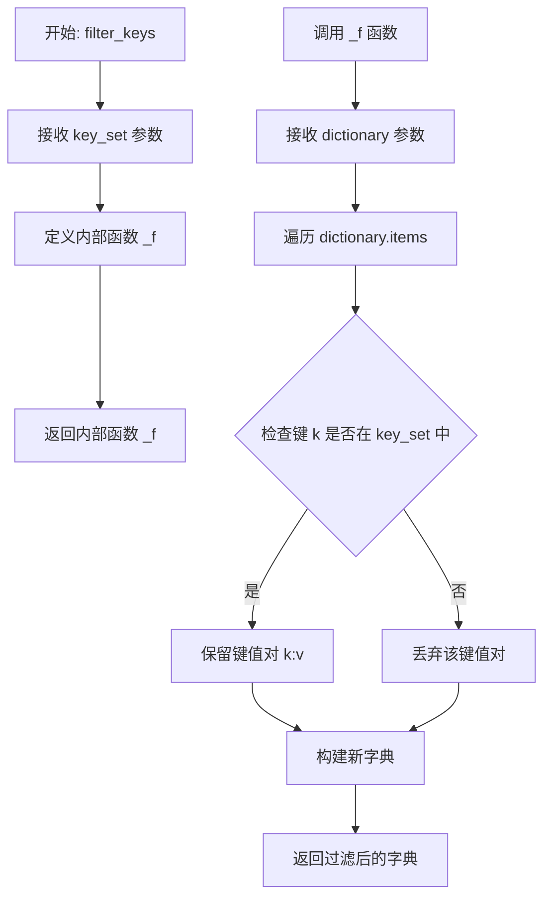
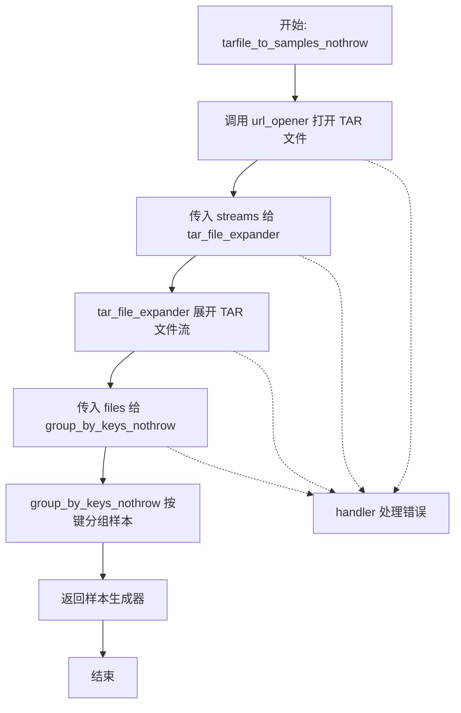
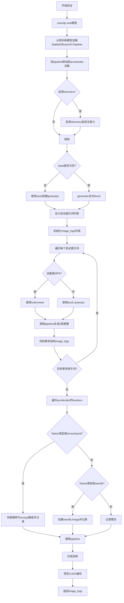
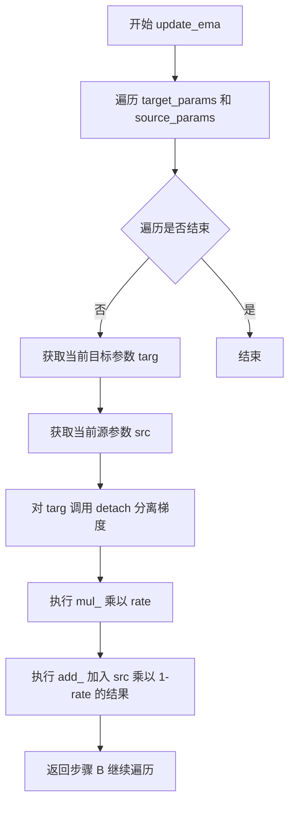
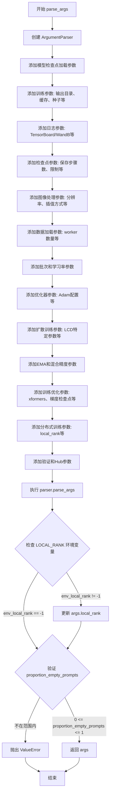
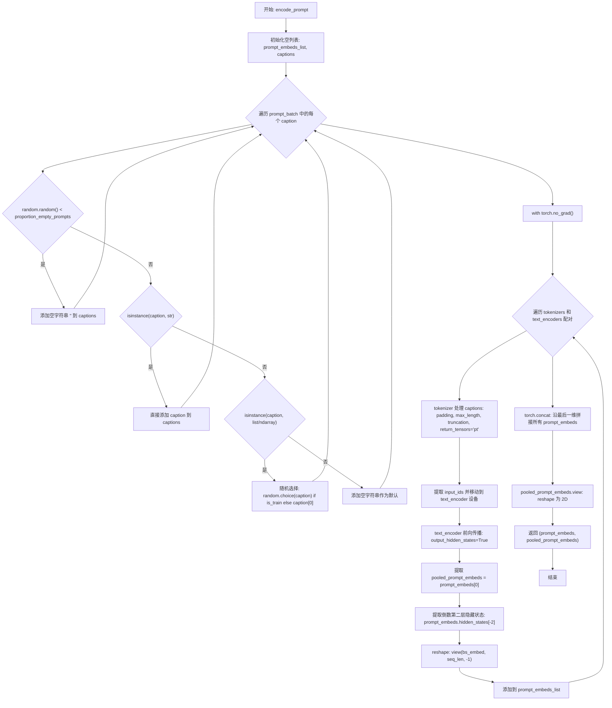
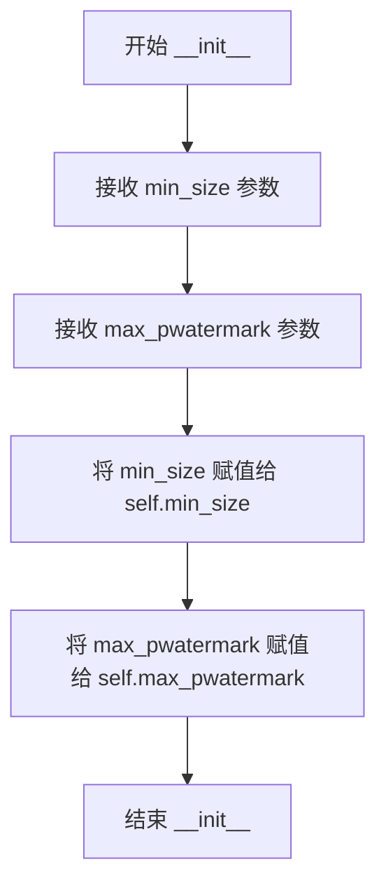
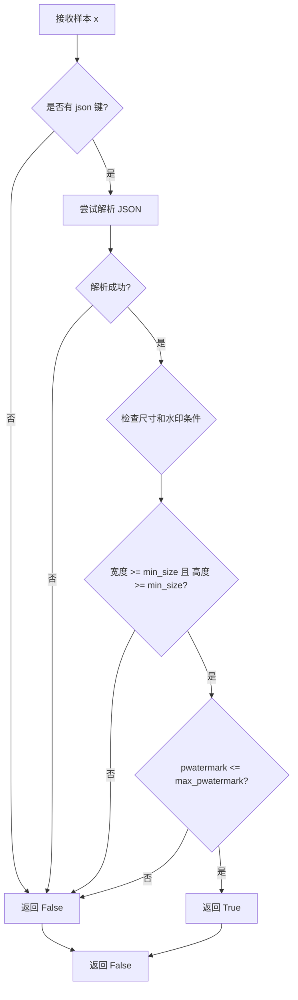
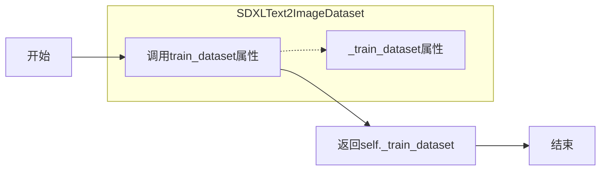

```mermaid
flowchart TD
    A[开始main函数] --> B{验证报告工具和hub_token}
    B -->|安全检查| C[创建logging目录]
    C --> D[初始化Accelerator]
    D --> E[配置日志系统]
    E --> F[设置随机种子]
    F --> G[创建输出目录]
    G --> H[创建noise_scheduler]
    H --> I[加载tokenizers]
    I --> J[加载text encoders]
    J --> K[加载VAE]
    K --> L[加载teacher_unet]
    L --> M[冻结teacher模型]
    M --> N[创建student_unet]
    N --> O[创建target_unet_EMA]
    O --> P[设置混合精度和设备]
    P --> Q[注册checkpoint保存/加载钩子]
    Q --> R[启用xformers和TF32]
    R --> S[创建优化器]
    S --> T[构建SDXLText2ImageDataset]
    T --> U[计算文本embeddings]
    U --> V[创建lr_scheduler]
    V --> W[准备训练accelerator.prepare]
    W --> X[初始化trackers]
    X --> Y[训练循环开始]
    
    Y --> Z{epoch in range}
    Z --> AA[获取batch数据]
    AA --> AB[编码VAE latents]
    AB --> AC[采样随机timestep]
    AC --> AD[计算边界缩放c_skip/c_out]
    AD --> AE[添加噪声到latents]
    AE --> AF[采样guidance_scale w]
    AF --> AG[获取student预测]
    AG --> AH[获取teacher条件预测]
    AH --> AI[获取teacher无条件预测]
    AI --> AJ[计算CFG估计]
    AJ --> AK[DDIM solver步骤]
    AK --> AL[获取target预测]
    AL --> AM[计算loss]
    AM --> AN[反向传播]
    AN --> AO[更新optimizer和scheduler]
    AO --> AP{同步梯度?}
    AP -->|Yes| AQ[EMA更新target_unet]
    AP -->|No| AW
    
    AQ --> AR{检查checkpoint保存}
    AR -->|是| AS[保存checkpoint]
    AR -->|否| AT
    AS --> AT
    
    AT --> AU{验证步骤?}
    AU -->|是| AV[运行validation]
    AU -->|否| AX
    
    AV --> AX[记录logs]
    AX --> AY[更新global_step]
    AY --> AZ{step < max_train_steps?}
    AZ -->|是| AA
    AZ -->|否| BA
    
    BA --> BB{是main_process?}
    BB -->|是| BC[保存unet和target_unet]
    BB -->|否| BD
    BC --> BE[可选push_to_hub]
    BE --> BD[结束训练]
```

# `diffusers\examples\consistency_distillation\train_lcm_distill_sdxl_wds.py` 详细设计文档

这是一个用于Stable Diffusion XL (SDXL) 模型的Latent Consistency Distillation (LCD) 训练脚本,实现知识蒸馏技术将大型教师模型的知识迁移到学生UNet模型中。脚本支持分布式训练、混合精度、EMA更新、CFG推理,并使用webdataset进行高效数据加载。

## 整体流程

```mermaid
graph TD
    A[开始] --> B[解析命令行参数]
    B --> C[初始化Accelerator和日志]
    C --> D[加载噪声调度器(DDPM)]
    D --> E[加载tokenizer和text_encoder]
    E --> F[加载VAE和教师UNet]
    F --> G[创建学生UNet并加载教师权重]
    G --> H[创建目标UNet(EMA)]
    H --> I[配置混合精度和设备放置]
    I --> J[设置优化器和学习率调度器]
    J --> K[创建SDXLText2ImageDataset数据集]
    K --> L[初始化训练 trackers]
    L --> M{训练循环}
    M -->|每步| N[加载图像和文本数据]
    N --> O[编码图像为latents]
    O --> P[采样随机timestep和guidance scale]
    P --> Q[添加噪声到latents]
    Q --> R[学生UNet预测]
    R --> S[教师UNet条件预测]
    S --> T[教师UNet无条件预测]
    T --> U[CFG组合预测]
    U --> V[DDIM求解器步进]
    V --> W[目标UNet预测]
    W --> X[计算L2/Huber损失]
    X --> Y[反向传播和优化器更新]
    Y --> Z{检查sync_gradients}
    Z -->|是| AA[EMA更新目标UNet]
    AA --> AB[检查点和验证]
    Z -->|否| AC[继续下一步]
    AB --> AD{是否达到最大步数}
    AD -->|否| M
    AD -->|是| AE[保存最终模型]
    AC --> M
```

## 类结构

```
SDXLText2ImageDataset (数据集类)
├── train_dataset (属性)
└── train_dataloader (属性)

WebdatasetFilter (过滤器类)
└── __call__ (方法)

DDIMSolver (求解器类)
├── __init__
├── to
└── ddim_step
```

## 全局变量及字段


### `MAX_SEQ_LENGTH`
    
最大序列长度，用于文本嵌入的标记化

类型：`int`
    


### `WDS_JSON_WIDTH`
    
WebDataset中原始图像宽度字段的名称

类型：`str`
    


### `WDS_JSON_HEIGHT`
    
WebDataset中原始图像高度字段的名称

类型：`str`
    


### `MIN_SIZE`
    
最小图像尺寸阈值，用于过滤过小的训练样本

类型：`int`
    


### `logger`
    
用于记录训练过程信息的日志记录器

类型：`logging.Logger`
    


### `WebdatasetFilter.min_size`
    
最小图像尺寸阈值，用于过滤小于该尺寸的图像

类型：`int`
    


### `WebdatasetFilter.max_pwatermark`
    
最大水印概率阈值，用于过滤水印概率过高的图像

类型：`float`
    


### `SDXLText2ImageDataset._train_dataset`
    
WebDataset训练数据管道，包含数据加载和预处理逻辑

类型：`wds.DataPipeline`
    


### `SDXLText2ImageDataset._train_dataloader`
    
WebDataset训练数据加载器，用于批量迭代训练数据

类型：`wds.WebLoader`
    


### `DDIMSolver.ddim_timesteps`
    
DDIM采样使用的时间步序列

类型：`torch.Tensor`
    


### `DDIMSolver.ddim_alpha_cumprods`
    
累积alpha值，用于DDIM采样计算

类型：`torch.Tensor`
    


### `DDIMSolver.ddim_alpha_cumprods_prev`
    
前一时刻的累积alpha值，用于DDIM采样计算

类型：`torch.Tensor`
    
    

## 全局函数及方法


### `filter_keys`

该函数是一个高阶函数，用于创建一个字典过滤器。它接受一个键集合作为参数，返回一个内部函数，该函数可以将输入字典中仅保留指定键的值，实现数据流水线中的字段筛选功能。

参数：

- `key_set`：`Set[str]`，指定要保留的键集合，用于过滤字典中的键值对

返回值：`Callable[[Dict], Dict]`，返回一个内部函数 `_f`，该函数接收一个字典参数，返回仅包含 `key_set` 中键的新字典

#### 流程图



#### 带注释源码

```python
def filter_keys(key_set):
    """
    创建一个字典过滤器函数，用于在数据处理流水线中筛选特定的键值对。
    
    这是一个高阶函数（闭包），它接受一个键集合作为参数，
    返回一个可以过滤字典的内部函数。
    
    Args:
        key_set: 一个包含目标键的集合（set），用于决定哪些键应该被保留
        
    Returns:
        返回一个内部函数 _f，该函数:
            - 接收一个字典作为输入
            - 返回一个新字典，仅包含原字典中存在于 key_set 中的键值对
    """
    
    def _f(dictionary):
        """
        内部函数，实际执行字典过滤操作。
        
        使用字典推导式（dict comprehension）筛选出指定的键值对。
        
        Args:
            dictionary: 需要进行过滤的输入字典
            
        Returns:
            一个新字典，包含原字典中键在 key_set 集合内的所有键值对
        """
        # 遍历字典的所有键值对，仅保留 key_set 中存在的键
        return {k: v for k, v in dictionary.items() if k in key_set}
    
    # 返回内部函数（闭包），使其可以在后续被调用并访问 key_set
    return _f
```

#### 使用示例

在代码中，该函数被用于 WebDataset 处理流水线中：

```python
processing_pipeline = [
    wds.decode("pil", handler=wds.ignore_and_continue),
    wds.rename(
        image="jpg;png;jpeg;webp", 
        text="text;txt;caption", 
        orig_size="json", 
        handler=wds.warn_and_continue
    ),
    # 仅保留 image, text, orig_size 三个字段
    wds.map(filter_keys({"image", "text", "orig_size"})),
    wds.map_dict(orig_size=get_orig_size),
    wds.map(transform),
    wds.to_tuple("image", "text", "orig_size", "crop_coords"),
]
```

这种设计模式的优势：

1. **闭包特性**：`key_set`被内部函数捕获，可以在多次调用中复用
2. **函数式编程**：符合数据处理流水线的函数式风格
3. **灵活性**：可以动态创建不同的过滤器，适用于不同的数据字段需求
4. **性能**：字典推导式在 Python 中具有较高的执行效率


### `group_by_keys_nothrow`

该函数是WebDataset处理流程中的核心组件，负责将迭代器中的键值对（文件样本）按照文件名键（prefix）进行分组，形成完整的样本数据字典。它不会抛出异常，而是通过handler参数处理错误。

参数：

- `data`：迭代器（Iterator），输入的文件样本迭代器，每个元素为包含`"fname"`和`"data"`字段的字典
- `keys`：函数（Callable），键提取函数，默认为`base_plus_ext`，用于将文件名分割为前缀和扩展名
- `lcase`：布尔值（bool），是否将扩展名转换为小写，默认为`True`
- `suffixes`：集合或None（Set[str] | None），允许的后缀集合，None表示接受所有后缀
- `handler`：函数或None（Callable | None），错误处理函数，默认为`None`

返回值：生成器（Generator），返回分组后的样本字典，每个字典包含`"__key__"`、`"__url__"`以及各后缀对应的数据字段

#### 流程图

```mermaid
flowchart TD
    A[开始] --> B[初始化 current_sample = None]
    B --> C[从 data 迭代获取 filesample]
    C --> D{filesample 是 dict?}
    D -->|否| C
    D -->|是| E[提取 fname 和 value]
    E --> F[调用 keys(fname 获取 prefix, suffix)]
    F --> G{prefix is None?}
    G -->|是| C
    G -->|否| H{lcase 为 True?}
    H -->|是| I[suffix = suffix.lower()]
    H -->|否| J[继续]
    I --> J
    J --> K{current_sample 为 None<br/>或 prefix != current_sample['__key__']<br/>或 suffix in current_sample?}
    K -->|是| L{valid_sample(current_sample)?}
    K -->|否| M
    L -->|是| N[yield current_sample]
    L -->|否| O
    N --> O[current_sample = {'__key__': prefix, '__url__': filesample['__url__']}]
    O --> M
    M --> P{suffixes 为 None<br/>或 suffix in suffixes?}
    P -->|是| Q[current_sample[suffix] = value]
    P -->|否| R
    Q --> R{继续迭代 data?}
    R -->|是| C
    R --> S{valid_sample(current_sample)?}
    S -->|是| T[yield current_sample]
    S -->|否| U[结束]
    T --> U
```

#### 带注释源码

```python
def group_by_keys_nothrow(data, keys=base_plus_ext, lcase=True, suffixes=None, handler=None):
    """Return function over iterator that groups key, value pairs into samples.

    :param keys: function that splits the key into key and extension (base_plus_ext) 
    :param lcase: convert suffixes to lower case (Default value = True)
    """
    # 初始化当前样本为 None，用于累积属于同一键的多个文件
    current_sample = None
    
    # 遍历输入的文件样本迭代器
    for filesample in data:
        # 确保每个样本都是字典类型
        assert isinstance(filesample, dict)
        
        # 从文件样本中提取文件名和数据值
        fname, value = filesample["fname"], filesample["data"]
        
        # 使用键函数分离文件名得到前缀和扩展名
        prefix, suffix = keys(fname)
        
        # 如果前缀为空（无效键），跳过当前样本
        if prefix is None:
            continue
        
        # 如果需要，将扩展名转换为小写（统一处理）
        if lcase:
            suffix = suffix.lower()
        
        # FIXME: webdataset 版本在 suffix 已存在于 current_sample 时会抛出异常，
        # 但在 LAION400m 数据集中可能存在特殊情况：
        # 当一个 tar 文件的末尾前缀与下一个 tar 文件的开头前缀相同时，
        # 这种情况很少发生，因为前缀在跨 tar 文件时并不唯一
        
        # 判断是否需要开始新的样本分组：
        # 1. 当前没有样本
        # 2. 或者前缀与当前样本的键不匹配
        # 3. 或者扩展名已存在于当前样本中（多文件情况）
        if current_sample is None or prefix != current_sample["__key__"] or suffix in current_sample:
            # 如果存在有效的当前样本，则yield输出
            if valid_sample(current_sample):
                yield current_sample
            
            # 创建新的样本字典，初始化键和URL
            current_sample = {"__key__": prefix, "__url__": filesample["__url__"]}
        
        # 如果没有后缀过滤或当前后缀在允许列表中，则添加到当前样本
        if suffixes is None or suffix in suffixes:
            current_sample[suffix] = value
    
    # 迭代结束后，如果还有未输出的有效样本，则yield
    if valid_sample(current_sample):
        yield current_sample
```


### `tarfile_to_samples_nothrow`

该函数是用于从 TAR 档案文件中读取样本数据的处理函数，通过组合 webdataset 库的三个核心组件（url_opener、tar_file_expander、group_by_keys_nothrow）构建数据管道，实现对 TAR 文件的流式读取和样本分组，支持错误处理和异常恢复。

参数：

- `src`：字符串，TAR 文件的来源路径或 URL
- `handler`：函数，默认值为 `wds.warn_and_continue`，错误处理函数，用于处理读取过程中的异常

返回值：生成器对象，包含从 TAR 文件中提取并按键分组的样本字典

#### 流程图



#### 带注释源码

```python
def tarfile_to_samples_nothrow(src, handler=wds.warn_and_continue):
    """
    从 TAR 档案文件中读取样本数据
    
    参数:
        src: TAR 文件的来源，可以是文件路径或 URL
        handler: 错误处理函数，默认使用 wds.warn_and_continue
                当处理过程中出现错误时调用
    
    返回:
        生成器对象，包含从 TAR 文件中提取的样本字典
    """
    # NOTE this is a re-impl of the webdataset impl with group_by_keys that doesn't throw
    # 注释: 这是 webdataset 实现的重新实现，使用 group_by_keys_nothrow 版本不会抛出异常
    
    # 第一步：使用 url_opener 打开 TAR 文件源
    # 返回一个迭代器，产生文件流数据
    streams = url_opener(src, handler=handler)
    
    # 第二步：使用 tar_file_expander 展开 TAR 文件流
    # 将压缩的 TAR 流转换为文件样本的迭代器
    files = tar_file_expander(streams, handler=handler)
    
    # 第三步：使用 group_by_keys_nothrow 将文件按键分组
    # 将单个文件样本组合成完整的样本（可能包含多个文件如 json、image 等）
    samples = group_by_keys_nothrow(files, handler=handler)
    
    # 返回样本生成器，供下游数据管道使用
    return samples
```


### `log_validation`

该函数用于在训练过程中运行验证，通过使用给定的 VAE 和 UNet 模型生成验证图像，并将生成的图像记录到 TensorBoard 或 Weights & Biases (wandb) 跟踪器中。

参数：

- `vae`：`AutoencoderKL`，用于将图像编码到潜在空间和解码回图像空间的变分自编码器模型
- `unet`：`UNet2DConditionModel`，用于去噪的 UNet 模型（学生模型或目标模型）
- `args`：包含各种配置参数的对象，如 `pretrained_teacher_model`、`revision`、`enable_xformers_memory_efficient_attention`、`seed` 等
- `accelerator`：`Accelerator`，来自 accelerate 库，用于分布式训练和设备管理
- `weight_dtype`：`torch.dtype`，模型权重的数据类型（如 float32、float16、bfloat16）
- `step`：`int`，当前训练的步数，用于记录日志
- `name`：`str`（默认值为 `"target"`），用于标识验证的是目标模型还是在线模型

返回值：`list`，返回包含验证提示词和对应生成图像的日志列表，每个元素是一个字典，包含 `validation_prompt` 和 `images` 键

#### 流程图



#### 带注释源码

```python
def log_validation(vae, unet, args, accelerator, weight_dtype, step, name="target"):
    """
    运行验证流程，使用vae和unet模型生成图像并记录到跟踪器
    
    参数:
        vae: 变分自编码器模型
        unet: 去噪UNet模型（学生模型或目标模型）
        args: 包含预训练模型路径和其他配置的参数对象
        accelerator: accelerate库的Accelerator对象
        weight_dtype: 模型权重的数据类型
        step: 当前训练步数
        name: 标识验证模型的名称（默认"target"）
    
    返回:
        包含验证提示词和生成图像的日志列表
    """
    logger.info("Running validation... ")  # 记录验证开始日志

    # 从accelerator获取原始的unet模型（移除包装）
    unet = accelerator.unwrap_model(unet)
    
    # 使用预训练的教师模型配置创建Stable Diffusion XL pipeline
    pipeline = StableDiffusionXLPipeline.from_pretrained(
        args.pretrained_teacher_model,  # 预训练教师模型路径
        vae=vae,  # 使用提供的VAE
        unet=unet,  # 使用提供的UNet
        scheduler=LCMScheduler.from_pretrained(args.pretrained_teacher_model, subfolder="scheduler"),
        revision=args.revision,  # 模型版本
        torch_dtype=weight_dtype,  # 模型权重数据类型
    )
    
    # 将pipeline移动到accelerator设备上
    pipeline = pipeline.to(accelerator.device)
    # 禁用进度条显示
    pipeline.set_progress_bar_config(disable=True)

    # 如果启用xformers，启用高效注意力机制
    if args.enable_xformers_memory_efficient_attention:
        pipeline.enable_xformers_memory_efficient_attention()

    # 设置随机种子以确保可重复性
    if args.seed is None:
        generator = None
    else:
        generator = torch.Generator(device=accelerator.device).manual_seed(args.seed)

    # 定义用于验证的提示词列表
    validation_prompts = [
        "portrait photo of a girl, photograph, highly detailed face, depth of field, moody light, golden hour, style by Dan Winters, Russell James, Steve McCurry, centered, extremely detailed, Nikon D850, award winning photography",
        "Self-portrait oil painting, a beautiful cyborg with golden hair, 8k",
        "Astronaut in a jungle, cold color palette, muted colors, detailed, 8k",
        "A photo of beautiful mountain with realistic sunset and blue lake, highly detailed, masterpiece",
    ]

    image_logs = []  # 存储验证图像日志

    # 遍历每个验证提示词生成图像
    for _, prompt in enumerate(validation_prompts):
        images = []
        
        # 处理MPS设备（Apple Silicon）的特殊上下文管理
        if torch.backends.mps.is_available():
            autocast_ctx = nullcontext()  # MPS不支持autocast，使用nullcontext
        else:
            autocast_ctx = torch.autocast(accelerator.device.type)  # 其他设备使用autocast

        # 在适当的上下文中生成图像
        with autocast_ctx:
            images = pipeline(
                prompt=prompt,  # 验证提示词
                num_inference_steps=4,  # 推理步数（LCM只需要很少的步数）
                num_images_per_prompt=4,  # 每个提示词生成4张图像
                generator=generator,  # 随机数生成器
            ).images
        
        # 将提示词和对应图像添加到日志
        image_logs.append({"validation_prompt": prompt, "images": images})

    # 遍历所有accelerator trackers记录图像
    for tracker in accelerator.trackers:
        if tracker.name == "tensorboard":
            # TensorBoard记录方式
            for log in image_logs:
                images = log["images"]
                validation_prompt = log["validation_prompt"]
                formatted_images = []
                for image in images:
                    formatted_images.append(np.asarray(image))  # 转为numpy数组

                formatted_images = np.stack(formatted_images)  # 堆叠成数组

                # 添加图像到TensorBoard
                tracker.writer.add_images(validation_prompt, formatted_images, step, dataformats="NHWC")
        elif tracker.name == "wandb":
            # wandb记录方式
            formatted_images = []

            for log in image_logs:
                images = log["images"]
                validation_prompt = log["validation_prompt"]
                for image in images:
                    image = wandb.Image(image, caption=validation_prompt)  # 创建wandb图像
                    formatted_images.append(image)

            # 记录到wandb
            tracker.log({f"validation/{name}": formatted_images})
        else:
            # 不支持的tracker记录警告
            logger.warning(f"image logging not implemented for {tracker.name}")

    # 清理资源
    del pipeline  # 删除pipeline释放内存
    gc.collect()  # 强制垃圾回收
    torch.cuda.empty_cache()  # 清空CUDA缓存

    return image_logs  # 返回验证日志
```


### `append_dims`

该函数用于将维度追加到张量的末尾，直到其达到目标维度数。主要用于在扩散模型训练中确保张量维度匹配，以便进行逐元素操作。

参数：

- `x`：`torch.Tensor`，输入的张量
- `target_dims`：`int`，目标维度数

返回值：`torch.Tensor`，扩展后的张量

#### 流程图

```mermaid
flowchart TD
    A[输入: x, target_dims] --> B{检查 target_dims >= x.ndim?}
    B -- 否 --> C[抛出 ValueError]
    C --> D[错误信息: input has {x.ndim} dims but target_dims is {target_dims}, which is less]
    B -- 是 --> E[计算 dims_to_append = target_dims - x.ndim]
    E --> F[使用 x[..., None, None, ...] 扩展维度]
    F --> G[返回扩展后的张量]
```

#### 带注释源码

```python
def append_dims(x, target_dims):
    """
    追加维度到张量末尾，使其达到目标维度数。
    
    这在扩散模型训练中非常有用，例如当需要将一个标量或一维张量
    广播（broadcast）到与另一个高维张量相同的维度时。
    
    参数:
        x: 输入的张量
        target_dims: 目标维度数
        
    返回:
        扩展后的张量
        
    示例:
        >>> import torch
        >>> x = torch.tensor([1, 2, 3])  # shape: (3,)
        >>> append_dims(x, 4).shape    # shape: (1, 1, 1, 3)
    """
    # 计算需要追加的维度数量
    dims_to_append = target_dims - x.ndim
    
    # 如果目标维度数小于输入张量的维度，抛出错误
    if dims_to_append < 0:
        raise ValueError(
            f"input has {x.ndim} dims but target_dims is {target_dims}, which is less"
        )
    
    # 使用省略号(...)保持原有维度，None用于在对应位置插入新维度
    # 例如：x[..., None, None] 会在末尾添加两个维度
    return x[(...,) + (None,) * dims_to_append]
```


### `scalings_for_boundary_conditions`

该函数用于计算LCM（Latent Consistency Model）采样过程中的边界缩放系数（c_skip和c_out），这些系数用于调整模型预测，帮助在更少的采样步骤内获得高质量的图像生成结果。

参数：

- `timestep`：`torch.Tensor`，时间步张量，表示当前扩散过程的时间步
- `sigma_data`：`float`，默认值为0.5，数据sigma值，用于控制噪声水平的基准参数
- `timestep_scaling`：`float`，默认值为10.0，时间步缩放因子，用于放大时间步以降低近似误差

返回值：`tuple[torch.Tensor, torch.Tensor]`，返回两个张量——c_skip（跳过系数）和c_out（输出系数），用于后续对模型预测进行调整

#### 流程图

```mermaid
flowchart TD
    A[输入: timestep, sigma_data, timestep_scaling] --> B[计算 scaled_timestep = timestep_scaling × timestep]
    B --> C[计算 c_skip = σ²_data / scaled_timestep² + σ²_data]
    C --> D[计算 c_out = scaled_timestep / √(scaled_timestep² + σ²_data)]
    D --> E[返回 (c_skip, c_out) 元组]
```

#### 带注释源码

```python
# From LCMScheduler.get_scalings_for_boundary_condition_discrete
def scalings_for_boundary_conditions(timestep, sigma_data=0.5, timestep_scaling=10.0):
    """
    计算LCM边界条件的缩放系数。
    
    该函数实现了LCMScheduler中用于计算边界缩放系数的逻辑，
    这些系数用于在一致性模型蒸馏中调整模型预测输出。
    
    参数:
        timestep: 时间步张量，通常是DDIM调度器中的时间步
        sigma_data: 数据sigma值，默认0.5，代表噪声水平的基准
        timestep_scaling: 时间步缩放因子，默认10.0，用于放大时间步以获得更低的近似误差
    
    返回:
        c_skip: 跳过系数，用于保留部分原始输入
        c_out: 输出系数，用于缩放预测的原始样本
    """
    # 将时间步乘以缩放因子，放大时间步的值以降低近似误差
    scaled_timestep = timestep_scaling * timestep
    
    # 计算c_skip：sigma_data的平方除以(缩放后时间步的平方加上sigma_data的平方)
    # 这个系数用于决定在最终预测中保留多少原始输入
    c_skip = sigma_data**2 / (scaled_timestep**2 + sigma_data**2)
    
    # 计算c_out：缩放后时间步除以(缩放后时间步的平方加上sigma_data的平方)的平方根
    # 这个系数用于缩放预测的原始样本
    c_out = scaled_timestep / (scaled_timestep**2 + sigma_data**2) ** 0.5
    
    # 返回两个缩放系数，用于后续的预测调整
    return c_skip, c_out
```


### `get_predicted_original_sample`

该函数根据扩散模型的不同预测类型（epsilon、sample或v_prediction），利用模型输出、时间步、当前样本以及alpha和sigma调度表，计算并返回预测的原始干净样本（pred_x_0）。这是扩散模型逆向去噪过程中的核心计算步骤。

参数：

- `model_output`：`torch.Tensor`，模型的网络输出，可以是预测的噪声（epsilon）、样本（sample）或v-prediction
- `timesteps`：`torch.Tensor`，当前的时间步张量，表示扩散过程的当前状态
- `sample`：`torch.Tensor`，当前带噪声的样本（latent），即扩散过程中的中间状态
- `prediction_type`：`str`，预测类型，支持"epsilon"（预测噪声）、"sample"（直接预测样本）或"v_prediction"（v-prediction）
- `alphas`：`torch.Tensor`，alpha值序列（sqrt(alphas_cumprod)），用于计算原始样本
- `sigmas`：`torch.Tensor`，sigma值序列（sqrt(1 - alphas_cumprod)），用于计算原始样本

返回值：`torch.Tensor`，预测的原始干净样本（pred_x_0），即扩散过程起点/目标

#### 流程图

```mermaid
flowchart TD
    A[开始: get_predicted_original_sample] --> B[提取alphas和sigmas到当前timesteps]
    B --> C{判断 prediction_type}
    C -->|epsilon| D[计算: pred_x_0 = (sample - sigmas × model_output) / alphas]
    C -->|sample| E[设置: pred_x_0 = model_output]
    C -->|v_prediction| F[计算: pred_x_0 = alphas × sample - sigmas × model_output]
    C -->|其他| G[抛出ValueError: 不支持的预测类型]
    D --> H[返回 pred_x_0]
    E --> H
    F --> H
    G --> I[结束]
```

#### 带注释源码

```python
# Compare LCMScheduler.step, Step 4
def get_predicted_original_sample(model_output, timesteps, sample, prediction_type, alphas, sigmas):
    """
    根据不同的预测类型计算预测的原始样本。
    
    参数:
        model_output: 模型输出（噪声/样本/v-prediction）
        timesteps: 当前时间步
        sample: 当前带噪声的样本
        prediction_type: 预测类型 ("epsilon", "sample", "v_prediction")
        alphas: alpha值序列
        sigmas: sigma值序列
    
    返回:
        pred_x_0: 预测的原始干净样本
    """
    # 使用extract_into_tensor函数将alphas和sigmas提取到与timesteps匹配的形状
    # 这确保了即使batch中有不同的时间步，也能正确索引对应的alpha和sigma值
    alphas = extract_into_tensor(alphas, timesteps, sample.shape)
    sigmas = extract_into_tensor(sigmas, timesteps, sample.shape)
    
    # 根据prediction_type计算pred_x_0
    if prediction_type == "epsilon":
        # epsilon预测：模型输出是噪声
        # 推导: sample = alpha * x_0 + sigma * epsilon
        # => x_0 = (sample - sigma * epsilon) / alpha
        pred_x_0 = (sample - sigmas * model_output) / alphas
    elif prediction_type == "sample":
        # sample预测：模型直接输出原始样本预测
        pred_x_0 = model_output
    elif prediction_type == "v_prediction":
        # v-prediction: 模型输出是v = alpha * epsilon - sigma * x_0
        # 推导: x_0 = alpha * sample - sigma * v
        pred_x_0 = alphas * sample - sigmas * model_output
    else:
        # 不支持的预测类型，抛出错误
        raise ValueError(
            f"Prediction type {prediction_type} is not supported; currently, `epsilon`, `sample`, and `v_prediction`"
            f" are supported."
        )

    return pred_x_0
```


### `get_predicted_noise`

该函数基于 DDIMScheduler 的 step 4 实现，用于根据不同的预测类型（epsilon、sample、v_prediction）从模型输出中计算预测的噪声。这是扩散模型逆向处理中的关键步骤，用于从模型预测中恢复噪声信号。

参数：

- `model_output`：`torch.Tensor`，模型（通常是 UNet）的输出，表示预测的去噪结果
- `timesteps`：`torch.Tensor`，当前的时间步，形状为 (batch_size,)
- `sample`：`torch.Tensor`，当前的加噪样本（latent），形状为 (batch_size, channels, height, width)
- `prediction_type`：`str`，预测类型，支持 "epsilon"（预测噪声）、"sample"（预测原始样本）、"v_prediction"（v-prediction）
- `alphas`：`torch.Tensor`，alpha 值序列，用于噪声调度
- `sigmas`：`torch.Tensor`，sigma 值序列，用于噪声调度

返回值：`torch.Tensor`，预测的噪声，形状与 sample 相同

#### 流程图

```mermaid
flowchart TD
    A[开始: get_predicted_noise] --> B[extract_into_tensor: 提取 alphas 对应时间步的值]
    B --> C[extract_into_tensor: 提取 sigmas 对应时间步的值]
    C --> D{判断 prediction_type}
    D -->|epsilon| E[pred_epsilon = model_output]
    D -->|sample| F[pred_epsilon = (sample - alphas * model_output) / sigmas]
    D -->|v_prediction| G[pred_epsilon = alphas * model_output + sigmas * sample]
    D -->|其他| H[抛出 ValueError 异常]
    E --> I[返回 pred_epsilon]
    F --> I
    G --> I
    H --> I
```

#### 带注释源码

```python
# Based on step 4 in DDIMScheduler.step
def get_predicted_noise(model_output, timesteps, sample, prediction_type, alphas, sigmas):
    """
    根据不同的预测类型从模型输出中计算预测的噪声。
    
    该函数实现了扩散模型逆向过程的关键步骤，将模型输出转换为噪声预测。
    支持三种预测类型：
    - epsilon: 直接返回模型预测的噪声
    - sample: 从预测的原始样本反推噪声
    - v_prediction: 从 v-prediction 格式转换到噪声
    
    参数:
        model_output: 模型预测的去噪结果（可能是噪声、样本或v值）
        timesteps: 当前的时间步索引
        sample: 当前的加噪 latent 表示
        prediction_type: 预测类型，指定 model_output 的含义
        alphas: 噪声调度中的 alpha 值序列
        sigmas: 噪声调度中的 sigma 值序列
    
    返回:
        预测的噪声张量，形状与 sample 相同
    """
    # 从 alphas 序列中提取与当前时间步对应的值，并调整维度以匹配 sample
    alphas = extract_into_tensor(alphas, timesteps, sample.shape)
    # 从 sigmas 序列中提取与当前时间步对应的值，并调整维度以匹配 sample
    sigmas = extract_into_tensor(sigmas, timesteps, sample.shape)
    
    # 根据预测类型计算预测的噪声
    if prediction_type == "epsilon":
        # epsilon 预测：模型直接输出噪声
        pred_epsilon = model_output
    elif prediction_type == "sample":
        # sample 预测：模型预测原始样本 x_0，需要反推噪声
        # 公式: noise = (sample - alpha * x_0) / sigma
        pred_epsilon = (sample - alphas * model_output) / sigmas
    elif prediction_type == "v_prediction":
        # v-prediction: 模型预测 v = alpha * noise - sigma * x_0
        # 需要转换回噪声: noise = alpha * v + sigma * sample
        pred_epsilon = alphas * model_output + sigmas * sample
    else:
        # 不支持的预测类型，抛出错误
        raise ValueError(
            f"Prediction type {prediction_type} is not supported; currently, `epsilon`, `sample`, and `v_prediction`"
            f" are supported."
        )

    return pred_epsilon
```


### `extract_into_tensor`

该函数是一个工具函数，用于从一维张量中根据索引收集值，并将其重塑为与目标张量形状维度相匹配的多维张量，常用于扩散模型中根据时间步索引提取对应的噪声调度参数（alpha或sigma值）。

参数：

- `a`：`torch.Tensor`，一维张量，通常是噪声调度器的累积alpha值（alphas_cumprod）或sigma值，用于根据时间步索引提取对应的标量值
- `t`：`torch.Tensor`，一维整型张量，包含要提取的时间步索引，索引值对应于`a`中的位置
- `x_shape`：`tuple`，目标张量的形状（通常为batch维度后的样本形状），用于确定输出张量的维度数量

返回值：`torch.Tensor`，重塑后的张量，其第一维度大小与索引张量`t`的batch大小相同，其余维度被扩展为1以便于后续与多维张量进行广播运算

#### 流程图

```mermaid
flowchart TD
    A[开始: extract_into_tensor] --> B[获取batch大小<br/>b, *_ = t.shape]
    C[从a中收集值<br/>out = a.gather(-1, t)] --> D[计算维度扩展数量<br/>dims = len(x_shape) - 1]
    E[重塑输出张量<br/>return out.reshape(b, *((1,) * dims))] --> F[结束: 返回重塑后的张量]
    
    B --> C
    D --> E
    
    style A fill:#f9f,color:#000
    style F fill:#9f9,color:#000
```

#### 带注释源码

```python
def extract_into_tensor(a, t, x_shape):
    """
    从一维张量中根据索引收集值，并重塑为与目标形状维度匹配的张量。
    
    此函数在扩散模型的采样和训练过程中用于提取对应时间步的噪声调度参数。
    例如从完整的alpha累积序列中提取当前batch中各个样本对应时间步的alpha值。
    
    参数:
        a (torch.Tensor): 一维张量，包含完整的噪声调度参数序列
                         例如 alphas_cumprod 或 sigmas
        t (torch.Tensor): 一维整型张量，包含要提取的时间步索引
                         形状为 (batch_size,)
        x_shape (tuple): 目标张量的形状，用于确定输出张量需要扩展的维度数
                        通常是去除了batch维度的样本形状，如 (H, W) 或 (H, W, C)
    
    返回:
        torch.Tensor: 重塑后的张量，形状为 (batch_size, 1, 1, ...) 
                     维度数量与x_shape相同，便于与多维张量广播运算
    """
    # 获取batch大小 - t可能包含多维，这里取第一维作为batch大小
    b, *_ = t.shape
    
    # 使用gather沿着最后一维从a中收集对应索引位置的值
    # -1表示沿着最后一维进行gather操作
    # t的形状为(batch_size,)，gather后out的形状为(batch_size,)
    out = a.gather(-1, t)
    
    # 计算需要扩展的维度数量（除去batch维度的其他维度）
    # 例如x_shape为(H, W, C)时，需要扩展2个维度
    # 生成类似(1, 1)或(1, 1, 1)的tuple用于reshape
    # 这样输出可以与原始样本形状进行广播运算
    return out.reshape(b, *((1,) * (len(x_shape) - 1)))
```


### `update_ema`

使用指数移动平均（EMA）算法将目标参数（target_params）逐步向源参数（source_params）靠近，常用于模型蒸馏过程中维护一个稳定的目标模型（target model）。

参数：

- `target_params`：可迭代对象（Iterator[torch.Tensor]），目标参数序列，通常为EMA模型的参数
- `source_params`：可迭代对象（Iterator[torch.Tensor]），源参数序列，通常为在线训练模型的参数
- `rate`：`float`，EMA衰减率，值越接近1表示更新越慢、模型越稳定（默认值为0.99）

返回值：`None`，该函数直接修改 `target_params` 中的张量，无返回值

#### 流程图



#### 带注释源码

```python
@torch.no_grad()  # 禁用梯度计算，节省内存和计算资源
def update_ema(target_params, source_params, rate=0.99):
    """
    Update target parameters to be closer to those of source parameters using
    an exponential moving average.

    :param target_params: the target parameter sequence.
    :param source_params: the source parameter sequence.
    :param rate: the EMA rate (closer to 1 means slower).
    """
    # 使用 zip 将目标参数和源参数配对遍历
    for targ, src in zip(target_params, source_params):
        # targ.detach(): 分离目标参数的计算图，防止梯度反向传播到目标模型
        # .mul_(rate): 原地乘法操作，将当前目标参数乘以 rate (保留部分原有权重)
        # .add_(src, alpha=1 - rate): 原地加法操作，加上源参数乘以 (1-rate) 的结果
        # EMA 公式: target = rate * target + (1-rate) * source
        targ.detach().mul_(rate).add_(src, alpha=1 - rate)
```


### `guidance_scale_embedding`

该函数用于将 guidance scale（引导尺度）值转换为高维嵌入向量，采用基于正弦和余弦函数的周期性编码方式，将低维的 guidance scale 值映射到高维空间，以便于神经网络进行处理。这种编码方式类似于 Transformer 中的位置编码，能够让模型更好地理解和利用 guidance scale 的数值信息。

参数：

- `w`：`torch.Tensor`，一维张量，表示需要生成嵌入向量的 guidance scale 值
- `embedding_dim`：`int`，可选，默认值为 512，表示生成的嵌入向量的维度
- `dtype`：`torch.dtype`，可选，默认值为 `torch.float32`，生成嵌入向量的数据类型

返回值：`torch.Tensor`，形状为 `(len(w), embedding_dim)` 的嵌入向量张量

#### 流程图

```mermaid
flowchart TD
    A[输入 w] --> B{检查 w 形状}
    B -->|为一维| C[w = w * 1000.0]
    B -->|非一维| E[断言失败]
    C --> F[计算 half_dim = embedding_dim // 2]
    F --> G[计算基础频率 emb = log(10000.0) / (half_dim - 1)]
    G --> H[生成频率向量 emb = exp(-emb * arange(half_dim))]
    H --> I[计算加权嵌入 emb = w[:, None] * emb[None, :]]
    I --> J[拼接正弦余弦 emb = concat([sin(emb), cos(emb)], dim=1)]
    J --> K{embedding_dim 为奇数?}
    K -->|是| L[零填充右侧 emb = pad(emb, (0, 1))]
    K -->|否| M[跳过填充]
    L --> N[验证输出形状]
    M --> N
    N --> O[返回嵌入向量]
```

#### 带注释源码

```python
# From LatentConsistencyModel.get_guidance_scale_embedding
def guidance_scale_embedding(w, embedding_dim=512, dtype=torch.float32):
    """
    See https://github.com/google-research/vdm/blob/dc27b98a554f65cdc654b800da5aa1846545d41b/model_vdm.py#L298

    Args:
        timesteps (`torch.Tensor`):
            generate embedding vectors at these timesteps
        embedding_dim (`int`, *optional*, defaults to 512):
            dimension of the embeddings to generate
        dtype:
            data type of the generated embeddings

    Returns:
        `torch.Tensor`: Embedding vectors with shape `(len(timesteps), embedding_dim)`
    """
    # 断言确保输入 w 是一维张量
    assert len(w.shape) == 1
    
    # 将 guidance scale 值放大 1000 倍，以便更好地捕捉细粒度差异
    w = w * 1000.0

    # 计算嵌入向量的一半维度（因为每个维度会产生 sin 和 cos 两个值）
    half_dim = embedding_dim // 2
    
    # 计算基础频率因子，使用对数运算使频率在范围内均匀分布
    # 这类似于 Transformer 中的位置编码公式
    emb = torch.log(torch.tensor(10000.0)) / (half_dim - 1)
    
    # 生成频率向量：从 0 到 half_dim-1 的指数衰减频率
    # 较小的索引对应较高的频率，较大的索引对应较低的频率
    emb = torch.exp(torch.arange(half_dim, dtype=dtype) * -emb)
    
    # 将输入 w 与频率向量相乘，产生加权的频率
    # w[:, None] 将 w 转换为列向量，emb[None, :] 将 emb 转换为行向量
    # 结果是一个 len(w) x half_dim 的矩阵
    emb = w.to(dtype)[:, None] * emb[None, :]
    
    # 对加权频率分别应用正弦和余弦函数，然后沿列维度拼接
    # 这创建了周期性编码，使模型能够学习到 guidance scale 值的相对关系
    emb = torch.cat([torch.sin(emb), torch.cos(emb)], dim=1)
    
    # 如果 embedding_dim 为奇数，需要在最后补零以达到指定维度
    # 这是因为 half_dim * 2 可能小于 embedding_dim
    if embedding_dim % 2 == 1:  # zero pad
        emb = torch.nn.functional.pad(emb, (0, 1))
    
    # 验证输出形状是否正确
    assert emb.shape == (w.shape[0], embedding_dim)
    
    # 返回生成的嵌入向量
    return emb
```


### `import_model_class_from_model_name_or_path`

该函数用于根据预训练模型的配置文件动态导入相应的文本编码器类（CLIPTextModel 或 CLIPTextModelWithProjection），以支持不同的 SDXL 文本编码器架构。

参数：

- `pretrained_model_name_or_path`：`str`，预训练模型的名称或路径，用于从 HuggingFace Hub 或本地加载模型配置
- `revision`：`str`，模型版本修订号，用于指定要加载的模型版本
- `subfolder`：`str`，模型子文件夹路径，默认为 `"text_encoder"`，用于指定配置文件的子目录位置

返回值：`type`，返回对应的文本编码器类（CLIPTextModel 或 CLIPTextModelWithProjection）

#### 流程图

```mermaid
flowchart TD
    A[开始: import_model_class_from_model_name_or_path] --> B[使用 PretrainedConfig.from_pretrained 加载配置]
    B --> C[从配置中提取 architectures[0]]
    C --> D{判断 model_class}
    D -->|CLIPTextModel| E[从 transformers 导入 CLIPTextModel]
    D -->|CLIPTextModelWithProjection| F[从 transformers 导入 CLIPTextModelWithProjection]
    D -->|其他| G[抛出 ValueError 异常]
    E --> H[返回 CLIPTextModel 类]
    F --> I[返回 CLIPTextModelWithProjection 类]
    G --> J[结束: 异常处理]
    H --> K[结束]
    I --> K
```

#### 带注释源码

```python
def import_model_class_from_model_name_or_path(
    pretrained_model_name_or_path: str, revision: str, subfolder: str = "text_encoder"
):
    """
    根据预训练模型名称或路径动态导入文本编码器类。
    
    该函数首先加载预训练模型的配置文件，然后根据配置中指定的架构名称
    返回对应的文本编码器类。主要用于支持 SDXL 模型中不同的文本编码器类型。
    
    参数:
        pretrained_model_name_or_path: 预训练模型的名称 (如 'stabilityai/stable-diffusion-xl-base-1.0')
                                      或本地路径
        revision: 模型版本修订号 (如 'main' 或具体的 commit hash)
        subfolder: 配置所在的子文件夹，默认为 "text_encoder"，SDXL 模型通常还有 "text_encoder_2"
    
    返回:
        对应的文本编码器类 (CLIPTextModel 或 CLIPTextModelWithProjection)
    
    异常:
        ValueError: 当模型架构不支持时抛出
    """
    # 从预训练模型加载文本编码器的配置文件
    # PretrainedConfig 是 HuggingFace Transformers 库的基础配置类
    text_encoder_config = PretrainedConfig.from_pretrained(
        pretrained_model_name_or_path,  # 模型名称或路径
        subfolder=subfolder,             # 子文件夹路径
        revision=revision               # 版本修订号
    )
    
    # 从配置中获取架构名称，通常是一个列表，取第一个元素
    # SDXL 的 text_encoder 通常是 ["CLIPTextModel"] 或 ["CLIPTextModelWithProjection"]
    model_class = text_encoder_config.architectures[0]

    # 根据架构名称动态导入并返回对应的类
    if model_class == "CLIPTextModel":
        # 标准 CLIP 文本编码器，用于大多数 SDXL 模型
        from transformers import CLIPTextModel

        return CLIPTextModel
    elif model_class == "CLIPTextModelWithProjection":
        # 带投影的 CLIP 文本编码器，用于需要投影嵌入的场景
        from transformers import CLIPTextModelWithProjection

        return CLIPTextModelWithProjection
    else:
        # 不支持的架构类型
        raise ValueError(f"{model_class} is not supported.")
```


### `parse_args`

该函数是命令行参数解析函数，用于定义和解析训练脚本的所有命令行参数，包括模型检查点加载、训练配置、日志记录、验证、混合精度、分布式训练等约50+个参数，并进行环境变量和参数验证，最终返回包含所有配置参数的Namespace对象。

参数：
- 该函数无显式参数（通过`sys.argv`隐式获取命令行输入）

返回值：` argparse.Namespace`，包含所有解析后的命令行参数对象，通过属性访问（如`args.learning_rate`）

#### 流程图



#### 带注释源码

```
def parse_args():
    """
    解析命令行参数，返回包含所有训练配置的Namespace对象。
    该函数定义了约50+个命令行参数，涵盖模型加载、训练配置、优化器设置、
    验证、分布式训练等各个方面。
    """
    # 创建ArgumentParser实例，设置脚本描述
    parser = argparse.ArgumentParser(description="Simple example of a training script.")
    
    # ----------Model Checkpoint Loading Arguments----------
    # 添加预训练教师模型路径参数（必需）
    parser.add_argument(
        "--pretrained_teacher_model",
        type=str,
        default=None,
        required=True,
        help="Path to pretrained LDM teacher model or model identifier from huggingface.co/models.",
    )
    # 添加预训练VAE模型路径参数（可选）
    parser.add_argument(
        "--pretrained_vae_model_name_or_path",
        type=str,
        default=None,
        help="Path to pretrained VAE model with better numerical stability. More details: https://github.com/huggingface/diffusers/pull/4038.",
    )
    # 添加教师模型和主模型版本修订参数
    parser.add_argument(
        "--teacher_revision",
        type=str,
        default=None,
        required=False,
        help="Revision of pretrained LDM teacher model identifier from huggingface.co/models.",
    )
    parser.add_argument(
        "--revision",
        type=str,
        default=None,
        required=False,
        help="Revision of pretrained LDM model identifier from huggingface.co/models.",
    )
    
    # ----------Training Arguments----------
    # ----General Training Arguments----
    # 输出目录参数
    parser.add_argument(
        "--output_dir",
        type=str,
        default="lcm-xl-distilled",
        help="The output directory where the model predictions and checkpoints will be written.",
    )
    # 缓存目录参数
    parser.add_argument(
        "--cache_dir",
        type=str,
        default=None,
        help="The directory where the downloaded models and datasets will be stored.",
    )
    # 随机种子参数
    parser.add_argument("--seed", type=int, default=None, help="A seed for reproducible training.")
    
    # ----Logging----
    # 日志目录参数
    parser.add_argument(
        "--logging_dir",
        type=str,
        default="logs",
        help=(
            "[TensorBoard](https://www.tensorflow.org/tensorboard) log directory. Will default to"
            " *output_dir/runs/**CURRENT_DATETIME_HOSTNAME***."
        ),
    )
    # 报告目标参数（tensorboard/wandb/comet_ml）
    parser.add_argument(
        "--report_to",
        type=str,
        default="tensorboard",
        help=(
            'The integration to report the results and logs to. Supported platforms are `"tensorboard"`'
            ' (default), `"wandb"` and `"comet_ml"`. Use `"all"` to report to all integrations.'
        ),
    )
    
    # ----Checkpointing----
    # 检查点保存步数参数
    parser.add_argument(
        "--checkpointing_steps",
        type=int,
        default=500,
        help=(
            "Save a checkpoint of the training state every X updates. These checkpoints are only suitable for resuming"
            " training using `--resume_from_checkpoint`."
        ),
    )
    # 检查点总数限制参数
    parser.add_argument(
        "--checkpoints_total_limit",
        type=int,
        default=None,
        help=("Max number of checkpoints to store."),
    )
    # 从检查点恢复训练参数
    parser.add_argument(
        "--resume_from_checkpoint",
        type=str,
        default=None,
        help=(
            "Whether training should be resumed from a previous checkpoint. Use a path saved by"
            ' `--checkpointing_steps`, or `"latest"` to automatically select the last available checkpoint.'
        ),
    )
    
    # ----Image Processing----
    # 训练数据路径参数
    parser.add_argument(
        "--train_shards_path_or_url",
        type=str,
        default=None,
        help=(
            "The name of the Dataset (from the HuggingFace hub) to train on (could be your own, possibly private,"
            " dataset). It can also be a path pointing to a local copy of a dataset in your filesystem,"
            " or to a folder containing files that 🤗 Datasets can understand."
        ),
    )
    # 分辨率参数
    parser.add_argument(
        "--resolution",
        type=int,
        default=1024,
        help=(
            "The resolution for input images, all the images in the train/validation dataset will be resized to this"
            " resolution"
        ),
    )
    # 插值类型参数
    parser.add_argument(
        "--interpolation_type",
        type=str,
        default="bilinear",
        help=(
            "The interpolation function used when resizing images to the desired resolution. Choose between `bilinear`,"
            " `bicubic`, `box`, `nearest`, `nearest_exact`, `hamming`, and `lanczos`."
        ),
    )
    # 固定裁剪参数
    parser.add_argument(
        "--use_fix_crop_and_size",
        action="store_true",
        help="Whether or not to use the fixed crop and size for the teacher model.",
        default=False,
    )
    # 中心裁剪参数
    parser.add_argument(
        "--center_crop",
        default=False,
        action="store_true",
        help=(
            "Whether to center crop the input images to the resolution. If not set, the images will be randomly"
            " cropped. The images will be resized to the resolution first before cropping."
        ),
    )
    # 随机翻转参数
    parser.add_argument(
        "--random_flip",
        action="store_true",
        help="whether to randomly flip images horizontally",
    )
    
    # ----Dataloader----
    # DataLoader工作进程数参数
    parser.add_argument(
        "--dataloader_num_workers",
        type=int,
        default=0,
        help=(
            "Number of subprocesses to use for data loading. 0 means that the data will be loaded in the main process."
        ),
    )
    
    # ----Batch Size and Training Steps----
    # 训练批次大小参数
    parser.add_argument(
        "--train_batch_size", type=int, default=16, help="Batch size (per device) for the training dataloader."
    )
    # 训练轮数参数
    parser.add_argument("--num_train_epochs", type=int, default=100)
    # 最大训练步数参数
    parser.add_argument(
        "--max_train_steps",
        type=int,
        default=None,
        help="Total number of training steps to perform.  If provided, overrides num_train_epochs.",
    )
    # 最大训练样本数参数（用于调试）
    parser.add_argument(
        "--max_train_samples",
        type=int,
        default=None,
        help=(
            "For debugging purposes or quicker training, truncate the number of training examples to this "
            "value if set."
        ),
    )
    
    # ----Learning Rate----
    # 学习率参数
    parser.add_argument(
        "--learning_rate",
        type=float,
        default=1e-4,
        help="Initial learning rate (after the potential warmup period) to use.",
    )
    # 学习率缩放参数
    parser.add_argument(
        "--scale_lr",
        action="store_true",
        default=False,
        help="Scale the learning rate by the number of GPUs, gradient accumulation steps, and batch size.",
    )
    # 学习率调度器类型参数
    parser.add_argument(
        "--lr_scheduler",
        type=str,
        default="constant",
        help=(
            'The scheduler type to use. Choose between ["linear", "cosine", "cosine_with_restarts", "polynomial",'
            ' "constant", "constant_with_warmup"]'
        ),
    )
    # 学习率预热步数参数
    parser.add_argument(
        "--lr_warmup_steps", type=int, default=500, help="Number of steps for the warmup in the lr scheduler."
    )
    # 梯度累积步数参数
    parser.add_argument(
        "--gradient_accumulation_steps",
        type=int,
        default=1,
        help="Number of updates steps to accumulate before performing a backward/update pass.",
    )
    
    # ----Optimizer (Adam)----
    # 8位Adam优化器参数
    parser.add_argument(
        "--use_8bit_adam", action="store_true", help="Whether or not to use 8-bit Adam from bitsandbytes."
    )
    # Adam优化器beta1参数
    parser.add_argument("--adam_beta1", type=float, default=0.9, help="The beta1 parameter for the Adam optimizer.")
    # Adam优化器beta2参数
    parser.add_argument("--adam_beta2", type=float, default=0.999, help="The beta2 parameter for the Adam optimizer.")
    # Adam优化器权重衰减参数
    parser.add_argument("--adam_weight_decay", type=float, default=1e-2, help="Weight decay to use.")
    # Adam优化器epsilon参数
    parser.add_argument("--adam_epsilon", type=float, default=1e-08, help="Epsilon value for the Adam optimizer")
    # 最大梯度范数参数
    parser.add_argument("--max_grad_norm", default=1.0, type=float, help="Max gradient norm.")
    
    # ----Diffusion Training Arguments----
    # 空提示比例参数
    parser.add_argument(
        "--proportion_empty_prompts",
        type=float,
        default=0,
        help="Proportion of image prompts to be replaced with empty strings. Defaults to 0 (no prompt replacement).",
    )
    
    # ----Latent Consistency Distillation (LCD) Specific Arguments----
    # 最小guidance scale参数
    parser.add_argument(
        "--w_min",
        type=float,
        default=3.0,
        required=False,
        help=(
            "The minimum guidance scale value for guidance scale sampling. Note that we are using the Imagen CFG"
            " formulation rather than the LCM formulation, which means all guidance scales have 1 added to them as"
            " compared to the original paper."
        ),
    )
    # 最大guidance scale参数
    parser.add_argument(
        "--w_max",
        type=float,
        default=15.0,
        required=False,
        help=(
            "The maximum guidance scale value for guidance scale sampling. Note that we are using the Imagen CFG"
            " formulation rather than the LCM formulation, which means all guidance scales have 1 added to them as"
            " compared to the original paper."
        ),
    )
    # DDIM步数参数
    parser.add_argument(
        "--num_ddim_timesteps",
        type=int,
        default=50,
        help="The number of timesteps to use for DDIM sampling.",
    )
    # 损失类型参数
    parser.add_argument(
        "--loss_type",
        type=str,
        default="l2",
        choices=["luber"],
        help="The type of loss to use for the LCD loss.",
    )
    # Huber损失c参数
    parser.add_argument(
        "--huber_c",
        type=float,
        default=0.001,
        help="The huber loss parameter. Only used if `--loss_type=huber`.",
    )
    # U-Net时间条件投影维度参数
    parser.add_argument(
        "--unet_time_cond_proj_dim",
        type=int,
        default=256,
        help=(
            "The dimension of the guidance scale embedding in the U-Net, which will be used if the teacher U-Net"
            " does not have `time_cond_proj_dim` set."
        ),
    )
    # VAE编码批次大小参数
    parser.add_argument(
        "--vae_encode_batch_size",
        type=int,
        default=8,
        required=False,
        help=(
            "The batch size used when encoding (and decoding) images to latents (and vice versa) using the VAE."
            " Encoding or decoding the whole batch at once may run into OOM issues."
        ),
    )
    # 时间步缩放因子参数
    parser.add_argument(
        "--timestep_scaling_factor",
        type=float,
        default=10.0,
        help=(
            "The multiplicative timestep scaling factor used when calculating the boundary scalings for LCM. The"
            " higher the scaling is, the lower the approximation error, but the default value of 10.0 should typically"
            " suffice."
        ),
    )
    
    # ----Exponential Moving Average (EMA)----
    # EMA衰减率参数
    parser.add_argument(
        "--ema_decay",
        type=float,
        default=0.95,
        required=False,
        help="The exponential moving average (EMA) rate or decay factor.",
    )
    
    # ----Mixed Precision----
    # 混合精度类型参数
    parser.add_argument(
        "--mixed_precision",
        type=str,
        default=None,
        choices=["no", "fp16", "bf16"],
        help=(
            "Whether to use mixed precision. Choose between fp16 and bf16 (bfloat16). Bf16 requires PyTorch >="
            " 1.10.and an Nvidia Ampere GPU.  Default to the value of accelerate config of the current system or the"
            " flag passed with the `accelerate.launch` command. Use this argument to override the accelerate config."
        ),
    )
    # 允许TF32参数
    parser.add_argument(
        "--allow_tf32",
        action="store_true",
        help=(
            "Whether or not to allow TF32 on Ampere GPUs. Can be used to speed up training. For more information, see"
            " https://pytorch.org/docs/stable/notes/cuda.html#tensorfloat-32-tf32-on-ampere-devices"
        ),
    )
    # 转换教师U-Net参数
    parser.add_argument(
        "--cast_teacher_unet",
        action="store_true",
        help="Whether to cast the teacher U-Net to the precision specified by `--mixed_precision`.",
    )
    
    # ----Training Optimizations----
    # xformers高效注意力参数
    parser.add_argument(
        "--enable_xformers_memory_efficient_attention", action="store_true", help="Whether or not to use xformers."
    )
    # 梯度检查点参数
    parser.add_argument(
        "--gradient_checkpointing",
        action="store_true",
        help="Whether or not to use gradient checkpointing to save memory at the expense of slower backward pass.",
    )
    
    # ----Distributed Training----
    # 本地排名参数（分布式训练）
    parser.add_argument("--local_rank", type=int, default=-1, help="For distributed training: local_rank")
    
    # ----------Validation Arguments----------
    # 验证步数参数
    parser.add_argument(
        "--validation_steps",
        type=int,
        default=200,
        help="Run validation every X steps.",
    )
    
    # ----------Huggingface Hub Arguments-----------
    # 推送到Hub参数
    parser.add_argument("--push_to_hub", action="store_true", help="Whether or not to push the model to the Hub.")
    # Hub令牌参数
    parser.add_argument("--hub_token", type=str, default=None, help="The token to use to push to the Model Hub.")
    # Hub模型ID参数
    parser.add_argument(
        "--hub_model_id",
        type=str,
        default=None,
        help="The name of the repository to keep in sync with the local `output_dir`.",
    )
    
    # ----------Accelerate Arguments----------
    # 追踪器项目名称参数
    parser.add_argument(
        "--tracker_project_name",
        type=str,
        default="text2image-fine-tune",
        help=(
            "The `project_name` argument passed to Accelerator.init_trackers for"
            " more information see https://huggingface.co/docs/accelerate/v0.17.0/en/package_reference/accelerator#accelerate.Accelerator"
        ),
    )

    # 解析命令行参数
    args = parser.parse_args()
    
    # 检查环境变量LOCAL_RANK，如果存在则覆盖args.local_rank
    env_local_rank = int(os.environ.get("LOCAL_RANK", -1))
    if env_local_rank != -1 and env_local_rank != args.local_rank:
        args.local_rank = env_local_rank

    # 验证proportion_empty_prompts参数必须在[0, 1]范围内
    if args.proportion_empty_prompts < 0 or args.proportion_empty_prompts > 1:
        raise ValueError("`--proportion_empty_prompts` must be in the range [0, 1].")

    # 返回解析后的参数对象
    return args
```


### `encode_prompt`

该函数用于将文本提示批次编码为文本嵌入向量，支持 SD-XL 文本编码器（双文本编码器架构），可处理空提示比例以实现无分类器自由引导训练。

参数：

- `prompt_batch`：列表（List[str] | List[List[str]] | List[np.ndarray]]），输入的文本提示批次，可以是字符串、字符串列表或numpy数组
- `text_encoders`：列表（List[CLIPTextModel]），文本编码器列表，通常包含两个编码器（clip text encoder 1 和 clip text encoder 2）
- `tokenizers`：列表（List[CLIPTokenizer]），分词器列表，与文本编码器对应
- `proportion_empty_prompts`：浮点数（float），空提示的比例，用于无分类器引导（Classifier-Free Guidance），0 表示不使用空提示
- `is_train`：布尔值（bool），是否为训练模式，训练模式下会随机选择多个caption中的一个，否则选择第一个

返回值：`Tuple[torch.Tensor, torch.Tensor]`，返回两个张量：
- 第一个是 `prompt_embeds`（torch.Tensor），形状为 (batch_size, seq_len, hidden_dim)，拼接后的提示嵌入
- 第二个是 `pooled_prompt_embeds`（torch.Tensor），形状为 (batch_size, hidden_dim)，池化后的提示嵌入

#### 流程图



#### 带注释源码

```python
# Adapted from pipelines.StableDiffusionXLPipeline.encode_prompt
def encode_prompt(
    prompt_batch,  # 输入的文本提示批次
    text_encoders,  # SD-XL 的两个文本编码器列表
    tokenizers,  # 对应的分词器列表
    proportion_empty_prompts,  # 空提示的比例，用于 CFG
    is_train=True  # 训练模式标志
):
    """
    将文本提示批次编码为文本嵌入向量。
    支持 SD-XL 的双文本编码器架构，并处理空提示以实现无分类器引导。
    """
    prompt_embeds_list = []  # 存储每个文本编码器的嵌入结果

    # 处理提示批次：根据 proportion_empty_prompts 决定是否替换为空字符串
    captions = []
    for caption in prompt_batch:
        # 按比例随机替换为空字符串（用于无分类器引导训练）
        if random.random() < proportion_empty_prompts:
            captions.append("")
        # 处理单个字符串情况
        elif isinstance(caption, str):
            captions.append(caption)
        # 处理多个 caption 的情况（随机选择一个）
        elif isinstance(caption, (list, np.ndarray)):
            # 训练时随机选择，推理时选择第一个
            captions.append(random.choice(caption) if is_train else caption[0])

    # 禁用梯度计算（推理模式）
    with torch.no_grad():
        # 遍历每个文本编码器（SD-XL 有两个：text_encoder 和 text_encoder_2）
        for tokenizer, text_encoder in zip(tokenizers, text_encoders):
            # 使用分词器将文本转换为 token IDs
            text_inputs = tokenizer(
                captions,
                padding="max_length",  # 填充到最大长度
                max_length=tokenizer.model_max_length,  # 使用模型的最大长度（通常为77）
                truncation=True,  # 截断超长文本
                return_tensors="pt",  # 返回 PyTorch 张量
            )
            # 获取 input IDs 并移动到编码器所在设备
            text_input_ids = text_inputs.input_ids
            
            # 通过文本编码器获取嵌入，输出所有隐藏状态
            prompt_embeds = text_encoder(
                text_input_ids.to(text_encoder.device),
                output_hidden_states=True,
            )

            # ============ 提取嵌入向量 ============
            # 获取池化后的嵌入（来自第一个输出，即 pooler output）
            pooled_prompt_embeds = prompt_embeds[0]
            
            # 获取倒数第二层的隐藏状态（SD-XL 使用的技巧）
            # 最后一层通常用于 pooler，倒数第二层包含更丰富的细节信息
            prompt_embeds = prompt_embeds.hidden_states[-2]
            
            # 获取批次大小、序列长度并 reshape
            bs_embed, seq_len, _ = prompt_embeds.shape
            prompt_embeds = prompt_embeds.view(bs_embed, seq_len, -1)
            
            # 将当前编码器的嵌入添加到列表
            prompt_embeds_list.append(prompt_embeds)

    # 沿最后一维拼接两个文本编码器的嵌入
    # 形状: (batch_size, seq_len, hidden_dim_1 + hidden_dim_2)
    prompt_embeds = torch.concat(prompt_embeds_list, dim=-1)
    
    # 池化后的嵌入也进行 reshape
    # 形状: (batch_size, hidden_dim_pooled)
    pooled_prompt_embeds = pooled_prompt_embeds.view(bs_embed, -1)
    
    # 返回提示嵌入和池化嵌入，供 UNet 使用
    return prompt_embeds, pooled_prompt_embeds
```


### `main`

该函数是整个训练脚本的核心入口，负责协调和管理LCM（Latent Consistency Model）的完整蒸馏训练流程，包括模型加载与初始化、数据集构建、优化器与学习率调度器配置、训练循环执行（含前向传播、损失计算、反向传播、EMA更新）、模型保存与验证等全部环节。

参数：

- `args`：Namespace对象，包含所有命令行参数（如模型路径、训练超参数、输出目录等）

返回值：`None`，训练完成后直接退出或保存模型

#### 流程图



#### 带注释源码

```python
def main(args):
    """LCM蒸馏训练的主入口函数"""
    
    # 1. 安全检查：不能同时使用wandb和hub_token
    if args.report_to == "wandb" and args.hub_token is not None:
        raise ValueError(
            "You cannot use both --report_to=wandb and --hub_token due to a security risk of exposing your token."
            " Please use `hf auth login` to authenticate with the Hub."
        )

    # 2. 创建日志目录
    logging_dir = Path(args.output_dir, args.logging_dir)

    # 3. 配置Accelerator项目设置
    accelerator_project_config = ProjectConfiguration(project_dir=args.output_dir, logging_dir=logging_dir)

    # 4. 初始化Accelerator（处理分布式训练、混合精度等）
    accelerator = Accelerator(
        gradient_accumulation_steps=args.gradient_accumulation_steps,
        mixed_precision=args.mixed_precision,
        log_with=args.report_to,
        project_config=accelerator_project_config,
        split_batches=True,  # webdataset需要设置为True以获得正确的step数量
    )

    # 5. 配置日志系统
    logging.basicConfig(
        format="%(asctime)s - %(levelname)s - %(name)s - %(message)s",
        datefmt="%m/%d/%Y %H:%M:%S",
        level=logging.INFO,
    )
    logger.info(accelerator.state, main_process_only=False)
    if accelerator.is_local_main_process:
        transformers.utils.logging.set_verbosity_warning()
        diffusers.utils.logging.set_verbosity_info()
    else:
        transformers.utils.logging.set_verbosity_error()
        diffusers.utils.logging.set_verbosity_error()

    # 6. 设置随机种子（如果提供）
    if args.seed is not None:
        set_seed(args.seed)

    # 7. 处理仓库创建（如果是main process）
    if accelerator.is_main_process:
        if args.output_dir is not None:
            os.makedirs(args.output_dir, exist_ok=True)

        if args.push_to_hub:
            repo_id = create_repo(
                repo_id=args.hub_model_id or Path(args.output_dir).name,
                exist_ok=True,
                token=args.hub_token,
                private=True,
            ).repo_id

    # 8. 创建噪声调度器（用于前向扩散过程）
    noise_scheduler = DDPMScheduler.from_pretrained(
        args.pretrained_teacher_model, subfolder="scheduler", revision=args.teacher_revision
    )

    # 计算alpha和sigma噪声调度
    alpha_schedule = torch.sqrt(noise_scheduler.alphas_cumprod)
    sigma_schedule = torch.sqrt(1 - noise_scheduler.alphas_cumprod)
    
    # 初始化DDIM ODE solver用于蒸馏
    solver = DDIMSolver(
        noise_scheduler.alphas_cumprod.numpy(),
        timesteps=noise_scheduler.config.num_train_timesteps,
        ddim_timesteps=args.num_ddim_timesteps,
    )

    # 9. 加载SDXL的两个tokenizers
    tokenizer_one = AutoTokenizer.from_pretrained(
        args.pretrained_teacher_model, subfolder="tokenizer", revision=args.teacher_revision, use_fast=False
    )
    tokenizer_two = AutoTokenizer.from_pretrained(
        args.pretrained_teacher_model, subfolder="tokenizer_2", revision=args.teacher_revision, use_fast=False
    )

    # 10. 加载text encoders
    text_encoder_cls_one = import_model_class_from_model_name_or_path(
        args.pretrained_teacher_model, args.teacher_revision
    )
    text_encoder_cls_two = import_model_class_from_model_name_or_path(
        args.pretrained_teacher_model, args.teacher_revision, subfolder="text_encoder_2"
    )

    text_encoder_one = text_encoder_cls_one.from_pretrained(
        args.pretrained_teacher_model, subfolder="text_encoder", revision=args.teacher_revision
    )
    text_encoder_two = text_encoder_cls_two.from_pretrained(
        args.pretrained_teacher_model, subfolder="text_encoder_2", revision=args.teacher_revision
    )

    # 11. 加载VAE（可选使用更稳定的VAE）
    vae_path = (
        args.pretrained_teacher_model
        if args.pretrained_vae_model_name_or_path is None
        else args.pretrained_vae_model_name_or_path
    )
    vae = AutoencoderKL.from_pretrained(
        vae_path,
        subfolder="vae" if args.pretrained_vae_model_name_or_path is None else None,
        revision=args.teacher_revision,
    )

    # 12. 加载teacher U-Net
    teacher_unet = UNet2DConditionModel.from_pretrained(
        args.pretrained_teacher_model, subfolder="unet", revision=args.teacher_revision
    )

    # 13. 冻结teacher模型（不参与训练）
    vae.requires_grad_(False)
    text_encoder_one.requires_grad_(False)
    text_encoder_two.requires_grad_(False)
    teacher_unet.requires_grad_(False)

    # 14. 创建student U-Net（在线学习，通过反向传播更新）
    # 如果teacher没有time_cond_proj_dim，则使用args中的值
    time_cond_proj_dim = (
        teacher_unet.config.time_cond_proj_dim
        if teacher_unet.config.time_cond_proj_dim is not None
        else args.unet_time_cond_proj_dim
    )
    unet = UNet2DConditionModel.from_config(teacher_unet.config, time_cond_proj_dim=time_cond_proj_dim)
    # 加载teacher权重到student
    unet.load_state_dict(teacher_unet.state_dict(), strict=False)
    unet.train()

    # 15. 创建target U-Net（通过EMA更新，用于蒸馏目标）
    target_unet = UNet2DConditionModel.from_config(unet.config)
    target_unet.load_state_dict(unet.state_dict())
    target_unet.train()
    target_unet.requires_grad_(False)

    # 16. 检查模型精度
    low_precision_error_string = (
        " Please make sure to always have all model weights in full float32 precision when starting training - even if"
        " doing mixed precision training, copy of the weights should still be float32."
    )

    if accelerator.unwrap_model(unet).dtype != torch.float32:
        raise ValueError(
            f"Controlnet loaded as datatype {accelerator.unwrap_model(unet).dtype}. {low_precision_error_string}"
        )

    # 17. 设置混合精度权重类型
    weight_dtype = torch.float32
    if accelerator.mixed_precision == "fp16":
        weight_dtype = torch.float16
    elif accelerator.mixed_precision == "bf16":
        weight_dtype = torch.bfloat16

    # 18. 将模型移动到设备并转换数据类型
    vae.to(accelerator.device)
    if args.pretrained_vae_model_name_or_path is not None:
        vae.to(dtype=weight_dtype)
    text_encoder_one.to(accelerator.device, dtype=weight_dtype)
    text_encoder_two.to(accelerator.device, dtype=weight_dtype)
    target_unet.to(accelerator.device)
    teacher_unet.to(accelerator.device)
    if args.cast_teacher_unet:
        teacher_unet.to(dtype=weight_dtype)

    # 移动噪声调度到设备
    alpha_schedule = alpha_schedule.to(accelerator.device)
    sigma_schedule = sigma_schedule.to(accelerator.device)
    solver = solver.to(accelerator.device)

    # 19. 注册自定义的模型保存/加载钩子
    if version.parse(accelerate.__version__) >= version.parse("0.16.0"):
        def save_model_hook(models, weights, output_dir):
            if accelerator.is_main_process:
                target_unet.save_pretrained(os.path.join(output_dir, "unet_target"))
                for i, model in enumerate(models):
                    model.save_pretrained(os.path.join(output_dir, "unet"))
                    weights.pop()

        def load_model_hook(models, input_dir):
            load_model = UNet2DConditionModel.from_pretrained(os.path.join(input_dir, "unet_target"))
            target_unet.load_state_dict(load_model.state_dict())
            target_unet.to(accelerator.device)
            del load_model

            for i in range(len(models)):
                model = models.pop()
                load_model = UNet2DConditionModel.from_pretrained(input_dir, subfolder="unet")
                model.register_to_config(**load_model.config)
                model.load_state_dict(load_model.state_dict())
                del load_model

        accelerator.register_save_state_pre_hook(save_model_hook)
        accelerator.register_load_state_pre_hook(load_model_hook)

    # 20. 启用xformers优化
    if args.enable_xformers_memory_efficient_attention:
        if is_xformers_available():
            import xformers
            xformers_version = version.parse(xformers.__version__)
            if xformers_version == version.parse("0.0.16"):
                logger.warning(
                    "xFormers 0.0.16 cannot be used for training in some GPUs..."
                )
            unet.enable_xformers_memory_efficient_attention()
            teacher_unet.enable_xformers_memory_efficient_attention()
            target_unet.enable_xformers_memory_efficient_attention()
        else:
            raise ValueError("xformers is not available.")

    # 21. 启用TF32加速
    if args.allow_tf32:
        torch.backends.cuda.matmul.allow_tf32 = True

    # 22. 启用梯度检查点
    if args.gradient_checkpointing:
        unet.enable_gradient_checkpointing()

    # 23. 选择优化器（8-bit Adam或标准AdamW）
    if args.use_8bit_adam:
        try:
            import bitsandbytes as bnb
            optimizer_class = bnb.optim.AdamW8bit
        except ImportError:
            raise ImportError("To use 8-bit Adam, please install bitsandbytes.")
    else:
        optimizer_class = torch.optim.AdamW

    # 24. 创建优化器
    optimizer = optimizer_class(
        unet.parameters(),
        lr=args.learning_rate,
        betas=(args.adam_beta1, args.adam_beta2),
        weight_decay=args.adam_weight_decay,
        eps=args.adam_epsilon,
    )

    # 25. 定义embeddings计算函数
    def compute_embeddings(
        prompt_batch, original_sizes, crop_coords, proportion_empty_prompts, text_encoders, tokenizers, is_train=True
    ):
        target_size = (args.resolution, args.resolution)
        original_sizes = list(map(list, zip(*original_sizes)))
        crops_coords_top_left = list(map(list, zip(*crop_coords)))

        original_sizes = torch.tensor(original_sizes, dtype=torch.long)
        crops_coords_top_left = torch.tensor(crops_coords_top_left, dtype=torch.long)

        prompt_embeds, pooled_prompt_embeds = encode_prompt(
            prompt_batch, text_encoders, tokenizers, proportion_empty_prompts, is_train
        )
        add_text_embeds = pooled_prompt_embeds

        # 计算SDXL需要的额外time_ids
        add_time_ids = list(target_size)
        add_time_ids = torch.tensor([add_time_ids])
        add_time_ids = add_time_ids.repeat(len(prompt_batch), 1)
        add_time_ids = torch.cat([original_sizes, crops_coords_top_left, add_time_ids], dim=-1)
        add_time_ids = add_time_ids.to(accelerator.device, dtype=prompt_embeds.dtype)

        prompt_embeds = prompt_embeds.to(accelerator.device)
        add_text_embeds = add_text_embeds.to(accelerator.device)
        unet_added_cond_kwargs = {"text_embeds": add_text_embeds, "time_ids": add_time_ids}

        return {"prompt_embeds": prompt_embeds, **unet_added_cond_kwargs}

    # 26. 创建数据集
    dataset = SDXLText2ImageDataset(
        train_shards_path_or_url=args.train_shards_path_or_url,
        num_train_examples=args.max_train_samples,
        per_gpu_batch_size=args.train_batch_size,
        global_batch_size=args.train_batch_size * accelerator.num_processes,
        num_workers=args.dataloader_num_workers,
        resolution=args.resolution,
        interpolation_type=args.interpolation_type,
        shuffle_buffer_size=1000,
        pin_memory=True,
        persistent_workers=True,
        use_fix_crop_and_size=args.use_fix_crop_and_size,
    )
    train_dataloader = dataset.train_dataloader

    # 27. 准备text encoders和tokenizers列表
    text_encoders = [text_encoder_one, text_encoder_two]
    tokenizers = [tokenizer_one, tokenizer_two]

    # 创建embeddings计算的偏函数
    compute_embeddings_fn = functools.partial(
        compute_embeddings,
        proportion_empty_prompts=0,
        text_encoders=text_encoders,
        tokenizers=tokenizers,
    )

    # 28. 计算训练步数并创建lr_scheduler
    overrode_max_train_steps = False
    num_update_steps_per_epoch = math.ceil(train_dataloader.num_batches / args.gradient_accumulation_steps)
    if args.max_train_steps is None:
        args.max_train_steps = args.num_train_epochs * num_update_steps_per_epoch
        overrode_max_train_steps = True

    if args.scale_lr:
        args.learning_rate = (
            args.learning_rate * args.gradient_accumulation_steps * args.train_batch_size * accelerator.num_processes
        )

    lr_scheduler = get_scheduler(
        args.lr_scheduler,
        optimizer=optimizer,
        num_warmup_steps=args.lr_warmup_steps,
        num_training_steps=args.max_train_steps,
    )

    # 29. 使用accelerator准备模型和优化器
    unet, optimizer, lr_scheduler = accelerator.prepare(unet, optimizer, lr_scheduler)

    # 重新计算训练步数（dataloader大小可能改变）
    num_update_steps_per_epoch = math.ceil(train_dataloader.num_batches / args.gradient_accumulation_steps)
    if overrode_max_train_steps:
        args.max_train_steps = args.num_train_epochs * num_update_steps_per_epoch
    args.num_train_epochs = math.ceil(args.max_train_steps / num_update_steps_per_epoch)

    # 30. 初始化trackers
    if accelerator.is_main_process:
        tracker_config = dict(vars(args))
        accelerator.init_trackers(args.tracker_project_name, config=tracker_config)

    # 创建无条件embeddings用于CFG
    uncond_prompt_embeds = torch.zeros(args.train_batch_size, 77, 2048).to(accelerator.device)
    uncond_pooled_prompt_embeds = torch.zeros(args.train_batch_size, 1280).to(accelerator.device)

    # 31. 训练循环
    total_batch_size = args.train_batch_size * accelerator.num_processes * args.gradient_accumulation_steps

    logger.info("***** Running training *****")
    logger.info(f"  Num batches each epoch = {train_dataloader.num_batches}")
    logger.info(f"  Num Epochs = {args.num_train_epochs}")
    logger.info(f"  Instantaneous batch size per device = {args.train_batch_size}")
    logger.info(f"  Total train batch size = {total_batch_size}")
    logger.info(f"  Gradient Accumulation steps = {args.gradient_accumulation_steps}")
    logger.info(f"  Total optimization steps = {args.max_train_steps}")
    
    global_step = 0
    first_epoch = 0

    # 从checkpoint恢复（如果指定）
    if args.resume_from_checkpoint:
        if args.resume_from_checkpoint != "latest":
            path = os.path.basename(args.resume_from_checkpoint)
        else:
            dirs = os.listdir(args.output_dir)
            dirs = [d for d in dirs if d.startswith("checkpoint")]
            dirs = sorted(dirs, key=lambda x: int(x.split("-")[1]))
            path = dirs[-1] if len(dirs) > 0 else None

        if path is None:
            accelerator.print(f"Checkpoint does not exist. Starting new training.")
            args.resume_from_checkpoint = None
            initial_global_step = 0
        else:
            accelerator.print(f"Resuming from checkpoint {path}")
            accelerator.load_state(os.path.join(args.output_dir, path))
            global_step = int(path.split("-")[1])
            initial_global_step = global_step
            first_epoch = global_step // num_update_steps_per_epoch
    else:
        initial_global_step = 0

    progress_bar = tqdm(
        range(0, args.max_train_steps),
        initial=initial_global_step,
        desc="Steps",
        disable=not accelerator.is_local_main_process,
    )

    # ==================== 核心训练循环 ====================
    for epoch in range(first_epoch, args.num_train_epochs):
        for step, batch in enumerate(train_dataloader):
            with accelerator.accumulate(unet):
                # 1. 加载和处理图像、文本
                image, text, orig_size, crop_coords = batch
                image = image.to(accelerator.device, non_blocking=True)
                encoded_text = compute_embeddings_fn(text, orig_size, crop_coords)

                # 2. VAE编码图像到latent空间
                if args.pretrained_vae_model_name_or_path is not None:
                    pixel_values = image.to(dtype=weight_dtype)
                    if vae.dtype != weight_dtype:
                        vae.to(dtype=weight_dtype)
                else:
                    pixel_values = image

                latents = []
                for i in range(0, pixel_values.shape[0], args.vae_encode_batch_size):
                    latents.append(vae.encode(pixel_values[i : i + args.vae_encode_batch_size]).latent_dist.sample())
                latents = torch.cat(latents, dim=0)

                latents = latents * vae.config.scaling_factor
                if args.pretrained_vae_model_name_or_path is None:
                    latents = latents.to(weight_dtype)
                bsz = latents.shape[0]

                # 3. 采样随机timestep
                topk = noise_scheduler.config.num_train_timesteps // args.num_ddim_timesteps
                index = torch.randint(0, args.num_ddim_timesteps, (bsz,), device=latents.device).long()
                start_timesteps = solver.ddim_timesteps[index]
                timesteps = start_timesteps - topk
                timesteps = torch.where(timesteps < 0, torch.zeros_like(timesteps), timesteps)

                # 4. 计算边界缩放
                c_skip_start, c_out_start = scalings_for_boundary_conditions(
                    start_timesteps, timestep_scaling=args.timestep_scaling_factor
                )
                c_skip_start, c_out_start = [append_dims(x, latents.ndim) for x in [c_skip_start, c_out_start]]
                c_skip, c_out = scalings_for_boundary_conditions(
                    timesteps, timestep_scaling=args.timestep_scaling_factor
                )
                c_skip, c_out = [append_dims(x, latents.ndim) for x in [c_skip, c_out]]

                # 5. 添加噪声（前向扩散）
                noise = torch.randn_like(latents)
                noisy_model_input = noise_scheduler.add_noise(latents, noise, start_timesteps)

                # 6. 采样guidance_scale w
                w = (args.w_max - args.w_min) * torch.rand((bsz,)) + args.w_min
                w_embedding = guidance_scale_embedding(w, embedding_dim=time_cond_proj_dim)
                w = w.reshape(bsz, 1, 1, 1)
                w = w.to(device=latents.device, dtype=latents.dtype)
                w_embedding = w_embedding.to(device=latents.device, dtype=latents.dtype)

                # 7. 获取prompt embeddings
                prompt_embeds = encoded_text.pop("prompt_embeds")

                # 8. 在线LCM预测
                noise_pred = unet(
                    noisy_model_input,
                    start_timesteps,
                    timestep_cond=w_embedding,
                    encoder_hidden_states=prompt_embeds.float(),
                    added_cond_kwargs=encoded_text,
                ).sample

                pred_x_0 = get_predicted_original_sample(
                    noise_pred,
                    start_timesteps,
                    noisy_model_input,
                    noise_scheduler.config.prediction_type,
                    alpha_schedule,
                    sigma_schedule,
                )

                model_pred = c_skip_start * noisy_model_input + c_out_start * pred_x_0

                # 9. 教师模型预测（条件+无条件）
                with torch.no_grad():
                    if torch.backends.mps.is_available():
                        autocast_ctx = nullcontext()
                    else:
                        autocast_ctx = torch.autocast(accelerator.device.type)

                    with autocast_ctx:
                        # 条件预测
                        cond_teacher_output = teacher_unet(
                            noisy_model_input.to(weight_dtype),
                            start_timesteps,
                            encoder_hidden_states=prompt_embeds.to(weight_dtype),
                            added_cond_kwargs={k: v.to(weight_dtype) for k, v in encoded_text.items()},
                        ).sample
                        cond_pred_x0 = get_predicted_original_sample(...)
                        cond_pred_noise = get_predicted_noise(...)

                        # 无条件预测
                        uncond_added_conditions = copy.deepcopy(encoded_text)
                        uncond_added_conditions["text_embeds"] = uncond_pooled_prompt_embeds
                        uncond_teacher_output = teacher_unet(
                            noisy_model_input.to(weight_dtype),
                            start_timesteps,
                            encoder_hidden_states=uncond_prompt_embeds.to(weight_dtype),
                            added_cond_kwargs={k: v.to(weight_dtype) for k, v in uncond_added_conditions.items()},
                        ).sample
                        uncond_pred_x0 = get_predicted_original_sample(...)
                        uncond_pred_noise = get_predicted_noise(...)

                        # CFG估计
                        pred_x0 = cond_pred_x0 + w * (cond_pred_x0 - uncond_pred_x0)
                        pred_noise = cond_pred_noise + w * (cond_pred_noise - uncond_pred_noise)
                        
                        # DDIM步骤
                        x_prev = solver.ddim_step(pred_x0, pred_noise, index)

                # 10. 目标模型预测
                with torch.no_grad():
                    if torch.backends.mps.is_available():
                        autocast_ctx = nullcontext()
                    else:
                        autocast_ctx = torch.autocast(accelerator.device.type, dtype=weight_dtype)

                    with autocast_ctx:
                        target_noise_pred = target_unet(
                            x_prev.float(),
                            timesteps,
                            timestep_cond=w_embedding,
                            encoder_hidden_states=prompt_embeds.float(),
                            added_cond_kwargs=encoded_text,
                        ).sample
                    pred_x_0 = get_predicted_original_sample(...)
                    target = c_skip * x_prev + c_out * pred_x_0

                # 11. 计算loss
                if args.loss_type == "l2":
                    loss = F.mse_loss(model_pred.float(), target.float(), reduction="mean")
                elif args.loss_type == "huber":
                    loss = torch.mean(
                        torch.sqrt((model_pred.float() - target.float()) ** 2 + args.huber_c**2) - args.huber_c
                    )

                # 12. 反向传播
                accelerator.backward(loss)
                if accelerator.sync_gradients:
                    accelerator.clip_grad_norm_(unet.parameters(), args.max_grad_norm)
                optimizer.step()
                lr_scheduler.step()
                optimizer.zero_grad(set_to_none=True)

            # 13. 梯度同步后的操作
            if accelerator.sync_gradients:
                # EMA更新
                update_ema(target_unet.parameters(), unet.parameters(), args.ema_decay)
                progress_bar.update(1)
                global_step += 1

                # Checkpoint保存
                if accelerator.is_main_process:
                    if global_step % args.checkpointing_steps == 0:
                        # 清理旧checkpoint
                        if args.checkpoints_total_limit is not None:
                            checkpoints = os.listdir(args.output_dir)
                            checkpoints = [d for d in checkpoints if d.startswith("checkpoint")]
                            checkpoints = sorted(checkpoints, key=lambda x: int(x.split("-")[1]))
                            if len(checkpoints) >= args.checkpoints_total_limit:
                                num_to_remove = len(checkpoints) - args.checkpoints_total_limit + 1
                                removing_checkpoints = checkpoints[0:num_to_remove]
                                for rc in removing_checkpoints:
                                    shutil.rmtree(os.path.join(args.output_dir, rc))
                        
                        save_path = os.path.join(args.output_dir, f"checkpoint-{global_step}")
                        accelerator.save_state(save_path)
                        logger.info(f"Saved state to {save_path}")

                    # Validation
                    if global_step % args.validation_steps == 0:
                        log_validation(vae, target_unet, args, accelerator, weight_dtype, global_step, "target")
                        log_validation(vae, unet, args, accelerator, weight_dtype, global_step, "online")

                # 记录logs
                logs = {"loss": loss.detach().item(), "lr": lr_scheduler.get_last_lr()[0]}
                progress_bar.set_postfix(**logs)
                accelerator.log(logs, step=global_step)

            if global_step >= args.max_train_steps:
                break

    # 32. 保存最终模型
    accelerator.wait_for_everyone()
    if accelerator.is_main_process:
        unet = accelerator.unwrap_model(unet)
        unet.save_pretrained(os.path.join(args.output_dir, "unet"))

        target_unet = accelerator.unwrap_model(target_unet)
        target_unet.save_pretrained(os.path.join(args.output_dir, "unet_target"))

        if args.push_to_hub:
            upload_folder(
                repo_id=repo_id,
                folder_path=args.output_dir,
                commit_message="End of training",
                ignore_patterns=["step_*", "epoch_*"],
            )

    accelerator.end_training()
```


### `WebdatasetFilter.__init__`

这是 WebdatasetFilter 类的构造函数，用于初始化数据集过滤器的参数。该过滤器用于在加载 webdataset 时根据图像尺寸和水印概率过滤样本。

参数：

- `min_size`：`int`，最小图像尺寸阈值，默认为 1024，用于过滤过小的图像
- `max_pwatermark`：`float`，最大水印概率阈值，默认为 0.5，用于过滤水印概率过高的样本

返回值：`None`，构造函数无返回值

#### 流程图



#### 带注释源码

```python
def __init__(self, min_size=1024, max_pwatermark=0.5):
    """
    初始化 WebdatasetFilter 过滤器
    
    Args:
        min_size: 最小图像尺寸阈值，默认值为 1024
        max_pwatermark: 最大水印概率阈值，默认值为 0.5
    """
    # 将最小尺寸参数存储为实例变量
    self.min_size = min_size
    
    # 将最大水印概率参数存储为实例变量
    self.max_pwatermark = max_pwatermark
```


### `WebdatasetFilter.__call__`

该方法是 WebdatasetFilter 类的核心过滤逻辑，用于对 WebDataset 中的样本进行筛选。它接收一个样本字典，解析其中的 JSON 元数据，根据图像尺寸（宽度和高度）以及水印概率进行过滤，返回布尔值表示样本是否通过过滤条件。

参数：

- `x`：`dict`，WebDataset 的样本字典，通常包含 "json" 键（JSON 格式的元数据）、"image" 键（图像数据）等

返回值：`bool`，如果样本满足尺寸和水印过滤条件则返回 `True`，否则返回 `False`

#### 流程图



#### 带注释源码

```python
def __call__(self, x):
    """
    过滤 WebDataset 样本的调用方法
    
    参数:
        x: 包含 JSON 元数据的样本字典
        
    返回:
        bool: 是否通过过滤条件
    """
    try:
        # 检查样本中是否包含 JSON 元数据
        if "json" in x:
            # 解析 JSON 字符串为字典
            x_json = json.loads(x["json"])
            
            # 检查图像尺寸：宽度和高度都必须大于等于最小尺寸要求
            # WDS_JSON_WIDTH 和 WDS_JSON_HEIGHT 是全局常量，分别对应 "width" 和 "height"
            filter_size = (x_json.get(WDS_JSON_WIDTH, 0.0) or 0.0) >= self.min_size and x_json.get(
                WDS_JSON_HEIGHT, 0
            ) >= self.min_size
            
            # 检查水印概率：pwatermark 必须小于等于最大允许水印概率
            filter_watermark = (x_json.get("pwatermark", 0.0) or 0.0) <= self.max_pwatermark
            
            # 只有同时满足尺寸和水印条件才返回 True
            return filter_size and filter_watermark
        else:
            # 没有 JSON 元数据的样本直接过滤掉
            return False
    except Exception:
        # 任何异常（如 JSON 解析错误、类型错误等）都返回 False，安全地过滤掉问题样本
        return False
```


### `SDXLText2ImageDataset.__init__`

该方法是 `SDXLText2ImageDataset` 类的构造函数，用于初始化基于 WebDataset 的 SDXL 文本到图像训练数据集。它接收数据路径、批处理大小、分辨率等配置参数，构建完整的数据处理管道（包括图像解码、重命名、筛选、转换和批处理），并创建训练数据集和 DataLoader。

参数：

- `train_shards_path_or_url`：`Union[str, List[str]]`，训练数据分片路径或 URL 列表，支持单个路径或多个路径
- `num_train_examples`：`int`，训练样本总数，用于计算每个 worker 的批次数量
- `per_gpu_batch_size`：`int`，每个 GPU 的批次大小
- `global_batch_size`：`int`，全局批次大小（所有 GPU 的总批次大小）
- `num_workers`：`int`，数据加载的工作进程数
- `resolution`：`int = 1024`，目标图像分辨率，默认为 1024
- `interpolation_type`：`str = "bilinear"`，图像缩放使用的插值方法，默认为双线性插值
- `shuffle_buffer_size`：`int = 1000`，数据打乱的缓冲区大小，默认为 1000
- `pin_memory`：`bool = False`，是否使用锁页内存以加速数据传输
- `persistent_workers`：`bool = False`，是否保持工作进程存活以避免重复创建开销
- `use_fix_crop_and_size`：`bool = False`，是否使用固定裁剪和尺寸

返回值：`None`，构造函数无返回值

#### 流程图

```mermaid
flowchart TD
    A[开始: __init__] --> B{train_shards_path_or_url<br/>是否为字符串?}
    B -->|是| C[直接使用]
    B -->|否| D[对每个URL执行braceexpand]
    D --> E[使用itertools.chain.flatten展开列表]
    E --> C
    C --> F[定义get_orig_size函数<br/>根据use_fix_crop_and_size返回原始尺寸]
    F --> G[resolve_interpolation_mode<br/>解析插值模式]
    G --> H[定义transform函数<br/>TF.resize → RandomCrop → to_tensor → normalize]
    H --> I[创建processing_pipeline<br/>decode → rename → filter_keys → map_dict → transform → to_tuple]
    I --> J[创建主pipeline<br/>ResampledShards → tarfile_to_samples → select → shuffle → processing → batched]
    J --> K[计算num_worker_batches<br/>num_train_examples / (global_batch_size * num_workers)]
    K --> L[计算num_batches和num_samples]
    L --> M[创建_train_dataset<br/>wds.DataPipeline.with_epoch]
    M --> N[创建_train_dataloader<br/>wds.WebLoader]
    N --> O[设置dataloader属性<br/>num_batches和num_samples]
    O --> P[结束]
```

#### 带注释源码

```python
def __init__(
    self,
    train_shards_path_or_url: Union[str, List[str]],
    num_train_examples: int,
    per_gpu_batch_size: int,
    global_batch_size: int,
    num_workers: int,
    resolution: int = 1024,
    interpolation_type: str = "bilinear",
    shuffle_buffer_size: int = 1000,
    pin_memory: bool = False,
    persistent_workers: bool = False,
    use_fix_crop_and_size: bool = False,
):
    # 如果传入的不是字符串（可能是列表），则对每个URL进行braceexpand展开
    # braceexpand用于处理类似 "http://example.com/{1,2,3}.tar" 的URL模式
    if not isinstance(train_shards_path_or_url, str):
        train_shards_path_or_url = [list(braceexpand(urls)) for urls in train_shards_path_or_url]
        # 使用itertools.chain.from_iterable扁平化嵌套列表
        train_shards_path_or_url = list(itertools.chain.from_iterable(train_shards_path_or_url))

    # 定义获取原始尺寸的内部函数
    def get_orig_size(json):
        # 如果使用固定裁剪，则返回固定的分辨率尺寸
        # 否则从JSON元数据中提取width和height
        if use_fix_crop_and_size:
            return (resolution, resolution)
        else:
            return (int(json.get(WDS_JSON_WIDTH, 0.0)), int(json.get(WDS_JSON_HEIGHT, 0.0)))

    # 解析插值模式字符串为对应的枚举值
    interpolation_mode = resolve_interpolation_mode(interpolation_type)

    # 定义图像转换函数：调整大小 → 随机裁剪 → 转为张量 → 归一化
    def transform(example):
        # 1. 获取图像并调整到指定分辨率
        image = example["image"]
        image = TF.resize(image, resolution, interpolation=interpolation_mode)

        # 2. 获取随机裁剪坐标并进行裁剪
        c_top, c_left, _, _ = transforms.RandomCrop.get_params(image, output_size=(resolution, resolution))
        image = TF.crop(image, c_top, c_left, resolution, resolution)
        
        # 3. 转换为张量并归一化到[-1, 1]范围
        image = TF.to_tensor(image)
        image = TF.normalize(image, [0.5], [0.5])

        # 4. 更新example中的图像和裁剪坐标
        example["image"] = image
        # 如果使用固定裁剪，则裁剪坐标为(0,0)，否则使用实际随机裁剪的坐标
        example["crop_coords"] = (c_top, c_left) if not use_fix_crop_and_size else (0, 0)
        return example

    # 创建数据处理管道：解码PIL图像 → 重命名字段 → 过滤字段 → 处理原始尺寸 → 转换 → 元组化
    processing_pipeline = [
        wds.decode("pil", handler=wds.ignore_and_continue),  # 解码为PIL图像
        wds.rename(
            image="jpg;png;jpeg;webp", text="text;txt;caption", orig_size="json", handler=wds.warn_and_continue
        ),  # 重命名字段以统一不同格式
        wds.map(filter_keys({"image", "text", "orig_size"})),  # 只保留需要的字段
        wds.map_dict(orig_size=get_orig_size),  # 处理原始尺寸字段
        wds.map(transform),  # 应用图像转换
        wds.to_tuple("image", "text", "orig_size", "crop_coords"),  # 打包为元组
    ]

    # 创建完整的主数据管道：分片 → tar文件 → 筛选 → 打乱 → 处理 → 批处理
    pipeline = [
        wds.ResampledShards(train_shards_path_or_url),  # 加载分片URLs
        tarfile_to_samples_nothrow,  # 将tar文件转换为样本
        wds.select(WebdatasetFilter(min_size=MIN_SIZE)),  # 筛选大小和水印
        wds.shuffle(shuffle_buffer_size),  # 打乱数据
        *processing_pipeline,  # 展开处理管道
        wds.batched(per_gpu_batch_size, partial=False, collation_fn=default_collate),  # 批次化
    ]

    # 计算每个worker的批次数量：总样本数 / (全局批次大小 * worker数)
    num_worker_batches = math.ceil(num_train_examples / (global_batch_size * num_workers))
    # 总批次 = worker批次 * worker数
    num_batches = num_worker_batches * num_workers
    # 总样本数 = 批次 * 全局批次大小
    num_samples = num_batches * global_batch_size

    # 创建训练数据集并设置每个epoch的批次数
    self._train_dataset = wds.DataPipeline(*pipeline).with_epoch(num_worker_batches)
    
    # 创建WebLoader数据加载器
    self._train_dataloader = wds.WebLoader(
        self._train_dataset,
        batch_size=None,  # 已在pipeline中完成批处理
        shuffle=False,  # 已在pipeline中打乱
        num_workers=num_workers,
        pin_memory=pin_memory,
        persistent_workers=persistent_workers,
    )
    # 为dataloader添加元数据以便使用
    self._train_dataloader.num_batches = num_batches
    self._train_dataloader.num_samples = num_samples
```


### `SDXLText2ImageDataset.train_dataset`

属性描述：返回SDXL文本到图像训练数据集的WebDataset管道实例，用于在训练循环中迭代访问预处理后的图像和文本数据。

参数：
- `self`：隐式参数，SDXLText2ImageDataset类实例

返回值：`wds.DataPipeline`，WebDataset数据管道对象，包含训练数据的解码、转换、批处理等完整处理流程。

#### 流程图



#### 带注释源码

```python
@property
def train_dataset(self):
    """
    返回训练数据集的WebDataset管道。
    
    该属性提供一个只读的接口来访问SDXLText2ImageDataset类内部创建的
    训练数据集管道。这个管道已经包含了完整的数据处理流程，包括：
    1. 从tar文件读取样本
    2. 过滤不合格样本（如尺寸过小、水印过高等）
    3. 随机打乱数据
    4. 图像解码和预处理（resize、crop、normalize）
    5. 批处理生成
    
    Returns:
        wds.DataPipeline: 训练数据集的WebDataset管道对象，可直接用于
                         DataLoader进行分布式训练数据加载
    """
    return self._train_dataset
```


### `SDXLText2ImageDataset.train_dataloader`

这是一个属性方法，用于返回为训练创建的WebLoader数据加载器实例。

参数：无（该方法是一个属性装饰器方法，不接受任何参数）

返回值：`webdataset.WebLoader`，返回配置好的WebLoader数据加载器对象，用于训练迭代

#### 流程图

```mermaid
flowchart TD
    A[SDXLText2ImageDataset.train_dataloader property] --> B{检查缓存}
    B -->|是| C[返回 self._train_dataloader]
    B -->|否| D[返回 self._train_dataloader]
    
    C --> E[结束]
    D --> E
    
    subgraph 创建流程 [在 __init__ 中创建 _train_dataloader]
        F[创建 wds.DataPipeline] --> G[设置 with_epoch]
        G --> H[创建 wds.WebLoader]
        H --> I[添加 num_batches 元数据]
        I --> J[添加 num_samples 元数据]
    end
```

#### 带注释源码

```python
@property
def train_dataloader(self):
    """
    返回训练数据加载器。
    
    这是一个属性方法，返回在 __init__ 中创建的 WebLoader 实例。
    该数据加载器已经配置好批处理大小、工作进程数、内存固定等选项。
    
    返回:
        webdataset.WebLoader: 配置好的训练数据加载器，包含以下属性:
            - num_batches: 每个epoch的批次数
            - num_samples: 总样本数
    """
    return self._train_dataloader
```

#### 相关上下文（数据加载器创建过程）

```python
# 在 __init__ 方法中创建数据加载器的完整过程：

# 1. 创建处理管道 pipeline
pipeline = [
    wds.ResampledShards(train_shards_path_or_url),  # 加载webdataset分片
    tarfile_to_samples_nothrow,                      # 将tar文件转换为样本
    wds.select(WebdatasetFilter(min_size=MIN_SIZE)), # 过滤小图片
    wds.shuffle(shuffle_buffer_size),                # 打乱数据
    *processing_pipeline,                           # 应用图像处理管道
    wds.batched(per_gpu_batch_size, partial=False, collation_fn=default_collate), # 批处理
]

# 2. 计算每个worker的批次数和总批次数
num_worker_batches = math.ceil(num_train_examples / (global_batch_size * num_workers))
num_batches = num_worker_batches * num_workers
num_samples = num_batches * global_batch_size

# 3. 创建数据集和数据加载器
self._train_dataset = wds.DataPipeline(*pipeline).with_epoch(num_worker_batches)
self._train_dataloader = wds.WebLoader(
    self._train_dataset,
    batch_size=None,              # 批处理已在管道中处理
    shuffle=False,                # 打乱在管道中处理
    num_workers=num_workers,      # 数据加载工作进程数
    pin_memory=pin_memory,        # 是否固定内存以加速GPU传输
    persistent_workers=persistent_workers,  # 是否保持工作进程存活
)

# 4. 添加元数据到数据加载器
self._train_dataloader.num_batches = num_batches    # 每个epoch的批次数
self._train_dataloader.num_samples = num_samples     # 总样本数
```

#### 关键信息说明

| 项目 | 说明 |
|------|------|
| **返回类型** | `wds.WebLoader` (webdataset库的WebLoader类) |
| **数据加载方式** | 使用WebDataset格式，从tar文件流式加载数据 |
| **批处理** | 在管道中通过`wds.batched`完成，batch_size设置为None |
| **元数据** | 加载器附加了`num_batches`和`num_samples`属性用于训练进度跟踪 |
| **工作进程** | 支持多进程数据加载，通过`num_workers`和`persistent_workers`配置 |


### DDIMSolver.__init__

初始化 DDIM 求解器，用于在潜在一致性模型（LCM）蒸馏过程中执行 DDIM 采样步骤。此方法根据总时间步数和 DDIM 采样时间步数计算离散的时间步索引，并提取对应的累积 alpha 值用于后续的去噪采样计算。

参数：

- `alpha_cumprods`：`numpy.ndarray`，累积 alpha 值数组，来自噪声调度器的 `alphas_cumprod`
- `timesteps`：`int`，总扩散时间步数，默认值为 1000
- `ddim_timesteps`：`int`，DDIM 采样的目标时间步数，默认值为 50

返回值：无（`__init__` 方法返回 `None`）

#### 流程图

```mermaid
flowchart TD
    A[开始 __init__] --> B[计算步长比例: step_ratio = timesteps // ddim_timesteps]
    B --> C[生成 DDIM 时间步索引数组: (1 到 ddim_timesteps) * step_ratio 四舍五入后减1]
    C --> D[根据时间步索引提取累积 alpha 值: alpha_cumprods[ddim_timesteps]]
    D --> E[构建前一时刻累积 alpha 数组: [alpha_cumprods[0]] + alpha_cumprods[ddim_timesteps[:-1]]]
    E --> F[将 NumPy 数组转换为 PyTorch Long 张量]
    G[结束 __init__]
    
    F --> G
```

#### 带注释源码

```python
def __init__(self, alpha_cumprods, timesteps=1000, ddim_timesteps=50):
    # 计算步长比例，用于将总时间步映射到 DDIM 采样时间步
    # 例如: timesteps=1000, ddim_timesteps=50 时, step_ratio=20
    step_ratio = timesteps // ddim_timesteps

    # 生成 DDIM 采样时间步索引
    # 从 1 到 ddim_timesteps 乘以步长比例，四舍五入后减1
    # 例如: [19, 39, 59, ..., 979] (当 timesteps=1000, ddim_timesteps=50)
    self.ddim_timesteps = (np.arange(1, ddim_timesteps + 1) * step_ratio).round().astype(np.int64) - 1
    
    # 根据时间步索引从完整的累积 alpha 数组中提取对应值
    self.ddim_alpha_cumprods = alpha_cumprods[self.ddim_timesteps]
    
    # 构建前一时刻的累积 alpha 数组
    # 第一个元素使用 alpha_cumprods[0]，后续元素为 ddim_timesteps[:-1] 对应的值
    # 这用于计算 DDIM 采样中的 x_{t-1}
    self.ddim_alpha_cumprods_prev = np.asarray(
        [alpha_cumprods[0]] + alpha_cumprods[self.ddim_timesteps[:-1]].tolist()
    )
    
    # 将所有 NumPy 数组转换为 PyTorch Long 张量，以便后续在 GPU 上进行计算
    self.ddim_timesteps = torch.from_numpy(self.ddim_timesteps).long()
    self.ddim_alpha_cumprods = torch.from_numpy(self.ddim_alpha_cumprods)
    self.ddim_alpha_cumprods_prev = torch.from_numpy(self.ddim_alpha_cumprods_prev)
```


### `DDIMSolver.to`

将DDIMSolver对象的内部张量（时间步和累积Alpha值）移动到指定的PyTorch设备上，以支持在GPU或CPU上执行DDIM采样推理。

参数：

- `device`：`torch.device`，目标设备，用于将内部张量迁移到该设备上

返回值：`DDIMSolver`，返回自身实例，支持链式调用

#### 流程图

```mermaid
flowchart TD
    A[开始: to device] --> B{检查设备类型}
    B -->|CUDA| C[迁移ddim_timesteps到device]
    B -->|CPU| C
    C --> D[迁移ddim_alpha_cumprods到device]
    D --> E[迁移ddim_alpha_cumprods_prev到device]
    E --> F[返回self实例]
    F --> G[结束]
```

#### 带注释源码

```python
def to(self, device):
    """
    将DDIMSolver的所有内部张量迁移到指定的计算设备
    
    参数:
        device: torch.device, 目标设备（如torch.device('cuda')或torch.device('cpu')）
    
    返回:
        DDIMSolver: 返回自身实例，支持链式调用
    """
    # 将DDIM采样时间步索引张量迁移到目标设备
    self.ddim_timesteps = self.ddim_timesteps.to(device)
    
    # 将当前累积Alpha值张量迁移到目标设备
    self.ddim_alpha_cumprods = self.ddim_alpha_cumprods.to(device)
    
    # 将前一时刻累积Alpha值张量迁移到目标设备
    self.ddim_alpha_cumprods_prev = self.ddim_alpha_cumprods_prev.to(device)
    
    # 返回实例本身，便于链式调用（如 solver.to(device).ddim_step(...)）
    return self
```


### `DDIMSolver.ddim_step`

执行 DDIM（Denoising Diffusion Implicit Models）采样算法的单步推理，根据预测的原始样本（pred_x0）和预测的噪声（pred_noise）计算前一个时间步的样本。

参数：

- `pred_x0`：`torch.Tensor`，预测的原始样本（predicted original sample），即去噪后的目标图像
- `pred_noise`：`torch.Tensor`，预测的噪声（predicted noise），即模型预测的噪声分量
- `timestep_index`：`torch.Tensor` 或 `int`，DDIM 时间步索引，用于从预计算的累积 alpha 值表中取值

返回值：`torch.Tensor`，前一个时间步的样本（x_prev），即 DDIM 采样过程中前一步的潜在表示

#### 流程图

```mermaid
flowchart TD
    A[开始 ddim_step] --> B[提取累积alpha值<br/>alpha_cumprod_prev]
    B --> C[计算方向向量<br/>dir_xt = sqrt(1 - αₜ₋₁) × εθ]
    C --> D[计算前一步样本<br/>xₜ₋₁ = sqrt(αₜ₋₁) × x̂₀ + dir_xt]
    D --> E[返回 x_prev]
    
    style A fill:#f9f,stroke:#333
    style E fill:#9f9,stroke:#333
```

#### 带注释源码

```python
def ddim_step(self, pred_x0, pred_noise, timestep_index):
    """
    执行 DDIM 采样的一步推理
    
    参数:
        pred_x0: 预测的原始样本 x̂₀ (predicted original sample)
        pred_noise: 预测的噪声 εθ (predicted noise)  
        timestep_index: DDIM 时间步索引 t
    
    返回:
        x_prev: 前一个时间步的样本 x_{t-1}
    
    DDIM 采样公式:
        x_{t-1} = √αₜ₋₁ × x̂₀ + √(1 - αₜ₋₁) × εθ
    
    其中:
        - x̂₀ 是从噪声预测恢复的原始样本
        - εθ 是模型预测的噪声
        - αₜ₋₁ 是前一个时间步的累积 alpha 值
    """
    # 从预计算的累积 alpha 表中提取对应时间步的前一个值
    alpha_cumprod_prev = extract_into_tensor(
        self.ddim_alpha_cumprods_prev,  # 预计算的 αₜ₋₁ 表
        timestep_index,                  # 当前时间步索引
        pred_x0.shape                    # 输出形状
    )
    
    # 计算噪声方向向量: √(1 - αₜ₋₁) × εθ
    # 这部分决定了从当前样本到前一样本的"噪声方向"
    dir_xt = (1.0 - alpha_cumprod_prev).sqrt() * pred_noise
    
    # 计算前一个时间步的样本
    # x_{t-1} = √αₜ₋₁ × x̂₀ + direction
    x_prev = alpha_cumprod_prev.sqrt() * pred_x0 + dir_xt
    
    return x_prev
```

## 关键组件


### 张量索引与惰性加载 (Webdataset Pipeline)

`SDXLText2ImageDataset` 类及其依赖的底层迭代器（`tarfile_to_samples_nothrow`, `group_by_keys_nothrow`）构成了数据加载管线。该组件实现了基于 Webdataset 的惰性加载机制，允许模型在训练过程中流式读取和处理存储在 tar 文件中的图像数据，避免一次性加载整个数据集到内存，并通过批处理（`wds.batched`）和映射变换（`wds.map`）实现了高效的数据预处理和索引访问。

### 量化策略 (Mixed Precision & Optimization)

训练脚本通过 `weight_dtype` 变量（fp16/bf16）和 `Accelerator` 的混合精度配置实现了量化策略。该模块管理模型权重的精度转换（例如将 Teacher UNet 权重复制为 fp16 以减少显存），并支持高级优化选项如 `enable_xformers_memory_efficient_attention`（xFormers 内存优化）和 `gradient_checkpointing`（梯度检查点），从而在保持模型性能的同时大幅降低显存占用和计算开销。

### 反量化支持 (Precision Casting & VAE Encoding)

尽管代码主要处理的是模型权重的精度转换（FP32 -> FP16/BF16），但在实际训练流程中（特别是在 `vae.encode` 和 `teacher_unet` 推理阶段），通过 `weight_dtype` 的动态 casting 逻辑，实现了类似“反量化”的操作。此外，代码中集成了 `bitsandbytes` 库的 8-bit Adam 优化器，这在内部涉及量化与反量化逻辑，用于进一步压缩优化器状态。

### LCM 核心求解器 (LCM Distillation Core)

包含 `DDIMSolver` 类、`scalings_for_boundary_conditions` 函数和 `guidance_scale_embedding` 函数。这些是实现 Latent Consistency Model 蒸馏算法的核心组件，负责在扩散过程中进行时间步的离散化（DDIM）、边界条件缩放计算以及引导尺度的嵌入，是连接教师模型（Teacher）与学生模型（Student）的数学桥梁。

### 师生模型更新机制 (Teacher-Student EMA)

`update_ema` 函数和 `target_unet` 模型实例。该组件实现了指数移动平均（EMA）逻辑，用于从在线更新的大学生成模型（`unet`）中提取知识，以更新目标模型（`target_unet`）。这种设计通过 Polyak 平均稳定训练过程，提高了蒸馏模型的收敛质量。

### 文本编码管线 (Text Embedding Pipeline)

`encode_prompt` 和 `compute_embeddings` 函数。它们负责将文本提示转换为 SDXL UNet 所需的向量表示，包括_pooled prompt embeddings_ 和_additional time IDs_（原始尺寸、裁剪坐标等）。该管线支持空提示嵌入（用于 Classifier-free Guidance），并针对双文本编码器（CLIP ViT-L 和 CLIP ViT-G）进行了优化。

### 验证与日志系统 (Validation & Logging)

`log_validation` 函数。该模块封装了 StableDiffusionXLPipeline 的推理逻辑，用于在训练过程中定期生成验证图像。它支持多提示评估，并将结果记录到 TensorBoard 或 W&B，实现了训练过程的可视化监控。


## 问题及建议


### 已知问题

-   **日志验证逻辑错误**: `log_validation` 函数中存在 `return` 语句位于 `for tracker in accelerator.trackers:` 循环内部，导致在处理完第一个 tracker 后就提前返回，且 `del pipeline` 等清理代码只会执行一次
-   **数据集参数不一致**: `SDXLText2ImageDataset` 接收 `shuffle_buffer_size` 参数但内部硬编码使用 1000，忽略了传入值
-   **数据处理潜在缺陷**: `encoded_text.pop("prompt_embeds")` 使用 `pop` 修改字典，后续如果需要再次访问 `prompt_embeds` 会导致错误
-   **内存管理问题**: VAE 在不同条件下被多次转换为不同 dtype (`weight_dtype`)，缺乏统一的内存管理策略
-   **Worker 配置不完整**: `persistent_workers=True` 当 `num_workers=0` 时可能产生警告或错误
-   **缺失空值检查**: `args.train_shards_path_or_url` 为 `None` 时没有明确处理，可能导致后续数据加载失败
-   **EMA 初始化偏差**: 指数移动平均初始化时直接从 student 复制参数，训练初期偏差较大，标准实现通常使用偏差校正
-   **硬编码魔法数字**: 代码中存在多处硬编码值 (如 `MAX_SEQ_LENGTH=77`, `2048`, `1280`) 缺乏解释和配置化
-   **损失函数异常处理缺失**: 当 `model_pred` 和 `target` 包含 NaN 时没有检测和处理的逻辑

### 优化建议

-   **修复验证函数**: 将 `log_validation` 中的 `return image_logs` 移到循环外部，并确保清理代码在所有 tracker 处理完成后执行
-   **统一参数使用**: `SDXLText2ImageDataset` 应使用传入的 `shuffle_buffer_size` 参数而非硬编码值
-   **避免字典修改**: 将 `encoded_text.pop("prompt_embeds")` 改为直接索引或复制，避免副作用
-   **添加空数据检查**: 在训练开始前检查 `train_shards_path_or_url` 和数据集是否为空
-   **改进 VAE 内存管理**: 只在需要时转换 VAE 类型，并添加缓存机制避免重复转换
-   **添加 NaN 检测**: 在损失计算后添加 `torch.isfinite(loss)` 检查，防止异常梯度传播
-   **配置化魔法数字**: 将硬编码的维度值提取为配置参数或常量并添加文档注释
-   **EMA 偏差校正**: 实现带偏差校正的 EMA 更新，或在训练初期使用较小的 decay 值预热

## 其它


### 设计目标与约束

本代码旨在实现Stable Diffusion XL (SDXL) 的Latent Consistency Distillation (LCD) 蒸馏训练，目标是将繁琐的多步推理过程压缩为少步推理，显著提升推理速度。核心约束包括：1) 必须使用SDXL预训练模型作为教师模型；2) 学生模型(UNet)需要添加time_cond_proj_dim维度以支持引导尺度嵌入；3) 使用DDIM求解器进行轨迹预测；4) 支持多GPU分布式训练和混合精度训练；5) 数据集必须使用webdataset格式存储。

### 错误处理与异常设计

代码中的异常处理主要体现在以下几个方面：1) 数据过滤阶段使用try-except捕获JSON解析异常，返回False；2) Webdataset处理使用handler机制（如wds.warn_and_continue、wds.ignore_and_continue）来忽略损坏样本；3) 导入检查使用check_min_version验证diffusers最小版本；4) 8bit Adam优化器使用try-except捕获ImportError；5) xformers可用性检查使用is_xformers_available()并验证版本兼容性；6) 命令行参数校验（如proportion_empty_prompts范围检查）；7) 断点续训时检查checkpoint是否存在。

### 数据流与状态机

训练数据流遵循以下路径：原始Tar文件 → url_opener → tar_file_expander → group_by_keys_nothrow → WebdatasetFilter过滤 → shuffle缓冲 → decode为PIL图像 → rename和map处理 → transform变换 → batch封装 → 训练循环。训练状态机主要包含：初始化阶段（模型加载、参数冻结、优化器配置）→ 训练循环阶段（数据采样→前向传播→教师模型预测→DDIM求解→目标计算→反向更新→EMA更新→检查点保存→验证）→ 结束阶段（模型保存→Hub上传）。

### 外部依赖与接口契约

主要外部依赖包括：1) diffusers库提供StableDiffusionXLPipeline、UNet2DConditionModel、AutoencoderKL、DDPMScheduler、LCMScheduler等模型和调度器；2) transformers库提供AutoTokenizer和文本编码器类；3) accelerate库提供分布式训练加速功能；4) webdataset库提供大规模数据集高效加载；5) huggingface_hub用于模型上传；6) 其他依赖：numpy、torch、torchvision、braceexpand、packaging、tqdm等。接口契约：1) 训练脚本通过命令行参数接收配置；2) 模型保存遵循diffusers格式（unet和unet_target目录）；3) Checkpoint通过accelerator.save_state/load_state管理。

### 性能优化策略

代码实现了多项性能优化：1) 混合精度训练（fp16/bf16）减少显存占用；2) xformers_memory_efficient_attention降低注意力计算开销；3) gradient_checkpointing以时间换显存；4) 8bit Adam减少优化器状态显存；5) VAE编码采用分批处理避免OOM；6) 使用TF32加速Ampere GPU矩阵运算；7) WebLoader设置persistent_workers避免worker重启开销；8) EMA更新target_unet采用.detach()避免构建计算图；9) 分离教师和学生模型的设备放置和精度配置。

### 安全与合规考虑

代码涉及的安全与合规要点：1) wandb和hub_token不能同时使用以防止token泄露风险；2) 模型输出目录默认创建在本地；3) Hub上传支持私有仓库（private=True）；4) 依赖库的Apache 2.0许可证合规；5) 训练过程中敏感信息（如token）不应写入日志；6) 使用transformers和diffusers的官方预训练模型需遵守其许可条款。

    