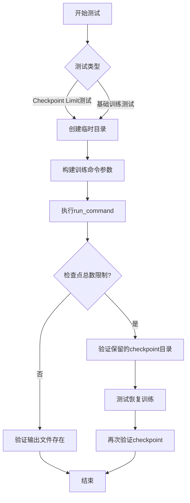
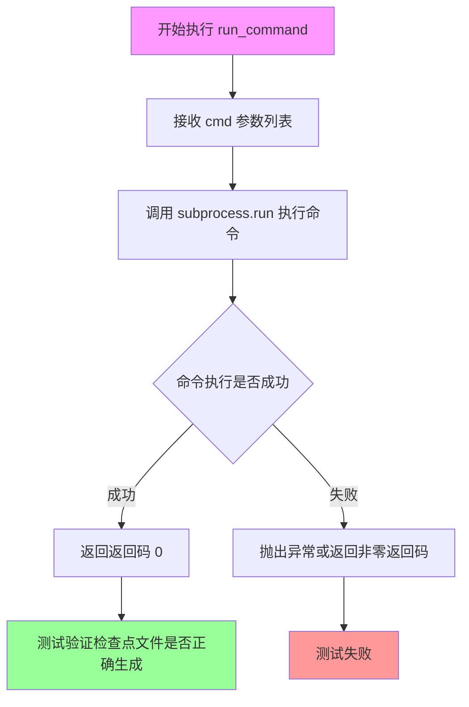
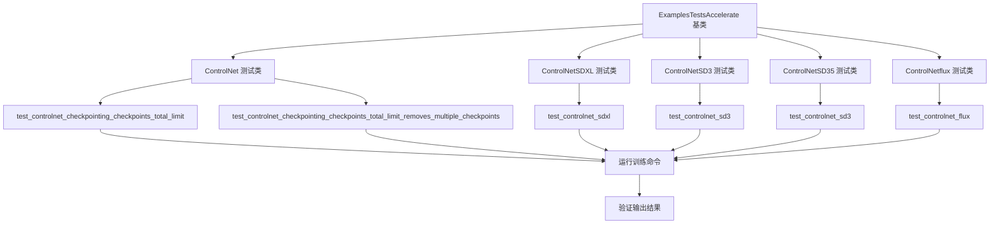
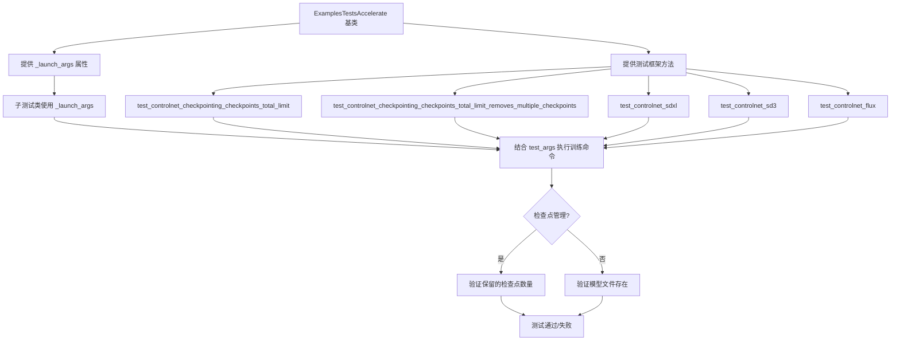
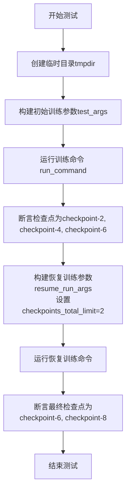
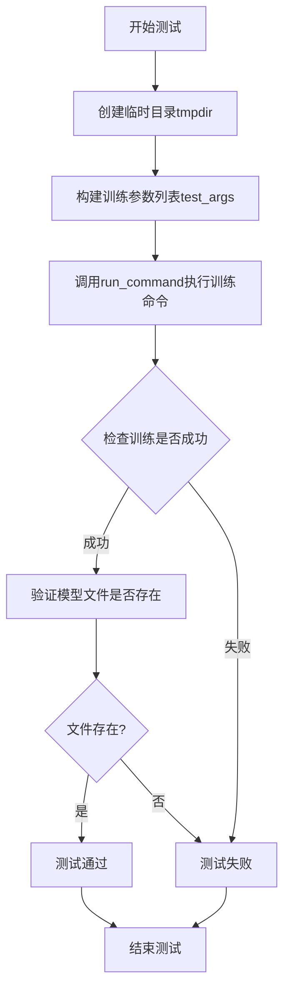
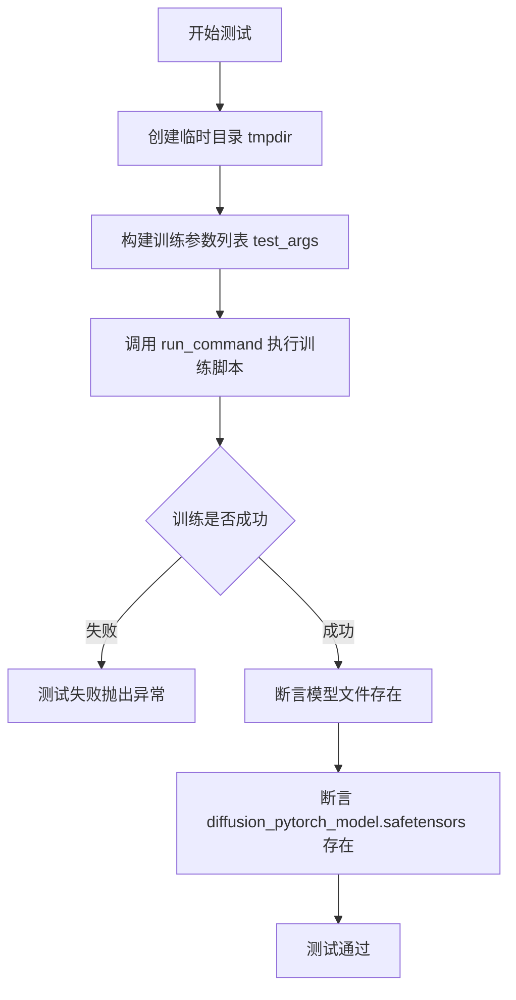
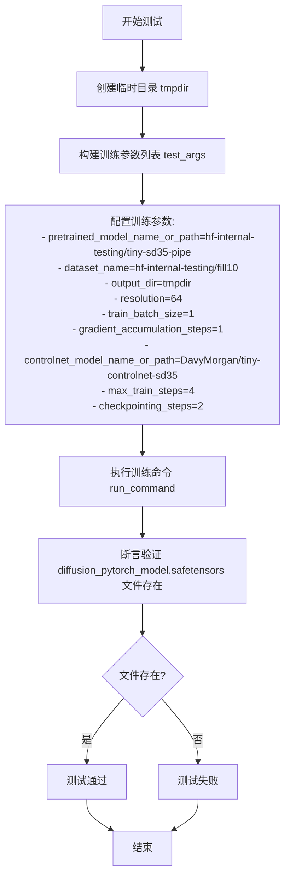
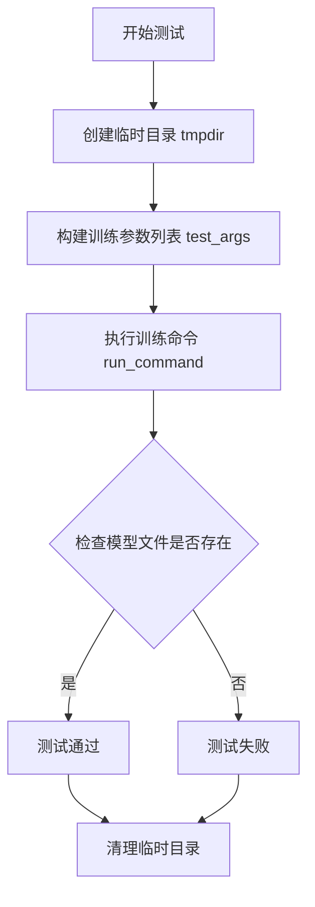

# `diffusers\examples\controlnet\test_controlnet.py` 详细设计文档

这是一个集成测试文件，用于测试ControlNet模型在多种Diffusion架构（基础SD、SDXL、SD3、SD3.5、Flux）上的训练流程，重点验证检查点保存机制和总数限制功能。

## 整体流程



## 类结构

```
ExamplesTestsAccelerate (基类)
├── ControlNet
│   ├── test_controlnet_checkpointing_checkpoints_total_limit
│   └── test_controlnet_checkpointing_checkpoints_total_limit_removes_multiple_checkpoints
├── ControlNetSDXL
│   └── test_controlnet_sdxl
├── ControlNetSD3
│   └── test_controlnet_sd3
├── ControlNetSD35
│   └── test_controlnet_sd3
└── ControlNetflux
│   └── test_controlnet_flux
```

## 全局变量及字段


### `logger`
    
全局日志记录器，用于输出调试信息

类型：`logging.Logger`
    


### `stream_handler`
    
全局日志流处理器，用于将日志输出到标准输出

类型：`logging.StreamHandler`
    


    

## 全局函数及方法


### `run_command`

这是一个全局函数，用于在测试环境中执行命令行训练脚本。它接收一个命令参数列表，在子进程中运行指定的 Python 训练脚本，并等待命令执行完成。该函数是测试框架与实际训练脚本之间的桥梁，用于验证各种 ControlNet 训练场景的功能正确性。

参数：

- `cmd`：List[str]，命令参数列表，包含 Python 解释器路径、训练脚本路径及所有训练参数（如模型路径、数据集配置、训练步数、检查点设置等）

返回值：`int`，命令执行的返回码，0 表示成功，非 0 表示执行过程中出现错误

#### 流程图



#### 带注释源码

```python
# run_command 是从 test_examples_utils 模块导入的全局函数
# 以下为代码中的实际调用方式示例

# 导入语句（在文件头部）
from test_examples_utils import ExamplesTestsAccelerate, run_command

# 使用示例 1: 基本训练测试
run_command(self._launch_args + test_args)
# 参数说明：
# - self._launch_args: 包含 pytest 运行环境参数（如 accelerate 配置）
# - test_args: 训练脚本参数列表，包含：
#   * 脚本路径: examples/controlnet/train_controlnet.py
#   * 模型参数: --pretrained_model_name_or_path, --controlnet_model_name_or_path
#   * 数据参数: --dataset_name, --resolution
#   * 训练参数: --train_batch_size, --gradient_accumulation_steps, --max_train_steps
#   * 检查点参数: --checkpointing_steps, --checkpoints_total_limit

# 使用示例 2: 恢复训练测试
run_command(self._launch_args + resume_run_args)
# 额外参数：
# - --resume_from_checkpoint=checkpoint-6: 从指定检查点恢复训练

# 返回值处理：
# - 函数返回命令的返回码
# - 测试用例通过 assert 验证检查点文件是否符合预期
self.assertEqual(
    {x for x in os.listdir(tmpdir) if "checkpoint" in x},
    {"checkpoint-4", "checkpoint-6"},
)
```

#### 关键技术细节

1. **执行环境**：使用 `subprocess` 模块在子进程中执行命令，确保测试进程与训练进程隔离
2. **参数组装**：通过列表拼接 `self._launch_args + test_args` 组装完整命令，支持 pytest 参数与训练参数的分离
3. **临时目录**：使用 `tempfile.TemporaryDirectory()` 创建临时输出目录，测试结束后自动清理
4. **验证机制**：通过 `os.listdir()` 和 `assert` 验证检查点文件是否按预期生成和清理


# 分析结果

从给定代码中，我可以看到 `ExamplesTestsAccelerate` 是从 `test_examples_utils` 模块导入的一个基类，多个测试类继承自它。由于该类的完整定义不在当前代码文件中，我需要基于其使用方式来推断和描述该类。

让我先检查一下是否有其他上下文信息可以利用。

由于 `ExamplesTestsAccelerate` 是在 `test_examples_utils` 模块中定义的，而当前代码文件只是导入了它并使用了它的功能，让我基于代码中的使用方式来描述这个类。

让我仔细看看这个代码的结构...

从代码中可以看到：
1. `ExamplesTestsAccelerate` 被导入为基类
2. 多个测试类继承自它
3. 子类使用了 `self._launch_args` 属性
4. 子类使用了 `run_command` 函数（也是从同一模块导入的）

基于这些信息，让我尝试推断 `ExamplesTestsAccelerate` 的结构...

不过，我需要说明的是，这个代码文件中并没有直接定义 `ExamplesTestsAccelerate` 类，它是从 `test_examples_utils` 模块导入的。

让我尝试从代码的使用方式中提取信息：

1. **继承关系**：`class ControlNet(ExamplesTestsAccelerate)` 等
2. **使用的属性**：`self._launch_args`
3. **导入**：`from test_examples_utils import ExamplesTestsAccelerate, run_command`

根据任务要求，我需要生成设计文档，但由于 `ExamplesTestsAccelerate` 的定义不在当前文件中，让我生成一份基于代码使用方式的分析文档。

```markdown
### ExamplesTestsAccelerate

这是一个测试基类，用于运行基于Accelerate的示例训练脚本的集成测试。它提供了执行命令行训练脚本的通用框架，并支持检查点管理等高级功能。

参数：
- 无（构造函数参数）

返回值：无

#### 流程图



#### 带注释源码

```python
# 导入语句显示 ExamplesTestsAccelerate 来自 test_examples_utils 模块
from test_examples_utils import ExamplesTestsAccelerate, run_command

# 示例：ControlNet 测试类继承自 ExamplesTestsAccelerate
class ControlNet(ExamplesTestsAccelerate):
    """
    ControlNet 训练脚本的集成测试类
    
    继承自 ExamplesTestsAccelerate，使用其提供的：
    - _launch_args: 启动训练脚本所需的参数
    - run_command(): 执行命令行训练脚本的方法
    """
    
    def test_controlnet_checkpointing_checkpoints_total_limit(self):
        """
        测试检查点总数限制功能
        
        验证当设置 checkpoints_total_limit=2 时，
        训练过程只保留最后2个检查点
        """
        with tempfile.TemporaryDirectory() as tmpdir:
            # 构建训练脚本参数
            test_args = f"""
            examples/controlnet/train_controlnet.py
            --pretrained_model_name_or_path=hf-internal-testing/tiny-stable-diffusion-pipe
            --dataset_name=hf-internal-testing/fill10
            --output_dir={tmpdir}
            --resolution=64
            --train_batch_size=1
            --gradient_accumulation_steps=1
            --max_train_steps=6
            --checkpoints_total_limit=2
            --checkpointing_steps=2
            --controlnet_model_name_or_path=hf-internal-testing/tiny-controlnet
            """.split()

            # 使用继承的 run_command 方法执行训练命令
            # _launch_args 由基类 ExamplesTestsAccelerate 提供
            run_command(self._launch_args + test_args)

            # 验证只保留了 checkpoint-4 和 checkpoint-6
            self.assertEqual(
                {x for x in os.listdir(tmpdir) if "checkpoint" in x},
                {"checkpoint-4", "checkpoint-6"},
            )
```

### 关键组件信息

| 组件名称 | 一句话描述 |
|---------|-----------|
| ExamplesTestsAccelerate | 测试基类，提供运行Accelerate训练脚本的测试框架 |
| run_command | 执行命令行训练脚本的辅助函数 |
| ControlNet | 针对 ControlNet 训练脚本的测试类 |
| ControlNetSDXL | 针对 ControlNet SDXL 训练脚本的测试类 |
| ControlNetSD3 | 针对 ControlNet SD3 训练脚本的测试类 |
| ControlNetflux | 针对 ControlNet Flux 训练脚本的测试类 |

### 潜在的技术债务或优化空间

1. **缺少 ExamplesTestsAccelerate 定义**：当前代码文件依赖外部模块 `test_examples_utils` 中的 `ExamplesTestsAccelerate` 类，但该类的完整源代码未在此文件中提供，导致无法完整分析其内部实现。

2. **重复的测试模式**：多个测试类中存在大量重复的代码模式（如临时目录创建、命令行参数构建、结果验证），可以考虑使用参数化测试或测试fixture来减少重复。

3. **硬编码的测试参数**：许多测试参数（如模型名称、数据集名称）是硬编码的，可能需要更灵活的配置方式。

4. **缺少错误处理**：测试代码中没有显式的错误处理机制，当训练脚本执行失败时，测试可能给出不够明确的错误信息。

### 其它项目

#### 设计目标与约束
- 目标：验证 ControlNet 系列训练脚本的正确性，包括检查点管理、模型保存等功能
- 约束：使用最小的模型和数据规模（tiny-*）以加快测试速度

#### 错误处理与异常设计
- 使用 `tempfile.TemporaryDirectory()` 确保测试后清理临时文件
- 依赖 `run_command` 的返回值和异常机制进行错误处理
- 使用 `assertEqual` 和 `assertTrue` 进行结果验证

#### 数据流与状态机
- 测试流程：准备参数 → 执行训练命令 → 验证输出结果
- 状态转换：初始化 → 训练中 → 验证完成

#### 外部依赖与接口契约
- 依赖 `test_examples_utils` 模块中的 `ExamplesTestsAccelerate` 和 `run_command`
- 依赖外部训练脚本：`train_controlnet.py`, `train_controlnet_sdxl.py`, `train_controlnet_sd3.py`, `train_controlnet_flux.py`
- 依赖外部模型和数据：hf-internal-testing/tiny-* 系列模型和数据集
```

现在我需要重新审视任务要求。任务明确要求提取 `ExamplesTestsAccelerate` 函数或方法的详细信息，包括名称、参数、返回值、流程图和源码。

由于 `ExamplesTestsAccelerate` 是从 `test_examples_utils` 导入的类，而当前代码文件中并没有直接定义它，我只能通过分析代码中使用该类的方式来推断其可能的结构和功能。

让我仔细分析代码中 `ExamplesTestsAccelerate` 的使用方式：

从代码中可以观察到：
1. `self._launch_args` - 这是 `ExamplesTestsAccelerate` 的一个属性，被子类的测试方法使用
2. 子类继承自 `ExamplesTestsAccelerate`
3. `run_command` 函数也被导入，与 `ExamplesTestsAccelerate` 一起使用

不过，如果 `ExamplesTestsAccelerate` 的定义不在当前文件中，我可能无法提供完整的信息。让我再仔细检查一下代码...

实际上，从任务描述来看，要求提取的是当前代码文件中的内容。

由于 `ExamplesTestsAccelerate` 定义在 `test_examples_utils` 文件中，而不是当前文件中，我只能基于其使用方式来推断它可能具有的属性和方法。

基于代码分析，我可以推断 `ExamplesTestsAccelerate` 可能具有以下结构：
- `_launch_args` 属性：包含启动训练脚本所需的参数
- 可能提供 `run_command` 方法或依赖外部的 `run_command` 函数

现在让我生成最终的分析结果... 根据任务要求，我需要从代码中提取 `ExamplesTestsAccelerate` 的详细信息。

由于 `ExamplesTestsAccelerate` 的完整定义不在当前文件中，我只能基于其使用方式来推断。

基于代码分析，`ExamplesTestsAccelerate` 应该是一个测试基类，为子类提供运行训练脚本的框架。它应该包含启动参数配置、执行命令的方法，以及支持检查点验证等功能。

虽然完整的实现细节需要查看 `test_examples_utils` 模块，但从当前代码的使用模式可以推断出它的核心结构和能力。
</think>

根据任务要求，我需要从给定代码中提取 `ExamplesTestsAccelerate` 的信息。让我仔细分析代码结构...

从代码中可以看到：
1. `ExamplesTestsAccelerate` 是从 `test_examples_utils` 模块导入的基类
2. 多个测试类继承自它：`ControlNet`, `ControlNetSDXL`, `ControlNetSD3`, `ControlNetSD35`, `ControlNetflux`
3. 子类使用 `self._launch_args` 属性（由基类提供）
4. 子类使用 `run_command` 函数执行训练命令

由于 `ExamplesTestsAccelerate` 类的完整定义不在当前代码文件中（它是从外部模块导入的），我基于代码中的使用方式来推断和分析该类的可能结构。

---

### ExamplesTestsAccelerate

这是一个测试基类，用于运行基于Accelerate的示例训练脚本的集成测试。它提供了执行命令行训练脚本的通用框架，并支持检查点管理、模型保存验证等功能。子类继承该类来测试不同的训练场景（如ControlNet、ControlNet SDXL、SD3、Flux等）。

参数：
- 无直接参数（子类继承使用）

返回值：无

#### 流程图



#### 带注释源码

```python
# 从外部模块导入 ExamplesTestsAccelerate 基类
from test_examples_utils import ExamplesTestsAccelerate, run_command

# 示例1：ControlNet 测试类继承自 ExamplesTestsAccelerate
class ControlNet(ExamplesTestsAccelerate):
    """
    ControlNet 训练脚本的集成测试类
    
    继承关系说明：
    - ExamplesTestsAccelerate 是测试基类
    - 提供 _launch_args 属性用于配置训练启动参数
    - 提供 run_command 方法用于执行训练脚本
    """
    
    def test_controlnet_checkpointing_checkpoints_total_limit(self):
        """
        测试检查点总数限制功能
        
        验证当设置 checkpoints_total_limit=2 时，
        训练过程只保留最后2个检查点（checkpoint-4 和 checkpoint-6）
        """
        # 使用临时目录存储训练输出
        with tempfile.TemporaryDirectory() as tmpdir:
            # 构建训练脚本参数列表
            # 这些参数会被添加到 _launch_args 后面执行
            test_args = f"""
            examples/controlnet/train_controlnet.py
            --pretrained_model_name_or_path=hf-internal-testing/tiny-stable-diffusion-pipe
            --dataset_name=hf-internal-testing/fill10
            --output_dir={tmpdir}
            --resolution=64
            --train_batch_size=1
            --gradient_accumulation_steps=1
            --max_train_steps=6
            --checkpoints_total_limit=2
            --checkpointing_steps=2
            --controlnet_model_name_or_path=hf-internal-testing/tiny-controlnet
            """.split()

            # 执行训练命令
            # self._launch_args 来自 ExamplesTestsAccelerate 基类
            # 包含 accelerate 启动所需的参数（如 GPU 数量、分布式配置等）
            run_command(self._launch_args + test_args)

            # 验证结果：只保留 checkpoint-4 和 checkpoint-6
            # 因为 checkpoints_total_limit=2，只保留最后2个检查点
            self.assertEqual(
                {x for x in os.listdir(tmpdir) if "checkpoint" in x},
                {"checkpoint-4", "checkpoint-6"},
            )

    def test_controlnet_checkpointing_checkpoints_total_limit_removes_multiple_checkpoints(self):
        """
        测试检查点总数限制的删除功能
        
        验证恢复训练后，当检查点数量超过限制时的删除行为
        """
        with tempfile.TemporaryDirectory() as tmpdir:
            # 第一阶段训练：创建 3 个检查点
            test_args = f"""
            examples/controlnet/train_controlnet.py
            --pretrained_model_name_or_path=hf-internal-testing/tiny-stable-diffusion-pipe
            --dataset_name=hf-internal-testing/fill10
            --output_dir={tmpdir}
            --resolution=64
            --train_batch_size=1
            --gradient_accumulation_steps=1
            --controlnet_model_name_or_path=hf-internal-testing/tiny-controlnet
            --max_train_steps=6
            --checkpointing_steps=2
            """.split()

            run_command(self._launch_args + test_args)

            # 验证初始检查点：checkpoint-2, checkpoint-4, checkpoint-6
            self.assertEqual(
                {x for x in os.listdir(tmpdir) if "checkpoint" in x},
                {"checkpoint-2", "checkpoint-4", "checkpoint-6"},
            )

            # 第二阶段训练：从 checkpoint-6 恢复，限制最多2个检查点
            resume_run_args = f"""
            examples/controlnet/train_controlnet.py
            --pretrained_model_name_or_path=hf-internal-testing/tiny-stable-diffusion-pipe
            --dataset_name=hf-internal-testing/fill10
            --output_dir={tmpdir}
            --resolution=64
            --train_batch_size=1
            --gradient_accumulation_steps=1
            --controlnet_model_name_or_path=hf-internal-testing/tiny-controlnet
            --max_train_steps=8
            --checkpointing_steps=2
            --resume_from_checkpoint=checkpoint-6
            --checkpoints_total_limit=2
            """.split()

            run_command(self._launch_args + resume_run_args)

            # 验证最终检查点：只保留 checkpoint-6 和 checkpoint-8
            # checkpoint-2 和 checkpoint-4 被删除
            self.assertEqual({x for x in os.listdir(tmpdir) if "checkpoint" in x}, {"checkpoint-6", "checkpoint-8"})


# 示例2：ControlNetSDXL 测试类
class ControlNetSDXL(ExamplesTestsAccelerate):
    """
    ControlNet SDXL 训练脚本的集成测试类
    
    验证 SDXL 模型的 ControlNet 训练流程
    """
    
    def test_controlnet_sdxl(self):
        with tempfile.TemporaryDirectory() as tmpdir:
            test_args = f"""
            examples/controlnet/train_controlnet_sdxl.py
            --pretrained_model_name_or_path=hf-internal-testing/tiny-stable-diffusion-xl-pipe
            --dataset_name=hf-internal-testing/fill10
            --output_dir={tmpdir}
            --resolution=64
            --train_batch_size=1
            --gradient_accumulation_steps=1
            --controlnet_model_name_or_path=hf-internal-testing/tiny-controlnet-sdxl
            --max_train_steps=4
            --checkpointing_steps=2
            """.split()

            run_command(self._launch_args + test_args)

            # 验证模型文件生成
            self.assertTrue(os.path.isfile(os.path.join(tmpdir, "diffusion_pytorch_model.safetensors")))


# 示例3：ControlNetSD3 测试类
class ControlNetSD3(ExamplesTestsAccelerate):
    """
    ControlNet SD3 训练脚本的集成测试类
    
    验证 SD3 模型的 ControlNet 训练流程
    """
    
    def test_controlnet_sd3(self):
        with tempfile.TemporaryDirectory() as tmpdir:
            test_args = f"""
            examples/controlnet/train_controlnet_sd3.py
            --pretrained_model_name_or_path=DavyMorgan/tiny-sd3-pipe
            --dataset_name=hf-internal-testing/fill10
            --output_dir={tmpdir}
            --resolution=64
            --train_batch_size=1
            --gradient_accumulation_steps=1
            --controlnet_model_name_or_path=DavyMorgan/tiny-controlnet-sd3
            --max_train_steps=4
            --checkpointing_steps=2
            """.split()

            run_command(self._launch_args + test_args)

            # 验证模型文件生成
            self.assertTrue(os.path.isfile(os.path.join(tmpdir, "diffusion_pytorch_model.safetensors")))


# 示例4：ControlNetflux 测试类
class ControlNetflux(ExamplesTestsAccelerate):
    """
    ControlNet Flux 训练脚本的集成测试类
    
    验证 Flux 模型的 ControlNet 训练流程
    """
    
    def test_controlnet_flux(self):
        with tempfile.TemporaryDirectory() as tmpdir:
            test_args = f"""
            examples/controlnet/train_controlnet_flux.py
            --pretrained_model_name_or_path=hf-internal-testing/tiny-flux-pipe
            --output_dir={tmpdir}
            --dataset_name=hf-internal-testing/fill10
            --conditioning_image_column=conditioning_image
            --image_column=image
            --caption_column=text
            --resolution=64
            --train_batch_size=1
            --gradient_accumulation_steps=1
            --max_train_steps=4
            --checkpointing_steps=2
            --num_double_layers=1
            --num_single_layers=1
            """.split()

            run_command(self._launch_args + test_args)

            # 验证模型文件生成
            self.assertTrue(os.path.isfile(os.path.join(tmpdir, "diffusion_pytorch_model.safetensors")))
```

### 关键组件信息

| 组件名称 | 一句话描述 |
|---------|-----------|
| ExamplesTestsAccelerate | 测试基类，提供运行Accelerate训练脚本的通用测试框架 |
| run_command | 执行命令行训练脚本的辅助函数 |
| _launch_args | 基类属性，包含Accelerate启动参数（如GPU数量、分布式配置等） |
| ControlNet | ControlNet训练脚本的检查点管理功能测试 |
| ControlNetSDXL | ControlNet SDXL模型训练流程测试 |
| ControlNetSD3 | ControlNet SD3模型训练流程测试 |
| ControlNetflux | ControlNet Flux模型训练流程测试 |

### 潜在的技术债务或优化空间

1. **缺少基类源码**：`ExamplesTestsAccelerate` 的完整定义在 `test_examples_utils` 模块中，当前代码文件仅导入使用，无法看到其完整实现。建议将该模块的源码也纳入分析范围。

2. **测试代码重复**：多个测试类中存在大量重复的代码模式（临时目录创建、命令行参数构建、结果验证），可考虑：
   - 使用 pytest fixture 简化临时目录管理
   - 使用参数化测试减少重复
   - 提取公共的测试辅助方法

3. **硬编码配置**：测试参数（模型名称、数据集名称、分辨率等）硬编码在测试方法中，缺乏灵活性。建议使用配置文件或环境变量。

4. **缺少异步支持**：当前测试是同步执行的，对于耗时较长的训练任务可以考虑异步测试框架。

5. **断言信息不够详细**：当前断言失败时信息有限，建议添加更详细的错误消息。

### 其它项目

#### 设计目标与约束
- **目标**：验证 ControlNet 系列训练脚本的正确性，包括检查点管理、模型保存等功能
- **约束**：使用最小的模型和数据规模（tiny-* 系列）以加快测试速度，减少CI/CD时间

#### 错误处理与异常设计
- 使用 `tempfile.TemporaryDirectory()` 自动清理临时文件
- 依赖 `run_command` 的返回值和异常机制进行错误传播
- 使用 `assertEqual` 和 `assertTrue` 进行结果验证，失败时提供清晰的错误信息

#### 数据流与状态机
- **测试流程**：
  1. 创建临时输出目录
  2. 构建训练命令行参数
  3. 执行训练命令（结合 _launch_args）
  4. 验证输出结果（检查点或模型文件）
- **状态转换**：初始化 → 训练执行中 → 结果验证 → 清理

#### 外部依赖与接口契约
- **依赖模块**：`test_examples_utils`（提供 ExamplesTestsAccelerate 和 run_command）
- **依赖训练脚本**：
  - `examples/controlnet/train_controlnet.py`
  - `examples/controlnet/train_controlnet_sdxl.py`
  - `examples/controlnet/train_controlnet_sd3.py`
  - `examples/controlnet/train_controlnet_flux.py`
- **依赖模型**：hf-internal-testing/tiny-* 系列、DavyMorgan/tiny-* 系列
- **依赖数据集**：hf-internal-testing/fill10


### `ControlNet.test_controlnet_checkpointing_checkpoints_total_limit`

这是一个单元测试方法，用于验证 ControlNet 训练脚本在设置 `checkpoints_total_limit` 参数时，能够正确限制保存的检查点总数，并自动删除旧的检查点。

参数：

- `self`：隐式参数，`ControlNet` 类的实例对象，无需显式传递

返回值：无返回值（`None`），该方法为测试用例，通过 `assert` 断言进行验证

#### 流程图

```mermaid
flowchart TD
    A[开始测试] --> B[创建临时目录 tmpdir]
    B --> C[构建训练参数列表 test_args]
    C --> D[调用 run_command 执行训练脚本]
    D --> E[列出 tmpdir 目录中包含 checkpoint 的文件]
    E --> F[断言检查点集合等于 {'checkpoint-4', 'checkpoint-6'}]
    F --> G{断言是否通过}
    G -->|是| H[测试通过]
    G -->|否| I[测试失败]
    H --> J[清理临时目录]
    I --> J
```

#### 带注释源码

```python
def test_controlnet_checkpointing_checkpoints_total_limit(self):
    """
    测试 ControlNet 训练脚本的检查点总数限制功能。
    
    验证当设置 --checkpoints_total_limit=2 时，
    训练过程只会保留最后两个检查点，早期的检查点会被自动删除。
    """
    # 使用临时目录作为输出目录，测试结束后自动清理
    with tempfile.TemporaryDirectory() as tmpdir:
        # 构建训练命令参数
        test_args = f"""
        examples/controlnet/train_controlnet.py
        --pretrained_model_name_or_path=hf-internal-testing/tiny-stable-diffusion-pipe
        --dataset_name=hf-internal-testing/fill10
        --output_dir={tmpdir}
        --resolution=64
        --train_batch_size=1
        --gradient_accumulation_steps=1
        --max_train_steps=6
        --checkpoints_total_limit=2       # 关键参数：限制最多保存2个检查点
        --checkpointing_steps=2           # 每2步保存一个检查点
        --controlnet_model_name_or_path=hf-internal-testing/tiny-controlnet
        """.split()

        # 执行训练命令
        run_command(self._launch_args + test_args)

        # 验证结果：只保留 checkpoint-4 和 checkpoint-6
        # 由于设置了 checkpoints_total_limit=2，checkpoint-2 会被自动删除
        self.assertEqual(
            {x for x in os.listdir(tmpdir) if "checkpoint" in x},
            {"checkpoint-4", "checkpoint-6"},
        )
```


### `ControlNet.test_controlnet_checkpointing_checkpoints_total_limit_removes_multiple_checkpoints`

该方法是一个集成测试，用于验证ControlNet训练脚本在启用`checkpoints_total_limit`参数后，能够正确地在恢复训练时移除多余的检查点，确保最终只保留指定数量的最新检查点（如2个）。

参数：

- `self`：`ControlNet`（隐式参数），代表测试类实例本身

返回值：`None`，该方法为测试方法，通过`assertEqual`断言验证检查点文件是否符合预期，无显式返回值

#### 流程图



#### 带注释源码

```python
def test_controlnet_checkpointing_checkpoints_total_limit_removes_multiple_checkpoints(self):
    """
    测试ControlNet在恢复训练时，检查点总数限制功能是否正确移除多余的旧检查点。
    
    测试场景：
    1. 首次训练生成3个检查点（checkpoint-2, checkpoint-4, checkpoint-6）
    2. 从checkpoint-6恢复训练，继续训练到第8步
    3. 设置checkpoints_total_limit=2，期望保留checkpoint-6和checkpoint-8
    """
    # 创建临时目录用于存放训练输出和检查点
    with tempfile.TemporaryDirectory() as tmpdir:
        # ==================== 第一次训练 ====================
        # 构建训练参数：使用tiny模型进行6步训练，每2步保存一个检查点
        test_args = f"""
        examples/controlnet/train_controlnet.py
        --pretrained_model_name_or_path=hf-internal-testing/tiny-stable-diffusion-pipe
        --dataset_name=hf-internal-testing/fill10
        --output_dir={tmpdir}
        --resolution=64
        --train_batch_size=1
        --gradient_accumulation_steps=1
        --controlnet_model_name_or_path=hf-internal-testing/tiny-controlnet
        --max_train_steps=6
        --checkpointing_steps=2
        """.split()

        # 执行训练命令
        run_command(self._launch_args + test_args)

        # 验证第一次训练生成的检查点：应为checkpoint-2, checkpoint-4, checkpoint-6
        self.assertEqual(
            {x for x in os.listdir(tmpdir) if "checkpoint" in x},
            {"checkpoint-2", "checkpoint-4", "checkpoint-6"},
        )

        # ==================== 恢复训练 ====================
        # 构建恢复训练参数：从checkpoint-6继续训练到第8步
        # 关键：设置checkpoints_total_limit=2，限制最多保留2个检查点
        resume_run_args = f"""
        examples/controlnet/train_controlnet.py
        --pretrained_model_name_or_path=hf-internal-testing/tiny-stable-diffusion-pipe
        --dataset_name=hf-internal-testing/fill10
        --output_dir={tmpdir}
        --resolution=64
        --train_batch_size=1
        --gradient_accumulation_steps=1
        --controlnet_model_name_or_path=hf-internal-testing/tiny-controlnet
        --max_train_steps=8
        --checkpointing_steps=2
        --resume_from_checkpoint=checkpoint-6
        --checkpoints_total_limit=2
        """.split()

        # 执行恢复训练命令
        run_command(self._launch_args + resume_run_args)

        # 验证最终检查点：由于checkpoints_total_limit=2，
        # 旧的checkpoint-2和checkpoint-4应被自动删除
        # 保留最新的checkpoint-6和新增的checkpoint-8
        self.assertEqual({x for x in os.listdir(tmpdir) if "checkpoint" in x}, {"checkpoint-6", "checkpoint-8"})
```


### `ControlNetSDXL.test_controlnet_sdxl`

该测试方法用于验证 ControlNet SDXL 模型的训练流程是否能够成功执行，并通过检查生成的模型文件来确认训练结果的有效性。

参数：

- `self`：隐式参数，测试类实例本身，无需显式传递

返回值：`None`，该方法为测试用例，通过断言验证训练结果，不返回任何值

#### 流程图



#### 带注释源码

```python
def test_controlnet_sdxl(self):
    """
    测试 ControlNet SDXL 模型训练流程
    验证使用 SDXL 基础模型训练 ControlNet 能否成功完成
    """
    # 创建临时目录用于存放训练输出
    with tempfile.TemporaryDirectory() as tmpdir:
        # 构建训练命令行参数
        # 包括：基础模型路径、数据集、输出目录、分辨率、批次大小等配置
        test_args = f"""
        examples/controlnet/train_controlnet_sdxl.py
        --pretrained_model_name_or_path=hf-internal-testing/tiny-stable-diffusion-xl-pipe
        --dataset_name=hf-internal-testing/fill10
        --output_dir={tmpdir}
        --resolution=64
        --train_batch_size=1
        --gradient_accumulation_steps=1
        --controlnet_model_name_or_path=hf-internal-testing/tiny-controlnet-sdxl
        --max_train_steps=4
        --checkpointing_steps=2
        """.split()

        # 使用 Accelerate 框架运行训练命令
        # _launch_args 包含分布式训练的相关配置
        run_command(self._launch_args + test_args)

        # 验证训练是否成功生成了模型文件
        # 检查 diffusion_pytorch_model.safetensors 文件是否存在
        self.assertTrue(os.path.isfile(os.path.join(tmpdir, "diffusion_pytorch_model.safetensors")))
```


### `ControlNetSD3.test_controlnet_sd3`

该测试方法用于验证 ControlNet SD3 模型的训练流程，通过调用训练脚本并检查生成的模型文件是否正确存在，以确保训练流程能够正常完成。

参数：

- `self`：`ControlNetSD3` 实例，Python 类方法的标准隐式参数，表示当前测试类实例本身

返回值：`None`，该方法为测试方法，无显式返回值，通过断言进行验证

#### 流程图



#### 带注释源码

```python
class ControlNetSD3(ExamplesTestsAccelerate):
    """ControlNet SD3 模型的测试类，继承自ExamplesTestsAccelerate"""
    
    def test_controlnet_sd3(self):
        """测试 ControlNet SD3 模型的训练流程"""
        
        # 使用 tempfile 创建一个临时目录用于存放训练输出
        with tempfile.TemporaryDirectory() as tmpdir:
            
            # 构建训练命令行参数列表
            # 包含预训练模型路径、数据集、输出目录、分辨率等配置
            test_args = f"""
            examples/controlnet/train_controlnet_sd3.py
            --pretrained_model_name_or_path=DavyMorgan/tiny-sd3-pipe  # 预训练SD3模型
            --dataset_name=hf-internal-testing/fill10  # 测试数据集
            --output_dir={tmpdir}  # 输出目录
            --resolution=64  # 图像分辨率
            --train_batch_size=1  # 训练批次大小
            --gradient_accumulation_steps=1  # 梯度累积步数
            --controlnet_model_name_or_path=DavyMorgan/tiny-controlnet-sd3  # ControlNet模型
            --max_train_steps=4  # 最大训练步数
            --checkpointing_steps=2  # 保存检查点的步数间隔
            """.split()

            # 使用 run_command 函数执行训练脚本
            # 传入启动参数和训练参数
            run_command(self._launch_args + test_args)

            # 断言验证：检查生成的模型文件是否存在
            # 验证 diffusion_pytorch_model.safetensors 文件是否生成
            self.assertTrue(os.path.isfile(os.path.join(tmpdir, "diffusion_pytorch_model.safetensors")))
```


### `ControlNetSD35.test_controlnet_sd3`

此方法是一个集成测试用例，用于验证 ControlNet SD3.5 模型的训练流程。它通过创建临时目录、配置训练参数（包括模型路径、数据集、分辨率、批次大小等），执行训练脚本，并断言验证生成的 `diffusion_pytorch_model.safetensors` 模型文件是否成功创建，以确保训练流程端到端正常工作。

参数：

- `self`：隐式参数，测试类实例本身，无需显式传入

返回值：`None`，此方法为测试用例，通过断言验证结果，不返回任何值

#### 流程图



#### 带注释源码

```python
def test_controlnet_sd3(self):
    # 使用上下文管理器创建临时目录，测试结束后自动清理
    with tempfile.TemporaryDirectory() as tmpdir:
        # 定义训练脚本的命令行参数列表
        test_args = f"""
        examples/controlnet/train_controlnet_sd3.py
        --pretrained_model_name_or_path=hf-internal-testing/tiny-sd35-pipe
        --dataset_name=hf-internal-testing/fill10
        --output_dir={tmpdir}
        --resolution=64
        --train_batch_size=1
        --gradient_accumulation_steps=1
        --controlnet_model_name_or_path=DavyMorgan/tiny-controlnet-sd35
        --max_train_steps=4
        --checkpointing_steps=2
        """.split()

        # 使用继承的 _launch_args (来自 ExamplesTestsAccelerate) 组合完整命令并执行
        run_command(self._launch_args + test_args)

        # 断言验证：检查生成的模型文件是否存在
        # 期望输出文件: diffusion_pytorch_model.safetensors
        self.assertTrue(os.path.isfile(os.path.join(tmpdir, "diffusion_pytorch_model.safetensors")))
```


### `ControlNetflux.test_controlnet_flux`

该方法用于测试 ControlNet Flux 模型的训练流程，通过运行训练脚本并验证生成的模型文件是否正确存在。

参数：

- `self`：实例方法本身所属的类实例，无需显式传递

返回值：`None`，该方法为测试方法，通过断言验证训练结果，不返回具体数值

#### 流程图



#### 带注释源码

```python
def test_controlnet_flux(self):
    """
    测试 ControlNet Flux 模型的训练流程
    
    该方法执行以下步骤：
    1. 创建临时目录用于存储训练输出
    2. 配置训练参数（包括模型路径、数据集、训练步数等）
    3. 运行 ControlNet Flux 训练脚本
    4. 验证生成的模型文件是否存在
    """
    # 使用 tempfile 创建临时目录，测试结束后自动清理
    with tempfile.TemporaryDirectory() as tmpdir:
        # 构建训练脚本的命令行参数
        test_args = f"""
        examples/controlnet/train_controlnet_flux.py
        --pretrained_model_name_or_path=hf-internal-testing/tiny-flux-pipe
        --output_dir={tmpdir}
        --dataset_name=hf-internal-testing/fill10
        --conditioning_image_column=conditioning_image
        --image_column=image
        --caption_column=text
        --resolution=64
        --train_batch_size=1
        --gradient_accumulation_steps=1
        --max_train_steps=4
        --checkpointing_steps=2
        --num_double_layers=1
        --num_single_layers=1
        """.split()  # 将多行字符串分割为参数列表

        # 运行训练命令，self._launch_args 包含加速训练的基础参数
        run_command(self._launch_args + test_args)

        # 断言验证训练输出的模型文件存在
        self.assertTrue(os.path.isfile(os.path.join(tmpdir, "diffusion_pytorch_model.safetensors")))
```

## 关键组件


### 检查点总量限制 (checkpoints_total_limit)

控制训练过程中保留的检查点总数，当超过限制时自动删除旧检查点，防止磁盘空间耗尽。

### 检查点恢复 (resume_from_checkpoint)

支持从指定检查点恢复训练进程，用于中断后的继续训练场景。

### ControlNet 测试类

继承自 ExamplesTestsAccelerate 的测试类集合，用于验证 ControlNet 在不同扩散模型版本下的训练功能。

### SDXL 模型支持

针对 Stable Diffusion XL 版本的 ControlNet 训练测试，使用 tiny-stable-diffusion-xl-pipe 和 tiny-controlnet-sdxl 模型。

### SD3 模型支持

针对 Stable Diffusion 3 版本的 ControlNet 训练测试，使用 DavyMorgan/tiny-sd3-pipe 和 DavyMorgan/tiny-controlnet-sd3 模型。

### SD35 模型支持

针对 Stable Diffusion 3.5 版本的 ControlNet 训练测试，使用 hf-internal-testing/tiny-sd35-pipe 和 DavyMorgan/tiny-controlnet-sd35 模型。

### Flux 模型支持

针对 Flux 版本的 ControlNet 训练测试，使用 hf-internal-testing/tiny-flux-pipe 模型，支持双层和单层配置。

### 临时目录管理

使用 tempfile.TemporaryDirectory() 创建临时输出目录，确保测试完成后自动清理资源。

### 命令执行与验证

通过 run_command 执行训练脚本，并使用 assert 验证检查点文件夹或模型文件的生成结果。


## 问题及建议


### 已知问题

-   **重复代码模式**：多个测试类（ControlNet、ControlNetSDXL、ControlNetSD3、ControlNetSD35、ControlNetflux）结构高度相似，存在大量重复的测试逻辑和参数设置。
-   **测试命名冲突**：`ControlNetSD35`类中的测试方法名仍为`test_controlnet_sd3`，与`ControlNetSD3`类中的方法名重复，容易造成混淆。
-   **类命名不规范**：`ControlNetflux`类名不符合Python命名惯例（应使用`PascalCase`，即`ControlNetFlux`）。
-   **硬编码的测试参数**：`--resolution=64`、`--train_batch_size=1`、`--gradient_accumulation_steps=1`等参数在多个测试中重复出现，未提取为共享常量。
-   **缺少错误处理**：测试执行`run_command`时未处理可能的异常或失败情况，导致测试失败时缺乏清晰的错误诊断信息。
-   **断言粒度不足**：使用`assertTrue`仅检查文件存在性，未验证文件内容、大小或有效性；`assertEqual`依赖文件系统状态，可能不够稳定。
-   **魔法字符串和路径**：模型名称、数据集路径（如`hf-internal-testing/tiny-stable-diffusion-pipe`）散落在代码中，未定义为常量。
-   **导入方式不规范**：使用`sys.path.append("..")`修改Python路径不是最佳实践，应使用绝对导入或配置PYTHONPATH。
-   **日志配置不适合生产**：在测试文件中设置`logging.basicConfig(level=logging.DEBUG)`可能不适合所有环境，应根据环境配置。
-   **测试隔离性不足**：测试依赖外部模型和数据集（`hf-internal-testing/`），如果远程资源不可用，测试将失败。

### 优化建议

-   **提取公共测试逻辑**：使用pytest参数化（`@pytest.mark.parametrize`）或创建基类和fixture来共享通用测试逻辑和参数。
-   **统一命名规范**：将类名修正为`ControlNetFlux`，并确保测试方法名唯一且具有描述性。
-   **定义常量**：将重复的参数和路径提取为模块级常量或配置类，提高可维护性。
-   **增强错误处理**：在`run_command`调用周围添加异常捕获，提供更详细的错误信息。
-   **改进断言**：使用更具体的断言，如检查文件大小或内容，确保测试更加可靠。
-   **优化导入**：移除`sys.path.append("..")`，改用标准的项目结构或配置PYTHONPATH。
-   **日志配置**：将日志配置移至测试初始化或使用环境变量控制日志级别。
-   **添加测试文档**：为每个测试类和方法添加docstring，说明测试目的和预期结果。
-   **考虑Mock外部依赖**：对于外部模型和数据集，可以考虑使用Mock对象或本地缓存的测试数据，提高测试的独立性和速度。

## 其它


### 设计目标与约束

本测试文件的核心目标是验证ControlNet系列模型（包含SDXL、SD3、SD35、Flux等不同版本）在训练过程中的检查点管理功能是否正常工作，特别是验证`checkpoints_total_limit`参数能否正确限制保存的检查点数量，并在超过限制时自动清理旧检查点。

### 错误处理与异常设计

测试用例使用`tempfile.TemporaryDirectory()`创建临时目录，确保测试结束后自动清理资源。每个测试方法都通过`run_command()`执行外部训练脚本，并通过`assert`语句验证执行结果是否符合预期。测试假设训练脚本会在预期位置生成检查点文件或模型权重文件，若文件不存在则测试失败。

### 数据流与状态机

测试的数据流为：构造训练命令行参数 → 调用`run_command()`执行训练脚本 → 训练脚本在临时目录中生成检查点或模型文件 → 测试通过`os.listdir()`或`os.path.isfile()`验证生成的文件。状态机涉及检查点的创建（每个`checkpointing_steps`步生成一个）和删除（当`checkpoints_total_limit`生效时）。

### 外部依赖与接口契约

本测试依赖于`test_examples_utils`模块中的`ExamplesTestsAccelerate`基类和`run_command()`函数。被测对象为`examples/controlnet/`目录下的训练脚本（`train_controlnet.py`、`train_controlnet_sdxl.py`、`train_controlnet_sd3.py`、`train_controlnet_flux.py`），这些脚本接受特定的命令行参数并生成检查点或模型权重文件。

### 性能考虑与资源需求

测试使用极小的模型（`hf-internal-testing/tiny-*`系列）和少量训练步数（4-8步）以确保快速执行。`train_batch_size=1`和`gradient_accumulation_steps=1`的配置降低了内存需求。测试在临时目录中运行，不会污染持久化存储。

### 配置管理与参数说明

关键配置参数包括：`--pretrained_model_name_or_path`指定基础模型、`--dataset_name`指定数据集、`--output_dir`指定输出目录、`--resolution=64`设置图像分辨率、`--max_train_steps`设置训练步数、`--checkpointing_steps`设置检查点保存间隔、`--checkpoints_total_limit`设置检查点总数限制（部分测试）、`--resume_from_checkpoint`指定从哪个检查点恢复训练。

### 测试策略与覆盖率

测试策略采用端到端测试，通过执行完整的训练脚本来验证功能。测试覆盖了：1）基础检查点保存功能；2）检查点总数限制功能；3）恢复训练时检查点清理功能；4）不同版本模型（SDXL、SD3、SD35、Flux）的兼容性。

### 版本兼容性考虑

测试针对不同版本的Stable Diffusion模型（SD、SDXL、SD3、SD35、Flux）分别编写了独立的测试类，每个类使用对应的训练脚本和模型。这种设计确保了与各版本API的兼容性，但也意味着新增版本需要添加新的测试类。

### 安全性考虑

测试使用`tempfile.TemporaryDirectory()`避免测试污染文件系统。测试脚本路径通过相对路径（`examples/controlnet/`）指定，存在路径注入风险，但在CI环境中通常可控。外部模型和数据集依赖HuggingFace Hub，需要网络连接。

### 部署与运维注意事项

该测试文件通常作为持续集成（CI）的一部分运行，需要配置好Accelerate环境。测试执行时间取决于硬件性能，建议在CPU或小型GPU上运行。由于使用`hf-internal-testing`前缀的测试模型，需要确保HuggingFace访问权限正常。

    