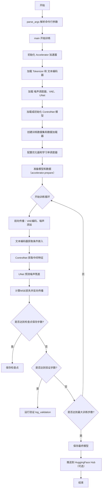
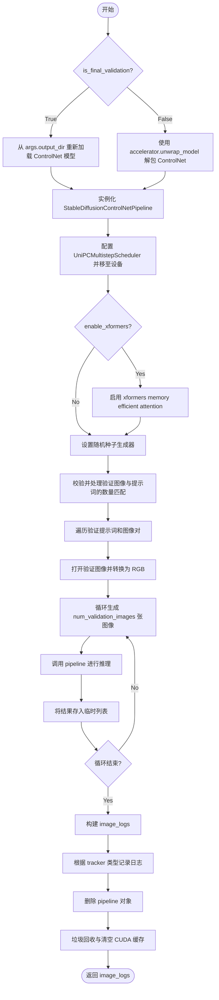
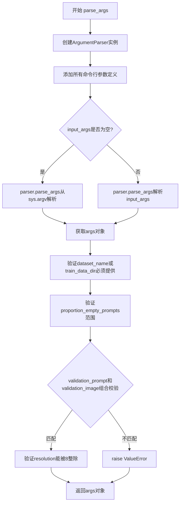
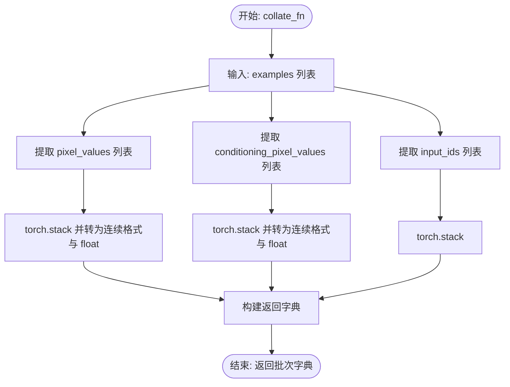

# `diffusers\examples\controlnet\train_controlnet.py` 详细设计文档

这是一个用于训练Stable Diffusion ControlNet模型的脚本，通过加载预训练的Stable Diffusion权重，训练ControlNet条件控制网络，实现条件图像生成功能，支持混合精度训练、梯度累积、检查点保存、验证推理和模型推送到HuggingFace Hub。

## 整体流程



## 类结构

```
无类定义 (纯函数式脚本)
├── 全局函数
│   ├── image_grid (图像网格生成)
│   ├── log_validation (验证推理)
│   ├── import_model_class_from_model_name_or_path (模型类导入)
│   ├── save_model_card (模型卡片保存)
│   ├── parse_args (参数解析)
│   ├── make_train_dataset (数据集创建)
│   ├── collate_fn (数据整理)
│   └── main (主训练函数)
└── 入口点
    └── if __name__ == "__main__"
```

## 全局变量及字段


### `logger`
    
用于记录训练过程中的日志信息的日志记录器

类型：`logging.Logger`
    


### `accelerator`
    
管理分布式训练和混合精度的加速器对象

类型：`Accelerate.Accelerator`
    


### `tokenizer`
    
用于将文本编码为模型输入的token的分词器

类型：`transformers.AutoTokenizer`
    


### `text_encoder`
    
将文本提示编码为潜在表示的文本编码器模型

类型：`transformers.CLIPTextModel`
    


### `vae`
    
用于将图像编码到潜在空间和解码回图像的变分自编码器

类型：`diffusers.AutoencoderKL`
    


### `unet`
    
根据噪声和条件信息预测噪声残差的UNet条件模型

类型：`diffusers.UNet2DConditionModel`
    


### `controlnet`
    
学习额外条件信号（如边缘图）以控制扩散模型的网络

类型：`diffusers.ControlNetModel`
    


### `noise_scheduler`
    
管理扩散过程中噪声添加和去噪步骤的调度器

类型：`diffusers.DDPMScheduler`
    


### `optimizer`
    
用于更新模型参数的AdamW优化器实例

类型：`torch.optim.AdamW`
    


### `lr_scheduler`
    
根据训练进度动态调整学习率的学习率调度器

类型：`torch.optim.lr_scheduler._LRScheduler`
    


### `train_dataset`
    
包含训练图像和条件的训练数据集对象

类型：`datasets.Dataset`
    


### `train_dataloader`
    
按批次提供训练数据的可迭代数据加载器

类型：`torch.utils.data.DataLoader`
    


### `weight_dtype`
    
用于模型权重的精度数据类型（如float32、float16、bfloat16）

类型：`torch.dtype`
    


### `global_step`
    
记录训练过程中已执行的总优化步骤数的全局步数计数器

类型：`int`
    


### `first_epoch`
    
从检查点恢复训练时的起始训练轮数

类型：`int`
    


### `image_logs`
    
存储验证过程中生成的图像日志列表，用于记录和展示训练效果

类型：`Optional[list]`
    


    

## 全局函数及方法


### `image_grid`

该函数用于将多个 PIL 图像按照指定的行列数拼接成一个网格图像，常用于在训练过程中可视化多张生成的图像或验证样本。

参数：

- `imgs`：`List[PIL.Image.Image]`，需要拼接成网格的图像列表
- `rows`：`int`，网格的行数
- `cols`：`int`，网格的列数

返回值：`PIL.Image.Image`，拼接后的网格图像对象

#### 流程图

```mermaid
graph TD
    A[开始] --> B[验证图像数量: len(imgs) == rows * cols]
    B --> C[获取第一张图像尺寸 w, h]
    C --> D[创建新RGB图像: grid = Image.newRGB, size=(cols*w, rows*h)]
    D --> E[遍历图像列表 enumerate]
    E --> F[计算粘贴位置: box=(i%cols*w, i//cols*h)]
    F --> G[grid.paste img 到对应位置]
    G --> H{遍历完成?}
    H -->|否| E
    H -->|是| I[返回 grid]
```

#### 带注释源码

```python
def image_grid(imgs, rows, cols):
    """
    将多个图像拼接成网格格式
    
    参数:
        imgs: PIL图像列表
        rows: 网格行数
        cols: 网格列数
    返回:
        拼接后的网格图像
    """
    # 验证图像数量是否与行列配置匹配
    assert len(imgs) == rows * cols

    # 获取第一张图像的宽高尺寸
    w, h = imgs[0].size
    
    # 创建新的RGB图像网格，总尺寸为 cols*w (宽) × rows*h (高)
    grid = Image.new("RGB", size=(cols * w, rows * h))

    # 遍历所有图像，按索引计算在网格中的位置并粘贴
    for i, img in enumerate(imgs):
        # 计算粘贴位置: 
        # - x坐标: 列索引 × 图像宽度 (i % cols * w)
        # - y坐标: 行索引 × 图像高度 (i // cols * h)
        grid.paste(img, box=(i % cols * w, i // cols * h))
    
    return grid
```


### `log_validation`

该函数负责在训练过程中（或训练结束时）运行验证流程。它通过实例化 `StableDiffusionControlNetPipeline`，利用提供的验证图像和提示词（Prompt）生成一组图像，并将这些图像记录到指定的日志追踪器（如 TensorBoard 或 W&B）中，最后清理相关资源。

参数：

- `vae`：`AutoencoderKL`，变分自编码器模型，用于将图像编码为潜在向量或解码潜在向量为图像。
- `text_encoder`：transformers 模型实例（通常是 CLIPTextModel），用于将文本提示转换为嵌入向量。
- `tokenizer`：transformers 分词器实例，用于对文本提示进行分词处理。
- `unet`：`UNet2DConditionModel`，去噪神经网络模型，根据噪声潜在向量、时间步和文本嵌入预测噪声。
- `controlnet`：`ControlNetModel`，控制网络模型，根据条件图像和文本嵌入提取控制特征。
- `args`：`argparse.Namespace`，包含训练脚本的所有命令行参数，如模型路径、输出目录、验证图像路径、验证提示词等。
- `accelerator`：`Accelerator`，HuggingFace Accelerate 库的核心对象，用于管理分布式训练、混合精度上下文以及获取追踪器（trackers）。
- `weight_dtype`：`torch.dtype`，模型权重的数据类型（如 `torch.float16` 或 `torch.bfloat16`），用于控制推理精度。
- `step`：`int`，当前的训练步数，用于在日志中标记图像。
- `is_final_validation`：`bool`，可选，默认为 `False`。标志位，指示是否为训练结束后的最终验证。若为 `True`，则从磁盘重新加载完整的 ControlNet 模型进行推理。

返回值：`list`，验证日志列表。列表中的每个元素是一个字典，包含以下键值对：
- `"validation_image"`：原始的控制条件图像（PIL Image 对象）。
- `"images"`：生成的图像列表（PIL Image 对象列表）。
- `"validation_prompt"`：用于生成图像的文本提示词（str）。

#### 流程图



#### 带注释源码

```python
def log_validation(
    vae, text_encoder, tokenizer, unet, controlnet, args, accelerator, weight_dtype, step, is_final_validation=False
):
    """
    运行验证过程，生成图像并记录日志。

    参数:
        vae: AutoencoderKL 模型实例。
        text_encoder: 文本编码器模型实例。
        tokenizer: 分词器实例。
        unet: UNet2DConditionModel 模型实例。
        controlnet: ControlNetModel 模型实例。
        args: 命令行参数命名空间。
        accelerator: Accelerator 实例。
        weight_dtype: 权重数据类型。
        step: 当前训练步数。
        is_final_validation: 是否为最终验证的标志。
    """
    logger.info("Running validation... ")

    # 如果不是最终验证，则从 accelerator 中解包出原始模型；否则从磁盘加载完整模型
    if not is_final_validation:
        controlnet = accelerator.unwrap_model(controlnet)
    else:
        controlnet = ControlNetModel.from_pretrained(args.output_dir, torch_dtype=weight_dtype)

    # 构建 Stable Diffusion ControlNet Pipeline
    # 设置 safety_checker=None 以避免不必要的审查开销（如果不需要）
    pipeline = StableDiffusionControlNetPipeline.from_pretrained(
        args.pretrained_model_name_or_path,
        vae=vae,
        text_encoder=text_encoder,
        tokenizer=tokenizer,
        unet=unet,
        controlnet=controlnet,
        safety_checker=None,
        revision=args.revision,
        variant=args.variant,
        torch_dtype=weight_dtype,
    )
    
    # 使用 UniPCMultistepScheduler，这是一种高效的扩散模型调度器
    pipeline.scheduler = UniPCMultistepScheduler.from_config(pipeline.scheduler.config)
    
    # 将管道移至加速器设备（通常是 GPU）
    pipeline = pipeline.to(accelerator.device)
    
    # 禁用管道的进度条
    pipeline.set_progress_bar_config(disable=True)

    # 根据参数决定是否启用 xformers 以节省显存
    if args.enable_xformers_memory_efficient_attention:
        pipeline.enable_xformers_memory_efficient_attention()

    # 设置随机生成器以保证可重复性
    if args.seed is None:
        generator = None
    else:
        generator = torch.Generator(device=accelerator.device).manual_seed(args.seed)

    # 处理验证图像和提示词的数量匹配问题
    # 支持三种模式：1对1，1对多，多对1
    if len(args.validation_image) == len(args.validation_prompt):
        validation_images = args.validation_image
        validation_prompts = args.validation_prompt
    elif len(args.validation_image) == 1:
        validation_images = args.validation_image * len(args.validation_prompt)
        validation_prompts = args.validation_prompt
    elif len(args.validation_prompt) == 1:
        validation_images = args.validation_image
        validation_prompts = args.validation_prompt * len(args.validation_image)
    else:
        raise ValueError(
            "number of `args.validation_image` and `args.validation_prompt` should be checked in `parse_args`"
        )

    image_logs = []
    # 如果是最终验证则不使用 autocast，否则使用 autocast 以支持混合精度推理
    inference_ctx = contextlib.nullcontext() if is_final_validation else torch.autocast("cuda")

    # 遍历每一对验证图像和提示词
    for validation_prompt, validation_image in zip(validation_prompts, validation_images):
        # 打开图像并转换为 RGB 格式
        validation_image = Image.open(validation_image).convert("RGB")

        images = []

        # 生成多张图像以进行更好的评估
        for _ in range(args.num_validation_images):
            with inference_ctx:
                # 调用管道进行推理
                image = pipeline(
                    validation_prompt, validation_image, num_inference_steps=20, generator=generator
                ).images[0]

            images.append(image)

        # 记录日志
        image_logs.append(
            {"validation_image": validation_image, "images": images, "validation_prompt": validation_prompt}
        )

    # 确定 tracker 的键名：验证时为 "validation"，测试时为 "test"
    tracker_key = "test" if is_final_validation else "validation"
    
    # 遍历所有 tracker（可能是 TensorBoard 或 W&B）并记录图像
    for tracker in accelerator.trackers:
        if tracker.name == "tensorboard":
            for log in image_logs:
                images = log["images"]
                validation_prompt = log["validation_prompt"]
                validation_image = log["validation_image"]

                # 格式化图像数组
                formatted_images = [np.asarray(validation_image)]

                for image in images:
                    formatted_images.append(np.asarray(image))

                formatted_images = np.stack(formatted_images)

                # 写入 TensorBoard
                tracker.writer.add_images(validation_prompt, formatted_images, step, dataformats="NHWC")
        elif tracker.name == "wandb":
            formatted_images = []

            for log in image_logs:
                images = log["images"]
                validation_prompt = log["validation_prompt"]
                validation_image = log["validation_image"]

                # 添加条件图像
                formatted_images.append(wandb.Image(validation_image, caption="Controlnet conditioning"))

                # 添加生成的图像
                for image in images:
                    image = wandb.Image(image, caption=validation_prompt)
                    formatted_images.append(image)

            # 写入 W&B
            tracker.log({tracker_key: formatted_images})
        else:
            logger.warning(f"image logging not implemented for {tracker.name}")

    # 清理工作：删除管道对象，强制垃圾回收，清空 GPU 缓存
    del pipeline
    gc.collect()
    torch.cuda.empty_cache()

    return image_logs
```


### `import_model_class_from_model_name_or_path`

该函数用于根据预训练模型的名称或路径，动态导入并返回对应的文本编码器（Text Encoder）类。它通过读取模型配置中的`architectures`字段，判断模型类型，然后返回相应的类对象（如`CLIPTextModel`或`RobertaSeriesModelWithTransformation`），以便后续加载文本编码器模型权重。

参数：

- `pretrained_model_name_or_path`：`str`，预训练模型的名称（如"stabilityai/stable-diffusion-2-1"）或本地路径
- `revision`：`str`，模型版本标识符（如"main"或"v1.0"），用于从Hub加载特定版本的模型配置

返回值：`type`，返回对应的文本编码器类（`CLIPTextModel`类或`RobertaSeriesModelWithTransformation`类），如果模型类型不支持则抛出`ValueError`异常

#### 流程图

```mermaid
flowchart TD
    A[开始: import_model_class_from_model_name_or_path] --> B[加载TextEncoder配置]
    B --> C[PretrainedConfig.from_pretrained]
    C --> D[提取model_class = text_encoder_config.architectures[0]]
    D --> E{判断model_class类型}
    E -->|CLIPTextModel| F[导入transformers.CLIPTextModel]
    F --> G[返回CLIPTextModel类]
    E -->|RobertaSeriesModelWithTransformation| H[导入diffusers库中的RobertaSeriesModelWithTransformation]
    H --> I[返回RobertaSeriesModelWithTransformation类]
    E -->|其他类型| J[抛出ValueError异常]
    G --> K[结束]
    I --> K
    J --> K
```

#### 带注释源码

```python
def import_model_class_from_model_name_or_path(pretrained_model_name_or_path: str, revision: str):
    """
    根据预训练模型名称或路径，动态导入并返回对应的文本编码器类。
    
    参数:
        pretrained_model_name_or_path: 预训练模型的名称或本地路径
        revision: 模型版本标识符，用于从HuggingFace Hub加载特定版本
    
    返回:
        对应的文本编码器类（CLIPTextModel或RobertaSeriesModelWithTransformation）
    
    异常:
        ValueError: 当模型类型不支持时抛出
    """
    
    # 步骤1: 从预训练模型中加载TextEncoder的配置文件
    # 使用PretrainedConfig加载text_encoder子文件夹的配置
    text_encoder_config = PretrainedConfig.from_pretrained(
        pretrained_model_name_or_path,  # 模型名称或路径
        subfolder="text_encoder",         # 指定加载text_encoder子目录的配置
        revision=revision,               # 指定版本号
    )
    
    # 步骤2: 从配置中提取模型架构名称
    # 配置文件中的architectures字段记录了模型的具体类名
    model_class = text_encoder_config.architectures[0]
    
    # 步骤3: 根据模型架构类型，返回对应的类对象
    # 支持两种常见的文本编码器类型
    
    if model_class == "CLIPTextModel":
        # 如果是CLIP文本编码器，从transformers库导入
        from transformers import CLIPTextModel
        
        # 返回CLIPTextModel类，供后续from_pretrained使用
        return CLIPTextModel
    
    elif model_class == "RobertaSeriesModelWithTransformation":
        # 如果是Roberta系列模型（用于Alt Diffusion），从diffusers库导入
        from diffusers.pipelines.alt_diffusion.modeling_roberta_series import RobertaSeriesModelWithTransformation
        
        # 返回RobertaSeriesModelWithTransformation类
        return RobertaSeriesModelWithTransformation
    
    else:
        # 如果遇到不支持的模型类型，抛出明确的错误信息
        raise ValueError(f"{model_class} is not supported.")
```


### `save_model_card`

该函数用于在训练完成后生成并保存模型的 Model Card（模型卡片），包含模型描述、训练元信息以及验证时生成的示例图像，并将其推送到 HuggingFace Hub。

参数：

- `repo_id`：`str`，HuggingFace Hub 上的模型仓库 ID
- `image_logs`：`Optional[list]`（在代码中为 `None`），验证过程中生成的图像日志列表，每个元素包含 `images`、`validation_prompt` 和 `validation_image`
- `base_model`：`str`，用于训练的预训练基础模型名称或路径
- `repo_folder`：`str`，本地保存模型卡片和图像的文件夹路径

返回值：`None`，该函数无返回值，直接将 Model Card 写入本地文件

#### 流程图

```mermaid
flowchart TD
    A[开始 save_model_card] --> B{image_logs 是否为 None?}
    B -- 是 --> C[img_str 保持为空字符串]
    B -- 否 --> D[遍历 image_logs]
    D --> E[保存 validation_image 到 repo_folder/image_control.png]
    E --> F[构建图像网格并保存到 repo_folder/images_{i}.png]
    F --> G[构建 img_str 包含 prompt 和图像 Markdown]
    G --> C
    C --> H[构建 model_description 包含 repo_id、base_model 和 img_str]
    H --> I[调用 load_or_create_model_card 创建 Model Card 对象]
    I --> J[定义标签列表 tags]
    J --> K[调用 populate_model_card 填充标签]
    K --> L[保存 Model Card 到 repo_folder/README.md]
    L --> M[结束]
```

#### 带注释源码

```python
def save_model_card(repo_id: str, image_logs=None, base_model=str, repo_folder=None):
    """
    生成并保存模型的 Model Card。
    
    参数:
        repo_id: HuggingFace Hub 上的模型仓库 ID
        image_logs: 验证过程中生成的图像日志列表，可选
        base_model: 用于训练的预训练基础模型名称或路径
        repo_folder: 本地保存模型卡片和图像的文件夹路径
    
    返回:
        无返回值，直接将 Model Card 写入本地文件
    """
    # 初始化图像描述字符串
    img_str = ""
    
    # 如果存在图像日志，则处理并嵌入到 Model Card 中
    if image_logs is not None:
        # 添加示例图像的标题
        img_str = "You can find some example images below.\n\n"
        
        # 遍历每个验证日志
        for i, log in enumerate(image_logs):
            # 提取图像和验证提示词
            images = log["images"]
            validation_prompt = log["validation_prompt"]
            validation_image = log["validation_image"]
            
            # 保存条件图像到本地文件夹
            validation_image.save(os.path.join(repo_folder, "image_control.png"))
            
            # 添加 prompt 描述
            img_str += f"prompt: {validation_prompt}\n"
            
            # 将条件图像与生成的图像合并，创建网格并保存
            images = [validation_image] + images
            image_grid(images, 1, len(images)).save(os.path.join(repo_folder, f"images_{i}.png"))
            
            # 添加 Markdown 格式的图像引用
            img_str += f"\n"

    # 构建完整的模型描述
    model_description = f"""
# controlnet-{repo_id}

These are controlnet weights trained on {base_model} with new type of conditioning.
{img_str}
"""
    
    # 加载或创建 Model Card 对象
    model_card = load_or_create_model_card(
        repo_id_or_path=repo_id,
        from_training=True,
        license="creativeml-openrail-m",
        base_model=base_model,
        model_description=model_description,
        inference=True,
    )

    # 定义模型的标签
    tags = [
        "stable-diffusion",
        "stable-diffusion-diffusers",
        "text-to-image",
        "diffusers",
        "controlnet",
        "diffusers-training",
    ]
    
    # 填充 Model Card 的标签
    model_card = populate_model_card(model_card, tags=tags)

    # 保存 Model Card 为 README.md
    model_card.save(os.path.join(repo_folder, "README.md"))
```


### `parse_args`

该函数是ControlNet训练脚本的参数解析器，通过argparse库定义并解析所有训练相关的命令行参数，同时进行参数合法性校验，最终返回包含所有配置参数的Namespace对象。

参数：

- `input_args`：`Optional[List[str]]`，可选参数列表。如果提供，则解析该列表中的参数；否则默认从系统命令行参数（sys.argv）解析。

返回值：`argparse.Namespace`，包含所有命令行参数的对象，通过该对象可以访问如`pretrained_model_name_or_path`、`output_dir`、`learning_rate`等训练配置。

#### 流程图



#### 带注释源码

```python
def parse_args(input_args=None):
    """
    解析命令行参数并返回包含所有训练配置的对象。
    
    参数:
        input_args: 可选的参数列表，如果为None则从sys.argv解析。
        
    返回:
        args: 包含所有命令行参数的argparse.Namespace对象。
    """
    # 1. 创建参数解析器，添加描述信息
    parser = argparse.ArgumentParser(description="Simple example of a ControlNet training script.")
    
    # 2. 添加模型相关参数
    parser.add_argument(
        "--pretrained_model_name_or_path",
        type=str,
        default=None,
        required=True,
        help="Path to pretrained model or model identifier from huggingface.co/models.",
    )
    parser.add_argument(
        "--controlnet_model_name_or_path",
        type=str,
        default=None,
        help="Path to pretrained controlnet model or model identifier from huggingface.co/models."
        " If not specified controlnet weights are initialized from unet.",
    )
    parser.add_argument(
        "--revision",
        type=str,
        default=None,
        required=False,
        help="Revision of pretrained model identifier from huggingface.co/models.",
    )
    parser.add_argument(
        "--variant",
        type=str,
        default=None,
        help="Variant of the model files of the pretrained model identifier from huggingface.co/models, 'e.g.' fp16",
    )
    parser.add_argument(
        "--tokenizer_name",
        type=str,
        default=None,
        help="Pretrained tokenizer name or path if not the same as model_name",
    )
    
    # 3. 添加输出和缓存目录参数
    parser.add_argument(
        "--output_dir",
        type=str,
        default="controlnet-model",
        help="The output directory where the model predictions and checkpoints will be written.",
    )
    parser.add_argument(
        "--cache_dir",
        type=str,
        default=None,
        help="The directory where the downloaded models and datasets will be stored.",
    )
    
    # 4. 添加训练随机种子参数
    parser.add_argument("--seed", type=int, default=None, help="A seed for reproducible training.")
    
    # 5. 添加图像分辨率参数
    parser.add_argument(
        "--resolution",
        type=int,
        default=512,
        help=(
            "The resolution for input images, all the images in the train/validation dataset will be resized to this"
            " resolution"
        ),
    )
    
    # 6. 添加训练批次和epoch参数
    parser.add_argument(
        "--train_batch_size", type=int, default=4, help="Batch size (per device) for the training dataloader."
    )
    parser.add_argument("--num_train_epochs", type=int, default=1)
    parser.add_argument(
        "--max_train_steps",
        type=int,
        default=None,
        help="Total number of training steps to perform.  If provided, overrides num_train_epochs.",
    )
    
    # 7. 添加checkpoint保存相关参数
    parser.add_argument(
        "--checkpointing_steps",
        type=int,
        default=500,
        help=(
            "Save a checkpoint of the training state every X updates. Checkpoints can be used for resuming training via `--resume_from_checkpoint`. "
            "In the case that the checkpoint is better than the final trained model, the checkpoint can also be used for inference."
            "Using a checkpoint for inference requires separate loading of the original pipeline and the individual checkpointed model components."
            "See https://huggingface.co/docs/diffusers/main/en/training/dreambooth#performing-inference-using-a-saved-checkpoint for step by step"
            "instructions."
        ),
    )
    parser.add_argument(
        "--checkpoints_total_limit",
        type=int,
        default=None,
        help=("Max number of checkpoints to store."),
    )
    parser.add_argument(
        "--resume_from_checkpoint",
        type=str,
        default=None,
        help=(
            "Whether training should be resumed from a previous checkpoint. Use a path saved by"
            ' `--checkpointing_steps`, or `"latest"` to automatically select the last available checkpoint.'
        ),
    )
    
    # 8. 添加梯度相关参数
    parser.add_argument(
        "--gradient_accumulation_steps",
        type=int,
        default=1,
        help="Number of updates steps to accumulate before performing a backward/update pass.",
    )
    parser.add_argument(
        "--gradient_checkpointing",
        action="store_true",
        help="Whether or not to use gradient checkpointing to save memory at the expense of slower backward pass.",
    )
    
    # 9. 添加学习率相关参数
    parser.add_argument(
        "--learning_rate",
        type=float,
        default=5e-6,
        help="Initial learning rate (after the potential warmup period) to use.",
    )
    parser.add_argument(
        "--scale_lr",
        action="store_true",
        default=False,
        help="Scale the learning rate by the number of GPUs, gradient accumulation steps, and batch size.",
    )
    parser.add_argument(
        "--lr_scheduler",
        type=str,
        default="constant",
        help=(
            'The scheduler type to use. Choose between ["linear", "cosine", "cosine_with_restarts", "polynomial",'
            ' "constant", "constant_with_warmup"]'
        ),
    )
    parser.add_argument(
        "--lr_warmup_steps", type=int, default=500, help="Number of steps for the warmup in the lr scheduler."
    )
    parser.add_argument(
        "--lr_num_cycles",
        type=int,
        default=1,
        help="Number of hard resets of the lr in cosine_with_restarts scheduler.",
    )
    parser.add_argument("--lr_power", type=float, default=1.0, help="Power factor of the polynomial scheduler.")
    
    # 10. 添加优化器相关参数
    parser.add_argument(
        "--use_8bit_adam", action="store_true", help="Whether or not to use 8-bit Adam from bitsandbytes."
    )
    parser.add_argument(
        "--dataloader_num_workers",
        type=int,
        default=0,
        help=(
            "Number of subprocesses to use for data loading. 0 means that the data will be loaded in the main process."
        ),
    )
    parser.add_argument("--adam_beta1", type=float, default=0.9, help="The beta1 parameter for the Adam optimizer.")
    parser.add_argument("--adam_beta2", type=float, default=0.999, help="The beta2 parameter for the Adam optimizer.")
    parser.add_argument("--adam_weight_decay", type=float, default=1e-2, help="Weight decay to use.")
    parser.add_argument("--adam_epsilon", type=float, default=1e-08, help="Epsilon value for the Adam optimizer")
    parser.add_argument("--max_grad_norm", default=1.0, type=float, help="Max gradient norm.")
    
    # 11. 添加模型上传相关参数
    parser.add_argument("--push_to_hub", action="store_true", help="Whether or not to push the model to the Hub.")
    parser.add_argument("--hub_token", type=str, default=None, help="The token to use to push to the Model Hub.")
    parser.add_argument(
        "--hub_model_id",
        type=str,
        default=None,
        help="The name of the repository to keep in sync with the local `output_dir`.",
    )
    parser.add_argument(
        "--logging_dir",
        type=str,
        default="logs",
        help=(
            "[TensorBoard](https://www.tensorflow.org/tensorboard) log directory. Will default to"
            " *output_dir/runs/**CURRENT_DATETIME_HOSTNAME***."
        ),
    )
    
    # 12. 添加GPU/Training加速相关参数
    parser.add_argument(
        "--allow_tf32",
        action="store_true",
        help=(
            "Whether or not to allow TF32 on Ampere GPUs. Can be used to speed up training. For more information, see"
            " https://pytorch.org/docs/stable/notes/cuda.html#tensorfloat-32-tf32-on-ampere-devices"
        ),
    )
    parser.add_argument(
        "--report_to",
        type=str,
        default="tensorboard",
        help=(
            'The integration to report the results and logs to. Supported platforms are `"tensorboard"`'
            ' (default), `"wandb"` and `"comet_ml"`. Use `"all"` to report to all integrations.'
        ),
    )
    parser.add_argument(
        "--mixed_precision",
        type=str,
        default=None,
        choices=["no", "fp16", "bf16"],
        help=(
            "Whether to use mixed precision. Choose between fp16 and bf16 (bfloat16). Bf16 requires PyTorch >="
            " 1.10.and an Nvidia Ampere GPU.  Default to the value of accelerate config of the current system or the"
            " flag passed with the `accelerate.launch` command. Use this argument to override the accelerate config."
        ),
    )
    parser.add_argument(
        "--enable_xformers_memory_efficient_attention", action="store_true", help="Whether or not to use xformers."
    )
    parser.add_argument(
        "--set_grads_to_none",
        action="store_true",
        help=(
            "Save more memory by using setting grads to None instead of zero. Be aware, that this changes certain"
            " behaviors, so disable this argument if it causes any problems. More info:"
            " https://pytorch.org/docs/stable/generated/torch.optim.Optimizer.zero_grad.html"
        ),
    )
    
    # 13. 添加数据集相关参数
    parser.add_argument(
        "--dataset_name",
        type=str,
        default=None,
        help=(
            "The name of the Dataset (from the HuggingFace hub) to train on (could be your own, possibly private,"
            " dataset). It can also be a path pointing to a local copy of a dataset in your filesystem,"
            " or to a folder containing files that 🤗 Datasets can understand."
        ),
    )
    parser.add_argument(
        "--dataset_config_name",
        type=str,
        default=None,
        help="The config of the Dataset, leave as None if there's only one config.",
    )
    parser.add_argument(
        "--train_data_dir",
        type=str,
        default=None,
        help=(
            "A folder containing the training data. Folder contents must follow the structure described in"
            " https://huggingface.co/docs/datasets/image_dataset#imagefolder. In particular, a `metadata.jsonl` file"
            " must exist to provide the captions for the images. Ignored if `dataset_name` is specified."
        ),
    )
    parser.add_argument(
        "--image_column", type=str, default="image", help="The column of the dataset containing the target image."
    )
    parser.add_argument(
        "--conditioning_image_column",
        type=str,
        default="conditioning_image",
        help="The column of the dataset containing the controlnet conditioning image.",
    )
    parser.add_argument(
        "--caption_column",
        type=str,
        default="text",
        help="The column of the dataset containing a caption or a list of captions.",
    )
    parser.add_argument(
        "--max_train_samples",
        type=int,
        default=None,
        help=(
            "For debugging purposes or quicker training, truncate the number of training examples to this "
            "value if set."
        ),
    )
    parser.add_argument(
        "--proportion_empty_prompts",
        type=float,
        default=0,
        help="Proportion of image prompts to be replaced with empty strings. Defaults to 0 (no prompt replacement).",
    )
    
    # 14. 添加验证相关参数
    parser.add_argument(
        "--validation_prompt",
        type=str,
        default=None,
        nargs="+",
        help=(
            "A set of prompts evaluated every `--validation_steps` and logged to `--report_to`."
            " Provide either a matching number of `--validation_image`s, a single `--validation_image`"
            " to be used with all prompts, or a single prompt that will be used with all `--validation_image`s."
        ),
    )
    parser.add_argument(
        "--validation_image",
        type=str,
        default=None,
        nargs="+",
        help=(
            "A set of paths to the controlnet conditioning image be evaluated every `--validation_steps`"
            " and logged to `--report_to`. Provide either a matching number of `--validation_prompt`s, a"
            " a single `--validation_prompt` to be used with all `--validation_image`s, or a single"
            " `--validation_image` that will be used with all `--validation_prompt`s."
        ),
    )
    parser.add_argument(
        "--num_validation_images",
        type=int,
        default=4,
        help="Number of images to be generated for each `--validation_image`, `--validation_prompt` pair",
    )
    parser.add_argument(
        "--validation_steps",
        type=int,
        default=100,
        help=(
            "Run validation every X steps. Validation consists of running the prompt"
            " `args.validation_prompt` multiple times: `args.num_validation_images`"
            " and logging the images."
        ),
    )
    parser.add_argument(
        "--tracker_project_name",
        type=str,
        default="train_controlnet",
        help=(
            "The `project_name` argument passed to Accelerator.init_trackers for"
            " more information see https://huggingface.co/docs/accelerate/v0.17.0/en/package_reference/accelerator#accelerate.Accelerator"
        ),
    )

    # 15. 解析参数
    if input_args is not None:
        args = parser.parse_args(input_args)
    else:
        args = parser.parse_args()

    # 16. 参数合法性校验
    
    # 校验：必须提供数据集来源
    if args.dataset_name is None and args.train_data_dir is None:
        raise ValueError("Specify either `--dataset_name` or `--train_data_dir`")

    # 校验：空提示词比例必须在[0,1]范围内
    if args.proportion_empty_prompts < 0 or args.proportion_empty_prompts > 1:
        raise ValueError("`--proportion_empty_prompts` must be in the range [0, 1].")

    # 校验：验证提示词和验证图像必须成对出现
    if args.validation_prompt is not None and args.validation_image is None:
        raise ValueError("`--validation_image` must be set if `--validation_prompt` is set")

    if args.validation_prompt is None and args.validation_image is not None:
        raise ValueError("`--validation_prompt` must be set if `--validation_image` is set")

    # 校验：验证图像和提示词数量必须匹配
    if (
        args.validation_image is not None
        and args.validation_prompt is not None
        and len(args.validation_image) != 1
        and len(args.validation_prompt) != 1
        and len(args.validation_image) != len(args.validation_prompt)
    ):
        raise ValueError(
            "Must provide either 1 `--validation_image`, 1 `--validation_prompt`,"
            " or the same number of `--validation_prompt`s and `--validation_image`s"
        )

    # 校验：分辨率必须能被8整除，确保VAE和controlnet编码器之间的图像尺寸一致
    if args.resolution % 8 != 0:
        raise ValueError(
            "`--resolution` must be divisible by 8 for consistently sized encoded images between the VAE and the controlnet encoder."
        )

    # 17. 返回解析后的参数对象
    return args
```


### `make_train_dataset`

该函数用于加载和预处理ControlNet训练数据集。它支持从HuggingFace Hub或本地目录加载数据集，并对图像、 conditioning图像和文本描述进行tokenize和transform处理，最终返回一个可用于训练的数据集对象。

参数：

- `args`：命名空间对象，包含数据集相关配置（如`dataset_name`、`dataset_config_name`、`train_data_dir`、`cache_dir`、`image_column`、`caption_column`、`conditioning_image_column`、`resolution`、`max_train_samples`、`proportion_empty_prompts`、`seed`等）
- `tokenizer`：预训练的`PreTrainedTokenizer`对象，用于对文本描述进行tokenize处理
- `accelerator`：`Accelerator`对象，用于分布式训练时的进程同步和数据预处理

返回值：`Dataset`，返回一个经过预处理、包含`pixel_values`、`conditioning_pixel_values`和`input_ids`字段的HuggingFace数据集对象

#### 流程图

```mermaid
flowchart TD
    A[开始: make_train_dataset] --> B{args.dataset_name是否存在?}
    B -->|是| C[从Hub加载数据集: load_dataset]
    B -->|否| D{args.train_data_dir是否存在?}
    D -->|是| E[从本地目录加载数据集: load_dataset]
    D -->|否| F[抛出异常: 需指定数据集来源]
    C --> G[获取训练集列名]
    E --> G
    F --> G
    G --> H{检查image_column配置}
    H -->|未指定| I[使用column_names[0]作为默认值]
    H -->|已指定| J{列名是否存在于数据集中?}
    I --> K
    J -->|不存在| L[抛出ValueError]
    J -->|存在| K[设置image_column]
    L --> K
    K --> M{检查caption_column配置}
    M -->|未指定| N[使用column_names[1]作为默认值]
    M -->|已指定| O{列名是否存在于数据集中?}
    O -->|不存在| P[抛出ValueError]
    O -->|存在| Q[设置caption_column]
    N --> R
    P --> R
    Q --> R
    R --> S{检查conditioning_image_column配置}
    S -->|未指定| T[使用column_names[2]作为默认值]
    S -->|已指定| U{列名是否存在于数据集中?}
    U -->|不存在| V[抛出ValueError]
    U -->|存在| W[设置conditioning_image_column]
    T --> X
    V --> X
    W --> X
    X --> Y[定义tokenize_captions内部函数]
    Y --> Z[定义image_transforms: Resize + CenterCrop + ToTensor + Normalize]
    Z --> AA[定义conditioning_image_transforms: Resize + CenterCrop + ToTensor]
    AA --> AB[定义preprocess_train内部函数]
    AB --> AC{accelerator.is_main_process}
    AC -->|是| AD{args.max_train_samples是否限制?}
    AC -->|否| AE[跳过数据处理]
    AD -->|是| AF[随机打乱并选择前max_train_samples条]
    AD -->|否| AG[不限制数据量]
    AF --> AH[应用with_transform预处理]
    AE --> AH
    AG --> AH
    AH --> AI[返回train_dataset数据集]
```

#### 带注释源码

```python
def make_train_dataset(args, tokenizer, accelerator):
    """
    加载并预处理ControlNet训练数据集
    
    支持从HuggingFace Hub或本地目录加载数据集，
    并对图像和文本进行预处理以适配模型训练
    """
    # 获取数据集：可以从Hub下载或使用本地训练/评估文件
    # 在分布式训练中，load_dataset保证只有一个进程会下载数据集
    if args.dataset_name is not None:
        # 从Hub下载并加载数据集
        dataset = load_dataset(
            args.dataset_name,
            args.dataset_config_name,
            cache_dir=args.cache_dir,
            data_dir=args.train_data_dir,
        )
    else:
        if args.train_data_dir is not None:
            # 从本地目录加载数据集
            dataset = load_dataset(
                args.train_data_dir,
                cache_dir=args.cache_dir,
            )
    
    # 数据集预处理
    # 需要对输入和目标进行tokenize处理
    column_names = dataset["train"].column_names
    
    # 获取输入/目标的列名
    # 处理image_column
    if args.image_column is None:
        image_column = column_names[0]
        logger.info(f"image column defaulting to {image_column}")
    else:
        image_column = args.image_column
        if image_column not in column_names:
            raise ValueError(
                f"`--image_column` value '{args.image_column}' not found in dataset columns. Dataset columns are: {', '.join(column_names)}"
            )
    
    # 处理caption_column
    if args.caption_column is None:
        caption_column = column_names[1]
        logger.info(f"caption column defaulting to {caption_column}")
    else:
        caption_column = args.caption_column
        if caption_column not in column_names:
            raise ValueError(
                f"`--caption_column` value '{args.caption_column}' not found in dataset columns. Dataset columns are: {', '.join(column_names)}"
            )
    
    # 处理conditioning_image_column
    if args.conditioning_image_column is None:
        conditioning_image_column = column_names[2]
        logger.info(f"conditioning image column defaulting to {conditioning_image_column}")
    else:
        conditioning_image_column = args.conditioning_image_column
        if conditioning_image_column not in column_names:
            raise ValueError(
                f"`--conditioning_image_column` value '{args.conditioning_image_column}' not found in dataset columns. Dataset columns are: {', '.join(column_names)}"
            )
    
    def tokenize_captions(examples, is_train=True):
        """
        对caption进行tokenize处理
        
        支持：
        - 随机替换为空字符串（基于proportion_empty_prompts参数）
        - 字符串类型的caption直接使用
        - 列表或数组类型的caption随机选择一个（训练时）或取第一个（验证时）
        """
        captions = []
        for caption in examples[caption_column]:
            # 按比例将caption替换为空字符串
            if random.random() < args.proportion_empty_prompts:
                captions.append("")
            elif isinstance(caption, str):
                captions.append(caption)
            elif isinstance(caption, (list, np.ndarray)):
                # 如果有多个caption，训练时随机选择一个，否则取第一个
                captions.append(random.choice(caption) if is_train else caption[0])
            else:
                raise ValueError(
                    f"Caption column `{caption_column}` should contain either strings or lists of strings."
                )
        # 使用tokenizer对caption进行编码
        inputs = tokenizer(
            captions, 
            max_length=tokenizer.model_max_length, 
            padding="max_length", 
            truncation=True, 
            return_tensors="pt"
        )
        return inputs.input_ids
    
    # 定义图像变换流程（主图像）
    image_transforms = transforms.Compose(
        [
            transforms.Resize(args.resolution, interpolation=transforms.InterpolationMode.BILINEAR),
            transforms.CenterCrop(args.resolution),
            transforms.ToTensor(),
            transforms.Normalize([0.5], [0.5]),  # 归一化到[-1, 1]
        ]
    )
    
    # 定义conditioning图像变换流程（不需要归一化）
    conditioning_image_transforms = transforms.Compose(
        [
            transforms.Resize(args.resolution, interpolation=transforms.InterpolationMode.BILINEAR),
            transforms.CenterCrop(args.resolution),
            transforms.ToTensor(),
        ]
    )
    
    def preprocess_train(examples):
        """
        预处理训练数据
        
        将图像转换为tensor，并进行tokenize处理
        """
        # 处理主图像
        images = [image.convert("RGB") for image in examples[image_column]]
        images = [image_transforms(image) for image in images]
        
        # 处理conditioning图像
        conditioning_images = [image.convert("RGB") for image in examples[conditioning_image_column]]
        conditioning_images = [conditioning_image_transforms(image) for image in conditioning_images]
        
        # 存储处理后的数据
        examples["pixel_values"] = images
        examples["conditioning_pixel_values"] = conditioning_images
        examples["input_ids"] = tokenize_captions(examples)
        
        return examples
    
    # 使用accelerator确保主进程先执行数据处理
    with accelerator.main_process_first():
        if args.max_train_samples is not None:
            # 随机打乱并选择指定数量的样本（用于调试或加速训练）
            dataset["train"] = dataset["train"].shuffle(seed=args.seed).select(range(args.max_train_samples))
        
        # 设置训练数据转换
        train_dataset = dataset["train"].with_transform(preprocess_train)
    
    return train_dataset
```


### `collate_fn`

该函数是 PyTorch DataLoader 的自定义批处理函数（Collate Function）。它负责接收数据集中的一组样本（字典列表），并将其中包含的图像张量、条件图像张量和文本ID张量分别沿批次维度进行堆叠（Stack），同时确保张量内存布局连续且数据类型正确，以供模型进行前向传播。

参数：

-  `examples`：`List[Dict[str, Any]]`，从数据集获取的样本列表。每个元素是一个字典，通常包含 `pixel_values`（主图像）、`conditioning_pixel_values`（控制网条件图）和 `input_ids`（文本Token ID）。

返回值：`Dict[str, torch.Tensor]`，返回一个包含批次化数据的字典：
- `pixel_values`：`torch.Tensor`，堆叠后的主图像批次。
- `conditioning_pixel_values`：`torch.Tensor`，堆叠后的条件图像批次。
- `input_ids`：`torch.Tensor`，堆叠后的文本ID批次。

#### 流程图



#### 带注释源码

```python
def collate_fn(examples):
    # 1. 处理主图像 (Pixel Values)
    # 从样本列表中提取所有主图像张量，并沿批次维度(Batch dimension)堆叠
    # 这里的 example["pixel_values"] 来自于数据预处理中的 image_transforms
    pixel_values = torch.stack([example["pixel_values"] for example in examples])
    # 转换为连续内存格式 (Contiguous Memory Format) 以优化 CUDA 访问性能
    # .float() 确保数据类型为模型训练所需的浮点型 (通常覆盖了 half/bfloat 的隐式转换)
    pixel_values = pixel_values.to(memory_format=torch.contiguous_format).float()

    # 2. 处理控制网条件图像 (Conditioning Pixel Values)
    # 从样本列表中提取所有条件图像张量，并堆叠
    # 这里的 example["conditioning_pixel_values"] 来自于 conditioning_image_transforms
    conditioning_pixel_values = torch.stack([example["conditioning_pixel_values"] for example in examples])
    conditioning_pixel_values = conditioning_pixel_values.to(memory_format=torch.contiguous_format).float()

    # 3. 处理文本输入ID (Input IDs)
    # 从样本列表中提取所有经过 tokenizer 处理后的 input_ids，并堆叠
    input_ids = torch.stack([example["input_ids"] for example in examples])

    # 4. 返回批次字典
    # 键名必须与训练循环 (main 函数中) 访问 batch 字典时使用的键名一致
    return {
        "pixel_values": pixel_values,
        "conditioning_pixel_values": conditioning_pixel_values,
        "input_ids": input_ids,
    }
```


### `main`

这是ControlNet模型训练脚本的核心函数，负责整个训练流程：初始化Accelerator、加载预训练模型和数据集、配置优化器和学习率调度器、执行训练循环（包括前向传播、噪声预测、损失计算、反向传播和参数更新），并定期保存checkpoint和进行验证，最后将训练好的ControlNet模型保存到指定目录或推送到HuggingFace Hub。

参数：

- `args`：`argparse.Namespace`，命令行参数对象，包含所有训练配置（如模型路径、输出目录、学习率、批量大小等）

返回值：`None`，该函数不返回值，执行完成后直接结束

#### 流程图

```mermaid
flowchart TD
    A[开始 main 函数] --> B{检查 report_to 和 hub_token}
    B -->|冲突| C[抛出 ValueError]
    B -->|正常| D[创建 logging_dir 和 ProjectConfiguration]
    E[初始化 Accelerator] --> F{检查 MPS 后端}
    F -->|可用| G[禁用 native_amp]
    F -->|不可用| H[继续]
    G --> H
    H --> I[配置日志格式]
    I --> J{accelerator.is_local_main_process}
    J -->|是| K[设置 transformers 和 diffusers 日志级别]
    J -->|否| L[设置更严格的日志级别]
    K --> M
    L --> M
    M{args.seed 是否设置} -->|是| N[调用 set_seed]
    M -->|否| O
    N --> O
    O{accelerator.is_main_process} -->|是| P[创建输出目录]
    O -->|否| Q
    P --> R{push_to_hub}
    R -->|是| S[创建 repo_id]
    R -->|否| T
    S --> T
    T --> U[加载或创建 tokenizer]
    U --> V[获取 text_encoder 类]
    V --> W[加载 noise_scheduler]
    W --> X[加载 text_encoder, vae, unet]
    X --> Y{controlnet_model_name_or_path}
    Y -->|存在| Z[加载已有 controlnet]
    Y -->|不存在| AA[从 unet 初始化 controlnet]
    Z --> AB
    AA --> AB
    AB --> AC[定义 unwrap_model 函数]
    AC --> AD{accelerate >= 0.16.0}
    AD -->|是| AE[注册 save 和 load hooks]
    AD -->|否| AF
    AE --> AF
    AF --> AG[冻结 vae, unet, text_encoder]
    AG --> AH[controlnet.train]
    AH --> AI{xformers 可用}
    AI -->|是| AJ[启用 xformers]
    AI -->|否| AK[报错]
    AJ --> AL
    AK --> AL
    AL --> AM{gradient_checkpointing}
    AM -->|是| AN[启用 gradient checkpointing]
    AM -->|否| AO
    AN --> AO
    AO --> AP{controlnet dtype 检查]
    AP -->|非 float32| AQ[报错]
    AP -->|是 float32| AR
    AR --> AS{allow_tf32}
    AS -->|是| AT[启用 TF32]
    AS -->|否| AU
    AT --> AU
    AU --> AV{scale_lr}
    AV -->|是| AW[调整学习率]
    AV -->|否| AX
    AW --> AX
    AX --> AY{use_8bit_adam}
    AY -->|是| AZ[使用 bnb.optim.AdamW8bit]
    AY -->|否| BA[使用 torch.optim.AdamW]
    AZ --> BB
    BA --> BB
    BB --> BC[创建优化器]
    BC --> BD[创建训练数据集]
    BD --> BE[创建 DataLoader]
    BE --> BF[计算 warmup 和训练步数]
    BF --> BG[创建学习率调度器]
    BG --> BH[accelerator.prepare]
    BH --> BI[设置 weight_dtype]
    BI --> BJ[移动 vae, unet, text_encoder 到设备]
    BJ --> BK[重新计算训练步数]
    BK --> BL[初始化 trackers]
    BL --> BM[开始训练循环]
    BM --> BN{是否有 checkpoint}
    BN -->|是| BO[加载 checkpoint 状态]
    BN -->|否| BP
    BO --> BQ[设置 global_step 和 first_epoch]
    BQ --> BP
    BP --> BR[创建 progress_bar]
    BR --> BS{遍历 epochs]
    BS -->|还有 epoch| BT
    BS -->|完成| BU
    BT --> BU{遍历 batch]
    BU -->|还有 batch| BV
    BU -->|完成| BW
    BV --> BX[accumulate controlnet]
    BX --> BY[VAE 编码图像到 latent]
    BY --> BZ[采样噪声]
    BZ --> CA[随机采样 timestep]
    CA --> CB[添加噪声到 latents]
    CB --> CC[获取 text embedding]
    CC --> CD[controlnet 前向传播]
    CD --> CE[unet 预测噪声残差]
    CE --> CF[计算 MSE 损失]
    CF --> CG[accelerator.backward]
    CG --> CH{同步梯度}
    CH -->|是| CI[clip gradients]
    CH -->|否| CJ
    CI --> CK[optimizer.step]
    CK --> CL[lr_scheduler.step]
    CL --> CM[optimizer.zero_grad]
    CM --> CN{是优化步骤}
    CN -->|是| CO[更新 progress_bar]
    CO --> CP{is_main_process}
    CP -->|是| CQ{到 checkpointing_steps}
    CQ -->|是| CR[保存 state]
    CR --> CS{到 validation_steps}
    CS -->|是| CT[log_validation]
    CS -->|否| CU
    CT --> CU
    CQ -->|否| CU
    CU --> CV[记录日志]
    CV --> CW{达到 max_train_steps}
    CW -->|否| BT
    CW -->|是| CX
    CX --> CY[accelerator.wait_for_everyone]
    CY --> CZ{is_main_process}
    CZ -->|是| DA[保存 controlnet 模型]
    CZ -->|否| DB
    DA --> DC{push_to_hub}
    DC -->|是| DD[保存 model card]
    DC -->|否| DE
    DD --> DF[upload_folder]
    DF --> DE
    DE --> DG[accelerator.end_training]
    DG --> DH[结束]
```

#### 带注释源码

```python
def main(args):
    """
    ControlNet 训练主函数
    
    负责完整的训练流程：模型加载、数据准备、训练循环、验证和模型保存
    """
    
    # ==================== 1. 基础配置检查 ====================
    # 检查是否同时使用 wandb 报告和 hub_token（安全风险）
    if args.report_to == "wandb" and args.hub_token is not None:
        raise ValueError(
            "You cannot use both --report_to=wandb and --hub_token due to a security risk of exposing your token."
            " Please use `hf auth login` to authenticate with the Hub."
        )

    # ==================== 2. 初始化 Accelerator ====================
    # 创建日志目录
    logging_dir = Path(args.output_dir, args.logging_dir)

    # 配置 Accelerator 项目参数
    accelerator_project_config = ProjectConfiguration(project_dir=args.output_dir, logging_dir=logging_dir)

    # 初始化 Accelerator（分布式训练、混合精度等）
    accelerator = Accelerator(
        gradient_accumulation_steps=args.gradient_accumulation_steps,
        mixed_precision=args.mixed_precision,
        log_with=args.report_to,
        project_config=accelerator_project_config,
    )

    # 禁用 AMP for MPS（Apple Silicon）
    if torch.backends.mps.is_available():
        accelerator.native_amp = False

    # ==================== 3. 配置日志 ====================
    # 在每个进程上创建日志，用于调试
    logging.basicConfig(
        format="%(asctime)s - %(levelname)s - %(name)s - %(message)s",
        datefmt="%m/%d/%Y %H:%M:%S",
        level=logging.INFO,
    )
    logger.info(accelerator.state, main_process_only=False)
    
    # 根据是否是主进程设置日志详细程度
    if accelerator.is_local_main_process:
        transformers.utils.logging.set_verbosity_warning()
        diffusers.utils.logging.set_verbosity_info()
    else:
        transformers.utils.logging.set_verbosity_error()
        diffusers.utils.logging.set_verbosity_error()

    # ==================== 4. 设置随机种子 ====================
    if args.seed is not None:
        set_seed(args.seed)

    # ==================== 5. 创建输出目录 ====================
    if accelerator.is_main_process:
        if args.output_dir is not None:
            os.makedirs(args.output_dir, exist_ok=True)

        # 如果需要推送到 Hub，创建仓库
        if args.push_to_hub:
            repo_id = create_repo(
                repo_id=args.hub_model_id or Path(args.output_dir).name, exist_ok=True, token=args.hub_token
            ).repo_id

    # ==================== 6. 加载 Tokenizer ====================
    if args.tokenizer_name:
        tokenizer = AutoTokenizer.from_pretrained(args.tokenizer_name, revision=args.revision, use_fast=False)
    elif args.pretrained_model_name_or_path:
        tokenizer = AutoTokenizer.from_pretrained(
            args.pretrained_model_name_or_path,
            subfolder="tokenizer",
            revision=args.revision,
            use_fast=False,
        )

    # ==================== 7. 加载模型类 ====================
    # 根据预训练模型获取正确的 text encoder 类
    text_encoder_cls = import_model_class_from_model_name_or_path(args.pretrained_model_name_or_path, args.revision)

    # ==================== 8. 加载预训练模型 ====================
    # 加载调度器
    noise_scheduler = DDPMScheduler.from_pretrained(args.pretrained_model_name_or_path, subfolder="scheduler")
    
    # 加载 text encoder
    text_encoder = text_encoder_cls.from_pretrained(
        args.pretrained_model_name_or_path, subfolder="text_encoder", revision=args.revision, variant=args.variant
    )
    
    # 加载 VAE
    vae = AutoencoderKL.from_pretrained(
        args.pretrained_model_name_or_path, subfolder="vae", revision=args.revision, variant=args.variant
    )
    
    # 加载 UNet
    unet = UNet2DConditionModel.from_pretrained(
        args.pretrained_model_name_or_path, subfolder="unet", revision=args.revision, variant=args.variant
    )

    # ==================== 9. 加载或初始化 ControlNet ====================
    if args.controlnet_model_name_or_path:
        logger.info("Loading existing controlnet weights")
        controlnet = ControlNetModel.from_pretrained(args.controlnet_model_name_or_path)
    else:
        logger.info("Initializing controlnet weights from unet")
        controlnet = ControlNetModel.from_unet(unet)

    # ==================== 10. 模型解包辅助函数 ====================
    def unwrap_model(model):
        """解包加速器包装的模型"""
        model = accelerator.unwrap_model(model)
        model = model._orig_mod if is_compiled_module(model) else model
        return model

    # ==================== 11. 注册模型保存/加载钩子 ====================
    if version.parse(accelerate.__version__) >= version.parse("0.16.0"):
        # 自定义保存钩子
        def save_model_hook(models, weights, output_dir):
            if accelerator.is_main_process:
                i = len(weights) - 1

                while len(weights) > 0:
                    weights.pop()
                    model = models[i]

                    sub_dir = "controlnet"
                    model.save_pretrained(os.path.join(output_dir, sub_dir))

                    i -= 1

        # 自定义加载钩子
        def load_model_hook(models, input_dir):
            while len(models) > 0:
                model = models.pop()
                load_model = ControlNetModel.from_pretrained(input_dir, subfolder="controlnet")
                model.register_to_config(**load_model.config)
                model.load_state_dict(load_model.state_dict())
                del load_model

        accelerator.register_save_state_pre_hook(save_model_hook)
        accelerator.register_load_state_pre_hook(load_model_hook)

    # ==================== 12. 冻结不需要训练的模型 ====================
    vae.requires_grad_(False)
    unet.requires_grad_(False)
    text_encoder.requires_grad_(False)
    controlnet.train()  # 只训练 controlnet

    # ==================== 13. 配置 xFormers 内存高效注意力 ====================
    if args.enable_xformers_memory_efficient_attention:
        if is_xformers_available():
            import xformers

            xformers_version = version.parse(xformers.__version__)
            if xformers_version == version.parse("0.0.16"):
                logger.warning(
                    "xFormers 0.0.16 cannot be used for training in some GPUs. If you observe problems during training, please update xFormers to at least 0.0.17."
                )
            unet.enable_xformers_memory_efficient_attention()
            controlnet.enable_xformers_memory_efficient_attention()
        else:
            raise ValueError("xformers is not available. Make sure it is installed correctly")

    # ==================== 14. 配置梯度检查点 ====================
    if args.gradient_checkpointing:
        controlnet.enable_gradient_checkpointing()

    # ==================== 15. 检查模型精度 ====================
    low_precision_error_string = (
        " Please make sure to always have all model weights in full float32 precision when starting training - even if"
        " doing mixed precision training, copy of the weights should still be float32."
    )

    if unwrap_model(controlnet).dtype != torch.float32:
        raise ValueError(
            f"Controlnet loaded as datatype {unwrap_model(controlnet).dtype}. {low_precision_error_string}"
        )

    # ==================== 16. 启用 TF32（可选） ====================
    if args.allow_tf32:
        torch.backends.cuda.matmul.allow_tf32 = True

    # ==================== 17. 调整学习率（可选） ====================
    if args.scale_lr:
        args.learning_rate = (
            args.learning_rate * args.gradient_accumulation_steps * args.train_batch_size * accelerator.num_processes
        )

    # ==================== 18. 选择优化器 ====================
    if args.use_8bit_adam:
        try:
            import bitsandbytes as bnb
        except ImportError:
            raise ImportError(
                "To use 8-bit Adam, please install the bitsandbytes library: `pip install bitsandbytes`."
            )

        optimizer_class = bnb.optim.AdamW8bit
    else:
        optimizer_class = torch.optim.AdamW

    # ==================== 19. 创建优化器 ====================
    params_to_optimize = controlnet.parameters()
    optimizer = optimizer_class(
        params_to_optimize,
        lr=args.learning_rate,
        betas=(args.adam_beta1, args.adam_beta2),
        weight_decay=args.adam_weight_decay,
        eps=args.adam_epsilon,
    )

    # ==================== 20. 创建数据集 ====================
    train_dataset = make_train_dataset(args, tokenizer, accelerator)

    # ==================== 21. 创建数据加载器 ====================
    train_dataloader = torch.utils.data.DataLoader(
        train_dataset,
        shuffle=True,
        collate_fn=collate_fn,
        batch_size=args.train_batch_size,
        num_workers=args.dataloader_num_workers,
    )

    # ==================== 22. 配置学习率调度器 ====================
    num_warmup_steps_for_scheduler = args.lr_warmup_steps * accelerator.num_processes
    if args.max_train_steps is None:
        len_train_dataloader_after_sharding = math.ceil(len(train_dataloader) / accelerator.num_processes)
        num_update_steps_per_epoch = math.ceil(len_train_dataloader_after_sharding / args.gradient_accumulation_steps)
        num_training_steps_for_scheduler = (
            args.num_train_epochs * num_update_steps_per_epoch * accelerator.num_processes
        )
    else:
        num_training_steps_for_scheduler = args.max_train_steps * accelerator.num_processes

    lr_scheduler = get_scheduler(
        args.lr_scheduler,
        optimizer=optimizer,
        num_warmup_steps=num_warmup_steps_for_scheduler,
        num_training_steps=num_training_steps_for_scheduler,
        num_cycles=args.lr_num_cycles,
        power=args.lr_power,
    )

    # ==================== 23. 使用 Accelerator 准备训练 ====================
    controlnet, optimizer, train_dataloader, lr_scheduler = accelerator.prepare(
        controlnet, optimizer, train_dataloader, lr_scheduler
    )

    # ==================== 24. 设置权重数据类型 ====================
    weight_dtype = torch.float32
    if accelerator.mixed_precision == "fp16":
        weight_dtype = torch.float16
    elif accelerator.mixed_precision == "bf16":
        weight_dtype = torch.bfloat16

    # 移动 VAE、UNet 和 text_encoder 到设备
    vae.to(accelerator.device, dtype=weight_dtype)
    unet.to(accelerator.device, dtype=weight_dtype)
    text_encoder.to(accelerator.device, dtype=weight_dtype)

    # ==================== 25. 重新计算训练步数 ====================
    num_update_steps_per_epoch = math.ceil(len(train_dataloader) / args.gradient_accumulation_steps)
    if args.max_train_steps is None:
        args.max_train_steps = args.num_train_epochs * num_update_steps_per_epoch
        if num_training_steps_for_scheduler != args.max_train_steps * accelerator.num_processes:
            logger.warning(
                f"The length of the 'train_dataloader' after 'accelerator.prepare' ({len(train_dataloader)}) does not match "
                f"the expected length ({len_train_dataloader_after_sharding}) when the learning rate scheduler was created. "
                f"This inconsistency may result in the learning rate scheduler not functioning properly."
            )
    args.num_train_epochs = math.ceil(args.max_train_steps / num_update_steps_per_epoch)

    # ==================== 26. 初始化 Trackers ====================
    if accelerator.is_main_process:
        tracker_config = dict(vars(args))
        tracker_config.pop("validation_prompt")
        tracker_config.pop("validation_image")
        accelerator.init_trackers(args.tracker_project_name, config=tracker_config)

    # ==================== 27. 打印训练信息 ====================
    total_batch_size = args.train_batch_size * accelerator.num_processes * args.gradient_accumulation_steps

    logger.info("***** Running training *****")
    logger.info(f"  Num examples = {len(train_dataset)}")
    logger.info(f"  Num batches each epoch = {len(train_dataloader)}")
    logger.info(f"  Num Epochs = {args.num_train_epochs}")
    logger.info(f"  Instantaneous batch size per device = {args.train_batch_size}")
    logger.info(f"  Total train batch size (w. parallel, distributed & accumulation) = {total_batch_size}")
    logger.info(f"  Gradient Accumulation steps = {args.gradient_accumulation_steps}")
    logger.info(f"  Total optimization steps = {args.max_train_steps}")

    global_step = 0
    first_epoch = 0

    # ==================== 28. 加载检查点（可选） ====================
    if args.resume_from_checkpoint:
        if args.resume_from_checkpoint != "latest":
            path = os.path.basename(args.resume_from_checkpoint)
        else:
            dirs = os.listdir(args.output_dir)
            dirs = [d for d in dirs if d.startswith("checkpoint")]
            dirs = sorted(dirs, key=lambda x: int(x.split("-")[1]))
            path = dirs[-1] if len(dirs) > 0 else None

        if path is None:
            accelerator.print(f"Checkpoint '{args.resume_from_checkpoint}' does not exist. Starting a new training run.")
            args.resume_from_checkpoint = None
            initial_global_step = 0
        else:
            accelerator.print(f"Resuming from checkpoint {path}")
            accelerator.load_state(os.path.join(args.output_dir, path))
            global_step = int(path.split("-")[1])
            initial_global_step = global_step
            first_epoch = global_step // num_update_steps_per_epoch
    else:
        initial_global_step = 0

    # ==================== 29. 创建进度条 ====================
    progress_bar = tqdm(
        range(0, args.max_train_steps),
        initial=initial_global_step,
        desc="Steps",
        disable=not accelerator.is_local_main_process,
    )

    image_logs = None

    # ==================== 30. 训练循环 ====================
    for epoch in range(first_epoch, args.num_train_epochs):
        for step, batch in enumerate(train_dataloader):
            with accelerator.accumulate(controlnet):
                # ----- 30.1 将图像编码到 latent 空间 -----
                latents = vae.encode(batch["pixel_values"].to(dtype=weight_dtype)).latent_dist.sample()
                latents = latents * vae.config.scaling_factor

                # ----- 30.2 采样噪声 -----
                noise = torch.randn_like(latents)
                bsz = latents.shape[0]
                
                # ----- 30.3 随机采样 timestep -----
                timesteps = torch.randint(0, noise_scheduler.config.num_train_timesteps, (bsz,), device=latents.device)
                timesteps = timesteps.long()

                # ----- 30.4 前向扩散过程 -----
                noisy_latents = noise_scheduler.add_noise(latents.float(), noise.float(), timesteps).to(
                    dtype=weight_dtype
                )

                # ----- 30.5 获取文本 embedding -----
                encoder_hidden_states = text_encoder(batch["input_ids"], return_dict=False)[0]

                # ----- 30.6 获取 controlnet 条件图像 -----
                controlnet_image = batch["conditioning_pixel_values"].to(dtype=weight_dtype)

                # ----- 30.7 ControlNet 前向传播 -----
                down_block_res_samples, mid_block_res_sample = controlnet(
                    noisy_latents,
                    timesteps,
                    encoder_hidden_states=encoder_hidden_states,
                    controlnet_cond=controlnet_image,
                    return_dict=False,
                )

                # ----- 30.8 UNet 预测噪声残差 -----
                model_pred = unet(
                    noisy_latents,
                    timesteps,
                    encoder_hidden_states=encoder_hidden_states,
                    down_block_additional_residuals=[
                        sample.to(dtype=weight_dtype) for sample in down_block_res_samples
                    ],
                    mid_block_additional_residual=mid_block_res_sample.to(dtype=weight_dtype),
                    return_dict=False,
                )[0]

                # ----- 30.9 计算损失 -----
                if noise_scheduler.config.prediction_type == "epsilon":
                    target = noise
                elif noise_scheduler.config.prediction_type == "v_prediction":
                    target = noise_scheduler.get_velocity(latents, noise, timesteps)
                else:
                    raise ValueError(f"Unknown prediction type {noise_scheduler.config.prediction_type}")
                
                loss = F.mse_loss(model_pred.float(), target.float(), reduction="mean")

                # ----- 30.10 反向传播 -----
                accelerator.backward(loss)
                
                # ----- 30.11 梯度裁剪 -----
                if accelerator.sync_gradients:
                    params_to_clip = controlnet.parameters()
                    accelerator.clip_grad_norm_(params_to_clip, args.max_grad_norm)
                
                # ----- 30.12 更新参数 -----
                optimizer.step()
                lr_scheduler.step()
                optimizer.zero_grad(set_to_none=args.set_grads_to_none)

            # ----- 30.13 检查优化步骤 -----
            if accelerator.sync_gradients:
                progress_bar.update(1)
                global_step += 1

                # ----- 30.14 定期保存检查点 -----
                if accelerator.is_main_process:
                    if global_step % args.checkpointing_steps == 0:
                        # 检查是否超过最大检查点数量限制
                        if args.checkpoints_total_limit is not None:
                            checkpoints = os.listdir(args.output_dir)
                            checkpoints = [d for d in checkpoints if d.startswith("checkpoint")]
                            checkpoints = sorted(checkpoints, key=lambda x: int(x.split("-")[1]))

                            if len(checkpoints) >= args.checkpoints_total_limit:
                                num_to_remove = len(checkpoints) - args.checkpoints_total_limit + 1
                                removing_checkpoints = checkpoints[0:num_to_remove]

                                logger.info(
                                    f"{len(checkpoints)} checkpoints already exist, removing {len(removing_checkpoints)} checkpoints"
                                )
                                logger.info(f"removing checkpoints: {', '.join(removing_checkpoints)}")

                                for removing_checkpoint in removing_checkpoints:
                                    removing_checkpoint = os.path.join(args.output_dir, removing_checkpoint)
                                    shutil.rmtree(removing_checkpoint)

                        save_path = os.path.join(args.output_dir, f"checkpoint-{global_step}")
                        accelerator.save_state(save_path)
                        logger.info(f"Saved state to {save_path}")

                    # ----- 30.15 定期验证 -----
                    if args.validation_prompt is not None and global_step % args.validation_steps == 0:
                        image_logs = log_validation(
                            vae,
                            text_encoder,
                            tokenizer,
                            unet,
                            controlnet,
                            args,
                            accelerator,
                            weight_dtype,
                            global_step,
                        )

            # ----- 30.16 记录日志 -----
            logs = {"loss": loss.detach().item(), "lr": lr_scheduler.get_last_lr()[0]}
            progress_bar.set_postfix(**logs)
            accelerator.log(logs, step=global_step)

            if global_step >= args.max_train_steps:
                break

    # ==================== 31. 保存最终模型 ====================
    accelerator.wait_for_everyone()
    if accelerator.is_main_process:
        controlnet = unwrap_model(controlnet)
        controlnet.save_pretrained(args.output_dir)

        # ----- 31.1 最终验证 -----
        image_logs = None
        if args.validation_prompt is not None:
            image_logs = log_validation(
                vae=vae,
                text_encoder=text_encoder,
                tokenizer=tokenizer,
                unet=unet,
                controlnet=None,
                args=args,
                accelerator=accelerator,
                weight_dtype=weight_dtype,
                step=global_step,
                is_final_validation=True,
            )

        # ----- 31.2 推送到 Hub（可选） -----
        if args.push_to_hub:
            save_model_card(
                repo_id,
                image_logs=image_logs,
                base_model=args.pretrained_model_name_or_path,
                repo_folder=args.output_dir,
            )
            upload_folder(
                repo_id=repo_id,
                folder_path=args.output_dir,
                commit_message="End of training",
                ignore_patterns=["step_*", "epoch_*"],
            )

    accelerator.end_training()
```

## 关键组件


### 张量索引与批处理 (collate_fn)

负责将训练样本整理成批次，处理pixel_values、conditioning_pixel_values和input_ids的张量堆叠，并确保内存格式连续。

### 图像转换与预处理 (image_transforms, conditioning_image_transforms)

使用torchvision的transforms进行图像预处理，包括Resize、CenterCrop、ToTensor和Normalize，将图像转换为适合模型输入的格式。

### 文本标记化 (tokenize_captions)

对文本描述进行tokenize处理，支持空提示词替换（proportion_empty_prompts），处理单字符串或字符串列表形式的caption。

### 惰性加载与数据集构建 (make_train_dataset)

从HuggingFace Hub或本地目录加载数据集，支持调试模式下的max_train_samples限制，使用with_transform进行流式数据处理。

### 梯度检查点 (gradient_checkpointing)

通过controlnet.enable_gradient_checkpointing()在内存和计算之间权衡，启用反向传播时的检查点以节省显存。

### xformers内存高效注意力

通过enable_xformers_memory_efficient_attention()优化注意力机制的计算效率，降低显存占用。

### 混合精度训练 (weight_dtype)

根据accelerator.mixed_precision配置动态设置weight_dtype（fp16/bf16/float32），在推理阶段对VAE、UNet和TextEncoder使用半精度。

### TF32加速

通过torch.backends.cuda.matmul.allow_tf32启用TF32计算，提升Ampere GPU上的训练速度。

### 8-bit Adam优化器

使用bitsandbytes库的AdamW8bit优化器，显著降低显存占用，支持在16GB GPU上进行微调。

### 检查点管理 (save_model_hook, load_model_hook)

使用accelerator的register_save_state_pre_hook和register_load_state_pre_hook自定义保存和加载逻辑，管理checkpoints_total_limit限制。

### 验证流程 (log_validation)

执行推理验证，生成验证图像并记录到TensorBoard或WandB，支持多种tracker的图像日志格式。

### 模型卡生成 (save_model_card)

使用diffusers.utils.hub_utils的load_or_create_model_card和populate_model_card生成模型卡片，包含训练信息和示例图像。

### 推理管道构建 (StableDiffusionControlNetPipeline)

from_pretrained加载预训练模型组件，构建完整的ControlNet推理管道，支持safety_checker禁用和xformers优化。

### 学习率调度 (get_scheduler)

支持linear、cosine、cosine_with_restarts、polynomial、constant等多种调度策略，配合梯度累积和分布式训练使用。

### 分布式训练支持 (Accelerator)

使用accelerate库包装模型、优化器、数据加载器和调度器，支持多GPU训练和混合精度。


## 问题及建议


### 已知问题

- **缺少模型验证时的异常处理**：`log_validation`函数中直接使用`Image.open`打开图像文件，没有处理文件不存在、格式错误或损坏图像的情况，可能导致训练中断。
- **硬编码的推理步数**：在`log_validation`中`num_inference_steps=20`被硬编码，应作为命令行参数以便用户调整。
- **训练循环中的条件判断冗余**：在每个训练步骤中都进行`accelerator.sync_gradients`的检查，可以将部分逻辑提取到循环外部以减少开销。
- **内存泄漏风险**：在验证阶段创建pipeline后，虽然有`del pipeline`和`gc.collect()`，但没有显式使用`torch.cuda.empty_cache()`前的`torch.cuda.synchronize()`，可能导致GPU内存未及时释放。
- **数据加载器配置**：当`dataloader_num_workers=0`时，数据加载可能在主进程中成为瓶颈，尤其是处理大图像时。
- **缺失参数验证**：对于`pretrained_model_name_or_path`等关键路径参数，没有检查路径有效性或网络连接。
- **模型保存hook的潜在问题**：`save_model_hook`中`weights.pop()`和`models[i]`的索引管理在某些边界条件下可能出错，且错误信息不够明确。

### 优化建议

- 将`num_inference_steps`添加到`parse_args`中作为可配置参数，默认值保持20。
- 在`log_validation`中添加图像加载的异常处理，使用try-except捕获并记录错误图像，跳过该图像而非中断整个验证流程。
- 考虑使用`torch.cuda.amp.autocast`替代`torch.autocast`以获得更好的混合精度训练支持。
- 在数据预处理中缓存transforms对象而不是每次调用时重新创建。
- 添加对关键路径参数的预检查（如模型路径存在性、HuggingFace Hub连接）。
- 在训练开始前预先分配Tensor而非在循环中动态创建，减少内存碎片。
- 将验证流程中的模型加载与推理分离，使用`torch.inference_mode()`或`torch.no_grad()`明确禁用梯度计算。

## 其它


### 设计目标与约束

本脚本的设计目标是提供一个完整的ControlNet模型训练流程，支持分布式训练、混合精度训练、梯度累积、检查点保存与恢复、验证与可视化等功能。约束条件包括：1) 必须使用PyTorch和Diffusers库；2) 需要支持CUDA设备；3) 训练数据必须包含图像和条件图像；4) 模型权重必须保存为diffusers格式；5) 支持从预训练的Stable Diffusion模型初始化。

### 错误处理与异常设计

代码中包含多处参数校验：在parse_args()函数中检查数据集配置、验证图像与提示词配对、分辨率必须是8的倍数等。主要异常类型包括：ValueError用于参数校验失败、ImportError用于缺少依赖库（如bitsandbytes、xformers）、RuntimeError用于xformers版本不兼容。模型加载使用try-except处理，checkpoint恢复时检查路径有效性。GPU内存不足时通过梯度累积和xformers优化内存使用。

### 数据流与状态机

训练数据流：数据集加载 → 图像预处理(tokenize_captions、transforms) → DataLoader分批 → VAE编码为latent → 添加噪声(forward diffusion) → Text Encoder编码文本 → ControlNet提取条件特征 → UNet预测噪声残差 → MSE Loss计算 → 反向传播 → 参数更新。状态机包括：训练前初始化状态、训练中循环状态、检查点保存状态、验证状态、训练结束状态。断点续训通过resume_from_checkpoint参数实现，支持从任意checkpoint恢复训练。

### 外部依赖与接口契约

主要依赖包：torch、diffusers、transformers、accelerate、datasets、huggingface_hub、numpy、PIL、torchvision、tqdm、packaging。外部模型接口：预训练模型来自huggingface.co/models，支持通过pretrained_model_name_or_path指定。数据集接口：支持HuggingFace Hub数据集和本地文件夹两种方式，需包含image_column、conditioning_image_column、caption_column指定的列。输出接口：保存checkpoint到output_dir、模型权重保存为diffusers格式、可选推送到Hub。

### 配置文件与参数

核心配置参数包括：--pretrained_model_name_or_path(预训练模型路径)、--controlnet_model_name_or_path(可选控制网权重)、--output_dir(输出目录)、--train_batch_size(批大小)、--learning_rate(学习率)、--num_train_epochs(训练轮数)、--max_train_steps(最大步数)、--gradient_accumulation_steps(梯度累积步数)、--mixed_precision(混合精度fp16/bf16)、--enable_xformers_memory_efficient_attention(xformers优化)、--gradient_checkpointing(梯度检查点)、--checkpointing_steps(保存间隔)、--validation_steps(验证间隔)、--push_to_hub(推送到Hub)。

### 性能优化建议

当前已实现的优化：1) 混合精度训练(fp16/bf16)；2) xformers高效注意力；3) 梯度检查点；4) 梯度累积；5) 8-bit Adam优化器；6) TF32加速。潜在优化方向：1) 使用DeepSpeed进一步优化显存；2) 分布式数据并行(DDP)优化；3) 异步数据加载；4) 动态批大小调整；5) 模型并行化支持；6) 预热策略优化；7) 使用FSDP(Fully Sharded Data Parallel)。

### 安全性考虑

代码中的安全措施：1) hub_token不能与wandb同时使用(安全风险)；2) 仅保存controlnet权重，其他模型保持冻结；3) 模型权重按需加载到设备；4) 使用accelerator.safe_save保存状态。安全建议：1) 敏感信息通过环境变量传递；2) 验证用户输入的模型路径；3) 添加模型签名验证；4) 防止路径遍历攻击。

### 测试策略

建议测试覆盖：1) 参数解析单元测试；2) 数据集加载测试(Hub数据集和本地文件夹)；3) 训练单步测试；4) 断点续训功能测试；5) 验证流程测试；6) 模型保存加载测试；7) 多GPU分布式训练测试；8) 混合精度训练测试；9) 异常输入验证测试。当前代码可通过--max_train_samples参数限制样本数用于快速验证。

### 部署相关

部署方式：1) 直接运行Python脚本；2) 通过accelerate launch启动多GPU训练；3) 容器化部署(Docker)。环境要求：Python 3.8+、CUDA 11.0+、PyTorch 1.10+、Diffusers 0.37.0+。推荐硬件配置：NVIDIA Ampere GPU(至少16GB显存)、多GPU训练推荐NVLink。输出产物：训练checkpoints、最终controlnet模型权重、训练日志( TensorBoard/WandB)、可选的模型卡片和Hub推送。

### 版本兼容性

代码要求的最低版本：Diffusers 0.37.0.dev0、Accelerate 0.16.0(支持自定义保存加载hook)。兼容性处理：1) xformers版本检查(0.0.16有已知问题)；2) accelerate版本判断使用不同的保存逻辑；3) MPS设备特殊处理(禁用AMP)；4) TF32需要在Ampere GPU上启用。推荐环境：PyTorch 2.0+、Transformers 4.30+、Diffusers最新版本。

    