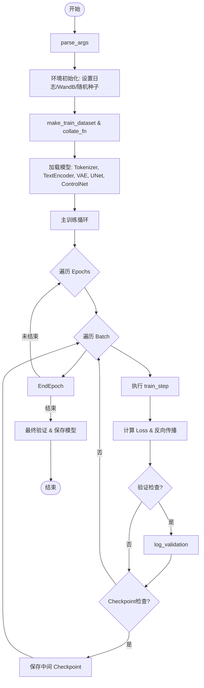
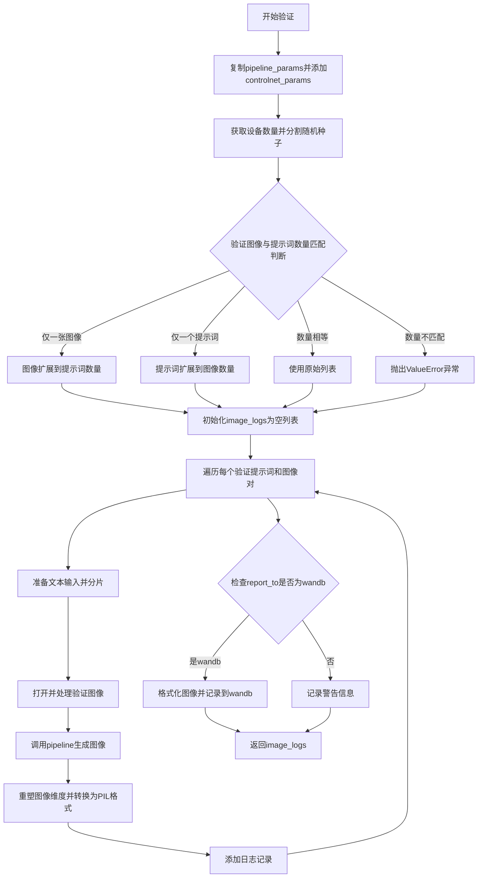
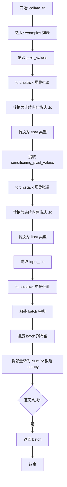

```mermaid
flowchart TD
    A[开始 main] --> B[parse_args: 解析命令行参数]
    B --> C{report_to == wandb<br/>且 hub_token 不为空?}
    C -->|是| D[抛出安全风险异常]
    C -->|否| E[logging.basicConfig: 配置日志]
    E --> F{jax.process_index == 0?}
    F -->|是| G[设置logger INFO级别]
    F -->|否| H[设置logger ERROR级别]
    G --> I{transformers<br/>utils.logging}
    H --> I
    I --> J{jax.process_index == 0<br/>且 report_to == wandb?}
    J -->|是| K[wandb.init: 初始化wandb]
    J -->|否| L[set_seed: 设置随机种子]
    K --> L
    L --> M[jax.random.PRNGKey: 创建随机数生成器]
    M --> N{jax.process_index == 0?}
    N -->|是| O[创建output_dir目录]
    O --> P{push_to_hub?}
    N -->|否| Q[rng = ...]
    P -->|是| R[create_repo: 创建Hub仓库]
    P -->|否| Q
    R --> Q
    Q --> S{tokenizer_name<br/>存在?}
    S -->|是| T[CLIPTokenizer.from_pretrained]
    S -->|否| U{pretrained_model_name_or_path<br/>存在?}
    U -->|是| V[从子文件夹加载tokenizer]
    U -->|否| W[抛出NotImplementedError]
    T --> X
    V --> X
    W --> X
    X --> Y[make_train_dataset: 创建训练数据集]
    Y --> Z[DataLoader: 创建数据加载器]
    Z --> AA{混合精度设置}
    AA -->|fp16| AB[weight_dtype = float16]
    AA -->|bf16| AC[weight_dtype = bfloat16]
    AA -->|no| AD[weight_dtype = float32]
    AB --> AE
    AC --> AE
    AD --> AE
    AE --> AF[FlaxCLIPTextModel.from_pretrained: 加载文本编码器]
    AF --> AG[FlaxAutoencoderKL.from_pretrained: 加载VAE]
    AG --> AH[FlaxUNet2DConditionModel.from_pretrained: 加载UNet]
    AH --> AI{controlnet_model_name_or_path<br/>存在?}
    AI -->|是| AJ[加载已有controlnet权重]
    AI -->|否| AK[从unet初始化controlnet权重]
    AJ --> AL
    AK --> AL
    AL --> AM[FlaxStableDiffusionControlNetPipeline.from_pretrained]
    AM --> AN[replicate pipeline_params到多设备]
    AN --> AO{scale_lr?}
    AO -->|是| AP[learning_rate = learning_rate * total_batch_size]
    AO -->|否| AQ
    AP --> AQ
    AQ --> AR[optax.constant_schedule: 创建学习率调度器]
    AR --> AS[optax.adamw: 创建AdamW优化器]
    AS --> AT[optax.chain: 组合梯度裁剪和优化器]
    AT --> AU[train_state.TrainState.create: 创建训练状态]
    AU --> AV[FlaxDDPMScheduler.from_pretrained: 加载噪声调度器]
    AV --> AW[split rng: 分割随机数生成器]
    AW --> AX[定义compute_snr函数]
    AX --> AY[定义train_step训练步骤函数]
    AY --> AZ[jax.pmap: 并行化训练步骤]
    AZ --> BA[replicate模型参数到各设备]
    BA --> BB{streaming模式?}
    BB -->|是| BC[dataset_length = max_train_samples]
    BB -->|否| BD[dataset_length = len dataloader]
    BC --> BE
    BD --> BE
    BE --> BF[计算num_update_steps_per_epoch]
    BF --> BG{max_train_steps未设置?}
    BG -->|是| BH[计算max_train_steps]
    BG -->|否| BI
    BH --> BI
    BI --> BJ[计算num_train_epochs]
    BJ --> BK[打印训练信息]
    BK --> BL{jax.process_index == 0<br/>且 report_to == wandb?}
    BL -->|是| BM[wandb.define_metric: 定义指标]
    BL -->|否| BN
    BM --> BN
    BN --> BO[外层循环: 遍历每个epoch]
    BO --> BP[内层循环: 遍历每个batch]
    BP --> BQ{p_profile_steps == global_step?}
    BQ -->|是| BR[jax.profiler.start_trace]
    BQ -->|否| BS
    BR --> BS
    BS --> BT[p_train_step: 执行训练步骤]
    BT --> BU[更新进度条]
    BU --> BV{global_step >= max_train_steps?}
    BV -->|是| BW[break]
    BV -->|否| BX
    BX --> BY{validation_prompt存在<br/>且 global_step % validation_steps == 0<br/>且 process_index == 0?}
    BY -->|是| BZ[log_validation: 运行验证]
    BY -->|否| CA
    BZ --> CA
    CA --> CB{global_step % logging_steps == 0<br/>且 process_index == 0?}
    CB -->|是| CC[wandb.log: 记录训练指标]
    CB -->|否| CD
    CC --> CD
    CD --> CE{global_step % checkpointing_steps == 0<br/>且 process_index == 0?}
    CE -->|是| CF[controlnet.save_pretrained: 保存checkpoint]
    CE -->|否| CG
    CF --> CG
    CG --> CH[global_step += 1]
    CH --> BP
    BO --> CI{process_index == 0?}
    CI -->|是| CJ{validation_prompt存在?}
    CJ -->|是| CK[profile_validation?]
    CK -->|是| CL[jax.profiler.start_trace]
    CK -->|否| CM
    CL --> CM
    CM --> CN[log_validation: 最终验证]
    CM --> CO
    CN --> CO
    CJ -->|否| CO
    CO --> CP[controlnet.save_pretrained: 保存最终模型]
    CP --> CQ{push_to_hub?}
    CQ -->|是| CR[save_model_card: 保存模型卡片]
    CR --> CS[upload_folder: 上传到Hub]
    CQ -->|否| CT
    CS --> CT
    CT --> CU{profile_memory?}
    CU -->|是| CV[保存最终内存profile]
    CU -->|否| CW
    CV --> CW
    CW --> CX[logger.info: 打印完成信息]
    CX --> CY[结束]
```

# `diffusers\examples\controlnet\train_controlnet_flax.py` 详细设计文档

这是一个使用 Flax (JAX) 框架编写的分布式训练脚本，用于在自定义数据集上训练 Stable Diffusion 的 ControlNet 模型，包含了数据预处理、模型加载、训练循环（含梯度累积）、验证推理以及模型权重保存至本地或 Hugging Face Hub 的完整流程。

## 整体流程



## 类结构

```
train_controlnet_flax.py (脚本入口，无自定义类)
├── 核心函数 (层级)
│   ├── main() (主入口)
│   │   ├── train_step() (内部定义: 核心训练逻辑)
│   │   └── compute_snr() (内部定义: 计算SNR)
│   ├── make_train_dataset() (数据处理)
│   │   └── preprocess_train() (数据增强)
│   │   └── tokenize_captions() (分词)
│   ├── collate_fn() (批处理整理)
│   ├── log_validation() (验证与可视化)
│   └── parse_args() (参数解析)
└── 外部依赖模型 (库类)
    ├── FlaxCLIPTextModel
    ├── FlaxAutoencoderKL
    ├── FlaxUNet2DConditionModel
    └── FlaxControlNetModel
```

## 全局变量及字段


### `logger`
    
日志记录器，用于记录训练过程中的信息、警告和错误

类型：`logging.Logger`
    


### `LARGE_ENOUGH_NUMBER`
    
防止PNG压缩数据过大错误的常量，设置为100以增大Pillow处理文本块的阈值

类型：`int`
    


### `args`
    
解析后的命令行参数命名空间，包含所有训练配置参数如模型路径、批次大小、学习率等

类型：`argparse.Namespace`
    


    

## 全局函数及方法


### `log_validation`

该函数是Stable Diffusion ControlNet训练流程中的验证函数，负责在训练过程中对模型进行验证。它通过加载验证图像和提示词，使用训练好的ControlNet模型生成对应的图像，并根据配置的日志记录工具（如wandb）记录验证结果，帮助监控模型在训练过程中的性能变化。

参数：

- `pipeline`：`FlaxStableDiffusionControlNetPipeline`，Stable Diffusion ControlNet推理管道，用于执行图像生成
- `pipeline_params`：字典，管道模型参数，包含UNet等组件的参数
- `controlnet_params`：字典，ControlNet模型参数，用于条件图像生成
- `tokenizer`：CLIPTokenizer，用于将文本提示词转换为token ID
- `args`：命名空间，包含验证配置（如验证图像路径、提示词、日志记录目标等）
- `rng`：jax.random.PRNGKey，JAX随机数生成器，用于生成过程的随机种子
- `weight_dtype`：jax dtype，模型权重数据类型（如float32、float16、bfloat16）

返回值：列表，返回验证日志列表，每个元素包含验证图像、生成的图像和对应的提示词

#### 流程图



#### 带注释源码

```python
def log_validation(pipeline, pipeline_params, controlnet_params, tokenizer, args, rng, weight_dtype):
    """
    执行验证流程，生成并记录ControlNet推理结果
    
    参数:
        pipeline: FlaxStableDiffusionControlNetPipeline推理管道
        pipeline_params: 管道参数字典
        controlnet_params: ControlNet模型参数
        tokenizer: 文本tokenizer
        args: 命令行参数对象
        rng: JAX随机数种子
        weight_dtype: 模型权重数据类型
    """
    logger.info("Running validation...")

    # 复制参数字典并添加ControlNet参数到pipeline_params中
    pipeline_params = pipeline_params.copy()
    pipeline_params["controlnet"] = controlnet_params

    # 获取JAX设备数量，生成对应数量的随机种子用于并行推理
    num_samples = jax.device_count()
    prng_seed = jax.random.split(rng, jax.device_count())

    # 处理验证图像和提示词数量的匹配逻辑
    # 支持三种情况：数量相等、仅一张图像、仅一个提示词
    if len(args.validation_image) == len(args.validation_prompt):
        validation_images = args.validation_image
        validation_prompts = args.validation_prompt
    elif len(args.validation_image) == 1:
        # 单张图像配多提示词：复制图像
        validation_images = args.validation_image * len(args.validation_prompt)
        validation_prompts = args.validation_prompt
    elif len(args.validation_prompt) == 1:
        # 单提示词配多图像：复制提示词
        validation_images = args.validation_image
        validation_prompts = args.validation_prompt * len(args.validation_image)
    else:
        raise ValueError(
            "number of `args.validation_image` and `args.validation_prompt` should be checked in `parse_args`"
        )

    # 初始化日志列表
    image_logs = []

    # 遍历每个验证图像-提示词对进行推理
    for validation_prompt, validation_image in zip(validation_prompts, validation_images):
        # 准备文本输入：将提示词复制num_samples份并tokenize
        prompts = num_samples * [validation_prompt]
        prompt_ids = pipeline.prepare_text_inputs(prompts)
        prompt_ids = shard(prompt_ids)

        # 准备图像输入：打开图像并转换为RGB格式
        validation_image = Image.open(validation_image).convert("RGB")
        # 处理图像：复制num_samples份并转换为模型输入格式
        processed_image = pipeline.prepare_image_inputs(num_samples * [validation_image])
        processed_image = shard(processed_image)
        
        # 执行推理：使用50步采样生成图像
        images = pipeline(
            prompt_ids=prompt_ids,
            image=processed_image,
            params=pipeline_params,
            prng_seed=prng_seed,
            num_inference_steps=50,
            jit=True,
        ).images

        # 重新整理图像形状：将并行生成的图像展平
        images = images.reshape((images.shape[0] * images.shape[1],) + images.shape[-3:])
        # 转换numpy数组为PIL图像列表
        images = pipeline.numpy_to_pil(images)

        # 记录本轮验证结果
        image_logs.append(
            {"validation_image": validation_image, "images": images, "validation_prompt": validation_prompt}
        )

    # 根据配置的日志工具记录验证结果
    if args.report_to == "wandb":
        formatted_images = []
        for log in image_logs:
            images = log["images"]
            validation_prompt = log["validation_prompt"]
            validation_image = log["validation_image"]

            # 首先记录控制Net条件图像
            formatted_images.append(wandb.Image(validation_image, caption="Controlnet conditioning"))
            # 记录每个生成的图像
            for image in images:
                image = wandb.Image(image, caption=validation_prompt)
                formatted_images.append(image)

        # 上传到wandb
        wandb.log({"validation": formatted_images})
    else:
        # 非wandb平台时发出警告
        logger.warning(f"image logging not implemented for {args.report_to}")

    return image_logs
```


### `save_model_card`

该函数用于在模型训练完成后生成并保存HuggingFace Hub的模型卡片（Model Card），包括训练元数据、验证图像以及模型描述信息，并将卡片保存为README.md文件推送至Hub。

参数：

- `repo_id`：`str`，HuggingFace Hub上的仓库ID，用于标识模型仓库
- `image_logs`：可选的`list[dict]`类型，验证日志列表，包含验证图像、提示词等信息，默认为None
- `base_model`：`str`，用于训练的基础模型名称或路径
- `repo_folder`：`str`或`None`，本地文件夹路径，用于保存模型卡片和图像文件，默认为None

返回值：`None`，该函数无返回值，主要通过文件操作保存模型卡片

#### 流程图

```mermaid
flowchart TD
    A[开始 save_model_card] --> B{image_logs 是否为 None}
    B -->|是| C[跳过图像处理]
    B -->|否| D[遍历 image_logs]
    D --> E[保存 validation_image 到 image_control.png]
    E --> F[构建图像网格]
    F --> G[保存网格图像到 images_{i}.png]
    G --> H[构建 img_str 字符串]
    H --> I[是否还有更多日志]
    I -->|是| D
    I -->|否| C
    C --> J[构建 model_description 字符串]
    J --> K[调用 load_or_create_model_card 创建模型卡片]
    K --> L[定义 tags 列表]
    L --> M[调用 populate_model_card 填充标签]
    M --> N[保存模型卡片到 README.md]
    N --> O[结束]
```

#### 带注释源码

```python
def save_model_card(repo_id: str, image_logs=None, base_model=str, repo_folder=None):
    """
    生成并保存HuggingFace模型卡片
    
    参数:
        repo_id: HuggingFace Hub仓库ID
        image_logs: 验证日志列表，包含图像和提示词
        base_model: 基础模型名称
        repo_folder: 本地存储文件夹路径
    """
    # 初始化图像字符串
    img_str = ""
    
    # 如果存在验证日志，处理图像
    if image_logs is not None:
        # 遍历每条验证日志
        for i, log in enumerate(image_logs):
            images = log["images"]
            validation_prompt = log["validation_prompt"]
            validation_image = log["validation_image"]
            
            # 保存控制网 conditioning 图像
            validation_image.save(os.path.join(repo_folder, "image_control.png"))
            
            # 构建提示词描述字符串
            img_str += f"prompt: {validation_prompt}\n"
            
            # 将验证图像与生成的图像合并
            images = [validation_image] + images
            # 生成图像网格并保存
            make_image_grid(images, 1, len(images)).save(os.path.join(repo_folder, f"images_{i}.png"))
            
            # 构建Markdown图像引用
            img_str += f"\n"

    # 构建模型描述信息
    model_description = f"""
# controlnet- {repo_id}

These are controlnet weights trained on {base_model} with new type of conditioning. You can find some example images in the following. \n
{img_str}
"""

    # 加载或创建模型卡片
    model_card = load_or_create_model_card(
        repo_id_or_path=repo_id,
        from_training=True,
        license="creativeml-openrail-m",
        base_model=base_model,
        model_description=model_description,
        inference=True,
    )

    # 定义模型标签
    tags = [
        "stable-diffusion",
        "stable-diffusion-diffusers",
        "text-to-image",
        "diffusers",
        "controlnet",
        "jax-diffusers-event",
        "diffusers-training",
    ]
    
    # 填充模型卡片标签
    model_card = populate_model_card(model_card, tags=tags)

    # 保存模型卡片为README.md
    model_card.save(os.path.join(repo_folder, "README.md"))
```


### `parse_args`

`parse_args` 是一个位于模块顶层的全局函数，负责解析命令行输入参数。它使用 Python 标准库 `argparse` 定义了模型训练所需的全部配置项（包括模型路径、数据集配置、训练超参数、验证设置等），在解析完成后还会执行一系列运行时环境的一致性检查（例如分布式训练的 `local_rank`、验证集图像与 Prompt 的数量匹配等），并最终返回一个封装了所有配置信息的 `Namespace` 对象，供主程序 `main()` 使用。

#### 参数

- （无显式参数）: 该函数不接受任何传入参数，它默认解析 `sys.argv`。

#### 返回值

- `args`：`argparse.Namespace`，包含用户通过命令行传入的所有配置参数（如模型路径 `--pretrained_model_name_or_path`、输出目录 `--output_dir` 等）。

#### 流程图

```mermaid
flowchart TD
    A[开始: 定义 parse_args] --> B[创建 argparse.ArgumentParser]
    B --> C[添加模型配置参数<br>e.g. --pretrained_model_name_or_path]
    C --> D[添加训练配置参数<br>e.g. --learning_rate, --max_train_steps]
    C --> E[添加数据与验证配置参数<br>e.g. --dataset_name, --validation_prompt]
    B --> F[调用 parse_args 解析 sys.argv]
    F --> G[后处理 output_dir<br>替换 {timestamp} 占位符]
    G --> H{检查环境变量 LOCAL_RANK}
    H -->|存在差异| I[同步 args.local_rank]
    H -->|无差异| J[执行合理性检查 Sanity Checks]
    J --> K{检查 dataset_name 与 train_data_dir 互斥}
    K -->|不合法| L[抛出 ValueError]
    K -->|合法| M{检查 validation_prompt 与 validation_image 匹配}
    M -->|不匹配| L
    M -->|匹配| N{检查 streaming 与 max_train_samples}
    N -->|streaming 但未指定 max_train_samples| L
    N -->|通过所有检查| O[返回 args 对象]
```

#### 带注释源码

```python
def parse_args():
    # 1. 初始化 ArgumentParser，描述脚本用途
    parser = argparse.ArgumentParser(description="Simple example of a training script.")
    
    # 2. 添加模型路径与版本相关参数
    parser.add_argument(
        "--pretrained_model_name_or_path",
        type=str,
        required=True,
        help="Path to pretrained model or model identifier from huggingface.co/models.",
    )
    parser.add_argument(
        "--controlnet_model_name_or_path",
        type=str,
        default=None,
        help="Path to pretrained controlnet model or model identifier from huggingface.co/models."
        " If not specified controlnet weights are initialized from unet.",
    )
    # ... (省略其他模型相关参数如 revision, from_pt 等) ...

    # 3. 添加训练超参数
    parser.add_argument(
        "--output_dir",
        type=str,
        default="runs/{timestamp}",
        help="The output directory where the model predictions and checkpoints will be written. "
        "Can contain placeholders: {timestamp}.",
    )
    parser.add_argument(
        "--train_batch_size", type=int, default=1, help="Batch size (per device) for the training dataloader."
    )
    parser.add_argument(
        "--learning_rate",
        type=float,
        default=1e-4,
        help="Initial learning rate (after the potential warmup period) to use.",
    )
    # ... (省略优化器、学习率调度器、数据集加载等相关参数) ...

    # 4. 添加验证相关参数
    parser.add_argument(
        "--validation_prompt",
        type=str,
        default=None,
        nargs="+",
        help=(
            "A set of prompts evaluated every `--validation_steps` and logged to `--report_to`."
            " Provide either a matching number of `--validation_image`s, a single `--validation_image`"
            " to be used with all prompts, or a single prompt that will be used with all `--validation_image`s."
        ),
    )
    parser.add_argument(
        "--validation_image",
        type=str,
        default=None,
        nargs="+",
        help=(
            "A set of paths to the controlnet conditioning image be evaluated every `--validation_steps`"
            " and logged to `--report_to`. Provide either a matching number of `--validation_prompt`s, a"
            " a single `--validation_prompt` to be used with all `--validation_image`s, or a single"
            " `--validation_image` that will be used with all `--validation_prompt`s."
        ),
    )
    # ... (省略日志、分布式训练等其他参数) ...

    # 5. 解析命令行参数
    args = parser.parse_args()

    # 6. 后处理：处理输出目录中的时间戳占位符
    args.output_dir = args.output_dir.replace("{timestamp}", time.strftime("%Y%m%d_%H%M%S"))

    # 7. 环境变量检查：处理分布式训练中的 local_rank
    env_local_rank = int(os.environ.get("LOCAL_RANK", -1))
    if env_local_rank != -1 and env_local_rank != args.local_rank:
        args.local_rank = env_local_rank

    # 8. 合理性检查 (Sanity Checks)
    # 检查数据集配置：必须指定数据集名称或训练文件夹，且只能指定一个
    if args.dataset_name is None and args.train_data_dir is None:
        raise ValueError("Need either a dataset name or a training folder.")
    if args.dataset_name is not None and args.train_data_dir is not None:
        raise ValueError("Specify only one of `--dataset_name` or `--train_data_dir`")

    # 检查空提示词比例范围
    if args.proportion_empty_prompts < 0 or args.proportion_empty_prompts > 1:
        raise ValueError("`--proportion_empty_prompts` must be in the range [0, 1].")

    # 检查验证集配置：验证图像和提示词必须成对出现
    if args.validation_prompt is not None and args.validation_image is None:
        raise ValueError("`--validation_image` must be set if `--validation_prompt` is set")
    if args.validation_prompt is None and args.validation_image is not None:
        raise ValueError("`--validation_prompt` must be set if `--validation_image` is set")

    # 验证图像和提示词的数量一致性：必须均为1，或者数量完全匹配
    if (
        args.validation_image is not None
        and args.validation_prompt is not None
        and len(args.validation_image) != 1
        and len(args.validation_prompt) != 1
        and len(args.validation_image) != len(args.validation_prompt)
    ):
        raise ValueError(
            "Must provide either 1 `--validation_image`, 1 `--validation_prompt`,"
            " or the same number of `--validation_prompt`s and `--validation_image`s"
        )

    # 检查流式传输模式：流式传输必须指定最大训练样本数
    if args.streaming and args.max_train_samples is None:
        raise ValueError("You must specify `max_train_samples` when using dataset streaming.")

    # 9. 返回配置对象
    return args
```

#### 关键组件信息

- **`argparse.ArgumentParser`**: 命令行解析的核心类。
- **`args` (Namespace)**: 解析结果的容器，通过属性（如 `args.learning_rate`）访问配置。
- **Sanity Checks (合理性检查)**: 一系列 `if...raise ValueError` 逻辑，确保训练配置在启动前是合法的，防止运行时才报错。

#### 潜在的技术债务或优化空间

- **参数分散**: 该函数定义了超过 50 个参数。虽然这对于大型训练脚本很常见，但可以考虑将参数分组（例如使用 `add_argument_group`）或抽象成配置类（Dataclass）来增强可读性。
- **硬编码检查**: 某些检查逻辑（如特定的验证集数量规则）是硬编码的，如果需要支持更复杂的验证策略，逻辑可能会变得臃肿。

#### 其它项目

- **设计目标与约束**: 目标是为 HuggingFace Diffusers 库下的 Flax ControlNet 训练提供一个灵活且全功能的 CLI 接口。
- **错误处理与异常设计**: 主要通过 `ValueError` 进行配置层面的“fail-fast”（快速失败），确保在模型加载或训练循环之前发现问题。
- **数据流**: 本函数不直接处理数据流，它只是一个配置注入点。配置对象 `args` 将被传递到 `main()` 函数中，进而控制 `make_train_dataset` 和训练循环的行为。


### `make_train_dataset`

该函数负责加载和预处理ControlNet训练数据集，支持从HuggingFace Hub或本地磁盘加载数据，并对图像进行tokenize、resize、crop和归一化处理，最终返回可用于训练的数据集对象。

参数：

- `args`：命令行参数对象（argparse.Namespace），包含数据集名称、数据路径、图像列名、caption列名、条件图像列名、分辨率、流式加载选项等配置信息
- `tokenizer`：CLIPTokenizer，用于将文本caption转换为token id
- `batch_size`：可选的整数，指定批处理大小，用于流式数据集处理

返回值：`train_dataset`，类型为数据集对象（根据加载方式，可能是经过`with_transform`处理的数据集或经过`map`处理的数据集），包含`pixel_values`、`conditioning_pixel_values`和`input_ids`字段

#### 流程图

```mermaid
flowchart TD
    A[开始] --> B{args.dataset_name是否存在?}
    B -->|是| C[从Hub加载数据集: load_dataset]
    B -->|否| D{args.train_data_dir是否存在?}
    D -->|是| E{args.load_from_disk?}
    D -->|否| F[抛出异常: 需要指定数据集名称或训练文件夹]
    E -->|是| G[从磁盘加载: load_from_disk]
    E -->|否| H[从文件夹加载: load_dataset]
    C --> I[获取数据集列名]
    G --> I
    H --> I
    I --> J{确定image_column}
    J -->|args.image_column为None| K[默认为column_names[0]]
    J -->|指定了image_column| L[验证列名是否存在]
    L --> M{确定caption_column}
    M -->|args.caption_column为None| N[默认为column_names[1]]
    M -->|指定了caption_column| O[验证列名是否存在]
    O --> P{确定conditioning_image_column}
    P -->|args.conditioning_image_column为None| Q[默认为column_names[2]]
    P -->|指定了conditioning_image_column| R[验证列名是否存在]
    K --> S[定义tokenize_captions函数]
    N --> S
    L --> S
    O --> S
    R --> S
    S --> T[定义image_transforms: Resize → CenterCrop → ToTensor → Normalize]
    T --> U[定义conditioning_image_transforms: Resize → CenterCrop → ToTensor]
    U --> V[定义preprocess_train函数]
    V --> W{jax.process_index == 0?}
    W -->|是| X{args.max_train_samples是否限制?}
    W -->|否| Y[返回train_dataset]
    X -->|是| Z[截取样本或shuffle]
    X -->|否| AA[设置streaming模式]
    Z --> AB{args.streaming?}
    AA --> AB
    AB -->|是| AC[使用map处理: dataset.train.map]
    AB -->|否| AD[使用with_transform处理]
    AC --> AE[返回处理后的数据集]
    AD --> AE
    AE --> Y
```

#### 带注释源码

```python
def make_train_dataset(args, tokenizer, batch_size=None):
    # 获取数据集：可以通过hub指定数据集（会自动下载），或提供自己的训练和评估文件
    # 分布式训练时，load_dataset函数保证只有一个本地进程能并发下载数据集
    
    if args.dataset_name is not None:
        # 从Hub下载并加载数据集
        dataset = load_dataset(
            args.dataset_name,
            args.dataset_config_name,
            cache_dir=args.cache_dir,
            streaming=args.streaming,
        )
    else:
        if args.train_data_dir is not None:
            if args.load_from_disk:
                # 从磁盘加载之前保存的数据集
                dataset = load_from_disk(
                    args.train_data_dir,
                )
            else:
                # 从文件夹加载自定义数据集
                dataset = load_dataset(
                    args.train_data_dir,
                    cache_dir=args.cache_dir,
                )
        # 更多自定义图像加载方式见
        # https://huggingface.co/docs/datasets/v2.0.0/en/dataset_script

    # 预处理数据集
    # 需要对输入和目标进行tokenize处理
    if isinstance(dataset["train"], IterableDataset):
        # 流式数据集需要迭代获取列名
        column_names = next(iter(dataset["train"])).keys()
    else:
        column_names = dataset["train"].column_names

    # 6. 获取输入/目标的列名
    if args.image_column is None:
        image_column = column_names[0]
        logger.info(f"image column defaulting to {image_column}")
    else:
        image_column = args.image_column
        if image_column not in column_names:
            raise ValueError(
                f"`--image_column` value '{args.image_column}' not found in dataset columns. Dataset columns are: {', '.join(column_names)}"
            )

    if args.caption_column is None:
        caption_column = column_names[1]
        logger.info(f"caption column defaulting to {caption_column}")
    else:
        caption_column = args.caption_column
        if caption_column not in column_names:
            raise ValueError(
                f"`--caption_column` value '{args.caption_column}' not found in dataset columns. Dataset columns are: {', '.join(column_names)}"
            )

    if args.conditioning_image_column is None:
        conditioning_image_column = column_names[2]
        logger.info(f"conditioning image column defaulting to {caption_column}")
    else:
        conditioning_image_column = args.conditioning_image_column
        if conditioning_image_column not in column_names:
            raise ValueError(
                f"`--conditioning_image_column` value '{args.conditioning_image_column}' not found in dataset columns. Dataset columns are: {', '.join(column_names)}"
            )

    def tokenize_captions(examples, is_train=True):
        """对captions进行tokenize处理，支持空字符串替换和多caption选择"""
        captions = []
        for caption in examples[caption_column]:
            # 根据比例将部分prompt替换为空字符串
            if random.random() < args.proportion_empty_prompts:
                captions.append("")
            elif isinstance(caption, str):
                captions.append(caption)
            elif isinstance(caption, (list, np.ndarray)):
                # 如果有多个caption，训练时随机选一个，验证时选第一个
                captions.append(random.choice(caption) if is_train else caption[0])
            else:
                raise ValueError(
                    f"Caption column `{caption_column}` should contain either strings or lists of strings."
                )
        # 使用tokenizer将captions转换为input_ids
        inputs = tokenizer(
            captions, max_length=tokenizer.model_max_length, padding="max_length", truncation=True, return_tensors="pt"
        )
        return inputs.input_ids

    # 图像变换：调整大小 → 中心裁剪 → 转为tensor → 归一化到[-1,1]
    image_transforms = transforms.Compose(
        [
            transforms.Resize(args.resolution, interpolation=transforms.InterpolationMode.BILINEAR),
            transforms.CenterCrop(args.resolution),
            transforms.ToTensor(),
            transforms.Normalize([0.5], [0.5]),
        ]
    )

    # 条件图像变换：调整大小 → 中心裁剪 → 转为tensor（不归一化）
    conditioning_image_transforms = transforms.Compose(
        [
            transforms.Resize(args.resolution, interpolation=transforms.InterpolationMode.BILINEAR),
            transforms.CenterCrop(args.resolution),
            transforms.ToTensor(),
        ]
    )

    def preprocess_train(examples):
        """预处理训练数据：转换图像、应用变换、tokenize captions"""
        # 转换图像为RGB并应用变换
        images = [image.convert("RGB") for image in examples[image_column]]
        images = [image_transforms(image) for image in images]

        # 转换条件图像为RGB并应用变换
        conditioning_images = [image.convert("RGB") for image in examples[conditioning_image_column]]
        conditioning_images = [conditioning_image_transforms(image) for image in conditioning_images]

        examples["pixel_values"] = images
        examples["conditioning_pixel_values"] = conditioning_images
        examples["input_ids"] = tokenize_captions(examples)

        return examples

    # 仅在主进程中进行数据集预处理
    if jax.process_index() == 0:
        # 限制训练样本数量用于调试或加速训练
        if args.max_train_samples is not None:
            if args.streaming:
                # 流式数据集使用shuffle和take
                dataset["train"] = dataset["train"].shuffle(seed=args.seed).take(args.max_train_samples)
            else:
                # 普通数据集使用shuffle和select
                dataset["train"] = dataset["train"].shuffle(seed=args.seed).select(range(args.max_train_samples))
        
        # 设置训练数据变换
        if args.streaming:
            # 流式数据集使用map进行批处理
            train_dataset = dataset["train"].map(
                preprocess_train,
                batched=True,
                batch_size=batch_size,
                remove_columns=list(dataset["train"].features.keys()),
            )
        else:
            # 普通数据集使用with_transform
            train_dataset = dataset["train"].with_transform(preprocess_train)

    return train_dataset
```


### `collate_fn`

该函数是 PyTorch DataLoader 的回调函数，用于将数据集中多个样本（examples）合并成一个批次（batch）。它从每个样本中提取 `pixel_values`、`conditioning_pixel_values` 和 `input_ids`，将它们堆叠成张量，转换为连续内存格式和 float 类型，最后将所有张量转换为 NumPy 数组以供 JAX/Flax 模型使用。

参数：

- `examples`：`List[Dict]` 或 `List[dict]`，数据集中的一组样本，每个样本是一个包含 `pixel_values`、`conditioning_pixel_values` 和 `input_ids` 键的字典

返回值：`Dict[str, np.ndarray]`，包含批次数据的字典，键为 `pixel_values`、`conditioning_pixel_values` 和 `input_ids`，值均为 NumPy 数组

#### 流程图



#### 带注释源码

```python
def collate_fn(examples):
    """
    将多个样本合并成一个批次的整理函数。
    
    参数:
        examples: 数据集中的一组样本列表，每个样本是一个字典，
                 包含 'pixel_values', 'conditioning_pixel_values', 'input_ids' 键
    
    返回:
        batch: 包含批次数据的字典，所有值都被转换为 NumPy 数组
    """
    # 从所有样本中提取 pixel_values 并沿新维度堆叠
    # examples 是样本列表，每个 sample['pixel_values'] 是一个单图像张量
    pixel_values = torch.stack([example["pixel_values"] for example in examples])
    # 转换为连续内存格式以优化性能，并转换为 float32 类型
    pixel_values = pixel_values.to(memory_format=torch.contiguous_format).float()

    # 同样处理条件图像（controlnet 条件输入）
    conditioning_pixel_values = torch.stack([example["conditioning_pixel_values"] for example in examples])
    conditioning_pixel_values = conditioning_pixel_values.to(memory_format=torch.contiguous_format).float()

    # 处理文本输入的 token IDs
    input_ids = torch.stack([example["input_ids"] for example in examples])

    # 组装成批次字典
    batch = {
        "pixel_values": pixel_values,
        "conditioning_pixel_values": conditioning_pixel_values,
        "input_ids": input_ids,
    }
    
    # 将 PyTorch 张量转换为 NumPy 数组，以便与 JAX/Flax 模型兼容
    batch = {k: v.numpy() for k, v in batch.items()}
    return batch
```


### `get_params_to_save`

该函数用于从JAX/Flax分布式训练中提取模型参数。由于JAX采用分片（sharded）策略，参数分布在多个设备上，该函数通过取每个分片参数的第一个元素并使用`jax.device_get`将其转换回CPU可读格式，以便保存到磁盘。

参数：

- `params`：`FrozenDict` 或 PyTree，Flax模型的参数字典，包含了分布在多个设备上的模型权重

返回值：`PyTree`，从分片参数中提取出的第一份（通常是主设备）参数，可用于模型保存

#### 流程图

```mermaid
graph TD
    A[开始: 获取分布式参数 params] --> B{遍历参数树}
    B --> C[对每个叶子参数执行 lambda x: x[0]]
    C --> D[取分片参数的第一个设备副本]
    D --> E[使用 jax.device_get 转换到CPU]
    E --> F[返回可序列化的参数]
```

#### 带注释源码

```python
def get_params_to_save(params):
    """
    从分布式/分片的参数字典中提取主设备的参数。
    
    在JAX/Flax的分布式训练中，参数会按照jax.lax.psum或jax_utils.replicate
    分布在多个设备上。该函数将分片参数还原为可用于保存的格式。
    
    参数:
        params: Flax模型的参数字典，通常是FrozenDict类型，
               其中的叶子节点是DeviceArray（已分片到多个设备）
    
    返回:
        从分片参数中提取的主设备副本，转换为numpy数组或Python对象，
        可直接用于模型保存
    """
    # 使用 tree_map 对参数树的每个叶子节点应用函数
    # lambda x: x[0] 取每个分片数组的第一个元素（即主设备的参数副本）
    # jax.device_get 将DeviceArray从GPU/TPU设备内存取回到CPU，转换为numpy数组
    return jax.device_get(jax.tree_util.tree_map(lambda x: x[0], params))
```


### `main`

主函数，作为整个Flax Stable Diffusion ControlNet训练脚本的入口点，负责协调整个训练流程，包括参数解析、模型加载、数据准备、训练循环执行、验证以及模型保存。

参数：

- 无显式参数（通过内部调用 `parse_args()` 获取配置）

返回值：`None`，执行完成后直接退出程序

#### 流程图



#### 带注释源码

```python
def main():
    """
    主训练函数，初始化并执行完整的ControlNet训练流程。
    包括：参数解析、模型加载、数据集创建、训练循环、验证和模型保存。
    """
    # 1. 解析命令行参数
    args = parse_args()

    # 2. 安全检查：不能同时使用wandb和hub_token（安全风险）
    if args.report_to == "wandb" and args.hub_token is not None:
        raise ValueError(
            "You cannot use both --report_to=wandb and --hub_token due to a security risk of exposing your token."
            " Please use `hf auth login` to authenticate with the Hub."
        )

    # 3. 配置日志格式和级别
    logging.basicConfig(
        format="%(asctime)s - %(levelname)s - %(name)s - %(message)s",
        datefmt="%m/%d/%Y %H:%M:%S",
        level=logging.INFO,
    )
    # 仅主进程打印日志
    logger.setLevel(logging.INFO if jax.process_index() == 0 else logging.ERROR)
    if jax.process_index() == 0:
        transformers.utils.logging.set_verbosity_info()
    else:
        transformers.utils.logging.set_verbosity_error()

    # 4. 初始化wandb（仅主进程）
    if jax.process_index() == 0 and args.report_to == "wandb":
        wandb.init(
            entity=args.wandb_entity,
            project=args.tracker_project_name,
            job_type="train",
            config=args,
        )

    # 5. 设置随机种子以保证可重复性
    if args.seed is not None:
        set_seed(args.seed)

    # 6. 初始化JAX随机数生成器
    rng = jax.random.PRNGKey(0)

    # 7. 创建输出目录并处理Hub仓库创建
    if jax.process_index() == 0:
        if args.output_dir is not None:
            os.makedirs(args.output_dir, exist_ok=True)

        if args.push_to_hub:
            repo_id = create_repo(
                repo_id=args.hub_model_id or Path(args.output_dir).name, exist_ok=True, token=args.hub_token
            ).repo_id

    # 8. 加载tokenizer（CLIP文本编码器使用的tokenizer）
    if args.tokenizer_name:
        tokenizer = CLIPTokenizer.from_pretrained(args.tokenizer_name)
    elif args.pretrained_model_name_or_path:
        tokenizer = CLIPTokenizer.from_pretrained(
            args.pretrained_model_name_or_path, subfolder="tokenizer", revision=args.revision
        )
    else:
        raise NotImplementedError("No tokenizer specified!")

    # 9. 创建训练数据集
    # 计算总batch size（考虑多GPU和梯度累积）
    total_train_batch_size = args.train_batch_size * jax.local_device_count() * args.gradient_accumulation_steps
    train_dataset = make_train_dataset(args, tokenizer, batch_size=total_train_batch_size)

    # 10. 创建PyTorch数据加载器
    train_dataloader = torch.utils.data.DataLoader(
        train_dataset,
        shuffle=not args.streaming,
        collate_fn=collate_fn,
        batch_size=total_train_batch_size,
        num_workers=args.dataloader_num_workers,
        drop_last=True,
    )

    # 11. 设置混合精度数据类型
    weight_dtype = jnp.float32
    if args.mixed_precision == "fp16":
        weight_dtype = jnp.float16
    elif args.mixed_precision == "bf16":
        weight_dtype = jnp.bfloat16

    # 12. 加载预训练模型
    # 文本编码器 (CLIP)
    text_encoder = FlaxCLIPTextModel.from_pretrained(
        args.pretrained_model_name_or_path,
        subfolder="text_encoder",
        dtype=weight_dtype,
        revision=args.revision,
        from_pt=args.from_pt,
    )
    # VAE (变分自编码器)
    vae, vae_params = FlaxAutoencoderKL.from_pretrained(
        args.pretrained_model_name_or_path,
        revision=args.revision,
        subfolder="vae",
        dtype=weight_dtype,
        from_pt=args.from_pt,
    )
    # UNet2D条件模型
    unet, unet_params = FlaxUNet2DConditionModel.from_pretrained(
        args.pretrained_model_name_or_path,
        subfolder="unet",
        dtype=weight_dtype,
        revision=args.revision,
        from_pt=args.from_pt,
    )

    # 13. 加载或初始化ControlNet模型
    if args.controlnet_model_name_or_path:
        logger.info("Loading existing controlnet weights")
        controlnet, controlnet_params = FlaxControlNetModel.from_pretrained(
            args.controlnet_model_name_or_path,
            revision=args.controlnet_revision,
            from_pt=args.controlnet_from_pt,
            dtype=jnp.float32,
        )
    else:
        logger.info("Initializing controlnet weights from unet")
        rng, rng_params = jax.random.split(rng)

        # 从UNet配置初始化ControlNet
        controlnet = FlaxControlNetModel(
            in_channels=unet.config.in_channels,
            down_block_types=unet.config.down_block_types,
            only_cross_attention=unet.config.only_cross_attention,
            block_out_channels=unet.config.block_out_channels,
            layers_per_block=unet.config.layers_per_block,
            attention_head_dim=unet.config.attention_head_dim,
            cross_attention_dim=unet.config.cross_attention_dim,
            use_linear_projection=unet.config.use_linear_projection,
            flip_sin_to_cos=unet.config.flip_sin_to_cos,
            freq_shift=unet.config.freq_shift,
        )
        # 初始化权重并从UNet复制参数
        controlnet_params = controlnet.init_weights(rng=rng_params)
        controlnet_params = unfreeze(controlnet_params)
        for key in [
            "conv_in",
            "time_embedding",
            "down_blocks_0",
            "down_blocks_1",
            "down_blocks_2",
            "down_blocks_3",
            "mid_block",
        ]:
            controlnet_params[key] = unet_params[key]

    # 14. 创建Flax Stable Diffusion ControlNet Pipeline
    pipeline, pipeline_params = FlaxStableDiffusionControlNetPipeline.from_pretrained(
        args.pretrained_model_name_or_path,
        tokenizer=tokenizer,
        controlnet=controlnet,
        safety_checker=None,
        dtype=weight_dtype,
        revision=args.revision,
        from_pt=args.from_pt,
    )
    # 复制pipeline参数到所有设备
    pipeline_params = jax_utils.replicate(pipeline_params)

    # 15. 优化器设置
    # 按总batch size缩放学习率
    if args.scale_lr:
        args.learning_rate = args.learning_rate * total_train_batch_size

    # 常数学习率调度器
    constant_scheduler = optax.constant_schedule(args.learning_rate)

    # AdamW优化器
    adamw = optax.adamw(
        learning_rate=constant_scheduler,
        b1=args.adam_beta1,
        b2=args.adam_beta2,
        eps=args.adam_epsilon,
        weight_decay=args.adam_weight_decay,
    )

    # 组合梯度裁剪和优化器
    optimizer = optax.chain(
        optax.clip_by_global_norm(args.max_grad_norm),
        adamw,
    )

    # 16. 创建训练状态
    state = train_state.TrainState.create(apply_fn=controlnet.__call__, params=controlnet_params, tx=optimizer)

    # 17. 加载噪声调度器（DDPM）
    noise_scheduler, noise_scheduler_state = FlaxDDPMScheduler.from_pretrained(
        args.pretrained_model_name_or_path, subfolder="scheduler"
    )

    # 18. 分割随机数生成器用于验证和训练
    validation_rng, train_rngs = jax.random.split(rng)
    train_rngs = jax.random.split(train_rngs, jax.local_device_count())

    # 19. 定义SNR计算函数（用于加权损失）
    def compute_snr(timesteps):
        """
        Computes SNR as per https://github.com/TiankaiHang/Min-SNR-Diffusion-Training/blob/521b624bd70c67cee4bdf49225915f5945a872e3/guided_diffusion/gaussian_diffusion.py#L847-L849
        """
        alphas_cumprod = noise_scheduler_state.common.alphas_cumprod
        sqrt_alphas_cumprod = alphas_cumprod**0.5
        sqrt_one_minus_alphas_cumprod = (1.0 - alphas_cumprod) ** 0.5

        alpha = sqrt_alphas_cumprod[timesteps]
        sigma = sqrt_one_minus_alphas_cumprod[timesteps]
        # Compute SNR.
        snr = (alpha / sigma) ** 2
        return snr

    # 20. 定义训练步骤函数（核心训练逻辑）
    def train_step(state, unet_params, text_encoder_params, vae_params, batch, train_rng):
        # 如果使用梯度累积，需要reshape batch
        if args.gradient_accumulation_steps > 1:
            grad_steps = args.gradient_accumulation_steps
            batch = jax.tree_map(lambda x: x.reshape((grad_steps, x.shape[0] // grad_steps) + x.shape[1:]), batch)

        # 定义损失计算函数
        def compute_loss(params, minibatch, sample_rng):
            # 将图像编码到潜在空间
            vae_outputs = vae.apply(
                {"params": vae_params}, minibatch["pixel_values"], deterministic=True, method=vae.encode
            )
            latents = vae_outputs.latent_dist.sample(sample_rng)
            # (NHWC) -> (NCHW)
            latents = jnp.transpose(latents, (0, 3, 1, 2))
            latents = latents * vae.config.scaling_factor

            # 采样噪声
            noise_rng, timestep_rng = jax.random.split(sample_rng)
            noise = jax.random.normal(noise_rng, latents.shape)
            # 为每个图像采样随机 timestep
            bsz = latents.shape[0]
            timesteps = jax.random.randint(
                timestep_rng,
                (bsz,),
                0,
                noise_scheduler.config.num_train_timesteps,
            )

            # 前向扩散过程：向latents添加噪声
            noisy_latents = noise_scheduler.add_noise(noise_scheduler_state, latents, noise, timesteps)

            # 获取文本嵌入用于条件
            encoder_hidden_states = text_encoder(
                minibatch["input_ids"],
                params=text_encoder_params,
                train=False,
            )[0]

            # ControlNet条件图像
            controlnet_cond = minibatch["conditioning_pixel_values"]

            # 运行ControlNet获取中间残差
            down_block_res_samples, mid_block_res_sample = controlnet.apply(
                {"params": params},
                noisy_latents,
                timesteps,
                encoder_hidden_states,
                controlnet_cond,
                train=True,
                return_dict=False,
            )

            # 使用UNet预测噪声残差
            model_pred = unet.apply(
                {"params": unet_params},
                noisy_latents,
                timesteps,
                encoder_hidden_states,
                down_block_additional_residuals=down_block_res_samples,
                mid_block_additional_residual=mid_block_res_sample,
            ).sample

            # 根据预测类型确定目标
            if noise_scheduler.config.prediction_type == "epsilon":
                target = noise
            elif noise_scheduler.config.prediction_type == "v_prediction":
                target = noise_scheduler.get_velocity(noise_scheduler_state, latents, noise, timesteps)
            else:
                raise ValueError(f"Unknown prediction type {noise_scheduler.config.prediction_type}")

            # 计算MSE损失
            loss = (target - model_pred) ** 2

            # 应用SNR加权（如果启用）
            if args.snr_gamma is not None:
                snr = jnp.array(compute_snr(timesteps))
                snr_loss_weights = jnp.where(snr < args.snr_gamma, snr, jnp.ones_like(snr) * args.snr_gamma)
                if noise_scheduler.config.prediction_type == "epsilon":
                    snr_loss_weights = snr_loss_weights / snr
                elif noise_scheduler.config.prediction_type == "v_prediction":
                    snr_loss_weights = snr_loss_weights / (snr + 1)

                loss = loss * snr_loss_weights

            loss = loss.mean()

            return loss

        # 创建梯度计算函数
        grad_fn = jax.value_and_grad(compute_loss)

        # 获取mini-batch的辅助函数
        def get_minibatch(batch, grad_idx):
            return jax.tree_util.tree_map(
                lambda x: jax.lax.dynamic_index_in_dim(x, grad_idx, keepdims=False),
                batch,
            )

        # 执行单步损失和梯度计算
        def loss_and_grad(grad_idx, train_rng):
            # 为梯度步骤创建mini-batch
            minibatch = get_minibatch(batch, grad_idx) if grad_idx is not None else batch
            sample_rng, train_rng = jax.random.split(train_rng, 2)
            loss, grad = grad_fn(state.params, minibatch, sample_rng)
            return loss, grad, train_rng

        # 根据梯度累积步骤数执行训练
        if args.gradient_accumulation_steps == 1:
            loss, grad, new_train_rng = loss_and_grad(None, train_rng)
        else:
            # 初始化累积损失、梯度和随机数
            init_loss_grad_rng = (
                0.0,  # 初始累积损失
                jax.tree_map(jnp.zeros_like, state.params),  # 初始累积梯度
                train_rng,  # 初始随机数
            )

            # 累积梯度步骤
            def cumul_grad_step(grad_idx, loss_grad_rng):
                cumul_loss, cumul_grad, train_rng = loss_grad_rng
                loss, grad, new_train_rng = loss_and_grad(grad_idx, train_rng)
                cumul_loss, cumul_grad = jax.tree_map(jnp.add, (cumul_loss, cumul_grad), (loss, grad))
                return cumul_loss, cumul_grad, new_train_rng

            # 使用fori_loop执行累积
            loss, grad, new_train_rng = jax.lax.fori_loop(
                0,
                args.gradient_accumulation_steps,
                cumul_grad_step,
                init_loss_grad_rng,
            )
            # 平均梯度和损失
            loss, grad = jax.tree_map(lambda x: x / args.gradient_accumulation_steps, (loss, grad))

        # 跨batch维度并行平均梯度
        grad = jax.lax.pmean(grad, "batch")

        # 应用梯度更新
        new_state = state.apply_gradients(grads=grad)

        # 记录指标
        metrics = {"loss": loss}
        metrics = jax.lax.pmean(metrics, axis_name="batch")

        # 计算L2梯度范数
        def l2(xs):
            return jnp.sqrt(sum([jnp.vdot(x, x) for x in jax.tree_util.tree_leaves(xs)]))

        metrics["l2_grads"] = l2(jax.tree_util.tree_leaves(grad))

        return new_state, metrics, new_train_rng

    # 21. 创建并行训练步骤
    p_train_step = jax.pmap(train_step, "batch", donate_argnums=(0,))

    # 22. 将训练状态复制到所有设备
    state = jax_utils.replicate(state)
    unet_params = jax_utils.replicate(unet_params)
    text_encoder_params = jax_utils.replicate(text_encoder.params)
    vae_params = jax_utils.replicate(vae_params)

    # 23. 计算训练参数
    if args.streaming:
        dataset_length = args.max_train_samples
    else:
        dataset_length = len(train_dataloader)
    num_update_steps_per_epoch = math.ceil(dataset_length / args.gradient_accumulation_steps)

    # 设置最大训练步数和epoch数
    if args.max_train_steps is None:
        args.max_train_steps = args.num_train_epochs * num_update_steps_per_epoch

    args.num_train_epochs = math.ceil(args.max_train_steps / num_update_steps_per_epoch)

    # 打印训练信息
    logger.info("***** Running training *****")
    logger.info(f"  Num examples = {args.max_train_samples if args.streaming else len(train_dataset)}")
    logger.info(f"  Num Epochs = {args.num_train_epochs}")
    logger.info(f"  Instantaneous batch size per device = {args.train_batch_size}")
    logger.info(f"  Total train batch size (w. parallel & distributed) = {total_train_batch_size}")
    logger.info(f"  Total optimization steps = {args.num_train_epochs * num_update_steps_per_epoch}")

    # 配置wandb指标
    if jax.process_index() == 0 and args.report_to == "wandb":
        wandb.define_metric("*", step_metric="train/step")
        wandb.define_metric("train/step", step_metric="walltime")
        wandb.config.update(
            {
                "num_train_examples": args.max_train_samples if args.streaming else len(train_dataset),
                "total_train_batch_size": total_train_batch_size,
                "total_optimization_step": args.num_train_epochs * num_update_steps_per_epoch,
                "num_devices": jax.device_count(),
                "controlnet_params": sum(np.prod(x.shape) for x in jax.tree_util.tree_leaves(state.params)),
            }
        )

    # 24. 训练循环
    global_step = step0 = 0
    # 初始化进度条
    epochs = tqdm(
        range(args.num_train_epochs),
        desc="Epoch ... ",
        position=0,
        disable=jax.process_index() > 0,
    )
    
    # 保存初始内存profile
    if args.profile_memory:
        jax.profiler.save_device_memory_profile(os.path.join(args.output_dir, "memory_initial.prof"))
    
    t00 = t0 = time.monotonic()
    
    # 外层循环：epoch
    for epoch in epochs:
        train_metrics = []
        train_metric = None

        # 计算每个epoch的步数
        steps_per_epoch = (
            args.max_train_samples // total_train_batch_size
            if args.streaming or args.max_train_samples
            else len(train_dataset) // total_train_batch_size
        )
        train_step_progress_bar = tqdm(
            total=steps_per_epoch,
            desc="Training...",
            position=1,
            leave=False,
            disable=jax.process_index() > 0,
        )
        
        # 内层循环：batch
        for batch in train_dataloader:
            # 性能分析
            if args.profile_steps and global_step == 1:
                train_metric["loss"].block_until_ready()
                jax.profiler.start_trace(args.output_dir)
            if args.profile_steps and global_step == 1 + args.profile_steps:
                train_metric["loss"].block_until_ready()
                jax.profiler.stop_trace()

            # 分片batch到各设备
            batch = shard(batch)
            with jax.profiler.StepTraceAnnotation("train", step_num=global_step):
                # 执行训练步骤
                state, train_metric, train_rngs = p_train_step(
                    state, unet_params, text_encoder_params, vae_params, batch, train_rngs
                )
            train_metrics.append(train_metric)

            train_step_progress_bar.update(1)

            global_step += 1
            if global_step >= args.max_train_steps:
                break

            # 验证（按配置间隔）
            if (
                args.validation_prompt is not None
                and global_step % args.validation_steps == 0
                and jax.process_index() == 0
            ):
                _ = log_validation(
                    pipeline, pipeline_params, state.params, tokenizer, args, validation_rng, weight_dtype
                )

            # 记录训练指标
            if global_step % args.logging_steps == 0 and jax.process_index() == 0:
                if args.report_to == "wandb":
                    train_metrics = jax_utils.unreplicate(train_metrics)
                    train_metrics = jax.tree_util.tree_map(lambda *m: jnp.array(m).mean(), *train_metrics)
                    wandb.log(
                        {
                            "walltime": time.monotonic() - t00,
                            "train/step": global_step,
                            "train/epoch": global_step / dataset_length,
                            "train/steps_per_sec": (global_step - step0) / (time.monotonic() - t0),
                            **{f"train/{k}": v for k, v in train_metrics.items()},
                        }
                    )
                t0, step0 = time.monotonic(), global_step
                train_metrics = []
            
            # 保存checkpoint
            if global_step % args.checkpointing_steps == 0 and jax.process_index() == 0:
                controlnet.save_pretrained(
                    f"{args.output_dir}/{global_step}",
                    params=get_params_to_save(state.params),
                )

        # 结束epoch
        train_metric = jax_utils.unreplicate(train_metric)
        train_step_progress_bar.close()
        epochs.write(f"Epoch... ({epoch + 1}/{args.num_train_epochs} | Loss: {train_metric['loss']})")

    # 25. 最终验证和保存模型
    if jax.process_index() == 0:
        if args.validation_prompt is not None:
            if args.profile_validation:
                jax.profiler.start_trace(args.output_dir)
            image_logs = log_validation(
                pipeline, pipeline_params, state.params, tokenizer, args, validation_rng, weight_dtype
            )
            if args.profile_validation:
                jax.profiler.stop_trace()
        else:
            image_logs = None

        # 保存最终模型
        controlnet.save_pretrained(
            args.output_dir,
            params=get_params_to_save(state.params),
        )

        # 上传到Hub（如果配置）
        if args.push_to_hub:
            save_model_card(
                repo_id,
                image_logs=image_logs,
                base_model=args.pretrained_model_name_or_path,
                repo_folder=args.output_dir,
            )
            upload_folder(
                repo_id=repo_id,
                folder_path=args.output_dir,
                commit_message="End of training",
                ignore_patterns=["step_*", "epoch_*"],
            )

    # 保存最终内存profile
    if args.profile_memory:
        jax.profiler.save_device_memory_profile(os.path.join(args.output_dir, "memory_final.prof"))
    
    logger.info("Finished training.")
```

## 关键组件


### 张量索引 (Tensor Indexing)

在梯度累积场景中使用 `jax.lax.dynamic_index_in_dim` 实现小批次(minibatch)的动态索引，用于在每个梯度步骤中获取对应的训练样本。

### 惰性加载 (Lazy Loading)

通过 `IterableDataset` 和 `streaming=True` 参数实现数据集的惰性加载，支持从 HuggingFace Hub 流式传输大规模数据集，避免一次性加载整个数据集到内存。

### 混合精度训练 (Mixed Precision Training)

通过 `weight_dtype` 参数支持 fp16 和 bf16 混合精度训练，减少显存占用并加速训练过程。权重数据类型在加载模型时指定 (`jnp.float16` 或 `jnp.bfloat16`)。

### 梯度累积 (Gradient Accumulation)

通过 `args.gradient_accumulation_steps` 参数支持梯度累积，允许在有限 GPU 内存下使用更大的有效批次大小。实现方式为将批次 reshape 为多维度结构。

### 分布式训练 (Distributed Training)

使用 JAX 的 `pmap` 实现数据并行分布式训练，通过 `jax_utils.replicate` 将状态复制到多个设备，使用 `jax.lax.pmean` 对梯度进行跨设备同步平均。

### Checkpoint 保存与恢复 (Checkpointing)

支持定期保存训练状态，通过 `controlnet.save_pretrained` 保存模型权重和参数，支持从指定步骤恢复训练。

### 验证与日志 (Validation & Logging)

包含完整的验证流程 `log_validation`，支持 WandB 日志记录，生成验证图像并计算相关指标。


## 问题及建议


### 已知问题

- **参数类型不一致**：初始化 `FlaxControlNetModel` 时未指定 `dtype` 参数（使用默认 float32），而其他模型（text_encoder、vae、unet）根据 `args.mixed_precision` 使用 `weight_dtype`，导致精度不匹配
- **硬编码推理步数**：`log_validation` 函数中 `num_inference_steps=50` 硬编码，未通过命令行参数配置
- **函数定义位置不当**：`compute_snr` 定义在 `main` 函数内部，每次调用都会重新定义，应移至模块级别
- **混合框架开销**：`collate_fn` 使用 PyTorch 构建 batch 后立即转为 NumPy 数组，造成不必要的 PyTorch->NumPy 转换开销
- **缺失的梯度清零**：训练循环中未显式调用 `optimizer.zero_grad()`，虽然 `train_state.apply_gradients` 会处理，但注释和显式操作能提高代码清晰度
- **日志聚合效率低**：`train_metrics` 列表持续追加大字典，可能导致内存压力，每隔一定步数应清理
- **缺少异常处理**：文件操作（模型保存、图像保存）、API 调用（wandb、huggingface hub）缺乏 try-except 保护
- **缓存未充分利用**：`jax.profiler` 相关功能仅在特定条件下启用，调试信息不够灵活

### 优化建议

- 将 `compute_snr` 移至模块级别，并考虑使用 `@functools.lru_cache` 缓存计算结果
- 将 `num_inference_steps` 添加为命令行参数，提供默认值而非硬编码
- 统一 `controlnet` 的 dtype 与其他模型，使用 `dtype=weight_dtype`
- 考虑在 `collate_fn` 中直接使用 JAX/NumPy 操作，避免 PyTorch 依赖
- 在日志记录前添加 `train_metrics.clear()` 或使用固定大小的 deque
- 为文件操作和外部 API 调用添加异常处理和重试机制
- 增强 `parse_args` 的参数校验，特别是数值范围的验证
- 考虑将 `main` 函数拆分为更小的模块化函数（如 `setup_models`、`create_optimizer`、`run_training_loop`）以提高可维护性

## 其它


### 设计目标与约束

本代码的设计目标是实现基于Flax/JAX的ControlNet模型训练流程，支持分布式训练、混合精度训练、梯度累积、模型验证和检查点保存等功能。核心约束包括：1）必须使用JAX/Flax生态进行模型训练；2）依赖HuggingFace Diffusers库提供的预训练Stable Diffusion组件；3）支持从PyTorch权重加载模型（from_pt选项）；4）仅支持文本到图像的ControlNet条件生成任务；5）训练数据必须包含图像、 Conditioning图像和文本描述三个字段。

### 错误处理与异常设计

代码采用多层错误处理机制：1）参数解析阶段的合法性校验（parse_args函数），包括数据集参数互斥检查、验证图像与提示词数量匹配检查、空提示词比例范围检查等，校验失败时抛出ValueError；2）模型加载阶段的异常捕获，主要依赖Diffusers库的自动版本检查（check_min_version）；3）训练阶段的运行时异常，JAX通过pmap分布式执行时，单个设备失败会导致整个批次失败；4）文件操作异常（如模型保存、图像保存），直接向上层抛出未捕获的IOError。改进建议：增加重试机制处理临时性网络/文件系统错误，为训练循环添加异常隔离避免单批次失败导致整个训练终止。

### 数据流与状态机

训练数据流如下：数据集→tokenize处理→DataLoader批量加载→VAE编码为潜在空间表示→加噪扩散过程→ControlNet预测噪声残差→UNet辅助预测→计算MSE损失→反向传播更新ControlNet参数。主状态机包含：1）初始化状态（加载配置、模型、 Optimizer）；2）训练状态（遍历DataLoader执行train_step）；3）验证状态（周期性执行log_validation）；4）保存状态（检查点保存和最终模型导出）。状态转换由全局步数global_step控制，验证和保存作为训练循环的副作用触发。

### 外部依赖与接口契约

核心依赖包括：1）diffusers库（0.37.0.dev0+），提供FlaxStableDiffusionControlNetPipeline、FlaxControlNetModel、FlaxUNet2DConditionModel、FlaxAutoencoderKL、FlaxDDPMScheduler等模型组件；2）transformers库，提供CLIPTokenizer和FlaxCLIPTextModel；3）optax库，提供AdamW优化器和学习率调度器；4）flax库，提供TrainState和分布式训练工具；5）jax/jaxlib，提供自动微分和TPU/GPU加速；6）datasets库，支持流式加载和磁盘缓存数据集；7）torch和torchvision，用于数据预处理和DataLoader。接口契约：train_step函数签名必须保持与pmap兼容（即所有参数必须可pytree化），pipeline调用遵循Diffusers的标准接口（prompt_ids、image、params、prng_seed等参数）。

### 配置管理与参数设计

配置通过argparse统一管理，分为以下类别：1）模型路径参数（pretrained_model_name_or_path、controlnet_model_name_or_path、revision、from_pt等）；2）训练超参数（learning_rate、adam_beta1/beta2、adam_weight_decay、max_grad_norm、gradient_accumulation_steps等）；3）数据参数（dataset_name、train_data_dir、image_column、conditioning_image_column、caption_column、resolution等）；4）验证参数（validation_prompt、validation_image、validation_steps等）；5）输出控制参数（output_dir、push_to_hub、hub_model_id、report_to、logging_steps、checkpointing_steps等）；6）性能分析参数（profile_steps、profile_validation、profile_memory、ccache）。参数设计遵循命令行优先原则，wandb配置通过config对象记录。

### 性能分析与优化策略

当前实现包含以下性能优化：1）JAX JIT编译（pipeline调用使用jit=True）；2）梯度累积支持（gradient_accumulation_steps）；3）混合精度训练（fp16/bf16）；4）梯度检查点（torch.utils.checkpoint未在代码中显式调用，但JAX侧可通过相关机制实现）；5）分布式训练（jax.pmap跨设备并行）。潜在优化点：1）train_step函数内部compute_loss未进行JIT外提，可尝试将VAE encode和text_encoder外层JIT化；2）当前每个训练步骤都执行VAE encode，可考虑缓存已编码的latent；3）validation阶段可与训练并行执行；4）检查点保存使用同步IO，可改为异步保存；5）未使用DeepSpeed或FSDP等更高级的分布式策略。

### 安全与权限控制

安全相关设计：1）hub_token使用警告，当同时设置report_to=wandb和hub_token时抛出安全风险警告；2）模型保存路径通过os.makedirs创建，设置exist_ok=True避免覆盖冲突；3）分布式训练时仅在jax.process_index()==0的进程执行敏感操作（模型保存、验证日志上传、Hub推送等）。权限要求：1）wandb登录需要有效的wandb账户和entity权限；2）Hub模型上传需要HF token认证（通过hf auth login或hub_token）；3）数据集下载可能需要 HuggingFace账号认证（私有数据集）。

### 测试与验证策略

当前代码包含内建的验证机制：1）参数解析阶段的静态校验（sanity checks），覆盖数据集配置、验证参数合法性等场景；2）训练过程中的周期性验证（log_validation函数），通过生成样本图像直观评估模型质量；3）wandb集成的数值监控（loss、l2_grads等指标）；4）模型保存前的最终验证（Final validation）。测试覆盖缺口：1）缺少单元测试覆盖数据预处理逻辑（tokenize_captions、preprocess_train）；2）缺少对不同模型配置的集成测试（如从PyTorch加载、从不同版本Diffusers加载）；3）缺少对边界情况的测试（如空数据集、单样本批次、极端分辨率等）；4）建议添加自动化回归测试验证检查点加载和恢复训练的功能。

### 版本兼容性说明

代码明确要求diffusers>=0.37.0.dev0，通过check_min_version函数强制校验。版本兼容性考虑：1）PyTorch与JAX模型权重转换依赖Diffusers的from_pt参数；2）Optax API相对稳定，adamw和chain用法兼容主流版本；3）Flax的frozen_dict处理需使用unfreeze函数兼容新版本API；4）JAX版本影响TPU/GPU支持和profiler功能，建议使用较新版本JAX（0.4.x系列）。外部约束：bf16混合精度需要PyTorch>=1.10和Nvidia Ampere架构GPU。


    