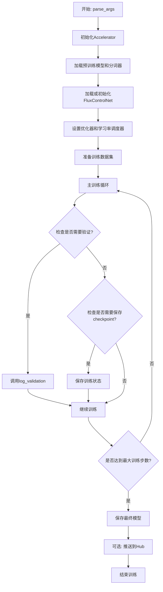
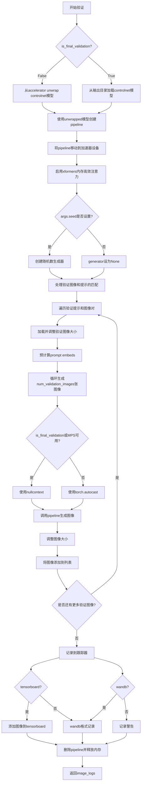
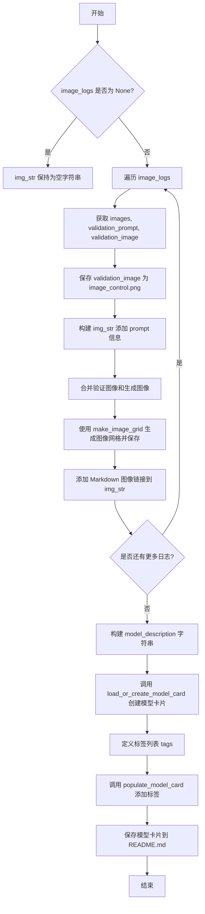
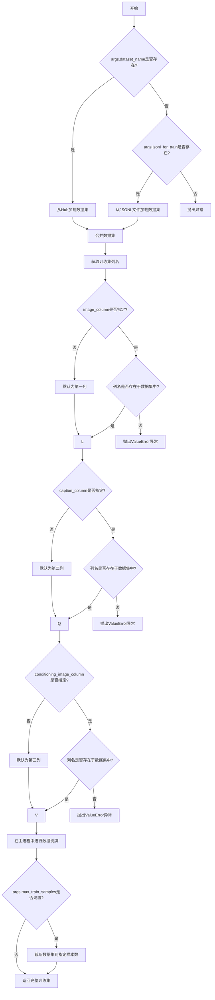
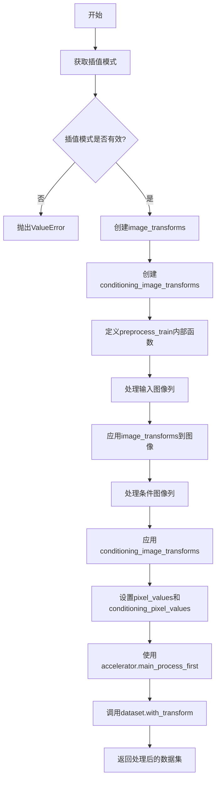
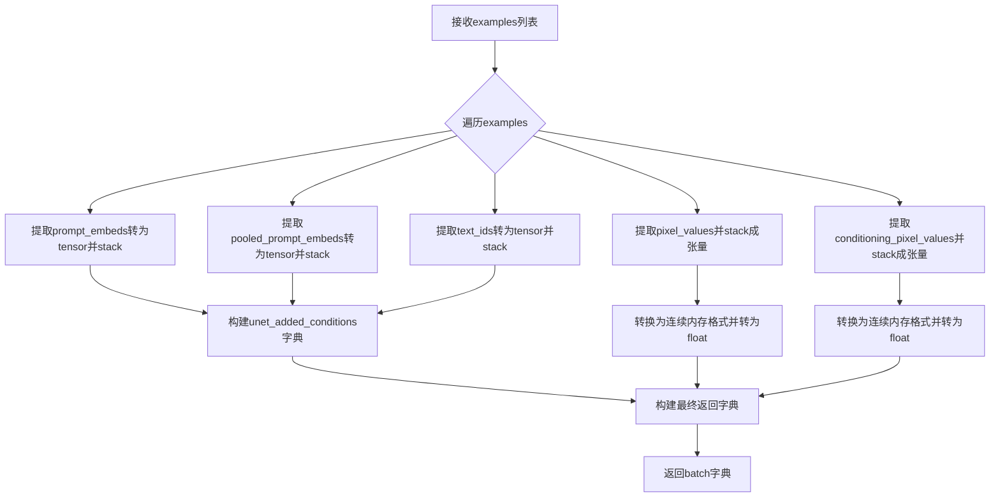
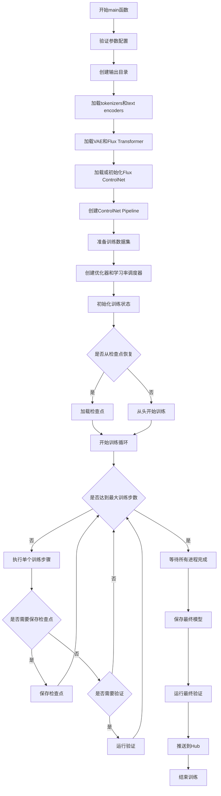

# `diffusers\examples\controlnet\train_controlnet_flux.py` 详细设计文档

这是一个Flux ControlNet模型训练脚本，用于训练FluxControlNetModel以实现可控的文本到图像生成。脚本支持从HuggingFace Hub或本地加载数据集，使用FLUX.1架构进行训练，并可选择将训练好的模型推送到HuggingFace Hub。

## 整体流程



## 类结构

```
脚本文件 (无类结构，基于函数)
├── parse_args (参数解析函数)
├── get_train_dataset (数据集获取)
├── prepare_train_dataset (数据预处理)
├── collate_fn (批处理整理)
├── compute_embeddings (嵌入计算，内部函数)
├── get_sigmas (噪声调度，内部函数)
├── log_validation (验证函数)
├── save_model_card (模型卡片保存)
└── main (主训练函数)
```

## 全局变量及字段


### `logger`
    
用于记录训练过程中的日志信息，包括验证结果、警告和错误等

类型：`logging.Logger`
    


### `args`
    
包含所有命令行参数的对象，用于配置模型路径、训练超参数、数据集设置、验证选项和模型保存策略等

类型：`argparse.Namespace`
    


    

## 全局函数及方法


### `log_validation`

该函数用于在训练过程中运行验证，通过加载模型、创建推理管道、对验证图像进行推理，并将生成的图像记录到跟踪器（TensorBoard 或 WandB）中。

参数：

- `vae`：`AutoencoderKL`，变分自编码器模型，用于将图像编码到潜在空间
- `flux_transformer`：`FluxTransformer2DModel`，Flux 变换器模型，用于图像生成
- `flux_controlnet`：`FluxControlNetModel`，Flux 控制网络模型，用于条件控制生成
- `args`：`argparse.Namespace`，包含所有训练配置的命令行参数
- `accelerator`：`Accelerator`，Hugging Face Accelerate 库提供的分布式训练加速器
- `weight_dtype`：`torch.dtype`，模型权重的数据类型（fp16/bf16/fp32）
- `step`：`int`，当前训练的步骤数，用于日志记录
- `is_final_validation`：`bool`，是否为最终验证（训练结束后的验证），默认为 False

返回值：`list`，返回包含验证图像、生成的图像和验证提示的日志列表

#### 流程图



#### 带注释源码

```python
def log_validation(
    vae, flux_transformer, flux_controlnet, args, accelerator, weight_dtype, step, is_final_validation=False
):
    """
    运行验证流程，生成验证图像并记录到跟踪器
    
    参数:
        vae: 变分自编码器模型
        flux_transformer: Flux变换器模型  
        flux_controlnet: Flux控制网络模型
        args: 命令行参数
        accelerator: 加速器对象
        weight_dtype: 权重数据类型
        step: 当前训练步骤
        is_final_validation: 是否为最终验证
    
    返回:
        image_logs: 包含验证图像和生成图像的日志列表
    """
    logger.info("Running validation... ")

    # 根据是否为最终验证选择不同的模型加载方式
    if not is_final_validation:
        # 从accelerator获取原始模型（非分布式包装）
        flux_controlnet = accelerator.unwrap_model(flux_controlnet)
        # 从预训练模型创建pipeline
        pipeline = FluxControlNetPipeline.from_pretrained(
            args.pretrained_model_name_or_path,
            controlnet=flux_controlnet,
            transformer=flux_transformer,
            torch_dtype=torch.bfloat16,
        )
    else:
        # 从输出目录加载已训练的控制网络模型
        flux_controlnet = FluxControlNetModel.from_pretrained(
            args.output_dir, torch_dtype=torch.bfloat16, variant=args.save_weight_dtype
        )
        pipeline = FluxControlNetPipeline.from_pretrained(
            args.pretrained_model_name_or_path,
            controlnet=flux_controlnet,
            transformer=flux_transformer,
            torch_dtype=torch.bfloat16,
        )

    # 将pipeline移动到加速器设备
    pipeline.to(accelerator.device)
    # 禁用进度条
    pipeline.set_progress_bar_config(disable=True)

    # 如果启用xformers，启用内存高效注意力机制
    if args.enable_xformers_memory_efficient_attention:
        pipeline.enable_xformers_memory_efficient_attention()

    # 设置随机种子以确保可重复性
    if args.seed is None:
        generator = None
    else:
        generator = torch.Generator(device=accelerator.device).manual_seed(args.seed)

    # 处理验证图像和提示的匹配逻辑
    if len(args.validation_image) == len(args.validation_prompt):
        validation_images = args.validation_image
        validation_prompts = args.validation_prompt
    elif len(args.validation_image) == 1:
        # 单个验证图像配多个提示
        validation_images = args.validation_image * len(args.validation_prompt)
        validation_prompts = args.validation_prompt
    elif len(args.validation_prompt) == 1:
        # 单个验证提示配多个图像
        validation_images = args.validation_image
        validation_prompts = args.validation_prompt * len(args.validation_image)
    else:
        raise ValueError(
            "number of `args.validation_image` and `args.validation_prompt` should be checked in `parse_args`"
        )

    image_logs = []
    # 根据设备类型决定是否使用自动混合精度
    if is_final_validation or torch.backends.mps.is_available():
        autocast_ctx = nullcontext()
    else:
        autocast_ctx = torch.autocast(accelerator.device.type)

    # 遍历每个验证图像-提示对
    for validation_prompt, validation_image in zip(validation_prompts, validation_images):
        from diffusers.utils import load_image

        # 加载验证图像
        validation_image = load_image(validation_image)
        # 调整图像大小到指定分辨率
        validation_image = validation_image.resize((args.resolution, args.resolution))

        images = []

        # 预计算prompt embeds，因为T5不支持自动混合精度
        prompt_embeds, pooled_prompt_embeds, text_ids = pipeline.encode_prompt(
            validation_prompt, prompt_2=validation_prompt
        )
        
        # 生成多张验证图像
        for _ in range(args.num_validation_images):
            with autocast_ctx:
                # 调用pipeline生成图像
                image = pipeline(
                    prompt_embeds=prompt_embeds,
                    pooled_prompt_embeds=pooled_prompt_embeds,
                    control_image=validation_image,
                    num_inference_steps=28,
                    controlnet_conditioning_scale=1,
                    guidance_scale=3.5,
                    generator=generator,
                ).images[0]
            # 调整图像大小
            image = image.resize((args.resolution, args.resolution))
            images.append(image)
        
        # 记录验证日志
        image_logs.append(
            {"validation_image": validation_image, "images": images, "validation_prompt": validation_prompt}
        )

    # 根据是否为最终验证选择tracker的key
    tracker_key = "test" if is_final_validation else "validation"
    
    # 遍历所有跟踪器记录图像
    for tracker in accelerator.trackers:
        if tracker.name == "tensorboard":
            for log in image_logs:
                images = log["images"]
                validation_prompt = log["validation_prompt"]
                validation_image = log["validation_image"]

                # 格式化图像为numpy数组
                formatted_images = [np.asarray(validation_image)]

                for image in images:
                    formatted_images.append(np.asarray(image))

                formatted_images = np.stack(formatted_images)

                # 添加图像到tensorboard
                tracker.writer.add_images(validation_prompt, formatted_images, step, dataformats="NHWC")
        elif tracker.name == "wandb":
            formatted_images = []

            for log in image_logs:
                images = log["images"]
                validation_prompt = log["validation_prompt"]
                validation_image = log["validation_image"]

                # 添加条件图像
                formatted_images.append(wandb.Image(validation_image, caption="Controlnet conditioning"))

                # 添加生成的图像
                for image in images:
                    image = wandb.Image(image, caption=validation_prompt)
                    formatted_images.append(image)

            # 记录到wandb
            tracker.log({tracker_key: formatted_images})
        else:
            logger.warning(f"image logging not implemented for {tracker.name}")

    # 清理：删除pipeline并释放内存
    del pipeline
    free_memory()
    return image_logs
```


### `save_model_card`

该函数用于在模型训练完成后，生成并保存 HuggingFace Hub 的模型卡片（Model Card），包含模型描述、训练的基础模型信息、验证时生成的示例图像以及相关标签，最终将模型卡片保存为 README.md 文件。

参数：

- `repo_id`：`str`，HuggingFace Hub 上的仓库 ID，用于标识模型仓库
- `image_logs`：`list` 或 `None`，验证过程中生成的图像日志列表，包含验证图像、生成的图像和对应的提示词
- `base_model`：`str`，用于训练的基础模型名称或路径
- `repo_folder`：`str` 或 `None`，本地仓库文件夹路径，用于保存模型卡片和示例图像

返回值：无返回值（`None`），该函数执行完成后会将模型卡片直接写入到 `repo_folder` 目录下的 `README.md` 文件中

#### 流程图



#### 带注释源码

```python
def save_model_card(repo_id: str, image_logs=None, base_model=str, repo_folder=None):
    """
    生成并保存 HuggingFace Hub 模型卡片
    
    参数:
        repo_id: HuggingFace Hub 仓库 ID
        image_logs: 验证过程中生成的图像日志列表
        base_model: 训练使用的基础模型
        repo_folder: 本地输出文件夹
    """
    # 初始化图像描述字符串
    img_str = ""
    
    # 如果存在图像日志，处理验证图像和生成图像
    if image_logs is not None:
        img_str = "You can find some example images below.\n\n"
        
        # 遍历每个验证日志
        for i, log in enumerate(image_logs):
            images = log["images"]
            validation_prompt = log["validation_prompt"]
            validation_image = log["validation_image"]
            
            # 保存控制图像到指定路径
            validation_image.save(os.path.join(repo_folder, "image_control.png"))
            
            # 添加验证提示词到描述
            img_str += f"prompt: {validation_prompt}\n"
            
            # 将验证图像与生成的图像合并
            images = [validation_image] + images
            
            # 创建图像网格并保存
            make_image_grid(images, 1, len(images)).save(
                os.path.join(repo_folder, f"images_{i}.png")
            )
            
            # 添加 Markdown 格式的图像链接
            img_str += f"\n"

    # 构建完整的模型描述
    model_description = f"""
# controlnet-{repo_id}

These are controlnet weights trained on {base_model} with new type of conditioning.
{img_str}

## License

Please adhere to the licensing terms as described [here](https://huggingface.co/black-forest-labs/FLUX.1-dev/blob/main/LICENSE.md)
"""

    # 加载或创建模型卡片
    model_card = load_or_create_model_card(
        repo_id_or_path=repo_id,
        from_training=True,  # 标记为训练模式
        license="other",
        base_model=base_model,
        model_description=model_description,
        inference=True,  # 启用推理模式
    )

    # 定义模型标签
    tags = [
        "flux",
        "flux-diffusers",
        "text-to-image",
        "diffusers",
        "controlnet",
        "diffusers-training",
    ]
    
    # 填充模型卡片标签
    model_card = populate_model_card(model_card, tags=tags)

    # 保存模型卡片到 README.md
    model_card.save(os.path.join(repo_folder, "README.md"))
```


### `parse_args`

该函数是Flux ControlNet训练脚本的命令行参数解析器，通过argparse定义并验证所有训练相关的配置参数，返回包含所有配置项的Namespace对象。

参数：

-  `input_args`：`List[str]` 或 `None`，可选参数。当提供时，使用该列表中的参数进行解析；否则使用系统命令行参数（sys.argv）。

返回值：`argparse.Namespace`，包含所有解析后的命令行参数对象。

#### 流程图

```mermaid
flowchart TD
    A[开始 parse_args] --> B[创建 ArgumentParser]
    B --> C[添加所有命令行参数定义]
    C --> D{input_args 是否为 None?}
    D -->|是| E[parser.parse_args 使用系统参数]
    D -->|否| F[parser.parse_args 使用 input_args]
    E --> G[进行参数校验]
    F --> G
    G --> H{dataset_name 和 jsonl_for_train 都未指定?}
    H -->|是| I[抛出 ValueError: 必须指定 dataset_name 或 jsonl_for_train]
    H -->|否| J{dataset_name 和 jsonl_for_train 同时指定?}
    J -->|是| K[抛出 ValueError: 只能指定其中一个]
    J -->|否| L{proportion_empty_prompts 超出范围 [0,1]?}
    L -->|是| M[抛出 ValueError]
    L -->|否| N{validation_prompt 和 validation_image 不匹配?}
    N -->|是| O[抛出 ValueError]
    N -->|否| P{resolution 不能被 8 整除?}
    P -->|是| Q[抛出 ValueError]
    P -->|否| R[返回 args 对象]
    
    style I fill:#ffcccc
    style K fill:#ffcccc
    style M fill:#ffcccc
    style O fill:#ffcccc
    style Q fill:#ffcccc
    style R fill:#ccffcc
```

#### 带注释源码

```python
def parse_args(input_args=None):
    """
    解析命令行参数并返回包含所有训练配置的Namespace对象。
    
    参数:
        input_args: 可选的参数列表，如果为None则从sys.argv解析
        
    返回:
        args: 包含所有命令行参数的argparse.Namespace对象
    """
    # 创建ArgumentParser实例，设置程序描述
    parser = argparse.ArgumentParser(description="Simple example of a ControlNet training script.")
    
    # ==================== 模型路径相关参数 ====================
    # 预训练模型路径或HuggingFace模型标识符（必需）
    parser.add_argument(
        "--pretrained_model_name_or_path",
        type=str,
        default=None,
        required=True,
        help="Path to pretrained model or model identifier from huggingface.co/models.",
    )
    # 改进的VAE模型路径，用于稳定训练
    parser.add_argument(
        "--pretrained_vae_model_name_or_path",
        type=str,
        default=None,
        help="Path to an improved VAE to stabilize training. For more details check out: https://github.com/huggingface/diffusers/pull/4038.",
    )
    # 预训练ControlNet模型路径或标识符
    parser.add_argument(
        "--controlnet_model_name_or_path",
        type=str,
        default=None,
        help="Path to pretrained controlnet model or model identifier from huggingface.co/models."
        " If not specified controlnet weights are initialized from unet.",
    )
    # 模型文件变体（如fp16）
    parser.add_argument(
        "--variant",
        type=str,
        default=None,
        help="Variant of the model files of the pretrained model identifier from huggingface.co/models, 'e.g.' fp16",
    )
    # 预训练模型版本号
    parser.add_argument(
        "--revision",
        type=str,
        default=None,
        required=False,
        help="Revision of pretrained model identifier from huggingface.co/models.",
    )
    # 预训练分词器名称或路径
    parser.add_argument(
        "--tokenizer_name",
        type=str,
        default=None,
        help="Pretrained tokenizer name or path if not the same as model_name",
    )
    
    # ==================== 输出和缓存目录 ====================
    # 模型预测和检查点的输出目录
    parser.add_argument(
        "--output_dir",
        type=str,
        default="controlnet-model",
        help="The output directory where the model predictions and checkpoints will be written.",
    )
    # 下载模型和数据集的缓存目录
    parser.add_argument(
        "--cache_dir",
        type=str,
        default=None,
        help="The directory where the downloaded models and datasets will be stored.",
    )
    
    # ==================== 训练随机性 ====================
    # 用于可重复训练的数字
    parser.add_argument("--seed", type=int, default=None, help="A seed for reproducible training.")
    
    # ==================== 图像处理参数 ====================
    # 输入图像的分辨率
    parser.add_argument(
        "--resolution",
        type=int,
        default=512,
        help=(
            "The resolution for input images, all the images in the train/validation dataset will be resized to this"
            " resolution"
        ),
    )
    # SDXL UNet需要的裁剪坐标嵌入的高度坐标
    parser.add_argument(
        "--crops_coords_top_left_h",
        type=int,
        default=0,
        help=("Coordinate for (the height) to be included in the crop coordinate embeddings needed by SDXL UNet."),
    )
    # SDXL UNet需要的裁剪坐标嵌入的宽度坐标
    parser.add_argument(
        "--crops_coords_top_left_w",
        type=int,
        default=0,
        help=("Coordinate for (the height) to be included in the crop coordinate embeddings needed by SDXL UNet."),
    )
    
    # ==================== 训练批处理参数 ====================
    # 训练数据加载器的批次大小（每设备）
    parser.add_argument("--train_batch_size", type=int, default=4, help="Batch size (per device) for the training dataloader.")
    # 训练轮数
    parser.add_argument("--num_train_epochs", type=int, default=1)
    # 总训练步数（如果提供则会覆盖num_train_epochs）
    parser.add_argument(
        "--max_train_steps",
        type=int,
        default=None,
        help="Total number of training steps to perform.  If provided, overrides num_train_epochs.",
    )
    
    # ==================== 检查点管理 ====================
    # 保存检查点的步数间隔
    parser.add_argument(
        "--checkpointing_steps",
        type=int,
        default=500,
        help=(
            "Save a checkpoint of the training state every X updates. Checkpoints can be used for resuming training via `--resume_from_checkpoint`. "
            "In the case that the checkpoint is better than the final trained model, the checkpoint can also be used for inference."
            "Using a checkpoint for inference requires separate loading of the original pipeline and the individual checkpointed model components."
            "See https://huggingface.co/docs/diffusers/main/en/training/dreambooth#performing-inference-using-a-saved-checkpoint for step by step"
            "instructions."
        ),
    )
    # 存储的最大检查点数量
    parser.add_argument(
        "--checkpoints_total_limit",
        type=int,
        default=None,
        help=("Max number of checkpoints to store."),
    )
    # 从哪个检查点恢复训练
    parser.add_argument(
        "--resume_from_checkpoint",
        type=str,
        default=None,
        help=(
            "Whether training should be resumed from a previous checkpoint. Use a path saved by"
            ' `--checkpointing_steps`, or `"latest"` to automatically select the last available checkpoint.'
        ),
    )
    
    # ==================== 梯度累积 ====================
    # 执行反向/更新传递前累积的更新步数
    parser.add_argument(
        "--gradient_accumulation_steps",
        type=int,
        default=1,
        help="Number of updates steps to accumulate before performing a backward/update pass.",
    )
    # 是否使用梯度检查点以节省内存
    parser.add_argument(
        "--gradient_checkpointing",
        action="store_true",
        help="Whether or not to use gradient checkpointing to save memory at the expense of slower backward pass.",
    )
    
    # ==================== 学习率参数 ====================
    # 初始学习率
    parser.add_argument(
        "--learning_rate",
        type=float,
        default=5e-6,
        help="Initial learning rate (after the potential warmup period) to use.",
    )
    # 是否根据GPU数量、梯度累积步数和批次大小缩放学习率
    parser.add_argument(
        "--scale_lr",
        action="store_true",
        default=False,
        help="Scale the learning rate by the number of GPUs, gradient accumulation steps, and batch size.",
    )
    # 学习率调度器类型
    parser.add_argument(
        "--lr_scheduler",
        type=str,
        default="constant",
        help=(
            'The scheduler type to use. Choose between ["linear", "cosine", "cosine_with_restarts", "polynomial",'
            ' "constant", "constant_with_warmup"]'
        ),
    )
    # 学习率预热步数
    parser.add_argument(
        "--lr_warmup_steps", type=int, default=500, help="Number of steps for the warmup in the lr scheduler."
    )
    # 余弦调度器的硬重置次数
    parser.add_argument(
        "--lr_num_cycles",
        type=int,
        default=1,
        help="Number of hard resets of the lr in cosine_with_restarts scheduler.",
    )
    # 多项式调度的幂因子
    parser.add_argument("--lr_power", type=float, default=1.0, help="Power factor of the polynomial scheduler.")
    
    # ==================== 优化器参数 ====================
    # 是否使用8位Adam
    parser.add_argument(
        "--use_8bit_adam", action="store_true", help="Whether or not to use 8-bit Adam from bitsandbytes."
    )
    # 是否使用Adafactor优化器
    parser.add_argument(
        "--use_adafactor",
        action="store_true",
        help=(
            "Adafactor is a stochastic optimization method based on Adam that reduces memory usage while retaining"
            "the empirical benefits of adaptivity. This is achieved through maintaining a factored representation "
            "of the squared gradient accumulator across training steps."
        ),
    )
    # 数据加载的子进程数量
    parser.add_argument(
        "--dataloader_num_workers",
        type=int,
        default=0,
        help=(
            "Number of subprocesses to use for data loading. 0 means that the data will be loaded in the main process."
        ),
    )
    # Adam优化器的beta1参数
    parser.add_argument("--adam_beta1", type=float, default=0.9, help="The beta1 parameter for the Adam optimizer.")
    # Adam优化器的beta2参数
    parser.add_argument("--adam_beta2", type=float, default=0.999, help="The beta2 parameter for the Adam optimizer.")
    # 权重衰减
    parser.add_argument("--adam_weight_decay", type=float, default=1e-2, help="Weight decay to use.")
    # Adam优化器的epsilon值
    parser.add_argument("--adam_epsilon", type=float, default=1e-08, help="Epsilon value for the Adam optimizer")
    # 最大梯度范数
    parser.add_argument("--max_grad_norm", default=1.0, type=float, help="Max gradient norm.")
    
    # ==================== Hub推送参数 ====================
    # 是否将模型推送到Hub
    parser.add_argument("--push_to_hub", action="store_true", help="Whether or not to push the model to the Hub.")
    # 推送到Model Hub使用的token
    parser.add_argument("--hub_token", type=str, default=None, help="The token to use to push to the Model Hub.")
    # Hub仓库名称
    parser.add_argument(
        "--hub_model_id",
        type=str,
        default=None,
        help="The name of the repository to keep in sync with the local `output_dir`.",
    )
    
    # ==================== 日志记录 ====================
    # TensorBoard日志目录
    parser.add_argument(
        "--logging_dir",
        type=str,
        default="logs",
        help=(
            "[TensorBoard](https://www.tensorflow.org/tensorboard) log directory. Will default to"
            " *output_dir/runs/**CURRENT_DATETIME_HOSTNAME***."
        ),
    )
    
    # ==================== 硬件加速 ====================
    # 是否允许在Ampere GPU上使用TF32
    parser.add_argument(
        "--allow_tf32",
        action="store_true",
        help=(
            "Whether or not to allow TF32 on Ampere GPUs. Can be used to speed up training. For more information, see"
            " https://pytorch.org/docs/stable/notes/cuda.html#tensorfloat-32-tf32-on-ampere-devices"
        ),
    )
    # 报告结果和日志的集成平台
    parser.add_argument(
        "--report_to",
        type=str,
        default="tensorboard",
        help=(
            'The integration to report the results and logs to. Supported platforms are `"tensorboard"`'
            ' (default), `"wandb"` and `"comet_ml"`. Use `"all"` to report to all integrations.'
        ),
    )
    # 混合精度训练选项
    parser.add_argument(
        "--mixed_precision",
        type=str,
        default=None,
        choices=["no", "fp16", "bf16"],
        help=(
            "Whether to use mixed precision. Choose between fp16 and bf16 (bfloat16). Bf16 requires PyTorch >="
            " 1.10.and an Nvidia Ampere GPU.  Default to the value of accelerate config of the current system or the"
            " flag passed with the `accelerate.launch` command. Use this argument to override the accelerate config."
        ),
    )
    # 是否使用xformers
    parser.add_argument(
        "--enable_xformers_memory_efficient_attention", action="store_true", help="Whether or not to use xformers."
    )
    # 是否使用NPU Flash Attention
    parser.add_argument(
        "--enable_npu_flash_attention", action="store_true", help="Whether or not to use npu flash attention."
    )
    # 是否将梯度设置为None以节省内存
    parser.add_argument(
        "--set_grads_to_none",
        action="store_true",
        help=(
            "Save more memory by using setting grads to None instead of zero. Be aware, that this changes certain"
            " behaviors, so disable this argument if it causes any problems. More info:"
            " https://pytorch.org/docs/stable/generated/torch.optim.Optimizer.zero_grad.html"
        ),
    )
    
    # ==================== 模型CPU卸载 ====================
    # 是否启用模型CPU卸载
    parser.add_argument(
        "--enable_model_cpu_offload",
        action="store_true",
        help="Enable model cpu offload and save memory.",
    )
    
    # ==================== 数据集参数 ====================
    # 数据集名称（来自HuggingFace hub或本地路径）
    parser.add_argument(
        "--dataset_name",
        type=str,
        default=None,
        help=(
            "The name of the Dataset (from the HuggingFace hub) to train on (could be your own, possibly private,"
            " dataset). It can also be a path pointing to a local copy of a dataset in your filesystem,"
            " or to a folder containing files that 🤗 Datasets can understand."
        ),
    )
    # 数据集配置
    parser.add_argument(
        "--dataset_config_name",
        type=str,
        default=None,
        help="The config of the Dataset, leave as None if there's only one config.",
    )
    # 包含目标图像的数据集列名
    parser.add_argument(
        "--image_column", type=str, default="image", help="The column of the dataset containing the target image."
    )
    # 包含ControlNet条件图像的数据集列名
    parser.add_argument(
        "--conditioning_image_column",
        type=str,
        default="conditioning_image",
        help="The column of the dataset containing the controlnet conditioning image.",
    )
    # 包含描述或描述列表的数据集列名
    parser.add_argument(
        "--caption_column",
        type=str,
        default="text",
        help="The column of the dataset containing a caption or a list of captions.",
    )
    # 用于调试或更快训练的最大训练样本数
    parser.add_argument(
        "--max_train_samples",
        type=int,
        default=None,
        help=(
            "For debugging purposes or quicker training, truncate the number of training examples to this "
            "value if set."
        ),
    )
    # 被替换为空字符串的图像提示比例
    parser.add_argument(
        "--proportion_empty_prompts",
        type=float,
        default=0,
        help="Proportion of image prompts to be replaced with empty strings. Defaults to 0 (no prompt replacement).",
    )
    
    # ==================== 验证参数 ====================
    # 验证提示
    parser.add_argument(
        "--validation_prompt",
        type=str,
        default=None,
        nargs="+",
        help=(
            "A set of prompts evaluated every `--validation_steps` and logged to `--report_to`."
            " Provide either a matching number of `--validation_image`s, a single `--validation_image`"
            " to be used with all prompts, or a single prompt that will be used with all `--validation_image`s."
        ),
    )
    # 验证图像路径
    parser.add_argument(
        "--validation_image",
        type=str,
        default=None,
        nargs="+",
        help=(
            "A set of paths to the controlnet conditioning image be evaluated every `--validation_steps`"
            " and logged to `--report_to`. Provide either a matching number of `--validation_prompt`s, a"
            " a single `--validation_prompt` to be used with all `--validation_image`s, or a single"
            " `--validation_image` that will be used with all `--validation_prompt`s."
        ),
    )
    # ControlNet双层数量
    parser.add_argument(
        "--num_double_layers",
        type=int,
        default=4,
        help="Number of double layers in the controlnet (default: 4).",
    )
    # ControlNet单层数量
    parser.add_argument(
        "--num_single_layers",
        type=int,
        default=4,
        help="Number of single layers in the controlnet (default: 4).",
    )
    # 每个验证图像-提示对生成的图像数量
    parser.add_argument(
        "--num_validation_images",
        type=int,
        default=2,
        help="Number of images to be generated for each `--validation_image`, `--validation_prompt` pair",
    )
    # 运行验证的步数间隔
    parser.add_argument(
        "--validation_steps",
        type=int,
        default=100,
        help=(
            "Run validation every X steps. Validation consists of running the prompt"
            " `args.validation_prompt` multiple times: `args.num_validation_images`"
            " and logging the images."
        ),
    )
    # TensorBoard/WandB项目名称
    parser.add_argument(
        "--tracker_project_name",
        type=str,
        default="flux_train_controlnet",
        help=(
            "The `project_name` argument passed to Accelerator.init_trackers for"
            " more information see https://huggingface.co/docs/accelerate/v0.17.0/en/package_reference/accelerator#accelerate.Accelerator"
        ),
    )
    
    # ==================== 训练数据文件 ====================
    # JSONL格式的训练数据文件路径
    parser.add_argument(
        "--jsonl_for_train",
        type=str,
        default=None,
        help="Path to the jsonl file containing the training data.",
    )
    
    # ==================== 推理参数 ====================
    # Transformer使用的引导尺度
    parser.add_argument(
        "--guidance_scale",
        type=float,
        default=3.5,
        help="the guidance scale used for transformer.",
    )
    
    # ==================== 模型保存精度 ====================
    # 保存权重时保留的精度类型
    parser.add_argument(
        "--save_weight_dtype",
        type=str,
        default="fp32",
        choices=[
            "fp16",
            "bf16",
            "fp32",
        ],
        help=("Preserve precision type according to selected weight"),
    )
    
    # ==================== 采样权重方案 ====================
    # 时间步采样权重方案
    parser.add_argument(
        "--weighting_scheme",
        type=str,
        default="logit_normal",
        choices=["sigma_sqrt", "logit_normal", "mode", "cosmap", "none"],
        help=('We default to the "none" weighting scheme for uniform sampling and uniform loss'),
    )
    # logit_normal权重方案使用的均值
    parser.add_argument(
        "--logit_mean", type=float, default=0.0, help="mean to use when using the `'logit_normal'` weighting scheme."
    )
    # logit_normal权重方案使用的标准差
    parser.add_argument(
        "--logit_std", type=float, default=1.0, help="std to use when using the `'logit_normal'` weighting scheme."
    )
    # mode权重方案的缩放因子
    parser.add_argument(
        "--mode_scale",
        type=float,
        default=1.29,
        help="Scale of mode weighting scheme. Only effective when using the `'mode'` as the `weighting_scheme`.",
    )
    
    # ==================== 图像插值模式 ====================
    # 图像缩放使用的插值方法
    parser.add_argument(
        "--image_interpolation_mode",
        type=str,
        default="lanczos",
        choices=[
            f.lower() for f in dir(transforms.InterpolationMode) if not f.startswith("__") and not f.endswith("__")
        ],
        help="The image interpolation method to use for resizing images.",
    )

    # ==================== 参数解析 ====================
    # 解析参数
    if input_args is not None:
        args = parser.parse_args(input_args)
    else:
        args = parser.parse_args()

    # ==================== 参数校验 ====================
    # 必须指定数据集名称或JSONL训练文件之一
    if args.dataset_name is None and args.jsonl_for_train is None:
        raise ValueError("Specify either `--dataset_name` or `--jsonl_for_train`")

    # 不能同时指定数据集名称和JSONL训练文件
    if args.dataset_name is not None and args.jsonl_for_train is not None:
        raise ValueError("Specify only one of `--dataset_name` or `--jsonl_for_train`")

    # 空提示比例必须在[0,1]范围内
    if args.proportion_empty_prompts < 0 or args.proportion_empty_prompts > 1:
        raise ValueError("`--proportion_empty_prompts` must be in the range [0, 1].")

    # 验证提示和验证图像必须同时设置
    if args.validation_prompt is not None and args.validation_image is None:
        raise ValueError("`--validation_image` must be set if `--validation_prompt` is set")

    if args.validation_prompt is None and args.validation_image is not None:
        raise ValueError("`--validation_prompt` must be set if `--validation_image` is set")

    # 验证图像和验证提示数量必须匹配
    if (
        args.validation_image is not None
        and args.validation_prompt is not None
        and len(args.validation_image) != 1
        and len(args.validation_prompt) != 1
        and len(args.validation_image) != len(args.validation_prompt)
    ):
        raise ValueError(
            "Must provide either 1 `--validation_image`, 1 `--validation_prompt`,"
            " or the same number of `--validation_prompt`s and `--validation_image`s"
        )

    # 分辨率必须能被8整除，以确保VAE和ControlNet编码器之间的编码图像大小一致
    if args.resolution % 8 != 0:
        raise ValueError(
            "`--resolution` must be divisible by 8 for consistently sized encoded images between the VAE and the controlnet encoder."
        )

    # 返回解析后的参数对象
    return args
```


### `get_train_dataset`

该函数用于加载和准备Flux ControlNet训练数据集，支持从HuggingFace Hub或本地JSONL文件加载数据，并自动处理列名映射和数据洗牌。

参数：

- `args`：命令行参数对象，包含数据集名称、配置文件、缓存目录、图像列名、标题列名、条件图像列名、最大训练样本数等配置。
- `accelerator`：Accelerator实例，用于管理分布式训练和进程同步。

返回值：`Dataset`，返回处理后的训练数据集对象。

#### 流程图



#### 带注释源码

```python
def get_train_dataset(args, accelerator):
    """加载并准备Flux ControlNet训练数据集
    
    支持从HuggingFace Hub或本地JSONL文件加载数据，
    并验证必需的列名是否存在于数据集中。
    
    参数:
        args: 包含数据集配置的命令行参数对象
        accelerator: 用于管理分布式训练和进程同步的Accelerator实例
    
    返回:
        处理后的训练数据集对象
    """
    dataset = None
    # 检查是否从Hub加载数据集
    if args.dataset_name is not None:
        # 从HuggingFace Hub下载并加载数据集
        dataset = load_dataset(
            args.dataset_name,
            args.dataset_config_name,
            cache_dir=args.cache_dir,
        )
    # 检查是否从本地JSONL文件加载
    if args.jsonl_for_train is not None:
        # 从JSON文件加载训练数据
        dataset = load_dataset("json", data_files=args.jsonl_for_train, cache_dir=args.cache_dir)
        # 扁平化索引以便后续处理
        dataset = dataset.flatten_indices()
    
    # 预处理数据集
    # 获取训练集的列名
    column_names = dataset["train"].column_names

    # 获取图像列名
    if args.image_column is None:
        # 默认使用第一列作为图像列
        image_column = column_names[0]
        logger.info(f"image column defaulting to {image_column}")
    else:
        image_column = args.image_column
        if image_column not in column_names:
            raise ValueError(
                f"`--image_column` value '{args.image_column}' not found in dataset columns. Dataset columns are: {', '.join(column_names)}"
            )

    # 获取标题/描述列名
    if args.caption_column is None:
        # 默认使用第二列作为标题列
        caption_column = column_names[1]
        logger.info(f"caption column defaulting to {caption_column}")
    else:
        caption_column = args.caption_column
        if caption_column not in column_names:
            raise ValueError(
                f"`--caption_column` value '{args.caption_column}' not found in dataset columns. Dataset columns are: {', '.join(column_names)}"
            )

    # 获取条件图像列名
    if args.conditioning_image_column is None:
        # 默认使用第三列作为条件图像列
        conditioning_image_column = column_names[2]
        logger.info(f"conditioning image column defaulting to {conditioning_image_column}")
    else:
        conditioning_image_column = args.conditioning_image_column
        if conditioning_image_column not in column_names:
            raise ValueError(
                f"`--conditioning_image_column` value '{args.conditioning_image_column}' not found in dataset columns. Dataset columns are: {', '.join(column_names)}"
            )

    # 在主进程上执行数据洗牌，确保所有进程使用相同的顺序
    with accelerator.main_process_first():
        # 打乱训练数据
        train_dataset = dataset["train"].shuffle(seed=args.seed)
        # 如果设置了最大训练样本数，则截断数据集
        if args.max_train_samples is not None:
            train_dataset = train_dataset.select(range(args.max_train_samples))
    return train_dataset
```


### `prepare_train_dataset`

该函数负责准备训练数据集，应用图像变换（调整大小、裁剪、归一化）到输入图像和条件图像，并使用 `dataset.with_transform` 将预处理函数注册到数据集，以便在数据加载时动态应用变换。

参数：

- `dataset`：`datasets.Dataset`，原始的训练数据集对象
- `accelerator`：`accelerate.Accelerator`，用于处理分布式训练和同步的 Accelerator 对象

返回值：`datasets.Dataset`，应用了图像变换预处理后的数据集对象

#### 流程图



#### 带注释源码

```python
def prepare_train_dataset(dataset, accelerator):
    """
    准备训练数据集，应用图像变换
    
    参数:
        dataset: 原始训练数据集
        accelerator: Accelerator实例，用于分布式训练同步
    
    返回:
        应用了图像变换预处理的数据集
    """
    # 动态获取插值模式，从全局args对象读取配置
    interpolation = getattr(transforms.InterpolationMode, args.image_interpolation_mode.upper(), None)
    
    # 验证插值模式是否有效
    if interpolation is None:
        raise ValueError(f"Unsupported interpolation mode {interpolation=}.")

    # 构建主图像的变换管道：调整大小 -> 居中裁剪 -> 转Tensor -> 归一化
    image_transforms = transforms.Compose(
        [
            transforms.Resize(args.resolution, interpolation=interpolation),  # 调整图像分辨率
            transforms.CenterCrop(args.resolution),  # 中心裁剪到目标分辨率
            transforms.ToTensor(),  # 转换为PyTorch张量 [0,1]范围
            transforms.Normalize([0.5], [0.5]),  # 归一化到[-1,1]范围
        ]
    )

    # 构建条件图像的变换管道（与主图像相同的处理流程）
    conditioning_image_transforms = transforms.Compose(
        [
            transforms.Resize(args.resolution, interpolation=interpolation),
            transforms.CenterCrop(args.resolution),
            transforms.ToTensor(),
            transforms.Normalize([0.5], [0.5]),
        ]
    )

    def preprocess_train(examples):
        """
        内部预处理函数，用于处理每个批次的数据样本
        该函数会被dataset.with_transform注册，在数据加载时动态调用
        """
        # 处理主图像列：将PIL图像或文件路径转换为RGB格式并应用变换
        images = [
            (image.convert("RGB") if not isinstance(image, str) else Image.open(image).convert("RGB"))
            for image in examples[args.image_column]
        ]
        # 对每张图像应用变换管道
        images = [image_transforms(image) for image in images]

        # 处理条件图像列（控制网络条件输入）
        conditioning_images = [
            (image.convert("RGB") if not isinstance(image, str) else Image.open(image).convert("RGB"))
            for image in examples[args.conditioning_image_column]
        ]
        # 应用条件图像变换管道
        conditioning_images = [conditioning_image_transforms(image) for image in conditioning_images]
        
        # 将处理后的像素值存回样本字典
        examples["pixel_values"] = images
        examples["conditioning_pixel_values"] = conditioning_images

        return examples

    # 确保在主进程中首先执行数据集转换（分布式训练同步）
    with accelerator.main_process_first():
        # 注册预处理函数，之后通过DataLoader加载时会自动应用此变换
        dataset = dataset.with_transform(preprocess_train)

    return dataset
```

#### 潜在技术债务与优化空间

1. **全局变量依赖**：函数内部直接使用全局变量 `args`，而非通过参数传入，这降低了函数的可测试性和可复用性。建议将 `args` 作为参数传入或从配置对象中获取。

2. **重复代码**：主图像和条件图像的变换管道代码完全重复，可以提取为共享函数或使用同一实例。

3. **硬编码的归一化参数**：`Normalize([0.5], [0.5])` 硬编码了均值和标准差，如果需要支持不同的归一化策略，需要修改函数。

4. **图像加载时机**：在 `preprocess_train` 中使用 `Image.open(image)` 同步加载图像，可能导致数据加载瓶颈，建议评估是否需要异步预加载或使用 `datasets` 的图像加载特性。

5. **缺少类型注解**：函数缺少参数和返回值的类型注解，不利于静态分析和IDE支持。


### `collate_fn`

该函数是PyTorch DataLoader的collate函数，用于将数据集中多个样本整理成一个batch。它从每个样本中提取像素值、条件图像嵌入、prompt嵌入和文本ID，并将其堆叠成张量格式，同时构建UNet所需的额外条件字典。

参数：

- `examples`：`List[Dict]`，从数据集迭代返回的样本列表，每个样本是一个包含"pixel_values"、"conditioning_pixel_values"、"prompt_embeds"、"pooled_prompt_embeds"和"text_ids"键的字典

返回值：`Dict`，包含以下键的字典：

- `pixel_values`：`torch.Tensor`，形状为(batch_size, channels, height, width)的图像像素值张量
- `conditioning_pixel_values`：`torch.Tensor`，形状为(batch_size, channels, height, width)的条件图像像素值张量
- `prompt_ids`：`torch.Tensor`，形状为(batch_size, seq_len, hidden_dim)的文本嵌入张量
- `unet_added_conditions`：`Dict`，包含"pooled_prompt_embeds"和"time_ids"的字典，用于UNet的额外条件输入

#### 流程图



#### 带注释源码

```python
def collate_fn(examples):
    """
    DataLoader的collate函数，将多个样本整理成一个batch
    
    参数:
        examples: 从Dataset返回的样本列表，每个样本是包含预计算嵌入的字典
    
    返回:
        整理后的batch字典，包含用于模型训练的各个张量
    """
    
    # ========== 处理主图像像素值 ==========
    # 从每个样本中提取pixel_values并沿batch维度堆叠
    # 示例: 如果pixel_values是[C, H, W]，stack后变成[B, C, H, W]
    pixel_values = torch.stack([example["pixel_values"] for example in examples])
    
    # 转换为连续内存格式以提高访问效率，并转换为float32类型
    pixel_values = pixel_values.to(memory_format=torch.contiguous_format).float()

    # ========== 处理条件图像像素值 ==========
    # 从每个样本中提取conditioning_pixel_values（控制网络的条件输入）
    # 例如: Canny边缘图、深度图等条件信息
    conditioning_pixel_values = torch.stack([example["conditioning_pixel_values"] for example in examples])
    conditioning_pixel_values = conditioning_pixel_values.to(memory_format=torch.contiguous_format).float()

    # ========== 处理文本嵌入 ==========
    # 将prompt_embeds从numpy数组或列表转换为torch.Tensor并堆叠
    # 这些是经过编码的文本嵌入，用于文本到图像的条件生成
    prompt_ids = torch.stack([torch.tensor(example["prompt_embeds"]) for example in examples])

    # ========== 处理池化文本嵌入 ==========
    # 池化后的文本嵌入，包含全局文本信息
    pooled_prompt_embeds = torch.stack([torch.tensor(example["pooled_prompt_embeds"]) for example in examples])
    
    # ========== 处理文本ID ==========
    # 文本位置编码的ID，用于transformer的文本编码器
    text_ids = torch.stack([torch.tensor(example["text_ids"]) for example in examples])

    # ========== 构建返回字典 ==========
    return {
        # 主图像的VAE latent
        "pixel_values": pixel_values,
        
        # 条件图像的VAE latent（用于ControlNet）
        "conditioning_pixel_values": conditioning_pixel_values,
        
        # 文本编码器的输入ID
        "prompt_ids": prompt_ids,
        
        # UNet的额外条件输入
        "unet_added_conditions": {
            # 池化的文本嵌入
            "pooled_prompt_embeds": pooled_prompt_embeds,
            # 时间/位置ID
            "time_ids": text_ids,
        },
    }
```


### `main`

训练Flux ControlNet模型的核心函数，负责加载数据、初始化模型、执行训练循环并在训练完成后保存模型。

参数：

-  `args`：命令行参数对象（Namespace类型），包含所有训练配置，如模型路径、批次大小、学习率等

返回值：无返回值（执行训练流程并保存模型到指定目录）

#### 流程图



#### 带注释源码

```python
def main(args):
    # 验证wandb和hub_token不能同时使用（安全考虑）
    if args.report_to == "wandb" and args.hub_token is not None:
        raise ValueError(
            "You cannot use both --report_to=wandb and --hub_token due to a security risk of exposing your token."
            " Please use `hf auth login` to authenticate with the Hub."
        )

    # 设置日志输出目录
    logging_out_dir = Path(args.output_dir, args.logging_dir)

    # 检查MPS是否支持bf16混合精度
    if torch.backends.mps.is_available() and args.mixed_precision == "bf16":
        raise ValueError(
            "Mixed precision training with bfloat16 is not supported on MPS. Please use fp16 (recommended) or fp32 instead."
        )

    # 创建Accelerator项目配置
    accelerator_project_config = ProjectConfiguration(project_dir=args.output_dir, logging_dir=str(logging_out_dir))

    # 初始化Accelerator（分布式训练加速器）
    accelerator = Accelerator(
        gradient_accumulation_steps=args.gradient_accumulation_steps,
        mixed_precision=args.mixed_precision,
        log_with=args.report_to,
        project_config=accelerator_project_config,
    )

    # MPS设备禁用AMP以获得更好的兼容性
    if torch.backends.mps.is_available():
        print("MPS is enabled. Disabling AMP.")
        accelerator.native_amp = False

    # 配置日志格式
    logging.basicConfig(
        format="%(asctime)s - %(levelname)s - %(name)s - %(message)s",
        datefmt="%m/%d/%Y %H:%M:%S",
        level=logging.INFO,
    )
    logger.info(accelerator.state, main_process_only=False)

    # 仅在主进程设置详细日志级别
    if accelerator.is_local_main_process:
        transformers.utils.logging.set_verbosity_warning()
        diffusers.utils.logging.set_verbosity_info()
    else:
        transformers.utils.logging.set_verbosity_error()
        diffusers.utils.logging.set_verbosity_error()

    # 设置随机种子以确保可复现性
    if args.seed is not None:
        set_seed(args.seed)

    # 处理仓库创建（如果需要推送到Hub）
    if accelerator.is_main_process:
        if args.output_dir is not None:
            os.makedirs(args.output_dir, exist_ok=True)

        if args.push_to_hub:
            repo_id = create_repo(
                repo_id=args.hub_model_id or Path(args.output_dir).name, exist_ok=True, token=args.hub_token
            ).repo_id

    # 加载CLIP tokenizer
    tokenizer_one = AutoTokenizer.from_pretrained(
        args.pretrained_model_name_or_path,
        subfolder="tokenizer",
        revision=args.revision,
    )
    # 加载T5 tokenizer
    tokenizer_two = AutoTokenizer.from_pretrained(
        args.pretrained_model_name_or_path,
        subfolder="tokenizer_2",
        revision=args.revision,
    )
    # 加载CLIP text encoder
    text_encoder_one = CLIPTextModel.from_pretrained(
        args.pretrained_model_name_or_path, subfolder="text_encoder", revision=args.revision, variant=args.variant
    )
    # 加载T5 text encoder
    text_encoder_two = T5EncoderModel.from_pretrained(
        args.pretrained_model_name_or_path, subfolder="text_encoder_2", revision=args.revision, variant=args.variant
    )

    # 加载VAE模型
    vae = AutoencoderKL.from_pretrained(
        args.pretrained_model_name_or_path,
        subfolder="vae",
        revision=args.revision,
        variant=args.variant,
    )
    # 加载Flux Transformer模型
    flux_transformer = FluxTransformer2DModel.from_pretrained(
        args.pretrained_model_name_or_path,
        subfolder="transformer",
        revision=args.revision,
        variant=args.variant,
    )
    
    # 加载或初始化ControlNet
    if args.controlnet_model_name_or_path:
        logger.info("Loading existing controlnet weights")
        flux_controlnet = FluxControlNetModel.from_pretrained(args.controlnet_model_name_or_path)
    else:
        logger.info("Initializing controlnet weights from transformer")
        flux_controlnet = FluxControlNetModel.from_transformer(
            flux_transformer,
            attention_head_dim=flux_transformer.config["attention_head_dim"],
            num_attention_heads=flux_transformer.config["num_attention_heads"],
            num_layers=args.num_double_layers,
            num_single_layers=args.num_single_layers,
        )
    
    logger.info("all models loaded successfully")

    # 创建噪声调度器
    noise_scheduler = FlowMatchEulerDiscreteScheduler.from_pretrained(
        args.pretrained_model_name_or_path,
        subfolder="scheduler",
    )
    noise_scheduler_copy = copy.deepcopy(noise_scheduler)
    
    # 冻结不需要训练的模型
    vae.requires_grad_(False)
    flux_transformer.requires_grad_(False)
    text_encoder_one.requires_grad_(False)
    text_encoder_two.requires_grad_(False)
    flux_controlnet.train()

    # 创建ControlNet Pipeline
    flux_controlnet_pipeline = FluxControlNetPipeline(
        scheduler=noise_scheduler,
        vae=vae,
        text_encoder=text_encoder_one,
        tokenizer=tokenizer_one,
        text_encoder_2=text_encoder_two,
        tokenizer_2=tokenizer_two,
        transformer=flux_transformer,
        controlnet=flux_controlnet,
    )
    
    # 可选：启用CPU卸载以节省显存
    if args.enable_model_cpu_offload:
        flux_controlnet_pipeline.enable_model_cpu_offload()
    else:
        flux_controlnet_pipeline.to(accelerator.device)

    # 解包模型的辅助函数
    def unwrap_model(model):
        model = accelerator.unwrap_model(model)
        model = model._orig_mod if is_compiled_module(model) else model
        return model

    # 注册自定义模型保存/加载钩子
    if version.parse(accelerate.__version__) >= version.parse("0.16.0"):
        def save_model_hook(models, weights, output_dir):
            if accelerator.is_main_process:
                i = len(weights) - 1
                while len(weights) > 0:
                    weights.pop()
                    model = models[i]
                    sub_dir = "flux_controlnet"
                    model.save_pretrained(os.path.join(output_dir, sub_dir))
                    i -= 1

        def load_model_hook(models, input_dir):
            while len(models) > 0:
                model = models.pop()
                load_model = FluxControlNetModel.from_pretrained(input_dir, subfolder="flux_controlnet")
                model.register_to_config(**load_model.config)
                model.load_state_dict(load_model.state_dict())
                del load_model

        accelerator.register_save_state_pre_hook(save_model_hook)
        accelerator.register_load_state_pre_hook(load_model_hook)

    # 启用NPU Flash Attention
    if args.enable_npu_flash_attention:
        if is_torch_npu_available():
            logger.info("npu flash attention enabled.")
            flux_transformer.enable_npu_flash_attention()
        else:
            raise ValueError("npu flash attention requires torch_npu extensions and is supported only on npu devices.")

    # 启用xFormers高效注意力
    if args.enable_xformers_memory_efficient_attention:
        if is_xformers_available():
            import xformers
            xformers_version = version.parse(xformers.__version__)
            if xformers_version == version.parse("0.0.16"):
                logger.warning(
                    "xFormers 0.0.16 cannot be used for training in some GPUs. If you observe problems during training, please update xFormers to at least 0.0.17."
                )
            flux_transformer.enable_xformers_memory_efficient_attention()
            flux_controlnet.enable_xformers_memory_efficient_attention()
        else:
            raise ValueError("xformers is not available. Make sure it is installed correctly")

    # 启用梯度检查点以节省显存
    if args.gradient_checkpointing:
        flux_transformer.enable_gradient_checkpointing()
        flux_controlnet.enable_gradient_checkpointing()

    # 验证ControlNet数据类型为float32
    if unwrap_model(flux_controlnet).dtype != torch.float32:
        raise ValueError(
            f"Controlnet loaded as datatype {unwrap_model(flux_controlnet).dtype}. Please make sure to always have all model weights in full float32 precision when starting training."
        )

    # 启用TF32加速
    if args.allow_tf32:
        torch.backends.cuda.matmul.allow_tf32 = True

    # 缩放学习率（如果启用）
    if args.scale_lr:
        args.learning_rate = (
            args.learning_rate * args.gradient_accumulation_steps * args.train_batch_size * accelerator.num_processes
        )

    # 选择优化器（8-bit Adam或标准AdamW）
    if args.use_8bit_adam:
        try:
            import bitsandbytes as bnb
        except ImportError:
            raise ImportError("To use 8-bit Adam, please install the bitsandbytes library: `pip install bitsandbytes`.")
        optimizer_class = bnb.optim.AdamW8bit
    else:
        optimizer_class = torch.optim.AdamW

    # 创建优化器
    params_to_optimize = flux_controlnet.parameters()
    if args.use_adafactor:
        from transformers import Adafactor
        optimizer = Adafactor(
            params_to_optimize,
            lr=args.learning_rate,
            scale_parameter=False,
            relative_step=False,
            weight_decay=args.adam_weight_decay,
        )
    else:
        optimizer = optimizer_class(
            params_to_optimize,
            lr=args.learning_rate,
            betas=(args.adam_beta1, args.adam_beta2),
            weight_decay=args.adam_weight_decay,
            eps=args.adam_epsilon,
        )

    # 确定权重数据类型（混合精度训练）
    weight_dtype = torch.float32
    if accelerator.mixed_precision == "fp16":
        weight_dtype = torch.float16
    elif accelerator.mixed_precision == "bf16":
        weight_dtype = torch.bfloat16

    # 将VAE和Transformer移到指定设备
    vae.to(accelerator.device, dtype=weight_dtype)
    flux_transformer.to(accelerator.device, dtype=weight_dtype)

    # 计算文本嵌入的函数
    def compute_embeddings(batch, proportion_empty_prompts, flux_controlnet_pipeline, weight_dtype, is_train=True):
        prompt_batch = batch[args.caption_column]
        captions = []
        for caption in prompt_batch:
            if random.random() < proportion_empty_prompts:
                captions.append("")
            elif isinstance(caption, str):
                captions.append(caption)
            elif isinstance(caption, (list, np.ndarray)):
                captions.append(random.choice(caption) if is_train else caption[0])
        prompt_batch = captions
        prompt_embeds, pooled_prompt_embeds, text_ids = flux_controlnet_pipeline.encode_prompt(
            prompt_batch, prompt_2=prompt_batch
        )
        prompt_embeds = prompt_embeds.to(dtype=weight_dtype)
        pooled_prompt_embeds = pooled_prompt_embeds.to(dtype=weight_dtype)
        text_ids = text_ids.to(dtype=weight_dtype)
        text_ids = text_ids.unsqueeze(0).expand(prompt_embeds.shape[0], -1, -1)
        return {"prompt_embeds": prompt_embeds, "pooled_prompt_embeds": pooled_prompt_embeds, "text_ids": text_ids}

    # 获取训练数据集
    train_dataset = get_train_dataset(args, accelerator)
    compute_embeddings_fn = functools.partial(
        compute_embeddings,
        flux_controlnet_pipeline=flux_controlnet_pipeline,
        proportion_empty_prompts=args.proportion_empty_prompts,
        weight_dtype=weight_dtype,
    )
    
    # 使用缓存进行数据预处理
    with accelerator.main_process_first():
        from datasets.fingerprint import Hasher
        new_fingerprint = Hasher.hash(args)
        train_dataset = train_dataset.map(
            compute_embeddings_fn, batched=True, new_fingerprint=new_fingerprint, batch_size=50
        )

    # 释放CPU内存
    text_encoder_one.to("cpu")
    text_encoder_two.to("cpu")
    free_memory()

    # 准备数据集
    train_dataset = prepare_train_dataset(train_dataset, accelerator)

    # 创建DataLoader
    train_dataloader = torch.utils.data.DataLoader(
        train_dataset,
        shuffle=True,
        collate_fn=collate_fn,
        batch_size=args.train_batch_size,
        num_workers=args.dataloader_num_workers,
    )

    # 计算训练步数
    if args.max_train_steps is None:
        len_train_dataloader_after_sharding = math.ceil(len(train_dataloader) / accelerator.num_processes)
        num_update_steps_per_epoch = math.ceil(len_train_dataloader_after_sharding / args.gradient_accumulation_steps)
        num_training_steps_for_scheduler = (
            args.num_train_epochs * num_update_steps_per_epoch * accelerator.num_processes
        )
    else:
        num_training_steps_for_scheduler = args.max_train_steps * accelerator.num_processes

    # 创建学习率调度器
    lr_scheduler = get_scheduler(
        args.lr_scheduler,
        optimizer=optimizer,
        num_warmup_steps=args.lr_warmup_steps * accelerator.num_processes,
        num_training_steps=args.max_train_steps * accelerator.num_processes,
        num_cycles=args.lr_num_cycles,
        power=args.lr_power,
    )
    
    # 使用accelerator准备所有组件
    flux_controlnet, optimizer, train_dataloader, lr_scheduler = accelerator.prepare(
        flux_controlnet, optimizer, train_dataloader, lr_scheduler
    )

    # 重新计算训练步数
    num_update_steps_per_epoch = math.ceil(len(train_dataloader) / args.gradient_accumulation_steps)
    if args.max_train_steps is None:
        args.max_train_steps = args.num_train_epochs * num_update_steps_per_epoch
        if num_training_steps_for_scheduler != args.max_train_steps * accelerator.num_processes:
            logger.warning(
                f"The length of the 'train_dataloader' after 'accelerator.prepare' ({len(train_dataloader)}) does not match "
                f"the expected length ({len_train_dataloader_after_sharding}) when the learning rate scheduler was created."
            )
    args.num_train_epochs = math.ceil(args.max_train_steps / num_update_steps_per_epoch)

    # 初始化跟踪器
    if accelerator.is_main_process:
        tracker_config = dict(vars(args))
        tracker_config.pop("validation_prompt")
        tracker_config.pop("validation_image")
        accelerator.init_trackers(args.tracker_project_name, config=tracker_config)

    # 打印训练信息
    total_batch_size = args.train_batch_size * accelerator.num_processes * args.gradient_accumulation_steps
    logger.info("***** Running training *****")
    logger.info(f"  Num examples = {len(train_dataset)}")
    logger.info(f"  Num batches each epoch = {len(train_dataloader)}")
    logger.info(f"  Num Epochs = {args.num_train_epochs}")
    logger.info(f"  Instantaneous batch size per device = {args.train_batch_size}")
    logger.info(f"  Total train batch size (w. parallel, distributed & accumulation) = {total_batch_size}")
    logger.info(f"  Gradient Accumulation steps = {args.gradient_accumulation_steps}")
    logger.info(f"  Total optimization steps = {args.max_train_steps}")
    
    global_step = 0
    first_epoch = 0

    # 从检查点恢复训练
    if args.resume_from_checkpoint:
        if args.resume_from_checkpoint != "latest":
            path = os.path.basename(args.resume_from_checkpoint)
        else:
            dirs = os.listdir(args.output_dir)
            dirs = [d for d in dirs if d.startswith("checkpoint")]
            dirs = sorted(dirs, key=lambda x: int(x.split("-")[1]))
            path = dirs[-1] if len(dirs) > 0 else None

        if path is None:
            accelerator.print(f"Checkpoint '{args.resume_from_checkpoint}' does not exist. Starting a new training run.")
            args.resume_from_checkpoint = None
            initial_global_step = 0
        else:
            accelerator.print(f"Resuming from checkpoint {path}")
            accelerator.load_state(os.path.join(args.output_dir, path))
            global_step = int(path.split("-")[1])
            initial_global_step = global_step
            first_epoch = global_step // num_update_steps_per_epoch
    else:
        initial_global_step = 0

    # 创建进度条
    progress_bar = tqdm(
        range(0, args.max_train_steps),
        initial=initial_global_step,
        desc="Steps",
        disable=not accelerator.is_local_main_process,
    )

    # 获取sigma值的辅助函数
    def get_sigmas(timesteps, n_dim=4, dtype=torch.float32):
        sigmas = noise_scheduler_copy.sigmas.to(device=accelerator.device, dtype=dtype)
        schedule_timesteps = noise_scheduler_copy.timesteps.to(accelerator.device)
        timesteps = timesteps.to(accelerator.device)
        step_indices = [(schedule_timesteps == t).nonzero().item() for t in timesteps]
        sigma = sigmas[step_indices].flatten()
        while len(sigma.shape) < n_dim:
            sigma = sigma.unsqueeze(-1)
        return sigma

    image_logs = None
    
    # ==================== 训练循环 ====================
    for epoch in range(first_epoch, args.num_train_epochs):
        for step, batch in enumerate(train_dataloader):
            with accelerator.accumulate(flux_controlnet):
                # 将图像编码到潜在空间
                pixel_values = batch["pixel_values"].to(dtype=weight_dtype)
                pixel_latents_tmp = vae.encode(pixel_values).latent_dist.sample()
                pixel_latents_tmp = (pixel_latents_tmp - vae.config.shift_factor) * vae.config.scaling_factor
                pixel_latents = FluxControlNetPipeline._pack_latents(
                    pixel_latents_tmp,
                    pixel_values.shape[0],
                    pixel_latents_tmp.shape[1],
                    pixel_latents_tmp.shape[2],
                    pixel_latents_tmp.shape[3],
                )

                # 编码控制图像
                control_values = batch["conditioning_pixel_values"].to(dtype=weight_dtype)
                control_latents = vae.encode(control_values).latent_dist.sample()
                control_latents = (control_latents - vae.config.shift_factor) * vae.config.scaling_factor
                control_image = FluxControlNetPipeline._pack_latents(
                    control_latents,
                    control_values.shape[0],
                    control_latents.shape[1],
                    control_latents.shape[2],
                    control_latents.shape[3],
                )

                # 准备潜在图像ID
                latent_image_ids = FluxControlNetPipeline._prepare_latent_image_ids(
                    batch_size=pixel_latents_tmp.shape[0],
                    height=pixel_latents_tmp.shape[2] // 2,
                    width=pixel_latents_tmp.shape[3] // 2,
                    device=pixel_values.device,
                    dtype=pixel_values.dtype,
                )

                bsz = pixel_latents.shape[0]
                # 生成噪声
                noise = torch.randn_like(pixel_latents).to(accelerator.device).to(dtype=weight_dtype)
                
                # 采样随机时间步
                u = compute_density_for_timestep_sampling(
                    weighting_scheme=args.weighting_scheme,
                    batch_size=bsz,
                    logit_mean=args.logit_mean,
                    logit_std=args.logit_std,
                    mode_scale=args.mode_scale,
                )
                indices = (u * noise_scheduler_copy.config.num_train_timesteps).long()
                timesteps = noise_scheduler_copy.timesteps[indices].to(device=pixel_latents.device)

                # Flow matching: 添加噪声
                sigmas = get_sigmas(timesteps, n_dim=pixel_latents.ndim, dtype=pixel_latents.dtype)
                noisy_model_input = (1.0 - sigmas) * pixel_latents + sigmas * noise

                # 处理guidance
                if flux_transformer.config.guidance_embeds:
                    guidance_vec = torch.full(
                        (noisy_model_input.shape[0],),
                        args.guidance_scale,
                        device=noisy_model_input.device,
                        dtype=weight_dtype,
                    )
                else:
                    guidance_vec = None

                # 前向传播：ControlNet
                controlnet_block_samples, controlnet_single_block_samples = flux_controlnet(
                    hidden_states=noisy_model_input,
                    controlnet_cond=control_image,
                    timestep=timesteps / 1000,
                    guidance=guidance_vec,
                    pooled_projections=batch["unet_added_conditions"]["pooled_prompt_embeds"].to(dtype=weight_dtype),
                    encoder_hidden_states=batch["prompt_ids"].to(dtype=weight_dtype),
                    txt_ids=batch["unet_added_conditions"]["time_ids"][0].to(dtype=weight_dtype),
                    img_ids=latent_image_ids,
                    return_dict=False,
                )

                # 前向传播：Transformer预测噪声
                noise_pred = flux_transformer(
                    hidden_states=noisy_model_input,
                    timestep=timesteps / 1000,
                    guidance=guidance_vec,
                    pooled_projections=batch["unet_added_conditions"]["pooled_prompt_embeds"].to(dtype=weight_dtype),
                    encoder_hidden_states=batch["prompt_ids"].to(dtype=weight_dtype),
                    controlnet_block_samples=[sample.to(dtype=weight_dtype) for sample in controlnet_block_samples]
                    if controlnet_block_samples is not None
                    else None,
                    controlnet_single_block_samples=[
                        sample.to(dtype=weight_dtype) for sample in controlnet_single_block_samples
                    ]
                    if controlnet_single_block_samples is not None
                    else None,
                    txt_ids=batch["unet_added_conditions"]["time_ids"][0].to(dtype=weight_dtype),
                    img_ids=latent_image_ids,
                    return_dict=False,
                )[0]

                # 计算MSE损失
                loss = F.mse_loss(noise_pred.float(), (noise - pixel_latents).float(), reduction="mean")
                accelerator.backward(loss)
                
                # 检查梯度是否有NaN
                for name, param in flux_controlnet.named_parameters():
                    if param.grad is not None and torch.isnan(param.grad).any():
                        logger.error(f"Gradient for {name} contains NaN!")

                # 梯度裁剪
                if accelerator.sync_gradients:
                    params_to_clip = flux_controlnet.parameters()
                    accelerator.clip_grad_norm_(params_to_clip, args.max_grad_norm)
                
                # 优化器更新
                optimizer.step()
                lr_scheduler.step()
                optimizer.zero_grad(set_to_none=args.set_grads_to_none)

            # 同步和保存检查点
            if accelerator.sync_gradients:
                progress_bar.update(1)
                global_step += 1

                # 保存检查点
                if accelerator.distributed_type == DistributedType.DEEPSPEED or accelerator.is_main_process:
                    if global_step % args.checkpointing_steps == 0:
                        # 检查并删除旧检查点
                        if args.checkpoints_total_limit is not None:
                            checkpoints = os.listdir(args.output_dir)
                            checkpoints = [d for d in checkpoints if d.startswith("checkpoint")]
                            checkpoints = sorted(checkpoints, key=lambda x: int(x.split("-")[1]))

                            if len(checkpoints) >= args.checkpoints_total_limit:
                                num_to_remove = len(checkpoints) - args.checkpoints_total_limit + 1
                                removing_checkpoints = checkpoints[0:num_to_remove]

                                logger.info(f"{len(checkpoints)} checkpoints already exist, removing {len(removing_checkpoints)} checkpoints")

                                for removing_checkpoint in removing_checkpoints:
                                    removing_checkpoint = os.path.join(args.output_dir, removing_checkpoint)
                                    shutil.rmtree(removing_checkpoint)

                        save_path = os.path.join(args.output_dir, f"checkpoint-{global_step}")
                        accelerator.save_state(save_path)
                        logger.info(f"Saved state to {save_path}")

                    # 运行验证
                    if args.validation_prompt is not None and global_step % args.validation_steps == 0:
                        image_logs = log_validation(
                            vae=vae,
                            flux_transformer=flux_transformer,
                            flux_controlnet=flux_controlnet,
                            args=args,
                            accelerator=accelerator,
                            weight_dtype=weight_dtype,
                            step=global_step,
                        )

            # 记录日志
            logs = {"loss": loss.detach().item(), "lr": lr_scheduler.get_last_lr()[0]}
            progress_bar.set_postfix(**logs)
            accelerator.log(logs, step=global_step)

            if global_step >= args.max_train_steps:
                break

    # ==================== 训练结束 ====================
    accelerator.wait_for_everyone()
    if accelerator.is_main_process:
        flux_controlnet = unwrap_model(flux_controlnet)
        
        # 确定保存权重的数据类型
        save_weight_dtype = torch.float32
        if args.save_weight_dtype == "fp16":
            save_weight_dtype = torch.float16
        elif args.save_weight_dtype == "bf16":
            save_weight_dtype = torch.bfloat16
        
        flux_controlnet.to(save_weight_dtype)
        
        # 保存模型
        if args.save_weight_dtype != "fp32":
            flux_controlnet.save_pretrained(args.output_dir, variant=args.save_weight_dtype)
        else:
            flux_controlnet.save_pretrained(args.output_dir)
        
        # 最终验证
        image_logs = None
        if args.validation_prompt is not None:
            image_logs = log_validation(
                vae=vae,
                flux_transformer=flux_transformer,
                flux_controlnet=None,
                args=args,
                accelerator=accelerator,
                weight_dtype=weight_dtype,
                step=global_step,
                is_final_validation=True,
            )

        # 推送到Hub
        if args.push_to_hub:
            save_model_card(
                repo_id,
                image_logs=image_logs,
                base_model=args.pretrained_model_name_or_path,
                repo_folder=args.output_dir,
            )

            upload_folder(
                repo_id=repo_id,
                folder_path=args.output_dir,
                commit_message="End of training",
                ignore_patterns=["step_*", "epoch_*"],
            )

    accelerator.end_training()
```

## 关键组件


### 张量索引与惰性加载

代码中使用`get_sigmas`函数通过索引从预计算的sigmas数组中获取对应时间步的sigma值，实现高效的张量索引；同时使用`dataset.map()`配合`functools.partial`进行惰性计算和缓存，避免重复计算文本embeddings。

### 反量化支持

代码支持多种精度训练和保存，包括fp16、bf16和fp32，通过`weight_dtype`变量控制训练时的权重精度，通过`save_weight_dtype`参数控制模型保存时的精度，实现灵活的量化与反量化支持。

### 量化策略

采用混合精度训练策略（通过Accelerator的mixed_precision参数），支持8-bit Adam优化器和Adafactor优化器以降低显存占用，同时支持TF32和xFormers内存高效注意力机制。

### 分布式训练与检查点管理

使用Accelerator实现分布式训练，支持DeepSpeed和FSDP等分布式后端；实现自定义的save_model_hook和load_model_hook用于保存和恢复训练状态，支持按步骤保存检查点并限制最大检查点数量。

### 验证与日志系统

通过`log_validation`函数实现训练过程中的图像验证，支持TensorBoard和WandB两种日志记录方式，支持在训练过程中定期生成验证图像并记录。

### 数据预处理管道

使用torchvision的transforms模块构建图像预处理管道，支持自定义插值模式（默认为lanczos），将图像 resize、center crop并归一化到[-1,1]范围。

### VAE潜在空间处理

对VAE编码后的潜在表示进行缩放和偏移处理（乘以scaling_factor减去shift_factor），并使用`_pack_latents`函数将潜在空间打包成适合Transformer输入的形状。

### 噪声调度与时间步采样

使用FlowMatchEulerDiscreteScheduler实现噪声调度，支持多种加权采样策略（logit_normal、sigma_sqrt、mode、cosmap等），通过`compute_density_for_timestep_sampling`函数实现非均匀时间步采样。

### 梯度累积与混合精度训练

通过gradient_accumulation_steps实现梯度累积以增大有效batch size，使用自动混合精度（AMP）加速训练，在MPS设备上特殊处理以禁用AMP。

### 模型保存与推送

支持将训练好的ControlNet模型保存到本地或推送至HuggingFace Hub，生成包含示例图像的模型卡片（使用load_or_create_model_card和populate_model_card）。


## 问题及建议


### 已知问题

-   **严重Bug - 变量作用域错误**: `prepare_train_dataset` 函数使用了 `args` 变量但未将其作为参数传入，会导致 `NameError`。应添加 `args` 参数或使用全局变量。
-   **缺失默认值**: `args.image_interpolation_mode` 在 `parse_args` 中未定义默认值，但 `prepare_train_dataset` 函数依赖此参数。
-   **硬编码的推理参数**: `log_validation` 函数中硬编码了 `num_inference_steps=28`、`controlnet_conditioning_scale=1`、`guidance_scale=3.5`，这些值应通过命令行参数传入以提高灵活性。
-   **缺少图像加载错误处理**: `log_validation` 中调用 `load_image` 和 `validation_image.resize` 时没有异常处理，可能导致训练中断。
-   **潜在的内存泄漏**: `text_encoder_one.to("cpu")` 和 `text_encoder_two.to("cpu")` 后未显式释放内存，虽然后续调用了 `free_memory()`，但顺序和时机可以优化。
-   **重复代码**: `log_validation` 函数中处理 TensorBoard 和 WandB 日志的代码有大量重复逻辑，可以提取为独立函数。
-   **未使用的变量**: `noise_scheduler` 创建后被传递到 pipeline，但随后创建了 `noise_scheduler_copy`，原始变量未被使用。
-   **checkpoint 清理逻辑缺陷**: 当 `checkpoints_total_limit` 设置为 0 时，清理逻辑可能导致意外行为。

### 优化建议

-   **修复变量作用域**: 在 `prepare_train_dataset` 函数签名中添加 `args` 参数。
-   **添加命令行参数**: 为 validation 阶段的 `num_inference_steps`、`guidance_scale`、`controlnet_conditioning_scale` 添加命令行参数。
-   **增强错误处理**: 为图像加载和预处理添加 try-except 块，使用适当的降级策略。
-   **代码重构**: 将日志记录逻辑提取为独立的辅助函数，减少重复代码。
-   **优化内存管理**: 在将 text encoders 移至 CPU 后添加显式的垃圾回收，使用 `torch.cuda.empty_cache()`。
-   **添加参数验证**: 在 `parse_args` 中为 `checkpoints_total_limit` 添加最小值为 1 的验证。
-   **日志增强**: 在 gradient 出现 NaN 时不仅记录错误，还应考虑暂停训练或采取纠正措施。
-   **优化数据预处理**: 考虑使用 `torchvision.transforms.InterpolationMode` 枚举类型进行类型检查，而非字符串匹配。

## 其它


### 设计目标与约束

1. **核心设计目标**：实现Flux ControlNet模型的微调训练，支持基于文本提示和条件图像生成高质量的图像控制能力
2. **训练框架约束**：基于HuggingFace Diffusers和Accelerate框架，支持分布式训练、混合精度训练、梯度检查点等优化技术
3. **硬件约束**：支持GPU（CUDA）、MPS（Apple Silicon）和NPU设备，但MPS不支持bf16混合精度
4. **模型约束**：仅训练ControlNet参数，其他模型组件（VAE、Transformer、Text Encoder）保持冻结
5. **精度约束**：训练时ControlNet必须保持float32精度，推理时可根据需求选择fp16/bf16/fp32

### 错误处理与异常设计

1. **参数校验错误**：
   - `dataset_name`和`jsonl_for_train`必须指定其中一个，且不能同时指定
   - `proportion_empty_prompts`必须在[0, 1]范围内
   - `validation_prompt`和`validation_image`必须同时指定或同时省略
   - `validation_image`和`validation_prompt`数量必须匹配或其中一个为1
   - `resolution`必须能被8整除
2. **环境依赖错误**：
   - 8bit Adam需要安装bitsandbytes库
   - xformers需要正确安装，否则抛出ValueError
   - NPU Flash Attention仅在NPU设备上可用
3. **训练异常检测**：
   - 检测梯度中是否包含NaN值，并记录错误日志
   - 检查学习率调度器与dataloader长度的一致性
4. **资源清理**：
   - 使用`free_memory()`释放验证后的GPU内存
   - 训练结束后等待所有进程完成（`accelerator.wait_for_everyone()`）

### 数据流与状态机

1. **数据加载流程**：
   ```
   数据源(JSONL/HuggingFace Dataset) 
   → get_train_dataset() 
   → prepare_train_dataset() (图像预处理+嵌入缓存)
   → DataLoader 
   → collate_fn() (批量整理)
   ```
2. **训练数据流**：
   ```
   Batch数据 
   → VAE编码(图像→latent, 控制图像→control latent)
   → 添加噪声(flow matching) 
   → ControlNet前向传播 
   → Transformer前向传播 
   → MSE损失计算 
   → 反向传播 
   → 梯度裁剪 
   → 参数更新
   ```
3. **验证流程**：
   ```
   训练 checkpoint 
   → log_validation() 
   → Pipeline推理 
   → 生成验证图像 
   → 记录到TensorBoard/WandB
   ```
4. **状态管理**：
   - 通过Accelerator管理分布式训练状态
   - 通过checkpoint保存/恢复训练状态（optimizer、scheduler、random state、step）
   - 使用global_step跟踪训练进度

### 外部依赖与接口契约

1. **核心依赖库**：
   - `diffusers`: 提供FluxControlNetPipeline、FluxControlNetModel、FlowMatchEulerDiscreteScheduler等
   - `transformers`: 提供CLIPTextModel、T5EncoderModel、AutoTokenizer等
   - `accelerate`: 提供分布式训练、混合精度、模型保存/加载钩子
   - `datasets`: 提供数据集加载和预处理
   - `torch`: 深度学习框架
2. **模型接口**：
   - FluxControlNetModel: 控制网络模型，需实现`from_transformer()`或`from_pretrained()`
   - FluxTransformer2DModel: 主干Transformer模型
   - FluxControlNetPipeline: 推理管道，提供`encode_prompt()`和`__call__()`方法
3. **命令行参数接口**：通过`parse_args()`定义所有训练超参数，支持从命令行或脚本传入

### 性能优化与资源管理

1. **内存优化**：
   - 梯度检查点(gradient_checkpointing)：以计算换内存
   - xformers高效注意力：减少注意力计算内存占用
   - 模型CPU卸载(enable_model_cpu_offload)：分时加载模型到GPU
   - 8-bit Adam/Adafactor优化器：减少优化器状态内存占用
   - mixed_precision (fp16/bf16)：减少张量内存占用
2. **计算优化**：
   - TF32 on Ampere GPU：加速矩阵运算
   - NPU Flash Attention：加速NPU设备上的注意力计算
   - 梯度累积：支持大batch训练
3. **数据预处理优化**：
   - 使用`functools.partial`预绑定参数，使用`datasets.map`进行批量嵌入计算
   - 使用fingerprint缓存避免重复计算
   - 文本编码器在CPU上计算后释放GPU内存

### 版本控制与模型持久化

1. **Checkpoint保存策略**：
   - 每隔`checkpointing_steps`保存一次
   - 可配置`checkpoints_total_limit`限制保存的checkpoint数量
   - 自动清理旧checkpoint
2. **权重精度管理**：
   - 支持保存为fp16/bf16/fp32格式
   - 通过`save_weight_dtype`参数控制保存精度
   - variant参数控制加载时的权重变体
3. **Hub集成**：
   - 支持`push_to_hub`推送到HuggingFace Hub
   - 自动生成和填充模型卡片(model card)
   - 支持tracker集成（TensorBoard、WandB、CometML）

### 分布式训练与多卡支持

1. **Accelerator配置**：
   - 自动处理多GPU分布式训练
   - 支持DeepSpeed分布式训练
   - 支持FSDP（通过Accelerator配置）
2. **多进程同步**：
   - 使用`accelerator.main_process_first()`确保主进程先执行
   - 使用`accelerator.wait_for_everyone()`同步所有进程
   - 使用`accelerator.sync_gradients()`判断是否执行优化步骤
3. **随机种子**：
   - 通过`set_seed()`确保训练可复现
   - 数据集通过`shuffle(seed=args.seed)`确保顺序可复现

### 验证与评估流程

1. **验证触发条件**：
   - 每隔`validation_steps`执行一次验证
   - 最终训练完成后执行一次最终验证
2. **验证输入**：
   - `validation_prompt`：验证提示词
   - `validation_image`：控制条件图像
   - `num_validation_images`：每个提示词生成的图像数量
   - `num_inference_steps`：推理步数（固定为28）
   - `guidance_scale`：引导强度（固定为3.5）
3. **验证输出**：
   - 生成的图像日志
   - 记录到TensorBoard（add_images）或WandB（wandb.Image）
   - 保存验证图像到输出目录

### 潜在技术债务与优化空间

1. **代码质量问题**：
   - 硬编码的推理参数（num_inference_steps=28, guidance_scale=3.5）应该可以通过命令行参数配置
   - `get_sigmas`函数中使用了循环获取sigma值，可以优化为向量化操作
   - 部分变量命名不够清晰（如`pixel_latents_tmp`）
2. **功能缺失**：
   - 未实现CometML的图像日志记录
   - 未支持LoRA训练（仅支持全参数ControlNet训练）
   - 未支持DreamBooth训练模式
3. **性能优化空间**：
   - 文本编码器可以始终保持在GPU上以加速嵌入计算
   - 可以添加Flash Attention的支持（除了xformers和NPU）
   - 验证时的图像可以先在CPU上生成后再批量转移到GPU进行日志记录
4. **错误处理增强**：
   - 可以添加更多的数值稳定性检查（如检测loss为NaN/Inf）
   - 可以添加训练中断后的自动恢复确认提示
5. **文档和可维护性**：
   - 可以添加更详细的类型注解
   - 可以将部分长函数拆分为更小的辅助函数
   - 可以添加更详细的注释解释关键算法（如flow matching）

    