# `diffusers\examples\controlnet\train_controlnet_sd3.py` 详细设计文档

这是一个用于微调 Stable Diffusion 3 (SD3) ControlNet 模型的训练脚本。它集成了 Hugging Face Diffusers 库，支持分布式训练、自定义数据集加载、CLIP/T5 文本编码、噪声调度与流匹配训练循环、验证推理以及模型检查点保存。

## 整体流程

```mermaid
graph TD
    A[开始] --> B[解析参数 parse_args]
    B --> C[初始化 Accelerator]
    C --> D[加载分词器 (CLIP & T5)]
    D --> E[加载模型 (VAE, Transformer, ControlNet)]
    E --> F[构建数据集 make_train_dataset]
F --> G[训练循环开始]
G --> H[获取批次数据]
H --> I[VAE 编码图像到潜在空间]
I --> J[采样噪声与时间步]
J --> K[ControlNet 前向传播 (计算条件特征)]
K --> L[Transformer 前向传播 (预测噪声)]
L --> M[计算损失 (Flow Matching Loss)]
M --> N[反向传播与优化器更新]
N --> O{同步梯度?}
O -- 是 --> P{验证步骤?}
O -- 否 --> G
P -- 是 --> Q[验证 log_validation]
P -- 否 --> R{保存检查点?}
Q --> R
R -- 是 --> S[保存检查点]
R -- 否 --> T{达到最大步数?}
S --> T
T -- 否 --> G
T -- 是 --> U[保存最终模型并推送至 Hub]
U --> V[结束]
```

## 类结构

```
train_controlnet_sd3.py (主入口脚本)
├── 配置与解析
│   └── parse_args() - 命令行参数解析
├── 数据处理
│   ├── make_train_dataset() - 创建并预处理训练数据集
│   └── collate_fn() - 自定义批次组装函数
├── 文本编码
│   ├── encode_prompt() - 统一编码入口
│   ├── _encode_prompt_with_clip() - CLIP 模型编码
│   └── _encode_prompt_with_t5() - T5 模型编码
├── 训练核心 (main 函数)
│   ├── 初始化与加载
│   ├── 训练循环 (前向、Loss、反向)
│   └── 检查点与验证逻辑
└── 辅助功能
    ├── log_validation() - 验证推理与日志记录
    └── save_model_card() - 生成模型卡片
```

## 全局变量及字段


### `logger`
    
全局日志记录器，用于记录训练过程中的信息、警告和错误

类型：`logging.Logger`
    


### `args`
    
解析后的命令行参数命名空间，包含所有训练配置参数

类型：`argparse.Namespace`
    


### `accelerator`
    
分布式训练加速器实例，管理模型并行、混合精度和训练优化

类型：` Accelerator`
    


### `noise_scheduler`
    
噪声调度器，用于流匹配训练过程中的噪声调度和采样

类型：`FlowMatchEulerDiscreteScheduler`
    


### `SD3ControlNetModel.parameters`
    
控制网模型的可训练参数迭代器，用于优化和梯度更新

类型：`Iterator`
    


### `SD3ControlNetModel.config`
    
控制网模型的预训练配置，包含模型架构和超参数

类型：`PretrainedConfig`
    


### `SD3Transformer2DModel.config`
    
Transformer 2D模型的预训练配置，定义模型结构和参数

类型：`PretrainedConfig`
    


### `AutoencoderKL.config`
    
VAE自编码器的预训练配置，包含编码器和解码器结构设置

类型：`PretrainedConfig`
    


### `AutoencoderKL.shift_factor`
    
VAE潜在空间的偏移因子，用于归一化潜在表示

类型：`float`
    


### `AutoencoderKL.scaling_factor`
    
VAE潜在空间的缩放因子，用于调整潜在变量的尺度

类型：`float`
    


### `StableDiffusion3ControlNetPipeline.transformer`
    
SD3主变换器模型，用于去噪预测

类型：`SD3Transformer2DModel`
    


### `StableDiffusion3ControlNetPipeline.controlnet`
    
控制网模型，用于条件图像生成

类型：`SD3ControlNetModel`
    


### `StableDiffusion3ControlNetPipeline.tokenizer`
    
文本分词器，用于将文本编码为模型输入

类型：`CLIPTokenizer`
    


### `FlowMatchEulerDiscreteScheduler.config`
    
流匹配调度器配置，包含训练时间步等参数

类型：`SchedulerConfig`
    


### `FlowMatchEulerDiscreteScheduler.sigmas`
    
噪声调度器的时间步相关sigma值，用于流匹配训练

类型：`torch.Tensor`
    


### `FlowMatchEulerDiscreteScheduler.timesteps`
    
噪声调度器的时间步序列，用于控制去噪过程

类型：`torch.Tensor`
    
    

## 全局函数及方法


### `parse_args`

该函数是Stable Diffusion 3 ControlNet训练脚本的命令行参数解析器，通过argparse库定义并验证所有训练所需的超参数配置，包括模型路径、训练批次、学习率、验证设置等，最终返回一个包含所有配置参数的Namespace对象。

参数：

- `input_args`：可选的`List[str]`或`None`，用于测试目的。当传入列表时，解析该列表中的命令行参数；否则解析系统命令行参数（`sys.argv`）

返回值：`argparse.Namespace`，包含所有解析后的命令行参数对象

#### 流程图

```mermaid
flowchart TD
    A[开始 parse_args] --> B[创建 ArgumentParser 实例]
    B --> C[添加模型相关参数<br/>--pretrained_model_name_or_path<br/>--controlnet_model_name_or_path<br/>--revision<br/>--variant<br/>--output_dir 等]
    C --> D[添加训练相关参数<br/>--train_batch_size<br/>--num_train_epochs<br/>--max_train_steps<br/>--learning_rate 等]
    D --> E[添加优化器相关参数<br/>--adam_beta1<br/>--adam_beta2<br/>--adam_weight_decay<br/>--use_8bit_adam 等]
    E --> F[添加数据集相关参数<br/>--dataset_name<br/>--train_data_dir<br/>--image_column<br/>--caption_column 等]
    F --> G[添加验证相关参数<br/>--validation_prompt<br/>--validation_image<br/>--validation_steps 等]
    G --> H{input_args is not None}
    H -->|是| I[parser.parse_args(input_args)]
    H -->|否| J[parser.parse_args()]
    I --> K[参数验证: dataset_name/train_data_dir 互斥]
    J --> K
    K --> L{参数验证通过?}
    L -->|否| M[抛出 ValueError]
    L -->|是| N[返回 args 对象]
    M --> N
```

#### 带注释源码

```python
def parse_args(input_args=None):
    """
    解析命令行参数并返回配置对象。
    
    参数:
        input_args: 可选的命令行参数列表，用于测试目的。如果为None，则解析sys.argv。
    
    返回:
        args: 包含所有命令行参数的Namespace对象
    """
    # 1. 创建ArgumentParser实例，描述脚本用途
    parser = argparse.ArgumentParser(description="Simple example of a ControlNet training script.")
    
    # ========================================
    # 模型相关参数
    # ========================================
    parser.add_argument(
        "--pretrained_model_name_or_path",
        type=str,
        default=None,
        required=True,
        help="Path to pretrained model or model identifier from huggingface.co/models.",
    )
    parser.add_argument(
        "--controlnet_model_name_or_path",
        type=str,
        default=None,
        help="Path to pretrained controlnet model or model identifier from huggingface.co/models."
        " If not specified controlnet weights are initialized from unet.",
    )
    parser.add_argument(
        "--num_extra_conditioning_channels",
        type=int,
        default=0,
        help="Number of extra conditioning channels for controlnet.",
    )
    parser.add_argument(
        "--revision",
        type=str,
        default=None,
        required=False,
        help="Revision of pretrained model identifier from huggingface.co/models.",
    )
    parser.add_argument(
        "--variant",
        type=str,
        default=None,
        help="Variant of the model files of the pretrained model identifier from huggingface.co/models, 'e.g.' fp16",
    )
    parser.add_argument(
        "--output_dir",
        type=str,
        default="controlnet-model",
        help="The output directory where the model predictions and checkpoints will be written.",
    )
    parser.add_argument(
        "--cache_dir",
        type=str,
        default=None,
        help="The directory where the downloaded models and datasets will be stored.",
    )
    parser.add_argument("--seed", type=int, default=None, help="A seed for reproducible training.")
    
    # ========================================
    # 训练数据处理参数
    # ========================================
    parser.add_argument(
        "--resolution",
        type=int,
        default=512,
        help=(
            "The resolution for input images, all the images in the train/validation dataset will be resized to this"
            " resolution"
        ),
    )
    parser.add_argument(
        "--train_batch_size", type=int, default=4, help="Batch size (per device) for the training dataloader."
    )
    parser.add_argument("--num_train_epochs", type=int, default=1)
    parser.add_argument(
        "--max_train_steps",
        type=int,
        default=None,
        help="Total number of training steps to perform.  If provided, overrides num_train_epochs.",
    )
    parser.add_argument(
        "--checkpointing_steps",
        type=int,
        default=500,
        help=(
            "Save a checkpoint of the training state every X updates. Checkpoints can be used for resuming training via `--resume_from_checkpoint`. "
            "In the case that the checkpoint is better than the final trained model, the checkpoint can also be used for inference."
            "Using a checkpoint for inference requires separate loading of the original pipeline and the individual checkpointed model components."
            "See https://huggingface.co/docs/diffusers/main/en/training/dreambooth#performing-inference-using-a-saved-checkpoint for step by step"
            "instructions."
        ),
    )
    parser.add_argument(
        "--checkpoints_total_limit",
        type=int,
        default=None,
        help=("Max number of checkpoints to store."),
    )
    parser.add_argument(
        "--resume_from_checkpoint",
        type=str,
        default=None,
        help=(
            "Whether training should be resumed from a previous checkpoint. Use a path saved by"
            ' `--checkpointing_steps`, or `"latest"` to automatically select the last available checkpoint.'
        ),
    )
    parser.add_argument(
        "--gradient_accumulation_steps",
        type=int,
        default=1,
        help="Number of updates steps to accumulate before performing a backward/update pass.",
    )
    parser.add_argument(
        "--gradient_checkpointing",
        action="store_true",
        help="Whether or not to use gradient checkpointing to save memory at the expense of slower backward pass.",
    )
    parser.add_argument(
        "--upcast_vae",
        action="store_true",
        help="Whether or not to upcast vae to fp32",
    )
    
    # ========================================
    # 学习率和调度器参数
    # ========================================
    parser.add_argument(
        "--learning_rate",
        type=float,
        default=5e-6,
        help="Initial learning rate (after the potential warmup period) to use.",
    )
    parser.add_argument(
        "--scale_lr",
        action="store_true",
        default=False,
        help="Scale the learning rate by the number of GPUs, gradient accumulation steps, and batch size.",
    )
    parser.add_argument(
        "--lr_scheduler",
        type=str,
        default="constant",
        help=(
            'The scheduler type to use. Choose between ["linear", "cosine", "cosine_with_restarts", "polynomial",'
            ' "constant", "constant_with_warmup"]'
        ),
    )
    parser.add_argument(
        "--lr_warmup_steps", type=int, default=500, help="Number of steps for the warmup in the lr scheduler."
    )
    parser.add_argument(
        "--lr_num_cycles",
        type=int,
        default=1,
        help="Number of hard resets of the lr in cosine_with_restarts scheduler.",
    )
    parser.add_argument("--lr_power", type=float, default=1.0, help="Power factor of the polynomial scheduler.")
    
    # ========================================
    # 优化器参数
    # ========================================
    parser.add_argument(
        "--use_8bit_adam", action="store_true", help="Whether or not to use 8-bit Adam from bitsandbytes."
    )
    parser.add_argument(
        "--dataloader_num_workers",
        type=int,
        default=0,
        help=(
            "Number of subprocesses to use for data loading. 0 means that the data will be loaded in the main process."
        ),
    )
    parser.add_argument(
        "--weighting_scheme",
        type=str,
        default="logit_normal",
        choices=["sigma_sqrt", "logit_normal", "mode", "cosmap"],
    )
    parser.add_argument(
        "--logit_mean", type=float, default=0.0, help="mean to use when using the `'logit_normal'` weighting scheme."
    )
    parser.add_argument(
        "--logit_std", type=float, default=1.0, help="std to use when using the `'logit_normal'` weighting scheme."
    )
    parser.add_argument(
        "--mode_scale",
        type=float,
        default=1.29,
        help="Scale of mode weighting scheme. Only effective when using the `'mode'` as the `weighting_scheme`.",
    )
    parser.add_argument(
        "--precondition_outputs",
        type=int,
        default=1,
        help="Flag indicating if we are preconditioning the model outputs or not as done in EDM. This affects how "
        "model `target` is calculated.",
    )
    parser.add_argument("--adam_beta1", type=float, default=0.9, help="The beta1 parameter for the Adam optimizer.")
    parser.add_argument("--adam_beta2", type=float, default=0.999, help="The beta2 parameter for the Adam optimizer.")
    parser.add_argument("--adam_weight_decay", type=float, default=1e-2, help="Weight decay to use.")
    parser.add_argument("--adam_epsilon", type=float, default=1e-08, help="Epsilon value for the Adam optimizer")
    parser.add_argument("--max_grad_norm", default=1.0, type=float, help="Max gradient norm.")
    
    # ========================================
    # Hub相关参数
    # ========================================
    parser.add_argument("--push_to_hub", action="store_true", help="Whether or not to push the model to the Hub.")
    parser.add_argument("--hub_token", type=str, default=None, help="The token to use to push to the Model Hub.")
    parser.add_argument(
        "--hub_model_id",
        type=str,
        default=None,
        help="The name of the repository to keep in sync with the local `output_dir`.",
    )
    parser.add_argument(
        "--logging_dir",
        type=str,
        default="logs",
        help=(
            "[TensorBoard](https://www.tensorflow.org/tensorboard) log directory. Will default to"
            " *output_dir/runs/**CURRENT_DATETIME_HOSTNAME***."
        ),
    )
    
    # ========================================
    # 精度和日志相关参数
    # ========================================
    parser.add_argument(
        "--allow_tf32",
        action="store_true",
        help=(
            "Whether or not to allow TF32 on Ampere GPUs. Can be used to speed up training. For more information, see"
            " https://pytorch.org/docs/stable/notes/cuda.html#tensorfloat-32-tf32-on-ampere-devices"
        ),
    )
    parser.add_argument(
        "--report_to",
        type=str,
        default="tensorboard",
        help=(
            'The integration to report the results and logs to. Supported platforms are `"tensorboard"`'
            ' (default), `"wandb"` and `"comet_ml"`. Use `"all"` to report to all integrations.'
        ),
    )
    parser.add_argument(
        "--mixed_precision",
        type=str,
        default=None,
        choices=["no", "fp16", "bf16"],
        help=(
            "Whether to use mixed precision. Choose between fp16 and bf16 (bfloat16). Bf16 requires PyTorch >="
            " 1.10.and an Nvidia Ampere GPU.  Default to the value of accelerate config of the current system or the"
            " flag passed with the `accelerate.launch` command. Use this argument to override the accelerate config."
        ),
    )
    parser.add_argument(
        "--set_grads_to_none",
        action="store_true",
        help=(
            "Save more memory by using setting grads to None instead of zero. Be aware, that this changes certain"
            " behaviors, so disable this argument if it causes any problems. More info:"
            " https://pytorch.org/docs/stable/generated/torch.optim.Optimizer.zero_grad.html"
        ),
    )
    
    # ========================================
    # 数据集相关参数
    # ========================================
    parser.add_argument(
        "--dataset_name",
        type=str,
        default=None,
        help=(
            "The name of the Dataset (from the HuggingFace hub) to train on (could be your own, possibly private,"
            " dataset). It can also be a path pointing to a local copy of a dataset in your filesystem,"
            " or to a folder containing files that 🤗 Datasets can understand."
        ),
    )
    parser.add_argument(
        "--dataset_config_name",
        type=str,
        default=None,
        help="The config of the Dataset, leave as None if there's only one config.",
    )
    parser.add_argument(
        "--train_data_dir",
        type=str,
        default=None,
        help=(
            "A folder containing the training data. Folder contents must follow the structure described in"
            " https://huggingface.co/docs/datasets/image_dataset#imagefolder. In particular, a `metadata.jsonl` file"
            " must exist to provide the captions for the images. Ignored if `dataset_name` is specified."
        ),
    )
    parser.add_argument(
        "--image_column", type=str, default="image", help="The column of the dataset containing the target image."
    )
    parser.add_argument(
        "--conditioning_image_column",
        type=str,
        default="conditioning_image",
        help="The column of the dataset containing the controlnet conditioning image.",
    )
    parser.add_argument(
        "--caption_column",
        type=str,
        default="text",
        help="The column of the dataset containing a caption or a list of captions.",
    )
    parser.add_argument(
        "--max_train_samples",
        type=int,
        default=None,
        help=(
            "For debugging purposes or quicker training, truncate the number of training examples to this "
            "value if set."
        ),
    )
    parser.add_argument(
        "--proportion_empty_prompts",
        type=float,
        default=0,
        help="Proportion of image prompts to be replaced with empty strings. Defaults to 0 (no prompt replacement).",
    )
    parser.add_argument(
        "--max_sequence_length",
        type=int,
        default=77,
        help="Maximum sequence length to use with with the T5 text encoder"
    )
    parser.add_argument(
        "--dataset_preprocess_batch_size", type=int, default=1000, help="Batch size for preprocessing dataset."
    )
    
    # ========================================
    # 验证相关参数
    # ========================================
    parser.add_argument(
        "--validation_prompt",
        type=str,
        default=None,
        nargs="+",
        help=(
            "A set of prompts evaluated every `--validation_steps` and logged to `--report_to`."
            " Provide either a matching number of `--validation_image`s, a single `--validation_image`"
            " to be used with all prompts, or a single prompt that will be used with all `--validation_image`s."
        ),
    )
    parser.add_argument(
        "--validation_image",
        type=str,
        default=None,
        nargs="+",
        help=(
            "A set of paths to the controlnet conditioning image be evaluated every `--validation_steps`"
            " and logged to `--report_to`. Provide either a matching number of `--validation_prompt`s, a"
            " a single `--validation_prompt` to be used with all `--validation_image`s, or a single"
            " `--validation_image` that will be used with all `--validation_prompt`s."
        ),
    )
    parser.add_argument(
        "--num_validation_images",
        type=int,
        default=4,
        help="Number of images to be generated for each `--validation_image`, `--validation_prompt` pair",
    )
    parser.add_argument(
        "--validation_steps",
        type=int,
        default=100,
        help=(
            "Run validation every X steps. Validation consists of running the prompt"
            " `args.validation_prompt` multiple times: `args.num_validation_images`"
            " and logging the images."
        ),
    )
    parser.add_argument(
        "--tracker_project_name",
        type=str,
        default="train_controlnet",
        help=(
            "The `project_name` argument passed to Accelerator.init_trackers for"
            " more information see https://huggingface.co/docs/accelerate/v0.17.0/en/package_reference/accelerator#accelerate.Accelerator"
        ),
    )

    # 2. 解析命令行参数
    if input_args is not None:
        args = parser.parse_args(input_args)
    else:
        args = parser.parse_args()

    # ========================================
    # 参数验证逻辑
    # ========================================
    
    # 验证: 必须指定数据集来源
    if args.dataset_name is None and args.train_data_dir is None:
        raise ValueError("Specify either `--dataset_name` or `--train_data_dir`")

    # 验证: 数据集来源只能指定一个
    if args.dataset_name is not None and args.train_data_dir is not None:
        raise ValueError("Specify only one of `--dataset_name` or `--train_data_dir`")

    # 验证: 空提示词比例必须在[0, 1]范围内
    if args.proportion_empty_prompts < 0 or args.proportion_empty_prompts > 1:
        raise ValueError("`--proportion_empty_prompts` must be in the range [0, 1].")

    # 验证: 验证图像和验证提示词必须配对
    if args.validation_prompt is not None and args.validation_image is None:
        raise ValueError("`--validation_image` must be set if `--validation_prompt` is set")

    if args.validation_prompt is None and args.validation_image is not None:
        raise ValueError("`--validation_prompt` must be set if `--validation_image` is set")

    # 验证: 验证图像和验证提示词数量匹配
    if (
        args.validation_image is not None
        and args.validation_prompt is not None
        and len(args.validation_image) != 1
        and len(args.validation_prompt) != 1
        and len(args.validation_image) != len(args.validation_prompt)
    ):
        raise ValueError(
            "Must provide either 1 `--validation_image`, 1 `--validation_prompt`,"
            " or the same number of `--validation_prompt`s and `--validation_image`s"
        )

    # 验证: 分辨率必须能被8整除（确保VAE和ControlNet编码器之间的图像尺寸一致）
    if args.resolution % 8 != 0:
        raise ValueError(
            "`--resolution` must be divisible by 8 for consistently sized encoded images between the VAE and the controlnet encoder."
        )

    # 3. 返回解析后的参数对象
    return args
```


### `make_train_dataset`

该函数负责加载和预处理训练数据集，支持从HuggingFace Hub或本地目录加载数据集，并对图像和条件图像进行转换处理，最终返回可用于训练的数据集对象。

参数：

- `args`：命令行参数对象，包含数据集路径、配置、图像列名、分辨率等训练相关配置
- `tokenizer_one`：`CLIPTokenizer`，第一个文本分词器（SD3的CLIPTokenizer）
- `tokenizer_two`：`CLIPTokenizer`，第二个文本分词器（SD3的CLIPTokenizer_2）
- `tokenizer_three`：`T5TokenizerFast`，第三个文本分词器（SD3的T5TokenizerFast）
- `accelerator`：`Accelerate` 库中的Accelerator对象，用于分布式训练和主进程控制

返回值：`Dataset`，返回预处理后的训练数据集对象，包含pixel_values、conditioning_pixel_values和prompts字段

#### 流程图

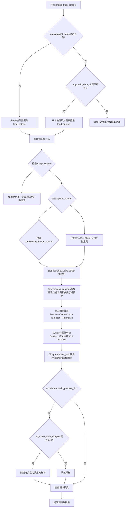

#### 带注释源码

```python
def make_train_dataset(args, tokenizer_one, tokenizer_two, tokenizer_three, accelerator):
    """
    加载并预处理训练数据集
    
    参数:
        args: 包含数据集配置的命令行参数对象
        tokenizer_one: 第一个CLIP分词器
        tokenizer_two: 第二个CLIP分词器  
        tokenizer_three: T5分词器
        accelerator: Accelerate库的分发加速器
    
    返回:
        预处理后的训练数据集
    """
    
    # 获取数据集: 可以提供自己的训练和评估文件，或者从hub指定数据集
    # 在分布式训练中，load_dataset保证只有一个进程可以并发下载数据集
    
    # 根据dataset_name或train_data_dir加载数据集
    if args.dataset_name is not None:
        # 从Hub下载并加载数据集
        dataset = load_dataset(
            args.dataset_name,
            args.dataset_config_name,
            cache_dir=args.cache_dir,
        )
    else:
        if args.train_data_dir is not None:
            # 从本地目录加载数据集
            dataset = load_dataset(
                args.train_data_dir,
                cache_dir=args.cache_dir,
                trust_remote_code=True,
            )

    # 预处理数据集
    # 需要对输入和目标进行标记化
    column_names = dataset["train"].column_names

    # 获取输入/目标的列名
    # 确定图像列名，如果未指定则使用第一列
    if args.image_column is None:
        image_column = column_names[0]
        logger.info(f"image column defaulting to {image_column}")
    else:
        image_column = args.image_column
        if image_column not in column_names:
            raise ValueError(
                f"`--image_column` value '{args.image_column}' not found in dataset columns. Dataset columns are: {', '.join(column_names)}"
            )

    # 确定caption列名，如果未指定则使用第二列
    if args.caption_column is None:
        caption_column = column_names[1]
        logger.info(f"caption column defaulting to {caption_column}")
    else:
        caption_column = args.caption_column
        if caption_column not in column_names:
            raise ValueError(
                f"`--caption_column` value '{args.caption_column}' not found in dataset columns. Dataset columns are: {', '.join(column_names)}"
            )

    # 确定条件图像列名，如果未指定则使用第三列
    if args.conditioning_image_column is None:
        conditioning_image_column = column_names[2]
        logger.info(f"conditioning image column defaulting to {conditioning_image_column}")
    else:
        conditioning_image_column = args.conditioning_image_column
        if conditioning_image_column not in column_names:
            raise ValueError(
                f"`--conditioning_image_column` value '{args.conditioning_image_column}' not found in dataset columns. Dataset columns are: {', '.join(column_names)}"
            )

    def process_captions(examples, is_train=True):
        """
        处理caption数据，支持空提示词和多个caption的情况
        
        参数:
            examples: 数据样本字典
            is_train: 是否为训练模式
            
        返回:
            处理后的caption列表
        """
        captions = []
        for caption in examples[caption_column]:
            # 按比例将部分caption替换为空字符串
            if random.random() < args.proportion_empty_prompts:
                captions.append("")
            elif isinstance(caption, str):
                captions.append(caption)
            elif isinstance(caption, (list, np.ndarray)):
                # 如果有多个caption，训练时随机选择一个，验证时选第一个
                captions.append(random.choice(caption) if is_train else caption[0])
            else:
                raise ValueError(
                    f"Caption column `{caption_column}` should contain either strings or lists of strings."
                )
        return captions

    # 定义图像转换pipeline
    image_transforms = transforms.Compose(
        [
            transforms.Resize(args.resolution, interpolation=transforms.InterpolationMode.BILINEAR),
            transforms.CenterCrop(args.resolution),
            transforms.ToTensor(),
            transforms.Normalize([0.5], [0.5]),  # 归一化到[-1, 1]
        ]
    )

    # 定义条件图像转换pipeline（不需要归一化）
    conditioning_image_transforms = transforms.Compose(
        [
            transforms.Resize(args.resolution, interpolation=transforms.InterpolationMode.BILINEAR),
            transforms.CenterCrop(args.resolution),
            transforms.ToTensor(),
        ]
    )

    def preprocess_train(examples):
        """
        预处理训练数据
        
        参数:
            examples: 包含图像和caption的样本字典
            
        返回:
            添加了pixel_values、conditioning_pixel_values和prompts的样本字典
        """
        # 转换目标图像为RGB并应用转换
        images = [image.convert("RGB") for image in examples[image_column]]
        images = [image_transforms(image) for image in images]

        # 转换条件图像为RGB并应用转换
        conditioning_images = [image.convert("RGB") for image in examples[conditioning_image_column]]
        conditioning_images = [conditioning_image_transforms(image) for image in conditioning_images]

        # 将处理后的数据添加到examples中
        examples["pixel_values"] = images
        examples["conditioning_pixel_values"] = conditioning_images
        examples["prompts"] = process_captions(examples)

        return examples

    # 使用accelerator确保主进程先执行
    with accelerator.main_process_first():
        # 如果指定了max_train_samples，采样指定数量的数据用于调试或加速训练
        if args.max_train_samples is not None:
            dataset["train"] = dataset["train"].shuffle(seed=args.seed).select(range(args.max_train_samples))
        
        # 设置训练数据转换
        train_dataset = dataset["train"].with_transform(preprocess_train)

    return train_dataset
```


### `collate_fn`

该函数是用于 PyTorch DataLoader 的批处理整理函数（collate function），负责将多个数据样本（examples）整理成一个批次（batch），包括图像像素值、条件图像像素值、提示词嵌入和池化提示词嵌入的堆叠与格式转换。

参数：

- `examples`：`List[Dict]`（字典列表），从数据集中获取的样本列表，每个字典包含 "pixel_values"、"conditioning_pixel_values"、"prompt_embeds" 和 "pooled_prompt_embeds" 键

返回值：

- `Dict[str, torch.Tensor]`，返回一个包含四个键的字典：
  - `pixel_values`：`torch.Tensor`，堆叠后的目标图像像素值，形状为 (batch_size, C, H, W)
  - `conditioning_pixel_values`：`torch.Tensor`，堆叠后的条件图像像素值，形状为 (batch_size, C, H, W)
  - `prompt_embeds`：`torch.Tensor`，堆叠后的文本嵌入，形状为 (batch_size, seq_len, embed_dim)
  - `pooled_prompt_embeds`：`torch.Tensor`，堆叠后的池化文本嵌入，形状为 (batch_size, pool_dim)

#### 流程图

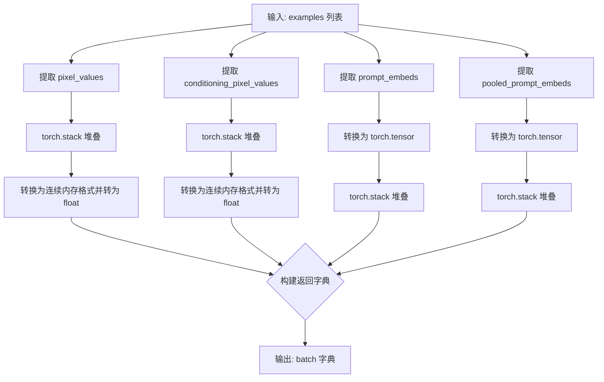

#### 带注释源码

```python
def collate_fn(examples):
    """
    用于将多个数据样本整理成一个批次的 collate 函数。
    
    参数:
        examples: 包含多个样本的列表，每个样本是一个字典，包含:
            - pixel_values: 目标图像的像素值 (Tensor)
            - conditioning_pixel_values: 条件图像的像素值 (Tensor)
            - prompt_embeds: 文本嵌入 (numpy array 或 Tensor)
            - pooled_prompt_embeds: 池化后的文本嵌入 (numpy array 或 Tensor)
    
    返回:
        包含批次数据的字典
    """
    
    # 从所有样本中提取 pixel_values 并堆叠成 batch
    # 使用 torch.stack 将多个样本的像素值沿新维度堆叠
    pixel_values = torch.stack([example["pixel_values"] for example in examples])
    # 转换为连续内存格式以提高内存访问效率，并确保数据类型为 float32
    pixel_values = pixel_values.to(memory_format=torch.contiguous_format).float()

    # 同样处理条件图像像素值（用于 ControlNet 条件）
    conditioning_pixel_values = torch.stack([example["conditioning_pixel_values"] for example in examples])
    conditioning_pixel_values = conditioning_pixel_values.to(memory_format=torch.contiguous_format).float()

    # 处理文本嵌入：将 numpy 数组或列表转换为 torch.tensor 后堆叠
    # 注意：prompt_embeds 存储在数据集示例中时可能是 numpy 数组，需要先转换
    prompt_embeds = torch.stack([torch.tensor(example["prompt_embeds"]) for example in examples])
    pooled_prompt_embeds = torch.stack([torch.tensor(example["pooled_prompt_embeds"]) for example in examples])

    # 返回整理好的批次字典，供模型训练使用
    return {
        "pixel_values": pixel_values,              # 目标图像批次
        "conditioning_pixel_values": conditioning_pixel_values,  # ControlNet 条件图像批次
        "prompt_embeds": prompt_embeds,            # 文本嵌入批次
        "pooled_prompt_embeds": pooled_prompt_embeds,  # 池化文本嵌入批次
    }
```


### `encode_prompt`

该函数是 Stable Diffusion 3 ControlNet 训练脚本中的核心提示词编码函数，负责将文本提示词转换为模型所需的嵌入向量。它通过两个 CLIP 文本编码器和一个 T5 文本编码器分别处理提示词，最后将结果拼接成完整的提示词嵌入供模型使用。

参数：

- `text_encoders`：`List[CLIPTextModel]`，包含两个 CLIP 文本编码器和一个 T5 文本编码器的列表，用于将文本转换为嵌入向量
- `tokenizers`：`List[CLIPTokenizer]`，包含对应文本编码器的分词器列表，用于将文本分词
- `prompt`：`str`，需要编码的文本提示词，可以是单个字符串或字符串列表
- `max_sequence_length`：`int`，T5 编码器的最大序列长度，用于控制 T5 生成的嵌入维度
- `device`：`torch.device`，可选参数，指定计算设备，如果为 None 则使用文本编码器所在设备
- `num_images_per_prompt`：`int`，每个提示词生成的图像数量，用于复制嵌入向量以支持批量生成，默认为 1

返回值：`Tuple[torch.Tensor, torch.Tensor]`，返回两个张量——`prompt_embeds` 是拼接后的完整提示词嵌入（包含 CLIP 和 T5 的嵌入），`pooled_prompt_embeds` 是经过池化处理的 CLIP 提示词嵌入，两者均可用于条件扩散模型的生成过程

#### 流程图

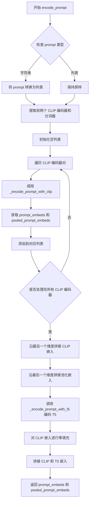

#### 带注释源码

```python
# Copied from dreambooth sd3 example
def encode_prompt(
    text_encoders,  # 包含 CLIPTextModel 和 T5EncoderModel 的列表
    tokenizers,     # 对应的分词器列表
    prompt: str,    # 输入的文本提示词
    max_sequence_length,  # T5 编码器的最大序列长度
    device=None,    # 计算设备，可选
    num_images_per_prompt: int = 1,  # 每个提示词生成的图像数量
):
    # 统一将 prompt 转换为列表格式，便于批量处理
    prompt = [prompt] if isinstance(prompt, str) else prompt
    # 获取批次大小
    batch_size = len(prompt)

    # 提取前两个 CLIP 编码器和分词器（SD3 使用两个 CLIP 编码器）
    clip_tokenizers = tokenizers[:2]
    clip_text_encoders = text_encoders[:2]

    # 用于存储 CLIP 编码后的嵌入向量
    clip_prompt_embeds_list = []
    clip_pooled_prompt_embeds_list = []

    # 遍历两个 CLIP 编码器分别进行编码
    for tokenizer, text_encoder in zip(clip_tokenizers, clip_text_encoders):
        # 调用 CLIP 编码函数获取嵌入
        prompt_embeds, pooled_prompt_embeds = _encode_prompt_with_clip(
            text_encoder=text_encoder,
            tokenizer=tokenizer,
            prompt=prompt,
            device=device if device is not None else text_encoder.device,
            num_images_per_prompt=num_images_per_prompt,
        )
        # 将结果添加到列表中
        clip_prompt_embeds_list.append(prompt_embeds)
        clip_pooled_prompt_embeds_list.append(pooled_prompt_embeds)

    # 沿最后一个维度拼接两个 CLIP 模型的提示词嵌入
    # 例如：CLIP1 [B, 77, 768] + CLIP2 [B, 77, 768] -> [B, 77, 1536]
    clip_prompt_embeds = torch.cat(clip_prompt_embeds_list, dim=-1)
    # 拼接池化后的嵌入
    pooled_prompt_embeds = torch.cat(clip_pooled_prompt_embeds_list, dim=-1)

    # 使用 T5 编码器处理提示词（处理长文本依赖关系）
    t5_prompt_embed = _encode_prompt_with_t5(
        text_encoders[-1],    # 第三个编码器是 T5
        tokenizers[-1],       # 对应的分词器
        max_sequence_length, # 最大序列长度
        prompt=prompt,
        num_images_per_prompt=num_images_per_prompt,
        device=device if device is not None else text_encoders[-1].device,
    )

    # 对 CLIP 嵌入进行填充，使其与 T5 嵌入的维度兼容
    # 计算需要填充的维度大小
    pad_size = t5_prompt_embed.shape[-1] - clip_prompt_embeds.shape[-1]
    # 使用零填充扩展 CLIP 嵌入
    clip_prompt_embeds = torch.nn.functional.pad(
        clip_prompt_embeds, (0, pad_size)
    )

    # 沿倒数第二个维度拼接 CLIP 嵌入和 T5 嵌入
    # 最终维度：[B, 77+max_seq_len, embed_dim]
    prompt_embeds = torch.cat([clip_prompt_embeds, t5_prompt_embed], dim=-2)

    # 返回完整的提示词嵌入和池化嵌入
    return prompt_embeds, pooled_prompt_embeds
```


### `_encode_prompt_with_clip`

该函数用于使用 CLIP 文本编码器对输入提示进行编码，生成用于 Stable Diffusion 3 模型的文本嵌入和池化嵌入。它是 `encode_prompt` 函数的辅助函数，专门处理 CLIP 系列文本编码器（CLIPTextModel 和 CLIPTextModelWithProjection）。

参数：

- `text_encoder`：`torch.nn.Module`，CLIP 文本编码器模型，用于将 token IDs 转换为文本嵌入
- `tokenizer`：`transformers.PreTrainedTokenizer`，CLIP 分词器，用于将文本提示转换为 token IDs
- `prompt`：`str`，要编码的文本提示，可以是单个字符串或字符串列表
- `device`：`torch.device`，可选，指定计算设备，默认为文本编码器的设备
- `num_images_per_prompt`：`int`，每个提示生成的图像数量，用于复制文本嵌入以匹配批量大小

返回值：`Tuple[torch.Tensor, torch.Tensor]`，返回两个张量：
- `prompt_embeds`：形状为 `(batch_size * num_images_per_prompt, seq_len, hidden_dim)` 的文本嵌入张量
- `pooled_prompt_embeds`：池化后的文本嵌入，用于条件生成

#### 流程图

```mermaid
flowchart TD
    A[开始: _encode_prompt_with_clip] --> B{判断 prompt 类型}
    B -->|字符串| C[将单个字符串转为列表]
    B -->|列表| D[保持列表不变]
    C --> E[计算 batch_size]
    D --> E
    E --> F[tokenizer: 文本分词]
    F --> G[padding=max_length, max_length=77, truncation=True, return_tensors=pt]
    G --> H[获取 input_ids]
    H --> I[text_encoder: 编码 input_ids]
    I --> J[output_hidden_states=True 获取隐藏状态]
    J --> K[提取 pooled_prompt_embeds: prompt_embeds[0]]
    J --> L[提取倒数第二个隐藏状态: prompt_embeds.hidden_states[-2]]
    L --> M[转换为指定 dtype 和 device]
    M --> N[获取 seq_len]
    N --> O[repeat: 复制 embeddings]
    O --> P[view: 调整形状]
    P --> Q[返回 prompt_embeds 和 pooled_prompt_embeds]
```

#### 带注释源码

```python
def _encode_prompt_with_clip(
    text_encoder,
    tokenizer,
    prompt: str,
    device=None,
    num_images_per_prompt: int = 1,
):
    # 将提示转换为列表，统一处理流程
    prompt = [prompt] if isinstance(prompt, str) else prompt
    batch_size = len(prompt)

    # 使用 tokenizer 将文本转换为 PyTorch 张量
    # max_length=77 是 CLIP 模型的标准最大序列长度
    # padding="max_length" 确保所有序列长度一致
    # truncation=True 截断超过最大长度的序列
    text_inputs = tokenizer(
        prompt,
        padding="max_length",
        max_length=77,
        truncation=True,
        return_tensors="pt",
    )

    # 获取 token IDs
    text_input_ids = text_inputs.input_ids
    
    # 使用 text_encoder 编码输入，output_hidden_states=True 获取所有隐藏状态
    # 这允许我们提取中间层和最后层的表示
    prompt_embeds = text_encoder(text_input_ids.to(device), output_hidden_states=True)

    # 从编码器输出中提取池化后的嵌入（第一层输出）
    # 这是整个序列的池化表示，通常用于条件生成
    pooled_prompt_embeds = prompt_embeds[0]
    
    # 从隐藏状态中提取倒数第二层的表示
    # SD3 使用倒数第二层而非最后一层作为主要嵌入
    prompt_embeds = prompt_embeds.hidden_states[-2]
    
    # 确保嵌入在正确的设备和数据类型上
    prompt_embeds = prompt_embeds.to(dtype=text_encoder.dtype, device=device)

    # 获取序列长度
    _, seq_len, _ = prompt_embeds.shape
    
    # 复制文本嵌入以匹配每个提示生成的图像数量
    # 这是一种 MPS 友好的方法（Apple Silicon GPU）
    prompt_embeds = prompt_embeds.repeat(1, num_images_per_prompt, 1)
    
    # 重新整形为 (batch_size * num_images_per_prompt, seq_len, hidden_dim)
    prompt_embeds = prompt_embeds.view(batch_size * num_images_per_prompt, seq_len, -1)

    # 返回文本嵌入和池化嵌入，供后续图像生成使用
    return prompt_embeds, pooled_prompt_embeds
```


### `_encode_prompt_with_t5`

该函数用于使用T5文本编码器将文本提示（prompt）编码为文本嵌入向量（prompt embeddings），支持批量处理和为每个提示生成多个图像的嵌入。

参数：

- `text_encoder`：`transformers.T5EncoderModel`，T5文本编码器模型，用于将文本转换为嵌入向量
- `tokenizer`：`transformers.T5TokenizerFast`，T5分词器，用于将文本分割为token
- `max_sequence_length`：`int`，最大序列长度，用于控制编码后的序列长度
- `prompt`：`Union[str, List[str]]`，待编码的文本提示，可以是单个字符串或字符串列表
- `num_images_per_prompt`：`int`，默认为1，每个提示生成的图像数量，用于扩展嵌入维度
- `device`：`torch.device`，计算设备，指定模型运行在CPU还是GPU上

返回值：`torch.Tensor`，编码后的文本嵌入向量，形状为`(batch_size * num_images_per_prompt, seq_len, hidden_dim)`

#### 流程图

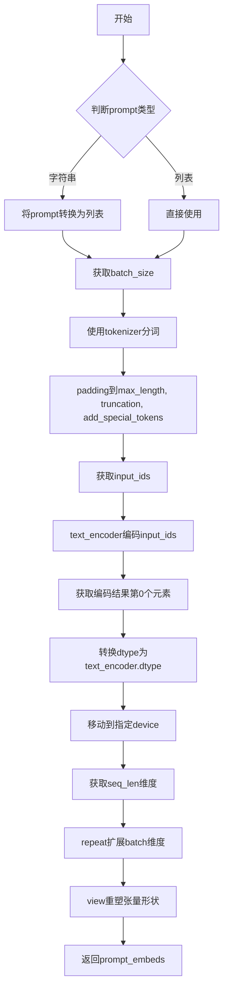

#### 带注释源码

```python
def _encode_prompt_with_t5(
    text_encoder,
    tokenizer,
    max_sequence_length,
    prompt=None,
    num_images_per_prompt=1,
    device=None,
):
    # 将prompt转换为列表，统一处理逻辑
    prompt = [prompt] if isinstance(prompt, str) else prompt
    # 获取批次大小
    batch_size = len(prompt)

    # 使用tokenizer对prompt进行分词处理
    text_inputs = tokenizer(
        prompt,
        padding="max_length",           # 填充到最大长度
        max_length=max_sequence_length, # 最大序列长度
        truncation=True,                 # 截断超长序列
        add_special_tokens=True,        # 添加特殊token（如eos等）
        return_tensors="pt",            # 返回PyTorch张量
    )
    # 获取输入token的ID
    text_input_ids = text_inputs.input_ids
    # 使用T5编码器编码文本输入，获取隐藏状态
    # [0]表示获取hidden_states的第一个元素（主输出）
    prompt_embeds = text_encoder(text_input_ids.to(device))[0]

    # 获取编码器的dtype，确保embeddings保持一致的精度
    dtype = text_encoder.dtype
    # 将embeddings转换到指定dtype和device
    prompt_embeds = prompt_embeds.to(dtype=dtype, device=device)

    # 获取编码后序列的维度信息
    _, seq_len, _ = prompt_embeds.shape

    # 复制text embeddings以匹配每个prompt生成的图像数量
    # 使用mps友好的方法（repeat而非repeat_interleave）
    prompt_embeds = prompt_embeds.repeat(1, num_images_per_prompt, 1)
    # 重塑张量形状：(batch_size, num_images_per_prompt, seq_len, hidden_dim) -> (batch_size * num_images_per_prompt, seq_len, hidden_dim)
    prompt_embeds = prompt_embeds.view(batch_size * num_images_per_prompt, seq_len, -1)

    # 返回编码后的prompt embeddings
    return prompt_embeds
```


### `log_validation`

该函数用于在训练过程中执行验证任务，包括加载验证图像、使用ControlNet模型生成图像、并将生成的图像记录到追踪器（如TensorBoard或WandB）中。

参数：

- `controlnet`：`SD3ControlNetModel` 或 `None`，训练中的ControlNet模型实例。如果不是最终验证，则使用accelerator解包后的模型；如果是最终验证，则从输出目录重新加载。
- `args`：命名空间对象，包含所有训练参数，特别是`pretrained_model_name_or_path`、`output_dir`、`revision`、`variant`、`seed`、`validation_image`、`validation_prompt`、`num_validation_images`等。
- `accelerator`：`Accelerator`对象，HuggingFace Accelerate库提供的分布式训练加速器，用于设备管理、模型解包和追踪器访问。
- `weight_dtype`：`torch.dtype`，模型权重的数据类型（float32/float16/bfloat16），用于管道加载。
- `step`：整数，当前训练的全局步数，用于日志记录。
- `is_final_validation`：布尔值，默认为False。表示是否为训练结束后的最终验证；若是，则从磁盘重新加载完整模型而非使用训练中的模型。

返回值：`list`，包含验证图像及其元数据的图像日志列表。每个元素是一个字典，包含`validation_image`（PIL图像）、`images`（生成的图像列表）和`validation_prompt`（对应的提示词）。

#### 流程图

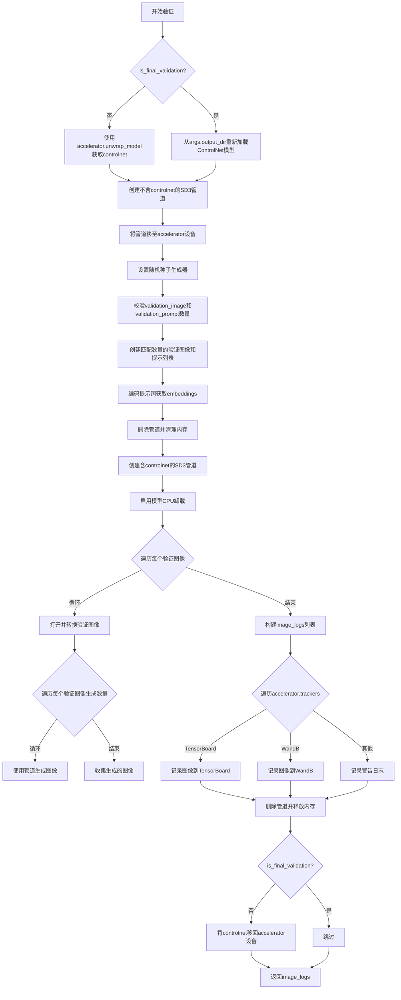

#### 带注释源码

```python
def log_validation(controlnet, args, accelerator, weight_dtype, step, is_final_validation=False):
    """
    执行验证流程：使用ControlNet模型生成图像并记录到追踪器
    
    参数:
        controlnet: 训练中的ControlNet模型或None（最终验证时）
        args: 包含所有训练配置的命名空间对象
        accelerator: HuggingFace Accelerate加速器实例
        weight_dtype: 模型权重数据类型
        step: 当前训练步数
        is_final_validation: 是否为最终验证（训练结束后）
    """
    logger.info("Running validation... ")

    # 根据是否为最终验证获取controlnet模型
    if not is_final_validation:
        # 训练中：从accelerator获取解包后的模型
        controlnet = accelerator.unwrap_model(controlnet)
    else:
        # 最终验证：从磁盘加载完整模型
        controlnet = SD3ControlNetModel.from_pretrained(args.output_dir, torch_dtype=weight_dtype)

    # 第一次创建管道：仅用于编码提示词（不包含controlnet以节省内存）
    pipeline = StableDiffusion3ControlNetPipeline.from_pretrained(
        args.pretrained_model_name_or_path,
        controlnet=None,  # 初始不加载controlnet
        safety_checker=None,  # 禁用安全检查器以加速
        transformer=None,    # 不需要transformer进行提示编码
        revision=args.revision,
        variant=args.variant,
        torch_dtype=weight_dtype,
    )
    pipeline = pipeline.to(torch.device(accelerator.device))
    pipeline.set_progress_bar_config(disable=True)

    # 设置随机数生成器以确保可复现性
    if args.seed is None:
        generator = None
    else:
        generator = torch.manual_seed(args.seed)

    # 处理验证图像和提示词的数量匹配问题
    # 三种情况：数量相等、仅一张图像、仅一个提示词
    if len(args.validation_image) == len(args.validation_prompt):
        validation_images = args.validation_image
        validation_prompts = args.validation_prompt
    elif len(args.validation_image) == 1:
        # 单张图像配多提示：复制图像
        validation_images = args.validation_image * len(args.validation_prompt)
        validation_prompts = args.validation_prompt
    elif len(args.validation_prompt) == 1:
        # 单提示配多图像：复制提示
        validation_images = args.validation_image
        validation_prompts = args.validation_prompt * len(args.validation_image)
    else:
        raise ValueError(
            "number of `args.validation_image` and `args.validation_prompt` should be checked in `parse_args`"
        )

    # 编码验证提示词（不需要梯度）
    with torch.no_grad():
        (
            prompt_embeds,           # 主提示词embedding
            negative_prompt_embeds, # 负面提示词embedding
            pooled_prompt_embeds,   # 池化后的提示词embedding
            negative_pooled_prompt_embeds, # 负面池化embedding
        ) = pipeline.encode_prompt(
            validation_prompts,
            prompt_2=None,
            prompt_3=None,
        )

    # 清理第一个管道以释放内存
    del pipeline
    gc.collect()
    backend_empty_cache(accelerator.device.type)

    # 第二次创建管道：包含controlnet用于图像生成
    pipeline = StableDiffusion3ControlNetPipeline.from_pretrained(
        args.pretrained_model_name_or_path,
        controlnet=controlnet,      # 加载controlnet
        safety_checker=None,
        text_encoder=None,          # 提示已编码，无需文本编码器
        text_encoder_2=None,
        text_encoder_3=None,
        revision=args.revision,
        variant=args.variant,
        torch_dtype=weight_dtype,
    )
    pipeline.enable_model_cpu_offload(device=accelerator.device.type)  # 启用CPU卸载以节省GPU内存
    pipeline.set_progress_bar_config(disable=True)

    image_logs = []
    # 最终验证时使用nullcontext，否则使用autocast进行混合精度推理
    inference_ctx = contextlib.nullcontext() if is_final_validation else torch.autocast(accelerator.device.type)

    # 遍历每个验证图像
    for i, validation_image in enumerate(validation_images):
        validation_image = Image.open(validation_image).convert("RGB")
        validation_prompt = validation_prompts[i]

        images = []

        # 生成多个验证图像
        for _ in range(args.num_validation_images):
            with inference_ctx:
                image = pipeline(
                    prompt_embeds=prompt_embeds[i].unsqueeze(0),
                    negative_prompt_embeds=negative_prompt_embeds[i].unsqueeze(0),
                    pooled_prompt_embeds=pooled_prompt_embeds[i].unsqueeze(0),
                    negative_pooled_prompt_embeds=negative_pooled_prompt_embeds[i].unsqueeze(0),
                    control_image=validation_image,
                    num_inference_steps=20,
                    generator=generator,
                ).images[0]

            images.append(image)

        # 记录每个验证图像及其生成的图像
        image_logs.append(
            {"validation_image": validation_image, "images": images, "validation_prompt": validation_prompt}
        )

    # 根据追踪器类型记录图像
    tracker_key = "test" if is_final_validation else "validation"
    for tracker in accelerator.trackers:
        if tracker.name == "tensorboard":
            # TensorBoard记录逻辑
            for log in image_logs:
                images = log["images"]
                validation_prompt = log["validation_prompt"]
                validation_image = log["validation_image"]

                # 记录控制Net conditioning图像
                tracker.writer.add_image(
                    "Controlnet conditioning", np.asarray([validation_image]), step, dataformats="NHWC"
                )

                # 格式化并记录生成的图像
                formatted_images = []
                for image in images:
                    formatted_images.append(np.asarray(image))

                formatted_images = np.stack(formatted_images)

                tracker.writer.add_images(validation_prompt, formatted_images, step, dataformats="NHWC")
        elif tracker.name == "wandb":
            # WandB记录逻辑
            formatted_images = []

            for log in image_logs:
                images = log["images"]
                validation_prompt = log["validation_prompt"]
                validation_image = log["validation_image"]

                # 记录conditioning图像
                formatted_images.append(wandb.Image(validation_image, caption="Controlnet conditioning"))

                # 记录生成的图像
                for image in images:
                    image = wandb.Image(image, caption=validation_prompt)
                    formatted_images.append(image)

            tracker.log({tracker_key: formatted_images})
        else:
            logger.warning(f"image logging not implemented for {tracker.name}")

    # 清理管道并释放内存
    del pipeline
    free_memory()

    # 训练中验证后将controlnet移回设备（最终验证后不需要）
    if not is_final_validation:
        controlnet.to(accelerator.device)

    return image_logs
```


### `save_model_card`

该函数用于在模型训练完成后生成并保存 HuggingFace Hub 的模型卡片（Model Card），包括训练元数据、示例图像和标签信息，并将其上传到指定的仓库文件夹中。

参数：

- `repo_id`：`str`，HuggingFace Hub 上的仓库 ID，用于标识模型仓库
- `image_logs`：`Optional[list]`，验证日志列表，包含验证图像和提示词信息，默认为 None
- `base_model`：`str`，基础预训练模型的名称或路径，用于描述训练所基于的模型
- `repo_folder`：`Optional[str]`，本地仓库文件夹路径，用于保存模型卡片和示例图像，默认为 None

返回值：`None`，该函数不返回任何值，仅执行文件写入操作

#### 流程图

```mermaid
flowchart TD
    A[开始 save_model_card] --> B{image_logs 是否为 None}
    B -->|是| C[img_str 保持为空字符串]
    B -->|否| D[遍历 image_logs]
    D --> E[保存 validation_image 为 image_control.png]
    E --> F[构建图像网格并保存为 images_{i}.png]
    F --> G[构建图像标记字符串 img_str]
    G --> C
    C --> H[构建 model_description 字符串]
    H --> I[调用 load_or_create_model_card 创建模型卡片]
    I --> J[定义标签列表 tags]
    J --> K[调用 populate_model_card 添加标签]
    K --> L[保存模型卡片为 README.md]
    L --> M[结束]
```

#### 带注释源码

```python
def save_model_card(repo_id: str, image_logs=None, base_model=str, repo_folder=None):
    """
    生成并保存 HuggingFace Hub 模型卡片
    
    参数:
        repo_id: HuggingFace Hub 仓库 ID
        image_logs: 验证日志列表，包含图像和提示词
        base_model: 基础预训练模型名称
        repo_folder: 本地仓库文件夹路径
    """
    
    # 初始化图像描述字符串
    img_str = ""
    
    # 如果提供了验证日志，则处理图像
    if image_logs is not None:
        # 添加示例图像标题
        img_str = "You can find some example images below.\n\n"
        
        # 遍历每条验证日志
        for i, log in enumerate(image_logs):
            images = log["images"]
            validation_prompt = log["validation_prompt"]
            validation_image = log["validation_image"]
            
            # 保存条件图像
            validation_image.save(os.path.join(repo_folder, "image_control.png"))
            
            # 添加提示词描述
            img_str += f"prompt: {validation_prompt}\n"
            
            # 将验证图像与生成的图像合并
            images = [validation_image] + images
            
            # 创建图像网格并保存
            make_image_grid(images, 1, len(images)).save(os.path.join(repo_folder, f"images_{i}.png"))
            
            # 添加图像 markdown 标记
            img_str += f"\n"

    # 构建模型描述内容
    model_description = f"""
# SD3 controlnet-{repo_id}

These are controlnet weights trained on {base_model} with new type of conditioning.
The weights were trained using [ControlNet](https://github.com/lllyasviel/ControlNet) with the [SD3 diffusers trainer](https://github.com/huggingface/diffusers/blob/main/examples/controlnet/README_sd3.md).
{img_str}

Please adhere to the licensing terms as described `[here](https://huggingface.co/stabilityai/stable-diffusion-3-medium/blob/main/LICENSE)`.
"""
    
    # 加载或创建模型卡片
    model_card = load_or_create_model_card(
        repo_id_or_path=repo_id,
        from_training=True,
        license="openrail++",
        base_model=base_model,
        model_description=model_description,
        inference=True,
    )

    # 定义模型标签
    tags = [
        "text-to-image",
        "diffusers-training",
        "diffusers",
        "sd3",
        "sd3-diffusers",
        "controlnet",
    ]
    
    # 填充模型卡片标签
    model_card = populate_model_card(model_card, tags=tags)

    # 保存模型卡片到 README.md
    model_card.save(os.path.join(repo_folder, "README.md"))
```


### `import_model_class_from_model_name_or_path`

该函数是一个工具函数，用于根据预训练模型的配置文件动态导入相应的文本编码器类。它通过读取预训练模型配置中的架构信息，判断是 CLIP 文本编码器还是 T5 文本编码器，并返回对应的类对象供后续模型加载使用。

参数：

- `pretrained_model_name_or_path`：`str`，预训练模型的名称或路径，用于定位模型配置文件
- `revision`：`str`，模型的 Git 版本号，用于指定要加载的模型版本
- `subfolder`：`str`，模型子文件夹路径，默认为 `"text_encoder"`，用于指定配置文件的子目录位置

返回值：`type`，返回对应的文本编码器类（`CLIPTextModelWithProjection` 或 `T5EncoderModel`）

#### 流程图

```mermaid
flowchart TD
    A[开始: import_model_class_from_model_name_or_path] --> B[调用 PretrainedConfig.from_pretrained 加载配置文件]
    B --> C[从配置中获取 architectures[0]]
    C --> D{判断 model_class 类型}
    D -->|CLIPTextModelWithProjection| E[从 transformers 导入 CLIPTextModelWithProjection]
    D -->|T5EncoderModel| F[从 transformers 导入 T5EncoderModel]
    D -->|其他类型| G[抛出 ValueError 异常]
    E --> H[返回 CLIPTextModelWithProjection 类]
    F --> I[返回 T5EncoderModel 类]
    G --> J[结束: 抛出异常]
    H --> K[结束: 函数返回]
    I --> K
```

#### 带注释源码

```python
# Copied from dreambooth sd3 example
def import_model_class_from_model_name_or_path(
    pretrained_model_name_or_path: str, revision: str, subfolder: str = "text_encoder"
):
    """
    根据预训练模型的配置动态导入相应的文本编码器类。
    
    参数:
        pretrained_model_name_or_path: 预训练模型的名称或路径
        revision: 模型的 Git 版本号
        subfolder: 模型子文件夹，默认为 "text_encoder"
    
    返回:
        对应的文本编码器类 (CLIPTextModelWithProjection 或 T5EncoderModel)
    """
    # 使用 PretrainedConfig 从预训练模型路径加载配置文件
    text_encoder_config = PretrainedConfig.from_pretrained(
        pretrained_model_name_or_path, subfolder=subfolder, revision=revision
    )
    # 获取配置中指定的架构类名
    model_class = text_encoder_config.architectures[0]
    
    # 根据架构类型返回对应的类
    if model_class == "CLIPTextModelWithProjection":
        # 从 transformers 库导入 CLIP 文本编码器（含投影层）
        from transformers import CLIPTextModelWithProjection

        return CLIPTextModelWithProjection
    elif model_class == "T5EncoderModel":
        # 从 transformers 库导入 T5 文本编码器
        from transformers import T5EncoderModel

        return T5EncoderModel
    else:
        # 如果遇到不支持的架构类型，抛出 ValueError 异常
        raise ValueError(f"{model_class} is not supported.")
```


### `load_text_encoders`

该函数用于从预训练模型路径加载三个文本编码器（CLIPTextEncoder、T5Encoder等），支持从不同的子文件夹（text_encoder、text_encoder_2、text_encoder_3）加载对应的模型，并支持版本控制和模型变体选择。

参数：

- `class_one`：`type`，第一个文本编码器类（如CLIPTextModelWithProjection）
- `class_two`：`type`，第二个文本编码器类（如CLIPTextModel或T5EncoderModel）
- `class_three`：`type`，第三个文本编码器类（如T5EncoderModel）

返回值：`Tuple[type, type, type]`，返回三个预训练文本编码器实例的元组

#### 流程图

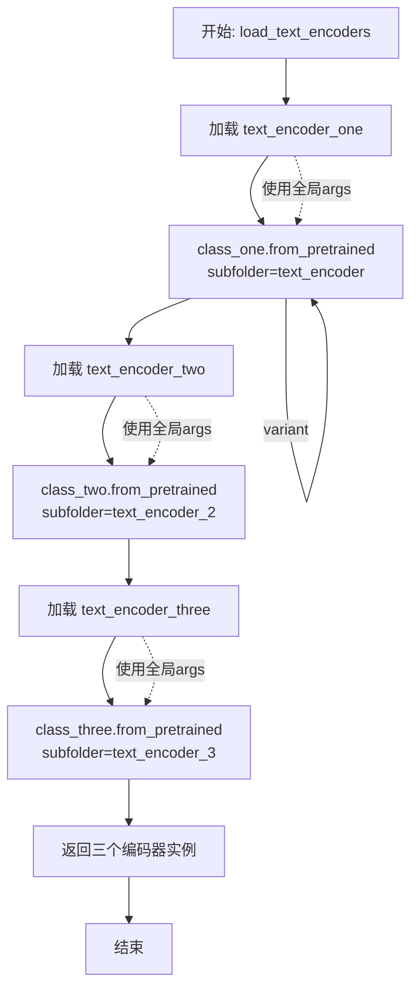

#### 带注释源码

```
# Copied from dreambooth sd3 example
def load_text_encoders(class_one, class_two, class_three):
    # 加载第一个文本编码器（通常是CLIPTextModelWithProjection）
    text_encoder_one = class_one.from_pretrained(
        args.pretrained_model_name_or_path,  # 预训练模型路径或HuggingFace模型ID
        subfolder="text_encoder",           # 子文件夹名称
        revision=args.revision,              # Git修订版本
        variant=args.variant                 # 模型变体（如fp16）
    )
    
    # 加载第二个文本编码器（通常是CLIPTextModel）
    text_encoder_two = class_two.from_pretrained(
        args.pretrained_model_name_or_path,
        subfolder="text_encoder_2",          # 第二个编码器的子文件夹
        revision=args.revision,
        variant=args.variant
    )
    
    # 加载第三个文本编码器（通常是T5EncoderModel）
    text_encoder_three = class_three.from_pretrained(
        args.pretrained_model_name_or_path,
        subfolder="text_encoder_3",          # 第三个编码器的子文件夹
        revision=args.revision,
        variant=args.variant
    )
    
    # 返回三个预训练的文本编码器实例
    return text_encoder_one, text_encoder_two, text_encoder_three
```


### `main`

这是SD3 ControlNet训练脚本的核心入口函数，负责整个训练流程的 orchestration，包括参数验证、模型加载、数据集准备、训练循环执行以及最终模型保存。

参数：

- `args`：命令行参数对象（Namespace），包含所有训练配置，如模型路径、学习率、批次大小、训练步数等

返回值：无返回值（`None`），该函数直接执行训练流程并保存模型

#### 流程图

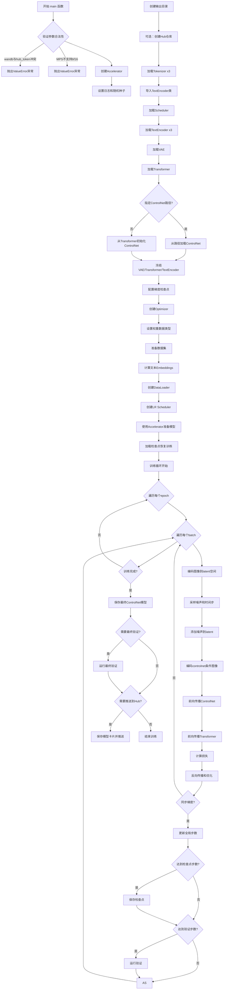

#### 带注释源码

```python
def main(args):
    # 验证 wandb 和 hub_token 不能同时使用（安全考虑）
    if args.report_to == "wandb" and args.hub_token is not None:
        raise ValueError(
            "You cannot use both --report_to=wandb and --hub_token due to a security risk of exposing your token."
            " Please use `hf auth login` to authenticate with the Hub."
        )

    # MPS 不支持 bfloat16，抛出错误
    if torch.backends.mps.is_available() and args.mixed_precision == "bf16":
        raise ValueError(
            "Mixed precision training with bfloat16 is not supported on MPS. Please use fp16 (recommended) or fp32 instead."
        )

    # 构建日志目录路径
    logging_dir = Path(args.output_dir, args.logging_dir)

    # 配置 Accelerator 项目设置
    accelerator_project_config = ProjectConfiguration(project_dir=args.output_dir, logging_dir=logging_dir)
    # 分布式训练参数，启用 find_unused_parameters 处理未使用的参数
    kwargs = DistributedDataParallelKwargs(find_unused_parameters=True)
    # 初始化 Accelerator，协调分布式训练、混合精度、梯度累积等
    accelerator = Accelerator(
        gradient_accumulation_steps=args.gradient_accumulation_steps,
        mixed_precision=args.mixed_precision,
        log_with=args.report_to,
        project_config=accelerator_project_config,
        kwargs_handlers=[kwargs],
    )

    # MPS 设备禁用原生 AMP
    if torch.backends.mps.is_available():
        accelerator.native_amp = False

    # 检查 wandb 是否安装
    if args.report_to == "wandb":
        if not is_wandb_available():
            raise ImportError("Make sure to install wandb if you want to use it for logging during training.")

    # 配置日志格式，在所有进程输出配置信息用于调试
    logging.basicConfig(
        format="%(asctime)s - %(levelname)s - %(name)s - %(message)s",
        datefmt="%m/%d/%Y %H:%M:%S",
        level=logging.INFO,
    )
    logger.info(accelerator.state, main_process_only=False)
    # 主进程设置详细日志级别
    if accelerator.is_local_main_process:
        transformers.utils.logging.set_verbosity_warning()
        diffusers.utils.logging.set_verbosity_info()
    else:
        transformers.utils.logging.set_verbosity_error()
        diffusers.utils.logging.set_verbosity_error()

    # 设置训练随机种子，确保可复现性
    if args.seed is not None:
        set_seed(args.seed)

    # 处理仓库创建（主进程）
    if accelerator.is_main_process:
        if args.output_dir is not None:
            os.makedirs(args.output_dir, exist_ok=True)

        # 可选：推送到 HuggingFace Hub
        if args.push_to_hub:
            repo_id = create_repo(
                repo_id=args.hub_model_id or Path(args.output_dir).name, exist_ok=True, token=args.hub_token
            ).repo_id

    # 加载三个 Tokenizer（CLIP x2 + T5）
    tokenizer_one = CLIPTokenizer.from_pretrained(
        args.pretrained_model_name_or_path,
        subfolder="tokenizer",
        revision=args.revision,
    )
    tokenizer_two = CLIPTokenizer.from_pretrained(
        args.pretrained_model_name_or_path,
        subfolder="tokenizer_2",
        revision=args.revision,
    )
    tokenizer_three = T5TokenizerFast.from_pretrained(
        args.pretrained_model_name_or_path,
        subfolder="tokenizer_3",
        revision=args.revision,
    )

    # 根据配置导入正确的 TextEncoder 类
    text_encoder_cls_one = import_model_class_from_model_name_or_path(
        args.pretrained_model_name_or_path, args.revision
    )
    text_encoder_cls_two = import_model_class_from_model_name_or_path(
        args.pretrained_model_name_or_path, args.revision, subfolder="text_encoder_2"
    )
    text_encoder_cls_three = import_model_class_from_model_name_or_path(
        args.pretrained_model_name_or_path, args.revision, subfolder="text_encoder_3"
    )

    # 加载噪声调度器（Flow Match Euler Discrete Scheduler）
    noise_scheduler = FlowMatchEulerDiscreteScheduler.from_pretrained(
        args.pretrained_model_name_or_path, subfolder="scheduler"
    )
    # 创建调度器副本用于时间步采样
    noise_scheduler_copy = copy.deepcopy(noise_scheduler)
    # 加载三个 TextEncoder
    text_encoder_one, text_encoder_two, text_encoder_three = load_text_encoders(
        text_encoder_cls_one, text_encoder_cls_two, text_encoder_cls_three
    )
    # 加载 VAE
    vae = AutoencoderKL.from_pretrained(
        args.pretrained_model_name_or_path,
        subfolder="vae",
        revision=args.revision,
        variant=args.variant,
    )
    # 加载 Transformer（SD3 主模型）
    transformer = SD3Transformer2DModel.from_pretrained(
        args.pretrained_model_name_or_path, subfolder="transformer", revision=args.revision, variant=args.variant
    )

    # 加载或初始化 ControlNet
    if args.controlnet_model_name_or_path:
        logger.info("Loading existing controlnet weights")
        controlnet = SD3ControlNetModel.from_pretrained(args.controlnet_model_name_or_path)
    else:
        logger.info("Initializing controlnet weights from transformer")
        controlnet = SD3ControlNetModel.from_transformer(
            transformer, num_extra_conditioning_channels=args.num_extra_conditioning_channels
        )

    # 冻结非训练模型（VAE、Transformer、TextEncoder 都不参与训练）
    transformer.requires_grad_(False)
    vae.requires_grad_(False)
    text_encoder_one.requires_grad_(False)
    text_encoder_two.requires_grad_(False)
    text_encoder_three.requires_grad_(False)
    # ControlNet 设置为训练模式
    controlnet.train()

    # 解包模型的辅助函数（处理编译后的模型）
    def unwrap_model(model):
        model = accelerator.unwrap_model(model)
        model = model._orig_mod if is_compiled_module(model) else model
        return model

    # 注册自定义模型保存和加载钩子（Accelerator 0.16.0+）
    if version.parse(accelerate.__version__) >= version.parse("0.16.0"):
        def save_model_hook(models, weights, output_dir):
            # 保存 ControlNet 权重
            if accelerator.is_main_process:
                i = len(weights) - 1
                while len(weights) > 0:
                    weights.pop()
                    model = models[i]
                    sub_dir = "controlnet"
                    model.save_pretrained(os.path.join(output_dir, sub_dir))
                    i -= 1

        def load_model_hook(models, input_dir):
            # 加载 ControlNet 权重
            while len(models) > 0:
                model = models.pop()
                load_model = SD3ControlNetModel.from_pretrained(input_dir, subfolder="controlnet")
                model.register_to_config(**load_model.config)
                model.load_state_dict(load_model.state_dict())
                del load_model

        accelerator.register_save_state_pre_hook(save_model_hook)
        accelerator.register_load_state_pre_hook(load_model_hook)

    # 启用梯度检查点以节省显存
    if args.gradient_checkpointing:
        controlnet.enable_gradient_checkpointing()

    # 验证 ControlNet 数据类型为 float32
    low_precision_error_string = (
        " Please make sure to always have all model weights in full float32 precision when starting training - even if"
        " doing mixed precision training, copy of the weights should still be float32."
    )
    if unwrap_model(controlnet).dtype != torch.float32:
        raise ValueError(
            f"Controlnet loaded as datatype {unwrap_model(controlnet).dtype}. {low_precision_error_string}"
        )

    # 启用 TF32 加速（Ampere GPU）
    if args.allow_tf32:
        torch.backends.cuda.matmul.allow_tf32 = True

    # 根据 GPU 数量、梯度累积和批次大小缩放学习率
    if args.scale_lr:
        args.learning_rate = (
            args.learning_rate * args.gradient_accumulation_steps * args.train_batch_size * accelerator.num_processes
        )

    # 选择 Optimizer（可选 8-bit Adam 节省显存）
    if args.use_8bit_adam:
        try:
            import bitsandbytes as bnb
        except ImportError:
            raise ImportError(
                "To use 8-bit Adam, please install the bitsandbytes library: `pip install bitsandbytes`."
            )
        optimizer_class = bnb.optim.AdamW8bit
    else:
        optimizer_class = torch.optim.AdamW

    # 创建优化器
    params_to_optimize = controlnet.parameters()
    optimizer = optimizer_class(
        params_to_optimize,
        lr=args.learning_rate,
        betas=(args.adam_beta1, args.adam_beta2),
        weight_decay=args.adam_weight_decay,
        eps=args.adam_epsilon,
    )

    # 确定权重数据类型（float32/fp16/bf16）
    weight_dtype = torch.float32
    if accelerator.mixed_precision == "fp16":
        weight_dtype = torch.float16
    elif accelerator.mixed_precision == "bf16":
        weight_dtype = torch.bfloat16

    # 将模型移动到设备并转换数据类型
    if args.upcast_vae:
        vae.to(accelerator.device, dtype=torch.float32)
    else:
        vae.to(accelerator.device, dtype=weight_dtype)
    transformer.to(accelerator.device, dtype=weight_dtype)
    text_encoder_one.to(accelerator.device, dtype=weight_dtype)
    text_encoder_two.to(accelerator.device, dtype=weight_dtype)
    text_encoder_three.to(accelerator.device, dtype=weight_dtype)

    # 创建训练数据集
    train_dataset = make_train_dataset(args, tokenizer_one, tokenizer_two, tokenizer_three, accelerator)

    # 整理 tokenizers 和 text_encoders 列表
    tokenizers = [tokenizer_one, tokenizer_two, tokenizer_three]
    text_encoders = [text_encoder_one, text_encoder_two, text_encoder_three]

    # 计算文本 embeddings 的函数
    def compute_text_embeddings(batch, text_encoders, tokenizers):
        with torch.no_grad():
            prompt = batch["prompts"]
            prompt_embeds, pooled_prompt_embeds = encode_prompt(
                text_encoders, tokenizers, prompt, args.max_sequence_length
            )
            prompt_embeds = prompt_embeds.to(accelerator.device)
            pooled_prompt_embeds = pooled_prompt_embeds.to(accelerator.device)
        return {"prompt_embeds": prompt_embeds, "pooled_prompt_embeds": pooled_prompt_embeds}

    # 使用 functools.partial 预填充部分参数
    compute_embeddings_fn = functools.partial(
        compute_text_embeddings,
        text_encoders=text_encoders,
        tokenizers=tokenizers,
    )
    # 在主进程首先处理数据集，计算 text embeddings 并缓存
    with accelerator.main_process_first():
        from datasets.fingerprint import Hasher
        # 生成缓存指纹
        new_fingerprint = Hasher.hash(args)
        # 使用 map 计算所有文本的 embeddings
        train_dataset = train_dataset.map(
            compute_embeddings_fn,
            batched=True,
            batch_size=args.dataset_preprocess_batch_size,
            new_fingerprint=new_fingerprint,
        )

    # 释放 TextEncoder 和 Tokenizer 显存
    del text_encoder_one, text_encoder_two, text_encoder_three
    del tokenizer_one, tokenizer_two, tokenizer_three
    free_memory()

    # 创建训练 DataLoader
    train_dataloader = torch.utils.data.DataLoader(
        train_dataset,
        shuffle=True,
        collate_fn=collate_fn,
        batch_size=args.train_batch_size,
        num_workers=args.dataloader_num_workers,
    )

    # 计算训练步数
    overrode_max_train_steps = False
    num_update_steps_per_epoch = math.ceil(len(train_dataloader) / args.gradient_accumulation_steps)
    if args.max_train_steps is None:
        args.max_train_steps = args.num_train_epochs * num_update_steps_per_epoch
        overrode_max_train_steps = True

    # 创建学习率调度器
    lr_scheduler = get_scheduler(
        args.lr_scheduler,
        optimizer=optimizer,
        num_warmup_steps=args.lr_warmup_steps * accelerator.num_processes,
        num_training_steps=args.max_train_steps * accelerator.num_processes,
        num_cycles=args.lr_num_cycles,
        power=args.lr_power,
    )

    # 使用 Accelerator 准备所有组件
    controlnet, optimizer, train_dataloader, lr_scheduler = accelerator.prepare(
        controlnet, optimizer, train_dataloader, lr_scheduler
    )

    # 重新计算训练步数（DataLoader 大小可能变化）
    num_update_steps_per_epoch = math.ceil(len(train_dataloader) / args.gradient_accumulation_steps)
    if overrode_max_train_steps:
        args.max_train_steps = args.num_train_epochs * num_update_steps_per_epoch
    args.num_train_epochs = math.ceil(args.max_train_steps / num_update_steps_per_epoch)

    # 初始化 trackers（TensorBoard, wandb 等）
    if accelerator.is_main_process:
        tracker_config = dict(vars(args))
        tracker_config.pop("validation_prompt")
        tracker_config.pop("validation_image")
        accelerator.init_trackers(args.tracker_project_name, config=tracker_config)

    # 打印训练信息
    total_batch_size = args.train_batch_size * accelerator.num_processes * args.gradient_accumulation_steps
    logger.info("***** Running training *****")
    logger.info(f"  Num examples = {len(train_dataset)}")
    logger.info(f"  Num batches each epoch = {len(train_dataloader)}")
    logger.info(f"  Num Epochs = {args.num_train_epochs}")
    logger.info(f"  Instantaneous batch size per device = {args.train_batch_size}")
    logger.info(f"  Total train batch size (w. parallel, distributed & accumulation) = {total_batch_size}")
    logger.info(f"  Gradient Accumulation steps = {args.gradient_accumulation_steps}")
    logger.info(f"  Total optimization steps = {args.max_train_steps}")

    global_step = 0
    first_epoch = 0

    # 从检查点恢复训练
    if args.resume_from_checkpoint:
        if args.resume_from_checkpoint != "latest":
            path = os.path.basename(args.resume_from_checkpoint)
        else:
            # 查找最新的检查点
            dirs = os.listdir(args.output_dir)
            dirs = [d for d in dirs if d.startswith("checkpoint")]
            dirs = sorted(dirs, key=lambda x: int(x.split("-")[1]))
            path = dirs[-1] if len(dirs) > 0 else None

        if path is None:
            accelerator.print(f"Checkpoint '{args.resume_from_checkpoint}' does not exist. Starting a new training run.")
            args.resume_from_checkpoint = None
            initial_global_step = 0
        else:
            accelerator.print(f"Resuming from checkpoint {path}")
            accelerator.load_state(os.path.join(args.output_dir, path))
            global_step = int(path.split("-")[1])
            initial_global_step = global_step
            first_epoch = global_step // num_update_steps_per_epoch
    else:
        initial_global_step = 0

    # 创建进度条
    progress_bar = tqdm(
        range(0, args.max_train_steps),
        initial=initial_global_step,
        desc="Steps",
        disable=not accelerator.is_local_main_process,
    )

    # 获取 sigmas 的辅助函数（用于 flow matching）
    def get_sigmas(timesteps, n_dim=4, dtype=torch.float32):
        sigmas = noise_scheduler_copy.sigmas.to(device=accelerator.device, dtype=dtype)
        schedule_timesteps = noise_scheduler_copy.timesteps.to(accelerator.device)
        timesteps = timesteps.to(accelerator.device)
        step_indices = [(schedule_timesteps == t).nonzero().item() for t in timesteps]
        sigma = sigmas[step_indices].flatten()
        while len(sigma.shape) < n_dim:
            sigma = sigma.unsqueeze(-1)
        return sigma

    image_logs = None

    # ==================== 训练循环 ====================
    for epoch in range(first_epoch, args.num_train_epochs):
        for step, batch in enumerate(train_dataloader):
            # 使用 accumulator 进行梯度累积
            with accelerator.accumulate(controlnet):
                # 1. 将图像编码到 latent 空间
                pixel_values = batch["pixel_values"].to(dtype=vae.dtype)
                model_input = vae.encode(pixel_values).latent_dist.sample()
                # 应用 VAE 缩放因子
                model_input = (model_input - vae.config.shift_factor) * vae.config.scaling_factor
                model_input = model_input.to(dtype=weight_dtype)

                # 2. 采样噪声
                noise = torch.randn_like(model_input)
                bsz = model_input.shape[0]

                # 3. 根据加权方案采样时间步
                u = compute_density_for_timestep_sampling(
                    weighting_scheme=args.weighting_scheme,
                    batch_size=bsz,
                    logit_mean=args.logit_mean,
                    logit_std=args.logit_std,
                    mode_scale=args.mode_scale,
                )
                indices = (u * noise_scheduler_copy.config.num_train_timesteps).long()
                timesteps = noise_scheduler_copy.timesteps[indices].to(device=model_input.device)

                # 4. Flow Matching: zt = (1 - texp) * x + texp * z1
                sigmas = get_sigmas(timesteps, n_dim=model_input.ndim, dtype=model_input.dtype)
                noisy_model_input = (1.0 - sigmas) * model_input + sigmas * noise

                # 5. 获取文本条件
                prompt_embeds = batch["prompt_embeds"].to(dtype=weight_dtype)
                pooled_prompt_embeds = batch["pooled_prompt_embeds"].to(dtype=weight_dtype)

                # 6. 编码 ControlNet 条件图像
                controlnet_image = batch["conditioning_pixel_values"].to(dtype=weight_dtype)
                controlnet_image = vae.encode(controlnet_image).latent_dist.sample()
                controlnet_image = (controlnet_image - vae.config.shift_factor) * vae.config.scaling_factor

                # 7. ControlNet 前向传播
                control_block_res_samples = controlnet(
                    hidden_states=noisy_model_input,
                    timestep=timesteps,
                    encoder_hidden_states=prompt_embeds,
                    pooled_projections=pooled_prompt_embeds,
                    controlnet_cond=controlnet_image,
                    return_dict=False,
                )[0]
                control_block_res_samples = [sample.to(dtype=weight_dtype) for sample in control_block_res_samples]

                # 8. Transformer 预测噪声残差
                model_pred = transformer(
                    hidden_states=noisy_model_input,
                    timestep=timesteps,
                    encoder_hidden_states=prompt_embeds,
                    pooled_projections=pooled_prompt_embeds,
                    block_controlnet_hidden_states=control_block_res_samples,
                    return_dict=False,
                )[0]

                # 9. 输出预处理（EDM 风格）
                if args.precondition_outputs:
                    model_pred = model_pred * (-sigmas) + noisy_model_input

                # 10. 计算损失权重
                weighting = compute_loss_weighting_for_sd3(weighting_scheme=args.weighting_scheme, sigmas=sigmas)

                # 11. Flow Matching 目标
                if args.precondition_outputs:
                    target = model_input
                else:
                    target = noise - model_input

                # 12. 计算加权 MSE 损失
                loss = torch.mean(
                    (weighting.float() * (model_pred.float() - target.float()) ** 2).reshape(target.shape[0], -1),
                    1,
                )
                loss = loss.mean()

                # 13. 反向传播
                accelerator.backward(loss)

                # 14. 梯度裁剪
                if accelerator.sync_gradients:
                    params_to_clip = controlnet.parameters()
                    accelerator.clip_grad_norm_(params_to_clip, args.max_grad_norm)

                # 15. 优化器更新
                optimizer.step()
                lr_scheduler.step()
                optimizer.zero_grad(set_to_none=args.set_grads_to_none)

            # 检查是否执行了优化步骤
            if accelerator.sync_gradients:
                progress_bar.update(1)
                global_step += 1

                # 保存检查点
                if accelerator.is_main_process:
                    if global_step % args.checkpointing_steps == 0:
                        # 检查并删除旧检查点以限制总数
                        if args.checkpoints_total_limit is not None:
                            checkpoints = os.listdir(args.output_dir)
                            checkpoints = [d for d in checkpoints if d.startswith("checkpoint")]
                            checkpoints = sorted(checkpoints, key=lambda x: int(x.split("-")[1]))
                            if len(checkpoints) >= args.checkpoints_total_limit:
                                num_to_remove = len(checkpoints) - args.checkpoints_total_limit + 1
                                removing_checkpoints = checkpoints[0:num_to_remove]
                                for removing_checkpoint in removing_checkpoints:
                                    shutil.rmtree(os.path.join(args.output_dir, removing_checkpoint))

                        save_path = os.path.join(args.output_dir, f"checkpoint-{global_step}")
                        accelerator.save_state(save_path)
                        logger.info(f"Saved state to {save_path}")

                    # 运行验证
                    if args.validation_prompt is not None and global_step % args.validation_steps == 0:
                        image_logs = log_validation(
                            controlnet,
                            args,
                            accelerator,
                            weight_dtype,
                            global_step,
                        )

            # 记录日志
            logs = {"loss": loss.detach().item(), "lr": lr_scheduler.get_last_lr()[0]}
            progress_bar.set_postfix(**logs)
            accelerator.log(logs, step=global_step)

            # 检查是否达到最大训练步数
            if global_step >= args.max_train_steps:
                break

    # ==================== 训练结束 ====================
    # 确保所有进程同步
    accelerator.wait_for_everyone()
    
    # 主进程保存最终模型
    if accelerator.is_main_process:
        controlnet = unwrap_model(controlnet)
        controlnet.save_pretrained(args.output_dir)

        # 最终验证
        image_logs = None
        if args.validation_prompt is not None:
            image_logs = log_validation(
                controlnet=None,
                args=args,
                accelerator=accelerator,
                weight_dtype=weight_dtype,
                step=global_step,
                is_final_validation=True,
            )

        # 推送到 Hub
        if args.push_to_hub:
            save_model_card(
                repo_id,
                image_logs=image_logs,
                base_model=args.pretrained_model_name_or_path,
                repo_folder=args.output_dir,
            )
            upload_folder(
                repo_id=repo_id,
                folder_path=args.output_dir,
                commit_message="End of training",
                ignore_patterns=["step_*", "epoch_*"],
            )

    # 结束训练
    accelerator.end_training()
```


### SD3ControlNetModel.from_pretrained

该方法是从 Hugging Face Diffusers 库继承的类方法，用于从预训练模型目录或 Hub 加载 SD3ControlNetModel 实例。在代码中主要用于验证阶段加载训练好的控制网模型权重。

参数：

-  `pretrained_model_name_or_path`：`str`，模型目录路径或 Hugging Face Hub 上的模型标识符
-  `torch_dtype`：可选参数，指定模型权重的精度类型（如 `torch.float16`、`torch.bfloat16` 等）
-  `subfolder`：可选参数，指定模型文件所在的子文件夹路径
-  `revision`：可选参数，指定模型版本修订号
-  `variant`：可选参数，指定模型变体（如 "fp16"）
-  `use_safetensors`：可选参数，是否使用 safetensors 格式加载
-  `device_map`：可选参数，指定设备映射策略
-  `low_cpu_mem_usage`：可选参数，是否降低 CPU 内存使用

返回值：`SD3ControlNetModel`，返回加载后的 SD3 控制网模型实例

#### 流程图

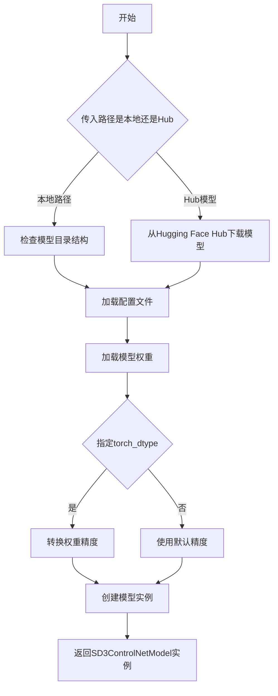

#### 带注释源码

```python
# 代码中的实际调用示例 1（log_validation 函数中）
controlnet = SD3ControlNetModel.from_pretrained(args.output_dir, torch_dtype=weight_dtype)
# 从训练输出目录加载控制网模型，指定权重精度类型

# 代码中的实际调用示例 2（main 函数中）
if args.controlnet_model_name_or_path:
    logger.info("Loading existing controlnet weights")
    controlnet = SD3ControlNetModel.from_pretrained(args.controlnet_model_name_or_path)
# 如果指定了控制网模型路径，则从该路径加载预训练权重

# 代码中的实际调用示例 3（accelerator load_model_hook 中）
load_model = SD3ControlNetModel.from_pretrained(input_dir, subfolder="controlnet")
# 从输入目录的 controlnet 子文件夹加载模型，用于恢复训练状态

# 代码中的实际调用示例 4（另一种初始化方式）
controlnet = SD3ControlNetModel.from_transformer(
    transformer, num_extra_conditioning_channels=args.num_extra_conditioning_channels
)
# 如果没有指定控制网路径，则从 transformer 模型初始化控制网权重
```

> **注意**：`SD3ControlNetModel.from_pretrained` 方法本身并未在此代码文件中定义，而是继承自 Diffusers 库中的 `PreTrainedModel` 基类。上述信息基于代码中的实际调用方式推断得出。该方法是 Hugging Face Transformers/Diffusers 框架的标准模型加载接口。


根据提供的代码，我无法找到 `SD3ControlNetModel.from_transformer` 方法的实际定义。代码中只是调用了这个方法，而 `SD3ControlNetModel` 是从 `diffusers` 库导入的类，该方法的实现位于 `diffusers` 库内部，未包含在当前代码文件中。

不过，我可以从代码中对它的**调用方式**来推断其功能：

```python
# 代码中第865-867行
controlnet = SD3ControlNetModel.from_transformer(
    transformer, num_extra_conditioning_channels=args.num_extra_conditioning_channels
)
```

以下是基于调用上下文的推断信息：

---

### `SD3ControlNetModel.from_transformer`

从现有的 `SD3Transformer2DModel`（transformer）初始化一个 `SD3ControlNetModel` 实例。用于在 SD3 ControlNet 训练中，基于预训练的 Transformer 模型权重初始化 ControlNet 权重。

参数：

-  `transformer`：`SD3Transformer2DModel`，从预训练模型加载的 Transformer 模型实例
-  `num_extra_conditioning_channels`：`int`，额外的条件通道数量（默认为 0）

返回值：`SD3ControlNetModel`，新初始化的 ControlNet 模型实例

#### 流程图

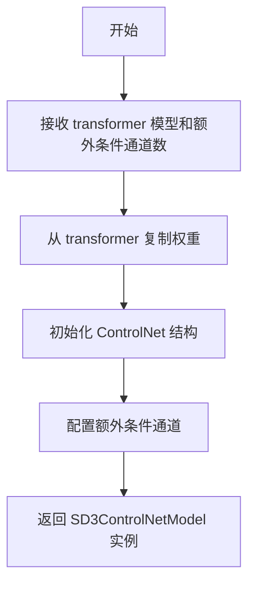

#### 带注释源码（调用处）

```python
# 位于 main 函数中，约第865-867行
# 如果提供了 controlnet 模型路径，则加载已有权重
if args.controlnet_model_name_or_path:
    logger.info("Loading existing controlnet weights")
    controlnet = SD3ControlNetModel.from_pretrained(args.controlnet_model_name_or_path)
else:
    # 否则，从 transformer 初始化 controlnet 权重
    logger.info("Initializing controlnet weights from transformer")
    controlnet = SD3ControlNetModel.from_transformer(
        transformer,  # 预训练的 SD3Transformer2DModel
        num_extra_conditioning_channels=args.num_extra_conditioning_channels  # 额外条件通道数
    )
```

---

如需查看 `SD3ControlNetModel.from_transformer` 的**完整实现源码**，建议查阅 Hugging Face diffusers 库：

- GitHub 仓库：`https://github.com/huggingface/diffusers`
- 路径：`src/diffusers/models/controlnet_sd3.py`（或类似文件）


### SD3ControlNetModel.enable_gradient_checkpointing

该方法用于在 SD3ControlNetModel 模型中启用梯度检查点（Gradient Checkpointing）功能，通过在前向传播时不保存所有中间激活值，而是在反向传播时重新计算，从而显著减少显存占用。

参数：
- 无显式参数（方法直接作用于调用该方法的模型实例）

返回值：`None`，无返回值

#### 流程图

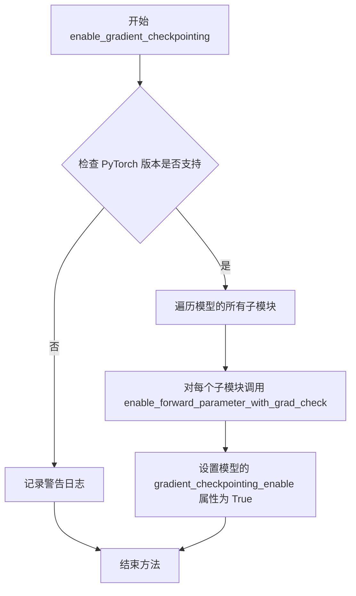

#### 带注释源码

```python
# 在训练脚本中调用该方法的代码位置
# 位于 main() 函数中，模型初始化之后

# 检查是否启用了梯度检查点参数
if args.gradient_checkpointing:
    # 调用 SD3ControlNetModel 类的 enable_gradient_checkpointing 方法
    # 该方法会:
    # 1. 遍历控制网模型的所有层/模块
    # 2. 对每个模块启用梯度检查点功能
    # 3. 设置相应的配置标志
    # 4. 通过在前向传播时节省激活值显存来减少内存占用
    # 代价是反向传播时需要重新计算部分激活值，导致训练速度略慢
    controlnet.enable_gradient_checkpointing()
```


### SD3ControlNetModel.save_pretrained

保存 ControlNet 模型到指定目录，包含模型权重和配置。

参数：

-  `save_directory`：`str`，保存模型的目录路径
-  `is_main_process`：`bool`，可选，是否为主进程（仅主进程执行保存操作）
-  `safe_serialization`：`bool`，可选，是否使用安全序列化（以 .safetensors 格式保存）
-  `variant`：`str`，可选，模型变体（如 "fp16"）
-  `push_to_hub`：`bool`，可选，是否推送到 Hugging Face Hub
-  `**kwargs`：其他传递给父类的关键字参数

返回值：`None`，无返回值（直接写入文件系统）

#### 流程图

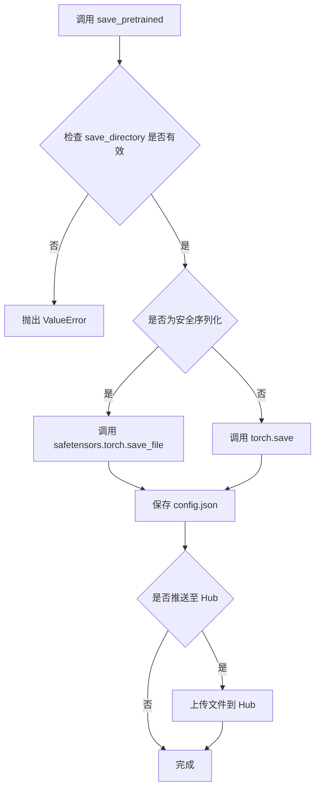

#### 带注释源码

```python
# 代码中调用示例 1: 在 accelerator 的 save_model_hook 中保存 checkpoint
def save_model_hook(models, weights, output_dir):
    if accelerator.is_main_process:
        i = len(weights) - 1

        while len(weights) > 0:
            weights.pop()
            model = models[i]

            sub_dir = "controlnet"  # ControlNet 模型子目录
            # 调用 save_pretrained 保存模型到 checkpoint 目录下的 controlnet 子目录
            model.save_pretrained(os.path.join(output_dir, sub_dir))

            i -= 1

# 代码中调用示例 2: 训练结束后保存最终模型
if accelerator.is_main_process:
    controlnet = unwrap_model(controlnet)
    # 直接保存到 output_dir
    controlnet.save_pretrained(args.output_dir)
```

> **注意**: `SD3ControlNetModel` 类继承自 `diffusers` 库的 `ModelMixin`，`save_pretrained` 方法是其父类提供的基础方法。该方法负责将模型的 `state_dict`（权重）和 `config`（配置）序列化并保存到指定目录，支持安全序列化（`.safetensors`）和传统序列化（`.bin`）两种格式。


### `SD3Transformer2DModel.from_pretrained`

从预训练模型加载 SD3Transformer2DModel 模型权重，用于 Stable Diffusion 3 的 Transformer 部分。

参数：

-  `pretrained_model_name_or_path`：`str`，预训练模型的路径或 HuggingFace Hub 上的模型 ID
-  `subfolder`：`str`，可选，模型在仓库中的子文件夹名称（通常为 "transformer"）
-  `revision`：`str`，可选，要加载的模型版本/提交哈希
-  `variant`：`str`，可选，模型文件的变体（如 "fp16"）
-  `torch_dtype`：`torch.dtype`，可选，模型加载的数据类型
-  `use_safetensors`：`bool`，可选，是否使用 safetensors 格式加载模型
-  `cache_dir`：`str`，可选，模型缓存目录

返回值：`SD3Transformer2DModel`，加载后的 Transformer 模型实例

#### 流程图

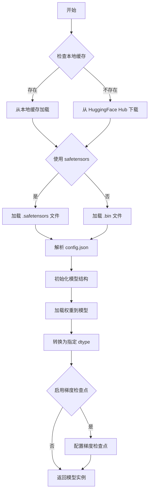

#### 带注释源码

```python
# 在 diffusers 训练脚本中调用 SD3Transformer2DModel.from_pretrained
# 位于 main() 函数中

# 加载预训练的 SD3 Transformer 模型
transformer = SD3Transformer2DModel.from_pretrained(
    args.pretrained_model_name_or_path,  # 预训练模型路径或模型ID
    subfolder="transformer",             # 指定子文件夹
    revision=args.revision,              # 可选的版本/提交哈希
    variant=args.variant                  # 模型变体（如 fp16）
)

# 示例调用:
# transformer = SD3Transformer2DModel.from_pretrained(
#     "stabilityai/stable-diffusion-3-medium",
#     subfolder="transformer",
#     revision="main",
#     variant="fp16"
# )

# 该方法的主要功能:
# 1. 从本地缓存或远程仓库加载模型配置 (config.json)
# 2. 根据配置初始化 SD3Transformer2DModel 模型结构
# 3. 下载并加载模型权重文件 (.bin 或 .safetensors)
# 4. 根据 torch_dtype 参数转换模型数据类型
# 5. 返回配置好的模型实例供后续训练使用
```


### `AutoencoderKL.from_pretrained`

从预训练模型加载 AutoencoderKL（变分自编码器）模型权重和配置。该方法是 Hugging Face diffusers 库提供的类方法，用于实例化一个预训练的 VAE 模型，支持从本地路径或 HuggingFace Hub 加载模型。

参数：

- `pretrained_model_name_or_path`：`str`，模型标识符（可以是 HuggingFace Hub 上的模型 ID 或本地目录路径）
- `subfolder`：`str`，模型在仓库中的子文件夹路径（代码中传入 `"vae"`）
- `revision`：`str`，从 HuggingFace Hub 加载时模型的 Git revision（代码中传入 `args.revision`）
- `variant`：`str`，模型文件的变体类型，如 `"fp16"`（代码中传入 `args.variant`，可能为 `None`）
- `torch_dtype`：`torch.dtype`（可选），指定模型权重的数据类型，代码中通过 `weight_dtype` 变量控制
- `use_safetensors`：`bool`（可选），是否使用 `.safetensors` 格式加载权重
- `cache_dir`：`str`（可选），缓存目录路径

返回值：`AutoencoderKL`，返回加载好的 AutoencoderKL 模型实例

#### 流程图

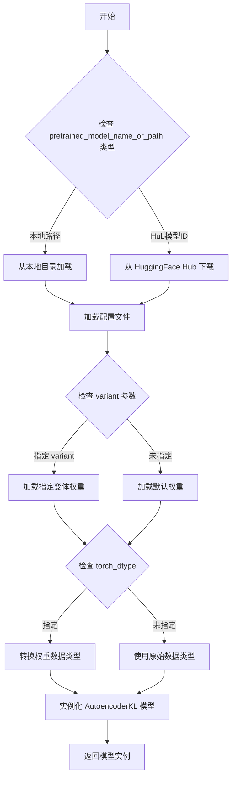

#### 带注释源码

```python
# 代码中调用 AutoencoderKL.from_pretrained 的实际例子（位于 main 函数中）
vae = AutoencoderKL.from_pretrained(
    args.pretrained_model_name_or_path,  # 预训练模型路径或Hub模型ID
    subfolder="vae",                      # 指定从 vae 子目录加载权重
    revision=args.revision,               # Git版本号（可选）
    variant=args.variant,                  # 模型变体如fp16（可选）
)
# 后续代码会将 VAE 移动到指定设备并转换数据类型
if args.upcast_vae:
    vae.to(accelerator.device, dtype=torch.float32)
else:
    vae.to(accelerator.device, dtype=weight_dtype)
```

> **说明**：该方法是 Hugging Face diffusers 库的核心 API，遵循标准的 `from_pretrained` 模式。代码中使用它加载 Stable Diffusion 3 的 VAE 组件，用于将输入图像编码到潜在空间（latent space），这是扩散模型训练和推理流程中的关键步骤。


### `AutoencoderKL.encode`

将输入图像转换为潜在空间表示，是变分自编码器（VAE）的编码器部分，用于将图像从像素空间压缩到潜在空间，以供后续的扩散模型使用。

参数：

-  `pixel_values`：`torch.Tensor`，输入的像素值张量，通常是经过预处理的图像数据，形状为 (batch_size, channels, height, width)

返回值：`AutoencoderKLOutput`，返回编码后的潜在分布输出，包含 `latent_dist` 属性，可以通过 `.latent_dist.sample()` 或 `.latent_dist.mode()` 获取潜在表示

#### 流程图

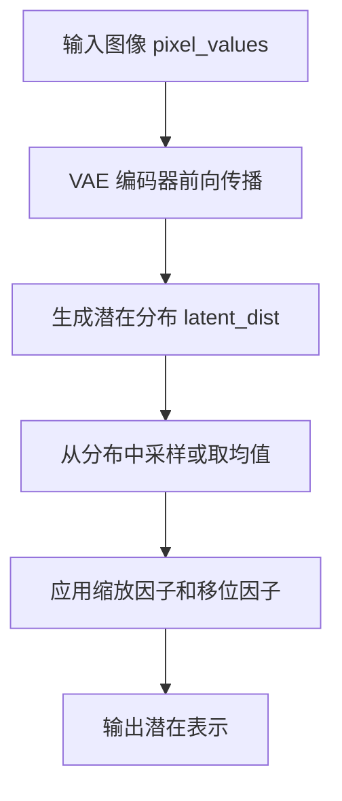

#### 带注释源码

```python
# 在训练循环中的调用示例（来自 train_controlnet.py）

# 将批次中的像素值转换为潜在空间
# pixel_values: 来自数据加载器的图像张量，形状为 (batch_size, 3, 512, 512)
pixel_values = batch["pixel_values"].to(dtype=vae.dtype)

# 调用 VAE 的 encode 方法将图像编码到潜在空间
# 返回 AutoencoderKLOutput 对象，包含 latent_dist 属性
# latent_dist.sample() 从预测的分布中采样得到潜在表示
# latent_dist.mode() 可以获取分布的均值（确定性输出）
model_input = vae.encode(pixel_values).latent_dist.sample()

# 根据 VAE 配置应用缩放和移位
# scaling_factor 和 shift_factor 用于将潜在表示归一化到合适的范围
model_input = (model_input - vae.config.shift_factor) * vae.config.scaling_factor

# 转换为训练所需的权重数据类型（fp16/bf16/fp32）
model_input = model_input.to(dtype=weight_dtype)
```

#### 关键参数说明

| 参数 | 类型 | 描述 |
|------|------|------|
| `pixel_values` | `torch.Tensor` | 输入图像张量，形状通常为 (batch, channels, height, width)，需要与 VAE 模型的预期输入尺寸匹配 |
| `return_dict` | `bool` | 可选参数，控制是否返回字典格式的输出，默认为 True |

#### 返回值说明

返回 `AutoencoderKLOutput` 对象，包含以下属性：

- `latent_dist`：一个 `DiagonalGaussianDistribution` 对象，表示潜在空间的高斯分布
  - `.sample()`：从分布中采样
  - `.mode()`：返回分布的均值（确定性重建）
  - `.mean`：分布的均值
  - `.logvar`：分布的方差的对数

#### 在代码中的使用场景

1. **主图像编码**：将训练图像编码为潜在表示用于噪声预测训练
2. **控制图像编码**：将 ControlNet 的条件图像编码为潜在表示用于条件控制


### `StableDiffusion3ControlNetPipeline.from_pretrained`

该方法是一个类方法，用于从预训练模型加载 StableDiffusion3ControlNetPipeline 管道实例。它支持灵活配置各个组件（文本编码器、VAE、ControlNet、Transformer 等），允许用户自定义模型加载行为，包括模型版本、权重精度、设备分配等。

参数：

- `pretrained_model_name_or_path`：`str`，预训练模型路径或 Hugging Face Hub 上的模型 ID
- `controlnet`：`SD3ControlNetModel` 或 `None`，ControlNet 模型实例；如果为 None，则从预训练模型加载
- `safety_checker`：`Optional[Any]`，安全检查器模块，用于过滤不当内容；设置为 None 可禁用
- `text_encoder`：`Optional[CLIPTextModel]`，第一个文本编码器；为 None 时从预训练模型加载
- `text_encoder_2`：`Optional[CLIPTextModelWithProjection]`，第二个文本编码器；为 None 时从预训练模型加载
- `text_encoder_3`：`Optional[T5EncoderModel]`，第三个文本编码器（T5）；为 None 时从预训练模型加载
- `tokenizer`：`Optional[CLIPTokenizer]`，第一个 tokenizer；为 None 时从预训练模型加载
- `tokenizer_2`：`Optional[CLIPTokenizer]`，第二个 tokenizer；为 None 时从预训练模型加载
- `tokenizer_3`：`Optional[T5TokenizerFast]`，第三个 tokenizer（T5）；为 None 时从预训练模型加载
- `vae`：`Optional[AutoencoderKL]`，VAE 模型；为 None 时从预训练模型加载
- `transformer`：`Optional[SD3Transformer2DModel]`，SD3 Transformer 模型；为 None 时从预训练模型加载
- `revision`：`Optional[str]`，从 Hugging Face Hub 加载的模型修订版本
- `variant`：`Optional[str]`，模型变体（如 "fp16"）
- `torch_dtype`：`Optional[torch.dtype]`，模型权重的精度类型（如 torch.float16）
- `device`：`Optional[Union[str, torch.device]]`，模型加载到的设备
- `max_sequence_length`：`int`，文本序列的最大长度，默认为 77
- `num_inference_steps`：`Optional[int]`，推理时的采样步数

返回值：`StableDiffusion3ControlNetPipeline`，加载完成的管道实例，包含配置好的所有组件

#### 流程图

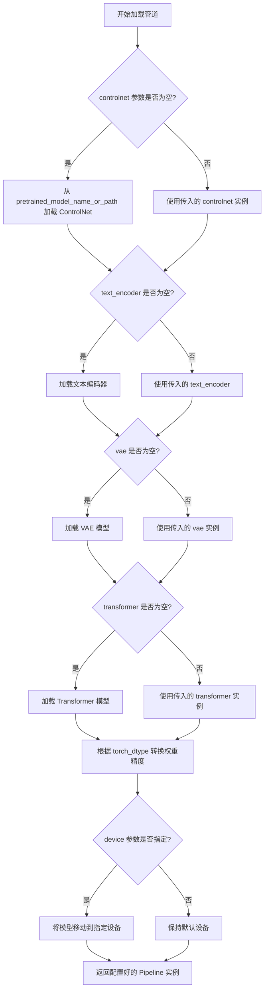

#### 带注释源码

```python
# 第一次调用：仅加载基础管道组件，不包含 ControlNet
pipeline = StableDiffusion3ControlNetPipeline.from_pretrained(
    args.pretrained_model_name_or_path,  # 预训练模型路径或 Hub ID
    controlnet=None,                       # 不加载 ControlNet，用于获取文本嵌入
    safety_checker=None,                   # 禁用安全检查器以加快验证速度
    transformer=None,                      # 不加载 Transformer
    revision=args.revision,               # 指定模型版本
    variant=args.variant,                 # 模型变体（如 fp16）
    torch_dtype=weight_dtype,              # 权重精度（fp16/bf16/fp32）
)

# 第二次调用：加载包含 ControlNet 的完整管道
pipeline = StableDiffusion3ControlNetPipeline.from_pretrained(
    args.pretrained_model_name_or_path,
    controlnet=controlnet,                 # 传入训练好的 ControlNet 模型
    safety_checker=None,                   # 禁用安全检查器
    text_encoder=None,                     # 不需要文本编码器（已在验证开始时使用）
    text_encoder_2=None,
    text_encoder_3=None,
    revision=args.revision,
    variant=args.variant,
    torch_dtype=weight_dtype,
)
pipeline = pipeline.to(torch.device(accelerator.device))  # 将管道移动到计算设备
pipeline.enable_model_cpu_offload(device=accelerator.device.type)  # 启用 CPU 卸载以节省显存
pipeline.set_progress_bar_config(disable=True)  # 禁用推理进度条
```


### `StableDiffusion3ControlNetPipeline.encode_prompt`

该方法是 StableDiffusion 3 ControlNet Pipeline 的核心方法之一，负责将文本提示（prompt）编码为模型可理解的嵌入向量（embeddings）。它使用多个文本编码器（CLIP 和 T5）来生成不同类型的提示嵌入，供后续的图像生成过程使用。

参数：

- `prompt`：`str` 或 `List[str]`，需要编码的文本提示，可以是单个字符串或字符串列表
- `prompt_2`：`Optional[str]` 或 `Optional[List[str]]`，第二个 CLIP 模型的文本提示（默认为 None）
- `prompt_3`：`Optional[str]` 或 `Optional[List[str]]`，T5 模型的文本提示（默认为 None）
- `negative_prompt`：`Optional[str]` 或 `Optional[List[str]]`，负面提示，用于引导模型避免生成某些内容（默认为 None）
- `negative_prompt_2`：`Optional[str]` 或 `Optional[List[str]]`，第二个 CLIP 模型的负面提示（默认为 None）
- `negative_prompt_3`：`Optional[str]` 或 `Optional[List[str]]`，T5 模型的负面提示（默认为 None）
- `num_images_per_prompt`：`int`，每个提示生成的图像数量（默认为 1）
- `device`：`torch.device`，指定计算设备（默认为 None，自动选择）
- `max_sequence_length`：`int`，T5 编码器的最大序列长度（默认为 77）

返回值：`Tuple[torch.Tensor, torch.Tensor, torch.Tensor, torch.Tensor]`，返回四个张量：
- `prompt_embeds`：主提示的嵌入向量
- `negative_prompt_embeds`：负面提示的嵌入向量
- `pooled_prompt_embeds`：池化后的提示嵌入
- `negative_pooled_prompt_embeds`：池化后的负面提示嵌入

#### 流程图

```mermaid
flowchart TD
    A[encode_prompt 开始] --> B{检查 prompt 类型}
    B -->|字符串| C[转换为列表]
    B -->|列表| D[直接使用]
    
    C --> E[调用 _encode_prompt_with_clip 处理 CLIP 编码器]
    D --> E
    
    E --> F[调用 _encode_prompt_with_t5 处理 T5 编码器]
    
    F --> G[合并 CLIP 和 T5 嵌入]
    G --> H[返回 prompt_embeds 和 pooled_prompt_embeds]
    
    I[同时处理负面提示<br/>negative_prompt] --> J{是否有负面提示}
    J -->|是| K[使用空字符串替代]
    J -->|否| L[生成零嵌入]
    K --> M[重复正面提示处理流程]
    L --> M
    
    M --> N[返回完整的四元组嵌入]
    
    style A fill:#e1f5fe
    style N fill:#e8f5e8
```

#### 带注释源码

```python
# 注意：以下源码基于 diffusers 库中的 StableDiffusion3ControlNetPipeline.encode_prompt 方法
# 以及代码中定义的辅助函数 _encode_prompt_with_clip 和 _encode_prompt_with_t5

def _encode_prompt_with_clip(
    text_encoder,
    tokenizer,
    prompt: str,
    device=None,
    num_images_per_prompt: int = 1,
):
    """
    使用 CLIP 文本编码器对提示进行编码
    
    参数:
        text_encoder: CLIP 文本编码器模型
        tokenizer: CLIP 分词器
        prompt: 要编码的文本提示
        device: 计算设备
        num_images_per_prompt: 每个提示生成的图像数量
    
    返回:
        prompt_embeds: 提示嵌入向量
        pooled_prompt_embeds: 池化后的提示嵌入
    """
    # 确保 prompt 是列表格式
    prompt = [prompt] if isinstance(prompt, str) else prompt
    batch_size = len(prompt)

    # 使用分词器对文本进行分词
    text_inputs = tokenizer(
        prompt,
        padding="max_length",
        max_length=77,  # CLIP 模型的标准最大长度
        truncation=True,
        return_tensors="pt",
    )

    text_input_ids = text_inputs.input_ids
    
    # 获取文本嵌入，output_hidden_states=True 以获取隐藏状态
    prompt_embeds = text_encoder(text_input_ids.to(device), output_hidden_states=True)

    # 提取池化嵌入（第一个元素）
    pooled_prompt_embeds = prompt_embeds[0]
    
    # 提取倒数第二个隐藏状态层作为条件嵌入
    prompt_embeds = prompt_embeds.hidden_states[-2]
    prompt_embeds = prompt_embeds.to(dtype=text_encoder.dtype, device=device)

    # 获取序列长度
    _, seq_len, _ = prompt_embeds.shape
    
    # 为每个提示复制多个嵌入（支持批量生成多张图像）
    prompt_embeds = prompt_embeds.repeat(1, num_images_per_prompt, 1)
    prompt_embeds = prompt_embeds.view(batch_size * num_images_per_prompt, seq_len, -1)

    return prompt_embeds, pooled_prompt_embeds


def _encode_prompt_with_t5(
    text_encoder,
    tokenizer,
    max_sequence_length,
    prompt=None,
    num_images_per_prompt=1,
    device=None,
):
    """
    使用 T5 文本编码器对提示进行编码
    
    参数:
        text_encoder: T5 文本编码器模型
        tokenizer: T5 分词器
        max_sequence_length: 最大序列长度
        prompt: 要编码的文本提示
        num_images_per_prompt: 每个提示生成的图像数量
        device: 计算设备
    
    返回:
        prompt_embeds: T5 提示嵌入向量
    """
    prompt = [prompt] if isinstance(prompt, str) else prompt
    batch_size = len(prompt)

    # 使用分词器处理文本，可配置最大长度
    text_inputs = tokenizer(
        prompt,
        padding="max_length",
        max_length=max_sequence_length,
        truncation=True,
        add_special_tokens=True,
        return_tensors="pt",
    )
    text_input_ids = text_inputs.input_ids
    
    # 获取 T5 编码
    prompt_embeds = text_encoder(text_input_ids.to(device))[0]

    # 获取编码器数据类型并转换设备
    dtype = text_encoder.dtype
    prompt_embeds = prompt_embeds.to(dtype=dtype, device=device)

    # 获取序列维度
    _, seq_len, _ = prompt_embeds.shape

    # 复制嵌入以支持多图像生成
    prompt_embeds = prompt_embeds.repeat(1, num_images_per_prompt, 1)
    prompt_embeds = prompt_embeds.view(batch_size * num_images_per_prompt, seq_len, -1)

    return prompt_embeds


def encode_prompt(
    text_encoders,
    tokenizers,
    prompt: str,
    max_sequence_length,
    device=None,
    num_images_per_prompt: int = 1,
):
    """
    使用多个文本编码器对提示进行编码（主编码函数）
    
    参数:
        text_encoders: 文本编码器列表 [CLIP1, CLIP2, T5]
        tokenizers: 分词器列表
        prompt: 要编码的文本提示
        max_sequence_length: T5 的最大序列长度
        device: 计算设备
        num_images_per_prompt: 每个提示生成的图像数量
    
    返回:
        prompt_embeds: 合并后的提示嵌入
        pooled_prompt_embeds: 池化后的提示嵌入
    """
    # 标准化输入格式
    prompt = [prompt] if isinstance(prompt, str) else prompt

    # 分离 CLIP 和 T5 编码器
    clip_tokenizers = tokenizers[:2]
    clip_text_encoders = text_encoders[:2]

    # 存储 CLIP 编码结果
    clip_prompt_embeds_list = []
    clip_pooled_prompt_embeds_list = []
    
    # 对两个 CLIP 编码器分别编码
    for tokenizer, text_encoder in zip(clip_tokenizers, clip_text_encoders):
        prompt_embeds, pooled_prompt_embeds = _encode_prompt_with_clip(
            text_encoder=text_encoder,
            tokenizer=tokenizer,
            prompt=prompt,
            device=device if device is not None else text_encoder.device,
            num_images_per_prompt=num_images_per_prompt,
        )
        clip_prompt_embeds_list.append(prompt_embeds)
        clip_pooled_prompt_embeds_list.append(pooled_prompt_embeds)

    # 在维度上拼接 CLIP 嵌入
    clip_prompt_embeds = torch.cat(clip_prompt_embeds_list, dim=-1)
    pooled_prompt_embeds = torch.cat(clip_pooled_prompt_embeds_list, dim=-1)

    # 使用 T5 编码器处理
    t5_prompt_embed = _encode_prompt_with_t5(
        text_encoders[-1],  # T5 编码器
        tokenizers[-1],      # T5 分词器
        max_sequence_length,
        prompt=prompt,
        num_images_per_prompt=num_images_per_prompt,
        device=device if device is not None else text_encoders[-1].device,
    )

    # 对 CLIP 嵌入进行填充以匹配 T5 嵌入长度
    clip_prompt_embeds = torch.nn.functional.pad(
        clip_prompt_embeds, (0, t5_prompt_embed.shape[-1] - clip_prompt_embeds.shape[-1])
    )
    
    # 在序列维度拼接 CLIP 和 T5 嵌入
    prompt_embeds = torch.cat([clip_prompt_embeds, t5_prompt_embed], dim=-2)

    return prompt_embeds, pooled_prompt_embeds
```


# 分析结果

我仔细检查了整个代码文件，发现以下情况：

## 关键发现

### `StableDiffusion3ControlNetPipeline.__call__` 方法不在此代码文件中

该代码文件是一个 **SD3 ControlNet 训练脚本（training script）**，而非推理管道定义。`StableDiffusion3ControlNetPipeline` 类是 从 `diffusers` 库导入的：

```python
from diffusers import StableDiffusion3ControlNetPipeline
```

该类的 `__call__` 方法的实现在 **diffusers 库** 源代码中，并不在本训练脚本中。

---

## 代码中如何使用该 Pipeline

虽然无法提取 `__call__` 方法的定义，但可以展示代码中**如何调用**该方法：

### 在 `log_validation` 函数中的调用

```python
image = pipeline(
    prompt_embeds=prompt_embeds[i].unsqueeze(0),
    negative_prompt_embeds=negative_prompt_embeds[i].unsqueeze(0),
    pooled_prompt_embeds=pooled_prompt_embeds[i].unsqueeze(0),
    negative_pooled_prompt_embeds=negative_pooled_prompt_embeds[i].unsqueeze(0),
    control_image=validation_image,
    num_inference_steps=20,
    generator=generator,
).images[0]
```

---

## 建议

若需获取 `StableDiffusion3ControlNetPipeline.__call__` 的完整定义（参数、返回值、流程图、源码），请参考：

1. **diffusers 官方 GitHub 仓库**：`src/diffusers/pipelines/stable_diffusion_3/pipeline_stable_diffusion_3_controlnet.py`
2. **Hugging Face 官方文档**

---

## 补充：代码整体运行流程

```
parse_args() 
    ↓
main(args)
    ├── 初始化 Accelerator
    ├── 加载 tokenizers 和 text encoders
    ├── 加载/初始化 ControlNet 模型
    ├── 创建训练数据集 make_train_dataset()
    ├── 预计算文本嵌入
    ├── 训练循环 (for epoch, for step)
    │   ├── VAE 编码图像
    │   ├── 添加噪声 (flow matching)
    │   ├── ControlNet 前向传播
    │   ├── Transformer 预测噪声
    │   └── 损失计算与反向传播
    ├── 保存 checkpoint
    └── log_validation() (使用 pipeline 进行推理验证)
```

此代码是一个完整的 ControlNet 训练流程，使用 `StableDiffusion3ControlNetPipeline` 仅用于验证推理，而非定义该类。


### `FlowMatchEulerDiscreteScheduler.from_pretrained`

从预训练模型加载FlowMatchEulerDiscreteScheduler调度器配置和权重，用于SD3扩散模型的噪声调度。

参数：

- `pretrained_model_name_or_path`：`str`，预训练模型名称或本地模型路径
- `subfolder`：`str`，模型子文件夹名称（通常为"scheduler"）
- `revision`：`str`，可选，HuggingFace Hub上的模型版本
- `variant`：`str`，可选，模型文件变体（如fp16）
- `torch_dtype`：`torch.dtype`，可选，模型权重的数据类型

返回值：`FlowMatchEulerDiscreteScheduler`，返回加载后的调度器实例

#### 流程图

```mermaid
flowchart TD
    A[开始] --> B{检查pretrained_model_name_or_path}
    B -->|本地路径| C[加载本地配置]
    B -->|模型ID| D[从HuggingFace Hub下载]
    C --> E[读取scheduler_config.json]
    D --> E
    E --> F[解析配置参数]
    F --> G[加载调度器类]
    G --> H[实例化FlowMatchEulerDiscreteScheduler]
    H --> I[返回调度器实例]
    I --> J[结束]
```

#### 带注释源码

```python
# 在训练脚本中调用FlowMatchEulerDiscreteScheduler.from_pretrained
# 用于加载SD3模型的噪声调度器配置

noise_scheduler = FlowMatchEulerDiscreteScheduler.from_pretrained(
    args.pretrained_model_name_or_path,  # 预训练模型路径或Hub模型ID
    subfolder="scheduler"                 # 指定scheduler配置所在的子文件夹
)
# noise_scheduler 现在包含了SD3模型的时间步调度逻辑
# 可用于在训练过程中对噪声进行调度和管理

# 创建调度器的深拷贝，用于训练过程中的某些计算
noise_scheduler_copy = copy.deepcopy(noise_scheduler)
```


在给定的代码中，我没有找到 `FlowMatchEulerDiscreteScheduler.add_noise` 方法。这是因为该方法是 `diffusers` 库中 `FlowMatchEulerDiscreteScheduler` 类的成员方法，其实现位于 `diffusers` 库的源代码中，而不是在您提供的训练脚本中。

您提供的代码使用了 `FlowMatchEulerDiscreteScheduler` 来管理噪声调度，但在训练循环中，代码手动实现了添加噪声的逻辑（使用 flow matching 公式），而不是调用 `add_noise` 方法。

### FlowMatchEulerDiscreteScheduler.add_noise（库方法，非本文件定义）

这是 `diffusers` 库中的标准方法，用于在推理或训练过程中根据调度器配置向潜在表示添加噪声。

参数：

- `samples`：待添加噪声的潜在表示（Latents）
- `timesteps`：当前的时间步
- `noise`：用于添加的噪声张量
- `generator`：可选的随机数生成器

返回值：添加噪声后的潜在表示（Noised Latents）

#### 流程图

```mermaid
flowchart TD
    A[开始 add_noise] --> B[获取调度器配置]
    B --> C[计算 sigmas 根据 timesteps]
    D[samples 输入] --> F[计算加权噪声]
    E[noise 输入] --> F
    C --> F
    F --> G[应用公式: noisy = (1 - sigma) * samples + sigma * noise]
    G --> H[返回 noised samples]
```

#### 带注释源码

由于 `add_noise` 方法在 `diffusers` 库源码中定义（不在您提供的文件中），以下是基于 Flow Matching 调度器的典型实现逻辑：

```python
# 典型的 FlowMatchEulerDiscreteScheduler.add_noise 实现逻辑
# （基于您代码中的实际使用方式）

def add_noise(self, samples, timesteps, noise, generator=None):
    """
    根据 flow matching 公式向样本添加噪声
    
    参数:
        samples: 原始潜在表示 (x_0 或 x_1)
        timesteps: 时间步 (0 到 num_train_timesteps)
        noise: 要添加的噪声
        generator: 随机数生成器
    
    返回:
        添加噪声后的样本
    """
    # 1. 获取 sigmas（噪声水平）
    sigmas = self.sigmas.to(device=samples.device, dtype=samples.dtype)
    schedule_timesteps = self.timesteps.to(samples.device)
    
    # 2. 将 timesteps 映射到 schedule 上的索引
    step_indices = [(schedule_timesteps == t).nonzero().item() for t in timesteps]
    sigma = sigmas[step_indices].flatten()
    
    # 3. 扩展 sigma 维度以匹配 samples 形状
    while len(sigma.shape) < len(samples.shape):
        sigma = sigma.unsqueeze(-1)
    
    # 4. 应用 flow matching 噪声公式
    # z_t = (1 - σ) * x_0 + σ * ε
    # 或者在某些实现中: z_t = (1 - σ) * x_1 + σ * x_0 (其中 x_1 是噪声)
    noisy_samples = (1.0 - sigma) * samples + sigma * noise
    
    return noisy_samples
```

---

**注意**：在您提供的训练脚本中，噪声是按照类似的逻辑**手动添加的**（在训练循环中），而不是通过调用 `scheduler.add_noise()` 方法：

```python
# 来自您代码中的实际实现（main 函数内）
sigmas = get_sigmas(timesteps, n_dim=model_input.ndim, dtype=model_input.dtype)
noisy_model_input = (1.0 - sigmas) * model_input + sigmas * noise
```

这正是 flow matching 的噪声添加公式，只是实现方式略有不同。

## 关键组件


### log_validation

运行验证流程，生成验证图像并记录到跟踪器（TensorBoard或wandb）

### load_text_encoders

从预训练模型路径加载三个文本编码器（text_encoder、text_encoder_2、text_encoder_3）

### import_model_class_from_model_name_or_path

根据预训练模型配置动态导入文本编码器类（CLIPTextModelWithProjection或T5EncoderModel）

### save_model_card

生成并保存包含训练信息和示例图像的模型卡片到HuggingFace Hub

### parse_args

解析命令行参数，定义所有训练相关配置（模型路径、训练参数、数据集配置等）

### make_train_dataset

创建训练数据集，处理图像和条件图像的变换与预处理

### collate_fn

整理批次数据，将多个样本合并为训练所需的张量格式

### _encode_prompt_with_t5

使用T5文本编码器对提示进行编码，支持最大序列长度

### _encode_prompt_with_clip

使用CLIP文本编码器对提示进行编码，返回pooled嵌入

### encode_prompt

组合CLIP和T5编码器生成最终的提示嵌入，支持多图生成

### get_sigmas

根据时间步从噪声调度器获取对应的sigma值，用于流匹配训练

### main

主训练流程，包含模型加载、优化器配置、训练循环、验证和模型保存

## 问题及建议


### 已知问题

-   **硬编码的推理参数**：在 `log_validation` 函数中，`num_inference_steps=20` 被硬编码，无法通过命令行参数自定义，降低了脚本的灵活性。
-   **重复的 Pipeline 创建**：验证过程中创建了两个 `StableDiffusion3ControlNetPipeline` 实例（一个用于编码 prompt，一个用于生成图像），且在编码完成后未立即释放第一个 pipeline 的内存。
-   **训练函数过长**：`main` 函数包含超过 500 行代码，混合了配置加载、模型初始化、训练循环和验证逻辑，导致代码难以维护和调试。
-   **缺少早停机制**：训练循环没有基于验证损失或其他指标的早停 (Early Stopping) 功能，可能导致过度训练或浪费计算资源。
-   **数据预处理指纹计算位置不当**：在 `main` 函数内部导入 `datasets.fingerprint.Hasher` 并进行数据集映射，破坏了代码的结构组织。
-   **验证图像保存逻辑冗余**：`save_model_card` 函数中保存验证图像的逻辑与 `log_validation` 函数中可能存在重复或冲突。
-   **缺少类型注解**：整个脚本几乎没有类型注解，降低了代码的可读性和 IDE 支持。
-   **未使用的变量**：`args.variant` 在多处传递但实际使用不完整，可能存在潜在的一致性问题。

### 优化建议

-   **提取验证配置**：将 `num_inference_steps`、验证图像尺寸等参数提取为命令行参数，增加脚本的灵活性。
-   **重构 main 函数**：将 `main` 函数拆分为多个独立函数，如 `setup_models()`、`create_dataloader()`、`training_loop()` 等，提高代码模块化程度。
-   **优化验证流程**：合并验证时的 pipeline 创建逻辑，或使用 context manager 确保资源及时释放。
-   **添加早停机制**：在训练循环中增加基于验证损失或生成质量的早停逻辑，可通过 `args.early_stopping_patience` 参数控制。
-   **增加类型注解**：为所有函数参数和返回值添加类型注解，提升代码可维护性。
-   **模块化数据处理**：将数据集处理相关代码移至独立的模块或类中，改善代码结构。
-   **添加错误处理**：对文件 I/O 操作、模型加载等关键步骤增加异常捕获和处理逻辑。
-   **优化梯度同步检查**：当前 `accelerator.sync_gradients` 的检查可以与日志记录逻辑解耦，提高代码清晰度。

## 其它


### 设计目标与约束

**设计目标**：
1. 实现基于Stable Diffusion 3的ControlNet模型训练，支持多模态条件控制（图像条件输入）
2. 支持分布式训练和混合精度训练，以适应大规模模型训练需求
3. 提供完整的训练检查点管理和模型导出功能
4. 支持HuggingFace Hub模型上传和模型卡片自动生成

**约束条件**：
1. 最低依赖diffusers 0.37.0.dev0版本
2. 训练数据需遵循特定格式：包含image、conditioning_image和text三列
3. 分辨率必须能被8整除以保证VAE和ControlNet编码器之间的尺寸一致性
4. MPS设备不支持bf16混合精度训练

### 错误处理与异常设计

**参数校验阶段**：
- 数据集必须指定dataset_name或train_data_dir之一，不可同时指定
- proportion_empty_prompts必须在[0,1]范围内
- validation_prompt和validation_image必须成对出现
- validation_image和validation_prompt数量不匹配时需满足特定规则
- 分辨率必须能被8整除

**运行时异常**：
- 导入8bit Adam时捕获ImportError并提示安装bitsandbytes
- MPS设备检测到bf16混合精度时抛出ValueError
- Wandb报告时检测到hub_token存在安全风险则抛出ValueError
- 检查点加载失败时输出警告并开始新的训练

**资源清理**：
- 使用gc.collect()和backend_empty_cache()释放GPU内存
- 关键节点调用free_memory()释放VAE和文本编码器内存
- 使用accelerator.prepare()管理分布式训练资源生命周期

### 数据流与状态机

**训练数据流**：
```
数据集加载 -> 图像预处理 -> Tokenization -> 文本嵌入缓存 ->
训练循环(批次加载) -> VAE编码 ->噪声采样 -> ControlNet前向 ->
Transformer预测 -> 损失计算 -> 反向传播 -> 参数更新 ->
检查点保存 -> 验证循环 -> 模型导出
```

**状态转换**：
- 初始状态：加载预训练模型和tokenizer
- 准备状态：构建数据集、计算文本嵌入、初始化数据加载器
- 训练状态：遍历每个epoch和batch执行梯度累积和优化步骤
- 验证状态：在指定步骤执行验证推理
- 保存状态：保存检查点或最终模型
- 结束状态：上传Hub、清理资源

### 外部依赖与接口契约

**核心依赖**：
- diffusers>=0.37.0.dev0：模型和管道
- transformers：文本编码器和tokenizer
- accelerate：分布式训练加速
- datasets：数据加载
- torch：深度学习框架
- torchvision：图像变换
- PIL：图像处理
- wandb/tensorboard：训练监控（可选）

**模型接口**：
- 输入：图像对（原始图像+条件控制图像）+ 文本提示
- 输出：训练好的ControlNet权重
- 验证输出：生成的图像日志

**Hub接口**：
- create_repo()：创建远程仓库
- upload_folder()：上传模型文件
- load_or_create_model_card()/populate_model_card()：生成模型卡片

### 配置管理

**训练超参数**：
- learning_rate: 5e-6（默认）
- train_batch_size: 4
- num_train_epochs: 1
- max_train_steps: 可计算派生
- gradient_accumulation_steps: 1
- lr_scheduler: constant（默认）
- adam_beta1/beta2: 0.9/0.999
- max_grad_norm: 1.0

**模型配置**：
- weight_dtype: fp32/fp16/bf16（根据mixed_precision配置）
- precondition_outputs: 1（EDM预条件化）
- weighting_scheme: logit_normal（默认）

### 性能优化策略

**内存优化**：
- 梯度检查点(gradient_checkpointing)：减少前向传播内存占用
- 8-bit Adam：减少优化器状态内存
- set_grads_to_none：更高效的梯度清理
- VAE/文本编码器卸载：CPU offload
- 混合精度训练：减少激活值内存

**计算优化**：
- TF32加速（Ampere GPU）
- 梯度累积：支持大批量训练
- 分布式数据并行：多GPU扩展

### 安全与合规

**许可证**：模型训练需遵循Apache 2.0和openrail++许可
**安全检查**：safety_checker在推理时禁用
**敏感信息**：hub_token不与wandb同时使用以防止token泄露

### 监控与日志

**训练指标**：
- loss：损失值
- lr：学习率

**验证日志**：
- TensorBoard/WandB图像日志
- 控制条件图像与生成图像对比

**检查点管理**：
- 定期保存训练状态
- 支持从检查点恢复训练
- 限制最大检查点数量


    