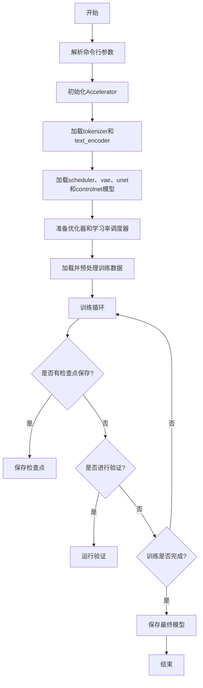
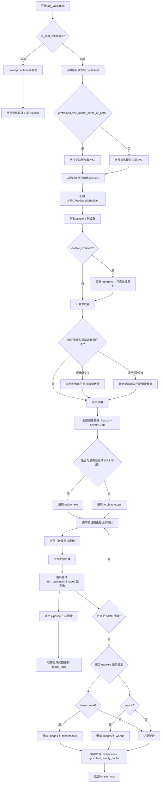
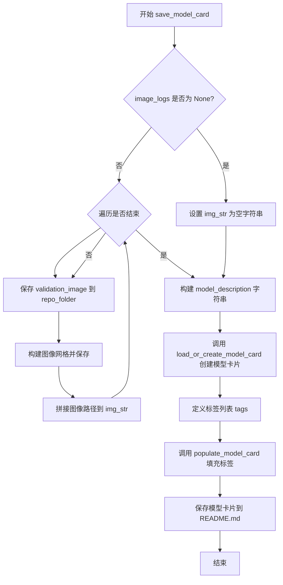
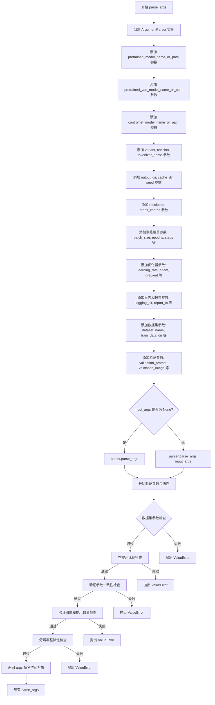
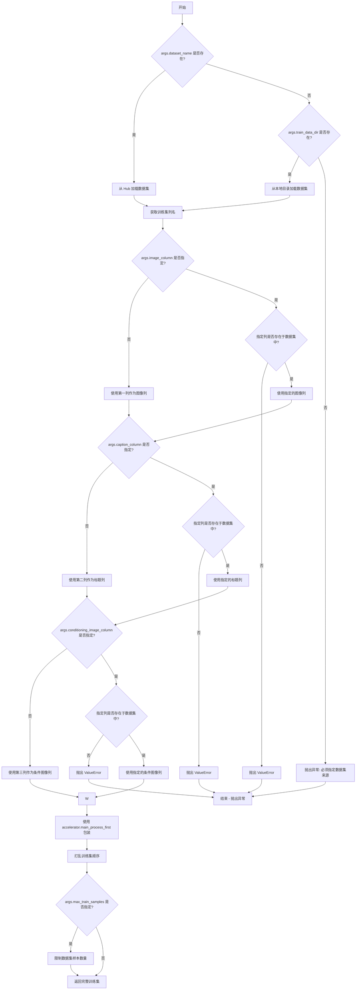
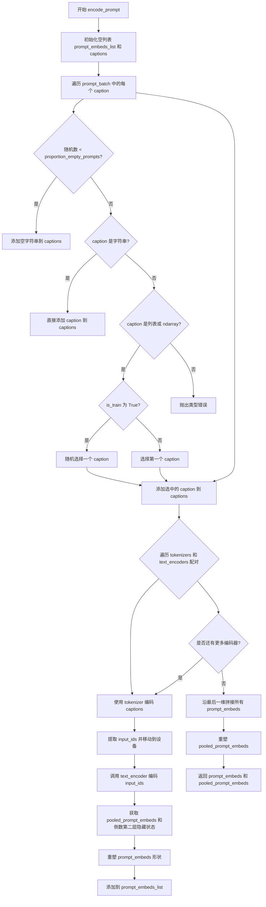
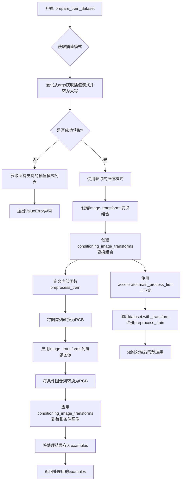
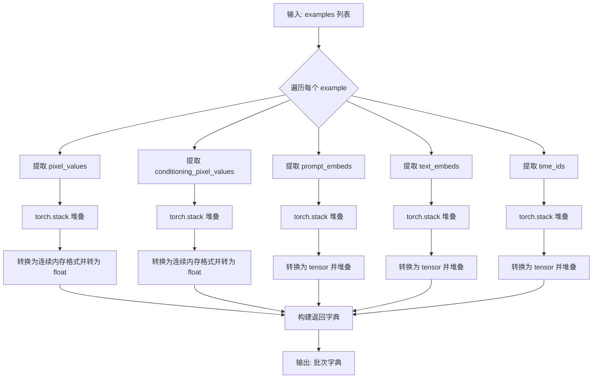

```mermaid
flowchart TD
    A[开始 main 函数] --> B{检查 wandb 和 hub_token}
    B -->|冲突| C[抛出 ValueError]
    B -->|正常| D[设置日志目录]
    D --> E{检查 MPS + bf16}
    E -->|不支持| F[抛出 ValueError]
    E -->|支持| G[创建 Accelerator]
    G --> H[配置日志]
    H --> I[设置随机种子]
    I --> J[创建输出目录]
    J --> K[加载 tokenizers]
    K --> L[导入文本编码器类]
    L --> M[加载 scheduler 和模型]
    M --> N[加载/初始化 controlnet]
    N --> O[设置模型为训练模式]
    O --> P{启用 NPU Flash Attention}
    P -->|是| Q[启用 NPU]
    P -->|否| R{启用 xformers}
    Q --> R
    R -->|是| S[启用 xformers]
    R -->|否| T{启用梯度检查点}
    S --> T
    T -->|是| U[启用梯度检查点]
    T -->|否| V[检查 controlnet 精度]
    U --> V
    V --> W{启用 TF32}
    W -->|是| X[允许 TF32]
    W -->|否| Y[缩放学习率]
    X --> Y
    Y --> Z[创建优化器]
    Z --> AA[设置权重精度]
    AA --> AB[移动模型到设备]
    AB --> AC[计算文本嵌入]
    AC --> AD[准备训练数据集]
    AD --> AE[创建 DataLoader]
    AE --> AF[创建 LR Scheduler]
    AF --> AG[准备所有组件]
    AG --> AH[初始化 trackers]
    AH --> AI[训练循环]
    AI --> AJ{是否完成训练}
    AJ -->|否| AK[执行训练步骤]
    AJ -->|是| AL[保存最终模型]
    AK --> AM{达到检查点步数}
    AM -->|是| AN[保存检查点]
    AM -->|否| AO{达到验证步数}
    AN --> AO
    AO -->|是| AP[执行验证]
    AO -->|否| AQ[记录日志]
    AP --> AQ
    AQ --> AR{完成所有步骤}
    AR --> AJ
    AL --> AS{推送到 Hub}
    AS -->|是| AT[保存模型卡片并推送]
    AS -->|否| AU[结束训练]
    AT --> AU
```

# `diffusers\examples\controlnet\train_controlnet_sdxl.py` 详细设计文档

这是一个用于训练Stable Diffusion XL ControlNet模型的脚本，支持分布式训练、混合精度、梯度累积、模型验证和检查点保存等功能。

## 整体流程



## 类结构

```
脚本主流程
├── parse_args (参数解析)
├── main (主训练函数)
│   ├── 初始化阶段
│   ├── 数据准备阶段
│   └── 训练循环阶段
├── 辅助函数
│   ├── log_validation (验证)
│   ├── import_model_class_from_model_name_or_path (导入模型类)
│   ├── save_model_card (保存模型卡片)
│   ├── get_train_dataset (获取训练数据集)
│   ├── encode_prompt (编码提示词)
│   ├── prepare_train_dataset (准备训练数据集)
│   └── collate_fn (数据整理)
└── 全局变量
    └── logger (日志记录器)
```

## 全局变量及字段


### `logger`
    
日志记录器，用于记录训练过程中的信息

类型：`logging.Logger`
    


### `args`
    
命令行参数集合，包含所有训练配置选项

类型：`argparse.Namespace`
    


### `weight_dtype`
    
模型权重的数据类型，用于混合精度训练（fp16/bf16/fp32）

类型：`torch.dtype`
    


### `tokenizer_one`
    
第一个分词器，用于SDXL文本编码器

类型：`AutoTokenizer`
    


### `tokenizer_two`
    
第二个分词器，用于SDXL文本编码器_2

类型：`AutoTokenizer`
    


### `text_encoder_one`
    
第一个文本编码器，将文本转换为嵌入向量

类型：`CLIPTextModel/CLIPTextModelWithProjection`
    


### `text_encoder_two`
    
第二个文本编码器，将文本转换为嵌入向量

类型：`CLIPTextModel/CLIPTextModelWithProjection`
    


### `vae`
    
变分自编码器，用于图像编码和解码潜在空间表示

类型：`AutoencoderKL`
    


### `unet`
    
条件UNet模型，在扩散过程中预测噪声残差

类型：`UNet2DConditionModel`
    


### `controlnet`
    
ControlNet模型，根据条件图像引导生成过程

类型：`ControlNetModel`
    


### `noise_scheduler`
    
DDPM噪声调度器，管理扩散过程的噪声添加

类型：`DDPMScheduler`
    


### `optimizer`
    
AdamW优化器，用于更新模型参数

类型：`torch.optim.AdamW/bnb.optim.AdamW8bit`
    


### `lr_scheduler`
    
学习率调度器，动态调整训练学习率

类型：`torch.optim.lr_scheduler._LRScheduler`
    


### `train_dataloader`
    
训练数据加载器，按批次提供训练数据

类型：`torch.utils.data.DataLoader`
    


### `train_dataset`
    
训练数据集，包含图像和条件信息

类型：`datasets.Dataset`
    


    

## 全局函数及方法


### `log_validation`

该函数用于在训练过程中执行验证操作，通过加载 Stable Diffusion XL ControlNet pipeline 并使用指定的验证图像和提示词生成样本，然后将生成的图像记录到 TensorBoard 或 WandB 等追踪工具中，以监控模型在训练过程中的性能表现。

参数：

- `vae`：`AutoencoderKL`，变分自编码器模型，用于将图像编码到潜在空间
- `unet`：`UNet2DConditionModel`，UNet 模型，用于去噪潜在表示
- `controlnet`：`ControlNetModel`，ControlNet 模型，提供条件控制信息
- `args`：`Namespace`，命令行参数对象，包含预训练模型路径、验证图像路径、验证提示词、分辨率等配置
- `accelerator`：`Accelerator`，HuggingFace Accelerate 加速器对象，用于管理设备和分布式训练
- `weight_dtype`：`torch.dtype`，权重数据类型（float16、bfloat16 或 float32）
- `step`：`int`，当前训练步数，用于记录日志
- `is_final_validation`：`bool`，是否为最终验证的标志，默认为 False

返回值：`List[Dict]`，验证日志列表，每个字典包含验证图像、生成的图像和对应的提示词

#### 流程图



#### 带注释源码

```python
def log_validation(vae, unet, controlnet, args, accelerator, weight_dtype, step, is_final_validation=False):
    """
    执行验证流程，生成并记录验证图像
    
    参数:
        vae: 变分自编码器模型
        unet: UNet2DConditionModel 模型
        controlnet: ControlNetModel 模型
        args: 包含所有训练和验证配置的命名空间对象
        accelerator: Accelerate 加速器实例
        weight_dtype: 计算精度类型
        step: 当前训练步数
        is_final_validation: 是否为最终验证（训练结束后）
    """
    logger.info("Running validation... ")

    # 根据是否为最终验证采用不同的模型加载策略
    if not is_final_validation:
        # 中间验证：从 accelerator 中解包并获取 controlnet
        controlnet = accelerator.unwrap_model(controlnet)
        # 从预训练模型加载完整的 StableDiffusionXLControlNetPipeline
        pipeline = StableDiffusionXLControlNetPipeline.from_pretrained(
            args.pretrained_model_name_or_path,
            vae=vae,
            unet=unet,
            controlnet=controlnet,
            revision=args.revision,
            variant=args.variant,
            torch_dtype=weight_dtype,
        )
    else:
        # 最终验证：从输出目录加载已训练好的 controlnet
        controlnet = ControlNetModel.from_pretrained(args.output_dir, torch_dtype=weight_dtype)
        # 根据配置决定 VAE 的加载方式
        if args.pretrained_vae_model_name_or_path is not None:
            vae = AutoencoderKL.from_pretrained(args.pretrained_vae_model_name_or_path, torch_dtype=weight_dtype)
        else:
            vae = AutoencoderKL.from_pretrained(
                args.pretrained_model_name_or_path, subfolder="vae", torch_dtype=weight_dtype
            )

        # 加载最终验证用的 pipeline（不包含 unet，使用默认配置）
        pipeline = StableDiffusionXLControlNetPipeline.from_pretrained(
            args.pretrained_model_name_or_path,
            vae=vae,
            controlnet=controlnet,
            revision=args.revision,
            variant=args.variant,
            torch_dtype=weight_dtype,
        )

    # 配置 UniPC 多步调度器以加速推理
    pipeline.scheduler = UniPCMultistepScheduler.from_config(pipeline.scheduler.config)
    # 将 pipeline 移动到加速器设备
    pipeline = pipeline.to(accelerator.device)
    # 禁用进度条显示
    pipeline.set_progress_bar_config(disable=True)

    # 条件启用 xformers 内存高效注意力机制
    if args.enable_xformers_memory_efficient_attention:
        pipeline.enable_xformers_memory_efficient_attention()

    # 设置随机种子以确保可重复性
    if args.seed is None:
        generator = None
    else:
        generator = torch.Generator(device=accelerator.device).manual_seed(args.seed)

    # 处理验证图像和提示词数量的匹配问题
    if len(args.validation_image) == len(args.validation_prompt):
        validation_images = args.validation_image
        validation_prompts = args.validation_prompt
    elif len(args.validation_image) == 1:
        # 单张图像配多提示词：复制图像
        validation_images = args.validation_image * len(args.validation_prompt)
        validation_prompts = args.validation_prompt
    elif len(args.validation_prompt) == 1:
        # 单提示词配多图像：复制提示词
        validation_images = args.validation_image
        validation_prompts = args.validation_prompt * len(args.validation_image)
    else:
        raise ValueError(
            "number of `args.validation_image` and `args.validation_prompt` should be checked in `parse_args`"
        )

    image_logs = []
    # 为 MPS 或最终验证创建 autocast 上下文
    if is_final_validation or torch.backends.mps.is_available():
        autocast_ctx = nullcontext()
    else:
        autocast_ctx = torch.autocast(accelerator.device.type)

    # 遍历每对验证图像和提示词
    for validation_prompt, validation_image in zip(validation_prompts, validation_images):
        # 打开并转换验证图像为 RGB 格式
        validation_image = Image.open(validation_image).convert("RGB")

        try:
            # 获取指定的图像插值模式
            interpolation = getattr(transforms.InterpolationMode, args.image_interpolation_mode.upper())
        except (AttributeError, KeyError):
            # 如果插值模式不支持，抛出详细错误信息
            supported_interpolation_modes = [
                f.lower() for f in dir(transforms.InterpolationMode) if not f.startswith("__") and not f.endswith("__")
            ]
            raise ValueError(
                f"Interpolation mode {args.image_interpolation_mode} is not supported. "
                f"Please select one of the following: {', '.join(supported_interpolation_modes)}"
            )

        # 图像预处理变换：调整大小并中心裁剪
        transform = transforms.Compose(
            [
                transforms.Resize(args.resolution, interpolation=interpolation),
                transforms.CenterCrop(args.resolution),
            ]
        )
        validation_image = transform(validation_image)

        images = []

        # 生成多张验证图像
        for _ in range(args.num_validation_images):
            with autocast_ctx:
                # 调用 pipeline 进行推理生成图像
                image = pipeline(
                    prompt=validation_prompt, 
                    image=validation_image, 
                    num_inference_steps=20, 
                    generator=generator
                ).images[0]
            images.append(image)

        # 将验证结果添加到日志列表
        image_logs.append(
            {"validation_image": validation_image, "images": images, "validation_prompt": validation_prompt}
        )

    # 根据验证类型选择 tracker key
    tracker_key = "test" if is_final_validation else "validation"
    # 遍历所有已注册的 tracker 记录图像日志
    for tracker in accelerator.trackers:
        if tracker.name == "tensorboard":
            # TensorBoard 记录方式：堆叠图像数组
            for log in image_logs:
                images = log["images"]
                validation_prompt = log["validation_prompt"]
                validation_image = log["validation_image"]

                formatted_images = [np.asarray(validation_image)]

                for image in images:
                    formatted_images.append(np.asarray(image))

                formatted_images = np.stack(formatted_images)

                # 使用 NHWC 格式添加图像
                tracker.writer.add_images(validation_prompt, formatted_images, step, dataformats="NHWC")
        elif tracker.name == "wandb":
            # WandB 记录方式：使用 wandb.Image 对象
            formatted_images = []

            for log in image_logs:
                images = log["images"]
                validation_prompt = log["validation_prompt"]
                validation_image = log["validation_image"]

                # 添加条件控制图像（带标题）
                formatted_images.append(wandb.Image(validation_image, caption="Controlnet conditioning"))

                for image in images:
                    image = wandb.Image(image, caption=validation_prompt)
                    formatted_images.append(image)

            tracker.log({tracker_key: formatted_images})
        else:
            # 其他 tracker 类型记录警告
            logger.warning(f"image logging not implemented for {tracker.name}")

    # 清理资源：删除 pipeline 对象并强制垃圾回收
    del pipeline
    gc.collect()
    torch.cuda.empty_cache()

    return image_logs
```


### `import_model_class_from_model_name_or_path`

该函数用于根据预训练模型的名称或路径，动态导入对应的文本编码器类（CLIPTextModel 或 CLIPTextModelWithProjection）。它通过读取模型的配置文件获取架构信息，然后从 transformers 库中导入相应的类并返回。

**参数：**

- `pretrained_model_name_or_path`：`str`，预训练模型的名称或模型标识符路径（例如 "stabilityai/stable-diffusion-xl-base-1.0"）
- `revision`：`str`，预训练模型的版本号（Git revision）
- `subfolder`：`str`，子文件夹路径，默认为 "text_encoder"（用于指定模型子目录，如 text_encoder、text_encoder_2 等）

**返回值：** `type`，返回对应的文本编码器类（CLIPTextModel 或 CLIPTextModelWithProjection）

#### 流程图

```mermaid
flowchart TD
    A[开始: import_model_class_from_model_name_or_path] --> B[调用 PretrainedConfig.from_pretrained 加载配置]
    B --> C[从配置中获取 architectures[0]]
    C --> D{判断 model_class}
    D -->|CLIPTextModel| E[导入 transformers.CLIPTextModel]
    D -->|CLIPTextModelWithProjection| F[导入 transformers.CLIPTextModelWithProjection]
    D -->|其他| G[抛出 ValueError 异常]
    E --> H[返回 CLIPTextModel 类]
    F --> I[返回 CLIPTextModelWithProjection 类]
    G --> J[结束: 异常处理]
    H --> K[结束: 成功返回类类型]
    I --> K
```

#### 带注释源码

```python
def import_model_class_from_model_name_or_path(
    pretrained_model_name_or_path: str, revision: str, subfolder: str = "text_encoder"
):
    """
    根据预训练模型配置动态导入文本编码器类
    
    参数:
        pretrained_model_name_or_path: 预训练模型名称或路径
        revision: Git revision 版本号
        subfolder: 模型子文件夹，默认 "text_encoder"
    
    返回:
        对应的文本编码器类 (CLIPTextModel 或 CLIPTextModelWithProjection)
    """
    # 从预训练模型路径加载 PretrainedConfig 配置文件
    text_encoder_config = PretrainedConfig.from_pretrained(
        pretrained_model_name_or_path, subfolder=subfolder, revision=revision
    )
    # 获取配置中定义的架构类名
    model_class = text_encoder_config.architectures[0]

    # 根据架构名称导入并返回对应的类
    if model_class == "CLIPTextModel":
        # 导入标准的 CLIP 文本编码器
        from transformers import CLIPTextModel

        return CLIPTextModel
    elif model_class == "CLIPTextModelWithProjection":
        # 导入带投影的 CLIP 文本编码器（用于 SDXL）
        from transformers import CLIPTextModelWithProjection

        return CLIPTextModelWithProjection
    else:
        # 不支持的架构类型，抛出异常
        raise ValueError(f"{model_class} is not supported.")
```


### `save_model_card`

该函数用于生成并保存模型的 Model Card（模型卡片），包含模型描述、训练元数据、示例图像等信息，并将其保存为 README.md 文件到指定目录。

参数：

- `repo_id`：`str`，HuggingFace Hub 上的仓库 ID，用于标识模型
- `image_logs`：可选参数，验证过程中生成的图像日志列表，用于展示训练效果
- `base_model`：字符串类型，基础预训练模型的名称或路径
- `repo_folder`：可选参数，本地文件夹路径，用于保存模型卡片和示例图像

返回值：无（`None`），该函数直接写入文件，不返回任何值

#### 流程图



#### 带注释源码

```python
def save_model_card(repo_id: str, image_logs=None, base_model=str, repo_folder=None):
    """
    生成并保存模型的 Model Card（模型卡片）
    
    参数:
        repo_id: HuggingFace Hub 上的仓库 ID
        image_logs: 验证过程中生成的图像日志列表
        base_model: 基础预训练模型名称或路径
        repo_folder: 本地保存路径
    """
    
    # 初始化图像描述字符串
    img_str = ""
    
    # 如果存在图像日志，处理并添加示例图像
    if image_logs is not None:
        img_str = "You can find some example images below.\n\n"
        
        # 遍历每个验证日志
        for i, log in enumerate(image_logs):
            images = log["images"]  # 生成的图像列表
            validation_prompt = log["validation_prompt"]  # 验证提示词
            validation_image = log["validation_image"]  # 控制网输入图像
            
            # 保存控制网 conditioning 图像
            validation_image.save(os.path.join(repo_folder, "image_control.png"))
            
            # 添加提示词信息到描述
            img_str += f"prompt: {validation_prompt}\n"
            
            # 将验证图像与生成图像合并，创建网格并保存
            images = [validation_image] + images
            make_image_grid(images, 1, len(images)).save(os.path.join(repo_folder, f"images_{i}.png"))
            
            # 添加图像引用到描述
            img_str += f"\n"

    # 构建模型描述内容
    model_description = f"""
# controlnet-{repo_id}

These are controlnet weights trained on {base_model} with new type of conditioning.
{img_str}
"""

    # 加载或创建模型卡片（从 diffusers 库）
    model_card = load_or_create_model_card(
        repo_id_or_path=repo_id,
        from_training=True,  # 标记为训练产出的模型
        license="openrail++",
        base_model=base_model,
        model_description=model_description,
        inference=True,
    )

    # 定义模型标签
    tags = [
        "stable-diffusion-xl",
        "stable-diffusion-xl-diffusers",
        "text-to-image",
        "diffusers",
        "controlnet",
        "diffusers-training",
    ]
    
    # 填充模型卡片的标签信息
    model_card = populate_model_card(model_card, tags=tags)

    # 保存模型卡片为 README.md
    model_card.save(os.path.join(repo_folder, "README.md"))
```


### `parse_args`

该函数是 ControlNet 训练脚本的命令行参数解析入口，使用 `argparse` 定义了训练所需的所有参数，包括模型路径、训练超参数、数据集配置、验证设置等，并在解析后进行了一系列参数合法性验证，最终返回包含所有配置参数的命名空间对象。

参数：

- `input_args`：`Optional[List[str]]`，可选参数，用于传递自定义的命令行参数列表。默认值为 `None`，表示从 `sys.argv` 解析参数。

返回值：`Namespace`，返回包含所有解析后命令行参数的命名空间对象，该对象可通过属性方式访问各参数值。

#### 流程图



#### 带注释源码

```python
def parse_args(input_args=None):
    """
    解析命令行参数，用于配置 ControlNet 训练脚本的各种选项。
    
    参数:
        input_args: 可选的参数列表。如果为 None，则从 sys.argv 解析。
                   这在测试或需要手动指定参数时非常有用。
    
    返回:
        args: 包含所有解析后参数的 Namespace 对象
    """
    
    # 创建 ArgumentParser 实例，设置程序描述
    # 这是 Python 标准库中的命令行参数解析工具
    parser = argparse.ArgumentParser(
        description="Simple example of a ControlNet training script."
    )
    
    # =====================================================
    # 模型路径相关参数
    # =====================================================
    
    # 预训练模型名称或路径，这是最关键的参数，必须指定
    # 用于指定基础 Stable Diffusion XL 模型
    parser.add_argument(
        "--pretrained_model_name_or_path",
        type=str,
        default=None,
        required=True,
        help="Path to pretrained model or model identifier from huggingface.co/models.",
    )
    
    # 可选的改进版 VAE 模型，用于稳定训练过程
    # 如果不指定，则使用默认的 VAE
    parser.add_argument(
        "--pretrained_vae_model_name_or_path",
        type=str,
        default=None,
        help="Path to an improved VAE to stabilize training. For more details check out: https://github.com/huggingface/diffusers/pull/4038.",
    )
    
    # 预训练 ControlNet 模型路径
    # 如果不指定，则从 UNet 初始化 ControlNet 权重
    parser.add_argument(
        "--controlnet_model_name_or_path",
        type=str,
        default=None,
        help="Path to pretrained controlnet model or model identifier from huggingface.co/models."
        " If not specified controlnet weights are initialized from unet.",
    )
    
    # 模型变体，例如 'fp16' 表示使用半精度权重
    parser.add_argument(
        "--variant",
        type=str,
        default=None,
        help="Variant of the model files of the pretrained model identifier from huggingface.co/models, 'e.g.' fp16",
    )
    
    # 预训练模型的版本/提交哈希
    parser.add_argument(
        "--revision",
        type=str,
        default=None,
        required=False,
        help="Revision of pretrained model identifier from huggingface.co/models.",
    )
    
    # 预训练 tokenizer 名称或路径
    # 如果不指定，则使用与模型相同的 tokenizer
    parser.add_argument(
        "--tokenizer_name",
        type=str,
        default=None,
        help="Pretrained tokenizer name or path if not the same as model_name",
    )
    
    # =====================================================
    # 输出和缓存目录
    # =====================================================
    
    # 模型预测和检查点的输出目录
    parser.add_argument(
        "--output_dir",
        type=str,
        default="controlnet-model",
        help="The output directory where the model predictions and checkpoints will be written.",
    )
    
    # 下载的模型和数据集的缓存目录
    parser.add_argument(
        "--cache_dir",
        type=str,
        default=None,
        help="The directory where the downloaded models and datasets will be stored.",
    )
    
    # =====================================================
    # 随机种子和图像分辨率
    # =====================================================
    
    # 用于可重复训练 random seed
    parser.add_argument("--seed", type=int, default=None, help="A seed for reproducible training.")
    
    # 输入图像的分辨率
    # 所有训练和验证集中的图像都将调整为此分辨率
    parser.add_argument(
        "--resolution",
        type=int,
        default=512,
        help=(
            "The resolution for input images, all the images in the train/validation dataset will be resized to this"
            " resolution"
        ),
    )
    
    # SDXL UNet 需要的裁剪坐标嵌入
    # 用于指定裁剪区域的左上角坐标
    parser.add_argument(
        "--crops_coords_top_left_h",
        type=int,
        default=0,
        help=("Coordinate for (the height) to be included in the crop coordinate embeddings needed by SDXL UNet."),
    )
    parser.add_argument(
        "--crops_coords_top_left_w",
        type=int,
        default=0,
        help=("Coordinate for (the height) to be included in the crop coordinate embeddings needed by SDXL UNet."),
    )
    
    # =====================================================
    # 训练超参数
    # =====================================================
    
    # 训练批次大小（每个设备）
    parser.add_argument(
        "--train_batch_size", type=int, default=4, help="Batch size (per device) for the training dataloader."
    )
    
    # 训练轮数
    parser.add_argument("--num_train_epochs", type=int, default=1)
    
    # 总训练步数
    # 如果提供此参数，则覆盖 num_train_epochs
    parser.add_argument(
        "--max_train_steps",
        type=int,
        default=None,
        help="Total number of training steps to perform.  If provided, overrides num_train_epochs.",
    )
    
    # 检查点保存间隔步数
    parser.add_argument(
        "--checkpointing_steps",
        type=int,
        default=500,
        help=(
            "Save a checkpoint of the training state every X updates. Checkpoints can be used for resuming training via `--resume_from_checkpoint`. "
            "In the case that the checkpoint is better than the final trained model, the checkpoint can also be used for inference."
            "Using a checkpoint for inference requires separate loading of the original pipeline and the individual checkpointed model components."
            "See https://huggingface.co/docs/diffusers/main/en/training/dreambooth#performing-inference-using-a-saved-checkpoint for step by step"
            "instructions."
        ),
    )
    
    # 最多保存的检查点数量
    parser.add_argument(
        "--checkpoints_total_limit",
        type=int,
        default=None,
        help=("Max number of checkpoints to store."),
    )
    
    # 从检查点恢复训练
    # 可以是具体路径或 "latest" 自动选择最新的检查点
    parser.add_argument(
        "--resume_from_checkpoint",
        type=str,
        default=None,
        help=(
            "Whether training should be resumed from a previous checkpoint. Use a path saved by"
            ' `--checkpointing_steps`, or `"latest"` to automatically select the last available checkpoint.'
        ),
    )
    
    # 梯度累积步数
    # 在执行反向/更新传递之前累积的更新步数
    parser.add_argument(
        "--gradient_accumulation_steps",
        type=int,
        default=1,
        help="Number of updates steps to accumulate before performing a backward/update pass.",
    )
    
    # 梯度检查点
    # 以较慢的反向传播为代价节省内存
    parser.add_argument(
        "--gradient_checkpointing",
        action="store_true",
        help="Whether or not to use gradient checkpointing to save memory at the expense of slower backward pass.",
    )
    
    # =====================================================
    # 学习率相关参数
    # =====================================================
    
    # 初始学习率
    parser.add_argument(
        "--learning_rate",
        type=float,
        default=5e-6,
        help="Initial learning rate (after the potential warmup period) to use.",
    )
    
    # 是否按 GPU 数量、梯度累积步数和批次大小缩放学习率
    parser.add_argument(
        "--scale_lr",
        action="store_true",
        default=False,
        help="Scale the learning rate by the number of GPUs, gradient accumulation steps, and batch size.",
    )
    
    # 学习率调度器类型
    parser.add_argument(
        "--lr_scheduler",
        type=str,
        default="constant",
        help=(
            'The scheduler type to use. Choose between ["linear", "cosine", "cosine_with_restarts", "polynomial",'
            ' "constant", "constant_with_warmup"]'
        ),
    )
    
    # 学习率预热步数
    parser.add_argument(
        "--lr_warmup_steps", type=int, default=500, help="Number of steps for the warmup in the lr scheduler."
    )
    
    # cosine_with_restarts 调度器的硬重置次数
    parser.add_argument(
        "--lr_num_cycles",
        type=int,
        default=1,
        help="Number of hard resets of the lr in cosine_with_restarts scheduler.",
    )
    
    # 多项式调度器的幂因子
    parser.add_argument("--lr_power", type=float, default=1.0, help="Power factor of the polynomial scheduler.")
    
    # =====================================================
    # 优化器参数
    # =====================================================
    
    # 是否使用 8 位 Adam 优化器（来自 bitsandbytes）
    # 可以显著减少显存使用
    parser.add_argument(
        "--use_8bit_adam", action="store_true", help="Whether or not to use 8-bit Adam from bitsandbytes."
    )
    
    # 数据加载的工作进程数
    # 0 表示在主进程中加载数据
    parser.add_argument(
        "--dataloader_num_workers",
        type=int,
        default=0,
        help=(
            "Number of subprocesses to use for data loading. 0 means that the data will be loaded in the main process."
        ),
    )
    
    # Adam 优化器的 beta1 参数
    parser.add_argument("--adam_beta1", type=float, default=0.9, help="The beta1 parameter for the Adam optimizer.")
    
    # Adam 优化器的 beta2 参数
    parser.add_argument("--adam_beta2", type=float, default=0.999, help="The beta2 parameter for the Adam optimizer.")
    
    # 权重衰减
    parser.add_argument("--adam_weight_decay", type=float, default=1e-2, help="Weight decay to use.")
    
    # Adam 优化器的 epsilon 值
    parser.add_argument("--adam_epsilon", type=float, default=1e-08, help="Epsilon value for the Adam optimizer")
    
    # 最大梯度范数，用于梯度裁剪
    parser.add_argument("--max_grad_norm", default=1.0, type=float, help="Max gradient norm.")
    
    # =====================================================
    # Hub 相关参数
    # =====================================================
    
    # 是否将模型推送到 Hub
    parser.add_argument("--push_to_hub", action="store_true", help="Whether or not to push the model to the Hub.")
    
    # 推送到 Hub 使用的 token
    parser.add_argument("--hub_token", type=str, default=None, help="The token to use to push to the Model Hub.")
    
    # Hub 上的模型仓库名称
    parser.add_argument(
        "--hub_model_id",
        type=str,
        default=None,
        help="The name of the repository to keep in sync with the local `output_dir`.",
    )
    
    # =====================================================
    # 日志和报告参数
    # =====================================================
    
    # TensorBoard 日志目录
    parser.add_argument(
        "--logging_dir",
        type=str,
        default="logs",
        help=(
            "[TensorBoard](https://www.tensorflow.org/tensorboard) log directory. Will default to"
            " *output_dir/runs/**CURRENT_DATETIME_HOSTNAME***."
        ),
    )
    
    # 是否允许在 Ampere GPU 上使用 TF32
    # 可以加速训练
    parser.add_argument(
        "--allow_tf32",
        action="store_true",
        help=(
            "Whether or not to allow TF32 on Ampere GPUs. Can be used to speed up training. For more information, see"
            " https://pytorch.org/docs/stable/notes/cuda.html#tensorfloat-32-tf32-on-ampere-devices"
        ),
    )
    
    # 报告结果和日志的集成工具
    parser.add_argument(
        "--report_to",
        type=str,
        default="tensorboard",
        help=(
            'The integration to report the results and logs to. Supported platforms are `"tensorboard"`'
            ' (default), `"wandb"` and `"comet_ml"`. Use `"all"` to report to all integrations.'
        ),
    )
    
    # =====================================================
    # 混合精度和内存优化
    # =====================================================
    
    # 混合精度类型
    parser.add_argument(
        "--mixed_precision",
        type=str,
        default=None,
        choices=["no", "fp16", "bf16"],
        help=(
            "Whether to use mixed precision. Choose between fp16 and bf16 (bfloat16). Bf16 requires PyTorch >="
            " 1.10.and an Nvidia Ampere GPU.  Default to the value of accelerate config of the current system or the"
            " flag passed with the `accelerate.launch` command. Use this argument to override the accelerate config."
        ),
    )
    
    # 是否启用 xFormers 高效注意力机制
    parser.add_argument(
        "--enable_xformers_memory_efficient_attention", action="store_true", help="Whether or not to use xformers."
    )
    
    # 是否启用 NPU Flash Attention
    parser.add_argument(
        "--enable_npu_flash_attention", action="store_true", help="Whether or not to use npu flash attention."
    )
    
    # 设置梯度为 None 而非零以节省内存
    # 注意：这会改变某些行为
    parser.add_argument(
        "--set_grads_to_none",
        action="store_true",
        help=(
            "Save more memory by using setting grads to None instead of zero. Be aware, that this changes certain"
            " behaviors, so disable this argument if it causes any problems. More info:"
            " https://pytorch.org/docs/stable/generated/torch.optim.Optimizer.zero_grad.html"
        ),
    )
    
    # =====================================================
    # 数据集相关参数
    # =====================================================
    
    # 数据集名称（来自 HuggingFace Hub 或本地路径）
    parser.add_argument(
        "--dataset_name",
        type=str,
        default=None,
        help=(
            "The name of the Dataset (from the HuggingFace hub) to train on (could be your own, possibly private,"
            " dataset). It can also be a path pointing to a local copy of a dataset in your filesystem,"
            " or to a folder containing files that 🤗 Datasets can understand."
        ),
    )
    
    # 数据集配置名称
    parser.add_argument(
        "--dataset_config_name",
        type=str,
        default=None,
        help="The config of the Dataset, leave as None if there's only one config.",
    )
    
    # 训练数据目录（本地文件夹）
    parser.add_argument(
        "--train_data_dir",
        type=str,
        default=None,
        help=(
            "A folder containing the training data. Folder contents must follow the structure described in"
            " https://huggingface.co/docs/datasets/image_dataset#imagefolder. In particular, a `metadata.jsonl` file"
            " must exist to provide the captions for the images. Ignored if `dataset_name` is specified."
        ),
    )
    
    # 数据集中的图像列名
    parser.add_argument(
        "--image_column", type=str, default="image", help="The column of the dataset containing the target image."
    )
    
    # 数据集中的 ControlNet 条件图像列名
    parser.add_argument(
        "--conditioning_image_column",
        type=str,
        default="conditioning_image",
        help="The column of the dataset containing the controlnet conditioning image.",
    )
    
    # 数据集中的标题/描述列名
    parser.add_argument(
        "--caption_column",
        type=str,
        default="text",
        help="The column of the dataset containing a caption or a list of captions.",
    )
    
    # 用于调试或更快训练的最大训练样本数
    parser.add_argument(
        "--max_train_samples",
        type=int,
        default=None,
        help=(
            "For debugging purposes or quicker training, truncate the number of training examples to this "
            "value if set."
        ),
    )
    
    # 空字符串替换图像提示的比例
    # 默认为 0（不替换）
    parser.add_argument(
        "--proportion_empty_prompts",
        type=float,
        default=0,
        help="Proportion of image prompts to be replaced with empty strings. Defaults to 0 (no prompt replacement).",
    )
    
    # =====================================================
    # 验证相关参数
    # =====================================================
    
    # 验证提示（每若干步评估一次）
    parser.add_argument(
        "--validation_prompt",
        type=str,
        default=None,
        nargs="+",
        help=(
            "A set of prompts evaluated every `--validation_steps` and logged to `--report_to`."
            " Provide either a matching number of `--validation_image`s, a single `--validation_image`"
            " to be used with all prompts, or a single prompt that will be used with all `--validation_image`s."
        ),
    )
    
    # 验证图像路径
    parser.add_argument(
        "--validation_image",
        type=str,
        default=None,
        nargs="+",
        help=(
            "A set of paths to the controlnet conditioning image be evaluated every `--validation_steps`"
            " and logged to `--report_to`. Provide either a matching number of `--validation_prompt`s, a"
            " a single `--validation_prompt` to be used with all `--validation_image`s, or a single"
            " `--validation_image` that will be used with all `--validation_prompt`s."
        ),
    )
    
    # 每个验证图像-提示对生成的数量
    parser.add_argument(
        "--num_validation_images",
        type=int,
        default=4,
        help="Number of images to be generated for each `--validation_image`, `--validation_prompt` pair",
    )
    
    # 运行验证的间隔步数
    parser.add_argument(
        "--validation_steps",
        type=int,
        default=100,
        help=(
            "Run validation every X steps. Validation consists of running the prompt"
            " `args.validation_prompt` multiple times: `args.num_validation_images`"
            " and logging the images."
        ),
    )
    
    # 追踪器项目名称（传递给 Accelerator.init_trackers）
    parser.add_argument(
        "--tracker_project_name",
        type=str,
        default="sd_xl_train_controlnet",
        help=(
            "The `project_name` argument passed to Accelerator.init_trackers for"
            " more information see https://huggingface.co/docs/accelerate/v0.17.0/en/package_reference/accelerator#accelerate.Accelerator"
        ),
    )
    
    # 图像插值模式
    parser.add_argument(
        "--image_interpolation_mode",
        type=str,
        default="lanczos",
        choices=[
            f.lower() for f in dir(transforms.InterpolationMode) if not f.startswith("__") and not f.endswith("__")
        ],
        help="The image interpolation method to use for resizing images.",
    )

    # =====================================================
    # 参数解析
    # =====================================================
    
    # 根据 input_args 是否为空选择解析方式
    # 允许在代码中直接传入参数列表进行测试
    if input_args is not None:
        args = parser.parse_args(input_args)
    else:
        args = parser.parse_args()

    # =====================================================
    # 参数合法性验证
    # =====================================================
    
    # 验证：必须指定数据集名称或训练数据目录之一
    if args.dataset_name is None and args.train_data_dir is None:
        raise ValueError("Specify either `--dataset_name` or `--train_data_dir`")

    # 验证：空提示比例必须在 [0, 1] 范围内
    if args.proportion_empty_prompts < 0 or args.proportion_empty_prompts > 1:
        raise ValueError("`--proportion_empty_prompts` must be in the range [0, 1].")

    # 验证：验证提示和验证图像必须同时设置
    if args.validation_prompt is not None and args.validation_image is None:
        raise ValueError("`--validation_image` must be set if `--validation_prompt` is set")

    if args.validation_prompt is None and args.validation_image is not None:
        raise ValueError("`--validation_prompt` must be set if `--validation_image` is set")

    # 验证：验证图像和验证提示的数量关系
    # 可以是 1对1、1对多、多对1，但不能是多对多且数量不同
    if (
        args.validation_image is not None
        and args.validation_prompt is not None
        and len(args.validation_image) != 1
        and len(args.validation_prompt) != 1
        and len(args.validation_image) != len(args.validation_prompt)
    ):
        raise ValueError(
            "Must provide either 1 `--validation_image`, 1 `--validation_prompt`,"
            " or the same number of `--validation_prompt`s and `--validation_image`s"
        )

    # 验证：分辨率必须能被 8 整除
    # 确保 VAE 和 controlnet encoder 之间的编码图像大小一致
    if args.resolution % 8 != 0:
        raise ValueError(
            "`--resolution` must be divisible by 8 for consistently sized encoded images between the VAE and the controlnet encoder."
        )

    # 返回解析后的参数对象
    return args
```


### `get_train_dataset`

该函数用于加载并准备训练数据集，支持从 HuggingFace Hub 加载远程数据集或从本地目录加载自定义数据集，并根据参数对数据集进行预处理和采样。

参数：

-  `args`：命令行参数对象，包含数据集名称、配置、路径、列名、最大训练样本数等配置信息
-  `accelerator`：Accelerator 实例，用于分布式训练时确保主进程优先执行数据预处理

返回值：`Dataset`，返回处理后的训练数据集对象

#### 流程图



#### 带注释源码

```python
def get_train_dataset(args, accelerator):
    """
    加载并准备训练数据集。
    
    支持两种数据加载方式：
    1. 从 HuggingFace Hub 下载数据集（通过 --dataset_name 指定）
    2. 从本地目录加载自定义数据集（通过 --train_data_dir 指定）
    
    参数:
        args: 包含数据集配置的命令行参数对象
        accelerator: Accelerator 实例，用于分布式训练协调
    
    返回:
        train_dataset: 处理后的 HuggingFace Dataset 对象
    """
    
    # 获取数据集：可以提供自己的训练和评估文件，或指定 Hub 上的 Dataset
    # 在分布式训练中，load_dataset 函数保证只有一个本地进程可以并发下载数据集
    if args.dataset_name is not None:
        # 从 Hub 下载并加载数据集
        dataset = load_dataset(
            args.dataset_name,           # 数据集名称或路径
            args.dataset_config_name,    # 数据集配置名称
            cache_dir=args.cache_dir,     # 缓存目录
            data_dir=args.train_data_dir, # 训练数据目录
        )
    else:
        # 从本地目录加载
        if args.train_data_dir is not None:
            dataset = load_dataset(
                args.train_data_dir,      # 本地数据目录路径
                cache_dir=args.cache_dir, # 缓存目录
            )
        # 更多关于加载自定义图像的信息请参考:
        # https://huggingface.co/docs/datasets/v2.0.0/en/dataset_script
    
    # 数据集预处理 - 需要对输入和目标进行标记化
    column_names = dataset["train"].column_names
    
    # 获取输入/目标的列名
    # 处理图像列
    if args.image_column is None:
        # 默认使用第一列作为图像列
        image_column = column_names[0]
        logger.info(f"image column defaulting to {image_column}")
    else:
        image_column = args.image_column
        if image_column not in column_names:
            raise ValueError(
                f"`--image_column` value '{args.image_column}' not found in dataset columns. "
                f"Dataset columns are: {', '.join(column_names)}"
            )
    
    # 处理标题/描述列
    if args.caption_column is None:
        # 默认使用第二列作为标题列
        caption_column = column_names[1]
        logger.info(f"caption column defaulting to {caption_column}")
    else:
        caption_column = args.caption_column
        if caption_column not in column_names:
            raise ValueError(
                f"`--caption_column` value '{args.caption_column}' not found in dataset columns. "
                f"Dataset columns are: {', '.join(column_names)}"
            )
    
    # 处理条件图像列（用于 ControlNet）
    if args.conditioning_image_column is None:
        # 默认使用第三列作为条件图像列
        conditioning_image_column = column_names[2]
        logger.info(f"conditioning image column defaulting to {conditioning_image_column}")
    else:
        conditioning_image_column = args.conditioning_image_column
        if conditioning_image_column not in column_names:
            raise ValueError(
                f"`--conditioning_image_column` value '{args.conditioning_image_column}' not found in dataset columns. "
                f"Dataset columns are: {', '.join(column_names)}"
            )
    
    # 使用 accelerator.main_process_first 确保只有主进程执行数据集打乱
    # 这在分布式训练中很重要，可以避免多个进程重复下载或处理数据
    with accelerator.main_process_first():
        # 打乱训练数据集
        train_dataset = dataset["train"].shuffle(seed=args.seed)
        
        # 如果指定了最大训练样本数，则截断数据集
        if args.max_train_samples is not None:
            train_dataset = train_dataset.select(range(args.max_train_samples))
    
    return train_dataset
```


### `encode_prompt`

该函数是Stable Diffusion XL ControlNet训练脚本中的文本编码核心函数，负责将文本提示（prompt）转换为模型可用的嵌入向量（embeddings）。它处理批量提示文本，支持空提示替换机制，并利用双文本编码器（tokenizer和text_encoder）生成用于SDXL UNet的条件嵌入。

参数：

- `prompt_batch`：任意类型（通常为字符串或列表），待编码的提示文本批次
- `text_encoders`：列表，包含文本编码器模型（如CLIPTextModel和CLIPTextModelWithProjection）
- `tokenizers`：列表，包含对应的分词器
- `proportion_empty_prompts`：浮点数，范围[0,1]，表示被替换为空字符串的提示比例
- `is_train`：布尔值，训练模式标志，决定如何处理多提示情况

返回值：元组 `(prompt_embeds, pooled_prompt_embeds)`

- `prompt_embeds`：torch.Tensor，形状为`(bs_embed, seq_len, hidden_dim)`的提示嵌入序列
- `pooled_prompt_embeds`：torch.Tensor，形状为`(bs_embed, pooled_dim)`的池化提示嵌入

#### 流程图



#### 带注释源码

```python
def encode_prompt(prompt_batch, text_encoders, tokenizers, proportion_empty_prompts, is_train=True):
    """
    将文本提示编码为嵌入向量，用于SDXL ControlNet训练
    
    参数:
        prompt_batch: 批量提示文本（字符串或字符串列表）
        text_encoders: 文本编码器列表
        tokenizers: 分词器列表
        proportion_empty_prompts: 空提示比例
        is_train: 是否为训练模式
    """
    prompt_embeds_list = []
    
    # 处理提示文本：支持空提示替换和多提示选择
    captions = []
    for caption in prompt_batch:
        # 根据比例随机替换为空字符串（无条件生成）
        if random.random() < proportion_empty_prompts:
            captions.append("")
        elif isinstance(caption, str):
            captions.append(caption)
        elif isinstance(caption, (list, np.ndarray)):
            # 训练时随机选择一个提示，推理时选择第一个
            captions.append(random.choice(caption) if is_train else caption[0])
    
    # 禁用梯度计算以节省显存
    with torch.no_grad():
        # 遍历所有文本编码器（SDXL使用两个编码器）
        for tokenizer, text_encoder in zip(tokenizers, text_encoders):
            # 分词：将文本转换为token ID
            text_inputs = tokenizer(
                captions,
                padding="max_length",  # 填充到最大长度
                max_length=tokenizer.model_max_length,
                truncation=True,  # 截断超长文本
                return_tensors="pt",  # 返回PyTorch张量
            )
            text_input_ids = text_inputs.input_ids
            
            # 编码：获取隐藏状态
            # output_hidden_states=True 用于获取所有层的隐藏状态
            prompt_embeds = text_encoder(
                text_input_ids.to(text_encoder.device),
                output_hidden_states=True,
            )
            
            # 获取池化输出（用于SDXL的额外条件嵌入）
            pooled_prompt_embeds = prompt_embeds[0]
            # 获取倒数第二层的隐藏状态（SDXL惯例：使用倒数第二层作为主要嵌入）
            prompt_embeds = prompt_embeds.hidden_states[-2]
            
            # 重塑嵌入形状：(batch, seq_len, hidden_dim)
            bs_embed, seq_len, _ = prompt_embeds.shape
            prompt_embeds = prompt_embeds.view(bs_embed, seq_len, -1)
            prompt_embeds_list.append(prompt_embeds)
    
    # 沿最后一维拼接两个编码器的输出
    prompt_embeds = torch.concat(prompt_embeds_list, dim=-1)
    pooled_prompt_embeds = pooled_prompt_embeds.view(bs_embed, -1)
    
    return prompt_embeds, pooled_prompt_embeds
```


### `prepare_train_dataset`

该函数负责准备训练数据集，应用图像变换（包括调整大小、中心裁剪、归一化），并将预处理函数注册到数据集以便在训练时动态转换图像和条件图像。

参数：

- `dataset`：`datasets.Dataset`，原始的训练数据集对象
- `accelerator`：`accelerate.Accelerator`，Hugging Face Accelerate 库提供的分布式训练加速器，用于同步主进程操作

返回值：`datasets.Dataset`，经过 `with_transform` 注册预处理函数后的数据集，可在数据加载时动态返回变换后的图像和条件图像

#### 流程图



#### 带注释源码

```python
def prepare_train_dataset(dataset, accelerator):
    # 尝试根据命令行参数获取图像插值模式
    try:
        # 从args获取插值模式名称（如'lanczos'），转为大写（'LANCZOS'），
        # 然后从torchvision.transforms.InterpolationMode获取对应的枚举值
        interpolation_mode = getattr(transforms.InterpolationMode, args.image_interpolation_mode.upper())
    except (AttributeError, KeyError):
        # 如果插值模式不支持，收集所有可用的插值模式供用户参考
        supported_interpolation_modes = [
            f.lower() for f in dir(transforms.InterpolationMode) if not f.startswith("__") and not f.endswith("__")
        ]
        raise ValueError(
            f"Interpolation mode {args.image_interpolation_mode} is not supported. "
            f"Please select one of the following: {', '.join(supported_interpolation_modes)}"
        )

    # 定义主图像的变换管道：调整大小 -> 中心裁剪 -> 转为张量 -> 归一化到[-1,1]
    image_transforms = transforms.Compose(
        [
            transforms.Resize(args.resolution, interpolation=interpolation_mode),
            transforms.CenterCrop(args.resolution),
            transforms.ToTensor(),
            transforms.Normalize([0.5], [0.5]),  # 将像素值从[0,1]归一化到[-1,1]
        ]
    )

    # 定义条件图像的变换管道：调整大小 -> 中心裁剪 -> 转为张量（无需归一化）
    conditioning_image_transforms = transforms.Compose(
        [
            transforms.Resize(args.resolution, interpolation=interpolation_mode),
            transforms.CenterCrop(args.resolution),
            transforms.ToTensor(),
            # 条件图像保持原始像素值范围[0,1]
        ]
    )

    # 定义数据集的预处理函数，将被datasets.Dataset.with_transform调用
    def preprocess_train(examples):
        # 读取图像列并将所有图像转换为RGB格式（确保通道一致）
        images = [image.convert("RGB") for image in examples[args.image_column]]
        # 对每张图像应用完整的变换管道
        images = [image_transforms(image) for image in images]

        # 同样处理条件图像列
        conditioning_images = [image.convert("RGB") for image in examples[args.conditioning_image_column]]
        conditioning_images = [conditioning_image_transforms(image) for image in conditioning_images]

        # 将处理后的图像张量存入examples字典的新键中
        # 'pixel_values' 用于主图像（将用于VAE编码）
        # 'conditioning_pixel_values' 用于ControlNet条件图像
        examples["pixel_values"] = images
        examples["conditioning_pixel_values"] = conditioning_images

        return examples

    # 使用accelerator确保只在主进程执行数据集变换（避免多进程重复处理）
    with accelerator.main_process_first():
        # 注册预处理函数，这样每次访问数据时都会动态应用变换
        # 这比预先处理所有数据更节省内存
        dataset = dataset.with_transform(preprocess_train)

    return dataset
```


### `collate_fn`

该函数是 PyTorch DataLoader 的 collate 函数，用于将多个数据样本整理合并成一个批次。它从样本列表中提取图像像素值、条件图像像素值、文本嵌入和时间 ID，并将它们堆叠成张量，同时确保内存布局连续且数据类型为 float32。

参数：

- `examples`：`List[Dict]`，数据样本列表，每个字典包含以下键：
  - `pixel_values`：图像像素值（Tensor）
  - `conditioning_pixel_values`：ControlNet 条件图像像素值（Tensor）
  - `prompt_embeds`：文本提示嵌入（Tensor）
  - `text_embeds`：附加文本嵌入（Tensor）
  - `time_ids`：时间 ID（Tensor）

返回值：`Dict`，包含以下键：

- `pixel_values`：`torch.Tensor`，堆叠后的图像像素值张量
- `conditioning_pixel_values`：`torch.Tensor`，堆叠后的条件图像像素值张量
- `prompt_ids`：`torch.Tensor`，堆叠后的文本嵌入张量
- `unet_added_conditions`：`Dict`，包含附加条件的字典：
  - `text_embeds`：`torch.Tensor`，附加文本嵌入
  - `time_ids`：`torch.Tensor`，时间 ID

#### 流程图



#### 带注释源码

```python
def collate_fn(examples):
    """
    将多个数据样本整理合并成一个批次的 collate 函数。
    用于 PyTorch DataLoader 对数据集进行批处理。
    
    参数:
        examples: 样本列表，每个样本是一个字典，包含:
            - pixel_values: 图像像素值
            - conditioning_pixel_values: ControlNet 条件图像
            - prompt_embeds: 文本嵌入
            - text_embeds: 附加文本嵌入
            - time_ids: 时间 ID
    
    返回:
        包含批次数据的字典，用于模型训练
    """
    
    # 从所有样本中提取 pixel_values 并堆叠成批次张量
    # pixel_values 来自原始图像经过 transforms 处理后的结果
    pixel_values = torch.stack([example["pixel_values"] for example in examples])
    # 转换为连续内存格式以提高访问效率，并确保数据类型为 float32
    pixel_values = pixel_values.to(memory_format=torch.contiguous_format).float()

    # 提取并堆叠 ControlNet 条件图像的像素值
    # 这些是用于控制生成的条件图像（如边缘图、深度图等）
    conditioning_pixel_values = torch.stack([example["conditioning_pixel_values"] for example in examples])
    conditioning_pixel_values = conditioning_pixel_values.to(memory_format=torch.contiguous_format).float()

    # 提取并堆叠文本嵌入 (prompt_embeds)
    # 这些是经过编码的文本提示词向量
    prompt_ids = torch.stack([torch.tensor(example["prompt_embeds"]) for example in examples])

    # 提取并堆叠附加文本嵌入 (text_embeds)
    # 这些是 SDXL UNet 所需的附加条件嵌入
    add_text_embeds = torch.stack([torch.tensor(example["text_embeds"]) for example in examples])
    
    # 提取并堆叠时间 ID (time_ids)
    # 包含原始尺寸、裁剪坐标和目标尺寸信息，用于 SDXL UNet
    add_time_ids = torch.stack([torch.tensor(example["time_ids"]) for example in examples])

    # 返回整理好的批次字典
    return {
        "pixel_values": pixel_values,  # 原始图像像素值
        "conditioning_pixel_values": conditioning_pixel_values,  # 条件图像像素值
        "prompt_ids": prompt_ids,  # 文本嵌入
        # UNet 所需的附加条件，包含文本嵌入和时间 ID
        "unet_added_conditions": {
            "text_embeds": add_text_embeds, 
            "time_ids": add_time_ids
        },
    }
```


### `main`

该函数是 ControlNet 训练脚本的主入口，负责协调整个训练流程：包括模型加载与初始化、数据集准备、训练循环执行、验证、模型保存以及可选的 Hub 推送。

参数：

- `args`：命令行参数对象（argparse.Namespace），包含所有训练配置参数，如模型路径、输出目录、学习率、批次大小等。

返回值：`None`，该函数执行完整的训练流程后直接返回，不返回任何值。

#### 流程图



#### 带注释源码

```python
def main(args):
    """
    ControlNet 训练主函数
    
    负责整个训练流程的协调与执行：
    - 模型与 tokenizer 加载
    - 数据集准备
    - 训练循环
    - 验证与检查点保存
    - 模型保存与推送
    """
    
    # 检查 wandb 和 hub_token 是否同时使用（安全风险）
    if args.report_to == "wandb" and args.hub_token is not None:
        raise ValueError(
            "You cannot use both --report_to=wandb and --hub_token due to a security risk of exposing your token."
            " Please use `hf auth login` to authenticate with the Hub."
        )

    # 构建日志目录路径：output_dir/logs
    logging_dir = Path(args.output_dir, args.logging_dir)

    # 检查 MPS 是否支持 bf16 混合精度（MPS 不支持 bf16）
    if torch.backends.mps.is_available() and args.mixed_precision == "bf16":
        raise ValueError(
            "Mixed precision training with bfloat16 is not supported on MPS. Please use fp16 (recommended) or fp32 instead."
        )

    # 创建 Accelerator 项目配置
    accelerator_project_config = ProjectConfiguration(project_dir=args.output_dir, logging_dir=logging_dir)

    # 初始化 Accelerator（核心训练加速器）
    accelerator = Accelerator(
        gradient_accumulation_steps=args.gradient_accumulation_steps,  # 梯度累积步数
        mixed_precision=args.mixed_precision,  # 混合精度训练（fp16/bf16）
        log_with=args.report_to,  # 日志报告工具（tensorboard/wandb）
        project_config=accelerator_project_config,  # 项目配置
    )

    # 如果使用 MPS，禁用原生 AMP
    if torch.backends.mps.is_available():
        accelerator.native_amp = False

    # 配置日志格式（每个进程都记录）
    logging.basicConfig(
        format="%(asctime)s - %(levelname)s - %(name)s - %(message)s",
        datefmt="%m/%d/%Y %H:%M:%S",
        level=logging.INFO,
    )
    logger.info(accelerator.state, main_process_only=False)
    
    # 主进程设置详细日志，子进程设置错误日志
    if accelerator.is_local_main_process:
        transformers.utils.logging.set_verbosity_warning()
        diffusers.utils.logging.set_verbosity_info()
    else:
        transformers.utils.logging.set_verbosity_error()
        diffusers.utils.logging.set_verbosity_error()

    # 设置训练随机种子（如果指定）
    if args.seed is not None:
        set_seed(args.seed)

    # 处理仓库创建（主进程）
    if accelerator.is_main_process:
        if args.output_dir is not None:
            os.makedirs(args.output_dir, exist_ok=True)

        # 如果需要推送到 Hub，创建远程仓库
        if args.push_to_hub:
            repo_id = create_repo(
                repo_id=args.hub_model_id or Path(args.output_dir).name, exist_ok=True, token=args.hub_token
            ).repo_id

    # 加载第一个 tokenizer（SDXL 有两个 tokenizer）
    tokenizer_one = AutoTokenizer.from_pretrained(
        args.pretrained_model_name_or_path,
        subfolder="tokenizer",
        revision=args.revision,
        use_fast=False,
    )
    
    # 加载第二个 tokenizer
    tokenizer_two = AutoTokenizer.from_pretrained(
        args.pretrained_model_name_or_path,
        subfolder="tokenizer_2",
        revision=args.revision,
        use_fast=False,
    )

    # 导入正确的文本编码器类（根据配置选择 CLIPTextModel 或 CLIPTextModelWithProjection）
    text_encoder_cls_one = import_model_class_from_model_name_or_path(
        args.pretrained_model_name_or_path, args.revision
    )
    text_encoder_cls_two = import_model_class_from_model_name_or_path(
        args.pretrained_model_name_or_path, args.revision, subfolder="text_encoder_2"
    )

    # 加载噪声调度器（DDPM）
    noise_scheduler = DDPMScheduler.from_pretrained(args.pretrained_model_name_or_path, subfolder="scheduler")
    
    # 加载两个文本编码器
    text_encoder_one = text_encoder_cls_one.from_pretrained(
        args.pretrained_model_name_or_path, subfolder="text_encoder", revision=args.revision, variant=args.variant
    )
    text_encoder_two = text_encoder_cls_two.from_pretrained(
        args.pretrained_model_name_or_path, subfolder="text_encoder_2", revision=args.revision, variant=args.variant
    )
    
    # 确定 VAE 路径（可以使用自定义 VAE）
    vae_path = (
        args.pretrained_model_name_or_path
        if args.pretrained_vae_model_name_or_path is None
        else args.pretrained_vae_model_name_or_path
    )
    
    # 加载 VAE 模型
    vae = AutoencoderKL.from_pretrained(
        vae_path,
        subfolder="vae" if args.pretrained_vae_model_name_or_path is None else None,
        revision=args.revision,
        variant=args.variant,
    )
    
    # 加载 UNet2D 条件模型
    unet = UNet2DConditionModel.from_pretrained(
        args.pretrained_model_name_or_path, subfolder="unet", revision=args.revision, variant=args.variant
    )

    # 加载或初始化 ControlNet 模型
    if args.controlnet_model_name_or_path:
        logger.info("Loading existing controlnet weights")
        controlnet = ControlNetModel.from_pretrained(args.controlnet_model_name_or_path)
    else:
        logger.info("Initializing controlnet weights from unet")
        # 从 UNet 初始化 ControlNet 权重
        controlnet = ControlNetModel.from_unet(unet)

    # 辅助函数：解包模型（处理编译后的模型）
    def unwrap_model(model):
        model = accelerator.unwrap_model(model)
        model = model._orig_mod if is_compiled_module(model) else model
        return model

    # 注册自定义模型保存/加载钩子（accelerate 0.16.0+）
    if version.parse(accelerate.__version__) >= version.parse("0.16.0"):
        def save_model_hook(models, weights, output_dir):
            """自定义保存钩子"""
            if accelerator.is_main_process:
                i = len(weights) - 1
                while len(weights) > 0:
                    weights.pop()
                    model = models[i]
                    sub_dir = "controlnet"
                    model.save_pretrained(os.path.join(output_dir, sub_dir))
                    i -= 1

        def load_model_hook(models, input_dir):
            """自定义加载钩子"""
            while len(models) > 0:
                model = models.pop()
                load_model = ControlNetModel.from_pretrained(input_dir, subfolder="controlnet")
                model.register_to_config(**load_model.config)
                model.load_state_dict(load_model.state_dict())
                del load_model

        accelerator.register_save_state_pre_hook(save_model_hook)
        accelerator.register_load_state_pre_hook(load_model_hook)

    # 冻结不需要训练的模型（VAE、UNet、文本编码器）
    vae.requires_grad_(False)
    unet.requires_grad_(False)
    text_encoder_one.requires_grad_(False)
    text_encoder_two.requires_grad_(False)
    
    # ControlNet 设置为训练模式
    controlnet.train()

    # 启用 NPU Flash Attention（如果指定）
    if args.enable_npu_flash_attention:
        if is_torch_npu_available():
            logger.info("npu flash attention enabled.")
            unet.enable_npu_flash_attention()
        else:
            raise ValueError("npu flash attention requires torch_npu extensions and is supported only on npu devices.")

    # 启用 xformers 内存高效注意力（如果指定）
    if args.enable_xformers_memory_efficient_attention:
        if is_xformers_available():
            import xformers
            xformers_version = version.parse(xformers.__version__)
            if xformers_version == version.parse("0.0.16"):
                logger.warning(
                    "xFormers 0.0.16 cannot be used for training in some GPUs. If you observe problems during training, please update xFormers to at least 0.0.17. See https://huggingface.co/docs/diffusers/main/en/optimization/xformers for more details."
                )
            unet.enable_xformers_memory_efficient_attention()
            controlnet.enable_xformers_memory_efficient_attention()
        else:
            raise ValueError("xformers is not available. Make sure it is installed correctly")

    # 启用梯度检查点（节省显存）
    if args.gradient_checkpointing:
        controlnet.enable_gradient_checkpointing()
        unet.enable_gradient_checkpointing()

    # 检查 ControlNet 精度（必须为 float32）
    low_precision_error_string = (
        " Please make sure to always have all model weights in full float32 precision when starting training - even if"
        " doing mixed precision training, copy of the weights should still be float32."
    )
    if unwrap_model(controlnet).dtype != torch.float32:
        raise ValueError(
            f"Controlnet loaded as datatype {unwrap_model(controlnet).dtype}. {low_precision_error_string}"
        )

    # 启用 TF32 加速（Ampere GPU）
    if args.allow_tf32:
        torch.backends.cuda.matmul.allow_tf32 = True

    # 缩放学习率（根据 GPU 数量、梯度累积、批次大小）
    if args.scale_lr:
        args.learning_rate = (
            args.learning_rate * args.gradient_accumulation_steps * args.train_batch_size * accelerator.num_processes
        )

    # 选择优化器（8-bit Adam 或标准 AdamW）
    if args.use_8bit_adam:
        try:
            import bitsandbytes as bnb
        except ImportError:
            raise ImportError(
                "To use 8-bit Adam, please install the bitsandbytes library: `pip install bitsandbytes`."
            )
        optimizer_class = bnb.optim.AdamW8bit
    else:
        optimizer_class = torch.optim.AdamW

    # 创建优化器（只优化 ControlNet 参数）
    params_to_optimize = controlnet.parameters()
    optimizer = optimizer_class(
        params_to_optimize,
        lr=args.learning_rate,
        betas=(args.adam_beta1, args.adam_beta2),
        weight_decay=args.adam_weight_decay,
        eps=args.adam_epsilon,
    )

    # 确定权重精度（混合精度训练）
    weight_dtype = torch.float32
    if accelerator.mixed_precision == "fp16":
        weight_dtype = torch.float16
    elif accelerator.mixed_precision == "bf16":
        weight_dtype = torch.bfloat16

    # 将模型移动到设备并转换精度
    # VAE 使用 float32 避免 NaN 损失
    if args.pretrained_vae_model_name_or_path is not None:
        vae.to(accelerator.device, dtype=weight_dtype)
    else:
        vae.to(accelerator.device, dtype=torch.float32)
    unet.to(accelerator.device, dtype=weight_dtype)
    text_encoder_one.to(accelerator.device, dtype=weight_dtype)
    text_encoder_two.to(accelerator.device, dtype=weight_dtype)

    # 定义计算嵌入的函数（文本嵌入 + 额外条件嵌入）
    def compute_embeddings(batch, proportion_empty_prompts, text_encoders, tokenizers, is_train=True):
        """计算批次的文本嵌入和额外时间 ID"""
        original_size = (args.resolution, args.resolution)
        target_size = (args.resolution, args.resolution)
        crops_coords_top_left = (args.crops_coords_top_left_h, args.crops_coords_top_left_w)
        prompt_batch = batch[args.caption_column]

        # 编码文本提示
        prompt_embeds, pooled_prompt_embeds = encode_prompt(
            prompt_batch, text_encoders, tokenizers, proportion_empty_prompts, is_train
        )
        add_text_embeds = pooled_prompt_embeds

        # 计算额外时间 ID（SDXL 需要）
        add_time_ids = list(original_size + crops_coords_top_left + target_size)
        add_time_ids = torch.tensor([add_time_ids])

        # 移动到设备
        prompt_embeds = prompt_embeds.to(accelerator.device)
        add_text_embeds = add_text_embeds.to(accelerator.device)
        add_time_ids = add_time_ids.repeat(len(prompt_batch), 1)
        add_time_ids = add_time_ids.to(accelerator.device, dtype=prompt_embeds.dtype)
        
        unet_added_cond_kwargs = {"text_embeds": add_text_embeds, "time_ids": add_time_ids}

        return {"prompt_embeds": prompt_embeds, **unet_added_cond_kwargs}

    # 准备数据集并预计算嵌入
    text_encoders = [text_encoder_one, text_encoder_two]
    tokenizers = [tokenizer_one, tokenizer_two]
    train_dataset = get_train_dataset(args, accelerator)
    
    # 使用 functools.partial 预填充部分参数
    compute_embeddings_fn = functools.partial(
        compute_embeddings,
        text_encoders=text_encoders,
        tokenizers=tokenizers,
        proportion_empty_prompts=args.proportion_empty_prompts,
    )
    
    # 预计算所有文本嵌入（主进程先执行）
    with accelerator.main_process_first():
        from datasets.fingerprint import Hasher
        new_fingerprint = Hasher.hash(args)
        # 使用 map 批量计算嵌入并缓存
        train_dataset = train_dataset.map(compute_embeddings_fn, batched=True, new_fingerprint=new_fingerprint)

    # 释放文本编码器内存
    del text_encoders, tokenizers
    gc.collect()
    torch.cuda.empty_cache()

    # 准备训练数据集（图像变换）
    train_dataset = prepare_train_dataset(train_dataset, accelerator)

    # 创建 DataLoader
    train_dataloader = torch.utils.data.DataLoader(
        train_dataset,
        shuffle=True,
        collate_fn=collate_fn,
        batch_size=args.train_batch_size,
        num_workers=args.dataloader_num_workers,
    )

    # 计算训练步数相关参数
    num_warmup_steps_for_scheduler = args.lr_warmup_steps * accelerator.num_processes
    if args.max_train_steps is None:
        len_train_dataloader_after_sharding = math.ceil(len(train_dataloader) / accelerator.num_processes)
        num_update_steps_per_epoch = math.ceil(len_train_dataloader_after_sharding / args.gradient_accumulation_steps)
        num_training_steps_for_scheduler = (
            args.num_train_epochs * num_update_steps_per_epoch * accelerator.num_processes
        )
    else:
        num_training_steps_for_scheduler = args.max_train_steps * accelerator.num_processes

    # 创建学习率调度器
    lr_scheduler = get_scheduler(
        args.lr_scheduler,
        optimizer=optimizer,
        num_warmup_steps=num_warmup_steps_for_scheduler,
        num_training_steps=num_training_steps_for_scheduler,
        num_cycles=args.lr_num_cycles,
        power=args.lr_power,
    )

    # 使用 Accelerator 准备所有组件
    controlnet, optimizer, train_dataloader, lr_scheduler = accelerator.prepare(
        controlnet, optimizer, train_dataloader, lr_scheduler
    )

    # 重新计算总训练步数（DataLoader 大小可能改变）
    num_update_steps_per_epoch = math.ceil(len(train_dataloader) / args.gradient_accumulation_steps)
    if args.max_train_steps is None:
        args.max_train_steps = args.num_train_epochs * num_update_steps_per_epoch
        if num_training_steps_for_scheduler != args.max_train_steps * accelerator.num_processes:
            logger.warning(
                f"The length of the 'train_dataloader' after 'accelerator.prepare' ({len(train_dataloader)}) does not match "
                f"the expected length ({len_train_dataloader_after_sharding}) when the learning rate scheduler was created. "
                f"This inconsistency may result in the learning rate scheduler not functioning properly."
            )
    
    # 重新计算训练轮数
    args.num_train_epochs = math.ceil(args.max_train_steps / num_update_steps_per_epoch)

    # 初始化 trackers（主进程）
    if accelerator.is_main_process:
        tracker_config = dict(vars(args))
        tracker_config.pop("validation_prompt")
        tracker_config.pop("validation_image")
        accelerator.init_trackers(args.tracker_project_name, config=tracker_config)

    # 训练信息日志
    total_batch_size = args.train_batch_size * accelerator.num_processes * args.gradient_accumulation_steps

    logger.info("***** Running training *****")
    logger.info(f"  Num examples = {len(train_dataset)}")
    logger.info(f"  Num batches each epoch = {len(train_dataloader)}")
    logger.info(f"  Num Epochs = {args.num_train_epochs}")
    logger.info(f"  Instantaneous batch size per device = {args.train_batch_size}")
    logger.info(f"  Total train batch size (w. parallel, distributed & accumulation) = {total_batch_size}")
    logger.info(f"  Gradient Accumulation steps = {args.gradient_accumulation_steps}")
    logger.info(f"  Total optimization steps = {args.max_train_steps}")
    
    global_step = 0
    first_epoch = 0

    # 从检查点恢复训练（如果指定）
    if args.resume_from_checkpoint:
        if args.resume_from_checkpoint != "latest":
            path = os.path.basename(args.resume_from_checkpoint)
        else:
            dirs = os.listdir(args.output_dir)
            dirs = [d for d in dirs if d.startswith("checkpoint")]
            dirs = sorted(dirs, key=lambda x: int(x.split("-")[1]))
            path = dirs[-1] if len(dirs) > 0 else None

        if path is None:
            accelerator.print(f"Checkpoint '{args.resume_from_checkpoint}' does not exist. Starting a new training run.")
            args.resume_from_checkpoint = None
            initial_global_step = 0
        else:
            accelerator.print(f"Resuming from checkpoint {path}")
            accelerator.load_state(os.path.join(args.output_dir, path))
            global_step = int(path.split("-")[1])
            initial_global_step = global_step
            first_epoch = global_step // num_update_steps_per_epoch
    else:
        initial_global_step = 0

    # 创建进度条
    progress_bar = tqdm(
        range(0, args.max_train_steps),
        initial=initial_global_step,
        desc="Steps",
        disable=not accelerator.is_local_main_process,
    )

    image_logs = None
    
    # ===== 训练循环 =====
    for epoch in range(first_epoch, args.num_train_epochs):
        for step, batch in enumerate(train_dataloader):
            with accelerator.accumulate(controlnet):
                # 将图像转换为潜在空间
                if args.pretrained_vae_model_name_or_path is not None:
                    pixel_values = batch["pixel_values"].to(dtype=weight_dtype)
                else:
                    pixel_values = batch["pixel_values"]
                latents = vae.encode(pixel_values).latent_dist.sample()
                latents = latents * vae.config.scaling_factor
                if args.pretrained_vae_model_name_or_path is None:
                    latents = latents.to(weight_dtype)

                # 采样噪声
                noise = torch.randn_like(latents)
                bsz = latents.shape[0]

                # 随机采样时间步
                timesteps = torch.randint(0, noise_scheduler.config.num_train_timesteps, (bsz,), device=latents.device)
                timesteps = timesteps.long()

                # 前向扩散过程：添加噪声
                noisy_latents = noise_scheduler.add_noise(latents.float(), noise.float(), timesteps).to(
                    dtype=weight_dtype
                )

                # ControlNet 条件
                controlnet_image = batch["conditioning_pixel_values"].to(dtype=weight_dtype)
                down_block_res_samples, mid_block_res_sample = controlnet(
                    noisy_latents,
                    timesteps,
                    encoder_hidden_states=batch["prompt_ids"],
                    added_cond_kwargs=batch["unet_added_conditions"],
                    controlnet_cond=controlnet_image,
                    return_dict=False,
                )

                # 预测噪声残差
                model_pred = unet(
                    noisy_latents,
                    timesteps,
                    encoder_hidden_states=batch["prompt_ids"],
                    added_cond_kwargs=batch["unet_added_conditions"],
                    down_block_additional_residuals=[
                        sample.to(dtype=weight_dtype) for sample in down_block_res_samples
                    ],
                    mid_block_additional_residual=mid_block_res_sample.to(dtype=weight_dtype),
                    return_dict=False,
                )[0]

                # 根据预测类型计算目标
                if noise_scheduler.config.prediction_type == "epsilon":
                    target = noise
                elif noise_scheduler.config.prediction_type == "v_prediction":
                    target = noise_scheduler.get_velocity(latents, noise, timesteps)
                else:
                    raise ValueError(f"Unknown prediction type {noise_scheduler.config.prediction_type}")
                
                # 计算 MSE 损失
                loss = F.mse_loss(model_pred.float(), target.float(), reduction="mean")

                # 反向传播
                accelerator.backward(loss)
                
                # 梯度裁剪
                if accelerator.sync_gradients:
                    params_to_clip = controlnet.parameters()
                    accelerator.clip_grad_norm_(params_to_clip, args.max_grad_norm)
                
                # 优化器步骤
                optimizer.step()
                lr_scheduler.step()
                optimizer.zero_grad(set_to_none=args.set_grads_to_none)

            # 检查是否执行了优化步骤
            if accelerator.sync_gradients:
                progress_bar.update(1)
                global_step += 1

                # 检查点保存（DeepSpeed 或主进程）
                if accelerator.distributed_type == DistributedType.DEEPSPEED or accelerator.is_main_process:
                    if global_step % args.checkpointing_steps == 0:
                        # 检查检查点数量限制
                        if args.checkpoints_total_limit is not None:
                            checkpoints = os.listdir(args.output_dir)
                            checkpoints = [d for d in checkpoints if d.startswith("checkpoint")]
                            checkpoints = sorted(checkpoints, key=lambda x: int(x.split("-")[1]))

                            if len(checkpoints) >= args.checkpoints_total_limit:
                                num_to_remove = len(checkpoints) - args.checkpoints_total_limit + 1
                                removing_checkpoints = checkpoints[0:num_to_remove]
                                logger.info(f"{len(checkpoints)} checkpoints already exist, removing {len(removing_checkpoints)} checkpoints")
                                for removing_checkpoint in removing_checkpoints:
                                    removing_checkpoint = os.path.join(args.output_dir, removing_checkpoint)
                                    shutil.rmtree(removing_checkpoint)

                        # 保存检查点
                        save_path = os.path.join(args.output_dir, f"checkpoint-{global_step}")
                        accelerator.save_state(save_path)
                        logger.info(f"Saved state to {save_path}")

                    # 验证（如果启用）
                    if args.validation_prompt is not None and global_step % args.validation_steps == 0:
                        image_logs = log_validation(
                            vae=vae,
                            unet=unet,
                            controlnet=controlnet,
                            args=args,
                            accelerator=accelerator,
                            weight_dtype=weight_dtype,
                            step=global_step,
                        )

            # 记录日志
            logs = {"loss": loss.detach().item(), "lr": lr_scheduler.get_last_lr()[0]}
            progress_bar.set_postfix(**logs)
            accelerator.log(logs, step=global_step)

            if global_step >= args.max_train_steps:
                break

    # ===== 训练结束 =====
    accelerator.wait_for_everyone()
    if accelerator.is_main_process:
        # 保存最终 ControlNet 模型
        controlnet = unwrap_model(controlnet)
        controlnet.save_pretrained(args.output_dir)

        # 最终验证
        image_logs = None
        if args.validation_prompt is not None:
            image_logs = log_validation(
                vae=None,
                unet=None,
                controlnet=None,
                args=args,
                accelerator=accelerator,
                weight_dtype=weight_dtype,
                step=global_step,
                is_final_validation=True,
            )

        # 推送到 Hub（如果启用）
        if args.push_to_hub:
            save_model_card(
                repo_id,
                image_logs=image_logs,
                base_model=args.pretrained_model_name_or_path,
                repo_folder=args.output_dir,
            )
            upload_folder(
                repo_id=repo_id,
                folder_path=args.output_dir,
                commit_message="End of training",
                ignore_patterns=["step_*", "epoch_*"],
            )

    accelerator.end_training()
```

## 关键组件


### DDPMScheduler

用于噪声调度，实现扩散模型的前向扩散过程，在训练过程中为latents添加噪声

### UNet2DConditionModel

SDXL的主去噪UNet网络，处理带噪声的latents并预测噪声残差

### ControlNetModel

控制网络模型，从预训练的UNet初始化或加载预训练权重，根据条件图像生成额外的控制特征

### AutoencoderKL

变分自编码器，将图像像素值编码到潜在空间，并从潜在空间解码重建图像

### encode_prompt

将文本提示编码为文本嵌入，支持空提示的随机替换，处理双文本编码器场景

### log_validation

在训练过程中运行验证推理，生成验证图像并记录到TensorBoard或WandB

### prepare_train_dataset

对训练数据集进行预处理，包括图像大小调整、中心裁剪、归一化等图像变换操作

### compute_embeddings

计算文本嵌入和额外的时间ID嵌入，为SDXL UNet准备所需的全部条件信息

### Accelerator

来自accelerate库的分布式训练加速器，管理混合精度、梯度累积、模型保存加载等

### 梯度检查点技术

通过controlnet.enable_gradient_checkpointing()和unet.enable_gradient_checkpointing()启用，节省显存

### 混合精度训练

支持fp16和bf16混合精度，通过weight_dtype变量控制不同模型组件的精度

### xformers内存优化

通过enable_xformers_memory_efficient_attention()实现更高效的注意力计算

### 8-bit Adam优化器

使用bitsandbytes库实现内存高效的AdamW优化器

### 检查点管理

实现自定义的save_model_hook和load_model_hook，支持分布式环境下的模型保存和恢复

### 数据批处理collate_fn

将多个样本合并为批次，处理像素值、条件图像、文本嵌入和时间ID的张量整理


## 问题及建议


### 已知问题

-   **全局变量依赖问题**：`prepare_train_dataset` 函数和 `collate_fn` 函数直接引用全局 `args` 变量，而非通过参数传递，这种隐式依赖会导致代码难以测试和维护，且 `collate_fn` 中的 `example["prompt_embeds"]`、`example["text_embeds"]`、`example["time_ids"]` 访问逻辑与数据集处理流程存在不匹配风险。
-   **硬编码值**：验证循环中的推理步数（`num_inference_steps=20`）被硬编码，应作为可配置参数添加。
-   **缺失的错误处理**：数据集加载、模型加载、验证图像文件读取等关键操作缺少异常捕获和详细错误信息，可能导致训练过程中出现难以追踪的失败。
-   **内存优化不足**：文本编码器嵌入在训练前对整个数据集进行预计算并存储，可能导致大规模训练时的内存压力；验证后虽然有 `gc.collect()` 和 `torch.cuda.empty_cache()`，但清理时机可以更早。
-   **类型提示不完整**：大量函数缺少参数和返回值的类型注解，影响代码可读性和静态分析能力。
-   **NPU/xFormers 检查顺序**：在启用 xFormers 之前先检查版本，但 `is_xformers_available()` 的调用可以更早进行以避免不必要的导入尝试。

### 优化建议

-   **重构参数传递**：将 `args` 作为显式参数传递给 `prepare_train_dataset` 和 `collate_fn` 函数，消除全局依赖，提高函数的可测试性和可复用性。
-   **参数化配置**：将验证推理步数、图像插值模式等硬编码值提取为命令行参数或配置文件。
-   **增强错误处理**：为关键 I/O 操作（数据集加载、模型加载、图像读取）添加 try-except 块和具体的错误提示信息。
-   **流式计算嵌入**：考虑使用 `torch.utils.checkpoint` 或延迟加载策略，避免一次性预计算所有文本嵌入，以降低内存峰值。
-   **完善类型注解**：为所有函数添加完整的类型注解，包括泛型支持，提升代码质量。
-   **提前清理资源**：在验证完成后立即释放 pipeline 资源，而非等到函数返回前才清理。

## 其它


### 设计目标与约束

本代码的核心设计目标是实现Stable Diffusion XL模型的ControlNet训练流程，支持基于文本提示和条件图像生成高质量的图像输出。约束条件包括：1）仅训练ControlNet模型，冻结UNet、VAE和文本编码器以节省显存；2）支持分布式训练和混合精度训练（fp16/bf16）；3）支持xformers和NPU Flash Attention等高效注意力机制；4）仅支持512x512分辨率输入，且必须能被8整除以确保VAE编码一致性；5）MPS后端不支持bf16混合精度。

### 错误处理与异常设计

代码采用分层错误处理策略。参数解析阶段（parse_args）进行输入验证，包括数据集指定互斥检查、空提示比例范围验证、验证图像与提示数量一致性检查、分辨率除以8检查等，验证失败抛出ValueError。模型加载阶段对缺失依赖进行显式检查，如bitsandbytes（8bit Adam）、xformers、NPU等，未安装时抛出ImportError或ValueError。运行时阶段对不支持的操作进行检测，如MPS + bf16组合会抛出明确错误提示。验证阶段捕获图像打开异常，确保单个验证样本失败不影响整体流程。

### 数据流与状态机

训练数据流为：数据集→图像与条件图像预处理→Tokenize与文本编码→嵌入预计算→DataLoader→VAE编码到潜在空间→噪声调度器添加噪声→ControlNet提取条件特征→UNet预测噪声→MSE损失计算→反向传播与参数更新。验证流程为：加载训练好的ControlNet→构建推理Pipeline→批量生成验证图像→日志记录与可视化。状态机包含：训练初始化→数据准备→主训练循环（每个step执行accumulate、forward、backward、optimizer step、梯度裁剪）→检查点保存→验证→最终保存与推送Hub。

### 外部依赖与接口契约

核心依赖包括：diffusers≥0.37.0.dev0提供Pipeline和模型组件；transformers提供文本编码器；accelerate≥0.16.0提供分布式训练抽象；datasets用于数据加载；torch用于张量计算；PIL和torchvision用于图像预处理。外部服务依赖：HuggingFace Hub用于模型推送（push_to_hub），WandB和TensorBoard用于训练监控。接口契约：输入数据集需包含image_column（训练图像）、conditioning_image_column（条件图像）、caption_column（文本提示）三列；输出目录保存checkpoint和最终模型权重；模型卡片自动生成并推送至Hub。

### 性能优化策略

代码实现了多项性能优化：1）梯度累积支持小显存训练大batch；2）梯度检查点（gradient_checkpointing）以计算换显存；3）xformers内存高效注意力机制；4）NPU Flash Attention支持；5）TF32矩阵乘法加速Ampere GPU训练；6）预计算文本嵌入并在训练时缓存，避免重复编码；7）8bit Adam优化器减少显存占用；8）混合精度训练（fp16/bf16）减少显存和加速；9）训练后及时释放文本编码器显存。

### 安全性与合规性

代码包含以下安全考量：1）禁止同时使用WandB和hub_token以防止token泄露风险，建议使用hf auth login认证；2）模型许可证验证（openrail++）；3）仅在主进程创建输出目录和Hub仓库避免竞态条件；4）DeepSpeed分布式训练时在所有设备保存权重防止数据不一致；5）检查点数量限制（checkpoints_total_limit）防止磁盘空间耗尽。

### 可维护性与扩展性

代码设计考虑了可维护性和未来扩展：1）模块化函数设计（parse_args、get_train_dataset、encode_prompt、prepare_train_dataset、log_validation等）便于单元测试；2）Accelerator抽象层支持多后端（DeepSpeed、FSDP、DDP等）；3）自定义save/load hook支持不同模型格式；4）参数化设计支持多种调度器（linear、cosine、constant等）；5）验证图像插值方法可配置；6）支持从预训练ControlNet或从UNet初始化权重。
    