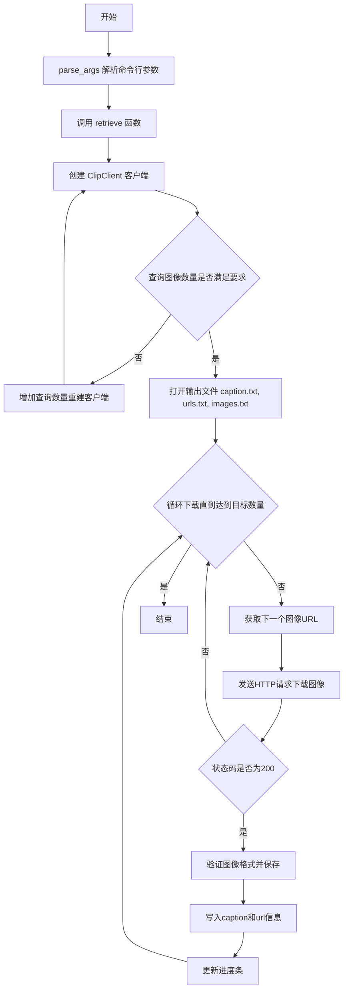
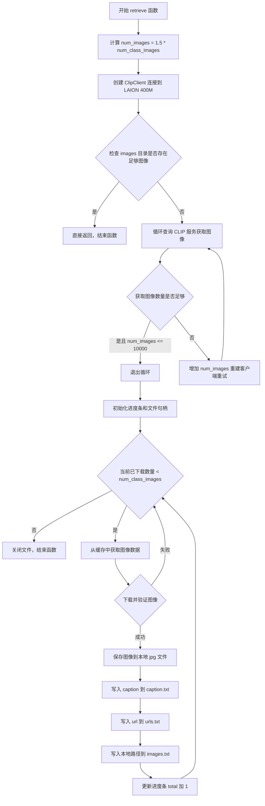
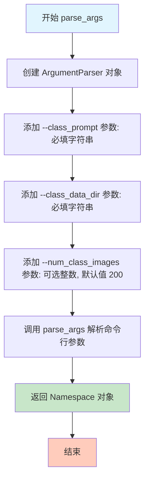
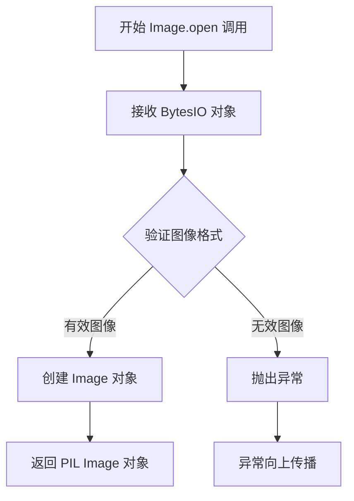
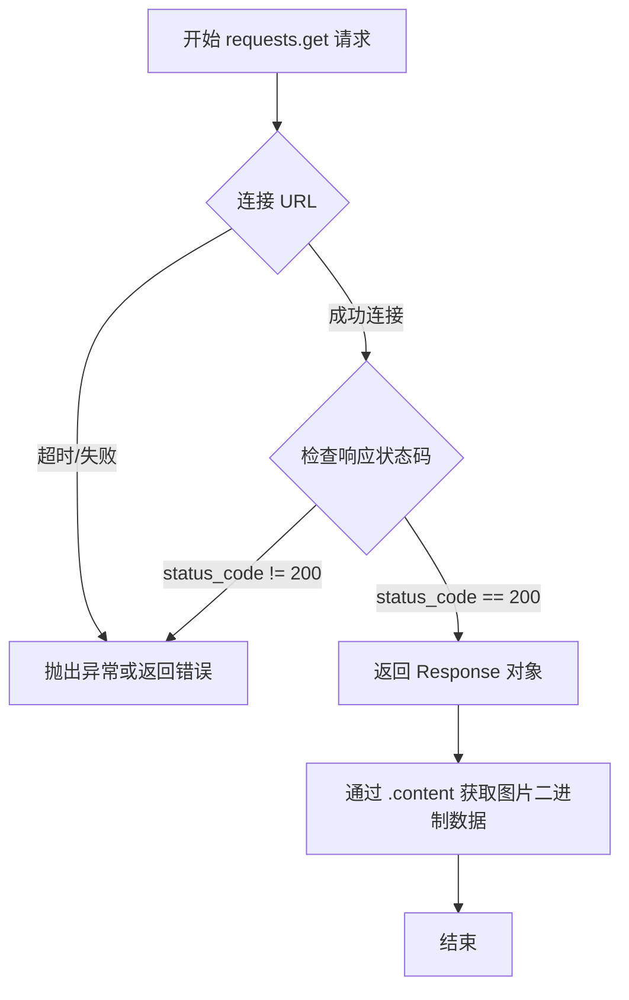

# `diffusers\examples\custom_diffusion\retrieve.py` 详细设计文档

该代码是一个图像检索与下载工具，用于从LAION数据集中根据文本提示检索图像，为自定义扩散模型训练提供正则化图像数据。它通过ClipClient连接LAION的KNN服务，根据类别提示词获取图像URL，并下载到本地目录，同时保存对应的caption和url信息。

## 整体流程



## 类结构

```
无类定义 (脚本文件)
└── 主要模块级别函数
    ├── retrieve (图像检索与下载主函数)
    └── parse_args (命令行参数解析)
```

## 全局变量及字段


### `factor`
    
增长因子，用于计算查询图像数量，值为1.5

类型：`float`
    


### `num_images`
    
查询图像的数量，基于factor和num_class_images计算得出

类型：`int`
    


### `client`
    
ClipClient客户端实例，用于从LAION数据库检索图像

类型：`ClipClient`
    


### `count`
    
已处理图像计数，用于遍历class_images列表

类型：`int`
    


### `total`
    
已下载图像总数，用于控制下载数量不超过num_class_images

类型：`int`
    


### `pbar`
    
tqdm进度条实例，用于显示下载进度

类型：`tqdm`
    


### `class_images`
    
查询返回的图像列表，每个元素包含url和caption等信息

类型：`list[dict]`
    


### `img`
    
HTTP响应对象，包含从URL下载的图像内容

类型：`requests.Response`
    


### `args`
    
命令行参数命名空间，包含class_prompt、class_data_dir和num_class_images

类型：`argparse.Namespace`
    


    

## 全局函数及方法


### `retrieve`

该函数是自定义扩散模型（Custom Diffusion）中用于检索并下载正则化图像的核心功能，通过连接 LAION 400M 数据集的 CLIP 检索服务，根据类别文本提示获取相似图像，并将其下载到指定目录同时记录元数据信息。

参数：

- `class_prompt`：`str`，用于检索图像的文本提示（类别名称或描述）
- `class_data_dir`：`str`，保存图像及其元数据的目录路径
- `num_class_images`：`int`，需要下载的图像数量目标

返回值：`None`，该函数无返回值（末尾的 `return` 语句不返回任何值）

#### 流程图



#### 带注释源码

```python
def retrieve(class_prompt, class_data_dir, num_class_images):
    """
    检索并下载用于正则化的真实图像
    
    Args:
        class_prompt: str, 用于检索的文本提示（类别名称）
        class_data_dir: str, 保存图像的目录路径
        num_class_images: int, 需要下载的图像数量
    """
    # 计算检索图像数量，乘以1.5系数以留有余量应对下载失败
    factor = 1.5
    num_images = int(factor * num_class_images)
    
    # 创建 CLIP 检索客户端，连接 LAION 400M 数据集
    # aesthetic_weight=0.1 表示稍微偏向于选择美学分数较高的图像
    client = ClipClient(
        url="https://knn.laion.ai/knn-service", 
        indice_name="laion_400m", 
        num_images=num_images, 
        aesthetic_weight=0.1
    )

    # 创建图像存储目录，如果已存在则不报错
    os.makedirs(f"{class_data_dir}/images", exist_ok=True)
    
    # 检查是否已有足够的图像，避免重复下载
    if len(list(Path(f"{class_data_dir}/images").iterdir())) >= num_class_images:
        return

    # 循环查询直到获取足够数量的图像或超过上限
    while True:
        # 使用文本提示查询 CLIP 服务获取图像列表
        class_images = client.query(text=class_prompt)
        
        # 判断是否满足退出条件：图像数量足够或超过10000
        if len(class_images) >= factor * num_class_images or num_images > 1e4:
            break
        else:
            # 增加检索数量并重建客户端重试
            num_images = int(factor * num_images)
            client = ClipClient(
                url="https://knn.laion.ai/knn-service",
                indice_name="laion_400m",
                num_images=num_images,
                aesthetic_weight=0.1,
            )

    # 初始化计数器和进度条
    count = 0
    total = 0
    pbar = tqdm(desc="downloading real regularization images", total=num_class_images)

    # 同时打开三个文件分别存储 caption、url 和本地路径
    with (
        open(f"{class_data_dir}/caption.txt", "w") as f1,
        open(f"{class_data_dir}/urls.txt", "w") as f2,
        open(f"{class_data_dir}/images.txt", "w") as f3,
    ):
        # 逐个下载图像直到达到目标数量
        while total < num_class_images:
            # 从已获取的图像列表中依次取用
            images = class_images[count]
            count += 1
            
            try:
                # 请求图像 URL，设置30秒超时
                img = requests.get(images["url"], timeout=30)
                
                # 检查 HTTP 响应状态码
                if img.status_code == 200:
                    # 使用 PIL 验证图像内容是否有效（可解析）
                    _ = Image.open(BytesIO(img.content))
                    
                    # 保存图像到本地文件系统
                    with open(f"{class_data_dir}/images/{total}.jpg", "wb") as f:
                        f.write(img.content)
                    
                    # 写入对应的 caption、url 和本地路径到各自文件
                    f1.write(images["caption"] + "\n")
                    f2.write(images["url"] + "\n")
                    f3.write(f"{class_data_dir}/images/{total}.jpg" + "\n")
                    
                    # 更新计数器和进度条
                    total += 1
                    pbar.update(1)
                else:
                    # HTTP 错误则跳过当前图像，继续下一个
                    continue
            except Exception:
                # 任何异常都跳过（下载失败、图像解析错误等），继续下一个
                continue
    
    # 函数结束，无返回值
    return
```


### `parse_args`

该函数使用 `argparse` 模块解析命令行参数，定义了三个命令行参数（`class_prompt`、`class_data_dir`、`num_class_images`），并返回包含这些参数的 `Namespace` 对象，供主程序调用 `retrieve` 函数时使用。

**参数：** 无

**返回值：** `argparse.Namespace`，包含以下属性：
- `class_prompt`：`str`，文本提示，用于从 CLIP 检索服务获取相关图像
- `class_data_dir`：`str`，本地目录路径，用于保存下载的图像及相关文件
- `num_class_images`：`int`，需要下载的图像数量，默认值为 200

#### 流程图



#### 带注释源码

```python
def parse_args():
    """
    解析命令行参数并返回 Namespace 对象。
    
    使用 argparse 模块定义以下命令行参数：
    - class_prompt: 文本提示，用于从 LAION CLIP 检索服务获取相关图像
    - class_data_dir: 本地目录路径，用于保存下载的图像、URL 列表和说明文字
    - num_class_images: 需要下载的图像数量，默认值为 200
    
    Returns:
        argparse.Namespace: 包含所有解析后的命令行参数的命名空间对象
    """
    # 创建 ArgumentParser 对象，add_help=False 禁用默认的 -h/--help 参数
    parser = argparse.ArgumentParser("", add_help=False)
    
    # 添加 class_prompt 参数：必填的字符串类型，用于指定检索图像的文本提示
    parser.add_argument("--class_prompt", help="text prompt to retrieve images", required=True, type=str)
    
    # 添加 class_data_dir 参数：必填的字符串类型，指定保存图像和元数据的目录路径
    parser.add_argument("--class_data_dir", help="path to save images", required=True, type=str)
    
    # 添加 num_class_images 参数：可选的整数类型，默认值为 200，指定需要下载的图像数量
    parser.add_argument("--num_class_images", help="number of images to download", default=200, type=int)
    
    # 解析命令行参数并返回 Namespace 对象
    return parser.parse_args()
```


### `Image.open`

该函数是 PIL（Pillow）图像处理库中的核心函数，用于从文件路径或类文件对象（如 BytesIO）中打开并识别图像文件。在本代码中，它被用于从 HTTP 响应下载的图像二进制数据中解析出 PIL Image 对象，以验证下载的图像数据是否为有效的图像格式。

参数：

- `fp`：`file-like object`（类文件对象），在本代码中为 `BytesIO(img.content)`，即包含图像二进制数据的字节流对象

返回值：`PIL.Image.Image`，返回一个 PIL 图像对象，表示已打开的图像，可用于后续的图像处理操作

#### 流程图



#### 带注释源码

```python
# Image.open 是 PIL 库中的函数，在此代码中的具体调用如下：
_ = Image.open(BytesIO(img.content))

# 详细解析：
# 1. img.content: 从 HTTP 响应获取的原始图像二进制数据（bytes 类型）
# 2. BytesIO(img.content): 将二进制数据封装成类文件对象（BytesIO 流）
# 3. Image.open(BytesIO(...)): PIL 库函数，解析字节流并返回 PIL Image 对象
# 4. _: 使用 _ 变量接收返回值，表示该返回值在此处不被使用，仅用于验证图像有效性

# Image.open 函数内部简化逻辑：
# - 读取文件头部信息识别图像格式（如 JPEG、PNG 等）
# - 根据格式调用对应的解码器解析图像数据
# - 返回包含图像像素数据的 Image 对象
```


### `requests.get`

`requests.get` 是 Python `requests` 库中的 HTTP GET 请求方法，用于向指定 URL 发送 GET 请求并获取服务器响应。在本代码中用于从互联网下载图像资源。

参数：

- `url`：`str`，目标资源的 URL 地址，此处为 `images["url"]`，即从 ClipClient 返回的图像 URL
- `timeout`：`int`，请求超时时间（秒），此处设置为 30 秒，用于防止请求无限期等待

返回值：`requests.Response`，服务器响应对象，包含状态码、响应头、响应内容等信息。通过检查 `status_code` 属性判断请求是否成功（200 表示成功），通过 `.content` 属性获取响应的字节内容。

#### 流程图



#### 带注释源码

```python
# 调用 requests.get 发送 HTTP GET 请求
# 参数1: images["url"] - 从 ClipClient 查询结果中获取的图像 URL 字符串
# 参数2: timeout=30 - 设置 30 秒超时，防止网络请求无限等待
img = requests.get(images["url"], timeout=30)

# 检查响应状态码是否为 200（HTTP OK）
if img.status_code == 200:
    # 使用 PIL 的 Image.open 从响应内容创建图像对象
    # BytesIO 将二进制内容转换为字节流供 PIL 读取
    _ = Image.open(BytesIO(img.content))
    
    # 将图片二进制内容写入本地文件
    with open(f"{class_data_dir}/images/{total}.jpg", "wb") as f:
        f.write(img.content)
    
    # 记录下载成功的计数
    total += 1
    pbar.update(1)
else:
    # 如果状态码不是 200，跳过此图片
    continue
```


## 关键组件


### retrieve 函数

核心图像检索与下载函数，连接LAION的CLIP KNN服务根据文本提示检索相关图像，并下载到本地目录保存为正则化图像数据。

### parse_args 函数

命令行参数解析函数，负责解析class_prompt（文本提示）、class_data_dir（保存路径）和num_class_images（图像数量）等命令行参数。

### ClipClient 外部依赖

用于连接LAION 400M数据集的CLIP检索服务的客户端，支持通过文本提示检索图像并返回图像URL和caption信息。

### 图像下载与保存模块

负责从URL下载图像数据，使用PIL库验证图像有效性，并将图像、caption和URL分别保存到指定目录的模块。

### 文件管理模块

负责创建目录结构和管理输出文件（caption.txt、urls.txt、images.txt），实现正则化图像元数据持久化的模块。


## 问题及建议


### 已知问题

-   **异常处理过于宽泛**：使用 `except Exception: continue` 捕获所有异常但不记录任何信息，导致下载失败时无法追踪问题根源，隐藏了潜在的配置或网络问题
-   **无限循环风险**：`while True` 循环在获取 `class_images` 后，通过 `break` 退出，但如果 API 返回空列表且 `num_images` 未达到阈值，循环条件可能导致不预期的行为
-   **索引越界风险**：`class_images[count]` 假设列表长度足够，但未检查边界，若 `class_images` 长度小于需要的图像数会导致 `IndexError`
-   **资源未正确释放**：`requests.get()` 返回的响应对象未显式调用 `.close()`，在大量下载时可能导致资源泄漏
-   **串行下载效率低**：图像下载采用顺序执行，未利用并发下载，在需要下载大量图像时性能低下
-   **硬编码配置**：URL、因子值 (1.5)、美学权重 (0.1) 等参数硬编码在代码中，降低了灵活性和可测试性
-   **路径拼接不规范**：使用 f-string 拼接路径而非 `os.path.join()` 或 `Path` 对象，影响跨平台兼容性
-   **魔法数字**：代码中存在未命名的数值（如 `1e4`），降低了可读性和可维护性
-   **缺少类型注解**：函数参数和返回值没有类型提示，影响代码可读性和 IDE 支持
-   **数据验证不足**：假设 API 返回的字典必然包含 "url" 和 "caption" 字段，未进行空值或格式校验

### 优化建议

-   **改进异常处理**：为每种可能的异常类型（如 `requests.RequestException`、`IOError`）添加具体的 except 分支，并记录错误日志
-   **添加重试上限**：为 API 请求循环设置最大重试次数，防止无限循环
-   **添加边界检查**：在访问 `class_images[count]` 前检查列表长度，或使用迭代器代替索引
-   **使用上下文管理器**：确保 `requests.get()` 的响应对象被正确关闭，或使用 `with` 语句
-   **实现并发下载**：使用 `concurrent.futures.ThreadPoolExecutor` 或 `asyncio` 实现并行下载，提高性能
-   **提取配置参数**：将硬编码值抽取为命令行参数或配置文件，提高灵活性
-   **统一路径处理**：使用 `pathlib.Path` 或 `os.path.join` 处理路径，确保跨平台兼容
-   **添加类型注解**：为所有函数添加参数和返回值的类型提示
-   **添加数据验证**：在访问字典字段前检查键是否存在，或使用 `.get()` 方法提供默认值
-   **添加进度条逻辑验证**：确保进度条的总次数与实际下载数量匹配，避免误导性的进度显示

## 其它


### 设计目标与约束

本代码的主要设计目标是从LAION数据库通过CLIP检索服务获取与给定文本提示相关的图像，并将其下载到本地目录用于Custom Diffusion模型训练中的正则化（regularization）数据。约束条件包括：需要稳定的网络连接以访问外部API（https://knn.laion.ai/knn-service），依赖第三方图像检索服务（LAION 400M数据集），受限于API的速率和可用性，以及需要足够的磁盘空间存储下载的图像和元数据。

### 错误处理与异常设计

代码中的异常处理采用较为简化的方式，使用try-except块捕获所有Exception并简单地continue跳过失败的图像。这种设计的优点是不会因为单个图像下载失败而中断整个流程，缺点是丢失了详细的错误信息。改进方向包括：区分不同类型的异常（如网络超时、图像格式错误、磁盘空间不足等），对连续失败的情况设置告警或重试机制，以及记录详细的错误日志以便调试。建议添加更细粒度的异常处理，例如对requests.exceptions.Timeout、requests.exceptions.ConnectionError、PIL.UnidentifiedImageError等分别处理。

### 数据流与状态机

整体数据流如下：首先解析命令行参数获取class_prompt、class_data_dir和num_class_images；然后初始化ClipClient并调用retrieve函数；retrieve函数首先计算需要检索的图像数量（num_class_images的1.5倍），然后循环查询CLIP客户端直到获取足够图像或超过最大数量限制；接着进入下载阶段，逐个从返回的图像列表中获取URL，下载图像并保存到本地目录，同时将caption、URL和本地路径分别写入三个文本文件。状态机主要包括：初始状态、检索状态（可能多次迭代）、下载状态（逐个下载图像）、完成状态。检索过程中有自适应逻辑：如果返回图像数量不足，会增加num_images并重新创建Client对象进行更大范围的检索。

### 外部依赖与接口契约

主要外部依赖包括：clip_retrieval.clip_client.ClipClient（CLIP图像检索客户端），requests（HTTP请求库），PIL/Pillow（图像处理库），tqdm（进度条库），argparse（命令行参数解析）。接口契约方面，ClipClient.query(text=class_prompt)接收文本提示并返回包含字典的列表，每个字典至少包含url和caption字段。下载的图像保存为JPEG格式，文件命名规则为递增数字（0.jpg, 1.jpg, ...）。元数据文件包括：caption.txt（每行一个图像的描述文本），urls.txt（每行一个原始URL），images.txt（每行一个本地文件路径）。

### 配置与参数设计

核心配置参数包括：factor（检索倍数，默认为1.5，用于计算检索图像数量），num_images（初始检索数量），aesthetic_weight（美学权重，默认为0.1，影响检索结果的美学评分），indice_name（索引名称，固定为laion_400m），请求超时时间（30秒），最大检索数量限制（1e4）。命令行参数包括：--class_prompt（必选，文本提示），--class_data_dir（必选，保存路径），--num_class_images（可选，默认为200，期望下载的图像数量）。这些参数的设计允许用户灵活控制检索行为和输出位置。

### 性能考虑

性能瓶颈主要包括：网络IO是主要瓶颈，每次下载图像都需要一次HTTP请求；CLIP API查询次数可能多次（自适应检索逻辑）；图像验证（Image.open）也会消耗时间。优化方向包括：使用异步IO（如aiohttp）或线程池并行下载图像；添加本地缓存机制避免重复下载；对已存在的图像进行增量检查（代码中已有部分实现，通过检查images目录中文件数量判断是否需要下载）；添加请求间隔避免触发API速率限制。当前实现为串行下载，效率较低。

### 安全性考虑

代码涉及网络请求和文件写入操作，安全考虑包括：输入验证——class_prompt和class_data_dir应进行路径遍历检查，防止通过精心构造的路径写入到非目标目录；URL验证——应检查下载的URL是否来自可信域名，防止DNS重绑定攻击；文件写入安全——使用固定的文件名模式（数字.jpg）相对安全，但应确保class_data_dir路径合法；依赖安全——requests库和PIL库应使用最新稳定版本以避免已知漏洞。当前代码没有对class_data_dir进行路径规范化，存在相对路径注入的风险。

### 测试策略

建议的测试策略包括：单元测试——测试parse_args函数对各种参数组合的解析，测试retrieve函数的核心逻辑（可以mock ClipClient）；集成测试——测试完整的检索下载流程（需要mock或使用测试用的API endpoint），测试边界条件如num_class_images=0、class_prompt为空等；性能测试——测试大量图像下载的时间，测试网络异常情况下的行为。当前代码缺少测试文件，建议添加pytest测试框架的测试用例。

### 部署要求

部署环境要求包括：Python 3.8+；网络访问权限（需要访问knn.laion.ai和可能的图像URL域名）；足够的磁盘空间（预估每个图像100-500KB，200张图像约需20-100MB）；安装依赖包（requests, clip-retrieval, PIL, tqdm）。部署方式可以是直接运行Python脚本，或封装为可执行工具。建议添加requirements.txt或pyproject.toml文件管理依赖版本。

### 监控与日志

当前代码仅使用tqdm显示下载进度，缺乏详细的运行日志。建议添加的监控和日志包括：检索阶段的日志（查询次数、返回图像数量）；下载阶段的详细日志（成功/失败数量、失败原因）；性能指标（总耗时、平均下载时间）；错误日志（记录失败的URL和错误类型以便后续重试或分析）。可使用Python标准日志库logging实现，支持配置日志级别和输出格式。

### 版本兼容性

版本兼容性考虑包括：Python版本兼容性——代码使用标准库和常见第三方库，兼容Python 3.8+；依赖库版本——clip_retrieval库可能有API变化，应锁定兼容版本；外部API稳定性——LAION的knn-service API可能变化，当前代码硬编码了API端点URL，需要监控并及时更新；图像格式兼容性——PIL可能无法识别某些特殊格式的图像，当前通过异常捕获处理。建议在代码中添加版本检查和优雅降级机制。

### 许可与版权

代码头部包含Apache License 2.0许可声明。下载的图像来自LAION数据集，使用时需注意LAION数据集的许可条款和图像的原始版权状态。生成的元数据文件（caption.txt, urls.txt）应保留原始来源信息以便后续合规性检查。建议添加关于数据使用合规性的警告或文档说明。


    