# `diffusers\examples\custom_diffusion\test_custom_diffusion.py` 详细设计文档

这是一个用于测试自定义扩散模型(Custom Diffusion)训练流程的自动化测试文件，继承自ExamplesTestsAccelerate基类，通过run_command执行训练脚本并验证模型权重和检查点的正确保存，支持检查点总数限制和断点续训等功能测试。

## 整体流程

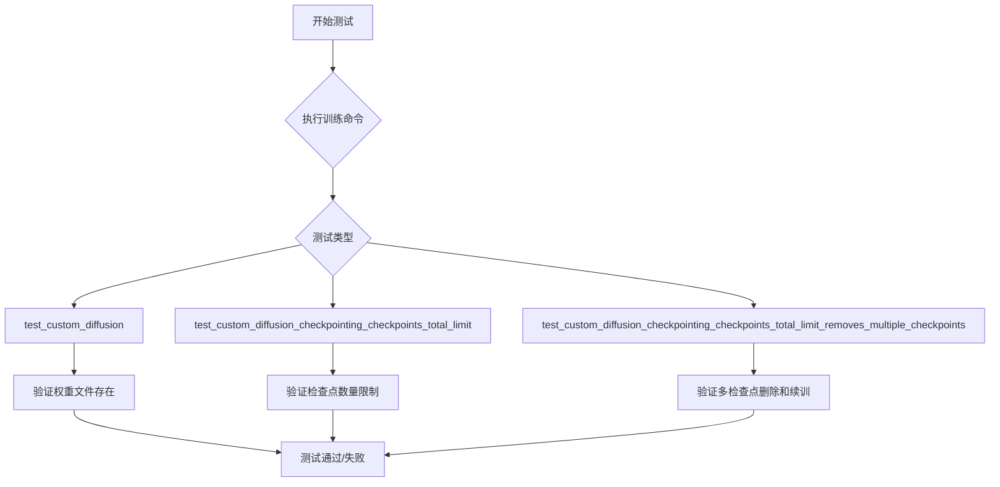

## 类结构

```
ExamplesTestsAccelerate (基类)
└── CustomDiffusion (测试类)
```

## 全局变量及字段


### `logging`
    
Python标准库日志模块，用于配置和管理应用程序日志

类型：`module`
    


### `os`
    
Python标准库操作系统接口模块，提供文件和目录操作功能

类型：`module`
    


### `sys`
    
Python标准库系统参数和函数模块，用于访问解释器相关参数

类型：`module`
    


### `tempfile`
    
Python标准库临时文件和目录模块，用于创建和管理临时资源

类型：`module`
    


### `logger`
    
全局日志记录器实例，用于输出调试和运行信息

类型：`logging.Logger`
    


### `stream_handler`
    
日志流处理器，将日志输出到标准输出流stdout

类型：`logging.StreamHandler`
    


### `CustomDiffusion._launch_args`
    
继承自ExamplesTestsAccelerate的启动参数列表，包含运行训练脚本所需的命令行参数

类型：`list`
    
    

## 全局函数及方法


### `run_command`

该函数是一个全局工具函数，用于在测试环境中执行命令行指令，接收命令参数列表并运行指定的命令，通常返回命令执行的返回码或输出结果。

参数：

- `cmd`：`List[str]`，命令列表，由launch_args和测试参数组成，用于指定要执行的完整命令

返回值：`int` 或 `str`，通常为命令执行的返回码（0表示成功）或命令的标准输出内容

#### 流程图

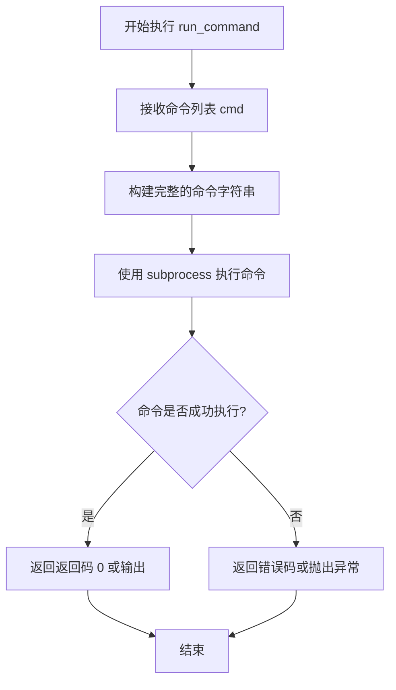

#### 带注释源码

```python
# 由于 run_command 是从 test_examples_utils 模块导入的外部函数，
# 下面是根据其在代码中的使用方式推断的函数签名和功能

def run_command(cmd: List[str], *args, **kwargs) -> int:
    """
    执行命令行指令的实用函数。
    
    参数:
        cmd: 命令列表，包含要执行的命令及其参数
        *args: 可变位置参数，可能包含额外的执行选项
        **kwargs: 可变关键字参数，可能包含超时、环境变量等选项
    
    返回值:
        int: 命令执行的返回码，0表示成功，非0表示失败
    """
    # 导入来源: from test_examples_utils import run_command
    # 具体实现位于 test_examples_utils 模块中
    pass

# 在代码中的实际调用示例:
# run_command(self._launch_args + test_args)
# 其中:
#   - self._launch_args: 包含启动测试的默认参数列表
#   - test_args: 包含具体的测试命令参数
#   - 两者拼接后构成完整的命令列表
```


### ExamplesTestsAccelerate.__init__

该类是测试基类，封装了使用 `accelerate` 框架运行示例训练脚本的通用功能，包括启动参数配置和命令执行环境设置。子类继承此类后可方便地调用 `run_command` 方法执行训练命令，并自动包含 `accelerate` 的启动配置。

参数：由于 `__init__` 方法的源代码未在当前代码中提供，无法确定具体参数。基于代码推断，可能包含 `self` 以及可能的 `accelerate_config` 或类似配置参数。

返回值：`None`（构造函数无返回值）

#### 流程图

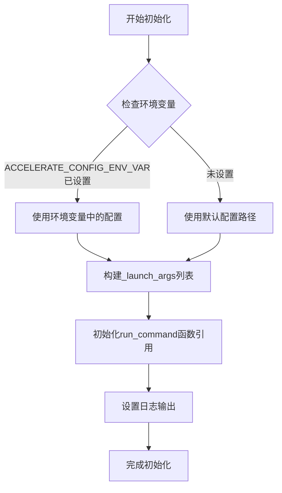

#### 带注释源码

```python
# 从test_examples_utils模块导入基类
# 该模块定义了ExamplesTestsAccelerate类
from test_examples_utils import ExamplesTestsAccelerate, run_command

# 示例：子类继承ExamplesTestsAccelerate
class CustomDiffusion(ExamplesTestsAccelerate):
    """
    CustomDiffusion测试类，继承ExamplesTestsAccelerate
    用于测试自定义扩散模型训练脚本
    """
    
    def test_custom_diffusion(self):
        """测试自定义扩散模型的基本训练功能"""
        with tempfile.TemporaryDirectory() as tmpdir:
            # 构建训练参数列表
            test_args = f"""
                examples/custom_diffusion/train_custom_diffusion.py
                --pretrained_model_name_or_path hf-internal-testing/tiny-stable-diffusion-pipe
                --instance_data_dir docs/source/en/imgs
                --instance_prompt <new1>
                --resolution 64
                --train_batch_size 1
                --gradient_accumulation_steps 1
                --max_train_steps 2
                --learning_rate 1.0e-05
                --scale_lr
                --lr_scheduler constant
                --lr_warmup_steps 0
                --modifier_token <new1>
                --no_safe_serialization
                --output_dir {tmpdir}
                """.split()
            
            # 使用父类初始化的_launch_args + 测试参数运行命令
            # _launch_args来自ExamplesTestsAccelerate.__init__的初始化
            run_command(self._launch_args + test_args)
            
            # 验证输出文件是否生成
            self.assertTrue(os.path.isfile(os.path.join(tmpdir, "pytorch_custom_diffusion_weights.bin")))
            self.assertTrue(os.path.isfile(os.path.join(tmpdir, "<new1>.bin")))
```

#### 补充说明

由于 `ExamplesTestsAccelerate` 类的源码定义在 `test_examples_utils` 模块中（未在当前代码片段中提供），以下信息基于代码使用模式推断：

1. **类属性推断**：
   - `_launch_args`：列表类型，包含 `accelerate` 启动所需的默认参数，可能包含配置文件路径等

2. **全局函数**：
   - `run_command`：执行子进程命令的工具函数，接收命令列表参数

3. **使用示例**：
   - 子类通过 `self._launch_args` 访问父类初始化的启动参数
   - 结合测试特定参数后传入 `run_command` 执行训练脚本

4. **潜在优化**：
   - 当前代码中 `_launch_args` 的具体来源不够明确，建议在文档中补充说明
   - 缺少对 `ExamplesTestsAccelerate` 基类完整定义的访问权限


### `logging.basicConfig`

配置根日志记录器的处理器、格式和级别。这是一个便捷函数，用于一次性设置根日志记录器的配置。

参数：

- `level`：`int`，日志级别，设置为 `logging.DEBUG`（值为 10），表示捕获所有级别的日志消息
- `format`（未使用）：`str`，日志消息的格式字符串
- `datefmt`（未使用）：`str`，日期时间格式
- `style`（未使用）：`str`，格式样式 ('%', '{', '$')
- `handlers`（未使用）：`list`，日志处理器列表
- `force`（未使用）：`bool`，是否强制重新配置现有日志记录器

返回值：`None`，该函数不返回任何值

#### 流程图

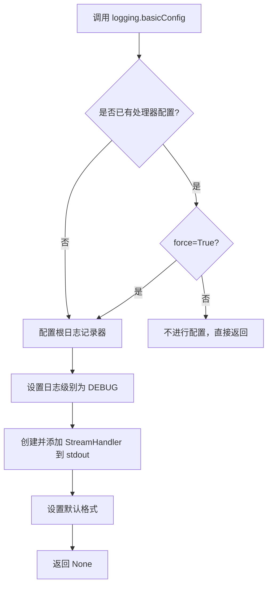

#### 带注释源码

```python
# 调用 logging 模块的 basicConfig 函数配置根日志记录器
# 参数 level=logging.DEBUG 设置日志级别为 DEBUG 级别
# 这将允许所有 DEBUG 及以上级别的日志消息被记录
logging.basicConfig(level=logging.DEBUG)
```


### `logging.getLogger`

获取或创建一个 logger 实例，用于记录应用程序的日志信息。该函数是 Python 标准库 logging 模块的核心函数，用于获取指定名称的 logger，如果 logger 不存在则创建一个新的 logger。

参数：

- （无参数，使用默认行为）

返回值：`logging.Logger`，返回根 logger 实例，默认名称为空字符串

#### 流程图

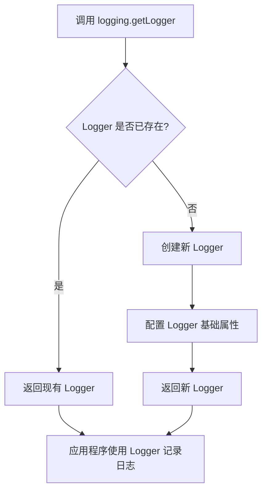

#### 带注释源码

```python
# 导入 logging 模块以使用日志功能
import logging

# 配置日志输出的基本设置
# level=logging.DEBUG 表示记录 DEBUG 级别及以上的所有日志
logging.basicConfig(level=logging.DEBUG)

# 获取根 logger（不带参数时获取根 logger）
# 返回一个 Logger 对象，后续可用来记录不同级别的日志
logger = logging.getLogger()

# 创建一个流处理器，将日志输出到标准输出（stdout）
stream_handler = logging.StreamHandler(sys.stdout)

# 将流处理器添加到 logger 中
# 这样 logger 输出的日志会通过该处理器显示在控制台
logger.addHandler(stream_handler)

# 现在 logger 可以使用了，例如：
# logger.debug("调试信息")
# logger.info("普通信息")
# logger.warning("警告信息")
# logger.error("错误信息")
# logger.critical("严重错误信息")
```

#### 关键信息说明

| 项目 | 说明 |
|------|------|
| 函数位置 | Python 标准库 `logging` 模块 |
| 调用场景 | 在代码开头初始化日志系统 |
| 日志级别 | DEBUG（最详细级别） |
| 输出目标 | 标准输出（sys.stdout） |
| Logger 名称 | 根 Logger（空字符串） |

#### 潜在的技术债务与优化空间

1. **日志级别硬编码**：日志级别直接设置为 `DEBUG`，在生产环境中应考虑使用环境变量或配置文件来动态设置
2. **缺少日志格式化**：未配置日志格式（formatter），建议添加时间戳、日志级别、文件名等信息
3. **Handler 未配置**：StreamHandler 没有设置具体的输出格式和级别
4. **缺少日志文件输出**：当前仅输出到控制台，建议同时添加文件输出以便于日志持久化
5. **Logger 名称缺失**：使用根 Logger 可能导致在大型项目中难以追踪日志来源，建议使用带名称的 Logger（如 `logging.getLogger(__name__)`）


### `logging.StreamHandler`

`logging.StreamHandler` 是 Python 标准库 `logging` 模块中的一个类，用于创建流处理器（Stream Handler），将日志记录输出到流（如标准输出 stdout 或标准错误 stderr）。

参数：

- `stream`：`typing.TextIO`，可选参数，默认值为 `sys.stderr`。指定日志输出目标流，可以是任何类文件对象（file-like object），如 `sys.stdout`、`sys.stderr` 或打开的文件对象。

返回值：`logging.StreamHandler`，返回一个新创建的流处理器实例。

#### 流程图

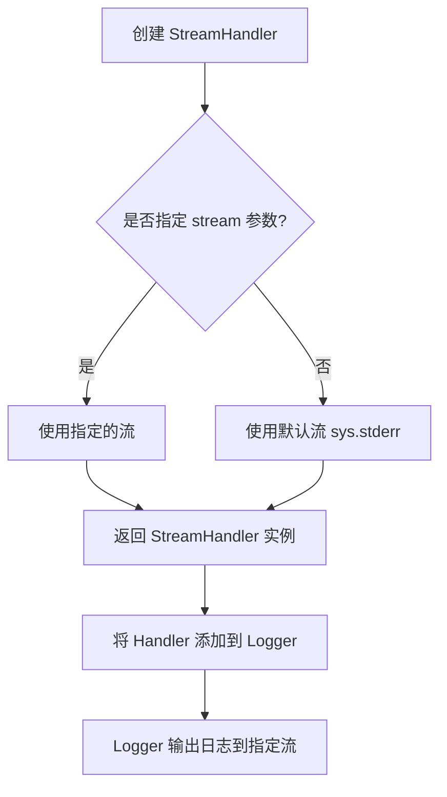

#### 带注释源码

```python
# 创建一个流处理器，将日志输出到 sys.stdout（标准输出）
# StreamHandler 构造函数接受一个可选的 stream 参数
# 如果不指定，默认使用 sys.stderr
stream_handler = logging.StreamHandler(sys.stdout)

# 获取根 Logger 实例（默认名称为 root）
logger = logging.getLogger()

# 将创建的 StreamHandler 添加到 Logger 的处理器列表中
# Logger 可以添加多个 Handler，用于同时输出到多个目标
logger.addHandler(stream_handler)
```

#### 补充说明

在上述代码中：

1. **`logging.StreamHandler(sys.stdout)`**：创建了一个流处理器，专门将日志输出到标准输出流（sys.stdout），而不是默认的 sys.stderr。

2. **`logger.addHandler(stream_handler)`**：将刚创建的处理器添加到根 logger 中。此后，所有通过该 logger 记录的日志都会通过这个 StreamHandler 输出到 sys.stdout。

3. **`logging.basicConfig(level=logging.DEBUG)`**：在代码开头配置了根 logger 的级别为 DEBUG，确保所有级别的日志都会被输出。


### `os.path.isfile`

判断给定路径是否是一个存在的普通文件（不是目录、设备文件或符号链接）。

参数：

- `path`：str 或 Path，表示需要检查的文件路径

返回值：bool，如果路径是一个存在的普通文件返回 True，否则返回 False

#### 流程图

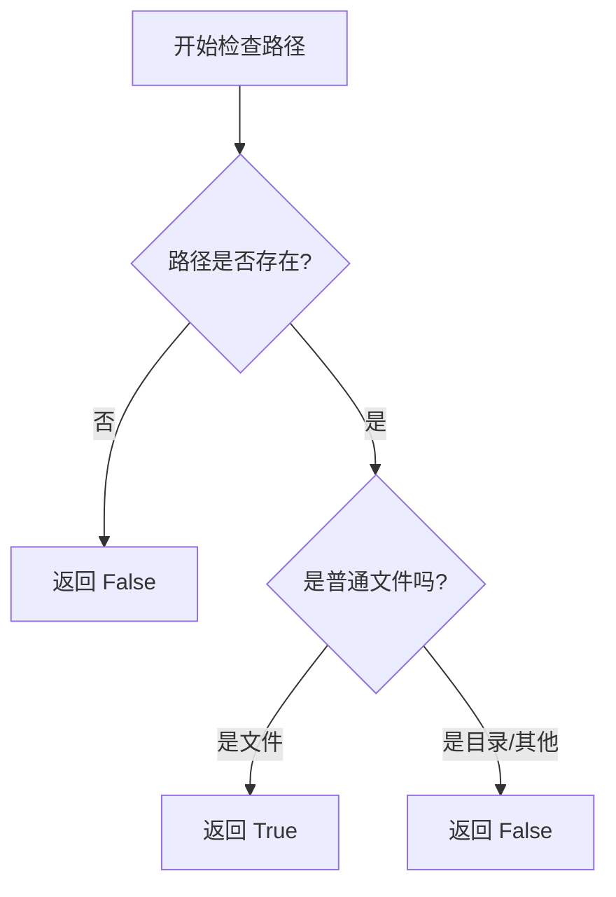

#### 带注释源码

```python
# os.path.isfile 是 Python 标准库 os.path 模块中的一个函数
# 用于检查指定路径是否是一个存在的普通文件

# 函数原型: os.path.isfile(path)
# 参数: path - 字符串或 Path 对象，表示文件路径
# 返回值: 布尔值，True 表示是普通文件，False 表示不是

# 在本代码中的使用示例:
# 检查训练输出目录中是否生成了权重文件
self.assertTrue(os.path.isfile(os.path.join(tmpdir, "pytorch_custom_diffusion_weights.bin")))
# 检查是否生成了自定义 modifier token 的权重文件
self.assertTrue(os.path.isfile(os.path.join(tmpdir, "<new1>.bin")))

# os.path.join 用于拼接目录和文件名，形成完整路径
# os.path.isfile 会检查该路径:
# 1. 路径是否存在
# 2. 路径是否为普通文件（不是目录、不是符号链接等）
```

#### 详细说明

在本代码中，`os.path.isfile` 用于测试验证训练脚本是否成功生成了预期的模型权重文件：

1. **第一处使用**：检查 `pytorch_custom_diffusion_weights.bin` 文件是否生成
2. **第二处使用**：检查以 `<new1>` 命名的自定义 modifier token 权重文件是否生成

这是典型的测试断言用法，确保训练流程正确保存了模型权重。


### `os.path.join`

`os.path.join` 是 Python 标准库 `os.path` 模块中的一个函数，用于将多个路径组件智能地拼接成一个完整的文件系统路径，会根据操作系统自动添加适当的路径分隔符。

参数：

- `*paths`：可变数量的路径组件，类型为 `str`，表示要拼接的路径部分。可以接受多个字符串参数，每个参数代表路径的一个组成部分。
- `path`：单个路径组件，类型为 `str`，在函数内部会与前面的组件进行拼接。

返回值：`str`，返回一个拼接后的完整路径字符串。如果任何一个组件是绝对路径，则其前面的所有组件会被丢弃。

#### 流程图

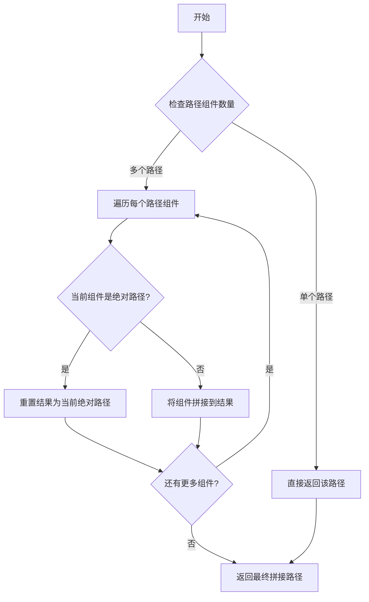

#### 带注释源码

```python
# os.path.join 的典型实现方式（简化版）
def join(*paths):
    """
    将多个路径组件拼接成一个完整路径
    
    参数:
        *paths: 可变数量的路径组件
    
    返回:
        拼接后的完整路径字符串
    """
    # 获取当前操作系统的路径分隔符
    sep = os.sep
    
    # 存储最终结果的列表
    result = []
    
    for path in paths:
        # 如果路径为空，跳过
        if not path:
            continue
        
        # 如果是绝对路径，重置结果列表
        if os.path.isabs(path):
            result = [path]
        else:
            # 将当前路径组件添加到结果中
            result.append(path)
    
    # 使用分隔符连接所有路径组件
    return sep.join(result)


# 在本代码中的实际使用示例：

# 示例1：检查文件是否存在
os.path.isfile(os.path.join(tmpdir, "pytorch_custom_diffusion_weights.bin"))
# tmpdir: str，临时目录路径
# "pytorch_custom_diffusion_weights.bin": str，要检查的文件名
# 返回值: str，拼接后的完整文件路径，如 "/tmp/xxx/pytorch_custom_diffusion_weights.bin"

# 示例2：检查另一个文件
os.path.isfile(os.path.join(tmpdir, "<new1>.bin"))
# tmpdir: str，临时目录路径
# "<new1>.bin": str，要检查的文件名
# 返回值: str，拼接后的完整文件路径，如 "/tmp/xxx/<new1>.bin"
```


### `os.listdir`

获取指定目录下的所有文件和子目录名称列表。

参数：

- `path`：`str` 或 `os.PathLike`，要列出内容的目录路径

返回值：`list[str]`，包含目录中所有文件和子目录名称的列表

#### 流程图

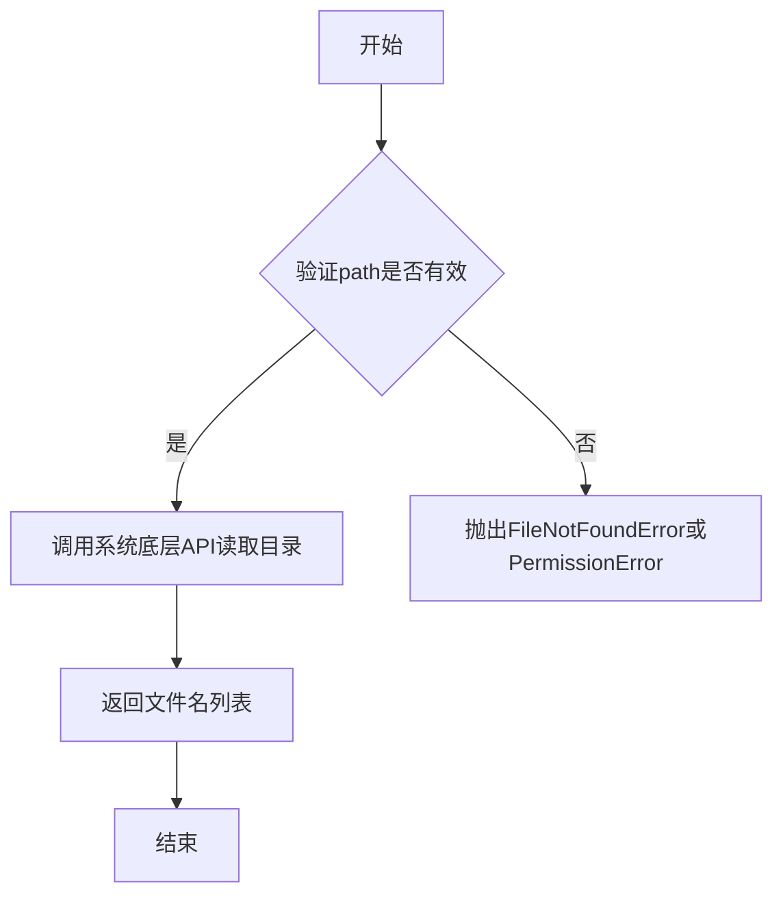

#### 带注释源码

```python
# os.listdir 是 Python 标准库 os 模块提供的函数
# 用于列出指定目录中的所有条目（文件和子目录）
# 以下是在代码中的实际使用方式：

# 示例 1：在 test_custom_diffusion 方法中
self.assertTrue(os.path.isfile(os.path.join(tmpdir, "pytorch_custom_diffusion_weights.bin")))
self.assertTrue(os.path.isfile(os.path.join(tmpdir, "<new1>.bin")))

# 示例 2：在 test_custom_diffusion_checkpointing_checkpoints_total_limit 方法中
# 列出 tmpdir 目录中的所有文件和文件夹，并筛选包含 'checkpoint' 的项
self.assertEqual({x for x in os.listdir(tmpdir) if "checkpoint" in x}, {"checkpoint-4", "checkpoint-6"})

# 示例 3：在 test_custom_diffusion_checkpointing_checkpoints_total_limit_removes_multiple_checkpoints 方法中
# 使用集合推导式筛选包含 'checkpoint' 的目录项
{x for x in os.listdir(tmpdir) if "checkpoint" in x}

# os.listdir 函数签名：
# os.listdir(path='.') -> list[str]
# 参数 path: 目录路径，默认为当前目录
# 返回: 目录中所有条目名称的列表（不包括 '.' 和 '..'）
```

---

### 在代码上下文中的使用分析

在提供的代码中，`os.listdir` 被用于 **测试验证场景**，具体用途如下：

| 测试方法 | 使用位置 | 目的 |
|---------|---------|------|
| `test_custom_diffusion` | 直接验证文件存在性 | 使用 `os.path.isfile` 配合 `os.path.join` 检查输出文件 |
| `test_custom_diffusion_checkpointing_checkpoints_total_limit` | 筛选 checkpoint 目录 | 验证保留的 checkpoint 数量是否符合 `checkpoints_total_limit=2` 的限制 |
| `test_custom_diffusion_checkpointing_checkpoints_total_limit_removes_multiple_checkpoints` | 筛选 checkpoint 目录 | 验证 resume 后 checkpoint 的正确性 |


### `tempfile.TemporaryDirectory`

`tempfile.TemporaryDirectory` 是 Python 标准库 `tempfile` 模块中的一个类，用于创建一个临时目录并返回其路径字符串作为上下文管理器。当退出 `with` 块时，该目录及其所有内容会被自动删除。

参数：

- `suffix`：`str`（可选），临时目录名的后缀
- `prefix`：`str`（可选），临时目录名的前缀
- `dir`：`str`（可选），指定临时目录创建的父目录

返回值：`str`，返回临时目录的路径字符串

#### 流程图

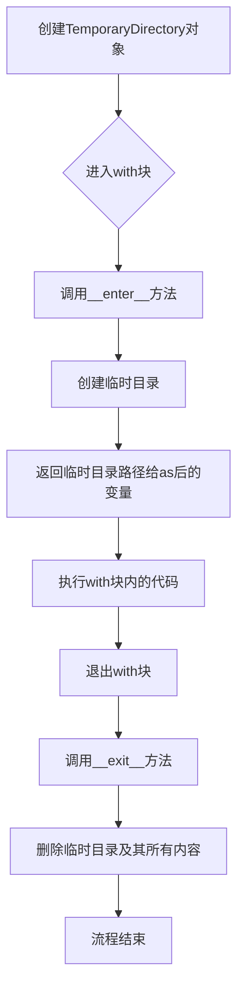

#### 带注释源码

```python
# tempfile.TemporaryDirectory 类是 Python 标准库的一部分
# 以下展示在代码中的三种典型用法（来自 test_custom_diffusion.py）：

# 用法1：在 test_custom_diffusion 方法中
with tempfile.TemporaryDirectory() as tmpdir:
    # 创建一个临时目录，tmpdir 获得目录路径字符串
    # 在 with 块结束时自动删除该目录
    
    test_args = f"""
        examples/custom_diffusion/train_custom_diffusion.py
        --pretrained_model_name_or_path hf-internal-testing/tiny-stable-diffusion-pipe
        --instance_data_dir docs/source/en/imgs
        --instance_prompt <new1>
        --resolution 64
        --train_batch_size 1
        --gradient_accumulation_steps 1
        --max_train_steps 2
        --learning_rate 1.0e-05
        --scale_lr
        --lr_scheduler constant
        --lr_warmup_steps 0
        --modifier_token <new1>
        --no_safe_serialization
        --output_dir {tmpdir}
        """.split()
    # 使用临时目录路径作为输出目录
    run_command(self._launch_args + test_args)
    # 验证输出文件是否生成
    self.assertTrue(os.path.isfile(os.path.join(tmpdir, "pytorch_custom_diffusion_weights.bin")))
    self.assertTrue(os.path.isfile(os.path.join(tmpdir, "<new1>.bin")))
# with 块结束后，tmpdir 目录及其内容被自动删除

# 用法2：在 test_custom_diffusion_checkpointing_checkpoints_total_limit 方法中
with tempfile.TemporaryDirectory() as tmpdir:
    # 创建临时目录用于存储检查点
    
    test_args = f"""
    examples/custom_diffusion/train_custom_diffusion.py
    --pretrained_model_name_or_path=hf-internal-testing/tiny-stable-diffusion-pipe
    --instance_data_dir=docs/source/en/imgs
    --output_dir={tmpdir}
    --instance_prompt=<new1>
    --resolution=64
    --train_batch_size=1
    --modifier_token=<new1>
    --dataloader_num_workers=0
    --max_train_steps=6
    --checkpoints_total_limit=2
    --checkpointing_steps=2
    --no_safe_serialization
    """.split()
    
    run_command(self._launch_args + test_args)
    
    # 验证检查点文件是否符合数量限制
    self.assertEqual({x for x in os.listdir(tmpdir) if "checkpoint" in x}, {"checkpoint-4", "checkpoint-6"})
# with 块结束，自动清理临时目录

# 用法3：在 test_custom_diffusion_checkpointing_checkpoints_total_limit_removes_multiple_checkpoints 方法中
with tempfile.TemporaryDirectory() as tmpdir:
    # 创建临时目录用于测试检查点限制和恢复训练
    
    test_args = f"""
    examples/custom_diffusion/train_custom_diffusion.py
    --pretrained_model_name_or_path=hf-internal-testing/tiny-stable-diffusion-pipe
    --instance_data_dir=docs/source/en/imgs
    --output_dir={tmpdir}
    --instance_prompt=<new1>
    --resolution=64
    --train_batch_size=1
    --modifier_token=<new1>
    --dataloader_num_workers=0
    --max_train_steps=4
    --checkpointing_steps=2
    --no_safe_serialization
    """.split()
    
    run_command(self._launch_args + test_args)
    
    # 验证检查点数量
    self.assertEqual(
        {x for x in os.listdir(tmpdir) if "checkpoint" in x},
        {"checkpoint-2", "checkpoint-4"},
    )
    
    # 继续训练，测试恢复和检查点限制
    resume_run_args = f"""
    examples/custom_diffusion/train_custom_diffusion.py
    --pretrained_model_name_or_path=hf-internal-testing/tiny-stable-diffusion-pipe
    --instance_data_dir=docs/source/en/imgs
    --output_dir={tmpdir}
    --instance_prompt=<new1>
    --resolution=64
    --train_batch_size=1
    --modifier_token=<new1>
    --dataloader_num_workers=0
    --max_train_steps=8
    --checkpointing_steps=2
    --resume_from_checkpoint=checkpoint-4
    --checkpoints_total_limit=2
    --no_safe_serialization
    """.split()
    
    run_command(self._launch_args + resume_run_args)
    
    # 验证最终检查点状态
    self.assertEqual({x for x in os.listdir(tmpdir) if "checkpoint" in x}, {"checkpoint-6", "checkpoint-8"})
# with 块结束，自动清理所有临时文件
```


### `CustomDiffusion.test_custom_diffusion`

这是一个测试自定义扩散模型训练流程的单元测试方法，通过调用训练脚本并验证输出权重文件来确保训练流程的正确性。

参数：

- `self`：`CustomDiffusion`（继承自ExamplesTestsAccelerate的测试类实例），代表测试类本身

返回值：`None`，无显式返回值（测试方法）

#### 流程图

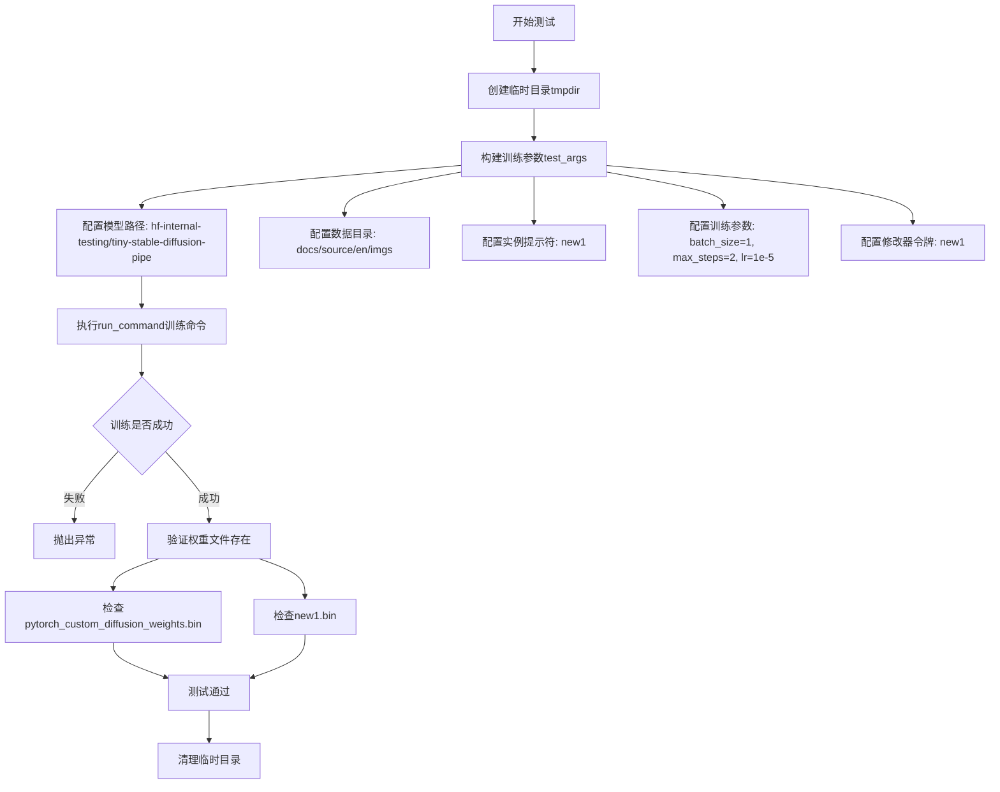

#### 带注释源码

```python
def test_custom_diffusion(self):
    """
    测试自定义扩散模型训练流程的单元测试
    
    该测试方法执行以下步骤：
    1. 创建临时目录用于存放训练输出
    2. 配置训练参数并构建命令行参数
    3. 执行训练脚本
    4. 验证训练生成的权重文件是否存在
    """
    # 使用临时目录存放训练输出，测试结束后自动清理
    with tempfile.TemporaryDirectory() as tmpdir:
        # 构建训练脚本的命令行参数
        # 包含模型配置、数据配置、训练超参数等
        test_args = f"""
            examples/custom_diffusion/train_custom_diffusion.py
            # 预训练模型路径或名称
            --pretrained_model_name_or_path hf-internal-testing/tiny-stable-diffusion-pipe
            # 实例数据目录，包含训练图像
            --instance_data_dir docs/source/en/imgs
            # 实例提示符，用于描述图像
            --instance_prompt <new1>
            # 图像分辨率
            --resolution 64
            # 训练批次大小
            --train_batch_size 1
            # 梯度累积步数
            --gradient_accumulation_steps 1
            # 最大训练步数
            --max_train_steps 2
            # 学习率
            --learning_rate 1.0e-05
            # 是否根据数据集大小自动缩放学习率
            --scale_lr
            # 学习率调度器类型
            --lr_scheduler constant
            # 学习率预热步数
            --lr_warmup_steps 0
            # 修改器令牌，用于自定义扩散
            --modifier_token <new1>
            # 不使用安全序列化（保存为pickle而非safetensors）
            --no_safe_serialization
            # 输出目录
            --output_dir {tmpdir}
            """.split()

        # 执行训练命令
        # run_command: 运行外部命令的封装函数
        # self._launch_args: 启动参数（如accelerate配置）
        run_command(self._launch_args + test_args)
        
        # 验证保存的权重文件
        # save_pretrained smoke test: 快速冒烟测试
        # 检查主权重文件是否存在
        self.assertTrue(os.path.isfile(
            os.path.join(tmpdir, "pytorch_custom_diffusion_weights.bin")
        ))
        # 检查实例提示符对应的权重文件是否存在
        self.assertTrue(os.path.isfile(
            os.path.join(tmpdir, "<new1>.bin")
        ))
```


### `CustomDiffusion.test_custom_diffusion_checkpointing_checkpoints_total_limit`

该方法是一个集成测试用例，用于验证自定义扩散模型训练过程中的检查点总数限制功能。测试通过运行训练脚本并设置 `--checkpoints_total_limit=2` 参数，验证当检查点数量超过限制时，旧检查点会被正确删除，最终只保留最新的指定数量的检查点。

参数：

- `self`：`CustomDiffusion`，测试类实例，表示当前测试对象

返回值：`None`，该方法为测试用例，通过断言验证功能，不返回任何值

#### 流程图

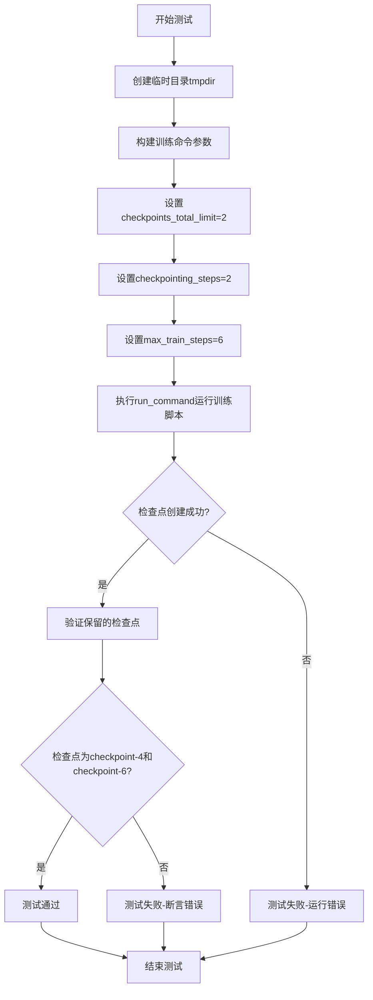

#### 带注释源码

```python
def test_custom_diffusion_checkpointing_checkpoints_total_limit(self):
    """
    测试自定义扩散模型的检查点总数限制功能。
    
    该测试验证当设置checkpoints_total_limit=2时，
    训练过程中只会保留最新的2个检查点，旧检查点会被自动删除。
    """
    # 使用 tempfile 创建一个临时目录用于存放测试输出
    with tempfile.TemporaryDirectory() as tmpdir:
        # 构建训练脚本的命令行参数
        test_args = f"""
            examples/custom_diffusion/train_custom_diffusion.py
            --pretrained_model_name_or_path=hf-internal-testing/tiny-stable-diffusion-pipe
            --instance_data_dir=docs/source/en/imgs
            --output_dir={tmpdir}
            --instance_prompt=<new1>
            --resolution=64
            --train_batch_size=1
            --modifier_token=<new1>
            --dataloader_num_workers=0
            --max_train_steps=6
            --checkpoints_total_limit=2        # 关键参数：限制最多保留2个检查点
            --checkpointing_steps=2            # 每2步保存一个检查点
            --no_safe_serialization
            """.split()

        # 执行训练命令
        run_command(self._launch_args + test_args)

        # 断言验证：只保留checkpoint-4和checkpoint-6
        # 因为max_train_steps=6, checkpointing_steps=2
        # 会创建checkpoint-2, checkpoint-4, checkpoint-6
        # 由于checkpoints_total_limit=2, 最早的checkpoint-2会被删除
        self.assertEqual(
            {x for x in os.listdir(tmpdir) if "checkpoint" in x}, 
            {"checkpoint-4", "checkpoint-6"}
        )
```


### `CustomDiffusion.test_custom_diffusion_checkpointing_checkpoints_total_limit_removes_multiple_checkpoints`

该测试方法用于验证在自定义扩散模型训练中，当设置 `checkpoints_total_limit=2` 时，训练恢复后能够正确删除多余的旧检查点，仅保留最新的两个检查点。

参数：

- `self`：`CustomDiffusion` 类型，类的实例本身

返回值：`None`，无返回值（测试方法，通过断言验证行为）

#### 流程图

```mermaid
flowchart TD
    A[开始测试] --> B[创建临时目录 tmpdir]
    B --> C[构建初始训练参数: max_train_steps=4, checkpoints_total_limit未设置]
    C --> D[运行训练命令]
    D --> E{训练完成}
    E --> F[断言: 检查点为 {checkpoint-2, checkpoint-4}]
    F --> G[构建恢复训练参数: resume_from_checkpoint=checkpoint-4, max_train_steps=8, checkpoints_total_limit=2]
    G --> H[运行恢复训练命令]
    H --> I{恢复训练完成}
    I --> J[断言: 检查点为 {checkpoint-6, checkpoint-8}]
    J --> K[清理临时目录]
    K --> L[测试结束]
    
    style F fill:#90EE90
    style J fill:#90EE90
```

#### 带注释源码

```python
def test_custom_diffusion_checkpointing_checkpoints_total_limit_removes_multiple_checkpoints(self):
    """
    测试当设置 checkpoints_total_limit=2 时，训练恢复后是否正确删除多余检查点
    """
    # 创建临时目录用于存放训练输出和检查点
    with tempfile.TemporaryDirectory() as tmpdir:
        # ============================================
        # 第一阶段：初始训练（4步，每2步保存一个检查点）
        # 预期结果：保存 checkpoint-2, checkpoint-4
        # ============================================
        test_args = f"""
        examples/custom_diffusion/train_custom_diffusion.py
        --pretrained_model_name_or_path=hf-internal-testing/tiny-stable-diffusion-pipe
        --instance_data_dir=docs/source/en/imgs
        --output_dir={tmpdir}
        --instance_prompt=<new1>
        --resolution=64
        --train_batch_size=1
        --modifier_token=<new1>
        --dataloader_num_workers=0
        --max_train_steps=4
        --checkpointing_steps=2
        --no_safe_serialization
        """.split()

        # 执行训练命令
        run_command(self._launch_args + test_args)

        # 验证初始训练只生成 checkpoint-2 和 checkpoint-4
        self.assertEqual(
            {x for x in os.listdir(tmpdir) if "checkpoint" in x},
            {"checkpoint-2", "checkpoint-4"},
        )

        # ============================================
        # 第二阶段：从 checkpoint-4 恢复训练（8步）
        # 预期结果：删除旧的 checkpoint-2, checkpoint-4
        #         保存新的 checkpoint-6, checkpoint-8
        # ============================================
        resume_run_args = f"""
        examples/custom_diffusion/train_custom_diffusion.py
        --pretrained_model_name_or_path=hf-internal-testing/tiny-stable-diffusion-pipe
        --instance_data_dir=docs/source/en/imgs
        --output_dir={tmpdir}
        --instance_prompt=<new1>
        --resolution=64
        --train_batch_size=1
        --modifier_token=<new1>
        --dataloader_num_workers=0
        --max_train_steps=8
        --checkpointing_steps=2
        --resume_from_checkpoint=checkpoint-4
        --checkpoints_total_limit=2
        --no_safe_serialization
        """.split()

        # 执行恢复训练命令
        run_command(self._launch_args + resume_run_args)

        # 验证恢复训练后只保留 checkpoint-6 和 checkpoint-8
        # 旧的 checkpoint-2 和 checkpoint-4 已被删除
        self.assertEqual({x for x in os.listdir(tmpdir) if "checkpoint" in x}, {"checkpoint-6", "checkpoint-8"})
```

## 关键组件


### CustomDiffusion 类

继承自 ExamplesTestsAccelerate 的测试类，用于验证自定义扩散模型训练脚本的功能正确性。

### test_custom_diffusion 方法

测试基本的自定义扩散训练流程，包括模型训练、权重保存和安全序列化验证。

### test_custom_diffusion_checkpointing_checkpoints_total_limit 方法

测试检查点总数限制功能，验证当设置 checkpoins_total_limit=2 时，最多保留最近的2个检查点。

### test_custom_diffusion_checkpointing_checkpoints_total_limit_removes_multiple_checkpoints 方法

测试检查点删除和恢复训练功能，验证从 checkpoint-4 恢复训练后，旧检查点被正确删除，最终只保留 checkpoint-6 和 checkpoint-8。

### 临时目录管理组件

使用 tempfile.TemporaryDirectory() 创建临时目录用于存放训练输出，确保测试结束后自动清理临时文件。

### 命令行参数构建组件

通过字符串分割构建训练脚本的命令行参数，包括模型路径、数据目录、分辨率、批次大小、学习率、检查点策略等配置。

### 文件验证组件

使用 os.path.isfile() 和 os.listdir() 验证训练输出的权重文件（pytorch_custom_diffusion_weights.bin 和 <new1>.bin）以及检查点目录是否正确生成。

### 检查点状态验证组件

通过集合比较验证检查点目录名称是否符合预期，用于确保检查点总数限制和删除逻辑工作正常。


## 问题及建议


### 已知问题

-   **硬编码的测试数据路径**: `docs/source/en/imgs` 路径硬编码，在不同运行环境中可能不存在，导致测试失败
-   **大量重复的命令行参数**: 三个测试方法中重复定义了相同的参数（如 `--pretrained_model_name_or_path`, `--instance_data_dir`, `--instance_prompt`, `--resolution`, `--train_batch_size`, `--modifier_token`, `--no_safe_serialization` 等），违反 DRY 原则，修改时需要同步多处
-   **缺少对训练输出的验证**: 测试仅检查文件是否存在，但未验证训练是否成功完成、模型权重是否有效、或日志中是否有错误信息
-   **硬编码的魔法数字**: `max_train_steps`, `checkpoints_total_limit`, `checkpointing_steps` 等参数值散布在各个测试中，缺乏统一管理
-   **缺少异常处理**: `run_command()` 调用未包装在 try-except 中，命令执行失败时测试会直接崩溃，调试信息不明确
-   **日志配置在模块级别**: `logging.basicConfig()` 和 `StreamHandler` 在导入时执行，可能干扰其他模块的日志配置
-   **导入路径使用 sys.path.append**: 通过 `sys.path.append("..")` 添加路径不是最佳实践，应使用绝对导入或配置 PYTHONPATH
-   **测试方法命名冗长**: 方法名包含重复信息（如 `checkpointing_checkpoints_total_limit_removes_multiple_checkpoints`），可读性较差

### 优化建议

-   **抽取公共配置为类属性或 fixture**: 将共享的命令行参数提取为类级别的常量或使用 pytest fixture，减少重复代码
-   **添加基类方法封装 run_command**: 创建辅助方法来统一执行命令并包含错误处理和日志输出验证
-   **验证训练输出内容**: 除了检查文件存在性，还应验证文件大小 > 0、加载模型不报错、关键日志出现等
-   **使用配置文件或参数化测试**: 将不同测试场景的参数通过 pytest.mark.parametrize 或外部 YAML/JSON 配置管理
-   **改进错误处理**: 为 `run_command` 调用添加异常捕获和详细的失败信息输出
-   **移除模块级日志配置**: 删除或注释掉 `logging.basicConfig`，让调用者自行配置日志
-   **使用绝对导入**: 移除 `sys.path.append`，通过设置 PYTHONPATH 或调整项目结构来正确导入
-   **添加类型注解和文档字符串**: 为类和方法添加类型提示及 docstring，提升可维护性

## 其它


### 设计目标与约束

本测试文件旨在验证自定义扩散模型(Custom Diffusion)训练脚本的核心功能，包括模型训练、检查点保存与限制、恢复训练等场景。约束条件包括：使用tiny-stable-diffusion-pipe作为测试模型、训练步数限制为2-8步、分辨率设为64以加快测试速度、使用临时目录管理输出。

### 错误处理与异常设计

测试采用Python标准异常处理机制，使用`tempfile.TemporaryDirectory()`确保临时资源自动清理。通过`assertTrue`和`assertEqual`进行结果验证，若训练脚本执行失败或输出不符合预期会抛出AssertionError。`run_command`函数应捕获命令执行异常，测试中的`sys.path.append("..")`处理可能存在的导入路径问题。

### 数据流与状态机

测试数据流：临时目录创建→命令行参数构建→训练脚本执行→输出文件验证→临时目录自动清理。状态机包含：初始状态(创建临时目录)→训练执行状态(run_command)→验证状态(断言检查)→清理状态(上下文管理器退出)。

### 外部依赖与接口契约

外部依赖包括：test_examples_utils.ExampleTestsAccelerate基类、run_command命令执行函数、tempfile临时目录管理、logging日志模块、os和sys系统模块。接口契约：_launch_args属性(由基类提供)、run_command接受命令列表参数并返回执行状态、测试方法遵循unittest规范返回布尔值。

### 配置与参数说明

核心训练参数：pretrained_model_name_or_path指定预训练模型、instance_data_dir训练数据目录、instance_prompt实例提示词、resolution图像分辨率64、train_batch_size批大小1、max_train_steps训练步数、learning_rate学习率1e-5、lr_scheduler学习率调度器、modifier_token自定义修饰符标记、checkpoints_total_limit检查点总数限制、checkpointing_steps检查点保存间隔、resume_from_checkpoint恢复检查点路径、no_safe_serialization禁用安全序列化。

### 测试覆盖场景

三个测试方法覆盖：test_custom_diffusion基础训练与模型保存功能、test_custom_diffusion_checkpointing_checkpoints_total_limit检查点总数限制功能、test_custom_diffusion_checkpointing_checkpoints_total_limit_removes_multiple_checkpoints检查点总数限制与恢复训练功能。覆盖了正常训练、检查点限制、训练恢复三种核心场景。

### 测试环境要求

运行环境需安装transformers、diffusers、accelerate等依赖库，Python版本需支持type hint和f-string语法。需要有足够的磁盘空间存储临时检查点文件，执行目录应包含examples/custom_diffusion/train_custom_diffusion.py脚本及docs/source/en/imgs测试图像目录。

### 性能考量

测试采用最小化配置：仅2-8步训练、64分辨率、batch_size为1、dataloader_num_workers=0，确保测试快速执行。使用临时目录避免磁盘占用累积，测试完成后自动清理。

### 安全考虑

使用--no_safe_serialization参数禁用安全序列化以适配测试环境，测试在隔离的临时目录执行避免污染主目录，临时目录权限受限保护系统安全。

### 日志与监控

配置logging.basicConfig(level=logging.DEBUG)开启调试级别日志，StreamHandler将日志输出到stdout，logger记录测试执行过程和命令输出，便于问题排查和测试监控。

### 资源清理

tempfile.TemporaryDirectory()上下文管理器自动清理临时目录及其内容，无论测试成功或失败都会触发清理，确保无残留文件。os.listdir读取目录后无需显式关闭文件句柄。

### 版本兼容性

代码使用Python 3标准库和常见第三方库，具有良好的兼容性。f-string语法要求Python 3.6+，type hint语法要求Python 3.5+。建议Python 3.8+运行环境以获得最佳兼容性。

### 并发考虑

测试序列执行无并发需求，dataloader_num_workers=0确保单线程数据加载，避免多进程状态共享问题。临时目录隔离确保多测试并发运行时的独立性。

### 边界条件

测试边界条件包括：checkpoints_total_limit=2限制检查点数量、max_train_steps最小值2和8、resume_from_checkpoint恢复训练场景。验证了空目录创建、文件不存在、checkpoint命名等边界情况。


    