# `diffusers\examples\custom_diffusion\train_custom_diffusion.py` 详细设计文档

这是一个用于微调Stable Diffusion模型的训练脚本（Custom Diffusion）。它支持通过文本反转（Textual Inversion）添加新概念，自定义注意力层（Custom Diffusion Attn Procs），以及使用先验 preservation 损失来防止模型过拟合。脚本集成了Hugging Face的accelerate库以支持分布式训练和混合精度，并包含数据加载、模型构建、训练循环、验证和模型上传到Hub的完整流程。

## 整体流程

```mermaid
graph TD
    A[开始: parse_args] --> B[初始化 Accelerator & Logger]
    B --> C{是否需要生成类图像?}
    C -- 是 --> D[加载 DiffusionPipeline 生成类图像]
    C -- 否 --> E[加载预训练模型 (VAE, UNet, TextEncoder, Tokenizer)]
    E --> F[添加 Modifier Token (Textual Inversion)]
    F --> G[替换 UNet 的 Attention Processor 为 CustomDiffusionAttnProcessor]
    G --> H[冻结参数 & 设置优化器]
    H --> I[创建 DataLoader (CustomDiffusionDataset)]
    I --> J[训练循环: for epoch in range...]
    J --> J1[前向传播: VAE encode, Text Encoder encode, Add Noise]
    J1 --> J2[预测噪声 & 计算损失 (含 Prior Preservation Loss)]
    J2 --> J3[反向传播 & 优化器步骤]
    J3 --> J4{是否验证步?}
    J4 -- 是 --> J5[运行验证: 生成图像]
    J4 -- 否 --> J6{是否保存 Checkpoint?}
    J5 --> J6
    J6 -- 是 --> J7[保存状态 (accelerator.save_state)]
    J6 -- 否 --> J
    J --> J8[训练结束]
    J8 --> K[保存最终模型权重 & Embeddings]
    K --> L[上传到 Hub (可选)]
    L --> M[结束]
```

## 类结构

```
Dataset (基类)
├── PromptDataset (用于生成类图像的辅助数据集)
└── CustomDiffusionDataset (核心训练数据集，处理图像增强和tokenization)
```

## 全局变量及字段


### `logger`
    
全局日志记录器，用于记录训练过程中的信息

类型：`logging.Logger`
    


### `PromptDataset.prompt`
    
用于生成图像的提示词

类型：`str`
    


### `PromptDataset.num_samples`
    
生成图像的数量

类型：`int`
    


### `CustomDiffusionDataset.size`
    
图像分辨率

类型：`int`
    


### `CustomDiffusionDataset.mask_size`
    
掩码大小

类型：`int`
    


### `CustomDiffusionDataset.center_crop`
    
是否中心裁剪

类型：`bool`
    


### `CustomDiffusionDataset.tokenizer`
    
分词器

类型：`PreTrainedTokenizer`
    


### `CustomDiffusionDataset.instance_images_path`
    
实例图像路径列表

类型：`list`
    


### `CustomDiffusionDataset.class_images_path`
    
类图像路径列表

类型：`list`
    


### `CustomDiffusionDataset.with_prior_preservation`
    
是否启用先验保留

类型：`bool`
    


### `CustomDiffusionDataset.image_transforms`
    
图像变换组合

类型：`Compose`
    
    

## 全局函数及方法


### `freeze_params`

该函数用于冻结模型参数，通过将参数的 `requires_grad` 属性设置为 `False` 来禁止梯度更新，通常在迁移学习或微调特定层时使用，以保护预训练模型的权重不被修改。

参数：

- `params`：`Iterator[torch.nn.Parameter]`，一个包含模型参数的可迭代对象（如 `torch.nn.Module.parameters()` 的返回值），每个元素都是一个可训练的参数张量

返回值：`None`，该函数无返回值，直接修改传入参数的 `requires_grad` 属性

#### 流程图

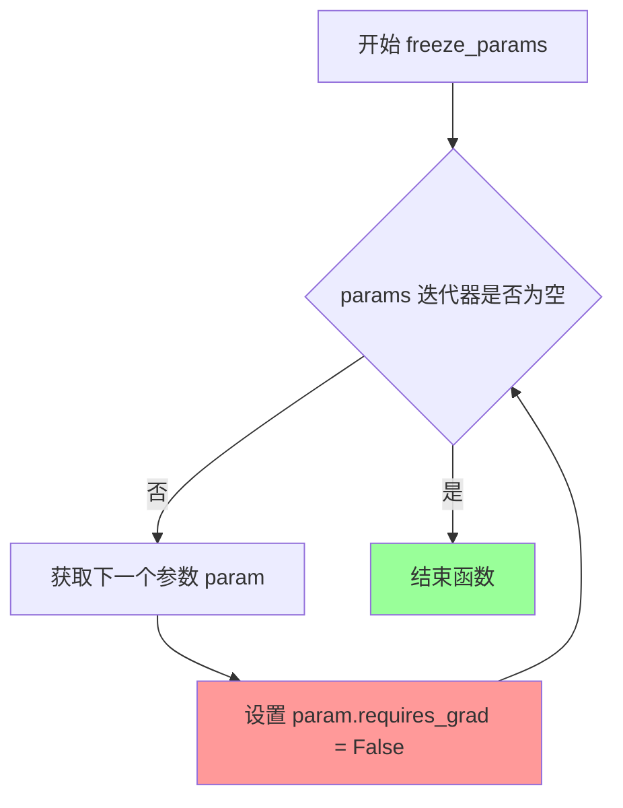

#### 带注释源码

```python
def freeze_params(params):
    """
    冻结模型参数以禁止梯度更新。
    
    该函数遍历传入的参数迭代器，将每个参数的 requires_grad 属性设置为 False，
    从而在后续的反向传播中不会计算这些参数的梯度。这在迁移学习场景中非常有用，
    可以固定预训练模型的部分参数，只对特定层进行微调。
    
    Args:
        params: 一个包含模型参数的可迭代对象，通常是 torch.nn.Module.parameters() 的返回值
        
    Returns:
        None: 该函数直接修改传入参数的属性，无返回值
    """
    # 遍历参数迭代器中的每一个参数
    for param in params:
        # 将参数的 requires_grad 设置为 False，冻结该参数
        # 冻结后的参数在调用 backward() 时不会计算梯度
        # 这可以减少显存占用并加速训练
        param.requires_grad = False
```


### `save_model_card`

该函数用于生成并保存自定义扩散模型的模型卡片（Model Card），将训练得到的示例图像保存到指定文件夹，并生成包含模型描述、训练信息和示例图像链接的 Markdown 文档，最后通过 HuggingFace Hub 的工具函数将模型卡片保存为 README.md 文件。

参数：

- `repo_id`：`str`，HuggingFace Hub 上的模型仓库 ID，用于标识模型卡片
- `images`：可选的图像列表（通常为 PIL Image 对象），训练过程中生成的示例图像，用于展示模型效果
- `base_model`：`str`，基础预训练模型的名称或路径，描述该自定义扩散模型是基于哪个模型微调得到的
- `prompt`：`str`，训练时使用的提示词（Prompt），描述模型学习的主题或概念
- `repo_folder`：`str`，本地文件夹路径，用于保存图像文件和生成的 README.md 模型卡片

返回值：`None`，该函数无返回值，直接将模型卡片写入文件系统

#### 流程图

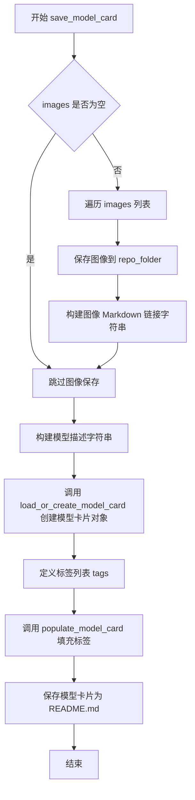

#### 带注释源码

```python
def save_model_card(repo_id: str, images=None, base_model=str, prompt=str, repo_folder=None):
    """
    生成并保存模型卡片（Model Card）
    
    该函数完成以下工作：
    1. 将示例图像保存到指定文件夹
    2. 构建包含模型描述、训练信息和示例图像的 Markdown 内容
    3. 使用 diffusers 库的函数创建和填充模型卡片
    4. 将模型卡片保存为 README.md 文件
    
    参数:
        repo_id: HuggingFace Hub 模型仓库 ID
        images: 训练过程中生成的示例图像列表（PIL Image 对象）
        base_model: 基础预训练模型名称或路径
        prompt: 训练时使用的提示词
        repo_folder: 本地输出文件夹路径
    
    返回:
        None（直接写入文件系统）
    """
    
    # 初始化图像链接字符串
    img_str = ""
    
    # 遍历所有示例图像，保存到本地文件夹并构建 Markdown 链接
    for i, image in enumerate(images):
        # 保存图像文件到 repo_folder，命名为 image_0.png, image_1.png 等
        image.save(os.path.join(repo_folder, f"image_{i}.png"))
        # 构建 Markdown 格式的图像链接语法
        img_str += f"\n"

    # 构建模型描述内容，包含模型名称、基础模型、训练提示词和示例图像
    model_description = f"""
# Custom Diffusion - {repo_id}

These are Custom Diffusion adaption weights for {base_model}. The weights were trained on {prompt} using [Custom Diffusion](https://www.cs.cmu.edu/~custom-diffusion). You can find some example images in the following. \n
{img_str}

\nFor more details on the training, please follow [this link](https://github.com/huggingface/diffusers/blob/main/examples/custom_diffusion).
"""
    
    # 使用 diffusers 工具函数加载或创建模型卡片对象
    # from_training=True 表示这是训练过程生成的模型卡片
    # license 设置为 creativeml-openrail-m（Custom Diffusion 使用的许可证）
    model_card = load_or_create_model_card(
        repo_id_or_path=repo_id,
        from_training=True,
        license="creativeml-openrail-m",
        base_model=base_model,
        prompt=prompt,
        model_description=model_description,
        inference=True,
    )

    # 定义模型标签，用于在 HuggingFace Hub 上分类和搜索
    tags = [
        "text-to-image",           # 文本到图像生成
        "diffusers",               # Diffusers 库相关
        "stable-diffusion",        # Stable Diffusion 系列
        "stable-diffusion-diffusers",  # Diffusers 格式的 SD 模型
        "custom-diffusion",        # Custom Diffusion 方法
        "diffusers-training",      # 训练相关
    ]
    
    # 将标签添加到模型卡片中
    model_card = populate_model_card(model_card, tags=tags)

    # 将模型卡片保存为 README.md 文件到指定文件夹
    model_card.save(os.path.join(repo_folder, "README.md"))
```


### `import_model_class_from_model_name_or_path`

该函数用于动态导入TextEncoder类，根据预训练模型的text_encoder配置中指定的架构名称，返回对应的文本编码器类（CLIPTextModel或RobertaSeriesModelWithTransformation），以支持不同架构的预训练模型。

参数：
- `pretrained_model_name_or_path`：`str`，预训练模型的名称或路径，用于定位模型配置文件
- `revision`：`str`，预训练模型的版本/修订号，用于指定要加载的模型版本

返回值：`type`，返回对应的文本编码器类（CLIPTextModel或RobertaSeriesModelWithTransformation）

#### 流程图

```mermaid
flowchart TD
    A[开始] --> B[加载text_encoder配置]
    B --> C[获取架构类名 text_encoder_config.architectures[0]]
    C --> D{判断架构类型}
    D -->|CLIPTextModel| E[从transformers导入CLIPTextModel]
    D -->|RobertaSeriesModelWithTransformation| F[从diffusers导入RobertaSeriesModelWithTransformation]
    E --> G[返回CLIPTextModel类]
    F --> H[返回RobertaSeriesModelWithTransformation类]
    D -->|其他| I[抛出ValueError异常]
    I --> J[结束]
```

#### 带注释源码

```python
def import_model_class_from_model_name_or_path(pretrained_model_name_or_path: str, revision: str):
    """
    动态导入TextEncoder类，根据预训练模型的text_encoder配置中指定的架构名称，
    返回对应的文本编码器类
    
    参数:
        pretrained_model_name_or_path: 预训练模型的名称或路径
        revision: 预训练模型的版本/修订号
    返回:
        对应的文本编码器类（CLIPTextModel或RobertaSeriesModelWithTransformation）
    """
    # 步骤1: 从预训练模型加载text_encoder的配置文件
    # 使用PretrainedConfig.from_pretrained获取text_encoder的配置信息
    # subfolder="text_encoder"指定从text_encoder子目录加载配置
    # revision参数指定要加载的模型版本
    text_encoder_config = PretrainedConfig.from_pretrained(
        pretrained_model_name_or_path,
        subfolder="text_encoder",
        revision=revision,
    )
    
    # 步骤2: 从配置中获取架构类名
    # 配置文件中的architectures字段包含了模型的实际类名
    model_class = text_encoder_config.architectures[0]

    # 步骤3: 根据架构类名动态导入并返回对应的模型类
    if model_class == "CLIPTextModel":
        # CLIPTextModel用于标准的Stable Diffusion模型
        from transformers import CLIPTextModel
        return CLIPTextModel
    elif model_class == "RobertaSeriesModelWithTransformation":
        # RobertaSeriesModelWithTransformation用于Alt Diffusion等变体模型
        from diffusers.pipelines.alt_diffusion.modeling_roberta_series import RobertaSeriesModelWithTransformation
        return RobertaSeriesModelWithTransformation
    else:
        # 如果遇到不支持的架构类型，抛出明确的错误信息
        raise ValueError(f"{model_class} is not supported.")
```


### `collate_fn`

该函数是Custom Diffusion训练脚本中DataLoader的批处理整理函数（collate function），负责将数据集中多个样本打包成批处理张量，支持实例图像和类图像的先验 preservation（保留）机制，通过合并实例和类别的输入 ID、像素值和掩码，避免进行两次前向传播，从而提高训练效率。

参数：

- `examples`：`List[Dict]`，从数据集中采样的样本列表，每个样本是一个包含实例图像、实例提示词ID、掩码以及可选的类图像、类提示词ID和类掩码的字典
- `with_prior_preservation`：`bool`，布尔标志，指示是否启用先验 preservation 模式（保留类图像以实现防止模型遗忘的效果）

返回值：`Dict[str, Tensor]`，返回包含批处理数据的字典，包含以下键：
- `input_ids`：`torch.Tensor`，形状为 (batch_size * 2, seq_len) 的输入提示词ID张量（如果启用先验 preservation 则乘以2）
- `pixel_values`：`torch.Tensor`，形状为 (batch_size * 2, C, H, W) 的图像像素值张量
- `mask`：`torch.Tensor`，形状为 (batch_size * 2, 1, H, W) 的掩码张量

#### 流程图

```mermaid
flowchart TD
    A[开始 collate_fn] --> B[提取 examples 中的 instance_prompt_ids<br/>instance_images 和 mask]
    B --> C{with_prior_preservation?}
    C -->|是| D[额外提取 class_prompt_ids<br/>class_images 和 class_mask]
    D --> E[将类别数据拼接到实例数据后面]
    C -->|否| F[跳过类别数据]
    E --> G[使用 torch.cat 合并 input_ids<br/>使用 torch.stack 合并 pixel_values 和 mask]
    F --> G
    G --> H[将 pixel_values 和 mask 转换为连续内存格式并转为 float 类型]
    H --> I[将 mask 扩展维度为 [batch, 1, H, W]]
    I --> J[构建包含 input_ids, pixel_values, mask 的批次字典]
    J --> K[返回 batch 字典]
```

#### 带注释源码

```python
def collate_fn(examples, with_prior_preservation):
    """
    DataLoader 的批处理整理函数，用于将数据集中的样本打包成批处理张量。
    
    参数:
        examples: 从数据集采样的样本列表，每个样本是包含实例图像和提示词ID的字典
        with_prior_preservation: 是否启用先验 preservation 模式
    
    返回:
        包含批处理数据的字典，用于模型训练
    """
    # 从每个样本中提取实例提示词ID、图像像素值和掩码
    # 这些字段由 CustomDiffusionDataset 的 __getitem__ 方法生成
    input_ids = [example["instance_prompt_ids"] for example in examples]
    pixel_values = [example["instance_images"] for example in examples]
    mask = [example["mask"] for example in examples]
    
    # Concat class and instance examples for prior preservation.
    # We do this to avoid doing two forward passes.
    # 如果启用先验 preservation，将类别数据也加入批处理
    # 这样可以在单次前向传播中同时计算实例和类别的损失
    if with_prior_preservation:
        # 提取类别提示词ID、类别图像和类别掩码
        input_ids += [example["class_prompt_ids"] for example in examples]
        pixel_values += [example["class_images"] for example in examples]
        mask += [example["class_mask"] for example in examples]

    # 使用 torch.cat 将输入ID沿第一维度拼接成完整序列
    # 使用 torch.stack 将图像和掩码堆叠成批量张量
    input_ids = torch.cat(input_ids, dim=0)
    pixel_values = torch.stack(pixel_values)
    mask = torch.stack(mask)
    
    # 确保张量在内存中连续存储（对性能优化有益）
    # 转换为 float32 类型（训练时需要）
    pixel_values = pixel_values.to(memory_format=torch.contiguous_format).float()
    mask = mask.to(memory_format=torch.contiguous_format).float()

    # 构建最终的批次字典
    # mask 需要增加一个通道维度以匹配模型期望的形状
    batch = {
        "input_ids": input_ids,       # 文本编码器的输入
        "pixel_values": pixel_values, # VAE 编码器的输入
        "mask": mask.unsqueeze(1)     # 损失计算的掩码
    }
    return batch
```


### `save_new_embed`

该函数用于在Custom Diffusion训练完成后，保存新添加的modifier token（修改令牌）的嵌入向量到指定目录，支持安全序列化（safetensors）和传统序列化（bin）两种格式。

参数：

- `text_encoder`：`torch.nn.Module`，文本编码器模型，用于获取输入嵌入层的权重
- `modifier_token_id`：`list`，新添加的modifier token的ID列表
- `accelerator`：`Accelerator`，HuggingFace Accelerate库提供的分布式训练加速器，用于 unwrap 模型获取原始模型
- `args`：`Namespace`，命令行参数对象，包含`modifier_token`（新token的名称列表）等属性
- `output_dir`：`str`，输出目录路径，用于保存嵌入向量文件
- `safe_serialization`：`bool`，是否使用安全序列化格式（safetensors），默认为True

返回值：`None`，该函数无返回值，直接将嵌入向量写入磁盘

#### 流程图

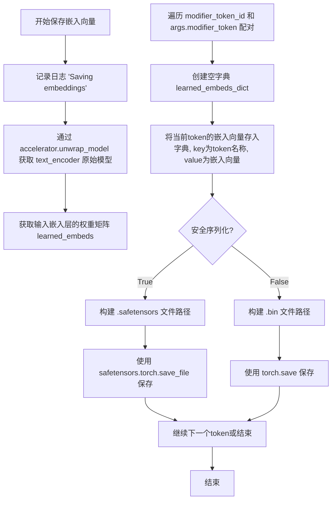

#### 带注释源码

```python
def save_new_embed(text_encoder, modifier_token_id, accelerator, args, output_dir, safe_serialization=True):
    """Saves the new token embeddings from the text encoder."""
    # 记录日志，表示开始保存嵌入向量
    logger.info("Saving embeddings")
    
    # 使用 accelerator.unwrap_model 获取原始的 text_encoder 模型
    # accelerator 可能在训练时包装了模型以支持分布式训练，需要 unwrap 恢复原始模型
    learned_embeds = accelerator.unwrap_model(text_encoder).get_input_embeddings().weight
    
    # 遍历 modifier_token_id（token ID列表）和 args.modifier_token（token名称列表）
    # 使用 zip 进行配对遍历
    for x, y in zip(modifier_token_id, args.modifier_token):
        # 创建字典存储单个token的嵌入向量
        learned_embeds_dict = {}
        # key 为 token 名称（如 "<cat>"）, value 为对应的嵌入向量
        # x 是 token ID，通过索引从权重矩阵中获取嵌入向量
        learned_embeds_dict[y] = learned_embeds[x]

        # 根据 safe_serialization 参数选择保存格式
        if safe_serialization:
            # 使用 safetensors 格式保存，更安全且加载速度更快
            filename = f"{output_dir}/{y}.safetensors"
            # save_file 保存单个张量到文件，支持 metadata
            safetensors.torch.save_file(learned_embeds_dict, filename, metadata={"format": "pt"})
        else:
            # 使用传统 PyTorch .bin 格式保存
            filename = f"{output_dir}/{y}.bin"
            torch.save(learned_embeds_dict, filename)
```


### `parse_args`

该函数是命令行参数解析函数，负责定义并解析Custom Diffusion训练脚本的所有配置参数，包括模型路径、数据目录、训练超参数、优化器设置、验证选项等，并返回包含所有参数值的Namespace对象。

#### 参数

- `input_args`：`Optional[List[str]]`，可选参数，用于指定要解析的参数列表（通常用于测试），默认为None（即从sys.argv解析）

#### 返回值

`argparse.Namespace`，包含所有命令行参数及其解析值的对象

#### 流程图

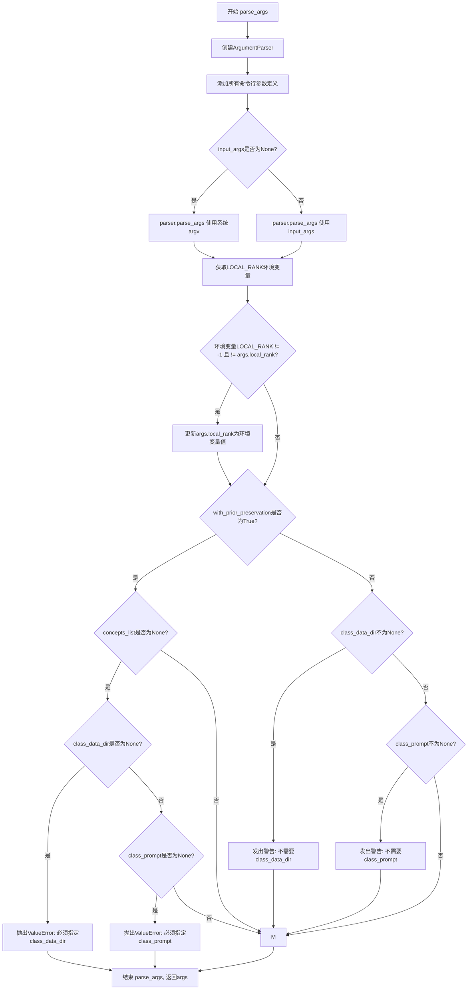

#### 带注释源码

```python
def parse_args(input_args=None):
    """
    解析命令行参数，返回包含Custom Diffusion训练配置的对象
    
    参数:
        input_args: 可选的参数列表，用于测试目的。如果为None，则从sys.argv解析
        
    返回:
        args: 包含所有解析参数的Namespace对象
    """
    # 创建ArgumentParser实例，设置描述信息
    parser = argparse.ArgumentParser(description="Custom Diffusion training script.")
    
    # ==================== 模型配置参数 ====================
    # 预训练模型路径或模型标识符（必需）
    parser.add_argument(
        "--pretrained_model_name_or_path",
        type=str,
        default=None,
        required=True,
        help="Path to pretrained model or model identifier from huggingface.co/models.",
    )
    # 预训练模型的版本号
    parser.add_argument(
        "--revision",
        type=str,
        default=None,
        required=False,
        help="Revision of pretrained model identifier from huggingface.co/models.",
    )
    # 模型文件的变体（如fp16）
    parser.add_argument(
        "--variant",
        type=str,
        default=None,
        help="Variant of the model files of the pretrained model identifier from huggingface.co/models, 'e.g.' fp16",
    )
    # 预训练tokenizer名称或路径
    parser.add_argument(
        "--tokenizer_name",
        type=str,
        default=None,
        help="Pretrained tokenizer name or path if not the same as model_name",
    )
    
    # ==================== 数据路径参数 ====================
    # 实例图像训练数据目录
    parser.add_argument(
        "--instance_data_dir",
        type=str,
        default=None,
        help="A folder containing the training data of instance images.",
    )
    # 类图像训练数据目录（用于先验保存）
    parser.add_argument(
        "--class_data_dir",
        type=str,
        default=None,
        help="A folder containing the training data of class images.",
    )
    
    # ==================== 提示词参数 ====================
    # 指定实例的提示词
    parser.add_argument(
        "--instance_prompt",
        type=str,
        default=None,
        help="The prompt with identifier specifying the instance",
    )
    # 指定与实例同类的图像的提示词
    parser.add_argument(
        "--class_prompt",
        type=str,
        default=None,
        help="The prompt to specify images in the same class as provided instance images.",
    )
    # 验证时使用的提示词
    parser.add_argument(
        "--validation_prompt",
        type=str,
        default=None,
        help="A prompt that is used during validation to verify that the model is learning.",
    )
    # 验证时生成的图像数量
    parser.add_argument(
        "--num_validation_images",
        type=int,
        default=2,
        help="Number of images that should be generated during validation with `validation_prompt`.",
    )
    # 验证执行频率（每X个epoch）
    parser.add_argument(
        "--validation_steps",
        type=int,
        default=50,
        help=(
            "Run dreambooth validation every X epochs. Dreambooth validation consists of running the prompt"
            " `args.validation_prompt` multiple times: `args.num_validation_images`."
        ),
    )
    
    # ==================== 先验保存参数 ====================
    # 是否启用先验保存损失
    parser.add_argument(
        "--with_prior_preservation",
        default=False,
        action="store_true",
        help="Flag to add prior preservation loss.",
    )
    # 是否使用真实图像作为先验
    parser.add_argument(
        "--real_prior",
        default=False,
        action="store_true",
        help="real images as prior.",
    )
    # 先验保存损失的权重
    parser.add_argument("--prior_loss_weight", type=float, default=1.0, help="The weight of prior preservation loss.")
    # 先验保存所需的最小类图像数量
    parser.add_argument(
        "--num_class_images",
        type=int,
        default=200,
        help=(
            "Minimal class images for prior preservation loss. If there are not enough images already present in"
            " class_data_dir, additional images will be sampled with class_prompt."
        ),
    )
    
    # ==================== 输出和随机种子 ====================
    # 输出目录
    parser.add_argument(
        "--output_dir",
        type=str,
        default="custom-diffusion-model",
        help="The output directory where the model predictions and checkpoints will be written.",
    )
    # 随机种子（用于可重复训练）
    parser.add_argument("--seed", type=int, default=42, help="A seed for reproducible training.")
    
    # ==================== 图像预处理参数 ====================
    # 输入图像的分辨率
    parser.add_argument(
        "--resolution",
        type=int,
        default=512,
        help=(
            "The resolution for input images, all the images in the train/validation dataset will be resized to this"
            " resolution"
        ),
    )
    # 是否中心裁剪输入图像
    parser.add_argument(
        "--center_crop",
        default=False,
        action="store_true",
        help=(
            "Whether to center crop the input images to the resolution. If not set, the images will be randomly"
            " cropped. The images will be resized to the resolution first before cropping."
        ),
    )
    
    # ==================== 训练批处理参数 ====================
    # 训练数据加载器的批次大小
    parser.add_argument(
        "--train_batch_size", type=int, default=4, help="Batch size (per device) for the training dataloader."
    )
    # 采样图像时的批次大小
    parser.add_argument(
        "--sample_batch_size", type=int, default=4, help="Batch size (per device) for sampling images."
    )
    # 训练轮数
    parser.add_argument("--num_train_epochs", type=int, default=1)
    # 总训练步数（如果提供，会覆盖num_train_epochs）
    parser.add_argument(
        "--max_train_steps",
        type=int,
        default=None,
        help="Total number of training steps to perform.  If provided, overrides num_train_epochs.",
    )
    
    # ==================== 检查点参数 ====================
    # 每X个更新保存一次检查点
    parser.add_argument(
        "--checkpointing_steps",
        type=int,
        default=250,
        help=(
            "Save a checkpoint of the training state every X updates. These checkpoints can be used both as final"
            " checkpoints in case they are better than the last checkpoint, and are also suitable for resuming"
            " training using `--resume_from_checkpoint`."
        ),
    )
    # 保存的最大检查点数量
    parser.add_argument(
        "--checkpoints_total_limit",
        type=int,
        default=None,
        help=("Max number of checkpoints to store."),
    )
    # 从哪个检查点恢复训练
    parser.add_argument(
        "--resume_from_checkpoint",
        type=str,
        default=None,
        help=(
            "Whether training should be resumed from a previous checkpoint. Use a path saved by"
            ' `--checkpointing_steps`, or `"latest"` to automatically select the last available checkpoint.'
        ),
    )
    
    # ==================== 梯度参数 ====================
    # 梯度累积步数
    parser.add_argument(
        "--gradient_accumulation_steps",
        type=int,
        default=1,
        help="Number of updates steps to accumulate before performing a backward/update pass.",
    )
    # 是否使用梯度检查点以节省内存
    parser.add_argument(
        "--gradient_checkpointing",
        action="store_true",
        help="Whether or not to use gradient checkpointing to save memory at the expense of slower backward pass.",
    )
    
    # ==================== 学习率参数 ====================
    # 初始学习率
    parser.add_argument(
        "--learning_rate",
        type=float,
        default=1e-5,
        help="Initial learning rate (after the potential warmup period) to use.",
    )
    # 是否根据GPU数量、梯度累积步数和批次大小缩放学习率
    parser.add_argument(
        "--scale_lr",
        action="store_true",
        default=False,
        help="Scale the learning rate by the number of GPUs, gradient accumulation steps, and batch size.",
    )
    # 数据加载的工作进程数
    parser.add_argument(
        "--dataloader_num_workers",
        type=int,
        default=2,
        help=(
            "Number of subprocesses to use for data loading. 0 means that the data will be loaded in the main process."
        ),
    )
    # 要冻结的模型部分
    parser.add_argument(
        "--freeze_model",
        type=str,
        default="crossattn_kv",
        choices=["crossattn_kv", "crossattn"],
        help="crossattn to enable fine-tuning of all params in the cross attention",
    )
    # 学习率调度器类型
    parser.add_argument(
        "--lr_scheduler",
        type=str,
        default="constant",
        help=(
            'The scheduler type to use. Choose between ["linear", "cosine", "cosine_with_restarts", "polynomial",'
            ' "constant", "constant_with_warmup"]'
        ),
    )
    # 学习率预热步数
    parser.add_argument(
        "--lr_warmup_steps", type=int, default=500, help="Number of steps for the warmup in the lr scheduler."
    )
    
    # ==================== 优化器参数 ====================
    # 是否使用8位Adam优化器
    parser.add_argument(
        "--use_8bit_adam", action="store_true", help="Whether or not to use 8-bit Adam from bitsandbytes."
    )
    # Adam优化器的beta1参数
    parser.add_argument("--adam_beta1", type=float, default=0.9, help="The beta1 parameter for the Adam optimizer.")
    # Adam优化器的beta2参数
    parser.add_argument("--adam_beta2", type=float, default=0.999, help="The beta2 parameter for the Adam optimizer.")
    # Adam优化器的权重衰减
    parser.add_argument("--adam_weight_decay", type=float, default=1e-2, help="Weight decay to use.")
    # Adam优化器的epsilon值
    parser.add_argument("--adam_epsilon", type=float, default=1e-08, help="Epsilon value for the Adam optimizer")
    # 最大梯度范数
    parser.add_argument("--max_grad_norm", default=1.0, type=float, help="Max gradient norm.")
    
    # ==================== Hub推送参数 ====================
    # 是否将模型推送到Hub
    parser.add_argument("--push_to_hub", action="store_true", help="Whether or not to push the model to the Hub.")
    # 用于推送到Hub的令牌
    parser.add_argument("--hub_token", type=str, default=None, help="The token to use to push to the Model Hub.")
    # Hub上的模型仓库ID
    parser.add_argument(
        "--hub_model_id",
        type=str,
        default=None,
        help="The name of the repository to keep in sync with the local `output_dir`.",
    )
    
    # ==================== 日志和监控参数 ====================
    # TensorBoard日志目录
    parser.add_argument(
        "--logging_dir",
        type=str,
        default="logs",
        help=(
            "[TensorBoard](https://www.tensorflow.org/tensorboard) log directory. Will default to"
            " *output_dir/runs/**CURRENT_DATETIME_HOSTNAME***."
        ),
    )
    # 是否允许TF32（可加速训练）
    parser.add_argument(
        "--allow_tf32",
        action="store_true",
        help=(
            "Whether or not to allow TF32 on Ampere GPUs. Can be used to speed up training. For more information, see"
            " https://pytorch.org/docs/stable/notes/cuda.html#tensorfloat-32-tf32-on-ampere-devices"
        ),
    )
    # 报告结果和日志的目标平台
    parser.add_argument(
        "--report_to",
        type=str,
        default="tensorboard",
        help=(
            'The integration to report the results and logs to. Supported platforms are `"tensorboard"`'
            ' (default), `"wandb"` and `"comet_ml"`. Use `"all"` to report to all integrations.'
        ),
    )
    
    # ==================== 精度配置 ====================
    # 是否使用混合精度
    parser.add_argument(
        "--mixed_precision",
        type=str,
        default=None,
        choices=["no", "fp16", "bf16"],
        help=(
            "Whether to use mixed precision. Choose between fp16 and bf16 (bfloat16). Bf16 requires PyTorch >="
            " 1.10.and an Nvidia Ampere GPU.  Default to the value of accelerate config of the current system or the"
            " flag passed with the `accelerate.launch` command. Use this argument to override the accelerate config."
        ),
    )
    # 先验生成的精度
    parser.add_argument(
        "--prior_generation_precision",
        type=str,
        default=None,
        choices=["no", "fp32", "fp16", "bf16"],
        help=(
            "Choose prior generation precision between fp32, fp16 and bf16 (bfloat16). Bf16 requires PyTorch >="
            " 1.10.and an Nvidia Ampere GPU.  Default to  fp16 if a GPU is available else fp32."
        ),
    )
    
    # ==================== 其他参数 ====================
    # 包含多个概念的JSON文件路径
    parser.add_argument(
        "--concepts_list",
        type=str,
        default=None,
        help="Path to json containing multiple concepts, will overwrite parameters like instance_prompt, class_prompt, etc.",
    )
    # 分布式训练的本地排名
    parser.add_argument("--local_rank", type=int, default=-1, help="For distributed training: local_rank")
    # 是否启用xformers高效注意力
    parser.add_argument(
        "--enable_xformers_memory_efficient_attention", action="store_true", help="Whether or not to use xformers."
    )
    # 是否将梯度设置为None以节省内存
    parser.add_argument(
        "--set_grads_to_none",
        action="store_true",
        help=(
            "Save more memory by using setting grads to None instead of zero. Be aware, that this changes certain"
            " behaviors, so disable this argument if it causes any problems. More info:"
            " https://pytorch.org/docs/stable/generated/torch.optim.Optimizer.zero_grad.html"
        ),
    )
    # 用作概念修饰符的令牌
    parser.add_argument(
        "--modifier_token",
        type=str,
        default=None,
        help="A token to use as a modifier for the concept.",
    )
    # 用作初始化词的令牌
    parser.add_argument(
        "--initializer_token", type=str, default="ktn+pll+ucd", help="A token to use as initializer word."
    )
    # 是否应用水平翻转数据增强
    parser.add_argument("--hflip", action="store_true", help="Apply horizontal flip data augmentation.")
    # 是否禁用数据增强
    parser.add_argument(
        "--noaug",
        action="store_true",
        help="Dont apply augmentation during data augmentation when this flag is enabled.",
    )
    # 是否使用不安全序列化（保存为.pth而非.safetensors）
    parser.add_argument(
        "--no_safe_serialization",
        action="store_true",
        help="If specified save the checkpoint not in `safetensors` format, but in original PyTorch format instead.",
    )

    # ==================== 参数解析 ====================
    # 根据input_args是否为空决定解析方式
    if input_args is not None:
        args = parser.parse_args(input_args)
    else:
        args = parser.parse_args()

    # ==================== 环境变量处理 ====================
    # 检查LOCAL_RANK环境变量，确保分布式训练配置一致
    env_local_rank = int(os.environ.get("LOCAL_RANK", -1))
    if env_local_rank != -1 and env_local_rank != args.local_rank:
        args.local_rank = env_local_rank

    # ==================== 参数验证 ====================
    # 验证先验保存相关参数
    if args.with_prior_preservation:
        if args.concepts_list is None:
            if args.class_data_dir is None:
                raise ValueError("You must specify a data directory for class images.")
            if args.class_prompt is None:
                raise ValueError("You must specify prompt for class images.")
    else:
        # logger is not available yet
        if args.class_data_dir is not None:
            warnings.warn("You need not use --class_data_dir without --with_prior_preservation.")
        if args.class_prompt is not None:
            warnings.warn("You need not use --class_prompt without --with_prior_preservation.")

    return args
```


### `main(args)` - 主训练函数

该函数是 Custom Diffusion 模型训练的主入口，负责协调整个训练流程，包括：加速器初始化、模型加载与配置、注意力处理器替换、Prior Preservation 类别图像生成、优化器与数据加载器设置、训练循环执行（含梯度累积、检查点保存、验证推理）以及最终模型保存与推送至 Hub。

参数：

- `args`：`Namespace`（通过 `parse_args()` 解析的命令行参数对象），包含所有训练配置，如模型路径、数据目录、学习率、批量大小、训练步数等

返回值：`None`，该函数执行训练流程并保存模型权重，不返回任何值

#### 流程图

```mermaid
flowchart TD
    A[开始 main 函数] --> B[检查 wandb 与 hub_token 安全性]
    B --> C[创建 logging 目录与 Accelerator]
    C --> D[配置 AMP 禁用 MPS]
    D --> E[设置日志级别]
    E --> F[初始化 trackers]
    F --> G[设置随机种子]
    G --> H[加载 concepts_list]
    H --> I{启用 Prior Preservation?}
    I -->|是| J[生成或处理类别图像]
    I -->|否| K[跳过类别图像生成]
    J --> L[创建输出目录与 Hub 仓库]
    K --> L
    L --> M[加载 Tokenizer]
    M --> N[导入 Text Encoder 类]
    N --> O[加载 Scheduler 与预训练模型]
    O --> P[添加 Modifier Token]
    P --> Q[冻结模型参数]
    Q --> R[设置权重数据类型]
    R --> S[移动模型到设备]
    S --> T[选择注意力处理器类]
    T --> U[替换 UNet 注意力处理器]
    U --> V[注册 checkpointing]
    V --> W[启用梯度检查点]
    W --> X[启用 TF32 加速]
    X --> Y[计算学习率]
    Y --> Z[创建优化器]
    Z --> AA[创建数据集与 DataLoader]
    AA --> AB[创建学习率调度器]
    AB --> AC[使用 Accelerator 准备组件]
    AC --> AD[计算总训练步数]
    AD --> AE{检查点恢复?}
    AE -->|是| AF[加载检查点状态]
    AE -->|否| AG[从头开始训练]
    AF --> AH[设置起始 epoch 与步骤]
    AG --> AH
    AH --> AI[进入训练循环]
    AI --> AJ{未达到最大训练步数?}
    AJ -->|是| AK[前向传播与损失计算]
    AJ -->|否| AL[训练结束]
    AK --> AM[反向传播与梯度裁剪]
    AM --> AN[优化器更新]
    AN --> AO{同步梯度?}
    AO -->|是| AP[更新进度条与检查点保存]
    AO -->|否| AQ[记录日志]
    AP --> AR{启用验证?}
    AR -->|是| AS[生成验证图像]
    AR -->|否| AQ
    AS --> AQ
    AQ --> AX{继续训练?}
    AX -->|是| AJ
    AX -->|否| AY[等待所有进程]
    AY --> AZ[保存最终模型权重]
    AZ --> BA[保存文本嵌入]
    BA --> BB[执行最终推理]
    BB --> BC{推送至 Hub?}
    BC -->|是| BD[保存模型卡片并上传]
    BC -->|否| BE[结束训练]
    BD --> BE
```

#### 带注释源码

```python
def main(args):
    """
    Custom Diffusion 训练主函数
    负责模型训练、验证、保存全流程
    """
    # 1. 安全检查：wandb 和 hub_token 不能同时使用（安全风险）
    if args.report_to == "wandb" and args.hub_token is not None:
        raise ValueError(
            "You cannot use both --report_to=wandb and --hub_token due to a security risk of exposing your token."
            " Please use `hf auth login` to authenticate with the Hub."
        )

    # 2. 创建 logging 目录并配置 Accelerator（分布式训练加速器）
    logging_dir = Path(args.output_dir, args.logging_dir)
    accelerator_project_config = ProjectConfiguration(project_dir=args.output_dir, logging_dir=logging_dir)

    accelerator = Accelerator(
        gradient_accumulation_steps=args.gradient_accumulation_steps,
        mixed_precision=args.mixed_precision,
        log_with=args.report_to,
        project_config=accelerator_project_config,
    )

    # 3. MPS 设备禁用 AMP（自动混合精度）
    if torch.backends.mps.is_available():
        accelerator.native_amp = False

    # 4. 检查并导入 wandb（如果使用）
    if args.report_to == "wandb":
        if not is_wandb_available():
            raise ImportError("Make sure to install wandb if you want to use it for logging during training.")
        import wandb

    # 5. 配置日志格式（每个进程打印调试信息）
    logging.basicConfig(
        format="%(asctime)s - %(levelname)s - %(name)s - %(message)s",
        datefmt="%m/%d/%Y %H:%M:%S",
        level=logging.INFO,
    )
    logger.info(accelerator.state, main_process_only=False)
    # 主进程设置 verbose 级别，非主进程设置 error 级别
    if accelerator.is_local_main_process:
        transformers.utils.logging.set_verbosity_warning()
        diffusers.utils.logging.set_verbosity_info()
    else:
        transformers.utils.logging.set_verbosity_error()
        diffusers.utils.logging.set_verbosity_error()

    # 6. 初始化 trackers（用于记录训练指标）
    if accelerator.is_main_process:
        accelerator.init_trackers("custom-diffusion", config=vars(args))

    # 7. 设置随机种子（可复现性）
    if args.seed is not None:
        set_seed(args.seed)

    # 8. 解析 concepts_list（多概念训练配置）
    if args.concepts_list is None:
        args.concepts_list = [
            {
                "instance_prompt": args.instance_prompt,
                "class_prompt": args.class_prompt,
                "instance_data_dir": args.instance_data_dir,
                "class_data_dir": args.class_data_dir,
            }
        ]
    else:
        with open(args.concepts_list, "r") as f:
            args.concepts_list = json.load(f)

    # 9. Prior Preservation：生成类别图像（可选）
    if args.with_prior_preservation:
        for i, concept in enumerate(args.concepts_list):
            class_images_dir = Path(concept["class_data_dir"])
            if not class_images_dir.exists():
                class_images_dir.mkdir(parents=True, exist_ok=True)
            
            # 使用真实图像作为先验
            if args.real_prior:
                # 验证必要文件存在
                assert (class_images_dir / "images").exists(), (...)
                assert len(list((class_images_dir / "images").iterdir())) == args.num_class_images, (...)
                # 更新路径配置
                concept["class_prompt"] = os.path.join(class_images_dir, "caption.txt")
                concept["class_data_dir"] = os.path.join(class_images_dir, "images.txt")
                args.concepts_list[i] = concept
                accelerator.wait_for_everyone()
            else:
                # 检查现有图像数量，不足则生成
                cur_class_images = len(list(class_images_dir.iterdir()))
                if cur_class_images < args.num_class_images:
                    # 确定数据类型
                    torch_dtype = torch.float16 if accelerator.device.type == "cuda" else torch.float32
                    if args.prior_generation_precision == "fp32":
                        torch_dtype = torch.float32
                    elif args.prior_generation_precision == "fp16":
                        torch_dtype = torch.float16
                    elif args.prior_generation_precision == "bf16":
                        torch_dtype = torch.bfloat16
                    
                    # 创建推理 pipeline（无 safety checker）
                    pipeline = DiffusionPipeline.from_pretrained(
                        args.pretrained_model_name_or_path,
                        torch_dtype=torch_dtype,
                        safety_checker=None,
                        revision=args.revision,
                        variant=args.variant,
                    )
                    pipeline.set_progress_bar_config(disable=True)

                    # 生成缺失的类别图像
                    num_new_images = args.num_class_images - cur_class_images
                    sample_dataset = PromptDataset(concept["class_prompt"], num_new_images)
                    sample_dataloader = torch.utils.data.DataLoader(sample_dataset, batch_size=args.sample_batch_size)
                    sample_dataloader = accelerator.prepare(sample_dataloader)
                    pipeline.to(accelerator.device)

                    for example in tqdm(sample_dataloader, desc="Generating class images", ...):
                        images = pipeline(example["prompt"]).images
                        for i, image in enumerate(images):
                            # 使用不安全哈希命名避免冲突
                            hash_image = insecure_hashlib.sha1(image.tobytes()).hexdigest()
                            image_filename = class_images_dir / f"{example['index'][i] + cur_class_images}-{hash_image}.jpg"
                            image.save(image_filename)

                    del pipeline
                    if torch.cuda.is_available():
                        torch.cuda.empty_cache()

    # 10. 创建输出目录并处理 Hub 推送
    if accelerator.is_main_process:
        if args.output_dir is not None:
            os.makedirs(args.output_dir, exist_ok=True)
        if args.push_to_hub:
            repo_id = create_repo(
                repo_id=args.hub_model_id or Path(args.output_dir).name, exist_ok=True, token=args.hub_token
            ).repo_id

    # 11. 加载 Tokenizer
    if args.tokenizer_name:
        tokenizer = AutoTokenizer.from_pretrained(args.tokenizer_name, revision=args.revision, use_fast=False)
    elif args.pretrained_model_name_or_path:
        tokenizer = AutoTokenizer.from_pretrained(
            args.pretrained_model_name_or_path, subfolder="tokenizer", revision=args.revision, use_fast=False
        )

    # 12. 导入正确的 Text Encoder 类（CLIP 或Roberta）
    text_encoder_cls = import_model_class_from_model_name_or_path(args.pretrained_model_name_or_path, args.revision)

    # 13. 加载 Scheduler 和预训练模型
    noise_scheduler = DDPMScheduler.from_pretrained(args.pretrained_model_name_or_path, subfolder="scheduler")
    text_encoder = text_encoder_cls.from_pretrained(
        args.pretrained_model_name_or_path, subfolder="text_encoder", revision=args.revision, variant=args.variant
    )
    vae = AutoencoderKL.from_pretrained(
        args.pretrained_model_name_or_path, subfolder="vae", revision=args.revision, variant=args.variant
    )
    unet = UNet2DConditionModel.from_pretrained(
        args.pretrained_model_name_or_path, subfolder="unet", revision=args.revision, variant=args.variant
    )

    # 14. 添加 Modifier Token（可学习的概念 token）
    modifier_token_id = []
    initializer_token_id = []
    if args.modifier_token is not None:
        args.modifier_token = args.modifier_token.split("+")
        args.initializer_token = args.initializer_token.split("+")
        # 验证 token 数量匹配
        if len(args.modifier_token) > len(args.initializer_token):
            raise ValueError("You must specify + separated initializer token for each modifier token.")
        
        for modifier_token, initializer_token in zip(args.modifier_token, args.initializer_token[:len(args.modifier_token)]):
            # 添加 placeholder token
            num_added_tokens = tokenizer.add_tokens(modifier_token)
            if num_added_tokens == 0:
                raise ValueError(f"The tokenizer already contains the token {modifier_token}...")
            
            # 转换 initializer token 为 id
            token_ids = tokenizer.encode([initializer_token], add_special_tokens=False)
            if len(token_ids) > 1:
                raise ValueError("The initializer token must be a single token.")
            
            initializer_token_id.append(token_ids[0])
            modifier_token_id.append(tokenizer.convert_tokens_to_ids(modifier_token))

        # 扩展 token embeddings
        text_encoder.resize_token_embeddings(len(tokenizer))
        
        # 初始化新 token 的 embeddings
        token_embeds = text_encoder.get_input_embeddings().weight.data
        for x, y in zip(modifier_token_id, initializer_token_id):
            token_embeds[x] = token_embeds[y]

        # 冻结除 embeddings 外的所有参数
        params_to_freeze = itertools.chain(
            text_encoder.text_model.encoder.parameters(),
            text_encoder.text_model.final_layer_norm.parameters(),
            text_encoder.text_model.embeddings.position_embedding.parameters(),
        )
        freeze_params(params_to_freeze)

    # 15. 冻结 VAE 和 UNet（仅训练自定义扩散层）
    vae.requires_grad_(False)
    if args.modifier_token is None:
        text_encoder.requires_grad_(False)
    unet.requires_grad_(False)

    # 16. 设置权重数据类型（混合精度）
    weight_dtype = torch.float32
    if accelerator.mixed_precision == "fp16":
        weight_dtype = torch.float16
    elif accelerator.mixed_precision == "bf16":
        weight_dtype = torch.bfloat16

    # 17. 移动模型到设备并转换数据类型
    if accelerator.mixed_precision != "fp16" and args.modifier_token is not None:
        text_encoder.to(accelerator.device, dtype=weight_dtype)
    unet.to(accelerator.device, dtype=weight_dtype)
    vae.to(accelerator.device, dtype=weight_dtype)

    # 18. 选择注意力处理器（支持 xformers）
    attention_class = (
        CustomDiffusionAttnProcessor2_0 if hasattr(F, "scaled_dot_product_attention") else CustomDiffusionAttnProcessor
    )
    if args.enable_xformers_memory_efficient_attention:
        if is_xformers_available():
            import xformers
            xformers_version = version.parse(xformers.__version__)
            if xformers_version == version.parse("0.0.16"):
                logger.warning("xFormers 0.0.16 cannot be used for training in some GPUs...")
            attention_class = CustomDiffusionXFormersAttnProcessor
        else:
            raise ValueError("xformers is not available...")

    # 19. 替换 UNet 注意力处理器（添加自定义扩散权重）
    train_kv = True
    train_q_out = False if args.freeze_model == "crossattn_kv" else True
    custom_diffusion_attn_procs = {}

    st = unet.state_dict()
    for name, _ in unet.attn_processors.items():
        # 获取 hidden_size 和 cross_attention_dim
        cross_attention_dim = None if name.endswith("attn1.processor") else unet.config.cross_attention_dim
        if name.startswith("mid_block"):
            hidden_size = unet.config.block_out_channels[-1]
        elif name.startswith("up_blocks"):
            block_id = int(name[len("up_blocks.")])
            hidden_size = list(reversed(unet.config.block_out_channels))[block_id]
        elif name.startswith("down_blocks"):
            block_id = int(name[len("down_blocks.")])
            hidden_size = unet.config.block_out_channels[block_id]
        
        layer_name = name.split(".processor")[0]
        weights = {
            "to_k_custom_diffusion.weight": st[layer_name + ".to_k.weight"],
            "to_v_custom_diffusion.weight": st[layer_name + ".to_v.weight"],
        }
        if train_q_out:
            weights["to_q_custom_diffusion.weight"] = st[layer_name + ".to_q.weight"]
            weights["to_out_custom_diffusion.0.weight"] = st[layer_name + ".to_out.0.weight"]
            weights["to_out_custom_diffusion.0.bias"] = st[layer_name + ".to_out.0.bias"]
        
        if cross_attention_dim is not None:
            custom_diffusion_attn_procs[name] = attention_class(
                train_kv=train_kv, train_q_out=train_q_out,
                hidden_size=hidden_size, cross_attention_dim=cross_attention_dim,
            ).to(unet.device)
            custom_diffusion_attn_procs[name].load_state_dict(weights)
        else:
            custom_diffusion_attn_procs[name] = attention_class(
                train_kv=False, train_q_out=False,
                hidden_size=hidden_size, cross_attention_dim=cross_attention_dim,
            )
    del st
    unet.set_attn_processor(custom_diffusion_attn_procs)
    custom_diffusion_layers = AttnProcsLayers(unet.attn_processors)

    # 20. 注册 checkpointing
    accelerator.register_for_checkpointing(custom_diffusion_layers)

    # 21. 启用梯度检查点（节省显存）
    if args.gradient_checkpointing:
        unet.enable_gradient_checkpointing()
        if args.modifier_token is not None:
            text_encoder.gradient_checkpointing_enable()

    # 22. 启用 TF32 加速（Ampere GPU）
    if args.allow_tf32:
        torch.backends.cuda.matmul.allow_tf32 = True

    # 23. 学习率缩放（根据 GPU 数量、梯度累积、批量大小）
    if args.scale_lr:
        args.learning_rate = (
            args.learning_rate * args.gradient_accumulation_steps * args.train_batch_size * accelerator.num_processes
        )
        if args.with_prior_preservation:
            args.learning_rate = args.learning_rate * 2.0

    # 24. 选择优化器（8-bit Adam 或标准 AdamW）
    if args.use_8bit_adam:
        try:
            import bitsandbytes as bnb
        except ImportError:
            raise ImportError("To use 8-bit Adam, please install the bitsandbytes library...")
        optimizer_class = bnb.optim.AdamW8bit
    else:
        optimizer_class = torch.optim.AdamW

    # 25. 创建优化器
    optimizer = optimizer_class(
        itertools.chain(text_encoder.get_input_embeddings().parameters(), custom_diffusion_layers.parameters())
        if args.modifier_token is not None
        else custom_diffusion_layers.parameters(),
        lr=args.learning_rate,
        betas=(args.adam_beta1, args.adam_beta2),
        weight_decay=args.adam_weight_decay,
        eps=args.adam_epsilon,
    )

    # 26. 创建数据集和 DataLoader
    train_dataset = CustomDiffusionDataset(
        concepts_list=args.concepts_list,
        tokenizer=tokenizer,
        with_prior_preservation=args.with_prior_preservation,
        size=args.resolution,
        mask_size=vae.encode(
            torch.randn(1, 3, args.resolution, args.resolution).to(dtype=weight_dtype).to(accelerator.device)
        ).latent_dist.sample().size()[-1],
        center_crop=args.center_crop,
        num_class_images=args.num_class_images,
        hflip=args.hflip,
        aug=not args.noaug,
    )

    train_dataloader = torch.utils.data.DataLoader(
        train_dataset,
        batch_size=args.train_batch_size,
        shuffle=True,
        collate_fn=lambda examples: collate_fn(examples, args.with_prior_preservation),
        num_workers=args.dataloader_num_workers,
    )

    # 27. 创建学习率调度器
    num_warmup_steps_for_scheduler = args.lr_warmup_steps * accelerator.num_processes
    if args.max_train_steps is None:
        len_train_dataloader_after_sharding = math.ceil(len(train_dataloader) / accelerator.num_processes)
        num_update_steps_per_epoch = math.ceil(len_train_dataloader_after_sharding / args.gradient_accumulation_steps)
        num_training_steps_for_scheduler = args.num_train_epochs * num_update_steps_per_epoch * accelerator.num_processes
    else:
        num_training_steps_for_scheduler = args.max_train_steps * accelerator.num_processes

    lr_scheduler = get_scheduler(
        args.lr_scheduler,
        optimizer=optimizer,
        num_warmup_steps=num_warmup_steps_for_scheduler,
        num_training_steps=num_training_steps_for_scheduler,
    )

    # 28. 使用 Accelerator 准备所有组件
    if args.modifier_token is not None:
        custom_diffusion_layers, text_encoder, optimizer, train_dataloader, lr_scheduler = accelerator.prepare(
            custom_diffusion_layers, text_encoder, optimizer, train_dataloader, lr_scheduler
        )
    else:
        custom_diffusion_layers, optimizer, train_dataloader, lr_scheduler = accelerator.prepare(
            custom_diffusion_layers, optimizer, train_dataloader, lr_scheduler
        )

    # 29. 重新计算总训练步数
    num_update_steps_per_epoch = math.ceil(len(train_dataloader) / args.gradient_accumulation_steps)
    if args.max_train_steps is None:
        args.max_train_steps = args.num_train_epochs * num_update_steps_per_epoch
        if num_training_steps_for_scheduler != args.max_train_steps * accelerator.num_processes:
            logger.warning("The length of the 'train_dataloader' after 'accelerator.prepare' does not match...")
    args.num_train_epochs = math.ceil(args.max_train_steps / num_update_steps_per_epoch)

    # 30. 打印训练信息
    total_batch_size = args.train_batch_size * accelerator.num_processes * args.gradient_accumulation_steps
    logger.info("***** Running training *****")
    logger.info(f"  Num examples = {len(train_dataset)}")
    logger.info(f"  Num batches each epoch = {len(train_dataloader)}")
    logger.info(f"  Num Epochs = {args.num_train_epochs}")
    logger.info(f"  Instantaneous batch size per device = {args.train_batch_size}")
    logger.info(f"  Total train batch size (w. parallel, distributed & accumulation) = {total_batch_size}")
    logger.info(f"  Gradient Accumulation steps = {args.gradient_accumulation_steps}")
    logger.info(f"  Total optimization steps = {args.max_train_steps}")

    global_step = 0
    first_epoch = 0

    # 31. 检查点恢复
    if args.resume_from_checkpoint:
        if args.resume_from_checkpoint != "latest":
            path = os.path.basename(args.resume_from_checkpoint)
        else:
            dirs = os.listdir(args.output_dir)
            dirs = [d for d in dirs if d.startswith("checkpoint")]
            dirs = sorted(dirs, key=lambda x: int(x.split("-")[1]))
            path = dirs[-1] if len(dirs) > 0 else None

        if path is None:
            accelerator.print(f"Checkpoint '{args.resume_from_checkpoint}' does not exist. Starting a new training run.")
            args.resume_from_checkpoint = None
            initial_global_step = 0
        else:
            accelerator.print(f"Resuming from checkpoint {path}")
            accelerator.load_state(os.path.join(args.output_dir, path))
            global_step = int(path.split("-")[1])
            initial_global_step = global_step
            first_epoch = global_step // num_update_steps_per_epoch
    else:
        initial_global_step = 0

    # 32. 创建进度条
    progress_bar = tqdm(
        range(0, args.max_train_steps),
        initial=initial_global_step,
        desc="Steps",
        disable=not accelerator.is_local_main_process,
    )

    # 33. 训练循环
    for epoch in range(first_epoch, args.num_train_epochs):
        unet.train()
        if args.modifier_token is not None:
            text_encoder.train()
        
        for step, batch in enumerate(train_dataloader):
            with accelerator.accumulate(unet), accelerator.accumulate(text_encoder):
                # 33.1 图像编码到 latent 空间
                latents = vae.encode(batch["pixel_values"].to(dtype=weight_dtype)).latent_dist.sample()
                latents = latents * vae.config.scaling_factor

                # 33.2 采样噪声
                noise = torch.randn_like(latents)
                bsz = latents.shape[0]
                timesteps = torch.randint(0, noise_scheduler.config.num_train_timesteps, (bsz,), device=latents.device)
                timesteps = timesteps.long()

                # 33.3 前向扩散过程
                noisy_latents = noise_scheduler.add_noise(latents, noise, timesteps)

                # 33.4 文本编码
                encoder_hidden_states = text_encoder(batch["input_ids"])[0]

                # 33.5 噪声预测
                model_pred = unet(noisy_latents, timesteps, encoder_hidden_states).sample

                # 33.6 确定目标（epsilon 或 v_prediction）
                if noise_scheduler.config.prediction_type == "epsilon":
                    target = noise
                elif noise_scheduler.config.prediction_type == "v_prediction":
                    target = noise_scheduler.get_velocity(latents, noise, timesteps)
                else:
                    raise ValueError(f"Unknown prediction type {noise_scheduler.config.prediction_type}")

                # 33.7 计算损失（考虑 prior preservation）
                if args.with_prior_preservation:
                    model_pred, model_pred_prior = torch.chunk(model_pred, 2, dim=0)
                    target, target_prior = torch.chunk(target, 2, dim=0)
                    mask = torch.chunk(batch["mask"], 2, dim=0)[0]
                    
                    # 实例损失
                    loss = F.mse_loss(model_pred.float(), target.float(), reduction="none")
                    loss = ((loss * mask).sum([1, 2, 3]) / mask.sum([1, 2, 3])).mean()
                    
                    # 先验损失
                    prior_loss = F.mse_loss(model_pred_prior.float(), target_prior.float(), reduction="mean")
                    
                    # 组合损失
                    loss = loss + args.prior_loss_weight * prior_loss
                else:
                    mask = batch["mask"]
                    loss = F.mse_loss(model_pred.float(), target.float(), reduction="none")
                    loss = ((loss * mask).sum([1, 2, 3]) / mask.sum([1, 2, 3])).mean()

                # 33.8 反向传播
                accelerator.backward(loss)

                # 33.9 零化非概念 token 的梯度
                if args.modifier_token is not None:
                    if accelerator.num_processes > 1:
                        grads_text_encoder = text_encoder.module.get_input_embeddings().weight.grad
                    else:
                        grads_text_encoder = text_encoder.get_input_embeddings().weight.grad
                    
                    index_grads_to_zero = torch.arange(len(tokenizer)) != modifier_token_id[0]
                    for i in range(1, len(modifier_token_id)):
                        index_grads_to_zero = index_grads_to_zero & (torch.arange(len(tokenizer)) != modifier_token_id[i])
                    grads_text_encoder.data[index_grads_to_zero, :] = grads_text_encoder.data[index_grads_to_zero, :].fill_(0)

                # 33.10 梯度裁剪
                if accelerator.sync_gradients:
                    params_to_clip = (
                        itertools.chain(text_encoder.parameters(), custom_diffusion_layers.parameters())
                        if args.modifier_token is not None
                        else custom_diffusion_layers.parameters()
                    )
                    accelerator.clip_grad_norm_(params_to_clip, args.max_grad_norm)

                # 33.11 优化器更新
                optimizer.step()
                lr_scheduler.step()
                optimizer.zero_grad(set_to_none=args.set_grads_to_none)

            # 33.12 同步检查点保存
            if accelerator.sync_gradients:
                progress_bar.update(1)
                global_step += 1

                if global_step % args.checkpointing_steps == 0:
                    if accelerator.is_main_process:
                        # 管理检查点数量
                        if args.checkpoints_total_limit is not None:
                            checkpoints = os.listdir(args.output_dir)
                            checkpoints = [d for d in checkpoints if d.startswith("checkpoint")]
                            checkpoints = sorted(checkpoints, key=lambda x: int(x.split("-")[1]))
                            if len(checkpoints) >= args.checkpoints_total_limit:
                                num_to_remove = len(checkpoints) - args.checkpoints_total_limit + 1
                                removing_checkpoints = checkpoints[0:num_to_remove]
                                for removing_checkpoint in removing_checkpoints:
                                    shutil.rmtree(os.path.join(args.output_dir, removing_checkpoint))
                        
                        # 保存状态
                        save_path = os.path.join(args.output_dir, f"checkpoint-{global_step}")
                        accelerator.save_state(save_path)
                        logger.info(f"Saved state to {save_path}")

            # 33.13 记录日志
            logs = {"loss": loss.detach().item(), "lr": lr_scheduler.get_last_lr()[0]}
            progress_bar.set_postfix(**logs)
            accelerator.log(logs, step=global_step)

            # 33.14 验证
            if global_step >= args.max_train_steps:
                break

            if accelerator.is_main_process and args.validation_prompt is not None and global_step % args.validation_steps == 0:
                logger.info(f"Running validation... Generating {args.num_validation_images} images with prompt: {args.validation_prompt}.")
                
                # 创建 pipeline
                pipeline = DiffusionPipeline.from_pretrained(
                    args.pretrained_model_name_or_path,
                    unet=accelerator.unwrap_model(unet),
                    text_encoder=accelerator.unwrap_model(text_encoder),
                    tokenizer=tokenizer,
                    revision=args.revision,
                    variant=args.variant,
                    torch_dtype=weight_dtype,
                )
                pipeline.scheduler = DPMSolverMultistepScheduler.from_config(pipeline.scheduler.config)
                pipeline = pipeline.to(accelerator.device)
                pipeline.set_progress_bar_config(disable=True)

                # 推理生成
                generator = torch.Generator(device=accelerator.device).manual_seed(args.seed)
                images = [
                    pipeline(args.validation_prompt, num_inference_steps=25, generator=generator, eta=1.0).images[0]
                    for _ in range(args.num_validation_images)
                ]

                # 记录到 trackers
                for tracker in accelerator.trackers:
                    if tracker.name == "tensorboard":
                        np_images = np.stack([np.asarray(img) for img in images])
                        tracker.writer.add_images("validation", np_images, epoch, dataformats="NHWC")
                    if tracker.name == "wandb":
                        tracker.log({"validation": [wandb.Image(image, caption=f"{i}: {args.validation_prompt}") for i, image in enumerate(images)]})

                del pipeline
                torch.cuda.empty_cache()

    # 34. 保存最终模型
    accelerator.wait_for_everyone()
    if accelerator.is_main_process:
        unet = unet.to(torch.float32)
        unet.save_attn_procs(args.output_dir, safe_serialization=not args.no_safe_serialization)
        save_new_embed(
            text_encoder, modifier_token_id, accelerator, args, args.output_dir,
            safe_serialization=not args.no_safe_serialization,
        )

        # 35. 最终推理
        pipeline = DiffusionPipeline.from_pretrained(
            args.pretrained_model_name_or_path, revision=args.revision, variant=args.variant, torch_dtype=weight_dtype
        )
        pipeline.scheduler = DPMSolverMultistepScheduler.from_config(pipeline.scheduler.config)
        pipeline = pipeline.to(accelerator.device)

        # 加载训练好的权重
        weight_name = "pytorch_custom_diffusion_weights.safetensors" if not args.no_safe_serialization else "pytorch_custom_diffusion_weights.bin"
        pipeline.unet.load_attn_procs(args.output_dir, weight_name=weight_name)
        for token in args.modifier_token:
            token_weight_name = f"{token}.safetensors" if not args.no_safe_serialization else f"{token}.bin"
            pipeline.load_textual_inversion(args.output_dir, weight_name=token_weight_name)

        # 测试推理
        if args.validation_prompt and args.num_validation_images > 0:
            generator = torch.Generator(device=accelerator.device).manual_seed(args.seed) if args.seed is not None else None
            images = [
                pipeline(args.validation_prompt, num_inference_steps=25, generator=generator, eta=1.0).images[0]
                for _ in range(args.num_validation_images)
            ]

            for tracker in accelerator.trackers:
                if tracker.name == "tensorboard":
                    np_images = np.stack([np.asarray(img) for img in images])
                    tracker.writer.add_images("test", np_images, epoch, dataformats="NHWC")
                if tracker.name == "wandb":
                    tracker.log({"test": [wandb.Image(image, caption=f"{i}: {args.validation_prompt}") for i, image in enumerate(images)]})

        # 36. 推送至 Hub
        if args.push_to_hub:
            save_model_card(repo_id, images=images, base_model=args.pretrained_model_name_or_path, prompt=args.instance_prompt, repo_folder=args.output_dir)
            api = HfApi(token=args.hub_token)
            api.upload_folder(
                repo_id=repo_id, folder_path=args.output_dir, commit_message="End of training",
                ignore_patterns=["step_*", "epoch_*"],
            )

    accelerator.end_training()
```


### `PromptDataset.__init__`

该方法是 `PromptDataset` 类的构造函数，用于初始化一个简单的数据集，以便在多个 GPU 上生成类别图像时准备提示词。

参数：

- `self`：`PromptDataset`，类的实例对象
- `prompt`：`str`，用于生成类别图像的文本提示词
- `num_samples`：`int`，要生成的图像样本数量

返回值：`None`，该方法为构造函数，不返回任何值

#### 流程图

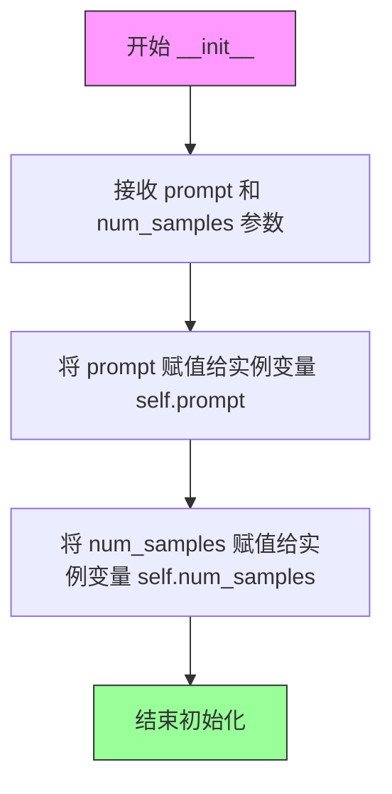

#### 带注释源码

```python
class PromptDataset(Dataset):
    """A simple dataset to prepare the prompts to generate class images on multiple GPUs."""

    def __init__(self, prompt, num_samples):
        # 参数说明：
        # prompt (str): 用于生成类别图像的文本提示词
        # num_samples (int): 要生成的图像样本数量
        
        # 将传入的 prompt 存储为实例属性，供后续 __getitem__ 方法使用
        self.prompt = prompt
        
        # 将传入的 num_samples 存储为实例属性，供 __len__ 方法返回数据集大小
        self.num_samples = num_samples
```


### `PromptDataset.__len__`

该方法返回数据集中的样本数量，使 PyTorch DataLoader 能够确定数据集的大小并进行批量数据加载。

参数：

- `self`：`PromptDataset` 实例，表示数据集对象本身

返回值：`int`，返回 `self.num_samples`，即数据集中预设的样本数量

#### 流程图

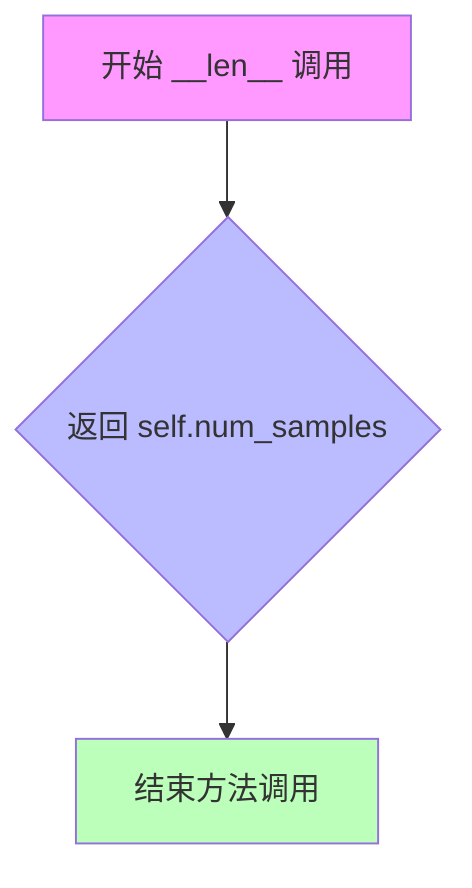

#### 带注释源码

```python
def __len__(self):
    """
    返回数据集中的样本数量。
    
    该方法由 PyTorch DataLoader 自动调用，用于确定：
    1. 数据集的总大小
    2. 每个 epoch 的批次数
    3. 迭代的终止条件
    
    Returns:
        int: 数据集中预生成的样本数量，由构造时的 num_samples 参数决定。
    """
    return self.num_samples
```


### `PromptDataset.__getitem__`

该方法是 `PromptDataset` 类的核心方法，用于根据给定索引返回对应的提示词和索引信息。主要功能是作为一个简单的数据集，为在多个GPU上生成类别图像准备提示词。

参数：

- `self`：`PromptDataset`，`PromptDataset` 类实例本身
- `index`：`int`，要获取的样本索引，用于从数据集中检索特定样本

返回值：`Dict[str, Union[str, int]]`，返回一个字典，包含两个键：
- `"prompt"`：字符串，对应的提示词内容
- `"index"`：整数，当前样本的索引值

#### 流程图

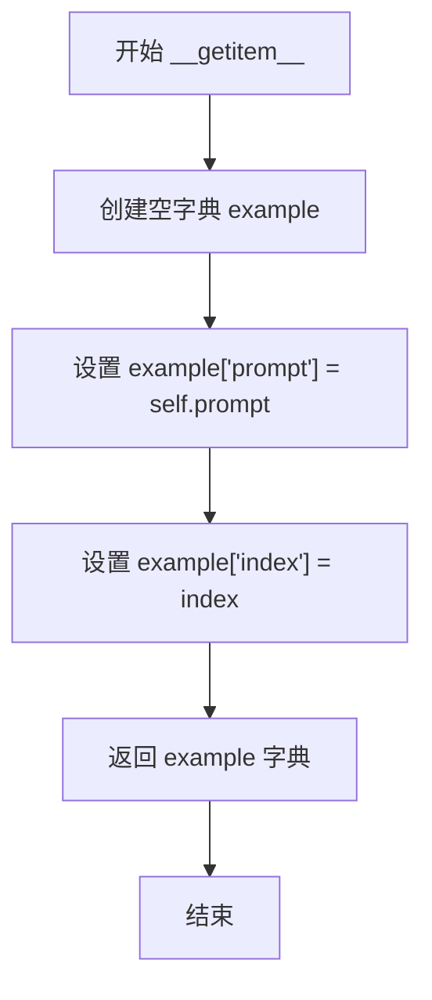

#### 带注释源码

```python
def __getitem__(self, index):
    """
    根据索引获取数据集中的样本。
    
    参数:
        index: int, 样本的索引值
        
    返回:
        dict: 包含 'prompt' 和 'index' 的字典
    """
    # 1. 创建一个空字典用于存储样本数据
    example = {}
    
    # 2. 将初始化时保存的提示词赋值给字典的 'prompt' 键
    example["prompt"] = self.prompt
    
    # 3. 将当前访问的索引赋值给字典的 'index' 键
    example["index"] = index
    
    # 4. 返回包含提示词和索引的字典
    return example
```


### `CustomDiffusionDataset.__init__`

初始化 CustomDiffusionDataset 类，用于准备实例和类图像及其提示词，以对模型进行微调。它预处理图像和分词提示词，支持先验保存、数据增强和图像变换。

参数：

- `concepts_list`：`List[Dict]` 或 `List`，概念列表，每个概念包含实例数据目录、类数据目录、实例提示词和类提示词
- `tokenizer`：`PretrainedTokenizer`，用于对提示词进行分词的分词器对象
- `size`：`int`，输出图像的尺寸，默认为 512
- `mask_size`：`int`，掩码的尺寸，默认为 64
- `center_crop`：`bool`，是否对图像进行居中裁剪，默认为 False
- `with_prior_preservation`：`bool`，是否启用先验保存损失，默认为 False
- `num_class_images`：`int`，先验保存所需的类图像数量，默认为 200
- `hflip`：`bool`，是否应用水平翻转数据增强，默认为 False
- `aug`：`bool`，是否应用数据增强（随机缩放），默认为 True

返回值：`None`，该方法为构造函数，不返回任何值

#### 流程图

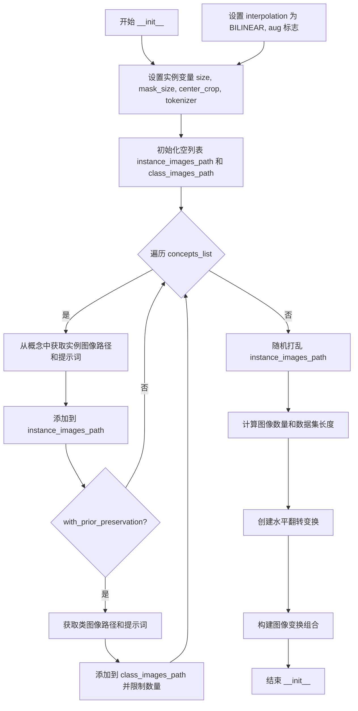

#### 带注释源码

```python
def __init__(
    self,
    concepts_list,
    tokenizer,
    size=512,
    mask_size=64,
    center_crop=False,
    with_prior_preservation=False,
    num_class_images=200,
    hflip=False,
    aug=True,
):
    """
    初始化 CustomDiffusionDataset 数据集
    
    参数:
        concepts_list: 概念列表，包含实例和类数据信息
        tokenizer: 分词器，用于对提示词进行分词
        size: 输出图像尺寸
        mask_size: 掩码尺寸
        center_crop: 是否居中裁剪
        with_prior_preservation: 是否启用先验保存
        num_class_images: 类图像数量
        hflip: 是否水平翻转
        aug: 是否进行数据增强
    """
    # 设置图像尺寸参数
    self.size = size
    self.mask_size = mask_size
    self.center_crop = center_crop
    self.tokenizer = tokenizer
    
    # 设置图像插值方法和增强标志
    self.interpolation = Image.BILINEAR
    self.aug = aug

    # 初始化图像路径列表
    self.instance_images_path = []
    self.class_images_path = []
    self.with_prior_preservation = with_prior_preservation
    
    # 遍历每个概念，处理实例和类图像路径
    for concept in concepts_list:
        # 获取实例图像路径列表，每个元素为(文件路径, 提示词)的元组
        inst_img_path = [
            (x, concept["instance_prompt"]) 
            for x in Path(concept["instance_data_dir"]).iterdir() 
            if x.is_file()
        ]
        self.instance_images_path.extend(inst_img_path)

        # 如果启用先验保存，处理类图像路径
        if with_prior_preservation:
            class_data_root = Path(concept["class_data_dir"])
            if os.path.isdir(class_data_root):
                # 如果是目录，获取目录下所有文件
                class_images_path = list(class_data_root.iterdir())
                class_prompt = [concept["class_prompt"] for _ in range(len(class_images_path))]
            else:
                # 如果是文件，读取文件内容获取路径和提示词
                with open(class_data_root, "r") as f:
                    class_images_path = f.read().splitlines()
                with open(concept["class_prompt"], "r") as f:
                    class_prompt = f.read().splitlines()

            # 组合类图像路径和提示词，并限制数量
            class_img_path = list(zip(class_images_path, class_prompt))
            self.class_images_path.extend(class_img_path[:num_class_images])

    # 随机打乱实例图像路径
    random.shuffle(self.instance_images_path)
    
    # 记录实例和类图像数量
    self.num_instance_images = len(self.instance_images_path)
    self.num_class_images = len(self.class_images_path)
    
    # 数据集长度为类图像和实例图像数量的最大值
    self._length = max(self.num_class_images, self.num_instance_images)
    
    # 创建水平翻转变换，根据hflip参数决定翻转概率
    self.flip = transforms.RandomHorizontalFlip(0.5 * hflip)

    # 构建图像变换组合管道
    self.image_transforms = transforms.Compose(
        [
            self.flip,  # 水平翻转
            transforms.Resize(size, interpolation=transforms.InterpolationMode.BILINEAR),  # 调整大小
            transforms.CenterCrop(size) if center_crop else transforms.RandomCrop(size),  # 裁剪方式
            transforms.ToTensor(),  # 转换为张量
            transforms.Normalize([0.5], [0.5]),  # 归一化到[-1, 1]
        ]
    )
```


### `CustomDiffusionDataset.__len__`

该方法返回数据集的长度，用于 PyTorch DataLoader 确定数据集大小。它返回在初始化时计算的最大值（实例图像数量和类别图像数量中的较大者），以确保数据迭代器能够完整遍历所有数据。

参数：

- `self`：`CustomDiffusionDataset`，隐式参数，表示当前数据集实例对象本身

返回值：`int`，返回数据集的样本总数（`self._length`），即实例图像数量和类别图像数量的最大值

#### 流程图

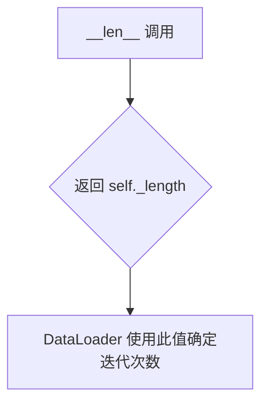

#### 带注释源码

```python
def __len__(self):
    """
    返回数据集的长度。
    
    此方法使 PyTorch DataLoader 能够确定数据集的大小，
    从而正确分批和迭代数据。返回值是实例图像数量和类别图像数量中的较大者，
    确保所有数据都能被遍历。
    
    Returns:
        int: 数据集的长度，即 self._length 的值
    """
    return self._length
```


### `CustomDiffusionDataset.preprocess`

该方法是自定义扩散数据集的图像预处理与掩码生成函数，主要负责对输入图像进行尺寸调整、随机裁剪，生成对应的二进制掩码，用于标识图像中需要进行训练的特定区域。

参数：

- `self`：`CustomDiffusionDataset` 实例本身，代表当前数据集对象
- `image`：`PIL.Image` 类型，输入的待处理原始图像
- `scale`：`int` 类型，目标图像的尺寸（宽高），用于控制图像的缩放大小
- `resample`：`int` 类型，来自 PIL 库的重采样滤波器常量（如 `Image.BILINEAR`），指定图像缩放时使用的插值方法

返回值：`Tuple[np.ndarray, np.ndarray]`，返回一个元组，包含处理后的图像数组和对应的掩码数组，其中图像数组形状为 `(self.size, self.size, 3)`，掩码数组形状为 `(self.size // factor, self.size // factor)`

#### 流程图

```mermaid
flowchart TD
    A[开始 preprocess] --> B[计算 outer 和 inner 值]
    B --> C[计算 factor = self.size // self.mask_size]
    C --> D{scale > self.size?}
    D -->|是| E[交换 outer 和 inner 的值]
    D -->|否| F[保持 outer=self.size, inner=scale]
    E --> G
    F --> G
    G[随机生成裁剪位置 top, left] --> H[将图像 resize 到 scale×scale]
    H --> I[转换为 numpy 数组并归一化到 [-1, 1]]
    I --> J[创建空白的目标图像和掩码数组]
    J --> K{scale > self.size?}
    K -->|是| L[从缩放图像中裁剪出目标区域]
    K -->|否| M[将图像粘贴到目标区域]
    L --> N[掩码设为全1]
    M --> O[计算并设置内部区域的掩码为1]
    N --> P[返回 instance_image 和 mask]
    O --> P
```

#### 带注释源码

```python
def preprocess(self, image, scale, resample):
    """
    图像预处理与掩码生成方法。
    
    该方法根据提供的 scale 参数对图像进行缩放和随机裁剪，生成训练所需的
    图像块及其对应的二进制掩码。掩码用于标识需要进行扩散模型训练的特定区域。
    
    Args:
        image: PIL.Image 对象，输入的原始图像
        scale: int，目标尺寸，用于决定图像的缩放比例
        resample: int，PIL 重采样方法常量（如 Image.BILINEAR）
    
    Returns:
        tuple: (instance_image, mask) - 处理后的图像数组和掩码数组
    """
    # 获取外层和内层尺寸
    # outer 表示用于裁剪的外部边界，inner 表示实际图像内容的尺寸
    outer, inner = self.size, scale
    
    # 计算尺寸因子，用于后续掩码尺寸的计算
    # self.size 是目标输出尺寸，self.mask_size 是掩码尺寸
    factor = self.size // self.mask_size
    
    # 如果 scale 大于 self.size，交换内外层尺寸
    # 这种情况下原图比目标尺寸大，需要先裁剪再缩放
    if scale > self.size:
        outer, inner = scale, self.size
    
    # 随机生成裁剪的起始位置（top, left）
    # 确保裁剪区域在 [0, outer - inner] 范围内随机选择
    top, left = np.random.randint(0, outer - inner + 1), np.random.randint(0, outer - inner + 1)
    
    # 将图像调整到指定的 scale 尺寸
    # 使用指定的重采样方法（双线性插值）
    image = image.resize((scale, scale), resample=resample)
    
    # 将 PIL 图像转换为 numpy 数组（uint8 格式）
    image = np.array(image).astype(np.uint8)
    
    # 归一化图像像素值到 [-1, 1] 范围
    # 原像素范围 [0, 255] -> [0, 1] -> [-1, 1]
    image = (image / 127.5 - 1.0).astype(np.float32)
    
    # 初始化目标尺寸的空白图像数组（3通道）
    instance_image = np.zeros((self.size, self.size, 3), dtype=np.float32)
    
    # 初始化掩码数组（尺寸为目标尺寸除以因子）
    mask = np.zeros((self.size // factor, self.size // factor))
    
    # 根据 scale 与 self.size 的大小关系进行不同的处理
    if scale > self.size:
        # 情况1：输入图像比目标尺寸大
        # 从缩放后的图像中裁剪出 inner×inner 大小的区域
        instance_image = image[top : top + inner, left : left + inner, :]
        
        # 此时整个掩码区域都需要训练，设为全1
        mask = np.ones((self.size // factor, self.size // factor))
    else:
        # 情况2：输入图像比目标尺寸小或相等
        # 将缩放后的图像粘贴到目标图像的指定位置
        instance_image[top : top + inner, left : left + inner, :] = image
        
        # 计算内部区域的掩码
        # top//factor + 1 到 (top + scale)//factor - 1 的区域标记为1
        # 这样在扩散训练时可以聚焦于图像的主体内容区域
        mask[
            top // factor + 1 : (top + scale) // factor - 1, 
            left // factor + 1 : (left + scale) // factor - 1
        ] = 1.0
    
    # 返回处理后的图像和对应的掩码
    return instance_image, mask
```


### `CustomDiffusionDataset.__getitem__`

该方法负责从自定义扩散数据集中获取单个训练样本，包括实例图像的加载、增强、掩码生成和提示词tokenization，同时支持先验保留（prior preservation）模式下类别图像的处理。

参数：

- `self`：`CustomDiffusionDataset`，数据集实例自身
- `index`：`int`，请求的样本索引，用于从实例图像列表中定位数据

返回值：`dict`，包含以下键值对：

- `instance_images`：`torch.Tensor`，形状为 (3, H, W) 的归一化实例图像张量，值域为 [-1, 1]
- `mask`：`torch.Tensor`，形状为 (H/factor, W/factor) 的二值掩码张量，用于标识有效图像区域
- `instance_prompt_ids`：`torch.Tensor`，形状为 (max_length,) 的tokenized实例提示词
- `class_images`：`torch.Tensor`（仅当 `with_prior_preservation=True` 时存在），类别图像张量
- `class_mask`：`torch.Tensor`（仅当 `with_prior_preservation=True` 时存在），全1类别掩码
- `class_prompt_ids`：`torch.Tensor`（仅当 `with_prior_preservation=True` 时存在），tokenized类别提示词

#### 流程图

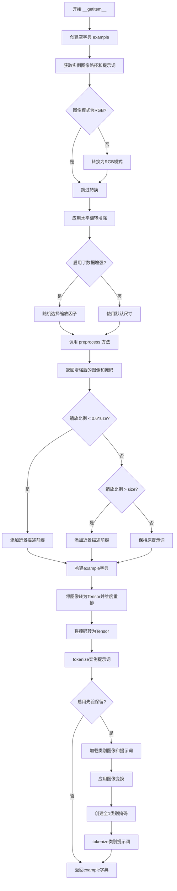

#### 带注释源码

```python
def __getitem__(self, index):
    """
    获取指定索引处的训练样本。
    
    该方法负责：
    1. 加载并预处理实例图像
    2. 生成图像区域掩码
    3. 对提示词进行tokenization
    4. 如果启用先验保留，同时处理类别图像
    """
    # 初始化返回字典
    example = {}
    
    # 通过索引取模获取实例图像路径和对应提示词
    # 使用模运算确保索引在有效范围内循环
    instance_image, instance_prompt = self.instance_images_path[index % self.num_instance_images]
    
    # 打开图像文件
    instance_image = Image.open(instance_image)
    
    # 确保图像为RGB模式（处理灰度或RGBA图像）
    if not instance_image.mode == "RGB":
        instance_image = instance_image.convert("RGB")
    
    # 应用水平翻转增强（基于初始化时设置的翻转概率）
    instance_image = self.flip(instance_image)

    # 应用resize增强并创建有效图像区域掩码
    random_scale = self.size  # 默认使用目标尺寸
    
    # 根据增强配置随机选择缩放策略
    if self.aug:
        # 66%概率选择较小缩放（size/3 到 size），否则选择较大缩放（1.2*size 到 1.4*size）
        random_scale = (
            np.random.randint(self.size // 3, self.size + 1)
            if np.random.uniform() < 0.66
            else np.random.randint(int(1.2 * self.size), int(1.4 * self.size))
        )
    
    # 调用预处理方法进行图像缩放和掩码生成
    # preprocess 内部会生成一个随机裁剪区域，并创建对应的二值掩码
    instance_image, mask = self.preprocess(instance_image, random_scale, self.interpolation)

    # 根据缩放比例动态修改提示词，模拟不同距离的观察视角
    if random_scale < 0.6 * self.size:
        # 图像很小，添加"远处"或"很小"描述
        instance_prompt = np.random.choice(["a far away ", "very small "]) + instance_prompt
    elif random_scale > self.size:
        # 图像很大，添加"放大"或"特写"描述
        instance_prompt = np.random.choice(["zoomed in ", "close up "]) + instance_prompt

    # 将numpy图像数组转换为PyTorch张量
    # permute(2, 0, 1) 将 HWC 转换为 CHW 格式
    example["instance_images"] = torch.from_numpy(instance_image).permute(2, 0, 1)
    
    # 将掩码转换为张量
    example["mask"] = torch.from_numpy(mask)
    
    # 使用tokenizer将实例提示词转换为token ids
    # padding到最大长度，截断超长部分，返回pytorch张量
    example["instance_prompt_ids"] = self.tokenizer(
        instance_prompt,
        truncation=True,
        padding="max_length",
        max_length=self.tokenizer.model_max_length,
        return_tensors="pt",
    ).input_ids

    # 如果启用了先验保留（用于减少模型遗忘），同时处理类别图像
    if self.with_prior_preservation:
        # 获取类别图像路径和提示词
        class_image, class_prompt = self.class_images_path[index % self.num_class_images]
        class_image = Image.open(class_image)
        
        # 确保类别图像为RGB模式
        if not class_image.mode == "RGB":
            class_image = class_image.convert("RGB")
        
        # 应用标准图像变换（resize、裁剪、归一化）
        example["class_images"] = self.image_transforms(class_image)
        
        # 创建全1掩码（类别图像全部用于训练）
        example["class_mask"] = torch.ones_like(example["mask"])
        
        # tokenize类别提示词
        example["class_prompt_ids"] = self.tokenizer(
            class_prompt,
            truncation=True,
            padding="max_length",
            max_length=self.tokenizer.model_max_length,
            return_tensors="pt",
        ).input_ids

    # 返回包含所有训练所需数据的字典
    return example
```

## 关键组件


### CustomDiffusionAttnProcessor / CustomDiffusionAttnProcessor2_0 / CustomDiffusionXFormersAttnProcessor

自定义扩散注意力处理器，用于在注意力层中注入自定义权重。支持标准PyTorch注意力、SDPA注意力和xFormers高效注意力实现，是实现自定义扩散模型的核心组件。

### CustomDiffusionDataset

自定义扩散数据集类，负责加载和预处理训练图像与提示词。实现惰性加载机制，通过`__getitem__`方法动态加载图像，支持图像增强、掩码生成和提示词token化。

### VAE latent 采样与惰性加载

将图像编码到潜在空间（`vae.encode().latent_dist.sample()`），实现图像到潜态的转换。采用延迟计算模式，在训练循环中按需采样，而非一次性加载所有潜在向量，有效减少内存占用。

### 注意力权重定制 (to_k_custom_diffusion, to_v_custom_diffusion, to_q_custom_diffusion)

在UNet的注意力层中注入自定义权重，实现对交叉注意力键值投影的精细控制。支持仅训练KV权重或同时训练Q输出权重，提供灵活的微调策略。

### Modifier Token 与词表扩展

向tokenizer添加修饰符标记（modifier_token），实现对特定概念的精准学习。通过扩展词表和初始化嵌入，实现新概念的注入与优化。

### Prior Preservation 损失

实现先验 preservation 损失机制，通过分割模型预测和目标张量（`torch.chunk`），分别计算实例损失和先验损失，防止模型遗忘先验知识。

### Mixed Precision Training (FP16/BF16)

支持混合精度训练，根据`accelerator.mixed_precision`配置动态选择权重数据类型，在保持训练质量的同时提升计算效率。

### Gradient Checkpointing

启用梯度检查点（`unet.enable_gradient_checkpointing()`），通过牺牲计算时间换取内存优化，允许在有限显存下训练更大模型。

### 量化策略与权重管理

通过`weight_dtype`变量管理模型权重精度，支持FP32、FP16和BF16三种精度模式。VAE和文本编码器根据配置进行精度转换，实现动态量化支持。

### 分布式训练与加速器

使用Accelerator实现分布式训练封装，处理多GPU环境下的数据并行、梯度同步和模型保存，确保训练流程在不同硬件配置下的兼容性。


## 问题及建议


### 已知问题

- **数据集Mask生成逻辑缺陷**：`CustomDiffusionDataset.preprocess`方法中的mask计算逻辑复杂且容易出错，当`scale > self.size`时创建全1 mask，否则只在中心区域创建1，可能导致训练时mask全为0使得损失计算异常。
- **数据采样不均匀**：使用`index % self.num_instance_images`取模方式循环数据，在多epoch训练时相同实例图像会被重复采样，而非真正随机打乱。
- **Prior Preservation Mask处理错误**：在`collate_fn`和训练循环中，prior preservation模式的mask处理逻辑存在问题——`batch["mask"]`被直接使用而未正确分离instance和class部分，导致prior loss计算可能使用错误的mask。
- **GPU资源未及时释放**：训练循环中创建的`DiffusionPipeline`在验证后虽然调用了`del pipeline`和`torch.cuda.empty_cache()`，但在大量验证步骤中可能累积GPU内存。
- **Tokenizer长度处理硬编码**：在初始化`mask_size`时使用了一次VAE编码来获取潜在空间大小，但这个计算在数据集初始化时进行，如果后续batch size变化可能导致内存效率问题。
- **梯度计算优化缺失**：在训练文本编码器时使用`index_grads_to_zero`的方式手动将非modifier token的梯度置零，这个操作在每个训练步骤都执行且使用了循环遍历，效率较低。
- **缺少输入验证**：很多函数参数缺乏充分的验证，如`concepts_list`加载后没有检查必需字段是否存在。

### 优化建议

- **重构Mask生成逻辑**：简化`preprocess`方法中的mask计算，确保在所有情况下都能生成有效的mask区域，或者在数据加载时添加mask有效性检查。
- **改进数据采样机制**：使用`RandomSampler`替代当前的索引取模方式，或者在`__getitem__`中实现真正的随机采样逻辑。
- **修复Prior Preservation Mask处理**：确保在合并instance和class数据时正确分离和使用对应的mask，可以考虑在`collate_fn`中明确分离并标记。
- **优化GPU内存管理**：在每个验证步骤结束后更积极地释放GPU资源，考虑使用`torch.cuda.ipc_collect()`或context manager确保资源释放。
- **添加输入验证函数**：在`parse_args`和`main`函数开始处添加全面的参数验证，包括检查目录存在性、文件格式、必需字段等。
- **优化梯度操作**：使用`torch.no_grad()`或更高效的向量操作替代循环设置梯度为零的方式。
- **添加配置管理**：将硬编码的超参数和路径提取到配置文件中，提高代码可维护性和可复用性。

## 其它


### 设计目标与约束

**设计目标**：
1. 实现Stable Diffusion模型的Custom Diffusion微调训练，支持用户自定义概念（通过modifier_token）注入到模型中
2. 支持prior preservation（先验保留）训练策略，通过class images防止模型过拟合
3. 支持多概念训练（concepts_list），可同时训练多个自定义概念
4. 提供完整的训练、验证、checkpoint保存和模型导出流程

**约束条件**：
1. 必须使用HuggingFace diffusers库版本 >= 0.37.0.dev0
2. 训练硬件要求：至少一块支持CUDA的GPU（推荐16GB显存以上）
3. 支持分布式训练（通过accelerator实现多GPU训练）
4. 支持mixed precision训练（fp16/bf16），但对MPS后端有限制
5. 预训练模型必须包含text_encoder、vae、unet三个组件

### 错误处理与异常设计

**参数校验错误**：
- 当`with_prior_preservation`为True但未指定`class_data_dir`或`class_prompt`时，抛出`ValueError`
- 当`modifier_token`数量多于`initializer_token`时，抛出`ValueError`
- 当tokenizer已包含指定的modifier_token时，抛出`ValueError`
- 当`initializer_token`为多个token序列而非单个token时，抛出`ValueError`

**环境检查错误**：
- 当使用wandb但未安装时，抛出`ImportError`
- 当启用xformers但未正确安装时，抛出`ValueError`
- 当使用8-bit Adam但未安装bitsandbytes时，抛出`ImportError`

**运行时警告**：
- 当使用`class_data_dir`但未启用`with_prior_preservation`时发出警告
- 当使用`class_prompt`但未启用`with_prior_preservation`时发出警告
- 当检测到xformers 0.0.16版本时发出警告（该版本在某些GPU上训练有问题）

**资源清理**：
- 训练完成后显式删除pipeline实例并调用`torch.cuda.empty_cache()`
- 使用`accelerator.wait_for_everyone()`确保分布式环境下的同步清理

### 数据流与状态机

**训练数据流**：
1. **数据加载阶段**：`CustomDiffusionDataset`从`concepts_list`加载instance和class图像路径
2. **数据预处理阶段**：图像经过resize、crop、normalize处理，prompt经过tokenize处理
3. **DataLoader批次组装**：`collate_fn`将多个样本组装成batch，支持prior preservation时的concat
4. **Latent空间转换**：VAE编码器将pixel values转换为latent representations（乘以scaling_factor）
5. **噪声注入**：DDPMScheduler在指定timestep下向latents添加噪声
6. **前向传播**：UNet预测噪声残差，text_encoder生成conditioning embeddings
7. **损失计算**：根据prediction_type计算MSE loss，支持masked loss（针对特定区域）
8. **反向传播与优化**：梯度累积、gradient checkpointing、梯度裁剪、optimizer step

**状态机转换**：
- **初始化状态**：模型加载完成，等待训练
- **训练状态**：遍历epoch和step，执行前向/反向传播
- **验证状态**：在指定step执行validation inference
- **Checkpoint保存状态**：保存模型权重、optimizer状态、scheduler状态
- **训练结束状态**：保存最终模型、生成示例图像、可选push to Hub

**关键状态变量**：
- `global_step`：全局训练步数
- `first_epoch`：起始epoch（用于resume训练）
- `args.max_train_steps`：最大训练步数
- `args.num_train_epochs`：训练轮数

### 外部依赖与接口契约

**核心依赖库**：
- `torch`：深度学习框架
- `diffusers`：扩散模型库（版本>=0.37.0.dev0）
- `transformers`：预训练模型和tokenizer
- `accelerate`：分布式训练和混合精度训练
- `huggingface_hub`：模型上传和管理
- `PIL`：图像处理
- `numpy`：数值计算
- `safetensors`：安全序列化（默认使用）

**可选依赖库**：
- `wandb`：实验追踪（当`report_to="wandb"`时必需）
- `xformers`：高效注意力（当`enable_xformers_memory_efficient_attention`时使用）
- `bitsandbytes`：8-bit优化器（当`use_8bit_adam`时使用）
- `comet_ml`：实验追踪（当`report_to="comet_ml"`时使用）

**预训练模型接口契约**：
- 模型路径需包含：text_encoder、vae、unet、scheduler、tokenizer子文件夹
- text_encoder需支持CLIPTextModel或RobertaSeriesModelWithTransformation架构
- UNet需支持2D条件生成（UNet2DConditionModel）

**配置文件接口**：
- concepts_list：JSON格式，包含instance_prompt、class_prompt、instance_data_dir、class_data_dir字段
- 训练参数通过argparse传递，支持命令行覆盖

### 配置管理

**命令行参数分类**：
1. **模型路径参数**：`pretrained_model_name_or_path`、`revision`、`variant`、`tokenizer_name`
2. **数据路径参数**：`instance_data_dir`、`class_data_dir`、`concepts_list`
3. **Prompt参数**：`instance_prompt`、`class_prompt`、`validation_prompt`
4. **训练超参数**：`train_batch_size`、`learning_rate`、`num_train_epochs`、`max_train_steps`
5. **优化器参数**：`adam_beta1`、`adam_beta2`、`adam_weight_decay`、`adam_epsilon`
6. **Scheduler参数**：`lr_scheduler`、`lr_warmup_steps`
7. **Checkpoint参数**：`checkpointing_steps`、`checkpoints_total_limit`、`resume_from_checkpoint`
8. **验证参数**：`validation_steps`、`num_validation_images`
9. **输出参数**：`output_dir`、`push_to_hub`、`hub_model_id`

### 性能优化策略

**内存优化**：
- `gradient_checkpointing`：在反向传播时节省显存，牺牲部分计算时间
- `enable_xformers_memory_efficient_attention`：使用xformers的高效注意力实现
- `set_grads_to_none`：通过设置梯度为None而非zero来节省显存
- Mixed precision (fp16/bf16)：减少显存占用和加速训练

**计算优化**：
- `allow_tf32`：在Ampere GPU上启用TF32加速矩阵运算
- `gradient_accumulation_steps`：通过梯度累积实现更大有效batch size
- 8-bit Adam：减少optimizer状态显存占用

**训练效率**：
- `dataloader_num_workers`：多进程数据加载
- MPS后端特殊处理：检测到MPS时禁用native_amp

### 安全性考虑

**模型文件安全**：
- 默认使用safetensors格式序列化模型权重（防止pickle安全风险）
- 提供`no_safe_serialization`选项使用传统PyTorch格式
- Hub token安全检查：不允许同时使用wandb和hub_token（防止token泄露）

**输入验证**：
- 检查concept目录结构完整性
- 验证class images数量是否满足要求

### 测试策略

**单元测试建议**：
- `parse_args`：测试参数解析的正确性
- `CustomDiffusionDataset`：测试数据加载和预处理
- `collate_fn`：测试batch组装逻辑
- `freeze_params`：测试参数冻结功能

**集成测试建议**：
- 完整训练流程（小规模数据和少量steps）
- Checkpoint保存和恢复
- 分布式训练兼容性

### 监控与日志

**日志系统**：
- 使用accelerate的logging系统
- TensorBoard日志目录：默认`output_dir/logs`
- 支持WandB和Comet.ml集成

**关键指标监控**：
- Loss曲线（train loss、prior loss）
- Learning rate变化
- Validation图像质量
- GPU显存使用

**训练信息输出**：
- 数据集大小、batch数量、epoch数
- 设备信息、分布式进程数
- Checkpoint保存和加载状态

    