# `diffusers\examples\dreambooth\convert_to_imagefolder.py` 详细设计文档

一个命令行工具，用于将指定文件夹中的图像文件与对应的caption文本文件配对，并生成符合HuggingFace数据集格式的metadata.jsonl文件。

## 整体流程

```mermaid
graph TD
    A[开始] --> B[创建ArgumentParser并定义命令行参数]
B --> C[解析命令行参数]
C --> D{验证path是否存在}
D -- 否 --> E[抛出RuntimeError]
D -- 是 --> F[获取文件夹中所有文件]
F --> G[获取所有.txt caption文件]
G --> H[计算图像文件集合: all_files - captions]
H --> I[将图像文件转换为字典{stem: path}]
I --> J[配对caption和image文件]
J --> K[打开metadata.jsonl文件]
K --> L{遍历caption_image对}
L --> M[读取caption文本内容]
M --> N[生成JSON记录并写入文件]
N --> O[结束]
```

## 类结构

```
此代码为脚本形式，无类定义
主要包含命令行参数解析逻辑和数据处理流程
```

## 全局变量及字段


### `parser`
    
命令行参数解析器对象，用于解析脚本的命令行参数

类型：`argparse.ArgumentParser`
    


### `args`
    
包含解析后命令行参数的命名空间对象

类型：`argparse.Namespace`
    


### `path`
    
指向图像-文本对文件夹的路径对象

类型：`pathlib.Path`
    


### `all_files`
    
文件夹中所有文件的路径列表

类型：`list[pathlib.Path]`
    


### `captions`
    
文件夹中所有文本文件（字幕文件）的路径列表

类型：`list[pathlib.Path]`
    


### `images`
    
以文件stem为键、图像文件路径为值的字典

类型：`dict[str, pathlib.Path]`
    


### `caption_image`
    
字幕文件与其对应图像文件的映射关系字典

类型：`dict[pathlib.Path, pathlib.Path | None]`
    


### `metadata`
    
指向metadata.jsonl元数据文件的路径对象

类型：`pathlib.Path`
    


### `f`
    
打开的metadata.jsonl文件的文件对象，用于写入JSONL数据

类型：`io.TextIOWrapper`
    


### `caption_text`
    
从字幕文件中读取的文本内容

类型：`str`
    


    

## 全局函数及方法


### `argparse.ArgumentParser`

用于解析命令行参数的类，通过定义程序可以接受的参数，自动化处理命令行输入并生成帮助信息。

参数：

- `prog`： `str | None`，程序的名称，默认为程序文件名
- `usage`： `str | None`，描述程序用法的字符串，默认为自动生成
- `description`： `str | None`，程序功能描述，显示在参数帮助信息之前
- `epilog`： `str | None`，显示在参数帮助信息之后的文本
- `parents`： `list[ArgumentParser]`，继承其他解析器的参数定义
- `formatter_class`： `type`，帮助信息格式化类，如 `RawDescriptionHelpFormatter`
- `prefix_chars`： `str`，可选参数的前缀字符集，默认为 `-`
- `fromfile_prefix_chars`： `str | None`，从文件读取参数的 prefix 字符
- `argument_default`： `any`，参数的全局默认值
- `conflict_handler`： `str`，冲突处理策略，`'error'` 或 `'resolve'`
- `add_help`： `bool`，是否自动添加 `-h/--help` 选项
- `allow_abbrev`： `bool`，是否允许长选项缩写匹配

返回值： `ArgumentParser`，返回配置好的命令行参数解析器实例

#### 流程图

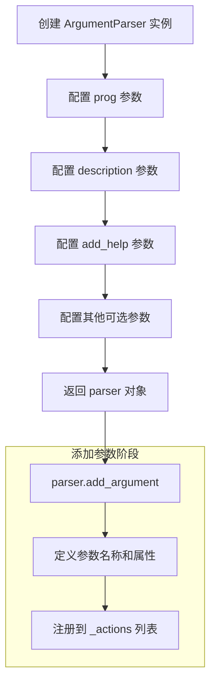

#### 带注释源码

```python
import argparse
import json
import pathlib


# 创建 ArgumentParser 实例
# prog: 程序名，默认使用 sys.argv[0]
# description: 程序的简短描述，会显示在帮助信息顶部
# add_help: 默认 True，自动添加 -h/--help 选项
parser = argparse.ArgumentParser()

# 添加 --path 参数
# --path: 长选项名称
# type=str: 参数值类型为字符串
# required=True: 该参数为必填项
# help: 参数的帮助描述
parser.add_argument(
    "--path",
    type=str,
    required=True,
    help="Path to folder with image-text pairs.",
)

# 添加 --caption_column 参数
# default="prompt": 未提供时的默认值
# help: 参数的帮助描述
parser.add_argument("--caption_column", type=str, default="prompt", help="Name of caption column.")

# 解析命令行参数
# 从 sys.argv[1:] 获取参数
# 返回 argparse.Namespace 对象，包含所有解析后的参数
args = parser.parse_args()

# 使用解析后的参数
path = pathlib.Path(args.path)

# 检查路径是否存在，不存在则抛出 RuntimeError
if not path.exists():
    raise RuntimeError(f"`--path` '{args.path}' does not exist.")

# 获取目录下的所有文件
all_files = list(path.glob("*"))

# 获取所有 .txt 文件（字幕文件）
captions = list(path.glob("*.txt"))

# 获取所有非 txt 文件（图片文件）
images = set(all_files) - set(captions)

# 创建图片文件名到路径的映射
images = {image.stem: image for image in images}

# 将字幕文件与对应的图片文件配对
caption_image = {caption: images.get(caption.stem) for caption in captions if images.get(caption.stem)}

# 元数据文件路径
metadata = path.joinpath("metadata.jsonl")

# 写入元数据到 JSONL 文件
with metadata.open("w", encoding="utf-8") as f:
    for caption, image in caption_image.items():
        # 读取字幕文本内容
        caption_text = caption.read_text(encoding="utf-8")
        
        # 构建 JSON 对象并写入文件
        # 包含文件名和指定列名的字幕内容
        json.dump({"file_name": image.name, args.caption_column: caption_text}, f)
        f.write("\n")
```


### `parser.add_argument`（第一个调用）

用于定义 `--path` 命令行参数，指定包含图像-文本对的文件夹路径。

参数：

- 第一个位置参数：`--path`，`str`，命令行参数名称（长选项）
- `type`：`type`，`str`，参数类型为字符串
- `required`：`bool`，设置为 `True`，表示该参数为必需参数
- `help`：`str`，帮助信息，描述参数用途为"Path to folder with image-text pairs."

返回值：`None`，无返回值，该方法仅修改 ArgumentParser 对象的内部状态

#### 流程图

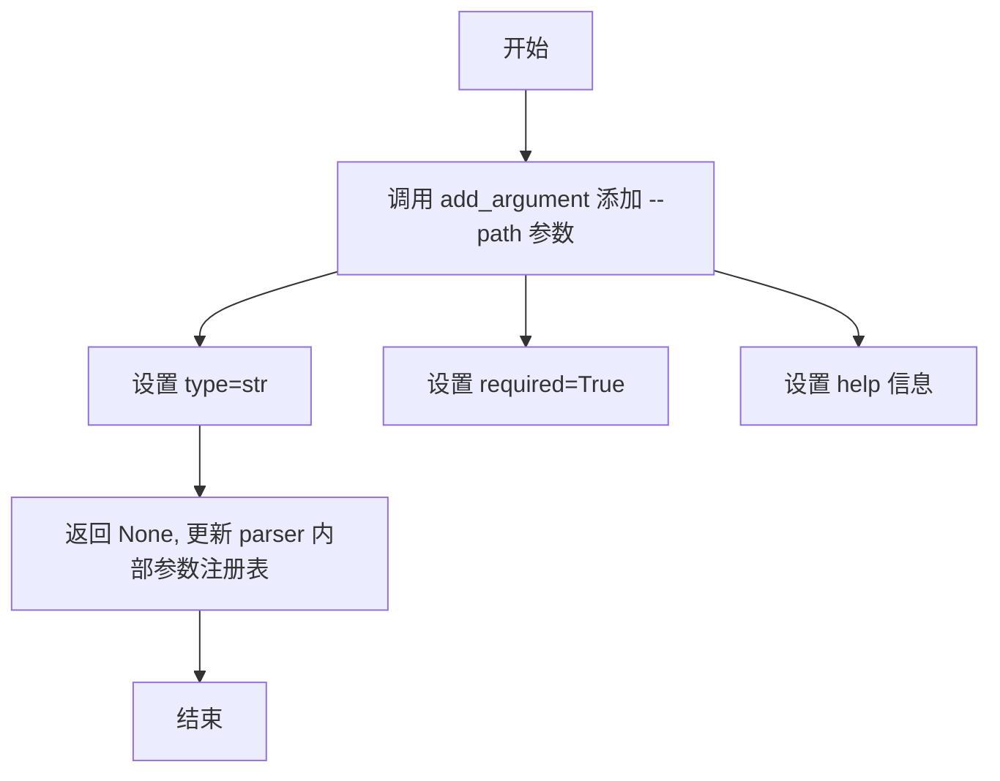

#### 带注释源码

```python
parser.add_argument(
    "--path",           # 参数名/标志：指定命令行参数的名称
    type=str,           # 参数类型：字符串类型
    required=True,      # 必需参数：必须提供，否则程序报错
    help="Path to folder with image-text pairs."  # 帮助文本：描述参数用途
)
```

---

### `parser.add_argument`（第二个调用）

用于定义 `--caption_column` 命令行参数，指定数据集中 caption 列的名称。

参数：

- 第一个位置参数：`--caption_column`，`str`，命令行参数名称（长选项）
- `type`：`type`，`str`，参数类型为字符串
- `default`：`str`，默认值为 `"prompt"`，当未提供该参数时使用
- `help`：`str`，帮助信息，描述参数用途为"Name of caption column."

返回值：`None`，无返回值，该方法仅修改 ArgumentParser 对象的内部状态

#### 流程图

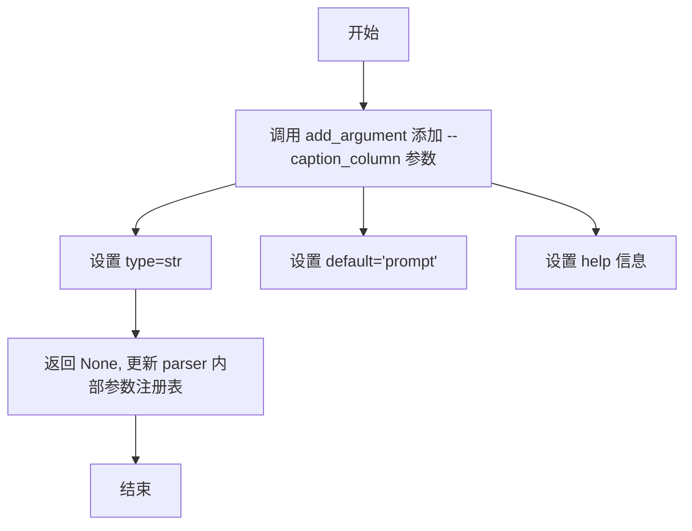

#### 带注释源码

```python
parser.add_argument(
    "--caption_column",      # 参数名/标志：指定命令行参数的名称
    type=str,                # 参数类型：字符串类型
    default="prompt",        # 默认值：未提供时使用 'prompt'
    help="Name of caption column."  # 帮助文本：描述参数用途
)
```


### `parser.parse_args`

描述：该方法解析从 `ArgumentParser` 添加的参数（默认从 `sys.argv` 读取），验证参数的有效性（如是否必须、类型是否正确），并返回一个包含这些参数的 `Namespace` 对象。在此代码中，它用于提取用户通过命令行传入的 `--path` 和 `--caption_column` 配置。

参数：

-  `{参数名称}`：`{参数类型}`，{参数描述}
-  `args`：`list[str]`，可选。要解析的字符串列表。默认为 `None`，此时从系统命令行参数 `sys.argv` 读取。代码中未显式传入，使用默认值。
-  `namespace`：`Namespace`，可选。代码中未显式传入，使用默认值。

返回值：`argparse.Namespace`，返回一个命名空间对象，其中包含解析后的属性。代码中通过 `args.path` 访问路径，通过 `args.caption_column` 访问列名。

#### 流程图

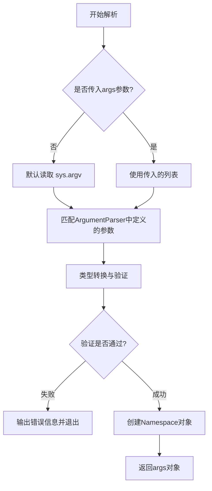

#### 带注释源码

```python
# 创建命令行参数解析器实例
parser = argparse.ArgumentParser()

# 定义 --path 参数：字符串类型，必填
parser.add_argument(
    "--path",
    type=str,
    required=True,
    help="Path to folder with image-text pairs.",
)

# 定义 --caption_column 参数：字符串类型，默认值为 "prompt"
parser.add_argument("--caption_column", type=str, default="prompt", help="Name of caption column.")

# 调用 parse_args 方法，解析命令行参数
# 不传入参数时，默认解析 sys.argv
args = parser.parse_args()
```


### `pathlib.Path`

`pathlib.Path` 是 Python 标准库中的类，用于表示文件系统路径。在本代码中，它被用于构建图像-文本对数据集的元数据文件，通过路径对象的方法检查目录存在性、匹配文件、获取文件名和读取文本内容。

#### 参数

此为类构造函数，非函数调用：

- `args.path`：传入的文件夹路径字符串

#### 返回值

创建 `pathlib.Path` 对象

#### 带注释源码

```python
# 导入pathlib模块
import pathlib

# 使用Path类的构造函数创建路径对象
# 参数 args.path 是命令行传入的文件夹路径（字符串类型）
path = pathlib.Path(args.path)

# 下面的代码使用了Path对象的多个方法：

# 1. exists() - 检查路径是否存在
if not path.exists():
    raise RuntimeError(f"`--path` '{args.args.path}' does not exist.")

# 2. glob() - 通配符匹配文件
# 返回匹配"*"(所有文件)的Path对象生成器，转换为列表
all_files = list(path.glob("*"))

# 3. glob() - 匹配所有.txt文件
captions = list(path.glob("*.txt"))

# 4. joinpath() - 路径拼接
# 用于构建metadata.jsonl文件的完整路径
metadata = path.joinpath("metadata.jsonl")

# 5. Path对象的属性和方法（在image和caption上使用）
# image.stem - 获取文件名（不含扩展名）
# image.name - 获取完整文件名
# caption.read_text() - 读取文本文件内容
```

#### 主要使用的方法详情

| 方法/属性 | 所在行 | 功能描述 |
|-----------|--------|----------|
| `Path(args.path)` | 第18行 | 构造函数，创建Path对象 |
| `.exists()` | 第20行 | 检查路径是否存在 |
| `.glob("*")` | 第23行 | 递归获取所有文件和文件夹 |
| `.glob("*.txt")` | 第24行 | 获取所有txt文件 |
| `.stem` | 第25-26行 | 获取文件名（不含扩展名） |
| `.joinpath()` | 第30行 | 路径拼接 |
| `.open()` | 第32行 | 打开文件返回文件对象 |
| `.read_text()` | 第36行 | 读取文本文件内容 |
| `.name` | 第37行 | 获取文件名（含扩展名） |

#### 流程图

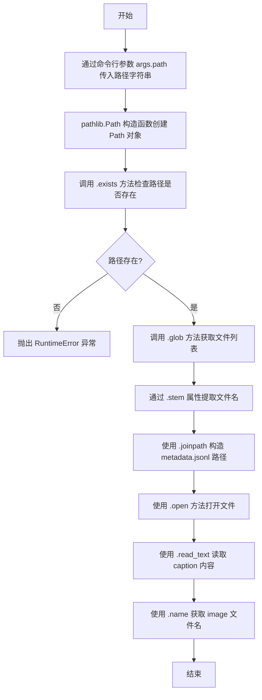

#### 技术债务与优化空间

1. **缺少资源释放**：使用 `open()` 时未使用上下文管理器（`with` 语句虽然在第32行有使用，但第36行的 `caption.read_text()` 不需要手动关闭）
2. **文件过滤不完善**：使用集合差集过滤时未考虑隐藏文件（如以`.`开头的文件）
3. **编码硬编码**：多处硬编码 `utf-8`，建议提取为常量或配置
4. **缺乏日志记录**：没有详细的运行日志，难以追踪执行过程
5. **错误处理不足**：仅检查路径是否存在，未处理权限问题、磁盘空间不足等情况

#### 其它项目

- **设计目标**：将图像-文本对数据集转换为 metadata.jsonl 格式，供机器学习训练使用
- **约束**：必须提供 `--path` 参数，目录需存在且包含配对的 txt 和图像文件
- **外部依赖**：仅依赖 Python 标准库 `argparse`、`json`、`pathlib`
- **数据流**：命令行参数 → 文件系统扫描 → 文本读取 → JSONL 写入


### `pathlib.Path.exists`

检查路径（文件或目录）是否存在，返回布尔值。

参数：

- （无显式参数，隐式参数为 `self`）

返回值：`bool`，如果路径存在返回 `True`，否则返回 `False`

#### 流程图

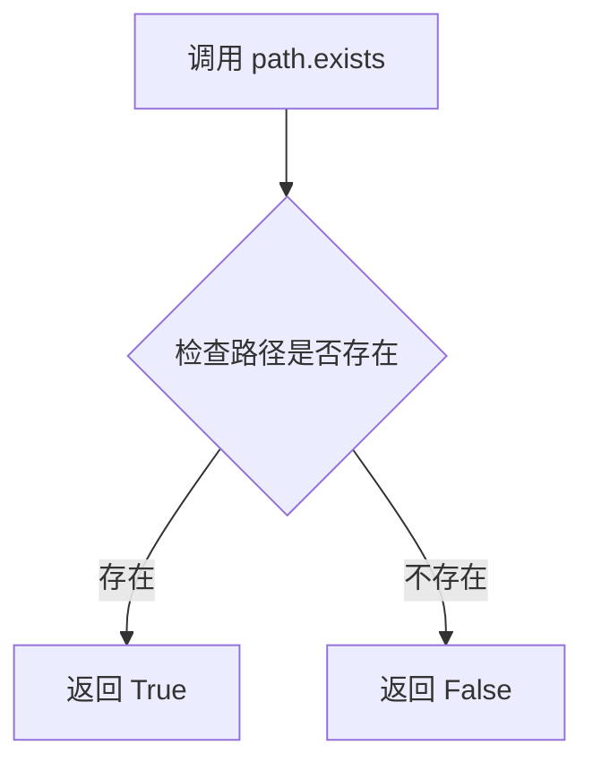

#### 带注释源码

```python
# pathlib.Path.exists 方法源码（简化版）
def exists(self):
    """
    Whether this path exists.
    
    Returns:
        bool: True if the path exists, False otherwise.
    """
    try:
        # 尝试使用 stat() 检查路径是否存在
        # 如果路径不存在，会抛出 FileNotFoundError 或 OSError
        self.stat()
    except OSError:
        return False
    except ValueError:
        # 如果路径是无效的路径格式，也可能抛出 ValueError
        return False
    return True
```

#### 代码中的实际调用

```python
path = pathlib.Path(args.path)
if not path.exists():
    raise RuntimeError(f"`--path` '{args.path}' does not exist.")
```

在当前代码中，`path.exists()` 用于验证用户提供的路径参数是否有效。如果路径不存在，则抛出 `RuntimeError` 异常并提示用户。


### `Path.glob`

`Path.glob` 是 `pathlib.Path` 类的方法，用于根据给定的模式匹配目录中的文件路径。在本代码中，该方法被调用两次：第一次获取目录下的所有文件，第二次仅获取 `.txt` 文本文件。

参数：

- `pattern`：`str`， glob 模式字符串，用于匹配文件路径（例如 `"*"` 匹配所有文件，`"*.txt"` 匹配所有文本文件）

返回值：`Iterator[Path]`，返回匹配模式的 `Path` 对象迭代器

#### 流程图

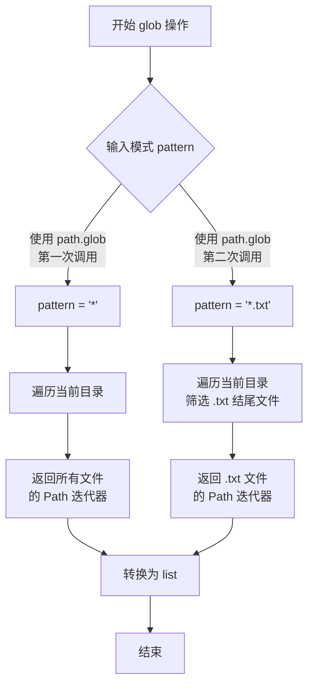

#### 带注释源码

```python
import argparse
import json
import pathlib


parser = argparse.ArgumentParser()
parser.add_argument(
    "--path",
    type=str,
    required=True,
    help="Path to folder with image-text pairs.",
)
parser.add_argument("--caption_column", type=str, default="prompt", help="Name of caption column.")
args = parser.parse_args()

# 创建 Path 对象
path = pathlib.Path(args.path)
if not path.exists():
    raise RuntimeError(f"`--path` '{args.path}' does not exist.")

# 第一次调用 glob：获取目录下的所有文件
# pattern = "*" 匹配当前目录下的所有文件和子目录（仅一层）
all_files = list(path.glob("*"))

# 第二次调用 glob：获取所有 .txt 文本文件
# pattern = "*.txt" 匹配所有以 .txt 结尾的文件
captions = list(path.glob("*.txt"))

# 从所有文件中减去文本文件，得到可能的图片文件
images = set(all_files) - set(captions)
# 构建文件名（不含扩展名）到 Path 对象的字典
images = {image.stem: image for image in images}

# 配对文本文件和对应的图片文件（基于文件名匹配）
caption_image = {caption: images.get(caption.stem) for caption in captions if images.get(caption.stem)}

# 元数据文件路径
metadata = path.joinpath("metadata.jsonl")

# 写入 JSONL 格式的元数据文件
with metadata.open("w", encoding="utf-8") as f:
    for caption, image in caption_image.items():
        # 读取文本文件内容作为 caption
        caption_text = caption.read_text(encoding="utf-8")
        # 写入 JSON 记录：包含图片文件名和 caption 列
        json.dump({"file_name": image.name, args.caption_column: caption_text}, f)
        f.write("\n")
```


## 一段话描述

该代码是一个命令行数据处理工具，用于将图像文件与对应的文本描述（caption）文件配对，生成符合特定格式要求的 `metadata.jsonl` 文件，以便于机器学习数据集的加载和处理。

## 文件的整体运行流程

```
开始
  ↓
解析命令行参数 (--path, --caption_column)
  ↓
验证路径是否存在 ──否──→ 抛出 RuntimeError
  ↓ 是
  ↓
扫描目录下所有文件
  ↓
分离 caption 文件(.txt) 和 其他文件(图像)
  ↓
建立 caption 与图像的映射关系
  ↓
打开/创建 metadata.jsonl 文件
  ↓
遍历配对结果，写入 JSONL 格式数据
  ↓
结束
```

## 关键组件信息

| 名称 | 一句话描述 |
|------|-----------|
| `argparse` | 命令行参数解析库，用于接收用户输入的路径和列名参数 |
| `pathlib.Path` | 面向对象的文件系统路径操作工具，提供跨平台路径处理能力 |
| `json` | JSON 序列化模块，用于生成符合要求的 JSONL 记录 |
| `all_files` | 目录下所有文件的集合 |
| `captions` | 所有 `.txt` 文本描述文件列表 |
| `images` | 以文件名（不含扩展名）为键的图像文件字典 |
| `caption_image` | caption 文件与对应图像文件的映射字典 |

## 潜在的技术债务或优化空间

1. **缺少错误处理机制**：文件读取、路径操作等关键步骤缺少异常捕获，可能导致程序崩溃
2. **内存占用问题**：`all_files` 和 `images` 在处理大型目录时会占用较多内存
3. **文件类型过滤不精确**：使用集合差集过滤图像文件不够精确，可能误包含非图像文件
4. **缺少日志输出**：没有进度提示，用户无法感知程序执行状态
5. **硬编码编码格式**：多处使用 `utf-8` 硬编码，缺乏灵活性
6. **不支持子目录递归**：只能处理当前目录，无法递归处理子目录
7. **命令行参数可扩展性不足**：缺乏更多配置选项（如输出文件名、文件过滤规则等）

## 其它项目

### 设计目标与约束
- **目标**：将图像-caption配对转换为JSONL元数据格式
- **约束**：caption文件必须为`.txt`格式，且文件名（不含扩展名）必须与对应图像文件名一致
- **输入**：包含图像文件和`.txt`caption文件的目录
- **输出**：名为`metadata.jsonl`的文件，每行包含`file_name`和指定列名的caption文本

### 错误处理与异常设计
- 仅在路径不存在时抛出 `RuntimeError`，其他错误（如文件读取失败、编码错误）会直接向上传播
- 缺乏对空目录、无效文件等边界情况的友好处理

### 数据流与状态机
1. **初始化状态**：命令行参数加载完成
2. **验证状态**：检查目标路径存在性
3. **扫描状态**：枚举目录文件并分类
4. **配对状态**：建立caption-image映射关系
5. **输出状态**：写入JSONL文件

### 外部依赖与接口契约
- 依赖标准库：`argparse`、`json`、`pathlib`
- 输入接口：命令行参数 `--path`（必需）和 `--caption_column`（可选，默认"prompt"）
- 输出接口：生成 `metadata.jsonl` 文件，每行为JSON对象，格式为 `{"file_name": "...", "<caption_column>": "..."}`

---

### `main` (脚本入口)

脚本的主执行流程，整合所有逻辑步骤

参数：无

返回值：无（直接写入文件）

#### 流程图

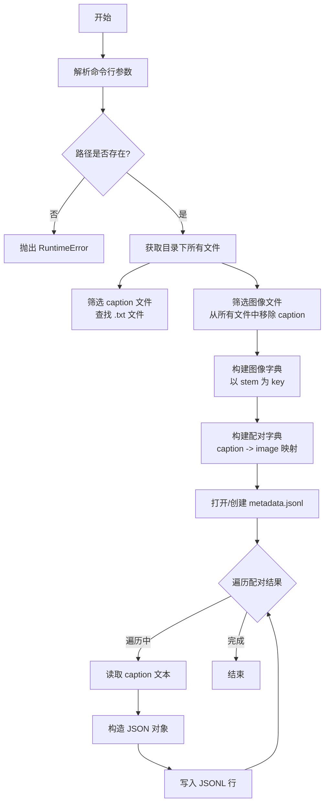

#### 带注释源码

```python
# 导入标准库
import argparse    # 命令行参数解析
import json        # JSON 数据处理
import pathlib     # 面向对象路径操作

# ==========================================
# 第一步：定义命令行参数
# ==========================================
# 创建参数解析器
parser = argparse.ArgumentParser()

# 添加 --path 参数：指定图像和caption所在的文件夹路径（必需）
parser.add_argument(
    "--path",
    type=str,
    required=True,
    help="Path to folder with image-text pairs.",
)

# 添加 --caption_column 参数：指定输出JSON中caption的字段名（可选，默认"prompt"）
parser.add_argument(
    "--caption_column",
    type=str,
    default="prompt",
    help="Name of caption column."
)

# 解析命令行参数
args = parser.parse_args()

# ==========================================
# 第二步：验证路径有效性
# ==========================================
# 将字符串路径转换为 Path 对象
path = pathlib.Path(args.path)

# 检查路径是否存在，不存在则抛出异常
if not path.exists():
    raise RuntimeError(f"`--path` '{args.path}' does not exist.")

# ==========================================
# 第三步：扫描并分类文件
# ==========================================
# 获取目录下所有文件
all_files = list(path.glob("*"))

# 筛选出所有 .txt caption 文件
captions = list(path.glob("*.txt"))

# 筛选出图像文件（所有文件减去caption文件）
# 使用集合差集操作，然后转换为以stem为key的字典
images = set(all_files) - set(captions)
images = {image.stem: image for image in images}

# 构建 caption 与 image 的配对映射
# 只保留有对应图像的 caption（避免孤立的caption文件）
caption_image = {
    caption: images.get(caption.stem) 
    for caption in captions 
    if images.get(caption.stem)
}

# ==========================================
# 第四步：生成 metadata.jsonl 文件
# ==========================================
# 定义输出文件路径
metadata = path.joinpath("metadata.jsonl")

# 打开文件进行写入（utf-8编码）
with metadata.open("w", encoding="utf-8") as f:
    # 遍历每个 caption-image 配对
    for caption, image in caption_image.items():
        # 读取 caption 文本内容
        caption_text = caption.read_text(encoding="utf-8")
        
        # 构建 JSON 对象：包含文件名和指定列名的 caption
        record = {
            "file_name": image.name,      # 图像文件名
            args.caption_column: caption_text  # caption 内容
        }
        
        # 写入 JSON 字符串并换行
        json.dump(record, f)
        f.write("\n")
```


### `{脚本整体}` - `image_caption_mapper.py`

该脚本是一个命令行工具，用于将图像文件与对应的文本描述（caption）文件配对，并将配对信息以 JSONL 格式写入 `metadata.jsonl` 文件，供机器学习数据集处理使用。

参数：

-  `path`：`str`，输入文件夹路径，包含图像文件和对应的 .txt 描述文件
-  `caption_column`：`str`，元数据中 caption 字段的名称，默认为 "prompt"

返回值：`None`，脚本直接写入文件，无返回值

#### 流程图

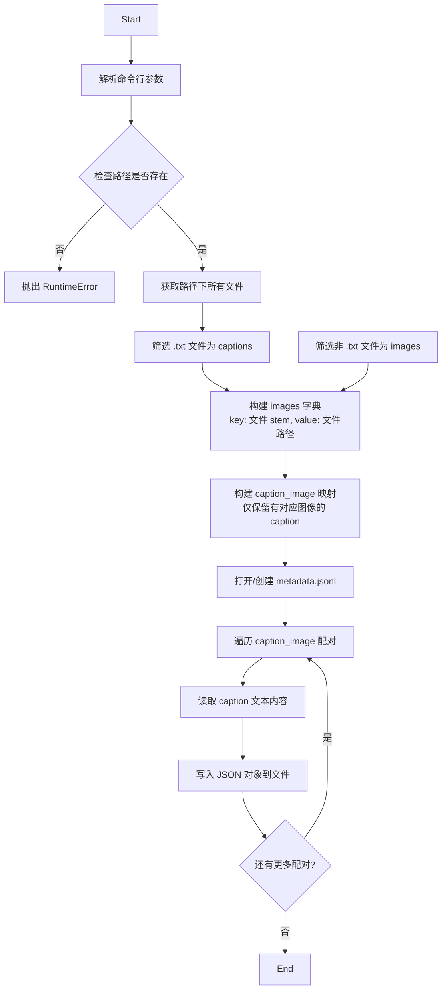

#### 带注释源码

```python
# 导入命令行参数解析模块
import argparse
# 导入 JSON 处理模块
import json
# 导入路径处理模块
import pathlib


# 创建命令行参数解析器
parser = argparse.ArgumentParser()
# 添加 --path 参数：必填，指定图像和 caption 文件所在的文件夹路径
parser.add_argument(
    "--path",
    type=str,
    required=True,
    help="Path to folder with image-text pairs.",
)
# 添加 --caption_column 参数：可选，指定 caption 列名，默认为 "prompt"
parser.add_argument("--caption_column", type=str, default="prompt", help="Name of caption column.")
# 解析命令行参数
args = parser.parse_args()

# 将路径字符串转换为 Path 对象
path = pathlib.Path(args.path)
# 检查指定路径是否存在，不存在则抛出运行时错误
if not path.exists():
    raise RuntimeError(f"`--path` '{args.path}' does not exist.")

# 获取路径下的所有文件
all_files = list(path.glob("*"))
# 筛选出所有 .txt 文件作为 captions
captions = list(path.glob("*.txt"))
# 从所有文件中减去 caption 文件，得到图像文件集合
images = set(all_files) - set(captions)
# 将图像文件转换为字典，key 为文件 stem（不含扩展名的文件名），value 为文件路径
images = {image.stem: image for image in images}
# 构建 caption 与图像的映射字典，只保留有对应图像的 caption
caption_image = {caption: images.get(caption.stem) for caption in captions if images.get(caption.stem)}

# 构建 metadata.jsonl 文件路径
metadata = path.joinpath("metadata.jsonl")

# 以写入模式打开 metadata 文件，使用 UTF-8 编码
with metadata.open("w", encoding="utf-8") as f:
    # 遍历每个 caption 和对应图像的配对
    for caption, image in caption_image.items():
        # 读取 caption 文件的文本内容
        caption_text = caption.read_text(encoding="utf-8")
        # 构建 JSON 对象，包含图像文件名和 caption 字段
        json.dump({"file_name": image.name, args.caption_column: caption_text}, f)
        # 写入换行符，每个 JSON 对象占一行
        f.write("\n")
```

---

## 完整设计文档

### 1. 一段话描述

该脚本是一个命令行数据处理工具，用于将图像文件与对应的文本描述文件（.txt）进行配对，并将配对结果以 JSONL（JSON Lines）格式输出到 `metadata.jsonl` 文件中，常用于机器学习数据集的预处理流程。

### 2. 文件的整体运行流程

1. **参数解析**：通过 `argparse` 解析 `--path`（必需）和 `--caption_column`（可选）两个命令行参数
2. **路径验证**：检查指定的文件夹路径是否存在，不存在则抛出 `RuntimeError`
3. **文件扫描**：获取文件夹下所有文件，区分 `.txt` 文本文件（captions）和其他文件（images）
4. **映射构建**：建立 caption 文件与图像文件的对应关系，仅保留成功配对的记录
5. **元数据写入**：遍历配对结果，读取 caption 文本内容，以 JSONL 格式写入 `metadata.jsonl`

### 3. 类的详细信息

本文件为脚本形式，未定义任何类。

### 4. 全局变量详细信息

| 名称 | 类型 | 描述 |
|------|------|------|
| `parser` | `argparse.ArgumentParser` | 命令行参数解析器实例 |
| `args` | `Namespace` | 解析后的命令行参数对象 |
| `path` | `pathlib.Path` | 输入文件夹的 Path 对象 |
| `all_files` | `list[Path]` | 文件夹下所有文件的列表 |
| `captions` | `list[Path]` | 所有 .txt 描述文件的列表 |
| `images` | `set[Path]` / `dict[str, Path]` | 图像文件集合/字典 |
| `caption_image` | `dict[Path, Path]` | caption 与图像文件的映射字典 |
| `metadata` | `pathlib.Path` | 输出文件 metadata.jsonl 的路径 |
| `caption_text` | `str` | 读取的 caption 文件文本内容 |
| `f` | `TextIOWrapper` | 写入模式的文件对象 |

### 5. 关键组件信息

| 组件名称 | 一句话描述 |
|----------|------------|
| `argparse` | 命令行参数解析库，用于处理用户输入的路径和选项 |
| `pathlib.Path` | 面向对象的文件路径操作类，提供跨平台路径处理能力 |
| `json.dump()` | 将 Python 对象序列化为 JSON 格式并写入文件 |
| JSONL 格式 | 每行一个 JSON 对象的轻量级数据交换格式 |

### 6. 潜在的技术债务或优化空间

1. **缺乏日志记录**：没有使用日志框架，错误信息仅通过异常和 `print` 输出，生产环境下难以追踪问题
2. **文件过滤逻辑简单**：仅通过扩展名 `.txt` 过滤 caption，无法处理大小写变体（如 `.TXT`）或其他文本格式
3. **图像文件识别不精确**：通过排除 `.txt` 文件来识别图像文件，可能误包含其他非图像文件（如 `.json`、`.csv`）
4. **内存占用**：使用 `list(path.glob("*"))` 将所有文件加载到内存，大型文件夹可能导致内存问题
5. **缺乏配置灵活性**：硬编码了某些逻辑（如文件扩展名匹配），扩展性不足
6. **错误处理不足**：未处理文件读取失败、编码错误等异常情况

### 7. 其它项目

#### 设计目标与约束
- **目标**：将图像-文本配对转换为标准化的 metadata.jsonl 格式
- **约束**：
  - 输入路径必须存在且为目录
  - caption 文件必须为 `.txt` 格式
  - 图像文件名（不含扩展名）必须与 caption 文件名（不含扩展名）完全匹配

#### 错误处理与异常设计
- 路径不存在时抛出 `RuntimeError`
- 未对文件读取、编码转换等操作进行异常捕获
- JSON 序列化失败会直接抛出异常

#### 数据流与状态机
```
输入文件夹
    ↓
扫描所有文件 → 分离 captions (.txt) 和 images (非 .txt)
    ↓
构建配对映射（以文件 stem 为键）
    ↓
遍历配对 → 读取 caption 文本
    ↓
写入 JSONL 格式元数据文件
```

#### 外部依赖与接口契约
- **依赖**：Python 标准库（`argparse`, `json`, `pathlib`）
- **输入**：包含图像文件和对应 .txt 文件的文件夹
- **输出**：同目录下的 `metadata.jsonl` 文件，每行为 `{"file_name": "<图像文件名>", "<caption_column>": "<caption文本>"}`


### 全局流程

该脚本是一个命令行工具，用于将图像文件与对应的文本描述（caption）配对，并生成符合特定格式的 metadata.jsonl 文件，供多模态模型训练使用。

#### 流程图

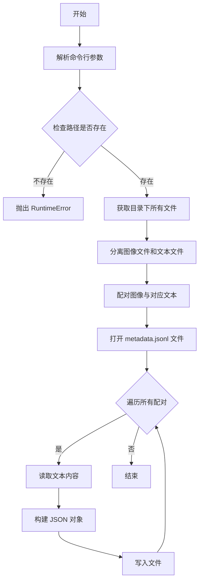

#### 带注释源码

```python
import argparse  # 命令行参数解析库
import json  # JSON 序列化库
import pathlib  # 路径处理库


# 创建命令行参数解析器
parser = argparse.ArgumentParser()
# 添加 --path 参数：图像-文本对文件夹路径
parser.add_argument(
    "--path",
    type=str,
    required=True,
    help="Path to folder with image-text pairs.",
)
# 添加 --caption_column 参数：caption 列名
parser.add_argument("--caption_column", type=str, default="prompt", help="Name of caption column.")
# 解析命令行参数
args = parser.parse_args()

# 将路径字符串转换为 Path 对象
path = pathlib.Path(args.path)
# 验证路径是否存在，不存在则抛出异常
if not path.exists():
    raise RuntimeError(f"`--path` '{args.args}' does not exist.")

# 获取目录下的所有文件
all_files = list(path.glob("*"))
# 获取所有 .txt 文本文件（作为 caption）
captions = list(path.glob("*.txt"))
# 计算图像文件集合（所有文件减去文本文件）
images = set(all_files) - set(captions)
# 将图像文件转换为以 stem（不含扩展名的文件名）为键的字典
images = {image.stem: image for image in images}
# 配对文本文件和对应图像文件（通过 stem 匹配）
caption_image = {caption: images.get(caption.stem) for caption in captions if images.get(caption.stem)}

# 构建 metadata.jsonl 文件路径
metadata = path.joinpath("metadata.jsonl")

# 以写入模式打开文件
with metadata.open("w", encoding="utf-8") as f:
    # 遍历每个配对
    for caption, image in caption_image.items():
        # 读取文本文件内容作为 caption
        caption_text = caption.read_text(encoding="utf-8")
        # 构建 JSON 对象：包含图像文件名和 caption
        json.dump({"file_name": image.name, args.caption_column: caption_text}, f)
        # 写入换行符
        f.write("\n")
```

---

### `argparse.ArgumentParser`

命令行参数解析器类，用于定义和解析程序参数。

参数：

- `description`：程序描述信息（本代码中未设置）

返回值：`ArgumentParser`，返回参数解析器实例

#### 带注释源码

```python
parser = argparse.ArgumentParser()
```

---

### `parser.add_argument`

向解析器添加命令行参数定义。

参数：

- `name or flags`：参数名称或标志（如 `--path`）
- `type`：参数类型（本代码中为 `str`）
- `required`：是否为必需参数（本代码中 `--path` 为 `True`）
- `help`：参数帮助说明

返回值：`None`

#### 带注释源码

```python
parser.add_argument(
    "--path",
    type=str,
    required=True,
    help="Path to folder with image-text pairs.",
)
```

---

### `path.glob`

获取目录下匹配特定模式的文件。

参数：

- `pattern`：匹配模式（本代码中 `*` 匹配所有文件，`*.txt` 匹配文本文件）

返回值：`Generator`，生成匹配的文件路径

#### 带注释源码

```python
all_files = list(path.glob("*"))
captions = list(path.glob("*.txt"))
```

---

### `caption.read_text`

读取文本文件内容。

参数：

- `encoding`：文件编码（本代码中为 `utf-8`）

返回值：`str`，文件文本内容

#### 带注释源码

```python
caption_text = caption.read_text(encoding="utf-8")
```

---

### `json.dump`

将 Python 对象序列化为 JSON 格式并写入文件。

参数：

- `obj`：要序列化的 Python 对象（本代码中为字典）
- `fp`：文件对象

返回值：`None`

#### 带注释源码

```python
json.dump({"file_name": image.name, args.caption_column: caption_text}, f)
```

---

## 关键组件信息

| 组件名称 | 一句话描述 |
|---------|-----------|
| `argparse` | 命令行参数解析库，用于定义和解析程序参数 |
| `pathlib.Path` | 面向对象的文件系统路径处理类 |
| `json` | JSON 序列化和反序列化库 |
| `metadata.jsonl` | 输出文件，每行包含一个图像-文本对的 JSON 对象 |

---

## 潜在的技术债务或优化空间

1. **缺少错误处理**：文本文件读取失败时程序会直接崩溃
2. **图像文件类型过滤不精确**：使用集合差集可能误包含非图像文件（如 .py, .json 等）
3. **内存使用**：一次性加载所有文件列表，大目录可能导致内存问题
4. **日志缺失**：无执行过程日志，难以调试和追踪
5. **扩展名硬编码**：仅支持 `.txt` 作为 caption 文件，可配置化

---

## 其它项目

### 设计目标与约束

- **目标**：将图像-文本对转换为训练用 metadata.jsonl 格式
- **约束**：
  - 文本文件与图像文件必须同名（stem 匹配）
  - 图像文件可为任意扩展名
  - caption 文件必须为 `.txt` 扩展名

### 错误处理与异常设计

- 路径不存在时抛出 `RuntimeError`
- 文本文件读取失败会抛出 `FileNotFoundError` 或 `UnicodeDecodeError`
- 未找到对应图像的文本文件会被跳过

### 数据流与状态机

```
输入文件夹
    │
    ▼
[获取所有文件] ──glob("*")──► all_files
    │
    ▼
[分离文件类型] ──glob("*.txt")──► captions
    │                      │
    │                      └──► images (set 差集)
    │
    ▼
[配对文件] ──stem 匹配 ──► caption_image dict
    │
    ▼
[生成输出] ──JSONL 写入 ──► metadata.jsonl
```

### 外部依赖与接口契约

- **输入**：文件夹路径（`--path`），包含同名图像和文本文件
- **输出**：`metadata.jsonl` 文件，每行格式：`{"file_name": "<image>", "<column>": "<caption>"}`
- **依赖**：Python 标准库（无需第三方包）


### `image.stem`

获取路径的文件名部分（不包括文件扩展名）。在当前代码中，`image.stem` 用于将图片文件名（不含扩展名）作为字典的键，实现图片文件与对应的 caption 文件的配对。

参数：无（`stem` 是 `pathlib.Path` 对象的属性，不是函数/方法）

返回值：`str`，返回文件名（不含扩展名），例如对于文件 `photo.jpg`，返回 `photo`。

#### 流程图

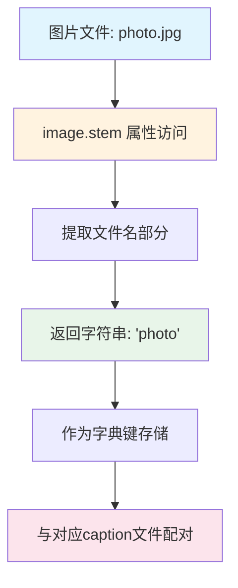

#### 带注释源码

```python
# 代码中使用 image.stem 的上下文：

# 1. 首先获取路径下所有文件
all_files = list(path.glob("*"))

# 2. 分离出 .txt 文件（captions）和图片文件
captions = list(path.glob("*.txt"))
images = set(all_files) - set(captions)

# 3. 使用 image.stem 作为键，构建图片字典
#    image 是 pathlib.Path 对象
#    .stem 属性返回文件名不含扩展名的部分
#    例如：image = Path("photo.jpg")，则 image.stem = "photo"
images = {image.stem: image for image in images}
#    结果示例：{"photo": PosixPath("photo.jpg"), "landscape": PosixPath("landscape.png")}

# 4. 使用 caption 文件的 stem 与图片字典的键匹配
#    caption.stem 同样返回不含扩展名的文件名
#    这样可以找到与 caption 文件同名的图片文件
caption_image = {
    caption: images.get(caption.stem) 
    for caption in captions 
    if images.get(caption.stem)
}
#    匹配逻辑：如果 caption 文件名（不含 .txt）的 stem 
#    与图片文件的 stem 相同，则配对在一起

# 示例：
#   文件夹中有: photo.jpg, photo.txt, landscape.png
#   images = {"photo": photo.jpg, "landscape": landscape.png}
#   captions = [photo.txt]
#   caption_image = {photo.txt: photo.jpg}  # 因为 photo.txt.stem == "photo"
```


### 主脚本（`__main__`）

该脚本从命令行参数指定图像和字幕文件夹，遍历文件夹中的图像文件和对应的字幕文件（.txt），将每对图像和字幕文本配对，并生成一个包含文件名和字幕内容的 JSONL 格式元数据文件。

参数：

-  `path`：`str`，文件夹路径，通过 `--path` 命令行参数指定。
-  `caption_column`：`str`，字幕列名，通过 `--caption_column` 命令行参数指定，默认为 "prompt"。

返回值：无返回值，但会在指定文件夹下生成 `metadata.jsonl` 文件。

#### 流程图

```mermaid
graph TD
    A[开始] --> B[解析命令行参数]
    B --> C{检查路径是否存在}
    C -->|否| D[抛出 RuntimeError]
    C -->|是| E[列出所有文件]
    E --> F[筛选字幕文件 .txt]
    E --> G[筛选图像文件]
    H[构建图像字典: {stem: image_path}]
    G --> H
    I[配对字幕和图像: caption.stem 匹配 image stem]
    F --> I
    I --> J{存在配对}
    J -->|否| K[跳过]
    J -->|是| L[打开 metadata.jsonl]
    L --> M[遍历配对]
    M --> N[读取字幕文本]
    N --> O[写入 JSON 对象]
    O --> M
    M --> P[结束]
```

#### 带注释源码

```python
import argparse
import json
import pathlib


# 创建命令行参数解析器
parser = argparse.ArgumentParser()
parser.add_argument(
    "--path",
    type=str,
    required=True,
    help="Path to folder with image-text pairs.",
)
parser.add_argument("--caption_column", type=str, default="prompt", help="Name of caption column.")
# 解析命令行参数
args = parser.parse_args()

# 将路径转换为 Path 对象
path = pathlib.Path(args.path)
# 检查路径是否存在，不存在则抛出异常
if not path.exists():
    raise RuntimeError(f"`--path` '{args.path}' does not exist.")

# 列出路径下所有文件
all_files = list(path.glob("*"))
# 筛选出所有 .txt 文件作为字幕文件
captions = list(path.glob("*.txt"))
# 从所有文件中减去字幕文件，得到图像文件
images = set(all_files) - set(captions)
# 将图像文件转换为字典，键为文件名 stem（不含扩展名），值为完整路径
images = {image.stem: image for image in images}
# 配对字幕和图像：遍历字幕文件，对于每个字幕文件，如果存在匹配的图像文件（基于 stem），则配对
caption_image = {caption: images.get(caption.stem) for caption in captions if images.get(caption.stem)}

# 元数据文件路径
metadata = path.joinpath("metadata.jsonl")

# 打开元数据文件，写入模式，UTF-8 编码
with metadata.open("w", encoding="utf-8") as f:
    # 遍历配对的字幕和图像
    for caption, image in caption_image.items():
        # 读取字幕文本内容
        caption_text = caption.read_text(encoding="utf-8")
        # 构建 JSON 对象：包含图像文件名和字幕文本（使用指定的列名）
        json.dump({"file_name": image.name, args.caption_column: caption_text}, f)
        # 写入换行符
        f.write("\n")
```

注意：代码中没有自定义函数或方法，所有逻辑均在顶层执行。`caption.stem` 是 `pathlib.Path` 对象的属性，用于获取文件名（不含扩展名）。任务要求提取的 "caption.stem" 即指代此属性操作。


### `Path.joinpath`

该方法用于将一个或多个路径部分与当前 `Path` 对象连接，生成一个新的路径对象，是 `pathlib.Path` 类用于路径拼接的核心方法。

参数：

- `*paths`：`str` 或 `Path`，可变数量的路径部分，这些部分将被连接到基础路径上。支持字符串或另一个 Path 对象。

返回值：`Path`，返回一个新的 `Path` 对象，表示连接后的完整路径。

#### 流程图

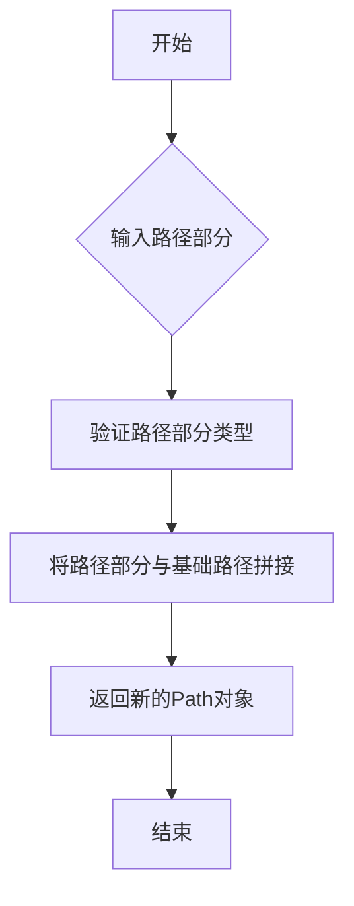

#### 带注释源码

```python
# path 是通过 pathlib.Path(args.path) 创建的 Path 对象
# 例如：path = pathlib.Path("/some/directory")

# 调用 joinpath 方法将 "metadata.jsonl" 连接到 path 后面
# 相当于 os.path.join(path, "metadata.jsonl")
metadata = path.joinpath("metadata.jsonl")

# 在本代码中的实际用途：
# 创建 metadata.jsonl 文件的完整路径
# 假设 path = "/data/images"
# 则 metadata = Path("/data/images/metadata.jsonl")

# 后续使用：
# with metadata.open("w", encoding="utf-8") as f:
#     # 打开 metadata 路径对应的文件进行写入
#     ...
```


### `pathlib.Path.open`

这是 `pathlib.Path` 类的 `open` 方法，用于打开路径指向的文件并返回文件对象，以便进行读写操作。

参数：

- `mode`：`str`，文件打开模式，此处为 `"w"`（写入模式，若文件已存在则覆盖）
- `encoding`：`str`，文件编码格式，此处为 `"utf-8"`

返回值：`TextIOWrapper`，返回可迭代的文本文件对象，用于写入 JSONL 格式的元数据

#### 流程图

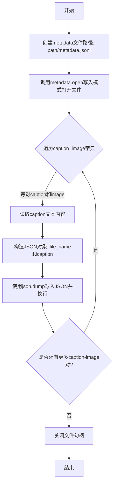

#### 带注释源码

```python
# metadata是一个Path对象，指向 {path}/metadata.jsonl
metadata = path.joinpath("metadata.jsonl")

# 调用Path.open方法打开文件，返回文件对象f
# mode="w": 以写入模式打开，会覆盖已有文件
# encoding="utf-8": 使用UTF-8编码读写文本
with metadata.open("w", encoding="utf-8") as f:
    # 遍历所有caption文件和对应image的配对
    for caption, image in caption_image.items():
        # 读取caption文件的内容（文本格式）
        caption_text = caption.read_text(encoding="utf-8")
        
        # 构建字典，包含image文件名和caption文本
        # 字段名由args.caption_column指定（默认为"prompt"）
        data = {"file_name": image.name, args.caption_column: caption_text}
        
        # 使用json.dump将字典序列化为JSON写入文件
        # 不换行，确保每行是一个完整的JSON对象
        json.dump(data, f)
        
        # 手动写入换行符，形成JSONL格式（每行一个JSON）
        f.write("\n")
# with语句块结束时自动关闭文件对象
```


### `Path.read_text`

读取指定路径的文本文件内容并返回为字符串，是 `pathlib.Path` 类的内置方法。

参数：

- `encoding`：`str`，指定读取文件时使用的字符编码（示例中为 `"utf-8"`）

返回值：`str`，返回文本文件的全部内容

#### 流程图

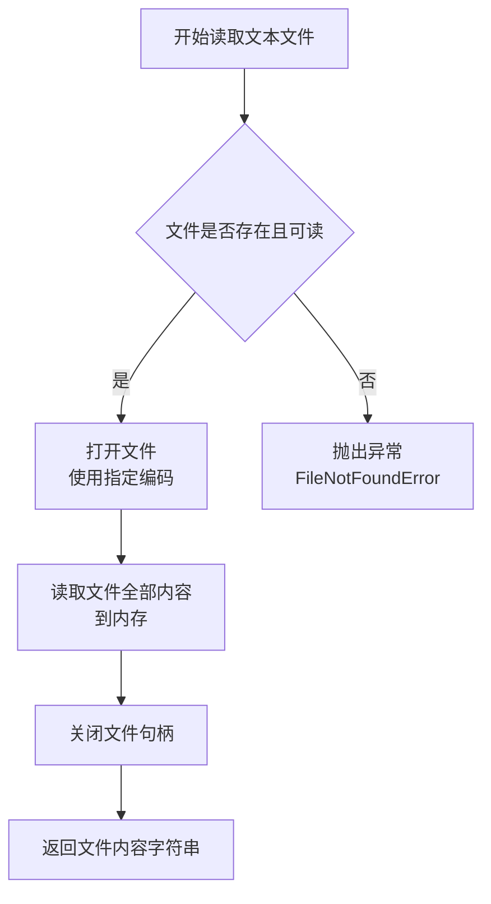

#### 带注释源码

```python
# caption 是 pathlib.Path 对象，指向一个 .txt 文件
# 调用 Path 类的 read_text 方法读取文件内容
caption_text = caption.read_text(encoding="utf-8")

# 内部实现逻辑（简化版，pathlib.Path.read_text 实际实现）:
# def read_text(self, encoding=None, errors=None):
#     with self.open(encoding=encoding, errors=errors) as f:
#         return f.read()
#
# 1. self.open(encoding="utf-8"): 打开文件，指定 UTF-8 编码
# 2. f.read(): 读取文件的全部内容并返回字符串
# 3. with 语句自动管理文件关闭
```


### `json.dump`

`json.dump` 是 Python 标准库中的函数，用于将 Python 对象（字典）序列化为 JSON 格式并写入文件对象。在此代码中，它将包含图像文件名和对应文本描述的字典写入 metadata.jsonl 文件的每一行。

参数：

- `obj`：`dict`，要序列化的 Python 字典对象，包含 `{"file_name": image.name, args.caption_column: caption_text}` 结构
- `fp`：`file object`，已打开的文件对象，用于写入 JSON 数据（通过 `metadata.open("w", encoding="utf-8")` 打开）

返回值：`None`，该函数直接写入文件，不返回任何值

#### 流程图

```mermaid
flowchart TD
    A[开始写入 metadata.jsonl] --> B{遍历 caption_image 字典}
    B -->|每次迭代| C[读取 caption 文本内容]
    C --> D[构建 JSON 对象字典<br/>{file_name: image.name<br/>args.caption_column: caption_text}]
    D --> E[调用 json.dump 序列化字典]
    E --> F[写入文件对象 f]
    F --> G[写入换行符 \n]
    G --> H{还有更多 caption-image 对?}
    H -->|是| B
    H -->|否| I[结束]
```

#### 带注释源码

```python
# json.dump 是 Python json 模块的核心函数之一
# 在本脚本中用于将图像-文本配对信息序列化为 JSON 格式

# 完整调用上下文：
with metadata.open("w", encoding="utf-8") as f:  # 打开文件用于写入
    for caption, image in caption_image.items():  # 遍历所有匹配的图像-文本对
        caption_text = caption.read_text(encoding="utf-8")  # 读取文本描述内容
        # 调用 json.dump 将字典序列化为 JSON 并写入文件
        # 参数1: 要序列化的字典对象 {"file_name": ..., "caption列名": ...}
        # 参数2: 文件对象 f
        json.dump(
            {"file_name": image.name, args.caption_column: caption_text},  # 要写入的字典
            f  # 目标文件对象
        )
        f.write("\n")  # 写入换行符形成 JSONL 格式
```

---

## 整体设计文档

### 核心功能概述

该脚本是一个命令行数据预处理工具，用于将图像文件夹中的图像文件与对应的文本描述（caption）文件进行配对，并将配对结果以 JSONL（JSON Lines）格式写入 `metadata.jsonl` 文件，常用于机器学习数据集的标注文件生成。

### 文件整体运行流程

```
┌─────────────────────────────────────────────────────────────┐
│                    程序入口与参数解析                         │
└─────────────────────────────────────────────────────────────┘
                              │
                              ▼
┌─────────────────────────────────────────────────────────────┐
│              验证路径存在性                                  │
│         (path.exists() 检查)                                │
└─────────────────────────────────────────────────────────────┘
                              │
                              ▼
┌─────────────────────────────────────────────────────────────┐
│              扫描文件夹并分类文件                             │
│    - 获取所有文件 (path.glob("*"))                           │
│    - 分离 .txt 文件 (captions)                               │
│    - 分离其他文件 (images)                                   │
└─────────────────────────────────────────────────────────────┘
                              │
                              ▼
┌─────────────────────────────────────────────────────────────┐
│              构建图像-文本映射关系                            │
│    - 通过文件名(stem)匹配                                    │
│    - 只保留有对应图像的caption                               │
└─────────────────────────────────────────────────────────────┘
                              │
                              ▼
┌─────────────────────────────────────────────────────────────┐
│              写入 metadata.jsonl                             │
│    - 遍历配对                                                │
│    - 使用 json.dump 序列化并写入                             │
└─────────────────────────────────────────────────────────────┘
```

### 关键组件信息

| 组件名称 | 一句话描述 |
|---------|-----------|
| `argparse` | 命令行参数解析库，用于处理 `--path` 和 `--caption_column` 参数 |
| `pathlib.Path` | 面向对象的文件路径操作类，用于路径管理和文件扫描 |
| `json.dump` | Python 标准库函数，将 Python 对象序列化为 JSON 格式写入文件 |
| `path.glob()` | 文件模式匹配方法，用于扫描目录下的文件 |

### 潜在的技术债务或优化空间

1. **缺少错误处理**：文件读取操作（`read_text`）未捕获 `IOError` 异常，若文件编码错误或读取失败会导致程序崩溃
2. **文件名匹配逻辑简单**：仅使用 `stem`（不含扩展名的文件名）匹配，可能产生误匹配（如 `image.jpg` 和 `image.png` 共存时）
3. **内存占用**：使用 `list(path.glob("*"))` 将所有文件加载到内存，大型目录会影响性能
4. **扩展名硬编码**：图像文件通过集合差集推断，未显式定义支持的图像格式，可能包含非图像文件
5. **缺少日志记录**：没有进度提示或日志输出，难以追踪大规模文件处理进度

### 其它项目

#### 设计目标与约束

- **目标**：将图像-文本对转换为标准化的 metadata.jsonl 格式
- **输入约束**：
  - `--path` 必须指向存在的目录
  - caption 文件必须为 `.txt` 格式
  - 图像文件与 caption 文件需同名（扩展名不同）
- **输出格式**：JSONL（每行一个独立 JSON 对象）

#### 错误处理与异常设计

| 错误场景 | 当前处理 |
|---------|---------|
| 路径不存在 | 抛出 `RuntimeError` 异常 |
| 文件读取失败 | 无处理（会导致程序终止） |
| JSON 序列化失败 | 无处理（会抛出 json.JSONEncodeError） |

#### 数据流与状态机

- **状态1**：参数解析状态 → 解析命令行参数
- **状态2**：路径验证状态 → 确认目录存在
- **状态3**：文件扫描状态 → 枚举并分类目录文件
- **状态4**：匹配状态 → 建立图像-caption 映射关系
- **状态5**：写入状态 → 输出 JSONL 文件

#### 外部依赖与接口契约

| 依赖模块 | 版本要求 | 用途 |
|---------|---------|-----|
| `argparse` | Python 3.2+ | 命令行参数解析 |
| `json` | Python 标准库 | JSON 序列化 |
| `pathlib` | Python 3.4+ | 面向对象路径操作 |

#### 建议改进

1. 添加 `try-except` 捕获文件读取异常
2. 显式指定支持的图像扩展名（如 `.jpg`, `.png`, `.jpeg`）
3. 添加 `--dry-run` 参数用于预览输出而不实际写入
4. 增加日志或进度条显示处理进度
5. 支持多级目录递归扫描


### `f.write`

`f.write` 是 Python 文件对象的标准方法，用于将字符串内容写入已打开的文件中。在此代码中，该方法负责将 JSON 序列化的元数据记录写入 `metadata.jsonl` 文件，每个记录后追加换行符以形成标准的 JSONL 格式。

参数：

-  `s`：`str`，要写入文件的字符串内容，在此代码中为换行符 `"\n"`

返回值：`int`，写入的字符数，表示成功写入的字符数量

#### 流程图

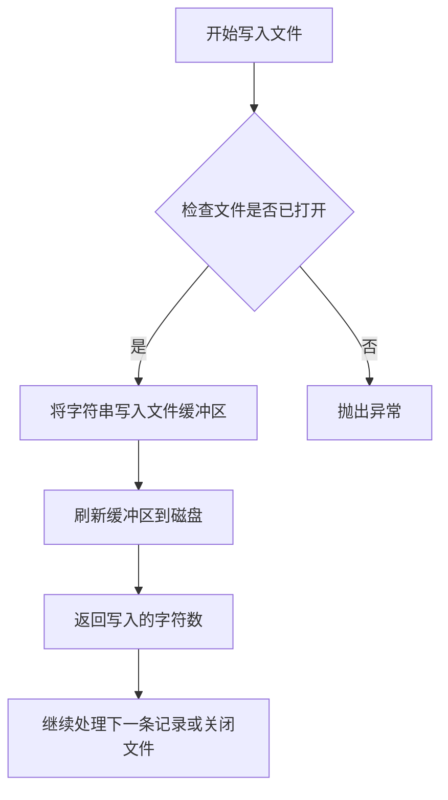

#### 带注释源码

```python
# 打开 metadata.jsonl 文件用于写入，指定 UTF-8 编码
with metadata.open("w", encoding="utf-8") as f:
    # 遍历所有 caption-image 配对
    for caption, image in caption_image.items():
        # 读取 caption 文本文件的内容
        caption_text = caption.read_text(encoding="utf-8")
        
        # 将字典序列化为 JSON 格式并写入文件 f
        # 注意：json.dump 内部也会调用 f.write 写入 JSON 字符串
        json.dump({"file_name": image.name, args.caption_column: caption_text}, f)
        
        # 在每行 JSON 记录末尾写入换行符，形成 JSONL 格式
        # 这样每行都是一个独立的 JSON 对象，便于后续逐行读取
        f.write("\n")
```


## 关键组件


### 命令行参数解析组件

使用 argparse 解析 --path（必需）和 --caption_column（默认"prompt"）两个参数，用于指定图像-文本对文件夹路径和caption列名。

### 文件系统遍历组件

使用 pathlib.Path 遍历指定目录，通过 glob("*") 获取所有文件，glob("*.txt") 获取caption文件，其余文件视为图片文件。

### 图像与Caption配对组件

通过文件stem（不含扩展名的文件名）作为key，构建images字典和caption_image映射关系，实现图片与对应caption的智能配对。

### JSONL元数据输出组件

将配对结果以JSON Lines格式写入metadata.jsonl文件，每行包含图片文件名和对应caption文本。

### 路径验证与错误处理组件

在处理前检查指定路径是否存在，不存在则抛出RuntimeError异常。


## 问题及建议


### 已知问题

-   **缺少文件编码处理**：仅使用 `utf-8` 编码读取 caption 文件，可能导致非 UTF-8 编码的 caption 文件读取失败或产生乱码
-   **文件匹配逻辑不严谨**：仅基于文件名 stem 进行匹配，未处理文件扩展名大小写差异（如 `.TXT` vs `.txt`）和特殊情况
-   **无错误处理机制**：文件读取失败（如权限问题、文件损坏）时程序直接崩溃，缺乏异常捕获和日志记录
-   **缺少输入验证**：未验证 `--caption_column` 参数是否为合法的 JSON key（如包含特殊字符、空格等）
-   **内存效率问题**：将所有文件加载到内存中（`list(path.glob("*"))`），处理大规模数据集时可能导致内存溢出
-   **不支持递归遍历**：仅处理指定文件夹根目录，不支持子目录中的 image-text 配对
-   **无日志和进度提示**：大规模文件处理时无进度反馈，难以调试和监控
-   **图片格式未验证**：未检查 images 集合中的文件是否为有效的图片格式，可能将非图片文件误认为有效文件
-   **命名冲突风险**：使用字典存储 images 时，若存在相同 stem 的文件，只会保留最后一个
-   **type hints 缺失**：整个脚本未使用类型注解，影响可维护性和 IDE 支持

### 优化建议

-   增加 `try-except` 捕获文件读取异常，记录失败文件并继续处理
-   支持多种 caption 文件编码（如 gb2312、gbk），或自动检测编码
-   添加 `--recursive` 参数支持递归遍历子目录
-   添加 `--dry-run` 参数预览处理结果而不实际写入
-   增加日志模块，记录处理进度和错误信息
-   验证 caption_column 参数的合法性
-   使用生成器模式替代一次性加载所有文件到内存
-   添加图片文件格式验证（检查文件扩展名或魔数）
-   为命令行参数添加 type hints，考虑使用 dataclass 或 TypedDict 封装配置

## 其它


### 设计目标与约束

该工具旨在将图像文件与对应的文本描述文件配对，生成符合机器学习数据集要求的metadata.jsonl文件。约束条件包括：输入文件夹必须存在且可读，输出文件固定为metadata.jsonl，caption列名可自定义默认为"prompt"，仅支持txt格式的文本文件和常见图像格式。

### 错误处理与异常设计

当指定的路径不存在时，抛出RuntimeError并附带具体路径信息。文件读取使用UTF-8编码，若编码错误会导致UnicodeDecodeError。JSON写入异常会被抛出。图像文件缺失对应的txt文件时，该配对会被跳过而非报错。

### 数据流与状态机

数据流：命令行参数解析 → 路径验证 → 文件扫描与分类 → 配对匹配 → JSONL文件写入。状态机包含三个状态：初始化（解析参数）、验证（检查路径和文件）、处理（配对并写入）。

### 外部依赖与接口契约

外部依赖：Python标准库（argparse、json、pathlib）。接口契约：命令行接口需提供--path（必需）和--caption_column（可选）参数，输出为JSON Lines格式的metadata.jsonl文件，每行包含file_name和指定的caption列名。

### 性能考虑

使用glob模式批量获取文件，字典推导式进行高效配对。内存占用与文件夹内文件数量成正比，大规模数据集建议分批处理。写入使用缓冲模式，默认行缓冲。

### 安全性考虑

路径直接来自命令行参数，建议增加路径遍历攻击防护（检查规范化后的路径）。文件读取未做大小限制，可能存在恶意大文件攻击。元数据写入直接覆盖原文件。

### 可扩展性

当前仅支持txt格式的caption文件，可扩展支持json、csv等格式。可增加输出格式选项（JSON、CSV）。可添加文件过滤选项（按扩展名、大小等）。

### 配置管理

所有配置通过命令行参数传递，无独立配置文件。caption_column名称可自定义，默认"prompt"符合主流ML数据集格式。

### 日志与监控

当前实现无日志记录，仅通过异常退出提供错误信息。建议增加日志级别控制、处理文件计数统计、进度显示等功能。

### 部署与运行环境

Python 3.6+环境即可运行，无需额外依赖。适合作为数据预处理流水线的一个环节，可集成到Shell脚本或工作流工具中。


    