# `diffusers\examples\dreambooth\test_dreambooth.py` 详细设计文档

该文件是DreamBooth训练脚本的集成测试套件，继承自ExamplesTestsAccelerate基类，用于验证DreamBooth微调stable diffusion模型的各种功能，包括基础训练、IF模型支持、检查点保存与恢复、检查点总数限制等场景。

## 整体流程

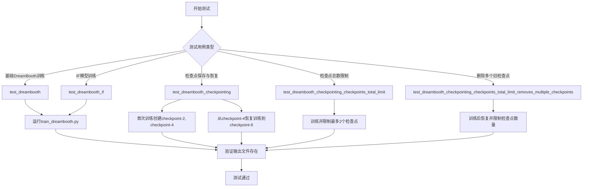

## 类结构

```
ExamplesTestsAccelerate (基类)
└── DreamBooth (测试类)
```

## 全局变量及字段


### `logger`
    
全局日志记录器，用于输出调试信息

类型：`logging.Logger`
    


### `stream_handler`
    
全局日志流处理器，用于将日志输出到标准输出

类型：`logging.StreamHandler`
    


    

## 全局函数及方法


### `run_command`

`run_command` 是一个用于在测试环境中执行命令行训练脚本的实用函数。它接收命令参数列表，调用底层的命令行执行机制来运行训练脚本（如 `train_dreambooth.py`），并返回命令执行的退出状态或输出结果。

参数：

-  `cmd`：`List[str]`，命令参数列表，通常包含启动器参数（如 `self._launch_args`）和训练脚本参数（如 `test_args`）的组合

返回值：`int`，返回命令执行的退出码（0 表示成功，非 0 表示失败）

#### 流程图

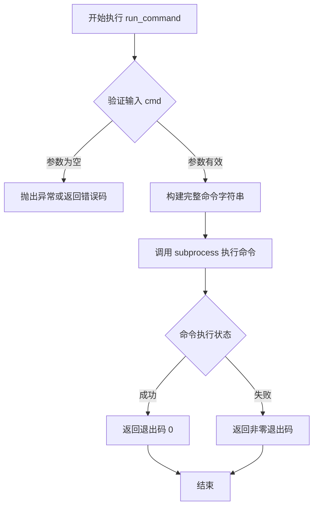

#### 带注释源码

```python
# 该函数定义位于 test_examples_utils 模块中
# 以下是基于代码使用方式的推断实现

def run_command(cmd: List[str], 
                env: Optional[Dict[str, str]] = None,
                cwd: Optional[str] = None,
                timeout: Optional[int] = None) -> int:
    """
    执行命令行命令的实用函数
    
    参数:
        cmd: 命令参数列表，例如：
            ['accelerate', 'launch', '--num_processes=1', 
             'examples/dreambooth/train_dreambooth.py', '--pretrained_model_name_or_path=...']
        env: 可选的环境变量字典
        cwd: 可选的工作目录
        timeout: 可选的命令超时时间（秒）
    
    返回:
        int: 命令执行的退出码，0 表示成功
    """
    
    # 构建完整的命令字符串
    # 将列表转换为空格分隔的字符串
    command_str = ' '.join(cmd)
    
    # 使用 subprocess 执行命令
    # subprocess.run 是 Python 3.5+ 推荐的执行命令方式
    result = subprocess.run(
        cmd,                          # 命令列表
        env=env,                      # 环境变量
        cwd=cwd,                      # 工作目录
        timeout=timeout,              # 超时时间
        capture_output=True,          # 捕获 stdout 和 stderr
        text=True,                    # 返回字符串而非字节
        check=False                   # 不自动抛出异常
    )
    
    # 记录命令输出（用于调试）
    if result.stdout:
        logger.debug(f"Command stdout: {result.stdout}")
    if result.stderr:
        logger.debug(f"Command stderr: {result.stderr}")
    
    # 返回命令的退出码
    return result.returncode
```

#### 在 DreamBooth 测试中的使用示例

```python
# 示例调用 1: 基本训练测试
run_command(self._launch_args + test_args)

# 其中 test_args 包含:
# [
#     'examples/dreambooth/train_dreambooth.py',
#     '--pretrained_model_name_or_path', 'hf-internal-testing/tiny-stable-diffusion-pipe',
#     '--instance_data_dir', 'docs/source/en/imgs',
#     '--instance_prompt', 'photo',
#     '--resolution', '64',
#     '--train_batch_size', '1',
#     '--gradient_accumulation_steps', '1',
#     '--max_train_steps', '2',
#     '--learning_rate', '5.0e-04',
#     '--scale_lr',
#     '--lr_scheduler', 'constant',
#     '--lr_warmup_steps', '0',
#     '--output_dir', '{tmpdir}'
# ]

# 示例调用 2: 带检查点恢复的训练
run_command(self._launch_args + resume_run_args)
# resume_run_args 额外包含:
# '--resume_from_checkpoint=checkpoint-4'
# '--checkpoints_total_limit=2'
```


### `logging.basicConfig`

这是 Python 标准库 `logging` 模块中的函数，用于配置根日志记录器的处理程序、格式、级别和其他设置。

参数：

- `level`：`int`（或 `logging.DEBUG`），设置日志记录的级别，在此示例中为 `logging.DEBUG`
- `format`：`str`（可选），日志输出格式
- `datefmt`：`str`（可选），日期时间格式
- `filename`：`str`（可选），日志文件名
- `filemode`：`str`（可选），文件打开模式
- `stream`：`StreamHandler`（可选），日志输出流
- `handlers`：`list`（可选），处理器列表

返回值：`None`，该函数不返回任何值。

#### 流程图

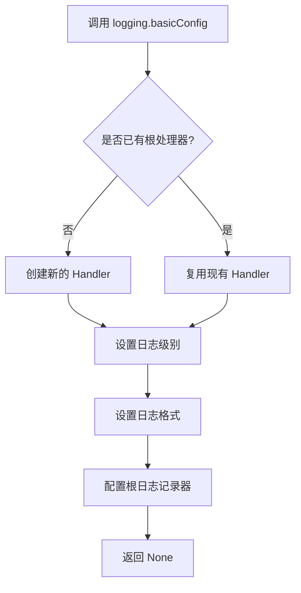

#### 带注释源码

```python
# 配置根日志记录器的处理程序、格式、级别等
# 以下是代码中实际使用的形式：
logging.basicConfig(level=logging.DEBUG)

# 详细解释：
# 1. logging.basicConfig: Python logging 模块的函数，用于基本日志配置
# 2. level=logging.DEBUG: 设置日志级别为 DEBUG，这意味着会记录所有级别的日志
#    日志级别从低到高: DEBUG < INFO < WARNING < ERROR < CRITICAL
# 3. 该函数会配置根 logger (root logger)，所有未明确指定 logger 的日志都会使用此配置

# 完整参数签名（参考官方文档）:
# logging.basicConfig(
#     *,
#     level: int,           # 日志级别
#     format: str,          # 格式字符串
#     datefmt: str,         # 日期格式
#     filename: str,       # 输出文件名（若指定则写入文件）
#     filemode: str,        # 文件模式（默认 'a'）
#     stream: IO[str],      # 输出流（若指定则输出到流）
#     handlers: list[Handler]  # 处理器列表
# )

# 注意：basicConfig 只能在第一次调用时生效，后续调用会被忽略
# 除非先调用 logging.root.handlers = [] 清除已有处理器
```


### `logging.getLogger`

获取或创建一个与指定名称关联的 logger 实例。如果未指定名称，则返回根 logger。根 logger 是所有 logger 的祖先，用于处理未由子 logger 处理的日志记录。

参数：

- `name`：`str | None`，logger 的名称，默认为 `None`。当为 `None` 时返回根 logger；可以是用点号分隔的层次化名称（如 `"myapp.submodule"`），相同名称多次调用返回同一 logger 实例。

返回值：`logging.Logger`，返回的 logger 对象，用于记录日志。

#### 流程图

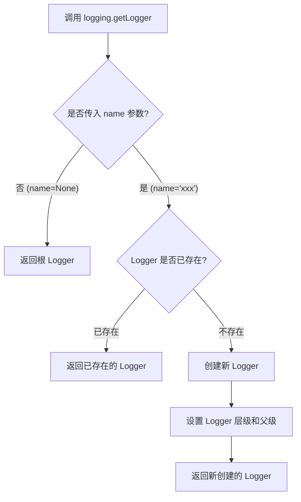

#### 带注释源码

```python
# 代码中的实际调用
logger = logging.getLogger()

# 完整函数签名（来自 Python 标准库）
# logging.getLogger(name: str | None = None) -> logging.Logger

# 实际执行流程：
# 1. 如果 name 为 None，返回根 logger (RootLogger)
# 2. 如果提供了 name:
#    a. 检查 LoggerFactory 中是否已存在该 name 的 logger
#    b. 如果存在，返回已存在的 logger 实例
#    c. 如果不存在，创建新的 Logger 对象
#       - 设置其 name 属性
#       - 根据名称中的点号分隔符确定层级关系
#       - 自动设置父 logger（继承传播）
#       - 将新 logger 注册到 logging 模块的内部字典中

# 在当前代码中的用途：
# 获取一个默认的 logger 实例，用于后续的日志记录操作
# 配合 stream_handler 将日志输出到标准输出 stdout
```

---

**补充说明**：在代码中，`logging.getLogger()` 被调用后，还添加了一个 `StreamHandler` 将日志输出到 `sys.stdout`，并通过 `logging.basicConfig(level=logging.DEBUG)` 配置了全局日志级别为 DEBUG。这意味着后续通过 `logger` 进行的日志记录都会以 DEBUG 级别输出到标准输出。


### `logging.StreamHandler`

`logging.StreamHandler` 是 Python 标准库 `logging` 模块中的一个类，用于创建日志处理器，将日志输出到流（默认为 `sys.stderr`，这里指定为 `sys.stdout`）。

参数：

- `stream`：`typing.TextIO` 或 `None`，可选参数，要输出的流对象。默认为 `sys.stderr`，这里传入 `sys.stdout` 以将日志输出到标准输出。

返回值：`logging.StreamHandler`，返回一个新创建的流日志处理器实例。

#### 流程图

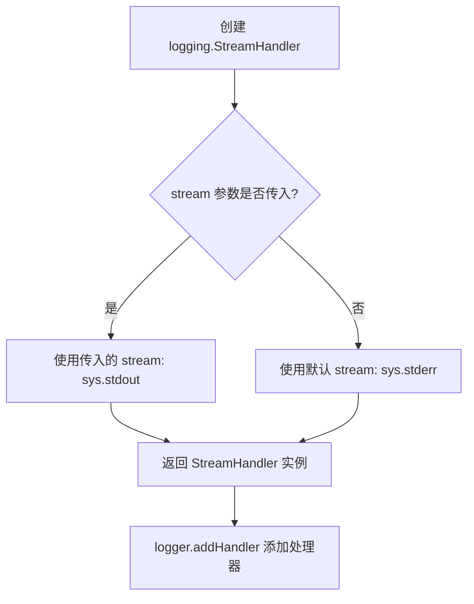

#### 带注释源码

```python
# 创建 StreamHandler 实例，指定输出流为 sys.stdout（标准输出）
# logging.StreamHandler 的构造函数签名: StreamHandler(stream=None)
# 参数:
#   - stream: 默认为 sys.stderr，这里显式传入 sys.stdout 将日志输出到标准输出
stream_handler = logging.StreamHandler(sys.stdout)

# 将创建的 stream_handler 添加到 logger 中
# 这样 logger 输出的日志会通过 stream_handler 写入 sys.stdout
logger.addHandler(stream_handler)
```

#### 补充说明

`logging.StreamHandler` 是 Python `logging` 模块提供的多个日志处理器之一：

- **名称**：`logging.StreamHandler`
- **类**：`logging.StreamHandler`
- **模块**：`logging`
- **一句话描述**：将日志输出到流（文件或标准输出/错误）的处理器。

此代码片段的作用是配置日志系统，将 DEBUG 级别及以上的日志输出到标准输出（stdout），便于在训练过程中查看日志信息。


### `tempfile.TemporaryDirectory`

Python 标准库中的上下文管理器，用于创建临时目录，在代码块执行完毕后自动清理该临时目录。

参数：

- `suffix`：`str | None`，可选，添加到目录名的后缀，默认为 `None`
- `prefix`：`str | None`，可选，目录名的前缀，默认为 `None`
- `dir`：`str | None`，可选，创建目录的路径，默认为 `None`

返回值：`str`，返回临时目录的路径字符串

#### 流程图

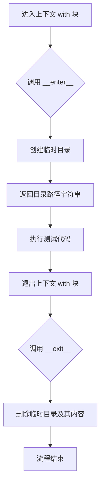

#### 带注释源码

```python
# 使用 tempfile.TemporaryDirectory 创建临时目录
# 该类会在退出 with 上下文时自动清理临时目录

# 基本用法示例
with tempfile.TemporaryDirectory() as tmpdir:
    # tmpdir 是临时目录的路径字符串
    # 可以在这里执行需要临时目录的操作
    test_args = f"""
        examples/dreambooth/train_dreambooth.py
        --pretrained_model_name_or_path hf-internal-testing/tiny-stable-diffusion-pipe
        --instance_data_dir docs/source/en/imgs
        --instance_prompt photo
        --resolution 64
        --train_batch_size 1
        --gradient_accumulation_steps 1
        --max_train_steps 2
        --learning_rate 5.0e-04
        --scale_lr
        --lr_scheduler constant
        --lr_warmup_steps 0
        --output_dir {tmpdir}
        """.split()
    
    run_command(self._launch_args + test_args)
    
    # 验证输出文件是否生成
    self.assertTrue(os.path.isfile(os.path.join(tmpdir, "unet", "diffusion_pytorch_model.safetensors")))
    self.assertTrue(os.path.isfile(os.path.join(tmpdir, "scheduler", "scheduler_config.json")))

# 退出 with 块后，tmpdir 目录会被自动删除
```

#### 关键特性说明

| 特性 | 说明 |
|------|------|
| 自动清理 | 退出 with 上下文时自动删除目录及其所有内容 |
| 线程安全 | 在多线程环境中可以安全使用 |
| 唯一性 | 创建的目录名是唯一的 |
| 异常安全 | 即使代码抛出异常，目录也会被清理 |


### `os.path.isfile`

用于检查指定路径是否指向一个存在的常规文件（不是目录或设备文件）。

参数：

- `path`：`str` 或 `os.PathLike`，要检查的文件路径，可以是绝对路径或相对路径

返回值：`bool`，如果路径存在且是一个常规文件则返回 `True`，否则返回 `False`

#### 流程图

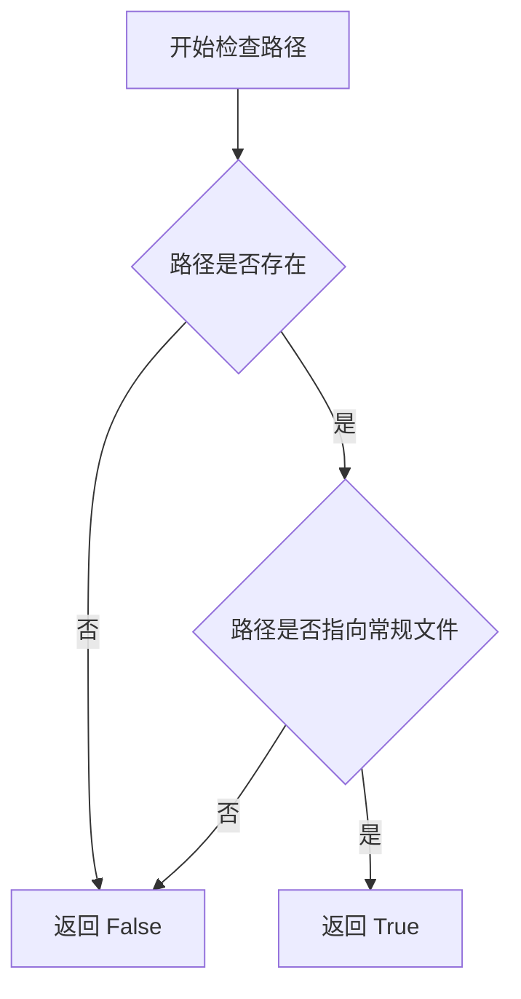

#### 带注释源码

```python
# os.path.isfile 是 Python 标准库函数，用于检查路径是否为文件
# 在本代码中具体使用方式如下：

# 检查训练输出目录中是否生成了 UNet 模型文件
self.assertTrue(os.path.isfile(os.path.join(tmpdir, "unet", "diffusion_pytorch_model.safetensors")))

# 检查训练输出目录中是否生成了调度器配置文件
self.assertTrue(os.path.isfile(os.path.join(tmpdir, "scheduler", "scheduler_config.json")))

# 实际调用形式：os.path.isfile(path)
# 参数：tmpdir, "unet", "diffusion_pytorch_model.safetensors" 组成的路径
# 返回值：布尔值，用于测试断言
```

#### 使用场景说明

在 DreamBooth 测试类中，`os.path.isfile` 用于以下验证场景：

1. **模型文件验证**：训练完成后检查 `diffusion_pytorch_model.safetensors` 文件是否成功生成
2. **配置文件验证**：检查 `scheduler_config.json` 调度器配置是否正确保存

这些检查确保训练流程正确执行并生成了必需的输出文件。


### `os.path.isdir`

用于检查指定的路径是否是一个已存在的目录。

参数：

- `path`：`str | os.PathLike[str]`，要检查的路径，可以是字符串或 PathLike 对象

返回值：`bool`，如果路径是已存在的目录返回 `True`，否则返回 `False`

#### 流程图

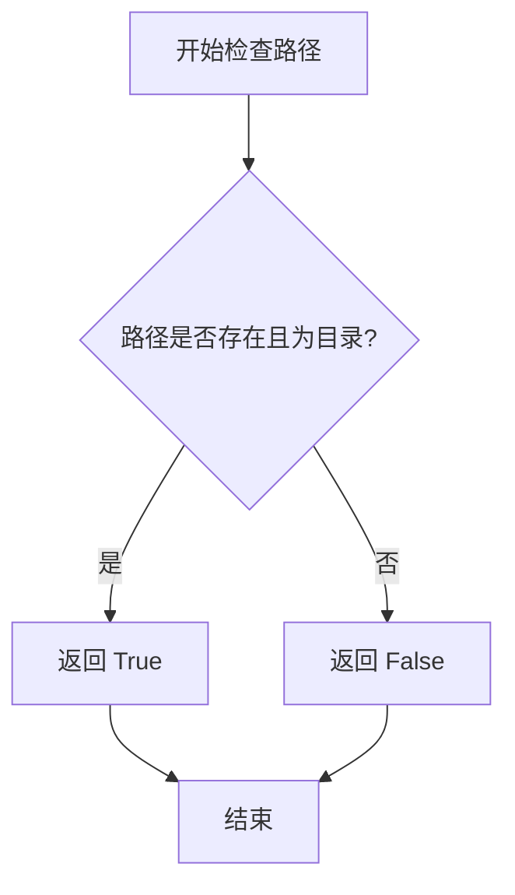

#### 带注释源码

```python
# os.path.isdir 源码实现（Python 标准库）
def isdir(s):
    """Return true if the pathname refers to an existing directory."""
    try:
        # 尝试使用 os.stat() 获取文件状态信息
        # st_mode 包含文件类型信息，S_ISDIR 用于检查是否为目录
        stat_result = os.stat(s)
        return S_ISDIR(stat_result.st_mode)
    except OSError:
        # 如果发生 OS 错误（如文件不存在），返回 False
        return False

# 在代码中的实际使用示例：
# 检查训练输出目录中是否存在 checkpoint 目录
self.assertTrue(os.path.isdir(os.path.join(tmpdir, "checkpoint-2")))
self.assertTrue(os.path.isdir(os.path.join(tmpdir, "checkpoint-4")))
self.assertFalse(os.path.isdir(os.path.join(tmpdir, "checkpoint-2")))
```


### `os.listdir`

`os.listdir` 是 Python 标准库 os 模块中的函数，用于返回指定路径下的所有文件和目录名称列表。

参数：

- `path`：`str | bytes | None`，路径字符串，表示要列出内容的目录路径。传入 `None` 时相当于当前目录。

返回值：`list[str] | list[bytes]`，返回包含指定目录中所有条目名称（不含路径部分）的列表。如果 path 是 bytes 类型，则返回字节串列表。

#### 流程图

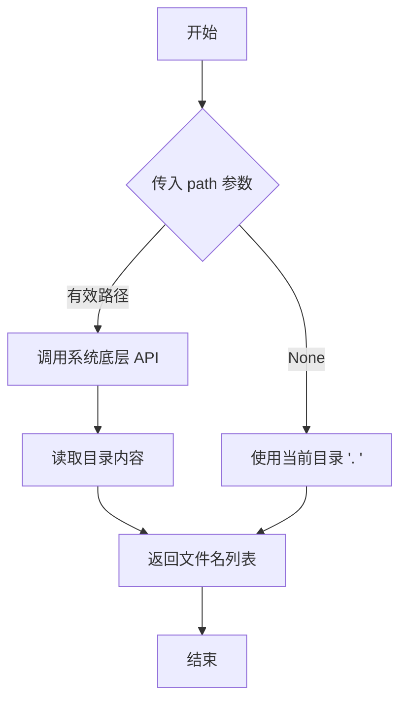

#### 带注释源码

```python
# os.listdir 是 Python 标准库 os 模块的函数
# 以下是代码中的实际调用示例：

# 示例1：在 test_dreambooth_checkpointing_checkpoints_total_limit 方法中
# 列出 tmpdir 目录下的所有内容，并过滤包含 'checkpoint' 的条目
{x for x in os.listdir(tmpdir) if "checkpoint" in x}
# 返回: {"checkpoint-4", "checkpoint-6"}

# 示例2：在 test_dreambooth_checkpointing_checkpoints_total_limit_removes_multiple_checkpoints 方法中
# 第一次检查点
{x for x in os.listdir(tmpdir) if "checkpoint" in x}
# 返回: {"checkpoint-2", "checkpoint-4"}

# 第二次检查点（恢复训练后）
{x for x in os.listdir(tmpdir) if "checkpoint" in x}
# 返回: {"checkpoint-6", "checkpoint-8"}
```


### `shutil.rmtree`

该函数是Python标准库`shutil`模块提供的一个工具函数，用于递归删除指定的目录树（包括目录本身及其所有子目录和文件）。在当前代码中，它被用于在训练过程中清理不再需要的检查点目录。

参数：

- `path`：`str` 或 `os.PathLike`，要删除的目录路径，不能为空
- `ignore_errors`：`bool`，可选参数，默认为`False`。若设为`True`，则忽略删除过程中的错误
- `onerror`：`callable`，可选参数，一个可调用对象（函数），用于处理删除过程中发生的错误。该函数接收三个参数：function、path和excinfo

返回值：`None`，该函数不返回任何值

#### 流程图

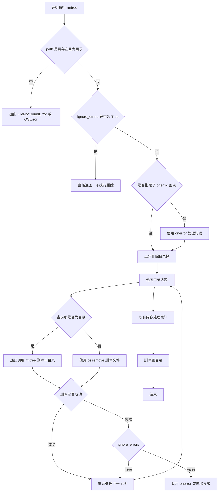

#### 带注释源码

```python
# shutil.rmtree 在代码中的实际使用示例
# 用于删除训练过程中不再需要的检查点目录

# 删除 checkpoint-2 目录，以便在恢复训练后只保留后续的检查点
shutil.rmtree(os.path.join(tmpdir, "checkpoint-2"))
```

```python
# shutil.rmtree 函数原型（来自 Python 标准库）
# def rmtree(path, ignore_errors=False, onerror=None, *, dirs_exist_ok=False):

# 参数说明：
# - path: 要删除的目录路径，类型为 str 或 os.PathLike
# - ignore_errors: 布尔值，如果为 True，则忽略删除错误，默认为 False
# - onerror: 可调用对象，用于处理删除过程中的错误，接收 (func, path, exc_info) 三个参数
# - dirs_exist_ok: Python 3.12+ 新增参数，如果为 True，即使目录非空也会删除

# 返回值：None

# 使用示例：
# import shutil
# shutil.rmtree('/path/to/directory')  # 删除目录及其所有内容
# shutil.rmtree('/path/to/directory', ignore_errors=True)  # 忽略删除错误
```


### `DreamBooth.test_dreambooth`

该方法是 DreamBooth 测试类的核心测试用例，用于验证 DreamBooth 训练脚本的基本功能是否正常运行，包括模型训练和输出文件的保存。

参数：

- `self`：隐式参数，`DreamBooth` 类的实例，无需显式传递

返回值：`None`，无返回值（测试方法）

#### 流程图

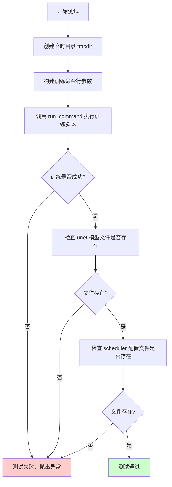

#### 带注释源码

```python
def test_dreambooth(self):
    """
    测试 DreamBooth 训练脚本的基本功能
    
    测试流程：
    1. 创建临时目录用于存放训练输出
    2. 构建训练所需的所有命令行参数
    3. 运行训练脚本
    4. 验证训练输出文件（unet 模型和 scheduler 配置）是否正确生成
    """
    # 使用 tempfile 创建临时目录，确保测试结束后自动清理
    with tempfile.TemporaryDirectory() as tmpdir:
        # 构建训练脚本的命令行参数
        # 包含以下关键配置：
        # - 预训练模型：使用测试用的小型 stable diffusion 模型
        # - 实例数据目录：使用文档中的示例图片
        # - 实例提示词：photo
        # - 分辨率：64（降低分辨率以加快测试速度）
        # - 训练批次大小：1
        # - 梯度累积步数：1
        # - 最大训练步数：2（最小化训练时间）
        # - 学习率：5.0e-04
        # - 学习率调度器：constant（固定学习率）
        # - 输出目录：临时目录
        test_args = f"""
            examples/dreambooth/train_dreambooth.py
            --pretrained_model_name_or_path hf-internal-testing/tiny-stable-diffusion-pipe
            --instance_data_dir docs/source/en/imgs
            --instance_prompt photo
            --resolution 64
            --train_batch_size 1
            --gradient_accumulation_steps 1
            --max_train_steps 2
            --learning_rate 5.0e-04
            --scale_lr
            --lr_scheduler constant
            --lr_warmup_steps 0
            --output_dir {tmpdir}
            """.split()

        # 执行训练命令
        # _launch_args 包含 accelerate 相关的启动参数（如 GPU 数量等）
        # run_command 会阻塞直到训练完成或报错
        run_command(self._launch_args + test_args)
        
        # ======== 验证输出文件 ========
        
        # 检查点 1：验证 UNet 模型权重文件是否正确保存
        # 使用 safetensors 格式保存，这是 diffusers 推荐的更安全的格式
        self.assertTrue(os.path.isfile(os.path.join(tmpdir, "unet", "diffusion_pytorch_model.safetensors")))
        
        # 检查点 2：验证调度器配置文件是否正确保存
        # 包含推理/训练所需的调度器配置信息
        self.assertTrue(os.path.isfile(os.path.join(tmpdir, "scheduler", "scheduler_config.json")))
```


### `DreamBooth.test_dreambooth_if`

这是一个集成测试方法，用于测试DreamBooth训练脚本在启用预计算文本嵌入（pre_compute_text_embeddings）功能时的训练流程，验证模型能否正确保存为safetensors格式以及scheduler配置是否正确生成。

参数：

- `self`：`DreamBooth` 类实例，代表测试类本身

返回值：`None`，该方法为测试方法，无返回值（执行一系列断言验证）

#### 流程图

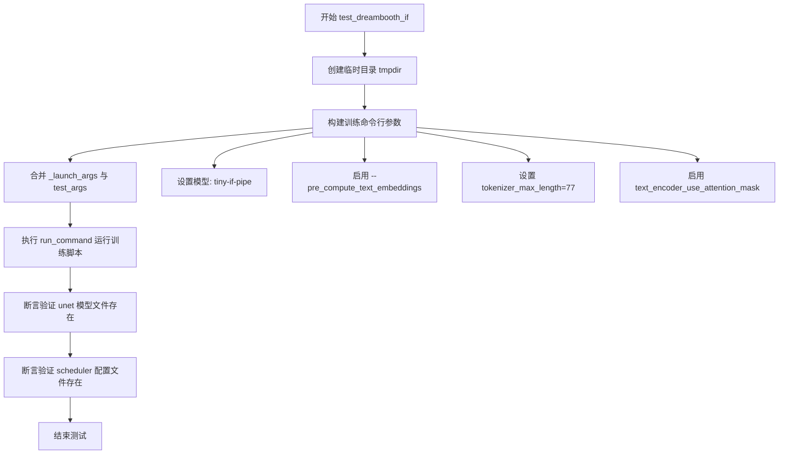

#### 带注释源码

```python
def test_dreambooth_if(self):
    """
    测试DreamBooth训练脚本在启用预计算文本嵌入功能时的行为
    
    该测试方法验证以下功能:
    1. 使用tiny-if-pipe模型进行训练
    2. 预计算文本 embeddings (--pre_compute_text_embeddings)
    3. 自定义tokenizer参数 (tokenizer_max_length=77)
    4. text encoder使用attention mask
    5. 训练后模型正确保存为safetensors格式
    6. scheduler配置文件正确生成
    """
    # 使用临时目录作为输出目录，测试结束后自动清理
    with tempfile.TemporaryDirectory() as tmpdir:
        # 构建训练脚本的命令行参数
        # 这些参数指定了:
        # - 预训练模型: hf-internal-testing/tiny-if-pipe (IF模型)
        # - 实例数据目录: docs/source/en/imgs
        # - 实例提示符: photo
        # - 图像分辨率: 64
        # - 训练批次大小: 1
        # - 梯度累积步数: 1
        # - 最大训练步数: 2 (仅用于快速测试)
        # - 学习率: 5.0e-04
        # - 启用学习率缩放 (--scale_lr)
        # - 学习率调度器: constant (恒定)
        # - 预热步数: 0
        # - 输出目录: tmpdir
        # - 启用预计算文本嵌入 (--pre_compute_text_embeddings)
        # - tokenizer最大长度: 77
        # - text encoder使用attention mask
        test_args = f"""
            examples/dreambooth/train_dreambooth.py
            --pretrained_model_name_or_path hf-internal-testing/tiny-if-pipe
            --instance_data_dir docs/source/en/imgs
            --instance_prompt photo
            --resolution 64
            --train_batch_size 1
            --gradient_accumulation_steps 1
            --max_train_steps 2
            --learning_rate 5.0e-04
            --scale_lr
            --lr_scheduler constant
            --lr_warmup_steps 0
            --output_dir {tmpdir}
            --pre_compute_text_embeddings
            --tokenizer_max_length=77
            --text_encoder_use_attention_mask
            """.split()

        # 执行训练命令
        # run_command会启动子进程运行训练脚本
        # self._launch_args 包含accelerate的启动参数(如GPU数量等)
        run_command(self._launch_args + test_args)
        
        # save_pretrained smoke test
        # 验证训练后的模型文件是否正确保存
        
        # 检查UNet模型文件是否存在
        # 路径: {tmpdir}/unet/diffusion_pytorch_model.safetensors
        self.assertTrue(os.path.isfile(os.path.join(tmpdir, "unet", "diffusion_pytorch_model.safetensors")))
        
        # 检查scheduler配置文件是否存在
        # 路径: {tmpdir}/scheduler/scheduler_config.json
        self.assertTrue(os.path.isfile(os.path.join(tmpdir, "scheduler", "scheduler_config.json")))
```


### `DreamBooth.test_dreambooth_checkpointing`

该方法是一个集成测试用例，用于验证 DreamBooth 训练脚本的检查点（checkpointing）功能是否正常工作，包括检查点的创建、从检查点恢复训练、以及训练过程中检查点的管理（如删除旧检查点）。

参数：

- `self`：隐式参数，`DreamBooth` 类的实例方法必需参数

返回值：`None`，该方法为测试用例，无返回值，通过断言验证功能正确性

#### 流程图

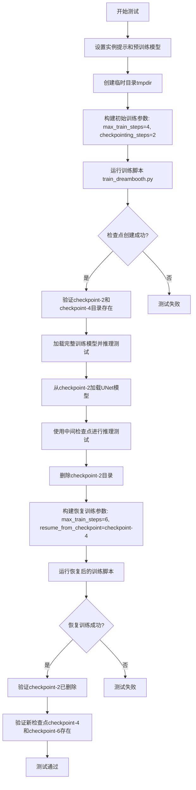

#### 带注释源码

```python
def test_dreambooth_checkpointing(self):
    """
    测试 DreamBooth 检查点功能
    
    测试内容包括:
    1. 训练过程中定期创建检查点
    2. 从中间检查点恢复训练
    3. 恢复训练后旧检查点的管理
    """
    # 设置测试用的实例提示词和预训练模型路径
    instance_prompt = "photo"
    pretrained_model_name_or_path = "hf-internal-testing/tiny-stable-diffusion-pipe"

    # 创建临时目录用于存放训练输出和检查点
    with tempfile.TemporaryDirectory() as tmpdir:
        # 定义初始训练参数
        # max_train_steps=4: 总训练步数为4步
        # checkpointing_steps=2: 每2步保存一个检查点
        # 预期创建检查点: checkpoint-2, checkpoint-4
        initial_run_args = f"""
            examples/dreambooth/train_dreambooth.py
            --pretrained_model_name_or_path {pretrained_model_name_or_path}
            --instance_data_dir docs/source/en/imgs
            --instance_prompt {instance_prompt}
            --resolution 64
            --train_batch_size 1
            --gradient_accumulation_steps 1
            --max_train_steps 4
            --learning_rate 5.0e-04
            --scale_lr
            --lr_scheduler constant
            --lr_warmup_steps 0
            --output_dir {tmpdir}
            --checkpointing_steps=2
            --seed=0
            """.split()

        # 执行初始训练
        run_command(self._launch_args + initial_run_args)

        # 验证1: 测试完整训练输出的pipeline能否正常运行
        pipe = DiffusionPipeline.from_pretrained(tmpdir, safety_checker=None)
        pipe(instance_prompt, num_inference_steps=1)

        # 验证2: 检查检查点目录是否存在
        # 预期应存在 checkpoint-2 和 checkpoint-4
        self.assertTrue(os.path.isdir(os.path.join(tmpdir, "checkpoint-2")))
        self.assertTrue(os.path.isdir(os.path.join(tmpdir, "checkpoint-4")))

        # 验证3: 测试能否从中间检查点加载并运行推理
        # 从 checkpoint-2 加载 UNet 模型权重
        unet = UNet2DConditionModel.from_pretrained(tmpdir, subfolder="checkpoint-2/unet")
        # 使用预训练模型的其它组件（VAE、tokenizer等）构建pipeline
        pipe = DiffusionPipeline.from_pretrained(pretrained_model_name_or_path, unet=unet, safety_checker=None)
        # 使用中间检查点进行推理
        pipe(instance_prompt, num_inference_steps=1)

        # 清理: 删除 checkpoint-2，验证恢复训练后旧检查点是否会被清理
        shutil.rmtree(os.path.join(tmpdir, "checkpoint-2"))

        # 恢复训练参数
        # max_train_steps=6: 继续训练到第6步（从第4步恢复，再训练2步）
        # resume_from_checkpoint=checkpoint-4: 从第4步的检查点恢复
        resume_run_args = f"""
            examples/dreambooth/train_dreambooth.py
            --pretrained_model_name_or_path {pretrained_model_name_or_path}
            --instance_data_dir docs/source/en/imgs
            --instance_prompt {instance_prompt}
            --resolution 64
            --train_batch_size 1
            --gradient_accumulation_steps 1
            --max_train_steps 6
            --learning_rate 5.0e-04
            --scale_lr
            --lr_scheduler constant
            --lr_warmup_steps 0
            --output_dir {tmpdir}
            --checkpointing_steps=2
            --resume_from_checkpoint=checkpoint-4
            --seed=0
            """.split()

        # 执行恢复训练
        run_command(self._launch_args + resume_run_args)

        # 验证4: 恢复训练后的完整pipeline能否正常运行
        pipe = DiffusionPipeline.from_pretrained(tmpdir, safety_checker=None)
        pipe(instance_prompt, num_inference_steps=1)

        # 验证5: 确认旧检查点 checkpoint-2 已被删除
        self.assertFalse(os.path.isdir(os.path.join(tmpdir, "checkpoint-2")))

        # 验证6: 确认新的检查点存在（从checkpoint-4恢复，新检查点为checkpoint-6）
        self.assertTrue(os.path.isdir(os.path.join(tmpdir, "checkpoint-4")))
        self.assertTrue(os.path.isdir(os.path.join(tmpdir, "checkpoint-6")))
```


### `DreamBooth.test_dreambooth_checkpointing_checkpoints_total_limit`

该测试方法用于验证 DreamBooth 训练脚本中的检查点总数限制功能（`--checkpoints_total_limit` 参数）。测试通过运行训练脚本，设置 `max_train_steps=6` 和 `checkpointing_steps=2`，并限制最多保留2个检查点，然后验证最终只保留了最新的 checkpoint-4 和 checkpoint-6，而早期的 checkpoint-2 被自动删除。

参数：

- `self`：隐式参数，`DreamBooth` 类的实例对象，用于访问父类 `ExamplesTestsAccelerate` 的属性和方法（如 `self._launch_args`）

返回值：`None`，该方法为单元测试方法，通过 `assertEqual` 断言验证检查点是否符合预期，无显式返回值

#### 流程图

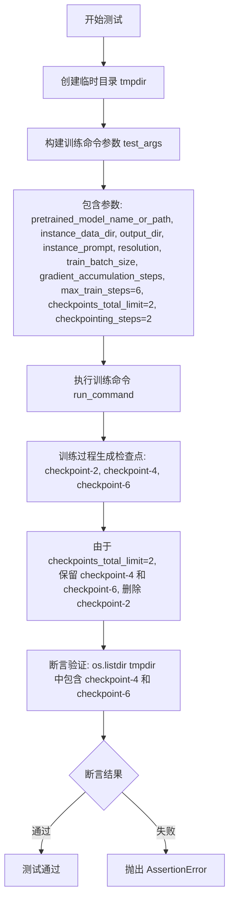

#### 带注释源码

```python
def test_dreambooth_checkpointing_checkpoints_total_limit(self):
    """
    测试 DreamBooth 训练脚本的检查点总数限制功能。
    
    该测试验证当设置 --checkpoints_total_limit=N 时，
    训练过程中最多保留 N 个检查点，超出限制的旧检查点会被自动删除。
    """
    # 使用临时目录作为输出目录，测试结束后自动清理
    with tempfile.TemporaryDirectory() as tmpdir:
        # 构建训练脚本的命令行参数
        # 使用 f-string 和 .split() 将多行命令转换为列表
        test_args = f"""
            examples/dreambooth/train_dreambooth.py
            --pretrained_model_name_or_path=hf-internal-testing/tiny-stable-diffusion-pipe
            --instance_data_dir=docs/source/en/imgs
            --output_dir={tmpdir}
            --instance_prompt=prompt
            --resolution=64
            --train_batch_size=1
            --gradient_accumulation_steps=1
            --max_train_steps=6
            --checkpoints_total_limit=2    # 关键参数：限制最多保留2个检查点
            --checkpointing_steps=2         # 每2步保存一个检查点
            """.split()

        # 执行训练命令，传入加速启动参数和测试参数
        # _launch_args 来自父类 ExamplesTestsAccelerate，包含分布式训练相关配置
        run_command(self._launch_args + test_args)

        # 断言验证：检查输出目录中只保留最新的2个检查点
        # 预期结果：checkpoint-4 和 checkpoint-6
        # 由于 checkpoints_total_limit=2，早期的 checkpoint-2 应已被自动删除
        self.assertEqual(
            {x for x in os.listdir(tmpdir) if "checkpoint" in x},
            {"checkpoint-4", "checkpoint-6"},
        )
```


### `DreamBooth.test_dreambooth_checkpointing_checkpoints_total_limit_removes_multiple_checkpoints`

该测试方法用于验证 DreamBooth 训练脚本在设置 `checkpoints_total_limit` 参数后，能够正确删除多个旧检查点，仅保留指定数量的最新检查点。测试模拟了从检查点恢复训练并超过限制时的场景。

参数：

- `self`：`DreamBooth` 类型，测试类实例本身

返回值：`None`，无返回值（测试方法）

#### 流程图

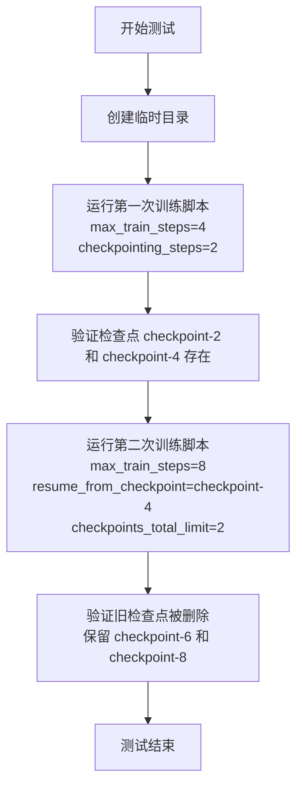

#### 带注释源码

```python
def test_dreambooth_checkpointing_checkpoints_total_limit_removes_multiple_checkpoints(self):
    """
    测试检查点总数限制功能：当恢复训练并超过限制时，正确删除多个旧检查点
    """
    # 创建临时目录用于存放训练输出
    with tempfile.TemporaryDirectory() as tmpdir:
        # 第一次训练：创建初始检查点
        # 训练4步，每2步保存一个检查点，预期生成 checkpoint-2 和 checkpoint-4
        test_args = f"""
        examples/dreambooth/train_dreambooth.py
        --pretrained_model_name_or_path=hf-internal-testing/tiny-stable-diffusion-pipe
        --instance_data_dir=docs/source/en/imgs
        --output_dir={tmpdir}
        --instance_prompt=prompt
        --resolution=64
        --train_batch_size=1
        --gradient_accumulation_steps=1
        --max_train_steps=4
        --checkpointing_steps=2
        """.split()

        # 执行训练命令
        run_command(self._launch_args + test_args)

        # 验证第一次训练生成的检查点存在
        # 预期包含 checkpoint-2 和 checkpoint-4
        self.assertEqual(
            {x for x in os.listdir(tmpdir) if "checkpoint" in x},
            {"checkpoint-2", "checkpoint-4"},
        )

        # 第二次训练：从 checkpoint-4 恢复，训练到第8步
        # 同时设置 checkpoints_total_limit=2，限制最多保留2个检查点
        # 预期行为：删除旧的 checkpoint-2 和 checkpoint-4，保留新的 checkpoint-6 和 checkpoint-8
        resume_run_args = f"""
        examples/dreambooth/train_dreambooth.py
        --pretrained_model_name_or_path=hf-internal-testing/tiny-stable-diffusion-pipe
        --instance_data_dir=docs/source/en/imgs
        --output_dir={tmpdir}
        --instance_prompt=prompt
        --resolution=64
        --train_batch_size=1
        --gradient_accumulation_steps=1
        --max_train_steps=8
        --checkpointing_steps=2
        --resume_from_checkpoint=checkpoint-4
        --checkpoints_total_limit=2
        """.split()

        # 执行恢复训练命令
        run_command(self._launch_args + resume_run_args)

        # 验证最终保留的检查点
        # 旧检查点 checkpoint-2 和 checkpoint-4 已被删除
        # 新检查点 checkpoint-6 和 checkpoint-8 被保留
        self.assertEqual({x for x in os.listdir(tmpdir) if "checkpoint" in x}, {"checkpoint-6", "checkpoint-8"})
```

## 关键组件


### DreamBooth 测试类

继承自ExamplesTestsAccelerate的测试类，用于验证DreamBooth训练脚本的各项功能，包括基础训练、IF模型支持、检查点保存与恢复、以及检查点数量限制等功能。

### 张量索引与惰性加载

在检查点恢复过程中，通过`UNet2DConditionModel.from_pretrained`使用子文件夹路径加载特定检查点的模型权重，实现按需加载而非一次性加载全部模型。

### 反量化支持

通过`DiffusionPipeline.from_pretrained`加载预训练模型时，支持加载经过量化处理的模型权重，并在推理时进行反量化操作以恢复原始精度。

### 检查点管理

支持通过`checkpointing_steps`参数设置保存检查点的频率，通过`checkpoints_total_limit`参数限制保存的检查点总数，并支持通过`resume_from_checkpoint`从指定检查点恢复训练。

### 训练参数配置

包含学习率(`learning_rate`)、训练批次大小(`train_batch_size`)、梯度累积步数(`gradient_accumulation_steps`)、最大训练步数(`max_train_steps`)等关键训练超参数的配置。

### 模型加载与管道构建

使用HuggingFace的DiffusionPipeline和UNet2DConditionModel进行模型加载，支持自定义子文件夹路径加载、safety_checker配置以及文本嵌入预计算等功能。

### 临时目录管理

使用Python的`tempfile.TemporaryDirectory`创建临时目录用于存放训练输出和检查点，测试结束后自动清理，确保测试环境的隔离性。

### 命令执行与验证

通过`run_command`函数执行训练脚本，并使用`assertTrue/assertFalse`验证生成的文件和目录是否存在，包括模型权重文件、配置文件和检查点目录等。


## 问题及建议


### 已知问题

- **魔法数字和硬编码值过多**：模型名称（hf-internal-testing/tiny-stable-diffusion-pipe）、图像路径（docs/source/en/imgs）、分辨率（64）、学习率（5.0e-04）等参数在多处硬编码，修改时需要同时修改多处，增加维护成本
- **代码重复严重**：多个测试方法中训练参数定义、断言逻辑、临时目录使用方式高度重复，未提取公共方法或fixture
- **缺乏错误处理**：run_command调用后未检查返回码或捕获异常，无法区分训练失败是脚本本身问题还是参数问题
- **sys.path操作不规范**：使用sys.path.append("..")进行导入不是最佳实践，应使用相对导入或包安装方式
- **日志配置不当**：使用logging.basicConfig(level=logging.DEBUG)可能在测试输出中产生过多信息，且在生产环境中不够安全
- **测试参数不一致**：test_dreambooth_if使用了额外的参数（pre_compute_text_embeddings、tokenizer_max_length等），而其他测试未使用，测试覆盖不均匀
- **缺少类型注解**：无任何类型提示，不利于静态分析和IDE支持
- **未使用pytest特性**：未使用@pytest.fixture、@pytest.mark.parametrize等pytest高级特性，测试可读性和可维护性差

### 优化建议

- 提取公共训练参数为类常量或配置文件，使用pytest.fixture共享临时目录和通用配置
- 将run_command调用包装为带错误检查的方法，捕获并记录子进程异常
- 替换sys.path操作为相对导入或配置PYTHONPATH
- 将日志级别改为INFO或WARNING，减少调试信息输出
- 为关键方法和参数添加类型注解
- 统一测试参数风格，考虑使用@pytest.mark.parametrize参数化测试
- 添加更多边界条件测试，如无效模型路径、磁盘空间不足等异常场景

## 其它


### 设计目标与约束

本测试类的核心设计目标是验证DreamBooth训练脚本的功能正确性，包括基本训练流程、检查点保存与恢复、检查点数量限制等关键功能。约束条件包括：使用临时目录进行测试、依赖特定的预训练模型（hf-internal-testing/tiny-stable-diffusion-pipe和hf-internal-testing/tiny-if-pipe）、训练步骤数较少（max_train_steps=2-8）以加快测试速度。

### 错误处理与异常设计

测试中使用tempfile.TemporaryDirectory()确保测试结束后自动清理临时文件。通过assertTrue和assertFalse验证文件或目录是否存在来处理预期结果。对于命令行执行错误，run_command函数应捕获并报告非零返回码。测试假设examples/dreambooth/train_dreambooth.py脚本存在且可执行。

### 数据流与状态机

测试数据流：准备命令行参数（包含模型路径、数据目录、训练超参数等）→调用run_command执行训练脚本→验证输出目录中的模型文件（unet/scheduler）。检查点测试状态机：初始训练→创建checkpoint-2/checkpoint-4→删除checkpoint-2→恢复训练→验证新检查点checkpoint-4/checkpoint-6。

### 外部依赖与接口契约

主要外部依赖包括：diffusers库的DiffusionPipeline和UNet2DConditionModel、test_examples_utils模块的ExamplesTestsAccelerate和run_command、Python标准库（tempfile/os/shutil/logging）。接口契约：train_dreambooth.py接受标准命令行参数、输出符合DiffusionPipeline保存格式的模型文件、检查点目录命名规范为checkpoint-{step}。

### 配置参数说明

关键配置参数包括：pretrained_model_name_or_path（预训练模型路径）、instance_data_dir（实例数据目录）、instance_prompt（实例提示词）、resolution（图像分辨率64）、train_batch_size（训练批次大小1）、gradient_accumulation_steps（梯度累积步数1）、max_train_steps（最大训练步数）、learning_rate（学习率5.0e-04）、checkpointing_steps（检查点保存间隔）、checkpoints_total_limit（检查点总数限制）、resume_from_checkpoint（恢复检查点路径）。

### 测试覆盖范围

测试覆盖五个主要场景：标准DreamBooth训练流程验证、IF模型训练支持、检查点保存与恢复功能、检查点总数限制逻辑、检查点删除机制（当超过限制时删除旧检查点）。测试使用smoke test方式验证模型文件生成，不进行完整的推理质量评估。

### 性能考虑与优化空间

由于使用tiny-stable-diffusion-pipe和极小训练步数，测试执行速度较快。优化空间：可考虑添加并行测试执行以加速完整测试套件；检查点测试可以复用已训练的模型而非每次重新训练；可添加超时机制防止训练脚本异常导致测试挂起。

### 安全与权限考虑

测试使用临时目录避免污染文件系统。需要确保运行测试的用户有权限写入临时目录和执行examples/dreambooth/train_dreambooth.py脚本。测试不涉及敏感数据操作。

    