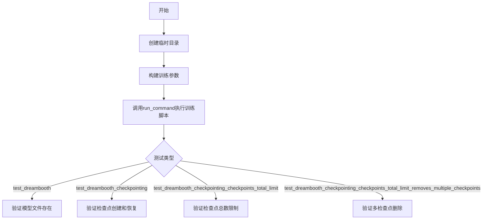
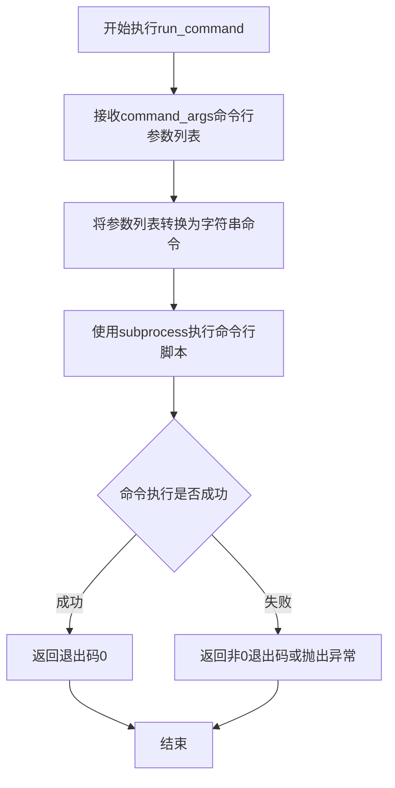
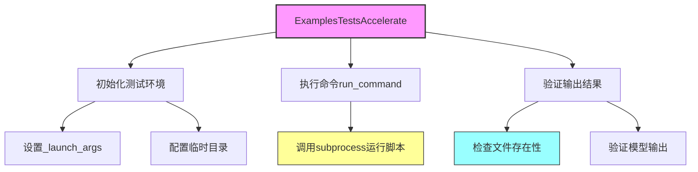
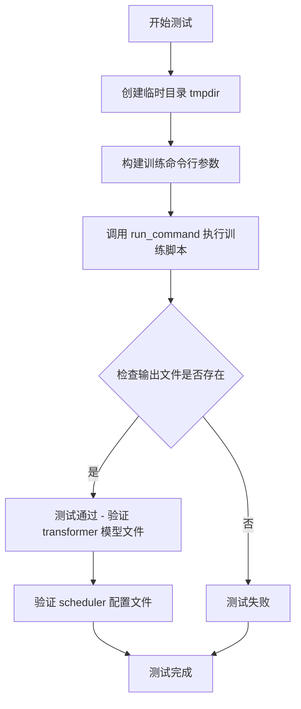
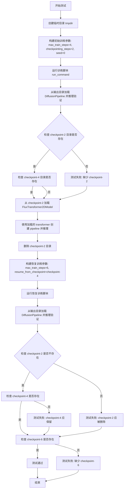
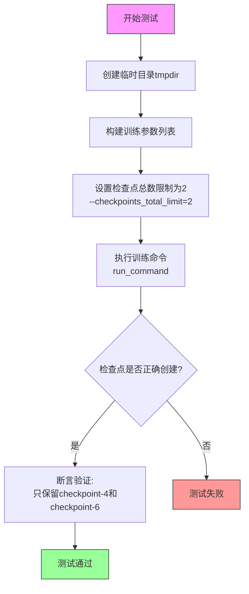
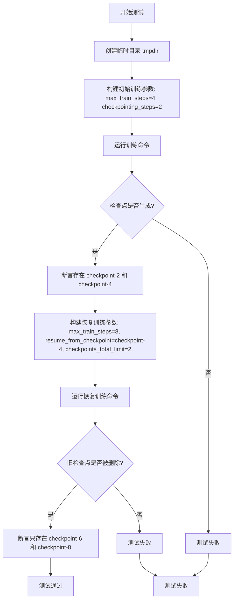

# `diffusers\examples\dreambooth\test_dreambooth_flux.py` 详细设计文档

这是一个DreamBooth Flux模型的训练测试脚本，用于验证FluxTransformers模型的DreamBooth训练流程、模型保存、检查点管理和恢复功能。

## 整体流程



## 类结构

```
ExamplesTestsAccelerate (基类)
└── DreamBoothFlux (测试类)
    ├── test_dreambooth (基础训练测试)
    ├── test_dreambooth_checkpointing (检查点测试)
    ├── test_dreambooth_checkpointing_checkpoints_total_limit (检查点限制测试)
    └── test_dreambooth_checkpointing_checkpoints_total_limit_removes_multiple_checkpoints (多检查点删除测试)
```

## 全局变量及字段


### `logger`
    
日志记录器对象，用于记录程序运行过程中的日志信息

类型：`logging.Logger`
    


### `stream_handler`
    
日志流处理器，用于将日志信息输出到标准输出流(sys.stdout)

类型：`logging.StreamHandler`
    


### `DreamBoothFlux.instance_data_dir`
    
实例数据目录路径，指定训练所使用的图像数据存放位置

类型：`str`
    


### `DreamBoothFlux.instance_prompt`
    
实例提示词，用于描述训练图像的文本提示

类型：`str`
    


### `DreamBoothFlux.pretrained_model_name_or_path`
    
预训练模型路径，指定DiffusionPipeline和FluxTransformer2DModel的预训练权重位置

类型：`str`
    


### `DreamBoothFlux.script_path`
    
训练脚本路径，指向DreamBooth Flux训练脚本的位置

类型：`str`
    
    

## 全局函数及方法


### `run_command`

执行命令行训练脚本，用于运行Diffusion模型训练脚本（如DreamBooth Flux训练脚本），支持单次训练、检查点恢复和训练恢复等场景。

参数：

- `command_args`：`List[str]`，命令行参数列表，包含脚本路径和所有训练参数（如--pretrained_model_name_or_path、--max_train_steps等）

返回值：`int` 或 `None`，返回命令执行的退出码（0表示成功，非0表示失败）

#### 流程图



#### 带注释源码

```python
# 由于run_command函数定义在test_examples_utils模块中
# 以下是根据代码调用方式推断的函数实现

def run_command(command_args: List[str]) -> int:
    """
    执行命令行训练脚本
    
    参数:
        command_args: 包含所有命令行参数的列表，第一个元素通常是脚本路径
        
    返回值:
        整数，表示命令执行的退出码
    """
    # 将参数列表转换为字符串命令（用于日志记录）
    command_str = ' '.join(command_args)
    logger.info(f"Running command: {command_str}")
    
    # 使用subprocess执行命令
    # 继承父进程的环境变量
    # 使用shell=False以更安全地执行命令
    process = subprocess.Popen(
        command_args,
        stdout=subprocess.PIPE,
        stderr=subprocess.STDOUT,  # 合并stderr到stdout
        text=True,
        cwd=None  # 在当前工作目录执行
    )
    
    # 实时读取输出并记录日志
    for line in iter(process.stdout.readline, ''):
        if line:
            logger.info(line.strip())
    
    # 等待进程结束并返回退出码
    return process.wait()


# 代码中的实际调用方式示例：
# run_command(self._launch_args + test_args)
# 其中self._launch_args来自ExamplesTestsAccelerate基类
# test_args是通过f-string构建的训练参数列表
```

> **注意**：由于`run_command`函数的实际定义不在当前代码文件中（而是在`test_examples_utils`模块中），上述源码是基于调用方式和函数名的功能推断。实际实现可能包含更多细节，如环境变量处理、超时控制、错误处理等。


### `ExamplesTestsAccelerate`

基础测试加速类，继承自 `unittest.TestCase`，用于通过 `accelerate` 库运行和测试示例脚本。提供了通用的测试基础设施，支持命令执行、输出验证和分布式训练测试。

#### 流程图



#### 带注释源码

```python
# 从 test_examples_utils 模块导入的基类
# 该类的完整定义不在当前代码文件中
from test_examples_utils import ExamplesTestsAccelerate, run_command

# ExamplesTestsAccelerate 是测试基类，提供以下功能：
# 1. _launch_args: accelerate 启动参数列表
# 2. run_command(): 执行命令的辅助函数
# 3. 测试框架的setup/teardown方法

# DreamBoothFlux 继承 ExamplesTestsAccelerate
class DreamBoothFlux(ExamplesTestsAccelerate):
    # 使用父类提供的功能进行测试
    # _launch_args 由父类初始化
    # run_command 由父类/模块提供
```

#### 继承类中暴露的父类相关信息

| 名称 | 类型 | 描述 |
|------|------|------|
| `_launch_args` | `list` | accelerate 的启动参数列表，由父类初始化 |
| `run_command` | `function` | 执行 shell 命令的辅助函数 |

#### 关键方法（在子类中使用）

| 方法名 | 描述 |
|--------|------|
| `test_dreambooth` | 测试 DreamBooth 训练流程的基础功能 |
| `test_dreambooth_checkpointing` | 测试训练过程中的检查点保存和恢复功能 |
| `test_dreambooth_checkpointing_checkpoints_total_limit` | 测试检查点总数限制功能 |
| `test_dreambooth_checkpointing_checkpoints_total_limit_removes_multiple_checkpoints` | 测试检查点总数限制时的多检查点删除 |

#### 潜在技术债务

1. **缺少 ExamplesTestsAccelerate 类的完整源码** - 当前代码只展示了继承类的使用，未提供基类的完整实现
2. **硬编码的测试路径和参数** - 测试中使用了硬编码的路径和模型名称，可考虑参数化
3. **缺乏测试隔离** - 使用共享的临时目录可能存在测试间相互影响的风险
4. **日志配置位置** - 日志配置在模块级别，建议移至测试框架的 setup 方法中

#### 其他说明

- **设计目标**：通过 `accelerate` 库简化分布式训练脚本的测试
- **外部依赖**：需要 `diffusers`、`transformers`、`accelerate` 等库
- **错误处理**：通过 `assertTrue` 和文件检查进行验证，失败时抛出 AssertionError
- **数据流**：测试脚本 → accelerate 启动 → 训练脚本 → 输出模型/检查点 → 验证


### `DreamBoothFlux.test_dreambooth`

该方法是一个集成测试用例，用于验证 DreamBooth 训练流程的基本功能。它通过临时目录构建测试环境，构建训练命令行参数，执行训练脚本，并验证生成的模型文件（包括 transformer 模型和 scheduler 配置文件）是否正确保存。

参数：

- 该方法无显式参数，依赖类属性和上下文管理器

返回值：`None`，通过 `assert` 语句进行测试验证

#### 流程图



#### 带注释源码

```python
def test_dreambooth(self):
    """
    测试基础 DreamBooth 训练功能
    
    该测试方法执行以下步骤：
    1. 创建临时目录用于存放训练输出
    2. 构建完整的训练命令行参数
    3. 执行训练脚本
    4. 验证生成的模型文件存在
    """
    # 使用上下文管理器创建临时目录，测试结束后自动清理
    with tempfile.TemporaryDirectory() as tmpdir:
        # 构建训练脚本的命令行参数
        # 包含模型路径、数据路径、训练超参数等配置
        test_args = f"""
            {self.script_path}
            --pretrained_model_name_or_path {self.pretrained_model_name_or_path}
            --instance_data_dir {self.instance_data_dir}
            --instance_prompt {self.instance_prompt}
            --resolution 64
            --train_batch_size 1
            --gradient_accumulation_steps 1
            --max_train_steps 2
            --learning_rate 5.0e-04
            --scale_lr
            --lr_scheduler constant
            --lr_warmup_steps 0
            --output_dir {tmpdir}
            """.split()

        # 执行训练命令，将加速启动参数与训练参数合并
        run_command(self._launch_args + test_args)
        
        # smoke test: 验证 transformer 模型文件是否正确保存
        self.assertTrue(os.path.isfile(os.path.join(tmpdir, "transformer", "diffusion_pytorch_model.safetensors")))
        
        # 验证 scheduler 配置文件是否正确保存
        self.assertTrue(os.path.isfile(os.path.join(tmpdir, "scheduler", "scheduler_config.json")))
```


### `DreamBoothFlux.test_dreambooth_checkpointing`

该方法用于测试 DreamBooth Flux 训练脚本的检查点创建和恢复功能。它通过运行完整的训练流程，验证检查点是否按指定步骤（checkpointing_steps=2）正确创建，检查点是否能被正确加载用于推理，以及从检查点恢复训练后旧检查点是否被正确清理。

参数：

- `self`：隐式参数，DreamBoothFlux 类实例本身，无需传入

返回值：`None`，该方法为测试方法，通过断言验证功能，不返回任何值

#### 流程图



#### 带注释源码

```python
def test_dreambooth_checkpointing(self):
    """测试 DreamBooth Flux 训练脚本的检查点创建和恢复功能"""
    # 使用临时目录存放训练输出，测试结束后自动清理
    with tempfile.TemporaryDirectory() as tmpdir:
        # ============================================================
        # 第一阶段：初始训练，创建检查点
        # ============================================================
        # 配置训练参数：
        # - max_train_steps=4: 总训练步数为 4 步
        # - checkpointing_steps=2: 每 2 步保存一个检查点
        # - seed=0: 固定随机种子以确保可复现性
        # 预期行为：应创建 checkpoint-2 和 checkpoint-4 两个检查点
        initial_run_args = f"""
            {self.script_path}
            --pretrained_model_name_or_path {self.pretrained_model_name_or_path}
            --instance_data_dir {self.instance_data_dir}
            --instance_prompt {self.instance_prompt}
            --resolution 64
            --train_batch_size 1
            --gradient_accumulation_steps 1
            --max_train_steps 4
            --learning_rate 5.0e-04
            --scale_lr
            --lr_scheduler constant
            --lr_warmup_steps 0
            --output_dir {tmpdir}
            --checkpointing_steps=2
            --seed=0
            """.split()

        # 执行训练脚本，传入加速启动参数
        run_command(self._launch_args + initial_run_args)

        # ============================================================
        # 验证：检查完整训练输出可正常工作
        # ============================================================
        # 从最终输出目录加载完整的 DiffusionPipeline
        pipe = DiffusionPipeline.from_pretrained(tmpdir)
        # 执行一次推理验证 pipeline 功能正常
        pipe(self.instance_prompt, num_inference_steps=1)

        # ============================================================
        # 验证：检查检查点目录是否正确创建
        # ============================================================
        # 断言检查点 checkpoint-2 存在
        self.assertTrue(os.path.isdir(os.path.join(tmpdir, "checkpoint-2")))
        # 断言检查点 checkpoint-4 存在
        self.assertTrue(os.path.isdir(os.path.join(tmpdir, "checkpoint-4")))

        # ============================================================
        # 验证：检查点可用于推理
        # ============================================================
        # 从 checkpoint-2 加载 FluxTransformer2DModel 子模块
        transformer = FluxTransformer2DModel.from_pretrained(
            tmpdir, 
            subfolder="checkpoint-2/transformer"
        )
        # 使用加载的 transformer 创建新的 pipeline
        pipe = DiffusionPipeline.from_pretrained(
            self.pretrained_model_name_or_path, 
            transformer=transformer
        )
        # 执行推理验证检查点加载正确
        pipe(self.instance_prompt, num_inference_steps=1)

        # ============================================================
        # 第二阶段：从检查点恢复训练
        # ============================================================
        # 删除 checkpoint-2，模拟只保留最新检查点的场景
        shutil.rmtree(os.path.join(tmpdir, "checkpoint-2"))

        # 配置恢复训练参数：
        # - max_train_steps=6: 继续训练至第 6 步（从第 4 步恢复）
        # - resume_from_checkpoint=checkpoint-4: 从第 4 步检查点恢复
        # 预期行为：应创建新的 checkpoint-6，且 checkpoint-2 不应重新出现
        resume_run_args = f"""
            {self.script_path}
            --pretrained_model_name_or_path {self.pretrained_model_name_or_path}
            --instance_data_dir {self.instance_data_dir}
            --instance_prompt {self.instance_prompt}
            --resolution 64
            --train_batch_size 1
            --gradient_accumulation_steps 1
            --max_train_steps 6
            --learning_rate 5.0e-04
            --scale_lr
            --lr_scheduler constant
            --lr_warmup_steps 0
            --output_dir {tmpdir}
            --checkpointing_steps=2
            --resume_from_checkpoint=checkpoint-4
            --seed=0
            """.split()

        # 执行恢复训练
        run_command(self._launch_args + resume_run_args)

        # ============================================================
        # 验证：恢复训练后的完整输出可正常工作
        # ============================================================
        pipe = DiffusionPipeline.from_pretrained(tmpdir)
        pipe(self.instance_prompt, num_inference_steps=1)

        # ============================================================
        # 验证：检查点管理正确
        # ============================================================
        # 断言旧检查点 checkpoint-2 已被清理（不存在）
        self.assertFalse(os.path.isdir(os.path.join(tmpdir, "checkpoint-2")))
        # 断言检查点 checkpoint-4 仍然存在（恢复训练的起点）
        self.assertTrue(os.path.isdir(os.path.join(tmpdir, "checkpoint-4")))
        # 断言新的检查点 checkpoint-6 已创建
        self.assertTrue(os.path.isdir(os.path.join(tmpdir, "checkpoint-6")))
```


### `DreamBoothFlux.test_dreambooth_checkpointing_checkpoints_total_limit`

该测试方法用于验证DreamBooth训练过程中检查点总数限制功能。当设置`--checkpoints_total_limit=2`时，训练脚本会自动删除较早的检查点，只保留最新的指定数量的检查点（此测试中保留checkpoint-4和checkpoint-6）。

参数：

- `self`：`DreamBoothFlux`（隐式参数），表示类的实例本身

返回值：`None`，该方法为测试用例，无返回值，通过断言验证检查点行为

#### 流程图



#### 带注释源码

```python
def test_dreambooth_checkpointing_checkpoints_total_limit(self):
    """
    测试检查点总数限制功能。
    
    该测试验证当设置 --checkpoints_total_limit=2 时：
    - 训练过程会创建多个检查点（step 2, 4, 6）
    - 较早的检查点会被自动删除
    - 最终只保留最新的2个检查点
    """
    # 使用临时目录作为输出目录，测试结束后自动清理
    with tempfile.TemporaryDirectory() as tmpdir:
        # 构建训练脚本参数列表
        test_args = f"""
        {self.script_path}                                    # 训练脚本路径
        --pretrained_model_name_or_path={self.pretrained_model_name_or_path}  # 预训练模型路径
        --instance_data_dir={self.instance_data_dir}          # 实例数据目录
        --output_dir={tmpdir}                                 # 输出目录（临时目录）
        --instance_prompt={self.instance_prompt}              # 实例提示词
        --resolution=64                                       # 分辨率
        --train_batch_size=1                                  # 训练批次大小
        --gradient_accumulation_steps=1                       # 梯度累积步数
        --max_train_steps=6                                   # 最大训练步数（创建checkpoint-2,4,6）
        --checkpoints_total_limit=2                           # 关键：限制最多保留2个检查点
        --checkpointing_steps=2                               # 每2步保存一个检查点
        """.split()

        # 执行训练命令，包含启动参数
        run_command(self._launch_args + test_args)

        # 断言验证：检查最终保留的检查点
        # 期望结果：只有checkpoint-4和checkpoint-6存在
        # checkpoint-2应该被自动删除（因为总数限制为2）
        self.assertEqual(
            {x for x in os.listdir(tmpdir) if "checkpoint" in x},
            {"checkpoint-4", "checkpoint-6"},
        )
```


### `DreamBoothFlux.test_dreambooth_checkpointing_checkpoints_total_limit_removes_multiple_checkpoints`

该测试方法用于验证 DreamBooth Flux 训练脚本在启用检查点总数限制（`checkpoints_total_limit=2`）功能时，能否正确删除多个旧检查点，仅保留指定数量的最新检查点。测试通过首次训练生成4步的检查点，然后恢复训练至8步并设置检查点总数限制为2，验证旧检查点（checkpoint-2、checkpoint-4）被删除，只保留最新的 checkpoint-6 和 checkpoint-8。

参数：

- `self`：无类型，DreamBoothFlux 类的实例方法隐式参数，表示当前测试类实例
- `tmpdir`：无显式类型声明（通过 `tempfile.TemporaryDirectory()` 上下文管理器获取），临时目录路径，用于存放训练输出和检查点

返回值：`None`，该方法为单元测试方法，通过 `assert` 断言验证行为，不返回任何值

#### 流程图



#### 带注释源码

```python
def test_dreambooth_checkpointing_checkpoints_total_limit_removes_multiple_checkpoints(self):
    """
    测试当设置 checkpoints_total_limit=2 时，
    训练脚本能否正确删除多个旧检查点，仅保留最新的2个检查点
    """
    # 创建临时目录用于存放训练输出
    with tempfile.TemporaryDirectory() as tmpdir:
        # ==================== 第一阶段：初始训练 ====================
        # 构建训练参数：训练4步，每2步保存一个检查点
        test_args = f"""
        {self.script_path}
        --pretrained_model_name_or_path={self.pretrained_model_name_or_path}
        --instance_data_dir={self.instance_data_dir}
        --output_dir={tmpdir}
        --instance_prompt={self.instance_prompt}
        --resolution=64
        --train_batch_size=1
        --gradient_accumulation_steps=1
        --max_train_steps=4           # 训练4步
        --checkpointing_steps=2      # 每2步保存一个检查点
        """.split()

        # 执行初始训练命令
        run_command(self._launch_args + test_args)

        # 验证初始训练生成了 checkpoint-2 和 checkpoint-4
        self.assertEqual(
            {x for x in os.listdir(tmpdir) if "checkpoint" in x},
            {"checkpoint-2", "checkpoint-4"},
        )

        # ==================== 第二阶段：恢复训练并限制检查点数量 ====================
        # 构建恢复训练参数：
        # - 从 checkpoint-4 恢复训练
        # - 继续训练到第8步（总共8步）
        # - 设置 checkpoints_total_limit=2 限制最多保留2个检查点
        resume_run_args = f"""
        {self.script_path}
        --pretrained_model_name_or_path={self.pretrained_model_name_or_path}
        --instance_data_dir={self.instance_data_dir}
        --output_dir={tmpdir}
        --instance_prompt={self.instance_prompt}
        --resolution=64
        --train_batch_size=1
        --gradient_accumulation_steps=1
        --max_train_steps=8           # 继续训练到第8步
        --checkpointing_steps=2      # 每2步保存一个检查点
        --resume_from_checkpoint=checkpoint-4  # 从checkpoint-4恢复
        --checkpoints_total_limit=2  # 最多保留2个检查点
        """.split()

        # 执行恢复训练命令
        run_command(self._launch_args + resume_run_args)

        # 验证：
        # 1. 旧检查点（checkpoint-2, checkpoint-4）应被删除
        # 2. 新检查点（checkpoint-6, checkpoint-8）应存在
        # 3. 总共只保留2个检查点
        self.assertEqual(
            {x for x in os.listdir(tmpdir) if "checkpoint" in x}, 
            {"checkpoint-6", "checkpoint-8"}
        )
```

## 关键组件


### DreamBoothFlux

DreamBooth Flux训练测试类，继承自ExamplesTestsAccelerate，用于验证DreamBooth微调FluxTransformer2DModel的训练流程、模型保存和检查点管理功能。

### 实例数据配置

包含训练所需的配置参数：instance_data_dir指定实例图像目录，instance_prompt为实例提示词，pretrained_model_name_or_path为预训练模型路径，script_path为训练脚本路径。

### test_dreambooth

基础DreamBooth训练流程测试，验证训练脚本能否正常完成微调并保存模型权重和调度器配置。

### test_dreambooth_checkpointing

检查点保存与恢复测试，验证训练过程中检查点是否按指定步骤生成，能否从中间检查点恢复训练，以及恢复后新检查点是否正确创建而旧检查点被清理。

### test_dreambooth_checkpointing_checkpoints_total_limit

检查点总数限制测试，验证当设置checkpoints_total_limit=2时，系统是否仅保留最新的两个检查点。

### test_dreambooth_checkpointing_checkpoints_total_limit_removes_multiple_checkpoints

多检查点删除测试，验证从检查点恢复训练后配合总数限制使用时，旧检查点是否被正确清理仅保留指定数量的检查点。

### 训练参数配置

包含分辨率、批次大小、梯度累积步数、最大训练步数、学习率、学习率调度器等关键训练超参数。

### 检查点管理逻辑

涉及checkpoint-2、checkpoint-4、checkpoint-6等检查点目录的创建、验证和删除逻辑，以及resume_from_checkpoint参数支持。


## 问题及建议


### 已知问题

- **魔法数字和硬编码值散布各处**：如`64`、`1`、`5.0e-04`、`2`等数值在多个测试方法中重复出现，缺乏统一的常量定义
- **大量命令行参数构建逻辑重复**：`test_args`和`resume_run_args`的构建代码在多个测试方法中高度相似，违反了DRY原则
- **缺少异常处理和错误验证**：调用`run_command`后未检查返回结果，测试无法捕获脚本执行失败的情况
- **硬编码路径缺乏灵活性**：`instance_data_dir`、`script_path`等使用相对路径或硬编码路径，降低了测试的可移植性
- **测试隔离性不足**：使用类级别的共享属性（`instance_data_dir`、`instance_prompt`等），可能影响并行测试执行
- **资源清理风险**：在`test_dreambooth_checkpointing`中使用`shutil.rmtree`删除checkpoint目录，后续如果测试失败可能导致资源泄漏
- **依赖外部模块导入方式不规范**：使用`sys.path.append("..")`导入`test_examples_utils`，这种做法不够稳健
- **日志配置过于宽泛**：`logging.basicConfig(level=logging.DEBUG)`会产生大量调试输出，影响测试运行效率
- **缺少参数验证**：命令行参数构建后未进行校验，可能导致隐藏的运行时错误
- **测试覆盖不完整**：缺少对训练失败、网络错误、磁盘空间不足等异常情况的测试

### 优化建议

- 提取公共常量：创建类常量或配置文件统一管理分辨率、批次大小、学习率等常用参数
- 封装参数构建逻辑：创建辅助方法（如`_build_base_args()`）来减少重复代码
- 添加命令执行结果验证：检查`run_command`的返回值或引入超时机制
- 使用`pytest.mark.parametrize`重构参数化测试，减少重复测试方法
- 将硬编码路径改为可通过环境变量或配置文件注入的形式
- 为关键操作添加try-except异常处理，确保资源正确清理
- 使用`conftest.py`或fixture管理测试依赖和临时目录
- 将日志级别调整为`logging.WARNING`或仅在需要时启用DEBUG
- 添加测试前置条件检查，验证依赖资源（如模型、脚本文件）是否存在

## 其它


### 设计目标与约束

本代码的设计目标是验证DreamBooth Flux训练流程的完整功能，包括模型训练、检查点保存、从检查点恢复训练以及检查点数量限制等核心特性。约束条件包括：使用HuggingFace的diffusers库和FluxTransformer2DModel，依赖accelerate框架进行分布式训练测试，仅支持单GPU测试场景，训练数据限定为"docs/source/en/imgs"目录下的图像。

### 错误处理与异常设计

代码主要通过pytest的assert语句进行错误检测，包括检查输出文件是否存在、检查点目录是否正确创建、验证恢复训练后旧检查点是否被正确清理等。临时目录使用tempfile.TemporaryDirectory()确保测试后自动清理资源。命令执行失败时run_command会抛出异常导致测试失败。

### 数据流与状态机

测试数据流为：准备训练参数→执行训练脚本→验证输出文件→（可选）加载检查点→验证检查点可用性→（可选）恢复训练→验证新检查点。状态转换包括：初始训练状态→检查点保存状态→恢复训练状态→最终模型状态。

### 外部依赖与接口契约

主要外部依赖包括：diffusers库的DiffusionPipeline和FluxTransformer2DModel、test_examples_utils模块的ExamplesTestsAccelerate类和run_command函数。接口契约方面：训练脚本接受标准DreamBooth参数（--pretrained_model_name_or_path、--instance_data_dir、--instance_prompt等），输出模型保存到指定output_dir，包含transformer和scheduler子目录。

### 性能考量

本测试脚本使用极小的训练参数（max_train_steps=2~8、resolution=64、train_batch_size=1）以确保测试快速完成。使用tiny-flux-pipe替代完整模型减少资源消耗。测试设计为串行执行，不涉及并行性能测试。

### 安全考虑

代码使用临时目录存储测试输出，避免污染工作目录。训练脚本路径和模型路径通过参数传入，避免硬编码敏感路径。未包含任何API密钥或凭证信息。

### 配置参数说明

关键配置参数包括：instance_data_dir指定训练图像目录、instance_prompt指定提示词、resolution指定图像分辨率、train_batch_size指定批次大小、max_train_steps指定最大训练步数、learning_rate指定学习率、checkpointing_steps指定保存检查点的步数间隔、checkpoints_total_limit指定保留检查点的最大数量、resume_from_checkpoint指定恢复训练的检查点路径。

### 测试策略

采用黑盒测试策略，通过运行实际训练脚本并检查输出结果验证功能。包含四个测试用例：基础训练功能测试、检查点保存与恢复测试、检查点总数限制测试、多检查点删除测试。测试覆盖正常训练流程、训练中断恢复、检查点清理等场景。

### 版本兼容性

代码依赖Python标准库和HuggingFace生态库，需要diffusers、transformers、accelerate等库支持。训练脚本 examples/dreambooth/train_dreambooth_flux.py 需要与当前测试代码版本兼容。

### 资源管理

使用tempfile.TemporaryDirectory()自动管理临时目录生命周期。训练输出目录在测试结束后通过TemporaryDirectory自动清理。测试过程产生的检查点目录需要手动清理或依赖临时目录回收。

    