# `diffusers\examples\dreambooth\test_dreambooth_lora.py` 详细设计文档

该文件是 Hugging Face diffusers 项目中 DreamBooth LoRA 训练脚本的集成测试，涵盖标准 Stable Diffusion 和 SDXL 模型的训练流程验证，包括文本编码器训练、检查点管理、权重保存和自定义数据等功能。

## 整体流程

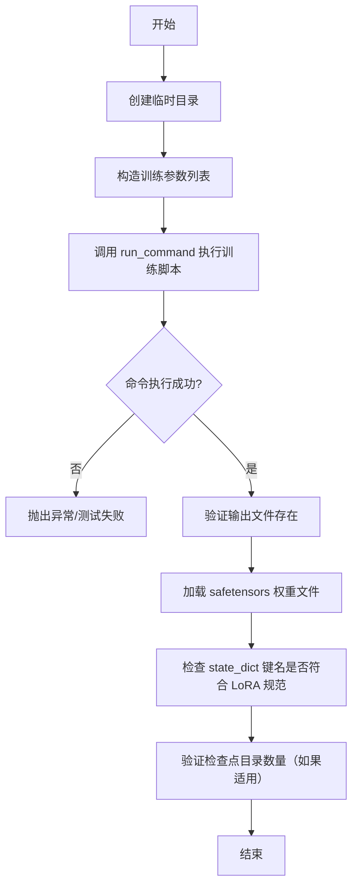

## 类结构

```
ExamplesTestsAccelerate (基类，未在此文件中定义)
├── DreamBoothLoRA
│   ├── test_dreambooth_lora
│   ├── test_dreambooth_lora_with_text_encoder
│   ├── test_dreambooth_lora_checkpointing_checkpoints_total_limit
│   ├── test_dreambooth_lora_checkpointing_checkpoints_total_limit_removes_multiple_checkpoints
│   └── test_dreambooth_lora_if_model
└── DreamBoothLoRASDXL
    ├── test_dreambooth_lora_sdxl
    ├── test_dreambooth_lora_sdxl_with_text_encoder
    ├── test_dreambooth_lora_sdxl_custom_captions
    ├── test_dreambooth_lora_sdxl_text_encoder_custom_captions
    ├── test_dreambooth_lora_sdxl_checkpointing_checkpoints_total_limit
    └── test_dreambooth_lora_sdxl_text_encoder_checkpointing_checkpoints_total_limit
```

## 全局变量及字段


### `logger`
    
全局日志记录器对象，用于记录程序运行日志

类型：`logging.Logger`
    


### `stream_handler`
    
日志流处理器，将日志输出到标准输出（stdout）

类型：`logging.StreamHandler`
    


    

## 全局函数及方法


### `DreamBoothLoRA.test_dreambooth_lora`

该方法是DreamBoothLoRA类中的一个单元测试方法，用于验证DreamBooth LoRA训练脚本的正确性。它通过运行训练命令并验证输出文件（LoRA权重）来确保训练流程能够正常执行，并且生成的权重文件包含正确的LoRA参数命名。

参数：
- `self`：隐式参数，DreamBoothLoRA类的实例本身，继承自ExamplesTestsAccelerate

返回值：`None`，无返回值（测试方法）

#### 流程图

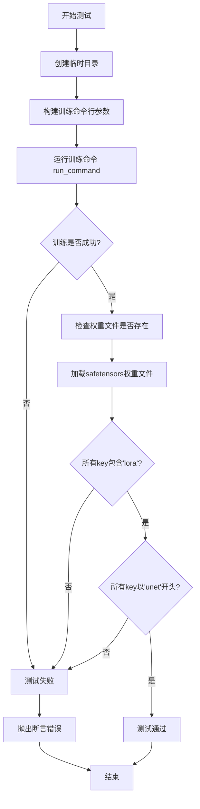

#### 带注释源码

```python
def test_dreambooth_lora(self):
    """
    测试 DreamBooth LoRA 训练流程的单元测试方法。
    
    该测试执行以下验证：
    1. 训练脚本能够成功运行并生成输出文件
    2. 生成的权重文件包含正确的 LoRA 参数命名
    3. 验证未训练 text_encoder 时，所有参数以 'unet' 开头
    """
    # 使用临时目录存放训练输出，避免污染文件系统
    with tempfile.TemporaryDirectory() as tmpdir:
        # 构建训练脚本的命令行参数
        test_args = f"""
            examples/dreambooth/train_dreambooth_lora.py
            --pretrained_model_name_or_path hf-internal-testing/tiny-stable-diffusion-pipe
            --instance_data_dir docs/source/en/imgs
            --instance_prompt photo
            --resolution 64
            --train_batch_size 1
            --gradient_accumulation_steps 1
            --max_train_steps 2
            --learning_rate 5.0e-04
            --scale_lr
            --lr_scheduler constant
            --lr_warmup_steps 0
            --output_dir {tmpdir}
            """.split()

        # 执行训练命令，传入加速启动参数和测试参数
        run_command(self._launch_args + test_args)
        
        # ==== 验证1: smoke test ====
        # 检查训练是否生成了 LoRA 权重文件
        self.assertTrue(os.path.isfile(os.path.join(tmpdir, "pytorch_lora_weights.safetensors")))

        # ==== 验证2: 检查 LoRA 命名 ====
        # 加载 safetensors 格式的权重文件
        lora_state_dict = safetensors.torch.load_file(os.path.join(tmpdir, "pytorch_lora_weights.safetensors"))
        
        # 验证所有权重键都包含 'lora' 标识，确保是 LoRA 权重
        is_lora = all("lora" in k for k in lora_state_dict.keys())
        self.assertTrue(is_lora)

        # ==== 验证3: 检查参数命名空间 ====
        # 当不训练 text_encoder 时，所有参数应该以 'unet' 开头
        starts_with_unet = all(key.startswith("unet") for key in lora_state_dict.keys())
        self.assertTrue(starts_with_unet)
```


### `DreamBoothLoRA.test_dreambooth_lora_with_text_encoder`

该方法是一个集成测试用例，用于验证 DreamBooth LoRA 训练脚本在启用文本编码器（text_encoder）训练时的正确性。测试通过运行训练命令并检查输出的 LoRA 权重文件，确保训练过程中正确包含了 text_encoder 的 LoRA 权重参数。

参数：

- `self`：隐式参数，`DreamBoothLoRA` 类实例本身，用于访问类属性和方法

返回值：`None`，该方法为测试用例，通过 `assert` 语句进行断言验证，不返回任何值

#### 流程图

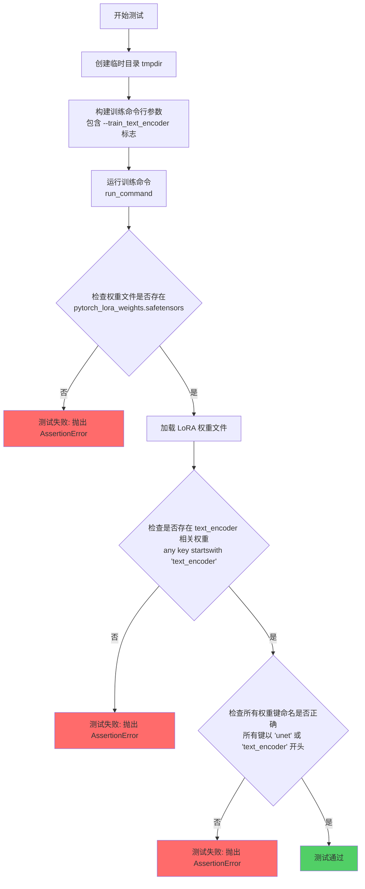

#### 带注释源码

```python
def test_dreambooth_lora_with_text_encoder(self):
    """
    测试 DreamBooth LoRA 训练脚本在启用 text_encoder 训练时的正确性。
    
    该测试执行以下验证：
    1. 训练脚本能够成功运行并生成 LoRA 权重文件
    2. 权重文件中包含 text_encoder 相关的 LoRA 参数
    3. 所有权重键的命名符合预期（以 'unet' 或 'text_encoder' 开头）
    """
    # 创建临时目录用于存放训练输出
    with tempfile.TemporaryDirectory() as tmpdir:
        # 构建训练命令行参数列表
        # 关键参数 --train_text_encoder 启用文本编码器的 LoRA 训练
        test_args = f"""
            examples/dreambooth/train_dreambooth_lora.py
            --pretrained_model_name_or_path hf-internal-testing/tiny-stable-diffusion-pipe
            --instance_data_dir docs/source/en/imgs
            --instance_prompt photo
            --resolution 64
            --train_batch_size 1
            --gradient_accumulation_steps 1
            --max_train_steps 2
            --learning_rate 5.0e-04
            --scale_lr
            --lr_scheduler constant
            --lr_warmup_steps 0
            --train_text_encoder      # 关键：启用 text_encoder 训练
            --output_dir {tmpdir}
            """.split()

        # 执行训练命令，传入加速启动参数和测试参数
        run_command(self._launch_args + test_args)
        
        # 验证1: 检查 save_pretrained 是否成功生成权重文件
        # smoke test: 确保训练脚本正常运行并保存了权重
        self.assertTrue(os.path.isfile(os.path.join(tmpdir, "pytorch_lora_weights.safetensors")))

        # 加载保存的 LoRA 权重文件（使用 safetensors 格式）
        lora_state_dict = safetensors.torch.load_file(os.path.join(tmpdir, "pytorch_lora_weights.safetensors"))
        keys = lora_state_dict.keys()
        
        # 验证2: 检查 text_encoder 是否存在于权重键中
        # 确保训练了 text_encoder 并保存了其 LoRA 权重
        is_text_encoder_present = any(k.startswith("text_encoder") for k in keys)
        self.assertTrue(is_text_encoder_present)

        # 验证3: 检查权重键的命名规范
        # LoRA 权重应来自 unet 或 text_encoder，不应有其他来源
        is_correct_naming = all(k.startswith("unet") or k.startswith("text_encoder") for k in keys)
        self.assertTrue(is_correct_naming)
```


### `DreamBoothLoRA.test_dreambooth_lora_checkpointing_checkpoints_total_limit`

该测试方法用于验证 DreamBooth LoRA 训练过程中的检查点总数限制功能是否正常工作。通过运行训练脚本并设置 `checkpoints_total_limit=2`，确保当检查点数量超过限制时，最旧的检查点会被自动删除，最终只保留最新的指定数量的检查点。

参数：

- `self`：`DreamBoothLoRA`（隐式参数），当前测试类实例本身

返回值：`None`，无返回值（测试方法）

#### 流程图

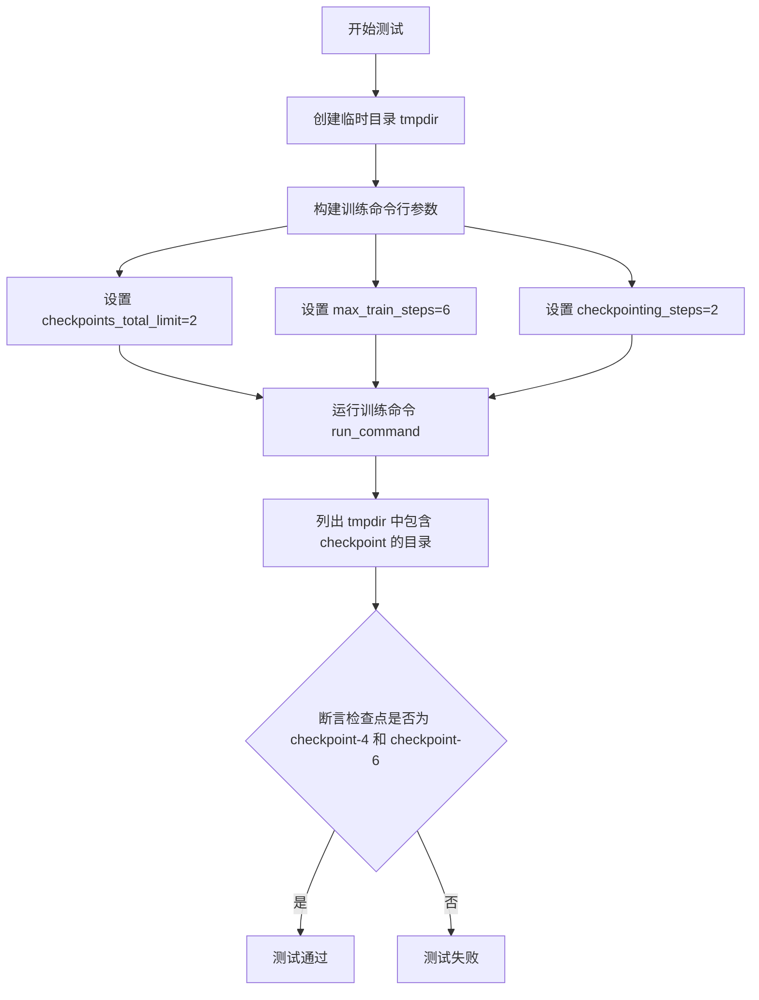

#### 带注释源码

```python
def test_dreambooth_lora_checkpointing_checkpoints_total_limit(self):
    """
    测试 DreamBooth LoRA 检查点总数限制功能
    验证当设置 checkpoints_total_limit=2 时，系统只保留最新的2个检查点
    """
    # 创建临时目录用于存放训练输出
    with tempfile.TemporaryDirectory() as tmpdir:
        # 构建训练命令行参数列表
        test_args = f"""
        examples/dreambooth/train_dreambooth_lora.py
        --pretrained_model_name_or_path=hf-internal-testing/tiny-stable-diffusion-pipe
        --instance_data_dir=docs/source/en/imgs
        --output_dir={tmpdir}
        --instance_prompt=prompt
        --resolution=64
        --train_batch_size=1
        --gradient_accumulation_steps=1
        --max_train_steps=6
        --checkpoints_total_limit=2
        --checkpointing_steps=2
        """.split()

        # 执行训练命令
        # self._launch_args 包含加速启动参数（如 GPU 数量等）
        run_command(self._launch_args + test_args)

        # 断言验证：只保留 checkpoint-4 和 checkpoint-6
        # checkpoint-2 应该在达到限制后被删除
        self.assertEqual(
            # 筛选出 tmpdir 中所有包含 'checkpoint' 的目录
            {x for x in os.listdir(tmpdir) if "checkpoint" in x},
            # 期望保留最新的2个检查点
            {"checkpoint-4", "checkpoint-6"},
        )
```


### `DreamBoothLoRA.test_dreambooth_lora_checkpointing_checkpoints_total_limit_removes_multiple_checkpoints`

该测试方法用于验证 DreamBooth LoRA 训练脚本的检查点管理功能，特别是当设置 `checkpoints_total_limit` 参数后，系统能否正确删除旧的检查点并仅保留指定数量的最新检查点。测试分为两个阶段：第一阶段训练生成初始检查点，第二阶段恢复训练并验证旧检查点被正确清理。

参数：该方法继承自 `ExamplesTestsAccelerate` 基类，无自定义参数。

返回值：`None`，该方法为测试用例，通过 `assert` 语句验证检查点数量，不返回任何值。

#### 流程图

```mermaid
flowchart TD
    A[开始测试] --> B[创建临时目录 tmpdir]
    B --> C[准备第一阶段训练参数: max_train_steps=4, checkpointing_steps=2]
    C --> D[调用 run_command 执行训练命令]
    D --> E[断言检查点为 {checkpoint-2, checkpoint-4}]
    E --> F[准备第二阶段训练参数: max_train_steps=8, resume_from_checkpoint=checkpoint-4, checkpoints_total_limit=2]
    F --> G[调用 run_command 恢复训练]
    G --> H[断言检查点为 {checkpoint-6, checkpoint-8}]
    H --> I[测试结束]
```

#### 带注释源码

```python
def test_dreambooth_lora_checkpointing_checkpoints_total_limit_removes_multiple_checkpoints(self):
    """测试检查点总数限制功能，验证旧检查点被正确删除"""
    
    # 使用临时目录存放训练输出
    with tempfile.TemporaryDirectory() as tmpdir:
        
        # ==================== 第一阶段：初始训练 ====================
        # 构建训练命令参数：
        # - pretrained_model_name_or_path: 使用测试用的小型 Stable Diffusion 模型
        # - instance_data_dir: 训练数据目录
        # - output_dir: 输出目录（临时目录）
        # - instance_prompt: 训练提示词
        # - resolution: 图像分辨率
        # - train_batch_size: 训练批次大小
        # - gradient_accumulation_steps: 梯度累积步数
        # - max_train_steps: 最大训练步数（4步，会生成 checkpoint-2 和 checkpoint-4）
        # - checkpointing_steps: 每2步保存一个检查点
        test_args = f"""
        examples/dreambooth/train_dreambooth_lora.py
        --pretrained_model_name_or_path=hf-internal-testing/tiny-stable-diffusion-pipe
        --instance_data_dir=docs/source/en/imgs
        --output_dir={tmpdir}
        --instance_prompt=prompt
        --resolution=64
        --train_batch_size=1
        --gradient_accumulation_steps=1
        --max_train_steps=4
        --checkpointing_steps=2
        """.split()

        # 执行训练命令（self._launch_args 包含加速启动参数）
        run_command(self._launch_args + test_args)

        # 验证第一阶段生成的检查点：应该包含 checkpoint-2 和 checkpoint-4
        # 使用集合比较，忽略目录中其他文件
        self.assertEqual({x for x in os.listdir(tmpdir) if "checkpoint" in x}, {"checkpoint-2", "checkpoint-4"})

        # ==================== 第二阶段：恢复训练并限制检查点数量 ====================
        # 构建恢复训练参数：
        # - resume_from_checkpoint=checkpoint-4: 从第4步的检查点恢复
        # - max_train_steps=8: 继续训练到第8步
        # - checkpoints_total_limit=2: 最多保留2个检查点
        # 期望结果：删除旧的 checkpoint-2 和 checkpoint-4，保留新的 checkpoint-6 和 checkpoint-8
        resume_run_args = f"""
        examples/dreambooth/train_dreambooth_lora.py
        --pretrained_model_name_or_path=hf-internal-testing/tiny-stable-diffusion-pipe
        --instance_data_dir=docs/source/en/imgs
        --output_dir={tmpdir}
        --instance_prompt=prompt
        --resolution=64
        --train_batch_size=1
        --gradient_accumulation_steps=1
        --max_train_steps=8
        --checkpointing_steps=2
        --resume_from_checkpoint=checkpoint-4
        --checkpoints_total_limit=2
        """.split()

        # 执行恢复训练命令
        run_command(self._launch_args + resume_run_args)

        # 验证第二阶段结束后的检查点：
        # checkpoint-2 和 checkpoint-4 已被删除
        # 保留最新的 checkpoint-6 和 checkpoint-8
        self.assertEqual({x for x in os.listdir(tmpdir) if "checkpoint" in x}, {"checkpoint-6", "checkpoint-8"})
```


### `DreamBoothLoRA.test_dreambooth_lora_if_model`

该方法是DreamBoothLoRA类的测试方法，专门用于验证使用IF模型进行DreamBooth LoRA训练时的完整流程是否正确，包括训练脚本执行、输出文件生成、LoRA权重命名规范以及模型参数前缀的校验。

参数：

- `self`：`DreamBoothLoRA`，DreamBoothLoRA类的实例，代表当前测试对象本身

返回值：`None`，无返回值（测试方法，通过断言验证结果）

#### 流程图

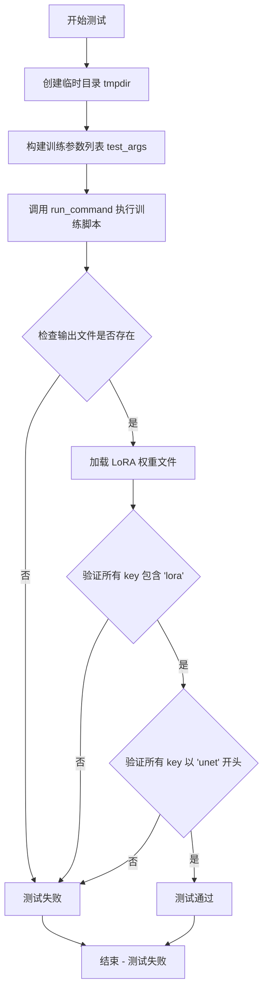

#### 带注释源码

```python
def test_dreambooth_lora_if_model(self):
    """
    测试使用 IF 模型进行 DreamBooth LoRA 训练的功能
    
    该测试方法验证以下内容：
    1. 训练脚本能够成功执行
    2. 输出的 LoRA 权重文件存在
    3. LoRA 权重的 key 命名包含 'lora'
    4. 在不训练 text encoder 时，所有参数 key 以 'unet' 开头
    """
    # 使用 tempfile 创建临时目录，用于存放训练输出
    with tempfile.TemporaryDirectory() as tmpdir:
        # 构建训练命令参数列表
        # 使用 hf-internal-testing/tiny-if-pipe 作为预训练模型（IF模型）
        test_args = f"""
            examples/dreambooth/train_dreambooth_lora.py
            --pretrained_model_name_or_path hf-internal-testing/tiny-if-pipe  # 指定 IF 模型
            --instance_data_dir docs/source/en/imgs  # 实例数据目录
            --instance_prompt photo  # 实例提示词
            --resolution 64  # 图像分辨率
            --train_batch_size 1  # 训练批次大小
            --gradient_accumulation_steps 1  # 梯度累积步数
            --max_train_steps 2  # 最大训练步数
            --learning_rate 5.0e-04  # 学习率
            --scale_lr  # 是否缩放学习率
            --lr_scheduler constant  # 学习率调度器
            --lr_warmup_steps 0  # 学习率预热步数
            --output_dir {tmpdir}  # 输出目录
            --pre_compute_text_embeddings  # 预计算文本嵌入
            --tokenizer_max_length=77  # tokenizer 最大长度
            --text_encoder_use_attention_mask  # text encoder 使用注意力掩码
            """.split()

        # 执行训练命令
        run_command(self._launch_args + test_args)
        
        # 保存预训练模型的烟雾测试
        # 验证 pytorch_lora_weights.safetensors 文件是否生成
        self.assertTrue(os.path.isfile(os.path.join(tmpdir, "pytorch_lora_weights.safetensors")))

        # 加载 LoRA 权重状态字典
        lora_state_dict = safetensors.torch.load_file(os.path.join(tmpdir, "pytorch_lora_weights.safetensors"))
        
        # 验证状态字典中所有 key 都包含 'lora' 字符串
        is_lora = all("lora" in k for k in lora_state_dict.keys())
        self.assertTrue(is_lora)

        # 当不训练 text encoder 时，验证所有参数 key 以 'unet' 开头
        starts_with_unet = all(key.startswith("unet") for key in lora_state_dict.keys())
        self.assertTrue(starts_with_unet)
```


### `DreamBoothLoRASDXL.test_dreambooth_lora_sdxl`

该方法是 DreamBoothLoRASDXL 类中的测试函数，用于验证 DreamBooth LoRA SDXL 训练流程的基本功能，包括训练脚本执行、LoRA 权重文件生成、以及权重命名规范的正确性验证。

参数： 无显式参数（使用 `self` 继承自 `ExamplesTestsAccelerate` 基类，`tmpdir` 通过 `tempfile.TemporaryDirectory()` 上下文管理器创建）

返回值：`None`，该方法为测试方法，通过断言验证训练结果

#### 流程图

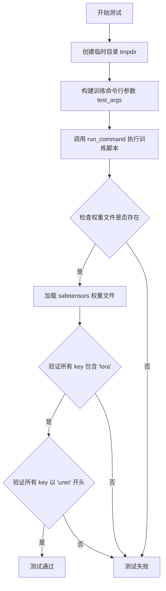

#### 带注释源码

```python
def test_dreambooth_lora_sdxl(self):
    # 创建一个临时目录用于存放训练输出
    with tempfile.TemporaryDirectory() as tmpdir:
        # 构建 SDXL LoRA 训练的命令行参数
        # 使用 huggingface 上提供的 tiny-stable-diffusion-xl-pipe 模型进行快速测试
        test_args = f"""
            examples/dreambooth/train_dreambooth_lora_sdxl.py
            --pretrained_model_name_or_path hf-internal-testing/tiny-stable-diffusion-xl-pipe
            --instance_data_dir docs/source/en/imgs
            --instance_prompt photo
            --resolution 64
            --train_batch_size 1
            --gradient_accumulation_steps 1
            --max_train_steps 2
            --learning_rate 5.0e-04
            --scale_lr
            --lr_scheduler constant
            --lr_warmup_steps 0
            --output_dir {tmpdir}
            """.split()

        # 使用 accelerate 启动训练脚本
        # self._launch_args 包含加速训练的配置参数
        run_command(self._launch_args + test_args)
        
        # 保存预训练模型的冒烟测试
        # 验证 LoRA 权重文件是否正确生成
        self.assertTrue(os.path.isfile(os.path.join(tmpdir, "pytorch_lora_weights.safetensors")))

        # 确保 state_dict 中的参数命名正确
        # 加载生成的 LoRA 权重文件
        lora_state_dict = safetensors.torch.load_file(os.path.join(tmpdir, "pytorch_lora_weights.safetensors"))
        
        # 验证所有 key 都包含 'lora' 字符串
        # 这是 LoRA 权重的标识性命名规范
        is_lora = all("lora" in k for k in lora_state_dict.keys())
        self.assertTrue(is_lora)

        # 当不训练 text encoder 时，所有参数应该以 'unet' 开头
        # 验证这一点确保训练流程正确配置
        starts_with_unet = all(key.startswith("unet") for key in lora_state_dict.keys())
        self.assertTrue(starts_with_unet)
```


### `DreamBoothLoRASDXL.test_dreambooth_lora_sdxl_with_text_encoder`

该方法是 `DreamBoothLoRASDXL` 测试类中的一个测试函数，用于验证在使用 SDXL（Stable Diffusion XL）模型进行 DreamBooth LoRA 训练时，包含文本编码器（text_encoder）训练的场景是否正常工作。该测试通过执行训练脚本并验证生成的 LoRA 权重文件的键名是否符合预期（包含 "lora" 关键字，且所有键以 "unet"、"text_encoder" 或 "text_encoder_2" 开头）。

参数：

- `self`：隐式参数，`DreamBoothLoRASDXL` 类的实例，代表测试类本身

返回值：`None`，该方法为测试方法，无显式返回值，执行完成后通过断言验证测试结果

#### 流程图

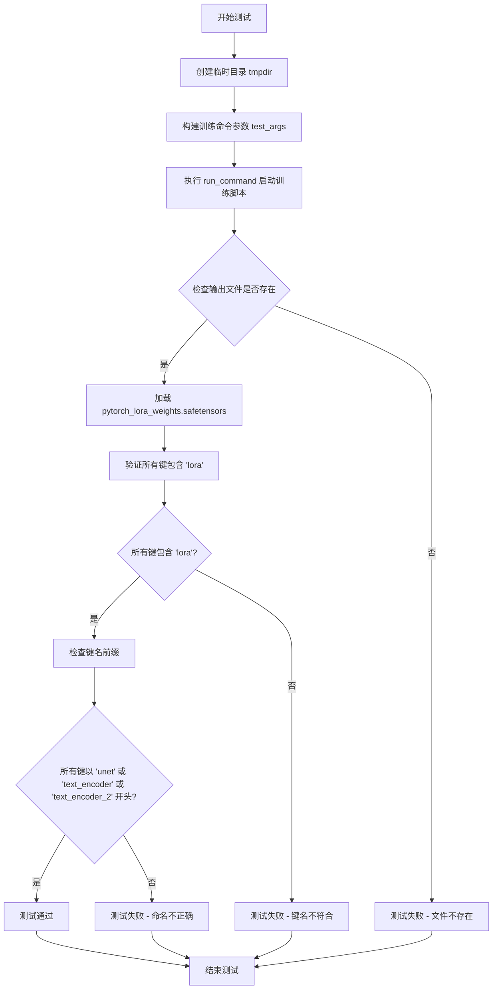

#### 带注释源码

```python
def test_dreambooth_lora_sdxl_with_text_encoder(self):
    """
    测试 DreamBooth LoRA SDXL 训练（包含文本编码器训练）
    验证使用 train_text_encoder 参数时生成的 LoRA 权重文件正确性
    """
    # 创建临时目录用于存放训练输出
    with tempfile.TemporaryDirectory() as tmpdir:
        # 构建训练脚本的命令行参数
        # 使用 HF 提供的 tiny-stable-diffusion-xl-pipe 测试模型
        test_args = f"""
            examples/dreambooth/train_dreambooth_lora_sdxl.py
            --pretrained_model_name_or_path hf-internal-testing/tiny-stable-diffusion-xl-pipe
            --instance_data_dir docs/source/en/imgs
            --instance_prompt photo
            --resolution 64
            --train_batch_size 1
            --gradient_accumulation_steps 1
            --max_train_steps 2
            --learning_rate 5.0e-04
            --scale_lr
            --lr_scheduler constant
            --lr_warmup_steps 0
            --output_dir {tmpdir}
            --train_text_encoder
            """.split()

        # 执行训练命令（self._launch_args 包含 accelerate 启动参数）
        run_command(self._launch_args + test_args)
        
        # 断言：验证 LoRA 权重文件已成功生成
        # save_pretrained smoke test - 冒烟测试确保文件存在
        self.assertTrue(os.path.isfile(os.path.join(tmpdir, "pytorch_lora_weights.safetensors")))

        # 加载生成的 LoRA 权重文件（safetensors 格式）
        lora_state_dict = safetensors.torch.load_file(os.path.join(tmpdir, "pytorch_lora_weights.safetensors"))
        
        # 验证：确保所有权重键名都包含 'lora' 关键字
        is_lora = all("lora" in k for k in lora_state_dict.keys())
        self.assertTrue(is_lora)

        # 获取所有键名
        keys = lora_state_dict.keys()
        
        # 验证：当训练文本编码器时，所有参数应来自 unet、text_encoder 或 text_encoder_2
        # 检查所有键是否以正确的组件名前缀开头
        starts_with_unet = all(
            k.startswith("unet") or k.startswith("text_encoder") or k.startswith("text_encoder_2") for k in keys
        )
        self.assertTrue(starts_with_unet)
```

#### 类详细信息

**所属类：** `DreamBoothLoRASDXL`

- **父类：** `ExamplesTestsAccelerate`
- **类描述：** 用于测试 SDXL（Stable Diffusion XL）模型的 DreamBooth LoRA 训练功能的测试类

#### 全局依赖

- `tempfile`：用于创建临时目录
- `os`：文件系统操作
- `safetensors`：LoRA 权重文件加载
- `run_command`：执行训练脚本的辅助函数（来自 test_examples_utils）
- `ExamplesTestsAccelerate`：测试基类（来自 test_examples_utils）

#### 关键组件信息

| 组件名称 | 描述 |
|---------|------|
| `train_dreambooth_lora_sdxl.py` | SDXL 模型的 DreamBooth LoRA 训练脚本 |
| `pytorch_lora_weights.safetensors` | 训练生成的 LoRA 权重文件 |
| `hf-internal-testing/tiny-stable-diffusion-xl-pipe` | 用于测试的轻量级 SDXL 模型 |

#### 潜在技术债务或优化空间

1. **硬编码的模型路径**：测试使用了硬编码的模型路径 `hf-internal-testing/tiny-stable-diffusion-xl-pipe`，建议提取为类或模块级常量
2. **重复的参数构建逻辑**：与其他测试方法（如 `test_dreambooth_lora_sdxl`）存在大量重复的参数构建代码，可考虑提取为辅助方法
3. **缺少负向测试**：当前仅验证正向场景（训练成功），缺少对异常情况的测试覆盖
4. **临时文件清理**：虽然使用了 `tempfile.TemporaryDirectory()`，但在大量测试执行时可能产生 I/O 开销

#### 其它项目

**设计目标：**
- 验证 SDXL 模型在使用 `--train_text_encoder` 参数时能够正确训练文本编码器的 LoRA 权重
- 确保生成的权重文件包含正确的参数命名约定

**错误处理：**
- 通过 `assertTrue` 断言进行错误检测
- 训练脚本执行失败会导致后续断言无法执行

**数据流：**
1. 输入：命令行参数 → 训练脚本
2. 处理：SDXL 模型训练（UNet + Text Encoder + Text Encoder 2）
3. 输出：LoRA 权重文件（safetensors 格式）
4. 验证：加载并检查权重键名

**外部依赖：**
- `diffusers` 库：模型加载
- `accelerate`：分布式训练框架
- `safetensors`：权重文件格式


### `DreamBoothLoRASDXL.test_dreambooth_lora_sdxl_custom_captions`

该方法是DreamBoothLoRASDXL类中的一个测试用例，用于测试使用自定义_caption（即通过dataset_name和caption_column参数传入的文本描述）来训练Stable Diffusion XL模型的DreamBooth LoRA功能。

参数：

- `self`：当前测试类实例，无需显式传递，由Python自动处理

返回值：无（`None`），该方法为单元测试方法，通过assert语句验证训练结果，不返回任何值

#### 流程图

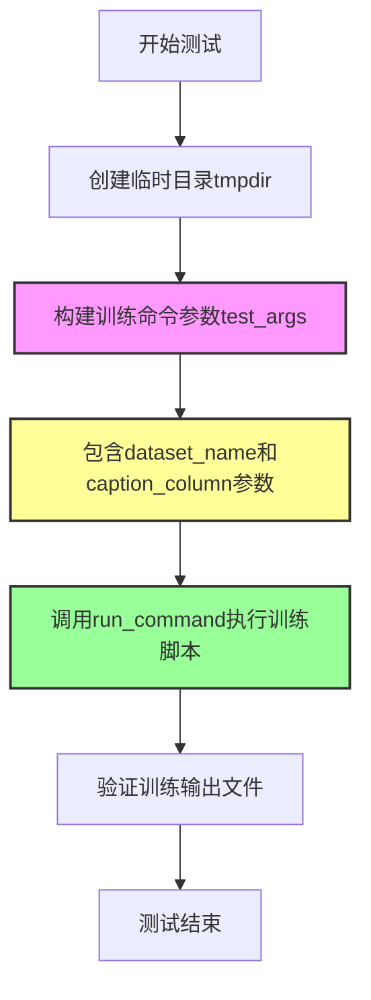

#### 带注释源码

```python
def test_dreambooth_lora_sdxl_custom_captions(self):
    """
    测试使用自定义caption（自定义文本描述）进行DreamBooth LoRA SDXL训练的功能。
    
    该测试用例验证：
    1. 可以通过dataset_name和caption_column参数传入自定义文本数据
    2. 训练脚本能够正确处理和利用这些自定义caption进行训练
    """
    # 使用 tempfile 创建临时目录，用于存放训练输出
    with tempfile.TemporaryDirectory() as tmpdir:
        # 构建训练脚本的命令行参数
        test_args = f"""
            examples/dreambooth/train_dreambooth_lora_sdxl.py
            # 指定预训练模型路径（使用测试用的小型SDXL模型）
            --pretrained_model_name_or_path hf-internal-testing/tiny-stable-diffusion-xl-pipe
            # 指定数据集名称（使用HuggingFace上的虚拟数据集）
            --dataset_name hf-internal-testing/dummy_image_text_data
            # 指定数据集中文本列的名称为'text'
            --caption_column text
            # 实例提示词（作为备用提示词）
            --instance_prompt photo
            # 图像分辨率设为64（测试用低分辨率）
            --resolution 64
            # 训练批次大小为1
            --train_batch_size 1
            # 梯度累积步数为1
            --gradient_accumulation_steps 1
            # 最大训练步数为2步（仅用于快速测试）
            --max_train_steps 2
            # 学习率设为5.0e-04
            --learning_rate 5.0e-04
            # 启用学习率自动缩放
            --scale_lr
            # 使用恒定学习率调度器
            --lr_scheduler constant
            # 学习率预热步数为0
            --lr_warmup_steps 0
            # 输出目录设为临时目录
            --output_dir {tmpdir}
            """.split()

        # 执行训练命令
        # _launch_args 来自父类 ExamplesTestsAccelerate，包含加速训练的必要参数
        run_command(self._launch_args + test_args)
        
        # 注意：该测试方法相比其他测试用例较为简单
        # 没有包含明确的 assert 语句进行结果验证
        # 属于基本的烟雾测试（smoke test），验证训练脚本能够正常运行
```


### `DreamBoothLoRASDXL.test_dreambooth_lora_sdxl_text_encoder_custom_captions`

该方法是 `DreamBoothLoRASDXL` 测试类中的一个测试用例，用于验证 DreamBooth LoRA 在 SDXL（Stable Diffusion XL）模型上使用自定义 captions 进行训练并同时训练 text_encoder 的功能是否正常。测试通过运行训练脚本并检查输出结果来验证训练流程的正确性。

参数：

- `self`：实例方法隐含的 `DreamBoothLoRASDXl` 类实例，表示测试类本身，无需显式传递

返回值：无返回值（`None`），该方法为测试用例，通过断言进行验证

#### 流程图

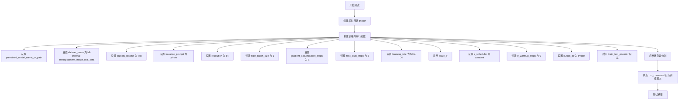

#### 带注释源码

```python
def test_dreambooth_lora_sdxl_text_encoder_custom_captions(self):
    """
    测试 DreamBooth LoRA SDXL 使用自定义 captions 并训练 text_encoder 的功能。
    
    该测试用例验证以下功能：
    1. 使用外部数据集（hf-internal-testing/dummy_image_text_data）进行训练
    2. 使用自定义 caption 列（text 列）作为训练文本
    3. 同时训练 text_encoder（--train_text_encoder）
    """
    # 使用 tempfile 创建临时目录，用于存放训练输出
    with tempfile.TemporaryDirectory() as tmpdir:
        # 构建训练脚本的命令行参数
        # 使用 f-string 格式化多行字符串，包含所有必要的训练参数
        test_args = f"""
            examples/dreambooth/train_dreambooth_lora_sdxl.py
            # 指定预训练模型路径：使用 HuggingFace 上的小型 SDXL pipe
            --pretrained_model_name_or_path hf-internal-testing/tiny-stable-diffusion-xl-pipe
            # 指定数据集名称：使用虚拟的图像文本数据集
            --dataset_name hf-internal-testing/dummy_image_text_data
            # 指定数据集中 caption 所在的列名
            --caption_column text
            # 实例提示词，用于描述要训练的主题
            --instance_prompt photo
            # 训练图像的分辨率
            --resolution 64
            # 训练批次大小
            --train_batch_size 1
            # 梯度累积步数
            --gradient_accumulation_steps 1
            # 最大训练步数
            --max_train_steps 2
            # 学习率
            --learning_rate 5.0e-04
            # 自动缩放学习率（基于批次大小等参数）
            --scale_lr
            # 学习率调度器类型
            --lr_scheduler constant
            # 学习率预热步数
            --lr_warmup_steps 0
            # 输出目录，存放训练生成的 LoRA 权重
            --output_dir {tmpdir}
            # 启用 text_encoder 的训练（这是该测试的关键区别点）
            --train_text_encoder
            """.split()

        # 执行训练命令
        # self._launch_args 包含加速启动所需的参数（如 GPU 数量等）
        # run_command 函数负责执行实际的训练脚本
        run_command(self._launch_args + test_args)
```

#### 关键信息说明

| 项目 | 说明 |
|------|------|
| **所属类** | `DreamBoothLoRASDXL` |
| **测试目标** | 验证 SDXL 模型使用自定义 captions 训练时同时训练 text_encoder |
| **训练脚本** | `examples/dreambooth/train_dreambooth_lora_sdxl.py` |
| **关键参数** | `--train_text_encoder` 标志启用 text_encoder 训练 |
| **验证方式** | 通过 `run_command` 执行训练脚本，无显式断言（ smoke test ） |

#### 潜在技术债务与优化空间

1. **缺少输出验证**：该测试方法在执行 `run_command` 后没有进行任何断言验证，仅仅是运行了训练脚本。建议添加对生成文件的检查，如验证 `pytorch_lora_weights.safetensors` 是否存在，或验证 state_dict 中的键名是否包含 `text_encoder` 前缀。

2. **与其他类似测试重复代码**：该方法与 `test_dreambooth_lora_sdxl_custom_captions` 方法结构高度相似，仅多了 `--train_text_encoder` 参数。可以考虑使用参数化测试（pytest.mark.parametrize）来减少代码重复。

3. **缺少资源清理验证**：测试没有验证训练过程中的临时文件是否被正确清理。


### `DreamBoothLoRASDXL.test_dreambooth_lora_sdxl_checkpointing_checkpoints_total_limit`

该方法是一个集成测试用例，用于验证 DreamBooth LoRA SDXL 训练过程中的检查点总数限制功能。测试通过运行训练脚本并设置 `checkpoints_total_limit=2`，然后验证只有最后的两个检查点（checkpoint-4 和 checkpoint-6）被保留，早期的检查点（checkpoint-2）被自动删除。

参数：

- `self`：实例方法隐式参数，表示类的实例本身

返回值：`None`，测试方法不返回任何值，通过断言验证检查点行为

#### 流程图

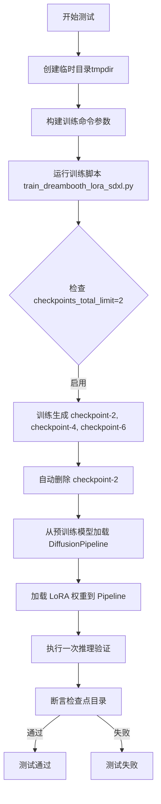

#### 带注释源码

```python
def test_dreambooth_lora_sdxl_checkpointing_checkpoints_total_limit(self):
    """
    测试 DreamBooth LoRA SDXL 检查点总数限制功能
    
    该测试验证当设置 checkpoints_total_limit=2 时，
    训练过程会自动删除较早的检查点，只保留最近的两个检查点。
    """
    # 定义预训练模型路径
    pipeline_path = "hf-internal-testing/tiny-stable-diffusion-xl-pipe"

    # 创建临时目录用于存放训练输出
    with tempfile.TemporaryDirectory() as tmpdir:
        # 构建训练命令参数列表
        test_args = f"""
            examples/dreambooth/train_dreambooth_lora_sdxl.py
            --pretrained_model_name_or_path {pipeline_path}  # 预训练模型路径
            --instance_data_dir docs/source/en/imgs           # 实例数据目录
            --instance_prompt photo                           # 实例提示词
            --resolution 64                                   # 图像分辨率
            --train_batch_size 1                             # 训练批次大小
            --gradient_accumulation_steps 1                  # 梯度累积步数
            --max_train_steps 6                               # 最大训练步数
            --checkpointing_steps=2                           # 保存检查点的步数间隔
            --checkpoints_total_limit=2                      # 检查点总数限制
            --learning_rate 5.0e-04                           # 学习率
            --scale_lr                                        # 是否缩放学习率
            --lr_scheduler constant                          # 学习率调度器
            --lr_warmup_steps 0                               # 学习率预热步数
            --output_dir {tmpdir}                             # 输出目录
            """.split()

        # 执行训练命令
        run_command(self._launch_args + test_args)

        # 从预训练模型加载 DiffusionPipeline
        pipe = DiffusionPipeline.from_pretrained(pipeline_path)
        
        # 加载训练得到的 LoRA 权重
        pipe.load_lora_weights(tmpdir)
        
        # 执行一次推理验证模型可以正常工作
        pipe("a prompt", num_inference_steps=1)

        # 检查 checkpoint 目录是否存在
        # checkpoint-2 应该在训练过程中被删除
        # 只应保留 checkpoint-4 和 checkpoint-6
        self.assertEqual(
            {x for x in os.listdir(tmpdir) if "checkpoint" in x}, 
            {"checkpoint-4", "checkpoint-6"}
        )
```


### `DreamBoothLoRASDXL.test_dreambooth_lora_sdxl_text_encoder_checkpointing_checkpoints_total_limit`

该测试方法用于验证在使用 SDXL 模型的 DreamBooth LoRA 训练过程中，当启用 text_encoder 训练时，`checkpoints_total_limit` 功能能否正确限制保存的 checkpoint 数量，并自动删除旧的 checkpoint。

参数：

- `self`：`DreamBoothLoRASDXL` 类实例，隐含的测试类实例参数

返回值：`None`，该方法为测试方法，无返回值，通过断言验证功能正确性

#### 流程图

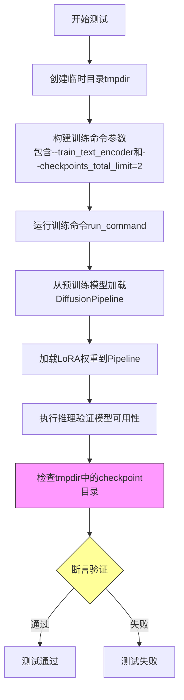

#### 带注释源码

```python
def test_dreambooth_lora_sdxl_text_encoder_checkpointing_checkpoints_total_limit(self):
    """
    测试 SDXL 模型 DreamBooth LoRA 训练中，
    当启用 text_encoder 训练时的 checkpoints_total_limit 功能。
    
    验证点：
    1. 训练过程能正常完成
    2. LoRA 权重能正确加载到 Pipeline
    3. 模型能正常执行推理
    4. checkpoint 数量限制功能正常工作（保留最新的2个，删除旧的）
    """
    # 定义预训练模型路径，使用 HuggingFace 的测试用 tiny SDXL pipeline
    pipeline_path = "hf-internal-testing/tiny-stable-diffusion-xl-pipe"

    # 创建临时目录用于存放训练输出和 checkpoint
    with tempfile.TemporaryDirectory() as tmpdir:
        # 构建训练命令参数列表
        test_args = f"""
            examples/dreambooth/train_dreambooth_lora_sdxl.py
            --pretrained_model_name_or_path {pipeline_path}
            --instance_data_dir docs/source/en/imgs
            --instance_prompt photo
            --resolution 64
            --train_batch_size 1
            --gradient_accumulation_steps 1
            --max_train_steps 7
            --checkpointing_steps=2
            --checkpoints_total_limit=2
            --train_text_encoder
            --learning_rate 5.0e-04
            --scale_lr
            --lr_scheduler constant
            --lr_warmup_steps 0
            --output_dir {tmpdir}
            """.split()

        # 执行训练命令，self._launch_args 包含 accelerate 启动参数
        run_command(self._launch_args + test_args)

        # 训练完成后，从预训练路径加载 DiffusionPipeline
        pipe = DiffusionPipeline.from_pretrained(pipeline_path)
        
        # 从临时目录加载训练好的 LoRA 权重
        pipe.load_lora_weights(tmpdir)
        
        # 执行一次推理，验证 LoRA 权重能正确加载并用于生成
        pipe("a prompt", num_inference_steps=2)

        # 检查 checkpoint 目录，验证 checkpoints_total_limit 是否生效
        # 预期保留 checkpoint-4 和 checkpoint-6（最新的2个）
        # checkpoint-2 应该被自动删除（因为超过了 2 个的限制）
        self.assertEqual(
            {x for x in os.listdir(tmpdir) if "checkpoint" in x},
            # checkpoint-2 should have been deleted
            {"checkpoint-4", "checkpoint-6"},
        )
```

## 关键组件


### DreamBoothLoRA

DreamBooth LoRA（低秩适应）训练的核心测试类，涵盖Stable Diffusion 1.x模型的LoRA微调流程，包括基础训练、文本编码器训练、检查点管理和IF模型支持等功能验证。

### DreamBoothLoRASDXL

针对Stable Diffusion XL（SDXL）架构的DreamBooth LoRA训练测试类，支持双文本编码器（text_encoder和text_encoder_2）、自定义标题数据集、检查点总数限制等SDXL特有功能验证。

### LoRA权重保存与验证

通过safetensors格式保存训练得到的LoRA权重，并验证state_dict中的键名是否正确包含"lora"标识符，以及是否符合预期的模块前缀（unet/text_encoder/text_encoder_2）。

### 检查点管理策略

实现训练过程中检查点的自动保存与清理机制，支持checkpoints_total_limit参数控制保留的最大检查点数量，并能在恢复训练时智能处理旧检查点的删除。

### 文本编码器训练支持

区分是否训练文本编码器两种模式：不训练时仅保存unet前缀的LoRA参数，训练时同时保存text_encoder和text_encoder_2（前缀）对应的LoRA参数。

### 预计算文本嵌入

通过--pre_compute_text_embeddings和--tokenizer_max_length参数支持文本嵌入的预计算，可配合--text_encoder_use_attention_mask使用，提升训练效率。

### 训练配置参数

涵盖核心超参数：学习率（learning_rate）、训练批次大小（train_batch_size）、梯度累积步数（gradient_accumulation_steps）、最大训练步数（max_train_steps）、学习率调度器（lr_scheduler）和warmup步数（lr_warmup_steps）。

### DiffusionPipeline集成

使用HuggingFace的DiffusionPipeline加载预训练模型，并通过load_lora_weights方法将训练好的LoRA权重应用到模型进行推理验证。

### 临时目录管理

利用tempfile.TemporaryDirectory()自动管理测试过程中的输出目录，确保测试结束后自动清理生成的临时文件。


## 问题及建议


### 已知问题

- **大量重复代码**：测试方法中存在大量重复的参数设置和验证逻辑，如 resolution、train_batch_size、gradient_accumulation_steps、max_train_steps、learning_rate 等参数在多个测试中重复定义，且验证 lora_state_dict 的逻辑（检查 "lora" 关键字、检查 key 前缀）多次出现。
- **硬编码的测试参数**：测试参数如分辨率 64、batch size 1、max_train_steps 2 等被硬编码在各个测试方法中，缺乏灵活性和可维护性。
- **缺少错误处理与异常验证**：测试仅验证输出文件存在和 state_dict 的 key 命名规则，未验证训练过程中可能出现的错误、权重实际可加载性、或模型输出的有效性（如推理是否能正常执行）。
- **外部依赖缺乏容错**：测试依赖 `docs/source/en/imgs` 目录和 HuggingFace Hub 上的预训练模型（hf-internal-testing/tiny-stable-diffusion-pipe 等），未处理资源不存在或网络异常的情况。
- **日志配置不规范**：使用 `logging.basicConfig(level=logging.DEBUG)` 可能导致日志泛滥，且 `logging.getLogger()` 未指定名称（应使用 `__name__`），不利于日志分类和调试。
- **sys.path 滥用**：使用 `sys.path.append("..")` 添加路径，这种方式不符合 Python 最佳实践，容易导致导入冲突。
- **魔法数字与缺乏文档**：checkpoint 相关的数字（如 checkpoints_total_limit=2、checkpointing_steps=2）缺乏解释，测试意图不够清晰。

### 优化建议

- **使用参数化测试或基类**：将 `DreamBoothLoRA` 和 `DreamBoothLoRASDXL` 的公共逻辑提取到基类或使用 pytest parametrize，减少重复代码。
- **提取公共配置**：创建共享的测试配置字典或 fixture，统一管理分辨率、batch size、学习率等参数。
- **增强错误处理**：添加对训练异常、权重加载失败、推理失败等情况的断言和验证。
- **改进资源管理**：使用 pytest fixtures 管理临时目录，确保资源正确清理；为 `run_command` 添加超时参数。
- **规范化日志与路径**：使用 `logging.getLogger(__name__)`，并将日志级别改为 INFO 或 WARNING；使用绝对导入或配置 PYTHONPATH 替代 sys.path 修改。
- **添加文档注释**：为关键测试方法、配置参数、魔法数字添加注释，说明测试目的和预期行为。
- **考虑异步测试**：对于耗时的训练任务，考虑使用异步执行或标记为慢速测试，避免阻塞 CI/CD 流程。

## 其它


### 设计目标与约束

本代码的设计目标是验证DreamBooth LoRA训练脚本的功能正确性，包括基础训练、文本编码器训练、检查点管理、模型加载等核心功能。约束条件包括：使用小型测试模型（hf-internal-testing/tiny-stable-diffusion-pipe等）进行快速验证，训练步数限制为2-8步，分辨率为64x64，训练批次大小为1。

### 错误处理与异常设计

测试用例通过`assertTrue`和`assertEqual`进行结果验证，使用`tempfile.TemporaryDirectory()`确保临时资源自动清理。命令执行异常由`run_command`函数捕获，文件未找到、权限问题、训练脚本错误等会直接导致测试失败。日志通过`logging.basicConfig(level=logging.DEBUG)`和StreamHandler输出到stdout。

### 数据流与状态机

测试流程为：创建临时目录→构造训练命令行参数→调用run_command执行训练脚本→验证输出文件存在→加载safetensors权重文件→验证状态字典键名符合预期（lora、unet、text_encoder等前缀）。检查点测试额外验证目录清理逻辑，确保保留最新的N个检查点。

### 外部依赖与接口契约

主要依赖包括：`diffusers.DiffusionPipeline`（模型加载）、`safetensors.torch`（权重读写）、`test_examples_utils.ExamplesTestsAccelerate`（测试基类）、`run_command`（命令执行工具）。接口契约要求训练脚本输出`pytorch_lora_weights.safetensors`文件，状态字典键名必须包含"lora"且符合模型组件前缀规范。

### 性能考虑

使用极小模型和最少训练步数（2步）以实现快速验证，分辨率限制为64x64，训练批次大小为1。检查点测试通过`checkpoints_total_limit`参数控制磁盘空间使用，避免生成过多检查点。

### 安全性考虑

代码遵循Apache 2.0许可证，使用临时目录隔离文件系统操作。依赖的safetensors格式提供安全反序列化机制。测试在临时目录执行，不会污染系统目录。

### 配置管理

测试参数通过命令行参数传递，包括：模型路径（--pretrained_model_name_or_path）、数据目录（--instance_data_dir）、输出目录（--output_dir）、训练步数（--max_train_steps）、学习率（--learning_rate）、检查点策略（--checkpoints_total_limit、--checkpointing_steps）等。

### 版本兼容性

代码使用HuggingFace diffusers库的DiffusionPipeline，需要兼容的diffusers版本。safetensors格式需要对应版本的safetensors库。测试针对Stable Diffusion 1.x（DreamBoothLoRA）和SDXL（DreamBoothLoRASDXL）两种模型架构。

### 资源清理

使用`tempfile.TemporaryDirectory()`上下文管理器，自动清理临时目录及其内容。测试完成后临时目录会被删除，释放磁盘空间。

### 测试覆盖范围

覆盖场景包括：基础LoRA训练、文本编码器联合训练、检查点总数限制、检查点恢复训练、自定义数据集caption、IF模型支持。验证点包括：输出文件存在性、状态字典键名规范、模型可加载性。

### 部署注意事项

本测试文件用于CI/CD验证，不直接部署到生产环境。部署时需考虑：训练脚本的依赖安装、GPU内存要求（测试使用最小配置）、模型存储空间、分布式训练支持（使用accelerate）。

    