# `diffusers\examples\dreambooth\test_dreambooth_lora_edm.py` 详细设计文档

这是Hugging Face diffusers项目中的一个测试文件，用于验证DreamBooth LoRA SDXL训练脚本的正确性。代码包含两个测试用例：test_dreambooth_lora_sdxl_with_edm用于测试EDM风格的LoRA训练，test_dreambooth_lora_playground用于测试Playground模型的LoRA训练，两者都验证生成的LoRA权重文件的命名规范和参数正确性。

## 整体流程

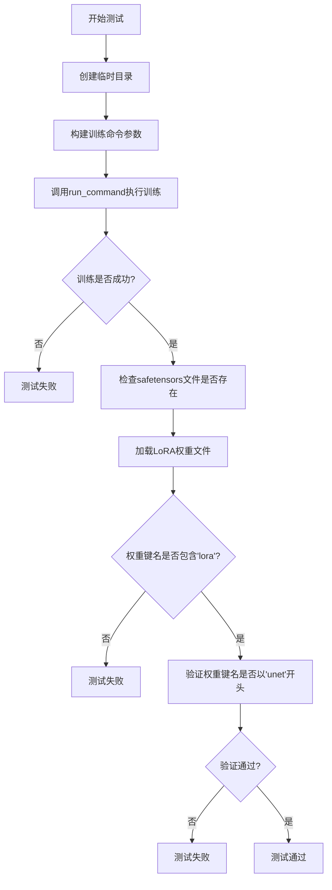

## 类结构

```
ExamplesTestsAccelerate (基类)
└── DreamBoothLoRASDXLWithEDM (测试类)
```

## 全局变量及字段


### `logger`
    
全局日志记录器，用于输出调试信息

类型：`logging.Logger`
    


### `stream_handler`
    
日志处理器，将日志输出到标准输出(sys.stdout)

类型：`logging.StreamHandler`
    


### `DreamBoothLoRASDXLWithEDM._launch_args`
    
继承自ExamplesTestsAccelerate的加速器启动参数列表

类型：`list`
    
    

## 全局函数及方法


### `logging.basicConfig`

`logging.basicConfig` 是 Python 标准库 `logging` 模块中的一个函数，用于以简单方式配置根日志记录器。它设置日志级别、格式、输出目标等基本配置，使得应用程序能够快速启用日志记录功能。

参数：

- `level`：`int` 或 `logging.Level`，日志记录的最低级别，只有级别等于或高于此值的日志消息才会被处理。常用值包括 `logging.DEBUG`、`logging.INFO`、`logging.WARNING`、`logging.ERROR`、`logging.CRITICAL`
- `filename`：`str`，可选参数，指定日志输出到的文件名。如果指定此参数，日志消息将写入文件而不是控制台
- `filemode`：`str`，可选参数，指定打开文件的模式，默认为 `'a'`（追加模式）
- `format`：`str`，可选参数，指定日志消息的格式字符串，默认为 `%(levelname)s:%(name)s:%(message)s`
- `datefmt`：`str`，可选参数，指定日期/时间格式
- `stream`：`IO` 或 `None`，可选参数，指定日志输出流（如 `sys.stdout`），如果指定了 `filename` 则此参数被忽略
- `handlers`：`list`，可选参数，指定要添加到根日志记录器的处理器列表

返回值：`None`，该函数不返回任何值，仅进行配置操作

#### 流程图

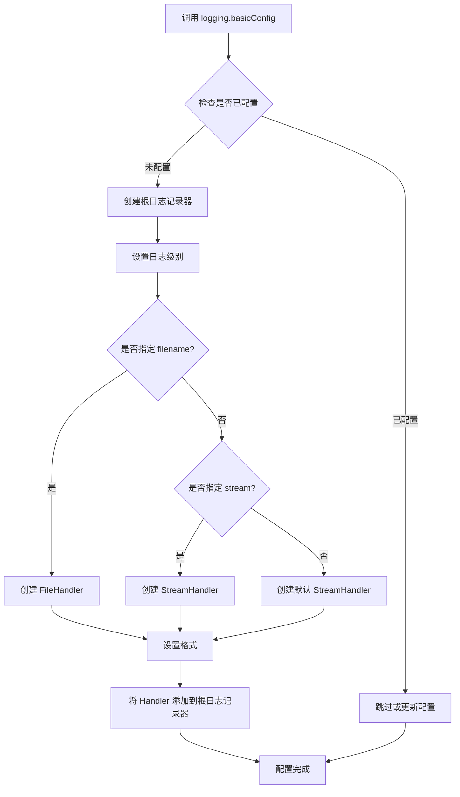

#### 带注释源码

```python
# 调用 logging.basicConfig 配置根日志记录器
# 设置日志级别为 DEBUG，这意味着所有 DEBUG 级别及以上的日志都会被记录
logging.basicConfig(level=logging.DEBUG)

# 获取根日志记录器实例
logger = logging.getLogger()

# 创建流处理器，将日志输出到标准输出（stdout）
stream_handler = logging.StreamHandler(sys.stdout)

# 将流处理器添加到根日志记录器
# 这样配置后，日志消息会同时输出到控制台
logger.addHandler(stream_handler)

# 完整调用形式示例：
# logging.basicConfig(
#     level=logging.DEBUG,              # 设置日志级别
#     format='%(asctime)s - %(name)s - %(levelname)s - %(message)s',  # 日志格式
#     datefmt='%Y-%m-%d %H:%M:%S',       # 日期时间格式
#     filename='app.log',                # 输出到文件（可选）
#     filemode='a',                     # 文件追加模式
#     stream=sys.stdout                 # 输出到标准输出
# )
```


### `logging.getLogger`

获取或创建一个logger实例，用于记录应用程序的日志信息。该函数是Python标准库logging模块的核心函数之一，用于获取根logger或指定名称的logger。

参数：

- 无参数

返回值：`logging.Logger`，返回根Logger实例，后续可使用该实例进行日志记录操作（如debug、info、warning、error、critical等级别）

#### 流程图

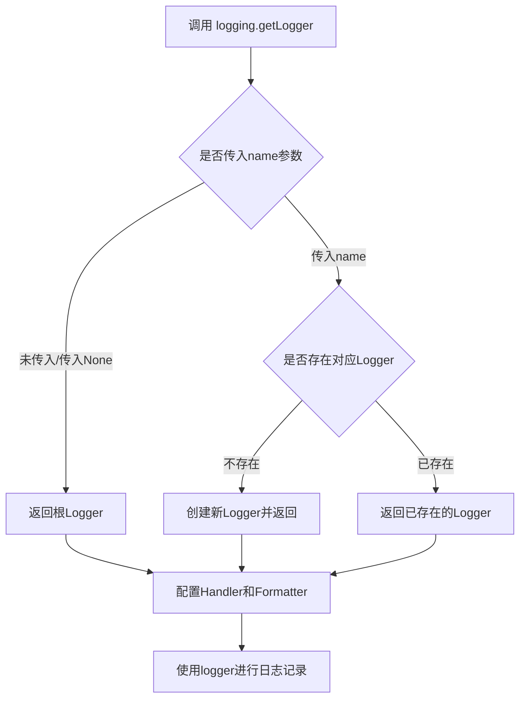

#### 带注释源码

```python
import logging
import sys

# 配置根Logger的日志级别为DEBUG
logging.basicConfig(level=logging.DEBUG)

# 获取根Logger实例（不传入name参数）
logger = logging.getLogger()

# 创建流处理器，将日志输出到标准输出
stream_handler = logging.StreamHandler(sys.stdout)

# 将流处理器添加到Logger中
logger.addHandler(stream_handler)

# 后续可以使用logger进行不同级别的日志记录
# logger.debug("调试信息")
# logger.info("一般信息")
# logger.warning("警告信息")
# logger.error("错误信息")
# logger.critical("严重错误信息")
```


### `logging.StreamHandler`

`logging.StreamHandler` 是 Python `logging` 模块中的一个类，用于创建日志处理器，将日志输出到指定的流（默认为标准错误输出）。在当前代码中，它被实例化并将日志输出重定向到标准输出流 `sys.stdout`。

参数：

- `stream`：`typing.TextIO`，可选参数，要输出到的流对象。默认为 `sys.stderr`，在当前代码中显式传递 `sys.stdout` 以将日志输出到标准输出。

返回值：`logging.StreamHandler`，返回新创建的流处理器实例。

#### 流程图

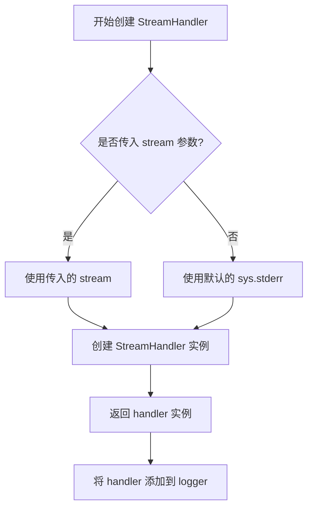

#### 带注释源码

```python
# 导入 logging 模块
import logging
# 导入 sys 模块以访问标准输入输出
import sys

# 获取根 logger 实例
logger = logging.getLogger()

# 创建 StreamHandler 实例，指定输出流为 sys.stdout（标准输出）
# StreamHandler 类的构造函数接受一个可选的 stream 参数
# 如果不传，默认为 sys.stderr
stream_handler = logging.StreamHandler(sys.stdout)

# 将创建的 handler 添加到 logger 中
# 这样 logger 输出的日志会通过该 handler 发送到指定流
logger.addHandler(stream_handler)
```

#### 额外说明

在 `logging.StreamHandler` 类的内部实现中，其核心方法包括：

1. **`__init__(self, stream=None)`**：初始化处理器，接受可选的流参数
2. **`emit(self, record)`**：将日志记录格式化并输出到流中
3. **`flush()`**：刷新流缓冲区
4. **`setFormatter(self, fmt)`**：设置格式化器

这个处理器是日志系统的重要组成部分，允许将日志重定向到任何文本流对象，如标准输出、文件或其他可写的 I/O 对象。


### `tempfile.TemporaryDirectory`

`tempfile.TemporaryDirectory` 是 Python 标准库中的临时目录管理函数，用于创建自动清理的临时目录。当程序退出 with 代码块时，该临时目录及其所有内容会自动被删除，避免临时文件残留。

参数：

- `suffix`：`str`，可选，添加到目录名的后缀
- `prefix`：`str`，可选，目录名的前缀
- `dir`：`str`，可选，指定创建临时目录的父目录

返回值：`tempfile.TemporaryDirectory`，返回一个上下文管理器对象，该对象具有 `.name` 属性用于获取临时目录路径

#### 流程图

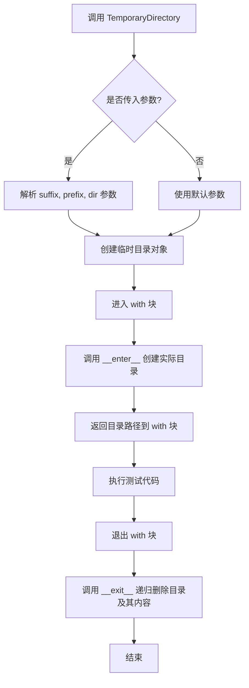

#### 带注释源码

```python
# tempfile.TemporaryDirectory 源码分析

# 使用示例（在给定代码中）
with tempfile.TemporaryDirectory() as tmpdir:
    # tmpdir 是临时目录的路径字符串
    # 在此处可以安全地进行文件操作
    
    test_args = f"""
        examples/dreambooth/train_dreambooth_lora_sdxl.py
        --pretrained_model_name_or_path hf-internal-testing/tiny-stable-diffusion-xl-pipe
        --do_edm_style_training
        --instance_data_dir docs/source/en/imgs
        --instance_prompt photo
        --resolution 64
        --train_batch_size 1
        --gradient_accumulation_steps 1
        --max_train_steps 2
        --learning_rate 5.0e-04
        --scale_lr
        --lr_scheduler constant
        --lr_warmup_steps 0
        --output_dir {tmpdir}
        """.split()
    
    run_command(self._launch_args + test_args)
    # ... 执行其他测试逻辑

# 退出 with 块后，tmpdir 目录及其内容会自动被删除
```

#### 核心实现逻辑

```python
import tempfile
import shutil
import os

class TemporaryDirectory:
    """创建临时目录的上下文管理器"""
    
    def __init__(self, suffix=None, prefix=None, dir=None):
        self.name = tempfile.mkdtemp(suffix, prefix, dir)  # 创建实际目录
    
    def __enter__(self):
        return self.name  # 返回目录路径
    
    def __exit__(self, exc, value, tb):
        self.cleanup()  # 清理临时目录
    
    def cleanup(self, _warn=False):
        """递归删除目录树"""
        if self.name:
            shutil.rmtree(self.name)  # 删除目录及所有内容
```


### `safetensors.torch.load_file`

从 safetensors 格式的文件中加载 PyTorch 张量到内存中，返回包含所有张量的字典（state_dict）。

参数：

-  `filename`：`str`，要加载的 safetensors 文件的路径

返回值：`dict`，键为参数名称（字符串），值为 PyTorch 张量（torch.Tensor），表示模型的状态字典

#### 流程图

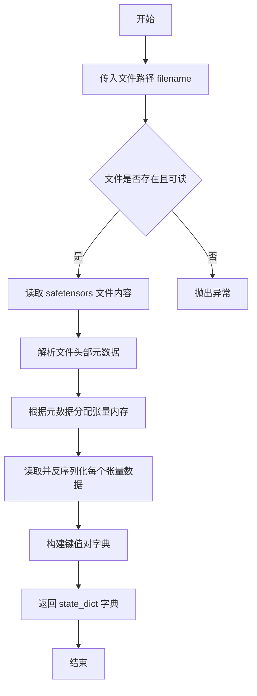

#### 带注释源码

```python
# safetensors.torch.load_file 函数实现示例
# 基于库的标准调用方式推断

def load_file(filename: str) -> dict:
    """
    从 safetensors 文件加载张量到内存
    
    参数:
        filename: safetensors 文件的路径
        
    返回:
        包含所有张量的字典，键为参数名称，值为 PyTorch 张量
    """
    # 在代码中的实际调用方式：
    # lora_state_dict = safetensors.torch.load_file(
    #     os.path.join(tmpdir, "pytorch_lora_weights.safetensors")
    # )
    #
    # 这里传入的是完整的文件路径字符串
    # 返回的 lora_state_dict 是一个字典对象
    #
    # 后续用于验证：
    # - 检查键中是否包含 "lora" 字符串
    # - 检查键是否以 "unet" 开头
    
    pass  # 具体实现由 safetensors 库提供
```


### `os.path.isfile`

该函数是 Python 标准库 `os.path` 模块中的方法，用于检查给定路径是否指向一个存在的常规文件（非目录、符号链接或其他文件类型）。

参数：

-  `path`：`str`，要检查的文件路径，可以是绝对路径或相对路径

返回值：`bool`，如果路径存在且是一个常规文件则返回 `True`，否则返回 `False`

#### 流程图

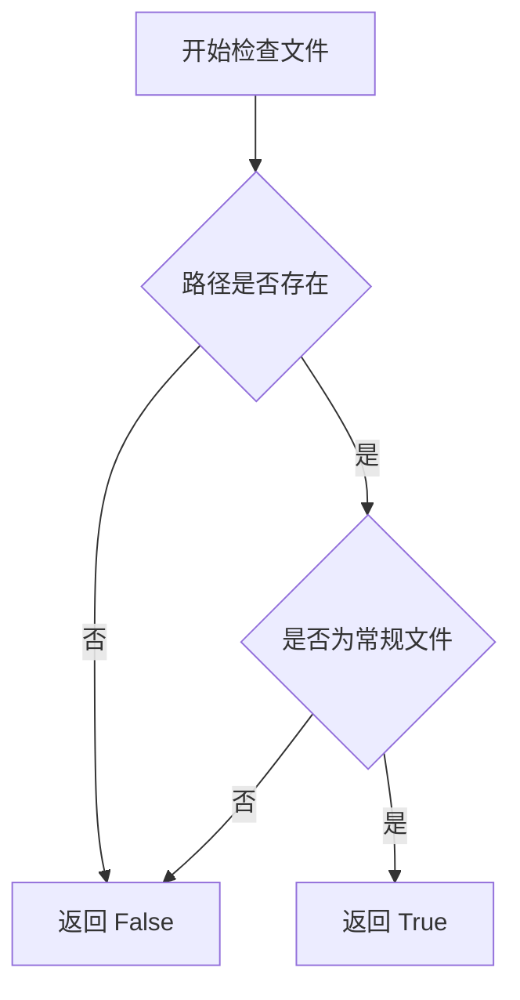

#### 带注释源码

```python
# os.path.isfile 函数的典型使用方式（从代码中提取）

# 导入 os 模块（通常在文件顶部）
import os

# 在代码中的实际调用方式：
# 使用 os.path.isfile 检查训练输出目录中是否生成了 LoRA 权重文件
result = os.path.isfile(os.path.join(tmpdir, "pytorch_lora_weights.safetensors"))

# os.path.join(tmpdir, "pytorch_lora_weights.safetensors") 
#   -> 拼接临时目录路径和文件名，得到完整的文件路径

# os.path.isfile(path) 
#   -> 检查该路径是否指向一个存在的常规文件
#   -> 返回 True 如果文件存在且不是目录/符号链接
#   -> 返回 False 如果文件不存在或是目录等

# 用途：在测试中验证训练过程是否成功生成了模型权重文件
self.assertTrue(result)
```

#### 详细说明

| 属性 | 值 |
|------|-----|
| **函数名** | `os.path.isfile` |
| **所属模块** | `os.path` (Python 标准库) |
| **参数类型** | `str` 或 `os.PathLike` |
| **返回值类型** | `bool` |
| **代码位置** | 第 52 行和第 78 行 |

#### 使用场景

在 DreamBooth LoRA SDXL 训练测试中，该函数用于：

1. **验证输出文件生成**：检查 `pytorch_lora_weights.safetensors` 是否成功创建
2. **测试断言**：作为 `assertTrue` 的条件，确保训练流程正常运行
3. **烟雾测试**：快速验证模型保存功能是否正常工作


### `os.path.join`

`os.path.join` 是 Python 标准库 `os` 模块中的一个函数，用于将多个路径组件智能地拼接成一个完整的文件系统路径，会根据操作系统自动正确处理路径分隔符（例如 Unix 系统使用 `/`，Windows 系统使用 `\`）。

#### 参数

- `*paths`：`str`，可变数量的路径组件，要连接的一个或多个路径组件（字符串类型）

#### 返回值

- `str`，连接后的完整路径字符串

#### 流程图

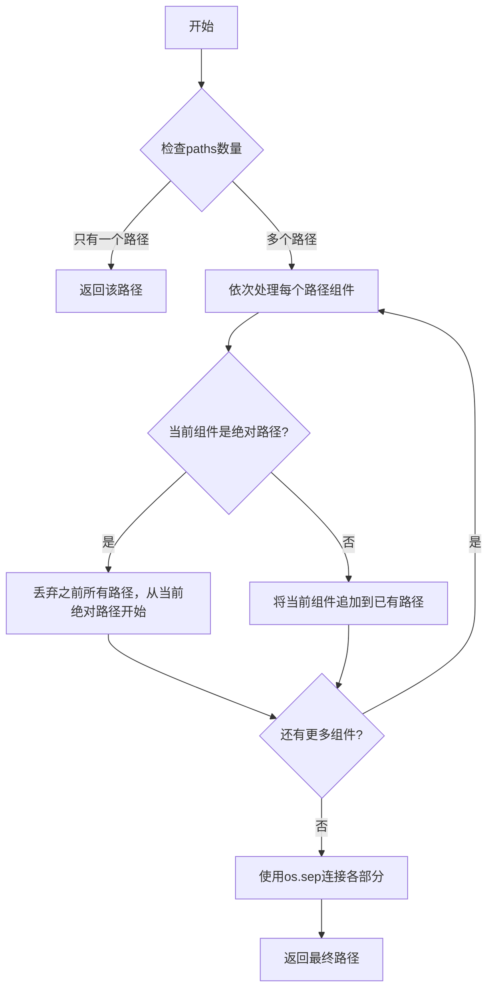

#### 带注释源码

```python
# os.path.join 函数的典型使用示例
# 位于: Python 标准库 os.path 模块
# 源码位置: /usr/lib/python3.x/posixpath.py 或 ntpath.py

# 在本代码中的实际调用示例:
# 1. 第43行:
file_path = os.path.join(tmpdir, "pytorch_lora_weights.safetensors")
# 用途: 将输出目录 tmpdir 和文件名 "pytorch_lora_weights.safetensors" 
#      拼接成完整的文件路径
# 返回值示例: "/tmp/xyz123/pytorch_loro_weights.safetensors"

# 2. 第59行:
lora_state_dict = safetensors.torch.load_file(
    os.path.join(tmpdir, "pytorch_lora_weights.safetensors")
)
# 用途: 读取训练输出目录中的 LoRA 权重文件
#       使用 os.path.join 确保跨平台路径兼容性
```

#### 在本项目中的具体调用信息

| 调用位置 | 参数1 | 参数2 | 用途 |
|---------|-------|-------|------|
| 第43行 | `tmpdir` (str) - 临时输出目录 | `"pytorch_loro_weights.safetensors"` (str) - LoRA权重文件名 | 检查输出文件是否正确生成 |
| 第59行 | `tmpdir` (str) - 临时输出目录 | `"pytorch_loro_weights.safetensors"` (str) - LoRA权重文件名 | 加载生成的LoRA权重进行验证 |

#### 关键特性说明

1. **跨平台兼容性**: 自动使用 `os.sep`（路径分隔符），确保在 Windows、Linux、macOS 上都能正确工作
2. **智能处理**: 会忽略空字符串和单独的根路径（如 Unix 系统的 `/`）
3. **绝对路径处理**: 如果遇到绝对路径，会丢弃之前的所有路径组件

#### 潜在优化空间

1. **路径验证**: 建议在调用 `os.path.join` 后添加 `os.path.exists()` 检查，确保目录存在
2. **路径规范化**: 可以考虑使用 `os.path.normpath()` 进一步规范化路径，移除多余的 `..` 和 `.`
3. **错误处理**: 当前代码未对文件读取失败的情况进行异常捕获


# 设计文档提取结果

由于提供的代码片段并未包含 `run_command` 函数的具体实现（该函数是从 `test_examples_utils` 模块导入的），我无法直接获取其源代码。但我可以从调用方式中分析其使用模式。

---

### `run_command`

该函数用于执行命令行指令，通常在测试环境中运行训练脚本或命令行工具。

参数：

-  `cmd`：`List[str]`，命令行参数列表，包含要执行的命令及其参数

返回值：`int`，通常返回命令的退出码（0 表示成功）

#### 流程图

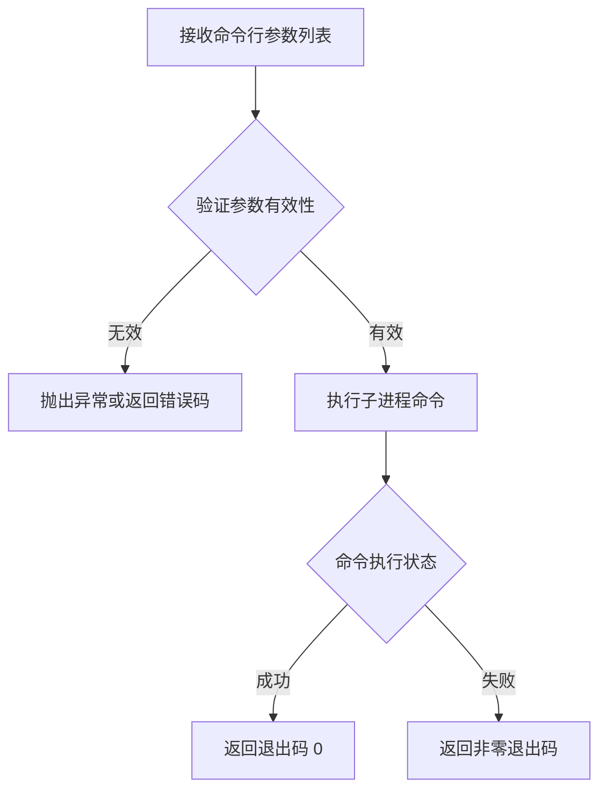

#### 带注释源码

```python
# 注意：以下为基于调用模式的推断代码
# 实际源码位于 test_examples_utils 模块中

def run_command(cmd: List[str]) -> int:
    """
    执行给定的命令行指令
    
    参数:
        cmd: 命令行参数列表
        
    返回值:
        命令执行的退出码，0表示成功
    """
    # 从导入语句和调用方式推断：
    # 1. 接收列表形式的命令行参数
    # 2. 使用 subprocess 或类似方式执行
    # 3. 返回进程退出码
    pass
```

---

## 补充说明

### 调用示例分析

从代码中的调用方式可以进一步了解该函数的用法：

```python
# 调用方式 1：结合 launch_args 和测试参数
run_command(self._launch_args + test_args)

# 其中 test_args 示例：
test_args = """
    examples/dreambooth/train_dreambooth_lora_sdxl.py
    --pretrained_model_name_or_path hf-internal-testing/tiny-stable-diffusion-xl-pipe
    --do_edm_style_training
    --instance_data_dir docs/source/en/imgs
    --instance_prompt photo
    --resolution 64
    --train_batch_size 1
    --gradient_accumulation_steps 1
    --max_train_steps 2
    --learning_rate 5.0e-04
    --scale_lr
    --lr_scheduler constant
    --lr_warmup_steps 0
    --output_dir {tmpdir}
    """.split()
```

### 注意事项

由于原始代码中 `run_command` 函数定义未包含在提供的代码块中，建议查看 `test_examples_utils.py` 文件以获取完整的函数实现细节。


# 分析结果

## 注意事项

提供的代码中并未直接定义 `ExamplesTestsAccelerate` 类，它是从 `test_examples_utils` 模块导入的基类。代码中只定义了一个继承自 `ExamplesTestsAccelerate` 的子类 `DreamBoothLoRASDXLWithEDM`。

由于 `ExamplesTestsAccelerate` 的源代码不在当前代码段中，我无法直接提取其完整的类字段和方法信息。

---

## 当前代码中可获取的信息

### `DreamBoothLoRASDXLWithEDM`

这是继承 `ExamplesTestsAccelerate` 的测试类，用于测试 DreamBooth LoRA SDXL 模型训练功能。

参数：无（构造函数继承自父类）

返回值：无

#### 流程图

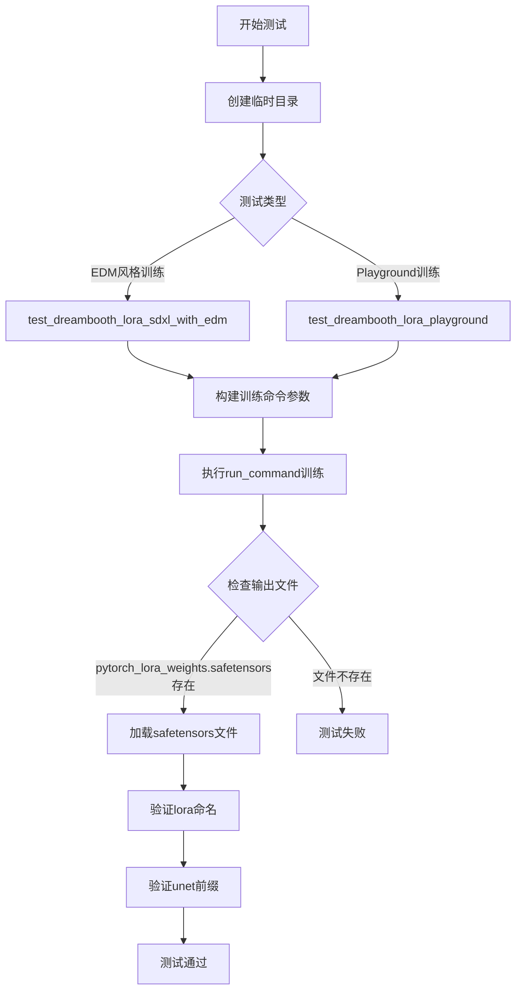

#### 带注释源码

```python
class DreamBoothLoRASDXLWithEDM(ExamplesTestsAccelerate):
    """测试DreamBooth LoRA SDXL模型训练的测试类"""
    
    def test_dreambooth_lora_sdxl_with_edm(self):
        """测试使用EDM风格的DreamBooth LoRA SDXL训练"""
        with tempfile.TemporaryDirectory() as tmpdir:
            # 构建训练命令行参数
            test_args = f"""
                examples/dreambooth/train_dreambooth_lora_sdxl.py
                --pretrained_model_name_or_path hf-internal-testing/tiny-stable-diffusion-xl-pipe
                --do_edm_style_training
                --instance_data_dir docs/source/en/imgs
                --instance_prompt photo
                --resolution 64
                --train_batch_size 1
                --gradient_accumulation_steps 1
                --max_train_steps 2
                --learning_rate 5.0e-04
                --scale_lr
                --lr_scheduler constant
                --lr_warmup_steps 0
                --output_dir {tmpdir}
                """.split()

            # 执行训练命令
            run_command(self._launch_args + test_args)
            
            # 验证输出文件存在
            self.assertTrue(os.path.isfile(os.path.join(tmpdir, "pytorch_lora_weights.safetensors")))

            # 加载并验证LoRA权重
            lora_state_dict = safetensors.torch.load_file(os.path.join(tmpdir, "pytorch_lora_weights.safetensors"))
            is_lora = all("lora" in k for k in lora_state_dict.keys())
            self.assertTrue(is_lora)

            # 验证所有参数都以unet开头（未训练text encoder）
            starts_with_unet = all(key.startswith("unet") for key in lora_state_dict.keys())
            self.assertTrue(starts_with_unet)

    def test_dreambooth_lora_playground(self):
        """测试使用Playground v2.5的DreamBooth LoRA训练"""
        with tempfile.TemporaryDirectory() as tmpdir:
            # 构建训练命令行参数（使用playground模型）
            test_args = f"""
                examples/dreambooth/train_dreambooth_lora_sdxl.py
                --pretrained_model_name_or_path hf-internal-testing/tiny-playground-v2-5-pipe
                --instance_data_dir docs/source/en/imgs
                --instance_prompt photo
                --resolution 64
                --train_batch_size 1
                --gradient_accumulation_steps 1
                --max_train_steps 2
                --learning_rate 5.0e-04
                --scale_lr
                --lr_scheduler constant
                --lr_warmup_steps 0
                --output_dir {tmpdir}
                """.split()

            # 执行训练命令
            run_command(self._launch_args + test_args)
            
            # 验证输出文件存在
            self.assertTrue(os.path.isfile(os.path.join(tmpdir, "pytorch_lora_weights.safetensors")))

            # 加载并验证LoRA权重
            lora_state_dict = safetensors.torch.load_file(os.path.join(tmpdir, "pytorch_lora_weights.safetensors"))
            is_lora = all("lora" in k for k in lora_state_dict.keys())
            self.assertTrue(is_lora)

            # 验证所有参数都以unet开头
            starts_with_unet = all(key.startswith("unet") for key in lora_state_dict.keys())
            self.assertTrue(starts_with_unet)
```

---

## 补充说明

如需获取 `ExamplesTestsAccelerate` 类的完整定义（包括其字段和方法），需要查看 `test_examples_utils` 模块的源代码。当前代码段中只展示了该类的继承使用方式，而非其原始定义。


### `DreamBoothLoRASDXLWithEDM.test_dreambooth_lora_sdxl_with_edm`

该测试方法用于验证使用EDM（Elucidating the Design Space of Diffusion Models）样式的DreamBooth LoRA SDXL训练流程，通过执行训练脚本并检查生成的LoRA权重文件的路径、命名规范以及参数前缀是否符合预期。

参数：

- `self`：实例方法本身所属的类实例，无需显式传递

返回值：`None`，无返回值（测试方法，通过断言验证行为）

#### 流程图

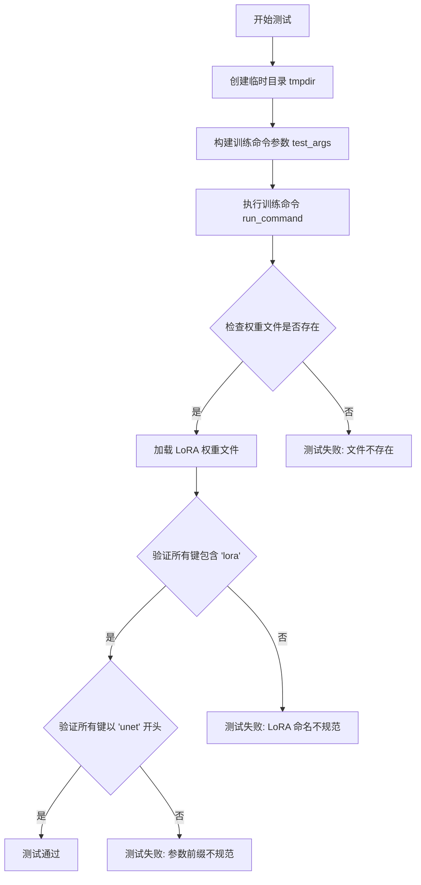

#### 带注释源码

```python
def test_dreambooth_lora_sdxl_with_edm(self):
    # 创建临时目录用于存放训练输出
    with tempfile.TemporaryDirectory() as tmpdir:
        # 构建训练脚本命令行参数
        # 指定使用 tiny-stable-diffusion-xl-pipe 预训练模型
        # 启用 EDM 样式训练 (--do_edm_style_training)
        # 设置实例数据目录、提示词、分辨率等训练超参数
        test_args = f"""
            examples/dreambooth/train_dreambooth_lora_sdxl.py
            --pretrained_model_name_or_path hf-internal-testing/tiny-stable-diffusion-xl-pipe
            --do_edm_style_training
            --instance_data_dir docs/source/en/imgs
            --instance_prompt photo
            --resolution 64
            --train_batch_size 1
            --gradient_accumulation_steps 1
            --max_train_steps 2
            --learning_rate 5.0e-04
            --scale_lr
            --lr_scheduler constant
            --lr_warmup_steps 0
            --output_dir {tmpdir}
            """.split()

        # 执行训练命令，传入加速启动参数和测试参数
        run_command(self._launch_args + test_args)
        
        # 断言：验证 LoRA 权重文件已成功生成
        self.assertTrue(os.path.isfile(os.path.join(tmpdir, "pytorch_lora_weights.safetensors")))

        # 加载生成的 LoRA 权重文件 (safetensors 格式)
        lora_state_dict = safetensors.torch.load_file(os.path.join(tmpdir, "pytorch_lora_weights.safetensors"))
        
        # 断言：验证所有权重键名称中包含 'lora' 标记
        is_lora = all("lora" in k for k in lora_state_dict.keys())
        self.assertTrue(is_lora)

        # 断言：当不训练文本编码器时，所有参数键应以 'unet' 开头
        starts_with_unet = all(key.startswith("unet") for key in lora_state_dict.keys())
        self.assertTrue(starts_with_unet)
```


### `DreamBoothLoRASDXLWithEDM.test_dreambooth_lora_playground`

这是一个用于测试 DreamBooth LoRA 训练流程的自动化测试方法，专门针对 Playground v2.5 模型的 LoRA 训练场景。方法通过调用 `train_dreambooth_lora_sdxl.py` 脚本执行训练，并验证生成的 LoRA 权重文件是否符合预期的命名规范（包含 "lora" 关键字且以 "unet" 开头）。

参数：

- `self`：实例方法，隐含参数，代表测试类 `DreamBoothLoRASDXLWithEDM` 的实例本身

返回值：`None`，测试方法无返回值，通过 `assert` 语句进行断言验证

#### 流程图

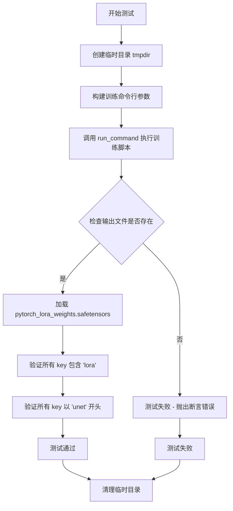

#### 带注释源码

```python
def test_dreambooth_lora_playground(self):
    """
    测试 DreamBooth LoRA 训练流程 - 使用 Playground v2.5 模型
    
    该测试方法验证以下功能:
    1. 使用 Playground v2.5 模型进行 LoRA 训练
    2. 验证生成的 LoRA 权重文件存在
    3. 验证 LoRA 权重命名规范 (包含 'lora' 关键字)
    4. 验证权重参数以 'unet' 开头 (未训练 text encoder)
    """
    # 创建临时目录用于存放训练输出
    with tempfile.TemporaryDirectory() as tmpdir:
        # 构建训练命令行参数
        # 使用 hf-internal-testing/tiny-playground-v2-5-pipe 预训练模型
        # 训练 2 步，batch_size 为 1，学习率为 5.0e-04
        test_args = f"""
            examples/dreambooth/train_dreambooth_lora_sdxl.py
            --pretrained_model_name_or_path hf-internal-testing/tiny-playground-v2-5-pipe
            --instance_data_dir docs/source/en/imgs
            --instance_prompt photo
            --resolution 64
            --train_batch_size 1
            --gradient_accumulation_steps 1
            --max_train_steps 2
            --learning_rate 5.0e-04
            --scale_lr
            --lr_scheduler constant
            --lr_warmup_steps 0
            --output_dir {tmpdir}
            """.split()

        # 执行训练命令 (继承自 ExamplesTestsAccelerate 的 _launch_args)
        run_command(self._launch_args + test_args)
        
        # 保存预训练模型的冒烟测试
        # 验证 LoRA 权重文件是否成功生成
        self.assertTrue(os.path.isfile(os.path.join(tmpdir, "pytorch_lora_weights.safetensors")))

        # 确保 state_dict 中的参数命名正确
        # 加载生成的 LoRA 权重文件
        lora_state_dict = safetensors.torch.load_file(os.path.join(tmpdir, "pytorch_lora_weights.safetensors"))
        
        # 验证所有 key 都包含 'lora' 关键字
        is_lora = all("lora" in k for k in lora_state_dict.keys())
        self.assertTrue(is_lora)

        # 当不训练 text encoder 时，所有参数应该以 'unet' 开头
        starts_with_unet = all(key.startswith("unet") for key in lora_state_dict.keys())
        self.assertTrue(starts_with_unet)
```

## 关键组件


### DreamBoothLoRASDXLWithEDM 测试类

用于测试DreamBooth LoRA SDXL模型训练的集成测试类，继承自ExamplesTestsAccelerate，提供EDM风格训练和Playground模型训练的端到端测试验证。

### test_dreambooth_lora_sdxl_with_edm 方法

测试EDM（Elucidated Diffusion Model）风格的DreamBooth LoRA SDXL训练流程，验证模型权重保存、LoRA参数命名规范以及UNet参数前缀正确性。

### test_dreambooth_lora_playground 方法

测试Playground v2.5模型的DreamBooth LoRA训练流程，验证从不同预训练模型进行LoRA微调的兼容性。

### EDM风格训练支持

通过--do_edm_style_training参数启用EDM扩散模型的训练范式，支持Elucidated Diffusion Model的特定训练逻辑。

### LoRA权重序列化

使用safetensors格式保存训练后的LoRA权重为pytorch_lora_weights.safetensors文件，确保权重的高效序列化和加载。

### 状态字典验证机制

验证LoRA状态字典中所有键包含"lora"标识，且未训练文本编码器时所有参数键以"unet"为前缀，确保LoRA模块正确注入到目标模型。

### 临时目录管理

使用tempfile.TemporaryDirectory()创建临时输出目录用于存放训练结果，测试完成后自动清理临时文件。


## 问题及建议


### 已知问题

-   **代码重复严重**：两个测试方法 `test_dreambooth_lora_sdxl_with_edm` 和 `test_dreambooth_lora_playground` 包含大量重复的代码结构和验证逻辑（检查 safetensors 文件、验证 lora 状态字典、验证 unet 前缀），违反了 DRY 原则
-   **缺少命令执行结果检查**：`run_command` 执行后没有检查命令是否成功完成，仅依赖后续的断言来间接验证，可能导致测试失败时难以定位问题
-   **硬编码的测试参数**：模型名称（`hf-internal-testing/tiny-stable-diffusion-xl-pipe`、`hf-internal-testing/tiny-playground-v2-5-pipe`）和其他超参数硬编码在测试方法中，降低了测试的灵活性和可维护性
-   **缺少参数化测试**：两个测试方法可以用 `@pytest.mark.parametrize` 或辅助方法重构为参数化测试，减少代码冗余
-   **魔法数字和字符串**：如 `--max_train_steps 2`、`--resolution 64`、路径中的 `"pytorch_lora_weights.safetensors"` 等硬编码值缺乏解释，可考虑提取为常量
-   **日志配置在模块级别**：`logging.basicConfig` 和 `StreamHandler` 在模块加载时执行，可能影响其他模块的日志配置，建议移至测试类或使用配置管理器
-   **测试覆盖不足**：只验证了成功路径，未测试错误处理（如无效模型路径、磁盘空间不足等场景）
-   **临时目录资源风险**：虽然使用 `tempfile.TemporaryDirectory()`，但若 `run_command` 抛出异常，可能导致资源清理时机问题

### 优化建议

-   提取公共验证逻辑为辅助方法（如 `assert_lora_weights_valid(tmpdir, expected_prefix)`），减少重复代码
-   将模型名称和其他测试参数提取为类常量或配置字典，实现参数化测试
-   在 `run_command` 调用后添加命令执行结果检查，记录 stdout/stderr 以便调试
-   使用 `unittest.mock` 或 `pytest-mock` 来模拟外部依赖，提高单元测试的隔离性
-   将日志配置移至测试类的 `setUp` 方法或使用 pytest 的日志配置
-   添加异常场景测试，验证错误处理逻辑
-   考虑使用 `@pytest.fixture` 管理临时目录的生命周期


## 其它


### 设计目标与约束

本测试类的设计目标是验证DreamBooth LoRA SDXL训练脚本的正确性，确保能够成功训练LoRA权重并生成符合预期的模型文件。约束条件包括：测试必须在临时目录中运行以避免污染文件系统；只能使用小型预训练模型（hf-internal-testing/tiny-stable-diffusion-xl-pipe和hf-internal-testing/tiny-playground-v2-5-pipe）进行测试；训练步数限制为2步以加快测试速度；仅验证unet部分的LoRA训练（不包含text encoder）。

### 错误处理与异常设计

测试类主要依赖run_command函数执行外部训练脚本，并通过断言验证输出结果。异常处理包括：使用tempfile.TemporaryDirectory确保临时目录在测试结束后自动清理；通过os.path.isfile验证输出文件是否存在；对LoRA state_dict进行多重验证（包含"lora"关键字、unet前缀）以确保训练结果正确；所有断言失败时测试框架会自动捕获并报告错误。

### 外部依赖与接口契约

本测试类依赖以下外部组件：ExamplesTestsAccelerate基类提供测试框架基础和_launch_args属性；run_command函数用于执行命令行训练脚本；safetensors库用于加载和验证生成的LoRA权重文件；tempfile模块提供临时目录管理。接口契约要求训练脚本必须输出pytorch_lora_weights.safetensors文件，且state_dict的键名必须包含"lora"关键字，非text encoder训练时键名必须以"unet"开头。

### 性能考虑与优化空间

当前测试使用最小配置（train_batch_size=1、gradient_accumulation_steps=1、max_train_steps=2）以加快测试速度，但未包含性能基准测试。建议添加训练时间监控和内存使用追踪；可考虑使用pytest fixtures复用临时目录以减少文件系统操作；当前每次测试都重新运行训练脚本，可考虑添加单元测试与集成测试的分层。

### 安全性考虑

测试代码运行在受限的临时目录环境中，避免对系统造成影响；使用预定义的小型测试模型而非真实生产模型；测试数据仅使用docs/source/en/imgs目录中的示例图片；未包含任何网络下载或持久化存储操作，确保测试环境的安全性。

### 配置管理与版本兼容性

测试参数通过命令行参数传入，配置相对集中。--pretrained_model_name_or_path指定测试使用的预训练模型；--do_edm_style_training标志用于EDM风格训练测试；resolution设置为64以减少计算资源需求。建议添加版本检查以确保transformers、diffusers等核心库的兼容性。

### 测试策略与覆盖率

当前测试覆盖两种场景：EDM风格训练和Playground模型训练。测试验证三个关键输出：输出文件存在性、LoRA命名规范、unet前缀要求。建议增加测试覆盖率的方向包括：text encoder训练场景测试、不同LoRA rank配置测试、混合精度训练测试、梯度累积边界情况测试。

### 资源清理与生命周期

使用tempfile.TemporaryDirectory确保所有临时资源在测试结束后自动清理；测试创建的训练输出目录会随临时目录一起删除；logging配置在模块加载时初始化，stream_handler在测试运行期间保持活动状态。建议显式添加teardown方法以确保资源清理的可预测性。

### 日志与监控

使用logging模块配置DEBUG级别日志，记录训练过程的详细信息；logger通过StreamHandler将日志输出到stdout，便于CI/CD系统捕获；测试结果通过pytest的标准断言机制报告，无需额外的监控集成。


    