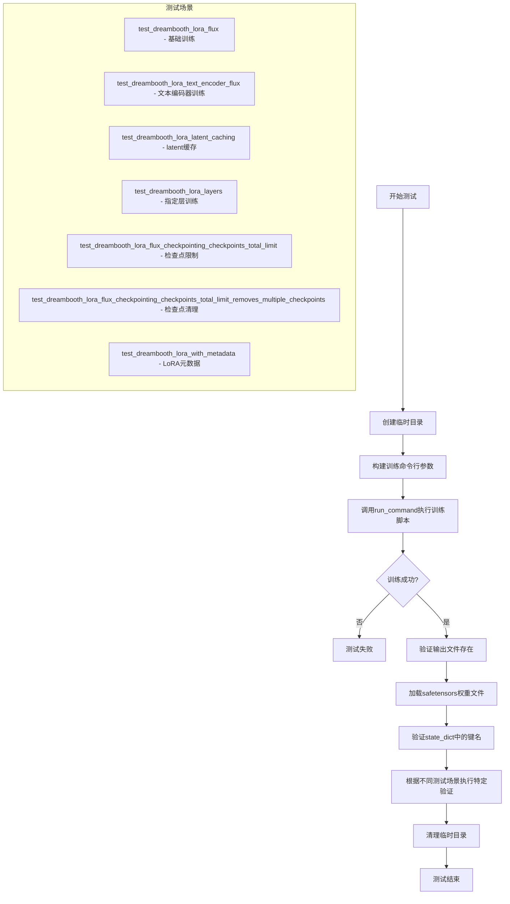
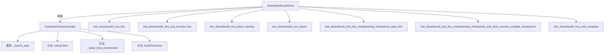
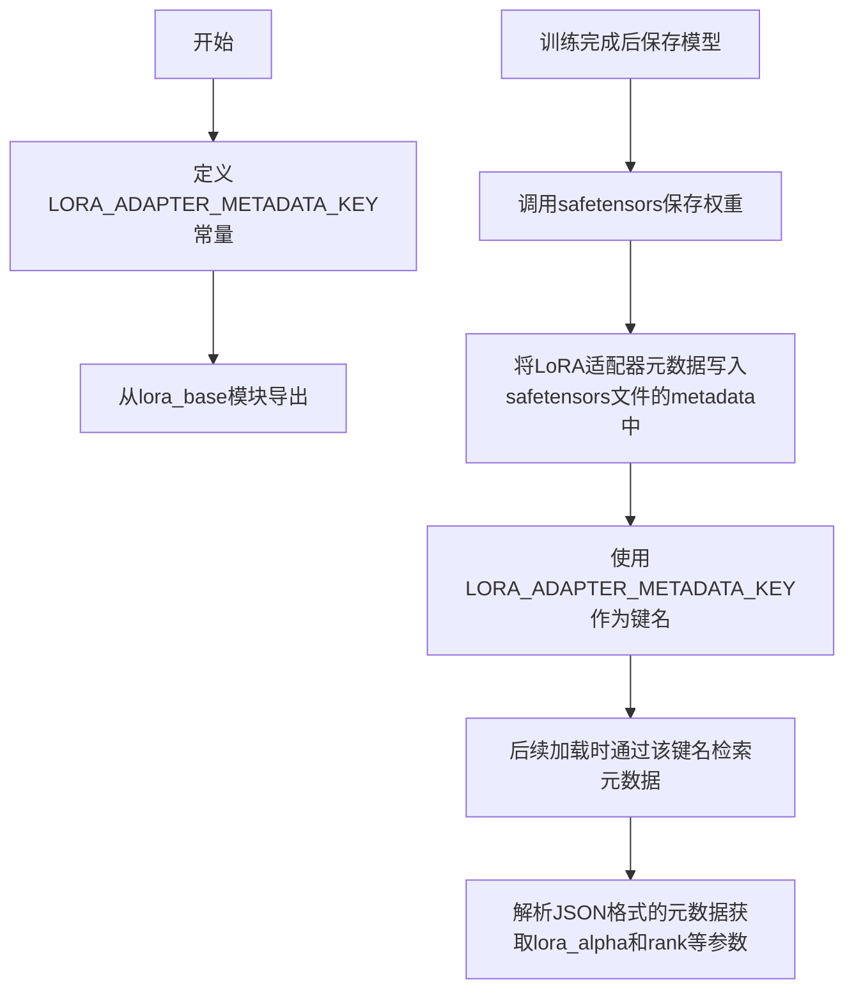
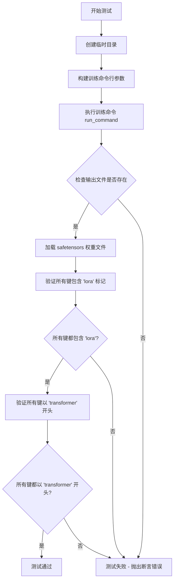
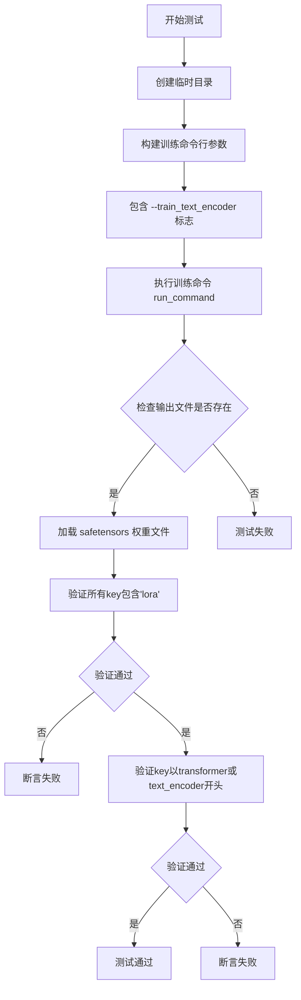
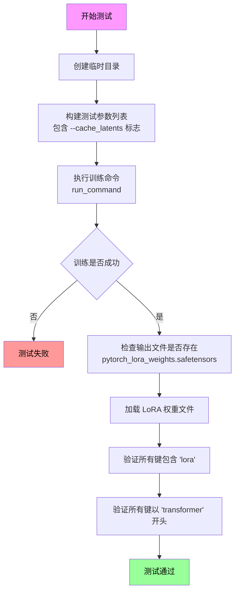
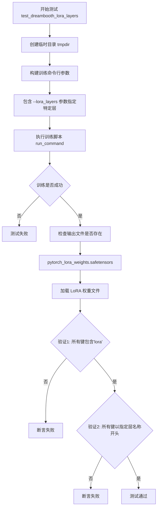
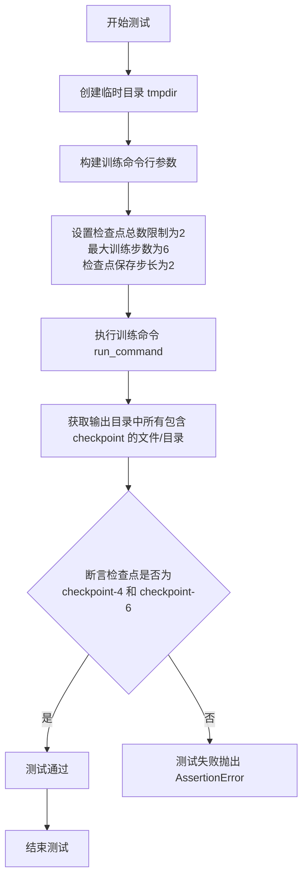
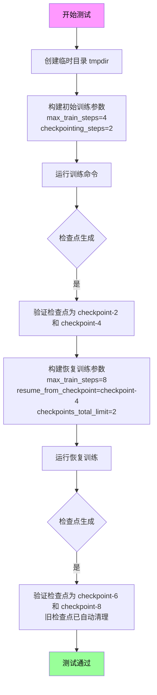
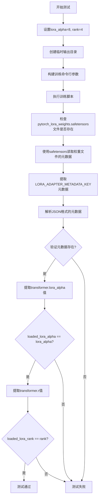

# `diffusers\examples\dreambooth\test_dreambooth_lora_flux.py` 详细设计文档

这是一个DreamBooth LoRA Flux模型的集成测试文件，用于验证Flux架构下的DreamBooth LoRA训练脚本的各项功能，包括基础训练、文本编码器训练、latent缓存、层选择、检查点管理以及LoRA元数据序列化等核心场景的正确性。

## 整体流程



## 类结构

```
ExamplesTestsAccelerate (基类 - 来自test_examples_utils)
└── DreamBoothLoRAFlux (测试类)
```

## 全局变量及字段


### `logger`
    
日志记录器实例，用于输出调试和运行信息

类型：`logging.Logger`
    


### `stream_handler`
    
日志输出流处理器，将日志输出到标准输出stdout

类型：`logging.StreamHandler`
    


### `DreamBoothLoRAFlux.DreamBoothLoRAFlux.instance_data_dir`
    
实例数据目录路径，指向训练使用的图像数据位置

类型：`str`
    


### `DreamBoothLoRAFlux.DreamBoothLoRAFlux.instance_prompt`
    
实例提示词，用于描述训练图像的文本提示

类型：`str`
    


### `DreamBoothLoRAFlux.DreamBoothLoRAFlux.pretrained_model_name_or_path`
    
预训练模型名称或路径，指定要加载的Flux模型

类型：`str`
    


### `DreamBoothLoRAFlux.DreamBoothLoRAFlux.script_path`
    
训练脚本路径，指向DreamBooth LoRA Flux训练脚本

类型：`str`
    


### `DreamBoothLoRAFlux.DreamBoothLoRAFlux.transformer_layer_type`
    
Transformer层类型标识，指定要应用LoRA的特定层

类型：`str`
    
    

## 全局函数及方法


### run_command

无法从提供的代码片段中提取 `run_command` 函数的详细信息，因为该函数的定义不在提供的代码中。该函数是通过 `from test_examples_utils import run_command` 导入的，但 `test_examples_utils` 模块的源代码未在当前代码片段中提供。

为了生成完整的详细设计文档（包括参数、返回值、流程图和源码），需要提供 `test_examples_utils` 模块中 `run_command` 函数的实际实现代码。

#### 基于调用的推断（仅供參考）

根据代码中的调用方式 `run_command(self._launch_args + test_args)`，可以推断：

- **参数**：
  - `cmd`：列表（List），包含命令行参数，通常是 `_launch_args` 和 `test_args` 的拼接结果。
- **返回值**：未知，可能是命令的退出码（int）或输出（字符串）。

#### 建议

请提供 `test_examples_utils` 模块中 `run_command` 函数的完整源代码，以便提取详细信息并生成准确的文档。


### `ExamplesTestsAccelerate`

测试基类，用于提供 DreamBooth LoRA Flux 训练脚本的集成测试能力。该类封装了accelerate框架的测试环境配置，提供launch参数管理、命令执行等通用测试基础设施。

#### 流程图

由于 `ExamplesTestsAccelerate` 类为外部导入模块（`test_examples_utils`），其完整源码未在当前代码文件中展示。以下基于代码使用推断的类结构：



#### 带注释源码

```
# 导入的测试基类源码未在此文件中展示
# 根据 DreamBoothLoRAFlux 的使用方式推断的基类结构：

class ExamplesTestsAccelerate:
    """
    测试基类，提供 accelerate 框架的测试环境配置。
    """
    
    # 类属性：用于配置 accelerate launch 参数
    _launch_args = [...]  # accelerate 启动参数列表
    
    def setUpClass(cls):
        """在测试类开始前设置训练环境"""
        pass
    
    def tearDownClass(cls):
        """在测试类结束后清理资源"""
        pass

# 从 test_examples_utils 导入的辅助函数
run_command = ...
```

#### 关键推断信息

根据代码中 `DreamBoothLoRAFlux` 对 `ExamplesTestsAccelerate` 的使用方式：

| 推断属性/方法 | 类型 | 说明 |
|---------------|------|------|
| `_launch_args` | list | accelerate 启动参数，由基类在 `setUpClass` 中初始化 |
| `run_command` | function | 从 `test_examples_utils` 导入的命令执行函数，用于运行训练脚本 |

#### 注意事项

- `ExamplesTestsAccelerate` 类的完整源代码位于 `test_examples_utils` 模块中，未在此代码文件中直接定义
- 当前代码展示了该基类的**子类** `DreamBoothLoRAFlux` 的实现
- 基类主要提供测试框架基础设施，包括：
  - accelerate 多GPU/多节点测试环境配置
  - 训练脚本的标准输出/错误捕获
  - 测试资源清理机制

#### 潜在优化建议

1. **文档完善性**：建议将 `test_examples_utils.py` 中的 `ExamplesTestsAccelerate` 源码纳入文档，以获得完整的类结构信息
2. **接口抽象**：当前基类与子类耦合度较高，可考虑提取更多抽象接口以提高可测试性
3. **配置外部化**：`_launch_args` 可考虑外部配置文件管理，减少代码硬编码


### `LORA_ADAPTER_METADATA_KEY`

LoRA适配器元数据键常量，用于在safetensors模型文件中标识和检索LoRA适配器元数据的键。

参数： 无

返回值：`str`，返回用于在safetensors元数据中存储LoRA适配器信息的键名。

#### 流程图



#### 带注释源码

```python
# 从diffusers.loaders.lora_base模块导入LORA_ADAPTER_METADATA_KEY常量
# 这个常量定义了LoRA适配器元数据在safetensors文件中的键名
from diffusers.loaders.lora_base import LORA_ADAPTER_METADATA_KEY

# ... (省略其他导入和类定义)

def test_dreamBooth_lora_with_metadata(self):
    """测试LoRA元数据是否正确序列化和保存"""
    lora_alpha = 8  # 设置LoRA alpha参数
    rank = 4        # 设置LoRA rank参数
    
    # ... (训练参数设置和训练过程省略)
    
    # 获取保存的safetensors文件路径
    state_dict_file = os.path.join(tmpdir, "pytorch_lora_weights.safetensors")
    
    # 使用safetensors读取保存的模型文件和元数据
    with safetensors.torch.safe_open(state_dict_file, framework="pt", device="cpu") as f:
        # 获取文件的元数据字典
        metadata = f.metadata() or {}
    
    # 移除format键（如果存在）
    metadata.pop("format", None)
    
    # 使用LORA_ADAPTER_METADATA_KEY常量作为键名获取LoRA适配器元数据
    # 该元数据包含LoRA适配器的配置信息（如lora_alpha, rank等）
    raw = metadata.get(LORA_ADAPTER_METADATA_KEY)
    
    # 如果获取到原始数据，则解析JSON格式
    if raw:
        raw = json.loads(raw)
    
    # 从元数据中提取transformer.lora_alpha参数
    loaded_lora_alpha = raw["transformer.lora_alpha"]
    # 验证加载的lora_alpha与设置的值一致
    self.assertTrue(loaded_lora_alpha == lora_alpha)
    
    # 从元数据中提取transformer.r参数（即rank）
    loaded_lora_rank = raw["transformer.r"]
    # 验证加载的rank与设置的值一致
    self.assertTrue(loaded_lora_rank == rank)
```

---

### 补充信息

#### 关键组件信息

| 组件名称 | 一句话描述 |
|---------|-----------|
| `LORA_ADAPTER_METADATA_KEY` | 用于在safetensors模型文件中标识LoRA适配器元数据的常量键 |
| `safetensors.torch.safe_open` | 安全打开safetensors文件并读取元数据的方法 |
| `metadata.get(LORA_ADAPTER_METADATA_KEY)` | 检索存储在模型文件中的LoRA适配器配置信息 |

#### 潜在的技术债务或优化空间

1. **元数据格式依赖**：当前实现假设元数据是JSON格式，如果格式变化可能导致解析失败
2. **硬编码的键名**：在测试代码中使用了硬编码的键名如 `"transformer.lora_alpha"` 和 `"transformer.r"`，这可能导致与不同模型架构不兼容

#### 其他项目

- **设计目标**：确保LoRA训练后的模型文件能够正确保存和加载适配器元数据
- **错误处理**：当元数据不存在或格式不正确时，应有相应的错误处理机制
- **外部依赖**：依赖于 `safetensors` 库和 `diffusers.loaders.lora_base` 模块中的常量定义


### `DreamBoothLoRAFlux.test_dreambooth_lora_flux`

该方法是 `DreamBoothLoRAFlux` 测试类中的核心测试函数，用于验证 DreamBooth LoRA Flux 训练流程的基本功能是否正常，包括训练脚本执行、模型权重保存、LoRA 参数命名规范以及 Transformer 权重前缀的正确性。

参数：该方法无显式参数（仅包含隐式 `self` 参数）

返回值：`None`，该方法为测试方法，通过断言验证训练流程的正确性

#### 流程图



#### 带注释源码

```python
def test_dreambooth_lora_flux(self):
    """
    测试 DreamBooth LoRA Flux 训练流程的基础功能
    
    该测试方法验证以下关键点：
    1. 训练脚本能够成功执行并生成输出文件
    2. 保存的 LoRA 权重文件命名正确
    3. 状态字典中的所有参数都包含 'lora' 标识
    4. 当不训练 text encoder 时，所有参数以 'transformer' 开头
    """
    # 使用临时目录作为输出目录，测试结束后自动清理
    with tempfile.TemporaryDirectory() as tmpdir:
        # 构建训练脚本的命令行参数
        # 包含模型路径、数据路径、分辨率、训练超参数等配置
        test_args = f"""
            {self.script_path}
            --pretrained_model_name_or_path {self.pretrained_model_name_or_path}
            --instance_data_dir {self.instance_data_dir}
            --instance_prompt {self.instance_prompt}
            --resolution 64
            --train_batch_size 1
            --gradient_accumulation_steps 1
            --max_train_steps 2
            --learning_rate 5.0e-04
            --scale_lr
            --lr_scheduler constant
            --lr_warmup_steps 0
            --output_dir {tmpdir}
            """.split()

        # 执行训练命令，使用加速配置 (_launch_args)
        run_command(self._launch_args + test_args)
        
        # smoke test: 验证 save_pretrained 功能正常
        # 检查 LoRA 权重文件是否正确生成
        self.assertTrue(os.path.isfile(os.path.join(tmpdir, "pytorch_lora_weights.safetensors")))

        # 加载保存的 LoRA 权重状态字典
        lora_state_dict = safetensors.torch.load_file(os.path.join(tmpdir, "pytorch_lora_weights.safetensors"))
        
        # 验证状态字典中的所有键都包含 'lora' 标识
        # 确保权重已正确转换为 LoRA 格式
        is_lora = all("lora" in k for k in lora_state_dict.keys())
        self.assertTrue(is_lora)

        # 验证所有参数名称都以 'transformer' 开头
        # 这是因为当前配置不训练 text encoder，只训练 transformer 部分
        starts_with_transformer = all(key.startswith("transformer") for key in lora_state_dict.keys())
        self.assertTrue(starts_with_transformer)
```


### `DreamBoothLoRAFlux.test_dreambooth_lora_text_encoder_flux`

该方法是一个集成测试用例，用于验证DreamBooth LoRA训练流程中同时训练文本编码器（text_encoder）和图像变换器（transformer）时的正确性。测试通过运行训练脚本并检查输出的LoRA权重文件，验证权重命名是否符合预期（即同时包含transformer和text_encoder前缀的参数）。

参数：

- 该方法无显式参数（隐式参数 `self` 为 `DreamBoothLoRAFlux` 实例本身）

返回值：`None`，该方法为 `void` 类型，不返回任何值，仅执行断言验证

#### 流程图



#### 带注释源码

```python
def test_dreambooth_lora_text_encoder_flux(self):
    """
    测试带文本编码器训练的 DreamBooth LoRA Flux 训练流程。
    
    该测试验证以下内容：
    1. 训练脚本能够成功执行并生成 LoRA 权重文件
    2. 权重文件中的所有参数都包含 'lora' 标记
    3. 当启用文本编码器训练时，权重参数同时包含 transformer 和 text_encoder 前缀
    """
    # 使用临时目录存放训练输出
    with tempfile.TemporaryDirectory() as tmpdir:
        # 构建训练命令行参数
        # 关键参数 --train_text_encoder 启用文本编码器的 LoRA 训练
        test_args = f"""
            {self.script_path}
            --pretrained_model_name_or_path {self.pretrained_model_name_or_path}
            --instance_data_dir {self.instance_data_dir}
            --instance_prompt {self.instance_prompt}
            --resolution 64
            --train_batch_size 1
            --train_text_encoder  # 关键：启用文本编码器训练
            --gradient_accumulation_steps 1
            --max_train_steps 2
            --learning_rate 5.0e-04
            --scale_lr
            --lr_scheduler constant
            --lr_warmup_steps 0
            --output_dir {tmpdir}
            """.split()

        # 执行训练命令，传入加速启动参数和测试参数
        run_command(self._launch_args + test_args)
        
        # save_pretrained smoke test: 验证输出文件存在
        self.assertTrue(os.path.isfile(os.path.join(tmpdir, "pytorch_lora_weights.safetensors")))

        # 加载保存的 LoRA 权重文件
        lora_state_dict = safetensors.torch.load_file(os.path.join(tmpdir, "pytorch_lora_weights.safetensors"))
        
        # 验证所有权重key都包含'lora'标记，确保是LoRA权重
        is_lora = all("lora" in k for k in lora_state_dict.keys())
        self.assertTrue(is_lora)

        # 验证权重参数的前缀：同时包含 transformer 和 text_encoder
        # 这是与不带文本编码器训练的主要区别
        starts_with_expected_prefix = all(
            (key.startswith("transformer") or key.startswith("text_encoder")) for key in lora_state_dict.keys()
        )
        self.assertTrue(starts_with_expected_prefix)
```


### `DreamBoothLoRAFlux.test_dreambooth_lora_latent_caching`

该方法用于测试 DreamBooth LoRA 训练中的 latent 缓存功能，验证在启用 `--cache_latents` 参数时，模型能够正确完成训练并生成符合预期的 LoRA 权重文件。

参数：

- 该方法无显式参数，依赖于类属性 `self._launch_args`、`self.instance_data_dir`、`self.instance_prompt`、`self.pretrained_model_name_or_path` 和 `self.script_path`。

返回值：`None`，通过断言验证训练结果是否符合预期。

#### 流程图



#### 带注释源码

```python
def test_dreambooth_lora_latent_caching(self):
    """
    测试 DreamBooth LoRA 训练中的 latent 缓存功能。
    验证启用 --cache_latents 参数后训练流程能正常运行，
    并生成符合预期的 LoRA 权重文件。
    """
    # 创建临时目录用于存放训练输出
    with tempfile.TemporaryDirectory() as tmpdir:
        # 构建测试命令行参数
        # 关键参数: --cache_latents 启用 latent 缓存功能
        test_args = f"""
            {self.script_path}
            --pretrained_model_name_or_path {self.pretrained_model_name_or_path}
            --instance_data_dir {self.instance_data_dir}
            --instance_prompt {self.instance_prompt}
            --resolution 64
            --train_batch_size 1
            --gradient_accumulation_steps 1
            --max_train_steps 2
            --cache_latents          # 关键: 启用 latent 缓存
            --learning_rate 5.0e-04
            --scale_lr
            --lr_scheduler constant
            --lr_warmup_steps 0
            --output_dir {tmpdir}
            """.split()

        # 执行训练命令
        run_command(self._launch_args + test_args)
        
        # 验证输出: 检查 LoRA 权重文件是否生成
        self.assertTrue(os.path.isfile(os.path.join(tmpdir, "pytorch_lora_weights.safetensors")))

        # 加载生成的 LoRA 权重文件
        lora_state_dict = safetensors.torch.load_file(os.path.join(tmpdir, "pytorch_lora_weights.safetensors"))
        
        # 验证: 确保所有参数名称都包含 'lora' 关键字
        is_lora = all("lora" in k for k in lora_state_dict.keys())
        self.assertTrue(is_lora)

        # 验证: 当不训练 text encoder 时，所有参数应以 'transformer' 开头
        # 这是 Flux 架构的特殊要求
        starts_with_transformer = all(key.startswith("transformer") for key in lora_state_dict.keys())
        self.assertTrue(starts_with_transformer)
```


### `DreamBoothLoRAFlux.test_dreambooth_lora_layers`

该方法用于测试 DreamBooth LoRA Flux 训练脚本是否能够正确地只训练指定的 LoRA 层（通过 `--lora_layers` 参数指定特定层，如 `single_transformer_blocks.0.attn.to_k`），并验证生成的权重文件中只包含指定层的 LoRA 参数。

参数：

- 该方法无显式参数，使用类属性：
  - `self.transformer_layer_type`：`str`，值为 `"single_transformer_blocks.0.attn.to_k"`，指定要训练的 Transformer 层路径
  - `self.script_path`：`str`，训练脚本路径 `"examples/dreambooth/train_dreambooth_lora_flux.py"`
  - `self.pretrained_model_name_or_path`：`str`，预训练模型路径 `"hf-internal-testing/tiny-flux-pipe"`
  - `self.instance_data_dir`：`str`，实例数据目录 `"docs/source/en/imgs"`
  - `self.instance_prompt`：`str`，实例提示词 `"photo"`

返回值：`None`，该方法为测试方法，通过断言验证训练结果是否符合预期。

#### 流程图



#### 带注释源码

```python
def test_dreambooth_lora_layers(self):
    """
    测试使用 --lora_layers 参数指定特定 LoRA 层的训练功能。
    验证只有指定的层（transformer.single_transformer_blocks.0.attn.to_k）会被训练。
    """
    # 创建临时目录用于存放训练输出
    with tempfile.TemporaryDirectory() as tmpdir:
        # 构建训练命令行参数列表
        test_args = f"""
            {self.script_path}
            --pretrained_model_name_or_path {self.pretrained_model_name_or_path}
            --instance_data_dir {self.instance_data_dir}
            --instance_prompt {self.instance_prompt}
            --resolution 64
            --train_batch_size 1
            --gradient_accumulation_steps 1
            --max_train_steps 2
            --cache_latents
            --learning_rate 5.0e-04
            --scale_lr
            --lora_layers {self.transformer_layer_type}
            --lr_scheduler constant
            --lr_warmup_steps 0
            --output_dir {tmpdir}
            """.split()

        # 执行训练命令
        run_command(self._launch_args + test_args)
        
        # 验证1: 检查输出文件是否存在（smoke test）
        self.assertTrue(os.path.isfile(os.path.join(tmpdir, "pytorch_lora_weights.safetensors")))

        # 加载生成的 LoRA 权重文件
        lora_state_dict = safetensors.torch.load_file(os.path.join(tmpdir, "pytorch_lora_weights.safetensors"))
        
        # 验证2: 确保 state_dict 中所有键名都包含 'lora' 字样
        is_lora = all("lora" in k for k in lora_state_dict.keys())
        self.assertTrue(is_lora)

        # 验证3: 确保所有参数都以指定的 transformer 层路径开头
        # 在此测试中，只有 transformer.single_transformer_blocks.0.attn.to_k 相关的参数
        # 应该出现在 state_dict 中
        starts_with_transformer = all(
            key.startswith("transformer.single_transformer_blocks.0.attn.to_k") for key in lora_state_dict.keys()
        )
        self.assertTrue(starts_with_transformer)
```


### `DreamBoothLoRAFlux.test_dreambooth_lora_flux_checkpointing_checkpoints_total_limit`

该方法用于测试 DreamBooth LoRA Flux 训练过程中的检查点总数限制功能。通过运行训练脚本并设置 `--checkpoints_total_limit=2` 参数，验证系统是否能够正确保留指定数量的最新检查点，并自动清理超出限制的旧检查点。

参数：

- `self`：隐式参数，`DreamBoothLoRAFlux` 类型，表示测试类实例本身，包含以下测试所需配置：
  - `script_path`：训练脚本路径 `"examples/dreambooth/train_dreambooth_lora_flux.py"`
  - `pretrained_model_name_or_path`：预训练模型名称或路径 `"hf-internal-testing/tiny-flux-pipe"`
  - `instance_data_dir`：实例数据目录 `"docs/source/en/imgs"`
  - `instance_prompt`：实例提示词 `"photo"`
  - `_launch_args`：启动参数（继承自 `ExamplesTestsAccelerate`）

返回值：`None`，该方法为单元测试方法，通过 `self.assertEqual` 断言验证检查点是否符合预期，若不符合则抛出 `AssertionError`

#### 流程图



#### 带注释源码

```python
def test_dreambooth_lora_flux_checkpointing_checkpoints_total_limit(self):
    """
    测试 DreamBooth LoRA Flux 检查点总数限制功能
    
    验证当设置 --checkpoints_total_limit=2 时：
    - 训练 6 步，每 2 步保存一个检查点
    - 只会保留最新的 2 个检查点（checkpoint-4 和 checkpoint-6）
    - 较早的 checkpoint-2 会被自动删除
    """
    # 创建临时目录用于存放训练输出
    with tempfile.TemporaryDirectory() as tmpdir:
        # 构建训练命令行参数
        test_args = f"""
        {self.script_path}
        --pretrained_model_name_or_path={self.pretrained_model_name_or_path}
        --instance_data_dir={self.instance_data_dir}
        --output_dir={tmpdir}
        --instance_prompt={self.instance_prompt}
        --resolution=64
        --train_batch_size=1
        --gradient_accumulation_steps=1
        --max_train_steps=6
        --checkpoints_total_limit=2
        --checkpointing_steps=2
        """.split()

        # 执行训练命令，传入启动参数和测试参数
        run_command(self._launch_args + test_args)

        # 断言验证：检查点目录应该只包含 checkpoint-4 和 checkpoint-6
        # 因为设置了 checkpoints_total_limit=2，所以只保留最后两个检查点
        # checkpoint-2 会被自动删除
        self.assertEqual(
            {x for x in os.listdir(tmpdir) if "checkpoint" in x},
            {"checkpoint-4", "checkpoint-6"},
        )
```


### `DreamBoothLoRAFlux.test_dreambooth_lora_flux_checkpointing_checkpoints_total_limit_removes_multiple_checkpoints`

测试检查点自动清理功能，验证当设置 `checkpoints_total_limit` 时，旧检查点会被自动删除以保持指定的检查点数量。

参数：

- `self`：`DreamBoothLoRAFlux`，测试类实例本身

返回值：`None`，无返回值（测试方法）

#### 流程图



#### 带注释源码

```python
def test_dreambooth_lora_flux_checkpointing_checkpoints_total_limit_removes_multiple_checkpoints(self):
    """
    测试检查点自动清理功能：
    1. 首次训练生成4步检查点（checkpoint-2, checkpoint-4）
    2. 从checkpoint-4恢复训练到8步，同时设置checkpoints_total_limit=2
    3. 验证旧检查点被自动清理，只保留最新的2个检查点（checkpoint-6, checkpoint-8）
    """
    # 创建临时目录用于存放训练输出
    with tempfile.TemporaryDirectory() as tmpdir:
        # 构建首次训练的参数：训练4步，每2步保存一个检查点
        test_args = f"""
        {self.script_path}
        --pretrained_model_name_or_path={self.pretrained_model_name_or_path}
        --instance_data_dir={self.instance_data_dir}
        --output_dir={tmpdir}
        --instance_prompt={self.instance_prompt}
        --resolution=64
        --train_batch_size=1
        --gradient_accumulation_steps=1
        --max_train_steps=4
        --checkpointing_steps=2
        """.split()

        # 执行首次训练
        run_command(self._launch_args + test_args)

        # 验证首次训练生成的检查点：应该有 checkpoint-2 和 checkpoint-4
        self.assertEqual({x for x in os.listdir(tmpdir) if "checkpoint" in x}, {"checkpoint-2", "checkpoint-4"})

        # 构建恢复训练的参数：从checkpoint-4继续训练到8步，设置最多保留2个检查点
        resume_run_args = f"""
        {self.script_path}
        --pretrained_model_name_or_path={self.pretrained_model_name_or_path}
        --instance_data_dir={self.instance_data_dir}
        --output_dir={tmpdir}
        --instance_prompt={self.instance_prompt}
        --resolution=64
        --train_batch_size=1
        --gradient_accumulation_steps=1
        --max_train_steps=8
        --checkpointing_steps=2
        --resume_from_checkpoint=checkpoint-4
        --checkpoints_total_limit=2
        """.split()

        # 执行恢复训练
        run_command(self._launch_args + resume_run_args)

        # 验证最终检查点：由于设置了checkpoints_total_limit=2，
        # 旧的checkpoint-2和checkpoint-4应该被清理，只保留checkpoint-6和checkpoint-8
        self.assertEqual({x for x in os.listdir(tmpdir) if "checkpoint" in x}, {"checkpoint-6", "checkpoint-8"})
```


### `DreamBoothLoRAFlux.test_dreambooth_lora_with_metadata`

测试LoRA元数据序列化功能，验证保存的LoRA权重文件（safetensors格式）中是否正确包含了lora_alpha和rank等元数据信息。

参数：

- `self`：`DreamBoothLoRAFlux`，测试类实例，包含实例数据目录、模型路径等配置信息

返回值：`None`，测试方法无返回值，通过断言验证元数据正确性

#### 流程图



#### 带注释源码

```python
def test_dreambooth_lora_with_metadata(self):
    # 设置LoRA参数：使用与rank不同的lora_alpha值用于测试
    # lora_alpha: LoRA缩放因子，用于调整LoRA权重的影响程度
    # rank: LoRA矩阵的秩，决定LoRA适配器的参数量
    lora_alpha = 8
    rank = 4
    
    # 创建临时目录用于存放训练输出
    with tempfile.TemporaryDirectory() as tmpdir:
        # 构建训练脚本的命令行参数列表
        # 包括：预训练模型路径、实例数据目录、实例提示词、分辨率、训练批次大小等
        test_args = f"""
            {self.script_path}
            --pretrained_model_name_or_path {self.pretrained_model_name_or_path}
            --instance_data_dir {self.instance_data_dir}
            --instance_prompt {self.instance_prompt}
            --resolution 64
            --train_batch_size 1
            --gradient_accumulation_steps 1
            --max_train_steps 2
            --lora_alpha={lora_alpha}
            --rank={rank}
            --learning_rate 5.0e-04
            --scale_lr
            --lr_scheduler constant
            --lr_warmup_steps 0
            --output_dir {tmpdir}
            """.split()

        # 执行训练脚本，传入加速启动参数和测试参数
        run_command(self._launch_args + test_args)
        
        # 验证保存的LoRA权重文件是否存在
        state_dict_file = os.path.join(tmpdir, "pytorch_lora_weights.safetensors")
        self.assertTrue(os.path.isfile(state_dict_file))

        # 使用safetensors库读取权重文件的元数据
        with safetensors.torch.safe_open(state_dict_file, framework="pt", device="cpu") as f:
            # 获取元数据字典，若无元数据则返回空字典
            metadata = f.metadata() or {}

        # 移除format字段（不参与验证）
        metadata.pop("format", None)
        
        # 获取LoRA适配器元数据键对应的原始JSON字符串
        raw = metadata.get(LORA_ADAPTER_METADATA_KEY)
        
        # 如果存在原始数据，则解析JSON为字典
        if raw:
            raw = json.loads(raw)

        # 提取并验证transformer.lora_alpha元数据
        loaded_lora_alpha = raw["transformer.lora_alpha"]
        self.assertTrue(loaded_lora_alpha == lora_alpha)
        
        # 提取并验证transformer.r（元数据中存储为'r'）元数据
        loaded_lora_rank = raw["transformer.r"]
        self.assertTrue(loaded_lora_rank == rank)
```

## 关键组件


### DreamBoothLoRAFlux 测试类

DreamBooth LoRA Flux模型的训练流程测试类，继承自ExamplesTestsAccelerate，用于验证Flux模型的DreamBooth LoRA训练功能。

### LoRA基础训练测试 (test_dreambooth_lora_flux)

验证不使用文本编码器训练时，LoRA权重正确保存为safetensors格式，且所有参数键名以"transformer"开头。

### 文本编码器训练测试 (test_dreambooth_lora_text_encoder_flux)

验证同时训练文本编码器时，LoRA权重包含"transformer"和"text_encoder"两个部分的参数。

### 潜在缓存功能测试 (test_dreambooth_lora_latent_caching)

验证启用--cache_latents选项后，训练流程正常运行，生成的LoRA权重符合预期命名规范。

### LoRA层选择测试 (test_dreambooth_lora_layers)

验证通过--lora_layers参数指定特定层（如transformer.single_transformer_blocks.0.attn.to_k）进行训练的功能。

### 检查点总数限制测试 (test_dreambooth_lora_flux_checkpointing_checkpoints_total_limit)

验证--checkpoints_total_limit参数限制检查点数量，保留最新的检查点。

### 检查点恢复与限制测试 (test_dreambooth_lora_flux_checkpointing_checkpoints_total_limit_removes_multiple_checkpoints)

验证从检查点恢复训练时，--checkpoints_total_limit和--resume_from_checkpoint参数协同工作，正确管理检查点。

### LoRA元数据序列化测试 (test_dreambooth_lora_with_metadata)

验证LoRA训练后保存的权重文件中包含正确的lora_alpha和rank元数据，可通过safetensors库读取验证。

### safetensors张量加载

使用safetensors.torch.load_file和safe_open进行张量的惰性加载和元数据读取，支持高效的模型权重管理。

### LORA_ADAPTER_METADATA_KEY

LoRA适配器元数据键，用于在权重文件中存储lora_alpha和rank等训练参数信息。


## 问题及建议


### 已知问题

-   **代码重复严重**：多个测试方法（test_dreambooth_lora_flux、test_dreambooth_lora_text_encoder_flux、test_dreambooth_lora_latent_caching、test_dreambooth_lora_layers）中存在大量重复的测试逻辑，包括命令行参数构建、文件检查、state_dict验证等，应提取公共方法复用。
-   **硬编码参数过多**：resolution、train_batch_size、gradient_accumulation_steps、max_train_steps、learning_rate等参数在各个测试中重复硬编码，修改时需要遍历多处。
-   **断言缺乏描述性信息**：所有assert语句均未提供错误消息，不利于测试失败时的快速定位问题。
-   **魔法数字和字符串**：如`64`、`1`、`2`、`5.0e-04`、`pytorch_lora_weights.safetensors`等散布在代码各处，缺乏命名常量定义。
-   **sys.path操作不规范**：使用`sys.path.append("..")`导入模块是较差的实践，应使用绝对导入或配置PYTHONPATH。
-   **日志配置过于简单**：直接使用`logging.basicConfig(level=logging.DEBUG)`可能产生过多日志输出，且在生产环境中不够灵活。
-   **缺少异常处理**：对`run_command`的执行结果没有错误处理，若命令执行失败会导致测试行为不明确。
-   **测试验证不够深入**：部分测试仅检查文件是否存在（如`save_pretrained smoke test`），对输出内容的正确性验证有限。
-   **临时目录资源管理**：虽然使用了`tempfile.TemporaryDirectory()`，但若测试提前退出，可能存在资源清理风险。

### 优化建议

-   **提取公共测试方法**：创建如`_build_test_args()`、`_run_training_and_verify()`等私有方法来减少重复代码。
-   **使用类属性或常量**：将常用的训练参数定义为类常量或通过`@pytest.fixture`注入，提高可维护性。
-   **改进断言信息**：为每个assert添加描述性错误消息，如`self.assertTrue(is_lora, "State dict keys should contain 'lora'")`。
-   **集中管理魔法值**：在类顶部定义常量，如`DEFAULT_RESOLUTION = 64`、`DEFAULT_LEARNING_RATE = 5.0e-04`。
-   **重构导入方式**：移除`sys.path.append("..")`，改用proper的Python包结构或配置路径。
-   **优化日志配置**：考虑使用环境变量或配置文件控制日志级别，避免硬编码DEBUG级别。
-   **增强错误处理**：检查`run_command`的返回码，对非零返回码进行明确失败处理。
-   **丰富测试验证**：在文件存在检查基础上，增加对输出模型结构、参数范围、数值有效性等的验证。
-   **使用pytest参数化**：对于相似测试场景，考虑使用`@pytest.mark.parametrize`减少测试方法数量。

## 其它


### 设计目标与约束

本代码的核心设计目标是通过DreamBooth方法训练LoRA（Low-Rank Adaptation）适配器，用于Flux模型的微调。主要约束包括：使用tiny-flux-pipe作为预训练模型，仅训练2步以满足快速测试需求，输出格式限定为safetensors，测试覆盖单Transformer层训练、文本编码器训练、潜在缓存、检查点管理等多种场景。

### 错误处理与异常设计

代码主要依赖`run_command`函数执行命令行训练，使用Python内置的`tempfile.TemporaryDirectory()`自动管理临时目录资源。测试断言使用`assertTrue`和`assertEqual`验证关键结果，文件不存在时测试自动失败。未捕获命令行执行异常会导致测试失败。潜在改进：可添加超时机制、详细的错误日志记录、训练过程中的中间状态验证。

### 数据流与状态机

测试数据流：临时目录创建 → 命令行参数组装 → 训练脚本执行 → 输出文件生成 → 状态字典验证 → 断言检查。状态转换：初始化 → 运行训练 → 保存权重 → 验证输出。无复杂状态机，主要为一次性测试流程。

### 外部依赖与接口契约

主要依赖包括：diffusers库的LORA_ADAPTER_METADATA_KEY、safetensors库（用于加载和保存权重）、test_examples_utils模块（ExamplesTestsAccelerate基类、run_command工具函数）。训练脚本路径为`examples/dreambooth/train_dreambooth_lora_flux.py`，通过命令行接口调用，输出产物为`pytorch_lora_weights.safetensors`文件。

### 性能考虑

本测试代码为功能验证性质，未包含性能基准测试。实际训练使用`--max_train_steps 2`最小化训练时间。使用`--gradient_accumulation_steps 1`和`--train_batch_size 1`简化配置。潜在优化空间：可添加训练时间度量、内存使用监控、GPU利用率跟踪。

### 安全性考虑

代码使用临时目录`tempfile.TemporaryDirectory()`确保资源清理。训练脚本输出路径可配置但仅限于指定临时目录。敏感信息：预训练模型路径`hf-internal-testing/tiny-flux-pipe`为公开测试模型，无认证需求。命令行参数传递未包含敏感数据。

### 配置管理

所有配置通过命令行参数传入，包括模型路径、数据目录、提示词、分辨率、学习率、批量大小、LoRA参数（alpha、rank）、检查点策略等。类级别常量定义`instance_data_dir`、`instance_prompt`、`pretrained_model_name_or_path`、`script_path`、`transformer_layer_type`。配置参数未使用配置文件或环境变量。

### 资源管理

临时目录：使用`tempfile.TemporaryDirectory()`自动创建和清理。GPU资源：通过`ExamplesTestsAccelerate._launch_args`配置。文件句柄：使用`safetensors.torch.safe_open`上下文管理器正确关闭。命令行进程：依赖`run_command`函数管理进程生命周期。

### 测试覆盖率

当前测试覆盖场景：基础DreamBooth LoRA训练、文本编码器联合训练、潜在缓存功能、指定LoRA层训练、检查点总数限制、检查点清理与恢复、元数据序列化。覆盖边界情况：LoRA参数命名验证、状态字典键前缀验证、检查点文件存在性验证、元数据完整性验证。

### 版本兼容性

代码指定编码为UTF-8，版权声明为Apache License 2.0。依赖库版本未显式声明，需与transformers、diffusers、safetensors、torch版本兼容。测试模型使用`hf-internal-testing/tiny-flux-pipe`为小型测试模型，对显存要求低。

### 部署注意事项

本代码为测试代码，不直接用于生产部署。部署时需考虑：生产环境需增加训练步数、调整学习率策略、配置更完善的检查点保存策略、添加模型保存格式选项（除safetensors外可能需要PyTorch格式）、添加分布式训练支持、配置日志和监控告警。

    