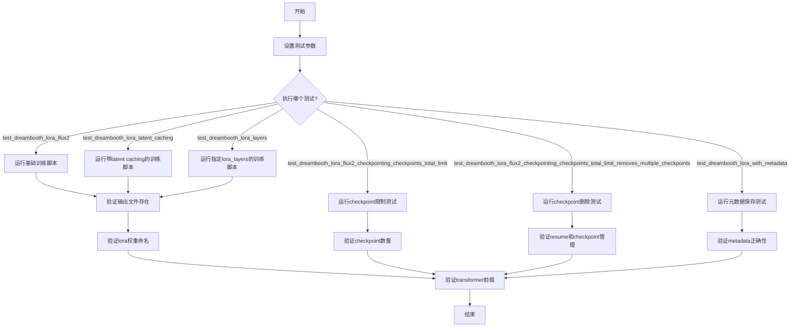
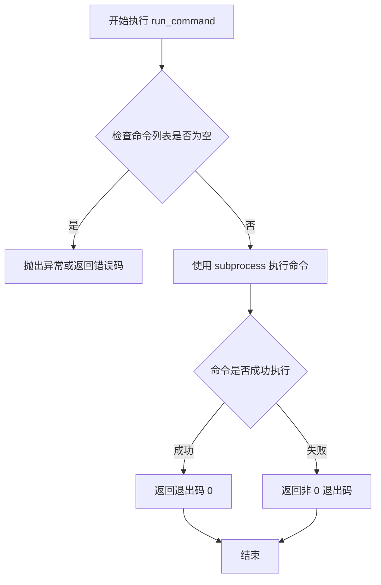
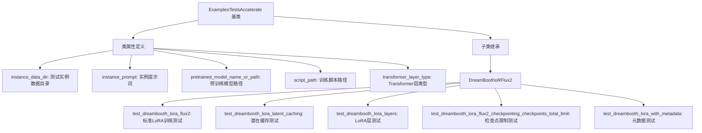
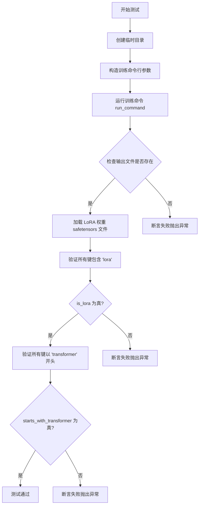
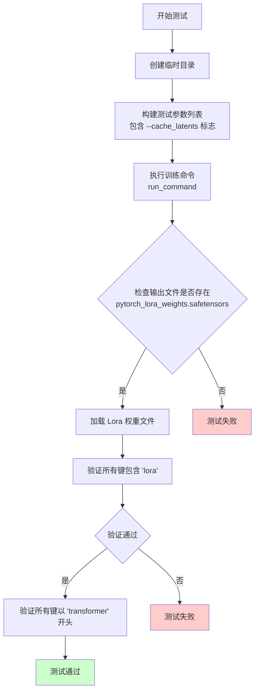
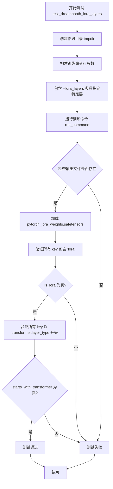
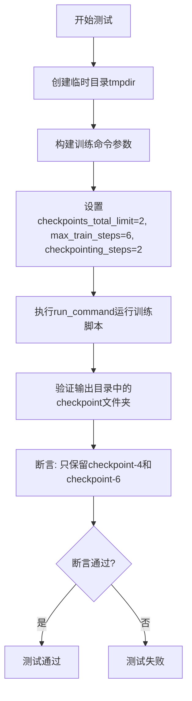
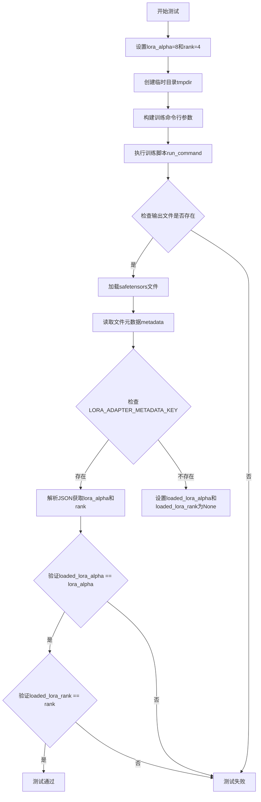

# `diffusers\examples\dreambooth\test_dreambooth_lora_flux2.py` 详细设计文档

这是一个DreamBooth LoRA Flux2训练脚本的集成测试文件，用于验证LoRA微调Flux2模型的各种训练场景，包括基础训练、 latent caching、层指定、checkpoint管理和元数据保存等功能。

## 整体流程



## 类结构

```
ExamplesTestsAccelerate (基类)
└── DreamBoothLoRAFlux2 (测试类)
```

## 全局变量及字段


### `logger`
    
全局日志记录器实例，用于输出调试和运行信息

类型：`logging.Logger`
    


### `stream_handler`
    
日志流处理器，将日志输出到标准输出stdout

类型：`logging.StreamHandler`
    


### `DreamBoothLoRAFlux2.instance_data_dir`
    
实例数据目录路径，指向训练所使用的图像资源

类型：`str`
    


### `DreamBoothLoRAFlux2.instance_prompt`
    
实例提示词，用于描述待训练的图像主体概念

类型：`str`
    


### `DreamBoothLoRAFlux2.pretrained_model_name_or_path`
    
预训练模型名称或HuggingFace Hub路径，指定LoRA训练的基础模型

类型：`str`
    


### `DreamBoothLoRAFlux2.script_path`
    
DreamBooth LoRA Flux2训练脚本的相对路径

类型：`str`
    


### `DreamBoothLoRAFlux2.transformer_layer_type`
    
Transformer层类型标识符，指定要应用LoRA的注意力层路径

类型：`str`
    
    

## 全局函数及方法


### `run_command`

该函数为测试工具函数，用于在子进程中执行命令行指令，通常用于运行训练脚本并等待其完成。在本代码中主要用于执行 DreamBooth LoRA Flux2 的训练脚本。

参数：

-  `cmd`：`List[str]`，命令行参数列表，包含要执行的命令及其参数。第一个元素为脚本路径，后续元素为脚本参数。

返回值：`int`，返回命令执行的退出代码，0 表示成功，非 0 表示失败。

#### 流程图



#### 带注释源码

```python
# 该函数定义在 test_examples_utils 模块中，当前代码通过导入使用
# 以下是基于使用方式的推断实现

def run_command(cmd):
    """
    执行命令行指令并返回执行结果
    
    参数:
        cmd (List[str]): 命令行参数列表
        
    返回值:
        int: 命令执行的退出码
    """
    import subprocess
    
    # 使用 subprocess 执行命令，捕获输出
    # wait() 等待命令完成并返回退出码
    process = subprocess.Popen(
        cmd,
        stdout=subprocess.PIPE,
        stderr=subprocess.STDOUT,
        text=True,
        bufsize=1
    )
    
    # 实时输出日志
    for line in process.stdout:
        print(line, end='')
    
    # 等待进程结束并返回退出码
    return process.wait()
```

**使用示例**（从当前代码中提取）：

```python
# 在 DreamBoothLoRAFlux2 类中使用 run_command
run_command(self._launch_args + test_args)

# 示例中的实际参数：
# ['accelerate', 'launch', '--num_processes', '1', 
#  'examples/dreambooth/train_dreambooth_lora_flux2.py',
#  '--pretrained_model_name_or_path', 'hf-internal-testing/tiny-flux2',
#  '--instance_data_dir', 'docs/source/en/imgs',
#  '--instance_prompt', 'dog',
#  '--resolution', '64',
#  '--train_batch_size', '1',
#  '--gradient_accumulation_steps', '1',
#  '--max_train_steps', '2',
#  '--learning_rate', '5.0e-04',
#  '--scale_lr',
#  '--lr_scheduler', 'constant',
#  '--lr_warmup_steps', '0',
#  '--max_sequence_length', '8',
#  '--text_encoder_out_layers', '1',
#  '--output_dir', '/tmp/xxx']
```


### ExamplesTestsAccelerate

这是 `DreamBoothLoRAFlux2` 的基类，提供 DreamBooth LoRA 训练测试的基础设施，包括命令行参数构建、测试环境配置等功能。

参数：

- `self`：隐式参数，当前实例对象

返回值：无（`None`），该基类本身不包含具体测试逻辑，由子类继承使用

#### 流程图



#### 带注释源码

```python
# 导入基类 ExamplesTestsAccelerate 和工具函数 run_command
from test_examples_utils import ExamplesTestsAccelerate, run_command

# DreamBoothLoRAFlux2 测试类，继承自 ExamplesTestsAccelerate
class DreamBoothLoRAFlux2(ExamplesTestsAccelerate):
    """
    DreamBooth LoRA Flux2 训练测试类
    
    继承自 ExamplesTestsAccelerate 基类，基类提供以下核心功能：
    - _launch_args: accelerate 启动命令参数
    - run_command(): 执行命令行工具的辅助函数
    - 其他测试基础设施
    """
    
    # ========== 继承自基类的类属性 ==========
    instance_data_dir = "docs/source/en/imgs"  # 实例图像数据目录
    instance_prompt = "dog"                     # 实例提示词
    pretrained_model_name_or_path = "hf-internal-testing/tiny-flux2"  # 预训练模型
    script_path = "examples/dreambooth/train_dreambooth_lora_flux2.py"  # 训练脚本
    transformer_layer_type = "single_transformer_blocks.0.attn.to_qkv_mlp_proj"  # Transformer层类型

    def test_dreambooth_lora_flux2(self):
        """
        测试标准 DreamBooth LoRA Flux2 训练流程
        
        使用基类提供的 _launch_args 和 run_command 执行训练脚本
        """
        with tempfile.TemporaryDirectory() as tmpdir:
            test_args = f"""
                {self.script_path}
                --pretrained_model_name_or_path {self.pretrained_model_name_or_path}
                --instance_data_dir {self.instance_data_dir}
                --instance_prompt {self.instance_prompt}
                --resolution 64
                --train_batch_size 1
                --gradient_accumulation_steps 1
                --max_train_steps 2
                --learning_rate 5.0e-04
                --scale_lr
                --lr_scheduler constant
                --lr_warmup_steps 0
                --max_sequence_length 8
                --text_encoder_out_layers 1
                --output_dir {tmpdir}
                """.split()

            # 调用基类方法执行命令
            run_command(self._launch_args + test_args)
            # 验证输出文件
            self.assertTrue(os.path.isfile(os.path.join(tmpdir, "pytorch_lora_weights.safetensors")))
            # 验证LoRA参数命名
            lora_state_dict = safetensors.torch.load_file(os.path.join(tmpdir, "pytorch_lora_weights.safetensors"))
            is_lora = all("lora" in k for k in lora_state_dict.keys())
            self.assertTrue(is_lora)
            # 验证参数前缀
            starts_with_transformer = all(key.startswith("transformer") for key in lora_state_dict.keys())
            self.assertTrue(starts_with_transformer)

    # ... 其他测试方法类似 ...
```

#### 继承自 ExamplesTestsAccelerate 的关键组件

| 名称 | 类型 | 描述 |
|------|------|------|
| `_launch_args` | `list` | accelerate 启动参数列表，由基类初始化 |
| `instance_data_dir` | `str` | 实例数据目录路径 |
| `instance_prompt` | `str` | 实例提示词 |
| `pretrained_model_name_or_path` | `str` | 预训练模型名称或路径 |
| `script_path` | `str` | 训练脚本路径 |
| `transformer_layer_type` | `str` | Transformer层类型标识 |

#### 潜在技术债务

1. **硬编码配置**：测试参数（如 `--max_train_steps 2`）硬编码在测试方法中，缺乏配置灵活性
2. **重复代码**：多个测试方法中存在重复的验证逻辑（检查 safetensors 文件、LoRA 命名等）
3. **基类实现未知**：由于 `ExamplesTestsAccelerate` 的源码未提供，依赖关系不够透明


### `DreamBoothLoRAFlux2.test_dreambooth_lora_flux2`

这是一个单元测试方法，用于验证 DreamBooth LoRA Flux2 训练流程的正确性。该方法通过执行训练脚本并验证输出文件、LoRA 权重命名规范以及参数命名是否符合预期，来确保训练流程的完整性。

参数：

- `self`：实例方法隐式参数，无需显式传递

返回值：`None`，该方法为测试方法，通过 `assert` 语句进行断言验证，不返回任何值

#### 流程图



#### 带注释源码

```python
def test_dreambooth_lora_flux2(self):
    """
    测试 DreamBooth LoRA Flux2 训练流程的端到端功能
    
    测试内容包括:
    1. 训练脚本能够成功执行
    2. 输出文件 pytorch_lora_weights.safetensors 正确生成
    3. LoRA 权重中的所有参数键名包含 'lora' 标记
    4. 所有参数键名以 'transformer' 开头（当不训练 text encoder 时）
    """
    # 使用上下文管理器创建临时目录，测试结束后自动清理
    with tempfile.TemporaryDirectory() as tmpdir:
        # 构建训练脚本的命令行参数
        # 参数包括：模型路径、数据目录、提示词、分辨率、批次大小等训练配置
        test_args = f"""
            {self.script_path}
            --pretrained_model_name_or_path {self.pretrained_model_name_or_path}
            --instance_data_dir {self.instance_data_dir}
            --instance_prompt {self.instance_prompt}
            --resolution 64
            --train_batch_size 1
            --gradient_accumulation_steps 1
            --max_train_steps 2
            --learning_rate 5.0e-04
            --scale_lr
            --lr_scheduler constant
            --lr_warmup_steps 0
            --max_sequence_length 8
            --text_encoder_out_layers 1
            --output_dir {tmpdir}
            """.split()

        # 执行训练命令，使用继承的 _launch_args（加速配置）加上训练参数
        run_command(self._launch_args + test_args)
        
        # 断言验证：检查 LoRA 权重文件是否成功生成
        self.assertTrue(os.path.isfile(os.path.join(tmpdir, "pytorch_lora_weights.safetensors")))

        # 加载保存的 LoRA 权重文件进行验证
        lora_state_dict = safetensors.torch.load_file(os.path.join(tmpdir, "pytorch_lora_weights.safetensors"))
        
        # 验证：确保所有权重键名都包含 'lora' 标记（LoRA 命名规范）
        is_lora = all("lora" in k for k in lora_state_dict.keys())
        self.assertTrue(is_lora)

        # 验证：当不训练 text encoder 时，所有参数应该以 'transformer' 开头
        # 这是 Flux 架构的特定要求，确保 LoRA 应用到正确的模型组件
        starts_with_transformer = all(key.startswith("transformer") for key in lora_state_dict.keys())
        self.assertTrue(starts_with_transformer)
```


### `DreamBoothLoRAFlux2.test_dreambooth_lora_latent_caching`

这是一个用于测试 DreamBooth LoRA 训练流程中潜空间缓存（latent caching）功能的测试方法。该方法通过调用训练脚本并传递 `--cache_latents` 参数来验证模型训练时是否正确使用预计算的潜空间数据，同时检查输出权重文件的命名规范是否符合 LoRA 参数命名约定。

参数：
- 该方法无显式参数（使用类属性和实例变量）

返回值：`None`，该方法为测试方法，通过断言验证训练流程的正确性

#### 流程图



#### 带注释源码

```python
def test_dreambooth_lora_latent_caching(self):
    """
    测试 DreamBooth LoRA 训练中的潜空间缓存功能
    
    该测试方法验证:
    1. 训练脚本能够成功执行带有 --cache_latents 参数的训练
    2. 输出的权重文件符合 LoRA 命名规范
    3. 权重参数名称以 'transformer' 开头（当不训练文本编码器时）
    """
    # 使用临时目录作为输出目录，测试结束后自动清理
    with tempfile.TemporaryDirectory() as tmpdir:
        # 构建训练脚本的命令行参数
        # 关键参数 --cache_latents: 启用潜空间缓存以加速训练
        test_args = f"""
            {self.script_path}
            --pretrained_model_name_or_path {self.pretrained_model_name_or_path}
            --instance_data_dir {self.instance_data_dir}
            --instance_prompt {self.instance_prompt}
            --resolution 64
            --train_batch_size 1
            --gradient_accumulation_steps 1
            --max_train_steps 2
            --cache_latents  # 关键：启用潜空间缓存
            --learning_rate 5.0e-04
            --scale_lr
            --lr_scheduler constant
            --lr_warmup_steps 0
            --max_sequence_length 8
            --text_encoder_out_layers 1
            --output_dir {tmpdir}
            """.split()

        # 执行训练命令
        run_command(self._launch_args + test_args)
        
        # 验证1: 检查输出文件是否存在（save_pretrained 烟雾测试）
        self.assertTrue(os.path.isfile(os.path.join(tmpdir, "pytorch_lora_weights.safetensors")))

        # 验证2: 确保 state_dict 中的参数命名正确
        # 加载保存的 LoRA 权重
        lora_state_dict = safetensors.torch.load_file(os.path.join(tmpdir, "pytorch_lora_weights.safetensors"))
        
        # 检查所有键是否都包含 "lora" 字符串
        is_lora = all("lora" in k for k in lora_state_dict.keys())
        self.assertTrue(is_lora)

        # 验证3: 当不训练文本编码器时，所有参数应以 "transformer" 开头
        starts_with_transformer = all(key.startswith("transformer") for key in lora_state_dict.keys())
        self.assertTrue(starts_with_transformer)
```


### `DreamBoothLoRAFlux2.test_dreambooth_lora_layers`

该方法用于测试 DreamBooth LoRA Flux2 训练脚本中指定 `lora_layers` 参数的功能，验证只训练指定 transformer 层（`single_transformer_blocks.0.attn.to_qkv_mlp_proj`）的 LoRA 权重，并确保输出的状态字典只包含指定层的参数。

参数：

- 该方法无显式参数，使用类的实例变量：
  - `self.instance_data_dir`：`str`，实例图像数据目录
  - `self.instance_prompt`：`str`，实例提示词
  - `self.pretrained_model_name_or_path`：`str`，预训练模型路径
  - `self.script_path`：`str`，训练脚本路径
  - `self.transformer_layer_type`：`str`，指定要训练的 Transformer 层类型

返回值：`None`，该方法为测试方法，通过 `assert` 语句验证结果

#### 流程图



#### 带注释源码

```python
def test_dreambooth_lora_layers(self):
    """
    测试 DreamBooth LoRA Flux2 训练脚本的 lora_layers 参数功能。
    验证只训练指定层的 LoRA 权重，并检查输出状态字典的命名是否符合预期。
    """
    # 创建临时目录用于存放训练输出
    with tempfile.TemporaryDirectory() as tmpdir:
        # 构建训练脚本的命令行参数列表
        test_args = f"""
            {self.script_path}
            --pretrained_model_name_or_path {self.pretrained_model_name_or_path}
            --instance_data_dir {self.instance_data_dir}
            --instance_prompt {self.instance_prompt}
            --resolution 64
            --train_batch_size 1
            --gradient_accumulation_steps 1
            --max_train_steps 2
            --cache_latents
            --learning_rate 5.0e-04
            --scale_lr
            --lora_layers {self.transformer_layer_type}
            --lr_scheduler constant
            --lr_warmup_steps 0
            --max_sequence_length 8
            --text_encoder_out_layers 1
            --output_dir {tmpdir}
            """.split()

        # 执行训练命令，传入启动参数和测试参数
        run_command(self._launch_args + test_args)
        
        # 保存预训练模型的冒烟测试：检查输出文件是否存在
        self.assertTrue(os.path.isfile(os.path.join(tmpdir, "pytorch_lora_weights.safetensors")))

        # 确保 state_dict 中的参数命名正确（包含 'lora' 关键字）
        lora_state_dict = safetensors.torch.load_file(os.path.join(tmpdir, "pytorch_lora_weights.safetensors"))
        is_lora = all("lora" in k for k in lora_state_dict.keys())
        self.assertTrue(is_lora)

        # 当不训练 text encoder 时，所有参数应该以 'transformer' 开头
        # 在这个测试中，只有 transformer.single_transformer_blocks.0.attn.to_k 相关的参数应该存在于 state_dict 中
        starts_with_transformer = all(
            key.startswith(f"transformer.{self.transformer_layer_type}") for key in lora_state_dict.keys()
        )
        self.assertTrue(starts_with_transformer)
```


### `DreamBoothLoRAFlux2.test_dreambooth_lora_flux2_checkpointing_checkpoints_total_limit`

该测试方法用于验证在使用 `checkpoints_total_limit` 参数时，DreamBooth LoRA Flux2 训练过程能够正确限制保存的 checkpoint 数量，确保只保留最新指定数量的检查点。

参数：

- `self`：`DreamBoothLoRAFlux2` 类型，当前测试类实例

返回值：`None`，测试方法无返回值，通过断言验证结果

#### 流程图



#### 带注释源码

```python
def test_dreambooth_lora_flux2_checkpointing_checkpoints_total_limit(self):
    """
    测试 checkpoints_total_limit 功能，验证训练过程中只保留指定数量的最新 checkpoint。
    
    测试场景：
    - 训练总步数: 6 步
    - 保存 checkpoint 频率: 每 2 步保存一次 (checkpointing_steps=2)
    - 最多保留 checkpoint 数量: 2 个 (checkpoints_total_limit=2)
    
    预期结果：
    - 应该保存 checkpoint-2, checkpoint-4, checkpoint-6
    - 由于 checkpoints_total_limit=2，应该只保留最新的 checkpoint-4 和 checkpoint-6
    """
    # 创建临时目录用于存放训练输出
    with tempfile.TemporaryDirectory() as tmpdir:
        # 构建训练脚本的命令行参数
        test_args = f"""
        {self.script_path}
        --pretrained_model_name_or_path={self.pretrained_model_name_or_path}
        --instance_data_dir={self.instance_data_dir}
        --output_dir={tmpdir}
        --instance_prompt={self.instance_prompt}
        --resolution=64
        --train_batch_size=1
        --gradient_accumulation_steps=1
        --max_train_steps=6
        --checkpoints_total_limit=2
        --max_sequence_length 8
        --checkpointing_steps=2
        --text_encoder_out_layers 1
        """.split()

        # 执行训练命令
        # _launch_args 包含 accelerate 启动参数（如 GPU 数量等）
        run_command(self._launch_args + test_args)

        # 验证输出目录中的 checkpoint 文件夹
        # 使用集合推导式筛选出包含 'checkpoint' 的文件夹
        # 预期结果: {"checkpoint-4", "checkpoint-6"}
        # 由于设置了 checkpoints_total_limit=2，只会保留最新的 2 个 checkpoint
        self.assertEqual(
            {x for x in os.listdir(tmpdir) if "checkpoint" in x},
            {"checkpoint-4", "checkpoint-6"},
        )
```


### `DreamBoothLoRAFlux2.test_dreambooth_lora_flux2_checkpointing_checkpoints_total_limit_removes_multiple_checkpoints`

该测试方法验证 DreamBooth LoRA Flux2 训练脚本的检查点管理功能，特别是当设置 `checkpoints_total_limit` 参数时，系统是否正确保留最新的检查点并自动移除旧的检查点。测试通过首次运行训练生成初始检查点，然后从最新检查点恢复训练并设置检查点数量限制，最终验证保留的检查点是否符合预期。

参数：
- `self`：隐式参数，`DreamBoothLoRAFlux2` 类的实例，调用该测试方法的类实例本身

返回值：无返回值（`None`），该方法为单元测试，通过 `self.assertEqual` 断言验证检查点行为是否符合预期

#### 流程图

```mermaid
flowchart TD
    A[开始测试] --> B[创建临时目录 tmpdir]
    B --> C[构建初始训练参数]
    C --> D[运行第一次训练命令<br/>生成 checkpoint-2, checkpoint-4]
    D --> E[验证目录中检查点为<br/>{checkpoint-2, checkpoint-4}]
    E --> F[构建恢复训练参数<br/>包括 resume_from_checkpoint=checkpoint-4<br/>和 checkpoints_total_limit=2]
    F --> G[运行恢复训练命令<br/>生成 checkpoint-6, checkpoint-8]
    G --> H[验证目录中检查点为<br/>{checkpoint-6, checkpoint-8}]
    H --> I[测试通过]
```

#### 带注释源码

```python
def test_dreambooth_lora_flux2_checkpointing_checkpoints_total_limit_removes_multiple_checkpoints(self):
    """
    测试 DreamBooth LoRA Flux2 训练脚本的检查点总数限制功能。
    验证当设置 checkpoints_total_limit 参数后，系统能正确保留指定数量的最新检查点，
    并自动移除多余的旧检查点。
    """
    # 使用 tempfile 创建临时目录，用于存放训练输出和检查点
    with tempfile.TemporaryDirectory() as tmpdir:
        # ===== 第一次训练运行 =====
        # 构建初始训练参数：训练4步，每2步保存一个检查点
        test_args = f"""
        {self.script_path}
        --pretrained_model_name_or_path={self.pretrained_model_name_or_path}
        --instance_data_dir={self.instance_data_dir}
        --output_dir={tmpdir}
        --instance_prompt={self.instance_prompt}
        --resolution=64
        --train_batch_size=1
        --gradient_accumulation_steps=1
        --max_train_steps=4
        --checkpointing_steps=2
        --max_sequence_length 8
        --text_encoder_out_layers 1
        """.split()

        # 执行训练命令，生成检查点
        run_command(self._launch_args + test_args)

        # 验证第一次训练后，生成的检查点为 checkpoint-2 和 checkpoint-4
        # （每2步保存一次，4步训练生成2个检查点）
        self.assertEqual({x for x in os.listdir(tmpdir) if "checkpoint" in x}, {"checkpoint-2", "checkpoint-4"})

        # ===== 恢复训练运行 =====
        # 构建恢复训练参数：从 checkpoint-4 恢复，训练到第8步
        # 设置 checkpoints_total_limit=2，限制最多保留2个检查点
        resume_run_args = f"""
        {self.script_path}
        --pretrained_model_name_or_path={self.pretrained_model_name_or_path}
        --instance_data_dir={self.instance_data_dir}
        --output_dir={tmpdir}
        --instance_prompt={self.instance_prompt}
        --resolution=64
        --train_batch_size=1
        --gradient_accumulation_steps=1
        --max_train_steps=8
        --checkpointing_steps=2
        --resume_from_checkpoint=checkpoint-4
        --checkpoints_total_limit=2
        --max_sequence_length 8
        --text_encoder_out_layers 1
        """.split()

        # 执行恢复训练命令
        run_command(self._launch_args + resume_run_args)

        # 验证恢复训练后，保留的检查点为 checkpoint-6 和 checkpoint-8
        # 由于 checkpoints_total_limit=2，旧有的 checkpoint-2 和 checkpoint-4 被移除
        self.assertEqual({x for x in os.listdir(tmpdir) if "checkpoint" in x}, {"checkpoint-6", "checkpoint-8"})
```


### `DreamBoothLoRAFlux2.test_dreambooth_lora_with_metadata`

该测试方法用于验证 DreamBooth LoRA 训练脚本在保存模型权重时是否正确地将 `lora_alpha` 和 `rank` 等元数据信息序列化到 safetensors 文件中。它通过启动训练脚本、执行推理并检查保存的元数据是否与传入参数一致来确保元数据处理的正确性。

参数：

- `self`：`DreamBoothLoRAFlux2`，当前测试类实例

返回值：`None`，该方法为测试方法，通过断言进行验证，不返回实际数据

#### 流程图



#### 带注释源码

```python
def test_dreambooth_lora_with_metadata(self):
    # 设置LoRA的超参数：lora_alpha和rank
    # lora_alpha: LoRA的缩放因子，与rank不同用于更灵活的训练控制
    lora_alpha = 8
    rank = 4
    
    # 创建临时目录用于存放训练输出
    with tempfile.TemporaryDirectory() as tmpdir:
        # 构建训练脚本的命令行参数
        # 包含模型路径、数据配置、训练超参数等
        test_args = f"""
            {self.script_path}
            --pretrained_model_name_or_path {self.pretrained_model_name_or_path}
            --instance_data_dir {self.instance_data_dir}
            --instance_prompt {self.instance_prompt}
            --resolution 64
            --train_batch_size 1
            --gradient_accumulation_steps 1
            --max_train_steps 2
            --lora_alpha={lora_alpha}      # 传入自定义的lora_alpha值
            --rank={rank}                  # 传入自定义的rank值
            --learning_rate 5.0e-04
            --scale_lr
            --lr_scheduler constant
            --lr_warmup_steps 0
            --max_sequence_length 8
            --text_encoder_out_layers 1
            --output_dir {tmpdir}
            """.split()

        # 执行训练命令，使用accelerate多GPU支持
        run_command(self._launch_args + test_args)
        
        # 断言：检查LoRA权重文件是否成功生成
        state_dict_file = os.path.join(tmpdir, "pytorch_lora_weights.safetensors")
        self.assertTrue(os.path.isfile(state_dict_file))

        # 使用safetensors读取保存的模型权重及其元数据
        with safetensors.torch.safe_open(state_dict_file, framework="pt", device="cpu") as f:
            # 获取元数据字典
            metadata = f.metadata() or {}

        # 移除format字段（safetensors自动添加的格式标识）
        metadata.pop("format", None)
        
        # 获取LoRA适配器的特定元数据键
        raw = metadata.get(LORA_ADAPTER_METADATA_KEY)
        
        # 如果存在原始元数据，则解析JSON字符串
        if raw:
            raw = json.loads(raw)

        # 从元数据中提取transformer.lora_alpha字段
        loaded_lora_alpha = raw["transformer.lora_alpha"]
        
        # 断言：验证lora_alpha是否正确保存
        self.assertTrue(loaded_lora_alpha == lora_alpha)
        
        # 从元数据中提取transformer.r字段（rank）
        loaded_lora_rank = raw["transformer.r"]
        
        # 断言：验证rank是否正确保存
        self.assertTrue(loaded_lora_rank == rank)
```

## 关键组件


### DreamBoothLoRAFlux2

DreamBooth LoRA Flux2 训练脚本的集成测试类，用于验证 DreamBooth 训练流程的正确性，包括 LoRA 权重保存、latent 缓存、层指定、checkpoint 管理等功能。

### test_dreambooth_lora_flux2

基本 DreamBooth LoRA Flux2 训练流程测试，验证 LoRA 权重能否正确保存为 safetensors 格式，并检查 state_dict 中的参数命名是否符合 LoRA 规范。

### test_dreambooth_lora_latent_caching

测试启用 latent 缓存功能时的训练流程，验证缓存在训练过程中的行为以及最终保存的 LoRA 权重是否符合预期格式。

### test_dreambooth_lora_layers

测试指定特定 transformer 层进行 LoRA 训练的功能，通过 `lora_layers` 参数限制训练的层范围，验证只有指定层的参数被包含在 state_dict 中。

### test_dreambooth_lora_flux2_checkpointing_checkpoints_total_limit

测试 checkpoint 数量限制功能，通过设置 `checkpoints_total_limit=2` 验证训练过程中最多保留 2 个 checkpoint，超出限制时自动清理旧 checkpoint。

### test_dreambooth_lora_flux2_checkpointing_checkpoints_total_limit_removes_multiple_checkpoints

测试 checkpoint 恢复和增量训练功能，验证从指定 checkpoint 恢复训练后，新生成的 checkpoint 能正确累积并遵守数量限制。

### test_dreambooth_lora_with_metadata

测试 LoRA 元数据序列化功能，验证 lora_alpha 和 rank 等元数据信息能正确保存到 safetensors 文件的 metadata 中，并在加载时能正确读取。

### LoRA 权重验证

代码中的通用验证逻辑，检查保存的 safetensors 文件中的权重键名是否包含 "lora" 字符串，以及参数名是否以 "transformer" 开头，确保 LoRA 适配器正确集成到模型中。


## 问题及建议


### 已知问题

- **大量代码重复**：多个测试方法（`test_dreambooth_lora_flux2`、`test_dreambooth_lora_latent_caching`、`test_dreambooth_lora_layers`等）中存在大量重复的代码逻辑，包括命令行参数构建、命令执行、文件检查和状态字典验证，应提取公共方法或使用pytest fixtures减少冗余。
- **硬编码的配置值分散**：训练参数（如`resolution=64`、`train_batch_size=1`、`max_train_steps=2`、`learning_rate=5.0e-04`等）在各个测试方法中重复硬编码，缺乏统一的配置管理，容易导致维护困难和版本不一致。
- **魔法字符串和数字未提取常量**：文件名`pytorch_lora_weights.safetensors`、键名`"transformer"`、`"lora"`、`"checkpoint"`等字符串在代码中多次出现，应定义为类常量或模块级常量以提高可读性和可维护性。
- **缺少类型注解**：所有方法均无返回类型注解和参数类型提示，降低了代码的可读性和静态分析工具的效力。
- **错误处理不足**：`run_command`执行失败时未捕获异常或提供详细的错误信息，文件操作（如`os.path.isfile`、`safetensors.torch.load_file`）也缺乏异常处理，可能导致测试失败时难以定位问题。
- **日志配置不灵活**：`logging.basicConfig(level=logging.DEBUG)`在全局级别设置，生产环境或CI环境中可能需要更细粒度的日志控制。
- **测试断言信息不明确**：断言缺少自定义错误消息（如`self.assertTrue(..., "expected lora state dict")`），当测试失败时难以快速理解失败原因。
- **状态字典加载重复**：在多个测试方法中重复执行`safetensors.torch.load_file`加载相同的权重文件，可考虑提取为共享的辅助方法并添加缓存机制。

### 优化建议

- 将重复的训练参数提取为类常量或使用`@pytest.fixture`共享配置；
- 创建私有辅助方法（如`_build_test_args`、`_validate_lora_output`）封装通用逻辑；
- 定义模块级常量集中管理字符串字面量（如`LORA_WEIGHTS_FILE = "pytorch_lora_weights.safetensors"`）；
- 为所有方法添加类型注解（参数类型和返回类型）；
- 在关键操作周围添加`try-except`块并记录详细错误信息；
- 为断言添加描述性错误消息；
- 考虑使用`unittest.mock`模拟部分外部依赖以提高测试隔离性。

## 其它


### 设计目标与约束

本测试类的设计目标是验证DreamBooth LoRA Flux2训练脚本的核心功能，包括LoRA权重保存、latent缓存、层选择性训练、检查点管理和元数据序列化。约束条件包括：使用hf-internal-testing/tiny-flux2作为预训练模型，测试图像分辨率为64，训练步数为2-8步，最大序列长度为8，确保测试在CPU环境下可快速运行。

### 错误处理与异常设计

测试类主要通过assert语句进行错误检测和处理。关键错误处理场景包括：1) 文件不存在检查，使用os.path.isfile验证输出文件生成；2) 状态字典键名验证，确保LoRA参数包含"lora"关键字；3) transformer参数前缀验证，确保参数命名符合规范；4) 元数据解析异常处理，使用metadata.pop("format", None)和条件判断避免KeyError。

### 数据流与状态机

测试数据流如下：1) 创建临时目录作为输出路径；2) 构建训练命令行参数；3) 通过run_command执行训练脚本；4) 验证输出文件生成；5) 加载safetensors权重文件；6) 验证状态字典的键名和内容。状态机转换包括：初始化→训练执行→文件验证→状态字典验证→元数据验证→完成。

### 外部依赖与接口契约

主要外部依赖包括：1) diffusers.loaders.lora_base模块的LORA_ADAPTER_METADATA_KEY常量；2) safetensors库的safe_open和torch.load_file函数；3) test_examples_utils的ExamplesTestsAccelerate基类和run_command函数；4) tempfile模块用于临时目录管理。接口契约要求训练脚本输出pytorch_lora_weights.safetensors文件，状态字典键必须包含"lora"字符串，不训练text encoder时参数必须以"transformer"开头。

### 性能考虑

测试设计考虑了性能优化：1) 使用tiny-flux2小型模型替代完整模型，大幅降低训练时间；2) 最小化训练步数（2-8步）以加快测试速度；3) 分辨率设置为64减少计算量；4) 使用临时目录避免磁盘空间占用，测试结束后自动清理。

### 安全性考虑

代码符合Apache License 2.0开源协议。安全措施包括：1) 使用safetensors格式存储权重，防止pickle反序列化漏洞；2) 临时目录使用context manager自动管理，避免路径泄漏；3) 命令行参数通过split()处理，防止注入攻击。

### 兼容性设计

测试类展示了多版本兼容性设计：1) --scale_lr参数支持动态学习率缩放；2) --cache_latents可选启用latent缓存；3) --lora_layers支持选择性训练特定层；4) --resume_from_checkpoint支持从检查点恢复训练；5) --checkpoints_total_limit支持检查点数量管理。

### 测试覆盖范围

测试覆盖了以下场景：1) 基本LoRA训练流程；2) latent缓存功能；3) 指定层训练；4) 检查点总数限制；5) 检查点自动清理；6) 训练恢复功能；7) LoRA元数据序列化（alpha和rank值）。

### 配置管理

测试参数通过类属性和命令行参数双重配置。类级别配置包括：instance_data_dir、instance_prompt、pretrained_model_name_or_path、script_path和transformer_layer_type。运行时配置通过命令行参数动态传入，支持灵活组合。

### 资源清理

资源清理机制包括：1) tempfile.TemporaryDirectory()作为context manager，测试结束后自动删除临时目录；2) safetensors.safe_open使用后自动释放文件句柄；3) logging.StreamHandler在测试结束后自动关闭。

### 并发与异步处理

当前实现为同步执行，通过run_command阻塞等待训练进程完成。未使用异步并发机制，但测试框架支持通过_launch_args配置多进程加速。

### 日志与监控

使用Python标准logging模块配置DEBUG级别日志，记录训练过程详细信息。StreamHandler将日志输出到stdout，便于实时监控测试执行状态。

### 版本兼容性

代码声明支持Python 3+和PyTorch生态。依赖的safetensors和diffusers库需保持版本兼容。LORA_ADAPTER_METADATA_KEY接口需与diffusers库版本匹配。

    