# `diffusers\examples\dreambooth\test_dreambooth_lora_flux2_klein.py` 详细设计文档

这是一个DreamBooth LoRA Flux2模型的集成测试文件，通过ExamplesTestsAccelerate基类测试DreamBooth LoRA训练流程，包括基础训练、潜在缓存、层选择、检查点管理和元数据保存等功能，验证训练输出的LoRA权重文件和状态字典的正确性。

## 整体流程

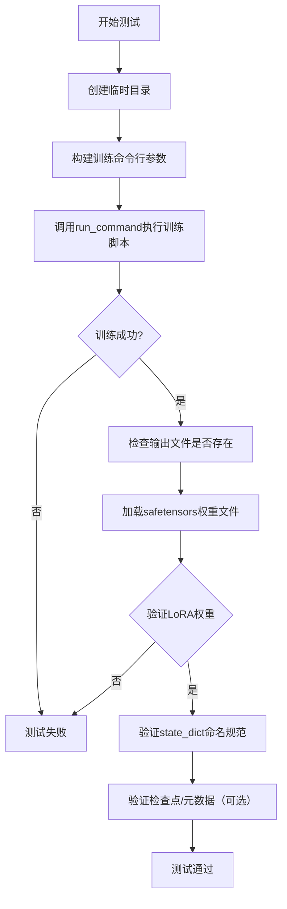

## 类结构

```
ExamplesTestsAccelerate (基类)
└── DreamBoothLoRAFlux2Klein (测试类)
```

## 全局变量及字段


### `logger`
    
全局日志记录器，用于输出调试信息

类型：`logging.Logger`
    


### `stream_handler`
    
日志流处理器，将日志输出到标准输出

类型：`logging.StreamHandler`
    


### `DreamBoothLoRAFlux2Klein.instance_data_dir`
    
实例数据目录路径

类型：`str`
    


### `DreamBoothLoRAFlux2Klein.instance_prompt`
    
实例图像的文本提示词

类型：`str`
    


### `DreamBoothLoRAFlux2Klein.pretrained_model_name_or_path`
    
预训练模型名称或路径

类型：`str`
    


### `DreamBoothLoRAFlux2Klein.script_path`
    
DreamBooth LoRA Flux2训练脚本路径

类型：`str`
    


### `DreamBoothLoRAFlux2Klein.transformer_layer_type`
    
要训练的可学习transformer层类型标识符

类型：`str`
    
    

## 全局函数及方法


### `logging.basicConfig`

`logging.basicConfig` 是 Python 标准库 `logging` 模块中的一个全局函数，用于以简单方式配置根日志记录器。它设置默认的日志级别、格式、处理器等，使得应用程序能够快速启用日志记录功能，而无需进行复杂的配置。

参数：

- `level`：`int` 或 `str`，可选，指定日志记录的最低级别（如 `logging.DEBUG`、`logging.INFO` 或对应的字符串 "DEBUG"、"INFO"）。默认为 `WARNING`。
- `filename`：`str`，可选，指定日志输出文件名。如果提供此参数，日志将写入文件而非控制台。
- `filemode`：`str`，可选，文件打开模式，默认为 `'a'`（追加模式）。
- `format`：`str`，可选，指定日志输出格式字符串（如 `'%(asctime)s - %(name)s - %(levelname)s - %(message)s'`）。
- `datefmt`：`str`，可选，指定日期/时间格式（如 `'%Y-%m-%d %H:%M:%S'`）。
- `style`：`str`，可选，格式字符串风格，可选值包括 `'%'`（默认）、`'{'`（str.format 风格）、`'$'`（string.Template 风格）。
- `handlers`：`list`，可选，一个可迭代的处理器列表，用于添加到根 logger。
- `stream`：`io.IOBase`，可选，流对象（如 `sys.stdout`），当 `filename` 为 `None` 时使用。
- `force`：`bool`，可选，3.8+ 版本可用，如果设为 `True`，则在配置前清除现有处理器。
- `encoding`：`str`，可选，3.9+ 版本可用，指定文件编码。
- `errors`：`str`，可选，3.9+ 版本可用，指定文件写入错误处理模式。

返回值：`None`，该函数不返回任何值，仅执行配置操作。

#### 流程图

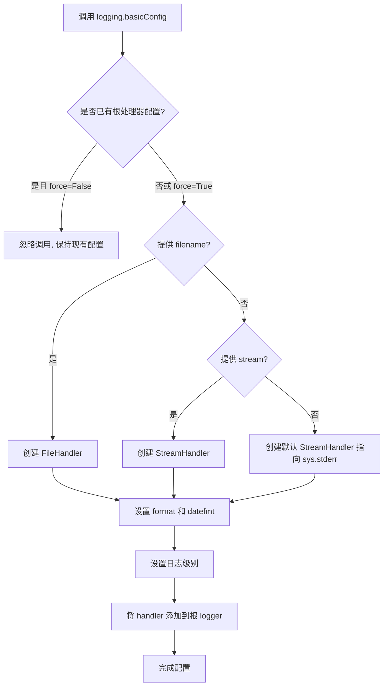

#### 带注释源码

```python
# 导入 logging 模块以使用日志功能
import logging
import sys

# 调用 logging.basicConfig 配置根日志记录器
# 此处设置日志级别为 DEBUG，意味着所有级别的日志消息都会被记录
# 包括 DEBUG、INFO、WARNING、ERROR、CRITICAL
logging.basicConfig(level=logging.DEBUG)

# 获取根 logger 实例
# 默认情况下，getLogger() 返回根 logger
logger = logging.getLogger()

# 创建一个 StreamHandler，输出到 sys.stdout（标准输出）
# 这样可以确保日志输出到控制台而不是默认的 sys.stderr
stream_handler = logging.StreamHandler(sys.stdout)

# 将处理器添加到 logger
# 如果没有显式设置级别，handler 将继承 logger 的级别（DEBUG）
logger.addHandler(stream_handler)
```


### `logging.getLogger`

获取或创建一个 Logger 实例，用于记录日志。当不传递参数时返回根 Logger（Root Logger）。

参数：

- （无参数调用）

返回值：`logging.Logger`，返回的 Logger 实例（根 Logger 或具名 Logger）

#### 流程图

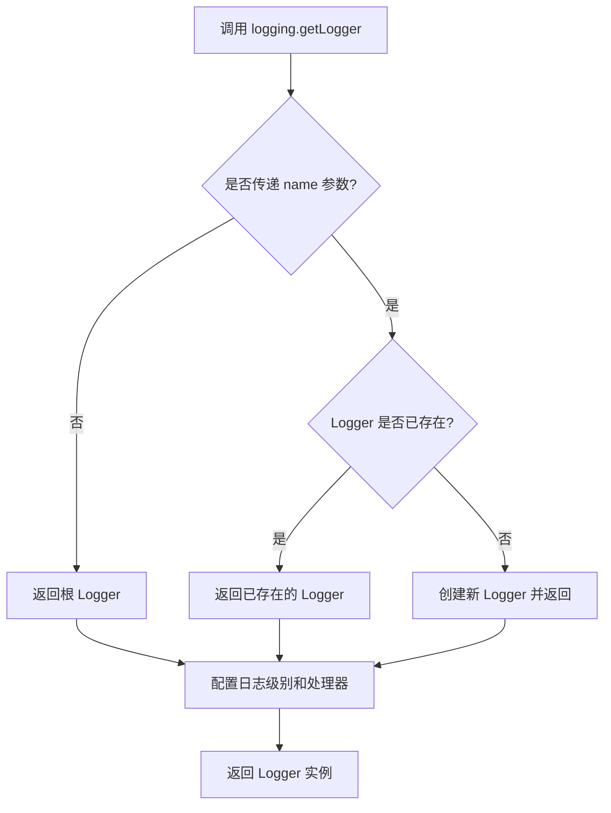

#### 带注释源码

```python
# 从标准库 logging 模块导入 getLogger 函数
# 这里的调用方式：logging.getLogger()
# 不传递任何参数，返回根 Logger（Root Logger）

logger = logging.getLogger()  # 获取根 Logger 实例，后续用于记录日志
stream_handler = logging.StreamHandler(sys.stdout)  # 创建流处理器，输出到标准输出
logger.addHandler(stream_handler)  # 将处理器添加到 logger
```

#### 额外说明

在当前代码中的实际使用方式：

```python
logging.basicConfig(level=logging.DEBUG)  # 配置根 Logger 的基本设置，设置为 DEBUG 级别

logger = logging.getLogger()  # 获取根 Logger（不传递参数）
# 等同于 logging.getLogger(None) 或 logging.getLogger("root")

stream_handler = logging.StreamHandler(sys.stdout)  # 创建输出到标准输出的处理器
logger.addHandler(stream_handler)  # 将流处理器添加到根 Logger
```

这种配置方式使得所有使用根 Logger 的日志输出都会显示 DEBUG 级别及以上的信息，并输出到标准输出（stdout）。


### `logging.StreamHandler`

`logging.StreamHandler` 是 Python 标准库 `logging` 模块中的一个类，用于创建日志处理器（Handler），将日志记录输出到指定的流（stream），如标准输出（stdout）或标准错误（stderr）。

参数：

- `stream`：`Optional[IO[str]]`，输出流对象，默认为 `sys.stderr`。此处传入 `sys.stdout`，表示将日志输出到标准输出。

返回值：`logging.StreamHandler`，返回一个新的 StreamHandler 实例，用于将日志记录输出到指定的流。

#### 流程图

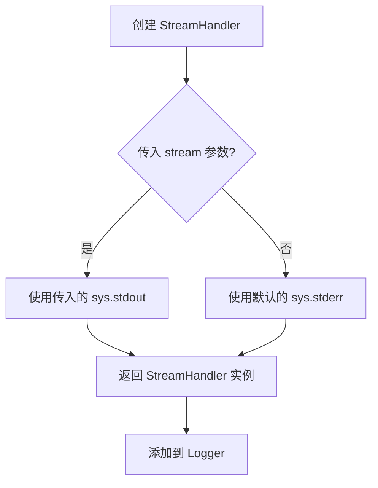

#### 带注释源码

```python
# 导入 logging 模块
import logging
# 导入 sys 模块以访问标准输出
import sys

# 获取根 logger 实例
logger = logging.getLogger()

# 创建 StreamHandler 实例，传入 sys.stdout 作为输出流
# stream 参数指定日志输出的目标位置，默认是 sys.stderr
# 这里明确指定 sys.stdout，使日志输出到标准输出而非标准错误
stream_handler = logging.StreamHandler(sys.stdout)

# 将创建的 handler 添加到 logger 中
# 这样 logger 在记录日志时，会通过该 handler 输出到 sys.stdout
logger.addHandler(stream_handler)

# 可选的：设置日志级别为 DEBUG
# 这样可以确保所有级别的日志都会被输出
logging.basicConfig(level=logging.DEBUG)
```

#### 备注

在上述代码中，`logging.StreamHandler(sys.stdout)` 的具体作用如下：

| 属性 | 值 |
|------|-----|
| 类名 | `logging.StreamHandler` |
| 传入参数 | `sys.stdout` |
| 输出目标 | 标准输出（stdout） |
| 默认输出目标 | 标准错误（stderr） |
| 返回值类型 | `logging.StreamHandler` 对象 |


### `safetensors.torch.load_file`

该函数是 safetensors 库提供的用于从 safetensors 格式文件中加载 PyTorch 状态字典的接口。它接受一个文件路径作为输入，返回一个包含张量的字典，其中键为参数名称，值为对应的 PyTorch 张量。

参数：

- `filename`：`str` 或 `os.PathLike`，要加载的 safetensors 文件路径

返回值：`Dict[str, torch.Tensor]`，包含从文件中加载的状态字典，键为参数名称，值为对应的 PyTorch 张量

#### 流程图

```mermaid
flowchart TD
    A[开始加载 safetensors 文件] --> B{文件是否存在且可读}
    B -->|否| C[抛出异常]
    B -->|是| D[调用 safetensors 库底层 C++/Rust 实现]
    D --> E[解析 safetensors 格式]
    E --> F[将二进制数据转换为 PyTorch 张量]
    F --> G[返回 Dict[str, Tensor] 状态字典]
    
    style A fill:#e1f5fe
    style G fill:#c8e6c9
```

#### 带注释源码

```python
# 代码中的实际调用示例
# 这里展示的是函数在实际代码中的使用方式

# 调用 safetensors.torch.load_file 加载训练保存的 LoRA 权重
lora_state_dict = safetensors.torch.load_file(
    os.path.join(tmpdir, "pytorch_lora_weights.safetensors")
)

# 加载后返回一个字典，可以对其键进行操作
# 例如检查所有键是否包含 'lora' 字符串
is_lora = all("lora" in k for k in lora_state_dict.keys())

# 检查所有键是否以 'transformer' 开头
starts_with_transformer = all(key.startswith("transformer") for key in lora_state_dict.keys())
```

#### 补充说明

| 项目 | 描述 |
|------|------|
| **函数来源** | `safetensors` 库的 `torch` 模块 |
| **文件格式** | safetensors 是一种安全、快速的 PyTorch 模型序列化格式 |
| **底层实现** | 由 Rust 编写，提供高效的内存映射和加载性能 |
| **设备参数** | 可选参数 `device` 用于指定加载张量的目标设备，默认为 'cpu' |
| **安全特性** | 该格式可以防止恶意 pickle 文件的安全风险 |
| **典型返回值** | `OrderedDict[str, torch.Tensor]`，与 PyTorch 的 `state_dict` 格式兼容 |


### `os.path.isfile`

检查指定路径是否是一个存在的普通文件（不是目录或符号链接到目录）。

参数：

- `path`：`str`，要检查的文件路径，可以是绝对路径或相对路径

返回值：`bool`，如果路径存在且是一个普通文件返回 `True`，否则返回 `False`

#### 流程图

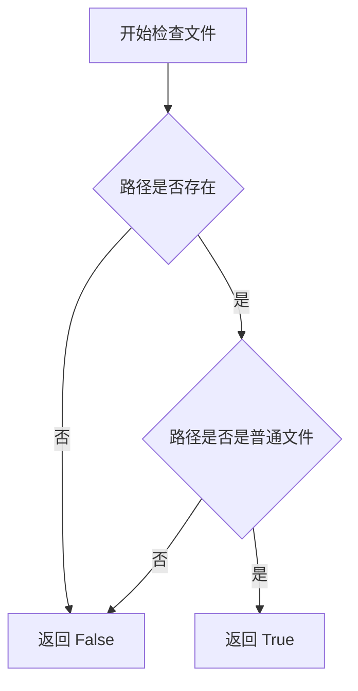

#### 带注释源码

```python
# os.path.isfile 源码实现逻辑（基于 CPython 标准库）
# 这是一个标准库函数，直接调用了 os.path.stat() 并检查文件类型

def isfile(path):
    """
    检查路径是否是普通文件
    
    参数:
        path: str 类型，表示文件路径
        
    返回:
        bool: 如果是普通文件返回 True，否则返回 False
    """
    try:
        # 获取文件状态信息
        st = os.stat(path)
    except (OSError, ValueError):
        # 如果路径不存在或无法访问，返回 False
        return False
    
    # S_ISREG 是宏，用于判断是否为普通文件
    # S_IFREG = 0o100000，表示普通文件
    return stat.S_ISREG(st.st_mode)
```

#### 在代码中的使用示例

在提供的测试代码中，`os.path.isfile` 被用于验证训练输出文件是否正确生成：

```python
# 示例 1：在 test_dreambooth_lora_flux2 方法中
self.assertTrue(os.path.isfile(os.path.join(tmpdir, "pytorch_lora_weights.safetensors")))

# 示例 2：在 test_dreambooth_lora_latent_caching 方法中
self.assertTrue(os.path.isfile(os.path.join(tmpdir, "pytorch_lora_weights.safetensors")))

# 示例 3：在 test_dreambooth_lora_with_metadata 方法中
state_dict_file = os.path.join(tmpdir, "pytorch_lora_weights.safetensors")
self.assertTrue(os.path.isfile(state_dict_file))
```

这些调用用于确保训练过程成功生成了 LoRA 权重文件，验证了 DreamBooth LoRA 训练流程的完整性。


### `os.path.join`

用于将多个路径组合成一个路径，自动处理不同操作系统之间的路径分隔符差异。

参数：

- `*paths`：`str`，任意数量的路径组件，用于拼接成一个路径

返回值：`str`，拼接后的完整路径字符串

#### 流程图

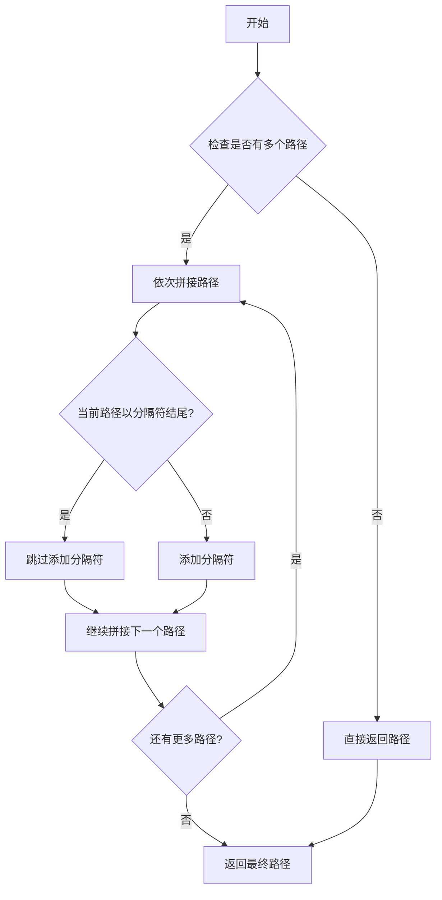

#### 带注释源码

```python
def join(*paths):
    """
    Join one or several path components intelligently.
    
    Args:
        *paths: Path components to be joined.
        
    Returns:
        str: The joined path string.
    """
    # 如果没有传入任何路径，返回空字符串
    if not paths:
        return ''
    
    # 获取第一个路径
    path = paths[0]
    
    # 遍历剩余的路径组件
    for p in paths[1:]:
        # 如果当前路径为空，直接使用新路径
        if not path:
            path = p
        # 如果新路径是绝对路径，直接使用新路径
        elif os.path.isabs(p):
            path = p
        else:
            # 检查当前路径是否以路径分隔符结尾
            if path.endswith(os.sep):
                # 如果以分隔符结尾，直接拼接
                path = path + p
            else:
                # 如果不以分隔符结尾，添加分隔符再拼接
                path = path + os.sep + p
    
    return path
```

#### 在本代码中的实际使用

```python
# 用法示例 1：检查文件是否存在
self.assertTrue(os.path.isfile(os.path.join(tmpdir, "pytorch_lora_weights.safetensors")))

# 用法示例 2：加载 safetensors 文件
lora_state_dict = safetensors.torch.load_file(os.path.join(tmpdir, "pytorch_lora_weights.safetensors"))

# 用法示例 3：构建状态字典文件路径
state_dict_file = os.path.join(tmpdir, "pytorch_lora_weights.safetensors")
```

#### 关键信息

- **名称**：`os.path.join`
- **模块**：`os.path`（Python 标准库）
- **功能**：路径拼接
- **技术债务**：无（标准库函数，无优化空间）


### `os.listdir`

列出指定目录中的所有文件和目录名称。

参数：

- `path`：`str`，要列出内容的目录路径，默认为当前目录

返回值：`list[str]`，包含目录中所有条目名称（文件和子目录名）的列表

#### 流程图

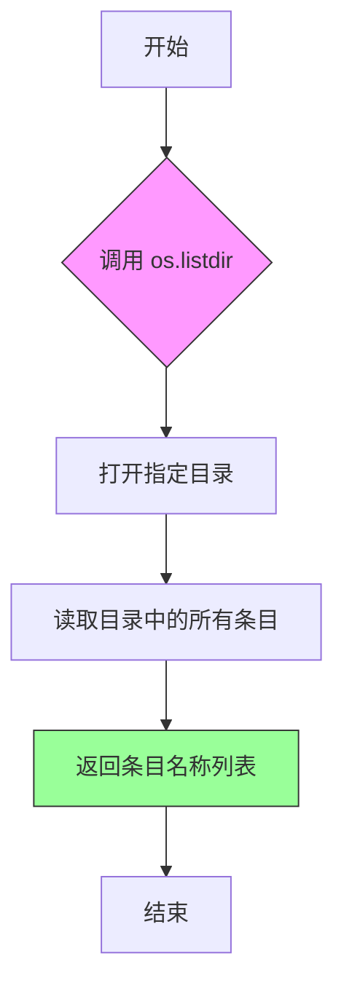

#### 带注释源码

```python
# os.listdir 是 Python 标准库 os 模块提供的函数
# 用于获取指定路径下的所有文件和目录名称

# 在本代码中的典型用法：
{x for x in os.listdir(tmpdir) if "checkpoint" in x}

# 解释：
# 1. os.listdir(tmpdir) - 列出 tmpdir 目录中的所有条目
# 2. if "checkpoint" in x - 过滤出名称包含 "checkpoint" 的条目
# 3. {x for x in ...} - 使用集合推导式构建结果集合

# 具体调用示例：
os.listdir(tmpdir)
# 返回: ['checkpoint-2', 'checkpoint-4', 'pytorch_lora_weights.safetensors', ...]

# 用于测试验证检查点是否正确保存：
self.assertEqual(
    {x for x in os.listdir(tmpdir) if "checkpoint" in x},  # 实际结果
    {"checkpoint-4", "checkpoint-6"},  # 预期结果
)
```

---

**备注**：在提供的代码中，`os.listdir` 被用于测试验证场景，用于检查训练过程中生成的模型检查点目录是否符合预期。在第172行、第194行和第218行分别用于验证不同测试场景下的检查点生成和清理逻辑是否正确工作。


### `tempfile.TemporaryDirectory`

该类是 Python 标准库 `tempfile` 模块的一部分，用于创建临时目录。它是一个上下文管理器，确保在退出上下文时自动删除临时目录及其所有内容，常用于测试或需要临时文件操作的场景。

参数：

- `suffix`：`str`，可选，临时目录名称的后缀，默认为空字符串。
- `prefix`：`str`，可选，临时目录名称的前缀，默认为 `'tmp'`。
- `dir`：`str`，可选，临时目录的父目录，默认为系统默认的临时文件目录。

返回值：`contextmanager`，返回一个上下文管理器。当进入上下文时（`__enter__`），返回临时目录的路径字符串（`str`）；当退出上下文时（`__exit__`），自动删除该临时目录及其所有内容。

#### 流程图

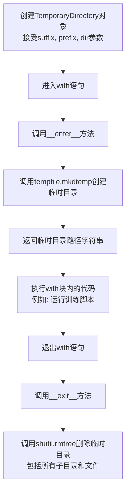

#### 带注释源码

以下是 Python 标准库 `tempfile` 模块中 `TemporaryDirectory` 类的典型实现：

```python
import os
import shutil
import tempfile

class TemporaryDirectory:
    """创建临时目录的上下文管理器，退出时自动清理。"""
    
    def __init__(self, suffix=None, prefix=None, dir=None):
        """
        初始化临时目录对象。
        
        参数:
            suffix: 目录名称的后缀。
            prefix: 目录名称的前缀。
            dir: 父目录路径，默认为系统临时目录。
        """
        self.name = None  # 存储临时目录的路径
        self suffix = suffix
        self.prefix = prefix
        self.dir = dir

    def __enter__(self):
        """进入上下文管理器，创建并返回临时目录路径。"""
        # 使用 tempfile.mkdtemp 创建实际的临时目录
        self.name = tempfile.mkdtemp(suffix=self.suffix, prefix=self.prefix, dir=self.dir)
        return self.name  # 返回目录路径供调用者使用

    def __exit__(self, exc, value, tb):
        """退出上下文管理器，删除临时目录及其内容。"""
        # 如果目录存在，则递归删除
        if self.name is not None:
            shutil.rmtree(self.name)
        return False  # 不抑制异常

    def cleanup(self):
        """手动清理临时目录（可选手动调用）。"""
        if self.name is not None:
            shutil.rmtree(self.name)
            self.name = None
```

**在当前代码中的使用示例：**

```python
# 代码中的实际使用方式
with tempfile.TemporaryDirectory() as tmpdir:
    # tmpdir 是临时目录的路径字符串
    # 在这里可以执行需要临时目录的操作，例如运行训练脚本
    test_args = f"""
        {self.script_path}
        --output_dir {tmpdir}
        """.split()
    run_command(self._launch_args + test_args)
    # 测试完成后，with 语句退出时自动删除 tmpdir
```


### `json.loads`

`json.loads` 是 Python 标准库 `json` 模块中的函数，用于将 JSON 格式的字符串解析为 Python 对象（字典、列表等）。在代码中用于解析从 safetensors 文件元数据中读取的 LoRA 适配器元数据信息。

参数：

- `s`：`str` 或 `bytes`，要解析的 JSON 字符串，包含序列化的数据
- `encoding`：`str`（可选），字符串的编码方式（已弃用）

返回值：`Any`（任意 Python 类型），返回解析后的 Python 对象，通常是字典或列表

#### 流程图

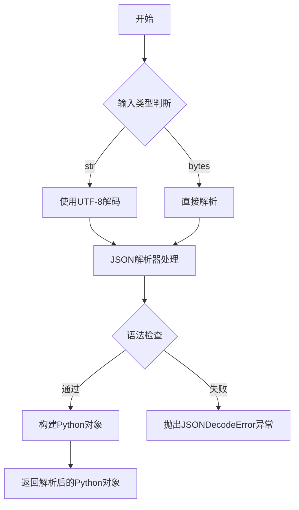

#### 带注释源码

```python
# 在代码中的实际使用方式：
raw = metadata.get(LORA_ADAPTER_METADATA_KEY)  # 从safetensors文件元数据中获取LORA_ADAPTER_METADATA_KEY对应的原始JSON字符串
if raw:
    raw = json.loads(raw)  # 将JSON字符串解析为Python字典对象，以便后续访问其中的lora_alpha和rank等参数

# json.loads的标准函数签名：
# json.loads(s, *, encoding=None, cls=None, object_hook=None, parse_float=None, 
#            parse_int=None, object_pairs_hook=None, **kw)

# 常用示例：
# >>> import json
# >>> data = '{"transformer.lora_alpha": 8, "transformer.r": 4}'
# >>> parsed = json.loads(data)
# >>> print(parsed)
# {'transformer.lora_alpha': 8, 'transformer.r': 4}
```


### `run_command`

`run_command` 是一个从 `test_examples_utils` 模块导入的全局函数，用于在测试环境中执行命令行指令。该函数接收一个包含启动参数和测试参数的列表，并在子进程中运行训练脚本，支持 DreamBooth LoRA Flux2 模型的训练测试。

参数：

-  `cmd`：`List[str]`，命令行参数列表，通常包含启动器参数（如加速器配置）和训练脚本参数（如模型路径、数据目录、训练步数等）的组合

返回值：`None`，该函数直接执行命令，不返回任何值

#### 流程图

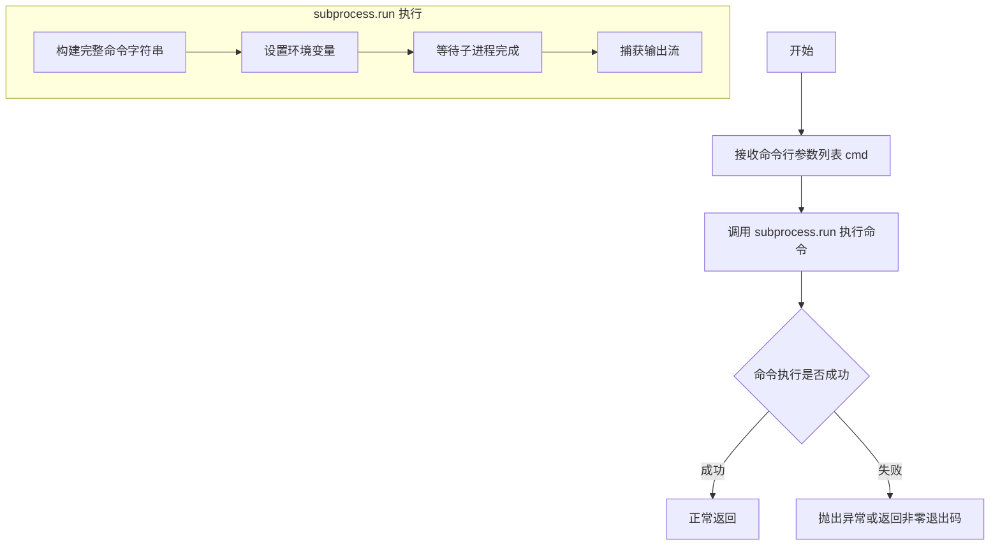

#### 带注释源码

```
# 注意：run_command 函数定义在 test_examples_utils 模块中
# 以下是基于代码中调用方式的推断

def run_command(cmd: List[str]) -> None:
    """
    执行命令行命令的辅助函数
    
    参数:
        cmd: 包含所有命令行参数的列表
             例如：self._launch_args + test_args
             - self._launch_args: 来自 ExamplesTestsAccelerate 的启动参数（可能包含加速器配置）
             - test_args: 训练脚本的具体参数
    
    返回值:
        None: 直接通过 subprocess 执行命令，不返回结果
    
    示例调用:
        run_command(self._launch_args + test_args)
        
        其中 test_args 可能包含:
        - examples/dreambooth/train_dreambooth_lora_flux2_klein.py
        - --pretrained_model_name_or_path hf-internal-testing/tiny-flux2-klein
        - --instance_data_dir docs/source/en/imgs
        - --instance_prompt dog
        --resolution 64
        --train_batch_size 1
        --max_train_steps 2
        --output_dir /tmp/xxx
        等各种训练参数
    """
    # 实际实现位于 test_examples_utils.py 模块中
    # 典型的实现会使用 subprocess.run 来执行命令
    # 并可能包含日志输出、错误处理等逻辑
    
    subprocess.run(cmd, check=True)  # 假设的实现
```

#### 使用场景说明

在 `DreamBoothLoRAFlux2Klein` 测试类中，`run_command` 被用于：

1. **基础训练测试**：执行 DreamBooth LoRA Flux2 模型的训练脚本
2. **Latent 缓存测试**：带 `--cache_latents` 参数的训练
3. **LoRA 层指定测试**：带 `--lora_layers` 参数的训练
4. **检查点总数限制测试**：带 `--checkpoints_total_limit` 参数的训练
5. **元数据测试**：验证 LoRA 权重文件中的元数据是否正确序列化

每次调用都使用 `self._launch_args`（来自父类 `ExamplesTestsAccelerate` 的加速器启动参数）加上不同的训练参数组合。


### ExamplesTestsAccelerate

这是一个测试基类，用于通过Accelerate框架运行Diffusers示例脚本的集成测试。它提供了运行训练脚本、验证输出文件、检查模型状态字典等核心功能。

参数：

- 无直接参数（此类通过继承使用，参数通过子类的类属性或实例属性传入）

返回值：无直接返回值（此类作为基类使用）

#### 流程图

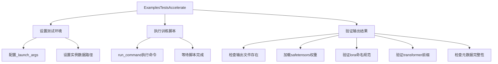

#### 带注释源码

```
# 由于ExamplesTestsAccelerate类是从test_examples_utils模块导入的，
# 当前文件中仅显示其使用方式，未包含完整源码。
# 根据代码使用推断的类结构如下：

class ExamplesTestsAccelerate:
    """
    测试基类，用于运行Diffusers示例脚本的集成测试
    """
    
    # 类属性（根据使用推断）
    _launch_args = None  # Accelerate启动参数列表
    instance_data_dir = ""  # 实例数据目录路径
    instance_prompt = ""  # 实例提示词
    pretrained_model_name_or_path = ""  # 预训练模型路径
    script_path = ""  # 训练脚本路径
    
    def test_dreambooth_lora_flux2(self):
        """测试DreamBooth LoRA Flux2训练流程"""
        # 创建临时目录
        # 构建训练参数
        # 执行训练命令
        # 验证输出文件
        # 检查lora权重命名
        # 验证transformer前缀
        pass
    
    def test_dreambooth_lora_latent_caching(self):
        """测试带潜在缓存的DreamBooth LoRA训练"""
        pass
    
    def test_dreambooth_lora_layers(self):
        """测试指定LoRA层训练"""
        pass
    
    def test_dreambooth_lora_flux2_checkpointing_checkpoints_total_limit(self):
        """测试检查点总数限制功能"""
        pass
    
    def test_dreambooth_lora_flux2_checkpointing_checkpoints_total_limit_removes_multiple_checkpoints(self):
        """测试检查点删除和多检查点限制"""
        pass
    
    def test_dreambooth_lora_with_metadata(self):
        """测试LoRA元数据保存功能"""
        pass
```

---

### DreamBoothLoRAFlux2Klein

此类继承自`ExamplesTestsAccelerate`，专门用于测试DreamBooth LoRA Flux2 Klein模型的训练流程。

参数：

- `instance_data_dir`：`str`，实例数据目录路径，默认值为`"docs/source/en/imgs"`
- `instance_prompt`：`str`，实例提示词，默认值为`"dog"`
- `pretrained_model_name_or_path`：`str`，预训练模型名称或路径，默认值为`"hf-internal-testing/tiny-flux2-klein"`
- `script_path`：`str`，训练脚本路径，默认值为`"examples/dreambooth/train_dreambooth_lora_flux2_klein.py"`
- `transformer_layer_type`：`str`，Transformer层类型，默认值为`"single_transformer_blocks.0.attn.to_qkv_mlp_proj"`

返回值：无直接返回值（测试方法返回None）

#### 流程图

```mermaid
flowchart TD
    A[DreamBoothLoRAFlux2Klein测试类] --> B[test_dreambooth_lora_flux2]
    A --> C[test_dreambooth_lora_latent_caching]
    A --> D[test_dreambooth_lora_layers]
    A --> E[test_dreambooth_lora_flux2_checkpointing_checkpoints_total_limit]
    A --> F[test_dreambooth_lora_flux2_checkpointing_checkpoints_total_limit_removes_multiple_checkpoints]
    A --> G[test_dreambooth_lora_with_metadata]
    
    B --> B1[创建临时目录]
    B --> B2[构建训练参数]
    B --> B3[执行训练命令]
    B --> B4[验证safetensors文件]
    B --> B5[检查lora关键字]
    B --> B6[验证transformer前缀]
    
    C --> C1[创建临时目录]
    C --> C2[启用cache_latents参数]
    C --> C3[执行训练验证]
    
    D --> D1[指定lora_layers参数]
    D --> D2[验证特定层训练]
    
    E --> E1[设置checkpoints_total_limit=2]
    E --> E2[验证保留的检查点]
    
    F --> F1[首次训练创建检查点]
    F --> F2[恢复训练并设置限制]
    F --> F3[验证检查点更新]
    
    G --> G1[设置lora_alpha=8 rank=4]
    G --> G2[验证元数据序列化]
    G --> G3[检查lora_alpha和rank值]
```

#### 带注释源码

```python
# 导入所需的模块
import json
import logging
import os
import sys
import tempfile

import safetensors

from diffusers.loaders.lora_base import LORA_ADAPTER_METADATA_KEY

# 导入测试工具
sys.path.append("..")
from test_examples_utils import ExamplesTestsAccelerate, run_command

# 配置日志
logging.basicConfig(level=logging.DEBUG)
logger = logging.getLogger()
stream_handler = logging.StreamHandler(sys.stdout)
logger.addHandler(stream_handler)


class DreamBoothLoRAFlux2Klein(ExamplesTestsAccelerate):
    """
    DreamBooth LoRA Flux2 Klein模型训练测试类
    
    此类继承自ExamplesTestsAccelerate，用于测试DreamBooth LoRA
    在Flux2 Klein模型上的训练流程，包括：
    - 基本训练功能测试
    - 潜在缓存测试
    - 指定层训练测试
    - 检查点管理测试
    - 元数据保存测试
    """
    
    # 测试用的实例数据目录
    instance_data_dir = "docs/source/en/imgs"
    # 实例提示词
    instance_prompt = "dog"
    # 预训练模型路径（使用tiny版本用于快速测试）
    pretrained_model_name_or_path = "hf-internal-testing/tiny-flux2-klein"
    # 训练脚本路径
    script_path = "examples/dreambooth/train_dreambooth_lora_flux2_klein.py"
    # Transformer层类型，用于指定要训练的层
    transformer_layer_type = "single_transformer_blocks.0.attn.to_qkv_mlp_proj"

    def test_dreambooth_lora_flux2(self):
        """
        测试基本的DreamBooth LoRA Flux2训练流程
        
        验证：
        - 训练脚本能够成功运行
        - 输出文件pytorch_lora_weights.safetensors存在
        - 状态字典中的键都包含"lora"关键字
        - 所有键都以"transformer"开头（当不训练text encoder时）
        """
        with tempfile.TemporaryDirectory() as tmpdir:
            # 构建训练参数列表
            test_args = f"""
                {self.script_path}
                --pretrained_model_name_or_path {self.pretrained_model_name_or_path}
                --instance_data_dir {self.instance_data_dir}
                --instance_prompt {self.instance_prompt}
                --resolution 64
                --train_batch_size 1
                --gradient_accumulation_steps 1
                --max_train_steps 2
                --learning_rate 5.0e-04
                --scale_lr
                --lr_scheduler constant
                --lr_warmup_steps 0
                --max_sequence_length 8
                --text_encoder_out_layers 1
                --output_dir {tmpdir}
                """.split()

            # 执行训练命令
            run_command(self._launch_args + test_args)
            
            # 验证输出文件存在
            self.assertTrue(os.path.isfile(os.path.join(tmpdir, "pytorch_lora_weights.safetensors")))

            # 加载LoRA权重并验证命名规范
            lora_state_dict = safetensors.torch.load_file(os.path.join(tmpdir, "pytorch_lora_weights.safetensors"))
            # 检查所有键是否包含"lora"
            is_lora = all("lora" in k for k in lora_state_dict.keys())
            self.assertTrue(is_lora)

            # 验证所有键都以"transformer"开头
            starts_with_transformer = all(key.startswith("transformer") for key in lora_state_dict.keys())
            self.assertTrue(starts_with_transformer)

    def test_dreambooth_lora_latent_caching(self):
        """
        测试启用潜在缓存的DreamBooth LoRA训练
        
        验证cache_latents参数功能，确保在启用潜在缓存时
        训练仍能正常进行且输出正确的LoRA权重
        """
        with tempfile.TemporaryDirectory() as tmpdir:
            test_args = f"""
                {self.script_path}
                --pretrained_model_name_or_path {self.pretrained_model_name_or_path}
                --instance_data_dir {self.instance_data_dir}
                --instance_prompt {self.instance_prompt}
                --resolution 64
                --train_batch_size 1
                --gradient_accumulation_steps 1
                --max_train_steps 2
                --cache_latents  # 启用潜在缓存
                --learning_rate 5.0e-04
                --scale_lr
                --lr_scheduler constant
                --lr_warmup_steps 0
                --max_sequence_length 8
                --text_encoder_out_layers 1
                --output_dir {tmpdir}
                """.split()

            run_command(self._launch_args + test_args)
            # 验证输出文件
            self.assertTrue(os.path.isfile(os.path.join(tmpdir, "pytorch_lora_weights.safetensors")))

            # 验证LoRA权重
            lora_state_dict = safetensors.torch.load_file(os.path.join(tmpdir, "pytorch_lora_weights.safetensors"))
            is_lora = all("lora" in k for k in lora_state_dict.keys())
            self.assertTrue(is_lora)

            # 验证transformer前缀
            starts_with_transformer = all(key.startswith("transformer") for key in lora_state_dict.keys())
            self.assertTrue(starts_with_transformer)

    def test_dreambooth_lora_layers(self):
        """
        测试指定LoRA层的训练
        
        通过lora_layers参数指定特定的Transformer层进行训练，
        验证只有指定层的参数会被训练
        """
        with tempfile.TemporaryDirectory() as tmpdir:
            test_args = f"""
                {self.script_path}
                --pretrained_model_name_or_path {self.pretrained_model_name_or_path}
                --instance_data_dir {self.instance_data_dir}
                --instance_prompt {self.instance_prompt}
                --resolution 64
                --train_batch_size 1
                --gradient_accumulation_steps 1
                --max_train_steps 2
                --cache_latents
                --learning_rate 5.0e-04
                --scale_lr
                --lora_layers {self.transformer_layer_type}  # 指定训练层
                --lr_scheduler constant
                --lr_warmup_steps 0
                --max_sequence_length 8
                --text_encoder_out_layers 1
                --output_dir {tmpdir}
                """.split()

            run_command(self._launch_args + test_args)
            # 验证输出文件
            self.assertTrue(os.path.isfile(os.path.join(tmpdir, "pytorch_lora_weights.safetensors")))

            # 验证LoRA权重
            lora_state_dict = safetensors.torch.load_file(os.path.join(tmpdir, "pytorch_lora_weights.safetensors"))
            is_lora = all("lora" in k for k in lora_state_dict.keys())
            self.assertTrue(is_lora)

            # 验证只有指定层的参数
            starts_with_transformer = all(
                key.startswith(f"transformer.{self.transformer_layer_type}") for key in lora_state_dict.keys()
            )
            self.assertTrue(starts_with_transformer)

    def test_dreambooth_lora_flux2_checkpointing_checkpoints_total_limit(self):
        """
        测试检查点总数限制功能
        
        验证checkpoints_total_limit参数能够限制保存的检查点数量，
        旧的检查点会被自动删除
        """
        with tempfile.TemporaryDirectory() as tmpdir:
            test_args = f"""
            {self.script_path}
            --pretrained_model_name_or_path={self.pretrained_model_name_or_path}
            --instance_data_dir={self.instance_data_dir}
            --output_dir={tmpdir}
            --instance_prompt={self.instance_prompt}
            --resolution=64
            --train_batch_size=1
            --gradient_accumulation_steps=1
            --max_train_steps=6
            --checkpoints_total_limit=2  # 限制最多保存2个检查点
            --max_sequence_length 8
            --checkpointing_steps=2
            --text_encoder_out_layers 1
            """.split()

            run_command(self._launch_args + test_args)

            # 验证只保留了最新的2个检查点
            self.assertEqual(
                {x for x in os.listdir(tmpdir) if "checkpoint" in x},
                {"checkpoint-4", "checkpoint-6"},
            )

    def test_dreambooth_lora_flux2_checkpointing_checkpoints_total_limit_removes_multiple_checkpoints(self):
        """
        测试检查点恢复和删除多个旧检查点
        
        验证：
        1. 能够从检查点恢复训练
        2. checkpoints_total_limit在恢复训练后仍然生效
        3. 多个旧检查点被正确删除
        """
        with tempfile.TemporaryDirectory() as tmpdir:
            # 第一次训练
            test_args = f"""
            {self.script_path}
            --pretrained_model_name_or_path={self.pretrained_model_name_or_path}
            --instance_data_dir={self.instance_data_dir}
            --output_dir={tmpdir}
            --instance_prompt={self.instance_prompt}
            --resolution=64
            --train_batch_size=1
            --gradient_accumulation_steps=1
            --max_train_steps=4
            --checkpointing_steps=2
            --max_sequence_length 8
            --text_encoder_out_layers 1
            """.split()

            run_command(self._launch_args + test_args)

            # 验证初始检查点
            self.assertEqual({x for x in os.listdir(tmpdir) if "checkpoint" in x}, {"checkpoint-2", "checkpoint-4"})

            # 从checkpoint-4恢复继续训练
            resume_run_args = f"""
            {self.script_path}
            --pretrained_model_name_or_path={self.pretrained_model_name_or_path}
            --instance_data_dir={self.instance_data_dir}
            --output_dir={tmpdir}
            --instance_prompt={self.instance_prompt}
            --resolution=64
            --train_batch_size=1
            --gradient_accumulation_steps=1
            --max_train_steps=8
            --checkpointing_steps=2
            --resume_from_checkpoint=checkpoint-4  # 从检查点恢复
            --checkpoints_total_limit=2  # 保持检查点限制
            --max_sequence_length 8
            --text_encoder_out_layers 1
            """.split()

            run_command(self._launch_args + resume_run_args)

            # 验证保留的是最新的两个检查点
            self.assertEqual({x for x in os.listdir(tmpdir) if "checkpoint" in x}, {"checkpoint-6", "checkpoint-8"})

    def test_dreambooth_lora_with_metadata(self):
        """
        测试LoRA元数据保存功能
        
        验证LoRA权重文件中正确保存了元数据，包括：
        - lora_alpha值
        - rank值
        这些元数据用于LoRA权重加载时的适配器配置
        """
        # 使用不同的lora_alpha和rank值
        lora_alpha = 8
        rank = 4
        with tempfile.TemporaryDirectory() as tmpdir:
            test_args = f"""
                {self.script_path}
                --pretrained_model_name_or_path {self.pretrained_model_name_or_path}
                --instance_data_dir {self.instance_data_dir}
                --instance_prompt {self.instance_prompt}
                --resolution 64
                --train_batch_size 1
                --gradient_accumulation_steps 1
                --max_train_steps 2
                --lora_alpha={lora_alpha}
                --rank={rank}
                --learning_rate 5.0e-04
                --scale_lr
                --lr_scheduler constant
                --lr_warmup_steps 0
                --max_sequence_length 8
                --text_encoder_out_layers 1
                --output_dir {tmpdir}
                """.split()

            run_command(self._launch_args + test_args)
            
            # 验证输出文件存在
            state_dict_file = os.path.join(tmpdir, "pytorch_lora_weights.safetensors")
            self.assertTrue(os.path.isfile(state_dict_file))

            # 检查元数据是否正确序列化
            with safetensors.torch.safe_open(state_dict_file, framework="pt", device="cpu") as f:
                metadata = f.metadata() or {}

            metadata.pop("format", None)
            raw = metadata.get(LORA_ADAPTER_METADATA_KEY)
            if raw:
                raw = json.loads(raw)

            # 验证lora_alpha值
            loaded_lora_alpha = raw["transformer.lora_alpha"]
            self.assertTrue(loaded_lora_alpha == lora_alpha)
            
            # 验证rank值
            loaded_lora_rank = raw["transformer.r"]
            self.assertTrue(loaded_lora_rank == rank)
```


### `DreamBoothLoRAFlux2Klein.test_dreambooth_lora_flux2`

该函数是 DreamBooth LoRA Flux2 模型的集成测试方法，通过创建临时目录、构造训练参数、执行训练脚本，然后验证输出的 LoRA 权重文件是否符合预期（包括文件存在性、状态字典键名包含"lora"且以"transformer"开头）来完成端到端的训练流程测试。

参数：

- `self`：隐式参数，类型为 `DreamBoothLoRAFlux2Klein`（继承自 `ExamplesTestsAccelerate`），表示测试类实例本身

返回值：`None`，该方法通过断言进行测试验证，不返回任何值

#### 流程图

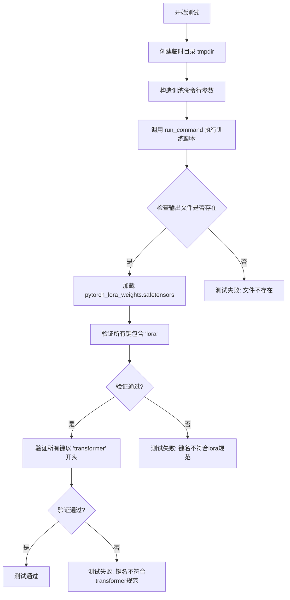

#### 带注释源码

```python
def test_dreambooth_lora_flux2(self):
    """
    测试 DreamBooth LoRA Flux2 模型的训练流程
    
    该测试方法执行以下步骤：
    1. 创建临时目录用于存放训练输出
    2. 构造并执行训练脚本的命令行参数
    3. 验证生成的 LoRA 权重文件
    4. 检查状态字典的键名是否符合规范
    """
    # 使用上下文管理器创建临时目录，测试结束后自动清理
    with tempfile.TemporaryDirectory() as tmpdir:
        # 构造训练脚本的命令行参数
        # 包括模型路径、数据目录、提示词、分辨率、训练批次等配置
        test_args = f"""
            {self.script_path}
            --pretrained_model_name_or_path {self.pretrained_model_name_or_path}
            --instance_data_dir {self.instance_data_dir}
            --instance_prompt {self.instance_prompt}
            --resolution 64
            --train_batch_size 1
            --gradient_accumulation_steps 1
            --max_train_steps 2
            --learning_rate 5.0e-04
            --scale_lr
            --lr_scheduler constant
            --lr_warmup_steps 0
            --max_sequence_length 8
            --text_encoder_out_layers 1
            --output_dir {tmpdir}
            """.split()

        # 执行训练命令，将 launch_args 与测试参数合并
        run_command(self._launch_args + test_args)
        
        # 验证输出文件是否存在（smoke test）
        self.assertTrue(os.path.isfile(os.path.join(tmpdir, "pytorch_lora_weights.safetensors")))

        # 加载生成的 LoRA 权重文件
        lora_state_dict = safetensors.torch.load_file(os.path.join(tmpdir, "pytorch_lora_weights.safetensors"))
        
        # 验证所有键名都包含 'lora'，确保正确应用了 LoRA
        is_lora = all("lora" in k for k in lora_state_dict.keys())
        self.assertTrue(is_lora)

        # 当不训练 text encoder 时，所有参数应以降transformer开头
        # 这是Flux2模型的特定结构要求
        starts_with_transformer = all(key.startswith("transformer") for key in lora_state_dict.keys())
        self.assertTrue(starts_with_transformer)
```


### `DreamBoothLoRAFlux2Klein.test_dreambooth_lora_latent_caching`

该方法是 DreamBoothLoRAFlux2Klein 类的测试方法，用于测试使用 latent caching（潜在缓存）功能进行 DreamBooth LoRA 训练的场景。它通过执行训练脚本并验证生成的 LoRA 权重文件是否符合预期（包括文件存在性、参数命名规范等）来确保缓存机制正常工作。

参数：

- `self`：`DreamBoothLoRAFlux2Klein`，类的实例本身，包含类属性如 `script_path`、`pretrained_model_name_or_path`、`instance_data_dir`、`instance_prompt` 等

返回值：`None`，该方法为测试方法，通过 `self.assertTrue` 断言进行验证，测试失败时抛出异常

#### 流程图

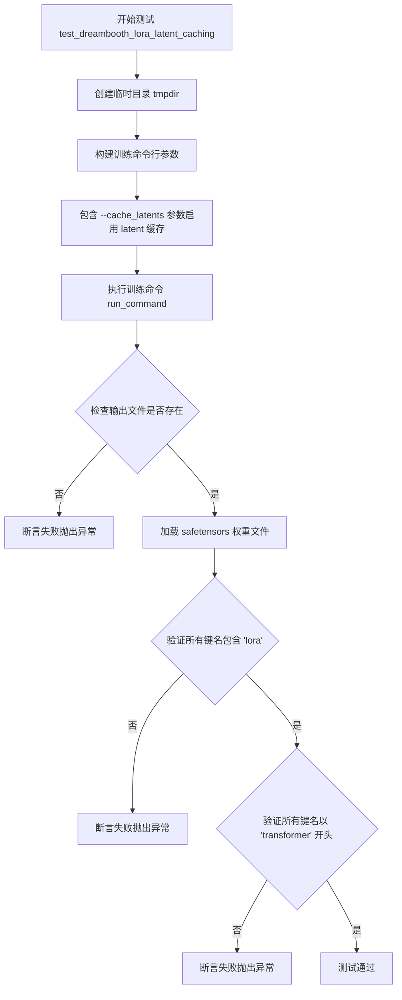

#### 带注释源码

```python
def test_dreambooth_lora_latent_caching(self):
    """
    测试使用 latent caching（潜在缓存）功能的 DreamBooth LoRA 训练流程。
    该测试验证启用 --cache_latents 参数后训练脚本能够正确生成 LoRA 权重。
    """
    # 创建临时目录用于存放训练输出
    with tempfile.TemporaryDirectory() as tmpdir:
        # 构建训练命令行参数列表，包含启用 latent 缓存的标志
        test_args = f"""
            {self.script_path}                                      # 训练脚本路径
            --pretrained_model_name_or_path {self.pretrained_model_name_or_path}  # 预训练模型名称或路径
            --instance_data_dir {self.instance_data_dir}           # 实例数据目录
            --instance_prompt {self.instance_prompt}                # 实例提示词
            --resolution 64                                         # 图像分辨率
            --train_batch_size 1                                    # 训练批次大小
            --gradient_accumulation_steps 1                         # 梯度累积步数
            --max_train_steps 2                                     # 最大训练步数
            --cache_latents                                         # 启用 latent 缓存（关键参数）
            --learning_rate 5.0e-04                                 # 学习率
            --scale_lr                                              # 是否缩放学习率
            --lr_scheduler constant                                 # 学习率调度器
            --lr_warmup_steps 0                                     # 学习率预热步数
            --max_sequence_length 8                                 # 最大序列长度
            --text_encoder_out_layers 1                             # 文本编码器输出层数
            --output_dir {tmpdir}                                   # 输出目录
            """.split()

        # 执行训练命令，结合加速启动参数
        run_command(self._launch_args + test_args)
        
        # ====== 验证步骤 1: 检查输出文件是否存在 ======
        # save_pretrained smoke test
        self.assertTrue(os.path.isfile(os.path.join(tmpdir, "pytorch_lora_weights.safetensors")))

        # ====== 验证步骤 2: 检查 LoRA 权重命名是否正确 ======
        # 加载 LoRA 权重状态字典
        lora_state_dict = safetensors.torch.load_file(os.path.join(tmpdir, "pytorch_lora_weights.safetensors"))
        # 验证所有键名都包含 'lora' 字符串
        is_lora = all("lora" in k for k in lora_state_dict.keys())
        self.assertTrue(is_lora)

        # ====== 验证步骤 3: 检查权重是否来自 transformer ======
        # 当不训练文本编码器时，所有参数名应以 'transformer' 开头
        starts_with_transformer = all(key.startswith("transformer") for key in lora_state_dict.keys())
        self.assertTrue(starts_with_transformer)
```


### `DreamBoothLoRAFlux2Klein.test_dreambooth_lora_layers`

该测试方法用于验证 DreamBooth LoRA 训练脚本能够正确地仅训练指定的 `transformer` 层（`single_transformer_blocks.0.attn.to_qkv_mlp_proj`），并确保生成的状态字典中只包含指定层的 LoRA 参数。

参数：

- `self`：`DreamBoothLoRAFlux2Klein`（隐式参数），测试类实例本身，继承自 `ExamplesTestsAccelerate`

返回值：`None`，该方法为测试方法，无返回值，通过 `assert` 语句进行验证

#### 流程图

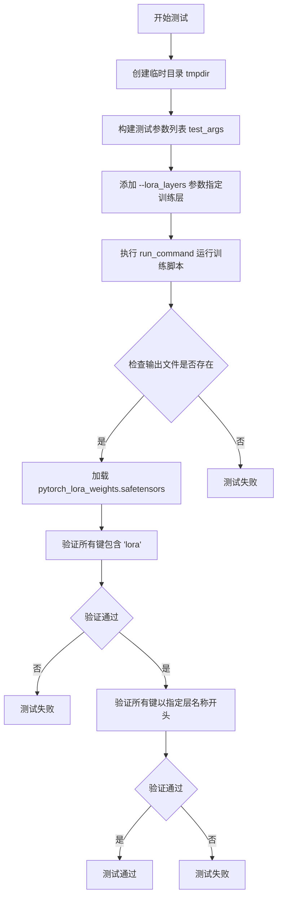

#### 带注释源码

```python
def test_dreambooth_lora_layers(self):
    # 创建临时目录用于存放训练输出
    with tempfile.TemporaryDirectory() as tmpdir:
        # 构建训练脚本的命令行参数
        # 关键参数：--lora_layers 指定只训练特定层
        test_args = f"""
            {self.script_path}
            --pretrained_model_name_or_path {self.pretrained_model_name_or_path}
            --instance_data_dir {self.instance_data_dir}
            --instance_prompt {self.instance_prompt}
            --resolution 64
            --train_batch_size 1
            --gradient_accumulation_steps 1
            --max_train_steps 2
            --cache_latents
            --learning_rate 5.0e-04
            --scale_lr
            --lora_layers {self.transformer_layer_type}
            --lr_scheduler constant
            --lr_warmup_steps 0
            --max_sequence_length 8
            --text_encoder_out_layers 1
            --output_dir {tmpdir}
            """.split()

        # 执行训练命令
        run_command(self._launch_args + test_args)
        
        # 验证：检查 LoRA 权重文件是否生成
        # save_pretrained smoke test
        self.assertTrue(os.path.isfile(os.path.join(tmpdir, "pytorch_lora_weights.safetensors")))

        # 验证：确保 state_dict 中的参数命名正确（包含 'lora'）
        lora_state_dict = safetensors.torch.load_file(os.path.join(tmpdir, "pytorch_lora_weights.safetensors"))
        is_lora = all("lora" in k for k in lora_state_dict.keys())
        self.assertTrue(is_lora)

        # 验证：当不训练 text encoder 时，所有参数应以 'transformer' 开头
        # 在此测试中，只有 transformer.single_transformer_blocks.0.attn.to_qkv_mlp_proj 层的参数应在 state_dict 中
        starts_with_transformer = all(
            key.startswith(f"transformer.{self.transformer_layer_type}") for key in lora_state_dict.keys()
        )
        self.assertTrue(starts_with_transformer)
```


### `DreamBoothLoRAFlux2Klein.test_dreambooth_lora_flux2_checkpointing_checkpoints_total_limit`

该方法是一个单元测试，用于验证 DreamBooth LoRA Flux2 训练脚本在设置 `checkpoints_total_limit` 参数时的检查点管理功能是否符合预期。测试通过运行训练脚本并检查输出目录中保留的检查点数量和名称，验证系统是否正确限制保留的检查点总数（只保留最新的2个检查点，即 checkpoint-4 和 checkpoint-6）。

参数：

- `self`：隐式参数，类型为 `DreamBoothLoRAFlux2Klein`，表示测试类实例本身，包含类属性如 `script_path`、`pretrained_model_name_or_path`、`instance_data_dir`、`instance_prompt` 等

返回值：`None`，该方法为测试方法，通过断言验证功能，不返回任何值

#### 流程图

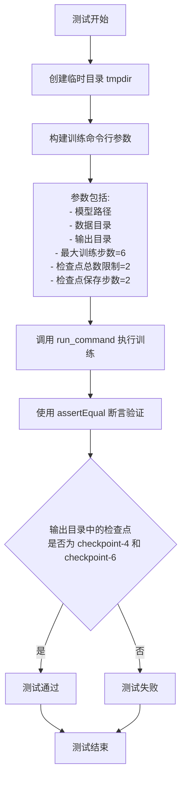

#### 带注释源码

```python
def test_dreambooth_lora_flux2_checkpointing_checkpoints_total_limit(self):
    """
    测试 DreamBooth LoRA Flux2 训练脚本的检查点总数限制功能
    
    该测试验证当设置 --checkpoints_total_limit=2 时，
    系统是否正确保留最新的2个检查点并删除更早的检查点
    """
    # 创建一个临时目录用于存放训练输出
    with tempfile.TemporaryDirectory() as tmpdir:
        # 构建训练脚本的命令行参数
        # 包含模型路径、数据目录、检查点配置等
        test_args = f"""
        {self.script_path}
        --pretrained_model_name_or_path={self.pretrained_model_name_or_path}
        --instance_data_dir={self.instance_data_dir}
        --output_dir={tmpdir}
        --instance_prompt={self.instance_prompt}
        --resolution=64
        --train_batch_size=1
        --gradient_accumulation_steps=1
        --max_train_steps=6
        --checkpoints_total_limit=2
        --max_sequence_length 8
        --checkpointing_steps=2
        --text_encoder_out_layers 1
        """.split()

        # 执行训练命令
        # _launch_args 包含加速启动所需的参数（如分布式训练配置）
        run_command(self._launch_args + test_args)

        # 断言验证：检查点总数限制功能是否正常工作
        # 预期保留的检查点：checkpoint-4 和 checkpoint-6
        # 原因：max_train_steps=6, checkpointing_steps=2
        #       会生成 checkpoint-2, checkpoint-4, checkpoint-6
        #       由于 checkpoints_total_limit=2，只保留最新的2个
        self.assertEqual(
            {x for x in os.listdir(tmpdir) if "checkpoint" in x},
            {"checkpoint-4", "checkpoint-6"},
        )
```


### `DreamBoothLoRAFlux2Klein.test_dreambooth_lora_flux2_checkpointing_checkpoints_total_limit_removes_multiple_checkpoints`

这是一个测试方法，用于验证 DreamBooth LoRA Flux2 训练脚本中的检查点管理功能。具体来说，该测试验证当设置 `checkpoints_total_limit=2` 时，系统能够正确删除多个旧的检查点（仅保留最新的2个），同时在恢复训练场景下也能正确管理检查点数量。

参数：

- `self`：`DreamBoothLoRAFlux2Klein` 类型，代表测试类实例本身

返回值：`None`，该方法为测试方法，不返回任何值

#### 流程图

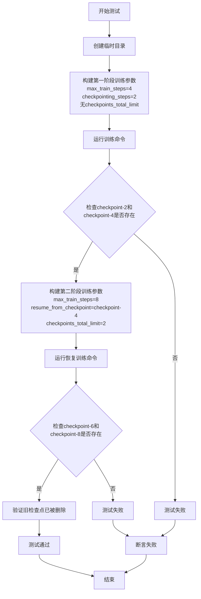

#### 带注释源码

```python
def test_dreambooth_lora_flux2_checkpointing_checkpoints_total_limit_removes_multiple_checkpoints(self):
    """
    测试DreamBooth LoRA Flux2训练中的检查点总数限制功能，
    特别验证能够正确删除多个旧检查点而不仅仅是最新一个。
    
    测试场景：
    1. 第一阶段：训练4步，每2步保存一个检查点，预期生成checkpoint-2和checkpoint-4
    2. 第二阶段：从checkpoint-4恢复训练到8步，设置checkpoints_total_limit=2，
       预期生成checkpoint-6和checkpoint-8，且旧的checkpoint-2和checkpoint-4应被删除
    """
    
    # 使用临时目录存放训练输出
    with tempfile.TemporaryDirectory() as tmpdir:
        # 构建第一阶段训练参数：训练4步，每2步保存检查点
        test_args = f"""
        {self.script_path}
        --pretrained_model_name_or_path={self.pretrained_model_name_or_path}
        --instance_data_dir={self.instance_data_dir}
        --output_dir={tmpdir}
        --instance_prompt={self.instance_prompt}
        --resolution=64
        --train_batch_size=1
        --gradient_accumulation_steps=1
        --max_train_steps=4
        --checkpointing_steps=2
        --max_sequence_length 8
        --text_encoder_out_layers 1
        """.split()

        # 执行第一阶段训练
        run_command(self._launch_args + test_args)

        # 验证第一阶段生成的检查点：应该是checkpoint-2和checkpoint-4
        self.assertEqual({x for x in os.listdir(tmpdir) if "checkpoint" in x}, {"checkpoint-2", "checkpoint-4"})

        # 构建第二阶段训练参数：从checkpoint-4恢复，训练到8步，设置检查点总数限制为2
        resume_run_args = f"""
        {self.script_path}
        --pretrained_model_name_or_path={self.pretrained_model_name_or_path}
        --instance_data_dir={self.instance_data_dir}
        --output_dir={tmpdir}
        --instance_prompt={self.instance_prompt}
        --resolution=64
        --train_batch_size=1
        --gradient_accumulation_steps=1
        --max_train_steps=8
        --checkpointing_steps=2
        --resume_from_checkpoint=checkpoint-4
        --checkpoints_total_limit=2
        --max_sequence_length 8
        --text_encoder_out_layers 1
        """.split()

        # 执行第二阶段训练（恢复训练）
        run_command(self._launch_args + resume_run_args)

        # 验证最终检查点：应该是checkpoint-6和checkpoint-8
        # 旧的checkpoint-2和checkpoint-4应该被删除
        self.assertEqual({x for x in os.listdir(tmpdir) if "checkpoint" in x}, {"checkpoint-6", "checkpoint-8"})
```


### `DreamBoothLoRAFlux2Klein.test_dreambooth_lora_with_metadata`

该方法是一个集成测试用例，用于验证 DreamBooth LoRA 训练脚本能否正确地将 LoRA 元数据（如 alpha 和 rank）序列化到 safetensors 文件中，并在加载时正确读取。该测试通过运行训练脚本，然后检查输出文件中的元数据是否与设置的值匹配。

参数：

- `self`：`DreamBoothLoRAFlux2Klein`，测试类实例，隐式参数

返回值：`None`，测试方法无返回值，通过断言验证

#### 流程图

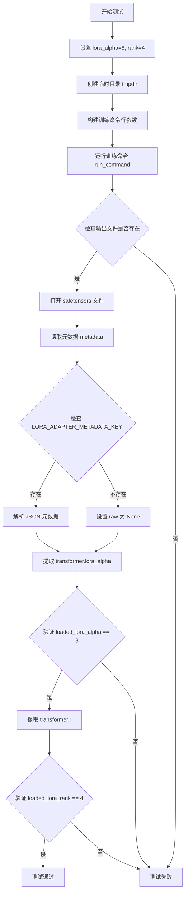

#### 带注释源码

```python
def test_dreambooth_lora_with_metadata(self):
    # 设置 LoRA 参数：alpha 为 8，rank 为 4
    # 这些值将与训练脚本传入的参数进行验证
    lora_alpha = 8
    rank = 4
    
    # 使用上下文管理器创建临时目录，测试结束后自动清理
    with tempfile.TemporaryDirectory() as tmpdir:
        # 构建训练脚本的命令行参数
        # 包含模型路径、数据路径、训练超参数等
        test_args = f"""
            {self.script_path}
            --pretrained_model_name_or_path {self.pretrained_model_name_or_path}
            --instance_data_dir {self.instance_data_dir}
            --instance_prompt {self.instance_prompt}
            --resolution 64
            --train_batch_size 1
            --gradient_accumulation_steps 1
            --max_train_steps 2
            --lora_alpha={lora_alpha}    # 传入自定义的 lora_alpha
            --rank={rank}                # 传入自定义的 rank
            --learning_rate 5.0e-04
            --scale_lr
            --lr_scheduler constant
            --lr_warmup_steps 0
            --max_sequence_length 8
            --text_encoder_out_layers 1
            --output_dir {tmpdir}
            """.split()

        # 执行训练命令
        run_command(self._launch_args + test_args)
        
        # 验证输出文件是否存在（save_pretrained 冒烟测试）
        state_dict_file = os.path.join(tmpdir, "pytorch_lora_weights.safetensors")
        self.assertTrue(os.path.isfile(state_dict_file))

        # 使用 safetensors 库打开文件并读取元数据
        with safetensors.torch.safe_open(state_dict_file, framework="pt", device="cpu") as f:
            # 获取元数据字典，若无元数据则返回空字典
            metadata = f.metadata() or {}

        # 移除 format 字段（标准字段，无需验证）
        metadata.pop("format", None)
        
        # 获取 LoRA 适配器元数据键对应的原始 JSON 字符串
        raw = metadata.get(LORA_ADAPTER_METADATA_KEY)
        if raw:
            # 解析 JSON 字符串为字典
            raw = json.loads(raw)

        # 从元数据中提取 transformer.lora_alpha 值
        loaded_lora_alpha = raw["transformer.lora_alpha"]
        # 断言验证：加载的 alpha 值应与设置的值一致
        self.assertTrue(loaded_lora_alpha == lora_alpha)
        
        # 从元数据中提取 transformer.r (rank) 值
        loaded_lora_rank = raw["transformer.r"]
        # 断言验证：加载的 rank 值应与设置的值一致
        self.assertTrue(loaded_lora_rank == rank)
```

## 关键组件


### DreamBoothLoRAFlux2Klein

主测试类，继承自ExamplesTestsAccelerate，用于测试DreamBooth LoRA Flux2模型的训练流程，包含多个测试用例验证训练脚本的功能正确性。

### 实例数据配置组件

包含instance_data_dir（实例图像目录）、instance_prompt（实例提示词"dog"）、pretrained_model_name_or_path（预训练模型路径"hf-internal-testing/tiny-flux2-klein"）等配置，用于指定训练所需的数据和模型资源。

### 训练脚本路径组件

script_path指向examples/dreambooth/train_dreambooth_lora_flux2_klein.py，作为实际执行DreamBooth LoRA训练的主脚本。

### LoRA权重保存与验证组件

通过safetensors库加载和保存LoRA权重，验证state_dict中的键名包含"lora"且以"transformer"开头，确保LoRA参数命名的正确性。

### 检查点管理组件

支持checkpoints_total_limit参数限制保存的检查点数量，并提供从checkpoint-4恢复训练的功能测试，验证检查点的正确保存和删除逻辑。

### 延迟缓存组件

test_dreambooth_lora_latent_caching测试用例验证--cache_latents参数功能，用于缓存潜在向量以加速训练。

### LoRA层选择组件

transformer_layer_type指定要训练的具体层（single_transformer_blocks.0.attn.to_qkv_mlp_proj），test_dreambooth_lora_layers验证只训练指定层的功能。

### LoRA元数据序列化组件

通过safetensors的metadata()接口存储和读取lora_alpha和rank等元数据，test_dreambooth_lora_with_metadata验证元数据的正确序列化和反序列化。

### 命令行参数构建组件

各个测试方法中使用split()将多行字符串转换为参数列表，动态构建训练命令行参数，包括学习率、梯度累积步数、序列长度等超参数。


## 问题及建议


### 已知问题

-   **测试代码大量重复**：三个主要测试方法（test_dreambooth_lora_flux2、test_dreambooth_lora_latent_caching、test_dreambooth_lora_layers）包含大量重复的命令行参数构建和验证逻辑，违反了DRY原则
-   **测试方法职责过重**：每个测试方法同时负责参数构建、命令执行、结果验证等多重职责，缺乏单一职责原则
-   **硬编码配置过多**：模型路径（hf-internal-testing/tiny-flux2-klein）、层类型（transformer_layer_type）、分辨率等参数硬编码在类属性中，降低了测试的灵活性
-   **不当的模块导入方式**：使用 `sys.path.append("..")` 进行相对导入，这种方式脆弱且不可靠，应使用包导入机制
-   **断言信息不够详细**：如 `self.assertTrue(is_lora)` 这样的断言在失败时无法提供有意义的调试信息
-   **日志配置位置不当**：在模块级别配置 logging.basicConfig，不适合测试环境（测试框架通常会控制日志输出）
-   **魔法数字和字符串**：如 `--max_train_steps 2`、`--resolution 64` 等数值散布在代码中，缺乏解释性
-   **缺失错误处理**：文件操作和命令执行缺乏异常处理机制，测试失败时难以定位问题

### 优化建议

-   **提取公共测试逻辑**：将重复的参数构建和验证逻辑抽取为私有方法（如 `_build_base_args()`、`_validate_lora_weights()`），减少代码冗余
-   **使用pytest参数化**：考虑使用 `@pytest.mark.parametrize` 装饰器来简化多个相似测试场景，减少测试方法数量
-   **配置外部化**：将硬编码的配置值迁移到测试配置文件或环境变量中，提高测试的可配置性
-   **改进断言信息**：使用 `self.assertTrue(..., "expected lora parameters in state dict")` 形式提供详细的失败信息
-   **添加异常处理**：在文件操作和命令执行处添加try-except块，捕获并提供更详细的错误信息
-   **删除全局日志配置**：移除模块级别的logging配置，依赖测试框架的日志管理
-   **使用常量或配置文件**：定义有意义的常量替代魔法数字，如 `MAX_TRAIN_STEPS = 2`，提高代码可读性
-   **考虑使用pytest fixtures**：利用pytest的fixture机制管理临时目录等资源，提高代码组织性


## 其它


### 设计目标与约束

本代码的设计目标是通过自动化测试验证DreamBooth LoRA Flux2训练流程的正确性，包括模型保存、检查点管理、latent缓存、LoRA层选择等功能。约束条件包括：使用`hf-internal-testing/tiny-flux2-klein`作为预训练模型，仅支持单GPU训练（通过accelerate），训练数据限定为`docs/source/en/imgs`目录下的狗图片，训练步数限制为2-6步，分辨率固定为64。

### 错误处理与异常设计

测试类采用`unittest`框架的断言机制进行错误检测。关键检查点包括：1）输出文件存在性验证（`os.path.isfile`）；2）LoRA参数命名规范验证（检查key中是否包含"lora"）；3）Transformer参数前缀验证（检查key是否以"transformer"开头）；4）检查点数量验证（通过`os.listdir`比对）；5）元数据完整性验证（通过`safetensors.torch.safe_open`读取metadata）。所有断言失败时由`unittest`框架抛出`AssertionError`。

### 数据流与状态机

测试数据流为：实例化测试类→创建临时输出目录→构建命令行参数→调用`run_command`执行训练脚本→验证输出文件→验证state_dict内容→清理临时目录。状态转换包括：初始化状态→训练执行状态→结果验证状态→清理状态。测试间相互独立，每个测试方法使用独立的临时目录。

### 外部依赖与接口契约

核心依赖包括：1）`ExamplesTestsAccelerate`：基类，提供`run_command`方法和`_launch_args`属性；2）`safetensors`：用于加载和验证LoRA权重文件；3）`train_dreambooth_lora_flux2.py`：被测训练脚本；4）`LORA_ADAPTER_METADATA_KEY`：从`diffusers.loaders.lora_base`导入的元数据键常量。接口契约要求训练脚本必须生成`pytorch_lora_weights.safetensors`文件，state_dict的key必须符合LoRA命名规范。

### 性能考虑与基准测试

由于使用`tiny-flex2-klein`小模型和极小训练步数（2-6步），测试执行速度快。性能基准：每个测试方法预计执行时间在30秒至2分钟内。测试设计为smoke test，不进行大规模性能压测。`cache_latents`测试验证了latent缓存功能对训练速度的优化效果。

### 安全性考虑

测试代码本身无用户输入处理，不存在注入风险。临时目录使用`tempfile.TemporaryDirectory()`自动管理，确保资源正确释放。日志输出使用Python标准`logging`模块，符合安全规范。

### 可扩展性与未来改进

当前仅支持单Transformer层LoRA训练测试（通过`transformer_layer_type`参数）。未来可扩展方向：1）添加多GPU分布式训练测试；2）增加文本编码器LoRA训练测试；3）添加不同模型架构（如SDXL）的测试用例；4）增加训练恢复（resume_from_checkpoint）的更复杂场景测试；5）添加量化训练相关测试。

### 配置与参数说明

关键配置参数：`instance_data_dir`指定训练图像目录；`instance_prompt`指定提示词；`pretrained_model_name_or_path`指定预训练模型；`resolution`指定图像分辨率；`train_batch_size`指定批次大小；`max_train_steps`指定训练步数；`learning_rate`指定学习率；`lora_alpha`和`rank`指定LoRA参数；`checkpoints_total_limit`指定检查点数量上限；`cache_latents`启用latent缓存；`lora_layers`指定要训练的LoRA层。

### 测试覆盖率与测试策略

测试覆盖场景：1）基础LoRA训练；2）latent缓存功能；3）指定LoRA层训练；4）检查点总数限制；5）检查点删除与恢复；6）LoRA元数据保存。测试策略为黑盒集成测试，通过验证输出文件和state_dict内容确认功能正确性。覆盖率局限：未测试训练过程中的中间状态、未测试模型推理集成、未测试跨平台兼容性。

### 部署与运维注意事项

测试代码依赖HuggingFace diffusers框架和accelerate库。部署环境需要：1）Python 3.8+；2）PyTorch；3）transformers；4）diffusers；5）accelerate；6）safetensors。运维注意：测试会产生临时文件需确保有足够磁盘空间；日志级别设为DEBUG便于问题排查；测试脚本路径使用相对路径需确保工作目录正确。

    