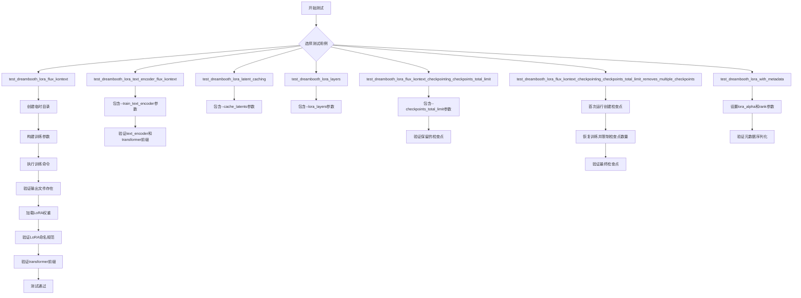
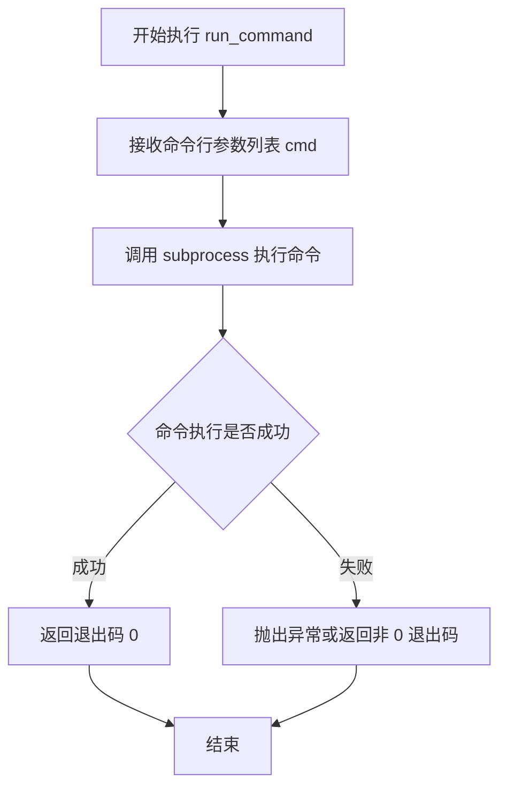
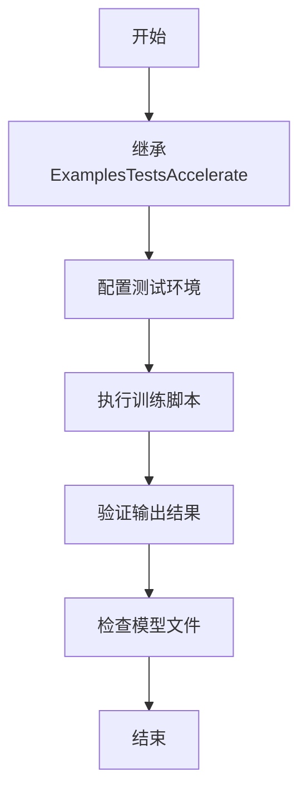
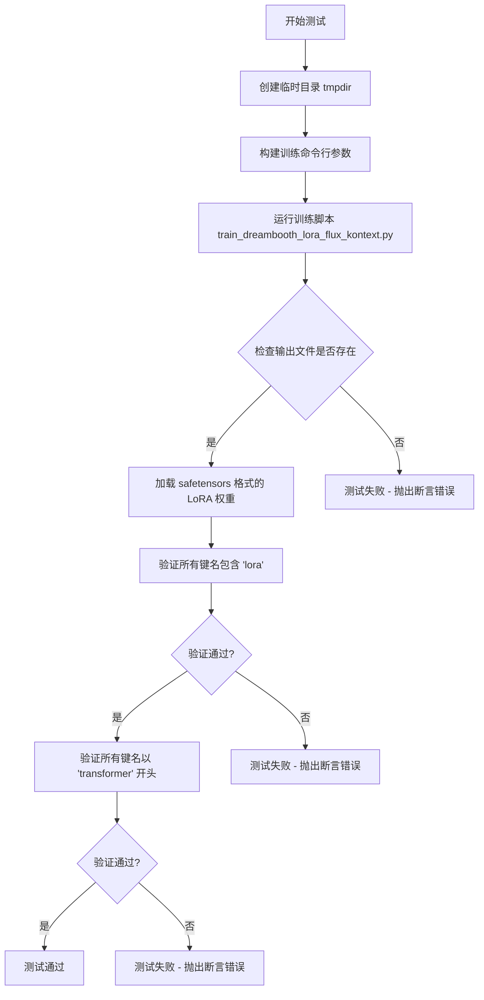
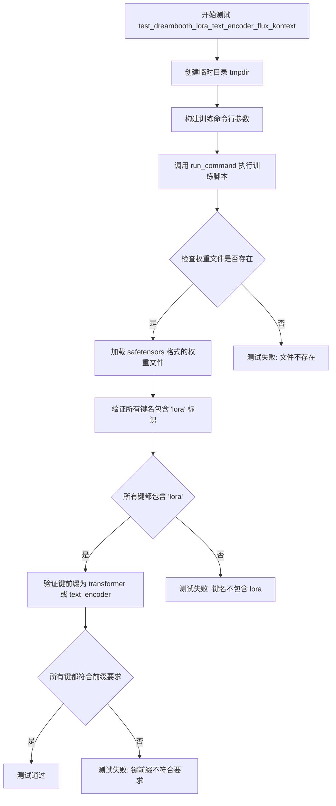
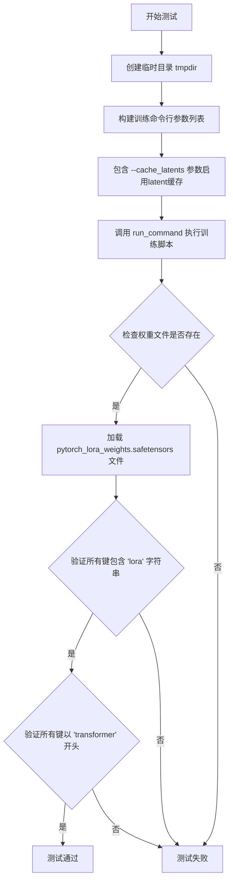
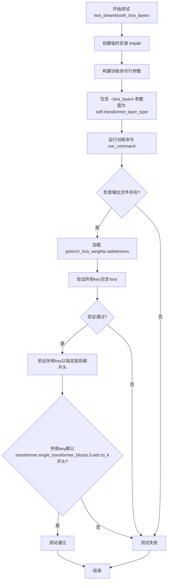
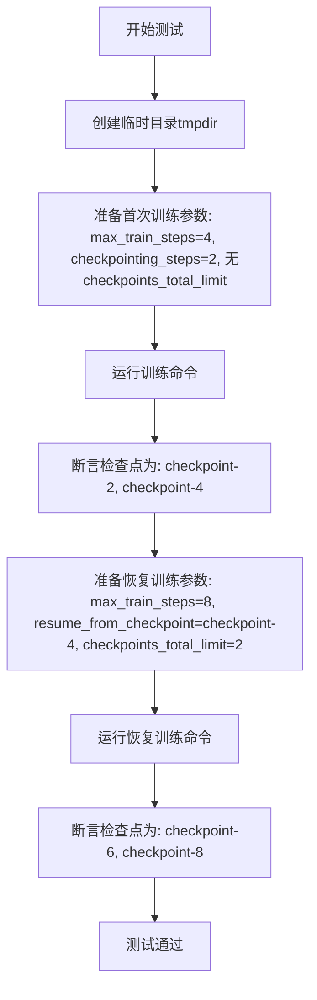
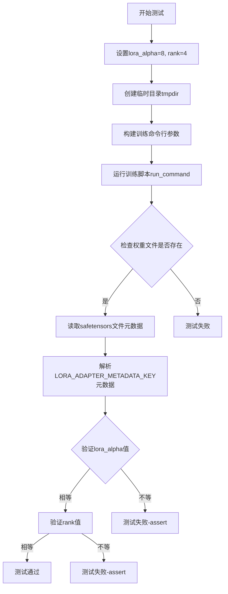

# `diffusers\examples\dreambooth\test_dreambooth_lora_flux_kontext.py` 详细设计文档

这是一个DreamBooth LoRA Flux Kontext模型的集成测试类，用于验证DreamBooth LoRA训练流程的各种功能，包括基本训练、文本编码器训练、潜在缓存、LoRA层选择、检查点管理和元数据保存等。

## 整体流程



## 类结构

```
ExamplesTestsAccelerate (基类)
└── DreamBoothLoRAFluxKontext (测试类)
```

## 全局变量及字段


### `logging`
    
日志模块

类型：`module`
    


### `logger`
    
日志记录器

类型：`Logger`
    


### `stream_handler`
    
日志流处理器

类型：`StreamHandler`
    


### `LORA_ADAPTER_METADATA_KEY`
    
LoRA适配器元数据键

类型：`str`
    


### `DreamBoothLoRAFluxKontext.instance_data_dir`
    
实例数据目录路径

类型：`str`
    


### `DreamBoothLoRAFluxKontext.instance_prompt`
    
实例提示词

类型：`str`
    


### `DreamBoothLoRAFluxKontext.pretrained_model_name_or_path`
    
预训练模型名称或路径

类型：`str`
    


### `DreamBoothLoRAFluxKontext.script_path`
    
训练脚本路径

类型：`str`
    


### `DreamBoothLoRAFluxKontext.transformer_layer_type`
    
Transformer层类型

类型：`str`
    
    

## 全局函数及方法


### `run_command`

执行命令行命令，用于运行训练脚本并验证输出结果。

参数：

- `cmd`：**`List[str]`**，命令行参数列表，由 `self._launch_args`（加速器启动参数）和 `test_args`（测试专用参数）组成

返回值：**`None`** 或 **`int`**，由于代码中未捕获返回值，通常返回进程退出码

#### 流程图



#### 带注释源码

```python
# 由于 run_command 函数定义在 test_examples_utils 模块中
# 当前代码只导入了该函数，以下为基于使用方式的推断

def run_command(cmd: List[str]) -> int:
    """
    执行命令行命令的封装函数
    
    参数:
        cmd: 命令行参数列表，包含执行脚本及其参数
        
    返回值:
        进程的退出码，0 表示成功
        
    使用示例（来自代码）:
        run_command(self._launch_args + test_args)
        # self._launch_args: accelerate 启动参数
        # test_args: 训练脚本及其参数
    """
    # 实际实现位于 test_examples_utils.py
    # 通常使用 subprocess.run() 或 subprocess.Popen() 执行命令
    pass
```

---

> **注意**：由于 `run_command` 函数定义在 `test_examples_utils` 模块中（通过 `from test_examples_utils import ExamplesTestsAccelerate, run_command` 导入），而该模块的源代码在当前代码片段中未提供，因此无法获取完整的函数实现。如需完整的函数源码，请提供 `test_examples_utils.py` 文件内容。


# 设计文档提取结果

### ExamplesTestsAccelerate

基础测试加速类，用于通过 `accelerate` 框架执行 Diffusers 示例脚本的测试，提供统一的测试环境配置和命令执行能力。

参数：

- `self`：隐式参数，表示类的实例本身

返回值：无（类定义）

#### 流程图



#### 带注释源码

```python
# 该类为抽象基类，定义在 test_examples_utils 模块中
# 当前文件 DreamBoothLoRAFluxKontext 继承自该类
# 用于执行 Diffusers 的 DreamBooth LoRA Flux Kontext 训练测试

class DreamBoothLoRAFluxKontext(ExamplesTestsAccelerate):
    # 类属性定义
    instance_data_dir = "docs/source/en/imgs"  # 实例数据目录
    instance_prompt = "photo"  # 实例提示词
    pretrained_model_name_or_path = "hf-internal-testing/tiny-flux-kontext-pipe"  # 预训练模型路径
    script_path = "examples/dreambooth/train_dreambooth_lora_flux_kontext.py"  # 训练脚本路径
    transformer_layer_type = "single_transformer_blocks.0.attn.to_k"  # Transformer层类型

    # 从父类继承的 _launch_args 属性用于构建 accelerate 启动参数
    # run_command 函数用于执行Shell命令
```

---

## 补充说明

由于 `ExamplesTestsAccelerate` 类定义在外部模块 `test_examples_utils` 中，当前代码仅展示了其**使用方式**而非完整实现。根据代码上下文推断：

### 推断的类接口

| 成员 | 类型 | 描述 |
|------|------|------|
| `_launch_args` | 属性 | accelerate 启动参数列表 |
| `run_command()` | 全局函数 | 执行Shell命令的辅助函数 |

### 技术债务与优化空间

1. **缺少父类源码**：无法获取 `ExamplesTestsAccelerate` 的完整定义，建议在项目中添加该类的文档或源码链接
2. **测试逻辑重复**：多个测试方法中存在重复的验证逻辑（如检查 `pytorch_lora_weights.safetensors` 文件、验证 LoRA 参数命名），可提取为共享方法
3. **硬编码配置**：训练参数（如 `--max_train_steps 2`）散布在各个测试方法中，建议使用配置对象或 pytest fixture 管理


### `DreamBoothLoRAFluxKontext.test_dreambooth_lora_flux_kontext`

该方法是 DreamBoothLoRAFluxKontext 类中的一个测试用例，用于测试使用 Flux Kontext 模型进行 DreamBooth LoRA 训练的基本功能。它通过调用训练脚本并验证输出的 LoRA 权重文件来确保训练流程的正确性，包括文件生成、参数命名规范等。

参数：无显式参数（使用类属性和 tempfile.TemporaryDirectory 生成的临时目录）

返回值：`None`（测试方法，无返回值，通过断言验证结果）

#### 流程图



#### 带注释源码

```python
def test_dreambooth_lora_flux_kontext(self):
    """
    测试 DreamBooth LoRA 训练流程（针对 Flux Kontext 模型）
    验证训练脚本能正常运行并生成正确格式的 LoRA 权重
    """
    # 创建一个临时目录用于存放训练输出
    with tempfile.TemporaryDirectory() as tmpdir:
        # 构建训练命令行参数列表
        # 包括：模型路径、数据目录、提示词、分辨率、批次大小、训练步数、学习率等
        test_args = f"""
            {self.script_path}
            --pretrained_model_name_or_path {self.pretrained_model_name_or_path}
            --instance_data_dir {self.instance_data_dir}
            --instance_prompt {self.instance_prompt}
            --resolution 64
            --train_batch_size 1
            --gradient_accumulation_steps 1
            --max_train_steps 2
            --learning_rate 5.0e-04
            --scale_lr
            --lr_scheduler constant
            --lr_warmup_steps 0
            --output_dir {tmpdir}
            """.split()

        # 执行训练命令（使用 accelerate 启动）
        run_command(self._launch_args + test_args)
        
        # ==== 验证阶段 ====
        
        # 1. 检查输出文件是否存在
        # save_pretrained smoke test - 验证模型权重文件是否生成
        self.assertTrue(os.path.isfile(os.path.join(tmpdir, "pytorch_lora_weights.safetensors")))

        # 2. 验证 LoRA 权重命名规范
        # 加载 safetensors 格式的 LoRA 权重文件
        lora_state_dict = safetensors.torch.load_file(os.path.join(tmpdir, "pytorch_lora_weights.safetensors"))
        
        # 验证所有键名都包含 'lora' 关键字（确保是 LoRA 参数）
        is_lora = all("lora" in k for k in lora_state_dict.keys())
        self.assertTrue(is_lora)

        # 3. 验证参数前缀
        # 当不训练 text encoder 时，所有参数应该以 'transformer' 开头
        # 这是 Flux Kontext 模型的特定架构要求
        starts_with_transformer = all(key.startswith("transformer") for key in lora_state_dict.keys())
        self.assertTrue(starts_with_transformer)
```


### `DreamBoothLoRAFluxKontext.test_dreambooth_lora_text_encoder_flux_kontext`

该方法是一个集成测试用例，用于验证 DreamBooth LoRA 训练脚本在训练文本编码器（text_encoder）时的正确性。测试通过运行训练脚本并验证生成的 LoRA 权重文件是否符合预期（包括文件存在性、权重键名包含 "lora" 标识、以及权重键的前缀符合 transformer 或 text_encoder 的要求）。

参数：

- `self`：隐式参数，类型为 `DreamBoothLoRAFluxKontext`（测试类实例），表示当前测试对象本身

返回值：`None`，该方法为测试用例，通过 `assert` 语句进行断言验证，不返回具体值

#### 流程图



#### 带注释源码

```python
def test_dreambooth_lora_text_encoder_flux_kontext(self):
    """
    测试 DreamBooth LoRA 训练脚本在训练文本编码器时的功能。
    验证点:
    1. 训练脚本能够成功运行并生成 LoRA 权重文件
    2. 生成的权重文件包含 'lora' 标识
    3. 权重键的前缀包含 'transformer' 或 'text_encoder'
    """
    # 使用 tempfile 创建临时目录，测试结束后自动清理
    with tempfile.TemporaryDirectory() as tmpdir:
        # 构建训练脚本的命令行参数列表
        # --train_text_encoder 标志启用文本编码器的 LoRA 训练
        test_args = f"""
            {self.script_path}
            --pretrained_model_name_or_path {self.pretrained_model_name_or_path}
            --instance_data_dir {self.instance_data_dir}
            --instance_prompt {self.instance_prompt}
            --resolution 64
            --train_batch_size 1
            --train_text_encoder          # 关键参数: 启用文本编码器训练
            --gradient_accumulation_steps 1
            --max_train_steps 2
            --learning_rate 5.0e-04
            --scale_lr
            --lr_scheduler constant
            --lr_warmup_steps 0
            --output_dir {tmpdir}
            """.split()

        # 执行训练命令
        # _launch_args 包含 accelerate 启动参数（如 GPU 数量等）
        run_command(self._launch_args + test_args)
        
        # ==== 验证 1: 检查输出文件是否存在 ====
        # save_pretrained smoke test: 验证训练脚本生成了权重文件
        self.assertTrue(os.path.isfile(os.path.join(tmpdir, "pytorch_lora_weights.safetensors")))

        # ==== 验证 2: 检查权重键名是否包含 'lora' ====
        # 加载 safetensors 格式的 LoRA 权重文件
        lora_state_dict = safetensors.torch.load_file(os.path.join(tmpdir, "pytorch_lora_weights.safetensors"))
        # 验证所有键名都包含 'lora' 标识（确保是 LoRA 权重而非普通权重）
        is_lora = all("lora" in k for k in lora_state_dict.keys())
        self.assertTrue(is_lora)

        # ==== 验证 3: 检查权重键的前缀 ====
        # 当训练文本编码器时，权重应来自 transformer 或 text_encoder
        starts_with_expected_prefix = all(
            (key.startswith("transformer") or key.startswith("text_encoder")) for key in lora_state_dict.keys()
        )
        self.assertTrue(starts_with_expected_prefix)
```


### `DreamBoothLoRAFluxKontext.test_dreambooth_lora_latent_caching`

该方法是`DreamBoothLoRAFluxKontext`类中的一个测试用例，用于验证在使用DreamBooth方法训练Flux Kontext模型的LoRA权重时，开启`--cache_latents`选项后训练流程的正常工作。测试通过执行训练脚本并检查输出的LoRA权重文件、权重命名规范以及权重键前缀是否符合预期。

参数：

- 该方法是实例方法，`self`参数由Python解释器隐式传入，无需显式声明参数

返回值：`None`，该方法为测试用例，通过`assert`语句进行断言验证，不返回任何值

#### 流程图



#### 带注释源码

```python
def test_dreambooth_lora_latent_caching(self):
    """
    测试使用 latent caching 功能进行 DreamBooth LoRA 训练
    
    该测试用例验证当启用 --cache_latents 参数时，
    训练脚本能够正确生成 LoRA 权重文件，且权重命名符合规范
    """
    # 创建临时目录用于存放训练输出
    with tempfile.TemporaryDirectory() as tmpdir:
        # 构建训练脚本的命令行参数列表
        # 包含模型路径、数据路径、训练超参数等配置
        test_args = f"""
            {self.script_path}
            --pretrained_model_name_or_path {self.pretrained_model_name_or_path}
            --instance_data_dir {self.instance_data_dir}
            --instance_prompt {self.instance_prompt}
            --resolution 64
            --train_batch_size 1
            --gradient_accumulation_steps 1
            --max_train_steps 2
            --cache_latents              # 关键参数：启用 latent 缓存功能
            --learning_rate 5.0e-04
            --scale_lr
            --lr_scheduler constant
            --lr_warmup_steps 0
            --output_dir {tmpdir}
            """.split()

        # 执行训练命令，使用加速配置 (_launch_args)
        run_command(self._launch_args + test_args)
        
        # 验证 save_pretrained 功能：检查输出文件是否生成
        self.assertTrue(os.path.isfile(os.path.join(tmpdir, "pytorch_lora_weights.safetensors")))

        # 加载生成的 LoRA 权重文件
        lora_state_dict = safetensors.torch.load_file(os.path.join(tmpdir, "pytorch_lora_weights.safetensors"))
        
        # 验证所有权重键都包含 'lora' 字符串，确保是 LoRA 权重
        is_lora = all("lora" in k for k in lora_state_dict.keys())
        self.assertTrue(is_lora)

        # 验证所有权重键都以 'transformer' 开头
        # 因为没有训练 text_encoder，所有参数应属于 transformer 模块
        starts_with_transformer = all(key.startswith("transformer") for key in lora_state_dict.keys())
        self.assertTrue(starts_with_transformer)
```


### `DreamBoothLoRAFluxKontext.test_dreambooth_lora_layers`

该方法是一个集成测试用例，用于验证 DreamBooth LoRA 训练流程中指定特定训练层（`--lora_layers`）功能的正确性。测试通过运行训练脚本并检查输出的 LoRA 权重文件、参数命名约定以及是否仅训练了指定的 Transformer 层（`transformer.single_transformer_blocks.0.attn.to_k`）来确保功能正常工作。

参数：

- `self`：`DreamBoothLoRAFluxKontext`，测试类实例，包含类属性如 `script_path`、`pretrained_model_name_or_path`、`instance_data_dir`、`instance_prompt` 和 `transformer_layer_type`

返回值：`None`，该方法为测试用例，无返回值，通过 `assert` 语句进行验证

#### 流程图



#### 带注释源码

```python
def test_dreambooth_lora_layers(self):
    """
    测试使用 --lora_layers 参数指定训练特定层的功能。
    验证仅训练 transformer.single_transformer_blocks.0.attn.to_k 层。
    """
    # 创建临时目录用于存放训练输出
    with tempfile.TemporaryDirectory() as tmpdir:
        # 构建训练脚本的命令行参数
        test_args = f"""
            {self.script_path}                              # 训练脚本路径
            --pretrained_model_name_or_path {self.pretrained_model_name_or_path}  # 预训练模型
            --instance_data_dir {self.instance_data_dir}    # 实例数据目录
            --instance_prompt {self.instance_prompt}        # 实例提示词
            --resolution 64                                 # 图像分辨率
            --train_batch_size 1                            # 训练批次大小
            --gradient_accumulation_steps 1                # 梯度累积步数
            --max_train_steps 2                             # 最大训练步数
            --cache_latents                                 # 缓存潜在向量
            --learning_rate 5.0e-04                         # 学习率
            --scale_lr                                      # 缩放学习率
            --lora_layers {self.transformer_layer_type}     # 指定训练的LoRA层
            --lr_scheduler constant                         # 学习率调度器
            --lr_warmup_steps 0                             # 学习率预热步数
            --output_dir {tmpdir}                           # 输出目录
            """.split()

        # 执行训练命令
        run_command(self._launch_args + test_args)
        
        # 验证输出文件存在（save_pretrained smoke test）
        self.assertTrue(os.path.isfile(os.path.join(tmpdir, "pytorch_lora_weights.safetensors")))

        # 加载 LoRA 权重文件
        lora_state_dict = safetensors.torch.load_file(os.path.join(tmpdir, "pytorch_lora_weights.safetensors"))
        
        # 验证所有参数名都包含 'lora' 字符串
        is_lora = all("lora" in k for k in lora_state_dict.keys())
        self.assertTrue(is_lora)

        # 验证所有参数名都以指定的 transformer 层开头
        # 当不训练 text encoder 时，所有参数应以 'transformer' 开头
        # 本测试中，只有 transformer.single_transformer_blocks.0.attn.to_k 的参数应在 state dict 中
        starts_with_transformer = all(
            key.startswith("transformer.single_transformer_blocks.0.attn.to_k") for key in lora_state_dict.keys()
        )
        self.assertTrue(starts_with_transformer)
```


### `DreamBoothLoRAFluxKontext.test_dreambooth_lora_flux_kontext_checkpointing_checkpoints_total_limit`

该测试方法用于验证 DreamBooth LoRA Flux Kontext 训练过程中的检查点总数限制功能，确保当设置 `checkpoints_total_limit=2` 时，训练脚本能够正确保留最近的两个检查点并自动清理早期检查点。

参数：
- `self`：隐式参数，`DreamBoothLoRAFluxKontext` 类型，表示测试类实例本身

返回值：`None`，该方法为测试方法，通过 `assertEqual` 断言验证检查点是否符合预期，不返回任何值。

#### 流程图

```mermaid
flowchart TD
    A[开始测试] --> B[创建临时目录 tmpdir]
    B --> C[构造训练命令行参数]
    C --> D[包含 --checkpoints_total_limit=2 和 --checkpointing_steps=2]
    D --> E[执行训练命令 run_command]
    E --> F[列出 tmpdir 中所有包含 'checkpoint' 的目录]
    F --> G{断言检查点数量}
    G -->|通过| H[验证结果为 {checkpoint-4, checkpoint-6}]
    G -->|失败| I[抛出 AssertionError]
    H --> I
    I --> J[结束测试]
```

#### 带注释源码

```python
def test_dreambooth_lora_flux_kontext_checkpointing_checkpoints_total_limit(self):
    """
    测试 DreamBooth LoRA Flux Kontext 训练时的检查点总数限制功能。
    验证当设置 checkpoints_total_limit=2 时，系统只保留最近的两个检查点。
    """
    # 创建一个临时目录用于存放训练输出
    with tempfile.TemporaryDirectory() as tmpdir:
        # 构造训练脚本的命令行参数
        test_args = f"""
        {self.script_path}
        --pretrained_model_name_or_path={self.pretrained_model_name_or_path}
        --instance_data_dir={self.instance_data_dir}
        --output_dir={tmpdir}
        --instance_prompt={self.instance_prompt}
        --resolution=64
        --train_batch_size=1
        --gradient_accumulation_steps=1
        --max_train_steps=6
        --checkpoints_total_limit=2
        --checkpointing_steps=2
        """.split()

        # 执行训练命令，_launch_args 包含 accelerate 启动参数
        run_command(self._launch_args + test_args)

        # 断言验证：只保留 checkpoint-4 和 checkpoint-6
        # 因为 max_train_steps=6, checkpointing_steps=2，会生成 checkpoint-2,4,6
        # 但 checkpoints_total_limit=2，所以只保留最新的两个：checkpoint-4 和 checkpoint-6
        self.assertEqual(
            {x for x in os.listdir(tmpdir) if "checkpoint" in x},
            {"checkpoint-4", "checkpoint-6"},
        )
```


### `DreamBoothLoRAFluxKontext.test_dreambooth_lora_flux_kontext_checkpointing_checkpoints_total_limit_removes_multiple_checkpoints`

该测试方法验证 DreamBooth LoRA Flux Kontext 训练脚本在设置 `checkpoints_total_limit` 参数后，能否正确管理检查点数量——当恢复训练并继续训练时，旧检查点会被自动删除，仅保留最新指定数量的检查点。

参数：

- `self`：`DreamBoothLoRAFluxKontext`，测试类实例本身

返回值：`None`，无返回值（测试方法，通过断言验证行为）

#### 流程图



#### 带注释源码

```python
def test_dreambooth_lora_flux_kontext_checkpointing_checkpoints_total_limit_removes_multiple_checkpoints(self):
    """
    测试当设置 checkpoints_total_limit 参数时，训练脚本能够正确删除旧检查点，
    仅保留指定数量的最新检查点。
    
    测试流程：
    1. 首次训练：max_train_steps=4, 每2步保存checkpoint，期望保存 checkpoint-2, checkpoint-4
    2. 恢复训练：从 checkpoint-4 恢复，继续训练到 max_train_steps=8，
       设置 checkpoints_total_limit=2，期望保留 checkpoint-6, checkpoint-8
    """
    # 创建临时目录用于存放训练输出和检查点
    with tempfile.TemporaryDirectory() as tmpdir:
        # 首次训练配置：训练4步，每2步保存一个checkpoint，不设置checkpoints_total_limit
        test_args = f"""
        {self.script_path}
        --pretrained_model_name_or_path={self.pretrained_model_name_or_path}
        --instance_data_dir={self.instance_data_dir}
        --output_dir={tmpdir}
        --instance_prompt={self.instance_prompt}
        --resolution=64
        --train_batch_size=1
        --gradient_accumulation_steps=1
        --max_train_steps=4}
        --checkpointing_steps=2
        """.split()

        # 执行首次训练
        run_command(self._launch_args + test_args)

        # 验证首次训练生成了 checkpoint-2 和 checkpoint-4
        self.assertEqual({x for x in os.listdir(tmpdir) if "checkpoint" in x}, {"checkpoint-2", "checkpoint-4"})

        # 恢复训练配置：从 checkpoint-4 恢复，训练到第8步，设置 checkpoints_total_limit=2
        resume_run_args = f"""
        {self.script_path}
        --pretrained_model_name_or_path={self.pretrained_model_name_or_path}
        --instance_data_dir={self.instance_data_dir}
        --output_dir={tmpdir}
        --instance_prompt={self.instance_prompt}
        --resolution=64
        --train_batch_size=1
        --gradient_accumulation_steps=1}
        --max_train_steps=8}
        --checkpointing_steps=2
        --resume_from_checkpoint=checkpoint-4
        --checkpoints_total_limit=2
        """.split()

        # 执行恢复训练
        run_command(self._launch_args + resume_run_args)

        # 验证最终只保留了 checkpoint-6 和 checkpoint-8
        # 旧检查点 checkpoint-2, checkpoint-4 已被删除
        self.assertEqual({x for x in os.listdir(tmpdir) if "checkpoint" in x}, {"checkpoint-6", "checkpoint-8"})
```


### `DreamBoothLoRAFluxKontext.test_dreambooth_lora_with_metadata`

该测试方法用于验证 DreamBooth LoRA 训练过程中 LoRA 元数据（lora_alpha 和 rank）是否能够正确序列化和反序列化。它通过运行训练脚本生成 LoRA 权重文件，然后读取 safetensors 文件中的元数据，验证 `lora_alpha` 和 `rank` 值是否与设置的值一致。

参数：

- `self`：类实例本身，无显式参数

返回值：`None`，无返回值（测试方法）

#### 流程图



#### 带注释源码

```python
def test_dreambooth_lora_with_metadata(self):
    # 定义测试用的LoRA超参数：alpha值为8，rank值为4
    # lora_alpha控制LoRA适配器的缩放因子，rank控制低秩矩阵的维度
    lora_alpha = 8
    rank = 4
    
    # 创建临时目录用于存放训练输出
    with tempfile.TemporaryDirectory() as tmpdir:
        # 构建训练脚本的命令行参数
        # 包括预训练模型路径、实例数据目录、提示词、分辨率、训练批次大小等
        test_args = f"""
            {self.script_path}
            --pretrained_model_name_or_path {self.pretrained_model_name_or_path}
            --instance_data_dir {self.instance_data_dir}
            --instance_prompt {self.instance_prompt}
            --resolution 64
            --train_batch_size 1
            --gradient_accumulation_steps 1
            --max_train_steps 2
            --lora_alpha={lora_alpha}     # 传入LoRA alpha参数
            --rank={rank}                 # 传入LoRA rank参数
            --learning_rate 5.0e-04
            --scale_lr
            --lr_scheduler constant
            --lr_warmup_steps 0
            --output_dir {tmpdir}
            """.split()

        # 执行训练命令，使用加速启动参数
        run_command(self._launch_args + test_args)
        
        # 验证训练输出文件是否存在（save_pretrained烟雾测试）
        state_dict_file = os.path.join(tmpdir, "pytorch_lora_weights.safetensors")
        self.assertTrue(os.path.isfile(state_dict_file))

        # 使用safetensors库读取权重文件的元数据
        with safetensors.torch.safe_open(state_dict_file, framework="pt", device="cpu") as f:
            # 获取元数据字典，如果为空则返回空字典
            metadata = f.metadata() or {}

        # 移除format字段（标准处理）
        metadata.pop("format", None)
        
        # 获取LoRA适配器元数据键对应的原始JSON字符串
        raw = metadata.get(LORA_ADAPTER_METADATA_KEY)
        
        # 如果存在元数据，则解析JSON字符串
        if raw:
            raw = json.loads(raw)

        # 从元数据中提取transformer.lora_alpha值并验证
        loaded_lora_alpha = raw["transformer.lora_alpha"]
        self.assertTrue(loaded_lora_alpha == lora_alpha)
        
        # 从元数据中提取transformer.rank值并验证
        loaded_lora_rank = raw["transformer.r"]
        self.assertTrue(loaded_lora_rank == rank)
```

## 关键组件


### DreamBoothLoRAFluxKontext 测试类

继承自ExamplesTestsAccelerate的测试类，用于测试DreamBooth LoRA Flux Kontext训练脚本的核心功能，包含多个测试用例验证LoRA训练、文本编码器训练、潜在缓存、层选择、检查点管理和元数据保存等功能。

### instance_data_dir 配置

指定训练使用的实例数据目录路径，值为"docs/source/en/imgs"，用于提供训练图像数据。

### instance_prompt 配置

实例提示词，值为"photo"，用于描述实例数据的文本提示。

### pretrained_model_name_or_path 配置

预训练模型名称或路径，值为"hf-internal-testing/tiny-flux-kontext-pipe"，指定用于训练的底座模型。

### script_path 配置

训练脚本路径，值为"examples/dreambooth/train_dreambooth_lora_flux_kontext.py"，指向DreamBooth LoRA训练脚本。

### transformer_layer_type 配置

Transformer层类型，值为"single_transformer_blocks.0.attn.to_k"，用于指定要应用LoRA的特定层。

### test_dreambooth_lora_flux_kontext 测试方法

基本的DreamBooth LoRA训练测试，验证LoRA权重保存、状态字典命名规范（包含"lora"、以"transformer"开头）等核心功能。

### test_dreambooth_lora_text_encoder_flux_kontext 测试方法

测试同时训练文本编码器的场景，验证状态字典中包含"transformer"和"text_encoder"两种前缀的参数。

### test_dreambooth_lora_latent_caching 测试方法

测试潜在空间缓存功能，使用--cache_latents参数，验证缓存 latent 时的训练流程。

### test_dreambooth_lora_layers 测试方法

测试指定特定LoRA层的功能，使用--lora_layers参数，验证只有指定层（transformer.single_transformer_blocks.0.attn.to_k）的参数出现在状态字典中。

### test_dreambooth_lora_flux_kontext_checkpointing_checkpoints_total_limit 测试方法

测试检查点总数限制功能，验证--checkpoints_total_limit参数能正确限制保存的检查点数量。

### test_dreambooth_lora_flux_kontext_checkpointing_checkpoints_total_limit_removes_multiple_checkpoints 测试方法

测试检查点删除功能，验证从检查点恢复训练时能正确删除多余的旧检查点。

### test_dreambooth_lora_with_metadata 测试方法

测试LoRA元数据保存功能，验证lora_alpha和rank等元数据能被正确序列化到safetensors文件中。

### LoRA权重验证组件

使用safetensors库加载和验证LoRA权重，检查状态字典中的键名是否包含"lora"字符串，确保LoRA参数命名规范。

### 检查点管理组件

通过os.listdir检查输出目录中的检查点文件夹，验证检查点的创建和删除逻辑是否符合预期。

### LORA_ADAPTER_METADATA_KEY 元数据键

从diffusers.loaders.lora_base导入的LoRA适配器元数据键，用于在safetensors文件中存储和读取LoRA的alpha和rank等元信息。


## 问题及建议


### 已知问题

- **大量重复代码模式**：多个测试方法（test_dreambooth_lora_flux_kontext、test_dreambooth_lora_text_encoder_flux_kontext、test_dreambooth_lora_latent_caching、test_dreambooth_lora_layers等）中存在几乎相同的代码结构，包括临时目录创建、命令行参数构建、文件检查、lora_state_dict验证等，应提取为公共方法。
- **硬编码参数散落**：resolution=64、train_batch_size=1、gradient_accumulation_steps=1、max_train_steps=2、learning_rate=5.0e-04等参数在多个测试中重复出现，缺乏统一的默认配置管理。
- **Magic String未统一**："lora"、"transformer"、"text_encoder"、"pytorch_lora_weights.safetensors"等字符串在多处硬编码，应提取为类常量或配置。
- **缺少异常处理**：run_command调用未包装在try-except中，命令执行失败时错误信息不够清晰，调试困难。
- **缺少文档注释**：类和方法均无docstring，难以快速理解每个测试用例的目的和验证逻辑。
- **日志配置过于详细**：logging.basicConfig(level=logging.DEBUG)会产生大量调试输出，影响测试结果的可读性，建议使用INFO级别。
- **Import组织不规范**：sys.path.append("..")后接着import，这种做法不够规范，应统一在文件顶部处理路径。
- **文件验证逻辑重复**：os.path.isfile(os.path.join(tmpdir, "pytorch_lora_weights.safetensors"))的检查逻辑在每个测试中重复出现。
- **测试方法命名冗长**：部分方法名如test_dreambooth_lora_flux_kontext_checkpointing_checkpoints_total_limit_removes_multiple_checkpoints过长，可考虑重构。

### 优化建议

- **抽取公共辅助方法**：创建_build_test_args()、_run_and_validate_lora()、_validate_state_dict()等方法，将重复逻辑封装。
- **定义常量类属性**：如DEFAULT_RESOLUTION = 64、DEFAULT_TRAIN_BATCH_SIZE = 1、LORA_WEIGHTS_FILE = "pytorch_lora_weights.safetensors"等。
- **添加异常包装**：为run_command调用添加异常处理，提供更友好的错误信息。
- **完善文档注释**：为类和每个测试方法添加docstring，说明测试目的、输入参数和预期结果。
- **调整日志级别**：将logging.basicConfig(level=logging.DEBUG)改为logging.INFO或WARNING。
- **重构import语句**：将sys.path操作移到单独的配置文件或使用相对导入。
- **考虑使用pytest参数化**：对于相似的测试场景（如test_dreambooth_lora_latent_caching和test_dreambooth_lora_layers），可使用@pytest.mark.parametrize合并。

## 其它


### 设计目标与约束

本测试类的主要设计目标是通过DreamBooth方法对Flux Kontext模型进行LoRA训练测试，验证以下功能：1)基础LoRA训练流程；2)文本编码器训练；3)Latent缓存优化；4)指定层训练；5)检查点管理（总数限制和清理）；6)LoRA元数据序列化。约束条件包括：使用Tiny Flux Kontext管道进行快速测试，训练步数限制为2-8步，分辨率为64x64。

### 错误处理与异常设计

代码采用断言驱动的方式进行错误检测与验证：1)使用`assertTrue`和`assertEqual`进行结果验证；2)通过`os.path.isfile`检查输出文件是否存在；3)使用`all()`配合列表推导式验证状态字典的键名规范；4)通过`try-except`结构（如需要）处理文件读写异常。当前错误处理较为基础，缺少自定义异常类和详细的错误日志记录。

### 数据流与状态机

测试数据流遵循以下流程：1)准备训练参数（模型路径、数据目录、分辨率等）；2)通过`run_command`执行训练脚本；3)验证输出文件生成（pytorch_lora_weights.safetensors）；4)加载并验证状态字典的键名是否符合LoRA命名规范；5)对于检查点测试，验证检查点目录的正确性和清理逻辑。状态机主要涉及：训练执行→检查点保存→状态验证→（元数据验证）。

### 外部依赖与接口契约

主要外部依赖包括：1)diffusers库（提供LORA_ADAPTER_METADATA_KEY）；2)safetensors（模型权重序列化和元数据管理）；3)accelerate（通过ExamplesTestsAccelerate提供分布式训练支持）；4)test_examples_utils（提供测试工具和命令执行功能）。接口契约方面：训练脚本接受标准Diffusers训练参数，输出格式为safetensors格式的LoRA权重文件，元数据以特定键值对形式存储。

### 关键组件信息

1)LoRA权重文件：pytorch_lora_weights.safetensors，存储训练得到的LoRA参数；2)检查点目录：checkpoint-{step}格式，保存中间训练状态；3)元数据键：LORA_ADAPTER_METADATA_KEY，用于存储LoRA配置信息（如lora_alpha和rank）；4)状态字典验证器：验证键名以"transformer"或"text_encoder"开头，且包含"lora"字符串。

### 潜在的技术债务或优化空间

1)硬编码的测试参数（如分辨率64、训练步数2）可能导致测试覆盖不足；2)缺少对训练失败场景的异常处理测试；3)重复的测试逻辑可以提取为私有方法减少代码冗余；4)测试用例之间存在依赖关系（如checkpoint测试依赖于前序测试的执行顺序）；5)缺少对不同LoRA配置（如不同rank和alpha组合）的参数化测试；6)日志输出使用DEBUG级别可能导致测试输出过多信息。

### 性能考虑与基准测试

由于使用tiny-flux-kontext-pipe和极小的训练步数（2-8步），当前测试聚焦于功能正确性验证而非性能基准。潜在的性能优化方向包括：1)对于latent缓存场景，可以添加缓存命中率的监控；2)检查点保存可以优化为异步操作；3)可以添加训练时间和内存占用的基准测试。

### 兼容性设计

代码对Python版本和库的兼容性有一定要求：1)需要Python 3.8+；2)safetensors格式需要对应版本的safetensors库；3)测试脚本路径使用相对路径（examples/dreambooth/），需要确保工作目录正确；4)模型名称"hf-internal-testing/tiny-flux-kontext-pipe"为测试专用，不适用于生产环境。

### 测试覆盖范围

当前测试覆盖了以下场景：1)基础LoRA训练；2)文本编码器联合训练；3)Latent缓存启用；4)指定层训练（通过transformer_layer_type）；5)检查点总数限制；6)检查点恢复和继续训练；7)LoRA元数据序列化（alpha和rank）。未覆盖的场景包括：1)梯度累积测试；2)学习率调度器测试；3)混合精度训练测试；4)多GPU分布式训练测试。


    