# `diffusers\examples\dreambooth\test_dreambooth_lora_hidream.py` 详细设计文档

这是一个DreamBooth LoRA HiDream图像训练集成测试文件，用于测试HiDream模型的LoRA训练功能是否正常工作，包括基础训练、潜在缓存、层指定和检查点管理等功能。

## 整体流程

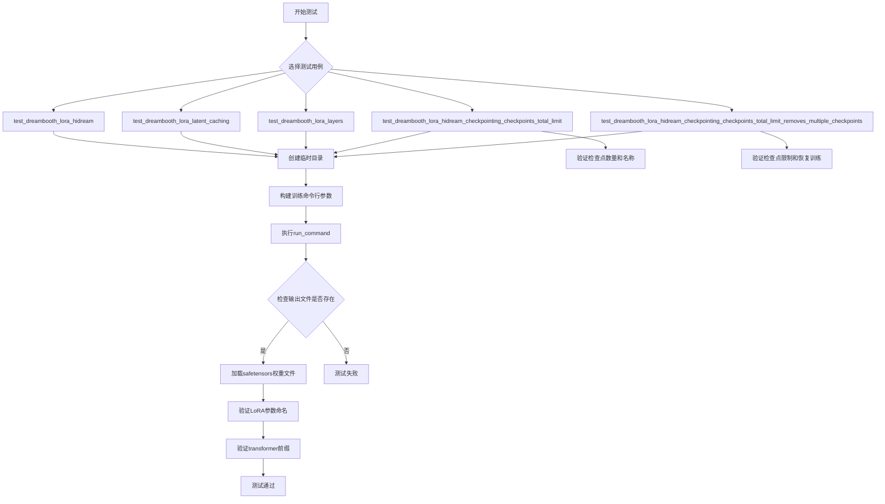

## 类结构

```
ExamplesTestsAccelerate (基类)
└── DreamBoothLoRAHiDreamImage (测试类)
```

## 全局变量及字段


### `logger`
    
全局日志记录器对象，用于输出调试和运行信息

类型：`logging.Logger`
    


### `stream_handler`
    
日志流处理器，将日志输出到标准输出 stdout

类型：`logging.StreamHandler`
    


### `DreamBoothLoRAHiDreamImage.instance_data_dir`
    
实例数据目录路径

类型：`str`
    


### `DreamBoothLoRAHiDreamImage.pretrained_model_name_or_path`
    
预训练模型名称或路径

类型：`str`
    


### `DreamBoothLoRAHiDreamImage.text_encoder_4_path`
    
文本编码器4的路径

类型：`str`
    


### `DreamBoothLoRAHiDreamImage.tokenizer_4_path`
    
分词器4的路径

类型：`str`
    


### `DreamBoothLoRAHiDreamImage.script_path`
    
训练脚本路径

类型：`str`
    


### `DreamBoothLoRAHiDreamImage.transformer_layer_type`
    
transformer层类型标识

类型：`str`
    
    

## 全局函数及方法


### `run_command`

执行命令行命令的辅助函数，用于在测试环境中运行带有 Accelerate 配置的训练脚本。

参数：

-  `cmd`：`List[str]`，命令行参数列表，包含执行命令及其所有参数（通常由 `_launch_args` 和 `test_args` 组成）

返回值：`Any`，命令执行的返回结果（通常为命令的退出码或输出）

#### 流程图

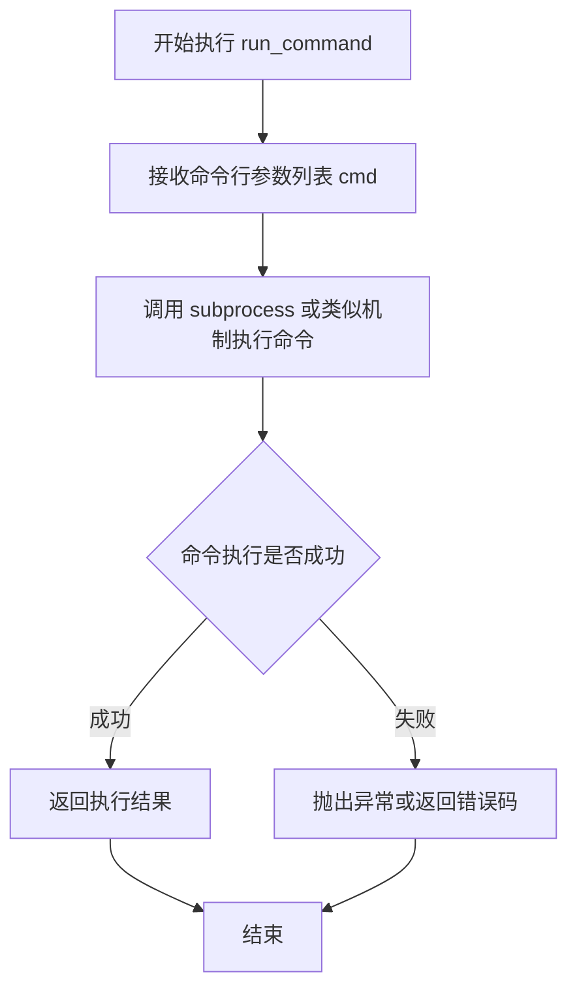

#### 带注释源码

```
# 注意：由于 run_command 是从外部模块 test_examples_utils 导入的，
# 以下是基于代码使用方式的推断实现

def run_command(cmd: List[str]) -> Any:
    """
    执行命令行命令的辅助函数
    
    参数:
        cmd: 包含命令和参数的列表，如 ['python', 'script.py', '--arg1', 'value1']
    
    返回值:
        命令执行的返回结果
    """
    # 使用 subprocess 执行命令
    # 可能使用 subprocess.run() 或类似的机制
    result = subprocess.run(cmd, ...)
    
    # 返回结果（可能是返回码或完整的 CompletedProcess 对象）
    return result
```

> **注意**：由于 `run_command` 是从外部模块 `test_examples_utils` 导入的，其实际实现不在本代码文件中。上面的源码是基于代码使用方式的推断。实际实现通常会使用 `subprocess` 模块来执行命令行命令，并返回执行结果。

#### 在代码中的使用示例

```python
# 在 DreamBoothLoRAHiDreamImage 类中的使用方式
run_command(self._launch_args + test_args)

# 其中：
# - self._launch_args: Accelerate 启动参数列表（如 ['accelerate', 'launch', '--num_processes', '1']）
# - test_args: 测试脚本的命令行参数列表
```


# 设计文档：DreamBoothLoRAHiDreamImage 测试类

## 1. 概述

DreamBoothLoRAHiDreamImage 是一个继承自 ExamplesTestsAccelerate 的测试类，用于测试 HiDream 模型的 DreamBooth LoRA 训练脚本，验证模型权重保存、LoRA 参数正确性、检查点管理等功能。

## 2. 整体运行流程

该测试类通过 accelerate 框架运行训练脚本，验证以下功能：
1. 基础 LoRA 训练和权重保存
2. 潜在缓存训练功能
3. 指定 LoRA 训练层
4. 检查点总数限制
5. 检查点删除和恢复训练

## 3. 类详细信息

### 3.1 类字段

| 字段名称 | 类型 | 描述 |
|---------|------|------|
| instance_data_dir | str | 实例数据目录路径 |
| pretrained_model_name_or_path | str | 预训练模型名称或路径 |
| text_encoder_4_path | str | 第四个文本编码器路径 |
| tokenizer_4_path | str | 第四个分词器路径 |
| script_path | str | 训练脚本路径 |
| transformer_layer_type | str | Transformer层类型 |

### 3.2 类方法

#### test_dreambooth_lora_hidream

基础LoRA训练测试

参数：无

返回值：无（测试方法，返回None）

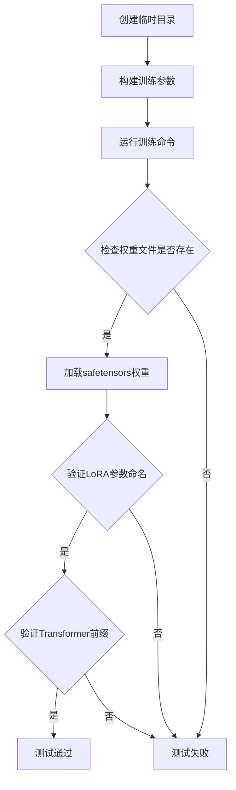

```python
def test_dreambooth_lora_hidream(self):
    """测试HiDream模型的基础LoRA训练功能"""
    with tempfile.TemporaryDirectory() as tmpdir:
        # 构建训练参数列表
        test_args = f"""
            {self.script_path}
            --pretrained_model_name_or_path {self.pretrained_model_name_or_path}
            --pretrained_text_encoder_4_name_or_path {self.text_encoder_4_path}
            --pretrained_tokenizer_4_name_or_path {self.tokenizer_4_path}
            --instance_data_dir {self.instance_data_dir}
            --resolution 32
            --train_batch_size 1
            --gradient_accumulation_steps 1
            --max_train_steps 2
            --learning_rate 5.0e-04
            --scale_lr
            --lr_scheduler constant
            --lr_warmup_steps 0
            --output_dir {tmpdir}
            --max_sequence_length 16
            """.split()

        # 添加实例提示词
        test_args.extend(["--instance_prompt", ""])
        # 运行训练命令
        run_command(self._launch_args + test_args)
        
        # 验证权重文件存在
        self.assertTrue(os.path.isfile(os.path.join(tmpdir, "pytorch_lora_weights.safetensors")))

        # 加载并验证LoRA状态字典
        lora_state_dict = safetensors.torch.load_file(os.path.join(tmpdir, "pytorch_lora_weights.safetensors"))
        # 验证所有键包含'lora'字符串
        is_lora = all("lora" in k for k in lora_state_dict.keys())
        self.assertTrue(is_lora)

        # 验证所有参数以'transformer'开头
        starts_with_transformer = all(key.startswith("transformer") for key in lora_state_dict.keys())
        self.assertTrue(starts_with_transformer)
```

#### test_dreambooth_lora_latent_caching

潜在缓存训练测试

参数：无

返回值：无（测试方法，返回None）

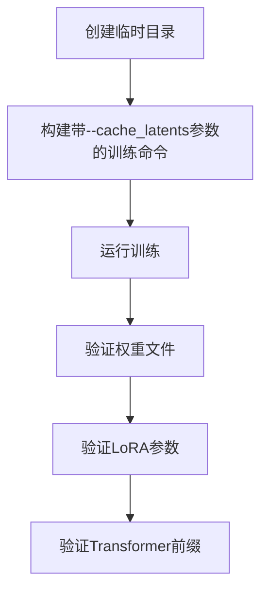

```python
def test_dreambooth_lora_latent_caching(self):
    """测试带潜在缓存的LoRA训练"""
    with tempfile.TemporaryDirectory() as tmpdir:
        test_args = f"""
            {self.script_path}
            --pretrained_model_name_or_path {self.pretrained_model_name_or_path}
            --pretrained_text_encoder_4_name_or_path {self.text_encoder_4_path}
            --pretrained_tokenizer_4_name_or_path {self.tokenizer_4_path}
            --instance_data_dir {self.instance_data_dir}
            --resolution 32
            --train_batch_size 1
            --gradient_accumulation_steps 1
            --max_train_steps 2
            --cache_latents  # 启用潜在缓存
            --learning_rate 5.0e-04
            --scale_lr
            --lr_scheduler constant
            --lr_warmup_steps 0
            --output_dir {tmpdir}
            --max_sequence_length 16
            """.split()

        test_args.extend(["--instance_prompt", ""])
        run_command(self._launch_args + test_args)
        
        # 验证输出文件
        self.assertTrue(os.path.isfile(os.path.join(tmpdir, "pytorch_lora_weights.safetensors")))
        
        # 验证LoRA状态字典
        lora_state_dict = safetensors.torch.load_file(os.path.join(tmpdir, "pytorch_lora_weights.safetensors"))
        is_lora = all("lora" in k for k in lora_state_dict.keys())
        self.assertTrue(is_lora)

        # 验证Transformer前缀
        starts_with_transformer = all(key.startswith("transformer") for key in lora_state_dict.keys())
        self.assertTrue(starts_with_transformer)
```

#### test_dreambooth_lora_layers

指定LoRA层训练测试

参数：无

返回值：无（测试方法，返回None）

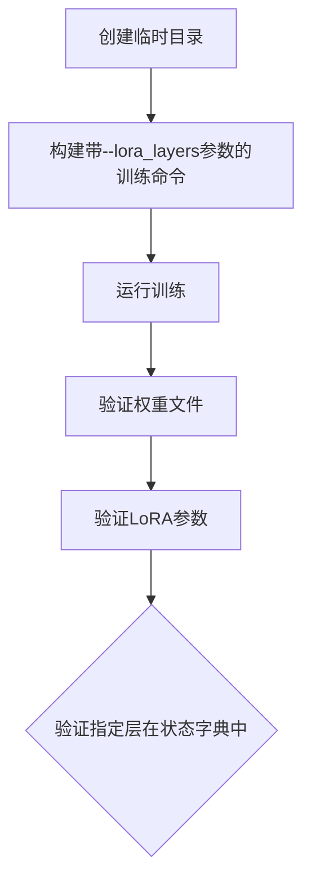

```python
def test_dreambooth_lora_layers(self):
    """测试指定LoRA层的训练"""
    with tempfile.TemporaryDirectory() as tmpdir:
        test_args = f"""
            {self.script_path}
            --pretrained_model_name_or_path {self.pretrained_model_name_or_path}
            --pretrained_text_encoder_4_name_or_path {self.text_encoder_4_path}
            --pretrained_tokenizer_4_name_or_path {self.tokenizer_4_path}
            --instance_data_dir {self.instance_data_dir}
            --resolution 32
            --train_batch_size 1
            --gradient_accumulation_steps 1
            --max_train_steps 2
            --cache_latents
            --learning_rate 5.0e-04
            --scale_lr
            --lora_layers {self.transformer_layer_type}  # 指定训练层
            --lr_scheduler constant
            --lr_warmup_steps 0
            --output_dir {tmpdir}
            --max_sequence_length 16
            """.split()

        test_args.extend(["--instance_prompt", ""])
        run_command(self._launch_args + test_args)
        
        # 验证权重文件
        self.assertTrue(os.path.isfile(os.path.join(tmpdir, "pytorch_lora_weights.safetensors")))

        # 验证LoRA状态字典
        lora_state_dict = safetensors.torch.load_file(os.path.join(tmpdir, "pytorch_lora_weights.safetensors"))
        is_lora = all("lora" in k for k in lora_state_dict.keys())
        self.assertTrue(is_lora)

        # 验证指定层在状态字典中
        starts_with_transformer = all(self.transformer_layer_type in key for key in lora_state_dict)
        self.assertTrue(starts_with_transformer)
```

#### test_dreambooth_lora_hidream_checkpointing_checkpoints_total_limit

检查点总数限制测试

参数：无

返回值：无（测试方法，返回None）

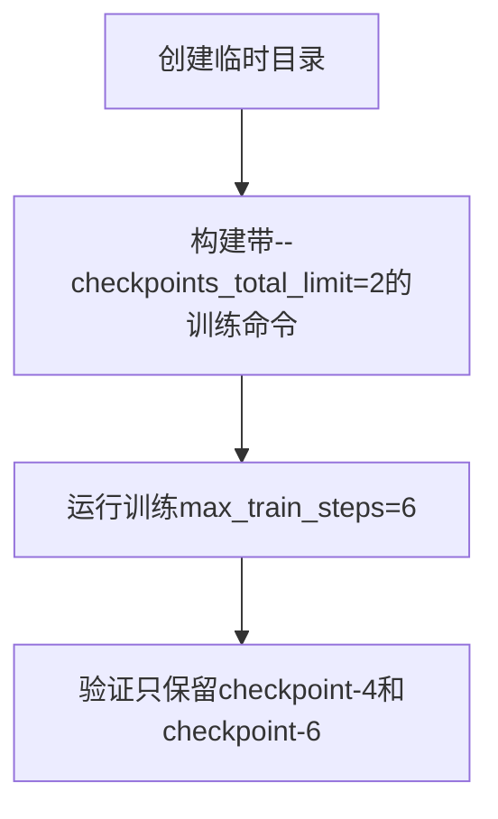

```python
def test_dreambooth_lora_hidream_checkpointing_checkpoints_total_limit(self):
    """测试检查点总数限制功能"""
    with tempfile.TemporaryDirectory() as tmpdir:
        test_args = f"""
            {self.script_path}
            --pretrained_model_name_or_path={self.pretrained_model_name_or_path}
            --pretrained_text_encoder_4_name_or_path {self.text_encoder_4_path}
            --pretrained_tokenizer_4_name_or_path {self.tokenizer_4_path}
            --instance_data_dir={self.instance_data_dir}
            --output_dir={tmpdir}
            --resolution=32
            --train_batch_size=1
            --gradient_accumulation_steps=1
            --max_train_steps=6
            --checkpoints_total_limit=2  # 限制最多2个检查点
            --checkpointing_steps=2
            --max_sequence_length 16
            """.split()

        test_args.extend(["--instance_prompt", ""])
        run_command(self._launch_args + test_args)

        # 验证只保留最新的2个检查点
        self.assertEqual(
            {x for x in os.listdir(tmpdir) if "checkpoint" in x},
            {"checkpoint-4", "checkpoint-6"},
        )
```

#### test_dreambooth_lora_hidream_checkpointing_checkpoints_total_limit_removes_multiple_checkpoints

检查点删除和恢复训练测试

参数：无

返回值：无（测试方法，返回None）

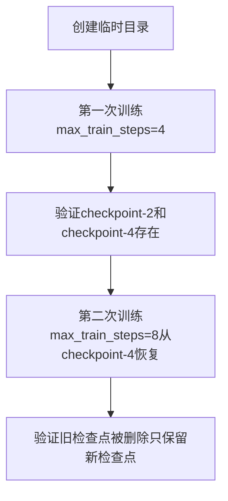

```python
def test_dreambooth_lora_hidream_checkpointing_checkpoints_total_limit_removes_multiple_checkpoints(self):
    """测试检查点删除和恢复训练功能"""
    with tempfile.TemporaryDirectory() as tmpdir:
        # 第一次训练
        test_args = f"""
            {self.script_path}
            --pretrained_model_name_or_path={self.pretrained_model_name_or_path}
            --pretrained_text_encoder_4_name_or_path {self.text_encoder_4_path}
            --pretrained_tokenizer_4_name_or_path {self.tokenizer_4_path}
            --instance_data_dir={self.instance_data_dir}
            --output_dir={tmpdir}
            --resolution=32
            --train_batch_size=1
            --gradient_accumulation_steps=1
            --max_train_steps=4
            --checkpointing_steps=2
            --max_sequence_length 16
            """.split()

        test_args.extend(["--instance_prompt", ""])
        run_command(self._launch_args + test_args)

        # 验证初始检查点
        self.assertEqual({x for x in os.listdir(tmpdir) if "checkpoint" in x}, {"checkpoint-2", "checkpoint-4"})

        # 恢复训练并限制检查点数量
        resume_run_args = f"""
            {self.script_path}
            --pretrained_model_name_or_path={self.pretrained_model_name_or_path}
            --pretrained_text_encoder_4_name_or_path {self.text_encoder_4_path}
            --pretrained_tokenizer_4_name_or_path {self.tokenizer_4_path}
            --instance_data_dir={self.instance_data_dir}
            --output_dir={tmpdir}
            --resolution=32
            --train_batch_size=1
            --gradient_accumulation_steps=1
            --max_train_steps=8
            --checkpointing_steps=2
            --resume_from_checkpoint=checkpoint-4  # 从checkpoint-4恢复
            --checkpoints_total_limit=2
            --max_sequence_length 16
            """.split()

        resume_run_args.extend(["--instance_prompt", ""])
        run_command(self._launch_args + resume_run_args)

        # 验证最终检查点（旧的被删除）
        self.assertEqual({x for x in os.listdir(tmpdir) if "checkpoint" in x}, {"checkpoint-6", "checkpoint-8"})
```

### 3.3 全局函数

#### run_command

从 test_examples_utils 导入的全局函数，用于执行命令行命令

参数：
- `cmd`：命令列表

返回值：无

### 3.4 继承自 ExamplesTestsAccelerate 的属性

| 属性名称 | 类型 | 描述 |
|---------|------|------|
| _launch_args | list | accelerate启动参数列表 |

## 4. 关键组件信息

| 组件名称 | 描述 |
|---------|------|
| ExamplesTestsAccelerate | 基础测试类，提供accelerate测试框架支持 |
| safetensors | 用于加载和保存模型权重的安全张量库 |
| tempfile | Python标准库，用于创建临时目录 |

## 5. 潜在技术债务与优化空间

1. **重复代码**：多个测试方法中存在大量重复的验证逻辑，可以提取为基类方法
2. **硬编码参数**：训练参数如 learning_rate、max_train_steps 等硬编码在测试中，建议参数化
3. **缺乏异常处理**：测试中未对命令执行失败进行详细错误信息捕获
4. **测试隔离性**：使用临时目录但未验证清理是否完全成功

## 6. 其它项目

### 设计目标与约束
- 使用 accelerate 框架进行分布式训练测试
- 验证 LoRA 权重正确保存为 safetensors 格式
- 检查点管理需符合 total_limit 约束

### 错误处理与异常设计
- 使用 assertTrue 验证文件存在性和参数正确性
- run_command 执行失败会抛出异常导致测试失败

### 数据流与状态机
- 训练脚本 → 输出目录 → 权重文件 → 状态字典验证

### 外部依赖与接口契约
- 依赖 test_examples_utils.ExamplesTestsAccelerate
- 依赖 test_examples_utils.run_command
- 依赖 safetensors 库进行权重加载


### `safetensors.torch.load_file`

该函数是 safetensors 库提供的核心方法，用于从磁盘加载 safetensors 格式的模型权重文件，并返回一个包含权重名称和对应 PyTorch 张量的字典。在提供的测试代码中，该函数被用于验证 DreamBooth LoRA 训练输出的权重文件是否正确保存。

参数：

- `filename`：`str`，safetensors 格式的权重文件路径。在测试代码中传入的是 `os.path.join(tmpdir, "pytorch_lora_weights.safetensors")`

返回值：`Dict[str, torch.Tensor]`，键为权重参数名称（字符串），值为对应的 PyTorch 张量。在测试代码中，该返回值被赋值给 `lora_state_dict` 变量，随后用于验证权重命名规范（如检查是否包含 "lora" 前缀或 "transformer" 前缀）。

#### 流程图

```mermaid
graph TD
    A[开始] --> B[传入 safetensors 文件路径]
    B --> C[打开并读取 .safetensors 文件]
    C --> D[解析文件头部元数据]
    D --> E[根据元数据读取每个张量的二进制数据]
    E --> F[将二进制数据反序列化为 PyTorch 张量]
    F --> G[构建键值对字典]
    G --> H[返回 Dict[str, torch.Tensor]]
    H --> I[结束]
```

#### 带注释源码

```python
# 测试代码中对 safetensors.torch.load_file 的调用示例

# 使用 os.path.join 构建完整的文件路径
file_path = os.path.join(tmpdir, "pytorch_lora_weights.safetensors")

# 调用 safetensors.torch.load_file 加载权重文件
# 参数：filename - safetensors 文件的路径字符串
# 返回值：lora_state_dict - 包含所有权重参数的字典，键为参数名，值为 PyTorch 张量
lora_state_dict = safetensors.torch.load_file(file_path)

# 验证所有权重键是否包含 'lora' 字符串（LoRA 参数命名规范）
is_lora = all("lora" in k for k in lora_state_dict.keys())

# 验证所有权重键是否以 'transformer' 开头（HiDream 模型结构规范）
starts_with_transformer = all(key.startswith("transformer") for key in lora_state_dict.keys())
```


### `tempfile.TemporaryDirectory`

创建临时目录的上下文管理器，在退出上下文时自动清理（删除）该目录。

参数：

- `suffix`：`str`，可选，临时目录名称的后缀，默认为空字符串
- `prefix`：`str`，可选，临时目录名称的前缀，默认为 `'tmp'`
- `dir`：`str`，可选，临时目录创建的目录，默认为 `None`（使用系统默认临时目录）

返回值：`TemporaryDirectory`，返回一个上下文管理器对象，其 `name` 属性提供临时目录的路径字符串

#### 流程图

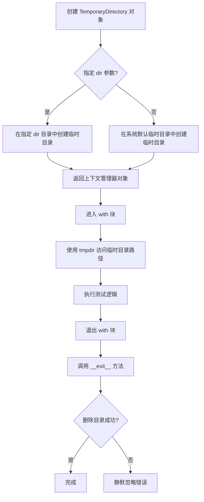

#### 带注释源码

```python
import tempfile
import shutil
import os

class TemporaryDirectory:
    """
    创建临时目录的上下文管理器。
    
    在退出上下文时自动删除该目录及其所有内容。
    """
    
    def __init__(self, suffix="", prefix="tmp", dir=None):
        """
        初始化临时目录创建器。
        
        Args:
            suffix: 目录名的后缀
            prefix: 目录名的前缀，默认 'tmp'
            dir: 指定创建目录的父目录，None 则使用系统默认
        """
        self.name = tempfile.mkdtemp(suffix, prefix, dir)
        # name 属性存储临时目录的完整路径
    
    def __enter__(self):
        """
        进入上下文管理器。
        
        Returns:
            str: 临时目录的路径，供 with 块内使用
        """
        return self.name
    
    def __exit__(self, exc, value, tb):
        """
        退出上下文管理器，自动清理临时目录。
        
        Args:
            exc: 异常类型
            value: 异常值
            tb: 异常回溯
        """
        self.cleanup()
        # 即使删除失败也静默忽略，确保上下文能正常退出
    
    def cleanup(self):
        """
        手动清理临时目录。
        
        使用 shutil.rmtree 递归删除目录树，
        忽略可能的 OSError 错误。
        """
        if os.path.exists(self.name):
            shutil.rmtree(self.name)
```

#### 使用示例（来自代码中提取）

```python
# 在测试代码中的实际使用方式
with tempfile.TemporaryDirectory() as tmpdir:
    # tmpdir 是临时目录的路径字符串
    # 在此上下文中可以使用该目录进行文件操作
    test_args = f"""
        {self.script_path}
        --output_dir {tmpdir}
        ...
    """.split()
    run_command(self._launch_args + test_args)
    
    # 验证输出文件是否生成
    self.assertTrue(os.path.isfile(os.path.join(tmpdir, "pytorch_lora_weights.safetensors")))

# 退出 with 块后，tmpdir 目录会被自动删除
```


### `os.path.isfile`

检查指定路径是否指向一个存在的常规文件（非目录、符号链接、设备文件等）。

参数：

-  `path`：`str`，要检查的文件路径，可以是绝对路径或相对路径

返回值：`bool`，如果路径指向一个存在的常规文件则返回 `True`，否则返回 `False`

#### 流程图

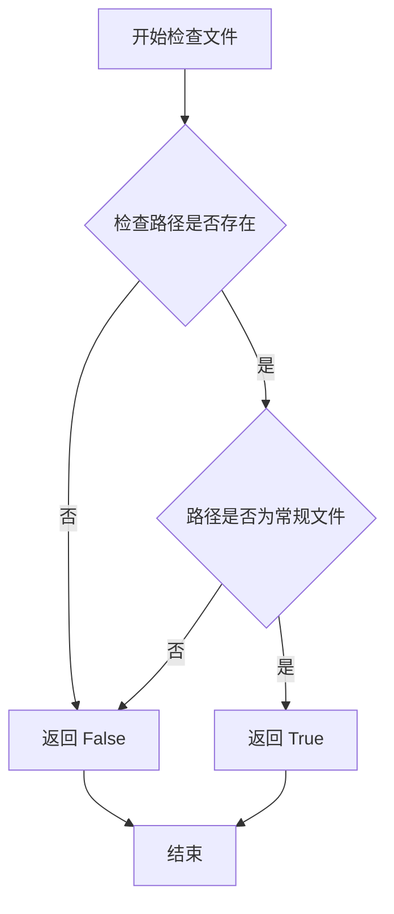

#### 带注释源码

```python
# os.path.isfile 函数使用示例（从原始代码中提取）
# 用于检查训练输出目录中是否生成了 LoRA 权重文件

# 语法：os.path.isfile(path)
# 参数：path - 要检查的文件路径（字符串）
# 返回值：布尔值，文件存在且为常规文件时返回 True

# 在本代码中的实际调用：
self.assertTrue(os.path.isfile(os.path.join(tmpdir, "pytorch_lora_weights.safetensors")))

# 解释：
# 1. os.path.join(tmpdir, "pytorch_lora_weights.safetensors") 构建完整的文件路径
# 2. os.path.isfile() 检查该路径是否指向一个存在的常规文件
# 3. self.assertTrue() 断言该文件确实存在，用于验证训练脚本成功保存了 LoRA 权重
```


### `os.listdir`

`os.listdir` 是 Python 标准库中的函数，用于返回指定目录中所有文件和目录的名称列表（不包括 `.` 和 `..`）。

参数：

- `path`：`str | bytes | Path`，目录路径

返回值：`list[str]`，包含目录中所有文件名（不含路径）的列表

#### 流程图

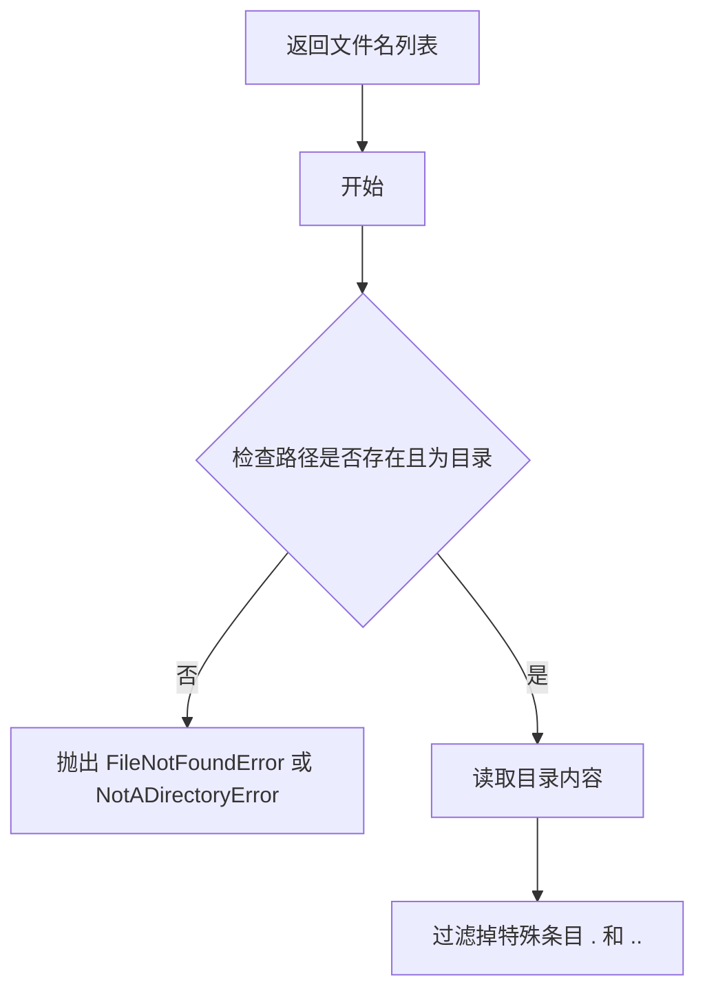

#### 带注释源码

```python
# os.listdir 的使用示例（来自代码中的实际调用）
# 列出临时目录中的所有文件，并筛选包含 "checkpoint" 的文件名

# 获取临时目录内容
all_items = os.listdir(tmpdir)

# 筛选包含 "checkpoint" 的项
checkpoint_dirs = {x for x in all_items if "checkpoint" in x}

# 验证检查点数量和名称
self.assertEqual(checkpoint_dirs, {"checkpoint-4", "checkpoint-6"})
```

#### 代码中的实际使用

```python
# 第一次测试：验证检查点保存
self.assertEqual(
    {x for x in os.listdir(tmpdir) if "checkpoint" in x},
    {"checkpoint-4", "checkpoint-6"},
)

# 第二次测试：验证初始检查点
self.assertEqual({x for x in os.listdir(tmpdir) if "checkpoint" in x}, {"checkpoint-2", "checkpoint-4"})

# 第三次测试：验证恢复训练后只保留最新的两个检查点
self.assertEqual({x for x in os.listdir(tmpdir) if "checkpoint" in x}, {"checkpoint-6", "checkpoint-8"})
```


# os.path.join 函数详细设计文档

### `os.path.join`

这是 Python 标准库 `os.path` 模块中的一个函数，用于将多个路径组合成一个完整的路径。

参数：

- `*paths`：`str`，可变数量的路径字符串，将被智能地拼接在一起

返回值：`str`，返回拼接后的完整路径字符串

#### 流程图

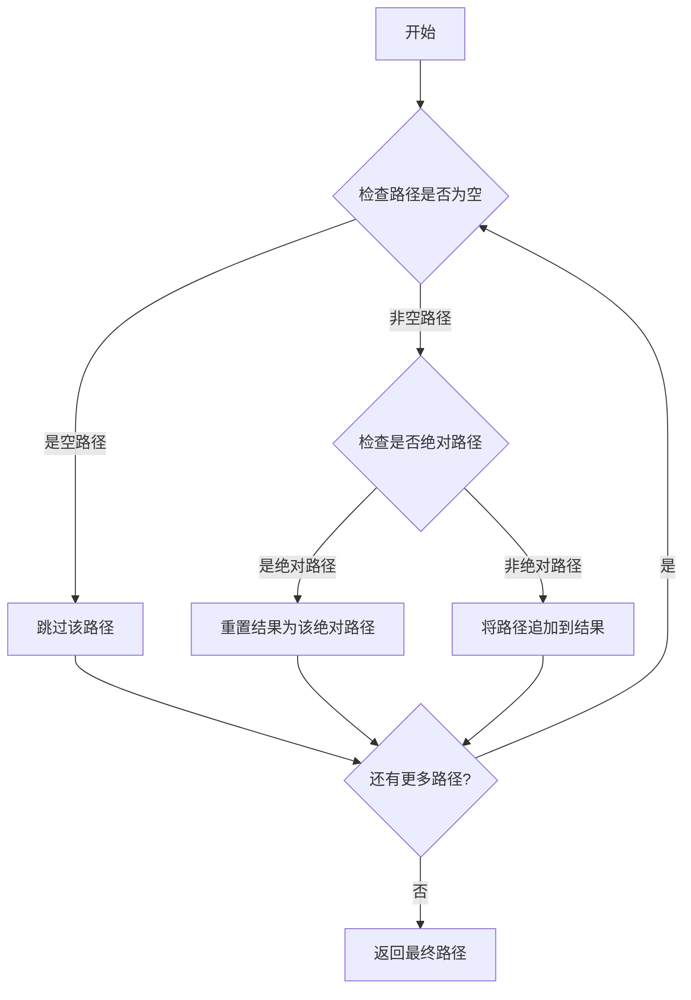

#### 带注释源码

```python
# os.path.join 是 Python 标准库 os.path 模块中的函数
# 以下是代码中使用 os.path.join 的示例（在 test_examples_utils 中调用）:

# 用法示例 1: 检查文件是否存在
# os.path.join(tmpdir, "pytorch_lora_weights.safetensors")
# 将目录路径 tmpdir 和文件名 "pytorch_loro_weights.safetensors" 拼接成完整路径
self.assertTrue(os.path.isfile(os.path.join(tmpdir, "pytorch_lora_weights.safetensors")))

# 用法示例 2: 加载 safetensors 文件
# os.path.join(tmpdir, "pytorch_lora_weights.safetensors")
# 拼接路径用于加载 LoRA 权重文件
lora_state_dict = safetensors.torch.load_file(os.path.join(tmpdir, "pytorch_lora_weights.safetensors"))

# 用法示例 3: 列出目录内容时过滤 checkpoint 目录
# os.path.join(tmpdir, "checkpoint-4") 等
{x for x in os.listdir(tmpdir) if "checkpoint" in x}

# os.path.join 函数特点:
# 1. 会智能处理路径分隔符（Windows 用 \，Linux/Mac 用 /）
# 2. 如果某个参数是绝对路径，会丢弃之前的所有路径
# 3. 返回值末尾不会有路径分隔符（除非最后一部分是空字符串）
# 4. 可以接受任意数量的路径参数
```

## 代码中具体使用场景

在提供的代码中，`os.path.join` 主要用于：

1. **构建权重文件路径**：`os.path.join(tmpdir, "pytorch_lora_weights.safetensors")` - 拼接输出目录和 LoRA 权重文件名
2. **验证输出文件**：检查训练生成的权重文件是否存在于指定目录
3. **加载模型状态**：读取 safetensors 格式的 LoRA 权重文件

## 技术说明

`os.path.join` 是 Python 标准库中处理路径拼接的首选方式，具有跨平台兼容性。它能够自动处理不同操作系统下的路径分隔符差异，使得代码在 Windows、Linux 和 macOS 上都能正常工作。


### `DreamBoothLoRAHiDreamImage.test_dreambooth_lora_hidream`

该方法是一个集成测试用例，用于验证 DreamBooth LoRA HiDream 训练流程的基本功能是否正常工作。它通过调用训练脚本执行一个最小化的训练任务，并验证生成的 LoRA 权重文件是否符合预期格式和命名规范。

参数：该方法无显式输入参数，使用类属性作为配置。

返回值：`None`，通过断言验证训练结果的正确性。

#### 流程图

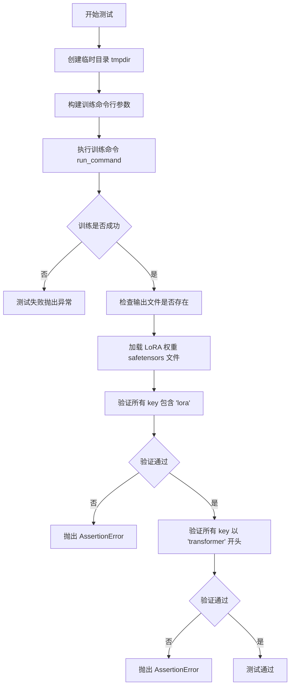

#### 带注释源码

```python
def test_dreambooth_lora_hidream(self):
    """
    测试基础 DreamBooth LoRA HiDream 训练功能
    
    该测试方法执行以下步骤：
    1. 创建临时目录用于存放输出
    2. 构造训练脚本的命令行参数
    3. 执行训练命令
    4. 验证生成的 LoRA 权重文件
    5. 检查权重 state_dict 的命名规范
    """
    # 使用临时目录存放训练输出，避免污染文件系统
    with tempfile.TemporaryDirectory() as tmpdir:
        # 构建训练脚本的命令行参数
        # 包含模型路径、数据路径、训练超参数等配置
        test_args = f"""
            {self.script_path}
            --pretrained_model_name_or_path {self.pretrained_model_name_or_path}
            --pretrained_text_encoder_4_name_or_path {self.text_encoder_4_path}
            --pretrained_tokenizer_4_name_or_path {self.tokenizer_4_path}
            --instance_data_dir {self.instance_data_dir}
            --resolution 32
            --train_batch_size 1
            --gradient_accumulation_steps 1
            --max_train_steps 2
            --learning_rate 5.0e-04
            --scale_lr
            --lr_scheduler constant
            --lr_warmup_steps 0
            --output_dir {tmpdir}
            --max_sequence_length 16
            """.split()

        # 添加实例提示词（此处为空字符串）
        test_args.extend(["--instance_prompt", ""])
        
        # 执行训练命令，使用 accelerate 启动分布式训练
        # _launch_args 包含分布式训练的环境变量和参数
        run_command(self._launch_args + test_args)
        
        # ==== 验证输出文件 ====
        # 检查 LoRA 权重文件是否成功生成
        self.assertTrue(os.path.isfile(os.path.join(tmpdir, "pytorch_lora_weights.safetensors")))

        # ==== 验证 LoRA 权重命名规范 ====
        # 加载生成的 safetensors 格式的 LoRA 权重
        lora_state_dict = safetensors.torch.load_file(os.path.join(tmpdir, "pytorch_lora_weights.safetensors"))
        
        # 验证所有权重 key 都包含 'lora' 标识
        is_lora = all("lora" in k for k in lora_state_dict.keys())
        self.assertTrue(is_lora)

        # ==== 验证模型组件命名 ====
        # 当不训练文本编码器时，所有参数名应以 'transformer' 开头
        # 这是 HiDream 模型的特定命名规范
        starts_with_transformer = all(key.startswith("transformer") for key in lora_state_dict.keys())
        self.assertTrue(starts_with_transformer)
```


### `DreamBoothLoRAHiDreamImage.test_dreambooth_lora_latent_caching`

该方法是 DreamBoothLoRAHiDreamImage 类的测试方法，用于测试使用潜在缓存（latent caching）功能进行 DreamBooth LoRA 训练的正确性。测试通过执行训练脚本并验证生成的 LoRA 权重文件来确保功能正常工作。

参数：

- `self`：隐式参数，DreamBoothLoRAHiDreamImage 实例本身

返回值：`None`，该方法为测试方法，通过 unittest 断言进行验证，无显式返回值

#### 流程图

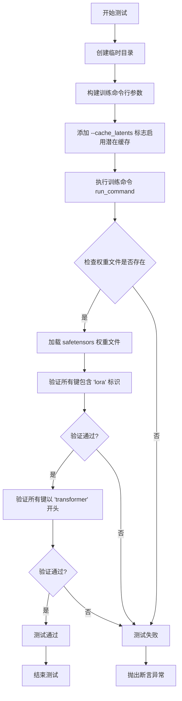

#### 带注释源码

```python
def test_dreambooth_lora_latent_caching(self):
    """
    测试使用潜在缓存（latent caching）功能的 DreamBooth LoRA 训练。
    潜在缓存可以加速训练过程，通过预先计算和缓存潜在表示。
    """
    # 创建临时目录用于存放训练输出
    with tempfile.TemporaryDirectory() as tmpdir:
        # 构建训练脚本的命令行参数
        test_args = f"""
            {self.script_path}                          # 训练脚本路径
            --pretrained_model_name_or_path {self.pretrained_model_name_or_path}    # 预训练模型名称或路径
            --pretrained_text_encoder_4_name_or_path {self.text_encoder_4_path}     # 文本编码器路径
            --pretrained_tokenizer_4_name_or_path {self.tokenizer_4_path}           # 分词器路径
            --instance_data_dir {self.instance_data_dir}                            # 实例数据目录
            --resolution 32                               # 图像分辨率
            --train_batch_size 1                         # 训练批次大小
            --gradient_accumulation_steps 1              # 梯度累积步数
            --max_train_steps 2                          # 最大训练步数
            --cache_latents                               # 启用潜在缓存（关键参数）
            --learning_rate 5.0e-04                      # 学习率
            --scale_lr                                    # 缩放学习率
            --lr_scheduler constant                      # 学习率调度器
            --lr_warmup_steps 0                          # 预热步数
            --output_dir {tmpdir}                        # 输出目录
            --max_sequence_length 16                     # 最大序列长度
            """.split()

        # 添加实例提示词参数（此处为空字符串）
        test_args.extend(["--instance_prompt", ""])
        
        # 执行训练命令，使用 accelerate 启动
        run_command(self._launch_args + test_args)
        
        # ==== 验证阶段 ====
        
        # 验证1：检查 LoRA 权重文件是否成功生成
        self.assertTrue(os.path.isfile(os.path.join(tmpdir, "pytorch_lora_weights.safetensors")))

        # 验证2：加载权重并检查所有参数是否包含 'lora' 标识
        # 这确保训练确实应用了 LoRA 修改
        lora_state_dict = safetensors.torch.load_file(os.path.join(tmpdir, "pytorch_lora_weights.safetensors"))
        is_lora = all("lora" in k for k in lora_state_dict.keys())
        self.assertTrue(is_lora)

        # 验证3：当不训练文本编码器时，所有参数应以 'transformer' 开头
        # 这验证了模型结构符合预期
        starts_with_transformer = all(key.startswith("transformer") for key in lora_state_dict.keys())
        self.assertTrue(starts_with_transformer)
```


### DreamBoothLoRAHiDreamImage.test_dreambooth_lora_layers

该方法用于测试DreamBooth LoRA训练过程中指定层的训练功能，验证通过`--lora_layers`参数指定特定transformer层（如`double_stream_blocks.0.block.attn1.to_k`）时，只有该层的参数会被训练并保存到LoRA权重文件中。

参数：
- `self`：实例方法隐含参数，`DreamBoothLoRAHiDreamImage`类型，表示测试类实例本身
- 无其他显式参数

返回值：`None`，该方法为测试方法，通过`assert`语句进行断言验证，不返回具体数值

#### 流程图

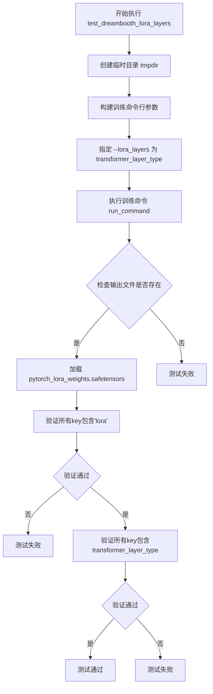

#### 带注释源码

```python
def test_dreambooth_lora_layers(self):
    """
    测试指定LoRA层的训练功能
    
    该测试方法验证当使用 --lora_layers 参数指定特定的transformer层时，
    只有该层的参数会被训练并保存到LoRA权重文件中。
    """
    # 创建临时目录用于存放训练输出
    with tempfile.TemporaryDirectory() as tmpdir:
        # 构建训练脚本的命令行参数列表
        test_args = f"""
            {self.script_path}                                  # 训练脚本路径
            --pretrained_model_name_or_path {self.pretrained_model_name_or_path}  # 预训练模型名称或路径
            --pretrained_text_encoder_4_name_or_path {self.text_encoder_4_path}   # 文本编码器路径
            --pretrained_tokenizer_4_name_or_path {self.tokenizer_4_path}          # 分词器路径
            --instance_data_dir {self.instance_data_dir}        # 实例数据目录
            --resolution 32                                      # 图像分辨率
            --train_batch_size 1                                 # 训练批次大小
            --gradient_accumulation_steps 1                      # 梯度累积步数
            --max_train_steps 2                                   # 最大训练步数
            --cache_latents                                      # 启用latent缓存
            --learning_rate 5.0e-04                              # 学习率
            --scale_lr                                           # 学习率缩放
            --lora_layers {self.transformer_layer_type}          # 指定要训练的LoRA层
            --lr_scheduler constant                              # 学习率调度器
            --lr_warmup_steps 0                                  # 学习率预热步数
            --output_dir {tmpdir}                                # 输出目录
            --max_sequence_length 16                             # 最大序列长度
            """.split()

        # 添加实例提示词（此处为空字符串）
        test_args.extend(["--instance_prompt", ""])
        
        # 执行训练命令
        run_command(self._launch_args + test_args)
        
        # 验证1：检查输出文件是否存在（save_pretrained烟雾测试）
        self.assertTrue(os.path.isfile(os.path.join(tmpdir, "pytorch_lora_weights.safetensors")))

        # 加载LoRA权重文件
        lora_state_dict = safetensors.torch.load_file(os.path.join(tmpdir, "pytorch_lora_weights.safetensors"))
        
        # 验证2：确保state_dict中的所有参数名称都包含'lora'
        is_lora = all("lora" in k for k in lora_state_dict.keys())
        self.assertTrue(is_lora)

        # 验证3：当不训练文本编码器时，所有参数名应以"transformer"开头
        # 在这个测试中，只有self.transformer_layer_type指定的参数应该在state dict中
        starts_with_transformer = all(self.transformer_layer_type in key for key in lora_state_dict)
        self.assertTrue(starts_with_transformer)
```


### `DreamBoothLoRAHiDreamImage.test_dreambooth_lora_hidream_checkpointing_checkpoints_total_limit`

该测试方法用于验证 DreamBooth LoRA HiDream 训练脚本的检查点总数限制功能，确保当设置 `checkpoints_total_limit=2` 时，系统能够自动删除旧的检查点，只保留最新的指定数量的检查点。

参数：此方法无显式参数，通过 `self` 访问类属性。

返回值：`None`，测试通过 `self.assertEqual` 断言验证功能，失败时抛出异常。

#### 流程图

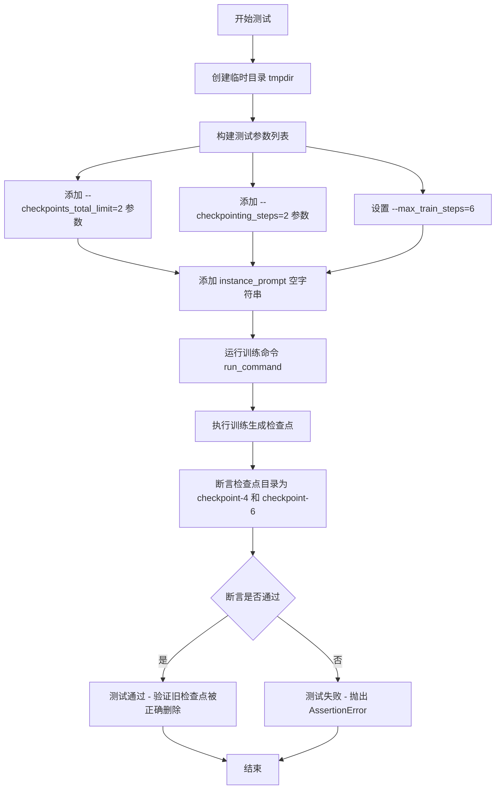

#### 带注释源码

```python
def test_dreambooth_lora_hidream_checkpointing_checkpoints_total_limit(self):
    """
    测试检查点总数限制功能
    
    验证当设置 --checkpoints_total_limit=2 时，
    系统只保留最新的2个检查点，早期的检查点会被自动删除。
    """
    # 使用 tempfile 创建一个临时目录用于存放训练输出
    with tempfile.TemporaryDirectory() as tmpdir:
        # 构建测试命令参数列表
        # 关键参数:
        #   --checkpoints_total_limit=2: 限制最多保存2个检查点
        #   --checkpointing_steps=2: 每2步保存一个检查点
        #   --max_train_steps=6: 总共训练6步，会生成 checkpoint-2, checkpoint-4, checkpoint-6
        test_args = f"""
        {self.script_path}
        --pretrained_model_name_or_path={self.pretrained_model_name_or_path}
        --pretrained_text_encoder_4_name_or_path {self.text_encoder_4_path}
        --pretrained_tokenizer_4_name_or_path {self.tokenizer_4_path}
        --instance_data_dir={self.instance_data_dir}
        --output_dir={tmpdir}
        --resolution=32
        --train_batch_size=1
        --gradient_accumulation_steps=1
        --max_train_steps=6
        --checkpoints_total_limit=2
        --checkpointing_steps=2
        --max_sequence_length 16
        """.split()

        # 添加实例提示词（空字符串）
        test_args.extend(["--instance_prompt", ""])
        
        # 使用 accelerate 框架运行训练命令
        # 这会执行 train_dreambooth_lora_hidream.py 脚本
        run_command(self._launch_args + test_args)

        # 验证检查点总数限制功能是否正常工作
        # 预期行为:
        #   - 训练6步，每2步保存检查点: checkpoint-2, checkpoint-4, checkpoint-6
        #   - 设置 checkpoints_total_limit=2 后，只保留最新的2个
        #   - 最早的 checkpoint-2 应当被删除
        #   - 最终应该只保留 checkpoint-4 和 checkpoint-6
        self.assertEqual(
            # 列出输出目录中所有包含 'checkpoint' 的文件/文件夹
            {x for x in os.listdir(tmpdir) if "checkpoint" in x},
            # 断言应该只包含 checkpoint-4 和 checkpoint-6
            {"checkpoint-4", "checkpoint-6"},
        )
```


### `DreamBoothLoRAHiDreamImage.test_dreambooth_lora_hidream_checkpointing_checkpoints_total_limit_removes_multiple_checkpoints`

该测试方法用于验证 DreamBooth LoRA HiDream 训练中的检查点总数限制功能，并测试在恢复训练后能够正确删除多个旧检查点，仅保留最新的指定数量检查点。

参数：

- `self`：类实例本身，由 unittest 框架自动传入

返回值：`None`，该方法为测试方法，通过断言验证检查点行为，不返回任何值

#### 流程图

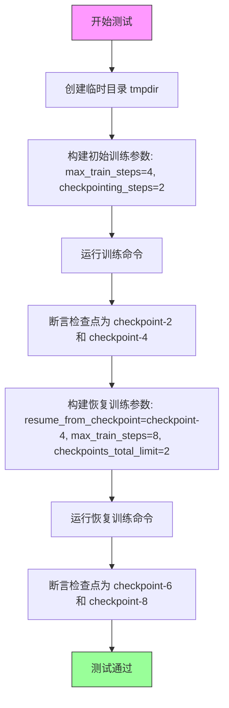

#### 带注释源码

```python
def test_dreambooth_lora_hidream_checkpointing_checkpoints_total_limit_removes_multiple_checkpoints(self):
    """
    测试检查点总数限制功能，并在恢复训练后验证能正确删除多个旧检查点
    
    测试流程：
    1. 训练4步（每2步保存检查点），期望保留 checkpoint-2, checkpoint-4
    2. 从 checkpoint-4 恢复训练到8步，设置 checkpoints_total_limit=2
    3. 验证最终只保留 checkpoint-6 和 checkpoint-8（旧的多余检查点被删除）
    """
    # 创建临时目录用于存放训练输出和检查点
    with tempfile.TemporaryDirectory() as tmpdir:
        # 构建第一阶段训练参数：训练4步，每2步保存一个检查点
        # 注意：未设置 checkpoints_total_limit，因此初始训练不限制检查点数量
        test_args = f"""
        {self.script_path}
        --pretrained_model_name_or_path={self.pretrained_model_name_or_path}
        --pretrained_text_encoder_4_name_or_path {self.text_encoder_4_path}
        --pretrained_tokenizer_4_name_or_path {self.tokenizer_4_path}
        --instance_data_dir={self.instance_data_dir}
        --output_dir={tmpdir}
        --resolution=32
        --train_batch_size=1
        --gradient_accumulation_steps=1
        --max_train_steps=4
        --checkpointing_steps=2
        --max_sequence_length 16
        """.split()

        # 添加实例提示（空字符串）
        test_args.extend(["--instance_prompt", ""])
        
        # 执行训练命令
        run_command(self._launch_args + test_args)

        # 验证第一阶段训练后只生成了 checkpoint-2 和 checkpoint-4
        # 使用集合比较忽略顺序
        self.assertEqual(
            {x for x in os.listdir(tmpdir) if "checkpoint" in x}, 
            {"checkpoint-2", "checkpoint-4"}
        )

        # 构建恢复训练参数：从第4步检查点恢复，继续训练到第8步
        # 设置 checkpoints_total_limit=2，限制最多保留2个检查点
        resume_run_args = f"""
        {self.script_path}
        --pretrained_model_name_or_path={self.pretrained_model_name_or_path}
        --pretrained_text_encoder_4_name_or_path {self.text_encoder_4_path}
        --pretrained_tokenizer_4_name_or_path {self.tokenizer_4_path}
        --instance_data_dir={self.instance_data_dir}
        --output_dir={tmpdir}
        --resolution=32
        --train_batch_size=1
        --gradient_accumulation_steps=1
        --max_train_steps=8
        --checkpointing_steps=2
        --resume_from_checkpoint=checkpoint-4
        --checkpoints_total_limit=2
        --max_sequence_length 16
        """.split()

        # 添加实例提示
        resume_run_args.extend(["--instance_prompt", ""])
        
        # 执行恢复训练命令
        run_command(self._launch_args + resume_run_args)

        # 验证恢复训练后：
        # - checkpoint-2, checkpoint-4 已被删除（超过了限制）
        # - 只保留最新的 checkpoint-6 和 checkpoint-8
        self.assertEqual(
            {x for x in os.listdir(tmpdir) if "checkpoint" in x}, 
            {"checkpoint-6", "checkpoint-8"}
        )
```

## 关键组件


### DreamBoothLoRAHiDreamImage 测试类

继承自 ExamplesTestsAccelerate 的测试类，用于验证 HiDream 模型的 DreamBooth LoRA 训练功能，包含多个测试方法来验证训练流程、检查点管理和潜在缓存等功能。

### instance_data_dir 实例数据目录

类型：字符串，指向 "docs/source/en/imgs"，用于提供训练所需的实例图像数据。

### pretrained_model_name_or_path 预训练模型路径

类型：字符串，值为 "hf-internal-testing/tiny-hidream-i1-pipe"，指定 HiDream 图像生成模型的预训练权重路径。

### text_encoder_4_path 文本编码器路径

类型：字符串，值为 "hf-internal-testing/tiny-random-LlamaForCausalLM"，指定第四个文本编码器的模型路径。

### tokenizer_4_path 分词器路径

类型：字符串，值为 "hf-internal-testing/tiny-random-LlamaForCausalLM"，指定与文本编码器配套的分词器路径。

### script_path 训练脚本路径

类型：字符串，值为 "examples/dreambooth/train_dreambooth_lora_hidream.py"，指向 DreamBooth LoRA 训练的主脚本。

### transformer_layer_type Transformer层类型

类型：字符串，值为 "double_stream_blocks.0.block.attn1.to_k"，指定要应用 LoRA 的特定 Transformer 层，用于细粒度的 LoRA 训练控制。

### test_dreambooth_lora_hidream 基础训练测试

验证 DreamBooth LoRA 训练流程的完整测试，涵盖命令行参数解析、模型训练、保存 LoRA 权重、权重命名规范验证等功能。

### test_dreambooth_lora_latent_caching 潜在缓存测试

验证潜在变量缓存功能的测试，通过 --cache_latents 参数启用缓存以加速训练。

### test_dreambooth_lora_layers 指定层训练测试

验证仅对特定 Transformer 层应用 LoRA 的功能，通过 --lora_layers 参数控制训练范围。

### test_dreambooth_lora_hidream_checkpointing_checkpoints_total_limit 检查点数量限制测试

验证检查点总数限制功能，确保训练过程中保留的检查点数量不超过指定值。

### test_dreambooth_lora_hidream_checkpointing_checkpoints_total_limit_removes_multiple_checkpoints 多检查点删除测试

验证从检查点恢复训练后正确管理检查点数量的功能，确保旧检查点被正确清理。

### LoRA权重验证逻辑

通过 safetensors 库加载并验证生成的 LoRA 权重，确保权重键名包含 "lora" 前缀且参数命名符合规范。

### 检查点目录验证

通过 os.listdir 验证检查点目录结构，确保检查点命名和保留策略正确执行。


## 问题及建议


### 已知问题

- **重复代码模式**：多个测试方法（test_dreambooth_lora_hidream、test_dreambooth_lora_latent_caching、test_dreambooth_lora_layers）中存在高度相似的命令构建逻辑、断言检查和结果验证代码，违反DRY原则。
- **硬编码配置值**：resolution、max_train_steps、learning_rate等参数在各个测试方法中重复硬编码，缺乏统一的配置管理。
- **魔法字符串散落**："pytorch_lora_weights.safetensors"、"lora"、"transformer"等关键字符串在多处重复出现，字符串字面量未提取为常量。
- **sys.path.append("..")**：使用运行时路径修改导入模块，不符合Python最佳实践，应使用相对导入或包安装方式。
- **日志配置位置不当**：在模块顶层直接调用logging.basicConfig，缺乏灵活性且影响其他模块的日志配置。
- **缺乏测试参数化**：相同逻辑的测试未使用pytest.mark.parametrize进行参数化，导致代码冗长。
- **异常信息不够详细**：断言语句缺少自定义错误消息，测试失败时难以快速定位问题。
- **路径拼接方式**：使用字符串拼接和os.path.join混用，缺乏一致性。

### 优化建议

- **提取测试基线参数**：在类级别定义默认的训练参数字典，所有测试方法共享基础配置，按需覆盖特定参数。
- **封装命令构建逻辑**：创建私有方法如_build_train_args(overrides)来统一生成训练命令参数。
- **常量集中定义**：将文件名字符串（"pytorch_lora_weights.safetensors"）、检查键（"lora"、"transformer"）等提取为类常量。
- **使用pytest fixture管理临时目录**：通过@pytest.fixture自动管理临时目录的创建和清理。
- **重构为参数化测试**：对test_dreambooth_lora_latent_caching和test_dreambooth_lora_layers等逻辑相似的测试，使用@pytest.mark.parametrize合并。
- **改进日志配置**：移除全局日志配置，或将其封装为可配置的函数，由测试框架控制。
- **添加详细断言消息**：为assert语句添加f-string描述，如self.assertTrue(..., f"Expected lora keys in {lora_state_dict.keys()}")。
- **使用pathlib替代os.path**：采用更现代的Path对象进行路径操作，提高可读性和安全性。

## 其它


### 设计目标与约束

本测试类旨在验证DreamBooth LoRA HiDream图像训练流程的正确性，包括模型加载、训练执行、检查点管理和LoRA权重保存等功能。约束条件包括使用小型测试模型（tiny-hidream-i1-pipe）、小分辨率（32）、少步数（2步）以及单批次训练，以满足快速测试需求。

### 错误处理与异常设计

测试用例使用`tempfile.TemporaryDirectory()`确保临时目录在测试完成后自动清理。通过`assertTrue`和`assertEqual`进行断言验证，若训练过程中出现文件缺失、命令执行失败或状态字典不符合预期，将抛出断言错误。`run_command`函数应捕获命令执行异常，测试框架会自动报告失败的测试用例。

### 数据流与状态机

测试数据流：临时目录创建 → 命令行参数构建 → 训练脚本执行 → LoRA权重文件生成 → 状态字典加载验证 → 断言检查 → 临时目录自动清理。状态机包括：初始状态（创建临时目录）→ 执行状态（运行训练命令）→ 验证状态（检查输出文件）→ 完成状态（清理资源）。

### 外部依赖与接口契约

依赖项包括：safetensors（权重加载）、test_examples_utils（ExamplesTestsAccelerate基类、run_command辅助函数）、tempfile（临时目录管理）、os/sys（文件系统操作）。接口契约：训练脚本需支持指定参数（模型路径、数据目录、输出目录、训练步数、学习率等），输出pytorch_lora_weights.safetensors文件，状态字典键名包含"lora"且以"transformer"开头。

### 性能考虑

测试采用最小化配置（2步训练、32分辨率、单批次）以加快执行速度。使用临时目录避免磁盘污染，检查点总数限制测试验证了资源管理效率。建议CI环境中设置超时机制，防止训练脚本死锁导致测试挂起。

### 安全性考虑

测试使用公开的HuggingFace测试模型（hf-internal-testing/*），无敏感数据依赖。临时目录在Python 3.2+自动使用secure属性创建，防止符号链接攻击。命令行参数使用split()处理，避免shell注入风险。

### 测试策略

采用黑盒测试方法，通过执行训练脚本并验证输出结果。覆盖场景包括：正常训练流程、潜在缓存功能、LoRA层筛选、检查点总数限制、检查点恢复与限制交互。测试均为端到端集成测试，验证完整训练 pipeline。

### 配置管理

测试参数通过类属性集中定义（instance_data_dir、pretrained_model_name_or_path、script_path等），便于统一修改。命令行参数通过字符串模板动态构建，支持不同测试场景的参数变体。基类`_launch_args`提供分布式训练启动参数。

### 资源清理

使用`tempfile.TemporaryDirectory()`上下文管理器确保临时目录及其内容在测试退出时自动删除。无需显式调用cleanup方法，Python垃圾回收机制保证资源释放。测试产生的safetensors文件应在测试成功完成后立即验证。

### 监控与日志

配置logging.basicConfig(level=logging.DEBUG)开启调试日志，StreamHandler将日志输出至stdout。logger实例用于记录训练过程中的关键事件，便于调试测试失败原因。测试断言信息应包含具体的文件路径和键名以便问题定位。

### 版本兼容性

代码指定Python编码为utf-8，兼容Python 3.x版本。依赖的safetensors、tempfile等均为标准库或常用第三方库。训练脚本路径使用相对路径（examples/dreambooth/train_dreambooth_lora_hidream.py），需确保项目目录结构正确。

    