# `diffusers\examples\dreambooth\test_dreambooth_lora_lumina2.py` 详细设计文档

这是一个基于HuggingFace Accelerate的DreamBooth LoRA训练集成测试类，用于验证Lumina2模型的LoRA训练流程，包括模型权重保存、latent缓存、选择性层训练和检查点管理等核心功能的正确性。

## 整体流程

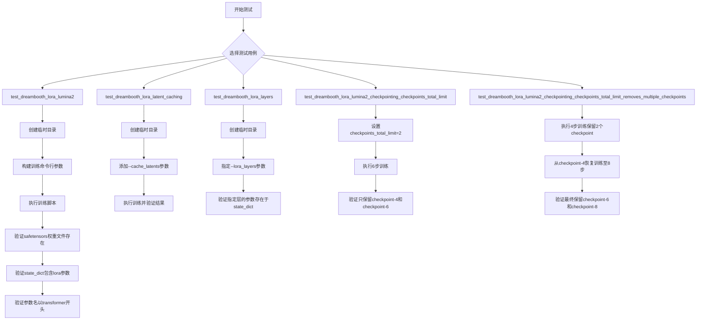

## 类结构

```
ExamplesTestsAccelerate (基类)
└── DreamBoothLoRAlumina2 (测试类)
```

## 全局变量及字段


### `logging`
    
Python标准日志模块

类型：`module`
    


### `os`
    
操作系统接口模块

类型：`module`
    


### `sys`
    
Python系统模块

类型：`module`
    


### `tempfile`
    
临时文件/目录模块

类型：`module`
    


### `safetensors`
    
安全张量存储模块

类型：`module`
    


### `logger`
    
日志记录器实例

类型：`logging.Logger`
    


### `stream_handler`
    
标准输出流处理器

类型：`logging.StreamHandler`
    


### `DreamBoothLoRAlumina2.instance_data_dir`
    
测试用实例图像目录路径

类型：`str`
    


### `DreamBoothLoRAlumina2.pretrained_model_name_or_path`
    
预训练模型名称或路径

类型：`str`
    


### `DreamBoothLoRAlumina2.script_path`
    
训练脚本路径

类型：`str`
    


### `DreamBoothLoRAlumina2.transformer_layer_type`
    
要训练的transformer层类型

类型：`str`
    
    

## 全局函数及方法


# DreamBoothLoRAlumina2 设计文档

## 一段话描述

DreamBoothLoRAlumina2 是一个基于 ExamplesTestsAccelerate 基类的测试框架类，专门用于验证 DreamBooth LoRA 训练脚本在 Lumina2 模型上的功能正确性，包括基础训练、latent 缓存、层指定、checkpoint 管理等多个场景的集成测试。

## 文件的整体运行流程

```
1. 导入依赖库（logging, os, sys, tempfile, safetensors）
2. 将父目录添加到系统路径
3. 从 test_examples_utils 导入基类 ExamplesTestsAccelerate 和 run_command 工具
4. 配置日志系统（DEBUG级别）
5. 定义 DreamBoothLoRAlumina2 测试类
   ├─ 设置类属性（模型路径、脚本路径等）
   └─ 实现5个测试方法，每个方法：
      ├─ 创建临时目录
      ├─ 构建训练命令行参数
      ├─ 执行训练命令
      └─ 验证输出结果（模型权重、checkpoint等）
```

## 类的详细信息

### 类字段

| 字段名称 | 类型 | 描述 |
|---------|------|------|
| instance_data_dir | str | 实例图像数据目录路径 |
| pretrained_model_name_or_path | str | 预训练模型名称或路径 |
| script_path | str | DreamBooth LoRA 训练脚本路径 |
| transformer_layer_type | str | 要训练的可学习的 transformer 层类型标识 |

### 类方法

#### 1. test_dreambooth_lora_lumina2

参数：无（除 self）

返回值：无（测试方法，void）

#### 流程图

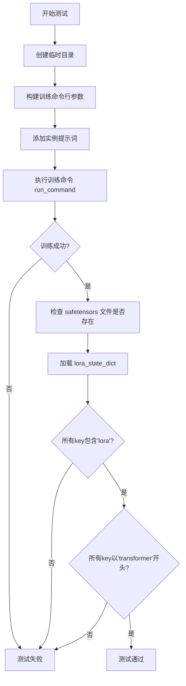

#### 带注释源码

```python
def test_dreambooth_lora_lumina2(self):
    """
    测试基本的 DreamBooth LoRA Lumina2 训练功能
    验证:
    1. 训练脚本能够正常运行完成
    2. 输出的 LoRA 权重文件存在
    3. state_dict 中的键名包含 'lora' 标识
    4. 所有参数名以 'transformer' 开头（未训练 text encoder）
    """
    with tempfile.TemporaryDirectory() as tmpdir:
        # 构建训练命令行参数列表
        test_args = f"""
            {self.script_path}
            --pretrained_model_name_or_path {self.pretrained_model_name_or_path}
            --instance_data_dir {self.instance_data_dir}
            --resolution 32
            --train_batch_size 1
            --gradient_accumulation_steps 1
            --max_train_steps 2
            --learning_rate 5.0e-04
            --scale_lr
            --lr_scheduler constant
            --lr_warmup_steps 0
            --output_dir {tmpdir}
            --max_sequence_length 16
            """.split()

        # 添加实例提示词（空字符串）
        test_args.extend(["--instance_prompt", ""])
        
        # 执行训练命令（使用 accelerate 启动）
        run_command(self._launch_args + test_args)
        
        # 验证输出：LoRA 权重文件存在
        self.assertTrue(os.path.isfile(os.path.join(tmpdir, "pytorch_lora_weights.safetensors")))

        # 加载 safetensors 格式的 LoRA 权重
        lora_state_dict = safetensors.torch.load_file(os.path.join(tmpdir, "pytorch_lora_weights.safetensors"))
        
        # 验证：所有键名包含 'lora' 标识
        is_lora = all("lora" in k for k in lora_state_dict.keys())
        self.assertTrue(is_lora)

        # 验证：未训练 text encoder 时，所有参数以 'transformer' 开头
        starts_with_transformer = all(key.startswith("transformer") for key in lora_state_dict.keys())
        self.assertTrue(starts_with_transformer)
```

---

#### 2. test_dreambooth_lora_latent_caching

参数：无

返回值：无

#### 流程图

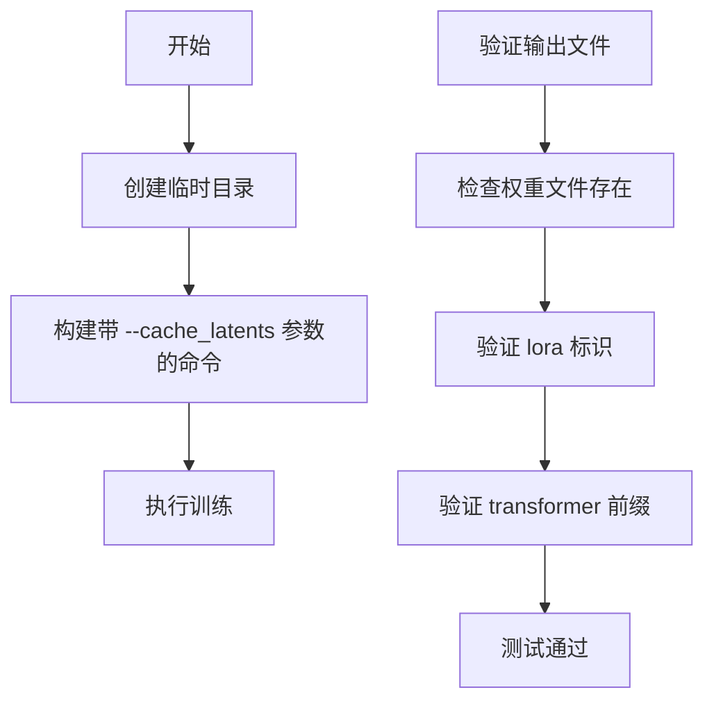

#### 带注释源码

```python
def test_dreambooth_lora_latent_caching(self):
    """
    测试带 latent 缓存功能的 DreamBooth LoRA 训练
    --cache_latents 参数会在每个训练步骤前预先计算并缓存 latents，
    以节省显存或提高训练速度
    """
    with tempfile.TemporaryDirectory() as tmpdir:
        test_args = f"""
            {self.script_path}
            --pretrained_model_name_or_path {self.pretrained_model_name_or_path}
            --instance_data_dir {self.instance_data_dir}
            --resolution 32
            --train_batch_size 1
            --gradient_accumulation_steps 1
            --max_train_steps 2
            --cache_latents  # 关键差异：启用 latent 缓存
            --learning_rate 5.0e-04
            --scale_lr
            --lr_scheduler constant
            --lr_warmup_steps 0
            --output_dir {tmpdir}
            --max_sequence_length 16
            """.split()

        test_args.extend(["--instance_prompt", ""])
        run_command(self._launch_args + test_args)
        
        # 验证输出文件存在
        self.assertTrue(os.path.isfile(os.path.join(tmpdir, "pytorch_lora_weights.safetensors")))

        # 验证 state_dict 命名规范
        lora_state_dict = safetensors.torch.load_file(os.path.join(tmpdir, "pytorch_lora_weights.safetensors"))
        is_lora = all("lora" in k for k in lora_state_dict.keys())
        self.assertTrue(is_lora)

        starts_with_transformer = all(key.startswith("transformer") for key in lora_state_dict.keys())
        self.assertTrue(starts_with_transformer)
```

---

#### 3. test_dreambooth_lora_layers

参数：无

返回值：无

#### 流程图

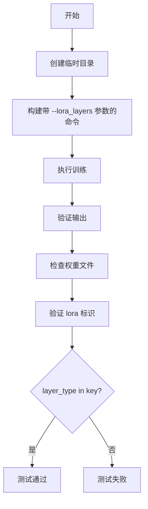

#### 带注释源码

```python
def test_dreambooth_lora_layers(self):
    """
    测试指定层的 LoRA 训练功能
    通过 --lora_layers 参数指定只训练特定的 transformer 层，
    减少可训练参数数量
    """
    with tempfile.TemporaryDirectory() as tmpdir:
        test_args = f"""
            {self.script_path}
            --pretrained_model_name_or_path {self.pretrained_model_name_or_path}
            --instance_data_dir {self.instance_data_dir}
            --resolution 32
            --train_batch_size 1
            --gradient_accumulation_steps 1
            --max_train_steps 2
            --cache_latents
            --learning_rate 5.0e-04
            --scale_lr
            --lora_layers {self.transformer_layer_type}  # 关键：指定训练层
            --lr_scheduler constant
            --lr_warmup_steps 0
            --output_dir {tmpdir}
            --max_sequence_length 16
            """.split()

        test_args.extend(["--instance_prompt", ""])
        run_command(self._launch_args + test_args)
        
        # 验证输出文件
        self.assertTrue(os.path.isfile(os.path.join(tmpdir, "pytorch_lora_weights.safetensors")))

        # 验证只包含指定层的参数
        lora_state_dict = safetensors.torch.load_file(os.path.join(tmpdir, "pytorch_lora_weights.safetensors"))
        is_lora = all("lora" in k for k in lora_state_dict.keys())
        self.assertTrue(is_lora)

        # 验证所有 key 都包含指定的 layer type
        starts_with_transformer = all(self.transformer_layer_type in key for key in lora_state_dict)
        self.assertTrue(starts_with_transformer)
```

---

#### 4. test_dreambooth_lora_lumina2_checkpointing_checkpoints_total_limit

参数：无

返回值：无

#### 流程图

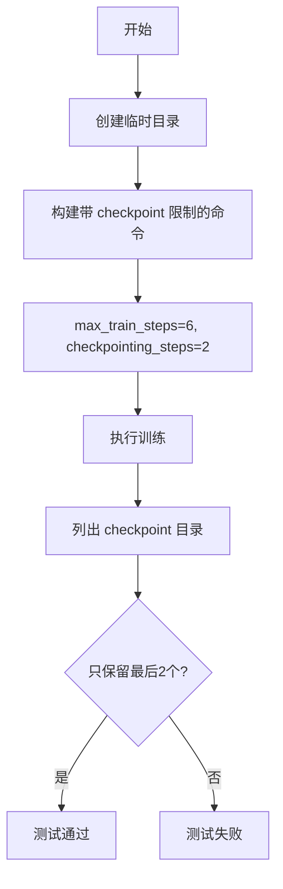

#### 带注释源码

```python
def test_dreambooth_lora_lumina2_checkpointing_checkpoints_total_limit(self):
    """
    测试 checkpoint 数量限制功能
    --checkpoints_total_limit=2 表示最多保留 2 个 checkpoint
    --checkpointing_steps=2 表示每 2 步保存一个 checkpoint
    期望：训练 6 步后保留 checkpoint-4 和 checkpoint-6
    """
    with tempfile.TemporaryDirectory() as tmpdir:
        test_args = f"""
            {self.script_path}
            --pretrained_model_name_or_path={self.pretrained_model_name_or_path}
            --instance_data_dir={self.instance_data_dir}
            --output_dir={tmpdir}
            --resolution=32
            --train_batch_size=1
            --gradient_accumulation_steps=1
            --max_train_steps=6
            --checkpoints_total_limit=2  # 关键：限制 checkpoint 数量
            --checkpointing_steps=2      # 每 2 步保存
            --max_sequence_length 16
            """.split()

        test_args.extend(["--instance_prompt", ""])
        run_command(self._launch_args + test_args)

        # 验证：只保留最新的 2 个 checkpoint
        self.assertEqual(
            {x for x in os.listdir(tmpdir) if "checkpoint" in x},
            {"checkpoint-4", "checkpoint-6"},  # 期望：4 和 6，2 和 4 被删除
        )
```

---

#### 5. test_dreambooth_lora_lumina2_checkpointing_checkpoints_total_limit_removes_multiple_checkpoints

参数：无

返回值：无

#### 流程图

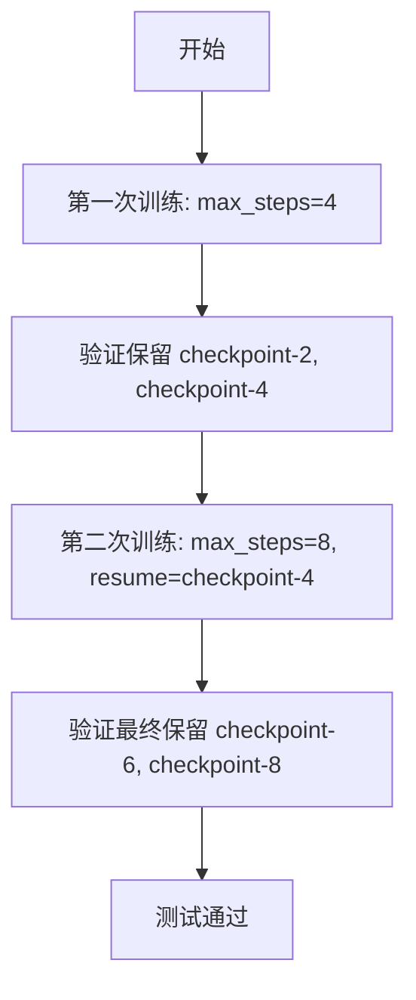

#### 带注释源码

```python
def test_dreambooth_lora_lumina2_checkpointing_checkpoints_total_limit_removes_multiple_checkpoints(self):
    """
    测试 checkpoint 恢复训练时的数量限制
    场景：
    1. 首次训练 4 步，保存 checkpoint-2, checkpoint-4
    2. 从 checkpoint-4 恢复训练到 8 步
    3. 验证旧 checkpoint 被正确删除，只保留最新的 2 个
    """
    with tempfile.TemporaryDirectory() as tmpdir:
        # 第一次训练
        test_args = f"""
            {self.script_path}
            --pretrained_model_name_or_path={self.pretrained_model_name_or_path}
            --instance_data_dir={self.instance_data_dir}
            --output_dir={tmpdir}
            --resolution=32
            --train_batch_size=1
            --gradient_accumulation_steps=1
            --max_train_steps=4
            --checkpointing_steps=2
            --max_sequence_length 166
            """.split()

        test_args.extend(["--instance_prompt", ""])
        run_command(self._launch_args + test_args)

        # 第一次验证：应该有 checkpoint-2 和 checkpoint-4
        self.assertEqual({x for x in os.listdir(tmpdir) if "checkpoint" in x}, {"checkpoint-2", "checkpoint-4"})

        # 第二次训练：从 checkpoint-4 恢复
        resume_run_args = f"""
            {self.script_path}
            --pretrained_model_name_or_path={self.pretrained_model_name_or_path}
            --instance_data_dir={self.instance_data_dir}
            --output_dir={tmpdir}
            --resolution=32
            --train_batch_size=1
            --gradient_accumulation_steps=1
            --max_train_steps=8
            --checkpointing_steps=2
            --resume_from_checkpoint=checkpoint-4  # 关键：从 checkpoint-4 恢复
            --checkpoints_total_limit=2              # 限制保留 2 个
            --max_sequence_length 16
            """.split()

        resume_run_args.extend(["--instance_prompt", ""])
        run_command(self._launch_args + resume_run_args)

        # 第二次验证：旧 checkpoint 被删除，只保留最新的 2 个
        self.assertEqual({x for x in os.listdir(tmpdir) if "checkpoint" in x}, {"checkpoint-6", "checkpoint-8"})
```

---

## 全局变量和全局函数信息

### 导入的全局函数

| 名称 | 来源 | 描述 |
|------|------|------|
| ExamplesTestsAccelerate | test_examples_utils | 测试基类，提供测试框架支持和 accelerate 启动参数 |
| run_command | test_examples_utils | 执行命令行命令的工具函数 |

### 模块级全局变量

| 名称 | 类型 | 描述 |
|------|------|------|
| logger | logging.Logger | 模块级日志记录器 |
| stream_handler | logging.StreamHandler | 输出到 stdout 的日志处理器 |

---

## 关键组件信息

| 组件名称 | 描述 |
|---------|------|
| ExamplesTestsAccelerate | 基类，提供测试环境搭建、命令行参数构建、assertion 工具等 |
| run_command | 命令执行工具，负责在子进程中运行训练脚本 |
| safetensors | 高效的 PyTorch 模型序列化库，用于加载/保存模型权重 |
| tempfile.TemporaryDirectory | 自动清理的临时目录，用于存放训练输出 |
| accelerate | HuggingFace 的分布式训练启动器，通过 _launch_args 配置 |

---

## 潜在的技术债务或优化空间

1. **测试参数硬编码**：所有超参数（learning_rate, max_train_steps 等）都硬编码在测试方法中，缺乏灵活性

2. **重复代码模式**：5个测试方法中有大量重复的验证逻辑（检查文件存在、验证 state_dict），可抽取为辅助方法

3. **断言信息不足**：使用 `assertTrue` 而没有自定义错误信息，测试失败时难以快速定位问题

4. **缺少异步训练验证**：所有测试都是同步等待训练完成，没有测试超时机制或并行执行

5. **magic number**：如 `166` 的 max_sequence_length 缺乏解释

6. **错误处理缺失**：没有处理训练命令执行失败的情况

---

## 其它项目

### 设计目标与约束

- **目标**：验证 DreamBooth LoRA 训练脚本在 Lumina2 模型上的功能正确性
- **约束**：使用 tiny 模型（hf-internal-testing/tiny-lumina2-pipe）进行快速测试
- **训练步数**：所有测试限制在 2-8 步，确保测试执行时间可控

### 错误处理与异常设计

- 依赖 unittest 框架的标准断言机制
- 训练命令失败会抛出异常导致测试失败
- 文件不存在使用 `assertTrue(os.path.isfile(...))` 验证

### 数据流与状态机

```
输入数据流：
  instance_data_dir (图像) + prompt → 训练脚本 → LoRA权重 → safetensors文件

状态验证流：
  加载 safetensors → 检查 key 命名规范 → 验证参数前缀
```

### 外部依赖与接口契约

| 依赖 | 版本要求 | 用途 |
|------|---------|------|
| safetensors | 最新 | 模型权重序列化 |
| accelerate | 兼容 | 分布式训练启动 |
| torch | 兼容 | 张量操作 |
| test_examples_utils | 本地 | 测试基础设施 |


### `run_command`

执行命令行训练脚本的函数，用于在测试中运行 Dreambooth LoRA 训练命令。

参数：

-  `cmd`：列表（List[str]），命令行参数列表，包含要执行的脚本及其参数

返回值：`无`（根据代码中的调用方式推断，该函数直接执行命令，不返回具体值）

#### 流程图

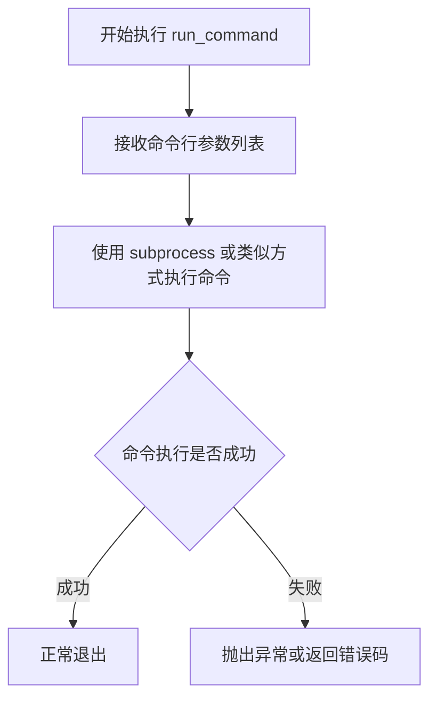

#### 带注释源码

```python
# 注意：此函数从 test_examples_utils 模块导入，源码未在此文件中提供
# 以下是其在当前文件中的典型调用方式：

# 示例调用 1：基本训练测试
run_command(self._launch_args + test_args)

# 示例调用 2：带检查点限制的训练测试
run_command(self._launch_args + test_args)

# 示例调用 3：恢复检查点训练
run_command(self._launch_args + resume_run_args)

# 参数说明：
# - self._launch_args: 启动参数，通常包含加速相关配置
# - test_args: 测试参数列表，通过字符串 .split() 转换为列表
#   包含脚本路径、模型路径、数据目录、各种训练超参数等
```

---

**注意**：由于 `run_command` 函数是从外部模块 `test_examples_utils` 导入的，其完整实现源码未包含在当前代码文件中。以上信息基于代码中的调用方式进行推断。


### `DreamBoothLoRAlumina2.test_dreambooth_lora_lumina2`

该方法是 `DreamBoothLoRAlumina2` 测试类中的核心测试方法，用于验证 DreamBooth LoRA 训练功能在 Lumina2 模型上的基本运行能力。测试通过构建命令行参数执行训练脚本，然后验证输出的 LoRA 权重文件是否存在、命名规范是否正确（包含 "lora" 标识符且以 "transformer" 开头）。

参数：

- `self`：隐式参数，`DreamBoothLoRAlumina2` 类的实例对象

返回值：`None`，该方法为测试方法，通过 `assert` 语句进行断言验证，不返回具体数值

#### 流程图

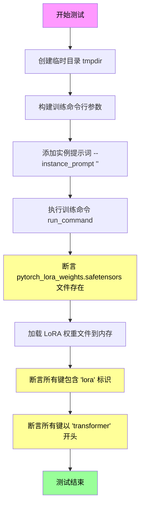

#### 带注释源码

```python
def test_dreambooth_lora_lumina2(self):
    """
    测试 DreamBooth LoRA 训练功能的基础执行流程
    - 执行完整的 LoRA 训练流程
    - 验证输出权重文件的正确性
    - 验证 LoRA 参数命名规范
    """
    # 创建临时目录用于存放训练输出
    with tempfile.TemporaryDirectory() as tmpdir:
        # ============ 步骤1: 构建训练命令行参数 ============
        # 使用类属性配置模型路径、数据目录、训练超参数
        test_args = f"""
            {self.script_path}                                    # 训练脚本路径
            --pretrained_model_name_or_path {self.pretrained_model_name_or_path}  # 预训练模型
            --instance_data_dir {self.instance_data_dir}          # 实例数据目录
            --resolution 32                                       # 图像分辨率
            --train_batch_size 1                                  # 训练批次大小
            --gradient_accumulation_steps 1                       # 梯度累积步数
            --max_train_steps 2                                   # 最大训练步数
            --learning_rate 5.0e-04                               # 学习率
            --scale_lr                                            # 是否缩放学习率
            --lr_scheduler constant                                # 学习率调度器
            --lr_warmup_steps 0                                   # 预热步数
            --output_dir {tmpdir}                                 # 输出目录
            --max_sequence_length 16                              # 最大序列长度
            """.split()

        # ============ 步骤2: 添加实例提示词 ============
        # 空字符串表示使用无描述的实例提示
        test_args.extend(["--instance_prompt", ""])

        # ============ 步骤3: 执行训练命令 ============
        # 使用 accelerate 框架运行分布式训练脚本
        run_command(self._launch_args + test_args)

        # ============ 步骤4: 验证输出文件存在性 ============
        # smoke test: 确保训练脚本成功运行并输出权重文件
        self.assertTrue(
            os.path.isfile(os.path.join(tmpdir, "pytorch_lora_weights.safetensors"))
        )

        # ============ 步骤5: 验证 LoRA 参数命名 - 标识符检查 ============
        # 加载 safetensors 格式的 LoRA 权重文件
        lora_state_dict = safetensors.torch.load_file(
            os.path.join(tmpdir, "pytorch_lora_weights.safetensors")
        )
        # 验证所有参数键都包含 'lora' 标识符
        is_lora = all("lora" in k for k in lora_state_dict.keys())
        self.assertTrue(is_lora)

        # ============ 步骤6: 验证 LoRA 参数命名 - 前缀检查 ============
        # 当不训练 text encoder 时，所有参数应以 'transformer' 开头
        starts_with_transformer = all(
            key.startswith("transformer") for key in lora_state_dict.keys()
        )
        self.assertTrue(starts_with_transformer)
```


### `DreamBoothLoRAlumina2.test_dreambooth_lora_latent_caching`

该方法是DreamBoothLoRAlumina2类中的一个测试用例，用于验证DreamBooth LoRA训练流程中latent缓存功能是否正常工作。测试通过运行训练脚本并检查生成的LoRA权重文件来确认缓存机制的正确性。

参数：
- 该方法无显式参数，通过`self`访问类属性

返回值：`None`，该方法为测试用例，执行一系列断言验证，不返回任何值

#### 流程图

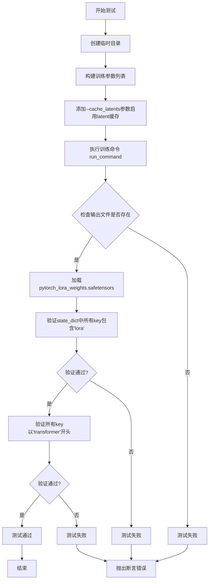

#### 带注释源码

```python
def test_dreambooth_lora_latent_caching(self):
    """
    测试DreamBooth LoRA训练中latent缓存功能的测试用例。
    该测试验证在使用--cache_latents参数时，训练流程能够正确
    生成LoRA权重文件，并且权重命名符合预期规范。
    """
    # 创建临时目录用于存放训练输出
    with tempfile.TemporaryDirectory() as tmpdir:
        # 构建训练脚本的命令行参数列表
        test_args = f"""
            {self.script_path}
            --pretrained_model_name_or_path {self.pretrained_model_name_or_path}
            --instance_data_dir {self.instance_data_dir}
            --resolution 32
            --train_batch_size 1
            --gradient_accumulation_steps 1
            --max_train_steps 2
            --cache_latents  # 关键参数：启用latent缓存功能
            --learning_rate 5.0e-04
            --scale_lr
            --lr_scheduler constant
            --lr_warmup_steps 0
            --output_dir {tmpdir}
            --max_sequence_length 16
            """.split()

        # 添加instance_prompt参数（空字符串）
        test_args.extend(["--instance_prompt", ""])
        
        # 执行训练命令：合并launch_args和测试参数后运行
        run_command(self._launch_args + test_args)
        
        # 验证输出：检查LoRA权重文件是否成功生成
        # save_pretrained smoke test
        self.assertTrue(os.path.isfile(os.path.join(tmpdir, "pytorch_lora_weights.safetensors")))

        # 加载生成的LoRA权重文件
        lora_state_dict = safetensors.torch.load_file(os.path.join(tmpdir, "pytorch_lora_weights.safetensors"))
        
        # 验证：确保state_dict中所有key都包含'lora'字符串
        # 这是确认LoRA参数正确命名的关键检查
        is_lora = all("lora" in k for k in lora_state_dict.keys())
        self.assertTrue(is_lora)

        # 验证：当不训练text encoder时，所有参数名应以'transformer'开头
        # 这确保了LoRA权重被正确应用于transformer模型
        starts_with_transformer = all(key.startswith("transformer") for key in lora_state_dict.keys())
        self.assertTrue(starts_with_transformer)
```


### DreamBoothLoRAlumina2.test_dreambooth_lora_layers

该方法是 DreamBoothLoRAlumina2 测试类中的一个测试用例，用于验证 DreamBooth LoRA 训练脚本在选择性层训练模式下的功能正确性。具体来说，该测试通过指定 `--lora_layers` 参数来仅训练指定的 `transformer` 层（如 `layers.0.attn.to_k`），并验证最终保存的 LoRA 权重文件中只包含指定层的参数，确保选择性层训练功能正常工作。

参数：

- `self`：隐式参数，类型为 `DreamBoothLoRAlumina2`（测试类实例），表示测试方法所属的类实例

返回值：`None`，该方法为测试方法，不返回任何值，通过 `assertTrue` 断言来验证测试结果

#### 流程图

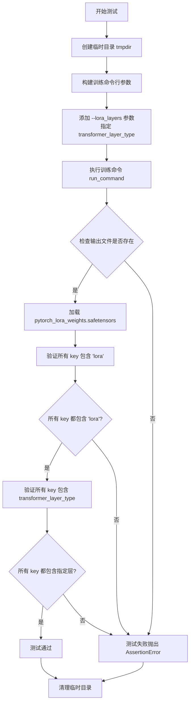

#### 带注释源码

```python
def test_dreambooth_lora_layers(self):
    """
    测试 DreamBooth LoRA 选择性层训练功能
    
    该测试验证当指定 --lora_layers 参数时，训练过程仅对指定的
    transformer 层进行 LoRA 训练，并确保保存的权重文件只包含
    指定层的 LoRA 参数。
    """
    # 创建临时目录用于存放训练输出
    with tempfile.TemporaryDirectory() as tmpdir:
        # 构建训练脚本的命令行参数
        test_args = f"""
            {self.script_path}
            --pretrained_model_name_or_path {self.pretrained_model_name_or_path}
            --instance_data_dir {self.instance_data_dir}
            --resolution 32
            --train_batch_size 1
            --gradient_accumulation_steps 1
            --max_train_steps 2
            --cache_latents
            --learning_rate 5.0e-04
            --scale_lr
            --lora_layers {self.transformer_layer_type}
            --lr_scheduler constant
            --lr_warmup_steps 0
            --output_dir {tmpdir}
            --max_sequence_length 16
            """.split()

        # 添加实例提示词（空字符串）
        test_args.extend(["--instance_prompt", ""])
        
        # 执行训练命令（使用 accelerate 启动）
        run_command(self._launch_args + test_args)
        
        # ==== 验证阶段 ====
        
        # 验证1: 检查 LoRA 权重文件是否成功生成
        # save_pretrained smoke test
        self.assertTrue(os.path.isfile(os.path.join(tmpdir, "pytorch_lora_weights.safetensors")))

        # 验证2: 确保 state_dict 中的所有参数都包含 'lora' 关键字
        # 即确认这些是 LoRA 参数而非原始模型参数
        lora_state_dict = safetensors.torch.load_file(os.path.join(tmpdir, "pytorch_lora_weights.safetensors"))
        is_lora = all("lora" in k for k in lora_state_dict.keys())
        self.assertTrue(is_lora)

        # 验证3: 确认所有保存的参数都属于指定的 transformer 层
        # when not training the text encoder, all the parameters in the state dict should start
        # with `"transformer"` in their names. In this test, we only params of
        # `self.transformer_layer_type` should be in the state dict.
        starts_with_transformer = all(self.transformer_layer_type in key for key in lora_state_dict)
        self.assertTrue(starts_with_transformer)
```

#### 关键点说明

| 验证点 | 验证逻辑 | 预期结果 |
|--------|----------|----------|
| 文件存在性 | `os.path.isfile(...)` | `pytorch_lora_weights.safetensors` 文件存在 |
| LoRA 命名 | 所有 key 包含 `"lora"` | 确认是 LoRA 权重而非原始权重 |
| 选择性层 | 所有 key 包含 `transformer_layer_type` | 仅包含指定层的参数（如 `layers.0.attn.to_k`） |


### `DreamBoothLoRAlumina2.test_dreambooth_lora_lumina2_checkpointing_checkpoints_total_limit`

该测试方法用于验证 DreamBooth LoRA Lumina2 训练脚本的检查点总数限制功能。它创建一个临时目录作为输出目录，运行训练脚本并设置 `--checkpoints_total_limit=2` 和 `--checkpointing_steps=2` 参数，然后验证训练过程中只保留最后两个检查点（checkpoint-4 和 checkpoint-6），确保旧的检查点被正确删除。

参数：此方法无显式参数，但使用以下继承自父类的类属性：

- `self.script_path`：`str`，训练脚本路径
- `self.pretrained_model_name_or_path`：`str`，预训练模型名称或路径
- `self.instance_data_dir`：`str`，实例数据目录

返回值：`None`，该方法为测试方法，通过 `self.assertEqual` 断言验证检查点是否符合预期，无返回值。

#### 流程图

```mermaid
flowchart TD
    A[开始测试] --> B[创建临时输出目录 tmpdir]
    B --> C[构建训练命令行参数]
    C --> D[添加检查点总数限制: --checkpoints_total_limit=2]
    D --> E[添加检查点保存间隔: --checkpointing_steps=2]
    E --> F[设置最大训练步数: --max_train_steps=6]
    F --> G[执行训练命令 run_command]
    G --> H{训练完成]
    H --> I[验证保留的检查点]
    I --> J{检查点是否为 checkpoint-4 和 checkpoint-6}
    J -->|是| K[测试通过]
    J -->|否| L[测试失败]
```

#### 带注释源码

```python
def test_dreambooth_lora_lumina2_checkpointing_checkpoints_total_limit(self):
    """
    测试检查点总数限制功能。
    
    验证当设置 --checkpoints_total_limit=2 时，
    训练过程只保留最后两个检查点，旧的检查点会被自动删除。
    """
    # 创建一个临时目录用于存放训练输出和检查点
    with tempfile.TemporaryDirectory() as tmpdir:
        # 构建训练脚本的命令行参数
        # 包括模型路径、数据目录、分辨率、批大小、梯度累积步数等
        test_args = f"""
        {self.script_path}
        --pretrained_model_name_or_path={self.pretrained_model_name_or_path}
        --instance_data_dir={self.instance_data_dir}
        --output_dir={tmpdir}
        --resolution=32
        --train_batch_size=1
        --gradient_accumulation_steps=1
        --max_train_steps=6
        --checkpoints_total_limit=2       # 关键参数：限制最多保留2个检查点
        --checkpointing_steps=2           # 每2步保存一个检查点
        --max_sequence_length 16
        """.split()

        # 添加实例提示（此处为空）
        test_args.extend(["--instance_prompt", ""])
        
        # 执行训练命令，使用加速器启动参数
        run_command(self._launch_args + test_args)

        # 验证保留的检查点是否符合预期
        # 由于 max_train_steps=6, checkpointing_steps=2
        # 会生成 checkpoint-2, checkpoint-4, checkpoint-6 三个检查点
        # 但 checkpoints_total_limit=2，所以只保留最后两个
        self.assertEqual(
            {x for x in os.listdir(tmpdir) if "checkpoint" in x},
            {"checkpoint-4", "checkpoint-6"},
        )
```


### `DreamBoothLoRAlumina2.test_dreambooth_lora_lumina2_checkpointing_checkpoints_total_limit_removes_multiple_checkpoints`

该测试方法验证了DreamBooth LoRA Lumina2训练脚本的检查点删除机制，测试当设置`--checkpoints_total_limit`参数后，系统在恢复训练并生成新检查点时，能否正确删除多个旧的检查点，只保留指定数量的最新检查点。

参数：

- `self`：`DreamBoothLoRAlumina2` 类型，测试类实例本身，包含类属性如 `script_path`、`pretrained_model_name_or_path` 等

返回值：`None`，该方法为测试方法，通过 `assert` 断言验证检查点删除逻辑，不返回任何值

#### 流程图

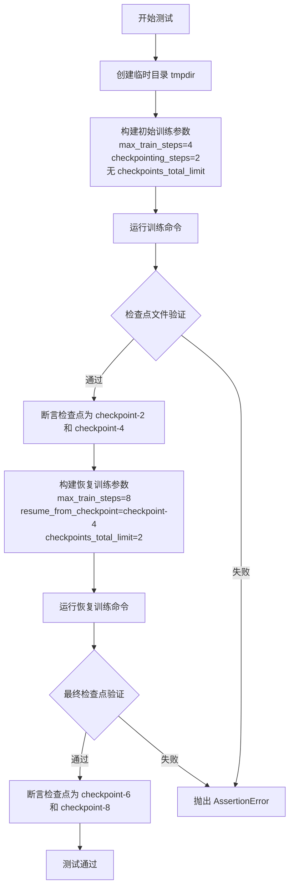

#### 带注释源码

```python
def test_dreambooth_lora_lumina2_checkpointing_checkpoints_total_limit_removes_multiple_checkpoints(self):
    """
    测试检查点删除机制：验证当设置 checkpoints_total_limit 后，
    在恢复训练场景下系统能正确删除多个旧检查点
    """
    # 使用临时目录作为输出目录，测试结束后自动清理
    with tempfile.TemporaryDirectory() as tmpdir:
        # ==================== 第一次训练运行 ====================
        # 构建初始训练参数：
        # - pretrained_model_name_or_path: 预训练模型路径
        # - instance_data_dir: 实例数据目录
        # - output_dir: 输出目录（临时目录）
        # - resolution: 图像分辨率 32
        # - train_batch_size: 训练批次大小 1
        # - gradient_accumulation_steps: 梯度累积步数 1
        # - max_train_steps: 最大训练步数 4
        # - checkpointing_steps: 每 2 步保存一次检查点
        # - max_sequence_length: 最大序列长度 166
        test_args = f"""
        {self.script_path}
        --pretrained_model_name_or_path={self.pretrained_model_name_or_path}
        --instance_data_dir={self.instance_data_dir}
        --output_dir={tmpdir}
        --resolution=32
        --train_batch_size=1
        --gradient_accumulation_steps=1
        --max_train_steps=4
        --checkpointing_steps=2
        --max_sequence_length 166
        """.split()

        # 添加实例提示词（空字符串）
        test_args.extend(["--instance_prompt", ""])
        
        # 执行训练命令
        run_command(self._launch_args + test_args)

        # ==================== 验证第一次运行结果 ====================
        # 预期生成检查点：checkpoint-2, checkpoint-4
        # 原因：每 2 步保存一次，训练 4 步，所以保存 checkpoint-2 和 checkpoint-4
        self.assertEqual(
            {x for x in os.listdir(tmpdir) if "checkpoint" in x}, 
            {"checkpoint-2", "checkpoint-4"}
        )

        # ==================== 恢复训练运行 ====================
        # 构建恢复训练参数：
        # - resume_from_checkpoint=checkpoint-4: 从第4步的检查点恢复
        # - max_train_steps=8: 继续训练到第8步
        # - checkpoints_total_limit=2: 最多保留2个检查点
        # 预期行为：
        # - 会保存 checkpoint-6 和 checkpoint-8
        # - 由于 checkpoint-4 已被使用，恢复后会创建新检查点
        # - 当超过限制时，应删除多个旧检查点
        resume_run_args = f"""
        {self.script_path}
        --pretrained_model_name_or_path={self.pretrained_model_name_or_path}
        --instance_data_dir={self.instance_data_dir}
        --output_dir={tmpdir}
        --resolution=32
        --train_batch_size=1
        --gradient_accumulation_steps=1
        --max_train_steps=8
        --checkpointing_steps=2
        --resume_from_checkpoint=checkpoint-4
        --checkpoints_total_limit=2
        --max_sequence_length 16
        """.split()

        # 添加实例提示词
        resume_run_args.extend(["--instance_prompt", ""])
        
        # 执行恢复训练命令
        run_command(self._launch_args + resume_run_args)

        # ==================== 验证最终结果 ====================
        # 验证最终只保留 checkpoint-6 和 checkpoint-8
        # 旧检查点 checkpoint-2 和 checkpoint-4 应被删除
        self.assertEqual(
            {x for x in os.listdir(tmpdir) if "checkpoint" in x}, 
            {"checkpoint-6", "checkpoint-8"}
        )
```

## 关键组件


### 一段话描述

该代码是一个自动化测试套件，用于验证DreamBooth LoRA训练流程的核心功能，包括基本LoRA训练、潜在空间缓存、层级特定训练以及检查点管理等功能，并通过safetensors格式验证LoRA权重的正确性和参数命名规范。

### 文件的整体运行流程

测试类继承自`ExamplesTestsAccelerate`，通过`run_command`执行训练脚本，并验证输出文件的存在性和内容正确性。测试流程包括：准备临时目录→构建命令行参数→执行训练命令→验证safetensors权重文件→检查state_dict中的LoRA参数命名和transformer前缀。

### 类的详细信息

#### DreamBoothLoRAlumina2

**类字段：**

- `instance_data_dir` (str): 实例图像数据目录路径
- `pretrained_model_name_or_path` (str): 预训练模型名称或路径
- `script_path` (str): DreamBooth LoRA训练脚本路径
- `transformer_layer_type` (str): 指定要训练的transformer层类型

**类方法：**

- `test_dreambooth_lora_lumina2()`: 验证基本DreamBooth LoRA训练流程
  - 参数：无
  - 返回值：无（通过assert断言验证）
  - 流程：执行训练→检查权重文件→验证LoRA命名→验证transformer前缀
  - ```python
    def test_dreambooth_lora_lumina2(self):
        with tempfile.TemporaryDirectory() as tmpdir:
            test_args = f"""
                {self.script_path}
                --pretrained_model_name_or_path {self.pretrained_model_name_or_path}
                --instance_data_dir {self.instance_data_dir}
                --resolution 32
                --train_batch_size 1
                --gradient_accumulation_steps 1
                --max_train_steps 2
                --learning_rate 5.0e-04
                --scale_lr
                --lr_scheduler constant
                --lr_warmup_steps 0
                --output_dir {tmpdir}
                --max_sequence_length 16
                """.split()
            test_args.extend(["--instance_prompt", ""])
            run_command(self._launch_args + test_args)
            self.assertTrue(os.path.isfile(os.path.join(tmpdir, "pytorch_lora_weights.safetensors")))
            lora_state_dict = safetensors.torch.load_file(os.path.join(tmpdir, "pytorch_lora_weights.safetensors"))
            is_lora = all("lora" in k for k in lora_state_dict.keys())
            self.assertTrue(is_lora)
            starts_with_transformer = all(key.startswith("transformer") for key in lora_state_dict.keys())
            self.assertTrue(starts_with_transformer)
    ```

- `test_dreambooth_lora_latent_caching()`: 验证潜在空间缓存功能
  - 参数：无
  - 返回值：无
  - 流程：带`--cache_latents`参数执行训练→验证权重文件
  - ```python
    def test_dreambooth_lora_latent_caching(self):
        with tempfile.TemporaryDirectory() as tmpdir:
            test_args = f"""
                {self.script_path}
                --pretrained_model_name_or_path {self.pretrained_model_name_or_path}
                --instance_data_dir {self.instance_data_dir}
                --resolution 32
                --train_batch_size 1
                --gradient_accumulation_steps 1
                --max_train_steps 2
                --cache_latents
                --learning_rate 5.0e-04
                --scale_lr
                --lr_scheduler constant
                --lr_warmup_steps 0
                --output_dir {tmpdir}
                --max_sequence_length 16
                """.split()
            test_args.extend(["--instance_prompt", ""])
            run_command(self._launch_args + test_args)
            self.assertTrue(os.path.isfile(os.path.join(tmpdir, "pytorch_lora_weights.safetensors")))
            lora_state_dict = safetensors.torch.load_file(os.path.join(tmpdir, "pytorch_lora_weights.safetensors"))
            is_lora = all("lora" in k for k in lora_state_dict.keys())
            self.assertTrue(is_lora)
            starts_with_transformer = all(key.startswith("transformer") for key in lora_state_dict.keys())
            self.assertTrue(starts_with_transformer)
    ```

- `test_dreambooth_lora_layers()`: 验证指定层级LoRA训练
  - 参数：无
  - 返回值：无
  - 流程：带`--lora_layers`参数执行训练→验证特定层参数
  - ```python
    def test_dreambooth_lora_layers(self):
        with tempfile.TemporaryDirectory() as tmpdir:
            test_args = f"""
                {self.script_path}
                --pretrained_model_name_or_path {self.pretrained_model_name_or_path}
                --instance_data_dir {self.instance_data_dir}
                --resolution 32
                --train_batch_size 1
                --gradient_accumulation_steps 1
                --max_train_steps 2
                --cache_latents
                --learning_rate 5.0e-04
                --scale_lr
                --lora_layers {self.transformer_layer_type}
                --lr_scheduler constant
                --lr_warmup_steps 0
                --output_dir {tmpdir}
                --max_sequence_length 16
                """.split()
            test_args.extend(["--instance_prompt", ""])
            run_command(self._launch_args + test_args)
            self.assertTrue(os.path.isfile(os.path.join(tmpdir, "pytorch_lora_weights.safetensors")))
            lora_state_dict = safetensors.torch.load_file(os.path.join(tmpdir, "pytorch_lora_weights.safetensors"))
            is_lora = all("lora" in k for k in lora_state_dict.keys())
            self.assertTrue(is_lora)
            starts_with_transformer = all(self.transformer_layer_type in key for key in lora_state_dict)
            self.assertTrue(starts_with_transformer)
    ```

- `test_dreambooth_lora_lumina2_checkpointing_checkpoints_total_limit()`: 验证检查点总数限制
  - 参数：无
  - 返回值：无
  - 流程：训练6步（每2步保存）→限制最多2个检查点→验证保留的检查点
  - ```python
    def test_dreambooth_lora_lumina2_checkpointing_checkpoints_total_limit(self):
        with tempfile.TemporaryDirectory() as tmpdir:
            test_args = f"""
            {self.script_path}
            --pretrained_model_name_or_path={self.pretrained_model_name_or_path}
            --instance_data_dir={self.instance_data_dir}
            --output_dir={tmpdir}
            --resolution=32
            --train_batch_size=1
            --gradient_accumulation_steps=1
            --max_train_steps=6
            --checkpoints_total_limit=2
            --checkpointing_steps=2
            --max_sequence_length 16
            """.split()
            test_args.extend(["--instance_prompt", ""])
            run_command(self._launch_args + test_args)
            self.assertEqual(
                {x for x in os.listdir(tmpdir) if "checkpoint" in x},
                {"checkpoint-4", "checkpoint-6"},
            )
    ```

- `test_dreambooth_lora_lumina2_checkpointing_checkpoints_total_limit_removes_multiple_checkpoints()`: 验证检查点清理和恢复训练
  - 参数：无
  - 返回值：无
  - 流程：训练4步→恢复训练到8步→验证检查点更新
  - ```python
    def test_dreambooth_lora_lumina2_checkpointing_checkpoints_total_limit_removes_multiple_checkpoints(self):
        with tempfile.TemporaryDirectory() as tmpdir:
            test_args = f"""
            {self.script_path}
            --pretrained_model_name_or_path={self.pretrained_model_name_or_path}
            --instance_data_dir={self.instance_data_dir}
            --output_dir={tmpdir}
            --resolution=32
            --train_batch_size=1
            --gradient_accumulation_steps=1
            --max_train_steps=4
            --checkpointing_steps=2
            --max_sequence_length 166
            """.split()
            test_args.extend(["--instance_prompt", ""])
            run_command(self._launch_args + test_args)
            self.assertEqual({x for x in os.listdir(tmpdir) if "checkpoint" in x}, {"checkpoint-2", "checkpoint-4"})
            resume_run_args = f"""
            {self.script_path}
            --pretrained_model_name_or_path={self.pretrained_model_name_or_path}
            --instance_data_dir={self.instance_data_dir}
            --output_dir={tmpdir}
            --resolution=32
            --train_batch_size=1
            --gradient_accumulation_steps=1
            --max_train_steps=8
            --checkpointing_steps=2
            --resume_from_checkpoint=checkpoint-4
            --checkpoints_total_limit=2
            --max_sequence_length 16
            """.split()
            resume_run_args.extend(["--instance_prompt", ""])
            run_command(self._launch_args + resume_run_args)
            self.assertEqual({x for x in os.listdir(tmpdir) if "checkpoint" in x}, {"checkpoint-6", "checkpoint-8"})
    ```

### 关键组件信息

#### 1. DreamBooth LoRA训练测试框架
基于`ExamplesTestsAccelerate`的测试基类，实现自动化训练验证

#### 2. 参数化训练配置
支持resolution、train_batch_size、gradient_accumulation_steps、max_train_steps、learning_rate等核心超参数

#### 3. LoRA权重验证机制
使用safetensors库加载权重，通过检查"lora"关键字和"transformer"前缀验证模型结构

#### 4. 检查点管理验证
通过`checkpoints_total_limit`和`checkpointing_steps`参数测试检查点自动清理功能

#### 5. 潜在空间缓存功能
通过`--cache_latents`参数测试训练加速优化

### 潜在的技术债务或优化空间

1. **硬编码的测试参数**: resolution、learning_rate等参数硬编码在不同测试方法中，可考虑提取为类级常量或配置
2. **重复的验证逻辑**: LoRA权重验证和transformer前缀检查逻辑在多个测试中重复，可抽象为工具方法
3. **magic number**: 训练步数、batch size等数值缺乏注释说明
4. **错误处理缺失**: 测试中没有对训练失败的异常处理
5. **日志配置**: DEBUG级别日志可能产生过多输出，影响测试性能

### 其它项目

#### 设计目标与约束
- 使用tiny-lumina2-pipe模型进行快速测试
- 最小化训练步数（2步）以加快测试速度
- 通过smoke test验证核心功能而非完整训练

#### 错误处理与异常设计
- 依赖unittest的assert机制进行验证
- 未显式处理训练脚本执行失败的情况

#### 数据流与状态机
- 测试数据流：临时目录→训练脚本→权重文件→safetensors加载→state_dict验证
- 状态转换：初始化→训练执行→文件生成→断言验证

#### 外部依赖与接口契约
- 依赖`ExamplesTestsAccelerate`基类提供的`_launch_args`和`run_command`
- 依赖`safetensors`库进行模型权重加载
- 依赖`train_dreambooth_lora_lumina2.py`训练脚本
- 预期输出：pytorch_lora_weights.safetensors文件


## 问题及建议


### 已知问题

- **大量重复代码**：三个核心测试方法（`test_dreambooth_lora_lumina2`、`test_dreambooth_lora_latent_caching`、`test_dreambooth_lora_layers`）包含几乎相同的逻辑，命令行参数构建、文件验证、状态字典检查等代码重复出现。
- **硬编码配置值**：训练参数（如 `--max_train_steps 2`、`--learning_rate 5.0e-04`、`--train_batch_size 1` 等）在多个测试中重复硬编码，缺乏统一的配置管理。
- **魔法字符串和数字**：关键路径和标识符如 `"pytorch_lora_weights.safetensors"`、`"transformer"`、`"lora"` 在多处重复出现，缺乏常量定义。
- **断言信息不足**：所有断言都缺乏自定义错误消息，当测试失败时难以快速定位问题。
- **缺少异常处理**：文件操作（如 `safetensors.torch.load_file`、目录创建）没有 try-except 保护，测试失败时可能导致资源泄漏。
- **测试粒度过粗**：每个测试方法覆盖多个验证点（smoke test、lora 命名、transformer 前缀），单一测试失败时无法快速定位具体问题。

### 优化建议

- **抽取公共辅助方法**：将重复的参数构建逻辑（`build_test_args`）、验证逻辑（`validate_lora_state_dict`）提取为类方法或测试 fixture。
- **使用 pytest 参数化**：将三个主要测试场景合并为一个参数化测试，减少代码冗余。
- **定义配置常量**：在类级别定义常量（如 `DEFAULT_OUTPUT_FILE`、`DEFAULT_MAX_STEPS`），提高可维护性。
- **添加详细断言消息**：为关键断言添加描述性消息，例如 `self.assertTrue(is_lora, "State dict keys should contain 'lora'")`。
- **增强错误处理**：对文件读写操作添加异常捕获，提供更有意义的测试失败信息。
- **分离验证逻辑**：将不同维度的验证（文件存在性、lora 命名、transformer 前缀）拆分为独立的辅助方法或独立测试。

## 其它


### 设计目标与约束

本测试类的设计目标是验证DreamBooth LoRA训练脚本在Lumina2模型上的功能正确性。核心约束包括：1) 使用tiny-lumina2-pipe作为预训练模型以降低测试资源消耗；2) 限制max_train_steps为2-8步以加快测试速度；3) resolution设置为32x32以减少图像处理开销；4) 测试必须在临时目录中运行以保证环境隔离。

### 错误处理与异常设计

测试类依赖run_command函数执行外部训练脚本，通过assertTrue和assertEqual进行结果验证。文件操作使用tempfile.TemporaryDirectory()确保自动清理。关键检查点包括：1) 输出目录必须存在pytorch_lora_weights.safetensors文件；2) LoRA权重键名必须包含"lora"字符串；3) 非文本编码器训练时权重必须以"transformer"开头；4) checkpoint数量必须符合checkpoints_total_limit限制。

### 数据流与状态机

测试数据流遵循以下状态转换：初始状态(测试开始) → 参数准备状态(构建test_args) → 命令执行状态(run_command调用) → 验证状态(断言检查) → 清理状态(tempfile自动回收)。每个测试方法独立运行，使用独立的临时目录，避免状态污染。

### 外部依赖与接口契约

主要外部依赖包括：1) test_examples_utils模块提供ExamplesTestsAccelerate基类和run_command工具函数；2) safetensors库用于加载和验证LoRA权重文件；3) HuggingFace Accelerate框架支持分布式训练测试。接口契约规定训练脚本必须接受指定的命令行参数并生成符合命名规范的safetensors权重文件。

### 性能考虑

测试采用最小化配置以提升执行效率：使用tiny模型替代完整模型、限制训练步数、降低分辨率、启用梯度累积模拟大批次。这些措施确保CI/CD管道中的快速反馈循环。

### 安全考虑

测试脚本不涉及敏感数据处理，使用公开的hf-internal-testing测试模型。临时目录操作使用Python tempfile模块确保安全隔离，测试完成后自动清理文件系统资源。

    