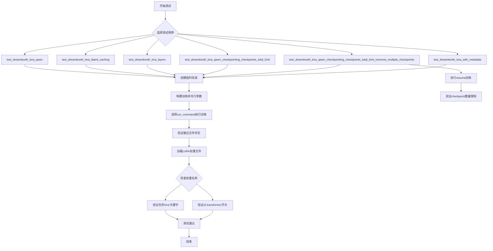
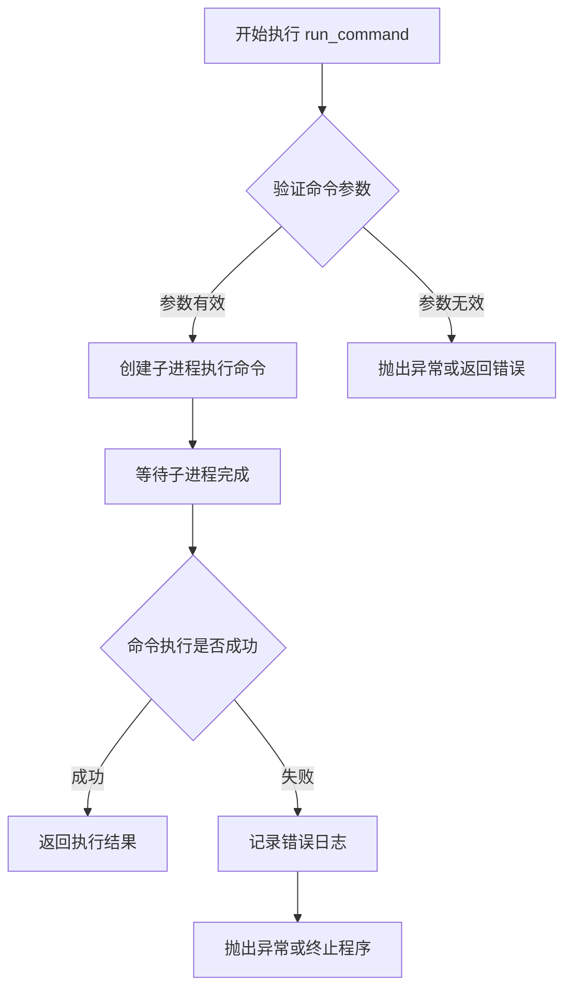
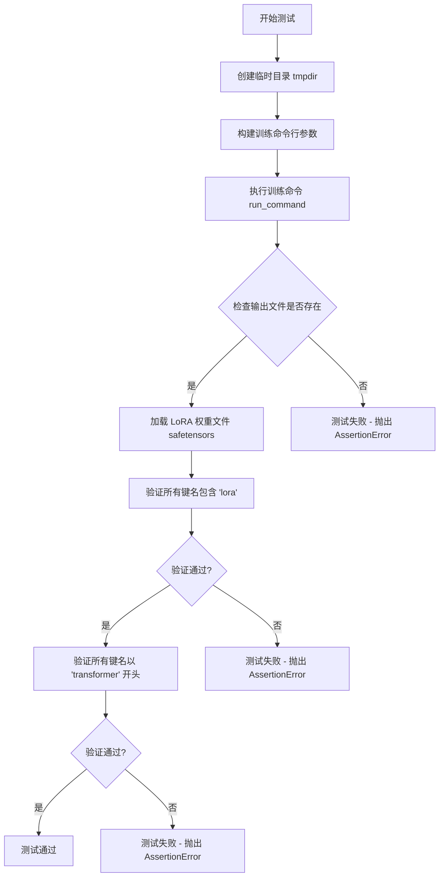
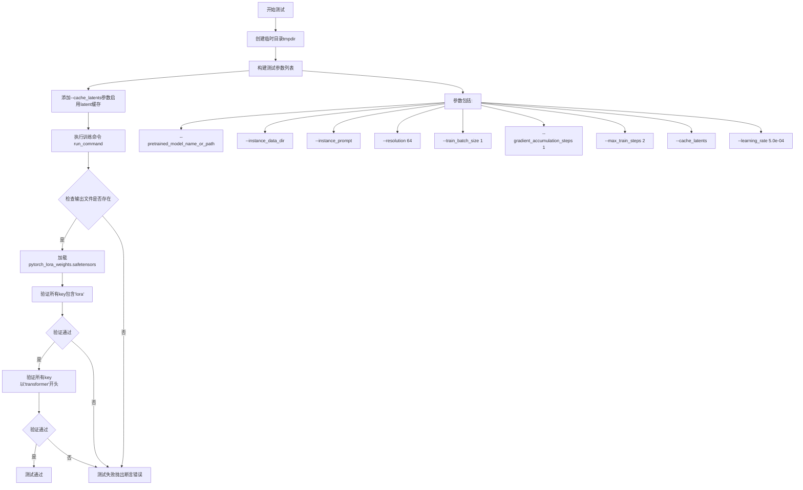
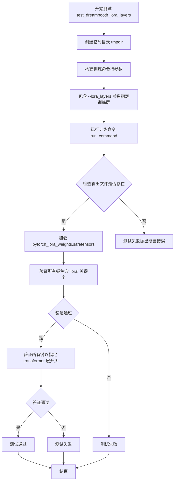
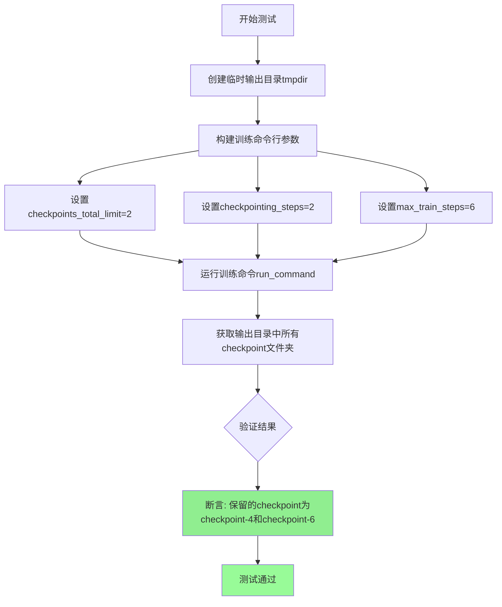
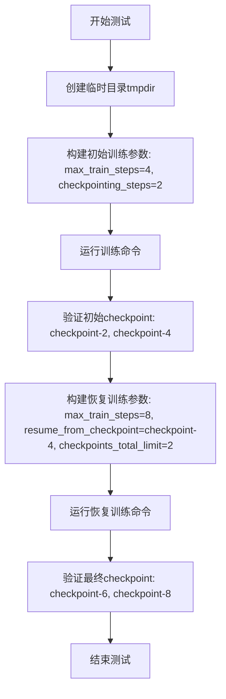
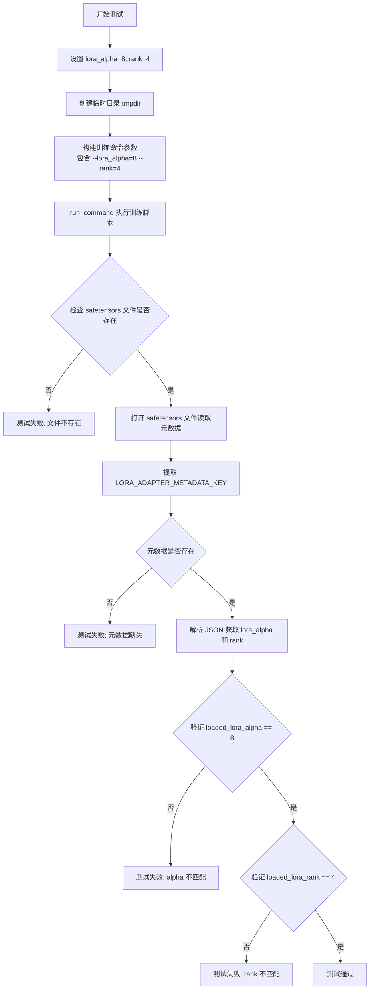

```mermaid
flowchart TD
    A[开始] --> B[导入 ExamplesTestsAccelerate]
    B --> C[DreamBoothLoRAQwenImage 继承 ExamplesTestsAccelerate]
    C --> D[调用父类构造函数]
    D --> E[初始化 _launch_args 属性]
    E --> F[设置实例属性]
    F --> G[instance_data_dir: 实例数据目录]
    F --> H[instance_prompt: 实例提示词]
    F --> I[pretrained_model_name_or_path: 预训练模型路径]
    F --> J[script_path: 训练脚本路径]
    F --> K[transformer_layer_type: Transformer层类型]
    G --> L[测试用例使用这些属性运行训练命令]
    H --> L
    I --> L
    J --> L
    K --> L
    L --> M[结束]
```

# `diffusers\examples\dreambooth\test_dreambooth_lora_qwenimage.py` 详细设计文档

这是一个DreamBooth LoRA训练测试文件，专门用于测试Qwen图像模型的LoRA微调流程，包括基础训练、latent缓存、层选择、checkpoint管理和元数据保存等功能。

## 整体流程



## 类结构

```
ExamplesTestsAccelerate (基类)
└── DreamBoothLoRAQwenImage (测试类)
```

## 全局变量及字段


### `logger`
    
全局日志记录器，用于输出调试和信息日志

类型：`logging.Logger`
    


### `stream_handler`
    
日志输出流处理器，将日志输出到标准输出stdout

类型：`logging.StreamHandler`
    


### `LORA_ADAPTER_METADATA_KEY`
    
LoRA适配器元数据键名常量，用于标识LoRA适配器元数据的存储键

类型：`str`
    


### `DreamBoothLoRAQwenImage.instance_data_dir`
    
实例数据目录路径，指定训练图像的存储位置

类型：`str`
    


### `DreamBoothLoRAQwenImage.instance_prompt`
    
实例提示词，用于描述训练图像的文本提示

类型：`str`
    


### `DreamBoothLoRAQwenImage.pretrained_model_name_or_path`
    
预训练模型路径，指定要加载的预训练扩散模型

类型：`str`
    


### `DreamBoothLoRAQwenImage.script_path`
    
训练脚本路径，指向DreamBooth LoRA训练脚本

类型：`str`
    


### `DreamBoothLoRAQwenImage.transformer_layer_type`
    
transformer层类型，指定要应用LoRA的transformer层路径

类型：`str`
    
    

## 全局函数及方法


### `run_command`

执行命令行工具的全局函数，用于通过子进程运行指定的命令（通常是训练脚本），并等待命令执行完成。

参数：

-  `cmd`：列表（List[str]），由命令行参数组成的列表，通常包含要执行的脚本路径及其参数

返回值：`无`（None），该函数通过子进程执行命令，不返回任何值

#### 流程图



#### 带注释源码

```
# 由于 run_command 是从外部模块 test_examples_utils 导入的，
# 当前代码文件中没有提供其完整实现。以下为基于使用方式的推断：

def run_command(cmd):
    """
    执行命令行工具的函数
    
    参数:
        cmd: 命令列表，如 ['python', 'script.py', '--arg1', 'value1']
        
    返回值:
        无直接返回值，通过子进程执行命令
    """
    # 导入位置
    # from test_examples_utils import run_command
    
    # 调用示例（来自当前代码文件）:
    # run_command(self._launch_args + test_args)
    # 其中:
    #   - self._launch_args: 包含加速器启动参数（如分布式训练配置）
    #   - test_args: 包含测试脚本路径和训练参数
    
    # 典型的调用形式:
    # run_command(['accelerate', 'launch', '--num_processes', '2', 
    #              'examples/dreambooth/train_dreambooth_lora_qwen_image.py',
    #              '--pretrained_model_name_or_path', 'hf-internal-testing/tiny-qwenimage-pipe',
    #              '--instance_data_dir', 'docs/source/en/imgs',
    #              ...])
    
    pass  # 实际实现位于 test_examples_utils 模块中
```

> **注意**：由于 `run_command` 函数是从外部模块 `test_examples_utils` 导入的，当前提供的代码文件中仅包含其使用示例，未包含该函数的完整实现源代码。该函数通常使用 `subprocess` 模块或类似的机制来执行命令行工具。


### `ExamplesTestsAccelerate.__init__`

描述：从 `test_examples_utils` 模块导入的测试基类，用于提供运行带有 `accelerate` 的示例脚本的测试基础设施。该基类构造函数初始化测试环境所需的配置参数，包括实例数据路径、预训练模型、脚本路径等，并设置分布式训练所需的 `_launch_args`。

参数：

-  `self`：隐式参数，类型为 `ExamplesTestsAccelerate` 实例本身，表示当前测试类实例
-  （继承自父类的构造函数参数，需从 `test_examples_utils` 模块获取具体定义）

返回值：`None`，构造函数不返回任何值，仅初始化实例属性

#### 流程图



#### 带注释源码

```python
# 从 test_examples_utils 模块导入的基类
# ExamplesTestsAccelerate 构造函数（在 test_examples_utils 模块中定义）
# 以下是基于该类在 DreamBoothLoRAQwenImage 中的使用方式推断的结构：

class ExamplesTestsAccelerate:
    """
    测试基类，提供运行带有 accelerate 的示例脚本的测试基础设施。
    """
    
    # 类属性定义
    instance_data_dir = "docs/source/en/imgs"       # 实例数据目录路径
    instance_prompt = "photo"                        # 实例提示词
    pretrained_model_name_or_path = "hf-internal-testing/tiny-qwenimage-pipe"  # 预训练模型名称或路径
    script_path = "examples/dreambooth/train_dreambooth_lora_qwen_image.py"     # 训练脚本路径
    transformer_layer_type = "transformer_blocks.0.attn.to_k"  # Transformer层类型
    
    def __init__(self):
        """
        构造函数：初始化测试环境配置
        """
        # 初始化 accelerate 分布式训练所需的启动参数
        # _launch_args 用于传递给 run_command 函数以启动分布式训练
        self._launch_args = [...]  # accelerate 启动参数，可能包含 num_processes 等
```

> **注意**：由于 `ExamplesTestsAccelerate` 类的完整源代码未在当前文件中提供，以上内容是基于该类在 `DreamBoothLoRAQwenImage` 测试类中的使用方式推断得出的。要获取准确的构造函数定义，需要查看 `test_examples_utils` 模块的源代码。


### `DreamBoothLoRAQwenImage.test_dreambooth_lora_qwen`

该方法是一个集成测试用例，用于验证基于 QwenImage 模型的基础 DreamBooth LoRA 训练流程是否正常工作，包括模型训练、权重保存、LoRA 参数命名规范以及模型特定前缀的验证。

参数：

- `self`：类实例本身，包含测试所需的类属性（如 `instance_data_dir`、`instance_prompt`、`pretrained_model_name_or_path`、`script_path` 等）

返回值：`None`，该方法为测试用例，通过断言验证训练流程的正确性，不返回任何值。

#### 流程图



#### 带注释源码

```python
def test_dreambooth_lora_qwen(self):
    """
    测试基础 DreamBooth LoRA 训练流程
    验证训练脚本能否正常执行并生成符合预期的 LoRA 权重文件
    """
    # 使用临时目录存储训练输出，避免污染文件系统
    with tempfile.TemporaryDirectory() as tmpdir:
        # 构建训练脚本的命令行参数
        # 包括：预训练模型路径、实例数据目录、实例提示词、分辨率、批次大小等
        test_args = f"""
            {self.script_path}
            --pretrained_model_name_or_path {self.pretrained_model_name_or_path}
            --instance_data_dir {self.instance_data_dir}
            --instance_prompt {self.instance_prompt}
            --resolution 64
            --train_batch_size 1
            --gradient_accumulation_steps 1
            --max_train_steps 2
            --learning_rate 5.0e-04
            --scale_lr
            --lr_scheduler constant
            --lr_warmup_steps 0
            --output_dir {tmpdir}
            """.split()

        # 执行训练命令，使用 accelerate 启动器
        run_command(self._launch_args + test_args)
        
        # ==== 验证阶段 1: 检查输出文件存在性 ====
        # 验证 LoRA 权重文件是否成功生成
        self.assertTrue(os.path.isfile(os.path.join(tmpdir, "pytorch_lora_weights.safetensors")))

        # ==== 验证阶段 2: 检查 LoRA 参数命名规范 ====
        # 加载生成的 safetensors 格式的 LoRA 权重
        lora_state_dict = safetensors.torch.load_file(os.path.join(tmpdir, "pytorch_lora_weights.safetensors"))
        # 验证所有参数键名都包含 'lora' 字符串，确保是 LoRA 权重
        is_lora = all("lora" in k for k in lora_state_dict.keys())
        self.assertTrue(is_lora)

        # ==== 验证阶段 3: 检查模型特定参数前缀 ====
        # 当不训练 text encoder 时，所有参数应使用 'transformer' 前缀
        # 这是 QwenImage 模型特定的命名规范
        starts_with_transformer = all(key.startswith("transformer") for key in lora_state_dict.keys())
        self.assertTrue(starts_with_transformer)
```


### DreamBoothLoRAQwenImage.test_dreambooth_lora_latent_caching

该方法用于测试DreamBooth LoRA训练中的latent缓存功能，验证在使用`--cache_latents`参数时训练流程能否正确执行，并检查生成的LoRA权重文件是否符合预期的命名规范。

参数：

- `self`：隐式参数，DreamBoothLoRAQwenImage实例，包含以下测试配置属性：
  - `instance_data_dir`：`str`，实例图像数据目录，值为"docs/source/en/imgs"
  - `instance_prompt`：`str`，实例提示词，值为"photo"
  - `pretrained_model_name_or_path`：`str`，预训练模型路径，值为"hf-internal-testing/tiny-qwenimage-pipe"
  - `script_path`：`str`，训练脚本路径，值为"examples/dreambooth/train_dreambooth_lora_qwen_image.py"

返回值：`None`，该方法为测试方法，通过断言验证功能，不返回任何值

#### 流程图



#### 带注释源码

```python
def test_dreambooth_lora_latent_caching(self):
    """
    测试DreamBooth LoRA训练中的latent缓存功能。
    
    该测试验证在使用--cache_latents参数时，训练流程能够正确执行，
    并检查生成的LoRA权重文件是否符合预期的命名规范。
    """
    # 创建临时目录用于存放训练输出
    with tempfile.TemporaryDirectory() as tmpdir:
        # 构建测试参数列表
        # 这些参数配置了DreamBooth LoRA训练的各项设置
        test_args = f"""
            {self.script_path}
            --pretrained_model_name_or_path {self.pretrained_model_name_or_path}
            --instance_data_dir {self.instance_data_dir}
            --instance_prompt {self.instance_prompt}
            --resolution 64
            --train_batch_size 1
            --gradient_accumulation_steps 1
            --max_train_steps 2
            --cache_latents              # 关键参数：启用latent缓存功能
            --learning_rate 5.0e-04
            --scale_lr
            --lr_scheduler constant
            --lr_warmup_steps 0
            --output_dir {tmpdir}
            """.split()

        # 执行训练命令
        # _launch_args包含accelerate启动所需的参数（如num_processes等）
        run_command(self._launch_args + test_args)
        
        # 断言1：验证输出文件是否生成
        # save_pretrained smoke test
        self.assertTrue(os.path.isfile(os.path.join(tmpdir, "pytorch_lora_weights.safetensors")))

        # 加载生成的LoRA权重文件
        lora_state_dict = safetensors.torch.load_file(os.path.join(tmpdir, "pytorch_lora_weights.safetensors"))
        
        # 断言2：验证state_dict中所有key都包含'lora'字符串
        # 确保权重确实是为LoRA训练生成的
        is_lora = all("lora" in k for k in lora_state_dict.keys())
        self.assertTrue(is_lora)

        # 断言3：验证所有参数名以'transformer'开头
        # 当不训练text encoder时，所有参数应该来自transformer模型
        starts_with_transformer = all(key.startswith("transformer") for key in lora_state_dict.keys())
        self.assertTrue(starts_with_transformer)
```


### `DreamBoothLoRAQwenImage.test_dreambooth_lora_layers`

该方法用于测试 DreamBooth LoRA 训练过程中指定训练层（`lora_layers` 参数）的功能，验证只对指定的 transformer 层（如 `transformer_blocks.0.attn.to_k`）进行 LoRA 训练，并检查生成的权重文件是否符合预期。

参数：

- `self`：类的实例本身，包含以下属性：
  - `self.script_path`：训练脚本路径 (`str`)
  - `self.pretrained_model_name_or_path`：预训练模型名称或路径 (`str`)
  - `self.instance_data_dir`：实例数据目录 (`str`)
  - `self.instance_prompt`：实例提示词 (`str`)
  - `self.transformer_layer_type`：要训练的 transformer 层类型 (`str`)，如 `"transformer_blocks.0.attn.to_k"`

返回值：`None`，该方法通过 `assert` 断言进行测试验证，无显式返回值。

#### 流程图



#### 带注释源码

```python
def test_dreambooth_lora_layers(self):
    """
    测试 DreamBooth LoRA 训练中指定层的功能
    验证只对指定的 transformer 层进行 LoRA 训练
    """
    # 创建临时目录用于存放训练输出
    with tempfile.TemporaryDirectory() as tmpdir:
        # 构建训练脚本的命令行参数列表
        # 关键参数：--lora_layers 指定要训练的层
        test_args = f"""
            {self.script_path}
            --pretrained_model_name_or_path {self.pretrained_model_name_or_path}
            --instance_data_dir {self.instance_data_dir}
            --instance_prompt {self.instance_prompt}
            --resolution 64
            --train_batch_size 1
            --gradient_accumulation_steps 1
            --max_train_steps 2
            --cache_latents
            --learning_rate 5.0e-04
            --scale_lr
            --lora_layers {self.transformer_layer_type}  # 指定要训练的 LoRA 层
            --lr_scheduler constant
            --lr_warmup_steps 0
            --output_dir {tmpdir}
            """.split()

        # 运行训练命令（使用 accelerate 启动）
        run_command(self._launch_args + test_args)
        
        # 断言1：验证输出文件存在（save_pretrained 冒烟测试）
        self.assertTrue(os.path.isfile(os.path.join(tmpdir, "pytorch_lora_weights.safetensors")))

        # 加载训练生成的 LoRA 权重文件
        lora_state_dict = safetensors.torch.load_file(os.path.join(tmpdir, "pytorch_lora_weights.safetensors"))
        
        # 断言2：验证所有键名都包含 'lora'，确保是 LoRA 权重
        is_lora = all("lora" in k for k in lora_state_dict.keys())
        self.assertTrue(is_lora)

        # 断言3：验证所有参数都以指定的 transformer 层名称开头
        # 在这个测试中，只有 transformer.transformer_blocks.0.attn.to_k 相关的参数应该在 state dict 中
        starts_with_transformer = all(
            key.startswith(f"transformer.{self.transformer_layer_type}") for key in lora_state_dict.keys()
        )
        self.assertTrue(starts_with_transformer)
```


### `DreamBoothLoRAQwenImage.test_dreambooth_lora_qwen_checkpointing_checkpoints_total_limit`

该测试方法用于验证DreamBooth LoRA QwenImage训练脚本的checkpoint总数限制功能。测试通过设置`checkpoints_total_limit=2`和`checkpointing_steps=2`，训练6步后，验证输出目录只保留最新的两个checkpoint（checkpoint-4和checkpoint-6），确保旧的checkpoint被正确删除。

参数：

- `self`：实例方法，隐含参数，类型为`DreamBoothLoRAQwenImage`，表示测试类实例本身

返回值：无返回值（测试方法，通过`self.assertEqual`断言验证结果）

#### 流程图



#### 带注释源码

```python
def test_dreambooth_lora_qwen_checkpointing_checkpoints_total_limit(self):
    """
    测试DreamBooth LoRA QwenImage训练脚本的checkpoint总数限制功能。
    验证当设置checkpoints_total_limit=2时，系统只保留最新的两个checkpoint。
    """
    # 创建临时目录用于存放训练输出
    with tempfile.TemporaryDirectory() as tmpdir:
        # 构建训练脚本的命令行参数
        test_args = f"""
            {self.script_path}                                          # 训练脚本路径
            --pretrained_model_name_or_path={self.pretrained_model_name_or_path}  # 预训练模型路径
            --instance_data_dir={self.instance_data_dir}               # 实例数据目录
            --output_dir={tmpdir}                                       # 输出目录
            --instance_prompt={self.instance_prompt}                   # 实例提示词
            --resolution=64                                            # 图像分辨率
            --train_batch_size=1                                        # 训练批次大小
            --gradient_accumulation_steps=1                            # 梯度累积步数
            --max_train_steps=6                                         # 最大训练步数（将生成checkpoint-2, checkpoint-4, checkpoint-6）
            --checkpoints_total_limit=2                                # 关键参数：限制最多保留2个checkpoint
            --checkpointing_steps=2                                    # 每2步保存一个checkpoint
            """.split()

        # 执行训练命令（包含加速相关参数）
        run_command(self._launch_args + test_args)

        # 验证输出目录中的checkpoint
        # 预期结果：由于checkpoints_total_limit=2且训练6步（生成3个checkpoint）
        # 应该只保留checkpoint-4和checkpoint-6，checkpoint-2应被删除
        self.assertEqual(
            {x for x in os.listdir(tmpdir) if "checkpoint" in x},       # 列出输出目录中所有包含'checkpoint'的文件夹
            {"checkpoint-4", "checkpoint-6"},                           # 断言：只保留最后两个checkpoint
        )
```


### `DreamBoothLoRAQwenImage.test_dreambooth_lora_qwen_checkpointing_checkpoints_total_limit_removes_multiple_checkpoints`

该测试函数用于验证DreamBooth LoRA训练过程中，当设置`checkpoints_total_limit`参数后，从检查点恢复训练时能够正确删除多个旧checkpoint，只保留指定数量的最新checkpoint。

参数：

- `self`：实例方法隐式参数，属于`DreamBoothLoRAQwenImage`类

返回值：无返回值（测试函数，依赖assert断言验证结果）

#### 流程图



#### 带注释源码

```python
def test_dreambooth_lora_qwen_checkpointing_checkpoints_total_limit_removes_multiple_checkpoints(self):
    """
    测试从检查点恢复训练时，checkpoints_total_limit参数能够正确删除多个旧checkpoint。
    场景：初始训练生成checkpoint-2和checkpoint-4，然后从checkpoint-4恢复训练到checkpoint-8，
    由于设置了checkpoints_total_limit=2，最终只保留checkpoint-6和checkpoint-8。
    """
    # 创建临时目录用于存放训练输出
    with tempfile.TemporaryDirectory() as tmpdir:
        # 第一阶段：初始训练（4步，每2步保存一个checkpoint）
        # 预期生成 checkpoint-2 和 checkpoint-4
        test_args = f"""
        {self.script_path}
        --pretrained_model_name_or_path={self.pretrained_model_name_or_path}
        --instance_data_dir={self.instance_data_dir}
        --output_dir={tmpdir}
        --instance_prompt={self.instance_prompt}
        --resolution=64
        --train_batch_size=1
        --gradient_accumulation_steps=1
        --max_train_steps=4}
        --checkpointing_steps=2
        """.split()

        # 执行训练命令
        run_command(self._launch_args + test_args)

        # 断言：验证初始生成的checkpoint
        # 应该包含 checkpoint-2 和 checkpoint-4
        self.assertEqual({x for x in os.listdir(tmpdir) if "checkpoint" in x}, {"checkpoint-2", "checkpoint-4"})

        # 第二阶段：从checkpoint-4恢复训练（继续训练到8步）
        # 设置 checkpoints_total_limit=2，限制最多保留2个checkpoint
        resume_run_args = f"""
        {self.script_path}
        --pretrained_model_name_or_path={self.pretrained_model_name_or_path}
        --instance_data_dir={self.instance_data_dir}
        --output_dir={tmpdir}
        --instance_prompt={self.instance_prompt}
        --resolution=64
        --train_batch_size=1
        --gradient_accumulation_steps=1
        --max_train_steps=8}
        --checkpointing_steps=2
        --resume_from_checkpoint=checkpoint-4
        --checkpoints_total_limit=2
        """.split()

        # 执行恢复训练命令
        run_command(self._launch_args + resume_run_args)

        # 断言：验证旧checkpoint被删除，只保留最新的2个
        # 由于 checkpoints_total_limit=2 且从 checkpoint-4 继续训练到 8
        # 新的checkpoint为 checkpoint-6 和 checkpoint-8
        # 旧的 checkpoint-2 和 checkpoint-4 应当被删除
        self.assertEqual({x for x in os.listdir(tmpdir) if "checkpoint" in x}, {"checkpoint-6", "checkpoint-8"})
```


### `DreamBoothLoRAQwenImage.test_dreambooth_lora_with_metadata`

测试 LoRA 元数据（lora_alpha 和 rank）的保存与加载功能，验证训练后生成的 safetensors 文件中是否正确包含了 LoRA 适配器的元数据信息。

参数：

- `self`：`DreamBoothLoRAQwenImage`，测试类实例本身

返回值：`None`，无返回值（测试方法，通过断言验证）

#### 流程图



#### 带注释源码

```python
def test_dreambooth_lora_with_metadata(self):
    # 设置 LoRA 参数：lora_alpha 与 rank 不同，用于验证元数据保存
    # lora_alpha: LoRA 缩放因子
    # rank: LoRA 矩阵的秩（维度）
    lora_alpha = 8
    rank = 4
    
    # 创建临时目录用于存放训练输出
    with tempfile.TemporaryDirectory() as tmpdir:
        # 构建训练命令参数列表
        # 包含模型路径、数据路径、分辨率、训练超参数等
        test_args = f"""
            {self.script_path}
            --pretrained_model_name_or_path {self.pretrained_model_name_or_path}
            --instance_data_dir {self.instance_data_dir}
            --instance_prompt {self.instance_prompt}
            --resolution 64
            --train_batch_size 1
            --gradient_accumulation_steps 1
            --max_train_steps 2
            --lora_alpha={lora_alpha}    # 传入 LoRA alpha 参数
            --rank={rank}                # 传入 LoRA rank 参数
            --learning_rate 5.0e-04
            --scale_lr
            --lr_scheduler constant
            --lr_warmup_steps 0
            --output_dir {tmpdir}
            """.split()

        # 执行训练命令
        run_command(self._launch_args + test_args)
        
        # 验证 safetensors 权重文件是否生成
        state_dict_file = os.path.join(tmpdir, "pytorch_lora_weights.safetensors")
        self.assertTrue(os.path.isfile(state_dict_file))

        # 使用 safetensors 库读取文件元数据
        with safetensors.torch.safe_open(state_dict_file, framework="pt", device="cpu") as f:
            # 获取元数据字典，若无元数据则为空字典
            metadata = f.metadata() or {}

        # 移除 format 字段（标准元数据字段，非业务相关）
        metadata.pop("format", None)
        
        # 获取 LoRA 适配器专用的元数据键
        raw = metadata.get(LORA_ADAPTER_METADATA_KEY)
        
        # 如果存在原始 JSON 数据，则解析为字典
        if raw:
            raw = json.loads(raw)

        # 提取并验证 transformer.lora_alpha 值
        loaded_lora_alpha = raw["transformer.lora_alpha"]
        self.assertTrue(loaded_lora_alpha == lora_alpha)
        
        # 提取并验证 transformer.r (rank) 值
        loaded_lora_rank = raw["transformer.r"]
        self.assertTrue(loaded_lora_rank == rank)
```

## 关键组件


### DreamBoothLoRAQwenImage 测试类

主测试类，负责DreamBooth LoRA Qwen图像训练流程的集成测试，继承自ExamplesTestsAccelerate基类。

### test_dreambooth_lora_qwen 方法

基本DreamBooth LoRA训练测试，验证LoRA权重文件的生成、命名规范以及transformer前缀的正确性。

### test_dreambooth_lora_latent_caching 方法

潜在空间缓存测试，验证启用cache_latents参数时的训练流程和权重保存功能。

### test_dreambooth_lora_layers 方法

LoRA层选择性训练测试，通过lora_layers参数指定仅训练transformer_blocks.0.attn.to_k层，验证部分参数训练的可行性。

### 检查点管理机制

test_dreambooth_lora_qwen_checkpointing_checkpoints_total_limit和test_dreambooth_lora_qwen_checkpointing_checkpoints_total_limit_removes_multiple_checkpoints方法实现了检查点总数限制功能，支持checkpointing_steps和checkpoints_total_limit参数，自动清理旧检查点。

### LoRA元数据序列化

test_dreambooth_lora_with_metadata方法验证LoRA适配器元数据的序列化和反序列化功能，通过safetensors格式存储lora_alpha和rank等关键参数。

### 张量状态字典验证

通过safetensors.torch.load_file加载权重，使用键名包含"lora"和以"transformer"开头的方式验证LoRA参数命名规范。

### 临时目录管理

使用tempfile.TemporaryDirectory()创建临时输出目录，确保测试环境的隔离性和资源清理。


## 问题及建议


### 已知问题

- **代码重复**：多个测试方法（`test_dreambooth_lora_qwen`、`test_dreambooth_lora_latent_caching`、`test_dreambooth_lora_layers`）包含大量重复的命令构建逻辑、文件检查和断言代码，可抽取为私有辅助方法。
- **硬编码配置值**：训练参数（如`resolution=64`、`train_batch_size=1`、`max_train_steps=2`、`learning_rate=5.0e-04`）在多个测试中重复硬编码，缺乏统一的常量定义或测试配置类。
- **魔法字符串**：`"transformer"`前缀检查逻辑在多处出现，应提取为类常量`TRANSFORMER_KEY_PREFIX`以提高可维护性。
- **断言消息缺失**：多数断言（如`self.assertTrue(is_lora)`）未提供自定义错误消息，测试失败时难以快速定位问题。
- **无参数化测试**：功能相似的测试未使用参数化框架（如`pytest.mark.parametrize`），导致测试代码冗长。
- **外部依赖风险**：测试依赖外部模型`hf-internal-testing/tiny-qwenimage-pipe`，网络不可用或模型变更会导致测试失败。
- **输入验证不足**：未验证`instance_data_dir`路径是否存在、`script_path`文件是否可访问等前置条件。

### 优化建议

- 将通用的测试执行逻辑抽取为`_run_training_and_validate`方法，接收差异化参数（如是否启用`cache_latents`、是否指定`lora_layers`等）。
- 创建测试类级别的配置字典或`@pytest.fixture`定义共享的训练参数默认值。
- 定义类常量`TRANSFORMER_PREFIX = "transformer"`用于键名验证逻辑。
- 为所有断言添加描述性错误消息，如`self.assertTrue(is_lora, "State dict keys should contain 'lora'")`。
- 考虑使用`pytest`参数化或`unittest.subTest`重构重复测试场景。
- 添加模型下载失败的降级处理或使用本地虚拟模型进行单元测试。
- 在测试开始前增加必要的前置条件检查，使用有意义的错误消息。

## 其它


### 设计目标与约束

本测试类旨在验证DreamBooth LoRA Qwen图像训练流程的正确性，确保LoRA权重生成、模型保存、checkpoint管理和元数据序列化等功能正常工作。约束条件包括：使用tiny-qwenimage-pipe作为预训练模型、训练batch_size为1、图像分辨率为64、max_train_steps为2等最小化配置，以实现快速测试。

### 错误处理与异常设计

测试采用unittest框架的assert方法进行错误检测。主要验证点包括：(1)输出文件存在性检查，使用os.path.isfile验证pytorch_lora_weights.safetensors生成；(2)LoRA参数命名规范性检查，验证state_dict中所有key包含"lora"字符串；(3)模型参数前缀检查，验证transformer相关参数命名；(4)checkpoint数量和名称验证，使用集合比较确保checkpoint-4和checkpoint-6存在；(5)元数据完整性检查，通过safetensors.safe_open读取metadata并验证lora_alpha和rank值。

### 数据流与状态机

测试数据流如下：1)准备阶段：创建临时目录tmpdir，构造命令行参数test_args；2)执行阶段：调用run_command执行训练脚本，生成LoRA权重文件；3)验证阶段：加载生成的safetensors文件，解析state_dict进行各项断言验证。状态转换路径：初始化→训练执行→权重保存→状态验证→清理。

### 外部依赖与接口契约

主要外部依赖包括：(1)diffusers.loaders.lora_base.LORA_ADAPTER_METADATA_KEY：LoRA适配器元数据键；(2)safetensors：用于加载和保存模型权重及元数据；(3)test_examples_utils.ExamplesTestsAccelerate：测试基类，提供run_command和_launch_args；(4)tempfile：临时目录管理。接口契约要求训练脚本输出pytorch_lora_weights.safetensors文件，且state_dict包含正确的LoRA参数命名和transformer前缀。

### 性能考虑与基准

由于使用tiny-qwenimage-pipe和最小化配置（max_train_steps=2），测试设计为快速smoke test。性能基准：单个测试执行时间应控制在30秒以内。测试覆盖梯度累积、latent缓存、lora_layers过滤、checkpoint限制等性能相关特性的正确性。

### 安全性考虑

测试代码本身不涉及敏感数据处理，主要关注：(1)临时目录使用tempfile.TemporaryDirectory自动清理；(2)模型文件路径验证使用os.path.isfile防止路径遍历；(3)命令行参数构造使用.split()避免注入风险。

### 配置管理

测试参数通过类属性集中配置：instance_data_dir、instance_prompt、pretrained_model_name_or_path、script_path、transformer_layer_type。这种设计便于统一修改和扩展。训练参数（resolution、train_batch_size、learning_rate等）在各测试方法中动态构造，实现参数化测试。

### 测试策略

采用多测试方法覆盖不同场景：(1)基础功能测试：test_dreambooth_lora_qwen验证核心训练流程；(2)特性测试：test_dreambooth_lora_latent_caching测试latent缓存；(3)层次过滤测试：test_dreambooth_lora_layers测试lora_layers参数；(4)checkpoint管理测试：test_dreambooth_lora_qwen_checkpointing_checkpoints_total_limit和test_dreambooth_lora_qwen_checkpointing_checkpoints_total_limit_removes_multiple_checkpoints验证checkpoint数量限制和恢复功能；(5)元数据测试：test_dreambooth_lora_with_metadata验证LoRA元数据序列化。

### 部署相关

本测试类为开发测试代码，不涉及生产部署。部署时需确保目标环境安装diffusers、safetensors、accelerate等依赖包，并配置适当的GPU资源。训练脚本路径examples/dreambooth/train_dreambooth_lora_qwen_image.py需存在于正确位置。

### 版本兼容性

代码依赖项版本要求：Python 3.x、safetensors（支持metadata和safe_open）、diffusers（提供LORA_ADAPTER_METADATA_KEY）、accelerate（通过ExamplesTestsAccelerate）。测试针对Qwen图像模型架构设计，需确保pretrained_model_name_or_path指定的模型可用。

    