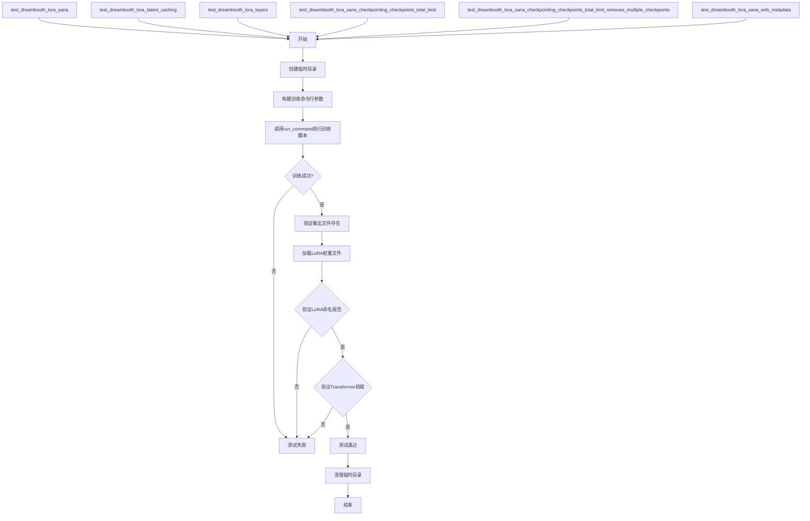
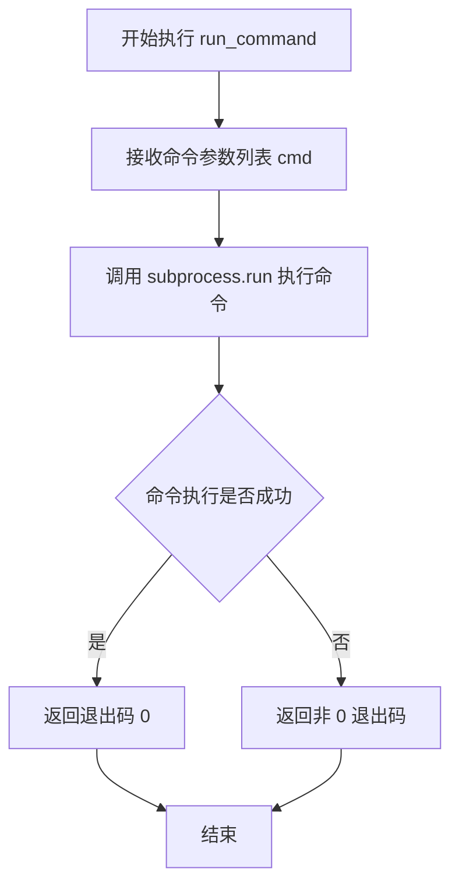
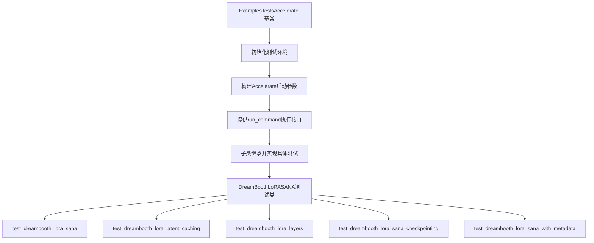
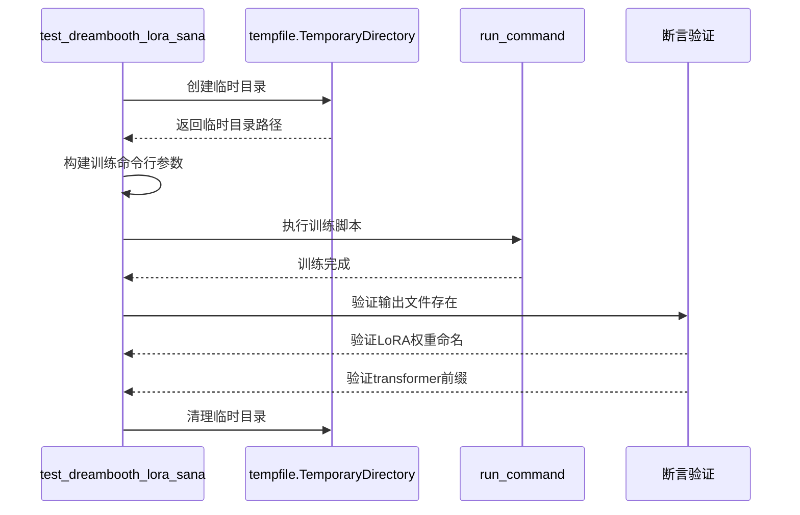
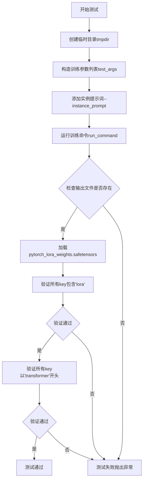
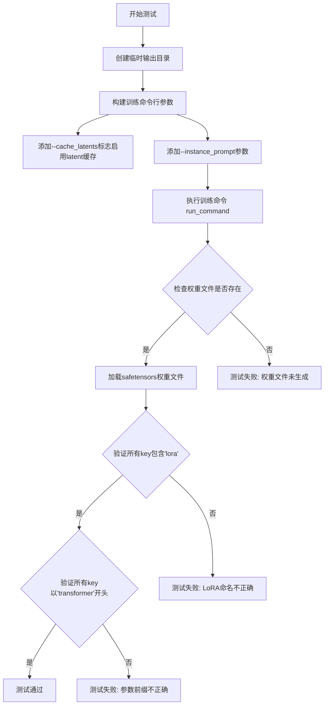
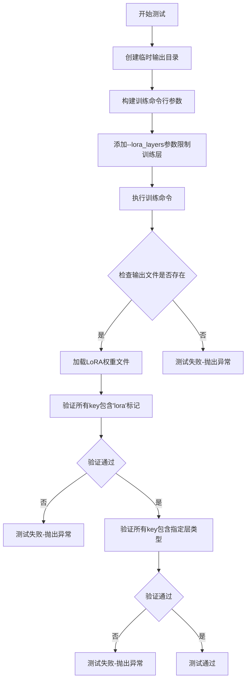
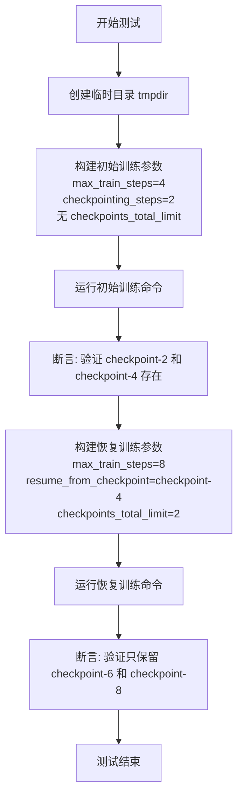
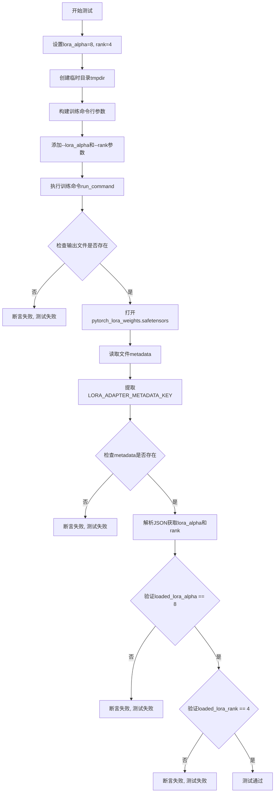

# `diffusers\examples\dreambooth\test_dreambooth_lora_sana.py` 详细设计文档

这是一个DreamBooth LoRA SANA模型的集成测试文件，用于验证基于HuggingFace diffusers库的训练脚本在SANA模型上的功能正确性，包括基础训练、latent缓存、层配置、checkpoint管理和LoRA元数据保存等功能。

## 整体流程



## 类结构

```
ExamplesTestsAccelerate (基类)
└── DreamBoothLoRASANA (测试类)
```

## 全局变量及字段


### `logger`
    
全局日志记录器，用于记录程序运行日志

类型：`logging.Logger`
    


### `stream_handler`
    
日志输出流处理器，将日志输出到标准输出(stdout)

类型：`logging.StreamHandler`
    


### `LORA_ADAPTER_METADATA_KEY`
    
LoRA适配器元数据键名，用于在safetensors文件中存储LoRA适配器的元数据信息

类型：`str`
    


### `DreamBoothLoRASANA.instance_data_dir`
    
实例数据目录路径，指向训练所使用的图像数据目录

类型：`str`
    


### `DreamBoothLoRASANA.pretrained_model_name_or_path`
    
预训练模型名称或路径，指定用于训练的预训练模型标识符

类型：`str`
    


### `DreamBoothLoRASANA.script_path`
    
训练脚本路径，指向DreamBooth LoRA SANA训练脚本的位置

类型：`str`
    


### `DreamBoothLoRASANA.transformer_layer_type`
    
Transformer层类型标识，指定要应用LoRA的特定Transformer层路径

类型：`str`
    
    

## 全局函数及方法


### `run_command`

执行指定的命令行工具，接受一个命令参数列表，调用系统的命令行解释器来运行该命令，并返回命令的退出状态码。

参数：

-  `cmd`：List[str]，要执行的命令及其参数列表，通常包括执行器（如 accelerate）和目标脚本路径及所有命令行参数

返回值：`int`，命令执行后的退出状态码，0 表示成功，非 0 表示失败

#### 流程图



#### 带注释源码

```python
# 由于 run_command 是从 test_examples_utils 导入的外部函数
# 以下是基于其在代码中使用方式的推断实现

def run_command(cmd: List[str], *args, **kwargs) -> int:
    """
    执行指定的命令行工具。
    
    参数:
        cmd: 命令参数列表，第一个元素通常是执行器（如 accelerate），
             后续元素是脚本路径和所有命令行参数
            
    返回值:
        int: 命令执行后的退出状态码，0 表示成功
    """
    import subprocess
    
    # 使用 subprocess 执行命令
    # 将列表转换为字符串命令
    result = subprocess.run(
        cmd,
        *args,
        **kwargs
    )
    
    # 返回命令的退出码
    return result.returncode


# 在代码中的实际调用方式：
# run_command(self._launch_args + test_args)
#
# 示例：
# self._launch_args = ["accelerate", "launch", "--num_processes=1"]
# test_args = ["examples/dreambooth/train_dreambooth_lora_sana.py", 
#              "--pretrained_model_name_or_path", "hf-internal-testing/tiny-sana-pipe",
#              "--max_train_steps", "2", ...]
#
# 最终组合的命令：
# ["accelerate", "launch", "--num_processes=1", 
#  "examples/dreambooth/train_dreambooth_lora_sana.py",
#  "--pretrained_model_name_or_path", "hf-internal-testing/tiny-sana-pipe", ...]
```


# 设计文档：ExamplesTestsAccelerate 基础测试加速类

## 1. 概述

`ExamplesTestsAccelerate` 是从 `test_examples_utils` 模块导入的基础测试加速类，旨在为 Hugging Face Diffusers 项目的示例测试提供统一的测试执行框架和加速机制。该类封装了分布式测试环境配置、命令行参数构建和测试执行逻辑，使开发者能够通过统一的接口运行各种训练示例的测试用例。

## 2. 文件整体运行流程

```
┌─────────────────────────────────────────────────────────────────┐
│                    DreamBoothLoRASANA 测试类                     │
│                    (继承 ExamplesTestsAccelerate)               │
├─────────────────────────────────────────────────────────────────┤
│  1. 初始化测试环境                                               │
│     ├── 设置 instance_data_dir (测试图像目录)                    │
│     ├── 设置 pretrained_model_name_or_path (预训练模型)          │
│     ├── 设置 script_path (训练脚本路径)                          │
│     └── 设置 transformer_layer_type (LoRA层类型)                │
│                                                                  │
│  2. 执行测试用例                                                 │
│     ├── test_dreambooth_lora_sana: 基础LoRA训练测试              │
│     ├── test_dreambooth_lora_latent_caching: 潜在缓存测试        │
│     ├── test_dreambooth_lora_layers: LoRA层指定测试              │
│     ├── test_dreambooth_lora_sana_checkpointing: 检查点限制测试  │
│     └── test_dreambooth_lora_sana_with_metadata: 元数据测试     │
│                                                                  │
│  3. 验证训练结果                                                 │
│     ├── 检查输出文件是否存在                                      │
│     ├── 验证LoRA权重命名规范                                     │
│     └── 验证检查点保存策略                                       │
└─────────────────────────────────────────────────────────────────┘
```

## 3. 类的详细信息

### 3.1 DreamBoothLoRASANA 类（继承自 ExamplesTestsAccelerate）

#### 类字段

| 字段名称 | 类型 | 描述 |
|---------|------|------|
| `instance_data_dir` | `str` | 实例数据目录路径，指向测试用的示例图像 |
| `pretrained_model_name_or_path` | `str` | 预训练模型名称或路径，用于测试的SANA模型 |
| `script_path` | `str` | 训练脚本的相对路径，指向DreamBooth LoRA SANA训练脚本 |
| `transformer_layer_type` | `str` | Transformer层类型标识，用于指定LoRA应用的层 |

#### 类方法

由于 `ExamplesTestsAccelerate` 是从外部模块导入的基类，其具体实现未在本文件中展示。以下是基于 `DreamBoothLoRASANA` 使用方式推断的基类接口信息：

---

### 3.2 ExamplesTestsAccelerate 基础测试加速类（推断）

#### 推断的类字段

| 字段名称 | 类型 | 描述 |
|---------|------|------|
| `_launch_args` | `list` | Accelerate框架启动参数列表，包含分布式训练配置 |

#### 推断的类方法

以下方法签名基于代码使用方式推断：

---

### 4. 全局函数

#### run_command

| 项目 | 详情 |
|------|------|
| **名称** | `run_command` |
| **参数** | `cmd_args`：`list`，命令行参数列表 |
| **返回值** | `None`，直接执行命令 |
| **描述** | 执行传入的命令行参数，用于运行训练脚本 |

## 5. 关键组件信息

| 组件名称 | 一句话描述 |
|---------|-----------|
| `ExamplesTestsAccelerate` | 基础测试加速类，提供分布式测试执行框架 |
| `DreamBoothLoRASANA` | DreamBooth LoRA SANA训练测试类，验证模型训练和检查点功能 |
| `run_command` | 命令执行工具函数，用于运行训练脚本 |
| `safetensors` | 安全张量文件处理库，用于加载和保存LoRA权重 |
| `LORA_ADAPTER_METADATA_KEY` | LoRA适配器元数据键，用于存储训练元信息 |

## 6. 潜在技术债务与优化空间

1. **测试参数硬编码**：多个测试方法中存在重复的命令行参数构建逻辑，可提取为模板方法
2. **临时目录管理**：每个测试方法都独立创建临时目录，可考虑使用pytest fixture统一管理
3. **断言信息不够详细**：部分断言（如文件存在性检查）可以提供更友好的错误信息
4. **测试用例重复**：部分测试用例代码高度相似，可通过参数化测试减少重复
5. **缺乏异步支持**：当前测试为同步执行，对于IO密集型操作可考虑异步化

## 7. 其他项目

### 7.1 设计目标与约束

- **目标**：验证DreamBooth LoRA SANA训练脚本的正确性，包括基础训练、潜在缓存、层选择、检查点管理和元数据保存
- **约束**：使用tiny-sana-pipe模型进行快速测试，限制训练步数为2-6步

### 7.2 错误处理与异常设计

- 使用`tempfile.TemporaryDirectory()`确保临时文件自动清理
- 通过`assertTrue`进行显式断言，失败时提供清晰的错误信息
- 训练脚本执行失败会导致测试失败

### 7.3 数据流与状态机

```
输入数据 → 实例图像/预训练模型
    ↓
训练配置 → 命令行参数构建
    ↓
训练脚本执行 → LoRA权重生成
    ↓
验证流程 → 文件存在性/权重命名/元数据
    ↓
输出结果 → 测试通过/失败
```

### 7.4 外部依赖与接口契约

| 依赖项 | 用途 |
|--------|------|
| `test_examples_utils.ExamplesTestsAccelerate` | 测试基类，提供加速测试框架 |
| `test_examples_utils.run_command` | 命令执行工具 |
| `safetensors` | LoRA权重文件处理 |
| `diffusers.loaders.lora_base.LORA_ADAPTER_METADATA_KEY` | LoRA元数据键常量 |

---

## 8. ExamplesTestsAccelerate 详细文档（基于代码推断）

### `ExamplesTestsAccelerate`

基础测试加速类，为Diffusers示例测试提供统一的测试执行框架。

#### 推断的流程图



#### 推断的带注释源码

```python
# 以下为基于使用方式推断的ExamplesTestsAccelerate基类结构

class ExamplesTestsAccelerate:
    """
    基础测试加速类，提供分布式测试执行能力
    
    该类封装了：
    - Accelerate框架配置
    - 命令行参数构建
    - 测试环境设置
    """
    
    # Accelerate启动参数，包含分布式配置
    _launch_args = [
        "accelerate", "launch", "--num_processes", "1"
    ]
    
    def __init__(self):
        """初始化测试加速器配置"""
        # 初始化日志和配置
        pass
    
    def run_command(self, cmd_args):
        """
        执行给定的命令行参数
        
        Args:
            cmd_args: 命令行参数列表
            
        Returns:
            None: 命令直接执行，结果通过断言验证
        """
        # 使用subprocess执行命令
        pass
    
    # 子类需要实现的测试方法
    def test_xxx(self):
        """具体的测试用例实现"""
        raise NotImplementedError
```

---

## 9. DreamBoothLoRASANA 测试方法详细文档

### `DreamBoothLoRASANA.test_dreambooth_lora_sana`

基础DreamBooth LoRA SANA训练测试。

参数：无（使用类属性配置）

返回值：`None`，通过断言验证训练结果

#### 流程图



#### 带注释源码

```python
def test_dreambooth_lora_sana(self):
    """
    测试DreamBooth LoRA SANA基础训练功能
    
    验证流程：
    1. 创建临时目录用于输出
    2. 构建完整的训练命令行参数
    3. 执行训练脚本
    4. 验证输出文件存在
    5. 验证LoRA权重命名规范
    6. 验证参数前缀正确
    """
    # 使用临时目录管理输出，避免污染文件系统
    with tempfile.TemporaryDirectory() as tmpdir:
        # 构建训练参数：模型路径、数据目录、分辨率、批次大小等
        test_args = f"""
            {self.script_path}
            --pretrained_model_name_or_path {self.pretrained_model_name_or_path}
            --instance_data_dir {self.instance_data_dir}
            --resolution 32
            --train_batch_size 1
            --gradient_accumulation_steps 1
            --max_train_steps 2
            --learning_rate 5.0e-04
            --scale_lr
            --lr_scheduler constant
            --lr_warmup_steps 0
            --output_dir {tmpdir}
            --max_sequence_length 16
            """.split()

        # 添加实例提示词（此处为空）
        test_args.extend(["--instance_prompt", ""])
        
        # 使用Accelerate框架执行训练命令
        run_command(self._launch_args + test_args)
        
        # 烟雾测试：验证输出文件存在
        self.assertTrue(os.path.isfile(os.path.join(tmpdir, "pytorch_lora_weights.safetensors")))

        # 验证状态字典中的LoRA命名规范
        lora_state_dict = safetensors.torch.load_file(os.path.join(tmpdir, "pytorch_lora_weights.safetensors"))
        is_lora = all("lora" in k for k in lora_state_dict.keys())
        self.assertTrue(is_lora)

        # 验证所有参数以"transformer"开头（未训练文本编码器）
        starts_with_transformer = all(key.startswith("transformer") for key in lora_state_dict.keys())
        self.assertTrue(starts_with_transformer)
```

---

### 其他测试方法类似上述结构，核心逻辑均为：
1. 构建训练参数
2. 执行训练命令
3. 验证输出结果


### `DreamBoothLoRASANA.test_dreambooth_lora_sana`

测试基础DreamBooth LoRA SANA训练功能，验证训练脚本能否正确执行并生成符合预期的LoRA权重文件。

参数：

- `self`：`DreamBoothLoRASANA`，测试类实例本身，包含训练所需的类属性

返回值：`None`，该方法为测试方法，通过断言验证训练结果，无返回值

#### 流程图



#### 带注释源码

```python
def test_dreambooth_lora_sana(self):
    """
    测试基础DreamBooth LoRA SANA训练功能
    
    该测试方法执行以下验证：
    1. 运行DreamBooth LoRA训练脚本
    2. 验证输出文件pytorch_lora_weights.safetensors存在
    3. 验证state_dict中所有key都包含'lora'关键字
    4. 验证所有参数名以'transformer'开头（未训练文本编码器）
    """
    # 创建临时目录用于存放训练输出
    with tempfile.TemporaryDirectory() as tmpdir:
        # 构造训练命令行参数
        test_args = f"""
            {self.script_path}
            --pretrained_model_name_or_path {self.pretrained_model_name_or_path}
            --instance_data_dir {self.instance_data_dir}
            --resolution 32
            --train_batch_size 1
            --gradient_accumulation_steps 1
            --max_train_steps 2
            --learning_rate 5.0e-04
            --scale_lr
            --lr_scheduler constant
            --lr_warmup_steps 0
            --output_dir {tmpdir}
            --max_sequence_length 16
            """.split()

        # 添加实例提示词（此处为空）
        test_args.extend(["--instance_prompt", ""])
        
        # 执行训练命令，传入加速启动参数和测试参数
        run_command(self._launch_args + test_args)
        
        # 验证保存的LoRA权重文件存在
        self.assertTrue(os.path.isfile(os.path.join(tmpdir, "pytorch_lora_weights.safetensors")))

        # 加载LoRA权重并验证state_dict的命名规范
        lora_state_dict = safetensors.torch.load_file(os.path.join(tmpdir, "pytorch_lora_weights.safetensors"))
        
        # 验证所有key都包含'lora'关键字
        is_lora = all("lora" in k for k in lora_state_dict.keys())
        self.assertTrue(is_lora)

        # 验证未训练文本编码器时，所有参数以'transformer'开头
        starts_with_transformer = all(key.startswith("transformer") for key in lora_state_dict.keys())
        self.assertTrue(starts_with_transformer)
```


### `DreamBoothLoRASANA.test_dreambooth_lora_latent_caching`

该方法用于测试DreamBooth LoRA训练中的latent缓存功能，通过运行带有`--cache_latents`标志的训练脚本，验证latent缓存是否正常工作，并检查生成的LoRA权重文件的正确性。

参数：
- `self`：隐式参数，类型为`DreamBoothLoRASANA`（测试类实例），表示调用该方法的测试类对象本身

返回值：`None`，该方法为单元测试方法，通过`assert`语句进行断言验证，不返回任何值

#### 流程图



#### 带注释源码

```python
def test_dreambooth_lora_latent_caching(self):
    """
    测试DreamBooth LoRA的latent缓存功能
    
    该测试方法验证在训练过程中启用--cache_latents选项后，
    系统能够正确缓存latent表示并生成有效的LoRA权重文件。
    """
    # 使用临时目录作为输出目录，测试结束后自动清理
    with tempfile.TemporaryDirectory() as tmpdir:
        # 构建训练脚本的命令行参数列表
        test_args = f"""
            {self.script_path}
            --pretrained_model_name_or_path {self.pretrained_model_name_or_path}
            --instance_data_dir {self.instance_data_dir}
            --resolution 32
            --train_batch_size 1
            --gradient_accumulation_steps 1
            --max_train_steps 2
            --cache_latents                          # 关键参数：启用latent缓存功能
            --learning_rate 5.0e-04
            --scale_lr
            --lr_scheduler constant
            --lr_warmup_steps 0
            --output_dir {tmpdir}
            --max_sequence_length 16
            """.split()

        # 添加instance prompt参数（此处为空字符串）
        test_args.extend(["--instance_prompt", ""])
        
        # 执行训练命令，使用加速配置_launch_args
        run_command(self._launch_args + test_args)
        
        # 验证检查点1：确认LoRA权重文件已成功生成
        self.assertTrue(os.path.isfile(os.path.join(tmpdir, "pytorch_lora_weights.safetensors")))

        # 加载生成的LoRA权重文件
        lora_state_dict = safetensors.torch.load_file(os.path.join(tmpdir, "pytorch_lora_weights.safetensors"))
        
        # 验证检查点2：确认所有权重key都包含'lora'标识符
        is_lora = all("lora" in k for k in lora_state_dict.keys())
        self.assertTrue(is_lora)

        # 验证检查点3：确认所有参数名称都以'transformer'开头
        # （因为未训练text encoder，所以只有transformer部分的参数）
        starts_with_transformer = all(key.startswith("transformer") for key in lora_state_dict.keys())
        self.assertTrue(starts_with_transformer)
```


### `DreamBoothLoRASANA.test_dreambooth_lora_layers`

该方法用于测试DreamBooth LoRA训练中LoRA层的配置功能，通过指定`--lora_layers`参数来限制只训练特定的Transformer层（如`transformer_blocks.0.attn1.to_k`），并验证生成的状态字典中仅包含指定层的LoRA参数。

参数：

- `self`：隐式参数，类型为`DreamBoothLoRASANA`（测试类实例），表示测试方法所属的类实例

返回值：`None`，该方法为单元测试方法，通过`assert`语句进行断言验证，不返回具体数值

#### 流程图



#### 带注释源码

```python
def test_dreambooth_lora_layers(self):
    """
    测试LoRA层配置功能 - 验证通过--lora_layers参数限制特定层的训练
    
    该测试方法执行以下验证：
    1. 运行DreamBooth LoRA训练脚本，指定特定的可训练层
    2. 验证输出文件pytorch_lora_weights.safetensors存在
    3. 验证状态字典中所有key都包含'lora'标记
    4. 验证状态字典中仅包含指定的transformer层类型的参数
    """
    # 创建临时目录用于存放输出文件
    with tempfile.TemporaryDirectory() as tmpdir:
        # 构建训练脚本的命令行参数
        test_args = f"""
            {self.script_path}
            --pretrained_model_name_or_path {self.pretrained_model_name_or_path}
            --instance_data_dir {self.instance_data_dir}
            --resolution 32
            --train_batch_size 1
            --gradient_accumulation_steps 1
            --max_train_steps 2
            --cache_latents
            --learning_rate 5.0e-04
            --scale_lr
            --lora_layers {self.transformer_layer_type}
            --lr_scheduler constant
            --lr_warmup_steps 0
            --output_dir {tmpdir}
            --max_sequence_length 16
            """.split()

        # 添加instance_prompt参数（空字符串）
        test_args.extend(["--instance_prompt", ""])
        
        # 执行训练命令
        run_command(self._launch_args + test_args)
        
        # 验证输出文件是否存在（smoke test）
        self.assertTrue(os.path.isfile(os.path.join(tmpdir, "pytorch_lora_weights.safetensors")))

        # 加载LoRA权重状态字典
        lora_state_dict = safetensors.torch.load_file(os.path.join(tmpdir, "pytorch_lora_weights.safetensors"))
        
        # 验证所有key都包含'lora'标记，确保是LoRA权重
        is_lora = all("lora" in k for k in lora_state_dict.keys())
        self.assertTrue(is_lora)

        # 验证当不训练text encoder时，所有参数应该以'transformer'开头
        # 并且只有self.transformer_layer_type指定的层参数应该在状态字典中
        starts_with_transformer = all(self.transformer_layer_type in key for key in lora_state_dict)
        self.assertTrue(starts_with_transformer)
```


### `DreamBoothLoRASANA.test_dreambooth_lora_sana_checkpointing_checkpoints_total_limit`

该测试方法用于验证DreamBooth LoRA SANA训练过程中的checkpoint总数限制功能，确保当设置`checkpoints_total_limit=2`时，输出目录仅保留最新的2个checkpoint（checkpoint-4和checkpoint-6），较早的checkpoint被正确删除。

参数：

- `self`：`DreamBoothLoRASANA`（隐式参数），测试类实例本身，继承自`ExamplesTestsAccelerate`

返回值：`None`，该方法为测试方法，无返回值，通过断言验证checkpoint行为

#### 流程图

```mermaid
flowchart TD
    A[开始测试] --> B[创建临时输出目录tmpdir]
    B --> C[构建训练命令行参数]
    C --> D[设置模型路径/数据目录/输出目录等参数]
    D --> E[设置checkpoints_total_limit=2<br/>checkpointing_steps=2<br/>max_train_steps=6]
    E --> F[添加instance_prompt参数]
    F --> G[调用run_command执行训练脚本]
    G --> H{训练完成]
    H --> I[列出输出目录中包含checkpoint的文件夹]
    I --> J{断言验证]
    J --> K[期望结果: checkpoint-4和checkpoint-6]
    K --> L{实际结果是否匹配}
    L -->|是| M[测试通过]
    L -->|否| N[测试失败抛出AssertionError]
```

#### 带注释源码

```python
def test_dreambooth_lora_sana_checkpointing_checkpoints_total_limit(self):
    """
    测试DreamBooth LoRA SANA训练过程中checkpoint总数限制功能。
    验证当设置checkpoints_total_limit=2时，系统能够正确保留最新的2个checkpoint，
    并自动删除较早的checkpoint。
    
    预期行为：
    - 训练6步，每2步保存一个checkpoint
    - 应该生成checkpoint-2, checkpoint-4, checkpoint-6
    - 由于限制为2个，最终只保留checkpoint-4和checkpoint-6
    """
    # 使用临时目录作为输出目录，测试结束后自动清理
    with tempfile.TemporaryDirectory() as tmpdir:
        # 构建训练脚本的命令行参数
        test_args = f"""
        {self.script_path}
        --pretrained_model_name_or_path={self.pretrained_model_name_or_path}
        --instance_data_dir={self.instance_data_dir}
        --output_dir={tmpdir}
        --resolution=32
        --train_batch_size=1
        --gradient_accumulation_steps=1
        --max_train_steps=6
        --checkpoints_total_limit=2
        --checkpointing_steps=2
        --max_sequence_length 16
        """.split()

        # 添加instance_prompt参数（空字符串）
        test_args.extend(["--instance_prompt", ""])
        
        # 执行训练命令，使用加速配置_launch_args
        run_command(self._launch_args + test_args)

        # 验证输出目录中的checkpoint文件夹
        # 期望保留最新的2个checkpoint: checkpoint-4 和 checkpoint-6
        # 最早的checkpoint-2应该被自动删除
        self.assertEqual(
            {x for x in os.listdir(tmpdir) if "checkpoint" in x},
            {"checkpoint-4", "checkpoint-6"},
        )
```


### `DreamBoothLoRASANA.test_dreambooth_lora_sana_checkpointing_checkpoints_total_limit_removes_multiple_checkpoints`

该测试方法用于验证 DreamBooth LoRA SANA 模型在恢复训练时，当设置 `checkpoints_total_limit` 参数后，能够正确删除多个旧 checkpoint，只保留指定数量的最新 checkpoint。

参数：
- `self`：隐式参数，类型为 `DreamBoothLoRASANA`（测试类实例），表示调用此方法的测试类对象本身

返回值：无返回值（`None`），该方法为单元测试方法，通过 `self.assertEqual` 断言验证 checkpoint 行为是否符合预期

#### 流程图



#### 带注释源码

```python
def test_dreambooth_lora_sana_checkpointing_checkpoints_total_limit_removes_multiple_checkpoints(self):
    """
    测试恢复训练时删除多个旧 checkpoint 的功能。
    
    测试流程：
    1. 首次训练创建 checkpoint-2 和 checkpoint-4
    2. 从 checkpoint-4 恢复训练，继续训练到 step 8
    3. 设置 checkpoints_total_limit=2，验证旧 checkpoint 被正确删除
    """
    # 创建临时目录用于存放训练输出
    with tempfile.TemporaryDirectory() as tmpdir:
        # ==================== 第一次训练运行 ====================
        # 构建训练参数：训练 4 步，每 2 步保存 checkpoint
        test_args = f"""
        {self.script_path}
        --pretrained_model_name_or_path={self.pretrained_model_name_or_path}
        --instance_data_dir={self.instance_data_dir}
        --output_dir={tmpdir}
        --resolution=32
        --train_batch_size=1
        --gradient_accumulation_steps=1
        --max_train_steps=4              # 训练 4 步
        --checkpointing_steps=2          # 每 2 步保存 checkpoint
        --max_sequence_length 166
        """.split()

        # 添加 instance prompt 参数
        test_args.extend(["--instance_prompt", ""])
        
        # 执行训练命令（使用 accelerate 加速）
        run_command(self._launch_args + test_args)

        # 验证第一次训练后只保留了 checkpoint-2 和 checkpoint-4
        # （注：首次运行未设置 checkpoints_total_limit，所以保留所有 checkpoint）
        self.assertEqual(
            {x for x in os.listdir(tmpdir) if "checkpoint" in x}, 
            {"checkpoint-2", "checkpoint-4"}
        )

        # ==================== 恢复训练运行 ====================
        # 从 checkpoint-4 恢复训练，训练到 step 8，并设置最多保留 2 个 checkpoint
        resume_run_args = f"""
        {self.script_path}
        --pretrained_model_name_or_path={self.pretrained_model_name_or_path}
        --instance_data_dir={self.instance_data_dir}
        --output_dir={tmpdir}
        --resolution=32
        --train_batch_size=1
        --gradient_accumulation_steps=1
        --max_train_steps=8              # 继续训练到第 8 步
        --checkpointing_steps=2          # 每 2 步保存 checkpoint
        --resume_from_checkpoint=checkpoint-4  # 从 checkpoint-4 恢复
        --checkpoints_total_limit=2      # 最多保留 2 个 checkpoint
        --max_sequence_length 16
        """.split()

        resume_run_args.extend(["--instance_prompt", ""])
        
        # 执行恢复训练命令
        run_command(self._launch_args + resume_run_args)

        # 验证恢复训练后：
        # - checkpoint-2 和 checkpoint-4 被删除（因为超过了限制）
        # - 只保留了最新的 checkpoint-6 和 checkpoint-8
        self.assertEqual(
            {x for x in os.listdir(tmpdir) if "checkpoint" in x}, 
            {"checkpoint-6", "checkpoint-8"}
        )
```


### `DreamBoothLoRASANA.test_dreambooth_lora_sana_with_metadata`

测试LoRA权重的metadata保存和加载功能，验证训练完成后保存的safetensors文件中是否正确包含了LoRA适配器的元数据（如lora_alpha和rank参数）。

参数：

- `self`：实例方法本身的引用，类型为`DreamBoothLoRASANA`类实例，表示测试类实例

返回值：无返回值（`None`），该方法为单元测试方法，通过`self.assertTrue()`断言验证功能正确性

#### 流程图



#### 带注释源码

```python
def test_dreambooth_lora_sana_with_metadata(self):
    """
    测试LoRA权重metadata保存和加载
    验证训练完成后safetensors文件中正确包含了LoRA适配器的元数据
    """
    # 定义LoRA参数：alpha缩放因子和rank维度
    lora_alpha = 8
    rank = 4
    
    # 使用临时目录存放训练输出
    with tempfile.TemporaryDirectory() as tmpdir:
        # 构建训练脚本的命令行参数
        test_args = f"""
            {self.script_path}
            --pretrained_model_name_or_path={self.pretrained_model_name_or_path}
            --instance_data_dir={self.instance_data_dir}
            --output_dir={tmpdir}
            --resolution=32
            --train_batch_size=1
            --gradient_accumulation_steps=1
            --max_train_steps=4
            --lora_alpha={lora_alpha}
            --rank={rank}
            --checkpointing_steps=2
            --max_sequence_length 166
            """.split()

        # 添加instance_prompt参数（空字符串）
        test_args.extend(["--instance_prompt", ""])
        
        # 执行训练命令
        # self._launch_args包含accelerate启动参数
        run_command(self._launch_args + test_args)

        # 获取生成的LoRA权重文件路径
        state_dict_file = os.path.join(tmpdir, "pytorch_lora_weights.safetensors")
        
        # 断言权重文件已生成
        self.assertTrue(os.path.isfile(state_dict_file))

        # 检查metadata是否正确序列化
        # 使用safetensors库打开权重文件
        with safetensors.torch.safe_open(state_dict_file, framework="pt", device="cpu") as f:
            # 获取文件的metadata字典
            metadata = f.metadata() or {}

        # 移除format字段（系统自动添加）
        metadata.pop("format", None)
        
        # 获取LoRA适配器特定的metadata键
        raw = metadata.get(LORA_ADAPTER_METADATA_KEY)
        
        # 如果存在metadata，则解析JSON
        if raw:
            raw = json.loads(raw)

        # 从metadata中提取transformer层的lora_alpha参数
        loaded_lora_alpha = raw["transformer.lora_alpha"]
        
        # 断言加载的lora_alpha与设置的值一致
        self.assertTrue(loaded_lora_alpha == lora_alpha)
        
        # 从metadata中提取transformer层的rank参数
        loaded_lora_rank = raw["transformer.r"]
        
        # 断言加载的rank与设置的值一致
        self.assertTrue(loaded_lora_rank == rank)
```

## 关键组件


### DreamBoothLoRASANA 测试类

用于测试 DreamBooth LoRA SANA 训练脚本的集成测试类，包含多个测试用例验证 LoRA 训练功能、检查点管理和元数据存储。

### test_dreambooth_lora_sana

基本 DreamBooth LoRA SANA 训练流程测试，验证标准训练参数下的 LoRA 权重生成和命名规范。

### test_dreambooth_lora_latent_caching

潜在空间缓存功能测试，验证启用 `cache_latents` 时的 LoRA 训练正确性和权重输出。

### test_dreambooth_lora_layers

指定 LoRA 训练层测试，通过 `--lora_layers` 参数指定 `transformer_blocks.0.attn1.to_k` 层进行训练，验证仅训练指定层时的状态字典命名。

### test_dreambooth_lora_sana_checkpointing_checkpoints_total_limit

检查点总数限制测试，验证 `--checkpoints_total_limit=2` 时只保留最后两个检查点（checkpoint-4 和 checkpoint-6）。

### test_dreambooth_lora_sana_checkpointing_checkpoints_total_limit_removes_multiple_checkpoints

检查点增量移除测试，验证从 checkpoint-4 恢复训练后，新生成的 checkpoint-6 和 checkpoint-8 正确保留，旧检查点被正确移除。

### test_dreambooth_lora_sana_with_metadata

LoRA 元数据存储测试，验证 `lora_alpha` 和 `rank` 参数被正确序列化到 safetensors 文件的元数据中，并通过 `LORA_ADAPTER_METADATA_KEY` 键进行检索。

### ExamplesTestsAccelerate 基类

测试框架基类，提供 `_launch_args` 属性和 `run_command` 方法，用于执行训练脚本命令并验证输出。

### safetensors 文件验证

使用 safetensors 库加载和验证生成的 LoRA 权重文件，检查文件存在性、键命名规范（包含 "lora"、以 "transformer" 开头）和元数据完整性。

### 命令行参数构建

动态构建训练脚本参数，包括预训练模型路径、实例数据目录、分辨率、批次大小、学习率、梯度累积步数、最大训练步数、输出目录和最大序列长度等。


## 问题及建议


### 已知问题

- **硬编码配置问题**：多处使用硬编码值（模型路径`hf-internal-testing/tiny-sana-pipe`、数据目录`docs/source/en/imgs`、脚本路径`examples/dreambooth/train_dreambooth_lora_sana.py`），降低代码的可移植性和可配置性
- **参数格式不一致**：测试用例中参数构建方式不统一，部分使用`--key=value`格式，部分使用`--key value`格式（如`test_dreambooth_lora_sana_checkpointing_checkpoints_total_limit`中混用两种格式）
- **魔法数字和字符串**：多处使用未命名的常量（如`166`、`16`、`8`等作为`max_sequence_length`），缺乏语义化命名
- **重复代码模式**：多个测试方法中存在大量重复的代码结构（参数构建、命令执行、结果验证），可提取为公共方法
- **测试断言信息不足**：断言缺少自定义错误消息，当测试失败时难以快速定位问题
- **参数验证缺失**：未对命令行参数进行有效性校验（如负数学习率、无效路径等）
- **异常处理缺失**：未捕获可能出现的异常（如文件操作失败、命令执行超时等）
- **测试数据不一致**：`max_sequence_length`参数在不同测试中设置不一致（16 vs 166），可能导致测试结果不稳定

### 优化建议

- **提取配置类**：将硬编码的配置值提取到类属性或外部配置文件中，支持通过参数化方式配置
- **统一参数构建方式**：使用统一的参数构建方式，建议使用`argparse`或类似的参数构建工具
- **抽取公共方法**：将重复的测试逻辑抽取为私有方法（如`_build_args`、`_run_and_validate`等）
- **增强断言信息**：为关键断言添加描述性错误消息，如`self.assertTrue(is_lora, "State dict should contain LoRA parameters")`
- **添加参数验证**：在测试开始前验证关键参数的合理性
- **统一测试常量**：将魔法数字提取为类常量或枚举，如`DEFAULT_MAX_SEQUENCE_LENGTH = 16`
- **添加异常处理**：为关键操作添加try-except块，捕获并记录潜在错误
- **日志配置优化**：避免在模块级别配置全局日志，考虑使用日志器名称隔离不同模块的日志

## 其它


### 设计目标与约束

本测试模块的核心设计目标是验证DreamBooth LoRA SANA训练流程的正确性，包括模型加载、LoRA权重保存、checkpoint管理、元数据序列化等功能。测试约束包括：仅使用tiny-sana-pipe等小型预训练模型进行快速验证，训练步数限制为2-8步以确保测试执行效率，分辨率固定为32x32以减少计算资源消耗。

### 错误处理与异常设计

测试类采用Python标准异常处理机制，主要通过`assertTrue`和`assertEqual`进行结果验证。临时目录使用`tempfile.TemporaryDirectory()`确保测试结束后自动清理资源。命令执行使用`run_command`函数，其内部应包含进程超时处理和返回码检查。文件操作使用`os.path.isfile`和`safetensors.torch.safe_open`进行存在性和可访问性检查。

### 数据流与状态机

测试数据流如下：1) 准备阶段：创建临时目录、构造命令行参数；2) 执行阶段：调用`run_command`启动训练脚本；3) 验证阶段：检查输出文件存在性、加载safetensors权重、验证state_dict键名符合预期。状态转换包括：初始化→训练→checkpoint保存→权重序列化→元数据验证→资源清理。

### 外部依赖与接口契约

主要外部依赖包括：`ExamplesTestsAccelerate`基类提供测试框架和加速配置；`run_command`函数负责子进程管理和命令行执行；`safetensors`库用于LoRA权重序列化与反序列化；`LORA_ADAPTER_METADATA_KEY`常量定义LoRA元数据键名。接口契约要求训练脚本必须生成`pytorch_lora_weights.safetensors`文件，state_dict键名必须包含"lora"且以"transformer"开头（当不训练文本编码器时）。

### 性能考虑与优化建议

当前测试使用极小的模型和训练步数，适合CI/CD环境。优化建议：1) 可添加`@slow`装饰器标记完整训练测试；2) checkpoint验证可改为仅检查目录存在性而非完整加载；3) 多个测试共享模型下载时可添加缓存机制；4) 可使用`pytest-xdist`实现测试并行化以加速执行。

### 安全性考虑

测试代码运行在受限环境中，安全性风险较低。主要安全措施包括：临时目录隔离防止文件冲突；命令行参数使用`splitext()`而非直接字符串拼接避免注入风险；不涉及敏感数据处理。

### 兼容性设计

测试兼容Python 3.8+和PyTorch 2.0+环境。通过`sys.path.append("..")`实现模块导入，使用`split()`处理命令行参数确保跨平台兼容性。safetensors格式提供跨框架兼容性，测试验证了PyTorch格式的权重保存。

### 测试覆盖率说明

当前测试覆盖场景包括：基础LoRA训练流程、latent缓存功能、LoRA层选择性训练、checkpoint总数限制、checkpoint清理与恢复、元数据序列化验证。覆盖边界条件：checkpoint数量边界（checkpoints_total_limit=2）、训练步数边界（max_train_steps=2/4/6/8）、序列长度边界（max_sequence_length=16/166）。

### 配置管理

测试参数通过类属性集中管理：`instance_data_dir`、`pretrained_model_name_or_path`、`script_path`、`transformer_layer_type`。命令行参数动态构建，支持通过子类属性覆盖默认值。配置变更通过扩展`test_args`列表实现。

### 资源清理策略

临时目录使用`tempfile.TemporaryDirectory()`上下文管理器，确保退出时自动删除。训练脚本的输出目录限制在临时目录内，避免污染项目目录。测试结束后无残留checkpoint文件。

### 日志记录策略

使用Python标准`logging`模块，配置`DEBUG`级别日志输出到`sys.stdout`。`stream_handler`将日志重定向到标准输出流，便于CI环境日志收集。测试执行过程中的命令输出和训练日志会被完整记录。

### 并发与线程安全

测试类继承自`ExamplesTestsAccelerate`，基类可能负责测试锁和资源隔离。每个测试方法使用独立的临时目录，避免并发执行时的文件冲突。如需并行执行测试，需确保`_launch_args`配置正确且训练脚本支持多实例运行。


    