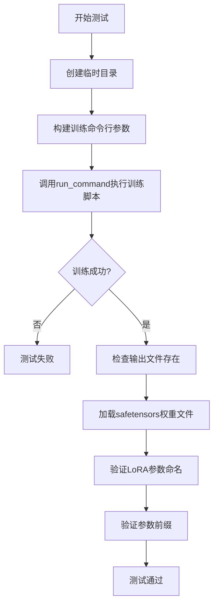
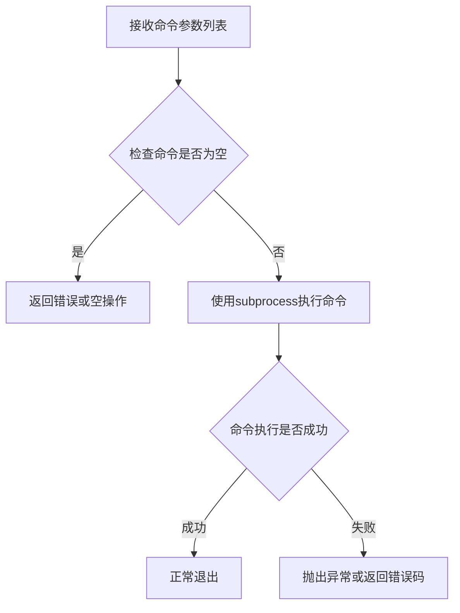
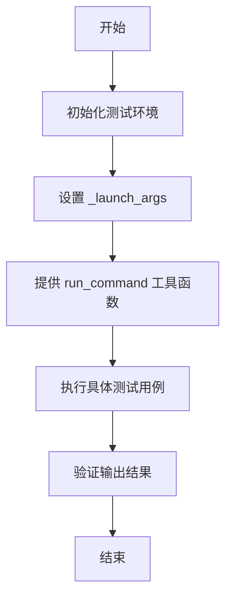
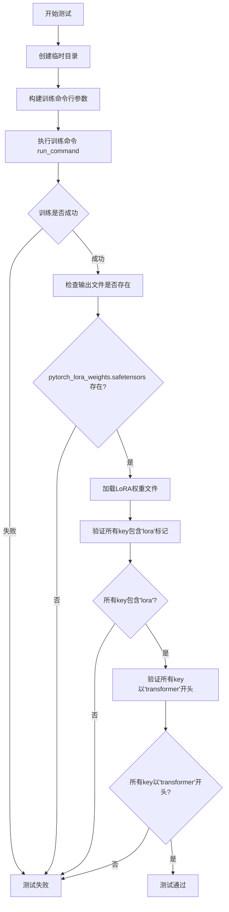
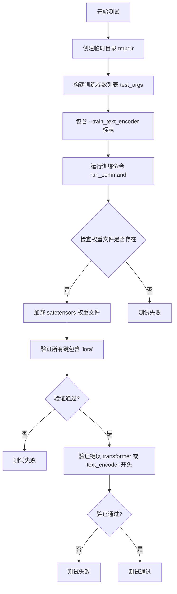
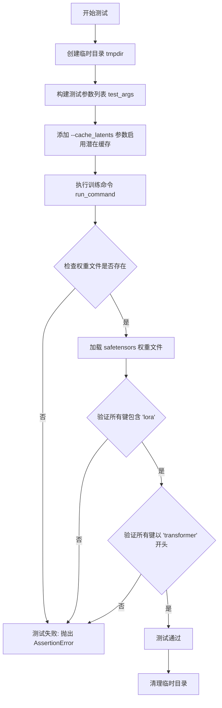
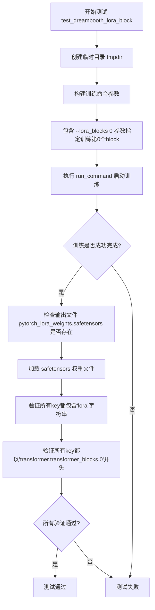
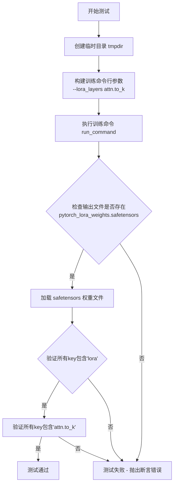
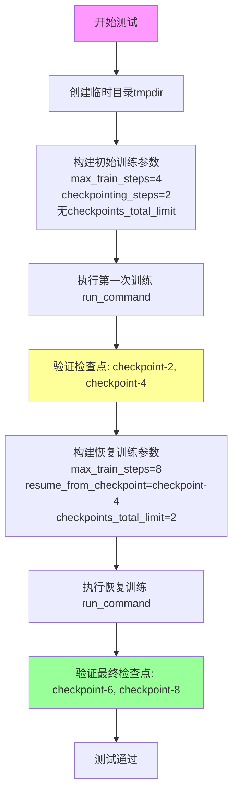

# `diffusers\examples\dreambooth\test_dreambooth_lora_sd3.py` 详细设计文档

这是一个用于测试 DreamBooth LoRA SD3 训练脚本的集成测试类，通过 Accelerate 框架运行训练脚本并验证模型权重文件、LoRA 参数命名和检查点管理等功能的正确性。

## 整体流程



## 类结构

```
ExamplesTestsAccelerate (基类)
└── DreamBoothLoRASD3 (测试类)
```

## 全局变量及字段


### `logger`
    
全局日志记录器

类型：`logging.Logger`
    


### `stream_handler`
    
日志流处理器

类型：`logging.StreamHandler`
    


### `DreamBoothLoRASD3.instance_data_dir`
    
实例数据目录路径

类型：`str`
    


### `DreamBoothLoRASD3.instance_prompt`
    
实例提示词

类型：`str`
    


### `DreamBoothLoRASD3.pretrained_model_name_or_path`
    
预训练模型路径

类型：`str`
    


### `DreamBoothLoRASD3.script_path`
    
训练脚本路径

类型：`str`
    


### `DreamBoothLoRASD3.transformer_block_idx`
    
transformer块索引

类型：`int`
    


### `DreamBoothLoRASD3.layer_type`
    
LoRA层类型

类型：`str`
    
    

## 全局函数及方法


### `run_command`

执行指定的命令行工具，用于运行训练脚本或测试命令。

参数：

- `cmd`：列表（List[str]），命令行参数列表，包含要执行的命令及其参数

返回值：`无`（None），该函数直接执行子进程，不返回任何值

#### 流程图



#### 带注释源码

```python
def run_command(cmd):
    """
    执行命令行工具的全局函数
    
    参数:
        cmd: 命令列表，如 ['python', 'script.py', '--arg1', 'value1']
        
    返回值:
        无直接返回值，通过子进程执行命令
        
    注意:
        该函数从 test_examples_utils 模块导入
        实际实现不在本文件中
    """
    # 函数实现位于 test_examples_utils 模块
    # 基于调用方式推断:
    # run_command(self._launch_args + test_args)
    # 其中 _launch_args 是加速器启动参数
    # test_args 是测试脚本的具体参数
    pass
```

**使用示例**（从代码中提取）：

```python
# 在 DreamBoothLoRASD3 类中的调用方式
run_command(self._launch_args + test_args)

# 其中 test_args 是一个字符串列表，通过 .split() 方法转换
test_args = f"""
    {self.script_path}
    --pretrained_model_name_or_path {self.pretrained_model_name_or_path}
    --instance_data_dir {self.instance_data_dir}
    --instance_prompt {self.instance_prompt}
    --resolution 64
    --train_batch_size 1
    --gradient_accumulation_steps 1
    --max_train_steps 2
    --learning_rate 5.0e-04
    --scale_lr
    --lr_scheduler constant
    --lr_warmup_steps 0
    --output_dir {tmpdir}
    """.split()
```


### `ExamplesTestsAccelerate`

测试基类，用于提供运行示例脚本测试的基础设施，包括命令执行参数和通用测试方法。

参数：

- 无直接参数（通过继承使用，参数通过子类类属性或实例属性传入）

返回值：无直接返回值（基类方法通常返回 None 或通过断言进行测试验证）

#### 流程图



#### 带注释源码

```python
# 假设的 ExamplesTestsAccelerate 基类定义
# 基于代码中使用方式的推断

class ExamplesTestsAccelerate:
    """
    测试基类，提供运行 accelerate 示例脚本的通用功能
    """
    
    # 子类需要覆盖的类属性
    instance_data_dir = None  # str: 实例数据目录路径
    instance_prompt = None     # str: 实例提示词
    pretrained_model_name_or_path = None  # str: 预训练模型名称或路径
    script_path = None        # str: 训练脚本路径
    
    # 运行命令所需的参数列表
    _launch_args = None  # List[str]: accelerate 启动参数，如 ["--num_processes", "2"]
    
    def __init__(self):
        """
        初始化测试基类
        """
        # 初始化 logging
        logging.basicConfig(level=logging.DEBUG)
        logger = logging.getLogger()
        stream_handler = logging.StreamHandler(sys.stdout)
        logger.addHandler(stream_handler)
    
    def setUp(self):
        """
        设置测试环境，在每个测试方法前调用
        """
        # 初始化 _launch_args，通常包含 accelerate 相关参数
        # 例如：["accelerate", "launch", "--num_processes", "1"]
        self._launch_args = self._get_launch_args()
    
    def _get_launch_args(self):
        """
        获取 accelerate 启动参数
        
        返回:
            List[str]: accelerate 命令参数列表
        """
        # 实际实现可能从环境变量或配置中读取
        return ["accelerate", "launch", "--num_processes", "1"]
```

> **注意**：由于 `ExamplesTestsAccelerate` 是从外部模块 `test_examples_utils` 导入的，上述源码是基于代码中使用方式的合理推断。实际定义可能包含更多方法，如环境准备、模型下载验证等。

#### 关键属性总结

| 属性名称 | 类型 | 描述 |
|---------|------|------|
| `_launch_args` | `List[str]` | accelerate 启动命令参数列表 |
| `instance_data_dir` | `str` | 实例数据目录路径 |
| `instance_prompt` | `str` | 实例提示词 |
| `pretrained_model_name_or_path` | `str` | 预训练模型名称或路径 |
| `script_path` | `str` | 待测试的训练脚本路径 |

#### 相关的全局函数

| 函数名称 | 描述 |
|---------|------|
| `run_command` | 从 `test_examples_utils` 导入的执行命令的辅助函数，用于运行 shell 命令并验证执行结果 |


### `DreamBoothLoRASD3.test_dreambooth_lora_sd3`

测试基础DreamBooth LoRA训练流程，验证SD3模型的LoRA权重生成、模型保存以及参数命名规范的正确性。

参数：

- 该方法无显式参数，依赖类属性：
  - `instance_data_dir`：训练实例数据目录
  - `instance_prompt`：实例提示词
  - `pretrained_model_name_or_path`：预训练模型路径
  - `script_path`：训练脚本路径

返回值：`None`，无返回值（测试方法）

#### 流程图



#### 带注释源码

```python
def test_dreambooth_lora_sd3(self):
    """
    测试基础DreamBooth LoRA训练流程
    
    测试要点：
    1. 训练脚本能够正常执行并完成
    2. 生成的LoRA权重文件存在
    3. LoRA权重state_dict中的所有key都包含'lora'标记
    4. 未训练text encoder时，所有参数key都以'transformer'开头
    """
    # 创建临时目录用于存放训练输出
    with tempfile.TemporaryDirectory() as tmpdir:
        # 构建训练命令行参数列表
        test_args = f"""
            {self.script_path}                                          # 训练脚本路径
            --pretrained_model_name_or_path {self.pretrained_model_name_or_path}  # 预训练模型
            --instance_data_dir {self.instance_data_dir}              # 实例数据目录
            --instance_prompt {self.instance_prompt}                  # 实例提示词
            --resolution 64                                            # 图像分辨率
            --train_batch_size 1                                       # 训练批次大小
            --gradient_accumulation_steps 1                            # 梯度累积步数
            --max_train_steps 2                                        # 最大训练步数
            --learning_rate 5.0e-04                                    # 学习率
            --scale_lr                                                  # 是否缩放学习率
            --lr_scheduler constant                                    # 学习率调度器
            --lr_warmup_steps 0                                        # 预热步数
            --output_dir {tmpdir}                                      # 输出目录
            """.split()

        # 执行训练命令，_launch_args包含accelerate启动参数
        run_command(self._launch_args + test_args)
        
        # ==== 验证1: 检查输出文件是否存在 ====
        # save_pretrained smoke test - 冒烟测试确保权重文件生成
        self.assertTrue(os.path.isfile(os.path.join(tmpdir, "pytorch_lora_weights.safetensors")))

        # ==== 验证2: 检查LoRA参数命名 ====
        # 加载生成的LoRA权重文件
        lora_state_dict = safetensors.torch.load_file(
            os.path.join(tmpdir, "pytorch_lora_weights.safetensors")
        )
        # 验证所有key都包含'lora'标记（确保是LoRA权重）
        is_lora = all("lora" in k for k in lora_state_dict.keys())
        self.assertTrue(is_lora)

        # ==== 验证3: 检查transformer参数前缀 ====
        # 当不训练text encoder时，所有参数应该以"transformer"开头
        # 这是SD3模型的结构特点
        starts_with_transformer = all(
            key.startswith("transformer") for key in lora_state_dict.keys()
        )
        self.assertTrue(starts_with_transformer)
```


### `DreamBoothLoRASD3.test_dreambooth_lora_text_encoder_sd3`

该方法是一个集成测试用例，用于验证 DreamBooth LoRA 训练脚本在启用文本编码器训练时的正确性。测试通过运行训练命令，检查生成的 LoRA 权重文件是否包含正确的参数命名（验证是否同时训练了 transformer 和 text_encoder 的 LoRA 参数）。

参数：

- `self`：隐式参数，DreamBoothLoRASD3 类实例本身

返回值：`None`，该方法为测试用例，无返回值

#### 流程图



#### 带注释源码

```python
def test_dreambooth_lora_text_encoder_sd3(self):
    """
    测试带文本编码器的 DreamBooth LoRA 训练
    验证训练包含 text_encoder 时，权重文件的命名是否符合预期
    """
    # 使用临时目录存储训练输出
    with tempfile.TemporaryDirectory() as tmpdir:
        # 构建训练命令行参数
        test_args = f"""
            {self.script_path}
            --pretrained_model_name_or_path {self.pretrained_model_name_or_path}
            --instance_data_dir {self.instance_data_dir}
            --instance_prompt {self.instance_prompt}
            --resolution 64
            --train_batch_size 1
            --train_text_encoder  # 关键：启用文本编码器训练
            --gradient_accumulation_steps 1
            --max_train_steps 2
            --learning_rate 5.0e-04
            --scale_lr
            --lr_scheduler constant
            --lr_warmup_steps 0
            --output_dir {tmpdir}
            """.split()

        # 执行训练命令
        run_command(self._launch_args + test_args)
        
        # smoke test: 验证输出文件存在
        self.assertTrue(os.path.isfile(os.path.join(tmpdir, "pytorch_lora_weights.safetensors")))

        # 加载 LoRA 权重文件
        lora_state_dict = safetensors.torch.load_file(os.path.join(tmpdir, "pytorch_lora_weights.safetensors"))
        
        # 验证所有参数名都包含 'lora' 标识
        is_lora = all("lora" in k for k in lora_state_dict.keys())
        self.assertTrue(is_lora)

        # 验证当训练文本编码器时，参数应同时包含 transformer 和 text_encoder
        starts_with_expected_prefix = all(
            (key.startswith("transformer") or key.startswith("text_encoder")) for key in lora_state_dict.keys()
        )
        self.assertTrue(starts_with_expected_prefix)
```


### `DreamBoothLoRASD3.test_dreambooth_lora_latent_caching`

该方法是一个集成测试用例，用于验证 DreamBooth LoRA 训练脚本在启用潜在缓存（latent caching）功能时的正确性。测试通过运行训练脚本并检查输出的模型权重文件，验证 LoRA 参数命名规范和模型结构是否符合预期。

参数：

- `self`：隐式参数，类型为 `DreamBoothLoRASD3`（测试类实例），代表当前测试对象

返回值：`None`，该方法为测试用例，通过 `self.assertTrue()` 断言来判定测试是否通过，无显式返回值

#### 流程图



#### 带注释源码

```python
def test_dreambooth_lora_latent_caching(self):
    """测试 DreamBooth LoRA 训练脚本在启用潜在缓存功能时的正确性"""
    # 使用临时目录作为输出目录，测试结束后自动清理
    with tempfile.TemporaryDirectory() as tmpdir:
        # 构建测试参数列表，包含训练所需的各种配置
        test_args = f"""
            {self.script_path}
            --pretrained_model_name_or_path {self.pretrained_model_name_or_path}
            --instance_data_dir {self.instance_data_dir}
            --instance_prompt {self.instance_prompt}
            --resolution 64
            --train_batch_size 1
            --gradient_accumulation_steps 1
            --max_train_steps 2
            --cache_latents  # 关键参数：启用潜在缓存功能
            --learning_rate 5.0e-04
            --scale_lr
            --lr_scheduler constant
            --lr_warmup_steps 0
            --output_dir {tmpdir}
            """.split()

        # 执行训练命令，传入加速启动参数和测试参数
        run_command(self._launch_args + test_args)
        
        # smoke test: 验证模型权重文件是否成功生成
        self.assertTrue(os.path.isfile(os.path.join(tmpdir, "pytorch_lora_weights.safetensors")))

        # 加载生成的 LoRA 权重文件
        lora_state_dict = safetensors.torch.load_file(os.path.join(tmpdir, "pytorch_lora_weights.safetensors"))
        
        # 验证所有参数名称中都包含 'lora' 标记，确保正确应用了 LoRA
        is_lora = all("lora" in k for k in lora_state_dict.keys())
        self.assertTrue(is_lora)

        # 验证所有参数名称都以 'transformer' 开头
        # 因为没有训练 text encoder，所以只有 transformer 参数
        starts_with_transformer = all(key.startswith("transformer") for key in lora_state_dict.keys())
        self.assertTrue(starts_with_transformer)
```


### `DreamBoothLoRASD3.test_dreambooth_lora_block`

该方法用于测试DreamBooth LoRA训练中指定block的LoRA功能，验证使用`--lora_blocks`参数时只有指定的transformer block的LoRA权重会被训练并保存到state dict中。

参数：

- `self`：类实例本身，包含以下类属性用于测试配置：
  - `instance_data_dir`：`str`，训练实例图像目录路径（"docs/source/en/imgs"）
  - `instance_prompt`：`str`，实例提示词（"photo"）
  - `pretrained_model_name_or_path`：`str`，预训练模型名称或路径（"hf-internal-testing/tiny-sd3-pipe"）
  - `script_path`：`str`，训练脚本路径（"examples/dreambooth/train_dreambooth_lora_sd3.py"）
  - `transformer_block_idx`：`int`，要训练的transformer block索引（0）

返回值：`None`，该方法为测试用例，无返回值

#### 流程图



#### 带注释源码

```python
def test_dreambooth_lora_block(self):
    """测试指定block的LoRA训练功能"""
    # 创建临时目录用于存放训练输出
    with tempfile.TemporaryDirectory() as tmpdir:
        # 构建训练命令参数，包含 --lora_blocks 参数指定只训练第0个transformer block
        test_args = f"""
            {self.script_path}
            --pretrained_model_name_or_path {self.pretrained_model_name_or_path}
            --instance_data_dir {self.instance_data_dir}
            --instance_prompt {self.instance_prompt}
            --resolution 64
            --train_batch_size 1
            --gradient_accumulation_steps 1
            --max_train_steps 2
            --lora_blocks {self.transformer_block_idx}    # 指定要训练的block索引为0
            --learning_rate 5.0e-04
            --scale_lr
            --lr_scheduler constant
            --lr_warmup_steps 0
            --output_dir {tmpdir}
            """.split()

        # 执行训练命令
        run_command(self._launch_args + test_args)
        
        # 验证：检查LoRA权重文件是否生成
        self.assertTrue(os.path.isfile(os.path.join(tmpdir, "pytorch_lora_weights.safetensors")))

        # 验证：加载权重文件并检查state_dict中的键名是否符合LoRA命名规范
        lora_state_dict = safetensors.torch.load_file(os.path.join(tmpdir, "pytorch_lora_weights.safetensors"))
        is_lora = all("lora" in k for k in lora_state_dict.keys())
        self.assertTrue(is_lora)

        # 验证：确保只有指定的transformer block 0的参数被训练
        # 所有key应该以 "transformer.transformer_blocks.0" 开头
        starts_with_transformer = all(
            key.startswith("transformer.transformer_blocks.0") for key in lora_state_dict.keys()
        )
        self.assertTrue(starts_with_transformer)
```


### `DreamBoothLoRASD3.test_dreambooth_lora_layer`

该测试方法用于验证 DreamBooth LoRA 训练流程中针对特定注意力层（`attn.to_k`）的训练功能，确保生成的 LoRA 权重只包含指定层的参数。

参数：

- `self`：`DreamBoothLoRASD3` 类型，当前测试类实例

返回值：`None`，该方法为测试用例，无返回值

#### 流程图



#### 带注释源码

```python
def test_dreambooth_lora_layer(self):
    """测试指定层的LoRA训练功能（仅训练attn.to_k层）"""
    # 创建临时目录用于存放训练输出
    with tempfile.TemporaryDirectory() as tmpdir:
        # 构建训练脚本的命令行参数
        # 关键参数：--lora_layers 指定只训练 attn.to_k 层
        test_args = f"""
            {self.script_path}
            --pretrained_model_name_or_path {self.pretrained_model_name_or_path}
            --instance_data_dir {self.instance_data_dir}
            --instance_prompt {self.instance_prompt}
            --resolution 64
            --train_batch_size 1
            --gradient_accumulation_steps 1
            --max_train_steps 2
            --lora_layers {self.layer_type}      # layer_type = "attn.to_k"
            --learning_rate 5.0e-04
            --scale_lr
            --lr_scheduler constant
            --lr_warmup_steps 0
            --output_dir {tmpdir}
            """.split()

        # 执行训练命令
        run_command(self._launch_args + test_args)
        
        # 验证点1：检查输出文件是否生成
        # save_pretrained smoke test
        self.assertTrue(os.path.isfile(os.path.join(tmpdir, "pytorch_lora_weights.safetensors")))

        # 加载生成的LoRA权重文件
        lora_state_dict = safetensors.torch.load_file(os.path.join(tmpdir, "pytorch_lora_weights.safetensors"))
        
        # 验证点2：确保所有权重key都包含'lora'标识
        is_lora = all("lora" in k for k in lora_state_dict.keys())
        self.assertTrue(is_lora)

        # 验证点3：确保只训练了指定的注意力层（attn.to_k）
        # 这是该测试用例的核心验证点：
        # 只有 transformer 的注意力层 attn.to_k 的参数应该在 state dict 中
        starts_with_transformer = all("attn.to_k" in key for key in lora_state_dict.keys())
        self.assertTrue(starts_with_transformer)
```


### `DreamBoothLoRASD3.test_dreambooth_lora_sd3_checkpointing_checkpoints_total_limit`

该测试方法用于验证 DreamBooth LoRA SD3 训练中的检查点总数限制（checkpoints_total_limit）功能是否正常工作。测试通过运行训练脚本并设置 `--checkpoints_total_limit=2` 参数，确保在训练过程中只保留最近的两个检查点，旧的检查点会被自动删除。

参数：

- `self`：`DreamBoothLoRASD3`，隐式参数，表示测试类实例本身

返回值：`None`，无返回值（测试方法通过断言进行验证）

#### 流程图

```mermaid
flowchart TD
    A[开始测试] --> B[创建临时目录 tmpdir]
    B --> C[构建训练命令行参数]
    C --> D[包含 --checkpoints_total_limit=2 和 --checkpointing_steps=2]
    D --> E[执行训练命令 run_command]
    E --> F[训练完成, 最多生成3个检查点: checkpoint-2, checkpoint-4, checkpoint-6]
    F --> G[由于 limit=2, 保留最新的2个检查点]
    G --> H[断言检查: 实际检查点集合 == {'checkpoint-4', 'checkpoint-6'}]
    H --> I{断言是否通过}
    I -->|是| J[测试通过]
    I -->|否| K[测试失败]
```

#### 带注释源码

```python
def test_dreambooth_lora_sd3_checkpointing_checkpoints_total_limit(self):
    """
    测试检查点总数限制功能
    
    验证当设置 --checkpoints_total_limit=2 时，
    训练过程只保留最近的两个检查点，旧检查点会被自动删除。
    """
    # 使用临时目录作为输出目录，测试结束后自动清理
    with tempfile.TemporaryDirectory() as tmpdir:
        # 构建训练脚本的命令行参数
        test_args = f"""
        {self.script_path}
        --pretrained_model_name_or_path={self.pretrained_model_name_or_path}
        --instance_data_dir={self.instance_data_dir}
        --output_dir={tmpdir}
        --instance_prompt={self.instance_prompt}
        --resolution=64
        --train_batch_size=1
        --gradient_accumulation_steps=1
        --max_train_steps=6
        --checkpoints_total_limit=2    # 关键参数：限制最多保留2个检查点
        --checkpointing_steps=2        # 每2步保存一个检查点
        """.split()

        # 执行训练命令
        run_command(self._launch_args + test_args)

        # 断言验证：检查点总数限制功能正常工作
        # 训练6步，会生成 checkpoint-2, checkpoint-4, checkpoint-6 三个检查点
        # 由于设置了 total_limit=2，最早的 checkpoint-2 会被删除
        # 最终只保留 checkpoint-4 和 checkpoint-6
        self.assertEqual(
            {x for x in os.listdir(tmpdir) if "checkpoint" in x},
            {"checkpoint-4", "checkpoint-6"},
        )
```


### `DreamBoothLoRASD3.test_dreambooth_lora_sd3_checkpointing_checkpoints_total_limit_removes_multiple_checkpoints`

该测试方法验证了DreamBooth LoRA SD3训练中检查点自动清理功能：当设置`checkpoints_total_limit=2`时，系统在恢复训练后能够正确删除旧的检查点，仅保留最新的2个检查点。

参数：无（仅使用继承的实例属性和类属性）

返回值：`None`，该方法为测试用例，通过`assert`语句验证检查点行为

#### 流程图



#### 带注释源码

```python
def test_dreambooth_lora_sd3_checkpointing_checkpoints_total_limit_removes_multiple_checkpoints(self):
    """
    测试检查点删除功能：验证当设置checkpoints_total_limit=2时，
    恢复训练后系统能够正确删除旧检查点，仅保留最新的2个检查点
    """
    # 创建临时目录用于存放训练输出和检查点
    with tempfile.TemporaryDirectory() as tmpdir:
        # ========== 第一阶段：初始训练 ==========
        # 构建训练参数：训练4步，每2步保存一个检查点
        test_args = f"""
        {self.script_path}
        --pretrained_model_name_or_path={self.pretrained_model_name_or_path}
        --instance_data_dir={self.instance_data_dir}
        --output_dir={tmpdir}
        --instance_prompt={self.instance_prompt}
        --resolution=64
        --train_batch_size=1
        --gradient_accumulation_steps=1
        --max_train_steps=4
        --checkpointing_steps=2
        """.split()

        # 执行训练命令
        run_command(self._launch_args + test_args)

        # 验证第一次训练生成的检查点：应有 checkpoint-2 和 checkpoint-4
        self.assertEqual(
            {x for x in os.listdir(tmpdir) if "checkpoint" in x},
            {"checkpoint-2", "checkpoint-4"},
        )

        # ========== 第二阶段：恢复训练并测试检查点清理 ==========
        # 构建恢复训练参数：从checkpoint-4恢复，训练到第8步
        # 关键参数：checkpoints_total_limit=2，限制最多保留2个检查点
        resume_run_args = f"""
        {self.script_path}
        --pretrained_model_name_or_path={self.pretrained_model_name_or_path}
        --instance_data_dir={self.instance_data_dir}
        --output_dir={tmpdir}
        --instance_prompt={self.instance_prompt}
        --resolution=64
        --train_batch_size=1
        --gradient_accumulation_steps=1
        --max_train_steps=8
        --checkpointing_steps=2
        --resume_from_checkpoint=checkpoint-4
        --checkpoints_total_limit=2
        """.split()

        # 执行恢复训练命令
        run_command(self._launch_args + resume_run_args)

        # 验证最终检查点：由于设置了limit=2，旧检查点被删除
        # 应只保留最新的 checkpoint-6 和 checkpoint-8
        # checkpoint-2 和 checkpoint-4 已被清理
        self.assertEqual(
            {x for x in os.listdir(tmpdir) if "checkpoint" in x},
            {"checkpoint-6", "checkpoint-8"},
        )
```

## 关键组件


### DreamBoothLoRASD3

主测试类，继承自ExamplesTestsAccelerate，用于测试DreamBooth LoRA SD3模型的训练流程，包含多种训练场景的测试用例。

### 实例数据配置

包含instance_data_dir（实例图像目录）、instance_prompt（实例提示词）和pretrained_model_name_or_path（预训练模型路径）三个配置，用于指定训练数据和模型来源。

### LoRA块训练支持

通过transformer_block_idx和--lora_blocks参数实现，允许用户指定仅训练transformer的特定块（如block 0），实现细粒度的LoRA训练控制。

### LoRA层训练支持

通过layer_type（默认"attn.to_k"）和--lora_layers参数实现，允许用户指定仅训练特定的注意力层类型，实现更精细的LoRA权重更新。

### 文本编码器训练

通过--train_text_encoder标志启用，支持同时训练text_encoder和transformer的LoRA权重，扩展了训练场景的覆盖范围。

### 潜在缓存机制

通过--cache_latents选项启用，在训练前预先计算并缓存latent representations，减少重复计算，提升训练效率。

### 检查点管理

支持--checkpointing_steps、--checkpoints_total_limit和--resume_from_checkpoint参数，实现周期性保存检查点、限制检查点数量以及从指定检查点恢复训练的功能。

### LoRA状态字典验证

使用safetensors库加载生成的LoRA权重文件，验证state_dict中的键名是否包含"lora"且符合预期的模块前缀（transformer或text_encoder），确保LoRA权重正确保存。


## 问题及建议


### 已知问题

- **硬编码路径和默认值**：`instance_data_dir = "docs/source/en/imgs"` 硬编码了测试数据路径，当该目录不存在时测试会失败；`pretrained_model_name_or_path = "hf-internal-testing/tiny-sd3-pipe"` 依赖外部模型服务
- **代码重复**：各测试方法中存在大量重复的代码模式（构建参数、运行命令、验证输出），违反了 DRY 原则
- **魔法字符串散落**：`"pytorch_lora_weights.safetensors"`、`"transformer"`、`"lora"`、`"checkpoint"` 等字符串在多处重复出现，缺乏统一常量定义
- **日志配置不当**：`logging.basicConfig(level=logging.DEBUG)` 在模块级别全局配置，可能影响其他模块的日志行为
- **参数格式不一致**：部分测试使用 `--arg value` 格式，部分使用 `--arg=value` 格式（如 checkpointing 测试）
- **缺少错误处理**：`run_command` 调用时没有异常捕获和处理，测试失败时缺乏有意义的错误信息
- **测试隔离性不足**：类级别的属性（如 `transformer_block_idx`、`layer_type`）可能在测试间相互影响
- **未覆盖文本编码器与块/层选择的组合**：测试未验证同时使用 `--train_text_encoder` 与 `--lora_blocks` 或 `--lora_layers` 的场景

### 优化建议

- 提取公共常量（如文件路径前缀、模型类型）到类或模块级别
- 使用 pytest fixture 或 unittest 的 `setUp` 方法封装重复的测试逻辑
- 考虑使用 `unittest.mock` 对 `run_command` 进行 mocking，减少对实际训练脚本的依赖，提高测试速度
- 将日志配置移至专门的测试配置或使用 `logging.NullHandler`
- 添加测试方法的文档字符串，说明每个测试的验证目标
- 增加对训练脚本输出日志的验证，确保训练过程无错误
- 为文件路径、关键字符串定义常量或枚举类，便于维护和修改

## 其它


### 设计目标与约束

本测试类旨在验证DreamBooth LoRA SD3训练脚本的正确性，确保LoRA权重生成、检查点管理、文本编码器训练等功能符合预期。约束条件包括：仅支持HuggingFace格式的模型（`hf-internal-testing/tiny-sd3-pipe`），测试分辨率限制为64像素，最大训练步数为2-8步，使用Accelerate框架进行分布式训练支持。

### 错误处理与异常设计

测试采用Python标准异常处理机制，通过`tempfile.TemporaryDirectory()`确保临时目录自动清理。命令执行失败时`run_command`会抛出异常导致测试失败。文件不存在或格式错误时`safetensors.torch.load_file`会触发异常，测试用例通过`assertTrue`验证状态字典的键名是否符合预期（包含"lora"前缀、正确的模型前缀等）。

### 数据流与状态机

测试数据流为：准备命令行参数 → 通过`run_command`执行训练脚本 → 训练脚本生成LoRA权重文件 → 加载safetensors文件 → 验证状态字典键名。状态机转换：初始状态 → 训练执行中 → 权重保存 → 验证完成。

### 外部依赖与接口契约

主要外部依赖包括：`test_examples_utils.ExamplesTestsAccelerate`基类、`run_command`辅助函数、`safetensors`库用于加载权重文件、`tempfile`标准库用于临时目录管理。接口契约：训练脚本接受标准Diffusers训练参数（`--pretrained_model_name_or_path`、`--instance_data_dir`、`--instance_prompt`等），输出`pytorch_lora_weights.safetensors`文件。

### 性能考虑与基准

测试使用极小模型（tiny-sd3-pipe）和最少训练步数（2步）以快速验证功能，避免长时间等待。分辨率限制为64x64以减少计算开销。性能基准：每个测试用例执行时间应在秒级范围内。

### 安全性考虑

测试代码不涉及敏感数据处理，使用公开的测试图像目录`docs/source/en/imgs`。临时目录通过`tempfile.TemporaryDirectory()`自动清理，防止文件泄漏。模型加载和权重保存使用`safetensors`格式以增强安全性。

### 配置管理

测试参数通过类属性集中管理（`instance_data_dir`、`instance_prompt`、`pretrained_model_name_or_path`、`script_path`等），便于统一修改。命令行参数通过f-string动态构建，支持不同测试场景的参数组合。

### 资源清理策略

`tempfile.TemporaryDirectory()`上下文管理器确保测试结束后自动删除临时输出目录。测试不会在系统目录留下残留文件，资源占用最小化。

### 测试覆盖范围

覆盖场景包括：基础LoRA训练、文本编码器训练、潜在缓存优化、LoRA块选择性训练、LoRA层选择性训练、检查点总数限制、检查点恢复与限制组合。每个测试验证权重文件存在性、键名包含"lora"、模型前缀正确性。

### 可维护性与扩展性

测试类继承自`ExamplesTestsAccelerate`，遵循项目统一的测试框架。添加新测试只需实现新的测试方法并遵循现有模式。类属性集中管理配置，便于适配新模型或新功能。

    