# `diffusers\examples\dreambooth\test_dreambooth_sd3.py` 详细设计文档

这是一个DreamBooth SD3模型的集成测试脚本，用于测试使用HuggingFace Diffusers库进行DreamBooth微调训练的完整流程，包括模型训练、检查点保存、从检查点恢复训练、以及检查点数量限制等功能。

## 整体流程

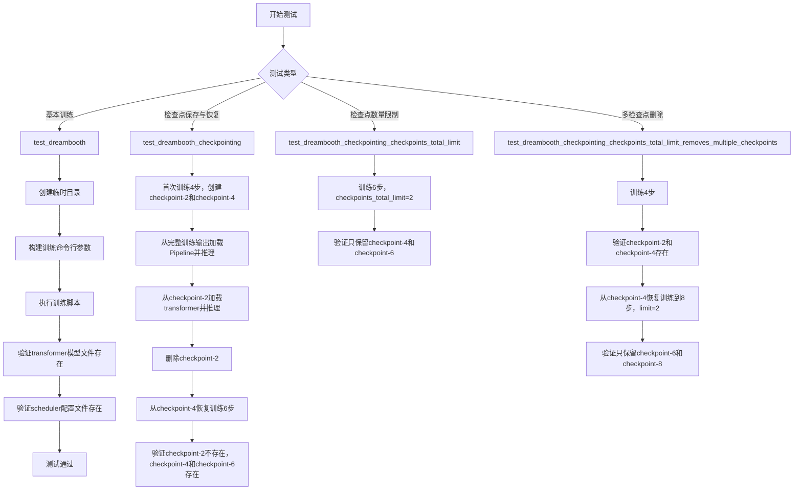

## 类结构

```
ExamplesTestsAccelerate (基类)
└── DreamBoothSD3 (测试类)
```

## 全局变量及字段


### `logger`
    
日志记录器实例，用于输出调试和运行信息

类型：`logging.Logger`
    


### `stream_handler`
    
日志输出流处理器，将日志输出到标准输出stdout

类型：`logging.StreamHandler`
    


### `DreamBoothSD3.instance_data_dir`
    
实例数据目录路径

类型：`str`
    


### `DreamBoothSD3.instance_prompt`
    
实例提示词

类型：`str`
    


### `DreamBoothSD3.pretrained_model_name_or_path`
    
预训练模型名称或路径

类型：`str`
    


### `DreamBoothSD3.script_path`
    
训练脚本路径

类型：`str`
    
    

## 全局函数及方法


### `logging.basicConfig`

配置 Python 日志模块的根记录器，设置全局日志级别和默认格式，以便在应用程序中启用调试信息的输出。

#### 参数

- `level`：`int`，日志级别，用于设置根记录器的阈值。代码中传入 `logging.DEBUG`（值为 10），表示启用所有调试及以上级别的日志输出。

#### 返回值

`None`，该函数不返回任何值，仅修改日志系统的全局配置。

#### 流程图

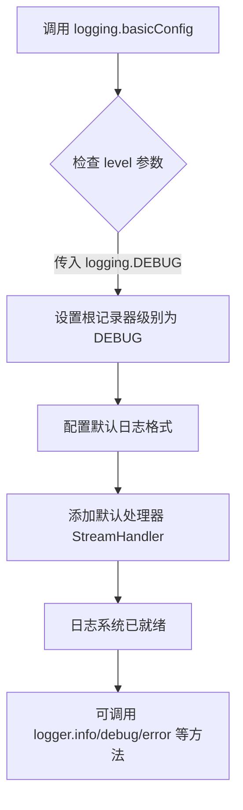

#### 带注释源码

```python
# 导入标准库 logging 模块，用于应用程序的日志记录
import logging
# 导入 sys 模块，用于访问标准输入输出流
import sys

# 配置根记录器的日志级别为 DEBUG
# 这将启用所有级别的日志消息输出（DEBUG、INFO、WARNING、ERROR、CRITICAL）
logging.basicConfig(level=logging.DEBUG)

# 获取根记录器实例，后续可使用 logger.debug(), logger.info() 等方法
logger = logging.getLogger()

# 创建流处理器，将日志输出到标准输出流（stdout）
stream_handler = logging.StreamHandler(sys.stdout)

# 将流处理器添加到根记录器，使日志消息能够输出到控制台
logger.addHandler(stream_handler)
```


### `logging.getLogger`

获取日志记录器，用于获取或创建指定名称的 Logger 对象。如果不提供参数，则返回根日志记录器。

参数：

- `name`：`str`，可选参数，日志记录器的名称。如果为 `None` 或空字符串，则返回根日志记录器。默认值为空字符串。

返回值：`logging.Logger`，返回对应的 Logger 对象实例。

#### 流程图

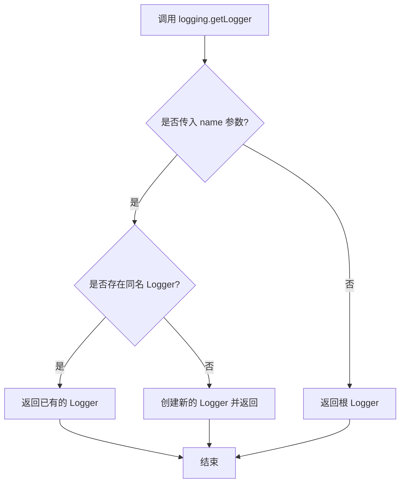

#### 带注释源码

```python
# 配置日志系统，设置为 DEBUG 级别
logging.basicConfig(level=logging.DEBUG)

# 获取根日志记录器（Root Logger）
# 调用 logging.getLogger() 不传参数时，返回根 Logger
# 根 Logger 是所有其他 Logger 的祖先
logger = logging.getLogger()

# 创建流处理器，将日志输出到标准输出（stdout）
stream_handler = logging.StreamHandler(sys.stdout)

# 将流处理器添加到日志记录器
# 这样 logger 输出的日志会通过 stream_handler 打印到 stdout
logger.addHandler(stream_handler)
```


### `tempfile.TemporaryDirectory`

创建临时目录的上下文管理器，用于在代码块执行期间提供安全的临时存储空间，并在块结束时自动清理临时目录。

参数：

- 无参数（构造函数不接受任何参数）

返回值：`tempfile.TemporaryDirectory`，返回一个上下文管理器对象，该对象包含一个 `name` 属性指向临时目录路径，并在上下文退出时自动删除该目录。

#### 流程图

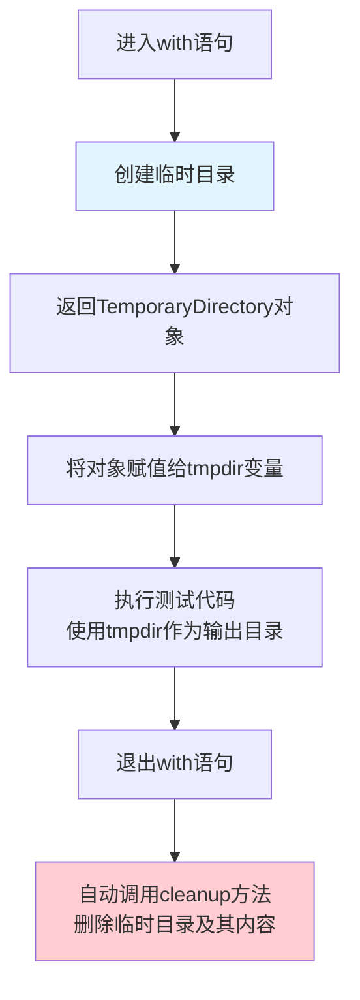

#### 带注释源码

```python
# 使用示例 - 在测试方法中
with tempfile.TemporaryDirectory() as tmpdir:
    """
    TemporaryDirectory 是一个上下文管理器：
    1. 进入with块时：创建临时目录并返回目录路径
    2. 在with块内：tmpdir变量包含临时目录的路径字符串
    3. 退出with块时：自动删除临时目录及其所有内容
    """
    
    # 构建训练脚本参数，指定输出目录为临时目录
    test_args = f"""
        {self.script_path}
        --pretrained_model_name_or_path {self.pretrained_model_name_or_path}
        --instance_data_dir {self.instance_data_dir}
        --instance_prompt {self.instance_prompt}
        --resolution 64
        --train_batch_size 1
        --gradient_accumulation_steps 1
        --max_train_steps 2
        --learning_rate 5.0e-04
        --scale_lr
        --lr_scheduler constant
        --lr_warmup_steps 0
        --output_dir {tmpdir}  # <-- 使用临时目录路径
        """.split()
    
    # 执行训练命令
    run_command(self._launch_args + test_args)
    
    # 验证输出文件是否生成
    self.assertTrue(os.path.isfile(os.path.join(tmpdir, "transformer", "diffusion_pytorch_model.safetensors")))
    self.assertTrue(os.path.isfile(os.path.join(tmpdir, "scheduler", "scheduler_config.json")))

# <-- 退出with块后，临时目录自动被清理删除
```

#### 关键特性说明

| 特性 | 描述 |
|------|------|
| 自动清理 | 退出上下文管理器时自动调用 `shutil.rmtree()` 删除目录 |
| 跨平台 | 使用 `tempfile.mkdtemp()` 创建目录，兼容所有操作系统 |
| 唯一性 | 使用 UUID 或随机字符串确保目录名唯一 |
| 线程安全 | 在多线程环境中可安全使用 |
| 异常安全 | 即使代码抛出异常，退出时也会执行清理 |


### `run_command`

执行命令行脚本，启动子进程并运行指定的命令序列。

参数：

-  `cmd`：`List[str]`，要执行的命令列表，通常包含启动器参数（如accelerate相关参数）和测试脚本参数

返回值：`None` 或 `int`，通常无返回值（None），或返回进程退出码

#### 流程图

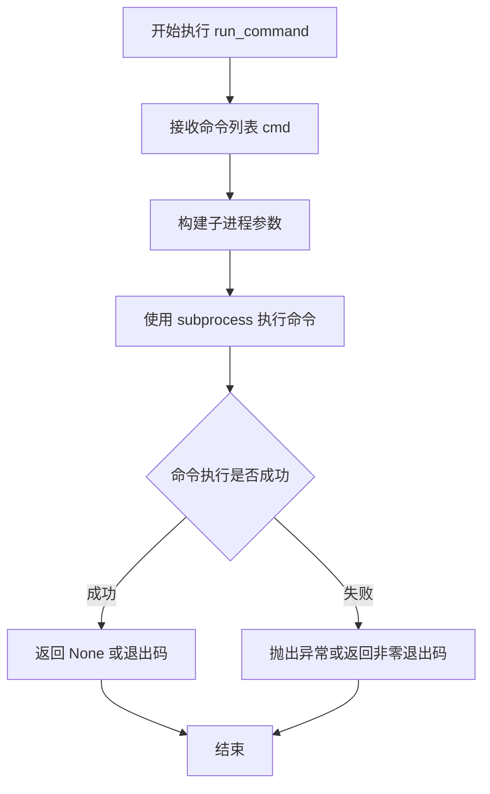

#### 带注释源码

```python
# run_command 函数定义于 test_examples_utils 模块
# 此代码展示其在 DreamBoothSD3 类中的典型调用模式

# 调用方式 1: 基本训练测试
run_command(self._launch_args + test_args)
# self._launch_args: 包含 accelerate 启动器参数（如 --num_processes 等）
# test_args: 包含训练脚本路径及参数（--pretrained_model_name_or_path, --instance_data_dir 等）

# 调用方式 2: 带 checkpointing 的训练
run_command(self._launch_args + initial_run_args)
# initial_run_args 包含 --checkpointing_steps=2 等参数

# 调用方式 3: 从 checkpoint 恢复训练
run_command(self._launch_args + resume_run_args)
# resume_run_args 包含 --resume_from_checkpoint=checkpoint-4 等参数

# 调用方式 4: 带 checkpoint 数量限制的训练
run_command(self._launch_args + test_args)
# test_args 包含 --checkpoints_total_limit=2 等参数

# 函数作用：
# 1. 接收命令参数列表
# 2. 通过子进程执行训练脚本（examples/dreambooth/train_dreambooth_sd3.py）
# 3. 等待脚本执行完成
# 4. 返回执行结果（通常用于验证训练是否成功完成）
```


### `DiffusionPipeline.from_pretrained`

从预训练模型路径或HuggingFace Hub加载扩散Pipeline，支持完整Pipeline加载和部分组件（如Transformer）加载，用于推理或继续训练。

参数：

- `pretrained_model_name_or_path`：`str`，预训练模型的路径或HuggingFace Hub上的模型ID
- `transformer`：`Optional[SD3Transformer2DModel]`，可选参数，用于替换Pipeline中的Transformer组件
- `subfolder`：`Optional[str]`，可选参数，指定从模型目录的哪个子文件夹加载组件
- `torch_dtype`：`Optional[torch.dtype]`，可选参数，指定加载模型的Tensor数据类型
- `device_map`：`Optional[Union[str, Dict]]`，可选参数，指定设备映射策略
- `safety_checker`：`Optional[Any]`，可选参数，安全检查器组件
- `feature_extractor`：`Optional[Any]`，可选参数，特征提取器
- `use_safetensors`：`Optional[bool]`，可选参数，是否使用safetensors格式
- `variant`：`Optional[str]`，可选参数，模型变体（如"fp16"）
- `local_files_only`：`Optional[bool]`，可选参数，是否仅使用本地文件

返回值：`DiffusionPipeline`，加载完成的扩散Pipeline对象，可直接用于推理

#### 流程图

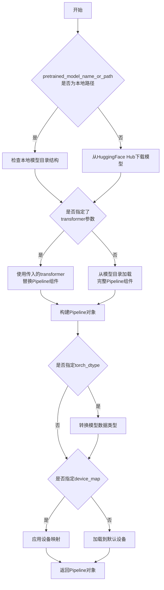

#### 带注释源码

```python
# 代码中的调用示例

# 1. 从训练输出目录加载完整的Pipeline
pipe = DiffusionPipeline.from_pretrained(tmpdir)
# tmpdir: 训练输出目录，包含transformer、scheduler等组件
# 返回: 完整的DiffusionPipeline对象，可直接用于推理
pipe(self.instance_prompt, num_inference_steps=1)

# 2. 从特定checkpoint加载Transformer并合并到新Pipeline
transformer = SD3Transformer2DModel.from_pretrained(
    tmpdir, 
    subfolder="checkpoint-2/transformer"
)
# tmpdir: 训练输出目录
# subfolder: 指定加载checkpoint-2下的transformer组件
pipe = DiffusionPipeline.from_pretrained(
    self.pretrained_model_name_or_path, 
    transformer=transformer
)
# 使用预训练基础模型，但替换其中的transformer为指定checkpoint的版本
# 用于从中间checkpoint恢复推理
pipe(self.instance_prompt, num_inference_steps=1)

# 3. 从预训练模型ID加载
pipe = DiffusionPipeline.from_pretrained("hf-internal-testing/tiny-sd3-pipe")
# 从HuggingFace Hub加载官方预训练模型
```


### `os.path.isfile`

检查指定路径是否为一个存在的常规文件。

参数：

- `path`：`str` 或 `os.PathLike`，需要检查的文件路径，可以是字符串或 PathLike 对象

返回值：`bool`，如果路径指向一个存在的常规文件则返回 `True`，否则返回 `False`

#### 流程图

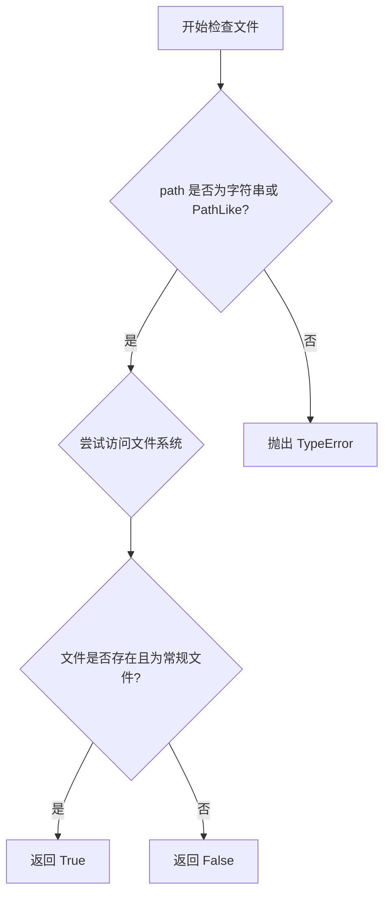

#### 带注释源码

```python
# os.path.isfile 函数实现（标准库源码简化版）
def isfile(path):
    """
    检查指定路径是否为一个存在的常规文件。
    
    参数:
        path: str 或 os.PathLike - 要检查的文件路径
        
    返回:
        bool - 如果 path 指向一个存在的常规文件则返回 True
    """
    try:
        # 使用 os.stat() 获取文件状态信息
        st = os.stat(path)
    except (OSError, ValueError):
        # 文件不存在或路径格式错误时返回 False
        return False
    
    # 检查是否为常规文件（S_ISREG 检查文件模式）
    # S_IFREG = 0o100000 表示常规文件
    return stat.S_ISREG(st.st_mode)
```

#### 代码中的实际使用示例

在 `DreamBoothSD3.test_dreambooth` 方法中的调用：

```python
# 检查训练输出目录中是否生成了 transformer 模型文件
self.assertTrue(os.path.isfile(os.path.join(tmpdir, "transformer", "diffusion_pytorch_model.safetensors")))

# 检查训练输出目录中是否生成了 scheduler 配置文件
self.assertTrue(os.path.isfile(os.path.join(tmpdir, "scheduler", "scheduler_config.json")))
```

这种用法用于验证 DreamBooth 训练脚本是否成功生成了必要的模型文件和配置文件，是测试中的 "smoke test"（冒烟测试）部分，用于快速验证基本功能是否正常工作。


### `os.path.isdir`

检查指定路径是否为已存在的目录。

参数：

- `path`：`str` 或 `Path`，要检查的路径，可以是字符串路径或 Path 对象

返回值：`bool`，如果路径是已存在的目录则返回 `True`，否则返回 `False`

#### 流程图

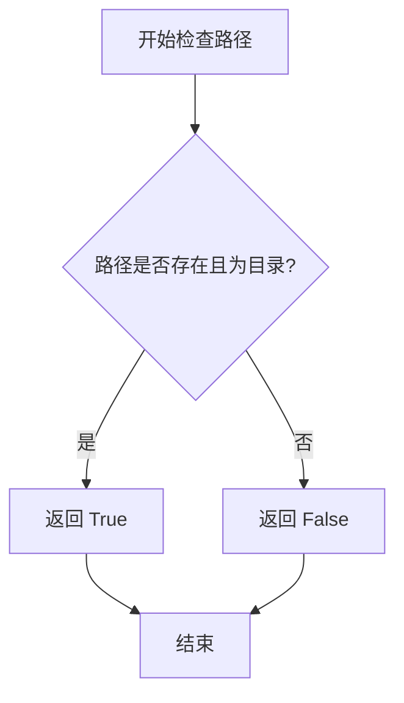

#### 带注释源码

```python
# os.path.isdir 函数调用示例（来自代码中的实际使用）

# 第一次使用：检查 checkpoint-2 和 checkpoint-4 目录是否存在
self.assertTrue(os.path.isdir(os.path.join(tmpdir, "checkpoint-2")))
self.assertTrue(os.path.isdir(os.path.join(tmpdir, "checkpoint-4")))

# 第二次使用：检查 checkpoint-2 是否已被删除，checkpoint-4 和 checkpoint-6 是否存在
self.assertFalse(os.path.isdir(os.path.join(tmpdir, "checkpoint-2")))
self.assertTrue(os.path.isdir(os.path.join(tmpdir, "checkpoint-4")))
self.assertTrue(os.path.isdir(os.path.join(tmpdir, "checkpoint-6")))

# os.path.isdir 是 Python 标准库 os 模块提供的函数
# 语法：os.path.isdir(path)
# 参数：path - 要检查的路径字符串或 Path 对象
# 返回值：布尔值 - 路径存在且为目录时返回 True，否则返回 False
# 在本代码中用于验证训练过程中生成的检查点目录是否正确创建或删除
```


### `os.listdir`

列出指定目录的内容，返回该目录中所有文件和子目录的名称列表。

参数：

- `path`：`str | bytes | int`，要列出内容的目录路径。可以是字符串路径、字节路径或文件描述符

返回值：`list[str] | list[bytes]`，返回包含目录中所有条目名称的列表（不包括特殊条目 "." 和 ".."）

#### 流程图

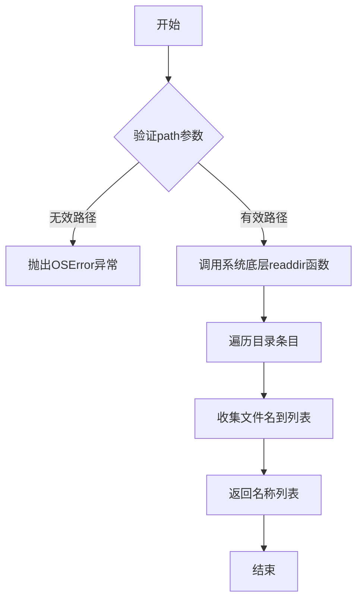

#### 带注释源码

```python
# os.listdir 是 Python 标准库 os 模块中的函数
# 用法示例来自代码中的两处调用：
# 1. 在 test_dreambooth_checkpointing_checkpoints_total_limit 方法中：
{x for x in os.listdir(tmpdir) if "checkpoint" in x}
#    - os.listdir(tmpdir): 列出 tmpdir 目录下的所有条目
#    - 返回值: 目录中所有文件/文件夹名称的列表
#    - 过滤条件: 只保留包含 "checkpoint" 的条目
#    - 结果: 集合类型，包含如 {"checkpoint-4", "checkpoint-6"}

# 2. 在 test_dreambooth_checkpointing_checkpoints_total_limit_removes_multiple_checkpoints 方法中：
{x for x in os.listdir(tmpdir) if "checkpoint" in x}
#    - 同样的用法，用于验证检查点目录的存在性
#    - 第一次调用后结果: {"checkpoint-2", "checkpoint-4"}
#    - 恢复训练后结果: {"checkpoint-6", "checkpoint-8"}

# 函数签名: os.listdir(path=None)
# 参数说明:
#   - path: 目录路径，类型为 str (字符串路径)、bytes (字节路径) 或 int (文件描述符)
#   - 如果 path 为 None，则使用当前目录 '.'
# 返回值:
#   - 返回 list[str] 或 list[bytes]
#   - 列表中的每个元素是该目录下的一个文件或子目录的名称（不含路径）
# 异常:
#   - OSError: 当目录不存在或无权限访问时抛出
#   - PermissionError: 当无权限读取目录时抛出
```


### `shutil.rmtree`

该函数是 Python 标准库函数，用于递归删除目录树，即删除指定路径下的所有文件和子目录。

参数：

- `path`：`str` 或 `os.PathLike`，要删除的目录路径
- `ignore_errors`：`bool`，可选，如果设为 `True`，则忽略删除失败导致的错误（默认 `False`）
- `onerror`：`Callable` 或 `None`，可选，一个可调用对象（函数），在删除过程中发生错误时被调用，接收三个参数：function、path、excinfo（默认 `None`）

返回值：`None`，该函数不返回任何值，直接操作文件系统。

#### 流程图

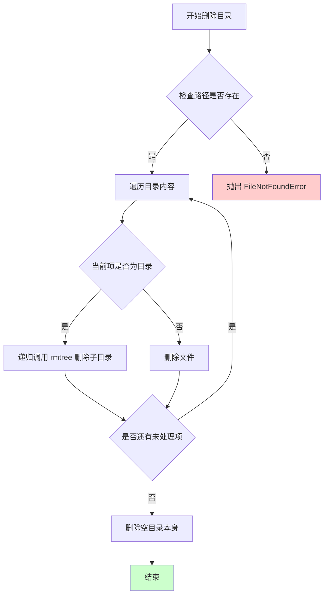

#### 带注释源码

```python
# 在 DreamBoothSD3 类的 test_dreambooth_checkpointing 方法中使用
# 用途：删除 checkpoint-2 目录，以便验证后续检查点是否正确保留

# 调用示例：
shutil.rmtree(os.path.join(tmpdir, "checkpoint-2"))

# 源码位置：/usr/lib/python3.x/shutil.py (Python 标准库)
# 以下为简化版实现逻辑：

def rmtree(path, ignore_errors=False, onerror=None):
    """
    递归删除目录树。
    
    参数:
        path: 要删除的目录路径
        ignore_errors: 如果为 True，忽略删除错误
        onerror: 错误处理函数
    """
    # 1. 如果 ignore_errors 为 True，则定义一个空的错误处理函数
    if ignore_errors:
        def onerror(*args):
            pass
    # 2. 如果 onerror 为 None，则使用默认的错误处理（传播异常）
    elif onerror is None:
        def onerror(*args):
            raise
    
    # 3. 遍历目录内容，逐个删除
    try:
        with os.scandir(path) as scandir_it:
            entries = list(scandir_it)
    except OSError:
        onerror(os.scandir, path, sys.exc_info())
        return
    
    # 4. 递归删除每个条目
    for entry in entries:
        full_path = entry.path
        # 判断是否为目录
        if entry.is_dir(follow_symlinks=False):
            # 递归删除子目录
            rmtree(full_path, ignore_errors, onerror)
        else:
            # 删除文件
            try:
                os.unlink(full_path)
            except OSError:
                onerror(os.unlink, full_path, sys.exc_info())
    
    # 5. 删除空目录本身
    try:
        os.rmdir(path)
    except OSError:
        onerror(os.rmdir, path, sys.exc_info())
```


### `DreamBoothSD3.test_dreambooth`

该方法用于测试基于SD3模型的DreamBooth训练流程，通过构造训练参数并执行训练脚本，最后验证模型权重和调度器配置文件是否正确生成。

参数：
- 该方法无显式参数（隐式参数 `self` 由类框架处理）

返回值：`None`，该方法为测试用例，通过 `assert` 语句验证训练输出文件的正确性

#### 流程图

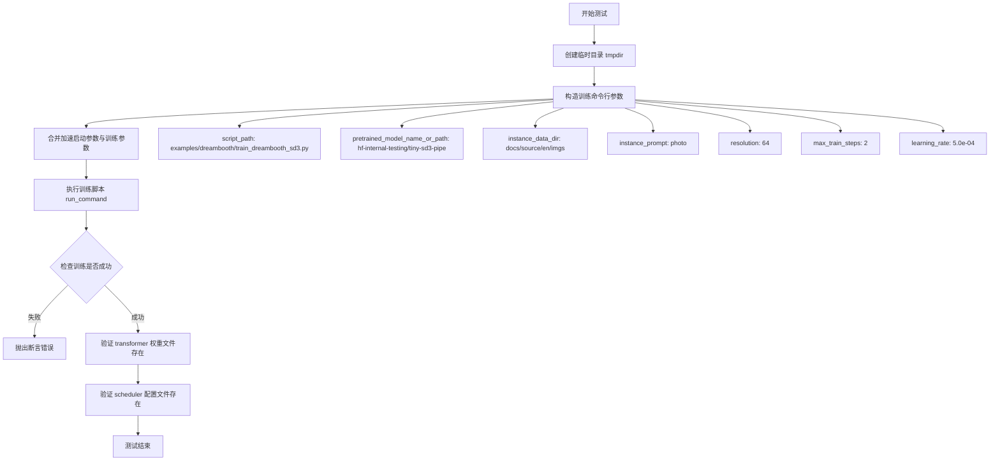

#### 带注释源码

```python
def test_dreambooth(self):
    """
    测试 DreamBooth SD3 基础训练流程
    
    该测试方法执行以下步骤：
    1. 创建临时目录用于存放训练输出
    2. 构造完整的训练命令行参数
    3. 使用 accelerate 框架运行训练脚本
    4. 验证模型权重和调度器配置是否正确生成
    """
    # 创建临时目录，管理测试过程中的文件输出
    with tempfile.TemporaryDirectory() as tmpdir:
        # ========== 步骤1: 构造训练参数 ==========
        # 将训练脚本路径与各配置参数组合成命令行参数列表
        test_args = f"""
            {self.script_path}                              # 训练脚本路径
            --pretrained_model_name_or_path {self.pretrained_model_name_or_path}  # 预训练模型路径
            --instance_data_dir {self.instance_data_dir}    # 实例数据目录
            --instance_prompt {self.instance_prompt}        # 实例提示词
            --resolution 64                                 # 图像分辨率
            --train_batch_size 1                           # 训练批次大小
            --gradient_accumulation_steps 1                # 梯度累积步数
            --max_train_steps 2                             # 最大训练步数
            --learning_rate 5.0e-04                        # 学习率
            --scale_lr                                      # 是否缩放学习率
            --lr_scheduler constant                         # 学习率调度器类型
            --lr_warmup_steps 0                             # 学习率预热步数
            --output_dir {tmpdir}                          # 输出目录
            """.split()  # 将空格分隔的字符串转换为列表

        # ========== 步骤2: 执行训练 ==========
        # run_command 执行完整的训练命令，self._launch_args 包含 accelerate 启动参数
        # 如 GPU 数量、分布式训练配置等
        run_command(self._launch_args + test_args)

        # ========== 步骤3: 验证输出 ==========
        # 验证 transformer 权重文件是否生成（SD3 核心模型组件）
        self.assertTrue(
            os.path.isfile(
                os.path.join(tmpdir, "transformer", "diffusion_pytorch_model.safetensors")
            ),
            "Transformer 模型权重文件未正确保存"
        )

        # 验证 scheduler 配置文件是否生成（扩散模型调度器配置）
        self.assertTrue(
            os.path.isfile(
                os.path.join(tmpdir, "scheduler", "scheduler_config.json")
            ),
            "Scheduler 配置文件未正确保存"
        )
```


### `DreamBoothSD3.test_dreambooth_checkpointing`

该方法测试 DreamBooth 训练脚本的检查点保存与恢复功能，验证检查点目录是否正确创建、能否从中间检查点恢复训练、恢复后旧检查点是否被正确清理。

参数：
- 该方法无显式参数（继承自 `ExamplesTestsAccelerate` 基类，使用类属性和实例属性）

返回值：`None`，该方法为测试方法，通过断言验证功能正确性

#### 流程图

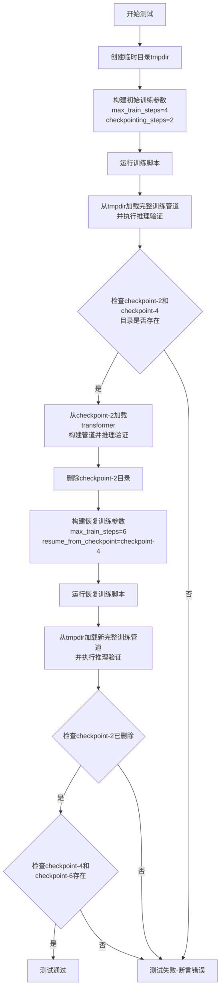

#### 带注释源码

```python
def test_dreambooth_checkpointing(self):
    """
    测试DreamBooth训练脚本的检查点保存与恢复功能
    
    测试流程：
    1. 运行初始训练(max_steps=4, checkpointing_steps=2)创建检查点
    2. 验证能从完整输出和中间检查点恢复
    3. 删除中间检查点，从最后检查点恢复继续训练
    4. 验证恢复后旧检查点被清理，新检查点正确创建
    """
    # 创建临时目录用于存放训练输出和检查点
    with tempfile.TemporaryDirectory() as tmpdir:
        # 第一阶段：运行初始训练，创建检查点
        # 配置：训练4步，每2步保存一个检查点，种子设为0确保可复现
        initial_run_args = f"""
            {self.script_path}
            --pretrained_model_name_or_path {self.pretrained_model_name_or_path}
            --instance_data_dir {self.instance_data_dir}
            --instance_prompt {self.instance_prompt}
            --resolution 64
            --train_batch_size 1
            --gradient_accumulation_steps 1
            --max_train_steps 4                  # 最多训练4步
            --learning_rate 5.0e-04
            --scale_lr
            --lr_scheduler constant
            --lr_warmup_steps 0
            --output_dir {tmpdir}
            --checkpointing_steps=2              # 每2步保存检查点
            --seed=0
            """.split()

        # 执行训练命令（通过accelerate多卡运行）
        run_command(self._launch_args + initial_run_args)

        # 验证1：测试完整训练输出能否正常加载并推理
        pipe = DiffusionPipeline.from_pretrained(tmpdir)
        pipe(self.instance_prompt, num_inference_steps=1)

        # 验证2：检查checkpoint-2和checkpoint-4目录是否存在
        self.assertTrue(os.path.isdir(os.path.join(tmpdir, "checkpoint-2")))
        self.assertTrue(os.path.isdir(os.path.join(tmpdir, "checkpoint-4")))

        # 验证3：从中间检查点checkpoint-2恢复，测试能否正常加载并推理
        transformer = SD3Transformer2DModel.from_pretrained(
            tmpdir, 
            subfolder="checkpoint-2/transformer"
        )
        pipe = DiffusionPipeline.from_pretrained(
            self.pretrained_model_name_or_path, 
            transformer=transformer
        )
        pipe(self.instance_prompt, num_inference_steps=1)

        # 删除checkpoint-2，模拟只保留最后检查点的场景
        shutil.rmtree(os.path.join(tmpdir, "checkpoint-2"))

        # 第二阶段：从checkpoint-4恢复训练，继续训练到第6步
        resume_run_args = f"""
            {self.script_path}
            --pretrained_model_name_or_path {self.pretrained_model_name_or_path}
            --instance_data_dir {self.instance_data_dir}
            --instance_prompt {self.instance_prompt}
            --resolution 64
            --train_batch_size 1
            --gradient_accumulation_steps 1
            --max_train_steps 6                  # 继续训练到第6步
            --learning_rate 5.0e-04
            --scale_lr
            --lr_scheduler constant
            --lr_warmup_steps 0
            --output_dir {tmpdir}
            --checkpointing_steps=2
            --resume_from_checkpoint=checkpoint-4  # 从checkpoint-4恢复
            --seed=0
            """.split()

        # 执行恢复训练
        run_command(self._launch_args + resume_run_args)

        # 验证4：检查新的完整训练输出能否正常加载并推理
        pipe = DiffusionPipeline.from_pretrained(tmpdir)
        pipe(self.instance_prompt, num_inference_steps=1)

        # 验证5：确认恢复训练后旧检查点checkpoint-2已被清理（不存在）
        self.assertFalse(os.path.isdir(os.path.join(tmpdir, "checkpoint-2")))

        # 验证6：确认新的检查点checkpoint-4和checkpoint-6已创建
        # checkpoint-4是恢复的原始检查点，checkpoint-6是训练6步后的新检查点
        self.assertTrue(os.path.isdir(os.path.join(tmpdir, "checkpoint-4")))
        self.assertTrue(os.path.isdir(os.path.join(tmpdir, "checkpoint-6")))
```


### `DreamBoothSD3.test_dreambooth_checkpointing_checkpoints_total_limit`

该测试方法用于验证DreamBooth训练过程中检查点总数限制功能。当设置`--checkpoints_total_limit=2`时，系统应自动删除旧的检查点，仅保留最近的两个检查点（checkpoint-4和checkpoint-6），确保磁盘空间合理使用。

参数：

- `self`：隐式参数，DreamBoothSD3类实例本身

返回值：`None`，无返回值（测试方法）

#### 流程图

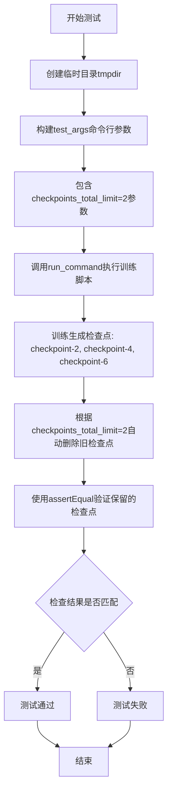

#### 带注释源码

```python
def test_dreambooth_checkpointing_checkpoints_total_limit(self):
    """
    测试检查点总数限制功能。
    验证当设置checkpoints_total_limit=2时，系统只保留最近的两个检查点，
    自动删除更早的检查点。
    """
    # 使用临时目录作为输出目录，测试完成后自动清理
    with tempfile.TemporaryDirectory() as tmpdir:
        # 构建训练脚本的命令行参数
        test_args = f"""
        {self.script_path}                           # 训练脚本路径
        --pretrained_model_name_or_path={self.pretrained_model_name_or_path}  # 预训练模型路径
        --instance_data_dir={self.instance_data_dir}  # 实例数据目录
        --output_dir={tmpdir}                        # 输出目录（临时目录）
        --instance_prompt={self.instance_prompt}     # 实例提示词
        --resolution=64                              # 图像分辨率
        --train_batch_size=1                         # 训练批次大小
        --gradient_accumulation_steps=1              # 梯度累积步数
        --max_train_steps=6                          # 最大训练步数（生成checkpoint-2,4,6）
        --checkpoints_total_limit=2                  # 关键参数：检查点总数限制为2
        --checkpointing_steps=2                      # 每2步保存一个检查点
        """.split()

        # 执行训练命令
        # 将启动参数与测试参数合并后运行
        run_command(self._launch_args + test_args)

        # 断言验证：只应保留checkpoint-4和checkpoint-6
        # checkpoint-2应被自动删除（因为总数限制为2）
        self.assertEqual(
            {x for x in os.listdir(tmpdir) if "checkpoint" in x},  # 列出所有checkpoint目录
            {"checkpoint-4", "checkpoint-6"},                      # 期望保留的检查点
        )
```


### `DreamBoothSD3.test_dreambooth_checkpointing_checkpoints_total_limit_removes_multiple_checkpoints`

该测试方法用于验证 DreamBooth 训练脚本在设置了 `checkpoints_total_limit` 参数后，能够正确删除多个旧的检查点。测试分为两个阶段：第一阶段创建初始检查点（checkpoint-2 和 checkpoint-4），第二阶段从 checkpoint-4 恢复训练并设置最多保留 2 个检查点，验证旧检查点被正确清理，仅保留最新的 checkpoint-6 和 checkpoint-8。

参数：

- `self`：当前测试类实例，包含训练所需的配置信息（如模型路径、数据目录等）

返回值：`None`，该方法为测试方法，通过 `assert` 语句进行验证，不返回具体值

#### 流程图

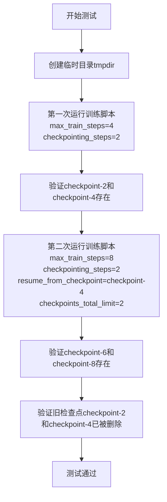

#### 带注释源码

```python
def test_dreambooth_checkpointing_checkpoints_total_limit_removes_multiple_checkpoints(self):
    """
    测试当设置checkpoints_total_limit时，系统能否正确删除多个旧检查点
    """
    # 创建临时目录用于存放训练输出
    with tempfile.TemporaryDirectory() as tmpdir:
        # 第一次运行：训练4步，每2步保存一个检查点
        # 预期生成 checkpoint-2 和 checkpoint-4
        test_args = f"""
        {self.script_path}
        --pretrained_model_name_or_path={self.pretrained_model_name_or_path}
        --instance_data_dir={self.instance_data_dir}
        --output_dir={tmpdir}
        --instance_prompt={self.instance_prompt}
        --resolution=64
        --train_batch_size=1
        --gradient_accumulation_steps=1
        --max_train_steps=4
        --checkpointing_steps=2
        """.split()

        # 执行训练命令
        run_command(self._launch_args + test_args)

        # 验证第一次训练后生成了 checkpoint-2 和 checkpoint-4
        self.assertEqual(
            {x for x in os.listdir(tmpdir) if "checkpoint" in x},
            {"checkpoint-2", "checkpoint-4"},
        )

        # 第二次运行：从 checkpoint-4 恢复训练，总共训练8步
        # 设置 checkpoints_total_limit=2，限制最多保留2个检查点
        # 预期：生成 checkpoint-6 和 checkpoint-8，删除旧的 checkpoint-2 和 checkpoint-4
        resume_run_args = f"""
        {self.script_path}
        --pretrained_model_name_or_path={self.pretrained_model_name_or_path}
        --instance_data_dir={self.instance_data_dir}
        --output_dir={tmpdir}
        --instance_prompt={self.instance_prompt}
        --resolution=64
        --train_batch_size=1
        --gradient_accumulation_steps=1
        --max_train_steps=8
        --checkpointing_steps=2
        --resume_from_checkpoint=checkpoint-4
        --checkpoints_total_limit=2
        """.split()

        # 执行恢复训练命令
        run_command(self._launch_args + resume_run_args)

        # 验证最终只剩下 checkpoint-6 和 checkpoint-8
        # 旧的 checkpoint-2 和 checkpoint-4 应该已被删除
        self.assertEqual(
            {x for x in os.listdir(tmpdir) if "checkpoint" in x},
            {"checkpoint-6", "checkpoint-8"}
        )
```

## 关键组件


### DreamBoothSD3

用于测试DreamBooth在SD3（Stable Diffusion 3）模型上训练流程的测试类，包含训练、检查点保存与恢复、检查点数量限制等核心功能的验证。

### test_dreambooth

验证DreamBooth基本训练流程的测试方法，包括模型加载、训练执行和最终模型输出的保存与验证。

### test_dreambooth_checkpointing

测试训练过程中检查点（checkpoint）创建、保存与恢复功能的测试方法，验证从中间检查点恢复训练的能力。

### test_dreambooth_checkpointing_checkpoints_total_limit

测试checkpoints_total_limit参数对检查点总数控制的测试方法，确保训练过程中只保留指定数量的最新检查点。

### test_dreambooth_checkpointing_checkpoints_total_limit_removes_multiple_checkpoints

测试在恢复训练时自动删除旧检查点的测试方法，验证checkpoints_total_limit在训练恢复场景下的行为。

## 问题及建议


### 已知问题

-   **硬编码配置参数**：多个训练参数（如resolution=64、train_batch_size=1、max_train_steps等）在各测试方法中重复硬编码，缺乏统一的配置管理机制
-   **代码重复**：测试方法中存在大量重复的命令行参数构建逻辑，如`--pretrained_model_name_or_path`、`--instance_data_dir`等参数在每个测试中重复出现
-   **缺少错误处理**：对`run_command`函数的调用没有进行异常捕获和错误处理，可能导致测试失败时难以定位问题
-   **日志配置不完善**：`logging.basicConfig(level=logging.DEBUG)`在模块级别全局配置，可能影响其他测试模块的日志行为
-   **魔法数字**：使用大量魔数（如64、2、4、6、8等）缺乏常量定义，降低了代码可读性和可维护性
-   **测试隔离性不足**：`test_dreambooth_checkpointing`方法中涉及检查点删除和恢复操作，可能对后续测试产生影响
-   **缺少类型注解**：类属性和方法参数均无类型提示，降低了代码的可读性和IDE支持
-   **测试断言不够精确**：部分断言仅验证文件/目录存在性，未验证文件内容的有效性

### 优化建议

-   **提取公共配置**：创建类级别的配置字典或fixture，统一管理训练参数，减少重复代码
-   **定义常量**：将魔数提取为类常量或枚举，如`DEFAULT_RESOLUTION = 64`、`DEFAULT_MAX_STEPS = 2`等
-   **增加错误处理**：为`run_command`调用添加try-except块，捕获并记录详细的错误信息
-   **使用pytest参数化**：考虑使用`@pytest.mark.parametrize`装饰器重构相似测试，减少代码冗余
-   **添加类型注解**：为类属性和方法添加类型提示，提高代码可维护性
-   **改进日志管理**：使用局部日志配置或日志器工厂，避免全局配置影响其他模块
-   **增强断言**：在文件存在性检查基础上，增加内容有效性验证（如检查模型文件完整性）
-   **测试隔离**：确保每个测试方法完全独立，避免测试间的状态依赖


## 其它


### 设计目标与约束

该测试类旨在验证DreamBooth SD3训练流程的正确性，包括基础训练功能、检查点保存与恢复机制、以及检查点数量限制功能。设计约束包括：1) 使用轻量级模型(tiny-sd3-pipe)以加快测试速度；2) 仅使用2-8步训练以满足快速验证需求；3) 测试数据使用docs/source/en/imgs目录下的图片；4) 必须与ExamplesTestsAccelerate基类配合使用以获得加速测试能力。

### 错误处理与异常设计

测试类主要通过assert语句进行断言验证，错误处理机制包括：1) 使用tempfile.TemporaryDirectory确保测试结束后自动清理临时目录；2) 通过os.path.isdir和os.path.isfile检查文件和目录是否存在；3) 使用self.assertTrue/assertFalse/assertEqual进行结果验证；4) 训练脚本执行失败时会抛出异常导致测试失败。

### 数据流与状态机

测试数据流为：准备临时目录→构造训练命令行参数→通过run_command执行训练脚本→验证输出文件/目录存在→(可选)加载模型进行推理验证。状态机包括：初始状态→训练中状态→检查点保存状态→恢复训练状态→最终模型状态。test_dreambooth测试完整训练流程；test_dreambooth_checkpointing测试检查点保存、恢复和限制功能。

### 外部依赖与接口契约

主要外部依赖包括：1) diffusers库的DiffusionPipeline和SD3Transformer2DModel；2) test_examples_utils的ExamplesTestsAccelerate基类和run_command辅助函数；3) 标准库tempfile、os、shutil、sys、logging。接口契约：run_command接收_launch_args和命令行参数列表；DiffusionPipeline.from_pretrained用于加载预训练模型或微调结果；SD3Transformer2DModel.from_pretrained用于加载特定检查点的transformer。

### 配置与参数说明

核心配置参数包括：pretrained_model_name_or_path指定预训练模型路径；instance_data_dir指定实例图片目录；instance_prompt指定实例提示词；resolution设置训练图像分辨率；train_batch_size和gradient_accumulation_steps控制批处理；max_train_steps设置最大训练步数；learning_rate设置学习率；checkpointing_steps设置检查点保存间隔；resume_from_checkpoint指定恢复检查点路径；checkpoints_total_limit限制保留检查点总数。

### 测试覆盖范围

该测试类覆盖以下场景：1) 基础DreamBooth训练并保存模型；2) 检查点创建与验证；3) 从检查点恢复训练；4) 检查点数量限制功能；5) 检查点自动清理机制。测试使用单GPU配置(_launch_args)，验证文件包括transformer权重、scheduler配置和检查点目录结构。

### 性能考虑

测试性能优化措施：1) 使用tiny-sd3-pipe轻量级模型替代完整模型；2) 仅使用2-6步训练而非完整训练；3) 分辨率设置为64以减少计算；4) train_batch_size设为1减少内存占用；5) 使用TemporaryDirectory自动管理资源避免泄漏。

### 安全性考虑

测试安全性包括：1) 使用临时目录隔离测试环境；2) 不涉及真实用户数据；3) 模型下载使用公开测试模型hf-internal-testing/tiny-sd3-pipe；4) 测试图片来自项目自带的docs目录；5) 网络请求仅限于模型下载，无敏感操作。

### 代码组织与模块职责

DreamBoothSD3类继承ExamplesTestsAccelerate，负责组织dreambooth训练测试；test_examples_utils提供测试基础设施和命令执行能力；diffusers库提供模型加载和推理能力。类字段作为类属性定义测试默认配置，方法按测试场景分离实现高内聚低耦合。

### 潜在改进方向

当前代码可改进之处：1) 测试未验证训练loss收敛性；2) 缺少对不同lr_scheduler的测试覆盖；3) 检查点内容完整性验证不足；4) 未测试多GPU分布式训练场景；5) 临时目录清理失败时缺乏错误处理；6) 测试用例可增加更细粒度的中间状态验证。

    