# `diffusers\examples\dreambooth\train_dreambooth.py` 详细设计文档

这是一个用于微调 Stable Diffusion 模型（DreamBooth 训练）的脚本，支持使用 Prior Preservation 防止模型遗忘，并通过 Accelerate 库实现分布式训练与混合精度推理。

## 整体流程

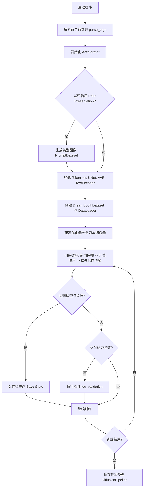

## 类结构

```
torch.utils.data.Dataset (基类)
├── DreamBoothDataset (用于训练实例和类别图像的数据集)
└── PromptDataset (用于生成类别图像的临时数据集)
```

## 全局变量及字段


### `logger`
    
模块级日志记录器，用于输出训练过程中的信息

类型：`logging.Logger`
    


### `DreamBoothDataset.size`
    
图像分辨率，训练图像会被resize到该尺寸

类型：`int`
    


### `DreamBoothDataset.center_crop`
    
是否对图像进行中心裁剪

类型：`bool`
    


### `DreamBoothDataset.tokenizer`
    
用于对提示词进行分词的分词器对象

类型：`AutoTokenizer`
    


### `DreamBoothDataset.instance_data_root`
    
实例图像所在的根目录路径

类型：`Path`
    


### `DreamBoothDataset.instance_prompt`
    
描述实例图像内容的提示词

类型：`str`
    


### `DreamBoothDataset.class_data_root`
    
类别图像所在的根目录路径（用于prior preservation）

类型：`Path`
    


### `DreamBoothDataset.class_prompt`
    
描述类别图像内容的提示词

类型：`str`
    


### `DreamBoothDataset.image_transforms`
    
由多个变换操作组成的图像预处理管道

类型：`torchvision.transforms.Compose`
    


### `PromptDataset.prompt`
    
用于生成类别图像的文本提示词

类型：`str`
    


### `PromptDataset.num_samples`
    
需要生成的类别图像样本数量

类型：`int`
    
    

## 全局函数及方法


### `save_model_card`

该函数用于在训练完成后，将 DreamBooth 模型的模型卡片（README.md）保存到本地目录，包含模型描述、示例图像、标签等信息，以便上传到 HuggingFace Hub。

参数：

- `repo_id`：`str`，HuggingFace Hub 上的仓库 ID，用于标识模型
- `images`：`list`，可选，要保存的示例图像列表
- `base_model`：`str`，可选，基础预训练模型的名称或路径
- `train_text_encoder`：`bool`，可选，是否训练了文本编码器
- `prompt`：`str`，可选，用于生成示例图像的提示词
- `repo_folder`：`str`，可选，本地仓库文件夹的路径，用于保存模型卡片和图像
- `pipeline`：`DiffusionPipeline`，可选，扩散管道对象，用于判断模型类型并添加相应标签

返回值：`None`，该函数无返回值，直接将模型卡片写入本地文件

#### 流程图

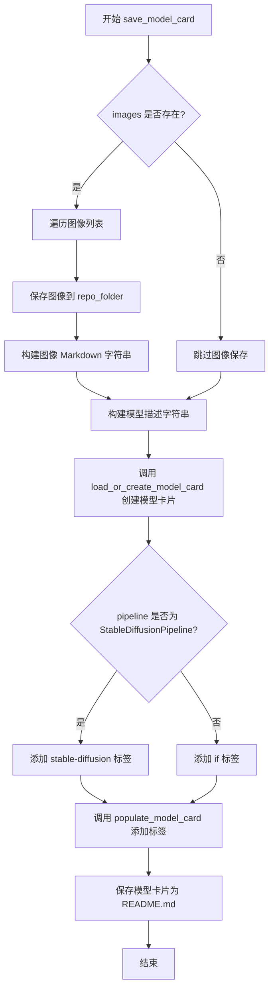

#### 带注释源码

```python
def save_model_card(
    repo_id: str,                              # HuggingFace Hub 仓库 ID
    images: list = None,                       # 示例图像列表
    base_model: str = None,                    # 基础模型路径/名称
    train_text_encoder: bool = False,          # 是否训练了文本编码器
    prompt: str = None,                         # 训练使用的提示词
    repo_folder: str = None,                   # 本地仓库文件夹路径
    pipeline: DiffusionPipeline = None,         # 扩散管道对象
):
    # 初始化图像字符串，用于构建 Markdown 中的图像引用
    img_str = ""
    # 如果存在示例图像，将其保存到本地并构建 Markdown 图像链接
    if images is not None:
        for i, image in enumerate(images):
            # 保存图像文件到 repo_folder，文件名格式为 image_{i}.png
            image.save(os.path.join(repo_folder, f"image_{i}.png"))
            # 构建 Markdown 格式的图像引用字符串
            img_str += f"\n"

    # 构建模型描述内容，包含基础模型、提示词、示例图像和文本编码器训练信息
    model_description = f"""
# DreamBooth - {repo_id}

This is a dreambooth model derived from {base_model}. The weights were trained on {prompt} using [DreamBooth](https://dreambooth.github.io/).
You can find some example images in the following. \n
{img_str}

DreamBooth for the text encoder was enabled: {train_text_encoder}.
"""
    # 加载或创建模型卡片，传入仓库ID、训练标志、许可证、基础模型等信息
    model_card = load_or_create_model_card(
        repo_id_or_path=repo_id,
        from_training=True,                    # 标记为训练产出的模型
        license="creativeml-openrail-m",        # 使用 CreativeML OpenRAIL-M 许可证
        base_model=base_model,                 # 基础模型信息
        prompt=prompt,                          # 提示词信息
        model_description=model_description,    # 模型描述内容
        inference=True,                         # 启用推理功能
    )

    # 定义基础标签，表示这是文本到图像、DreamBooth、diffusers训练的模型
    tags = ["text-to-image", "dreambooth", "diffusers-training"]
    
    # 根据管道类型添加特定标签
    if isinstance(pipeline, StableDiffusionPipeline):
        # 如果是 StableDiffusion 管道，添加对应标签
        tags.extend(["stable-diffusion", "stable-diffusion-diffusers"])
    else:
        # 否则添加 IF (DeepFloyd) 相关标签
        tags.extend(["if", "if-diffusers"])
    
    # 将标签填充到模型卡片中
    model_card = populate_model_card(model_card, tags=tags)

    # 将模型卡片保存为 README.md 文件到 repo_folder
    model_card.save(os.path.join(repo_folder, "README.md"))
```


### `log_validation`

该函数用于在 DreamBooth 模型训练过程中运行验证，通过使用预训练的扩散管道根据指定提示生成验证图像，并将生成的图像记录到 TensorBoard 或 WandB 中，以监控模型质量。

参数：

- `text_encoder`：`torch.nn.Module`，文本编码器模型，用于将文本提示转换为嵌入向量
- `tokenizer`：`transformers.PreTrainedTokenizer`，预训练的分词器，用于对文本进行分词
- `unet`：`diffusers.UNet2DConditionModel`，条件 UNet 模型，用于去噪过程
- `vae`：`diffusers.AutoencoderKL`，变分自编码器，用于将图像编码/解码到潜在空间（可为 None）
- `args`：`argparse.Namespace`，包含所有训练参数的对象，如 `pretrained_model_name_or_path`、`num_validation_images`、`validation_prompt`、`validation_scheduler` 等
- `accelerator`：`accelerate.Accelerator`，分布式训练加速器，管理设备和训练状态
- `weight_dtype`：`torch.dtype`，模型权重的数据类型（如 float32、float16、bfloat16）
- `global_step`：`int`，当前训练的全局步数，用于日志记录
- `prompt_embeds`：`torch.Tensor`，预计算的验证提示嵌入向量（当 `pre_compute_text_embeddings` 为 True 时使用）
- `negative_prompt_embeds`：`torch.Tensor`，预计算的反向提示嵌入向量，用于无分类器指导

返回值：`list[PIL.Image]`，生成的验证图像列表

#### 流程图

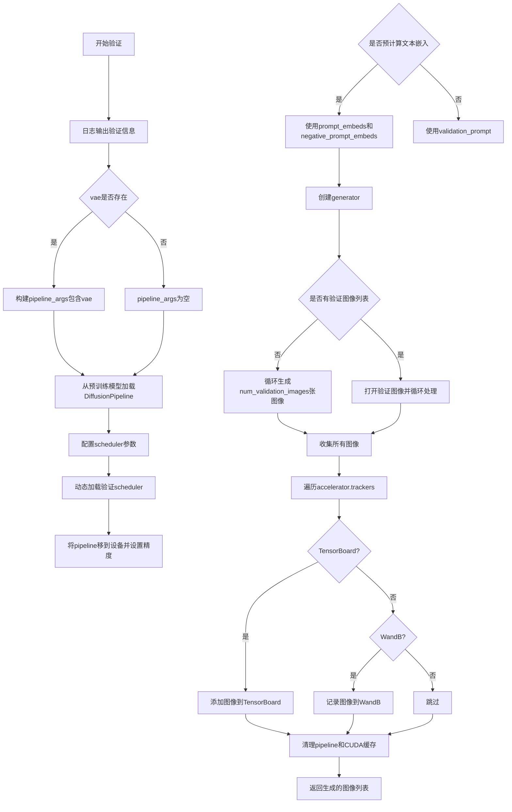

#### 带注释源码

```python
def log_validation(
    text_encoder,
    tokenizer,
    unet,
    vae,
    args,
    accelerator,
    weight_dtype,
    global_step,
    prompt_embeds,
    negative_prompt_embeds,
):
    """
    在训练过程中运行验证，生成图像并记录到日志中
    
    参数:
        text_encoder: 文本编码器模型
        tokenizer: 分词器
        unet: UNet模型
        vae: VAE模型（可为None）
        args: 训练参数
        accelerator: 加速器
        weight_dtype: 权重数据类型
        global_step: 全局步数
        prompt_embeds: 预计算的prompt嵌入
        negative_prompt_embeds: 预计算的反向prompt嵌入
    返回:
        生成的图像列表
    """
    # 记录验证开始信息，包括验证图像数量和提示词
    logger.info(
        f"Running validation... \n Generating {args.num_validation_images} images with prompt:"
        f" {args.validation_prompt}."
    )

    # 初始化pipeline参数字典
    pipeline_args = {}

    # 如果VAE模型存在，将其添加到pipeline参数中
    if vae is not None:
        pipeline_args["vae"] = vae

    # 从预训练模型创建DiffusionPipeline
    # 注意：unet和vae会以float32重新加载
    pipeline = DiffusionPipeline.from_pretrained(
        args.pretrained_model_name_or_path,
        tokenizer=tokenizer,
        text_encoder=text_encoder,
        unet=unet,
        revision=args.revision,
        variant=args.variant,
        torch_dtype=weight_dtype,
        **pipeline_args,
    )

    # 我们在简化的学习目标上训练。
    # 如果之前预测方差，需要让scheduler忽略它
    scheduler_args = {}

    if "variance_type" in pipeline.scheduler.config:
        variance_type = pipeline.scheduler.config["variance_type"]

        # 如果方差类型是learned或learned_range，改为fixed_small
        if variance_type in ["learned", "learned_range"]:
            variance_type = "fixed_small"

        scheduler_args["variance_type"] = variance_type

    # 动态导入diffusers模块并获取验证scheduler类
    module = importlib.import_module("diffusers")
    scheduler_class = getattr(module, args.validation_scheduler)
    # 使用新的scheduler参数创建scheduler实例
    pipeline.scheduler = scheduler_class.from_config(pipeline.scheduler.config, **scheduler_args)
    
    # 将pipeline移到加速器设备上并设置为指定精度
    pipeline = pipeline.to(accelerator.device)
    pipeline.set_progress_bar_config(disable=True)

    # 根据是否预计算文本嵌入来设置pipeline参数
    if args.pre_compute_text_embeddings:
        pipeline_args = {
            "prompt_embeds": prompt_embeds,
            "negative_prompt_embeds": negative_prompt_embeds,
        }
    else:
        pipeline_args = {"prompt": args.validation_prompt}

    # 创建随机数生成器（如果指定了seed）
    generator = None if args.seed is None else torch.Generator(device=accelerator.device).manual_seed(args.seed)
    
    # 存储生成的图像
    images = []
    
    # 根据是否有验证图像列表决定生成方式
    if args.validation_images is None:
        # 无预定义验证图像时，根据提示词生成图像
        for _ in range(args.num_validation_images):
            # 使用autocast优化内存
            with torch.autocast("cuda"):
                image = pipeline(**pipeline_args, num_inference_steps=25, generator=generator).images[0]
            images.append(image)
    else:
        # 有预定义验证图像时，对每张图像进行处理（如图像到图像任务）
        for image in args.validation_images:
            image = Image.open(image)
            image = pipeline(**pipeline_args, image=image, generator=generator).images[0]
            images.append(image)

    # 将图像记录到各个tracker（TensorBoard或WandB）
    for tracker in accelerator.trackers:
        if tracker.name == "tensorboard":
            # 将PIL图像转换为numpy数组并堆叠
            np_images = np.stack([np.asarray(img) for img in images])
            tracker.writer.add_images("validation", np_images, global_step, dataformats="NHWC")
        if tracker.name == "wandb":
            tracker.log(
                {
                    "validation": [
                        wandb.Image(image, caption=f"{i}: {args.validation_prompt}") for i, image in enumerate(images)
                    ]
                }
            )

    # 清理：删除pipeline并清空CUDA缓存
    del pipeline
    torch.cuda.empty_cache()

    return images
```


### `import_model_class_from_model_name_or_path`

该函数根据预训练模型的路径或名称，动态加载对应的 TextEncoder 类。它首先从模型配置中获取文本编码器的架构名称，然后根据架构名称返回相应的模型类（如 CLIPTextModel、RobertaSeriesModelWithTransformation 或 T5EncoderModel）。

参数：

- `pretrained_model_name_or_path`：`str`，预训练模型的路径或模型标识符（例如 "runwayml/stable-diffusion-v1-5"）
- `revision`：`str`，预训练模型标识符的版本（可以是提交哈希、分支名或标签名）

返回值：`type`，返回对应的 TextEncoder 类（`CLIPTextModel`、`RobertaSeriesModelWithTransformation` 或 `T5EncoderModel`）

#### 流程图

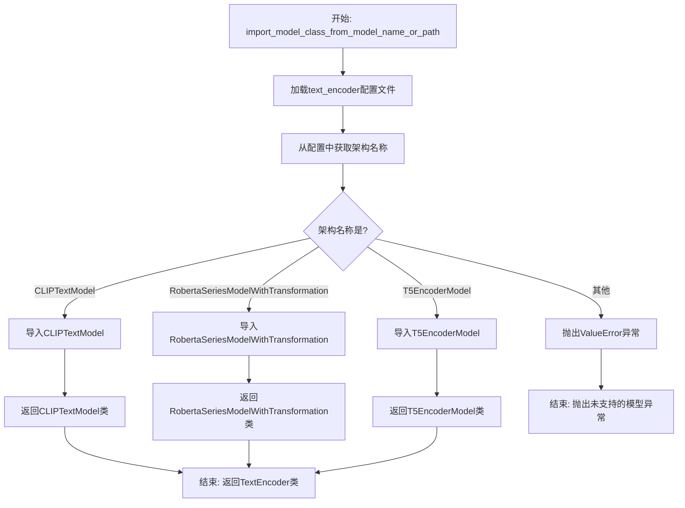

#### 带注释源码

```python
def import_model_class_from_model_name_or_path(pretrained_model_name_or_path: str, revision: str):
    """
    根据模型路径导入对应的 TextEncoder 类
    
    参数:
        pretrained_model_name_or_path: 预训练模型路径或模型ID
        revision: 模型版本/分支
    
    返回:
        对应的TextEncoder类
    """
    
    # 步骤1: 从预训练模型加载text_encoder的配置文件
    # 使用HuggingFace的PretrainedConfig加载器读取text_encoder子目录的配置
    text_encoder_config = PretrainedConfig.from_pretrained(
        pretrained_model_name_or_path,  # 模型路径或Hub模型ID
        subfolder="text_encoder",         # 指定加载text_encoder子文件夹的配置
        revision=revision,                # 指定版本/分支
    )
    
    # 步骤2: 从配置中获取模型架构名称
    # 配置文件中的architectures字段指定了模型的实际类名
    model_class = text_encoder_config.architectures[0]
    
    # 步骤3: 根据架构名称返回对应的模型类
    # CLIPTextModel: 用于Stable Diffusion等主流模型
    if model_class == "CLIPTextModel":
        from transformers import CLIPTextModel
        return CLIPTextModel
    
    # RobertaSeriesModelWithTransformation: 用于AltDiffusion等模型
    elif model_class == "RobertaSeriesModelWithTransformation":
        from diffusers.pipelines.alt_diffusion.modeling_roberta_series import RobertaSeriesModelWithTransformation
        return RobertaSeriesModelWithTransformation
    
    # T5EncoderModel: 用于DeepFloyd IF等模型
    elif model_class == "T5EncoderModel":
        from transformers import T5EncoderModel
        return T5EncoderModel
    
    # 如果遇到不支持的架构类型，抛出明确的错误信息
    else:
        raise ValueError(f"{model_class} is not supported.")
```


### `parse_args`

该函数是 DreamBooth 训练脚本的命令行参数解析器，通过 argparse 库定义并收集所有训练相关的配置选项，包括模型路径、数据目录、训练超参数、优化器设置、验证配置等，最终返回一个包含所有解析参数的 Namespace 对象。

#### 参数

- `input_args`：`list`，可选，要解析的参数列表（主要用于测试）。如果为 `None`，则从 sys.argv 解析命令行输入。

#### 返回值

`argparse.Namespace`，包含所有命令行参数的命名空间对象，主要属性包括：

- `--pretrained_model_name_or_path`：预训练模型路径或模型标识符
- `--instance_data_dir`：实例图像训练数据目录
- `--instance_prompt`：实例提示词
- `--class_data_dir`：类别图像数据目录（可选）
- `--class_prompt`：类别提示词（可选）
- `--with_prior_preservation`：是否启用先验 preservation 损失
- `--train_text_encoder`：是否训练文本编码器
- `--output_dir`：输出目录
- `--learning_rate`：学习率
- `--num_train_epochs`：训练轮数
- `--max_train_steps`：最大训练步数
- `--gradient_accumulation_steps`：梯度累积步数
- `--gradient_checkpointing`：是否启用梯度检查点
- `--mixed_precision`：混合精度训练选项（fp16/bf16）
- `--validation_prompt`：验证提示词
- `--push_to_hub`：是否推送到 HuggingFace Hub
- 等等约 60+ 个参数

#### 流程图

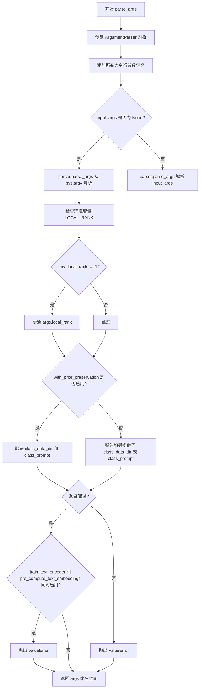

#### 带注释源码

```python
def parse_args(input_args=None):
    """
    解析命令行参数并返回包含所有训练配置的 Namespace 对象。
    
    参数:
        input_args: 可选的参数列表，用于测试；默认为 None，从 sys.argv 解析
    
    返回:
        argparse.Namespace: 包含所有命令行参数的命名空间对象
    """
    # 创建 ArgumentParser 实例，描述为 "Simple example of a training script."
    parser = argparse.ArgumentParser(description="Simple example of a training script.")
    
    # =====================================================
    # 添加模型相关参数
    # =====================================================
    parser.add_argument(
        "--pretrained_model_name_or_path",
        type=str,
        default=None,
        required=True,
        help="Path to pretrained model or model identifier from huggingface.co/models.",
    )
    parser.add_argument(
        "--revision",
        type=str,
        default=None,
        required=False,
        help="Revision of pretrained model identifier from huggingface.co/models.",
    )
    parser.add_argument(
        "--variant",
        type=str,
        default=None,
        help="Variant of the model files of the pretrained model identifier from huggingface.co/models, 'e.g.' fp16",
    )
    parser.add_argument(
        "--tokenizer_name",
        type=str,
        default=None,
        help="Pretrained tokenizer name or path if not the same as model_name",
    )
    
    # =====================================================
    # 添加数据集相关参数
    # =====================================================
    parser.add_argument(
        "--instance_data_dir",
        type=str,
        default=None,
        required=True,
        help="A folder containing the training data of instance images.",
    )
    parser.add_argument(
        "--class_data_dir",
        type=str,
        default=None,
        required=False,
        help="A folder containing the training data of class images.",
    )
    parser.add_argument(
        "--instance_prompt",
        type=str,
        default=None,
        required=True,
        help="The prompt with identifier specifying the instance",
    )
    parser.add_argument(
        "--class_prompt",
        type=str,
        default=None,
        help="The prompt to specify images in the same class as provided instance images.",
    )
    
    # =====================================================
    # 添加先验 preservation 损失参数
    # =====================================================
    parser.add_argument(
        "--with_prior_preservation",
        default=False,
        action="store_true",
        help="Flag to add prior preservation loss.",
    )
    parser.add_argument("--prior_loss_weight", type=float, default=1.0, help="The weight of prior preservation loss.")
    parser.add_argument(
        "--num_class_images",
        type=int,
        default=100,
        help=(
            "Minimal class images for prior preservation loss. If there are not enough images already present in"
            " class_data_dir, additional images will be sampled with class_prompt."
        ),
    )
    
    # =====================================================
    # 添加输出和随机种子参数
    # =====================================================
    parser.add_argument(
        "--output_dir",
        type=str,
        default="dreambooth-model",
        help="The output directory where the model predictions and checkpoints will be written.",
    )
    parser.add_argument("--seed", type=int, default=None, help="A seed for reproducible training.")
    
    # =====================================================
    # 添加图像处理参数
    # =====================================================
    parser.add_argument(
        "--resolution",
        type=int,
        default=512,
        help=(
            "The resolution for input images, all the images in the train/validation dataset will be resized to this"
            " resolution"
        ),
    )
    parser.add_argument(
        "--center_crop",
        default=False,
        action="store_true",
        help=(
            "Whether to center crop the input images to the resolution. If not set, the images will be randomly"
            " cropped. The images will be resized to the resolution first before cropping."
        ),
    )
    
    # =====================================================
    # 添加训练参数
    # =====================================================
    parser.add_argument(
        "--train_text_encoder",
        action="store_true",
        help="Whether to train the text encoder. If set, the text encoder should be float32 precision.",
    )
    parser.add_argument(
        "--train_batch_size", type=int, default=4, help="Batch size (per device) for the training dataloader."
    )
    parser.add_argument(
        "--sample_batch_size", type=int, default=4, help="Batch size (per device) for sampling images."
    )
    parser.add_argument("--num_train_epochs", type=int, default=1)
    parser.add_argument(
        "--max_train_steps",
        type=int,
        default=None,
        help="Total number of training steps to perform.  If provided, overrides num_train_epochs.",
    )
    parser.add_argument(
        "--checkpointing_steps",
        type=int,
        default=500,
        help=(
            "Save a checkpoint of the training state every X updates. Checkpoints can be used for resuming training via `--resume_from_checkpoint`. "
            "In the case that the checkpoint is better than the final trained model, the checkpoint can also be used for inference."
            "Using a checkpoint for inference requires separate loading of the original pipeline and the individual checkpointed model components."
            "See https://huggingface.co/docs/diffusers/main/en/training/dreambooth#performing-inference-using-a-saved-checkpoint for step by step"
            "instructions."
        ),
    )
    parser.add_argument(
        "--checkpoints_total_limit",
        type=int,
        default=None,
        help=(
            "Max number of checkpoints to store. Passed as `total_limit` to the `Accelerator` `ProjectConfiguration`."
            " See Accelerator::save_state https://huggingface.co/docs/accelerate/package_reference/accelerator#accelerate.Accelerator.save_state"
            " for more details"
        ),
    )
    parser.add_argument(
        "--resume_from_checkpoint",
        type=str,
        default=None,
        help=(
            "Whether training should be resumed from a previous checkpoint. Use a path saved by"
            ' `--checkpointing_steps`, or `"latest"` to automatically select the last available checkpoint.'
        ),
    )
    parser.add_argument(
        "--gradient_accumulation_steps",
        type=int,
        default=1,
        help="Number of updates steps to accumulate before performing a backward/update pass.",
    )
    parser.add_argument(
        "--gradient_checkpointing",
        action="store_true",
        help="Whether or not to use gradient checkpointing to save memory at the expense of slower backward pass.",
    )
    
    # =====================================================
    # 添加学习率调度器参数
    # =====================================================
    parser.add_argument(
        "--learning_rate",
        type=float,
        default=5e-6,
        help="Initial learning rate (after the potential warmup period) to use.",
    )
    parser.add_argument(
        "--scale_lr",
        action="store_true",
        default=False,
        help="Scale the learning rate by the number of GPUs, gradient accumulation steps, and batch size.",
    )
    parser.add_argument(
        "--lr_scheduler",
        type=str,
        default="constant",
        help=(
            'The scheduler type to use. Choose between ["linear", "cosine", "cosine_with_restarts", "polynomial",'
            ' "constant", "constant_with_warmup"]'
        ),
    )
    parser.add_argument(
        "--lr_warmup_steps", type=int, default=500, help="Number of steps for the warmup in the lr scheduler."
    )
    parser.add_argument(
        "--lr_num_cycles",
        type=int,
        default=1,
        help="Number of hard resets of the lr in cosine_with_restarts scheduler.",
    )
    parser.add_argument("--lr_power", type=float, default=1.0, help="Power factor of the polynomial scheduler.")
    
    # =====================================================
    # 添加优化器参数
    # =====================================================
    parser.add_argument(
        "--use_8bit_adam", action="store_true", help="Whether or not to use 8-bit Adam from bitsandbytes."
    )
    parser.add_argument(
        "--dataloader_num_workers",
        type=int,
        default=0,
        help=(
            "Number of subprocesses to use for data loading. 0 means that the data will be loaded in the main process."
        ),
    )
    parser.add_argument("--adam_beta1", type=float, default=0.9, help="The beta1 parameter for the Adam optimizer.")
    parser.add_argument("--adam_beta2", type=float, default=0.999, help="The beta2 parameter for the Adam optimizer.")
    parser.add_argument("--adam_weight_decay", type=float, default=1e-2, help="Weight decay to use.")
    parser.add_argument("--adam_epsilon", type=float, default=1e-08, help="Epsilon value for the Adam optimizer")
    parser.add_argument("--max_grad_norm", default=1.0, type=float, help="Max gradient norm.")
    
    # =====================================================
    # 添加 Hub 相关参数
    # =====================================================
    parser.add_argument("--push_to_hub", action="store_true", help="Whether or not to push the model to the Hub.")
    parser.add_argument("--hub_token", type=str, default=None, help="The token to use to push to the Model Hub.")
    parser.add_argument(
        "--hub_model_id",
        type=str,
        default=None,
        help="The name of the repository to keep in sync with the local `output_dir`.",
    )
    parser.add_argument(
        "--logging_dir",
        type=str,
        default="logs",
        help=(
            "[TensorBoard](https://www.tensorflow.org/tensorboard) log directory. Will default to"
            " *output_dir/runs/**CURRENT_DATETIME_HOSTNAME***."
        ),
    )
    
    # =====================================================
    # 添加高级训练选项
    # =====================================================
    parser.add_argument(
        "--allow_tf32",
        action="store_true",
        help=(
            "Whether or not to allow TF32 on Ampere GPUs. Can be used to speed up training. For more information, see"
            " https://pytorch.org/docs/stable/notes/cuda.html#tensorfloat-32-tf32-on-ampere-devices"
        ),
    )
    parser.add_argument(
        "--report_to",
        type=str,
        default="tensorboard",
        help=(
            'The integration to report the results and logs to. Supported platforms are `"tensorboard"`'
            ' (default), `"wandb"` and `"comet_ml"`. Use `"all"` to report to all integrations.'
        ),
    )
    parser.add_argument(
        "--validation_prompt",
        type=str,
        default=None,
        help="A prompt that is used during validation to verify that the model is learning.",
    )
    parser.add_argument(
        "--num_validation_images",
        type=int,
        default=4,
        help="Number of images that should be generated during validation with `validation_prompt`.",
    )
    parser.add_argument(
        "--validation_steps",
        type=int,
        default=100,
        help=(
            "Run validation every X steps. Validation consists of running the prompt"
            " `args.validation_prompt` multiple times: `args.num_validation_images`"
            " and logging the images."
        ),
    )
    parser.add_argument(
        "--mixed_precision",
        type=str,
        default=None,
        choices=["no", "fp16", "bf16"],
        help=(
            "Whether to use mixed precision. Choose between fp16 and bf16 (bfloat16). Bf16 requires PyTorch >="
            " 1.10.and an Nvidia Ampere GPU.  Default to the value of accelerate config of the current system or the"
            " flag passed with the `accelerate.launch` command. Use this argument to override the accelerate config."
        ),
    )
    parser.add_argument(
        "--prior_generation_precision",
        type=str,
        default=None,
        choices=["no", "fp32", "fp16", "bf16"],
        help=(
            "Choose prior generation precision between fp32, fp16 and bf16 (bfloat16). Bf16 requires PyTorch >="
            " 1.10.and an Nvidia Ampere GPU.  Default to  fp16 if a GPU is available else fp32."
        ),
    )
    parser.add_argument("--local_rank", type=int, default=-1, help="For distributed training: local_rank")
    parser.add_argument(
        "--enable_xformers_memory_efficient_attention", action="store_true", help="Whether or not to use xformers."
    )
    parser.add_argument(
        "--set_grads_to_none",
        action="store_true",
        help=(
            "Save more memory by using setting grads to None instead of zero. Be aware, that this changes certain"
            " behaviors, so disable this argument if it causes any problems. More info:"
            " https://pytorch.org/docs/stable/generated/torch.optim.Optimizer.zero_grad.html"
        ),
    )
    parser.add_argument(
        "--offset_noise",
        action="store_true",
        default=False,
        help=(
            "Fine-tuning against a modified noise"
            " See: https://www.crosslabs.org//blog/diffusion-with-offset-noise for more information."
        ),
    )
    parser.add_argument(
        "--snr_gamma",
        type=float,
        default=None,
        help="SNR weighting gamma to be used if rebalancing the loss. Recommended value is 5.0. "
        "More details here: https://huggingface.co/papers/2303.09556.",
    )
    parser.add_argument(
        "--pre_compute_text_embeddings",
        action="store_true",
        help="Whether or not to pre-compute text embeddings. If text embeddings are pre-computed, the text encoder will not be kept in memory during training and will leave more GPU memory available for training the rest of the model. This is not compatible with `--train_text_encoder`.",
    )
    parser.add_argument(
        "--tokenizer_max_length",
        type=int,
        default=None,
        required=False,
        help="The maximum length of the tokenizer. If not set, will default to the tokenizer's max length.",
    )
    parser.add_argument(
        "--text_encoder_use_attention_mask",
        action="store_true",
        required=False,
        help="Whether to use attention mask for the text encoder",
    )
    parser.add_argument(
        "--skip_save_text_encoder", action="store_true", required=False, help="Set to not save text encoder"
    )
    parser.add_argument(
        "--validation_images",
        required=False,
        default=None,
        nargs="+",
        help="Optional set of images to use for validation. Used when the target pipeline takes an initial image as input such as when training image variation or superresolution.",
    )
    parser.add_argument(
        "--class_labels_conditioning",
        required=False,
        default=None,
        help="The optional `class_label` conditioning to pass to the unet, available values are `timesteps`.",
    )
    parser.add_argument(
        "--validation_scheduler",
        type=str,
        default="DPMSolverMultistepScheduler",
        choices=["DPMSolverMultistepScheduler", "DDPMScheduler"],
        help="Select which scheduler to use for validation. DDPMScheduler is recommended for DeepFloyd IF.",
    )

    # =====================================================
    # 解析参数
    # =====================================================
    if input_args is not None:
        # 用于测试：解析传入的参数列表
        args = parser.parse_args(input_args)
    else:
        # 正常情况：从 sys.argv 解析
        args = parser.parse_args()

    # =====================================================
    # 处理分布式训练的环境变量
    # =====================================================
    env_local_rank = int(os.environ.get("LOCAL_RANK", -1))
    if env_local_rank != -1 and env_local_rank != args.local_rank:
        args.local_rank = env_local_rank

    # =====================================================
    # 验证先验 preservation 相关参数
    # =====================================================
    if args.with_prior_preservation:
        if args.class_data_dir is None:
            raise ValueError("You must specify a data directory for class images.")
        if args.class_prompt is None:
            raise ValueError("You must specify prompt for class images.")
    else:
        # logger is not available yet
        if args.class_data_dir is not None:
            warnings.warn("You need not use --class_data_dir without --with_prior_preservation.")
        if args.class_prompt is not None:
            warnings.warn("You need not use --class_prompt without --with_prior_preservation.")

    # =====================================================
    # 验证文本编码器训练与预计算嵌入的兼容性
    # =====================================================
    if args.train_text_encoder and args.pre_compute_text_embeddings:
        raise ValueError("`--train_text_encoder` cannot be used with `--pre_compute_text_embeddings`")

    return args
```


### `model_has_vae`

检查预训练模型是否包含 VAE（变分自编码器）组件，通过检查 VAE 配置文件是否存在来判断模型是否具备 VAE。

参数：

- `args`：对象，包含预训练模型路径 (`pretrained_model_name_or_path`) 和版本控制参数 (`revision`)

返回值：`bool`，如果模型包含 VAE 配置文件则返回 `True`，否则返回 `False`

#### 流程图

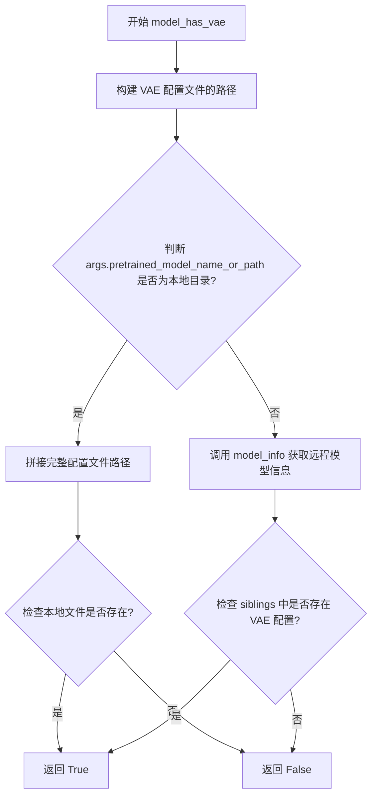

#### 带注释源码

```python
def model_has_vae(args):
    """
    检查预训练模型是否包含 VAE（变分自编码器）。
    
    通过检查 VAE 配置文件是否存在来判断模型是否具备 VAE 组件。
    支持本地路径和远程 HuggingFace Hub 两种模型来源。
    """
    # 构建 VAE 配置文件的相对路径: "vae/config.json"
    config_file_name = Path("vae", AutoencoderKL.config_name).as_posix()
    
    # 判断预训练模型路径是否为本地目录
    if os.path.isdir(args.pretrained_model_name_or_path):
        # 本地模型：拼接完整的配置文件路径
        config_file_name = os.path.join(args.pretrained_model_name_or_path, config_file_name)
        # 检查本地文件系统上 VAE 配置文件是否存在
        return os.path.isfile(config_file_name)
    else:
        # 远程模型：通过 HuggingFace Hub API 获取模型文件列表
        files_in_repo = model_info(args.pretrained_model_name_or_path, revision=args.revision).siblings
        # 检查模型仓库的 siblings 中是否存在 VAE 配置文件
        return any(file.rfilename == config_file_name for file in files_in_repo)
```


### `tokenize_prompt`

该函数用于将文本提示词（prompt）转换为模型可处理的token IDs和注意力掩码。它接收分词器对象和提示词，可选地指定最大长度，然后调用tokenizer进行分词处理，最终返回包含input_ids和attention_mask等张量的分词结果。

参数：

- `tokenizer`：`PretrainedTokenizer`，Hugging Face Transformers库中的预训练分词器对象，用于对文本进行分词处理
- `prompt`：`str`，需要分词的文本提示词
- `tokenizer_max_length`：`int`，可选参数，指定分词的最大长度，如果为None则使用tokenizer自身的model_max_length属性

返回值：`Tokenization`（或类似对象），返回一个包含分词结果的容器对象，通常包含`input_ids`（token IDs张量）和`attention_mask`（注意力掩码张量）等字段

#### 流程图

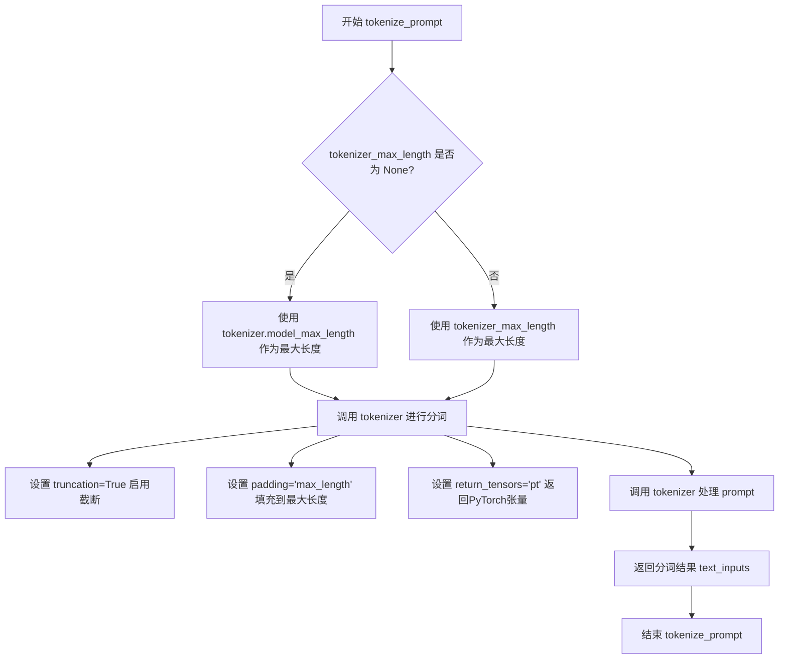

#### 带注释源码

```python
def tokenize_prompt(tokenizer, prompt, tokenizer_max_length=None):
    """
    对提示词进行分词处理
    
    参数:
        tokenizer: 预训练分词器对象
        prompt: 要分词的文本提示
        tokenizer_max_length: 可选的最大长度限制
    
    返回:
        包含input_ids和attention_mask的分词结果对象
    """
    # 判断是否指定了自定义最大长度
    if tokenizer_max_length is not None:
        max_length = tokenizer_max_length
    else:
        # 使用tokenizer的默认最大长度（通常是模型配置中的model_max_length）
        max_length = tokenizer.model_max_length

    # 使用tokenizer对prompt进行分词
    text_inputs = tokenizer(
        prompt,                    # 待分词的文本
        truncation=True,            # 启用截断，超出max_length的token将被截断
        padding="max_length",      # 填充到max_length长度
        max_length=max_length,     # 最大长度
        return_tensors="pt",       # 返回PyTorch张量而非Python列表
    )

    # 返回分词结果，包含input_ids和attention_mask
    return text_inputs
```


### `encode_prompt`

该函数是DreamBooth训练脚本中的核心文本编码函数，负责将预处理后的token IDs通过文本编码器（Text Encoder）转换为高维embedding向量，以便后续作为UNet模型的文本条件输入。

参数：

- `text_encoder`：`torch.nn.Module`，文本编码器模型（如CLIPTextModel），用于将token IDs转换为embedding向量
- `input_ids`：`torch.Tensor`，形状为`(batch_size, seq_len)`的token IDs张量，包含经tokenizer处理后的文本标识符
- `attention_mask`：`torch.Tensor`，形状为`(batch_size, seq_len)`的注意力掩码张量，用于指示哪些token是有效的（1表示有效，0表示padding）
- `text_encoder_use_attention_mask`：`bool`或`None`，可选参数，指定是否在文本编码过程中使用attention_mask，默认为`None`

返回值：`torch.Tensor`，形状为`(batch_size, seq_len, hidden_size)`的文本embedding张量，其中hidden_size为文本编码器的隐藏层维度，通常为768（CLIP）或1024（T5）

#### 流程图

```mermaid
flowchart TD
    A[开始 encode_prompt] --> B{text_encoder_use_attention_mask?}
    B -->|True| C[将 attention_mask 移动到 text_encoder 设备]
    B -->|False| D[设置 attention_mask 为 None]
    C --> E[调用 text_encoder.forward]
    D --> E
    E --> F{return_dict=False?}
    F -->|True| G[提取 prompt_embeds[0]]
    F -->|False| H[直接使用 prompt_embeds]
    G --> I[返回 prompt_embeds]
    H --> I
```

#### 带注释源码

```python
def encode_prompt(text_encoder, input_ids, attention_mask, text_encoder_use_attention_mask=None):
    """
    将token IDs编码为embedding向量
    
    参数:
        text_encoder: 文本编码器模型实例
        input_ids: token IDs张量
        attention_mask: 注意力掩码张量
        text_encoder_use_attention_mask: 是否使用attention_mask的标志
    
    返回:
        prompt_embeds: 编码后的文本embedding张量
    """
    # 将input_ids移动到text_encoder所在的设备上（CPU/GPU）
    text_input_ids = input_ids.to(text_encoder.device)

    # 根据text_encoder_use_attention_mask参数决定是否使用attention_mask
    if text_encoder_use_attention_mask:
        # 将attention_mask也移动到text_encoder所在的设备
        attention_mask = attention_mask.to(text_encoder.device)
    else:
        # 如果不使用attention_mask，则设置为None
        attention_mask = None

    # 调用text_encoder进行前向传播，获取文本embedding
    # return_dict=False时返回tuple (last_hidden_state, ...)
    prompt_embeds = text_encoder(
        text_input_ids,
        attention_mask=attention_mask,
        return_dict=False,
    )
    # 由于return_dict=False，返回值为tuple，取第一个元素last_hidden_state
    prompt_embeds = prompt_embeds[0]

    # 返回编码后的文本embedding
    return prompt_embeds
```


### `collate_fn`

该函数是 DreamBooth 数据加载器的自定义批处理函数，负责将数据集中的多个样本整理成一个训练批次。它处理实例图像和类别图像（用于先验保留损失）、对应的文本输入ID以及注意力掩码，并将其转换为 PyTorch 张量格式以便后续模型训练。

参数：

- `examples`：`List[Dict]` ，从 `DreamBoothDataset` 返回的样本列表，每个样本包含图像和文本编码信息
- `with_prior_preservation`：`bool`，是否启用先验保留（prior preservation）模式，用于在训练时同时处理类别图像

返回值：`Dict[str, torch.Tensor]` ，包含批处理数据的字典，包含 `input_ids`（文本输入ID）、`pixel_values`（图像像素值）和可选的 `attention_mask`（注意力掩码）

#### 流程图

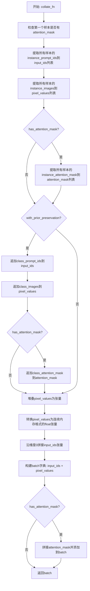

#### 带注释源码

```python
def collate_fn(examples, with_prior_preservation=False):
    # 检查第一个样本是否包含attention_mask字段
    # 用于判断是否需要对文本进行注意力掩码处理
    has_attention_mask = "instance_attention_mask" in examples[0]

    # 从每个样本中提取实例的文本prompt编码ID
    # 这些ID来自tokenizer对instance_prompt的编码结果
    input_ids = [example["instance_prompt_ids"] for example in examples]
    
    # 从每个样本中提取实例图像的像素值
    # 这些图像已经过transforms处理，转换为tensor并归一化
    pixel_values = [example["instance_images"] for example in examples]

    # 如果存在attention_mask，则提取所有样本的attention_mask
    if has_attention_mask:
        attention_mask = [example["instance_attention_mask"] for example in examples]

    # 先验保留处理：将类别样本与实例样本合并
    # 这样可以避免进行两次前向传播，提高训练效率
    if with_prior_preservation:
        # 添加类别prompt的编码ID
        input_ids += [example["class_prompt_ids"] for example in examples]
        
        # 添加类别图像的像素值
        pixel_values += [example["class_images"] for example in examples]

        # 如果有attention_mask，也添加类别样本的mask
        if has_attention_mask:
            attention_mask += [example["class_attention_mask"] for example in examples]

    # 将像素值列表堆叠成4D张量 [batch_size, channels, height, width]
    # 使用contiguous_format确保内存连续，提高访问效率
    pixel_values = torch.stack(pixel_values)
    pixel_values = pixel_values.to(memory_format=torch.contiguous_format).float()

    # 将input_ids列表沿batch维度拼接
    # 对于prior preservation模式，batch大小会翻倍
    input_ids = torch.cat(input_ids, dim=0)

    # 构建返回的批次字典
    batch = {
        "input_ids": input_ids,      # 拼接后的文本输入ID [total_seq_len]
        "pixel_values": pixel_values, # 堆叠后的图像张量 [batch, C, H, W]
    }

    # 如果存在attention_mask，也进行拼接并添加到batch中
    if has_attention_mask:
        attention_mask = torch.cat(attention_mask, dim=0)
        batch["attention_mask"] = attention_mask

    # 返回整理好的批次，准备送入模型训练
    return batch
```


### `main`

主训练函数，封装了DreamBooth完整的训练流程，包括模型加载、数据集准备、噪声调度器配置、扩散模型的前向与反向训练过程、验证、checkpoint保存以及最终模型导出。

参数：

- `args`：`argparse.Namespace`，包含所有训练配置参数，如模型路径、数据目录、学习率、批量大小、训练步数等

返回值：`None`，该函数直接执行训练流程并保存模型，不返回任何值

#### 流程图

```mermaid
flowchart TD
    A[开始训练] --> B[验证参数合法性<br>检查wandb与hub_token冲突]
    B --> C[创建Accelerator<br>配置混合精度与日志]
    C --> D{是否启用<br>Prior Preservation?}
    D -->|是| E[生成类别图像<br>使用DiffusionPipeline]
    D -->|否| F
    E --> F[加载Tokenizer]
    F --> G[导入TextEncoder类<br>根据模型架构]
    G --> H[加载模型组件<br>noise_scheduler<br>text_encoder<br>vae<br>unet]
    H --> I[注册模型保存/加载钩子<br>accelerator hooks]
    I --> J[配置优化器<br>Adam/AdamW8bit]
    J --> K[创建数据集<br>DreamBoothDataset]
    K --> L[创建DataLoader]
    L --> M[配置学习率调度器<br>lr_scheduler]
    M --> N[准备模型与数据<br>accelerator.prepare]
    N --> O[计算总训练步数<br>max_train_steps]
    O --> P[初始化Trackers<br>TensorBoard/WandB]
    P --> Q[训练循环开始]
    Q --> R{当前Epoch <br>总Epoch数?}
    R -->|是| S[遍历Batch]
    R -->|否| T[保存最终模型<br>DiffusionPipeline]
    S --> U{是否启用<br>Prior Preservation?}
    U -->|是| V[计算Prior Loss<br>类别图像噪声预测]
    U -->|否| W[仅计算Instance Loss]
    V --> X
    W --> X[计算MSE Loss<br>含SNR权重可选]
    X --> Y[反向传播<br>accelerator.backward]
    Y --> Z[梯度裁剪与优化器更新]
    Z --> AA{是否需要<br>Checkpoint?}
    AA -->|是| AB[保存训练状态<br>accelerator.save_state]
    AA -->|否| AC
    AB --> AC{是否需要<br>Validation?}
    AC -->|是| AD[执行验证<br>log_validation]
    AC -->|否| AE
    AD --> AE[更新全局步数<br>global_step]
    AE --> AF{global_step <br>max_train_steps?}
    AF -->|是| S
    AF -->|否| T
    T --> AG[推送到Hub可选]
    AG --> AH[训练结束]
```

#### 带注释源码

```python
def main(args):
    """
    DreamBooth训练主函数，包含完整的训练流程逻辑
    
    训练流程概述：
    1. 参数验证与Accelerator初始化
    2. 如启用Prior Preservation则生成类别图像
    3. 加载Tokenizer、TextEncoder、VAE、UNet等模型组件
    4. 配置优化器、学习率调度器、数据加载器
    5. 执行训练循环（多轮Epoch）
    6. 在训练过程中定期执行验证和保存Checkpoint
    7. 训练完成后保存最终的DiffusionPipeline
    """
    
    # ==================== 步骤1: 参数验证 ====================
    # 检查是否同时使用了wandb报告和hub_token（存在安全风险）
    if args.report_to == "wandb" and args.hub_token is not None:
        raise ValueError(
            "You cannot use both --report_to=wandb and --hub_token due to a security risk of exposing your token."
            " Please use `hf auth login` to authenticate with the Hub."
        )

    # ==================== 步骤2: 初始化Accelerator ====================
    # 创建日志目录和项目配置
    logging_dir = Path(args.output_dir, args.logging_dir)
    accelerator_project_config = ProjectConfiguration(project_dir=args.output_dir, logging_dir=logging_dir)

    # 初始化Accelerator，管理分布式训练、混合精度、梯度累积等
    accelerator = Accelerator(
        gradient_accumulation_steps=args.gradient_accumulation_steps,
        mixed_precision=args.mixed_precision,
        log_with=args.report_to,
        project_config=accelerator_project_config,
    )

    # 禁用MPS设备的AMP（自动混合精度）
    if torch.backends.mps.is_available():
        accelerator.native_amp = False

    # 检查wandb是否安装
    if args.report_to == "wandb":
        if not is_wandb_available():
            raise ImportError("Make sure to install wandb if you want to use it for logging during training.")

    # ==================== 步骤3: 分布式训练检查 ====================
    # 检查是否在训练text_encoder时启用了梯度累积（当前不支持）
    if args.train_text_encoder and args.gradient_accumulation_steps > 1 and accelerator.num_processes > 1:
        raise ValueError(
            "Gradient accumulation is not supported when training the text encoder in distributed training. "
            "Please set gradient_accumulation_steps to 1. This feature will be supported in the future."
        )

    # ==================== 步骤4: 日志配置 ====================
    # 配置日志格式并在每个进程输出配置信息用于调试
    logging.basicConfig(
        format="%(asctime)s - %(levelname)s - %(name)s - %(message)s",
        datefmt="%m/%d/%Y %H:%M:%S",
        level=logging.INFO,
    )
    logger.info(accelerator.state, main_process_only=False)
    if accelerator.is_local_main_process:
        transformers.utils.logging.set_verbosity_warning()
        diffusers.utils.logging.set_verbosity_info()
    else:
        transformers.utils.logging.set_verbosity_error()
        diffusers.utils.logging.set_verbosity_error()

    # 设置随机种子确保可重复性
    if args.seed is not None:
        set_seed(args.seed)

    # ==================== 步骤5: Prior Preservation类别图像生成 ====================
    # 如果启用Prior Preservation，需要生成类别图像用于保留原始类别信息
    if args.with_prior_preservation:
        class_images_dir = Path(args.class_data_dir)
        if not class_images_dir.exists():
            class_images_dir.mkdir(parents=True)
        cur_class_images = len(list(class_images_dir.iterdir()))

        # 如果现有类别图像不足，则生成更多
        if cur_class_images < args.num_class_images:
            # 确定torch数据类型（fp16/fp32/bf16）
            torch_dtype = torch.float16 if accelerator.device.type == "cuda" else torch.float32
            if args.prior_generation_precision == "fp32":
                torch_dtype = torch.float32
            elif args.prior_generation_precision == "fp16":
                torch_dtype = torch.float16
            elif args.prior_generation_precision == "bf16":
                torch_dtype = torch.bfloat16
            
            # 加载DiffusionPipeline用于生成类别图像
            pipeline = DiffusionPipeline.from_pretrained(
                args.pretrained_model_name_or_path,
                torch_dtype=torch_dtype,
                safety_checker=None,
                revision=args.revision,
                variant=args.variant,
            )
            pipeline.set_progress_bar_config(disable=True)

            num_new_images = args.num_class_images - cur_class_images
            logger.info(f"Number of class images to sample: {num_new_images}.")

            # 创建提示词数据集并生成图像
            sample_dataset = PromptDataset(args.class_prompt, num_new_images)
            sample_dataloader = torch.utils.data.DataLoader(sample_dataset, batch_size=args.sample_batch_size)
            sample_dataloader = accelerator.prepare(sample_dataloader)
            pipeline.to(accelerator.device)

            for example in tqdm(
                sample_dataloader, desc="Generating class images", disable=not accelerator.is_local_main_process
            ):
                images = pipeline(example["prompt"]).images
                # 保存生成的图像并用哈希命名避免重复
                for i, image in enumerate(images):
                    hash_image = insecure_hashlib.sha1(image.tobytes()).hexdigest()
                    image_filename = class_images_dir / f"{example['index'][i] + cur_class_images}-{hash_image}.jpg"
                    image.save(image_filename)

            del pipeline
            if torch.cuda.is_available():
                torch.cuda.empty_cache()

    # ==================== 步骤6: 仓库创建与Tokenizer加载 ====================
    # 处理HuggingFace仓库创建
    if accelerator.is_main_process:
        if args.output_dir is not None:
            os.makedirs(args.output_dir, exist_ok=True)
        if args.push_to_hub:
            repo_id = create_repo(
                repo_id=args.hub_model_id or Path(args.output_dir).name, exist_ok=True, token=args.hub_token
            ).repo_id

    # 加载Tokenizer
    if args.tokenizer_name:
        tokenizer = AutoTokenizer.from_pretrained(args.tokenizer_name, revision=args.revision, use_fast=False)
    elif args.pretrained_model_name_or_path:
        tokenizer = AutoTokenizer.from_pretrained(
            args.pretrained_model_name_or_path,
            subfolder="tokenizer",
            revision=args.revision,
            use_fast=False,
        )

    # ==================== 步骤7: 加载模型组件 ====================
    # 根据模型架构导入正确的TextEncoder类
    text_encoder_cls = import_model_class_from_model_name_or_path(args.pretrained_model_name_or_path, args.revision)

    # 加载噪声调度器
    noise_scheduler = DDPMScheduler.from_pretrained(args.pretrained_model_name_or_path, subfolder="scheduler")
    
    # 加载TextEncoder
    text_encoder = text_encoder_cls.from_pretrained(
        args.pretrained_model_name_or_path, subfolder="text_encoder", revision=args.revision, variant=args.variant
    )

    # 条件加载VAE（变分自编码器）
    if model_has_vae(args):
        vae = AutoencoderKL.from_pretrained(
            args.pretrained_model_name_or_path, subfolder="vae", revision=args.revision, variant=args.variant
        )
    else:
        vae = None

    # 加载UNet（去噪网络）
    unet = UNet2DConditionModel.from_pretrained(
        args.pretrained_model_name_or_path, subfolder="unet", revision=args.revision, variant=args.variant
    )

    # 辅助函数：解包模型（处理compiled module情况）
    def unwrap_model(model):
        model = accelerator.unwrap_model(model)
        model = model._orig_mod if is_compiled_module(model) else model
        return model

    # ==================== 步骤8: 注册模型保存/加载钩子 ====================
    # 创建自定义的模型保存和加载钩子
    def save_model_hook(models, weights, output_dir):
        if accelerator.is_main_process:
            for model in models:
                # 根据模型类型确定保存子目录
                sub_dir = "unet" if isinstance(model, type(unwrap_model(unet))) else "text_encoder"
                model.save_pretrained(os.path.join(output_dir, sub_dir))
                weights.pop()  # 避免重复保存

    def load_model_hook(models, input_dir):
        while len(models) > 0:
            model = models.pop()
            if isinstance(model, type(unwrap_model(text_encoder))):
                # 使用transformers风格加载text_encoder
                load_model = text_encoder_cls.from_pretrained(input_dir, subfolder="text_encoder")
                model.config = load_model.config
            else:
                # 使用diffusers风格加载unet
                load_model = UNet2DConditionModel.from_pretrained(input_dir, subfolder="unet")
                model.register_to_config(**load_model.config)
            model.load_state_dict(load_model.state_dict())
            del load_model

    accelerator.register_save_state_pre_hook(save_model_hook)
    accelerator.register_load_state_pre_hook(load_model_hook)

    # ==================== 步骤9: 设置模型梯度要求 ====================
    # VAE通常不需要训练，冻结参数
    if vae is not None:
        vae.requires_grad_(False)

    # 根据配置决定是否训练text_encoder
    if not args.train_text_encoder:
        text_encoder.requires_grad_(False)

    # ==================== 步骤10: xFormers内存优化 ====================
    if args.enable_xformers_memory_efficient_attention:
        if is_xformers_available():
            import xformers
            # 检查xFormers版本兼容性
            xformers_version = version.parse(xformers.__version__)
            if xformers_version == version.parse("0.0.16"):
                logger.warning(
                    "xFormers 0.0.16 cannot be used for training in some GPUs. If you observe problems during training, please update xFormers to at least 0.0.17."
                )
            unet.enable_xformers_memory_efficient_attention()
        else:
            raise ValueError("xformers is not available. Make sure it is installed correctly")

    # ==================== 步骤11: 梯度检查点节省显存 ====================
    if args.gradient_checkpointing:
        unet.enable_gradient_checkpointing()
        if args.train_text_encoder:
            text_encoder.gradient_checkpointing_enable()

    # ==================== 步骤12: 检查模型精度 ====================
    # 确保所有可训练模型权重都是float32
    low_precision_error_string = (
        "Please make sure to always have all model weights in full float32 precision when starting training - even if"
        " doing mixed precision training. copy of the weights should still be float32."
    )
    if unwrap_model(unet).dtype != torch.float32:
        raise ValueError(f"Unet loaded as datatype {unwrap_model(unet)}. {low_precision_error_string}")
    if args.train_text_encoder and unwrap_model(text_encoder).dtype != torch.float32:
        raise ValueError(f"Text encoder loaded as datatype {unwrap_model(text_encoder)}. {low_precision_error_string}")

    # ==================== 步骤13: TF32加速（ Ampere GPU）====================
    if args.allow_tf32:
        torch.backends.cuda.matmul.allow_tf32 = True

    # ==================== 步骤14: 学习率缩放 ====================
    if args.scale_lr:
        args.learning_rate = (
            args.learning_rate * args.gradient_accumulation_steps * args.train_batch_size * accelerator.num_processes
        )

    # ==================== 步骤15: 选择优化器 ====================
    # 支持8-bit Adam减少显存占用
    if args.use_8bit_adam:
        try:
            import bitsandbytes as bnb
        except ImportError:
            raise ImportError("To use 8-bit Adam, please install the bitsandbytes library: `pip install bitsandbytes`.")
        optimizer_class = bnb.optim.AdamW8bit
    else:
        optimizer_class = torch.optim.AdamW

    # ==================== 步骤16: 创建优化器 ====================
    # 根据是否训练text_encoder确定优化参数
    params_to_optimize = (
        itertools.chain(unet.parameters(), text_encoder.parameters()) 
        if args.train_text_encoder 
        else unet.parameters()
    )
    optimizer = optimizer_class(
        params_to_optimize,
        lr=args.learning_rate,
        betas=(args.adam_beta1, args.adam_beta2),
        weight_decay=args.adam_weight_decay,
        eps=args.adam_epsilon,
    )

    # ==================== 步骤17: 预计算文本嵌入（可选）====================
    # 如果选择预计算文本嵌入，可以节省训练时的显存
    if args.pre_compute_text_embeddings:
        def compute_text_embeddings(prompt):
            with torch.no_grad():
                text_inputs = tokenize_prompt(tokenizer, prompt, tokenizer_max_length=args.tokenizer_max_length)
                prompt_embeds = encode_prompt(
                    text_encoder,
                    text_inputs.input_ids,
                    text_inputs.attention_mask,
                    text_encoder_use_attention_mask=args.text_encoder_use_attention_mask,
                )
            return prompt_embeds

        # 预计算实例、验证和类别的文本嵌入
        pre_computed_encoder_hidden_states = compute_text_embeddings(args.instance_prompt)
        validation_prompt_negative_prompt_embeds = compute_text_embeddings("")
        
        if args.validation_prompt is not None:
            validation_prompt_encoder_hidden_states = compute_text_embeddings(args.validation_prompt)
        else:
            validation_prompt_encoder_hidden_states = None

        if args.class_prompt is not None:
            pre_computed_class_prompt_encoder_hidden_states = compute_text_embeddings(args.class_prompt)
        else:
            pre_computed_class_prompt_encoder_hidden_states = None

        # 释放text_encoder和tokenizer以节省显存
        text_encoder = None
        tokenizer = None
        gc.collect()
        torch.cuda.empty_cache()
    else:
        pre_computed_encoder_hidden_states = None
        validation_prompt_encoder_hidden_states = None
        validation_prompt_negative_prompt_embeds = None
        pre_computed_class_prompt_encoder_hidden_states = None

    # ==================== 步骤18: 创建数据集和数据加载器 ====================
    train_dataset = DreamBoothDataset(
        instance_data_root=args.instance_data_dir,
        instance_prompt=args.instance_prompt,
        class_data_root=args.class_data_dir if args.with_prior_preservation else None,
        class_prompt=args.class_prompt,
        class_num=args.num_class_images,
        tokenizer=tokenizer,
        size=args.resolution,
        center_crop=args.center_crop,
        encoder_hidden_states=pre_computed_encoder_hidden_states,
        class_prompt_encoder_hidden_states=pre_computed_class_prompt_encoder_hidden_states,
        tokenizer_max_length=args.tokenizer_max_length,
    )

    train_dataloader = torch.utils.data.DataLoader(
        train_dataset,
        batch_size=args.train_batch_size,
        shuffle=True,
        collate_fn=lambda examples: collate_fn(examples, args.with_prior_preservation),
        num_workers=args.dataloader_num_workers,
    )

    # ==================== 步骤19: 配置学习率调度器 ====================
    num_warmup_steps_for_scheduler = args.lr_warmup_steps * accelerator.num_processes
    if args.max_train_steps is None:
        # 根据epoch数和batch数计算总训练步数
        len_train_dataloader_after_sharding = math.ceil(len(train_dataloader) / accelerator.num_processes)
        num_update_steps_per_epoch = math.ceil(len_train_dataloader_after_sharding / args.gradient_accumulation_steps)
        num_training_steps_for_scheduler = (
            args.num_train_epochs * accelerator.num_processes * num_update_steps_per_epoch
        )
    else:
        num_training_steps_for_scheduler = args.max_train_steps * accelerator.num_processes

    lr_scheduler = get_scheduler(
        args.lr_scheduler,
        optimizer=optimizer,
        num_warmup_steps=num_warmup_steps_for_scheduler,
        num_training_steps=num_training_steps_for_scheduler,
        num_cycles=args.lr_num_cycles,
        power=args.lr_power,
    )

    # ==================== 步骤20: 使用Accelerator准备所有组件 ====================
    if args.train_text_encoder:
        unet, text_encoder, optimizer, train_dataloader, lr_scheduler = accelerator.prepare(
            unet, text_encoder, optimizer, train_dataloader, lr_scheduler
        )
    else:
        unet, optimizer, train_dataloader, lr_scheduler = accelerator.prepare(
            unet, optimizer, train_dataloader, lr_scheduler
        )

    # ==================== 步骤21: 设置混合精度权重类型 ====================
    weight_dtype = torch.float32
    if accelerator.mixed_precision == "fp16":
        weight_dtype = torch.float16
    elif accelerator.mixed_precision == "bf16":
        weight_dtype = torch.bfloat16

    # 将VAE和TextEncoder移动到设备并转换类型
    if vae is not None:
        vae.to(accelerator.device, dtype=weight_dtype)
    if not args.train_text_encoder and text_encoder is not None:
        text_encoder.to(accelerator.device, dtype=weight_dtype)

    # ==================== 步骤22: 重新计算训练步数 ====================
    # DataLoader经过accelerator.prepare后长度可能改变
    num_update_steps_per_epoch = math.ceil(len(train_dataloader) / args.gradient_accumulation_steps)
    if args.max_train_steps is None:
        args.max_train_steps = args.num_train_epochs * num_update_steps_per_epoch
        if num_training_steps_for_scheduler != args.max_train_steps:
            logger.warning(
                f"The length of the 'train_dataloader' after 'accelerator.prepare' ({len(train_dataloader)}) does not match "
                f"the expected length when the learning rate scheduler was created."
            )
    args.num_train_epochs = math.ceil(args.max_train_steps / num_update_steps_per_epoch)

    # ==================== 步骤23: 初始化Trackers ====================
    if accelerator.is_main_process:
        tracker_config = vars(copy.deepcopy(args))
        tracker_config.pop("validation_images")
        accelerator.init_trackers("dreambooth", config=tracker_config)

    # ==================== 步骤24: 打印训练信息 ====================
    total_batch_size = args.train_batch_size * accelerator.num_processes * args.gradient_accumulation_steps
    logger.info("***** Running training *****")
    logger.info(f"  Num examples = {len(train_dataset)}")
    logger.info(f"  Num batches each epoch = {len(train_dataloader)}")
    logger.info(f"  Num Epochs = {args.num_train_epochs}")
    logger.info(f"  Instantaneous batch size per device = {args.train_batch_size}")
    logger.info(f"  Total train batch size (w. parallel, distributed & accumulation) = {total_batch_size}")
    logger.info(f"  Gradient Accumulation steps = {args.gradient_accumulation_steps}")
    logger.info(f"  Total optimization steps = {args.max_train_steps}")

    global_step = 0
    first_epoch = 0

    # ==================== 步骤25: 从Checkpoint恢复（可选）====================
    if args.resume_from_checkpoint:
        if args.resume_from_checkpoint != "latest":
            path = os.path.basename(args.resume_from_checkpoint)
        else:
            # 查找最新的checkpoint
            dirs = os.listdir(args.output_dir)
            dirs = [d for d in dirs if d.startswith("checkpoint")]
            dirs = sorted(dirs, key=lambda x: int(x.split("-")[1]))
            path = dirs[-1] if len(dirs) > 0 else None

        if path is None:
            accelerator.print(f"Checkpoint '{args.resume_from_checkpoint}' does not exist. Starting a new training run.")
            args.resume_from_checkpoint = None
            initial_global_step = 0
        else:
            accelerator.print(f"Resuming from checkpoint {path}")
            accelerator.load_state(os.path.join(args.output_dir, path))
            global_step = int(path.split("-")[1])
            initial_global_step = global_step
            first_epoch = global_step // num_update_steps_per_epoch
    else:
        initial_global_step = 0

    # ==================== 步骤26: 训练循环 ====================
    progress_bar = tqdm(
        range(0, args.max_train_steps),
        initial=initial_global_step,
        desc="Steps",
        disable=not accelerator.is_local_main_process,
    )

    for epoch in range(first_epoch, args.num_train_epochs):
        unet.train()
        if args.train_text_encoder:
            text_encoder.train()
        
        # 遍历每个batch
        for step, batch in enumerate(train_dataloader):
            with accelerator.accumulate(unet):
                # ==================== 步骤26.1: 图像编码到潜在空间 ====================
                pixel_values = batch["pixel_values"].to(dtype=weight_dtype)
                if vae is not None:
                    # 使用VAE将图像编码为潜在表示
                    model_input = vae.encode(batch["pixel_values"].to(dtype=weight_dtype)).latent_dist.sample()
                    model_input = model_input * vae.config.scaling_factor
                else:
                    model_input = pixel_values

                # ==================== 步骤26.2: 添加噪声 ====================
                # 采样噪声并添加到模型输入（正向扩散过程）
                if args.offset_noise:
                    noise = torch.randn_like(model_input) + 0.1 * torch.randn(
                        model_input.shape[0], model_input.shape[1], 1, 1, device=model_input.device
                    )
                else:
                    noise = torch.randn_like(model_input)
                
                bsz, channels, height, width = model_input.shape
                # 为每个图像随机采样时间步
                timesteps = torch.randint(
                    0, noise_scheduler.config.num_train_timesteps, (bsz,), device=model_input.device
                ).long()

                # 根据噪声调度器添加噪声
                noisy_model_input = noise_scheduler.add_noise(model_input, noise, timesteps)

                # ==================== 步骤26.3: 文本编码 ====================
                if args.pre_compute_text_embeddings:
                    encoder_hidden_states = batch["input_ids"]
                else:
                    encoder_hidden_states = encode_prompt(
                        text_encoder,
                        batch["input_ids"],
                        batch["attention_mask"],
                        text_encoder_use_attention_mask=args.text_encoder_use_attention_mask,
                    )

                # 处理UNet输入通道数（某些模型需要双通道输入）
                if unwrap_model(unet).config.in_channels == channels * 2:
                    noisy_model_input = torch.cat([noisy_model_input, noisy_model_input], dim=1)

                # 类别标签条件（可选）
                if args.class_labels_conditioning == "timesteps":
                    class_labels = timesteps
                else:
                    class_labels = None

                # ==================== 步骤26.4: UNet前向传播 ====================
                # 预测噪声残差
                model_pred = unet(
                    noisy_model_input, timesteps, encoder_hidden_states, class_labels=class_labels, return_dict=False
                )[0]

                # 处理预测的方差（某些模型预测噪声和方差）
                if model_pred.shape[1] == 6:
                    model_pred, _ = torch.chunk(model_pred, 2, dim=1)

                # ==================== 步骤26.5: 计算目标 ====================
                # 根据预测类型确定目标（噪声或速度）
                if noise_scheduler.config.prediction_type == "epsilon":
                    target = noise
                elif noise_scheduler.config.prediction_type == "v_prediction":
                    target = noise_scheduler.get_velocity(model_input, noise, timesteps)
                else:
                    raise ValueError(f"Unknown prediction type {noise_scheduler.config.prediction_type}")

                # ==================== 步骤26.6: 计算损失 ====================
                # 如果启用Prior Preservation，分别计算实例和类别损失
                if args.with_prior_preservation:
                    model_pred, model_pred_prior = torch.chunk(model_pred, 2, dim=0)
                    target, target_prior = torch.chunk(target, 2, dim=0)
                    prior_loss = F.mse_loss(model_pred_prior.float(), target_prior.float(), reduction="mean")

                # 计算实例损失（支持SNR加权）
                if args.snr_gamma is None:
                    loss = F.mse_loss(model_pred.float(), target.float(), reduction="mean")
                else:
                    # 使用SNR加权损失（参考论文2303.09556）
                    snr = compute_snr(noise_scheduler, timesteps)
                    if noise_scheduler.config.prediction_type == "v_prediction":
                        divisor = snr + 1
                    else:
                        divisor = snr
                    mse_loss_weights = (
                        torch.stack([snr, args.snr_gamma * torch.ones_like(timesteps)], dim=1).min(dim=1)[0] / divisor
                    )
                    loss = F.mse_loss(model_pred.float(), target.float(), reduction="none")
                    loss = loss.mean(dim=list(range(1, len(loss.shape)))) * mse_loss_weights
                    loss = loss.mean()

                # 添加Prior Preservation损失
                if args.with_prior_preservation:
                    loss = loss + args.prior_loss_weight * prior_loss

                # ==================== 步骤26.7: 反向传播与优化 ====================
                accelerator.backward(loss)
                if accelerator.sync_gradients:
                    # 梯度裁剪
                    params_to_clip = (
                        itertools.chain(unet.parameters(), text_encoder.parameters())
                        if args.train_text_encoder
                        else unet.parameters()
                    )
                    accelerator.clip_grad_norm_(params_to_clip, args.max_grad_norm)
                
                optimizer.step()
                lr_scheduler.step()
                optimizer.zero_grad(set_to_none=args.set_grads_to_none)

            # ==================== 步骤26.8: 检查点保存与验证 ====================
            if accelerator.sync_gradients:
                progress_bar.update(1)
                global_step += 1

                # 定期保存checkpoint
                if accelerator.is_main_process and global_step % args.checkpointing_steps == 0:
                    # 限制保存的checkpoint数量
                    if args.checkpoints_total_limit is not None:
                        checkpoints = os.listdir(args.output_dir)
                        checkpoints = [d for d in checkpoints if d.startswith("checkpoint")]
                        checkpoints = sorted(checkpoints, key=lambda x: int(x.split("-")[1]))
                        if len(checkpoints) >= args.checkpoints_total_limit:
                            num_to_remove = len(checkpoints) - args.checkpoints_total_limit + 1
                            removing_checkpoints = checkpoints[0:num_to_remove]
                            for removing_checkpoint in removing_checkpoints:
                                shutil.rmtree(os.path.join(args.output_dir, removing_checkpoint))

                    save_path = os.path.join(args.output_dir, f"checkpoint-{global_step}")
                    accelerator.save_state(save_path)
                    logger.info(f"Saved state to {save_path}")

                # 定期执行验证
                images = []
                if args.validation_prompt is not None and global_step % args.validation_steps == 0:
                    images = log_validation(
                        unwrap_model(text_encoder) if text_encoder is not None else text_encoder,
                        tokenizer,
                        unwrap_model(unet),
                        vae,
                        args,
                        accelerator,
                        weight_dtype,
                        global_step,
                        validation_prompt_encoder_hidden_states,
                        validation_prompt_negative_prompt_embeds,
                    )

                # 记录训练日志
                logs = {"loss": loss.detach().item(), "lr": lr_scheduler.get_last_lr()[0]}
                progress_bar.set_postfix(**logs)
                accelerator.log(logs, step=global_step)

                # 检查是否达到最大训练步数
                if global_step >= args.max_train_steps:
                    break

    # ==================== 步骤27: 保存最终模型 ====================
    accelerator.wait_for_everyone()
    if accelerator.is_main_process:
        pipeline_args = {}
        if text_encoder is not None:
            pipeline_args["text_encoder"] = unwrap_model(text_encoder)
        if args.skip_save_text_encoder:
            pipeline_args["text_encoder"] = None

        # 使用训练好的模块创建Pipeline
        pipeline = DiffusionPipeline.from_pretrained(
            args.pretrained_model_name_or_path,
            unet=unwrap_model(unet),
            revision=args.revision,
            variant=args.variant,
            **pipeline_args,
        )

        # 配置调度器忽略方差预测
        scheduler_args = {}
        if "variance_type" in pipeline.scheduler.config:
            variance_type = pipeline.scheduler.config.variance_type
            if variance_type in ["learned", "learned_range"]:
                variance_type = "fixed_small"
            scheduler_args["variance_type"] = variance_type

        pipeline.scheduler = pipeline.scheduler.from_config(pipeline.scheduler.config, **scheduler_args)
        pipeline.save_pretrained(args.output_dir)

        # 推送到HuggingFace Hub（可选）
        if args.push_to_hub:
            save_model_card(
                repo_id,
                images=images,
                base_model=args.pretrained_model_name_or_path,
                train_text_encoder=args.train_text_encoder,
                prompt=args.instance_prompt,
                repo_folder=args.output_dir,
                pipeline=pipeline,
            )
            upload_folder(
                repo_id=repo_id,
                folder_path=args.output_dir,
                commit_message="End of training",
                ignore_patterns=["step_*", "epoch_*"],
            )

    accelerator.end_training()
```


### DreamBoothDataset.__init__

该方法是 DreamBoothDataset 类的构造函数，用于初始化 DreamBooth 数据集。它设置了数据集路径、图像变换、提示词编码器等核心组件，支持实例图像和类别图像（用于先验保留损失）的加载与预处理。

参数：

- `instance_data_root`：`str`，实例图像所在目录的路径
- `instance_prompt`：`str`，用于描述实例图像的提示词
- `tokenizer`：`PretrainedTokenizer`，用于将文本提示词转换为 token ID 的分词器
- `class_data_root`：`str`，可选，类别图像所在目录的路径（用于先验保留损失）
- `class_prompt`：`str`，可选，用于描述类别图像的提示词
- `class_num`：`int`，可选，类别图像的最大数量
- `size`：`int`，图像的目标尺寸，默认为 512
- `center_crop`：`bool`，是否采用中心裁剪，默认为 False
- `encoder_hidden_states`：`torch.Tensor`，可选，预计算的文本编码器隐藏状态
- `class_prompt_encoder_hidden_states`：`torch.Tensor`，可选，预计算的类别提示词编码器隐藏状态
- `tokenizer_max_length`：`int`，可选，分词器的最大长度

返回值：`None`，该方法无返回值，仅初始化对象状态

#### 流程图

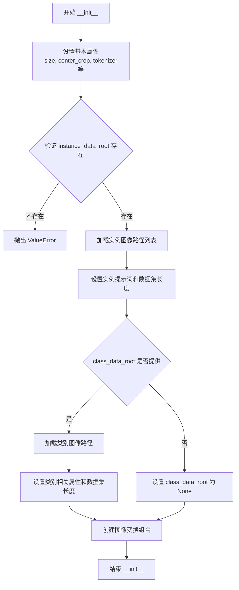

#### 带注释源码

```python
def __init__(
    self,
    instance_data_root,
    instance_prompt,
    tokenizer,
    class_data_root=None,
    class_prompt=None,
    class_num=None,
    size=512,
    center_crop=False,
    encoder_hidden_states=None,
    class_prompt_encoder_hidden_states=None,
    tokenizer_max_length=None,
):
    # 1. 设置基本的图像处理参数
    self.size = size  # 目标图像尺寸
    self.center_crop = center_crop  # 是否进行中心裁剪
    self.tokenizer = tokenizer  # 分词器对象
    self.encoder_hidden_states = encoder_hidden_states  # 预计算的实例提示词编码
    self.class_prompt_encoder_hidden_states = class_prompt_encoder_hidden_states  # 预计算的类别提示词编码
    self.tokenizer_max_length = tokenizer_max_length  # 分词器最大长度

    # 2. 验证并处理实例数据路径
    self.instance_data_root = Path(instance_data_root)
    if not self.instance_data_root.exists():
        raise ValueError(f"Instance {self.instance_data_root} images root doesn't exists.")

    # 3. 加载实例图像并统计数量
    self.instance_images_path = list(Path(instance_data_root).iterdir())
    self.num_instance_images = len(self.instance_images_path)
    self.instance_prompt = instance_prompt
    # 数据集长度初始为实例图像数量
    self._length = self.num_instance_images

    # 4. 处理类别数据（如果提供）
    if class_data_root is not None:
        self.class_data_root = Path(class_data_root)
        self.class_data_root.mkdir(parents=True, exist_ok=True)
        self.class_images_path = list(self.class_data_root.iterdir())
        # 根据 class_num 限制类别图像数量
        if class_num is not None:
            self.num_class_images = min(len(self.class_images_path), class_num)
        else:
            self.num_class_images = len(self.class_images_path)
        # 数据集长度为实例和类别图像数量的最大值
        self._length = max(self.num_class_images, self.num_instance_images)
        self.class_prompt = class_prompt
    else:
        self.class_data_root = None

    # 5. 创建图像变换组合
    # 包含：调整大小 -> 裁剪 -> 转换为张量 -> 归一化
    self.image_transforms = transforms.Compose(
        [
            transforms.Resize(size, interpolation=transforms.InterpolationMode.BILINEAR),
            transforms.CenterCrop(size) if center_crop else transforms.RandomCrop(size),
            transforms.ToTensor(),
            transforms.Normalize([0.5], [0.5]),  # 将图像归一化到 [-1, 1]
        ]
    )
```


### DreamBoothDataset.__len__

返回数据集的长度，用于DataLoader确定迭代次数，使PyTorch能够正确计算训练轮数。

参数：

- 无显式参数（Python magic method，`self` 为隐式参数）

返回值：`int`，返回数据集的样本数量（取实例图像数量与类图像数量的最大值）

#### 流程图

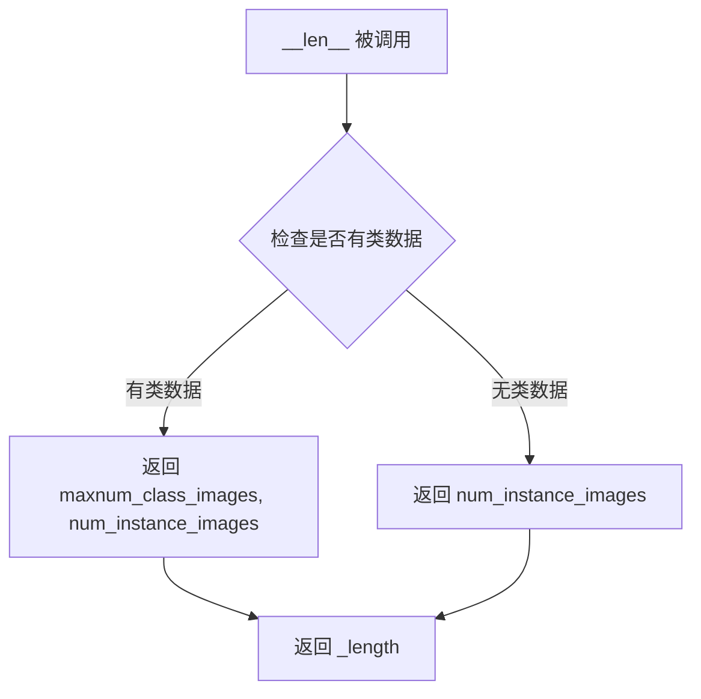

#### 带注释源码

```python
def __len__(self):
    """
    返回数据集的长度。
    
    该方法由 PyTorch DataLoader 调用，用于确定每个 epoch 的批次数。
    如果启用了类别先验保存（class_data_root 不为 None），则返回实例图像数量
    和类图像数量的较大值，以确保 DataLoader 能够遍历所有类别图像。
    否则，仅返回实例图像的数量。
    """
    return self._length
```


### `DreamBoothDataset.__getitem__`

获取并处理单条训练数据（包括实例图像和可选的类图像），返回包含图像和文本编码信息的字典。

参数：

- `self`：内部参数，表示数据集实例本身
- `index`：`int`，要获取的数据索引

返回值：`dict`，包含以下键值的字典：
- `instance_images`：`torch.Tensor`，经过预处理和归一化的实例图像张量
- `instance_prompt_ids`：`torch.Tensor`，实例提示的token IDs
- `instance_attention_mask`：`torch.Tensor`（可选），实例提示的注意力掩码
- `class_images`：`torch.Tensor`（可选），经过预处理和归一化的类图像张量
- `class_prompt_ids`：`torch.Tensor`（可选），类提示的token IDs
- `class_attention_mask`：`torch.Tensor`（可选），类提示的注意力掩码

#### 流程图

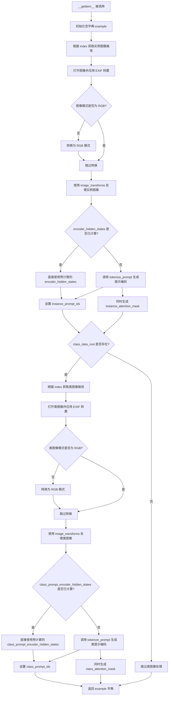

#### 带注释源码

```python
def __getitem__(self, index):
    """
    获取指定索引的训练样本。
    
    参数:
        index: int - 数据集中样本的索引
    
    返回:
        dict: 包含以下键的字典:
            - instance_images: 处理后的实例图像张量
            - instance_prompt_ids: 实例提示的token IDs
            - instance_attention_mask: 实例提示的注意力掩码（如果未预计算）
            - class_images: 处理后的类图像张量（如果启用prior preservation）
            - class_prompt_ids: 类提示的token IDs（如果启用prior preservation）
            - class_attention_mask: 类提示的注意力掩码（如果启用prior preservation且未预计算）
    """
    # 初始化返回字典
    example = {}
    
    # -------------------- 实例图像处理 --------------------
    # 使用模运算处理索引，确保循环遍历所有实例图像
    instance_image = Image.open(self.instance_images_path[index % self.num_instance_images])
    # 根据EXIF信息调整图像方向（处理手机拍摄的照片方向问题）
    instance_image = exif_transpose(instance_image)
    
    # 确保图像为RGB模式（PNG可能是RGBA，GIF可能是P模式）
    if not instance_image.mode == "RGB":
        instance_image = instance_image.convert("RGB")
    
    # 应用图像变换：调整大小、裁剪、转换为张量、归一化
    example["instance_images"] = self.image_transforms(instance_image)
    
    # -------------------- 实例文本编码处理 --------------------
    # 如果已经预计算了encoder_hidden_states，直接使用
    if self.encoder_hidden_states is not None:
        example["instance_prompt_ids"] = self.encoder_hidden_states
    else:
        # 否则调用tokenize_prompt进行实时编码
        text_inputs = tokenize_prompt(
            self.tokenizer, self.instance_prompt, tokenizer_max_length=self.tokenizer_max_length
        )
        example["instance_prompt_ids"] = text_inputs.input_ids
        example["instance_attention_mask"] = text_inputs.attention_mask
    
    # -------------------- 类图像处理（Prior Preservation） --------------------
    # 如果配置了class_data_root，处理类图像用于prior preservation损失
    if self.class_data_root:
        # 获取类图像
        class_image = Image.open(self.class_images_path[index % self.num_class_images])
        class_image = exif_transpose(class_image)
        
        # 确保类图像为RGB模式
        if not class_image.mode == "RGB":
            class_image = class_image.convert("RGB")
        
        # 应用相同的图像变换
        example["class_images"] = self.image_transforms(class_image)
        
        # 处理类提示文本编码
        if self.class_prompt_encoder_hidden_states is not None:
            example["class_prompt_ids"] = self.class_prompt_encoder_hidden_states
        else:
            class_text_inputs = tokenize_prompt(
                self.tokenizer, self.class_prompt, tokenizer_max_length=self.tokenizer_max_length
            )
            example["class_prompt_ids"] = class_text_inputs.input_ids
            example["class_attention_mask"] = class_text_inputs.attention_mask
    
    # 返回包含实例和类图像及文本编码的字典
    return example
```


### `PromptDataset.__init__`

该方法是 `PromptDataset` 类的构造函数，用于初始化一个简单的提示词数据集，以便在多GPU环境下生成类图像时使用。`PromptDataset` 继承自 PyTorch 的 `Dataset` 类，主要功能是存储提示词和样本数量，为后续的数据加载和批处理提供基础。

参数：

- `prompt`：`str`，用于生成类图像的提示词（prompt），即描述要生成图像类别的文本
- `num_samples`：`int`，要生成的类图像样本数量

返回值：无（`__init__` 方法不返回任何值）

#### 流程图

```mermaid
flowchart TD
    A[开始 PromptDataset.__init__] --> B[接收参数: prompt 和 num_samples]
    B --> C[self.prompt = prompt]
    C --> D[self.num_samples = num_samples]
    D --> E[初始化完成]
    
    F[DataLoader 调用 __getitem__] --> G[返回 {'prompt': self.prompt, 'index': index}]
    
    H[DataLoader 调用 __len__] --> I[返回 self.num_samples]
```

#### 带注释源码

```python
class PromptDataset(Dataset):
    """A simple dataset to prepare the prompts to generate class images on multiple GPUs."""

    def __init__(self, prompt, num_samples):
        """
        初始化 PromptDataset 实例。
        
        参数:
            prompt (str): 用于生成类图像的文本提示词
            num_samples (int): 需要生成的样本数量
        """
        # 存储提示词，该提示词将用于生成类图像
        self.prompt = prompt
        # 存储要生成的样本数量，决定了数据集的大小
        self.num_samples = num_samples

    def __len__(self):
        """返回数据集中的样本总数，供 DataLoader 使用"""
        return self.num_samples

    def __getitem__(self, index):
        """
        根据索引获取数据集中的单个样本。
        
        参数:
            index (int): 样本的索引位置
            
        返回:
            dict: 包含 'prompt' 和 'index' 键的字典
        """
        example = {}
        # 填充提示词（所有样本使用相同的提示词）
        example["prompt"] = self.prompt
        # 填充当前样本的索引
        example["index"] = index
        return example
```


### `PromptDataset.__len__`

返回 `PromptDataset` 数据集的样本数量，使得 DataLoader 能够确定遍历数据集时需要生成的批次数。

参数：

- 无额外参数（`self` 为隐式参数，表示数据集实例本身）

返回值：`int`，返回数据集中预设的样本数量 `num_samples`。

#### 流程图

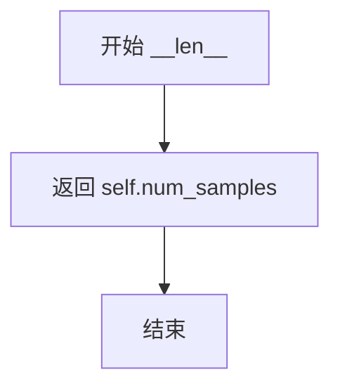

#### 带注释源码

```python
def __len__(self):
    """
    返回数据集的样本数量。
    
    该方法被 DataLoader 用来确定遍历数据集时需要生成的批次数。
    当使用 torch.utils.data.DataLoader 时，必须实现此方法。
    
    返回值:
        int: 在初始化时传入的 num_samples 参数，表示要生成的提示词样本数量。
    """
    return self.num_samples
```


### `PromptDataset.__getitem__`

该方法用于从PromptDataset数据集中获取指定索引的样本，返回包含提示词和索引的字典对象。

参数：

- `index`：`int`，表示要获取的样本索引，用于从数据集中定位特定的样本

返回值：`Dict[str, Union[str, int]]`，返回一个包含提示词(prompt)和索引(index)的字典，用于生成类别图像

#### 流程图

```mermaid
flowchart TD
    A[开始 __getitem__] --> B[创建空字典 example]
    B --> C[将 self.prompt 存入 example['prompt']]
    C --> D[将 index 存入 example['index']]
    D --> E[返回 example 字典]
    
    style A fill:#e1f5fe
    style E fill:#e8f5e8
```

#### 带注释源码

```python
def __getitem__(self, index):
    """
    获取指定索引处的样本数据。
    
    参数:
        index (int): 样本的索引位置
        
    返回:
        dict: 包含 'prompt' 和 'index' 键的字典
    """
    # 创建一个空字典用于存储样本数据
    example = {}
    
    # 将数据集中的提示词存储到字典中
    # 这个 prompt 是初始化时传入的类别提示词，用于生成类别图像
    example["prompt"] = self.prompt
    
    # 将当前索引存储到字典中
    # 这个索引用于在生成图像时命名文件或跟踪样本
    example["index"] = index
    
    # 返回包含提示词和索引的字典
    # 调用者可以使用这个字典来获取生成类别图像所需的信息
    return example
```

## 关键组件


# DreamBooth 训练脚本设计文档

## 一段话描述

该代码是一个 DreamBooth 微调训练脚本，用于在自定义实例图像上微调 Stable Diffusion 文本到图像扩散模型，实现个性化图像生成能力。

## 文件整体运行流程

```
1. parse_args() → 解析命令行参数
2. main(args) → 执行训练流程
   ├─ 初始化 Accelerator 分布式训练环境
   ├─ 生成类别图像（如果启用 prior preservation）
   ├─ 加载预训练模型（tokenizer, text_encoder, vae, unet）
   ├─ 创建 DreamBoothDataset 数据集
   ├─ 训练循环：
   │  ├─ 数据加载与批处理 (collate_fn)
   │  ├─ 图像编码为潜空间表示
   │  ├─ 添加噪声与调度
   │  ├─ 文本编码 (encode_prompt)
   │  ├─ UNet 预测噪声残差
   │  ├─ 计算 MSE 损失（含可选 SNR 加权）
   │  ├─ 反向传播与优化器更新
   │  └─ 定期保存检查点与验证
   └─ 保存最终训练好的模型管道
```

## 类详细信息

### DreamBoothDataset

**类描述**: 处理实例图像和类别图像的数据集类，负责图像预处理和提示符分词。

**字段**:
| 字段名 | 类型 | 描述 |
|--------|------|------|
| size | int | 目标图像分辨率 |
| center_crop | bool | 是否中心裁剪 |
| tokenizer | PreTrainedTokenizer | 分词器对象 |
| encoder_hidden_states | torch.Tensor | 预计算的编码器隐藏状态 |
| class_prompt_encoder_hidden_states | torch.Tensor | 类别提示的编码器隐藏状态 |
| tokenizer_max_length | int | 分词器最大长度 |
| instance_data_root | Path | 实例图像根目录 |
| instance_images_path | list | 实例图像路径列表 |
| num_instance_images | int | 实例图像数量 |
| instance_prompt | str | 实例提示文本 |
| class_data_root | Path | 类别图像根目录 |
| class_images_path | list | 类别图像路径列表 |
| num_class_images | int | 类别图像数量 |
| class_prompt | str | 类别提示文本 |
| _length | int | 数据集长度 |
| image_transforms | transforms.Compose | 图像变换组合 |

**方法**:
| 方法名 | 参数 | 返回值 | 描述 |
|--------|------|--------|------|
| __init__ | instance_data_root, instance_prompt, tokenizer, class_data_root, class_prompt, class_num, size, center_crop, encoder_hidden_states, class_prompt_encoder_hidden_states, tokenizer_max_length | None | 初始化数据集 |
| __len__ | self | int | 返回数据集长度 |
| __getitem__ | self, index | dict | 获取指定索引的样本 |

### PromptDataset

**类描述**: 简单的提示数据集，用于在多个 GPU 上生成类别图像。

**字段**:
| 字段名 | 类型 | 描述 |
|--------|------|------|
| prompt | str | 提示文本 |
| num_samples | int | 样本数量 |

**方法**:
| 方法名 | 参数 | 返回值 | 描述 |
|--------|------|--------|------|
| __init__ | self, prompt, num_samples | None | 初始化数据集 |
| __len__ | self | int | 返回样本数量 |
| __getitem__ | self, index | dict | 获取指定索引的样本 |

## 全局函数详细信息

### save_model_card

```python
def save_model_card(
    repo_id: str,
    images: list = None,
    base_model: str = None,
    train_text_encoder=False,
    prompt: str = None,
    repo_folder: str = None,
    pipeline: DiffusionPipeline = None,
)
```
**描述**: 生成并保存 HuggingFace Hub 模型卡片，包含模型描述和示例图像。

**参数**:
| 参数名 | 类型 | 描述 |
|--------|------|------|
| repo_id | str | 仓库 ID |
| images | list | 示例图像列表 |
| base_model | str | 基础模型名称 |
| train_text_encoder | bool | 是否训练文本编码器 |
| prompt | str | 训练提示 |
| repo_folder | str | 仓库文件夹路径 |
| pipeline | DiffusionPipeline | 扩散管道 |

**返回值**: None

### log_validation

```python
def log_validation(
    text_encoder,
    tokenizer,
    unet,
    vae,
    args,
    accelerator,
    weight_dtype,
    global_step,
    prompt_embeds,
    negative_prompt_embeds,
)
```
**描述**: 运行验证流程，生成指定提示的图像并记录到跟踪器。

**参数**:
| 参数名 | 类型 | 描述 |
|--------|------|------|
| text_encoder | PreTrainedModel | 文本编码器 |
| tokenizer | PreTrainedTokenizer | 分词器 |
| unet | UNet2DConditionModel | UNet 模型 |
| vae | AutoencoderKL | VAE 模型 |
| args | Namespace | 训练参数 |
| accelerator | Accelerator | 加速器 |
| weight_dtype | torch.dtype | 权重数据类型 |
| global_step | int | 全局步数 |
| prompt_embeds | torch.Tensor | 提示嵌入 |
| negative_prompt_embeds | torch.Tensor | 负面提示嵌入 |

**返回值**: list[Image] - 生成的图像列表

### import_model_class_from_model_name_or_path

```python
def import_model_class_from_model_name_or_path(pretrained_model_name_or_path: str, revision: str)
```
**描述**: 根据预训练模型路径动态导入正确的文本编码器类。

**参数**:
| 参数名 | 类型 | 描述 |
|--------|------|------|
| pretrained_model_name_or_path | str | 预训练模型路径或名称 |
| revision | str | 模型版本 |

**返回值**: 类 - CLIPTextModel 或 RobertaSeriesModelWithTransformation 或 T5EncoderModel

### parse_args

```python
def parse_args(input_args=None)
```
**描述**: 解析命令行参数，包含训练所需的所有超参数配置。

**返回值**: Namespace - 解析后的参数对象

### tokenize_prompt

```python
def tokenize_prompt(tokenizer, prompt, tokenizer_max_length=None)
```
**描述**: 使用分词器将提示文本转换为输入 ID 和注意力掩码。

**参数**:
| 参数名 | 类型 | 描述 |
|--------|------|------|
| tokenizer | PreTrainedTokenizer | 分词器 |
| prompt | str | 提示文本 |
| tokenizer_max_length | int | 最大长度 |

**返回值**: BatchEncoding - 包含 input_ids 和 attention_mask

### encode_prompt

```python
def encode_prompt(text_encoder, input_ids, attention_mask, text_encoder_use_attention_mask=None)
```
**描述**: 将分词后的提示编码为文本嵌入向量。

**参数**:
| 参数名 | 类型 | 描述 |
|--------|------|------|
| text_encoder | PreTrainedModel | 文本编码器 |
| input_ids | torch.Tensor | 输入 ID |
| attention_mask | torch.Tensor | 注意力掩码 |
| text_encoder_use_attention_mask | bool | 是否使用注意力掩码 |

**返回值**: torch.Tensor - 提示嵌入向量

### collate_fn

```python
def collate_fn(examples, with_prior_preservation=False)
```
**描述**: 批处理整理函数，将样本列表整理为训练批次。

**参数**:
| 参数名 | 类型 | 描述 |
|--------|------|------|
| examples | list[dict] | 样本列表 |
| with_prior_preservation | bool | 是否包含类别保留 |

**返回值**: dict - 包含 input_ids, pixel_values, attention_mask 的批次字典

### model_has_vae

```python
def model_has_vae(args)
```
**描述**: 检查预训练模型是否包含 VAE 组件。

**返回值**: bool

### main

```python
def main(args)
```
**描述**: 主训练函数，包含完整的 DreamBooth 训练流程。

## 关键组件信息

### 组件 1: DreamBooth 数据处理管道

处理实例图像和类别图像的加载、预处理和批处理，支持 prior preservation 损失计算。

### 组件 2: 文本编码与提示管理

支持预计算文本嵌入（pre_compute_text_embeddings）和实时编码两种模式，支持文本编码器训练。

### 组件 3: 噪声调度与损失计算

使用 DDPMScheduler 进行噪声调度，支持 SNR 加权损失和 offset noise 技术。

### 组件 4: 分布式训练加速

使用 Accelerate 库支持混合精度训练、梯度累积、检查点保存和验证。

### 组件 5: 模型加载与保存钩子

自定义模型保存和加载逻辑，支持分布式训练状态序列化。

## 潜在技术债务与优化空间

1. **梯度累积与文本编码器训练限制**: 代码中明确指出不支持在分布式训练中对两个模型同时使用梯度累积
2. **硬编码的验证调度器选择**: 验证时只支持 DPMSolverMultistepScheduler 和 DDPMScheduler
3. **VAE 编码器未使用梯度 checkpointing**: 大分辨率训练时可能存在内存压力
4. **检查点清理逻辑**: 每次保存前都重新扫描目录，效率可优化
5. **缺少 LORA 支持**: 当前只支持完整模型微调，无 LoRA/LoHA 等参数高效微调方法

## 其它项目

### 设计目标与约束

- **目标**: 实现 DreamBooth 个性化图像生成模型微调
- **约束**: 文本编码器训练时不支持梯度累积；需保持 float32 精度训练可训练模型

### 错误处理与异常设计

- 配置文件缺失时抛出 ValueError
- 依赖库缺失时提示安装（如 bitsandbytes, wandb, xformers）
- 分布式训练参数校验

### 数据流与状态机

- 训练状态: 初始化 → 数据加载 → 前向传播 → 损失计算 → 反向传播 → 检查点保存 → 验证
- 支持从检查点恢复训练

### 外部依赖与接口契约

- 依赖: diffusers, transformers, accelerate, huggingface_hub, torch, PIL, numpy
- 模型输入: 实例图像 + 提示，类别图像 + 提示（可选）
- 模型输出: 微调后的 Stable Diffusion Pipeline

## 问题及建议


### 已知问题

- **资源泄漏风险**：`log_validation`函数中创建pipeline后，虽然调用了`del pipeline`和`torch.cuda.empty_cache()`，但未使用context manager确保资源一定被释放，在异常情况下可能导致GPU内存泄漏。
- **重复计算**：训练循环中`vae.encode()`被调用两次——一次在条件检查中（`model_input = vae.encode(batch["pixel_values"]...`），一次在实际使用中，且参数完全相同，造成计算浪费。
- **硬编码的验证图像生成**：`log_validation`中对于无`validation_images`的场景，所有验证图像使用相同seed的generator生成，导致生成的图像完全相同（除非`args.seed`为None则每次不同）。
- **checkpoint删除风险**：使用`shutil.rmtree`直接删除旧checkpoint目录，没有二次确认机制，误操作可能导致训练历史丢失。
- **缺少类型注解**：整个代码几乎没有类型注解，降低了代码可维护性和IDE支持。
- **Dataset图像加载无缓存**：`DreamBoothDataset`在`__getitem__`中每次都从磁盘读取并处理图像，没有实现任何缓存机制，I/O密集型场景下严重影响性能。
- **xformers版本警告过时**：代码中硬编码了对xformers 0.0.16版本的警告检查，该版本已较旧，检查逻辑缺乏灵活性。
- **训练循环中变量覆盖风险**：`args.max_train_steps`在多处被重新赋值（计算和手动覆盖），逻辑分散，容易产生不一致。

### 优化建议

- 使用`torch.cuda.amp.autocast`替代`torch.autocast`，并确保在训练循环中正确处理混合精度上下文。
- 实现`DreamBoothDataset`缓存机制，将预处理后的图像张量缓存到内存或使用`ImageDataset`避免重复I/O。
- 将`log_validation`中的pipeline创建移出循环，使用类成员或全局变量缓存已编译的pipeline。
- 引入checkpoint保留策略的"回收站"机制而非直接删除，或增加确认步骤防止误删。
- 对验证生成逻辑进行重构，确保每个验证图像使用不同seed或显式控制随机性。
- 将巨型`main`函数拆分为多个职责明确的子函数（模型加载、数据准备、训练循环、验证、保存）。
- 添加更完善的错误处理和重试逻辑，特别是网络请求（模型下载）和磁盘I/O操作部分。
- 为所有公开函数添加完整的类型注解和docstring，提升代码文档质量。
- 使用`torch.compile`或JIT编译关键模型，提升推理性能。


## 其它


### 设计目标与约束

本代码旨在实现DreamBooth微调训练流程，用于对Stable Diffusion系列模型进行个性化训练。设计目标包括：支持文本编码器联合训练或单独训练UNet；支持先验保留（prior preservation）损失以防止过拟合；支持梯度检查点、混合精度训练、分布式训练等性能优化；支持模型检查点保存与恢复；支持训练过程中定期验证生成。约束条件包括：训练文本编码器时不支持分布式环境下的梯度累积；pre_compute_text_embeddings与train_text_encoder选项互斥；需要至少一块支持CUDA的GPU（建议显存16GB以上）；模型权重需保持FP32精度以确保训练稳定性。

### 错误处理与异常设计

代码中的错误处理主要通过以下方式实现：参数校验在parse_args函数中进行，包括检查class_data_dir与class_prompt的配合使用、pre_compute_text_encoder与train_text_encoder的互斥性、hub_token与wandb的冲突等；文件路径检查如instance_data_root存在性验证；依赖库检查如bitsandbytes、wandb、xformers的可用性检测；异常情况处理包括checkpoint恢复时文件不存在、模型加载失败、VAE配置缺失等场景。潜在改进空间：增加更多运行时错误捕获（如OOM处理）、增加训练失败后的自动恢复机制、增加更详细的错误日志提示。

### 数据流与状态机

训练数据流如下：instance_data_dir中的实例图像经过DreamBoothDataset的image_transforms（Resize->CenterCrop/RandomCrop->ToTensor->Normalize）处理；实例prompt通过tokenize_prompt进行tokenize；如启用prior preservation，class_data_dir中的类别图像和prompt同样处理；collate_fn将instance和class数据合并为batch送入训练循环。训练循环状态机：初始化阶段（模型加载、optimizer/scheduler配置）-> 数据加载阶段 -> 前向传播（VAE编码、noise添加、UNet预测）-> 损失计算（含prior loss可选）-> 反向传播与梯度更新 -> 检查点保存与验证 -> 循环直至达到max_train_steps。

### 外部依赖与接口契约

核心依赖包括：torch、numpy、transformers、diffusers、accelerate、huggingface_hub、packaging、PIL、torchvision、tqdm、bitsandbytes（可选）、wandb（可选）、xformers（可选）。外部接口契约：输入依赖HuggingFace Hub上的预训练模型（通过pretrained_model_name_or_path指定）；训练数据目录结构要求instance_data_dir包含训练图像；输出生成checkpoint和最终pipeline到output_dir；支持通过push_to_hub推送到Model Hub；验证阶段可选择tensorboard或wandb作为日志后端。

### 安全性考虑

代码涉及的安全考虑包括：hub_token处理时检测到与wandb同时使用会抛出安全警告；模型保存时通过register_save_state_pre_hook自定义序列化格式；推理时safety_checker被显式设为None以支持微调模型。潜在安全风险：训练过程中可能生成不当内容（已在pipeline加载时禁用safety_checker）；模型上传时需注意不要泄露训练数据中的敏感信息；hub_token需要妥善保管，建议使用hf auth login认证。

### 性能优化策略

代码实现了多种性能优化：梯度检查点（gradient_checkpointing）以显存换计算；混合精度训练（fp16/bf16）；分布式训练支持（Accelerator）；xformers高效注意力机制；TF32加速（ Ampere GPU）；8-bit Adam优化器（减少显存）；梯度累积；预计算text embeddings以减少训练时文本编码器的内存占用；VAE在推理时单独处理。性能瓶颈分析：UNet是主要计算瓶颈；文本编码在训练时占用大量显存（建议预计算）；大分辨率训练时显存需求显著增加。

### 配置管理与参数规范

所有训练超参通过命令行参数传入，集中在parse_args函数中定义。关键参数组：模型路径（pretrained_model_name_or_path、revision、variant）；数据路径（instance_data_dir、class_data_dir）；训练策略（train_text_encoder、with_prior_preservation、gradient_checkpointing）；优化器参数（learning_rate、adam_*、use_8bit_adam）；调度器参数（lr_scheduler、lr_warmup_steps、lr_num_cycles）；检查点控制（checkpointing_steps、checkpoints_total_limit、resume_from_checkpoint）；验证配置（validation_prompt、validation_steps、num_validation_images）。参数默认值经过diffusers团队优化，建议保持不变或仅调整关键参数。

### 资源清理与释放

代码中的资源清理包括：torch.cuda.empty_cache()在pipeline使用后调用；del pipeline删除大对象引用；gc.collect()配合显存清理；Accelerator自动管理分布式训练资源；checkpoint保存时自动管理checkpoint数量（checkpoints_total_limit）。改进建议：训练中断时确保optimizer状态正确保存；增加信号处理以支持Ctrl+C时优雅退出；增加显存泄漏检测机制。

### 版本兼容性要求

代码对依赖版本有明确要求：diffusers>=0.37.0.dev0（通过check_min_version检查）；torch>=1.10（用于bf16支持）；transformers库版本需与预训练模型兼容；Python版本建议3.8+。已知兼容性注意事项：xformers 0.0.16版本在部分GPU上存在训练问题；MPS后端不支持AMP混合精度；TF32需要Ampere架构GPU（3090/4090/A100等）。

### 监控与日志设计

日志系统基于Python标准logging和accelerate的get_logger：主进程输出INFO级别日志；非主进程输出ERROR级别以减少干扰；使用tqdm显示训练进度；Accelerator自动初始化tensorboard/wandb trackers。监控指标：训练损失（loss）、学习率（lr）；验证阶段生成图像并记录到tensorboard/wandb；checkpoint保存时记录文件路径。日志目录可通过logging_dir参数自定义，默认位于output_dir/logs。

### 测试策略建议

建议增加的测试覆盖：单元测试验证DreamBoothDataset的数据加载和预处理；集成测试验证完整训练流程（可使用小数据集快速验证）；参数组合测试（train_text_encoder与pre_compute_text_embeddings互斥、gradient_checkpointing开关等）；分布式训练兼容性测试；模型恢复测试（从checkpoint恢复训练）；生成质量测试（验证生成图像多样性）。当前代码缺少内置测试用例，建议后续补充。

    