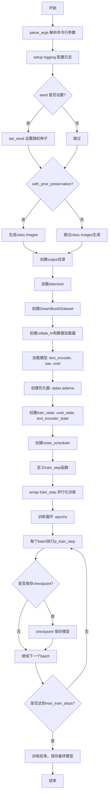
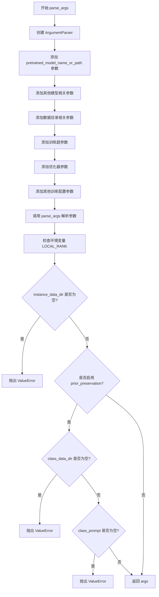
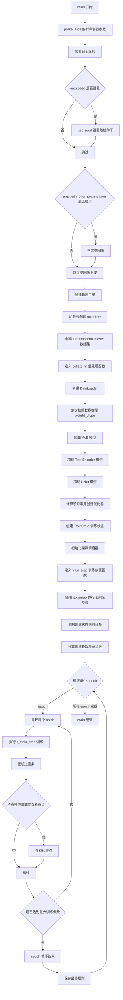
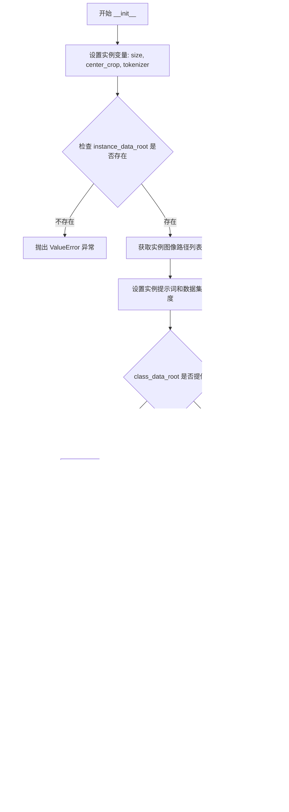
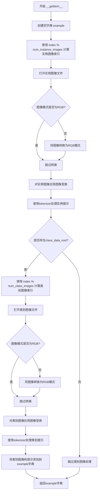
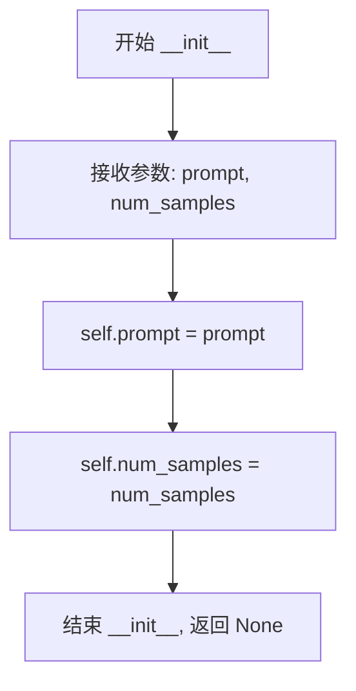
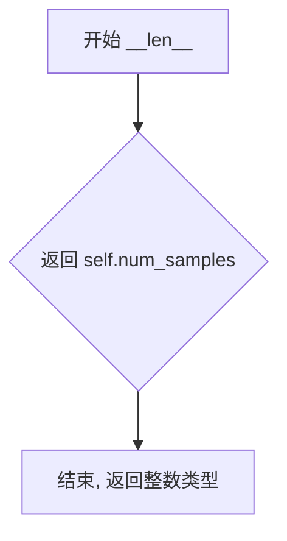

# `diffusers\examples\dreambooth\train_dreambooth_flax.py` 详细设计文档

这是一个DreamBooth训练脚本，用于使用JAX/Flax框架对Stable Diffusion模型进行微调。该脚本支持文本编码器训练、Prior Preservation Loss、分布式训练、模型检查点保存以及可选的HuggingFace Hub上传功能。

## 整体流程



## 类结构

```
Dataset (抽象基类 - PyTorch)
├── DreamBoothDataset
└── PromptDataset
```

## 全局变量及字段


### `logger`
    
日志记录器，用于输出训练过程中的信息

类型：`logging.Logger`
    


### `check_min_version`
    
检查diffusers最低版本要求的函数

类型：`function`
    


### `cc`
    
JAX模型编译缓存对象，用于缓存编译结果提升性能

类型：`compilation_cache`
    


### `args`
    
命令行参数解析结果，包含所有训练配置

类型：`Namespace`
    


### `rng`
    
JAX随机数生成器密钥，用于生成随机数

类型：`jax.random.PRNGKey`
    


### `train_dataset`
    
训练数据集对象，包含实例和类别图像

类型：`DreamBoothDataset`
    


### `train_dataloader`
    
训练数据加载器，用于批量提供训练数据

类型：`DataLoader`
    


### `weight_dtype`
    
模型权重数据类型，根据混合精度配置确定

类型：`jnp.dtype`
    


### `text_encoder`
    
文本编码器模型，用于将文本转换为嵌入向量

类型：`FlaxCLIPTextModel`
    


### `vae`
    
变分自编码器模型，用于图像的潜在空间转换

类型：`FlaxAutoencoderKL`
    


### `vae_params`
    
VAE模型的参数权重

类型：`FrozenDict`
    


### `unet`
    
UNet条件生成模型，用于去噪预测

类型：`FlaxUNet2DConditionModel`
    


### `unet_params`
    
UNet模型的参数权重

类型：`FrozenDict`
    


### `optimizer`
    
优化器，包含梯度裁剪和AdamW配置

类型：`optax.GradientTransformation`
    


### `unet_state`
    
UNet训练状态，包含参数和优化器状态

类型：`TrainState`
    


### `text_encoder_state`
    
文本编码器训练状态，包含参数和优化器状态

类型：`TrainState`
    


### `noise_scheduler`
    
噪声调度器，用于前向扩散过程

类型：`FlaxDDPMScheduler`
    


### `noise_scheduler_state`
    
噪声调度器状态

类型：`SchedulerState`
    


### `train_rngs`
    
训练随机数密钥数组，分布到各设备

类型：`Array`
    


### `train_step`
    
单步训练函数，执行前向传播、损失计算和参数更新

类型：`function`
    


### `collate_fn`
    
批处理整理函数，用于合并多个样本为批次

类型：`function`
    


### `checkpoint`
    
模型保存函数，用于保存训练 checkpoint

类型：`function`
    


### `DreamBoothDataset.size`
    
图像分辨率

类型：`int`
    


### `DreamBoothDataset.center_crop`
    
是否中心裁剪

类型：`bool`
    


### `DreamBoothDataset.tokenizer`
    
文本分词器

类型：`CLIPTokenizer`
    


### `DreamBoothDataset.instance_data_root`
    
实例图像根目录

类型：`Path`
    


### `DreamBoothDataset.instance_images_path`
    
实例图像路径列表

类型：`list`
    


### `DreamBoothDataset.num_instance_images`
    
实例图像数量

类型：`int`
    


### `DreamBoothDataset.instance_prompt`
    
实例提示词

类型：`str`
    


### `DreamBoothDataset._length`
    
数据集长度

类型：`int`
    


### `DreamBoothDataset.class_data_root`
    
类别图像根目录

类型：`Path or None`
    


### `DreamBoothDataset.class_images_path`
    
类别图像路径列表

类型：`list`
    


### `DreamBoothDataset.num_class_images`
    
类别图像数量

类型：`int`
    


### `DreamBoothDataset.class_prompt`
    
类别提示词

类型：`str`
    


### `DreamBoothDataset.image_transforms`
    
图像变换组合

类型：`transforms.Compose`
    


### `PromptDataset.prompt`
    
生成图像的提示词

类型：`str`
    


### `PromptDataset.num_samples`
    
样本数量

类型：`int`
    
    

## 全局函数及方法


### `parse_args`

该函数用于解析命令行参数，创建一个包含训练所需所有配置的命名空间对象，包括模型路径、数据目录、训练超参数等设置。

参数：
- 该函数无参数

返回值：`argparse.Namespace`，包含所有命令行参数及默认值的命名空间对象

#### 流程图



#### 带注释源码

```python
def parse_args():
    """
    解析命令行参数，返回包含训练配置的命名空间对象。
    
    该函数创建 argparse parser 并定义所有训练所需的命令行参数，
    包括模型路径、数据目录、训练超参数、优化器配置等。
    """
    # 创建 ArgumentParser 实例，description 用于帮助信息
    parser = argparse.ArgumentParser(description="Simple example of a training script.")
    
    # ==================== 模型相关参数 ====================
    parser.add_argument(
        "--pretrained_model_name_or_path",
        type=str,
        default=None,
        required=True,
        help="Path to pretrained model or model identifier from huggingface.co/models.",
    )
    parser.add_argument(
        "--pretrained_vae_name_or_path",
        type=str,
        default=None,
        help="Path to pretrained vae or vae identifier from huggingface.co/models.",
    )
    parser.add_argument(
        "--revision",
        type=str,
        default=None,
        required=False,
        help="Revision of pretrained model identifier from huggingface.co/models.",
    )
    parser.add_argument(
        "--tokenizer_name",
        type=str,
        default=None,
        help="Pretrained tokenizer name or path if not the same as model_name",
    )
    
    # ==================== 数据目录参数 ====================
    parser.add_argument(
        "--instance_data_dir",
        type=str,
        default=None,
        required=True,
        help="A folder containing the training data of instance images.",
    )
    parser.add_argument(
        "--class_data_dir",
        type=str,
        default=None,
        required=False,
        help="A folder containing the training data of class images.",
    )
    
    # ==================== Prompt 相关参数 ====================
    parser.add_argument(
        "--instance_prompt",
        type=str,
        default=None,
        help="The prompt with identifier specifying the instance",
    )
    parser.add_argument(
        "--class_prompt",
        type=str,
        default=None,
        help="The prompt to specify images in the same class as provided instance images.",
    )
    
    # ==================== Prior Preservation 参数 ====================
    parser.add_argument(
        "--with_prior_preservation",
        default=False,
        action="store_true",
        help="Flag to add prior preservation loss.",
    )
    parser.add_argument("--prior_loss_weight", type=float, default=1.0, help="The weight of prior preservation loss.")
    parser.add_argument(
        "--num_class_images",
        type=int,
        default=100,
        help=(
            "Minimal class images for prior preservation loss. If there are not enough images already present in"
            " class_data_dir, additional images will be sampled with class_prompt."
        ),
    )
    
    # ==================== 输出和保存参数 ====================
    parser.add_argument(
        "--output_dir",
        type=str,
        default="text-inversion-model",
        help="The output directory where the model predictions and checkpoints will be written.",
    )
    parser.add_argument("--save_steps", type=int, default=None, help="Save a checkpoint every X steps.")
    parser.add_argument("--seed", type=int, default=0, help="A seed for reproducible training.")
    
    # ==================== 图像处理参数 ====================
    parser.add_argument(
        "--resolution",
        type=int,
        default=512,
        help=(
            "The resolution for input images, all the images in the train/validation dataset will be resized to this"
            " resolution"
        ),
    )
    parser.add_argument(
        "--center_crop",
        default=False,
        action="store_true",
        help=(
            "Whether to center crop the input images to the resolution. If not set, the images will be randomly"
            " cropped. The images will be resized to the resolution first before cropping."
        ),
    )
    
    # ==================== 训练配置参数 ====================
    parser.add_argument("--train_text_encoder", action="store_true", help="Whether to train the text encoder")
    parser.add_argument(
        "--train_batch_size", type=int, default=4, help="Batch size (per device) for the training dataloader."
    )
    parser.add_argument(
        "--sample_batch_size", type=int, default=4, help="Batch size (per device) for sampling images."
    )
    parser.add_argument("--num_train_epochs", type=int, default=1)
    parser.add_argument(
        "--max_train_steps",
        type=int,
        default=None,
        help="Total number of training steps to perform.  If provided, overrides num_train_epochs.",
    )
    
    # ==================== 学习率参数 ====================
    parser.add_argument(
        "--learning_rate",
        type=float,
        default=5e-6,
        help="Initial learning rate (after the potential warmup period) to use.",
    )
    parser.add_argument(
        "--scale_lr",
        action="store_true",
        default=False,
        help="Scale the learning rate by the number of GPUs, gradient accumulation steps, and batch size.",
    )
    
    # ==================== Adam 优化器参数 ====================
    parser.add_argument("--adam_beta1", type=float, default=0.9, help="The beta1 parameter for the Adam optimizer.")
    parser.add_argument("--adam_beta2", type=float, default=0.999, help="The beta2 parameter for the Adam optimizer.")
    parser.add_argument("--adam_weight_decay", type=float, default=1e-2, help="Weight decay to use.")
    parser.add_argument("--adam_epsilon", type=float, default=1e-08, help="Epsilon value for the Adam optimizer")
    parser.add_argument("--max_grad_norm", default=1.0, type=float, help="Max gradient norm.")
    
    # ==================== Hub 相关参数 ====================
    parser.add_argument("--push_to_hub", action="store_true", help="Whether or not to push the model to the Hub.")
    parser.add_argument("--hub_token", type=str, default=None, help="The token to use to push to the Model Hub.")
    parser.add_argument(
        "--hub_model_id",
        type=str,
        default=None,
        help="The name of the repository to keep in sync with the local `output_dir`.",
    )
    parser.add_argument(
        "--logging_dir",
        type=str,
        default="logs",
        help=(
            "[TensorBoard](https://www.tensorflow.org/tensorboard) log directory. Will default to"
            " *output_dir/runs/**CURRENT_DATETIME_HOSTNAME***."
        ),
    )
    
    # ==================== 混合精度和分布式参数 ====================
    parser.add_argument(
        "--mixed_precision",
        type=str,
        default="no",
        choices=["no", "fp16", "bf16"],
        help=(
            "Whether to use mixed precision. Choose"
            "between fp16 and bf16 (bfloat16). Bf16 requires PyTorch >= 1.10."
            "and an Nvidia Ampere GPU."
        ),
    )
    parser.add_argument("--local_rank", type=int, default=-1, help="For distributed training: local_rank")
    
    # 解析命令行参数
    args = parser.parse_args()
    
    # 检查环境变量 LOCAL_RANK，用于分布式训练
    env_local_rank = int(os.environ.get("LOCAL_RANK", -1))
    if env_local_rank != -1 and env_local_rank != args.local_rank:
        args.local_rank = env_local_rank
    
    # ==================== 参数验证 ====================
    # 验证必需的参数
    if args.instance_data_dir is None:
        raise ValueError("You must specify a train data directory.")
    
    # 验证 prior preservation 所需的参数
    if args.with_prior_preservation:
        if args.class_data_dir is None:
            raise ValueError("You must specify a data directory for class images.")
        if args.class_prompt is None:
            raise ValueError("You must specify prompt for class images.")
    
    return args
```


### `get_params_to_save`

该函数用于将分布在多个 JAX 设备（GPU/TPU）上的参数副本取回到主机内存，并提取第一个设备的参数副本。通常在模型保存或推理前调用，将分布式训练状态转换为可序列化的格式。

参数：

- `params`：`pytree`，经过 `jax_utils.replicate` 处理的参数字典树，参数值通常为包含多个设备副本的数组

返回值：`pytree`，返回从设备取回主机内存的参数副本（取第一个设备的参数）

#### 流程图

```mermaid
flowchart TD
    A[接收 params 参数] --> B{检查 params 是否为 pytree}
    B -->|是| C[使用 jax.tree_util.tree_map 遍历参数树]
    C --> D[对每个叶子节点执行 lambda x: x[0]]
    D --> E[提取第一个设备的参数副本]
    E --> F[使用 jax.device_get 将参数从设备取回主机]
    F --> G[返回处理后的参数]
```

#### 带注释源码

```python
def get_params_to_save(params):
    """
    将分布式参数转换为主机可序列化的格式。
    
    在 JAX 分布式训练中，参数通常通过 jax_utils.replicate 复制到多个设备。
    此函数从每个参数数组中取第一个副本（即第一个设备的参数），
    并使用 jax.device_get 将其从设备内存拉回到主机内存，
    以便可以进行序列化保存或在其他地方使用。
    
    参数:
        params: 经过 jax_utils.replicate 处理的参数字典 (pytree)
        
    返回:
        从设备取回主机内存的参数副本 (pytree)
    """
    return jax.device_get(jax.tree_util.tree_map(lambda x: x[0], params))
```


### `main`

主函数是 DreamBooth 训练脚本的入口点，负责协调整个微调 Stable Diffusion 模型的全过程。它解析命令行参数、配置日志和随机种子、生成类图像（如启用 prior preservation）、加载预训练模型和 tokenizer、初始化优化器和训练状态、执行多轮训练循环，并在训练完成后保存模型检查点。

参数：
- 该函数无显式参数，通过调用 `parse_args()` 内部获取配置

返回值：`None`，函数执行完成后直接退出

#### 流程图



#### 带注释源码

```python
def main():
    """
    DreamBooth 训练脚本的主入口函数，负责:
    1. 解析命令行参数并配置日志
    2. 生成类图像（如果启用 prior preservation）
    3. 加载预训练模型（tokenizer, text encoder, VAE, UNet）
    4. 初始化优化器和训练状态
    5. 执行训练循环并保存检查点
    """
    # 步骤1: 解析命令行参数
    args = parse_args()

    # 步骤2: 配置日志格式和级别
    # 仅在主进程（process_index == 0）上输出详细信息，避免多进程日志混乱
    logging.basicConfig(
        format="%(asctime)s - %(levelname)s - %(name)s - %(message)s",
        datefmt="%m/%d/%Y %H:%M:%S",
        level=logging.INFO,
    )
    logger.setLevel(logging.INFO if jax.process_index() == 0 else logging.ERROR)
    if jax.process_index() == 0:
        transformers.utils.logging.set_verbosity_info()
    else:
        transformers.utils.logging.set_verbosity_error()

    # 步骤3: 设置随机种子以确保可重复性
    if args.seed is not None:
        set_seed(args.seed)

    # 步骤4: 初始化 JAX 随机数生成器
    rng = jax.random.PRNGKey(args.seed)

    # 步骤5: 如果启用 prior preservation，生成类图像
    # 这用于保留原始类别的分布，防止模型遗忘
    if args.with_prior_preservation:
        class_images_dir = Path(args.class_data_dir)
        if not class_images_dir.exists():
            class_images_dir.mkdir(parents=True)
        cur_class_images = len(list(class_images_dir.iterdir()))

        # 检查现有类图像数量是否足够
        if cur_class_images < args.num_class_images:
            # 加载 Stable Diffusion pipeline 用于生成类图像
            pipeline, params = FlaxStableDiffusionPipeline.from_pretrained(
                args.pretrained_model_name_or_path, safety_checker=None, revision=args.revision
            )
            pipeline.set_progress_bar_config(disable=True)

            num_new_images = args.num_class_images - cur_class_images
            logger.info(f"Number of class images to sample: {num_new_images}.")

            # 创建提示数据集用于批量生成
            sample_dataset = PromptDataset(args.class_prompt, num_new_images)
            total_sample_batch_size = args.sample_batch_size * jax.local_device_count()
            sample_dataloader = torch.utils.data.DataLoader(sample_dataset, batch_size=total_sample_batch_size)

            # 遍历数据加载器生成类图像
            for example in tqdm(
                sample_dataloader, desc="Generating class images", disable=not jax.process_index() == 0
            ):
                prompt_ids = pipeline.prepare_inputs(example["prompt"])
                prompt_ids = shard(prompt_ids)
                p_params = jax_utils.replicate(params)
                rng = jax.random.split(rng)[0]
                sample_rng = jax.random.split(rng, jax.device_count())
                images = pipeline(prompt_ids, p_params, sample_rng, jit=True).images
                images = images.reshape((images.shape[0] * images.shape[1],) + images.shape[-3:])
                images = pipeline.numpy_to_pil(np.array(images))

                # 保存生成的图像到类图像目录
                for i, image in enumerate(images):
                    hash_image = insecure_hashlib.sha1(image.tobytes()).hexdigest()
                    image_filename = class_images_dir / f"{example['index'][i] + cur_class_images}-{hash_image}.jpg"
                    image.save(image_filename)

            del pipeline  # 释放 pipeline 资源

    # 步骤6: 处理输出目录和 Hub 仓库创建
    if jax.process_index() == 0:
        if args.output_dir is not None:
            os.makedirs(args.output_dir, exist_ok=True)

        if args.push_to_hub:
            repo_id = create_repo(
                repo_id=args.hub_model_id or Path(args.output_dir).name, exist_ok=True, token=args.hub_token
            ).repo_id

    # 步骤7: 加载 tokenizer
    if args.tokenizer_name:
        tokenizer = CLIPTokenizer.from_pretrained(args.tokenizer_name)
    elif args.pretrained_model_name_or_path:
        tokenizer = CLIPTokenizer.from_pretrained(
            args.pretrained_model_name_or_path, subfolder="tokenizer", revision=args.revision
        )
    else:
        raise NotImplementedError("No tokenizer specified!")

    # 步骤8: 创建训练数据集
    train_dataset = DreamBoothDataset(
        instance_data_root=args.instance_data_dir,
        instance_prompt=args.instance_prompt,
        class_data_root=args.class_data_dir if args.with_prior_preservation else None,
        class_prompt=args.class_prompt,
        class_num=args.num_class_images,
        tokenizer=tokenizer,
        size=args.resolution,
        center_crop=args.center_crop,
    )

    # 步骤9: 定义批处理整理函数
    def collate_fn(examples):
        """将多个样本整理成一个批次，处理 instance 和 class 图像"""
        input_ids = [example["instance_prompt_ids"] for example in examples]
        pixel_values = [example["instance_images"] for example in examples]

        # 对于 prior preservation，连接类和实例样本以避免两次前向传播
        if args.with_prior_preservation:
            input_ids += [example["class_prompt_ids"] for example in examples]
            pixel_values += [example["class_images"] for example in examples]

        pixel_values = torch.stack(pixel_values)
        pixel_values = pixel_values.to(memory_format=torch.contiguous_format).float()

        input_ids = tokenizer.pad(
            {"input_ids": input_ids}, padding="max_length", max_length=tokenizer.model_max_length, return_tensors="pt"
        ).input_ids

        batch = {
            "input_ids": input_ids,
            "pixel_values": pixel_values,
        }
        # 转换为 NumPy 数组以供 JAX 使用
        batch = {k: v.numpy() for k, v in batch.items()}
        return batch

    # 步骤10: 验证数据集大小并创建 DataLoader
    total_train_batch_size = args.train_batch_size * jax.local_device_count()
    if len(train_dataset) < total_train_batch_size:
        raise ValueError(
            f"Training batch size is {total_train_batch_size}, but your dataset only contains"
            f" {len(train_dataset)} images. Please, use a larger dataset or reduce the effective batch size. Note that"
            f" there are {jax.local_device_count()} parallel devices, so your batch size can't be smaller than that."
        )

    train_dataloader = torch.utils.data.DataLoader(
        train_dataset, batch_size=total_train_batch_size, shuffle=True, collate_fn=collate_fn, drop_last=True
    )

    # 步骤11: 确定权重数据类型（支持混合精度训练）
    weight_dtype = jnp.float32
    if args.mixed_precision == "fp16":
        weight_dtype = jnp.float16
    elif args.mixed_precision == "bf16":
        weight_dtype = jnp.bfloat16

    # 步骤12: 配置 VAE 参数
    if args.pretrained_vae_name_or_path:
        # TODO(patil-surivl): Upload flax weights for the VAE
        vae_arg, vae_kwargs = (args.pretrained_vae_name_or_path, {"from_pt": True})
    else:
        vae_arg, vae_kwargs = (args.pretrained_model_name_or_path, {"subfolder": "vae", "revision": args.revision})

    # 步骤13: 加载预训练模型
    text_encoder = FlaxCLIPTextModel.from_pretrained(
        args.pretrained_model_name_or_path,
        subfolder="text_encoder",
        dtype=weight_dtype,
        revision=args.revision,
    )
    vae, vae_params = FlaxAutoencoderKL.from_pretrained(
        vae_arg,
        dtype=weight_dtype,
        **vae_kwargs,
    )
    unet, unet_params = FlaxUNet2DConditionModel.from_pretrained(
        args.pretrained_model_name_or_path,
        subfolder="unet",
        dtype=weight_dtype,
        revision=args.revision,
    )

    # 步骤14: 配置优化器
    if args.scale_lr:
        args.learning_rate = args.learning_rate * total_train_batch_size

    constant_scheduler = optax.constant_schedule(args.learning_rate)

    adamw = optax.adamw(
        learning_rate=constant_scheduler,
        b1=args.adam_beta1,
        b2=args.adam_beta2,
        eps=args.adam_epsilon,
        weight_decay=args.adam_weight_decay,
    )

    optimizer = optax.chain(
        optax.clip_by_global_norm(args.max_grad_norm),  # 梯度裁剪
        adamw,
    )

    # 步骤15: 创建训练状态
    unet_state = train_state.TrainState.create(apply_fn=unet.__call__, params=unet_params, tx=optimizer)
    text_encoder_state = train_state.TrainState.create(
        apply_fn=text_encoder.__call__, params=text_encoder.params, tx=optimizer
    )

    # 步骤16: 初始化噪声调度器（DDPM）
    noise_scheduler = FlaxDDPMScheduler(
        beta_start=0.00085, beta_end=0.012, beta_schedule="scaled_linear", num_train_timesteps=1000
    )
    noise_scheduler_state = noise_scheduler.create_state()

    # 步骤17: 初始化训练随机数
    train_rngs = jax.random.split(rng, jax.local_device_count())

    # 步骤18: 定义单步训练函数
    def train_step(unet_state, text_encoder_state, vae_params, batch, train_rng):
        """
        执行单步训练，包括:
        1. 将图像编码到潜在空间
        2. 添加噪声到潜在表示
        3. 计算文本嵌入
        4. 预测噪声残差
        5. 计算损失并反向传播
        """
        dropout_rng, sample_rng, new_train_rng = jax.random.split(train_rng, 3)

        # 根据是否训练 text encoder 确定参数
        if args.train_text_encoder:
            params = {"text_encoder": text_encoder_state.params, "unet": unet_state.params}
        else:
            params = {"unet": unet_state.params}

        def compute_loss(params):
            # 将图像转换为潜在空间
            vae_outputs = vae.apply(
                {"params": vae_params}, batch["pixel_values"], deterministic=True, method=vae.encode
            )
            latents = vae_outputs.latent_dist.sample(sample_rng)
            # (NHWC) -> (NCHW)
            latents = jnp.transpose(latents, (0, 3, 1, 2))
            latents = latents * vae.config.scaling_factor

            # 采样噪声添加到潜在表示
            noise_rng, timestep_rng = jax.random.split(sample_rng)
            noise = jax.random.normal(noise_rng, latents.shape)
            # 为每个图像采样随机时间步
            bsz = latents.shape[0]
            timesteps = jax.random.randint(
                timestep_rng,
                (bsz,),
                0,
                noise_scheduler.config.num_train_timesteps,
            )

            # 根据每个时间步的噪声幅度将噪声添加到潜在表示（前向扩散过程）
            noisy_latents = noise_scheduler.add_noise(noise_scheduler_state, latents, noise, timesteps)

            # 获取用于条件的文本嵌入
            if args.train_text_encoder:
                encoder_hidden_states = text_encoder_state.apply_fn(
                    batch["input_ids"], params=params["text_encoder"], dropout_rng=dropout_rng, train=True
                )[0]
            else:
                encoder_hidden_states = text_encoder(
                    batch["input_ids"], params=text_encoder_state.params, train=False
                )[0]

            # 预测噪声残差
            model_pred = unet.apply(
                {"params": params["unet"]}, noisy_latents, timesteps, encoder_hidden_states, train=True
            ).sample

            # 根据预测类型获取目标值
            if noise_scheduler.config.prediction_type == "epsilon":
                target = noise
            elif noise_scheduler.config.prediction_type == "v_prediction":
                target = noise_scheduler.get_velocity(noise_scheduler_state, latents, noise, timesteps)
            else:
                raise ValueError(f"Unknown prediction type {noise_scheduler.config.prediction_type}")

            # 如果启用 prior preservation，计算实例损失和先验损失
            if args.with_prior_preservation:
                # 将噪声和预测分成两部分，分别计算损失
                model_pred, model_pred_prior = jnp.split(model_pred, 2, axis=0)
                target, target_prior = jnp.split(target, 2, axis=0)

                # 计算实例损失
                loss = (target - model_pred) ** 2
                loss = loss.mean()

                # 计算先验损失
                prior_loss = (target_prior - model_pred_prior) ** 2
                prior_loss = prior_loss.mean()

                # 将先验损失添加到实例损失
                loss = loss + args.prior_loss_weight * prior_loss
            else:
                loss = (target - model_pred) ** 2
                loss = loss.mean()

            return loss

        # 计算损失和梯度
        grad_fn = jax.value_and_grad(compute_loss)
        loss, grad = grad_fn(params)
        grad = jax.lax.pmean(grad, "batch")

        # 更新模型参数
        new_unet_state = unet_state.apply_gradients(grads=grad["unet"])
        if args.train_text_encoder:
            new_text_encoder_state = text_encoder_state.apply_gradients(grads=grad["text_encoder"])
        else:
            new_text_encoder_state = text_encoder_state

        # 汇总指标
        metrics = {"loss": loss}
        metrics = jax.lax.pmean(metrics, axis_name="batch")

        return new_unet_state, new_text_encoder_state, metrics, new_train_rng

    # 步骤19: 创建并行训练步骤
    p_train_step = jax.pmap(train_step, "batch", donate_argnums=(0, 1))

    # 步骤20: 在各设备上复制训练状态
    unet_state = jax_utils.replicate(unet_state)
    text_encoder_state = jax_utils.replicate(text_encoder_state)
    vae_params = jax_utils.replicate(vae_params)

    # 步骤21: 计算训练参数
    num_update_steps_per_epoch = math.ceil(len(train_dataloader))

    # 调度器和训练步数计算
    if args.max_train_steps is None:
        args.max_train_steps = args.num_train_epochs * num_update_steps_per_epoch

    args.num_train_epochs = math.ceil(args.max_train_steps / num_update_steps_per_epoch)

    logger.info("***** Running training *****")
    logger.info(f"  Num examples = {len(train_dataset)}")
    logger.info(f"  Num Epochs = {args.num_train_epochs}")
    logger.info(f"  Instantaneous batch size per device = {args.train_batch_size}")
    logger.info(f"  Total train batch size (w. parallel & distributed) = {total_train_batch_size}")
    logger.info(f"  Total optimization steps = {args.max_train_steps}")

    # 步骤22: 定义检查点保存函数
    def checkpoint(step=None):
        """保存训练模型到指定目录"""
        scheduler, _ = FlaxPNDMScheduler.from_pretrained("CompVis/stable-diffusion-v1-4", subfolder="scheduler")
        safety_checker = FlaxStableDiffusionSafetyChecker.from_pretrained(
            "CompVis/stable-diffusion-safety-checker", from_pt=True
        )
        pipeline = FlaxStableDiffusionPipeline(
            text_encoder=text_encoder,
            vae=vae,
            unet=unet,
            tokenizer=tokenizer,
            scheduler=scheduler,
            safety_checker=safety_checker,
            feature_extractor=CLIPImageProcessor.from_pretrained("openai/clip-vit-base-patch32"),
        )

        outdir = os.path.join(args.output_dir, str(step)) if step else args.output_dir
        pipeline.save_pretrained(
            outdir,
            params={
                "text_encoder": get_params_to_save(text_encoder_state.params),
                "vae": get_params_to_save(vae_params),
                "unet": get_params_to_save(unet_state.params),
                "safety_checker": safety_checker.params,
            },
        )

        if args.push_to_hub:
            message = f"checkpoint-{step}" if step is not None else "End of training"
            upload_folder(
                repo_id=repo_id,
                folder_path=args.output_dir,
                commit_message=message,
                ignore_patterns=["step_*", "epoch_*"],
            )

    # 步骤23: 执行训练循环
    global_step = 0

    epochs = tqdm(range(args.num_train_epochs), desc="Epoch ... ", position=0)
    for epoch in epochs:
        train_metrics = []

        steps_per_epoch = len(train_dataset) // total_train_batch_size
        train_step_progress_bar = tqdm(total=steps_per_epoch, desc="Training...", position=1, leave=False)
        
        # 遍历每个批次
        for batch in train_dataloader:
            batch = shard(batch)
            unet_state, text_encoder_state, train_metric, train_rngs = p_train_step(
                unet_state, text_encoder_state, vae_params, batch, train_rngs
            )
            train_metrics.append(train_metric)

            train_step_progress_bar.update(jax.local_device_count())

            global_step += 1
            # 按指定步数保存检查点
            if jax.process_index() == 0 and args.save_steps and global_step % args.save_steps == 0:
                checkpoint(global_step)
            if global_step >= args.max_train_steps:
                break

        train_metric = jax_utils.unreplicate(train_metric)

        train_step_progress_bar.close()
        epochs.write(f"Epoch... ({epoch + 1}/{args.num_train_epochs} | Loss: {train_metric['loss']})")

    # 步骤24: 保存最终模型
    if jax.process_index() == 0:
        checkpoint()
```


### `DreamBoothDataset.__init__`

该方法用于初始化 DreamBooth 数据集对象，负责加载实例图像和类别图像（如果提供），配置图像预处理变换，并设置数据集长度。在训练 DreamBooth 模型时，此数据集为模型提供实例图像和可选的类别图像，用于后续的微调训练和先验保存损失计算。

参数：

- `instance_data_root`：`Path` 或 `str`，实例图像所在目录的路径，用于指定包含要微调的实例（特定主体或风格）图像的文件夹。
- `instance_prompt`：`str`，与实例图像关联的文本提示词，用于描述实例图像的内容或标识符，在训练时与实例图像配对使用。
- `tokenizer`：`CLIPTokenizer`，Hugging Face 的分词器对象，用于将文本提示词转换为模型可处理的 token ID 序列。
- `class_data_root`：`Path` 或 `str` 或 `None`，类别图像所在目录的路径，当使用先验保存损失（prior preservation loss）时需要提供，默认为 `None`。
- `class_prompt`：`str` 或 `None`，类别图像的文本提示词，描述与实例同类的通用图像内容，用于先验保存，默认为 `None`。
- `class_num`：`int` 或 `None`，类别图像的最大数量限制，用于控制类别图像采样数量，默认为 `None`（使用所有可用图像）。
- `size`：`int`，目标图像的分辨率尺寸，图像将被调整为此大小（正方形），默认为 `512`。
- `center_crop`：`bool`，是否采用中心裁剪方式，如果为 `True` 则进行中心裁剪，否则进行随机裁剪，默认为 `False`。

返回值：`None`，该方法不返回任何值，仅初始化对象属性。

#### 流程图



#### 带注释源码

```python
def __init__(
    self,
    instance_data_root,
    instance_prompt,
    tokenizer,
    class_data_root=None,
    class_prompt=None,
    class_num=None,
    size=512,
    center_crop=False,
):
    # 1. 设置图像尺寸和裁剪方式
    self.size = size
    self.center_crop = center_crop
    # 2. 保存分词器用于后续对提示词进行编码
    self.tokenizer = tokenizer

    # 3. 将实例数据根目录转换为 Path 对象
    self.instance_data_root = Path(instance_data_root)
    # 4. 验证实例图像目录是否存在，不存在则抛出异常
    if not self.instance_data_root.exists():
        raise ValueError("Instance images root doesn't exists.")

    # 5. 获取实例图像目录下的所有文件并转换为列表
    self.instance_images_path = list(Path(instance_data_root).iterdir())
    # 6. 记录实例图像的数量
    self.num_instance_images = len(self.instance_images_path)
    # 7. 保存实例提示词
    self.instance_prompt = instance_prompt
    # 8. 初始数据集长度设为实例图像数量
    self._length = self.num_instance_images

    # 9. 如果提供了类别数据根目录
    if class_data_root is not None:
        # 10. 转换为 Path 对象并创建目录（如果不存在）
        self.class_data_root = Path(class_data_root)
        self.class_data_root.mkdir(parents=True, exist_ok=True)
        # 11. 获取类别图像路径列表
        self.class_images_path = list(self.class_data_root.iterdir())
        # 12. 根据 class_num 限制类别图像数量
        if class_num is not None:
            self.num_class_images = min(len(self.class_images_path), class_num)
        else:
            self.num_class_images = len(self.class_images_path)
        # 13. 更新数据集长度为类别图像数和实例图像数中的较大值
        self._length = max(self.num_class_images, self.num_instance_images)
        # 14. 保存类别提示词
        self.class_prompt = class_prompt
    else:
        # 15. 如果没有提供类别数据，设置 class_data_root 为 None
        self.class_data_root = None

    # 16. 构建图像预处理变换管道
    self.image_transforms = transforms.Compose(
        [
            # 调整图像大小到指定尺寸，使用双线性插值
            transforms.Resize(size, interpolation=transforms.InterpolationMode.BILINEAR),
            # 根据 center_crop 参数决定是中心裁剪还是随机裁剪
            transforms.CenterCrop(size) if center_crop else transforms.RandomCrop(size),
            # 转换为张量
            transforms.ToTensor(),
            # 归一化到 [-1, 1] 范围（均值 0.5，标准差 0.5）
            transforms.Normalize([0.5], [0.5]),
        ]
    )
```


### `DreamBoothDataset.__len__`

该方法返回数据集的样本数量，用于支持 Python 的 `len()` 函数，使 DataLoader 能够确定数据集的规模。

参数：

- `self`：`DreamBoothDataset` 实例，隐式参数，表示当前数据集对象本身

返回值：`int`，返回数据集中样本的总数，决定了训练时迭代的 batch 数量

#### 流程图

```mermaid
flowchart TD
    A[开始 __len__] --> B[返回 self._length]
    B --> C[结束]
    
    subgraph "self._length 的设置逻辑"
        D[初始化时] --> E{class_data_root 是否存在?}
        E -->|否| F[_length = num_instance_images]
        E -->|是| G[_length = max(num_class_images, num_instance_images)]
    end
```

#### 带注释源码

```python
def __len__(self):
    """
    返回数据集的样本数量。
    
    该方法实现了 Python 的魔术方法 __len__，使得可以直接使用 len(dataset) 获取数据集大小。
    _length 在 __init__ 中被设置：
    - 如果没有 class_data_root（不启用 prior preservation），_length = 实例图像数量
    - 如果有 class_data_root（启用 prior preservation），_length = max(类别图像数量, 实例图像数量)
    这样设计确保了在使用 prior preservation 时，数据集能够循环足够多的样本来匹配类别图像和实例图像。
    
    Returns:
        int: 数据集中的样本总数，用于 DataLoader 确定迭代次数
    """
    return self._length
```


### `DreamBoothDataset.__getitem__`

该方法是 DreamBoothDataset 数据集类的核心方法，用于根据给定的索引返回训练样本。它负责加载并处理实例图像和类别图像（如果存在），同时对相应的文本提示进行 tokenize 处理，最终返回一个包含图像数据和 token IDs 的字典，供模型训练使用。

参数：

- `index`：`int`，表示要获取的样本索引，用于从图像列表中定位对应的图像文件

返回值：`dict`，返回包含以下键值的字典：
  - `instance_images`：处理后的实例图像张量
  - `instance_prompt_ids`：实例提示的 token IDs
  - `class_images`：处理后的类别图像张量（仅当 `class_data_root` 存在时）
  - `class_prompt_ids`：类别提示的 token IDs（仅当 `class_data_root` 存在时）

#### 流程图



#### 带注释源码

```python
def __getitem__(self, index):
    """
    获取指定索引的样本数据，包括实例图像和类别图像（如果有）
    
    参数:
        index: int - 样本索引，用于从数据集中获取对应的图像
        
    返回:
        dict: 包含以下键的字典:
            - instance_images: 处理后的实例图像张量
            - instance_prompt_ids: 实例提示的token IDs
            - class_images: 处理后的类别图像张量（可选）
            - class_prompt_ids: 类别提示的token IDs（可选）
    """
    # 创建用于存储样本数据的字典
    example = {}
    
    # 使用取模运算处理索引，确保索引在有效范围内循环
    # 这样可以处理训练批次大小大于实际图像数量的情况
    instance_image = Image.open(self.instance_images_path[index % self.num_instance_images])
    
    # 检查图像模式，如果不是RGB则进行转换
    # PIL图像可能包含RGBA、灰度等模式，需要统一转换为RGB
    if not instance_image.mode == "RGB":
        instance_image = instance_image.convert("RGB")
    
    # 对实例图像应用预处理的变换操作
    # 包括: 调整大小 -> 裁剪(中心或随机) -> 转换为张量 -> 归一化
    example["instance_images"] = self.image_transforms(instance_image)
    
    # 使用分词器将实例提示文本转换为token IDs
    # padding="do_not_pad": 不进行填充，因为每个提示长度固定
    # truncation=True: 截断超长文本
    # max_length: 使用模型的最大长度限制
    example["instance_prompt_ids"] = self.tokenizer(
        self.instance_prompt,
        padding="do_not_pad",
        truncation=True,
        max_length=self.tokenizer.model_max_length,
    ).input_ids
    
    # 检查是否配置了类别数据根目录（用于prior preservation）
    if self.class_data_root:
        # 加载类别图像，处理方式与实例图像相同
        class_image = Image.open(self.class_images_path[index % self.num_class_images])
        
        if not class_image.mode == "RGB":
            class_image = class_image.convert("RGB")
        
        example["class_images"] = self.image_transforms(class_image)
        
        # 对类别提示进行tokenize处理
        example["class_prompt_ids"] = self.tokenizer(
            self.class_prompt,
            padding="do_not_pad",
            truncation=True,
            max_length=self.tokenizer.model_max_length,
        ).input_ids
    
    # 返回包含实例和类别数据的字典
    # 该字典将直接用于训练过程中的数据加载
    return example
```


### `PromptDataset.__init__`

该方法是一个轻量级的数据集初始化函数，用于在 DreamBooth 训练流程中准备生成类别图像所需的提示词数据。它接收提示词和样本数量，初始化实例属性供后续 `__len__` 和 `__getitem__` 方法使用，从而支持多 GPU 并行生成类别图像。

参数：

- `prompt`：`str`，用于生成类别图像的文本提示词（class prompt），即用户指定的需要生成的图像描述
- `num_samples`：`int`，需要生成的类别图像样本数量，用于控制数据集大小

返回值：`None`，构造函数无返回值，直接修改实例属性

#### 流程图



#### 带注释源码

```python
def __init__(self, prompt, num_samples):
    """
    初始化 PromptDataset 实例。

    该构造函数接收提示词和样本数量两个参数，将它们存储为实例属性。
    此类数据集专门用于在 DreamBooth 训练中生成类别图像（class images），
    支持多 GPU 并行采样生成。

    参数:
        prompt (str): 用于生成类别图像的文本提示词，例如 "a photo of a cat"
        num_samples (int): 需要生成的类别图像数量，决定数据集长度

    返回值:
        None: 构造函数不返回值，仅初始化实例属性
    """
    # 将传入的提示词保存为实例属性，供 __getitem__ 方法使用
    self.prompt = prompt
    
    # 将样本数量保存为实例属性，供 __len__ 方法使用
    self.num_samples = num_samples
```


### `PromptDataset.__len__`

该方法返回数据集中样本的数量，用于支持 Python 的 `len()` 函数，使 `PromptDataset` 能够与 PyTorch 的 `DataLoader` 等需要知道数据集大小的组件配合工作。

参数：

-  `self`：`PromptDataset` 实例，隐式参数，表示当前数据集对象本身

返回值：`int`，返回数据集中要生成的样本数量 `num_samples`

#### 流程图



#### 带注释源码

```python
def __len__(self):
    """
    返回数据集中样本的数量。
    
    该方法是 Python 特殊方法(魔术方法)，使得可以通过 len(dataset) 
    的方式获取数据集大小。这对于 DataLoader 分批加载数据是必需的，
    因为 DataLoader 需要知道数据集的总样本数来计算 epoch 和 batch。
    
    Returns:
        int: 数据集中的样本数量，等于初始化时传入的 num_samples 参数
    """
    return self.num_samples
```


### `PromptDataset.__getitem__`

该方法是 `PromptDataset` 类的核心实例方法，用于根据给定的索引获取数据集中的单个样本。它返回一个包含提示词(prompt)和对应索引(index)的字典，供多GPU生成class图像时使用。

**参数：**

- `index`：`int`，表示要获取的样本在数据集中的索引位置

**返回值：** `Dict[str, Union[str, int]]`，返回一个字典，包含两个键值对：
  - `"prompt"`：字符串类型的提示词
  - `"index"`：整数类型的样本索引

#### 流程图

```mermaid
flowchart TD
    A[开始 __getitem__] --> B[创建空字典 example]
    B --> C[将 self.prompt 赋值给 example['prompt']]
    C --> D[将 index 赋值给 example['index']]
    D --> E[返回 example 字典]
    
    style A fill:#f9f,color:#333
    style E fill:#9f9,color:#333
```

#### 带注释源码

```python
def __getitem__(self, index):
    """
    获取数据集中指定索引位置的样本。
    
    该方法实现了 PyTorch Dataset 接口的 __getitem__ 方法，
    用于按需加载单个数据样本。在 DreamBooth 训练脚本中，
    它被用于生成 class 图像的提示词数据。
    
    参数:
        index: int - 样本的索引位置，用于标识要获取的数据项
        
    返回:
        dict: 包含 'prompt' 和 'index' 键的字典对象
              - 'prompt': 与该数据集关联的提示词字符串
              - 'index': 传入的索引值
    """
    # 初始化一个空字典用于存储样本数据
    example = {}
    
    # 将数据集中存储的提示词赋值给字典的 'prompt' 键
    # 该提示词在 __init__ 中被设置为 class_prompt
    example["prompt"] = self.prompt
    
    # 将当前样本的索引赋值给字典的 'index' 键
    # 这个索引值用于标识生成的图像文件
    example["index"] = index
    
    # 返回包含提示词和索引的字典
    return example
```

## 关键组件


### DreamBoothDataset

数据准备类，用于准备实例图像和类图像及其对应的提示词，以进行模型微调。负责图像预处理、提示词tokenization和数据集迭代。

### PromptDataset

提示词数据集类，用于在多个GPU上生成类图像时准备提示词。包含提示词和样本数量，提供简单的索引访问。

### parse_args

命令行参数解析函数，定义并解析所有训练相关参数，包括模型路径、数据目录、训练超参数、混合精度选项等。返回解析后的参数对象。

### get_params_to_save

参数保存辅助函数，用于从JAX分片参数中提取第一份参数以供保存。处理JAX分布式训练中的参数结构。

### train_step

核心训练步骤函数，包含完整的前向传播、损失计算、反向传播和参数更新逻辑。支持文本编码器训练、prior preservation损失、噪声调度和梯度计算。

### collate_fn

批处理整理函数，负责将多个样本合并为训练批次。处理实例和类图像的合并、pixel_values堆叠、input_ids填充等操作。

### checkpoint

模型检查点保存函数，负责将训练好的模型（text_encoder、vae、unet、safety_checker）保存为FlaxStableDiffusionPipeline格式。支持推送到HuggingFace Hub。

### FlaxStableDiffusionPipeline

Stable Diffusion推理管道封装，整合VAE、UNet、Text Encoder、Tokenizer、Scheduler和Safety Checker。用于类图像生成和最终模型导出。

### FlaxDDPMScheduler

噪声调度器，实现DDPM扩散过程。负责前向扩散（添加噪声）和反向过程所需的噪声调度配置。

### FlaxAutoencoderKL

VAE变分自编码器模型，用于将图像编码到潜在空间并从潜在空间解码。提供encode方法获取latent_dist。

### FlaxUNet2DConditionModel

条件UNet模型，预测噪声残差。接收noisy_latents、timesteps和encoder_hidden_states作为输入，输出预测噪声。

### FlaxCLIPTextModel

CLIP文本编码器模型，将tokenized的提示词编码为条件嵌入向量。用于提供文本条件信息。

### 训练优化器 (optax.adamw)

使用optax实现的AdamW优化器，配合梯度裁剪（clip_by_global_norm）和学习率调度。管理模型参数的更新。

### 混合精度训练支持

通过weight_dtype配置支持fp16和bf16混合精度训练，降低显存占用并加速训练过程。使用jax.float16或jax.bfloat16。

### Prior Preservation Loss

先验 preservation 损失机制，用于保持类图像的生成质量。通过--with_prior_preservation参数启用，计算实例损失和类图像先验损失的加权组合。

### 分布式训练支持

通过jax.pmap实现数据并行训练，使用shard函数分片批次数据，replicate函数复制模型状态到各设备。支持多GPU分布式训练。


## 问题及建议


### 已知问题

-   **硬编码模型路径**: `checkpoint()` 函数中硬编码了 "CompVis/stable-diffusion-v1-4" 和 "CompVis/stable-diffusion-safety-checker"，应使用 `args.pretrained_model_name_or_path` 替代，导致在不同模型上保存检查点时可能出错。
-   **随机数生成逻辑错误**: `train_step` 函数中 `sample_rng` 是通过 `jax.random.split(sample_rng)` 创建的，但这个 `sample_rng` 本身就是刚从 `sample_rng` split 得到的，逻辑存在循环引用问题，可能导致训练不稳定。
-   **混合框架开销**: 同时使用 PyTorch DataLoader 和 JAX 模型，需要频繁进行 tensor 格式转换（torch -> numpy -> jax），增加不必要的数据传输开销。
-   **模型重复实例化**: 在 `checkpoint()` 函数中每次保存时都重新创建 `scheduler`、`safety_checker` 和 `feature_extractor`，而不是复用已加载的模块，浪费时间且可能导致资源泄漏。
-   **缺少图像加载错误处理**: `DreamBoothDataset.__getitem__` 中直接使用 `Image.open()` 打开图像，没有任何 try-except 保护，损坏的图像文件会导致整个训练中断。
-   **Tokenizer 配置重复**: 在 dataset 和 collate_fn 中多次调用 `tokenizer.model_max_length` 和进行 padding/truncation 配置，分散且易于遗漏。
-   **缺失输入验证**: 没有验证 `instance_prompt` 和 `class_prompt` 是否超过 tokenizer 的最大长度，可能导致运行时错误。

### 优化建议

-   **修复随机数逻辑**: 重新设计 train_step 中的 RNG 管理，确保每个训练步骤使用独立且确定的随机数序列。
-   **统一数据加载框架**: 考虑使用 JAX/Flax 原生数据加载或至少批量预转换数据格式，减少运行时框架转换开销。
-   **模型缓存复用**: 在初始化阶段创建 scheduler、safety_checker 等辅助模块并缓存，checkpoint 函数直接引用而非重新创建。
-   **添加数据增强鲁棒性**: 在 Dataset 的 `__getitem__` 中添加异常捕获，对加载失败的图像使用默认图像或跳过，并记录警告日志。
-   **模块化配置**: 将 tokenizer 配置（max_length、padding 等）提取为常量或配置类，减少散落在各处的 magic numbers。
-   **添加提前停止**: 实现基于验证集或 loss 监控的早停机制，避免过度训练。
-   **优化内存使用**: 考虑对 UNet 和 Text Encoder 使用 gradient checkpointing（在 compute_loss 中对部分计算禁用以节省显存）。
-   **统一日志系统**: 当前训练指标仅输出到 tqdm，建议同时记录到 TensorBoard 或其他持久化日志系统。


## 其它


### 设计目标与约束

本代码旨在实现DreamBooth微调技术，用于将Stable Diffusion模型个性化定制以学习特定主题。核心设计目标包括：支持文本编码器联合训练、prior preservation防止模型遗忘、以及多GPU分布式训练。约束条件包括必须提供instance图像和prompt、prior preservation需要额外的class图像、且batch size必须不小于jax本地设备数。

### 错误处理与异常设计

代码在多个关键点实现了错误处理机制。参数解析阶段：检查instance_data_dir非空、with_prior_preservation时验证class_data_dir和class_prompt、验证train_dataset大小是否满足最小batch要求。数据集加载阶段：验证instance_images_path存在、class_images_path数量是否满足num_class_images要求。模型加载阶段：支持从pretrained_model_name_or_path或tokenizer_name加载tokenizer。异常处理主要采用ValueError和NotImplementedError，错误信息明确指出问题所在。

### 数据流与状态机

训练数据流分为两条路径：instance数据流从DreamBoothDataset输出instance_images和instance_prompt_ids；class数据流（当启用prior_preservation时）从DreamBoothDataset输出class_images和class_prompt_ids。在collate_fn中合并为单个batch。训练状态机包含：初始化（加载模型、创建optimizer和scheduler）→ 生成class图像（如需要）→ 训练循环（train_step执行前向传播、计算loss、反向传播、更新参数）→ checkpoint保存→ 训练完成保存最终模型。

### 外部依赖与接口契约

主要外部依赖包括：diffusers库提供Stable Diffusion相关模型（FlaxUNet2DConditionModel、FlaxAutoencoderKL、FlaxCLIPTextModel、FlaxStableDiffusionSafetyChecker）和scheduler（FlaxDDPMScheduler、FlaxPNDMScheduler）；transformers库提供CLIPTokenizer和CLIPImageProcessor；JAX/Flax提供分布式训练能力；torch和torchvision提供数据处理和DataLoader；huggingface_hub提供模型上传功能。接口契约方面：模型输入为图像路径和文本prompt，输出为保存的Stable Diffusion pipeline；训练参数通过命令行argparse传递；支持push_to_hub将模型推送至HuggingFace Hub。

### 配置与超参数说明

关键超参数说明：learning_rate默认5e-6，adam_beta1默认0.9、beta2默认0.999、epsilon默认1e-8、weight_decay默认1e-2；max_grad_norm默认1.0用于梯度裁剪；resolution默认512控制输入图像尺寸；train_batch_size默认4，sample_batch_size默认4；num_class_images默认100用于prior preservation；prior_loss_weight默认1.0用于平衡instance loss和prior loss；mixed_precision支持no/fp16/bf16三种模式；save_steps控制checkpoint保存频率。

### 并行化与分布式策略

代码利用JAX的pmap实现数据并行训练，通过jax.local_device_count()获取可用设备数，jax.process_index()判断主进程。train_step使用pmap在batch维度并行化，grad使用pmean在batch维度聚合。模型参数使用jax_utils.replicate在多设备间复制，prompt_ids使用shard进行分片。logging仅在jax.process_index()==0时输出详细信息，避免重复。

### 安全与合规性

代码包含FlaxStableDiffusionSafetyChecker用于过滤不当内容，虽然在训练阶段safety_checker=None但保存最终模型时会加载safety_checker。图像保存时使用insecure_hashlib.sha1生成唯一文件名避免冲突。hub_token和hub_model_id用于身份验证和仓库管理。

### 性能优化建议

当前代码存在以下优化空间：1)checkpoint函数在每次保存时都重新创建pipeline和加载safety_checker，造成重复开销；2)训练过程中未使用gradient checkpointing节省显存；3)vae.encode在每步训练中都执行前向传播，可考虑缓存latent；4)未实现learning rate warmup；5)未支持resume训练从某个checkpoint继续；6)图像加载使用同步方式，可考虑预加载或异步IO。


    