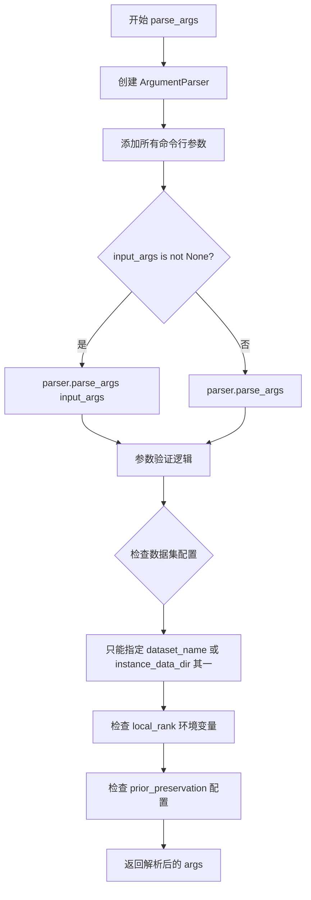
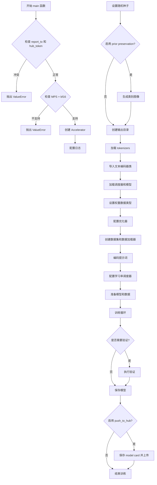
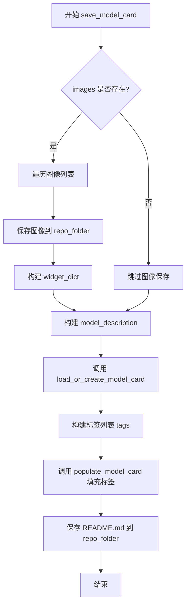
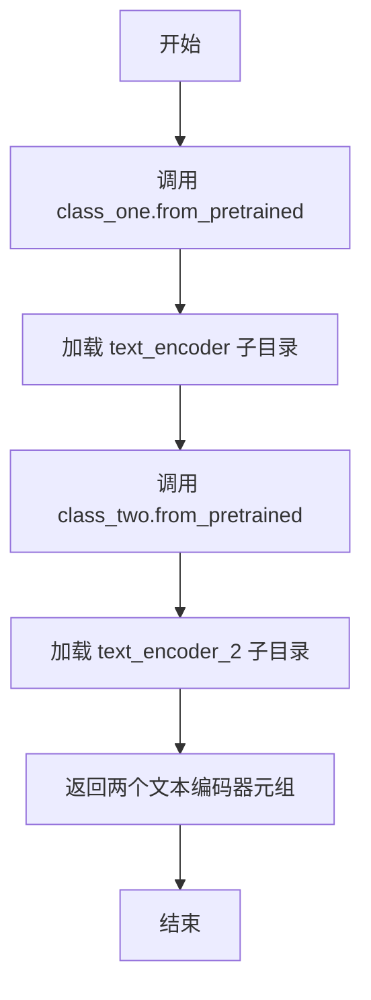
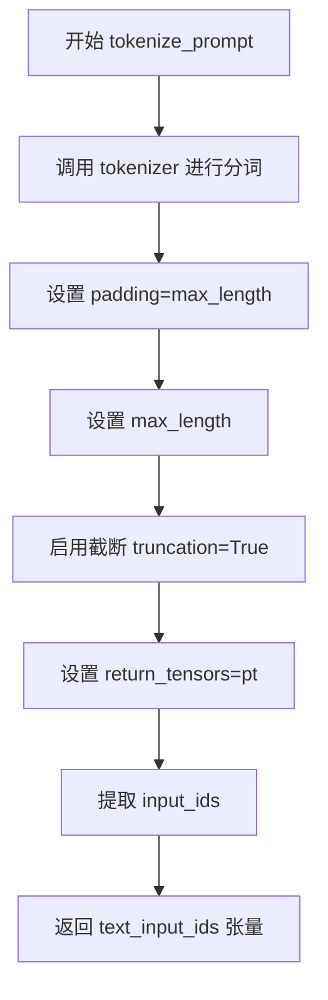
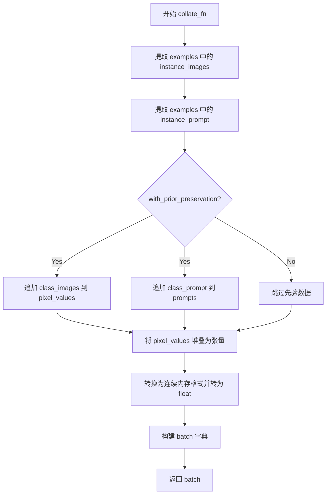
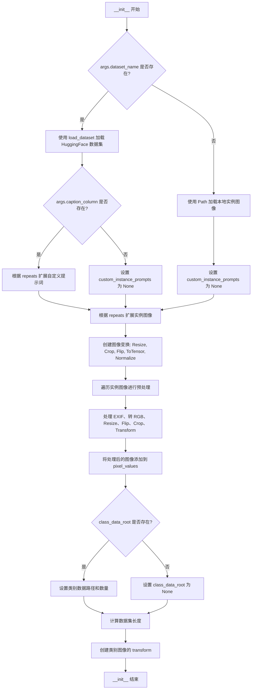
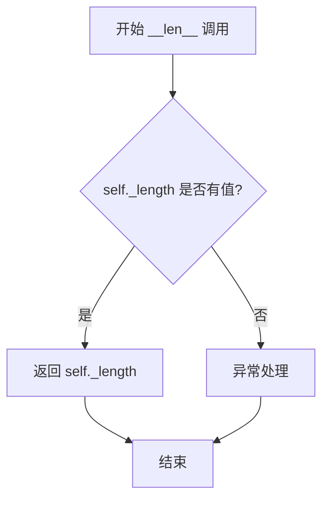
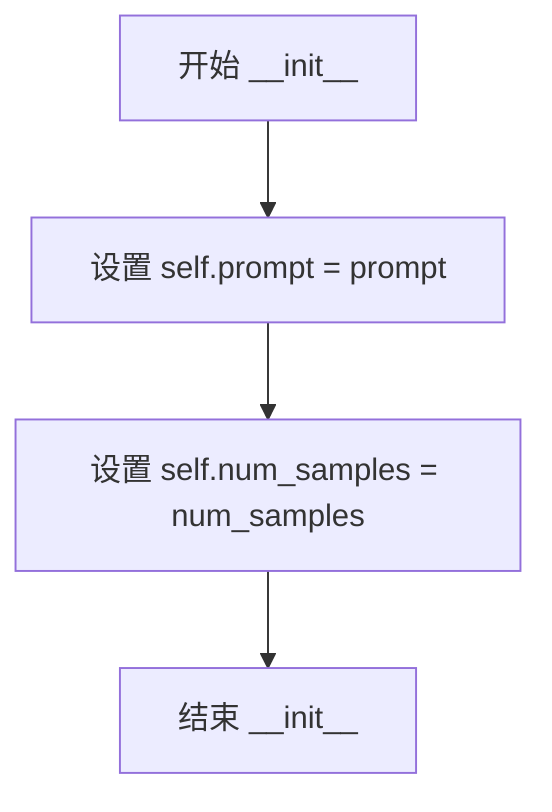
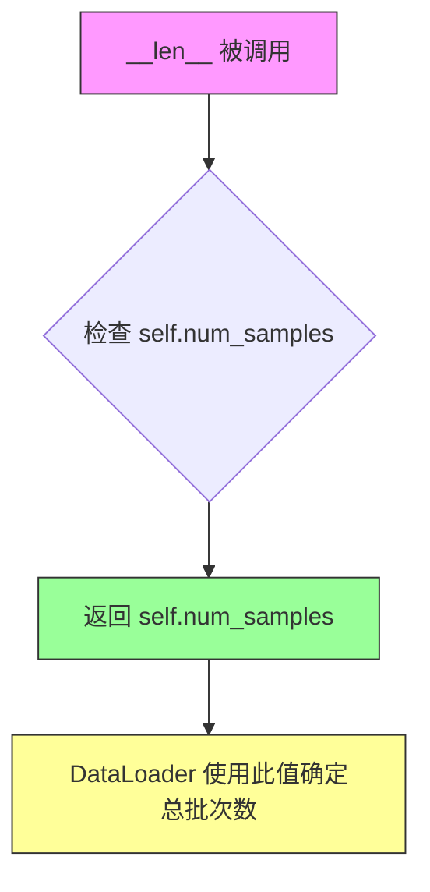

# `diffusers\examples\dreambooth\train_dreambooth_flux.py` 详细设计文档

A comprehensive training script for DreamBooth fine-tuning of the Flux text-to-image model, supporting distributed training, prior preservation, and optional text encoder optimization.

## 整体流程

```mermaid
graph TD
    Start[Parse Arguments] --> InitAccel[Initialize Accelerator & Logging]
    InitAccel --> DataPrep[Prepare DreamBooth Dataset]
    DataPrep --> PriorPreserve{With Prior Preservation?}
    PriorPreserve -- Yes --> GenClassImages[Generate Class Images via FluxPipeline]
    PriorPreserve -- No --> LoadModels
    GenClassImages --> LoadModels
    LoadModels --> LoadTokenizers[Load CLIP & T5 Tokenizers]
    LoadTokenizers --> LoadTextEncoders[Load Text Encoders]
    LoadTextEncoders --> LoadVAE[Load VAE & Transformer]
    LoadVAE --> SetupOptim[Setup Optimizer & LR Scheduler]
    SetupOptim --> TrainingLoop[Epoch Loop]
    TrainingLoop --> StepLoop[Step Loop]
    StepLoop --> EncodePrompts[Encode Prompts (CLIP+T5)]
    EncodePrompts --> VAEEncode[Encode Images to Latents]
    VAEEncode --> NoiseSample[Sample Noise & Timesteps]
    NoiseSample --> FlowMatch[Apply Flow Matching (Add Noise)]
    FlowMatch --> Prediction[Transformer Prediction]
    Prediction --> ComputeLoss[Compute Loss (Instance + Prior)]
    ComputeLoss --> BackwardPass[Backward & Optimizer Step]
    BackwardPass --> Checkpointing{Checkpoint Save?}
    Checkpointing -- Yes --> SaveCkpt[Save State]
    Checkpointing -- No --> Validation{Validation Epoch?}
    Validation -- Yes --> RunValidation[Run Validation Log]
    Validation -- No --> CheckEnd{Reached Max Steps?}
    RunValidation --> CheckEnd
    SaveCkpt --> CheckEnd
    CheckEnd -- No --> StepLoop
    CheckEnd -- Yes --> FinalSave[Save Final Model & LoRA]
```

## 类结构

```
torch.utils.data.Dataset (Base Class)
├── DreamBoothDataset (Handles instance/class image loading and preprocessing)
└── PromptDataset (Handles prompts for class image generation)
```

## 全局变量及字段


### `logger`
    
Module-level logger instance from Accelerate for logging training information and debugging.

类型：`logging.Logger`
    


### `args`
    
Global namespace for command-line arguments parsed by parse_args(), containing all training configuration parameters.

类型：`argparse.Namespace`
    


### `DreamBoothDataset.size`
    
Target resolution for image resizing during preprocessing.

类型：`int`
    


### `DreamBoothDataset.center_crop`
    
Flag indicating whether to center crop images to the target resolution.

类型：`bool`
    


### `DreamBoothDataset.instance_prompt`
    
Prompt template used for instance images to trigger the specific subject being trained.

类型：`str`
    


### `DreamBoothDataset.class_prompt`
    
Prompt used for class images in prior preservation loss calculation.

类型：`str`
    


### `DreamBoothDataset.instance_data_root`
    
Path object pointing to the directory containing instance training images.

类型：`Path`
    


### `DreamBoothDataset.class_data_root`
    
Path object pointing to the directory containing class images for prior preservation.

类型：`Path`
    


### `DreamBoothDataset.instance_images`
    
List of raw PIL Image objects loaded from the instance data directory.

类型：`list[PIL.Image.Image]`
    


### `DreamBoothDataset.pixel_values`
    
List of preprocessed image tensors normalized to [-1, 1] range for model input.

类型：`list[torch.Tensor]`
    


### `DreamBoothDataset.num_instance_images`
    
Total count of instance images after applying repetition factor.

类型：`int`
    


### `DreamBoothDataset._length`
    
Effective length of the dataset, calculated as max of instance and class image counts.

类型：`int`
    


### `DreamBoothDataset.class_images_path`
    
List of Path objects pointing to class images for prior preservation.

类型：`list[Path]`
    


### `DreamBoothDataset.num_class_images`
    
Total count of class images available for prior preservation loss.

类型：`int`
    


### `DreamBoothDataset.custom_instance_prompts`
    
Custom caption prompts provided for each instance image, or None if using default prompt.

类型：`list[str]`
    


### `DreamBoothDataset.image_transforms`
    
Composable transforms pipeline for preprocessing class images.

类型：`torchvision.transforms.Compose`
    


### `PromptDataset.prompt`
    
The text prompt used for generating class images during prior preservation.

类型：`str`
    


### `PromptDataset.num_samples`
    
Number of samples to generate for class image creation.

类型：`int`
    
    

## 全局函数及方法


### `parse_args`

解析命令行参数用于配置 DreamBooth 训练脚本。

参数：

- `input_args`：`Optional[List[str]]`，可选参数，用于测试目的的自定义命令行参数列表，默认为 `None`

返回值：`argparse.Namespace`，包含所有解析后的命令行参数对象

#### 流程图



#### 带注释源码

```python
def parse_args(input_args=None):
    """
    解析命令行参数用于配置 DreamBooth 训练脚本。
    
    参数:
        input_args: 可选的参数列表，用于测试目的。如果为 None，则从 sys.argv 解析。
    
    返回:
        argparse.Namespace: 包含所有命令行参数的对象
    """
    # 创建 ArgumentParser 实例，描述训练脚本的用途
    parser = argparse.ArgumentParser(description="Simple example of a training script.")
    
    # ========== 预训练模型配置 ==========
    # 添加预训练模型路径或模型标识符（必填）
    parser.add_argument(
        "--pretrained_model_name_or_path",
        type=str,
        default=None,
        required=True,
        help="Path to pretrained model or model identifier from huggingface.co/models.",
    )
    # 添加预训练模型版本修订号（可选）
    parser.add_argument(
        "--revision",
        type=str,
        default=None,
        required=False,
        help="Revision of pretrained model identifier from huggingface.co/models.",
    )
    # 添加模型文件变体（如 fp16）
    parser.add_argument(
        "--variant",
        type=str,
        default=None,
        help="Variant of the model files of the pretrained model identifier from huggingface.co/models, 'e.g.' fp16",
    )
    
    # ========== 数据集配置 ==========
    # 添加数据集名称（来自 HuggingFace Hub）
    parser.add_argument(
        "--dataset_name",
        type=str,
        default=None,
        help=(
            "The name of the Dataset (from the HuggingFace hub) containing the training data of instance images (could be your own, possibly private,"
            " dataset). It can also be a path pointing to a local copy of a dataset in your filesystem,"
            " or to a folder containing files that 🤗 Datasets can understand."
        ),
    )
    # 添加数据集配置名称
    parser.add_argument(
        "--dataset_config_name",
        type=str,
        default=None,
        help="The config of the Dataset, leave as None if there's only one config.",
    )
    # 添加实例数据目录（本地路径）
    parser.add_argument(
        "--instance_data_dir",
        type=str,
        default=None,
        help=("A folder containing the training data. "),
    )
    # 添加缓存目录
    parser.add_argument(
        "--cache_dir",
        type=str,
        default=None,
        help="The directory where the downloaded models and datasets will be stored.",
    )
    # 添加图像列名
    parser.add_argument(
        "--image_column",
        type=str,
        default="image",
        help="The column of the dataset containing the target image. By "
        "default, the standard Image Dataset maps out 'file_name' "
        "to 'image'.",
    )
    # 添加标题/提示词列名
    parser.add_argument(
        "--caption_column",
        type=str,
        default=None,
        help="The column of the dataset containing the instance prompt for each image",
    )
    # 添加重复次数
    parser.add_argument("--repeats", type=int, default=1, help="How many times to repeat the training data.")
    
    # ========== 先验保存配置 ==========
    # 添加类别数据目录
    parser.add_argument(
        "--class_data_dir",
        type=str,
        default=None,
        required=False,
        help="A folder containing the training data of class images.",
    )
    # 添加实例提示词（必填）
    parser.add_argument(
        "--instance_prompt",
        type=str,
        default=None,
        required=True,
        help="The prompt with identifier specifying the instance, e.g. 'photo of a TOK dog', 'in the style of TOK'",
    )
    # 添加类别提示词
    parser.add_argument(
        "--class_prompt",
        type=str,
        default=None,
        help="The prompt to specify images in the same class as provided instance images.",
    )
    
    # ========== 文本编码器配置 ==========
    # 添加最大序列长度
    parser.add_argument(
        "--max_sequence_length",
        type=int,
        default=77,
        help="Maximum sequence length to use with with the T5 text encoder",
    )
    
    # ========== 验证配置 ==========
    # 添加验证提示词
    parser.add_argument(
        "--validation_prompt",
        type=str,
        default=None,
        help="A prompt that is used during validation to verify that the model is learning.",
    )
    # 添加验证图像数量
    parser.add_argument(
        "--num_validation_images",
        type=int,
        default=4,
        help="Number of images that should be generated during validation with `validation_prompt`.",
    )
    # 添加验证周期
    parser.add_argument(
        "--validation_epochs",
        type=int,
        default=50,
        help=(
            "Run dreambooth validation every X epochs. Dreambooth validation consists of running the prompt"
            " `args.validation_prompt` multiple times: `args.num_validation_images`."
        ),
    )
    
    # ========== 先验保存损失配置 ==========
    # 添加先验保存标志
    parser.add_argument(
        "--with_prior_preservation",
        default=False,
        action="store_true",
        help="Flag to add prior preservation loss.",
    )
    # 添加先验损失权重
    parser.add_argument("--prior_loss_weight", type=float, default=1.0, help="The weight of prior preservation loss.")
    # 添加类别图像数量
    parser.add_argument(
        "--num_class_images",
        type=int,
        default=100,
        help=(
            "Minimal class images for prior preservation loss. If there are not enough images already present in"
            " class_data_dir, additional images will be sampled with class_prompt."
        ),
    )
    
    # ========== 输出和随机种子配置 ==========
    # 添加输出目录
    parser.add_argument(
        "--output_dir",
        type=str,
        default="flux-dreambooth",
        help="The output directory where the model predictions and checkpoints will be written.",
    )
    # 添加随机种子
    parser.add_argument("--seed", type=int, default=None, help="A seed for reproducible training.")
    
    # ========== 图像处理配置 ==========
    # 添加分辨率
    parser.add_argument(
        "--resolution",
        type=int,
        default=512,
        help=(
            "The resolution for input images, all the images in the train/validation dataset will be resized to this"
            " resolution"
        ),
    )
    # 添加中心裁剪标志
    parser.add_argument(
        "--center_crop",
        default=False,
        action="store_true",
        help=(
            "Whether to center crop the input images to the resolution. If not set, the images will be randomly"
            " cropped. The images will be resized to the resolution first before cropping."
        ),
    )
    # 添加随机翻转标志
    parser.add_argument(
        "--random_flip",
        action="store_true",
        help="whether to randomly flip images horizontally",
    )
    
    # ========== 文本编码器训练配置 ==========
    # 添加训练文本编码器标志
    parser.add_argument(
        "--train_text_encoder",
        action="store_true",
        help="Whether to train the text encoder. If set, the text encoder should be float32 precision.",
    )
    
    # ========== 批处理大小配置 ==========
    # 添加训练批处理大小
    parser.add_argument(
        "--train_batch_size", type=int, default=4, help="Batch size (per device) for the training dataloader."
    )
    # 添加采样批处理大小
    parser.add_argument(
        "--sample_batch_size", type=int, default=4, help="Batch size (per device) for sampling images."
    )
    
    # ========== 训练轮数配置 ==========
    # 添加训练轮数
    parser.add_argument("--num_train_epochs", type=int, default=1)
    # 添加最大训练步数
    parser.add_argument(
        "--max_train_steps",
        type=int,
        default=None,
        help="Total number of training steps to perform.  If provided, overrides num_train_epochs.",
    )
    
    # ========== 检查点配置 ==========
    # 添加检查点保存步数
    parser.add_argument(
        "--checkpointing_steps",
        type=int,
        default=500,
        help=(
            "Save a checkpoint of the training state every X updates. These checkpoints can be used both as final"
            " checkpoints in case they are better than the last checkpoint, and are also suitable for resuming"
            " training using `--resume_from_checkpoint`."
        ),
    )
    # 添加检查点总数限制
    parser.add_argument(
        "--checkpoints_total_limit",
        type=int,
        default=None,
        help=("Max number of checkpoints to store."),
    )
    # 添加从检查点恢复训练
    parser.add_argument(
        "--resume_from_checkpoint",
        type=str,
        default=None,
        help=(
            "Whether training should be resumed from a previous checkpoint. Use a path saved by"
            ' `--checkpointing_steps`, or `"latest"` to automatically select the last available checkpoint.'
        ),
    )
    
    # ========== 梯度累积配置 ==========
    # 添加梯度累积步数
    parser.add_argument(
        "--gradient_accumulation_steps",
        type=int,
        default=1,
        help="Number of updates steps to accumulate before performing a backward/update pass.",
    )
    # 添加梯度检查点标志
    parser.add_argument(
        "--gradient_checkpointing",
        action="store_true",
        help="Whether or not to use gradient checkpointing to save memory at the expense of slower backward pass.",
    )
    
    # ========== 学习率配置 ==========
    # 添加学习率
    parser.add_argument(
        "--learning_rate",
        type=float,
        default=1e-4,
        help="Initial learning rate (after the potential warmup period) to use.",
    )
    # 添加指导比例
    parser.add_argument(
        "--guidance_scale",
        type=float,
        default=3.5,
        help="the FLUX.1 dev variant is a guidance distilled model",
    )
    # 添加文本编码器学习率
    parser.add_argument(
        "--text_encoder_lr",
        type=float,
        default=5e-6,
        help="Text encoder learning rate to use.",
    )
    # 添加学习率缩放标志
    parser.add_argument(
        "--scale_lr",
        action="store_true",
        default=False,
        help="Scale the learning rate by the number of GPUs, gradient accumulation steps, and batch size.",
    )
    
    # ========== 学习率调度器配置 ==========
    # 添加学习率调度器类型
    parser.add_argument(
        "--lr_scheduler",
        type=str,
        default="constant",
        help=(
            'The scheduler type to use. Choose between ["linear", "cosine", "cosine_with_restarts", "polynomial",'
            ' "constant", "constant_with_warmup"]'
        ),
    )
    # 添加学习率预热步数
    parser.add_argument(
        "--lr_warmup_steps", type=int, default=500, help="Number of steps for the warmup in the lr scheduler."
    )
    # 添加学习率周期数
    parser.add_argument(
        "--lr_num_cycles",
        type=int,
        default=1,
        help="Number of hard resets of the lr in cosine_with_restarts scheduler.",
    )
    # 添加学习率幂次
    parser.add_argument("--lr_power", type=float, default=1.0, help="Power factor of the polynomial scheduler.")
    
    # ========== 数据加载器配置 ==========
    # 添加数据加载器工作进程数
    parser.add_argument(
        "--dataloader_num_workers",
        type=int,
        default=0,
        help=(
            "Number of subprocesses to use for data loading. 0 means that the data will be loaded in the main process."
        ),
    )
    
    # ========== 采样权重配置 ==========
    # 添加权重方案
    parser.add_argument(
        "--weighting_scheme",
        type=str,
        default="none",
        choices=["sigma_sqrt", "logit_normal", "mode", "cosmap", "none"],
        help=('We default to the "none" weighting scheme for uniform sampling and uniform loss'),
    )
    # 添加 logit 均值
    parser.add_argument(
        "--logit_mean", type=float, default=0.0, help="mean to use when using the `'logit_normal'` weighting scheme."
    )
    # 添加 logit 标准差
    parser.add_argument(
        "--logit_std", type=float, default=1.0, help="std to use when using the `'logit_normal'` weighting scheme."
    )
    # 添加模式比例
    parser.add_argument(
        "--mode_scale",
        type=float,
        default=1.29,
        help="Scale of mode weighting scheme. Only effective when using the `'mode'` as the `weighting_scheme`.",
    )
    
    # ========== 优化器配置 ==========
    # 添加优化器类型
    parser.add_argument(
        "--optimizer",
        type=str,
        default="AdamW",
        help=('The optimizer type to use. Choose between ["AdamW", "prodigy"]'),
    )
    # 添加 8 位 Adam 标志
    parser.add_argument(
        "--use_8bit_adam",
        action="store_true",
        help="Whether or not to use 8-bit Adam from bitsandbytes. Ignored if optimizer is not set to AdamW",
    )
    # 添加 Adam beta1
    parser.add_argument(
        "--adam_beta1", type=float, default=0.9, help="The beta1 parameter for the Adam and Prodigy optimizers."
    )
    # 添加 Adam beta2
    parser.add_argument(
        "--adam_beta2", type=float, default=0.999, help="The beta2 parameter for the Adam and Prodigy optimizers."
    )
    # 添加 Prodigy beta3
    parser.add_argument(
        "--prodigy_beta3",
        type=float,
        default=None,
        help="coefficients for computing the Prodigy stepsize using running averages. If set to None, "
        "uses the value of square root of beta2. Ignored if optimizer is adamW",
    )
    # 添加 Prodigy 解耦标志
    parser.add_argument("--prodigy_decouple", type=bool, default=True, help="Use AdamW style decoupled weight decay")
    # 添加 Adam 权重衰减
    parser.add_argument("--adam_weight_decay", type=float, default=1e-04, help="Weight decay to use for unet params")
    # 添加文本编码器权重衰减
    parser.add_argument(
        "--adam_weight_decay_text_encoder", type=float, default=1e-03, help="Weight decay to use for text_encoder"
    )
    # 添加 Adam epsilon
    parser.add_argument(
        "--adam_epsilon",
        type=float,
        default=1e-08,
        help="Epsilon value for the Adam optimizer and Prodigy optimizers.",
    )
    # 添加 Prodigy 偏差校正标志
    parser.add_argument(
        "--prodigy_use_bias_correction",
        type=bool,
        default=True,
        help="Turn on Adam's bias correction. True by default. Ignored if optimizer is adamW",
    )
    # 添加 Prodigy 预热保护标志
    parser.add_argument(
        "--prodigy_safeguard_warmup",
        type=bool,
        default=True,
        help="Remove lr from the denominator of D estimate to avoid issues during warm-up stage. True by default. "
        "Ignored if optimizer is adamW",
    )
    # 添加最大梯度范数
    parser.add_argument("--max_grad_norm", default=1.0, type=float, help="Max gradient norm.")
    
    # ========== Hub 上传配置 ==========
    # 添加推送到 Hub 标志
    parser.add_argument("--push_to_hub", action="store_true", help="Whether or not to push the model to the Hub.")
    # 添加 Hub 令牌
    parser.add_argument("--hub_token", type=str, default=None, help="The token to use to push to the Model Hub.")
    # 添加 Hub 模型 ID
    parser.add_argument(
        "--hub_model_id",
        type=str,
        default=None,
        help="The name of the repository to keep in sync with the local `output_dir`.",
    )
    
    # ========== 日志和监控配置 ==========
    # 添加日志目录
    parser.add_argument(
        "--logging_dir",
        type=str,
        default="logs",
        help=(
            "[TensorBoard](https://www.tensorflow.org/tensorboard) log directory. Will default to"
            " *output_dir/runs/**CURRENT_DATETIME_HOSTNAME***."
        ),
    )
    # 添加 TF32 允许标志
    parser.add_argument(
        "--allow_tf32",
        action="store_true",
        help=(
            "Whether or not to allow TF32 on Ampere GPUs. Can be used to speed up training. For more information, see"
            " https://pytorch.org/docs/stable/notes/cuda.html#tensorfloat-32-tf32-on-ampere-devices"
        ),
    )
    # 添加报告目标
    parser.add_argument(
        "--report_to",
        type=str,
        default="tensorboard",
        help=(
            'The integration to report the results and logs to. Supported platforms are `"tensorboard"`'
            ' (default), `"wandb"` and `"comet_ml"`. Use `"all"` to report to all integrations.'
        ),
    )
    
    # ========== 混合精度配置 ==========
    # 添加混合精度类型
    parser.add_argument(
        "--mixed_precision",
        type=str,
        default=None,
        choices=["no", "fp16", "bf16"],
        help=(
            "Whether to use mixed precision. Choose between fp16 and bf16 (bfloat16). Bf16 requires PyTorch >="
            " 1.10.and an Nvidia Ampere GPU.  Default to the value of accelerate config of the current system or the"
            " flag passed with the `accelerate.launch` command. Use this argument to override the accelerate config."
        ),
    )
    # 添加先验生成精度
    parser.add_argument(
        "--prior_generation_precision",
        type=str,
        default=None,
        choices=["no", "fp32", "fp16", "bf16"],
        help=(
            "Choose prior generation precision between fp32, fp16 and bf16 (bfloat16). Bf16 requires PyTorch >="
            " 1.10.and an Nvidia Ampere GPU.  Default to  fp16 if a GPU is available else fp32."
        ),
    )
    
    # ========== 分布式训练配置 ==========
    # 添加本地排名
    parser.add_argument("--local_rank", type=int, default=-1, help="For distributed training: local_rank")
    
    # ========== 图像插值配置 ==========
    # 添加图像插值模式
    parser.add_argument(
        "--image_interpolation_mode",
        type=str,
        default="lanczos",
        choices=[
            f.lower() for f in dir(transforms.InterpolationMode) if not f.startswith("__") and not f.endswith("__")
        ],
        help="The image interpolation method to use for resizing images.",
    )
    # 添加 NPU 闪存注意力启用标志
    parser.add_argument("--enable_npu_flash_attention", action="store_true", help="Enabla Flash Attention for NPU")
    
    # ========== 参数解析 ==========
    # 根据 input_args 是否为空决定解析方式
    if input_args is not None:
        args = parser.parse_args(input_args)
    else:
        args = parser.parse_args()
    
    # ========== 参数验证逻辑 ==========
    
    # 检查数据集配置：dataset_name 和 instance_data_dir 只能指定其一
    if args.dataset_name is None and args.instance_data_dir is None:
        raise ValueError("Specify either `--dataset_name` or `--instance_data_dir`")

    if args.dataset_name is not None and args.instance_data_dir is not None:
        raise ValueError("Specify only one of `--dataset_name` or `--instance_data_dir`")
    
    # 检查并同步 local_rank 环境变量
    env_local_rank = int(os.environ.get("LOCAL_RANK", -1))
    if env_local_rank != -1 and env_local_rank != args.local_rank:
        args.local_rank = env_local_rank
    
    # 检查先验保存配置
    if args.with_prior_preservation:
        if args.class_data_dir is None:
            raise ValueError("You must specify a data directory for class images.")
        if args.class_prompt is None:
            raise ValueError("You must specify prompt for class images.")
    else:
        # logger is not available yet
        if args.class_data_dir is not None:
            warnings.warn("You need not use --class_data_dir without --with_prior_preservation.")
        if args.class_prompt is not None:
            warnings.warn("You need not use --class_prompt without --with_prior_preservation.")
    
    # 返回解析后的参数对象
    return args
```


### `main`

主入口点，执行完整的 DreamBooth 训练管道，包括模型加载、数据集准备、训练循环、验证、模型保存和推送到 Hub。

参数：

- `args`：`argparse.Namespace`，包含所有训练配置参数的命名空间对象，由 `parse_args()` 解析命令行参数生成

返回值：`None`，无返回值

#### 流程图



#### 带注释源码

```python
def main(args):
    # 检查 wandb 和 hub_token 的安全风险
    if args.report_to == "wandb" and args.hub_token is not None:
        raise ValueError(
            "You cannot use both --report_to=wandb and --hub_token due to a security risk of exposing your token."
            " Please use `hf auth login` to authenticate with the Hub."
        )

    # 检查 MPS 是否支持 bfloat16
    if torch.backends.mps.is_available() and args.mixed_precision == "bf16":
        raise ValueError(
            "Mixed precision training with bfloat16 is not supported on MPS. Please use fp16 (recommended) or fp32 instead."
        )

    # 构建日志目录路径
    logging_dir = Path(args.output_dir, args.logging_dir)

    # 配置 Accelerator 项目设置
    accelerator_project_config = ProjectConfiguration(project_dir=args.output_dir, logging_dir=logging_dir)
    kwargs = DistributedDataParallelKwargs(find_unused_parameters=True)
    accelerator = Accelerator(
        gradient_accumulation_steps=args.gradient_accumulation_steps,
        mixed_precision=args.mixed_precision,
        log_with=args.report_to,
        project_config=accelerator_project_config,
        kwargs_handlers=[kwargs],
    )

    # MPS 上禁用 AMP
    if torch.backends.mps.is_available():
        accelerator.native_amp = False

    # 检查 wandb 可用性
    if args.report_to == "wandb":
        if not is_wandb_available():
            raise ImportError("Make sure to install wandb if you want to use it for logging during training.")

    # 配置日志格式
    logging.basicConfig(
        format="%(asctime)s - %(levelname)s - %(name)s - %(message)s",
        datefmt="%m/%d/%Y %H:%M:%S",
        level=logging.INFO,
    )
    logger.info(accelerator.state, main_process_only=False)
    if accelerator.is_local_main_process:
        transformers.utils.logging.set_verbosity_warning()
        diffusers.utils.logging.set_verbosity_info()
    else:
        transformers.utils.logging.set_verbosity_error()
        diffusers.utils.logging.set_verbosity_error()

    # 设置训练随机种子
    if args.seed is not None:
        set_seed(args.seed)

    # 生成类别图像（如果启用 prior preservation）
    if args.with_prior_preservation:
        class_images_dir = Path(args.class_data_dir)
        if not class_images_dir.exists():
            class_images_dir.mkdir(parents=True)
        cur_class_images = len(list(class_images_dir.iterdir()))

        if cur_class_images < args.num_class_images:
            # 确定数据类型
            has_supported_fp16_accelerator = (
                torch.cuda.is_available() or torch.backends.mps.is_available() or is_torch_npu_available()
            )
            torch_dtype = torch.float16 if has_supported_fp16_accelerator else torch.float32
            if args.prior_generation_precision == "fp32":
                torch_dtype = torch.float32
            elif args.prior_generation_precision == "fp16":
                torch_dtype = torch.float16
            elif args.prior_generation_precision == "bf16":
                torch_dtype = torch.bfloat16
            
            # 加载 Pipeline 生成类别图像
            pipeline = FluxPipeline.from_pretrained(
                args.pretrained_model_name_or_path,
                torch_dtype=torch_dtype,
                revision=args.revision,
                variant=args.variant,
            )
            pipeline.set_progress_bar_config(disable=True)

            num_new_images = args.num_class_images - cur_class_images
            logger.info(f"Number of class images to sample: {num_new_images}.")

            # 创建数据加载器并生成图像
            sample_dataset = PromptDataset(args.class_prompt, num_new_images)
            sample_dataloader = torch.utils.data.DataLoader(sample_dataset, batch_size=args.sample_batch_size)
            sample_dataloader = accelerator.prepare(sample_dataloader)
            pipeline.to(accelerator.device)

            for example in tqdm(
                sample_dataloader, desc="Generating class images", disable=not accelerator.is_local_main_process
            ):
                images = pipeline(example["prompt"]).images
                for i, image in enumerate(images):
                    hash_image = insecure_hashlib.sha1(image.tobytes()).hexdigest()
                    image_filename = class_images_dir / f"{example['index'][i] + cur_class_images}-{hash_image}.jpg"
                    image.save(image_filename)

            # 清理 Pipeline
            del pipeline
            if torch.cuda.is_available():
                torch.cuda.empty_cache()
            elif is_torch_npu_available():
                torch_npu.npu.empty_cache()

    # 处理仓库创建
    if accelerator.is_main_process:
        if args.output_dir is not None:
            os.makedirs(args.output_dir, exist_ok=True)

        if args.push_to_hub:
            repo_id = create_repo(
                repo_id=args.hub_model_id or Path(args.output_dir).name,
                exist_ok=True,
            ).repo_id

    # 加载 tokenizers
    tokenizer_one = CLIPTokenizer.from_pretrained(
        args.pretrained_model_name_or_path,
        subfolder="tokenizer",
        revision=args.revision,
    )
    tokenizer_two = T5TokenizerFast.from_pretrained(
        args.pretrained_model_name_or_path,
        subfolder="tokenizer_2",
        revision=args.revision,
    )

    # 导入文本编码器类
    text_encoder_cls_one = import_model_class_from_model_name_or_path(
        args.pretrained_model_name_or_path, args.revision
    )
    text_encoder_cls_two = import_model_class_from_model_name_or_path(
        args.pretrained_model_name_or_path, args.revision, subfolder="text_encoder_2"
    )

    # 加载调度器和模型
    noise_scheduler = FlowMatchEulerDiscreteScheduler.from_pretrained(
        args.pretrained_model_name_or_path, subfolder="scheduler"
    )
    noise_scheduler_copy = copy.deepcopy(noise_scheduler)
    text_encoder_one, text_encoder_two = load_text_encoders(text_encoder_cls_one, text_encoder_cls_two)
    vae = AutoencoderKL.from_pretrained(
        args.pretrained_model_name_or_path,
        subfolder="vae",
        revision=args.revision,
        variant=args.variant,
    )
    transformer = FluxTransformer2DModel.from_pretrained(
        args.pretrained_model_name_or_path, subfolder="transformer", revision=args.revision, variant=args.variant
    )

    # 设置梯度要求
    transformer.requires_grad_(True)
    vae.requires_grad_(False)
    if args.train_text_encoder:
        text_encoder_one.requires_grad_(True)
        text_encoder_two.requires_grad_(False)
    else:
        text_encoder_one.requires_grad_(False)
        text_encoder_two.requires_grad_(False)

    # 启用 NPU Flash Attention
    if args.enable_npu_flash_attention:
        if is_torch_npu_available():
            logger.info("npu flash attention enabled.")
            transformer.set_attention_backend("_native_npu")
        else:
            raise ValueError("npu flash attention requires torch_npu extensions and is supported only on npu device ")

    # 设置权重数据类型（混合精度）
    weight_dtype = torch.float32
    if accelerator.mixed_precision == "fp16":
        weight_dtype = torch.float16
    elif accelerator.mixed_precision == "bf16":
        weight_dtype = torch.bfloat16

    # 检查 MPS bfloat16 支持
    if torch.backends.mps.is_available() and weight_dtype == torch.bfloat16:
        raise ValueError(
            "Mixed precision training with bfloat16 is not supported on MPS. Please use fp16 (recommended) or fp32 instead."
        )

    # 将模型移动到设备
    vae.to(accelerator.device, dtype=weight_dtype)
    if not args.train_text_encoder:
        text_encoder_one.to(accelerator.device, dtype=weight_dtype)
        text_encoder_two.to(accelerator.device, dtype=weight_dtype)

    # 启用梯度检查点
    if args.gradient_checkpointing:
        transformer.enable_gradient_checkpointing()
        if args.train_text_encoder:
            text_encoder_one.gradient_checkpointing_enable()

    # 定义 unwrap_model 辅助函数
    def unwrap_model(model):
        model = accelerator.unwrap_model(model)
        model = model._orig_mod if is_compiled_module(model) else model
        return model

    # 定义模型保存和加载钩子
    def save_model_hook(models, weights, output_dir):
        if accelerator.is_main_process:
            for i, model in enumerate(models):
                if isinstance(unwrap_model(model), FluxTransformer2DModel):
                    unwrap_model(model).save_pretrained(os.path.join(output_dir, "transformer"))
                elif isinstance(unwrap_model(model), (CLIPTextModelWithProjection, T5EncoderModel)):
                    if isinstance(unwrap_model(model), CLIPTextModelWithProjection):
                        unwrap_model(model).save_pretrained(os.path.join(output_dir, "text_encoder"))
                    else:
                        unwrap_model(model).save_pretrained(os.path.join(output_dir, "text_encoder_2"))
                else:
                    raise ValueError(f"Wrong model supplied: {type(model)=}.")
                weights.pop()

    def load_model_hook(models, input_dir):
        for _ in range(len(models)):
            model = models.pop()
            if isinstance(unwrap_model(model), FluxTransformer2DModel):
                load_model = FluxTransformer2DModel.from_pretrained(input_dir, subfolder="transformer")
                model.register_to_config(**load_model.config)
                model.load_state_dict(load_model.state_dict())
            elif isinstance(unwrap_model(model), (CLIPTextModelWithProjection, T5EncoderModel)):
                try:
                    load_model = CLIPTextModelWithProjection.from_pretrained(input_dir, subfolder="text_encoder")
                    model(**load_model.config)
                    model.load_state_dict(load_model.state_dict())
                except Exception:
                    try:
                        load_model = T5EncoderModel.from_pretrained(input_dir, subfolder="text_encoder_2")
                        model(**load_model.config)
                        model.load_state_dict(load_model.state_dict())
                    except Exception:
                        raise ValueError(f"Couldn't load the model of type: ({type(model)}).")
            else:
                raise ValueError(f"Unsupported model found: {type(model)=}")
            del load_model

    # 注册钩子
    accelerator.register_save_state_pre_hook(save_model_hook)
    accelerator.register_load_state_pre_hook(load_model_hook)

    # 启用 TF32 加速
    if args.allow_tf32 and torch.cuda.is_available():
        torch.backends.cuda.matmul.allow_tf32 = True

    # 缩放学习率
    if args.scale_lr:
        args.learning_rate = (
            args.learning_rate * args.gradient_accumulation_steps * args.train_batch_size * accelerator.num_processes
        )

    # 配置优化参数
    transformer_parameters_with_lr = {"params": transformer.parameters(), "lr": args.learning_rate}
    if args.train_text_encoder:
        text_parameters_one_with_lr = {
            "params": text_encoder_one.parameters(),
            "weight_decay": args.adam_weight_decay_text_encoder,
            "lr": args.text_encoder_lr if args.text_encoder_lr else args.learning_rate,
        }
        params_to_optimize = [transformer_parameters_with_lr, text_parameters_one_with_lr]
    else:
        params_to_optimize = [transformer_parameters_with_lr]

    # 创建优化器
    if not (args.optimizer.lower() == "prodigy" or args.optimizer.lower() == "adamw"):
        logger.warning(
            f"Unsupported choice of optimizer: {args.optimizer}.Supported optimizers include [adamW, prodigy]."
            "Defaulting to adamW"
        )
        args.optimizer = "adamw"

    if args.use_8bit_adam and not args.optimizer.lower() == "adamw":
        logger.warning(
            f"use_8bit_adam is ignored when optimizer is not set to 'AdamW'. Optimizer was "
            f"set to {args.optimizer.lower()}"
        )

    if args.optimizer.lower() == "adamw":
        if args.use_8bit_adam:
            try:
                import bitsandbytes as bnb
            except ImportError:
                raise ImportError(
                    "To use 8-bit Adam, please install the bitsandbytes library: `pip install bitsandbytes`."
                )
            optimizer_class = bnb.optim.AdamW8bit
        else:
            optimizer_class = torch.optim.AdamW

        optimizer = optimizer_class(
            params_to_optimize,
            betas=(args.adam_beta1, args.adam_beta2),
            weight_decay=args.adam_weight_decay,
            eps=args.adam_epsilon,
        )

    if args.optimizer.lower() == "prodigy":
        try:
            import prodigyopt
        except ImportError:
            raise ImportError("To use Prodigy, please install the prodigyopt library: `pip install prodigyopt`")

        optimizer_class = prodigyopt.Prodigy
        # ... (Prodigy 优化器配置省略)

        optimizer = optimizer_class(
            params_to_optimize,
            betas=(args.adam_beta1, args.adam_beta2),
            beta3=args.prodigy_beta3,
            weight_decay=args.adam_weight_decay,
            eps=args.adam_epsilon,
            decouple=args.prodigy_decouple,
            use_bias_correction=args.prodigy_use_bias_correction,
            safeguard_warmup=args.prodigy_safeguard_warmup,
        )

    # 创建数据集和数据加载器
    train_dataset = DreamBoothDataset(
        instance_data_root=args.instance_data_dir,
        instance_prompt=args.instance_prompt,
        class_prompt=args.class_prompt,
        class_data_root=args.class_data_dir if args.with_prior_preservation else None,
        class_num=args.num_class_images,
        size=args.resolution,
        repeats=args.repeats,
        center_crop=args.center_crop,
    )

    train_dataloader = torch.utils.data.DataLoader(
        train_dataset,
        batch_size=args.train_batch_size,
        shuffle=True,
        collate_fn=lambda examples: collate_fn(examples, args.with_prior_preservation),
        num_workers=args.dataloader_num_workers,
    )

    # 如果不训练文本编码器，预计算提示词嵌入
    if not args.train_text_encoder:
        tokenizers = [tokenizer_one, tokenizer_two]
        text_encoders = [text_encoder_one, text_encoder_two]

        def compute_text_embeddings(prompt, text_encoders, tokenizers):
            with torch.no_grad():
                prompt_embeds, pooled_prompt_embeds, text_ids = encode_prompt(
                    text_encoders, tokenizers, prompt, args.max_sequence_length
                )
                prompt_embeds = prompt_embeds.to(accelerator.device)
                pooled_prompt_embeds = pooled_prompt_embeds.to(accelerator.device)
                text_ids = text_ids.to(accelerator.device)
            return prompt_embeds, pooled_prompt_embeds, text_ids

    # 预计算实例提示词嵌入
    if not args.train_text_encoder and not train_dataset.custom_instance_prompts:
        instance_prompt_hidden_states, instance_pooled_prompt_embeds, instance_text_ids = compute_text_embeddings(
            args.instance_prompt, text_encoders, tokenizers
        )

    # 处理类别提示词（prior preservation）
    if args.with_prior_preservation:
        if not args.train_text_encoder:
            class_prompt_hidden_states, class_pooled_prompt_embeds, class_text_ids = compute_text_embeddings(
                args.class_prompt, text_encoders, tokenizers
            )

    # 清理内存
    if not args.train_text_encoder and not train_dataset.custom_instance_prompts:
        del tokenizers, text_encoders
        del text_encoder_one, text_encoder_two
        gc.collect()
        if torch.cuda.is_available():
            torch.cuda.empty_cache()
        elif is_torch_npu_available():
            torch_npu.npu.empty_cache()

    # 准备静态变量
    if not train_dataset.custom_instance_prompts:
        if not args.train_text_encoder:
            prompt_embeds = instance_prompt_hidden_states
            pooled_prompt_embeds = instance_pooled_prompt_embeds
            text_ids = instance_text_ids
            if args.with_prior_preservation:
                prompt_embeds = torch.cat([prompt_embeds, class_prompt_hidden_states], dim=0)
                pooled_prompt_embeds = torch.cat([pooled_prompt_embeds, class_pooled_prompt_embeds], dim=0)
                text_ids = torch.cat([text_ids, class_text_ids], dim=0)
        else:
            tokens_one = tokenize_prompt(tokenizer_one, args.instance_prompt, max_sequence_length=77)
            tokens_two = tokenize_prompt(tokenizer_two, args.instance_prompt, max_sequence_length=512)
            if args.with_prior_preservation:
                class_tokens_one = tokenize_prompt(tokenizer_one, args.class_prompt, max_sequence_length=77)
                class_tokens_two = tokenize_prompt(tokenizer_two, args.class_prompt, max_sequence_length=512)
                tokens_one = torch.cat([tokens_one, class_tokens_one], dim=0)
                tokens_two = torch.cat([tokens_two, class_tokens_two], dim=0)

    # 配置学习率调度器
    num_warmup_steps_for_scheduler = args.lr_warmup_steps * accelerator.num_processes
    if args.max_train_steps is None:
        len_train_dataloader_after_sharding = math.ceil(len(train_dataloader) / accelerator.num_processes)
        num_update_steps_per_epoch = math.ceil(len_train_dataloader_after_sharding / args.gradient_accumulation_steps)
        num_training_steps_for_scheduler = (
            args.num_train_epochs * accelerator.num_processes * num_update_steps_per_epoch
        )
    else:
        num_training_steps_for_scheduler = args.max_train_steps * accelerator.num_processes

    lr_scheduler = get_scheduler(
        args.lr_scheduler,
        optimizer=optimizer,
        num_warmup_steps=num_warmup_steps_for_scheduler,
        num_training_steps=num_training_steps_for_scheduler,
        num_cycles=args.lr_num_cycles,
        power=args.lr_power,
    )

    # 使用 Accelerator 准备所有内容
    if args.train_text_encoder:
        (
            transformer,
            text_encoder_one,
            optimizer,
            train_dataloader,
            lr_scheduler,
        ) = accelerator.prepare(
            transformer,
            text_encoder_one,
            optimizer,
            train_dataloader,
            lr_scheduler,
        )
    else:
        transformer, optimizer, train_dataloader, lr_scheduler = accelerator.prepare(
            transformer, optimizer, train_dataloader, lr_scheduler
        )

    # 重新计算训练步数
    num_update_steps_per_epoch = math.ceil(len(train_dataloader) / args.gradient_accumulation_steps)
    if args.max_train_steps is None:
        args.max_train_steps = args.num_train_epochs * num_update_steps_per_epoch
        # ... 警告日志

    args.num_train_epochs = math.ceil(args.max_train_steps / num_update_steps_per_epoch)

    # 初始化 trackers
    if accelerator.is_main_process:
        tracker_name = "dreambooth-flux-dev-lora"
        accelerator.init_trackers(tracker_name, config=vars(args))

    # 训练信息日志
    total_batch_size = args.train_batch_size * accelerator.num_processes * args.gradient_accumulation_steps

    logger.info("***** Running training *****")
    logger.info(f"  Num examples = {len(train_dataset)}")
    logger.info(f"  Num batches each epoch = {len(train_dataloader)}")
    logger.info(f"  Num Epochs = {args.num_train_epochs}")
    logger.info(f"  Instantaneous batch size per device = {args.train_batch_size}")
    logger.info(f"  Total train batch size (w. parallel, distributed & accumulation) = {total_batch_size}")
    logger.info(f"  Gradient Accumulation steps = {args.gradient_accumulation_steps}")
    logger.info(f"  Total optimization steps = {args.max_train_steps}")

    global_step = 0
    first_epoch = 0

    # 从检查点恢复
    if args.resume_from_checkpoint:
        # ... 检查点恢复逻辑

    progress_bar = tqdm(
        range(0, args.max_train_steps),
        initial=initial_global_step,
        desc="Steps",
        disable=not accelerator.is_local_main_process,
    )

    # 定义 sigmas 计算函数
    def get_sigmas(timesteps, n_dim=4, dtype=torch.float32):
        sigmas = noise_scheduler_copy.sigmas.to(device=accelerator.device, dtype=dtype)
        schedule_timesteps = noise_scheduler_copy.timesteps.to(accelerator.device)
        timesteps = timesteps.to(accelerator.device)
        step_indices = [(schedule_timesteps == t).nonzero().item() for t in timesteps]
        sigma = sigmas[step_indices].flatten()
        while len(sigma.shape) < n_dim:
            sigma = sigma.unsqueeze(-1)
        return sigma

    # ===== 训练循环 =====
    for epoch in range(first_epoch, args.num_train_epochs):
        transformer.train()
        if args.train_text_encoder:
            text_encoder_one.train()

        for step, batch in enumerate(train_dataloader):
            models_to_accumulate = [transformer]
            if args.train_text_encoder:
                models_to_accumulate.extend([text_encoder_one])
            
            with accelerator.accumulate(models_to_accumulate):
                pixel_values = batch["pixel_values"].to(dtype=vae.dtype)
                prompts = batch["prompts"]

                # 编码提示词
                if train_dataset.custom_instance_prompts:
                    if not args.train_text_encoder:
                        prompt_embeds, pooled_prompt_embeds, text_ids = compute_text_embeddings(
                            prompts, text_encoders, tokenizers
                        )
                    else:
                        tokens_one = tokenize_prompt(tokenizer_one, prompts, max_sequence_length=77)
                        tokens_two = tokenize_prompt(
                            tokenizer_two, prompts, max_sequence_length=args.max_sequence_length
                        )
                        prompt_embeds, pooled_prompt_embeds, text_ids = encode_prompt(
                            text_encoders=[text_encoder_one, text_encoder_two],
                            tokenizers=[None, None],
                            text_input_ids_list=[tokens_one, tokens_two],
                            max_sequence_length=args.max_sequence_length,
                            prompt=prompts,
                        )
                else:
                    if args.train_text_encoder:
                        prompt_embeds, pooled_prompt_embeds, text_ids = encode_prompt(
                            text_encoders=[text_encoder_one, text_encoder_two],
                            tokenizers=[None, None],
                            text_input_ids_list=[tokens_one, tokens_two],
                            max_sequence_length=args.max_sequence_length,
                            prompt=args.instance_prompt,
                        )

                # 将图像转换为潜在空间
                model_input = vae.encode(pixel_values).latent_dist.sample()
                model_input = (model_input - vae.config.shift_factor) * vae.config.scaling_factor
                model_input = model_input.to(dtype=weight_dtype)

                # 准备 latent image IDs
                vae_scale_factor = 2 ** (len(vae.config.block_out_channels) - 1)
                latent_image_ids = FluxPipeline._prepare_latent_image_ids(
                    model_input.shape[0],
                    model_input.shape[2] // 2,
                    model_input.shape[3] // 2,
                    accelerator.device,
                    weight_dtype,
                )

                # 采样噪声
                noise = torch.randn_like(model_input)
                bsz = model_input.shape[0]

                # 采样随机时间步
                u = compute_density_for_timestep_sampling(
                    weighting_scheme=args.weighting_scheme,
                    batch_size=bsz,
                    logit_mean=args.logit_mean,
                    logit_std=args.logit_std,
                    mode_scale=args.mode_scale,
                )
                indices = (u * noise_scheduler_copy.config.num_train_timesteps).long()
                timesteps = noise_scheduler_copy.timesteps[indices].to(device=model_input.device)

                # Flow matching 添加噪声
                sigmas = get_sigmas(timesteps, n_dim=model_input.ndim, dtype=model_input.dtype)
                noisy_model_input = (1.0 - sigmas) * model_input + sigmas * noise

                # 打包 latents
                packed_noisy_model_input = FluxPipeline._pack_latents(
                    noisy_model_input,
                    batch_size=model_input.shape[0],
                    num_channels_latents=model_input.shape[1],
                    height=model_input.shape[2],
                    width=model_input.shape[3],
                )

                # 处理 guidance
                if unwrap_model(transformer).config.guidance_embeds:
                    guidance = torch.tensor([args.guidance_scale], device=accelerator.device)
                    guidance = guidance.expand(model_input.shape[0])
                else:
                    guidance = None

                # 预测噪声残差
                model_pred = transformer(
                    hidden_states=packed_noisy_model_input,
                    timestep=timesteps / 1000,
                    guidance=guidance,
                    pooled_projections=pooled_prompt_embeds,
                    encoder_hidden_states=prompt_embeds,
                    txt_ids=text_ids,
                    img_ids=latent_image_ids,
                    return_dict=False,
                )[0]

                # 解包 predictions
                model_pred = FluxPipeline._unpack_latents(
                    model_pred,
                    height=model_input.shape[2] * vae_scale_factor,
                    width=model_input.shape[3] * vae_scale_factor,
                    vae_scale_factor=vae_scale_factor,
                )

                # 计算损失权重
                weighting = compute_loss_weighting_for_sd3(weighting_scheme=args.weighting_scheme, sigmas=sigmas)

                # Flow matching loss
                target = noise - model_input

                # Prior preservation loss
                if args.with_prior_preservation:
                    model_pred, model_pred_prior = torch.chunk(model_pred, 2, dim=0)
                    target, target_prior = torch.chunk(target, 2, dim=0)
                    prior_loss = torch.mean(
                        (weighting.float() * (model_pred_prior.float() - target_prior.float()) ** 2).reshape(
                            target_prior.shape[0], -1
                        ),
                        1,
                    )
                    prior_loss = prior_loss.mean()

                # 计算损失
                loss = torch.mean(
                    (weighting.float() * (model_pred.float() - target.float()) ** 2).reshape(target.shape[0], -1),
                    1,
                )
                loss = loss.mean()

                if args.with_prior_preservation:
                    loss = loss + args.prior_loss_weight * prior_loss

                # 反向传播
                accelerator.backward(loss)
                if accelerator.sync_gradients:
                    params_to_clip = (
                        itertools.chain(transformer.parameters(), text_encoder_one.parameters())
                        if args.train_text_encoder
                        else transformer.parameters()
                    )
                    accelerator.clip_grad_norm_(params_to_clip, args.max_grad_norm)

                # 优化器步骤
                optimizer.step()
                lr_scheduler.step()
                optimizer.zero_grad()

            # 保存检查点
            if accelerator.sync_gradients:
                progress_bar.update(1)
                global_step += 1

                if accelerator.is_main_process:
                    if global_step % args.checkpointing_steps == 0:
                        # ... 检查点保存逻辑

                # 记录日志
                logs = {"loss": loss.detach().item(), "lr": lr_scheduler.get_last_lr()[0]}
                progress_bar.set_postfix(**logs)
                accelerator.log(logs, step=global_step)

                if global_step >= args.max_train_steps:
                    break

        # 验证
        if accelerator.is_main_process:
            if args.validation_prompt is not None and epoch % args.validation_epochs == 0:
                # ... 验证逻辑

    # 保存 LoRA 层
    accelerator.wait_for_everyone()
    if accelerator.is_main_process:
        transformer = unwrap_model(transformer)
        # ... 保存 pipeline
        pipeline.save_pretrained(args.output_dir)

        # 最终推理验证
        # ... 推送到 Hub
```


### `save_model_card`

该函数用于生成并保存 DreamBooth 训练后的模型元数据卡片（Model Card）到 HuggingFace Hub，包含模型描述、使用说明、触发词、许可证信息和验证图像，并将其保存为 README.md 文件。

参数：

- `repo_id`：`str`，HuggingFace Hub 仓库的唯一标识符
- `images`：`Optional[List[PIL.Image]]`，训练过程中生成的验证图像列表，默认为 None
- `base_model`：`Optional[str]，基础预训练模型的名称或路径，默认为 None
- `train_text_encoder`：`bool`，指示是否对文本编码器进行了微调，默认为 False
- `instance_prompt`：`Optional[str]，实例提示词，用于触发模型生成特定实例的图像，默认为 None
- `validation_prompt`：`Optional[str]，验证时使用的提示词，默认为 None
- `repo_folder`：`Optional[str]，本地仓库文件夹路径，用于保存模型卡片和图像，默认为 None

返回值：`None`，该函数无返回值，直接将模型卡片写入文件系统

#### 流程图



#### 带注释源码

```python
def save_model_card(
    repo_id: str,
    images=None,
    base_model: str = None,
    train_text_encoder=False,
    instance_prompt=None,
    validation_prompt=None,
    repo_folder=None,
):
    """
    Generates and saves model card metadata to Hub.
    
    构建并保存模型卡片（README.md）到本地文件夹，包含模型描述、图像示例和标签信息。
    
    Args:
        repo_id: HuggingFace Hub 仓库ID
        images: 验证图像列表
        base_model: 基础模型名称
        train_text_encoder: 是否训练了文本编码器
        instance_prompt: 实例提示词
        validation_prompt: 验证提示词
        repo_folder: 本地仓库文件夹路径
    
    Returns:
        None: 直接写入文件，不返回值
    """
    # 初始化 widget 字典列表，用于 HuggingFace Hub 的交互式组件展示
    widget_dict = []
    if images is not None:
        # 如果存在验证图像，遍历保存到本地文件夹
        for i, image in enumerate(images):
            # 保存图像文件，命名格式为 image_{i}.png
            image.save(os.path.join(repo_folder, f"image_{i}.png"))
            # 构建 widget 字典，包含提示词和图像URL
            widget_dict.append(
                {"text": validation_prompt if validation_prompt else " ", "output": {"url": f"image_{i}.png"}}
            )

    # 构建 Markdown 格式的模型描述文档
    model_description = f"""
# Flux [dev] DreamBooth - {repo_id}

<Gallery />

## Model description

These are {repo_id} DreamBooth weights for {base_model}.

The weights were trained using [DreamBooth](https://dreambooth.github.io/) with the [Flux diffusers trainer](https://github.com/huggingface/diffusers/blob/main/examples/dreambooth/README_flux.md).

Was the text encoder fine-tuned? {train_text_encoder}.

## Trigger words

You should use `{instance_prompt}` to trigger the image generation.

## Use it with the [🧨 diffusers library](https://github.com/huggingface/diffusers)

```py
from diffusers import AutoPipelineForText2Image
import torch
pipeline = AutoPipelineForText2Image.from_pretrained('{repo_id}', torch_dtype=torch.bfloat16).to('cuda')
image = pipeline('{validation_prompt if validation_prompt else instance_prompt}').images[0]
```

## License

Please adhere to the licensing terms as described [here](https://huggingface.co/black-forest-labs/FLUX.1-dev/blob/main/LICENSE.md).
"""
    # 加载或创建模型卡片，包含训练信息、元数据和 widget
    model_card = load_or_create_model_card(
        repo_id_or_path=repo_id,
        from_training=True,  # 标记为训练产出的模型
        license="other",      # 设置许可证类型
        base_model=base_model,
        prompt=instance_prompt,
        model_description=model_description,
        widget=widget_dict,   # 交互式展示组件
    )
    
    # 定义模型标签，用于分类和搜索
    tags = [
        "text-to-image",
        "diffusers-training",
        "diffusers",
        "flux",
        "flux-diffusers",
        "template:sd-lora",
    ]

    # 填充模型卡片的标签信息
    model_card = populate_model_card(model_card, tags=tags)
    
    # 保存模型卡片为 README.md 文件到指定文件夹
    model_card.save(os.path.join(repo_folder, "README.md"))
```


### `log_validation`

该函数执行验证推理，生成验证图像并记录到跟踪器（TensorBoard或WandB），最后清理GPU内存。

参数：

- `pipeline`：`DiffusionPipeline`，用于生成图像的扩散管道实例
- `args`：包含训练配置的命令行参数对象，包含`num_validation_images`、`validation_prompt`、`seed`等验证相关配置
- `accelerator`：`Accelerator`，HuggingFace Accelerate库提供的分布式训练加速器，用于设备管理和跟踪器访问
- `pipeline_args`：字典，传递给pipeline的生成参数，如`prompt`等
- `epoch`：整数，当前训练轮次编号，用于记录到日志
- `torch_dtype`：torch数据类型，用于指定管道的数据类型（如float16、bfloat16）
- `is_final_validation`：布尔值，默认为False，标识是否为最终验证阶段（影响日志中的phase名称）

返回值：`list[PIL.Image]`，生成的验证图像列表（PIL Image对象）

#### 流程图

```mermaid
flow TD
    A[开始验证] --> B[记录日志信息]
    B --> C[将pipeline移至加速器设备]
    C --> D[禁用进度条]
    D --> E{seed是否设置?}
    E -->|是| F[创建随机种子生成器]
    E -->|否| G[generator为None]
    F --> H[创建空上下文]
    G --> H
    H --> I[循环生成num_validation_images数量的图像]
    I --> J[遍历加速器的所有跟踪器]
    J --> K{tracker类型?}
    K -->|tensorboard| L[将图像转为numpy数组并添加图像到tensorboard]
    K -->|wandb| M[将图像封装为wandb.Image并记录]
    K -->|其他| N[跳过]
    L --> O[清理pipeline引用]
    M --> O
    N --> O
    O --> P{CUDA可用?}
    P -->|是| Q[清空CUDA缓存]
    P -->|否| R{NPU可用?}
    R -->|是| S[清空NPU缓存]
    R -->|否| T[返回生成的图像列表]
    Q --> T
    S --> T
```

#### 带注释源码

```python
def log_validation(
    pipeline,            # DiffusionPipeline实例，用于图像生成
    args,                # 包含验证配置的命令行参数对象
    accelerator,         # Accelerator实例，用于设备管理和跟踪器
    pipeline_args,       # 字典，pipeline调用的关键字参数
    epoch,               # 整数，当前epoch编号
    torch_dtype,         # torch数据类型，指定计算精度
    is_final_validation=False,  # 布尔值，是否为最终验证
):
    """
    执行验证推理并记录结果。
    生成指定数量的验证图像，并将其记录到支持的跟踪器（TensorBoard或WandB）。
    """
    # 打印验证信息：生成图像数量和使用的提示词
    logger.info(
        f"Running validation... \n Generating {args.num_validation_images} images with prompt:"
        f" {args.validation_prompt}."
    )
    
    # 将pipeline移至加速器设备（如GPU/NPU）
    pipeline = pipeline.to(accelerator.device)
    # 禁用进度条以减少验证过程中的输出噪音
    pipeline.set_progress_bar_config(disable=True)

    # 创建随机数生成器以确保可重复性
    # 如果设置了seed则使用指定种子，否则为None（随机生成）
    generator = torch.Generator(device=accelerator.device).manual_seed(args.seed) if args.seed is not None else None
    
    # 设置自动混合精度上下文
    # 当前实现使用nullcontext（无自动混合精度），代码中保留了这个灵活性
    # autocast_ctx = torch.autocast(accelerator.device.type) if not is_final_validation else nullcontext()
    autocast_ctx = nullcontext()

    # 在指定上下文管理器中运行推理
    with autocast_ctx:
        # 循环生成指定数量的验证图像
        # 每张图像通过pipeline生成，传入pipeline_args和generator
        images = [pipeline(**pipeline_args, generator=generator).images[0] for _ in range(args.num_validation_images)]

    # 遍历所有注册的跟踪器（TensorBoard、WandB等）
    for tracker in accelerator.trackers:
        # 确定phase名称：最终验证阶段为"test"，常规验证为"validation"
        phase_name = "test" if is_final_validation else "validation"
        
        # 处理TensorBoard跟踪器
        if tracker.name == "tensorboard":
            # 将PIL图像转换为numpy数组并堆叠
            #NHWC格式：(数量, 高度, 宽度, 通道)
            np_images = np.stack([np.asarray(img) for img in images])
            # 添加图像到tensorboard
            tracker.writer.add_images(phase_name, np_images, epoch, dataformats="NHWC")
        
        # 处理WandB跟踪器
        if tracker.name == "wandb":
            # 将图像封装为wandb.Image并记录，添加序号和提示词作为标题
            tracker.log(
                {
                    phase_name: [
                        wandb.Image(image, caption=f"{i}: {args.validation_prompt}") for i, image in enumerate(images)
                    ]
                }
            )

    # 删除pipeline引用以释放内存
    del pipeline
    
    # 根据可用的硬件后端清空缓存
    if torch.cuda.is_available():
        torch.cuda.empty_cache()
    elif is_torch_npu_available():
        torch_npu.npu.empty_cache()

    # 返回生成的图像列表
    return images
```


### `load_text_encoders`

该函数用于加载两个文本编码器模型（CLIP 和 T5），分别从预训练模型的 `text_encoder` 和 `text_encoder_2` 子目录中加载权重。

参数：

- `class_one`：类型 `Type`，第一个文本编码器类（通常是 CLIPTextModelWithProjection）
- `class_two`：类型 `Type`，第二个文本编码器类（通常是 T5EncoderModel）

返回值：`Tuple[Type, Type]`，返回两个加载完成的文本编码器实例

#### 流程图



#### 带注释源码

```python
def load_text_encoders(class_one, class_two):
    """
    加载两个文本编码器模型（CLIP 和 T5）
    
    参数:
        class_one: 第一个文本编码器类（CLIP 模型）
        class_two: 第二个文本编码器类（T5 模型）
    
    返回:
        包含两个文本编码器实例的元组
    """
    # 使用 class_one 的 from_pretrained 方法加载第一个文本编码器
    # 从预训练模型路径的 text_encoder 子目录加载
    text_encoder_one = class_one.from_pretrained(
        args.pretrained_model_name_or_path,  # 预训练模型名称或路径
        subfolder="text_encoder",              # 指定子目录名称
        revision=args.revision,                # 模型版本
        variant=args.variant                   # 模型变体（如 fp16）
    )
    
    # 使用 class_two 的 from_pretrained 方法加载第二个文本编码器
    # 从预训练模型路径的 text_encoder_2 子目录加载
    text_encoder_two = class_two.from_pretrained(
        args.pretrained_model_name_or_path,  # 预训练模型名称或路径
        subfolder="text_encoder_2",           # 指定子目录名称（CLIP 第二个编码器）
        revision=args.revision,               # 模型版本
        variant=args.variant                  # 模型变体
    )
    
    # 返回两个文本编码器实例
    return text_encoder_one, text_encoder_two
```


### `import_model_class_from_model_name_or_path`

该函数是一个工厂方法，用于根据预训练模型的配置信息动态确定并返回正确的文本编码器类类型。它通过加载模型的配置文件，读取 `architectures` 字段来判断模型使用的是 CLIP 还是 T5 文本编码器，并返回对应的类对象。

参数：

- `pretrained_model_name_or_path`：`str`，预训练模型的名称或路径（可以是 Hugging Face Hub 上的模型 ID 或本地路径）
- `revision`：`str`，预训练模型的版本修订号
- `subfolder`：`str`（默认值 `"text_encoder"`），配置文件中文本编码器所在的子文件夹路径

返回值：`Type[CLIPTextModel] | Type[T5EncoderModel]`，返回对应的文本编码器类（CLIPTextModel 或 T5EncoderModel），如果不支持则抛出 ValueError 异常

#### 流程图

```mermaid
flowchart TD
    A[开始: import_model_class_from_model_name_or_path] --> B[加载预训练配置文件]
    B --> C[从配置中获取 architectures[0]]
    C --> D{model_class == 'CLIPTextModel'?}
    D -->|是| E[从 transformers 导入 CLIPTextModel]
    E --> F[返回 CLIPTextModel 类]
    D -->|否| G{model_class == 'T5EncoderModel'?}
    G -->|是| H[从 transformers 导入 T5EncoderModel]
    H --> I[返回 T5EncoderModel 类]
    G -->|否| J[抛出 ValueError: 不支持的模型类型]
    F --> Z[结束]
    I --> Z
    J --> Z
```

#### 带注释源码

```python
def import_model_class_from_model_name_or_path(
    pretrained_model_name_or_path: str,  # 预训练模型名称或路径
    revision: str,                         # 模型版本修订号
    subfolder: str = "text_encoder"        # 配置子文件夹（默认text_encoder）
):
    """
    Factory function to determine text encoder class type based on model configuration.
    
    根据模型配置动态确定文本编码器类类型的工厂函数。
    支持 CLIPTextModel 和 T5EncoderModel 两种类型。
    """
    # 从预训练模型加载配置信息
    text_encoder_config = PretrainedConfig.from_pretrained(
        pretrained_model_name_or_path,  # 模型路径或ID
        subfolder=subfolder,              # 子文件夹路径
        revision=revision                # 版本号
    )
    
    # 获取配置的架构名称（第一个元素）
    model_class = text_encoder_config.architectures[0]
    
    # 根据架构名称返回对应的类
    if model_class == "CLIPTextModel":
        # 动态导入 CLIP 文本编码器
        from transformers import CLIPTextModel
        return CLIPTextModel  # 返回类本身，而非实例
    
    elif model_class == "T5EncoderModel":
        # 动态导入 T5 文本编码器
        from transformers import T5EncoderModel
        return T5EncoderModel  # 返回类本身，而非实例
    
    else:
        # 不支持的模型类型，抛出异常
        raise ValueError(f"{model_class} is not supported.")
```


### `encode_prompt`

该函数是一个高层函数，用于使用两个编码器（CLIP 和 T5）编码文本提示。它首先调用 `_encode_prompt_with_clip` 获取 CLIP 模型的池化输出，然后调用 `_encode_prompt_with_t5` 获取 T5 模型的完整序列嵌入，最后生成用于 Flux 模型的文本 ID。

参数：

- `text_encoders`：`List[CLIPTextModel, T5EncoderModel]`，文本编码器列表，包含 CLIP 文本编码器和 T5 编码器
- `tokenizers`：`List[CLIPTokenizer, T5TokenizerFast]`，分词器列表，包含 CLIP 分词器和 T5 分词器
- `prompt`：`str`，需要编码的文本提示
- `max_sequence_length`：`int`，T5 编码器的最大序列长度
- `device`：`torch.device`，可选，指定运行设备，默认为 None（自动选择）
- `num_images_per_prompt`：`int`，每个提示生成的图像数量，用于复制文本嵌入，默认为 1
- `text_input_ids_list`：`List[torch.Tensor]`，可选，预分词的文本输入 ID 列表

返回值：`Tuple[torch.Tensor, torch.Tensor, torch.Tensor]`，返回一个元组，包含：
- `prompt_embeds`：T5 编码的提示嵌入，形状为 `(batch_size * num_images_per_prompt, seq_len, hidden_dim)`
- `pooled_prompt_embeds`：CLIP 池化后的提示嵌入，形状为 `(batch_size * num_images_per_prompt, hidden_dim)`
- `text_ids`：文本 ID 张量，形状为 `(batch_size * num_images_per_prompt, seq_len, 3)`，用于 Flux 模型

#### 流程图

```mermaid
flowchart TD
    A[encode_prompt 开始] --> B{检查 prompt 类型}
    B -->|字符串| C[转换为列表]
    B -->|列表| D[直接使用]
    C --> E[获取 batch_size]
    D --> E
    E --> F[获取 text_encoders[0] 的 dtype]
    F --> G{确定 device}
    G -->|device 为 None| H[使用 text_encoders[1].device]
    G -->|device 不为 None| I[使用传入的 device]
    H --> J
    I --> J
    J --> K[调用 _encode_prompt_with_clip]
    J --> L[调用 _encode_prompt_with_t5]
    K --> M[获取 pooled_prompt_embeds]
    L --> N[获取 prompt_embeds]
    M --> O[创建 text_ids 张量]
    O --> P[复制 text_ids]
    N --> Q[返回 prompt_embeds, pooled_prompt_embeds, text_ids]
    P --> Q
```

#### 带注释源码

```python
def encode_prompt(
    text_encoders,
    tokenizers,
    prompt: str,
    max_sequence_length,
    device=None,
    num_images_per_prompt: int = 1,
    text_input_ids_list=None,
):
    """
    高层函数，使用 CLIP 和 T5 两个编码器编码文本提示。
    
    参数:
        text_encoders: 包含 CLIP 和 T5 文本编码器的列表
        tokenizers: 包含对应分词器的列表
        prompt: 要编码的文本提示
        max_sequence_length: T5 编码器的最大序列长度
        device: 可选的运行设备
        num_images_per_prompt: 每个提示生成的图像数量
        text_input_ids_list: 可选的预分词输入 ID 列表
    
    返回:
        (prompt_embeds, pooled_prompt_embeds, text_ids) 元组
    """
    # 将 prompt 转换为列表（如果是字符串）
    prompt = [prompt] if isinstance(prompt, str) else prompt
    # 获取批处理大小
    batch_size = len(prompt)

    # 获取文本编码器的数据类型（处理分布式训练中的 module 属性）
    if hasattr(text_encoders[0], "module"):
        dtype = text_encoders[0].module.dtype
    else:
        dtype = text_encoders[0].dtype

    # 确定设备：如果未指定，则使用第二个编码器的设备
    device = device if device is not None else text_encoders[1].device

    # 使用 CLIP 编码器编码提示，获取池化输出
    pooled_prompt_embeds = _encode_prompt_with_clip(
        text_encoder=text_encoders[0],
        tokenizer=tokenizers[0],
        prompt=prompt,
        device=device,
        num_images_per_prompt=num_images_per_prompt,
        text_input_ids=text_input_ids_list[0] if text_input_ids_list else None,
    )

    # 使用 T5 编码器编码提示，获取完整序列嵌入
    prompt_embeds = _encode_prompt_with_t5(
        text_encoder=text_encoders[1],
        tokenizer=tokenizers[1],
        max_sequence_length=max_sequence_length,
        prompt=prompt,
        num_images_per_prompt=num_images_per_prompt,
        device=device,
        text_input_ids=text_input_ids_list[1] if text_input_ids_list else None,
    )

    # 创建用于 Flux 模型的文本 ID 张量
    # 形状: (batch_size, seq_len, 3)
    text_ids = torch.zeros(batch_size, prompt_embeds.shape[1], 3).to(device=device, dtype=dtype)
    # 为每个提示复制 text_ids
    text_ids = text_ids.repeat(num_images_per_prompt, 1, 1)

    return prompt_embeds, pooled_prompt_embeds, text_ids
```


### `_encode_prompt_with_t5`

该函数是 T5 文本编码的内部辅助方法，用于将文本提示（prompt）转换为 T5 文本编码器所需的嵌入表示（embeddings）。它处理文本分词、编码器前向传播、数据类型转换以及针对多图生成的嵌入复制等核心逻辑。

参数：

- `text_encoder`：`torch.nn.Module`，T5 文本编码器模型实例，用于将文本 token IDs 转换为嵌入向量
- `tokenizer`：`transformers.T5TokenizerFast` 或 `None`，T5 分词器，用于将文本 prompt 转换为 token IDs；若为 `None`，则必须通过 `text_input_ids` 参数直接提供 token IDs
- `max_sequence_length`：`int`，分词器的最大序列长度，默认为 512
- `prompt`：`str` 或 `List[str]`，要编码的文本提示，可以是单个字符串或字符串列表
- `num_images_per_prompt`：`int`，每个 prompt 生成的图像数量，用于复制嵌入向量以匹配批量大小，默认为 1
- `device`：`torch.device` 或 `None`，计算设备，用于将数据移动到指定设备，默认为 None
- `text_input_ids`：`torch.Tensor` 或 `None`，预处理的文本 token IDs；当 `tokenizer` 为 `None` 时必须提供，默认为 None

返回值：`torch.Tensor`，形状为 `(batch_size * num_images_per_prompt, seq_len, hidden_dim)` 的文本嵌入张量，供后续扩散模型使用

#### 流程图

```mermaid
flowchart TD
    A[开始: _encode_prompt_with_t5] --> B{prompt 是 str 类型?}
    B -->|Yes| C[将 prompt 转换为列表]
    B -->|No| D[保持 prompt 为列表]
    C --> E[计算 batch_size = len(prompt)]
    D --> E
    E --> F{tokenizer is not None?}
    F -->|Yes| G[使用 tokenizer 对 prompt 进行分词]
    G --> H[提取 text_input_ids]
    F -->|No| I{text_input_ids is None?}
    I -->|Yes| J[抛出 ValueError 异常]
    I -->|No| K[使用传入的 text_input_ids]
    H --> L[调用 text_encoder 前向传播]
    K --> L
    J --> Z[结束]
    L --> M[获取编码器输出 logits/隐藏状态]
    M --> N{text_encoder 有 module 属性?}
    N -->|Yes| O[获取 text_encoder.module.dtype]
    N -->|No| P[获取 text_encoder.dtype]
    O --> Q[将 prompt_embeds 转换为指定 dtype 和 device]
    P --> Q
    Q --> R[获取嵌入序列长度 seq_len]
    R --> S[重复 prompt_embeds num_images_per_prompt 次]
    S --> T[重塑张量形状为 batch_size * num_images_per_prompt, seq_len, -1]
    T --> U[返回最终 prompt_embeds]
```

#### 带注释源码

```python
def _encode_prompt_with_t5(
    text_encoder,                    # T5 文本编码器模型实例
    tokenizer,                       # T5 分词器（可选）
    max_sequence_length=512,        # 最大序列长度
    prompt=None,                     # 待编码的文本提示
    num_images_per_prompt=1,         # 每个提示生成的图像数量
    device=None,                     # 计算设备
    text_input_ids=None,             # 预处理的 token IDs（可选）
):
    """
    Internal helper function for T5 encoding.
    
    将文本提示编码为 T5 文本嵌入，供 Flux 扩散模型使用。
    支持批量处理和多图生成场景。
    """
    
    # 1. 标准化 prompt 输入格式：将字符串转换为列表，便于批量处理
    prompt = [prompt] if isinstance(prompt, str) else prompt
    batch_size = len(prompt)  # 记录原始批量大小

    # 2. 分词处理：根据是否提供 tokenizer 决定分词方式
    if tokenizer is not None:
        # 使用提供的 tokenizer 进行分词
        text_inputs = tokenizer(
            prompt,
            padding="max_length",           # 填充到最大长度
            max_length=max_sequence_length,  # 最大序列长度限制
            truncation=True,                 # 截断超长序列
            return_length=False,             # 不返回长度信息
            return_overflowing_tokens=False, # 不返回溢出 token
            return_tensors="pt",             # 返回 PyTorch 张量
        )
        # 提取 token IDs 用于后续编码
        text_input_ids = text_inputs.input_ids
    else:
        # 若未提供 tokenizer，则必须直接提供 text_input_ids
        if text_input_ids is None:
            raise ValueError(
                "text_input_ids must be provided when the tokenizer is not specified"
            )

    # 3. 文本编码器前向传播：将 token IDs 转换为嵌入向量
    # text_encoder 返回包含隐藏状态的元组，取第一个元素为主输出
    prompt_embeds = text_encoder(text_input_ids.to(device))[0]

    # 4. 数据类型处理：兼容分布式训练中的模块包装
    # 检查编码器是否被 DataParallel/Accelerator 包装（具有 .module 属性）
    if hasattr(text_encoder, "module"):
        dtype = text_encoder.module.dtype
    else:
        dtype = text_encoder.dtype
    
    # 将嵌入向量转换为适当的 dtype 和目标设备
    prompt_embeds = prompt_embeds.to(dtype=dtype, device=device)

    # 5. 获取序列长度信息
    _, seq_len, _ = prompt_embeds.shape

    # 6. 批量复制嵌入向量：支持每个 prompt 生成多张图像
    # 先在序列维度重复，再重塑为最终形状
    # 这确保每个生成的图像都有对应的文本条件
    prompt_embeds = prompt_embeds.repeat(1, num_images_per_prompt, 1)
    # 重塑：(batch_size, seq_len, hidden_dim) -> (batch_size * num_images_per_prompt, seq_len, hidden_dim)
    prompt_embeds = prompt_embeds.view(batch_size * num_images_per_prompt, seq_len, -1)

    # 7. 返回编码后的文本嵌入，供扩散模型使用
    return prompt_embeds
```


### `_encode_prompt_with_clip`

使用 CLIP 文本编码器对提示进行编码的内部辅助函数，将文本提示转换为池化后的嵌入向量，用于 Flux Pipeline 的文本条件注入。

参数：

- `text_encoder`：`CLIPTextModelWithProjection`，CLIP 文本编码器模型实例
- `tokenizer`：`CLIPTokenizer`，CLIP 分词器实例，用于将文本提示转换为 token IDs
- `prompt`：`str`，要编码的文本提示，可以是单个字符串或字符串列表
- `device`：`torch.device` 或 `str`，指定计算设备（默认为 None）
- `text_input_ids`：`torch.Tensor`，可选的预计算文本输入 IDs，当 tokenizer 为 None 时必须提供
- `num_images_per_prompt`：`int`，每个提示要生成的图像数量，用于复制嵌入向量（默认为 1）

返回值：`torch.Tensor`，形状为 `(batch_size * num_images_per_prompt, hidden_size)` 的池化后文本嵌入向量

#### 流程图

```mermaid
flowchart TD
    A[开始: _encode_prompt_with_clip] --> B{判断 prompt 类型}
    B -->|字符串| C[prompt = [prompt]]
    B -->|列表| D[保持原样]
    C --> E[计算 batch_size = len(prompt)]
    D --> E
    E --> F{tokenizer 是否为 None}
    F -->|否| G[使用 tokenizer 编码 prompt]
    F -->|是| H{text_input_ids 是否为 None}
    H -->|是| I[抛出 ValueError]
    H -->|否| J[使用提供的 text_input_ids]
    G --> K[调用 text_encoder 获取输出]
    J --> K
    K --> L[获取 dtype: 判断是否有 module 属性]
    L --> M[提取 pooler_output]
    M --> N[转换 dtype 和 device]
    N --> O[repeat 复制 num_images_per_prompt 次]
    O --> P[view 调整形状]
    P --> Q[返回 prompt_embeds]
```

#### 带注释源码

```python
def _encode_prompt_with_clip(
    text_encoder,          # CLIP 文本编码器模型
    tokenizer,            # CLIP 分词器
    prompt: str,          # 要编码的文本提示
    device=None,          # 计算设备
    text_input_ids=None,  # 可选的预计算 token IDs
    num_images_per_prompt: int = 1,  # 每个提示生成的图像数量
):
    # 将 prompt 转换为列表，统一处理流程
    prompt = [prompt] if isinstance(prompt, str) else prompt
    # 计算批次大小
    batch_size = len(prompt)

    # 如果提供了 tokenizer，则使用它对 prompt 进行分词
    if tokenizer is not None:
        text_inputs = tokenizer(
            prompt,
            padding="max_length",
            max_length=77,  # CLIP 默认最大序列长度
            truncation=True,
            return_overflowing_tokens=False,
            return_length=False,
            return_tensors="pt",
        )
        # 获取 token IDs
        text_input_ids = text_inputs.input_ids
    else:
        # 如果没有 tokenizer，则必须提供预计算的 text_input_ids
        if text_input_ids is None:
            raise ValueError("text_input_ids must be provided when the tokenizer is not specified")

    # 调用 CLIP 文本编码器获取输出
    # output_hidden_states=False 表示只获取 pooler_output
    prompt_embeds = text_encoder(text_input_ids.to(device), output_hidden_states=False)

    # 获取模型的数据类型（处理分布式训练中的 module 包装）
    if hasattr(text_encoder, "module"):
        dtype = text_encoder.module.dtype
    else:
        dtype = text_encoder.dtype
    
    # 使用 CLIPTextModel 的池化输出（ pooled_output）
    # 这是经过池化后的句子级表示，而非序列表示
    prompt_embeds = prompt_embeds.pooler_output
    # 转换到指定的数据类型和设备
    prompt_embeds = prompt_embeds.to(dtype=dtype, device=device)

    # 为每个提示生成多个图像而复制文本嵌入
    # 使用 MPS 友好的方法（repeat 而非 expand）
    prompt_embeds = prompt_embeds.repeat(1, num_images_per_prompt, 1)
    # 调整形状为 (batch_size * num_images_per_prompt, hidden_size)
    prompt_embeds = prompt_embeds.view(batch_size * num_images_per_prompt, -1)

    return prompt_embeds
```


### `tokenize_prompt`

将文本字符串标记化为张量 ID。

参数：

- `tokenizer`：`CLIPTokenizer` 或 `T5TokenizerFast`，用于对文本进行分词的 tokenizer 实例
- `prompt`：`str`，要分词的文本提示
- `max_sequence_length`：`int`，序列的最大长度

返回值：`torch.Tensor`，分词后的输入 ID 张量

#### 流程图



#### 带注释源码

```python
def tokenize_prompt(tokenizer, prompt, max_sequence_length):
    """
    将文本字符串标记化为张量 ID
    
    参数:
        tokenizer: 分词器实例 (CLIPTokenizer 或 T5TokenizerFast)
        prompt: 要分词的文本提示
        max_sequence_length: 序列的最大长度
    
    返回:
        text_input_ids: 分词后的输入 ID 张量
    """
    # 使用 tokenizer 对文本进行分词
    # 参数说明:
    # - padding="max_length": 将序列填充到最大长度
    # - max_length: 序列的最大长度限制
    # - truncation=True: 超过最大长度的序列进行截断
    # - return_length=False: 不返回序列长度
    # - return_overflowing_tokens=False: 不返回溢出的 token
    # - return_tensors="pt": 返回 PyTorch 张量
    text_inputs = tokenizer(
        prompt,
        padding="max_length",
        max_length=max_sequence_length,
        truncation=True,
        return_length=False,
        return_overflowing_tokens=False,
        return_tensors="pt",
    )
    
    # 提取分词后的 input_ids
    text_input_ids = text_inputs.input_ids
    
    # 返回分词后的张量 ID
    return text_input_ids
```


### `collate_fn`

DataLoader 的整理函数，用于将多个样本批次合并为训练所需的格式，支持 DreamBooth 训练中的先验保存机制。

参数：

- `examples`：`List[Dict]`，来自 DataLoader 的样本列表，每个元素是一个包含 `instance_images` 和 `instance_prompt` 键的字典
- `with_prior_preservation`：`bool`，是否启用先验保存模式。如果为 `True`，会将类别图像和提示词也合并到批次中

返回值：`Dict`，包含以下键的字典：

- `pixel_values`：`torch.Tensor`，堆叠并转换为连续内存格式的图像像素值张量，形状为 `(batch_size, C, H, W)`
- `prompts`：`List[str]`，合并后的文本提示列表

#### 流程图



#### 带注释源码

```python
def collate_fn(examples, with_prior_preservation=False):
    """
    DataLoader 的整理函数，用于合并批次样本。
    
    参数:
        examples: 来自Dataset的样本列表，每个样本是一个字典
        with_prior_preservation: 是否启用先验保存（用于DreamBooth训练）
    返回:
        包含pixel_values和prompts的字典
    """
    # 从每个样本中提取实例图像
    pixel_values = [example["instance_images"] for example in examples]
    # 从每个样本中提取实例提示词
    prompts = [example["instance_prompt"] for example in examples]

    # 如果启用先验保存，将类别图像和提示词也添加到批次中
    # 这样做是为了避免进行两次前向传播
    if with_prior_preservation:
        pixel_values += [example["class_images"] for example in examples]
        prompts += [example["class_prompt"] for example in examples]

    # 将像素值列表堆叠成张量
    pixel_values = torch.stack(pixel_values)
    # 转换为连续内存格式并转为float类型
    # contiguous_format 确保张量在内存中是连续存储的，有利于后续计算
    pixel_values = pixel_values.to(memory_format=torch.contiguous_format).float()

    # 构建最终的批次字典
    batch = {"pixel_values": pixel_values, "prompts": prompts}
    return batch
```


### `DreamBoothDataset.__init__`

DreamBoothDataset 类的初始化方法，用于准备 DreamBooth 训练所需的实例图像和类别图像数据。该方法支持从 HuggingFace Hub 数据集或本地文件夹加载图像，并进行图像预处理（包括调整大小、裁剪、翻转和归一化），同时支持先验保存（prior preservation）功能。

参数：

- `instance_data_root`：`str`，实例图像的根目录路径或 HuggingFace 数据集名称
- `instance_prompt`：`str`，用于实例图像的提示词（prompt）
- `class_prompt`：`str`，用于类别图像的提示词
- `class_data_root`：`str | None`，可选，类别图像数据的根目录路径，用于先验保存
- `class_num`：`int | None`，可选，类别图像的最大数量
- `size`：`int`，可选，默认 1024，目标图像尺寸
- `repeats`：`int`，可选，默认 1，每个图像重复的次数
- `center_crop`：`bool`，可选，默认 False，是否进行中心裁剪

返回值：`None`，无返回值（作为 `__init__` 方法）

#### 流程图



#### 带注释源码

```python
def __init__(
    self,
    instance_data_root,
    instance_prompt,
    class_prompt,
    class_data_root=None,
    class_num=None,
    size=1024,
    repeats=1,
    center_crop=False,
):
    """
    初始化 DreamBoothDataset。
    
    参数:
        instance_data_root: 实例图像的根目录或 HuggingFace 数据集名称
        instance_prompt: 实例图像的提示词
        class_prompt: 类别图像的提示词（用于先验保存）
        class_data_root: 类别图像的根目录（可选）
        class_num: 类别图像的最大数量（可选）
        size: 目标图像尺寸（默认 1024）
        repeats: 每个图像重复的次数（默认 1）
        center_crop: 是否进行中心裁剪（默认 False）
    """
    # 存储基本信息
    self.size = size
    self.center_crop = center_crop
    self.instance_prompt = instance_prompt
    self.custom_instance_prompts = None  # 自定义提示词（用于数据集自带描述）
    self.class_prompt = class_prompt

    # 判断数据来源：HuggingFace Hub 数据集 vs 本地文件夹
    if args.dataset_name is not None:
        try:
            from datasets import load_dataset
        except ImportError:
            raise ImportError(
                "You are trying to load your data using the datasets library. If you wish to train using custom "
                "captions please install the datasets library: `pip install datasets`. If you wish to load a "
                "local folder containing images only, specify --instance_data_dir instead."
            )
        
        # 从 HuggingFace Hub 下载并加载数据集
        dataset = load_dataset(
            args.dataset_name,
            args.dataset_config_name,
            cache_dir=args.cache_dir,
        )
        
        # 获取数据集列名
        column_names = dataset["train"].column_names

        # 确定图像列（优先使用命令行指定，否则默认第一列）
        if args.image_column is None:
            image_column = column_names[0]
            logger.info(f"image column defaulting to {image_column}")
        else:
            image_column = args.image_column
            if image_column not in column_names:
                raise ValueError(
                    f"`--image_column` value '{args.image_column}' not found in dataset columns. Dataset columns are: {', '.join(column_names)}"
                )
        
        # 获取实例图像
        instance_images = dataset["train"][image_column]

        # 处理提示词列
        if args.caption_column is None:
            logger.info(
                "No caption column provided, defaulting to instance_prompt for all images. If your dataset "
                "contains captions/prompts for the images, make sure to specify the "
                "column as --caption_column"
            )
            self.custom_instance_prompts = None
        else:
            if args.caption_column not in column_names:
                raise ValueError(
                    f"`--caption_column` value '{args.caption_column}' not found in dataset columns. Dataset columns are: {', '.join(column_names)}"
                )
            custom_instance_prompts = dataset["train"][args.caption_column]
            # 根据 repeats 扩展自定义提示词
            self.custom_instance_prompts = []
            for caption in custom_instance_prompts:
                self.custom_instance_prompts.extend(itertools.repeat(caption, repeats))
    else:
        # 从本地文件夹加载图像
        self.instance_data_root = Path(instance_data_root)
        if not self.instance_data_root.exists():
            raise ValueError("Instance images root doesn't exists.")

        # 打开目录中所有图像文件
        instance_images = [Image.open(path) for path in list(Path(instance_data_root).iterdir())]
        self.custom_instance_prompts = None

    # 根据 repeats 扩展实例图像列表
    self.instance_images = []
    for img in instance_images:
        self.instance_images.extend(itertools.repeat(img, repeats))

    # 初始化像素值列表和变换
    self.pixel_values = []
    
    # 获取图像插值模式
    interpolation = getattr(transforms.InterpolationMode, args.image_interpolation_mode.upper(), None)
    if interpolation is None:
        raise ValueError(f"Unsupported interpolation mode {interpolation=}.")
    
    # 定义图像变换操作
    train_resize = transforms.Resize(size, interpolation=interpolation)
    train_crop = transforms.CenterCrop(size) if center_crop else transforms.RandomCrop(size)
    train_flip = transforms.RandomHorizontalFlip(p=1.0)
    train_transforms = transforms.Compose(
        [
            transforms.ToTensor(),                      # 转换为张量 [0, 1]
            transforms.Normalize([0.5], [0.5]),        # 归一化到 [-1, 1]
        ]
    )

    # 遍历所有实例图像进行预处理
    for image in self.instance_images:
        # 修正 EXIF 方向（处理手机拍摄的照片方向问题）
        image = exif_transpose(image)
        
        # 转换为 RGB 模式（处理 PNG 透明通道等情况）
        if not image.mode == "RGB":
            image = image.convert("RGB")
        
        # 调整图像大小
        image = train_resize(image)
        
        # 随机水平翻转（如果启用）
        if args.random_flip and random.random() < 0.5:
            image = train_flip(image)
        
        # 裁剪图像
        if args.center_crop:
            y1 = max(0, int(round((image.height - args.resolution) / 2.0)))
            x1 = max(0, int(round((image.width - args.resolution) / 2.0)))
            image = train_crop(image)
        else:
            y1, x1, h, w = train_crop.get_params(image, (args.resolution, args.resolution))
            image = crop(image, y1, x1, h, w)
        
        # 应用变换（ToTensor + Normalize）
        image = train_transforms(image)
        self.pixel_values.append(image)

    # 记录实例图像数量
    self.num_instance_images = len(self.instance_images)
    self._length = self.num_instance_images

    # 处理类别数据（先验保存）
    if class_data_root is not None:
        self.class_data_root = Path(class_data_root)
        self.class_data_root.mkdir(parents=True, exist_ok=True)
        self.class_images_path = list(self.class_data_root.iterdir())
        if class_num is not None:
            self.num_class_images = min(len(self.class_images_path), class_num)
        else:
            self.num_class_images = len(self.class_images_path)
        # 取实例和类别图像数量的最大值
        self._length = max(self.num_class_images, self.num_instance_images)
    else:
        self.class_data_root = None

    # 创建类别图像的变换（与实例图像相同）
    self.image_transforms = transforms.Compose(
        [
            transforms.Resize(size, interpolation=transforms.InterpolationMode.BILINEAR),
            transforms.CenterCrop(size) if center_crop else transforms.RandomCrop(size),
            transforms.ToTensor(),
            transforms.Normalize([0.5], [0.5]),
        ]
    )
```


### `DreamBoothDataset.__len__`

该方法是 Python 数据集类的魔术方法，用于返回 DreamBooth 数据集的总长度。在 DreamBooth 训练中，如果启用了先验 Preservation（class_data_root 不为空），数据集长度取实例图像数量和类图像数量的最大值；如果未启用，则等于实例图像数量。

参数：

- 该方法无显式参数（隐式参数 `self` 表示实例本身）

返回值：`int`，返回数据集的样本总数，供 DataLoader 确定迭代轮数

#### 流程图



#### 带注释源码

```python
def __len__(self):
    """
    返回数据集的样本数量。
    
    说明：
    - self._length 在 __init__ 方法中被设置
    - 如果提供了 class_data_root（先验 Preservation 模式），则取实例图像数和类图像数的较大值
    - 否则，self._length 等于实例图像数量
    - 该方法供 PyTorch DataLoader 使用，以确定每个 epoch 的批次数
    
    返回值:
        int: 数据集中的样本总数
    """
    return self._length
```


### DreamBoothDataset.__getitem__

该方法是 DreamBoothDataset 数据集类的核心方法，负责根据给定的索引返回训练样本。它从预处理后的图像缓冲区中获取实例图像，并根据是否提供自定义提示词和是否启用先验保存来返回相应的实例提示词和类别图像。

参数：

- `index`：`int`，用于检索样本的索引值，支持循环访问数据集

返回值：`dict`，包含以下键值对的字典：
  - `"instance_images"`：实例图像的张量（torch.Tensor）
  - `"instance_prompt"`：实例提示词字符串
  - `"class_images"`：类别图像的张量（如果启用了先验保存）
  - `"class_prompt"`：类别提示词字符串（如果启用了先验保存）

#### 流程图

```mermaid
flowchart TD
    A[__getitem__ 被调用] --> B[创建空字典 example]
    B --> C[获取实例图像<br/>pixel_values[index % num_instance_images]]
    C --> D[添加到 example['instance_images']]
    D --> E{是否有自定义提示词?}
    E -->|是| F{自定义提示词是否有效?}
    F -->|是| G[使用自定义提示词]
    F -->|否| H[使用默认实例提示词]
    E -->|否| H
    H --> I{是否有类别数据根目录?}
    I -->|是| J[打开类别图像并处理]
    J --> K[转换图像格式 RGB]
    K --> L[应用图像变换]
    L --> M[添加到 example['class_images'] 和 example['class_prompt']]
    I -->|否| N[返回 example 字典]
    M --> N
```

#### 带注释源码

```python
def __getitem__(self, index):
    """
    根据索引获取数据集中的一个样本。
    
    参数:
        index: 数据集中的索引位置，用于检索对应的图像和提示词
        
    返回:
        包含图像数据和提示词的字典
    """
    # 初始化返回字典，用于存储样本的所有信息
    example = {}
    
    # 使用模运算实现循环访问数据集
    # 当索引超过实例图像数量时，自动回到开头
    instance_image = self.pixel_values[index % self.num_instance_images]
    
    # 将实例图像添加到返回字典
    example["instance_images"] = instance_image

    # 检查是否提供了自定义提示词
    if self.custom_instance_prompts:
        # 获取对应索引的自定义提示词
        caption = self.custom_instance_prompts[index % self.num_instance_images]
        
        # 如果自定义提示词有效（非空），则使用它
        if caption:
            example["instance_prompt"] = caption
        else:
            # 否则回退到默认的实例提示词
            example["instance_prompt"] = self.instance_prompt
    else:
        # 没有自定义提示词时，使用默认实例提示词
        example["instance_prompt"] = self.instance_prompt

    # 检查是否配置了类别数据目录（先验保存功能）
    if self.class_data_root:
        # 打开类别图像文件
        class_image = Image.open(self.class_images_path[index % self.num_class_images])
        
        # 处理图像的 EXIF 旋转信息，确保图像方向正确
        class_image = exif_transpose(class_image)

        # 确保类别图像为 RGB 格式
        if not class_image.mode == "RGB":
            class_image = class_image.convert("RGB")
            
        # 应用图像变换并添加到返回字典
        example["class_images"] = self.image_transforms(class_image)
        example["class_prompt"] = self.class_prompt

    # 返回包含所有样本信息的字典
    return example
```


### PromptDataset.__init__

这是 `PromptDataset` 类的初始化方法，用于创建一个简单的数据集来准备在多个 GPU 上生成类图像的提示词。

参数：

- `prompt`：`str`，用于生成类图像的提示词
- `num_samples`：`int`，要生成的样本数量

返回值：`None`，该方法为构造函数，不返回任何值

#### 流程图



#### 带注释源码

```python
def __init__(self, prompt, num_samples):
    """
    初始化 PromptDataset 实例。
    
    Args:
        prompt: 用于生成类图像的提示词字符串
        num_samples: 需要生成的样本数量
    """
    # 将传入的 prompt 存储为实例变量
    self.prompt = prompt
    # 将传入的 num_samples 存储为实例变量
    self.num_samples = num_samples
```


### `PromptDataset.__len__`

该方法实现了 Python 数据集类的标准接口，返回数据集中包含的样本数量，使 DataLoader 能够确定迭代的总批次数。

参数：无（Python 特殊方法 `__len__` 不接受显式参数）

返回值：`int`，返回数据集的样本总数（即 `num_samples`），供 DataLoader 计算迭代轮数

#### 流程图



#### 带注释源码

```python
def __len__(self):
    """
    返回数据集中样本的数量。
    
    此方法是 Python 序列协议的一部分，使 PromptDataset 可以与
    torch.utils.data.DataLoader 等迭代工具兼容使用。
    
    Returns:
        int: 数据集中要生成的样本数量，由初始化时的 num_samples 参数指定。
    """
    return self.num_samples
```


### `PromptDataset.__getitem__`

该方法是 `PromptDataset` 类的核心实例方法，用于根据给定索引返回单个训练样本。它通过索引从预定义提示词集合中检索对应的提示词，并将其与索引一起封装到字典中返回，供数据加载器在训练过程中使用。

参数：

- `self`：`PromptDataset`，表示当前数据集实例的引用，包含 `prompt` 和 `num_samples` 属性
- `index`：`int`，表示请求的数据样本索引，用于从数据集中获取特定的提示词样本

返回值：`Dict[str, Union[str, int]]`，返回一个包含 `prompt`（提示词字符串）和 `index`（索引整数）的字典对象，用于后续模型训练或图像生成

#### 流程图

```mermaid
flowchart TD
    A[开始 __getitem__] --> B[创建空字典 example]
    B --> C{检查 index 有效性}
    C -->|有效| D[获取 self.prompt]
    C -->|无效| E[抛出索引异常]
    D --> F[将 prompt 存入 example['prompt']]
    F --> G[将 index 存入 example['index']]
    G --> H[返回 example 字典]
```

#### 带注释源码

```python
def __getitem__(self, index):
    """
    根据给定的索引返回一个包含提示词和索引的样本字典。
    
    Args:
        index (int): 数据样本的索引位置，用于标识当前请求的数据项
        
    Returns:
        dict: 包含以下键值对的字典：
            - 'prompt': 对应的提示词字符串（str类型）
            - 'index': 当前样本的索引值（int类型）
            
    Note:
        该方法通常由 PyTorch DataLoader 在批量加载数据时自动调用。
        返回的字典将直接传递给模型训练流程或图像生成管道。
    """
    # 步骤1：创建空字典用于存储样本数据
    example = {}
    
    # 步骤2：将预定义的提示词赋值给字典的 'prompt' 键
    # self.prompt 在 __init__ 方法中初始化，通常为类别提示词
    example["prompt"] = self.prompt
    
    # 步骤3：将当前索引值赋值给字典的 'index' 键
    # 该索引用于追踪样本顺序或在生成类图像时命名文件
    example["index"] = index
    
    # 步骤4：返回包含提示词和索引的字典
    return example
```

#### 完整类定义参考

```python
class PromptDataset(Dataset):
    """
    一个简单的用于在多GPU上生成类图像提示词的数据集类。
    
    该类主要用于 DreamBooth 训练流程中的先验保存（prior preservation）阶段，
    当需要生成类别图像但尚未有足够的类别样本时，使用此数据集来提供提示词。
    
    Attributes:
        prompt (str): 要生成的类别提示词，如 'a photo of a cat'
        num_samples (int): 需要生成的样本数量
    """
    
    def __init__(self, prompt, num_samples):
        """
        初始化 PromptDataset 实例。
        
        Args:
            prompt (str): 用于生成类图像的提示词
            num_samples (int): 需要生成的图像样本总数
        """
        self.prompt = prompt
        self.num_samples = num_samples

    def __len__(self):
        """
        返回数据集的总样本数量。
        
        Returns:
            int: 数据集中的样本总数
        """
        return self.num_samples

    def __getitem__(self, index):
        """
        根据索引获取单个样本。
        
        该方法实现了 PyTorch Dataset 类的必需接口，
        使数据集可以通过 DataLoader 进行批量加载。
        
        Args:
            index (int): 样本索引，范围从 0 到 num_samples-1
            
        Returns:
            dict: 包含 'prompt' 和 'index' 键的字典
        """
        example = {}
        example["prompt"] = self.prompt
        example["index"] = index
        return example
```

## 关键组件


### DreamBoothDataset

用于准备实例图像和类图像的数据集类，实现图像预处理（resize、crop、flip、normalize）和提示词管理，支持自定义实例提示词和先验保留。

### PromptDataset

一个简单的提示词数据集，用于在多个GPU上生成类图像。

### encode_prompt / _encode_prompt_with_clip / _encode_prompt_with_t5

提示词编码函数组，使用CLIP和T5双文本编码器架构将文本提示转换为嵌入向量，支持批处理和每提示词多图像生成。

### FlowMatchEulerDiscreteScheduler

基于Flow Matching的欧拉离散调度器，用于噪声调度和时间步采样。

### FluxTransformer2DModel

Flux变换器模型，是核心的去噪模型，负责预测噪声残差。

### AutoencoderKL

变分自编码器(VAE)，负责将图像编码到潜在空间并从潜在空间解码图像。

### CLIPTextModelWithProjection 和 T5EncoderModel

双文本编码器架构：CLIP文本编码器提供池化输出，T5编码器提供更长的序列嵌入。

### 训练循环逻辑

核心训练流程包含：图像潜在空间编码、噪声采样、时间步加权、流动匹配损失计算、先验保留损失（可选）、梯度累积、混合精度训练和优化器更新。

### 梯度检查点(Gradient Checkpointing)

通过在反向传播时重新计算中间激活来节省显存，适用于大模型训练。

### 混合精度训练支持

支持fp16和bf16混合精度，通过weight_dtype控制非训练权重精度以加速推理。

### NPU Flash Attention

华为NPU设备上的Flash Attention支持，通过`set_attention_backend("_native_npu")`启用。

### 分布式训练支持

使用Accelerator实现分布式数据并行训练，支持多GPU训练和状态保存/恢复。

### 检查点管理

实现自定义模型保存/加载钩子，支持检查点总数限制和从最新检查点恢复训练。

### 验证流程

在训练过程中定期运行验证，生成验证图像并记录到TensorBoard或WandB。

## 问题及建议


### 已知问题

- **硬编码配置不灵活**：`--resolution`默认为512，但FLUX模型原生支持1024分辨率；`--max_sequence_length`默认为77，T5编码器实际可支持更长的512长度
- **数据加载性能低下**：`--dataloader_num_workers`默认为0，导致数据加载在主进程中进行，严重拖慢训练速度
- **资源清理不彻底**：训练结束后仅清理了部分GPU资源（如`text_encoder_one/two`），但未清理VAE、transformer等模型，且缺少统一的资源释放函数
- **Checkpoint恢复逻辑缺陷**：`args.resume_from_checkpoint`为"latest"时，代码直接使用`dirs[-1]`获取最后一个checkpoint，但未检查该目录是否为空或损坏
- **编码重复计算**：当`train_text_encoder=True`且使用自定义提示词时，每个batch都会重新tokenize和encode prompt，但这些计算可以预先完成
- **代码重复**：GPU/NPU内存清理逻辑在多处重复（`log_validation`、`main`函数中有多处`torch.cuda.empty_cache()`和`torch_npu.npu.empty_cache()`）
- **类型提示不完整**：多处使用`args`全局变量（如`args.dataset_name`、`args.image_interpolation_mode`等），导致`DreamBoothDataset`类的可测试性和可复用性降低
- **缺少训练中断处理**：没有实现`KeyboardInterrupt`或系统信号的优雅处理，强制终止会导致checkpoint损坏

### 优化建议

- 将数据加载默认`num_workers`设置为4-8，并根据CPU核心数动态调整
- 创建统一的`cleanup_resources()`函数处理所有GPU/NPU资源清理，配合`try/finally`确保执行
- 在checkpoint恢复前增加目录有效性检查，并添加`os.path.exists()`验证
- 预先缓存prompt embedding，当`train_text_encoder=False`时避免重复计算
- 将`args`作为参数传递给`DreamBoothDataset`而非全局访问，提高类 的独立性和可测试性
- 添加信号处理：`signal.signal(signal.SIGINT, handler)`和`signal.signal(signal.SIGTERM, handler)`实现优雅退出

## 其它


### 一段话描述

这是一个基于DreamBooth方法的Flux模型微调训练脚本，支持通过文本提示和图像对进行个性化AI图像生成模型的训练，可选地训练文本编码器并使用先验保留损失来保持模型的生成质量。

### 文件的整体运行流程

1. 解析命令行参数并验证配置
2. 初始化Accelerator分布式训练环境
3. 如果启用先验保留，生成类别图像
4. 加载预训练模型（tokenizer、text encoder、VAE、transformer）
5. 创建训练数据集和数据加载器
6. 配置优化器和学习率调度器
7. 执行训练循环：
   - 编码文本提示
   - 将图像编码到潜在空间
   - 添加噪声并进行flow matching训练
   - 计算损失并反向传播
   - 定期保存检查点和验证
8. 保存最终模型并推送到Hub

### 类的详细信息

### DreamBoothDataset

**类描述**: 用于准备实例和类别图像及其提示词的数据集类，负责图像的加载和预处理

**类字段**:
- `size`: int - 目标图像分辨率
- `center_crop`: bool - 是否中心裁剪
- `instance_prompt`: str - 实例提示词
- `custom_instance_prompts`: list - 自定义实例提示词列表
- `class_prompt`: str - 类别提示词
- `instance_data_root`: Path - 实例图像根目录
- `instance_images`: list - 实例图像列表
- `pixel_values`: list - 处理后的像素值列表
- `num_instance_images`: int - 实例图像数量
- `_length`: int - 数据集长度
- `class_data_root`: Path - 类别图像根目录
- `class_images_path`: list - 类别图像路径列表
- `num_class_images`: int - 类别图像数量
- `image_transforms`: torchvision.transforms.Compose - 图像变换组合

**类方法**:
- `__init__`: 初始化数据集，加载图像并进行预处理
- `__len__`: 返回数据集长度
- `__getitem__`: 根据索引返回数据样本

### PromptDataset

**类描述**: 一个简单的数据集，用于在多个GPU上生成类别图像的提示词

**类字段**:
- `prompt`: str - 提示词
- `num_samples`: int - 样本数量

**类方法**:
- `__init__`: 初始化数据集
- `__len__`: 返回样本数量
- `__getitem__`: 根据索引返回样本

### 全局变量和全局函数信息

### 全局变量

**logger**
- 类型: logging.Logger
- 描述: 模块级日志记录器

### 全局函数

**save_model_card**
- 参数:
  - `repo_id`: str - 仓库ID
  - `images`: list - 验证图像列表
  - `base_model`: str - 基础模型路径
  - `train_text_encoder`: bool - 是否训练文本编码器
  - `instance_prompt`: str - 实例提示词
  - `validation_prompt`: str - 验证提示词
  - `repo_folder`: str - 仓库文件夹路径
- 返回值: 无
- 描述: 保存模型卡片到指定文件夹

**load_text_encoders**
- 参数:
  - `class_one`: 类 - 第一个文本编码器类
  - `class_two`: 类 - 第二个文本编码器类
- 返回值: tuple - (text_encoder_one, text_encoder_two)
- 描述: 加载预训练的文本编码器模型

**log_validation**
- 参数:
  - `pipeline`: FluxPipeline - 推理管道
  - `args`: Namespace - 训练参数
  - `accelerator`: Accelerator - 加速器
  - `pipeline_args`: dict - 管道参数
  - `epoch`: int - 当前训练轮次
  - `torch_dtype`: torch.dtype - 数据类型
  - `is_final_validation`: bool - 是否为最终验证
- 返回值: list - 生成的图像列表
- 描述: 运行验证并记录结果

**import_model_class_from_model_name_or_path**
- 参数:
  - `pretrained_model_name_or_path`: str - 预训练模型路径
  - `revision`: str - 模型版本
  - `subfolder`: str - 子文件夹路径
- 返回值: 类 - 文本编码器类
- 描述: 根据模型名称导入正确的文本编码器类

**parse_args**
- 参数:
  - `input_args`: list - 输入参数列表
- 返回值: Namespace - 解析后的参数
- 描述: 解析命令行参数

**collate_fn**
- 参数:
  - `examples`: list - 数据样本列表
  - `with_prior_preservation`: bool - 是否使用先验保留
- 返回值: dict - 批次数据
- 描述: 整理批次数据

**tokenize_prompt**
- 参数:
  - `tokenizer`: CLIPTokenizer/T5TokenizerFast - 分词器
  - `prompt`: str - 提示词
  - `max_sequence_length`: int - 最大序列长度
- 返回值: torch.Tensor - 分词后的输入IDs
- 描述: 对提示词进行分词

**_encode_prompt_with_t5**
- 参数:
  - `text_encoder`: T5EncoderModel - T5文本编码器
  - `tokenizer`: T5TokenizerFast - T5分词器
  - `max_sequence_length`: int - 最大序列长度
  - `prompt`: str - 提示词
  - `num_images_per_prompt`: int - 每个提示词生成的图像数
  - `device`: torch.device - 设备
  - `text_input_ids`: torch.Tensor - 文本输入IDs
- 返回值: torch.Tensor - 提示词嵌入
- 描述: 使用T5编码器编码提示词

**_encode_prompt_with_clip**
- 参数:
  - `text_encoder`: CLIPTextModel - CLIP文本编码器
  - `tokenizer`: CLIPTokenizer - CLIP分词器
  - `prompt`: str - 提示词
  - `device`: torch.device - 设备
  - `text_input_ids`: torch.Tensor - 文本输入IDs
  - `num_images_per_prompt`: int - 每个提示词生成的图像数
- 返回值: torch.Tensor - 提示词嵌入
- 描述: 使用CLIP编码器编码提示词

**encode_prompt**
- 参数:
  - `text_encoders`: list - 文本编码器列表
  - `tokenizers`: list - 分词器列表
  - `prompt`: str - 提示词
  - `max_sequence_length`: int - 最大序列长度
  - `device`: torch.device - 设备
  - `num_images_per_prompt`: int - 每个提示词生成的图像数
  - `text_input_ids_list`: list - 文本输入IDs列表
- 返回值: tuple - (prompt_embeds, pooled_prompt_embeds, text_ids)
- 描述: 组合使用CLIP和T5编码器编码提示词

**main**
- 参数:
  - `args`: Namespace - 训练参数
- 返回值: 无
- 描述: 主训练函数

### 关键组件信息

**Accelerator**
- 描述: Hugging Face Accelerate库提供的分布式训练加速器，封装了混合精度、分布式训练、梯度累积等复杂逻辑

**FluxPipeline**
- 描述: Flux模型的推理管道，用于生成图像和加载模型权重

**FlowMatchEulerDiscreteScheduler**
- 描述: Flow Match欧拉离散调度器，用于diffusion过程的噪声调度

**DreamBoothDataset**
- 描述: 负责加载和处理训练图像数据，支持实例图像和类别图像的预处理

**encode_prompt函数组**
- 描述: 负责将文本提示转换为模型可理解的embedding表示，包含CLIP和T5双编码器

### 潜在的技术债务或优化空间

1. **硬编码配置**: 许多配置项如图像尺寸默认值、TF32启用检查等散落在代码各处，应统一配置管理
2. **内存优化不足**: VAE和文本编码器在非训练模式下仍加载在显存中，可考虑使用accelerate的cpu offload
3. **错误处理**: 部分异常捕获较为宽泛，缺乏细粒度的错误分类和恢复策略
4. **代码复用**: 文本编码逻辑在训练和验证时存在重复，可抽象为独立模块
5. **类型注解**: 大量函数缺少完整的类型注解，影响代码可维护性
6. **验证逻辑**: 验证时重复加载模型导致效率较低，可优化为复用训练时的模型状态

### 其它项目

### 设计目标与约束

- **目标**: 实现Flux模型的DreamBooth微调，支持个性化图像生成
- **约束**: 
  - 需要NVIDIA Ampere+ GPU或NPU进行bf16训练
  - 最小diffusers版本0.37.0.dev0
  - 支持多GPU分布式训练
  - 文本编码器训练时需要float32精度

### 错误处理与异常设计

- 参数验证: 在parse_args中检查互斥参数（如dataset_name和instance_data_dir同时指定）
- 依赖检查: 使用check_min_version验证diffusers版本，使用is_wandb_available检查wandb
- 资源清理: 训练后显式删除pipeline并清理CUDA/NPU缓存
- 警告机制: 对不恰当的参数组合（如不使用prior_preservation时指定class_prompt）发出警告

### 数据流与状态机

- **训练数据流**: 
  1. DreamBoothDataset.__getitem__ → 返回pixel_values和prompts
  2. collate_fn → 组成batch
  3. encode_prompt → 生成text embeddings
  4. vae.encode → 图像到潜在空间
  5. 添加噪声 → flow matching前向过程
  6. transformer预测 → 噪声预测
  7. 计算loss → 反向传播

- **状态机**:
  - 模型状态: training (训练模式) / inference (推理模式)
  - 优化器状态: accumulate / step / zero_grad循环
  - 检查点状态: 保存/加载/恢复

### 外部依赖与接口契约

- **依赖库**:
  - diffusers: 模型加载和训练
  - transformers: 文本编码器
  - accelerate: 分布式训练
  - torch: 深度学习框架
  - huggingface_hub: 模型推送

- **接口契约**:
  - 模型输入: (batch_pixel_values, prompts) → (loss)
  - 检查点格式: accelerator标准格式
  - 模型保存: HuggingFace Hub标准格式

### 性能优化策略

- 梯度检查点: 通过gradient_checkpointing减少显存占用
- 混合精度: 支持fp16/bf16训练
- 梯度累积: 通过gradient_accumulation_steps模拟大batch
- 权重dtype分离: 训练参数使用训练dtype，推理参数使用weight_dtype
- 文本编码缓存: 非训练文本编码器时缓存embeddings避免重复计算

### 安全与合规

- Token安全: 警告不应同时使用wandb和hub_token
- 许可协议: 模型卡片包含FLUX.1-dev许可链接
- 敏感信息: 不在日志中打印token或密钥信息

    