# `diffusers\examples\dreambooth\train_dreambooth_lora.py` 详细设计文档

这是一个DreamBooth LoRA训练脚本，用于对Stable Diffusion模型进行微调，通过LoRA（Low-Rank Adaptation）技术实现个性化文本到图像的生成。脚本支持prior preservation、多GPU训练、混合精度训练、梯度检查点、文本编码器训练等功能，并可以将训练好的模型权重上传到HuggingFace Hub。

## 整体流程

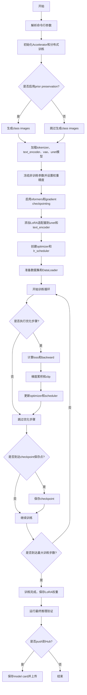

## 类结构

```
全局函数
├── save_model_card (保存模型卡片)
├── log_validation (验证流程)
├── import_model_class_from_model_name_or_path (导入模型类)
├── parse_args (参数解析)
├── collate_fn (数据整理)
├── tokenize_prompt (分词)
└── encode_prompt (编码提示词)

Dataset类
├── DreamBoothDataset
│   ├── __init__
│   ├── __len__
│   └── __getitem__
└── PromptDataset
    ├── __init__
    ├── __len__
    └── __getitem__
```

## 全局变量及字段


### `logger`
    
日志记录器，用于输出训练过程中的日志信息

类型：`logging.Logger`
    


### `check_min_version`
    
检查diffusers库的最低版本要求

类型：`function`
    


### `is_wandb_available`
    
检查wandb库是否可用

类型：`function`
    


### `is_xformers_available`
    
检查xformers库是否可用

类型：`function`
    


### `DreamBoothDataset.size`
    
图像分辨率大小

类型：`int`
    


### `DreamBoothDataset.center_crop`
    
是否中心裁剪

类型：`bool`
    


### `DreamBoothDataset.tokenizer`
    
分词器对象，用于将文本提示词转换为token id

类型：`AutoTokenizer`
    


### `DreamBoothDataset.encoder_hidden_states`
    
预计算的实例提示词编码状态

类型：`torch.Tensor | None`
    


### `DreamBoothDataset.class_prompt_encoder_hidden_states`
    
预计算的类提示词编码状态

类型：`torch.Tensor | None`
    


### `DreamBoothDataset.tokenizer_max_length`
    
分词器最大长度

类型：`int | None`
    


### `DreamBoothDataset.instance_data_root`
    
实例图像根目录

类型：`Path`
    


### `DreamBoothDataset.instance_images_path`
    
实例图像路径列表

类型：`list[Path]`
    


### `DreamBoothDataset.num_instance_images`
    
实例图像数量

类型：`int`
    


### `DreamBoothDataset.instance_prompt`
    
实例提示词

类型：`str`
    


### `DreamBoothDataset._length`
    
数据集长度

类型：`int`
    


### `DreamBoothDataset.class_data_root`
    
类图像根目录

类型：`Path | None`
    


### `DreamBoothDataset.class_images_path`
    
类图像路径列表

类型：`list[Path]`
    


### `DreamBoothDataset.num_class_images`
    
类图像数量

类型：`int`
    


### `DreamBoothDataset.class_prompt`
    
类提示词

类型：`str | None`
    


### `DreamBoothDataset.image_transforms`
    
图像变换组合，包含Resize、裁剪、ToTensor和Normalize操作

类型：`transforms.Compose`
    


### `PromptDataset.prompt`
    
生成class images使用的提示词

类型：`str`
    


### `PromptDataset.num_samples`
    
要生成的样本数量

类型：`int`
    
    

## 全局函数及方法


### `save_model_card`

该函数用于在DreamBooth LoRA训练完成后，生成并保存模型卡片（Model Card）到本地文件夹，并上传至HuggingFace Hub。模型卡片包含训练元数据、示例图像、模型描述和标签，便于模型发布和共享。

参数：

- `repo_id`：`str`，HuggingFace Hub上的仓库标识符，用于标识模型仓库
- `images`：`Optional[List[Image]]`，训练过程中生成的示例图像列表，用于展示训练效果
- `base_model`：`str`，基础模型的名称或路径，即LoRA适配的基础预训练模型
- `train_text_encoder`：`bool`，标志位，指示训练过程中是否同时训练了文本编码器
- `prompt`：`str`，训练时使用的主体提示词，用于描述训练数据
- `repo_folder`：`Optional[str]`，本地文件夹路径，用于保存模型卡片和相关文件
- `pipeline`：`Optional[DiffusionPipeline]`，可选的DiffusionPipeline实例，用于判断模型类型并添加相应标签

返回值：`None`，该函数无返回值，直接将模型卡片写入本地文件系统

#### 流程图

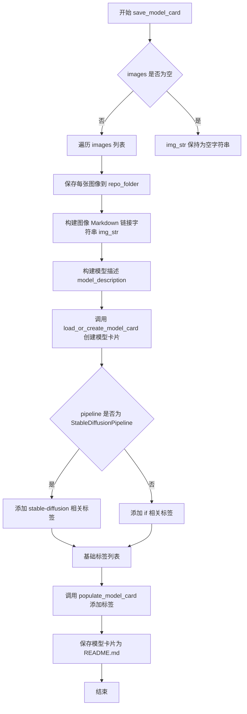

#### 带注释源码

```python
def save_model_card(
    repo_id: str,
    images=None,
    base_model=str,
    train_text_encoder=False,
    prompt=str,
    repo_folder=None,
    pipeline: DiffusionPipeline = None,
):
    """
    生成并保存 DreamBooth LoRA 训练的模型卡片
    
    参数:
        repo_id: HuggingFace Hub 仓库 ID
        images: 生成的示例图像列表
        base_model: 基础预训练模型路径/名称
        train_text_encoder: 是否训练了文本编码器
        prompt: 训练提示词
        repo_folder: 本地保存文件夹
        pipeline: DiffusionPipeline 实例用于判断类型
    """
    # 初始化图像字符串为空
    img_str = ""
    
    # 如果有图像，遍历保存并生成 Markdown 链接
    for i, image in enumerate(images):
        # 保存每张图像到指定文件夹，命名为 image_0.png, image_1.png 等
        image.save(os.path.join(repo_folder, f"image_{i}.png"))
        # 构建 Markdown 格式的图像链接字符串
        img_str += f"\n"

    # 构建模型描述文本，包含仓库ID、基础模型、训练提示词和示例图像
    model_description = f"""
# LoRA DreamBooth - {repo_id}

These are LoRA adaption weights for {base_model}. The weights were trained on {prompt} using [DreamBooth](https://dreambooth.github.io/). You can find some example images in the following. \n
{img_str}

LoRA for the text encoder was enabled: {train_text_encoder}.
"""
    
    # 加载或创建模型卡片，包含基础模型信息、提示词、描述等
    model_card = load_or_create_model_card(
        repo_id_or_path=repo_id,
        from_training=True,
        license="creativeml-openrail-m",
        base_model=base_model,
        prompt=prompt,
        model_description=model_description,
        inference=True,
    )
    
    # 初始化基础标签列表
    tags = ["text-to-image", "diffusers", "lora", "diffusers-training"]
    
    # 根据 pipeline 类型添加特定标签
    if isinstance(pipeline, StableDiffusionPipeline):
        # 如果是 StableDiffusion 流水线，添加稳定扩散相关标签
        tags.extend(["stable-diffusion", "stable-diffusion-diffusers"])
    else:
        # 否则添加 IF (Image Fusion) 相关标签
        tags.extend(["if", "if-diffusers"])
    
    # 使用标签填充模型卡片元数据
    model_card = populate_model_card(model_card, tags=tags)

    # 将模型卡片保存为 README.md 文件
    model_card.save(os.path.join(repo_folder, "README.md"))
```


### `log_validation`

该函数用于在 DreamBooth LoRA 训练过程中执行验证流程，通过加载训练好的模型生成验证图像，并将生成的图像记录到 TensorBoard 或 WandB 等追踪工具中，以监控模型在验证集上的表现。

参数：

-  `pipeline`：`DiffusionPipeline`，用于生成图像的扩散管道实例
-  `args`：命令行参数对象，包含验证相关的配置如 `num_validation_images`、`validation_prompt`、`validation_images`、`seed` 等
-  `accelerator`：Accelerator 对象，提供分布式训练支持并管理设备和追踪器
-  `pipeline_args`：字典，传递给 pipeline 的生成参数（如 prompt_embeds 或 prompt）
-  `epoch`：int，当前训练的轮次编号，用于记录日志
-  `torch_dtype`：torch.dtype，模型和管道的数据类型（fp16/bf16/fp32）
-  `is_final_validation`：bool，默认 False，标识是否为最终验证（会影响日志中的阶段名称）

返回值：`list`，返回生成的图像列表（PIL.Image 对象），供后续保存或推送至 Hub 使用

#### 流程图

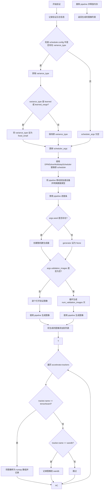

#### 带注释源码

```python
def log_validation(
    pipeline,          # DiffusionPipeline: 用于生成图像的扩散管道
    args,              # Namespace: 包含验证相关配置的命令行参数对象
    accelerator,       # Accelerator: 分布式训练加速器，管理设备和追踪器
    pipeline_args,     # dict: 传递给 pipeline 的参数字典
    epoch,             # int: 当前训练的轮次编号
    torch_dtype,       # torch.dtype: 模型计算精度类型
    is_final_validation=False,  # bool: 是否为最终验证阶段
):
    # 打印验证日志信息，包括要生成的图像数量和验证提示词
    logger.info(
        f"Running validation... \n Generating {args.num_validation_images} images with prompt:"
        f" {args.validation_prompt}."
    )
    
    # 训练使用的是简化的学习目标。如果之前预测方差，需要让 scheduler 忽略它
    scheduler_args = {}

    # 检查 scheduler 配置中是否存在 variance_type 参数
    if "variance_type" in pipeline.scheduler.config:
        variance_type = pipeline.scheduler.config.variance_type

        # 如果方差类型为 learned 或 learned_range，改为 fixed_small 以兼容简化训练目标
        if variance_type in ["learned", "learned_range"]:
            variance_type = "fixed_small"

        scheduler_args["variance_type"] = variance_type

    # 使用 DPMSolverMultistepScheduler 替换原有的 scheduler，确保兼容性
    pipeline.scheduler = DPMSolverMultistepScheduler.from_config(pipeline.scheduler.config, **scheduler_args)

    # 将 pipeline 移动到加速设备并转换为指定的数据类型
    pipeline = pipeline.to(accelerator.device, dtype=torch_dtype)
    
    # 禁用进度条以减少验证过程中的日志输出
    pipeline.set_progress_bar_config(disable=True)

    # 运行推理
    # 如果提供了种子则创建随机数生成器，否则为 None 以使用随机生成
    generator = torch.Generator(device=accelerator.device).manual_seed(args.seed) if args.seed is not None else None

    # 根据是否有预定义的验证图像决定生成策略
    if args.validation_images is None:
        images = []
        # 循环生成指定数量的验证图像
        for _ in range(args.num_validation_images):
            # 使用 autocast 进行混合精度推理
            with torch.amp.autocast(accelerator.device.type):
                image = pipeline(**pipeline_args, generator=generator).images[0]
                images.append(image)
    else:
        images = []
        # 打开预定义的验证图像并逐个处理
        for image in args.validation_images:
            image = Image.open(image)
            with torch.amp.autocast(accelerator.device.type):
                # 对于需要图像输入的 pipeline（如图像变体或超分辨率）
                image = pipeline(**pipeline_args, image=image, generator=generator).images[0]
            images.append(image)

    # 遍历所有注册的追踪器记录验证结果
    for tracker in accelerator.trackers:
        # 确定阶段名称：最终验证为 "test"，中间验证为 "validation"
        phase_name = "test" if is_final_validation else "validation"
        
        # TensorBoard 追踪器处理
        if tracker.name == "tensorboard":
            # 将 PIL 图像转换为 numpy 数组并堆叠
            np_images = np.stack([np.asarray(img) for img in images])
            tracker.writer.add_images(phase_name, np_images, epoch, dataformats="NHWC")
        
        # WandB 追踪器处理
        if tracker.name == "wandb":
            tracker.log(
                {
                    phase_name: [
                        # 为每张图像添加标题，包含索引和验证提示词
                        wandb.Image(image, caption=f"{i}: {args.validation_prompt}") for i, image in enumerate(images)
                    ]
                }
            )

    # 清理：删除 pipeline 实例并释放 GPU 内存
    del pipeline
    free_memory()

    # 返回生成的图像列表供后续使用
    return images
```


### `import_model_class_from_model_name_or_path`

根据预训练模型的名称或路径，动态导入并返回对应的文本编码器类（CLIPTextModel、RobertaSeriesModelWithTransformation 或 T5EncoderModel）。该函数通过读取模型配置中的架构信息，实现对不同类型文本编码器的按需加载。

参数：

- `pretrained_model_name_or_path`：`str`，预训练模型的名称或 Hugging Face Hub 模型标识符
- `revision`：`str`，预训练模型的版本号或提交哈希

返回值：`type`，返回对应的文本编码器类（CLIPTextModel、RobertaSeriesModelWithTransformation 或 T5EncoderModel 类型）

#### 流程图

```mermaid
flowchart TD
    A[开始: import_model_class_from_model_name_or_path] --> B[加载text_encoder配置]
    B --> C[从配置中获取architectures[0]]
    C --> D{判断model_class类型}
    D -->|CLIPTextModel| E[导入transformers.CLIPTextModel]
    E --> F[返回CLIPTextModel类]
    D -->|RobertaSeriesModelWithTransformation| G[导入RobertaSeriesModelWithTransformation]
    G --> H[返回RobertaSeriesModelWithTransformation类]
    D -->|T5EncoderModel| I[导入transformers.T5EncoderModel]
    I --> J[返回T5EncoderModel类]
    D -->|其他类型| K[抛出ValueError异常]
    K --> L[结束: 异常处理]
    F --> M[结束: 返回成功]
    H --> M
    J --> M
```

#### 带注释源码

```python
def import_model_class_from_model_name_or_path(pretrained_model_name_or_path: str, revision: str):
    """
    根据预训练模型路径动态导入文本编码器类
    
    参数:
        pretrained_model_name_or_path: 预训练模型名称或路径
        revision: 模型版本/修订版本
    
    返回:
        对应的文本编码器类
    """
    
    # 第1步: 从预训练模型路径加载text_encoder的配置文件
    # 使用PretrainedConfig读取HuggingFace模型配置，支持本地路径和Hub远程模型
    text_encoder_config = PretrainedConfig.from_pretrained(
        pretrained_model_name_or_path,  # 模型标识符或本地路径
        subfolder="text_encoder",         # 指定加载text_encoder子目录
        revision=revision,                # 指定模型版本
    )
    
    # 第2步: 从配置中获取文本编码器的架构类型
    # architectures是一个列表，通常第一个元素就是模型类名
    model_class = text_encoder_config.architectures[0]
    
    # 第3步: 根据架构类型动态导入并返回对应的模型类
    if model_class == "CLIPTextModel":
        # CLIPTextModel: 用于Stable Diffusion等模型的文本编码
        from transformers import CLIPTextModel
        return CLIPTextModel
    
    elif model_class == "RobertaSeriesModelWithTransformation":
        # AltDiffusion使用的RoBERTa系列模型
        from diffusers.pipelines.alt_diffusion.modeling_roberta_series import RobertaSeriesModelWithTransformation
        return RobertaSeriesModelWithTransformation
    
    elif model_class == "T5EncoderModel":
        # T5编码器: 用于更先进的文本编码任务
        from transformers import T5EncoderModel
        return T5EncoderModel
    
    else:
        # 不支持的模型类型，抛出明确异常
        raise ValueError(f"{model_class} is not supported.")
```


### `parse_args`

该函数是命令行参数解析器，用于定义和收集DreamBooth LoRA训练脚本的所有配置参数，包括模型路径、数据目录、训练超参数、优化器设置、验证配置等，并进行必要的参数校验和环境变量处理。

参数：

- `input_args`：`Optional[List[str]]`，可选参数，用于指定要解析的参数列表。默认从系统命令行(`sys.argv`)自动获取，主要用于单元测试场景。

返回值：`argparse.Namespace`，返回一个包含所有解析后命令行参数的命名空间对象，属性包括`pretrained_model_name_or_path`、`instance_data_dir`、`instance_prompt`、`train_batch_size`、`learning_rate`等约50+个训练相关配置。

#### 流程图

```mermaid
flowchart TD
    A[开始 parse_args] --> B[创建 ArgumentParser 对象]
    B --> C{添加命令行参数}
    C --> C1[模型配置参数<br/>--pretrained_model_name_or_path<br/>--revision<br/>--variant]
    C --> C2[数据相关参数<br/>--instance_data_dir<br/>--class_data_dir<br/>--instance_prompt<br/>--class_prompt]
    C --> C3[训练超参数<br/>--train_batch_size<br/>--num_train_epochs<br/>--learning_rate<br/>--max_train_steps]
    C --> C4[优化器参数<br/>--use_8bit_adam<br/>--adam_beta1<br/>--adam_beta2<br/>--adam_weight_decay]
    C --> C5[其他配置<br/>--output_dir<br/>--seed<br/>--mixed_precision<br/>--logging_dir]
    C --> D{input_args is not None?}
    D -->|Yes| E[parser.parse_args(input_args)]
    D -->|No| F[parser.parse_args()]
    E --> G[args = 解析结果]
    F --> G
    G --> H{检查 LOCAL_RANK 环境变量}
    H --> I[同步 local_rank 配置]
    I --> J{with_prior_preservation 验证}
    J -->|启用| K[检查 class_data_dir 和 class_prompt]
    J -->|未启用| L[警告多余的 class_data_dir/class_prompt]
    K --> M{train_text_encoder 与<br/>pre_compute_text_embeddings 冲突?}
    L --> M
    M -->|冲突| N[抛出 ValueError]
    M -->|不冲突| O[返回 args 对象]
    N --> O
```

#### 带注释源码

```python
def parse_args(input_args=None):
    """
    解析命令行参数，配置DreamBooth LoRA训练脚本的所有选项。
    
    参数:
        input_args: 可选的参数列表，用于测试目的。如果为None，则从命令行解析。
    
    返回:
        argparse.Namespace: 包含所有解析后参数的对象。
    """
    # 创建 ArgumentParser 实例，添加程序描述
    parser = argparse.ArgumentParser(description="Simple example of a training script.")
    
    # ========== 模型配置参数 ==========
    parser.add_argument(
        "--pretrained_model_name_or_path",
        type=str,
        default=None,
        required=True,
        help="Path to pretrained model or model identifier from huggingface.co/models.",
    )
    parser.add_argument(
        "--revision",
        type=str,
        default=None,
        required=False,
        help="Revision of pretrained model identifier from huggingface.co/models.",
    )
    parser.add_argument(
        "--variant",
        type=str,
        default=None,
        help="Variant of the model files of the pretrained model identifier from huggingface.co/models, 'e.g.' fp16",
    )
    parser.add_argument(
        "--tokenizer_name",
        type=str,
        default=None,
        help="Pretrained tokenizer name or path if not the same as model_name",
    )
    
    # ========== 数据目录参数 ==========
    parser.add_argument(
        "--instance_data_dir",
        type=str,
        default=None,
        required=True,
        help="A folder containing the training data of instance images.",
    )
    parser.add_argument(
        "--class_data_dir",
        type=str,
        default=None,
        required=False,
        help="A folder containing the training data of class images.",
    )
    parser.add_argument(
        "--instance_prompt",
        type=str,
        default=None,
        required=True,
        help="The prompt with identifier specifying the instance",
    )
    parser.add_argument(
        "--class_prompt",
        type=str,
        default=None,
        help="The prompt to specify images in the same class as provided instance images.",
    )
    
    # ========== 验证参数 ==========
    parser.add_argument(
        "--validation_prompt",
        type=str,
        default=None,
        help="A prompt that is used during validation to verify that the model is learning.",
    )
    parser.add_argument(
        "--num_validation_images",
        type=int,
        default=4,
        help="Number of images that should be generated during validation with `validation_prompt`.",
    )
    parser.add_argument(
        "--validation_epochs",
        type=int,
        default=50,
        help="Run dreambooth validation every X epochs.",
    )
    
    # ========== 先验保留 (Prior Preservation) 参数 ==========
    parser.add_argument(
        "--with_prior_preservation",
        default=False,
        action="store_true",
        help="Flag to add prior preservation loss.",
    )
    parser.add_argument("--prior_loss_weight", type=float, default=1.0, help="The weight of prior preservation loss.")
    parser.add_argument(
        "--num_class_images",
        type=int,
        default=100,
        help="Minimal class images for prior preservation loss.",
    )
    
    # ========== 输出和随机种子 ==========
    parser.add_argument(
        "--output_dir",
        type=str,
        default="lora-dreambooth-model",
        help="The output directory where the model predictions and checkpoints will be written.",
    )
    parser.add_argument("--seed", type=int, default=None, help="A seed for reproducible training.")
    
    # ========== 图像处理参数 ==========
    parser.add_argument(
        "--resolution",
        type=int,
        default=512,
        help="The resolution for input images, all the images will be resized to this resolution",
    )
    parser.add_argument(
        "--center_crop",
        default=False,
        action="store_true",
        help="Whether to center crop the input images to the resolution.",
    )
    parser.add_argument(
        "--image_interpolation_mode",
        type=str,
        default="lanczos",
        choices=[f.lower() for f in dir(transforms.InterpolationMode) if not f.startswith("__")],
        help="The image interpolation method to use for resizing images.",
    )
    
    # ========== 文本编码器训练参数 ==========
    parser.add_argument(
        "--train_text_encoder",
        action="store_true",
        help="Whether to train the text encoder. If set, the text encoder should be float32 precision.",
    )
    parser.add_argument(
        "--pre_compute_text_embeddings",
        action="store_true",
        help="Whether or not to pre-compute text embeddings.",
    )
    parser.add_argument(
        "--tokenizer_max_length",
        type=int,
        default=None,
        required=False,
        help="The maximum length of the tokenizer.",
    )
    parser.add_argument(
        "--text_encoder_use_attention_mask",
        action="store_true",
        required=False,
        help="Whether to use attention mask for the text encoder",
    )
    
    # ========== 训练超参数 ==========
    parser.add_argument(
        "--train_batch_size", type=int, default=4, help="Batch size (per device) for the training dataloader."
    )
    parser.add_argument(
        "--sample_batch_size", type=int, default=4, help="Batch size (per device) for sampling images."
    )
    parser.add_argument("--num_train_epochs", type=int, default=1)
    parser.add_argument(
        "--max_train_steps",
        type=int,
        default=None,
        help="Total number of training steps to perform. If provided, overrides num_train_epochs.",
    )
    parser.add_argument(
        "--gradient_accumulation_steps",
        type=int,
        default=1,
        help="Number of updates steps to accumulate before performing a backward/update pass.",
    )
    parser.add_argument(
        "--gradient_checkpointing",
        action="store_true",
        help="Whether or not to use gradient checkpointing to save memory.",
    )
    
    # ========== 学习率调度器参数 ==========
    parser.add_argument(
        "--learning_rate",
        type=float,
        default=5e-4,
        help="Initial learning rate (after the potential warmup period) to use.",
    )
    parser.add_argument(
        "--scale_lr",
        action="store_true",
        default=False,
        help="Scale the learning rate by the number of GPUs, gradient accumulation steps, and batch size.",
    )
    parser.add_argument(
        "--lr_scheduler",
        type=str,
        default="constant",
        help='The scheduler type to use. Choose between ["linear", "cosine", "cosine_with_restarts", "polynomial", "constant", "constant_with_warmup"]',
    )
    parser.add_argument(
        "--lr_warmup_steps", type=int, default=500, help="Number of steps for the warmup in the lr scheduler."
    )
    parser.add_argument(
        "--lr_num_cycles",
        type=int,
        default=1,
        help="Number of hard resets of the lr in cosine_with_restarts scheduler.",
    )
    parser.add_argument("--lr_power", type=float, default=1.0, help="Power factor of the polynomial scheduler.")
    
    # ========== 优化器参数 ==========
    parser.add_argument(
        "--dataloader_num_workers",
        type=int,
        default=0,
        help="Number of subprocesses to use for data loading.",
    )
    parser.add_argument(
        "--use_8bit_adam", action="store_true", help="Whether or not to use 8-bit Adam from bitsandbytes."
    )
    parser.add_argument("--adam_beta1", type=float, default=0.9, help="The beta1 parameter for the Adam optimizer.")
    parser.add_argument("--adam_beta2", type=float, default=0.999, help="The beta2 parameter for the Adam optimizer.")
    parser.add_argument("--adam_weight_decay", type=float, default=1e-2, help="Weight decay to use.")
    parser.add_argument("--adam_epsilon", type=float, default=1e-08, help="Epsilon value for the Adam optimizer")
    parser.add_argument("--max_grad_norm", default=1.0, type=float, help="Max gradient norm.")
    
    # ========== 检查点参数 ==========
    parser.add_argument(
        "--checkpointing_steps",
        type=int,
        default=500,
        help="Save a checkpoint of the training state every X updates.",
    )
    parser.add_argument(
        "--checkpoints_total_limit",
        type=int,
        default=None,
        help="Max number of checkpoints to store.",
    )
    parser.add_argument(
        "--resume_from_checkpoint",
        type=str,
        default=None,
        help="Whether training should be resumed from a previous checkpoint.",
    )
    
    # ========== 分布式训练参数 ==========
    parser.add_argument("--local_rank", type=int, default=-1, help="For distributed training: local_rank")
    
    # ========== Hub 上传参数 ==========
    parser.add_argument("--push_to_hub", action="store_true", help="Whether or not to push the model to the Hub.")
    parser.add_argument("--hub_token", type=str, default=None, help="The token to use to push to the Model Hub.")
    parser.add_argument(
        "--hub_model_id",
        type=str,
        default=None,
        help="The name of the repository to keep in sync with the local `output_dir`.",
    )
    
    # ========== 日志和监控参数 ==========
    parser.add_argument(
        "--logging_dir",
        type=str,
        default="logs",
        help="TensorBoard log directory.",
    )
    parser.add_argument(
        "--allow_tf32",
        action="store_true",
        help="Whether or not to allow TF32 on Ampere GPUs.",
    )
    parser.add_argument(
        "--report_to",
        type=str,
        default="tensorboard",
        help='The integration to report the results and logs to. Supported platforms are "tensorboard", "wandb" and "comet_ml".',
    )
    parser.add_argument(
        "--mixed_precision",
        type=str,
        default=None,
        choices=["no", "fp16", "bf16"],
        help="Whether to use mixed precision. Choose between fp16 and bf16.",
    )
    parser.add_argument(
        "--prior_generation_precision",
        type=str,
        default=None,
        choices=["no", "fp32", "fp16", "bf16"],
        help="Choose prior generation precision between fp32, fp16 and bf16.",
    )
    
    # ========== 高级特性参数 ==========
    parser.add_argument(
        "--enable_xformers_memory_efficient_attention", 
        action="store_true", 
        help="Whether or not to use xformers."
    )
    parser.add_argument(
        "--validation_images",
        required=False,
        default=None,
        nargs="+",
        help="Optional set of images to use for validation.",
    )
    parser.add_argument(
        "--class_labels_conditioning",
        required=False,
        default=None,
        help="The optional `class_label` conditioning to pass to the unet.",
    )
    
    # ========== LoRA 特定参数 ==========
    parser.add_argument(
        "--rank",
        type=int,
        default=4,
        help="The dimension of the LoRA update matrices.",
    )
    parser.add_argument("--lora_dropout", type=float, default=0.0, help="Dropout probability for LoRA layers")
    
    # ========== 解析参数 ==========
    if input_args is not None:
        args = parser.parse_args(input_args)
    else:
        args = parser.parse_args()
    
    # ========== 环境变量检查 ==========
    env_local_rank = int(os.environ.get("LOCAL_RANK", -1))
    if env_local_rank != -1 and env_local_rank != args.local_rank:
        args.local_rank = env_local_rank
    
    # ========== 参数校验 ==========
    # 先验保留模式必须指定 class_data_dir 和 class_prompt
    if args.with_prior_preservation:
        if args.class_data_dir is None:
            raise ValueError("You must specify a data directory for class images.")
        if args.class_prompt is None:
            raise ValueError("You must specify prompt for class images.")
    else:
        # 如果没有启用先验保留但提供了这些参数，发出警告
        if args.class_data_dir is not None:
            warnings.warn("You need not use --class_data_dir without --with_prior_preservation.")
        if args.class_prompt is not None:
            warnings.warn("You need not use --class_prompt without --with_prior_preservation.")
    
    # 文本编码器训练与预计算嵌入不兼容
    if args.train_text_encoder and args.pre_compute_text_embeddings:
        raise ValueError("`--train_text_encoder` cannot be used with `--pre_compute_text_embeddings`")
    
    return args
```


### `collate_fn`

该函数是DreamBooth数据加载器的批处理整理函数，用于将多个样本数据整理成适合模型训练的批量张量格式，支持可选的先验 preservation（先验保留）策略来防止模型过拟合。

参数：

- `examples`：`List[Dict[str, Any]]`，从Dataset返回的样本列表，每个样本包含图像、提示词IDs和注意力掩码等信息
- `with_prior_preservation`：`bool`，是否启用先验保留模式，启用时将类别图像与实例图像一起打包进行训练

返回值：`Dict[str, torch.Tensor]`，包含以下键的字典：
- `input_ids`：`torch.Tensor`，拼接后的提示词token IDs
- `pixel_values`：`torch.Tensor`，图像像素值张量
- `attention_mask`：`torch.Tensor`（可选），注意力掩码张量

#### 流程图

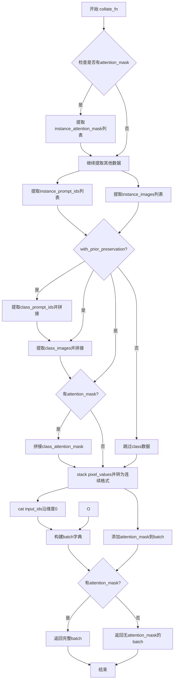

#### 带注释源码

```python
def collate_fn(examples, with_prior_preservation=False):
    """
    将数据集中多个样本整理成批量训练张量
    
    参数:
        examples: 数据集返回的样本列表
        with_prior_preservation: 是否包含类别图像用于先验保留
    """
    # 检查第一个样本是否包含attention_mask（用于判断是否需要处理注意力掩码）
    has_attention_mask = "instance_attention_mask" in examples[0]

    # 从所有样本中提取实例提示词IDs
    input_ids = [example["instance_prompt_ids"] for example in examples]
    
    # 从所有样本中提取实例图像像素值
    pixel_values = [example["instance_images"] for example in examples]

    # 如果存在attention_mask，则提取所有样本的注意力掩码
    if has_attention_mask:
        attention_mask = [example["instance_attention_mask"] for example in examples]

    # Concat class and instance examples for prior preservation.
    # 先验保留：将类别图像与实例图像拼接，避免进行两次前向传播
    if with_prior_preservation:
        # 添加类别提示词IDs到输入列表
        input_ids += [example["class_prompt_ids"] for example in examples]
        # 添加类别图像像素值到列表
        pixel_values += [example["class_images"] for example in examples]
        # 如果存在attention_mask，也添加类别图像的attention_mask
        if has_attention_mask:
            attention_mask += [example["class_attention_mask"] for example in examples]

    # 将像素值列表堆叠为张量，并确保内存连续、转换为float类型
    pixel_values = torch.stack(pixel_values)
    pixel_values = pixel_values.to(memory_format=torch.contiguous_format).float()

    # 将所有input_ids沿批次维度拼接
    input_ids = torch.cat(input_ids, dim=0)

    # 构建返回的批次字典
    batch = {
        "input_ids": input_ids,
        "pixel_values": pixel_values,
    }

    # 如果存在attention_mask，则添加到批次字典中
    if has_attention_mask:
        batch["attention_mask"] = attention_mask

    return batch
```


### `tokenize_prompt`

该函数用于将文本提示（prompt）进行分词处理，将其转换为模型可处理的输入格式，包括 token ID 和注意力掩码。

参数：

- `tokenizer`：`PreTrainedTokenizer` 或 `AutoTokenizer`，用于对文本进行分词的分词器对象
- `prompt`：`str`，需要分词的提示文本
- `tokenizer_max_length`：`int | None`，可选参数，指定分词后的最大长度。如果为 `None`，则使用分词器的默认最大长度（`tokenizer.model_max_length`）

返回值：`BatchEncoding`，包含分词结果的字典对象，通常包含 `input_ids`（token ID 序列）和 `attention_mask`（注意力掩码）等字段

#### 流程图

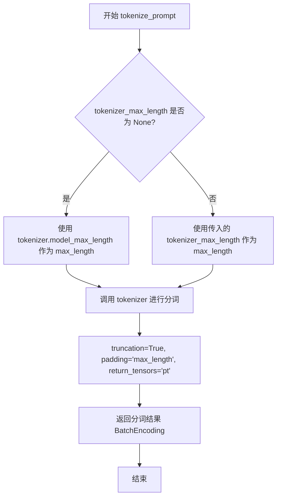

#### 带注释源码

```python
def tokenize_prompt(tokenizer, prompt, tokenizer_max_length=None):
    """
    将文本提示进行分词处理
    
    参数:
        tokenizer: 分词器对象（如 PreTrainedTokenizer）
        prompt: 需要分词的提示文本
        tokenizer_max_length: 可选的最大分词长度，默认为 None
    
    返回:
        包含 input_ids 和 attention_mask 的 BatchEncoding 对象
    """
    # 判断是否指定了最大长度
    if tokenizer_max_length is not None:
        # 使用传入的最大长度
        max_length = tokenizer_max_length
    else:
        # 使用分词器默认的最大长度（通常是模型的最大上下文长度）
        max_length = tokenizer.model_max_length

    # 调用分词器对提示文本进行分词
    text_inputs = tokenizer(
        prompt,                          # 待分词的文本
        truncation=True,                  # 启用截断功能
        padding="max_length",            # 填充到最大长度
        max_length=max_length,            # 最大长度限制
        return_tensors="pt",             # 返回 PyTorch 张量
    )

    # 返回分词结果，包含 input_ids 和 attention_mask
    return text_inputs
```


### `encode_prompt`

该函数用于将文本提示（prompt）编码为文本嵌入向量（embeddings），供 Stable Diffusion 模型的 UNet 在去噪过程中进行条件控制。它接收文本编码器、token IDs 和注意力掩码作为输入，并返回文本嵌入向量。

参数：

- `text_encoder`：`torch.nn.Module`，文本编码器模型（如 CLIPTextModel），用于将 token IDs 转换为嵌入向量
- `input_ids`：`torch.Tensor`，tokenized 后的文本输入 IDs，形状为 `(batch_size, seq_len)`
- `attention_mask`：`torch.Tensor`，注意力掩码，用于指示哪些位置是有效 token，哪些是 padding，形状与 `input_ids` 相同
- `text_encoder_use_attention_mask`：`bool`，可选参数，指定是否将 `attention_mask` 传递给文本编码器。如果为 `None` 或 `False`，则忽略注意力掩码

返回值：`torch.Tensor`，文本嵌入向量，形状为 `(batch_size, seq_len, hidden_size)`，其中 `hidden_size` 是文本编码器的隐藏层维度

#### 流程图

```mermaid
flowchart TD
    A[开始 encode_prompt] --> B[将 input_ids 移动到 text_encoder 设备]
    B --> C{text_encoder_use_attention_mask 是否为 True?}
    C -->|是| D[将 attention_mask 移动到 text_encoder 设备]
    C -->|否| E[设置 attention_mask 为 None]
    D --> F[调用 text_encoder 获取 prompt_embeds]
    E --> F
    F --> G[提取 prompt_embeds[0] 即第一个输出]
    G --> H[返回 prompt_embeds]
```

#### 带注释源码

```python
def encode_prompt(
    text_encoder,  # 文本编码器模型（CLIPTextModel 或类似模型）
    input_ids,    # 经过 tokenizer 编码后的文本 token IDs
    attention_mask,  # 注意力掩码，标识有效 token 位置
    text_encoder_use_attention_mask=None  # 是否使用注意力掩码的标志
):
    # 将输入的 token IDs 移动到文本编码器所在的设备上（CPU/CUDA）
    text_input_ids = input_ids.to(text_encoder.device)

    # 根据参数决定是否使用注意力掩码
    if text_encoder_use_attention_mask:
        # 如果启用注意力掩码，则将其也移动到对应设备
        attention_mask = attention_mask.to(text_encoder.device)
    else:
        # 否则设置为 None，文本编码器将使用默认的注意力计算方式
        attention_mask = None

    # 调用文本编码器模型，获取文本嵌入向量
    # return_dict=False 返回元组 (hidden_states,)，我们只需要第一个元素
    prompt_embeds = text_encoder(
        text_input_ids,
        attention_mask=attention_mask,  # 传入注意力掩码（如果启用）
        return_dict=False,  # 不返回字典，直接返回元组
    )
    
    # 从元组中提取第一个元素，即文本嵌入向量
    # 形状: (batch_size, seq_len, hidden_size)
    prompt_embeds = prompt_embeds[0]

    # 返回编码后的文本嵌入向量，用于后续 UNet 的条件注入
    return prompt_embeds
```


### `main`

这是DreamBooth LoRA训练脚本的核心入口函数，负责协调整个训练流程，包括模型加载、数据集准备、训练循环、验证和模型保存。

参数：

- `args`：命令行参数（argparse.Namespace），包含所有训练配置，如模型路径、数据路径、学习率、LoRA配置等

返回值：无（None），该函数直接执行训练流程，不返回任何值

#### 流程图

```mermaid
flowchart TD
    A[开始 main 函数] --> B{检查报告工具配置}
    B --> C[创建日志目录和Accelerator]
    D{检查混合精度和分布式训练}
    D -->|不支持| E[抛出异常]
    D -->|支持| F[设置日志级别]
    
    F --> G{是否有prior_preservation}
    G -->|是| H[生成类别图像]
    G -->|否| I[跳过类别图像生成]
    
    H --> I --> J[创建输出目录]
    J --> K[加载tokenizer]
    K --> L[加载text_encoder类]
    
    L --> M[加载噪声调度器、VAE、UNet]
    M --> N[冻结VAE、TextEncoder、UNet]
    N --> O[设置权重数据类型]
    
    O --> P{启用xformers}
    P -->|是| Q[启用高效注意力]
    P -->|否| R[跳过]
    
    Q --> R --> S[启用梯度检查点]
    S --> T[添加LoRA适配器到UNet]
    
    T --> U{训练text_encoder}
    U -->|是| V[添加LoRA适配器到text_encoder]
    U -->|否| W[跳过]
    
    V --> W --> X[注册保存/加载钩子]
    X --> Y[配置优化器]
    
    Y --> Z{预计算文本嵌入}
    Z -->|是| AA[预计算文本嵌入]
    Z -->|否| AB[使用即时编码]
    
    AA --> AB --> AC[创建训练数据集]
    AC --> AD[创建DataLoader]
    AD --> AE[配置学习率调度器]
    
    AE --> AF[准备模型和DataLoader]
    AF --> AG[初始化训练步骤]
    AG --> AH[初始化跟踪器]
    
    AH --> AI[外层循环: 遍历每个epoch]
    AI --> AJ[设置模型为训练模式]
    AJ --> AK[内层循环: 遍历每个batch]
    
    AK --> AL{累积梯度}
    AL -->|是| AM[执行前向传播和反向传播]
    AL -->|否| AN[跳过]
    
    AM --> AO[计算损失]
    AO --> AP[执行优化步骤]
    AP --> AQ{检查是否同步}
    
    AQ -->|是| AR[检查检查点保存]
    AQ -->|否| AK
    
    AR --> AS{达到保存步数}
    AS -->|是| AT[保存检查点]
    AS -->|否| AU[跳过]
    
    AT --> AV{检查检查点数量限制}
    AV -->|超过限制| AW[删除旧检查点]
    AV -->|未超过| AX[继续]
    
    AW --> AX --> AY[记录日志]
    AY --> AZ{达到最大训练步数}
    AZ -->|是| BA[跳出训练循环]
    AZ -->|否| AK
    
    BA --> BB{执行验证}
    BB -->|是| BC[运行验证并生成图像]
    BB -->|否| BD
    
    BC --> BD --> BE[保存LoRA权重]
    BE --> BF[推送模型到Hub]
    BF --> BG[结束训练]
```

#### 带注释源码

```python
def main(args):
    """
    DreamBooth LoRA训练脚本的主函数
    
    负责整个训练流程的协调，包括：
    1. 环境配置和模型加载
    2. 数据集准备
    3. 训练循环
    4. 验证和模型保存
    """
    
    # ==================== 1. 基础配置检查 ====================
    # 检查是否同时使用wandb和hub_token（安全风险）
    if args.report_to == "wandb" and args.hub_token is not None:
        raise ValueError(
            "You cannot use both --report_to=wandb and --hub_token due to a security risk of exposing your token."
            " Please use `hf auth login` to authenticate with the Hub."
        )

    # 创建日志目录
    logging_dir = Path(args.output_dir, args.logging_dir)

    # 配置Accelerator项目设置
    accelerator_project_config = ProjectConfiguration(
        project_dir=args.output_dir, 
        logging_dir=logging_dir
    )

    # 初始化Accelerator（分布式训练、混合精度等）
    accelerator = Accelerator(
        gradient_accumulation_steps=args.gradient_accumulation_steps,
        mixed_precision=args.mixed_precision,
        log_with=args.report_to,
        project_config=accelerator_project_config,
    )

    # 对于MPS后端禁用AMP
    if torch.backends.mps.is_available():
        accelerator.native_amp = False

    # 检查wandb是否安装
    if args.report_to == "wandb":
        if not is_wandb_available():
            raise ImportError("Make sure to install wandb if you want to use it for logging during training.")

    # ==================== 2. 分布式训练检查 ====================
    # 检查是否支持同时训练text_encoder和梯度累积
    if args.train_text_encoder and args.gradient_accumulation_steps > 1 and accelerator.num_processes > 1:
        raise ValueError(
            "Gradient accumulation is not supported when training the text encoder in distributed training. "
            "Please set gradient_accumulation_steps to 1. This feature will be supported in the future."
        )

    # ==================== 3. 日志配置 ====================
    logging.basicConfig(
        format="%(asctime)s - %(levelname)s - %(name)s - %(message)s",
        datefmt="%m/%d/%Y %H:%M:%S",
        level=logging.INFO,
    )
    logger.info(accelerator.state, main_process_only=False)
    
    # 主进程设置详细日志，子进程设置错误日志
    if accelerator.is_local_main_process:
        transformers.utils.logging.set_verbosity_warning()
        diffusers.utils.logging.set_verbosity_info()
    else:
        transformers.utils.logging.set_verbosity_error()
        diffusers.utils.logging.set_verbosity_error()

    # 设置随机种子
    if args.seed is not None:
        set_seed(args.seed)

    # ==================== 4. 类别图像生成（Prior Preservation）====================
    if args.with_prior_preservation:
        class_images_dir = Path(args.class_data_dir)
        if not class_images_dir.exists():
            class_images_dir.mkdir(parents=True)
        
        # 统计当前类别图像数量
        cur_class_images = len(list(class_images_dir.iterdir()))

        # 如果类别图像不足，则生成更多
        if cur_class_images < args.num_class_images:
            # 确定数据类型
            torch_dtype = torch.float16 if accelerator.device.type in ("cuda", "xpu") else torch.float32
            if args.prior_generation_precision == "fp32":
                torch_dtype = torch.float32
            elif args.prior_generation_precision == "fp16":
                torch_dtype = torch.float16
            elif args.prior_generation_precision == "bf16":
                torch_dtype = torch.bfloat16
            
            # 加载推理pipeline（用于生成类别图像）
            pipeline = DiffusionPipeline.from_pretrained(
                args.pretrained_model_name_or_path,
                torch_dtype=torch_dtype,
                safety_checker=None,
                revision=args.revision,
                variant=args.variant,
            )
            pipeline.set_progress_bar_config(disable=True)

            num_new_images = args.num_class_images - cur_class_images
            logger.info(f"Number of class images to sample: {num_new_images}.")

            # 创建数据集并生成图像
            sample_dataset = PromptDataset(args.class_prompt, num_new_images)
            sample_dataloader = torch.utils.data.DataLoader(
                sample_dataset, 
                batch_size=args.sample_batch_size
            )
            sample_dataloader = accelerator.prepare(sample_dataloader)
            pipeline.to(accelerator.device)

            # 生成并保存类别图像
            for example in tqdm(
                sample_dataloader, 
                desc="Generating class images", 
                disable=not accelerator.is_local_main_process
            ):
                images = pipeline(example["prompt"]).images
                for i, image in enumerate(images):
                    # 使用哈希避免重复图像
                    hash_image = insecure_hashlib.sha1(image.tobytes()).hexdigest()
                    image_filename = class_images_dir / f"{example['index'][i] + cur_class_images}-{hash_image}.jpg"
                    image.save(image_filename)

            # 释放内存
            del pipeline
            free_memory()

    # ==================== 5. 输出目录和仓库创建 ====================
    if accelerator.is_main_process:
        if args.output_dir is not None:
            os.makedirs(args.output_dir, exist_ok=True)

        # 如果要推送到Hub，创建仓库
        if args.push_to_hub:
            repo_id = create_repo(
                repo_id=args.hub_model_id or Path(args.output_dir).name, 
                exist_ok=True, 
                token=args.hub_token
            ).repo_id

    # ==================== 6. 加载Tokenizer ====================
    if args.tokenizer_name:
        tokenizer = AutoTokenizer.from_pretrained(
            args.tokenizer_name, 
            revision=args.revision, 
            use_fast=False
        )
    elif args.pretrained_model_name_or_path:
        tokenizer = AutoTokenizer.from_pretrained(
            args.pretrained_model_name_or_path,
            subfolder="tokenizer",
            revision=args.revision,
            use_fast=False,
        )

    # ==================== 7. 加载文本编码器类 ====================
    text_encoder_cls = import_model_class_from_model_name_or_path(
        args.pretrained_model_name_or_path, 
        args.revision
    )

    # ==================== 8. 加载模型和调度器 ====================
    # 噪声调度器
    noise_scheduler = DDPMScheduler.from_pretrained(
        args.pretrained_model_name_or_path, 
        subfolder="scheduler"
    )
    
    # 文本编码器
    text_encoder = text_encoder_cls.from_pretrained(
        args.pretrained_model_name_or_path, 
        subfolder="text_encoder", 
        revision=args.revision, 
        variant=args.variant
    )
    
    # VAE（可能不存在于某些模型如IF）
    try:
        vae = AutoencoderKL.from_pretrained(
            args.pretrained_model_name_or_path, 
            subfolder="vae", 
            revision=args.revision, 
            variant=args.variant
        )
    except OSError:
        # IF模型没有VAE
        vae = None

    # UNet模型
    unet = UNet2DConditionModel.from_pretrained(
        args.pretrained_model_name_or_path, 
        subfolder="unet", 
        revision=args.revision, 
        variant=args.variant
    )

    # ==================== 9. 冻结模型参数 ====================
    # 只训练LoRA适配器层
    if vae is not None:
        vae.requires_grad_(False)
    text_encoder.requires_grad_(False)
    unet.requires_grad_(False)

    # ==================== 10. 设置权重数据类型 ====================
    weight_dtype = torch.float32
    if accelerator.mixed_precision == "fp16":
        weight_dtype = torch.float16
    elif accelerator.mixed_precision == "bf16":
        weight_dtype = torch.bfloat16

    # 将模型移动到设备并转换数据类型
    unet.to(accelerator.device, dtype=weight_dtype)
    if vae is not None:
        vae.to(accelerator.device, dtype=weight_dtype)
    text_encoder.to(accelerator.device, dtype=weight_dtype)

    # ==================== 11. xFormers优化 ====================
    if args.enable_xformers_memory_efficient_attention:
        if is_xformers_available():
            import xformers
            xformers_version = version.parse(xformers.__version__)
            if xformers_version == version.parse("0.0.16"):
                logger.warning(
                    "xFormers 0.0.16 cannot be used for training in some GPUs..."
                )
            unet.enable_xformers_memory_efficient_attention()
        else:
            raise ValueError("xformers is not available.")

    # ==================== 12. 梯度检查点 ====================
    if args.gradient_checkpointing:
        unet.enable_gradient_checkpointing()
        if args.train_text_encoder:
            text_encoder.gradient_checkpointing_enable()

    # ==================== 13. 添加LoRA适配器 ====================
    # UNet的LoRA配置
    unet_lora_config = LoraConfig(
        r=args.rank,
        lora_alpha=args.rank,
        lora_dropout=args.lora_dropout,
        init_lora_weights="gaussian",
        target_modules=["to_k", "to_q", "to_v", "to_out.0", "add_k_proj", "add_v_proj"],
    )
    unet.add_adapter(unet_lora_config)

    # Text Encoder的LoRA配置
    if args.train_text_encoder:
        text_lora_config = LoraConfig(
            r=args.rank,
            lora_alpha=args.rank,
            lora_dropout=args.lora_dropout,
            init_lora_weights="gaussian",
            target_modules=["q_proj", "k_proj", "v_proj", "out_proj"],
        )
        text_encoder.add_adapter(text_lora_config)

    # ==================== 14. 定义辅助函数 ====================
    def unwrap_model(model):
        """解包加速器包装的模型"""
        model = accelerator.unwrap_model(model)
        model = model._orig_mod if is_compiled_module(model) else model
        return model

    # ==================== 15. 注册模型保存/加载钩子 ====================
    def save_model_hook(models, weights, output_dir):
        """保存LoRA权重钩子"""
        if accelerator.is_main_process:
            unet_lora_layers_to_save = None
            text_encoder_lora_layers_to_save = None

            for model in models:
                if isinstance(model, type(unwrap_model(unet))):
                    unet_lora_layers_to_save = convert_state_dict_to_diffusers(
                        get_peft_model_state_dict(model)
                    )
                elif isinstance(model, type(unwrap_model(text_encoder))):
                    text_encoder_lora_layers_to_save = convert_state_dict_to_diffusers(
                        get_peft_model_state_dict(model)
                    )
                else:
                    raise ValueError(f"unexpected save model: {model.__class__}")
                weights.pop()

            StableDiffusionLoraLoaderMixin.save_lora_weights(
                output_dir,
                unet_lora_layers=unet_lora_layers_to_save,
                text_encoder_lora_layers=text_encoder_lora_layers_to_save,
            )

    def load_model_hook(models, input_dir):
        """加载LoRA权重钩子"""
        unet_ = None
        text_encoder_ = None

        while len(models) > 0:
            model = models.pop()
            if isinstance(model, type(unwrap_model(unet))):
                unet_ = model
            elif isinstance(model, type(unwrap_model(text_encoder))):
                text_encoder_ = model
            else:
                raise ValueError(f"unexpected save model: {model.__class__}")

        # 加载LoRA状态字典
        lora_state_dict, network_alphas = StableDiffusionLoraLoaderMixin.lora_state_dict(input_dir)

        # 转换并加载UNet的LoRA权重
        unet_state_dict = {f"{k.replace('unet.', '')}": v 
                         for k, v in lora_state_dict.items() if k.startswith("unet.")}
        unet_state_dict = convert_unet_state_dict_to_peft(unet_state_dict)
        incompatible_keys = set_peft_model_state_dict(unet_, unet_state_dict, adapter_name="default")

        if args.train_text_encoder:
            _set_state_dict_into_text_encoder(
                lora_state_dict, 
                prefix="text_encoder.", 
                text_encoder=text_encoder_
            )

        # 确保可训练参数为float32
        if args.mixed_precision == "fp16":
            models = [unet_]
            if args.train_text_encoder:
                models.append(text_encoder_)
            cast_training_params(models, dtype=torch.float32)

    accelerator.register_save_state_pre_hook(save_model_hook)
    accelerator.register_load_state_pre_hook(load_model_hook)

    # ==================== 16. TF32优化 ====================
    if args.allow_tf32:
        torch.backends.cuda.matmul.allow_tf32 = True

    # ==================== 17. 学习率缩放 ====================
    if args.scale_lr:
        args.learning_rate = (
            args.learning_rate 
            * args.gradient_accumulation_steps 
            * args.train_batch_size 
            * accelerator.num_processes
        )

    # ==================== 18. 确保可训练参数为float32 ====================
    if args.mixed_precision == "fp16":
        models = [unet]
        if args.train_text_encoder:
            models.append(text_encoder)
        cast_training_params(models, dtype=torch.float32)

    # ==================== 19. 优化器创建 ====================
    if args.use_8bit_adam:
        try:
            import bitsandbytes as bnb
        except ImportError:
            raise ImportError("To use 8-bit Adam, please install bitsandbytes.")
        optimizer_class = bnb.optim.AdamW8bit
    else:
        optimizer_class = torch.optim.AdamW

    # 收集可训练参数
    params_to_optimize = list(filter(lambda p: p.requires_grad, unet.parameters()))
    if args.train_text_encoder:
        params_to_optimize = params_to_optimize + list(
            filter(lambda p: p.requires_grad, text_encoder.parameters())
        )

    optimizer = optimizer_class(
        params_to_optimize,
        lr=args.learning_rate,
        betas=(args.adam_beta1, args.adam_beta2),
        weight_decay=args.adam_weight_decay,
        eps=args.adam_epsilon,
    )

    # ==================== 20. 预计算文本嵌入（可选）====================
    if args.pre_compute_text_embeddings:
        def compute_text_embeddings(prompt):
            with torch.no_grad():
                text_inputs = tokenize_prompt(
                    tokenizer, 
                    prompt, 
                    tokenizer_max_length=args.tokenizer_max_length
                )
                prompt_embeds = encode_prompt(
                    text_encoder,
                    text_inputs.input_ids,
                    text_inputs.attention_mask,
                    text_encoder_use_attention_mask=args.text_encoder_use_attention_mask,
                )
            return prompt_embeds

        # 预计算各种文本嵌入
        pre_computed_encoder_hidden_states = compute_text_embeddings(args.instance_prompt)
        validation_prompt_negative_prompt_embeds = compute_text_embeddings("")

        if args.validation_prompt is not None:
            validation_prompt_encoder_hidden_states = compute_text_embeddings(args.validation_prompt)
        else:
            validation_prompt_encoder_hidden_states = None

        if args.class_prompt is not None:
            pre_computed_class_prompt_encoder_hidden_states = compute_text_embeddings(args.class_prompt)
        else:
            pre_computed_class_prompt_encoder_hidden_states = None

        # 释放文本编码器和tokenizer的内存
        text_encoder = None
        tokenizer = None
        gc.collect()
        free_memory()
    else:
        pre_computed_encoder_hidden_states = None
        validation_prompt_encoder_hidden_states = None
        validation_prompt_negative_prompt_embeds = None
        pre_computed_class_prompt_encoder_hidden_states = None

    # ==================== 21. 数据集和DataLoader创建 ====================
    train_dataset = DreamBoothDataset(
        instance_data_root=args.instance_data_dir,
        instance_prompt=args.instance_prompt,
        class_data_root=args.class_data_dir if args.with_prior_preservation else None,
        class_prompt=args.class_prompt,
        class_num=args.num_class_images,
        tokenizer=tokenizer,
        size=args.resolution,
        center_crop=args.center_crop,
        encoder_hidden_states=pre_computed_encoder_hidden_states,
        class_prompt_encoder_hidden_states=pre_computed_class_prompt_encoder_hidden_states,
        tokenizer_max_length=args.tokenizer_max_length,
    )

    train_dataloader = torch.utils.data.DataLoader(
        train_dataset,
        batch_size=args.train_batch_size,
        shuffle=True,
        collate_fn=lambda examples: collate_fn(examples, args.with_prior_preservation),
        num_workers=args.dataloader_num_workers,
    )

    # ==================== 22. 学习率调度器配置 ====================
    num_warmup_steps_for_scheduler = args.lr_warmup_steps * accelerator.num_processes
    
    if args.max_train_steps is None:
        len_train_dataloader_after_sharding = math.ceil(
            len(train_dataloader) / accelerator.num_processes
        )
        num_update_steps_per_epoch = math.ceil(
            len_train_dataloader_after_sharding / args.gradient_accumulation_steps
        )
        num_training_steps_for_scheduler = (
            args.num_train_epochs * accelerator.num_processes * num_update_steps_per_epoch
        )
    else:
        num_training_steps_for_scheduler = args.max_train_steps * accelerator.num_processes

    lr_scheduler = get_scheduler(
        args.lr_scheduler,
        optimizer=optimizer,
        num_warmup_steps=num_warmup_steps_for_scheduler,
        num_training_steps=num_training_steps_for_scheduler,
        num_cycles=args.lr_num_cycles,
        power=args.lr_power,
    )

    # ==================== 23. 准备模型和DataLoader ====================
    if args.train_text_encoder:
        unet, text_encoder, optimizer, train_dataloader, lr_scheduler = accelerator.prepare(
            unet, text_encoder, optimizer, train_dataloader, lr_scheduler
        )
    else:
        unet, optimizer, train_dataloader, lr_scheduler = accelerator.prepare(
            unet, optimizer, train_dataloader, lr_scheduler
        )

    # ==================== 24. 重新计算训练步骤 ====================
    num_update_steps_per_epoch = math.ceil(
        len(train_dataloader) / args.gradient_accumulation_steps
    )
    if args.max_train_steps is None:
        args.max_train_steps = args.num_train_epochs * num_update_steps_per_epoch
        if num_training_steps_for_scheduler != args.max_train_steps:
            logger.warning(
                "The length of the 'train_dataloader' after 'accelerator.prepare' does not match "
                "the expected length when the learning rate scheduler was created."
            )

    args.num_train_epochs = math.ceil(args.max_train_steps / num_update_steps_per_epoch)

    # ==================== 25. 初始化跟踪器 ====================
    if accelerator.is_main_process:
        tracker_config = vars(copy.deepcopy(args))
        tracker_config.pop("validation_images")
        accelerator.init_trackers("dreambooth-lora", config=tracker_config)

    # ==================== 26. 训练信息日志 ====================
    total_batch_size = (
        args.train_batch_size 
        * accelerator.num_processes 
        * args.gradient_accumulation_steps
    )

    logger.info("***** Running training *****")
    logger.info(f"  Num examples = {len(train_dataset)}")
    logger.info(f"  Num batches each epoch = {len(train_dataloader)}")
    logger.info(f"  Num Epochs = {args.num_train_epochs}")
    logger.info(f"  Instantaneous batch size per device = {args.train_batch_size}")
    logger.info(f"  Total train batch size = {total_batch_size}")
    logger.info(f"  Gradient Accumulation steps = {args.gradient_accumulation_steps}")
    logger.info(f"  Total optimization steps = {args.max_train_steps}")

    global_step = 0
    first_epoch = 0

    # ==================== 27. 从检查点恢复（可选）====================
    if args.resume_from_checkpoint:
        if args.resume_from_checkpoint != "latest":
            path = os.path.basename(args.resume_from_checkpoint)
        else:
            dirs = os.listdir(args.output_dir)
            dirs = [d for d in dirs if d.startswith("checkpoint")]
            dirs = sorted(dirs, key=lambda x: int(x.split("-")[1]))
            path = dirs[-1] if len(dirs) > 0 else None

        if path is None:
            accelerator.print(f"Checkpoint '{args.resume_from_checkpoint}' does not exist.")
            args.resume_from_checkpoint = None
            initial_global_step = 0
        else:
            accelerator.print(f"Resuming from checkpoint {path}")
            accelerator.load_state(os.path.join(args.output_dir, path))
            global_step = int(path.split("-")[1])
            initial_global_step = global_step
            first_epoch = global_step // num_update_steps_per_epoch
    else:
        initial_global_step = 0

    # ==================== 28. 训练循环 ====================
    progress_bar = tqdm(
        range(0, args.max_train_steps),
        initial=initial_global_step,
        desc="Steps",
        disable=not accelerator.is_local_main_process,
    )

    for epoch in range(first_epoch, args.num_train_epochs):
        unet.train()
        if args.train_text_encoder:
            text_encoder.train()

        for step, batch in enumerate(train_dataloader):
            with accelerator.accumulate(unet):
                # 获取像素值
                pixel_values = batch["pixel_values"].to(dtype=weight_dtype)

                # 编码到潜在空间
                if vae is not None:
                    model_input = vae.encode(pixel_values).latent_dist.sample()
                    model_input = model_input * vae.config.scaling_factor
                else:
                    model_input = pixel_values

                # 采样噪声
                noise = torch.randn_like(model_input)
                bsz, channels, height, width = model_input.shape
                
                # 随机采样时间步
                timesteps = torch.randint(
                    0, 
                    noise_scheduler.config.num_train_timesteps, 
                    (bsz,), 
                    device=model_input.device
                ).long()

                # 添加噪声（前向扩散过程）
                noisy_model_input = noise_scheduler.add_noise(model_input, noise, timesteps)

                # 获取文本嵌入
                if args.pre_compute_text_embeddings:
                    encoder_hidden_states = batch["input_ids"]
                else:
                    encoder_hidden_states = encode_prompt(
                        text_encoder,
                        batch["input_ids"],
                        batch["attention_mask"],
                        text_encoder_use_attention_mask=args.text_encoder_use_attention_mask,
                    )

                # 处理双通道输入（如Inpainting模型）
                if unwrap_model(unet).config.in_channels == channels * 2:
                    noisy_model_input = torch.cat([noisy_model_input, noisy_model_input], dim=1)

                # 类别标签条件
                if args.class_labels_conditioning == "timesteps":
                    class_labels = timesteps
                else:
                    class_labels = None

                # 预测噪声残差
                model_pred = unet(
                    noisy_model_input,
                    timesteps,
                    encoder_hidden_states,
                    class_labels=class_labels,
                    return_dict=False,
                )[0]

                # 如果模型预测方差，只使用前半部分
                if model_pred.shape[1] == 6:
                    model_pred, _ = torch.chunk(model_pred, 2, dim=1)

                # 计算目标
                if noise_scheduler.config.prediction_type == "epsilon":
                    target = noise
                elif noise_scheduler.config.prediction_type == "v_prediction":
                    target = noise_scheduler.get_velocity(model_input, noise, timesteps)
                else:
                    raise ValueError(f"Unknown prediction type")

                # Prior Preservation损失
                if args.with_prior_preservation:
                    model_pred, model_pred_prior = torch.chunk(model_pred, 2, dim=0)
                    target, target_prior = torch.chunk(target, 2, dim=0)

                    loss = F.mse_loss(model_pred.float(), target.float(), reduction="mean")
                    prior_loss = F.mse_loss(
                        model_pred_prior.float(), 
                        target_prior.float(), 
                        reduction="mean"
                    )
                    loss = loss + args.prior_loss_weight * prior_loss
                else:
                    loss = F.mse_loss(model_pred.float(), target.float(), reduction="mean")

                # 反向传播
                accelerator.backward(loss)
                
                # 梯度裁剪
                if accelerator.sync_gradients:
                    accelerator.clip_grad_norm_(params_to_optimize, args.max_grad_norm)
                
                optimizer.step()
                lr_scheduler.step()
                optimizer.zero_grad()

            # ==================== 29. 检查点保存 ====================
            if accelerator.sync_gradients:
                progress_bar.update(1)
                global_step += 1

                # 保存检查点
                if accelerator.is_main_process:
                    if global_step % args.checkpointing_steps == 0:
                        # 检查检查点数量限制
                        if args.checkpoints_total_limit is not None:
                            checkpoints = os.listdir(args.output_dir)
                            checkpoints = [d for d in checkpoints if d.startswith("checkpoint")]
                            checkpoints = sorted(checkpoints, key=lambda x: int(x.split("-")[1]))

                            if len(checkpoints) >= args.checkpoints_total_limit:
                                num_to_remove = len(checkpoints) - args.checkpoints_total_limit + 1
                                removing_checkpoints = checkpoints[0:num_to_remove]

                                for removing_checkpoint in removing_checkpoints:
                                    shutil.rmtree(
                                        os.path.join(args.output_dir, removing_checkpoint)
                                    )

                        save_path = os.path.join(args.output_dir, f"checkpoint-{global_step}")
                        accelerator.save_state(save_path)
                        logger.info(f"Saved state to {save_path}")

                # 记录日志
                logs = {
                    "loss": loss.detach().item(), 
                    "lr": lr_scheduler.get_last_lr()[0]
                }
                progress_bar.set_postfix(**logs)
                accelerator.log(logs, step=global_step)

                if global_step >= args.max_train_steps:
                    break

        # ==================== 30. 验证 ====================
        if accelerator.is_main_process:
            if args.validation_prompt is not None and epoch % args.validation_epochs == 0:
                pipeline = DiffusionPipeline.from_pretrained(
                    args.pretrained_model_name_or_path,
                    unet=unwrap_model(unet),
                    text_encoder=None if args.pre_compute_text_embeddings else unwrap_model(text_encoder),
                    revision=args.revision,
                    variant=args.variant,
                    torch_dtype=weight_dtype,
                )

                if args.pre_compute_text_embeddings:
                    pipeline_args = {
                        "prompt_embeds": validation_prompt_encoder_hidden_states,
                        "negative_prompt_embeds": validation_prompt_negative_prompt_embeds,
                    }
                else:
                    pipeline_args = {"prompt": args.validation_prompt}

                images = log_validation(
                    pipeline,
                    args,
                    accelerator,
                    pipeline_args,
                    epoch,
                    torch_dtype=weight_dtype,
                )

    # ==================== 31. 保存最终模型 ====================
    accelerator.wait_for_everyone()
    if accelerator.is_main_process:
        # 保存LoRA权重
        unet = unwrap_model(unet)
        unet = unet.to(torch.float32)
        unet_lora_state_dict = convert_state_dict_to_diffusers(
            get_peft_model_state_dict(unet)
        )

        if args.train_text_encoder:
            text_encoder = unwrap_model(text_encoder)
            text_encoder_state_dict = convert_state_dict_to_diffusers(
                get_peft_model_state_dict(text_encoder)
            )
        else:
            text_encoder_state_dict = None

        StableDiffusionLoraLoaderMixin.save_lora_weights(
            save_directory=args.output_dir,
            unet_lora_layers=unet_lora_state_dict,
            text_encoder_lora_layers=text_encoder_state_dict,
        )

        # 最终推理验证
        pipeline = DiffusionPipeline.from_pretrained(
            args.pretrained_model_name_or_path, 
            revision=args.revision, 
            variant=args.variant, 
            torch_dtype=weight_dtype
        )
        pipeline.load_lora_weights(args.output_dir, weight_name="pytorch_lora_weights.safetensors")

        if args.validation_prompt and args.num_validation_images > 0:
            pipeline_args = {"prompt": args.validation_prompt, "num_inference_steps": 25}
            images = log_validation(
                pipeline,
                args,
                accelerator,
                pipeline_args,
                epoch,
                is_final_validation=True,
                torch_dtype=weight_dtype,
            )

        # 推送到Hub
        if args.push_to_hub:
            save_model_card(
                repo_id,
                images=images,
                base_model=args.pretrained_model_name_or_path,
                train_text_encoder=args.train_text_encoder,
                prompt=args.instance_prompt,
                repo_folder=args.output_dir,
                pipeline=pipeline,
            )
            upload_folder(
                repo_id=repo_id,
                folder_path=args.output_dir,
                commit_message="End of training",
                ignore_patterns=["step_*", "epoch_*"],
            )

    accelerator.end_training()
```


### `unwrap_model` (定义于 `main` 函数内)

该函数是一个内部辅助函数，用于在训练过程中安全地获取模型的实际权重结构。它首先使用 `accelerator` 去除分布式训练和混合精度带来的包装，然后检查模型是否经过了 `torch.compile` 等编译优化，如果经过编译则提取出原始模型模块，以确保保存或推理时使用正确的模型结构。

参数：

-  `model`：`torch.nn.Module`，需要进行解包操作的模型对象（通常是被 `accelerator` 包装后的模型）。

返回值：`torch.nn.Module`，返回解包后的模型。如果模型是编译模块（Compiled Module），则返回其 `_orig_mod` 属性，否则返回原模型。

#### 流程图

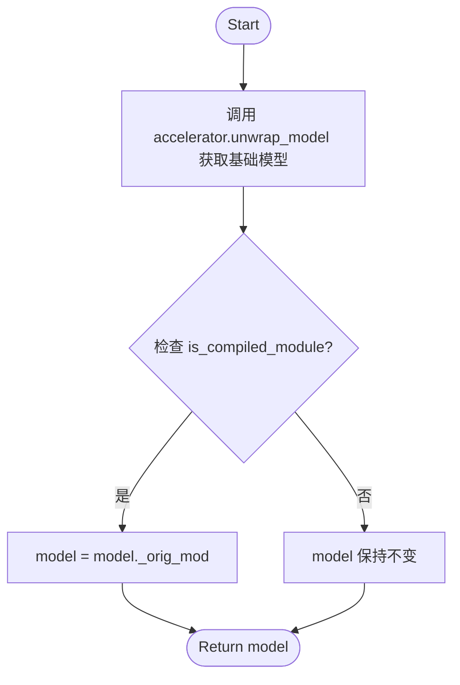

#### 带注释源码

```python
def unwrap_model(model):
    # 第一步：使用 accelerator 的 unwrap_model 方法去除分布式训练
    # (如 FSDP, DeepSpeed) 以及混合精度带来的外部包装，
    # 恢复到标准的 PyTorch 模型。
    model = accelerator.unwrap_model(model)
    
    # 第二步：检查模型是否经过了 torch.compile 等编译优化。
    # is_compiled_module 来自 diffusers.utils.torch_utils。
    # 如果模型是被编译的（如 torch.compile 或 torch._dynamo），
    # 直接保存编译后的模型可能会导致序列化问题或兼容性问题。
    # 因此需要访问其内部的原始模型 _orig_mod。
    model = model._orig_mod if is_compiled_module(model) else model
    
    return model
```


### `save_model_hook`

该函数是 `main` 函数内部的嵌套函数，作为 `accelerator.register_save_state_pre_hook` 的回调，用于在保存加速器训练状态时，将 UNet 和 Text Encoder 的 LoRA 适配器权重提取并保存为 Diffusers 格式。

参数：

- `models`：`list`，待保存的模型列表，通常包含 UNet 和 Text Encoder
- `weights`：`list`，权重列表，用于跟踪已处理的模型，需 pop 以避免重复保存
- `output_dir`：`str`，保存权重的目标目录路径

返回值：`None`，该函数通过副作用保存权重，不返回值

#### 流程图

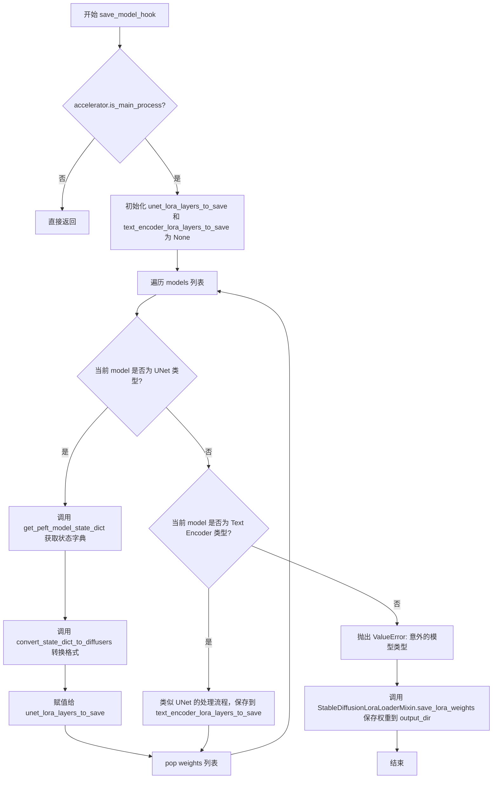

#### 带注释源码

```python
def save_model_hook(models, weights, output_dir):
    # 仅在主进程执行保存操作，避免多进程冲突
    if accelerator.is_main_process:
        # 初始化为 None，用于后续判断哪些层需要保存
        unet_lora_layers_to_save = None
        text_encoder_lora_layers_to_save = None

        # 遍历传入的模型列表，通常包含 UNet 和 Text Encoder
        for model in models:
            # 检查模型是否为 UNet 类型（通过与已包装的 UNet 类型比较）
            if isinstance(model, type(unwrap_model(unet))):
                # 从 PEFT 模型状态字典中提取 LoRA 权重
                unet_lora_layers_to_save = convert_state_dict_to_diffusers(get_peft_model_state_dict(model))
            # 检查模型是否为 Text Encoder 类型
            elif isinstance(model, type(unwrap_model(text_encoder))):
                # 同样提取 Text Encoder 的 LoRA 权重
                text_encoder_lora_layers_to_save = convert_state_dict_to_diffusers(
                    get_peft_model_state_dict(model)
                )
            else:
                # 抛出异常，不支持的模型类型
                raise ValueError(f"unexpected save model: {model.__class__}")

            # 关键步骤：从 weights 列表中弹出当前模型的权重引用
            # 防止该模型在后续的默认保存流程中被再次保存
            weights.pop()

        # 使用 StableDiffusionLoraLoaderMixin 的工具方法保存 LoRA 权重
        # 会将权重保存为 pytorch_lora_weights.safetensors 等格式
        StableDiffusionLoraLoaderMixin.save_lora_weights(
            output_dir,
            unet_lora_layers=unet_lora_layers_to_save,
            text_encoder_lora_layers=text_encoder_lora_layers_to_save,
        )
```


### `load_model_hook`

该函数是 `main` 函数内部定义的本地函数，用于在 Accelerator 恢复训练状态时加载 LoRA 权重。它从指定目录读取 LoRA 适配器的权重，并将其恢复到 UNet 和 Text Encoder 模型中，同时处理权重类型转换以确保训练兼容性。

参数：

- `models`：`list`，模型列表，包含从检查点加载的 UNet 和 Text Encoder 模型对象
- `input_dir`：`str`，检查点目录路径，从中加载 LoRA 权重文件

返回值：`None`，该函数直接修改传入的模型对象，不返回任何值

#### 流程图

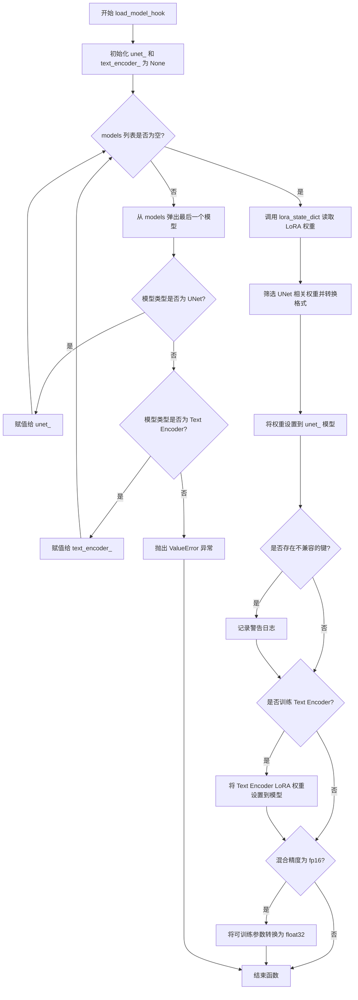

#### 带注释源码

```python
def load_model_hook(models, input_dir):
    """
    从检查点目录加载 LoRA 权重到模型的钩子函数。
    该函数作为 Accelerator 的 load_state_pre_hook 被注册，
    在恢复训练状态时自动调用。
    
    参数:
        models: 包含从检查点加载的模型对象的列表
        input_dir: 检查点目录路径
    """
    # 初始化 UNet 和文本编码器变量
    unet_ = None
    text_encoder_ = None

    # 遍历模型列表，分离出 UNet 和 Text Encoder
    while len(models) > 0:
        model = models.pop()  # 弹出最后一个模型

        # 判断模型类型并赋值
        if isinstance(model, type(unwrap_model(unet))):
            unet_ = model  # 找到 UNet 模型
        elif isinstance(model, type(unwrap_model(text_encoder))):
            text_encoder_ = model  # 找到 Text Encoder 模型
        else:
            raise ValueError(f"unexpected save model: {model.__class__}")

    # 从指定目录加载 LoRA 状态字典和网络alpha值
    lora_state_dict, network_alphas = StableDiffusionLoraLoaderMixin.lora_state_dict(input_dir)

    # 筛选出 UNet 相关的 LoRA 权重
    # 移除 'unet.' 前缀，将键名转换为 Diffusers 格式
    unet_state_dict = {f"{k.replace('unet.', '')}": v for k, v in lora_state_dict.items() if k.startswith("unet.")}
    
    # 将 UNet 权重转换为 PEFT 格式
    unet_state_dict = convert_unet_state_dict_to_peft(unet_state_dict)
    
    # 将 LoRA 权重设置到 UNet 模型
    incompatible_keys = set_peft_model_state_dict(unet_, unet_state_dict, adapter_name="default")

    # 检查是否存在不兼容的键
    if incompatible_keys is not None:
        # 只检查意外出现的键
        unexpected_keys = getattr(incompatible_keys, "unexpected_keys", None)
        if unexpected_keys:
            logger.warning(
                f"Loading adapter weights from state_dict led to unexpected keys not found in the model: "
                f" {unexpected_keys}. "
            )

    # 如果训练 Text Encoder，也需要加载其 LoRA 权重
    if args.train_text_encoder:
        _set_state_dict_into_text_encoder(lora_state_dict, prefix="text_encoder.", text_encoder=text_encoder_)

    # 确保可训练参数为 float32。由于基础模型采用 weight_dtype，这再次必要。
    # 更多细节: https://github.com/huggingface/diffusers/pull/6514#discussion_r1449796804
    if args.mixed_precision == "fp16":
        models = [unet_]
        if args.train_text_encoder:
            models.append(text_encoder_)

        # 仅将可训练参数（LoRA）转换为 fp32
        cast_training_params(models, dtype=torch.float32)
```


### `compute_text_embeddings`

这是一个内部函数，用于将文本提示转换为文本嵌入向量（prompt embeddings）。它通过 tokenizer 对提示进行分词，然后使用 text_encoder 编码生成嵌入表示。此函数在预计算文本嵌入模式下被调用，以避免在训练过程中重复计算文本嵌入，从而节省 GPU 内存和提高训练效率。

参数：

-  `prompt`：`str`，需要计算嵌入的提示文本

返回值：`torch.Tensor`，文本编码器生成的文本嵌入向量，形状为 `(batch_size, seq_len, hidden_size)`

#### 流程图

```mermaid
flowchart TD
    A[开始: compute_text_embeddings] --> B[接收 prompt 参数]
    B --> C[使用 torch.no_grad() 禁用梯度计算]
    C --> D[调用 tokenize_prompt 对 prompt 进行分词]
    D --> E[提取 input_ids 和 attention_mask]
    E --> F[调用 encode_prompt 使用 text_encoder 编码]
    F --> G[生成 prompt_embeds 张量]
    G --> H[返回 prompt_embeds]
```

#### 带注释源码

```python
def compute_text_embeddings(prompt):
    """
    计算给定提示文本的文本嵌入向量。
    
    该函数是内部函数,仅在 pre_compute_text_embeddings 模式下使用。
    通过预先计算文本嵌入,可以避免在训练循环中重复编码文本,
    从而节省显存并提高训练速度。
    
    参数:
        prompt: 需要编码的文本提示
        
    返回:
        prompt_embeds: 文本编码器生成的嵌入向量
    """
    # 使用 no_grad 上下文管理器禁用梯度计算,减少显存占用
    with torch.no_grad():
        # 第一步:使用 tokenizer 将文本提示转换为 token ID 和注意力掩码
        text_inputs = tokenize_prompt(
            tokenizer, 
            prompt, 
            tokenizer_max_length=args.tokenizer_max_length
        )
        
        # 第二步:将 token 序列传入文本编码器生成嵌入向量
        # encode_prompt 内部会将数据移到对应设备上
        prompt_embeds = encode_prompt(
            text_encoder,               # 文本编码器模型
            text_inputs.input_ids,      # token ID 序列
            text_inputs.attention_mask, # 注意力掩码
            text_encoder_use_attention_mask=args.text_encoder_use_attention_mask,
        )

    # 返回生成的文本嵌入向量
    return prompt_embeds
```


### `DreamBoothDataset.__init__`

该方法用于初始化 DreamBooth 数据集，准备微调模型所需的实例图像和类图像（含提示词）。方法会预处理图像（resize、crop、to tensor、normalize），并设置数据集长度以支持 prior preservation 训练模式。

参数：

- `instance_data_root`：`str` 或 `Path`，实例图像的根目录路径
- `instance_prompt`：`str`，实例提示词，用于描述实例图像
- `tokenizer`：`PreTrainedTokenizer`，HuggingFace 分词器，用于对提示词进行 tokenize
- `class_data_root`：`str` 或 `Path` 或 `None`，类图像的根目录路径（可选，用于 prior preservation）
- `class_prompt`：`str` 或 `None`，类提示词（可选）
- `class_num`：`int` 或 `None`，类图像的最大数量限制（可选）
- `size`：`int`，目标图像尺寸，默认为 512
- `center_crop`：`bool`，是否对图像进行中心裁剪，默认为 False（随机裁剪）
- `encoder_hidden_states`：`torch.Tensor` 或 `None`，预计算的实例提示词编码隐藏状态（可选，用于节省训练时文本编码器的内存）
- `class_prompt_encoder_hidden_states`：`torch.Tensor` 或 `None`，预计算的类提示词编码隐藏状态（可选）
- `tokenizer_max_length`：`int` 或 `None`，分词器的最大长度限制（可选）

返回值：`None`，无返回值（构造函数）

#### 流程图

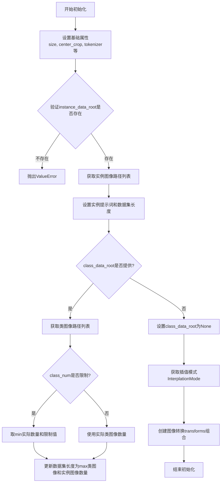

#### 带注释源码

```python
def __init__(
    self,
    instance_data_root,
    instance_prompt,
    tokenizer,
    class_data_root=None,
    class_prompt=None,
    class_num=None,
    size=512,
    center_crop=False,
    encoder_hidden_states=None,
    class_prompt_encoder_hidden_states=None,
    tokenizer_max_length=None,
):
    """
    初始化DreamBooth数据集
    
    参数:
        instance_data_root: 实例图像的根目录
        instance_prompt: 实例提示词
        tokenizer: 分词器
        class_data_root: 类图像根目录（可选，用于prior preservation）
        class_prompt: 类提示词
        class_num: 类图像数量限制
        size: 图像目标尺寸
        center_crop: 是否中心裁剪
        encoder_hidden_states: 预计算的实例提示编码
        class_prompt_encoder_hidden_states: 预计算的类提示编码
        tokenizer_max_length: 分词器最大长度
    """
    # 1. 存储基础配置属性
    self.size = size
    self.center_crop = center_crop
    self.tokenizer = tokenizer
    self.encoder_hidden_states = encoder_hidden_states
    self.class_prompt_encoder_hidden_states = class_prompt_encoder_hidden_states
    self.tokenizer_max_length = tokenizer_max_length

    # 2. 验证并处理实例数据根目录
    self.instance_data_root = Path(instance_data_root)
    if not self.instance_data_root.exists():
        raise ValueError("Instance images root doesn't exists.")

    # 3. 收集实例图像路径列表
    self.instance_images_path = list(Path(instance_data_root).iterdir())
    self.num_instance_images = len(self.instance_images_path)
    self.instance_prompt = instance_prompt
    # 初始数据集长度等于实例图像数量
    self._length = self.num_instance_images

    # 4. 处理类数据（如果提供，用于prior preservation）
    if class_data_root is not None:
        self.class_data_root = Path(class_data_root)
        self.class_data_root.mkdir(parents=True, exist_ok=True)
        self.class_images_path = list(self.class_data_root.iterdir())
        
        # 根据是否有限制来确定类图像数量
        if class_num is not None:
            self.num_class_images = min(len(self.class_images_path), class_num)
        else:
            self.num_class_images = len(self.class_images_path)
        
        # 数据集长度为类图像和实例图像中的较大者
        self._length = max(self.num_class_images, self.num_instance_images)
        self.class_prompt = class_prompt
    else:
        self.class_data_root = None

    # 5. 获取图像插值模式
    # 注意: 这里引用了args.image_interpolation_mode，需要确保args已定义
    interpolation = getattr(transforms.InterpolationMode, args.image_interpolation_mode.upper(), None)
    if interpolation is None:
        raise ValueError(f"Unsupported interpolation mode {interpolation=}.")

    # 6. 构建图像变换组合
    self.image_transforms = transforms.Compose(
        [
            transforms.Resize(size, interpolation=interpolation),  # 调整图像大小
            transforms.CenterCrop(size) if center_crop else transforms.RandomCrop(size),  # 裁剪方式
            transforms.ToTensor(),  # 转换为PyTorch张量
            transforms.Normalize([0.5], [0.5]),  # 归一化到[-1, 1]
        ]
    )
```


### `DreamBoothDataset.__len__`

返回数据集的样本数量，用于支持 Python 的 `len()` 函数。该方法返回数据集中可用的样本总数，当启用类别先验保存时，会取实例图像数量和类别图像数量的较大值，以确保 DataLoader 可以正确遍历所有数据。

参数：

- （无参数，Python 特殊方法）

返回值：`int`，返回数据集中可用的样本总数

#### 流程图

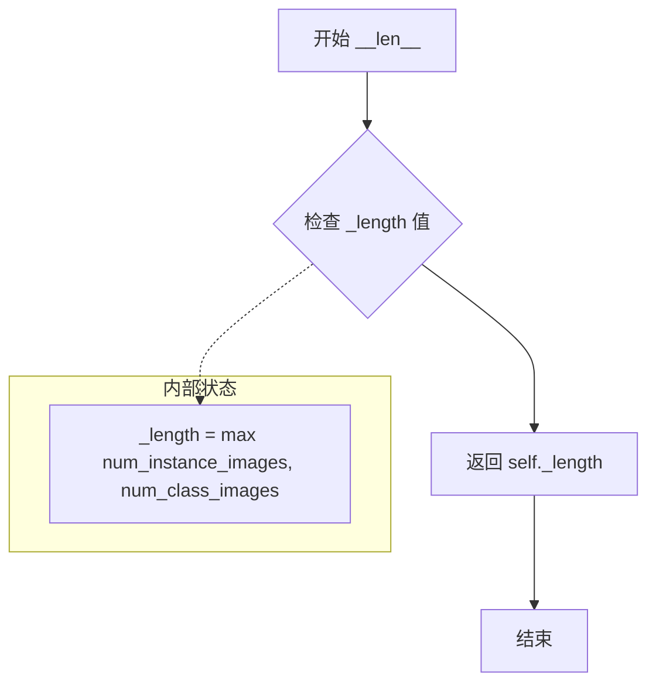

#### 带注释源码

```python
def __len__(self):
    """
    返回数据集的长度。
    
    该方法实现了 Python 的特殊方法 len()，使得可以直接使用 len(dataset) 获取数据集的样本数量。
    返回值是在初始化时计算的 _length，它取决于是否启用了类别先验保存：
    - 未启用类别保存时：_length = 实例图像数量
    - 启用类别保存时：_length = max(实例图像数量, 类别图像数量)
    
    Returns:
        int: 数据集中的样本总数
    """
    return self._length  # 返回在 __init__ 中计算的样本数量
```


### `DreamBoothDataset.__getitem__`

该方法是DreamBoothDataset类的核心实例方法，用于根据给定索引获取训练样本。它负责加载和预处理实例图像和类图像（如果启用先验保留），并将其与对应的文本提示ID一起返回给训练流程。

参数：

- `self`：DreamBoothDataset实例，隐式参数
- `index`：`int`，要获取的样本索引，用于从图像列表中检索对应的图像

返回值：`dict`，包含以下键值对的字典：
  - `instance_images`：处理后的实例图像张量
  - `instance_prompt_ids`：实例提示的token ID
  - `instance_attention_mask`（可选）：实例提示的注意力掩码
  - `class_images`（可选，如果class_data_root存在）：处理后的类图像张量
  - `class_prompt_ids`（可选，如果class_data_root存在）：类提示的token ID
  - `class_attention_mask`（可选，如果class_data_root存在）：类提示的注意力掩码

#### 流程图

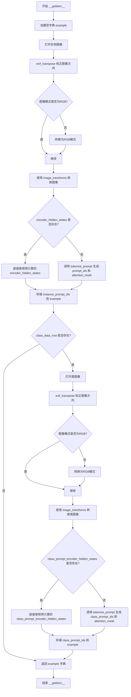

#### 带注释源码

```python
def __getitem__(self, index):
    """
    根据索引获取一个训练样本。
    
    参数:
        index (int): 样本索引，用于从图像列表中检索对应的图像
    
    返回:
        dict: 包含图像和文本嵌入的字典，用于模型训练
    """
    # 初始化空字典来存储样本数据
    example = {}
    
    # ---- 处理实例图像 ----
    # 使用索引从实例图像列表中获取图像路径，支持循环遍历
    instance_image = Image.open(self.instance_images_path[index % self.num_instance_images])
    # 根据EXIF信息校正图像方向（处理手机拍摄的照片方向问题）
    instance_image = exif_transpose(instance_image)
    
    # 确保图像为RGB模式（PNG可能是RGBA，灰度图需要转换）
    if not instance_image.mode == "RGB":
        instance_image = instance_image.convert("RGB")
    
    # 应用图像变换：调整大小、裁剪、转换为张量、归一化
    example["instance_images"] = self.image_transforms(instance_image)
    
    # ---- 处理实例文本提示 ----
    # 如果预计算了文本嵌入，直接使用；否则调用tokenize_prompt进行编码
    if self.encoder_hidden_states is not None:
        example["instance_prompt_ids"] = self.encoder_hidden_states
    else:
        # 使用tokenizer将文本提示转换为token IDs和attention mask
        text_inputs = tokenize_prompt(
            self.tokenizer, self.instance_prompt, tokenizer_max_length=self.tokenizer_max_length
        )
        example["instance_prompt_ids"] = text_inputs.input_ids
        example["instance_attention_mask"] = text_inputs.attention_mask
    
    # ---- 处理类图像（先验保留） ----
    # 如果配置了class_data_root，则同时加载类图像用于先验保留损失
    if self.class_data_root:
        # 使用索引从类图像列表中获取图像路径
        class_image = Image.open(self.class_images_path[index % self.num_class_images])
        class_image = exif_transpose(class_image)
        
        # 确保类图像为RGB模式
        if not class_image.mode == "RGB":
            class_image = class_image.convert("RGB")
        
        # 应用相同的图像变换
        example["class_images"] = self.image_transforms(class_image)
        
        # 处理类图像的文本提示
        if self.class_prompt_encoder_hidden_states is not None:
            example["class_prompt_ids"] = self.class_prompt_encoder_hidden_states
        else:
            # 使用tokenizer编码类提示
            class_text_inputs = tokenize_prompt(
                self.tokenizer, self.class_prompt, tokenizer_max_length=self.tokenizer_max_length
            )
            example["class_prompt_ids"] = class_text_inputs.input_ids
            example["class_attention_mask"] = class_text_inputs.attention_mask
    
    # 返回包含实例和类图像及其文本嵌入的字典
    return example
```


### `PromptDataset.__init__`

初始化PromptDataset类，用于准备在多个GPU上生成类图像的提示词数据集。

参数：

- `prompt`：`str`，用于生成类图像的文本提示词
- `num_samples`：`int`，要生成的样本数量

返回值：`None`，该方法为构造函数，不返回任何值

#### 流程图

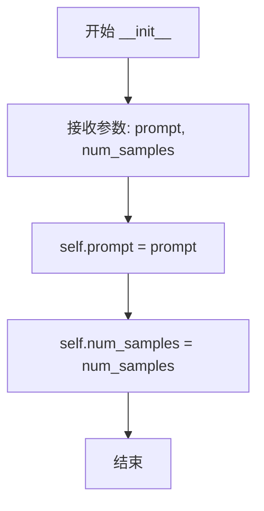

#### 带注释源码

```python
def __init__(self, prompt, num_samples):
    """
    初始化PromptDataset实例。
    
    该数据集用于在DreamBooth训练中生成类图像（class images），
    特别是在使用prior preservation（先验保留）技术时。
    当在多个GPU上生成类图像时，每个GPU会使用这个数据集来获取
    对应的提示词和索引。

    参数:
        prompt (str): 用于生成类图像的文本提示词。例如，如果训练的是
                      某种特定类别的图像，这里应该传入该类别的描述。
        num_samples (int): 需要生成的样本数量。这个数量通常等于
                          训练配置中指定的class_images数量。
    """
    # 将传入的prompt保存为实例变量，供__getitem__方法使用
    self.prompt = prompt
    
    # 将传入的num_samples保存为实例变量，用于确定数据集的长度
    self.num_samples = num_samples
```


### `PromptDataset.__len__`

该方法是 `PromptDataset` 类的特殊方法，用于返回数据集中样本的数量，使得数据集可以被 `len()` 函数调用，并支持数据加载器确定迭代的样本总数。

参数：

- 无（`self` 为隐含参数，指代实例本身）

返回值：`int`，返回数据集中预设置的样本数量 `num_samples`。

#### 流程图

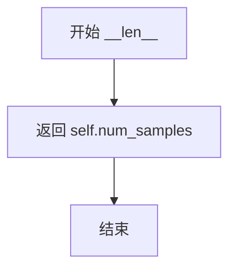

#### 带注释源码

```python
def __len__(self):
    """
    返回数据集中样本的数量。
    
    该方法使得数据集对象支持 Python 内置的 len() 函数，
    数据加载器（DataLoader）会通过此方法确定需要迭代的批次数量。
    
    Returns:
        int: 初始化时传入的样本数量 num_samples。
    """
    return self.num_samples
```


### `PromptDataset.__getitem__`

获取指定索引处的样本数据，返回包含提示词和索引的字典，用于在多GPU上生成类别图像。

参数：

- `index`：`int`，要获取的样本索引

返回值：`dict`，包含以下键值对：
- `"prompt"`：`str`，提示词
- `"index"`：`int`，样本索引

#### 流程图

```mermaid
flowchart TD
    A[开始 __getitem__] --> B[创建空字典 example]
    B --> C[将 self.prompt 存入 example['prompt']]
    C --> D[将 index 存入 example['index']]
    D --> E[返回 example 字典]
```

#### 带注释源码

```python
def __getitem__(self, index):
    """
    获取指定索引处的样本数据。
    
    参数:
        index: int - 样本的索引位置
        
    返回:
        dict - 包含 'prompt' 和 'index' 的字典
    """
    # 创建一个空字典用于存储样本数据
    example = {}
    
    # 将提示词存入字典的 'prompt' 键
    example["prompt"] = self.prompt
    
    # 将当前索引存入字典的 'index' 键
    example["index"] = index
    
    # 返回包含提示词和索引的字典
    return example
```

## 关键组件


### DreamBoothDataset

用于准备实例图像和类图像的数据集类，包含图像预处理和提示词tokenization逻辑。

### PromptDataset

一个简单的数据集，用于在多个GPU上生成类图像。

### 训练流程

核心训练循环，包括前向传播、噪声添加、损失计算、反向传播和参数更新。

### LoRA适配器配置

使用peft库配置LoRA权重，包括target_modules、rank、alpha和dropout参数。

### UNet2DConditionModel

Stable Diffusion的UNet模型，用于预测噪声残差。

### 文本编码器

使用CLIP文本编码器将文本提示转换为embedding向量。

### AutoencoderKL

VAE模型，用于将图像编码到潜在空间。

### DDPMScheduler

噪声调度器，负责在训练过程中添加和调度噪声。

### 验证与推理

log_validation函数用于在训练过程中验证模型并生成样本图像。

### 模型保存与加载

自定义的save_model_hook和load_model_hook用于正确保存和加载LoRA权重。

### 优化器配置

支持8-bit Adam优化器以减少显存使用，支持梯度累积和混合精度训练。

### 数据整理

collate_fn函数用于将多个样本整理为批次，处理prior preservation情况。

### 提示词编码

tokenize_prompt和encode_prompt函数用于将文本提示转换为模型可用的embedding。

### 图像预处理

使用torchvision的transforms进行图像Resize、CenterCrop和Normalize。

## 问题及建议


### 已知问题

- **全局变量耦合**：`tokenize_prompt`、`encode_prompt`、`collate_fn`等函数定义在全局作用域，但实际依赖外部的`args`变量或需要额外参数（如`collate_fn`需要`with_prior_preservation`参数），增加测试和维护难度
- **硬编码和魔法数字**：xformers版本检查硬编码`"0.0.16"`，`target_modules`列表硬编码在代码中，`num_train_timesteps`等参数直接访问scheduler配置
- **错误处理分散**：图像加载缺少异常捕获（`Image.open`可能失败），`parse_args`中的验证逻辑分散，模型加载错误处理不一致（如VAE加载失败时的处理）
- **分布式训练限制**：当`train_text_encoder=True`且`gradient_accumulation_steps>1`且多GPU时，代码主动抛出异常禁止此配置，但注释表明这是临时限制
- **类型注解不完整**：部分函数参数缺少类型注解（如`save_model_card`中`images`参数），`collate_fn`函数没有类型注解
- **内存管理不一致**：部分地方使用`del pipeline; free_memory()`，部分地方仅用`gc.collect()`，缺少统一的内存管理策略
- **条件分支重复**：`with_prior_preservation`的条件判断在数据准备、训练循环、保存逻辑等多处重复出现
- **验证逻辑冗余**：训练循环中每次`accelerator.sync_gradients`都检查是否需要保存checkpoint，可优化为只在epoch结束时检查

### 优化建议

- **重构辅助函数**：将依赖`args`的辅助函数封装成类或使用配置对象传递参数，提高函数独立性和可测试性
- **集中化错误处理**：创建统一的异常处理和图像加载验证逻辑，对损坏图像进行跳过或警告而非直接崩溃
- **配置外部化**：将硬编码的配置（如target_modules列表、版本号等）提取到配置文件中，支持运行时配置
- **优化分布式训练**：消除`gradient_accumulation_steps > 1`与`train_text_encoder`的冲突限制，或明确文档说明临时性
- **统一内存管理**：创建统一的内存清理辅助函数，涵盖CUDA缓存、Python GC、模型卸载等
- **代码复用**：将`with_prior_preservation`的分支逻辑提取为独立函数或使用策略模式减少重复
- **类型注解完善**：为所有公共函数添加完整的类型注解，使用mypy进行静态类型检查
- **日志和监控增强**：统一日志级别管理，增加更细粒度的性能监控（如GPU内存使用、训练速度等）


## 其它


### 设计目标与约束

本代码实现基于DreamBooth方法的LoRA（Low-Rank Adaptation）微调训练脚本，用于对Stable Diffusion模型进行个性化定制训练。核心设计目标包括：1）支持通过少量样本（instance images）学习特定主体概念；2）支持先验保持损失（prior preservation loss）以防止模型过拟合；3）支持对UNet和Text Encoder同时进行LoRA适配器训练；4）支持多GPU分布式训练和混合精度训练；5）支持训练过程中的验证和模型保存。主要约束包括：需要至少8GB显存的GPU、训练时间取决于数据集大小和epoch数量、LoRA rank参数影响模型大小和训练效果。

### 错误处理与异常设计

代码中的错误处理主要通过以下机制实现：1）参数验证：在parse_args函数中检查必需参数（如instance_data_dir、instance_prompt等），对冲突参数组合（如train_text_encoder与pre_compute_text_embeddings）抛出ValueError；2）依赖检查：使用check_min_version验证diffusers最低版本，使用is_wandb_available检查wandb是否安装，使用is_xformers_available检查xformers可用性；3）异常捕获：主要依赖外部库（transformers、diffusers、accelerate等）抛出的异常，代码本身使用try-except捕获OSError（如VAE模型加载失败时设为None）；4）警告机制：使用warnings.warn提醒用户不合理的参数组合（如使用class_data_dir但不启用prior_preservation）。潜在改进：可增加更详细的错误日志记录、可恢复性错误处理（如网络中断后的重试机制）。

### 数据流与状态机

训练数据流主要经过以下阶段：1）数据准备阶段：DreamBoothDataset类负责加载instance images和class images，进行图像预处理（resize、crop、normalize）和prompt tokenization；2）数据聚合阶段：collate_fn函数将多个样本合并为batch，处理prior preservation需要的class数据；3）前向传播阶段：将pixel values编码为latent space（VAE），添加噪声（noise_scheduler），编码text prompts为embeddings；4）模型预测阶段：UNet预测噪声残差；5）损失计算阶段：根据prediction_type计算MSE loss， optionally添加prior preservation loss；6）优化阶段：反向传播、梯度裁剪、优化器更新、学习率调度；7）验证阶段：定期运行验证生成图像并记录到tensorboard/wandb；8）保存阶段：保存checkpoint和最终LoRA权重。状态转换主要由epoch循环和step循环控制，支持从checkpoint恢复训练状态。

### 外部依赖与接口契约

本代码依赖以下核心外部库：1）transformers：提供CLIPTextModel、T5EncoderModel等文本编码器；2）diffusers：提供Stable Diffusion相关组件（AutoencoderKL、DDPMScheduler、UNet2DConditionModel等）；3）accelerate：提供分布式训练、混合精度、模型保存/加载钩子；4）peft：提供LoRA配置和适配器管理；5）huggingface_hub：提供模型上传功能；6）bitsandbytes：可选，提供8-bit Adam优化器；7）xformers：可选，提供内存高效注意力机制；8）wandb/tensorboard：可选，用于训练监控。接口契约方面：1）输入接口：命令行参数通过argparse解析，instance_data_dir必须包含训练图像；2）输出接口：模型权重保存为safetensors格式，验证图像保存到output_dir；3）模型加载：支持从pretrained_model_name_or_path加载完整模型或LoRA权重；4）自定义扩展：可通过register_save_state_pre_hook和register_load_state_pre_hook扩展模型保存/加载逻辑。

### 安全性考虑

代码中的安全相关设计包括：1）hub_token安全检查：检测到同时使用wandb和hub_token时抛出异常，防止token泄露风险；2）安全风险提示：建议用户使用hf auth login认证而非直接传递token；3）模型卡生成：自动创建包含训练信息的模型卡（README.md），记录基础模型、训练prompt等信息；4）可选的安全检查器： DiffusionPipeline加载时显式设置safety_checker=None以避免不必要的开销；5）文件系统操作：使用Path对象进行路径操作，避免路径遍历攻击风险。潜在改进：可增加更多输入验证（如图像文件类型检查）、增加模型权重签名验证。

### 性能优化策略

代码实现了多种性能优化策略：1）混合精度训练：通过accelerator配置fp16/bf16精度，减少显存使用和加速训练；2）梯度累积：支持gradient_accumulation_steps参数实现大batch训练；3）梯度检查点：启用gradient_checkpointing以时间换显存；4）xFormers优化：可选启用memory efficient attention；5）TF32支持：在Ampere架构GPU上启用TF32加速矩阵运算；6）8-bit Adam：可选使用bitsandbytes的8-bit优化器减少显存；7）预计算文本嵌入：pre_compute_text_embeddings选项可减少训练时的编码开销；8）内存管理：定期调用gc.collect()和free_memory()释放未使用显存；9）模型权重dtype转换：仅对LoRA参数保持fp32以保证训练稳定性。

### 配置管理

配置管理采用以下机制：1）命令行参数：使用argparse统一管理所有训练超参数，支持从命令行或input_args列表解析；2）默认值设置：为大多数参数提供合理的默认值（如rank=4、learning_rate=5e-4等）；3）环境变量支持：支持通过LOCAL_RANK环境变量覆盖local_rank参数；4）配置持久化：训练配置通过accelerator.init_trackers保存到tensorboard/wandb；5）模型卡配置：save_model_card函数生成包含训练元数据的模型卡。配置验证在parse_args中集中完成，包括参数类型检查、互斥参数检查、必需参数检查等。

### 版本兼容性要求

代码对依赖库的版本要求如下：1）diffusers：最低版本0.37.0.dev0，通过check_min_version函数验证；2）PyTorch：建议1.10+以支持bf16；3）transformers：依赖CLIPTextModel、T5EncoderModel等；4）accelerate：用于分布式训练和混合精度；5）peft：用于LoRA适配器管理；6）xformers：可选，建议0.0.17+以避免训练问题；7）NVIDIA GPU：建议Ampere架构以支持TF32和bf16；8）Python版本：代码使用类型注解，建议Python 3.8+。对于MPS（Apple Silicon）后端，代码中有特殊处理：检测到MPS时禁用native_amp。

    