# `diffusers\examples\dreambooth\train_dreambooth_lora_flux.py` 详细设计文档

A comprehensive training script for fine-tuning the FLUX diffusion model using DreamBooth methodology with Low-Rank Adaptation (LoRA), supporting prior preservation and mixed precision training.

## 整体流程

```mermaid
graph TD
    Start[Start: Parse Arguments] --> Setup[Initialize Accelerator & Logging]
    Setup --> PriorCheck{Use Prior Preservation?}
    PriorCheck -- Yes --> GenClass[Generate Class Images using Pipeline]
    PriorCheck -- No --> LoadModels[Load VAE, Transformer, Text Encoders]
    GenClass --> LoadModels
    LoadModels --> SetupLoRA[Apply LoRA Adapters to Transformer & Text Encoder]
    SetupLoRA --> PrepareData[Create DreamBoothDataset & DataLoader]
    PrepareData --> TrainingLoop[For Epoch in Epochs]
    TrainingLoop --> Batch[Get Batch]
    Batch --> EncodePrompt[Encode Prompts (CLIP + T5)]
    EncodePrompt --> EncodeLatent[Encode Images to Latents (VAE)]
    EncodeLatent --> AddNoise[Add Noise to Latents (Flow Match)]
    AddNoise --> Forward[Predict Noise (Transformer)]
    Forward --> ComputeLoss[Compute Weighted Loss]
    ComputeLoss --> Backward[Backward Pass]
    Backward --> Optim[Optimizer Step]
    Optim --> CheckpointCheck{Save Checkpoint?}
    CheckpointCheck -- Yes --> Save[Save LoRA Weights]
    CheckpointCheck -- No --> ValidationCheck{Run Validation?}
    Optim --> ValidationCheck
    ValidationCheck -- Yes --> Validate[Run Inference & Log Images]
    ValidationCheck -- No --> NextStep[Next Training Step]
    Validate --> NextStep
    NextStep --> TrainingLoop
    Save --> TrainingLoop
    Save --> Finalize[Save Final LoRA & Push to Hub]
```

## 类结构

```
train_flux_dreambooth_lora.py
├── Data Handling Classes
│   ├── DreamBoothDataset (PyTorch Dataset for Instance Images)
│   │   ├── __init__
│   │   ├── __len__
│   │   └── __getitem__
│   └── PromptDataset (Helper Dataset for Class Image Generation)
│       ├── __init__
│       ├── __len__
│       └── __getitem__
├── Helper Functions (Preprocessing & Encoding)
│   ├── collate_fn
│   ├── tokenize_prompt
│   ├── _encode_prompt_with_t5
│   ├── _encode_prompt_with_clip
│   └── encode_prompt
├── Model Management Functions
│   ├── import_model_class_from_model_name_or_path
│   ├── load_text_encoders
│   └── save_model_card
├── Training Logic
│   ├── main (Entry Point)
│   │   ├── Initialization (Accelerator, Seed)
│   │   ├── Prior Generation
│   │   ├── Model Loading (FluxPipeline, LoRA Config)
Optimization Setup (AdamW/Prodigy)
Training Loop
Validation Loop
Checkpointing
│   └── log_validation
```

## 全局变量及字段


### `logger`
    
日志记录器，用于输出训练过程中的信息和调试信息

类型：`logging.Logger`
    


### `DreamBoothDataset.size`
    
图像的目标分辨率大小，用于调整图像尺寸

类型：`int`
    


### `DreamBoothDataset.center_crop`
    
是否对图像进行中心裁剪，False则随机裁剪

类型：`bool`
    


### `DreamBoothDataset.instance_prompt`
    
实例提示词，用于描述要训练的主体

类型：`str`
    


### `DreamBoothDataset.class_prompt`
    
类别提示词，用于先验保留损失的类别描述

类型：`str`
    


### `DreamBoothDataset.instance_images`
    
存储加载的实例图像PIL对象列表

类型：`list`
    


### `DreamBoothDataset.pixel_values`
    
经过预处理和转换的图像张量列表，用于模型输入

类型：`list`
    


### `DreamBoothDataset.custom_instance_prompts`
    
自定义实例提示词列表，为None时使用默认instance_prompt

类型：`list or None`
    


### `DreamBoothDataset.class_data_root`
    
类别图像数据目录路径，用于先验保留

类型：`Path or None`
    


### `DreamBoothDataset.num_instance_images`
    
实例图像的数量

类型：`int`
    


### `DreamBoothDataset.num_class_images`
    
类别图像的数量

类型：`int`
    


### `DreamBoothDataset._length`
    
数据集的总长度，用于DataLoader迭代

类型：`int`
    


### `PromptDataset.prompt`
    
用于生成类别图像的提示词

类型：`str`
    


### `PromptDataset.num_samples`
    
要生成的样本数量

类型：`int`
    
    

## 全局函数及方法


### `save_model_card`

该函数用于在训练完成后生成并保存 HuggingFace Hub 模型卡片（README.md），包含模型描述、训练信息、触发词、使用示例和验证图像等内容，以便用户了解和使用训练好的 LoRA 模型。

参数：

- `repo_id`：`str`，HuggingFace Hub 上的模型仓库 ID
- `images`：可选参数，验证时生成的图像列表（`List[Image]` 或 `None`），用于添加到模型卡片和 widget 中
- `base_model`：`str`，基础预训练模型的名称或路径
- `train_text_encoder`：`bool`，是否训练了文本编码器的 LoRA，默认为 `False`
- `instance_prompt`：`str`，用于触发图像生成的实例提示词/触发词
- `validation_prompt`：`str`，验证时使用的提示词
- `repo_folder`：`str`，本地仓库文件夹路径，用于保存模型卡片和图像文件

返回值：无（`None`），该函数执行文件写入操作，不返回任何值

#### 流程图

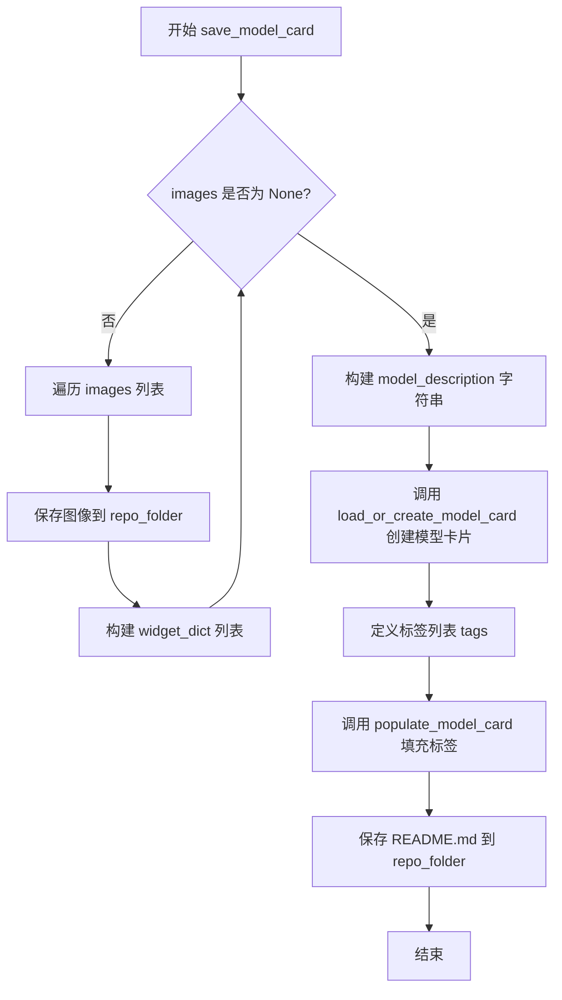

#### 带注释源码

```python
def save_model_card(
    repo_id: str,
    images=None,
    base_model: str = None,
    train_text_encoder=False,
    instance_prompt=None,
    validation_prompt=None,
    repo_folder=None,
):
    """
    生成并保存 HuggingFace Hub 模型卡片（README.md）
    
    Args:
        repo_id: HuggingFace Hub 仓库 ID
        images: 验证生成的图像列表
        base_model: 基础预训练模型
        train_text_encoder: 是否训练文本编码器
        instance_prompt: 实例提示词/触发词
        validation_prompt: 验证提示词
        repo_folder: 本地仓库文件夹路径
    """
    # 初始化 widget 字典列表，用于 HuggingFace Hub 的推理 widget
    widget_dict = []
    
    # 如果有验证图像，处理并保存
    if images is not None:
        for i, image in enumerate(images):
            # 将图像保存到本地仓库文件夹
            image.save(os.path.join(repo_folder, f"image_{i}.png"))
            # 构建 widget 字典，包含提示词和图像 URL
            widget_dict.append(
                {"text": validation_prompt if validation_prompt else " ", "output": {"url": f"image_{i}.png"}}
            )

    # 构建模型描述的 Markdown 内容
    model_description = f"""
# Flux DreamBooth LoRA - {repo_id}

<Gallery />

## Model description

These are {repo_id} DreamBooth LoRA weights for {base_model}.

The weights were trained using [DreamBooth](https://dreambooth.github.io/) with the [Flux diffusers trainer](https://github.com/huggingface/diffusers/blob/main/examples/dreambooth/README_flux.md).

Was LoRA for the text encoder enabled? {train_text_encoder}.

## Trigger words

You should use `{instance_prompt}` to trigger the image generation.

## Download model

[Download the *.safetensors LoRA]({repo_id}/tree/main) in the Files & versions tab.

## Use it with the [🧨 diffusers library](https://github.com/huggingface/diffusers)

```py
from diffusers import AutoPipelineForText2Image
import torch
pipeline = AutoPipelineForText2Image.from_pretrained("black-forest-labs/FLUX.1-dev", torch_dtype=torch.bfloat16).to('cuda')
pipeline.load_lora_weights('{repo_id}', weight_name='pytorch_lora_weights.safetensors')
image = pipeline('{validation_prompt if validation_prompt else instance_prompt}').images[0]
```

For more details, including weighting, merging and fusing LoRAs, check the [documentation on loading LoRAs in diffusers](https://huggingface.co/docs/diffusers/main/en/using-diffusers/loading_adapters)

## License

Please adhere to the licensing terms as described [here](https://huggingface.co/black-forest-labs/FLUX.1-dev/blob/main/LICENSE.md).
"""
    # 加载或创建模型卡片，使用训练模式
    model_card = load_or_create_model_card(
        repo_id_or_path=repo_id,
        from_training=True,
        license="other",
        base_model=base_model,
        prompt=instance_prompt,
        model_description=model_description,
        widget=widget_dict,
    )
    
    # 定义模型标签，用于 Hub 搜索和分类
    tags = [
        "text-to-image",
        "diffusers-training",
        "diffusers",
        "lora",
        "flux",
        "flux-diffusers",
        "template:sd-lora",
    ]

    # 填充模型卡片的标签信息
    model_card = populate_model_card(model_card, tags=tags)
    
    # 保存模型卡片为 README.md
    model_card.save(os.path.join(repo_folder, "README.md"))
```


### `load_text_encoders`

该函数用于从预训练模型路径加载两个文本编码器（CLIP 文本编码器和 T5 文本编码器），分别对应 Flux 模型的 `text_encoder` 和 `text_encoder_2` 子模块。这是 Flux DreamBooth LoRA 训练流程中的关键步骤，用于初始化文本编码组件以支持文本提示的编码处理。

参数：

- `class_one`：`Type[class]`，第一个文本编码器的类对象（通常为 CLIPTextModel），用于从预训练模型加载主文本编码器
- `class_two`：`Type[class]`，第二个文本编码器的类对象（通常为 T5EncoderModel），用于从预训练模型加载辅助文本编码器

返回值：`Tuple[object, object]`，返回两个文本编码器实例的元组，分别是主文本编码器和辅助文本编码器

#### 流程图

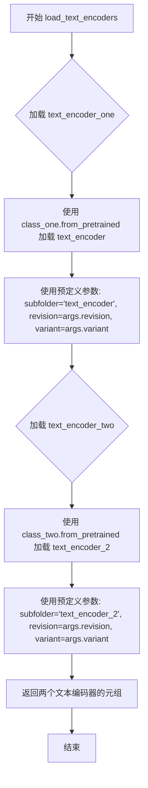

#### 带注释源码

```python
def load_text_encoders(class_one, class_two):
    """
    从预训练模型加载两个文本编码器（CLIP 和 T5）
    
    参数:
        class_one: 第一个文本编码器的类对象（CLIPTextModel）
        class_two: 第二个文本编码器的类对象（T5EncoderModel）
    
    返回:
        包含两个文本编码器实例的元组
    """
    # 加载主文本编码器（CLIP），从 pretrained_model_name_or_path 的 text_encoder 子文件夹
    text_encoder_one = class_one.from_pretrained(
        args.pretrained_model_name_or_path,  # 预训练模型路径或 HuggingFace 模型 ID
        subfolder="text_encoder",             # 指定加载 text_encoder 子目录
        revision=args.revision,               # 模型版本号
        variant=args.variant                 # 模型变体（如 fp16）
    )
    
    # 加载辅助文本编码器（T5），从 pretrained_model_name_or_path 的 text_encoder_2 子文件夹
    text_encoder_two = class_two.from_pretrained(
        args.pretrained_model_name_or_path,  # 预训练模型路径或 HuggingFace 模型 ID
        subfolder="text_encoder_2",           # 指定加载 text_encoder_2 子目录（T5 编码器）
        revision=args.revision,               # 模型版本号
        variant=args.variant                  # 模型变体（如 fp16）
    )
    
    # 返回两个文本编码器实例
    return text_encoder_one, text_encoder_two
```


### `log_validation`

该函数是 Flux DreamBooth LoRA 训练脚本中的验证函数，用于在训练过程中运行推理生成验证图像，并将结果记录到 TensorBoard 或 Weights & Biases (wandb) 中。

参数：

- `pipeline`：`FluxPipeline`，用于图像生成的 Diffusers pipeline 实例
- `args`：包含训练配置参数的对象（如 `num_validation_images`、`validation_prompt`、`seed` 等）
- `accelerator`：Accelerator 对象，提供分布式训练支持和设备管理
- `pipeline_args`：字典，包含传递给 pipeline 的参数（通常包含 `prompt`）
- `epoch`：当前训练轮次，用于记录日志
- `torch_dtype`：torch 数据类型（float16/bfloat16/float32），指定推理精度
- `is_final_validation`：`bool`，标识是否为最终验证（默认 `False`）

返回值：`list[PIL.Image]`，生成的验证图像列表

#### 流程图

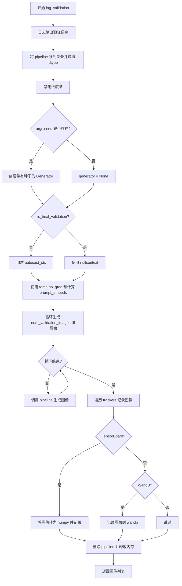

#### 带注释源码

```python
def log_validation(
    pipeline,          # FluxPipeline: 用于推理的 pipeline 实例
    args,              # TrainingArguments: 训练参数对象
    accelerator,       # Accelerator: 分布式训练加速器
    pipeline_args,     # dict: 传递给 pipeline 的参数（如 prompt）
    epoch,             # int: 当前 epoch 编号
    torch_dtype,       # torch.dtype: 推理使用的数据类型
    is_final_validation=False,  # bool: 是否为最终验证阶段
):
    """
    运行验证：生成指定数量的图像并记录到跟踪器（TensorBoard/WandB）
    """
    # 记录验证开始信息，包括生成图像数量和提示词
    logger.info(
        f"Running validation... \n Generating {args.num_validation_images} images with prompt:"
        f" {args.validation_prompt}."
    )
    
    # 将 pipeline 移到指定设备（GPU/NPU）并转换数据类型
    pipeline = pipeline.to(accelerator.device, dtype=torch_dtype)
    # 禁用进度条以减少验证过程中的日志输出
    pipeline.set_progress_bar_config(disable=True)

    # 创建随机数生成器（如果提供了种子）
    # 用于确保验证结果的可重复性
    generator = torch.Generator(device=accelerator.device).manual_seed(args.seed) if args.seed is not None else None
    
    # 根据是否为最终验证决定是否使用自动混合精度
    # T5 编码器不支持 autocast，因此最终验证时使用 nullcontext
    autocast_ctx = torch.autocast(accelerator.device.type) if not is_final_validation else nullcontext()

    # 预计算 prompt embeds，因为 T5 不支持 autocast
    # 使用 no_grad 避免不必要的梯度计算
    with torch.no_grad():
        prompt_embeds, pooled_prompt_embeds, text_ids = pipeline.encode_prompt(
            pipeline_args["prompt"], prompt_2=pipeline_args["prompt"]
        )
    
    # 存储生成的图像
    images = []
    # 循环生成指定数量的验证图像
    for _ in range(args.num_validation_images):
        with autocast_ctx:
            # 调用 pipeline 生成图像，传入预计算的 embed 和生成器
            image = pipeline(
                prompt_embeds=prompt_embeds, 
                pooled_prompt_embeds=pooled_prompt_embeds, 
                generator=generator
            ).images[0]
            images.append(image)

    # 遍历所有跟踪器（TensorBoard 或 WandB）记录图像
    for tracker in accelerator.trackers:
        # 确定阶段名称：最终验证为 "test"，常规验证为 "validation"
        phase_name = "test" if is_final_validation else "validation"
        
        # TensorBoard 记录
        if tracker.name == "tensorboard":
            # 将 PIL 图像转换为 numpy 数组并堆叠
            np_images = np.stack([np.asarray(img) for img in images])
            # NHWC 格式：Number/Batch, Height, Width, Channels
            tracker.writer.add_images(phase_name, np_images, epoch, dataformats="NHWC")
        
        # WandB 记录
        if tracker.name == "wandb":
            tracker.log(
                {
                    phase_name: [
                        wandb.Image(image, caption=f"{i}: {args.validation_prompt}") 
                        for i, image in enumerate(images)
                    ]
                }
            )

    # 清理：删除 pipeline 对象并释放 GPU 内存
    del pipeline
    free_memory()

    # 返回生成的图像列表供后续使用（如保存到 Hub）
    return images
```


### `import_model_class_from_model_name_or_path`

该函数用于根据预训练模型的配置文件，动态加载并返回对应的文本编码器类（CLIPTextModel 或 T5EncoderModel）。它通过读取预训练模型配置中的 `architectures` 字段来判断模型类型，并从 transformers 库中导入相应的类。

参数：

-  `pretrained_model_name_or_path`：`str`，预训练模型的名称或路径，可以是 HuggingFace Hub 上的模型 ID 或本地路径
-  `revision`：`str`，预训练模型的版本号（Git revision）
-  `subfolder`：`str` = "text_encoder"，模型子文件夹路径，默认为 "text_encoder"（用于指定要加载的文本编码器配置目录）

返回值：`type`，返回对应的文本编码器类（CLIPTextModel 或 T5EncoderModel 类型）

#### 流程图

```mermaid
flowchart TD
    A[开始: import_model_class_from_model_name_or_path] --> B[加载 PretrainedConfig]
    B --> C{读取 architectures[0]}
    C --> D{判断 model_class}
    D -->|CLIPTextModel| E[从 transformers 导入 CLIPTextModel]
    D -->|T5EncoderModel| F[从 transformers 导入 T5EncoderModel]
    D -->|其他| G[抛出 ValueError 异常]
    E --> H[返回 CLIPTextModel 类]
    F --> I[返回 T5EncoderModel 类]
    G --> J[结束: 抛出异常]
    H --> K[结束: 函数返回]
    I --> K
```

#### 带注释源码

```python
def import_model_class_from_model_name_or_path(
    pretrained_model_name_or_path: str, revision: str, subfolder: str = "text_encoder"
):
    """
    根据预训练模型配置动态加载文本编码器类
    
    Args:
        pretrained_model_name_or_path: 预训练模型的名称或路径
        revision: 模型的 Git revision
        subfolder: 模型子文件夹路径，默认为 "text_encoder"
    
    Returns:
        返回对应的文本编码器类 (CLIPTextModel 或 T5EncoderModel)
    
    Raises:
        ValueError: 当模型类不支持时抛出
    """
    # 步骤1: 从预训练模型路径加载文本编码器的 PretrainedConfig
    # 这会读取模型目录下的 config.json 文件
    text_encoder_config = PretrainedConfig.from_pretrained(
        pretrained_model_name_or_path, subfolder=subfolder, revision=revision
    )
    
    # 步骤2: 从配置中获取模型架构名称
    # architectures 是一个列表，我们取第一个元素
    model_class = text_encoder_config.architectures[0]
    
    # 步骤3: 根据架构名称动态导入并返回对应的类
    if model_class == "CLIPTextModel":
        # CLIP 文本编码器，用于大多数扩散模型（如 Stable Diffusion）
        from transformers import CLIPTextModel
        return CLIPTextModel
    elif model_class == "T5EncoderModel":
        # T5 文本编码器，用于更先进的模型（如 FLUX）
        from transformers import T5EncoderModel
        return T5EncoderModel
    else:
        # 如果遇到不支持的模型类型，抛出明确的错误信息
        raise ValueError(f"{model_class} is not supported.")
```


### `parse_args`

该函数是Flux DreamBooth LoRA训练脚本的命令行参数解析器，负责定义和验证所有训练相关的配置参数，包括模型路径、数据集配置、训练超参数、优化器设置等，并返回包含所有参数的Namespace对象。

参数：

- `input_args`：`List[str]`，可选，要解析的参数列表。如果为None，则从sys.argv解析命令行参数

返回值：`argparse.Namespace`，包含所有解析后的命令行参数的对象

#### 流程图

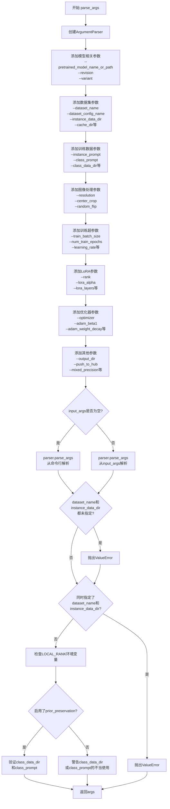

#### 带注释源码

```python
def parse_args(input_args=None):
    """
    解析命令行参数或输入的参数列表，返回包含所有配置参数的Namespace对象。
    
    参数:
        input_args: 可选的参数列表，如果为None则从sys.argv解析
        
    返回:
        argparse.Namespace: 包含所有解析后参数的对象
    """
    # 1. 创建ArgumentParser实例，定义程序描述
    parser = argparse.ArgumentParser(description="Simple example of a training script.")
    
    # 2. 添加模型相关参数
    parser.add_argument(
        "--pretrained_model_name_or_path",
        type=str,
        default=None,
        required=True,
        help="Path to pretrained model or model identifier from huggingface.co/models.",
    )
    parser.add_argument(
        "--revision",
        type=str,
        default=None,
        required=False,
        help="Revision of pretrained model identifier from huggingface.co/models.",
    )
    parser.add_argument(
        "--variant",
        type=str,
        default=None,
        help="Variant of the model files of the pretrained model identifier from huggingface.co/models, 'e.g.' fp16",
    )
    
    # 3. 添加数据集配置参数
    parser.add_argument(
        "--dataset_name",
        type=str,
        default=None,
        help="The name of the Dataset (from the HuggingFace hub)...",
    )
    parser.add_argument(
        "--dataset_config_name",
        type=str,
        default=None,
        help="The config of the Dataset, leave as None if there's only one config.",
    )
    parser.add_argument(
        "--instance_data_dir",
        type=str,
        default=None,
        help=("A folder containing the training data. "),
    )
    parser.add_argument(
        "--cache_dir",
        type=str,
        default=None,
        help="The directory where the downloaded models and datasets will be stored.",
    )
    parser.add_argument(
        "--image_column",
        type=str,
        default="image",
        help="The column of the dataset containing the target image...",
    )
    parser.add_argument(
        "--caption_column",
        type=str,
        default=None,
        help="The column of the dataset containing the instance prompt for each image",
    )
    parser.add_argument("--repeats", type=int, default=1, help="How many times to repeat the training data.")
    
    # 4. 添加类别图像相关参数（用于prior preservation）
    parser.add_argument(
        "--class_data_dir",
        type=str,
        default=None,
        required=False,
        help="A folder containing the training data of class images.",
    )
    parser.add_argument(
        "--instance_prompt",
        type=str,
        default=None,
        required=True,
        help="The prompt with identifier specifying the instance, e.g. 'photo of a TOK dog'",
    )
    parser.add_argument(
        "--class_prompt",
        type=str,
        default=None,
        help="The prompt to specify images in the same class as provided instance images.",
    )
    parser.add_argument(
        "--max_sequence_length",
        type=int,
        default=512,
        help="Maximum sequence length to use with with the T5 text encoder",
    )
    
    # 5. 添加验证相关参数
    parser.add_argument(
        "--validation_prompt",
        type=str,
        default=None,
        help="A prompt that is used during validation to verify that the model is learning.",
    )
    parser.add_argument(
        "--num_validation_images",
        type=int,
        default=4,
        help="Number of images that should be generated during validation with `validation_prompt`.",
    )
    parser.add_argument(
        "--validation_epochs",
        type=int,
        default=50,
        help="Run dreambooth validation every X epochs...",
    )
    
    # 6. 添加LoRA训练参数
    parser.add_argument(
        "--rank",
        type=int,
        default=4,
        help=("The dimension of the LoRA update matrices."),
    )
    parser.add_argument(
        "--lora_alpha",
        type=int,
        default=4,
        help="LoRA alpha to be used for additional scaling.",
    )
    parser.add_argument("--lora_dropout", type=float, default=0.0, help="Dropout probability for LoRA layers")
    parser.add_argument(
        "--lora_layers",
        type=str,
        default=None,
        help="The transformer modules to apply LoRA training on...",
    )
    
    # 7. 添加prior preservation相关参数
    parser.add_argument(
        "--with_prior_preservation",
        default=False,
        action="store_true",
        help="Flag to add prior preservation loss.",
    )
    parser.add_argument("--prior_loss_weight", type=float, default=1.0, help="The weight of prior preservation loss.")
    parser.add_argument(
        "--num_class_images",
        type=int,
        default=100,
        help="Minimal class images for prior preservation loss...",
    )
    
    # 8. 添加输出和随机种子参数
    parser.add_argument(
        "--output_dir",
        type=str,
        default="flux-dreambooth-lora",
        help="The output directory where the model predictions and checkpoints will be written.",
    )
    parser.add_argument("--seed", type=int, default=None, help="A seed for reproducible training.")
    
    # 9. 添加图像预处理参数
    parser.add_argument(
        "--resolution",
        type=int,
        default=512,
        help="The resolution for input images...",
    )
    parser.add_argument(
        "--center_crop",
        default=False,
        action="store_true",
        help="Whether to center crop the input images to the resolution...",
    )
    parser.add_argument(
        "--random_flip",
        action="store_true",
        help="whether to randomly flip images horizontally",
    )
    parser.add_argument(
        "--train_text_encoder",
        action="store_true",
        help="Whether to train the text encoder...",
    )
    
    # 10. 添加训练批处理和epoch参数
    parser.add_argument(
        "--train_batch_size", type=int, default=4, help="Batch size (per device) for the training dataloader."
    )
    parser.add_argument(
        "--sample_batch_size", type=int, default=4, help="Batch size (per device) for sampling images."
    )
    parser.add_argument("--num_train_epochs", type=int, default=1)
    parser.add_argument(
        "--max_train_steps",
        type=int,
        default=None,
        help="Total number of training steps to perform...",
    )
    
    # 11. 添加checkpoint和恢复训练参数
    parser.add_argument(
        "--checkpointing_steps",
        type=int,
        default=500,
        help="Save a checkpoint of the training state every X updates...",
    )
    parser.add_argument(
        "--checkpoints_total_limit",
        type=int,
        default=None,
        help=("Max number of checkpoints to store."),
    )
    parser.add_argument(
        "--resume_from_checkpoint",
        type=str,
        default=None,
        help="Whether training should be resumed from a previous checkpoint...",
    )
    
    # 12. 添加梯度相关参数
    parser.add_argument(
        "--gradient_accumulation_steps",
        type=int,
        default=1,
        help="Number of updates steps to accumulate before performing a backward/update pass.",
    )
    parser.add_argument(
        "--gradient_checkpointing",
        action="store_true",
        help="Whether or not to use gradient checkpointing...",
    )
    parser.add_argument(
        "--learning_rate",
        type=float,
        default=1e-4,
        help="Initial learning rate (after the potential warmup period) to use.",
    )
    parser.add_argument(
        "--guidance_scale",
        type=float,
        default=3.5,
        help="the FLUX.1 dev variant is a guidance distilled model",
    )
    parser.add_argument(
        "--text_encoder_lr",
        type=float,
        default=5e-6,
        help="Text encoder learning rate to use.",
    )
    parser.add_argument(
        "--scale_lr",
        action="store_true",
        default=False,
        help="Scale the learning rate by the number of GPUs, gradient accumulation steps, and batch size.",
    )
    
    # 13. 添加学习率调度器参数
    parser.add_argument(
        "--lr_scheduler",
        type=str,
        default="constant",
        help='The scheduler type to use. Choose between ["linear", "cosine", "cosine_with_restarts", "polynomial", "constant", "constant_with_warmup"]',
    )
    parser.add_argument(
        "--lr_warmup_steps", type=int, default=500, help="Number of steps for the warmup in the lr scheduler."
    )
    parser.add_argument(
        "--lr_num_cycles",
        type=int,
        default=1,
        help="Number of hard resets of the lr in cosine_with_restarts scheduler.",
    )
    parser.add_argument("--lr_power", type=float, default=1.0, help="Power factor of the polynomial scheduler.")
    
    # 14. 添加数据加载器和其他训练参数
    parser.add_argument(
        "--dataloader_num_workers",
        type=int,
        default=0,
        help="Number of subprocesses to use for data loading...",
    )
    parser.add_argument(
        "--weighting_scheme",
        type=str,
        default="none",
        choices=["sigma_sqrt", "logit_normal", "mode", "cosmap", "none"],
        help='We default to the "none" weighting scheme...',
    )
    parser.add_argument(
        "--logit_mean", type=float, default=0.0, help="mean to use when using the `'logit_normal'` weighting scheme."
    )
    parser.add_argument(
        "--logit_std", type=float, default=1.0, help="std to use when using the `'logit_normal'` weighting scheme."
    )
    parser.add_argument(
        "--mode_scale",
        type=float,
        default=1.29,
        help="Scale of mode weighting scheme...",
    )
    
    # 15. 添加优化器参数
    parser.add_argument(
        "--optimizer",
        type=str,
        default="AdamW",
        help=('The optimizer type to use. Choose between ["AdamW", "prodigy"]'),
    )
    parser.add_argument(
        "--use_8bit_adam",
        action="store_true",
        help="Whether or not to use 8-bit Adam from bitsandbytes...",
    )
    parser.add_argument(
        "--adam_beta1", type=float, default=0.9, help="The beta1 parameter for the Adam and Prodigy optimizers."
    )
    parser.add_argument(
        "--adam_beta2", type=float, default=0.999, help="The beta2 parameter for the Adam and Prodigy optimizers."
    )
    parser.add_argument(
        "--prodigy_beta3",
        type=float,
        default=None,
        help="coefficients for computing the Prodigy stepsize...",
    )
    parser.add_argument("--prodigy_decouple", type=bool, default=True, help="Use AdamW style decoupled weight decay")
    parser.add_argument("--adam_weight_decay", type=float, default=1e-04, help="Weight decay to use for unet params")
    parser.add_argument(
        "--adam_weight_decay_text_encoder", type=float, default=1e-03, help="Weight decay to use for text_encoder"
    )
    parser.add_argument(
        "--adam_epsilon",
        type=float,
        default=1e-08,
        help="Epsilon value for the Adam optimizer and Prodigy optimizers.",
    )
    parser.add_argument(
        "--prodigy_use_bias_correction",
        type=bool,
        default=True,
        help="Turn on Adam's bias correction...",
    )
    parser.add_argument(
        "--prodigy_safeguard_warmup",
        type=bool,
        default=True,
        help="Remove lr from the denominator of D estimate...",
    )
    parser.add_argument("--max_grad_norm", default=1.0, type=float, help="Max gradient norm.")
    
    # 16. 添加Hub和日志相关参数
    parser.add_argument("--push_to_hub", action="store_true", help="Whether or not to push the model to the Hub.")
    parser.add_argument("--hub_token", type=str, default=None, help="The token to use to push to the Model Hub.")
    parser.add_argument(
        "--hub_model_id",
        type=str,
        default=None,
        help="The name of the repository to keep in sync with the local `output_dir`.",
    )
    parser.add_argument(
        "--logging_dir",
        type=str,
        default="logs",
        help="[TensorBoard] log directory...",
    )
    
    # 17. 添加性能和精度相关参数
    parser.add_argument(
        "--allow_tf32",
        action="store_true",
        help="Whether or not to allow TF32 on Ampere GPUs...",
    )
    parser.add_argument(
        "--cache_latents",
        action="store_true",
        default=False,
        help="Cache the VAE latents",
    )
    parser.add_argument(
        "--report_to",
        type=str,
        default="tensorboard",
        help='The integration to report the results and logs to...',
    )
    parser.add_argument(
        "--mixed_precision",
        type=str,
        default=None,
        choices=["no", "fp16", "bf16"],
        help="Whether to use mixed precision...",
    )
    parser.add_argument(
        "--upcast_before_saving",
        action="store_true",
        default=False,
        help="Whether to upcast the trained transformer layers to float32 before saving...",
    )
    parser.add_argument(
        "--prior_generation_precision",
        type=str,
        default=None,
        choices=["no", "fp32", "fp16", "bf16"],
        help="Choose prior generation precision...",
    )
    
    # 18. 添加分布式训练和其他杂项参数
    parser.add_argument("--local_rank", type=int, default=-1, help="For distributed training: local_rank")
    parser.add_argument("--enable_npu_flash_attention", action="store_true", help="Enabla Flash Attention for NPU")
    
    # 19. 解析参数
    if input_args is not None:
        args = parser.parse_args(input_args)
    else:
        args = parser.parse_args()
    
    # 20. 参数验证逻辑
    
    # 验证数据集配置：必须指定dataset_name或instance_data_dir之一
    if args.dataset_name is None and args.instance_data_dir is None:
        raise ValueError("Specify either `--dataset_name` or `--instance_data_dir`")
    
    # 验证数据集配置：不能同时指定dataset_name和instance_data_dir
    if args.dataset_name is not None and args.instance_data_dir is not None:
        raise ValueError("Specify only one of `--dataset_name` or `--instance_data_dir`")
    
    # 检查环境变量LOCAL_RANK，如果存在则覆盖命令行参数
    env_local_rank = int(os.environ.get("LOCAL_RANK", -1))
    if env_local_rank != -1 and env_local_rank != args.local_rank:
        args.local_rank = env_local_rank
    
    # 验证prior preservation相关参数
    if args.with_prior_preservation:
        if args.class_data_dir is None:
            raise ValueError("You must specify a data directory for class images.")
        if args.class_prompt is None:
            raise ValueError("You must specify prompt for class images.")
    else:
        # 如果没有启用prior preservation但提供了class相关参数，给出警告
        if args.class_data_dir is not None:
            warnings.warn("You need not use --class_data_dir without --with_prior_preservation.")
        if args.class_prompt is not None:
            warnings.warn("You need not use --class_prompt without --with_prior_preservation.")
    
    # 21. 返回解析后的参数对象
    return args
```


### `collate_fn`

该函数是 Flux DreamBooth LoRA 训练脚本中的数据整理函数，负责将 DataLoader 获得的样本列表整理为训练所需的批次数据。它从每个样本中提取图像像素值和提示词，并根据 `with_prior_preservation` 参数决定是否同时包含实例图像和类别图像（用于先验保留损失计算），最终将像素值堆叠为张量并返回包含 `pixel_values` 和 `prompts` 的批次字典。

参数：

- `examples`：`List[Dict]`，数据集中样本的列表，每个字典包含 "instance_images"、"instance_prompt"（以及可选的 "class_images"、"class_prompt"）键
- `with_prior_preservation`：`bool`，是否启用先验保留（prior preservation）模式，默认为 False

返回值：`Dict`，包含以下键的字典

- `pixel_values`：`torch.Tensor`，形状为 (batch_size, channels, height, width) 的图像像素值张量
- `prompts`：`List[str]`，对应的文本提示词列表

#### 流程图

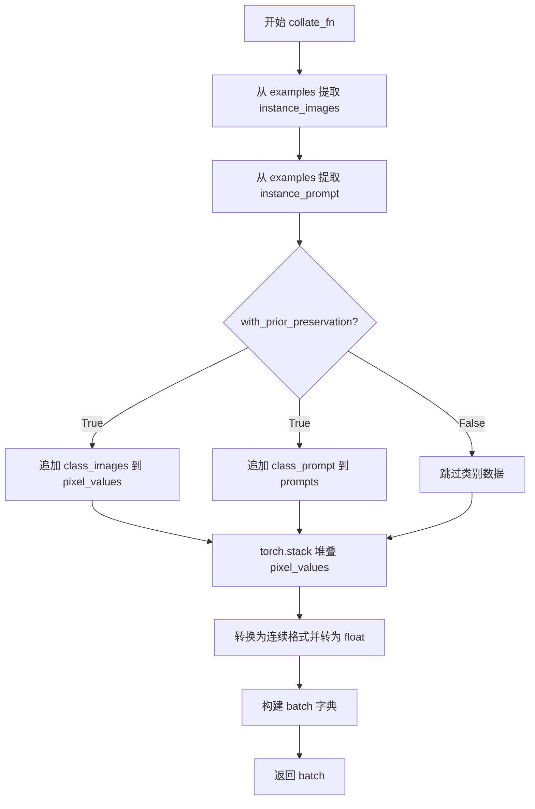

#### 带注释源码

```python
def collate_fn(examples, with_prior_preservation=False):
    """
    将样本列表整理为训练批次数据
    
    参数:
        examples: 样本列表，每个样本为包含图像和提示词的字典
        with_prior_preservation: 是否包含类别图像用于先验保留损失
    """
    # 从所有样本中提取实例图像（像素值）
    pixel_values = [example["instance_images"] for example in examples]
    # 从所有样本中提取实例提示词
    prompts = [example["instance_prompt"] for example in examples]

    # 如果启用先验保留，将类别图像和提示词也添加到批次中
    # 这样可以避免进行两次前向传播
    if with_prior_preservation:
        pixel_values += [example["class_images"] for example in examples]
        prompts += [example["class_prompt"] for example in examples]

    # 将像素值列表堆叠为张量
    pixel_values = torch.stack(pixel_values)
    # 确保内存布局为连续格式，并转换为浮点数类型
    # contiguous_format 有利于提高 GPU 访问效率
    pixel_values = pixel_values.to(memory_format=torch.contiguous_format).float()

    # 构建并返回批次字典
    batch = {"pixel_values": pixel_values, "prompts": prompts}
    return batch
```


### `tokenize_prompt`

该函数用于将文本提示（prompt）转换为模型可处理的token IDs序列，通过tokenizer对prompt进行分词、填充、截断等处理，并返回PyTorch张量格式的输入IDs。

参数：

- `tokenizer`：`CLIPTokenizer` 或 `T5TokenizerFast`，用于对文本进行分词处理的tokenizer实例
- `prompt`：`str`，要编码的文本提示内容
- `max_sequence_length`：`int`，序列的最大长度，超过该长度的部分将被截断

返回值：`torch.Tensor`，形状为`(1, max_sequence_length)`的token IDs张量，用于后续模型编码

#### 流程图

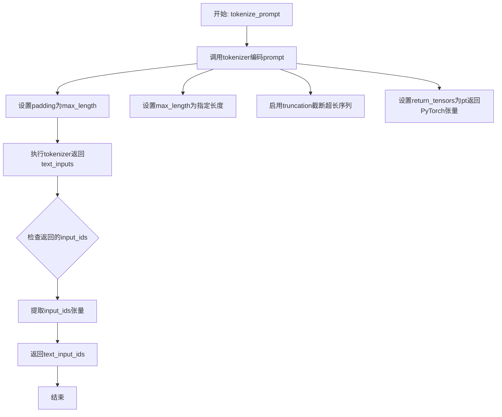

#### 带注释源码

```python
def tokenize_prompt(tokenizer, prompt, max_sequence_length):
    """
    将文本提示编码为token IDs张量
    
    参数:
        tokenizer: CLIPTokenizer或T5TokenizerFast实例
        prompt: str类型，要编码的文本
        max_sequence_length: int，最大序列长度
    
    返回:
        torch.Tensor: 编码后的token IDs
    """
    # 调用tokenizer对prompt进行分词和编码
    text_inputs = tokenizer(
        prompt,                    # 要编码的文本提示
        padding="max_length",      # 填充到最大长度
        max_length=max_sequence_length,  # 设置最大序列长度
        truncation=True,           # 启用截断，超长部分将被丢弃
        return_length=False,       # 不返回长度信息
        return_overflowing_tokens=False,  # 不返回溢出token
        return_tensors="pt",       # 返回PyTorch张量格式
    )
    # 从tokenizer输出中提取input_ids
    text_input_ids = text_inputs.input_ids
    # 返回编码后的token IDs张量
    return text_input_ids
```


### `_encode_prompt_with_t5`

该函数用于使用 T5 文本编码器将文本提示（prompt）编码为嵌入向量（prompt embeddings），支持批量处理和多图生成。

参数：

- `text_encoder`：`T5EncoderModel`，T5 文本编码器模型，用于将 token IDs 转换为嵌入向量
- `tokenizer`：`T5TokenizerFast`，T5 分词器，用于将文本 prompt 转换为 token IDs
- `max_sequence_length`：`int`，最大序列长度，默认为 512，控制 token 序列的最大长度
- `prompt`：`Union[str, List[str]]`，要编码的文本提示，可以是单个字符串或字符串列表
- `num_images_per_prompt`：`int`，每个 prompt 生成的图像数量，默认为 1，用于复制 embeddings 以支持多图生成
- `device`：`torch.device`，计算设备，用于将 tensors 移动到指定设备
- `text_input_ids`：`torch.Tensor`，可选参数，已 token 化的文本输入 IDs，当 tokenizer 为 None 时必须提供

返回值：`torch.Tensor`，形状为 `(batch_size * num_images_per_prompt, seq_len, hidden_dim)` 的文本嵌入张量

#### 流程图

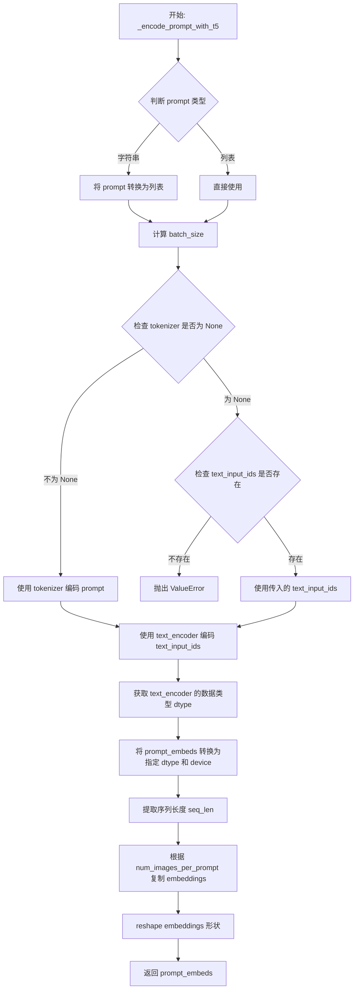

#### 带注释源码

```python
def _encode_prompt_with_t5(
    text_encoder,
    tokenizer,
    max_sequence_length=512,
    prompt=None,
    num_images_per_prompt=1,
    device=None,
    text_input_ids=None,
):
    """
    使用 T5 文本编码器将文本提示编码为嵌入向量。
    
    参数:
        text_encoder: T5 文本编码器模型
        tokenizer: T5 分词器
        max_sequence_length: 最大序列长度
        prompt: 要编码的文本提示
        num_images_per_prompt: 每个提示生成的图像数量
        device: 计算设备
        text_input_ids: 预计算的 token IDs（可选）
    
    返回:
        prompt_embeds: 编码后的文本嵌入
    """
    # 将单个字符串转换为列表，统一处理方式
    prompt = [prompt] if isinstance(prompt, str) else prompt
    # 计算批大小
    batch_size = len(prompt)

    # 如果提供了 tokenizer，则使用它对 prompt 进行分词
    if tokenizer is not None:
        text_inputs = tokenizer(
            prompt,
            padding="max_length",  # 填充到最大长度
            max_length=max_sequence_length,  # 最大序列长度
            truncation=True,  # 截断超长序列
            return_length=False,  # 不返回长度信息
            return_overflowing_tokens=False,  # 不返回溢出的 tokens
            return_tensors="pt",  # 返回 PyTorch tensors
        )
        text_input_ids = text_inputs.input_ids
    else:
        # 如果没有 tokenizer，则必须提供预计算的 text_input_ids
        if text_input_ids is None:
            raise ValueError("text_input_ids must be provided when the tokenizer is not specified")

    # 使用 T5 编码器获取文本嵌入 (hidden_states)
    # text_encoder 返回一个元组，取第一个元素为 embeddings
    prompt_embeds = text_encoder(text_input_ids.to(device))[0]

    # 获取编码器的数据类型（处理 DDP/FP16 等情况）
    # 如果模型被封装在 DDP 中，使用 module 属性获取原始模型
    if hasattr(text_encoder, "module"):
        dtype = text_encoder.module.dtype
    else:
        dtype = text_encoder.dtype
    
    # 将嵌入转换到指定的设备和数据类型
    prompt_embeds = prompt_embeds.to(dtype=dtype, device=device)

    # 获取嵌入的序列长度
    _, seq_len, _ = prompt_embeds.shape

    # 为每个 prompt 生成的图像复制对应的 embeddings
    # 使用 repeat 方法在序列维度上复制，而非在 batch 维度复制（更兼容 MPS）
    prompt_embeds = prompt_embeds.repeat(1, num_images_per_prompt, 1)
    # 重塑为 (batch_size * num_images_per_prompt, seq_len, hidden_dim)
    prompt_embeds = prompt_embeds.view(batch_size * num_images_per_prompt, seq_len, -1)

    return prompt_embeds
```


### `_encode_prompt_with_clip`

该函数使用CLIP文本编码器对输入的提示词（prompt）进行编码，生成用于扩散模型的条件嵌入表示。它是FluxPipeline提示词编码流程的一部分，专门处理CLIP文本编码器（T5编码器由另一个函数处理）。

参数：

- `text_encoder`：CLIPTextModel，CLIP文本编码器模型，用于将文本转换为嵌入向量
- `tokenizer`：CLIPTokenizer，CLIP分词器，用于将文本字符串转换为token ID
- `prompt`：str，输入的文本提示词，可以是单个字符串或字符串列表
- `device`：torch.device，可选，指定计算设备，默认为文本编码器的设备
- `text_input_ids`：torch.Tensor，可选，已分词的文本输入ID，当tokenizer为None时必须提供
- `num_images_per_prompt`：int，每个提示词生成的图像数量，用于复制嵌入向量，默认为1

返回值：`torch.Tensor`，返回形状为 `(batch_size * num_images_per_prompt, hidden_size)` 的文本嵌入张量，其中hidden_size是CLIP文本编码器的隐藏层维度

#### 流程图

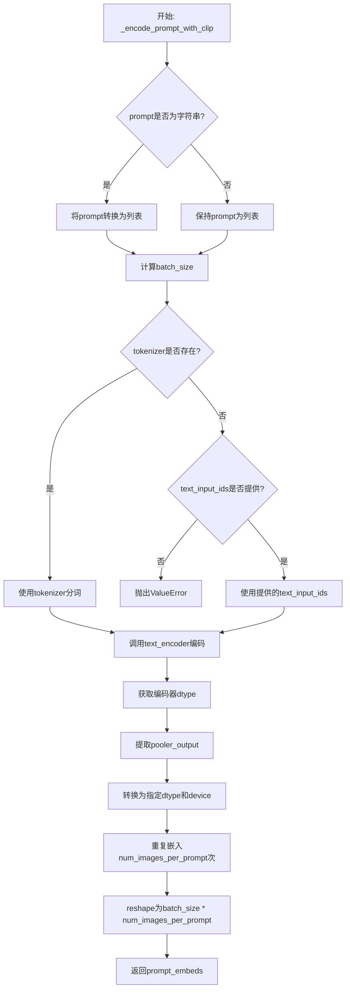

#### 带注释源码

```python
def _encode_prompt_with_clip(
    text_encoder,          # CLIPTextModel: CLIP文本编码器模型
    tokenizer,             # CLIPTokenizer: CLIP分词器
    prompt: str,           # str: 输入的文本提示词
    device=None,           # torch.device: 可选的计算设备
    text_input_ids=None,  # torch.Tensor: 可选的预分词输入
    num_images_per_prompt: int = 1,  # int: 每个提示词生成的图像数量
):
    # 将prompt转换为列表（如果是单个字符串）
    prompt = [prompt] if isinstance(prompt, str) else prompt
    # 计算批量大小
    batch_size = len(prompt)

    # 如果提供了tokenizer，则使用它进行分词
    if tokenizer is not None:
        text_inputs = tokenizer(
            prompt,
            padding="max_length",      # 填充到最大长度
            max_length=77,             # CLIP的最大序列长度
            truncation=True,           # 截断过长的序列
            return_overflowing_tokens=False,  # 不返回溢出的tokens
            return_length=False,       # 不返回长度信息
            return_tensors="pt",       # 返回PyTorch张量
        )
        # 获取分词后的input_ids
        text_input_ids = text_inputs.input_ids
    else:
        # 如果没有tokenizer，则必须提供text_input_ids
        if text_input_ids is None:
            raise ValueError("text_input_ids must be provided when the tokenizer is not specified")

    # 使用CLIP文本编码器获取文本嵌入
    # output_hidden_states=False表示只获取最后一层的输出
    prompt_embeds = text_encoder(text_input_ids.to(device), output_hidden_states=False)

    # 处理分布式训练情况下的模型 dtype
    if hasattr(text_encoder, "module"):
        dtype = text_encoder.module.dtype
    else:
        dtype = text_encoder.dtype
    
    # 从编码器输出中提取pooled输出
    # CLIPTextModel的pooler_output是[CLS] token的输出
    prompt_embeds = prompt_embeds.pooler_output
    
    # 将嵌入转换为正确的dtype和device
    prompt_embeds = prompt_embeds.to(dtype=dtype, device=device)

    # 为每个提示词生成多个图像复制嵌入向量
    # 使用MPS友好的方法重复嵌入
    prompt_embeds = prompt_embeds.repeat(1, num_images_per_prompt, 1)
    # reshape为 (batch_size * num_images_per_prompt, hidden_size)
    prompt_embeds = prompt_embeds.view(batch_size * num_images_per_prompt, -1)

    return prompt_embeds
```


### `encode_prompt`

该函数是 Flux DreamBooth LoRA 训练脚本中的核心提示编码函数，用于将文本提示转换为 Transformer 模型所需的嵌入表示。它同时调用 CLIP 和 T5 两种文本编码器，分别生成池化的 CLIP 嵌入和完整的 T5 嵌入，并创建相应的文本 ID 张量以供后续去噪过程使用。

参数：

- `text_encoders`：`List[Any]`，包含两个文本编码器的列表，第一个是 CLIP 编码器，第二个是 T5 编码器
- `tokenizers`：`List[Any]`，包含两个分词器的列表，第一个是 CLIP 分词器，第二个是 T5 分词器
- `prompt`：`str`，要编码的文本提示，可以是单个字符串或字符串列表
- `max_sequence_length`：`int`，T5 编码器的最大序列长度
- `device`：`torch.device`，可选，指定计算设备，默认为 None
- `num_images_per_prompt`：`int`，每个提示生成的图像数量，用于批量生成时复制嵌入，默认为 1
- `text_input_ids_list`：`List[torch.Tensor]`，可选，预计算的分词后的文本输入 ID 列表，用于避免重复分词

返回值：`Tuple[torch.Tensor, torch.Tensor, torch.Tensor]`，返回一个包含三个元素的元组：
- `prompt_embeds`：`torch.Tensor`，T5 编码器生成的完整提示嵌入，形状为 `(batch_size * num_images_per_prompt, seq_len, embed_dim)`
- `pooled_prompt_embeds`：`torch.Tensor`，CLIP 编码器生成的池化提示嵌入，形状为 `(batch_size * num_images_per_prompt, hidden_dim)`
- `text_ids`：`torch.Tensor`，用于去噪过程的文本 ID 张量，形状为 `(seq_len, 3)`

#### 流程图

```mermaid
flowchart TD
    A[开始 encode_prompt] --> B{判断 prompt 类型}
    B -->|字符串| C[将 prompt 包装为列表]
    B -->|列表| D[保持原样]
    C --> E
    D --> E
    
    E[获取数据类型 dtype] --> F{检查 text_encoders[0] 是否有 module 属性}
    F -->|是| G[使用 text_encoders[0].module.dtype]
    F -->|否| H[使用 text_encoders[0].dtype]
    
    G --> I
    H --> I
    
    I[调用 _encode_prompt_with_clip] --> J[生成 pooled_prompt_embeds]
    I --> K[调用 _encode_prompt_with_t5] --> L[生成 prompt_embeds]
    
    J --> M[创建 text_ids 张量]
    L --> M
    
    M --> N[返回 prompt_embeds, pooled_prompt_embeds, text_ids]
```

#### 带注释源码

```python
def encode_prompt(
    text_encoders,          # List[Any]: 文本编码器列表 [CLIPEncoder, T5Encoder]
    tokenizers,             # List[Any]: 分词器列表 [CLIPTokenizer, T5Tokenizer]
    prompt: str,            # str: 要编码的文本提示
    max_sequence_length,    # int: T5 最大序列长度
    device=None,            # torch.device: 可选，计算设备
    num_images_per_prompt: int = 1,  # int: 每个提示生成的图像数量
    text_input_ids_list=None,  # List[torch.Tensor]: 可选，预分词的输入 ID
):
    # 将单个字符串转换为列表，统一处理逻辑
    prompt = [prompt] if isinstance(prompt, str) else prompt

    # 确定数据类型：检查是否为 DataParallel/DistributedDataParallel 模型
    if hasattr(text_encoders[0], "module"):
        dtype = text_encoders[0].module.dtype
    else:
        dtype = text_encoders[0].dtype

    # 使用 CLIP 编码器生成池化的提示嵌入
    # CLIP 仅支持 77 长度的序列，使用 pooled_output 作为池化嵌入
    pooled_prompt_embeds = _encode_prompt_with_clip(
        text_encoder=text_encoders[0],
        tokenizer=tokenizers[0],
        prompt=prompt,
        device=device if device is not None else text_encoders[0].device,
        num_images_per_prompt=num_images_per_prompt,
        text_input_ids=text_input_ids_list[0] if text_input_ids_list else None,
    )

    # 使用 T5 编码器生成完整的提示嵌入
    # T5 支持更长的序列（默认 512），保留完整的序列信息
    prompt_embeds = _encode_prompt_with_t5(
        text_encoder=text_encoders[1],
        tokenizer=tokenizers[1],
        max_sequence_length=max_sequence_length,
        prompt=prompt,
        num_images_per_prompt=num_images_per_prompt,
        device=device if device is not None else text_encoders[1].device,
        text_input_ids=text_input_ids_list[1] if text_input_ids_list else None,
    )

    # 创建文本 ID 张量，用于去噪过程中的位置编码
    # 形状: (seq_len, 3) - 3 代表 x, y, width 三个维度
    text_ids = torch.zeros(prompt_embeds.shape[1], 3).to(device=device, dtype=dtype)

    # 返回：T5 完整嵌入、CLIP 池化嵌入、文本 ID
    return prompt_embeds, pooled_prompt_embeds, text_ids
```


### `main`

该函数是 Flux DreamBooth LoRA 训练脚本的核心入口，负责解析命令行参数，初始化分布式训练环境（Accelerator），加载预训练的 Flux 模型（VAE、Transformer、Text Encoder），配置 LoRA 微调适配器，构建优化器和数据加载器，执行多轮训练循环（包含前向传播、损失计算、反向传播与参数更新），并在训练过程中或结束后保存 LoRA 权重、进行验证推理以及上传模型至 Hub。

参数：

-  `args`：`argparse.Namespace`，命令行参数集合，包含所有训练配置（如模型路径 `pretrained_model_name_or_path`、数据路径 `instance_data_dir`、输出路径 `output_dir`、学习率 `learning_rate`、LoRA 秩 `rank`、训练轮数 `num_train_epochs` 等）。

返回值：`None`，无返回值，脚本执行完毕后自动退出。

#### 流程图

```mermaid
flowchart TD
    A([开始]) --> B[解析命令行参数 args]
    B --> C{report_to == 'wandb' && hub_token 存在?}
    C -- 是 --> D[抛出安全异常]
    C -- 否 --> E{检测 MPS & bf16?}
    E -- 是 --> F[抛出不支持异常]
    E -- 否 --> G[初始化 Accelerator 分布式环境]
    G --> H[设置日志级别]
    H --> I{设置随机种子]
    I --> J{with_prior_preservation == True?}
    J -- 是 --> K[生成类别图像 class images]
    J -- 否 --> L[加载 Tokenizers 和 Text Encoders]
    K --> L
    L --> M[加载 Scheduler、VAE、Transformer 模型]
    M --> N[设置模型无需梯度 & 权重类型]
    N --> O[配置 LoRA 适配器]
    O --> P[注册模型保存/加载钩子]
    P --> Q[创建优化器 Optimizer]
    Q --> R[创建数据集和 DataLoader]
    R --> S[预处理提示词嵌入 prompt embeddings]
    S --> T[准备学习率调度器 LR Scheduler]
    T --> U[初始化训练 trackers]
    U --> V[训练循环: for epoch in range(num_epochs)]
    V --> W[训练步骤: for step, batch in enumerate(dataloader)]
    W --> X[前向传播与噪声预测]
    X --> Y[计算损失 Loss]
    Y --> Z[反向传播与参数更新]
    Z --> AA{检查是否需要保存 checkpoint?}
    AA -- 是 --> AB[保存训练状态]
    AA -- 否 --> AC{检查是否需要验证?}
    AC -- 是 --> AD[运行验证生成图像]
    AC -- 否 --> AE{训练是否结束?}
    AE -- 否 --> W
    AE -- 是 --> AF[保存最终 LoRA 权重]
    AF --> AG[运行最终推理验证]
    AG --> AH{push_to_hub == True?}
    AH -- 是 --> AI[保存模型卡片并上传至 Hub]
    AH -- 否 --> AJ([结束])
```

#### 带注释源码

```python
def main(args):
    # 1. 参数校验与安全检查
    # 检查是否同时启用了 wandb 报告和 hub_token（存在安全风险）
    if args.report_to == "wandb" and args.hub_token is not None:
        raise ValueError(
            "You cannot use both --report_to=wandb and --hub_token due to a security risk of exposing your token."
            " Please use `hf auth login` to authenticate with the Hub."
        )

    # 检查 MPS 是否支持 bf16，不支持则报错
    if torch.backends.mps.is_available() and args.mixed_precision == "bf16":
        raise ValueError(
            "Mixed precision training with bfloat16 is not supported on MPS. Please use fp16 (recommended) or fp32 instead."
        )

    # 2. 初始化输出目录和日志
    logging_dir = Path(args.output_dir, args.logging_dir)
    
    # 配置 Accelerator：分布式训练、混合精度、日志记录、梯度累积
    accelerator_project_config = ProjectConfiguration(project_dir=args.output_dir, logging_dir=logging_dir)
    kwargs = DistributedDataParallelKwargs(find_unused_parameters=True)
    accelerator = Accelerator(
        gradient_accumulation_steps=args.gradient_accumulation_steps,
        mixed_precision=args.mixed_precision,
        log_with=args.report_to,
        project_config=accelerator_project_config,
        kwargs_handlers=[kwargs],
    )

    # 禁用 MPS 的 AMP
    if torch.backends.mps.is_available():
        accelerator.native_amp = False

    # 检查 wandb 是否安装
    if args.report_to == "wandb":
        if not is_wandb_available():
            raise ImportError("Make sure to install wandb if you want to use it for logging during training.")

    # 设置日志格式
    logging.basicConfig(
        format="%(asctime)s - %(levelname)s - %(name)s - %(message)s",
        datefmt="%m/%d/%Y %H:%M:%S",
        level=logging.INFO,
    )
    logger.info(accelerator.state, main_process_only=False)
    # 主进程设置详细日志，子进程只显示错误
    if accelerator.is_local_main_process:
        transformers.utils.logging.set_verbosity_warning()
        diffusers.utils.logging.set_verbosity_info()
    else:
        transformers.utils.logging.set_verbosity_error()
        diffusers.utils.logging.set_verbosity_error()

    # 设置随机种子以保证可复现性
    if args.seed is not None:
        set_seed(args.seed)

    # 3. Prior Preservation: 生成类别图像（如果启用）
    if args.with_prior_preservation:
        class_images_dir = Path(args.class_data_dir)
        if not class_images_dir.exists():
            class_images_dir.mkdir(parents=True)
        cur_class_images = len(list(class_images_dir.iterdir()))

        if cur_class_images < args.num_class_images:
            # 确定prior生成的精度
            has_supported_fp16_accelerator = torch.cuda.is_available() or torch.backends.mps.is_available()
            torch_dtype = torch.float16 if has_supported_fp16_accelerator else torch.float32
            if args.prior_generation_precision == "fp32":
                torch_dtype = torch.float32
            elif args.prior_generation_precision == "fp16":
                torch_dtype = torch.float16
            elif args.prior_generation_precision == "bf16":
                torch_dtype = torch.bfloat16

            # 加载pipeline生成类别图像
            pipeline = FluxPipeline.from_pretrained(
                args.pretrained_model_name_or_path,
                torch_dtype=torch_dtype,
                revision=args.revision,
                variant=args.variant,
            )
            pipeline.set_progress_bar_config(disable=True)

            num_new_images = args.num_class_images - cur_class_images
            logger.info(f"Number of class images to sample: {num_new_images}.")

            sample_dataset = PromptDataset(args.class_prompt, num_new_images)
            sample_dataloader = torch.utils.data.DataLoader(sample_dataset, batch_size=args.sample_batch_size)

            sample_dataloader = accelerator.prepare(sample_dataloader)
            pipeline.to(accelerator.device)

            # 循环生成图像并保存
            for example in tqdm(
                sample_dataloader, desc="Generating class images", disable=not accelerator.is_local_main_process
            ):
                with torch.autocast(device_type=accelerator.device.type, dtype=torch_dtype):
                    images = pipeline(prompt=example["prompt"]).images

                for i, image in enumerate(images):
                    hash_image = insecure_hashlib.sha1(image.tobytes()).hexdigest()
                    image_filename = class_images_dir / f"{example['index'][i] + cur_class_images}-{hash_image}.jpg"
                    image.save(image_filename)

            del pipeline
            free_memory()

    # 4. 创建输出目录并处理 Hub push
    if accelerator.is_main_process:
        if args.output_dir is not None:
            os.makedirs(args.output_dir, exist_ok=True)

        if args.push_to_hub:
            repo_id = create_repo(
                repo_id=args.hub_model_id or Path(args.output_dir).name,
                exist_ok=True,
            ).repo_id

    # 5. 加载模型组件：Tokenizers, Text Encoders, Scheduler, VAE, Transformer
    tokenizer_one = CLIPTokenizer.from_pretrained(...)
    tokenizer_two = T5TokenizerFast.from_pretrained(...)
    
    text_encoder_cls_one = import_model_class_from_model_name_or_path(...)
    text_encoder_cls_two = import_model_class_from_model_name_or_path(..., subfolder="text_encoder_2")

    noise_scheduler = FlowMatchEulerDiscreteScheduler.from_pretrained(...)
    noise_scheduler_copy = copy.deepcopy(noise_scheduler)
    text_encoder_one, text_encoder_two = load_text_encoders(text_encoder_cls_one, text_encoder_cls_two)
    vae = AutoencoderKL.from_pretrained(...)
    transformer = FluxTransformer2DModel.from_pretrained(...)

    # 冻结基础模型参数，只训练 LoRA
    transformer.requires_grad_(False)
    vae.requires_grad_(False)
    text_encoder_one.requires_grad_(False)
    text_encoder_two.requires_grad_(False)
    
    # ... (NPU flash attention 配置、权重类型设置、Gradient Checkpointing 配置)

    # 6. 配置 LoRA 适配器
    if args.lora_layers is not None:
        target_modules = [layer.strip() for layer in args.lora_layers.split(",")]
    else:
        # 默认目标模块
        target_modules = [...]

    transformer_lora_config = LoraConfig(...)
    transformer.add_adapter(transformer_lora_config)
    if args.train_text_encoder:
        text_lora_config = LoraConfig(...)
        text_encoder_one.add_adapter(text_lora_config)

    # ... (注册 save/load hooks)

    # 7. 构建优化器
    # ... (根据 args.optimizer 选择 AdamW 或 Prodigy)
    # 计算可训练参数
    transformer_lora_parameters = list(filter(lambda p: p.requires_grad, transformer.parameters()))
    # ... (构建 params_to_optimize)

    # 8. 准备数据集和 DataLoader
    train_dataset = DreamBoothDataset(...)
    train_dataloader = torch.utils.data.DataLoader(...)

    # 9. 预处理 Prompt Embeddings (如果不需要训练 text encoder)
    # ... (计算 instance_prompt_hidden_states, class_prompt_hidden_states 等)

    # 10. 训练循环
    # ... (初始化 lr_scheduler, trackers)
    
    for epoch in range(first_epoch, args.num_train_epochs):
        transformer.train()
        # ... (训练 text_encoder 如果需要)
        
        for step, batch in enumerate(train_dataloader):
            with accelerator.accumulate(models_to_accumulate):
                # A. 获取 prompts
                prompts = batch["prompts"]
                
                # B. 编码 prompts (如果需要)
                # ...
                
                # C. 图像编码为 latents
                if args.cache_latents:
                    model_input = latents_cache[step].sample()
                else:
                    pixel_values = batch["pixel_values"].to(dtype=vae.dtype)
                    model_input = vae.encode(pixel_values).latent_dist.sample()
                # ...
                
                # D. 采样噪声和 timestep
                noise = torch.randn_like(model_input)
                # ...
                
                # E. 前向传播：添加噪声 (Flow Matching)
                sigmas = get_sigmas(timesteps, ...)
                noisy_model_input = (1.0 - sigmas) * model_input + sigmas * noise
                
                # F. 预测噪声
                model_pred = transformer(...)[0]
                
                # G. 计算损失
                target = noise - model_input
                # ... (处理 prior preservation loss)
                loss = ...
                
                # H. 反向传播
                accelerator.backward(loss)
                if accelerator.sync_gradients:
                    accelerator.clip_grad_norm_(...)
                    optimizer.step()
                    lr_scheduler.step()
                    optimizer.zero_grad()

            # I. 检查点保存
            if accelerator.sync_gradients:
                # ... (定期保存 checkpoint)
                pass

            # J. 日志记录
            accelerator.log(logs, step=global_step)
            
            # K. 验证
            if args.validation_prompt is not None and epoch % args.validation_epochs == 0:
                # ... (调用 log_validation)

    # 11. 训练结束：保存权重
    accelerator.wait_for_everyone()
    if accelerator.is_main_process:
        # ... (保存 LoRA weights, model card)
        
        # Final inference
        # ...
        
        if args.push_to_hub:
            # upload to hub
            pass
            
    accelerator.end_training()
```


### DreamBoothDataset.__init__

该方法是`DreamBoothDataset`类的初始化方法，负责加载和预处理DreamBooth训练所需的实例图像和类别图像，构建图像数据集并应用相应的图像变换（resize、crop、normalize等）。

参数：

- `instance_data_root`：`str`，实例图像所在目录的路径，用于指定训练实例图像的位置
- `instance_prompt`：`str`，实例提示词，用于描述实例图像的文本提示
- `class_prompt`：`str`，类别提示词，用于描述类别图像的文本提示（在先验保留损失中使用）
- `class_data_root`：`str`，可选，类别图像所在目录的路径，如果启用先验保留则需要指定
- `class_num`：`int`，可选，类别图像的最大数量，用于限制加载的类别图像数目
- `size`：`int`，可选，目标图像分辨率，默认为1024，用于将图像resize到指定尺寸
- `repeats`：`int`，可选，每个实例图像的重复次数，默认为1，用于数据增强
- `center_crop`：`bool`，可选，是否进行中心裁剪，默认为False，为True时使用中心裁剪否则使用随机裁剪

返回值：`None`，该方法不返回值，仅初始化对象状态

#### 流程图

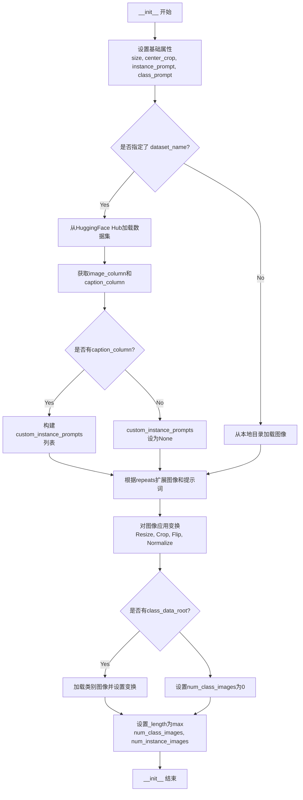

#### 带注释源码

```python
def __init__(
    self,
    instance_data_root,
    instance_prompt,
    class_prompt,
    class_data_root=None,
    class_num=None,
    size=1024,
    repeats=1,
    center_crop=False,
):
    """
    初始化DreamBoothDataset数据集对象
    
    参数:
        instance_data_root: 实例图像所在目录路径
        instance_prompt: 实例提示词
        class_prompt: 类别提示词（用于先验保留）
        class_data_root: 类别图像目录（可选）
        class_num: 类别图像数量限制（可选）
        size: 输出图像尺寸，默认1024
        repeats: 每个图像的重复次数，默认1
        center_crop: 是否中心裁剪，默认False
    """
    # 设置图像尺寸和裁剪方式
    self.size = size
    self.center_crop = center_crop

    # 保存提示词信息
    self.instance_prompt = instance_prompt
    self.custom_instance_prompts = None  # 用户自定义提示词
    self.class_prompt = class_prompt

    # 判断数据加载方式：HuggingFace数据集 vs 本地目录
    if args.dataset_name is not None:
        try:
            from datasets import load_dataset
        except ImportError:
            raise ImportError(
                "You are trying to load your data using the datasets library. If you wish to train using custom "
                "captions please install the datasets library: `pip install datasets`. If you wish to load a "
                "local folder containing images only, specify --instance_data_dir instead."
            )
        
        # 从Hub下载并加载数据集
        dataset = load_dataset(
            args.dataset_name,
            args.dataset_config_name,
            cache_dir=args.cache_dir,
        )
        
        # 获取数据集列名
        column_names = dataset["train"].column_names

        # 确定图像列名
        if args.image_column is None:
            image_column = column_names[0]
            logger.info(f"image column defaulting to {image_column}")
        else:
            image_column = args.image_column
            if image_column not in column_names:
                raise ValueError(
                    f"`--image_column` value '{args.image_column}' not found in dataset columns. Dataset columns are: {', '.join(column_names)}"
                )
        
        # 加载实例图像
        instance_images = dataset["train"][image_column]

        # 处理caption列（自定义提示词）
        if args.caption_column is None:
            logger.info(
                "No caption column provided, defaulting to instance_prompt for all images. If your dataset "
                "contains captions/prompts for the images, make sure to specify the "
                "column as --caption_column"
            )
            self.custom_instance_prompts = None
        else:
            if args.caption_column not in column_names:
                raise ValueError(
                    f"`--caption_column` value '{args.caption_column}' not found in dataset columns. Dataset columns are: {', '.join(column_names)}"
                )
            
            # 获取自定义提示词并根据repeats扩展
            custom_instance_prompts = dataset["train"][args.caption_column]
            self.custom_instance_prompts = []
            for caption in custom_instance_prompts:
                self.custom_instance_prompts.extend(itertools.repeat(caption, repeats))
    else:
        # 从本地目录加载图像
        self.instance_data_root = Path(instance_data_root)
        if not self.instance_data_root.exists():
            raise ValueError("Instance images root doesn't exists.")

        # 打开目录中所有图像文件
        instance_images = [Image.open(path) for path in list(Path(instance_data_root).iterdir())]
        self.custom_instance_prompts = None

    # 根据repeats扩展实例图像列表
    self.instance_images = []
    for img in instance_images:
        self.instance_images.extend(itertools.repeat(img, repeats))

    # 初始化图像变换管道
    self.pixel_values = []
    train_resize = transforms.Resize(size, interpolation=transforms.InterpolationMode.BILINEAR)
    train_crop = transforms.CenterCrop(size) if center_crop else transforms.RandomCrop(size)
    train_flip = transforms.RandomHorizontalFlip(p=1.0)
    train_transforms = transforms.Compose(
        [
            transforms.ToTensor(),           # 转换为张量
            transforms.Normalize([0.5], [0.5]),  # 归一化到[-1, 1]
        ]
    )

    # 对每张图像应用变换
    for image in self.instance_images:
        # 处理EXIF旋转问题
        image = exif_transpose(image)
        
        # 确保图像为RGB模式
        if not image.mode == "RGB":
            image = image.convert("RGB")
        
        # Resize到目标尺寸
        image = train_resize(image)
        
        # 随机水平翻转（如果启用）
        if args.random_flip and random.random() < 0.5:
            image = train_flip(image)
        
        # 裁剪处理
        if args.center_crop:
            y1 = max(0, int(round((image.height - args.resolution) / 2.0)))
            x1 = max(0, int(round((image.width - args.resolution) / 2.0)))
            image = train_crop(image)
        else:
            y1, x1, h, w = train_crop.get_params(image, (args.resolution, args.resolution))
            image = crop(image, y1, x1, h, w)
        
        # 应用归一化变换并保存
        image = train_transforms(image)
        self.pixel_values.append(image)

    # 设置数据集长度相关信息
    self.num_instance_images = len(self.instance_images)
    self._length = self.num_instance_images

    # 处理类别图像（先验保留）
    if class_data_root is not None:
        self.class_data_root = Path(class_data_root)
        self.class_data_root.mkdir(parents=True, exist_ok=True)
        self.class_images_path = list(self.class_data_root.iterdir())
        
        # 确定类别图像数量
        if class_num is not None:
            self.num_class_images = min(len(self.class_images_path), class_num)
        else:
            self.num_class_images = len(self.class_images_path)
        
        # 数据集长度为实例图像和类别图像中的较大者
        self._length = max(self.num_class_images, self.num_instance_images)
    else:
        self.class_data_root = None

    # 设置类别图像的变换管道
    self.image_transforms = transforms.Compose(
        [
            transforms.Resize(size, interpolation=transforms.InterpolationMode.BILINEAR),
            transforms.CenterCrop(size) if center_crop else transforms.RandomCrop(size),
            transforms.ToTensor(),
            transforms.Normalize([0.5], [0.5]),
        ]
    )
```


### DreamBoothDataset.__len__

该方法实现了 Python 魔术方法 `__len__`，用于返回 DreamBooth 数据集的长度。在初始化过程中，`_length` 会被设置为实例图像数量和类图像数量中的较大值（如果存在类图像），从而确保数据迭代器能够正确遍历所有数据。

参数：无（仅包含隐式参数 `self`）

返回值：`int`，返回数据集的总长度

#### 流程图

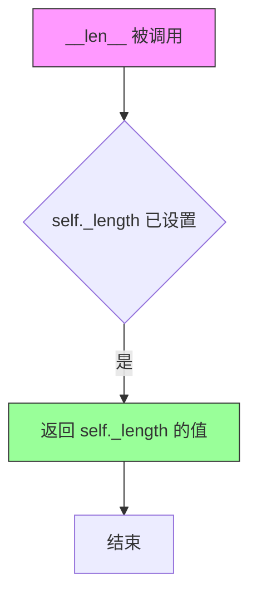

#### 带注释源码

```python
def __len__(self):
    """
    返回数据集的长度。
    
    该方法实现了 Python 的魔术方法，使 DreamBoothDataset 可以与 len() 函数一起使用。
    在 __init__ 中，self._length 被设置为：
    - 如果存在类数据：max(num_class_images, num_instance_images)
    - 否则：num_instance_images
    
    Returns:
        int: 数据集的总样本数
    """
    return self._length
```


### DreamBoothDataset.__getitem__

该方法实现了数据集的索引访问功能，根据给定的索引返回训练样本。它从预处理好的像素值中获取实例图像，并根据配置处理实例提示词和类别图像（如果启用了先验保留）。

参数：

- `self`：DreamBoothDataset 实例本身，代表当前数据集对象
- `index`：`int`，要检索的样本索引，用于从数据集中获取特定样本

返回值：`dict`，包含以下键的字典：
- `instance_images`：`torch.Tensor`，处理后的实例图像张量
- `instance_prompt`：`str`，实例图像对应的提示词
- `class_images`：`torch.Tensor`（可选），类别图像张量（当启用先验保留时）
- `class_prompt`：`str`（可选），类别提示词（当启用先验保留时）

#### 流程图

```mermaid
flowchart TD
    A[__getitem__ 被调用] --> B[创建空字典 example]
    B --> C[获取实例图像: pixel_values[index % num_instance_images]]
    C --> D[将实例图像存入 example['instance_images']]
    D --> E{是否有自定义提示词?}
    E -->|是| F[获取自定义提示词: custom_instance_prompts[index % num_instance_images]]
    F --> G{提示词非空?}
    G -->|是| H[设置 instance_prompt 为自定义提示词]
    G -->|否| I[设置 instance_prompt 为默认实例提示词]
    E -->|否| J[设置 instance_prompt 为默认实例提示词]
    H --> K{是否有类别数据根目录?}
    I --> K
    J --> K
    K -->|是| L[打开类别图像并处理]
    L --> M[转换为RGB并应用图像变换]
    M --> N[存入 example['class_images'] 和 example['class_prompt']]
    K -->|否| O[返回 example 字典]
    N --> O
```

#### 带注释源码

```python
def __getitem__(self, index):
    """
    获取指定索引位置的训练样本。
    
    参数:
        index: 数据集中的样本索引
        
    返回:
        包含图像和提示词的字典，用于模型训练
    """
    # 创建用于存储样本数据的字典
    example = {}
    
    # 通过取模运算处理索引循环，确保索引在有效范围内
    # 获取预处理后的像素值（已resize、crop、normalize的图像张量）
    instance_image = self.pixel_values[index % self.num_instance_images]
    # 将实例图像存入返回字典
    example["instance_images"] = instance_image

    # 检查是否提供了自定义实例提示词
    if self.custom_instance_prompts:
        # 获取对应索引的自定义提示词（同样取模处理循环）
        caption = self.custom_instance_prompts[index % self.num_instance_images]
        # 如果自定义提示词非空，则使用自定义提示词
        if caption:
            example["instance_prompt"] = caption
        else:
            # 自定义提示词为空时，回退到默认实例提示词
            example["instance_prompt"] = self.instance_prompt
    else:
        # 未提供自定义提示词时，使用默认实例提示词
        # 这对应于自定义提示词已提供但长度不匹配图像数据集大小的情况
        example["instance_prompt"] = self.instance_prompt

    # 如果配置了类别数据根目录（启用先验保留prior preservation）
    if self.class_data_root:
        # 打开对应索引的类别图像
        class_image = Image.open(self.class_images_path[index % self.num_class_images])
        # 根据EXIF信息调整图像方向（处理手机拍摄的照片）
        class_image = exif_transpose(class_image)

        # 确保类别图像为RGB模式
        if not class_image.mode == "RGB":
            class_image = class_image.convert("RGB")
        
        # 应用图像变换并存入返回字典
        example["class_images"] = self.image_transforms(class_image)
        # 存入类别提示词
        example["class_prompt"] = self.class_prompt

    # 返回包含实例图像、提示词及可选类别数据的字典
    return example
```


### `PromptDataset.__init__`

该方法是 `PromptDataset` 类的构造函数，用于初始化一个简单的数据集，以便在多个 GPU 上生成类图像时准备提示词。该数据集存储提示词和样本数量，为后续数据加载提供基础。

参数：

- `prompt`：`str`，用于生成类图像的提示词（prompt）
- `num_samples`：`int`，要生成的样本数量

返回值：`None`，该方法不返回值，仅初始化实例属性

#### 流程图

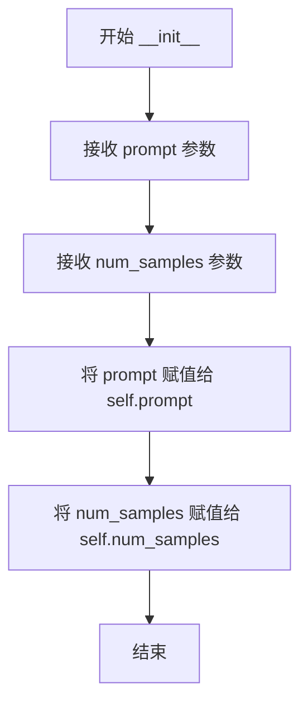

#### 带注释源码

```python
def __init__(self, prompt, num_samples):
    """
    初始化 PromptDataset 实例。

    参数:
        prompt (str): 用于生成类图像的提示词。
        num_samples (int): 要生成的样本数量。
    """
    self.prompt = prompt          # 存储提示词
    self.num_samples = num_samples  # 存储样本数量
```


### `PromptDataset.__len__`

该方法返回 PromptDataset 数据集中包含的样本数量，用于让 DataLoader 能够确定数据集的大小，从而进行批量加载和数据迭代。

参数：

- `self`：隐式参数，指向当前 PromptDataset 实例本身

返回值：`int`，返回数据集的样本数量（`self.num_samples`），供 PyTorch DataLoader 在训练循环中确定迭代次数使用

#### 流程图

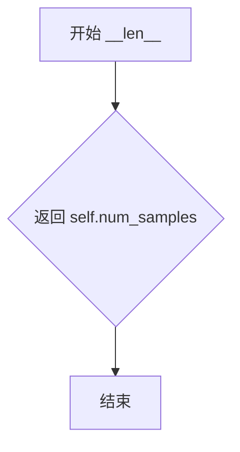

#### 带注释源码

```python
def __len__(self):
    """
    返回数据集中样本的数量。
    
    这是 Python 特殊方法（dunder method），当使用 len(dataset) 
    或在 PyTorch DataLoader 中自动调用此方法来确定数据集大小。
    
    Returns:
        int: 数据集中要生成的样本数量，由初始化时的 num_samples 参数决定
    """
    return self.num_samples
```


### `PromptDataset.__getitem__`

该方法是`PromptDataset`类的实例方法，用于根据给定的索引返回对应的样本数据。在DreamBooth训练流程中，该数据集用于生成类别图像的prompt提示词，以便在多个GPU上并行生成类别图像。

参数：

- `self`：`PromptDataset`类型，当前数据集实例对象
- `index`：`int`类型，表示请求的样本索引值，用于从数据集中检索特定样本

返回值：`dict`类型，返回包含prompt提示词和index索引的字典，其中`"prompt"`键对应训练时使用的提示词文本，`"index"`键对应当前样本的索引位置

#### 流程图

```mermaid
flowchart TD
    A[开始 __getitem__] --> B[创建空字典 example]
    B --> C[设置 example['prompt'] = self.prompt]
    C --> D[设置 example['index'] = index]
    D --> E[返回 example 字典]
```

#### 带注释源码

```python
def __getitem__(self, index):
    """
    根据索引获取数据集中的样本。
    
    参数:
        index: int - 请求的样本索引
    
    返回:
        dict - 包含 'prompt' 和 'index' 键的字典
    """
    # 初始化一个空字典用于存储样本数据
    example = {}
    
    # 将数据集中存储的prompt提示词赋值给example字典
    # 这个prompt是在数据集初始化时设置的类别提示词
    example["prompt"] = self.prompt
    
    # 将当前请求的索引值也存入字典，便于后续追踪
    example["index"] = index
    
    # 返回包含样本数据的字典
    return example
```

## 关键组件


### DreamBoothDataset

数据集类，负责加载和预处理DreamBooth训练所需的实例图像和类图像，包含图像增强、尺寸调整和提示词管理。

### PromptDataset

简单数据集类，用于在多个GPU上生成类图像时准备提示词。

### parse_args

命令行参数解析函数，定义所有训练相关参数，包括模型路径、数据配置、LoRA参数、优化器设置等。

### main

主训练函数，包含完整的训练流程：模型加载、LoRA配置、分布式训练设置、训练循环、验证和模型保存。

### encode_prompt

编码提示词函数，调用CLIP和T5文本编码器生成prompt embeds、pooled embeds和text ids。

### tokenize_prompt

将文本提示词转换为token ID的函数，支持指定最大序列长度。

### log_validation

验证函数，在训练过程中生成验证图像并记录到tensorboard或wandb。

### save_model_card

生成和保存HuggingFace模型卡片，包含训练信息、使用说明和示例代码。

### load_text_encoders

加载两个文本编码器（CLIP和T5）的辅助函数。

### import_model_class_from_model_name_or_path

根据预训练模型配置动态导入文本编码器类（CLIPTextModel或T5EncoderModel）。

### _encode_prompt_with_clip

使用CLIP文本编码器编码提示词的内部函数。

### _encode_prompt_with_t5

使用T5文本编码器编码提示词的内部函数，支持更长序列。

### collate_fn

数据整理函数，将多个样本合并为批次，支持先验保留损失的实例和类图像拼接。

### LoraConfig & LoRA训练

使用PEFT库配置LoRA训练，指定rank、alpha、dropout和目标模块（注意力层和前馈层）。

### FlowMatchEulerDiscreteScheduler

Flux模型的噪声调度器，用于流匹配训练的噪声采样和时间步选择。

### Accelerator分布式训练

使用accelerate库管理分布式训练、混合精度、梯度累积和模型保存/加载钩子。

### 潜在技术债务

1. 大量硬编码的默认参数和目标模块列表，缺乏配置灵活性
2. 训练循环中多次使用条件分支处理不同场景，代码复杂度较高
3. 文本编码器加载和卸载逻辑分散，可提取为独立函数
4. 验证逻辑与训练循环耦合，可分离为独立模块

### 优化空间

1. 可使用配置类替代大量命令行参数
2. 缓存latents功能可进一步优化内存管理
3. 检查点管理逻辑可使用LRU缓存策略
4. 可引入更细粒度的梯度 checkpointing


## 问题及建议


### 已知问题

-   **魔法数字缺乏文档**：代码中存在多处硬编码的数值（如时间步缩放因子1000、默认分辨率512、LoRA默认rank=4等），缺乏注释说明其来源和用途，影响代码可维护性。
-   **内存管理不彻底**：在多处使用`del`和`free_memory()`释放GPU内存，但未在关键位置调用Python的垃圾回收（如`gc.collect()`），可能导致显存碎片化。
-   **缺少模型文件存在性验证**：在加载预训练模型（text_encoder、vae、transformer）前未显式检查文件是否存在，加载失败时的错误信息不够友好。
-   **NPU Flash Attention缺少优雅降级**：当`enable_npu_flash_attention`设置为True但设备不支持时直接抛出异常，应提供回退到默认attention机制的选项。
-   **数据加载器配置不安全**：`dataloader_num_workers`默认为0，在大规模训练时可能导致数据加载成为瓶颈，且缺乏警告提示。
-   **验证流程内存开销大**：验证时每次都会重新加载完整pipeline（vae、text_encoder、transformer），对于显存受限的环境可能造成OOM。
-   **条件分支代码重复**：`compute_text_embeddings`函数在不同训练模式下的调用逻辑存在重复代码，可通过重构减少冗余。
-   **checkpoint清理逻辑效率低**：当`checkpoints_total_limit`设置较小时，每次保存checkpoint都需要遍历整个输出目录列出所有checkpoint，随着checkpoint数量增加性能下降。
-   **缺乏输入参数校验**：部分数值参数（如learning_rate、adam_beta等）缺少合理范围校验，用户可能传入导致训练不稳定或崩溃的值。

### 优化建议

-   **添加配置文件和常量定义**：将魔法数字提取为配置常量或配置文件，配合详细注释说明每个参数的作用和推荐值范围。
-   **完善内存管理**：在删除大对象后显式调用`import gc; gc.collect()`，特别是在训练循环内部和验证流程前后。
-   **增强错误处理和验证**：在加载模型前检查文件路径有效性，提供更明确的错误提示；在参数解析阶段添加数值范围校验。
-   **实现attention后端自动选择**：NPU Flash Attention应根据硬件能力自动选择最优后端，而非强制要求特定硬件。
-   **优化验证流程**：考虑使用`pipeline.enable_sequential_cpu_offload()`或`pipeline.enable_model_cpu_offload()`来减少验证时的显存占用。
-   **重构数据处理逻辑**：将条件分支提取为独立函数，减少`compute_text_embeddings`和相关调用处的代码重复。
-   **优化checkpoint管理**：使用有序字典或单独维护checkpoint索引文件，避免每次保存时全量扫描目录。
-   **添加训练稳定性检查**：在训练开始前验证学习率、梯度裁剪值等关键参数是否在合理范围内，必要时发出警告或自动调整。
-   **支持断点续训完整性校验**：在`resume_from_checkpoint`时增加对checkpoint完整性的验证，避免加载损坏的checkpoint导致训练异常。


## 其它


### 设计目标与约束

本脚本的核心设计目标是实现Flux模型的DreamBooth LoRA微调训练，使用户能够通过少量实例图像（instance images）学习特定概念或风格。主要约束包括：必须指定`--instance_data_dir`或`--dataset_name`之一；Prior Preservation模式下必须同时指定`--class_data_dir`和`--class_prompt`；不支持MPS设备上的bf16混合精度训练；LoRA训练仅针对transformer层和可选的text_encoder层。

### 错误处理与异常设计

脚本采用分层错误处理策略。导入时检查最小diffusers版本（`check_min_version("0.37.0.dev0")`）并在版本不满足时抛出异常。参数解析阶段对互斥参数进行校验（如`--dataset_name`和`--instance_data_dir`不能同时指定），对必要参数进行强制检查（如`--instance_prompt`为必需）。训练过程中的异常处理包括：数据集路径不存在时抛出`ValueError`；可选依赖库（如datasets、bitsandbytes、wandb）缺失时提供清晰的安装指引；分布式训练时处理checkpoint目录为空的情况。此外，警告信息用于提醒用户不当的参数组合（如使用`--class_data_dir`但未启用prior preservation）。

### 数据流与状态机

训练数据流主要经历以下阶段：实例图像加载（从本地目录或HuggingFace数据集）→ 图像预处理（resize、center_crop/random_crop、horizontal_flip、normalize）→ VAE编码为latent空间 → 添加噪声（基于Flow Matching的sigma调度）→ Transformer预测噪声残差 → 计算加权MSE损失 → 反向传播与参数更新。状态机方面，模型在训练/验证阶段间切换：transformer和text_encoder在训练阶段设置`train()`模式，验证时加载原始权重进行推理。Checkpoint保存遵循定期触发（每`--checkpointing_steps`步）和epoch结束的逻辑。

### 外部依赖与接口契约

核心依赖包括：`diffusers>=0.37.0.dev0`（Pipeline、Scheduler、Model）、`torch>=2.0.0`（张量计算）、`transformers>=4.41.2`（CLIPTokenizer、T5TokenizerFast、TextEncoder）、`peft>=0.11.1`（LoraConfig、LoRA权重管理）、`accelerate>=0.31.0`（分布式训练、混合精度）、`bitsandbytes`（可选，8-bit Adam）、`wandb`或`tensorboard`（可选，训练可视化）。模型输入契约：实例图像需为RGB格式，分辨率统一为`--resolution`参数值；prompt需符合T5/CLIP tokenization限制（默认max_length分别为512和77）。

### 配置管理

配置通过命令行参数（argparse）集中管理，分为以下类别：模型路径（`--pretrained_model_name_or_path`、`--revision`、`--variant`）、数据集（`--instance_data_dir`、`--dataset_name`、`--instance_prompt`、`--class_prompt`）、训练参数（`--train_batch_size`、`--num_train_epochs`、`--learning_rate`、`--gradient_accumulation_steps`）、LoRA配置（`--rank`、`--lora_alpha`、`--lora_dropout`、`--lora_layers`）、优化器（`--optimizer`、`--adam_beta1/2`、`--adam_weight_decay`）、检查点（`--checkpointing_steps`、`--checkpoints_total_limit`、`--resume_from_checkpoint`）、推理验证（`--validation_prompt`、`--num_validation_images`、`--validation_epochs`）。参数默认值遵循最佳实践（如rank=4、learning_rate=1e-4、checkpointing_steps=500）。

### 性能优化策略

脚本实现多重性能优化：Gradient Checkpointing（`--gradient_checkpointing`）以显存换计算；Latent Caching（`--cache_latents`）减少重复VAE编码开销；Mixed Precision Training（fp16/bf16）降低显存占用并加速计算；TF32加速（`--allow_tf32`）在Ampere GPU上提升矩阵运算效率；Gradient Accumulation模拟大batch训练；NPU Flash Attention（`--enable_npu_flash_attention`）加速注意力计算。训练后期可选择`--upcast_before_saving`将权重转换为float32以确保兼容性。

### 版本兼容性

最低版本要求：`diffusers>=0.37.0.dev0`、`torch>=2.0.0`、`transformers>=4.41.2`、`peft>=0.11.1`、`accelerate>=0.31.0`。不支持的功能组合包括：MPS后端+bf16混合精度（PyTorch限制）、PyTorch<1.10+bf16精度、CPU训练环境下的某些优化选项。模型兼容性要求pretrained_model_name_or_path指向包含text_encoder、text_encoder_2、tokenizer、tokenizer_2、vae、transformer、scheduler子文件夹的Flux架构模型。

### 资源管理与清理

显存管理通过以下机制实现：VAE和Transformer在训练前根据`weight_dtype`转换为对应精度；非训练参数（VAE、text_encoder基础权重）保持冻结状态；`free_memory()`函数在pipeline卸载和checkpoint保存后释放显存；Latent caching模式下仅在需要验证时才保留VAE。磁盘空间管理：`--checkpoints_total_limit`参数控制保留的最大checkpoint数量，超出时自动删除旧checkpoint。临时文件处理：生成的class images存储在`class_data_dir`；训练日志默认写入`output_dir/runs/`目录。

### 分布式训练支持

脚本基于Accelerator实现多GPU/DPU分布式训练。通过`--local_rank`参数支持PyTorch Distributed环境；`DistributedDataParallelKwargs(find_unused_parameters=True)`处理LoRA训练中的参数分发；所有模型、optimizer、dataloader均通过`accelerator.prepare()`进行分布式包装；Checkpoints通过`accelerator.save_state()`/`load_state()`实现分布式保存与恢复；日志与验证仅在主进程（`accelerator.is_main_process`）执行以避免重复输出。

### 指标与监控

训练过程记录以下指标：`loss`（MSE加权损失）、`lr`（当前学习率）。监控工具支持TensorBoard（默认）和WandB（通过`--report_to`选择）。验证阶段在每个`--validation_epochs`执行，生成`--num_validation_images`张验证图像并记录到对应tracker。进度条通过tqdm显示，支持禁用以减少主进程外的冗余输出。关键性能指标（梯度范数、训练步数）通过`accelerator.log()`记录。

### 许可证与合规性

代码本身采用Apache License 2.0。训练生成的LoRA权重需遵循base model（black-forest-labs/FLUX.1-dev）的许可证条款。脚本自动生成的model card包含许可证声明（`license="other"`），用户需确保遵守上游模型的许可限制。HuggingFace Hub上传功能（`--push_to_hub`）需通过`--hub_token`或`hf auth login`进行认证。

    