# `diffusers\examples\dreambooth\train_dreambooth_lora_flux2.py` 详细设计文档

这是一个Flux2 DreamBooth LoRA训练脚本，用于使用DreamBooth技术微调Flux2扩散模型。用户可以通过提供少量自定义图像和提示词，训练出能够生成特定概念的LoRA适配器权重。脚本支持多种训练选项，包括prior preservation、aspect ratio buckets、分布式训练、混合精度训练、FP8训练和量化训练等。

## 整体流程

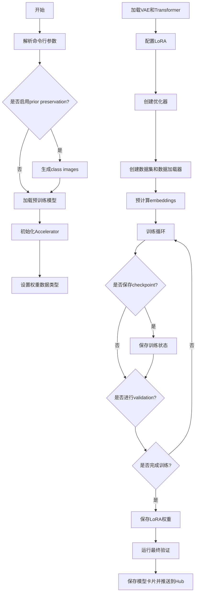

## 类结构

```
Global
├── logger (日志记录器)
├── save_model_card (保存模型卡片)
├── log_validation (验证函数)
├── module_filter_fn (模块过滤)
└── parse_args (参数解析)

DreamBoothDataset (数据集类)
├── __init__
├── __len__
├── __getitem__
└── train_transform

BucketBatchSampler (批次采样器)
├── __init__
├── __iter__
└── __len__

PromptDataset (提示数据集)
├── __init__
├── __len__
└── __getitem__

collate_fn (整理函数)
```

## 全局变量及字段


### `logger`
    
日志记录器，用于输出训练过程中的信息

类型：`logging.Logger`
    


### `args`
    
命令行参数对象，包含所有训练配置参数

类型：`argparse.Namespace`
    


### `DreamBoothDataset.size`
    
目标图像尺寸，用于图像预处理

类型：`int | tuple[int, int]`
    


### `DreamBoothDataset.center_crop`
    
是否对图像进行中心裁剪

类型：`bool`
    


### `DreamBoothDataset.instance_prompt`
    
实例提示词，用于指定特定实例

类型：`str`
    


### `DreamBoothDataset.class_prompt`
    
类别提示词，用于先验保持损失

类型：`str | None`
    


### `DreamBoothDataset.buckets`
    
宽高比桶列表，用于不同尺寸图像的组织

类型：`list[tuple[int, int]] | None`
    


### `DreamBoothDataset.instance_images`
    
实例图像对象列表

类型：`list[PIL.Image.Image]`
    


### `DreamBoothDataset.pixel_values`
    
预处理后的像素值及对应的桶索引

类型：`list[tuple[torch.Tensor, int]]`
    


### `DreamBoothDataset.num_instance_images`
    
实例图像的数量

类型：`int`
    


### `DreamBoothDataset._length`
    
数据集的总长度

类型：`int`
    


### `DreamBoothDataset.class_data_root`
    
类别图像数据的根目录

类型：`Path | None`
    


### `DreamBoothDataset.class_images_path`
    
类别图像文件路径列表

类型：`list[Path]`
    


### `DreamBoothDataset.num_class_images`
    
类别图像的数量

类型：`int`
    


### `DreamBoothDataset.image_transforms`
    
类别图像的变换组合

类型：`torchvision.transforms.Compose`
    


### `BucketBatchSampler.dataset`
    
关联的数据集对象

类型：`DreamBoothDataset`
    


### `BucketBatchSampler.batch_size`
    
每个批次的样本数量

类型：`int`
    


### `BucketBatchSampler.drop_last`
    
是否丢弃最后一个不完整批次

类型：`bool`
    


### `BucketBatchSampler.bucket_indices`
    
按桶分组的样本索引列表

类型：`list[list[int]]`
    


### `BucketBatchSampler.sampler_len`
    
采样器的总长度（批次数）

类型：`int`
    


### `BucketBatchSampler.batches`
    
预生成的批次索引列表

类型：`list[list[int]]`
    


### `PromptDataset.prompt`
    
用于生成类别图像的提示词

类型：`str`
    


### `PromptDataset.num_samples`
    
要生成的样本数量

类型：`int`
    
    

## 全局函数及方法


### `save_model_card`

该函数用于在DreamBooth训练完成后，生成并保存模型的元数据卡片（Model Card），包括模型描述、使用方法、许可证信息等，并可选地保存验证时生成的示例图像到HuggingFace格式的README.md文件中。

参数：

- `repo_id`：`str`，HuggingFace Hub上的仓库标识符，用于标识模型的唯一ID
- `images`：可选的图像列表，默认为None，训练过程中生成的验证图像，用于展示模型效果
- `base_model`：`str`，默认为None，基础预训练模型的名称或路径
- `instance_prompt`：`str`，默认为None，训练时使用的实例提示词，用于触发模型生成特定概念
- `validation_prompt`：`str`，默认为None，验证时使用的提示词，用于生成展示图像
- `repo_folder`：`str`，默认为None，本地仓库文件夹路径，用于保存模型文件和README
- `quant_training`：`str`，默认为None，量化训练方法标识（如FP8或BitsandBytes）

返回值：无返回值（`None`），函数直接写入文件系统

#### 流程图

```mermaid
flowchart TD
    A[开始 save_model_card] --> B{images 是否为 None?}
    B -->|否| C[遍历 images 列表]
    C --> D[保存图像到 repo_folder/image_{i}.png]
    D --> E[构建 widget_dict 包含提示词和图像URL]
    C --> F[构建 model_description 字符串]
    B -->|是| F
    F --> G[调用 load_or_create_model_card 创建模型卡片]
    G --> H[设置标签列表 tags]
    H --> I[调用 populate_model_card 填充标签]
    I --> J[保存模型卡片到 repo_folder/README.md]
    J --> K[结束]
```

#### 带注释源码

```python
def save_model_card(
    repo_id: str,                    # HuggingFace仓库ID
    images=None,                     # 验证生成的图像列表
    base_model: str = None,          # 基础模型标识
    instance_prompt=None,            # 实例提示词
    validation_prompt=None,          # 验证提示词
    repo_folder=None,                # 本地仓库文件夹
    quant_training=None,             # 量化训练方法
):
    # 初始化widget字典，用于HuggingFace Hub的演示组件
    widget_dict = []
    if images is not None:
        # 遍历所有生成的图像
        for i, image in enumerate(images):
            # 将图像保存到repo_folder目录，文件名格式为image_{i}.png
            image.save(os.path.join(repo_folder, f"image_{i}.png"))
            # 构建widget字典，包含提示词和图像URL，用于Hub上的交互式演示
            widget_dict.append(
                {"text": validation_prompt if validation_prompt else " ", 
                 "output": {"url": f"image_{i}.png"}}
            )

    # 构建模型描述字符串，包含模型信息、使用方法和许可证
    model_description = f"""
# Flux2 DreamBooth LoRA - {repo_id}

<Gallery />

## Model description

These are {repo_id} DreamBooth LoRA weights for {base_model}.

The weights were trained using [DreamBooth](https://dreambooth.github.io/) with the [Flux2 diffusers trainer](https://github.com/huggingface/diffusers/blob/main/examples/dreambooth/README_flux2.md).

Quant training? {quant_training}

## Trigger words

You should use `{instance_prompt}` to trigger the image generation.

## Download model

[Download the *.safetensors LoRA]({repo_id}/tree/main) in the Files & versions tab.

## Use it with the [🧨 diffusers library](https://github.com/huggingface/diffusers)

```py
from diffusers import AutoPipelineForText2Image
import torch
pipeline = AutoPipelineForText2Image.from_pretrained("black-forest-labs/FLUX.2", torch_dtype=torch.bfloat16).to('cuda')
pipeline.load_lora_weights('{repo_id}', weight_name='pytorch_lora_weights.safetensors')
image = pipeline('{validation_prompt if validation_prompt else instance_prompt}').images[0]
```

For more details, including weighting, merging and fusing LoRAs, check the [documentation on loading LoRAs in diffusers](https://huggingface.co/docs/diffusers/main/en/using-diffusers/loading_adapters)

## License

Please adhere to the licensing terms as described [here](https://huggingface.co/black-forest-labs/FLUX.2/blob/main/LICENSE.md).
"""
    # 加载或创建模型卡片，from_training=True表示从训练脚本创建
    model_card = load_or_create_model_card(
        repo_id_or_path=repo_id,
        from_training=True,
        license="other",
        base_model=base_model,
        prompt=instance_prompt,
        model_description=model_description,
        widget=widget_dict,
    )
    
    # 定义模型标签，用于HuggingFace Hub的分类和搜索
    tags = [
        "text-to-image",
        "diffusers-training",
        "diffusers",
        "lora",
        "flux2",
        "flux2-diffusers",
        "template:sd-lora",
    ]

    # 使用标签填充模型卡片元数据
    model_card = populate_model_card(model_card, tags=tags)
    
    # 将模型卡片保存为README.md文件到指定目录
    model_card.save(os.path.join(repo_folder, "README.md"))
```


### `log_validation`

该函数是 Flux2 DreamBooth LoRA 训练脚本中的验证函数，负责在训练过程中运行推理生成验证图像，并将图像记录到 TensorBoard 或 WandB 等跟踪工具中。

参数：

- `pipeline`：`DiffusionPipeline`，用于生成图像的推理管道
- `args`：`Namespace`，命令行参数对象，包含验证提示词、验证图像数量等配置
- `accelerator`：`Accelerator`，HuggingFace Accelerate 库提供的分布式训练加速器
- `pipeline_args`：`Dict`，包含预计算的 prompt_embeds 和 text_ids 的字典
- `epoch`：`int`，当前训练的 epoch 编号
- `torch_dtype`：`torch.dtype`，推理时使用的数据类型（通常是 float16 或 bfloat16）
- `is_final_validation`：`bool`，可选，默认为 False，标识是否为最终验证阶段

返回值：`List[PIL.Image]`，生成的验证图像列表

#### 流程图

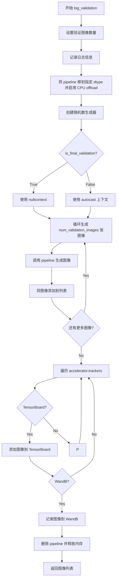

#### 带注释源码

```python
def log_validation(
    pipeline,
    args,
    accelerator,
    pipeline_args,
    epoch,
    torch_dtype,
    is_final_validation=False,
):
    """
    在训练过程中运行验证，生成图像并记录到跟踪工具
    
    参数:
        pipeline: 用于推理的扩散管道
        args: 训练参数
        accelerator: Accelerate 加速器
        pipeline_args: 包含 prompt_embeds 的字典
        epoch: 当前 epoch
        torch_dtype: torch 数据类型
        is_final_validation: 是否为最终验证
    """
    # 设置验证图像数量，默认值为 1
    args.num_validation_images = args.num_validation_images if args.num_validation_images else 1
    logger.info(
        f"Running validation... \n Generating {args.num_validation_images} images with prompt:"
        f" {args.validation_prompt}."
    )
    
    # 将管道移到指定设备并转换为目标 dtype
    pipeline = pipeline.to(dtype=torch_dtype)
    # 启用模型 CPU 卸载以节省显存
    pipeline.enable_model_cpu_offload()
    # 禁用进度条
    pipeline.set_progress_bar_config(disable=True)

    # 创建随机数生成器用于可重复性
    generator = torch.Generator(device=accelerator.device).manual_seed(args.seed) if args.seed is not None else None
    
    # 根据是否为最终验证选择自动混合精度上下文
    # 最终验证时使用 nullcontext 避免不必要的精度转换
    autocast_ctx = torch.autocast(accelerator.device.type) if not is_final_validation else nullcontext()

    images = []
    # 循环生成指定数量的验证图像
    for _ in range(args.num_validation_images):
        with autocast_ctx:
            image = pipeline(
                prompt_embeds=pipeline_args["prompt_embeds"],
                generator=generator,
            ).images[0]
            images.append(image)

    # 将生成的图像记录到跟踪工具
    for tracker in accelerator.trackers:
        # 区分验证阶段和测试阶段
        phase_name = "test" if is_final_validation else "validation"
        
        if tracker.name == "tensorboard":
            # 将 PIL Image 转换为 numpy 数组并添加到 TensorBoard
            np_images = np.stack([np.asarray(img) for img in images])
            tracker.writer.add_images(phase_name, np_images, epoch, dataformats="NHWC")
        
        if tracker.name == "wandb":
            # 将图像记录到 WandB
            tracker.log(
                {
                    phase_name: [
                        wandb.Image(image, caption=f"{i}: {args.validation_prompt}") for i, image in enumerate(images)
                    ]
                }
            )

    # 清理管道并释放显存
    del pipeline
    free_memory()

    # 返回生成的图像列表
    return images
```


### `module_filter_fn`

该函数是Flux2 DreamBooth LoRA训练脚本中的一个模块过滤函数，用于在FP8训练时决定哪些模块应该被转换为Float8精度。具体来说，它会过滤掉输出模块（proj_out）以及输入/输出维度不能被16整除的线性层，以确保FP8转换的兼容性。

参数：

- `mod`：`torch.nn.Module`，要检查的PyTorch模块
- `fqn`：`str`，模块的完全限定名（fully qualified name），用于唯一标识模块在模型中的位置

返回值：`bool`，返回`True`表示该模块应该被转换为FP8格式，返回`False`表示该模块应该被跳过

#### 流程图

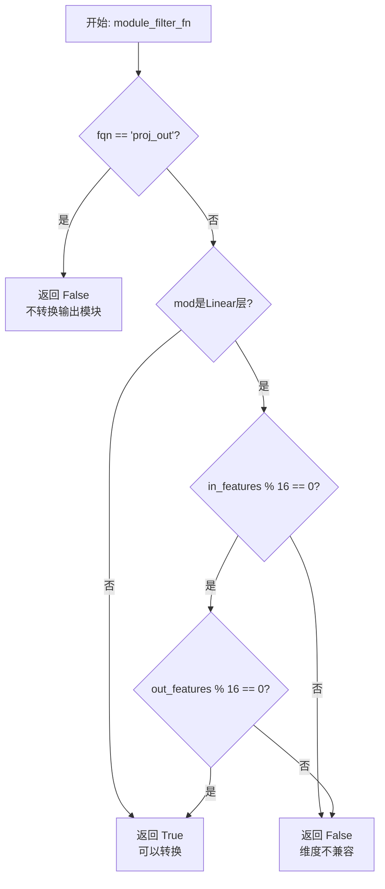

#### 带注释源码

```python
def module_filter_fn(mod: torch.nn.Module, fqn: str):
    """
    模块过滤函数，用于FP8训练时决定哪些模块应该被转换为Float8精度。
    
    该函数确保以下模块不被转换：
    1. 输出投影模块（proj_out）
    2. 输入或输出维度不能被16整除的线性层（FP8转换的硬件要求）
    
    参数:
        mod: torch.nn.Module - 要检查的PyTorch模块
        fqn: str - 模块的完全限定名，用于唯一标识模块在模型中的位置
        
    返回:
        bool - True表示该模块应该被转换为FP8格式，False表示应该跳过
    """
    # 不转换输出模块
    # proj_out通常是模型的最终输出层，转换可能影响模型行为
    if fqn == "proj_out":
        return False
    
    # 检查是否为线性层
    # Linear层的权重维度必须是16的倍数才能使用FP8张量核心
    if isinstance(mod, torch.nn.Linear):
        # 检查输入特征维度是否可被16整除
        if mod.in_features % 16 != 0:
            return False
        # 检查输出特征维度是否可被16整除
        if mod.out_features % 16 != 0:
            return False
    
    # 默认返回True，表示该模块可以进行FP8转换
    return True
```


### `parse_args`

该函数是 Flux2 DreamBooth LoRA 训练脚本的命令行参数解析器，通过 argparse 库定义并验证所有训练相关的配置选项，包括模型路径、数据集配置、训练超参数、优化器设置、验证参数等，并返回包含所有配置参数的 Namespace 对象。

参数：

- `input_args`：`List[str] | None`，可选参数列表，用于手动传入命令行参数而非从 sys.argv 自动解析，默认为 None

返回值：`argparse.Namespace`，包含所有解析后的命令行参数对象

#### 流程图

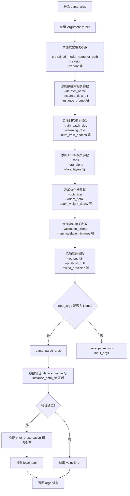

#### 带注释源码

```python
def parse_args(input_args=None):
    """
    解析命令行参数并返回配置对象
    
    参数:
        input_args: 可选的参数列表，如果为 None 则从 sys.argv 解析
        
    返回:
        argparse.Namespace: 包含所有配置参数的命名空间对象
    """
    # 创建 ArgumentParser 实例，描述这是一个简单的训练脚本示例
    parser = argparse.ArgumentParser(description="Simple example of a training script.")
    
    # ========== 模型相关参数 ==========
    # 预训练模型路径或模型标识符（必填）
    parser.add_argument(
        "--pretrained_model_name_or_path",
        type=str,
        default=None,
        required=True,
        help="Path to pretrained model or model identifier from huggingface.co/models.",
    )
    # 预训练模型的版本号
    parser.add_argument(
        "--revision",
        type=str,
        default=None,
        required=False,
        help="Revision of pretrained model identifier from huggingface.co/models.",
    )
    # BitsAndBytes 量化配置文件路径
    parser.add_argument(
        "--bnb_quantization_config_path",
        type=str,
        default=None,
        help="Quantization config in a JSON file that will be used to define the bitsandbytes quant config of the DiT.",
    )
    # 是否进行 FP8 训练
    parser.add_argument(
        "--do_fp8_training",
        action="store_true",
        help="if we are doing FP8 training.",
    )
    # 模型文件变体（如 fp16）
    parser.add_argument(
        "--variant",
        type=str,
        default=None,
        help="Variant of the model files of the pretrained model identifier from huggingface.co/models, 'e.g.' fp16",
    )
    
    # ========== 数据集相关参数 ==========
    # 数据集名称（来自 HuggingFace Hub）
    parser.add_argument(
        "--dataset_name",
        type=str,
        default=None,
        help="The name of the Dataset (from the HuggingFace hub) containing the training data...",
    )
    # 数据集配置名称
    parser.add_argument(
        "--dataset_config_name",
        type=str,
        default=None,
        help="The config of the Dataset, leave as None if there's only one config.",
    )
    # 本地实例数据目录
    parser.add_argument(
        "--instance_data_dir",
        type=str,
        default=None,
        help="A folder containing the training data. ",
    )
    # 缓存目录
    parser.add_argument(
        "--cache_dir",
        type=str,
        default=None,
        help="The directory where the downloaded models and datasets will be stored.",
    )
    # 数据集中的图像列名
    parser.add_argument(
        "--image_column",
        type=str,
        default="image",
        help="The column of the dataset containing the target image...",
    )
    # 数据集中的标题/描述列名
    parser.add_argument(
        "--caption_column",
        type=str,
        default=None,
        help="The column of the dataset containing the instance prompt for each image",
    )
    # 训练数据重复次数
    parser.add_argument("--repeats", type=int, default=1, help="How many times to repeat the training data.")
    
    # ========== Prior Preservation 相关参数 ==========
    # 类别数据目录
    parser.add_argument(
        "--class_data_dir",
        type=str,
        default=None,
        required=False,
        help="A folder containing the training data of class images.",
    )
    # 实例提示词（必填）
    parser.add_argument(
        "--instance_prompt",
        type=str,
        default=None,
        required=True,
        help="The prompt with identifier specifying the instance, e.g. 'photo of a TOK dog'",
    )
    # 类别提示词
    parser.add_argument(
        "--class_prompt",
        type=str,
        default=None,
        help="The prompt to specify images in the same class as provided instance images.",
    )
    
    # ========== 文本编码器相关参数 ==========
    # 最大序列长度
    parser.add_argument(
        "--max_sequence_length",
        type=int,
        default=512,
        help="Maximum sequence length to use with with the T5 text encoder",
    )
    # 文本编码器输出层
    parser.add_argument(
        "--text_encoder_out_layers",
        type=int,
        nargs="+",
        default=[10, 20, 30],
        help="Text encoder hidden layers to compute the final text embeddings.",
    )
    
    # ========== 验证相关参数 ==========
    # 验证提示词
    parser.add_argument(
        "--validation_prompt",
        type=str,
        default=None,
        help="A prompt that is used during validation to verify that the model is learning.",
    )
    # 跳过最终推理
    parser.add_argument(
        "--skip_final_inference",
        default=False,
        action="store_true",
        help="Whether to skip the final inference step with loaded lora weights...",
    )
    # 最终验证提示词
    parser.add_argument(
        "--final_validation_prompt",
        type=str,
        default=None,
        help="A prompt that is used during a final validation...",
    )
    # 验证图像数量
    parser.add_argument(
        "--num_validation_images",
        type=int,
        default=4,
        help="Number of images that should be generated during validation.",
    )
    # 验证周期
    parser.add_argument(
        "--validation_epochs",
        type=int,
        default=50,
        help="Run dreambooth validation every X epochs.",
    )
    
    # ========== LoRA 相关参数 ==========
    # LoRA 秩维度
    parser.add_argument(
        "--rank",
        type=int,
        default=4,
        help="The dimension of the LoRA update matrices.",
    )
    # LoRA alpha 缩放因子
    parser.add_argument(
        "--lora_alpha",
        type=int,
        default=4,
        help="LoRA alpha to be used for additional scaling.",
    )
    # LoRA dropout 概率
    parser.add_argument("--lora_dropout", type=float, default=0.0, help="Dropout probability for LoRA layers")
    # LoRA 目标层
    parser.add_argument(
        "--lora_layers",
        type=str,
        default=None,
        help="The transformer modules to apply LoRA training on...",
    )
    
    # ========== Prior Preservation 损失参数 ==========
    # 是否使用 prior preservation
    parser.add_argument(
        "--with_prior_preservation",
        default=False,
        action="store_true",
        help="Flag to add prior preservation loss.",
    )
    # prior loss 权重
    parser.add_argument("--prior_loss_weight", type=float, default=1.0, help="The weight of prior preservation loss.")
    # 类别图像数量
    parser.add_argument(
        "--num_class_images",
        type=int,
        default=100,
        help="Minimal class images for prior preservation loss.",
    )
    
    # ========== 训练输出和随机种子 ==========
    # 输出目录
    parser.add_argument(
        "--output_dir",
        type=str,
        default="flux-dreambooth-lora",
        help="The output directory where the model predictions and checkpoints will be written.",
    )
    # 随机种子
    parser.add_argument("--seed", type=int, default=None, help="A seed for reproducible training.")
    
    # ========== 图像预处理参数 ==========
    # 分辨率
    parser.add_argument(
        "--resolution",
        type=int,
        default=512,
        help="The resolution for input images...",
    )
    # 宽高比 buckets
    parser.add_argument(
        "--aspect_ratio_buckets",
        type=str,
        default=None,
        help="Aspect ratio buckets to use for training...",
    )
    # 中心裁剪
    parser.add_argument(
        "--center_crop",
        default=False,
        action="store_true",
        help="Whether to center crop the input images to the resolution.",
    )
    # 随机翻转
    parser.add_argument(
        "--random_flip",
        action="store_true",
        help="whether to randomly flip images horizontally",
    )
    
    # ========== 训练批处理参数 ==========
    # 训练批大小
    parser.add_argument(
        "--train_batch_size", type=int, default=4, help="Batch size (per device) for the training dataloader."
    )
    # 采样批大小
    parser.add_argument(
        "--sample_batch_size", type=int, default=4, help="Batch size (per device) for sampling images."
    )
    # 训练轮数
    parser.add_argument("--num_train_epochs", type=int, default=1)
    # 最大训练步数
    parser.add_argument(
        "--max_train_steps",
        type=int,
        default=None,
        help="Total number of training steps to perform.",
    )
    # 检查点保存步数
    parser.add_argument(
        "--checkpointing_steps",
        type=int,
        default=500,
        help="Save a checkpoint of the training state every X updates.",
    )
    # 检查点总数限制
    parser.add_argument(
        "--checkpoints_total_limit",
        type=int,
        default=None,
        help="Max number of checkpoints to store.",
    )
    # 从检查点恢复
    parser.add_argument(
        "--resume_from_checkpoint",
        type=str,
        default=None,
        help="Whether training should be resumed from a previous checkpoint.",
    )
    # 梯度累积步数
    parser.add_argument(
        "--gradient_accumulation_steps",
        type=int,
        default=1,
        help="Number of updates steps to accumulate before performing a backward/update pass.",
    )
    # 梯度检查点
    parser.add_argument(
        "--gradient_checkpointing",
        action="store_true",
        help="Whether or not to use gradient checkpointing to save memory.",
    )
    
    # ========== 学习率参数 ==========
    # 学习率
    parser.add_argument(
        "--learning_rate",
        type=float,
        default=1e-4,
        help="Initial learning rate (after the potential warmup period) to use.",
    )
    # 文本编码器学习率
    parser.add_argument(
        "--text_encoder_lr",
        type=float,
        default=5e-6,
        help="Text encoder learning rate to use.",
    )
    # 是否按 GPU 数量缩放学习率
    parser.add_argument(
        "--scale_lr",
        action="store_true",
        default=False,
        help="Scale the learning rate by the number of GPUs, gradient accumulation steps, and batch size.",
    )
    # 学习率调度器类型
    parser.add_argument(
        "--lr_scheduler",
        type=str,
        default="constant",
        help="The scheduler type to use...",
    )
    # warmup 步数
    parser.add_argument(
        "--lr_warmup_steps", type=int, default=500, help="Number of steps for the warmup in the lr scheduler."
    )
    # 硬重启次数
    parser.add_argument(
        "--lr_num_cycles",
        type=int,
        default=1,
        help="Number of hard resets of the lr in cosine_with_restarts scheduler.",
    )
    # 多项式调度器幂次
    parser.add_argument("--lr_power", type=float, default=1.0, help="Power factor of the polynomial scheduler.")
    
    # ========== 数据加载参数 ==========
    parser.add_argument(
        "--dataloader_num_workers",
        type=int,
        default=0,
        help="Number of subprocesses to use for data loading.",
    )
    
    # ========== 采样权重参数 ==========
    parser.add_argument(
        "--weighting_scheme",
        type=str,
        default="none",
        choices=["sigma_sqrt", "logit_normal", "mode", "cosmap", "none"],
        help='We default to the "none" weighting scheme for uniform sampling',
    )
    parser.add_argument(
        "--logit_mean", type=float, default=0.0, help="mean to use when using the 'logit_normal' weighting scheme."
    )
    parser.add_argument(
        "--logit_std", type=float, default=1.0, help="std to use when using the 'logit_normal' weighting scheme."
    )
    parser.add_argument(
        "--mode_scale",
        type=float,
        default=1.29,
        help="Scale of mode weighting scheme.",
    )
    
    # ========== 优化器参数 ==========
    parser.add_argument(
        "--optimizer",
        type=str,
        default="AdamW",
        help="The optimizer type to use.",
    )
    parser.add_argument(
        "--use_8bit_adam",
        action="store_true",
        help="Whether or not to use 8-bit Adam from bitsandbytes.",
    )
    parser.add_argument(
        "--adam_beta1", type=float, default=0.9, help="The beta1 parameter for the Adam and Prodigy optimizers."
    )
    parser.add_argument(
        "--adam_beta2", type=float, default=0.999, help="The beta2 parameter for the Adam and Prodigy optimizers."
    )
    parser.add_argument(
        "--prodigy_beta3",
        type=float,
        default=None,
        help="coefficients for computing the Prodigy stepsize using running averages.",
    )
    parser.add_argument("--prodigy_decouple", type=bool, default=True, help="Use AdamW style decoupled weight decay")
    parser.add_argument("--adam_weight_decay", type=float, default=1e-04, help="Weight decay to use for unet params")
    parser.add_argument(
        "--adam_weight_decay_text_encoder", type=float, default=1e-03, help="Weight decay to use for text_encoder"
    )
    parser.add_argument(
        "--adam_epsilon",
        type=float,
        default=1e-08,
        help="Epsilon value for the Adam optimizer and Prodigy optimizers.",
    )
    parser.add_argument(
        "--prodigy_use_bias_correction",
        type=bool,
        default=True,
        help="Turn on Adam's bias correction.",
    )
    parser.add_argument(
        "--prodigy_safeguard_warmup",
        type=bool,
        default=True,
        help="Remove lr from the denominator of D estimate to avoid issues during warm-up stage.",
    )
    parser.add_argument("--max_grad_norm", default=1.0, type=float, help="Max gradient norm.")
    
    # ========== Hub 相关参数 ==========
    parser.add_argument("--push_to_hub", action="store_true", help="Whether or not to push the model to the Hub.")
    parser.add_argument("--hub_token", type=str, default=None, help="The token to use to push to the Model Hub.")
    parser.add_argument(
        "--hub_model_id",
        type=str,
        default=None,
        help="The name of the repository to keep in sync with the local `output_dir`.",
    )
    parser.add_argument(
        "--logging_dir",
        type=str,
        default="logs",
        help="TensorBoard log directory.",
    )
    
    # ========== 硬件和精度相关参数 ==========
    parser.add_argument(
        "--allow_tf32",
        action="store_true",
        help="Whether or not to allow TF32 on Ampere GPUs.",
    )
    parser.add_argument(
        "--cache_latents",
        action="store_true",
        default=False,
        help="Cache the VAE latents",
    )
    parser.add_argument(
        "--report_to",
        type=str,
        default="tensorboard",
        help="The integration to report the results and logs to.",
    )
    parser.add_argument(
        "--mixed_precision",
        type=str,
        default=None,
        choices=["no", "fp16", "bf16"],
        help="Whether to use mixed precision.",
    )
    parser.add_argument(
        "--upcast_before_saving",
        action="store_true",
        default=False,
        help="Whether to upcast the trained transformer layers to float32 before saving.",
    )
    parser.add_argument(
        "--offload",
        action="store_true",
        help="Whether to offload the VAE and the text encoder to CPU.",
    )
    parser.add_argument(
        "--remote_text_encoder",
        action="store_true",
        help="Whether to use a remote text encoder.",
    )
    parser.add_argument(
        "--prior_generation_precision",
        type=str,
        default=None,
        choices=["no", "fp32", "fp16", "bf16"],
        help="Choose prior generation precision.",
    )
    parser.add_argument("--local_rank", type=int, default=-1, help="For distributed training: local_rank")
    parser.add_argument("--enable_npu_flash_attention", action="store_true", help="Enabla Flash Attention for NPU")
    parser.add_argument("--fsdp_text_encoder", action="store_true", help="Use FSDP for text encoder")
    
    # ========== 解析参数 ==========
    # 根据 input_args 是否为空决定解析方式
    if input_args is not None:
        args = parser.parse_args(input_args)
    else:
        args = parser.parse_args()
    
    # ========== 参数验证 ==========
    # 验证数据集参数：必须指定 dataset_name 或 instance_data_dir 之一
    if args.dataset_name is None and args.instance_data_dir is None:
        raise ValueError("Specify either `--dataset_name` or `--instance_data_dir`")
    
    # 验证两者不能同时指定
    if args.dataset_name is not None and args.instance_data_dir is not None:
        raise ValueError("Specify only one of `--dataset_name` or `--instance_data_dir`")
    
    # 验证 FP8 训练和量化配置不能同时使用
    if args.do_fp8_training and args.bnb_quantization_config_path:
        raise ValueError("Both `do_fp8_training` and `bnb_quantization_config_path` cannot be passed.")
    
    # 从环境变量获取 LOCAL_RANK 并同步到 args
    env_local_rank = int(os.environ.get("LOCAL_RANK", -1))
    if env_local_rank != -1 and env_local_rank != args.local_rank:
        args.local_rank = env_local_rank
    
    # 验证 prior preservation 相关参数
    if args.with_prior_preservation:
        if args.class_data_dir is None:
            raise ValueError("You must specify a data directory for class images.")
        if args.class_prompt is None:
            raise ValueError("You must specify prompt for class images.")
    else:
        # 如果没有使用 prior preservation 但提供了相关参数，给出警告
        if args.class_data_dir is not None:
            warnings.warn("You need not use --class_data_dir without --with_prior_preservation.")
        if args.class_prompt is not None:
            warnings.warn("You need not use --class_prompt without --with_prior_preservation.")
    
    # 返回解析后的参数对象
    return args
```


### `collate_fn`

该函数是 DreamBooth 数据集的自定义批处理整理函数，用于将 DataLoader 获取的样本列表整理成模型训练所需的批次格式。支持先验保留（prior preservation）模式，当启用时，会将类别图像与实例图像合并到同一批次中以减少前向传播次数。

参数：

- `examples`：`List[Dict]`，批量样本列表，每个字典包含实例图像、实例提示词等键值对
- `with_prior_preservation`：`bool`，是否启用先验保留模式，若为 `True` 则同时整理类别图像和提示词

返回值：`Dict`，包含以下键值对的字典：
- `pixel_values`：`torch.Tensor`，形状为 `[batch_size, channels, height, width]` 的图像张量
- `prompts`：`List[str]`，提示词列表

#### 流程图

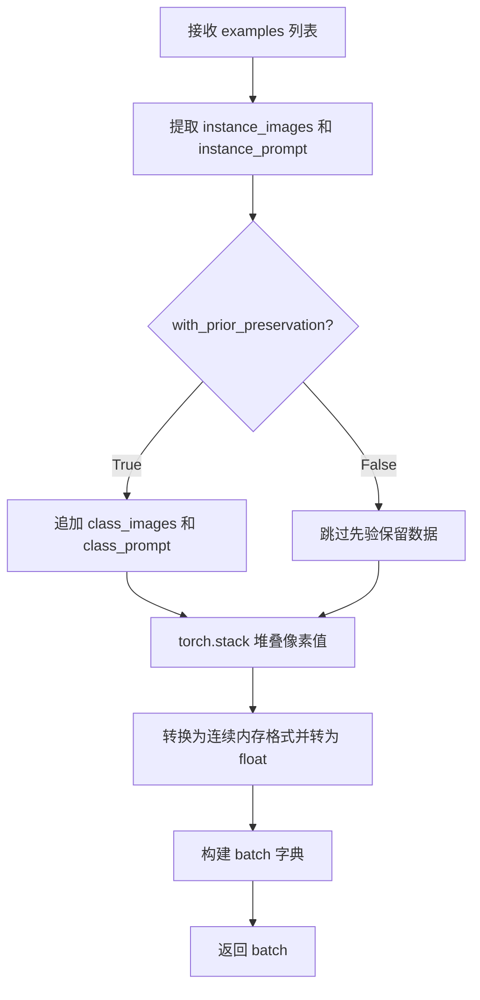

#### 带注释源码

```python
def collate_fn(examples, with_prior_preservation=False):
    """
    自定义批处理整理函数，用于将 DataLoader 的样本列表整理成训练批次。
    
    参数:
        examples: 样本列表，每个元素是包含 'instance_images', 'instance_prompt' 等键的字典
        with_prior_preservation: 是否启用先验保留模式
    返回:
        包含 'pixel_values' 和 'prompts' 的字典
    """
    # 从样本列表中提取所有实例图像
    pixel_values = [example["instance_images"] for example in examples]
    # 从样本列表中提取所有实例提示词
    prompts = [example["instance_prompt"] for example in examples]

    # 如果启用先验保留，将类别图像和提示词也添加到批次中
    # 这样做可以避免进行两次前向传播
    if with_prior_preservation:
        pixel_values += [example["class_images"] for example in examples]
        prompts += [example["class_prompt"] for example in examples]

    # 将像素值列表堆叠成张量，并确保内存连续分布
    pixel_values = torch.stack(pixel_values)
    pixel_values = pixel_values.to(memory_format=torch.contiguous_format).float()

    # 构建最终的批次字典
    batch = {"pixel_values": pixel_values, "prompts": prompts}
    return batch
```


### `main`

主训练函数，负责DreamBooth LoRA微调Flux2扩散模型的完整流程，包括参数验证、分布式训练设置、模型加载、数据集构建、文本嵌入预计算、训练循环执行、验证、模型保存和推送到Hub。

参数：

- `args`：命名空间（argparse.Namespace），包含所有训练配置参数，如模型路径、数据目录、学习率、LoRA配置等

返回值：`None`，该函数执行完整的训练流程，无返回值

#### 流程图

```mermaid
flowchart TD
    A[开始 main 函数] --> B[验证参数与安全性检查]
    B --> C{是否启用 prior preservation?}
    C -->|是| D[生成类别图像]
    C -->|否| E[跳过生成类别图像]
    D --> E
    E --> F[创建输出目录与Hub仓库]
    F --> G[加载 tokenizers]
    G --> H[设置权重精度 fp16/bf16]
    H --> I[加载 scheduler, VAE, transformer]
    I --> J[加载或配置量化设置]
    J --> K{是否远程编码器?}
    K -->|否| L[加载本地 text_encoder]
    K -->|是| M[跳过本地加载]
    L --> N[配置 LoRA 训练]
    M --> N
    N --> O[创建数据集与 DataLoader]
    O --> P{使用自定义 prompts?}
    P -->|是| Q[预计算所有 prompts 嵌入]
    P -->|否| R[预计算 instance prompt 嵌入]
    Q --> S{启用 latent 缓存?}
    R --> S
    S -->|是| T[编码所有图像到 latent 空间]
    S -->|否| U[跳过 latent 缓存]
    T --> U
    U --> V[设置优化器与学习率调度器]
    V --> W[使用 Accelerator 准备模型]
    W --> X[初始化训练 trackers]
    X --> Y[训练循环开始]
    
    Y --> Z{是否恢复 checkpoint?}
    Z -->|是| AA[加载检查点状态]
    Z -->|否| AB[从头开始训练]
    AA --> AC[设置起始 epoch 和 step]
    AB --> AC
    
    AC --> AD[外层循环: 遍历 epochs]
    AD --> AE[变压器设为训练模式]
    AE --> AF[内层循环: 遍历 batches]
    
    AF --> AG{使用缓存 prompts?}
    AG -->|是| AH[从缓存提取嵌入]
    AG -->|否| AI[重复使用 instance 嵌入]
    AH --> AJ
    AI --> AJ
    
    AJ{使用缓存 latents?}
    AJ -->|是| AK[从缓存获取 latent]
    AJ -->|否| AL[使用 VAE 编码像素值]
    AK --> AM
    AL --> AM
    
    AM --> AN[添加噪声生成 noisy input]
    AN --> AO[采样时间步]
    AO --> AP[执行 flow matching]
    AQ[计算预测噪声] --> AR{启用 prior preservation?}
    AP --> AQ
    
    AR -->|是| AS[分离 instance 与 prior 预测]
    AR -->|否| AT
    AS --> AT[计算 prior loss]
    
    AT --> AU[计算加权损失]
    AU --> AV[反向传播]
    AV --> AW[梯度裁剪]
    AW --> AX[优化器更新]
    AX --> AY[学习率调度器更新]
    AY --> AZA[零梯度]
    
    AZA --> AZB{完成优化步骤?}
    AZB -->|否| AF
    AZB -->|是| AZC[更新进度条]
    
    AZC --> AZD{到达 checkpoint 步骤?}
    AZD -->|是| AZE[保存训练状态]
    AZD -->|否| AZF
    AZE --> AZF
    
    AZF --> AZG{需要验证?}
    AZG -->|是| AZH[执行验证推理]
    AZG -->|否| AZI
    AZH --> AZI
    
    AZI --> AZJ{继续训练?}
    AZJ -->|是| AD
    AZJ -->|否| AZK[训练结束]
    
    AZK --> AZL[保存 LoRA 权重]
    AZL --> AZM[执行最终验证推理]
    AZM --> AZN[生成并保存 model card]
    AZO{启用 push to hub?}
    AZN --> AZO
    AZO -->|是| AZP[上传文件夹到 Hub]
    AZO -->|否| AZQ[结束训练]
    AZP --> AZQ
```

#### 带注释源码

```python
def main(args):
    # 1. 安全性检查：wandb 与 hub_token 不能同时使用（安全风险）
    if args.report_to == "wandb" and args.hub_token is not None:
        raise ValueError(
            "You cannot use both --report_to=wandb and --hub_token due to a security risk of exposing your token."
            " Please use `hf auth login` to authenticate with the Hub."
        )

    # 2. MPS 设备不支持 bfloat16 混合精度
    if torch.backends.mps.is_available() and args.mixed_precision == "bf16":
        raise ValueError(
            "Mixed precision training with bfloat16 is not supported on MPS. Please use fp16 (recommended) or fp32 instead."
        )
    
    # 3. FP8 训练需要导入 Float8 转换模块
    if args.do_fp8_training:
        from torchao.float8 import Float8LinearConfig, convert_to_float8_training

    # 4. 设置日志输出目录
    logging_dir = Path(args.output_dir, args.logging_dir)

    # 5. 初始化 Accelerator（分布式训练、混合精度、checkpointing）
    accelerator_project_config = ProjectConfiguration(project_dir=args.output_dir, logging_dir=logging_dir)
    kwargs = DistributedDataParallelKwargs(find_unused_parameters=True)
    accelerator = Accelerator(
        gradient_accumulation_steps=args.gradient_accumulation_steps,
        mixed_precision=args.mixed_precision,
        log_with=args.report_to,
        project_config=accelerator_project_config,
        kwargs_handlers=[kwargs],
    )

    # 6. MPS 设备禁用原生 AMP
    if torch.backends.mps.is_available():
        accelerator.native_amp = False

    # 7. 检查 wandb 是否安装
    if args.report_to == "wandb":
        if not is_wandb_available():
            raise ImportError("Make sure to install wandb if you want to use it for logging during training.")

    # 8. 配置日志格式
    logging.basicConfig(
        format="%(asctime)s - %(levelname)s - %(name)s - %(message)s",
        datefmt="%m/%d/%Y %H:%M:%S",
        level=logging.INFO,
    )
    logger.info(accelerator.state, main_process_only=False)
    
    # 9. 主进程设置日志级别
    if accelerator.is_local_main_process:
        transformers.utils.logging.set_verbosity_warning()
        diffusers.utils.logging.set_verbosity_info()
    else:
        transformers.utils.logging.set_verbosity_error()
        diffusers.utils.logging.set_verbosity_error()

    # 10. 设置随机种子确保可复现性
    if args.seed is not None:
        set_seed(args.seed)

    # 11. Prior Preservation：生成类别图像用于保留先验
    if args.with_prior_preservation:
        class_images_dir = Path(args.class_data_dir)
        if not class_images_dir.exists():
            class_images_dir.mkdir(parents=True)
        cur_class_images = len(list(class_images_dir.iterdir()))

        # 如果类别图像数量不足，需要生成更多
        if cur_class_images < args.num_class_images:
            # 确定精度类型
            has_supported_fp16_accelerator = torch.cuda.is_available() or torch.backends.mps.is_available()
            torch_dtype = torch.float16 if has_supported_fp16_accelerator else torch.float32
            if args.prior_generation_precision == "fp32":
                torch_dtype = torch.float32
            elif args.prior_generation_precision == "fp16":
                torch_dtype = torch.float16
            elif args.prior_generation_precision == "bf16":
                torch_dtype = torch.bfloat16

            # 加载推理 pipeline 生成类别图像
            pipeline = Flux2Pipeline.from_pretrained(
                args.pretrained_model_name_or_path,
                torch_dtype=torch_dtype,
                revision=args.revision,
                variant=args.variant,
            )
            pipeline.set_progress_bar_config(disable=True)

            num_new_images = args.num_class_images - cur_class_images
            logger.info(f"Number of class images to sample: {num_new_images}.")

            # 使用 PromptDataset 和 DataLoader 批量生成
            sample_dataset = PromptDataset(args.class_prompt, num_new_images)
            sample_dataloader = torch.utils.data.DataLoader(sample_dataset, batch_size=args.sample_batch_size)

            sample_dataloader = accelerator.prepare(sample_dataloader)
            pipeline.to(accelerator.device)

            # 生成并保存类别图像
            for example in tqdm(
                sample_dataloader, desc="Generating class images", disable=not accelerator.is_local_main_process
            ):
                with torch.autocast(device_type=accelerator.device.type, dtype=torch_dtype):
                    images = pipeline(prompt=example["prompt"]).images

                for i, image in enumerate(images):
                    hash_image = insecure_hashlib.sha1(image.tobytes()).hexdigest()
                    image_filename = class_images_dir / f"{example['index'][i] + cur_class_images}-{hash_image}.jpg"
                    image.save(image_filename)

            # 释放 pipeline 内存
            del pipeline
            free_memory()

    # 12. 创建输出目录和 Hub 仓库（仅主进程）
    if accelerator.is_main_process:
        if args.output_dir is not None:
            os.makedirs(args.output_dir, exist_ok=True)

        if args.push_to_hub:
            repo_id = create_repo(
                repo_id=args.hub_model_id or Path(args.output_dir).name,
                exist_ok=True,
            ).repo_id

    # 13. 加载 tokenizers（PixtralProcessor 包含图像和文本 tokenizer）
    tokenizer = PixtralProcessor.from_pretrained(
        args.pretrained_model_name_or_path,
        subfolder="tokenizer",
        revision=args.revision,
    )

    # 14. 根据混合精度设置权重数据类型
    weight_dtype = torch.float32
    if accelerator.mixed_precision == "fp16":
        weight_dtype = torch.float16
    elif accelerator.mixed_precision == "bf16":
        weight_dtype = torch.bfloat16

    # 15. 加载调度器、VAE 和 Transformer
    noise_scheduler = FlowMatchEulerDiscreteScheduler.from_pretrained(
        args.pretrained_model_name_or_path,
        subfolder="scheduler",
        revision=args.revision,
    )
    # 深拷贝一份用于训练中的 sigma 计算
    noise_scheduler_copy = copy.deepcopy(noise_scheduler)
    
    vae = AutoencoderKLFlux2.from_pretrained(
        args.pretrained_model_name_or_path,
        subfolder="vae",
        revision=args.revision,
        variant=args.variant,
    )
    
    # 提取 VAE batch normalization 的均值和标准差用于 latent 归一化
    latents_bn_mean = vae.bn.running_mean.view(1, -1, 1, 1).to(accelerator.device)
    latents_bn_std = torch.sqrt(vae.bn.running_var.view(1, -1, 1, 1) + vae.config.batch_norm_eps).to(
        accelerator.device
    )

    # 16. 配置量化设置（BitsAndBytes 4-bit 量化）
    quantization_config = None
    if args.bnb_quantization_config_path is not None:
        with open(args.bnb_quantization_config_path, "r") as f:
            config_kwargs = json.load(f)
            if "load_in_4bit" in config_kwargs and config_kwargs["load_in_4bit"]:
                config_kwargs["bnb_4bit_compute_dtype"] = weight_dtype
        quantization_config = BitsAndBytesConfig(**config_kwargs)

    # 17. 加载 Transformer 主模型
    transformer = Flux2Transformer2DModel.from_pretrained(
        args.pretrained_model_name_or_path,
        subfolder="transformer",
        revision=args.revision,
        variant=args.variant,
        quantization_config=quantization_config,
        torch_dtype=weight_dtype,
    )
    
    # 如果使用 4-bit 量化，准备模型进行 k-bit 训练
    if args.bnb_quantization_config_path is not None:
        transformer = prepare_model_for_kbit_training(transformer, use_gradient_checkpointing=False)

    # 18. 加载 Text Encoder（可选远程编码器）
    if not args.remote_text_encoder:
        text_encoder = Mistral3ForConditionalGeneration.from_pretrained(
            args.pretrained_model_name_or_path, subfolder="text_encoder", revision=args.revision, variant=args.variant
        )
        text_encoder.requires_grad_(False)  # 冻结，不训练

    # 19. 冻结 VAE 和 Transformer（只训练 LoRA）
    transformer.requires_grad_(False)
    vae.requires_grad_(False)

    # 20. 启用 NPU Flash Attention
    if args.enable_npu_flash_attention:
        if is_torch_npu_available():
            logger.info("npu flash attention enabled.")
            transformer.set_attention_backend("_native_npu")
        else:
            raise ValueError("npu flash attention requires torch_npu extensions and is supported only on npu device ")

    # 21. MPS 设备 bfloat16 检查（重复检查）
    if torch.backends.mps.is_available() and weight_dtype == torch.bfloat16:
        raise ValueError(
            "Mixed precision training with bfloat16 is not supported on MPS. Please use fp16 (recommended) or fp32 instead."
        )

    # 22. 将模型移动到目标设备
    to_kwargs = {"dtype": weight_dtype, "device": accelerator.device} if not args.offload else {"dtype": weight_dtype}
    vae.to(**to_kwargs)
    
    # FSDP 特殊处理
    is_fsdp = getattr(accelerator.state, "fsdp_plugin", None) is not None
    if not is_fsdp:
        transformer_to_kwargs = (
            {"device": accelerator.device}
            if args.bnb_quantization_config_path is not None
            else {"device": accelerator.device, "dtype": weight_dtype}
        )
        transformer.to(**transformer_to_kwargs)

    # 23. FP8 训练转换
    if args.do_fp8_training:
        convert_to_float8_training(
            transformer, module_filter_fn=module_filter_fn, config=Float8LinearConfig(pad_inner_dim=True)
        )

    # 24. Text Encoder 移动设备和创建编码 pipeline
    if not args.remote_text_encoder:
        text_encoder.to(**to_kwargs)
        text_encoding_pipeline = Flux2Pipeline.from_pretrained(
            args.pretrained_model_name_or_path,
            vae=None,
            transformer=None,
            tokenizer=tokenizer,
            text_encoder=text_encoder,
            scheduler=None,
            revision=args.revision,
        )

    # 25. 启用梯度 checkpointing 节省显存
    if args.gradient_checkpointing:
        transformer.enable_gradient_checkpointing()

    # 26. 配置 LoRA 目标层
    if args.lora_layers is not None:
        target_modules = [layer.strip() for layer in args.lora_layers.split(",")]
    else:
        target_modules = ["to_k", "to_q", "to_v", "to_out.0"]

    # 27. 添加 LoRA 适配器到 Transformer
    transformer_lora_config = LoraConfig(
        r=args.rank,
        lora_alpha=args.lora_alpha,
        lora_dropout=args.lora_dropout,
        init_lora_weights="gaussian",
        target_modules=target_modules,
    )
    transformer.add_adapter(transformer_lora_config)

    # 辅助函数：解包模型
    def unwrap_model(model):
        model = accelerator.unwrap_model(model)
        model = model._orig_mod if is_compiled_module(model) else model
        return model

    # 28. 注册自定义模型保存/加载 Hook
    def save_model_hook(models, weights, output_dir):
        transformer_cls = type(unwrap_model(transformer))
        modules_to_save: dict[str, Any] = {}
        transformer_model = None

        # 验证并选择 transformer 模型
        for model in models:
            if isinstance(unwrap_model(model), transformer_cls):
                transformer_model = model
                modules_to_save["transformer"] = model
            else:
                raise ValueError(f"unexpected save model: {model.__class__}")

        if transformer_model is None:
            raise ValueError("No transformer model found in 'models'")

        # FSDP 状态下获取 state dict
        state_dict = accelerator.get_state_dict(model) if is_fsdp else None

        # 仅主进程执行 LoRA state dict 序列化
        transformer_lora_layers_to_save = None
        if accelerator.is_main_process:
            peft_kwargs = {}
            if is_fsdp:
                peft_kwargs["state_dict"] = state_dict

            transformer_lora_layers_to_save = get_peft_model_state_dict(
                unwrap_model(transformer_model) if is_fsdp else transformer_model,
                **peft_kwargs,
            )

            if is_fsdp:
                transformer_lora_layers_to_save = _to_cpu_contiguous(transformer_lora_layers_to_save)

            # 弹出权重避免重复保存
            if weights:
                weights.pop()

            # 保存 LoRA 权重
            Flux2Pipeline.save_lora_weights(
                output_dir,
                transformer_lora_layers=transformer_lora_layers_to_save,
                **_collate_lora_metadata(modules_to_save),
            )

    def load_model_hook(models, input_dir):
        transformer_ = None

        if not is_fsdp:
            while len(models) > 0:
                model = models.pop()
                if isinstance(unwrap_model(model), type(unwrap_model(transformer))):
                    transformer_ = unwrap_model(model)
                else:
                    raise ValueError(f"unexpected save model: {model.__class__}")
        else:
            # FSDP 模式下重新加载完整模型
            transformer_ = Flux2Transformer2DModel.from_pretrained(
                args.pretrained_model_name_or_path,
                subfolder="transformer",
            )
            transformer_.add_adapter(transformer_lora_config)

        # 加载 LoRA 权重
        lora_state_dict = Flux2Pipeline.lora_state_dict(input_dir)
        transformer_state_dict = {
            f"{k.replace('transformer.', '')}": v for k, v in lora_state_dict.items() if k.startswith("transformer.")
        }
        transformer_state_dict = convert_unet_state_dict_to_peft(transformer_state_dict)
        incompatible_keys = set_peft_model_state_dict(transformer_, transformer_state_dict, adapter_name="default")
        
        # 确保可训练参数为 float32
        if args.mixed_precision == "fp16":
            models = [transformer_]
            cast_training_params(models)

    accelerator.register_save_state_pre_hook(save_model_hook)
    accelerator.register_load_state_pre_hook(load_model_hook)

    # 29. 启用 TF32 加速（ Ampere GPU）
    if args.allow_tf32 and torch.cuda.is_available():
        torch.backends.cuda.matmul.allow_tf32 = True

    # 30. 缩放学习率（根据 GPU 数量、梯度累积和 batch size）
    if args.scale_lr:
        args.learning_rate = (
            args.learning_rate * args.gradient_accumulation_steps * args.train_batch_size * accelerator.num_processes
        )

    # 31. 确保可训练参数为 float32
    if args.mixed_precision == "fp16":
        models = [transformer]
        cast_training_params(models, dtype=torch.float32)

    # 32. 收集可训练参数（LoRA 参数）
    transformer_lora_parameters = list(filter(lambda p: p.requires_grad, transformer.parameters()))

    # 33. 配置优化器参数
    transformer_parameters_with_lr = {"params": transformer_lora_parameters, "lr": args.learning_rate}
    params_to_optimize = [transformer_parameters_with_lr]

    # 34. 创建优化器
    if not (args.optimizer.lower() == "prodigy" or args.optimizer.lower() == "adamw"):
        logger.warning(
            f"Unsupported choice of optimizer: {args.optimizer}.Supported optimizers include [adamW, prodigy]."
            "Defaulting to adamW"
        )
        args.optimizer = "adamw"

    if args.use_8bit_adam and not args.optimizer.lower() == "adamw":
        logger.warning(
            f"use_8bit_adam is ignored when optimizer is not set to 'AdamW'. Optimizer was "
            f"set to {args.optimizer.lower()}"
        )

    # AdamW 优化器
    if args.optimizer.lower() == "adamw":
        if args.use_8bit_adam:
            try:
                import bitsandbytes as bnb
            except ImportError:
                raise ImportError(
                    "To use 8-bit Adam, please install the bitsandbytes library: `pip install bitsandbytes`."
                )
            optimizer_class = bnb.optim.AdamW8bit
        else:
            optimizer_class = torch.optim.AdamW

        optimizer = optimizer_class(
            params_to_optimize,
            betas=(args.adam_beta1, args.adam_beta2),
            weight_decay=args.adam_weight_decay,
            eps=args.adam_epsilon,
        )

    # Prodigy 优化器
    if args.optimizer.lower() == "prodigy":
        try:
            import prodigyopt
        except ImportError:
            raise ImportError("To use Prodigy, please install the prodigyopt library: `pip install prodigyopt`")

        optimizer_class = prodigyopt.Prodigy

        if args.learning_rate <= 0.1:
            logger.warning(
                "Learning rate is too low. When using prodigy, it's generally better to set learning rate around 1.0"
            )

        optimizer = optimizer_class(
            params_to_optimize,
            betas=(args.adam_beta1, args.adam_beta2),
            beta3=args.prodigy_beta3,
            weight_decay=args.adam_weight_decay,
            eps=args.adam_epsilon,
            decouple=args.prodigy_decouple,
            use_bias_correction=args.prodigy_use_bias_correction,
            safeguard_warmup=args.prodigy_safeguard_warmup,
        )

    # 35. 解析 aspect ratio buckets
    if args.aspect_ratio_buckets is not None:
        buckets = parse_buckets_string(args.aspect_ratio_buckets)
    else:
        buckets = [(args.resolution, args.resolution)]
    logger.info(f"Using parsed aspect ratio buckets: {buckets}")

    # 36. 创建数据集和 DataLoader
    train_dataset = DreamBoothDataset(
        instance_data_root=args.instance_data_dir,
        instance_prompt=args.instance_prompt,
        class_prompt=args.class_prompt,
        class_data_root=args.class_data_dir if args.with_prior_preservation else None,
        class_num=args.num_class_images,
        size=args.resolution,
        repeats=args.repeats,
        center_crop=args.center_crop,
        buckets=buckets,
    )
    
    # 使用 BucketBatchSampler 按 bucket 分组采样
    batch_sampler = BucketBatchSampler(train_dataset, batch_size=args.train_batch_size, drop_last=True)
    train_dataloader = torch.utils.data.DataLoader(
        train_dataset,
        batch_sampler=batch_sampler,
        collate_fn=lambda examples: collate_fn(examples, args.with_prior_preservation),
        num_workers=args.dataloader_num_workers,
    )

    # 37. 定义文本嵌入计算函数（本地）
    def compute_text_embeddings(prompt, text_encoding_pipeline):
        with torch.no_grad():
            prompt_embeds, text_ids = text_encoding_pipeline.encode_prompt(
                prompt=prompt,
                max_sequence_length=args.max_sequence_length,
                text_encoder_out_layers=args.text_encoder_out_layers,
            )
        return prompt_embeds, text_ids

    # 38. 定义远程文本嵌入计算函数
    def compute_remote_text_embeddings(prompts):
        import io
        import requests

        # 获取 HuggingFace token
        if args.hub_token is not None:
            hf_token = args.hub_token
        else:
            from huggingface_hub import get_token
            hf_token = get_token()
            if hf_token is None:
                raise ValueError(
                    "No HuggingFace token found. To use the remote text encoder please login using `hf auth login` or provide a token using --hub_token"
                )

        def _encode_single(prompt: str):
            response = requests.post(
                "https://remote-text-encoder-flux-2.huggingface.co/predict",
                json={"prompt": prompt},
                headers={"Authorization": f"Bearer {hf_token}", "Content-Type": "application/json"},
            )
            assert response.status_code == 200, f"{response.status_code=}"
            return torch.load(io.BytesIO(response.content))

        try:
            if isinstance(prompts, (list, tuple)):
                embeds = [_encode_single(p) for p in prompts]
                prompt_embeds = torch.cat(embeds, dim=0)
            else:
                prompt_embeds = _encode_single(prompts)

            text_ids = Flux2Pipeline._prepare_text_ids(prompt_embeds).to(accelerator.device)
            prompt_embeds = prompt_embeds.to(accelerator.device)
            return prompt_embeds, text_ids

        except Exception as e:
            raise RuntimeError("Remote text encoder inference failed.") from e

    # 39. 预计算 instance prompt 嵌入（如果使用固定 prompt）
    if not train_dataset.custom_instance_prompts:
        if args.remote_text_encoder:
            instance_prompt_hidden_states, instance_text_ids = compute_remote_text_embeddings(args.instance_prompt)
        else:
            with offload_models(text_encoding_pipeline, device=accelerator.device, offload=args.offload):
                instance_prompt_hidden_states, instance_text_ids = compute_text_embeddings(
                    args.instance_prompt, text_encoding_pipeline
                )

    # 40. 预计算 class prompt 嵌入（如果启用 prior preservation）
    if args.with_prior_preservation:
        if args.remote_text_encoder:
            class_prompt_hidden_states, class_text_ids = compute_remote_text_embeddings(args.class_prompt)
        else:
            with offload_models(text_encoding_pipeline, device=accelerator.device, offload=args.offload):
                class_prompt_hidden_states, class_text_ids = compute_text_embeddings(
                    args.class_prompt, text_encoding_pipeline
                )

    # 41. 预计算 validation prompt 嵌入
    validation_embeddings = {}
    if args.validation_prompt is not None:
        if args.remote_text_encoder:
            (validation_embeddings["prompt_embeds"], validation_embeddings["text_ids"]) = (
                compute_remote_text_embeddings(args.validation_prompt)
            )
        else:
            with offload_models(text_encoding_pipeline, device=accelerator.device, offload=args.offload):
                (validation_embeddings["prompt_embeds"], validation_embeddings["text_ids"]) = compute_text_embeddings(
                    args.validation_prompt, text_encoding_pipeline
                )

    # 42. FSDP 包装 Text Encoder（可选）
    if args.fsdp_text_encoder:
        fsdp_kwargs = get_fsdp_kwargs_from_accelerator(accelerator)
        text_encoder_fsdp = wrap_with_fsdp(
            model=text_encoding_pipeline.text_encoder,
            device=accelerator.device,
            offload=args.offload,
            limit_all_gathers=True,
            use_orig_params=True,
            fsdp_kwargs=fsdp_kwargs,
        )
        text_encoding_pipeline.text_encoder = text_encoder_fsdp
        dist.barrier()

    # 43. 准备固定嵌入（合并 instance 和 class 嵌入）
    if not train_dataset.custom_instance_prompts:
        prompt_embeds = instance_prompt_hidden_states
        text_ids = instance_text_ids
        if args.with_prior_preservation:
            prompt_embeds = torch.cat([prompt_embeds, class_prompt_hidden_states], dim=0)
            text_ids = torch.cat([text_ids, class_text_ids], dim=0)

    # 44. 预计算 latents 和 custom prompts 嵌入（可选）
    precompute_latents = args.cache_latents or train_dataset.custom_instance_prompts
    if precompute_latents:
        prompt_embeds_cache = []
        text_ids_cache = []
        latents_cache = []
        for batch in tqdm(train_dataloader, desc="Caching latents"):
            with torch.no_grad():
                # 缓存 VAE latents
                if args.cache_latents:
                    with offload_models(vae, device=accelerator.device, offload=args.offload):
                        batch["pixel_values"] = batch["pixel_values"].to(
                            accelerator.device, non_blocking=True, dtype=vae.dtype
                        )
                        latents_cache.append(vae.encode(batch["pixel_values"]).latent_dist)
                # 缓存 custom prompts 嵌入
                if train_dataset.custom_instance_prompts:
                    if args.remote_text_encoder:
                        prompt_embeds, text_ids = compute_remote_text_embeddings(batch["prompts"])
                    elif args.fsdp_text_encoder:
                        prompt_embeds, text_ids = compute_text_embeddings(batch["prompts"], text_encoding_pipeline)
                    else:
                        with offload_models(text_encoding_pipeline, device=accelerator.device, offload=args.offload):
                            prompt_embeds, text_ids = compute_text_embeddings(batch["prompts"], text_encoding_pipeline)
                    prompt_embeds_cache.append(prompt_embeds)
                    text_ids_cache.append(text_ids)

    # 45. 释放 VAE 和 Text Encoder 内存
    if args.cache_latents:
        vae = vae.to("cpu")
        del vae

    if not args.remote_text_encoder:
        text_encoding_pipeline = text_encoding_pipeline.to("cpu")
        del text_encoder, tokenizer
    free_memory()

    # 46. 配置学习率调度器
    num_warmup_steps_for_scheduler = args.lr_warmup_steps * accelerator.num_processes
    if args.max_train_steps is None:
        len_train_dataloader_after_sharding = math.ceil(len(train_dataloader) / accelerator.num_processes)
        num_update_steps_per_epoch = math.ceil(len_train_dataloader_after_sharding / args.gradient_accumulation_steps)
        num_training_steps_for_scheduler = (
            args.num_train_epochs * accelerator.num_processes * num_update_steps_per_epoch
        )
    else:
        num_training_steps_for_scheduler = args.max_train_steps * accelerator.num_processes

    lr_scheduler = get_scheduler(
        args.lr_scheduler,
        optimizer=optimizer,
        num_warmup_steps=num_warmup_steps_for_scheduler,
        num_training_steps=num_training_steps_for_scheduler,
        num_cycles=args.lr_num_cycles,
        power=args.lr_power,
    )

    # 47. 使用 Accelerator 准备模型和优化器
    transformer, optimizer, train_dataloader, lr_scheduler = accelerator.prepare(
        transformer, optimizer, train_dataloader, lr_scheduler
    )

    # 48. 重新计算总训练步数
    num_update_steps_per_epoch = math.ceil(len(train_dataloader) / args.gradient_accumulation_steps)
    if args.max_train_steps is None:
        args.max_train_steps = args.num_train_epochs * num_update_steps_per_epoch
        if num_training_steps_for_scheduler != args.max_train_steps:
            logger.warning(
                f"The length of the 'train_dataloader' after 'accelerator.prepare' ({len(train_dataloader)}) does not match "
                f"the expected length ({len_train_dataloader_after_sharding}) when the learning rate scheduler was created. "
                f"This inconsistency may result in the learning rate scheduler not functioning properly."
            )
    args.num_train_epochs = math.ceil(args.max_train_steps / num_update_steps_per_epoch)

    # 49. 初始化 trackers
    if accelerator.is_main_process:
        tracker_name = "dreambooth-flux2-lora"
        args_cp = vars(args).copy()
        args_cp["text_encoder_out_layers"] = str(args_cp["text_encoder_out_layers"])
        accelerator.init_trackers(tracker_name, config=args_cp)

    # 50. 打印训练信息
    total_batch_size = args.train_batch_size * accelerator.num_processes * args.gradient_accumulation_steps
    logger.info("***** Running training *****")
    logger.info(f"  Num examples = {len(train_dataset)}")
    logger.info(f"  Num batches each epoch = {len(train_dataloader)}")
    logger.info(f"  Num Epochs = {args.num_train_epochs}")
    logger.info(f"  Instantaneous batch size per device = {args.train_batch_size}")
    logger.info(f"  Total train batch size (w. parallel, distributed & accumulation) = {total_batch_size}")
    logger.info(f"  Gradient Accumulation steps = {args.gradient_accumulation_steps}")
    logger.info(f"  Total optimization steps = {args.max_train_steps}")

    global_step = 0
    first_epoch = 0

    # 51. 恢复 checkpoint（可选）
    if args.resume_from_checkpoint:
        if args.resume_from_checkpoint != "latest":
            path = os.path.basename(args.resume_from_checkpoint)
        else:
            dirs = os.listdir(args.output_dir)
            dirs = [d for d in dirs if d.startswith("checkpoint")]
            dirs = sorted(dirs, key=lambda x: int(x.split("-")[1]))
            path = dirs[-1] if len(dirs) > 0 else None

        if path is None:
            accelerator.print(
                f"Checkpoint '{args.resume_from_checkpoint}' does not exist. Starting a new training run."
            )
            args.resume_from_checkpoint = None
            initial_global_step = 0
        else:
            accelerator.print(f"Resuming from checkpoint {path}")
            accelerator.load_state(os.path.join(args.output_dir, path))
            global_step = int(path.split("-")[1])
            initial_global_step = global_step
            first_epoch = global_step // num_update_steps_per_epoch
    else:
        initial_global_step = 0

    # 52. 创建进度条
    progress_bar = tqdm(
        range(0, args.max_train_steps),
        initial=initial_global_step,
        desc="Steps",
        disable=not accelerator.is_local_main_process,
    )

    # 53. Sigma 计算辅助函数
    def get_sigmas(timesteps, n_dim=4, dtype=torch.float32):
        sigmas = noise_scheduler_copy.sigmas.to(device=accelerator.device, dtype=dtype)
        schedule_timesteps = noise_scheduler_copy.timesteps.to(accelerator.device)
        timesteps = timesteps.to(accelerator.device)
        step_indices = [(schedule_timesteps == t).nonzero().item() for t in timesteps]
        sigma = sigmas[step_indices].flatten()
        while len(sigma.shape) < n_dim:
            sigma = sigma.unsqueeze(-1)
        return sigma

    # ==================== 训练循环 ====================
    for epoch in range(first_epoch, args.num_train_epochs):
        transformer.train()

        for step, batch in enumerate(train_dataloader):
            models_to_accumulate = [transformer]
            prompts = batch["prompts"]

            with accelerator.accumulate(models_to_accumulate):
                # 获取 prompt 嵌入
                if train_dataset.custom_instance_prompts:
                    prompt_embeds = prompt_embeds_cache[step]
                    text_ids = text_ids_cache[step]
                else:
                    num_repeat_elements = len(prompts)
                    prompt_embeds = prompt_embeds.repeat(num_repeat_elements, 1, 1)
                    text_ids = text_ids.repeat(num_repeat_elements, 1, 1)

                # 将图像编码到 latent 空间
                if args.cache_latents:
                    model_input = latents_cache[step].mode()
                else:
                    with offload_models(vae, device=accelerator.device, offload=args.offload):
                        pixel_values = batch["pixel_values"].to(dtype=vae.dtype)
                    model_input = vae.encode(pixel_values).latent_dist.mode()

                # Patchify 和归一化 latents
                model_input = Flux2Pipeline._patchify_latents(model_input)
                model_input = (model_input - latents_bn_mean) / latents_bn_std

                # 准备 latent IDs
                model_input_ids = Flux2Pipeline._prepare_latent_ids(model_input).to(device=model_input.device)
                
                # 采样噪声
                noise = torch.randn_like(model_input)
                bsz = model_input.shape[0]

                # 非均匀时间步采样
                u = compute_density_for_timestep_sampling(
                    weighting_scheme=args.weighting_scheme,
                    batch_size=bsz,
                    logit_mean=args.logit_mean,
                    logit_std=args.logit_std,
                    mode_scale=args.mode_scale,
                )
                indices = (u * noise_scheduler_copy.config.num_train_timesteps).long()
                timesteps = noise_scheduler_copy.timesteps[indices].to(device=model_input.device)

                # Flow matching: zt = (1 - texp) * x + texp * z1
                sigmas = get_sigmas(timesteps, n_dim=model_input.ndim, dtype=model_input.dtype)
                noisy_model_input = (1.0 - sigmas) * model_input + sigmas * noise

                # Pack latents
                packed_noisy_model_input = Flux2Pipeline._pack_latents(noisy_model_input)

                # Guidance
                guidance = torch.full([1], args.guidance_scale, device=accelerator.device)
                guidance = guidance.expand(model_input.shape[0])

                # 前向传播：预测噪声
                model_pred = transformer(
                    hidden_states=packed_noisy_model_input,
                    timestep=timesteps / 1000,
                    guidance=guidance,
                    encoder_hidden_states=prompt_embeds,
                    txt_ids=text_ids,
                    img_ids=model_input_ids,
                    return_dict=False,
                )[0]
                model_pred = model_pred[:, : packed_noisy_model_input.size(1) :]

                # Unpack latents
                model_pred = Flux2Pipeline._unpack_latents_with_ids(model_pred, model_input_ids)

                # 损失加权
                weighting = compute_loss_weighting_for_sd3(weighting_scheme=args.weighting_scheme, sigmas=sigmas)

                # Flow matching 目标: noise - model_input
                target = noise - model_input

                # Prior preservation loss
                if args.with_prior_preservation:
                    model_pred, model_pred_prior = torch.chunk(model_pred, 2, dim=0)
                    target, target_prior = torch.chunk(target, 2, dim=0)

                    prior_loss = torch.mean(
                        (weighting.float() * (model_pred_prior.float() - target_prior.float()) ** 2).reshape(
                            target_prior.shape[0], -1
                        ),
                        1,
                    )
                    prior_loss = prior_loss.mean()

                # 主损失计算
                loss = torch.mean(
                    (weighting.float() * (model_pred.float() - target.float()) ** 2).reshape(target.shape[0], -1),
                    1,
                )
                loss = loss.mean()

                # 合并损失
                if args.with_prior_preservation:
                    loss = loss + args.prior_loss_weight * prior_loss

                # 反向传播
                accelerator.backward(loss)
                
                # 梯度裁剪
                if accelerator.sync_gradients:
                    params_to_clip = transformer.parameters()
                    accelerator.clip_grad_norm_(params_to_clip, args.max_grad_norm)

                # 优化器更新
                optimizer.step()
                lr_scheduler.step()
                optimizer.zero_grad()

            # 同步后处理
            if accelerator.sync_gradients:
                progress_bar.update(1)
                global_step += 1

                # Checkpoint 保存
                if accelerator.is_main_process or is_fsdp:
                    if global_step % args.checkpointing_steps == 0:
                        # 检查保存数量限制
                        if args.checkpoints_total_limit is not None:
                            checkpoints = os.listdir(args.output_dir)
                            checkpoints = [d for d in checkpoints if d.startswith("checkpoint")]
                            checkpoints = sorted(checkpoints, key=lambda x: int(x.split("-")[1]))

                            if len(checkpoints) >= args.checkpoints_total_limit:
                                num_to_remove = len(checkpoints) - args.checkpoints_total_limit + 1
                                removing_checkpoints = checkpoints[0:num_to_remove]
                                logger.info(
                                    f"{len(checkpoints)} checkpoints already exist, removing {len(removing_checkpoints)} checkpoints"
                                )
                                for removing_checkpoint in removing_checkpoints:
                                    shutil.rmtree(os.path.join(args.output_dir, removing_checkpoint))

                        save_path = os.path.join(args.output_dir, f"checkpoint-{global_step}")
                        accelerator.save_state(save_path)
                        logger.info(f"Saved state to {save_path}")

                # 记录日志
                logs = {"loss": loss.detach().item(), "lr": lr_scheduler.get_last_lr()[0]}
                progress_bar.set_postfix(**logs)
                accelerator.log(logs, step=global_step)

                # 提前终止
                if global_step >= args.max_train_steps:
                    break

        # 验证
        if accelerator.is_main_process:
            if args.validation_prompt is not None and epoch % args.validation_epochs == 0:
                pipeline = Flux2Pipeline.from_pretrained(
                    args.pretrained_model_name_or_path,
                    text_encoder=None,
                    tokenizer=None,
                    transformer=unwrap_model(transformer),
                    revision=args.revision,
                    variant=args.variant,
                    torch_dtype=weight_dtype,
                )
                images = log_validation(
                    pipeline=pipeline,
                    args=args,
                    accelerator=accelerator,
                    pipeline_args=validation_embeddings,
                    epoch=epoch,
                    torch_dtype=weight_dtype,
                )
                del pipeline
                free_memory()

    # ==================== 训练结束 ====================
    # 54. 保存 LoRA 权重
    accelerator.wait_for_everyone()

    if is_fsdp:
        transformer = unwrap_model(transformer)
        state_dict = accelerator.get_state_dict(transformer)
        
    if accelerator.is_main_process:
        modules_to_save = {}
        if is_fsdp:
            if args.bnb_quantization_config_path is None:
                if args.upcast_before_saving:
                    state_dict = {
                        k: v.to(torch.float32) if isinstance(v, torch.Tensor) else v for k, v in state_dict.items()
                    }
                else:
                    state_dict = {
                        k: v.to(weight_dtype) if isinstance(v, torch.Tensor) else v for k, v in state_dict.items()
                    }

            transformer_lora_layers = get_peft_model_state_dict(
                transformer,
                state_dict=state_dict,
            )
            transformer_lora_layers = {
                k: v.detach().cpu().contiguous() if isinstance(v, torch.Tensor) else v
                for k, v in transformer_lora_layers.items()
            }
        else:
            transformer = unwrap_model(transformer)
            if args.bnb_quantization_config_path is None:
                if args.upcast_before_saving:
                    transformer.to(torch.float32)
                else:
                    transformer = transformer.to(weight_dtype)
            transformer_lora_layers = get_peft_model_state_dict(transformer)

        modules_to_save["transformer"] = transformer

        # 保存 LoRA 权重
        Flux2Pipeline.save_lora_weights(
            save_directory=args.output_dir,
            transformer_lora_layers=transformer_lora_layers,
            **_collate_lora_metadata(modules_to_save),
        )

        # 最终验证
        images = []
        run_validation = (args.validation_prompt and args.num_validation_images > 0) or (args.final_validation_prompt)
        should_run_final_inference = not args.skip_final_inference and run_validation
        if should_run_final_inference:
            pipeline = Flux2Pipeline.from_pretrained(
                args.pretrained_model_name_or_path,
                revision=args.revision,
                variant=args.variant,
                torch_dtype=weight_dtype,
            )
            pipeline.load_lora_weights(args.output_dir)

            if args.validation_prompt and args.num_validation_images > 0:
                images = log_validation(
                    pipeline=pipeline,
                    args=args,
                    accelerator=accelerator,
                    pipeline_args=validation_embeddings,
                    epoch=epoch,
                    is_final_validation=True,
                    torch_dtype=weight_dtype,
                )
            images = None
            del pipeline
            free_memory()

        # 生成 model card
        validation_prompt = args.validation_prompt if args.validation_prompt else args.final_validation_prompt
        quant_training = None
        if args.do_fp8_training:
            quant_training = "FP8 TorchAO"
        elif args.bnb_quantization_config_path:
            quant_training = "BitsandBytes"
        save_model_card(
            (args.hub_model_id or Path(args.output_dir).name) if not args.push_to_hub else repo_id,
            images=images,
            base_model=args.pretrained_model_name_or_path,
            instance_prompt=args.instance_prompt,
            validation_prompt=validation_prompt,
            repo_folder=args.output_dir,
            quant_training=quant_training,
        )

        # 推送到 Hub
        if args.push_to_hub:
            upload_folder(
                repo_id=repo_id,
                folder_path=args.output_dir,
                commit_message="End of training",
                ignore_patterns=["step_*", "epoch_*"],
            )

    accelerator.end_training()
```


### `DreamBoothDataset.__init__`

该方法是 `DreamBoothDataset` 类的构造函数，用于初始化 DreamBooth 训练数据集。它负责加载实例图像和类别图像（如果启用先验保留），对图像进行预处理（包括大小调整、裁剪、翻转和归一化），并设置图像转换管道。同时支持从 HuggingFace Hub 数据集或本地文件夹加载数据。

参数：

- `instance_data_root`：`str`，实例图像的根目录路径或 HuggingFace 数据集名称
- `instance_prompt`：`str`，用于实例图像的提示词
- `class_prompt`：`str`，用于类别图像的提示词
- `class_data_root`：`str | None`，类别图像的根目录路径，默认为 `None`
- `class_num`：`int | None`，类别图像的最大数量，默认为 `None`
- `size`：`int`，图像的目标尺寸，默认为 `1024`
- `repeats`：`int`，训练数据重复次数，默认为 `1`
- `center_crop`：`bool`，是否使用中心裁剪，默认为 `False`
- `buckets`：`list[tuple[int, int]] | None`，宽高比桶列表，用于动态尺寸训练，默认为 `None`

返回值：`None`，该方法不返回值，仅初始化实例属性

#### 流程图

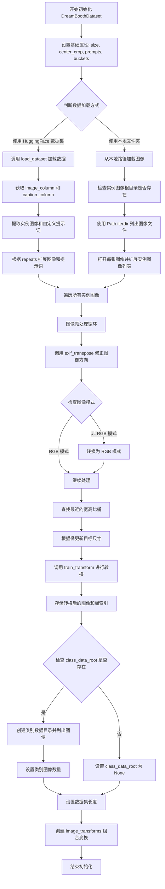

#### 带注释源码

```python
def __init__(
    self,
    instance_data_root,
    instance_prompt,
    class_prompt,
    class_data_root=None,
    class_num=None,
    size=1024,
    repeats=1,
    center_crop=False,
    buckets=None,
):
    """
    初始化 DreamBooth 数据集
    
    参数:
        instance_data_root: 实例图像根目录或数据集名称
        instance_prompt: 实例提示词
        class_prompt: 类别提示词
        class_data_root: 类别图像目录（可选，用于先验保留）
        class_num: 类别图像最大数量
        size: 图像目标尺寸
        repeats: 重复次数
        center_crop: 是否中心裁剪
        buckets: 宽高比桶列表
    """
    # 1. 设置基础属性
    self.size = size
    self.center_crop = center_crop
    
    self.instance_prompt = instance_prompt
    self.custom_instance_prompts = None  # 自定义提示词（从数据集列加载）
    self.class_prompt = class_prompt
    
    self.buckets = buckets
    
    # 2. 判断数据加载方式：HuggingFace 数据集 或 本地文件夹
    # 如果指定了 --dataset_name，则从 Hub 加载
    if args.dataset_name is not None:
        try:
            from datasets import load_dataset
        except ImportError:
            raise ImportError(
                "You are trying to load your data using the datasets library. If you wish to train using custom "
                "captions please install the datasets library: `pip install datasets`. If you wish to load a "
                "local folder containing images only, specify --instance_data_dir instead."
            )
        
        # 从 Hub 下载并加载数据集
        dataset = load_dataset(
            args.dataset_name,
            args.dataset_config_name,
            cache_dir=args.cache_dir,
        )
        
        # 获取训练集的列名
        column_names = dataset["train"].column_names
        
        # 3. 获取图像列名（默认为第一列）
        if args.image_column is None:
            image_column = column_names[0]
            logger.info(f"image column defaulting to {image_column}")
        else:
            image_column = args.image_column
            if image_column not in column_names:
                raise ValueError(
                    f"`--image_column` value '{args.image_column}' not found in dataset columns. Dataset columns are: {', '.join(column_names)}"
                )
        
        # 提取实例图像
        instance_images = dataset["train"][image_column]
        
        # 4. 获取提示词列（可选）
        if args.caption_column is None:
            logger.info(
                "No caption column provided, defaulting to instance_prompt for all images. If your dataset "
                "contains captions/prompts for the images, make sure to specify the "
                "column as --caption_column"
            )
            self.custom_instance_prompts = None
        else:
            if args.caption_column not in column_names:
                raise ValueError(
                    f"`--caption_column` value '{args.caption_column}' not found in dataset columns. Dataset columns are: {', '.join(column_names)}"
                )
            
            # 获取自定义提示词并根据 repeats 扩展
            custom_instance_prompts = dataset["train"][args.caption_column]
            self.custom_instance_prompts = []
            for caption in custom_instance_prompts:
                self.custom_instance_prompts.extend(itertools.repeat(caption, repeats))
    else:
        # 5. 从本地文件夹加载图像
        self.instance_data_root = Path(instance_data_root)
        if not self.instance_data_root.exists():
            raise ValueError("Instance images root doesn't exists.")
        
        # 列出所有图像文件并打开
        instance_images = [Image.open(path) for path in list(Path(instance_data_root).iterdir())]
        self.custom_instance_prompts = None
    
    # 6. 根据 repeats 扩展实例图像列表
    self.instance_images = []
    for img in instance_images:
        self.instance_images.extend(itertools.repeat(img, repeats))
    
    # 7. 图像预处理：遍历每张图像进行转换
    self.pixel_values = []
    for i, image in enumerate(self.instance_images):
        # 修正 EXIF 方向问题
        image = exif_transpose(image)
        
        # 转换为 RGB 模式
        if not image.mode == "RGB":
            image = image.convert("RGB")
        
        width, height = image.size
        
        # 8. 查找最近的宽高比桶
        bucket_idx = find_nearest_bucket(height, width, self.buckets)
        target_height, target_width = self.buckets[bucket_idx]
        self.size = (target_height, target_width)
        
        # 9. 应用训练变换（resize, crop, flip, normalize）
        image = self.train_transform(
            image,
            size=self.size,
            center_crop=args.center_crop,
            random_flip=args.random_flip,
        )
        # 存储变换后的图像和对应的桶索引
        self.pixel_values.append((image, bucket_idx))
    
    # 10. 设置数据集长度
    self.num_instance_images = len(self.instance_images)
    self._length = self.num_instance_images
    
    # 11. 处理类别数据（先验保留）
    if class_data_root is not None:
        self.class_data_root = Path(class_data_root)
        self.class_data_root.mkdir(parents=True, exist_ok=True)
        self.class_images_path = list(self.class_data_root.iterdir())
        
        if class_num is not None:
            self.num_class_images = min(len(self.class_images_path), class_num)
        else:
            self.num_class_images = len(self.class_images_path)
        
        # 数据集长度为实例图像和类别图像中的较大值
        self._length = max(self.num_class_images, self.num_instance_images)
    else:
        self.class_data_root = None
    
    # 12. 创建图像变换组合（用于类别图像）
    self.image_transforms = transforms.Compose(
        [
            transforms.Resize(size, interpolation=transforms.InterpolationMode.BILINEAR),
            transforms.CenterCrop(size) if center_crop else transforms.RandomCrop(size),
            transforms.ToTensor(),
            transforms.Normalize([0.5], [0.5]),
        ]
    )
```


### `DreamBoothDataset.__len__`

该方法返回数据集的总长度，用于 PyTorch DataLoader 确定数据集的大小。在 DreamBooth 训练中，数据集长度取实例图像数量和类别图像数量（如果有）的最大值，以支持 prior preservation 训练策略。

参数：

- `self`：隐式参数，`DreamBoothDataset` 实例本身，无需显式传递。

返回值：`int`，返回数据集的总长度（实例图像数量和类别图像数量的最大值），用于 DataLoader 分页。

#### 流程图

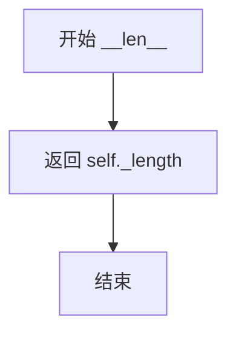

#### 带注释源码

```python
def __len__(self):
    """
    返回数据集的长度。
    
    该方法使得 DreamBoothDataset 兼容 PyTorch DataLoader，
    DataLoader 通过此方法获取数据集大小以进行 batch 划分。
    
    Returns:
        int: 数据集的总长度，等于实例图像数量和类别图像数量的最大值。
              如果没有类别图像，则等于实例图像数量。
    """
    return self._length
```


### `DreamBoothDataset.__getitem__`

该方法是 DreamBooth 数据集类的核心数据访问方法，负责根据给定索引返回训练样本。它从预处理的像素值中获取实例图像，并根据数据集配置（是否使用自定义提示词、是否启用先验 preservation）返回包含实例图像、提示词及可选的类图像和提示词的字典，供训练流程使用。

参数：

- `index`：`int`，数据集中的索引位置，用于定位要返回的样本

返回值：`dict`，包含以下键值对的字典：
  - `instance_images`：预处理后的实例图像张量
  - `bucket_idx`：该图像所在的目标桶索引，用于后续批处理
  - `instance_prompt`：与实例图像关联的文本提示词
  - `class_images`（可选）：先验 preservation 所需的类图像张量
  - `class_prompt`（可选）：类图像对应的文本提示词

#### 流程图

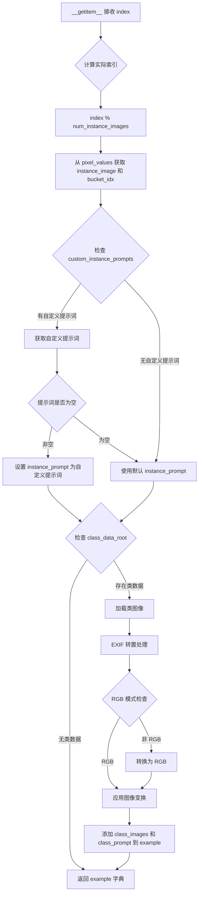

#### 带注释源码

```python
def __getitem__(self, index):
    """
    获取指定索引的训练样本。
    
    参数:
        index: 数据集中的索引位置
        
    返回:
        包含实例图像、提示词及可选类图像的字典
    """
    # 初始化返回字典
    example = {}
    
    # 计算实际索引（使用取模确保索引在有效范围内）
    # 支持数据集小于预定义长度时的循环访问
    instance_image, bucket_idx = self.pixel_values[index % self.num_instance_images]
    
    # 存储实例图像和对应的 bucket 索引
    # bucket_idx 用于后续批处理时的分组
    example["instance_images"] = instance_image
    example["bucket_idx"] = bucket_idx
    
    # 处理文本提示词
    if self.custom_instance_prompts:
        # 如果提供了自定义提示词，按索引获取
        caption = self.custom_instance_prompts[index % self.num_instance_images]
        if caption:
            # 使用自定义提示词（如果非空）
            example["instance_prompt"] = caption
        else:
            # 自定义提示词为空时，回退到默认 instance_prompt
            example["instance_prompt"] = self.instance_prompt
    else:
        # 未提供自定义提示词时，使用默认 instance_prompt
        # 这是 DreamBooth 训练的标准模式
        example["instance_prompt"] = self.instance_prompt
    
    # 处理先验 preservation 所需的类图像
    if self.class_data_root:
        # 打开并加载类图像
        class_image = Image.open(self.class_images_path[index % self.num_class_images])
        
        # EXIF 转置：修正图像方向（根据相机 EXIF 数据）
        class_image = exif_transpose(class_image)
        
        # 确保图像为 RGB 模式（处理 RGBA 或灰度图）
        if not class_image.mode == "RGB":
            class_image = class_image.convert("RGB")
        
        # 应用图像变换（Resize, Crop, ToTensor, Normalize）
        example["class_images"] = self.image_transforms(class_image)
        # 添加类别的文本提示词
        example["class_prompt"] = self.class_prompt
    
    # 返回完整的训练样本字典
    # 包含: instance_images, bucket_idx, instance_prompt
    # 可选: class_images, class_prompt（当启用先验 preservation 时）
    return example
```


### `DreamBoothDataset.train_transform`

该方法负责对训练图像进行预处理，包括调整大小、裁剪、随机水平翻转以及转换为张量并归一化，是 DreamBooth 数据集预处理流程的核心组成部分。

参数：

- `self`：`DreamBoothDataset`，方法所属的实例对象
- `image`：`PIL.Image.Image`，输入的原始图像对象
- `size`：`tuple[int, int]`，目标图像尺寸，默认为 (224, 224)
- `center_crop`：`bool`，是否使用中心裁剪，默认为 False（使用随机裁剪）
- `random_flip`：`bool`，是否进行随机水平翻转，默认为 False

返回值：`torch.Tensor`，经过预处理后的图像张量，形状为 (C, H, W)，通道值已归一化到 [-1, 1] 范围

#### 流程图

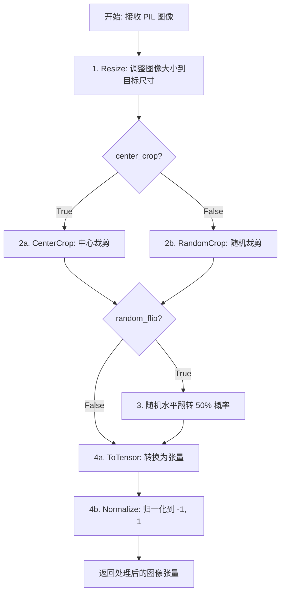

#### 带注释源码

```python
def train_transform(self, image, size=(224, 224), center_crop=False, random_flip=False):
    """
    对图像应用训练所需的变换操作
    
    参数:
        image: 输入的PIL图像
        size: 目标输出尺寸
        center_crop: 是否使用中心裁剪（否则使用随机裁剪）
        random_flip: 是否进行随机水平翻转
    返回:
        归一化后的图像张量
    """
    
    # 1. Resize (deterministic) - 确定性的图像缩放操作
    # 使用双线性插值将图像调整到目标尺寸
    resize = transforms.Resize(size, interpolation=transforms.InterpolationMode.BILINEAR)
    image = resize(image)

    # 2. Crop: either center or SAME random crop
    # 根据参数选择中心裁剪或随机裁剪
    if center_crop:
        # 中心裁剪：从图像中心裁剪出指定尺寸
        crop = transforms.CenterCrop(size)
        image = crop(image)
    else:
        # 随机裁剪：使用 torch 的 get_params 获取随机裁剪参数
        # get_params 返回 (i, j, h, w) - 分别是顶部偏移、左侧偏移、高度、宽度
        i, j, h, w = transforms.RandomCrop.get_params(image, output_size=size)
        image = TF.crop(image, i, j, h, w)

    # 3. Random horizontal flip with the SAME coin flip
    # 随机水平翻转，以 50% 的概率进行翻转
    if random_flip:
        do_flip = random.random() < 0.5  # 生成 0-1 之间的随机数
        if do_flip:
            image = TF.hflip(image)  # 执行水平翻转

    # 4. ToTensor + Normalize (deterministic)
    # 将 PIL 图像转换为 PyTorch 张量，并进行归一化
    # 归一化到 [-1, 1] 范围：output = (input - 0.5) / 0.5
    to_tensor = transforms.ToTensor()
    normalize = transforms.Normalize([0.5], [0.5])
    image = normalize(to_tensor(image))

    return image
```


### `BucketBatchSampler.__init__`

该方法是 `BucketBatchSampler` 类的初始化方法，用于创建一个基于桶（bucket）的批处理器。它根据数据集图像的宽高比将样本分组到不同的桶中，并在每个桶内生成批次，从而在训练过程中减少因图像尺寸变化导致的填充开销。

参数：

- `dataset`：`DreamBoothDataset`，包含图像数据和桶信息的训练数据集
- `batch_size`：`int`，每个批次的样本数量，必须为正整数
- `drop_last`：`bool`，如果设为 `True`，则丢弃最后一个不完整的批次（默认值为 `False`）

返回值：`None`，该方法仅初始化对象状态，不返回任何值

#### 流程图

```mermaid
flowchart TD
    A[开始 __init__] --> B{验证 batch_size 是否为正整数}
    B -->|否| C[抛出 ValueError]
    B -->|是| D{验证 drop_last 是否为布尔值}
    D -->|否| E[抛出 ValueError]
    D -->|是| F[保存 dataset, batch_size, drop_last]
    
    F --> G[创建 bucket_indices 列表]
    G --> H{遍历 dataset.pixel_values}
    H -->|每个样本| I[根据 bucket_idx 将索引添加到对应桶]
    H -->|完成| J[初始化 sampler_len = 0 和 batches = []]
    
    J --> K{遍历每个桶的索引}
    K -->|每个桶| L[随机打乱桶内索引]
    L --> M{按 batch_size 切分桶索引}
    M --> N{判断批次是否完整且 drop_last}
    N -->|是| O[跳过该批次]
    N -->|否| P[添加到 batches 列表]
    P --> Q[sampler_len += 1]
    O --> Q
    Q --> M
    M --> K
    K --> R[结束 __init__]
```

#### 带注释源码

```python
def __init__(self, dataset: DreamBoothDataset, batch_size: int, drop_last: bool = False):
    # 参数验证：确保 batch_size 是正整数
    if not isinstance(batch_size, int) or batch_size <= 0:
        raise ValueError("batch_size should be a positive integer value, but got batch_size={}".format(batch_size))
    
    # 参数验证：确保 drop_last 是布尔值
    if not isinstance(drop_last, bool):
        raise ValueError("drop_last should be a boolean value, but got drop_last={}".format(drop_last))

    # 保存传入的参数
    self.dataset = dataset
    self.batch_size = batch_size
    self.drop_last = drop_last

    # 创建与桶数量相同的索引列表，用于按桶分组样本索引
    self.bucket_indices = [[] for _ in range(len(self.dataset.buckets))]
    
    # 遍历数据集中的所有样本，按其所属桶的索引进行分组
    for idx, (_, bucket_idx) in enumerate(self.dataset.pixel_values):
        self.bucket_indices[bucket_idx].append(idx)

    # 初始化批次计数器和批次列表
    self.sampler_len = 0
    self.batches = []

    # 预生成每个桶的批次
    for indices_in_bucket in self.bucket_indices:
        # 随机打乱桶内索引顺序，增加训练多样性
        random.shuffle(indices_in_bucket)
        
        # 按 batch_size 大小切分桶内的索引，形成批次
        for i in range(0, len(indices_in_bucket), self.batch_size):
            batch = indices_in_bucket[i : i + self.batch_size]
            
            # 如果启用了 drop_last 且当前批次不完整，则跳过
            if len(batch) < self.batch_size and self.drop_last:
                continue  # Skip partial batch if drop_last is True
            
            # 将有效批次添加到列表中
            self.batches.append(batch)
            self.sampler_len += 1  # 统计总批次数
```


### `BucketBatchSampler.__iter__`

该方法是 `BucketBatchSampler` 类的迭代器实现，用于在每个训练 epoch 中按需生成批次数据。它会对预生成的批次顺序进行随机打乱，以确保每个 epoch 的数据顺序不同，然后将每个批次 yield 返回给数据加载器。

参数：无（使用隐式参数 `self`）

返回值：`List[int]`，表示一个批次的样本索引列表

#### 流程图

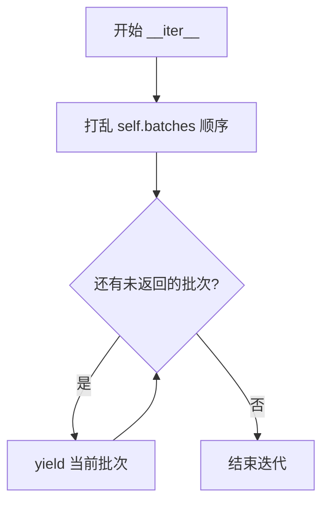

#### 带注释源码

```python
def __iter__(self):
    # 在每个 epoch 开始时，随机打乱所有批次的顺序
    # 这样可以确保每个 epoch 的数据顺序不同，增加模型训练的随机性
    random.shuffle(self.batches)
    
    # 遍历所有预生成的批次，逐一 yield 返回
    # 每个 batch 是一个包含样本索引的列表
    for batch in self.batches:
        yield batch
```


### `BucketBatchSampler.__len__`

该方法用于返回BucketBatchSampler中预生成批次的总数，使得DataLoader能够确定整个数据集需要遍历的批次数。

参数：

- 无参数

返回值：`int`，返回预生成批次的总数

#### 流程图

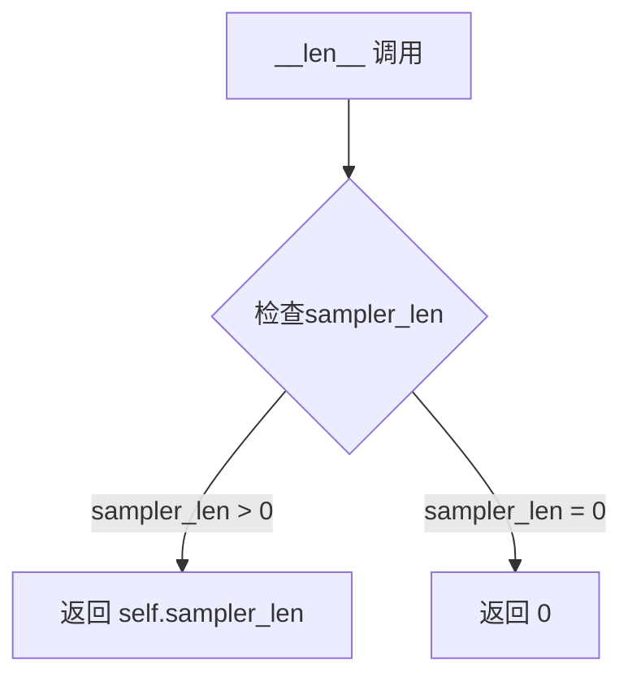

#### 带注释源码

```python
def __len__(self):
    """
    返回采样器的长度，即预生成批次的总数。
    
    此方法允许 DataLoader 通过 len(dataloader) 获取数据集需要遍历的批次数。
    该值在 __init__ 中预先计算并存储在 self.sampler_len 中。
    
    Returns:
        int: 预生成批次的总数。如果 drop_last=True，部分批次会被丢弃，
            返回的数值可能小于 (数据集样本数 + batch_size - 1) // batch_size。
    """
    return self.sampler_len
```


### `PromptDataset.__init__`

该方法是一个用于准备提示词的数据集类的构造函数，主要用于在多个GPU上生成类别图像。它接收提示词和样本数量作为参数，初始化数据集的基本属性。

参数：

- `prompt`：`str`，用于生成类别图像的提示词（prompt）
- `num_samples`：`int`，要生成的样本数量

返回值：`None`，构造函数不返回任何值

#### 流程图

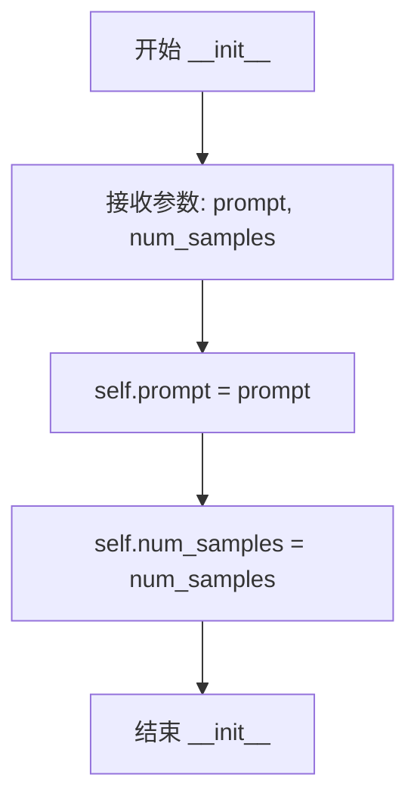

#### 带注释源码

```python
def __init__(self, prompt, num_samples):
    """
    初始化 PromptDataset 实例。

    参数:
        prompt (str): 用于生成类别图像的提示词。
        num_samples (int): 要生成的样本数量。

    返回值:
        None: 构造函数不返回值。
    """
    # 将传入的提示词存储为实例属性
    self.prompt = prompt
    # 将传入的样本数量存储为实例属性
    self.num_samples = num_samples
```


### `PromptDataset.__len__`

返回数据集中的样本数量，用于支持 Python 的 `len()` 函数，使数据集能够与 DataLoader 等 PyTorch 组件兼容。

参数：

- 无显式参数（`__len__` 是 Python 特殊方法，自动接收 `self` 参数）

返回值：`int`，返回 `num_samples` 属性值，即数据集中要生成的样本总数。

#### 流程图

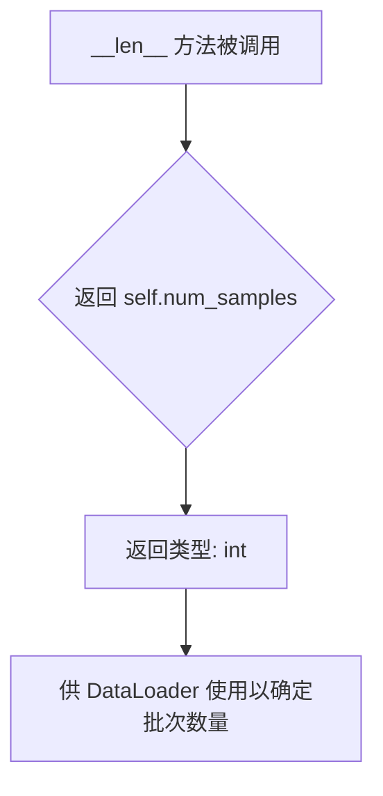

#### 带注释源码

```python
class PromptDataset(Dataset):
    "A simple dataset to prepare the prompts to generate class images on multiple GPUs."

    def __init__(self, prompt, num_samples):
        """
        初始化 PromptDataset 实例。
        
        Args:
            prompt: str，用于生成类图像的提示文本
            num_samples: int，要生成的样本数量
        """
        self.prompt = prompt
        self.num_samples = num_samples

    def __len__(self):
        """
        返回数据集中的样本数量。
        
        这是 PyTorch Dataset 类的必需方法，使得数据集可以使用 len() 函数，
        并且可以与 DataLoader 等组件一起使用。
        
        Returns:
            int: 数据集中的样本数量，等于 num_samples
        """
        return self.num_samples

    def __getitem__(self, index):
        """
        根据索引获取单个样本。
        
        Args:
            index: int，样本的索引
            
        Returns:
            dict: 包含 'prompt' 和 'index' 键的字典
        """
        example = {}
        example["prompt"] = self.prompt
        example["index"] = index
        return example
```


### `PromptDataset.__getitem__`

该方法是 `PromptDataset` 类的核心实例方法，用于根据给定索引返回对应的训练样本数据。它构建一个包含提示词和索引的字典，供数据加载器在生成类图像时使用。

参数：

- `self`：`PromptDataset` 类实例，隐含参数
- `index`：`int`，要获取的样本索引，用于标识当前请求的数据项

返回值：`Dict[str, Any]`，返回包含 `prompt` 和 `index` 键的字典，其中 `prompt` 是类提示词字符串，`index` 是当前样本的索引值

#### 流程图

```mermaid
flowchart TD
    A[__getitem__ 被调用] --> B[创建空字典 example]
    B --> C[将 self.prompt 存入 example['prompt']]
    C --> D[将 index 存入 example['index']]
    D --> E[返回 example 字典]
```

#### 带注释源码

```python
def __getitem__(self, index):
    # 创建一个空字典用于存储样本数据
    example = {}
    # 将类级别保存的 prompt（类提示词）存入字典
    # 该 prompt 在 DreamBooth 训练中用于生成类别图像
    example["prompt"] = self.prompt
    # 将当前样本的索引值存入字典
    # 用于追踪当前处理的是第几个样本
    example["index"] = index
    # 返回包含 prompt 和 index 的字典
    # 数据加载器会将多个这样的字典组成批次
    return example
```

## 关键组件


### 张量索引与惰性加载

代码中通过`BucketBatchSampler`实现了基于图像桶的批次采样，避免了同一批次中图像尺寸差异导致的填充浪费。同时使用`torch.no_grad()`和`offload_models`实现推理阶段的惰性加载，减少显存占用。

### 反量化支持

代码支持两种量化方式：1) FP8训练通过`torchao.float8.convert_to_float8_training`；2) BitsAndBytes量化通过`BitsAndBytesConfig`加载4bit/8bit权重，并在训练前使用`prepare_model_for_kbit_training`准备模型。

### 量化策略

提供了`bnb_quantization_config_path`参数读取自定义JSON配置，以及`do_fp8_training`标志启用FP8训练，两者互斥。量化权重在训练前会被适当转换以支持梯度计算。

### 图像桶机制

`DreamBoothDataset`使用`find_nearest_bucket`函数将图像分配到最近的宽高比桶中，实现自适应分辨率训练。`BucketBatchSampler`按桶分组索引并在每个桶内打乱，提高训练效率。

### 远程文本编码器

通过`compute_remote_text_embeddings`函数调用HuggingFace Inference API远程计算文本嵌入，避免本地加载大型文本编码器，节省显存。

### 流量匹配训练

使用`FlowMatchEulerDiscreteScheduler`和`compute_density_for_timestep_sampling`实现基于流匹配的去噪训练，支持多种加权采样策略(sigma_sqrt、logit_normal、mode、cosmap)。

### LoRA适配器管理

通过`transformer.add_adapter`添加LoRA层，使用`LoraConfig`配置秩、alpha和目标模块，并在保存/加载时使用自定义钩子处理PEFT状态字典。

### 先验保留损失

当启用`with_prior_preservation`时，代码会生成类别图像并计算先验保留损失，通过`class_prompt`和`class_data_dir`参数控制。

### 模型保存与恢复

通过`accelerator.register_save_state_pre_hook`和`register_load_state_pre_hook`自定义模型保存/加载逻辑，支持FSDP分布式训练环境下的状态字典处理。

## 问题及建议


### 已知问题

-   **全局状态依赖**: `DreamBoothDataset` 类内部直接访问外部的 `args` 全局变量，破坏了类的封装性，导致代码难以测试和维护
-   **变量覆盖错误**: `DreamBoothDataset.__init__` 中 `self.size` 在构造函数中被赋值后，又在循环中被每个 bucket 的目标尺寸覆盖，容易产生混淆
-   **潜在的空引用**: `instance_prompt_hidden_states`、`instance_text_ids`、`class_prompt_hidden_states`、`class_text_ids` 等变量在条件分支中定义，若条件不满足可能导致后续代码中的 `NameError`
-   **VAE 删除后仍引用**: 代码在删除 VAE (`del vae`) 后，仍保留 `latents_bn_mean` 和 `latents_bn_std` 用于后续的模型输入归一化，虽然目前代码流程中可能不会出错，但存在潜在的耦合风险
-   **图像变量覆盖**: 在训练结束后的验证逻辑中，存在 `images = None` 无条件赋值，可能导致有效的验证图像被意外清空
-   **已弃用的 API**: 使用了 `torch.autocast` 而非推荐的 `torch.amp.autocast`，前者已在较新版本 PyTorch 中弃用
-   **数据加载器_workers默认值**: `dataloader_num_workers` 默认为 0，在现代 GPU 上可能导致数据加载成为性能瓶颈

### 优化建议

-   **消除全局状态**: 将 `args` 作为参数传递给 `DreamBoothDataset` 构造函数，避免直接引用全局变量，提高类的可测试性
-   **重构变量作用域**: 将 `instance_prompt_hidden_states` 等变量的定义移到函数开头或使用 `Optional` 类型明确初始化
-   **修复图像变量逻辑**: 检查训练结束后的 `images` 变量赋值逻辑，确保有效的验证图像不被意外覆盖
-   **升级 API**: 将 `torch.autocast` 替换为 `torch.amp.autocast` 以兼容新版 PyTorch
-   **增加默认workers数**: 建议将 `dataloader_num_workers` 默认值调整为 4 或根据 CPU 核心数动态设置，以提升数据加载效率
-   **优化内存管理**: 在删除 VAE 前确保其 BN 统计量已正确保存，或考虑使用 `torch.no_grad()` 上下文管理避免不必要的梯度跟踪

## 其它


### 设计目标与约束

本代码的设计目标是实现 Flux2 模型的 DreamBooth LoRA 微调训练流程，支持在消费级 GPU 上进行高效的个性化图像生成模型训练。核心约束包括：1) 仅支持 Flux2 系列的图像生成模型（Pixtral/Mistral3 架构）；2) 训练过程中冻结 VAE 和文本编码器，仅训练 LoRA 适配器参数；3) 依赖 HuggingFace diffusers 生态系统的最新版本（>=0.37.0.dev0）；4) 支持分布式训练但对单 GPU 训练做了优化；5) 内存受限环境下支持模型 offload 和 latent caching。

### 错误处理与异常设计

代码采用多层错误处理机制：1) 参数验证阶段：在 parse_args() 中对互斥参数（如 dataset_name 与 instance_data_dir）进行冲突检查，对必填参数进行校验；2) 依赖检查阶段：使用 check_min_version() 验证 diffusers 最低版本，使用 try-except 捕获可选依赖（datasets、bitsandbytes、wandb 等）的导入错误；3) 运行时错误：分布式训练中使用 barrier() 同步各进程，对远程文本编码器调用使用 try-except 包裹并抛出 RuntimeError；4) 资源清理：使用 free_memory() 显式释放 GPU 内存，del 语句配合 to("cpu") 确保对象被正确销毁。

### 数据流与状态机

训练数据流遵循以下状态机：初始化阶段（解析参数→加载数据集→创建 DataLoader）→ 预处理阶段（编码 prompt→计算/缓存 latents）→ 训练循环（epoch→step→前向传播→计算损失→反向传播→优化器更新→梯度同步→检查点保存）→ 验证阶段（定期生成验证图像）→ 结束阶段（保存 LoRA 权重→生成模型卡片→推送到 Hub）。主状态转换由 accelerator.sync_gradients 触发，每个 checkpoint 周期执行状态保存。

### 外部依赖与接口契约

核心依赖包括：1) diffusers 库提供 Flux2Pipeline、Flux2Transformer2DModel、AutoencoderKLFlux2 等模型组件；2) transformers 库提供 Mistral3ForConditionalGeneration 文本编码器；3) accelerate 库提供分布式训练抽象和混合精度支持；4) peft 库提供 LoRA 配置和适配器管理；5) bitsandbytes 可选支持 8-bit 优化器；6) HuggingFace Hub API 用于模型推送。接口契约：训练脚本接收 argparse 参数集，输出 LoRA 权重文件到 --output_dir，可选推送至 Hub。

### 性能优化策略

代码实现多项性能优化：1) 混合精度训练：支持 fp16/bf16 自动转换，TF32 在 Ampere GPU 上可选启用；2) 梯度检查点：gradient_checkpointing 以计算换内存；3) 模型 offload：VAE/文本编码器在推理间隙 offload 至 CPU；4) Latent 缓存：cache_latents 选项预计算 VAE latents 减少重复计算；5) FSDP 支持：分布式场景下可选 FSDP 封装 transformer；6) 动态桶机制：aspect_ratio_buckets 按图像尺寸分组减少 padding 浪费；7) Prior preservation 优化：将类别图像与实例图像在同一前向传播中处理。

### 安全与合规性

代码涉及的安全考量：1) Token 安全：wandb 与 hub_token 互斥使用，防止 token 泄露风险；2) 远程文本编码器：使用 Bearer Token 认证，提示用户使用 hf auth login；3) 模型许可：生成模型卡片时声明 FLUX.2 原始许可证；4) 敏感信息：日志中不输出完整 prompt 内容，checkpoint 路径默认忽略 git 跟踪文件。

### 配置管理

配置通过命令行参数传递，主要配置项分类如下：1) 模型配置：pretrained_model_name_or_path、revision、variant；2) 数据配置：dataset_name、instance_data_dir、class_data_dir、resolution；3) 训练配置：train_batch_size、learning_rate、num_train_epochs、gradient_accumulation_steps；4) LoRA 配置：rank、lora_alpha、lora_layers、lora_dropout；5) 优化器配置：optimizer、adam_beta1/2、weight_decay；6) 输出配置：output_dir、push_to_hub、hub_model_id；7) 验证配置：validation_prompt、num_validation_images、validation_epochs。

### 监控与日志

监控体系包含多层级：1) 训练指标：通过 accelerator.log() 记录 loss 和 learning rate；2) 可视化追踪：支持 TensorBoard（默认）和 wandb 可选；3) 进度条：tqdm 显示训练进度和当前 step；4) Checkpoint 元数据：保存优化器状态、学习率调度器状态以支持断点续训；5) 验证输出：定期生成验证图像并记录至 tracker。

### 测试与验证策略

验证流程设计：1) 训练中验证：每 validation_epochs 执行一次，使用当前 LoRA 权重生成图像；2) 最终验证：训练完成后生成最终验证图像；3) 验证参数：支持自定义验证 prompt、批量大小和图像数量；4) 验证图像追踪：TensorBoard 记录图像网格，wandb 记录带标题图像；5) 模型可用性检查：加载 LoRA 权重后执行一次前向传播验证兼容性。

### 扩展性设计

代码预留以下扩展点：1) 自定义优化器：通过字符串参数选择 AdamW/Prodigy，可进一步扩展；2) 加权采样：支持 sigma_sqrt、logit_normal、mode、cosmap 等多种时间步加权方案；3) 远程编码器：remote_text_encoder 选项支持使用 HuggingFace Inference API 替代本地文本编码器；4) FSDP 文本编码器：fsdp_text_encoder 选项支持分布式封装文本编码器；5) 自定义桶：aspect_ratio_buckets 接受用户定义的分辨率对列表；6) LoRA 目标层：lora_layers 参数允许指定自定义注意力层名称。

    