# `diffusers\examples\dreambooth\train_dreambooth_lora_flux2_img2img.py` 详细设计文档

Flux.2 DreamBooth LoRA训练脚本，用于对Flux.2图像生成模型进行轻量级微调，支持图像到图像的条件生成任务，包含完整的数据处理、模型加载、训练循环和模型保存流程。

## 整体流程

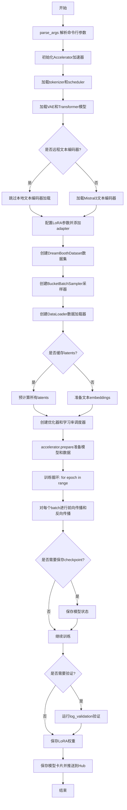

## 类结构

```
Global
├── logger (日志记录器)
├── save_model_card (函数)
├── log_validation (函数)
├── module_filter_fn (函数)
├── parse_args (函数)
├── collate_fn (函数)
├── main (函数)
├── DreamBoothDataset (类)
├── BucketBatchSampler (类)
└── PromptDataset (类)
```

## 全局变量及字段


### `logger`
    
全局日志记录器，用于输出训练过程中的日志信息

类型：`logging.Logger`
    


### `args`
    
命令行参数解析结果，包含训练所需的所有配置参数

类型：`argparse.Namespace`
    


### `DreamBoothDataset.size`
    
图像分辨率大小

类型：`int`
    


### `DreamBoothDataset.center_crop`
    
是否中心裁剪

类型：`bool`
    


### `DreamBoothDataset.instance_prompt`
    
实例提示词

类型：`str`
    


### `DreamBoothDataset.custom_instance_prompts`
    
自定义提示词列表

类型：`list`
    


### `DreamBoothDataset.buckets`
    
宽高比桶配置

类型：`list`
    


### `DreamBoothDataset.instance_images`
    
实例图像列表

类型：`list`
    


### `DreamBoothDataset.cond_images`
    
条件图像列表

类型：`list`
    


### `DreamBoothDataset.pixel_values`
    
像素值列表

类型：`list`
    


### `DreamBoothDataset.cond_pixel_values`
    
条件像素值列表

类型：`list`
    


### `DreamBoothDataset.num_instance_images`
    
实例图像数量

类型：`int`
    


### `DreamBoothDataset._length`
    
数据集长度

类型：`int`
    


### `DreamBoothDataset.image_transforms`
    
图像变换组合

类型：`torchvision.transforms.Compose`
    


### `BucketBatchSampler.dataset`
    
数据集引用

类型：`DreamBoothDataset`
    


### `BucketBatchSampler.batch_size`
    
批大小

类型：`int`
    


### `BucketBatchSampler.drop_last`
    
是否丢弃最后不完整批次

类型：`bool`
    


### `BucketBatchSampler.bucket_indices`
    
每个桶的索引列表

类型：`list`
    


### `BucketBatchSampler.sampler_len`
    
采样器长度

类型：`int`
    


### `BucketBatchSampler.batches`
    
预生成的批次列表

类型：`list`
    


### `PromptDataset.prompt`
    
提示词

类型：`str`
    


### `PromptDataset.num_samples`
    
样本数量

类型：`int`
    
    

## 全局函数及方法


### `save_model_card`

该函数用于在 DreamBooth LoRA 训练完成后，生成并保存模型卡片（Model Card）到 HuggingFace Hub。模型卡片包含模型描述、训练信息、触发词、使用示例等元数据，并可选地嵌入验证生成的图像，供模型分享和使用时参考。

参数：

- `repo_id`：`str`，HuggingFace Hub 上的仓库 ID，用于标识模型
- `images`：`Optional[List[PIL.Image]]`，训练过程中生成的验证图像列表，用于嵌入模型卡片展示
- `base_model`：`Optional[str]，基础预训练模型的名称或路径，用于描述 LoRA 适配的基模型
- `instance_prompt`：`Optional[str]`，实例提示词，用于触发模型生成特定概念
- `validation_prompt`：`Optional[str]`，验证提示词，用于模型展示和使用说明
- `repo_folder`：`Optional[str]`，本地仓库文件夹路径，用于保存模型卡片文件
- `fp8_training`：`bool`，是否使用 FP8 训练，标识训练精度配置

返回值：无（`None`），函数直接写入文件到本地仓库文件夹

#### 流程图

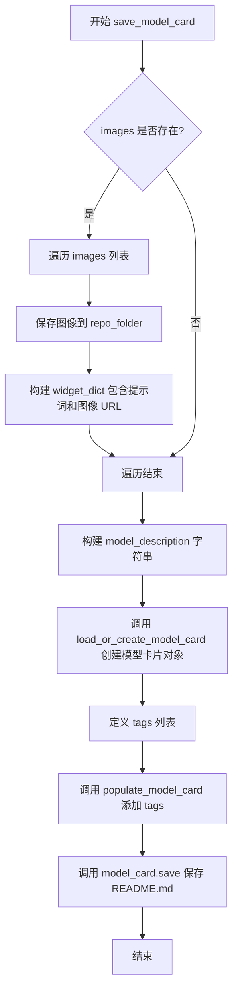

#### 带注释源码

```python
def save_model_card(
    repo_id: str,
    images=None,
    base_model: str = None,
    instance_prompt=None,
    validation_prompt=None,
    repo_folder=None,
    fp8_training=False,
):
    """
    保存模型卡片到本地仓库文件夹
    
    参数:
        repo_id: HuggingFace Hub 仓库 ID
        images: 验证生成的图像列表
        base_model: 基础模型名称
        instance_prompt: 实例提示词
        validation_prompt: 验证提示词
        repo_folder: 本地仓库路径
        fp8_training: 是否使用 FP8 训练
    """
    widget_dict = []  # 初始化 widget 字典列表，用于 HuggingFace Hub 展示
    if images is not None:
        # 如果有验证图像，保存到本地并构建 widget 字典
        for i, image in enumerate(images):
            image.save(os.path.join(repo_folder, f"image_{i}.png"))  # 保存图像文件
            widget_dict.append(
                {"text": validation_prompt if validation_prompt else " ", "output": {"url": f"image_{i}.png"}}
            )  # 构建 widget 数据结构

    # 构建 Markdown 格式的模型描述
    model_description = f"""
# Flux.2 DreamBooth LoRA - {repo_id}

<Gallery />

## Model description

These are {repo_id} DreamBooth LoRA weights for {base_model}.

The weights were trained using [DreamBooth](https://dreambooth.github.io/) with the [Flux2 diffusers trainer](https://github.com/huggingface/diffusers/blob/main/examples/dreambooth/README_flux2.md).

FP8 training? {fp8_training}

## Trigger words

You should use `{instance_prompt}` to trigger the image generation.

## Download model

[Download the *.safetensors LoRA]({repo_id}/tree/main) in the Files & versions tab.

## Use it with the [🧨 diffusers library](https://github.com/huggingface/diffusers)

```py
from diffusers import AutoPipelineForText2Image
import torch
pipeline = AutoPipelineForText2Image.from_pretrained("black-forest-labs/FLUX.2", torch_dtype=torch.bfloat16).to('cuda')
pipeline.load_lora_weights('{repo_id}', weight_name='pytorch_lora_weights.safetensors')
image = pipeline('{validation_prompt if validation_prompt else instance_prompt}').images[0]
```

For more details, including weighting, merging and fusing LoRAs, check the [documentation on loading LoRAs in diffusers](https://huggingface.co/docs/diffusers/main/en/using-diffusers/loading_adapters)

## License

Please adhere to the licensing terms as described [here](https://huggingface.co/black-forest-labs/FLUX.2/blob/main/LICENSE.md).
"""
    # 加载或创建模型卡片，传入训练相关元数据
    model_card = load_or_create_model_card(
        repo_id_or_path=repo_id,
        from_training=True,
        license="other",
        base_model=base_model,
        prompt=instance_prompt,
        model_description=model_description,
        widget=widget_dict,
    )
    # 定义模型标签，用于 Hub 分类和搜索
    tags = [
        "text-to-image",
        "diffusers-training",
        "diffusers",
        "lora",
        "flux2",
        "flux2-diffusers",
        "template:sd-lora",
    ]

    # 填充模型卡片标签
    model_card = populate_model_card(model_card, tags=tags)
    # 保存模型卡片为 README.md
    model_card.save(os.path.join(repo_folder, "README.md"))
```


### `log_validation`

该函数负责在训练过程中运行验证，生成指定数量的图像并将其记录到TensorBoard或WandB等跟踪工具中，以便监控模型在验证集上的表现。

参数：

- `pipeline`：`Flux2Pipeline`，用于图像生成的diffusers pipeline实例
- `args`：`argparse.Namespace`，包含训练和验证配置参数的对象（如num_validation_images、validation_prompt、seed等）
- `accelerator`：`Accelerator`，accelerate库的分布式训练加速器对象，用于设备管理和跟踪日志记录
- `pipeline_args`：`Dict`，包含传递给pipeline的参数字典，如图像和prompt embeddings
- `epoch`：`int`，当前训练的轮次编号，用于日志记录
- `torch_dtype`：`torch.dtype`，生成图像使用的数据类型（如torch.float16或torch.bfloat16）
- `is_final_validation`：`bool`，默认为False，标识是否为训练结束时的最终验证

返回值：`List[Image]`，生成的PIL图像列表

#### 流程图

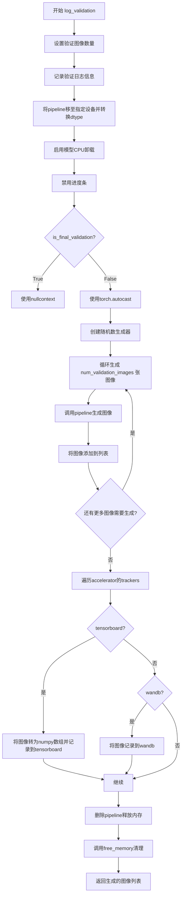

#### 带注释源码

```python
def log_validation(
    pipeline,          # Flux2Pipeline: 用于生成图像的pipeline实例
    args,              # argparse.Namespace: 包含训练参数的对象
    accelerator,       # Accelerator: accelerate库的分布式训练加速器
    pipeline_args,     # Dict: 传递给pipeline的参数字典
    epoch,             # int: 当前训练轮次
    torch_dtype,       # torch.dtype: 用于生成图像的数据类型
    is_final_validation=False,  # bool: 是否为最终验证
):
    """
    运行验证生成图像，并将结果记录到跟踪器（tensorboard/wandb）
    
    该函数执行以下操作：
    1. 配置pipeline的设备和数据类型
    2. 生成指定数量的验证图像
    3. 将图像记录到日志跟踪工具
    4. 清理内存
    """
    # 设置验证图像数量，默认值为1
    args.num_validation_images = args.num_validation_images if args.num_validation_images else 1
    
    # 记录验证日志，显示生成图像数量和使用的prompt
    logger.info(
        f"Running validation... \n Generating {args.num_validation_images} images with prompt:"
        f" {args.validation_prompt}."
    )
    
    # 将pipeline移到指定设备并转换为目标数据类型
    pipeline = pipeline.to(dtype=torch_dtype)
    
    # 启用模型CPU卸载以节省显存
    pipeline.enable_model_cpu_offload()
    
    # 禁用进度条以减少日志输出
    pipeline.set_progress_bar_config(disable=True)

    # 创建随机数生成器，用于 reproducibility
    generator = torch.Generator(device=accelerator.device).manual_seed(args.seed) if args.seed is not None else None
    
    # 根据是否为最终验证选择自动混合精度上下文
    # 最终验证时使用nullcontext避免不必要的时间步采样
    autocast_ctx = torch.autocast(accelerator.device.type) if not is_final_validation else nullcontext()

    # 初始化图像列表
    images = []
    
    # 循环生成指定数量的验证图像
    for _ in range(args.num_validation_images):
        with autocast_ctx:  # 使用自动混合精度
            image = pipeline(
                image=pipeline_args["image"],           # 条件图像
                prompt_embeds=pipeline_args["prompt_embeds"],  # 文本嵌入
                generator=generator,                    # 随机生成器
            ).images[0]  # 获取第一张生成的图像
            images.append(image)  # 添加到图像列表

    # 遍历所有跟踪器（tensorboard或wandb）记录图像
    for tracker in accelerator.trackers:
        # 确定阶段名称：最终验证为"test"，中间验证为"validation"
        phase_name = "test" if is_final_validation else "validation"
        
        # 处理TensorBoard跟踪器
        if tracker.name == "tensorboard":
            # 将PIL图像转换为numpy数组并堆叠
            np_images = np.stack([np.asarray(img) for img in images])
            # 记录图像到tensorboard
            tracker.writer.add_images(phase_name, np_images, epoch, dataformats="NHWC")
        
        # 处理WandB跟踪器
        if tracker.name == "wandb":
            tracker.log(
                {
                    phase_name: [
                        wandb.Image(image, caption=f"{i}: {args.validation_prompt}") 
                        for i, image in enumerate(images)
                    ]
                }
            )

    # 删除pipeline对象以释放显存
    del pipeline
    free_memory()  # 调用diffusers的工具函数进一步释放内存

    # 返回生成的图像列表
    return images
```


### `module_filter_fn`

FP8训练模块过滤函数，用于在FP8训练时过滤哪些模块需要转换为FP8格式。该函数会根据模块的类型和名称决定是否将其排除在FP8量化之外，以确保FP8转换的兼容性和正确性。

参数：

- `mod`：`torch.nn.Module`，要检查的模块对象
- `fqn`：`str`，模块的完整限定名称（fully qualified name），用于精确识别特定模块

返回值：`bool`，返回 `True` 表示模块应该被转换为 FP8 格式，返回 `False` 表示模块应被排除

#### 流程图

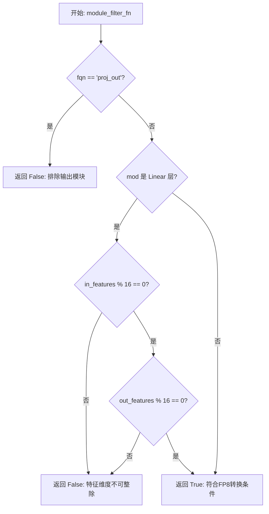

#### 带注释源码

```python
def module_filter_fn(mod: torch.nn.Module, fqn: str):
    # 不转换输出模块
    # proj_out 通常是模型的输出投影层，FP8 转换可能不稳定或不需要
    if fqn == "proj_out":
        return False
    
    # 不转换权重维度不能被16整除的线性模块
    # FP8 量化内部张量需要对齐到16，维度不满足会导致转换失败或性能问题
    if isinstance(mod, torch.nn.Linear):
        # 检查输入特征维度是否能被16整除
        if mod.in_features % 16 != 0 or mod.out_features % 16 != 0:
            return False
    
    # 默认返回 True，表示该模块可以进行 FP8 转换
    return True
```


### `parse_args`

该函数使用 `argparse` 模块解析命令行参数，定义并收集训练脚本所需的各种配置选项，包括模型路径、数据集配置、训练超参数、优化器设置、验证选项等，最终返回一个包含所有解析后参数的命名空间对象。

参数：

- `input_args`：`Optional[List[str]]`，可选的参数列表。如果为 `None`，则从系统命令行参数（`sys.argv`）解析；否则使用传入的列表进行解析。

返回值：`argparse.Namespace`，返回包含所有命令行参数值的命名空间对象，其中属性名对应参数名称（如 `--pretrained_model_name_or_path`、`--output_dir` 等）。

#### 流程图

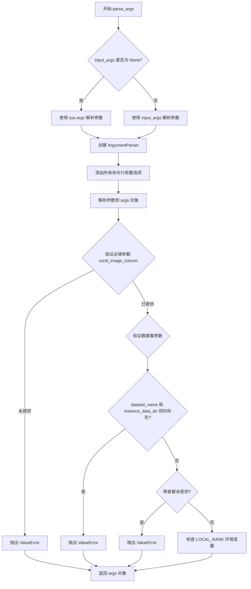

#### 带注释源码

```python
def parse_args(input_args=None):
    """
    解析命令行参数并返回包含所有训练配置的命名空间对象。
    
    参数:
        input_args: 可选的参数列表。如果为 None，则从 sys.argv 解析。
        
    返回:
        argparse.Namespace: 包含所有命令行参数值的对象。
    """
    # 创建 ArgumentParser 实例，设置程序描述
    parser = argparse.ArgumentParser(description="Simple example of a training script.")
    
    # ============ 模型相关参数 ============
    # 添加预训练模型路径或模型标识符参数（必填）
    parser.add_argument(
        "--pretrained_model_name_or_path",
        type=str,
        default=None,
        required=True,
        help="Path to pretrained model or model identifier from huggingface.co/models.",
    )
    # 添加模型版本修订参数
    parser.add_argument(
        "--revision",
        type=str,
        default=None,
        required=False,
        help="Revision of pretrained model identifier from huggingface.co/models.",
    )
    # 添加量化配置文件路径
    parser.add_argument(
        "--bnb_quantization_config_path",
        type=str,
        default=None,
        help="Quantization config in a JSON file that will be used to define the bitsandbytes quant config of the DiT.",
    )
    # 添加 FP8 训练标志
    parser.add_argument(
        "--do_fp8_training",
        action="store_true",
        help="if we are doing FP8 training.",
    )
    # 添加模型变体参数
    parser.add_argument(
        "--variant",
        type=str,
        default=None,
        help="Variant of the model files of the pretrained model identifier from huggingface.co/models, 'e.g.' fp16",
    )
    
    # ============ 数据集相关参数 ============
    # 添加数据集名称参数
    parser.add_argument(
        "--dataset_name",
        type=str,
        default=None,
        help=(
            "The name of the Dataset (from the HuggingFace hub) containing the training data of instance images (could be your own, possibly private,"
            " dataset). It can also be a path pointing to a local copy of a dataset in your filesystem,"
            " or to a folder containing files that 🤗 Datasets can understand."
        ),
    )
    # 添加数据集配置名称
    parser.add_argument(
        "--dataset_config_name",
        type=str,
        default=None,
        help="The config of the Dataset, leave as None if there's only one config.",
    )
    # 添加实例数据目录
    parser.add_argument(
        "--instance_data_dir",
        type=str,
        default=None,
        help=("A folder containing the training data. "),
    )
    # 添加缓存目录
    parser.add_argument(
        "--cache_dir",
        type=str,
        default=None,
        help="The directory where the downloaded models and datasets will be stored.",
    )
    # 添加图像列名
    parser.add_argument(
        "--image_column",
        type=str,
        default="image",
        help="The column of the dataset containing the target image. By "
        "default, the standard Image Dataset maps out 'file_name' "
        "to 'image'.",
    )
    # 添加条件图像列名
    parser.add_argument(
        "--cond_image_column",
        type=str,
        default=None,
        help="Column in the dataset containing the condition image. Must be specified when performing I2I fine-tuning",
    )
    # 添加标题列名
    parser.add_argument(
        "--caption_column",
        type=str,
        default=None,
        help="The column of the dataset containing the instance prompt for each image",
    )
    # 添加重复次数
    parser.add_argument("--repeats", type=int, default=1, help="How many times to repeat the training data.")
    
    # ============ DreamBooth 相关参数 ============
    # 添加类别数据目录
    parser.add_argument(
        "--class_data_dir",
        type=str,
        default=None,
        required=False,
        help="A folder containing the training data of class images.",
    )
    # 添加实例提示词
    parser.add_argument(
        "--instance_prompt",
        type=str,
        default=None,
        required=False,
        help="The prompt with identifier specifying the instance, e.g. 'photo of a TOK dog', 'in the style of TOK'",
    )
    # 添加最大序列长度
    parser.add_argument(
        "--max_sequence_length",
        type=int,
        default=512,
        help="Maximum sequence length to use with with the T5 text encoder",
    )
    
    # ============ 验证相关参数 ============
    # 添加验证提示词
    parser.add_argument(
        "--validation_prompt",
        type=str,
        default=None,
        help="A prompt that is used during validation to verify that the model is learning.",
    )
    # 添加验证图像路径
    parser.add_argument(
        "--validation_image",
        type=str,
        default=None,
        help="path to an image that is used during validation as the condition image to verify that the model is learning.",
    )
    # 添加跳过最终推理标志
    parser.add_argument(
        "--skip_final_inference",
        default=False,
        action="store_true",
        help="Whether to skip the final inference step with loaded lora weights upon training completion. This will run intermediate validation inference if `validation_prompt` is provided. Specify to reduce memory.",
    )
    # 添加最终验证提示词
    parser.add_argument(
        "--final_validation_prompt",
        type=str,
        default=None,
        help="A prompt that is used during a final validation to verify that the model is learning. Ignored if `--validation_prompt` is provided.",
    )
    # 添加验证图像数量
    parser.add_argument(
        "--num_validation_images",
        type=int,
        default=4,
        help="Number of images that should be generated during validation with `validation_prompt`.",
    )
    # 添加验证周期数
    parser.add_argument(
        "--validation_epochs",
        type=int,
        default=50,
        help=(
            "Run dreambooth validation every X epochs. Dreambooth validation consists of running the prompt"
            " `args.validation_prompt` multiple times: `args.num_validation_images`."
        ),
    )
    
    # ============ LoRA 相关参数 ============
    # 添加 LoRA 秩维度
    parser.add_argument(
        "--rank",
        type=int,
        default=4,
        help=("The dimension of the LoRA update matrices."),
    )
    # 添加 LoRA alpha 参数
    parser.add_argument(
        "--lora_alpha",
        type=int,
        default=4,
        help="LoRA alpha to be used for additional scaling.",
    )
    # 添加 LoRA dropout
    parser.add_argument("--lora_dropout", type=float, default=0.0, help="Dropout probability for LoRA layers")
    # 添加 LoRA 目标层
    parser.add_argument(
        "--lora_layers",
        type=str,
        default=None,
        help=(
            'The transformer modules to apply LoRA training on. Please specify the layers in a comma separated. E.g. - "to_k,to_q,to_v,to_out.0" will result in lora training of attention layers only'
        ),
    )
    
    # ============ 输出和随机种子 ============
    # 添加输出目录
    parser.add_argument(
        "--output_dir",
        type=str,
        default="flux-dreambooth-lora",
        help="The output directory where the model predictions and checkpoints will be written.",
    )
    # 添加随机种子
    parser.add_argument("--seed", type=int, default=None, help="A seed for reproducible training.")
    
    # ============ 图像处理参数 ============
    # 添加分辨率
    parser.add_argument(
        "--resolution",
        type=int,
        default=512,
        help=(
            "The resolution for input images, all the images in the train/validation dataset will be resized to this"
            " resolution"
        ),
    )
    # 添加宽高比桶
    parser.add_argument(
        "--aspect_ratio_buckets",
        type=str,
        default=None,
        help=(
            "Aspect ratio buckets to use for training. Define as a string of 'h1,w1;h2,w2;...'. "
            "e.g. '1024,1024;768,1360;1360,768;880,1168;1168,880;1248,832;832,1248'"
            "Images will be resized and cropped to fit the nearest bucket. If provided, --resolution is ignored."
        ),
    )
    # 添加中心裁剪标志
    parser.add_argument(
        "--center_crop",
        default=False,
        action="store_true",
        help=(
            "Whether to center crop the input images to the resolution. If not set, the images will be randomly"
            " cropped. The images will be resized to the resolution first before cropping."
        ),
    )
    # 添加随机翻转标志
    parser.add_argument(
        "--random_flip",
        action="store_true",
        help="whether to randomly flip images horizontally",
    )
    
    # ============ 训练批处理参数 ============
    # 添加训练批大小
    parser.add_argument(
        "--train_batch_size", type=int, default=4, help="Batch size (per device) for the training dataloader."
    )
    # 添加采样批大小
    parser.add_argument(
        "--sample_batch_size", type=int, default=4, help="Batch size (per device) for sampling images."
    )
    # 添加训练轮数
    parser.add_argument("--num_train_epochs", type=int, default=1)
    # 添加最大训练步数
    parser.add_argument(
        "--max_train_steps",
        type=int,
        default=None,
        help="Total number of training steps to perform.  If provided, overrides num_train_epochs.",
    )
    # 添加检查点保存步数
    parser.add_argument(
        "--checkpointing_steps",
        type=int,
        default=500,
        help=(
            "Save a checkpoint of the training state every X updates. These checkpoints can be used both as final"
            " checkpoints in case they are better than the last checkpoint, and are also suitable for resuming"
            " training using `--resume_from_checkpoint`."
        ),
    )
    # 添加检查点总数限制
    parser.add_argument(
        "--checkpoints_total_limit",
        type=int,
        default=None,
        help=("Max number of checkpoints to store."),
    )
    # 添加从检查点恢复训练
    parser.add_argument(
        "--resume_from_checkpoint",
        type=str,
        default=None,
        help=(
            "Whether training should be resumed from a previous checkpoint. Use a path saved by"
            ' `--checkpointing_steps`, or `"latest"` to automatically select the last available checkpoint.'
        ),
    )
    # 添加梯度累积步数
    parser.add_argument(
        "--gradient_accumulation_steps",
        type=int,
        default=1,
        help="Number of updates steps to accumulate before performing a backward/update pass.",
    )
    # 添加梯度检查点标志
    parser.add_argument(
        "--gradient_checkpointing",
        action="store_true",
        help="Whether or not to use gradient checkpointing to save memory at the expense of slower backward pass.",
    )
    
    # ============ 学习率调度参数 ============
    # 添加学习率
    parser.add_argument(
        "--learning_rate",
        type=float,
        default=1e-4,
        help="Initial learning rate (after the potential warmup period) to use.",
    )
    # 添加引导尺度
    parser.add_argument(
        "--guidance_scale",
        type=float,
        default=3.5,
        help="the FLUX.1 dev variant is a guidance distilled model",
    )
    # 添加学习率缩放标志
    parser.add_argument(
        "--scale_lr",
        action="store_true",
        default=False,
        help="Scale the learning rate by the number of GPUs, gradient accumulation steps, and batch size.",
    )
    # 添加学习率调度器类型
    parser.add_argument(
        "--lr_scheduler",
        type=str,
        default="constant",
        help=(
            'The scheduler type to use. Choose between ["linear", "cosine", "cosine_with_restarts", "polynomial",'
            ' "constant", "constant_with_warmup"]'
        ),
    )
    # 添加学习率预热步数
    parser.add_argument(
        "--lr_warmup_steps", type=int, default=500, help="Number of steps for the warmup in the lr scheduler."
    )
    # 添加学习率循环次数
    parser.add_argument(
        "--lr_num_cycles",
        type=int,
        default=1,
        help="Number of hard resets of the lr in cosine_with_restarts scheduler.",
    )
    # 添加学习率幂次
    parser.add_argument("--lr_power", type=float, default=1.0, help="Power factor of the polynomial scheduler.")
    
    # ============ 数据加载参数 ============
    # 添加数据加载工作进程数
    parser.add_argument(
        "--dataloader_num_workers",
        type=int,
        default=0,
        help=(
            "Number of subprocesses to use for data loading. 0 means that the data will be loaded in the main process."
        ),
    )
    
    # ============ 采样权重参数 ============
    # 添加权重方案
    parser.add_argument(
        "--weighting_scheme",
        type=str,
        default="none",
        choices=["sigma_sqrt", "logit_normal", "mode", "cosmap", "none"],
        help=('We default to the "none" weighting scheme for uniform sampling and uniform loss'),
    )
    # 添加 logit 均值
    parser.add_argument(
        "--logit_mean", type=float, default=0.0, help="mean to use when using the `'logit_normal'` weighting scheme."
    )
    # 添加 logit 标准差
    parser.add_argument(
        "--logit_std", type=float, default=1.0, help="std to use when using the `'logit_normal'` weighting scheme."
    )
    # 添加模式缩放
    parser.add_argument(
        "--mode_scale",
        type=float,
        default=1.29,
        help="Scale of mode weighting scheme. Only effective when using the `'mode'` as the `weighting_scheme`.",
    )
    
    # ============ 优化器参数 ============
    # 添加优化器类型
    parser.add_argument(
        "--optimizer",
        type=str,
        default="AdamW",
        help=('The optimizer type to use. Choose between ["AdamW", "prodigy"]'),
    )
    # 添加 8-bit Adam 标志
    parser.add_argument(
        "--use_8bit_adam",
        action="store_true",
        help="Whether or not to use 8-bit Adam from bitsandbytes. Ignored if optimizer is not set to AdamW",
    )
    # 添加 Adam beta1
    parser.add_argument(
        "--adam_beta1", type=float, default=0.9, help="The beta1 parameter for the Adam and Prodigy optimizers."
    )
    # 添加 Adam beta2
    parser.add_argument(
        "--adam_beta2", type=float, default=0.999, help="The beta2 parameter for the Adam and Prodigy optimizers."
    )
    # 添加 Prodigy beta3
    parser.add_argument(
        "--prodigy_beta3",
        type=float,
        default=None,
        help="coefficients for computing the Prodigy stepsize using running averages. If set to None, "
        "uses the value of square root of beta2. Ignored if optimizer is adamW",
    )
    # 添加 Prodigy 解耦标志
    parser.add_argument("--prodigy_decouple", type=bool, default=True, help="Use AdamW style decoupled weight decay")
    # 添加 Adam 权重衰减
    parser.add_argument("--adam_weight_decay", type=float, default=1e-04, help="Weight decay to use for unet params")
    # 添加文本编码器权重衰减
    parser.add_argument(
        "--adam_weight_decay_text_encoder", type=float, default=1e-03, help="Weight decay to use for text_encoder"
    )
    # 添加 Adam epsilon
    parser.add_argument(
        "--adam_epsilon",
        type=float,
        default=1e-08,
        help="Epsilon value for the Adam optimizer and Prodigy optimizers.",
    )
    # 添加 Prodigy 偏差校正标志
    parser.add_argument(
        "--prodigy_use_bias_correction",
        type=bool,
        default=True,
        help="Turn on Adam's bias correction. True by default. Ignored if optimizer is adamW",
    )
    # 添加 Prodigy 预热保护标志
    parser.add_argument(
        "--prodigy_safeguard_warmup",
        type=bool,
        default=True,
        help="Remove lr from the denominator of D estimate to avoid issues during warm-up stage. True by default. "
        "Ignored if optimizer is adamW",
    )
    # 添加最大梯度范数
    parser.add_argument("--max_grad_norm", default=1.0, type=float, help="Max gradient norm.")
    
    # ============ Hub 相关参数 ============
    # 添加推送到 Hub 标志
    parser.add_argument("--push_to_hub", action="store_true", help="Whether or not to push the model to the Hub.")
    # 添加 Hub token
    parser.add_argument("--hub_token", type=str, default=None, help="The token to use to push to the Model Hub.")
    # 添加 Hub 模型 ID
    parser.add_argument(
        "--hub_model_id",
        type=str,
        default=None,
        help="The name of the repository to keep in sync with the local `output_dir`.",
    )
    
    # ============ 日志和监控参数 ============
    # 添加日志目录
    parser.add_argument(
        "--logging_dir",
        type=str,
        default="logs",
        help=(
            "[TensorBoard](https://www.tensorflow.org/tensorboard) log directory. Will default to"
            " *output_dir/runs/**CURRENT_DATETIME_HOSTNAME***."
        ),
    )
    # 添加 TF32 允许标志
    parser.add_argument(
        "--allow_tf32",
        action="store_true",
        help=(
            "Whether or not to allow TF32 on Ampere GPUs. Can be used to speed up training. For more information, see"
            " https://pytorch.org/docs/stable/notes/cuda.html#tensorfloat-32-tf32-on-ampere-devices"
        ),
    )
    # 添加缓存潜在向量标志
    parser.add_argument(
        "--cache_latents",
        action="store_true",
        default=False,
        help="Cache the VAE latents",
    )
    # 添加报告平台
    parser.add_argument(
        "--report_to",
        type=str,
        default="tensorboard",
        help=(
            'The integration to report the results and logs to. Supported platforms are `"tensorboard"`'
            ' (default), `"wandb"` and `"comet_ml"`. Use `"all"` to report to all integrations.'
        ),
    )
    # 添加混合精度类型
    parser.add_argument(
        "--mixed_precision",
        type=str,
        default=None,
        choices=["no", "fp16", "bf16"],
        help=(
            "Whether to use mixed precision. Choose between fp16 and bf16 (bfloat16). Bf16 requires PyTorch >="
            " 1.10.and an Nvidia Ampere GPU.  Default to the value of accelerate config of the current system or the"
            " flag passed with the `accelerate.launch` command. Use this argument to override the accelerate config."
        ),
    )
    # 添加保存前向上转换标志
    parser.add_argument(
        "--upcast_before_saving",
        action="store_true",
        default=False,
        help=(
            "Whether to upcast the trained transformer layers to float32 before saving (at the end of training). "
            "Defaults to precision dtype used for training to save memory"
        ),
    )
    
    # ============ 模型卸载和远程编码器 ============
    # 添加卸载标志
    parser.add_argument(
        "--offload",
        action="store_true",
        help="Whether to offload the VAE and the text encoder to CPU when they are not used.",
    )
    # 添加远程文本编码器标志
    parser.add_argument(
        "--remote_text_encoder",
        action="store_true",
        help="Whether to use a remote text encoder. This means the text encoder will not be loaded locally and instead, the prompt embeddings will be computed remotely using the HuggingFace Inference API.",
    )
    
    # ============ 分布式训练参数 ============
    # 添加本地排名
    parser.add_argument("--local_rank", type=int, default=-1, help="For distributed training: local_rank")
    # 添加 NPU Flash Attention 启用标志
    parser.add_argument("--enable_npu_flash_attention", action="store_true", help="Enabla Flash Attention for NPU")
    # 添加 FSDP 文本编码器标志
    parser.add_argument("--fsdp_text_encoder", action="store_true", help="Use FSDP for text encoder")

    # ============ 参数解析 ============
    # 根据是否有输入参数决定解析方式
    if input_args is not None:
        args = parser.parse_args(input_args)
    else:
        args = parser.parse_args()

    # ============ 参数验证 ============
    # 验证条件图像列是否提供（图像到图像训练必需）
    if args.cond_image_column is None:
        raise ValueError(
            "you must provide --cond_image_column for image-to-image training. Otherwise please see Flux2 text-to-image training example."
        )
    else:
        # 确保图像列和标题列也已提供
        assert args.image_column is not None
        assert args.caption_column is not None

    # 验证数据集参数：只能指定 dataset_name 或 instance_data_dir 之一
    if args.dataset_name is None and args.instance_data_dir is None:
        raise ValueError("Specify either `--dataset_name` or `--instance_data_dir`")

    if args.dataset_name is not None and args.instance_data_dir is not None:
        raise ValueError("Specify only one of `--dataset_name` or `--instance_data_dir`")

    # 检查环境变量中的 LOCAL_RANK 并同步到 args
    env_local_rank = int(os.environ.get("LOCAL_RANK", -1))
    if env_local_rank != -1 and env_local_rank != args.local_rank:
        args.local_rank = env_local_rank

    # 返回解析后的参数对象
    return args
```


### `collate_fn`

数据批处理整理函数，用于将DataLoader获取的多个样本整理成一个批次，供模型训练使用。

参数：

- `examples`：`List[Dict]`，从Dataset返回的样本列表，每个样本是一个包含`instance_images`（图像）、`instance_prompt`（文本提示）和可选`cond_images`（条件图像）的字典

返回值：`Dict`，包含以下键的字典：
- `pixel_values`：`torch.Tensor`，堆叠后的图像张量，形状为`(batch_size, C, H, W)`
- `prompts`：`List[str]`，文本提示列表
- `cond_pixel_values`：`torch.Tensor`（可选），条件图像张量

#### 流程图

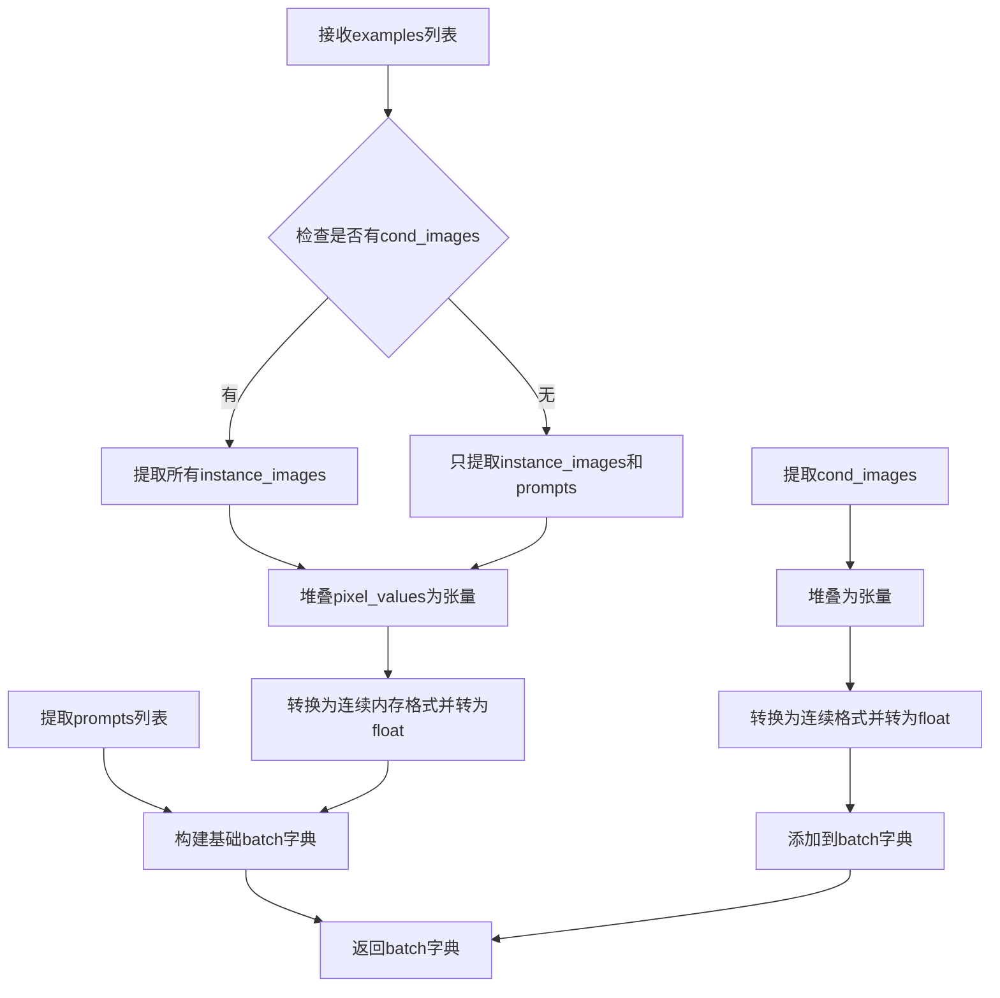

#### 带注释源码

```python
def collate_fn(examples):
    """
    将多个样本整理成一个训练批次
    
    参数:
        examples: 从DreamBoothDataset返回的样本列表，每个样本是包含以下键的字典:
            - instance_images: PIL.Image或torch.Tensor, 输入图像
            - instance_prompt: str, 对应的文本提示
            - cond_images: Optional[PIL.Image或torch.Tensor], 条件图像(用于image-to-image训练)
    
    返回:
        batch: 包含以下键的字典:
            - pixel_values: torch.Tensor, 堆叠后的图像张量
            - prompts: List[str], 文本提示列表
            - cond_pixel_values: Optional[torch.Tensor], 条件图像张量(如果存在)
    """
    # 1. 从所有样本中提取instance_images（输入图像）
    pixel_values = [example["instance_images"] for example in examples]
    
    # 2. 从所有样本中提取instance_prompt（文本提示）
    prompts = [example["instance_prompt"] for example in examples]

    # 3. 将图像列表堆叠为单个PyTorch张量
    #    形状: (batch_size, C, H, W) 或 (batch_size, H, W, C) 取决于输入类型
    pixel_values = torch.stack(pixel_values)
    
    # 4. 确保内存布局为连续存储并转换为float32
    #    contiguous_format: 确保内存连续，提高GPU访问效率
    #    float(): 转换为浮点数类型
    pixel_values = pixel_values.to(memory_format=torch.contiguous_format).float()

    # 5. 构建基础批次字典
    batch = {"pixel_values": pixel_values, "prompts": prompts}
    
    # 6. 检查是否有条件图像（用于image-to-image训练）
    if any("cond_images" in example for example in examples):
        # 提取所有条件图像
        cond_pixel_values = [example["cond_images"] for example in examples]
        
        # 堆叠为张量并转换格式
        cond_pixel_values = torch.stack(cond_pixel_values)
        cond_pixel_values = cond_pixel_values.to(memory_format=torch.contiguous_format).float()
        
        # 将条件图像添加到批次中
        batch.update({"cond_pixel_values": cond_pixel_values})
    
    return batch
```


### `main`

主训练函数，负责执行Flux.2模型的DreamBooth LoRA微调完整流程，包括环境初始化、模型加载、数据集准备、训练循环执行、模型保存以及验证推理。

参数：

-  `args`：命令行参数对象（`parse_args()`返回的命名空间），包含所有训练配置如模型路径、输出目录、学习率、批次大小等。

返回值：`None`，该函数直接执行训练流程并在结束时保存模型权重到指定目录。

#### 流程图

```mermaid
flowchart TD
    A[开始训练] --> B[验证报告配置与混合精度兼容性]
    B --> C[初始化Accelerator分布式训练环境]
    C --> D[设置日志与随机种子]
    D --> E{是否为主进程}
    E -->|Yes| F[创建输出目录与Hub仓库]
    E -->|No| G[跳过仓库创建]
    F --> G
    G --> H[加载PixtralTokenizer]
    H --> I[确定权重数据类型fp16/bf16/fp32]
    I --> J[加载FlowMatchEulerDiscreteScheduler调度器]
    J --> K[加载AutoencoderKLFlux2 VAE模型]
    K --> L[计算VAE BN统计量均值和标准差]
    L --> M{是否配置bnb量化}
    M -->|Yes| N[加载BitsAndBytesConfig]
    M -->|No| O[跳过量化配置]
    N --> O
    O --> P[加载Flux2Transformer2DModel变换器]
    P --> Q{bnb量化启用}
    Q -->|Yes| R[调用prepare_model_for_kbit_training]
    Q -->|No| S[跳过kbit训练准备]
    R --> S
    S --> T[加载Mistral3ForConditionalGeneration文本编码器]
    T --> U[设置模型梯度要求与设备放置]
    U --> V{启用NPU Flash Attention}
    V -->|Yes| W[设置native_npu后端]
    V -->|No| X[跳过NPU配置]
    W --> X
    X --> Y[配置FP8训练转换]
    Y --> Z[初始化文本编码Pipeline]
    Z --> AA{启用梯度检查点}
    AA -->|Yes| AB[transformer.enable_gradient_checkpointing]
    AA -->|No| AC[跳过梯度检查点]
    AB --> AC
    AC --> AD[配置LoRA目标模块并添加adapter]
    AD --> AE[注册模型保存与加载钩子]
    AE --> AF[启用TF32加速]
    AF --> AG[计算学习率缩放]
    AG --> AH[确保可训练参数为float32]
    AH --> AI[创建优化器AdamW或Prodigy]
    AI --> AJ[解析aspect ratio buckets]
    AJ --> AK[创建DreamBoothDataset数据集]
    AK --> AL[创建BucketBatchSampler和DataLoader]
    AL --> AM[预计算或加载文本embeddings]
    AM --> AN{启用FSDP文本编码器}
    AN -->|Yes| AO[wrap_with_fsdp包装text_encoder]
    AN -->|No| AP[跳过FSDP包装]
    AO --> AP
    AP --> AQ[预计算latents缓存]
    AQ --> AR[释放VAE和文本编码器内存]
    AR --> AS[计算训练步数与学习率调度器]
    AS --> AT[使用accelerator准备模型和优化器]
    AT --> AU[初始化训练跟踪器]
    AU --> AV[加载checkpoint恢复训练]
    AV --> AW[开始训练循环for epoch in range]
    AW --> AX{自定义instance prompts}
    AX -->|Yes| AY[使用缓存的prompt_embeds]
    AX -->|No| AZ[重复静态embeddings]
    AY --> BA
    AZ --> BA
    BA --> BB{启用latents缓存}
    BB -->|Yes| BC[使用缓存的latents]
    BB -->|No| BD[使用VAE编码pixel_values]
    BC --> BE
    BD --> BE
    BE --> BF[patchify与标准化latents]
    BF --> BG[准备latent ids和image ids]
    BG --> BH[采样噪声与timesteps]
    BH --> BI[计算flow matching噪声: noisy = (1-sigma)*x + sigma*noise]
    BI --> BJ[pack latents并拼接条件输入]
    BJ --> BK[调用transformer预测噪声残差]
    BK --> BL[unpack latents并计算加权损失]
    BL --> BM[执行backward与梯度裁剪]
    BM --> BN{同步梯度}
    BN -->|Yes| BO[更新progress bar与global_step]
    BO --> BP{达到checkpoint保存间隔}
    BP -->|Yes| BQ[保存accelerator状态]
    BP -->|No| BR[跳过保存]
    BQ --> BR
    BR --> BS{达到max_train_steps}
    BS -->|Yes| BT[break训练循环]
    BS -->|No| BU[继续下一批次]
    BU --> AX
    BN -->|No| BU
    BT --> BV{启用validation与达到验证epoch}
    BV -->|Yes| BW[执行log_validation生成图像]
    BV -->|No| BX[跳过验证]
    BW --> BX
    BX --> BY[等待所有进程完成]
    BY --> BZ[主进程保存LoRA权重]
    BZ --> CA{运行最终推理}
    CA -->|Yes| CB[加载LoRA并执行推理]
    CA --> |No| CC[跳过推理]
    CB --> CC
    CC --> CD[保存model card到README.md]
    CD --> CE{push_to_hub启用}
    CE -->|Yes| CF[上传文件夹到Hub]
    CE -->|No| CG[结束训练]
    CF --> CG
```

#### 带注释源码

```python
def main(args):
    """
    主训练函数，执行Flux.2 DreamBooth LoRA微调的完整流程。
    
    包含以下主要阶段：
    1. 环境验证与Accelerator初始化
    2. 模型加载（VAE、Transformer、Text Encoder）
    3. LoRA adapter配置
    4. 数据集准备与预处理
    5. 训练循环（包含前向传播、损失计算、反向传播）
    6. 模型保存与验证
    """
    
    # ============ 阶段1: 环境验证与配置检查 ============
    # 验证wandb与hub_token的安全性，防止token泄露
    if args.report_to == "wandb" and args.hub_token is not None:
        raise ValueError(
            "You cannot use both --report_to=wandb and --hub_token due to a security risk of exposing your token."
            " Please use `hf auth login` to authenticate with the Hub."
        )

    # 检查MPS设备对bf16的支持，避免不支持的操作
    if torch.backends.mps.is_available() and args.mixed_precision == "bf16":
        raise ValueError(
            "Mixed precision training with bfloat16 is not supported on MPS. Please use fp16 (recommended) or fp32 instead."
        )
    
    # FP8训练需要导入float8转换模块
    if args.do_fp8_training:
        from torchao.float8 import Float8LinearConfig, convert_to_float8_training

    # ============ 阶段2: 初始化Accelerator分布式训练环境 ============
    logging_dir = Path(args.output_dir, args.logging_dir)
    
    # ProjectConfiguration配置项目目录和日志目录
    accelerator_project_config = ProjectConfiguration(project_dir=args.output_dir, logging_dir=logging_dir)
    # DistributedDataParallelKwargs处理分布式训练参数，find_unused_parameters=True允许部分参数不参与训练
    kwargs = DistributedDataParallelKwargs(find_unused_parameters=True)
    
    accelerator = Accelerator(
        gradient_accumulation_steps=args.gradient_accumulation_steps,
        mixed_precision=args.mixed_precision,
        log_with=args.report_to,
        project_config=accelerator_project_config,
        kwargs_handlers=[kwargs],
    )

    # MPS设备禁用原生AMP
    if torch.backends.mps.is_available():
        accelerator.native_amp = False

    # wandb日志系统检查
    if args.report_to == "wandb":
        if not is_wandb_available():
            raise ImportError("Make sure to install wandb if you want to use it for logging during training.")

    # ============ 阶段3: 日志配置与随机种子设置 ============
    # 配置日志格式，兼容分布式环境
    logging.basicConfig(
        format="%(asctime)s - %(levelname)s - %(name)s - %(message)s",
        datefmt="%m/%d/%Y %H:%M:%S",
        level=logging.INFO,
    )
    logger.info(accelerator.state, main_process_only=False)
    
    # 主进程设置详细日志，子进程仅显示错误
    if accelerator.is_local_main_process:
        transformers.utils.logging.set_verbosity_warning()
        diffusers.utils.logging.set_verbosity_info()
    else:
        transformers.utils.logging.set_verbosity_error()
        diffusers.utils.logging.set_verbosity_error()

    # 设置随机种子确保可重复性
    if args.seed is not None:
        set_seed(args.seed)

    # ============ 阶段4: 创建输出目录与Hub仓库 ============
    if accelerator.is_main_process:
        if args.output_dir is not None:
            os.makedirs(args.output_dir, exist_ok=True)

        if args.push_to_hub:
            # 创建或获取现有Hub仓库
            repo_id = create_repo(
                repo_id=args.hub_model_id or Path(args.output_dir).name,
                exist_ok=True,
            ).repo_id

    # ============ 阶段5: 加载Tokenizers和确定数据类型 ============
    # 加载Pixtral多模态tokenizer
    tokenizer = PixtralProcessor.from_pretrained(
        args.pretrained_model_name_or_path,
        subfolder="tokenizer",
        revision=args.revision,
    )

    # 根据mixed_precision确定权重数据类型（推理权重使用半精度）
    weight_dtype = torch.float32
    if accelerator.mixed_precision == "fp16":
        weight_dtype = torch.float16
    elif accelerator.mixed_precision == "bf16":
        weight_dtype = torch.bfloat16

    # ============ 阶段6: 加载调度器和模型 ============
    # Flow Match欧拉离散调度器
    noise_scheduler = FlowMatchEulerDiscreteScheduler.from_pretrained(
        args.pretrained_model_name_or_path,
        subfolder="scheduler",
        revision=args.revision,
    )
    # 深拷贝用于timestep采样计算
    noise_scheduler_copy = copy.deepcopy(noise_scheduler)
    
    # 加载VAE并计算BatchNorm统计量用于latent标准化
    vae = AutoencoderKLFlux2.from_pretrained(
        args.pretrained_model_name_or_path,
        subfolder="vae",
        revision=args.revision,
        variant=args.variant,
    )
    latents_bn_mean = vae.bn.running_mean.view(1, -1, 1, 1).to(accelerator.device)
    latents_bn_std = torch.sqrt(vae.bn.running_var.view(1, -1, 1, 1) + vae.config.batch_norm_eps).to(
        accelerator.device
    )

    # ============ 阶段7: 量化配置（可选） ============
    quantization_config = None
    if args.bnb_quantization_config_path is not None:
        with open(args.bnb_quantization_config_path, "r") as f:
            config_kwargs = json.load(f)
            if "load_in_4bit" in config_kwargs and config_kwargs["load_in_4bit"]:
                config_kwargs["bnb_4bit_compute_dtype"] = weight_dtype
        quantization_config = BitsAndBytesConfig(**config_kwargs)

    # 加载Flux2Transformer（DiT架构）
    transformer = Flux2Transformer2DModel.from_pretrained(
        args.pretrained_model_name_or_path,
        subfolder="transformer",
        revision=args.revision,
        variant=args.variant,
        quantization_config=quantization_config,
        torch_dtype=weight_dtype,
    )
    
    # 为量化模型准备kbit训练
    if args.bnb_quantization_config_path is not None:
        transformer = prepare_model_for_kbit_training(transformer, use_gradient_checkpointing=False)

    # 加载文本编码器（可选远程编码）
    if not args.remote_text_encoder:
        text_encoder = Mistral3ForConditionalGeneration.from_pretrained(
            args.pretrained_model_name_or_path, subfolder="text_encoder", revision=args.revision, variant=args.variant
        )
        text_encoder.requires_grad_(False)

    # ============ 阶段8: 设置模型梯度要求 ============
    # 仅训练LoRA adapter，冻结所有基础模型权重
    transformer.requires_grad_(False)
    vae.requires_grad_(False)

    # NPU Flash Attention支持
    if args.enable_npu_flash_attention:
        if is_torch_npu_available():
            logger.info("npu flash attention enabled.")
            transformer.set_attention_backend("_native_npu")
        else:
            raise ValueError("npu flash attention requires torch_npu extensions and is supported only on npu device ")

    # 再次检查MPS对bf16的支持
    if torch.backends.mps.is_available() and weight_dtype == torch.bfloat16:
        raise ValueError(
            "Mixed precision training with bfloat16 is not supported on MPS. Please use fp16 (recommended) or fp32 instead."
        )

    # ============ 阶段9: 模型设备放置 ============
    # VAE通常稳定在bf16，可减少内存使用
    to_kwargs = {"dtype": weight_dtype, "device": accelerator.device} if not args.offload else {"dtype": weight_dtype}
    vae.to(**to_kwargs)
    
    # Transformer设备配置
    transformer_to_kwargs = (
        {"device": accelerator.device}
        if args.bnb_quantization_config_path is not None
        else {"device": accelerator.device, "dtype": weight_dtype}
    )

    is_fsdp = getattr(accelerator.state, "fsdp_plugin", None) is not None
    if not is_fsdp:
        transformer.to(**transformer_to_kwargs)

    # FP8训练转换
    if args.do_fp8_training:
        convert_to_float8_training(
            transformer, module_filter_fn=module_filter_fn, config=Float8LinearConfig(pad_inner_dim=True)
        )

    # 文本编码器设备放置
    if not args.remote_text_encoder:
        text_encoder.to(**to_kwargs)
        # 初始化文本编码Pipeline用于embedding计算
        text_encoding_pipeline = Flux2Pipeline.from_pretrained(
            args.pretrained_model_name_or_path,
            vae=None,
            transformer=None,
            tokenizer=tokenizer,
            text_encoder=text_encoder,
            scheduler=None,
            revision=args.revision,
        )

    # ============ 阶段10: 梯度检查点配置 ============
    if args.gradient_checkpointing:
        transformer.enable_gradient_checkpointing()

    # ============ 阶段11: LoRA Adapter配置 ============
    if args.lora_layers is not None:
        target_modules = [layer.strip() for layer in args.lora_layers.split(",")]
    else:
        target_modules = ["to_k", "to_q", "to_v", "to_out.0"]

    # 配置LoRA参数并添加到transformer
    transformer_lora_config = LoraConfig(
        r=args.rank,
        lora_alpha=args.lora_alpha,
        lora_dropout=args.lora_dropout,
        init_lora_weights="gaussian",
        target_modules=target_modules,
    )
    transformer.add_adapter(transformer_lora_config)

    # 辅助函数：解包模型处理compiled module情况
    def unwrap_model(model):
        model = accelerator.unwrap_model(model)
        model = model._orig_mod if is_compiled_module(model) else model
        return model

    # ============ 阶段12: 注册自定义模型保存/加载钩子 ============
    def save_model_hook(models, weights, output_dir):
        """自定义保存钩子：序列化LoRA权重为PEFT格式"""
        transformer_cls = type(unwrap_model(transformer))

        # 1) 验证并选取transformer模型
        modules_to_save: dict[str, Any] = {}
        transformer_model = None

        for model in models:
            if isinstance(unwrap_model(model), transformer_cls):
                transformer_model = model
                modules_to_save["transformer"] = model
            else:
                raise ValueError(f"unexpected save model: {model.__class__}")

        if transformer_model is None:
            raise ValueError("No transformer model found in 'models'")

        # 2) FSDP情况下获取state_dict
        state_dict = accelerator.get_state_dict(model) if is_fsdp else None

        # 3) 仅主进程执行LoRA state dict物化
        transformer_lora_layers_to_save = None
        if accelerator.is_main_process:
            peft_kwargs = {}
            if is_fsdp:
                peft_kwargs["state_dict"] = state_dict

            transformer_lora_layers_to_save = get_peft_model_state_dict(
                unwrap_model(transformer_model) if is_fsdp else transformer_model,
                **peft_kwargs,
            )

            if is_fsdp:
                transformer_lora_layers_to_save = _to_cpu_contiguous(transformer_lora_layers_to_save)

            # 弹出权重避免重复保存
            if weights:
                weights.pop()

            # 保存LoRA权重
            Flux2Pipeline.save_lora_weights(
                output_dir,
                transformer_lora_layers=transformer_lora_layers_to_save,
                **_collate_lora_metadata(modules_to_save),
            )

    def load_model_hook(models, input_dir):
        """自定义加载钩子：从checkpoint恢复LoRA权重"""
        transformer_ = None

        if not is_fsdp:
            while len(models) > 0:
                model = models.pop()

                if isinstance(unwrap_model(model), type(unwrap_model(transformer))):
                    transformer_ = unwrap_model(model)
                else:
                    raise ValueError(f"unexpected save model: {model.__class__}")
        else:
            # FSDP模式需要重新加载完整transformer
            transformer_ = Flux2Transformer2DModel.from_pretrained(
                args.pretrained_model_name_or_path,
                subfolder="transformer",
            )
            transformer_.add_adapter(transformer_lora_config)

        # 加载LoRA state dict
        lora_state_dict = Flux2Pipeline.lora_state_dict(input_dir)

        transformer_state_dict = {
            f"{k.replace('transformer.', '')}": v for k, v in lora_state_dict.items() if k.startswith("transformer.")
        }
        transformer_state_dict = convert_unet_state_dict_to_peft(transformer_state_dict)
        incompatible_keys = set_peft_model_state_dict(transformer_, transformer_state_dict, adapter_name="default")
        if incompatible_keys is not None:
            unexpected_keys = getattr(incompatible_keys, "unexpected_keys", None)
            if unexpected_keys:
                logger.warning(
                    f"Loading adapter weights from state_dict led to unexpected keys not found in the model: "
                    f" {unexpected_keys}. "
                )

        # 确保可训练参数为float32（LoRA权重）
        if args.mixed_precision == "fp16":
            models = [transformer_]
            cast_training_params(models)

    accelerator.register_save_state_pre_hook(save_model_hook)
    accelerator.register_load_state_pre_hook(load_model_hook)

    # ============ 阶段13: TF32加速与学习率缩放 ============
    if args.allow_tf32 and torch.cuda.is_available():
        torch.backends.cuda.matmul.allow_tf32 = True

    # 根据GPU数量、梯度累积和批次大小缩放学习率
    if args.scale_lr:
        args.learning_rate = (
            args.learning_rate * args.gradient_accumulation_steps * args.train_batch_size * accelerator.num_processes
        )

    # 确保可训练参数为float32
    if args.mixed_precision == "fp16":
        models = [transformer]
        cast_training_params(models, dtype=torch.float32)

    # ============ 阶段14: 优化器配置 ============
    transformer_lora_parameters = list(filter(lambda p: p.requires_grad, transformer.parameters()))

    # 构建优化参数列表
    transformer_parameters_with_lr = {"params": transformer_lora_parameters, "lr": args.learning_rate}
    params_to_optimize = [transformer_parameters_with_lr]

    # 验证优化器选择
    if not (args.optimizer.lower() == "prodigy" or args.optimizer.lower() == "adamw"):
        logger.warning(
            f"Unsupported choice of optimizer: {args.optimizer}.Supported optimizers include [adamW, prodigy]."
            "Defaulting to adamW"
        )
        args.optimizer = "adamw"

    if args.use_8bit_adam and not args.optimizer.lower() == "adamw":
        logger.warning(
            f"use_8bit_adam is ignored when optimizer is not set to 'AdamW'. Optimizer was "
            f"set to {args.optimizer.lower()}"
        )

    # AdamW优化器
    if args.optimizer.lower() == "adamw":
        if args.use_8bit_adam:
            try:
                import bitsandbytes as bnb
            except ImportError:
                raise ImportError(
                    "To use 8-bit Adam, please install the bitsandbytes library: `pip install bitsandbytes`."
                )

            optimizer_class = bnb.optim.AdamW8bit
        else:
            optimizer_class = torch.optim.AdamW

        optimizer = optimizer_class(
            params_to_optimize,
            betas=(args.adam_beta1, args.adam_beta2),
            weight_decay=args.adam_weight_decay,
            eps=args.adam_epsilon,
        )

    # Prodigy优化器
    if args.optimizer.lower() == "prodigy":
        try:
            import prodigyopt
        except ImportError:
            raise ImportError("To use Prodigy, please install the prodigyopt library: `pip install prodigyopt`")

        optimizer_class = prodigyopt.Prodigy

        if args.learning_rate <= 0.1:
            logger.warning(
                "Learning rate is too low. When using prodigy, it's generally better to set learning rate around 1.0"
            )

        optimizer = optimizer_class(
            params_to_optimize,
            betas=(args.adam_beta1, args.adam_beta2),
            beta3=args.prodigy_beta3,
            weight_decay=args.adam_weight_decay,
            eps=args.adam_epsilon,
            decouple=args.prodigy_decouple,
            use_bias_correction=args.prodigy_use_bias_correction,
            safeguard_warmup=args.prodigy_safeguard_warmup,
        )

    # ============ 阶段15: 数据集与DataLoader创建 ============
    # 解析aspect ratio buckets
    if args.aspect_ratio_buckets is not None:
        buckets = parse_buckets_string(args.aspect_ratio_buckets)
    else:
        buckets = [(args.resolution, args.resolution)]
    logger.info(f"Using parsed aspect ratio buckets: {buckets}")

    # 创建DreamBooth数据集
    train_dataset = DreamBoothDataset(
        instance_data_root=args.instance_data_dir,
        instance_prompt=args.instance_prompt,
        size=args.resolution,
        repeats=args.repeats,
        center_crop=args.center_crop,
        buckets=buckets,
    )
    
    # 使用BucketBatchSampler按bucket分组批次
    batch_sampler = BucketBatchSampler(train_dataset, batch_size=args.train_batch_size, drop_last=True)
    train_dataloader = torch.utils.data.DataLoader(
        train_dataset,
        batch_sampler=batch_sampler,
        collate_fn=lambda examples: collate_fn(examples),
        num_workers=args.dataloader_num_workers,
    )

    # ============ 阶段16: 文本Embeddings预计算 ============
    def compute_text_embeddings(prompt, text_encoding_pipeline):
        """本地计算文本embeddings"""
        with torch.no_grad():
            prompt_embeds, text_ids = text_encoding_pipeline.encode_prompt(
                prompt=prompt, max_sequence_length=args.max_sequence_length
            )
        return prompt_embeds, text_ids

    def compute_remote_text_embeddings(prompts: str | list[str]):
        """使用远程API计算文本embeddings（无需本地加载文本编码器）"""
        import io
        import requests

        if args.hub_token is not None:
            hf_token = args.hub_token
        else:
            from huggingface_hub import get_token
            hf_token = get_token()
            if hf_token is None:
                raise ValueError(
                    "No HuggingFace token found. To use the remote text encoder please login using `hf auth login` or provide a token using --hub_token"
                )

        def _encode_single(prompt: str):
            response = requests.post(
                "https://remote-text-encoder-flux-2.huggingface.co/predict",
                json={"prompt": prompt},
                headers={"Authorization": f"Bearer {hf_token}", "Content-Type": "application/json"},
            )
            assert response.status_code == 200, f"{response.status_code=}"
            return torch.load(io.BytesIO(response.content))

        try:
            if isinstance(prompts, (list, tuple)):
                embeds = [_encode_single(p) for p in prompts]
                prompt_embeds = torch.cat(embeds, dim=0).to(accelerator.device)
            else:
                prompt_embeds = _encode_single(prompts).to(accelerator.device)

            text_ids = Flux2Pipeline._prepare_text_ids(prompt_embeds).to(accelerator.device)
            return prompt_embeds, text_ids

        except Exception as e:
            raise RuntimeError("Remote text encoder inference failed.") from e

    # 预计算instance prompt的embeddings（静态提示词无需每次重新编码）
    if not train_dataset.custom_instance_prompts:
        if args.remote_text_encoder:
            instance_prompt_hidden_states, instance_text_ids = compute_remote_text_embeddings(args.instance_prompt)
        else:
            with offload_models(text_encoding_pipeline, device=accelerator.device, offload=args.offload):
                instance_prompt_hidden_states, instance_text_ids = compute_text_embeddings(
                    args.instance_prompt, text_encoding_pipeline
                )

    # 预计算validation prompt的embeddings
    if args.validation_prompt is not None:
        validation_image = load_image(args.validation_image_path).convert("RGB")
        validation_kwargs = {"image": validation_image}
        if args.remote_text_encoder:
            validation_kwargs["prompt_embeds"] = compute_remote_text_embeddings(args.validation_prompt)
        else:
            with offload_models(text_encoding_pipeline, device=accelerator.device, offload=args.offload):
                validation_kwargs["prompt_embeds"] = compute_text_embeddings(
                    args.validation_prompt, text_encoding_pipeline
                )

    # FSDP包装文本编码器
    if args.fsdp_text_encoder:
        fsdp_kwargs = get_fsdp_kwargs_from_accelerator(accelerator)
        text_encoder_fsdp = wrap_with_fsdp(
            model=text_encoding_pipeline.text_encoder,
            device=accelerator.device,
            offload=args.offload,
            limit_all_gathers=True,
            use_orig_params=True,
            fsdp_kwargs=fsdp_kwargs,
        )

        text_encoding_pipeline.text_encoder = text_encoder_fsdp
        dist.barrier()

    # 打包静态embeddings供训练使用
    if not train_dataset.custom_instance_prompts:
        prompt_embeds = instance_prompt_hidden_states
        text_ids = instance_text_ids

    # ============ 阶段17: Latents预计算（可选缓存） ============
    precompute_latents = args.cache_latents or train_dataset.custom_instance_prompts
    if precompute_latents:
        prompt_embeds_cache = []
        text_ids_cache = []
        latents_cache = []
        cond_latents_cache = []
        
        for batch in tqdm(train_dataloader, desc="Caching latents"):
            with torch.no_grad():
                # 缓存VAE latents
                if args.cache_latents:
                    with offload_models(vae, device=accelerator.device, offload=args.offload):
                        batch["pixel_values"] = batch["pixel_values"].to(
                            accelerator.device, non_blocking=True, dtype=vae.dtype
                        )
                        latents_cache.append(vae.encode(batch["pixel_values"]).latent_dist)
                        batch["cond_pixel_values"] = batch["cond_pixel_values"].to(
                            accelerator.device, non_blocking=True, dtype=vae.dtype
                        )
                        cond_latents_cache.append(vae.encode(batch["cond_pixel_values"]).latent_dist)
                
                # 缓存自定义prompts的embeddings
                if train_dataset.custom_instance_prompts:
                    if args.remote_text_encoder:
                        prompt_embeds, text_ids = compute_remote_text_embeddings(batch["prompts"])
                    elif args.fsdp_text_encoder:
                        prompt_embeds, text_ids = compute_text_embeddings(batch["prompts"], text_encoding_pipeline)
                    else:
                        with offload_models(text_encoding_pipeline, device=accelerator.device, offload=args.offload):
                            prompt_embeds, text_ids = compute_text_embeddings(batch["prompts"], text_encoding_pipeline)
                    prompt_embeds_cache.append(prompt_embeds)
                    text_ids_cache.append(text_ids)

    # 释放VAE和文本编码器内存到CPU
    if args.cache_latents:
        vae = vae.to("cpu")
        del vae

    if not args.remote_text_encoder:
        text_encoding_pipeline = text_encoding_pipeline.to("cpu")
        del text_encoder, tokenizer
    free_memory()

    # ============ 阶段18: 训练步数与学习率调度器计算 ============
    num_warmup_steps_for_scheduler = args.lr_warmup_steps * accelerator.num_processes
    if args.max_train_steps is None:
        len_train_dataloader_after_sharding = math.ceil(len(train_dataloader) / accelerator.num_processes)
        num_update_steps_per_epoch = math.ceil(len_train_dataloader_after_sharding / args.gradient_accumulation_steps)
        num_training_steps_for_scheduler = (
            args.num_train_epochs * accelerator.num_processes * num_update_steps_per_epoch
        )
    else:
        num_training_steps_for_scheduler = args.max_train_steps * accelerator.num_processes

    lr_scheduler = get_scheduler(
        args.lr_scheduler,
        optimizer=optimizer,
        num_warmup_steps=num_warmup_steps_for_scheduler,
        num_training_steps=num_training_steps_for_scheduler,
        num_cycles=args.lr_num_cycles,
        power=args.lr_power,
    )

    # ============ 阶段19: 使用Accelerator准备模型与优化器 ============
    transformer, optimizer, train_dataloader, lr_scheduler = accelerator.prepare(
        transformer, optimizer, train_dataloader, lr_scheduler
    )

    # 重新计算训练步数（DataLoader大小可能改变）
    num_update_steps_per_epoch = math.ceil(len(train_dataloader) / args.gradient_accumulation_steps)
    if args.max_train_steps is None:
        args.max_train_steps = args.num_train_epochs * num_update_steps_per_epoch
        if num_training_steps_for_scheduler != args.max_train_steps:
            logger.warning(
                f"The length of the 'train_dataloader' after 'accelerator.prepare' ({len(train_dataloader)}) does not match "
                f"the expected length ({len_train_dataloader_after_sharding}) when the learning rate scheduler was created. "
                f"This inconsistency may result in the learning rate scheduler not functioning properly."
            )
    args.num_train_epochs = math.ceil(args.max_train_steps / num_update_steps_per_epoch)

    # ============ 阶段20: 初始化跟踪器 ============
    if accelerator.is_main_process:
        tracker_name = "dreambooth-flux2-image2img-lora"
        accelerator.init_trackers(tracker_name, config=vars(args))

    # ============ 阶段21: 训练信息日志 ============
    total_batch_size = args.train_batch_size * accelerator.num_processes * args.gradient_accumulation_steps

    logger.info("***** Running training *****")
    logger.info(f"  Num examples = {len(train_dataset)}")
    logger.info(f"  Num batches each epoch = {len(train_dataloader)}")
    logger.info(f"  Num Epochs = {args.num_train_epochs}")
    logger.info(f"  Instantaneous batch size per device = {args.train_batch_size}")
    logger.info(f"  Total train batch size (w. parallel, distributed & accumulation) = {total_batch_size}")
    logger.info(f"  Gradient Accumulation steps = {args.gradient_accumulation_steps}")
    logger.info(f"  Total optimization steps = {args.max_train_steps}")
    
    global_step = 0
    first_epoch = 0

    # 从checkpoint恢复训练
    if args.resume_from_checkpoint:
        if args.resume_from_checkpoint != "latest":
            path = os.path.basename(args.resume_from_checkpoint)
        else:
            # 获取最新的checkpoint
            dirs = os.listdir(args.output_dir)
            dirs = [d for d in dirs if d.startswith("checkpoint")]
            dirs = sorted(dirs, key=lambda x: int(x.split("-")[1]))
            path = dirs[-1] if len(dirs) > 0 else None

        if path is None:
            accelerator.print(
                f"Checkpoint '{args.resume_from_checkpoint}' does not exist. Starting a new training run."
            )
            args.resume_from_checkpoint = None
            initial_global_step = 0
        else:
            accelerator.print(f"Resuming from checkpoint {path}")
            accelerator.load_state(os.path.join(args.output_dir, path))
            global_step = int(path.split("-")[1])

            initial_global_step = global_step
            first_epoch = global_step // num_update_steps_per_epoch
    else:
        initial_global_step = 0

    # 进度条
    progress_bar = tqdm(
        range(0, args.max_train_steps),
        initial=initial_global_step,
        desc="Steps",
        disable=not accelerator.is_local_main_process,
    )

    # Sigma计算辅助函数
    def get_sigmas(timesteps, n_dim=4, dtype=torch.float32):
        sigmas = noise_scheduler_copy.sigmas.to(device=accelerator.device, dtype=dtype)
        schedule_timesteps = noise_scheduler_copy.timesteps.to(accelerator.device)
        timesteps = timesteps.to(accelerator.device)
        step_indices = [(schedule_timesteps == t).nonzero().item() for t in timesteps]

        sigma = sigmas[step_indices].flatten()
        while len(sigma.shape) < n_dim:
            sigma = sigma.unsqueeze(-1)
        return sigma

    # ============ 阶段22: 训练主循环 ============
    for epoch in range(first_epoch, args.num_train_epochs):
        transformer.train()

        for step, batch in enumerate(train_dataloader):
            models_to_accumulate = [transformer]
            prompts = batch["prompts"]

            with accelerator.accumulate(models_to_accumulate):
                # 获取prompt embeddings
                if train_dataset.custom_instance_prompts:
                    prompt_embeds = prompt_embeds_cache[step]
                    text_ids = text_ids_cache[step]
                else:
                    num_repeat_elements = len(prompts)
                    prompt_embeds = prompt_embeds.repeat(num_repeat_elements, 1, 1)
                    text_ids = text_ids.repeat(num_repeat_elements, 1, 1)

                # 转换为latent空间
                if args.cache_latents:
                    model_input = latents_cache[step].mode()
                    cond_model_input = cond_latents_cache[step].mode()
                else:
                    with offload_models(vae, device=accelerator.device, offload=args.offload):
                        pixel_values = batch["pixel_values"].to(dtype=vae.dtype)
                        cond_pixel_values = batch["cond_pixel_values"].to(dtype=vae.dtype)

                    model_input = vae.encode(pixel_values).latent_dist.mode()
                    cond_model_input = vae.encode(cond_pixel_values).latent_dist.mode()

                # Patchify和标准化latents
                model_input = Flux2Pipeline._patchify_latents(model_input)
                model_input = (model_input - latents_bn_mean) / latents_bn_std

                cond_model_input = Flux2Pipeline._patchify_latents(cond_model_input)
                cond_model_input = (cond_model_input - latents_bn_mean) / latents_bn_std

                # 准备latent IDs和image IDs
                model_input_ids = Flux2Pipeline._prepare_latent_ids(model_input).to(device=model_input.device)
                cond_model_input_list = [cond_model_input[i].unsqueeze(0) for i in range(cond_model_input.shape[0])]
                cond_model_input_ids = Flux2Pipeline._prepare_image_ids(cond_model_input_list).to(
                    device=cond_model_input.device
                )
                cond_model_input_ids = cond_model_input_ids.view(
                    cond_model_input.shape[0], -1, model_input_ids.shape[-1]
                )

                # 采样噪声
                noise = torch.randn_like(model_input)
                bsz = model_input.shape[0]

                # 非均匀timestep采样（权重方案）
                u = compute_density_for_timestep_sampling(
                    weighting_scheme=args.weighting_scheme,
                    batch_size=bsz,
                    logit_mean=args.logit_mean,
                    logit_std=args.logit_std,
                    mode_scale=args.mode_scale,
                )
                indices = (u * noise_scheduler_copy.config.num_train_timesteps).long()
                timesteps = noise_scheduler_copy.timesteps[indices].to(device=model_input.device)

                # Flow matching噪声添加: zt = (1 - texp) * x + texp * z1
                sigmas = get_sigmas(timesteps, n_dim=model_input.ndim, dtype=model_input.dtype)
                noisy_model_input = (1.0 - sigmas) * model_input + sigmas * noise

                # Pack latents用于transformer处理
                packed_noisy_model_input = Flux2Pipeline._pack_latents(noisy_model_input)
                packed_cond_model_input = Flux2Pipeline._pack_latents(cond_model_input)

                orig_input_shape = packed_noisy_model_input.shape
                orig_input_ids_shape = model_input_ids.shape

                # 拼接模型输入与条件输入
                packed_noisy_model_input = torch.cat([packed_noisy_model_input, packed_cond_model_input], dim=1)
                model_input_ids = torch.cat([model_input_ids, cond_model_input_ids], dim=1)

                # 引导.scale处理
                guidance = torch.full([1], args.guidance_scale, device=accelerator.device)
                guidance = guidance.expand(model_input.shape[0])

                # Transformer前向传播预测噪声残差
                model_pred = transformer(
                    hidden_states=packed_noisy_model_input,  # (B, image_seq_len, C)
                    timestep=timesteps / 1000,  # 缩放到0-1范围
                    guidance=guidance,
                    encoder_hidden_states=prompt_embeds,
                    txt_ids=text_ids,  # B, text_seq_len, 4
                    img_ids=model_input_ids,  # B, image_seq_len, 4
                    return_dict=False,
                )[0]
                
                # 恢复原始形状
                model_pred = model_pred[:, : orig_input_shape[1], :]
                model_input_ids = model_input_ids[:, : orig_input_ids_shape[1], :]

                model_pred = Flux2Pipeline._unpack_latents_with_ids(model_pred, model_input_ids)

                # 损失加权方案
                weighting = compute_loss_weighting_for_sd3(weighting_scheme=args.weighting_scheme, sigmas=sigmas)

                # Flow matching目标: noise - model_input
                target = noise - model_input

                # 计算加权MSE损失
                loss = torch.mean(
                    (weighting.float() * (model_pred.float() - target.float()) ** 2).reshape(target.shape[0], -1),
                    1,
                )
                loss = loss.mean()

                # 反向传播
                accelerator.backward(loss)
                
                # 梯度裁剪
                if accelerator.sync_gradients:
                    params_to_clip = transformer.parameters()
                    accelerator.clip_grad_norm_(params_to_clip, args.max_grad_norm)

                # 优化器步骤
                optimizer.step()
                lr_scheduler.step()
                optimizer.zero_grad()

            # 同步后处理
            if accelerator.sync_gradients:
                progress_bar.update(1)
                global_step += 1

                # Checkpoint保存
                if accelerator.is_main_process or is_fsdp:
                    if global_step % args.checkpointing_steps == 0:
                        # 检查checkpoint数量限制
                        if args.checkpoints_total_limit is not None:
                            checkpoints = os.listdir(args.output_dir)
                            checkpoints = [d for d in checkpoints if d.startswith("checkpoint")]
                            checkpoints = sorted(checkpoints, key=lambda x: int(x.split("-")[1]))

                            if len(checkpoints) >= args.checkpoints_total_limit:
                                num_to_remove = len(checkpoints) - args.checkpoints_total_limit + 1
                                removing_checkpoints = checkpoints[0:num_to_remove]

                                logger.info(
                                    f"{len(checkpoints)} checkpoints already exist, removing {len(removing_checkpoints)} checkpoints"
                                )
                                logger.info(f"removing checkpoints: {', '.join(removing_checkpoints)}")

                                for removing_checkpoint in removing_checkpoints:
                                    removing_checkpoint = os.path.join(args.output_dir, removing_checkpoint)
                                    shutil.rmtree(removing_checkpoint)

                        save_path = os.path.join(args.output_dir, f"checkpoint-{global_step}")
                        accelerator.save_state(save_path)
                        logger.info(f"Saved state to {save_path}")

            # 日志记录
            logs = {"loss": loss.detach().item(), "lr": lr_scheduler.get_last_lr()[0]}
            progress_bar.set_postfix(**logs)
            accelerator.log(logs, step=global_step)

            if global_step >= args.max_train_steps:
                break

        # 验证
        if accelerator.is_main_process:
            if args.validation_prompt is not None and epoch % args.validation_epochs == 0:
                # 创建pipeline用于验证
                pipeline = Flux2Pipeline.from_pretrained(
                    args.pretrained_model_name_or_path,
                    text_encoder=None,
                    tokenizer=None,
                    transformer=unwrap_model(transformer),
                    revision=args.revision,
                    variant=args.variant,
                    torch_dtype=weight_dtype,
                )
                images = log_validation(
                    pipeline=pipeline,
                    args=args,
                    accelerator=accelerator,
                    pipeline_args=validation_kwargs,
                    epoch=epoch,
                    torch_dtype=weight_dtype,
                )

                del pipeline
                free_memory()

    # ============ 阶段23: 最终模型保存 ============
    accelerator.wait_for_everyone()

    # 获取最终state dict
    if is_fsdp:
        transformer = unwrap_model(transformer)
        state_dict = accelerator.get_state_dict(transformer)
    
    if accelerator.is_main_process:
        modules_to_save = {}
        if is_fsdp:
            if args.bnb_quantization_config_path is None:
                if args.upcast_before_saving:
                    state_dict = {
                        k: v.to(torch.float32) if isinstance(v, torch.Tensor) else v for k, v in state_dict.items()
                    }
                else:
                    state_dict = {
                        k: v.to(weight_dtype) if isinstance(v, torch.Tensor) else v for k, v in state_dict.items()
                    }

            transformer_lora_layers = get_peft_model_state_dict(
                transformer,
                state_dict=state_dict,
            )
            transformer_lora_layers = {
                k: v.detach().cpu().contiguous() if isinstance(v, torch.Tensor) else v
                for k, v in transformer_lora_layers.items()
            }

        else:
            transformer = unwrap_model(transformer)
            if args.bnb_quantization_config_path is None:
                if args.upcast_before_saving:
                    transformer.to(torch.float32)
                else:
                    transformer = transformer.to(weight_dtype)
            transformer_lora_layers = get_peft_model_state_dict(transformer)

        modules_to_save["transformer"] = transformer

        # 保存LoRA权重
        Flux2Pipeline.save_lora_weights(
            save_directory=args.output_dir,
            transformer_lora_layers=transformer_lora_layers,
            **_collate_lora_metadata(modules_to_save),
        )

        # 最终推理
        images = []
        run_validation = (args.validation_prompt and args.num_validation_images > 0) or (args.final_validation_prompt)
        should_run_final_inference = not args.skip_final_inference and run_validation
        if should_run_final_inference:
            pipeline = Flux2Pipeline.from_pretrained(
                args.pretrained_model_name_or_path,
                revision=args.revision,
                variant=args.variant,
                torch_dtype=weight_dtype,
            )
            # 加载LoRA权重
            pipeline.load_lora_weights(args.output_dir)

            # 运行推理
            images = []
            if args.validation_prompt and args.num_validation_images > 0:
                images = log_validation(
                    pipeline=pipeline,
                    args=args,
                    accelerator=accelerator,
                    pipeline_args=validation_kwargs,
                    epoch=epoch,
                    is_final_validation=True,
                    torch_dtype=weight_dtype,
                )
            del pipeline
            free_memory()

        # 保存model card
        validation_prompt = args.validation_prompt if args.validation_prompt else args.final_validation_prompt
        save_model_card(
            (args.hub_model_id or Path(args.output_dir).name) if not args.push_to_hub else repo_id,
            images=images,
            base_model=args.pretrained_model_name_or_path,
            instance_prompt=args.instance_prompt,
            validation_prompt=validation_prompt,
            repo_folder=args.output_dir,
            fp8_training=args.do_fp8_training,
        )

        # 上传到Hub
        if args.push_to_hub:
            upload_folder(
                repo_id=repo_id,
                folder_path=args.output_dir,
                commit_message="End of training",
                ignore_patterns=["step_*", "epoch_*"],
            )

    accelerator.end_training()
```


### `unwrap_model`

该函数是 Flux.2 DreamBooth LoRA 训练脚本中的内部辅助函数，用于从 Accelerator 包装中解包模型，并处理 PyTorch 编译模块（torch.compile）的特殊情况，最终返回原始模型对象以确保正确保存和加载模型状态。

参数：

- `model`：`torch.nn.Module`，需要解包的模型对象，通常是经过 Accelerator 包装的模型

返回值：`torch.nn.Module`，解包后的模型对象，如果模型经过了 torch.compile 编译，则返回 `_orig_mod` 原始模块；否则直接返回模型本身。

#### 流程图

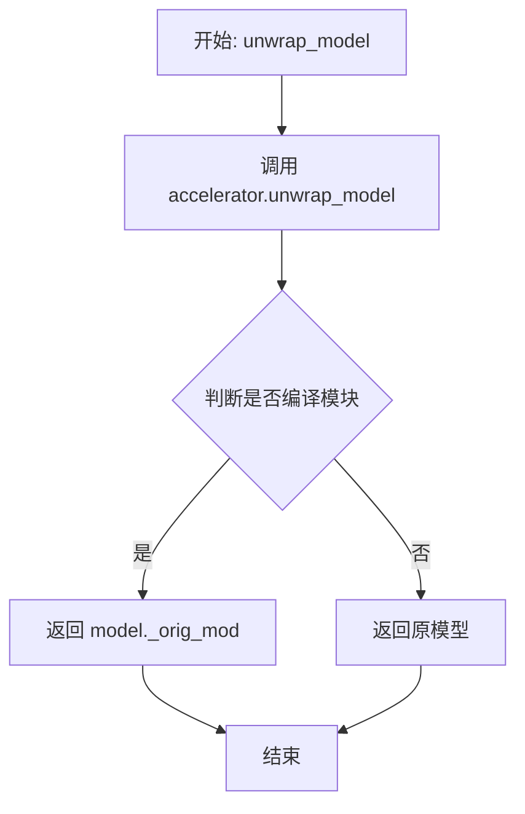

#### 带注释源码

```python
def unwrap_model(model):
    """
    解包模型，处理 accelerator 和 compiled module
    
    该函数是训练脚本中的内部函数，用于：
    1. 从 Accelerator 包装中提取底层模型
    2. 处理 torch.compile 创建的编译模块的特殊情况
    
    参数:
        model: 经过 Accelerator 包装的模型对象
        
    返回:
        解包后的原始模型对象
    """
    # 第一步：使用 Accelerator 的 unwrap_model 方法去除分布式训练包装
    model = accelerator.unwrap_model(model)
    
    # 第二步：检查模型是否经过了 torch.compile 编译
    # 如果是编译模块，需要访问 _orig_mod 属性获取原始未编译的模型
    # is_compiled_module 是 diffusers.utils.torch_utils 中的辅助函数
    model = model._orig_mod if is_compiled_module(model) else model
    
    return model
```

#### 使用场景说明

该函数主要用于以下场景：

1. **保存模型检查点时**：在 `save_model_hook` 中调用，确保保存的是原始模型而非 Accelerator 包装后的模型
2. **加载模型进行验证时**：在 `log_validation` 和训练结束后的最终推理中使用
3. **获取模型类型时**：在 `save_model_hook` 中通过 `unwrap_model(transformer)` 获取模型类型进行类型检查

#### 技术细节

- `accelerator.unwrap_model()`：去除 Accelerate 库添加的分布式数据并行（DDP/FSDP）包装层
- `is_compiled_module(model)`：检查模型是否经过了 `torch.compile()` 编译优化
- `model._orig_mod`：PyTorch 编译模块的属性，指向原始未编译的模型对象


### `compute_text_embeddings`

该函数用于将文本提示（prompt）编码为向量表示（embeddings）和文本ID，供后续的Diffusion模型在训练过程中使用。

参数：

- `prompt`：需要计算embeddings的文本提示（str类型）
- `text_encoding_pipeline`：用于编码文本的pipeline实例（Pixtral文本编码pipeline）

返回值：

- `prompt_embeds`：文本的embedding向量（torch.Tensor类型），包含文本的语义表示
- `text_ids`：文本的位置ID向量（torch.Tensor类型），用于Transformer模型的位置编码

#### 流程图

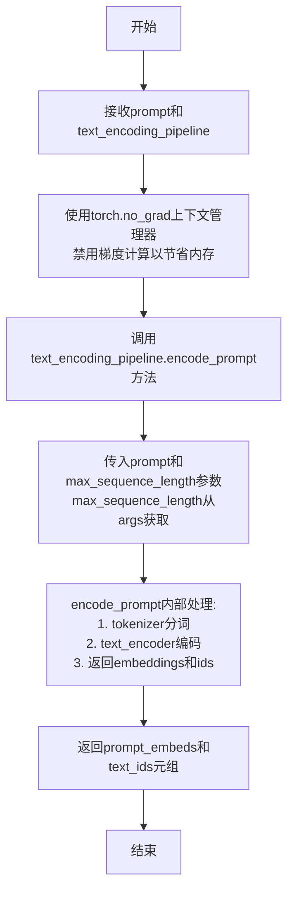

#### 带注释源码

```python
def compute_text_embeddings(prompt, text_encoding_pipeline):
    """
    计算文本prompt的embeddings表示
    
    该函数是一个嵌套函数，定义在main()函数内部。
    它使用text_encoding_pipeline将文本提示编码为向量形式，
    供Flux2 transformer模型在训练过程中使用。
    
    参数:
        prompt: str - 需要编码的文本提示
        text_encoding_pipeline: Flux2Pipeline - 包含tokenizer和text_encoder的pipeline
    
    返回:
        tuple: (prompt_embeds, text_ids) - 文本embedding和对应的位置ID
    """
    # 使用torch.no_grad()上下文管理器，禁用梯度计算
    # 这样可以避免在推理过程中占用过多GPU内存，提高计算效率
    with torch.no_grad():
        # 调用pipeline的encode_prompt方法进行文本编码
        # 该方法内部会:
        # 1. 使用tokenizer对prompt进行分词
        # 2. 使用text_encoder将token ids转换为embeddings
        # 3. 返回embeddings和对应的text_ids
        prompt_embeds, text_ids = text_encoding_pipeline.encode_prompt(
            prompt=prompt, 
            max_sequence_length=args.max_sequence_length  # 最大序列长度，默认512
        )
        
        # 注释掉的代码: 原本可能需要将结果移动到accelerator设备
        # 但在当前实现中，encode_prompt内部已经处理了设备转移
        # prompt_embeds = prompt_embeds.to(accelerator.device)
        # text_ids = text_ids.to(accelerator.device)
    
    # 返回编码后的embeddings和text_ids
    # prompt_embeds: [batch_size, seq_len, hidden_dim]
    # text_ids: [batch_size, seq_len, 4] - 4维位置编码
    return prompt_embeds, text_ids
```


### `compute_remote_text_embeddings`

该函数用于通过HuggingFace Inference API远程计算文本embeddings，当配置了`--remote_text_encoder`参数时使用。它不需要在本地加载文本编码器，而是通过调用远程服务获取文本特征，这对于显存受限的场景特别有用。

参数：

- `prompts`：`str | list[str]`，待编码的提示词，可以是单个字符串或字符串列表

返回值：`Tuple[torch.Tensor, torch.Tensor]`，返回文本embeddings（prompt_embeds）和对应的文本IDs（text_ids），两者均为PyTorch张量并已移动到加速器设备上

#### 流程图

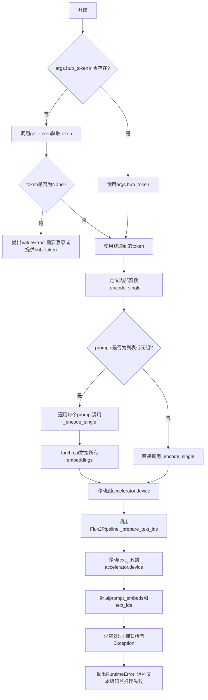

#### 带注释源码

```python
def compute_remote_text_embeddings(prompts: str | list[str]):
    """
    通过HuggingFace Inference API远程计算文本embeddings
    
    参数:
        prompts: 单个提示词字符串或提示词列表
        
    返回:
        tuple: (prompt_embeds, text_ids) 文本嵌入和文本IDs
    """
    import io
    import requests

    # 获取HuggingFace认证token
    if args.hub_token is not None:
        hf_token = args.hub_token
    else:
        from huggingface_hub import get_token
        hf_token = get_token()
        # 如果token为None，说明用户未登录，需要提示登录或提供token
        if hf_token is None:
            raise ValueError(
                "No HuggingFace token found. To use the remote text encoder please login using `hf auth login` or provide a token using --hub_token"
            )

    def _encode_single(prompt: str):
        """
        内部函数：编码单个提示词
        
        向远程服务发送POST请求，获取文本嵌入结果
        """
        response = requests.post(
            "https://remote-text-encoder-flux-2.huggingface.co/predict",
            json={"prompt": prompt},
            headers={"Authorization": f"Bearer {hf_token}", "Content-Type": "application/json"},
        )
        # 验证响应状态码
        assert response.status_code == 200, f"{response.status_code=}"
        # 将返回的二进制内容加载为PyTorch张量
        return torch.load(io.BytesIO(response.content))

    try:
        # 处理单个或多个提示词
        if isinstance(prompts, (list, tuple)):
            # 对列表中的每个提示词分别编码
            embeds = [_encode_single(p) for p in prompts]
            # 在batch维度拼接所有embeddings
            prompt_embeds = torch.cat(embeds, dim=0).to(accelerator.device)
        else:
            # 单个提示词直接编码
            prompt_embeds = _encode_single(prompts).to(accelerator.device)

        # 准备文本IDs（用于transformer的img_ids位置编码）
        text_ids = Flux2Pipeline._prepare_text_ids(prompt_embeds).to(accelerator.device)
        return prompt_embeds, text_ids

    except Exception as e:
        # 捕获所有异常并重新抛出，提供更清晰的错误信息
        raise RuntimeError("Remote text encoder inference failed.") from e
```


### `get_sigmas`

获取噪声调度sigmas值，根据给定的时间步从噪声调度器中检索对应的sigma值，并将其扩展到指定的维度。

参数：

- `timesteps`：`torch.Tensor`，时间步张量，包含需要获取sigma值的时间步
- `n_dim`：`int`，目标输出维度数，默认为4，用于控制返回张量的维度
- `dtype`：`torch.dtype`，输出数据类型，默认为torch.float32

返回值：`torch.Tensor`，与输入时间步对应的sigma值张量，维度为n_dim

#### 流程图

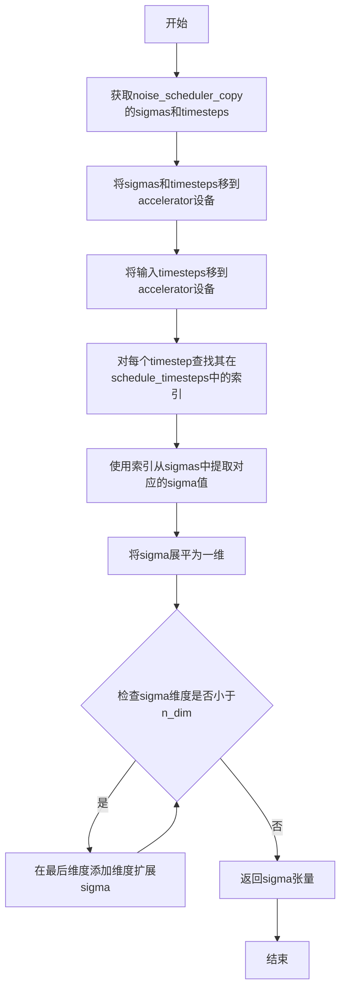

#### 带注释源码

```python
def get_sigmas(timesteps, n_dim=4, dtype=torch.float32):
    # 从噪声调度器的副本中获取sigmas，并将其移动到指定设备
    sigmas = noise_scheduler_copy.sigmas.to(device=accelerator.device, dtype=dtype)
    
    # 获取噪声调度器的时间步，并移动到指定设备
    schedule_timesteps = noise_scheduler_copy.timesteps.to(accelerator.device)
    
    # 将输入的时间步也移动到指定设备
    timesteps = timesteps.to(accelerator.device)
    
    # 对每个时间步，查找其在调度时间步中的索引位置
    # 这是一个列表推导式，为每个timestep找到对应的索引
    step_indices = [(schedule_timesteps == t).nonzero().item() for t in timesteps]
    
    # 使用找到的索引从sigmas数组中提取对应的sigma值
    sigma = sigmas[step_indices].flatten()
    
    # 如果sigma的维度小于目标维度n_dim，则在末尾添加维度
    # 这是为了确保输出张量具有正确的维度以进行后续计算
    while len(sigma.shape) < n_dim:
        sigma = sigma.unsqueeze(-1)
    
    # 返回处理后的sigma张量
    return sigma
```


### `DreamBoothDataset.__init__`

初始化DreamBooth数据集，加载实例图像和条件图像（如有），并进行图像预处理（包括EXIF校正、RGB转换、尺寸调整、裁剪和归一化），同时支持宽高比桶（aspect ratio buckets）功能。

参数：

- `instance_data_root`：`str`，实例图像所在的根目录路径
- `instance_prompt`：`str`，用于实例图像的提示词
- `size`：`int`，图像的目标尺寸，默认为1024
- `repeats`：`int`，每个图像重复训练的次数，默认为1
- `center_crop`：`bool`，是否使用中心裁剪，默认为False
- `buckets`：`list`，宽高比桶列表，用于不同尺寸图像的批处理，默认为None

返回值：`None`，无返回值（构造函数）

#### 流程图

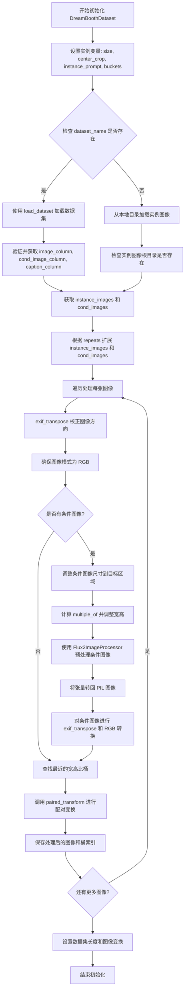

#### 带注释源码

```python
def __init__(
    self,
    instance_data_root,
    instance_prompt,
    size=1024,
    repeats=1,
    center_crop=False,
    buckets=None,
):
    """
    初始化 DreamBooth 数据集。
    
    参数:
        instance_data_root: 实例图像的根目录路径
        instance_prompt: 实例提示词
        size: 图像尺寸，默认为1024
        repeats: 重复次数，默认为1
        center_crop: 是否中心裁剪，默认为False
        buckets: 宽高比桶列表，用于批处理不同尺寸的图像
    """
    # 1. 设置基本属性
    self.size = size
    self.center_crop = center_crop
    self.instance_prompt = instance_prompt
    self.custom_instance_prompts = None
    self.buckets = buckets

    # 2. 根据数据来源加载图像
    # 方式一: 从 HuggingFace Hub 加载数据集
    if args.dataset_name is not None:
        try:
            from datasets import load_dataset
        except ImportError:
            raise ImportError(
                "You are trying to load your data using the datasets library. If you wish to train using custom "
                "captions please install the datasets library: `pip install datasets`. If you wish to load a "
                "local folder containing images only, specify --instance_data_dir instead."
            )
        
        # 下载并加载数据集
        dataset = load_dataset(
            args.dataset_name,
            args.dataset_config_name,
            cache_dir=args.cache_dir,
        )
        
        # 获取数据集列名
        column_names = dataset["train"].column_names

        # 验证并获取图像列
        if args.cond_image_column is not None and args.cond_image_column not in column_names:
            raise ValueError(
                f"`--cond_image_column` value '{args.cond_image_column}' not found in dataset columns. Dataset columns are: {', '.join(column_names)}"
            )
        if args.image_column is None:
            image_column = column_names[0]
            logger.info(f"image column defaulting to {image_column}")
        else:
            image_column = args.image_column
            if image_column not in column_names:
                raise ValueError(
                    f"`--image_column` value '{args.image_column}' not found in dataset columns. Dataset columns are: {', '.join(column_names)}"
                )
        
        # 获取实例图像和条件图像
        instance_images = dataset["train"][image_column]
        cond_images = None
        cond_image_column = args.cond_image_column
        if cond_image_column is not None:
            cond_images = [dataset["train"][i][cond_image_column] for i in range(len(dataset["train"]))]
            assert len(instance_images) == len(cond_images)

        # 获取自定义提示词
        if args.caption_column is None:
            logger.info(
                "No caption column provided, defaulting to instance_prompt for all images. If your dataset "
                "contains captions/prompts for the images, make sure to specify the "
                "column as --caption_column"
            )
            self.custom_instance_prompts = None
        else:
            if args.caption_column not in column_names:
                raise ValueError(
                    f"`--caption_column` value '{args.caption_column}' not found in dataset columns. Dataset columns are: {', '.join(column_names)}"
                )
            custom_instance_prompts = dataset["train"][args.caption_column]
            # 根据 repeats 创建最终的提示词列表
            self.custom_instance_prompts = []
            for caption in custom_instance_prompts:
                self.custom_instance_prompts.extend(itertools.repeat(caption, repeats))
    
    # 方式二: 从本地目录加载图像
    else:
        self.instance_data_root = Path(instance_data_root)
        if not self.instance_data_root.exists():
            raise ValueError("Instance images root doesn't exists.")

        # 打开目录中的所有图像文件
        instance_images = [Image.open(path) for path in list(Path(instance_data_root).iterdir())]
        self.custom_instance_prompts = None

    # 3. 根据 repeats 扩展图像列表
    self.instance_images = []
    self.cond_images = []
    for i, img in enumerate(instance_images):
        self.instance_images.extend(itertools.repeat(img, repeats))
        if args.dataset_name is not None and cond_images is not None:
            self.cond_images.extend(itertools.repeat(cond_images[i], repeats))

    # 4. 预处理所有图像
    self.pixel_values = []
    self.cond_pixel_values = []
    for i, image in enumerate(self.instance_images):
        # EXIF 校正，确保图像方向正确
        image = exif_transpose(image)
        # 转换为 RGB 模式
        if not image.mode == "RGB":
            image = image.convert("RGB")
        
        dest_image = None
        # 处理条件图像（如有）
        if self.cond_images:
            dest_image = self.cond_images[i]
            image_width, image_height = dest_image.size
            # 限制最大面积为 1024*1024
            if image_width * image_height > 1024 * 1024:
                dest_image = Flux2ImageProcessor._resize_to_target_area(dest_image, 1024 * 1024)
                image_width, image_height = dest_image.size

            # 确保尺寸是 multiple_of 的倍数
            multiple_of = 2 ** (4 - 1)  # 2 ** (len(vae.config.block_out_channels) - 1), temp!
            image_width = (image_width // multiple_of) * multiple_of
            image_height = (image_height // multiple_of) * multiple_of
            
            # 预处理条件图像
            image_processor = Flux2ImageProcessor()
            dest_image = image_processor.preprocess(
                dest_image, height=image_height, width=image_width, resize_mode="crop"
            )
            
            # 将张量转回 PIL 图像
            dest_image = dest_image.squeeze(0)
            if dest_image.min() < 0:
                dest_image = (dest_image + 1) / 2
            dest_image = (torch.clamp(dest_image, 0, 1) * 255).byte().cpu()

            if dest_image.shape[0] == 1:
                # 灰度图像
                dest_image = Image.fromarray(dest_image.squeeze().numpy(), mode="L")
            else:
                # RGB 图像: (C, H, W) -> (H, W, C)
                dest_image = TF.to_pil_image(dest_image)

            # 条件图像的 EXIF 校正和 RGB 转换
            dest_image = exif_transpose(dest_image)
            if not dest_image.mode == "RGB":
                dest_image = dest_image.convert("RGB")

        width, height = image.size

        # 查找最近的宽高比桶
        bucket_idx = find_nearest_bucket(height, width, self.buckets)
        target_height, target_width = self.buckets[bucket_idx]
        self.size = (target_height, target_width)

        # 配对变换（确保原图和条件图像使用相同的变换）
        image, dest_image = self.paired_transform(
            image,
            dest_image=dest_image,
            size=self.size,
            center_crop=args.center_crop,
            random_flip=args.random_flip,
        )
        self.pixel_values.append((image, bucket_idx))
        if dest_image is not None:
            self.cond_pixel_values.append((dest_image, bucket_idx))

    # 5. 设置数据集长度
    self.num_instance_images = len(self.instance_images)
    self._length = self.num_instance_images

    # 6. 创建图像变换组合
    self.image_transforms = transforms.Compose(
        [
            transforms.Resize(size, interpolation=transforms.InterpolationMode.BILINEAR),
            transforms.CenterCrop(size) if center_crop else transforms.RandomCrop(size),
            transforms.ToTensor(),
            transforms.Normalize([0.5], [0.5]),
        ]
    )
```


### `DreamBoothDataset.__len__`

返回数据集中实例图像的数量，用于 DataLoader 确定数据集大小。

参数：

- 无（`self` 为隐式参数）

返回值：`int`，返回数据集中实例图像的总数

#### 流程图

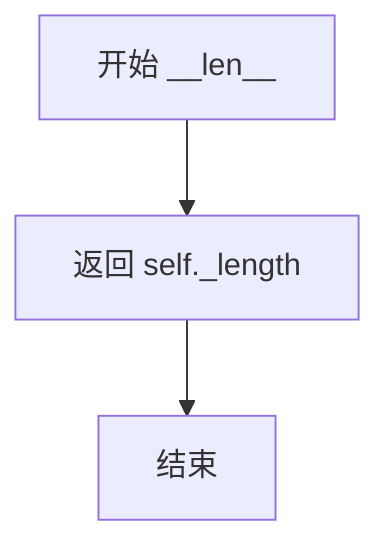

#### 带注释源码

```python
def __len__(self):
    """
    返回数据集中实例图像的数量。
    
    该方法实现了 Python 的 len() 协议，使数据集可以被 DataLoader 使用。
    _length 在 __init__ 方法中被设置为 num_instance_images 的值。
    
    Returns:
        int: 数据集中实例图像的总数
    """
    return self._length
```


### DreamBoothDataset.__getitem__

该方法是 DreamBoothDataset 类的核心实例方法，负责根据给定的索引返回单个训练样本。它从预处理后的像素值和提示中构建训练样本，支持条件图像和自定义提示词。

参数：

- `index`：`int`，数据集中的索引，用于检索对应的图像和提示

返回值：`Dict[str, Any]`，包含实例图像、桶索引、条件图像（如有）和实例提示的字典

#### 流程图

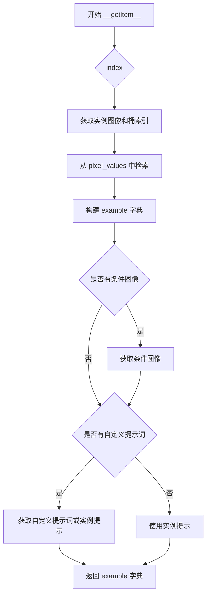

#### 带注释源码

```python
def __getitem__(self, index):
    """
    根据索引获取训练样本
    
    参数:
        index: 数据集中的索引
        
    返回:
        包含图像和提示的字典
    """
    example = {}
    # 使用模运算支持循环数据集
    # 从预处理好的 pixel_values 中获取图像和对应的桶索引
    instance_image, bucket_idx = self.pixel_values[index % self.num_instance_images]
    # 将实例图像添加到输出字典
    example["instance_images"] = instance_image
    # 保存桶索引用于后续批处理
    example["bucket_idx"] = bucket_idx
    
    # 如果存在条件图像（用于图像到图像的训练）
    if self.cond_pixel_values:
        dest_image, _ = self.cond_pixel_values[index % self.num_instance_images]
        example["cond_images"] = dest_image

    # 处理提示词：如果有自定义提示词则使用，否则使用默认实例提示
    if self.custom_instance_prompts:
        # 获取对应索引的自定义提示词
        caption = self.custom_instance_prompts[index % self.num_instance_images]
        if caption:
            example["instance_prompt"] = caption
        else:
            example["instance_prompt"] = self.instance_prompt
    else:
        # 自定义提示词长度与图像数据集不匹配时使用实例提示
        example["instance_prompt"] = self.instance_prompt

    return example
```


### `DreamBoothDataset.paired_transform`

该方法是 DreamBooth 数据集类中的一个图像预处理方法，用于对配对的源图像和目标图像（如条件图像）执行一致的图像变换操作，确保源图像和目标图像在训练过程中保持同步的数据增强（如随机裁剪、翻转等），从而保证图像到图像训练任务的数据对齐。

参数：

- `image`：`PIL.Image.Image`，需要处理的源输入图像
- `dest_image`：`PIL.Image.Image | None`，目标图像（如条件图像），用于图像到图像的训练任务，默认为 None
- `size`：`tuple[int, int]`，目标输出尺寸，默认为 (224, 224)
- `center_crop`：`bool`，是否使用中心裁剪，False 则使用随机裁剪，默认为 False
- `random_flip`：`bool`，是否随机水平翻转图像，默认为 False

返回值：`tuple[torch.Tensor, torch.Tensor | None]`，返回处理后的源图像张量（已归一化）和目标图像张量（已归一化），如果目标图像为 None，则返回 (图像, None)

#### 流程图

```mermaid
flowchart TD
    A[开始 paired_transform] --> B{检查 dest_image 是否存在}
    B -->|是| C[对 image 和 dest_image 同时执行 resize]
    B -->|否| D[仅对 image 执行 resize]
    C --> E{检查 center_crop}
    D --> E
    E -->|是| F[执行 CenterCrop 裁剪]
    E -->|否| G[执行 RandomCrop 随机裁剪<br/>确保 image 和 dest_image 使用相同裁剪参数]
    F --> H{检查 random_flip}
    G --> H
    H -->|是| I[生成随机翻转标志<br/>同时应用于 image 和 dest_image]
    H -->|否| J[跳过翻转]
    I --> K[执行 ToTensor 转换为张量]
    J --> K
    K --> L[执行 Normalize 归一化]
    L --> M{dest_image 是否为 None}
    M -->|是| N[返回 tuple: (image_tensor, None)]
    M -->|否| O[返回 tuple: (image_tensor, dest_tensor)]
    N --> P[结束]
    O --> P
```

#### 带注释源码

```python
def paired_transform(self, image, dest_image=None, size=(224, 224), center_crop=False, random_flip=False):
    """
    对配对的图像执行一致的变换操作
    
    参数:
        image: 输入的源图像 (PIL Image)
        dest_image: 目标/条件图像，用于图像到图像训练，默认为None
        size: 目标尺寸元组 (height, width)
        center_crop: 是否使用中心裁剪，否则使用随机裁剪
        random_flip: 是否随机水平翻转
    
    返回:
        (image, dest_image) 元组，两者都已转换为张量并归一化
        如果dest_image为None，则返回(image, None)
    """
    
    # ============ 步骤1: 调整大小 (确定性操作) ============
    # 使用双线性插值将图像调整到目标尺寸
    resize = transforms.Resize(size, interpolation=transforms.InterpolationMode.BILINEAR)
    image = resize(image)
    
    # 如果存在目标图像，同样对其进行resize，保持尺寸一致
    if dest_image is not None:
        dest_image = resize(dest_image)

    # ============ 步骤2: 裁剪操作 ============
    # 确保源图像和目标图像使用相同的裁剪参数
    if center_crop:
        # 中心裁剪：从图像中心裁剪出指定尺寸
        crop = transforms.CenterCrop(size)
        image = crop(image)
        if dest_image is not None:
            dest_image = crop(dest_image)
    else:
        # 随机裁剪：获取随机裁剪参数 (i, j, h, w)
        # i: 裁剪区域左上角的垂直坐标
        # j: 裁剪区域左上角的水平坐标
        # h: 裁剪区域的高度
        # w: 裁剪区域的宽度
        i, j, h, w = transforms.RandomCrop.get_params(image, output_size=size)
        
        # 使用相同的裁剪参数对源图像进行裁剪
        image = TF.crop(image, i, j, h, w)
        
        # 对目标图像应用完全相同的裁剪，确保两幅图像对齐
        if dest_image is not None:
            dest_image = TF.crop(dest_image, i, j, h, w)

    # ============ 步骤3: 随机水平翻转 ============
    # 使用同一随机硬币翻转结果应用于两幅图像，保持一致性
    if random_flip:
        # 生成0-1之间的随机数，50%概率进行翻转
        do_flip = random.random() < 0.5
        
        if do_flip:
            # 对源图像进行水平翻转
            image = TF.hflip(image)
            
            # 对目标图像应用相同的翻转操作
            if dest_image is not None:
                dest_image = TF.hflip(dest_image)

    # ============ 步骤4: 转换为张量并归一化 (确定性操作) ============
    # 将PIL图像转换为PyTorch张量，数值范围从 [0, 255] 映射到 [0, 1]
    to_tensor = transforms.ToTensor()
    
    # 归一化：将张量从 [0, 1] 映射到 [-1, 1]
    # 具体公式: (x - 0.5) / 0.5 = 2*x - 1
    normalize = transforms.Normalize([0.5], [0.5])
    
    # 处理源图像
    image = normalize(to_tensor(image))
    
    # 处理目标图像（如果存在）
    if dest_image is not None:
        dest_image = normalize(to_tensor(dest_image))

    # ============ 返回结果 ============
    # 根据目标图像是否存在返回相应格式的结果
    # 如果目标图像存在，返回包含两个张量的元组
    # 如果目标图像为None，返回 (image, None)
    return (image, dest_image) if dest_image is not None else (image, None)
```


### `BucketBatchSampler.__init__`

该方法是 `BucketBatchSampler` 类的初始化方法，用于创建一个基于桶（bucket）的批次采样器。它将数据集中属于同一宽高比桶的图像索引组合在一起，并在每个桶内打乱顺序后预生成批次，从而在训练过程中保证每个批次的图像具有相似的分辨率，优化训练效率。

参数：

- `self`：`BucketBatchSampler` 实例本身
- `dataset`：`DreamBoothDataset`，包含图像数据和桶信息的数据集对象
- `batch_size`：`int`，每个批次的样本数量，必须为正整数
- `drop_last`：`bool`，如果为 True，则丢弃最后一个不完整的批次，默认为 False

返回值：无（`None`），该方法为构造函数，仅初始化实例属性

#### 流程图

```mermaid
flowchart TD
    A[开始 __init__] --> B{验证 batch_size}
    B -->|无效| C[抛出 ValueError]
    B -->|有效| D{验证 drop_last}
    D -->|无效| E[Throw ValueError]
    D -->|有效| F[保存 dataset, batch_size, drop_last]
    
    F --> G[初始化 bucket_indices 列表]
    G --> H[遍历 dataset.pixel_values]
    H --> I[将索引添加到对应桶的列表]
    I --> J{是否还有更多数据?}
    J -->|是| H
    J -->|否| K[初始化 sampler_len = 0, batches = []]
    
    K --> L[遍历每个桶的索引列表]
    L --> M[打乱桶内索引顺序]
    M --> N[按 batch_size 分块创建批次]
    N --> O{检查批次大小和 drop_last}
    O -->|跳过| P[继续下一个块]
    O -->|保留| Q[添加到 batches 列表]
    Q --> R[sampler_len += 1]
    P --> S{是否还有更多块?}
    S -->|是| N
    S -->|否| T{是否还有更多桶?}
    T -->|是| L
    T -->|否| U[结束 __init__]
```

#### 带注释源码

```python
class BucketBatchSampler(BatchSampler):
    def __init__(self, dataset: DreamBoothDataset, batch_size: int, drop_last: bool = False):
        # 参数验证：batch_size 必须为正整数
        if not isinstance(batch_size, int) or batch_size <= 0:
            raise ValueError("batch_size should be a positive integer value, but got batch_size={}".format(batch_size))
        
        # 参数验证：drop_last 必须为布尔值
        if not isinstance(drop_last, bool):
            raise ValueError("drop_last should be a boolean value, but got drop_last={}".format(drop_last))

        # 保存传入的参数到实例属性
        self.dataset = dataset                      # 数据集引用
        self.batch_size = batch_size                # 批次大小
        self.drop_last = drop_last                  # 是否丢弃最后不完整批次

        # 根据数据集的桶数量创建对应的索引列表
        # 每个桶维护一个属于该桶的样本索引列表
        self.bucket_indices = [[] for _ in range(len(self.dataset.buckets))]
        
        # 遍历数据集中所有图像，按桶索引分组
        # pixel_values 存储的是 (image_tensor, bucket_idx) 元组
        for idx, (_, bucket_idx) in enumerate(self.dataset.pixel_values):
            self.bucket_indices[bucket_idx].append(idx)

        # 初始化采样器长度和批次列表
        self.sampler_len = 0
        self.batches = []

        # 为每个桶预生成批次
        for indices_in_bucket in self.bucket_indices:
            # 在每个桶内部打乱样本顺序，以增加随机性
            random.shuffle(indices_in_bucket)
            
            # 按批次大小分割桶内的索引
            for i in range(0, len(indices_in_bucket), self.batch_size):
                # 提取当前批次的索引片段
                batch = indices_in_bucket[i : i + self.batch_size]
                
                # 如果批次不完整且 drop_last 为 True，则跳过该批次
                if len(batch) < self.batch_size and self.drop_last:
                    continue  # Skip partial batch if drop_last is True
                
                # 将有效批次添加到列表中
                self.batches.append(batch)
                self.sampler_len += 1  # Count the number of batches
```


### `BucketBatchSampler.__iter__`

该方法是 `BucketBatchSampler` 类的迭代器实现，用于在每个训练 epoch 中以随机顺序返回预生成的批次索引。它实现了 Python 的迭代器协议，使 `BucketBatchSampler` 可以直接在 DataLoader 中使用。

参数：

- `self`：`BucketBatchSampler` 实例，隐式参数，表示当前采样器对象本身

返回值：`Iterator[List[int]]`，返回一个生成批次索引列表的迭代器，其中每个列表包含一个批次的所有样本索引

#### 流程图

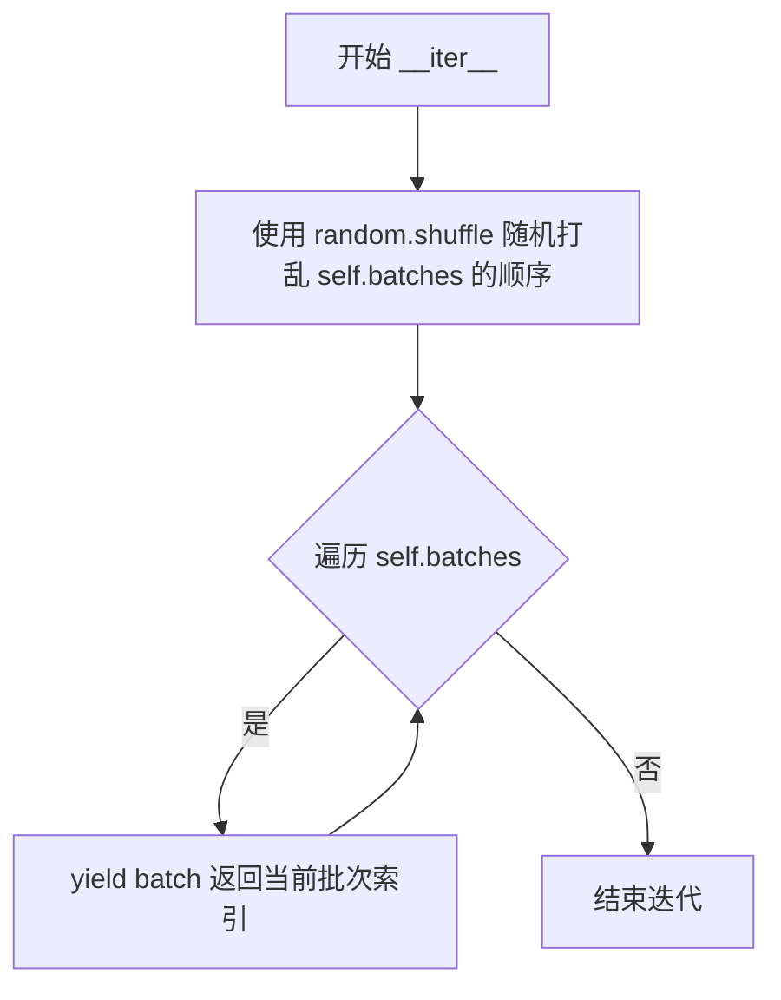

#### 带注释源码

```python
def __iter__(self):
    """
    实现迭代器协议，返回一个生成批次索引列表的生成器。
    
    该方法在每个 epoch 开始时被 DataLoader 调用，以随机顺序
    返回预先生成的批次，从而确保每个 epoch 内的训练样本顺序是随机的。
    
    使用 yield 而不是返回列表的好处是可以按需生成批次，
    避免一次性将所有批次加载到内存中。
    """
    # Shuffle the order of the batches each epoch
    # 在每个 epoch 随机打乱批次的顺序，增加训练的多样性
    random.shuffle(self.batches)
    
    # 遍历所有预生成的批次
    for batch in self.batches:
        # yield 返回当前批次的索引列表
        # 每个 batch 是一个 List[int]，包含该批次所有样本的索引
        yield batch
```


### `BucketBatchSampler.__len__`

该方法用于返回 BucketBatchSampler 生成的总批次数，使得 DataLoader 能够确定迭代的总数。该方法基于初始化时预先生成的批次数量（`self.sampler_len`）返回值，支持数据加载器正确计算训练轮次和进度。

参数：此方法没有显式参数（使用隐式 `self`）

返回值：`int`，返回预生成的总批次数。

#### 流程图

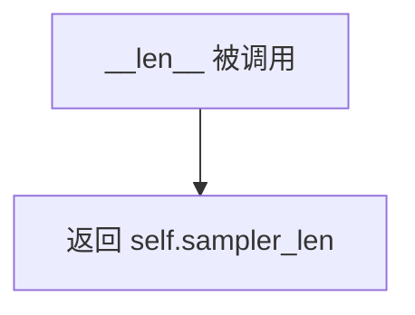

#### 带注释源码

```python
def __len__(self):
    """
    返回 BucketBatchSampler 生成的总批次数。
    
    该方法使得 DataLoader 能够确定迭代的总数。
    sampler_len 在 __init__ 中计算，基于每个 bucket 的样本数量和 batch_size。
    
    Returns:
        int: 预生成的总批次数
    """
    return self.sampler_len
```


### `PromptDataset.__len__`

返回数据集中包含的样本数量。

参数：

- 无（Python 特殊方法，使用隐式 `self` 参数）

返回值：`int`，返回 `self.num_samples`，即数据集的样本总数。

#### 流程图

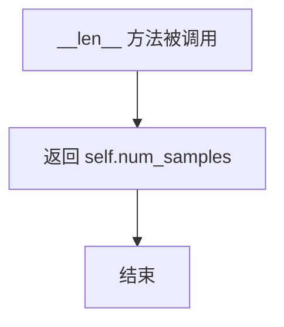

#### 带注释源码

```python
def __len__(self):
    """
    返回数据集中样本的数量。
    
    该方法是 Python 特殊方法之一，使得 PromptDataset 可以与 len() 函数配合使用，
    从而被 DataLoader 等 PyTorch 工具正确识别数据集的大小。
    
    Returns:
        int: 数据集中包含的样本数量，由构造时传入的 num_samples 参数决定。
    """
    return self.num_samples
```


### `PromptDataset.__getitem__`

该方法是一个简单的数据集索引访问方法，用于根据给定的索引返回对应的样本数据。它创建并返回一个包含提示词和索引的字典对象，供数据加载器使用。

参数：

- `index`：`int`，要访问的样本索引

返回值：`Dict[str, Any]`，返回包含 "prompt" 和 "index" 两个键的字典

#### 流程图

```mermaid
flowchart TD
    A[开始 __getitem__] --> B[创建空字典 example]
    B --> C[将 self.prompt 存入 example['prompt']]
    C --> D[将 index 存入 example['index']]
    D --> E[返回 example 字典]
```

#### 带注释源码

```python
def __getitem__(self, index):
    """
    根据索引获取数据集中的单个样本。
    
    参数:
        index: int - 样本的索引位置
        
    返回:
        dict: 包含 'prompt' 和 'index' 键的字典
    """
    # 1. 创建一个空字典用于存储样本数据
    example = {}
    
    # 2. 将预设的提示词存入字典
    # 这个 prompt 在数据集初始化时设置，用于生成类别图像
    example["prompt"] = self.prompt
    
    # 3. 将当前索引存入字典
    # 用于标识当前处理的是第几个样本
    example["index"] = index
    
    # 4. 返回包含提示词和索引的字典
    # 数据加载器会将这些数据传递给训练流程
    return example
```

## 关键组件


### DreamBoothDataset

数据集类，负责准备实例图像和类图像用于模型微调。处理图像加载、预处理、桶式(bucket)管理、图像增强等核心功能，支持从HuggingFace Hub或本地目录加载数据。

### BucketBatchSampler

自定义批次采样器，按宽高比桶分组采样数据。通过预先分组相同桶大小的索引来优化训练效率，每个epoch内随机打乱批次顺序。

### PromptDataset

简单的提示数据集，用于在多GPU上生成类图像。存储提示词和样本数量，实现基本的Dataset接口。

### Flux2Transformer2DModel

Flux.2变换器模型，是训练的核心目标模型。通过LoRA配置进行微调，支持量化配置(BitsAndBytes)和FP8训练模式。

### LoraConfig & LoRA Adapter

LoRA配置类，定义LoRA层的秩(rank)、alpha、dropout和目标模块。transformer.add_adapter()添加可训练的LoRA权重到预训练模型。

### BitsAndBytesConfig & 量化策略

4bit量化配置，支持模型量化训练以减少显存占用。配合prepare_model_for_kbit_training进行量化模型准备。

### FlowMatchEulerDiscreteScheduler

流匹配欧拉离散调度器，用于扩散模型的噪声调度。提供时间步采样和sigma计算。

### VAE (AutoencoderKLFlux2)

变分自编码器，用于将图像编码到潜空间。包含批归一化统计量(latents_bn_mean/std)用于潜空间归一化。

### 文本编码器 (Mistral3ForConditionalGeneration)

文本编码模型，将文本提示编码为embedding。支持本地加载和远程推理两种模式。

### 训练核心流程 (main函数)

主训练循环，包含：数据准备、模型初始化、优化器配置、梯度累积、混合精度训练、检查点保存、验证推理等完整训练流程。

### 潜空间处理函数

- **_patchify_latents**: 将潜空间张量分块处理
- **_pack_latents**: 打包潜空间张量用于变换器输入
- **_prepare_latent_ids / _prepare_image_ids**: 准备位置ID
- **_unpack_latents_with_ids**: 解包张量

### 损失计算 (Flow Matching Loss)

基于流匹配的训练目标：target = noise - model_input，使用weighting_scheme加权损失。

### 验证流程 (log_validation)

训练过程中运行推理验证，生成样本图像并记录到TensorBoard或WandB。

### 检查点管理

支持从检查点恢复训练，自动管理检查点数量限制(checkpoints_total_limit)，保存accelerator状态和LoRA权重。

### 远程文本编码器

支持通过HuggingFace Inference API远程计算prompt embeddings，减少本地显存占用。


## 问题及建议


### 已知问题

-   **硬编码的VAE块参数**：`multiple_of = 2 ** (4 - 1)` 硬编码为8，应该使用 `vae.config.block_out_channels` 动态计算
-   **硬编码的最大面积限制**：`image_width * image_height > 1024 * 1024` 中的1024是硬编码值，应作为参数可配置
-   **不安全的断言使用**：代码中使用 `assert` 进行参数验证（如 `assert args.image_column is not None`），在Python中可以用 `-O` 标志跳过，应改为 `raise ValueError`
-   **类型注解错误**：`prodigy_decouple` 参数类型声明为 `bool`，但在 argparse 中这种类型处理可能存在问题
-   **未使用的注释代码**：`compute_text_embeddings` 函数中存在被注释掉的设备转移代码
-   **内存管理不一致**：在 `DreamBoothDataset.__init__` 中创建了 `Flux2ImageProcessor()` 实例但未复用，而是每次调用时创建新实例
- **断点续训不支持缓存latents**：当启用 `cache_latents` 且从 checkpoint 恢复训练时，缓存的latents不会被恢复
- **LoRA目标模块过滤逻辑硬编码**：`module_filter_fn` 中对 "proj_out" 的过滤是硬编码的，缺乏灵活性
- **分布式训练状态获取冗余**：在 `save_model_hook` 中，即使不是FSDP也执行了 `get_state_dict` 调用（虽然结果未使用）
- **验证图像加载错误**：代码引用了 `args.validation_image_path` 但参数定义是 `--validation_image`，存在参数名不匹配问题

### 优化建议

-   将硬编码的 `multiple_of` 和最大面积值提取为配置参数，增强代码可维护性
-   将所有 `assert` 语句替换为 `raise ValueError` 形式，提高生产环境稳定性
-   修复验证图像参数名称不一致的问题（`validation_image_path` vs `--validation_image`）
-   在 `DreamBoothDataset` 中创建一次 `Flux2ImageProcessor` 实例并复用，避免每次迭代都创建新实例
-   添加对缓存latents的checkpoint恢复支持，或在文档中明确说明不支持该场景
-   考虑将 `module_filter_fn` 暴露为可配置参数，允许用户自定义需要过滤的模块
-   优化 `save_model_hook` 中的状态获取逻辑，避免不必要的FSDP状态字典调用
-   添加更详细的类型注解和文档字符串，特别是对复杂的数据流和状态转换过程
-   考虑将部分重复的pipeline构建代码提取为共享函数，减少代码冗余
-   在数据预处理阶段添加更详细的日志，记录bucket分配、图像尺寸分布等信息，有助于调试和监控


## 其它


### 设计目标与约束

本代码旨在实现Flux.2模型的DreamBooth LoRA微调训练，支持图像到图像（I2I）任务的定制化模型训练。主要设计目标包括：支持多GPU分布式训练、混合精度训练（FP16/BF16）、LoRA参数高效微调、动态aspect ratio buckets处理、模型检查点保存与恢复、以及训练过程中的验证与模型卡片生成。技术约束方面，要求Python 3.8+、PyTorch 2.0+、CUDA 11.0+（如使用GPU），且依赖diffusers、transformers、accelerate、peft等核心库。内存约束建议至少16GB GPU显存（FP16模式），训练数据支持本地文件夹或HuggingFace数据集格式。

### 错误处理与异常设计

代码采用分层异常处理策略。在参数解析阶段（parse_args函数），对必要参数进行断言检查，如数据集路径、图像列名、提示词列名的存在性验证，缺失时抛出ValueError并给出明确错误信息。数据集加载阶段（DreamBoothDataset）捕获ImportError，提示用户安装datasets库。远程文本编码器调用使用try-except包裹HTTP请求，失败时抛出RuntimeError并保留原始异常链。训练循环中的梯度同步、模型保存等操作均包含条件检查，使用accelerator.is_main_process确保仅主进程执行关键操作。显存管理通过free_memory()函数在关键节点释放资源，捕获CUDA OOM等显存相关异常。

### 数据流与状态机

训练数据流分为三个主要阶段：数据准备阶段、训练循环阶段、模型保存阶段。在数据准备阶段，DreamBoothDataset类负责从本地目录或HuggingFace数据集加载图像，进行EXIF处理、RGB转换、分辨率调整、aspect ratio bucket匹配，生成pixel_values和prompts。BucketBatchSampler根据bucket索引组织批次，确保同批次图像尺寸一致。训练阶段主循环包含：数据加载、VAE编码、噪声采样、timestep计算、flow matching前向传播、损失计算、梯度反向传播与参数更新。状态机定义如下：INIT（初始化）→ LOAD_DATA（加载数据）→ ENCODE_LATENTS（编码潜在向量）→ FORWARD_PASS（前向传播）→ BACKWARD_PASS（反向传播）→ CHECKPOINT（检查点保存）→ VALIDATION（验证）→ FINAL_SAVE（最终保存）。

### 外部依赖与接口契约

核心依赖包括：diffusers>=0.37.0.dev0（提供Flux2Pipeline、Flux2Transformer2DModel、AutoencoderKLFluxFlux2等组件），transformers>=4.41.2（Mistral3ForConditionalGeneration、PixtralProcessor），accelerate>=0.31.0（分布式训练支持），peft>=0.11.1（LoRA配置与状态字典管理），torch>=2.0.0（张量计算），bitsandbytes（可选，8-bit Adam优化器），wandb/tensorboard（可选，训练可视化）。远程文本编码器接口通过HTTP POST请求调用HuggingFace Inference API，期望返回序列化后的prompt_embeds张量，认证使用Bearer Token。模型保存接口遵循HuggingFace Hub规范，LoRA权重保存为safetensors格式，模型卡片为Markdown格式。

### 性能优化策略

代码包含多项性能优化：1）梯度累积（gradient_accumulation_steps）支持大effective batch size；2）梯度检查点（gradient_checkpointing）以计算换内存；3）混合精度训练（FP16/BF16）减少显存占用与加速计算；4）模型CPU卸载（enable_model_cpu_offload）在推理时释放GPU显存；5）FSDP（Federated Sequence Parallel）支持分布式Transformer训练；6）Latents缓存（cache_latents）避免重复编码；7）远程文本编码器（remote_text_encoder）减少本地计算；8）TF32加速（allow_tf32）在Ampere GPU上提升矩阵乘法速度；9）8-bit Adam（bitsandbytes）减少优化器状态显存占用；10）数据加载多进程（dataloader_num_workers）并行IO。

### 配置管理

所有训练超参数通过命令行参数（argparse）传入，包括：模型路径（pretrained_model_name_or_path）、输出目录（output_dir）、学习率（learning_rate）、LoRA秩（rank）、训练批次大小（train_batch_size）、最大训练步数（max_train_steps）、检查点保存间隔（checkpointing_steps）、验证参数（validation_prompt、validation_epochs）等。配置默认值遵循diffusers最佳实践，如默认学习率1e-4、LoRA rank 4、resolution 512。环境变量LOCAL_RANK用于分布式训练进程编号。配置文件支持JSON格式（bnb_quantization_config_path）定义量化参数。配置验证在parse_args阶段完成，运行时配置通过accelerator.init_trackers记录至TensorBoard/WandB。

### 监控与日志

日志系统采用Python标准logging模块，通过accelerate的get_logger获取带进程信息的logger。训练关键指标（loss、learning rate）通过progress_bar.set_postfix实时显示，并通过accelerator.log记录至跟踪器（TensorBoard/WandB/CometML）。验证阶段生成的图像同样记录至跟踪器，TensorBoard使用add_images，WandB使用wandb.Image。检查点保存、模型加载、异常发生等关键节点均有INFO级别日志。性能监控包括：每epoch步数、effective batch size、梯度同步状态、显存使用情况（通过free_memory输出）。训练完成后自动生成模型卡片（README.md），包含训练配置、示例图像、触发词等信息。

### 安全性考虑

代码涉及的安全性包括：1）Hub Token安全：--report_to=wandb与--hub_token不能同时使用，防止token泄露；2）远程文本编码器认证：使用Bearer Token调用HuggingFace API，需通过hf auth login或--hub_token提供；3）模型加载安全：使用safetensors格式避免pickle安全风险；4）分布式训练安全：torch.distributed导入前检查distributed可用性；5）文件系统安全：os.makedirs创建目录时使用exist_ok=True避免竞争条件；6）敏感信息处理：训练日志默认不记录token详细内容。代码遵循Apache 2.0许可证。

    