# `diffusers\examples\dreambooth\train_dreambooth_lora_flux2_klein.py` 详细设计文档

这是一个用于微调 Flux.2 (Klein) 文本到图像扩散模型的 DreamBooth LoRA 训练脚本。它支持多种训练配置，如先验保留（prior preservation）、宽高比分桶（aspect ratio bucketing）、混合精度训练和基于 Accelerate 的分布式训练。该脚本涵盖了从数据加载、模型初始化、LoRA 配置、训练循环、验证到模型权重保存和上传的完整流程。

## 整体流程

```mermaid
graph TD
    A[开始: parse_args] --> B[初始化 Accelerator 和 Logging]
B --> C{是否启用先验保留?}
C -- 是 --> D[生成 Class Images]
C -- 否 --> E[加载模型: VAE, Transformer, TextEncoder]
D --> E
E --> F[配置 LoRA (LoraConfig) 并添加到 Transformer]
F --> G[创建数据集: DreamBoothDataset & BucketBatchSampler]
G --> H[预处理: 计算并缓存 Text Embeddings 和 Latents (可选)]
H --> I[训练循环开始]
I --> J[Epoch Loop]
J --> K[Step Loop: 获取 Batch]
K --> L{是否缓存 Latents?}
L -- 否 --> M[VAE Encode Images]
L -- 是 --> N[读取缓存 Latents]
M --> O[Flow Matching: 加噪]
N --> O
O --> P[Transformer Forward Pass]
P --> Q[计算 Loss (MSE with Weighting)]
Q --> R[Backward & Optimizer Step]
R --> S{是否需要 Checkpoint?}
S -- 是 --> T[保存 State]
S -- 否 --> U{是否需要 Validation?}
T --> U
U --> V{继续训练?}
V -- 是 --> K
V -- 否 --> W[训练结束]
K --> V
J --> V
W --> X[保存 LoRA Weights 和 Model Card]
X --> Y[推送到 Hub (可选)]
Y --> Z[结束]
```

## 类结构

```
Dataset (torch.utils.data.Dataset)
├── DreamBoothDataset
└── PromptDataset
BatchSampler (torch.utils.data.sampler.BatchSampler)
└── BucketBatchSampler
```

## 全局变量及字段


### `logger`
    
全局日志记录器，用于输出训练过程中的日志信息

类型：`logging.Logger`
    


### `DreamBoothDataset.size`
    
图像分辨率

类型：`int`
    


### `DreamBoothDataset.center_crop`
    
是否中心裁剪

类型：`bool`
    


### `DreamBoothDataset.instance_prompt`
    
实例提示词

类型：`str`
    


### `DreamBoothDataset.class_prompt`
    
类别提示词

类型：`str`
    


### `DreamBoothDataset.buckets`
    
宽高比分桶列表

类型：`list[tuple[int, int]]`
    


### `DreamBoothDataset.instance_images`
    
实例图像列表

类型：`list[PIL.Image.Image]`
    


### `DreamBoothDataset.pixel_values`
    
处理后的像素值及桶索引

类型：`list[tuple[torch.Tensor, int]]`
    


### `DreamBoothDataset.num_instance_images`
    
实例图像数量

类型：`int`
    


### `DreamBoothDataset._length`
    
数据集总长度

类型：`int`
    


### `DreamBoothDataset.class_data_root`
    
类别图像目录

类型：`Path`
    


### `DreamBoothDataset.image_transforms`
    
图像变换组合

类型：`transforms.Compose`
    


### `BucketBatchSampler.dataset`
    
对应的 DreamBoothDataset

类型：`DreamBoothDataset`
    


### `BucketBatchSampler.batch_size`
    
批次大小

类型：`int`
    


### `BucketBatchSampler.drop_last`
    
是否丢弃最后一个不完整批次

类型：`bool`
    


### `BucketBatchSampler.bucket_indices`
    
每个桶对应的索引列表

类型：`list[list[int]]`
    


### `BucketBatchSampler.batches`
    
预生成的批次列表

类型：`list[list[int]]`
    


### `BucketBatchSampler.sampler_len`
    
批次数

类型：`int`
    


### `PromptDataset.prompt`
    
生成图像用的提示词

类型：`str`
    


### `PromptDataset.num_samples`
    
需要生成的样本数量

类型：`int`
    
    

## 全局函数及方法


### `save_model_card`

生成并保存模型的 README.md 卡片，包含训练信息和使用说明。

参数：

- `repo_id`：`str`，Hugging Face Hub 上的仓库 ID
- `images`：`Optional[List[PIL.Image]]`，验证时生成的图像列表，默认为 None
- `base_model`：`Optional[str]，基础预训练模型的名称或路径，默认为 None
- `instance_prompt`：`Optional[str]，实例提示词，用于触发图像生成，默认为 None
- `validation_prompt`：`Optional[str]，验证提示词，默认为 None
- `repo_folder`：`Optional[str]，本地仓库文件夹路径，默认为 None
- `quant_training`：`Optional[str]，量化训练方法（如 FP8、BitsandBytes），默认为 None

返回值：`None`，该函数无返回值，直接将模型卡片保存到本地文件

#### 流程图

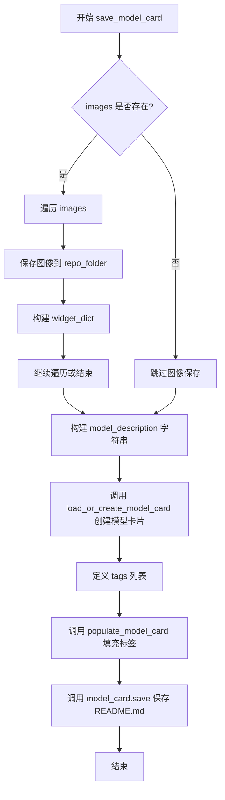

#### 带注释源码

```python
def save_model_card(
    repo_id: str,
    images=None,
    base_model: str = None,
    instance_prompt=None,
    validation_prompt=None,
    repo_folder=None,
    quant_training=None,
):
    """
    生成并保存模型的 README.md 卡片，包含训练信息和使用说明。
    
    参数:
        repo_id: Hugging Face Hub 上的仓库 ID
        images: 验证时生成的图像列表
        base_model: 基础预训练模型的名称或路径
        instance_prompt: 实例提示词，用于触发图像生成
        validation_prompt: 验证提示词
        repo_folder: 本地仓库文件夹路径
        quant_training: 量化训练方法（如 FP8、BitsandBytes）
    """
    widget_dict = []
    
    # 如果提供了验证图像，则保存图像并构建 widget 字典
    if images is not None:
        for i, image in enumerate(images):
            # 将图像保存到 repo_folder 目录
            image.save(os.path.join(repo_folder, f"image_{i}.png"))
            # 构建 widget 字典用于 Hugging Face Hub 的 Widget 展示
            widget_dict.append(
                {"text": validation_prompt if validation_prompt else " ", "output": {"url": f"image_{i}.png"}}
            )

    # 构建模型描述的 Markdown 内容
    model_description = f"""
# Flux.2 [Klein] DreamBooth LoRA - {repo_id}

<Gallery />

## Model description

These are {repo_id} DreamBooth LoRA weights for {base_model}.

The weights were trained using [DreamBooth](https://dreambooth.github.io/) with the [Flux2 diffusers trainer](https://github.com/huggingface/diffusers/blob/main/examples/dreambooth/README_flux2.md).

Quant training? {quant_training}

## Trigger words

You should use `{instance_prompt}` to trigger the image generation.

## Download model

[Download the *.safetensors LoRA]({repo_id}/tree/main) in the Files & versions tab.

## Use it with the [🧨 diffusers library](https://github.com/huggingface/diffusers)

```py
from diffusers import AutoPipelineForText2Image
import torch
pipeline = AutoPipelineForText2Image.from_pretrained("black-forest-labs/FLUX.2", torch_dtype=torch.bfloat16).to('cuda')
pipeline.load_lora_weights('{repo_id}', weight_name='pytorch_lora_weights.safetensors')
image = pipeline('{validation_prompt if validation_prompt else instance_prompt}').images[0]
```

For more details, including weighting, merging and fusing LoRAs, check the [documentation on loading LoRAs in diffusers](https://huggingface.co/docs/diffusers/main/en/using-diffusers/loading_adapters)

## License

Please adhere to the licensing terms as described [here](https://huggingface.co/black-forest-labs/FLUX.2/blob/main/LICENSE.md).
"""
    
    # 加载或创建模型卡片
    model_card = load_or_create_model_card(
        repo_id_or_path=repo_id,
        from_training=True,  # 标记为训练产出的模型
        license="other",
        base_model=base_model,
        prompt=instance_prompt,
        model_description=model_description,
        widget=widget_dict,
    )
    
    # 定义模型标签
    tags = [
        "text-to-image",
        "diffusers-training",
        "diffusers",
        "lora",
        "flux2-klein",
        "flux2-klein-diffusers",
        "template:sd-lora",
    ]

    # 填充模型卡片的标签
    model_card = populate_model_card(model_card, tags=tags)
    
    # 保存模型卡片为 README.md
    model_card.save(os.path.join(repo_folder, "README.md"))
```


### `log_validation`

运行验证推理，生成图像并记录到 TensorBoard 或 WandB，输出生成的图像列表。

参数：

- `pipeline`：`DiffusionPipeline` 或 `Flux2KleinPipeline`，用于推理的扩散管道对象
- `args`：`Namespace`，训练脚本的命令行参数对象，包含 `num_validation_images`、`validation_prompt`、`seed` 等配置
- `accelerator`：`Accelerator`，HuggingFace Accelerate 库提供的分布式训练加速器，用于设备管理和跟踪日志
- `pipeline_args`：`Dict[str, Any]`，包含推理所需的参数字典，主要包含 `prompt_embeds`（文本嵌入张量）
- `epoch`：`int`，当前训练的轮次编号，用于日志记录
- `torch_dtype`：`torch.dtype`，推理时使用的数据类型（如 `torch.float16`、`torch.bfloat16`）
- `is_final_validation`：`bool`，是否为最终验证的标志，默认为 `False`

返回值：`List[PIL.Image.Image]`，生成的图像列表

#### 流程图

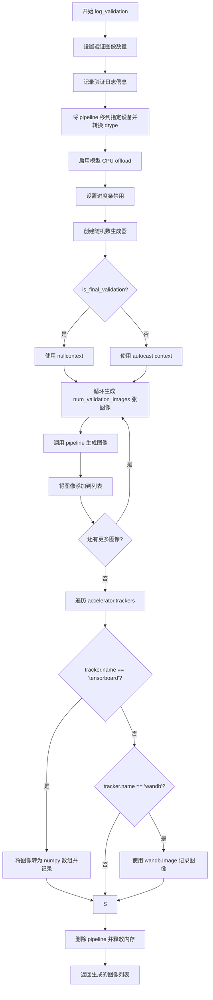

#### 带注释源码

```python
def log_validation(
    pipeline,            # 推理用的扩散管道对象（Flux2KleinPipeline 或类似）
    args,               # 训练脚本的命令行参数，包含验证配置
    accelerator,        # HuggingFace Accelerate 加速器，用于设备管理和跟踪器
    pipeline_args,      # 包含 prompt_embeds 等推理参数的字典
    epoch,              # 当前训练轮次，用于日志记录
    torch_dtype,        # torch 数据类型，控制推理精度
    is_final_validation=False,  # 是否为最终验证的标志
):
    # 确定验证图像数量，默认值为1
    args.num_validation_images = args.num_validation_images if args.num_validation_images else 1
    
    # 记录验证开始的日志信息，包括生成图像数量和验证提示词
    logger.info(
        f"Running validation... \n Generating {args.num_validation_images} images with prompt:"
        f" {args.validation_prompt}."
    )
    
    # 将管道移到指定设备并转换为目标数据类型
    pipeline = pipeline.to(dtype=torch_dtype)
    
    # 启用模型 CPU offload 以节省显存
    pipeline.enable_model_cpu_offload()
    
    # 禁用进度条显示
    pipeline.set_progress_bar_config(disable=True)

    # 创建随机数生成器（如果设置了 seed），用于可重复的验证
    generator = torch.Generator(device=accelerator.device).manual_seed(args.seed) if args.seed is not None else None
    
    # 根据是否为最终验证决定使用 autocast 上下文或 nullcontext
    # autocast 用于自动混合精度，最终验证时跳过以获得更高质量结果
    autocast_ctx = torch.autocast(accelerator.device.type) if not is_final_validation else nullcontext()

    # 初始化图像列表
    images = []
    
    # 循环生成指定数量的验证图像
    for _ in range(args.num_validation_images):
        with autocast_ctx:  # 使用自动混合精度上下文
            # 调用 pipeline 生成图像，传入预计算的 prompt_embeds 和随机生成器
            image = pipeline(
                prompt_embeds=pipeline_args["prompt_embeds"],
                generator=generator,
            ).images[0]
            images.append(image)

    # 遍历所有注册的跟踪器（TensorBoard 或 WandB）并记录图像
    for tracker in accelerator.trackers:
        # 确定阶段名称：最终验证为 "test"，中间验证为 "validation"
        phase_name = "test" if is_final_validation else "validation"
        
        # TensorBoard 跟踪器处理
        if tracker.name == "tensorboard":
            # 将 PIL 图像转换为 numpy 数组并堆叠
            np_images = np.stack([np.asarray(img) for img in images])
            # 使用 add_images 方法记录图像，指定阶段名、图像数据、轮次和数据格式
            tracker.writer.add_images(phase_name, np_images, epoch, dataformats="NHWC")
        
        # WandB 跟踪器处理
        if tracker.name == "wandb":
            # 使用 wandb.Image 记录图像，支持添加标题
            tracker.log(
                {
                    phase_name: [
                        wandb.Image(image, caption=f"{i}: {args.validation_prompt}") for i, image in enumerate(images)
                    ]
                }
            )

    # 清理：删除 pipeline 对象并释放显存
    del pipeline
    free_memory()

    # 返回生成的图像列表供后续使用（如保存到模型卡片）
    return images
```


### `module_filter_fn`

该函数是 FP8 训练中的模块过滤器，用于决定在将模型转换为 FP8 精度时，哪些层需要被转换。它通过检查模块的完全限定名称（FQN）和维度信息来过滤掉不需要转换的模块，以确保 FP8 转换的兼容性和正确性。

参数：

- `mod`：`torch.nn.Module`，要检查的 PyTorch 模块实例
- `fqn`：`str`，模块的完全限定名称（Fully Qualified Name），用于标识模块在模型中的位置

返回值：`bool`，返回 `True` 表示该模块需要被转换为 FP8 精度，返回 `False` 表示跳过该模块

#### 流程图

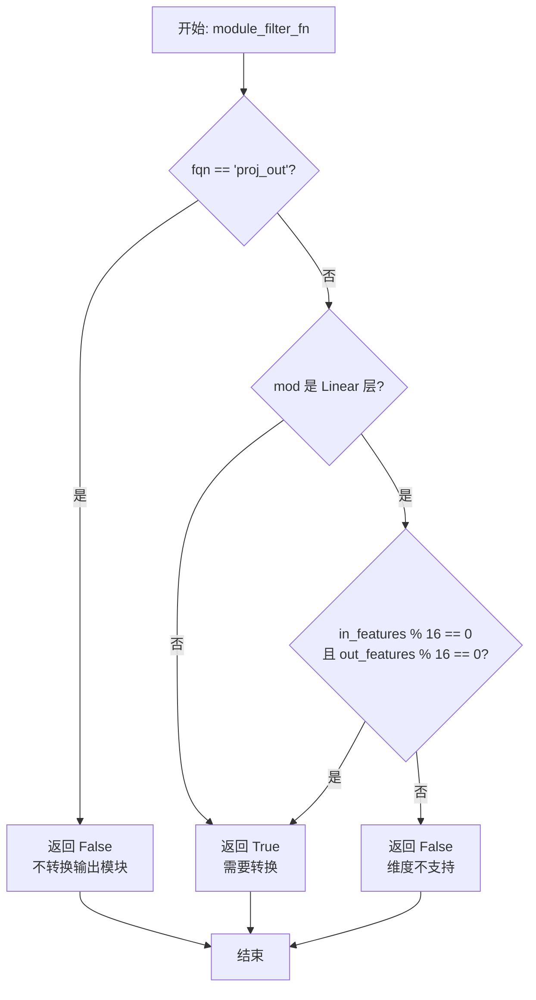

#### 带注释源码

```python
def module_filter_fn(mod: torch.nn.Module, fqn: str):
    """
    FP8 训练的模块过滤器，决定哪些层需要转换为 FP8 精度
    
    参数:
        mod: PyTorch 模块实例
        fqn: 模块的完全限定名称 (Fully Qualified Name)
    
    返回:
        bool: True 表示需要转换, False 表示跳过
    """
    
    # 不转换输出模块 (proj_out)
    # 输出层通常不需要进行 FP8 量化，保持原始精度可以避免数值问题
    if fqn == "proj_out":
        return False
    
    # 对于 Linear 层，检查输入输出维度是否能被 16 整除
    # FP8 量化内部使用 tile 矩阵乘法，要求维度是 16 的倍数以确保对齐
    if isinstance(mod, torch.nn.Linear):
        if mod.in_features % 16 != 0 or mod.out_features % 16 != 0:
            return False
    
    # 默认返回 True，表示该模块需要转换为 FP8
    return True
```


### `parse_args`

该函数是Flux.2 DreamBooth LoRA训练脚本的参数解析核心，通过argparse库定义了超过70个训练相关的命令行参数，包括模型路径、数据集配置、训练超参数、LoRA设置、优化器选项、验证参数等，并对参数进行了互斥性和必要性验证。

参数：

- `input_args`：`Optional[List[str]]`，可选参数列表，用于测试目的。如果为`None`，则从系统命令行参数`sys.argv`解析。

返回值：`argparse.Namespace`，包含所有解析后的命令行参数对象。

#### 流程图

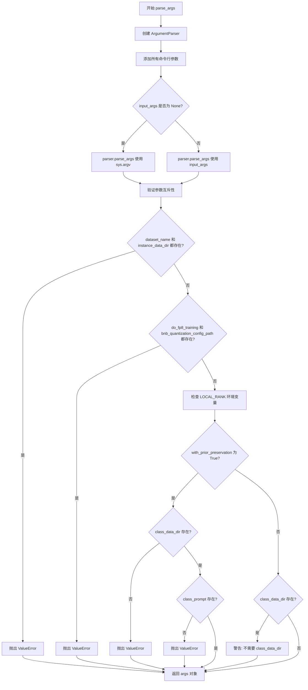

#### 带注释源码

```python
def parse_args(input_args=None):
    """
    解析命令行参数，定义所有训练相关的配置。
    
    参数:
        input_args: 可选的参数列表，用于测试。如果为None，则从sys.argv解析。
    
    返回:
        argparse.Namespace: 包含所有解析后参数的对象。
    """
    # 创建参数解析器，描述为"训练脚本的简单示例"
    parser = argparse.ArgumentParser(description="Simple example of a training script.")
    
    # ==================== 模型相关参数 ====================
    # 预训练模型路径或模型标识符（必需）
    parser.add_argument(
        "--pretrained_model_name_or_path",
        type=str,
        default=None,
        required=True,
        help="Path to pretrained model or model identifier from huggingface.co/models.",
    )
    # 预训练模型的修订版本
    parser.add_argument(
        "--revision",
        type=str,
        default=None,
        required=False,
        help="Revision of pretrained model identifier from huggingface.co/models.",
    )
    # BitsAndBytes量化配置路径
    parser.add_argument(
        "--bnb_quantization_config_path",
        type=str,
        default=None,
        help="Quantization config in a JSON file that will be used to define the bitsandbytes quant config of the DiT.",
    )
    # 是否进行FP8训练
    parser.add_argument(
        "--do_fp8_training",
        action="store_true",
        help="if we are doing FP8 training.",
    )
    # 模型变体（如fp16）
    parser.add_argument(
        "--variant",
        type=str,
        default=None,
        help="Variant of the model files of the pretrained model identifier from huggingface.co/models, 'e.g.' fp16",
    )
    
    # ==================== 数据集相关参数 ====================
    # 数据集名称（来自HuggingFace Hub）
    parser.add_argument(
        "--dataset_name",
        type=str,
        default=None,
        help=(
            "The name of the Dataset (from the HuggingFace hub) containing the training data of instance images (could be your own, possibly private,"
            " dataset). It can also be a path pointing to a local copy of a dataset in your filesystem,"
            " or to a folder containing files that 🤗 Datasets can understand."
        ),
    )
    # 数据集配置名称
    parser.add_argument(
        "--dataset_config_name",
        type=str,
        default=None,
        help="The config of the Dataset, leave as None if there's only one config.",
    )
    # 实例数据目录（本地路径）
    parser.add_argument(
        "--instance_data_dir",
        type=str,
        default=None,
        help=("A folder containing the training data. "),
    )
    # 缓存目录
    parser.add_argument(
        "--cache_dir",
        type=str,
        default=None,
        help="The directory where the downloaded models and datasets will be stored.",
    )
    # 数据集中的图像列名
    parser.add_argument(
        "--image_column",
        type=str,
        default="image",
        help="The column of the dataset containing the target image. By "
        "default, the standard Image Dataset maps out 'file_name' "
        "to 'image'.",
    )
    # 数据集中的标题/描述列名
    parser.add_argument(
        "--caption_column",
        type=str,
        default=None,
        help="The column of the dataset containing the instance prompt for each image",
    )
    # 训练数据重复次数
    parser.add_argument("--repeats", type=int, default=1, help="How many times to repeat the training data.")
    
    # ==================== DreamBooth 先验保留参数 ====================
    # 类图像数据目录
    parser.add_argument(
        "--class_data_dir",
        type=str,
        default=None,
        required=False,
        help="A folder containing the training data of class images.",
    )
    # 实例提示词（必需）
    parser.add_argument(
        "--instance_prompt",
        type=str,
        default=None,
        required=True,
        help="The prompt with identifier specifying the instance, e.g. 'photo of a TOK dog', 'in the style of TOK'",
    )
    # 类提示词
    parser.add_argument(
        "--class_prompt",
        type=str,
        default=None,
        help="The prompt to specify images in the same class as provided instance images.",
    )
    
    # ==================== 文本编码器参数 ====================
    # 最大序列长度
    parser.add_argument(
        "--max_sequence_length",
        type=int,
        default=512,
        help="Maximum sequence length to use with with the T5 text encoder"
    )
    # 文本编码器输出层
    parser.add_argument(
        "--text_encoder_out_layers",
        type=int,
        nargs="+",
        default=[10, 20, 30],
        help="Text encoder hidden layers to compute the final text embeddings.",
    )
    
    # ==================== 验证参数 ====================
    # 验证提示词
    parser.add_argument(
        "--validation_prompt",
        type=str,
        default=None,
        help="A prompt that is used during validation to verify that the model is learning.",
    )
    # 跳过最终推理
    parser.add_argument(
        "--skip_final_inference",
        default=False,
        action="store_true",
        help="Whether to skip the final inference step with loaded lora weights upon training completion. This will run intermediate validation inference if `validation_prompt` is provided. Specify to reduce memory.",
    )
    # 最终验证提示词
    parser.add_argument(
        "--final_validation_prompt",
        type=str,
        default=None,
        help="A prompt that is used during a final validation to verify that the model is learning. Ignored if `--validation_prompt` is provided.",
    )
    # 验证图像数量
    parser.add_argument(
        "--num_validation_images",
        type=int,
        default=4,
        help="Number of images that should be generated during validation with `validation_prompt`.",
    )
    # 验证周期
    parser.add_argument(
        "--validation_epochs",
        type=int,
        default=50,
        help=(
            "Run dreambooth validation every X epochs. Dreambooth validation consists of running the prompt"
            " `args.validation_prompt` multiple times: `args.num_validation_images`."
        ),
    )
    
    # ==================== LoRA 参数 ====================
    # LoRA 秩维度
    parser.add_argument(
        "--rank",
        type=int,
        default=4,
        help=("The dimension of the LoRA update matrices."),
    )
    # LoRA alpha 值
    parser.add_argument(
        "--lora_alpha",
        type=int,
        default=4,
        help="LoRA alpha to be used for additional scaling.",
    )
    # LoRA dropout
    parser.add_argument("--lora_dropout", type=float, default=0.0, help="Dropout probability for LoRA layers")
    # LoRA 目标层
    parser.add_argument(
        "--lora_layers",
        type=str,
        default=None,
        help=(
            'The transformer modules to apply LoRA training on. Please specify the layers in a comma separated. E.g. - "to_k,to_q,to_v,to_out.0" will result in lora training of attention layers only'
        ),
    )
    
    # ==================== 先验保留损失参数 ====================
    # 是否启用先验保留
    parser.add_argument(
        "--with_prior_preservation",
        default=False,
        action="store_true",
        help="Flag to add prior preservation loss.",
    )
    # 先验损失权重
    parser.add_argument("--prior_loss_weight", type=float, default=1.0, help="The weight of prior preservation loss.")
    # 类图像数量
    parser.add_argument(
        "--num_class_images",
        type=int,
        default=100,
        help=(
            "Minimal class images for prior preservation loss. If there are not enough images already present in"
            " class_data_dir, additional images will be sampled with class_prompt."
        ),
    )
    
    # ==================== 输出和随机性参数 ====================
    # 输出目录
    parser.add_argument(
        "--output_dir",
        type=str,
        default="flux-dreambooth-lora",
        help="The output directory where the model predictions and checkpoints will be written.",
    )
    # 随机种子
    parser.add_argument("--seed", type=int, default=None, help="A seed for reproducible training.")
    
    # ==================== 图像处理参数 ====================
    # 输入图像分辨率
    parser.add_argument(
        "--resolution",
        type=int,
        default=512,
        help=(
            "The resolution for input images, all the images in the train/validation dataset will be resized to this"
            " resolution"
        ),
    )
    # 宽高比桶
    parser.add_argument(
        "--aspect_ratio_buckets",
        type=str,
        default=None,
        help=(
            "Aspect ratio buckets to use for training. Define as a string of 'h1,w1;h2,w2;...'. "
            "e.g. '1024,1024;768,1360;1360,768;880,1168;1168,880;1248,832;832,1248'"
            "Images will be resized and cropped to fit the nearest bucket. If provided, --resolution is ignored."
        ),
    )
    # 中心裁剪
    parser.add_argument(
        "--center_crop",
        default=False,
        action="store_true",
        help=(
            "Whether to center crop the input images to the resolution. If not set, the images will be randomly"
            " cropped. The images will be resized to the resolution first before cropping."
        ),
    )
    # 随机水平翻转
    parser.add_argument(
        "--random_flip",
        action="store_true",
        help="whether to randomly flip images horizontally",
    )
    
    # ==================== 训练批处理参数 ====================
    # 训练批次大小
    parser.add_argument(
        "--train_batch_size", type=int, default=4, help="Batch size (per device) for the training dataloader."
    )
    # 采样批次大小
    parser.add_argument(
        "--sample_batch_size", type=int, default=4, help="Batch size (per device) for sampling images."
    )
    # 训练轮数
    parser.add_argument("--num_train_epochs", type=int, default=1)
    # 最大训练步数
    parser.add_argument(
        "--max_train_steps",
        type=int,
        default=None,
        help="Total number of training steps to perform.  If provided, overrides num_train_epochs.",
    )
    # 检查点保存步数
    parser.add_argument(
        "--checkpointing_steps",
        type=int,
        default=500,
        help=(
            "Save a checkpoint of the training state every X updates. These checkpoints can be used both as final"
            " checkpoints in case they are better than the last checkpoint, and are also suitable for resuming"
            " training using `--resume_from_checkpoint`."
        ),
    )
    # 检查点总数限制
    parser.add_argument(
        "--checkpoints_total_limit",
        type=int,
        default=None,
        help=("Max number of checkpoints to store."),
    )
    # 从检查点恢复
    parser.add_argument(
        "--resume_from_checkpoint",
        type=str,
        default=None,
        help=(
            "Whether training should be resumed from a previous checkpoint. Use a path saved by"
            ' `--checkpointing_steps`, or `"latest"` to automatically select the last available checkpoint.'
        ),
    )
    # 梯度累积步数
    parser.add_argument(
        "--gradient_accumulation_steps",
        type=int,
        default=1,
        help="Number of updates steps to accumulate before performing a backward/update pass.",
    )
    # 梯度检查点
    parser.add_argument(
        "--gradient_checkpointing",
        action="store_true",
        help="Whether or not to use gradient checkpointing to save memory at the expense of slower backward pass.",
    )
    
    # ==================== 学习率参数 ====================
    # 学习率
    parser.add_argument(
        "--learning_rate",
        type=float,
        default=1e-4,
        help="Initial learning rate (after the potential warmup period) to use.",
    )
    # 文本编码器学习率
    parser.add_argument(
        "--text_encoder_lr",
        type=float,
        default=5e-6,
        help="Text encoder learning rate to use.",
    )
    # 是否按GPU数量缩放学习率
    parser.add_argument(
        "--scale_lr",
        action="store_true",
        default=False,
        help="Scale the learning rate by the number of GPUs, gradient accumulation steps, and batch size.",
    )
    # 学习率调度器类型
    parser.add_argument(
        "--lr_scheduler",
        type=str,
        default="constant",
        help=(
            'The scheduler type to use. Choose between ["linear", "cosine", "cosine_with_restarts", "polynomial",'
            ' "constant", "constant_with_warmup"]'
        ),
    )
    # 学习率预热步数
    parser.add_argument(
        "--lr_warmup_steps", type=int, default=500, help="Number of steps for the warmup in the lr scheduler."
    )
    # 学习率周期数
    parser.add_argument(
        "--lr_num_cycles",
        type=int,
        default=1,
        help="Number of hard resets of the lr in cosine_with_restarts scheduler.",
    )
    # 多项式调度器幂次
    parser.add_argument("--lr_power", type=float, default=1.0, help="Power factor of the polynomial scheduler.")
    
    # ==================== 数据加载器参数 ====================
    # 数据加载器工作进程数
    parser.add_argument(
        "--dataloader_num_workers",
        type=int,
        default=0,
        help=(
            "Number of subprocesses to use for data loading. 0 means that the data will be loaded in the main process."
        ),
    )
    
    # ==================== 损失加权参数 ====================
    # 加权方案
    parser.add_argument(
        "--weighting_scheme",
        type=str,
        default="none",
        choices=["sigma_sqrt", "logit_normal", "mode", "cosmap", "none"],
        help=('We default to the "none" weighting scheme for uniform sampling and uniform loss'),
    )
    # logit_normal 均值
    parser.add_argument(
        "--logit_mean", type=float, default=0.0, help="mean to use when using the `'logit_normal'` weighting scheme."
    )
    # logit_normal 标准差
    parser.add_argument(
        "--logit_std", type=float, default=1.0, help="std to use when using the `'logit_normal'` weighting scheme."
    )
    # mode 加权方案缩放
    parser.add_argument(
        "--mode_scale",
        type=float,
        default=1.29,
        help="Scale of mode weighting scheme. Only effective when using the `'mode'` as the `weighting_scheme`.",
    )
    
    # ==================== 优化器参数 ====================
    # 优化器类型
    parser.add_argument(
        "--optimizer",
        type=str,
        default="AdamW",
        help=('The optimizer type to use. Choose between ["AdamW", "prodigy"]'),
    )
    # 是否使用8位Adam
    parser.add_argument(
        "--use_8bit_adam",
        action="store_true",
        help="Whether or not to use 8-bit Adam from bitsandbytes. Ignored if optimizer is not set to AdamW"
    )
    # Adam beta1
    parser.add_argument(
        "--adam_beta1", type=float, default=0.9, help="The beta1 parameter for the Adam and Prodigy optimizers."
    )
    # Adam beta2
    parser.add_argument(
        "--adam_beta2", type=float, default=0.999, help="The beta2 parameter for the Adam and Prodigy optimizers."
    )
    # Prodigy beta3
    parser.add_argument(
        "--prodigy_beta3",
        type=float,
        default=None,
        help="coefficients for computing the Prodigy stepsize using running averages. If set to None, "
        "uses the value of square root of beta2. Ignored if optimizer is adamW",
    )
    # Prodigy 解耦权重衰减
    parser.add_argument("--prodigy_decouple", type=bool, default=True, help="Use AdamW style decoupled weight decay")
    # Adam 权重衰减
    parser.add_argument("--adam_weight_decay", type=float, default=1e-04, help="Weight decay to use for unet params")
    # 文本编码器权重衰减
    parser.add_argument(
        "--adam_weight_decay_text_encoder", type=float, default=1e-03, help="Weight decay to use for text_encoder"
    )
    # Adam epsilon
    parser.add_argument(
        "--adam_epsilon",
        type=float,
        default=1e-08,
        help="Epsilon value for the Adam optimizer and Prodigy optimizers.",
    )
    # Prodigy 偏差校正
    parser.add_argument(
        "--prodigy_use_bias_correction",
        type=bool,
        default=True,
        help="Turn on Adam's bias correction. True by default. Ignored if optimizer is adamW",
    )
    # Prodigy 预热保护
    parser.add_argument(
        "--prodigy_safeguard_warmup",
        type=bool,
        default=True,
        help="Remove lr from the denominator of D estimate to avoid issues during warm-up stage. True by default. "
        "Ignored if optimizer is adamW",
    )
    # 最大梯度范数
    parser.add_argument("--max_grad_norm", default=1.0, type=float, help="Max gradient norm.")
    
    # ==================== Hub 上传参数 ====================
    # 是否推送到 Hub
    parser.add_argument("--push_to_hub", action="store_true", help="Whether or not to push the model to the Hub.")
    # Hub token
    parser.add_argument("--hub_token", type=str, default=None, help="The token to use to push to the Model Hub.")
    # Hub 模型 ID
    parser.add_argument(
        "--hub_model_id",
        type=str,
        default=None,
        help="The name of the repository to keep in sync with the local `output_dir`.",
    )
    
    # ==================== 日志和精度参数 ====================
    # 日志目录
    parser.add_argument(
        "--logging_dir",
        type=str,
        default="logs",
        help=(
            "[TensorBoard](https://www.tensorflow.org/tensorboard) log directory. Will default to"
            " *output_dir/runs/**CURRENT_DATETIME_HOSTNAME***."
        ),
    )
    # 允许 TF32
    parser.add_argument(
        "--allow_tf32",
        action="store_true",
        help=(
            "Whether or not to allow TF32 on Ampere GPUs. Can be used to speed up training. For more information, see"
            " https://pytorch.org/docs/stable/notes/cuda.html#tensorfloat-32-tf32-on-ampere-devices"
        ),
    )
    # 缓存潜在向量
    parser.add_argument(
        "--cache_latents",
        action="store_true",
        default=False,
        help="Cache the VAE latents",
    )
    # 报告目标
    parser.add_argument(
        "--report_to",
        type=str,
        default="tensorboard",
        help=(
            'The integration to report the results and logs to. Supported platforms are `"tensorboard"`'
            ' (default), `"wandb"` and `"comet_ml"`. Use `"all"` to report to all integrations.'
        ),
    )
    # 混合精度
    parser.add_argument(
        "--mixed_precision",
        type=str,
        default=None,
        choices=["no", "fp16", "bf16"],
        help=(
            "Whether to use mixed precision. Choose between fp16 and bf16 (bfloat16). Bf16 requires PyTorch >="
            " 1.10.and an Nvidia Ampere GPU.  Default to the value of accelerate config of the current system or the"
            " flag passed with the `accelerate.launch` command. Use this argument to override the accelerate config."
        ),
    )
    # 保存前上转换
    parser.add_argument(
        "--upcast_before_saving",
        action="store_true",
        default=False,
        help=(
            "Whether to upcast the trained transformer layers to float32 before saving (at the end of training). "
            "Defaults to precision dtype used for training to save memory"
        ),
    )
    # 卸载 VAE 和文本编码器
    parser.add_argument(
        "--offload",
        action="store_true",
        help="Whether to offload the VAE and the text encoder to CPU when they are not used.",
    )
    # 先验生成精度
    parser.add_argument(
        "--prior_generation_precision",
        type=str,
        default=None,
        choices=["no", "fp32", "fp16", "bf16"],
        help=(
            "Choose prior generation precision between fp32, fp16 and bf16 (bfloat16). Bf16 requires PyTorch >="
            " 1.10.and an Nvidia Ampere GPU.  Default to  fp16 if a GPU is available else fp32."
        ),
    )
    
    # ==================== 分布式训练参数 ====================
    # 本地排名
    parser.add_argument("--local_rank", type=int, default=-1, help="For distributed training: local_rank")
    # 启用 NPU 闪光注意力
    parser.add_argument("--enable_npu_flash_attention", action="store_true", help="Enabla Flash Attention for NPU")
    # 对文本编码器使用 FSDP
    parser.add_argument("--fsdp_text_encoder", action="store_true", help="Use FSDP for text encoder")
    
    # ==================== 解析参数 ====================
    # 根据 input_args 是否为空来选择解析方式
    if input_args is not None:
        args = parser.parse_args(input_args)
    else:
        args = parser.parse_args()
    
    # ==================== 参数验证 ====================
    # 验证数据集参数互斥性
    if args.dataset_name is None and args.instance_data_dir is None:
        raise ValueError("Specify either `--dataset_name` or `--instance_data_dir`")

    if args.dataset_name is not None and args.instance_data_dir is not None:
        raise ValueError("Specify only one of `--dataset_name` or `--instance_data_dir`")
    
    # 验证 FP8 训练参数互斥性
    if args.do_fp8_training and args.bnb_quantization_config_path:
        raise ValueError("Both `do_fp8_training` and `bnb_quantization_config_path` cannot be passed.")

    # 检查环境变量 LOCAL_RANK
    env_local_rank = int(os.environ.get("LOCAL_RANK", -1))
    if env_local_rank != -1 and env_local_rank != args.local_rank:
        args.local_rank = env_local_rank

    # 先验保留验证
    if args.with_prior_preservation:
        if args.class_data_dir is None:
            raise ValueError("You must specify a data directory for class images.")
        if args.class_prompt is None:
            raise ValueError("You must specify prompt for class images.")
    else:
        # logger 尚未可用，仅发出警告
        if args.class_data_dir is not None:
            warnings.warn("You need not use --class_data_dir without --with_prior_preservation.")
        if args.class_prompt is not None:
            warnings.warn("You need not use --class_prompt without --with_prior_preservation.")

    # 返回解析后的参数对象
    return args
```


### `collate_fn`

数据加载器的整理函数，处理批次中的图像和提示词，将实例图像和类别图像（如果启用先验保留）堆叠成批次，并返回包含像素值和提示词的字典。

参数：

- `examples`：`List[Dict]`，数据集中的一批样本，每个样本包含实例图像和提示词
- `with_prior_preservation`：`bool`，是否启用先验保留损失（默认为 False）

返回值：`Dict`，包含以下键的字典：
- `pixel_values`：`torch.Tensor`，堆叠后的图像像素值，形状为 (batch_size, C, H, W)
- `prompts`：`List[str]`，对应的文本提示词列表

#### 流程图

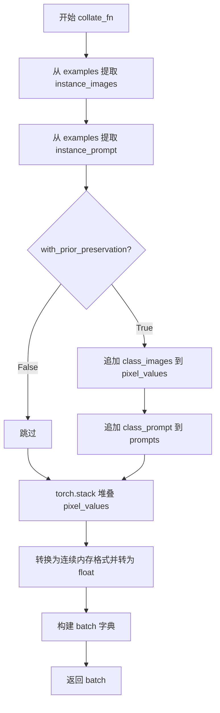

#### 带注释源码

```python
def collate_fn(examples, with_prior_preservation=False):
    # 从批次中提取所有实例图像
    pixel_values = [example["instance_images"] for example in examples]
    # 从批次中提取所有实例提示词
    prompts = [example["instance_prompt"] for example in examples]

    # 如果启用先验保留，则将类别图像和提示词也添加到批次中
    # 这样做是为了避免进行两次前向传播
    if with_prior_preservation:
        pixel_values += [example["class_images"] for example in examples]
        prompts += [example["class_prompt"] for example in examples]

    # 将图像列表堆叠为张量
    pixel_values = torch.stack(pixel_values)
    # 转换为连续内存格式并转为 float32
    pixel_values = pixel_values.to(memory_format=torch.contiguous_format).float()

    # 构建批次字典
    batch = {"pixel_values": pixel_values, "prompts": prompts}
    return batch
```


### `main`

`main`函数是DreamBooth LoRA训练的主入口函数，负责模型加载、数据准备、训练循环、验证和模型保存的完整流程。

参数：

- `args`：命令行参数对象，包含所有训练配置（如模型路径、数据路径、训练超参数等）

返回值：无返回值（直接在函数内部完成模型保存、日志记录等操作）

#### 流程图

```mermaid
flowchart TD
    A[开始训练] --> B{验证报告工具配置}
    B --> C{MPS + bf16检查}
    C -->|不支持| D[抛出错误]
    C -->|支持| E[创建Accelerator]
    E --> F[设置日志级别]
    F --> G[设置随机种子]
    G --> H{with_prior_preservation?}
    H -->|是| I[生成类别图像]
    H -->|否| J[跳过生成]
    I --> K[创建输出目录]
    J --> K
    K --> L[创建Hub仓库]
    L --> M[加载tokenizer]
    M --> N[设置weight_dtype]
    N --> O[加载scheduler和models]
    O --> P[加载VAE]
    P --> Q[计算VAE BN统计量]
    Q --> R[配置量化]
    R --> S[加载transformer]
    S --> T[加载text_encoder]
    T --> U[设置模型requires_grad]
    U --> V{FSDP配置?}
    V -->|是| W[配置FSDP]
    V -->|否| X[直接移动到设备]
    W --> Y[配置gradient_checkpointing]
    X --> Y
    Y --> Z[添加LoRA适配器]
    Z --> AA[创建优化器]
    AA --> AB[解析aspect_ratio_buckets]
    AB --> AC[创建数据集和DataLoader]
    AC --> AD[计算text embeddings]
    AD --> AE[缓存latents?]
    AE -->|是| AF[预计算并缓存]
    AE -->|否| AG[跳过缓存]
    AF --> AH[释放VAE和text_encoder]
    AG --> AH
    AH --> AI[创建lr_scheduler]
    AI --> AJ[准备模型和优化器]
    AJ --> AK[初始化trackers]
    AK --> AL[加载checkpoint?]
    AL -->|是| AM[恢复训练状态]
    AL -->|否| AN[从头开始]
    AM --> AO[开始训练循环]
    AN --> AO
    AO --> AP{for epoch in range}
    AP --> AQ{step in dataloader}
    AQ --> AR[累积梯度]
    AR --> AS[获取prompt_embeds]
    AT[VAE编码] --> AU[计算latents]
    AU --> AV[添加噪声]
    AV --> AW[准备latent ids]
    AW --> AX[调用transformer预测]
    AX --> AY[计算loss]
    AY --> AZ{prior_preservation?}
    AZ -->|是| BA[添加prior_loss]
    AZ -->|否| BB[反向传播]
    BA --> BB
    BB --> BC[梯度裁剪]
    BC --> BD[优化器更新]
    BD --> BE{同步梯度?}
    BE -->|是| BF[保存checkpoint]
    BE -->|否| BG[记录日志]
    BF --> BG
    BG --> BH{达到最大steps?}
    BH -->|否| BQ[继续下一batch]
    BH -->|是| BI{validation?}
    BI -->|是| BJ[运行validation]
    BJ --> BK[释放pipeline内存]
    BK --> BL[保存最终LoRA权重]
    BL --> BM[运行最终推理?]
    BM -->|是| BN[生成验证图像]
    BN --> BO[保存model card]
    BM -->|否| BO
    BO --> BP[上传到Hub?]
    BP -->|是| BQ[上传文件夹]
    BP -->|否| BR[结束训练]
    BQ --> BR
```

#### 带注释源码

```python
def main(args):
    """
    主训练函数，负责DreamBooth LoRA训练的完整流程
    """
    # 1. 检查wandb和hub_token的安全性
    if args.report_to == "wandb" and args.hub_token is not None:
        raise ValueError(
            "You cannot use both --report_to=wandb and --hub_token due to a security risk of exposing your token."
            " Please use `hf auth login` to authenticate with the Hub."
        )

    # 2. 检查MPS是否支持bf16，不支持则报错
    if torch.backends.mps.is_available() and args.mixed_precision == "bf16":
        raise ValueError(
            "Mixed precision training with bfloat16 is not supported on MPS. Please use fp16 (recommended) or fp32 instead."
        )
    
    # 3. 如果使用FP8训练，导入float8相关模块
    if args.do_fp8_training:
        from torchao.float8 import Float8LinearConfig, convert_to_float8_training

    # 4. 设置logging目录
    logging_dir = Path(args.output_dir, args.logging_dir)

    # 5. 创建Accelerator配置
    accelerator_project_config = ProjectConfiguration(project_dir=args.output_dir, logging_dir=logging_dir)
    kwargs = DistributedDataParallelKwargs(find_unused_parameters=True)
    accelerator = Accelerator(
        gradient_accumulation_steps=args.gradient_accumulation_steps,
        mixed_precision=args.mixed_precision,
        log_with=args.report_to,
        project_config=accelerator_project_config,
        kwargs_handlers=[kwargs],
    )

    # 6. MPS下禁用AMP
    if torch.backends.mps.is_available():
        accelerator.native_amp = False

    # 7. 检查wandb是否安装
    if args.report_to == "wandb":
        if not is_wandb_available():
            raise ImportError("Make sure to install wandb if you want to use it for logging during training.")

    # 8. 配置日志格式
    logging.basicConfig(
        format="%(asctime)s - %(levelname)s - %(name)s - %(message)s",
        datefmt="%m/%d/%Y %H:%M:%S",
        level=logging.INFO,
    )
    logger.info(accelerator.state, main_process_only=False)
    
    # 9. 设置transformers和diffusers的日志级别
    if accelerator.is_local_main_process:
        transformers.utils.logging.set_verbosity_warning()
        diffusers.utils.logging.set_verbosity_info()
    else:
        transformers.utils.logging.set_verbosity_error()
        diffusers.utils.logging.set_verbosity_error()

    # 10. 设置随机种子
    if args.seed is not None:
        set_seed(args.seed)

    # 11. 如果启用prior preservation，生成类别图像
    if args.with_prior_preservation:
        class_images_dir = Path(args.class_data_dir)
        if not class_images_dir.exists():
            class_images_dir.mkdir(parents=True)
        cur_class_images = len(list(class_images_dir.iterdir()))

        if cur_class_images < args.num_class_images:
            # 确定prior generation的精度
            has_supported_fp16_accelerator = torch.cuda.is_available() or torch.backends.mps.is_available()
            torch_dtype = torch.float16 if has_supported_fp16_accelerator else torch.float32
            if args.prior_generation_precision == "fp32":
                torch_dtype = torch.float32
            elif args.prior_generation_precision == "fp16":
                torch_dtype = torch.float16
            elif args.prior_generation_precision == "bf16":
                torch_dtype = torch.bfloat16

            # 加载pipeline用于生成类别图像
            pipeline = Flux2KleinPipeline.from_pretrained(
                args.pretrained_model_name_or_path,
                torch_dtype=torch_dtype,
                revision=args.revision,
                variant=args.variant,
            )
            pipeline.set_progress_bar_config(disable=True)

            num_new_images = args.num_class_images - cur_class_images
            logger.info(f"Number of class images to sample: {num_new_images}.")

            # 创建dataset和dataloader用于生成
            sample_dataset = PromptDataset(args.class_prompt, num_new_images)
            sample_dataloader = torch.utils.data.DataLoader(sample_dataset, batch_size=args.sample_batch_size)

            sample_dataloader = accelerator.prepare(sample_dataloader)
            pipeline.to(accelerator.device)

            # 生成类别图像
            for example in tqdm(
                sample_dataloader, desc="Generating class images", disable=not accelerator.is_local_main_process
            ):
                with torch.autocast(device_type=accelerator.device.type, dtype=torch_dtype):
                    images = pipeline(prompt=example["prompt"]).images

                # 保存生成的图像
                for i, image in enumerate(images):
                    hash_image = insecure_hashlib.sha1(image.tobytes()).hexdigest()
                    image_filename = class_images_dir / f"{example['index'][i] + cur_class_images}-{hash_image}.jpg"
                    image.save(image_filename)

            del pipeline
            free_memory()

    # 12. 创建输出目录和Hub仓库
    if accelerator.is_main_process:
        if args.output_dir is not None:
            os.makedirs(args.output_dir, exist_ok=True)

        if args.push_to_hub:
            repo_id = create_repo(
                repo_id=args.hub_model_id or Path(args.output_dir).name,
                exist_ok=True,
            ).repo_id

    # 13. 加载tokenizer
    tokenizer = Qwen2TokenizerFast.from_pretrained(
        args.pretrained_model_name_or_path,
        subfolder="tokenizer",
        revision=args.revision,
    )

    # 14. 根据mixed_precision设置weight_dtype
    weight_dtype = torch.float32
    if accelerator.mixed_precision == "fp16":
        weight_dtype = torch.float16
    elif accelerator.mixed_precision == "bf16":
        weight_dtype = torch.bfloat16

    # 15. 加载scheduler和models
    noise_scheduler = FlowMatchEulerDiscreteScheduler.from_pretrained(
        args.pretrained_model_name_or_path,
        subfolder="scheduler",
        revision=args.revision,
    )
    # 深拷贝用于后续计算
    noise_scheduler_copy = copy.deepcopy(noise_scheduler)
    
    # 16. 加载VAE
    vae = AutoencoderKLFlux2.from_pretrained(
        args.pretrained_model_name_or_path,
        subfolder="vae",
        revision=args.revision,
        variant=args.variant,
    )
    # 获取VAE的batch norm统计量，用于latent归一化
    latents_bn_mean = vae.bn.running_mean.view(1, -1, 1, 1).to(accelerator.device)
    latents_bn_std = torch.sqrt(vae.bn.running_var.view(1, -1, 1, 1) + vae.config.batch_norm_eps).to(
        accelerator.device
    )

    # 17. 配置量化（如果使用bitsandbytes）
    quantization_config = None
    if args.bnb_quantization_config_path is not None:
        with open(args.bnb_quantization_config_path, "r") as f:
            config_kwargs = json.load(f)
            if "load_in_4bit" in config_kwargs and config_kwargs["load_in_4bit"]:
                config_kwargs["bnb_4bit_compute_dtype"] = weight_dtype
        quantization_config = BitsAndBytesConfig(**config_kwargs)

    # 18. 加载transformer
    transformer = Flux2Transformer2DModel.from_pretrained(
        args.pretrained_model_name_or_path,
        subfolder="transformer",
        revision=args.revision,
        variant=args.variant,
        quantization_config=quantization_config,
        torch_dtype=weight_dtype,
    )
    # 如果使用kbit训练，准备模型
    if args.bnb_quantization_config_path is not None:
        transformer = prepare_model_for_kbit_training(transformer, use_gradient_checkpointing=False)

    # 19. 加载text_encoder
    text_encoder = Qwen3ForCausalLM.from_pretrained(
        args.pretrained_model_name_or_path, subfolder="text_encoder", revision=args.revision, variant=args.variant
    )
    text_encoder.requires_grad_(False)

    # 20. 设置模型为不需要梯度
    transformer.requires_grad_(False)
    vae.requires_grad_(False)

    # 21. 启用NPU flash attention
    if args.enable_npu_flash_attention:
        if is_torch_npu_available():
            logger.info("npu flash attention enabled.")
            transformer.set_attention_backend("_native_npu")
        else:
            raise ValueError("npu flash attention requires torch_npu extensions and is supported only on npu device ")

    # 22. MPS不支持bf16的再次检查
    if torch.backends.mps.is_available() and weight_dtype == torch.bfloat16:
        raise ValueError(
            "Mixed precision training with bfloat16 is not supported on MPS. Please use fp16 (recommended) or fp32 instead."
        )

    # 23. 将VAE移动到指定设备和dtype
    to_kwargs = {"dtype": weight_dtype, "device": accelerator.device} if not args.offload else {"dtype": weight_dtype}
    vae.to(**to_kwargs)

    # 24. 设置transformer的device和dtype
    transformer_to_kwargs = (
        {"device": accelerator.device}
        if args.bnb_quantization_config_path is not None
        else {"device": accelerator.device, "dtype": weight_dtype}
    )

    # 25. 检查是否使用FSDP
    is_fsdp = getattr(accelerator.state, "fsdp_plugin", None) is not None
    if not is_fsdp:
        transformer.to(**transformer_to_kwargs)

    # 26. 如果使用FP8训练，转换transformer
    if args.do_fp8_training:
        convert_to_float8_training(
            transformer, module_filter_fn=module_filter_fn, config=Float8LinearConfig(pad_inner_dim=True)
        )

    # 27. 将text_encoder移动到设备
    text_encoder.to(**to_kwargs)
    
    # 28. 创建text encoding pipeline（保持在CPU上）
    text_encoding_pipeline = Flux2KleinPipeline.from_pretrained(
        args.pretrained_model_name_or_path,
        vae=None,
        transformer=None,
        tokenizer=tokenizer,
        text_encoder=text_encoder,
        scheduler=None,
        revision=args.revision,
    )

    # 29. 启用gradient checkpointing
    if args.gradient_checkpointing:
        transformer.enable_gradient_checkpointing()

    # 30. 配置LoRA target modules
    if args.lora_layers is not None:
        target_modules = [layer.strip() for layer in args.lora_layers.split(",")]
    else:
        target_modules = ["to_k", "to_q", "to_v", "to_out.0"]

    # 31. 添加LoRA适配器到transformer
    transformer_lora_config = LoraConfig(
        r=args.rank,
        lora_alpha=args.lora_alpha,
        lora_dropout=args.lora_dropout,
        init_lora_weights="gaussian",
        target_modules=target_modules,
    )
    transformer.add_adapter(transformer_lora_config)

    # 32. 定义unwrap_model函数
    def unwrap_model(model):
        model = accelerator.unwrap_model(model)
        model = model._orig_mod if is_compiled_module(model) else model
        return model

    # 33. 定义save_model_hook用于保存模型
    def save_model_hook(models, weights, output_dir):
        transformer_cls = type(unwrap_model(transformer))

        # 验证并获取transformer模型
        modules_to_save: dict[str, Any] = {}
        transformer_model = None

        for model in models:
            if isinstance(unwrap_model(model), transformer_cls):
                transformer_model = model
                modules_to_save["transformer"] = model
            else:
                raise ValueError(f"unexpected save model: {model.__class__}")

        if transformer_model is None:
            raise ValueError("No transformer model found in 'models'")

        # 获取FSDP state dict
        state_dict = accelerator.get_state_dict(model) if is_fsdp else None

        # 主进程获取LoRA state dict
        transformer_lora_layers_to_save = None
        if accelerator.is_main_process:
            peft_kwargs = {}
            if is_fsdp:
                peft_kwargs["state_dict"] = state_dict

            transformer_lora_layers_to_save = get_peft_model_state_dict(
                unwrap_model(transformer_model) if is_fsdp else transformer_model,
                **peft_kwargs,
            )

            if is_fsdp:
                transformer_lora_layers_to_save = _to_cpu_contiguous(transformer_lora_layers_to_save)

            # 弹出权重避免重复保存
            if weights:
                weights.pop()

            # 保存LoRA权重
            Flux2KleinPipeline.save_lora_weights(
                output_dir,
                transformer_lora_layers=transformer_lora_layers_to_save,
                **_collate_lora_metadata(modules_to_save),
            )

    # 34. 定义load_model_hook用于加载模型
    def load_model_hook(models, input_dir):
        transformer_ = None

        if not is_fsdp:
            while len(models) > 0:
                model = models.pop()

                if isinstance(unwrap_model(model), type(unwrap_model(transformer))):
                    transformer_ = unwrap_model(model)
                else:
                    raise ValueError(f"unexpected save model: {model.__class__}")
        else:
            transformer_ = Flux2Transformer2DModel.from_pretrained(
                args.pretrained_model_name_or_path,
                subfolder="transformer",
            )
            transformer_.add_adapter(transformer_lora_config)

        # 加载LoRA state dict
        lora_state_dict = Flux2KleinPipeline.lora_state_dict(input_dir)

        transformer_state_dict = {
            f"{k.replace('transformer.', '')}": v for k, v in lora_state_dict.items() if k.startswith("transformer.")
        }
        transformer_state_dict = convert_unet_state_dict_to_peft(transformer_state_dict)
        incompatible_keys = set_peft_model_state_dict(transformer_, transformer_state_dict, adapter_name="default")
        if incompatible_keys is not None:
            unexpected_keys = getattr(incompatible_keys, "unexpected_keys", None)
            if unexpected_keys:
                logger.warning(
                    f"Loading adapter weights from state_dict led to unexpected keys not found in the model: "
                    f" {unexpected_keys}. "
                )

        # 确保可训练参数为float32
        if args.mixed_precision == "fp16":
            models = [transformer_]
            cast_training_params(models)

    # 35. 注册save和load hooks
    accelerator.register_save_state_pre_hook(save_model_hook)
    accelerator.register_load_state_pre_hook(load_model_hook)

    # 36. 启用TF32加速
    if args.allow_tf32 and torch.cuda.is_available():
        torch.backends.cuda.matmul.allow_tf32 = True

    # 37. 缩放学习率
    if args.scale_lr:
        args.learning_rate = (
            args.learning_rate * args.gradient_accumulation_steps * args.train_batch_size * accelerator.num_processes
        )

    # 38. 确保可训练参数为float32
    if args.mixed_precision == "fp16":
        models = [transformer]
        cast_training_params(models, dtype=torch.float32)

    # 39. 获取LoRA参数
    transformer_lora_parameters = list(filter(lambda p: p.requires_grad, transformer.parameters()))

    # 40. 配置优化器参数
    transformer_parameters_with_lr = {"params": transformer_lora_parameters, "lr": args.learning_rate}
    params_to_optimize = [transformer_parameters_with_lr]

    # 41. 创建优化器
    if not (args.optimizer.lower() == "prodigy" or args.optimizer.lower() == "adamw"):
        logger.warning(
            f"Unsupported choice of optimizer: {args.optimizer}.Supported optimizers include [adamW, prodigy]."
            "Defaulting to adamW"
        )
        args.optimizer = "adamw"

    if args.use_8bit_adam and not args.optimizer.lower() == "adamw":
        logger.warning(
            f"use_8bit_adam is ignored when optimizer is not set to 'AdamW'. Optimizer was "
            f"set to {args.optimizer.lower()}"
        )

    if args.optimizer.lower() == "adamw":
        if args.use_8bit_adam:
            try:
                import bitsandbytes as bnb
            except ImportError:
                raise ImportError(
                    "To use 8-bit Adam, please install the bitsandbytes library: `pip install bitsandbytes`."
                )

            optimizer_class = bnb.optim.AdamW8bit
        else:
            optimizer_class = torch.optim.AdamW

        optimizer = optimizer_class(
            params_to_optimize,
            betas=(args.adam_beta1, args.adam_beta2),
            weight_decay=args.adam_weight_decay,
            eps=args.adam_epsilon,
        )

    if args.optimizer.lower() == "prodigy":
        try:
            import prodigyopt
        except ImportError:
            raise ImportError("To use Prodigy, please install the prodigyopt library: `pip install prodigyopt`")

        optimizer_class = prodigyopt.Prodigy

        if args.learning_rate <= 0.1:
            logger.warning(
                "Learning rate is too low. When using prodigy, it's generally better to set learning rate around 1.0"
            )

        optimizer = optimizer_class(
            params_to_optimize,
            betas=(args.adam_beta1, args.adam_beta2),
            beta3=args.prodigy_beta3,
            weight_decay=args.adam_weight_decay,
            eps=args.adam_epsilon,
            decouple=args.prodigy_decouple,
            use_bias_correction=args.prodigy_use_bias_correction,
            safeguard_warmup=args.prodigy_safeguard_warmup,
        )

    # 42. 解析aspect ratio buckets
    if args.aspect_ratio_buckets is not None:
        buckets = parse_buckets_string(args.aspect_ratio_buckets)
    else:
        buckets = [(args.resolution, args.resolution)]
    logger.info(f"Using parsed aspect ratio buckets: {buckets}")

    # 43. 创建数据集和DataLoader
    train_dataset = DreamBoothDataset(
        instance_data_root=args.instance_data_dir,
        instance_prompt=args.instance_prompt,
        class_prompt=args.class_prompt,
        class_data_root=args.class_data_dir if args.with_prior_preservation else None,
        class_num=args.num_class_images,
        size=args.resolution,
        repeats=args.repeats,
        center_crop=args.center_crop,
        buckets=buckets,
    )
    batch_sampler = BucketBatchSampler(train_dataset, batch_size=args.train_batch_size, drop_last=True)
    train_dataloader = torch.utils.data.DataLoader(
        train_dataset,
        batch_sampler=batch_sampler,
        collate_fn=lambda examples: collate_fn(examples, args.with_prior_preservation),
        num_workers=args.dataloader_num_workers,
    )

    # 44. 定义计算text embeddings的函数
    def compute_text_embeddings(prompt, text_encoding_pipeline):
        with torch.no_grad():
            prompt_embeds, text_ids = text_encoding_pipeline.encode_prompt(
                prompt=prompt,
                max_sequence_length=args.max_sequence_length,
                text_encoder_out_layers=args.text_encoder_out_layers,
            )
        return prompt_embeds, text_ids

    # 45. 预计算instance prompt embeddings（如果没有自定义prompts）
    if not train_dataset.custom_instance_prompts:
        with offload_models(text_encoding_pipeline, device=accelerator.device, offload=args.offload):
            instance_prompt_hidden_states, instance_text_ids = compute_text_embeddings(
                args.instance_prompt, text_encoding_pipeline
            )

    # 46. 处理class prompt（prior preservation）
    if args.with_prior_preservation:
        with offload_models(text_encoding_pipeline, device=accelerator.device, offload=args.offload):
            class_prompt_hidden_states, class_text_ids = compute_text_embeddings(
                args.class_prompt, text_encoding_pipeline
            )
    
    # 47. 处理validation prompt
    validation_embeddings = {}
    if args.validation_prompt is not None:
        with offload_models(text_encoding_pipeline, device=accelerator.device, offload=args.offload):
            (validation_embeddings["prompt_embeds"], validation_embeddings["text_ids"]) = compute_text_embeddings(
                args.validation_prompt, text_encoding_pipeline
            )

    # 48. 初始化FSDP for text encoder
    if args.fsdp_text_encoder:
        fsdp_kwargs = get_fsdp_kwargs_from_accelerator(accelerator)
        text_encoder_fsdp = wrap_with_fsdp(
            model=text_encoding_pipeline.text_encoder,
            device=accelerator.device,
            offload=args.offload,
            limit_all_gathers=True,
            use_orig_params=True,
            fsdp_kwargs=fsdp_kwargs,
        )

        text_encoding_pipeline.text_encoder = text_encoder_fsdp
        dist.barrier()

    # 49. 整理预计算的embeddings
    if not train_dataset.custom_instance_prompts:
        prompt_embeds = instance_prompt_hidden_states
        text_ids = instance_text_ids
        if args.with_prior_preservation:
            prompt_embeds = torch.cat([prompt_embeds, class_prompt_hidden_states], dim=0)
            text_ids = torch.cat([text_ids, class_text_ids], dim=0)

    # 50. 预计算latents（如果启用cache）
    precompute_latents = args.cache_latents or train_dataset.custom_instance_prompts
    if precompute_latents:
        prompt_embeds_cache = []
        text_ids_cache = []
        latents_cache = []
        for batch in tqdm(train_dataloader, desc="Caching latents"):
            with torch.no_grad():
                if args.cache_latents:
                    with offload_models(vae, device=accelerator.device, offload=args.offload):
                        batch["pixel_values"] = batch["pixel_values"].to(
                            accelerator.device, non_blocking=True, dtype=vae.dtype
                        )
                        latents_cache.append(vae.encode(batch["pixel_values"]).latent_dist)
                if train_dataset.custom_instance_prompts:
                    if args.fsdp_text_encoder:
                        prompt_embeds, text_ids = compute_text_embeddings(batch["prompts"], text_encoding_pipeline)
                    else:
                        with offload_models(text_encoding_pipeline, device=accelerator.device, offload=args.offload):
                            prompt_embeds, text_ids = compute_text_embeddings(batch["prompts"], text_encoding_pipeline)
                    prompt_embeds_cache.append(prompt_embeds)
                    text_ids_cache.append(text_ids)

    # 51. 释放VAE和text_encoder内存
    if args.cache_latents:
        vae = vae.to("cpu")
        del vae

    text_encoding_pipeline = text_encoding_pipeline.to("cpu")
    del text_encoder, tokenizer
    free_memory()

    # 52. 创建学习率调度器
    num_warmup_steps_for_scheduler = args.lr_warmup_steps * accelerator.num_processes
    if args.max_train_steps is None:
        len_train_dataloader_after_sharding = math.ceil(len(train_dataloader) / accelerator.num_processes)
        num_update_steps_per_epoch = math.ceil(len_train_dataloader_after_sharding / args.gradient_accumulation_steps)
        num_training_steps_for_scheduler = (
            args.num_train_epochs * accelerator.num_processes * num_update_steps_per_epoch
        )
    else:
        num_training_steps_for_scheduler = args.max_train_steps * accelerator.num_processes

    lr_scheduler = get_scheduler(
        args.lr_scheduler,
        optimizer=optimizer,
        num_warmup_steps=num_warmup_steps_for_scheduler,
        num_training_steps=num_training_steps_for_scheduler,
        num_cycles=args.lr_num_cycles,
        power=args.lr_power,
    )

    # 53. 使用accelerator准备模型和优化器
    transformer, optimizer, train_dataloader, lr_scheduler = accelerator.prepare(
        transformer, optimizer, train_dataloader, lr_scheduler
    )

    # 54. 重新计算训练步数
    num_update_steps_per_epoch = math.ceil(len(train_dataloader) / args.gradient_accumulation_steps)
    if args.max_train_steps is None:
        args.max_train_steps = args.num_train_epochs * num_update_steps_per_epoch
        if num_training_steps_for_scheduler != args.max_train_steps:
            logger.warning(
                f"The length of the 'train_dataloader' after 'accelerator.prepare' ({len(train_dataloader)}) does not match "
                f"the expected length ({len_train_dataloader_after_sharding}) when the learning rate scheduler was created. "
                f"This inconsistency may result in the learning rate scheduler not functioning properly."
            )
    args.num_train_epochs = math.ceil(args.max_train_steps / num_update_steps_per_epoch)

    # 55. 初始化trackers
    if accelerator.is_main_process:
        tracker_name = "dreambooth-flux2-klein-lora"
        args_cp = vars(args).copy()
        args_cp["text_encoder_out_layers"] = str(args_cp["text_encoder_out_layers"])
        accelerator.init_trackers(tracker_name, config=args_cp)

    # 56. 训练信息日志
    total_batch_size = args.train_batch_size * accelerator.num_processes * args.gradient_accumulation_steps

    logger.info("***** Running training *****")
    logger.info(f"  Num examples = {len(train_dataset)}")
    logger.info(f"  Num batches each epoch = {len(train_dataloader)}")
    logger.info(f"  Num Epochs = {args.num_train_epochs}")
    logger.info(f"  Instantaneous batch size per device = {args.train_batch_size}")
    logger.info(f"  Total train batch size (w. parallel, distributed & accumulation) = {total_batch_size}")
    logger.info(f"  Gradient Accumulation steps = {args.gradient_accumulation_steps}")
    logger.info(f"  Total optimization steps = {args.max_train_steps}")
    global_step = 0
    first_epoch = 0

    # 57. 从checkpoint恢复训练
    if args.resume_from_checkpoint:
        if args.resume_from_checkpoint != "latest":
            path = os.path.basename(args.resume_from_checkpoint)
        else:
            dirs = os.listdir(args.output_dir)
            dirs = [d for d in dirs if d.startswith("checkpoint")]
            dirs = sorted(dirs, key=lambda x: int(x.split("-")[1]))
            path = dirs[-1] if len(dirs) > 0 else None

        if path is None:
            accelerator.print(
                f"Checkpoint '{args.resume_from_checkpoint}' does not exist. Starting a new training run."
            )
            args.resume_from_checkpoint = None
            initial_global_step = 0
        else:
            accelerator.print(f"Resuming from checkpoint {path}")
            accelerator.load_state(os.path.join(args.output_dir, path))
            global_step = int(path.split("-")[1])

            initial_global_step = global_step
            first_epoch = global_step // num_update_steps_per_epoch
    else:
        initial_global_step = 0

    # 58. 创建进度条
    progress_bar = tqdm(
        range(0, args.max_train_steps),
        initial=initial_global_step,
        desc="Steps",
        disable=not accelerator.is_local_main_process,
    )

    # 59. 定义获取sigmas的函数
    def get_sigmas(timesteps, n_dim=4, dtype=torch.float32):
        sigmas = noise_scheduler_copy.sigmas.to(device=accelerator.device, dtype=dtype)
        schedule_timesteps = noise_scheduler_copy.timesteps.to(accelerator.device)
        timesteps = timesteps.to(accelerator.device)
        step_indices = [(schedule_timesteps == t).nonzero().item() for t in timesteps]

        sigma = sigmas[step_indices].flatten()
        while len(sigma.shape) < n_dim:
            sigma = sigma.unsqueeze(-1)
        return sigma

    # 60. 开始训练循环
    for epoch in range(first_epoch, args.num_train_epochs):
        transformer.train()

        for step, batch in enumerate(train_dataloader):
            models_to_accumulate = [transformer]
            prompts = batch["prompts"]

            with accelerator.accumulate(models_to_accumulate):
                # 获取prompt embeddings
                if train_dataset.custom_instance_prompts:
                    prompt_embeds = prompt_embeds_cache[step]
                    text_ids = text_ids_cache[step]
                else:
                    num_repeat_elements = len(prompts)
                    prompt_embeds = prompt_embeds.repeat(num_repeat_elements, 1, 1)
                    text_ids = text_ids.repeat(num_repeat_elements, 1, 1)

                # 将图像编码到latent空间
                if args.cache_latents:
                    model_input = latents_cache[step].mode()
                else:
                    with offload_models(vae, device=accelerator.device, offload=args.offload):
                        pixel_values = batch["pixel_values"].to(dtype=vae.dtype)
                    model_input = vae.encode(pixel_values).latent_dist.mode()

                # Patchify和归一化latents
                model_input = Flux2KleinPipeline._patchify_latents(model_input)
                model_input = (model_input - latents_bn_mean) / latents_bn_std

                # 准备latent ids
                model_input_ids = Flux2KleinPipeline._prepare_latent_ids(model_input).to(device=model_input.device)
                
                # 采样噪声
                noise = torch.randn_like(model_input)
                bsz = model_input.shape[0]

                # 采样timesteps
                u = compute_density_for_timestep_sampling(
                    weighting_scheme=args.weighting_scheme,
                    batch_size=bsz,
                    logit_mean=args.logit_mean,
                    logit_std=args.logit_std,
                    mode_scale=args.mode_scale,
                )
                indices = (u * noise_scheduler_copy.config.num_train_timesteps).long()
                timesteps = noise_scheduler_copy.timesteps[indices].to(device=model_input.device)

                # Flow matching: 添加噪声 zt = (1 - texp) * x + texp * z1
                sigmas = get_sigmas(timesteps, n_dim=model_input.ndim, dtype=model_input.dtype)
                noisy_model_input = (1.0 - sigmas) * model_input + sigmas * noise

                # Pack latents
                packed_noisy_model_input = Flux2KleinPipeline._pack_latents(noisy_model_input)

                # 处理guidance
                if transformer.config.guidance_embeds:
                    guidance = torch.full([1], args.guidance_scale, device=accelerator.device)
                    guidance = guidance.expand(model_input.shape[0])
                else:
                    guidance = None

                # Transformer前向传播预测噪声
                model_pred = transformer(
                    hidden_states=packed_noisy_model_input,
                    timestep=timesteps / 1000,
                    guidance=guidance,
                    encoder_hidden_states=prompt_embeds,
                    txt_ids=text_ids,
                    img_ids=model_input_ids,
                    return_dict=False,
                )[0]
                model_pred = model_pred[:, : packed_noisy_model_input.size(1) :]

                # Unpack latents
                model_pred = Flux2KleinPipeline._unpack_latents_with_ids(model_pred, model_input_ids)

                # 计算loss weighting
                weighting = compute_loss_weighting_for_sd3(weighting_scheme=args.weighting_scheme, sigmas=sigmas)

                # Flow matching loss: target = noise - model_input
                target = noise - model_input

                # Prior preservation loss
                if args.with_prior_preservation:
                    model_pred, model_pred_prior = torch.chunk(model_pred, 2, dim=0)
                    target, target_prior = torch.chunk(target, 2, dim=0)

                    prior_loss = torch.mean(
                        (weighting.float() * (model_pred_prior.float() - target_prior.float()) ** 2).reshape(
                            target_prior.shape[0], -1
                        ),
                        1,
                    )
                    prior_loss = prior_loss.mean()

                # 计算主loss
                loss = torch.mean(
                    (weighting.float() * (model_pred.float() - target.float()) ** 2).reshape(target.shape[0], -1),
                    1,
                )
                loss = loss.mean()

                # 添加prior loss
                if args.with_prior_preservation:
                    loss = loss + args.prior_loss_weight * prior_loss

                # 反向传播
                accelerator.backward(loss)
                
                # 梯度裁剪
                if accelerator.sync_gradients:
                    params_to_clip = transformer.parameters()
                    accelerator.clip_grad_norm_(params_to_clip, args.max_grad_norm)

                # 优化器更新
                optimizer.step()
                lr_scheduler.step()
                optimizer.zero_grad()

            # 检查是否执行了优化步骤
            if accelerator.sync_gradients:
                progress_bar.update(1)
                global_step += 1

                # 保存checkpoint
                if accelerator.is_main_process or is_fsdp:
                    if global_step % args.checkpointing_steps == 0:
                        # 检查checkpoint数量限制
                        if args.checkpoints_total_limit is not None:
                            checkpoints = os.listdir(args.output_dir)
                            checkpoints = [d for d in checkpoints if d.startswith("checkpoint")]
                            checkpoints = sorted(checkpoints, key=lambda x: int(x.split("-")[1]))

                            if len(checkpoints) >= args.checkpoints_total_limit:
                                num_to_remove = len(checkpoints) - args.checkpoints_total_limit + 1
                                removing_checkpoints = checkpoints[0:num_to_remove]

                                logger.info(
                                    f"{len(checkpoints)} checkpoints already exist, removing {len(removing_checkpoints)} checkpoints"
                                )
                                logger.info(f"removing checkpoints: {', '.join(removing_checkpoints)}")

                                for removing_checkpoint in removing_checkpoints:
                                    removing_checkpoint = os.path.join(args.output_dir, removing_checkpoint)
                                    shutil.rmtree(removing_checkpoint)

                        save_path = os.path.join(args.output_dir, f"checkpoint-{global_step}")
                        accelerator.save_state(save_path)
                        logger.info(f"Saved state to {save_path}")

                # 记录日志
                logs = {"loss": loss.detach().item(), "lr": lr_scheduler.get_last_lr()[0]}
                progress_bar.set_postfix(**logs)
                accelerator.log(logs, step=global_step)

            if global_step >= args.max_train_steps:
                break

        # 验证
        if accelerator.is_main_process:
            if args.validation_prompt is not None and epoch % args.validation_epochs == 0:
                pipeline = Flux2KleinPipeline.from_pretrained(
                    args.pretrained_model_name_or_path,
                    transformer=unwrap_model(transformer),
                    revision=args.revision,
                    variant=args.variant,
                    torch_dtype=weight_dtype,
                )
                images = log_validation(
                    pipeline=pipeline,
                    args=args,
                    accelerator=accelerator,
                    pipeline_args=validation_embeddings,
                    epoch=epoch,
                    torch_dtype=weight_dtype,
                )

                del pipeline
                free_memory()

    # 61. 保存最终LoRA权重
    accelerator.wait_for_everyone()

    if is_fsdp:
        transformer = unwrap_model(transformer)
        state_dict = accelerator.get_state_dict(transformer)
    if accelerator.is_main_process:
        modules_to_save = {}
        if is_fsdp:
            if args.bnb_quantization_config_path is None:
                if args.upcast_before_saving:
                    state_dict = {
                        k: v.to(torch.float32) if isinstance(v, torch.Tensor) else v for k, v in state_dict.items()
                    }
                else:
                    state_dict = {
                        k: v.to(weight_dtype) if isinstance(v, torch.Tensor) else v for k, v in state_dict.items()
                    }

            transformer_lora_layers = get_peft_model_state_dict(
                transformer,
                state_dict=state_dict,
            )
            transformer_lora_layers = {
                k: v.detach().cpu().contiguous() if isinstance(v, torch.Tensor) else v
                for k, v in transformer_lora_layers.items()
            }

        else:
            transformer = unwrap_model(transformer)
            if args.bnb_quantization_config_path is None:
                if args.upcast_before_saving:
                    transformer.to(torch.float32)
                else:
                    transformer = transformer.to(weight_dtype)
            transformer_lora_layers = get_peft_model_state_dict(transformer)

        modules_to_save["transformer"] = transformer

        Flux2KleinPipeline.save_lora_weights(
            save_directory=args.output_dir,
            transformer_lora_layers=transformer_lora_layers,
            **_collate_lora_metadata(modules_to_save),
        )

        # 62. 运行最终推理验证
        images = []
        run_validation = (args.validation_prompt and args.num_validation_images > 0) or (args.final_validation_prompt)
        should_run_final_inference = not args.skip_final_inference and run_validation
        if should_run_final_inference:
            pipeline = Flux2KleinPipeline.from_pretrained(
                args.pretrained_model_name_or_path,
                revision=args.revision,
                variant=args.variant,
                torch_dtype=weight_dtype,
            )
            pipeline.load_lora_weights(args.output_dir)

            if args.validation_prompt and args.num_validation_images > 0:
                images = log_validation(
                    pipeline=pipeline,
                    args=args,
                    accelerator=accelerator,
                    pipeline_args=validation_embeddings,
                    epoch=epoch,
                    is_final_validation=True,
                    torch_dtype=weight_dtype,
                )
            images = None
            del pipeline
            free_memory()

        # 63. 保存model card
        validation_prompt = args.validation_prompt if args.validation_prompt else args.final_validation_prompt
        quant_training = None
        if args.do_fp8_training:
            quant_training = "FP8 TorchAO"
        elif args.bnb_quantization_config_path:
            quant_training = "BitsandBytes"
        save_model_card(
            (args.hub_model_id or Path(args.output_dir).name) if not args.push_to_hub else repo_id,
            images=images,
            base_model=args.pretrained_model_name_or_path,
            instance_prompt=args.instance_prompt,
            validation_prompt=validation_prompt,
            repo_folder=args.output_dir,
            quant_training=quant_training,
        )

        # 64. 上传到Hub
        if args.push_to_hub:
            upload_folder(
                repo_id=repo_id,
                folder_path=args.output_dir,
                commit_message="End of training",
                ignore_patterns=["step_*", "epoch_*"],
            )

    accelerator.end_training()
```


### `DreamBoothDataset.__init__`

初始化 DreamBooth 数据集，加载训练图像和类图像，应用图像变换（调整大小、裁剪、归一化等），并根据提供的 bucket 配置处理不同分辨率的图像，最终构建可用于模型训练的数据集结构。

参数：

- `instance_data_root`：str，实例图像的根目录路径或 HuggingFace 数据集名称
- `instance_prompt`：str，用于实例图像的提示词，通常包含特定标识符（如 "photo of a TOK dog"）
- `class_prompt`：str，用于类图像的提示词，用于先验保留（prior preservation）训练
- `class_data_root`：str（可选），类图像的存储目录路径，默认为 None
- `class_num`：int（可选），类图像的最大数量，默认为 None
- `size`：int，图像的目标分辨率，默认为 1024
- `repeats`：int，训练数据重复次数，默认为 1
- `center_crop`：bool，是否使用中心裁剪，默认为 False
- `buckets`：list（可选），宽高比 bucket 列表，用于不同分辨率图像的批处理，默认为 None

返回值：无（__init__ 方法不返回任何值）

#### 流程图

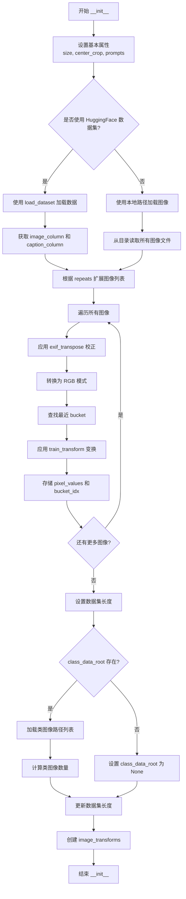

#### 带注释源码

```python
def __init__(
    self,
    instance_data_root,  # 实例图像根目录或数据集名称
    instance_prompt,     # 实例提示词（如 'photo of a TOK dog'）
    class_prompt,        # 类提示词（如 'dog'）
    class_data_root=None,    # 类图像目录（用于 prior preservation）
    class_num=None,          # 类图像最大数量
    size=1024,               # 默认图像分辨率
    repeats=1,               # 重复次数
    center_crop=False,       # 是否中心裁剪
    buckets=None,            # 宽高比 bucket 列表
):
    # 1. 设置基本属性
    self.size = size
    self.center_crop = center_crop
    
    self.instance_prompt = instance_prompt
    self.custom_instance_prompts = None  # 自定义提示词（从数据集列获取）
    self.class_prompt = class_prompt
    
    self.buckets = buckets  # 存储 bucket 配置
    
    # 2. 判断数据来源：HuggingFace 数据集 或 本地文件夹
    if args.dataset_name is not None:
        try:
            from datasets import load_dataset
        except ImportError:
            raise ImportError(
                "You are trying to load your data using the datasets library. "
                "If you wish to train using custom captions please install "
                "the datasets library: `pip install datasets`."
            )
        
        # 从 HuggingFace Hub 下载并加载数据集
        dataset = load_dataset(
            args.dataset_name,
            args.dataset_config_name,
            cache_dir=args.cache_dir,
        )
        
        # 获取数据集列名
        column_names = dataset["train"].column_names
        
        # 确定图像列（默认为第一列）
        if args.image_column is None:
            image_column = column_names[0]
            logger.info(f"image column defaulting to {image_column}")
        else:
            image_column = args.image_column
            if image_column not in column_names:
                raise ValueError(
                    f"`--image_column` value '{args.image_column}' not found in "
                    f"dataset columns. Dataset columns are: {', '.join(column_names)}"
                )
        
        # 获取实例图像
        instance_images = dataset["train"][image_column]
        
        # 确定提示词列
        if args.caption_column is None:
            logger.info(
                "No caption column provided, defaulting to instance_prompt for all images."
            )
            self.custom_instance_prompts = None
        else:
            if args.caption_column not in column_names:
                raise ValueError(
                    f"`--caption_column` value '{args.caption_column}' not found in "
                    f"dataset columns. Dataset columns are: {', '.join(column_names)}"
                )
            
            # 从数据集列获取自定义提示词，并根据 repeats 扩展
            custom_instance_prompts = dataset["train"][args.caption_column]
            self.custom_instance_prompts = []
            for caption in custom_instance_prompts:
                self.custom_instance_prompts.extend(itertools.repeat(caption, repeats))
    else:
        # 从本地文件夹加载图像
        self.instance_data_root = Path(instance_data_root)
        if not self.instance_data_root.exists():
            raise ValueError("Instance images root doesn't exists.")
        
        # 读取目录下所有图像文件
        instance_images = [Image.open(path) for path in list(Path(instance_data_root).iterdir())]
        self.custom_instance_prompts = None
    
    # 3. 根据 repeats 扩展实例图像列表
    self.instance_images = []
    for img in instance_images:
        self.instance_images.extend(itertools.repeat(img, repeats))
    
    # 4. 预处理图像：应用变换并存储
    self.pixel_values = []  # 存储 (变换后的图像tensor, bucket索引) 元组
    for i, image in enumerate(self.instance_images):
        # 校正图像方向（根据 EXIF 数据）
        image = exif_transpose(image)
        
        # 确保图像为 RGB 模式
        if not image.mode == "RGB":
            image = image.convert("RGB")
        
        width, height = image.size
        
        # 查找最近的 bucket
        bucket_idx = find_nearest_bucket(height, width, self.buckets)
        target_height, target_width = self.buckets[bucket_idx]
        self.size = (target_height, target_width)
        
        # 根据 bucket 分配应用训练变换
        image = self.train_transform(
            image,
            size=self.size,
            center_crop=args.center_crop,
            random_flip=args.random_flip,
        )
        self.pixel_values.append((image, bucket_idx))
    
    # 5. 设置数据集长度
    self.num_instance_images = len(self.instance_images)
    self._length = self.num_instance_images
    
    # 6. 处理类图像（用于 prior preservation）
    if class_data_root is not None:
        self.class_data_root = Path(class_data_root)
        self.class_data_root.mkdir(parents=True, exist_ok=True)
        
        # 获取类图像文件列表
        self.class_images_path = list(self.class_data_root.iterdir())
        
        # 计算实际类图像数量
        if class_num is not None:
            self.num_class_images = min(len(self.class_images_path), class_num)
        else:
            self.num_class_images = len(self.class_images_path)
        
        # 更新数据集长度为较大者
        self._length = max(self.num_class_images, self.num_instance_images)
    else:
        self.class_data_root = None
    
    # 7. 创建图像变换组合（用于类图像）
    self.image_transforms = transforms.Compose(
        [
            transforms.Resize(size, interpolation=transforms.InterpolationMode.BILINEAR),
            transforms.CenterCrop(size) if center_crop else transforms.RandomCrop(size),
            transforms.ToTensor(),
            transforms.Normalize([0.5], [0.5]),
        ]
    )
```


### `DreamBoothDataset.__len__`

返回数据集的长度，用于 PyTorch DataLoader 确定数据集大小。

参数：

- `self`：`DreamBoothDataset`，当前数据集实例本身，隐式传递

返回值：`int`，返回数据集的样本数量，该值由 `self._length` 决定，通常等于实例图像数量或类别图像数量中的较大者

#### 流程图

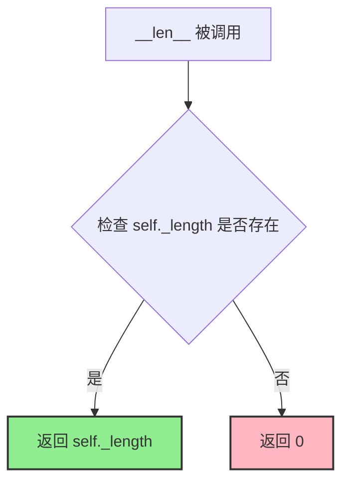

#### 带注释源码

```python
def __len__(self):
    """
    返回数据集的长度。
    
    该方法由 PyTorch DataLoader 调用，用于确定数据集的样本数量。
    _length 在 __init__ 中被设置为 max(num_class_images, num_instance_images)，
    以确保在 prior preservation 模式下能够正确迭代所有样本。
    
    Returns:
        int: 数据集中的样本数量
    """
    return self._length
```


### `DreamBoothDataset.__getitem__`

根据索引返回训练样本，包含图像tensor、提示词和桶索引，用于DreamBooth训练的数据集获取。

参数：

- `index`：`int`，数据集中的样本索引，用于从预处理后的图像列表中检索对应样本

返回值：`Dict[str, Any]`，包含以下键的字典：
  - `instance_images`：预处理后的实例图像tensor
  - `instance_prompt`：实例提示词文本
  - `bucket_idx`：对应的宽高比桶索引
  - `class_images`：如果启用先验保留，则包含类别图像tensor
  - `class_prompt`：如果启用先验保留，则包含类别提示词文本

#### 流程图

```mermaid
flowchart TD
    A[__getitem__ index] --> B{index % num_instance_images}
    B --> C[获取 pixel_values 中的 instance_image 和 bucket_idx]
    C --> D[设置 example['instance_images']]
    D --> E[设置 example['bucket_idx']]
    E --> F{是否有自定义提示词 custom_instance_prompts}
    F -->|是| G{提示词非空}
    G -->|是| H[设置 example['instance_prompt'] = caption]
    G -->|否| I[设置 example['instance_prompt'] = instance_prompt]
    F -->|否| J[设置 example['instance_prompt'] = instance_prompt]
    H --> K{是否有 class_data_root}
    I --> K
    J --> K
    K -->|是| L[打开类别图像并进行EXIF转置]
    L --> M[转换为RGB模式]
    M --> N[应用图像变换]
    N --> O[设置 example['class_images']]
    O --> P[设置 example['class_prompt']]
    K -->|否| Q[返回 example 字典]
    P --> Q
```

#### 带注释源码

```python
def __getitem__(self, index):
    """
    根据索引返回训练样本。
    
    Args:
        index: 数据集中的样本索引
        
    Returns:
        包含实例图像、提示词和桶索引的字典，如果启用先验保留还包括类别图像和提示词
    """
    # 初始化返回字典
    example = {}
    
    # 使用模运算实现数据集循环：当索引超过实例图像数量时循环使用
    instance_image, bucket_idx = self.pixel_values[index % self.num_instance_images]
    
    # 存储预处理后的实例图像tensor
    example["instance_images"] = instance_image
    # 存储对应的宽高比桶索引，用于后续批处理分组
    example["bucket_idx"] = bucket_idx
    
    # 检查是否提供了自定义提示词（数据集CSV/JSON中的caption列）
    if self.custom_instance_prompts:
        # 获取对应索引的提示词，同样使用模运算实现循环
        caption = self.custom_instance_prompts[index % self.num_instance_images]
        if caption:
            # 如果自定义提示词非空，使用自定义提示词
            example["instance_prompt"] = caption
        else:
            # 自定义提示词为空时，回退到默认实例提示词
            example["instance_prompt"] = self.instance_prompt
    else:
        # 未提供自定义提示词时，使用默认实例提示词
        example["instance_prompt"] = self.instance_prompt

    # 如果配置了类别数据目录（先验保留训练）
    if self.class_data_root:
        # 打开并处理类别图像，使用模运算循环类别图像
        class_image = Image.open(self.class_images_path[index % self.num_class_images])
        # EXIF转置处理（修正根据EXIF信息旋转的图像）
        class_image = exif_transpose(class_image)

        # 确保类别图像为RGB模式
        if not class_image.mode == "RGB":
            class_image = class_image.convert("RGB")
        
        # 应用图像变换并存储
        example["class_images"] = self.image_transforms(class_image)
        example["class_prompt"] = self.class_prompt

    # 返回包含所有训练信息的字典
    return example
```


### DreamBoothDataset.train_transform

定义图像的预处理流程，包含Resize、Crop、Flip、ToTensor和Normalize五个步骤，将PIL图像转换为归一化的张量格式用于模型训练。

参数：

- `self`：`DreamBoothDataset`，所属类实例
- `image`：`PIL.Image.Image`，输入的PIL格式图像
- `size`：`tuple(int, int)`，目标尺寸，默认为(224, 224)，指定图像resize后的高宽
- `center_crop`：`bool`，是否使用中心裁剪，默认为False；False时使用随机裁剪
- `random_flip`：`bool`，是否进行随机水平翻转，默认为False

返回值：`torch.Tensor`，经过完整预处理流程的图像张量，形状为(C, H, W)，数值已归一化到[-1, 1]范围

#### 流程图

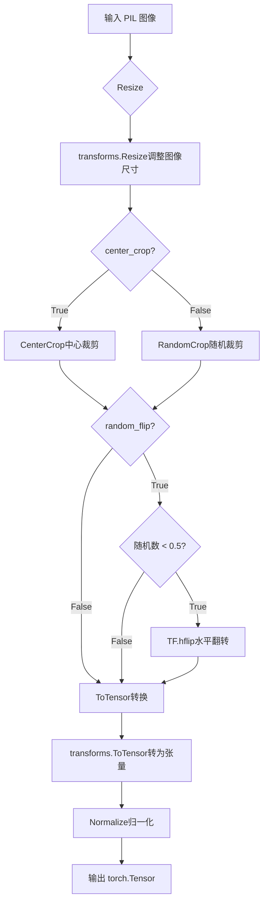

#### 带注释源码

```python
def train_transform(self, image, size=(224, 224), center_crop=False, random_flip=False):
    """
    图像预处理转换方法
    
    参数:
        image: PIL.Image.Image - 输入的PIL格式图像
        size: tuple(int, int) - 目标尺寸 (height, width)，默认为 (224, 224)
        center_crop: bool - 是否使用中心裁剪，默认为False（使用随机裁剪）
        random_flip: bool - 是否进行随机水平翻转，默认为False
    
    返回:
        torch.Tensor - 归一化后的图像张量，形状为 (C, H, W)，数值范围 [-1, 1]
    """
    
    # 步骤1: Resize (确定性操作)
    # 使用双线性插值将图像调整到目标尺寸
    resize = transforms.Resize(size, interpolation=transforms.InterpolationMode.BILINEAR)
    image = resize(image)

    # 步骤2: Crop (中心裁剪或随机裁剪)
    if center_crop:
        # 中心裁剪：从图像中心裁剪出指定尺寸
        crop = transforms.CenterCrop(size)
        image = crop(image)
    else:
        # 随机裁剪：随机选择裁剪位置
        # get_params 返回裁剪参数 (i, j, h, w)
        # i: 顶部像素位置, j: 左侧像素位置, h: 裁剪高度, w: 裁剪宽度
        i, j, h, w = transforms.RandomCrop.get_params(image, output_size=size)
        image = TF.crop(image, i, j, h, w)

    # 步骤3: Random horizontal flip (随机水平翻转)
    # 使用相同的硬币翻转确保数据增强的一致性
    if random_flip:
        do_flip = random.random() < 0.5  # 50%概率进行翻转
        if do_flip:
            image = TF.hflip(image)  # torchvision.functional.horizontal_flip

    # 步骤4: ToTensor + Normalize (确定性操作)
    # 将PIL图像转换为PyTorch张量，并归一化到[-1, 1]
    to_tensor = transforms.ToTensor()
    normalize = transforms.Normalize([0.5], [0.5])  # 均值0.5，标准差0.5
    
    # 先转为张量 (像素值从 [0,255] 转换为 [0,1])
    # 再归一化：output = (input - 0.5) / 0.5 = input * 2 - 1
    # 结果数值范围: [0,1] -> [-1,1]
    image = normalize(to_tensor(image))

    return image
```


### `BucketBatchSampler.__init__`

初始化采样器，按桶分组索引并预生成批次。

参数：

- `dataset`：`DreamBoothDataset`，包含图像数据和桶信息的训练数据集
- `batch_size`：`int`，每个批次的样本数量，必须为正整数
- `drop_last`：`bool`，是否丢弃最后一个不完整的批次，默认为 False

返回值：无（`None`），该方法仅初始化对象状态

#### 流程图

```mermaid
flowchart TD
    A[开始 __init__] --> B{验证 batch_size}
    B -->|无效| C[抛出 ValueError]
    B -->|有效| D{验证 drop_last}
    D -->|无效| E[抛出 ValueError]
    D -->|有效| F[保存 dataset, batch_size, drop_last]
    F --> G[初始化 bucket_indices 列表]
    G --> H[遍历 dataset.pixel_values]
    H --> I[按 bucket_idx 分组索引]
    I --> J[初始化 sampler_len=0 和 batches=[]]
    J --> K[遍历每个 bucket]
    K --> L[随机打乱 bucket 内索引]
    L --> M[按 batch_size 切分索引]
    M --> N{检查是否 drop_last}
    N -->|是 且 batch 不完整| O[跳过该 batch]
    N -->|否| P[添加到 batches 列表]
    O --> Q[sampler_len += 1]
    P --> Q
    Q --> R[遍历完所有 bucket]
    R --> S[结束 __init__]
```

#### 带注释源码

```python
def __init__(self, dataset: DreamBoothDataset, batch_size: int, drop_last: bool = False):
    """
    初始化 BucketBatchSampler，按桶分组索引并预生成批次
    
    参数:
        dataset: DreamBoothDataset 数据集实例，包含 buckets 和 pixel_values 属性
        batch_size: 每个批次的样本数量
        drop_last: 是否丢弃最后一个不完整批次
    """
    # 参数校验：batch_size 必须为正整数
    if not isinstance(batch_size, int) or batch_size <= 0:
        raise ValueError("batch_size should be a positive integer value, but got batch_size={}".format(batch_size))
    
    # 参数校验：drop_last 必须为布尔值
    if not isinstance(drop_last, bool):
        raise ValueError("drop_last should be a boolean value, but got drop_last={}".format(drop_last))

    # 保存传入的参数到实例属性
    self.dataset = dataset
    self.batch_size = batch_size
    self.drop_last = drop_last

    # 创建与桶数量相同的索引列表，用于按桶分组样本索引
    self.bucket_indices = [[] for _ in range(len(self.dataset.buckets))]
    
    # 遍历数据集中所有样本，按 bucket_idx 分组记录样本索引
    # pixel_values 存储 (image_tensor, bucket_idx) 元组
    for idx, (_, bucket_idx) in enumerate(self.dataset.pixel_values):
        self.bucket_indices[bucket_idx].append(idx)

    # 初始化批次计数器和批次列表
    self.sampler_len = 0
    self.batches = []

    # 预生成每个桶的批次
    for indices_in_bucket in self.bucket_indices:
        # 随机打乱桶内索引顺序，实现数据增强效果
        random.shuffle(indices_in_bucket)
        
        # 按 batch_size 步长切分索引，生成批次
        for i in range(0, len(indices_in_bucket), self.batch_size):
            batch = indices_in_bucket[i : i + self.batch_size]
            
            # 如果 drop_last=True 且最后一个批次不完整，则跳过
            if len(batch) < self.batch_size and self.drop_last:
                continue  # Skip partial batch if drop_last is True
            
            # 保存批次并增加计数器
            self.batches.append(batch)
            self.sampler_len += 1  # Count the number of batches
```


### `BucketBatchSampler.__iter__`

该方法是 `BucketBatchSampler` 类的迭代器实现，用于在每个训练 epoch 中按需返回一个批次的索引。它通过随机打乱预先生成的批次顺序来实现数据增强，并使用生成器模式逐个 yield 批次，从而提高内存效率。

参数：该方法没有显式参数（使用 `self` 访问实例属性）。

返回值：`List[int]`，返回一个包含批次索引的列表（每个索引代表数据集中的一个样本）。

#### 流程图

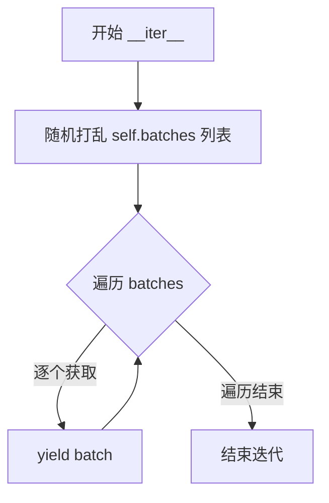

#### 带注释源码

```python
def __iter__(self):
    # 在每个 epoch 开始时，随机打乱批次的顺序
    # 这确保了每个 epoch 的数据顺序都是随机的，增加训练的多样性
    random.shuffle(self.batches)
    
    # 遍历打乱后的批次列表，逐个 yield 返回
    # 使用生成器模式可以避免一次性将所有批次加载到内存中
    for batch in self.batches:
        yield batch
```


### `BucketBatchSampler.__len__`

返回 BucketBatchSampler 的总批次数，用于 DataLoader 确定迭代次数。

参数：

- 无

返回值：`int`，返回预先生成的批次数（`self.sampler_len`），即所有 bucket 的批次数总和。

#### 流程图

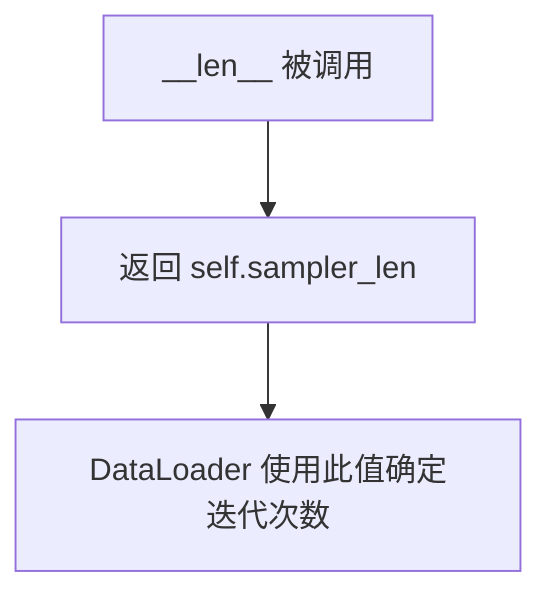

#### 带注释源码

```python
def __len__(self):
    """
    返回总批次数，供 DataLoader 使用以确定迭代的 epoch 数。
    
    该值在 __init__ 中预计算：遍历每个 bucket，将样本按 batch_size 分组，
    跳过不足 batch_size 的最后一批（如果 drop_last=True），
    最终得到所有有效批次的总数。
    """
    return self.sampler_len
```


### `PromptDataset.__len__`

该方法返回数据集中预生成的类别图像样本数量，用于DataLoader确定迭代次数。

参数：

- `self`：隐式参数，`PromptDataset` 类实例本身，无需显式传递

返回值：`int`，返回数据集中样本的数量（即 `num_samples`），供 `len()` 函数调用或 DataLoader 确定批次数量。

#### 流程图

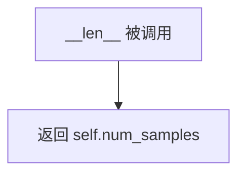

#### 带注释源码

```python
def __len__(self):
    """
    返回数据集中样本的数量。
    
    该方法实现 Python 的 len() 协议，使 Dataset 对象可以配合
    DataLoader 使用，后者需要通过此方法确定数据集大小和迭代次数。
    
    Returns:
        int: 初始化时传入的样本数量 num_samples
    """
    return self.num_samples
```


### `PromptDataset.__getitem__`

该方法根据给定的索引值，从数据集中获取对应的提示词和索引信息，并返回一个包含提示词（prompt）和索引（index）的字典。

参数：

- `index`：`int`，数据集中的索引位置，用于定位需要获取的样本

返回值：`Dict[str, Any]`，返回包含提示词（prompt）和索引（index）的字典

#### 流程图

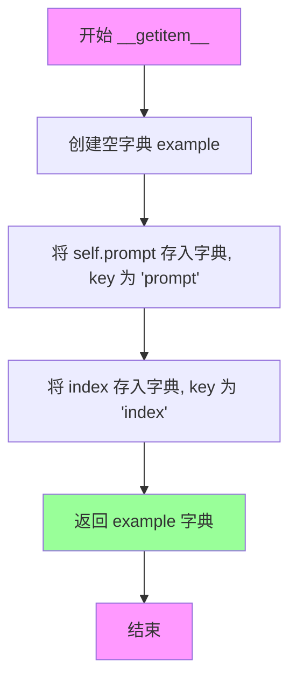

#### 带注释源码

```python
def __getitem__(self, index):
    """
    根据索引获取数据集中对应的样本。
    
    参数:
        index: int - 数据集中的索引位置
        
    返回:
        Dict[str, Any] - 包含提示词和索引的字典
    """
    # 创建一个空字典用于存储样本数据
    example = {}
    
    # 将提示词存入字典，使用 'prompt' 作为键
    # 这里每个样本都使用相同的提示词（self.prompt）
    example["prompt"] = self.prompt
    
    # 将当前索引存入字典，使用 'index' 作为键
    # 这个索引对应于样本在数据集中的原始位置
    example["index"] = index
    
    # 返回包含提示词和索引的字典
    # 字典结构: {"prompt": <提示词>, "index": <索引值>}
    return example
```

## 关键组件


### 张量索引与惰性加载

代码中实现了基于bucket的图像索引系统和延迟计算机制。BucketBatchSampler类根据图像尺寸将样本分组到不同的bucket中，每个bucket独立打乱并生成batch，避免了跨bucket导致的图像resize损失。数据集在初始化时仅记录图像路径和bucket索引，实际像素值在训练循环中按需加载。文本嵌入也支持预计算缓存(cache_latents或custom_instance_prompts时)，减少训练迭代中的重复计算。

### 反量化支持

代码通过bnb_quantization_config_path参数支持BitsAndBytes量化配置加载，可加载4bit/8bit量化模型。transformer模型加载后通过prepare_model_for_kbit_training准备量化训练。保存checkpoint时可选择upcast_before_saving将权重恢复到float32。此外支持FP8训练模式，通过do_fp8_training标志启用torchao.float8的Float8LinearConfig进行FP8转换。

### 量化策略

代码支持两种量化路径：1) BitsAndBytes的4bit量化，通过bnb_quantization_config_path指定JSON配置文件，加载时转换为指定compute_dtype；2) FP8训练，使用convert_to_float8_training配合module_filter_fn过滤特定模块(如proj_out和维度不可被16整除的Linear层)。权重保存时可通过upcast_before_saving控制是否转换为float32。

### DreamBoothDataset

数据集类，负责实例图像和类图像的加载与预处理。支持从HuggingFace Hub或本地目录加载数据，通过find_nearest_bucket动态选择最佳分辨率bucket。实现了图像的EXIF转置、RGB转换、bucket匹配和transform处理。包含custom_instance_prompts支持自定义文本描述。

### BucketBatchSampler

自定义BatchSampler，按bucket分组索引并在每个bucket内独立打乱。预生成所有batch以提高数据加载效率，避免训练过程中的随机性带来的不一致性。drop_last参数控制是否丢弃不完整的batch。

### Flux2KleinPipeline

diffusers库提供的完整推理pipeline，包含VAE、transformer和文本编码器。用于prior preservation阶段的类图像生成和最终验证推理。支持LoRA权重加载( load_lora_weights)和保存(save_lora_weights)。

### LoRA适配器配置

通过LoraConfig配置LoRA参数(rank、alpha、dropout、target_modules)，使用transformer.add_adapter添加可训练适配器。保存时通过get_peft_model_state_dict提取可训练参数，支持FSDP分布式训练状态字典处理。

### 训练主循环

main函数实现完整的DreamBooth训练流程：1)accelerator初始化；2)模型和tokenizer加载；3)prior preservation类图像生成；4)数据准备与文本嵌入预计算；5)训练循环(噪声采样、flow matching、loss计算、梯度更新)；6)checkpoint保存；7)LoRA权重保存与最终验证。

### 验证与日志

log_validation函数执行训练过程中的图像生成验证，支持TensorBoard和WandB两种日志方式。保存模型卡片( save_model_card)包含训练元信息、触发词和使用示例。


## 问题及建议


### 已知问题

-   **模块化不足**：整个训练脚本约2000+行代码，所有功能都堆在一个文件中，缺乏合理的模块划分和职责分离，导致代码难以维护和测试。
-   **全局变量耦合**：大量依赖全局变量`args`，使得函数难以独立测试和复用，单元测试困难。
-   **潜在的bug**：训练结束时`images = None`会覆盖之前保存的验证图像，导致最终保存的`images`始终为`None`。
-   **魔法数字和硬编码**：代码中存在多个硬编码值（如`args.text_encoder_out_layers`默认值、`1000`用于timestep缩放），缺乏配置化。
-   **不安全的属性访问**：直接访问`vae.bn.running_mean`和`vae.bn.running_var`等内部属性，违反封装原则，可能因版本升级而失效。
-   **内存管理不完善**：多次调用`free_memory()`和手动`del`操作分散在代码各处，容易遗漏且不够优雅。
-   **数据加载性能**：默认`dataloader_num_workers=0`，在多GPU训练时会成为瓶颈。
-   **参数验证不充分**：部分参数组合缺乏充分验证（如`lora_layers`为空字符串时的行为）。

### 优化建议

-   **模块化重构**：将数据集处理、模型加载、训练循环、验证逻辑等拆分为独立模块或类，提高代码可读性和可测试性。
-   **配置对象化**：使用dataclass或Pydantic定义配置类，替代全局`args`字典，提供类型检查和默认值管理。
-   **封装VAE统计量**：通过公共接口获取`latents_bn_mean`和`latents_bn_std`，避免直接访问内部属性。
-   **集中内存管理**：实现上下文管理器或使用`__del__`/`finally`块集中处理资源释放逻辑。
-   **增加数据加载workers**：根据系统资源合理设置`dataloader_num_workers`默认值（建议至少4）。
-   **统一日志和异常处理**：建立统一的日志记录和异常捕获机制，避免每个函数独立处理。
-   **增加单元测试**：对关键函数（如`collate_fn`、`BucketBatchSampler`、数据增强）编写单元测试。

## 其它


### 设计目标与约束

本项目的设计目标是实现Flux.2模型的DreamBooth LoRA微调训练，主要约束包括：支持DreamBooth训练范式，通过LoRA实现参数高效微调；支持prior preservation防止模型遗忘；支持Aspect Ratio Buckets优化不同分辨率图像训练；支持多GPU分布式训练和混合精度训练；依赖diffusers>=0.37.0、transformers>=4.41.2、torch>=2.0.0等版本。

### 错误处理与异常设计

代码在多处实现了错误处理与异常设计。在parse_args函数中，对必填参数进行校验，如dataset_name和instance_data_dir互斥、bnb_quantization_config_path与do_fp8_training互斥、prior preservation模式下必须指定class_data_dir和class_prompt等。在ImportError处理上，通过try-except捕获datasets、bitsandbytes、prodigyopt等可选依赖的导入错误并给出友好提示。对于MPS+bf16、TF32等不支持的配置组合，在运行时检测并抛出ValueError。训练过程中的异常通过accelerator的同步机制和checkpoint机制进行处理。

### 数据流与状态机

训练数据流经过以下阶段：Dataset加载→BucketBatchSampler分组→collate_fn批量处理→VAE编码到latent空间→噪声调度器采样timestep→添加噪声得到noisy latents→Transformer预测噪声残差→计算加权MSE损失→反向传播更新LoRA参数。验证阶段在指定epoch进行推理，使用log_validation函数生成样本图像并记录到tensorboard/wandb。状态机包括：初始化→数据准备→prior generation(若启用)→文本编码预计算→训练循环→checkpoint保存→最终验证→模型导出。

### 外部依赖与接口契约

主要外部依赖包括：diffusers库提供Flux2KleinPipeline、AutoencoderKLFlux2、Flux2Transformer2DModel等模型类；transformers库提供Qwen2TokenizerFast、Qwen3ForCausalLM；peft库提供LoraConfig和相关工具；accelerate库提供分布式训练和混合精度支持；bitsandbytes提供8-bit Adam优化器；datasets库可选用于加载 HuggingFace数据集。接口契约方面，脚本接受约80个命令行参数，主要通过argparse解析；输出包括checkpoint目录、LoRA权重文件、训练日志和可选的验证图像。

### 性能考虑

性能优化措施包括：gradient_checkpointing减少显存占用；gradient_accumulation_steps增大有效batch size；mixed_precision(f16/bf16)减少显存和加速计算；vae/text_encoder offload减少训练时显存占用；latent caching减少重复编码开销；FSDP支持大规模分布式训练；TF32加速Ampere GPU计算。内存优化通过free_memory()、to("cpu")及时释放不再使用的模型。

### 安全性考虑

代码安全性设计包括：hub_token不能与wandb同时使用(安全风险)；在分布式训练中使用barrier同步；checkpoint保存前检查checkpoints_total_limit防止磁盘占满；模型权重保存时可选upcast到float32防止精度丢失；通过accelerator的安全机制处理分布式训练中的状态保存和恢复。

### 配置管理

配置管理采用命令行参数+配置文件混合模式。所有训练超参通过argparse定义并可从命令行传入，支持从JSON文件加载bnb_quantization_config_path。模型配置通过pretrained_model_name_or_path从HuggingFace Hub或本地路径加载。Aspect ratio buckets通过parse_buckets_string解析为列表。优化器参数(beta1/beta2/epsilon/weight_decay等)可独立配置。LoRA配置(rank/alpha/dropout/target_modules)可通过参数定制。

### 版本兼容性

版本兼容性设计包括：check_min_version("0.37.0.dev0")确保diffusers最低版本；对MPS后端进行特殊处理(pytorch#99272)；对NPU设备支持flash attention；TF32仅在Ampere+CUDA可用时启用；bnb_quantization_config支持load_in_4bit选项；prodigy优化器的bias_correction和safeguard_warmup选项具有默认值以保持向后兼容。

    