# `diffusers\examples\dreambooth\train_dreambooth_lora_flux2_klein_img2img.py` 详细设计文档

A comprehensive DreamBooth training script for the Flux.2 (Klein) image-to-image diffusion model using LoRA, featuring aspect ratio bucketing for efficient training, mixed precision support (FP16/BF16/FP8), and distributed execution via HuggingFace Accelerate.

## 整体流程

```mermaid
graph TD
    Start[Parse CLI Args] --> InitAccel[Initialize Accelerator & Logging]
    InitAccel --> LoadModels[Load VAE, Transformer, TextEncoder & Tokenizer]
    LoadModels --> PrepareData[Create DreamBoothDataset & BucketBatchSampler]
    PrepareData --> SetupTraining[Setup Optimizer, LR Scheduler & LoRA Adapters]
    SetupTraining --> TrainLoop{Training Loop (Epochs)]
    TrainLoop --> Batch[Fetch Batch]
    Batch --> EncodeText[Encode Text Prompts (Cache or On-the-fly)]
    EncodeText --> EncodeImg[Encode Images to Latents via VAE]
    EncodeImg --> AddNoise[Sample Noise & Timesteps (Flow Matching)]
    AddNoise --> Forward[Transformer Forward Pass]
    Forward --> ComputeLoss[Compute Loss (Noise Prediction)]
    ComputeLoss --> Backward[Backward Pass & Optimizer Step]
    Backward --> Checkpoint{Time for Checkpoint/Validation?}
    Checkpoint -- Yes --> SaveState[Save Checkpoint & Run Validation]
    Checkpoint -- No --> TrainLoop
    SaveState --> TrainLoop
    TrainLoop -- Finished --> SaveLora[Save LoRA Weights & Model Card]
    SaveLora --> End[Finish]
```

## 类结构

```
Script Root
├── DreamBoothDataset (Data Processing & Transformation)
├── BucketBatchSampler (Aspect Ratio Bucket Sampling)
├── PromptDataset (Class Image Generation)
├── main (Main Training Orchestration)
├── parse_args (CLI Argument Parser)
├── save_model_card (Model Card Generation)
├── log_validation (Validation Inference)
└── Helper Functions (collate_fn, module_filter_fn)
```

## 全局变量及字段


### `logger`
    
Module-level logger for debugging and info output

类型：`logging.Logger`
    


### `args`
    
Global namespace object storing all parsed command-line arguments

类型：`argparse.Namespace`
    


### `DreamBoothDataset.size`
    
Target resolution for images

类型：`int`
    


### `DreamBoothDataset.center_crop`
    
Whether to center crop images

类型：`bool`
    


### `DreamBoothDataset.instance_prompt`
    
The prompt used for instance images

类型：`str`
    


### `DreamBoothDataset.buckets`
    
Aspect ratio buckets for bucketed training

类型：`list`
    


### `DreamBoothDataset.pixel_values`
    
Processed source image tensors

类型：`list`
    


### `DreamBoothDataset.cond_pixel_values`
    
Processed condition/target image tensors

类型：`list`
    


### `DreamBoothDataset.custom_instance_prompts`
    
User-provided captions

类型：`list`
    


### `BucketBatchSampler.dataset`
    
The dataset to sample from

类型：`DreamBoothDataset`
    


### `BucketBatchSampler.batch_size`
    
Batch size

类型：`int`
    


### `BucketBatchSampler.bucket_indices`
    
A list of lists, where each sublist contains indices for a specific bucket

类型：`list`
    


### `BucketBatchSampler.batches`
    
Pre-computed list of batches

类型：`list`
    


### `PromptDataset.prompt`
    
The text prompt

类型：`str`
    


### `PromptDataset.num_samples`
    
Number of samples to generate

类型：`int`
    
    

## 全局函数及方法


### `parse_args`

定义并解析 Flux.2 Dreambooth LoRA 训练脚本的所有命令行参数，支持模型路径、数据集配置、训练超参数、LoRA 设置、优化器配置、验证选项、分布式训练等上百个参数的灵活设置，并包含必要的参数校验逻辑。

参数：

- `input_args`：`Optional[List[str]]`，可选，用于测试或脚本内部调用的命令行参数列表，默认为 `None`

返回值：`Namespace`，返回包含所有解析后命令行参数的命名空间对象，其中包含模型路径、数据集配置、训练超参数、LoRA 设置、优化器参数、验证选项、分布式训练配置等上百个属性

#### 流程图

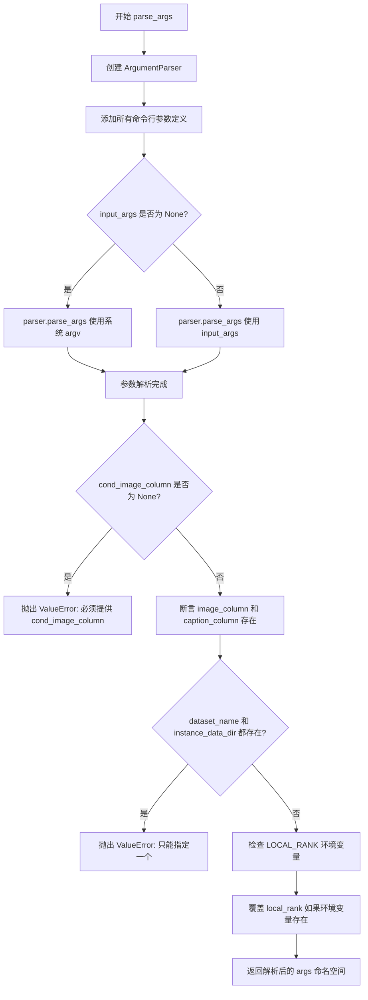

#### 带注释源码

```python
def parse_args(input_args=None):
    """
    定义并解析 Flux.2 Dreambooth LoRA 训练脚本的所有命令行参数。
    
    参数:
        input_args: 可选的命令行参数列表，用于测试或脚本内部调用。
                   如果为 None，则从 sys.argv 解析。
    
    返回:
        包含所有解析后命令行参数的命名空间对象。
    """
    # 1. 创建参数解析器，描述训练脚本用途
    parser = argparse.ArgumentParser(description="Simple example of a training script.")
    
    # ==================== 模型相关参数 ====================
    # 预训练模型路径或模型标识符（必需）
    parser.add_argument(
        "--pretrained_model_name_or_path",
        type=str,
        default=None,
        required=True,
        help="Path to pretrained model or model identifier from huggingface.co/models.",
    )
    # 预训练模型的版本修订号
    parser.add_argument(
        "--revision",
        type=str,
        default=None,
        required=False,
        help="Revision of pretrained model identifier from huggingface.co/models.",
    )
    # BitsAndBytes 量化配置文件路径
    parser.add_argument(
        "--bnb_quantization_config_path",
        type=str,
        default=None,
        help="Quantization config in a JSON file that will be used to define the bitsandbytes quant config of the DiT.",
    )
    # 是否进行 FP8 训练
    parser.add_argument(
        "--do_fp8_training",
        action="store_true",
        help="if we are doing FP8 training.",
    )
    # 模型文件变体（如 fp16）
    parser.add_argument(
        "--variant",
        type=str,
        default=None,
        help="Variant of the model files of the pretrained model identifier from huggingface.co/models, 'e.g.' fp16",
    )
    
    # ==================== 数据集相关参数 ====================
    # 数据集名称（支持 HuggingFace Hub 或本地路径）
    parser.add_argument(
        "--dataset_name",
        type=str,
        default=None,
        help=(
            "The name of the Dataset (from the HuggingFace hub) containing the training data of instance images (could be your own, possibly private,"
            " dataset). It can also be a path pointing to a local copy of a dataset in your filesystem,"
            " or to a folder containing files that 🤗 Datasets can understand."
        ),
    )
    # 数据集配置名称
    parser.add_argument(
        "--dataset_config_name",
        type=str,
        default=None,
        help="The config of the Dataset, leave as None if there's only one config.",
    )
    # 本地实例数据目录
    parser.add_argument(
        "--instance_data_dir",
        type=str,
        default=None,
        help=("A folder containing the training data. "),
    )
    # 缓存目录
    parser.add_argument(
        "--cache_dir",
        type=str,
        default=None,
        help="The directory where the downloaded models and datasets will be stored.",
    )
    # 数据集列名配置
    parser.add_argument(
        "--image_column",
        type=str,
        default="image",
        help="The column of the dataset containing the target image. By "
        "default, the standard Image Dataset maps out 'file_name' "
        "to 'image'.",
    )
    parser.add_argument(
        "--cond_image_column",
        type=str,
        default=None,
        help="Column in the dataset containing the condition image. Must be specified when performing I2I fine-tuning",
    )
    parser.add_argument(
        "--caption_column",
        type=str,
        default=None,
        help="The column of the dataset containing the instance prompt for each image",
    )
    # 训练数据重复次数
    parser.add_argument("--repeats", type=int, default=1, help="How many times to repeat the training data.")
    
    # ==================== 提示词与验证参数 ====================
    # 类别数据目录
    parser.add_argument(
        "--class_data_dir",
        type=str,
        default=None,
        required=False,
        help="A folder containing the training data of class images.",
    )
    # 实例提示词
    parser.add_argument(
        "--instance_prompt",
        type=str,
        default=None,
        required=False,
        help="The prompt with identifier specifying the instance, e.g. 'photo of a TOK dog', 'in the style of TOK'",
    )
    # T5 文本编码器最大序列长度
    parser.add_argument(
        "--max_sequence_length",
        type=int,
        default=512,
        help="Maximum sequence length to use with with the T5 text encoder",
    )
    # 验证提示词
    parser.add_argument(
        "--validation_prompt",
        type=str,
        default=None,
        help="A prompt that is used during validation to verify that the model is learning.",
    )
    # 验证图像路径
    parser.add_argument(
        "--validation_image",
        type=str,
        default=None,
        help="path to an image that is used during validation as the condition image to verify that the model is learning.",
    )
    # 跳过最终推理
    parser.add_argument(
        "--skip_final_inference",
        default=False,
        action="store_true",
        help="Whether to skip the final inference step with loaded lora weights upon training completion. This will run intermediate validation inference if `validation_prompt` is provided. Specify to reduce memory.",
    )
    # 最终验证提示词
    parser.add_argument(
        "--final_validation_prompt",
        type=str,
        default=None,
        help="A prompt that is used during a final validation to verify that the model is learning. Ignored if `--validation_prompt` is provided.",
    )
    # 验证图像数量
    parser.add_argument(
        "--num_validation_images",
        type=int,
        default=4,
        help="Number of images that should be generated during validation with `validation_prompt`.",
    )
    # 验证周期间隔
    parser.add_argument(
        "--validation_epochs",
        type=int,
        default=50,
        help=(
            "Run dreambooth validation every X epochs. Dreambooth validation consists of running the prompt"
            " `args.validation_prompt` multiple times: `args.num_validation_images`."
        ),
    )
    
    # ==================== LoRA 参数 ====================
    # LoRA 秩维度
    parser.add_argument(
        "--rank",
        type=int,
        default=4,
        help=("The dimension of the LoRA update matrices."),
    )
    # LoRA alpha 缩放因子
    parser.add_argument(
        "--lora_alpha",
        type=int,
        default=4,
        help="LoRA alpha to be used for additional scaling.",
    )
    # LoRA dropout 概率
    parser.add_argument("--lora_dropout", type=float, default=0.0, help="Dropout probability for LoRA layers")
    # 要应用 LoRA 的层
    parser.add_argument(
        "--lora_layers",
        type=str,
        default=None,
        help=(
            'The transformer modules to apply LoRA training on. Please specify the layers in a comma separated. E.g. - "to_k,to_q,to_v,to_out.0" will result in lora training of attention layers only'
        ),
    )
    
    # ==================== 输出与随机性参数 ====================
    # 输出目录
    parser.add_argument(
        "--output_dir",
        type=str,
        default="flux-dreambooth-lora",
        help="The output directory where the model predictions and checkpoints will be written.",
    )
    # 随机种子
    parser.add_argument("--seed", type=int, default=None, help="A seed for reproducible training.")
    
    # ==================== 图像处理参数 ====================
    # 输入图像分辨率
    parser.add_argument(
        "--resolution",
        type=int,
        default=512,
        help=(
            "The resolution for input images, all the images in the train/validation dataset will be resized to this"
            " resolution"
        ),
    )
    # 宽高比桶
    parser.add_argument(
        "--aspect_ratio_buckets",
        type=str,
        default=None,
        help=(
            "Aspect ratio buckets to use for training. Define as a string of 'h1,w1;h2,w2;...'. "
            "e.g. '1024,1024;768,1360;1360,768;880,1168;1168,880;1248,832;832,1248'"
            "Images will be resized and cropped to fit the nearest bucket. If provided, --resolution is ignored."
        ),
    )
    # 中心裁剪
    parser.add_argument(
        "--center_crop",
        default=False,
        action="store_true",
        help=(
            "Whether to center crop the input images to the resolution. If not set, the images will be randomly"
            " cropped. The images will be resized to the resolution first before cropping."
        ),
    )
    # 随机水平翻转
    parser.add_argument(
        "--random_flip",
        action="store_true",
        help="whether to randomly flip images horizontally",
    )
    
    # ==================== 训练批处理参数 ====================
    # 训练批大小
    parser.add_argument(
        "--train_batch_size", type=int, default=4, help="Batch size (per device) for the training dataloader."
    )
    # 采样批大小
    parser.add_argument(
        "--sample_batch_size", type=int, default=4, help="Batch size (per device) for sampling images."
    )
    # 训练轮数
    parser.add_argument("--num_train_epochs", type=int, default=1)
    # 最大训练步数
    parser.add_argument(
        "--max_train_steps",
        type=int,
        default=None,
        help="Total number of training steps to perform.  If provided, overrides num_train_epochs.",
    )
    
    # ==================== 检查点与恢复参数 ====================
    # 检查点保存间隔步数
    parser.add_argument(
        "--checkpointing_steps",
        type=int,
        default=500,
        help=(
            "Save a checkpoint of the training state every X updates. These checkpoints can be used both as final"
            " checkpoints in case they are better than the last checkpoint, and are also suitable for resuming"
            " training using `--resume_from_checkpoint`."
        ),
    )
    # 最大检查点数量
    parser.add_argument(
        "--checkpoints_total_limit",
        type=int,
        default=None,
        help=("Max number of checkpoints to store."),
    )
    # 从检查点恢复训练
    parser.add_argument(
        "--resume_from_checkpoint",
        type=str,
        default=None,
        help=(
            "Whether training should be resumed from a previous checkpoint. Use a path saved by"
            ' `--checkpointing_steps`, or `"latest"` to automatically select the last available checkpoint.'
        ),
    )
    
    # ==================== 梯度与优化参数 ====================
    # 梯度累积步数
    parser.add_argument(
        "--gradient_accumulation_steps",
        type=int,
        default=1,
        help="Number of updates steps to accumulate before performing a backward/update pass.",
    )
    # 梯度检查点
    parser.add_argument(
        "--gradient_checkpointing",
        action="store_true",
        help="Whether or not to use gradient checkpointing to save memory at the expense of slower backward pass.",
    )
    # 学习率
    parser.add_argument(
        "--learning_rate",
        type=float,
        default=1e-4,
        help="Initial learning rate (after the potential warmup period) to use.",
    )
    # 引导尺度
    parser.add_argument(
        "--guidance_scale",
        type=float,
        default=3.5,
        help="the FLUX.1 dev variant is a guidance distilled model",
    )
    # 是否按 GPU/梯度累积/批大小缩放学习率
    parser.add_argument(
        "--scale_lr",
        action="store_true",
        default=False,
        help="Scale the learning rate by the number of GPUs, gradient accumulation steps, and batch size.",
    )
    # 学习率调度器类型
    parser.add_argument(
        "--lr_scheduler",
        type=str,
        default="constant",
        help=(
            'The scheduler type to use. Choose between ["linear", "cosine", "cosine_with_restarts", "polynomial",'
            ' "constant", "constant_with_warmup"]'
        ),
    )
    # 学习率预热步数
    parser.add_argument(
        "--lr_warmup_steps", type=int, default=500, help="Number of steps for the warmup in the lr scheduler."
    )
    # 余弦调度器重启次数
    parser.add_argument(
        "--lr_num_cycles",
        type=int,
        default=1,
        help="Number of hard resets of the lr in cosine_with_restarts scheduler.",
    )
    # 多项式调度器幂次
    parser.add_argument("--lr_power", type=float, default=1.0, help="Power factor of the polynomial scheduler.")
    # 数据加载器工作进程数
    parser.add_argument(
        "--dataloader_num_workers",
        type=int,
        default=0,
        help=(
            "Number of subprocesses to use for data loading. 0 means that the data will be loaded in the main process."
        ),
    )
    
    # ==================== 采样加权参数 ====================
    # 加权采样方案
    parser.add_argument(
        "--weighting_scheme",
        type=str,
        default="none",
        choices=["sigma_sqrt", "logit_normal", "mode", "cosmap", "none"],
        help=('We default to the "none" weighting scheme for uniform sampling and uniform loss'),
    )
    # logit_normal 均值
    parser.add_argument(
        "--logit_mean", type=float, default=0.0, help="mean to use when using the `'logit_normal'` weighting scheme."
    )
    # logit_normal 标准差
    parser.add_argument(
        "--logit_std", type=float, default=1.0, help="std to use when using the `'logit_normal'` weighting scheme."
    )
    # mode 加权方案尺度
    parser.add_argument(
        "--mode_scale",
        type=float,
        default=1.29,
        help="Scale of mode weighting scheme. Only effective when using the `'mode'` as the `weighting_scheme`.",
    )
    
    # ==================== 优化器参数 ====================
    # 优化器类型
    parser.add_argument(
        "--optimizer",
        type=str,
        default="AdamW",
        help=('The optimizer type to use. Choose between ["AdamW", "prodigy"]'),
    )
    # 使用 8-bit Adam
    parser.add_argument(
        "--use_8bit_adam",
        action="store_true",
        help="Whether or not to use 8-bit Adam from bitsandbytes. Ignored if optimizer is not set to AdamW",
    )
    # Adam beta1
    parser.add_argument(
        "--adam_beta1", type=float, default=0.9, help="The beta1 parameter for the Adam and Prodigy optimizers."
    )
    # Adam beta2
    parser.add_argument(
        "--adam_beta2", type=float, default=0.999, help="The beta2 parameter for the Adam and Prodigy optimizers."
    )
    # Prodigy beta3
    parser.add_argument(
        "--prodigy_beta3",
        type=float,
        default=None,
        help="coefficients for computing the Prodigy stepsize using running averages. If set to None, "
        "uses the value of square root of beta2. Ignored if optimizer is adamW",
    )
    # Prodigy 解耦权重衰减
    parser.add_argument("--prodigy_decouple", type=bool, default=True, help="Use AdamW style decoupled weight decay")
    # Transformer 权重衰减
    parser.add_argument("--adam_weight_decay", type=float, default=1e-04, help="Weight decay to use for unet params")
    # 文本编码器权重衰减
    parser.add_argument(
        "--adam_weight_decay_text_encoder", type=float, default=1e-03, help="Weight decay to use for text_encoder"
    )
    # Adam epsilon
    parser.add_argument(
        "--adam_epsilon",
        type=float,
        default=1e-08,
        help="Epsilon value for the Adam optimizer and Prodigy optimizers.",
    )
    # Prodigy 偏差校正
    parser.add_argument(
        "--prodigy_use_bias_correction",
        type=bool,
        default=True,
        help="Turn on Adam's bias correction. True by default. Ignored if optimizer is adamW",
    )
    # Prodigy 预热保护
    parser.add_argument(
        "--prodigy_safeguard_warmup",
        type=bool,
        default=True,
        help="Remove lr from the denominator of D estimate to avoid issues during warm-up stage. True by default. "
        "Ignored if optimizer is adamW",
    )
    # 最大梯度范数
    parser.add_argument("--max_grad_norm", default=1.0, type=float, help="Max gradient norm.")
    
    # ==================== Hub 与日志参数 ====================
    # 推送到 Hub
    parser.add_argument("--push_to_hub", action="store_true", help="Whether or not to push the model to the Hub.")
    # Hub token
    parser.add_argument("--hub_token", type=str, default=None, help="The token to use to push to the Model Hub.")
    # Hub 模型 ID
    parser.add_argument(
        "--hub_model_id",
        type=str,
        default=None,
        help="The name of the repository to keep in sync with the local `output_dir`.",
    )
    # 日志目录
    parser.add_argument(
        "--logging_dir",
        type=str,
        default="logs",
        help=(
            "[TensorBoard](https://www.tensorflow.org/tensorboard) log directory. Will default to"
            " *output_dir/runs/**CURRENT_DATETIME_HOSTNAME***."
        ),
    )
    
    # ==================== 性能与精度参数 ====================
    # 允许 TF32
    parser.add_argument(
        "--allow_tf32",
        action="store_true",
        help=(
            "Whether or not to allow TF32 on Ampere GPUs. Can be used to speed up training. For more information, see"
            " https://pytorch.org/docs/stable/notes/cuda.html#tensorfloat-32-tf32-on-ampere-devices"
        ),
    )
    # 缓存 VAE 潜在向量
    parser.add_argument(
        "--cache_latents",
        action="store_true",
        default=False,
        help="Cache the VAE latents",
    )
    # 日志报告目标
    parser.add_argument(
        "--report_to",
        type=str,
        default="tensorboard",
        help=(
            'The integration to report the results and logs to. Supported platforms are `"tensorboard"`'
            ' (default), `"wandb"` and `"comet_ml"`. Use `"all"` to report to all integrations.'
        ),
    )
    # 混合精度类型
    parser.add_argument(
        "--mixed_precision",
        type=str,
        default=None,
        choices=["no", "fp16", "bf16"],
        help=(
            "Whether to use mixed precision. Choose between fp16 and bf16 (bfloat16). Bf16 requires PyTorch >="
            " 1.10.and an Nvidia Ampere GPU.  Default to the value of accelerate config of the current system or the"
            " flag passed with the `accelerate.launch` command. Use this argument to override the accelerate config."
        ),
    )
    # 保存前转换为 float32
    parser.add_argument(
        "--upcast_before_saving",
        action="store_true",
        default=False,
        help=(
            "Whether to upcast the trained transformer layers to float32 before saving (at the end of training). "
            "Defaults to precision dtype used for training to save memory"
        ),
    )
    # 卸载 VAE 和文本编码器到 CPU
    parser.add_argument(
        "--offload",
        action="store_true",
        help="Whether to offload the VAE and the text encoder to CPU when they are not used.",
    )
    
    # ==================== 分布式训练参数 ====================
    # 本地排名
    parser.add_argument("--local_rank", type=int, default=-1, help="For distributed training: local_rank")
    # 启用 NPU Flash Attention
    parser.add_argument("--enable_npu_flash_attention", action="store_true", help="Enabla Flash Attention for NPU")
    # 对文本编码器使用 FSDP
    parser.add_argument("--fsdp_text_encoder", action="store_true", help="Use FSDP for text encoder")
    
    # 2. 解析参数
    if input_args is not None:
        args = parser.parse_args(input_args)
    else:
        args = parser.parse_args()
    
    # ==================== 参数校验 ====================
    # I2I 训练必须提供条件图像列
    if args.cond_image_column is None:
        raise ValueError(
            "you must provide --cond_image_column for image-to-image training. Otherwise please see Flux2 text-to-image training example."
        )
    else:
        # 断言必需的列存在
        assert args.image_column is not None
        assert args.caption_column is not None
    
    # 数据集来源互斥校验
    if args.dataset_name is None and args.instance_data_dir is None:
        raise ValueError("Specify either `--dataset_name` or `--instance_data_dir`")
    
    if args.dataset_name is not None and args.instance_data_dir is not None:
        raise ValueError("Specify only one of `--dataset_name` or `--instance_data_dir`")
    
    # 环境变量覆盖 local_rank
    env_local_rank = int(os.environ.get("LOCAL_RANK", -1))
    if env_local_rank != -1 and env_local_rank != args.local_rank:
        args.local_rank = env_local_rank
    
    # 3. 返回解析后的参数命名空间
    return args
```


### `main`

The `main` function is the core entry point for the Flux2 DreamBooth LoRA training script. It orchestrates the entire training pipeline, including model initialization (VAE, transformer, text encoder), dataset preparation, LoRA adapter configuration, optimizer setup, learning rate scheduler configuration, the main training loop with gradient accumulation, checkpoint saving, validation inference, and final model weights persistence.

参数：

- `args`：`argparse.Namespace`，包含所有训练配置参数的对象，由 `parse_args()` 函数解析命令行参数生成。包含模型路径、数据目录、训练超参数（batch size、learning rate等）、LoRA配置、验证设置等所有训练所需的参数。

返回值：`None`，该函数执行完整的训练流程并保存模型权重，不返回任何值。

#### 流程图

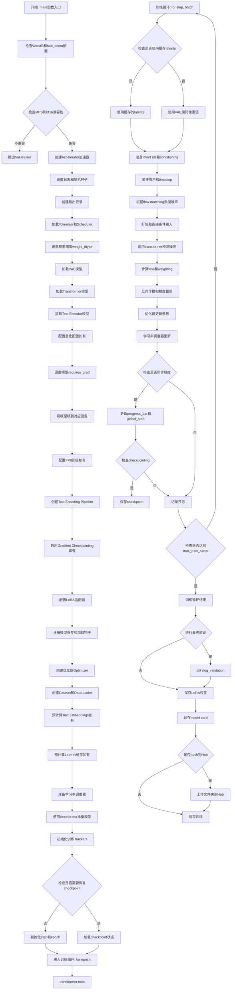

#### 带注释源码

```python
def main(args):
    """
    Flux2 DreamBooth LoRA 训练主函数
    
    完整的训练流程：
    1. 模型初始化和加载
    2. 数据集和DataLoader准备
    3. 优化器和学习率调度器配置
    4. 训练循环（包含前向传播、损失计算、反向传播）
    5. Checkpoint保存和验证
    6. 模型权重保存和Hub上传
    """
    # 检查WandB和hub_token的配置安全性
    if args.report_to == "wandb" and args.hub_token is not None:
        raise ValueError(
            "You cannot use both --report_to=wandb and --hub_token due to a security risk of exposing your token."
            " Please use `hf auth login` to authenticate with the Hub."
        )

    # 检查MPS是否支持bf16混合精度
    if torch.backends.mps.is_available() and args.mixed_precision == "bf16":
        raise ValueError(
            "Mixed precision training with bfloat16 is not supported on MPS. Please use fp16 (recommended) or fp32 instead."
        )
    
    # 配置FP8训练（如果启用）
    if args.do_fp8_training:
        from torchao.float8 import Float8LinearConfig, convert_to_float8_training

    # 构建日志输出目录
    logging_dir = Path(args.output_dir, args.logging_dir)

    # 配置Accelerator项目设置
    accelerator_project_config = ProjectConfiguration(project_dir=args.output_dir, logging_dir=logging_dir)
    kwargs = DistributedDataParallelKwargs(find_unused_parameters=True)
    accelerator = Accelerator(
        gradient_accumulation_steps=args.gradient_accumulation_steps,
        mixed_precision=args.mixed_precision,
        log_with=args.report_to,
        project_config=accelerator_project_config,
        kwargs_handlers=[kwargs],
    )

    # MPS设备禁用AMP
    if torch.backends.mps.is_available():
        accelerator.native_amp = False

    # 检查WandB是否安装
    if args.report_to == "wandb":
        if not is_wandb_available():
            raise ImportError("Make sure to install wandb if you want to use it for logging during training.")

    # 配置日志格式
    logging.basicConfig(
        format="%(asctime)s - %(levelname)s - %(name)s - %(message)s",
        datefmt="%m/%d/%Y %H:%M:%S",
        level=logging.INFO,
    )
    logger.info(accelerator.state, main_process_only=False)
    # 主进程设置详细日志，其他进程设置错误日志
    if accelerator.is_local_main_process:
        transformers.utils.logging.set_verbosity_warning()
        diffusers.utils.logging.set_verbosity_info()
    else:
        transformers.utils.logging.set_verbosity_error()
        diffusers.utils.logging.set_verbosity_error()

    # 设置随机种子以确保可重复性
    if args.seed is not None:
        set_seed(args.seed)

    # 处理仓库创建（如果需要push到Hub）
    if accelerator.is_main_process:
        if args.output_dir is not None:
            os.makedirs(args.output_dir, exist_ok=True)

        if args.push_to_hub:
            repo_id = create_repo(
                repo_id=args.hub_model_id or Path(args.output_dir).name,
                exist_ok=True,
            ).repo_id

    # 加载Qwen2分词器
    tokenizer = Qwen2TokenizerFast.from_pretrained(
        args.pretrained_model_name_or_path,
        subfolder="tokenizer",
        revision=args.revision,
    )

    # 根据混合精度配置设置权重数据类型
    weight_dtype = torch.float32
    if accelerator.mixed_precision == "fp16":
        weight_dtype = torch.float16
    elif accelerator.mixed_precision == "bf16":
        weight_dtype = torch.bfloat16

    # 加载噪声调度器（FlowMatchEulerDiscreteScheduler）
    noise_scheduler = FlowMatchEulerDiscreteScheduler.from_pretrained(
        args.pretrained_model_name_or_path,
        subfolder="scheduler",
        revision=args.revision,
    )
    # 创建调度器副本用于timestep采样
    noise_scheduler_copy = copy.deepcopy(noise_scheduler)
    
    # 加载VAE模型
    vae = AutoencoderKLFlux2.from_pretrained(
        args.pretrained_model_name_or_path,
        subfolder="vae",
        revision=args.revision,
        variant=args.variant,
    )
    # 获取VAE batch normalization的均值和标准差用于latent归一化
    latents_bn_mean = vae.bn.running_mean.view(1, -1, 1, 1).to(accelerator.device)
    latents_bn_std = torch.sqrt(vae.bn.running_var.view(1, -1, 1, 1) + vae.config.batch_norm_eps).to(
        accelerator.device
    )

    # 配置BitsAndBytes量化（如果提供配置文件）
    quantization_config = None
    if args.bnb_quantization_config_path is not None:
        with open(args.bnb_quantization_config_path, "r") as f:
            config_kwargs = json.load(f)
            if "load_in_4bit" in config_kwargs and config_kwargs["load_in_4bit"]:
                config_kwargs["bnb_4bit_compute_dtype"] = weight_dtype
        quantization_config = BitsAndBytesConfig(**config_kwargs)

    # 加载Flux2 Transformer模型（DiT）
    transformer = Flux2Transformer2DModel.from_pretrained(
        args.pretrained_model_name_or_path,
        subfolder="transformer",
        revision=args.revision,
        variant=args.variant,
        quantization_config=quantization_config,
        torch_dtype=weight_dtype,
    )
    # 如果使用量化，进行kbit训练准备
    if args.bnb_quantization_config_path is not None:
        transformer = prepare_model_for_kbit_training(transformer, use_gradient_checkpointing=False)

    # 加载Qwen3 Text Encoder
    text_encoder = Qwen3ForCausalLM.from_pretrained(
        args.pretrained_model_name_or_path, subfolder="text_encoder", revision=args.revision, variant=args.variant
    )
    # Text Encoder不参与训练
    text_encoder.requires_grad_(False)

    # 冻结VAE和Transformer（只训练LoRA）
    transformer.requires_grad_(False)
    vae.requires_grad_(False)

    # 配置NPU Flash Attention
    if args.enable_npu_flash_attention:
        if is_torch_npu_available():
            logger.info("npu flash attention enabled.")
            transformer.set_attention_backend("_native_npu")
        else:
            raise ValueError("npu flash attention requires torch_npu extensions and is supported only on npu device ")

    # 再次检查MPS和bf16兼容性
    if torch.backends.mps.is_available() and weight_dtype == torch.bfloat16:
        raise ValueError(
            "Mixed precision training with bfloat16 is not supported on MPS. Please use fp16 (recommended) or fp32 instead."
        )

    # VAE使用weight_dtype以减少内存（flux vae在bf16下稳定）
    to_kwargs = {"dtype": weight_dtype, "device": accelerator.device} if not args.offload else {"dtype": weight_dtype}
    vae.to(**to_kwargs)
    
    # Transformer移到设备（处理量化情况）
    transformer_to_kwargs = (
        {"device": accelerator.device}
        if args.bnb_quantization_config_path is not None
        else {"device": accelerator.device, "dtype": weight_dtype}
    )

    is_fsdp = getattr(accelerator.state, "fsdp_plugin", None) is not None
    if not is_fsdp:
        transformer.to(**transformer_to_kwargs)

    # FP8训练转换
    if args.do_fp8_training:
        convert_to_float8_training(
            transformer, module_filter_fn=module_filter_fn, config=Float8LinearConfig(pad_inner_dim=True)
        )

    # Text Encoder移到设备
    text_encoder.to(**to_kwargs)
    
    # 创建文本编码Pipeline（保持在CPU）
    text_encoding_pipeline = Flux2KleinPipeline.from_pretrained(
        args.pretrained_model_name_or_path,
        vae=None,
        transformer=None,
        tokenizer=tokenizer,
        text_encoder=text_encoder,
        scheduler=None,
        revision=args.revision,
    )

    # 启用梯度检查点以节省内存
    if args.gradient_checkpointing:
        transformer.enable_gradient_checkpointing()

    # 配置LoRA目标层
    if args.lora_layers is not None:
        target_modules = [layer.strip() for layer in args.lora_layers.split(",")]
    else:
        target_modules = ["to_k", "to_q", "to_v", "to_out.0"]

    # 配置LoRA并添加到Transformer
    transformer_lora_config = LoraConfig(
        r=args.rank,
        lora_alpha=args.lora_alpha,
        lora_dropout=args.lora_dropout,
        init_lora_weights="gaussian",
        target_modules=target_modules,
    )
    transformer.add_adapter(transformer_lora_config)

    # 辅助函数：解包模型
    def unwrap_model(model):
        model = accelerator.unwrap_model(model)
        model = model._orig_mod if is_compiled_module(model) else model
        return model

    # === 注册模型保存和加载钩子 ===
    def save_model_hook(models, weights, output_dir):
        """自定义模型保存钩子"""
        transformer_cls = type(unwrap_model(transformer))
        modules_to_save: dict[str, Any] = {}
        transformer_model = None

        # 验证并选择transformer模型
        for model in models:
            if isinstance(unwrap_model(model), transformer_cls):
                transformer_model = model
                modules_to_save["transformer"] = model
            else:
                raise ValueError(f"unexpected save model: {model.__class__}")

        if transformer_model is None:
            raise ValueError("No transformer model found in 'models'")

        # FSDP情况下获取state_dict
        state_dict = accelerator.get_state_dict(model) if is_fsdp else None

        # 仅主进程处理LoRA state dict
        transformer_lora_layers_to_save = None
        if accelerator.is_main_process:
            peft_kwargs = {}
            if is_fsdp:
                peft_kwargs["state_dict"] = state_dict

            transformer_lora_layers_to_save = get_peft_model_state_dict(
                unwrap_model(transformer_model) if is_fsdp else transformer_model,
                **peft_kwargs,
            )

            if is_fsdp:
                transformer_lora_layers_to_save = _to_cpu_contiguous(transformer_lora_layers_to_save)

            # 弹出权重避免重复保存
            if weights:
                weights.pop()

            # 保存LoRA权重
            Flux2KleinPipeline.save_lora_weights(
                output_dir,
                transformer_lora_layers=transformer_lora_layers_to_save,
                **_collate_lora_metadata(modules_to_save),
            )

    def load_model_hook(models, input_dir):
        """自定义模型加载钩子"""
        transformer_ = None

        if not is_fsdp:
            while len(models) > 0:
                model = models.pop()
                if isinstance(unwrap_model(model), type(unwrap_model(transformer))):
                    transformer_ = unwrap_model(model)
                else:
                    raise ValueError(f"unexpected save model: {model.__class__}")
        else:
            # FSDP模式下重新加载transformer并添加LoRA
            transformer_ = Flux2Transformer2DModel.from_pretrained(
                args.pretrained_model_name_or_path,
                subfolder="transformer",
            )
            transformer_.add_adapter(transformer_lora_config)

        # 加载LoRA权重
        lora_state_dict = Flux2KleinPipeline.lora_state_dict(input_dir)
        transformer_state_dict = {
            f"{k.replace('transformer.', '')}": v for k, v in lora_state_dict.items() if k.startswith("transformer.")
        }
        transformer_state_dict = convert_unet_state_dict_to_peft(transformer_state_dict)
        incompatible_keys = set_peft_model_state_dict(transformer_, transformer_state_dict, adapter_name="default")
        
        # 确保可训练参数为float32
        if args.mixed_precision == "fp16":
            models = [transformer_]
            cast_training_params(models)

    accelerator.register_save_state_pre_hook(save_model_hook)
    accelerator.register_load_state_pre_hook(load_model_hook)

    # 启用TF32以加速Ampere GPU训练
    if args.allow_tf32 and torch.cuda.is_available():
        torch.backends.cuda.matmul.allow_tf32 = True

    # 如果启用scale_lr，根据GPU数量、梯度累积和batch size缩放
    if args.scale_lr:
        args.learning_rate = (
            args.learning_rate * args.gradient_accumulation_steps * args.train_batch_size * accelerator.num_processes
        )

    # 确保可训练参数为float32
    if args.mixed_precision == "fp16":
        models = [transformer]
        cast_training_params(models, dtype=torch.float32)

    # 获取LoRA可训练参数
    transformer_lora_parameters = list(filter(lambda p: p.requires_grad, transformer.parameters()))

    # 构建优化器参数
    transformer_parameters_with_lr = {"params": transformer_lora_parameters, "lr": args.learning_rate}
    params_to_optimize = [transformer_parameters_with_lr]

    # === 创建优化器 ===
    if not (args.optimizer.lower() == "prodigy" or args.optimizer.lower() == "adamw"):
        logger.warning(
            f"Unsupported choice of optimizer: {args.optimizer}.Supported optimizers include [adamW, prodigy]."
            "Defaulting to adamW"
        )
        args.optimizer = "adamw"

    if args.use_8bit_adam and not args.optimizer.lower() == "adamw":
        logger.warning(
            f"use_8bit_adam is ignored when optimizer is not set to 'AdamW'. Optimizer was "
            f"set to {args.optimizer.lower()}"
        )

    if args.optimizer.lower() == "adamw":
        if args.use_8bit_adam:
            try:
                import bitsandbytes as bnb
            except ImportError:
                raise ImportError(
                    "To use 8-bit Adam, please install the bitsandbytes library: `pip install bitsandbytes`."
                )
            optimizer_class = bnb.optim.AdamW8bit
        else:
            optimizer_class = torch.optim.AdamW

        optimizer = optimizer_class(
            params_to_optimize,
            betas=(args.adam_beta1, args.adam_beta2),
            weight_decay=args.adam_weight_decay,
            eps=args.adam_epsilon,
        )

    if args.optimizer.lower() == "prodigy":
        try:
            import prodigyopt
        except ImportError:
            raise ImportError("To use Prodigy, please install the prodigyopt library: `pip install prodigyopt`")

        optimizer_class = prodigyopt.Prodigy

        if args.learning_rate <= 0.1:
            logger.warning(
                "Learning rate is too low. When using prodigy, it's generally better to set learning rate around 1.0"
            )

        optimizer = optimizer_class(
            params_to_optimize,
            betas=(args.adam_beta1, args.adam_beta2),
            beta3=args.prodigy_beta3,
            weight_decay=args.adam_weight_decay,
            eps=args.adam_epsilon,
            decouple=args.prodigy_decouple,
            use_bias_correction=args.prodigy_use_bias_correction,
            safeguard_warmup=args.prodigy_safeguard_warmup,
        )

    # === 配置Aspect Ratio Buckets ===
    if args.aspect_ratio_buckets is not None:
        buckets = parse_buckets_string(args.aspect_ratio_buckets)
    else:
        buckets = [(args.resolution, args.resolution)]
    logger.info(f"Using parsed aspect ratio buckets: {buckets}")

    # === 创建Dataset和DataLoader ===
    train_dataset = DreamBoothDataset(
        instance_data_root=args.instance_data_dir,
        instance_prompt=args.instance_prompt,
        size=args.resolution,
        repeats=args.repeats,
        center_crop=args.center_crop,
        buckets=buckets,
    )
    batch_sampler = BucketBatchSampler(train_dataset, batch_size=args.train_batch_size, drop_last=True)
    train_dataloader = torch.utils.data.DataLoader(
        train_dataset,
        batch_sampler=batch_sampler,
        collate_fn=lambda examples: collate_fn(examples),
        num_workers=args.dataloader_num_workers,
    )

    # 文本嵌入预计算函数
    def compute_text_embeddings(prompt, text_encoding_pipeline):
        with torch.no_grad():
            prompt_embeds, text_ids = text_encoding_pipeline.encode_prompt(
                prompt=prompt, max_sequence_length=args.max_sequence_length
            )
        return prompt_embeds, text_ids

    # 如果没有自定义instance prompts，预计算一次以避免重复编码
    if not train_dataset.custom_instance_prompts:
        with offload_models(text_encoding_pipeline, device=accelerator.device, offload=args.offload):
            instance_prompt_hidden_states, instance_text_ids = compute_text_embeddings(
                args.instance_prompt, text_encoding_pipeline
            )

    # 配置验证参数
    if args.validation_prompt is not None:
        validation_image = load_image(args.validation_image).convert("RGB")
        validation_kwargs = {"image": validation_image}
        with offload_models(text_encoding_pipeline, device=accelerator.device, offload=args.offload):
            validation_kwargs["prompt_embeds"], _text_ids = compute_text_embeddings(
                args.validation_prompt, text_encoding_pipeline
            )
            validation_kwargs["negative_prompt_embeds"], _text_ids = compute_text_embeddings(
                "", text_encoding_pipeline
            )

    # FSDP包装Text Encoder（如果启用）
    if args.fsdp_text_encoder:
        fsdp_kwargs = get_fsdp_kwargs_from_accelerator(accelerator)
        text_encoder_fsdp = wrap_with_fsdp(
            model=text_encoding_pipeline.text_encoder,
            device=accelerator.device,
            offload=args.offload,
            limit_all_gathers=True,
            use_orig_params=True,
            fsdp_kwargs=fsdp_kwargs,
        )
        text_encoding_pipeline.text_encoder = text_encoder_fsdp
        dist.barrier()

    # 填充预计算的embeddings
    if not train_dataset.custom_instance_prompts:
        prompt_embeds = instance_prompt_hidden_states
        text_ids = instance_text_ids

    # === 预计算Latents缓存 ===
    precompute_latents = args.cache_latents or train_dataset.custom_instance_prompts
    if precompute_latents:
        prompt_embeds_cache = []
        text_ids_cache = []
        latents_cache = []
        cond_latents_cache = []
        for batch in tqdm(train_dataloader, desc="Caching latents"):
            with torch.no_grad():
                # 编码图像到latent空间
                if args.cache_latents:
                    with offload_models(vae, device=accelerator.device, offload=args.offload):
                        batch["pixel_values"] = batch["pixel_values"].to(
                            accelerator.device, non_blocking=True, dtype=vae.dtype
                        )
                        latents_cache.append(vae.encode(batch["pixel_values"]).latent_dist)
                        batch["cond_pixel_values"] = batch["cond_pixel_values"].to(
                            accelerator.device, non_blocking=True, dtype=vae.dtype
                        )
                        cond_latents_cache.append(vae.encode(batch["cond_pixel_values"]).latent_dist)
                
                # 编码自定义prompts
                if train_dataset.custom_instance_prompts:
                    if args.fsdp_text_encoder:
                        prompt_embeds, text_ids = compute_text_embeddings(batch["prompts"], text_encoding_pipeline)
                    else:
                        with offload_models(text_encoding_pipeline, device=accelerator.device, offload=args.offload):
                            prompt_embeds, text_ids = compute_text_embeddings(batch["prompts"], text_encoding_pipeline)
                    prompt_embeds_cache.append(prompt_embeds)
                    text_ids_cache.append(text_ids)

    # 释放VAE和Text Encoder内存
    if args.cache_latents:
        vae = vae.to("cpu")
        del vae

    text_encoding_pipeline = text_encoding_pipeline.to("cpu")
    del text_encoder, tokenizer
    free_memory()

    # === 配置学习率调度器 ===
    num_warmup_steps_for_scheduler = args.lr_warmup_steps * accelerator.num_processes
    if args.max_train_steps is None:
        len_train_dataloader_after_sharding = math.ceil(len(train_dataloader) / accelerator.num_processes)
        num_update_steps_per_epoch = math.ceil(len_train_dataloader_after_sharding / args.gradient_accumulation_steps)
        num_training_steps_for_scheduler = (
            args.num_train_epochs * accelerator.num_processes * num_update_steps_per_epoch
        )
    else:
        num_training_steps_for_scheduler = args.max_train_steps * accelerator.num_processes

    lr_scheduler = get_scheduler(
        args.lr_scheduler,
        optimizer=optimizer,
        num_warmup_steps=num_warmup_steps_for_scheduler,
        num_training_steps=num_training_steps_for_scheduler,
        num_cycles=args.lr_num_cycles,
        power=args.lr_power,
    )

    # 使用Accelerator准备所有组件
    transformer, optimizer, train_dataloader, lr_scheduler = accelerator.prepare(
        transformer, optimizer, train_dataloader, lr_scheduler
    )

    # 重新计算总训练步数
    num_update_steps_per_epoch = math.ceil(len(train_dataloader) / args.gradient_accumulation_steps)
    if args.max_train_steps is None:
        args.max_train_steps = args.num_train_epochs * num_update_steps_per_epoch
        if num_training_steps_for_scheduler != args.max_train_steps:
            logger.warning(
                f"The length of the 'train_dataloader' after 'accelerator.prepare' ({len(train_dataloader)}) does not match "
                f"the expected length ({len_train_dataloader_after_sharding}) when the learning rate scheduler was created. "
                f"This inconsistency may result in the learning rate scheduler not functioning properly."
            )
    args.num_train_epochs = math.ceil(args.max_train_steps / num_update_steps_per_epoch)

    # 初始化trackers
    if accelerator.is_main_process:
        tracker_name = "dreambooth-flux2-image2img-lora"
        accelerator.init_trackers(tracker_name, config=vars(args))

    # === 训练循环开始 ===
    total_batch_size = args.train_batch_size * accelerator.num_processes * args.gradient_accumulation_steps

    logger.info("***** Running training *****")
    logger.info(f"  Num examples = {len(train_dataset)}")
    logger.info(f"  Num batches each epoch = {len(train_dataloader)}")
    logger.info(f"  Num Epochs = {args.num_train_epochs}")
    logger.info(f"  Instantaneous batch size per device = {args.train_batch_size}")
    logger.info(f"  Total train batch size (w. parallel, distributed & accumulation) = {total_batch_size}")
    logger.info(f"  Gradient Accumulation steps = {args.gradient_accumulation_steps}")
    logger.info(f"  Total optimization steps = {args.max_train_steps}")
    
    global_step = 0
    first_epoch = 0

    # 从checkpoint恢复训练
    if args.resume_from_checkpoint:
        if args.resume_from_checkpoint != "latest":
            path = os.path.basename(args.resume_from_checkpoint)
        else:
            dirs = os.listdir(args.output_dir)
            dirs = [d for d in dirs if d.startswith("checkpoint")]
            dirs = sorted(dirs, key=lambda x: int(x.split("-")[1]))
            path = dirs[-1] if len(dirs) > 0 else None

        if path is None:
            accelerator.print(
                f"Checkpoint '{args.resume_from_checkpoint}' does not exist. Starting a new training run."
            )
            args.resume_from_checkpoint = None
            initial_global_step = 0
        else:
            accelerator.print(f"Resuming from checkpoint {path}")
            accelerator.load_state(os.path.join(args.output_dir, path))
            global_step = int(path.split("-")[1])
            initial_global_step = global_step
            first_epoch = global_step // num_update_steps_per_epoch
    else:
        initial_global_step = 0

    # 进度条
    progress_bar = tqdm(
        range(0, args.max_train_steps),
        initial=initial_global_step,
        desc="Steps",
        disable=not accelerator.is_local_main_process,
    )

    # 获取sigmas的辅助函数
    def get_sigmas(timesteps, n_dim=4, dtype=torch.float32):
        sigmas = noise_scheduler_copy.sigmas.to(device=accelerator.device, dtype=dtype)
        schedule_timesteps = noise_scheduler_copy.timesteps.to(accelerator.device)
        timesteps = timesteps.to(accelerator.device)
        step_indices = [(schedule_timesteps == t).nonzero().item() for t in timesteps]
        sigma = sigmas[step_indices].flatten()
        while len(sigma.shape) < n_dim:
            sigma = sigma.unsqueeze(-1)
        return sigma

    # === 主训练循环 ===
    for epoch in range(first_epoch, args.num_train_epochs):
        transformer.train()

        for step, batch in enumerate(train_dataloader):
            models_to_accumulate = [transformer]
            prompts = batch["prompts"]

            with accelerator.accumulate(models_to_accumulate):
                # 获取prompt embeddings
                if train_dataset.custom_instance_prompts:
                    prompt_embeds = prompt_embeds_cache[step]
                    text_ids = text_ids_cache[step]
                else:
                    num_repeat_elements = len(prompts)
                    prompt_embeds = prompt_embeds.repeat(num_repeat_elements, 1, 1)
                    text_ids = text_ids.repeat(num_repeat_elements, 1, 1)

                # 图像编码到latent空间
                if args.cache_latents:
                    model_input = latents_cache[step].mode()
                    cond_model_input = cond_latents_cache[step].mode()
                else:
                    with offload_models(vae, device=accelerator.device, offload=args.offload):
                        pixel_values = batch["pixel_values"].to(dtype=vae.dtype)
                        cond_pixel_values = batch["cond_pixel_values"].to(dtype=vae.dtype)

                    model_input = vae.encode(pixel_values).latent_dist.mode()
                    cond_model_input = vae.encode(cond_pixel_values).latent_dist.mode()

                # Patchify和归一化latents
                model_input = Flux2KleinPipeline._patchify_latents(model_input)
                model_input = (model_input - latents_bn_mean) / latents_bn_std

                cond_model_input = Flux2KleinPipeline._patchify_latents(cond_model_input)
                cond_model_input = (cond_model_input - latents_bn_mean) / latents_bn_std

                # 准备latent IDs
                model_input_ids = Flux2KleinPipeline._prepare_latent_ids(model_input).to(device=model_input.device)
                cond_model_input_list = [cond_model_input[i].unsqueeze(0) for i in range(cond_model_input.shape[0])]
                cond_model_input_ids = Flux2KleinPipeline._prepare_image_ids(cond_model_input_list).to(
                    device=cond_model_input.device
                )
                cond_model_input_ids = cond_model_input_ids.view(
                    cond_model_input.shape[0], -1, model_input_ids.shape[-1]
                )

                # 采样噪声
                noise = torch.randn_like(model_input)
                bsz = model_input.shape[0]

                # 采样timestep
                u = compute_density_for_timestep_sampling(
                    weighting_scheme=args.weighting_scheme,
                    batch_size=bsz,
                    logit_mean=args.logit_mean,
                    logit_std=args.logit_std,
                    mode_scale=args.mode_scale,
                )
                indices = (u * noise_scheduler_copy.config.num_train_timesteps).long()
                timesteps = noise_scheduler_copy.timesteps[indices].to(device=model_input.device)

                # Flow matching: zt = (1 - texp) * x + texp * z1
                sigmas = get_sigmas(timesteps, n_dim=model_input.ndim, dtype=model_input.dtype)
                noisy_model_input = (1.0 - sigmas) * model_input + sigmas * noise

                # 打包latents并连接条件输入
                packed_noisy_model_input = Flux2KleinPipeline._pack_latents(noisy_model_input)
                packed_cond_model_input = Flux2KleinPipeline._pack_latents(cond_model_input)
                orig_input_shape = packed_noisy_model_input.shape
                orig_input_ids_shape = model_input_ids.shape

                packed_noisy_model_input = torch.cat([packed_noisy_model_input, packed_cond_model_input], dim=1)
                model_input_ids = torch.cat([model_input_ids, cond_model_input_ids], dim=1)

                # 处理guidance
                if transformer.config.guidance_embeds:
                    guidance = torch.full([1], args.guidance_scale, device=accelerator.device)
                    guidance = guidance.expand(model_input.shape[0])
                else:
                    guidance = None

                # Transformer前向传播预测噪声
                model_pred = transformer(
                    hidden_states=packed_noisy_model_input,
                    timestep=timesteps / 1000,
                    guidance=guidance,
                    encoder_hidden_states=prompt_embeds,
                    txt_ids=text_ids,
                    img_ids=model_input_ids,
                    return_dict=False,
                )[0]

                # 剪枝条件信息
                model_pred = model_pred[:, : orig_input_shape[1], :]
                model_input_ids = model_input_ids[:, : orig_input_ids_shape[1], :]
                model_pred = Flux2KleinPipeline._unpack_latents_with_ids(model_pred, model_input_ids)

                # 计算loss weighting
                weighting = compute_loss_weighting_for_sd3(weighting_scheme=args.weighting_scheme, sigmas=sigmas)

                # Flow matching target
                target = noise - model_input

                # 计算损失
                loss = torch.mean(
                    (weighting.float() * (model_pred.float() - target.float()) ** 2).reshape(target.shape[0], -1),
                    1,
                )
                loss = loss.mean()

                # 反向传播
                accelerator.backward(loss)
                if accelerator.sync_gradients:
                    params_to_clip = transformer.parameters()
                    accelerator.clip_grad_norm_(params_to_clip, args.max_grad_norm)

                # 优化器更新
                optimizer.step()
                lr_scheduler.step()
                optimizer.zero_grad()

            # 同步检查点保存
            if accelerator.sync_gradients:
                progress_bar.update(1)
                global_step += 1

                # 保存checkpoint
                if accelerator.is_main_process or is_fsdp:
                    if global_step % args.checkpointing_steps == 0:
                        # 检查checkpoint数量限制
                        if args.checkpoints_total_limit is not None:
                            checkpoints = os.listdir(args.output_dir)
                            checkpoints = [d for d in checkpoints if d.startswith("checkpoint")]
                            checkpoints = sorted(checkpoints, key=lambda x: int(x.split("-")[1]))

                            if len(checkpoints) >= args.checkpoints_total_limit:
                                num_to_remove = len(checkpoints) - args.checkpoints_total_limit + 1
                                removing_checkpoints = checkpoints[0:num_to_remove]

                                logger.info(
                                    f"{len(checkpoints)} checkpoints already exist, removing {len(removing_checkpoints)} checkpoints"
                                )
                                logger.info(f"removing checkpoints: {', '.join(removing_checkpoints)}")

                                for removing_checkpoint in removing_checkpoints:
                                    removing_checkpoint = os.path.join(args.output_dir, removing_checkpoint)
                                    shutil.rmtree(removing_checkpoint)

                        save_path = os.path.join(args.output_dir, f"checkpoint-{global_step}")
                        accelerator.save_state(save_path)
                        logger.info(f"Saved state to {save_path}")

                # 记录日志
                logs = {"loss": loss.detach().item(), "lr": lr_scheduler.get_last_lr()[0]}
                progress_bar.set_postfix(**logs)
                accelerator.log(logs, step=global_step)

            if global_step >= args.max_train_steps:
                break

        # 验证
        if accelerator.is_main_process:
            if args.validation_prompt is not None and epoch % args.validation_epochs == 0:
                pipeline = Flux2KleinPipeline.from_pretrained(
                    args.pretrained_model_name_or_path,
                    text_encoder=None,
                    tokenizer=None,
                    transformer=unwrap_model(transformer),
                    revision=args.revision,
                    variant=args.variant,
                    torch_dtype=weight_dtype,
                )
                images = log_validation(
                    pipeline=pipeline,
                    args=args,
                    accelerator=accelerator,
                    pipeline_args=validation_kwargs,
                    epoch=epoch,
                    torch_dtype=weight_dtype,
                )

                del pipeline
                free_memory()

    # === 训练结束保存 ===
    accelerator.wait_for_everyone()

    if is_fsdp:
        transformer = unwrap_model(transformer)
        state_dict = accelerator.get_state_dict(transformer)
    
    if accelerator.is_main_process:
        modules_to_save = {}
        if is_fsdp:
            if args.bnb_quantization_config_path is None:
                if args.upcast_before_saving:
                    state_dict = {
                        k: v.to(torch.float32) if isinstance(v, torch.Tensor) else v for k, v in state_dict.items()
                    }
                else:
                    state_dict = {
                        k: v.to(weight_dtype) if isinstance(v, torch.Tensor) else v for k, v in state_dict.items()
                    }

            transformer_lora_layers = get_peft_model_state_dict(
                transformer,
                state_dict=state_dict,
            )
            transformer_lora_layers = {
                k: v.detach().cpu().contiguous() if isinstance(v, torch.Tensor) else v
                for k, v in transformer_lora_layers.items()
            }

        else:
            transformer = unwrap_model(transformer)
            if args.bnb_quantization_config_path is None:
                if args.upcast_before_saving:
                    transformer.to(torch.float32)
                else:
                    transformer = transformer.to(weight_dtype)
            transformer_lora_layers = get_peft_model_state_dict(transformer)

        modules_to_save["transformer"] = transformer

        # 保存LoRA权重
        Flux2KleinPipeline.save_lora_weights(
            save_directory=args.output_dir,
            transformer_lora_layers=transformer_lora_layers,
            **_collate_lora_metadata(modules_to_save),
        )

        images = []
        run_validation = (args.validation_prompt and args.num_validation_images > 0) or (args.final_validation_prompt)
        should_run_final_inference = not args.skip_final_inference and run_validation
        
        # 最终推理验证
        if should_run_final_inference:
            pipeline = Flux2KleinPipeline.from_pretrained(
                args.pretrained_model_name_or_path,
                revision=args.revision,
                variant=args.variant,
                torch_dtype=weight_dtype,
            )
            pipeline.load_lora_weights(args.output_dir)

            images = []
            if args.validation_prompt and args.num_validation_images > 0:
                images = log_validation(
                    pipeline=pipeline,
                    args=args,
                    accelerator=accelerator,
                    pipeline_args=validation_kwargs,
                    epoch=epoch,
                    is_final_validation=True,
                    torch_dtype=weight_dtype,
                )
            del pipeline
            free_memory()

        # 保存model card
        validation_prompt = args.validation_prompt if args.validation_prompt else args.final_validation_prompt
        save_model_card(
            (args.hub_model_id or Path(args.output_dir).name) if not args.push_to_hub else repo_id,
            images=images,
            base_model=args.pretrained_model_name_or_path,
            instance_prompt=args.instance_prompt,
            validation_prompt=validation_prompt,
            repo_folder=args.output_dir,
            fp8_training=args.do_fp8_training,
        )

        # 上传到Hub
        if args.push_to_hub:
            upload_folder(
                repo_id=repo_id,
                folder_path=args.output_dir,
                commit_message="End of training",
                ignore_patterns=["step_*", "epoch_*"],
            )

    accelerator.end_training()
```


### `save_model_card`

该函数用于生成一个包含模型详细信息和使用说明的 README.md 文件，并将其保存到指定的仓库文件夹中，供 HuggingFace Hub 展示和使用。函数会保存验证图像、构建模型描述文本、创建模型卡片并添加相应的标签。

参数：

- `repo_id`：`str`，HuggingFace Hub 上的仓库标识符
- `images`：`Optional[List[PIL.Image.Image]]`，验证时生成的图像列表，默认为 None
- `base_model`：`Optional[str]，基础预训练模型的名称或路径，默认为 None
- `instance_prompt`：`Optional[str]`，实例提示词，用于触发 LoRA 模型的特定概念，默认为 None
- `validation_prompt`：`Optional[str]`，验证时使用的提示词，默认为 None
- `repo_folder`：`Optional[str]`，本地仓库文件夹路径，用于保存 README.md 和图像，默认为 None
- `fp8_training`：`bool`，标识是否使用了 FP8 训练，默认为 False

返回值：`None`，该函数没有返回值（隐式返回 None），直接写入文件到磁盘

#### 流程图

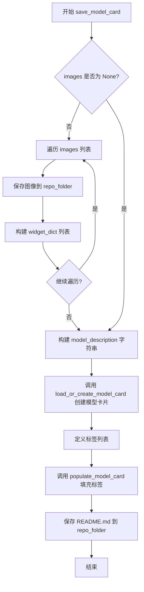

#### 带注释源码

```python
def save_model_card(
    repo_id: str,
    images=None,
    base_model: str = None,
    instance_prompt=None,
    validation_prompt=None,
    repo_folder=None,
    fp8_training=False,
):
    """
    生成并保存模型卡片 README.md 文件到指定仓库文件夹。
    
    参数:
        repo_id: HuggingFace Hub 仓库标识符
        images: 可选的验证图像列表
        base_model: 基础预训练模型名称
        instance_prompt: 实例提示词
        validation_prompt: 验证提示词
        repo_folder: 本地仓库文件夹路径
        fp8_training: 是否使用 FP8 训练
    """
    
    # 初始化 widget 字典列表，用于 HuggingFace Hub 的交互式组件
    widget_dict = []
    
    # 如果提供了验证图像，则保存图像并构建 widget_dict
    if images is not None:
        for i, image in enumerate(images):
            # 将图像保存到仓库文件夹中，文件名为 image_{i}.png
            image.save(os.path.join(repo_folder, f"image_{i}.png"))
            
            # 构建 widget 字典，包含提示词和图像 URL
            # 用于 Hub 上的交互式演示
            widget_dict.append(
                {"text": validation_prompt if validation_prompt else " ", "output": {"url": f"image_{i}.png"}}
            )

    # 构建模型描述文本，包含 Markdown 格式的详细信息
    model_description = f"""
# Flux.2 [Klein] DreamBooth LoRA - {repo_id}

<Gallery />

## Model description

These are {repo_id} DreamBooth LoRA weights for {base_model}.

The weights were trained using [DreamBooth](https://dreambooth.github.io/) with the [Flux2 diffusers trainer](https://github.com/huggingface/diffusers/blob/main/examples/dreambooth/README_flux2.md).

FP8 training? {fp8_training}

## Trigger words

You should use `{instance_prompt}` to trigger the image generation.

## Download model

[Download the *.safetensors LoRA]({repo_id}/tree/main) in the Files & versions tab.

## Use it with the [🧨 diffusers library](https://github.com/huggingface/diffusers)

```py
from diffusers import AutoPipelineForText2Image
import torch
pipeline = AutoPipelineForText2Image.from_pretrained("black-forest-labs/FLUX.2", torch_dtype=torch.bfloat16).to('cuda')
pipeline.load_lora_weights('{repo_id}', weight_name='pytorch_lora_weights.safetensors')
image = pipeline('{validation_prompt if validation_prompt else instance_prompt}').images[0]
```

For more details, including weighting, merging and fusing LoRAs, check the [documentation on loading LoRAs in diffusers](https://huggingface.co/docs/diffusers/main/en/using-diffusers/loading_adapters)

## License

Please adhere to the licensing terms as described [here](https://huggingface.co/black-forest-labs/FLUX.2/blob/main/LICENSE.md).
"""
    
    # 使用 diffusers 工具函数加载或创建模型卡片
    # from_training=True 表示这是从训练流程中生成的
    model_card = load_or_create_model_card(
        repo_id_or_path=repo_id,
        from_training=True,
        license="other",
        base_model=base_model,
        prompt=instance_prompt,
        model_description=model_description,
        widget=widget_dict,
    )
    
    # 定义模型标签，用于 Hub 上的分类和搜索
    tags = [
        "text-to-image",
        "diffusers-training",
        "diffusers",
        "lora",
        "flux2",
        "flux2-diffusers",
        "template:sd-lora",
    ]

    # 使用标签填充模型卡片
    model_card = populate_model_card(model_card, tags=tags)
    
    # 将模型卡片保存为 README.md 文件到指定文件夹
    model_card.save(os.path.join(repo_folder, "README.md"))
```


### `log_validation`

使用当前模型状态进行推理以生成验证图像，并将结果记录到训练跟踪器（TensorBoard 或 WANDB）。

参数：

- `pipeline`：`DiffusionPipeline`，用于推理的扩散管道对象
- `args`：`Namespace`，包含训练参数的命令行参数对象，包含验证提示词、种子、验证图像数量等配置
- `accelerator`：`Accelerator`，HuggingFace Accelerate 库提供的分布式训练加速器，用于设备管理和跟踪器访问
- `pipeline_args`：`Dict`，包含传递给 pipeline 的字典参数，如图像、提示词嵌入等
- `epoch`：`int`，当前训练的轮次编号，用于记录到跟踪器
- `torch_dtype`：`torch.dtype`，推理时使用的数据类型（通常是 float16 或 bfloat16）
- `is_final_validation`：`bool`，是否为最终验证的标志，默认为 False

返回值：`List[PIL.Image]`，生成的验证图像列表

#### 流程图

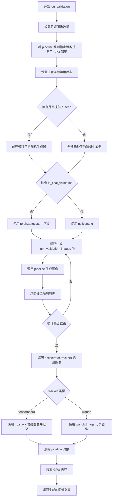

#### 带注释源码

```python
def log_validation(
    pipeline,          # DiffusionPipeline: 用于图像生成的扩散管道
    args,              # Namespace: 训练参数对象，包含验证相关配置
    accelerator,       # Accelerator: HuggingFace Accelerate 加速器
    pipeline_args,     # Dict: 传递给 pipeline 的参数字典
    epoch,             # int: 当前训练轮次
    torch_dtype,       # torch.dtype: 推理使用的数据类型
    is_final_validation=False,  # bool: 是否为最终验证阶段
):
    """
    使用当前模型状态执行推理生成验证图像，并将结果记录到训练跟踪器。
    
    该函数在训练过程中的验证阶段被调用，用于监控模型性能。
    支持 TensorBoard 和 WANDB 两种日志记录方式。
    """
    # 设置验证图像数量，如果没有指定则默认为 1
    args.num_validation_images = args.num_validation_images if args.num_validation_images else 1
    
    # 记录验证日志信息
    logger.info(
        f"Running validation... \n Generating {args.num_validation_images} images with prompt:"
        f" {args.validation_prompt}."
    )
    
    # 将管道移动到指定设备并转换为指定数据类型
    pipeline = pipeline.to(dtype=torch_dtype)
    
    # 启用模型 CPU 卸载以节省 GPU 内存
    pipeline.enable_model_cpu_offload()
    
    # 禁用进度条显示
    pipeline.set_progress_bar_config(disable=True)

    # 创建随机生成器，如果提供了种子则使用种子确保可重复性
    generator = torch.Generator(device=accelerator.device).manual_seed(args.seed) if args.seed is not None else None
    
    # 根据是否为最终验证选择自动混合精度上下文
    # 最终验证时使用 nullcontext 避免额外的精度转换
    autocast_ctx = torch.autocast(accelerator.device.type) if not is_final_validation else nullcontext()

    # 初始化图像列表
    images = []
    
    # 循环生成指定数量的验证图像
    for _ in range(args.num_validation_images):
        with autocast_ctx:
            # 调用管道生成图像
            image = pipeline(
                image=pipeline_args["image"],               # 条件图像（用于图像到图像任务）
                prompt_embeds=pipeline_args["prompt_embeds"],    # 提示词嵌入
                negative_prompt_embeds=pipeline_args["negative_prompt_embeds"],  # 负向提示词嵌入
                generator=generator,                        # 随机生成器
            ).images[0]
            images.append(image)

    # 遍历所有注册的跟踪器记录验证结果
    for tracker in accelerator.trackers:
        # 确定阶段名称：最终验证为 "test"，常规验证为 "validation"
        phase_name = "test" if is_final_validation else "validation"
        
        # TensorBoard 记录
        if tracker.name == "tensorboard":
            # 将 PIL 图像转换为 numpy 数组并堆叠
            np_images = np.stack([np.asarray(img) for img in images])
            tracker.writer.add_images(phase_name, np_images, epoch, dataformats="NHWC")
        
        # WANDB 记录
        if tracker.name == "wandb":
            tracker.log(
                {
                    phase_name: [
                        wandb.Image(image, caption=f"{i}: {args.validation_prompt}") 
                        for i, image in enumerate(images)
                    ]
                }
            )

    # 删除管道对象释放 GPU 内存
    del pipeline
    free_memory()

    # 返回生成的图像列表
    return images
```


### `collate_fn`

自定义的批处理整理函数，用于将像素值和提示词堆叠成批次。

参数：

- `examples`：`List[Dict]`，从数据集中获取的样本列表，每个字典包含 `instance_images`（图像张量）和 `instance_prompt`（文本提示词）

返回值：`Dict`，包含以下键的字典：
- `pixel_values`：`torch.Tensor`，堆叠后的图像像素值，形状为 `(batch_size, channels, height, width)`
- `prompts`：`List[str]`，文本提示词列表
- `cond_pixel_values`：`torch.Tensor`（可选），条件图像的像素值，当存在 `cond_images` 字段时包含

#### 流程图

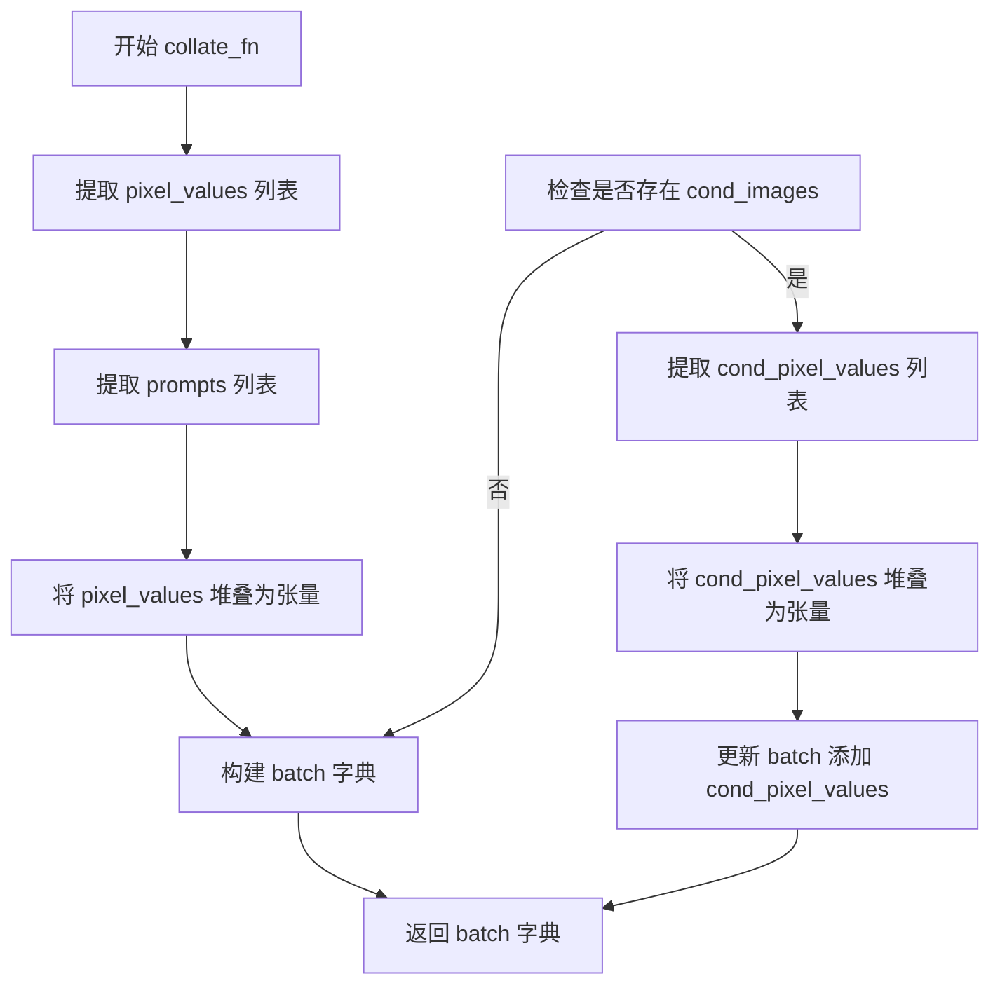

#### 带注释源码

```
def collate_fn(examples):
    # 从每个样本中提取实例图像（pixel values）
    # examples 是从 DreamBoothDataset 返回的样本列表
    pixel_values = [example["instance_images"] for example in examples]
    
    # 从每个样本中提取实例提示词（文本描述）
    prompts = [example["instance_prompt"] for example in examples]

    # 使用 torch.stack 将图像列表堆叠成批次张量
    # 这会将 List[Tensor] 转换为 Tensor of shape (batch_size, C, H, W)
    pixel_values = torch.stack(pixel_values)
    
    # 转换为连续内存格式并转为 float 类型
    # contiguous_format 确保张量在内存中是连续的，以优化后续操作
    pixel_values = pixel_values.to(memory_format=torch.contiguous_format).float()

    # 构建基础批次字典，包含像素值和提示词
    batch = {"pixel_values": pixel_values, "prompts": prompts}
    
    # 检查任意样本中是否包含条件图像（cond_images）
    # 这是用于图像到图像（I2I）训练的场景
    if any("cond_images" in example for example in examples):
        # 提取所有条件图像
        cond_pixel_values = [example["cond_images"] for example in examples]
        
        # 同样堆叠为批次张量
        cond_pixel_values = torch.stack(cond_pixel_values)
        cond_pixel_values = cond_pixel_values.to(memory_format=torch.contiguous_format).float()
        
        # 将条件像素值添加到批次字典中
        batch.update({"cond_pixel_values": cond_pixel_values})
    
    # 返回整理好的批次，供模型训练使用
    return batch
```


### `module_filter_fn`

Filter function used to select specific layers for FP8 quantization. It determines which neural network modules should be converted to FP8 format during training by checking module type and dimensionality constraints.

参数：

-  `mod`：`torch.nn.Module`，待筛选的 PyTorch 模块
-  `fqn`：`str`，模块的完全限定名称（Fully Qualified Name）

返回值：`bool`，返回 True 表示该模块应被选中进行 FP8 量化，返回 False 表示该模块应被排除

#### 流程图

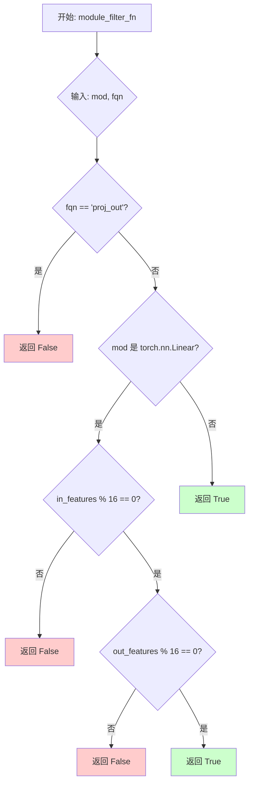

#### 带注释源码

```python
def module_filter_fn(mod: torch.nn.Module, fqn: str):
    """
    Filter function used to select specific layers for FP8 quantization.
    
    在 FP8 量化过程中用于筛选特定层的过滤函数。
    该函数被传递给 convert_to_float8_training 方法，用于决定哪些层应该被转换为 FP8 格式。
    
    Args:
        mod: torch.nn.Module - The module to be filtered (待筛选的 PyTorch 模块)
        fqn: str - Fully qualified name of the module (模块的完全限定名称)
    
    Returns:
        bool - True if the module should be selected for FP8 quantization, False otherwise
              (返回 True 表示该模块应被选中进行 FP8 量化，返回 False 表示应排除)
    """
    
    # don't convert the output module
    # 排除输出投影层 (proj_out)，因为该层通常不需要进行 FP8 量化
    if fqn == "proj_out":
        return False
    
    # don't convert linear modules with weight dimensions not divisible by 16
    # 对于 Linear 层，检查其输入和输出维度是否都能被 16 整除
    # 这是因为 FP8 量化内部维度需要满足 16 的倍数要求，以确保硬件高效计算
    if isinstance(mod, torch.nn.Linear):
        if mod.in_features % 16 != 0 or mod.out_features % 16 != 0:
            return False
    
    # 通过所有过滤条件的模块返回 True，表示可以进行 FP8 量化
    return True
```


### DreamBoothDataset.__init__

该方法是 `DreamBoothDataset` 类的构造函数，负责从本地目录或 HuggingFace 数据集加载图像，应用图像预处理变换（包括 EXIF 纠正、模式转换、尺寸调整、裁剪），并实现基于宽高比的分桶逻辑以优化训练效率。

参数：

- `instance_data_root`：`str`，本地数据集目录路径，当使用 `--instance_data_dir` 参数时指定
- `instance_prompt`：`str`，实例提示词，用于描述要训练的主体概念
- `size`：`int`，图像目标尺寸，默认为 1024
- `repeats`：`int`，数据重复次数，用于增加数据多样性，默认为 1
- `center_crop`：`bool`，是否进行居中裁剪，默认为 False（随机裁剪）
- `buckets`：`list[tuple[int, int]]`，宽高比桶列表，用于动态分辨率训练，默认为 None

返回值：`None`，构造函数无返回值

#### 流程图

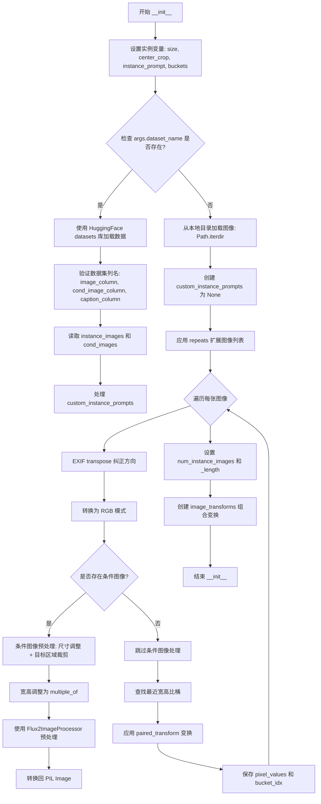

#### 带注释源码

```python
def __init__(
    self,
    instance_data_root,
    instance_prompt,
    size=1024,
    repeats=1,
    center_crop=False,
    buckets=None,
):
    # 设置图像目标尺寸和裁剪方式
    self.size = size
    self.center_crop = center_crop

    # 保存实例提示词（用于无自定义提示时）
    self.instance_prompt = instance_prompt
    # 用于存储自定义提示词（从数据集 caption_column 读取）
    self.custom_instance_prompts = None

    # 保存宽高比桶配置（用于动态分辨率训练）
    self.buckets = buckets

    # ============ 数据源判断 ============
    # 如果通过 --dataset_name 指定了 HuggingFace 数据集
    if args.dataset_name is not None:
        try:
            from datasets import load_dataset
        except ImportError:
            raise ImportError(
                "You are trying to load your data using the datasets library. If you wish to train using custom "
                "captions please install the datasets library: `pip install datasets`. If you wish to load a "
                "local folder containing images only, specify --instance_data_dir instead."
            )
        
        # 从 Hub 下载并加载数据集
        dataset = load_dataset(
            args.dataset_name,
            args.dataset_config_name,
            cache_dir=args.cache_dir,
        )
        
        # 获取训练集列名
        column_names = dataset["train"].column_names

        # ============ 验证必需列 ============
        # 验证条件图像列是否存在
        if args.cond_image_column is not None and args.cond_image_column not in column_names:
            raise ValueError(
                f"`--cond_image_column` value '{args.cond_image_column}' not found in dataset columns. Dataset columns are: {', '.join(column_names)}"
            )
        
        # 确定图像列（默认为第一列或指定列）
        if args.image_column is None:
            image_column = column_names[0]
            logger.info(f"image column defaulting to {image_column}")
        else:
            image_column = args.image_column
            if image_column not in column_names:
                raise ValueError(
                    f"`--image_column` value '{args.image_column}' not found in dataset columns. Dataset columns are: {', '.join(column_names)}"
                )
        
        # 读取实例图像
        instance_images = dataset["train"][image_column]
        cond_images = None
        cond_image_column = args.cond_image_column
        
        # 读取条件图像（如果有）
        if cond_image_column is not None:
            cond_images = [dataset["train"][i][cond_image_column] for i in range(len(dataset["train"]))]
            assert len(instance_images) == len(cond_images)

        # ============ 处理提示词 ============
        if args.caption_column is None:
            logger.info(
                "No caption column provided, defaulting to instance_prompt for all images. If your dataset "
                "contains captions/prompts for the images, make sure to specify the "
                "column as --caption_column"
            )
            self.custom_instance_prompts = None
        else:
            if args.caption_column not in column_names:
                raise ValueError(
                    f"`--caption_column` value '{args.caption_column}' not found in dataset columns. Dataset columns are: {', '.join(column_names)}"
                )
            # 读取自定义提示词并根据 repeats 扩展
            custom_instance_prompts = dataset["train"][args.caption_column]
            self.custom_instance_prompts = []
            for caption in custom_instance_prompts:
                self.custom_instance_prompts.extend(itertools.repeat(caption, repeats))
    else:
        # ============ 本地目录加载 ============
        self.instance_data_root = Path(instance_data_root)
        if not self.instance_data_root.exists():
            raise ValueError("Instance images root doesn't exists.")

        # 读取目录下所有图像文件
        instance_images = [Image.open(path) for path in Path(instance_data_root).iterdir()]
        self.custom_instance_prompts = None

    # ============ 图像预处理 ============
    self.instance_images = []
    self.cond_images = []
    
    # 根据 repeats 扩展图像列表
    for i, img in enumerate(instance_images):
        self.instance_images.extend(itertools.repeat(img, repeats))
        # 条件图像同样扩展
        if args.dataset_name is not None and cond_images is not None:
            self.cond_images.extend(itertools.repeat(cond_images[i], repeats))

    self.pixel_values = []
    self.cond_pixel_values = []
    
    # ============ 遍历处理每张图像 ============
    for i, image in enumerate(self.instance_images):
        # 1. EXIF 纠正（处理手机拍摄图像的方向问题）
        image = exif_transpose(image)
        # 2. 转换为 RGB 模式
        if not image.mode == "RGB":
            image = image.convert("RGB")
        
        dest_image = None
        
        # ============ 条件图像处理 ============
        if self.cond_images:  # todo: take care of max area for buckets
            dest_image = self.cond_images[i]
            image_width, image_height = dest_image.size
            
            # 限制最大像素区域（1024*1024）
            if image_width * image_height > 1024 * 1024:
                dest_image = Flux2ImageProcessor._resize_to_target_area(dest_image, 1024 * 1024)
                image_width, image_height = dest_image.size

            # 宽高调整为 multiple_of（2的幂次）
            multiple_of = 2 ** (4 - 1)  # 2 ** (len(vae.config.block_out_channels) - 1), temp!
            image_width = (image_width // multiple_of) * multiple_of
            image_height = (image_height // multiple_of) * multiple_of
            
            # 使用 Flux2ImageProcessor 预处理
            image_processor = Flux2ImageProcessor()
            dest_image = image_processor.preprocess(
                dest_image, height=image_height, width=image_width, resize_mode="crop"
            )
            
            # 转换回 PIL Image
            dest_image = dest_image.squeeze(0)
            if dest_image.min() < 0:
                dest_image = (dest_image + 1) / 2
            dest_image = (torch.clamp(dest_image, 0, 1) * 255).byte().cpu()

            if dest_image.shape[0] == 1:
                # 灰度图像
                dest_image = Image.fromarray(dest_image.squeeze().numpy(), mode="L")
            else:
                # RGB 图像: (C, H, W) -> (H, W, C)
                dest_image = TF.to_pil_image(dest_image)

            # EXIF 纠正和 RGB 转换
            dest_image = exif_transpose(dest_image)
            if not dest_image.mode == "RGB":
                dest_image = dest_image.convert("RGB")

        width, height = image.size

        # ============ 宽高比分桶逻辑 ============
        # 找到最近的桶
        bucket_idx = find_nearest_bucket(height, width, self.buckets)
        target_height, target_width = self.buckets[bucket_idx]
        self.size = (target_height, target_width)

        # 应用配对变换（保证图像和条件图使用相同变换）
        image, dest_image = self.paired_transform(
            image,
            dest_image=dest_image,
            size=self.size,
            center_crop=args.center_crop,
            random_flip=args.random_flip,
        )
        
        # 保存像素值和对应的桶索引
        self.pixel_values.append((image, bucket_idx))
        if dest_image is not None:
            self.cond_pixel_values.append((dest_image, bucket_idx))

    # ============ 设置数据集长度 ============
    self.num_instance_images = len(self.instance_images)
    self._length = self.num_instance_images

    # ============ 创建图像变换管道 ============
    self.image_transforms = transforms.Compose(
        [
            transforms.Resize(size, interpolation=transforms.InterpolationMode.BILINEAR),
            transforms.CenterCrop(size) if center_crop else transforms.RandomCrop(size),
            transforms.ToTensor(),
            transforms.Normalize([0.5], [0.5]),  # 归一化到 [-1, 1]
        ]
    )
```


### `DreamBoothDataset.__len__`

该方法返回训练数据集的总长度，使数据集对象支持 Python 标准库的 `len()` 函数，便于 DataLoader 等迭代器确定迭代次数。

参数：无（Python 特殊方法，仅 `self`）

返回值：`int`，返回数据集中实例图像的总数量

#### 流程图

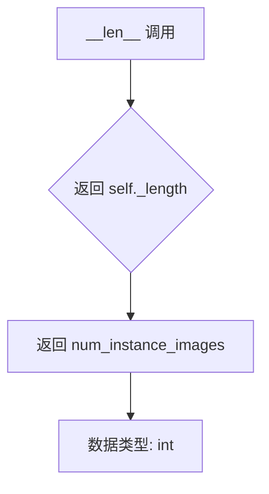

#### 带注释源码

```python
def __len__(self):
    """
    返回数据集的总长度。
    
    该方法使得 DreamBoothDataset 实例可以与 Python 的 len() 函数配合使用，
    DataLoader 等迭代器会通过此方法确定需要迭代的批次数。
    
    Returns:
        int: 数据集中实例图像的总数，即 self._length 的值
    """
    return self._length
```

---

#### 补充：所在类 `DreamBoothDataset` 关键信息

| 字段/属性 | 类型 | 描述 |
|-----------|------|------|
| `self._length` | `int` | 数据集实例图像的总数，由 `__init__` 中 `self.num_instance_images` 赋值 |
| `self.num_instance_images` | `int` | 实例图像经过重复处理后的总数量 |
| `self.instance_images` | `list` | 存储预处理后的实例图像（PIL Image 或处理后的 Tensor） |
| `self.pixel_values` | `list` | 存储图像及其对应的 bucket 索引元组 `[(image, bucket_idx), ...]` |
| `self.buckets` | `list` | 宽高比桶列表，用于多分辨率训练 |
| `self.instance_prompt` | `str` | 实例提示词 |

| 方法 | 描述 |
|------|------|
| `__init__` | 初始化数据集，加载图像并预处理，构建像素值和条件图像列表 |
| `__getitem__` | 根据索引返回单个样本，包含图像、bucket 索引和提示词 |
| `paired_transform` | 成对变换（图像+条件图像），包括 resize、crop、flip 和归一化 |

---

#### 潜在技术债务与优化空间

1. **条件图像处理逻辑复杂**：`__init__` 中包含大量图像预处理逻辑，混合了图像加载、尺寸调整、桶分配等功能，建议拆分独立的图像处理器类。
2. **重复代码**：`paired_transform` 中对 `dest_image` 的条件判断可抽离为更通用的图像变换组合。
3. **硬编码值**：如 `multiple_of = 2 ** (4 - 1)` 和 `1024 * 1024` 面积限制为硬编码，应提取为可配置参数。
4. **缓存优化**：若训练集较大，可在 `__init__` 中延迟加载或使用内存映射优化启动速度。


### `DreamBoothDataset.__getitem__`

该方法通过给定的索引从数据集中获取单个训练样本，包括处理后的图像、相关的prompt以及对应的bucket索引，支持条件图像和自定义prompt。

参数：

- `self`：`DreamBoothDataset` 实例本身
- `index`：`int`，要获取的样本索引，用于从预处理的数据中检索相应的图像、prompt和bucket信息

返回值：`Dict[str, Any]`，返回一个字典，包含以下键值对：
- `"instance_images"`：处理后的实例图像（Tensor）
- `"bucket_idx"`：对应的bucket索引（int）
- `"cond_images"`：条件图像（如果存在，Tensor）
- `"instance_prompt"`：实例prompt文本（str）

#### 流程图

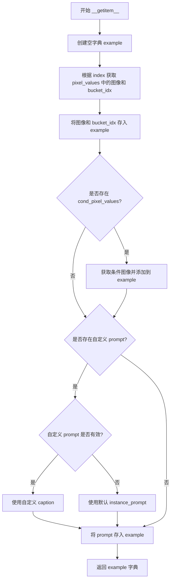

#### 带注释源码

```python
def __getitem__(self, index):
    """
    通过索引获取单个训练样本。
    
    参数:
        index: int, 样本索引
        
    返回:
        dict: 包含 'instance_images', 'bucket_idx', 'cond_images'(可选), 'instance_prompt' 的字典
    """
    # 创建用于存储样本数据的字典
    example = {}
    
    # 使用模运算确保索引在有效范围内，检索预处理的图像和对应的bucket索引
    # pixel_values 存储了 (处理后的图像_tensor, bucket_idx) 的元组列表
    instance_image, bucket_idx = self.pixel_values[index % self.num_instance_images]
    
    # 将实例图像和bucket索引添加到返回字典中
    example["instance_images"] = instance_image
    example["bucket_idx"] = bucket_idx
    
    # 检查是否存在条件图像（用于image-to-image训练）
    if self.cond_pixel_values:
        # 检索条件图像并添加到返回字典
        dest_image, _ = self.cond_pixel_values[index % self.num_instance_images]
        example["cond_images"] = dest_image

    # 检查是否为每个图像设置了自定义prompt
    if self.custom_instance_prompts:
        # 检索对应索引的自定义caption
        caption = self.custom_instance_prompts[index % self.num_instance_images]
        # 如果caption有效则使用，否则使用默认的instance_prompt
        if caption:
            example["instance_prompt"] = caption
        else:
            example["instance_prompt"] = self.instance_prompt

    else:  # 没有提供自定义prompt或长度不匹配图像数据集大小
        # 使用默认的instance_prompt
        example["instance_prompt"] = self.instance_prompt

    # 返回包含图像、bucket索引和prompt的样本字典
    return example
```


### `DreamBoothDataset.paired_transform`

对源图像和目标图像应用同步的缩放、裁剪和翻转操作，确保两个图像经过相同的变换处理（裁剪使用相同的坐标，翻转使用相同的随机决策）。

参数：

- `self`：`DreamBoothDataset`，方法所属的实例对象
- `image`：`PIL.Image.Image`，需要进行变换的源图像
- `dest_image`：`Optional[PIL.Image.Image]`，条件图像（可选），如果提供则与源图像应用相同的变换
- `size`：`Tuple[int, int]`，目标图像尺寸，默认为 (224, 224)
- `center_crop`：`bool`，是否使用中心裁剪，False 则使用随机裁剪
- `random_flip`：`bool`，是否进行随机水平翻转

返回值：`Union[Tuple[torch.Tensor, torch.Tensor], Tuple[torch.Tensor, None]]`，返回变换后的图像元组。如果 `dest_image` 不为 None，则返回 (源图像张量, 目标图像张量)；否则返回 (源图像张量, None)

#### 流程图

```mermaid
flowchart TD
    A[开始: paired_transform] --> B{检查 dest_image 是否存在}
    B -->|是| C[对 image 和 dest_image 同时应用 Resize]
    B -->|否| D[仅对 image 应用 Resize]
    C --> E{center_crop?}
    D --> E
    E -->|是| F[应用 CenterCrop 到两幅图像]
    E -->|否| G[获取随机裁剪参数 i,j,h,w]
    G --> H[使用相同参数裁剪两幅图像]
    F --> I{random_flip?}
    H --> I
    I -->|是| J[生成随机翻转标志 do_flip]
    J --> K[将标志应用到两幅图像]
    I -->|否| L[跳过翻转]
    K --> M[ToTensor + Normalize 变换]
    L --> M
    M --> N{dest_image 存在?}
    N -->|是| O[返回 (image_tensor, dest_image_tensor)]
    N -->|否| P[返回 (image_tensor, None)]
    O --> Q[结束]
    P --> Q
```

#### 带注释源码

```python
def paired_transform(self, image, dest_image=None, size=(224, 224), center_crop=False, random_flip=False):
    """
    对源图像和目标图像应用同步的变换（缩放、裁剪、翻转）
    
    参数:
        image: PIL图像，源图像
        dest_image: PIL图像，可选的目标/条件图像
        size: tuple，输出尺寸
        center_crop: bool，是否使用中心裁剪
        random_flip: bool，是否进行随机水平翻转
    
    返回:
        (变换后的源图像张量, 变换后的目标图像张量) 或 (源图像张量, None)
    """
    
    # 1. 调整大小（确定性操作）
    # 使用双线性插值将图像调整到目标尺寸
    resize = transforms.Resize(size, interpolation=transforms.InterpolationMode.BILINEAR)
    image = resize(image)
    if dest_image is not None:
        dest_image = resize(dest_image)

    # 2. 裁剪：中心裁剪或相同的随机裁剪
    if center_crop:
        # 中心裁剪 - 对两幅图像应用相同的中心裁剪
        crop = transforms.CenterCrop(size)
        image = crop(image)
        if dest_image is not None:
            dest_image = crop(dest_image)
    else:
        # 随机裁剪 - 获取图像的裁剪参数 (i, j, h, w)
        # i: 顶部像素坐标, j: 左侧像素坐标, h: 裁剪高度, w: 裁剪宽度
        i, j, h, w = transforms.RandomCrop.get_params(image, output_size=size)
        # 使用 torchvision.functional 的 crop 函数进行裁剪
        # 确保源图像和目标图像使用完全相同的裁剪坐标
        image = TF.crop(image, i, j, h, w)
        if dest_image is not None:
            dest_image = TF.crop(dest_image, i, j, h, w)

    # 3. 随机水平翻转 - 使用相同的翻转决策
    if random_flip:
        # 生成 0-1 之间的随机数，决定是否翻转
        do_flip = random.random() < 0.5
        if do_flip:
            # 对源图像进行水平翻转
            image = TF.hflip(image)
            # 如果存在目标图像，也进行相同的水平翻转
            if dest_image is not None:
                dest_image = TF.hflip(dest_image)

    # 4. 转换为张量 + 归一化（确定性操作）
    # 将 PIL 图像转换为 PyTorch 张量，并归一化到 [-1, 1]
    to_tensor = transforms.ToTensor()
    normalize = transforms.Normalize([0.5], [0.5])  # 均值0.5，标准差0.5
    
    image = normalize(to_tensor(image))
    if dest_image is not None:
        dest_image = normalize(to_tensor(dest_image))

    # 返回变换后的结果
    # 如果 dest_image 存在，返回包含两者的元组
    # 否则返回 (image, None)
    return (image, dest_image) if dest_image is not None else (image, None)
```


### `BucketBatchSampler.__init__`

该方法用于初始化BucketBatchSampler类，将数据集中所有样本的索引按照其所属的bucket进行分组，并为每个bucket预先生成批次。

参数：

- `dataset`：`DreamBoothDataset`，包含样本数据及其bucket分配信息的数据集对象
- `batch_size`：`int`，每个批次的样本数量，必须为正整数
- `drop_last`：`bool`（可选，默认值为`False`），是否丢弃最后一个不完整的批次

返回值：`无`（`None`），该方法为构造函数，不返回任何值

#### 流程图

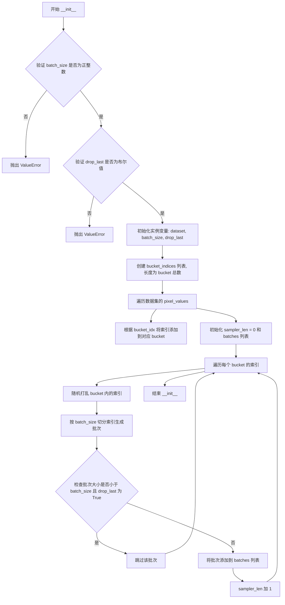

#### 带注释源码

```python
def __init__(self, dataset: DreamBoothDataset, batch_size: int, drop_last: bool = False):
    # 验证 batch_size 参数的有效性：必须为正整数
    if not isinstance(batch_size, int) or batch_size <= 0:
        raise ValueError("batch_size should be a positive integer value, but got batch_size={}".format(batch_size))
    
    # 验证 drop_last 参数的类型：必须为布尔值
    if not isinstance(drop_last, bool):
        raise ValueError("drop_last should be a boolean value, but got drop_last={}".format(drop_last))

    # 将传入的参数保存为实例变量
    self.dataset = dataset
    self.batch_size = batch_size
    self.drop_last = drop_last

    # 根据数据集的 bucket 数量创建对应的索引列表
    # 每个 bucket 维护一个包含该 bucket 内所有样本索引的列表
    self.bucket_indices = [[] for _ in range(len(self.dataset.buckets))]
    
    # 遍历数据集中所有样本，样本的 pixel_values 包含 (图像张量, bucket_idx)
    # 根据 bucket_idx 将样本索引添加到对应的 bucket 列表中
    for idx, (_, bucket_idx) in enumerate(self.dataset.pixel_values):
        self.bucket_indices[bucket_idx].append(idx)

    # 初始化批次计数器和批次列表
    self.sampler_len = 0
    self.batches = []

    # 预先生成每个 bucket 的批次
    for indices_in_bucket in self.bucket_indices:
        # 随机打乱每个 bucket 内的样本顺序，增加训练的多样性
        random.shuffle(indices_in_bucket)
        
        # 按照 batch_size 大小将索引切分成多个批次
        for i in range(0, len(indices_in_bucket), self.batch_size):
            # 提取当前批次的索引片段
            batch = indices_in_bucket[i : i + self.batch_size]
            
            # 如果 drop_last 为 True 且当前批次不完整，则跳过该批次
            if len(batch) < self.batch_size and self.drop_last:
                continue  # Skip partial batch if drop_last is True
            
            # 将有效批次添加到列表中，并增加批次计数器
            self.batches.append(batch)
            self.sampler_len += 1  # Count the number of batches
```


### `BucketBatchSampler.__iter__`

该方法是一个生成器函数，用于在每个 epoch 迭代时随机打乱批次的顺序并逐个返回批次，实现数据加载时的桶式采样。

参数：

- 无显式参数（隐式参数 `self` 为实例本身）

返回值：`List[int]`，返回单个批次的索引列表，类型为整数列表的生成器

#### 流程图

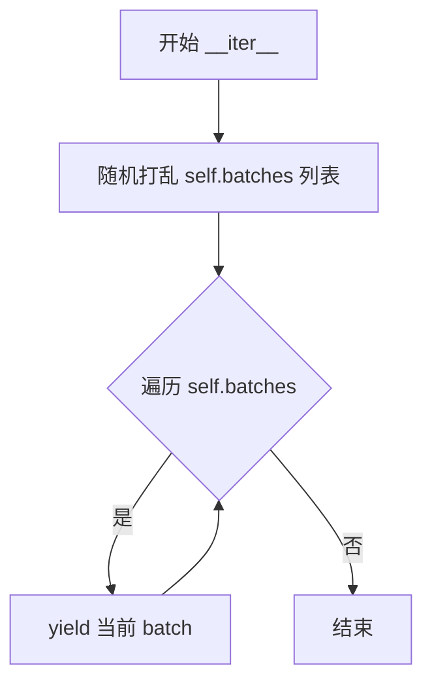

#### 带注释源码

```python
def __iter__(self):
    # 目的：在每个 epoch 随机打乱批次的顺序
    # 作用：增加数据多样性，避免模型学习到固定的批次顺序
    random.shuffle(self.batches)
    
    # 遍历打乱后的批次列表
    for batch in self.batches:
        # yield 返回当前批次（整数索引列表）
        yield batch
```


### `BucketBatchSampler.__len__`

该方法返回BucketBatchSampler生成的总批次数，用于DataLoader确定训练过程中的迭代次数。

参数：

- 无参数（继承自父类BatchSampler的标准`__len__`方法签名）

返回值：`int`，返回预生成的总批次数

#### 流程图

```mermaid
flowchart TD
    A[__len__ 被调用] --> B{检查 sampler_len 是否已计算}
    B -->|是| C[返回 self.sampler_len]
    B -->|否| D[返回 len(self.batches)]
    C --> E[结束]
    D --> E
    
    style A fill:#f9f,stroke:#333
    style C fill:#9f9,stroke:#333
    style E fill:#9ff,stroke:#333
```

#### 带注释源码

```python
def __len__(self):
    """
    返回BucketBatchSampler生成的总批次数。
    
    该方法用于DataLoader确定迭代的上限，配合len(dataloader)使用。
    sampler_len在__init__方法中被计算，基于所有bucket中能够生成的完整批次数量。
    
    Returns:
        int: 预生成的总批次数。如果drop_last为True，则不包含最后一个不完整的批次。
    """
    return self.sampler_len
```


### `PromptDataset.__len__`

该方法返回数据集中保存的样本数量，用于让 DataLoader 知道数据集的大小。

参数：

- `self`：`PromptDataset`，类的实例本身

返回值：`int`，返回样本数量（`num_samples`）

#### 流程图

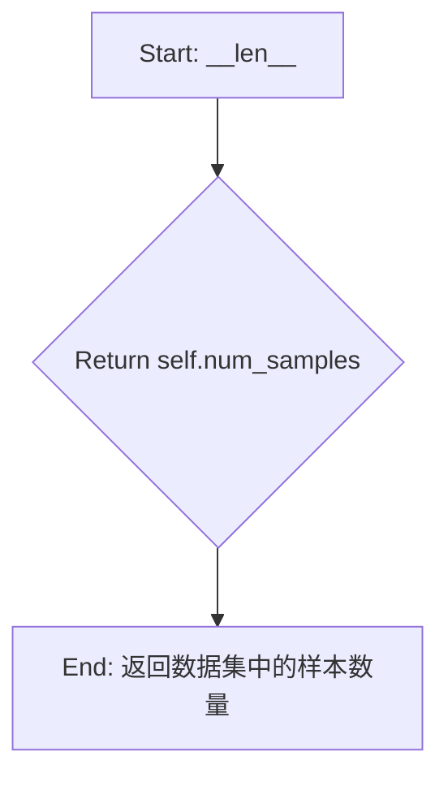

#### 带注释源码

```python
def __len__(self):
    """
    返回数据集中保存的样本数量。
    该方法由 PyTorch DataLoader 调用，用于确定数据集的大小和迭代次数。
    
    Returns:
        int: 数据集中的样本数量，等于初始化时传入的 num_samples 参数。
    """
    return self.num_samples
```


### `PromptDataset.__getitem__`

该方法用于从 `PromptDataset` 数据集中获取指定索引的样本，返回一个包含提示词和索引的字典对象。

参数：

- `self`：`PromptDataset`，表示当前数据集实例
- `index`：`int`，要获取的样本索引

返回值：`Dict[str, Any]`，返回一个字典，包含 `"prompt"`（提示词字符串）和 `"index"`（索引值）两个键值对

#### 流程图

```mermaid
flowchart TD
    A[开始 __getitem__] --> B[创建空字典 example]
    B --> C[将 self.prompt 存入 example['prompt']]
    C --> D[将 index 存入 example['index']]
    D --> E[返回 example 字典]
```

#### 带注释源码

```python
def __getitem__(self, index):
    """
    获取数据集中指定索引的样本。
    
    参数:
        index: 要获取的样本索引
        
    返回:
        包含提示词和索引的字典
    """
    # 步骤1: 创建一个空字典用于存储样本数据
    example = {}
    
    # 步骤2: 将数据集中预设的提示词存入字典的 'prompt' 键
    # 该提示词在数据集初始化时设置，用于生成类别图像
    example["prompt"] = self.prompt
    
    # 步骤3: 将当前样本的索引存入字典的 'index' 键
    # 索引用于标识样本的顺序
    example["index"] = index
    
    # 步骤4: 返回包含提示词和索引的字典
    return example
```

## 关键组件


### 张量索引与惰性加载

代码通过`latents_bn_mean`和`latents_bn_std`对VAE输出的latents进行归一化处理，使用`vae.encode()`进行延迟编码。支持`cache_latents`参数将latents预计算并缓存以加速训练，并使用`offload_models`函数在不需要时将VAE和文本编码器卸载到CPU以节省显存。

### 反量化支持

通过`BitsAndBytesConfig`实现4bit量化加载，使用`prepare_model_for_kbit_training`函数准备量化模型进行训练。`module_filter_fn`过滤函数用于排除不支持量化的模块（如输出层和维度不被16整除的线性层）。同时支持`do_fp8_training`选项使用`Float8LinearConfig`进行FP8训练。

### 量化策略

支持通过`bnb_quantization_config_path`指定量化配置文件，实现4bit量化训练。`module_filter_fn`确保只有符合条件的模块才参与量化，排除输出模块和维度不兼容的线性层。FP8训练使用`convert_to_float8_training`函数配合`Float8LinearConfig(pad_inner_dim=True)`进行细粒度控制。

### 宽高比桶（Aspect Ratio Buckets）

实现`BucketBatchSampler`类按桶分组样本，确保每个batch内的图像具有相同的宽高比。使用`find_nearest_bucket`函数将图像分配到最近的桶，`parse_buckets_string`解析用户定义的桶字符串。`paired_transform`确保源图像和目标图像使用相同的随机变换（裁剪、翻转）。

### LoRA适配器训练

使用`LoraConfig`配置LoRA参数（rank、alpha、dropout、目标模块），通过`transformer.add_adapter`添加LoRA权重。实现自定义`save_model_hook`和`load_model_hook`钩子函数，使用`get_peft_model_state_dict`和`set_peft_model_state_dict`保存/加载适配器权重，支持FSDP分布式训练环境下的状态管理。

### Flow Matching训练

使用`FlowMatchEulerDiscreteScheduler`调度器实现流匹配训练。通过`compute_density_for_timestep_sampling`实现非均匀时间步采样（支持sigma_sqrt、logit_normal、mode、cosmap等加权方案），`compute_loss_weighting_for_sd3`计算损失权重。训练过程中使用`get_sigmas`获取噪声调度器的sigma值实现加噪，预测噪声残差并计算流匹配损失。

### 数据预处理与图像增强

`DreamBoothDataset`类实现数据集加载与预处理，支持从HuggingFace Hub或本地文件夹加载图像。实现`paired_transform`方法确保源图像和条件图像使用相同的数据增强策略（resize、crop、flip）。支持EXIF方向校正和图像模式转换（RGB）。

### 分布式训练支持

使用`Accelerator`实现分布式训练封装，支持FSDP（Fully Sharded Data Parallel）训练。通过`fsdp_text_encoder`选项可对文本编码器使用FSDP，使用`wrap_with_fsdp`函数包装模型。实现TF32加速、混合精度训练（fp16/bf16）、梯度累积等优化技术。

### 模型保存与验证

实现`log_validation`函数在训练过程中生成验证图像并记录到TensorBoard或WandB。训练完成后使用`Flux2KleinPipeline`进行最终推理验证，生成模型卡片（README.md）记录训练信息并可选择推送到HuggingFace Hub。支持断点续训功能。


## 问题及建议


### 已知问题

- **全局变量依赖问题**：`DreamBoothDataset` 类中直接使用全局变量 `args`，违反封装原则，使得类难以独立测试和复用。
- **硬编码的VAE统计量**：`latents_bn_mean` 和 `latents_bn_std` 直接从 `vae.bn` 读取，这种硬编码依赖于VAE内部实现，版本更新可能导致兼容性问题。
- **硬编码魔数**：存在多个硬编码值如 `multiple_of = 2 ** (4 - 1)`、`1024 * 1024`、`num_train_timesteps` 等，缺乏解释性注释。
- **Bucket处理不完整**：代码中存在TODO注释 `todo: take care of max area for buckets`，表明目标区域面积处理逻辑未完成。
- **条件图像处理复杂**：条件图像的预处理逻辑（resize、crop、转换等）嵌套层级过深，且在循环中进行，效率较低。
- **随机性处理问题**：`BucketBatchSampler` 使用 `random.shuffle` 混洗批次，即使设置了 random seed 也可能导致训练结果不可完全复现。
- **弃用的API调用**：使用了内部API如 `Flux2ImageProcessor._resize_to_target_area`、`Flux2KleinPipeline._patchify_latents` 等，这些可能随版本变化而失效。
- **内存管理不一致**：在缓存latents后删除VAE，但在训练循环中又通过 `offload_models(vae, ...)` 引用已删除的对象，虽然有offload保护但逻辑不清晰。
- **文本编码器处理**：在 `fsdp_text_encoder` 模式下，文本编码器使用FSDP包装，但在保存/加载hook中没有特殊处理，可能导致状态不一致。
- **验证逻辑重复**：在训练循环结束后有独立的验证逻辑，与训练过程中的验证逻辑有部分重复代码。

### 优化建议

- **重构Dataset类**：将 `args` 作为参数传入 `DreamBoothDataset`，避免直接依赖全局变量，提高类的独立性和可测试性。
- **提取配置常量**：将所有魔数和硬编码值提取为类或模块级常量，并添加清晰的注释说明其来源和用途。
- **完善Bucket逻辑**：完成TODO中提到的max area处理逻辑，或在代码中添加明确的文档说明当前的行为。
- **封装VAE统计量获取**：创建一个专门的函数来获取VAE的统计量，从VAE配置或元数据文件中读取，而非直接访问内部状态。
- **改进随机性控制**：使用 `torch.Generator` 或 `np.random.default_rng` 配合 seed 来控制随机性，确保可复现性。
- **统一内存管理**：建立清晰的内存管理模式，明确哪些对象在哪个阶段使用，避免使用已删除对象的引用。
- **添加类型提示和文档**：为关键函数添加完整的类型提示和文档字符串，特别是涉及复杂张量操作的部分。
- **提取重复逻辑**：将验证相关的代码提取为独立函数或类，减少训练主循环中的代码复杂度。
- **添加错误恢复机制**：在checkpoint保存/加载过程中添加更完善的错误处理和状态验证。
- **性能分析点**：在关键路径（如图像编码、latent缓存）添加性能日志，便于定位瓶颈。


## 其它


### 设计目标与约束

本项目的设计目标是实现Flux.2模型的DreamBooth LoRA微调训练，支持图像到图像（I2I）的条件生成任务。主要约束包括：1）必须使用DreamBooth方法进行个性化训练；2）支持FP8训练和量化配置；3）必须遵循diffusers库的接口规范；4）训练过程需要在GPU上运行，不支持纯CPU训练；5）模型权重遵循Apache License 2.0许可证。

### 错误处理与异常设计

代码中的错误处理主要包含以下方面：1）参数验证：在`parse_args`函数中对必要参数进行检查，如`--cond_image_column`、`--dataset_name`和`--instance_data_dir`的互斥性检查；2）依赖检查：使用`check_min_version`验证diffusers最低版本，使用`ImportError`捕获可选依赖（bitsandbytes、prodigyopt、wandb等）的缺失；3）运行环境检查：检测MPS设备对bfloat16的支持情况，以及CUDA可用性；4）模型加载错误：对于FSDP场景下的权重加载，会检查incompatible keys并发出警告；5）异常传播：使用`raise ValueError`或`raise ImportError`抛出明确的错误信息，指导用户进行修复。

### 数据流与状态机

训练数据流遵循以下路径：1）数据加载阶段：`DreamBoothDataset`从本地目录或HuggingFace数据集加载图像和提示词，进行预处理（EXIF转置、RGB转换、分辨率调整、裁剪）；2）批处理阶段：`BucketBatchSampler`根据宽高比桶对样本进行分组，确保同一批次内图像尺寸一致；3）编码阶段：VAE将图像编码为潜在表示，文本编码器将提示词编码为embeddings；4）噪声调度阶段：根据`FlowMatchEulerDiscreteScheduler`采样时间步并添加噪声；5）模型推理阶段：Transformer预测噪声残差；6）损失计算阶段：使用flow matching损失函数计算MSE loss；7）反向传播阶段：使用accelerator进行梯度累积和参数更新。状态机主要体现在训练循环的epoch/step迭代、checkpoint保存/加载、以及validation触发逻辑中。

### 外部依赖与接口契约

核心外部依赖包括：1）diffusers：提供Flux2KleinPipeline、FlowMatchEulerDiscreteScheduler、AutoencoderKLFlux2、Flux2Transformer2DModel等模型类；2）transformers：提供Qwen2TokenizerFast和Qwen3ForCausalLM；3）accelerate：提供分布式训练、混合精度、模型保存/加载钩子；4）peft：提供LoraConfig和LoRA权重管理；5）torch：基础深度学习框架；6）可选依赖：bitsandbytes（8-bit优化器）、prodigyopt（Prodigy优化器）、wandb（可视化日志）。接口契约方面，本脚本作为训练入口，通过命令行参数接收配置，输出LoRA权重到指定目录，并可选地推送到HuggingFace Hub。

### 性能考虑与优化策略

代码实现了多种性能优化：1）混合精度训练：支持fp16和bf16，通过`weight_dtype`控制；2）梯度检查点：通过`gradient_checkpointing`减少显存占用；3）模型卸载：通过`offload`参数控制VAE和文本编码器的CPU卸载；4） latent缓存：通过`cache_latents`选项预计算并缓存VAE编码结果；5）FSDP支持：可通过`fsdp_text_encoder`启用分布式文本编码；6）8-bit优化器：支持bitsandbytes的AdamW8bit；7）FP8训练：支持使用torchao进行FP8量化训练；8）内存管理：使用`free_memory()`和`to("cpu")`及时释放GPU内存；9）TF32加速：在Ampere GPU上启用TF32矩阵运算。

### 安全考虑

代码涉及的安全方面包括：1）令牌管理：警告不要同时使用`--report_to=wandb`和`--hub_token`，建议使用`hf auth login`进行认证；2）模型许可证：生成的README.md明确声明遵循FLUX.2的许可证；3）输入验证：对数据集列名、图像路径等进行验证；4）分布式安全：使用`accelerator.wait_for_everyone()`确保所有进程同步后再保存模型。

### 配置管理

配置通过命令行参数传入，主要配置项包括：1）模型配置：`--pretrained_model_name_or_path`、`--revision`、`--variant`；2）数据配置：`--dataset_name`、`--instance_data_dir`、`--instance_prompt`、`--validation_prompt`等；3）训练配置：`--train_batch_size`、`--learning_rate`、`--num_train_epochs`、`--max_train_steps`等；4）LoRA配置：`--rank`、`--lora_alpha`、`--lora_layers`；5）优化器配置：`--optimizer`、`--adam_beta1`、`--adam_beta2`等；6）输出配置：`--output_dir`、`--logging_dir`、`--push_to_hub`。所有配置通过`argparse`解析并存储在`args`对象中，可通过`accelerator.init_trackers`记录到追踪器。

### 版本兼容性

代码对版本有以下要求：1）diffusers最低版本：0.37.0.dev0，通过`check_min_version`检查；2）Python版本：支持Python 3.8+（根据import语句推断）；3）PyTorch版本：>=2.0.0；4）transformers版本：>=4.41.2；5）peft版本：>=0.11.1；6）CUDA要求：对于bf16需要Ampere架构GPU；7）MPS限制：MPS不支持bf16，仅支持fp16和fp32。代码中针对不同版本进行了兼容性处理，如MPS的AMP禁用逻辑。

### 测试策略

代码本身为训练脚本，未包含单元测试，但设计时考虑了以下测试场景：1）参数解析测试：验证必要参数缺失时的错误抛出；2）数据集测试：验证图像加载、预处理、桶分配逻辑；3）模型加载测试：验证不同配置下的模型加载；4）训练测试：小规模数据验证训练循环正确性；5）验证测试：通过validation生成样本图像验证模型质量。建议使用`pytest`配合小规模数据集进行集成测试。

### 部署注意事项

部署时需注意：1）环境准备：安装所有依赖，特别是diffusers需从git安装以获取最新Flux2支持；2）GPU要求：建议使用显存24GB以上的GPU（如A100）；3）分布式训练：需正确配置`accelerate`的多GPU环境；4）存储空间：确保输出目录有足够空间存储checkpoint和最终模型；5）数据路径：确保训练数据路径可访问；6）Hub集成：如需推送模型，需配置HF_TOKEN或完成`hf auth login`认证。

### 监控与日志

代码集成了以下监控和日志功能：1）日志级别：使用`accelerate.logging.get_logger`获取logger，支持主进程/非主进程差异化日志级别；2）TensorBoard支持：通过`--report_to tensorboard`启用，记录训练损失、学习率、生成的验证图像；3）WandB支持：通过`--report_to wandb`启用，记录验证图像和指标；4）训练进度：使用`tqdm`显示训练进度条；5）训练信息输出：打印批次大小、epoch数、优化步数等关键信息；6）验证日志：通过`log_validation`函数记录每个验证周期的图像。

### 资源管理

代码中的资源管理包括：1）GPU内存管理：使用`free_memory()`释放不再使用的模型；2）CPU内存管理：将不需要的模型（如VAE、tokenizer）移至CPU后删除；3）磁盘空间管理：通过`checkpoints_total_limit`限制保存的checkpoint数量；4）分布式资源：使用`accelerator.prepare`统一管理模型和优化器；5）临时文件：checkpoint保存在`output_dir`下的独立目录，可手动清理。训练完成后建议手动检查并清理中间checkpoint以节省磁盘空间。

    