# `diffusers\examples\dreambooth\train_dreambooth_lora_flux_kontext.py` 详细设计文档

Flux Kontext DreamBooth LoRA 训练脚本，用于通过 DreamBooth 方法微调 Flux 文本到图像模型，生成自定义的 LoRA 权重，支持图像条件输入、文本编码器训练、prior preservation 损失、以及 aspect ratio buckets 等高级训练特性。

## 整体流程

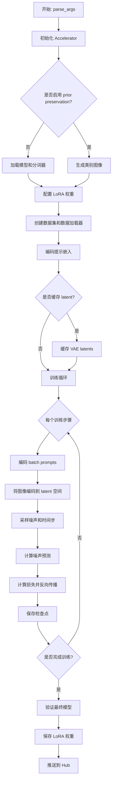

## 类结构

```
DreamBoothDataset (数据集类)
├── __init__
├── __len__
├── __getitem__
└── paired_transform
BucketBatchSampler (批处理采样器)
├── __init__
├── __iter__
└── __len__
PromptDataset (提示数据集)
├── __init__
├── __len__
└── __getitem__
```

## 全局变量及字段


### `logger`
    
用于记录训练过程日志的日志记录器

类型：`logging.Logger`
    


### `args`
    
存储命令行参数的对象，包含训练所需的所有配置选项

类型：`argparse.Namespace`
    


### `DreamBoothDataset.center_crop`
    
是否对图像进行中心裁剪

类型：`bool`
    


### `DreamBoothDataset.instance_prompt`
    
用于描述实例图像的提示词

类型：`str`
    


### `DreamBoothDataset.custom_instance_prompts`
    
自定义的实例提示词列表，用于为每张图像提供个性化描述

类型：`list`
    


### `DreamBoothDataset.class_prompt`
    
用于描述类别图像的提示词

类型：`str`
    


### `DreamBoothDataset.buckets`
    
宽高比桶列表，用于将图像分组到不同的尺寸类别

类型：`list`
    


### `DreamBoothDataset.instance_images`
    
实例图像的PIL Image对象列表

类型：`list`
    


### `DreamBoothDataset.cond_images`
    
条件图像的PIL Image对象列表，用于图像到图像的微调

类型：`list`
    


### `DreamBoothDataset.pixel_values`
    
预处理后的图像张量和对应的桶索引元组列表

类型：`list`
    


### `DreamBoothDataset.cond_pixel_values`
    
预处理后的条件图像张量和对应的桶索引元组列表

类型：`list`
    


### `DreamBoothDataset.num_instance_images`
    
实例图像的总数量

类型：`int`
    


### `DreamBoothDataset._length`
    
数据集的总长度，用于控制迭代次数

类型：`int`
    


### `DreamBoothDataset.class_data_root`
    
类别图像数据的根目录路径

类型：`Path`
    


### `DreamBoothDataset.class_images_path`
    
类别图像文件的路径列表

类型：`list`
    


### `DreamBoothDataset.num_class_images`
    
类别图像的总数量

类型：`int`
    


### `DreamBoothDataset.image_transforms`
    
用于类别图像的图像变换组合

类型：`transforms.Compose`
    


### `BucketBatchSampler.dataset`
    
关联的数据集对象

类型：`DreamBoothDataset`
    


### `BucketBatchSampler.batch_size`
    
每个批次的样本数量

类型：`int`
    


### `BucketBatchSampler.drop_last`
    
是否丢弃最后一个不完整的批次

类型：`bool`
    


### `BucketBatchSampler.bucket_indices`
    
按桶分组的索引列表，每个子列表对应一个桶

类型：`list`
    


### `BucketBatchSampler.sampler_len`
    
采样器的总长度，表示可生成的批次总数

类型：`int`
    


### `BucketBatchSampler.batches`
    
预先生成的批次索引列表

类型：`list`
    


### `PromptDataset.prompt`
    
用于生成类别图像的提示词

类型：`str`
    


### `PromptDataset.num_samples`
    
需要生成的样本数量

类型：`int`
    
    

## 全局函数及方法


### `save_model_card`

该函数用于在 DreamBooth LoRA 训练完成后，生成并保存模型卡片（Model Card）到本地文件夹，同时处理验证图像的保存和 widget 字典的构建，以便上传至 HuggingFace Hub。

参数：

- `repo_id`：`str`，HuggingFace Hub 上的仓库唯一标识符
- `images`：可选的 `List[Image]` 或 `None`，训练过程中生成的验证图像列表
- `base_model`：`str` 或 `None`，用于训练的基础模型名称或路径
- `train_text_encoder`：`bool`，标记是否对文本编码器进行了 LoRA 训练
- `instance_prompt`：`str` 或 `None`，触发模型生成实例图像的提示词
- `validation_prompt`：`str` 或 `None`，验证时使用的提示词
- `repo_folder`：`str` 或 `None`，本地仓库文件夹路径，用于保存 README.md 和图像文件

返回值：`None`，该函数无返回值，直接将模型卡片写入本地文件

#### 流程图

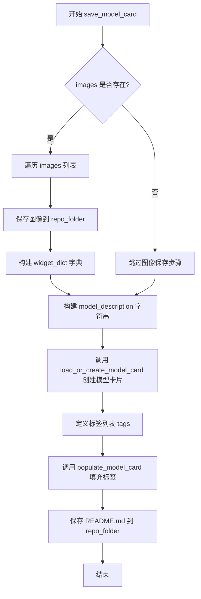

#### 带注释源码

```python
def save_model_card(
    repo_id: str,
    images=None,
    base_model: str = None,
    train_text_encoder=False,
    instance_prompt=None,
    validation_prompt=None,
    repo_folder=None,
):
    """
    保存模型卡片（Model Card）到本地文件夹，用于后续上传至 HuggingFace Hub。
    
    该函数会：
    1. 如果提供了验证图像，保存图像文件并构建 widget 字典
    2. 生成包含模型描述、使用方法、许可证等信息的 markdown 文本
    3. 调用 diffusers 工具函数加载或创建模型卡片对象
    4. 填充预定义的标签
    5. 将最终的 README.md 保存到本地仓库文件夹
    """
    
    # 初始化 widget 字典列表，用于 HuggingFace Hub 上的交互式演示
    widget_dict = []
    
    # 如果提供了验证图像，则保存图像并构建 widget 字典
    if images is not None:
        # 遍历所有验证图像
        for i, image in enumerate(images):
            # 将 PIL 图像保存为 PNG 文件到仓库文件夹
            image.save(os.path.join(repo_folder, f"image_{i}.png"))
            
            # 构建 widget 字典项，包含提示词和图像 URL
            # 用于 HuggingFace Hub 上的 widget 展示
            widget_dict.append(
                {"text": validation_prompt if validation_prompt else " ", "output": {"url": f"image_{i}.png"}}
            )

    # 构建模型描述的 markdown 字符串
    # 包含模型名称、训练方法、触发词、使用代码示例和许可证信息
    model_description = f"""
# Flux Kontext DreamBooth LoRA - {repo_id}

<Gallery />

## Model description

These are {repo_id} DreamBooth LoRA weights for {base_model}.

The weights were trained using [DreamBooth](https://dreambooth.github.io/) with the [Flux diffusers trainer](https://github.com/huggingface/diffusers/blob/main/examples/dreambooth/README_flux.md).

Was LoRA for the text encoder enabled? {train_text_encoder}.

## Trigger words

You should use `{instance_prompt}` to trigger the image generation.

## Download model

[Download the *.safetensors LoRA]({repo_id}/tree/main) in the Files & versions tab.

## Use it with the [🧨 diffusers library](https://github.com/huggingface/diffusers)

```py
from diffusers import FluxKontextPipeline
import torch
pipeline = FluxKontextPipeline.from_pretrained("black-forest-labs/FLUX.1-Kontext-dev", torch_dtype=torch.bfloat16).to('cuda')
pipeline.load_lora_weights('{repo_id}', weight_name='pytorch_lora_weights.safetensors')
image = pipeline('{validation_prompt if validation_prompt else instance_prompt}').images[0]
```

For more details, including weighting, merging and fusing LoRAs, check the [documentation on loading LoRAs in diffusers](https://huggingface.co/docs/diffusers/main/en/using-diffusers/loading_adapters)

## License

Please adhere to the licensing terms as described [here](https://huggingface.co/black-forest-labs/FLUX.1-dev/blob/main/LICENSE.md).
"""
    
    # 调用 diffusers 工具函数加载或创建模型卡片
    # from_training=True 表示这是从训练脚本生成的模型卡片
    # 会自动填充训练相关的信息
    model_card = load_or_create_model_card(
        repo_id_or_path=repo_id,
        from_training=True,
        license="other",
        base_model=base_model,
        prompt=instance_prompt,
        model_description=model_description,
        widget=widget_dict,
    )
    
    # 定义模型标签，用于在 HuggingFace Hub 上分类和搜索
    tags = [
        "text-to-image",
        "diffusers-training",
        "diffusers",
        "lora",
        "flux",
        "flux-kontextflux-diffusers",
        "template:sd-lora",
    ]

    # 调用 populate_model_card 填充标签信息到模型卡片
    model_card = populate_model_card(model_card, tags=tags)
    
    # 将模型卡片保存为 README.md 文件到本地仓库文件夹
    model_card.save(os.path.join(repo_folder, "README.md"))
```


### `load_text_encoders`

该函数是一个全局辅助函数，用于从预训练的模型路径中加载两个不同的文本编码器模型（通常是 CLIP 和 T5 模型）。它根据传入的类类型（`class_one` 和 `class_two`）调用 `from_pretrained` 方法，并结合全局参数 `args` 中定义的路径、副本名称和变体来实例化模型。

参数：

- `class_one`：`Type[Any]`，要加载的第一个文本编码器的类（例如 `CLIPTextModel`）。
- `class_two`：`Type[Any]`，要加载的第二个文本编码器的类（例如 `T5EncoderModel`）。

返回值：`Tuple[Any, Any]`，返回一个包含加载后的第一个和第二个文本编码器实例的元组。

#### 流程图

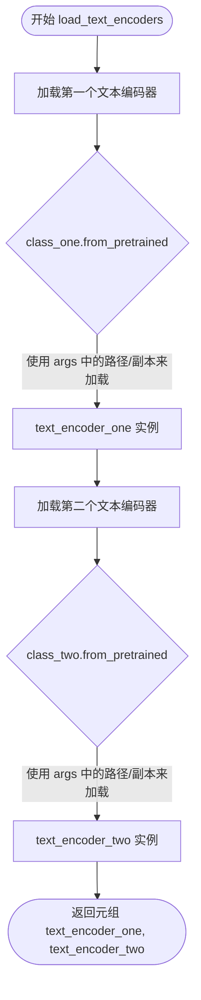

#### 带注释源码

```python
def load_text_encoders(class_one, class_two):
    """
    加载两个预训练的文本编码器模型。

    参数:
        class_one: 第一个文本编码器的类对象 (例如 CLIPTextModel).
        class_two: 第二个文本编码器的类对象 (例如 T5EncoderModel).
    
    返回:
        包含两个文本编码器模型的元组.
    """
    
    # 加载第一个文本编码器 (通常是 CLIP)
    # 使用预训练模型名称或路径、子文件夹 "text_encoder"、指定版本和变体
    text_encoder_one = class_one.from_pretrained(
        args.pretrained_model_name_or_path, 
        subfolder="text_encoder", 
        revision=args.revision, 
        variant=args.variant
    )
    
    # 加载第二个文本编码器 (通常是 T5)
    # 使用预训练模型名称或路径、子文件夹 "text_encoder_2"、指定版本和变体
    text_encoder_two = class_two.from_pretrained(
        args.pretrained_model_name_or_path, 
        subfolder="text_encoder_2", 
        revision=args.revision, 
        variant=args.variant
    )
    
    # 返回加载的两个编码器
    return text_encoder_one, text_encoder_two
```


### `log_validation`

该函数用于在训练过程中运行验证，生成验证图像并记录到日志跟踪器（TensorBoard或WandB）中，以监控模型在给定验证提示下的生成质量。

参数：

- `pipeline`：`FluxKontextPipeline`，用于图像生成的Diffusers pipeline实例
- `args`：命令行参数对象，包含验证相关配置（如验证提示词、验证图像数量等）
- `accelerator`：Accelerator实例，用于设备管理和分布式训练
- `pipeline_args`：字典，传递给pipeline的额外生成参数
- `epoch`：int，当前训练的轮次
- `torch_dtype`：torch.dtype，pipeline使用的数据类型
- `is_final_validation`：bool，是否为最终验证（决定是否使用autocast上下文）

返回值：`list[Image]`，生成的验证图像列表

#### 流程图

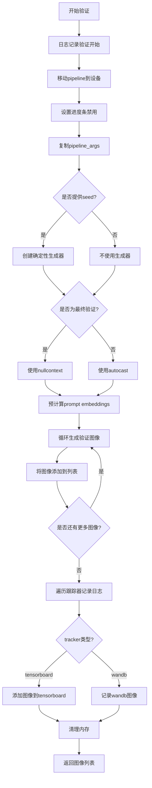

#### 带注释源码

```python
def log_validation(
    pipeline,              # FluxKontextPipeline: 用于生成图像的pipeline实例
    args,                  # Namespace: 包含训练/验证参数的对象
    accelerator,           # Accelerator: 分布式训练加速器
    pipeline_args,         # dict: 额外传递给pipeline的参数字典
    epoch,                 # int: 当前训练轮次编号
    torch_dtype,           # torch.dtype: 计算使用的数据类型
    is_final_validation=False,  # bool: 标志是否为最终验证
):
    # 记录验证开始信息，包括验证图像数量和提示词
    logger.info(
        f"Running validation... \n Generating {args.num_validation_images} images with prompt:"
        f" {args.validation_prompt}."
    )
    
    # 将pipeline移动到加速器设备上，使用指定的数据类型
    pipeline = pipeline.to(accelerator.device, dtype=torch_dtype)
    # 禁用进度条显示以减少日志输出
    pipeline.set_progress_bar_config(disable=True)
    # 创建pipeline参数的副本，避免修改原始参数
    pipeline_args_cp = pipeline_args.copy()

    # 运行推理
    # 如果提供了seed，则创建确定性生成器以确保可重复性
    generator = torch.Generator(device=accelerator.device).manual_seed(args.seed) if args.seed is not None else None
    # 根据是否为最终验证决定是否使用自动混合精度
    # 最终验证时使用nullcontext避免精度问题
    autocast_ctx = torch.autocast(accelerator.device.type) if not is_final_validation else nullcontext()

    # 预计算prompt embeddings和text ids，因为T5不支持autocast
    # 使用no_grad上下文避免计算梯度
    with torch.no_grad():
        # 从pipeline_args中弹出prompt
        prompt = pipeline_args_cp.pop("prompt")
        # 编码提示词获取embeddings
        prompt_embeds, pooled_prompt_embeds, text_ids = pipeline.encode_prompt(prompt, prompt_2=None)
    
    # 初始化图像列表
    images = []
    # 循环生成指定数量的验证图像
    for _ in range(args.num_validation_images):
        # 使用autocast上下文进行推理
        with autocast_ctx:
            image = pipeline(
                **pipeline_args_cp,
                prompt_embeds=prompt_embeds,
                pooled_prompt_embeds=pooled_prompt_embeds,
                generator=generator,  # 使用确定性生成器
            ).images[0]  # 取第一张生成的图像
            images.append(image)

    # 遍历所有跟踪器记录验证结果
    for tracker in accelerator.trackers:
        # 确定阶段名称：最终验证为"test"，中间验证为"validation"
        phase_name = "test" if is_final_validation else "validation"
        # 根据跟踪器类型选择记录方式
        if tracker.name == "tensorboard":
            # 将numpy数组堆叠成批次NHWC格式
            np_images = np.stack([np.asarray(img) for img in images])
            tracker.writer.add_images(phase_name, np_images, epoch, dataformats="NHWC")
        if tracker.name == "wandb":
            # 记录带有标题的wandb图像
            tracker.log(
                {
                    phase_name: [
                        wandb.Image(image, caption=f"{i}: {args.validation_prompt}") for i, image in enumerate(images)
                    ]
                }
            )

    # 清理：删除pipeline对象并释放GPU内存
    del pipeline
    free_memory()

    # 返回生成的图像列表供后续使用
    return images
```

#### 关键组件信息

| 组件名称 | 描述 |
|---------|------|
| `prompt_embeds` | 预计算的文本提示嵌入，用于加速多图像生成 |
| `generator` | PyTorch随机数生成器，确保验证过程的可重复性 |
| `autocast_ctx` | 自动混合精度上下文，在最终验证时禁用以保证输出稳定性 |
| `phase_name` | 区分验证阶段和最终测试阶段的标识符 |

#### 潜在技术债务与优化空间

1. **硬编码的prompt处理**：函数假设`pipeline_args`中必然包含`prompt`键，若不存在会导致KeyError
2. **预计算embeddings的限制**：当前实现仅处理单一prompt，对多prompt验证场景支持不完整
3. **内存清理时机**：在最终验证后仍清理pipeline，可能导致后续无法使用相同pipeline进行推理
4. **跟踪器兼容性**：仅显式支持tensorboard和wandb，其他跟踪器会被忽略

#### 其它说明

- **设计目标**：该函数是DreamBooth训练流程的一部分，用于周期性验证LoRA微调后的模型质量
- **约束条件**：
  - 最终验证（`is_final_validation=True`）时禁用autocast以避免精度问题
  - 使用T5编码器时必须预计算embeddings，因为T5不支持autocast上下文
- **错误处理**：当前无显式错误处理，pipeline生成失败将导致验证中断
- **数据流**：验证图像不保存到磁盘，仅记录到跟踪器；若需持久化需在调用处处理


### `import_model_class_from_model_name_or_path`

该函数根据预训练模型的配置文件动态加载对应的文本编码器模型类（`CLIPTextModel` 或 `T5EncoderModel`），用于后续实例化文本编码器。

参数：

- `pretrained_model_name_or_path`：`str`，预训练模型的名称（HuggingFace Hub 标识符）或本地路径
- `revision`：`str`，模型版本号（如 "main"、"v1.0" 等）
- `subfolder`：`str`，模型子文件夹路径，默认为 "text_encoder"（对应第二个文本编码器时为 "text_encoder_2"）

返回值：`type`，返回对应的文本编码器模型类（`CLIPTextModel` 或 `T5EncoderModel` 类型）

#### 流程图

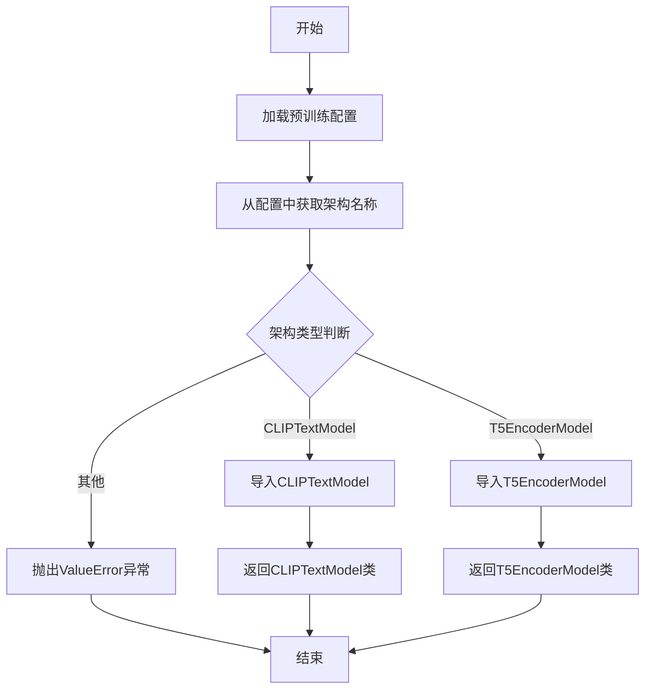

#### 带注释源码

```python
def import_model_class_from_model_name_or_path(
    pretrained_model_name_or_path: str, 
    revision: str, 
    subfolder: str = "text_encoder"
):
    """
    从预训练模型路径导入对应的文本编码器模型类
    
    参数:
        pretrained_model_name_or_path: 预训练模型名称或本地路径
        revision: 模型版本号
        subfolder: 模型子文件夹（默认text_encoder）
    
    返回:
        对应的文本编码器模型类（CLIPTextModel或T5EncoderModel）
    """
    
    # 步骤1: 加载预训练模型的配置文件
    # 使用transformers库的PretrainedConfig加载配置
    text_encoder_config = PretrainedConfig.from_pretrained(
        pretrained_model_name_or_path,  # 模型路径或名称
        subfolder=subfolder,            # 指定子文件夹（如text_encoder或text_encoder_2）
        revision=revision              # 版本号
    )
    
    # 步骤2: 从配置中获取模型架构名称
    # 配置中architecures字段包含模型架构类型
    model_class = text_encoder_config.architectures[0]
    
    # 步骤3: 根据架构类型返回对应的模型类
    if model_class == "CLIPTextModel":
        # CLIP文本编码器（如FLUX模型中第一个文本编码器）
        from transformers import CLIPTextModel
        return CLIPTextModel
    
    elif model_class == "T5EncoderModel":
        # T5文本编码器（如FLUX模型中第二个文本编码器）
        from transformers import T5EncoderModel
        return T5EncoderModel
    
    else:
        # 不支持的架构类型，抛出异常
        raise ValueError(f"{model_class} is not supported.")
```


### `parse_args`

该函数是 Flux Kontext DreamBooth LoRA 训练脚本的参数解析器，通过 argparse 定义并解析约 80 个命令行参数，包括模型路径、数据集配置、训练超参数、优化器设置、验证选项等，并对参数进行合法性校验后返回包含所有配置参数的 `Namespace` 对象。

参数：

- `input_args`：`List[str]`，可选参数，默认值为 `None`。当需要从非命令行（如测试代码）传入参数时使用，若为 `None` 则从 `sys.argv` 解析命令行参数。

返回值：`argparse.Namespace`，返回解析后的参数对象，包含所有命令行参数的命名空间，后续通过 `args.参数名` 访问。

#### 流程图

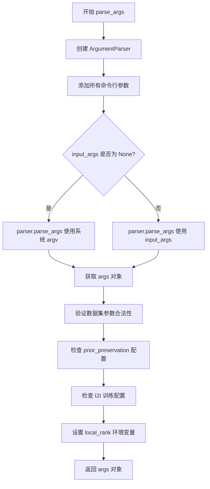

#### 带注释源码

```python
def parse_args(input_args=None):
    """
    解析命令行参数，返回包含所有训练配置的 Namespace 对象
    
    参数:
        input_args: 可选的参数列表，用于非命令行调用场景（如单元测试）
    
    返回:
        argparse.Namespace: 包含所有解析后参数的对象
    """
    # 创建 ArgumentParser 实例，描述信息为"训练脚本的简单示例"
    parser = argparse.ArgumentParser(description="Simple example of a training script.")
    
    # ==================== 模型相关参数 ====================
    # 预训练模型路径或 HuggingFace 模型标识符（必需）
    parser.add_argument(
        "--pretrained_model_name_or_path",
        type=str,
        default=None,
        required=True,
        help="Path to pretrained model or model identifier from huggingface.co/models.",
    )
    # 模型版本分支
    parser.add_argument(
        "--revision",
        type=str,
        default=None,
        required=False,
        help="Revision of pretrained model identifier from huggingface.co/models.",
    )
    # VAE 编码模式：sample（采样）或 mode（均值）
    parser.add_argument(
        "--vae_encode_mode",
        type=str,
        default="mode",
        choices=["sample", "mode"],
        help="VAE encoding mode.",
    )
    # 模型文件变体（如 fp16）
    parser.add_argument(
        "--variant",
        type=str,
        default=None,
        help="Variant of the model files of the pretrained model identifier from huggingface.co/models, 'e.g.' fp16",
    )
    
    # ==================== 数据集相关参数 ====================
    # 数据集名称（HuggingFace Hub 或本地路径）
    parser.add_argument(
        "--dataset_name",
        type=str,
        default=None,
        help=(
            "The name of the Dataset (from the HuggingFace hub) containing the training data of instance images (could be your own, possibly private,"
            " dataset). It can also be a path pointing to a local copy of a dataset in your filesystem,"
            " or to a folder containing files that 🤗 Datasets can understand."
        ),
    )
    # 数据集配置名称
    parser.add_argument(
        "--dataset_config_name",
        type=str,
        default=None,
        help="The config of the Dataset, leave as None if there's only one config.",
    )
    # 本地实例数据目录
    parser.add_argument(
        "--instance_data_dir",
        type=str,
        default=None,
        help=("A folder containing the training data. "),
    )
    # 缓存目录
    parser.add_argument(
        "--cache_dir",
        type=str,
        default=None,
        help="The directory where the downloaded models and datasets will be stored.",
    )
    # 数据集中的图像列名
    parser.add_argument(
        "--image_column",
        type=str,
        default="image",
        help="The column of the dataset containing the target image. By "
        "default, the standard Image Dataset maps out 'file_name' "
        "to 'image'.",
    )
    # 条件图像列名（用于 I2I 训练）
    parser.add_argument(
        "--cond_image_column",
        type=str,
        default=None,
        help="Column in the dataset containing the condition image. Must be specified when performing I2I fine-tuning",
    )
    # 描述/提示词列名
    parser.add_argument(
        "--caption_column",
        type=str,
        default=None,
        help="The column of the dataset containing the instance prompt for each image",
    )
    # 训练数据重复次数
    parser.add_argument("--repeats", type=int, default=1, help="How many times to repeat the training data.")
    
    # ==================== Prior Preservation 相关参数 ====================
    # 类别数据目录
    parser.add_argument(
        "--class_data_dir",
        type=str,
        default=None,
        required=False,
        help="A folder containing the training data of class images.",
    )
    # 实例提示词（用于标识特定实例）
    parser.add_argument(
        "--instance_prompt",
        type=str,
        default=None,
        help="The prompt with identifier specifying the instance, e.g. 'photo of a TOK dog', 'in the style of TOK'",
    )
    # 类别提示词
    parser.add_argument(
        "--class_prompt",
        type=str,
        default=None,
        help="The prompt to specify images in the same class as provided instance images.",
    )
    # Prior preservation 损失权重
    parser.add_argument("--prior_loss_weight", type=float, default=1.0, help="The weight of prior preservation loss.")
    # 类别图像数量
    parser.add_argument(
        "--num_class_images",
        type=int,
        default=100,
        help=(
            "Minimal class images for prior preservation loss. If there are not enough images already present in"
            " class_data_dir, additional images will be sampled with class_prompt."
        ),
    )
    # 启用 prior preservation 标志
    parser.add_argument(
        "--with_prior_preservation",
        default=False,
        action="store_true",
        help="Flag to add prior preservation loss.",
    )
    
    # ==================== 文本编码器参数 ====================
    # T5 文本编码器的最大序列长度
    parser.add_argument(
        "--max_sequence_length",
        type=int,
        default=512,
        help="Maximum sequence length to use with with the T5 text encoder",
    )
    # 是否训练文本编码器
    parser.add_argument(
        "--train_text_encoder",
        action="store_true",
        help="Whether to train the text encoder. If set, the text encoder should be float32 precision.",
    )
    
    # ==================== LoRA 参数 ====================
    # LoRA 秩（更新矩阵的维度）
    parser.add_argument(
        "--rank",
        type=int,
        default=4,
        help=("The dimension of the LoRA update matrices."),
    )
    # LoRA alpha 值（用于额外缩放）
    parser.add_argument(
        "--lora_alpha",
        type=int,
        default=4,
        help="LoRA alpha to be used for additional scaling.",
    )
    # LoRA 层的 dropout 概率
    parser.add_argument("--lora_dropout", type=float, default=0.0, help="Dropout probability for LoRA layers")
    # 要应用 LoRA 的 transformer 层
    parser.add_argument(
        "--lora_layers",
        type=str,
        default=None,
        help=(
            'The transformer modules to apply LoRA training on. Please specify the layers in a comma separated. E.g. - "to_k,to_q,to_v,to_out.0" will result in lora training of attention layers only'
        ),
    )
    
    # ==================== 验证相关参数 ====================
    # 验证提示词
    parser.add_argument(
        "--validation_prompt",
        type=str,
        default=None,
        help="A prompt that is used during validation to verify that the model is learning.",
    )
    # 验证图像（用于 I2I 微调）
    parser.add_argument(
        "--validation_image",
        type=str,
        default=None,
        help="Validation image to use (during I2I fine-tuning) to verify that the model is learning.",
    )
    # 验证时生成的图像数量
    parser.add_argument(
        "--num_validation_images",
        type=int,
        default=4,
        help="Number of images that should be generated during validation with `validation_prompt`.",
    )
    # 验证执行的 epoch 间隔
    parser.add_argument(
        "--validation_epochs",
        type=int,
        default=50,
        help=(
            "Run dreambooth validation every X epochs. Dreambooth validation consists of running the prompt"
            " `args.validation_prompt` multiple times: `args.num_validation_images`."
        ),
    )
    
    # ==================== 输出和检查点参数 ====================
    # 输出目录
    parser.add_argument(
        "--output_dir",
        type=str,
        default="flux-kontext-lora",
        help="The output directory where the model predictions and checkpoints will be written.",
    )
    # 随机种子
    parser.add_argument("--seed", type=int, default=None, help="A seed for reproducible training.")
    # 检查点保存步数间隔
    parser.add_argument(
        "--checkpointing_steps",
        type=int,
        default=500,
        help=(
            "Save a checkpoint of the training state every X updates. These checkpoints can be used both as final"
            " checkpoints in case they are better than the last checkpoint, and are also suitable for resuming"
            " training using `--resume_from_checkpoint`."
        ),
    )
    # 最多保存的检查点数量
    parser.add_argument(
        "--checkpoints_total_limit",
        type=int,
        default=None,
        help=("Max number of checkpoints to store."),
    )
    # 从检查点恢复训练
    parser.add_argument(
        "--resume_from_checkpoint",
        type=str,
        default=None,
        help=(
            "Whether training should be resumed from a previous checkpoint. Use a path saved by"
            ' `--checkpointing_steps`, or `"latest"` to automatically select the last available checkpoint.'
        ),
    )
    
    # ==================== 图像处理参数 ====================
    # 输入图像分辨率
    parser.add_argument(
        "--resolution",
        type=int,
        default=512,
        help=(
            "The resolution for input images, all the images in the train/validation dataset will be resized to this"
            " resolution"
        ),
    )
    # 宽高比 bucket（定义多个分辨率）
    parser.add_argument(
        "--aspect_ratio_buckets",
        type=str,
        default=None,
        help=(
            "Aspect ratio buckets to use for training. Define as a string of 'h1,w1;h2,w2;...'. "
            "e.g. '1024,1024;768,1360;1360,768;880,1168;1168,880;1248,832;832,1248'"
            "Images will be resized and cropped to fit the nearest bucket. If provided, --resolution is ignored."
        ),
    )
    # 是否中心裁剪
    parser.add_argument(
        "--center_crop",
        default=False,
        action="store_true",
        help=(
            "Whether to center crop the input images to the resolution. If not set, the images will be randomly"
            " cropped. The images will be resized to the resolution first before cropping."
        ),
    )
    # 是否随机水平翻转
    parser.add_argument(
        "--random_flip",
        action="store_true",
        help="whether to randomly flip images horizontally",
    )
    
    # ==================== 训练批次参数 ====================
    # 训练批次大小
    parser.add_argument(
        "--train_batch_size", type=int, default=4, help="Batch size (per device) for the training dataloader."
    )
    # 采样批次大小
    parser.add_argument(
        "--sample_batch_size", type=int, default=4, help="Batch size (per device) for sampling images."
    )
    # 训练 epoch 数
    parser.add_argument("--num_train_epochs", type=int, default=1)
    # 最大训练步数（若提供则覆盖 num_train_epochs）
    parser.add_argument(
        "--max_train_steps",
        type=int,
        default=None,
        help="Total number of training steps to perform.  If provided, overrides num_train_epochs.",
    )
    # 梯度累积步数
    parser.add_argument(
        "--gradient_accumulation_steps",
        type=int,
        default=1,
        help="Number of updates steps to accumulate before performing a backward/update pass.",
    )
    # 梯度 checkpointing（以时间换内存）
    parser.add_argument(
        "--gradient_checkpointing",
        action="store_true",
        help="Whether or not to use gradient checkpointing to save memory at the expense of slower backward pass.",
    )
    # 最大梯度范数
    parser.add_argument("--max_grad_norm", default=1.0, type=float, help="Max gradient norm.")
    
    # ==================== 学习率参数 ====================
    # 初始学习率
    parser.add_argument(
        "--learning_rate",
        type=float,
        default=1e-4,
        help="Initial learning rate (after the potential warmup period) to use.",
    )
    # FLUX.1 dev 变体的 guidance 比例
    parser.add_argument(
        "--guidance_scale",
        type=float,
        default=3.5,
        help="the FLUX.1 dev variant is a guidance distilled model",
    )
    # 文本编码器学习率
    parser.add_argument(
        "--text_encoder_lr",
        type=float,
        default=5e-6,
        help="Text encoder learning rate to use.",
    )
    # 是否根据 GPU/梯度累积/批次大小缩放学习率
    parser.add_argument(
        "--scale_lr",
        action="store_true",
        default=False,
        help="Scale the learning rate by the number of GPUs, gradient accumulation steps, and batch size.",
    )
    # 学习率调度器类型
    parser.add_argument(
        "--lr_scheduler",
        type=str,
        default="constant",
        help=(
            'The scheduler type to use. Choose between ["linear", "cosine", "cosine_with_restarts", "polynomial",'
            ' "constant", "constant_with_warmup"]'
        ),
    )
    # warmup 步数
    parser.add_argument(
        "--lr_warmup_steps", type=int, default=500, help="Number of steps for the warmup in the lr scheduler."
    )
    # cosine_with_restarts 调度器的硬重启次数
    parser.add_argument(
        "--lr_num_cycles",
        type=int,
        default=1,
        help="Number of hard resets of the lr in cosine_with_restarts scheduler.",
    )
    # polynomial 调度器的幂因子
    parser.add_argument("--lr_power", type=float, default=1.0, help="Power factor of the polynomial scheduler.")
    
    # ==================== 数据加载器参数 ====================
    # 数据加载的子进程数
    parser.add_argument(
        "--dataloader_num_workers",
        type=int,
        default=0,
        help=(
            "Number of subprocesses to use for data loading. 0 means that the data will be loaded in the main process."
        ),
    )
    
    # ==================== 采样权重策略参数 ====================
    # 采样权重策略
    parser.add_argument(
        "--weighting_scheme",
        type=str,
        default="none",
        choices=["sigma_sqrt", "logit_normal", "mode", "cosmap", "none"],
        help=('We default to the "none" weighting scheme for uniform sampling and uniform loss'),
    )
    # logit_normal 策略的均值
    parser.add_argument(
        "--logit_mean", type=float, default=0.0, help="mean to use when using the `'logit_normal'` weighting scheme."
    )
    # logit_normal 策略的标准差
    parser.add_argument(
        "--logit_std", type=float, default=1.0, help="std to use when using the `'logit_normal'` weighting scheme."
    )
    # mode 策略的缩放因子
    parser.add_argument(
        "--mode_scale",
        type=float,
        default=1.29,
        help="Scale of mode weighting scheme. Only effective when using the `'mode'` as the `weighting_scheme`.",
    )
    
    # ==================== 优化器参数 ====================
    # 优化器类型
    parser.add_argument(
        "--optimizer",
        type=str,
        default="AdamW",
        help=('The optimizer type to use. Choose between ["AdamW", "prodigy"]'),
    )
    # 是否使用 8-bit Adam
    parser.add_argument(
        "--use_8bit_adam",
        action="store_true",
        help="Whether or not to use 8-bit Adam from bitsandbytes. Ignored if optimizer is not set to AdamW",
    )
    # Adam/Prodigy 的 beta1 参数
    parser.add_argument(
        "--adam_beta1", type=float, default=0.9, help="The beta1 parameter for the Adam and Prodigy optimizers."
    )
    # Adam/Prodigy 的 beta2 参数
    parser.add_argument(
        "--adam_beta2", type=float, default=0.999, help="The beta2 parameter for the Adam and Prodigy optimizers."
    )
    # Prodigy 的 beta3 系数
    parser.add_argument(
        "--prodigy_beta3",
        type=float,
        default=None,
        help="coefficients for computing the Prodigy stepsize using running averages. If set to None, "
        "uses the value of square root of beta2. Ignored if optimizer is adamW",
    )
    # Prodigy 是否使用解耦权重衰减
    parser.add_argument("--prodigy_decouple", type=bool, default=True, help="Use AdamW style decoupled weight decay")
    # unet 参数的权重衰减
    parser.add_argument("--adam_weight_decay", type=float, default=1e-04, help="Weight decay to use for unet params")
    # text_encoder 的权重衰减
    parser.add_argument(
        "--adam_weight_decay_text_encoder", type=float, default=1e-03, help="Weight decay to use for text_encoder"
    )
    # Adam 的 epsilon 值
    parser.add_argument(
        "--adam_epsilon",
        type=float,
        default=1e-08,
        help="Epsilon value for the Adam optimizer and Prodigy optimizers.",
    )
    # Prodigy 是否使用偏置校正
    parser.add_argument(
        "--prodigy_use_bias_correction",
        type=bool,
        default=True,
        help="Turn on Adam's bias correction. True by default. Ignored if optimizer is adamW",
    )
    # Prodigy 是否保护 warmup 阶段
    parser.add_argument(
        "--prodigy_safeguard_warmup",
        type=bool,
        default=True,
        help="Remove lr from the denominator of D estimate to avoid issues during warm-up stage. True by default. "
        "Ignored if optimizer is adamW",
    )
    
    # ==================== 推理和精度参数 ====================
    # 是否允许 TF32（Ampere GPU 加速）
    parser.add_argument(
        "--allow_tf32",
        action="store_true",
        help=(
            "Whether or not to allow TF32 on Ampere GPUs. Can be used to speed up training. For more information, see"
            " https://pytorch.org/docs/stable/notes/cuda.html#tensorfloat-32-tf32-on-ampere-devices"
        ),
    )
    # 是否缓存 VAE latent
    parser.add_argument(
        "--cache_latents",
        action="store_true",
        default=False,
        help="Cache the VAE latents",
    )
    # 混合精度类型
    parser.add_argument(
        "--mixed_precision",
        type=str,
        default=None,
        choices=["no", "fp16", "bf16"],
        help=(
            "Whether to use mixed precision. Choose between fp16 and bf16 (bfloat16). Bf16 requires PyTorch >="
            " 1.10.and an Nvidia Ampere GPU.  Default to the value of accelerate config of the current system or the"
            " flag passed with the `accelerate.launch` command. Use this argument to override the accelerate config."
        ),
    )
    # 保存前是否将训练层转换为 float32
    parser.add_argument(
        "--upcast_before_saving",
        action="store_true",
        default=False,
        help=(
            "Whether to upcast the trained transformer layers to float32 before saving (at the end of training). "
            "Defaults to precision dtype used for training to save memory"
        ),
    )
    # 类别图像生成的精度
    parser.add_argument(
        "--prior_generation_precision",
        type=str,
        default=None,
        choices=["no", "fp32", "fp16", "bf16"],
        help=(
            "Choose prior generation precision between fp32, fp16 and bf16 (bfloat16). Bf16 requires PyTorch >="
            " 1.10.and an Nvidia Ampere GPU.  Default to  fp16 if a GPU is available else fp32."
        ),
    )
    
    # ==================== Hub 和日志参数 ====================
    # 是否推送到 HuggingFace Hub
    parser.add_argument("--push_to_hub", action="store_true", help="Whether or not to push the model to the Hub.")
    # Hub token
    parser.add_argument("--hub_token", type=str, default=None, help="The token to use to push to the Model Hub.")
    # Hub 模型 ID
    parser.add_argument(
        "--hub_model_id",
        type=str,
        default=None,
        help="The name of the repository to keep in sync with the local `output_dir`.",
    )
    # TensorBoard 日志目录
    parser.add_argument(
        "--logging_dir",
        type=str,
        default="logs",
        help=(
            "[TensorBoard](https://www.tensorflow.org/tensorboard) log directory. Will default to"
            " *output_dir/runs/**CURRENT_DATETIME_HOSTNAME***."
        ),
    )
    # 日志报告目标
    parser.add_argument(
        "--report_to",
        type=str,
        default="tensorboard",
        help=(
            'The integration to report the results and logs to. Supported platforms are `"tensorboard"`'
            ' (default), `"wandb"` and `"comet_ml"`. Use `"all"` to report to all integrations.'
        ),
    )
    
    # ==================== 分布式训练参数 ====================
    # 本地排名（用于分布式训练）
    parser.add_argument("--local_rank", type=int, default=-1, help="For distributed training: local_rank")
    # 启用 NPU Flash Attention
    parser.add_argument("--enable_npu_flash_attention", action="store_true", help="Enabla Flash Attention for NPU")
    
    # ==================== 解析参数 ====================
    # 根据 input_args 是否为空决定解析方式
    if input_args is not None:
        args = parser.parse_args(input_args)
    else:
        args = parser.parse_args()
    
    # ==================== 参数合法性校验 ====================
    # 校验数据集参数：必须指定 dataset_name 或 instance_data_dir 之一
    if args.dataset_name is None and args.instance_data_dir is None:
        raise ValueError("Specify either `--dataset_name` or `--instance_data_dir`")
    
    # 校验数据集参数：不能同时指定两者
    if args.dataset_name is not None and args.instance_data_dir is not None:
        raise ValueError("Specify only one of `--dataset_name` or `--instance_data_dir`")
    
    # 从环境变量获取 LOCAL_RANK 并同步到 args.local_rank
    env_local_rank = int(os.environ.get("LOCAL_RANK", -1))
    if env_local_rank != -1 and env_local_rank != args.local_rank:
        args.local_rank = env_local_rank
    
    # 校验 prior preservation 相关参数
    if args.with_prior_preservation:
        if args.class_data_dir is None:
            raise ValueError("You must specify a data directory for class images.")
        if args.class_prompt is None:
            raise ValueError("You must specify prompt for class images.")
        if args.cond_image_column is not None:
            raise ValueError("Prior preservation isn't supported with I2I training.")
    else:
        # logger is not available yet
        if args.class_data_dir is not None:
            warnings.warn("You need not use --class_data_dir without --with_prior_preservation.")
        if args.class_prompt is not None:
            warnings.warn("You need not use --class_prompt without --with_prior_preservation.")
    
    # 校验 I2I 训练参数
    if args.cond_image_column is not None:
        assert args.image_column is not None
        assert args.caption_column is not None
        assert args.dataset_name is not None
        assert not args.train_text_encoder
        if args.validation_prompt is not None:
            assert args.validation_image is None and os.path.exists(args.validation_image)
    
    # 返回解析后的参数对象
    return args
```


### `tokenize_prompt`

对输入的提示词（prompt）进行分词（tokenize），将其转换为模型可处理的token ID序列。

参数：

- `tokenizer`：`transformers.Tokenizer`，分词器对象，用于将文本转换为token ID
- `prompt`：`str`，需要分词的提示词文本
- `max_sequence_length`：`int`，最大序列长度，超过该长度将进行截断

返回值：`torch.Tensor`，形状为`(1, max_sequence_length)`的token ID序列

#### 流程图

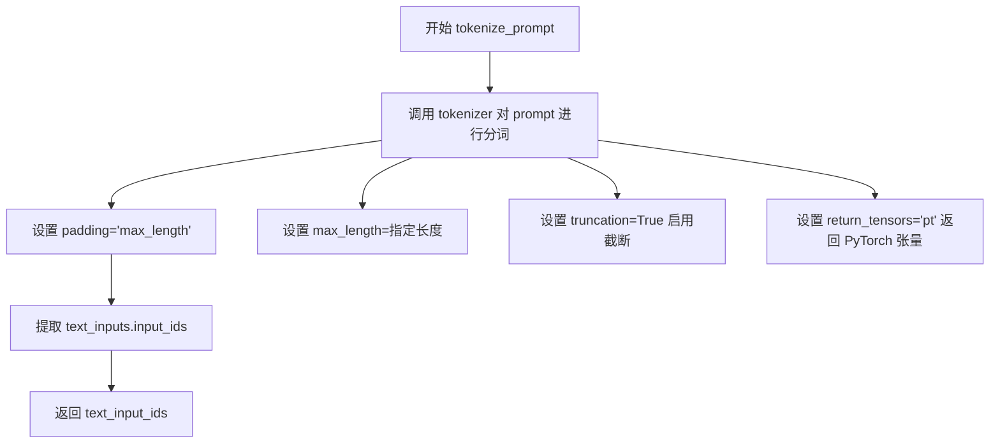

#### 带注释源码

```python
def tokenize_prompt(tokenizer, prompt, max_sequence_length):
    """
    对提示词进行 tokenize 处理
    
    参数:
        tokenizer: 分词器对象 (CLIPTokenizer 或 T5TokenizerFast)
        prompt: 需要分词的文本提示
        max_sequence_length: 最大序列长度
    
    返回:
        text_input_ids: 分词后的 token ID 张量
    """
    # 使用分词器对 prompt 进行编码
    text_inputs = tokenizer(
        prompt,                      # 待编码的文本
        padding="max_length",        # 填充到最大长度
        max_length=max_sequence_length,  # 最大序列长度
        truncation=True,             # 超过最大长度时截断
        return_length=False,         # 不返回长度信息
        return_overflowing_tokens=False,  # 不返回溢出token
        return_tensors="pt",         # 返回 PyTorch 张量
    )
    # 提取 input_ids 字段
    text_input_ids = text_inputs.input_ids
    # 返回 token IDs
    return text_input_ids
```


### `_encode_prompt_with_t5`

该函数是 Flux Kontext DreamBooth LoRA 训练脚本中的核心文本编码组件。它负责使用 T5 Transformer 模型（`text_encoder`）将文本提示（Prompt）转换为高维向量表示（Embeddings），以作为扩散模型的输入条件。若未直接提供分词后的 token IDs，它会先调用 T5 分词器进行分词处理。此外，该函数支持根据 `num_images_per_prompt` 参数复制 embeddings 以适应批量生成的需求。

#### 参数

- `text_encoder`: `transformers.T5EncoderModel`，T5 文本编码器模型实例，用于生成文本嵌入。
- `tokenizer`: `transformers.T5TokenizerFast`，T5 分词器实例，用于将文本转换为 token IDs。若为 `None`，则必须直接提供 `text_input_ids`。
- `max_sequence_length`: `int`，可选，默认值 `512`。分词器的最大序列长度，超出部分将被截断。
- `prompt`: `Union[str, List[str]]`，待编码的文本提示。可以是单个字符串或字符串列表。
- `num_images_per_prompt`: `int`，可选，默认值 `1`。每个文本提示需要生成的图像数量，用于将 embeddings 扩展相应的倍数以匹配批量大小。
- `device`: `torch.device`，计算设备，用于将模型输出移动到指定设备（如 GPU）。
- `text_input_ids`: `torch.Tensor`，可选。预先分词好的 token IDs tensor。当 `tokenizer` 为 `None` 时必须提供。

#### 返回值

- `prompt_embeds`: `torch.Tensor`，编码后的文本嵌入向量。形状为 `(batch_size * num_images_per_prompt, seq_len, hidden_dim)`，其中 `hidden_dim` 是文本编码器的隐藏层维度。

#### 流程图

```mermaid
flowchart TD
    A[开始 _encode_prompt_with_t5] --> B{判断 prompt 类型}
    B -- 字符串 --> C[转换为列表]
    B -- 列表 --> D[保持列表]
    C --> E{判断 tokenizer 是否存在}
    D --> E
    
    E -- 存在 --> F[使用 tokenizer 分词]
    E -- 不存在 --> G{判断 text_input_ids 是否存在}
    F --> H[获取 text_input_ids]
    G -- 不存在 --> I[抛出 ValueError]
    G -- 存在 --> H
    
    H --> J[调用 text_encoder 获取 embeddings]
    
    J --> K{检查 text_encoder 是否有 module 属性}
    K -- 是 (DataParallel) --> L[获取 text_encoder.module.dtype]
    K -- 否 --> M[获取 text_encoder.dtype]
    
    L --> N[将 embeddings 移动到指定 device 和 dtype]
    M --> N
    
    N --> O{检查 num_images_per_prompt 是否大于 1}
    O -- 是 --> P[沿第一维度重复 embeddings]
    O -- 否 --> Q[保持 embeddings 不变]
    
    P --> R[reshape embeddings: (batch*num, seq, dim)]
    Q --> R
    
    R --> S[返回 prompt_embeds]
```

#### 带注释源码

```python
def _encode_prompt_with_t5(
    text_encoder,
    tokenizer,
    max_sequence_length=512,
    prompt=None,
    num_images_per_prompt=1,
    device=None,
    text_input_ids=None,
):
    """
    使用 T5 模型编码文本提示。

    参数:
        text_encoder: T5 文本编码器模型。
        tokenizer: T5 分词器。
        max_sequence_length: 最大序列长度。
        prompt: 待编码的文本。
        num_images_per_prompt: 每个提示生成的图像数。
        device: 目标设备。
        text_input_ids: 预先分词的 token IDs。
    """
    # 1. 规范化 prompt 输入为列表格式，以便统一处理批量数据
    prompt = [prompt] if isinstance(prompt, str) else prompt
    batch_size = len(prompt)

    # 2. 分词处理：如果提供了 tokenizer，则使用它将文本转为 token IDs
    if tokenizer is not None:
        text_inputs = tokenizer(
            prompt,
            padding="max_length",
            max_length=max_sequence_length,
            truncation=True,
            return_length=False,
            return_overflowing_tokens=False,
            return_tensors="pt",
        )
        text_input_ids = text_inputs.input_ids
    else:
        # 如果没有 tokenizer，则必须直接提供 token IDs
        if text_input_ids is None:
            raise ValueError("text_input_ids must be provided when the tokenizer is not specified")

    # 3. 编码：使用 T5 模型将 token IDs 转换为 embeddings
    # text_encoder(text_input_ids.to(device))[0] 通常返回 last_hidden_state
    prompt_embeds = text_encoder(text_input_ids.to(device))[0]

    # 4. 确定数据类型：处理 DataParallel 包装的情况
    if hasattr(text_encoder, "module"):
        dtype = text_encoder.module.dtype
    else:
        dtype = text_encoder.dtype
    
    # 确保 embeddings 的数据类型和设备正确
    prompt_embeds = prompt_embeds.to(dtype=dtype, device=device)

    # 获取序列长度，用于后续 reshape
    _, seq_len, _ = prompt_embeds.shape

    # 5. 批量生成处理：根据每个提示生成的图像数量复制 embeddings
    # 这样可以在一次前向传播中生成多张图像，提高效率
    prompt_embeds = prompt_embeds.repeat(1, num_images_per_prompt, 1)
    # 调整形状以匹配新的批次大小: [batch_size * num_images_per_prompt, seq_len, hidden_dim]
    prompt_embeds = prompt_embeds.view(batch_size * num_images_per_prompt, seq_len, -1)

    return prompt_embeds
```


### `_encode_prompt_with_clip`

该函数使用 CLIP 文本编码器对输入的提示词进行编码，返回池化后的提示词嵌入向量。主要用于将文本提示转换为模型可处理的向量表示，支持批量生成时的嵌入复制。

参数：

- `text_encoder`：`<class 'transformers.modeling_utils.PreTrainedModel'>`，CLIP 文本编码器模型实例，用于将 token IDs 转换为嵌入向量
- `tokenizer`：`<class 'transformers.tokenization_utils_fast.PreTrainedTokenizerFast'>`，CLIP 分词器，用于将文本提示转换为 token IDs，可为 None
- `prompt`：`str`，输入的文本提示词，可以是单个字符串或字符串列表
- `device`：`<class 'torch.device'>`，指定计算设备，用于将数据传输到指定设备上进行计算，默认为 None
- `text_input_ids`：`torch.Tensor`，预先分词的 token IDs，当 tokenizer 为 None 时必须提供
- `num_images_per_prompt`：`int`，每个提示词要生成的图像数量，用于复制 embeddings 以支持批量生成，默认为 1

返回值：`torch.Tensor`，形状为 `(batch_size * num_images_per_prompt, hidden_size)` 的提示词嵌入向量

#### 流程图

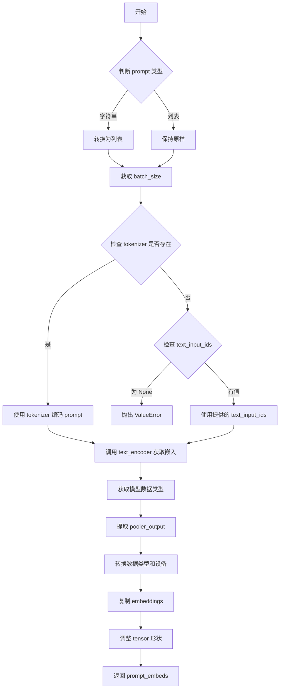

#### 带注释源码

```python
def _encode_prompt_with_clip(
    text_encoder,
    tokenizer,
    prompt: str,
    device=None,
    text_input_ids=None,
    num_images_per_prompt: int = 1,
):
    """
    使用 CLIP 文本编码器对提示词进行编码
    
    参数:
        text_encoder: CLIP 文本编码器模型
        tokenizer: CLIP 分词器
        prompt: 输入的文本提示词
        device: 计算设备
        text_input_ids: 预先分词的 token IDs
        num_images_per_prompt: 每个提示词生成的图像数量
    
    返回:
        编码后的提示词嵌入向量
    """
    # 如果 prompt 是字符串，转换为列表；否则保持原样
    prompt = [prompt] if isinstance(prompt, str) else prompt
    # 计算批次大小
    batch_size = len(prompt)

    # 检查是否提供了 tokenizer
    if tokenizer is not None:
        # 使用 tokenizer 将文本转换为 token IDs
        text_inputs = tokenizer(
            prompt,
            padding="max_length",
            max_length=77,  # CLIP 模型的最大序列长度
            truncation=True,
            return_overflowing_tokens=False,
            return_length=False,
            return_tensors="pt",
        )

        # 提取 input_ids
        text_input_ids = text_inputs.input_ids
    else:
        # 如果没有 tokenizer，则必须提供 text_input_ids
        if text_input_ids is None:
            raise ValueError("text_input_ids must be provided when the tokenizer is not specified")

    # 使用 text_encoder 获取文本嵌入
    # output_hidden_states=False 表示只返回最后的隐藏状态
    prompt_embeds = text_encoder(text_input_ids.to(device), output_hidden_states=False)

    # 处理分布式训练情况下的模型（模型可能在 DataParallel/DDP 中）
    if hasattr(text_encoder, "module"):
        dtype = text_encoder.module.dtype
    else:
        dtype = text_encoder.dtype
    
    # 使用 CLIPTextModel 的 pooler_output（池化后的输出）
    # 这是编码器的 [CLS] 标记输出
    prompt_embeds = prompt_embeds.pooler_output
    
    # 将嵌入转换到正确的 dtype 和 device
    prompt_embeds = prompt_embeds.to(dtype=dtype, device=device)

    # 为每个提示词复制 embeddings 以支持批量生成
    # 使用 repeat 方法以支持 MPS 设备
    prompt_embeds = prompt_embeds.repeat(1, num_images_per_prompt, 1)
    # 调整形状为 (batch_size * num_images_per_prompt, hidden_size)
    prompt_embeds = prompt_embeds.view(batch_size * num_images_per_prompt, -1)

    return prompt_embeds
```


### `encode_prompt`

该函数是 Flux Kontext 模型中用于编码提示词的核心函数，通过组合 CLIP 文本编码器（生成池化嵌入）和 T5 文本编码器（生成完整提示词嵌入），为后续的图像生成模型提供文本特征表示。

参数：

- `text_encoders`：`List[CLIPTextModel, T5EncoderModel]`，文本编码器列表，包含 CLIP 和 T5 两种编码器
- `tokenizers`：`List[CLIPTokenizer, T5TokenizerFast]`，对应的分词器列表
- `prompt`：`str`，要编码的提示词文本
- `max_sequence_length`：`int`，T5 编码器的最大序列长度
- `device`：`torch.device`，可选，指定计算设备，默认为编码器所在设备
- `num_images_per_prompt`：`int`，默认为 1，每个提示词生成的图像数量，用于复制嵌入
- `text_input_ids_list`：`List[torch.Tensor]`，可选，预计算的分词 ID 列表

返回值：`Tuple[torch.Tensor, torch.Tensor, torch.Tensor]`，包含：
- `prompt_embeds`：T5 编码的提示词嵌入，形状为 `(batch_size * num_images_per_prompt, seq_len, hidden_dim)`
- `pooled_prompt_embeds`：CLIP 池化后的提示词嵌入，形状为 `(batch_size * num_images_per_prompt, hidden_dim)`
- `text_ids`：文本 ID 张量，形状为 `(seq_len, 3)`，用于_transformer 中的位置编码

#### 流程图

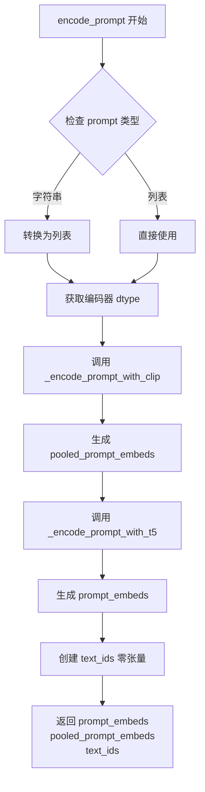

#### 带注释源码

```python
def encode_prompt(
    text_encoders,          # List[CLIPTextModel, T5EncoderModel] - CLIP和T5文本编码器列表
    tokenizers,             # List[CLIPTokenizer, T5TokenizerFast] - 对应的分词器列表
    prompt: str,            # str - 输入的提示词文本
    max_sequence_length,   # int - T5编码器的最大序列长度限制
    device=None,           # torch.device - 可选的计算设备
    num_images_per_prompt: int = 1,  # int - 每个提示词生成的图像数量，用于复制嵌入
    text_input_ids_list=None,  # List[torch.Tensor] - 可选的预计算分词ID
):
    # 1. 标准化提示词输入格式：如果是字符串则转为列表，支持批量处理
    prompt = [prompt] if isinstance(prompt, str) else prompt

    # 2. 获取第一个编码器的数据类型（Dtype），用于后续张量创建
    # 支持 DataParallel 包装的模型（通过 .module 访问原始模型）
    if hasattr(text_encoders[0], "module"):
        dtype = text_encoders[0].module.dtype
    else:
        dtype = text_encoders[0].dtype

    # 3. 调用 CLIP 编码器生成池化的提示词嵌入
    # CLIP 编码器用于生成 pooled_prompt_embeds，提供全局语义信息
    pooled_prompt_embeds = _encode_prompt_with_clip(
        text_encoder=text_encoders[0],     # CLIP 文本编码器
        tokenizer=tokenizers[0],           # CLIP 分词器
        prompt=prompt,                     # 提示词列表
        device=device if device is not None else text_encoders[0].device,  # 设备选择
        num_images_per_prompt=num_images_per_prompt,  # 复制倍数
        text_input_ids=text_input_ids_list[0] if text_input_ids_list else None,  # 预计算的 token IDs
    )

    # 4. 调用 T5 编码器生成完整的提示词嵌入
    # T5 编码器用于生成详细的 prompt_embeds，提供更丰富的序列信息
    prompt_embeds = _encode_prompt_with_t5(
        text_encoder=text_encoders[1],     # T5 文本编码器
        tokenizer=tokenizers[1],           # T5 分词器
        max_sequence_length=max_sequence_length,  # 最大序列长度
        prompt=prompt,                     # 提示词列表
        num_images_per_prompt=num_images_per_prompt,  # 复制倍数
        device=device if device is not None else text_encoders[1].device,  # 设备选择
        text_input_ids=text_input_ids_list[1] if text_input_ids_list else None,  # 预计算的 token IDs
    )

    # 5. 创建文本位置 ID 张量
    # text_ids 用于在 transformer 中标识文本token的位置信息
    # 形状为 (seq_len, 3)，其中3代表 [batch_idx, row, col] 的位置编码
    text_ids = torch.zeros(prompt_embeds.shape[1], 3).to(device=device, dtype=dtype)

    # 6. 返回三个张量：提示词嵌入、池化嵌入、文本ID
    return prompt_embeds, pooled_prompt_embeds, text_ids
```


### `collate_fn`

该函数是 DreamBooth 数据集的自定义整理函数，用于将数据加载器获取的一批样本整理成训练所需的批次格式。它从每个样本中提取图像像素值和文本提示，若启用先验 preservation 则额外追加类别图像和提示，最后将图像堆叠为 PyTorch 张量并返回包含像素值、提示及条件图像的字典。

参数：

-  `examples`：`List[Dict]`，从 `DreamBoothDataset` 返回的样本列表，每个字典包含 `"instance_images"`（图像张量）、`"instance_prompt"`（文本提示）等键，可能包含 `"class_images"`、`"class_prompt"`（先验 preservation 用）和 `"cond_images"`（条件图像，用于 I2I 微调）
-  `with_prior_preservation`：`bool`，是否启用先验 preservation 训练，默认为 `False`

返回值：`Dict`，包含以下键的字典：
-  `"pixel_values"`：`torch.Tensor`，形状为 `(batch_size, C, H, W)` 的图像像素值张量，dtype 为 `float32`
-  `"prompts"`：`List[str]`，文本提示列表
-  `"cond_pixel_values"`：`torch.Tensor`（可选），条件图像张量，仅当存在条件图像时添加

#### 流程图

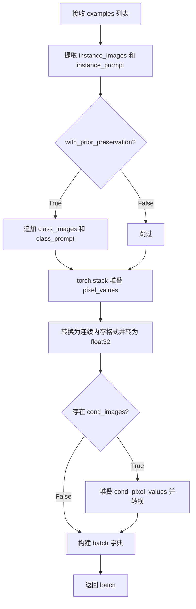

#### 带注释源码

```python
def collate_fn(examples, with_prior_preservation=False):
    # 从每个样本中提取实例图像和实例提示
    pixel_values = [example["instance_images"] for example in examples]
    prompts = [example["instance_prompt"] for example in examples]

    # 如果启用先验 preservation，将类别图像和提示追加到列表中
    # 这样可以避免进行两次前向传播
    if with_prior_preservation:
        pixel_values += [example["class_images"] for example in examples]
        prompts += [example["class_prompt"] for example in examples]

    # 将像素值列表堆叠为 PyTorch 张量
    pixel_values = torch.stack(pixel_values)
    # 转换为连续内存格式并转为 float32 以兼容训练
    pixel_values = pixel_values.to(memory_format=torch.contiguous_format).float()

    # 构建基础批次字典
    batch = {"pixel_values": pixel_values, "prompts": prompts}
    
    # 检查是否存在条件图像（用于 I2I 微调）
    if any("cond_images" in example for example in examples):
        cond_pixel_values = [example["cond_images"] for example in examples]
        cond_pixel_values = torch.stack(cond_pixel_values)
        cond_pixel_values = cond_pixel_values.to(memory_format=torch.contiguous_format).float()
        batch.update({"cond_pixel_values": cond_pixel_values})
    
    return batch
```


### `main`

这是DreamBooth Flux Kontext LoRA训练脚本的主函数，负责完整的模型微调流程。函数接受命令行参数作为配置，依次完成数据准备、模型加载、LoRA配置、训练循环、权重保存和验证推理等核心步骤。

参数：

- `args`：`argparse.Namespace`，包含所有训练配置参数（如模型路径、数据目录、学习率、LoRA参数、checkpoint配置等）

返回值：`None`，该函数直接执行训练流程，不返回任何值

#### 流程图

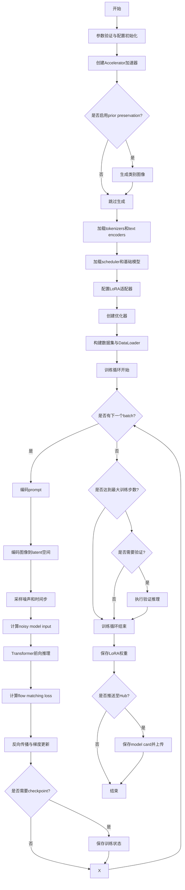

#### 带注释源码

```python
def main(args):
    # 安全检查：同时使用wandb和hub_token存在安全风险
    if args.report_to == "wandb" and args.hub_token is not None:
        raise ValueError(
            "You cannot use both --report_to=wandb and --hub_token due to a security risk of exposing your token."
            " Please use `hf auth login` to authenticate with the Hub."
        )

    # MPS设备不支持bf16混合精度训练
    if torch.backends.mps.is_available() and args.mixed_precision == "bf16":
        raise ValueError(
            "Mixed precision training with bfloat16 is not supported on MPS. Please use fp16 (recommended) or fp32 instead."
        )

    # 配置日志输出目录
    logging_dir = Path(args.output_dir, args.logging_dir)

    # 初始化Accelerator用于分布式训练和混合精度
    accelerator_project_config = ProjectConfiguration(project_dir=args.output_dir, logging_dir=logging_dir)
    kwargs = DistributedDataParallelKwargs(find_unused_parameters=True)
    accelerator = Accelerator(
        gradient_accumulation_steps=args.gradient_accumulation_steps,
        mixed_precision=args.mixed_precision,
        log_with=args.report_to,
        project_config=accelerator_project_config,
        kwargs_handlers=[kwargs],
    )

    # DeepSpeed分布式配置
    if accelerator.distributed_type == DistributedType.DEEPSPEED:
        AcceleratorState().deepspeed_plugin.deepspeed_config["train_micro_batch_size_per_gpu"] = args.train_batch_size

    # MPS设备禁用原生AMP
    if torch.backends.mps.is_available():
        accelerator.native_amp = False

    # 检查wandb是否安装
    if args.report_to == "wandb":
        if not is_wandb_available():
            raise ImportError("Make sure to install wandb if you want to use it for logging during training.")

    # 配置日志格式
    logging.basicConfig(
        format="%(asctime)s - %(levelname)s - %(name)s - %(message)s",
        datefmt="%m/%d/%Y %H:%M:%S",
        level=logging.INFO,
    )
    logger.info(accelerator.state, main_process_only=False)
    if accelerator.is_local_main_process:
        transformers.utils.logging.set_verbosity_warning()
        diffusers.utils.logging.set_verbosity_info()
    else:
        transformers.utils.logging.set_verbosity_error()
        diffusers.utils.logging.set_verbosity_error()

    # 设置随机种子以保证可复现性
    if args.seed is not None:
        set_seed(args.seed)

    # ===== 1. Prior Preservation: 生成类别图像 =====
    if args.with_prior_preservation:
        class_images_dir = Path(args.class_data_dir)
        if not class_images_dir.exists():
            class_images_dir.mkdir(parents=True)
        cur_class_images = len(list(class_images_dir.iterdir()))

        if cur_class_images < args.num_class_images:
            # 确定prior generation的精度
            has_supported_fp16_accelerator = torch.cuda.is_available() or torch.backends.mps.is_available()
            torch_dtype = torch.float16 if has_supported_fp16_accelerator else torch.float32
            if args.prior_generation_precision == "fp32":
                torch_dtype = torch.float32
            elif args.prior_generation_precision == "fp16":
                torch_dtype = torch.float16
            elif args.prior_generation_precision == "bf16":
                torch_dtype = torch.bfloat16

            # 加载transformer和pipeline用于生成类别图像
            transformer = FluxTransformer2DModel.from_pretrained(
                args.pretrained_model_name_or_path,
                subfolder="transformer",
                revision=args.revision,
                variant=args.variant,
                torch_dtype=torch_dtype,
            )
            pipeline = FluxKontextPipeline.from_pretrained(
                args.pretrained_model_name_or_path,
                transformer=transformer,
                torch_dtype=torch_dtype,
                revision=args.revision,
                variant=args.variant,
            )
            pipeline.set_progress_bar_config(disable=True)

            num_new_images = args.num_class_images - cur_class_images
            logger.info(f"Number of class images to sample: {num_new_images}.")

            # 使用PromptDataset生成类别图像
            sample_dataset = PromptDataset(args.class_prompt, num_new_images)
            sample_dataloader = torch.utils.data.DataLoader(sample_dataset, batch_size=args.sample_batch_size)

            sample_dataloader = accelerator.prepare(sample_dataloader)
            pipeline.to(accelerator.device)

            # 批量生成类别图像
            for example in tqdm(
                sample_dataloader, desc="Generating class images", disable=not accelerator.is_local_main_process
            ):
                with torch.autocast(device_type=accelerator.device.type, dtype=torch_dtype):
                    images = pipeline(prompt=example["prompt"]).images

                for i, image in enumerate(images):
                    hash_image = insecure_hashlib.sha1(image.tobytes()).hexdigest()
                    image_filename = class_images_dir / f"{example['index'][i] + cur_class_images}-{hash_image}.jpg"
                    image.save(image_filename)

            del pipeline
            free_memory()

    # ===== 2. 仓库创建与输出目录准备 =====
    if accelerator.is_main_process:
        if args.output_dir is not None:
            os.makedirs(args.output_dir, exist_ok=True)

        if args.push_to_hub:
            repo_id = create_repo(
                repo_id=args.hub_model_id or Path(args.output_dir).name,
                exist_ok=True,
            ).repo_id

    # ===== 3. 加载tokenizers =====
    tokenizer_one = CLIPTokenizer.from_pretrained(
        args.pretrained_model_name_or_path,
        subfolder="tokenizer",
        revision=args.revision,
    )
    tokenizer_two = T5TokenizerFast.from_pretrained(
        args.pretrained_model_name_or_path,
        subfolder="tokenizer_2",
        revision=args.revision,
    )

    # 获取正确的text encoder类
    text_encoder_cls_one = import_model_class_from_model_name_or_path(
        args.pretrained_model_name_or_path, args.revision
    )
    text_encoder_cls_two = import_model_class_from_model_name_or_path(
        args.pretrained_model_name_or_path, args.revision, subfolder="text_encoder_2"
    )

    # ===== 4. 加载scheduler和基础模型 =====
    noise_scheduler = FlowMatchEulerDiscreteScheduler.from_pretrained(
        args.pretrained_model_name_or_path, subfolder="scheduler"
    )
    noise_scheduler_copy = copy.deepcopy(noise_scheduler)
    text_encoder_one, text_encoder_two = load_text_encoders(text_encoder_cls_one, text_encoder_cls_two)
    vae = AutoencoderKL.from_pretrained(
        args.pretrained_model_name_or_path,
        subfolder="vae",
        revision=args.revision,
        variant=args.variant,
    )
    transformer = FluxTransformer2DModel.from_pretrained(
        args.pretrained_model_name_or_path, subfolder="transformer", revision=args.revision, variant=args.variant
    )

    # 冻结所有基础模型权重，只训练LoRA适配器
    transformer.requires_grad_(False)
    vae.requires_grad_(False)
    text_encoder_one.requires_grad_(False)
    text_encoder_two.requires_grad_(False)

    # ===== 5. NPU Flash Attention配置 =====
    if args.enable_npu_flash_attention:
        if is_torch_npu_available():
            logger.info("npu flash attention enabled.")
            transformer.set_attention_backend("_native_npu")
        else:
            raise ValueError("npu flash attention requires torch_npu extensions and is supported only on npu device ")

    # ===== 6. 混合精度权重类型设置 =====
    weight_dtype = torch.float32
    if accelerator.mixed_precision == "fp16":
        weight_dtype = torch.float16
    elif accelerator.mixed_precision == "bf16":
        weight_dtype = torch.bfloat16

    # MPS不支持bf16
    if torch.backends.mps.is_available() and weight_dtype == torch.bfloat16:
        raise ValueError(
            "Mixed precision training with bfloat16 is not supported on MPS. Please use fp16 (recommended) or fp32 instead."
        )

    # 将模型移到正确设备和dtype
    vae.to(accelerator.device, dtype=weight_dtype)
    transformer.to(accelerator.device, dtype=weight_dtype)
    text_encoder_one.to(accelerator.device, dtype=weight_dtype)
    text_encoder_two.to(accelerator.device, dtype=weight_dtype)

    # ===== 7. 梯度checkpointing配置 =====
    if args.gradient_checkpointing:
        transformer.enable_gradient_checkpointing()
        if args.train_text_encoder:
            text_encoder_one.gradient_checkpointing_enable()

    # ===== 8. LoRA目标模块配置 =====
    if args.lora_layers is not None:
        target_modules = [layer.strip() for layer in args.lora_layers.split(",")]
    else:
        # 默认Flux模型的LoRA目标模块
        target_modules = [
            "attn.to_k",
            "attn.to_q",
            "attn.to_v",
            "attn.to_out.0",
            "attn.add_k_proj",
            "attn.add_q_proj",
            "attn.add_v_proj",
            "attn.to_add_out",
            "ff.net.0.proj",
            "ff.net.2",
            "ff_context.net.0.proj",
            "ff_context.net.2",
            "proj_mlp",
        ]

    # ===== 9. 添加LoRA适配器到transformer =====
    transformer_lora_config = LoraConfig(
        r=args.rank,
        lora_alpha=args.lora_alpha,
        lora_dropout=args.lora_dropout,
        init_lora_weights="gaussian",
        target_modules=target_modules,
    )
    transformer.add_adapter(transformer_lora_config)
    if args.train_text_encoder:
        text_lora_config = LoraConfig(
            r=args.rank,
            lora_alpha=args.lora_alpha,
            lora_dropout=args.lora_dropout,
            init_lora_weights="gaussian",
            target_modules=["q_proj", "k_proj", "v_proj", "out_proj"],
        )
        text_encoder_one.add_adapter(text_lora_config)

    # 辅助函数：解包模型
    def unwrap_model(model):
        model = accelerator.unwrap_model(model)
        model = model._orig_mod if is_compiled_module(model) else model
        return model

    # ===== 10. 自定义模型保存/加载hook =====
    def save_model_hook(models, weights, output_dir):
        # 保存LoRA权重到指定目录
        if accelerator.is_main_process:
            transformer_lora_layers_to_save = None
            text_encoder_one_lora_layers_to_save = None
            modules_to_save = {}
            for model in models:
                if isinstance(unwrap_model(model), type(unwrap_model(transformer))):
                    model = unwrap_model(model)
                    transformer_lora_layers_to_save = get_peft_model_state_dict(model)
                    modules_to_save["transformer"] = model
                elif isinstance(unwrap_model(model), type(unwrap_model(text_encoder_one))):
                    model = unwrap_model(model)
                    text_encoder_one_lora_layers_to_save = get_peft_model_state_dict(model)
                    modules_to_save["text_encoder"] = model
                else:
                    raise ValueError(f"unexpected save model: {model.__class__}")

                if weights:
                    weights.pop()

            FluxKontextPipeline.save_lora_weights(
                output_dir,
                transformer_lora_layers=transformer_lora_layers_to_save,
                text_encoder_lora_layers=text_encoder_one_lora_layers_to_save,
                **_collate_lora_metadata(modules_to_save),
            )

    def load_model_hook(models, input_dir):
        # 从checkpoint恢复LoRA权重
        transformer_ = None
        text_encoder_one_ = None

        if not accelerator.distributed_type == DistributedType.DEEPSPEED:
            while len(models) > 0:
                model = models.pop()

                if isinstance(unwrap_model(model), type(unwrap_model(transformer))):
                    transformer_ = unwrap_model(model)
                elif isinstance(unwrap_model(model), type(unwrap_model(text_encoder_one))):
                    text_encoder_one_ = unwrap_model(model)
                else:
                    raise ValueError(f"unexpected save model: {model.__class__}")

        else:
            transformer_ = FluxTransformer2DModel.from_pretrained(
                args.pretrained_model_name_or_path, subfolder="transformer"
            )
            transformer_.add_adapter(transformer_lora_config)
            text_encoder_one_ = text_encoder_cls_one.from_pretrained(
                args.pretrained_model_name_or_path, subfolder="text_encoder"
            )

        lora_state_dict = FluxKontextPipeline.lora_state_dict(input_dir)

        transformer_state_dict = {
            f"{k.replace('transformer.', '')}": v for k, v in lora_state_dict.items() if k.startswith("transformer.")
        }
        transformer_state_dict = convert_unet_state_dict_to_peft(transformer_state_dict)
        incompatible_keys = set_peft_model_state_dict(transformer_, transformer_state_dict, adapter_name="default")
        if incompatible_keys is not None:
            unexpected_keys = getattr(incompatible_keys, "unexpected_keys", None)
            if unexpected_keys:
                logger.warning(
                    f"Loading adapter weights from state_dict led to unexpected keys not found in the model: "
                    f" {unexpected_keys}. "
                )
        if args.train_text_encoder:
            _set_state_dict_into_text_encoder(lora_state_dict, prefix="text_encoder.", text_encoder=text_encoder_one_)

        # 确保可训练参数为float32
        if args.mixed_precision == "fp16":
            models = [transformer_]
            if args.train_text_encoder:
                models.extend([text_encoder_one_])
            cast_training_params(models)

    accelerator.register_save_state_pre_hook(save_model_hook)
    accelerator.register_load_state_pre_hook(load_model_hook)

    # ===== 11. TF32加速配置 =====
    if args.allow_tf32 and torch.cuda.is_available():
        torch.backends.cuda.matmul.allow_tf32 = True

    # ===== 12. 学习率缩放 =====
    if args.scale_lr:
        args.learning_rate = (
            args.learning_rate * args.gradient_accumulation_steps * args.train_batch_size * accelerator.num_processes
        )

    # ===== 13. 确保可训练参数为float32 =====
    if args.mixed_precision == "fp16":
        models = [transformer]
        if args.train_text_encoder:
            models.extend([text_encoder_one])
        cast_training_params(models, dtype=torch.float32)

    # ===== 14. 收集LoRA可训练参数 =====
    transformer_lora_parameters = list(filter(lambda p: p.requires_grad, transformer.parameters()))
    if args.train_text_encoder:
        text_lora_parameters_one = list(filter(lambda p: p.requires_grad, text_encoder_one.parameters()))

    # ===== 15. 构建优化器参数 =====
    transformer_parameters_with_lr = {"params": transformer_lora_parameters, "lr": args.learning_rate}
    if args.train_text_encoder:
        text_parameters_one_with_lr = {
            "params": text_lora_parameters_one,
            "weight_decay": args.adam_weight_decay_text_encoder,
            "lr": args.text_encoder_lr if args.text_encoder_lr else args.learning_rate,
        }
        params_to_optimize = [transformer_parameters_with_lr, text_parameters_one_with_lr]
    else:
        params_to_optimize = [transformer_parameters_with_lr]

    # ===== 16. 创建优化器 =====
    if not (args.optimizer.lower() == "prodigy" or args.optimizer.lower() == "adamw"):
        logger.warning(
            f"Unsupported choice of optimizer: {args.optimizer}.Supported optimizers include [adamW, prodigy]."
            "Defaulting to adamW"
        )
        args.optimizer = "adamw"

    if args.use_8bit_adam and not args.optimizer.lower() == "adamw":
        logger.warning(
            f"use_8bit_adam is ignored when optimizer is not set to 'AdamW'. Optimizer was "
            f"set to {args.optimizer.lower()}"
        )

    if args.optimizer.lower() == "adamw":
        if args.use_8bit_adam:
            try:
                import bitsandbytes as bnb
            except ImportError:
                raise ImportError(
                    "To use 8-bit Adam, please install the bitsandbytes library: `pip install bitsandbytes`."
                )
            optimizer_class = bnb.optim.AdamW8bit
        else:
            optimizer_class = torch.optim.AdamW

        optimizer = optimizer_class(
            params_to_optimize,
            betas=(args.adam_beta1, args.adam_beta2),
            weight_decay=args.adam_weight_decay,
            eps=args.adam_epsilon,
        )

    if args.optimizer.lower() == "prodigy":
        try:
            import prodigyopt
        except ImportError:
            raise ImportError("To use Prodigy, please install the prodigyopt library: `pip install prodigyopt`")

        optimizer_class = prodigyopt.Prodigy

        if args.learning_rate <= 0.1:
            logger.warning(
                "Learning rate is too low. When using prodigy, it's generally better to set learning rate around 1.0"
            )
        if args.train_text_encoder and args.text_encoder_lr:
            logger.warning(
                f"Learning rates were provided both for the transformer and the text encoder- e.g. text_encoder_lr:"
                f" {args.text_encoder_lr} and learning_rate: {args.learning_rate}. "
                f"When using prodigy only learning_rate is used as the initial learning rate."
            )
            params_to_optimize[1]["lr"] = args.learning_rate

        optimizer = optimizer_class(
            params_to_optimize,
            betas=(args.adam_beta1, args.adam_beta2),
            beta3=args.prodigy_beta3,
            weight_decay=args.adam_weight_decay,
            eps=args.adam_epsilon,
            decouple=args.prodigy_decouple,
            use_bias_correction=args.prodigy_use_bias_correction,
            safeguard_warmup=args.prodigy_safeguard_warmup,
        )

    # ===== 17. Aspect ratio buckets配置 =====
    if args.aspect_ratio_buckets is not None:
        buckets = parse_buckets_string(args.aspect_ratio_buckets)
    else:
        buckets = [(args.resolution, args.resolution)]
    logger.info(f"Using parsed aspect ratio buckets: {buckets}")

    # ===== 18. 创建数据集和DataLoader =====
    train_dataset = DreamBoothDataset(
        instance_data_root=args.instance_data_dir,
        instance_prompt=args.instance_prompt,
        class_prompt=args.class_prompt,
        class_data_root=args.class_data_dir if args.with_prior_preservation else None,
        class_num=args.num_class_images,
        buckets=buckets,
        repeats=args.repeats,
        center_crop=args.center_crop,
        args=args,
    )
    if args.cond_image_column is not None:
        logger.info("I2I fine-tuning enabled.")
    batch_sampler = BucketBatchSampler(train_dataset, batch_size=args.train_batch_size, drop_last=True)
    train_dataloader = torch.utils.data.DataLoader(
        train_dataset,
        batch_sampler=batch_sampler,
        collate_fn=lambda examples: collate_fn(examples, args.with_prior_preservation),
        num_workers=args.dataloader_num_workers,
    )

    # ===== 19. 预处理prompt embeddings =====
    if not args.train_text_encoder:
        tokenizers = [tokenizer_one, tokenizer_two]
        text_encoders = [text_encoder_one, text_encoder_two]

        def compute_text_embeddings(prompt, text_encoders, tokenizers):
            with torch.no_grad():
                prompt_embeds, pooled_prompt_embeds, text_ids = encode_prompt(
                    text_encoders, tokenizers, prompt, args.max_sequence_length
                )
                prompt_embeds = prompt_embeds.to(accelerator.device)
                pooled_prompt_embeds = pooled_prompt_embeds.to(accelerator.device)
                text_ids = text_ids.to(accelerator.device)
            return prompt_embeds, pooled_prompt_embeds, text_ids

    # 缓存静态计算的embeddings
    if not args.train_text_encoder and not train_dataset.custom_instance_prompts:
        instance_prompt_hidden_states, instance_pooled_prompt_embeds, instance_text_ids = compute_text_embeddings(
            args.instance_prompt, text_encoders, tokenizers
        )

    # Prior preservation的class prompt处理
    if args.with_prior_preservation:
        if not args.train_text_encoder:
            class_prompt_hidden_states, class_pooled_prompt_embeds, class_text_ids = compute_text_embeddings(
                args.class_prompt, text_encoders, tokenizers
            )

    # 释放text encoder内存
    if not args.train_text_encoder and not train_dataset.custom_instance_prompts:
        text_encoder_one.cpu(), text_encoder_two.cpu()
        del text_encoder_one, text_encoder_two, tokenizer_one, tokenizer_two
        free_memory()

    # ===== 20. 预处理prompt embeddings（续） =====
    if not train_dataset.custom_instance_prompts:
        if not args.train_text_encoder:
            prompt_embeds = instance_prompt_hidden_states
            pooled_prompt_embeds = instance_pooled_prompt_embeds
            text_ids = instance_text_ids
            if args.with_prior_preservation:
                prompt_embeds = torch.cat([prompt_embeds, class_prompt_hidden_states], dim=0)
                pooled_prompt_embeds = torch.cat([pooled_prompt_embeds, class_pooled_prompt_embeds], dim=0)
                text_ids = torch.cat([text_ids, class_text_ids], dim=0)
        else:
            tokens_one = tokenize_prompt(tokenizer_one, args.instance_prompt, max_sequence_length=77)
            tokens_two = tokenize_prompt(
                tokenizer_two, args.instance_prompt, max_sequence_length=args.max_sequence_length
            )
            if args.with_prior_preservation:
                class_tokens_one = tokenize_prompt(tokenizer_one, args.class_prompt, max_sequence_length=77)
                class_tokens_two = tokenize_prompt(
                    tokenizer_two, args.class_prompt, max_sequence_length=args.max_sequence_length
                )
                tokens_one = torch.cat([tokens_one, class_tokens_one], dim=0)
                tokens_two = torch.cat([tokens_two, class_tokens_two], dim=0)

    elif train_dataset.custom_instance_prompts and not args.train_text_encoder:
        # 预计算所有自定义prompts的embeddings
        cached_text_embeddings = []
        for batch in tqdm(train_dataloader, desc="Embedding prompts"):
            batch_prompts = batch["prompts"]
            prompt_embeds, pooled_prompt_embeds, text_ids = compute_text_embeddings(
                batch_prompts, text_encoders, tokenizers
            )
            cached_text_embeddings.append((prompt_embeds, pooled_prompt_embeds, text_ids))

        if args.validation_prompt is None:
            text_encoder_one.cpu(), text_encoder_two.cpu()
            del text_encoder_one, text_encoder_two, tokenizer_one, tokenizer_two
            free_memory()

    # ===== 21. VAE latent缓存 =====
    vae_config_shift_factor = vae.config.shift_factor
    vae_config_scaling_factor = vae.config.scaling_factor
    vae_config_block_out_channels = vae.config.block_out_channels
    has_image_input = args.cond_image_column is not None
    if args.cache_latents:
        latents_cache = []
        cond_latents_cache = []
        for batch in tqdm(train_dataloader, desc="Caching latents"):
            with torch.no_grad():
                batch["pixel_values"] = batch["pixel_values"].to(
                    accelerator.device, non_blocking=True, dtype=weight_dtype
                )
                latents_cache.append(vae.encode(batch["pixel_values"]).latent_dist)
                if has_image_input:
                    batch["cond_pixel_values"] = batch["cond_pixel_values"].to(
                        accelerator.device, non_blocking=True, dtype=weight_dtype
                    )
                    cond_latents_cache.append(vae.encode(batch["cond_pixel_values"]).latent_dist)

        if args.validation_prompt is None:
            vae.cpu()
            del vae
            free_memory()

    # ===== 22. 学习率调度器配置 =====
    num_warmup_steps_for_scheduler = args.lr_warmup_steps * accelerator.num_processes
    if args.max_train_steps is None:
        len_train_dataloader_after_sharding = math.ceil(len(train_dataloader) / accelerator.num_processes)
        num_update_steps_per_epoch = math.ceil(len_train_dataloader_after_sharding / args.gradient_accumulation_steps)
        num_training_steps_for_scheduler = (
            args.num_train_epochs * accelerator.num_processes * num_update_steps_per_epoch
        )
    else:
        num_training_steps_for_scheduler = args.max_train_steps * accelerator.num_processes

    lr_scheduler = get_scheduler(
        args.lr_scheduler,
        optimizer=optimizer,
        num_warmup_steps=num_warmup_steps_for_scheduler,
        num_training_steps=num_training_steps_for_scheduler,
        num_cycles=args.lr_num_cycles,
        power=args.lr_power,
    )

    # ===== 23. 使用Accelerator准备所有组件 =====
    if args.train_text_encoder:
        (
            transformer,
            text_encoder_one,
            optimizer,
            train_dataloader,
            lr_scheduler,
        ) = accelerator.prepare(
            transformer,
            text_encoder_one,
            optimizer,
            train_dataloader,
            lr_scheduler,
        )
    else:
        transformer, optimizer, train_dataloader, lr_scheduler = accelerator.prepare(
            transformer, optimizer, train_dataloader, lr_scheduler
        )

    # 重新计算总训练步数
    num_update_steps_per_epoch = math.ceil(len(train_dataloader) / args.gradient_accumulation_steps)
    if args.max_train_steps is None:
        args.max_train_steps = args.num_train_epochs * num_update_steps_per_epoch
        if num_training_steps_for_scheduler != args.max_train_steps:
            logger.warning(
                f"The length of the 'train_dataloader' after 'accelerator.prepare' ({len(train_dataloader)}) does not match "
                f"the expected length ({len_train_dataloader_after_sharding}) when the learning rate scheduler was created. "
                f"This inconsistency may result in the learning rate scheduler not functioning properly."
            )
    args.num_train_epochs = math.ceil(args.max_train_steps / num_update_steps_per_epoch)

    # ===== 24. 初始化跟踪器 =====
    if accelerator.is_main_process:
        tracker_name = "dreambooth-flux-kontext-lora"
        accelerator.init_trackers(tracker_name, config=vars(args))

    # ===== 25. 训练信息日志 =====
    total_batch_size = args.train_batch_size * accelerator.num_processes * args.gradient_accumulation_steps

    logger.info("***** Running training *****")
    logger.info(f"  Num examples = {len(train_dataset)}")
    logger.info(f"  Num batches each epoch = {len(train_dataloader)}")
    logger.info(f"  Num Epochs = {args.num_train_epochs}")
    logger.info(f"  Instantaneous batch size per device = {args.train_batch_size}")
    logger.info(f"  Total train batch size (w. parallel, distributed & accumulation) = {total_batch_size}")
    logger.info(f"  Gradient Accumulation steps = {args.gradient_accumulation_steps}")
    logger.info(f"  Total optimization steps = {args.max_train_steps}")
    global_step = 0
    first_epoch = 0

    # ===== 26. 恢复checkpoint（如果存在） =====
    if args.resume_from_checkpoint:
        if args.resume_from_checkpoint != "latest":
            path = os.path.basename(args.resume_from_checkpoint)
        else:
            dirs = os.listdir(args.output_dir)
            dirs = [d for d in dirs if d.startswith("checkpoint")]
            dirs = sorted(dirs, key=lambda x: int(x.split("-")[1]))
            path = dirs[-1] if len(dirs) > 0 else None

        if path is None:
            accelerator.print(
                f"Checkpoint '{args.resume_from_checkpoint}' does not exist. Starting a new training run."
            )
            args.resume_from_checkpoint = None
            initial_global_step = 0
        else:
            accelerator.print(f"Resuming from checkpoint {path}")
            accelerator.load_state(os.path.join(args.output_dir, path))
            global_step = int(path.split("-")[1])

            initial_global_step = global_step
            first_epoch = global_step // num_update_steps_per_epoch

    else:
        initial_global_step = 0

    # 进度条
    progress_bar = tqdm(
        range(0, args.max_train_steps),
        initial=initial_global_step,
        desc="Steps",
        disable=not accelerator.is_local_main_process,
    )

    # Sigmas计算辅助函数
    def get_sigmas(timesteps, n_dim=4, dtype=torch.float32):
        sigmas = noise_scheduler_copy.sigmas.to(device=accelerator.device, dtype=dtype)
        schedule_timesteps = noise_scheduler_copy.timesteps.to(accelerator.device)
        timesteps = timesteps.to(accelerator.device)
        step_indices = [(schedule_timesteps == t).nonzero().item() for t in timesteps]

        sigma = sigmas[step_indices].flatten()
        while len(sigma.shape) < n_dim:
            sigma = sigma.unsqueeze(-1)
        return sigma

    # ===== 27. 训练主循环 =====
    has_guidance = unwrap_model(transformer).config.guidance_embeds
    for epoch in range(first_epoch, args.num_train_epochs):
        transformer.train()
        if args.train_text_encoder:
            text_encoder_one.train()
            unwrap_model(text_encoder_one).text_model.embeddings.requires_grad_(True)

        for step, batch in enumerate(train_dataloader):
            models_to_accumulate = [transformer]
            if args.train_text_encoder:
                models_to_accumulate.extend([text_encoder_one])
            with accelerator.accumulate(models_to_accumulate):
                prompts = batch["prompts"]

                # 动态编码prompts（如果使用自定义prompts）
                if train_dataset.custom_instance_prompts:
                    if not args.train_text_encoder:
                        prompt_embeds, pooled_prompt_embeds, text_ids = cached_text_embeddings[step]
                    else:
                        tokens_one = tokenize_prompt(tokenizer_one, prompts, max_sequence_length=77)
                        tokens_two = tokenize_prompt(
                            tokenizer_two, prompts, max_sequence_length=args.max_sequence_length
                        )
                        prompt_embeds, pooled_prompt_embeds, text_ids = encode_prompt(
                            text_encoders=[text_encoder_one, text_encoder_two],
                            tokenizers=[None, None],
                            text_input_ids_list=[tokens_one, tokens_two],
                            max_sequence_length=args.max_sequence_length,
                            device=accelerator.device,
                            prompt=prompts,
                        )
                else:
                    elems_to_repeat = len(prompts)
                    if args.train_text_encoder:
                        prompt_embeds, pooled_prompt_embeds, text_ids = encode_prompt(
                            text_encoders=[text_encoder_one, text_encoder_two],
                            tokenizers=[None, None],
                            text_input_ids_list=[
                                tokens_one.repeat(elems_to_repeat, 1),
                                tokens_two.repeat(elems_to_repeat, 1),
                            ],
                            max_sequence_length=args.max_sequence_length,
                            device=accelerator.device,
                            prompt=args.instance_prompt,
                        )
                    else:
                        prompt_embeds, pooled_prompt_embeds, text_ids = compute_text_embeddings(
                            prompts, text_encoders, tokenizers
                        )

                # 图像到latent空间的编码
                if args.cache_latents:
                    if args.vae_encode_mode == "sample":
                        model_input = latents_cache[step].sample()
                        if has_image_input:
                            cond_model_input = cond_latents_cache[step].sample()
                    else:
                        model_input = latents_cache[step].mode()
                        if has_image_input:
                            cond_model_input = cond_latents_cache[step].mode()
                else:
                    pixel_values = batch["pixel_values"].to(dtype=vae.dtype)
                    if has_image_input:
                        cond_pixel_values = batch["cond_pixel_values"].to(dtype=vae.dtype)
                    if args.vae_encode_mode == "sample":
                        model_input = vae.encode(pixel_values).latent_dist.sample()
                        if has_image_input:
                            cond_model_input = vae.encode(cond_pixel_values).latent_dist.sample()
                    else:
                        model_input = vae.encode(pixel_values).latent_dist.mode()
                        if has_image_input:
                            cond_model_input = vae.encode(cond_pixel_values).latent_dist.mode()
                
                # VAE配置进行latent缩放
                model_input = (model_input - vae_config_shift_factor) * vae_config_scaling_factor
                model_input = model_input.to(dtype=weight_dtype)
                if has_image_input:
                    cond_model_input = (cond_model_input - vae_config_shift_factor) * vae_config_scaling_factor
                    cond_model_input = cond_model_input.to(dtype=weight_dtype)

                vae_scale_factor = 2 ** (len(vae_config_block_out_channels) - 1)

                # 准备latent image IDs
                latent_image_ids = FluxKontextPipeline._prepare_latent_image_ids(
                    model_input.shape[0],
                    model_input.shape[2] // 2,
                    model_input.shape[3] // 2,
                    accelerator.device,
                    weight_dtype,
                )
                if has_image_input:
                    cond_latents_ids = FluxKontextPipeline._prepare_latent_image_ids(
                        cond_model_input.shape[0],
                        cond_model_input.shape[2] // 2,
                        cond_model_input.shape[3] // 2,
                        accelerator.device,
                        weight_dtype,
                    )
                    cond_latents_ids[..., 0] = 1
                    latent_image_ids = torch.cat([latent_image_ids, cond_latents_ids], dim=0)

                # 采样噪声
                noise = torch.randn_like(model_input)
                bsz = model_input.shape[0]

                # 使用加权采样策略采样时间步
                u = compute_density_for_timestep_sampling(
                    weighting_scheme=args.weighting_scheme,
                    batch_size=bsz,
                    logit_mean=args.logit_mean,
                    logit_std=args.logit_std,
                    mode_scale=args.mode_scale,
                )
                indices = (u * noise_scheduler_copy.config.num_train_timesteps).long()
                timesteps = noise_scheduler_copy.timesteps[indices].to(device=model_input.device)

                # Flow matching: zt = (1 - texp) * x + texp * z1
                sigmas = get_sigmas(timesteps, n_dim=model_input.ndim, dtype=model_input.dtype)
                noisy_model_input = (1.0 - sigmas) * model_input + sigmas * noise
                
                # 打包latents以适配Transformer输入格式
                packed_noisy_model_input = FluxKontextPipeline._pack_latents(
                    noisy_model_input,
                    batch_size=model_input.shape[0],
                    num_channels_latents=model_input.shape[1],
                    height=model_input.shape[2],
                    width=model_input.shape[3],
                )
                orig_inp_shape = packed_noisy_model_input.shape
                if has_image_input:
                    packed_cond_input = FluxKontextPipeline._pack_latents(
                        cond_model_input,
                        batch_size=cond_model_input.shape[0],
                        num_channels_latents=cond_model_input.shape[1],
                        height=cond_model_input.shape[2],
                        width=cond_model_input.shape[3],
                    )
                    packed_noisy_model_input = torch.cat([packed_noisy_model_input, packed_cond_input], dim=1)

                # Guidance配置
                guidance = None
                if has_guidance:
                    guidance = torch.tensor([args.guidance_scale], device=accelerator.device)
                    guidance = guidance.expand(model_input.shape[0])

                # Transformer前向推理
                model_pred = transformer(
                    hidden_states=packed_noisy_model_input,
                    timestep=timesteps / 1000,
                    guidance=guidance,
                    pooled_projections=pooled_prompt_embeds,
                    encoder_hidden_states=prompt_embeds,
                    txt_ids=text_ids,
                    img_ids=latent_image_ids,
                    return_dict=False,
                )[0]
                if has_image_input:
                    model_pred = model_pred[:, : orig_inp_shape[1]]
                
                # 解包latents
                model_pred = FluxKontextPipeline._unpack_latents(
                    model_pred,
                    height=model_input.shape[2] * vae_scale_factor,
                    width=model_input.shape[3] * vae_scale_factor,
                    vae_scale_factor=vae_scale_factor,
                )

                # 损失加权
                weighting = compute_loss_weighting_for_sd3(weighting_scheme=args.weighting_scheme, sigmas=sigmas)

                # Flow matching loss: target = noise - model_input
                target = noise - model_input

                # Prior preservation loss计算
                if args.with_prior_preservation:
                    model_pred, model_pred_prior = torch.chunk(model_pred, 2, dim=0)
                    target, target_prior = torch.chunk(target, 2, dim=0)

                    prior_loss = torch.mean(
                        (weighting.float() * (model_pred_prior.float() - target_prior.float()) ** 2).reshape(
                            target_prior.shape[0], -1
                        ),
                        1,
                    )
                    prior_loss = prior_loss.mean()

                # 常规损失计算
                loss = torch.mean(
                    (weighting.float() * (model_pred.float() - target.float()) ** 2).reshape(target.shape[0], -1),
                    1,
                )
                loss = loss.mean()

                # 添加prior loss
                if args.with_prior_preservation:
                    loss = loss + args.prior_loss_weight * prior_loss

                # 反向传播
                accelerator.backward(loss)
                if accelerator.sync_gradients:
                    params_to_clip = (
                        itertools.chain(transformer.parameters(), text_encoder_one.parameters())
                        if args.train_text_encoder
                        else transformer.parameters()
                    )
                    accelerator.clip_grad_norm_(params_to_clip, args.max_grad_norm)

                optimizer.step()
                lr_scheduler.step()
                optimizer.zero_grad()

            # 同步检查点保存
            if accelerator.sync_gradients:
                progress_bar.update(1)
                global_step += 1

                if accelerator.is_main_process or accelerator.distributed_type == DistributedType.DEEPSPEED:
                    if global_step % args.checkpointing_steps == 0:
                        # 检查checkpoint数量限制
                        if args.checkpoints_total_limit is not None:
                            checkpoints = os.listdir(args.output_dir)
                            checkpoints = [d for d in checkpoints if d.startswith("checkpoint")]
                            checkpoints = sorted(checkpoints, key=lambda x: int(x.split("-")[1]))

                            if len(checkpoints) >= args.checkpoints_total_limit:
                                num_to_remove = len(checkpoints) - args.checkpoints_total_limit + 1
                                removing_checkpoints = checkpoints[0:num_to_remove]

                                logger.info(
                                    f"{len(checkpoints)} checkpoints already exist, removing {len(removing_checkpoints)} checkpoints"
                                )
                                logger.info(f"removing checkpoints: {', '.join(removing_checkpoints)}")

                                for removing_checkpoint in removing_checkpoints:
                                    removing_checkpoint = os.path.join(args.output_dir, removing_checkpoint)
                                    shutil.rmtree(removing_checkpoint)

                        save_path = os.path.join(args.output_dir, f"checkpoint-{global_step}")
                        accelerator.save_state(save_path)
                        logger.info(f"Saved state to {save_path}")

            # 日志记录
            logs = {"loss": loss.detach().item(), "lr": lr_scheduler.get_last_lr()[0]}
            progress_bar.set_postfix(**logs)
            accelerator.log(logs, step=global_step)

            if global_step >= args.max_train_steps:
                break

        # ===== 28. 验证阶段 =====
        if accelerator.is_main_process:
            if args.validation_prompt is not None and epoch % args.validation_epochs == 0:
                # 加载text encoders用于验证
                if not args.train_text_encoder:
                    text_encoder_one, text_encoder_two = load_text_encoders(text_encoder_cls_one, text_encoder_cls_two)
                    text_encoder_one.to(weight_dtype)
                    text_encoder_two.to(weight_dtype)
                
                # 创建pipeline进行验证
                pipeline = FluxKontextPipeline.from_pretrained(
                    args.pretrained_model_name_or_path,
                    vae=vae,
                    text_encoder=unwrap_model(text_encoder_one),
                    text_encoder_2=unwrap_model(text_encoder_two),
                    transformer=unwrap_model(transformer),
                    revision=args.revision,
                    variant=args.variant,
                    torch_dtype=weight_dtype,
                )
                pipeline_args = {"prompt": args.validation_prompt}
                if has_image_input and args.validation_image:
                    pipeline_args.update({"image": load_image(args.validation_image)})
                
                images = log_validation(
                    pipeline=pipeline,
                    args=args,
                    accelerator=accelerator,
                    pipeline_args=pipeline_args,
                    epoch=epoch,
                    torch_dtype=weight_dtype,
                )
                if not args.train_text_encoder:
                    del text_encoder_one, text_encoder_two
                    free_memory()

                images = None
                free_memory()

    # ===== 29. 保存最终LoRA权重 =====
    accelerator.wait_for_everyone()
    if accelerator.is_main_process:
        modules_to_save = {}
        transformer = unwrap_model(transformer)
        if args.upcast_before_saving:
            transformer.to(torch.float32)
        else:
            transformer = transformer.to(weight_dtype)
        transformer_lora_layers = get_peft_model_state_dict(transformer)
        modules_to_save["transformer"] = transformer

        if args.train_text_encoder:
            text_encoder_one = unwrap_model(text_encoder_one)
            text_encoder_lora_layers = get_peft_model_state_dict(text_encoder_one.to(torch.float32))
            modules_to_save["text_encoder"] = text_encoder_one
        else:
            text_encoder_lora_layers = None

        FluxKontextPipeline.save_lora_weights(
            save_directory=args.output_dir,
            transformer_lora_layers=transformer_lora_layers,
            text_encoder_lora_layers=text_encoder_lora_layers,
            **_collate_lora_metadata(modules_to_save),
        )

        # ===== 30. 最终推理验证 =====
        transformer = FluxTransformer2DModel.from_pretrained(
            args.pretrained_model_name_or_path, subfolder="transformer", revision=args.revision, variant=args.variant
        )
        pipeline = FluxKontextPipeline.from_pretrained(
            args.pretrained_model_name_or_path,
            transformer=transformer,
            revision=args.revision,
            variant=args.variant,
            torch_dtype=weight_dtype,
        )
        pipeline.load_lora_weights(args.output_dir)

        # 运行最终推理
        images = []
        if args.validation_prompt and args.num_validation_images > 0:
            pipeline_args = {"prompt": args.validation_prompt}
            if has_image_input and args.validation_image:
                pipeline_args.update({"image": load_image(args.validation_image)})
            images = log_validation(
                pipeline=pipeline,
                args=args,
                accelerator=accelerator,
                pipeline_args=pipeline_args,
                epoch=epoch,
                is_final_validation=True,
                torch_dtype=weight_dtype,
            )
            del pipeline
            free_memory()

        # ===== 31. 推送到HuggingFace Hub =====
        if args.push_to_hub:
            save_model_card(
                repo_id,
                images=images,
                base_model=args.pretrained_model_name_or_path,
                train_text_encoder=args.train_text_encoder,
                instance_prompt=args.instance_prompt,
                validation_prompt=args.validation_prompt,
                repo_folder=args.output_dir,
            )
            upload_folder(
                repo_id=repo_id,
                folder_path=args.output_dir,
                commit_message="End of training",
                ignore_patterns=["step_*", "epoch_*"],
            )

        images = None

    accelerator.end_training()
```


### DreamBoothDataset.__init__

该方法是 DreamBoothDataset 类的初始化方法，负责准备用于 DreamBooth 微调模型的实例和类图像数据。它从指定的数据目录或 HuggingFace 数据集加载图像，应用 aspect ratio buckets 进行智能resize和裁剪，并进行必要的图像预处理（包括 EXIF 方向校正、RGB 转换、归一化等），同时支持自定义提示词和先验保留（prior preservation）功能。

参数：

- `instance_data_root`：`str` 或 `Path`，实例图像所在的根目录路径
- `instance_prompt`：`str`，用于实例图像的提示词
- `class_prompt`：`str`，用于类图像的提示词
- `class_data_root`：`str` 或 `Path` 或 `None`，类图像数据目录，用于先验保留损失
- `class_num`：`int` 或 `None`，要使用的类图像数量限制
- `repeats`：`int`，训练数据重复次数，默认为1
- `center_crop`：`bool`，是否对图像进行中心裁剪，默认为False
- `buckets`：`list` 或 `None`，宽高比桶列表，用于动态分辨率训练
- `args`：`Namespace` 或 `None`，命令行参数对象，包含数据集配置信息

返回值：`None`（构造函数无返回值）

#### 流程图

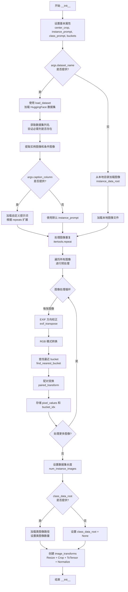

#### 带注释源码

```python
def __init__(
    self,
    instance_data_root,
    instance_prompt,
    class_prompt,
    class_data_root=None,
    class_num=None,
    repeats=1,
    center_crop=False,
    buckets=None,
    args=None,
):
    """
    DreamBoothDataset 类的初始化方法。
    
    参数:
        instance_data_root: 实例图像的根目录路径
        instance_prompt: 实例提示词（用于标识特定实例）
        class_prompt: 类提示词（用于先验保留）
        class_data_root: 类图像目录（可选，用于先验保留损失）
        class_num: 类图像数量限制
        repeats: 训练数据重复次数
        center_crop: 是否中心裁剪
        buckets: 宽高比桶列表
        args: 命令行参数对象
    """
    # 1. 设置基本属性
    self.center_crop = center_crop
    self.instance_prompt = instance_prompt
    self.custom_instance_prompts = None  # 自定义提示词（从数据集列加载）
    self.class_prompt = class_prompt
    self.buckets = buckets

    # 2. 根据数据来源加载图像
    # 如果提供了 --dataset_name，则从 HuggingFace Hub 加载数据集
    if args.dataset_name is not None:
        try:
            from datasets import load_dataset
        except ImportError:
            raise ImportError(
                "You are trying to load your data using the datasets library. "
                "If you wish to train using custom captions please install the "
                "datasets library: `pip install datasets`."
            )
        
        # 下载并加载数据集
        dataset = load_dataset(
            args.dataset_name,
            args.dataset_config_name,
            cache_dir=args.cache_dir,
        )
        
        # 获取数据集列名
        column_names = dataset["train"].column_names

        # 验证条件图像列是否存在
        if args.cond_image_column is not None and args.cond_image_column not in column_names:
            raise ValueError(
                f"`--cond_image_column` value '{args.cond_image_column}' "
                f"not found in dataset columns."
            )
        
        # 确定图像列名（默认为第一列）
        if args.image_column is None:
            image_column = column_names[0]
            logger.info(f"image column defaulting to {image_column}")
        else:
            image_column = args.image_column
            if image_column not in column_names:
                raise ValueError(
                    f"`--image_column` value '{args.image_column}' "
                    f"not found in dataset columns."
                )
        
        # 提取实例图像
        instance_images = [dataset["train"][i][image_column] for i in range(len(dataset["train"]))]
        cond_images = None
        
        # 提取条件图像（用于 I2I 微调）
        cond_image_column = args.cond_image_column
        if cond_image_column is not None:
            cond_images = [dataset["train"][i][cond_image_column] for i in range(len(dataset["train"]))]
            assert len(instance_images) == len(cond_images)

        # 处理提示词列
        if args.caption_column is None:
            logger.info(
                "No caption column provided, defaulting to instance_prompt for all images."
            )
            self.custom_instance_prompts = None
        else:
            if args.caption_column not in column_names:
                raise ValueError(
                    f"`--caption_column` value '{args.caption_column}' "
                    f"not found in dataset columns."
                )
            # 获取自定义提示词并根据 repeats 扩展
            custom_instance_prompts = dataset["train"][args.caption_column]
            self.custom_instance_prompts = []
            for caption in custom_instance_prompts:
                self.custom_instance_prompts.extend(itertools.repeat(caption, repeats))
    else:
        # 从本地目录加载图像
        self.instance_data_root = Path(instance_data_root)
        if not self.instance_data_root.exists():
            raise ValueError("Instance images root doesn't exists.")
        
        # 打开目录中的所有图像文件
        instance_images = [Image.open(path) for path in list(Path(instance_data_root).iterdir())]
        self.custom_instance_prompts = None

    # 3. 处理图像重复（根据 repeats 参数）
    self.instance_images = []
    self.cond_images = []
    for i, img in enumerate(instance_images):
        self.instance_images.extend(itertools.repeat(img, repeats))
        # 如果有条件图像，也进行重复处理
        if args.dataset_name is not None and cond_images is not None:
            self.cond_images.extend(itertools.repeat(cond_images[i], repeats))

    # 4. 图像预处理：遍历所有图像进行转换
    self.pixel_values = []      # 存储处理后的图像张量和 bucket 索引
    self.cond_pixel_values = [] # 存储条件图像（如果有）
    
    for i, image in enumerate(self.instance_images):
        # EXIF 方向校正（处理相机旋转的图像）
        image = exif_transpose(image)
        if not image.mode == "RGB":
            image = image.convert("RGB")
        
        # 处理条件图像
        dest_image = None
        if self.cond_images:
            dest_image = exif_transpose(self.cond_images[i])
            if not dest_image.mode == "RGB":
                dest_image = dest_image.convert("RGB")

        width, height = image.size

        # 5. 查找最近的 bucket（用于动态分辨率）
        bucket_idx = find_nearest_bucket(height, width, self.buckets)
        target_height, target_width = self.buckets[bucket_idx]
        self.size = (target_height, target_width)

        # 6. 应用配对变换（确保实例和条件图像使用相同的裁剪/翻转）
        image, dest_image = self.paired_transform(
            image,
            dest_image=dest_image,
            size=self.size,
            center_crop=args.center_crop,
            random_flip=args.random_flip,
        )
        
        # 存储处理后的图像和 bucket 索引
        self.pixel_values.append((image, bucket_idx))
        if dest_image is not None:
            self.cond_pixel_values.append((dest_image, bucket_idx))

    # 7. 设置数据集长度
    self.num_instance_images = len(self.instance_images)
    self._length = self.num_instance_images

    # 8. 处理类图像（用于先验保留）
    if class_data_root is not None:
        self.class_data_root = Path(class_data_root)
        self.class_data_root.mkdir(parents=True, exist_ok=True)
        self.class_images_path = list(self.class_data_root.iterdir())
        
        # 确定类图像数量
        if class_num is not None:
            self.num_class_images = min(len(self.class_images_path), class_num)
        else:
            self.num_class_images = len(self.class_images_path)
        
        # 数据集长度取实例图像和类图像的最大值
        self._length = max(self.num_class_images, self.num_instance_images)
    else:
        self.class_data_root = None

    # 9. 创建图像变换组合（用于类图像）
    self.image_transforms = transforms.Compose([
        transforms.Resize(self.size, interpolation=transforms.InterpolationMode.BILINEAR),
        transforms.CenterCrop(self.size) if center_crop else transforms.RandomCrop(self.size),
        transforms.ToTensor(),
        transforms.Normalize([0.5], [0.5]),  # 归一化到 [-1, 1]
    ])
```


### DreamBoothDataset.__len__

该方法实现了 Python 的 `__len__` 特殊方法，用于返回 DreamBoothDataset 数据集的长度，使得 DataLoader 能够确定迭代的批次数。数据集的长度取决于实例图像数量和类别图像数量（如果启用了先验保留），取两者的最大值以确保训练过程中每个 epoch 都有足够的样本。

参数： 无（`self` 为隐式参数）

返回值：`int`，返回数据集的总样本数，用于 DataLoader 确定迭代次数

#### 流程图

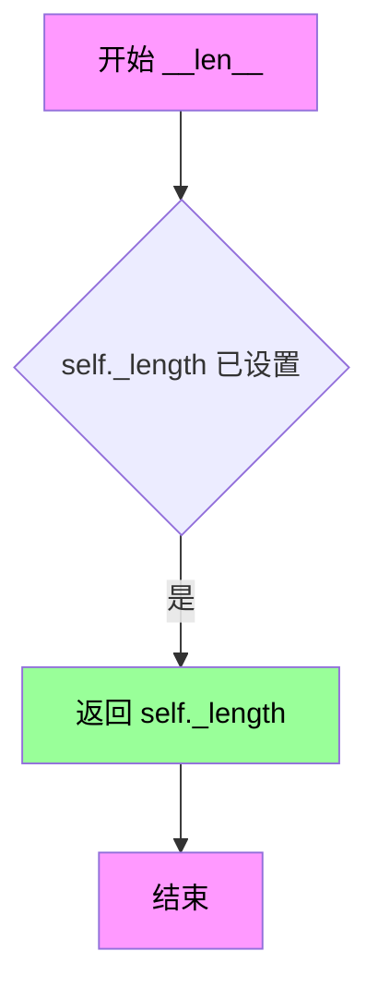

#### 带注释源码

```python
def __len__(self):
    """
    返回数据集的长度。
    
    该方法实现了 Python 的特殊方法 __len__，使得数据集可以与 DataLoader 一起使用。
    _length 在 __init__ 中被设置为 max(num_class_images, num_instance_images)，
    以确保在使用先验保留（prior preservation）训练时，每个 epoch 都有足够的样本。
    
    Returns:
        int: 数据集中的样本总数
    """
    return self._length
```


### `DreamBoothDataset.__getitem__`

该方法是非图像到图像（Non-I2I）训练模式下 DreamBooth 数据集类的核心方法，用于根据给定索引返回单条训练样本。它从预处理后的像素值中检索实例图像和条件图像（如有），并处理实例提示词和类别图像（先验保留时需要），最终组装成一个包含图像数据、提示词和元信息的字典供训练流程使用。

参数：

-  `index`：`int`，数据集中样本的索引位置，用于从预处理数据中检索对应的图像和提示词

返回值：`dict`，返回包含以下键的字典：
  - `instance_images`：处理后的实例图像张量
  - `bucket_idx`：该图像所属的宽高比桶索引
  - `cond_images`（可选）：条件图像张量（I2I 训练模式）
  - `instance_prompt`：实例提示词字符串
  - `class_images`（可选）：类别图像张量（启用先验保留时）
  - `class_prompt`（可选）：类别提示词字符串

#### 流程图

```mermaid
flowchart TD
    A[开始 __getitem__] --> B[创建空字典 example]
    B --> C{index 是否超出实例图像数量?}
    C -->|是| D[使用模运算取余: index % self.num_instance_images]
    C -->|否| E[直接使用 index]
    D --> F[从 self.pixel_values 检索实例图像和 bucket_idx]
    E --> F
    F --> G[将实例图像存入 example['instance_images']]
    G --> H[将 bucket_idx 存入 example['bucket_idx']]
    H --> I{是否有条件图像 cond_pixel_values?}
    I -->|是| J[检索条件图像并存入 example['cond_images']]
    I -->|否| K[检查是否有自定义提示词 custom_instance_prompts]
    J --> K
    K --> L{是否有自定义提示词?}
    L -->|是| M[使用自定义提示词或默认 instance_prompt]
    L -->|否| N[使用默认 instance_prompt]
    M --> O[将提示词存入 example['instance_prompt']]
    N --> O
    O --> P{是否配置了 class_data_root?}
    P -->|是| Q[打开类别图像并转换RGB]
    P -->|否| R[返回 example 字典]
    Q --> S[应用图像变换并存入 example['class_images']]
    S --> T[存入类别提示词 example['class_prompt']]
    T --> R
```

#### 带注释源码

```python
def __getitem__(self, index):
    """
    根据索引获取单条训练样本数据。
    
    参数:
        index (int): 样本索引，用于从数据集中检索对应的图像和提示词
    
    返回:
        dict: 包含以下键的字典:
            - instance_images: 处理后的实例图像张量 (Tensor)
            - bucket_idx: 图像所属的宽高比桶索引 (int)
            - cond_images: 条件图像张量，仅当存在条件图像时 (Tensor, optional)
            - instance_prompt: 实例提示词 (str)
            - class_images: 类别图像张量，仅当启用先验保留时 (Tensor, optional)
            - class_prompt: 类别提示词，仅当启用先验保留时 (str, optional)
    """
    example = {}
    
    # 使用模运算处理循环索引，确保索引在有效范围内
    instance_image, bucket_idx = self.pixel_values[index % self.num_instance_images]
    
    # 存储实例图像和对应的桶索引
    example["instance_images"] = instance_image
    example["bucket_idx"] = bucket_idx
    
    # 处理条件图像（用于图像到图像的微调任务）
    if self.cond_pixel_values:
        dest_image, _ = self.cond_pixel_values[index % self.num_instance_images]
        example["cond_images"] = dest_image

    # 处理实例提示词
    if self.custom_instance_prompts:
        # 优先使用自定义提示词（每张图像单独的描述）
        caption = self.custom_instance_prompts[index % self.num_instance_images]
        if caption:
            example["instance_prompt"] = caption
        else:
            # 如果自定义提示词为空，则回退到默认实例提示词
            example["instance_prompt"] = self.instance_prompt
    else:
        # 未提供自定义提示词时，使用统一的实例提示词
        example["instance_prompt"] = self.instance_prompt

    # 处理类别图像（用于先验保留损失）
    if self.class_data_root:
        # 打开类别图像并根据EXIF信息调整方向
        class_image = Image.open(self.class_images_path[index % self.num_class_images])
        class_image = exif_transpose(class_image)

        # 确保类别图像为RGB模式
        if not class_image.mode == "RGB":
            class_image = class_image.convert("RGB")
        
        # 应用图像变换并存储
        example["class_images"] = self.image_transforms(class_image)
        example["class_prompt"] = self.class_prompt

    return example
```


### `DreamBoothDataset.paired_transform`

该方法用于对成对的图像（源图像和目标/条件图像）执行同步的数据增强变换，确保两张图像经历相同的随机变换（如裁剪和翻转），以保持它们之间的对齐关系。

参数：

- `self`：`DreamBoothDataset` 实例本身
- `image`：`PIL.Image.Image`，需要进行变换的源图像
- `dest_image`：`PIL.Image.Image` 或 `None`，可选的目标/条件图像，如果为 `None` 则仅处理源图像
- `size`：`tuple(int, int`，默认为 `(224, 224)`，目标图像尺寸
- `center_crop`：`bool`，默认为 `False`，是否使用中心裁剪；若为 `False` 则使用随机裁剪
- `random_flip`：`bool`，默认为 `False`，是否进行随机水平翻转

返回值：`tuple(Tensor, Tensor | None)`，返回变换后的图像张量对；如果 `dest_image` 为 `None`，则返回 `(image_tensor, None)`

#### 流程图

```mermaid
flowchart TD
    A[开始: paired_transform] --> B{dest_image是否存在?}
    B -->|是| C[同时调整大小 image 和 dest_image]
    B -->|否| D[仅调整大小 image]
    C --> E{center_crop为真?}
    D --> E
    E -->|是| F[执行中心裁剪]
    E -->|否| G[获取随机裁剪参数 i,j,h,w]
    F --> H{dest_image是否存在?}
    G --> H
    H -->|是| I[对 image 和 dest_image 应用相同裁剪]
    H -->|否| J[仅对 image 应用裁剪]
    I --> K{random_flip为真?}
    J --> K
    K -->|是| L[生成0-1随机数]
    K -->|否| M[执行ToTensor和Normalize变换]
    L --> N{随机数 < 0.5?}
    N -->|是| O[对 image 和 dest_image 执行水平翻转]
    N -->|否| M
    O --> M
    M --> P{dest_image是否存在?}
    P -->|是| Q[返回 (image_tensor, dest_image_tensor)]
    P -->|否| R[返回 (image_tensor, None)]
    Q --> S[结束]
    R --> S
```

#### 带注释源码

```python
def paired_transform(self, image, dest_image=None, size=(224, 224), center_crop=False, random_flip=False):
    # 1. Resize (deterministic)
    # 创建调整大小变换，使用双线性插值
    resize = transforms.Resize(size, interpolation=transforms.InterpolationMode.BILINEAR)
    # 对源图像调整大小
    image = resize(image)
    # 如果存在目标图像，也对其调整大小（保持同步）
    if dest_image is not None:
        dest_image = resize(dest_image)

    # 2. Crop: either center or SAME random crop
    # 根据参数选择裁剪方式
    if center_crop:
        # 中心裁剪：计算图像中心区域
        crop = transforms.CenterCrop(size)
        image = crop(image)
        if dest_image is not None:
            dest_image = crop(dest_image)
    else:
        # 随机裁剪：获取随机裁剪参数 (i, j, h, w)
        # i: 顶部像素位置, j: 左侧像素位置, h: 裁剪高度, w: 裁剪宽度
        i, j, h, w = transforms.RandomCrop.get_params(image, output_size=size)
        # 对源图像应用裁剪
        image = TF.crop(image, i, j, h, w)
        # 对目标图像应用相同的裁剪（关键：确保两张图像对齐）
        if dest_image is not None:
            dest_image = TF.crop(dest_image, i, j, h, w)

    # 3. Random horizontal flip with the SAME coin flip
    # 随机水平翻转：使用相同的随机决策翻转两张图像
    if random_flip:
        # 生成0-1之间的随机数
        do_flip = random.random() < 0.5
        if do_flip:
            # 水平翻转源图像
            image = TF.hflip(image)
            # 如果存在目标图像，也进行相同的翻转
            if dest_image is not None:
                dest_image = TF.hflip(dest_image)

    # 4. ToTensor + Normalize (deterministic)
    # 创建张量转换和归一化变换
    to_tensor = transforms.ToTensor()
    normalize = transforms.Normalize([0.5], [0.5])
    # 将源图像转换为张量并归一化（将像素值从 [0,255] 映射到 [-1,1]）
    image = normalize(to_tensor(image))
    # 如果存在目标图像，也进行相同的转换和归一化
    if dest_image is not None:
        dest_image = normalize(to_tensor(dest_image))

    # 返回变换后的图像对；如果没有目标图像，则返回 (image, None)
    return (image, dest_image) if dest_image is not None else (image, None)
```


### `BucketBatchSampler.__init__`

该方法是 `BucketBatchSampler` 类的初始化方法，用于根据数据集的bucket信息创建批次采样器。它首先验证参数有效性，然后将数据集中的样本按bucket分组，最后预生成每个bucket内的批次。

参数：

- `dataset`：`DreamBoothDataset`，包含bucket信息和像素值的数据集对象
- `batch_size`：`int`，每个批次的样本数量，必须为正整数
- `drop_last`：`bool`，是否丢弃最后一个不完整的批次，默认为 `False`

返回值：`None`，该方法为构造函数，不返回任何值

#### 流程图

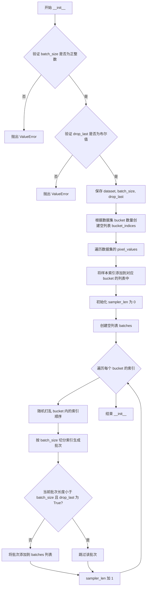

#### 带注释源码

```python
def __init__(self, dataset: DreamBoothDataset, batch_size: int, drop_last: bool = False):
    # 参数验证：batch_size 必须为正整数
    if not isinstance(batch_size, int) or batch_size <= 0:
        raise ValueError("batch_size should be a positive integer value, but got batch_size={}".format(batch_size))
    
    # 参数验证：drop_last 必须为布尔值
    if not isinstance(drop_last, bool):
        raise ValueError("drop_last should be a boolean value, but got drop_last={}".format(drop_last))

    # 保存传入的参数
    self.dataset = dataset          # 数据集对象
    self.batch_size = batch_size   # 批次大小
    self.drop_last = drop_last     # 是否丢弃最后一个不完整批次

    # 根据数据集的 bucket 数量创建对应的空列表
    # 每个 bucket 存储属于该 bucket 的样本索引
    self.bucket_indices = [[] for _ in range(len(self.dataset.buckets))]
    
    # 遍历数据集的所有样本，将样本索引按 bucket 分类
    # pixel_values 存储了 (图像张量, bucket_idx) 的元组
    for idx, (_, bucket_idx) in enumerate(self.dataset.pixel_values):
        self.bucket_indices[bucket_idx].append(idx)

    # 初始化采样器长度（总批次数）和批次列表
    self.sampler_len = 0
    self.batches = []

    # 预生成每个 bucket 内的批次
    for indices_in_bucket in self.bucket_indices:
        # 随机打乱每个 bucket 内的样本顺序，增加多样性
        random.shuffle(indices_in_bucket)
        
        # 按批次大小切分索引
        for i in range(0, len(indices_in_bucket), self.batch_size):
            # 提取当前批次的索引范围
            batch = indices_in_bucket[i : i + self.batch_size]
            
            # 如果当前批次不完整且 drop_last 为 True，则跳过
            if len(batch) < self.batch_size and self.drop_last:
                continue  # 跳过不完整的批次
            
            # 将有效批次添加到列表中
            self.batches.append(batch)
            # 累加总批次数
            self.sampler_len += 1
```


### `BucketBatchSampler.__iter__`

该方法是 `BucketBatchSampler` 类的迭代器实现，用于在每个训练 epoch 中按预生成的批次顺序返回数据索引，并通过打乱批次顺序来增加数据多样性。

参数：无（使用 `self` 实例属性）

返回值：`Iterator[List[int]]`，返回一个生成批次索引列表的迭代器

#### 流程图

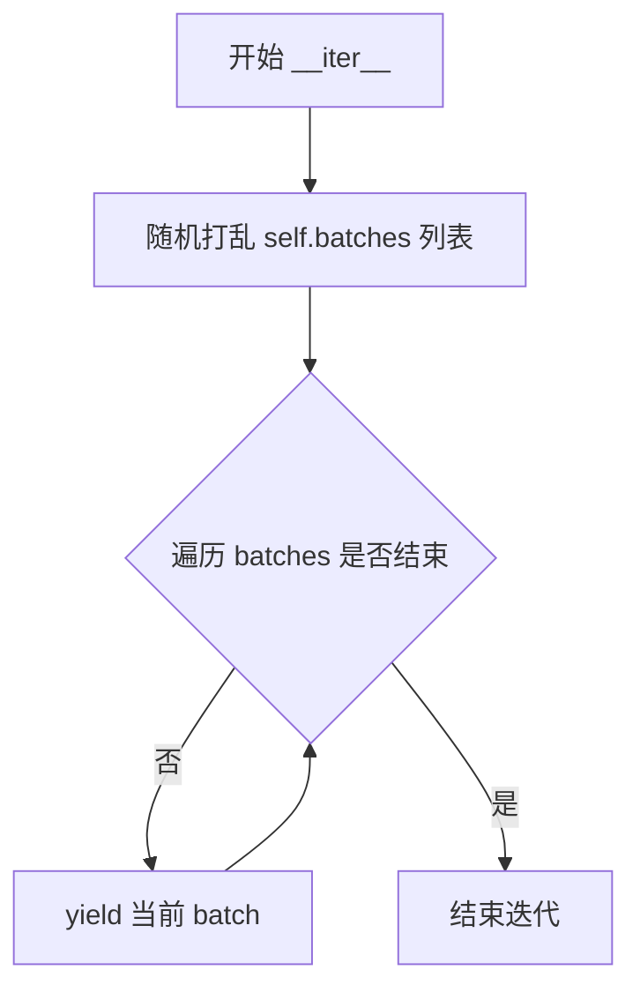

#### 带注释源码

```python
def __iter__(self):
    """
    迭代器方法，用于返回批次索引。
    
    每次调用时打乱批次顺序以增加训练多样性，
    然后按顺序yield每个批次。
    """
    # Shuffle the order of the batches each epoch
    # 在每个epoch开始时打乱批次顺序，增加数据多样性
    random.shuffle(self.batches)
    
    # 遍历所有预生成的批次
    for batch in self.batches:
        # yield 返回批次索引列表，供 DataLoader 使用
        yield batch
```


### BucketBatchSampler.__len__

该方法返回BucketBatchSampler可以生成的批次数（即迭代器长度），用于DataLoader确定迭代轮数。

参数：

- 无参数（继承自Python的len协议）

返回值：`int`，返回预生成的总批次数

#### 流程图

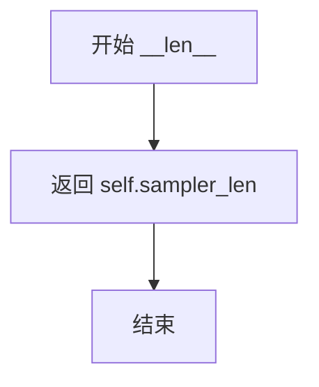

#### 带注释源码

```python
def __len__(self):
    """
    返回采样器的长度，即预生成的批次数。
    
    该方法实现了Python的len协议，使BucketBatchSampler可以与DataLoader兼容。
    sampler_len在__init__方法中被计算：每当创建一个有效的batch时（不满且不drop_last的batch除外），
    sampler_len就会加1。最终返回的数值即为整个epoch中需要迭代的批次数。
    
    Returns:
        int: 预生成的总批次数
    """
    return self.sampler_len
```


### `PromptDataset.__init__`

这是 `PromptDataset` 类的构造函数，用于初始化一个简单的数据集，以便在多个 GPU 上生成类图像时准备提示词。该类继承自 `torch.utils.data.Dataset`，用于在 DreamBooth 训练过程中生成类图像。

参数：

- `prompt`：`str`，用于生成类图像的提示词
- `num_samples`：`int`，要生成的类图像数量

返回值：`None`，构造函数不返回值，仅初始化实例属性

#### 流程图

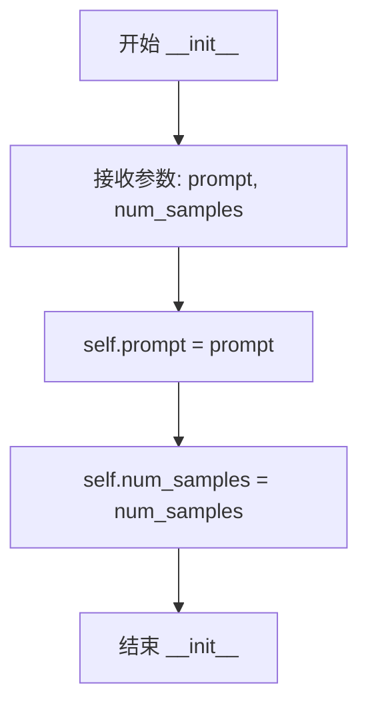

#### 带注释源码

```python
class PromptDataset(Dataset):
    "A simple dataset to prepare the prompts to generate class images on multiple GPUs."

    def __init__(self, prompt, num_samples):
        # 参数 prompt: str类型，用于生成类图像的提示词文本
        # 参数 num_samples: int类型，指定要生成的样本/图像数量
        self.prompt = prompt  # 存储提示词到实例属性
        self.num_samples = num_samples  # 存储样本数量到实例属性

    def __len__(self):
        # 返回数据集的样本数量，供 DataLoader 使用
        return self.num_samples

    def __getitem__(self, index):
        # 根据索引获取单个样本
        example = {}
        example["prompt"] = self.prompt  # 返回提示词
        example["index"] = index  # 返回当前索引
        return example
```


### `PromptDataset.__len__`

返回 `PromptDataset` 数据集中的样本数量，用于 DataLoader 确定迭代次数。

参数：

- `self`：`PromptDataset`，指向数据集实例本身的引用（Python 实例方法的隐含参数）

返回值：`int`，返回 `num_samples` 的值，即数据集中的样本数量

#### 流程图

```mermaid
flowchart TD
    A[开始 __len__] --> B{返回 self.num_samples}
    B --> C[返回整数值]
```

#### 带注释源码

```python
def __len__(self):
    """
    返回数据集中样本的数量。
    
    此方法由 PyTorch DataLoader 调用，以确定迭代的次数。
    返回存储在 self.num_samples 中的值，该值在 __init__ 中被设置。
    
    参数:
        self: PromptDataset 实例
        
    返回:
        int: 数据集中的样本数量
    """
    return self.num_samples
```


### `PromptDataset.__getitem__`

该方法是 `PromptDataset` 类的核心实例方法，用于根据给定的索引返回数据集中对应的样本。它通过索引构造一个包含提示词（prompt）和索引值的字典，作为生成类图像任务的输入数据。

参数：

- `index`：`int`，数据集中的索引位置，用于定位要返回的样本

返回值：`Dict[str, Union[str, int]]`，返回包含提示词和索引的字典，键为 `"prompt"` 和 `"index"`

#### 流程图

```mermaid
flowchart TD
    A[开始 __getitem__] --> B[创建空字典 example]
    B --> C[设置 example['prompt'] = self.prompt]
    C --> D[设置 example['index'] = index]
    D --> E[返回 example 字典]
    E --> F[结束]
```

#### 带注释源码

```python
def __getitem__(self, index):
    """
    根据索引获取数据集中的单个样本。
    
    该方法实现了 PyTorch Dataset 接口的 __getitem__ 方法，
    用于在数据加载时按需获取单个数据样本。在 DreamBooth 训练中，
    该数据集用于生成类图像（class images）的提示词。
    
    参数:
        index (int): 样本在数据集中的索引位置，范围为 [0, num_samples)
        
    返回:
        dict: 包含以下键的字典:
            - 'prompt' (str): 类图像生成的提示词（class prompt）
            - 'index' (int): 当前样本的索引位置
    """
    # 1. 初始化一个空字典，用于存储样本数据
    example = {}
    
    # 2. 将类级别的提示词（class prompt）存入字典
    #    这个提示词用于生成类图像，用于先验保留（prior preservation）损失计算
    example["prompt"] = self.prompt
    
    # 3. 将当前样本的索引存入字典
    #    这个索引用于跟踪和标识生成的图像文件
    example["index"] = index
    
    # 4. 返回构造好的样本字典
    #    DataLoader 会将此字典传递给后续的处理流程
    return example
```

## 关键组件


### 张量索引与惰性加载

在 `BucketBatchSampler` 类中实现，通过预先构建的 bucket 索引对训练图像进行分组管理，使用张量索引来实现高效的批次采样；在 `DreamBoothDataset` 中通过迭代器模式实现图像的惰性加载，仅在 `__getitem__` 方法被调用时才进行图像的预处理和转换。

### 反量化支持

在主训练循环中通过 `weight_dtype` 变量控制模型权重的精度转换，支持 fp16、bf16 和 fp32 之间的动态切换，使用 `cast_training_params` 函数将可训练参数（LoRA）统一转换为 float32 以确保训练稳定性。

### 量化策略

采用混合精度训练策略，通过 `accelerator.mixed_precision` 参数配置，支持 fp16 和 bf16 两种量化模式，使用 `bitsandbytes` 库提供的 8 位 Adam 优化器 (`AdamW8bit`) 来进一步减少显存占用。

### LoRA 适配器配置

通过 `LoraConfig` 类配置 LoRA 训练参数，包括秩 (`r`)、alpha 缩放因子、dropout 概率和目标模块 (`target_modules`)，默认针对 FluxTransformer 的注意力层和前馈层进行适配器注入。

### Aspect Ratio Bucketing

在 `DreamBoothDataset` 和 `BucketBatchSampler` 中实现，通过 `find_nearest_bucket` 函数将图像分配到最近的宽高比桶，使用 `parse_buckets_string` 解析用户定义的桶配置，实现不同分辨率图像的高效批处理。

### VAE 潜在空间缓存

支持通过 `cache_latents` 选项缓存 VAE 编码后的潜在向量，使用 `latents_cache` 列表存储预处理好的潜在表示，在训练循环中直接使用缓存的潜在向量而无需重复编码，显著加速训练过程。

### 分布式训练支持

使用 `Accelerator` 类封装分布式训练逻辑，支持 DeepSpeed、MPS 和多 GPU 训练，通过 `DistributedDataParallelKwargs` 配置参数分片，通过 `register_save_state_pre_hook` 和 `register_load_state_pre_hook` 自定义模型状态的保存和加载逻辑。

### 文本编码器训练

支持可选的文本编码器 LoRA 微调，通过 `train_text_encoder` 参数控制，当启用时使用单独的学习率 (`text_encoder_lr`) 和权重衰减参数，文本编码器同样应用 LoRA 适配器。

### 验证与推理流程

`log_validation` 函数在每个验证周期生成样本图像，使用 TensorBoard 和 W&B 进行可视化跟踪，支持自定义验证提示词和条件图像输入 (I2I 微调)，最终保存训练好的 LoRA 权重并生成模型卡片。


## 问题及建议


### 已知问题

-   **巨型main函数**: `main()`函数体超过2000行，包含数据加载、模型初始化、训练循环、验证、保存等所有逻辑，导致代码难以维护、测试和调试。
-   **全局变量依赖**: `load_text_encoders()`函数直接访问`args`全局变量，违反函数纯度原则，降低了模块化程度和可测试性。
-   **验证逻辑bug**: 第443行存在逻辑错误 `assert args.validation_image is None and os.path.exists(args.validation_image)`，应该是OR条件，当前逻辑永远为False。
-   **Magic Number**: 第1761行 timestep 除以1000的操作缺乏注释说明，且该数值与transformer内部缩放因子耦合，不利于代码理解。
-   **资源未及时释放**: 训练结束后的`Final inference`部分重新加载了模型但未在finally块中显式释放GPU资源。
-   **潜在内存泄漏**: `cached_text_embeddings`在内存中累积了所有batch的embeddings，对于大规模训练可能导致内存溢出。

### 优化建议

-   **重构main函数**: 将main函数拆分为独立模块：数据准备模块(`prepare_data()`)、模型初始化模块(`initialize_models()`)、训练循环模块(`train_loop()`)、验证模块(`run_validation()`)、保存模块(`save_checkpoint()`)。
-   **消除全局依赖**: 修改`load_text_encoders()`等函数签名，显式传递所需参数而非访问全局`args`变量。
-   **修复验证逻辑**: 将第443行修改为 `assert args.validation_image is None or os.path.exists(args.validation_image)`。
-   **提取配置常量**: 将`1000`等magic number提取为配置参数或常量，并添加注释说明其用途。
-   **实现流式处理**: 对于长文本训练场景，考虑使用生成器或迭代器替代一次性加载所有cached embeddings，避免内存峰值过高。
-   **添加资源清理上下文**: 使用`contextlib.ExitStack`或try-finally确保所有GPU资源在异常情况下也能正确释放。

## 其它


### 设计目标与约束

本项目的设计目标是使用DreamBooth方法训练Flux Kontext模型的LoRA适配器，实现对特定主题或风格的微调。约束条件包括：必须使用Apache License 2.0许可的模型，支持FP16/BF16混合精度训练，LoRA rank维度默认为4，文本编码器可选训练但需使用float32精度。

### 错误处理与异常设计

代码在多处实现了错误处理机制：在parse_args函数中对参数进行校验，如数据集路径冲突、prior preservation参数一致性等；在模型加载时检查依赖库可用性（如wandb、bitsandbytes、prodigyopt）；在数据处理时验证图像格式和数据集列名；在分布式训练时处理DeepSpeed特殊情况。异常处理采用try-except ImportError模式，对于关键依赖（如diffusers最小版本）使用check_min_version进行前置检查。

### 数据流与状态机

训练数据流遵循以下路径：实例图像→DreamBoothDataset→BucketBatchSampler→collate_fn→训练循环。状态机包含：初始化阶段（加载模型、配置Accelerator）、数据准备阶段（生成class图像、编码prompt）、训练阶段（前向传播→计算噪声→预测→loss计算→反向传播）、验证阶段（生成验证图像）、保存阶段（保存LoRA权重和模型卡片）。每个epoch开始时transformer和text_encoder_one会切换到train模式。

### 外部依赖与接口契约

核心依赖包括：diffusers>=0.37.0.dev0、torch>=2.0.0、transformers>=4.41.2、accelerate>=0.31.0、peft>=0.11.1、bitsandbytes（可选用于8位Adam）、prodigyopt（可选优化器）、wandb/tensorboard（可选日志）。模型输入接口：pretrained_model_name_or_path（必需）、instance_data_dir或dataset_name（二选一）、instance_prompt、class_prompt（prior preservation时必需）。输出接口：output_dir目录下的checkpoint-*子目录和pytorch_lora_weights.safetensors文件。

### 性能优化与内存管理

代码实现了多项性能优化：gradient_checkpointing可节省显存；vae latents缓存（cache_latents）避免重复编码；mixed_precision支持FP16/BF16；TF32加速（allow_tf32）；NPU Flash Attention支持；AdamW 8位量化。内存管理通过free_memory()函数在各阶段释放未使用模型，使用DistributedDataParallelKwargs(find_unused_parameters=True)处理分布式训练，LoRA训练时仅保存adapter参数而非完整模型。

### 版本兼容性与平台支持

支持CUDA（NVIDIA Ampere+）、MPS（Apple Silicon）、NPU（华为昇腾）三种加速设备。CUDA平台支持TF32加速和BF16混合精度；MPS平台不支持BF16会抛出错误；NPU平台支持原生Flash Attention。Python版本未明确限制，但依赖PyTorch>=2.0.0。DeepSpeed分布式训练有特殊处理逻辑。

### 多GPU与分布式训练

通过Accelerator实现分布式支持，支持DDP、DeepSpeed、FSDP三种分布式类型。使用DistributedDataParallelKwargs配置find_unused_parameters=True。训练前通过accelerator.prepare()将模型、优化器、数据加载器和学习率调度器分发给各设备。Checkpoints保存使用accelerator.save_state()，恢复使用accelerator.load_state()。多进程日志仅在主进程打印，避免重复。

### 安全性与隐私保护

hub_token使用有安全警告（不能与wandb同时使用，建议使用hf auth login）。本地训练数据不上传，仅在push_to_hub时上传模型权重。敏感信息如token不在日志中打印。模型卡片生成时包含license信息。

### 模型持久化与加载

LoRA权重保存使用FluxKontextPipeline.save_lora_weights()，包含transformer和text_encoder的lora层。加载使用load_model_hook挂载到accelerator。模型卡片使用diffusers.utils.hub_utils的load_or_create_model_card和populate_model_card生成。保存格式支持safetensors（优先）和pytorch_bin。

### 检查点与训练恢复

支持通过resume_from_checkpoint参数恢复训练，可指定checkpoint路径或使用"latest"自动选择最新checkpoint。Checkpoints按global_step命名（checkpoint-{step}），可配置checkpoints_total_limit限制保留数量，超过限制时自动删除旧checkpoint。恢复时从checkpoint目录加载accelerator state和模型权重。

### 可扩展性与插件设计

LoRA target_modules可通过lora_layers参数自定义，默认包含attention层、MLP层等。优化器可通过optimizer参数选择AdamW或Prodigy。学习率调度器支持linear、cosine、polynomial等多种策略。数据加载支持本地目录和HuggingFace Hub数据集两种方式。验证流程模块化，可通过log_validation函数扩展。

### 测试与验证策略

内置验证机制：每validation_epochs个epoch运行一次验证，生成num_validation_images张验证图像。验证图像通过TensorBoard或WandB记录。最终训练完成后运行final_inference验证。数据预处理包含图像格式转换（RGB）、exif方向纠正、尺寸归一化。

### 监控与日志记录

使用accelerator.init_trackers()初始化跟踪器，支持TensorBoard、WandB、CometML。训练日志记录loss、learning_rate。验证日志记录生成的图像。关键节点（checkpoint保存、验证）有明确logger.info输出。进度条使用tqdm显示训练进度。

### 超参数配置与调优建议

关键超参数：learning_rate默认1e-4（transformer），text_encoder_lr默认5e-6；rank默认4，lora_alpha默认4；train_batch_size默认4；gradient_accumulation_steps默认1；max_train_steps可覆盖num_train_epochs。调优建议：prior_loss_weight通常1.0，guidance_scale对Flux为3.5，aspect_ratio_buckets可提高非方形图像训练效率。
    