# `diffusers\examples\dreambooth\train_dreambooth_lora_hidream.py` 详细设计文档

这是一个用于训练HiDream Image扩散模型DreamBooth LoRA的训练脚本，支持多文本编码器（T5、CLIP、LLaMA）、prior preservation loss、分布式训练和混合精度训练，用于个性化图像生成任务。

## 整体流程

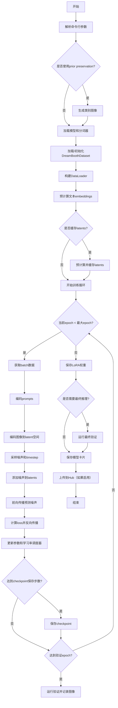

## 类结构

```
Dataset (抽象基类)
├── DreamBoothDataset (DreamBooth训练数据集)
└── PromptDataset (用于生成类别图像的提示词数据集)
```

## 全局变量及字段


### `logger`
    
全局日志记录器，用于输出训练过程中的日志信息

类型：`logging.Logger`
    


### `args`
    
命令行参数命名空间，包含所有训练配置参数

类型：`argparse.Namespace`
    


### `DreamBoothDataset.size`
    
图像分辨率大小，训练图像会被resize到该尺寸

类型：`int`
    


### `DreamBoothDataset.center_crop`
    
是否中心裁剪，true时使用CenterCrop，false时使用RandomCrop

类型：`bool`
    


### `DreamBoothDataset.instance_prompt`
    
实例提示词，用于标识需要微化的特定实例

类型：`str`
    


### `DreamBoothDataset.custom_instance_prompts`
    
自定义实例提示词列表，如果提供则为每张图像使用不同的提示词

类型：`Optional[List[str]]`
    


### `DreamBoothDataset.class_prompt`
    
类别提示词，用于生成类别图像进行先验 preservation

类型：`str`
    


### `DreamBoothDataset.instance_data_root`
    
实例数据根目录，包含需要微化的实例图像

类型：`Path`
    


### `DreamBoothDataset.class_data_root`
    
类别数据根目录，包含类别图像用于先验 preservation

类型：`Optional[Path]`
    


### `DreamBoothDataset.instance_images`
    
实例图像列表，存储从数据目录加载的PIL图像对象

类型：`List[Image]`
    


### `DreamBoothDataset.pixel_values`
    
预处理后的像素值列表，包含经过transforms处理后的图像tensor

类型：`List[Tensor]`
    


### `DreamBoothDataset.num_instance_images`
    
实例图像数量，用于计算数据集长度和索引

类型：`int`
    


### `DreamBoothDataset.class_images_path`
    
类别图像路径列表，存储类别目录中的所有图像文件路径

类型：`List[Path]`
    


### `DreamBoothDataset.num_class_images`
    
类别图像数量，限制使用的类别图像数量

类型：`int`
    


### `DreamBoothDataset._length`
    
数据集长度，取实例图像和类别图像数量的最大值

类型：`int`
    


### `DreamBoothDataset.image_transforms`
    
图像变换组合，包含resize、crop、tensor转换和归一化操作

类型：`Compose`
    


### `PromptDataset.prompt`
    
生成图像的提示词，用于批量生成类别图像

类型：`str`
    


### `PromptDataset.num_samples`
    
生成样本数量，指定需要生成的类别图像总数

类型：`int`
    
    

## 全局函数及方法


### `save_model_card`

该函数用于将训练好的 DreamBooth LoRA 模型的模型卡片（Model Card）保存到本地仓库目录。模型卡片包含模型描述、触发词、使用方法等元信息，并会上传到 HuggingFace Hub。

参数：

- `repo_id`：`str`，HuggingFace Hub 上的仓库标识符，用于标识模型
- `images`：`Optional[List[PIL.Image]]`，验证时生成的图像列表，默认为 None
- `base_model`：`Optional[str]` ，基础预训练模型的名称或路径，默认为 None
- `instance_prompt`：`Optional[str]` ，实例提示词，用于触发模型生成特定实例的图像，默认为 None
- `validation_prompt`：`Optional[str]` ，验证提示词，用于生成验证图像，默认为 None
- `repo_folder`：`Optional[str]` ，本地仓库文件夹路径，用于保存模型卡片和图像，默认为 None

返回值：`None`，该函数没有返回值，直接将模型卡片写入文件系统

#### 流程图

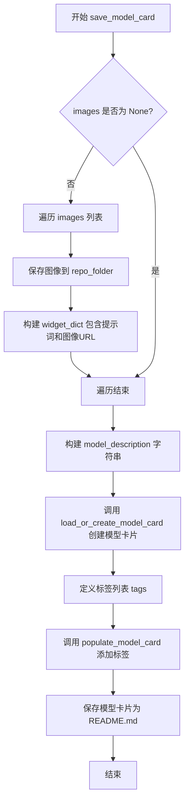

#### 带注释源码

```python
def save_model_card(
    repo_id: str,
    images=None,
    base_model: str = None,
    instance_prompt=None,
    validation_prompt=None,
    repo_folder=None,
):
    """
    保存模型卡片到指定文件夹
    
    参数:
        repo_id: HuggingFace Hub 仓库ID
        images: 验证图像列表
        base_model: 基础模型名称
        instance_prompt: 实例提示词
        validation_prompt: 验证提示词
        repo_folder: 本地仓库文件夹
    """
    
    # 初始化 widget 字典列表，用于 HuggingFace Spaces 展示
    widget_dict = []
    
    # 如果有图像，保存到本地并构建 widget 字典
    if images is not None:
        for i, image in enumerate(images):
            # 将图像保存为 PNG 文件
            image.save(os.path.join(repo_folder, f"image_{i}.png"))
            # 构建 widget 字典，包含提示词和图像 URL
            widget_dict.append(
                {"text": validation_prompt if validation_prompt else " ", "output": {"url": f"image_{i}.png"}}
            )

    # 构建模型描述字符串，包含 Markdown 格式的详细信息
    model_description = f"""
# HiDream Image DreamBooth LoRA - {repo_id}

<Gallery />

## Model description

These are {repo_id} DreamBooth LoRA weights for {base_model}.

The weights were trained using [DreamBooth](https://dreambooth.github.io/) with the [HiDream Image diffusers trainer](https://github.com/huggingface/diffusers/blob/main/examples/dreambooth/README_hidream.md).

## Trigger words

You should use `{instance_prompt}` to trigger the image generation.

## Download model

[Download the *.safetensors LoRA]({repo_id}/tree/main) in the Files & versions tab.

## Use it with the [🧨 diffusers library](https://github.com/huggingface/diffusers)

```py
    >>> import torch
    >>> from transformers import PreTrainedTokenizerFast, LlamaForCausalLM
    >>> from diffusers import HiDreamImagePipeline

    >>> tokenizer_4 = PreTrainedTokenizerFast.from_pretrained("meta-llama/Meta-Llama-3.1-8B-Instruct")
    >>> text_encoder_4 = LlamaForCausalLM.from_pretrained(
    ...     "meta-llama/Meta-Llama-3.1-8B-Instruct",
    ...     output_hidden_states=True,
    ...     output_attentions=True,
    ...     torch_dtype=torch.bfloat16,
    ... )

    >>> pipe = HiDreamImagePipeline.from_pretrained(
    ...     "HiDream-ai/HiDream-I1-Full",
    ...     tokenizer_4=tokenizer_4,
    ...     text_encoder_4=text_encoder_4,
    ...     torch_dtype=torch.bfloat16,
    ... )
    >>> pipe.enable_model_cpu_offload()
    >>> pipe.load_lora_weights(f"{repo_id}")
    >>> image = pipe(f"{instance_prompt}").images[0]


```

For more details, including weighting, merging and fusing LoRAs, check the [documentation on loading LoRAs in diffusers](https://huggingface.co/docs/diffusers/main/en/using-diffusers/loading_adapters)
"""
    
    # 加载或创建模型卡片
    model_card = load_or_create_model_card(
        repo_id_or_path=repo_id,
        from_training=True,  # 标记为训练后导出
        license="mit",
        base_model=base_model,
        prompt=instance_prompt,
        model_description=model_description,
        widget=widget_dict,
    )
    
    # 定义模型标签
    tags = [
        "text-to-image",
        "diffusers-training",
        "diffusers",
        "lora",
        "hidream",
        "hidream-diffusers",
        "template:sd-lora",
    ]

    # 填充模型卡片，添加标签
    model_card = populate_model_card(model_card, tags=tags)
    
    # 保存模型卡片为 README.md
    model_card.save(os.path.join(repo_folder, "README.md"))
```


### `load_text_encoders`

该函数是训练脚本中的核心模型加载工具，用于实例化四个不同的文本编码器模型。这些模型（三个CLIP/T5编码器和一个Llama因果语言模型）是HiDreamImagePipeline多模态工作的关键组件，分别负责处理不同来源和类型的文本嵌入。

参数：

-  `class_one`：`Type` (类对象)，用于实例化第一个文本编码器的类（例如CLIPTextModelWithProjection）。
-  `class_two`：`Type` (类对象)，用于实例化第二个文本编码器的类（例如CLIPTextModel）。
-  `class_three`：`Type` (类对象)，用于实例化第三个文本编码器的类（例如T5EncoderModel）。

返回值：`Tuple[PreTrainedModel, PreTrainedModel, PreTrainedModel, LlamaForCausalLM]`，返回一个包含四个文本编码器实例的元组。

全局变量：

-  `args`：`argparse.Namespace`，全局配置对象，存储了模型路径（如`pretrained_model_name_or_path`、`pretrained_text_encoder_4_name_or_path`）以及版本和变体信息。

#### 流程图

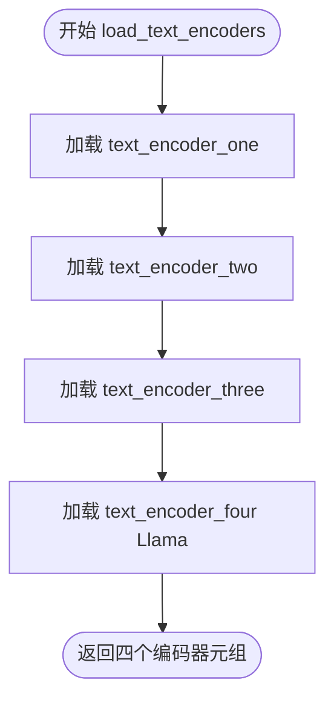

#### 带注释源码

```python
def load_text_encoders(class_one, class_two, class_three):
    """
    加载四个文本编码器模型。

    参数:
        class_one: 第一个文本编码器的类类型。
        class_two: 第二个文本编码器的类类型。
        class_three: 第三个文本编码器的类类型。
    
    返回:
        包含四个文本编码器模型的元组。
    """
    # 加载第一个文本编码器 (通常为 CLIP)
    # 使用预训练模型路径、子文件夹 "text_encoder"、版本和变体进行加载
    text_encoder_one = class_one.from_pretrained(
        args.pretrained_model_name_or_path, subfolder="text_encoder", revision=args.revision, variant=args.variant
    )
    
    # 加载第二个文本编码器 (通常为 CLIP 变体)
    # 位于 "text_encoder_2" 子文件夹
    text_encoder_two = class_two.from_pretrained(
        args.pretrained_model_name_or_path, subfolder="text_encoder_2", revision=args.revision, variant=args.variant
    )
    
    # 加载第三个文本编码器 (通常为 T5)
    # 位于 "text_encoder_3" 子文件夹
    text_encoder_three = class_three.from_pretrained(
        args.pretrained_model_name_or_path, subfolder="text_encoder_3", revision=args.revision, variant=args.variant
    )
    
    # 加载第四个文本编码器 (Llama 模型，专门用于更长序列的上下文)
    # 从独立的路径加载，并配置输出隐藏状态和注意力权重，强制使用 bfloat16
    text_encoder_four = LlamaForCausalLM.from_pretrained(
        args.pretrained_text_encoder_4_name_or_path,
        output_hidden_states=True,
        output_attentions=True,
        torch_dtype=torch.bfloat16,
    )
    
    # 返回四个编码器实例
    return text_encoder_one, text_encoder_two, text_encoder_three, text_encoder_four
```


### `log_validation`

运行验证流程，生成指定数量的图像并记录到日志追踪器（TensorBoard或WandB），返回生成的图像列表。

参数：

- `pipeline`：`HiDreamImagePipeline`，用于生成图像的扩散管道实例
- `args`：命名空间对象，包含验证相关配置（如`validation_prompt`、`num_validation_images`、`seed`等）
- `accelerator`：Accelerator实例，提供分布式训练支持和设备管理
- `pipeline_args`：字典，包含预计算的文本嵌入（prompt_embeds_t5、prompt_embeds_llama3、negative_prompt_embeds等）
- `epoch`：整数，当前训练轮次编号，用于日志记录
- `torch_dtype`：torch.dtype，推理时使用的数据类型（如float16或bfloat16）
- `is_final_validation`：布尔值，标记是否为最终验证（默认`False`），最终验证时禁用自动混合精度

返回值：`List[Image]`，生成的PIL图像列表

#### 流程图

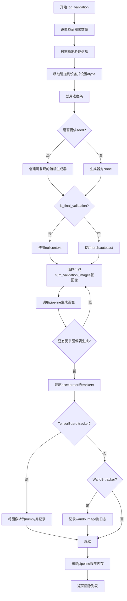

#### 带注释源码

```python
def log_validation(
    pipeline,              # HiDreamImagePipeline: 图像生成管道
    args,                  # argparse.Namespace: 训练参数，包含验证prompt等配置
    accelerator,           # Accelerator: 分布式训练加速器
    pipeline_args,         # dict: 预计算的文本嵌入字典
    epoch,                 # int: 当前训练轮次
    torch_dtype,           # torch.dtype: 推理数据类型
    is_final_validation=False,  # bool: 是否为最终验证
):
    # 确定验证图像数量，默认为1
    args.num_validation_images = args.num_validation_images if args.num_validation_images else 1
    
    # 记录验证日志信息
    logger.info(
        f"Running validation... \n Generating {args.num_validation_images} images with prompt:"
        f" {args.validation_prompt}."
    )
    
    # 将管道移动到指定设备并转换数据类型
    pipeline = pipeline.to(accelerator.device, dtype=torch_dtype)
    pipeline.set_progress_bar_config(disable=True)

    # 创建随机生成器以确保可复现性（如果提供了seed）
    generator = torch.Generator(device=accelerator.device).manual_seed(args.seed) if args.seed is not None else None
    
    # 根据是否为最终验证选择是否使用自动混合精度
    # 最终验证时使用nullcontext避免精度问题
    autocast_ctx = torch.autocast(accelerator.device.type) if not is_final_validation else nullcontext()

    images = []  # 存储生成的图像
    
    # 循环生成指定数量的验证图像
    for _ in range(args.num_validation_images):
        with autocast_ctx:
            # 调用管道生成图像，传入预计算的嵌入向量
            image = pipeline(
                prompt_embeds_t5=pipeline_args["prompt_embeds_t5"],
                prompt_embeds_llama3=pipeline_args["prompt_embeds_llama3"],
                negative_prompt_embeds_t5=pipeline_args["negative_prompt_embeds_t5"],
                negative_prompt_embeds_llama3=pipeline_args["negative_prompt_embeds_llama3"],
                pooled_prompt_embeds=pipeline_args["pooled_prompt_embeds"],
                negative_pooled_prompt_embeds=pipeline_args["negative_pooled_prompt_embeds"],
                generator=generator,
            ).images[0]
            images.append(image)

    # 遍历所有追踪器并记录图像
    for tracker in accelerator.trackers:
        # 确定阶段名称：最终验证为"test"，中间验证为"validation"
        phase_name = "test" if is_final_validation else "validation"
        
        if tracker.name == "tensorboard":
            # TensorBoard：堆叠图像为numpy数组并记录
            np_images = np.stack([np.asarray(img) for img in images])
            tracker.writer.add_images(phase_name, np_images, epoch, dataformats="NHWC")
        
        if tracker.name == "wandb":
            # WandB：记录带标题的图像
            tracker.log(
                {
                    phase_name: [
                        wandb.Image(image, caption=f"{i}: {args.validation_prompt}") for i, image in enumerate(images)
                    ]
                }
            )

    # 清理：删除pipeline并释放内存
    del pipeline
    free_memory()

    return images  # 返回生成的图像列表
```


### `import_model_class_from_model_name_or_path`

该函数是 HiDream Image DreamBooth LoRA 训练脚本中的文本编码器类动态导入工具函数。它根据预训练模型的配置文件动态确定并返回对应的文本编码器类（如 CLIP 或 T5 编码器），以支持不同架构模型的加载需求。

参数：

- `pretrained_model_name_or_path`：`str`，预训练模型的名称或本地路径，用于定位模型配置文件
- `revision`：`str`，从 Hugging Face Hub 获取模型时指定的版本修订号
- `subfolder`：`str`，可选参数，默认为 `"text_encoder"`，指定模型子文件夹名称（如 text_encoder、text_encoder_2 等）

返回值：`type`，返回对应的文本编码器类（`CLIPTextModelWithProjection` 或 `T5EncoderModel`）

#### 流程图

```mermaid
flowchart TD
    A[开始: import_model_class_from_model_name_or_path] --> B[调用 PretrainedConfig.from_pretrained 加载配置文件]
    B --> C[从配置中获取 architectures[0]]
    C --> D{判断 model_class 类型}
    D -->|CLIPTextModelWithProjection| E[导入 CLIPTextModelWithProjection]
    D -->|CLIPTextModel| E
    D -->|T5EncoderModel| F[导入 T5EncoderModel]
    D -->|其他类型| G[抛出 ValueError 异常]
    E --> H[返回 CLIPTextModelWithProjection 类]
    F --> I[返回 T5EncoderModel 类]
    G --> J[结束: 抛出未支持模型异常]
    H --> J
    I --> J
```

#### 带注释源码

```python
def import_model_class_from_model_name_or_path(
    pretrained_model_name_or_path: str, 
    revision: str, 
    subfolder: str = "text_encoder"
):
    """
    根据模型路径动态导入文本编码器类
    
    参数:
        pretrained_model_name_or_path: 预训练模型名称或本地路径
        revision: 模型版本修订号
        subfolder: 模型子文件夹路径，默认为 "text_encoder"
    
    返回:
        对应的文本编码器类 (CLIPTextModelWithProjection 或 T5EncoderModel)
    """
    # 步骤1: 从预训练模型配置目录加载 PretrainedConfig 对象
    # 根据 subfolder 参数定位具体的编码器配置文件（如 text_encoder/config.json）
    text_encoder_config = PretrainedConfig.from_pretrained(
        pretrained_model_name_or_path, 
        subfolder=subfolder, 
        revision=revision
    )
    
    # 步骤2: 从配置中提取模型架构名称
    # architectures 是一个列表，通常第一个元素包含主要架构类名
    model_class = text_encoder_config.architectures[0]
    
    # 步骤3: 根据架构名称进行条件分支，返回对应的模型类
    # 支持 CLIP 系列的文本编码器（带或不带 projection）
    if model_class == "CLIPTextModelWithProjection" or model_class == "CLIPTextModel":
        # 动态导入 transformers 库中的 CLIP 文本编码器类
        from transformers import CLIPTextModelWithProjection
        
        # 返回类对象而非实例，供后续 from_pretrained 调用
        return CLIPTextModelWithProjection
    
    # 支持 T5 编码器模型
    elif model_class == "T5EncoderModel":
        from transformers import T5EncoderModel
        
        return T5EncoderModel
    
    # 步骤4: 对于不支持的架构，抛出明确的错误信息
    else:
        raise ValueError(f"{model_class} is not supported.")
```


### `parse_args`

解析命令行参数，创建一个argparse.ArgumentParser实例，定义并添加所有训练所需的参数选项，进行参数验证，最终返回一个包含所有配置参数的Namespace对象。

参数：

- `input_args`：`List[str] | None`，可选参数，用于测试目的的输入参数列表。如果为None，则从sys.argv解析命令行参数。

返回值：`argparse.Namespace`，包含所有解析后的命令行参数对象。

#### 流程图

```mermaid
flowchart TD
    A[开始 parse_args] --> B[创建 ArgumentParser]
    B --> C[添加模型相关参数<br/>--pretrained_model_name_or_path<br/>--revision<br/>--variant等]
    C --> D[添加数据集相关参数<br/>--dataset_name<br/>--instance_data_dir<br/>--class_data_dir等]
    D --> E[添加训练相关参数<br/>--train_batch_size<br/>--learning_rate<br/>--num_train_epochs等]
    E --> F[添加LoRA相关参数<br/>--rank<br/>--lora_dropout<br/>--lora_layers等]
    F --> G[添加优化器相关参数<br/>--optimizer<br/>--adam_beta1<br/>--adam_weight_decay等]
    G --> H[添加其他参数<br/>--output_dir<br/>--logging_dir<br/>--mixed_precision等]
    H --> I{input_args是否为空?}
    I -->|是| J[parser.parse_args<br/>从sys.argv解析]
    I -->|否| K[parser.parse_args(input_args)<br/>从input_args解析]
    J --> L[参数验证逻辑]
    K --> L
    L --> M[验证数据集参数<br/>dataset_name和instance_data_dir互斥]
    M --> N{验证prior_preservation参数}
    N -->|with_prior_preservation=True| O[验证class_data_dir和class_prompt]
    N -->|False| P[警告如果提供了class参数]
    O --> Q[处理LOCAL_RANK环境变量]
    P --> Q
    Q --> R[返回args对象]
    
    style A fill:#f9f,color:#000
    style R fill:#9f9,color:#000
```

#### 带注释源码

```python
def parse_args(input_args=None):
    """
    解析命令行参数，配置DreamBooth训练脚本的所有选项。
    
    参数:
        input_args: 可选的参数列表，用于测试目的。如果为None，则从sys.argv解析。
    
    返回:
        argparse.Namespace: 包含所有配置参数的命名空间对象。
    """
    # 1. 创建ArgumentParser实例，设置脚本描述
    parser = argparse.ArgumentParser(description="Simple example of a training script.")
    
    # 2. 添加预训练模型相关参数
    parser.add_argument(
        "--pretrained_model_name_or_path",
        type=str,
        default=None,
        required=True,
        help="Path to pretrained model or model identifier from huggingface.co/models.",
    )
    parser.add_argument(
        "--pretrained_tokenizer_4_name_or_path",
        type=str,
        default="meta-llama/Meta-Llama-3.1-8B-Instruct",
        help="Path to pretrained model or model identifier from huggingface.co/models.",
    )
    parser.add_argument(
        "--pretrained_text_encoder_4_name_or_path",
        type=str,
        default="meta-llama/Meta-Llama-3.1-8B-Instruct",
        help="Path to pretrained model or model identifier from huggingface.co/models.",
    )
    parser.add_argument(
        "--bnb_quantization_config_path",
        type=str,
        default=None,
        help="Quantization config in a JSON file that will be used to define the bitsandbytes quant config of the DiT.",
    )
    parser.add_argument(
        "--revision",
        type=str,
        default=None,
        required=False,
        help="Revision of pretrained model identifier from huggingface.co/models.",
    )
    parser.add_argument(
        "--variant",
        type=str,
        default=None,
        help="Variant of the model files of the pretrained model identifier from huggingface.co/models, 'e.g.' fp16",
    )
    
    # 3. 添加数据集相关参数
    parser.add_argument(
        "--dataset_name",
        type=str,
        default=None,
        help=(
            "The name of the Dataset (from the HuggingFace hub) containing the training data of instance images (could be your own, possibly private,"
            " dataset). It can also be a path pointing to a local copy of a dataset in your filesystem,"
            " or to a folder containing files that 🤗 Datasets can understand."
        ),
    )
    parser.add_argument(
        "--dataset_config_name",
        type=str,
        default=None,
        help="The config of the Dataset, leave as None if there's only one config.",
    )
    parser.add_argument(
        "--instance_data_dir",
        type=str,
        default=None,
        help=("A folder containing the training data. "),
    )
    parser.add_argument(
        "--cache_dir",
        type=str,
        default=None,
        help="The directory where the downloaded models and datasets will be stored.",
    )
    parser.add_argument(
        "--image_column",
        type=str,
        default="image",
        help="The column of the dataset containing the target image. By "
        "default, the standard Image Dataset maps out 'file_name' "
        "to 'image'.",
    )
    parser.add_argument(
        "--caption_column",
        type=str,
        default=None,
        help="The column of the dataset containing the instance prompt for each image",
    )
    parser.add_argument("--repeats", type=int, default=1, help="How many times to repeat the training data.")
    parser.add_argument(
        "--class_data_dir",
        type=str,
        default=None,
        required=False,
        help="A folder containing the training data of class images.",
    )
    parser.add_argument(
        "--instance_prompt",
        type=str,
        default=None,
        required=True,
        help="The prompt with identifier specifying the instance, e.g. 'photo of a TOK dog', 'in the style of TOK'",
    )
    parser.add_argument(
        "--class_prompt",
        type=str,
        default=None,
        help="The prompt to specify images in the same class as provided instance images.",
    )
    parser.add_argument(
        "--max_sequence_length",
        type=int,
        default=128,
        help="Maximum sequence length to use with t5 and llama encoders",
    )
    
    # 4. 添加验证相关参数
    parser.add_argument(
        "--validation_prompt",
        type=str,
        default=None,
        help="A prompt that is used during validation to verify that the model is learning.",
    )
    parser.add_argument(
        "--skip_final_inference",
        default=False,
        action="store_true",
        help="Whether to skip the final inference step with loaded lora weights upon training completion. This will run intermediate validation inference if `validation_prompt` is provided. Specify to reduce memory.",
    )
    parser.add_argument(
        "--final_validation_prompt",
        type=str,
        default=None,
        help="A prompt that is used during a final validation to verify that the model is learning. Ignored if `--validation_prompt` is provided.",
    )
    parser.add_argument(
        "--num_validation_images",
        type=int,
        default=4,
        help="Number of images that should be generated during validation with `validation_prompt`.",
    )
    parser.add_argument(
        "--validation_epochs",
        type=int,
        default=50,
        help=(
            "Run dreambooth validation every X epochs. Dreambooth validation consists of running the prompt"
            " `args.validation_prompt` multiple times: `args.num_validation_images`."
        ),
    )
    
    # 5. 添加LoRA相关参数
    parser.add_argument(
        "--rank",
        type=int,
        default=4,
        help=("The dimension of the LoRA update matrices."),
    )
    parser.add_argument("--lora_dropout", type=float, default=0.0, help="Dropout probability for LoRA layers")
    parser.add_argument(
        "--with_prior_preservation",
        default=False,
        action="store_true",
        help="Flag to add prior preservation loss.",
    )
    parser.add_argument("--prior_loss_weight", type=float, default=1.0, help="The weight of prior preservation loss.")
    parser.add_argument(
        "--num_class_images",
        type=int,
        default=100,
        help=(
            "Minimal class images for prior preservation loss. If there are not enough images already present in"
            " class_data_dir, additional images will be sampled with class_prompt."
        ),
    )
    parser.add_argument(
        "--lora_layers",
        type=str,
        default=None,
        help=(
            'The transformer modules to apply LoRA training on. Please specify the layers in a comma separated. E.g. - "to_k,to_q,to_v" will result in lora training of attention layers only'
        ),
    )
    
    # 6. 添加输出和训练过程相关参数
    parser.add_argument(
        "--output_dir",
        type=str,
        default="hidream-dreambooth-lora",
        help="The output directory where the model predictions and checkpoints will be written.",
    )
    parser.add_argument("--seed", type=int, default=None, help="A seed for reproducible training.")
    parser.add_argument(
        "--resolution",
        type=int,
        default=512,
        help=(
            "The resolution for input images, all the images in the train/validation dataset will be resized to this"
            " resolution"
        ),
    )
    parser.add_argument(
        "--center_crop",
        default=False,
        action="store_true",
        help=(
            "Whether to center crop the input images to the resolution. If not set, the images will be randomly"
            " cropped. The images will be resized to the resolution first before cropping."
        ),
    )
    parser.add_argument(
        "--random_flip",
        action="store_true",
        help="whether to randomly flip images horizontally",
    )
    parser.add_argument(
        "--train_batch_size", type=int, default=4, help="Batch size (per device) for the training dataloader."
    )
    parser.add_argument(
        "--sample_batch_size", type=int, default=4, help="Batch size (per device) for sampling images."
    )
    parser.add_argument("--num_train_epochs", type=int, default=1)
    parser.add_argument(
        "--max_train_steps",
        type=int,
        default=None,
        help="Total number of training steps to perform.  If provided, overrides num_train_epochs.",
    )
    parser.add_argument(
        "--checkpointing_steps",
        type=int,
        default=500,
        help=(
            "Save a checkpoint of the training state every X updates. These checkpoints can be used both as final"
            " checkpoints in case they are better than the last checkpoint, and are also suitable for resuming"
            " training using `--resume_from_checkpoint`."
        ),
    )
    parser.add_argument(
        "--checkpoints_total_limit",
        type=int,
        default=None,
        help=("Max number of checkpoints to store."),
    )
    parser.add_argument(
        "--resume_from_checkpoint",
        type=str,
        default=None,
        help=(
            "Whether training should be resumed from a previous checkpoint. Use a path saved by"
            ' `--checkpointing_steps`, or `"latest"` to automatically select the last available checkpoint.'
        ),
    )
    parser.add_argument(
        "--gradient_accumulation_steps",
        type=int,
        default=1,
        help="Number of updates steps to accumulate before performing a backward/update pass.",
    )
    parser.add_argument(
        "--gradient_checkpointing",
        action="store_true",
        help="Whether or not to use gradient checkpointing to save memory at the expense of slower backward pass.",
    )
    
    # 7. 添加学习率和调度器参数
    parser.add_argument(
        "--learning_rate",
        type=float,
        default=1e-4,
        help="Initial learning rate (after the potential warmup period) to use.",
    )
    parser.add_argument(
        "--scale_lr",
        action="store_true",
        default=False,
        help="Scale the learning rate by the number of GPUs, gradient accumulation steps, and batch size.",
    )
    parser.add_argument(
        "--lr_scheduler",
        type=str,
        default="constant",
        help=(
            'The scheduler type to use. Choose between ["linear", "cosine", "cosine_with_restarts", "polynomial",'
            ' "constant", "constant_with_warmup"]'
        ),
    )
    parser.add_argument(
        "--lr_warmup_steps", type=int, default=500, help="Number of steps for the warmup in the lr scheduler."
    )
    parser.add_argument(
        "--lr_num_cycles",
        type=int,
        default=1,
        help="Number of hard resets of the lr in cosine_with_restarts scheduler.",
    )
    parser.add_argument("--lr_power", type=float, default=1.0, help="Power factor of the polynomial scheduler.")
    
    # 8. 添加数据加载器和其他训练参数
    parser.add_argument(
        "--dataloader_num_workers",
        type=int,
        default=0,
        help=(
            "Number of subprocesses to use for data loading. 0 means that the data will be loaded in the main process."
        ),
    )
    parser.add_argument(
        "--weighting_scheme",
        type=str,
        default="none",
        choices=["sigma_sqrt", "logit_normal", "mode", "cosmap", "none"],
        help=('We default to the "none" weighting scheme for uniform sampling and uniform loss'),
    )
    parser.add_argument(
        "--logit_mean", type=float, default=0.0, help="mean to use when using the `'logit_normal'` weighting scheme."
    )
    parser.add_argument(
        "--logit_std", type=float, default=1.0, help="std to use when using the `'logit_normal'` weighting scheme."
    )
    parser.add_argument(
        "--mode_scale",
        type=float,
        default=1.29,
        help="Scale of mode weighting scheme. Only effective when using the `'mode'` as the `weighting_scheme`.",
    )
    
    # 9. 添加优化器参数
    parser.add_argument(
        "--optimizer",
        type=str,
        default="AdamW",
        help=('The optimizer type to use. Choose between ["AdamW", "prodigy"]'),
    )
    parser.add_argument(
        "--use_8bit_adam",
        action="store_true",
        help="Whether or not to use 8-bit Adam from bitsandbytes. Ignored if optimizer is not set to AdamW",
    )
    parser.add_argument(
        "--adam_beta1", type=float, default=0.9, help="The beta1 parameter for the Adam and Prodigy optimizers."
    )
    parser.add_argument(
        "--adam_beta2", type=float, default=0.999, help="The beta2 parameter for the Adam and Prodigy optimizers."
    )
    parser.add_argument(
        "--prodigy_beta3",
        type=float,
        default=None,
        help="coefficients for computing the Prodigy stepsize using running averages. If set to None, "
        "uses the value of square root of beta2. Ignored if optimizer is adamW",
    )
    parser.add_argument("--prodigy_decouple", type=bool, default=True, help="Use AdamW style decoupled weight decay")
    parser.add_argument("--adam_weight_decay", type=float, default=1e-04, help="Weight decay to use for unet params")
    parser.add_argument(
        "--adam_epsilon",
        type=float,
        default=1e-08,
        help="Epsilon value for the Adam optimizer and Prodigy optimizers.",
    )
    parser.add_argument(
        "--prodigy_use_bias_correction",
        type=bool,
        default=True,
        help="Turn on Adam's bias correction. True by default. Ignored if optimizer is adamW",
    )
    parser.add_argument(
        "--prodigy_safeguard_warmup",
        type=bool,
        default=True,
        help="Remove lr from the denominator of D estimate to avoid issues during warm-up stage. True by default. "
        "Ignored if optimizer is adamW",
    )
    parser.add_argument("--max_grad_norm", default=1.0, type=float, help="Max gradient norm.")
    
    # 10. 添加模型保存和推送相关参数
    parser.add_argument("--push_to_hub", action="store_true", help="Whether or not to push the model to the Hub.")
    parser.add_argument("--hub_token", type=str, default=None, help="The token to use to push to the Model Hub.")
    parser.add_argument(
        "--hub_model_id",
        type=str,
        default=None,
        help="The name of the repository to keep in sync with the local `output_dir`.",
    )
    parser.add_argument(
        "--logging_dir",
        type=str,
        default="logs",
        help=(
            "[TensorBoard](https://www.tensorflow.org/tensorboard) log directory. Will default to"
            " *output_dir/runs/**CURRENT_DATETIME_HOSTNAME***."
        ),
    )
    parser.add_argument(
        "--allow_tf32",
        action="store_true",
        help=(
            "Whether or not to allow TF32 on Ampere GPUs. Can be used to speed up training. For more information, see"
            " https://pytorch.org/docs/stable/notes/cuda.html#tensorfloat-32-tf32-on-ampere-devices"
        ),
    )
    parser.add_argument(
        "--cache_latents",
        action="store_true",
        default=False,
        help="Cache the VAE latents",
    )
    parser.add_argument(
        "--report_to",
        type=str,
        default="tensorboard",
        help=(
            'The integration to report the results and logs to. Supported platforms are `"tensorboard"`'
            ' (default), `"wandb"` and `"comet_ml"`. Use `"all"` to report to all integrations.'
        ),
    )
    parser.add_argument(
        "--mixed_precision",
        type=str,
        default=None,
        choices=["no", "fp16", "bf16"],
        help=(
            "Whether to use mixed precision. Choose between fp16 and bf16 (bfloat16). Bf16 requires PyTorch >="
            " 1.10.and an Nvidia Ampere GPU.  Default to the value of accelerate config of the current system or the"
            " flag passed with the `accelerate.launch` command. Use this argument to override the accelerate config."
        ),
    )
    parser.add_argument(
        "--upcast_before_saving",
        action="store_true",
        default=False,
        help=(
            "Whether to upcast the trained transformer layers to float32 before saving (at the end of training). "
            "Defaults to precision dtype used for training to save memory"
        ),
    )
    parser.add_argument(
        "--offload",
        action="store_true",
        help="Whether to offload the VAE and the text encoder to CPU when they are not used.",
    )
    parser.add_argument("--local_rank", type=int, default=-1, help="For distributed training: local_rank")
    
    # 11. 解析参数：根据input_args是否为空决定解析来源
    if input_args is not None:
        args = parser.parse_args(input_args)
    else:
        args = parser.parse_args()
    
    # 12. 参数验证逻辑
    
    # 验证数据集参数：dataset_name和instance_data_dir必须指定其一，但不能同时指定
    if args.dataset_name is None and args.instance_data_dir is None:
        raise ValueError("Specify either `--dataset_name` or `--instance_data_dir`")
    
    if args.dataset_name is not None and args.instance_data_dir is not None:
        raise ValueError("Specify only one of `--dataset_name` or `--instance_data_dir`")
    
    # 处理分布式训练的环境变量LOCAL_RANK
    env_local_rank = int(os.environ.get("LOCAL_RANK", -1))
    if env_local_rank != -1 and env_local_rank != args.local_rank:
        args.local_rank = env_local_rank
    
    # 验证prior preservation相关参数
    if args.with_prior_preservation:
        if args.class_data_dir is None:
            raise ValueError("You must specify a data directory for class images.")
        if args.class_prompt is None:
            raise ValueError("You must specify prompt for class images.")
    else:
        # logger is not available yet
        if args.class_data_dir is not None:
            warnings.warn("You need not use --class_data_dir without --with_prior_preservation.")
        if args.class_prompt is not None:
            warnings.warn("You need not use --class_prompt without --with_prior_preservation.")
    
    # 13. 返回解析后的参数对象
    return args
```


### `collate_fn`

该函数是DreamBooth训练脚本中的数据整理函数，负责将一个batch的样本数据整理成模型训练所需的格式，支持先验保留（prior preservation）功能以避免两次前向传播。

参数：

- `examples`：List[Dict]，从Dataset返回的样本列表，每个字典包含图像和提示词
- `with_prior_preservation`：bool，是否启用先验保留损失（用于将实例图像与类别图像一起训练）

返回值：`Dict`，包含以下键值的字典：
- `pixel_values`：torch.Tensor，形状为(batch_size, C, H, W)的图像tensor
- `prompts`：List[str]，对应的文本提示词列表

#### 流程图

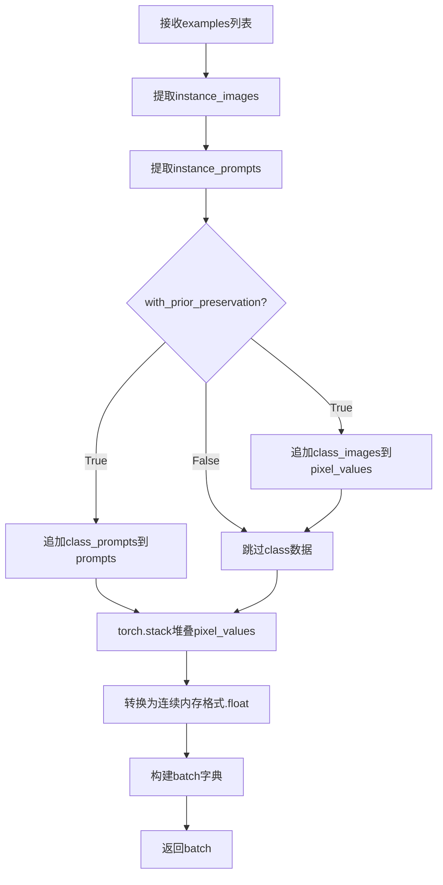

#### 带注释源码

```python
def collate_fn(examples, with_prior_preservation=False):
    """
    整理训练batch数据
    
    参数:
        examples: 从Dataset获取的样本列表
        with_prior_preservation: 是否启用先验保留模式
    
    返回:
        包含pixel_values和prompts的字典
    """
    # 从每个样本中提取实例图像
    pixel_values = [example["instance_images"] for example in examples]
    
    # 从每个样本中提取实例提示词
    prompts = [example["instance_prompt"] for example in examples]

    # 如果启用先验保留，将类别图像和提示词也加入batch
    # 这样可以一次性计算损失，避免两次前向传播
    if with_prior_preservation:
        pixel_values += [example["class_images"] for example in examples]
        prompts += [example["class_prompt"] for example in examples]

    # 将图像列表堆叠成张量
    pixel_values = torch.stack(pixel_values)
    
    # 转换为连续内存格式并转为float32类型
    # contiguous_format确保内存连续以提高访问效率
    pixel_values = pixel_values.to(memory_format=torch.contiguous_format).float()

    # 构建最终的batch字典
    batch = {"pixel_values": pixel_values, "prompts": prompts}
    return batch
```

#### 使用场景说明

该函数在`DreamBoothDataset`的训练DataLoader中被调用：

```python
train_dataloader = torch.utils.data.DataLoader(
    train_dataset,
    batch_size=args.train_batch_size,
    shuffle=True,
    collate_fn=lambda examples: collate_fn(examples, args.with_prior_preservation),
    num_workers=args.dataloader_num_workers,
)
```

关键设计点：
1. **先验保留支持**：通过`with_prior_preservation`参数控制是否将类别图像与实例图像合并处理，这是DreamBooth训练中避免额外前向传播的关键优化
2. **内存连续性**：使用`memory_format=torch.contiguous_format`确保tensor内存布局连续，提升后续计算效率
3. **数据类型转换**：统一转换为float32，确保训练过程中数据类型一致性


### `main`

这是 HiDream Image DreamBooth LoRA 训练脚本的核心入口函数。它负责协调整个训练流程，包括分布式环境初始化、模型加载与配置、数据集准备、文本嵌入的预计算、训练循环的执行（含梯度累积、损失计算、反向传播）、验证推理、模型检查点保存以及最终 LoRA 权重的导出。

参数：

-  `args`：`argparse.Namespace`，包含所有命令行参数和超参数的对象，由 `parse_args` 函数解析生成。包含模型路径、数据路径、训练参数（学习率、批量大小等）。

返回值：`None`，该函数通过副作用（如写入文件、打印日志）完成工作，不返回训练好的模型对象。

#### 流程图

```mermaid
graph TD
    A([Start: main args]) --> B[初始化 Accelerator, Logging, Seed]
    B --> C{是否开启 Prior Preservation?}
    C -- Yes --> D[使用 Pipeline 生成 Class Images]
    C -- No --> E[加载模型组件]
    D --> E
    E --> F[加载 Tokenizers 和 Text Encoders]
    F --> G[配置 LoRA Adapter]
    H[创建 DreamBoothDataset 和 DataLoader]
    G --> H
    H --> I[预计算 Instance 和 Class 的 Text Embeddings]
    I --> J{是否 Cache Latents?}
    J -- Yes --> K[预计算并缓存图像 Latents]
    J -- No --> L[初始化 Optimizer 和 LR Scheduler]
    K --> L
    L --> M[进入训练循环: Epochs]
    M --> N[进入训练循环: Steps]
    N --> O[编码 Prompt (如果动态) & 图像]
    O --> P[采样 Noise 和 Timestep]
    P --> Q[前向传播: Transformer 预测]
    Q --> R[计算 Loss (含 Prior Loss)]
    R --> S[Backward & Optimizer Step]
    S --> T{是否 Sync Gradients?}
    T -- Yes --> U[更新 Progress Bar & 日志]
    T -- No --> N
    U --> V{是否到达 Checkpoint 步数?}
    V -- Yes --> W[保存 Accelerator State]
    V -- No --> X{是否到达 Validation Epoch?}
    X -- Yes --> Y[执行 Validation Inference]
    X -- No --> Z{训练结束?}
    W --> Z
    Y --> Z
    Z -- No --> N
    Z -- Yes --> AA[保存 LoRA 权重]
    AA --> AB{是否跳过最终推理?}
    AB -- No --> AC[加载权重并执行最终推理]
    AB -- Yes --> AD[生成 Model Card]
    AC --> AD
    AD --> AE{是否 Push to Hub?}
    AE -- Yes --> AF[上传文件夹到 Hub]
    AE -- No --> AG([End])
    AF --> AG
```

#### 带注释源码

```python
def main(args):
    # 1. 权限与环境检查
    if args.report_to == "wandb" and args.hub_token is not None:
        raise ValueError("...")

    if torch.backends.mps.is_available() and args.mixed_precision == "bf16":
        raise ValueError("...")

    # 2. 初始化 Accelerator (分布式训练核心)
    logging_dir = Path(args.output_dir, args.logging_dir)
    accelerator_project_config = ProjectConfiguration(project_dir=args.output_dir, logging_dir=logging_dir)
    kwargs = DistributedDataParallelKwargs(find_unused_parameters=True)
    accelerator = Accelerator(
        gradient_accumulation_steps=args.gradient_accumulation_steps,
        mixed_precision=args.mixed_precision,
        log_with=args.report_to,
        project_config=accelerator_project_config,
        kwargs_handlers=[kwargs],
    )

    # 3. 日志与随机种子设置
    # ... (日志配置代码省略)
    if args.seed is not None:
        set_seed(args.seed)

    # 4. Prior Preservation: 生成类别图像
    if args.with_prior_preservation:
        # 如果数据集类别图像不足，使用 Pipline 生成
        # ... (生成逻辑代码省略)

    # 5. 仓库创建与模型加载准备
    if accelerator.is_main_process:
        if args.output_dir is not None:
            os.makedirs(args.output_dir, exist_ok=True)
        if args.push_to_hub:
            # 创建 Repo
            pass

    # 6. 加载 Tokenizers
    tokenizer_one = CLIPTokenizer.from_pretrained(...)
    tokenizer_two = CLIPTokenizer.from_pretrained(...)
    tokenizer_three = T5Tokenizer.from_pretrained(...)
    tokenizer_four = AutoTokenizer.from_pretrained(...)

    # 7. 加载 Text Encoders
    text_encoder_cls_one = import_model_class_from_model_name_or_path(...)
    # ... 加载其他三个 Text Encoder (包括 Llama)

    # 8. 确定权重精度 (FP32, FP16, BF16)
    weight_dtype = torch.float32
    if accelerator.mixed_precision == "fp16":
        weight_dtype = torch.float16
    elif accelerator.mixed_precision == "bf16":
        weight_dtype = torch.bfloat16

    # 9. 加载 Scheduler, VAE, Transformer
    noise_scheduler = FlowMatchEulerDiscreteScheduler.from_pretrained(...)
    vae = AutoencoderKL.from_pretrained(...)
    
    # 10. 加载 Transformer 并应用 LoRA
    transformer = HiDreamImageTransformer2DModel.from_pretrained(...)
    # 冻结原始权重
    transformer.requires_grad_(False)
    vae.requires_grad_(False)
    # ... 冻结 Text Encoders
    
    # 配置 LoRA
    transformer_lora_config = LoraConfig(...)
    transformer.add_adapter(transformer_lora_config)

    # 11. 注册模型保存/加载 Hooks (处理 LoRA 权重)
    def save_model_hook(...): ...
    def load_model_hook(...): ...
    accelerator.register_save_state_pre_hook(save_model_hook)
    accelerator.register_load_state_pre_hook(load_model_hook)

    # 12. 优化器设置
    # 根据 args.optimizer 选择 AdamW 或 Prodigy
    optimizer = ...
    
    # 13. 数据集与 DataLoader
    train_dataset = DreamBoothDataset(...)
    train_dataloader = torch.utils.data.DataLoader(...)

    # 14. 文本嵌入预计算 (关键步骤)
    # 为了节省显存，提前编码 prompt
    def compute_text_embeddings(...): ...
    
    if not train_dataset.custom_instance_prompts:
        # 编码实例提示词
        with offload_models(...):
            (instance_prompt_hidden_states_t5, ...) = compute_text_embeddings(...)

    # 如果开启 Prior Preservation，编码类别提示词
    if args.with_prior_preservation:
        # 编码类别提示词
        pass

    # 15. Latent 缓存 (可选，进一步节省显存)
    precompute_latents = args.cache_latents or train_dataset.custom_instance_prompts
    if precompute_latents:
        # 遍历数据集，将图像编码为 latent 并缓存
        # ...

    # 16. 释放 Text Encoder 和 VAE 内存 (训练 Transformer 时不需要)
    # ... (del vae, del text_encoders ...)

    # 17. 训练循环
    lr_scheduler = get_scheduler(...)
    
    # 使用 Accelerator 准备模型和数据
    transformer, optimizer, train_dataloader, lr_scheduler = accelerator.prepare(...)

    for epoch in range(first_epoch, args.num_train_epochs):
        transformer.train()
        for step, batch in enumerate(train_dataloader):
            with accelerator.accumulate(transformer):
                # A. 获取 Prompt Embeddings
                # B. 获取图像 Latents
                # C. 加噪 (Flow Matching)
                # D. 预测噪声
                # E. 计算 Loss
                # F. 反向传播
                # G. 梯度裁剪与优化器更新

            # 18. 检查点保存与验证
            if accelerator.sync_gradients:
                # 保存状态
                # 验证推理
                pass

    # 19. 训练结束：保存 LoRA
    accelerator.wait_for_everyone()
    if accelerator.is_main_process:
        # 保存权重
        HiDreamImagePipeline.save_lora_weights(...)
        
        # 最终推理 (可选)
        # 上传 Hub
        # 保存 Model Card
```


### `get_sigmas`

该函数用于根据给定的时间步（timesteps）从噪声调度器中提取对应的sigma值，并将sigma张量扩展到指定的维度数，以适配扩散模型训练中的噪声调度计算。

参数：

- `timesteps`：`torch.Tensor`，需要进行sigma计算的时间步张量
- `n_dim`：`int`，默认为4，目标输出维度数，用于确保输出张量维度符合模型输入要求
- `dtype`：`torch.dtype`，默认为torch.float32，输出张量的数据类型

返回值：`torch.Tensor`，从噪声调度器中获取的sigma值张量，维度被扩展到n_dim

#### 流程图

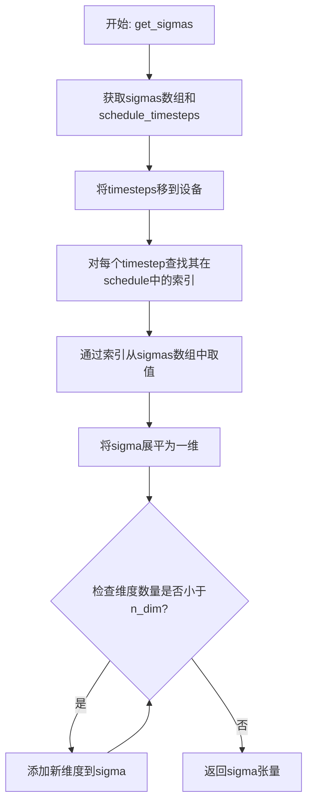

#### 带注释源码

```python
def get_sigmas(timesteps, n_dim=4, dtype=torch.float32):
    """
    根据时间步从噪声调度器获取对应的sigma值
    
    参数:
        timesteps: 时间步张量
        n_dim: 目标输出维度数
        dtype: 输出数据类型
    """
    # 从噪声调度器的副本中获取预计算的sigmas数组，并移至目标设备
    sigmas = noise_scheduler_copy.sigmas.to(device=accelerator.device, dtype=dtype)
    # 获取调度器的时间步序列
    schedule_timesteps = noise_scheduler_copy.timesteps.to(accelerator.device)
    # 确保输入的时间步也在正确的设备上
    timesteps = timesteps.to(accelerator.device)
    
    # 查找每个时间步在调度序列中的索引位置
    step_indices = [(schedule_timesteps == t).nonzero().item() for t in timesteps]
    
    # 使用索引从预计算的sigmas数组中提取对应的sigma值
    sigma = sigmas[step_indices].flatten()
    
    # 循环添加维度直到达到目标维度数n_dim
    while len(sigma.shape) < n_dim:
        sigma = sigma.unsqueeze(-1)
    
    return sigma
```


### DreamBoothDataset.__init__

该方法是 DreamBoothDataset 类的构造函数，负责初始化 DreamBooth 数据集。它从本地文件夹或 HuggingFace 数据集加载实例图像和类别图像，进行图像预处理（调整大小、裁剪、翻转、归一化），并配置数据增强策略。

参数：

- `instance_data_root`：`str`，实例图像所在的根目录路径或 HuggingFace 数据集名称
- `instance_prompt`：`str`，用于实例图像的提示词，用于描述特定实例
- `class_prompt`：`str`，用于类别图像的提示词，描述与实例同类的图像
- `class_data_root`：`str | None`，类别图像所在的根目录路径，默认为 None
- `class_num`：`int | None`，类别图像的最大数量，默认为 None
- `size`：`int`，输出图像的目标尺寸，默认为 1024
- `repeats`：`int`，每个图像重复的次数，用于数据增强，默认为 1
- `center_crop`：`bool`，是否使用中心裁剪，默认为 False

返回值：`None`，构造函数无返回值

#### 流程图

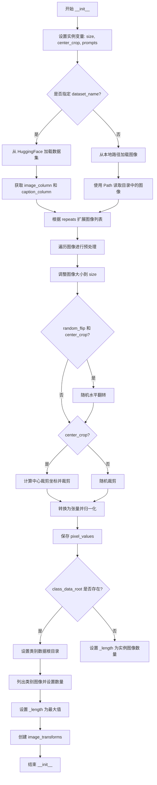

#### 带注释源码

```python
def __init__(
    self,
    instance_data_root,
    instance_prompt,
    class_prompt,
    class_data_root=None,
    class_num=None,
    size=1024,
    repeats=1,
    center_crop=False,
):
    # 存储图像的目标尺寸
    self.size = size
    # 存储是否使用中心裁剪的标志
    self.center_crop = center_crop

    # 存储实例提示词
    self.instance_prompt = instance_prompt
    # 自定义实例提示词，初始为 None
    self.custom_instance_prompts = None
    # 存储类别提示词
    self.class_prompt = class_prompt

    # 判断是否从 HuggingFace 数据集加载数据
    if args.dataset_name is not None:
        try:
            from datasets import load_dataset
        except ImportError:
            raise ImportError(
                "You are trying to load your data using the datasets library. "
                "If you wish to train using custom captions please install the datasets "
                "library: `pip install datasets`."
            )
        
        # 从 Hub 下载并加载数据集
        dataset = load_dataset(
            args.dataset_name,
            args.dataset_config_name,
            cache_dir=args.cache_dir,
        )
        
        # 获取训练集的列名
        column_names = dataset["train"].column_names

        # 确定图像列名
        if args.image_column is None:
            image_column = column_names[0]
            logger.info(f"image column defaulting to {image_column}")
        else:
            image_column = args.image_column
            if image_column not in column_names:
                raise ValueError(
                    f"`--image_column` value '{args.image_column}' not found in "
                    f"dataset columns. Dataset columns are: {', '.join(column_names)}"
                )
        
        # 获取实例图像
        instance_images = dataset["train"][image_column]

        # 确定提示词列名
        if args.caption_column is None:
            logger.info(
                "No caption column provided, defaulting to instance_prompt for all images."
            )
            self.custom_instance_prompts = None
        else:
            if args.caption_column not in column_names:
                raise ValueError(
                    f"`--caption_column` value '{args.caption_column}' not found in "
                    f"dataset columns. Dataset columns are: {', '.join(column_names)}"
                )
            
            # 获取自定义提示词并根据 repeats 扩展
            custom_instance_prompts = dataset["train"][args.caption_column]
            self.custom_instance_prompts = []
            for caption in custom_instance_prompts:
                self.custom_instance_prompts.extend(itertools.repeat(caption, repeats))
    else:
        # 从本地文件系统加载图像
        self.instance_data_root = Path(instance_data_root)
        if not self.instance_data_root.exists():
            raise ValueError("Instance images root doesn't exists.")

        # 打开目录中的所有图像文件
        instance_images = [Image.open(path) for path in Path(instance_data_root).iterdir()]
        self.custom_instance_prompts = None

    # 根据 repeats 扩展实例图像列表
    self.instance_images = []
    for img in instance_images:
        self.instance_images.extend(itertools.repeat(img, repeats))

    # 初始化像素值列表
    self.pixel_values = []
    
    # 创建图像变换操作
    train_resize = transforms.Resize(size, interpolation=transforms.InterpolationMode.BILINEAR)
    train_crop = transforms.CenterCrop(size) if center_crop else transforms.RandomCrop(size)
    train_flip = transforms.RandomHorizontalFlip(p=1.0)
    train_transforms = transforms.Compose(
        [
            transforms.ToTensor(),
            transforms.Normalize([0.5], [0.5]),
        ]
    )

    # 遍历所有实例图像进行预处理
    for image in self.instance_images:
        # 处理 EXIF 旋转
        image = exif_transpose(image)
        # 转换为 RGB 模式
        if not image.mode == "RGB":
            image = image.convert("RGB")
        # 调整大小
        image = train_resize(image)
        # 随机水平翻转
        if args.random_flip and random.random() < 0.5:
            image = train_flip(image)
        # 裁剪图像
        if args.center_crop:
            y1 = max(0, int(round((image.height - args.resolution) / 2.0)))
            x1 = max(0, int(round((image.width - args.resolution) / 2.0)))
            image = train_crop(image)
        else:
            y1, x1, h, w = train_crop.get_params(image, (args.resolution, args.resolution))
            image = crop(image, y1, x1, h, w)
        # 转换为张量并归一化
        image = train_transforms(image)
        self.pixel_values.append(image)

    # 记录实例图像数量
    self.num_instance_images = len(self.instance_images)
    # 设置数据集长度
    self._length = self.num_instance_images

    # 处理类别数据（先验保留）
    if class_data_root is not None:
        self.class_data_root = Path(class_data_root)
        self.class_data_root.mkdir(parents=True, exist_ok=True)
        self.class_images_path = list(self.class_data_root.iterdir())
        
        # 确定类别图像数量
        if class_num is not None:
            self.num_class_images = min(len(self.class_images_path), class_num)
        else:
            self.num_class_images = len(self.class_images_path)
        
        # 数据集长度为实例和类别图像数量的最大值
        self._length = max(self.num_class_images, self.num_instance_images)
    else:
        self.class_data_root = None

    # 创建用于类别图像的变换
    self.image_transforms = transforms.Compose(
        [
            transforms.Resize(size, interpolation=transforms.InterpolationMode.BILINEAR),
            transforms.CenterCrop(size) if center_crop else transforms.RandomCrop(size),
            transforms.ToTensor(),
            transforms.Normalize([0.5], [0.5]),
        ]
    )
```


### `DreamBoothDataset.__len__`

该方法返回 DreamBooth 数据集的长度（样本数量），用于 PyTorch DataLoader 确定数据集的大小。当启用先验 preservation（类别图像）时，返回实例图像数量和类别图像数量中的较大值，以确保 DataLoader 能够完整遍历所有数据。

参数：无

返回值：`int`，返回数据集的总样本数，即 `_length` 属性的值。

#### 流程图

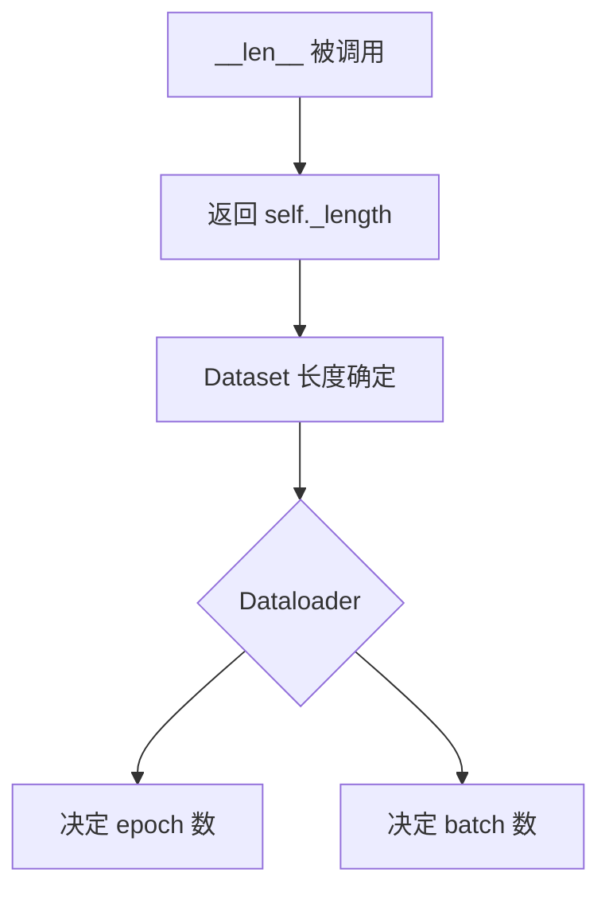

#### 带注释源码

```python
def __len__(self):
    """
    返回数据集的长度。
    
    该方法是 Python 特殊方法，使得 DreamBoothDataset 可以被 PyTorch DataLoader 使用。
    DataLoader 会根据此方法返回值来确定数据集的样本数量，从而决定每个 epoch 的 batch 数量。
    
    返回值说明：
        - 如果未启用 class_data_root（先验 preservation），返回实例图像数量
        - 如果启用了 class_data_root，返回实例图像数量和类别图像数量的较大值
        - 这样设计是为了在先验 preservation 模式下，确保所有类别图像都能被遍历到
    
    Returns:
        int: 数据集的样本数量
    """
    return self._length
```


### `DreamBoothDataset.__getitem__`

该方法是 DreamBooth 数据集类的核心数据访问方法，负责根据给定索引返回训练样本。它通过索引获取预处理的实例图像、相应的文本提示词，以及可选的类别图像和类别提示词，用于 DreamBooth 模型的微调训练。

参数：

-  `index`：`int`，数据集中的样本索引，用于从预处理的数据中检索对应的图像和提示词

返回值：`Dict`，包含以下键值对的字典：
  - `"instance_images"`：预处理后的实例图像张量
  - `"instance_prompt"`：实例文本提示词
  - （可选）`"class_images"`：类别图像张量（当存在 class_data_root 时）
  - （可选）`"class_prompt"`：类别提示词（当存在 class_data_root 时）

#### 流程图

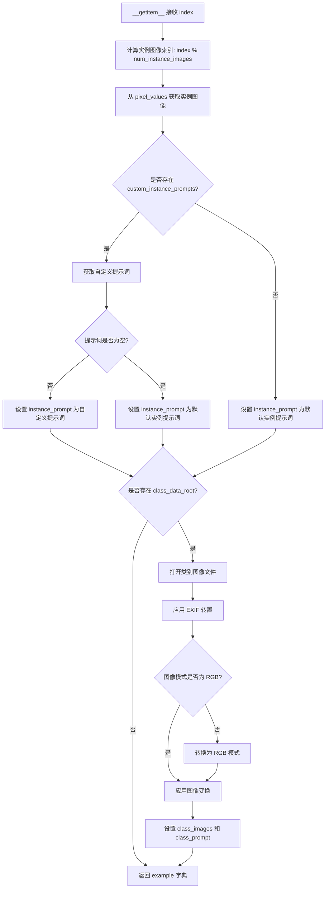

#### 带注释源码

```python
def __getitem__(self, index):
    """
    根据索引获取数据集中的单个样本。
    
    参数:
        index: 数据样本的索引位置
        
    返回:
        包含图像和提示词的字典，用于模型训练
    """
    # 初始化示例字典
    example = {}
    
    # 使用取模运算处理索引，实现数据集的循环遍历
    # 这确保了当索引超过实例图像数量时能够循环使用
    instance_image = self.pixel_values[index % self.num_instance_images]
    
    # 将实例图像添加到输出字典
    example["instance_images"] = instance_image

    # 检查是否提供了自定义实例提示词
    # 自定义提示词允许为每张图像指定不同的描述文本
    if self.custom_instance_prompts:
        # 获取对应索引的自定义提示词
        caption = self.custom_instance_prompts[index % self.num_instance_images]
        
        # 如果自定义提示词存在且非空，则使用它
        if caption:
            example["instance_prompt"] = caption
        else:
            # 空字符串时回退到默认实例提示词
            example["instance_prompt"] = self.instance_prompt

    else:  
        # 未提供自定义提示词时，使用默认实例提示词
        # 这适用于所有训练图像共享相同提示词的场景
        example["instance_prompt"] = self.instance_prompt

    # 检查是否配置了类别数据根目录
    # class_data_root 用于 Prior Preservation（先验保留）技术
    # 该技术通过添加类别图像来防止模型遗忘原有概念
    if self.class_data_root:
        # 根据索引打开对应的类别图像
        class_image = Image.open(self.class_images_path[index % self.num_class_images])
        
        # 应用 EXIF 转置以修正图像方向
        # 这对于从不同来源（如手机）获取的图像尤为重要
        class_image = exif_transpose(class_image)

        # 确保类别图像为 RGB 模式
        # 某些图像可能是灰度或 RGBA 模式，需要转换
        if not class_image.mode == "RGB":
            class_image = class_image.convert("RGB")
        
        # 应用图像变换（resize、crop、normalize）
        example["class_images"] = self.image_transforms(class_image)
        
        # 添加类别提示词用于先验保留损失计算
        example["class_prompt"] = self.class_prompt

    # 返回包含实例图像和提示词的字典
    # 训练循环会进一步处理这个字典
    return example
```


### `PromptDataset.__init__`

初始化 PromptDataset 类的实例，用于准备在多个 GPU 上生成类图像的提示词数据集。

参数：

- `prompt`：`str`，用于生成类图像的文本提示词
- `num_samples`：`int`，要生成的样本数量

返回值：`None`，构造函数无返回值

#### 流程图

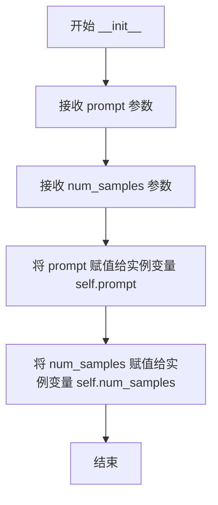

#### 带注释源码

```python
def __init__(self, prompt, num_samples):
    """
    初始化 PromptDataset 实例。
    
    参数:
        prompt (str): 用于生成类图像的文本提示词
        num_samples (int): 要生成的样本数量
    
    返回:
        None
    """
    # 将传入的提示词保存为实例变量，供后续 __getitem__ 方法使用
    self.prompt = prompt
    
    # 将传入的样本数量保存为实例变量，供后续 __len__ 方法使用
    self.num_samples = num_samples
```


### `PromptDataset.__len__`

该方法返回 PromptDataset 数据集中包含的样本总数，对应于需要生成的类别图像数量。

参数：

- 无（`__len__` 是 Python 特殊方法，仅需隐式传入 `self`）

返回值：`int`，返回数据集中的样本数量（`num_samples`），用于 PyTorch DataLoader 确定数据集大小。

#### 流程图

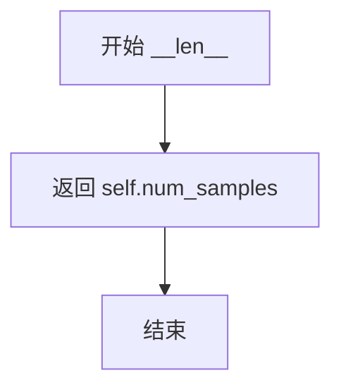

#### 带注释源码

```python
def __len__(self):
    """
    返回数据集中的样本数量。
    
    此方法是 PyTorch Dataset 接口的必需方法之一。
    它返回待生成的提示词总数，决定了将创建多少个类别图像。
    
    Returns:
        int: 数据集中的样本数量，即初始化时传入的 num_samples 值。
    """
    return self.num_samples
```


### `PromptDataset.__getitem__`

该方法是 `PromptDataset` 类的核心方法，用于根据给定的索引返回数据集中的单个样本。它构建一个包含提示词和索引的字典对象，作为数据加载器迭代时的返回值。

参数：

- `self`：隐式参数，表示数据集实例本身
- `index`：`int`，要检索的样本索引，用于从数据集中获取特定位置的数据

返回值：`Dict[str, Union[str, int]]`，返回一个字典，包含 `"prompt"` 键（值为预设的提示词字符串）和 `"index"` 键（值为当前索引值）

#### 流程图

```mermaid
flowchart TD
    A[__getitem__ 被调用] --> B[创建空字典 example]
    B --> C[设置 example['prompt'] = self.prompt]
    C --> D[设置 example['index'] = index]
    D --> E[返回 example 字典]
```

#### 带注释源码

```python
def __getitem__(self, index):
    """
    根据索引获取数据集中的单个样本。
    
    参数:
        index: int - 样本的索引位置
        
    返回:
        dict: 包含 'prompt' 和 'index' 键的字典，用于生成类图像
    """
    # 初始化空字典来存储样本数据
    example = {}
    
    # 将预设的提示词存入字典
    # 这个提示词在初始化时由 PromptDataset 构造函数传入
    example["prompt"] = self.prompt
    
    # 将当前样本的索引也存入字典
    # 这样在生成图像时可以追踪是哪个索引生成的
    example["index"] = index
    
    # 返回包含提示词和索引的字典
    # DataLoader 会将此字典传递给训练流程
    return example
```

## 关键组件


### 张量索引与惰性加载

代码实现了模型和文本编码器的惰性加载与卸载机制，以优化显存使用。在`main`函数中使用`offload_models`上下文管理器将VAE和文本编码器卸载到CPU，仅在需要时加载到GPU。同时，通过`args.cache_latents`选项支持将VAE latent预计算并缓存，避免重复编码。此外，训练循环中根据需要动态加载VAE进行图像编码。

### 反量化支持

代码通过`BitsAndBytesConfig`实现4bit量化支持。加载量化配置后，使用`prepare_model_for_kbit_training`函数准备量化模型进行训练。量化配置通过`args.bnb_quantization_config_path`参数指定JSON配置文件，可设置`load_in_4bit`和`bnb_4bit_compute_dtype`等参数。

### 量化策略

采用LoRA（Low-Rank Adaptation）量化策略训练Transformer模型。通过`LoraConfig`配置LoRA参数，包括rank（默认4）、lora_alpha、lora_dropout和target_modules。训练过程中仅更新LoRA适配器权重，基础模型权重保持冻结。LoRA权重以float32格式保存，可通过`args.upcast_before_saving`选项控制在保存前是否进行类型转换。

### DreamBoothDataset类

处理训练数据的加载、预处理和增强。支持从HuggingFace Hub或本地目录加载图像，实现图像resize、center crop、random flip和normalize等预处理操作。数据集支持instance prompt和class prompt两种模式，用于prior preservation训练。

### PromptDataset类

轻量级数据集类，用于在prior preservation模式下生成class images。通过多GPU并行生成class图像，将生成的图像保存到指定目录。

### 文本编码管道

使用4个文本编码器（CLIP、T5、Llama）进行文本嵌入计算。`compute_text_embeddings`函数封装了编码逻辑，支持t5和llama3两种编码器的prompt embeds计算。对于静态instance prompt进行预计算以减少训练时的计算开销。

### 训练流程管理

主训练循环实现了完整的DreamBooth训练流程，包括噪声调度、flow matching采样、损失计算、梯度累积、模型保存和验证。通过`Accelerator`实现分布式训练支持，包含checkpoint保存与恢复、学习率调度、混合精度训练等功能。

### 验证与模型保存

`log_validation`函数在训练过程中定期运行验证，生成样本图像并记录到TensorBoard或wandb。`save_model_card`函数生成模型卡片，包含使用说明和示例代码。训练完成后保存LoRA权重并可选择推送到HuggingFace Hub。


## 问题及建议


### 已知问题

-   **全局变量依赖问题**: `DreamBoothDataset` 类和 `collate_fn` 函数直接访问全局 `args` 变量，而不是通过构造函数或参数传递，导致代码耦合度高，难以单元测试和复用
-   **冗余的深度拷贝**: `noise_scheduler_copy = copy.deepcopy(noise_scheduler)` 创建了完整的调度器深度拷贝，仅用于 `get_sigmas` 函数获取 sigmas，增加了不必要的内存开销
-   **内存管理不一致**: VAE 和文本编码器在训练前被删除以释放内存，但在验证和推理时又重新加载，这种模式在训练循环中重复执行，没有缓存机制
-   **不安全的字典访问**: 代码中多处使用 `index % self.num_instance_images` 进行索引，没有对 `_length` 和索引进行边界检查，可能导致越界访问
-   **重复的模型设备转移**: 在训练循环中多次调用 `vae.to()` 和 `offload_models()`，即使 `args.offload` 为 False 也会执行不必要的条件检查
-   **缓存逻辑复杂度**: `precompute_latents` 逻辑同时处理 latent 缓存和 prompt 缓存，将两种不同类型的优化混在一起，增加了代码理解和维护难度

### 优化建议

-   **解耦全局状态**: 将 `args` 作为参数传递给 `DreamBoothDataset` 构造函数和 `collate_fn`，使用依赖注入提高代码可测试性
-   **移除不必要的拷贝**: 只复制 `noise_scheduler.sigmas` 和 `noise_scheduler.timesteps` 所需的张量，而不是整个调度器对象
-   **统一内存管理策略**: 实现模型缓存层，在训练、验证和推理阶段复用已加载的模型，避免重复加载
-   **添加边界检查和验证**: 在数据集 `__getitem__` 方法中添加索引验证，确保 `index < self._length`
-   **简化设备转移逻辑**: 将设备转移逻辑提取为独立的函数，根据配置条件性地执行，避免在热路径中进行频繁的条件判断
-   **分离缓存策略**: 将 latent 缓存和 prompt 缓存逻辑分离，使用单独的配置参数控制，为未来优化提供灵活性
-   **减少函数定义嵌套**: 将 `get_sigmas` 函数和 `compute_text_embeddings` 提升到模块级别或使用缓存装饰器，减少每次调用时的函数对象创建开销

## 其它


### 设计目标与约束

本代码旨在实现HiDream Image模型的DreamBooth LoRA微调训练，核心目标是让用户能够通过少量特定实例图像定制化生成模型，同时保持原有模型的泛化能力。设计约束包括：仅训练LoRA适配器层而保持预训练模型参数不变；支持prior preservation损失以防止过拟合；支持分布式训练和混合精度计算；内存优化策略要求在消费级GPU上可运行。训练过程必须遵循DreamBooth方法论，使用标识符触发特定概念学习。

### 错误处理与异常设计

代码采用分层错误处理策略：命令行参数解析阶段进行必要参数校验（如dataset_name与instance_data_dir互斥、prior_preservation需要class_data_dir和class_prompt）；模型加载阶段捕获ImportError并提供清晰的安装指引（如datasets、bitsandbytes、prodigyopt库）；分布式训练环境通过LOCAL_RANK环境变量自动适配；MPS设备特别处理bfloat16不支持情况并抛出明确错误；检查点恢复时验证路径有效性，无效时从头开始训练。异常消息均包含解决建议，降低用户调试成本。

### 数据流与状态机

训练数据流经过以下状态转换：原始图像 → DreamBoothDataset预处理（resize、crop、flip、normalize）→ VAE编码为latent表示 → 噪声调度器采样 timestep → 添加噪声生成noisy_latent → Transformer预测噪声残差 → 计算加权MSE损失 → 反向传播更新LoRA参数。验证流程独立于训练：定期从当前模型状态构建pipeline → 使用validation_prompt生成样本 → 通过tracker记录图像。模型保存采用accelerator的checkpoint机制，包含完整训练状态以支持断点续训。

### 外部依赖与接口契约

核心依赖包括：diffusers>=0.37.0.dev0（模型加载与训练工具）、transformers（文本编码器）、peft（LoRA实现）、accelerate（分布式训练）、bitsandbytes（可选8位优化器）、wandb/tensorboard（实验追踪）。与HuggingFace Hub的接口契约：模型卡生成遵循特定模板格式；LoRA权重保存为.safetensors格式；推送时支持commit_message自定义。文本编码管道支持四种编码器（CLIP×2、T5、LLaMA），需保证版本兼容性。

### 内存管理与优化策略

代码实现多级内存优化：VAE和文本编码器默认加载至CPU，仅在需要时offload到GPU；支持gradient_checkpointing以计算换内存；支持cache_latents预计算所有图像的latent表示；混合精度训练时LoRA参数fp32更新；分布式训练使用find_unused_parameters处理不均衡模块；NPU设备特殊处理allow_internal_format。offload_models上下文管理器确保使用后立即释放GPU显存。

### 分布式训练架构

基于Accelerator实现多级并行：DataLoader自动分发到各进程；梯度累积支持跨批次累加；支持DeepSpeed和FSDP高级分布式策略；DDP模式下通过DistributedDataParallelKwargs处理参数未使用警告。训练参数全局同步：learning_rate、max_train_steps、lr_scheduler根据num_processes自动调整。Checkpoints使用accelerator.save_state保存完整状态，包含optimizer、scheduler、随机种子等，确保跨环境恢复一致性。

### 超参数配置与调优建议

关键超参数及推荐范围：learning_rate=1e-4（AdamW）、rank=4-16（LoRA维度）、lora_dropout=0.0-0.1、gradient_accumulation_steps=1-4、train_batch_size=1-4（视显存而定）。Prior preservation参数：prior_loss_weight=1.0、num_class_images=100-200。权重策略支持sigma_sqrt/logit_normal/mode/cosmap/none，默认为none均匀采样。优化器推荐AdamW或Prodigy（后者需较低learning_rate约1.0）。验证频率建议每50 epoch一次，避免过频影响训练速度。

### 版本兼容性与平台支持

最低要求diffusers 0.37.0.dev0；PyTorch建议1.10+以支持bf16；CUDA设备支持TF32加速（Ampere架构）；NPU设备需is_torch_npu_available()为True；MPS后端暂不支持bf16和某些高级功能。模型格式支持：transformer使用HiDreamImageTransformer2DModel；VAE使用AutoencoderKL；文本编码器支持CLIPTextModelWithProjection和T5EncoderModel。LoRA实现遵循PEFT库接口规范。


    