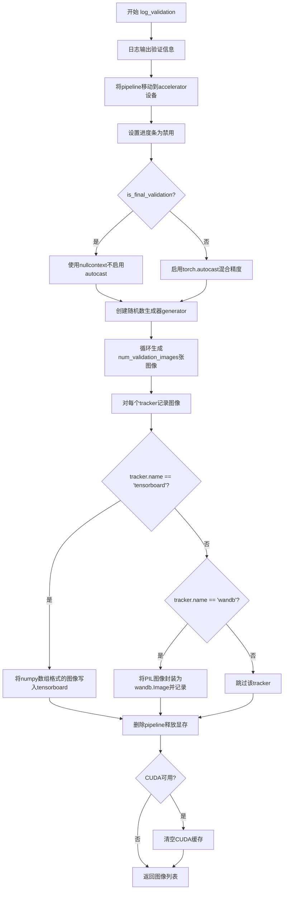
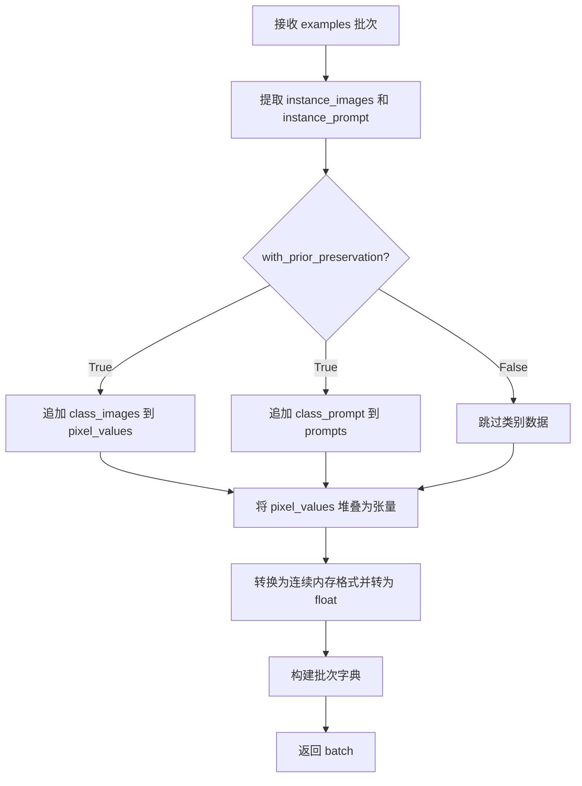
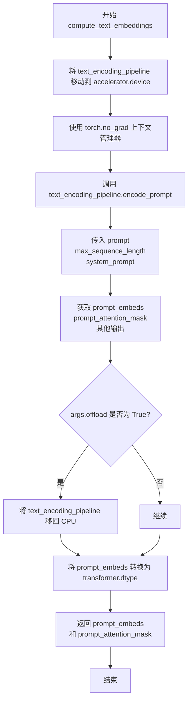
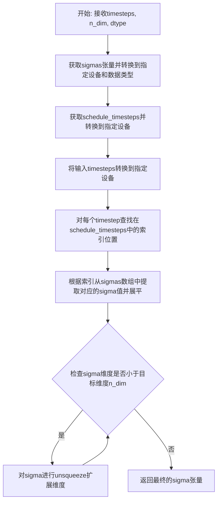
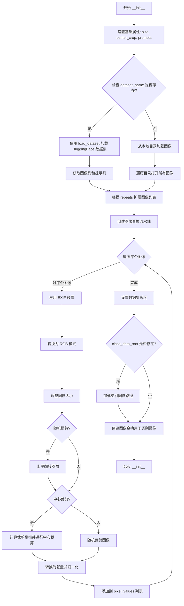
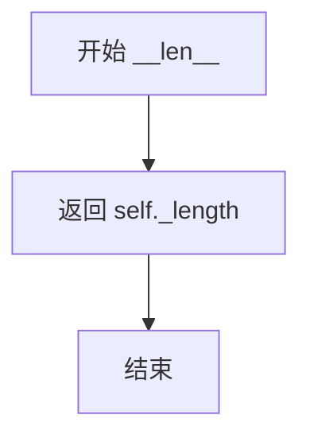
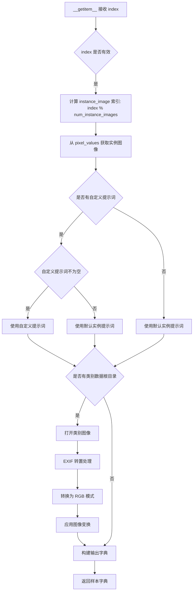
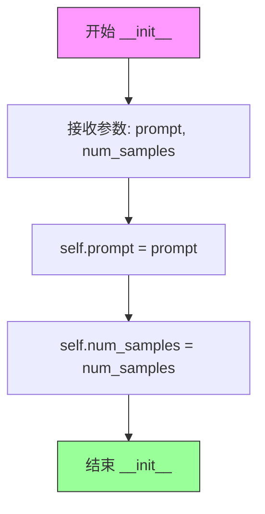
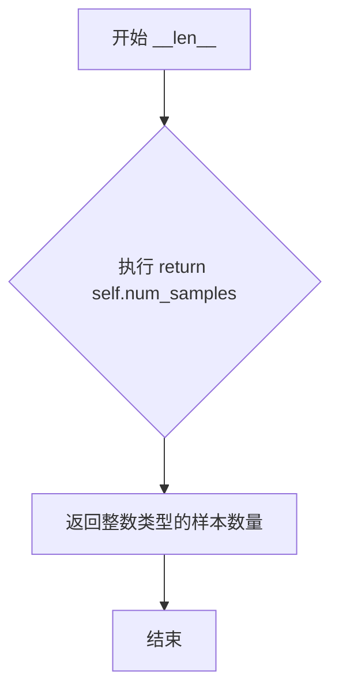

```mermaid
flowchart TD
    A[开始] --> B[验证report_to和hub_token组合]
    B --> C[检查MPS + bf16兼容性]
    C --> D[创建logging目录和Accelerator]
    D --> E{args.with_prior_preservation?}
    E -->|Yes| F[生成class images]
    E -->|No| G[跳过class images生成]
    F --> G
    G --> H[创建输出目录]
    H --> I[加载Tokenizer]
    I --> J[加载Scheduler和Models]
    J --> K[设置模型requires_grad]
    K --> L[设置weight_dtype]
    L --> M[初始化text_encoding_pipeline]
    M --> N[配置gradient_checkpointing]
    N --> O[配置LoRA layers]
    O --> P[注册save/load hooks]
    P --> Q[创建Optimizer]
    Q --> R[创建DreamBoothDataset]
    R --> S[创建train_dataloader]
    S --> T[计算text embeddings]
    T --> U{cache_latents?}
    U -->|Yes| V[缓存VAE latents]
    U -->|No| W[创建lr_scheduler]
    V --> W
    W --> X[Prepare with Accelerator]
    X --> Y[初始化trackers]
    Y --> Z{resume_from_checkpoint?}
    Z -->|Yes| AA[加载checkpoint]
    Z -->|No| AB[初始化训练状态]
    AA --> AC
    AB --> AC
    AC[开始训练循环] --> AD[遍历epoch]
    AD --> AE[遍历batch]
    AE --> AF[计算text embeddings<br/>（如果使用custom prompts）]
    AF --> AG[编码images到latent空间]
    AG --> AH[采样noise和timesteps]
    AH --> AI[添加noise到latents]
    AI --> AJ[Transformer预测noise]
    AJ --> AK[计算loss]
    AK --> AL[计算prior loss<br/>（如果启用prior preservation）]
    AL --> AM[Backward和Optimizer step]
    AM --> AN{sync_gradients?}
    AN -->|Yes| AO[更新progress_bar]
    AO --> AP{checkpointing_steps?}
    AP -->|Yes| AQ[保存checkpoint]
    AP -->|No| AR[记录logs]
    AQ --> AR
    AR --> AS{max_train_steps?}
    AS -->|No| AE
    AS -->|Yes| AT
    AN -->|No| AS
    AE --> AT{max_train_steps?}
    AT -->|No| AD
    AT -->|Yes| AU
    AU{validation_prompt? && epoch%validation_epochs==0?}
    AU -->|Yes| AV[运行validation]
    AV --> AW[释放pipeline内存]
    AU -->|No| AX
    AX[训练完成] --> AY[保存最终LoRA权重]
    AY --> AZ{upcast_before_saving?}
    AZ -->|Yes| BA[转float32保存]
    AZ -->|No| BB[保持weight_dtype保存]
    BA --> BC
    BB --> BC
    BC[最终inference验证] --> BD{push_to_hub?}
    BD -->|Yes| BE[创建model card并上传]
    BD -->|No| BF[结束训练]
    BE --> BF
```

# `diffusers\examples\dreambooth\train_dreambooth_lora_lumina2.py` 详细设计文档

这是一个用于训练Lumina2图像生成模型的DreamBooth LoRA训练脚本，通过学习用户提供的少量实例图像，让模型能够根据特定提示词生成定制化的图像内容。脚本支持Prior Preservation损失、梯度检查点、混合精度训练、分布式训练、模型检查点保存以及HuggingFace Hub模型上传等功能。

## 整体流程

```mermaid
graph TD
A[开始] --> B[解析命令行参数]
B --> C{是否使用Prior Preservation?}
C -- 是 --> D[生成类别图像]
C -- 否 --> E[跳过生成类别图像]
D --> E
E --> F[加载预训练模型和分词器]
F --> G[配置LoRA适配器]
H[创建优化器] --> I[创建训练数据集]
I --> J[创建DataLoader]
J --> K[初始化学习率调度器]
K --> L{遍历每个epoch}
L --> M{遍历每个batch}
M --> N[编码提示词]
N --> O[将图像编码到潜在空间]
O --> P[采样噪声和时间步]
P --> Q[计算Flow Matching目标]
Q --> R[前向传播预测噪声]
R --> S[计算损失(含Prior Preservation)]
S --> T[反向传播和参数更新]
T --> U{是否达到checkpoint保存步数?}
U -- 是 --> V[保存检查点]
U -- 否 --> W
V --> W
M --> X{是否需要验证?}
X -- 是 --> Y[运行验证生成图像]
X -- 否 --> Z
Y --> Z
L --> AA{是否还有epoch?}
AA -- 是 --> L
AA -- 否 --> AB[保存LoRA权重]
AB --> AC[最终推理验证]
AC --> AD{是否推送到Hub?}
AD -- 是 --> AE[上传模型到Hub]
AD -- 否 --> AF[结束]
```

## 类结构

```
DreamBoothDataset (数据集类)
├── __init__: 初始化数据集参数和图像预处理
├── __len__: 返回数据集长度
└── __getitem__: 获取单个样本
PromptDataset (提示词数据集类)
├── __init__: 初始化提示词和样本数
├── __len__: 返回样本数
└── __getitem__: 获取单个样本
```

## 全局变量及字段


### `logger`
    
日志记录器，用于输出训练过程中的日志信息

类型：`logging.Logger`
    


### `args`
    
命令行参数对象，包含所有训练配置参数

类型：`argparse.Namespace`
    


### `noise_scheduler`
    
噪声调度器，用于控制扩散模型训练过程中的噪声调度

类型：`FlowMatchEulerDiscreteScheduler`
    


### `tokenizer`
    
分词器，用于将文本提示词转换为模型可处理的token序列

类型：`AutoTokenizer`
    


### `text_encoder`
    
文本编码器模型，用于将文本提示词编码为语义向量

类型：`Gemma2Model`
    


### `vae`
    
变分自编码器，用于将图像编码到潜在空间或从潜在空间解码

类型：`AutoencoderKL`
    


### `transformer`
    
Lumina2变换器模型，核心的图像生成扩散变换器

类型：`Lumina2Transformer2DModel`
    


### `accelerator`
    
加速器对象，用于分布式训练和混合精度训练

类型：`Accelerator`
    


### `optimizer`
    
优化器，用于更新模型参数

类型：`torch.optim.AdamW | bnb.optim.AdamW8bit | prodigyopt.Prodigy`
    


### `lr_scheduler`
    
学习率调度器，用于动态调整学习率

类型：`torch.optim.lr_scheduler.LRScheduler`
    


### `train_dataset`
    
训练数据集，包含实例图像和提示词

类型：`DreamBoothDataset`
    


### `train_dataloader`
    
训练数据加载器，用于批量加载训练数据

类型：`torch.utils.data.DataLoader`
    


### `weight_dtype`
    
权重数据类型，用于控制模型计算精度(fp16/bf16/fp32)

类型：`torch.dtype`
    


### `vae_config_scaling_factor`
    
VAE缩放因子，用于潜在空间的缩放

类型：`float`
    


### `vae_config_shift_factor`
    
VAE偏移因子，用于潜在空间的偏移

类型：`float`
    


### `DreamBoothDataset.size`
    
图像分辨率大小

类型：`int`
    


### `DreamBoothDataset.center_crop`
    
是否中心裁剪

类型：`bool`
    


### `DreamBoothDataset.instance_prompt`
    
实例提示词

类型：`str`
    


### `DreamBoothDataset.custom_instance_prompts`
    
自定义实例提示词列表

类型：`list[str] | None`
    


### `DreamBoothDataset.class_prompt`
    
类别提示词

类型：`str`
    


### `DreamBoothDataset.instance_data_root`
    
实例数据根目录

类型：`Path`
    


### `DreamBoothDataset.class_data_root`
    
类别数据根目录

类型：`Path | None`
    


### `DreamBoothDataset.instance_images`
    
实例图像列表

类型：`list[PIL.Image.Image]`
    


### `DreamBoothDataset.pixel_values`
    
像素值张量列表

类型：`list[torch.Tensor]`
    


### `DreamBoothDataset.num_instance_images`
    
实例图像数量

类型：`int`
    


### `DreamBoothDataset.class_images_path`
    
类别图像路径列表

类型：`list[Path]`
    


### `DreamBoothDataset.num_class_images`
    
类别图像数量

类型：`int`
    


### `DreamBoothDataset._length`
    
数据集总长度

类型：`int`
    


### `DreamBoothDataset.image_transforms`
    
图像变换组合

类型：`transforms.Compose`
    


### `PromptDataset.prompt`
    
提示词

类型：`str`
    


### `PromptDataset.num_samples`
    
样本数量

类型：`int`
    
    

## 全局函数及方法


### `save_model_card`

该函数用于将训练好的DreamBooth LoRA模型信息保存到README.md模型卡片文件中，包含模型描述、触发词、下载链接、验证图像widget等关键信息，并调用diffusers库的模型卡片工具函数进行标准化处理。

参数：

- `repo_id`：`str`，模型仓库的唯一标识符，用于在HuggingFace Hub上标识模型
- `images`：`Optional[List[Image]]`，验证阶段生成的图像列表，如果提供则保存到本地并用于创建widget展示
- `base_model`：`Optional[str]，基础预训练模型的名称或路径，用于描述LoRA是基于哪个模型微调的
- `instance_prompt`：`Optional[str]`，实例提示词，即训练时使用的触发词，用于告诉用户如何激活LoRA效果
- `system_prompt`：`Optional[str]`，系统提示词，训练时使用的系统指令，可以为模型提供特定的行为指导
- `validation_prompt`：`Optional[str]`，验证提示词，用于生成验证图像的prompt
- `repo_folder`：`Optional[str]`，本地仓库文件夹路径，用于保存README.md和图像文件

返回值：`None`，该函数无返回值，直接将模型卡片写入文件系统

#### 流程图

```mermaid
flowchart TD
    A[开始 save_model_card] --> B{images 是否为 None?}
    B -->|否| C[遍历 images 列表]
    C --> D[保存图像到 repo_folder/image_{i}.png]
    E[构建 widget_dict 列表] --> D
    D --> F[构建 model_description 字符串]
    B -->|是| F
    F --> G[调用 load_or_create_model_card 创建模型卡片]
    G --> H[定义标签列表 tags]
    H --> I[调用 populate_model_card 填充标签]
    I --> J[保存模型卡片到 repo_folder/README.md]
    J --> K[结束]
```

#### 带注释源码

```python
def save_model_card(
    repo_id: str,
    images=None,
    base_model: str = None,
    instance_prompt=None,
    system_prompt=None,
    validation_prompt=None,
    repo_folder=None,
):
    """
    保存模型卡片信息到README.md文件
    
    该函数生成一个包含模型描述、训练信息、触发词和下载链接的Markdown文件，
    并将其保存到指定的仓库文件夹中。同时还会保存验证图像用于HuggingFace Hub的widget展示。
    
    参数:
        repo_id: 模型仓库的唯一标识符
        images: 可选的验证图像列表
        base_model: 基础预训练模型路径
        instance_prompt: 实例提示词/触发词
        system_prompt: 系统提示词
        validation_prompt: 验证提示词
        repo_folder: 仓库文件夹路径
    
    返回:
        None: 直接将模型卡片写入文件系统
    """
    # 初始化widget字典列表，用于HuggingFace Hub的图像widget展示
    widget_dict = []
    
    # 如果提供了验证图像，将图像保存到本地并构建widget字典
    if images is not None:
        # 遍历所有验证图像
        for i, image in enumerate(images):
            # 保存图像到指定文件夹，文件名格式为 image_0.png, image_1.png 等
            image.save(os.path.join(repo_folder, f"image_{i}.png"))
            # 构建widget字典，包含文本prompt和对应的图像URL
            widget_dict.append(
                {"text": validation_prompt if validation_prompt else " ", "output": {"url": f"image_{i}.png"}}
            )

    # 构建模型描述的Markdown内容
    # 包含模型名称、描述、触发词、下载链接和使用示例
    model_description = f"""
# Lumina2 DreamBooth LoRA - {repo_id}

<Gallery />

## Model description

These are {repo_id} DreamBooth LoRA weights for {base_model}.

The weights were trained using [DreamBooth](https://dreambooth.github.io/) with the [Lumina2 diffusers trainer](https://github.com/huggingface/diffusers/blob/main/examples/dreambooth/README_lumina2.md).


## Trigger words

You should use `{instance_prompt}` to trigger the image generation.

The following `system_prompt` was also used used during training (ignore if `None`): {system_prompt}.

## Download model

[Download the *.safetensors LoRA]({repo_id}/tree/main) in the Files & versions tab.

## Use it with the [🧨 diffusers library](https://github.com/huggingface/diffusers)

```py
TODO
```

For more details, including weighting, merging and fusing LoRAs, check the [documentation on loading LoRAs in diffusers](https://huggingface.co/docs/diffusers/main/en/using-diffusers/loading_adapters)
"""
    
    # 调用diffusers工具函数加载或创建模型卡片
    # from_training=True 表示这是从训练脚本创建的模型卡片
    # 会自动填充训练相关信息
    model_card = load_or_create_model_card(
        repo_id_or_path=repo_id,
        from_training=True,
        license="apache-2.0",
        base_model=base_model,
        prompt=instance_prompt,
        model_description=model_description,
        widget=widget_dict,  # 传入验证图像的widget字典
    )
    
    # 定义模型标签，用于HuggingFace Hub的分类和搜索
    tags = [
        "text-to-image",
        "diffusers-training",
        "diffusers",
        "lora",
        "lumina2",
        "lumina2-diffusers",
        "template:sd-lora",
    ]

    # 调用populate_model_card填充标签信息
    model_card = populate_model_card(model_card, tags=tags)
    
    # 将模型卡片保存为README.md文件
    # 这是HuggingFace Hub识别模型信息的标准文件名
    model_card.save(os.path.join(repo_folder, "README.md"))
```


### `log_validation`

运行验证流程，生成指定数量的验证图像并记录到tracker（TensorBoard或WandB），用于监控模型在训练过程中的性能。

参数：

- `pipeline`：`Lumina2Pipeline`，用于生成图像的推理管道对象
- `args`：命名空间，包含训练配置参数（如`num_validation_images`、`validation_prompt`、`seed`等）
- `accelerator`：`Accelerator`，HuggingFace Accelerate库提供的分布式训练加速器，用于设备管理和tracker访问
- `pipeline_args`：字典，包含传递给pipeline的推理参数（如`prompt`、`system_prompt`等）
- `epoch`：整数，当前训练轮次编号，用于记录图像的step/tag
- `is_final_validation`：布尔值，标志是否为最终验证（最终验证时跳过自动混合精度以保证精度）

返回值：`List[PIL.Image]`，生成的验证图像列表（PIL Image对象）

#### 流程图



#### 带注释源码

```python
def log_validation(
    pipeline,
    args,
    accelerator,
    pipeline_args,
    epoch,
    is_final_validation=False,
):
    """
    运行验证流程，生成指定数量的验证图像并记录到tracker
    
    参数:
        pipeline: Lumina2Pipeline推理管道
        args: 包含num_validation_images, validation_prompt, seed等配置
        accelerator: HuggingFace Accelerate加速器
        pipeline_args: 传递给pipeline的参数字典
        epoch: 当前训练轮次
        is_final_validation: 是否为最终验证（决定是否使用混合精度）
    """
    # 记录验证日志信息，包括生成图像数量和验证提示词
    logger.info(
        f"Running validation... \n Generating {args.num_validation_images} images with prompt:"
        f" {args.validation_prompt}."
    )

    # 将pipeline移动到accelerator管理的设备上（GPU/NPU等）
    pipeline = pipeline.to(accelerator.device)
    # 禁用pipeline的进度条显示，避免干扰验证输出
    pipeline.set_progress_bar_config(disable=True)

    # 如果提供了seed，则创建带种子的随机数生成器以保证可复现性
    # 否则为None，使用随机种子
    generator = torch.Generator(device=accelerator.device).manual_seed(args.seed) if args.seed is not None else None
    
    # 根据是否为最终验证决定是否启用自动混合精度(autocast)
    # 最终验证时使用nullcontext保持高精度，中间验证使用autocast提升性能
    autocast_ctx = torch.autocast(accelerator.device.type) if not is_final_validation else nullcontext()

    # 在autocast上下文中批量生成验证图像
    with autocast_ctx:
        # 逐张生成图像，每张图都使用相同的pipeline_args和generator
        images = [pipeline(**pipeline_args, generator=generator).images[0] for _ in range(args.num_validation_images)]

    # 遍历所有注册的tracker（TensorBoard、WandB等）记录生成的图像
    for tracker in accelerator.trackers:
        # 确定当前阶段名称：最终验证为"test"，中间验证为"validation"
        phase_name = "test" if is_final_validation else "validation"
        
        # TensorBoard tracker: 将图像转换为numpy数组并添加
        if tracker.name == "tensorboard":
            # 将PIL图像堆叠为numpy数组，形状为NHWC
            np_images = np.stack([np.asarray(img) for img in images])
            tracker.writer.add_images(phase_name, np_images, epoch, dataformats="NHWC")
        
        # WandB tracker: 将图像封装为wandb.Image并记录，支持caption
        if tracker.name == "wandb":
            tracker.log(
                {
                    phase_name: [
                        wandb.Image(image, caption=f"{i}: {pipeline_args['prompt']}") for i, image in enumerate(images)
                    ]
                }
            )

    # 清理：删除pipeline对象释放显存
    del pipeline
    # 如果CUDA可用，显式清空缓存以确保释放GPU内存
    if torch.cuda.is_available():
        torch.cuda.empty_cache()

    # 返回生成的图像列表，供调用者进一步处理（如保存到磁盘、上传Hub等）
    return images
```


### `parse_args`

该函数是Lumina2 DreamBooth LoRA训练脚本的参数解析入口，通过argparse定义了近80个训练相关配置选项（包括模型路径、数据集配置、训练超参数、LoRA参数、优化器设置、验证配置等），并对部分互斥参数和环境变量进行校验，最终返回包含所有命令行参数的Namespace对象。

参数：

- `input_args`：`List[str]`，可选，要解析的参数列表（主要用于测试），默认为None

返回值：`argparse.Namespace`，包含所有已解析命令行参数的命名空间对象

#### 流程图

```mermaid
flowchart TD
    A[开始 parse_args] --> B[创建 ArgumentParser]
    B --> C[添加所有训练配置参数]
    C --> D{input_args是否为空?}
    D -->|是| E[parser.parse_args()]
    D -->|否| F[parser.parse_args(input_args)]
    E --> G[获取args对象]
    F --> G
    G --> H{验证dataset配置}
    H --> I{同时指定dataset_name和instance_data_dir?}
    I -->|是| J[抛出ValueError]
    I -->|否| K{只指定一个?}
    K -->|否| L[抛出ValueError]
    K -->|是| M[继续验证]
    M --> N{检查LOCAL_RANK环境变量}
    N --> O[同步local_rank]
    O --> P{with_prior_preservation为True?}
    P -->|是| Q{验证class_data_dir和class_prompt}
    Q --> R{缺少必要参数?}
    R -->|是| S[抛出ValueError]
    R -->|否| T[返回args]
    P -->|否| U{指定了class相关参数?}
    U -->|是| V[发出警告]
    V --> T
    U -->|否| T
    T --> Z[结束]
```

#### 带注释源码

```python
def parse_args(input_args=None):
    """
    解析命令行参数，定义所有训练相关配置选项
    
    参数:
        input_args: 可选的参数列表，用于测试场景
    返回:
        包含所有解析参数的argparse.Namespace对象
    """
    # 创建ArgumentParser实例，description说明这是一个简单的训练脚本示例
    parser = argparse.ArgumentParser(description="Simple example of a training script.")
    
    # ==================== 模型相关参数 ====================
    # 预训练模型路径或模型标识符（必需）
    parser.add_argument(
        "--pretrained_model_name_or_path",
        type=str,
        default=None,
        required=True,
        help="Path to pretrained model or model identifier from huggingface.co/models.",
    )
    # 预训练模型的版本号
    parser.add_argument(
        "--revision",
        type=str,
        default=None,
        required=False,
        help="Revision of pretrained model identifier from huggingface.co/models.",
    )
    # 模型文件变体（如fp16）
    parser.add_argument(
        "--variant",
        type=str,
        default=None,
        help="Variant of the model files of the pretrained model identifier from huggingface.co/models, 'e.g.' fp16",
    )
    
    # ==================== 数据集相关参数 ====================
    # 数据集名称（可从HuggingFace Hub或本地路径）
    parser.add_argument(
        "--dataset_name",
        type=str,
        default=None,
        help=(
            "The name of the Dataset (from the HuggingFace hub) containing the training data of instance images (could be your own, possibly private,"
            " dataset). It can also be a path pointing to a local copy of a dataset in your filesystem,"
            " or to a folder containing files that 🤗 Datasets can understand."
        ),
    )
    # 数据集配置名称
    parser.add_argument(
        "--dataset_config_name",
        type=str,
        default=None,
        help="The config of the Dataset, leave as None if there's only one config.",
    )
    # 本地实例数据目录
    parser.add_argument(
        "--instance_data_dir",
        type=str,
        default=None,
        help=("A folder containing the training data. "),
    )
    # 缓存目录
    parser.add_argument(
        "--cache_dir",
        type=str,
        default=None,
        help="The directory where the downloaded models and datasets will be stored.",
    )
    # 数据集中的图像列名
    parser.add_argument(
        "--image_column",
        type=str,
        default="image",
        help="The column of the dataset containing the target image. By "
        "default, the standard Image Dataset maps out 'file_name' "
        "to 'image'.",
    )
    # 数据集中的caption列名
    parser.add_argument(
        "--caption_column",
        type=str,
        default=None,
        help="The column of the dataset containing the instance prompt for each image",
    )
    # 训练数据重复次数
    parser.add_argument("--repeats", type=int, default=1, help="How many times to repeat the training data.")
    
    # ==================== DreamBooth prior preservation参数 ====================
    # 类别图像数据目录
    parser.add_argument(
        "--class_data_dir",
        type=str,
        default=None,
        required=False,
        help="A folder containing the training data of class images.",
    )
    # 实例提示词（必需，用于标识特定实例）
    parser.add_argument(
        "--instance_prompt",
        type=str,
        default=None,
        required=True,
        help="The prompt with identifier specifying the instance, e.g. 'photo of a TOK dog', 'in the style of TOK'",
    )
    # 类别提示词
    parser.add_argument(
        "--class_prompt",
        type=str,
        default=None,
        help="The prompt to specify images in the same class as provided instance images.",
    )
    # prior preservation标志
    parser.add_argument(
        "--with_prior_preservation",
        default=False,
        action="store_true",
        help="Flag to add prior preservation loss.",
    )
    # prior loss权重
    parser.add_argument("--prior_loss_weight", type=float, default=1.0, help="The weight of prior preservation loss.")
    # 类别图像数量
    parser.add_argument(
        "--num_class_images",
        type=int,
        default=100,
        help=(
            "Minimal class images for prior preservation loss. If there are not enough images already present in"
            " class_data_dir, additional images will be sampled with class_prompt."
        ),
    )
    
    # ==================== Gemma2文本编码器参数 ====================
    # 最大序列长度
    parser.add_argument(
        "--max_sequence_length",
        type=int,
        default=256,
        help="Maximum sequence length to use with with the Gemma2 model"
    )
    # 系统提示词
    parser.add_argument(
        "--system_prompt",
        type=str,
        default=None,
        help="System prompt to use during inference to give the Gemma2 model certain characteristics.",
    )
    
    # ==================== 验证参数 ====================
    # 验证提示词
    parser.add_argument(
        "--validation_prompt",
        type=str,
        default=None,
        help="A prompt that is used during validation to verify that the model is learning.",
    )
    # 最终验证提示词
    parser.add_argument(
        "--final_validation_prompt",
        type=str,
        default=None,
        help="A prompt that is used during a final validation to verify that the model is learning. Ignored if `--validation_prompt` is provided.",
    )
    # 验证图像数量
    parser.add_argument(
        "--num_validation_images",
        type=int,
        default=4,
        help="Number of images that should be generated during validation with `validation_prompt`.",
    )
    # 验证周期
    parser.add_argument(
        "--validation_epochs",
        type=int,
        default=50,
        help=(
            "Run dreambooth validation every X epochs. Dreambooth validation consists of running the prompt"
            " `args.validation_prompt` multiple times: `args.num_validation_images`."
        ),
    )
    
    # ==================== LoRA参数 ====================
    # LoRA rank维度
    parser.add_argument(
        "--rank",
        type=int,
        default=4,
        help=("The dimension of the LoRA update matrices."),
    )
    # LoRA dropout概率
    parser.add_argument("--lora_dropout", type=float, default=0.0, help="Dropout probability for LoRA layers")
    # 要应用LoRA的层
    parser.add_argument(
        "--lora_layers",
        type=str,
        default=None,
        help=(
            'The transformer modules to apply LoRA training on. Please specify the layers in a comma separated. E.g. - "to_k,to_q,to_v" will result in lora training of attention layers only'
        ),
    )
    
    # ==================== 输出和随机性参数 ====================
    # 输出目录
    parser.add_argument(
        "--output_dir",
        type=str,
        default="lumina2-dreambooth-lora",
        help="The output directory where the model predictions and checkpoints will be written.",
    )
    # 随机种子
    parser.add_argument("--seed", type=int, default=None, help="A seed for reproducible training.")
    # 检查点保存步数
    parser.add_argument(
        "--checkpointing_steps",
        type=int,
        default=500,
        help=(
            "Save a checkpoint of the training state every X updates. These checkpoints can be used both as final"
            " checkpoints in case they are better than the last checkpoint, and are also suitable for resuming"
            " training using `--resume_from_checkpoint`."
        ),
    )
    # 最大保存的检查点数量
    parser.add_argument(
        "--checkpoints_total_limit",
        type=int,
        default=None,
        help=("Max number of checkpoints to store."),
    )
    # 从检查点恢复训练
    parser.add_argument(
        "--resume_from_checkpoint",
        type=str,
        default=None,
        help=(
            "Whether training should be resumed from a previous checkpoint. Use a path saved by"
            ' `--checkpointing_steps`, or `"latest"` to automatically select the last available checkpoint.'
        ),
    )
    
    # ==================== 图像预处理参数 ====================
    # 输入图像分辨率
    parser.add_argument(
        "--resolution",
        type=int,
        default=512,
        help=(
            "The resolution for input images, all the images in the train/validation dataset will be resized to this"
            " resolution"
        ),
    )
    # 中心裁剪
    parser.add_argument(
        "--center_crop",
        default=False,
        action="store_true",
        help=(
            "Whether to center crop the input images to the resolution. If not set, the images will be randomly"
            " cropped. The images will be resized to the resolution first before cropping."
        ),
    )
    # 随机水平翻转
    parser.add_argument(
        "--random_flip",
        action="store_true",
        help="whether to randomly flip images horizontally",
    )
    # 图像插值模式
    parser.add_argument(
        "--image_interpolation_mode",
        type=str,
        default="lanczos",
        choices=[
            f.lower() for f in dir(transforms.InterpolationMode) if not f.startswith("__") and not f.endswith("__")
        ],
        help="The image interpolation method to use for resizing images.",
    )
    
    # ==================== 训练批处理参数 ====================
    # 训练批大小
    parser.add_argument(
        "--train_batch_size", type=int, default=4, help="Batch size (per device) for the training dataloader."
    )
    # 采样批大小
    parser.add_argument(
        "--sample_batch_size", type=int, default=4, help="Batch size (per device) for sampling images."
    )
    # 训练轮数
    parser.add_argument("--num_train_epochs", type=int, default=1)
    # 最大训练步数
    parser.add_argument(
        "--max_train_steps",
        type=int,
        default=None,
        help="Total number of training steps to perform.  If provided, overrides num_train_epochs.",
    )
    # 梯度累积步数
    parser.add_argument(
        "--gradient_accumulation_steps",
        type=int,
        default=1,
        help="Number of updates steps to accumulate before performing a backward/update pass.",
    )
    # 梯度检查点
    parser.add_argument(
        "--gradient_checkpointing",
        action="store_true",
        help="Whether or not to use gradient checkpointing to save memory at the expense of slower backward pass.",
    )
    # 数据加载器工作进程数
    parser.add_argument(
        "--dataloader_num_workers",
        type=int,
        default=0,
        help=(
            "Number of subprocesses to use for data loading. 0 means that the data will be loaded in the main process."
        ),
    )
    
    # ==================== 学习率调度参数 ====================
    # 初始学习率
    parser.add_argument(
        "--learning_rate",
        type=float,
        default=1e-4,
        help="Initial learning rate (after the potential warmup period) to use.",
    )
    # 是否按GPU数量缩放学习率
    parser.add_argument(
        "--scale_lr",
        action="store_true",
        default=False,
        help="Scale the learning rate by the number of GPUs, gradient accumulation steps, and batch size.",
    )
    # 学习率调度器类型
    parser.add_argument(
        "--lr_scheduler",
        type=str,
        default="constant",
        help=(
            'The scheduler type to use. Choose between ["linear", "cosine", "cosine_with_restarts", "polynomial",'
            ' "constant", "constant_with_warmup"]'
        ),
    )
    # 预热步数
    parser.add_argument(
        "--lr_warmup_steps", type=int, default=500, help="Number of steps for the warmup in the lr scheduler."
    )
    # cosine调度器重启次数
    parser.add_argument(
        "--lr_num_cycles",
        type=int,
        default=1,
        help="Number of hard resets of the lr in cosine_with_restarts scheduler.",
    )
    # 多项式调度器幂次
    parser.add_argument("--lr_power", type=float, default=1.0, help="Power factor of the polynomial scheduler.")
    
    # ==================== 时间步采样权重参数 ====================
    # 权重方案
    parser.add_argument(
        "--weighting_scheme",
        type=str,
        default="none",
        choices=["sigma_sqrt", "logit_normal", "mode", "cosmap", "none"],
        help=('We default to the "none" weighting scheme for uniform sampling and uniform loss'),
    )
    # logit_normal均值
    parser.add_argument(
        "--logit_mean", type=float, default=0.0, help="mean to use when using the `'logit_normal'` weighting scheme."
    )
    # logit_normal标准差
    parser.add_argument(
        "--logit_std", type=float, default=1.0, help="std to use when using the `'logit_normal'` weighting scheme."
    )
    # mode权重方案缩放
    parser.add_argument(
        "--mode_scale",
        type=float,
        default=1.29,
        help="Scale of mode weighting scheme. Only effective when using the `'mode'` as the `weighting_scheme`.",
    )
    
    # ==================== 优化器参数 ====================
    # 优化器类型
    parser.add_argument(
        "--optimizer",
        type=str,
        default="AdamW",
        help=('The optimizer type to use. Choose between ["AdamW", "prodigy"]'),
    )
    # 使用8位Adam
    parser.add_argument(
        "--use_8bit_adam",
        action="store_true",
        help="Whether or not to use 8-bit Adam from bitsandbytes. Ignored if optimizer is not set to AdamW"
    )
    # Adam beta1参数
    parser.add_argument(
        "--adam_beta1", type=float, default=0.9, help="The beta1 parameter for the Adam and Prodigy optimizers."
    )
    # Adam beta2参数
    parser.add_argument(
        "--adam_beta2", type=float, default=0.999, help="The beta2 parameter for the Adam and Prodigy optimizers."
    )
    # Prodigy beta3参数
    parser.add_argument(
        "--prodigy_beta3",
        type=float,
        default=None,
        help="coefficients for computing the Prodigy stepsize using running averages. If set to None, "
        "uses the value of square root of beta2. Ignored if optimizer is adamW",
    )
    # Prodigy解耦权重衰减
    parser.add_argument("--prodigy_decouple", type=bool, default=True, help="Use AdamW style decoupled weight decay")
    # Adam权重衰减
    parser.add_argument("--adam_weight_decay", type=float, default=1e-04, help="Weight decay to use for unet params")
    # Adam epsilon
    parser.add_argument(
        "--adam_epsilon",
        type=float,
        default=1e-08,
        help="Epsilon value for the Adam optimizer and Prodigy optimizers.",
    )
    # Prodigy偏置校正
    parser.add_argument(
        "--prodigy_use_bias_correction",
        type=bool,
        default=True,
        help="Turn on Adam's bias correction. True by default. Ignored if optimizer is adamW",
    )
    # Prodigy预热保护
    parser.add_argument(
        "--prodigy_safeguard_warmup",
        type=bool,
        default=True,
        help="Remove lr from the denominator of D estimate to avoid issues during warm-up stage. True by default. "
        "Ignored if optimizer is adamW",
    )
    # 梯度裁剪范数
    parser.add_argument("--max_grad_norm", default=1.0, type=float, help="Max gradient norm.")
    
    # ==================== Hub相关参数 ====================
    # 推送到Hub
    parser.add_argument("--push_to_hub", action="store_true", help="Whether or not to push the model to the Hub.")
    # Hub token
    parser.add_argument("--hub_token", type=str, default=None, help="The token to use to push to the Model Hub.")
    # Hub模型ID
    parser.add_argument(
        "--hub_model_id",
        type=str,
        default=None,
        help="The name of the repository to keep in sync with the local `output_dir`.",
    )
    
    # ==================== 日志和精度参数 ====================
    # 日志目录
    parser.add_argument(
        "--logging_dir",
        type=str,
        default="logs",
        help=(
            "[TensorBoard](https://www.tensorflow.org/tensorboard) log directory. Will default to"
            " *output_dir/runs/**CURRENT_DATETIME_HOSTNAME***."
        ),
    )
    # 允许TF32
    parser.add_argument(
        "--allow_tf32",
        action="store_true",
        help=(
            "Whether or not to allow TF32 on Ampere GPUs. Can be used to speed up training. For more information, see"
            " https://pytorch.org/docs/stable/notes/cuda.html#tensorfloat-32-tf32-on-ampere-devices"
        ),
    )
    # 缓存VAE latents
    parser.add_argument(
        "--cache_latents",
        action="store_true",
        default=False,
        help="Cache the VAE latents",
    )
    # 日志报告目标
    parser.add_argument(
        "--report_to",
        type=str,
        default="tensorboard",
        help=(
            'The integration to report the results and logs to. Supported platforms are `"tensorboard"`'
            ' (default), `"wandb"` and `"comet_ml"`. Use `"all"` to report to all integrations.'
        ),
    )
    # 混合精度
    parser.add_argument(
        "--mixed_precision",
        type=str,
        default=None,
        choices=["no", "fp16", "bf16"],
        help=(
            "Whether to use mixed precision. Choose between fp16 and bf16 (bfloat16). Bf16 requires PyTorch >="
            " 1.10.and an Nvidia Ampere GPU.  Default to the value of accelerate config of the current system or the"
            " flag passed with the `accelerate.launch` command. Use this argument to override the accelerate config."
        ),
    )
    # 保存前转换为float32
    parser.add_argument(
        "--upcast_before_saving",
        action="store_true",
        default=False,
        help=(
            "Whether to upcast the trained transformer layers to float32 before saving (at the end of training). "
            "Defaults to precision dtype used for training to save memory"
        ),
    )
    # VAE和文本编码器卸载
    parser.add_argument(
        "--offload",
        action="store_true",
        help="Whether to offload the VAE and the text encoder to CPU when they are not used.",
    )
    # 本地rank（分布式训练）
    parser.add_argument("--local_rank", type=int, default=-1, help="For distributed training: local_rank")
    
    # ==================== 参数解析 ====================
    # 解析参数
    if input_args is not None:
        args = parser.parse_args(input_args)
    else:
        args = parser.parse_args()
    
    # ==================== 参数验证 ====================
    # 验证数据集参数：dataset_name和instance_data_dir必须且只能指定一个
    if args.dataset_name is None and args.instance_data_dir is None:
        raise ValueError("Specify either `--dataset_name` or `--instance_data_dir`")
    
    if args.dataset_name is not None and args.instance_data_dir is not None:
        raise ValueError("Specify only one of `--dataset_name` or `--instance_data_dir`")
    
    # 检查环境变量LOCAL_RANK并同步到args
    env_local_rank = int(os.environ.get("LOCAL_RANK", -1))
    if env_local_rank != -1 and env_local_rank != args.local_rank:
        args.local_rank = env_local_rank
    
    # 验证prior preservation参数
    if args.with_prior_preservation:
        if args.class_data_dir is None:
            raise ValueError("You must specify a data directory for class images.")
        if args.class_prompt is None:
            raise ValueError("You must specify prompt for class images.")
    else:
        # logger is not available yet
        if args.class_data_dir is not None:
            warnings.warn("You need not use --class_data_dir without --with_prior_preservation.")
        if args.class_prompt is not None:
            warnings.warn("You need not use --class_prompt without --with_prior_preservation.")
    
    # 返回解析后的参数对象
    return args
```


### `collate_fn`

该函数是数据加载器的整理函数（collate function），用于将批次中的多个样本整理成训练所需的格式。它从每个样本中提取实例图像像素值和提示词，如果启用先验保留（prior preservation），则还会合并类别图像和类别提示词，最终返回包含像素值和提示词的批次字典。

参数：

- `examples`：列表，每个元素是来自 `DreamBoothDataset` 的样本字典，包含 `"instance_images"`、`"instance_prompt"`，以及可选的 `"class_images"` 和 `"class_prompt"`。
- `with_prior_preservation`：布尔值，默认为 `False`，指示是否在批次中包含类别图像和类别提示词以进行先验保留训练。

返回值：字典，包含 `"pixel_values"`（像素值张量，类型为 `torch.Tensor`）和 `"prompts"`（提示词列表，类型为 `list`）。

#### 流程图



#### 带注释源码

```python
def collate_fn(examples, with_prior_preservation=False):
    # 从每个样本中提取实例图像的像素值，生成列表
    pixel_values = [example["instance_images"] for example in examples]
    # 从每个样本中提取实例提示词，生成列表
    prompts = [example["instance_prompt"] for example in examples]

    # 如果启用先验保留，将类别图像和类别提示词也加入批次
    # 这样做是为了在单次前向传播中同时计算实例损失和类别先验损失
    if with_prior_preservation:
        pixel_values += [example["class_images"] for example in examples]
        prompts += [example["class_prompt"] for example in examples]

    # 将像素值列表堆叠为 PyTorch 张量
    pixel_values = torch.stack(pixel_values)
    # 转换为连续内存格式以优化性能，并确保数据类型为 float32
    pixel_values = pixel_values.to(memory_format=torch.contiguous_format).float()

    # 构建并返回批次字典，包含像素值和提示词
    batch = {"pixel_values": pixel_values, "prompts": prompts}
    return batch
```


### `main`

主训练函数，协调整个DreamBooth LoRA训练流程，包括参数验证、Accelerator初始化、模型加载、LoRA配置、数据集创建、文本编码、训练循环、模型保存和最终验证。

参数：

- `args`：`argparse.Namespace`，包含所有命令行参数的配置对象

返回值：`None`，该函数执行完整的训练流程并保存模型权重，不返回任何值

#### 流程图



#### 带注释源码

```python
def main(args):
    """
    主训练函数，协调整个DreamBooth LoRA训练流程
    
    训练流程：
    1. 参数验证和Accelerator初始化
    2. 生成class images（如果启用prior preservation）
    3. 加载预训练模型（tokenizer, scheduler, text_encoder, vae, transformer）
    4. 配置LoRA adapter
    5. 创建优化器和学习率调度器
    6. 创建数据集和数据加载器
    7. 预计算文本embeddings（如果使用固定prompt）
    8. 训练循环（多个epoch）
    9. 保存LoRA权重和最终验证
    """
    
    # ========== 1. 参数验证 ==========
    # 验证report_to和hub_token的组合安全性
    if args.report_to == "wandb" and args.hub_token is not None:
        raise ValueError(
            "You cannot use both --report_to=wandb and --hub_token due to a security risk of exposing your token."
            " Please use `hf auth login` to authenticate with the Hub."
        )

    # 检查MPS + bf16兼容性（bf16在MPS上不支持）
    if torch.backends.mps.is_available() and args.mixed_precision == "bf16":
        raise ValueError(
            "Mixed precision training with bfloat16 is not supported on MPS. Please use fp16 (recommended) or fp32 instead."
        )

    # ========== 2. 初始化Accelerator ==========
    # 创建logging目录
    logging_dir = Path(args.output_dir, args.logging_dir)

    # 配置Accelerator项目设置
    accelerator_project_config = ProjectConfiguration(project_dir=args.output_dir, logging_dir=logging_dir)
    # 使用find_unused_parameters处理可能的未使用参数
    kwargs = DistributedDataParallelKwargs(find_unused_parameters=True)
    
    # 初始化Accelerator（分布式训练、混合精度、logging等）
    accelerator = Accelerator(
        gradient_accumulation_steps=args.gradient_accumulation_steps,
        mixed_precision=args.mixed_precision,
        log_with=args.report_to,
        project_config=accelerator_project_config,
        kwargs_handlers=[kwargs],
    )

    # 禁用MPS上的AMP
    if torch.backends.mps.is_available():
        accelerator.native_amp = False

    # 验证wandb可用性
    if args.report_to == "wandb":
        if not is_wandb_available():
            raise ImportError("Make sure to install wandb if you want to use it for logging during training.")

    # 配置logging
    logging.basicConfig(
        format="%(asctime)s - %(levelname)s - %(name)s - %(message)s",
        datefmt="%m/%d/%Y %H:%M:%S",
        level=logging.INFO,
    )
    logger.info(accelerator.state, main_process_only=False)
    
    # 主进程设置verbose级别，其他进程设置error级别
    if accelerator.is_local_main_process:
        transformers.utils.logging.set_verbosity_warning()
        diffusers.utils.logging.set_verbosity_info()
    else:
        transformers.utils.logging.set_verbosity_error()
        diffusers.utils.logging.set_verbosity_error()

    # 设置随机种子
    if args.seed is not None:
        set_seed(args.seed)

    # ========== 3. 生成Class Images（Prior Preservation）==========
    if args.with_prior_preservation:
        class_images_dir = Path(args.class_data_dir)
        if not class_images_dir.exists():
            class_images_dir.mkdir(parents=True)
        cur_class_images = len(list(class_images_dir.iterdir()))

        # 如果class images数量不足，则生成更多
        if cur_class_images < args.num_class_images:
            # 加载pipeline用于生成class images
            pipeline = Lumina2Pipeline.from_pretrained(
                args.pretrained_model_name_or_path,
                torch_dtype=torch.bfloat16 if args.mixed_precision == "bf16" else torch.float16,
                revision=args.revision,
                variant=args.variant,
            )
            pipeline.set_progress_bar_config(disable=True)

            num_new_images = args.num_class_images - cur_class_images
            logger.info(f"Number of class images to sample: {num_new_images}.")

            # 创建prompt dataset用于生成
            sample_dataset = PromptDataset(args.class_prompt, num_new_images)
            sample_dataloader = torch.utils.data.DataLoader(sample_dataset, batch_size=args.sample_batch_size)

            sample_dataloader = accelerator.prepare(sample_dataloader)
            pipeline.to(accelerator.device)

            # 生成class images并保存
            for example in tqdm(
                sample_dataloader, desc="Generating class images", disable=not accelerator.is_local_main_process
            ):
                images = pipeline(example["prompt"]).images

                for i, image in enumerate(images):
                    # 使用sha1 hash作为文件名
                    hash_image = insecure_hashlib.sha1(image.tobytes()).hexdigest()
                    image_filename = class_images_dir / f"{example['index'][i] + cur_class_images}-{hash_image}.jpg"
                    image.save(image_filename)

            # 释放pipeline内存
            del pipeline
            free_memory()

    # ========== 4. 创建输出目录 ==========
    if accelerator.is_main_process:
        if args.output_dir is not None:
            os.makedirs(args.output_dir, exist_ok=True)

        # 如果需要推送到Hub，创建repo
        if args.push_to_hub:
            repo_id = create_repo(
                repo_id=args.hub_model_id or Path(args.output_dir).name,
                exist_ok=True,
            ).repo_id

    # ========== 5. 加载Tokenizer ==========
    tokenizer = AutoTokenizer.from_pretrained(
        args.pretrained_model_name_or_path,
        subfolder="tokenizer",
        revision=args.revision,
    )

    # ========== 6. 加载Scheduler和Models ==========
    noise_scheduler = FlowMatchEulerDiscreteScheduler.from_pretrained(
        args.pretrained_model_name_or_path, subfolder="scheduler", revision=args.revision
    )
    # 深拷贝noise_scheduler用于timestep采样
    noise_scheduler_copy = copy.deepcopy(noise_scheduler)
    
    # 加载text encoder (Gemma2)
    text_encoder = Gemma2Model.from_pretrained(
        args.pretrained_model_name_or_path, subfolder="text_encoder", revision=args.revision, variant=args.variant
    )
    
    # 加载VAE
    vae = AutoencoderKL.from_pretrained(
        args.pretrained_model_name_or_path,
        subfolder="vae",
        revision=args.revision,
        variant=args.variant,
    )
    
    # 加载Transformer (Lumina2)
    transformer = Lumina2Transformer2DModel.from_pretrained(
        args.pretrained_model_name_or_path, subfolder="transformer", revision=args.revision, variant=args.variant
    )

    # 冻结所有模型参数（只训练LoRA）
    transformer.requires_grad_(False)
    vae.requires_grad_(False)
    text_encoder.requires_grad_(False)

    # 设置weight_dtype用于混合精度训练
    weight_dtype = torch.float32
    if accelerator.mixed_precision == "fp16":
        weight_dtype = torch.float16
    elif accelerator.mixed_precision == "bf16":
        weight_dtype = torch.bfloat16

    # 再次检查MPS + bf16
    if torch.backends.mps.is_available() and weight_dtype == torch.bfloat16:
        raise ValueError(
            "Mixed precision training with bfloat16 is not supported on MPS. Please use fp16 (recommended) or fp32 instead."
        )

    # VAE保持FP32确保数值稳定性
    vae.to(dtype=torch.float32)
    # Transformer使用weight_dtype
    transformer.to(accelerator.device, dtype=weight_dtype)
    # Gemma2特别适合bfloat16
    text_encoder.to(dtype=torch.bfloat16)

    # 初始化text encoding pipeline（用于编码prompts）
    text_encoding_pipeline = Lumina2Pipeline.from_pretrained(
        args.pretrained_model_name_or_path,
        vae=None,
        transformer=None,
        text_encoder=text_encoder,
        tokenizer=tokenizer,
    )

    # ========== 7. 配置Gradient Checkpointing ==========
    if args.gradient_checkpointing:
        transformer.enable_gradient_checkpointing()

    # ========== 8. 配置LoRA ==========
    if args.lora_layers is not None:
        target_modules = [layer.strip() for layer in args.lora_layers.split(",")]
    else:
        target_modules = ["to_k", "to_q", "to_v", "to_out.0"]

    # 创建LoRA配置
    transformer_lora_config = LoraConfig(
        r=args.rank,
        lora_alpha=args.rank,
        lora_dropout=args.lora_dropout,
        init_lora_weights="gaussian",
        target_modules=target_modules,
    )
    # 添加LoRA adapter到transformer
    transformer.add_adapter(transformer_lora_config)

    # 辅助函数：unwrap model
    def unwrap_model(model):
        model = accelerator.unwrap_model(model)
        model = model._orig_mod if is_compiled_module(model) else model
        return model

    # 注册save/load hooks（用于保存LoRA权重）
    def save_model_hook(models, weights, output_dir):
        if accelerator.is_main_process:
            transformer_lora_layers_to_save = None

            for model in models:
                if isinstance(model, type(unwrap_model(transformer))):
                    transformer_lora_layers_to_save = get_peft_model_state_dict(model)
                else:
                    raise ValueError(f"unexpected save model: {model.__class__}")

                weights.pop()

            # 保存LoRA权重
            Lumina2Pipeline.save_lora_weights(
                output_dir,
                transformer_lora_layers=transformer_lora_layers_to_save,
            )

    def load_model_hook(models, input_dir):
        transformer_ = None

        while len(models) > 0:
            model = models.pop()

            if isinstance(model, type(unwrap_model(transformer))):
                transformer_ = model
            else:
                raise ValueError(f"unexpected save model: {model.__class__}")

        # 加载LoRA状态字典
        lora_state_dict = Lumina2Pipeline.lora_state_dict(input_dir)

        transformer_state_dict = {
            f"{k.replace('transformer.', '')}": v for k, v in lora_state_dict.items() if k.startswith("transformer.")
        }
        transformer_state_dict = convert_unet_state_dict_to_peft(transformer_state_dict)
        incompatible_keys = set_peft_model_state_dict(transformer_, transformer_state_dict, adapter_name="default")
        
        # 检查unexpected keys
        if incompatible_keys is not None:
            unexpected_keys = getattr(incompatible_keys, "unexpected_keys", None)
            if unexpected_keys:
                logger.warning(
                    f"Loading adapter weights from state_dict led to unexpected keys not found in the model: "
                    f" {unexpected_keys}. "
                )

        # 确保trainable params是float32
        if args.mixed_precision == "fp16":
            models = [transformer_]
            cast_training_params(models)

    accelerator.register_save_state_pre_hook(save_model_hook)
    accelerator.register_load_state_pre_hook(load_model_hook)

    # ========== 9. 配置TF32加速 ==========
    if args.allow_tf32 and torch.cuda.is_available():
        torch.backends.cuda.matmul.allow_tf32 = True

    # ========== 10. 缩放学习率 ==========
    if args.scale_lr:
        args.learning_rate = (
            args.learning_rate * args.gradient_accumulation_steps * args.train_batch_size * accelerator.num_processes
        )

    # 确保trainable params是float32（fp16训练时）
    if args.mixed_precision == "fp16":
        models = [transformer]
        cast_training_params(models, dtype=torch.float32)

    # 获取LoRA参数
    transformer_lora_parameters = list(filter(lambda p: p.requires_grad, transformer.parameters()))

    # ========== 11. 创建Optimizer ==========
    transformer_parameters_with_lr = {"params": transformer_lora_parameters, "lr": args.learning_rate}
    params_to_optimize = [transformer_parameters_with_lr]

    # 验证optimizer选择
    if not (args.optimizer.lower() == "prodigy" or args.optimizer.lower() == "adamw"):
        logger.warning(
            f"Unsupported choice of optimizer: {args.optimizer}.Supported optimizers include [adamW, prodigy]."
            "Defaulting to adamW"
        )
        args.optimizer = "adamw"

    # 8-bit Adam检查
    if args.use_8bit_adam and not args.optimizer.lower() == "adamw":
        logger.warning(
            f"use_8bit_adam is ignored when optimizer is not set to 'AdamW'. Optimizer was "
            f"set to {args.optimizer.lower()}"
        )

    # 创建AdamW optimizer
    if args.optimizer.lower() == "adamw":
        if args.use_8bit_adam:
            try:
                import bitsandbytes as bnb
            except ImportError:
                raise ImportError(
                    "To use 8-bit Adam, please install the bitsandbytes library: `pip install bitsandbytes`."
                )

            optimizer_class = bnb.optim.AdamW8bit
        else:
            optimizer_class = torch.optim.AdamW

        optimizer = optimizer_class(
            params_to_optimize,
            betas=(args.adam_beta1, args.adam_beta2),
            weight_decay=args.adam_weight_decay,
            eps=args.adam_epsilon,
        )

    # 创建Prodigy optimizer
    if args.optimizer.lower() == "prodigy":
        try:
            import prodigyopt
        except ImportError:
            raise ImportError("To use Prodigy, please install the prodigyopt library: `pip install prodigyopt`")

        optimizer_class = prodigyopt.Prodigy

        if args.learning_rate <= 0.1:
            logger.warning(
                "Learning rate is too low. When using prodigy, it's generally better to set learning rate around 1.0"
            )

        optimizer = optimizer_class(
            params_to_optimize,
            betas=(args.adam_beta1, args.adam_beta2),
            beta3=args.prodigy_beta3,
            weight_decay=args.adam_weight_decay,
            eps=args.adam_epsilon,
            decouple=args.prodigy_decouple,
            use_bias_correction=args.prodigy_use_bias_correction,
            safeguard_warmup=args.prodigy_safeguard_warmup,
        )

    # ========== 12. 创建Dataset和DataLoader ==========
    train_dataset = DreamBoothDataset(
        instance_data_root=args.instance_data_dir,
        instance_prompt=args.instance_prompt,
        class_prompt=args.class_prompt,
        class_data_root=args.class_data_dir if args.with_prior_preservation else None,
        class_num=args.num_class_images,
        size=args.resolution,
        repeats=args.repeats,
        center_crop=args.center_crop,
    )

    train_dataloader = torch.utils.data.DataLoader(
        train_dataset,
        batch_size=args.train_batch_size,
        shuffle=True,
        collate_fn=lambda examples: collate_fn(examples, args.with_prior_preservation),
        num_workers=args.dataloader_num_workers,
    )

    # 辅助函数：计算text embeddings
    def compute_text_embeddings(prompt, text_encoding_pipeline):
        text_encoding_pipeline = text_encoding_pipeline.to(accelerator.device)
        with torch.no_grad():
            prompt_embeds, prompt_attention_mask, _, _ = text_encoding_pipeline.encode_prompt(
                prompt,
                max_sequence_length=args.max_sequence_length,
                system_prompt=args.system_prompt,
            )
        if args.offload:
            text_encoding_pipeline = text_encoding_pipeline.to("cpu")
        prompt_embeds = prompt_embeds.to(transformer.dtype)
        return prompt_embeds, prompt_attention_mask

    # 预计算instance prompt embeddings（如果使用固定prompt）
    if not train_dataset.custom_instance_prompts:
        instance_prompt_hidden_states, instance_prompt_attention_mask = compute_text_embeddings(
            args.instance_prompt, text_encoding_pipeline
        )

    # 预计算class prompt embeddings（如果启用prior preservation）
    if args.with_prior_preservation:
        class_prompt_hidden_states, class_prompt_attention_mask = compute_text_embeddings(
            args.class_prompt, text_encoding_pipeline
        )

    # 释放text_encoder和tokenizer内存（如果不需要custom prompts）
    if not train_dataset.custom_instance_prompts:
        del text_encoder, tokenizer
        free_memory()

    # 组合embeddings（如果启用prior preservation）
    if not train_dataset.custom_instance_prompts:
        prompt_embeds = instance_prompt_hidden_states
        prompt_attention_mask = instance_prompt_attention_mask
        if args.with_prior_preservation:
            prompt_embeds = torch.cat([prompt_embeds, class_prompt_hidden_states], dim=0)
            prompt_attention_mask = torch.cat([prompt_attention_mask, class_prompt_attention_mask], dim=0)

    # 获取VAE配置参数
    vae_config_scaling_factor = vae.config.scaling_factor
    vae_config_shift_factor = vae.config.shift_factor

    # 缓存latents（可选优化）
    if args.cache_latents:
        latents_cache = []
        vae = vae.to(accelerator.device)
        for batch in tqdm(train_dataloader, desc="Caching latents"):
            with torch.no_grad():
                batch["pixel_values"] = batch["pixel_values"].to(
                    accelerator.device, non_blocking=True, dtype=vae.dtype
                )
                latents_cache.append(vae.encode(batch["pixel_values"]).latent_dist)

        # 如果没有validation_prompt，释放VAE
        if args.validation_prompt is None:
            del vae
            free_memory()

    # ========== 13. 配置学习率调度器 ==========
    overrode_max_train_steps = False
    num_update_steps_per_epoch = math.ceil(len(train_dataloader) / args.gradient_accumulation_steps)
    if args.max_train_steps is None:
        args.max_train_steps = args.num_train_epochs * num_update_steps_per_epoch
        overrode_max_train_steps = True

    lr_scheduler = get_scheduler(
        args.lr_scheduler,
        optimizer=optimizer,
        num_warmup_steps=args.lr_warmup_steps * accelerator.num_processes,
        num_training_steps=args.max_train_steps * accelerator.num_processes,
        num_cycles=args.lr_num_cycles,
        power=args.lr_power,
    )

    # ========== 14. Prepare with Accelerator ==========
    transformer, optimizer, train_dataloader, lr_scheduler = accelerator.prepare(
        transformer, optimizer, train_dataloader, lr_scheduler
    )

    # 重新计算训练步骤
    num_update_steps_per_epoch = math.ceil(len(train_dataloader) / args.gradient_accumulation_steps)
    if overrode_max_train_steps:
        args.max_train_steps = args.num_train_epochs * num_update_steps_per_epoch
    args.num_train_epochs = math.ceil(args.max_train_steps / num_update_steps_per_epoch)

    # 初始化trackers
    if accelerator.is_main_process:
        tracker_name = "dreambooth-lumina2-lora"
        accelerator.init_trackers(tracker_name, config=vars(args))

    # ========== 15. 训练循环 ==========
    total_batch_size = args.train_batch_size * accelerator.num_processes * args.gradient_accumulation_steps

    logger.info("***** Running training *****")
    logger.info(f"  Num examples = {len(train_dataset)}")
    logger.info(f"  Num batches each epoch = {len(train_dataloader)}")
    logger.info(f"  Num Epochs = {args.num_train_epochs}")
    logger.info(f"  Instantaneous batch size per device = {args.train_batch_size}")
    logger.info(f"  Total train batch size (w. parallel, distributed & accumulation) = {total_batch_size}")
    logger.info(f"  Gradient Accumulation steps = {args.gradient_accumulation_steps}")
    logger.info(f"  Total optimization steps = {args.max_train_steps}")
    
    global_step = 0
    first_epoch = 0

    # 从checkpoint恢复（如果指定）
    if args.resume_from_checkpoint:
        if args.resume_from_checkpoint != "latest":
            path = os.path.basename(args.resume_from_checkpoint)
        else:
            dirs = os.listdir(args.output_dir)
            dirs = [d for d in dirs if d.startswith("checkpoint")]
            dirs = sorted(dirs, key=lambda x: int(x.split("-")[1]))
            path = dirs[-1] if len(dirs) > 0 else None

        if path is None:
            accelerator.print(
                f"Checkpoint '{args.resume_from_checkpoint}' does not exist. Starting a new training run."
            )
            args.resume_from_checkpoint = None
            initial_global_step = 0
        else:
            accelerator.print(f"Resuming from checkpoint {path}")
            accelerator.load_state(os.path.join(args.output_dir, path))
            global_step = int(path.split("-")[1])
            initial_global_step = global_step
            first_epoch = global_step // num_update_steps_per_epoch
    else:
        initial_global_step = 0

    # 创建进度条
    progress_bar = tqdm(
        range(0, args.max_train_steps),
        initial=initial_global_step,
        desc="Steps",
        disable=not accelerator.is_local_main_process,
    )

    # 辅助函数：获取sigmas
    def get_sigmas(timesteps, n_dim=4, dtype=torch.float32):
        sigmas = noise_scheduler_copy.sigmas.to(device=accelerator.device, dtype=dtype)
        schedule_timesteps = noise_scheduler_copy.timesteps.to(accelerator.device)
        timesteps = timesteps.to(accelerator.device)
        step_indices = [(schedule_timesteps == t).nonzero().item() for t in timesteps]

        sigma = sigmas[step_indices].flatten()
        while len(sigma.shape) < n_dim:
            sigma = sigma.unsqueeze(-1)
        return sigma

    # 开始训练
    for epoch in range(first_epoch, args.num_train_epochs):
        transformer.train()

        for step, batch in enumerate(train_dataloader):
            models_to_accumulate = [transformer]
            prompts = batch["prompts"]

            with accelerator.accumulate(models_to_accumulate):
                # 编码batch prompts（如果使用custom prompts）
                if train_dataset.custom_instance_prompts:
                    prompt_embeds, prompt_attention_mask = compute_text_embeddings(prompts, text_encoding_pipeline)

                # 将images编码到latent空间
                if args.cache_latents:
                    model_input = latents_cache[step].sample()
                else:
                    vae = vae.to(accelerator.device)
                    pixel_values = batch["pixel_values"].to(dtype=vae.dtype)
                    model_input = vae.encode(pixel_values).latent_dist.sample()
                    if args.offload:
                        vae = vae.to("cpu")
                
                # 应用VAE scaling
                model_input = (model_input - vae_config_shift_factor) * vae_config_scaling_factor
                model_input = model_input.to(dtype=weight_dtype)

                # 采样noise
                noise = torch.randn_like(model_input)
                bsz = model_input.shape[0]

                # 根据weighting scheme采样timesteps
                u = compute_density_for_timestep_sampling(
                    weighting_scheme=args.weighting_scheme,
                    batch_size=bsz,
                    logit_mean=args.logit_mean,
                    logit_std=args.logit_std,
                    mode_scale=args.mode_scale,
                )
                indices = (u * noise_scheduler_copy.config.num_train_timesteps).long()
                timesteps = noise_scheduler_copy.timesteps[indices].to(device=model_input.device)

                # Flow matching: zt = (1 - texp) * x + texp * z1
                sigmas = get_sigmas(timesteps, n_dim=model_input.ndim, dtype=model_input.dtype)
                noisy_model_input = (1.0 - sigmas) * noise + sigmas * model_input

                # Transformer预测noise
                timesteps = timesteps / noise_scheduler.config.num_train_timesteps
                model_pred = transformer(
                    hidden_states=noisy_model_input,
                    encoder_hidden_states=prompt_embeds.repeat(len(prompts), 1, 1)
                    if not train_dataset.custom_instance_prompts
                    else prompt_embeds,
                    encoder_attention_mask=prompt_attention_mask.repeat(len(prompts), 1)
                    if not train_dataset.custom_instance_prompts
                    else prompt_attention_mask,
                    timestep=timesteps,
                    return_dict=False,
                )[0]

                # 计算weighting
                weighting = compute_loss_weighting_for_sd3(weighting_scheme=args.weighting_scheme, sigmas=sigmas)

                # Flow matching loss (reversed)
                target = model_input - noise

                # Prior preservation loss
                if args.with_prior_preservation:
                    model_pred, model_pred_prior = torch.chunk(model_pred, 2, dim=0)
                    target, target_prior = torch.chunk(target, 2, dim=0)

                    prior_loss = torch.mean(
                        (weighting.float() * (model_pred_prior.float() - target_prior.float()) ** 2).reshape(
                            target_prior.shape[0], -1
                        ),
                        1,
                    )
                    prior_loss = prior_loss.mean()

                # 计算主loss
                loss = torch.mean(
                    (weighting.float() * (model_pred.float() - target.float()) ** 2).reshape(target.shape[0], -1),
                    1,
                )
                loss = loss.mean()

                # 加上prior loss
                if args.with_prior_preservation:
                    loss = loss + args.prior_loss_weight * prior_loss

                # 反向传播
                accelerator.backward(loss)

                # 梯度裁剪
                if accelerator.sync_gradients:
                    params_to_clip = transformer.parameters()
                    accelerator.clip_grad_norm_(params_to_clip, args.max_grad_norm)

                # Optimizer step
                optimizer.step()
                lr_scheduler.step()
                optimizer.zero_grad()

            # 检查是否执行了优化步骤
            if accelerator.sync_gradients:
                progress_bar.update(1)
                global_step += 1

                # 保存checkpoint
                if accelerator.is_main_process:
                    if global_step % args.checkpointing_steps == 0:
                        # 检查checkpoint数量限制
                        if args.checkpoints_total_limit is not None:
                            checkpoints = os.listdir(args.output_dir)
                            checkpoints = [d for d in checkpoints if d.startswith("checkpoint")]
                            checkpoints = sorted(checkpoints, key=lambda x: int(x.split("-")[1]))

                            if len(checkpoints) >= args.checkpoints_total_limit:
                                num_to_remove = len(checkpoints) - args.checkpoints_total_limit + 1
                                removing_checkpoints = checkpoints[0:num_to_remove]

                                logger.info(
                                    f"{len(checkpoints)} checkpoints already exist, removing {len(removing_checkpoints)} checkpoints"
                                )
                                logger.info(f"removing checkpoints: {', '.join(removing_checkpoints)}")

                                for removing_checkpoint in removing_checkpoints:
                                    removing_checkpoint = os.path.join(args.output_dir, removing_checkpoint)
                                    shutil.rmtree(removing_checkpoint)

                        save_path = os.path.join(args.output_dir, f"checkpoint-{global_step}")
                        accelerator.save_state(save_path)
                        logger.info(f"Saved state to {save_path}")

            # 记录logs
            logs = {"loss": loss.detach().item(), "lr": lr_scheduler.get_last_lr()[0]}
            progress_bar.set_postfix(**logs)
            accelerator.log(logs, step=global_step)

            # 检查是否达到最大训练步数
            if global_step >= args.max_train_steps:
                break

        # Validation
        if accelerator.is_main_process:
            if args.validation_prompt is not None and epoch % args.validation_epochs == 0:
                pipeline = Lumina2Pipeline.from_pretrained(
                    args.pretrained_model_name_or_path,
                    transformer=accelerator.unwrap_model(transformer),
                    revision=args.revision,
                    variant=args.variant,
                    torch_dtype=weight_dtype,
                )
                pipeline_args = {"prompt": args.validation_prompt, "system_prompt": args.system_prompt}
                images = log_validation(
                    pipeline=pipeline,
                    args=args,
                    accelerator=accelerator,
                    pipeline_args=pipeline_args,
                    epoch=epoch,
                )
                free_memory()

                images = None
                del pipeline

    # ========== 16. 保存最终模型 ==========
    accelerator.wait_for_everyone()
    if accelerator.is_main_process:
        transformer = unwrap_model(transformer)
        if args.upcast_before_saving:
            transformer.to(torch.float32)
        else:
            transformer = transformer.to(weight_dtype)
        
        transformer_lora_layers = get_peft_model_state_dict(transformer)

        # 保存LoRA权重
        Lumina2Pipeline.save_lora_weights(
            save_directory=args.output_dir,
            transformer_lora_layers=transformer_lora_layers,
        )

        # 最终推理验证
        pipeline = Lumina2Pipeline.from_pretrained(
            args.pretrained_model_name_or_path,
            revision=args.revision,
            variant=args.variant,
            torch_dtype=weight_dtype,
        )
        # 加载LoRA权重
        pipeline.load_lora_weights(args.output_dir)

        # 运行最终验证
        images = []
        if (args.validation_prompt and args.num_validation_images > 0) or (args.final_validation_prompt):
            prompt_to_use = args.validation_prompt if args.validation_prompt else args.final_validation_prompt
            args.num_validation_images = args.num_validation_images if args.num_validation_images else 1
            pipeline_args = {"prompt": prompt_to_use, "system_prompt": args.system_prompt}
            images = log_validation(
                pipeline=pipeline,
                args=args,
                accelerator=accelerator,
                pipeline_args=pipeline_args,
                epoch=epoch,
                is_final_validation=True,
            )

        # 推送到Hub
        if args.push_to_hub:
            validation_prpmpt = args.validation_prompt if args.validation_prompt else args.final_validation_prompt
            save_model_card(
                repo_id,
                images=images,
                base_model=args.pretrained_model_name_or_path,
                instance_prompt=args.instance_prompt,
                system_prompt=args.system_prompt,
                validation_prompt=validation_prpmpt,
                repo_folder=args.output_dir,
            )
            upload_folder(
                repo_id=repo_id,
                folder_path=args.output_dir,
                commit_message="End of training",
                ignore_patterns=["step_*", "epoch_*"],
            )

        images = None
        del pipeline

    accelerator.end_training()
```


### `compute_text_embeddings`

该函数用于计算文本提示词的嵌入表示，通过文本编码管道将文本提示编码为模型可用的嵌入向量和注意力掩码，支持可选的system prompt和最大序列长度限制。

参数：

- `prompt`：str，要编码的文本提示词
- `text_encoding_pipeline`：Lumina2Pipeline，用于执行文本编码的管道对象

返回值：

- `prompt_embeds`：torch.Tensor，编码后的文本嵌入向量
- `prompt_attention_mask`：torch.Tensor，文本嵌入的注意力掩码

#### 流程图



#### 带注释源码

```python
def compute_text_embeddings(prompt, text_encoding_pipeline):
    """
    计算文本提示词的嵌入表示
    
    参数:
        prompt: str, 要编码的文本提示词
        text_encoding_pipeline: Lumina2Pipeline, 文本编码管道
    
    返回:
        prompt_embeds: torch.Tensor, 编码后的文本嵌入
        prompt_attention_mask: torch.Tensor, 注意力掩码
    """
    # 将文本编码管道移动到加速器设备上，以便进行计算
    text_encoding_pipeline = text_encoding_pipeline.to(accelerator.device)
    
    # 使用 torch.no_grad() 上下文管理器，禁用梯度计算
    # 这可以减少内存消耗并加速推理，因为这里只是编码不需要反向传播
    with torch.no_grad():
        # 调用管道的 encode_prompt 方法进行文本编码
        # 返回四个值：prompt_embeds, prompt_attention_mask, negative_prompt_embeds, negative_prompt_attention_mask
        # 这里我们只使用前两个，负样本嵌入用 _ 占位
        prompt_embeds, prompt_attention_mask, _, _ = text_encoding_pipeline.encode_prompt(
            prompt,
            max_sequence_length=args.max_sequence_length,  # 最大序列长度，默认256
            system_prompt=args.system_prompt,              # 系统提示词，可选
        )
    
    # 如果开启了 offload 选项，将文本编码管道移回 CPU 以节省 GPU 显存
    if args.offload:
        text_encoding_pipeline = text_encoding_pipeline.to("cpu")
    
    # 将提示嵌入转换为与 transformer 相同的 dtype
    # 这确保了后续计算的一致性
    prompt_embeds = prompt_embeds.to(transformer.dtype)
    
    # 返回编码后的嵌入和注意力掩码
    return prompt_embeds, prompt_attention_mask
```


### `get_sigmas`

该函数用于根据给定的时间步（timesteps）从预定义的噪声调度器中获取对应的sigma值，这些sigma值在Flow Matching训练过程中用于对潜在表示进行噪声混合，是实现连续正则化流（Continuous Normalizing Flows）的关键组件。

参数：

- `timesteps`：`<class 'torch.Tensor'>`，表示需要进行转换的时间步张量，通常包含多个独立的时间步值
- `n_dim`：`<class 'int'>`，目标输出张量的维度数，默认为4，用于确保返回的sigma张量具有正确的形状以便于后续计算
- `dtype`：`<class 'torch.dtype'>`，转换后的数据类型，默认为torch.float32，用于确保sigma值在指定的数据类型上进行计算

返回值：`<class 'torch.Tensor'>`，返回与输入timesteps对应的sigma值张量，其维度被扩展至n_dim以匹配模型输入的维度要求

#### 流程图



#### 带注释源码

```python
def get_sigmas(timesteps, n_dim=4, dtype=torch.float32):
    """
    根据时间步获取对应的sigma值用于Flow Matching
    
    参数:
        timesteps: torch.Tensor - 输入的时间步张量
        n_dim: int - 目标输出维度数，默认为4
        dtype: torch.dtype - 输出数据类型，默认为float32
    
    返回:
        torch.Tensor - 对应的sigma值张量
    """
    # 从噪声调度器的副本中获取预定义的sigma值，并转换到指定设备和数据类型
    sigmas = noise_scheduler_copy.sigmas.to(device=accelerator.device, dtype=dtype)
    
    # 获取调度器中预定义的时间步序列，并转换到指定设备
    schedule_timesteps = noise_scheduler_copy.timesteps.to(accelerator.device)
    
    # 将输入的时间步也转换到相同的设备上
    timesteps = timesteps.to(accelerator.device)
    
    # 对每个输入的时间步，查找其在调度时间步序列中的索引位置
    # 使用nonzero()找到匹配的位置并提取索引值
    step_indices = [(schedule_timesteps == t).nonzero().item() for t in timesteps]
    
    # 根据索引从sigma数组中提取对应的sigma值，并展平为一维张量
    sigma = sigmas[step_indices].flatten()
    
    # 通过不断unsqueeze操作，确保sigma张量的维度达到目标维度n_dim
    # 这样可以确保输出与模型输入的维度要求相匹配
    while len(sigma.shape) < n_dim:
        sigma = sigma.unsqueeze(-1)
    
    return sigma
```


### DreamBoothDataset.__init__

初始化DreamBooth数据集，加载实例图像和类别图像（可选），并对图像进行预处理（调整大小、裁剪、翻转、归一化），为DreamBooth微调训练准备数据。

参数：

- `instance_data_root`：`str`，实例图像所在的根目录路径或HuggingFace数据集名称
- `instance_prompt`：`str`，用于实例图像的提示词/描述
- `class_prompt`：`str`，类别提示词，用于先验保留（prior preservation）
- `class_data_root`：`str`，可选，类别图像所在的根目录路径
- `class_num`：`int`，可选，类别图像的最大数量
- `size`：`int`，可选，图像的目标分辨率，默认为1024
- `repeats`：`int`，可选，每个图像重复的次数，默认为1
- `center_crop`：`bool`，可选，是否使用中心裁剪，默认为False

返回值：无（`None`），该方法初始化数据集对象，不返回任何值

#### 流程图



#### 带注释源码

```python
def __init__(
    self,
    instance_data_root,
    instance_prompt,
    class_prompt,
    class_data_root=None,
    class_num=None,
    size=1024,
    repeats=1,
    center_crop=False,
):
    """
    初始化 DreamBooth 数据集
    
    参数:
        instance_data_root: 实例图像的根目录或HuggingFace数据集名称
        instance_prompt: 实例提示词
        class_prompt: 类别提示词（用于先验保留）
        class_data_root: 类别图像的根目录（可选）
        class_num: 类别图像的最大数量（可选）
        size: 目标图像分辨率
        repeats: 每个图像重复的次数
        center_crop: 是否使用中心裁剪
    """
    # 1. 设置基础属性
    self.size = size
    self.center_crop = center_crop
    
    self.instance_prompt = instance_prompt  # 实例提示词
    self.custom_instance_prompts = None     # 自定义提示词（初始为None）
    self.class_prompt = class_prompt         # 类别提示词
    
    # 2. 根据数据来源加载图像
    # 如果提供了 --dataset_name，则使用 HuggingFace datasets 库加载
    if args.dataset_name is not None:
        try:
            from datasets import load_dataset
        except ImportError:
            raise ImportError(
                "You are trying to load your data using the datasets library. If you wish to train using custom "
                "captions please install the datasets library: `pip install datasets`. If you wish to load a "
                "local folder containing images only, specify --instance_data_dir instead."
            )
        
        # 下载并加载数据集
        dataset = load_dataset(
            args.dataset_name,
            args.dataset_config_name,
            cache_dir=args.cache_dir,
        )
        
        # 获取数据集列名
        column_names = dataset["train"].column_names
        
        # 确定图像列
        if args.image_column is None:
            image_column = column_names[0]  # 默认使用第一列
            logger.info(f"image column defaulting to {image_column}")
        else:
            image_column = args.image_column
            if image_column not in column_names:
                raise ValueError(
                    f"`--image_column` value '{args.image_column}' not found in dataset columns. Dataset columns are: {', '.join(column_names)}"
                )
        
        # 获取实例图像
        instance_images = dataset["train"][image_column]
        
        # 处理提示列
        if args.caption_column is None:
            logger.info(
                "No caption column provided, defaulting to instance_prompt for all images. If your dataset "
                "contains captions/prompts for the images, make sure to specify the "
                "column as --caption_column"
            )
            self.custom_instance_prompts = None
        else:
            if args.caption_column not in column_names:
                raise ValueError(
                    f"`--caption_column` value '{args.caption_column}' not found in dataset columns. Dataset columns are: {', '.join(column_names)}"
                )
            
            # 获取自定义提示词并根据 repeats 扩展
            custom_instance_prompts = dataset["train"][args.caption_column]
            self.custom_instance_prompts = []
            for caption in custom_instance_prompts:
                self.custom_instance_prompts.extend(itertools.repeat(caption, repeats))
    else:
        # 从本地目录加载图像
        self.instance_data_root = Path(instance_data_root)
        if not self.instance_data_root.exists():
            raise ValueError("Instance images root doesn't exists.")
        
        # 打开目录中的所有图像
        instance_images = [Image.open(path) for path in list(Path(instance_data_root).iterdir())]
        self.custom_instance_prompts = None
    
    # 3. 根据 repeats 扩展实例图像列表
    self.instance_images = []
    for img in instance_images:
        self.instance_images.extend(itertools.repeat(img, repeats))
    
    # 4. 预处理图像
    self.pixel_values = []  # 存储处理后的图像张量
    
    # 获取插值模式
    interpolation = getattr(transforms.InterpolationMode, args.image_interpolation_mode.upper(), None)
    if interpolation is None:
        raise ValueError(f"Unsupported interpolation mode: {args.image_interpolation_mode}")
    
    # 创建变换操作
    train_resize = transforms.Resize(size, interpolation=interpolation)
    train_crop = transforms.CenterCrop(size) if center_crop else transforms.RandomCrop(size)
    train_flip = transforms.RandomHorizontalFlip(p=1.0)
    train_transforms = transforms.Compose(
        [
            transforms.ToTensor(),                    # 转换为张量 [0, 1]
            transforms.Normalize([0.5], [0.5]),       # 归一化到 [-1, 1]
        ]
    )
    
    # 遍历每个图像进行处理
    for image in self.instance_images:
        # EXIF 转置（修正图像方向）
        image = exif_transpose(image)
        
        # 转换为 RGB 模式
        if not image.mode == "RGB":
            image = image.convert("RGB")
        
        # 调整大小
        image = train_resize(image)
        
        # 随机水平翻转（如果启用）
        if args.random_flip and random.random() < 0.5:
            image = train_flip(image)
        
        # 裁剪
        if args.center_crop:
            y1 = max(0, int(round((image.height - args.resolution) / 2.0)))
            x1 = max(0, int(round((image.width - args.resolution) / 2.0)))
            image = train_crop(image)
        else:
            y1, x1, h, w = train_crop.get_params(image, (args.resolution, args.resolution))
            image = crop(image, y1, x1, h, w)
        
        # 转换为张量并归一化
        image = train_transforms(image)
        self.pixel_values.append(image)
    
    # 5. 设置数据集属性
    self.num_instance_images = len(self.instance_images)
    self._length = self.num_instance_images
    
    # 6. 处理类别图像（用于先验保留）
    if class_data_root is not None:
        self.class_data_root = Path(class_data_root)
        self.class_data_root.mkdir(parents=True, exist_ok=True)
        self.class_images_path = list(self.class_data_root.iterdir())
        
        # 确定类别图像数量
        if class_num is not None:
            self.num_class_images = min(len(self.class_images_path), class_num)
        else:
            self.num_class_images = len(self.class_images_path)
        
        # 取实例图像和类别图像数量的最大值
        self._length = max(self.num_class_images, self.num_instance_images)
    else:
        self.class_data_root = None
    
    # 7. 创建类别图像的变换（用于推理时）
    self.image_transforms = transforms.Compose(
        [
            transforms.Resize(size, interpolation=interpolation),
            transforms.CenterCrop(size) if center_crop else transforms.RandomCrop(size),
            transforms.ToTensor(),
            transforms.Normalize([0.5], [0.5]),
        ]
    )
```


### `DreamBoothDataset.__len__`

该方法返回数据集的总长度，用于支持 PyTorch DataLoader 的批量训练迭代。

参数：无（隐式参数 `self` 代表数据集实例本身）

返回值：`int`，返回数据集的总长度（`self._length`），该值在实例化时根据实例图像数量和类图像数量计算得出。

#### 流程图



#### 带注释源码

```python
def __len__(self):
    """
    返回数据集的长度。
    
    该方法实现了 Dataset 类的 __len__ 协议，使数据集能够与 PyTorch
    的 DataLoader 配合使用。返回值 _length 在 __init__ 中被设置，
    取实例图像数量和类图像数量中的较大者，以确保 DataLoader 能够
    正确遍历所有数据。
    
    Returns:
        int: 数据集的总样本数
    """
    return self._length
```


### `DreamBoothDataset.__getitem__`

根据索引返回包含图像和提示词的样本字典，用于DreamBooth训练的数据集读取。

参数：

-  `index`：`int`，数据集中的样本索引，用于从数据集中获取特定的训练样本

返回值：`dict`，包含以下键值的字典：
  - `instance_images`：处理后的实例图像张量
  - `instance_prompt`：实例提示词（字符串）
  - `class_images`（可选）：如果配置了先验保留，则包含类别图像张量
  - `class_prompt`（可选）：类别提示词（字符串）

#### 流程图



#### 带注释源码

```python
def __getitem__(self, index):
    """
    根据索引获取训练样本。
    
    参数:
        index: 数据集中的样本索引
        
    返回:
        包含图像和提示词的字典，用于模型训练
    """
    # 初始化空字典用于存储样本数据
    example = {}
    
    # 使用模运算处理循环索引，确保索引在有效范围内
    # 当索引超过实例图像数量时，会循环回到开头
    instance_image = self.pixel_values[index % self.num_instance_images]
    example["instance_images"] = instance_image

    # 检查是否提供了自定义实例提示词
    if self.custom_instance_prompts:
        # 获取对应的自定义提示词
        caption = self.custom_instance_prompts[index % self.num_instance_images]
        # 如果提示词存在且非空，则使用自定义提示词
        if caption:
            example["instance_prompt"] = caption
        else:
            # 自定义提示词为空时，回退到默认实例提示词
            example["instance_prompt"] = self.instance_prompt
    else:
        # 未提供自定义提示词，使用默认实例提示词
        # 这种情况适用于提供了自定义提示词但长度与图像数据集不匹配
        example["instance_prompt"] = self.instance_prompt

    # 如果配置了先验保留（class_data_root 不为空）
    if self.class_data_root:
        # 打开对应的类别图像
        class_image = Image.open(self.class_images_path[index % self.num_class_images])
        # 根据 EXIF 信息调整图像方向（处理手机拍摄的照片）
        class_image = exif_transpose(class_image)

        # 确保图像为 RGB 模式（处理 PNG 等其他格式）
        if not class_image.mode == "RGB":
            class_image = class_image.convert("RGB")
        
        # 应用图像变换（调整大小、裁剪、归一化）
        example["class_images"] = self.image_transforms(class_image)
        # 添加类别提示词
        example["class_prompt"] = self.class_prompt

    # 返回包含实例图像、提示词以及可选类别数据的字典
    return example
```


### `PromptDataset.__init__`

初始化提示词数据集，用于在多个GPU上生成类图像的简单数据集。

参数：

- `prompt`：`str`，要生成类图像的提示词文本
- `num_samples`：`int`，要生成的样本数量

返回值：`None`，无返回值（`__init__` 方法）

#### 流程图



#### 带注释源码

```python
class PromptDataset(Dataset):
    "A simple dataset to prepare the prompts to generate class images on multiple GPUs."

    def __init__(self, prompt, num_samples):
        """
        初始化 PromptDataset 实例。
        
        这是一个简单的数据集类，用于在 DreamBooth 训练的先验保存（prior preservation）阶段
        生成类图像。当启用 --with_prior_preservation 时使用此数据集。
        
        参数:
            prompt (str): 要生成类图像的提示词文本
            num_samples (int): 要生成的样本数量
        """
        self.prompt = prompt          # 存储提示词
        self.num_samples = num_samples  # 存储样本数量

    def __len__(self):
        """返回数据集的样本数量"""
        return self.num_samples

    def __getitem__(self, index):
        """
        获取指定索引的样本。
        
        参数:
            index (int): 样本索引
            
        返回:
            dict: 包含 'prompt' 和 'index' 的字典
        """
        example = {}
        example["prompt"] = self.prompt   # 返回存储的提示词
        example["index"] = index          # 返回当前索引
        return example
```


### `PromptDataset.__len__`

返回数据集的样本数量，使该类能够与 Python 的内置 `len()` 函数以及 PyTorch 的 `DataLoader` 兼容。

参数：

- `self`：隐式参数，指向 `PromptDataset` 类的实例对象

返回值：`int`，返回存储在 `self.num_samples` 中的整数值，表示数据集中要生成的样本总数。

#### 流程图



#### 带注释源码

```python
def __len__(self):
    """
    返回数据集中的样本数量。
    
    该方法是 Python 魔术方法 __len__ 的实现，使得该数据集类可以与
    PyTorch DataLoader 以及其他需要获取数据集大小的场景兼容。
    
    Returns:
        int: 数据集中预设置的样本数量，即 num_samples 参数的值。
    """
    return self.num_samples
```


### `PromptDataset.__getitem__`

该方法是 `PromptDataset` 类的核心实例方法，用于根据给定索引返回包含提示词和索引的样本字典。它实现了 PyTorch Dataset 类的标准接口，使数据可以被 DataLoader 按索引访问。

参数：

- `self`：`PromptDataset` 类实例，包含了提示词和样本数量信息
- `index`：`int`，请求的样本索引，用于从数据集中检索特定样本

返回值：`dict`，返回一个包含以下键值对的字典：
  - `"prompt"`：训练时使用的提示词（字符串），来自类初始化时传入的 `self.prompt`
  - `"index"`：当前样本的索引（整数），来自输入参数 `index`

#### 流程图

```mermaid
flowchart TD
    A[开始 __getitem__] --> B[创建空字典 example]
    B --> C[将 self.prompt 存入 example['prompt']]
    C --> D[将 index 存入 example['index']]
    D --> E[返回 example 字典]
```

#### 带注释源码

```python
def __getitem__(self, index):
    """
    根据索引获取数据集中对应的样本。
    
    Args:
        index: int, 样本的索引位置
        
    Returns:
        dict: 包含 'prompt' 和 'index' 的字典，用于生成类图像
    """
    # 创建一个空字典用于存储样本数据
    example = {}
    
    # 将类属性中存储的提示词存入字典
    # 这个 prompt 是类初始化时传入的 class_prompt
    example["prompt"] = self.prompt
    
    # 将当前请求的索引存入字典
    # 用于在生成类图像时命名输出文件
    example["index"] = index
    
    # 返回包含提示词和索引的样本字典
    return example
```

## 关键组件


### DreamBoothDataset

图像数据集类，负责加载、预处理训练图像和类别图像，支持从HuggingFace Hub或本地目录读取数据，实现图像的resize、crop、flip和normalize预处理。

### PromptDataset

简单的prompt数据集，用于在多个GPU上生成类别图像。

### parse_args

命令行参数解析器，定义了大量训练参数，包括模型路径、数据配置、LoRA配置、优化器设置、验证设置等。

### main

主训练函数，负责完整的训练流程：初始化Accelerator、加载模型和tokenizer、配置LoRA、创建数据集和DataLoader、执行训练循环、保存checkpoint和LoRA权重。

### save_model_card

生成并保存Model Card，用于描述训练好的模型信息，包含trigger words、使用方法等。

### log_validation

验证函数，在训练过程中运行推理生成验证图像，并记录到tensorboard或wandb。

### collate_fn

数据整理函数，将batch中的图像pixel values和prompts堆叠成tensor，处理prior preservation场景下的类别图像。

### compute_text_embeddings

文本嵌入计算函数，对prompt进行编码得到hidden states和attention mask，支持system prompt和max sequence length。

### 潜在技术债务与优化空间

1. **缓存策略**：当前latents缓存在内存中，大batch size时可能OOM，建议使用磁盘缓存或memory-mapped arrays
2. **Text Encoder处理**：text_encoder和tokenizer在非custom prompts时被删除释放，但后续可能仍需用于推理
3. **Gradient Checkpointing**：仅对transformer启用，可考虑对text_encoder也启用（如果训练text encoder）
4. **验证流程**：每次validation都重新加载完整pipeline，开销较大，可考虑缓存pipeline

### 关键组件信息

| 名称 | 描述 |
|------|------|
| FlowMatchEulerDiscreteScheduler | Flow matching噪声调度器 |
| Lumina2Transformer2DModel | Lumina2 transformer模型 |
| LoraConfig | LoRA配置管理 |
| Accelerator | 分布式训练加速器 |
| AutoencoderKL | VAE编码器 |

### 外部依赖与接口契约

- **diffusers**: 模型加载、pipeline管理、训练工具函数
- **accelerate**: 分布式训练、混合精度、checkpoint管理
- **peft**: LoRA模型配置和状态字典管理
- **transformers**: tokenizer和text encoder加载
- **huggingface_hub**: 模型上传和hub工具
- **bitsandbytes**: 8-bit Adam优化器支持
- **wandb/tensorboard**: 训练日志记录


## 问题及建议


### 已知问题

-   **全局变量耦合问题**: `DreamBoothDataset` 类中直接访问全局 `args` 变量（如 `args.random_flip`、`args.center_crop`、`args.resolution` 等），这种做法导致类与全局状态紧密耦合，测试困难，且在类被复用时可能出现意外行为
-   **重复的模型加载**: 训练循环中每次验证都会重新加载完整的 `Lumina2Pipeline`，未复用已存在的 pipeline 对象，造成不必要的 I/O 开销和内存占用
-   **内存管理低效**: VAE 在每个训练步骤中都被移到 accelerator device，即使启用了 offload 选项，也存在频繁的设备间数据迁移；`text_encoding_pipeline` 在 `compute_text_embeddings` 中反复地在 CPU 和 GPU 之间移动
-   **缺失的错误处理**: 代码中多处缺少对模型加载失败、数据集路径无效、分布式训练环境异常等情况的异常捕获和处理
-   **代码重复**: `unwrap_model` 函数在 `main()` 内部定义，`save_model_card` 中的使用示例标记为 TODO；多处类似的模型加载逻辑未被抽象复用
-   **类型注解不完整**: 大量函数参数和返回值缺少类型注解，影响代码可维护性和 IDE 支持
-   **数据预处理冗余**: `DreamBoothDataset.__init__` 中对所有图像进行预处理并存储在内存中，当数据集很大时会占用大量内存

### 优化建议

-   **解耦全局状态**: 将 `DreamBoothDataset` 改为接受配置对象或显式参数，而非直接访问全局 `args`，提高类的可测试性和可复用性
-   **缓存验证 Pipeline**: 在训练循环外创建并缓存验证用的 pipeline，仅在需要时更新权重，避免重复加载
-   **改进内存管理**: 使用上下文管理器统一管理设备迁移；考虑使用 `torch.cuda.empty_cache()` 和 `free_memory()` 的更精细调用策略
-   **提取公共逻辑**: 将模型加载、权重保存/加载等重复代码抽象为独立的工具函数或类
-   **完善类型注解**: 为所有函数添加完整的类型注解，特别是 `collate_fn`、`log_validation` 等核心函数
-   **添加输入验证**: 在 `parse_args` 之后添加更完善的参数校验逻辑；在数据集加载、模型加载等关键路径添加 try-except 异常处理
-   **优化数据预处理**: 对于大规模数据集，考虑改为即时预处理（on-the-fly preprocessing）或使用内存映射技术
-   **完善文档字符串**: 为关键类和函数添加详细的文档字符串，说明参数含义、返回值和使用注意事项

## 其它


### 设计目标与约束

本脚本的设计目标是实现基于 DreamBooth 方法的 Lumina2 文本到图像扩散模型 LoRA 适配器训练，主要约束包括：支持 DreamBooth 训练范式（实例图像+类图像）；仅训练 LoRA 适配器层，保持原始模型参数不变；支持分布式训练和混合精度训练；支持 prior preservation 损失以防止模型过拟合；支持梯度检查点以节省显存；支持模型推送至 HuggingFace Hub。

### 错误处理与异常设计

代码中的错误处理与异常设计主要包括：使用 `check_min_version` 检查 diffusers 最低版本要求；命令行参数解析时使用 `argparse` 进行必填参数校验（如 `--pretrained_model_name_or_path`、`--instance_prompt` 等）；数据集加载时检查 `--dataset_name` 和 `--instance_data_dir` 互斥关系；使用 `warnings.warn` 提示不兼容的参数组合（如 `--class_data_dir` 与 `--with_prior_preservation` 不同时使用）；导入错误时抛出 `ImportError` 并提供安装建议（如 `datasets`、`bitsandbytes`、`prodigyopt`、`wandb` 等可选依赖）；MPS 设备不支持 bfloat16 混合精度时会抛出 `ValueError`；使用 `accelerator.print` 和 `logger.info/warning/error` 进行运行时信息输出和错误记录。

### 数据流与状态机

训练数据流为：实例数据（图像+提示词）通过 `DreamBoothDataset.__getitem__` 返回，类数据（用于 prior preservation）通过相同数据集类管理；`collate_fn` 将多个样本合并为 batch；VAE encoder 将图像像素值编码为 latent 表示；噪声调度器（`FlowMatchEulerDiscreteScheduler`）生成噪声时间步；Transformer 模型预测噪声残差；损失函数计算预测噪声与真实噪声之间的差异；优化器更新 LoRA 参数。训练状态机包括：初始化阶段（加载模型、配置 accelerator）→ 数据准备阶段（创建数据集、DataLoader）→ 主训练循环（epoch → step → 前向传播 → 损失计算 → 反向传播 → 参数更新）→ 验证阶段（可选，每隔 `validation_epochs` 执行）→ 保存阶段（保存 LoRA 权重、推送 Hub）。

### 外部依赖与接口契约

主要外部依赖包括：`transformers` 库提供 `AutoTokenizer`、`Gemma2Model`；`diffusers` 库提供 `AutoencoderKL`、`FlowMatchEulerDiscreteScheduler`、`Lumina2Pipeline`、`Lumina2Transformer2DModel`；`peft` 库提供 LoRA 配置和模型适配；`accelerate` 库提供分布式训练和混合精度支持；`huggingface_hub` 库提供模型上传；`bitsandbytes` 或 `prodigyopt` 可选用于高级优化器；`wandb` 或 `tensorboard` 可选用于训练监控。接口契约方面，脚本通过命令行参数接收配置，主要包括：模型路径（`--pretrained_model_name_or_path`）、数据路径（`--instance_data_dir`、`--class_data_dir`）、提示词（`--instance_prompt`、`--class_prompt`）、训练超参数（`--learning_rate`、`--train_batch_size`、`--num_train_epochs` 等）、LoRA 配置（`--rank`、`--lora_dropout`）、输出配置（`--output_dir`、`--push_to_hub`）。

### 配置管理

配置通过命令行参数传入，由 `parse_args()` 函数解析并返回 `args` 命名空间对象。配置分为以下类别：模型配置（`--pretrained_model_name_or_path`、`--revision`、`--variant`）；数据集配置（`--dataset_name`、`--instance_data_dir`、`--image_column`、`--caption_column`）；训练配置（`--train_batch_size`、`--learning_rate`、`--num_train_epochs`、`--max_train_steps`）；LoRA 配置（`--rank`、`--lora_layers`、`--lora_dropout`）；优化器配置（`--optimizer`、`--adam_beta1`、`--adam_beta2`）；日志与保存配置（`--output_dir`、`--logging_dir`、`--report_to`、`--checkpointing_steps`）；高级特性配置（`--mixed_precision`、`--gradient_checkpointing`、`--with_prior_preservation`）。

### 版本兼容性要求

代码要求 `diffusers >= 0.37.0.dev0`，通过 `check_min_version` 函数检查。推荐使用 Python 3.10+。PyTorch 版本应支持混合精度训练（fp16/bf16）。CUDA 版本应支持 TF32 计算（如 Ampere 架构 GPU）。对于 MPS 后端，不支持 bfloat16 混合精度。HuggingFace Hub 集成需要有效的认证令牌（通过 `hub_token` 或 `hf auth login`）。

### 资源管理与释放

代码中的资源管理包括：使用 `free_memory()` 释放不再需要的模型内存；使用 `torch.cuda.empty_cache()` 清空 CUDA 缓存；VAE 和 text encoder 可配置为 offload 到 CPU（`--offload`）；在验证完成后删除 pipeline 实例并释放内存；使用 `accelerator.prepare` 管理分布式训练资源；检查点保存前清理旧检查点以控制存储空间。

### 安全与隐私考虑

代码涉及的安全考虑包括：`--hub_token` 与 `--report_to=wandb` 不能同时使用，以防止令牌泄露；模型卡片生成时包含训练元数据；支持私有数据集训练（通过 `--instance_data_dir` 指定本地路径）；推理时使用 `torch.autocast` 保护数值精度；LoRA 权重保存使用 safetensors 格式提高安全性。

### 性能优化策略

代码中实现的性能优化策略包括：混合精度训练（fp16/bf16）减少显存占用和加速计算；梯度累积（`--gradient_checkpointing_steps`）模拟更大 batch size；梯度检查点（`--gradient_checkpointing`）以计算换显存；TF32 计算加速（`--allow_tf32`）在 Ampere GPU 上；学习率缩放（`--scale_lr`）根据 GPU 数量自动调整；Latent 缓存（`--cache_latents`）避免重复编码；8-bit Adam（`--use_8bit_adam`）减少优化器状态显存占用。

### 可扩展性设计

代码的可扩展性体现在：支持自定义 LoRA 目标层（`--lora_layers` 参数）；支持多种优化器（AdamW、Prodigy）；支持多种学习率调度器（linear、cosine、polynomial 等）；支持多种时间步采样策略（`--weighting_scheme`）；支持自定义数据加载器 worker 数量；支持自定义图像插值方法；支持 prior preservation 损失的可配置权重；支持验证图像数量的灵活配置。

    